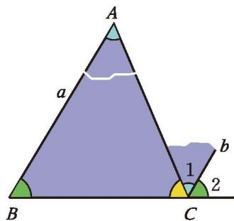
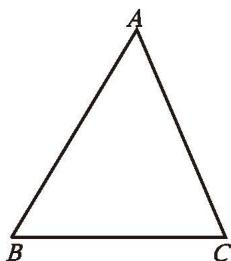
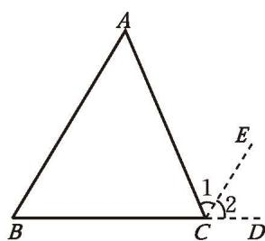
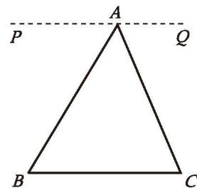
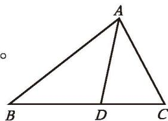
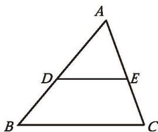
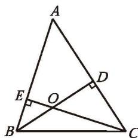

我们知道，三角形三个内角的和等于 $180^{\circ}$ 。你还记得这个结论的探索过程吗？

（1）如图1-1，如果只把 $\angle A$ 移动到 $\angle 1$ 的位置，那么你能说明这个结论的正确性吗？如果不移动 $\angle A$ ，那么你还有什么方法可以达到同样的效果？

（2）你能说说这个结论的证明思路吗？请试着写出证明过程，并与同伴进行交流。

已知：如图1-2， $\triangle ABC$ 。

求证： $\angle A + \angle B + \angle C = 180^{\circ}$

分析：你学过哪些与 $180^{\circ}$ 有关的结论？曾经的撕角拼图活动对你有什么启发？

证明：如图1-3，延长 $BC$ 至 $D$ ，过点 $C$ 作射线 $CE$ ，使 $CE \parallel BA$ ，则

  
图1-1

  
图1-2

  
图1-3

这里的 $CD$ ，CE称为辅助线，辅助线通常画成虚线。

$$
\angle 1 = \angle A, \angle 2 = \angle B _ {\circ}
$$

点 $B, C, D$ 在同一条直线上，

$$
\therefore \angle 1 + \angle 2 + \angle A C B = 1 8 0 ^ {\circ} 。
$$

$$
\therefore \angle A + \angle B + \angle A C B = 1 8 0 ^ {\circ} 。
$$

# 三角形内角和定理 三角形三个内角的和等于 $180^{\circ}$ 。

# 思考·交流

（1）如图1-4，在证明三角形内角和定理时，小明的想法是把三个内角“凑”到点 $A$ 处，过点 $A$ 作直线 $PQ$ ，使 $PQ / / BC$ ，他的想法可行吗？如果可行，你能写出证明过程吗？  
（2）对于三角形内角和定理，你还有其他证明方法吗？与同伴进行交流。

  
图1-4

例1如图1-5，在 $\triangle ABC$ 中， $\angle B = 38^{\circ}$ ， $\angle C = 62^{\circ}$ ， $AD$ 是 $\triangle ABC$ 的角平分线，求 $\angle ADB$ 的度数。

解：在 $\triangle ABC$ 中，

$\angle B + \angle C + \angle BAC = 180^{\circ}$ （三角形内角和定理）。

$$
\because \angle B = 3 8 ^ {\circ}, \angle C = 6 2 ^ {\circ},
$$

$$
\therefore \angle B A C = 1 8 0 ^ {\circ} - 3 8 ^ {\circ} - 6 2 ^ {\circ} = 8 0 ^ {\circ} 。
$$

$AD$ 平分 $\angle BAC,$

$$
\therefore \angle B A D = \angle C A D = \frac {1}{2} \angle B A C = \frac {1}{2} \times 8 0 ^ {\circ} = 4 0 ^ {\circ} 。
$$

在 $\triangle ADB$ 中，

$\angle B + \angle BAD + \angle ADB = 180^{\circ}$ （三角形内角和定理）。

$$
\because \angle B = 3 8 ^ {\circ}, \angle B A D = 4 0 ^ {\circ},
$$

$$
\therefore \angle A D B = 1 8 0 ^ {\circ} - 3 8 ^ {\circ} - 4 0 ^ {\circ} = 1 0 2 ^ {\circ} 。
$$

  
图1-5

# 随堂练习

1. 已知：如图，在 $\triangle ABC$ 中， $\angle A = 60^\circ$ ， $\angle C = 70^\circ$ ，点 $D, E$ 分别在边 $AB$ 和 $AC$ 上，且 $DE \parallel BC$ 。

求证： $\angle ADE = 50^{\circ}$

2.如图，在 $\triangle ABC$ 中，已知 $\angle A = 50^{\circ}$ ，BD与CE是 $\triangle ABC$ 的高，点 $o$ 是它们的交点，求 $\angle ABD$ ， $\angle COD$ 的度数。

  
（第1题）

  
（第2题）