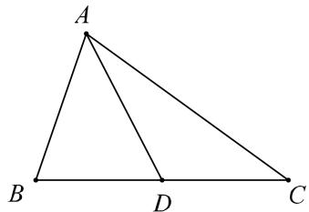
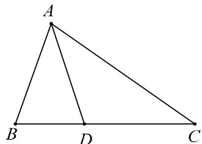
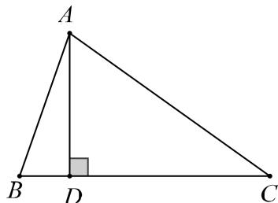

### 第十三节 专题:三角形中的角分线中线高线问题
### 知识导学
### 1.中线处理方法
如图,  $\triangle ABC$  中,  $AD$  为  $BC$  的中线, 已知  $AB$ ,  $AC$ , 及  $\angle A$ , 求中线  $AD$  长.

① 向量法:  $\overrightarrow{AD} = \frac{1}{2} (\overrightarrow{AB} +\overrightarrow{AC})$  ，平方即可；  
② 余弦定理：邻补角余弦值为相反数，即  $\cos \angle ADB + \cos \angle ADC = 0$
注:若或将条件 “  ${AD}$  为  ${BC}$  的中线” 换为 “  $\frac{BD}{CD} = \lambda$  ” 则可以考虑方法①或方法②.
### 2.角分线处理方法
如图， $\triangle ABC$  中， $AD$  平分  $\angle BAC$ 。

(1)角平分线定理:  $\frac{AB}{AC} = \frac{BD}{CD}$  
②等面积法
$S _ {\Delta A B C} = S _ {\Delta A B D} + S _ {\Delta A D C} \Rightarrow \frac {1}{2} A B \times A C \times \sin A = \frac {1}{2} A B \times A D \times \sin \frac {A}{2} + \frac {1}{2} A C \times A D \times \sin \frac {A}{2}$
### 3.高线处理方法
如图， $\triangle ABC$  中， $AD$  为  $\triangle ABC$  的高线

(1)等面积法:  $AD \cdot BC = AB \cdot AC \cdot \sin \angle BAC$ ;  
②  $AD = AB \cdot \sin \angle ABD = AC \cdot \sin \angle ACD$  
③射影定理:  $a = c \cdot \cos B + b \cdot \cos C$
### $\triangleright \triangleright$  重点题型专练
### 题型1：中线问题
##### 【1】（2024·全国高一专题）在  $\triangle ABC$  中，内角  $A, B, C$  的对边分别是  $a, b, c$ ，且  $c = 2(b\cos C - a)$ 。  
（1）求角  $B$  的大小；  
（2）若  $b = 4\sqrt{3}$  ，  $D$  为线段  $AC$  的中点，  $BD = 2$  ，求 $\triangle ABC$  的面积.
##### 【3】已知在  $\triangle ABC$  中, 角  $A, B, C$  所对的边分别为  $a, b, c$ , 且  $2b\cos \left(\frac{\pi}{2} - A\right) - \sqrt{3} a\sin \left(\frac{\pi}{2} + B\right) = a\sin B$ .
（1）求  $B$  
（2）设点  $D$  是边  $AC$  的中点，若  $a + c = 6$  ，求  $BD$  的取值范围.
##### 【2】（2024·全国高一专题） $\triangle ABC$  的内角  $A, B, C$  的对边分别为  $a, b, c$ ，已知  $\frac{\sqrt{3}}{3} c \sin B = a - b \cos C$ 。
（1）求  $B$  
（2）若  $D$  为  $AC$  的中点，  $BD = 2$  ，求  $\triangle ABC$  的面积的最大值.
##### 【4】（2024·全国高一专题）在  $\triangle ABC$  中，角  $A, B, C$  的对边分别为  $a, b, c$ ，且满足  $\frac{2\cos C}{a} = \frac{2}{b} + \frac{\sin C}{b\sin A}$ .
（1）求角  $B$  的大小；  
（2）若  $b = 8, D$  为边  $AC$  的中点，且  $BD = \frac{8}{3}$ ，求  $\triangle ABC$  的面积.
##### 【5】在  $\triangle ABC$  中，角  $A, B, C$  的对边分别是  $a, b, c$ ，满足  $(c + 2a)\cos B + b\cos C = 0$ 。
（1）求  $\angle B$  的值；  
（2）已知点  $D$  在边  $AC$  上，且  $\overrightarrow{AD} = 3\overrightarrow{DC}$  ，  $BD = 3$  求△ABC面积的最大值.
### 题型2：角分线问题

##### 【7】在  $\triangle ABC$  中，  $a,b,c$  分别为内角  $A,B,C$  的对边且  $2a\sin A + c\sin B + b\sin C = 2b\sin B + 2c\sin C$  ：
（1）求角  $A$  的大小；  
（2）设角  $A$  的内角平分线交  $BC$  于点  $M$  ，若  $\triangle ABC$  的面积为  $6\sqrt{3}, AM = 3\sqrt{3}$  ，求  $b + c$  的值.
##### 【6】（2023·广东东莞高一东莞实验中学校考期中） $\triangle ABC$  中，已知  $\sin^2 \angle ABC = \sin A \cdot \sin C$  ，点  $D$  在边  $AC$  上，  $BD \cdot \sin \angle ABC = BC \cdot \sin C$  ：
（1）证明：  $BD = AC$  
（2）若  $\overrightarrow{BD} = \frac{1}{3}\overrightarrow{BA} +\frac{2}{3}\overrightarrow{BC}$  ，求  $\angle ABC$  的余弦值.
##### 【8】（2024·全国高一专题） $\triangle ABC$  中，内角  $A, B, C$  的对边分别为  $a, b, c, \triangle ABC$  的外接圆半径为  $R$ ，已知  $2R \cos \left( \frac{\pi}{6} + B \right) = -b$ 。
（1）求  $B$  
（2）已知  $\angle ACB$  的平分线交  $AB$  于点  $D$  ，  $a = 6$ $S_{\triangle ABC} = 15\sqrt{3}$  ，求  $AC$  和  $CD$  的长度.
##### 【9】在  $\triangle ABC$  中，内角  $A, B, C$  的对边分别为  $a, b, c$ ，且  $\sqrt{3}b - a\sin C = \sqrt{3}c\cos A$ .
（1）求  $C$  
（2）若  $c = 3$  ，  $\angle ACB$  的平分线  $CD$  交  $AB$  于点  $D$  且  $CD = 2$  .求  $\triangle ABC$  的面积.
##### 【11】记  $\triangle ABC$  的内角  $A, B, C$  所对的边分别是  $a, b, c$ . 已知  $\frac{(c \cos B + b \cos C)^2 + bc}{b^2 + c^2} = 1$ .
（1）求角  $A$  的大小；  
(2) 若点  $D$  在边  $BC$  上， $AD$  平分  $\angle BAC$ ， $AD = 2$ ，且  $b = 2c$ ，求  $a$ 。
##### 【10】（2024·四川校考）在  $\triangle ABC$  中，角  $A, B, C$  的对边分别为  $a, b, c, \sqrt{3}c + b\sin A = \sqrt{3}a\cos B$ 。
（1）求  $A$  
（2）若点  $D$  是  $BC$  上的点，  $AD$  平分  $\angle BAC$  ，且 $AD = 2$  ，求  $\triangle ABC$  面积的最小值.
##### 【12】已知  $\triangle ABC$  的内角  $A, B, C$  所对的边分别为  $a, b, c$ ，且满足  $a\cos B = c + \frac{1}{2}b$ 。
（1）求  $A$  
（2）若  $AD$  是  $\angle BAC$  的角平分线，且  $AD = 1$  ，求 $2b + c$  的最小值.
### 题型3：高线问题

##### 【13】已知  $\triangle ABC$  的内角  $A$  、  $B$  、  $C$  所对的边分别为  $a, b, c, b\sin \frac{A + B}{2} = c\sin B$  。
（1）求角  $C$  
（2）若  $AB$  边上的高线长为  $2\sqrt{3}$ ，求  $\triangle ABC$  面积的最小值.
##### 【14】在  $\triangle ABC$  中，内角  $A, B, C$  所对的边分别为  $a, b, c$ ，且满足  $(a + b + c)(\sin A + \sin B + \sin C) = \frac{10}{3} a \sin B + 2c \sin A + 2(b + c) \sin C$ .
（1）求  $\cos C$  
（2）若  $AB$  边上的高为  $2, c = \sqrt{5}$ ，求  $a, b$
第十三节 专题:三角形中的角分线中线高线问题
##### 【15】（2024·全国高一专题） $\triangle ABC$  的内角  $A, B, C$  所对的边分别为  $a, b, c$ ，已知  $1 + \frac{\tan A}{\tan B} = \frac{2c}{b}$ 。
（1）求  $A$  
（2）若  $BC$  边上的中线  $AM = 2\sqrt{2}$  ，高线  $AH = \sqrt{3}$  求  $\triangle ABC$  的面积.
##### 【16】在  $\triangle ABC$  中，内角  $A, B, C$  所对的边分别为  $a, b, c$ ，且  $c(5\cos A - \cos 2A)\sin B = 3b\sin C$ 。
（1）求  $A$  
（2）过点  $A$  作  $AB$  的垂线与  $BC$  的延长线交于点  $D, BC = 3CD, \triangle ABD$  的面积为  $2\sqrt{3}$ ，求  $\triangle ABC$  的周长.