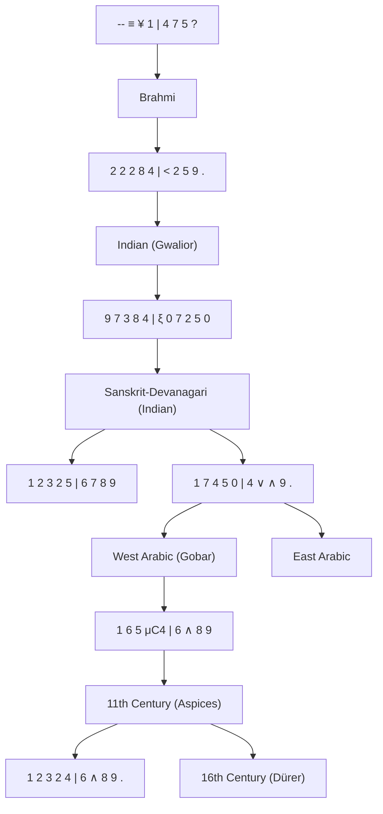
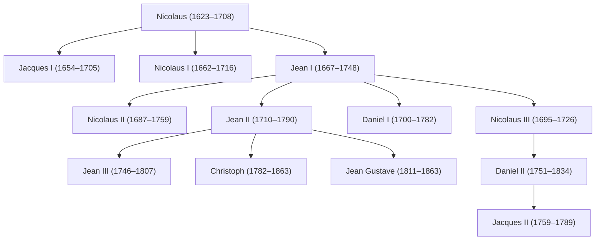
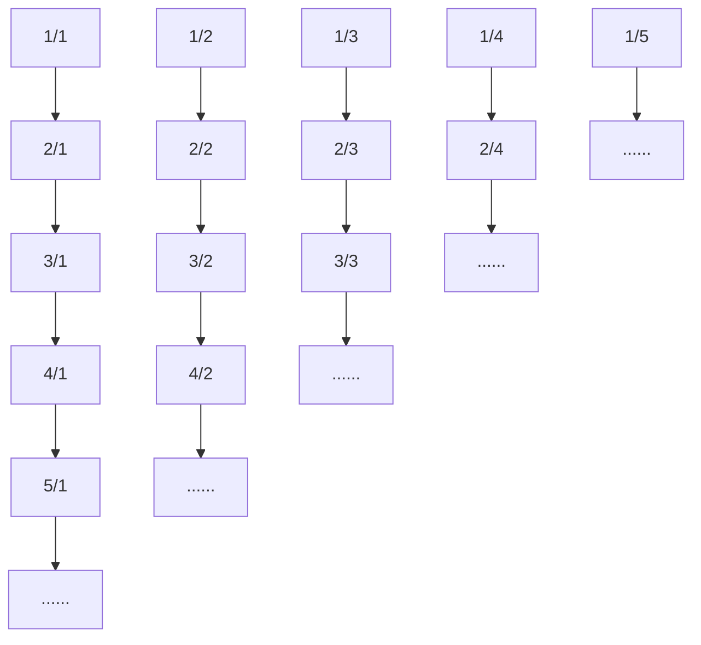

# A

# HISTORY

# OF

# MATHEMATICS

THIRD EDITION

 (Z-Library)/5c588444555bb31596c1514cffba5ac90f18439af8a715dcbef6c19bfc9d3a90.jpg)

text_image

Ancient Chinese inscribed oracle bone with carved characters and symbols

Uta C. Merzbach and Carl B. Boyer

Foreword by Isaac Asimov

# A History of Mathematics

THIRD EDITION

Uta C. Merzbach and Carl B. Boyer

Copyright © 1968, 1989, 1991, 2011 by John Wiley & Sons, Inc. All rights reserved

Published by John Wiley & Sons, Inc., Hoboken, New Jersey
Published simultaneously in Canada

No part of this publication may be reproduced, stored in a retrieval system, or transmitted in any form or by any means, electronic, mechanical, photocopying, recording, scanning, or otherwise, except as permitted under Section 107 or 108 of the 1976 United States Copyright Act, without either the prior written permission of the Publisher, or authorization through payment of the appropriate per copy fee to the Copyright Clearance Center, 222 Rosewood Drive, Danvers, MA 01923, (978) 750 8400, fax (978) 646 8600, or on the web at www.copyright.com. Requests to the Publisher for permission should be addressed to the Permissions Department, John Wiley & Sons, Inc., 111 River Street, Hoboken, NJ 07030, (201) 748 6011, fax (201) 748 6008, or online at http://www.wiley.com/go/permissions.

Limit of Liability/Disclaimer of Warranty: While the publisher and author have used their best efforts in preparing this book, they make no representations or warranties with respect to the accuracy or completeness of the contents of this book and specifically disclaim any implied warranties of merchantability or fitness for a particular purpose. No warranty may be created or extended by sales representatives or written sales materials. The advice and strategies contained herein may not be suitable for your situation. You should consult with a professional where appropriate. Neither the publisher nor author shall be liable for any loss of profit or any other commercial damages, including but not limited to special, incidental, consequential, or other damages.

For general information about our other products and services, please contact our Customer Care Department within the United States at (800) 762 2974, outside the United States at (317) 572 3993 or fax (317) 572 4002.

Wiley also publishes its books in a variety of electronic formats. Some content that appears in print may not be available in electronic formats. For more information about Wiley products, visit our web site at www.wiley.com.

# Library of Congress Cataloging-in-Publication Data:

Boyer, Carl B. (Carl Benjamin), 1906–1976.

A history of mathematics / Carl B. Boyer and Uta Merzbach. 3rd ed.

p. cm.

Includes bibliographical references and index.

ISBN 978 0 470 52548 7 (pbk.); ISBN 978 0 470 63039 6 (ebk.);

ISBN 978 0 470 63054 9 (ebk.); ISBN 978 0 470 630563 (ebk.)

1. Mathematics History. I. Merzbach, Uta C., 1933– II. Title.

QA21.B767 2010

510.9 dc22

2010003424

Printed in the United States of America

10 9 8 7 6 5 4 3 2 1

In memory of Carl B. Boyer

(1906–1976)

U.C.M.

To the memory of my parents,
Howard Franklin Boyer and
Rebecca Catherine (Eisenhart) Boyer

C.B.B.

# Contents

Foreword by Isaac Asimov, xi Preface to the Third Edition, xiii Preface to the Second Edition, xv Preface to the First Edition, xvii

1 Traces 1

Concepts and Relationships, 1 Early Number Bases, 3 Number Language and Counting, 5 Spatial Relationships, 6

2 Ancient Egypt 8

The Era and the Sources, 8 Numbers and Fractions, 10 Arithmetic Operations, 12 “Heap” Problems, 13 Geometric Problems, 14 Slope Problems, 18 Arithmetic Pragmatism, 19

3 Mesopotamia 21

The Era and the Sources, 21 Cuneiform Writing, 22 Numbers and Fractions: Sexagesimals, 23 Positional Numeration, 23 Sexagesimal Fractions, 25 Approximations, 25 Tables, 26 Equations, 28 Measurements: Pythagorean Triads, 31 Polygonal Areas, 35 Geometry as Applied Arithmetic, 36

4 Hellenic Traditions 40

The Era and the Sources, 40 Thales and Pythagoras, 42 Numeration, 52 Arithmetic and Logistic, 55

Fifth-Century Athens, 56 Three Classical Problems, 57 Quadrature of Lunes, 58 Hippias of Elis, 61 Philolaus and Archytas of Tarentum, 63 Incommensurability, 65 Paradoxes of Zeno, 67 Deductive Reasoning, 70 Democritus of Abdera, 72 Mathematics and the Liberal Arts, 74 The Academy, 74 Aristotle, 88

5 Euclid of Alexandria 90
Alexandria, 90 Lost Works, 91 Extant Works, 91
The Elements, 93

6 Archimedes of Syracuse 109
The Siege of Syracuse, 109 On the Equilibriums of Planes, 110
On Floating Bodies, 111 The Sand-Reckoner, 112
Measurement of the Circle, 113 On Spirals, 113
Quadrature of the Parabola, 115 On Conoids and Spheroids, 116
On the Sphere and Cylinder, 118 Book of Lemmas, 120
Semiregular Solids and Trigonometry, 121 The Method, 122

7 Apollonius of Perge 127
Works and Tradition, 127 Lost Works, 128 Cycles and Epicycles, 129 The Conics, 130

8 Crosscurrents 142
Changing Trends, 142 Eratosthenes, 143 Angles and Chords, 144 Ptolemy's Almagest, 149 Heron of Alexandria, 156 The Decline of Greek Mathematics, 159 Nicomachus of Gerasa, 159 Diophantus of Alexandria, 160 Pappus of Alexandria, 164 The End of Alexandrian Dominance, 170 Proclus of Alexandria, 171 Boethius, 171 Athenian Fragments, 172 Byzantine Mathematicians, 173

9 Ancient and Medieval China 175
The Oldest Known Texts, 175 The Nine Chapters, 176
Rod Numerals, 177 The Abacus and Decimal Fractions, 178
Values of Pi, 180 Thirteenth-Century Mathematics, 182

10 Ancient and Medieval India 186
Early Mathematics in India, 186 The Sulbasutras, 187
The Siddhantas, 188 Aryabhata, 189 Numerals, 191
Trigonometry, 193 Multiplication, 194 Long Division, 195
Brahmagupta, 197 Indeterminate Equations, 199 Bhaskara, 200
Madhava and the Keralese School, 202

11 The Islamic Hegemony 203

Arabic Conquests, 203 The House of Wisdom, 205

Al-Khwarizmi, 206 ‘Abd Al-Hamid ibn-Turk, 212

Thabit ibn-Qurra, 213 Numerals, 214 Trigonometry, 216

Tenth- and Eleventh-Century Highlights, 216

Omar Khayyam, 218 The Parallel Postulate, 220

Nasir al-Din al-Tusi, 220 Al-Kashi, 221

12 The Latin West 223

Introduction, 223 Compendia of the Dark Ages, 224

Gerbert, 224 The Century of Translation, 226 Abacists

and Algorists, 227 Fibonacci, 229 Jordanus Nemorarius, 232

Campanus of Novara, 233 Learning in the Thirteenth

Century, 235 Archimedes Revived, 235 Medieval Kinematics, 236

Thomas Bradwardine, 236 Nicole Oresme, 238 The Latitude

of Forms, 239 Infinite Series, 241 Levi ben Gerson, 242

Nicholas of Cusa, 243 The Decline of Medieval Learning, 243

13 The European Renaissance 245

Overview, 245 Regiomontanus, 246 Nicolas

Chuquet's Triparty, 249 Luca Pacioli's Summa, 251

German Algebras and Arithmetics, 253 Cardan's Ars Magna, 255

Rafael Bombelli, 260 Robert Recorde, 262 Trigonometry, 263

Geometry, 264 Renaissance Trends, 271 François Viète, 273

14 Early Modern Problem Solvers 282

Accessibility of Computation, 282 Decimal Fractions, 283

Notation, 285 Logarithms, 286 Mathematical Instruments, 290

Infinitesimal Methods: Stevin, 296 Johannes Kepler, 296

15 Analysis, Synthesis, the Infinite, and Numbers 300

Galileo's Two New Sciences, 300 Bonaventura Cavalieri, 303

Evangelista Torricelli, 306 Mersenne's Communicants, 308

René Descartes, 309 Fermat's Loci, 320 Gregory of

St. Vincent, 325 The Theory of Numbers, 326

Gilles Persone de Roberval, 329 Girard Desargues and

Projective Geometry, 330 Blaise Pascal, 332 Philippe

de Lahire, 337 Georg Mohr, 338 Pietro Mengoli, 338

Frans van Schooten, 339 Jan de Witt, 340 Johann Hudde, 341

René François de Sluse, 342 Christiaan Huygens, 342

16 British Techniques and Continental Methods 348

John Wallis, 348 James Gregory, 353 Nicolaus Mercator and

William Brouncker, 355 Barrow's Method of Tangents, 356

Newton, 358 Abraham De Moivre, 372 Roger Cotes, 375 James Stirling, 376 Colin Maclaurin, 376 Textbooks, 380 Rigor and Progress, 381 Leibniz, 382 The Bernoulli Family, 390 Tschirnhaus Transformations, 398 Solid Analytic Geometry, 399 Michel Rolle and Pierre Varignon, 400 The Clairauts, 401 Mathematics in Italy, 402 The Parallel Postulate, 403 Divergent Series, 404

17 Euler 406

The Life of Euler, 406 Notation, 408 Foundation of Analysis, 409 Logarithms and the Euler Identities, 413 Differential Equations, 414 Probability, 416 The Theory of Numbers, 417 Textbooks, 418 Analytic Geometry, 419 The Parallel Postulate: Lambert, 420

18 Pre to Postrevolutionary France 423

Men and Institutions, 423 The Committee on Weights and Measures, 424 D'Alembert, 425 Bézout, 427 Condorcet, 429 Lagrange, 430 Monge, 433 Carnot, 438 Laplace, 443 Legendre, 446 Aspects of Abstraction, 449 Paris in the 1820s, 449 Fourier, 450 Cauchy, 452 Diffusion, 460

19 Gauss 464

Nineteenth-Century Overview, 464 Gauss: Early Work, 465 Number Theory, 466 Reception of the Disquisitiones Arithmeticae, 469 Astronomy, 470 Gauss's Middle Years, 471 Differential Geometry, 472 Gauss's Later Work, 473 Gauss's Influence, 474

20 Geometry 483

The School of Monge, 483 Projective Geometry: Poncelet and Chasles, 485 Synthetic Metric Geometry: Steiner, 487
Synthetic Nonmetric Geometry: von Staudt, 489 Analytic Geometry, 489 Non-Euclidean Geometry, 494 Riemannian Geometry, 496 Spaces of Higher Dimensions, 498
Felix Klein, 499 Post-Riemannian Algebraic Geometry, 501

21 Algebra 504

Introduction, 504 British Algebra and the Operational Calculus of Functions, 505 Boole and the Algebra of Logic, 506 Augustus De Morgan, 509 William Rowan Hamilton, 510 Grassmann and Ausdehnungslehre, 512 Cayley and Sylvester, 515 Linear Associative Algebras, 519 Algebraic Geometry, 520 Algebraic and Arithmetic Integers, 520 Axioms of Arithmetic, 522

22 Analysis

526

Berlin and Göttingen at Midcentury, 526 Riemann in Göttingen, 527 Mathematical Physics in Germany, 528 Mathematical Physics in English-Speaking Countries, 529 Weierstrass and Students, 531 The Arithmetization of Analysis, 533 Dedekind, 536 Cantor and Kronecker, 538 Analysis in France, 543

23 Twentieth Century Legacies

548

Overview, 548 Henri Poincaré, 549 David Hilbert, 555 Integration and Measure, 564 Functional Analysis and General Topology, 568 Algebra, 570 Differential Geometry and Tensor Analysis, 572 Probability, 573 Bounds and Approximations, 575 The 1930s and World War II, 577 Nicolas Bourbaki, 578 Homological Algebra and Category Theory, 580 Algebraic Geometry, 581 Logic and Computing, 582 The Fields Medals, 584

24 Recent Trends

586

Overview, 586 The Four-Color Conjecture, 587
Classification of Finite Simple Groups, 591 Fermat's
Last Theorem, 593 Poincaré's Query, 596 Future Outlook, 599

References, 601  
General Bibliography, 633  
Index, 647

# Foreword to the Second Edition

By Isaac Asimov

Mathematics is a unique aspect of human thought, and its history differs in essence from all other histories.

As time goes on, nearly every field of human endeavor is marked by changes which can be considered as correction and/or extension. Thus, the changes in the evolving history of political and military events are always chaotic; there is no way to predict the rise of a Genghis Khan, for example, or the consequences of the short-lived Mongol Empire. Other changes are a matter of fashion and subjective opinion. The cave-paintings of 25,000 years ago are generally considered great art, and while art has continuously—even chaotically—changed in the subsequent millennia, there are elements of greatness in all the fashions. Similarly, each society considers its own ways natural and rational, and finds the ways of other societies to be odd, laughable, or repulsive.

But only among the sciences is there true progress; only there is the record one of continuous advance toward ever greater heights.

And yet, among most branches of science, the process of progress is one of both correction and extension. Aristotle, one of the greatest minds ever to contemplate physical laws, was quite wrong in his views on falling bodies and had to be corrected by Galileo in the 1590s. Galen, the greatest of ancient physicians, was not allowed to study human cadavers and was quite wrong in his anatomical and physiological conclusions. He had to be corrected by Vesalius in 1543 and Harvey in 1628. Even Newton, the greatest of all scientists, was wrong in his view of the nature of light, of the achromaticity of lenses, and missed the existence of spectral lines. His masterpiece, the laws of motion and the theory of universal gravitation, had to be modified by Einstein in 1916.

Now we can see what makes mathematics unique. Only in mathematics is there no significant correction—only extension. Once the Greeks had developed the deductive method, they were correct in what they did, correct for all time. Euclid was incomplete and his work has been extended enormously, but it has not had to be corrected. His theorems are, every one of them, valid to this day.

Ptolemy may have developed an erroneous picture of the planetary system, but the system of trigonometry he worked out to help him with his calculations remains correct forever.

Each great mathematician adds to what came previously, but nothing needs to be uprooted. Consequently, when we read a book like A History of Mathematics, we get the picture of a mounting structure, ever taller and broader and more beautiful and magnificent and with a foundation, moreover, that is as untainted and as functional now as it was when Thales worked out the first geometrical theorems nearly 26 centuries ago.

Nothing pertaining to humanity becomes us so well as mathematics. There, and only there, do we touch the human mind at its peak.

# Preface to the Third Edition

During the two decades since the appearance of the second edition of this work, there have been substantial changes in the course of mathematics and the treatment of its history. Within mathematics, outstanding results were achieved by a merging of techniques and concepts from previously distinct areas of specialization. The history of mathematics continued to grow quantitatively, as noted in the preface to the second edition; but here, too, there were substantial studies that overcame the polemics of “internal” versus “external” history and combined a fresh approach to the mathematics of the original texts with the appropriate linguistic, sociological, and economic tools of the historian.

In this third edition I have striven again to adhere to Boyer's approach to the history of mathematics. Although the revision this time includes the entire work, changes have more to do with emphasis than original content, the obvious exception being the inclusion of new findings since the appearance of the first edition. For example, the reader will find greater stress placed on the fact that we deal with such a small number of sources from antiquity; this is one of the reasons for condensing three previous chapters dealing with the Hellenic period into one. On the other hand, the chapter dealing with China and India has been split, as content demands. There is greater emphasis on the recurring interplay between pure and applied mathematics as exemplified in chapter 14. Some reorganization is due to an attempt to underline the impact of institutional and personal transmission of ideas; this has affected most of the pre-nineteenth-century chapters. The chapters dealing with the nineteenth century have been altered the least, as I had made substantial changes for some of this material in the second edition. The twentieth-century material has been doubled, and a new final chapter deals with recent trends, including solutions of some longstanding problems and the effect of computers on the nature of proofs.

It is always pleasant to acknowledge those known to us for having had an impact on our work. I am most grateful to Shirley Surrette Duffy for responding judiciously to numerous requests for stylistic advice, even at times when there were more immediate priorities. Peggy Aldrich Kidwell replied with unfailing precision to my inquiry concerning certain photographs in the National Museum of American History. Jeanne LaDuke cheerfully and promptly answered my appeals for help, especially in confirming sources. Judy and Paul Green may not realize that a casual conversation last year led me to rethink some recent material. I have derived special pleasure and knowledge from several recent publications, among them Klopfer 2009 and, in a more leisurely fashion, Szpiro 2007. Great thanks are due to the editors and production team of John Wiley & Sons who worked with me to make this edition possible: Stephen Power, the senior editor, was unfailingly generous and diplomatic in his counsel; the editorial assistant, Ellen Wright, facilitated my progress through the major steps of manuscript creation; the senior production manager, Marcia Samuels, provided me with clear and concise instructions, warnings, and examples; senior production editors Kimberly Monroe-Hill and John Simko and the copyeditor, Patricia Waldygo, subjected the manuscript to painstakingly meticulous scrutiny. The professionalism of all concerned provides a special kind of encouragement in troubled times.

I should like to pay tribute to two scholars whose influence on others should not be forgotten. The Renaissance historian Marjorie N. Boyer (Mrs. Carl B. Boyer) graciously and knowledgeably complimented a young researcher at the beginning of her career on a talk presented at a Leibniz conference in 1966. The brief conversation with a total stranger did much to influence me in pondering the choice between mathematics and its history.

More recently, the late historian of mathematics Wilbur Knorr set a significant example to a generation of young scholars by refusing to accept the notion that ancient authors had been studied definitively by others. Setting aside the “magister dixit,” he showed us the wealth of knowledge that emerges from seeking out the texts.

—Uta C. Merzbach

March 2010

# Preface to the Second Edition

This edition brings to a new generation and a broader spectrum of readers a book that became a standard for its subject after its initial appearance in 1968. The years since then have been years of renewed interest and vigorous activity in the history of mathematics. This has been demonstrated by the appearance of numerous new publications dealing with topics in the field, by an increase in the number of courses on the history of mathematics, and by a steady growth over the years in the number of popular books devoted to the subject. Lately, growing interest in the history of mathematics has been reflected in other branches of the popular press and in the electronic media. Boyer's contribution to the history of mathematics has left its mark on all of these endeavors.

When one of the editors of John Wiley & Sons first approached me concerning a revision of Boyer's standard work, we quickly agreed that textual modifications should be kept to a minimum and that the changes and additions should be made to conform as much as possible to Boyer's original approach. Accordingly, the first twenty-two chapters have been left virtually unchanged. The chapters dealing with the nineteenth century have been revised; the last chapter has been expanded and split into two. Throughout, an attempt has been made to retain a consistent approach within the volume and to adhere to Boyer's stated aim of giving stronger emphasis on historical elements than is customary in similar works.

The references and general bibliography have been substantially revised. Since this work is aimed at English-speaking readers, many of whom are unable to utilize Boyer's foreign-language chapter references, these have been replaced by recent works in English. Readers are urged to consult the General Bibliography as well, however. Immediately following the chapter references at the end of the book, it contains additional works and further bibliographic references, with less regard to language. The introduction to that bibliography provides some overall guidance for further pleasurable reading and for solving problems.

The initial revision, which appeared two years ago, was designed for classroom use. The exercises found there, and in the original edition, have been dropped in this edition, which is aimed at readers outside the lecture room. Users of this book interested in supplementary exercises are referred to the suggestions in the General Bibliography.

I express my gratitude to Judith V. Grabiner and Albert Lewis for numerous helpful criticisms and suggestions. I am pleased to acknowledge the fine cooperation and assistance of several members of the Wiley editorial staff. I owe immeasurable thanks to Virginia Beets for lending her vision at a critical stage in the preparation of this manuscript. Finally, thanks are due to numerous colleagues and students who have shared their thoughts about the first edition with me. I hope they will find beneficial results in this revision.

—Uta C. Merzbach

Georgetown, Texas

March 1991

# Preface to the First Edition

Numerous histories of mathematics have appeared during this century, many of them in the English language. Some are very recent, such as J. F. Scott's A History of Mathematics $^{1}$ ; a new entry in the field, therefore, should have characteristics not already present in the available books. Actually, few of the histories at hand are textbooks, at least not in the American sense of the word, and Scott's History is not one of them. It appeared, therefore, that there was room for a new book—one that would meet more satisfactorily my own preferences and possibly those of others.

The two-volume History of Mathematics by David Eugene Smith $^{2}$ was indeed written “for the purpose of supplying teachers and students with a usable textbook on the history of elementary mathematics,” but it covers too wide an area on too low a mathematical level for most modern college courses, and it is lacking in problems of varied types. Florian Cajori’s History of Mathematics $^{3}$ still is a very helpful reference work; but it is not adapted to classroom use, nor is E. T. Bell’s admirable The Development of Mathematics. $^{4}$ The most successful and appropriate textbook today appears to be Howard Eves, An Introduction to the History of Mathematics, $^{5}$ which I have used with considerable satisfaction in at least a dozen classes since it first appeared in 1953.

I have occasionally departed from the arrangement of topics in the book in striving toward a heightened sense of historicalmindedness and have supplemented the material by further reference to the contributions of the eighteenth and nineteenth centuries especially by the use of D. J. Struik, A Concise History of Mathematics. $^{6}$

The reader of this book, whether layman, student, or teacher of a course in the history of mathematics, will find that the level of mathematical background that is presupposed is approximately that of a college junior or senior, but the material can be perused profitably also by readers with either stronger or weaker mathematical preparation. Each chapter ends with a set of exercises that are graded roughly into three categories. Essay questions that are intended to indicate the reader's ability to organize and put into his own words the material discussed in the chapter are listed first. Then follow relatively easy exercises that require the proofs of some of the theorems mentioned in the chapter or their application to varied situations. Finally, there are a few starred exercises, which are either more difficult or require specialized methods that may not be familiar to all students or all readers. The exercises do not in any way form part of the general exposition and can be disregarded by the reader without loss of continuity.

Here and there in the text are references to footnotes, generally bibliographical, and following each chapter there is a list of suggested readings. Included are some references to the vast periodical literature in the field, for it is not too early for students at this level to be introduced to the wealth of material available in good libraries. Smaller college libraries may not be able to provide all of these sources, but it is well for a student to be aware of the larger realms of scholarship beyond the confines of his own campus. There are references also to works in foreign languages, despite the fact that some students, hopefully not many, may be unable to read any of these. Besides providing important additional sources for those who have a reading knowledge of a foreign language, the inclusion of references in other languages may help to break down the linguistic provincialism which, ostrichlike, takes refuge in the mistaken impression that everything worthwhile appeared in, or has been translated into, the English language.

The present work differs from the most successful presently available textbook in a stricter adherence to the chronological arrangement and a stronger emphasis on historical elements. There is always the temptation in a class in history of mathematics to assume that the fundamental purpose of the course is to teach mathematics. A departure from mathematical standards is then a mortal sin, whereas an error in history is venial. I have striven to avoid such an attitude, and the purpose of the book is to present the history of mathematics with fidelity, not only to mathematical structure and exactitude, but also to historical perspective and detail. It would be folly, in a book of this scope, to expect that every date, as well as every decimal point, is correct. It is hoped, however, that such inadvertencies as may survive beyond the stage of page proof will not do violence to the sense of history, broadly understood, or to a sound view of mathematical concepts. It cannot be too strongly emphasized that this single volume in no way purports to present the history of mathematics in its entirety. Such an enterprise would call for the concerted effort of a team, similar to that which produced the fourth volume of Cantor's Vorlesungen iiber Geschichte der Mathematik in 1908 and brought the story down to 1799. In a work of modest scope the author must exercise judgment in the selection of the materials to be included, reluctantly restraining the temptation to cite the work of every productive mathematician; it will be an exceptional reader who will not note here what he regards as unconscionable omissions. In particular, the last chapter attempts merely to point out a few of the salient characteristics of the twentieth century. In the field of the history of mathematics perhaps nothing is more to be desired than that there should appear a latter-day Felix Klein who would complete for our century the type of project Klein essayed for the nineteenth century, but did not live to finish.

A published work is to some extent like an iceberg, for what is visible constitutes only a small fraction of the whole. No book appears until the author has lavished time on it unstintingly and unless he has received encouragement and support from others too numerous to be named individually. Indebtedness in my case begins with the many eager students to whom I have taught the history of mathematics, primarily at Brooklyn College, but also at Yeshiva University, the University of Michigan, the University of California (Berkeley), and the University of Kansas. At the University of Michigan, chiefly through the encouragement of Professor Phillip S. Jones, and at Brooklyn College through the assistance of Dean Walter H. Mais and Professors Samuel Borofsky and James Singer, I have on occasion enjoyed a reduction in teaching load in order to work on the manuscript of this book. Friends and colleagues in the field of the history of mathematics, including Professor Dirk J. Struik of the Massachusetts Institute of Technology, Professor Kenneth O. May at the University of Toronto, Professor Howard Eves of the University of Maine, and Professor Morris Kline at New York University, have made many helpful suggestions in the preparation of the book, and these have been greatly appreciated. Materials in the books and articles of others have been expropriated freely, with little acknowledgment beyond a cold bibliographical reference, and I take this opportunity to express to these authors my warmest gratitude. Libraries and publishers have been very helpful in providing information and illustrations needed in the text; in particular it has been a pleasure to have worked with the staff of John Wiley & Sons. The typing of the final copy, as well as of much of the difficult preliminary manuscript, was done cheerfully and with painstaking care by Mrs. Hazel Stanley of Lawrence, Kansas. Finally, I must express deep gratitude to a very understanding wife. Dr. Marjorie N. Boyer, for her patience in tolerating disruptions occasioned by the development of yet another book within the family.

—Carl B. Boyer
Brooklyn, New York
January 1968

# 1 Traces

Did you bring me a man who cannot number his fingers?

From the Egyptian Book of the Dead

## Concepts and Relationships

Contemporary mathematicians formulate statements about abstract concepts that are subject to verification by proof. For centuries, mathematics was considered to be the science of numbers, magnitudes, and forms. For that reason, those who seek early examples of mathematical activity will point to archaeological remnants that reflect human awareness of operations on numbers, counting, or “geometric” patterns and shapes. Even when these vestiges reflect mathematical activity, they rarely evidence much historical significance. They may be interesting when they show that peoples in different parts of the world conducted certain actions dealing with concepts that have been considered mathematical. For such an action to assume historical significance, however, we look for relationships that indicate this action was known to another individual or group that engaged in a related action. Once such a connection has been established, the door is open to more specifically historical studies, such as those dealing with transmission, tradition, and conceptual change.

Mathematical vestiges are often found in the domain of nonliterate cultures, making the evaluation of their significance even more complex. Rules of operation may exist as part of an oral tradition, often in musical or verse form, or they may be clad in the language of magic or ritual. Sometimes they are found in observations of animal behavior, removing them even further from the realm of the historian. While studies of canine arithmetic or avian geometry belong to the zoologist, of the impact of brain lesions on number sense to the neurologist, and of numerical healing incantations to the anthropologist, all of these studies may prove to be useful to the historian of mathematics without being an overt part of that history.

At first, the notions of number, magnitude, and form may have been related to contrasts rather than likenesses—the difference between one wolf and many, the inequality in size of a minnow and a whale, the unlikeness of the roundness of the moon and the straightness of a pine tree. Gradually, there may have arisen, out of the welter of chaotic experiences, the realization that there are samenesses, and from this awareness of similarities in number and form both science and mathematics were born. The differences themselves seem to point to likenesses, for the contrast between one wolf and many, between one sheep and a herd, between one tree and a forest suggests that one wolf, one sheep, and one tree have something in common—their uniqueness. In the same way it would be noticed that certain other groups, such as pairs, can be put into one-to-one correspondence. The hands can be matched against the feet, the eyes, the ears, or the nostrils. This recognition of an abstract property that certain groups hold in common, and that we call “number,” represents a long step toward modern mathematics. It is unlikely to have been the discovery of any one individual or any single tribe; it was more probably a gradual awareness that may have developed as early in man’s cultural development as the use of fire, possibly some 300,000 years ago.

That the development of the number concept was a long and gradual process is suggested by the fact that some languages, including Greek, have preserved in their grammar a tripartite distinction between 1 and 2 and more than 2, whereas most languages today make only the dual distinction in “number” between singular and plural. Evidently, our very early ancestors at first counted only to 2, and any set beyond this level was designated as “many.” Even today, many people still count objects by arranging them into sets of two each.

The awareness of number ultimately became sufficiently extended and vivid so that a need was felt to express the property in some way, presumably at first in sign language only. The fingers on a hand can be readily used to indicate a set of two or three or four or five objects, the number 1 generally not being recognized at first as a true “number.” By the use of the fingers on both hands, collections containing up to ten elements could be represented; by combining fingers and toes, one could count as high as 20. When the human digits were inadequate, heaps of stones or knotted strings could be used to represent a correspondence with the elements of another set. Where nonliterate peoples used such a scheme of representation, they often piled the stones in groups of five, for they had become familiar with quintuples through observation of the human hand and foot. As Aristotle noted long ago, the widespread use today of the decimal system is but the result of the anatomical accident that most of us are born with ten fingers and ten toes.

Groups of stones are too ephemeral for the preservation of information; hence, prehistoric man sometimes made a number record by cutting notches in a stick or a piece of bone. Few of these records remain today, but in Moravia a bone from a young wolf was found that is deeply incised with fifty-five notches. These are arranged in two series, with twenty-five in the first and thirty in the second: within each series, the notches are arranged in groups of five. It has been dated as being approximately 30,000 years old. Two other prehistoric numerical artifacts were found in Africa: a baboon fibula having twenty-nine notches, dated as being circa 35,000 years old, and the Ishango bone, with its apparent examples of multiplicative entries, initially dated as approximately 8,000 years old but now estimated to be as much as 30,000 years old as well. Such archaeological discoveries provide evidence that the idea of number is far older than previously acknowledged.

## Early Number Bases

Historically, finger counting, or the practice of counting by fives and tens, seems to have come later than counter-casting by twos and threes, yet the quinary and decimal systems almost invariably displaced the binary and ternary schemes. A study of several hundred tribes among the American Indians, for example, showed that almost one-third used a decimal base, and about another third had adopted a quinary or a quinary-decimal system; fewer than a third had a binary scheme, and those using a ternary system constituted less than 1 percent of the group. The vigesimal system, with the number 20 as a base, occurred in about 10 percent of the tribes.

An interesting example of a vigesimal system is that used by the Maya of Yucatan and Central America. This was deciphered some time before the rest of the Maya languages could be translated. In their representation of time intervals between dates in their calendar, the Maya used a place value numeration, generally with 20 as the primary base and with 5 as an auxiliary. (See the following illustration.) Units were represented by dots and fives by horizontal bars, so that the number

 (Z-Library)/45021a1269689e5f924e03c20fb42fceba2a46bb6d0740993fc9957d120975d2.jpg)

text_image

Ancient Egyptian hieroglyphic panel with symbolic figures and text, likely from an inscription or manuscript

From the Dresden Codex of the Maya, displaying numbers. The second column on the left, reading down from above, displays the numbers 9, 9, 16, 0, 0, which stand for $9 \times 144,000 + 9 \times 7,200 + 16 \times 360 + 0 + 0 = 1,366,560$ . In the third column are the numerals 9, 9, 9, 16, 0, representing 1,364,360. The original appears in black and red. (Taken from Morley 1915, p. 266.)

17, for example, would appear as $\text{def}$ (that is, as $3(5)+2$ ). A vertical positional arrangement was used, with the larger units of time above; hence, the notation $\text{def}$ denoted 352 (that is, $17(20)+12$ ). Because the system was primarily for counting days within a calendar that had 360 days in a year, the third position usually did not represent multiples of $(20)(20)$ , as in a pure vigesimal system, but $(18)(20)$ . Beyond this point, however, the base 20 again prevailed. Within this positional notation, the Maya indicated missing positions through the use of a symbol, which appeared in variant forms, somewhat resembling a half-open eye.

In their scheme, then, the notation $\stackrel{\bullet}{\otimes}\stackrel{\bullet}{\otimes}$ denoted $17(20 \cdot 18 \cdot 20) + 0(18 \cdot 20) + 13(20) + 0.$

## Number Language and Counting

It is generally believed that the development of language was essential to the rise of abstract mathematical thinking. Yet words expressing numerical ideas were slow in arising. Number signs probably preceded number words, for it is easier to cut notches in a stick than it is to establish a well-modulated phrase to identify a number. Had the problem of language not been so difficult, rivals to the decimal system might have made greater headway. The base 5, for example, was one of the earliest to leave behind some tangible written evidence, but by the time that language became formalized, 10 had gained the upper hand. The modern languages of today are built almost without exception around the base 10, so that the number 13, for example, is not described as 3 and 5 and 5, but as 3 and 10. The tardiness in the development of language to cover abstractions such as number is also seen in the fact that primitive numerical verbal expressions invariably refer to specific concrete collections—such as “two fishes” or “two clubs”—and later some such phrase would be adopted conventionally to indicate all sets of two objects. The tendency for language to develop from the concrete to the abstract is seen in many of our present-day measures of length. The height of a horse is measured in “hands,” and the words “foot” and “ell” (or elbow) have similarly been derived from parts of the body.

The thousands of years required for man to separate out the abstract concepts from repeated concrete situations testify to the difficulties that must have been experienced in laying even a very primitive basis for mathematics. Moreover, there are a great many unanswered questions relating to the origins of mathematics. It is usually assumed that the subject arose in answer to practical needs, but anthropological studies suggest the possibility of an alternative origin. It has been suggested that the art of counting arose in connection with primitive religious ritual and that the ordinal aspect preceded the quantitative concept. In ceremonial rites depicting creation myths, it was necessary to call the participants onto the scene in a specific order, and perhaps counting was invented to take care of this problem. If theories of the ritual origin of counting are correct, the concept of the ordinal number may have preceded that of the cardinal number. Moreover, such an origin would tend to point to the possibility that counting stemmed from a unique origin, spreading subsequently to other areas of the world. This view, although far from established, would be in harmony with the ritual division of the integers into odd and even, the former being regarded as male, the latter as female. Such distinctions were known to civilizations in all corners of the earth, and myths regarding the male and female numbers have been remarkably persistent.

The concept of the whole number is one of the oldest in mathematics, and its origin is shrouded in the mists of prehistoric antiquity. The notion of a rational fraction, however, developed relatively late and was not in general closely related to systems for the integers. Among nonliterate tribes, there seems to have been virtually no need for fractions. For quantitative needs, the practical person can choose units that are sufficiently small to obviate the necessity of using fractions. Hence, there was no orderly advance from binary to quinary to decimal fractions, and the dominance of decimal fractions is essentially the product of the modern age.

## Spatial Relationships

Statements about the origins of mathematics, whether of arithmetic or geometry, are of necessity hazardous, for the beginnings of the subject are older than the art of writing. It is only during the last half-dozen millennia, in a passage that may have spanned thousands of millennia, that human beings have been able to put their records and thoughts into written form. For data about the prehistoric age, we must depend on interpretations based on the few surviving artifacts, on evidence provided by current anthropology, and on a conjectural backward extrapolation from surviving documents. Neolithic peoples may have had little leisure and little need for surveying, yet their drawings and designs suggest a concern for spatial relationships that paved the way for geometry. Pottery, weaving, and basketry show instances of congruence and symmetry, which are in essence parts of elementary geometry, and they appear on every continent. Moreover, simple sequences in design, such as that in Fig. 1.1, suggest a sort of applied group theory, as well as propositions in geometry and arithmetic. The design makes it immediately obvious that the areas of triangles are to one another as squares on a side, or, through counting, that the sums of consecutive odd numbers, beginning from unity, are perfect squares. For the prehistoric period there are no documents; hence, it is impossible to trace the evolution of mathematics from a specific design to a familiar theorem. But ideas are like hardy spores, and sometimes the presumed origin of a concept may be only the reappearance of a much more ancient idea that had lain dormant.

 (Z-Library)/f2a3aae2ef15e76fdd2c6345fe0ff320d74aefcc065c853994465c8b599efed7.jpg)

natural_image

Geometric diagram of three triangles composed of smaller squares arranged in a grid pattern (no text or symbols)

FIG. 1.1

The concern of prehistoric humans for spatial designs and relationships may have stemmed from their aesthetic feeling and the enjoyment of beauty of form, motives that often actuate the mathematician of today. We would like to think that at least some of the early geometers pursued their work for the sheer joy of doing mathematics, rather than as a practical aid in mensuration, but there are alternative theories. One of these is that geometry, like counting, had an origin in primitive ritualistic practice. Yet the theory of the origin of geometry in a secularization of ritualistic practice is by no means established. The development of geometry may just as well have been stimulated by the practical needs of construction and surveying or by an aesthetic feeling for design and order.

We can make conjectures about what led people of the Stone Age to count, to measure, and to draw. That the beginnings of mathematics are older than the oldest civilizations is clear. To go further and categorically identify a specific origin in space or time, however, is to mistake conjecture for history. It is best to suspend judgment on this matter and to move on to the safer ground of the history of mathematics as found in the written documents that have come down to us.

# 2 Ancient Egypt

Sesostris . . . made a division of the soil of Egypt among the inhabitants. . . . If the river carried away any portion of a man's lot, . . . the king sent persons to examine, and determine by measurement the exact extent of the loss. . . . From this practice, I think, geometry first came to be known in Egypt, whence it passed into Greece.

Herodotus

## The Era and the Sources

About 450 BCE, Herodotus, the inveterate Greek traveler and narrative historian, visited Egypt. He viewed ancient monuments, interviewed priests, and observed the majesty of the Nile and the achievements of those working along its banks. His resulting account would become a cornerstone for the narrative of Egypt's ancient history. When it came to mathematics, he held that geometry had originated in Egypt, for he believed that the subject had arisen there from the practical need for resurveying after the annual flooding of the river valley. A century later, the philosopher Aristotle speculated on the same subject and attributed the Egyptians' pursuit of geometry to the existence of a priestly leisure class. The debate, extending well beyond the confines of Egypt, about whether to credit progress in mathematics to the practical men (the surveyors, or “rope-stretchers”) or to the contemplative elements of society (the priests and the philosophers) has continued to our times. As we shall see, the history of mathematics displays a constant interplay between these two types of contributors.

In attempting to piece together the history of mathematics in ancient Egypt, scholars until the nineteenth century encountered two major obstacles. The first was the inability to read the source materials that existed. The second was the scarcity of such materials. For more than thirty-five centuries, inscriptions used hieroglyphic writing, with variations from purely ideographic to the smoother hieratic and eventually the still more flowing demotic forms. After the third century CE, when they were replaced by Coptic and eventually supplanted by Arabic, knowledge of hieroglyphs faded. The breakthrough that enabled modern scholars to decipher the ancient texts came early in the nineteenth century when the French scholar Jean-François Champollion, working with multilingual tablets, was able to slowly translate a number of hieroglyphs. These studies were supplemented by those of other scholars, including the British physicist Thomas Young, who were intrigued by the Rosetta Stone, a trilingual basalt slab with inscriptions in hieroglyphic, demotic, and Greek writings that had been found by members of Napoleon's Egyptian expedition in 1799. By 1822, Champollion was able to announce a substantive portion of his translations in a famous letter sent to the Academy of Sciences in Paris, and by the time of his death in 1832, he had published a grammar textbook and the beginning of a dictionary.

Although these early studies of hieroglyphic texts shed some light on Egyptian numeration, they still produced no purely mathematical materials. This situation changed in the second half of the nineteenth century. In 1858, the Scottish antiquary Henry Rhind purchased a papyrus roll in Luxor that is about one foot high and some eighteen feet long. Except for a few fragments in the Brooklyn Museum, this papyrus is now in the British Museum. It is known as the Rhind or the Ahmes Papyrus, in honor of the scribe by whose hand it had been copied in about 1650 BCE. The scribe tells us that the material is derived from a prototype from the Middle Kingdom of about 2000 to 1800 BCE. Written in the hieratic script, it became the major source of our knowledge of ancient Egyptian mathematics. Another important papyrus, known as the Golenishchev or Moscow Papyrus, was purchased in 1893 and is now in the Pushkin Museum of Fine Arts in Moscow. It, too, is about eighteen feet long but is only one-fourth as wide as the Ahmes Papyrus. It was written less carefully than the work of Ahmes was, by an unknown scribe of circa. 1890 BCE. It contains twenty-five examples, mostly from practical life and not differing greatly from those of Ahmes, except for two that will be discussed further on. Yet another twelfth-dynasty papyrus, the Kahun, is now in London; a Berlin papyrus is of the same period. Other, somewhat earlier, materials are two wooden tablets from Akhmim of about 2000 BCE and a leather roll containing a list of fractions. Most of this material was deciphered within a hundred years of Champollion's death. There is a striking degree of coincidence between certain aspects of the earliest known inscriptions and the few mathematical texts of the Middle Kingdom that constitute our known source material.

## Numbers and Fractions

Once Champollion and his contemporaries could decipher inscriptions on tombs and monuments, Egyptian hieroglyphic numeration was easily disclosed. The system, at least as old as the pyramids, dating some 5,000 years ago, was based on the 10 scale. By the use of a simple iterative scheme and of distinctive symbols for each of the first half-dozen powers of 10, numbers greater than a million were carved on stone, wood, and other materials. A single vertical stroke represented a unit, an inverted wicket was used for 10, a snare somewhat resembling a capital C stood for 100, a lotus flower for 1,000, a bent finger for 10,000, a tadpole for 100,000, and a kneeling figure, apparently Heh, the god of the Unending, for 1,000,000. Through repetition of these symbols, the number 12,345, for example, would appear as

$$
\left\langle \frac {D}{\Delta} \frac {D}{\Delta} 9 9 9 n n n n ^ {\prime} \right| _ {1}
$$

Sometimes the smaller digits were placed on the left, and other times the digits were arranged vertically. The symbols themselves were occasionally reversed in orientation, so that the snare might be convex toward either the right or the left.

Egyptian inscriptions indicate familiarity with large numbers at an early date. A museum at Oxford has a royal mace more than 5,000 years old, on which a record of 120,000 prisoners and 1,422,000 captive goats appears. These figures may have been exaggerated, but from other considerations it is clear that the Egyptians were commendably accurate in counting and measuring. The construction of the Egyptian solar calendar is an outstanding early example of observation, measurement, and counting. The pyramids are another famous instance; they exhibit such a high degree of precision in construction and orientation that ill-founded legends have grown up around them.

The more cursive hieratic script used by Ahmes was suitably adapted to the use of pen and ink on prepared papyrus leaves. Numeration remained decimal, but the tedious repetitive principle of hieroglyphic numeration was replaced by the introduction of ciphers or special signs to represent digits and multiples of powers of 10. The number 4, for example, usually was no longer represented by four vertical strokes but by a horizontal bar, and 7 is not written as seven strokes but as a single cipher $\backslash$ resembling a sickle. The hieroglyphic form for the number 28 was $\mathfrak{m}||$ ; the hieratic form was simply $= \overline{\pi}$ . Note that the cipher $\ast$ for the smaller digit 8 (or two 4s) appears on the left, rather than on the right. The principle of cipherization, introduced by the Egyptians some 4,000 years ago and used in the Ahmes Papyrus, represented an important contribution to numeration, and it is one of the factors that makes our own system in use today the effective instrument that it is.

Egyptian hieroglyphic inscriptions have a special notation for unit fractions—that is, fractions with unit numerators. The reciprocal of any integer was indicated simply by placing over the notation for the integer an elongated oval sign. The fraction $\frac{1}{8}$ thus appeared as $\frac{0}{11}$ and $\frac{1}{20}$ was written as $\frac{0}{11}$ . In the hieratic notation, appearing in papyri, the elongated oval is replaced by a dot, which is placed over the cipher for the corresponding integer (or over the right-hand cipher in the case of the reciprocal of a multidigit number). In the Ahmes Papyrus, for example, the fraction $\frac{1}{8}$ appears as $\frac{0}{11}$ , and $\frac{1}{20}$ is written as $\frac{0}{11}$ . Such unit fractions were freely handled in Ahmes's day, but the general fraction seems to have been an enigma to the Egyptians. They felt comfortable with the fraction $\frac{2}{3}$ , for which they had a special hieratic sign 2; occasionally, they used special signs for fractions of the form $n/(n+1)$ , the complements of the unit fractions. To the fraction $\frac{2}{3}$ , the Egyptians assigned a special role in arithmetic processes, so that in finding one-third of a number, they first found two-thirds of it and subsequently took half of the result! They knew and used the fact that two-thirds of the unit fraction 1/p is the sum of the two unit fractions 1/2p and 1/6p; they were also aware that double the unit fraction 1/2p is the unit fraction 1/p. Yet it looks as though, apart from the fraction $\frac{2}{3}$ , the Egyptians regarded the general proper rational fraction of the form m/n not as an elementary “thing” but as part of an uncompleted process. Where today we think of $\frac{3}{5}$ as a single irreducible fraction, Egyptian scribes thought of it as reducible to the sum of three unit fractions, $\frac{1}{3}$ and $\frac{1}{5}$ and $\frac{1}{15}$ .

To facilitate the reduction of “mixed” proper fractions to the sum of unit fractions, the Ahmes Papyrus opens with a table expressing 2/n as a sum of unit fractions for all odd values of n from 5 to 101. The equivalent of $\frac{2}{5}$ is given as $\frac{1}{3}$ and $\frac{1}{15}$ , $\frac{2}{11}$ is written as $\frac{1}{6}$ and $\frac{1}{66}$ , and $\frac{2}{15}$ is expressed as $\frac{1}{10}$ and $\frac{1}{30}$ . The last item in the table decomposes $\frac{2}{101}$ into $\frac{1}{101}$ and $\frac{1}{202}$ and $\frac{1}{303}$ and $\frac{1}{606}$ . It is not clear why one form of decomposition was preferred to another of the indefinitely many that are possible. This last entry certainly exemplifies the Egyptian prepossession for halving and taking a third; it is not at all clear to us why the decomposition $2/n = 1/n + 1/2n + 1/3n + 1/2 \cdot 3 \cdot n$ is better than $1/n + 1/n$ . Perhaps one of the objects of the 2/n decomposition was to arrive at unit fractions smaller than 1/n. Certain passages indicate that the Egyptians had some appreciation of general rules and methods above and beyond the specific case at hand, and this represents an important step in the development of mathematics.

## Arithmetic Operations

The 2/n table in the Ahmes Papyrus is followed by a short n/10 table for n from 1 to 9, the fractions again being expressed in terms of the favorites—unit fractions and the fraction $\frac{2}{3}$ . The fraction $\frac{9}{10}$ , for example, is broken into $\frac{1}{30}$ and $\frac{1}{5}$ and $\frac{2}{3}$ . Ahmes had begun his work with the assurance that it would provide a “complete and thorough study of all things…and the knowledge of all secrets,” and therefore the main portion of the material, following the 2/n and n/10 tables, consists of eighty-four widely assorted problems. The first six of these require the division of one or two or six or seven or eight or nine loaves of bread among ten men, and the scribe makes use of the n/10 table that he has just given. In the first problem, the scribe goes to considerable trouble to show that it is correct to give to each of the ten men one tenth of a loaf! If one man receives $\frac{1}{10}$ of a loaf, two men will receive $\frac{2}{10}$ or $\frac{1}{5}$ and four men will receive $\frac{2}{5}$ of a loaf or $\frac{1}{3} + \frac{1}{15}$ of a loaf. Hence, eight men will receive $\frac{2}{3} + \frac{2}{15}$ of a loaf or $\frac{2}{3} + \frac{1}{10} + \frac{1}{30}$ of a loaf, and eight men plus two men will receive $\frac{2}{3} + \frac{1}{5} + \frac{1}{10} + \frac{1}{30}$ , or a whole loaf. Ahmes seems to have had a kind of equivalent to our least common multiple, which enabled him to complete the proof. In the division of seven loaves among ten men, the scribe might have chosen $\frac{1}{2} + \frac{1}{5}$ of a loaf for each, but the predilection for $\frac{2}{3}$ led him instead to $\frac{2}{3}$ and $\frac{1}{30}$ of a loaf for each.

The fundamental arithmetic operation in Egypt was addition, and our operations of multiplication and division were performed in Ahmes's day through successive doubling, or "duplation." Our own word "multiplication," or manifold, is, in fact, suggestive of the Egyptian process. A multiplication of, say, 69 by 19 would be performed by adding 69 to itself to obtain 138, then adding this to itself to reach 276, applying duplication again to get 552, and once more to obtain 1104, which is, of course, 16 times 69. Inasmuch as $19 = 16 + 2 + 1$ , the result of multiplying 69 by 19 is $1104 + 138 + 69$ , that is, 1311. Occasionally, a multiplication by 10 was also used, for this was a natural concomitant of the decimal hieroglyphic notation. Multiplication of combinations of unit fractions was also a part of Egyptian arithmetic. Problem 13 in the Ahmes Papyrus, for example, asks for the product of $\frac{1}{16} + \frac{1}{12}$ and $1 + \frac{1}{2} + \frac{1}{4}$ ; the result is correctly found to be $\frac{1}{8}$ . For division, the duplication process is reversed, and the divisor, instead of the multiplicand, is successively doubled. That the Egyptians had developed a high degree of artistry in applying the duplication process and the unit fraction concept is apparent from the calculations in the problems of Ahmes. Problem 70 calls for the quotient when 100 is divided by $7 + \frac{1}{2} + \frac{1}{4} + \frac{1}{8}$ ; the result,

$12 + \frac{2}{3} + \frac{1}{42} + \frac{1}{126}$ , is obtained as follows. Doubling the divisor successively, we first obtain $15 + \frac{1}{2} + \frac{1}{4}$ , then $31 + \frac{1}{2}$ , and finally 63, which is 8 times the divisor. Moreover, $\frac{2}{3}$ of the divisor is known to be $5 + \frac{1}{4}$ . Hence, the divisor when multiplied by $8 + 4 + \frac{2}{3}$ will total $99\frac{3}{4}$ , which is $\frac{1}{4}$ short of the product 100 that is desired. Here a clever adjustment was made. Inasmuch as 8 times the divisor is 63, it follows that the divisor when multiplied by $\frac{2}{63}$ will produce $\frac{1}{4}$ . From the $2/n$ table, one knows that $\frac{2}{63}$ is $\frac{1}{42} + \frac{1}{126}$ ; hence, the desired quotient is $12 + \frac{2}{3} + \frac{1}{42} + \frac{1}{126}$ . Incidentally, this procedure makes use of a commutative principle in multiplication, with which the Egyptians evidently were familiar.

Many of Ahmes's problems show knowledge of manipulations of proportions equivalent to the “rule of three.” Problem 72 calls for the number of loaves of bread of “strength” 45, which are equivalent to 100 loaves of “strength” 10, and the solution is given as $100 / 10 \times 45$ , or 450 loaves. In bread and beer problems, the “strength,” or pesu, is the reciprocal of the grain density, being the quotient of the number of loaves or units of volume divided by the amount of grain. Bread and beer problems are numerous in the Ahmes Papyrus. Problem 63, for example, requires the division of 700 loaves of bread among four recipients if the amounts they are to receive are in the continued proportion $\frac{2}{3} : \frac{1}{2} : \frac{1}{3} : \frac{1}{4}$ . The solution is found by taking the ratio of 700 to the sum of the fractions in the proportion. In this case, the quotient of 700 divided by $1\frac{3}{4}$ is found by multiplying 700 by the reciprocal of the divisor, which is $\frac{1}{2} + \frac{1}{14}$ . The result is 400; by taking $\frac{2}{3}$ and $\frac{1}{2}$ and $\frac{1}{3}$ and $\frac{1}{4}$ of this, the required shares of bread are found.

### "Heap" Problems

The Egyptian problems so far described are best classified as arithmetic, but there are others that fall into a class to which the term “algebraic” is appropriately applied. These do not concern specific concrete objects, such as bread and beer, nor do they call for operations on known numbers. Instead, they require the equivalent of solutions of linear equations of the form $x + ax = b$ or $x + ax + bx = c$ , where a and b and c are known and x is unknown. The unknown is referred to as “aha,” or heap. Problem 24, for instance, calls for the value of heap if heap and $\frac{1}{7}$ of heap is 19. The solution given by Ahmes is not that of modern textbooks but is characteristic of a procedure now known as the “method of false position,” or the “rule of false.” A specific value, most likely a false one, is assumed for heap, and the operations indicated on the left-hand side of the equality sign are performed on this assumed number. The result of these operations is then compared with the result desired, and by the use of proportions the correct answer is found. In problem 24, the tentative value of the unknown is taken as 7, so that $x + \frac{1}{7}x$ is 8, instead of the desired answer, which was 19. Inasmuch as $8(2 + \frac{1}{4} + \frac{1}{8}) = 19$ , one must multiply 7 by $2 + \frac{1}{4} + \frac{1}{8}$ to obtain the correct heap; Ahmes found the answer to be $16 + \frac{1}{2} + \frac{1}{8}$ . Ahmes then “checked” his result by showing that if to $16 + \frac{1}{2} + \frac{1}{8}$ one adds $\frac{1}{7}$ of this (which is $2 + \frac{1}{4} + \frac{1}{8}$ ), one does indeed obtain 19. Here we see another significant step in the development of mathematics, for the check is a simple instance of a proof. Although the method of false position was generally used by Ahmes, there is one problem (Problem 30) in which $x + \frac{2}{3}x + \frac{1}{2}x + \frac{1}{7}x = 37$ is solved by factoring the left-hand side of the equation and dividing 37 by $1 + \frac{2}{3} + \frac{1}{2} + \frac{1}{7}$ , the result being $16 + \frac{1}{56} + \frac{1}{679} + \frac{1}{776}$ .

Many of the “aha” calculations in the Rhind (Ahmes) Papyrus appear to be practice exercises for young students. Although a large proportion of them are of a practical nature, in some places the scribe seemed to have had puzzles or mathematical recreations in mind. Thus, Problem 79 cites only “seven houses, 49 cats, 343 mice, 2401 ears of spelt, 16807 hekats.” It is presumed that the scribe was dealing with a problem, perhaps quite well known, where in each of seven houses there are seven cats, each of which eats seven mice, each of which would have eaten seven ears of grain, each of which would have produced seven measures of grain. The problem evidently called not for the practical answer, which would be the number of measures of grain that were saved, but for the impractical sum of the numbers of houses, cats, mice, ears of spelt, and measures of grain. This bit of fun in the Ahmes Papyrus seems to be a forerunner of our familiar nursery rhyme:

As I was going to St. Ives,

I met a man with seven wives;

Every wife had seven sacks,

Every sack had seven cats,

Every cat had seven kits,

Kits, cats, sacks, and wives,

How many were going to St. Ives?

## Geometric Problems

It is often said that the ancient Egyptians were familiar with the Pythagorean theorem, but there is no hint of this in the papyri that have come down to us. There are nevertheless some geometric problems in the Ahmes Papyrus. Problem 51 of Ahmes shows that the area of an isosceles triangle was found by taking half of what we would call the base and multiplying this by the altitude. Ahmes justified his method of finding the area by suggesting that the isosceles triangle can be thought of as two right triangles, one of which can be shifted in position, so that together the two triangles form a rectangle. The isosceles trapezoid is similarly handled in Problem 52, in which the larger base of a trapezoid is 6, the smaller base is 4, and the distance between them is 20. Taking $\frac{1}{2}$ of the sum of the bases, “so as to make a rectangle,” Ahmes multiplied this by 20 to find the area. In transformations such as these, in which isosceles triangles and trapezoids are converted into rectangles, we may see the beginnings of a theory of congruence and the idea of proof in geometry, but there is no evidence that the Egyptians carried such work further. Instead, their geometry lacks a clear-cut distinction between relationships that are exact and those that are only approximations.

A surviving deed from Edfu, dating from a period some 1,500 years after Ahmes, gives examples of triangles, trapezoids, rectangles, and more general quadrilaterals. The rule for finding the area of the general quadrilateral is to take the product of the arithmetic means of the opposite sides. Inaccurate though the rule is, the author of the deed deduced from it a corollary—that the area of a triangle is half of the sum of two sides multiplied by half of the third side. This is a striking instance of the search for relationships among geometric figures, as well as an early use of the zero concept as a replacement for a magnitude in geometry.

The Egyptian rule for finding the area of a circle has long been regarded as one of the outstanding achievements of the time. In Problem 50, the scribe Ahmes assumed that the area of a circular field with a diameter of 9 units is the same as the area of a square with a side of 8 units. If we compare this assumption with the modern formula $A = \pi r^2$ , we find the Egyptian rule to be equivalent to giving $\pi$ a value of about $3\frac{1}{6}$ , a commendably close approximation, but here again we miss any hint that Ahmes was aware that the areas of his circle and square were not exactly equal. It is possible that Problem 48 gives a hint to the way in which the Egyptians were led to their area of the circle. In this problem, the scribe formed an octagon from a square having sides of 9 units by trisecting the sides and cutting off the four corner isosceles triangles, each having an area of $4\frac{1}{2}$ units. The area of the octagon, which does not differ greatly from that of a circle inscribed within the square, is 63 units, which is not far removed from the area of a square with 8 units on a side. That the number $4(8/9)^2$ did indeed play a role comparable to our constant $\pi$ seems to be confirmed by the Egyptian rule for the circumference of a circle, according to which the ratio of the area of a circle to the circumference is the same as the ratio of the area of the circumscribed square to its perimeter. This observation represents a geometric relationship of far greater precision and mathematical significance than the relatively good approximation for $\pi$ .

Degree of accuracy in approximation is not a good measure of either mathematical or architectural achievement, and we should not overemphasize this aspect of Egyptian work. Recognition by the Egyptians of interrelationships among geometric figures, on the other hand, has too often been overlooked, and yet it is here that they came closest in attitude to their successors, the Greeks. No theorem or formal proof is known in Egyptian mathematics, but some of the geometric comparisons made in the Nile Valley, such as those on the perimeters and the areas of circles and squares, are among the first exact statements in history concerning curvilinear figures.

The value of $\frac{22}{7}$ is often used today for $\pi$ ; but we must recall that Ahmes's value for $\pi$ is about $3\frac{1}{6}$ , not $3\frac{1}{7}$ . That Ahmes's value was also used by other Egyptians is confirmed in a papyrus roll from the twelfth dynasty (the Kahun Papyrus), in which the volume of a cylinder is found by multiplying the height by the area of the base, the base being determined according to Ahmes's rule.

Associated with Problem 14 in the Moscow Papyrus is a figure that looks like an isosceles trapezoid (see Fig. 2.1), but the calculations associated with it indicate that a frustum of a square pyramid is intended. Above and below the figure are signs for 2 and 4, respectively, and within the figure are the hieratic symbols for 6 and 56. The directions alongside make it clear that the problem calls for the volume of a frustum of a square pyramid 6 units high if the edges of the upper and lower bases are 2 and 4 units, respectively. The scribe directs one to square the numbers 2 and 4 and to add to the sum of these squares the product of 2 and 4, the result being 28. This result is then multiplied by a third of 6, and the scribe concludes with the words “See, it is 56; you have found it correctly.” That is, the volume of the frustum has been calculated in accordance with the modern formula $V = h(a^{2} + ab + b^{2}) / 3$ , where h is the altitude and a and b are the sides of the square bases. Nowhere is this formula written out, but in substance it evidently was known to the Egyptians. If, as in the deed from Edfu, one takes b = 0, the formula reduces to the familiar formula, one-third the base times the altitude, for the volume of a pyramid.

 (Z-Library)/d20c810d3eb1d2fc329765d165d35a7b1681844cbc21c7e21588495ad60e626c.jpg)

text_image

Ancient Egyptian hieroglyphic diagram with symbolic figures and annotations, possibly from a religious or archaeological context.

Reproduction (top) of a portion of the Moscow Papyrus, showing the problem of the volume of a frustum of a square pyramid, together with hieroglyphic transcription (below)

 (Z-Library)/704a7275fd16f5f369b07e992dca23b97422dcc1bd99ba354440d63da98607d6.jpg)

text_image

2
6
56
4

FIG. 2.1

How these results were arrived at by the Egyptians is not known. An empirical origin for the rule on the volume of a pyramid seems to be a possibility, but not for the volume of the frustum. For the latter, a theoretical basis seems more likely, and it has been suggested that the Egyptians may have proceeded here as they did in the cases of the isosceles triangle and the isosceles trapezoid—they may mentally have broken the frustum into parallelepipeds, prisms, and pyramids. On replacing the pyramids and the prisms by equal rectangular blocks, a plausible grouping of the blocks leads to the Egyptian formula. One could, for example, have begun with a pyramid having a square base and with the vertex directly over one of the base vertices. An obvious decomposition of the frustum would be to break it into four parts as in Fig. 2.2—a rectangular parallelepiped having a volume $b^{2}h$ , two triangular prisms, each with a volume of $b(a - b)h/2$ , and a pyramid of volume $(a - b)^{2}h/3$ . The prisms can be combined into a rectangular parallelepiped with dimensions b and a - b and h; and the pyramid can be thought of as a rectangular parallelepiped with dimensions a - b and a - b and h/3. On cutting up the tallest parallelepipeds so that all altitudes are h/3, one can easily arrange the slabs so as to form three layers, each of altitude h/3, and having cross-sectional areas of $a^{2}$ and ab and $b^{2}$ , respectively.

 (Z-Library)/8b4fb0de63e8ef13213033010664f9ce8554a7e4fd7ee701db8d82529234e446.jpg)

natural_image

Two 3D geometric shapes with dashed hidden lines, no text or symbols present

FIG. 2.2

Problem 10 in the Moscow Papyrus presents a more difficult question of interpretation than does Problem 14. Here the scribe asks for the surface area of what looks like a basket with a diameter of $4\frac{1}{2}$ . He proceeds as though he were using the equivalent of a formula $S = (1 - \frac{1}{9})^{2}(2x) \cdot x$ , where x is $4\frac{1}{2}$ , obtaining an answer of 32 units. Inasmuch as $(1 - \frac{1}{9})^{2}$ is the Egyptian approximation of $\pi/4$ , the answer 32 would correspond to the surface of a hemisphere of diameter $4\frac{1}{2}$ , and this was the interpretation given to the problem in 1930. Such a result, antedating the oldest known calculation of a hemispherical surface by some 1,500 years, would have been amazing, and it seems, in fact, to have been too good to be true. Later analysis indicates that the “basket” may have been a roof—somewhat like that of a Quonset hut in the shape of a half-cylinder of diameter $4\frac{1}{2}$ and length $4\frac{1}{2}$ . The calculation in this case calls for nothing beyond knowledge of the length of a semicircle, and the obscurity of the text makes it admissible to offer still more primitive interpretations, including the possibility that the calculation is only a rough estimate of the area of a domelike barn roof. In any case, we seem to have here an early estimation of a curvilinear surface area.

## Slope Problems

In the construction of the pyramids, it had been essential to maintain a uniform slope for the faces, and it may have been this concern that led the Egyptians to introduce a concept equivalent to the cotangent of an angle. In modern technology, it is customary to measure the steepness of a straight line through the ratio of the “rise” to the “run.” In Egypt, it was customary to use the reciprocal of this ratio. There, the word “seqt” meant the horizontal departure of an oblique line from the vertical axis for every unit change in the height. The seqt thus corresponded, except for the units of measurement, to the batter used today by architects to describe the inward slope of a masonry wall or pier. The vertical unit of length was the cubit, but in measuring the horizontal distance, the unit used was the “hand,” of which there were seven in a cubit. Hence, the seqt of the face of a pyramid was the ratio of run to rise, the former measured in hands, the latter in cubits.

In Problem 56 of the Ahmes Papyrus, one is asked to find the seqt of a pyramid that is 250 ells or cubits high and has a square base 360 ells on a side. The scribe first divided 360 by 2 and then divided the result by 250, obtaining $\frac{1}{2} + \frac{1}{5} + \frac{1}{50}$ in ells. Multiplying the result by 7, he gave the seqt as $5\frac{1}{25}$ in hands per ell. In other pyramid problems in the Ahmes Papyrus, the seqt turns out to be $5\frac{1}{4}$ , agreeing somewhat better with that of the great Cheops Pyramid, 440 ells wide and 280 high, the seqt being $5\frac{1}{2}$ hands per ell.

## Arithmetic Pragmatism

The knowledge indicated in extant Egyptian papyri is mostly of a practical nature, and calculation was the chief element in the questions. Where some theoretical elements appear to enter, the purpose may have been to facilitate technique. Even the once-vaunted Egyptian geometry turns out to have been mainly a branch of applied arithmetic. Where elementary congruence relations enter, the motive seems to be to provide mensurational devices. The rules of calculation concern specific concrete cases only. The Ahmes and Moscow papyri, our two chief sources of information, may have been only manuals intended for students, but they nevertheless indicate the direction and tendencies in Egyptian mathematical instruction. Further evidence provided by inscriptions on monuments, fragments of other mathematical papyri, and documents from related scientific fields serves to confirm the general impression. It is true that our two chief mathematical papyri are from a relatively early period, a thousand years before the rise of Greek mathematics, but Egyptian mathematics seems to have remained remarkably uniform throughout its long history. It was at all stages built around the operation of addition, a disadvantage that gave to Egyptian computation a peculiar primitivity, combined with occasionally astonishing complexity.

The fertile Nile Valley has been described as the world's largest oasis in the world's largest desert. Watered by one of the most gentlemanly of rivers and geographically shielded to a great extent from foreign invasion, it was a haven for peace-loving people who pursued, to a large extent, a calm and unchallenged way of life. Love of the beneficent gods, respect for tradition, and preoccupation with death and the needs of the dead all encouraged a high degree of stagnation. Geometry may have been a gift of the Nile, as Herodotus believed, but the available evidence suggests that Egyptians used the gift but did little to expand it. The mathematics of Ahmes was that of his ancestors and of his descendants. For more progressive mathematical achievements, one must look to the more turbulent river valley known as Mesopotamia.

# 3 Mesopotamia

How much is one god beyond the other god?

An Old Babylonian astronomical text

## The Era and the Sources

The fourth millennium before our era was a period of remarkable cultural development, bringing with it the use of writing, the wheel, and metals. As in Egypt during the first dynasty, which began toward the end of this extraordinary millennium, so also in the Mesopotamian Valley there was at the time a high order of civilization. There the Sumerians had built homes and temples decorated with artistic pottery and mosaics in geometric patterns. Powerful rulers united the local principalities into an empire that completed vast public works, such as a system of canals to irrigate the land and control flooding between the Tigris and Euphrates rivers, where the overflow of the rivers was not predictable, as was the inundation of the Nile Valley. The cuneiform pattern of writing that the Sumerians had developed during the fourth millennium probably antedates the Egyptian hieroglyphic system.

The Mesopotamian civilizations of antiquity are often referred to as Babylonian, although such a designation is not strictly correct. The city of

Babylon was not at first, nor was it always at later periods, the center of the culture associated with the two rivers, but convention has sanctioned the informal use of the name “Babylonian” for the region during the interval from about 2000 to roughly 600 BCE. When in 538 BCE Babylon fell to Cyrus of Persia, the city was spared, but the Babylonian Empire had come to an end. “Babylonian” mathematics, however, continued through the Seleucid period in Syria almost to the dawn of Christianity.

Then, as today, the Land of the Two Rivers was open to invasions from many directions, making the Fertile Crescent a battlefield with frequently changing hegemony. One of the most significant of the invasions was that by the Semitic Akkadians under Sargon I (ca. 2276–2221 BCE), or Sargon the Great. He established an empire that extended from the Persian Gulf in the south to the Black Sea in the north, and from the steppes of Persia in the east to the Mediterranean Sea in the west. Under Sargon, the invaders began a gradual absorption of the indigenous Sumerian culture, including the cuneiform script. Later invasions and revolts brought various racial strains—Ammorites, Kassites, Elamites, Hittites, Assyrians, Medes, Persians, and others—to political power at one time or another in the valley, but there remained in the area a sufficiently high degree of cultural unity to justify referring to the civilization simply as Mesopotamian. In particular, the use of cuneiform script formed a strong bond.

Laws, tax accounts, stories, school lessons, personal letters—these and many other records were impressed on soft clay tablets with styluses, and the tablets were then baked in the hot sun or in ovens. Such written documents were far less vulnerable to the ravages of time than were Egyptian papyri; hence, a much larger body of evidence about Mesopotamian mathematics is available today than exists about the Nilotic system. From one locality alone, the site of ancient Nippur, we have some 50,000 tablets. The university libraries at Columbia, Pennsylvania, and Yale, among others, have large collections of ancient tablets from Mesopotamia, some of them mathematical. Despite the availability of documents, however, it was the Egyptian hieroglyphic, rather than the Babylonian cuneiform, that was first deciphered in modern times. The German philologist F. W. Grotefend had made some progress in the reading of Babylonian script early in the nineteenth century, but only during the second quarter of the twentieth century did substantial accounts of Mesopotamian mathematics begin to appear in histories of antiquity.

## Cuneiform Writing

The early use of writing in Mesopotamia is attested to by hundreds of clay tablets found in Uruk and dating from about 5,000 years ago. By this time, picture writing had reached the point where conventionalized stylized forms were used for many things: ≈ for water, ⚙ for eye, and combinations of these to indicate weeping. Gradually, the number of signs became smaller, so that of some 2,000 Sumerian signs originally used, only a third remained by the time of the Akkadian conquest. Primitive drawings gave way to combinations of wedges: water became and eye $\triangleright \triangleright$ . At first, the scribe wrote from top to bottom in columns from right to left; later, for convenience, the table was rotated counterclockwise through $90^{\circ}$ , and the scribe wrote from left to right in horizontal rows from top to bottom. The stylus, which formerly had been a triangular prism, was replaced by a right circular cylinder—or, rather, two cylinders of unequal radius. During the earlier days of the Sumerian civilization, the end of the stylus was pressed into the clay vertically to represent 10 units and obliquely to represent a unit, using the smaller stylus; similarly, an oblique impression with the larger stylus indicated 60 units and a vertical impression indicated 3,600 units. Combinations of these were used to represent intermediate numbers.

## Numbers and Fractions: Sexagesimals

As the Akkadians adopted the Sumerian form of writing, lexicons were compiled giving equivalents in the two tongues, and forms of words and numerals became less varied. Thousands of tablets from about the time of the Hammurabi dynasty (ca. 1800–1600 BCE) illustrate a number system that had become well established. The decimal system, common to most civilizations, both ancient and modern, had been submerged in Mesopotamia under a notation that made fundamental the base 60. Much has been written about the motives behind this change; it has been suggested that astronomical considerations may have been instrumental or that the sexagesimal scheme might have been the natural combination of two earlier schemes, one decimal and the other using the base 6. It appears more likely, however, that the base 60 was consciously adopted and legalized in the interests of metrology, for a magnitude of 60 units can be subdivided easily into halves, thirds, fourths, fifths, sixths, tenths, twelfths, fifteenths, twentieths, and thirtieths, thus affording ten possible subdivisions. Whatever the origin, the sexagesimal system of numeration has enjoyed a remarkably long life, for remnants survive, unfortunately for consistency, even to this day in units of time and angle measure, despite the fundamentally decimal form of mathematics in our society.

## Positional Numeration

Babylonian cuneiform numeration, for smaller whole numbers, proceeded along the same lines as did the Egyptian hieroglyphic, with repetitions of the symbols for units and tens. Where the Egyptian architect, carving on stone, might write 59 as \( \overline{\overline{\overline{\overline{\overline{\overline{\overline{\overline{\overline{\overline{\overline{\overline{\overline{\overline{\overline{\overline{\overline{\overline{\overline{\overline{\overline{\overline{\overline{\overline{\overline{\overline{\overline{\overline{\overline{\overline{\overline{\overline{\overline{\overline{\

A wealth of primary material exists concerning Mesopotamian mathematics, but, oddly enough, most of it comes from two periods widely separated in time. There is an abundance of tablets from the first few hundred years of the second millennium BCE (the Old Babylonian age), and many tablets have also been found dating from the last few centuries of the first millennium BCE (the Seleucid period). Most of the important contributions to mathematics will be found to go back to the earlier period, but one contribution is not in evidence until almost 300 BCE. The Babylonians seem at first to have had no clear way in which to indicate an “empty” position—that is, they did not have a zero symbol, although they sometimes left a space where a zero was intended. This meant that their forms for the numbers 122 and 7,202 looked very much alike, for $\gamma\gamma\gamma$ might mean either $2(60)+2$ or $2(60)^{2}+2$ . Context in many cases could be relied on to relieve some of the ambiguity, but the lack of a zero symbol, such as enables us to distinguish at a glance between 22 and 202, must have been quite inconvenient.

By about the time of the conquest by Alexander the Great, however, a special sign, consisting of two small wedges placed obliquely, was invented to serve as a placeholder where a numeral was missing. From that time on, as long as cuneiform was used, the number $\mathfrak{V} \nmid \mathfrak{V}$ , or $2(60)^{2} + 0(60) + 2$ , was readily distinguishable from $\mathfrak{V} \mathfrak{V}$ , or $2(60) + 2$ .

The Babylonian zero symbol apparently did not end all ambiguity, for the sign seems to have been used for intermediate empty positions only. There are no extant tablets in which the zero sign appears in a terminal position. This means that the Babylonians in antiquity never achieved an absolute positional system. Position was only relative; hence, the symbol $\mathbb{R}$ could represent $2(60) + 2$ or $2(60)^2 + 2(60)$ or $2(60)^3 + 2(60)^2$ or any one of indefinitely many other numbers in which two successive positions are involved.

## Sexagesimal Fractions

Had Mesopotamian mathematics, like that of the Nile Valley, been based on the addition of integers and unit fractions, the invention of the positional notation would not have been greatly significant at the time. It is not much more difficult to write 98,765 in hieroglyphic notation than in cuneiform, and the latter is definitely more difficult to write than the same number in hieratic script. The secret of the superiority of Babylonian mathematics over that of the Egyptians lies in the fact that those who lived “between the two rivers” took the most felicitous step of extending the principle of position to cover fractions as well as whole numbers. That is, the notation $\mathfrak{m}$ was used not only for $2(60) + 2$ , but also for $2 + 2(60)^1$ or for $2(60)^1 + 2(60)^2$ or for other fractional forms involving two successive positions. This meant that the Babylonians had at their command the computational power that the modern decimal fractional notation affords us today. For the Babylonian scholar, as for the modern engineer, the addition or the multiplication of 23.45 and 9.876 was essentially no more difficult than was the addition or the multiplication of the whole numbers 2,345 and 9,876, and the Mesopotamians were quick to exploit this important discovery.

## Approximations

An Old Babylonian tablet from the Yale Collection (No. 7289) includes the calculation of the square root of 2 to three sexagesimal places, the answer being written $\text{↔}$ $\text{↔}$ $\text{↔}$ . In modern characters, this number can be appropriately written as 1;24,51,10, where a semicolon is used to separate the integral and fractional parts, and a comma is used as a separatrix for the sexagesimal positions. This form will generally be used throughout this chapter to designate numbers in sexagesimal notation. Translating this notation into decimal form, we have $1 + 24(60)^{1} + 51(60)^{2} + 10(60)^{3}$ . This Babylonian value for $\sqrt{2}$ is equal to approximately 1.414222, differing by about 0.000008 from the true value. Accuracy in approximations was relatively easy for the Babylonians to achieve with their fractional notation, which was rarely equaled until the time of the Renaissance.

The effectiveness of Babylonian computation did not result from their system of numeration alone. Mesopotamian mathematicians were skillful in developing algorithmic procedures, among which was a square-root process often ascribed to later men. It is sometimes attributed to the Greek scholar Archytas (428 365 BCE) or to Heron of Alexandria (ca. 100 CE); occasionally, one finds it called Newton's algorithm. This Babylonian procedure is as simple as it is effective. Let $x = \sqrt{a}$ be the root desired, and let $a_1$ be a first approximation to this root; let a second approximation be found from the equation $b_1 = a / a_1$ . If $a_1$ is too small, then $b_1$ is too large, and vice versa. Hence, the arithmetic mean $a_2 = \frac{1}{2}(a_1 + b_1)$ is a plausible next approximation. Inasmuch as $a_2$ is always too large, the next approximation, $b_2 = a / a_2$ , will be too small, and one takes the arithmetic mean $a_3 = \frac{1}{2}(a_2 + b_2)$ to obtain a still better result; the procedure can be continued indefinitely. The value of $\sqrt{2}$ on Yale Tablet 7289 will be found to be that of $a_3$ , where $a_1 = 1;30$ . In the Babylonian square-root algorithm, one finds an iterative procedure that could have put the mathematicians of the time in touch with infinite processes, but scholars of that era did not pursue the implications of such problems.

The algorithm just described is equivalent to a two-term approximation to the binomial series, a case with which the Babylonians were familiar. If $\sqrt{a^{2}+b}$ is desired, the approximation $a_{1}=a$ leads to $b_{1}=(a^{2}+b)/a$ and $a_{2}=(a_{1}+b_{1})/2=a+b/(2a)$ , which is in agreement with the first two terms in the expansion of $(a^{2}+b)^{1/2}$ and provides an approximation found in Old Babylonian texts.

## Tables

A substantial proportion of the cuneiform tablets that have been unearthed are “table texts,” including multiplication tables, tables of reciprocals, and tables of squares and cubes and of square and cube roots written, of course, in cuneiform sexagesimals. One of these, for example, carries the equivalents of the entries shown in the following table:

<table><tr><td>2</td><td>30</td></tr><tr><td>3</td><td>20</td></tr><tr><td>4</td><td>15</td></tr><tr><td>5</td><td>12</td></tr><tr><td>6</td><td>10</td></tr><tr><td>8</td><td>7,30</td></tr><tr><td>9</td><td>6,40</td></tr><tr><td>10</td><td>6</td></tr><tr><td>12</td><td>5</td></tr></table>

The product of elements in the same line is in all cases 60, the Babylonian number base, and the table apparently was thought of as a table of reciprocals. The sixth line, for example, denotes that the reciprocal of 8 is $7/60 + 30/(60)^{2}$ . It will be noted that the reciprocals of 7 and 11 are missing from the table, because the reciprocals of such “irregular” numbers are nonterminating sexagesimals, just as in our decimal system the reciprocals of 3, 6, 7, and 9 are infinite when expanded decimally. Again, the Babylonians were faced with the problem of infinity, but they did not consider it systematically. At one point, however, a Mesopotamian scribe seems to give upper and lower bounds for the reciprocal of the irregular number 7, placing it between 0;8,34,16,59 and 0;8,34,18.

It is clear that the fundamental arithmetic operations were handled by the Babylonians in a manner not unlike that which would be employed today, and with comparable facility. Division was not carried out by the clumsy duplication method of the Egyptians, but through an easy multiplication of the dividend by the reciprocal of the divisor, using the appropriate items in the table texts. Just as today the quotient of 34 divided by 5 is easily found by multiplying 34 by 2 and shifting the decimal point, so in antiquity the same division problem was carried out by finding the product of 34 by 12 and shifting one sexagesimal place to obtain $6^{48}_{60}$ . Tables of reciprocals in general furnished reciprocals only of “regular” integers—that is, those that can be written as products of twos, threes, and fives—although there are a few exceptions. One table text includes the approximations $\frac{1}{59} = ;1,1,1$ and $\frac{1}{61} = ;0,59,0,59$ . Here we have sexagesimal analogues of our decimal expressions $\frac{1}{9} = .11\overline{1}$ and $\frac{1}{11} = .090\overline{9}$ , unit fractions in which the denominator is one more or one less than the base, but it appears again that the Babylonians did not notice, or at least did not regard as significant, the infinite periodic expansions in this connection.

One finds among the Old Babylonian tablets some table texts containing successive powers of a given number, analogous to our modern tables of logarithms or, more properly speaking, of antilogarithms. Exponential (or logarithmic) tables have been found in which the first ten powers are listed for the bases 9 and 16 and 1,40 and 3,45 (all perfect squares). The question raised in a problem text asking to what power a certain number must be raised in order to yield a given number is equivalent to our question “What is the logarithm of the given number in a system with a certain number as base?” The chief differences between the ancient tables and our own, apart from matters of language and notation, are that no single number was systematically used as a base in various connections and that the gaps between entries in the ancient tables are far larger than in our tables. Then, too, their “logarithm tables” were not used for general purposes of calculation, but rather to solve certain very specific questions.

Despite the large gaps in their exponential tables, Babylonian mathematicians did not hesitate to interpolate by proportional parts to approximate intermediate values. Linear interpolation seems to have been a commonplace procedure in ancient Mesopotamia, and the positional notation lent itself conveniently to the rule of three. A clear instance of the practical use of interpolation within exponential tables is seen in a problem text that asks how long it will take money to double at 20 percent annually; the answer given is 3;47,13,20. It seems to be quite clear that the scribe used linear interpolation between the values for $(1;12)^{3}$ and $(1;12)^{4}$ , following the compound interest formula $a = P(1 + r)^{n}$ , where $r$ is 20 percent, or $\frac{12}{60}$ , and reading values from an exponential table with powers of 1;12.

## Equations

One table for which the Babylonians found considerable use is a tabulation of the values of $n^{3} + n^{2}$ for integral values of n, a table essential in Babylonian algebra; this subject reached a considerably higher level in Mesopotamia than in Egypt. Many problem texts from the Old Babylonian period show that the solution of the complete three-term quadratic equation afforded the Babylonians no serious difficulty, for flexible algebraic operations had been developed. They could transpose terms in an equation by adding equals to equals, and they could multiply both sides by like quantities to remove fractions or to eliminate factors. By adding 4ab to $(a - b)^{2}$ they could obtain $(a + b)^{2}$ , for they were familiar with many simple forms of factoring. They did not use letters for unknown quantities, for the alphabet had not yet been invented, but words such as “length,” “breadth,” “area,” and “volume” served effectively in this capacity. That these words may well have been used in a very abstract sense is suggested by the fact that the Babylonians had no qualms about adding a “length” to an “area” or an “area” to a “volume.”

Egyptian algebra had been much concerned with linear equations, but the Babylonians evidently found these too elementary for much attention. In one problem, the weight x of a stone is called for if $(x + x/7) + \frac{1}{\pi}(x + x/7)$ is one mina; the answer is simply given as 48;7,30 gin, where 60 gin make a mina. In another problem in an Old Babylonian text, we find two simultaneous linear equations in two unknown quantities, called respectively the “first silver ring” and the “second silver ring.” If we call these x and y in our notation, the equations are $x/7 + y/11 = 1$ and $6x/7 = 10y/11$ . The answer is expressed laconically in terms of the rule

$$
\frac {x}{7} = \frac {1 1}{7 + 1 1} + \frac {1}{7 2} \text { and } \frac {y}{1 1} = \frac {7}{7 + 1 1} - \frac {1}{7 2}.
$$

In another pair of equations, part of the method of solution is included in the text. Here $\frac{1}{4}$ width + length = 7 hands, and length + width = 10 hands. The solution is first found by replacing each “hand” with 5 “fingers” and then noticing that a width of 20 fingers and a length of 30 fingers will satisfy both equations. Following this, however, the solution is found by an alternative method equivalent to an elimination through combination.

Expressing all dimensions in terms of hands, and letting the length and the width be x and y, respectively, the equations become $y + 4x = 28$ and $x + y = 10$ . Subtracting the second equation from the first, one has the result 3x = 18; hence, x = 6 hands, or 30 fingers, and y = 20 fingers.

### Quadratic Equations

The solution of a three-term quadratic equation seems to have exceeded by far the algebraic capabilities of the Egyptians, but Otto Neugebauer in 1930 disclosed that such equations had been handled effectively by the Babylonians in some of the oldest problem texts. For instance, one problem calls for the side of a square if the area less the side is 14,30. The solution of this problem, equivalent to solving $x^{2} - x = 870$ , is expressed as follows:

Take half of 1, which is 0;30, and multiply 0;30 by 0;30, which is 0;15; add this to 14,30 to get 14,30;15. This is the square of 29;30. Now add 0;30 to 29;30, and the result is 30, the side of the square.

The Babylonian solution is, of course, exactly equivalent to the formula $x = \sqrt{(p/2)^{2} + q + p/2}$ for a root of the equation $x^{2} - px = q$ , which is the quadratic formula that is familiar to high school students of today. In another text, the equation $1x^{2} + 7x = 6;15$ was reduced by the Babylonians to the standard type $x^{2} + px = q$ by first multiplying through by 11 to obtain $(11x)^{2} + 7(11x) = 1,8;45$ . This is a quadratic in normal form in the unknown quantity y = 11x, and the solution for y is easily obtained by the familiar rule $y = \sqrt{(p/2)^{2} + q - p/2}$ , from which the value of x is then determined. This solution is remarkable as an instance of the use of algebraic transformations.

Until modern times, there was no thought of solving a quadratic equation of the form $x^{2} + px + q = 0$ , where p and q are positive, for the equation has no positive root. Consequently, quadratic equations in ancient and medieval times—and even in the early modern period—were classified under three types:

1. $x^{2} + px = q$   
2. $x^{2}=px+q$   
3. $x^{2} + q = px$

All three types are found in Old Babylonian texts of some 4,000 years ago. The first two types are illustrated by the problems given previously; the third type appears frequently in problem texts, where it is treated as equivalent to the simultaneous system $x + y = p$ , xy = q. So numerous are problems in which one is asked to find two numbers when given their product and either their sum or their difference that these seem to have constituted for the ancients, both Babylonian and Greek, a sort of “normal form” to which quadratics were reduced. Then, by transforming the simultaneous equations xy = a and $x \pm y = b$ into the pair of linear equations $x \pm y = b$ and $x \mp y = \sqrt{b^{2} \mp 4a}$ , the values of x and y are found through an addition and a subtraction. A Yale cuneiform tablet, for example, asks for the solution of the system $x + y = 6;30$ and xy = 7;30. The instructions of the scribe are essentially as follows. First find

$$
\frac {x + y}{2} = 3; 1 5
$$

and then find

$$
\left(\frac {x + y}{2}\right) ^ {2} = 1 0; 3 3, 4 5.
$$

Then,

$$
\left(\frac {x + y}{2}\right) ^ {2} - x y = 3; 3, 4 5
$$

and

$$
\sqrt {\left(\frac {x + y}{2}\right) ^ {2} - x y = 1 ; 4 5 .}
$$

Hence,

$$
\left(\frac {x + y}{2}\right) + \left(\frac {x - y}{2}\right) = 3; 1 5 + 1; 4 5
$$

and

$$
\left(\frac {x + y}{2}\right) - \left(\frac {x - y}{2}\right) = 3; 1 5 - 1; 4 5.
$$

From the last two equations, it is obvious that x = 5 and $y = 1\frac{1}{2}$ . Because the quantities x and y enter symmetrically in the given conditional equations, it is possible to interpret the values of x and y as the two roots of the quadratic equation $x^{2} + 7;30 = 6;30x$ . Another Babylonian text calls for a number that when added to its reciprocal becomes 2;0,0,33,20. This leads to a quadratic of type 3, and again we have two solutions, 1;0,45 and 0;59,15,33,20.

### Cubic Equations

The Babylonian reduction of a quadratic equation of the form $ax^{2} + bx = c$ to the normal form $y^{2} + by = ac$ through the substitution y = ax shows the extraordinary degree of flexibility in Mesopotamian algebra. There is no record in Egypt of the solution of a cubic equation, but among the Babylonians there are many instances of this.

Pure cubics, such as $x^3 = 0;7,30$ , were solved by direct reference to tables of cubes and cube roots, where the solution $x = 0;30$ was read off. Linear interpolation within the tables was used to find approximations for values not listed in the tables. Mixed cubics in the standard form $x^3 + x^2 = a$ were solved similarly by reference to the available tables, which listed values of the combination $n^3 + n^2$ for integral values of $n$ from 1 to 30. With the help of these tables, they easily read off that the solution, for example, of $x^3 + x^2 = 4,12$ is equal to 6. For still more general cases of equations of the third degree, such as $144x^3 + 12x^2 = 21$ , the Babylonians used their method of substitution. Multiplying both sides by 12 and using $y = 12x$ , the equation becomes $y^3 + y^2 = 4,12$ , from which $y$ is found to be equal to 6, hence $x$ is just $\frac{1}{2}$ or 0;30. Cubics of the form $ax^3 + bx^2 = c$ are reducible to the Babylonian normal form by multiplying through by $a^2 / b^3$ to obtain $(ax / b)^3 + (ax / b)^2 = ca^2 / b^3$ , a cubic of standard type in the unknown quantity $ax / b$ . Reading off from the tables the value of this unknown quantity, the value of $x$ is determined. Whether the Babylonians were able to reduce the general four-term cubic, $ax^3 + bx^2 + ex = d$ , to their normal form is not known. It is not too unlikely that they could reduce it, as is indicated by the fact that a solution of a quadratic suffices to carry the four-term equation to the three-term form $px^3 + qx^2 = r$ , from which, as we have seen, the normal form is readily obtained. There is, however, no evidence now available to suggest that the Mesopotamian mathematicians actually carried out such a reduction of the general cubic equation.

With modern symbolism, it is a simple matter to see that $(ax)^3 + (ax)^2 = b$ is essentially the same type of equation as $y^3 + y^2 = b$ , but to recognize this without our notation is an achievement of far greater significance for the development of mathematics than even the vaunted positional principle in arithmetic that we owe to the same civilization. Babylonian algebra had reached such an extraordinary level of abstraction that the equations $ax^4 + bx^2 = c$ and $ax^8 + bx^4 = c$ were recognized as nothing worse than quadratic equations in disguise—that is, quadratics in $x^2$ and $x^4$ .

## Measurements: Pythagorean Triads

The algebraic achievements of the Babylonians are admirable, but the motives behind this work are not easy to understand. It has commonly been supposed that virtually all pre-Hellenic science and mathematics were purely utilitarian, but what sort of real-life situation in ancient Babylon could possibly lead to problems involving the sum of a number and its reciprocal or a difference between an area and a length? If utility was the motive, then the cult of immediacy was less strong than it is now, for direct connections between purpose and practice in Babylonian mathematics are far from apparent. That there may well have been toleration for, if not encouragement of, mathematics for its own sake is suggested by a tablet (No. 322) in the Plimpton Collection at Columbia University. The tablet dates from the Old Babylonian period (ca. 1900–1600 BCE), and the tabulations it contains could easily be interpreted as a record of business accounts. Analysis, however, shows that it has deep mathematical significance in the theory of numbers and that it was perhaps related to a kind of proto-trigonometry. Plimpton 322 was part of a larger tablet, as is illustrated by the break along the left-hand edge, and the remaining portion contains four columns of numbers arranged in fifteen horizontal rows. The right-hand column contains the digits from 1 to 15, and, evidently, its purpose was simply to identify in order the items in the other three columns, arranged as follows:

<table><tr><td>1,59,0,15</td><td>1,59</td><td>2,49</td><td>1</td></tr><tr><td>1,56,56,58,14,50,6,15</td><td>56,7</td><td>1,20,25</td><td>2</td></tr><tr><td>1,55,7,41,15,33,45</td><td>1,16,41</td><td>1,50,49</td><td>3</td></tr><tr><td>1,53,10,29,32,52,16</td><td>3,31,49</td><td>5,9,1</td><td>4</td></tr><tr><td>1,48,54,1,40</td><td>1,5</td><td>1,37</td><td>5</td></tr><tr><td>1,47,6,41,40</td><td>5,19</td><td>8,1</td><td>6</td></tr><tr><td>1,43,11,56,28,26,40</td><td>38,11</td><td>59,1</td><td>7</td></tr><tr><td>1,41,33,59,3,45</td><td>13,19</td><td>20,49</td><td>8</td></tr><tr><td>1,38,33,36,36</td><td>8,1</td><td>12,49</td><td>9</td></tr><tr><td>1,35,10,2,28,27,24,26,40</td><td>1,22,41</td><td>2,16,1</td><td>10</td></tr><tr><td>1,33,45</td><td>45,0</td><td>1,15,0</td><td>11</td></tr><tr><td>1,29,21,54,2,15</td><td>27,59</td><td>48,49</td><td>12</td></tr><tr><td>1,27,0,3,45</td><td>2,41</td><td>4,49</td><td>13</td></tr><tr><td>1,25,48,51,35,6,40</td><td>29,31</td><td>53,49</td><td>14</td></tr><tr><td>1,23,13,46,40</td><td>56</td><td>1,46</td><td>15</td></tr></table>

The tablet is not in such excellent condition that all of the numbers can still be read, but the clearly discernible pattern of construction in the table made it possible to determine from the context the few items that were missing because of small fractures. To understand what the entries in the table probably meant to the Babylonians, consider the right triangle ABC (Fig. 3.1). If the numbers in the second and third columns (from left to right) are thought of as the sides a and c, respectively, of the right triangle, then the first, or left-hand, column contains in each case the square of the ratio of c to b. The left-hand column, therefore, is a short table of values of $\sec^{2} A$ , but we must not assume that the Babylonians were familiar with our secant concept. Neither the Egyptians nor the Babylonians introduced a measure of angles in the modern sense. Nevertheless, the rows of numbers in Plimpton 322 are not arranged in haphazard fashion, as a superficial glance might imply. If the first comma in column one (on the left) is replaced by a semicolon, it is obvious that the numbers in this column decrease steadily from top to bottom. Moreover, the first number is quite close to $\sec^{2} 45^{\circ}$ , and the last number in the column is approximately $\sec^{2} 31^{\circ}$ , with the intervening numbers close to the values of $\sec^{2}A$ as A decreases by degrees from $45^{\circ}$ to $31^{\circ}$ . This arrangement obviously is not the result of chance alone. Not only was the arrangement carefully thought out, but the dimensions of the triangle were also derived according to a rule. Those who constructed the table evidently began with two regular sexagesimal integers, which we shall call p and q, with p > q, and then formed the triple of numbers $p^{2} - q^{2}$ and $2pq$ and $p^{2} + q^{2}$ . The three integers thus obtained are easily seen to form a Pythagorean triple, in which the square of the largest is equal to the sum of the squares of the other two. Hence, these numbers can be used as the dimensions of the right triangle ABC, with $a = p^{2} - q^{2}$ and b = 2pq and $c = p^{2} + q^{2}$ . Restricting themselves to values of p less than 60 and to corresponding values of q such that $1 < p/q < 1 + \sqrt{2}$ , that is, to right triangles for which a < b, the Babylonians presumably found that there were just 38 possible pairs of values of p and q satisfying the conditions, and for these they apparently formed the 38 corresponding Pythagorean triples. Only the first 15, arranged in descending order for the ratio $(p^{2} + q^{2})/2pq$ , are included in the table on the tablet, but it is likely that the scribe had intended to continue the table on the other side of the tablet. It has also been suggested that the portion of Plimpton 322 that has broken off from the left side contained four additional columns, in which were tabulated the values of p and q and 2pq and what we should now call $\tan^{2}A$ .

 (Z-Library)/412898d5ac010ed103c53c74e5e12307daa7e5d6709e7bf65ecc97dbdd59433d.jpg)

text_image

A
b
C
a
B
c

FIG. 3.1

The Plimpton Tablet 322 might give the impression that it is an exercise in the theory of numbers, but it is likely that this aspect of the subject was merely ancillary to the problem of measuring the areas of squares on the sides of a right triangle. The Babylonians disliked working with the reciprocals of irregular numbers, for these could not be expressed exactly in finite sexagesimal fractions. Hence, they were interested in values of p and q that should give them regular integers for the sides of right triangles of varying shapes, from the isosceles right triangle down to one with a small value for the ratio $a/b$ . For example, the numbers in the first row are found by starting with $p=12$ and $q=5$ , with the corresponding values $a=119$ and $b=120$ and $c=169$ . The values of $a$ and $c$ are precisely those in the second and third positions from the left in the first row on the Plimpton tablet; the ratio $c^{2}/b^{2}=28561/14400$ is the number 1;59,0,15 that appears in the first position in this row. The same relationship is found in the other fourteen rows; the Babylonians carried out the work so accurately that the ratio $c^{2}/b^{2}$ in the tenth row is expressed as a fraction with eight sexagesimal places, equivalent to about fourteen decimal places in our notation.

 (Z-Library)/0945dac56edbf863cee42f5715d6bbfb80bcec914b15c3da9f7e85706fa4c0e4.jpg)

text_image

Ancient Chinese oracle bone inscription with carved characters and grid patterns

Plimpton 322

So much of Babylonian mathematics is bound up with tables of reciprocals that it is not surprising to find that the items in Plimpton 322 are related to reciprocal relationships. If a=1, then $1=(c+b)(c-b)$ , so that $c+b$ and c-b are reciprocals. If one starts with $c+b=n$ , where n is any regular sexagesimal, then c-b=1/n; hence, a=1 and $b=\frac{1}{2}(n-1/n)$ and $c=\frac{1}{2}(n+1/n)$ are a Pythagorean fraction triple, which can easily be converted to a Pythagorean integer triple by multiplying each of the three by 2n. All triples in the Plimpton tablet are easily calculated by this device.

The account of Babylonian algebra that we have given is representative of their work, but it is not intended to be exhaustive. There are in the Babylonian tablets many other things, although none so striking as those in the Plimpton Tablet 322; as in this case, many are still open to multiple interpretations. For instance, in one tablet the geometric progression $1 + 2 + 2^{2} + \cdots + 2^{9}$ is summed, and in another the sum of the series of squares $1^{2} + 2^{2} + 3^{2} + \cdots + 10^{2}$ is found. One wonders whether the Babylonians knew the general formulas for the sum of a geometric progression and the sum of the first n perfect squares. It is quite possible that they did, and it has been conjectured that they were aware that the sum of the first n perfect cubes is equal to the square of the sum of the first n integers. Nevertheless, it must be borne in mind that tablets from Mesopotamia resemble Egyptian papyri in that only specific cases are given, with no general formulations.

## Polygonal Areas

It used to be held that the Babylonians were better in algebra than were the Egyptians, but that they had contributed less to geometry. The first half of this statement is clearly substantiated by what we have learned in previous paragraphs; attempts to bolster the second half of the comparison generally are limited to the measure of the circle or to the volume of the frustum of a pyramid. In the Mesopotamian Valley, the area of a circle was generally found by taking three times the square of the radius, and in accuracy this falls considerably below the Egyptian measure. Yet the counting of decimal places in the approximations for $\pi$ is scarcely an appropriate measure of the geometric stature of a civilization, and a twentieth-century discovery has effectively nullified even this weak argument.

In 1936, a group of mathematical tablets was unearthed at Susa, a couple of hundred miles from Babylon, and these include significant geometric results. True to the Mesopotamian penchant for making tables and lists, one tablet in the Susa group compares the areas and the squares of the sides of the regular polygons of three, four, five, six, and seven sides. The ratio of the area of the pentagon, for example, to the square on the side of the pentagon is given as 1;40, a value that is correct to two significant figures. For the hexagon and the heptagon, the ratios are expressed as 2;37,30 and 3;41, respectively. In the same tablet, the scribe gives 0;57,36 as the ratio of the perimeter of the regular hexagon to the circumference of the circumscribed circle, and from this, we can readily conclude that the Babylonian scribe had adopted 3;7,30, or $3\frac{1}{8}$ , as an approximation for $\pi$ . This is at least as good as the value adopted in Egypt. Moreover, we see it in a more sophisticated context than in Egypt, for the tablet from Susa is a good example of the systematic comparison of geometric figures. One is almost tempted to see in it the genuine origin of geometry, but it is important to note that it was not so much the geometric context that interested the Babylonians as the numerical approximations that they used in mensuration. Geometry for them was not a mathematical discipline in our sense, but a sort of applied algebra or arithmetic in which numbers are attached to figures.

 (Z-Library)/ec63f09d802cc4f4e0137ff0f3d74a4b2ac86730af04c25467cbdd471ec9cda2.jpg)

text_image

Geometric diagram with labeled points A, B, C, D, E, F forming triangles and intersecting lines

FIG. 3.2

There is some disagreement as to whether the Babylonians were familiar with the concept of similar figures, although this appears to be likely. The similarity of all circles seems to have been taken for granted in Mesopotamia, as it had been in Egypt, and the many problems on triangle measure in cuneiform tablets seem to imply a concept of similarity. A tablet in the Baghdad Museum has a right triangle ABC (Fig. 3.2) with sides a = 60 and b = 45 and c = 75, and it is subdivided into four smaller right triangles, ACD, CDE, DEF, and EFB. The areas of these four triangles are then given as 8,6 and 5,11;2,24 and 3,19;3,56,9,36 and 5,53;53,39,50,24, respectively. From these values, the scribe computed the length of AD as 27, apparently using a sort of “similarity formula” equivalent to our theorem that areas of similar figures are to each other as squares on corresponding sides. The lengths of CD and BD are found to be 36 and 48, respectively, and through an application of the “similarity formula” to triangles BCD and DCE, the length of CE is found to be 21;36. The text breaks off in the middle of the calculation of DE.

## Geometry as Applied Arithmetic

Measurement was the keynote of algebraic geometry in the Mesopotamian Valley, but a major flaw, as in Egyptian geometry, was that the distinction between exact and approximate measures was not made clear. The area of a quadrilateral was found by taking the product of the arithmetic means of the pairs of opposite sides, with no warning that this is in most cases only a crude approximation. Again, the volume of a frustum of a cone or a pyramid was sometimes found by taking the arithmetic mean of the upper and lower bases and multiplying by the height; sometimes, for a frustum of a square pyramid with areas $a^{2}$ and $b^{2}$ for the lower and upper bases, the formula

$$
V = \left(\frac {a + b}{2}\right) ^ {2} h
$$

was applied. For the latter, however, the Babylonians also used a rule equivalent to

$$
V = h \left[ \left(\frac {a + b}{2}\right) ^ {2} + \frac {1}{3} \left(\frac {a - b}{2}\right) ^ {2} \right],
$$

a formula that is correct and reduces to the one used by the Egyptians.

It is not known whether Egyptian and Babylonian results were always independently discovered, but in any case, the latter were definitely more extensive than the former, in both geometry and algebra. The Pythagorean theorem, for example, does not appear in any form in surviving documents from Egypt, but tablets even from the Old Babylonian period show that in Mesopotamia the theorem was widely used. A cuneiform text from the Yale Collection, for example, contains a diagram of a square and its diagonals in which the number 30 is written along one side and the numbers 42;25,35 and 1;24,51,10 appear along a diagonal. The last number obviously is the ratio of the lengths of the diagonal and a side, and this is so accurately expressed that it agrees with $\sqrt{2}$ to within about a millionth. The accuracy of the result was made possible by knowledge of the Pythagorean theorem. Sometimes, in less precise computations, the Babylonians used 1;25 as a rough-and-ready approximation to this ratio. Of more significance than the precision of the values, however, is the implication that the diagonal of any square could be found by multiplying the side by $\sqrt{2}$ . Thus, there seems to have been some awareness of general principles, despite the fact that these are exclusively expressed in special cases.

Babylonian recognition of the Pythagorean theorem was by no means limited to the case of a right isosceles triangle. In one Old Babylonian problem text, a ladder or a beam of length 0;30 stands against a wall; the question is, how far will the lower end move out from the wall if the upper end slips down a distance of 0;6 units? The answer is correctly found by use of the Pythagorean theorem. Fifteen hundred years later, similar problems, some with new twists, were still being solved in the Mesopotamian Valley. A Seleucid tablet, for example, proposes the following problem. A reed stands against a wall. If the top slides down 3 units when the lower end slides away 9 units, how long is the reed? The answer is given correctly as 15 units.

Ancient cuneiform problem texts provide a wealth of exercises in what we might call geometry, but which the Babylonians probably thought of as applied arithmetic. A typical inheritance problem calls for the partition of a right-triangular property among six brothers. The area is given as 11,22,30 and one of the sides is 6,30; the dividing lines are to be equidistant and parallel to the other side of the triangle. One is asked to find the difference in the allotments. Another text gives the bases of an isosceles trapezoid as 50 and 40 units and the length of the sides as 30; the altitude and the area are required (van der Waerden 1963, pp. 76–77).

The ancient Babylonians were aware of other important geometric relationships. Like the Egyptians, they knew that the altitude in an isosceles triangle bisects the base. Hence, given the length of a chord in a circle of known radius, they were able to find the apothem. Unlike the Egyptians, they were familiar with the fact that an angle inscribed in a semicircle is a right angle, a proposition generally known as the Theorem of Thales, despite the fact that Thales lived more than a millennium after the Babylonians had begun to use it. This misnaming of a well-known theorem in geometry is symptomatic of the difficulty in assessing the influence of pre-Hellenic mathematics on later cultures. Cuneiform tablets had a permanence that could not be matched by documents from other civilizations, for papyrus and parchment do not so easily survive the ravages of time. Moreover, cuneiform texts continued to be recorded down to the dawn of the Christian era, but were they read by neighboring civilizations, especially the Greeks? The center of mathematical development was shifting from the Mesopotamian Valley to the Greek world half a dozen centuries before the beginning of our era, but reconstructions of early Greek mathematics are rendered hazardous by the fact that there are virtually no extant mathematical documents from the pre-Hellenistic period. It is important, therefore, to keep in mind the general characteristics of Egyptian and Babylonian mathematics so as to be able to make at least plausible conjectures concerning analogies that may be apparent between pre-Hellenic contributions and the activities and attitudes of later peoples.

There is a lack of explicit statements of rules and of clear-cut distinctions between exact and approximate results. The omission in the tables of cases involving irregular sexagesimals seems to imply some recognition of such distinctions, but neither the Egyptians nor the Babylonians appear to have raised the question of when the area of a quadrilateral (or of a circle) is found exactly and when only approximately. Questions about the solvability or unsolvability of a problem do not seem to have been raised, nor was there any investigation into the nature of proof. The word “proof” means various things at different levels and ages; hence, it is hazardous to assert categorically that pre-Hellenic peoples had no concept of proof, nor any feeling of the need for proof. There are hints that these people were occasionally aware that certain area and volume methods could be justified through a reduction to simpler area and volume problems. Moreover, pre-Hellenic scribes not infrequently checked or “proved” their divisions by multiplication; occasionally, they verified the procedure in a problem through a substitution that verified the correctness of the answer. Nevertheless, there are no explicit statements from the pre-Hellenic period that would indicate a felt need for proofs or a concern for questions of logical principles. In Mesopotamian problems, the words “length” and “width”

should perhaps be interpreted much as we interpret the letters x and y, for the writers of cuneiform tablets may well have moved on from specific instances to general abstractions. How else does one explain the addition of a length to an area? In Egypt also, the use of the word for quantity is not incompatible with an abstract interpretation such as we read into it today. In addition, there were in Egypt and Babylonia problems that have the earmarks of recreational mathematics. If a problem calls for a sum of cats and measures of grain, or of a length and an area, one cannot deny to the perpetrator either a modicum of levity or a feeling for abstraction. Of course, much of pre-Hellenic mathematics was practical, but surely not all of it. In the practice of computation, which stretched over a couple of millennia, the schools of scribes used plenty of exercise material, often, perhaps, simply as good clean fun.

# 4 Hellenic Traditions

To Thales ... the primary question was not What do we know but How do we know it. [Emphasis added.]

Aristotle

## The Era and the Sources

The intellectual activity of the river valley civilizations in Egypt and Mesopotamia had lost its verve well before the Christian era, but as learning in the river valleys declined, and as bronze gave way to iron in weaponry, vigorous new cultures sprang up all along the shores of the Mediterranean Sea. To indicate this change in the centers of civilization, the interval from roughly 800 BCE to 800 CE is sometimes known as the Thalassic Age (that is, the “sea” age). There was no sharp disruption to mark the transition in intellectual leadership from the valleys of the Nile, Tigris, and Euphrates rivers to the shores of the Mediterranean. Egyptian and Babylonian scholars continued to produce papyrus and cuneiform texts for many centuries after 800 BCE, but a new civilization meanwhile was rapidly preparing to take over scholarly hegemony, not only around the Mediterranean but, ultimately, in the chief river valleys as well. To indicate the source of the new inspiration, the first portion of the Thalassic Age is labeled the Hellenic era, so that the older cultures are consequently known as pre-Hellenic. The Greeks of today still call themselves Hellenes. Greek history is traceable back into the second millennium BCE, when several waves of invaders pressed down from the north. They brought with them no known mathematical or literary tradition. They seem to have been very eager to learn, however, and it did not take them long to improve on what they absorbed. It is presumed that some rudiments of computation traveled along trade routes. This is true of the early Greek alphabets that had been taken over and expanded from the existing alphabet of the Phoenicians, which consisted only of consonants. The alphabet seems to have originated between the Babylonian and Egyptian worlds, possibly in the region of the Sinai Peninsula, through a process of drastic reduction in the number of cuneiform or hieratic symbols. This alphabet found its way to the new colonies—Greek, Roman, and Carthaginian—through the activities of traders. Before long, Greek traders, businessmen, and scholars made their way to the centers of learning in Egypt and Babylonia. There they made contact with pre-Hellenic mathematics, but they were not willing merely to receive long-established traditions, for they made the subject so thoroughly their own that it soon took a drastically different form.

The first Olympic Games were held in 776 BCE, and by then, an absorbing Greek literature had already developed. Of Greek mathematics at the time we know nothing. Presumably, it lagged behind the development of literary forms; the latter lend themselves more readily to continuity of oral transmission. It would be almost another two centuries before there was any word, even indirectly, concerning Greek mathematics. Then, during the sixth century BCE, there appeared two men, Thales and Pythagoras, to whom are ascribed definite mathematical discoveries. They are somewhat indistinct figures, historically. No mathematical masterpiece from either one has survived, nor is it even established that either Thales or Pythagoras ever composed such a work. Nevertheless, the earliest Greek accounts of the history of mathematics, which no longer survive, ascribed to Thales and Pythagoras a number of very definite discoveries in mathematics. We outline these contributions in this chapter, but the reader should understand that it is largely persistent tradition, rather than any extant historical document, on which the account is based.

To a certain extent, this situation prevails regarding any written mathematical treatises or other works throughout the fifth century BCE. There are virtually no extant mathematical or scientific documents until we encounter those from the days of Plato in the fourth century BCE. Nevertheless, during the last half of the fifth century, there circulated persistent and consistent reports concerning a handful of mathematicians who evidently were intensely concerned with problems that formed the basis for most of the later developments in geometry. We shall therefore refer to this period as the “Heroic Age of Mathematics,” for seldom, either before or since, have men with so little to work with tackled mathematical problems of such fundamental significance. No longer was mathematical activity centered almost entirely in two regions nearly at opposite ends of the Greek world; it flourished all around the Mediterranean. In what is now southern Italy, there were Archytas of Tarentum (born ca. 428 BCE) and Hippasus of Metapontum (fl. ca. 400 BCE); at Abdera in Thrace, we find Democritus (born ca. 460 BCE); nearer the center of the Greek world, on the Attic peninsula, there was Hippias of Elis (born ca. 460 BCE); and in nearby Athens, there lived at various times during the pivotal last half of the fifth century BCE three scholars from other regions: Hippocrates of Chios (fl. ca. 430 BCE), Anaxagoras of Clazomenae (fl. 428 BCE), and Zeno of Elea (fl. ca. 450 BCE). Through the work of these seven men, we shall describe the fundamental changes in mathematics that took place a little before the year 400 BCE. Again, we must remember that although the histories of Herodotus and Thucydides and the plays of Aeschylus, Euripides, and Aristophanes have in some measure survived, scarcely a line is extant of what was written by mathematicians of the time.

Firsthand mathematical sources from the fourth century BCE are almost as scarce, but this inadequacy is made up for in large measure by accounts written by philosophers who were au courant with the mathematics of their day. We have most of what Plato wrote and about half of the work of Aristotle; with the writings of these intellectual leaders of the fourth century BCE as a guide, we can give a far more dependable account of what happened in their day than we could about the Heroic Age.

## Thales and Pythagoras

Accounts of the origins of Greek mathematics center on the so-called Ionian and Pythagorean schools and the chief representative of each—Thales and Pythagoras—although, as just noted, reconstructions of their thought rest on fragmentary reports and traditions built up during later centuries. The Greek world had its center between the Aegean and Ionian seas for many centuries, but Hellenic civilization was far from localized there. By about 600 BCE, Greek settlements were scattered along the borders of most of the Black Sea and the Mediterranean Sea, and it was in these outskirts that a new surge in mathematics developed. In this respect, the sea-bordering colonists, especially in Ionia, had two advantages: they had the bold and imaginative spirit typical of pioneers, and they were in closer proximity to the two chief river valleys where knowledge thrived. Thales of Miletus (ca. 624–548 BCE) and Pythagoras of Samos (ca. 580–500 BCE) had a further advantage: they were in a position to travel to centers of ancient learning and there acquire firsthand information on astronomy and mathematics. In Egypt, they are said to have learned geometry; in Babylon, under the enlightened Chaldean ruler Nebuchadnezzar, Thales may have come in touch with astronomical tables and instruments. Tradition has it that in 585 BCE, Thales amazed his countrymen by predicting the solar eclipse of that year. The historicity of this tradition is very much open to question, however.

What is really known about the life and work of Thales is very little indeed. Ancient opinion is unanimous in regarding Thales as an unusually clever man and the first philosopher—by general agreement, the first of the Seven Wise Men. He was regarded as “a pupil of the Egyptians and the Chaldeans,” an assumption that appears plausible. The proposition now known as the theorem of Thales—that an angle inscribed in a semicircle is a right angle—may well have been learned by Thales during his travels to Babylon. Tradition goes further, however, and attributes to him some sort of demonstration of the theorem. For this reason, Thales has frequently been hailed as the first true mathematician—as the originator of the deductive organization of geometry. This report, or legend, was embellished by adding to this theorem four others that Thales is said to have proved:

1. A circle is bisected by a diameter.   
2. The base angles of an isosceles triangle are equal.   
3. The pairs of vertical angles formed by two intersecting lines are equal.   
4. If two triangles are such that two angles and a side of one are equal, respectively, to two angles and a side of the other, then the triangles are congruent.

There is no document from antiquity that can be pointed to as evidence of this achievement, yet the tradition has been persistent. About the nearest one can come to reliable evidence on this point is derived from a source a thousand years after the time of Thales. A student of Aristotle's by the name of Eudemus of Rhodes (fl. ca. 320 BCE) wrote a history of mathematics. This has been lost, but before it disappeared, someone had summarized at least part of the history. The original of this summary has also been lost, but during the fifth century of our era, information from the summary was incorporated by the Neoplatonic philosopher Proclus (410–485) into the early pages of his Commentary on the First Book of Euclid's Elements.

Designations of Thales as the first mathematician largely hinge on the remarks of Proclus. Later in his Commentary, Proclus—again depending on Eudemus—attributes to Thales the four theorems mentioned previously. There are other scattered references to Thales in ancient sources, but most of these describe his more practical activities. They do not establish the bold conjecture that Thales created demonstrative geometry, but in any case, Thales is the first man in history to whom specific mathematical discoveries have been attributed.

That it was the Greeks who added the element of logical structure to geometry is virtually universally admitted today, but the big question remains whether this crucial step was taken by Thales or by others later—perhaps as much as two centuries later. On this point, we must suspend final judgment until there is additional evidence on the development of Greek mathematics.

Pythagoras is scarcely less controversial a figure than Thales, for he has been more thoroughly enmeshed in legend and apotheosis. Thales had been a man of practical affairs, but Pythagoras was a prophet and a mystic, born at Samos, one of the Dodecanese islands not far from Miletus, the birthplace of Thales. Although some accounts picture Pythagoras as having studied under Thales, this is rendered unlikely by the half-century difference in their ages. Some similarity in their interests can readily be accounted for by the fact that Pythagoras also traveled to Egypt and Babylon—possibly even to India. During his peregrinations, he evidently absorbed not only mathematical and astronomical information but also much religious lore. Pythagoras was, incidentally, virtually a contemporary of Buddha, Confucius, and Laozi (Lao-tzu); the century was a crucial time in the development of religion, as well as of mathematics. When Pythagoras returned to the Greek world, he settled at Croton on the southeastern coast of what is now Italy, but at that time was known as Magna Graecia. There he established a secret society that somewhat resembled an Orphic cult, except for its mathematical and philosophical basis.

That Pythagoras remains a very obscure figure is due in part to the loss of documents from that age. Several biographies of Pythagoras were written in antiquity, including one by Aristotle, but these have not survived. A further difficulty in clearly identifying the figure of Pythagoras lies in the fact that the order he established was communal as well as secret. Knowledge and property were held in common, hence attribution of discoveries was not to be made to a specific member of the school. It is best, consequently, not to speak of the work of Pythagoras, but rather of the contributions of the Pythagoreans, although in antiquity it was customary to give all credit to the master.

Perhaps the most striking characteristic of the Pythagorean order was the confidence it maintained in the pursuit of philosophical and mathematical studies as a moral basis for the conduct of life. The very words “philosophy” (or “love of wisdom”) and “mathematics” (or “that which is learned”) are supposed to have been coined by Pythagoras himself to describe his intellectual activities.

It is evident that the Pythagoreans played an important role in the history of mathematics. In Egypt and Mesopotamia, the elements of arithmetic and geometry were primarily exercises in the application of numerical procedures to specific problems, whether concerned with beer or pyramids or the inheritance of land; we find nothing resembling a philosophical discussion of principles. Thales is generally regarded as having made a beginning in this direction, although tradition supports the view of Eudemus and Proclus that the new emphasis in mathematics was due primarily to the Pythagoreans. With them, mathematics was more closely related to a love of wisdom than to the exigencies of practical life. That Pythagoras was one of the most influential figures in history is difficult to deny, for his followers, whether deluded or inspired, spread their beliefs throughout most of the Greek world. The harmonies and mysteries of philosophy and mathematics were essential parts of the Pythagorean rituals. Never before or since has mathematics played so large a role in life and religion as it did among the Pythagoreans.

The motto of the Pythagorean school is said to have been “All is number.” Recalling that the Babylonians had attached numerical measures to things around them, from the motions of the heavens to the values of their slaves, we may perceive in the Pythagorean motto a strong Mesopotamian affinity. The very theorem to which the name of Pythagoras still clings quite likely was derived from the Babylonians. It has been suggested, as justification for calling it the Theorem of Pythagoras, that the Pythagoreans first provided a demonstration, but this conjecture cannot be verified. It is reasonable to assume that the earliest members of the Pythagorean school were familiar with geometric properties known to the Babylonians, but when the Eudemus-Proclus summary ascribes to them the construction of the “cosmic figures” (that is, the regular solids), there is room for doubt. The cube, the octahedron, and the dodecahedron could perhaps have been observed in crystals, such as those of pyrite (iron disulfide), but a scholium in Euclid’s Elements XIII reports that the Pythagoreans knew only three of the regular polyhedra: the tetrahedron, the cube, and the dodecahedron. Familiarity with the last figure is rendered plausible by the discovery near Padua of an Etruscan dodecahedron of stone dating from before 500 BCE. It is not improbable, therefore, that even if the Pythagoreans did not know of the octahedron and the icosahedron, they knew of some of the properties of the regular pentagon. The figure of a five-pointed star (which is formed by drawing the five diagonals of a pentagonal face of a regular dodecahedron) is said to have been the special symbol of the Pythagorean school. The star pentagon had appeared earlier in Babylonian art, and it is possible that here, too, we find a connecting link between pre-Hellenic and Pythagorean mathematics.

One of the tantalizing questions in Pythagorean geometry concerns the construction of a pentagram or a star pentagon. If we begin with a regular polygon ABCDE (Fig. 4.1) and draw the five diagonals, these diagonals intersect in points $A'B'C'D'E'$ , which form another regular pentagon.

 (Z-Library)/da60496e03cbe08fcaf636e5346762a1a59957d3030d384ebdf2d37d8289e093.jpg)

text_image

C
B E' A' D
D' B'
C'
A E

FIG. 4.1

Noting that the triangle $BCD'$ , for example, is similar to the isosceles triangle BCE, and noting also the many pairs of congruent triangles in the diagram, it is not difficult to see that the diagonal points $A'B'C'D'E'$ divide the diagonals in a striking manner. In each case, a diagonal point divides a diagonal into two unequal segments such that the ratio of the whole diagonal is to the larger segment as this segment is to the smaller segment. This subdivision of a diagonal is the well-known “golden section” of a line segment, but this name was not used until a couple of thousand years later—just about the time when Johannes Kepler wrote lyrically:

Geometry has two great treasures: one is the Theorem of Pythagoras; the other, the division of a line into extreme and mean ratio. The first we may compare to a measure of gold; the second we may name a precious jewel.

To the ancient Greeks, this type of subdivision soon became so familiar that no need was felt for a special descriptive name; hence, the longer designation “the division of a segment in mean and extreme ratio” generally was replaced by the simple words “the section.”

One important property of “the section” is that it is, so to speak, self-propagating. If a point $P_{1}$ divides a segment RS (Fig. 4.2) in mean and extreme ratio, with $RP_{1}$ the longer segment, and if on this larger segment we mark off a point $P_{2}$ such that $RP_{2}=P_{1}S$ , then segment $RP_{1}$ will in turn be subdivided in mean and extreme ratio at point $P_{2}$ . Again, on marking off on $RP_{2}$ point $P_{3}$ such that $RP_{3}=P_{2}P_{1}$ , segment $RP_{2}$ will be divided in mean and extreme ratio at $P_{3}$ . This iterative procedure can be carried out as many times as desired, the result being an ever smaller segment $RP_{n}$ divided in mean and extreme ratio by point $P_{n+1}$ . Whether the earlier Pythagoreans noticed this unending process or drew significant conclusions from it is not known. Even the more fundamental question of whether the Pythagoreans of about 500 BCE could divide a given segment into mean and extreme ratio cannot be answered with certainty, although the probability that they could and did seems to be high. The construction required is equivalent to the solution of a quadratic equation. To show this, let $RS = a$ and $RP_{1} = x$ in Fig. 4.2. Then, by the property of the golden section, $a: x = x: (a - x)$ , and on multiplying means and extremes we have the equation $x^{2} = a^{2} - ax$ . This is a quadratic equation of type 1, as described in chapter 3, and Pythagoras could have learned from the Babylonians how to solve this equation algebraically. If $a$ is a rational number, however, then there is no rational number $x$ satisfying the equation. Did Pythagoras realize this? It seems unlikely. Perhaps instead of the Babylonian algebraic type of solution, the Pythagoreans may have adopted a geometric procedure similar to that found in Euclid's Elements II.11 and VI.30. To divide a line segment $AB$ in mean and extreme ratio, Euclid first constructed on the segment $AB$ the square $ABCD$ (Fig. 4.3). Then, he bisected $AC$ at point $E$ , drew line segment $EB$ , and extended line $CEA$ to $F$ so that $EF = EB$ . When the square $AFGH$ is completed, point $H$ will be the point desired, for one can readily show that $AB: AH = AH: HB$ . Knowing what solution, if any, the earlier Pythagoreans used for the golden section would go far toward clarifying the problem of the level and the characteristics of pre-Socratic mathematics. If Pythagorean mathematics began under a Babylonian aegis, with strong faith that all is number, how (and when) did it happen that this gave way to the familiar emphasis on pure geometry that is so firmly enshrined in the classical treatises?

 (Z-Library)/85b03c3dc5bbfdf9d54fbb941f02ced3880c725e310c158da3ca9f23adde977e.jpg)

text_image

| | | | | |
R P₃ P₂ P₁ S

FIG. 4.2

 (Z-Library)/477ba0584ea79df7f12eb82cde5121109643609d7d7f953f141184879d6af8aa.jpg)

text_image

F
G
A
H
B
E
C
D

FIG. 4.3

### Number Mysticism

Number mysticism was not original with the Pythagoreans. The number 7, for example, had been singled out for special awe, presumably on account of the seven wandering stars or planets from which the week (hence our names for the days of the week) is derived. The Pythagoreans were not the only people who fancied that the odd numbers had male attributes and the even female—with the related (and not unprejudiced) assumption, found as late as Shakespeare, that “there is divinity in odd numbers.” Many early civilizations shared various aspects of numerology, but the Pythagoreans carried number worship to its extreme, basing their philosophy and their way of life on it. The number 1, they argued, is the generator of numbers and the number of reason; the number 2 is the first even or female number, the number of opinion; 3 is the first true male number, the number of harmony, being composed of unity and diversity; 4 is the number of justice or retribution, indicating the squaring of accounts; 5 is the number of marriage, the union of the first true male and female numbers; and 6 is the number of creation. Each number in turn had its peculiar attributes. The holiest of all was the number 10, or the tetractys, for it represented the number of the universe, including the sum of all of the possible geometric dimensions. A single point is the generator of dimensions, two points determine a line of dimension one, three points (not on a line) determine a triangle with area of dimension two, and four points (not in a plane) determine a tetrahedron with volume of dimension three; the sum of the numbers representing all dimensions, therefore, is the reversed number 10. It is a tribute to the abstraction of Pythagorean mathematics that the veneration of the number 10 evidently was not dictated by the anatomy of the human hand or foot.

### Arithmetic and Cosmology

In Mesopotamia, geometry had been not much more than number applied to spatial extension; it appears that, at first, it may have been much the same among the Pythagoreans—but with a modification. Number in Egypt had been the domain of the natural numbers and the unit fractions; among the Babylonians, it had been the field of all rational fractions. In Greece, the word “number” was used only for the integers. A fraction was not looked on as a single entity but as a ratio or relationship between two whole numbers. (Greek mathematics, in its earlier stages, frequently came closer to the “modern” mathematics of today than to the ordinary arithmetic of a generation ago.) As Euclid later expressed it (Elements V.3), “A ratio is a kind of relation in respect of size of two magnitudes of the same kind.” Such a view, focusing attention on the connection between pairs of numbers, tends to sharpen the theoretical or rational aspects of the number concept and to deemphasize the role of number as a tool in computation or approximation in mensuration. Arithmetic now could be thought of as an intellectual discipline as well as a technique, and a transition to such an outlook seems to have been nurtured in the Pythagorean school.

If tradition is to be trusted, the Pythagoreans not only established arithmetic as a branch of philosophy; they seem to have made it the basis of a unification of all aspects of the world around them. Through patterns of points, or unextended units, they associated number with geometric extension; this in turn led them to an arithmetic of the heavens. Philolaus (died ca. 390 BCE), a later Pythagorean who shared the veneration of the tetractys or decad, wrote that it was “great, all-powerful and all-producing, the beginning and the guide of the divine as of the terrestrial life.” This view of the number 10 as the perfect number, the symbol of health and harmony, seems to have provided the inspiration for the earliest nongeo-centric astronomical system. Philolaus postulated that at the center of the universe, there was a central fire about which the earth and the seven planets (including the sun and the moon) revolved uniformly. Inasmuch as this brought to only nine the number of heavenly bodies (other than the sphere of fixed stars), the Philolaic system assumed the existence of a tenth body—a “counterearth” collinear with the earth and the central fire—having the same period as the earth in its daily revolution about the central fire. The sun revolved about the fire once a year, and the fixed stars were stationary. The earth in its motion maintained the same uninhabited face toward the central fire, hence neither the fire nor the counterearth was ever seen. The postulate of uniform circular motion that the Pythagoreans adopted was to dominate astronomical thought for more than 2,000 years. Copernicus, almost 2,000 years later, accepted this assumption without question, and it was the Pythagoreans to whom Copernicus referred to show that his doctrine of a moving earth was not so new or revolutionary.

The thoroughness with which the Pythagoreans wove number into their thought is well illustrated by their concern for figurate numbers. Although no triangle can be formed by fewer than three points, it is possible to have triangles of a larger number of points, such as six, ten, or fifteen (see Fig. 4.4). Numbers such as 3, 6, 10, and 15 or, in general, numbers given by the formula

$$
N = 1 + 2 + 3 + \dots + n = \frac {n (n + 1)}{2}
$$

were called triangular, and the triangular pattern for the number 10, the holy tetractys, vied with the pentagon for veneration in Pythagorean number theory. There were, of course, indefinitely many other categories of privileged numbers. Successive square numbers are formed from the sequence $1 + 3 + 5 + 7 + \cdots + (2n - 1)$ , where each odd number in turn was looked on as a pattern of dots resembling a gnomon (the Babylonian shadow clock) placed around two sides of the preceding square pattern of dots (see Fig. 4.4). Hence, the word “gnomon” (related to the word for “knowing”) came to be attached to the odd numbers themselves.

 (Z-Library)/4b595965d713b270205e8f759cac93332f29277b09fc89afb4ab6da9f0797f8e.jpg)

natural_image

Four abstract geometric line graphs with dots and lines, no text or symbols present

FIG. 4.4

The sequence of even numbers, $2 + 4 + 6 + \cdots + 2n = n(n + 1)$ , produces what the Greeks called “oblong numbers,” each of which is double a triangular number. Pentagonal patterns of points illustrated the pentagonal numbers given by the sequence

$$
N = 1 + 4 + 7 + \dots + (3 n - 2) = \frac {n (3 n - 1)}{2}
$$

and hexagonal numbers were derived from the sequence

$$
1 + 5 + 9 + \dots + (4 n - 3) = 2 n ^ {2} - n.
$$

In a similar manner, polygonal numbers of all orders are designated; the process, of course, is easily extended to three-dimensional space, where one deals with polyhedral numbers. Emboldened by such views, Philolaus is reported to have maintained that

All things which can be known have number; for it is not possible that without number anything can be either conceived or known.

The dictum of Philolaus seems to have been a tenet of the Pythagorean school; hence, stories arose about the discovery by Pythagoras of some simple laws of music. Pythagoras is reputed to have noticed that when the lengths of vibrating strings are expressible as ratios of simple whole numbers, such as 2 to 3 (for the fifth) or as 3 to 4 (for the fourth), the tones will be harmonious. If, in other words, a string sounds the note C when plucked, then a similar string twice as long will sound the note C an octave below, and tones between these two notes are emitted by strings whose lengths are given by intermediate ratios: 16:9 for D, 8:5 for E, 3:2 for F, 4:3 for G, 6:5 for A, and 16:15 for B, in ascending order. Here we have perhaps the earliest quantitative laws of acoustics—possibly the oldest of all quantitative physical laws. So boldly imaginative were the early Pythagoreans that they hastily extrapolated to conclude that the heavenly bodies in their motions similarly emitted harmonious tones, the “harmony of the spheres.” Pythagorean science, like Pythagorean mathematics, seems to have been an odd congeries of sober thought and fanciful speculation. The doctrine of a spherical earth is often ascribed to

Pythagoras, but it is not known whether this conclusion was based on observation (perhaps of new constellations as Pythagoras traveled southward) or on imagination. The very idea that the universe is a “cosmos,” or a harmoniously ordered whole, seems to be a related Pythagorean contribution—one that at the time had little basis in direct observation but that has been enormously fruitful in the development of astronomy. As we smile at ancient number fancies, we should at the same time be aware of the impulse these gave to the development of both mathematics and science. The Pythagoreans were among the earliest people to believe that the operations of nature could be understood through mathematics.

### Proportions

Proclus, quoting perhaps from Eudemus, ascribed to Pythagoras two specific mathematical discoveries: (1) the construction of the regular solids and (2) the theory of proportionals. Although there is question about the extent to which this is to be taken literally, there is every likelihood that the statement correctly reflects the direction of Pythagorean thought. The theory of proportions clearly fits into the pattern of early Greek mathematical interests, and it is not difficult to find a likely source of inspiration. It is reported that Pythagoras learned in Mesopotamia of three means—the arithmetic, the geometric, and the subcontrary (later called the harmonic)—and of the “golden proportion” relating two of these: the first of two numbers is to their arithmetic mean as their harmonic mean is to the second of the numbers. This relationship is the essence of the Babylonian square-root algorithm; hence, the report is at least plausible. At some stage, however, the Pythagoreans generalized this work by adding seven new means to make ten in all. If b is the mean of a and c, where a<c, then the three quantities are related according to one of the following ten equations:

(1) $\frac{b - a}{c - b} = \frac{a}{a}$   
(6) $\frac{b - a}{c - b} = \frac{c}{b}$   
(2) $\frac{b - a}{c - b} = \frac{a}{b}$   
(7) $\frac{c - a}{b - a} = \frac{c}{a}$   
(3) $\frac{b - a}{c - b} = \frac{a}{c}$   
(8) $\frac{c - a}{c - b} = \frac{c}{a}$   
(4) $\frac{b - a}{c - b} = \frac{c}{a}$   
(9) $\frac{c - a}{b - a} = \frac{b}{a}$   
(5) $\frac{b - a}{c - b} = \frac{b}{a}$   
(10) $\frac{c - a}{c - b} = \frac{b}{a}$ .

The first three equations are, of course, the equations for the arithmetic, the geometric, and the harmonic means, respectively.

It is difficult to assign a date to the Pythagorean study of means, and similar problems arise with respect to the classification of numbers. The study of proportions or the equality of ratios presumably formed at first a part of Pythagorean arithmetic or theory of numbers. Later, the quantities $a$ , $b$ , and $c$ entering in such proportions were more likely to be regarded as geometric magnitudes, but the period in which the change took place is not clear. In addition to the polygonal numbers mentioned previously and the distinction between odd and even, the Pythagoreans at some stage spoke of odd-odd and even-odd numbers, based on whether the number in question was the product of two odd numbers or of an odd and an even number, so that sometimes the name “even number” was reserved for integral powers of two. By the time of Philolaus, the distinction between prime and composite numbers seems to have become important. Speusippus, a nephew of Plato and his successor as head of the Academy, asserted that 10 was “perfect” for the Pythagoreans because, among other things, it is the smallest integer $n$ for which there are just as many primes between 1 and $n$ as nonprimes. (Occasionally, prime numbers were called linear, inasmuch as they are usually represented by dots in one dimension only.) Neopythagoreans sometimes excluded 2 from the list of primes on the ground that 1 and 2 are not true numbers, but the generators of the odd and even numbers. The primacy of the odd numbers was assumed to be established by the fact that odd + odd is even, whereas even + even remains even.

To the Pythagoreans has been attributed the rule for Pythagorean triads given by $(m^{2}-1)/2$ , m, $(m^{2}+1)/2$ , where m is an odd integer, but inasmuch as this rule is so closely related to the Babylonian examples, it is perhaps not an independent discovery. Also ascribed to the Pythagoreans, with doubt as to the period in question, are the definitions of perfect, abundant, and deficient numbers, based on whether the sum of the proper divisors of the number is equal to, greater than, or less than the number itself. According to this definition, 6 is the smallest perfect number, with 28 next. That this view was probably a later development in Pythagorean thought is suggested by the early veneration of 10 rather than 6. Hence, the related doctrine of “amicable” numbers is also likely to have been a later notion. Two integers a and b are said to be “amicable” if a is the sum of the proper divisors of b and if b is the sum of the proper divisors of a. The smallest such pair are the integers 220 and 284.

## Numeration

The Hellenes were celebrated as shrewd traders and businessmen, and there must have been a lower level of arithmetic or computation that satisfied the needs of the vast majority of Greek citizens. Number activities of this type would have been beneath the notice of philosophers, and recorded accounts of practical arithmetic were unlikely to find their way into the libraries of scholars. If, then, there are not even fragments surviving of the more sophisticated Pythagorean works, it is clear that it would be unreasonable to expect manuals of trade mathematics to survive the ravages of time. Hence, it is not possible to tell at this distance how the ordinary processes of arithmetic were carried out in Greece 2,500 years ago. About the best one can do is to describe the systems of numeration that appear to have been in use.

In general, there seem to have been two chief systems of numeration in Greece: one, probably the earlier, is known as the Attic (or Herodianic) notation; the other is called the Ionian (or alphabetic) system. Both systems are, for integers, based on the 10 scale, but the former is the more primitive, being based on a simple iterative scheme found in the earlier Egyptian hieroglyphic numeration and in the later Roman numerals. In the Attic system, the numbers from 1 to 4 were represented by repeated vertical strokes. For the number 5 a new symbol—the first letter $\Pi$ (or $\Gamma$ ) of the word for five, “pente”—was adopted. (Only capital letters were used at the time, both in literary works and in mathematics, lowercase letters being an invention of the later ancient or early medieval period.) For numbers from 6 through 9, the Attic system combined the symbol $\Gamma$ with unit strokes, so that 8, for example, was written as $\Gamma_{\mathrm{III}}$ . For positive integral powers of the base (10), the initial letters of the corresponding number words were adopted— $\Delta$ for deka (10), $\mathsf{H}$ for hekaton (100), $\mathsf{x}$ for khilioi (1,000), and $\mathsf{M}$ for myrioi (10,000). Except for the forms of the symbols, the Attic system is much like the Roman, but it had one advantage. Where the Latin word adopted distinctive symbols for 50 and 500, the Greeks wrote these numbers by combining letters for 5, 10, and 100, using $\mathbb{R}$ (or 5 times 10) for 50, and $\mathbb{R}$ (or 5 times 100) for 500. In the same way, they wrote $\mathbb{R}$ for 5,000 and $\mathbb{R}$ for 50,000. In Attic script, the number 45,678, for example, would appear as

$$
M M M M \text {   Ⅱ   } \text {   Ⅲ   } H \text {   ④   } \Delta \Delta \text {   Ⅳ   }
$$

The Attic system of notation (also known as Herodianic, inasmuch as it was described in a fragment attributed to Herodian, a grammarian of the second century) appears in inscriptions at various dates from 454 to 95 BCE, but by the early Alexandrian Age, at about the time of Ptolemy Philadelphius, it was being displaced by the Ionian or alphabetic numerals. Similar alphabetic schemes were used at one time or another by various Semitic peoples, including the Hebrews, the Syrians, the Aramaeans, and the Arabs—as well as by other cultures, such as the Gothic—but these would seem to have been borrowed from the Greek notation. The Ionian system probably was used as early as the fifth century BCE and perhaps as early as the eighth century BCE. One reason for placing the origin of the notation relatively early is that the scheme called for twenty-seven letters of the alphabet—nine for the integers less than 10, nine for multiples of 10 that are less than 100, and nine for multiples of 100 that are less than 1,000. The classical Greek alphabet contains only twenty-four letters; hence, use was made of an older alphabet that included three additional archaic letters—F (vau or digamma or stigma), q (koppa), and λ (sampi)—to establish the following association of letters and numbers:

<table><tr><td></td><td>A</td><td>B</td><td>Γ</td><td>Δ</td><td>E</td><td>F</td><td>Z</td><td>H</td><td>Θ</td><td>I</td><td>K</td><td>Λ</td><td>M</td><td>N</td><td></td></tr><tr><td></td><td>1</td><td>2</td><td>3</td><td>4</td><td>5</td><td>6</td><td>7</td><td>8</td><td>9</td><td>10</td><td>20</td><td>30</td><td>40</td><td>50</td><td></td></tr><tr><td>Ξ</td><td>O</td><td>Π</td><td>q</td><td>P</td><td>Σ</td><td>T</td><td>Υ</td><td>Φ</td><td>X</td><td>Ψ</td><td>Ω</td><td>λ</td><td></td><td></td><td></td></tr><tr><td>60</td><td>70</td><td>80</td><td>90</td><td>100</td><td>200</td><td>300</td><td>400</td><td>500</td><td>600</td><td>700</td><td>800</td><td>900</td><td></td><td></td><td></td></tr></table>

After the introduction of small letters in Greece, the association of letters and numbers appeared as follows:

<table><tr><td></td><td> $\alpha$ </td><td> $\beta$ </td><td> $\gamma$ </td><td> $\delta$ </td><td> $\epsilon$ </td><td> $\varsigma$ </td><td> $\xi$ </td><td> $\eta$ </td><td> $\theta$ </td><td> $\iota$ </td><td> $\kappa$ </td><td> $\lambda$ </td><td> $\mu$ </td><td> $\nu$ </td><td></td></tr><tr><td></td><td>1</td><td>2</td><td>3</td><td>4</td><td>5</td><td>6</td><td>7</td><td>8</td><td>9</td><td>10</td><td>20</td><td>30</td><td>40</td><td>50</td><td></td></tr><tr><td> $\xi$ </td><td> $o$ </td><td> $\pi$ </td><td> $\varphi$ </td><td colspan="2"> $\rho$ </td><td> $\sigma$ </td><td colspan="2"> $\tau$ </td><td> $v$ </td><td colspan="2"> $\phi$ </td><td> $\chi$ </td><td> $\psi$ </td><td> $\omega$ </td><td> $\nearrow$ </td></tr><tr><td>60</td><td>70</td><td>80</td><td>90</td><td colspan="2">100</td><td>200</td><td colspan="2">300</td><td>400</td><td colspan="2">500</td><td>600</td><td>700</td><td>800</td><td>900</td></tr></table>

Because these forms are more familiar today, we shall use them here. For the first nine multiples of 1,000, the Ionian system adopted the first nine letters of the alphabet, a partial use of the positional principle, but for added clarity, these letters were preceded by a stroke or accent:

<table><tr><td>,α</td><td>,β</td><td>,γ</td><td>,δ</td><td>,ε</td><td>,ζ</td><td>,η</td><td>,θ</td></tr><tr><td>1000</td><td>2000</td><td>3000</td><td>4000</td><td>5000</td><td>6000</td><td>7000</td><td>8000</td></tr></table>

Within this system, any number less than 10,000 was easily written with only four characters. The number 8888, for example, would appear as $\eta\omega\pi\eta$ or as $\eta\omega\pi\eta$ , the accent sometimes being omitted when the context was clear. The use of the same letters for thousands as for units should have suggested to the Greeks the full-fledged positional scheme in decimal arithmetic, but they do not seem to have appreciated the advantages of such a move. That they had such a principle more or less in mind is evident not only in the repeated use of the letters $\alpha$ through $\theta$ for units and thousands, but also in the fact that the symbols are arranged in order of magnitude, from the smallest on the right to the largest on the left. At 10,000, which for the Greeks was the beginning of a new count or category (much as we separate thousands from lower powers by a comma), the Ionian Greek notation adopted a multiplicative principle. A symbol for an integer from 1 to 9999, when placed above the letter M, or after it, separated from the rest of the number by a dot, indicated the product of the integer and the number 10,000—the Greek myriad. Thus, the number 8888888 would appear as $\mathbf{M},\eta\omega\pi\eta \cdot \eta\omega\pi\eta$ . Where still larger numbers are called for, the same principle could be applied to the double myriad, 100000000 or $10^{8}$ . Early Greek notations for integers were not excessively awkward, and they served their purposes effectively. It was in the use of fractions that the systems were weak.

Like the Egyptians, the Greeks were tempted to use unit fractions, and for these they had a simple representation. They wrote down the denominator and then simply followed this with a diacritical mark or accent to distinguish it from the corresponding integer. Thus, $\frac{1}{34}$ would appear as $\lambda\delta'$ . This could, of course, be confused with the number $30\frac{1}{4}$ , but context or the use of words could be assumed to make the situation clear. In later centuries, general common fractions and sexagesimal fractions were in use; these will be discussed below in connection with the work of Archimedes, Ptolemy, and Diophantus, for there are extant documents that, while not actually dating from the time of these men, are copies of works written by them—a situation strikingly different from that concerning mathematicians of the Hellenic period.

## Arithmetic and Logistic

Because documents from the period are entirely missing, there is far more uncertainty about Greek mathematics from 600 to 450 BCE than about Babylonian algebra or Egyptian geometry from about 1700 BCE. Not even mathematical artifacts have survived from the early days of Greece. It is evident that some form of counting board or abacus was used in calculation, but the nature and operation of the device must be inferred from the Roman abacus and from some casual references in works by Greek authors. Herodotus, writing in the early fifth century BCE, said that in counting with pebbles, as in writing, the Greek hand moved from left to right, the Egyptian from right to left. A vase from a somewhat later period pictures a collector of tribute with a counting board, which was used not only for integral decimal multiples of the drachma but for nondecimal fractional subdivisions. Beginning on the left, the columns designate myriads, thousands, hundreds, and tens of drachmas respectively, the symbols being in Herodianic notation. Then, following the units column for drachmas, there are columns for obols (six obols = one drachma), for the half obol, and for the quarter obol. Here we see how ancient civilizations avoided an excessive use of fractions: they simply subdivided units of length, weight, and money so effectively that they could calculate in terms of integral multiples of the subdivisions. This undoubtedly is the explanation for the popularity in antiquity of duodecimal and sexagesimal subdivisions, for the decimal system here is at a severe disadvantage. Decimal fractions were rarely used, either by the Greeks or by other Western peoples, before the period of the Renaissance. The abacus can be readily adapted to any system of numeration or to any combination of systems; it is likely that the widespread use of the abacus accounts at least in part for the amazingly late development of a consistent positional system of notation for integers and fractions. In this respect, the Pythagorean Age contributed little if anything.

The point of view of the Pythagoreans seems to have been so overwhelmingly philosophical and abstract that technical details in computation were relegated to a separate discipline, called logistic. This dealt with the numbering of things, rather than with the essence and properties of number as such, matters of concern in arithmetic. That is, the ancient Greeks made a clear distinction between mere calculation, on the one hand, and what today is known as the theory of numbers, on the other. Whether such a sharp distinction was a disadvantage to the historical development of mathematics may be a moot point, but it is not easy to deny to the early Ionian and Pythagorean mathematicians the primary role in establishing mathematics as a rational and liberal discipline. It is obvious that tradition can be quite inaccurate, but it is seldom entirely misdirected.

## Fifth-Century Athens

The fifth century BCE was a crucial period in the history of Western civilization, for it opened with the defeat of the Persian invaders and closed with the surrender of Athens to Sparta. Between these two events lay the great Age of Pericles, with its accomplishments in literature and art. The prosperity and intellectual atmosphere of Athens during the century attracted scholars from all parts of the Greek world, and a synthesis of diverse aspects was achieved. From Ionia came men such as Anaxagoras, with a practical turn of mind; from southern Italy came others, such as Zeno, with stronger metaphysical inclinations. Democritus of Abdera espoused a materialistic view of the world, while Pythagoras in Italy held idealistic attitudes in science and philosophy. In Athens, one found eager devotees of old and new branches of learning, from cosmology to ethics. There was a bold spirit of free inquiry that sometimes came into conflict with established mores.

In particular, Anaxagoras was imprisoned in Athens for impiety in asserting that the sun was not a deity but a huge red-hot stone as big as the whole Peloponnesus, and that the moon was an inhabited earth that borrowed its light from the sun. He well represents the spirit of rational inquiry, for he regarded as the aim of his life the study of the nature of the universe—a purposefulness that he derived from the Ionian tradition of which Thales had been a founder. The intellectual enthusiasm of Anaxagoras was shared with his countrymen through the first scientific best-seller—a book On Nature—which could be bought in Athens for only a drachma. Anaxagoras was a teacher of Pericles, who saw to it that his mentor was ultimately released from prison. Socrates was at first attracted to the scientific ideas of Anaxagoras but found the naturalistic Ionian view less satisfying than the search for ethical verities. Greek science had been rooted in a highly intellectual curiosity that is often contrasted with the utilitarian immediacy of pre-Hellenic thought; Anaxagoras clearly represented the typical Greek motive—the desire to know. In mathematics also, the Greek attitude differed sharply from that of the earlier potamic cultures. The contrast was clear in the contributions generally attributed to Thales and Pythagoras, and it continues to show through in the more reliable reports about what went on in Athens during the Heroic Age. Anaxagoras was primarily a natural philosopher, rather than a mathematician, but his inquiring mind led him to share in the pursuit of mathematical problems.

## Three Classical Problems

We are told by Plutarch that while Anaxagoras was in prison, he occupied himself with an attempt to square the circle. Here we have the first mention of a problem that was to fascinate mathematicians for more than 2,000 years. There are no further details concerning the origin of the problem or the rules governing it. At a later date, it came to be understood that the required square, exactly equal in area to the circle, was to be constructed by the use of a compass and a straightedge alone. Here we see a type of mathematics that is quite unlike that of the Egyptians and the Babylonians. It is not the practical application of a science of number to a facet of life experience, but a theoretical question involving a nice distinction between accuracy in approximation and exactitude in thought.

Anaxagoras died in 428 BCE, the year that Archytas was born, just one year before Plato's birth and one year after Pericles' death. It is said that Pericles died of the plague that carried off perhaps a quarter of the Athenian population, and the deep impression that this catastrophe created is perhaps the origin of a second famous mathematical problem. It is reported that a delegation had been sent to the oracle of Apollo at Delos to inquire how the plague could be averted, and the oracle had replied that the cubical altar to Apollo must be doubled. The Athenians are said to have dutifully doubled the dimensions of the altar, but this was of no avail in curbing the plague. The altar had, of course, been increased eightfold in volume, rather than twofold. Here, according to the legend, was the origin of the “duplication of the cube” problem, one that henceforth was usually referred to as the “Delian problem”—given the edge of a cube, construct with compasses and straightedge alone the edge of a second cube having double the volume of the first.

At about the same time, there circulated in Athens still a third celebrated problem: given an arbitrary angle, construct by means of compasses and straightedge alone an angle one-third as large as the given angle. These three problems—the squaring of the circle, the duplication of the cube, and the trisection of the angle—have since been known as the “three famous (or classical) problems” of antiquity. More than 2,200 years later, it was to be proved that all three of the problems were unsolvable by means of straightedge and compass alone. Nevertheless, the better part of Greek mathematics and of much later mathematical thought was suggested by efforts to achieve the impossible—or, failing this, to modify the rules. The Heroic Age failed in its immediate objective, under the rules, but the efforts were crowned with brilliant success in other respects.

## Quadrature of Lunes

Somewhat younger than Anaxagoras and coming originally from about the same part of the Greek world was Hippocrates of Chios. He should not be confused with his still more celebrated contemporary, the physician Hippocrates of Cos. Both Cos and Chios are islands in the Dodecanese group, but in about 430 BCE, Hippocrates of Chios left his native land for Athens in his capacity as a merchant. Aristotle reported that Hippocrates was less shrewd than Thales and that he lost his money in Byzantium through fraud; others say that he was beset by pirates. In any case, the incident was never regretted by the victim, for he counted this his good fortune, in that as a consequence he turned to the study of geometry, in which he achieved remarkable success—a story typical of the Heroic Age. Proclus wrote that Hippocrates composed an “Elements of Geometry,” anticipating by more than a century the better-known Elements of Euclid. Yet the textbook of Hippocrates—as well as another reported to have been written by Leon, a later associate of the Platonic school—has been lost, although it was known to Aristotle. In fact, no mathematical treatise from the fifth century has survived, but we do have a fragment concerning Hippocrates that Simplicius (fl. ca. 520 CE) claims to have copied literally from the History of Mathematics (now lost) by Eudemus. This brief statement, the nearest thing we have to an original source on the mathematics of the time, describes a portion of the work of Hippocrates dealing with the quadrature of lunes. A lune is a figure bounded by two circular arcs of unequal radii; the problem of the quadrature of lunes undoubtedly arose from that of squaring the circle. The Eudemian fragment attributes to Hippocrates the following theorem:

Similar segments of circles are in the same ratio as the squares on their bases.

The Eudemian account reports that Hippocrates demonstrated this by first showing that the areas of two circles are to each other as the squares on their diameters. Here Hippocrates adopted the language and the concept of proportion that played so large a role in Pythagorean thought. In fact, it is thought by some that Hippocrates became a Pythagorean. The Pythagorean school in Croton had been suppressed (possibly because of its secrecy, perhaps because of its conservative political tendencies), but the scattering of its adherents throughout the Greek world served only to broaden the influence of the school. This influence undoubtedly was felt, directly or indirectly, by Hippocrates.

The theorem of Hippocrates on the areas of circles seems to be the earliest precise statement on curvilinear mensuration in the Greek world. Eudemus believed that Hippocrates gave a proof of the theorem, but a rigorous demonstration at that time (say, about 430 BCE) would appear to be unlikely. The theory of proportions at that stage probably was established only for commensurable magnitudes. The proof as given in Euclid XII.2 comes from Eudoxus, a man who lived halfway in time between Hippocrates and Euclid. Just as much of the material in the first two books of Euclid seems to stem from the Pythagoreans, however, so it would appear reasonable to assume that the formulations, at least, of much of Books III and IV of the Elements came from the work of Hippocrates. Moreover, if Hippocrates did give a demonstration of this theorem on the areas of circles, he may have been responsible for the introduction into mathematics of the indirect method of proof. That is, the ratio of the areas of two circles is equal to the ratio of the squares on the diameters or it is not. By a reductio ad absurdum from the second of the two possibilities, the proof of the only alternative is established.

From this theorem on the areas of circles, Hippocrates readily found the first rigorous quadrature of a curvilinear area in the history of mathematics. He began with a semicircle circumscribed about an isosceles right triangle, and on the base (hypotenuse) he constructed a segment similar to the circular segments on the sides of the right triangle (Fig. 4.5). Because the segments are to each other as squares on their bases and from the Pythagorean theorem as applied to the right triangle, the sum of the two small circular segments is equal to the larger circular segment. Hence, the difference between the semicircle on AC and the segment ADCE equals triangle ABC. Therefore, the lune ABCD is precisely equal to triangle $ABC$ , and because triangle $ABC$ is equal to the square on half of $AC$ , the quadrature of the lune has been found.

 (Z-Library)/b689bd1c96cab2ae53507cbfc3f0c46d93bb0167422cd09a1d2f8cc3f0d007d7.jpg)

text_image

B
D
A
E
C

FIG. 4.5

 (Z-Library)/1c347cd899547ad7f851424fa7d7fbeb13afe35451135884e64eddbf603e213f.jpg)

text_image

B
C
E
A
F
D

FIG. 4.6

Eudemus also described a Hippocratean lune quadrature based on an isosceles trapezoid, ABCD, inscribed in a circle so that the square on the longest side (base), AD, is equal to the sum of the squares on the three equal shorter sides, AB and BC and CD (Fig. 4.6). Then, if on side AD one constructs a circular segment, AEDF, similar to those on the three equal sides, lune ABCDE is equal to trapezoid ABCDF.

That we are on relatively firm ground historically in describing the quadrature of lunes by Hippocrates is indicated by the fact that scholars other than Simplicius also refer to this work. Simplicius lived in the sixth century, but he depended not only on Eudemus (fl. ca. 320 BCE) but also on Alexander of Aphrodisias (fl. ca. 200 CE), one of the chief commentators on Aristotle. Alexander described two quadratures other than those given previously. (1) If on the hypotenuse and the sides of an isosceles right triangle one constructs semicircles (Fig. 4.7), then the lunes created on the smaller sides together equal the triangle. (2) If on a diameter of a semicircle one constructs an isosceles trapezoid with three equal sides (Fig. 4.8), and if on the three equal sides semicircles are constructed, then the trapezoid is equal in area to the sum of four curvilinear areas: the three equal lunes and a semicircle on one of the equal sides of the trapezoid. From the second of these quadratures, it would follow that if the lunes can be squared, the semicircle—hence, the circle—can also be squared. This conclusion seems to have encouraged

 (Z-Library)/dc94bd7d8959fb6368e095989dadde754737cf15fb5ed85db932ca5285c94ca0.jpg)

natural_image

Geometric diagram of a symmetrical shape with two curved arcs and two straight lines forming triangles (no text or symbols)

FIG. 4.7

 (Z-Library)/a7ca2eed4ab0b39d6fa9c60b67c7882c3e898c900525525070ce1eb066815528.jpg)

natural_image

Geometric diagram of a dome with inscribed semicircles and arcs, no text or symbols present

FIG. 4.8

Hippocrates, as well as his contemporaries and early successors, to hope that ultimately the circle would be squared.

The Hippocratean quadratures are significant not so much as attempts at circle-squaring as indications of the level of mathematics at the time. They show that Athenian mathematicians were adept at handling transformations of areas and proportions. In particular, there was evidently no difficulty in converting a rectangle of sides $a$ and $b$ into a square. This required finding the mean proportional or geometric mean between $a$ and $b$ . That is, if $a: x = x: b$ , geometers of the day easily constructed the line $x$ . It was natural, therefore, that geometers should seek to generalize the problem by inserting two means between two given magnitudes $a$ and $b$ . That is, given two line segments $a$ and $b$ , they hoped to construct two other segments $x$ and $y$ such that $a: x = x: y = y: b$ . Hippocrates is said to have recognized that this problem is equivalent to that of duplicating the cube, for if $b = 2a$ , the continued proportions, on the elimination of $y$ , lead to the conclusion that $x^3 = 2a^3$ .

There are three views on what Hippocrates deduced from his quadrature of lunes. Some have accused him of believing that he could square all lunes, hence also the circle; others think that he knew the limitations of his work, concerned as it was with only some types of lunes. At least one scholar has held that Hippocrates knew he had not squared the circle but tried to deceive his countrymen into thinking that he had succeeded. There are other questions, too, concerning Hippocrates' contributions, for to him has been ascribed, with some uncertainty, the first use of letters in geometric figures. It is interesting to note that whereas he advanced two of the three famous problems, he seems to have made no progress in the trisecting of the angle, a problem studied somewhat later by Hippias of Elis.

## Hippias of Elis

Toward the end of the fifth century BCE, a group of professional teachers quite unlike the Pythagoreans flourished in Athens. Disciples of Pythagoras had been forbidden to accept payment for sharing their knowledge with others. The Sophists, however, openly supported themselves by tutoring fellow citizens—not only in honest intellectual endeavor, but also in the art of “making the worse appear the better.” To a certain extent, the accusation of shallowness directed against the Sophists was warranted, but this should not conceal the fact that Sophists were usually very broadly informed in many fields and that some of them made real contributions to learning. Among these was Hippias, a native of Elis who was active in Athens in the second half of the fifth century BCE. He is one of the earliest mathematicians of whom we have firsthand information, for we learn much about him from Plato’s dialogues. We read, for example, that Hippias boasted that he had made more money than any two other Sophists. He is said to have written much, from mathematics to oratory, but none of his work has survived. He had a remarkable memory, he boasted immense learning, and he was skilled in handicrafts. To this Hippias (there are many others in Greece who bore the same name), we apparently owe the introduction into mathematics of the first curve beyond the circle and the straight line; Proclus and other commentators ascribe to him the curve since known as the trisectrix or quadratrix of Hippias. This is drawn as follows: In the square ABCD (Fig. 4.9), let side AB move down uniformly from its present position until it coincides with DC, and let this motion take place in exactly the same time that side DA rotates clockwise from its present position until it coincides with DC. If the positions of the two moving lines at any given time are given by A'B' and DA'', respectively, and if P is the point of intersection of A'B' and DA'', the locus of P during the motions will be the trisectrix of Hippias—curve APQ in the figure. Given this curve, the trisection of an angle is carried out with ease. For example, if PDC is the angle to be trisected, one simply trisects segments B'C and A'D at points R, S, T, and U. If lines TR and US cut the trisectrix in V and W, respectively, lines VD and WD will, by the property of the trisectrix, divide angle PDC in three equal parts.

 (Z-Library)/d6f848a3583e34cc50bbdc3be15d1c9b6d2482763213ba79056d357d9306745c.jpg)

text_image

A
B
A''
P
A'
B'
T
V
R
U
W
S
D
Q
C

FIG. 4.9

The curve of Hippias is generally known as the quadratrix, because it can be used to square the circle. Whether Hippias himself was aware of this application cannot now be determined. It has been conjectured that Hippias knew of this method of quadrature but that he was unable to justify it. Since the quadrature through Hippias's curve was specifically given later by Dinostratus, we shall describe this work below.

Hippias lived at least as late as Socrates (d. 399 BCE), and from the pen of Plato we have an unflattering account of him as a typical Sophist—vain, boastful, and acquisitive. Socrates is reported to have described Hippias as handsome and learned but boastful and shallow. Plato’s dialogue on Hippias satirizes his show of knowledge, and Xenophon’s Memorabilia includes an unflattering account of Hippias as one who regarded himself an expert in everything from history and literature to handicrafts and science. In judging such accounts, however, we must remember that Plato and Xenophon were uncompromisingly opposed to the Sophists in general. It is also well to bear in mind that both Protagoras, the “founding father of the Sophists,” and Socrates, the arch opponent of the movement, were antagonistic to mathematics and the sciences. With respect to character, Plato contrasts Hippias with Socrates, but one can bring out much the same contrast by comparing Hippias with another contemporary—the Pythagorean mathematician Archytas of Tarentum.

## Philolaus and Archytas of Tarentum

Pythagoras is said to have retired to Metapontum toward the end of his life and to have died there about 500 BCE. Tradition holds that he left no written works, but his ideas were carried on by a large number of eager disciples. The center at Croton was abandoned when a rival political group from Sybaris surprised and murdered many of the leaders, but those who escaped the massacre carried the doctrines of the school to other parts of the Greek world. Among those who received instruction from the refugees was Philolaus of Tarentum, and he is said to have written the first account of Pythagoreanism—permission having been granted, so the story goes, to repair his damaged fortunes. Apparently, it was this book from which Plato derived his knowledge of the Pythagorean order. The number fanaticism that was so characteristic of the brotherhood evidently was shared by Philolaus, and it was from his account that much of the mystical lore concerning the tetractys was derived, as well as knowledge of the Pythagorean cosmology. The Philolaean cosmic scheme is said to have been modified by two later Pythagoreans, Ecphantus and Hicetas, who abandoned the central fire and the counterearth and explained day and night by placing a rotating earth at the center of the universe. The extremes of Philolaean number worship also seem to have undergone some modification, more especially at the hands of Archytas, a student of Philolaus's at Tarentum.

The Pythagorean sect had exerted a strong intellectual influence throughout Magna Graecia, with political overtones that may be described as a sort of “reactionary international,” or perhaps better as a cross between Orphism and Freemasonry. At Croton, political aspects were especially noticeable, but at outlying Pythagorean centers, such as Tarentum, the impact was primarily intellectual. Archytas believed firmly in the efficacy of number; his rule of the city, which allotted him autocratic powers, was just and restrained, for he regarded reason as a force working toward social amelioration. For many years in succession, he was elected general, and he was never defeated, yet he was kind and a lover of children, for whom he is reported to have invented “Archytas’s rattle.” Possibly also the mechanical dove, which he is said to have fashioned of wood, was built to amuse the young folk.

Archytas continued the Pythagorean tradition in placing arithmetic above geometry, but his enthusiasm for number had less of the religious and mystical admixture found earlier in Philolaus. He wrote on the application of the arithmetic, geometric, and subcontrary means to music, and it was probably either Philolaus or Archytas who was responsible for changing the name of the last one to “harmonic mean.” Among his statements in this connection was the observation that between two whole numbers in the ratio $n:(n+1)$ , there could be no integer that is a geometric mean. Archytas gave more attention to music than had his predecessors, and he felt that this subject should play a greater role than literature in the education of children. Among his conjectures was one that attributed differences in pitch to varying rates of motion resulting from the flow that caused the sound. Archytas seems to have paid considerable attention to the role of mathematics in the curriculum, and to him has been ascribed the designation of the four branches in the mathematical quadrivium—arithmetic (or numbers at rest), geometry (or magnitudes at rest), music (or numbers in motion), and astronomy (or magnitudes in motion). These subjects, together with the trivium consisting of grammar, rhetoric, and dialectics (which Aristotle traced back to Zeno), later constituted the seven liberal arts; hence, the prominent role that mathematics has played in education is in no small measure due to Archytas.

It is likely that Archytas had access to an earlier treatise on the elements of mathematics, and the iterative square-root process often known as Archytas's had been used long before in Mesopotamia. Nevertheless, Archytas was a contributor of original mathematical results. The most striking contribution was a three-dimensional solution of the Delian problem, which may be most easily described, somewhat anachronistically, in the modern language of analytic geometry. Let $a$ be the edge of the cube to be doubled, and let the point $(a, 0, 0)$ be the center of three mutually perpendicular circles of radius $a$ and each lying in a plane perpendicular to a coordinate axis. Through the circle perpendicular to the $x$ -axis, construct a right circular cone with vertex $(0, 0, 0)$ ; through the circle in the $xy$ -plane, pass a right circular cylinder; and let the circle in the $xz$ -plane be revolved about the $z$ -axis to generate a torus. The equations of these three surfaces are, respectively, $x^2 = y^2 + z^2$ and $2ax = x^2 + y^2$ and $(x^2 + y^2 + z^2)^2 = 4a^2(x^2 + y^2)$ . These three surfaces intersect in a point whose $x$ -coordinate is $a\sqrt[3]{12}$ ; hence, the length of this line segment is the edge of the cube desired.

The achievement of Archytas is the more impressive when we recall that his solution was worked out synthetically without the aid of coordinates. Nevertheless, Archytas's most important contribution to mathematics may have been his intervention with the tyrant Dionysius to save the life of his friend Plato. The latter remained to the end of his life deeply committed to the Pythagorean veneration of number and geometry, and the supremacy of Athens in the mathematical world of the fourth century BCE resulted primarily from the enthusiasm of Plato, the “maker of mathematicians.” Before taking up the role of Plato in mathematics, however, it is necessary to discuss the work of an earlier Pythagorean—an apostate by the name of Hippasus.

Hippasus of Metapontum (or Croton), roughly contemporaneous with Philolaus, is reported to have originally been a Pythagorean but to have been expelled from the brotherhood. One account has it that the Pythagoreans erected a tombstone to him, as though he were dead; another story reports that his apostasy was punished by death at sea in a shipwreck. The exact cause of the break is unknown, in part because of the rule of secrecy, but there are three suggested possibilities. According to one, Hippasus was expelled for political insubordination, having headed a democratic movement against the conservative Pythagorean rule. A second tradition attributes the expulsion to disclosures concerning the geometry of the pentagon or the dodecahedron—perhaps a construction of one of the figures. A third explanation holds that the expulsion was coupled with the disclosure of a mathematical discovery of devastating significance for Pythagorean philosophy—the existence of incommensurable magnitudes.

## Incommensurability

It had been a fundamental tenet of Pythagoreanism that the essence of all things, in geometry as well as in the practical and theoretical affairs of man, is explainable in terms of arithmos, or intrinsic properties of whole numbers or their ratios. The dialogues of Plato show, however, that the Greek mathematical community had been stunned by a disclosure that virtually demolished the basis for the Pythagorean faith in whole numbers. This was the discovery that within geometry itself, the whole numbers and their ratios are inadequate to account for even simple fundamental properties. They do not suffice, for example, to compare the diagonal of a square or a cube or a pentagon with its side. The line segments are incommensurable, no matter how small a unit of measure is chosen.

The circumstances surrounding the earliest recognition of incommensurable line segments are as uncertain as is the time of the discovery. Ordinarily, it is assumed that the recognition came in connection with the application of the Pythagorean theorem to the isosceles right triangle. Aristotle referred to a proof of the incommensurability of the diagonal of a square with respect to a side, indicating that it was based on the distinction between odd and even. Such a proof is easy to construct. Let $d$ and $s$ be the diagonal and the side of a square, and assume that they are commensurable—that is, that the ratio $d / s$ is rational and equal to $p / q$ , where $p$ and $q$ are integers with no common factor. Now, from the Pythagorean theorem it is known that $d^2 = s^2 + s^2$ ; hence, $(d / s)^2 = p^2 / q^2 = 2$ , or $p^2 = 2q^2$ . Therefore, $p^2$ must be even; hence, $p$ must be even. Consequently, $q$ must be odd. Letting $p = 2r$ and substituting in the equation $p^2 = 2q^2$ , we have $4r^2 = 2q^2$ , or $q^2 = 2r^2$ . Then $q^2$ must be even; hence, $q$ must be even. Yet $q$ was previously shown to be odd, and an integer cannot be both odd and even. It follows, therefore, by the indirect method, that the assumption that $d$ and $s$ are commensurable must be false.

In this proof, the degree of abstraction is so high that the possibility that it was the basis for the original discovery of incommensurability has been questioned. There are, however, other ways in which the discovery could have come about. Among these is the simple observation that when the five diagonals of a regular pentagon are drawn, these diagonals form a smaller regular pentagon (Fig. 4.10), and the diagonals of the second pentagon in turn form a third regular pentagon, which is still smaller. This process can be continued indefinitely, resulting in pentagons that are as small as desired and leading to the conclusion that the ratio of a diagonal to a side in a regular pentagon is not rational. The irrationality of this ratio is, in fact, a consequence of the argument presented in connection with Fig. 4.2, in which the golden section was shown to repeat itself over and over again. Was it perhaps this property that led to the disclosure, possibly by Hippasus, of incommensurability? There is no surviving document to resolve the question, but the suggestion is at least a plausible one. In this case, it would not have been $\sqrt{2}$ but $\sqrt{5}$ that first disclosed the existence of incommensurable magnitudes, for the solution of the equation $a: x = x: (a - x)$ leads to $(\sqrt{5} - 1)/2$ as the ratio of the side of a regular pentagon to a diagonal. The ratio of the diagonal of a cube to an edge is $\sqrt{3}$ , and here, too, the specter of the incommensurable rears its ugly head.

 (Z-Library)/d47a69a0e4f49fd261077b4e2b3d5a0a19c95ac98f3a0674981978fc022191f4.jpg)

natural_image

Geometric diagram of a pentagon with internal star-like lines forming a star pattern (no text or symbols)

FIG. 4.10

 (Z-Library)/29c5d3a4ffe7cfca88685e624172c50ba9abf22b092a8166d8568f1e6dcf6050.jpg)

text_image

B
Q
R
C
S
P
A
D

FIG. 4.11

A geometric proof somewhat analogous to that for the ratio of the diagonal of a pentagon to its side can also be provided for the ratio of the diagonal of a square to its side. If in the square ABCD (Fig. 4.11) one lays off on the diagonal AC the segment AP = AB and at P erects the perpendicular PQ, the ratio of CQ to PC will be the same as the ratio of AC to AB. Again, if on CQ one lays off QR = QP and constructs RS perpendicular to CR, the ratio of hypotenuse to side again will be what it was before. This process, too, can be continued indefinitely, thus affording a proof that no unit of length, however small, can be found so that the hypotenuse and a side will be commensurable.

## Paradoxes of Zeno

The Pythagorean doctrine that “Numbers constitute the entire heaven” was now faced with a very serious problem indeed, but it was not the only one, for the school was also confronted with arguments propounded by the neighboring Eleatics, a rival philosophical movement. Ionian philosophers of Asia Minor had sought to identify a first principle for all things. Thales had thought to find this in water, but others preferred to think of air or fire as the basic element. The Pythagoreans had taken a more abstract direction, postulating that number in all of its plurality was the basic stuff behind phenomena; this numerical atomism, beautifully illustrated in the geometry of figurate numbers, had come under attack by the followers of Parmenides of Elea (fl. ca. 450 BCE). The fundamental tenet of the Eleatics was the unity and permanence of being, a view that contrasted with the Pythagorean ideas of multiplicity and change. Of Parmenides’ disciples, the best known was Zeno the Eleatic (fl. ca. 450 BCE), who propounded arguments to prove the inconsistency in the concepts of multiplicity and divisibility. The method Zeno adopted was dialectical, anticipating Socrates in this indirect mode of argument: starting from his opponent's premises, he reduced these to an absurdity.

The Pythagoreans had assumed that space and time can be thought of as consisting of points and instants, but space and time also have a property, more easily intuited than defined, known as “continuity.” The ultimate elements making up a plurality were assumed, on the one hand, to have the characteristics of the geometric unit—the point—and, on the other, to have certain characteristics of the numeric units or numbers. Aristotle described a Pythagorean point as “unity having position” or as “unity considered in space.” It has been suggested that it was against such a view that Zeno propounded his paradoxes, of which those on motion are cited most frequently. As they have come down to us, through Aristotle and others, four of them seem to have caused the most trouble: (1) the Dichotomy, (2) the Achilles, (3) the Arrow, and (4) the Stade. The first argues that before a moving object can travel a given distance, it must first travel half of this distance, but before it can cover this, it must travel the first quarter of the distance, and before this, the first eighth, and so on, through an infinite number of subdivisions. The runner wishing to get started must make an infinite number of contacts in a finite time, but it is impossible to exhaust an infinite collection, hence the beginning of motion is impossible. The second of the paradoxes is similar to the first, except that the infinite subdivision is progressive, rather than regressive. Here Achilles is racing against a tortoise that has been given a head start, and it is argued that Achilles, no matter how swiftly he may run, can never overtake the tortoise, no matter how slow it may be. By the time that Achilles will have reached the initial position of the tortoise, the latter will have advanced some short distance, and by the time that Achilles will have covered this distance, the tortoise will have advanced somewhat farther, and so the process continues indefinitely, with the result that the swift Achilles can never overtake the slow tortoise.

The Dichotomy and the Achilles argue that motion is impossible under the assumption of the infinite subdivisibility of space and time; the Arrow and the Stade, on the other hand, argue that motion is equally impossible if one makes the opposite assumption—that the subdivisibility of space and time terminates in indivisibles. In the Arrow, Zeno argues that an object in flight always occupies a space equal to itself, but that which always occupies a space equal to itself is not in motion. Hence, the flying arrow is at rest at all times, so that its motion is an illusion.

Most controversial of the paradoxes on motion and most awkward to describe is the Stade (or Stadium), but the argument can be phrased somewhat as follows. Let $A_{1}$ , $A_{2}$ , $A_{3}$ , $A_{4}$ be bodies of equal size that are stationary; let $B_{1}$ , $B_{2}$ , $B_{3}$ , $B_{4}$ be bodies, of the same size as the A's, that are moving to the right so that each B passes each A in an instant—the smallest possible interval of time. Let $C_{1}$ , $C_{2}$ , $C_{3}$ , $C_{4}$ also be of equal size with the A's and B's and let them move uniformly to the left with respect to the $A$ 's so that each $C$ passes each $A$ in an instant of time. Let us assume that at a given time, the bodies occupy the following relative positions:

<table><tr><td> $A_{1}$ </td><td> $A_{2}$ </td><td> $A_{3}$ </td><td> $A_{4}$ </td></tr></table>

<table><tr><td>$ B_{1} $</td><td>$ B_{2} $</td><td>$ B_{3} $</td><td>$ B_{4} $</td></tr></table>

<table><tr><td>$ C_{1} $</td><td>$ C_{2} $</td><td>$ C_{3} $</td><td>$ C_{4} $</td></tr></table>

Then, after the lapse of a single instant—that is, after an indivisible subdivision of time—the positions will be as follows:

<table><tr><td> $A_{1}$ </td><td> $A_{2}$ </td><td> $A_{3}$ </td><td> $A_{4}$ </td></tr></table>

<table><tr><td>$ B_{1} $</td><td>$ B_{2} $</td><td>$ B_{3} $</td><td>$ B_{4} $</td></tr></table>

<table><tr><td>$ C_{1} $</td><td>$ C_{2} $</td><td>$ C_{3} $</td><td>$ C_{4} $</td></tr></table>

It is clear, then, that $C_1$ will have passed two of the $B$ 's; hence, the instant cannot be the minimum time interval, for we can take as a new and smaller unit the time it takes $C_1$ to pass one of the $B$ 's.

The arguments of Zeno seem to have had a profound influence on the development of Greek mathematics, comparable to that of the discovery of the incommensurable, with which they may have been related. Originally, in Pythagorean circles, magnitudes were represented by pebbles or calculi, from which our word “calculation” comes, but by the time of Euclid there is a complete change in point of view. Magnitudes are not in general associated with numbers or pebbles, but with line segments. In the Elements, even the integers themselves are represented by segments of lines. The realm of number continued to have the property of discreteness, but the world of continuous magnitudes (and this includes most of pre-Hellenic and Pythagorean mathematics) was a thing apart from number and had to be treated through geometric method. It seemed to be geometry, rather than number, that ruled the world. This was perhaps the most far-reaching conclusion of the Heroic Age, and it is not unlikely that this was due in large measure to Zeno of Elea and Hippasus of Metapontum.

## Deductive Reasoning

There are several conjectures as to the causes leading to the conversion of the mathematical prescriptions of pre-Hellenic peoples into the deductive structure that appears in Greece. Some have suggested that Thales in his travels had noted discrepancies in pre-Hellenic mathematics—such as the Egyptian and Babylonian rules for the area of a circle—and that he and his early successors therefore saw the need for a strict rational method. Others, more conservative, would place the deductive form much later—perhaps even as late as the early fourth century, following the discovery of the incommensurable. Other suggestions find the cause outside mathematics. One, for example is that deduction may have come out of logic, in attempts to convince an opponent of a conclusion by looking for premises from which the conclusion necessarily follows.

Whether deduction came into mathematics in the sixth century BCE or the fourth and whether incommensurability was discovered before or after 400 BCE, there can be no doubt that Greek mathematics had undergone drastic changes by the time of Plato. The dichotomy between number and continuous magnitude required a new approach to the Babylonian algebra that the Pythagoreans had inherited. The old problems in which, given the sum and the product of the sides of a rectangle, the dimensions were required had to be dealt with differently from the numerical algorithms of the Babylonians. A “geometric algebra” had to take the place of the older “arithmetic algebra,” and in this new algebra there could be no adding of lines to areas or adding of areas to volumes. From now on, there had to be a strict homogeneity of terms in equations, and the Mesopotamian normal forms, xy = A, $x \pm y = b$ , were to be interpreted geometrically. The obvious conclusion, which the reader can arrive at by eliminating y, is that one must construct on a given line b a rectangle whose unknown width x must be such that the area of the rectangle exceeds the given area A by the square $x^{2}$ or (in the case of the minus sign) falls short of the area A by the square $x^{2}$ (Fig. 4.12). In this way, the Greeks built up the solution of quadratic equations by their process known as “the application of areas,” a portion of geometric algebra that is fully covered by Euclid’s Elements. Moreover, the uneasiness resulting from incommensurable magnitudes led to an avoidance of ratios, insofar as possible, in elementary mathematics. The linear equation ax = bc, for example, was looked on as an equality of the areas ax and bc, rather than as a proportion—an equality between the two ratios a:b and c:x. Consequently, in constructing the fourth proportion, x in this case, it was usual to construct a rectangle OCDB with sides b = OB and c = OC (Fig. 4.13) and then along OC to lay off OA = a. One completes rectangle OAEB and draws the diagonal OE cutting CD at P. It is now clear that CP is the desired line x, for rectangle OARS is equal in area to rectangle OCDB. Not until Book V of the Elements did Euclid take up the difficult matter of proportionality.

 (Z-Library)/58c361d641d2cb25302ccd9fcbe011384b4cace5312e6de49d4132a434a90306.jpg)

text_image

b
A
x
x

 (Z-Library)/73104ebc655cd673922d2f410a784e1bfe992cb8de33d3195fc3e669c33d7813.jpg)

text_image

b
A
x
x

FIG. 4.12

 (Z-Library)/b8f8b56895fee9e4bee55bc28cad09a1f132b6d6a971dba6aed1ec8c82dae666.jpg)

text_image

O
C
A
S
P
R
B
D
E

FIG. 4.13

Greek geometric algebra strikes the modern reader as excessively artificial and difficult; to those who used it and became adept at handling its operations, however, it probably appeared to be a convenient tool. The distributive law $a(b + c + d) = ab + ac + ad$ undoubtedly was far more obvious to a Greek scholar than to the beginning student of algebra today, for the former could easily picture the areas of the rectangles in this theorem, which simply says that the rectangle on $a$ and the sum of segments $b, c, d$ is equal to the sum of the rectangles on $a$ and each of the lines $b, c, d$ taken separately (Fig. 4.14). Again, the identity $(a + b)^2 = a^2 + 2ab + b^2$ becomes obvious from a diagram that shows the three squares and the two equal rectangles in the identity (Fig. 4.15); and a difference of two squares $a^2 - b^2 = (a + b)(a - b)$ can be pictured in a similar fashion (Fig. 4.16). Sums, differences, products, and quotients of line segments can easily be constructed with a straightedge and a compass. Square roots also afford no difficulty in geometric algebra. If one wishes to find a line x such that $x^{2}=ab$ , one simply follows the procedure found in elementary geometry textbooks today. One lays off on a straight line the segment ABC, where AB=a and BC=b (Fig. 4.17). With AC as the diameter, one constructs a semicircle (with center O) and at B erects the perpendicular BP, which is the segment x desired. It is interesting that here, too, the proof as given by Euclid, probably following the earlier avoidance of ratios, makes use of areas rather than proportions. If in our figure we let $PO=AO=CO=r$ and BO=s, Euclid would say essentially that $x^{2}=r^{2}-s^{2}=(r-s)(r+s)=ab$ .

 (Z-Library)/06cfbb5bf4c69ad9248a1c9223c760642880e501869c6909da4c46dfac458dfa.jpg)

text_image

b
c
d
a
ab
ac
ad

FIG. 4.14

 (Z-Library)/9287e14cc003b6341d39df8360c68b84a5a1f48d109d270a7477bdb6c9221376.jpg)

text_image

a
b
a²
ab
a
ab
b²
b

FIG. 4.15

 (Z-Library)/d28ddf7f3d79f16bf563b9740500991f5386ea82b87595ec06891e26f5feecd0.jpg)

text_image

a + b
b
b²
a
a - b

FIG. 4.16

 (Z-Library)/31be99c393ba1f33e3aa792dbebae00bffa953ff97048509eb711c4fa79ad3b7.jpg)

text_image

P
A B O C

FIG. 4.17

## Democritus of Abdera

The Heroic Age in mathematics produced half a dozen great figures, and among them must be included a man who is better known as a chemical philosopher. Democritus of Abdera (ca. 460–370 BCE) is today celebrated as a proponent of a materialistic atomic doctrine, but in his time he had also acquired a reputation as a geometer. He is reported to have traveled more widely than anyone of his day—to Athens, Egypt, Mesopotamia, and possibly India—acquiring what learning he could, but his own achievements in mathematics were such that he boasted that not even the “rope-stretchers” in Egypt excelled him. He wrote a number of mathematical works, not one of which is extant today.

The key to the mathematics of Democritus is to be found in his physical doctrine of atomism. All phenomena were to be explained, he argued, in terms of indefinitely small and infinitely varied (in size and shape), impenetrably hard atoms moving about ceaselessly in empty space. The physical atomism of Leucippus and Democritus may have been suggested by the geometric atomism of the Pythagoreans, and it is not surprising that the mathematical problems with which Democritus was chiefly concerned were those that demand some sort of infinitesimal approach. The Egyptians, for example, were aware that the volume of a pyramid is one-third the product of the base and the altitude, but a proof of this fact almost certainly was beyond their capabilities, for it requires a point of view equivalent to the calculus. Archimedes later wrote that this result was due to Democritus but that the latter did not prove it rigorously. This creates a puzzle, for if Democritus added anything to the Egyptian knowledge here, it must have been some sort of demonstration, albeit inadequate. Perhaps Democritus showed that a triangular prism can be divided into three triangular pyramids that are equal in height and area of the base and then deduced, from the assumption that pyramids of the same height and equal bases are equal, the familiar Egyptian theorem.

This assumption can be justified only by the application of infinitesimal techniques. If, for example, one thinks of two pyramids of equal bases and the same height as composed of indefinitely many infinitely thin equal cross-sections in one-to-one correspondence (a device usually known as Cavalieri's principle, in deference to the seventeenth-century geometer), the assumption appears to be justified. Such a fuzzy geometric atomism might have been at the base of Democritus's thought, although this has not been established. In any case, following the paradoxes of Zeno and the awareness of incommensurables, such arguments based on an infinity of infinitesimals were not acceptable. Archimedes consequently could well hold that Democritus had not given a rigorous proof. The same judgment would be true with respect to the theorem, also attributed by Archimedes to Democritus, that the volume of a cone is one-third the volume of the circumscribing cylinder. This result was probably looked on by Democritus as a corollary to the theorem on the pyramid, for the cone is essentially a pyramid whose base is a regular polygon of infinitely many sides.

Democritean geometric atomism was immediately confronted with certain problems. If the pyramid or the cone, for example, is made up of indefinitely many infinitely thin triangular or circular sections parallel to the base, a consideration of any two adjacent laminae creates a paradox. If the adjacent sections are equal in area, then, because all sections are equal, the totality will be a prism or a cylinder and not a pyramid or a cone. If, on the other hand, adjacent sections are unequal, the totality will be a step pyramid or a step cone and not the smooth-surfaced figure one has in mind. This problem is not unlike the difficulties with the incommensurable and with the paradoxes of motion. Perhaps, in his On the Irrational, Democritus analyzed the difficulties here encountered, but there is no way of knowing what direction his attempts may have taken. His extreme unpopularity in the two dominant philosophical schools of the next century, those of Plato and Aristotle, may have encouraged the disregard of Democritean ideas. Nevertheless, the chief mathematical legacy of the Heroic Age can be summed up in six problems: the squaring of the circle, the duplication of the cube, the trisection of the angle, the ratio of incommensurable magnitudes, the paradoxes on motion, and the validity of infinitesimal methods. To some extent, these can be associated, although not exclusively, with men considered in this chapter: Hippocrates, Archytas, Hippias, Hippasus, Zeno, and Democritus. Other ages were to produce a comparable array of talent, but perhaps never again was any age to make so bold an attack on so many fundamental mathematical problems with such inadequate methodological resources. It is for this reason that we have called the period from Anaxagoras to Archytas the Heroic Age.

## Mathematics and the Liberal Arts

We included Archytas among the mathematicians of the Heroic Age, but in a sense he really is a transition figure in mathematics during Plato's time. Archytas was among the last of the Pythagoreans, both literally and figuratively. He could still believe that number was all-important in life and in mathematics, but the wave of the future was to elevate geometry to the ascendancy, largely because of the problem of incommensurability. On the other hand, Archytas is reported to have established the quadrivium—arithmetic, geometry, music, and astronomy—as the core of a liberal education, and here his views were to dominate much of pedagogical thought to our day. The seven liberal arts, which remained a shibboleth for almost two millennia, were made up of Archytas's quadrivium and the trivium of grammar, rhetoric, and Zeno's dialectic. Consequently, one may with some justice hold that the mathematicians of the Heroic Age were responsible for much of the direction in Western educational traditions, especially as transmitted through the philosophers of the fourth century BCE.

## The Academy

The fourth century BCE had opened with the death of Socrates, a scholar who adopted the dialectic method of Zeno and repudiated the Pythagoreanism of Archytas. Socrates admitted that in his youth, he had been attracted by such questions as why the sum $2 + 2$ was the same as the product $2 \times 2$ , as well as by the natural philosophy of Anaxagoras, but on realizing that neither mathematics nor science could satisfy his desire to know the essence of things, he gave himself up to his characteristic search for the good.

In the Phaedo of Plato, the dialogue in which the last hours of Socrates are so beautifully described, we see how deep metaphysical doubts precluded a Socratic concern with either mathematics or natural science:

I cannot satisfy myself that, when one is added to one, the one to which the addition is made becomes two, or that the two units added together make two by reason of the addition. I cannot understand how when separated from the other, each of them was one and not two, and now, when they are brought together, the mere juxtaposition or meeting of them should be the cause of their becoming two.

Hence, the influence of Socrates in the development of mathematics was negligible, if not actually negative. This makes it all the more surprising that it was his student and admirer Plato who became the mathematical inspiration of the fourth century BC.

Although Plato himself made no specific outstanding contribution to technical mathematical results, he was the center of the mathematical activity of the time and guided and inspired its development. Over the doors of his school, the Academy in Athens, was inscribed the motto “Let no one ignorant of geometry enter here.” His enthusiasm for the subject led him to become known not as a mathematician, but as “the maker of mathematicians.”

The men whose work we shall describe (in addition to that of Plato and Aristotle) lived between the death of Socrates in 399 BCE and the death of Aristotle in 322 BCE. They are Theodorus of Cyrene (fl. ca. 390 BCE), Theaetetus (ca. 414–369 BCE), Eudoxus of Cnidus (d. ca. 355 BCE), Menaechmus (fl. ca. 350 BCE) and his brother Dinostratus (fl. ca. 350 BCE), and Autolycus of Pitane (fl. ca. 330 BCE).

These six mathematicians were not scattered throughout the Greek world, as had been those in the fifth century BCE; they were associated more or less closely with the Academy. It is clear that Plato's high regard for mathematics did not come from Socrates; in fact, the earlier Platonic dialogues seldom refer to mathematics. The one who converted Plato to a mathematical outlook was undoubtedly Archytas, a friend whom he visited in Sicily in 388 BCE. Perhaps it was there that Plato learned of the five regular solids, which were associated with the four elements of Empedocles in a cosmic scheme that fascinated men for centuries. Possibly, it was the Pythagorean regard for the dodecahedron that led Plato to look on this, the fifth and last, regular solid as a symbol of the universe. Plato put his ideas on the regular solids into a dialogue titled the Timaeus, presumably named for a Pythagorean who serves as the chief interlocutor. It is not known whether Timaeus of Locri really existed or whether Plato invented him as a character through whom to express the Pythagorean views that still were strong in what is now southern Italy. The regular polyhedra have often been called “cosmic bodies” or “Platonic solids” because of the way in which Plato in the Timaeus applied them to the explanation of scientific phenomena. Although this dialogue, probably written when Plato was near seventy, provides the earliest definite evidence for the association of the four elements with the regular solids, much of this fantasy may be due to the Pythagoreans.

 (Z-Library)/39606c045636b1534d0e0d185c6b3b058e41950fa314fd9b62882ad9c7ba3050.jpg)

text_image

Fire
tetrahedron
Dry
Hot
Air
octahedron
Earth
cube
Cold
Moist
Water
icosahedron
Elements and regular solids

Proclus attributes the construction of the cosmic figures to Pythagoras, but the scholiast Suidas reported that Plato's friend Theaetetus (ca. 414 BCE 369 BCE) and the son of one of the richest patricians in Attica first wrote on them. A scholium (of uncertain date) to Book XIII of Euclid's Elements reports that only three of the five solids were due to the Pythagoreans, and that it was through Theaetetus that the octahedron and the icosahedron became known. It seems likely that in any case, Theaetetus made one of the most extensive studies of the five regular solids, and to him probably is due the theorem that there are five and only five regular polyhedra. Perhaps he is also responsible for the calculations in the Elements of the ratios of the edges of the regular solids to the radius of the circumscribed sphere.

Theaetetus was a young Athenian who died from a combination of dysentery and wounds received in battle, and the Platonic dialogue bearing his name was a commemorative tribute by Plato to his friend. In the dialogue, purporting to take place some thirty years earlier, Theaetetus discusses with Socrates and Theodorus the nature of incommensurable magnitudes. It has been assumed that this discussion somewhat took the form that we find in the opening of Book X of the Elements. Here distinctions are made not only between commensurable and incommensurable magnitudes, but also between those that while incommensurable in length are, or are not, commensurable in square. Surds such as $\sqrt{3}$ and $\sqrt{5}$ are incommensurable in length, but they are commensurable in square, for their squares have the ratio 3 to 5. The magnitudes $\sqrt{1} + \sqrt{3}$ and $\sqrt{1} + \sqrt{5}$ , on the other hand, are incommensurable both in length and in square.

The dialogue that Plato composed in memory of his friend Theaetetus contains information on another mathematician whom Plato admired and who contributed to the early development of the theory of incommensurable magnitudes. Reporting on the then recent discovery of what we call the irrationality of $\sqrt{2}$ , Plato in the Theaetetus says that his teacher, Theodorus of Cyrene—of whom Theaetetus was also a pupil—was the first to prove the irrationality of the square roots of the nonsquare integers from 3 to 17 inclusive. It is not known how he did this or why he stopped with $\sqrt{17}$ . The proof, in any case, would have been constructed along the lines of that for $\sqrt{2}$ as given by Aristotle and interpolated in later versions of Book X of the Elements. References in ancient historical works indicate that Theodorus made discoveries in elementary geometry that later were incorporated into Euclid's Elements, but the works of Theodorus are lost.

Plato is important in the history of mathematics largely for his role as inspirer and director of others, and perhaps to him is due the sharp distinction in ancient Greece between arithmetic (in the sense of the theory of numbers) and logistic (the technique of computation). Plato regarded logistic as appropriate for the businessman and for the man of war, who “must learn the art of numbers or he will not know how to array his troops.” The philosopher, on the other hand, must be an arithmetician “because he has to arise out of the sea of change and lay hold of true being.” Moreover, Plato says in the Republic, “Arithmetic has a very great and elevating effect, compelling the mind to reason about abstract number.” So elevating are Plato’s thoughts concerning numbers that they reach the realm of mysticism and apparent fantasy. In the last book of the Republic, he refers to a number that he calls “the lord of better and worse births.” There has been much speculation concerning this “Platonic number,” and one theory is that it is the number $60^{4} = 12,960,000$ —important in Babylonian numerology and possibly transmitted to Plato through the Pythagoreans. In the Laws, the number of citizens in the ideal state is given as 5040 (that is, $7 \cdot 6 \cdot 5 \cdot 4 \cdot 3 \cdot 2 \cdot 1$ ). This is sometimes referred to as the Platonic nuptial number, and various theories have been advanced to suggest what Plato had in mind.

As in arithmetic, where Plato saw a gulf separating the theoretical and the computational aspects, so also in geometry he espoused the cause of pure mathematics as against the materialistic views of the artisan or the technician. Plutarch, in his Life of Marcellus, speaks of Plato's indignation at the use of mechanical contrivances in geometry. Apparently, Plato regarded such use as “the mere corruption and annihilation of the one good of geometry, which was thus shamefully turning its back upon the unembodied objects of pure intelligence.” Plato may consequently have been largely responsible for the prevalent restriction in Greek geometric constructions to those that can be effected by straightedge and compasses alone. The reason for the limitation is not likely to have been the simplicity of the instruments used in constructing lines and circles, but rather the symmetry of the configurations. Any one of the infinitely many diameters of a circle is a line of symmetry of the figure; any point on an infinitely extended straight line can be thought of as a center of symmetry, just as any line perpendicular to the given line is a line with respect to which the given line is symmetric. Platonic philosophy, with its apotheosization of ideas, would quite naturally find a favored role for the line and the circle among geometric figures. In a somewhat similar manner, Plato glorified the triangle. The faces of the five regular solids in Plato's view were not simple triangles, squares, and pentagons. Each of the four faces of the tetrahedron, for example, is made up of six smaller right triangles, formed by altitudes of the equilateral triangular faces. The regular tetrahedron he therefore thought of as made up of twenty-four scalene right triangles in which the hypotenuse is double one side; the regular octahedron contains $8 \times 6$ or 48 such triangles, and the icosahedron is made up of $20 \times 6$ or 120 triangles. In a similar way the hexahedron (or cube) is constructed of twenty-four isosceles right triangles, for each of the six square faces contains four right triangles when the diagonals of the squares are drawn.

To the dodecahedron, Plato had assigned a special role as representative of the universe, cryptically saying that “God used it for the whole” (Timaeus 55C). Plato looked on the dodecahedron as composed of 360 scalene right triangles, for when the five diagonals and the five medians are drawn in each of the pentagonal faces, each of the twelve faces will contain thirty right triangles. The association of the first four regular solids with the traditional four universal elements provided Plato in the Timaeus with a beautifully unified theory of matter, according to which everything was constructed of ideal right triangles. The whole of physiology, as well as the sciences of inert matter, is based in the Timaeus on these triangles.

Pythagoras is reputed to have established mathematics as a liberal subject, but Plato was influential in making the subject an essential part of the curriculum for the education of statesmen. Influenced perhaps by Archytas, Plato would add to the original subjects in the quadrivium a new subject, stereometry, for he believed that solid geometry had not been sufficiently emphasized. Plato also discussed the foundations of mathematics, clarified some of the definitions, and reorganized the assumptions. He emphasized that the reasoning used in geometry does not refer to the visible figures that are drawn but to the absolute ideas that they represent. The Pythagoreans had defined a point as “unity having position,” but Plato would rather think of it as the beginning of a line. The definition of a line as “breadthless length” seems to have originated in the school of Plato, as well as the idea that a line “lies evenly with the points on it.” In arithmetic, Plato emphasized not only the distinction between odd and even numbers, but also the categories “even times even,” “odd times even,” and “odd times odd.” Although we are told that Plato added to the axioms of mathematics, we do not have an account of his premises.

Few specific mathematical contributions are attributed to Plato. A formula for Pythagorean triples— $(2n)^{2} + (n^{2} - 1)^{2} = (n^{2} + 1)^{2}$ , where $n$ is any natural number—bears Plato's name, but this is merely a slightly modified version of a result known to the Babylonians and the Pythagoreans. Perhaps more genuinely significant is the ascription to Plato of the so-called analytic method. In demonstrative mathematics one begins with what is given, either generally in the axioms and the postulates or more specifically in the problems at hand. Proceeding step by step, one then arrives at the statement that was to have been proved. Plato seems to have pointed out that often it is pedagogically convenient, when a chain of reasoning from premises to conclusion is not obvious, to reverse the process. One might begin with the proposition that is to be proved and from it deduce a conclusion that is known to hold. If, then, one can reverse the steps in this chain of reasoning, the result is a legitimate proof of the proposition. It is unlikely that Plato was the first to note the efficacy in the analytic point of view, for any preliminary investigation of a problem is tantamount to this. What Plato is likely to have done is to formalize this procedure or perhaps to give it a name.

The role of Plato in the history of mathematics is still bitterly disputed. Some regard him as an exceptionally profound and incisive thinker; others picture him as a mathematical pied piper who lured men away from problems that concerned the world's work and who encouraged idle speculation. In any case, few would deny that Plato had a tremendous effect on the development of mathematics. The Platonic Academy in Athens became the mathematical center of the world, and it was from this school that the leading teachers and research workers came during the middle of the fourth century. Of these, the greatest was Eudoxus of Cnidus (408? 335? BCE), a man who was at one time a pupil of Plato and who became the most renowned mathematician and astronomer of his day.

### Eudoxus

We sometimes read of the “Platonic reform” in mathematics, and although the phrase tends to exaggerate the changes taking place, the work of Eudoxus was so significant that the word “reform” is not inappropriate. In Plato’s youth, the discovery of the incommensurable had caused a veritable logical scandal, for it had raised havoc with theorems involving proportions. Two quantities, such as the diagonal and the side of a square, are incommensurable when they do not have a ratio such as a (whole) number has to a (whole) number. How, then, is one to compare ratios of incommensurable magnitudes? If Hippocrates really did prove that the areas of circles are to each other as squares on their diameters, he must have had some way of handling proportions or the equality of ratios. We do not know how he proceeded or whether to some extent he anticipated Eudoxus, who gave a new and generally accepted definition of equal ratios. Apparently, the Greeks had made use of the idea that four quantities are in proportion, $a:b=c:d$ , if the two ratios $a:b$ and $c:d$ have the same mutual subtraction. That is, the smaller in each ratio can be laid off on the larger the same integral number of times, and the remainder in each case can be laid off on the smaller the same integral number of times, and the new remainder can be laid off on the former remainder the same integral number of times, and so on. Such a definition would be awkward to use, and it was a brilliant achievement of Eudoxus to discover the theory of proportion used in Book V of Euclid's Elements.

The word “ratio” essentially denoted an undefined concept in Greek mathematics, for Euclid’s “definition” of ratio as a kind of relation in size between two magnitudes of the same type is quite inadequate. More significant is Euclid’s statement that magnitudes are said to have a ratio to one another if a multiple of either can be found to exceed the other. This is essentially a statement of the so-called axiom of Archimedes—a property that Archimedes himself attributed to Eudoxus. The Eudoxian concept of ratio consequently excludes zero and clarifies what is meant by magnitudes of the same kind. A line segment, for example, is not to be compared, in terms of ratio, with an area; nor is an area to be compared with a volume.

Following these preliminary remarks on ratios, Euclid gives in Definition 5 of Book V the celebrated formulation by Eudoxus:

Magnitudes are said to be in the same ratio, the first to the second and the third to the fourth, when, if any equimultiples whatever be taken of the first and the third, and any equimultiples whatever of the second and fourth, the former equimultiples alike exceed, are alike equal to, or are alike less than, the latter equimultiples taken in corresponding order (Heath 1981, vol. 2, p. 114).

That is, $a / b = c / d$ if and only if given integers $m$ and $n$ , whenever $ma < nb$ , then $mc < nd$ , or if $ma = nb$ , then $mc = nd$ , or if $ma > nb$ , then $mc > nd$ .

The Eudoxian definition of equality of ratios is not unlike the process of cross-multiplication that is used today for fractions— $a/b=c/d$ according as ad=bc—a process equivalent to a reduction to a common denominator. To show that $\frac{3}{6}$ is equal to $\frac{4}{8}$ , for example, we multiply 3 and 6 by 4, to obtain 12 and 24, and we multiply 4 and 8 by 3, obtaining the same pair of numbers 12 and 24. We could have used 7 and 13 as our two multipliers, obtaining the pair 21 and 42 in the first case and 52 and 104 in the second, and as 21 is less than 52, so is 42 less than 104. (We have here interchanged the second and third terms in Eudoxus's definition to conform to the common operations as usually used today, but similar relationships hold in either case.) Our arithmetical example does not do justice to the subtlety and efficacy of Eudoxus's thought, for the application here appears to be trivial. To gain a heightened appreciation of his definition, it would be well to replace $a$ , $b$ , $c$ , $d$ by surds or, better still, to let $a$ and $b$ be spheres and $c$ and $d$ cubes on the radii of the spheres. Here a cross-multiplication becomes meaningless, and the applicability of Eudoxus's definition is far from obvious. In fact, it will be noted that strictly speaking, the definition is not far removed from the nineteenth-century definitions of real number, for it separates the class of rational numbers $m/n$ into two categories, according as $ma \leq nb$ or $ma > nb$ . Because there are infinitely many rational numbers, the Greeks by implication were faced with the concept they wished to avoid—that of an infinite set—but at least it was now possible to give satisfactory proofs of theorems that involved proportions.

### Method of Exhaustion

A crisis resulting from the incommensurable had been successfully met, thanks to the imagination of Eudoxus, but there remained another unsolved problem—the comparison of curved and straight-line configurations. Here, too, it seems to have been Eudoxus who supplied the key. Earlier mathematicians apparently suggested that one try inscribing and circumscribing rectilinear figures in and about the curved figure and continue to multiply indefinitely the number of sides, but they did not know how to clinch the argument, for the concept of a limit was unknown at the time. According to Archimedes, it was Eudoxus who provided the lemma that now bears Archimedes' name—sometimes known as the axiom of continuity—which served as the basis for the method of exhaustion, the Greek equivalent of the integral calculus. The lemma or axiom states that given two magnitudes having a ratio (that is, neither being zero), one can find a multiple of either one that will exceed the other. This statement excluded a fuzzy argument about indivisible line segments, or fixed infinitesimals, that was sometimes maintained in Greek thought. It also excluded the comparison of the so-called angle of contingency or “horn angle” (formed by a curve C and its tangent T at a point P on C) with ordinary rectilinear angles. The horn angle seemed to be a magnitude different from zero, yet it does not satisfy the axiom of Eudoxus with respect to the measures of rectilinear angles.

From the axiom of Eudoxus (or Archimedes) it is an easy step, by a reductio ad absurdum, to prove a proposition that formed the basis of the Greek method of exhaustion:

If from any magnitude there be subtracted a part not less than its half, and if from the remainder one again subtracts not less than its half, and if this process of subtraction is continued, ultimately there will remain a magnitude less than any preassigned magnitude of the same kind.

This proposition, which we shall refer to as the “exhaustion property,” is equivalent to Euclid X.1 and to the modern statement that if M is a given magnitude, $\varepsilon$ is a preassigned magnitude of the same kind, and r is a ratio such that $\frac{1}{2} \leq r < 1$ , then we can find a positive integer N such that $M(1 - r)^{n} < \varepsilon$ for all positive integers n > N. That is, the exhaustion property is equivalent to the modern statement that $\lim_{n \to \infty} M(1 - r)^{n} = 0$ . Moreover, the Greeks made use of this property to prove theorems about the areas and the volumes of curvilinear figures. In particular, Archimedes ascribed to Eudoxus the earliest satisfactory proof that the volume of the cone is one-third the volume of the cylinder having the same base and altitude, a statement that would seem to indicate that the method of exhaustion was derived by Eudoxus. If so, then it is to Eudoxus (rather than to Hippocrates) that we probably owe the Euclidean proofs of theorems concerning areas of circles and volumes of spheres. Facile earlier suggestions had been made that the area of a circle could be exhausted by inscribing in it a regular polygon and then increasing the number of sides indefinitely, but the Eudoxian method of exhaustion first made such a procedure rigorous. (It should be noted that the phrase “method of exhaustion” was not used by the ancient Greeks, being a modern invention, but the phrase has become so well established in the history of mathematics that we shall continue to make use of it.) As an illustration of the way in which Eudoxus probably carried out the method, we give here, in somewhat modernized notation, the proof that areas of circles are to each other as squares on their diameters. The proof, as it is given in Euclid, Elements XII.2, is probably that of Eudoxus.

Let the circles be $c$ and $C$ , with diameters $d$ and $D$ and areas $a$ and $A$ . It is to be proved that $a / A = d^2 / D^2$ . The proof is complete if we proceed indirectly and disprove the only other possibilities, namely, $a / A < d^2 / D^2$ and $a / A > d^2 / D^2$ . Hence, we first assume that $a / A > d^2 / D^2$ . Then, there is a magnitude $a' < a$ such that $a' / A = d^2 / D^2$ . Let $a - a'$ be a preassigned magnitude $\varepsilon > 0$ . Within the circles $c$ and $C$ inscribe regular polygons of areas $p_n$ and $P_n$ , having the same number of sides $n$ , and consider the intermediate areas outside the polygons but inside the circles (Fig. 4.18). If the number of sides should be doubled, it is obvious that from these intermediate areas, we would be subtracting more than the half. Consequently, by the exhaustion property, the intermediate areas can be reduced through successive doubling of the number of sides (i.e., by letting $n$ increase) until $a - p_n < \varepsilon$ . Then, because $a - a' = \varepsilon$ , we have $p_n > a'$ . Now, from earlier theorems it is known that $p_n / P_n = d^2 / D^2$ and because it was assumed that $a' / A = d^2 / D^2$ , we have $p_n / P_n = a' / A$ . Hence, if $p_n > a'$ , as we have shown, we must conclude that $P_n > A$ . Inasmuch as $P_n$ is the area of a polygon inscribed within the circle of area $A$ , it is obvious that $P_n$ cannot be greater than $A$ . Because a false conclusion implies a false premise, we have disproved the possibility that $a / A > d^2 / D^2$ . In an analogous manner, we can disprove the possibility that $a / A < d^2 / D^2$ , thereby establishing the theorem that areas of circles are to each other as squares on their diameters.

 (Z-Library)/6ba927cd40af601d197a51da059757bc3cdcd44892c28728c10d965fa5cfd97d.jpg)

natural_image

Two geometric diagrams: a circle with inscribed polygon and a regular octagon, both drawn with lines (no text or symbols)

FIG. 4.18

### Mathematical Astronomy

The property that we have just demonstrated appears to have been the first precise theorem concerning the magnitudes of curvilinear figures; it marks Eudoxus as the apparent anticipator of the integral calculus, the greatest contribution to mathematics made by associates of the Platonic Academy. Eudoxus, moreover, was by no means only a mathematician; in the history of science, he is known as the father of scientific astronomy. Plato is said to have proposed to his associates that they attempt to give a geometric representation of the movements of the sun, the moon, and the five known planets. It evidently was tacitly assumed that the movements were to be compounded of uniform circular motions. Despite such a restriction, Eudoxus was able to give for each of the seven heavenly bodies a satisfactory representation through a composite of concentric spheres with centers at the earth and with varying radii, each sphere revolving uniformly about an axis fixed with respect to the surface of the next larger sphere. For each planet, then, Eudoxus gave a system known to his successors as “homocentric spheres”; these geometric schemes were combined by Aristotle into the well-known Peripatetic cosmology of crystalline spheres that dominated thought for almost 2,000 years.

Eudoxus was without doubt the most capable mathematician of the Hellenic Age, but all of his works have been lost. In his astronomical scheme, Eudoxus had seen that by a combination of circular motions, he could describe the motions of the planets in looped orbits along a curve known as the hippopede, or horse fetter. This curve, resembling a figure eight on a sphere, is obtained as the intersection of a sphere and a cylinder tangent internally to the sphere—one of the few new curves that the Greeks recognized. At the time, there were only two means of defining curves: (1) through combinations of uniform motions and (2) as the intersections of familiar geometric surfaces. The hippopede of Eudoxus is a good example of a curve that is derivable in either of these two ways. Proclus, who wrote some 800 years after the time of Eudoxus, reported that Eudoxus had added many general theorems in geometry and had applied the Platonic method of analysis to the study of the section (probably the golden section), but Eudoxus’s two chief claims to fame remain the theory of proportions and the method of exhaustion.

### Menaechmus

Eudoxus is to be remembered in the history of mathematics not only for his own work but also through that of his pupils. In Greece, there was a strong thread of continuity of tradition from teacher to student. Thus, Plato learned from Archytas, Theodorus, and Theaetetus; the Platonic influence in turn was passed on through Eudoxus to the brothers Menaechmus and Dinostratus, both of whom achieved eminence in mathematics. We saw that Hippocrates of Chios had shown that the duplication of the cube could be achieved provided that one could find and was permitted to use curves with the properties expressed in the continued proportion $a / x = x / y = y / 2a$ ; we also noted that the Greeks had only two approaches to the discovery of new curves. It was consequently a signal achievement on the part of Menaechmus when he disclosed that curves having the desired property were near at hand. In fact, there was a family of appropriate curves obtainable from a single source—the cutting of a right circular cone by a plane perpendicular to an element of the cone. That is, Menaechmus is reputed to have discovered the curves that were later known as the ellipse, the parabola, and the hyperbola.

Of all of the curves, other than circles and straight lines, that are apparent to the eye in everyday experience, the ellipse should be the most obvious, for it is present by implication whenever a circle is viewed obliquely or whenever one saws diagonally through a cylindrical log. Yet the first discovery of the ellipse seems to have been made by Menaechmus as a mere by-product in a search in which it was the parabola and the hyperbola that proffered the properties needed in the solution of the Delian problem.

Beginning with a single-napped right circular cone having a right angle at the vertex (that is, a generating angle of $45^{\circ}$ ), Menaechmus found that when the cone is cut by a plane perpendicular to an element, the curve of intersection is such that in terms of modern analytic geometry, its equation can be written in the form $y^{2} = lx$ , where $l$ is a constant, depending on the distance of the cutting plane from the vertex. We do not know how Menaechmus derived this property, but it depends only on theorems from elementary geometry. Let the cone be $ABC$ and let it be cut in the curve $EDG$ by a plane perpendicular to the element $ADC$ of the cone (Fig. 4.19). Then, through $P$ , any point on the curve, pass a horizontal plane cutting the cone in the circle $PVR$ , and let $Q$ be the other point of intersection of the curve (parabola) and the circle. From the symmetries involved, it follows that line $PQ \perp RV$ at $O$ . Hence, $OP$ is the mean proportional between $RO$ and $OV$ . Moreover, from the similarity of triangles $OVD$ and $BCA$ it follows that $OV / DO = BC / AB$ , and from the similarity of triangles $R'DA$ and $ABC$ it follows that $R'D / AR' = BC / AB$ . If $OP = y$ and $OD = x$ are coordinates of point $P$ , we have $y^{2} = RO \cdot OV$ , or, on substituting equals,

$$
y ^ {2} = R ^ {\prime} D \cdot O V = A R ^ {\prime} \cdot \frac {B C}{A B} \cdot D O \cdot \frac {B C}{A B} = \frac {A R ^ {\prime} \cdot B C ^ {2}}{A B ^ {2}} x.
$$

Inasmuch as segments $AR'$ , BC, and AB are the same for all points P on the curve EQDPG, we can write the equation of the curve, a “section of a right-angled cone,” as $y^{2} = lx$ , where l is a constant, later to be known as the latus rectum of the curve. In an analogous way, we can derive an equation of the form $y^{2} = lx - b^{2}x^{2}/a^{2}$ for a “section of an acute-angled cone” and an equation of the form $y^{2} = lx + b^{2}x^{2}/a^{2}$ for a “section of an obtuse-angled cone," where $a$ and $b$ are constants and the cutting plane is perpendicular to an element of the acute-angled or obtuse-angled right circular cone.

 (Z-Library)/88ad0c6360ce0fc0111fa316643c2689447cc5f1ce7d31b63ceae5fb5db58b61.jpg)

text_image

A
R'
Q
D
R
O
V
E
P
B
F
C
G

FIG. 4.19

### Duplication of the Cube

Menaechmus had no way of foreseeing the hosts of beautiful properties that the future would disclose. He had hit on the conics in a successful search for curves with the properties appropriate to the duplication of the cube. In terms of modern notation, the solution is easily achieved. By shifting the cutting plane (Fig. 4.19), we can find a parabola with any latus rectum. If we wish to duplicate a cube of edge $a$ , we locate on a right-angled cone two parabolas, one with latus rectum $a$ and another with latus rectum $2a$ . If, then, we place these with vertices at the origin and with axes along the $y$ - and $x$ -axes, respectively, the point of intersection of the two curves will have coordinates $(x, y)$ satisfying the continued proportion $a / x = x / y = y / 2a$ (Fig. 4.20); that is, $x = a\sqrt[3]{2}$ , $x, y = a\sqrt[3]{4}$ . The $x$ -coordinate, therefore, is the edge of the cube sought.

It is probable that Menaechmus knew that the duplication could also be achieved by the use of a rectangular hyperbola and a parabola. If the parabola with equation $y^{2} = (a/2)x$ and the hyperbola $xy = a^{2}$ are placed on a common coordinate system, the point of intersection will have coordinates $x = a\sqrt[3]{2}$ , $y = a\sqrt[3]{2}$ , the x-coordinate being the side of the cube desired. Menaechmus was probably acquainted with many of the now-familiar properties of the conic sections, including the asymptotes of the hyperbola, which would have permitted him to operate with the equivalents of the modern equations that we used earlier. Proclus reported that Menaechmus was one of those who “made the whole of geometry more perfect,” but we know little about his actual work. We do know that Menaechmus taught Alexander the Great, and legend attributes to Menaechmus the celebrated comment, when his royal pupil asked for a shortcut to geometry: “O King, for traveling over the country there are royal roads and roads for common citizens; but in geometry there is one road for all.” Among the chief authorities for attributing to Menaechmus the discovery of conic sections is a letter from Eratosthenes to King Ptolemy Euergetes, quoted some 700 years later by Eutocius, in which several duplications of the cube are mentioned. Among them is one by Archytas’s unwieldy construction and another by “cutting the cone in the triads of Menaechmus.”

 (Z-Library)/e79d3d4f6c0b6707339b7b48df7e146eaa10d051b9259ea147ab341a2cf6cd91.jpg)

text_image

x² = ay
y² = 2ax

FIG. 4.20

### Dinostratus and the Squaring of the Circle

Dinostratus, a brother of Menaechmus, was also a mathematician; one of the brothers “solved” the duplication of the cube, the other “solved” the squaring of the circle. The quadrature became a simple matter once a striking property of the end point Q of the trisectrix of Hippias had been noted, apparently by Dinostratus. If the equation of the trisectrix (Fig. 4.21) is $\pi r \sin \theta = 2a\theta$ , where a is the side of the square ABCD associated with the curve, the limiting value of r as $\theta$ tends toward zero is $2a/\pi$ . This is obvious to one who has had calculus and recalls that $\lim_{\theta \to 0} \sin \theta/\theta = 1$ for radian measure. The proof, as given by Pappus and probably due to Dinostratus, is based only on considerations from elementary geometry. The theorem of Dinostratus states that side a is the mean proportional between the segment DQ and the arc of the quarter circle AC; that is, $\widehat{AC}/AB = AB/DQ$ . Using a typically Greek indirect proof, we establish the theorem by demolishing the alternatives. Hence, assume first that $\widehat{AC}/AB = AB/DR$ where DR > DQ. Then, let the circle with center D and radius DR intersect the trisectrix at S and side AD of the square at T. From S drop the perpendicular SU to side CD. Inasmuch as it was known to Dinostratus that corresponding arcs of circles are to each other as the radii, we have $\widehat{AC}/AB = \widehat{TR}/DR$ , and because by hypothesis $\widehat{AC}/AB = AB/DR$ , it follows that $\widehat{TR} = AB$ . But from the definitional property of the trisectrix it is known that $\widehat{TR}/\widehat{SR} = AB/SU$ . Hence, because $\widehat{TR} = AB$ , it must follow that $\widehat{SR} = SU$ , which obviously is false, because the perpendicular is shorter than any other line or curve from point S to line DC. Hence, the fourth term DR in the proportion $\widehat{AC} / AB = AB / DR$ cannot be greater than $DQ$ . In a similar manner, we can prove that this fourth proportional cannot be less than $DQ$ ; hence, Dinostratus's theorem is established—that is, $\widehat{AC} / AB = AB / DQ$ .

 (Z-Library)/c55f279f2081426a09aba98ccaea7f52bf593f8fe301547e865400ccf5abd45f.jpg)

text_image

A
B
T
S
r
θ
D
U Q R
C

FIG. 4.21

Given the intersection point Q of the trisectrix with DC, we then have a proportion involving three straight-line segments and the circular arc AC. Hence, by a simple geometric construction of the fourth term in a proportion, a line segment b equal in length to AC can easily be drawn. On drawing a rectangle with 2b as one side and a as the other, we have a rectangle exactly equal in area to the area of the circle with radius a; a square equal to the rectangle is easily constructed by taking as the side of the square the geometric mean of the sides of the rectangle. Inasmuch as Dinostratus showed that the trisectrix of Hippias serves to square the circle, the curve more commonly came to be known as the quadratrix. It was, of course, always clear to the Greeks that the use of the curve in the trisection and quadrature problems violated the rules of the game—that only circles and straight lines were permitted. The “solutions” of Hippias and Dinostratus, as their authors realized, were sophistic; hence, the search for further solutions, canonical or illegitimate, continued, with the result that several new curves were discovered by Greek geometers.

### Autolycus of Pitane

A few years after Dinostratus and Menaechmus, in the second half of the fourth century BCE, there flourished an astronomer who has the distinction of having written the oldest surviving Greek mathematical treatise. Autolycus of Pitane is the author of a treatise, On the Moving Sphere, that formed part of a collection known as the “Little Astronomy,” which was widely used by ancient astronomers. On the Moving Sphere is not a profound and probably not a very original work, for it includes little beyond elementary theorems on the geometry of the sphere that would be needed in astronomy. Its chief significance lies in the fact that it indicates that Greek geometry had reached the form that we regard as typical of the classical age. Theorems are clearly enunciated and proved. Moreover, the author uses without proof or indication of source other theorems that he regards as well known. We conclude, therefore, that in Greece in his day, about 320 BCE, a thoroughly established textbook tradition in geometry existed.

## Aristotle

Aristotle (384 322 BCE), that most widely learned scholar, like Eudoxus, was a student of Plato's and, like Menaechmus, a tutor of Alexander the Great. Aristotle was primarily a philosopher and a biologist, but he was thoroughly au courant with the activities of the mathematicians. He may have taken a role in one of the leading controversies of the day, for to him was ascribed a treatise titled On Indivisible Lines. Modern scholarship questions the authenticity of this work, but, in any case, it probably was the result of discussions carried on in the Aristotelian Lyceum. The thesis of the treatise is that the doctrine of indivisibles espoused by Xenocrates, a successor of Plato as head of the Academy, is untenable. Xenocrates thought that the notion of an indivisible, or fixed infinitesimal of length or area or volume, would resolve the paradoxes, such as those of Zeno, that plagued mathematical and philosophical thought. Aristotle, too, devoted much attention to the paradoxes of Zeno, but he sought to refute them on the basis of common sense. He hesitated to follow Platonic mathematicians into the abstractions and technicalities of the day and made no lasting contribution to the subject. Through his foundation of logic and his frequent allusion to mathematical concepts and theorems in his voluminous works, Aristotle can be regarded as having contributed to the development of mathematics. The Aristotelian discussion of the potentially and actually infinite in arithmetic and geometry influenced many later writers on the foundations of mathematics, but Aristotle’s statement that mathematicians “do not need the infinite or use it” should be compared with the assertions of our day that the infinite is the mathematician’s paradise. Of more positive significance is Aristotle’s analysis of the roles of definitions and hypotheses in mathematics.

In 323 BCE, Alexander the Great suddenly died, and his empire fell apart. His generals divided the territory over which the young conqueror had ruled. In Athens, where Aristotle had been regarded as a foreigner, the philosopher found himself unpopular now that his powerful soldier-student was dead. He left Athens and died the following year. Throughout the Greek world, the old order was changing, politically and culturally. Under Alexander, there had been a gradual blending of Hellenic and Oriental customs and learning, so that it was more appropriate to speak of the newer civilization as Hellenistic, rather than Hellenic. Moreover, the new city of Alexandria, established by the world conqueror, now took the place of Athens as the center of the mathematical world. In the history of civilization, it is therefore customary to distinguish two periods in the Greek world, with the almost simultaneous deaths of Aristotle and Alexander (as well as that of Demosthenes) as a convenient dividing line. The earlier portion is known as the Hellenic Age, the later as the Hellenistic or Alexandrian Age. In the next few chapters, we describe the mathematics of the first century of the new era, often known as the Golden Age of Greek mathematics.

# 5 Euclid of Alexandria

Ptolemy once asked Euclid whether there was any shorter way to a knowledge of geometry than by a study of the Elements, whereupon Euclid answered that there was no royal road to geometry.

Proclus Diadochus

## Alexandria

The death of Alexander the Great had led to internecine strife among the generals in the Greek army, but after 300 BCE, control of the Egyptian portion of the empire was firmly in the hands of the Ptolemies, the Macedonian rulers of Egypt. Ptolemy I laid the foundations for two institutions at Alexandria that would make it the leading center of scholarship for generations. They were the Museum and the Library, both amply endowed by him and his son, Ptolemy II, who brought to this great research center men of outstanding scholarship in a variety of fields. Among these was Euclid, the author of the most successful mathematics textbook ever written—the Elements (Stoichia). Considering the fame of the author and of his best-seller, remarkably little is known of Euclid's life. He was so obscure that no birthplace is associated with his name. Although editions of the Elements often bore the identification of the author as Euclid of Megara and a portrait of Euclid of Megara appears in histories of mathematics, this is a case of mistaken identity.

From the nature of his work, it is presumed that Euclid of Alexandria had studied with students of Plato, if not at the Academy itself. There is a tale told of him that when one of his students asked of what use was the study of geometry, Euclid asked his slave to give the student three pence, “since he must needs make gain of what he learns.”

## Lost Works

Of what Euclid wrote, more than half has been lost, including some of his more important compositions, such as a treatise on conics in four books. Both this work and an earlier lost treatise on Solid Loci (the Greek name for the conic sections) by the somewhat older geometer Aristaeus were soon superseded by the more extensive work on conics by Apollonius. Among Euclid's lost works are also one on Surface Loci, another on Pseudaria (or fallacies), and three books on Porisms. It is not even clear from ancient references what material these contained. As far as we know, the Greeks did not study any surface other than that of a solid of revolution.

The loss of the Euclidean Porisms is particularly tantalizing. Pappus later reported that a porism is intermediate between a theorem, in which something is proposed for demonstration, and a problem, in which something is proposed for construction. Others have described a porism as a proposition in which one determines a relationship between known and variable or undetermined quantities, perhaps the closest approach in antiquity to the concept of function.

## Extant Works

Five works by Euclid have survived to our day: the Elements, the Data, the Division of Figures, the Phaenomena, and the Optics. The last-mentioned is of interest as an early work on perspective, or the geometry of direct vision. The ancients had divided the study of optical phenomena into three parts: (1) optics (the geometry of direct vision), (2) catoptrics (the geometry of reflected rays), and (3) dioptrics (the geometry of refracted rays). A Catoptrica sometimes ascribed to Euclid is of doubtful authenticity, being perhaps by Theon of Alexandria, who lived some six centuries later. Euclid's Optics is noteworthy for its espousal of an “emission” theory of vision, according to which the eye sends out rays that travel to the object, in contrast to a rival Aristotelian doctrine in which an activity in a medium travels in a straight line from the object to the eye. It should be noted that the mathematics of perspective (as opposed to the physical description) is the same, no matter which of the two theories is adopted. Among the theorems found in Euclid's Optics is one widely used in antiquity— $\tan \alpha / \tan \beta < \alpha / \beta$ if $0 < \alpha < \beta < \pi / 2$ . One object of the Optics was to combat an Epicurean insistence that an object was just as large as it looked, with no allowance to be made for the foreshortening suggested by perspective.

The Euclidean Division of Figures is a work that would have been lost had it not been for the learning of Arabic scholars. It has not survived in the original Greek, but before the disappearance of the Greek versions, an Arabic translation had been made (omitting some of the original proofs “because the demonstrations are easy”), which in turn was later translated into Latin and ultimately into current modern languages. This is not atypical of other ancient works. The Division of Figures includes a collection of thirty-six propositions concerning the division of plane configurations. For example, Proposition 1 calls for the construction of a straight line that shall be parallel to the base of a triangle and shall divide the triangle into two equal areas. Proposition 4 requires a bisection of a trapezoid abqd (Fig. 5.1) by a line parallel to the bases; the required line zi is found by determining z such that $\overline{ze}^{2} = \frac{1}{2}(\overline{eb}^{2} + \overline{ea}^{2})$ . Other propositions call for the division of a parallelogram into two equal parts by a line drawn through a given point on one of the sides (Proposition 6) or through a given point outside the parallelogram (Proposition 10). The final proposition asks for the division of a quadrilateral in a given ratio by a line through a point on one of the sides of the quadrilateral.

Somewhat similar in nature and purpose to the Division of Figures is Euclid's Data, a work that has come down to us through both the Greek and the Arabic. It seems to have been composed for use at the Museum of Alexandria, serving as a companion volume to the first six books of the Elements in much the way that a manual of tables supplements a textbook. It opens with fifteen definitions concerning magnitudes and loci. The body of the text comprises ninety-five statements concerning the implications of conditions and magnitudes that may be given in a problem. The first two state that if two magnitudes $a$ and $b$ are given, their ratio is given, and that if one magnitude is given and also its ratio to a second, the second magnitude is given. There are about two dozen similar statements, serving as algebraic rules or formulas. After this, the work lays out simple geometric rules concerning parallel lines and proportional magnitudes, while reminding the student of the implications of the data given in a problem, such as the advice that when two line segments have a given ratio then one knows the ratio of the areas of similar rectilinear figures constructed on these segments. Some of the statements are geometric equivalents of the solution of quadratic equations. For example, we are told that if a given (rectangular) area AB is laid off along a line segment of given length AC (Fig. 5.2) and if the area BC by which the area AB falls short of the entire rectangle AD is given, the dimensions of the rectangle BC are known. The truth of this statement is easily demonstrated by modern algebra. Let the length of AC be a, the area of AB be $b^{2}$ , and the ratio of FC to CD be c:d. Then, if FC = x and CD = y, we have x/y = c/d and $(a - x)y = b^{2}$ . Eliminating y, we have $(a - x)dx = b^{2}c$ or $dx^{2} - adx + b^{2}c = 0$ , from which $x = a/2 \pm \sqrt{(a/2)^{2} - b^{2}c/d}$ . The geometric solution given by Euclid is equivalent to this, except that the negative sign before the radical is used. Statements 84 and 85 in the Data are geometric replacements of the familiar Babylonian algebraic solutions of the systems $xy = a^{2}$ , $x \pm y = b$ , which again are the equivalents of solutions of simultaneous equations. The last few statements in the Data concern relationships between linear and angular measures in a given circle.

 (Z-Library)/923a7a8ec824f7b083a5ca8cfbd0726361831e3255a0f3a9fb5a089f70b458c6.jpg)

text_image

e
d	a
i	z
q	b

FIG. 5.1

 (Z-Library)/0dbfe0476f4e9c12b509b1e5989ee414a2ebf60f4ff180846b062819be093d46.jpg)

text_image

E
B
D
A
F
C

FIG. 5.2

## The Elements

The Elements was a textbook and by no means the first one. We know of at least three earlier such Elements, including that by Hippocrates of Chios, but there is no trace of these or of other potential rivals from ancient times. The Elements of Euclid so far outdistanced competitors that it alone survived. The Elements was not, as is sometimes thought, a compendium of all geometric knowledge; it was instead an introductory textbook covering all elementary mathematics—that is, arithmetic (in the sense of the English “higher arithmetic” or the American “theory of numbers”), synthetic geometry (of points, lines, planes, circles, and spheres), and algebra (not in the modern symbolic sense, but an equivalent in geometric garb). It will be noted that the art of calculation is not included, for this was not a part of mathematical instruction; nor was the study of the conics or higher plane curves part of the book, for these formed a part of more advanced mathematics. Proclus described the Elements as bearing to the rest of mathematics the same sort of relation as that which the letters of the alphabet have in relation to language. Were the Elements intended as an exhaustive store of information, the author might have included references to other authors, statements of recent research, and informal explanations. As it is, the Elements is austerely limited to the business in hand—the exposition in logical order of the fundamentals of elementary mathematics. Occasionally, however, later writers interpolated into the text explanatory scholia, and such additions were copied by later scribes as part of the original text. Some of these appear in every one of the manuscripts now extant. Euclid himself made no claim to originality, and it is clear that he drew heavily from the works of his predecessors. It is believed that the arrangement is his own, and, presumably, some of the proofs were supplied by him, but beyond that, it is difficult to estimate the degree of originality that is to be found in this, the most renowned mathematical work in history.

### Definitions and Postulates

The Elements is divided into thirteen books or chapters, of which the first half-dozen are on elementary plane geometry, the next three on the theory of numbers, the tenth on incommensurables, and the last three chiefly on solid geometry. There is no introduction or preamble to the work, and the first book opens abruptly with a list of twenty-three definitions. The weakness here is that some of the definitions do not define, inasmuch as there is no prior set of undefined elements in terms of which to define the others. Thus, to say, as does Euclid, that “a point is that which has no part,” or that “a line is breadthless length,” or that “a surface is that which has length and breadth only,” is scarcely to define these entities, for a definition must be expressed in terms of things that precede and are better known than the things defined. Objections can easily be raised on the score of logical circularity to other so-called definitions of Euclid, such as “The extremities of a line are points,” or “A straight line is a line which lies evenly with the points on itself,” or “The extremities of a surface are lines,” all of which may have been due to Plato.

Following the definitions, Euclid lists five postulates and five common notions. Aristotle had made a sharp distinction between axioms (or common notions) and postulates; the former, he said, must be convincing in themselves—truths common to all studies—but the latter are less obvious and do not presuppose the assent of the learner, for they pertain only to the subject at hand. We do not know whether Euclid distinguished between two types of assumptions. Surviving manuscripts are not in agreement here, and in some cases, the ten assumptions appear together in a single category. Modern mathematicians see no essential difference between an axiom and a postulate. In most manuscripts of the Elements, we find the following ten assumptions:

### Postulates. Let the following be postulated:

1. To draw a straight line from any point to any point.   
2. To produce a finite straight line continuously in a straight line.   
3. To describe a circle with any center and radius.   
4. That all right angles are equal.   
5. That, if a straight line falling on two straight lines makes the interior angles on the same side less than two right angles, the two straight lines, if produced indefinitely, meet on that side on which the angles are less than the two right angles.

### Common notions:

1. Things which are equal to the same thing are also equal to one another.   
2. If equals be added to equals, the wholes are equal.   
3. If equals be subtracted from equals, the remainders are equal.   
4. Things which coincide with one another are equal to one another.   
5. The whole is greater than the part.

Aristotle had written that “other things being equal, that proof is the better which proceeds from the fewer postulates,” and Euclid evidently subscribed to this principle. For example, Postulate 3 is interpreted in the very limited literal sense, sometimes described as the use of the Euclidean (collapsible) compass, whose legs maintain a constant opening so long as the point stands on the paper, but fall back on each other when they are lifted. That is, the postulate is not interpreted to permit the use of a pair of dividers to lay off a distance equal to one line segment on a noncontiguous longer line segment, starting from an end point. It is proved in the first three propositions of Book I that the latter construction is always possible, even under the strict interpretation of Postulate 3. The first proposition justifies the construction of an equilateral triangle ABC on a given line segment AB by constructing through B a circle with a center at A and another circle through A with a center at B, and letting C be the point of intersection of the two circles. (That they do intersect is tacitly assumed.) Proposition 2 then builds on Proposition 1 by showing that from any point A as extremity (Fig. 5.3), one can lay off a straight line segment equal to a given line segment BC. First, Euclid drew AB, and on this he constructed the equilateral triangle ABD, extending the sides DA and DB to E and F, respectively. With B as center, describe the circle through C, intersecting BF in G; then, with D as center, draw a circle through G, intersecting DE in H. Line AH is then easily shown to be the line required. Finally, in Proposition 3 Euclid made use of Proposition 2 to show that given any two unequal straight lines, one can cut off from the greater a segment equal to the smaller.

 (Z-Library)/bca7241679fd111e7c1c475118522d2ae25d8dd5a4e1bb57d938b1e2a96de789.jpg)

text_image

D
C
A B
H
G
E
F

FIG. 5.3

### Scope of Book I

In the first three propositions, Euclid went to great pains to show that a very restricted interpretation of Postulate 3 nevertheless implies the free use of a compass as is usually done in laying off distances in elementary geometry. Nevertheless, by modern standards of rigor, the Euclidean assumptions are woefully inadequate, and in his proofs Euclid often makes use of tacit postulates. In the first proposition of the Elements, for example, he assumes without proof that the two circles will intersect in a point. For this and similar situations, it is necessary to add to the postulates one equivalent to a principle of continuity. Moreover, Postulates 1 and 2, as they were expressed by Euclid, guarantee neither the uniqueness of the straight line through two noncoincident points nor even its infinitude; they simply assert that there is at least one and that it has no termini.

Most of the propositions in Book I of the Elements are well known to anyone who has had a high school course in geometry. Included are the familiar theorems on the congruence of triangles (but without an axiom justifying the method of superposition), on simple constructions by straightedge and compass, on inequalities concerning angles and sides of a triangle, on properties of parallel lines (leading to the fact that the sum of the angles of a triangle is equal to two right angles), and on parallelograms (including the construction of a parallelogram having given angles and equal in area to a given triangle or a given rectilinear figure). The book closes (in Propositions 47 and 48) with the proof of the Pythagorean theorem and its converse. The proof of the theorem as given by Euclid was not that usually given in textbooks of today, in which simple proportions are applied to the sides of similar triangles formed by dropping an altitude on the hypotenuse. For the Pythagorean theorem, Euclid used instead the beautiful proof with a figure sometimes described as a windmill or the peacock's tail or the bride's chair (Fig. 5.4). The proof is accomplished by showing that the square on $AC$ is equal to twice the triangle $FAB$ or to twice the triangle $CAD$ or to the rectangle $AL$ , and that the square on $BC$ is equal to twice the triangle $ABK$ or to twice the triangle $BCE$ or to the rectangle $BL$ . Hence, the sum of the squares is equal to the sum of the rectangles—that is, to the square on $AB$ . It has been assumed that this proof was original with Euclid, and many conjectures have been made as to the possible form of earlier proofs. Since the days of Euclid, many alternative proofs have been proposed.

It is to Euclid's credit that the Pythagorean theorem is immediately followed by a proof of the converse: If in a triangle the square on one of the sides is equal to the sum of the squares on the other two sides, the angle between these other two sides is a right angle. Not infrequently in modern textbooks, the exercises following the proof of the Pythagorean theorem are such that they require not the theorem itself but the still unproved converse. There may be many a minor flaw in the Elements, but the book had all of the major logical virtues.

 (Z-Library)/7a50eaad2c7c8c4f2cdf52739201eaab4b4ffe6d63709f8156fb5ebb66251d89.jpg)

text_image

Geometric diagram with labeled points and lines, likely from a math problem or proof

FIG. 5.4

### Geometric Algebra

Book II of the Elements is a short one, containing only fourteen propositions, not one of which plays any role in modern textbooks, yet in Euclid's day this book was of great significance. This sharp discrepancy between ancient and modern views is easily explained—today we have symbolic algebra and trigonometry, which have replaced the geometric equivalents from Greece. For instance, Proposition 1 of Book II states, “If there be two straight lines, and one of them be cut into any number of segments whatever, the rectangle contained by the two straight lines is equal to the rectangles contained by the uncut straight line and each of the segments.” This theorem, which asserts (Fig. 5.5) that $AD(AP + PR + RB) = AD \cdot AP + AD \cdot PR + AD \cdot RB$ , is nothing more than a geometric statement of one of the fundamental laws of arithmetic known today as the distributive law: $a(b + c + d) = ab + ac + ad$ . In later books of the Elements (V and VII), we find demonstrations of the commutative and associative laws for multiplication. In Euclid's day magnitudes were pictured as line segments satisfying the axioms and the theorems of geometry.

Book II of the Elements, which is a geometric algebra, served much the same purpose as does our symbolic algebra. There can be little doubt that modern algebra greatly facilitates the manipulation of relationships among magnitudes. Yet, it is undoubtedly also true that a Greek geometer versed in the fourteen theorems of Euclid's "algebra" was far more adept in applying these theorems to practical mensuration than is an experienced geometer of today. Ancient geometric algebra was not an ideal tool, but it was far from ineffective and its visual appeal to an Alexandrian schoolboy must have been far more vivid than its modern algebraic counterpart can ever be. For example, Elements II.5 contains what we should regard as an impractical circumlocution for $a^2 - b^2 = (a + b)(a - b)$ :

If a straight line be cut into equal and unequal segments, the rectangle contained by the unequal segments of the whole, together with the square on the straight line between the points of section, is equal to the square on the half.

 (Z-Library)/a7d37f81f1ca297e28e6b6613e1e045ce4a36bc04a820d6b8ce5c09aee2b6e41.jpg)

text_image

A P R B
D Q S C

FIG. 5.5

The diagram that Euclid uses in this connection played a key role in Greek algebra; hence, we reproduce it with further explanation. (Throughout this chapter, the translations and most of the diagrams are based on the Thirteen Books of Euclid's Elements, as edited by T. L. Heath.) If in the diagram (Fig. 5.6) we let $AC = CB = a$ , and $CD = b$ , the theorem asserts that $(a + b)(a - b) + b^2 = a^2$ . The geometric verification of this statement is not difficult; however, the significance of the diagram lies not so much in the proof of the theorem as in the use to which similar diagrams were put by Greek geometric algebraists. If the Greek scholar were required to construct a line $x$ having the property expressed by $ax = x^2 = b^2$ , where $a$ and $b$ are line segments with $a > 2b$ , he would draw line $AB = a$ and bisect it at $C$ . Then, at $C$ he would erect a perpendicular $CP$ equal in length to $b$ ; with $P$ as center and radius $a/2$ , he would draw a circle cutting $AB$ in point $D$ . Then, on $AB$ he would construct rectangle $ABMK$ of width $BM = BD$ and complete the square $BDHM$ . This square is the area $x^2$ , having the property specified in the quadratic equation. As the Greeks expressed it, we have applied to the segment $AB (= a)$ a rectangle $AH (= ax - x^2)$ , which is equal to a given square $(b^2)$ and falls short (of $AM$ ) by a square $DM$ . The demonstration of this is provided by the proposition cited earlier (II.5), in which it is clear that the rectangle $ADHK$ equals the concave polygon $CBFGHL$ —that is, it differs from $(a/2)^2$ by the square $LHGE$ , the side of which by construction is $CD = \sqrt{(a/2)^2 - b^2}$ .

The figure used by Euclid in Elements II.11 and again in VI.30 (our Fig. 5.7) is the basis for a diagram that appears today in many geometry books to illustrate the iterative property of the golden section. To the gnomon BCDFGH (Fig. 5.7), we add point L to complete the rectangle CDFL (Fig. 5.8), and within the smaller rectangle LBGH, which is similar to the larger rectangle LCDF, we construct, by making GO = GL, the gnomon LBMNOG similar to gnomon BCDFGH. Now within the rectangle BHOP, which is similar to the larger rectangles CDFL and LBHG, we construct the gnomon PBHQRN similar to the gnomons BCDFGH and LBMNOG. Continuing indefinitely in this manner, we have an unending sequence of nested similar rectangles tending toward a limiting point Z. It turns out that Z, which is easily seen to be the point of intersection of lines FB and DL, is also the pole of a logarithmic spiral tangent to the sides of the rectangles at points C, A, G, P, M, Q, ... Other striking properties can be found in this fascinating diagram.

 (Z-Library)/3f5ca0d608102a2f13e301dc8ca0589221bfd507f5cec06f9296e0321153295d.jpg)

text_image

A C D B
K L H M
P E G F

FIG. 5.6

 (Z-Library)/18688b6f88bde5f2fe85fa3d8db9201dbf3b739601e95f911766b27b7794f55a.jpg)

text_image

D E A F
K H G
C B

FIG. 5.7

Propositions 12 and 13 of Book II are of interest because they adumbrate the concern with trigonometry that was shortly to blossom in Greece. These propositions will be recognized by the reader as geometric formulations—first for the obtuse angle and then for the acute angle—of what later became known as the law of cosines for plane triangles:

Proposition 12. In obtuse-angled triangles, the square on the side subtending the obtuse angle is greater than the squares on the sides containing the obtuse angle by twice the rectangle contained by one of the sides about the obtuse angle, namely, that on which the perpendicular falls, and the straight line cut off outside by the perpendicular toward the obtuse angle.

 (Z-Library)/ec5a0423609eefdc0aa6b257ecc5c551decce5d471c6acd747dd95f4246713b7.jpg)

text_image

D
A
F
H
Q O
Z
M
R
N
C
B
P
L

FIG. 5.8

Proposition 13. In acute-angled triangles, the square on the side subtending the acute angle is less than the squares on the sides containing the acute angle by twice the rectangle contained by one of the sides of the acute angle, namely, that on which the perpendicular falls, and the straight line cut off within by the perpendicular toward the acute angle.

The proofs of Propositions 12 and 13 are analogous to those used today in trigonometry through double application of the Pythagorean theorem.

### Books III and IV

It has generally been supposed that the contents of the first two books of the Elements are largely the work of the Pythagoreans. Books III and IV, on the other hand, deal with the geometry of the circle, and here the material is presumed to have been drawn primarily from Hippocrates of Chios. The two books are not unlike the theorems on circles contained in textbooks of today. The first proposition of Book III, for example, calls for the construction of the center of a circle, and the last, Proposition 37, is the familiar statement that if from a point outside a circle a tangent and a secant are drawn, the square on the tangent is equal to the rectangle on the whole secant and the external segment. Book IV contains sixteen propositions, largely familiar to modern students, concerning figures inscribed in, or circumscribed about, a circle. Theorems on the measure of angles are reserved until after a theory of proportions has been established.

### Theory of Proportion

Of the thirteen books of the Elements, those most admired have been the fifth and the tenth—the one on the general theory of proportion and the other on the classification of incommensurables. The discovery of the incommensurable had threatened a logical crisis that cast doubt on proofs appealing to proportionality, but the crisis had been successfully averted through the principles enunciated by Eudoxus. Nevertheless, Greek mathematicians tended to avoid proportions. We have seen that Euclid put off their use as long as possible, and such a relationship among lengths as $x:a = b:c$ would be thought of as an equality of the areas $cx = ab$ . Sooner or later, however, proportions are needed, and so Euclid tackled the problem in Book V of the Elements. Some commentators have gone so far as to suggest that the whole book, consisting of twenty-five propositions, was the work of Eudoxus, but this seems to be unlikely. Some of the definitions—such as that of a ratio—are so vague as to be useless. Definition 4, however, is essentially the axiom of

Eudoxus and Archimedes: “Magnitudes are said to have a ratio to one another which are capable, when multiplied, of exceeding one another.” Definition 5, the equality of ratios, is precisely that given earlier in connection with Eudoxus’s definition of proportionality.

Book V deals with topics of fundamental importance in all mathematics. It opens with propositions that are equivalent to such things as the left-hand and right-hand distributive laws for multiplication over addition, the left-hand distributive law for multiplication over subtraction, and the associative law for multiplication $(ab)c = a(bc)$ . Then the book lays out rules for “greater than” and “less than” and the well-known properties of proportions. It is often asserted that Greek geometric algebra could not rise above the second degree in plane geometry or above the third degree in solid geometry, but this is not really the case. The general theory of proportions would permit work with products of any number of dimensions, for an equation of the form $x^{4} = abcd$ is equivalent to one involving products of ratios of lines such as $x/a \cdot x/b = c/x \cdot d/x$ .

Having developed the theory of proportions in Book V, Euclid exploited it in Book VI by proving theorems concerning ratios and proportions related to similar triangles, parallelograms, and other polygons. Noteworthy is Proposition 31, a generalization of the Pythagorean theorem: “In right-angled triangles the figure on the side subtending the right angle is equal to the similar and similarly described figures on the sides containing the right angle.” Proclus credits this extension to Euclid himself. Book VI also contains (in Propositions 28 and 29) a generalization of the method of application of areas, for the sound basis for proportion given in Book V now enabled the author to make free use of the concept of similarity. The rectangles of Book II are now replaced by parallelograms, and it is required to apply to a given straight line a parallelogram equal to a given rectilinear figure and deficient (or exceeding) by a parallelogram similar to a given parallelogram. These constructions, like those of II.5–6, are in reality solutions of the quadratic equations $bx = ac \pm x^{2}$ , subject to the restriction (implied in IX.27) that the discriminant is not negative.

### Theory of Numbers

The Elements of Euclid is often mistakenly thought of as restricted to geometry. We already have described two books (II and V) that are almost exclusively algebraic; three books (VII, VIII, and IX) are devoted to the theory of numbers. The word “number,” to the Greeks, always referred to what we call the natural numbers—the positive whole numbers or integers. Book VII opens with a list of twenty-two definitions distinguishing various types of numbers—odd and even, prime and composite, plane and solid (that is, those that are products of two or three integers)—and finally defining a perfect number as “that which is equal to its own parts.” The theorems in Books VII, VIII, and IX are likely to be familiar to the reader who has had an elementary course in the theory of numbers, but the language of the proofs will certainly be unfamiliar. Throughout these books, each number is represented by a line segment, so that Euclid will speak of a number as AB. (The discovery of the incommensurable had shown that not all line segments could be associated with whole numbers, but the converse statement—that numbers can always be represented by line segments—obviously remains true.) Hence, Euclid does not use the phrases “is a multiple of” or “is a factor of,” for he replaces these by “is measured by” and “measures,” respectively. That is, a number n is measured by another number m if there is a third number k such that n = km.

Book VII opens with two propositions that constitute a celebrated rule in the theory of numbers, which today is known as “Euclid’s algorithm” for finding the greatest common divisor (measure) of two numbers. It is a scheme suggestive of a repeated inverse application of the axiom of Eudoxus. Given two unequal numbers, one subtracts the smaller $a$ from the larger $b$ repeatedly until a remainder $r_1$ less than the smaller is obtained; then, one repeatedly subtracts this remainder $r_1$ from $a$ until a remainder $r_2 < r_1$ results; then, one repeatedly subtracts $r_2$ from $r_1$ ; and so on. Ultimately, the process will lead to a remainder $r_n$ , which will measure $r_{n-1}$ , hence all preceding remainders, as well as $a$ and $b$ ; this number $r_n$ will be the greatest common divisor of $a$ and $b$ . Among succeeding propositions, we find equivalents of familiar theorems in arithmetic. Thus, Proposition 8 states that if $an = bm$ and $cn = dm$ , then $(a - c)n = (b - d)m$ ; Proposition 24 states that if $a$ and $b$ are prime to $c$ , then $ab$ is prime to $c$ . The book closes with a rule (Proposition 39) for finding the least common multiple of several numbers.

Book VIII is one of the less rewarding of the thirteen books of the Elements. It opens with propositions on numbers in continued proportion (geometric progression) and then turns to some simple properties of squares and cubes, closing with Proposition 27: “Similar solid numbers have to one another the ratio which a cube number has to a cube number.” This statement simply means that if we have a “solid number” $ma \cdot mb \cdot mc$ and a “similar solid number” $na \cdot nb \cdot nc$ , then their ratio will be $m^{3}:n^{3}$ —that is, as a cube is to a cube.

Book IX, the last of the three books on the theory of numbers, contains several theorems that are of special interest. Of these, the most celebrated is Proposition 20: “Prime numbers are more than any assigned multitude of prime numbers.” Euclid here gives the well-known elementary proof that the number of primes is infinite. The proof is indirect, for one shows that the assumption of a finite number of primes leads to a contradiction. Let P be the product of all of the primes, assumed to be finite in number, and consider the number $N = P + 1$ . Now, N cannot be prime, for this would contradict the assumption that P was the product of all primes. Hence, N is composite and must be measured by some prime p. But p cannot be any of the prime factors in P, for then it would have to be a factor of 1. Hence, p must be a prime different from all of those in the product P; therefore, the assumption that P was the product of all of the primes must be false.

Proposition 35 of this book contains a formula for the sum of numbers in geometric progression, expressed in elegant but unusual terms:

If as many numbers as we please be in continued proportion, and there be subtracted from the second and the last numbers equal to the first, then as the excess of the second is to the first, so will the excess of the last be to all those before it.

This statement is, of course, equivalent to the formula

$$
\frac {a _ {n + 1} - a _ {1}}{a _ {1} + a _ {2} + \cdots + a _ {n}} = \frac {a _ {2} - a _ {1}}{a _ {1}},
$$

which in turn is equivalent to

$$
S _ {n} = \frac {a - a r ^ {n}}{1 - r}.
$$

The following and last proposition in Book IX is the well-known formula for perfect numbers: “If as many numbers as we please, beginning from unity, be set out continuously in double proportion until the sum of all becomes prime, and if the sum is multiplied by the last, the product will be perfect.” That is, in modern notation, if $S_{n}=1+2+2^{2}+\cdots+2^{n-1}=2^{n}-1$ is prime, then $2^{n-1}(2^{n}-1)$ is a perfect number. The proof is easily established in terms of the definition of a perfect number given in Book VII. The ancient Greeks knew the first four perfect numbers: 6, 28, 496, and 8128. Euclid did not answer the converse question—whether his formula provides all perfect numbers. It is now known that all even perfect numbers are of Euclid’s type, but the question of the existence of odd perfect numbers remains an unsolved problem. Of the two dozen perfect numbers now known, all are even, but to conclude by induction that all must be even would be hazardous.

In Propositions 21 through 36 of Book IX, there is a unity that suggests that these theorems were at one time a self-contained mathematical system, possibly the oldest in the history of mathematics and stemming presumably from the middle or early fifth century BCE. It has even been suggested that Propositions 1 through 36 of Book IX were taken over by Euclid, without essential changes, from a Pythagorean textbook.

## Incommensurability

Book X of the Elements was, before the advent of early modern algebra, the most admired—and the most feared. It is concerned with a systematic classification of incommensurable line segments of the forms $a \pm \sqrt{b}$ , $\sqrt{a} \pm \sqrt{b}$ , $\sqrt{a} \pm \sqrt{b}$ and $\sqrt{\sqrt{a}} \pm \sqrt{b}$ , where a and b, when of the same dimension, are commensurable. Today, we would be inclined to think of this as a book on irrational numbers of the types above, where a and b are rational numbers, but Euclid regarded this book as a part of geometry, rather than of arithmetic. In fact, Propositions 2 and 3 of the book duplicate for geometric magnitudes the first two propositions of Book VII, where the author had dealt with whole numbers. Here he proves that if to two unequal line segments one applies the process described previously as Euclid's algorithm, and if the remainder never measures the one before it, the magnitudes are incommensurable. Proposition 3 shows that the algorithm, when applied to two commensurable magnitudes, will provide the greatest common measure of the segments.

Book X contains 115 propositions—more than any other—most of which contain geometric equivalents of what we now know arithmetically as surds. Among the theorems are counterparts of rationalizing denominators of fractions of the form $a / (b \pm \sqrt{c})$ and $a / (\sqrt{b} \pm \sqrt{c})$ . Line segments given by square roots, or by square roots of sums of square roots, are about as easily constructed by straightedge and compasses as are rational combinations. One reason that the Greeks turned to a geometric, rather than an arithmetic, algebra was that in view of the lack of the real-number concept, the former appeared to be more general than the latter. The roots of $ax - x^2 = b^2$ , for example, can always be constructed (provided that $a > 2b$ ). Why, then, should Euclid have gone to great lengths to demonstrate, in Propositions 17 and 18 of Book X, the conditions under which the roots of this equation are commensurable with $a$ ? He showed that the roots are commensurable or incommensurable, with respect to $a$ , according as $\sqrt{a^2} - 4b^2$ and $a$ are commensurable or incommensurable. It has been suggested that such considerations indicate that the Greeks also used their solutions of quadratic equations for numerical problems, much as the Babylonians had in their system of equations $x + y = a$ , $xy = b^2$ . In such cases, it would be advantageous to know whether the roots will or will not be expressible as quotients of integers. A close study of Greek mathematics seems to give evidence that beneath the geometric veneer, there was more concern for logistic and numerical approximations than the surviving classical treatises portray.

### Solid Geometry

The material in Book XI, containing thirty-nine propositions on the geometry of three dimensions, will be largely familiar to one who has taken a course in the elements of solid geometry. Again, the definitions are easily criticized, for Euclid defines a solid as “that which has length, breadth, and depth” and then tells us that “an extremity of a solid is a surface.” The last four definitions are of four of the regular solids. The tetrahedron is not included, presumably because of an earlier definition of a pyramid as “a solid figure, contained by planes, which is constructed from one plane to any point.” The eighteen propositions of Book XII are all related to the measurement of figures, using the method of exhaustion. The book opens with a careful proof of the theorem that areas of circles are to each other as squares on the diameters. Similar applications of the typical double reductio ad absurdum method are then applied to the volumetric mensuration of pyramids, cones, cylinders, and spheres. Archimedes ascribed the rigorous proofs of these theorems to Eudoxus, from whom Euclid probably adapted much of this material.

The last book is devoted entirely to properties of the five regular solids. The closing theorems are a fitting climax to a remarkable treatise. Their object is to “comprehend” each of the regular solids in a sphere—that is, to find the ratio of an edge of the solid to the radius of the circumscribed sphere. Such computations are ascribed by Greek commentators to Theaetetus, to whom much of Book XIII is probably due. In preliminaries to these computations, Euclid referred once more to the division of a line in mean and extreme ratio, showing that “the square on the greater segment added to half the whole is five times the square on the half”—as is easily verified by solving $a/x = x/(a - x)$ —and citing other properties of the diagonals of a regular pentagon. Then, in Proposition 10, Euclid proved the well-known theorem that a triangle whose sides are respectively sides of an equilateral pentagon, hexagon, and decagon inscribed in the same circle is a right triangle. Propositions 13 through 17 express the ratio of edge to diameter for each of the inscribed regular solids in turn: e/d is $\sqrt{\frac{2}{3}}$ for the tetrahedron, $\sqrt{\frac{1}{2}}$ for the octahedron, $\sqrt{\frac{1}{3}}$ for the cube or hexahedron, $\sqrt{(5 + \sqrt{5})/10}$ for the icosahedron, and $(\sqrt{5 - 1})/2\sqrt{3}$ for the dodecahedron. Finally, in Proposition 18, the last in the Elements, it is easily proved that there can be no regular polyhedron beyond these five. About 1,900 years later, the astronomer Kepler was so struck by this fact that he built a cosmology on the five regular solids, believing that they must have been the Creator's key to the structure of the heavens.

### Apocrypha

In ancient times, it was not uncommon to attribute to a celebrated author works that were not by him; thus, some versions of Euclid's Elements include a fourteenth and even a fifteenth book, both shown by later scholars to be apocryphal. The so-called Book XIV continues Euclid's comparison of the regular solids inscribed in a sphere, the chief results being that the ratio of the surfaces of the dodecahedron and the icosahedron inscribed in the same sphere is the same as the ratio of their volumes, the ratio being that of the edge of the cube to the edge of the icosahedron, that is, $\sqrt{10} / [3(5\sqrt{5})]$ . This book may have been composed by Hypsicles (fl. ca. 150 BCE) on the basis of a treatise (now lost) by Apollonius comparing the dodecahedron and the icosahedron. Hypsicles is also the author of an astronomical work, De ascensionibus, an adaptation for the latitude of Alexandria of a Babylonian technique for computing the rise times of the signs of the zodiac; this work also contains the division of the ecliptic into 360 degrees.

The spurious Book XV, which is inferior, is thought to have been (at least in part) the work of a student of Isidore of Miletus's (fl. ca. 532 CE), the architect of the Hagia Sophia at Constantinople. This book also deals with the regular solids, showing how to inscribe certain of them within others, counting the number of edges and solid angles in the solids, and finding the measures of the dihedral angles of faces meeting at an edge. It is of interest to note that despite such enumerations, all of the ancients apparently missed the so-called polyhedral formula, known to René Descartes and later enunciated by Leonhard Euler.

### Influence of the Elements

The Elements of Euclid was composed in about 300 BCE and was copied and recopied repeatedly after that. Errors and variations inevitably crept in, and some later editors, notably Theon of Alexandria in the late fourth century, sought to improve on the original. Later accretions, generally appearing as scholia, add supplementary information, often of a historical nature, and in most cases they are readily distinguished from the original. The transmission of translations from Greek to Latin, starting with Boethius, has been traced in some detail. Numerous copies of the Elements have also come down to us through Arabic translations, later turned into Latin, largely in the twelfth century, and finally, in the sixteenth century, into the vernacular. The study of transmission of these variants presents continuing challenges.

The first printed version of the Elements appeared at Venice in 1482, one of the very earliest of mathematical books to be set in type. It has been estimated that since then, at least a thousand editions have been published. Perhaps no book other than the Bible can boast so many editions, and, certainly, no mathematical work has had an influence comparable to that of Euclid's Elements.

# 6 Archimedes of Syracuse

There was more imagination in the head of Archimedes than in that of Homer.

Voltaire

## The Siege of Syracuse

During the Second Punic War, the city of Syracuse was caught in the power struggle between Rome and Carthage, and the city was besieged by the Romans for three years beginning in 214 BCE. We are told that throughout the siege, Archimedes, the leading mathematician of the age, invented ingenious war machines to keep the enemy at bay—catapults to hurl stones; ropes, pulleys, and hooks to raise and smash the Roman ships; devices to set fire to the ships. Ultimately, however, during the sack of the city in 212, Archimedes was slain by a Roman soldier, despite orders from the Roman general Marcellus that the life of the geometer be spared. Inasmuch as Archimedes at the time is reported to have been seventy-five years old, he was most likely born in 287 BCE. His father was an astronomer, and Archimedes also established a reputation in astronomy. Marcellus is said to have reserved for himself, as booty, ingenious planetaria that Archimedes had constructed to portray the motions of the heavenly bodies. Accounts of the life of Archimedes are in agreement, however, in depicting him as placing less value in his mechanical contrivances than in the unusually innovative approach to abstract products of his thought. Even when dealing with levers and other simple machines, he was reputedly more concerned with general principles than with practical applications. Nearly a dozen works survive that illustrate the problems that interested him.

## On the Equilibriums of Planes

Archimedes was not the first to use the lever or even the first to formulate the general law of the lever. Aristotelian works contain the statement that two weights on a lever balance when they are inversely proportional to their distances from the fulcrum, and the Peripatetics associated the law with their assumption that vertical rectilinear motion is the only natural terrestrial motion. Archimedes, on the other hand, deduced the law from a more plausible static postulate—that bilaterally symmetric bodies are in equilibrium. That is, let one assume that a weightless bar four units long and supporting three unit weights, one at either end and one in the middle (Fig. 6.1), is balanced by a fulcrum at the center. By the Archimedean axiom of symmetry, the system is in equilibrium. But the principle of symmetry also shows that considering only the right-hand half of the system, the balancing effect will remain the same if the two weights two units apart are brought together at the midpoint of the right-hand side. This means that a unit weight two units from the fulcrum will support on the other arm a weight of two units that is one unit from the fulcrum. Through a generalization of this procedure, Archimedes established the law of the lever on static principles alone, without recourse to the Aristotelian kinematic argument. After examining the history of these concepts during the medieval period, one concludes that a conjunction of static and kinematic views produced advances in both science and mathematics.

Archimedes' work on the law of the lever is part of his treatise, in two books, On the Equilibriums of Planes. This is not the oldest extant book on what may be called physical science, for about a century earlier, Aristotle had published an influential work, in eight books, titled Physics. But whereas the Aristotelian approach was speculative and nonmathematical, the Archimedean development was similar to the geometry of Euclid. From a set of simple postulates, Archimedes deduced deep conclusions, establishing the close relationship between mathematics and mechanics that was to become so significant for both physics and mathematics.

 (Z-Library)/c60d58d932b28d203bc9cbe6fd97de94c947059c51a855456cf3aa4f382332f9.jpg)

natural_image

Simple line diagram of a seesaw with three equal rectangular blocks on one end and one triangular block on the other (no text or symbols)

FIG. 6.1

## On Floating Bodies

Archimedes can well be called the father of mathematical physics, not only for his On the Equilibriums of Planes, but also for another treatise, in two books, On Floating Bodies. Again, beginning from a simple postulate about the nature of fluid pressure, he obtained some very deep results. Among the earlier propositions are two that formulate the well-known Archimedean hydrostatic principle:

Any solid lighter than a fluid will, if placed in a fluid, be so far immersed that the weight of the solid will be equal to the weight of the fluid displaced (I.5).

A solid heavier than a fluid will, if placed in it, descend to the bottom of the fluid, and the solid will, when weighed in the fluid, be lighter than its true weight by the weight of the fluid displaced (I.7).

The mathematical derivation of this principle of buoyancy is undoubtedly the discovery that led the absentminded Archimedes to jump from his bath and run home naked, shouting, “Eureka!” (“I have found it!”). It is also possible, although less likely, that the principle aided him in checking on the honesty of a goldsmith suspected of fraudulently substituting some silver for gold in a crown (or, more likely, a wreath) made for King Hieron II of Syracuse. Such fraud could easily have been detected by the simpler method of comparing the densities of gold, silver, and the crown by measuring displacements of water when equal weights of each are in turn immersed in a vessel full of water.

The Archimedean treatise On Floating Bodies contains much more than the simple fluid properties so far described. Virtually the whole of Book II, for example, is concerned with the position of equilibrium of segments of paraboloids when placed in fluids, showing that the position of rest depends on the relative specific gravities of the solid paraboloid and the fluid in which it floats. Typical of these is Proposition 4:

Given a right segment of a paraboloid of revolution whose axis $a$ is greater than $\frac{3}{4} p$ (where $p$ is the parameter), and whose specific gravity is less than that of a fluid but bears to it a ratio not less than $(a - \frac{3}{4} p)^2 : a^2$ , if the segment of the paraboloid be placed in the fluid with its axis at any inclination to the vertical, but so that its base does not touch the surface of the fluid, it will not remain in that position but will return to the position in which its axis is vertical.

Still more complicated cases, with long proofs, follow. It was probably through his Alexandrian contacts that Archimedes became interested in the technical problem of raising water from the Nile River to irrigate the arable portions of the valley; for this purpose he invented a device, now known as the Archimedean screw, made up of helical pipes or tubes fastened to an inclined axle with a handle by which it was rotated. He is supposed to have boasted that if he were given a lever long enough and a fulcrum on which to rest it, he could move the earth.

## The Sand-Reckoner

A clear distinction was made in Greek antiquity not only between theory and application, but also between routine mechanical computation and the theoretical study of the properties of number. The former, for which Greek scholars are said to have shown scorn, was given the name logistic, while arithmetic, an honorable philosophical pursuit, was understood to be concerned solely with the latter.

Archimedes lived at about the time that the transition from Attic to Ionian numeration was effected, and this may account for the fact that he stooped to make a contribution to logistic. In a work titled the Psammites (Sand-Reckoner), Archimedes boasted that he could write down a number greater than the number of grains of sand required to fill the universe. In doing so, he referred to one of the boldest astronomical speculations of antiquity—that in which Aristarchus of Samos, toward the middle of the third century BCE, proposed putting the earth in motion about the sun. Aristarchus asserted that a lack of parallax can be attributed to the enormity of the distance of the fixed stars from the earth. Now, to make good his boast, Archimedes had to provide against all possible dimensions for the universe, so he showed that he could enumerate the grains of sand needed to fill even Aristarchus’s immense world.

For the universe of Aristarchus, which is to the ordinary universe as the latter is to the earth, Archimedes showed that not more than $10^{63}$ grains of sand are required. Archimedes did not use this notation but instead described the number as ten million units of the eighth order of numbers (where the numbers of second order begin with a myriad-myriads and the numbers of eighth order begin with the seventh power of a myriad-myriads). To show that he could express numbers ever so much larger even than this, Archimedes extended his terminology to call all numbers of order less than a myriad-myriads those of the first period, the second period consequently beginning with the number $(10^{8})^{108}$ , one that would contain 800,000,000 ciphers. That is, his system would go up to a number that would be written as 1 followed by some eighty thousand million millions of ciphers. It was in connection with this work on huge numbers that Archimedes mentioned, all too incidentally, a principle that later led to the invention of logarithms—the addition of “orders” of numbers (the equivalent of their exponents when the base is 100,000,000) corresponds to finding the product of the numbers.

## Measurement of the Circle

In his approximate evaluation of the ratio of the circumference to diameter for a circle, Archimedes again showed his skill in computation. Beginning with the inscribed regular hexagon, he computed the perimeters of polygons obtained by successively doubling the number of sides until one reached ninety-six sides. His iterative procedure for these polygons was related to what is sometimes called the Archimedean algorithm. One sets out the sequence $P_{n}, p_{n}, P_{2n}, p_{2n}, P_{4n}, p_{4n} \ldots$ , where $P_{n}$ and $p_{n}$ are the perimeters of the circumscribed and inscribed regular polygons of $n$ sides. Beginning with the third term, one calculates any term from the two preceding terms by taking alternately their harmonic and geometric means. That is, $P_{2n} = 2p_{n}P_{n} / (p_{n} + P_{n}), p_{2n} = \sqrt{p_{n}}P_{2n}$ , and so on. If one prefers, one can use instead the sequence $a_{n}, A_{n}, a_{2n}, A_{2n}, \ldots$ , where $a_{n}$ and $A_{n}$ are the areas of the inscribed and circumscribed regular polygons of $n$ sides. The third and successive terms are calculated by taking alternately the geometric and harmonic means, so that $a_{2n} = \sqrt{a_{n}}A_{n}, A_{2n} = 2A_{n}a_{2n} / (A_{n} + a_{2n})$ , and so on. His method for computing square roots, in finding the perimeter of the circumscribed hexagon, and for the geometric means was similar to that used by the Babylonians. The result of the Archimedean computation on the circle was an approximation to the value of $\pi$ expressed by the inequality $3\frac{10}{\pi} < \pi < 3\frac{10}{\pi}$ , a better estimate than those of the Egyptians and the Babylonians. (It should be borne in mind that neither Archimedes nor any other Greek mathematician ever used our notation $\pi$ for the ratio of circumference to diameter in a circle.) This result was given in Proposition 3 of the treatise on the Measurement of the Circle, one of the most popular of the Archimedean works during the medieval period.

## On Spirals

Archimedes, like his predecessors, was attracted by the three famous problems of geometry, and the well-known Archimedean spiral provided solutions to two of these (but not, of course, with straightedge and compass alone). The spiral is defined as the plane locus of a point that when starting from the end point of a ray or half line, moves uniformly along this ray, while the ray in turn rotates uniformly about its end point. In polar coordinates, the equation of the spiral is $r = a\theta$ . Given such a spiral, the trisection of an angle is easily accomplished. The angle is so placed that the vertex and the initial side of the angle coincide with the initial point O of the spiral and the initial position OA of the rotating line. Segment OP, where P is the intersection of the terminal side of the angle with the spiral, is then trisected at points R and S (Fig. 6.2), and circles are drawn with O as center and OR and OS as radii. If these circles intersect the spiral in points U and V, lines OH and OV will trisect the angle AOP.

Greek mathematics has sometimes been described as essentially static, with little regard for the notion of variability, but Archimedes, in his study of the spiral, apparently found the tangent to a curve through kinematic considerations akin to the differential calculus. Thinking of a point on the spiral $r = a\theta$ as subjected to a double motion—a uniform radial motion away from the origin of coordinates and a circular motion about the origin—he seems to have found (through the parallelogram of velocities) the direction of motion (hence of the tangent to the curve) by noting the resultant of the two component motions. This appears to be the first instance in which a tangent was found to a curve other than a circle.

Archimedes' study of the spiral, a curve that he ascribed to his friend Conon of Alexandria, was part of the Greek search for solutions of the three famous problems. The curve lends itself so readily to angle multisections that it may well have been devised by Conon for this purpose. As in the case of the quadratrix, however, it can also serve to square the circle, as Archimedes showed. At point $P$ let the tangent to the spiral $OPR$ be drawn and let this tangent intersect in point $Q$ the line through $O$ that is perpendicular to $OP$ . Then, as Archimedes showed, the straight-line segment $OQ$ (known as the polar subtangent for point $P$ ) is equal in length to the circular arc $PS$ of the circle with center $O$ and radius $OP$ (Fig. 6.3) that is intercepted between the initial line (polar axis) and line $OP$ (radius vector). This theorem, proved by Archimedes through a typical double reductio ad absurdum demonstration, can be verified by a student of the calculus who recalls that $\tan \psi = r / r'$ , where $r = f(\theta)$ is the polar equation of a curve, $r'$ is the derivative of r with respect to $\theta$ , and $\psi$ is the angle between the radius vector at a point P and the tangent line to the curve at the point P. A large part of the work of Archimedes is such that it would now be included in a calculus course; this is particularly true of the work On Spirals. If point P on the spiral is chosen as the intersection of the spiral with the $90^{\circ}$ line in polar coordinates, the polar subtangent OQ will be precisely equal to a quarter of the circumference of the circle of radius OP. Hence, the entire circumference is easily constructed as four times the segment OQ, and by Archimedes' theorem, a triangle equal in area to the area of the circle is found. A simple geometric transformation will then produce a square in place of the triangle, and the quadrature of the circle is effected.

 (Z-Library)/5c66c08dba871284a0bef1eb8c177213bf301584e735a20e4c97917b95d5e442.jpg)

text_image

P
S
R
V
U
O
A

FIG. 6.2

 (Z-Library)/2d0fc577908e37b2468c427ac4b4c74771c6cdfeb9350785ec1e56ffb9d13dbf.jpg)

text_image

R
P
S
O
Q

FIG. 6.3

## Quadrature of the Parabola

The work On Spirals was much admired but little read, for it was generally regarded as the most difficult of all Archimedean works. Of the treatises concerned chiefly with “the method of exhaustion,” the most popular was Quadrature of the Parabola. The conic sections had been known for almost a century when Archimedes wrote it, yet no progress had been made in finding their areas. It took the greatest mathematician of antiquity to square a conic section—a segment of the parabola—which he accomplished in Proposition 17 of the work in which the quadrature was the goal. The proof by the standard Eudoxean method of exhaustion is long and involved, but Archimedes rigorously proved that the area K of a parabolic segment APBQC (Fig. 6.4) is four-thirds the area of a triangle T having the same base and equal height. In the succeeding (and last) seven propositions, Archimedes gave a second but different proof of the same theorem. He first showed that the area of the largest inscribed triangle, ABC, on the base AC is four times the sum of the corresponding inscribed triangles on each of the lines AB and BC as base. If you continue the process suggested by this relationship, it becomes clear that the area K of the parabolic segment ABC is given by the sum of the infinite series $T + T/4 + T/4^{2} + \cdots + T/4^{n} + \cdots$ , which, of course, is $\frac{4}{3}T$ . Archimedes did not refer to the sum of the infinite series, for infinite processes were frowned on in his day; instead, he proved by a double reductio ad absurdum that K can be neither more nor less than $\frac{4}{3}T$ . (Archimedes, like his predecessors, did not use the name “parabola” but the word “orthotome,” or “section of a right cone.”)

 (Z-Library)/5d93e225a787ea5e98b599827e1b585eb7e735cc9ed62f653f4dd4ea7733878a.jpg)

text_image

Geometric diagram of a trapezoid with labeled vertices A, B, C, P, Q and internal points connected by lines

FIG. 6.4

In the preamble to Quadrature of the Parabola, we find the assumption or lemma that is usually known today as the axiom of Archimedes: "That the excess by which the greater of two unequal areas exceeds the less can, by being added to itself, be made to exceed any given finite area." This axiom in effect rules out the fixed infinitesimal or indivisible that had been much discussed in Plato's day. Archimedes freely admitted that

the earlier geometers have also used this lemma, for it is by the use of this same lemma that they have shown that circles are to one another in the duplicate ratio of their diameters, and that spheres are to one another in the triplicate ratio of their diameters, and further that every pyramid is one third part of the prism which has the same base with the pyramid and equal height; also, that every cone is one third part of the cylinder having the same base as the cone and equal height they proved by assuming a certain lemma similar to that aforesaid.

The “earlier geometers” mentioned here presumably included Eudoxus and his successors.

## On Conoids and Spheroids

Archimedes apparently was unable to find the area of a general segment of an ellipse or a hyperbola. Finding the area of a parabolic segment by modern integration involves nothing worse than polynomials, but the integrals arising in the quadrature of a segment of an ellipse or a hyperbola (as well as the arcs of these curves or the parabola) require transcendental functions. Nevertheless, in his important treatise On Conoids and Spheroids, Archimedes found the area of the entire ellipse: "The areas of ellipses are as the rectangles under their axes" (Proposition 6). This is, of course, the same as saying that the area of $x^{2} / a^{2} + y^{2} / b^{2} = 1$ is $\pi ab$ or that the area of an ellipse is the same as the area of a circle whose radius is the geometric mean of the semiaxes of the ellipse. Moreover, in the same treatise Archimedes showed how to find the volumes of segments cut from an ellipsoid or a paraboloid or a hyperboloid (of two sheets) of revolution about the principal axis. The process that he used is so nearly the same as that in modern integration that we shall describe it for one case. Let ABC be a paraboloidal segment (or paraboloidal "conoid") and let its axis be CD (Fig. 6.5); about the solid circumscribe the circular cylinder ABFE, also having CD as axis. Divide the axis into $n$ equal parts of length $h$ , and through the points of division pass planes parallel to the base. On the circular sections that are cut from the paraboloid by these planes, construct inscribed and circumscribed cylindrical frusta, as shown in the figure. It is then easy to establish, through the equation of the parabola and the sum of an arithmetic progression, the following proportions and inequalities:

$$
\frac {\text { Cylinder   } A B E F}{\text { Inscribed   figure }} = \frac {n ^ {2} h}{h + 2 h + 3 h + \cdots + (n - 1) h} > \frac {n ^ {2} h}{\frac {1}{2} n ^ {2} h},
$$

$$
\frac {\text { Cylinder   ABEF }}{\text { Circumscribed   figure }} = \frac {n ^ {2} h}{h + 2 h + 3 h + \cdots + n h} <   \frac {n ^ {2} h}{\frac {1}{2} n ^ {2} h}.
$$

Archimedes had previously shown that the difference in volume between the circumscribed and inscribed figures was equal to the volume of the lowest slice of the circumscribed cylinder; by increasing the number n of subdivisions on the axis, thereby making each slice thinner, the difference between the circumscribed and inscribed figures can be made less than any preassigned magnitude. Hence, the inequalities lead to the necessary conclusion that the volume of the cylinder is twice the volume of the conoidal segment. This work differs from the modern procedure in integral calculus chiefly in the lack of the concept of limit of a function—a concept that was so near at hand and yet was never formulated by the ancients, not even by Archimedes, the man who came closest to achieving it.

 (Z-Library)/138d5404190becc79d8223dd292f1d8c806d9c5462bbf3d3ca2bc1277f7dab20.jpg)

text_image

E
C
F
A
D
B

FIG. 6.5

## On the Sphere and Cylinder

Archimedes composed many marvelous treatises; his successors were inclined to admire most the one On Spirals. The author himself seems to have been partial to another, On the Sphere and Cylinder. Archimedes requested that on his tomb be carved a representation of a sphere inscribed in a right circular cylinder the height of which is equal to its diameter, for he had discovered and proved that the ratio of the volumes of cylinder and sphere is the same as the ratio of the areas—that is, 3 to 2. This property, which Archimedes discovered subsequent to his Quadrature of the Parabola, remained unknown, he said, to geometers before him. It had once been thought that the Egyptians knew how to find the area of a hemisphere, but Archimedes now appears to be the first one to have known and proved that the area of a sphere is just four times the area of a great circle of the sphere. Moreover, Archimedes showed that “the surface of any segment of a sphere is equal to a circle whose radius is equal to the straight line drawn from the vertex of the segment to the circumference of the circle which is the base of the segment.” This, of course, is equivalent to the more familiar statement that the surface area of any segment of a sphere is equal to that of the curved surface of a cylinder whose radius is the same as that of the sphere and whose height is the same as that of the segment. That is, the surface area of the segment does not depend on the distance from the center of the sphere, but only on the altitude (or thickness) of the segment. The crucial theorem on the surface of the sphere appears in Proposition 33, following a long series of preliminary theorems, including one that is equivalent to an integration of the sine function:

If a polygon be inscribed in a segment of a circle $LAL'$ so that all its sides excluding the base are equal and their number even, as $LK\ldots A\ldots K'L'$ , A being the middle point of the segment; and if the lines $BB', CC', \ldots$ parallel to the base $LL'$ and joining pairs of angular points be drawn, then $(BB' + CC' + \cdots + LM): AM = A'B: BA$ , where M is the middle point of $LL'$ and $AA'$ is the diameter through M [Fig. 6.6].

This is the geometric equivalent of the trigonometric equation

$$
\sin \frac {\theta}{n} + \sin \frac {2 \theta}{n} + \dots + \sin \frac {n - 1}{n} \theta + \frac {1}{2} \sin \frac {n \theta}{n} = \frac {1 - \cos \theta}{2} \cot \frac {\theta}{2 n}.
$$

 (Z-Library)/610e728470550de5598f3da2240e463a277861b770dc07a01291a9eaf8a44738.jpg)

text_image

K
C
L
B
A
M
A'
B'
C'
K'
L'

FIG. 6.6

From this theorem, it is easy to derive the modern expression $\int_{0}^{\varphi}\sin x dx = 1 - \cos \phi$ by multiplying both sides of the previous equation by $\theta/n$ and taking limits as n increases indefinitely. The left-hand side becomes

$$
\lim _ {n \to \infty} \sum_ {i = 1} ^ {n} \sin (x _ {i} \Delta x _ {i}),
$$

where $x_{i}=i\theta/n$ for $i=1,2,\ldots,n$ , $\Delta x_{i}=\theta/n$ for $i=1,2,\ldots,n$ and $\Delta x_{n}=\theta/2n$ . The right-hand side becomes

$$
(1 - \cos \theta) \lim _ {n \rightarrow \infty} \frac {\theta}{2 n} \cot \frac {\theta}{2 n} = 1 - \cos \theta .
$$

The equivalent of the special case $\int_0^\pi \sin x dx = 1 - \cos \pi = 2$ had been given by Archimedes in the preceding proposition.

An interesting light on Greek geometric algebra is cast by a problem in Book II of On the Sphere and Cylinder. In Proposition 2, Archimedes justified his formula for the volume of a segment of a given sphere; in Proposition 3, he showed that to cut a given sphere by a plane so that the surfaces of the segments are in a given ratio, one simply passes a plane perpendicular to a diameter through a point on the diameter that divides the diameter into two segments having the desired ratio. He then showed in Proposition 4 how to cut a given sphere so that the volumes of the two segments are in a given ratio—a far more difficult problem. In modern notation, Archimedes was led to the equation

$$
\frac {4 a ^ {2}}{x ^ {2}} = \frac {(3 a - x) (m + n)}{m a},
$$

where m:n is the ratio of the segments. This is a cubic equation, and Archimedes attacked its solution as had his predecessors in solving the Delian problem—through intersecting conics. Interestingly, the Greek approach to the cubic was quite different from that to the quadratic equation. By analogy with the “application of areas” in the latter case, we would anticipate an “application of volumes,” but this was not adopted. Through substitutions, Archimedes reduced his cubic equation to the form $x^{2}(c-x)=db^{2}$ and promised to give separately a complete analysis of this cubic with respect to the number of positive roots. This analysis had apparently been lost for many centuries when Eutocius, an important commentator of the early sixth century, found a fragment that seems to contain the authentic Archimedean analysis. The solution was carried out by means of the intersection of the parabola $cx^{2}=b^{2}y$ and the hyperbola $(c-x)y=cd$ . Going further, he found a condition on the coefficients that determines the number of real roots satisfying the given requirements—a condition equivalent to finding the discriminant, $27b^{2}d-4c^{3}$ , of the cubic equation $b^{2}d=x^{2}(c-x)$ . Inasmuch as all cubic equations can be transformed to the Archimedean type, we have here the essence of a complete analysis of the general cubic.

## Book of Lemmas

Most of the Archimedean treatises that we have described are a part of advanced mathematics, but the great Syracusan was not above proposing elementary problems. In his Book of Lemmas, for example, we find a study of the so-called arbelos, or “shoemaker’s knife.” The shoemaker’s knife is the region bounded by the three semicircles tangent in pairs in Fig. 6.7, the area in question being that which lies inside the largest semicircle and outside the two smallest. Archimedes showed in Proposition 4 that if CD is perpendicular to AB, the area of the circle with CD as diameter is equal to the area of the arbelos. In the next proposition, it is shown that the two circles inscribed within the two regions into which CD divides the shoemaker’s knife are equal.

 (Z-Library)/c14046348b3d7da569f4e24c1e6d7d777b8d0b660ac369a0918b78197852d70a.jpg)

text_image

D
A C B

FIG. 6.7

It is in the Book of Lemmas that we also find (as Proposition 8) the well-known Archimedean trisection of the angle. Let ABC be the angle to be trisected (Fig. 6.8). Then, with B as center, draw a circle of any radius intersecting AB in P and BC in Q, with BC extended in R. Then, draw a line STP such that S lies on CQBR extended and T lies on the circle and such that $ST = BQ = BP = BT$ . It is then readily shown, because triangles STB and TBP are isosceles, that angle BST is precisely a third of angle QBP, the angle that was to have been trisected. Archimedes and his contemporaries were, of course, aware that this is not a canonical trisection in the Platonic sense, for it involves what they called a neusis—that is, an insertion of a given length, in this case ST = BQ, between two figures, here the line QR extended, and the circle.

The Book of Lemmas has not survived in the original Greek, but through Arabic translation that later was turned into Latin. (Hence, it is often cited by its Latin title of Liber assumptorum.) In fact, the work as it has come down to us cannot be genuinely Archimedean, for his name is quoted several times within the text. Yet, even if the treatise is nothing more than a collection of miscellaneous theorems that were attributed by the Arabs to Archimedes, the work probably is substantially authentic. There is also doubt about the authenticity of the “cattle-problem,” which is a challenge to mathematicians to solve a set of indeterminate simultaneous equations in eight unknown quantities. The problem incidentally provides a first example of what later was to be known as a “Pell equation.”

## Semiregular Solids and Trigonometry

That quite a number of Archimedean works have been lost is clear from many references. We learn (from Pappus) that Archimedes discovered all of the thirteen possible so-called semiregular solids, or convex polyhedrons whose faces are regular polygons but not all of the same type. Arabic scholars inform us that the familiar area formula for a triangle in terms of its three sides, usually known as Heron's formula— $K = \sqrt{s(s - a)(s - b)(s - c)}$ , where $s$ is the semiperimeter—was known to Archimedes several centuries before Heron lived. Arabic scholars also attribute to Archimedes the “theorem on the broken chord”—if AB and BC make up any broken chord in a circle (with $AB \neq BC$ ) and if M is the midpoint of the arc ABC and F the foot of the perpendicular from M to the longer chord, F will be the midpoint of the broken chord ABC (Fig. 6.9). Al-Biruni gave several proofs of the theorem, one of which is carried out by drawing in the dotted lines in the figure, making $FC' = FC$ and proving that $\Delta MBC' \cong \Delta MBA$ . Hence, $BC' = BA$ , and it therefore follows that $C'F = AB + BF = FC$ . We do not know whether Archimedes saw any trigonometric significance in the theorem, but it has been suggested that it served for him as a formula analogous to our $\sin(x - y) = \sin x \cos y - \cos x \sin y$ . To show the equivalence, we let $\widehat{MC} = 2x$ and $\widehat{BM} = 2y$ . Then, $\widehat{AB} = 2x - 2y$ . Now, the chords corresponding to these three arcs are, respectively, $MC = 2 \sin x$ , $BM = 2 \sin y$ , and $AB = 2 \sin(x - y)$ . Moreover, the projections of MC and MB on BC are $FC = 2 \sin x \cos y$ and $FB = 2 \sin y \cos x$ . If, finally, we write the broken-chord theorem in the form AB = FC - FB, and if for these three chords we substitute their trigonometric equivalents, the formula for $\sin(x - y)$ results. Other trigonometric identities can, of course, be derived from the same broken-chord theorem, indicating that Archimedes may have found it a useful tool in his astronomical calculations.

 (Z-Library)/d2abcd0a409aa5a1a5189009a84de8d418b0f47dc671f77d631eab56a0c44ce5.jpg)

text_image

Geometric diagram showing a semicircle with tangent and secant lines, labeled points S, R, B, Q, P, T, and A.

FIG. 6.8

 (Z-Library)/0e430dbb4ec493dcae46e4bebf2fe8af418449b00f4b249736fefd37ab7e83ac.jpg)

text_image

C'
B
M
F
A
C

FIG. 6.9

## The Method

Unlike the Elements of Euclid, which have survived in many Greek and Arabic manuscripts, the treatises of Archimedes have reached us through a slender thread. Almost all copies are from a single Greek original that was in existence in the early sixteenth century and itself was copied from an original of about the ninth or tenth century. The Elements of Euclid has been familiar to mathematicians virtually without interruption since its composition, but Archimedean treatises have had a more checkered career. There have been times when few or even none of Archimedes' works were known. In the days of Eutocius, a first-rate scholar and skillful commentator of the sixth century, only three of the many Archimedean works were generally known—On the Equilibrium of Planes, the incomplete Measurement of a Circle, and the admirable On the Sphere and Cylinder. Under the circumstances, it is a wonder that such a large proportion of what Archimedes wrote has survived to this day. Among the amazing aspects of the provenance of Archimedean works is the discovery within the twentieth century of one of the most important treatises—one that Archimedes simply called The Method and that had been lost since the early centuries of our era until its rediscovery in 1906.

The Method of Archimedes is of particular significance because it discloses for us a facet of Archimedes' thought that is not found elsewhere. His other treatises are gems of logical precision, with little hint of the preliminary analysis that may have led to the definitive formulations. So thoroughly without motivation did his proofs appear to some writers of the seventeenth century that they suspected Archimedes of having concealed his method of approach in order that his work might be admired more. How unwarranted such an ungenerous estimate of the great Syracusan was became clear in 1906 with the discovery of the manuscript containing The Method. Here Archimedes had published a description of the preliminary “mechanical” investigations that had led to many of his chief mathematical discoveries. He thought that his “method” in these cases lacked rigor, because it assumed an area, for example, to be a sum of line segments.

The Method, as we have it, contains most of the text of some fifteen propositions sent in the form of a letter to Eratosthenes, a mathematician and the chief of the Alexandrian Library. The author opened by saying that it is easier to supply a proof of a theorem if we first have some knowledge of what is involved; as an example, he cites the proofs of Eudoxus on the cone and the pyramid, which had been facilitated by the preliminary assertions, without proof, made by Democritus. Then, Archimedes announced that he himself had a “mechanical” approach that paved the way for some of his proofs. The very first theorem that he discovered by this approach was the one on the area of a parabolic segment; in Proposition 1 of The Method, the author describes how he arrived at this theorem by balancing lines as one balances weights in mechanics. He thought of the areas of the parabolic segment ABC and the triangle AFC (where FC is tangent to the parabola at C) as the totality of a set of lines parallel to the diameter QB of the parabola, such as OP (Fig. 6.10) for the parabola and OM for the triangle. If one were to place at H (where HK = KC) a line segment equal to OP, this would just balance the line OM where it now is, K being the fulcrum. (This can be shown through the law of the lever and the property of the parabola.) Hence, the area of the parabola, if placed with its center of gravity at H, will just balance the triangle, whose center of gravity is along KC and a third of the way from K to C. From this, one easily sees that the area of the parabolic segment is one-third the area of triangle AFC, or four-thirds the area of the inscribed triangle ABC.

 (Z-Library)/acd9297390c720a998b1080f3a54654c43c5c725d4f96d8a9d0521270c507485.jpg)

text_image

H
F
M
K
N
E
A
P
B
O
Q
C

FIG. 6.10

Archimedes' favorite theorem, the one represented on his tomb, was also suggested to him by his mechanical method. It is described in Proposition 2 of The Method:

Any segment of a sphere has to the cone with the same base and height the ratio which the sum of the radius of the sphere and the height of the complementary segment has to the height of the complementary segment.

The theorem readily follows from a beautiful balancing property that Archimedes discovered (and that can be easily verified in terms of modern formulas). Let AQDCP be a cross-section of a sphere with center 0 and diameter AC (Fig. 6.11) and let AUV be a plane section of a right circular cone with axis AC and UV as diameter of the base. Let IJUV be a right circular cylinder with axis AC and with UV = IJ as diameter and let AH = AC. If a plane is passed through any point S on the axis AC and perpendicular to AC, the plane will cut the cone, the sphere, and the cylinder in circles of radii $r_{1} = SR$ , $r_{2} = SP$ , and $r_{3} = SN$ , respectively. If we call the areas of these circles $A_{1}, A_{2}$ , and $A_{3}$ , then, Archimedes found, $A_{1}$ and $A_{2}$ , when placed with their centers at H, will just balance $A_{3}$ where it now is, with A as the fulcrum. Hence, if we call the volumes of the sphere, the cone, and the cylinder $V_{1}, V_{2}$ , and $V_{3}$ , it follows that $V_{1} + V_{2} = \frac{1}{2} V_{3}$ , and because $V_{2} = \frac{1}{3} V_{3}$ , the sphere must be $\frac{1}{6} V_{3}$ . Because the volume $V_{3}$ of the cylinder is known (from Democritus and Eudoxus), the volume of the sphere is also known—in modern notation, $V = \frac{4}{3} \pi r^{3}$ . By applying the same balancing technique to the spherical segment with base diameter BD, to the cone with base diameter EF, and to the cylinder with base diameter KL, the volume of the spherical segment is found in the same manner as for the whole sphere.

 (Z-Library)/5648275147c3fee327e49c88593eca9312adddeac12533401b22312cbba28737.jpg)

text_image

J N L V
P
F
B
H A S O G C
Q D
E
I M K U

FIG. 6.11

The method of equilibrium of circular sections about a vertex as fulcrum was applied by Archimedes to discover the volumes of the segments of three solids of revolution—the ellipsoid, the paraboloid, and the hyperboloid, as well as the centers of gravity of the paraboloid (conoid), of any hemisphere, and of a semicircle. The Method closes with the determination of volumes of two solids that are favorites in modern calculus books—a wedge cut from a right circular cylinder by two planes (as in Fig. 6.12) and the volume common to two equal right circular cylinders intersecting at right angles.

The work that contained such marvelous results of more than 2,000 years ago was recovered almost by accident in 1906. The indefatigable Danish scholar J. L. Heiberg had read that at Constantinople, there was a palimpsest of mathematical content. (A palimpsest is a parchment the original writing on which has been only imperfectly washed off and replaced with a new and different text.) Close inspection showed him that the original manuscript had contained something by Archimedes, and through photographs, he was able to read most of the Archimedean text. The manuscript consisted of 185 leaves, mostly of parchment but a few of paper, with the Archimedean text copied in a tenth-century hand.

 (Z-Library)/f389d8d207b04b76885a2a3f62cb6bcbff6bbbd93ca8635169fc10b2581c20f8.jpg)

natural_image

3D geometric diagram of a cylinder with internal dashed lines and a small dot, no text or symbols present

FIG. 6.12

An attempt—fortunately, none too successful—had been made to expunge this text in order to use the parchment for a Euchologion (a collection of prayers and liturgies used in the Eastern Orthodox Church) written in about the thirteenth century. The mathematical text contained On the Sphere and Cylinder, most of the work On Spirals, part of Measurement of the Circle and On the Equilibrium of Planes, and On Floating Bodies, all of which have been preserved in other manuscripts; most important of all, the palimpsest gives us the only surviving copy of The Method.

The palimpsest, lost after World War I, once again came to public notice in the 1990s when it was put up for sale at auction. In 1999, the anonymous purchaser deposited it at the Walters Art Gallery in Baltimore, Maryland, and proceeded to fund intensive study of the palimpsest by a group of specialists brought from the areas of conservation, classical and medieval studies, and imaging techniques. They have been able to capture most of the partially destroyed Archimedean text, a task made difficult not only by the thirteenth-century reuse of the parchment but by an additional twentieth-century forgery that superimposed religious images over the text. Twentieth-century technology that was used to assist in the revelation of the original text included spectral imaging devices from the Rochester Institute of Technology and the Johns Hopkins University, among others, and even a synchrotron from the Stanford Linear Accelerator Center.

In a sense, the palimpsest is symbolic of the contributions of the Middle Ages, as well as the Modern Age of Technology. Intense pre-occupation with religious concerns very nearly wiped out one of the most important works of the greatest mathematician of antiquity, yet in the end, it was medieval scholarship that inadvertently preserved this and much besides, which might otherwise have been lost. Similarly, modern technology, despite its potential for material destruction, has enabled us to glimpse in detail what it is that was preserved.

# 7 Apollonius of Perge

He who understands Archimedes and Apollonius will admire less the achievements of the foremost men of later times.

Leibniz

## Works and Tradition

During the Hellenistic period, Alexandria remained the mathematical focus of the Western world. Apollonius was born in Perge in Pamphylia (southern Asia Minor), but he may have been educated in Alexandria, and he seems to have spent some time teaching there. For a while, he was in Pergamum, where there was a library second only to that in Alexandria. Little is known about his life, and we do not know the precise dates of his birth and death: the years 262 to 190 BCE have been suggested.

His most famous and influential work and only one of two that survives is the treatise on Conics. The other, the Cutting-off of a Ratio, was known only in Arabic until 1706, when Edmund Halley published a Latin translation. It dealt with the various cases of a general problem—given two straight lines and a point on each, draw through a third given point a straight line that cuts off on the given lines segments (measured from the fixed points on them, respectively) that are in a given ratio. This problem is equivalent to solving a quadratic equation of the type $ax - x^2 = bc$ , that is, of applying to a line segment a rectangle equal to a rectangle and falling short by a square.

What we know of his other, lost, works is based largely on the summaries of the fourth-century commentator Pappus. Apollonius touched on several themes that we discussed in the preceding chapter. For example, he developed a scheme for expressing large numbers. The numerical scheme of Apollonius was probably the one of which part is described in the surviving last portion of Book II of the Mathematical Collection of Pappus.

In a lost work titled Quick Delivery, Apollonius seems to have taught speedy methods of calculation. In it, the author is said to have calculated a closer approximation to $\pi$ than that given by Archimedes—probably the value we know as 3.1416. We have the titles of many lost works. In some cases, we know what the treatise was about, for Pappus gave brief descriptions of them. Six of the works of Apollonius were included, together with a couple of Euclid’s more advanced treatises (now lost), in a collection known as the “Treasury of Analysis.” Pappus described this as a special body of doctrine for those who, after going through the usual elements, wish to be capable of solving problems involving curves.

## Lost Works

When in the seventeenth century the game of reconstructing lost geometric books was at its height, the treatises of Apollonius were among the favorites. From restorations of the one called Plane Loci, for example, we infer that the following were two of the loci considered: (1) the locus of points the difference of the squares of whose distances from two fixed points is constant is a straight line perpendicular to the line joining the points; (2) the locus of points the ratio of whose distances from two fixed points is constant (and not equal to one) is a circle. The latter locus is, in fact, now known as the “Circle of Apollonius,” but this is a misnomer because it had been known to Aristotle, who used it to give a mathematical justification of the semicircular form of the rainbow.

In Cutting-off of an Area, the problem is similar to that considered in the Cutting-off of a Ratio, except that the intercepted segments are required to contain a given rectangle, rather than being in a given ratio. This problem leads to a quadratic of the form $ax + x^2 = bc$ , so that one has to apply to a segment a rectangle equal to a rectangle and exceeding by a square.

The Apollonian treatise On Determinate Section dealt with what might be called an analytic geometry of one dimension. It considered the following general problem, using the typical Greek algebraic analysis in geometric form: Given four points A, B, C, D on a straight line, determine a fifth point P on it such that the rectangle on AP and CP is in a given ratio to the rectangle on BP and DP. Here, too, the problem reduces easily to the solution of a quadratic, and, as in other cases, Apollonius treated the question exhaustively, including the limits of possibility and the number of solutions.

The treatise on Tangencies is of a different sort from the three previously mentioned works, for, as Pappus describes it, we see the problem familiarly known today as the “Problem of Apollonius.” Given three things, each of which may be a point, a line, or a circle, draw a circle that is tangent to each of the three given things (where tangency to a point is to be understood to mean that the circle passes through the point). This problem involves ten cases, from the two easiest (in which the three things are three points or three lines) to the most difficult of all (to draw a circle tangent to three circles). We do not have the solutions of Apollonius, but they can be reconstructed on the basis of information from Pappus. Nevertheless, scholars of the sixteenth and seventeenth centuries generally were under the impression that Apollonius had not solved the last case; hence, they regarded this problem as a challenge to their abilities. Newton, in his Arithmetica universalis, was among those who gave a solution, using straightedge and compass alone.

Apollonius's treatise on Vergings considered the class of neusis problems that can be solved by “plane” methods—that is, by the use of a compass and a straightedge only. (The Archimedean trisection, of course, is not such a problem, for in modern times it has been proved that the general angle cannot be trisected by “plane” methods.) According to Pappus, one of the problems dealt with in Vergings is the insertion within a given circle of a chord of given length verging to a given point.

There were in antiquity allusions to still other works by Apollonius, including one on Comparison of the Dodecahedron and the Icosahedron. In this, the author gave a proof of the theorem (known perhaps to Aristaeus) that the plane pentagonal faces of a dodecahedron are the same distance from the center of the circumscribing sphere as are the plane triangular faces of an icosahedron inscribed in the same sphere. The main result in the spurious Book XIV of the Elements follows immediately from the Apollonian proposition.

## Cycles and Epicycles

Apollonius was also a celebrated astronomer. Whereas Eudoxus had used concentric spheres to represent the motions of the planets, according to Ptolemy, Apollonius proposed instead two alternative systems, one made up of epicyclic motions and the other involving eccentric motions. In the first scheme, a planet P was assumed to move uniformly about a small circle (epicycle), the center C of which in turn moved uniformly along the circumference of a larger circle (deferent) with its center at the earth E (Fig. 7.1).

 (Z-Library)/42e9bce9ccaf75c8dd86dbec8dca344d4aa0a83b8b9ee63d20028e9a9cdbf08f.jpg)

text_image

P
C
C'
E

FIG. 7.1

In the eccentric scheme, the planet P moves uniformly along the circumference of a large circle, the center $C'$ of which in turn moves uniformly in a small circle with its center at E. If $PC = C'E$ , the two geometric schemes will be equivalent, as Apollonius evidently knew. Although the theory of homocentric spheres had become, through the work of Aristotle, the favorite astronomical scheme of those satisfied by a gross representation of the approximate motions, the theory of cycles and epicycles, or of eccentrics, became, through the work of Ptolemy, the choice of mathematical astronomers who wanted refinement of detail and predictive precision. For some 1,800 years, the two schemes—the one of Eudoxus and the other of Apollonius—were friendly rivals vying for the favor of scholars.

## The Conics

Of the chefs d'oeuvre of Apollonius, the Conics, only half—the first four of the original eight books—remains extant in Greek. Fortunately, in the ninth century Thabit ibn Qurra translated the next three books into Arabic, and this version has survived. In 1710, Halley provided a Latin translation of the seven books, and editions in many languages have appeared since then.

The conic sections had been known for about a century and a half when Apollonius composed his celebrated treatise on these curves. At least twice in the interval, general surveys had been written—by Aristaeus and by Euclid—but just as Euclid's Elements had displaced earlier elementary textbooks, so on the more advanced level of the conic sections the Conics of Apollonius superseded all rivals in its field, including the Conics of Euclid.

Before the time of Apollonius, the ellipse, the parabola, and the hyperbola were derived as sections of three distinctly different types of right circular cones, according as the vertex angle was acute, right, or obtuse. Apollonius, apparently for the first time, systematically showed that it is not necessary to take sections perpendicular to an element of the cone and that from a single cone one can obtain all three varieties of conic sections simply by varying the inclination of the cutting plane. This was an important step in linking the three types of curve. A second important generalization was made when Apollonius demonstrated that the cone need not be a right cone—that is, one whose axis is perpendicular to the circular base—but can equally well be an oblique or scalene circular cone. If Eutocius, in commenting on the Conics, was well informed, we can infer that Apollonius was the first geometer to show that the properties of the curves are not different according as they are cut from oblique cones or from right cones. Finally, Apollonius brought the ancient curves closer to the modern point of view by replacing the single-napped cone (somewhat like a modern ice-cream cone) by a double-napped cone (resembling two oppositely oriented, indefinitely long ice-cream cones placed so that the vertices coincide and the axes are in a straight line). Apollonius gave, in fact, the same definition of a circular cone as that used today:

If a straight line indefinite in length and passing always through a fixed point be made to move around the circumference of a circle which is not in the same plane with the point so as to pass successively through every point of that circumference, the moving straight line will trace out the surface of a double cone.

This change made the hyperbola the double-branched curve that is familiar to us today. Geometers often referred to the “two hyperbolas,” rather than to the “two branches” of a single hyperbola, but in either case, the duality of the curve was recognized.

Concepts are more important in the history of mathematics than is terminology, but there is more than ordinary significance in a change of name for the conic sections that was due to Apollonius. For about a century and a half, the curves had had no more distinctive appellations than banal descriptions of the manner in which the curves had been discovered—sections of an acute-angled cone (oxytome), sections of a right-angled cone (orthotome), and sections of an obtuse-angled cone (amblytome). Archimedes had continued using these names (although he is reported to have also used the word “parabola” as a synonym for a section of a right-angled cone). It was Apollonius (possibly following up a suggestion of Archimedes) who introduced the names “ellipse” and “hyperbola” in connection with these curves. The words “ellipse,” “parabola,” and “hyperbola” were not newly coined for the occasion; they were adapted from an earlier use, perhaps by the Pythagoreans, in the solution of quadratic equations through the application of areas.

“Ellipsis” (meaning a deficiency) had been used when a rectangle of a given area was applied to a given line segment and fell short by a square (or other specified figure), and the word “hyperbola” (a throwing beyond) had been adopted when the area exceeded the line segment. The word “parabola” (a placing beside, or comparison) had indicated neither excess nor deficiency. Apollonius now applied these words in a new context as names for the conic sections. The familiar modern equation of the parabola with vertex at the origin is $y^{2} = lx$ (where l is the “latus rectum,” or parameter, now often represented by 2p, or occasionally by 4p). That is, the parabola has the property that no matter what point on the curve one chooses, the square on the ordinate is precisely equal to the rectangle on the abscissa x and the parameter l. The equations of the ellipse and the hyperbola, similarly referred to a vertex as origin, are $(x \mp a)^{2}/a^{2} \pm y^{2}/b^{2} = 1$ , or $y^{2} = lx \mp b^{2}x^{2}/a^{2}$ (where l again is the latus rectum, or parameter, $2b^{2}/a$ ). That is, for the ellipse $y^{2} < lx$ and for the hyperbola $y^{2} > lx$ , and it is the properties of the curves that are represented by these inequalities that prompted the names given by Apollonius more than two millennia ago, names that are still firmly attached to them. The commentator Eutocius was responsible for an erroneous impression, still fairly widespread, that the words “ellipse,” “parabola,” and “hyperbola” were adopted by Apollonius to indicate that the cutting plane fell short of or ran along with or ran into the second nappe of the cone. This is not at all what Apollonius reported in the Conics.

In deriving all conic sections from a single double-napped oblique circular cone and in giving them eminently appropriate names, Apollonius made an important contribution to geometry, but he failed to go as far in generality as he might have. He could as well have begun with an elliptic cone—or with any quadric cone—and still have derived the same curves. That is, any plane section of Apollonius’s “circular” cone could have served as the generating curve or “base” in his definition, and the designation “circular cone” is unnecessary. In fact, as Apollonius himself showed (Book I, Proposition 5), every oblique circular cone has not only an infinite number of circular sections parallel to the base, but also another infinite set of circular sections given by what he called subcontrary sections. Let BFC be the base of the oblique circular cone and let ABC be a triangular section of the cone (Fig. 7.2). Let P be any point on a circular section DPE parallel to BFC and let HPK be a section by a plane such that triangles AHK and ABC are similar but oppositely oriented. Apollonius then called the section HPK a subcontrary section and showed that it is a circle. The proof is easily established in terms of the similarity of triangles HMD and EMK, from which it follows that $HM \cdot MK = DM \cdot ME = PM^{2}$ , the characteristic property of a circle. (In the language of analytic geometry, if we let HM = x, HK = a, and PM = y, then $y^{2} = x(a - x)$ or $x^{2} + y^{2} = ax$ , which is the equation of a circle.)

 (Z-Library)/a833e455c1be7e4b5ae803a7ca3e15a28a87a6d48c1b0d721f5a965b22803861.jpg)

text_image

A
H
P
D
M
E
K
F
B
C

FIG. 7.2

### Fundamental Properties

Greek geometers divided curves into three categories. The first, known as “plane loci,” consisted of all straight lines and circles; the second, known as “solid loci,” was made up of all conic sections; the third category, known as “linear loci,” lumped together all other curves. The name applied to the second category was undoubtedly suggested by the fact that the conics were not defined as loci in a plane that satisfy a certain condition, as is done today; they were described stereometrically as sections of a three-dimensional figure. Apollonius, like his predecessors, derived his curves from a cone in three-dimensional space, but he dispensed with the cone as promptly as possible. From the cone, he derived a fundamental plane property or “symptome” for the section, and thereafter he proceeded with a purely planimetric study based on this property. This step, which we here illustrate for the ellipse (Book I, Proposition 13), probably was much the same as that used by his predecessors, including Menaechmus. Let ABC be a triangular section of an oblique circular cone (Fig. 7.3), and let P be any point on a section HPK cutting all elements of the cone. Extend HK to meet BC in G and through P pass a horizontal plane, cutting the cone in the circle DPE and the plane HPK in the line PM. Draw DME, a diameter of the circle perpendicular to PM. Then, from the similarity of triangles HDM and HBG we have DM/HM = BG/HC, and from the similarity of triangles MEK and KCG we have ME/MK = CG/KG. Now, from the property of the circle we have $PM^{2} = DM \cdot ME$ ; hence, $PM^{2} = (HM \cdot BG / HG) (MK \cdot CG) / KG$ . If PM = y, HM = x, and HK = 2a, the property in the preceding sentence is equivalent to the equation $y^{2} = kx(2a - x)$ , which we recognize as the equation of an ellipse with H as vertex and HK as major axis. In a similar manner, Apollonius derived for the hyperbola the equivalent of the equation $y^{2}=kx(x+2a)$ . These forms are easily reconciled with the previously mentioned “name” forms by taking $k=b^{2}/a^{2}$ and $l=2b^{2}/a$ .

 (Z-Library)/85ea3b84e70c2544dc6fdd14984fce3a9721355b838602ac964b7bc2d83af44a.jpg)

text_image

Geometric diagram of a cone with labeled points and an ellipse, used in spatial geometry problems.

FIG. 7.3

### Conjugate Diameters

After Apollonius had derived from a stereometric consideration of the cone the basic relationship between what we should now call the plane coordinates of a point on the curve—given by the three equations $y^{2} = lx - b^{2}x^{2}/a^{2}$ , $y^{2} = lx$ , and $y^{2} = lx + b^{2}x^{2}/a$ —he derived further properties from the plane equations without reference to the cone. The author of the Conics reported that in Book I he had worked out the fundamental properties of the curves “more fully and generally than in the writings of other authors.” The extent to which this statement holds true is suggested by the fact that here, in the very first book, the theory of conjugate diameters of a conic is developed. That is, Apollonius showed that the midpoints of a set of chords parallel to one diameter of an ellipse or a hyperbola will constitute a second diameter, the two being called “conjugate diameters.” In fact, whereas today we invariably refer a conic to a pair of mutually perpendicular lines as axes, Apollonius generally used a pair of conjugate diameters as equivalents of oblique coordinate axes. The system of conjugate diameters provided an exceptionally useful frame of reference for a conic, for Apollonius showed that if a line is drawn through an extremity of one diameter of an ellipse or a hyperbola parallel to the conjugate diameter, the line “will touch the conic, and no other straight line can fall between it and the conic”—that is, the line will be tangent to the conic. Here we see clearly the Greek static concept of a tangent to a curve, in contrast to the Archimedean kinematic view. In fact, often in the Conics we find a diameter and a tangent at its extremity used as a coordinate frame of reference.

Among the theorems in Book I are several (Propositions 41 through 49) that are tantamount to a transformation of coordinates from a system based on the tangent and the diameter through a point P on the conic to a new system determined by a tangent and a diameter at a second point Q on the same curve, together with the demonstration that a conic can be referred to as any such system as axes. In particular, Apollonius was familiar with the properties of the hyperbola and referred to its asymptotes as axes, given, for the equilateral hyperbola, by the equation $xy = c^{2}$ . He had no way of knowing, of course, that someday this relationship would be fundamental in the study of gases or that his study of the ellipse would be essential to modern astronomy.

Book II continues the study of conjugate diameters and tangents. For example, if $P$ is any point on any hyperbola, with center $C$ , the tangent at $P$ will cut the asymptotes in points $L$ and $L'$ (Fig. 7.4) that are equidistant from $P$ (Propositions 8 and 10). Moreover (Propositions 11 and 16), any chord $QQ'$ parallel to $CP$ will meet the asymptotes in points $K$ and $K'$ such that $QK = Q'K'$ and $QK \cdot QK = CP^2$ . (These properties were verified synthetically, but the reader can double-check their validity by the use of modern analytic methods.) Later propositions in Book II show how to draw tangents to a conic by making use of the theory of harmonic division. In the case of the ellipse (Proposition 49), for example, if $Q$ is a point on the curve (Fig. 7.5), Apollonius dropped a perpendicular $QN$ from $Q$ to the axis $AA'$ and found the harmonic conjugate $T$ of $N$ with respect to $A$ and $A'$ . (That is, he found the point $T$ on line $AA'$ extended such that $AT / A'T = AN / NA'$ ; in other words, he determined the point $T$ that divides the segment $AA'$ externally in the same ratio as $N$ divides $AA'$ internally.) The line through $T$ and $Q$ , then, will be tangent to the ellipse. The case in which $Q$ does not lie on the curve can be reduced to this through familiar properties of harmonic division. (It can be proved that there are no plane curves other than the conic sections such that given the curve and a point, a tangent can be drawn, with straightedge and compass, from the point to the curve, but this was, of course, unknown to Apollonius.)

 (Z-Library)/e858c973b2d85383896eda67671490493ecb5c2e8ca1b48017e08b5a9079de59.jpg)

text_image

L'
C
P
L
Q
K
Q'
K'

FIG. 7.4

 (Z-Library)/7206d6cbb6dc9ce94068e7c07080a34828a9381d1a87ee96bd345feb5eb9cfc3.jpg)

text_image

T
A
N
C
O
A'

FIG. 7.5

### The Three- and Four-Line Locus

Apollonius was apparently especially proud of Book III, for in the general preface to the Conics he wrote:

The third book contains many remarkable theorems useful for the synthesis of solid loci and determinations of limits; the most and prettiest of these theorems are new and, when I had discovered them, I observed that Euclid had not worked out the synthesis of the locus with respect to three and four lines, but only a chance portion of it and that not successfully: for it was not possible that the synthesis could have been completed without my additional discoveries.

The three- and four-line locus to which reference is made played an important role in mathematics from Euclid to Newton. Given three lines (or four lines) in a plane, find the locus of a point P that moves so that the square of the distance from P to one of these is proportional to the product of the distances to the other two (or, in the case of four lines, the product of the distances to two of them is proportional to the product of the distances to the other two), the distances being measured at given angles with respect to the lines. Through modern analytic methods, including the normal form of the straight line, it is easy to show that the locus is a conic section—real or imaginary, reducible or irreducible. If, for the three-line locus, equations of the given lines are $A_{1}x + B_{1}y + C_{1} = 0$ , $A_{2}x + B_{2}y + C_{2} = 0$ , and $A_{3}x + B_{3}y + C_{3} = 0$ , and if the angles at which the distances are to be measured are $\theta_{1}, \theta_{2}$ , and $\theta_{3}$ , then the locus of $P(x, y)$ is given by

$$
\frac {\left(A _ {1} x + B _ {1} y + C _ {1}\right) ^ {2}}{\left(A _ {1} ^ {2} + B _ {1} ^ {2}\right) \sin^ {2} \theta_ {1}} = \frac {K \left(A _ {2} x + B _ {2} y + C _ {2}\right)}{\sqrt {A _ {2} ^ {2} + B _ {2} ^ {2}} \sin \theta_ {2}} \cdot \frac {\left(A _ {3} x + B _ {3} y + C _ {3}\right)}{\sqrt {A _ {3} ^ {2} B _ {3} ^ {2}} \sin \theta_ {3}}.
$$

This equation is, in general, of second degree in $x$ and $y$ ; hence, the locus is a conic section. Our solution does not do justice to the treatment given by Apollonius in Book III, in which more than fifty carefully worded propositions, all proved by synthetic methods, lead eventually to the required locus. Half a millennium later, Pappus suggested a generalization of this theorem for n lines, where n > 4, and it was against this generalized problem that Descartes in 1637 tested his analytic geometry. Thus, few problems have played as important a role in the history of mathematics as did the “locus to three and four lines.”

### Intersecting Conics

Book IV of the Conics is described by its author as showing “in how many ways the sections of cones meet one another,” and he is especially proud of theorems, “none of which has been discussed by earlier writers,” concerning the number of points in which a section of a cone meets the “opposite branches of a hyperbola.” The idea of the hyperbola as a double-branched curve was new with Apollonius, and he thoroughly enjoyed the discovery and the proof of theorems concerning it. It is in connection with the theorems in this book that Apollonius makes a statement implying that in his day, as in ours, there were narrow-minded opponents of pure mathematics who pejoratively inquired about the usefulness of such results. The author proudly asserted, “They are worthy of acceptance for the sake of the demonstrations themselves, in the same way as we accept many other things in mathematics for this and for no other reason” (Heath 1961, p. lxxiv).

### Books V VII

The preface to Book V, relating to maximum and minimum straight lines drawn to a conic, again argues that “the subject is one of those which seem worthy of study for their own sake.” Although one must admire the author for his lofty intellectual attitude, it may be pertinently pointed out that what in his day was beautiful theory, with no prospect of applicability to the science or the engineering of his time, has since become fundamental in such fields as terrestrial dynamics and celestial mechanics. Apollonius’s theorems on maxima and minima are in reality theorems on tangents and normals to conic sections. Without knowledge of the properties of tangents to a parabola, an analysis of local trajectories would be impossible, and a study of the paths of the planets is unthinkable without reference to the tangents to an ellipse. It is clear, in other words, that it was the pure mathematics of Apollonius that made possible, some 1,800 years later, the Principia of Newton; the latter, in turn, gave scientists of the 1960s the hope that a round-trip visit to the moon would be possible. Even in ancient Greece, the Apollonian theorem that every oblique cone has two families of circular sections was applicable to cartography in the stereographic transformation, used by Ptolemy and possibly by Hipparchus, of a spherical region into a portion of a plane. It has often been true in the development of mathematics that topics that originally could be justified only as “worthy of study for their own sake” later became of inestimable value to the “practical man.”

Greek mathematicians had no satisfactory definition of tangent to a curve C at a point P, thinking of it as a line L such that no other line could be drawn through P between C and L. Perhaps it was dissatisfaction with this definition that led Apollonius to avoid defining a normal to a curve C from a point Q as a line through Q that cuts the curve C in a point P and is perpendicular to the tangent to C at P. Instead, he made use of the fact that the normal from Q to C is a line such that the distance from Q to C is a relative maximum or minimum. In Conics V.8, for example, Apollonius proved a theorem concerning the normal to a parabola, which today is generally part of a course in the calculus. In modern terminology, the theorem states that the subnormal of the parabola $y^{2} = 2px$ for any point P on the curve is constant and equal to p; in the language of Apollonius, this property is expressed somewhat as follows:

If A is the vertex of a parabola $y^{2}=px$ , and if G is a point on the axis such that AG>p, and, if N is a point between A and G such that NG=p, and if NP is drawn perpendicular to the axis meeting the parabola in P [Fig. 7.6], then PG is the minimum straight line from G to the curve and hence is normal to the parabola at P.

The proof by Apollonius is of the typical indirect kind—it is shown that if $P'$ is any other point on the parabola, $P'G$ increases as $P'$ moves further from P in either direction. A proof of the corresponding, but more involved, theorem concerning the normal to an ellipse or a hyperbola from a point on the axis is then given, and it is shown that if P is a point on a conic, only one normal can be drawn through P, whether the normal be regarded as a minimum or a maximum, and this normal is perpendicular to the tangent at P. Note that the perpendicularity that we take as a definition is here proved as a theorem, whereas the maximum-minimum property that we take as a theorem serves, for Apollonius, as a definition. Later propositions in Book V carry the topic of normals to a conic to such a point that the author gives criteria enabling one to tell how many normals can be drawn from a given point to a conic section. These criteria are tantamount to what we should describe as the equations of the evolutes to the conics. For the parabola $y^{2} = 2px$ , Apollonius showed in essence that points whose coordinates satisfy the cubic equation $27py^{2} = 8(x - p)^{3}$ are limiting positions of the point of intersection of normals to the parabola at points P and $P'$ as $P'$ approaches P. That is, points on this cubic are the centers of curvature for points on the conic (in other words, the centers of osculating circles for the parabola). In the case of the ellipse and the hyperbola, whose equations are, respectively, $x^{2}/a^{2} \pm y^{2}/b^{2} = 1$ , the corresponding equations of the evolute are $(ax)^{2/3} \pm (by)^{2/3} = (a^{2} \mp b^{2})^{2/3}$ .

 (Z-Library)/738d498b9dd756ccc5d76cfd52a7703fde90cc0ad8899e47ebf5e94c651a5742.jpg)

text_image

P
A
N G

FIG. 7.6

After giving the conditions for the evolute of a conic, Apollonius showed how to construct a normal to a conic section from a point Q. In the case of the parabola $y^{2}=2px$ , and for Q outside the parabola and not on the axis, one drops a perpendicular QM to the axis AK, measures off MH=p, and erects HR perpendicular to HA (Fig. 7.7). Then, through Q one draws the rectangular hyperbola with asymptotes HA and HR, intersecting the parabola in a point P. Line QP is the normal required, as one can prove by showing that NK=HM=p. If point Q lies inside the parabola, the construction is similar, except that P lies between Q and R. Apollonius also gave constructions, likewise making use of an auxiliary hyperbola, for the normal from a point to a given ellipse or hyperbola. It should be noted that the construction of normals to the ellipse and the hyperbola, unlike the construction of tangents, requires more than a straightedge and a compass. As the ancients described the two problems, the drawing of a tangent to a conic is a “plane problem,” for intersecting circles and straight lines suffice. By contrast, the drawing of a normal from an arbitrary point in the plane to a given central conic is a “solid problem,” for it cannot be accomplished by the use of lines and circles alone but can be done through the use of solid loci (in our case, a hyperbola). Pappus later severely criticized Apollonius for his construction of a normal to the parabola, in that he treated it as a solid problem, rather than a plane problem. That is, the hyperbola that Apollonius used could have been replaced by a circle. Perhaps Apollonius felt that the line-and-circle fetish should give way, in his construction of normals, to a desire for uniformity of approach with respect to the three types of conics.

 (Z-Library)/8c43f4c219151bf226ddf5685b8898e42f20276a230fee732c213a951e597701.jpg)

text_image

R
Q
P
H M A N K

FIG. 7.7

Apollonius described the sixth book of the Conics as embracing propositions about “segments of conics equal and unequal, similar and dissimilar, besides some other matters left out by those who have preceded me. In particular, you will find in this book how, in a given right cone, a section is to be cut equal to a given section.” Two conics are said to be similar if the ordinates, when drawn to the axis at proportional distances from the vertex, are respectively proportional to the corresponding abscissas. Among the easier of the propositions in Book VI are those demonstrating that all parabolas are similar (VI.11) and that a parabola cannot be similar to an ellipse or a hyperbola nor an ellipse to a hyperbola (VI.14, 15). Other propositions (VI.26, 27) prove that if any cone is cut by two parallel planes making hyperbolic or elliptic sections, the sections will be similar but not equal.

Book VII returns to the subject of conjugate diameters and “many new propositions concerning diameters of sections and the figures described upon them.” Among these are some that are found in modern textbooks, such as the proof (VII.12, 13, 29, 30) that

In every ellipse the sum, and in every hyperbola the difference, of the squares on any two conjugate diameters is equal to the sum or difference respectively of the squares on the axes.

There is also the proof of the familiar theorem that if tangents are drawn at the extremities of a pair of conjugate axes of an ellipse or a hyperbola, the parallelogram formed by these four tangents will be equal to the rectangle on the axes. It has been conjectured that the lost Book VIII of the Conics continued with similar problems, for in the preface to Book VII the author wrote that the theorems of Book VII were used in Book VIII to solve determinate conic problems, so that the last book “is by way of an appendix.”

### Commentary

The Conics of Apollonius is a treatise of such extraordinary breadth and depth that we are startled to note the omission of some of the properties that to us appear so obviously fundamental. As the curves are now introduced in textbooks, the foci play a prominent role, yet Apollonius had no name for these points, and he referred to them only indirectly. It is not clear whether the author was aware of the now-familiar role of the directrix. He seems to have known how to determine a conic through five points, but this topic is omitted in the Conics. It is quite possible, of course, that some or all such tantalizing omissions resulted from the fact that they had been treated elsewhere, in works no longer extant, by Apollonius or other authors. So much of ancient mathematics has been lost that an argument e silencio is precarious indeed.

Greek geometric algebra did not provide for negative magnitudes; moreover, the coordinate system was in every case superimposed a posteriori on a given curve in order to study its properties. Of Greek geometry, we may say that equations are determined by curves, but not that curves were defined by equations. Coordinates, variables, and equations were subsidiary notions derived from a specific geometric situation, and one gathers that in the Greek view, it was not sufficient to define curves abstractly as loci satisfying given conditions on two coordinates. To guarantee that a locus was really a curve, the ancients felt it incumbent on them to exhibit it stereometrically as a section of a solid or to describe a kinematic mode of construction.

The Greek definition and study of curves lacked the flexibility and extent of the modern treatment. Although the Greeks were esthetically one of the most gifted peoples of all times, the only curves that they explored in the heavens and on the earth were combinations of circles and straight lines. That Apollonius, the greatest geometer of antiquity, failed to develop analytic geometry, was probably the result of a poverty of curves, rather than of thought. Moreover, the early modern inventors of analytic geometry had all of Renaissance algebra at their disposal, whereas Apollonius necessarily worked with the more rigorous but far more awkward tool of geometric algebra.

# 8 Crosscurrents

Bees ... by virtue of a certain geometrical forethought ... know that the hexagon is greater than the square and the triangle and will hold more honey for the same expenditure of material.

Pappus of Alexandria

## Changing Trends

Today, we use the conventional phrase “Greek mathematics” as if it indicates a homogeneous and well-defined body of doctrine. Such a view can be very misleading, however, for it implies that the sophisticated geometry of the Archimedean-Apollonian type was the only sort that the Hellenes knew. We must remember that mathematics in the Greek world spanned a time interval from at least 600 BCE to at least 600 CE and that it traveled from Ionia to the toe of Italy, to Athens, to Alexandria, and to other parts of the civilized world. The paucity of surviving works, especially on the lower level, tends to obscure the fact that our knowledge about the Greek world is far from complete.

The death of Archimedes by the hand of a Roman soldier may have been inadvertent, but it was truly portentous. Both Perge and Syracuse would flourish under Roman control, but during its long history, ancient Rome contributed little to science or philosophy and less to mathematics. Whether during the Republic or in the days of the Empire, Romans were little attracted to speculative or logical investigation. The practical arts of medicine and agriculture were cultivated with some eagerness, and descriptive geography met with favor. Impressive engineering projects and architectural monuments were related to the simpler aspects of science, but Roman builders were satisfied with elementary rule-of-thumb procedures that called for little in the way of understanding of the great corpus of theoretical Greek thought. The extent of Roman acquaintance with science may be judged from the De architectura of Vitruvius, written during the middle part of the Augustine Age and dedicated to the emperor. At one point, the author describes what to him appeared to be the three greatest mathematical discoveries: the incommensurability of the side and the diagonal of a cube; the right triangle with sides 3, 4, and 5; and Archimedes' calculation on the composition of the king's crown. It is sometimes claimed that impressive works of engineering, such as the Egyptian pyramids and the Roman aqueducts, imply a high level of mathematical achievement, but historical evidence does not bear this out.

The two major institutions associated with mathematics in ancient Greece, the Academy in Athens and the Library in Alexandria, were subject to several changes in direction before their eventual demise. The Academy no longer maintained the strong support of mathematical studies that Plato had made mandatory; by the time of Proclus, a renewed interest in mathematics can be attributed to its role as safe haven for Neoplatonists. The Museum and Library at Alexandria no longer benefited from the support they had been given by the first two Ptolemies, and even Cleopatra, the last ruling Ptolemy, who is said to have enjoyed the Museum gatherings, probably could not have persuaded either Antony or Caesar to fund its scholarly pursuits.

## Eratosthenes

When Archimedes sent his Method to Eratosthenes in Alexandria, he chose as recipient a man who represented the many diverse areas of study at the Alexandrian library. Eratosthenes (ca. 275–194 BCE) was a native of Cyrene who had spent much of his early life in Athens. He had achieved prominence in many fields—poetry, astronomy, history, mathematics, athletics—when, in middle life, he was called by Ptolemy III to Alexandria to tutor his son and to serve as head of the library there.

Today, Eratosthenes is best remembered for his measurement of the earth—not the first or last such estimate made in antiquity, but by all odds the most successful. Eratosthenes observed that at noon on the day of the summer solstice, the sun shone directly down a deep well at Syene. At the same time in Alexandria, taken to be on the same meridian and 5,000 stades north of Syene, the sun was found to cast a shadow indicating that the sun's angular distance from the zenith was one-fiftieth of a circle. From the equality of the corresponding angles $S'AZ$ and $S''OZ$ in Fig. 8.1, it is clear that the circumference of the earth must be fifty times the distance between Syene and Alexandria. This results in a perimeter of 250,000 stades. How accurate this measurement was has been a subject of debate among scholars, partly because there are differing accounts concerning the length of a stadium. There is consensus, however, that the result of the measurement was a remarkable achievement.

 (Z-Library)/b67e70d74258b711dac6ca5524259a616b195d2f5b245506fd1d52241498f515.jpg)

text_image

Z
A
S'
O
S
S''

FIG. 8.1

A contributor to many fields of learning, Eratosthenes is well known in mathematics for the “sieve of Eratosthenes,” a systematic procedure for isolating the prime numbers. With all of the natural numbers arranged in order, one simply strikes out every second number following the number 2, every third number (in the original sequence) following the number 3, every fifth number following the number 5, and continues in this manner to strike out every nth number following the number n. The remaining numbers, from 2 on, will, of course, be primes. Eratosthenes also wrote works on means and on loci, but these have been lost. Even his treatise On the Measurement of the Earth is no longer extant, although some details from it have been preserved by others, including Heron and Ptolemy of Alexandria.

## Angles and Chords

Like Eratosthenes, in his work on mathematical geography, a number of astronomers of the Alexandrian Age handled problems that pointed to a need for systematic relationships between angles and chords. Theorems on the lengths of chords are essentially applications of the modern law of sines.

### Aristarchus

Among Eratosthenes' predecessors was Aristarchus of Samos (ca. 310 ca. 230 BCE), who, according to Archimedes and Plutarch, proposed a heliocentric system; but whatever he may have written on this scheme has been lost. Instead, we have an Aristarchan treatise, perhaps composed earlier (ca. 260 BCE), On the Sizes and Distances of the Sun and Moon, which assumes a geocentric universe. In this work, Aristarchus made the observation that when the moon is just half-full, the angle between the lines of sight to the sun and the moon is less than a right angle by one-thirtieth of a quadrant. (The systematic introduction of the $360^{\circ}$ circle came a little later.) In trigonometric language of today, this would mean that the ratio of the distance of the moon to that of the sun (the ratio ME to SE in Fig. 8.2) is $\sin 3^{\circ}$ . Trigonometric tables not having been developed yet, Aristarchus fell back on a well-known geometric theorem of the time that now would be expressed in the inequalities $\sin \alpha / \sin \beta < \alpha < \beta < \tan \alpha / \tan \beta$ , where $0^{\circ} < \beta < \alpha < 90^{\circ}$ . From these, he derived the conclusion that $\frac{1}{20} < \sin 3^{\circ} < \frac{1}{18}$ ; hence, he asserted that the sun is more than 18, but less than 20, times as far from the earth as is the moon. This is far from the modern value—somewhat less than 400—but it is better than the values 9 and 12 that Archimedes ascribed, respectively, to Eudoxus and to Phidias (Archimedes' father). Moreover, the method used by Aristarchus was unimpeachable, the result being vitiated only by the error of observation in measuring the angle MES as $87^{\circ}$ (when in actuality it should have been about $89^{\circ}50'$ ).

Having determined the relative distances of the sun and the moon, Aristarchus also knew that the sizes of the sun and the moon were in the same ratio. This follows from the fact that the sun and the moon have very nearly the same apparent size—that is, they subtend about the same angle at the eye of an observer on the earth. In the treatise in question, this angle is given as $2^{\circ}$ , but Archimedes attributed to Aristarchus the much better value of $\frac{1}{2}^{\circ}$ . From this ratio, Aristarchus was able to find an approximation for the sizes of the sun and the moon, as compared with the size of the earth. From lunar eclipse observations, he concluded that the breadth of the shadow cast by the earth at the distance of the moon was twice the width of the moon. Then, if $R_{s}$ , $R_{e}$ , and $R_{m}$ are the radii of the sun, the earth, and the moon, respectively, and if $D_{s}$ and $D_{m}$ are the distances of the sun and the moon from the earth, then, from the similarity of triangles BCD and ABE (Fig. 8.3), one has the proportion $(R_{e}-2R_{m})/(R_{s}-R_{e})=D_{m}/D_{s}$ . If in this equation one replaces $D_{s}$ and $R_{s}$ with the approximate values $19D_{m}$ and $19R_{m}$ , one obtains the equation $(R_{e}-2R_{m})/(19R_{m}-R_{e})=\frac{1}{19}$ or $R_{m}=\frac{20}{57}R_{e}$ . Here the actual computations of Aristarchus have been considerably simplified. His reasoning was in reality much more carefully carried out and led to the conclusion that

 (Z-Library)/6809e19e370cc1b15c7cb275af8e3120708a3ae4ac64dc041f18a41ad52f6d89.jpg)

text_image

M
87°
E
3°
S

FIG. 8.2

 (Z-Library)/c99837224720011861e8d3006006de45675614dc13400ee0079ed7ea3df675b5.jpg)

text_image

R_s
D_s
R_e
D_m
R_m
E
A
B
C

FIG. 8.3

$$
\frac {1 0 8}{4 3} <   \frac {R _ {e}}{R _ {m}} <   \frac {6 0}{1 9} \quad \text { and } \quad \frac {1 9}{3} <   \frac {R _ {s}}{R _ {e}} <   \frac {4 3}{6}.
$$

### Hipparchus of Nicaea

For some two and a half centuries, from Hippocrates to Eratosthenes, Greek mathematicians had studied relationships between lines and circles and had applied these in a variety of astronomical problems, but no systematic trigonometry had resulted. Then, presumably during the second half of the second century, the first trigonometric table apparently was compiled by the astronomer Hipparchus of Nicaea (ca. 180 ca. 125 BCE). Aristarchus had known that in a given circle, the ratio of arc to chord decreased as the angle decreases from $180^{\circ}$ to $0^{\circ}$ , tending toward a limit of 1. Yet it appears that not until Hipparchus undertook the task had anyone tabulated corresponding values of arc and chord for a whole series of angles. It has, however, been suggested that Apollonius may have anticipated Hipparchus in this respect, and that the contribution of the latter to trigonometry was simply the calculation of a better set of chords than had been drawn up by his predecessors. Hipparchus evidently drew up his tables for use in his astronomy. He was a transitional figure between Babylonian astronomy and the work of Ptolemy. The chief contributions attributed to Hipparchus in astronomy were his organization of the empirical data derived from the Babylonians, the drawing up of a star catalogue, improvement in important astronomical constants (such as the length of the month and the year, the size of the moon, and the angle of obliquity of the ecliptic), and, finally, the discovery of the precession of the equinoxes.

It is not known just when the systematic use of the $360^{\circ}$ circle came into mathematics, but it seems to be due largely to Hipparchus in connection with his table of chords. It is possible that he took over from Hypsicles, who earlier had divided the order into 360 parts, a subdivision that may have been suggested by Babylonian astronomy. Just how Hipparchus made up his table is not known, for his works are not extant (except for a commentary on a popular astronomical poem by Aratus). It is likely that his methods were similar to those of Ptolemy, to be described further on, for Theon of Alexandria, commenting on Ptolemy's table of chords in the fourth century, reported that Hipparchus had earlier written a treatise in twelve books on chords in a circle.

### Menelaus of Alexandria

Theon also mentions another treatise, in six books, by Menelaus of Alexandria (ca. 100 CE) dealing with Chords in a Circle. Other mathematical and astronomical works by Menelaus are mentioned by later Greek and Arabic commentators, including an Elements of Geometry, but the only one that has survived—and only through the Arabic translation—is his Sphaerica. In Book I of this treatise, Menelaus established a basis for spherical triangles analogous to that of Euclid I for plane triangles. Included is a theorem without Euclidean analogue—that two spherical triangles are congruent if corresponding angles are equal (Menelaus did not distinguish between congruent and symmetric spherical triangles), and the theorem $A + B + C > 180^{\circ}$ is established. The second book of the Sphaerica describes the application of spherical geometry to astronomical phenomena and is of little mathematical interest. Book III, the last, contains the well-known “theorem of Menelaus” as part of what is essentially spherical trigonometry in the typical Greek form—a geometry or trigonometry of chords in a circle. In the circle in Fig. 8.4, we should write that chord $AB$ is twice the sine of half of the central angle $AOB$ (multiplied by the radius of the circle). Menelaus and his Greek successors instead referred to $AB$ simply as the chord corresponding to the arc $AB$ . If $BOB'$ is a diameter of the circle, then chord $AB'$ is twice the cosine of half the angle $AOB$ (multiplied by the radius of the circle). Hence, the theorems of Thales and Pythagoras, which lead to the equation $AB^{2} + AB'^{2} - 4r^{2}$ , are equivalent to the modern trigonometric identity $\sin^{2}\theta + \cos^{2}\theta = 1$ . Menelaus, as Hipparchus probably also before him, was familiar with other identities, two of which he used as lemmas in proving his theorem on transversals. The first of these lemmas may be stated in modern terminology as follows. If a chord $AB$ in a circle with center $O$ (Fig. 8.5) is cut in point $C$ by a radius $OD$ , then $AC / CB = \sin \widehat{AD} / \sin \widehat{DB}$ . The second lemma is similar: If the chord $AB$ extended is cut in point $C'$ by a radius $OD'$ extended, then $AC' / BC' = \sin \widehat{AD}' / \sin \widehat{BD}'$ . These lemmas were assumed by Menelaus without proof, presumably because they could be found in earlier works, possibly in Hipparchus's twelve books on chords. (The reader can easily prove the lemmas by drawing $AO$ and $BO$ , dropping perpendiculars from $A$ and $B$ to $OD$ , and using similar triangles.)

 (Z-Library)/c93cf26459e60c6567170e462e8e941265934ebfdfe45cd1abfceca231ac4b87.jpg)

text_image

A
B
O
B'

FIG. 8.4

It is probable that the “theorem of Menelaus” for the case of plane triangles had been known to Euclid, perhaps having appeared in the lost Porisms. The theorem in the plane states that if the sides AB, BC, CA of a triangle are cut by a transversal in points D, E, F, respectively (Fig. 8.6), then $AD \cdot BE \cdot CF = BD \cdot CE \cdot AF$ . In other words, any line cuts the sides of a triangle so that the product of three nonadjacent segments equals the product of the other three, as can readily be proved by elementary geometry or through the application of simple trigonometric relationships. The theorem was assumed by Menelaus to be well known to his contemporaries, but he went on to extend it to spherical triangles in a form equivalent to $\sin AD \sin BE \sin CF = \sin BD \sin CE \sin AF$ . If sensed segments are used, rather than absolute magnitudes, the two products are equal in magnitude but differ in sign.

 (Z-Library)/8abe80c228a12670b18e8b9161a7a64a6e21000aacf639ad67676610ccc53ca3.jpg)

text_image

A
D
C
B
O
D'
C'

FIG. 8.5

 (Z-Library)/d7c54fb5f524e606a2c251e5f2038c9a3321600f293689b3636f0ce60d2b4521.jpg)

text_image

C
F
E
A
B
D

FIG. 8.6

## Ptolemy's Almagest

By far the most influential and significant trigonometric work of all antiquity was the Mathematical Syntaxis, a work in thirteen books composed by Ptolemy of Alexandria about half a century after Menelaus. This celebrated Mathematical Synthesis was distinguished from another group of astronomical treatises by other authors (including Aristarchus) by referring to that of Ptolemy as the “greater” collection and to that of Aristarchus et al. as the “lesser” collection.

From the frequent reference to the former as megiste, there arose later in Arabia the custom of calling Ptolemy's book Almagest (“the greatest”), and it is by this name that the work has since been known.

Of the life of its author, we are as little informed as we are of that of the author of the Elements. We know that Ptolemy made observations in Alexandria from 127 to 151 CE, and we therefore assume that he was born at the end of the first century. Suidas, a writer who lived in the tenth century, reported that Ptolemy was still alive under Marcus Aurelius (the emperor from 161 to 180 CE).

Ptolemy's Almagest is presumed to be heavily indebted for its methods to the Chords in a Circle of Hipparchus. Ptolemy made use of the catalogue of star positions bequeathed by Hipparchus, but whether Ptolemy's trigonometric tables were derived in large part from his distinguished predecessor cannot be determined. Fortunately, Ptolemy's Almagest has survived the ravages of time; hence, we have not only his trigonometric tables but also an account of the methods used in their construction. Central to the calculation of Ptolemy's chords was a geometric proposition still known as "Ptolemy's theorem": If $ABCD$ is a (convex) quadrilateral inscribed in a circle (Fig. 8.7), then $AB \cdot CD + BC \cdot DA = AC \cdot BD$ ; that is, the sum of the products of the opposite sides of a cyclic quadrilateral is equal to the product of the diagonals. The proof of this is easily carried through by drawing $BE$ so that angle $ABE$ is equal to angle $DBC$ and noting the similarity of the triangles $ABE$ and $BCD$ .

Another, and more useful, special case of the general theorem of Ptolemy is that in which one side—say, $AD$ —is a diameter of the circle (Fig. 8.8). Then, if $AD = 2r$ , we have $2r \cdot BC + AB \cdot CD = AC \cdot BD$ . If we let arc $BD = 2\alpha$ and arc $CD = 2\beta$ , then $BC = 2r \sin(\alpha - \beta)$ , $AB = 2r \sin(90^\circ - \alpha)$ , $BD = 2r \sin \alpha$ , $CD = 2r \sin \beta$ , and $AC = 2r \sin(90^\circ - \beta)$ . Ptolemy's theorem therefore leads to the result $\sin(\alpha - \beta) = \sin \alpha \cos \beta - \cos \alpha \sin \alpha$ . Similar reasoning leads to the formula $\sin(\alpha + \beta) = \sin \alpha \cos \beta + \cos \alpha \sin \beta$ and to the analogous pair $\cos(\alpha \pm \beta) = \cos \alpha \cos \beta \mp \sin \alpha \sin \beta$ . These four sum-and-difference formulas consequently are often known today as Ptolemy's formulas.

It was the formula for sine of the difference—or, more accurately, chord of the difference—that Ptolemy found especially useful in building up his tables. Another formula that served him effectively was the equivalent of our half-angle formula. Given the chord of an arc in a circle, Ptolemy found the chord of half of the arc as follows: let D be the midpoint of arc BC in a circle with diameter AC = 2r (Fig. 8.9), let AB = AE, and let

 (Z-Library)/4658db8e5a265bf3b45918970c46e2823038b3b13340d216e13cba595adf4507.jpg)

text_image

Geometric diagram of a circle with inscribed quadrilateral ABCD and point E on the circumference, including chords and a dashed line.

FIG. 8.7

 (Z-Library)/f29ceed9cb6e315b180f3c7d48cd979937ba443104d29818e22038f4eb2b65ee.jpg)

text_image

A
B
C
D

FIG. 8.8

DF bisect EC (perpendicularly). Then, it is not difficult to show that $FC = \frac{1}{2}(2r - AB)$ . But from elementary geometry, it is known that $DC^{2} = AC \cdot FC$ , from which it follows that $DC^{2} = r(2r - AB)$ . If we let arc $BC = 2\alpha$ , then $DC = 2r \sin \alpha / 2$ and $AB = 2r \cos \alpha$ ; hence, we have the familiar modern formula $\sin \alpha / 2 = \sqrt{(1 - \cos \alpha) / 2}$ . In other words, if the chord of any arc is known, the chord of half of the arc is also known. Now Ptolemy was equipped to build up a table of chords as accurate as might be desired, for he had the equivalent of our fundamental formulas.

### The 360-Degree Circle

It should be recalled that from the days of Hipparchus until modern times, there were no such things as trigonometric ratios. The Greeks—and, after them, the Hindus and the Arabs—used trigonometric lines. These at first took the form, as we have seen, of chords in a circle, and it became incumbent on Ptolemy to associate numerical values (or approximations) with the chords. To do this, two conventions were needed: (1) some scheme for subdividing the circumference of a circle and (2) some rule for subdividing the diameter. The division of a circumference into 360 degrees seems to have been in use in Greece since the days of Hipparchus, although it is not known just how the convention arose. It is not unlikely that the 360-degree measure was carried over from astronomy, where the zodiac had been divided into twelve “signs” or 36 “decans.” A cycle of the seasons of roughly 360 days could readily be made to correspond to the system of zodiacal signs and decans by subdividing each sign into thirty parts and each decan into ten parts. Our common system of angle measure may stem from this correspondence. Moreover, because the Babylonian positional system for fractions was so obviously superior to the Egyptian unit fractions and the Greek common fractions, it was natural for Ptolemy to subdivide his degrees into sixty panes minutae primae, each of these latter into sixty partes minutae secundae, and so on. It is from the Latin phrases that translators used in this connection that our words “minute” and “second” were derived.

 (Z-Library)/433265d1e6be5b416aebdada2d4c8a3f53ab492694ca28ac68ab101971754a76.jpg)

text_image

A
B
D
E
F
C

FIG. 8.9

Our trigonometric identities are easily converted into the language of Ptolemaic chords through the simple relationships

$$
\sin x = \frac {\operatorname{chord} 2 x}{1 2 0} \quad \text { and } \quad \cos x = \frac {\operatorname{chord} (1 8 0 ^ {\circ} - 2 x)}{1 2 0}.
$$

The formulas $\cos (x\pm y) = \cos x\cos y\mp \sin x\sin y$ become (chord is abbreviated to cd)

$$
c d \overline {{2 x \pm 2 y}} = \frac {c d \overline {{2 x}} c d \overline {{2 y}} \mp c d 2 x c d 2 y}{1 2 0},
$$

where a line over an arc (angle) indicates the supplementary arc. Note that not only angles and arcs but also their chords were expressed sexagesimally. In fact, whenever scholars in antiquity wished an accurate system of approximation, they turned to the sixty-scale for the fractional portion; this led to the phrases “astronomers’ fractions” and “physicists’ fractions” to distinguish sexagesimal from common fractions.

### Construction of Tables

Having decided on his system of measurement, Ptolemy was ready to compute the chords of angles within the system. For example, because the radius of the circle of reference contained sixty parts, the chord of an arc of 60 degrees also contained sixty linear parts. The chord of $120^{\circ}$ will be $60\sqrt{3}$ or approximately 103 parts and 55 minutes and 33 seconds or, in Ptolemy's Ionic or alphabetic notation, $\rho \gamma^{\mathrm{p}} \upsilon \varepsilon' \lambda \gamma''$ . Ptolemy could now have used his half-angle formula to find the chord of $30^{\circ}$ , then the chord of $15^{\circ}$ , and so on, for still smaller angles. Yet, he preferred to delay the application of this formula and computed instead the chords of $36^{\circ}$ and $72^{\circ}$ . He used a theorem from Elements XIII.9, which shows that a side of a regular pentagon, a side of a regular hexagon, and a side of a regular decagon, all being inscribed within the same circle, constitute the sides of a right triangle. Incidentally, this theorem from Euclid provides the justification for Ptolemy's elegant construction of a regular pentagon inscribed in a circle. Let O be the center of a circle and AB a diameter (Fig. 8.10). Then, if C is the midpoint of OB and OD is perpendicular to AB, and if CE is taken equal to CD, the sides of the right triangle EDO are the sides of the regular inscribed pentagon, hexagon, and decagon. Then, if the radius OB contains 60 parts, from the properties of the pentagon and the golden section, it follows that OE, the chord of $36^{\circ}$ , is $30(\sqrt{5}-1)$ or about 37.083 or $37^{p}4'5''$ or $\lambda\zeta^{p}\nu\varepsilon''$ . By the Pythagorean theorem, the chord of $72^{\circ}$ is $30\sqrt{10}-2\sqrt{5}$ , or approximately 70.536 or $70^{p}32'3''$ or $o^{p}\lambda\beta'\gamma''$ .

Knowing the chord of an arc of s degrees in a circle, one can easily find the chord of the arc $180^{\circ}-s$ from the theorems of Thales and Pythagoras, for $cd^{2}\overline{s}+cd^{2}s=120^{2}$ . Hence, Ptolemy knew the chords of the supplements of $36^{\circ}$ and $72^{\circ}$ . Moreover, from the chords of $72^{\circ}$ and $60^{\circ}$ , he found chord $12^{\circ}$ by means of his formula for the chord of the difference of two arcs. Then, by successive applications of his half-angle formula, he derived the chords of arcs of $6^{\circ}, 3^{\circ}, 1\frac{1}{2}^{\circ}$ , and $\frac{3}{4}^{\circ}$ , the last two being $1^{p}34'15''$ and $0^{p}47'8''$ , respectively. Through a linear interpolation between these values, Ptolemy arrived at $1^{p}2'50''$ as the chord of $1^{\circ}$ . By using the half-angle formula—or, because the angle is very small, simply dividing by 2—he found the value of $0^{p}31'25''$ for the chord of $30'$ . This is equivalent to saying that sin $15'$ is 0.00873, which is correct to almost half a dozen decimal places.

Ptolemy's value of the chord of $\frac{1}{2}^{\circ}$ is, of course, the length of a side of a polygon of 720 sides inscribed in a circle of radius 60 units. Whereas Archimedes' polygon of 96 sides had led to $\frac{22}{7}$ as an approximation to the value of $\pi$ , Ptolemy's is equivalent to $6(0^{p}31'25'')$ or 3;8,30. This approximation to $\pi$ , used by Ptolemy in the Almagest, is the same as $\frac{377}{120}$ , which leads to a decimal equivalent of about 3.1416, a value that may have been given earlier by Apollonius.

 (Z-Library)/a327e13869af8b69dcb07227f0a85be35f492d735944e27e15d4a849091206d6.jpg)

text_image

D
A	E	O	C	B

FIG. 8.10

### Ptolemaic Astronomy

Armed with formulas for the chords of sums and differences and chords of half an arc and having a good value of chord $\frac{1}{2}^{\circ}$ , Ptolemy went on to build up his table, correct to the nearest second, of chords of arcs from $\frac{1}{2}^{\circ}$ to $180^{\circ}$ for every $\frac{1}{4}^{\circ}$ . This is virtually the same as a table of sines from $\frac{1}{4}^{\circ}$ to $90^{\circ}$ , proceeding by steps of $\frac{1}{4}^{\circ}$ . The table formed an integral part of Book I of the Almagest and remained an indispensable tool of astronomers for more than a thousand years. The remaining twelve books of this celebrated treatise contain, among other things, the beautifully developed theory of cycles and epicycles for the planets known as the Ptolemaic system. Like Archimedes, Hipparchus, and most other great thinkers of antiquity, Ptolemy postulated an essentially geocentric universe, for a moving earth appeared to be faced with difficulties—such as lack of apparent stellar parallax and seeming inconsistency with the phenomena of terrestrial dynamics. In comparison with these problems, the implausibility of an immense speed required for the daily rotation of the sphere of the “fixed” stars seemed to shrink into insignificance.

Plato had set for Eudoxus the astronomical problems of “saving the phenomena”—that is, producing a mathematical device, such as a combination of uniform circular motions, which should serve as a model for the apparent motions of the planets. The Eudoxian system of homocentric spheres had been largely abandoned by mathematicians in favor of the system of cycles and epicycles of Apollonius and Hipparchus. Ptolemy, in turn, made an essential modification in the latter scheme. In the first place, he displaced the earth somewhat from the center of the deferent circle, so that he had eccentric orbits. Such changes had been made before him, but Ptolemy introduced a novelty so drastic in scientific implication that later Nicholas Copernicus could not accept it, effective though the device, known as the equant, was in reproducing the planetary motions. Try as he would, Ptolemy had not been able to arrange a system of cycles, epicycles, and eccentrics in close agreement with the observed motions of the planets. His solution was to abandon the Greek insistence on uniformity of circular motions and to introduce instead a geometric point, the equant E collinear with the earth G and the center C of the deferent circle, such that the apparent angular motion of the center Q of the epicycle in which a planet P revolves is uniform as seen from E (Fig. 8.11). In this way, Ptolemy achieved accurate representations of planetary motions, but, of course, the device was only kinematic and made no effort to answer the questions in dynamics raised by nonuniform circular movements.

 (Z-Library)/b86047557f31d6c02491a6a55db5887328df0300a04429f0aeacf3e3d941e273.jpg)

text_image

P
Q
E C G

FIG. 8.11

### Other Works by Ptolemy

Ptolemy's fame today is largely associated with a single book, the Almagest, but there are other Ptolemaic works as well. Among the more important was a Geography, in eight books, which was as much a bible to geographers of his day as the Almagest was to astronomers. The Geography of Ptolemy introduced the system of latitudes and longitudes as used today, described methods of cartographic projection, and catalogued some 8,000 cities, rivers, and other important features of the earth. Unfortunately, there was at the time no satisfactory means of determining longitudes, hence substantial errors were inevitable. Even more significant was the fact that Ptolemy seems to have made a poor choice when it came to estimating the size of the earth. Instead of accepting the figure 252,000 stadia, given by Eratosthenes, he preferred the value 180,000 stadia that was proposed by Posidonius, a Stoic teacher of Pompey and Cicero. Hence, Ptolemy thought that the known Eurasian world was a larger fraction of the circumference than it really is—more than $180^{\circ}$ in longitude, instead of the actual figure of about $130^{\circ}$ . This large error suggested to later navigators, including Columbus, that a voyage westward from Europe to India would not be nearly so far as it turned out to be. Had Columbus known how badly Ptolemy had underestimated the size of the earth, he might never have set sail.

Ptolemy's geographical methods were better in theory than in practice, for in separate monographs, which have survived only through Latin translations from the Arabic, Ptolemy described two types of map projection. Orthographic projection is explained in the Analemma, the earliest account we have of this method, although it may have been used by Hipparchus. In this transformation from a sphere to a plane, points on the spherical surface are projected orthogonally on three mutually perpendicular planes. In the Planisphaerium, Ptolemy described the stereographic projection in which points on the sphere are projected by lines from a pole onto a plane—in Ptolemy's case, from the South Pole to the plane of the equator. He knew that under such a transformation, a circle not through the pole of projection went into a circle in the plane, and that a circle through the pole was projected into a straight line. Ptolemy was also aware of the important fact that such a transformation is conformal, that is, angles are preserved. Ptolemy's importance for geography can be gauged from the fact that the earliest maps in the Middle Ages that have come down to us in manuscripts, none before the thirteenth century, had as prototypes the maps made by Ptolemy more than a thousand years earlier.

### Optics and Astrology

Ptolemy also wrote an Optics that has survived, imperfectly, through a Latin version of an Arabic translation. This deals with the physics and the psychology of vision, with the geometry of mirrors, and with an early attempt at a law of refraction.

No account of Ptolemy's work would be complete without mention of his Tetrabiblos (or Quadripartitum), for it shows us a side of ancient scholarship that we are prone to overlook. The Almagest is indeed a model of good mathematics and accurate observational data put to work in building a sober scientific astronomy, but the Tetrabiblos (or work in four books) addresses a kind of sidereal religion to which much of the ancient world had succumbed. Ptolemy in the Tetrabiblos argued that one should not, because of the possibility of error, discourage the astrologer any more than the physician.

The Tetrabiblos differs from the Almagest not only as astrology differs from astronomy; the two works also make use of different types of mathematics. The latter makes good use of synthetic Greek geometry; the former suggests that the populace in general was more concerned with arithmetical computation than with rational thought. At least from the days of Alexander the Great to the close of the classical world, there was undoubtedly much intercommunication between Greece and Mesopotamia, and it seems clear that the Babylonian arithmetic and algebraic geometry continued to exert considerable influence in the Hellenistic world. Greek deductive geometry, on the other hand, seems not to have been welcomed in Mesopotamia until after the Arabic conquest.

## Heron of Alexandria

Heron of Alexandria is best known in the history of mathematics for the formula, bearing his name, for the area of a triangle:

$$
K = \sqrt {s (s - a) (s - b) (s - c)}
$$

where $a, b$ , and $c$ are the sides and $s$ is half of the sum of these sides, that is, the semiperimeter. The Arabs tell us that “Heron’s formula” was known earlier to Archimedes, who undoubtedly had a proof of it, but the demonstration of it in Heron's $Metrica$ is the earliest that we have. Although now the formula is usually derived trigonometrically, Heron's proof is conventionally geometric. The $Metrica$ , like the $Method$ of Archimedes, was long lost, until rediscovered at Constantinople in 1896 in a manuscript dating from about 1100. The word “geometry” originally meant “earth measure,” but classical geometry, such as that found in Euclid’s $Elements$ and Apollonius’s $Conics$ , was far removed from mundane surveying. Heron’s work, on the other hand, shows us that not all mathematics in Greece was of the “classical” type. There evidently were two levels in the study of configurations—comparable to the distinction made in numerical context between arithmetic (or theory of numbers) and logistic (or techniques of computation)—one of which, eminently rational, might be known as geometry and the other, largely practical, might better be described as geodesy. The Babylonians lacked the former but were strong in the latter, and it was essentially the Babylonian type of mathematics that is found in Heron. It is true that in the $Metrica$ an occasional demonstration is included, but the body of the work is concerned with numerical examples in mensuration of lengths, areas, and volumes. There are strong resemblances between his results and those found in ancient Mesopotamian problem texts. For example, Heron gave a tabulation of the areas $A_n$ , of regular polygons of $n$ sides in terms of the square of one side $s_n$ , beginning with $A_3 = \frac{13}{30} s_3^2$ and continuing to $A_{12} = \frac{45}{4} s_{12}^2$ . As was the case in pre-Hellenic mathematics, Heron also made no distinction between results that are exact and those that are only approximations.

The gap that separated classical geometry from Heronian mensuration is clearly illustrated by certain problems set and solved by Heron in another of his works, the Geometrica. One problem calls for the diameter, the perimeter, and the area of a circle, given the sum of these three magnitudes. The axiom of Eudoxus would rule out such a problem from theoretical consideration, for the three magnitudes are of unlike dimensions, but from an uncritical numerical point of view, the problem makes sense. Moreover, Heron did not solve the problem in general terms but, taking a cue again from pre-Hellenic methods, chose the specific case in which the sum is 212; his solution is like the ancient recipes in which only steps, without reasons, are given. The diameter 14 is easily found by taking the Archimedean value for $\pi$ and using the Babylonian method of completing the square to solve a quadratic equation. Heron simply gives the laconic instructions “Multiply 212 by 154, add 841, take the square root and subtract 29, and divide by 11.” This is scarcely the way to teach mathematics, but Heron’s books were intended as manuals for the practitioner.

Heron paid as little attention to the uniqueness of his answer as he did to the dimensionality of his magnitudes. In one problem, he called for the sides of a right triangle if the sum of the area and the perimeter is 280.

This is, of course, an indeterminate problem, but Heron gave only one solution, making use of the Archimedean formula for the area of a triangle. In modern notation, if s is the semiperimeter of the triangle and r the radius of the inscribed circle, then $rs + 2s = s(r + 2) = 280$ . Following his own cookbook rule, “Always look for the factors,” he chose $r + 2 = 8$ and s = 35. Then, the area rs is 210. But the triangle is a right triangle, hence the hypotenuse c is equal to s - r or 35 - 6, or 29; the sum of the two sides a and b is equal to $s + r$ , or 41. The values of a and b are then easily found to be 20 and 21. Heron says nothing about other factorizations of 280, which, of course, would lead to other answers.

### Principle of Least Distance

Heron was interested in mensuration in all its forms—in optics and mechanics, as well as in geodesy. The law of reflection for light had been known to Euclid and Aristotle (probably also to Plato), but it was Heron who showed by a simple geometric argument, in a work on Catoptrics (or reflection), that the equality of the angles of incidence and reflection is a consequence of the Aristotelian principle that nature does nothing the hard way. That is, if light is to travel from a source S to a mirror $MM'$ and then to the eye E of an observer (Fig. 8.12), the shortest possible path SPE is that in which the angles SPM and $EPM'$ are equal. That no other path $SP'E$ can be as short as SPE is apparent on drawing $SQS'$ perpendicular to $MM'$ , with $SQ = QS'$ and comparing the path SPE with the path $SP'E$ . Because paths SPE and $SP'E$ are equal in length to paths $S'PE$ and $S'P'E$ , respectively, and inasmuch as $S'PE$ is a straight line (because angle $M'PE$ is equal to angle MPS), it follows that $S'PE$ is the shortest path.

Heron is remembered in the history of science and technology as the inventor of a primitive type of steam engine, described in his Pneumatics; of a forerunner of the thermometer; and of various toys and mechanical contrivances based on the properties of fluids and on the laws of the simple machines. He suggested in the Mechanics a law (clever but incorrect) of the simple machine whose principle had eluded even Archimedes—the inclined plane. His name is also attached to “Heron’s algorithm” for finding square roots, but this method of iteration was in reality due to the Babylonians of 2,000 years before his day. Although Heron evidently learned much of Mesopotamian mathematics, he seems not to have appreciated the importance of the positional principle for fractions. Sexagesimal fractions had become the standard tool of scholars in astronomy and physics, but it is likely that they remained unfamiliar to the common man. Common fractions were used to some extent by the Greeks, at first with the numerator placed below the denominator and later with the positions reversed (and without the bar separating the two), but Heron, writing for the practical man, seems to have preferred unit fractions. In dividing 25 by 13, he wrote the answer as $1 + \frac{1}{2} + \frac{1}{3} + \frac{1}{13} + \frac{1}{78}$ . The old Egyptian addiction to unit fractions continued in Europe for at least a thousand years after the time of Heron.

 (Z-Library)/ac678687c49e9c98d8298b862a4475e00ca428c9094c2fb27bd0937b7a04b815.jpg)

text_image

S
Q
P'
P
E
M
M'
S'

FIG. 8.12

## The Decline of Greek Mathematics

The period from Hipparchus to Ptolemy, covering three centuries, was one in which applied mathematics was in the ascendant. It is sometimes held that mathematics develops most effectively when in close touch with the world's work, but the period we have been considering would argue for the opposite thesis. From Hipparchus to Ptolemy, there were advances in astronomy and geography, optics and mechanics, but no significant developments in mathematics outside of trigonometry. Some attribute the decline to the inadequacies and difficulties in Greek geometric algebra, others to the cold breath of Rome. In any event, the period during which trigonometry and mensuration came to the fore was characterized by a lack of progress, yet it was precisely these aspects of Greek mathematics that most attracted the Hindu and Arabic scholars who served as a bridge to the modern world. Before we turn to these peoples, however, we must look at the Indian summer of Greek mathematics, sometimes known as the “Silver Age.”

The period that we consider next, from Ptolemy to Proclus, covers almost four centuries (from the second to the sixth), but our account is based in large part on only two chief treatises, mere portions of which are now extant, as well as on a number of works of lesser significance.

## Nicomachus of Gerasa

It should be recalled that in ancient Greece, the word “arithmetic” meant the theory of numbers, rather than computation. Often Greek arithmetic had more in common with philosophy than with what we think of as mathematics; hence, the subject had played a large role in Neoplatonism during the Later Alexandrian Age. This had been particularly true of the Introductio arithmeticae of Nicomachus of Gerasa, a Neopythagorean who lived not far from Jerusalem about the year 100 CE. The author is sometimes held to be of Syrian background, but Greek philosophical tendencies certainly predominate in his work. The Introductio of Nicomachus, as we have it, contains only two books, and it is possible that this is only an abridged version of what was originally a more extensive treatise. At all events, the possible loss in this case is far less to be regretted than the loss of seven books of the Arithmetica of Diophantus. Nicomachus had, so far as we can see, little mathematical competence and was concerned only with the most elementary properties of numbers. The level of the work may be judged from the fact that the author found it expedient to include a multiplication table up to $\iota$ times $\iota$ (that is, 10 times 10).

The Introductio of Nicomachus opens with the anticipated Pythagorean classification of numbers into even and odd, then into evenly even (powers of two) and evenly odd $(2^{n} \cdot p$ , where p is odd and p > 1 and n > 1) and oddly even $(2 \cdot p$ , where p is odd and p > 1). Prime, composite, and perfect numbers are defined, and a description of the sieve of Eratosthenes is included, as well as a list of the first four perfect numbers (6 and 28 and 496 and 8,128). The work also includes a classification of ratios and combinations of ratios (ratios of integers are essential in the Pythagorean theory of musical intervals), an extensive treatment of figurate numbers (which had loomed so large in Pythagorean arithmetic) in both two and three dimensions, and a comprehensive account of the various means (again a favorite topic in Pythagorean philosophy). As did some other writers, Nicomachus regarded the number 3 as the first number in the strict sense of the word, for 1 and 2 were really only the generators of the number system. For Nicomachus, numbers were endowed with such qualities as better or worse, younger or older, and they could transmit characters, as parents to their progeny. Despite such arithmetical anthropomorphism as a background, the Introductio contains a moderately sophisticated theorem. Nicomachus noticed that if the odd integers are grouped in the pattern 1; $3 + 5$ ; $7 + 9 + 11$ ; $13 + 15 + 17 + 19$ ; ..., the successive sums are the cubes of the integers. This observation, coupled with the early Pythagorean recognition that the sum of the first n odd numbers is $n^{2}$ , leads to the conclusion that the sum of the first n perfect cubes is equal to the square of the sum of the first n integers.

## Diophantus of Alexandria

We have seen that Greek mathematics was not uniformly on a high level, for the glorious period of the third century BCE had been followed by a decline, perhaps to some extent arrested in the days of Ptolemy, but not effectively reversed until the century of the “Silver Age,” about 250 CE to 350. At the beginning of this period, also known as the Later Alexandrian Age, we find the leading Greek algebraist Diophantus of Alexandria, and toward its close there appeared the last significant Greek geometer, Pappus of Alexandria. No other city has been the center of mathematical activity for so long a period as was Alexandria from the days of Euclid (ca. 300 BCE) to the time of Hypatia (415 CE).

Uncertainty about the life of Diophantus is so great that we do not definitely know in which century he lived. Generally, he is assumed to have flourished about 250 CE. According to a tradition that is reported in a collection of problems known as the Greek Anthology (described further on):

God granted him to be a boy for the sixth part of his life, and adding a twelfth part to this, He clothed his cheeks with down; He lit him the light of wedlock after a seventh part, and five years after his marriage He granted him a son. Alas! late-born wretched child; after attaining the measure of half his father's life, chill Fate took him. After consoling his grief by this science of numbers for four years he ended his life (Cohen and Drabkin 1958; p. 27).

If this conundrum is historically accurate, Diophantus lived to be eighty-four years old.

Diophantus is often called the father of algebra, but we shall see that such a designation is not to be taken literally. His work is not at all the type of material that forms the basis of modern elementary algebra, nor is it yet similar to the geometric algebra found in Euclid. The chief Diophantine work known to us is the Arithmetica, a treatise originally in thirteen books, only the first six of which have survived.

### The Arithmetica of Diophantus

The Arithmetica of Diophantus was a treatise characterized by a high degree of mathematical skill and ingenuity. In this respect, the book can be compared with the great classics of the earlier Alexandrian Age, yet it has practically nothing in common with these or, in fact, with any traditional Greek mathematics. It essentially represents a new branch and makes use of a different approach. Being divorced from geometric methods, it resembles Babylonian algebra to a large extent. But whereas Babylonian mathematicians had been concerned primarily with the approximate solution of determinate equations as far as the third degree, the Arithmetica of Diophantus (such as we have it) is almost entirely devoted to the exact solution of equations, both determinate and indeterminate. Because of the emphasis given in the Arithmetica to the solution of indeterminate problems, the subject dealing with this topic, sometimes known as indeterminate analysis, has since become known as Diophantine analysis.

Algebra now is based almost exclusively on symbolic forms of statement, rather than on the customary written language of ordinary communication in which earlier Greek mathematics, as well as Greek literature, had been expressed. It has been said that three stages in the historical development of algebra can be recognized: (1) the rhetorical or early stage, in which everything is written out fully in words; (2) a syncopated or intermediate stage, in which some abbreviations are adopted; and (3) a symbolic or final stage. Such an arbitrary division of the development of algebra into three stages is, of course, a facile oversimplification, but it can serve effectively as a first approximation to what has happened, and within such a framework the Arithmetica of Diophantus is to be placed in the second category.

Throughout the six surviving books of the Arithmetica, there is a systematic use of abbreviations for powers of numbers and for relationships and operations. An unknown number is represented by a symbol that resembles the Greek letter $\mathbf{s}$ (perhaps for the last letter of arithmos); the square of this appears as $\Delta^{\gamma}$ ; the cube as $\mathrm{K}^{\gamma}$ ; the fourth power, called square-square, as $\Delta^{\gamma}\Delta$ ; the fifth power, or square-cube, as $\Delta \mathrm{K}^{\gamma}$ ; and the sixth power, or cube-cube, as $\mathrm{K}^{\gamma}\mathrm{K}$ . Diophantus was familiar with the rules of combination equivalent to our laws of exponents. The chief difference between the Diophantine syncopation and the modern algebraic notation is in the lack of special symbols for operations and relations, as well as of the exponential notation.

### Diophantine Problems

If we think primarily of matters of notation, Diophantus has a good claim to be known as the father of algebra, but in terms of motivation and concepts, the claim is less appropriate. The Arithmetica is not a systematic exposition of the algebraic operations or of algebraic functions or of the solution of algebraic equations. It is instead a collection of 150 problems, all worked out in terms of specific numerical examples, although perhaps generality of method was intended. There is no postulational development, nor is an effort made to find all possible solutions. No clear-cut distinction is made between determinate and indeterminate problems, and even for the latter, for which the number of solutions generally is unlimited, only a single answer is given. Diophantus solved problems involving several unknown numbers by skillfully expressing all unknown quantities, where possible, in terms of only one of them.

Diophantus used much the same approach in indeterminate analysis. In one problem, it is required to find two numbers such that either when added to the square of the other will yield a perfect square. This is a typical instance of Diophantine analysis, in which only rational numbers are acceptable as answers. In solving the problem, Diophantus did not call the numbers x and y, but rather x and $2x + 1$ . Here the second, when added to the square of the first, will yield a perfect square no matter what value one chooses for x. Now, it is also required that $(2x + 1)^{2} + x$ must be a perfect square. Here Diophantus does not point out the infinity of possible answers. He is satisfied to choose a particular case of a perfect square, in this instance the number $(2x - 2)^{2}$ , such that when equated to $(2x + 1)^{2} + x$ , an equation that is linear in x results. Here the result is $x = \frac{3}{13}$ , so that the other number, $2x + 1$ , is $\frac{19}{13}$ . One could, of course, have used $(2x - 3)^{2}$ or $(2x - 4)^{2}$ or expressions of similar form, instead of $(2x - 2)^{2}$ , to arrive at other pairs of numbers having the desired property. Here we see an approach that comes close to a “method” in Diophantus’s work: When two conditions are to be satisfied by two numbers, the two numbers are so chosen that one of the two conditions is satisfied, and then one turns to the problem of satisfying the second condition. That is, instead of handling simultaneous equations on two unknowns, Diophantus operates with successive conditions, so that only a single unknown number appears in the work.

### The Place of Diophantus in Algebra

Among the indeterminate problems in the Arithmetica are some involving equations such as $x^{2} = 1 + 30y^{2}$ and $x^{2} = 1 + 26y^{2}$ , which are instances of the so-called Pell equation, $x^{2} = 1 + py^{2}$ ; again, a single answer is thought to suffice. In a sense, it is not fair to criticize Diophantus for being satisfied with a single answer, for he was solving problems, not equations. The Arithmetica is not an algebra textbook, but a problem collection in the application of algebra. In this respect, Diophantus is like the Babylonian algebraists, but his numbers are entirely abstract and do not refer to measures of grain or dimensions of fields or monetary units, as was the case in Egyptian and Mesopotamian algebra. Moreover, he is interested only in exact rational solutions, whereas the Babylonians were computationally inclined and were willing to accept approximations to irrational solutions of equations.

We do not know how many of the problems in the Arithmetica were original or whether Diophantus had borrowed from other similar collections. Possibly, some of the problems or methods are traceable back to Babylonian sources, for puzzles and exercises have a way of reappearing generation after generation. To us today, the Arithmetica of Diophantus looks strikingly original, but possibly this impression results from the loss of rival problem collections. Indications that Diophantus may have been less isolated a figure than has been supposed are found in a collection of problems from about the early second century of our era (hence, presumably antedating the Arithmetica), in which some Diophantine symbols appear. Nevertheless, Diophantus has had a greater influence on modern number theory than any other nongeometric Greek mathematician has. In particular, Pierre de Fermat was led to his celebrated “great” or “last” theorem when he sought to generalize a problem that he had read in the Arithmetica of Diophantus (II.8): to divide a given square into two squares.

## Pappus of Alexandria

The Arithmetica of Diophantus is a brilliant work worthy of the period of revival in which it was written, but it is, in motivation and content, far removed from the beautifully logical treatises of the great geometric triumvirate of the earlier Alexandrian Age. Algebra seemed to be more appropriate for problem solving than for deductive exposition, and the great work of Diophantus remained outside the mainstream of Greek mathematics. A minor work on polygonal numbers by Diophantus comes closer to the earlier Greek interests, but even this cannot be regarded as approaching the Greek logical ideal. Classical geometry had found no ardent supporter, with the possible exception of Menelaus, since the death of Apollonius some four hundred and more years earlier. But during the reign of Diocletian (284 305 CE), there lived again in Alexandria a scholar who was moved by the spirit that had possessed Euclid, Archimedes, and Apollonius.

### The Collection

In about 320 CE, Pappus of Alexandria composed a work with the title Collection (Synagoge), which is important for several reasons. In the first place, it provides a most valuable historical record of parts of Greek mathematics that otherwise would be unknown to us. For instance, it is in Book V of the Collection that we learn of Archimedes' discovery of the thirteen semiregular polyhedra or "Archimedean solids." Then, too, the Collection includes alternative proofs and supplementary lemmas for propositions in Euclid, Archimedes, Apollonius, and Ptolemy. Finally, the treatise includes new discoveries and generalizations not found in any earlier work. The Collection, Pappus's most important treatise, contained eight books, but the first book and the first part of the second book are now lost.

Book III of the Collection shows that Pappus thoroughly shared the classical Greek appreciation of the niceties of logical precision in geometry. Here he distinguishes sharply among “plane,” “solid,” and “linear” problems—the first being constructible with only circles and straight lines, the second being solvable through the use of conic sections, and the last requiring curves other than lines, circles, and conics. Then, Pappus describes some solutions of the three famous problems of antiquity, the duplication and the trisection being problems in the second or solid category and the squaring of the circle being a linear problem. Here Pappus virtually asserts the fact that the classical problems are impossible to solve under the Platonic conditions, for they do not belong among the plane problems; but rigorous proofs were not given until the nineteenth century.

In Book IV, Pappus is again insistent that one should give for a problem a construction appropriate to it. That is, one should not use linear loci in the solution of a solid problem or solid or linear loci in the solution of a plane problem. Asserting that the trisection of an angle is a solid problem, he therefore suggests methods that make use of conic sections, whereas Archimedes in one case had used a neusis, or sliding-ruler type of construction, and in another the spiral, which is a linear locus. One of the Pappus trisections is as follows. Let the given angle AOB be placed in a circle with center O (Fig. 8.13) and let OC be the angle bisector. Draw the hyperbola having A as one focus, OC as the corresponding directrix, and with an eccentricity equal to 2. Then, one branch of this hyperbola will cut the circumference of the circle in a point T such that $\angle AOT$ is one-third $\angle AOB$ .

A second trisection construction proposed by Pappus makes use of an equilateral hyperbola as follows. Let the side OB of the given angle AOB be a diagonal of a rectangle ABCO, and through A draw the equilateral hyperbola having BC and OC (extended) as asymptotes (Fig. 8.14). With A as center and with radius twice OB, draw a circle intersecting the hyperbola in P, and from P drop the perpendicular PT to the line CB extended. Then, it is readily proved, from the properties of the hyperbola, that the straight line through O and T is parallel to AP and that $\angle AOT$ is one-third $\angle AOB$ . Pappus gives no source for his trisections, and we cannot help but wonder whether this trisection was known to Archimedes. If we draw the semicircle passing through B, having QT as diameter and $M$ as center, we have essentially the Archimedean neusis construction, for $OB = QM = MT = MB$ .

 (Z-Library)/69426a0c5b800be1f29eb8be69496e8b7417c3fb285ee17c79efc1267ab32792.jpg)

text_image

O
A
B
C
T

FIG. 8.13

 (Z-Library)/223a5ab5ffd9c5494b688f9a2a23a861426ac41cce1babb1181328ae723de948.jpg)

text_image

C
B
T
Q
M
O
A
P

FIG. 8.14

In Book III, Pappus also describes the theory of means and gives an attractive construction that includes the arithmetic, the geometric, and the harmonic means within a single semicircle. Pappus shows that if in the semicircle ADC with center O (Fig. 8.15) one has $DB \perp AC$ and $BF \perp OD$ , then DO is the arithmetic mean, DB the geometric mean, and DF the harmonic mean of the magnitudes AB and BC. Here Pappus claims for himself only the proof, attributing the diagram to an unnamed geometer.

### Theorems of Pappus

The Collection of Pappus is replete with bits of interesting information and significant new results. In many cases, the novelties take the form of generalizations of earlier theorems, and a couple of these instances appear in Book IV. Here we find an elementary generalization of the Pythagorean theorem. If ABC is any triangle (Fig. 8.16) and if ABDE and

 (Z-Library)/aa925d08ad4d85b4ad833d86530e841d2fbe02537b7307740c4dc6ed366c8ee0.jpg)

text_image

Geometric diagram of a semicircle with points A, B, C, D, F, O and line segments, labeled for mathematical analysis.

FIG. 8.15

 (Z-Library)/59e2e530b87310a736eaef64882ec160aea35b54385ad556ebf0ebb8d02b65e8.jpg)

text_image

Geometric diagram with labeled points and lines, likely from a math problem or proof

FIG. 8.16

CBGF are any parallelograms constructed on two of the sides, then Pappus constructs on side AC a third parallelogram ACKL equal to the sum of the other two. This is easily accomplished by extending sides FG and ED to meet in H, then drawing HB and extending it to meet side AC in J, and finally drawing AL and CK parallel to HBJ. It is not known whether this generalization, usually bearing the name of Pappus, was original with Pappus, and it has been suggested that possibly it was known earlier to Heron. Another instance of generalization in Book IV, also bearing Pappus's name, extends theorems of Archimedes on the shoemaker's knife. It asserts that if circles $C_{1}$ , $C_{2}$ , $C_{3}$ , $C_{4}$ , ..., $C_{n}$ , ... are inscribed successively as in Fig. 8.17, all being tangent to the semicircles on AB and on AC, and successively to one another, the perpendicular distance from the center of the nth circle to the base line ABC is n times the diameter of the nth circle.

### The Pappus Problem

Book V of the Collection was a favorite with later commentators, for it raised a question about the sagacity of bees. Inasmuch as Pappus showed that of two regular polygons having equal perimeters, the one with the greater number of sides has the greater area, he concluded that bees demonstrated some degree of mathematical understanding in constructing their cells as hexagonal, rather than square or triangular, prisms. The book goes into other problems of isoperimetry, including a demonstration that the circle has a greater area, for a given perimeter, than does any regular polygon. Here Pappus seems to have been closely following On Isometric Figures, written almost half a millennium earlier by Zenodorus (ca. 180 BCE), some fragments of which were preserved by later commentators. Among the propositions in Zenodorus's treatise was one asserting that of all solid figures the surfaces of which are equal, the sphere has the greatest volume, but only an incomplete justification was given.

 (Z-Library)/02b486b383c4c1f544fcbe3743e94cbefc7e34673cce3ac4435f8558ac1ba62b.jpg)

text_image

C₄
C₃ C₂
C₁
A C B

FIG. 8.17

Books VI and VIII of the Collection are chiefly on applications of mathematics to astronomy, optics, and mechanics (including an unsuccessful attempt at finding the law of the inclined plane). Of far more significance in the history of mathematics is Book VII, in which, through his penchant for generalization, Pappus came close to the fundamental principle of analytic geometry. The only means recognized by the ancients for defining plane curves were (1) kinematic definitions in which a point moves the subject to two superimposed motions, and (2) the section by a plane of a geometric surface, such as a cone or a sphere or a cylinder. Among the latter curves were certain quartics known as spiric sections, described by Perseus (ca. 150 BCE), obtained by cutting the anchor ring or torus by a plane. Occasionally, a twisted curve caught the attention of the Greeks, including the cylindrical helix and an analogue of the Archimedean spiral described on a spherical surface, both of which were known to Pappus, but Greek geometry was primarily restricted to the study of plane curves, in fact, to a very limited number of plane curves. It is significant to note, therefore, that in Book VII of the Collection, Pappus proposed a generalized problem that implied infinitely many new types of curves. This problem, even in its simplest form, is usually known as the “Pappus problem,” but the original statement, involving three or four lines, seems to go back to the days of Euclid. As first considered, the problem is referred to as “the locus to three or four lines,” described previously in connection with the work of Apollonius. Euclid evidently had identified the locus only for certain special cases, but it appears that Apollonius, in a work now lost, had given a complete solution. Pappus nevertheless gave the impression that geometers had failed in attempts at a general solution and implied that it was he who had first shown the locus in all cases to be a conic section.

More important, Pappus then went on to consider the analogous problem for more than four lines. For six lines in a plane, he recognized that a curve is determined by the condition that the product of the distances from three of the lines shall be in a fixed ratio to the product of the distances to the other three lines. In this case, a curve is defined by the fact that a solid is in a fixed ratio to another solid. Pappus hesitated to go on to cases involving more than six lines, inasmuch as “there is not anything contained by more than three dimensions.” But, he continued, “men a little before our time have allowed themselves to interpret such things, signifying nothing at all comprehensible, speaking of the product of the content of such and such lines by the square of this or the content of those. These things might however be stated and shown generally by means of compounded proportions.” The unnamed predecessors evidently were prepared to take a highly important step in the direction of an analytic geometry that should include curves of a degree higher than three, just as Diophantus had used the expressions square-square and cube-cube for higher powers of numbers. Had Pappus pursued the suggestion further, he might have anticipated Descartes in a general classification and theory of curves far beyond the classical distinction between plane, solid, and linear loci. His recognition that, no matter what the number of lines in the Pappus problem, a specific curve is determined is the most general observation on loci in all of ancient geometry, and the algebraic syncopations that Diophantus had developed would have been adequate to have disclosed some of the properties of the curves. But Pappus was at heart only a geometer, as Diophantus had been only an algebraist; hence, Pappus merely remarked with surprise that no one had made a synthesis of this problem for any case beyond that of four lines. Pappus himself made no deeper study of these loci, “of which one has no further knowledge and which are simply called curves.” What was needed for the next step in this connection was the appearance of a mathematician equally concerned about algebra and geometry; it is significant to note that when such a figure appeared in the person of Descartes, it was this very problem of Pappus’s that served as the point of departure in the invention of analytic geometry.

### The Treasury of Analysis

There are other important topics in Book VII of the Collection, apart from the Pappus problem. For one thing, there is a full description of what was called the method of analysis and of a collection of works known as the Treasury of Analysis. Pappus describes analysis as “a method of taking that which is sought as though it were admitted and passing from it through its consequences in order to something which is admitted as a result of synthesis.” That is, he recognized analysis as a “reverse solution,” the steps of which must be retraced in opposite order to constitute a valid demonstration. If analysis leads to something admitted to be impossible, the problem will also be impossible, for a false conclusion implies a false premise. Pappus explains that the method of analysis and synthesis is used by the authors whose works constitute the Treasury of Analysis: “This is a body of doctrine furnished for the use of those who, after going through the usual elements, wish to obtain power to solve problems set to them involving curves,” and Pappus lists among the works in the Treasury of Analysis the treatises on conics by Aristaeus, Euclid, and Apollonius. It is from Pappus’s description that we learn that Apollonius’s Conics contained 487 theorems. Because the seven books now extant comprise 382 propositions, we can conclude that the lost eighth book had 105 propositions. About half of the works listed by Pappus in the Treasury of Analysis are now lost, including Apollonius’s Cutting-off of a Ratio, Eratosthenes’ On Means, and Euclid’s Porisms.

### The Pappus-Guldin Theorems

Book VII of the Collection contains the first statement on record of the focus-directrix property of the three conic sections. It appears that Apollonius knew of the focal properties for central conics, but it is possible that the focus-directrix property for the parabola was not known before Pappus. Another theorem in Book VII that appears for the first time is one usually named for Paul Guldin, a seventeenth-century mathematician: If a closed plane curve is revolved about a line not passing through the curve, the volume of the solid generated is found by taking the product of the area bounded by the curve and the distance traversed during the revolution by the center of gravity of the area. Pappus was rightfully proud of this very general theorem, for it included “a large number of theorems of all sorts about curves, surfaces, and solids, all of which are proved simultaneously by one demonstration.” There is a possibility that the “Guldin theorem” represents an interpolation in the manuscript of the Collection. In any case, the theorem is a striking advance by someone during or following the long period of decline. Pappus also gave the analogous theorem that the surface area generated by the revolution of a curve about a line not cutting the curve is equal to the product of the length of the curve and the distance traversed by the centroid of the curve during the revolution.

## The End of Alexandrian Dominance

The Collection of Pappus is the last truly significant ancient mathematical treatise, for the attempt of the author to revive geometry was not successful. Mathematical works continued to be written in Greek for about another thousand years, continuing an influence that had begun almost a millennium earlier, but authors following Pappus never again rose to his level. Their works are almost exclusively in the form of commentary on earlier treatises. Pappus himself is in part responsible for the ubiquitous commentaries that ensued, for he had composed commentaries on the

Elements of Euclid and on the Almagest of Ptolemy, among others, only fragments of which survive. Later commentaries, such as those of Theon of Alexandria (fl. 365 CE), are more useful for historical information than for mathematical results. Theon was responsible for an important edition of the Elements that has survived; he is also remembered as the father of Hypatia, who wrote commentaries on Diophantus and Apollonius and also revised part of her father's commentary on Ptolemy. An ardent and influential teacher of pagan Neoplatonism, Hypatia incurred the enmity of a fanatical Christian mob at whose hands she suffered a cruel death in 415 CE. The dramatic impact of her death in Alexandria has caused that year to be taken by some to mark the end of ancient mathematics; more specifically, it marks the end of Alexandria as the major mathematical center it had been.

## Proclus of Alexandria

Alexandria produced in Proclus (410–485 CE) a young scholar who went to Athens, where he became one of the last heads of the Academy and a leader of the Neoplatonic school. Proclus was more a philosopher than a mathematician, but his remarks are often essential for the history of early Greek geometry. Of great significance is his Commentary on Book I of the Elements of Euclid, for, while writing this, Proclus undoubtedly had at hand a copy of the History of Geometry by Eudemus, now lost, as well as Pappus's Commentary on the Elements, largely lost. For our information on the history of geometry before Euclid, we are heavily indebted to Proclus, who included in his Commentary a summary or a substantial extract from Eudemus's History. This passage, which has come to be known as the Eudemian Summary, may be taken as Proclus's chief contribution to mathematics, although to him is ascribed the theorem that if a line segment of fixed length moves with its end points on two intersecting lines, a point on the segment will describe a portion of an ellipse.

## Boethius

During the years when Proclus was writing in Athens, the Roman Empire in the West was gradually collapsing. The end of the empire is usually placed at 476 CE, for in this year the incumbent Roman emperor was displaced by Odoacer, a Goth. Some of the old Roman senatorial pride remained, but the senatorial party had lost political control. In this situation, Boethius (ca. 480–524 CE), one of the foremost mathematicians produced by ancient Rome, found his position difficult, for he came of an old distinguished patrician family. He was not only a philosopher and a mathematician but also a statesman, and he probably viewed with distaste the rising Ostrogothic power. He was the author of textbooks for each of the four mathematical branches in the liberal arts, but these were jejune and exceedingly elementary abbreviations of earlier classics—an Arithmetic that was only an abridgement of the Introductio of Nicomachus; a Geometry based on Euclid and including only statements, without proof, of some of the simpler portions of the first four books of the Elements; an Astronomy derived from Ptolemy's Almagest; and a Music that is indebted to the earlier works of Euclid, Nicomachus, and Ptolemy. In some cases, these primers, used extensively in medieval monastic schools, may have suffered later interpolations; hence, it is difficult to determine precisely what is genuinely due to Boethius himself. It is nevertheless clear that the author was primarily concerned with two aspects of mathematics: its relationship to philosophy and its applicability to simple problems of mensuration.

Boethius seems to have been a statesman of high purpose and unquestioned integrity. He and his sons in turn served as consuls, and Boethius was among the chief advisers of Theodoric, but for some reason, whether political or religious, the philosopher incurred the displeasure of the emperor. It has been suggested that Boethius was a Christian (as perhaps Pappus was also) and that he espoused Trinitarian views that alienated the Arian emperor. It is also possible that Boethius was too closely associated with political elements that looked to the Eastern Empire for help in restoring the old Roman order in the West. In any case, Boethius was executed in 524 or 525 CE, following a long imprisonment. (Theodoric, incidentally, died only about a year later, in 526 CE.) While in prison, he wrote his most celebrated work, De consolatione philosophiae. This essay, written in prose and verse while he faced death, discusses moral responsibility in the light of Aristotelian and Platonic philosophy.

## Athenian Fragments

The death of Boethius may be taken to mark the end of ancient mathematics in the Western Roman Empire, as the death of Hypatia had marked the close of Alexandria as a mathematical center, but work continued for a few years longer in Athens. There one found no great original mathematician, but the Peripatetic commentator Simplicius (fl. 520 CE) was sufficiently concerned about Greek geometry to have preserved for us what may be the oldest fragment extant. Aristotle in the Physica had referred to the quadrature of the circle or of a segment, and Simplicius took this opportunity to quote “word for word” what Eudemus had written on the subject of the quadrature of lunes by Hippocrates. The account, several pages long, gives full details on the quadratures of lunes, quoted by Simplicius from Eudemus, who in turn is presumed to have given at least part of the proofs in Hippocrates’ own words, especially where certain archaic forms of expression are used. This source is the closest we can come to direct contact with Greek mathematics before the days of Plato.

Simplicius was primarily a philosopher, but in his day there circulated a work usually described as the Greek Anthology, the mathematical portions of which remind us strongly of the problems in the Ahmes Papyrus of more than two millennia earlier. The Anthology contained some six thousand epigrams; of these, more than forty are mathematical problems, presumably collected by Metrodorus, a grammarian of perhaps the fifth or sixth century. Most of them, including the epigram in this chapter on the age of Diophantus, lead to simple linear equations. For example, one is asked to find how many apples are in a collection if they are to be distributed among six people so that the first person receives one-third of the apples, the second receives one-fourth, the third person receives one-fifth, the fourth person receives one-eighth, the fifth person receives ten apples, and there is one apple left for the last person. Another problem is typical of elementary algebra texts of our day: If one pipe can fill a cistern in one day, a second in two days, a third in three days, and a fourth in four days, how long will it take all four running together to fill it? The problems presumably were not original with Metrodorus but were collected from various sources. Some probably go back before the days of Plato, reminding us that not all Greek mathematics was of the type that we think of as classical.

## Byzantine Mathematicians

There were contemporaries of Simplicius and Metrodorus who had training that was adequate for an understanding of the works of Archimedes and Apollonius. Among these was Eutocius (born ca. 480 CE), who commented on several Archimedean treatises and on the Apollonian Conics. We owe to Eutocius the Archimedean solution of a cubic through intersecting conics, referred to in The Sphere and Cylinder but not otherwise extant except through the commentary of Eutocius. The commentary by Eutocius on the Conics of Apollonius was dedicated to Anthemius of Tralles (fl. ca. 534 CE), an able mathematician and architect of St. Sophia of Constantinople, who described the string construction of the ellipse and wrote a work, On Burning-Mirrors, in which the focal properties of the parabola are described. His colleague and successor in the building of St. Sophia, Isidore of Miletus (fl. 520 CE), was also a mathematician of some ability. It was Isidore who made known the commentaries of Eutocius and spurred a revival of interest in the works of Archimedes and Apollonius. To him perhaps we owe the familiar T-square and string construction of the parabola—and possibly also the apocryphal Book XV of Euclid's Elements. It may be in large measure due to the activities of the Constantinople group—Eutocius, Isidore, and Anthemius—that Greek versions of Archimedean works and of the first four books of Apollonius's Conics have survived to this day.

When in 527 CE Justinian became emperor in the East, he evidently felt that the pagan learning of the philosophical schools in Athens was a threat to orthodox Christianity; hence, in 529 CE the philosophical schools were closed and the scholars dispersed. About this time, Simplicius and some of the other philosophers looked to the East for a haven, which they found in Persia, where under Sassanid rule they established what has been called the “Athenian Academy in Exile.” The date 529 CE is therefore often taken to mark the close of European mathematical development in antiquity. Henceforth, the seeds of Greek science were to develop in Near and Far Eastern countries until, some 600 years later, the Latin world was in a more receptive mood. The date 529 CE has another significance that may be taken as symptomatic of a change in values—in this year, the venerable monastery of Monte Cassino was established.

Greek mathematics did not, of course, entirely disappear from Europe in 529 CE, for commentaries continued to be written in Greek in the Byzantine Empire, where Greek manuscripts were preserved and copied. During the days of Proclus, the Academy at Athens had become a center of Neoplatonic learning. Neoplatonic thought exerted a strong influence in the Eastern Empire, which accounts for commentaries on Nicomachus's Introduction to Arithmetic by John Philoponus in the sixth century and by Michael Constantine Psellus in the eleventh. Psellus also wrote a Greek summary of the mathematical quadrivium, as did Georgios Pachymeres (1242–1316) two centuries later. Both Pachymeres and his contemporary Maximos Planudes wrote commentaries on the Arithmetic of Diophantus. These examples show that a thin thread of the old Greek tradition continued in the Eastern Empire to the very end of the medieval period. The spirit of mathematics languished, however, where men argued less about the value of geometry and more about the way to salvation. For the next steps in mathematical development, we must therefore turn our backs on Europe and look toward the East.

# 9 Ancient and Medieval China

No one has the good method.... In this world there are no naturally correct ways, and among methods, no solely good techniques.

Ji Kang

## The Oldest Known Texts

Civilizations along the Yangtze and Yellow rivers are comparable in age with those along the Nile or between the Tigris and Euphrates, but chronological accounts in the mathematical history of China are less dependable than those for Egypt and Babylonia. As in the case of other ancient civilizations, there are vestiges of early mathematical activities in the form of counting, measuring, and weighing of objects. Awareness of the Pythagorean theorem appears to predate the earliest known mathematical texts. The dating of mathematical documents from China is far from easy, however. None of the original versions of the early classics are known to have survived. A set of texts on bamboo strips discovered in the early 1980s sheds light on the age of some related classics because they were found in sealed tombs dating from the second century BCE. Estimates concerning the Zhoubi Suanjing (Chou Pei Suan Ching), generally considered to be the oldest of the mathematical classics, have differed by almost a thousand years. Some considered the Zhoubi to be a good record of Chinese mathematics of about 1200 BCE, but others placed the work in the first century before our era. It may, in fact, represent the work of different periods. A date after 300 BCE would appear reasonable, thus placing it near or in the period of the Han dynasty (202 BCE). “Zhoubi” seems to refer to the use of the gnomon in studying the circular paths of the heavens, and the book of this title is concerned with astronomical calculations, although it includes an introduction on the properties of the right triangle, the Pythagorean theorem, and some work on the use of fractions. The work is cast in the form of a dialogue between a prince and his minister concerning the calendar; the minister tells his ruler that the art of numbers is derived from the circle and the square, the square pertaining to the earth and the circle belonging to the heavens.

## The Nine Chapters

Almost as old as the Zhoubi and perhaps the most influential of all Chinese mathematical books was the Jiuzhang suanshu (Chui-chang suan-shu), or Nine Chapters on the Mathematical Art. This book includes 246 problems on surveying, agriculture, partnerships, engineering, taxation, calculation, the solution of equations, and the properties of right triangles. Whereas the Greeks of this period were composing logically ordered and systematically expository treatises, the Chinese, like the Babylonians and the Egyptians, had the custom of compiling sets of specific problems.

In this and other Chinese works, one is struck by the juxtaposition of exact results and approximations. Correct rules are used for the areas of triangles, rectangles, and trapezoids. The area of the circle was found by taking three-fourths of the square on the diameter or one-twelfth of the square of the circumference—a correct result if the value 3 is adopted for $\pi$ —but for the area of a segment of a circle, the Nine Chapters uses the approximate results $s(s + c)/2$ , where s is the sagitta (that is, the radius minus the apothem) and c the chord or base of the segment. There are problems that are solved by the rule of three; in others, square and cube roots are found. Chapter 8 of the Nine Chapters is significant for its solution of problems in simultaneous linear equations, using both positive and negative numbers. The last problem in the chapter involves four equations in five unknowns, and the topic of indeterminate equations was to remain a favorite among mathematicians of the Orient. The ninth and last chapter includes problems on right-angled triangles, some of which later reappeared in India and Europe. One of these asks for the depth of a pond 10 feet square if a reed growing in the center and extending 1 foot above the water just reaches the surface if drawn to the edge of the pond. Another of these well-known problems is that of the “broken bamboo”: There is a bamboo 10 feet high, the upper end of which being broken reaches the ground 3 feet from the stem. Find the height of the break.

The Chinese were especially fond of patterns; hence, it is not surprising that the first record (of ancient but unknown origin) of a magic square appeared there. The square

<table><tr><td>4</td><td>9</td><td>2</td></tr><tr><td>3</td><td>5</td><td>7</td></tr><tr><td>8</td><td>1</td><td>6</td></tr></table>

was supposedly brought to man by a turtle from the River Luo in the days of the legendary Emperor Yii, who was reputed to be a hydraulic engineer. The concern for such patterns led the author of the Nine Chapters to solve the system of simultaneous linear equations

$$
3 x + 2 y + z = 3 9
$$

$$
2 x + 3 y + z = 3 4
$$

$$
x + 2 y + 3 z = 2 6
$$

by performing column operations on the matrix

<table><tr><td>1 2 32 3 23 1 126 34 39</td><td>to reduce it to</td><td>0 0 30 5 236 1 199 24 39</td></tr></table>

The second form represented the equations $36z = 99$ , $5y + z = 24$ , and $3x + 2y + z = 39$ , from which the values of z, y, and x are successively found with ease.

## Rod Numerals

Had Chinese mathematics enjoyed uninterrupted continuity of tradition, some of the striking anticipations of modern methods might have significantly modified the development of mathematics. But Chinese culture was seriously hampered by abrupt breaks. In 213 BCE, for example, the Chinese emperor ordered the burning of books, an internationally popular activity at times of political stress. Some works obviously must have survived, either through the existence of copies or through oral transmission, and learning did indeed persist, with mathematical emphasis on problems of commerce and the calendar.

There seems to have been contact between India and China, as well as between China and the West, but scholars differ on the extent and direction of borrowing. The temptation to see Babylonian or Greek influence in China, for example, is faced with the problem that the Chinese did not make use of sexagesimal fractions. Chinese numeration remained essentially decimal, with notations rather strikingly different from those in other lands. In China, from early times, two schemes of notation were in use. In one, the multiplicative principle predominated; in the other, a form of positional notation was used. In the first of these, there were distinct ciphers for the digits from 1 to 10 and additional ciphers for the powers of 10, and in the written forms, the digits in odd positions (from left to right or from bottom to top) were multiplied by their successor. Thus, the number 678 would be written as a 6, followed by the symbol for 100, then a 7, followed by the symbol for 10, and finally the symbol for 8.

In the system of “rod numerals,” the digits from 1 to 9 appeared as $| \parallel | | | | | | | | T \pi \Pi \Pi \Pi$ , and the first nine multiples of 10 as $- = \equiv \equiv \equiv \perp \perp \perp \equiv$ . By the use of these eighteen symbols alternately in positions from right to left, numbers as large as desired could be represented. The number 56,789, for instance, would appear as $| | | | | \perp \pi \perp \Pi$ . As in Babylonia, a symbol for an empty position appeared only relatively late. In a work of 1247, the number 1,405,536 is written with a round zero symbol as $| \equiv 0 \equiv | | | | | \equiv T$ . (Occasionally, as in the fourteenth-century form of the arithmetic triangle, the vertical and horizontal rods or strokes were interchanged.)

The precise age of the original rod numerals cannot be determined, but they were certainly in use several hundred years before our era that is, long before the positional notation had been adopted in India. The use of a centesimal, rather than a decimal, positional system in China was convenient for adaptation to computations with the counting board. Distinctive notations for neighboring powers often enabled the Chinese to use, without confusion, a counting board with unmarked vertical columns. Before the eighth century, the place in which a zero was required was simply left blank. Although in texts older than 300 CE, the numbers and multiplication tables were written out in words, calculations actually were made with rod numerals on a counting board.

## The Abacus and Decimal Fractions

The rod numerals of about 300 BCE were not merely a notation for the written result of a computation. Actual bamboo, ivory, or iron rods were carried about in a bag by administrators and used as a calculating device. Counting rods were manipulated with such dexterity that an eleventh-century writer described them as “flying so quickly that the eye could not follow their movement.” Cancellations probably were more rapidly carried out with rods on a counting board than in written calculations. So effective, in fact, was the use of the rods on a counting board that the abacus or rigid counting frame with movable markers on wires was not used so early as has been generally supposed. The first clear descriptions of the modern forms, known in China as the suan phan and in Japan as the soroban, are of the sixteenth century, but anticipations would appear

to have been in use perhaps a thousand years earlier. The word “abacus” is probably derived from the Semitic word “abq,” or “dust,” indicating that in other lands, as well as in China, the device grew out of a dust or sand tray used as a counting board. It is possible, but by no means certain, that the use of the counting board in China antedates the European, but clear-cut and reliable dates are not available. We have noted that in the National Museum in Athens, there is a marble slab, dating probably from the fourth century BCE, that appears to be a counting board. And when a century earlier Herodotus wrote, “The Egyptians move their hand from right to left in calculation, while the Greeks move it from left to right,” he was probably referring to the use of some sort of counting board. Just when such devices gave way to the abacus proper is difficult to determine, nor can we tell whether the appearances of the abacus in China, Arabia, and Europe were independent inventions. The Arabic abacus had ten balls on each wire and no center bar, whereas the Chinese had five lower and two upper counters on each wire, separated by a bar. Each of the upper counters on a wire of the Chinese abacus is equivalent to five on the lower wire; a number is registered by sliding the appropriate counters against the separating bar.

 (Z-Library)/8edecdd8482a4faccf9e027994671c6688800edd0a05104738b90ca39e7c533d.jpg)

text_image

原本直指算法統宗卷之二
新安 寶案程大位汝恩甫 編
圖右左實法別分
實式盤學初有
左
萬百十兩錢分
實之首位
實之首位
為前位上位
實為子動
法為母靜
○凡二至九粟位者用此置物為實以價為法呼九九合數口
十就身言如隔位從末位算起用九歸還原

An early printed picture of an abacus, from the Suan Fa Tongzong, 1592 (Reproduced from J. Needham 1959, Vol. 3, p. 76.)

No description of Chinese numeration would be complete without reference to the use of fractions. The Chinese were familiar with operations on common fractions, in connection with which they found lowest common denominators. As in other contexts, they saw analogies with the differences in the sexes, referring to the numerator as the “son” and to the denominator as the “mother.” Emphasis on yin and yang (opposites, especially in sex) made it easier to follow the rules for the manipulation of fractions. More important than these, however, was the tendency in China toward decimalization of fractions. As in Mesopotamia, a sexagesimal metrology led to sexagesimal numeration, so also in China adherence to the decimal idea in weights and measures resulted in a decimal habit in the treatment of fractions that, it is said, can be traced back as far as the fourteenth century BCE. Decimal devices in computation were sometimes adopted to lighten manipulations of fractions. In a first-century commentary on the Nine Chapters, for example, we find the use of the now-familiar rules for square and cube roots, equivalent to $\sqrt{a} = \sqrt{100a}/10$ and $\sqrt[3]{a} = \sqrt[3]{1000a}/10$ , which facilitate the decimalization of root extractions. The idea of negative numbers seems not to have occasioned much difficulty for the Chinese because they were accustomed to calculating with two sets of rods—a red set for positive coefficients or numbers and a black set for negatives. Nevertheless, they did not accept the notion that a negative number might be a solution of an equation.

## Values of Pi

The earliest Chinese mathematics is so different from that of comparable periods in other parts of the world that the assumption of independent development would appear to be justified. At all events, it seems safe to say that if there was some intercommunication before 400 CE, then more mathematics came out of China than went in. For later periods, the question becomes more difficult. The use of the value 3 for $\pi$ in early Chinese mathematics is scarcely an argument for dependence on Mesopotamia, especially since the search for more accurate values, from the first centuries of the Christian era, was more persistent in China than elsewhere. Values such as 3.1547, $\sqrt{10}$ , 92/29, and 142/45 are found, and in the third century Liu Hui, an important commentator on the Nine Chapters, derived the figure 3.14 by use of a regular polygon of 96 sides and the approximation 3.14159 by considering a polygon of 3,072 sides. In Liu Hui's reworking of the Nine Chapters, there are many problems in mensuration, including the correct determination of the volume of a frustum of a square pyramid. For a frustum of a circular cone, a similar formula was applied, but with a value of 3 for $\pi$ . Unusual is the rule that the volume of a tetrahedron with two opposite edges perpendicular to each other is one-sixth the product of these two edges and their common perpendicular. The method of false position is used in solving linear equations, but there are also more sophisticated results, such as the solution, through a matrix pattern, of a Diophantine problem involving four equations in five unknown quantities. The approximate solution of equations of higher degree seems to have been carried out by a device similar to what we know as “Horner’s method.” Liu Hui also included, in his work on the Nine Chapters, numerous problems involving inaccessible towers and trees on hillsides.

The Chinese fascination with the value of $\pi$ reached its high point in the work of Zu Chongzhi (Tsu Ch'ung-chih) (430–501). One of his values was the familiar Archimedean 22/7, described by Zu Chongzhi as "inexact"; his "accurate" value was 355/113. If one persists in seeking possible Western influence, one can explain away this remarkably good approximation, not equaled anywhere until the fifteenth century, by subtracting the numerator and the denominator, respectively, of the Archimedean value from the numerator and the denominator of the Ptolemaic value 377/120. Yet, Zu Chongzhi went even further in his calculations, for he gave 3.1415927 as an "excess" value and 3.1415926 as a "deficit value." The calculations by which he arrived at these bounds, apparently aided by his son Zu Chengzhi, were probably contained in one of his books, since lost. In any case, his results were remarkable for that age, and it is fitting that today a landmark on the moon bears his name.

The work of Liu Hui and Zu Chongzhi represents a greater interest in theory and proofs than known examples of earlier mathematical activity in China; the example of the computation of $\pi$ may obscure this fact because accuracy in the value of $\pi$ is more a matter of computational stamina than of theoretical insight. The Pythagorean theorem alone suffices to give as accurate an approximation as may be desired. Starting with the known perimeter of a regular polygon of n sides inscribed in a circle, the perimeter of the inscribed regular polygon of $2\pi$ sides can be calculated by two applications of the Pythagorean theorem. Let C be a circle with center O and radius r (Fig. 9.1), and let PQ = s be a side of a regular inscribed polygon of n sides having a known perimeter. Then, the apothem OM = u is given by $u = \sqrt{r^{2} - (s/2)^{2}}$ ; hence, the sagitta MR = v = r - u is known. Then, the side RQ = w of the inscribed regular polygon of 2n sides is found from $w = \sqrt{v^{2} + (s/2)^{2}}$ ; hence, the perimeter of this polygon is known. The calculation, as Liu Hui saw, can be shortened by noting that $w^{2} = 2rv$ . An iteration of the procedure will result in an ever closer approximation to the perimeter of the circle, in terms of which $\pi$ is defined.

 (Z-Library)/ddbec6d0fafacda1474b47cdbbedaf128096d19f9d1e26c9a300fa3559481b2b.jpg)

text_image

P
R
M
O
Q

FIG. 9.1

From the sixth to the tenth century, a group of a dozen “classics,” covering topics in arithmetic and number theory, served as a foundation for mathematics taught in the “School for the Sons of the State.” These works included the early Zhoubi and Nine Chapters, as well as later, largely derivative, textbooks such as works by Liu Hui and others. The group of a dozen books covered topics in arithmetic and the theory of numbers, right triangles, the computation of irregular areas and volumes, and more.

Between the tenth and the thirteenth centuries, we know of no new Chinese mathematical breakthroughs, although some major technological innovations such as paper and the mariner's compass appeared at this time. Generally, we may note that Chinese mathematical problems often appear to be more picturesque than practical, yet Chinese civilization was responsible for a substantial number of other technological innovations. The use of printing and gunpowder (eighth century) was earlier in China than elsewhere and earlier also than the high-water mark in Chinese mathematics that occurred in the thirteenth century, during the latter part of the Sung period.

## Thirteenth-Century Mathematics

The later Sung period may be regarded as a high plateau of medieval mathematics in China. During this period, which coincides with the time of Mongol expansion and increased interaction with Islam, numerous mathematicians combined traditional teachings of arithmetic and measurement with new approaches to the solution of equations of higher degree, both determinate and indeterminate.

At that time, there were mathematicians working in various parts of China, but relations between them seem to have been remote, and, as in the case of Greek mathematics, we evidently have relatively few of the treatises that once were available.

One of the mathematicians of the period was Li Zhi (1192–1279), a mathematician of Peking who spent a long and interesting life as an occasional administrator, hermit, scholar, and academician. He was offered a post as a royal annalist by Kublai Khan in 1260 but politely found an excuse to decline it. His Ceyuan Haijing (Ts'e-yuan hai-ching) (Sea-Mirror of the Circle Measurements) includes 170 problems dealing with circles inscribed within, or circumscribed without, a right triangle and with determining the relationships between the sides and the radii, and some of the problems lead to equations of the fourth degree. Although he did not describe his method of solving equations, including some of the sixth degree, it appears that it was not very different from that used by Zhu Shijie (Chu Shih-chieh) (fl. 1280–1303) and Horner. Others who used the Horner method were Qin Jiushao (Ch'in Chiu-shao) (ca. 1202–ca. 1261) and Yang Hui (fl. ca. 1261–1275). The former was an unprincipled governor and minister who acquired immense wealth within a hundred days of assuming office. His Shushu jiuzhang (Mathematical Treatise in Nine Sections) marks the high point in Chinese indeterminate analysis, with the invention of routines for solving simultaneous congruences. In this work, he also found the square root of 71,824 by steps paralleling those in the Horner method. With 200 as the first approximation to a root of $x^{2}-71,824=0$ , he diminished the roots of this by 200 to obtain $y^{2}+400y-31,824=0$ . For the latter equation, he found 60 as an approximation and diminished the roots by 60, arriving at a third equation, $z^{2}+520z-4,224=0$ , of which 8 is a root. Hence, the value of x is 268. In a similar way, he solved cubic and quartic equations.

The same “Horner” device was used by Yang Hui, about whose life almost nothing is known. He was a prolific arithmetician; among his contributions that are extant are the earliest Chinese magic squares of order greater than three, including two each of orders four through eight and one each of orders nine and ten.

Yang Hui's works also included results in the summation of series and the so-called Pascal triangle, things that were published and better known through the Precious Mirror (Jade Mirror of the Four Origins) of Zhu Shijie, with which the Golden Age of Chinese mathematics closed.

Zhu Shijie was the last and greatest of the Sung mathematicians, yet we know little about him—not even when he was born or when he died. He was a resident of Yanshan, near modern Peking, but he seems to have spent some twenty years as a wandering scholar who earned his living by teaching mathematics, even though he had the opportunity to write two treatises. The first of these, written in 1299, was the Suanxue qimeng (Suan-hsueh ch'i-meng) (Introduction to Mathematical Studies), a relatively elementary work that strongly influenced Korea and Japan, although in China it was lost until it reappeared in the nineteenth century. Of greater historical and mathematical interest is the Siyuan yujian (Ssu-yuan yu-chien) (Jade Mirror of the Four Origins) of 1303. In the eighteenth century, this, too, disappeared in China, only to be rediscovered in the next century. The four origins, called heaven, earth, man, and matter, are the representations of four unknown quantities in the same equation.

The book marks the peak in the development of Chinese algebra, for it deals with simultaneous equations and with equations of degrees as high as fourteen. In it, the author describes a transformation method that he calls fan fa, the elements of which seem to have arisen much earlier than this in China, but which generally bears the name of Horner, who lived half a millennium later. In solving the equation $x^{2} + 252x - 5,292 = 0$ , for example, Zhu Shijie first obtained x = 19 as an approximation (a root lies between x = 19 and x = 20) and then used the fan fa, in this case the transformation y = x - 19, to obtain the equation $y^{2} + 290y - 143 = 0$ (with a root between y = 0 and y = 1). He then gave the root of the latter as (approximately) $y = 143/(1 + 290)$ ; hence, the corresponding value of x is $19^{\frac{143}{291}}$ . For the equation $x^{3} - 574 = 0$ , he used y = x - 8 to obtain $y^{3} + 24y^{2} + 192y - 62 = 0$ , and he gave the root as $x = 8 + 62/(1 + 24 + 192)$ or $x = 8^{\frac{2}{7}}$ . In some cases, he found decimal approximations.

A few of the many summations of series found in the Jade Mirror are the following:

$$
\begin{array}{l} 1 ^ {2} + 2 ^ {2} + 3 ^ {2} + \dots + n ^ {2} = n (n + 1) \frac {(2 n + 1)}{3 !} \\ 1 + 8 + 3 0 + 8 0 + \dots + n ^ {2} (n + 1) \frac {(n + 2)}{3 !} \\ = n (n + 1) (n + 2) (n + 3) \times \frac {(4 n + 1)}{5 !}. \\ \end{array}
$$

No proofs are given, however, nor does the topic seem to have been continued again in China until about the nineteenth century. Zhu Shijie handled his summations through the method of finite differences, some elements of which seem to date in China from the seventh century, but shortly after his work, the method disappeared for many centuries.

The Jade Mirror opens with a diagram of the arithmetic triangle, inappropriately known in the West as “Pascal’s triangle.” (See the following illustration.) In Zhu’s arrangement, we have the coefficients of binomial expansions through the eighth power, clearly given in rod numerals and a round zero symbol. Zhu disclaims credit for the triangle, referring to it as a “diagram of the old method for finding eighth and lower powers.” A similar arrangement of coefficients through the sixth power had appeared in the work of Yang Hui, but without the round zero symbol. There are references in Chinese works of about 1100 to tabulation systems for binomial coefficients, and it is likely that the arithmetic triangle originated in China by about that date. It is interesting to note that the Chinese discovery of the binomial theorem for integral powers was associated in its origin with root extractions, rather than with powers. The equivalent of the theorem apparently was known to Omar Khayyam at about the time that it was being used in China, but the earliest extant

 (Z-Library)/def560be9cbd691b3cfb526f22cb61f8d352eef85b87c36cab2b08a926e0b7ad.jpg)

text_image

圖方蔡七法古
開則橫視
中藏皆康
卷續
方法
土漿
二漿
三漿
四漿
五漿
六漿
七漿
八漿
九漿
十漿
十一漿
十二漿
十三漿
十四漿
十五漿
十六漿
十七漿
八漿
九漿
十漿
十一漿
十二漿
十三漿
十四漿
十五漿
十六漿
十七漿
八漿
九漿
十漿
十一漿
十二漿
十三漿
十四漿
十五漿
十六漿
十七漿

The “Pascal” triangle, as depicted in 1303 at the front of Zhu Shijie’s Jade Mirror. It is titled “The Old Method Chart of the Seven Multiplying Squares” and tabulates the binomial coefficients up to the eighth power. (Reproduced from J. Needham 1959, Vol. 3, p. 135.)

Arabic work containing it is by al-Kashi in the fifteenth century. By that time, Chinese mathematics had declined. Emphasis was placed once again on the tradition of the Nine Chapters and the requirements of commercial arithmetic. The impressive theoretical achievements, cloaked in symbolic language that lent them an aura of mystery, would be revived only after the more intense interaction with Western European scholarship of the sixteenth and seventeenth centuries.

# 10 Ancient and Medieval India

A mixture of pearl shells and sour dates...or of costly crystal and common pebbles.

Al Biruni's India

## Early Mathematics in India

Archaeological excavations at Mohenjo Daro and Harappa give evidence of an old and highly cultured civilization in the Indus Valley during the era of the Egyptian pyramid builders (ca. 2650 BCE), but we have no Indian mathematical documents from that age. There is evidence of structured systems of weights and measures, and samples of decimal-based numeration have been found. During this period and succeeding centuries, however, major movements and conquests of people occurred on the Indian subcontinent. Many of the languages and the dialects that evolved as a result have not been deciphered. It is therefore difficult at this stage to plot a time-space chart of mathematical activities for this vast area. The linguistic challenges are compounded by the fact that the earliest known Indian language samples were part of an oral tradition, rather than a written one. Nevertheless, Vedic Sanskrit, the language in question, presents us with the earliest concrete information about ancient Indian mathematical concepts.

The Vedas, groups of ancient, essentially religious texts, include references to large numbers and decimal systems. Especially interesting are dimensions, shapes, and proportions given for bricks used in the construction of ritual fire altars. India, like Egypt, had its “rope-stretchers,” and the sparse geometric lore acquired in connection with the laying out of temples and the measurement and construction of altars took the form of a body of knowledge known as the Sulbasutras, or “rules of the cord.” Sulba (or sulva) refers to cords used for measurements, and sutra means a book of rules or aphorisms relating to a ritual or a science. The stretching of ropes is strikingly reminiscent of the origin of Egyptian geometry, and its association with temple functions reminds one of the possible ritual origin of mathematics. Yet, the difficulty of dating the rules is also matched by doubt concerning the influence the Egyptians had on later Hindu mathematicians. Even more so than in the case of China, there is a striking lack of continuity of tradition in the mathematics of India.

## The Sulbasutras

There are a number of Sulbasutras; the major extant ones, all in verse, are associated with the names of Baudhayama, Manava, Katyayana, and the best-known, Apastamba. They may date from the first half of the first millennium BCE, although earlier and later dates have been suggested as well. We find rules for the construction of right angles by means of triples of cords the lengths of which form “Pythagorean” triads, such as 3, 4, and 5; or 5, 12, and 13; or 8, 15, and 17; or 12, 35, and 37. Although Mesopotamian influence in the Sulbasutras is not unlikely, we know of no conclusive evidence for or against this. Apastamba knew that the square on the diagonal of a rectangle is equal to the sum of the squares on the two adjacent sides. Less easily explained is another rule given by Apastamba—one that strongly resembles some of the geometric algebra in Book II of Euclid’s Elements. To construct a square equal in area to the rectangle ABCD (Fig. 10.1), lay off the shorter sides on the longer, so that AF = AB = BE = CD, and draw HG bisecting segments CE and DF; extend EF to K, GH to L, and AB to M so that FK = HL = FH = AM, and draw LKM. Now construct a rectangle with a diagonal equal to LG and with a shorter side HFE. Then, the longer side of this rectangle is the side of the square desired.

There are also rules for transforming rectilinear into curvilinear shapes and vice versa. So conjectural are the origin and the period of the Sul-basutras that we cannot tell whether the rules are related to early Egyptian surveying or to the later Greek problem of altar doubling.

 (Z-Library)/6a79d7666009915a7c893f935b6803d5da4682bab97d89d26a093062bbadc971.jpg)

text_image

D
C
L
H
G
K
F
E
M
A
B

FIG. 10.1

## The Siddhantas

There are references to arithmetic and geometric series in Vedic literature that purport to go back to 2000 BCE, but no contemporary documents from India are available to confirm this. It has also been claimed that the first recognition of incommensurables is to be found in India during the Sulbasutra period, but such claims are not well substantiated. The period of the Sulbasutras was followed by the age of the Siddhantas, or systems (of astronomy). Five different versions of the Siddhantas are known by the names: Paulisha Siddhanta, Surya Siddhanta, Vasisishta Siddhanta, Paitamaha Siddhanta, and Romanka Siddhanta. Of these, the Surya Siddhanta (System of the Sun), written about 400 CE, is the only one that seems to be completely extant. According to the text, written in epic stanzas, it is the work of Surya, the Sun God. The main astronomical doctrines are evidently Greek, but with the retention of considerable old Hindu folklore. The Paulisha Siddhanta, which dates from about 380 CE, was summarized by the Hindu mathematician VarahamiHIRA (fl. 505 CE), who also listed the other four Siddhantas. It was referred to frequently by the Arabic scholar al-Biruni, who suggested a Greek origin or influence. Later writers report that the Siddhantas were in substantial agreement on substance, only the phraseology varied; hence, we can assume that the others, such as the Surya Siddhanta, were compendia of astronomy comprising cryptic rules in Sanskrit verse, with little explanation and without proof.

It is generally agreed that the Siddhantas stem from the late fourth or the early fifth century, but there is sharp disagreement about the origin of the knowledge that they contain. Indian scholars insist on the originality and independence of the authors, whereas Western writers are inclined to see definite signs of Greek influence. It is not unlikely, for example, that the Paulisha Siddhanta was derived in considerable measure from the work of the astrologer Paul, who lived in Alexandria shortly before the presumed date of composition of the Siddhantas.

(Al-Biruni, in fact, explicitly attributes this Siddhanta to Paul of Alexandria.) This would account in a simple manner for the obvious similarities between portions of the Siddhantas and the trigonometry and the astronomy of Ptolemy. The Paulisha Siddhanta, for example, uses the value 3 177/1250 for $\pi$ , which is in essential agreement with the Ptolemaic sexagesimal value 3;8,30.

Even if Indian authors did acquire their knowledge of trigonometry from the cosmopolitan Hellenism at Alexandria, the material in their hands took on a significantly new form. Whereas the trigonometry of Ptolemy had been based on the functional relationship between the chords of a circle and the central angles they subtend, the writers of the Siddhantas converted this to a study of the correspondence between half of a chord of a circle and half of the angle subtended at the center by the whole chord. Thus was born, apparently in India, the predecessor of the modern trigonometric function known as the sine of an angle, and the introduction of the sine function represents the chief contribution of the Siddhantas to the history of mathematics. It was through the Indians, and not the Greeks, that our use of the half chord has been derived, and our word “sine,” through misadventure in translation (see further on), has descended from the Sanskrit name jiva.

## Aryabhata

During the sixth century, shortly after the composition of the Siddhantas, there lived two Indian mathematicians who are known to have written books on the same type of material. The older and more important of the two was Aryabhata, whose best-known work, written around 499 CE and titled Aryabhatiya, is a slim volume, written in verse, covering astronomy and mathematics. The names of several Hindu mathematicians before this time are known, but nothing of their work has been preserved beyond a few fragments. In this respect, then, the position of the Aryabhatiya of Aryabhata in India is somewhat akin to that of the Elements of Euclid in Greece some eight centuries earlier. Both are summaries of earlier developments, compiled by a single author. There are, however, more striking differences than similarities between the two works. The Elements is a well-ordered synthesis of pure mathematics with a high degree of abstraction, a clear logical structure, and an obvious pedagogical inclination; the Aryabhatiya is a brief descriptive work, in 123 metrical stanzas, intended to supplement rules of calculation used in astronomy and mensurational mathematics, with no appearance of deductive methodology. About a third of the work is on ganitapada, or mathematics. This section opens with the names of the powers of 10 up to the tenth place and then proceeds to give instructions for square and cube roots of integers. Rules of mensuration follow, about half of which are erroneous. The area of a triangle is correctly given as half the product of the base and altitude, but the volume of a pyramid is also taken to be half of the product of the base and the altitude. The area of a circle is found correctly as the product of the circumference and half of the diameter, but the volume of a sphere is incorrectly stated to be the product of the area of a great circle and the square root of this area. Again, in the calculation of areas of quadrilaterals, correct and incorrect rules appear side by side. The area of a trapezoid is expressed as half of the sum of the parallel sides multiplied by the perpendicular between them, but then follows the incomprehensible assertion that the area of any plane figure is found by determining two sides and multiplying them. One statement in the Aryabhatiya to which Indian scholars have pointed with pride is as follows:

Add 4 to 100, multiply by 8, and add 62,000. The result is approximately the circumference of a circle of which the diameter is 20,000. (Clark 1930, p. 28)

Here we see the equivalent of 3.1416 for $\pi$ , but it should be recalled that this is essentially the value Ptolemy had used. The likelihood that Aryabhata here was influenced by Greek predecessors is strengthened by his adoption of the myriad, 10,000, as the number of units in the radius.

A typical portion of the Aryabhatiya is that involving arithmetic progressions, which contains arbitrary rules for finding the sum of the terms in a progression and for determining the number of terms in a progression when given the first term, the common difference, and the sum of the terms. The first rule had long been known by earlier writers. The second is a curiously complicated bit of exposition:

Multiply the sum of the progression by eight times the common difference, add the square of the difference between twice the first term, and the common difference, take the square root of this, subtract twice the first term, divide by the common difference, add one, divide by two. The result will be the number of terms.

Here, as elsewhere in the Aryabhatiya, no motivation or justification is given for the rule. It was probably arrived at through a solution of a quadratic equation, knowledge of which might have come from Mesopotamia or Greece. Following some complicated problems on compound interest (that is, geometric progressions), the author turns, in flowery language, to the very elementary problem of finding the fourth term in a simple proportion:

In the rule of three multiply the fruit by the desire and divide by the measure. The result will be the fruit of the desire.

This, of course, is the familiar rule that if $a / b = c / x$ , then $x = bc / a$ , where $a$ is the “measure,” $b$ the “fruit,” $c$ the “desire,” and $x$ the “fruit of the desire.” The work of Aryabhata is indeed a potpourri of the simple and the complex, the correct and the incorrect. The Arabic scholar al-Biruni, half a millennium later, characterized Indian mathematics as a mixture of common pebbles and costly crystals, a description quite appropriate to Aryabhatiya.

## Numerals

The second half of the Aryabhatiya is on the reckoning of time and on spherical trigonometry; here we note an element that would leave a permanent impression on the mathematics of later generations—the decimal place-value numeration. It is not known just how Aryabhata carried out his calculations, but his phrase “from place to place each is ten times the preceding” is an indication that the application of the principle of position was in his mind. “Local value” had been an essential part of Babylonian numeration, and perhaps the Hindus were becoming aware of its applicability to the decimal notation for integers in use in India. The development of numerical notations in India seems to have followed about the same pattern found in Greece. Inscriptions from the earliest period at Mohenjo Daro show at first simple vertical strokes, arranged into groups, but by the time of Asoka (third century BCE) a system resembling the Herodianic was in use. In the newer scheme the repetitive principle was continued, but new symbols of higher order were adopted for 4, 10, 20, and 100. This so-called Karosthi script then gradually gave way to another notation, known as the Brahmi characters, which resembled the alphabetic cipherization in the Greek Ionian system; one wonders whether it was only a coincidence that the change in India took place shortly after the period when in Greece the Herodianic numerals were displaced by the Ionian.

From the Brahmi ciphered numerals to our present-day notation for integers, two short steps are needed. The first is a recognition that through the use of the positional principle, the ciphers for the first nine units can also serve as the ciphers for the corresponding multiples of 10 or equally well as ciphers for the corresponding multiples of any power of 10. This recognition would make superfluous all of the Brahmi ciphers beyond the first nine. It is not known when the reduction to nine ciphers occurred, and it is likely that the transition to the more economical notation was made only gradually. It appears from extant evidence that the change took place in India, but the source of the inspiration for the change is uncertain. Possibly, the so-called Hindu numerals were the result of internal development alone; perhaps they developed first along the western interface between India and Persia, where remembrance of the Babylonian positional notation may have led to modification of the Brahmi system. It is possible that the newer system arose along the eastern interface with China, where the pseudopositional rod numerals may have suggested the reduction to nine ciphers. There is also a theory that this reduction may first have been made at Alexandria within the Greek alphabetic system and that subsequently the idea spread to India. During the later Alexandrian period, the earlier Greek habit of writing common fractions with the numerator beneath the denominator was reversed, and it is this form that was adopted by the Hindus, without the bar between the two. Unfortunately, the Hindus did not apply the new numeration for integers to the realm of decimal fractions; hence, the chief potential advantage of the change from Ionian notation was lost.

The earliest specific reference to the Hindu numerals is found in 662 in the writings of Severus Sebokt, a Syrian bishop. After Justinian closed the Athenian philosophical schools, some of the scholars moved to Syria, where they established centers of Greek learning. Sebokt evidently felt piqued by the disdain for non-Greek learning expressed by some associates; hence, he found it expedient to remind those who spoke Greek that “there are also others who know something.” To illustrate his point, he called attention to the Hindus and their “subtle discoveries in astronomy,” especially “their valuable methods of calculation, and their computing that surpasses description. I wish only to say that this computation is done by means of nine signs” (Smith 1958, Vol. I, p. 167). That the numerals had been in use for some time is indicated by the fact that they occur on an Indian plate of the year 595 CE, where the date 346 is written in decimal place value notation.

### The Symbol for Zero

It should be remarked that the reference to nine symbols, rather than ten, implies that the Hindus evidently had not yet taken the second step in the transition to the modern system of numeration—the introduction of a notation for a missing position—that is, a zero symbol. The history of mathematics holds many anomalies, and not the least of these is the fact that “the earliest undoubted occurrence of a zero in India is in an inscription of 876” (Smith 1958, Vol. II, p. 69)—that is, more than two centuries after the first reference to the other nine numerals. It is not even established that the number zero (as distinct from a symbol for an empty position) arose in conjunction with the other nine Hindu numerals. It is quite possible that zero originated in the Greek world, perhaps at Alexandria, and that it was transmitted to India after the decimal positional system had been established there.

The history of the zero placeholder in positional notation is further complicated by the fact that the concept appeared independently, well before the days of Columbus, in the western as well as the eastern hemisphere.

With the introduction, in the Hindu notation, of the tenth numeral, a round goose egg for zero, the modern system of numeration for integers was completed. Although the medieval Hindu forms of the ten numerals differ considerably from those in use today, the principles of the system were established. The new numeration, which we generally call the Hindu system, is merely a new combination of three basic principles, all of ancient origin: (1) a decimal base; (2) a positional notation; and (3) a ciphered form for each of the ten numerals. Not one of these three was originally devised by the Hindus, but it presumably is due to them that the three were first linked to form the modern system of numeration.

It may be well to say a word about the form of the Hindu symbol for zero—which is also ours. It was once assumed that the round form originally stemmed from the Greek letter omicron, the initial letter in the word “ouden,” or “empty,” but recent investigations seem to belie such an origin. Although the symbol for an empty position in some of the extant versions of Ptolemy’s tables of chords does seem to resemble an omicron, the early zero symbols in Greek sexagesimal fractions are round forms variously embellished and differing markedly from a simple goose egg. Moreover, when in the fifteenth century in the Byzantine Empire a decimal positional system was fashioned out of the old alphabetic numerals by dropping the last eighteen letters and adding a zero symbol to the first nine letters, the zero sign took forms quite unlike an omicron. Sometimes it resembled an inverted form of our small letter h; other times, it appeared as a dot.

## Trigonometry

The development of our system of notation for integers was one of the two most influential contributions of India to the history of mathematics. The other was the introduction of an equivalent of the sine function in trigonometry to replace the Greek tables of chords. The earliest tables of the sine relationship that have survived are those in the Siddhantas and the Aryabhatiya. Here the sines of angles up to $90^{\circ}$ are given for twenty-four equal intervals of $3\frac{3}{4}^{\circ}$ each. In order to express arc length and sine length in terms of the same unit, the radius was taken as 3,438 and the circumference as $360 \cdot 60 = 21,600$ . This implies a value of $\pi$ agreeing to four significant figures with that of Ptolemy. In another connection, Aryabhata used the value $\sqrt{10}$ for $\pi$ , which appeared so frequently in India that it is sometimes known as the Hindu value.

For the sine of $3\frac{3}{4}^{\circ}$ , the Siddhantas and the Aryabhatiya took the number of units in the arc—that is, $60 \times 3\frac{3}{4}$ or 225. In modern language, the sine of a small angle is very nearly equal to the radian measure of the angle (which is virtually what the Hindus were using). For further items in the sine table, the Hindus used a recursion formula that may be expressed as follows. If the nth sine in the sequence from n = 1 to n = 24 is designated as $s_{n}$ , and if the sum of the first n sines is $S_{n}$ , then $s_{n+1} = s_{n} + s_{1} - S_{n}/s_{1}$ . From this rule, one easily deduces that $\sin 7\frac{1}{2}^{\circ} = 449$ , $\sin 11\frac{1}{4}^{\circ} = 671$ , $\sin 15^{\circ} = 890$ , and so on, up to $\sin 90^{\circ} = 3,438$ —the values listed in the table in the Siddhantas and the Aryabhatiya. Moreover, the table also includes values for what we call the versed sine of the angle (that is, $1 - \cos \theta$ in modern trigonometry or 3,438 [ $1 - \cos \theta$ ] in Hindu trigonometry) from vers $3\frac{3}{4}^{\circ} = 7$ to vers $90^{\circ} = 3,438$ . If we divide the items in the table by 3,438, the results are found to be in close agreement with the corresponding values in modern trigonometric tables (Smith 1958, Vol. II).

## Multiplication

Trigonometry was evidently a useful and accurate tool in astronomy. How the Indians arrived at results such as the recursion formula is uncertain, but it has been suggested that an intuitive approach to difference equations and interpolation may have prompted such rules. Indian mathematics is frequently described as “intuitive,” in contrast to the stern rationalism of Greek geometry. Although in Indian trigonometry there is evidence of Greek influence, the Indians seem to have had no occasion to borrow Greek geometry, concerned as they were with simple mensurational rules. Of the classical geometric problems or the study of curves other than the circle, there is little evidence in India, and even the conic sections seem to have been overlooked by the Indians, as by the Chinese. Hindu mathematicians were instead fascinated by work with numbers, whether it involved the ordinary arithmetic operations or the solution of determinate or indeterminate equations. Addition and multiplication were carried out in India much as they are by us today, except that the Indians seem at first to have preferred to write numbers with the smaller units on the left, hence to work from left to right, using small blackboards with white removable paint or a board covered with sand or flour. Among the devices used for multiplication was one that is known under various names: lattice multiplication, gelosia multiplication, or cell or grating or quadrilateral multiplication. The scheme behind this is readily recognized in two examples. In the first example (Fig. 10.2), the number 456 is multiplied by 34. The multiplicand has been written above the lattice and the multiplier appears to the left, with the partial products occupying the square cells. Digits in the diagonal rows are added, and the product 15,504 is read off at the bottom and the right. To indicate that other arrangements are possible, a second example is given in Fig. 10.3, in which the multiplicand 537 is placed at the top, the multiplier 24 is on the right, and the product 12,888 appears to the left and along the bottom. Still other modifications are easily devised. In fundamental principle, gelosia multiplication is, of course, the same as our own, the cell arrangement being merely a convenient device for relieving the mental concentration called for in “carrying over” from place to place the 10s arising in the partial products. The only “carrying” required in lattice multiplication is in the final additions along the diagonals.

 (Z-Library)/ef531d965433f3edaeecd9c887f7c3f738fdbec452f6129e6f91ff915c0ceba9.jpg)

heatmap

| | 1 | 2 | 3 | 4 | 5 | 6 |
|---|---|---|---|---|---|---|
| 4 | 6 | 1 | 2 | 0 | 2 | 4 |
| 5 | | | | | 5 | 1 |
| 6 | | | | | | 8 |
| 7 | | | | | | 0 |

FIG. 10.2

 (Z-Library)/2a52628e361b1cc6c68a5e14a33b74d5002ad72f73870e8e99fe16b604a82dfe.jpg)

heatmap

| | 5 | 3 | 7 |
|---|---|---|---|
| 1 | 1/0 | 0/6 | 1/4 |
| 2 | 2/0 | 1/2 | 2/8 |
| 3 | 8 | 8 | 8 |
The values in the grid are integers between 1 and 8. The numbers inside each cell represent the corresponding value of the cell in the matrix.

FIG. 10.3

## Long Division

It is not known when or where gelosia multiplication arose, but India seems to be the most likely source. It was used there at least by the twelfth century, and from India, it seems to have been carried to China and Arabia. From the Arabs, it passed over to Italy in the fourteenth and fifteenth centuries, where the name gelosia was attached to it because of the resemblance to gratings placed on windows in Venice and elsewhere. (The current word “jalousie” seems to stem from the Italian gelosia and is used for Venetian blinds in France, Germany, Holland, and Russia.) The Arabs (and, through them, the later Europeans) appear to have adopted most of their arithmetic devices from the Hindus, so it is likely that the pattern of long division known as the “scratch method” or the “galley method” (from its resemblance to a boat) also came from India. (See the following illustration.) To illustrate the method, let it be required to divide 44,977 by 382. In Fig. 10.4 we give the modern method, in Fig. 10.5 the galley method. The latter closely parallels the former, except that the dividend appears in the middle, for subtractions are performed by canceling digits and placing differences above, rather than below, the minuends. Hence, the remainder, 283, appears above and to the right, rather than below.

The process in Fig. 10.5 is easy to follow if we note that the digits in a given subtrahend, such as 2,674, or in a given difference, such as 2,957, are not necessarily all in the same row and that subtrahends are written below the middle and differences above the middle. Position in a column is significant, but not position in a row. The determination of roots of numbers probably followed a somewhat similar “galley” pattern, coupled in the later years with the binomial theorem in “Pascal triangle” form, but Indian writers did not provide explanations for their calculations or proofs for their statements. It is possible that Babylonian and

 (Z-Library)/b400642f65fa4d0eeff4d28901d461fe035ddea8b85f40681ee2a5f04f13924c.jpg)

text_image

117
382)44977
382
677
382
2957
2674
283

FIG. 10.4

 (Z-Library)/975d15afc4198c86bcc2cbd6f454da707725a26494fa3cfb2c26eed29dcb412a.jpg)

text_image

SALCI PCR FIGUARÉ > AT PER 8 ~

Galley division, sixteenth century. From an unpublished manuscript of a Venetian monk. The title of the work is “Opus Arithmetica D. Honorati veneti monachj coenobij S. Lauretig.” From Mr. Plimpton’s library.

$$
\begin{array}{c c c c c} & & 2 \\ & \not {z} & \not {s} \\ & \not {s} & \not {9} & 8 \\ 3 8 2 & \left| \begin{array}{c c c c c} \not {1} & \not {6} & \not {7} & \not {5} & 3 \\ \not {4} & \not {4} & \not {9} & \not {7} & \not {7} \\ \not {3} & \not {8} & \not {2} & \not {2} & \not {4} \end{array} \right| & 1 1 7 \\ & \not {3} & \not {8} & \not {7} \\ & \not {2} & \not {6} \end{array}
$$

FIG. 10.5

Chinese influences played a role in the problem of evolution or root extraction. It is often said that the “proof by nines,” or the “casting out of nines,” is a Hindu invention, but it appears that the Greeks knew earlier of this property, without using it extensively, and that the method came into common use only with the Arabs of the eleventh century.

## Brahmagupta

The last few paragraphs may leave the unwarranted impression that there was a uniformity in Hindu mathematics, for we have frequently localized developments as merely “of Indian origin,” without specifying the period. The trouble is that there is a high degree of uncertainty in Hindu chronology. Material in the important Bakshali manuscript, containing an anonymous arithmetic, is supposed by some to date from the third or fourth century, by others from the sixth century, and by others from the eighth or ninth century or later, and there is a suggestion that it may not even be of Hindu origin. We have placed the work of Aryabhata around the year 500 CE, but there were two mathematicians named Aryabhata, and we cannot with certainty ascribe results to our Aryabhata, the elder. Hindu mathematics presents more historical problems than does Greek mathematics, for Indian authors referred to predecessors infrequently, and they exhibited surprising independence in mathematical approach. Thus, it is that Brahmagupta (fl. 628 CE), who lived in Central India somewhat more than a century after Aryabhata, has little in common with his predecessor, who had lived in eastern India. Brahmagupta mentions two values of π—the “practical value” 3 and the “neat value” √10—but not the more accurate value of Aryabhata; in the trigonometry of his best-known work, the Brahmasphuta Siddhanta, he adopted a radius of 3,270, instead of Aryabhata’s 3,438. In one respect, he does resemble his predecessor—in the juxtaposition of good and bad results. He found the “gross” area of an isosceles triangle by multiplying half of the base by one of the equal sides; for the scalene triangle with base fourteen and sides thirteen and fifteen, he found the “gross area” by multiplying half of the base by the arithmetic mean of the other sides. In finding the “exact” area, he used the Archimedean-Heronian formula. For the radius of the circle circumscribed about a triangle, he gave the equivalent of the correct trigonometric result $2R = a / \sin A = b / \sin B = c / \sin C$ , but this, of course, is only a reformulation of a result known to Ptolemy in the language of chords. Perhaps the most beautiful result in Brahmagupta’s work is the generalization of “Heron’s” formula in finding the area of a quadrilateral. This formula,

$$
K = \sqrt {(s - a) (s - b) (s - c) (s - d)}
$$

where $a, b, c, d$ are the sides and $s$ is the semiperimeter, still bears his name, but the glory of his achievement is dimmed by failure to remark that the formula is correct only in the case of a cyclic quadrilateral. The correct formula for an arbitrary quadrilateral is

$$
K = \sqrt {(s - a) (s - b) (s - c) (s - d)} - a b c d \cos^ {2} \alpha
$$

where $\alpha$ is half of the sum of two opposite angles. As a rule for the “gross” area of a quadrilateral, Brahmagupta gave the pre-Hellenic formula, the product of the arithmetic means of the opposite sides. For the quadrilateral with sides a = 25, b = 25, c = 25, d = 39, for example, he found a “gross” area of 800.

### Brahmagupta's Formula

Brahmagupta's contributions to algebra are of a higher order than are his rules of mensuration, for here we find general solutions of quadratic equations, including two roots even in cases in which one of them is negative.

The systematized arithmetic of negative numbers and zero is, in fact, first found in his work. The equivalents of rules on negative magnitudes were known through the Greek geometric theorems on subtraction, such as $(a - b)(c - d) = ac + bd - ad - be$ , but the Indians converted these into numerical rules on positive and negative numbers. Moreover, although the Greeks had a concept of nothingness, they never interpreted this as a number, as did the Indians. Yet here again Brahmagupta spoiled matters somewhat by asserting that $0 \div 0 = 0$ , and on the touchy matter of $a \div 0$ , for $a \neq 0$ , he did not commit himself:

Positive divided by positive, or negative by negative, is affirmative. Cipher divided by cipher is naught. Positive divided by negative is negative. Negative divided by affirmative is negative. Positive or negative divided by cipher is a fraction with that for denominator. (Colebrook 1817, Vol. I)

It should also be mentioned that the Hindus, unlike the Greeks, regarded irrational roots of numbers as numbers. This was of enormous help in algebra, and Indian mathematicians have been much praised for taking this step. We have seen the lack of nice distinction on the part of Hindu mathematicians between exact and inexact results, and it was only natural that they should not have taken seriously the difference between commensurable and incommensurable magnitudes. For them, there was no impediment to the acceptance of irrational numbers, and later generations uncritically followed their lead until in the nineteenth-century mathematicians established the real number system on a sound basis.

Indian mathematics was, as we have said, a mixture of good and bad. But some of the good was superlatively good, and here Brahmagupta deserves high praise. Hindu algebra is especially noteworthy in its development of indeterminate analysis, to which Brahmagupta made several contributions. For one thing, in his work we find a rule for the formation of Pythagorean triads expressed in the form $m$ , $\frac{1}{2}(m^2 / n - n)$ , $\frac{1}{2}(m^2 / n + n)$ , but this is only a modified form of the old Babylonian rule, with which he may have become familiar. Brahmagupta's area formula for a quadrilateral, mentioned previously, was used by him in conjunction with the formulas

$$
\sqrt {(a b + c d) (a c + b d)} / (a d + b c) \quad \text { and } \quad \sqrt {(a c + b d) (a d + b c)} / (a b + c d)
$$

for the diagonals to find quadrilaterals whose sides, diagonals, and areas are all rational. Among them was the quadrilateral with sides a=52, b=25, c=39, d=60, and diagonals 63 and 56. Brahmagupta gave the “gross” area as $1,933_{4}^{3}$ , despite the fact that his formula provides the exact area, 1,764 in this case.

## Indeterminate Equations

Like many of his countrymen, Brahmagupta evidently loved mathematics for its own sake, for no practical-minded engineer would raise questions such as those Brahmagupta asked about quadrilaterals. One admires his mathematical attitude even more when one finds that he was apparently the first one to give a general solution of the linear Diophantine equation $ax + by = c$ , where $a, b$ , and $c$ are integers. For this equation to have integral solutions, the greatest common divisor of $a$ and $b$ must divide $c$ , and Brahmagupta knew that if $a$ and $b$ are relatively prime, all solutions of the equation are given by $x = p + mb$ , $y = q - ma$ , where $m$ is an arbitrary integer. He also suggested the Diophantine quadratic equation $x^2 = 1 + py^2$ , which was mistakenly named for John Pell (1611–1685) but first appeared in the Archimedean cattle problem. The Pell equation was solved for some cases by Brahmagupta's countryman Bhaskara (1114 ca. 1185). It is greatly to the credit of Brahmagupta that he gave all integral solutions of the linear Diophantine equation, whereas Diophantus himself had been satisfied to give one particular solution of an indeterminate equation. Inasmuch as Brahmagupta used some of the same examples as Diophantus, we see again the likelihood of Greek influence in India—or the possibility that they both made use of a common source, possibly from Babylonia. It is also interesting to note that the algebra of Brahmagupta, like that of Diophantus, was syncopated. Addition was indicated by juxtaposition, subtraction by placing a dot over the subtrahend, and division by placing the divisor below the dividend, as in our fractional notation but without the bar. The operations of multiplication and evolution (the taking of roots), as well as unknown quantities, were represented by abbreviations of appropriate words.

## Bhaskara

India produced a number of later medieval mathematicians, but we shall describe the work of only one of these—Bhaskara, the leading mathematician of the twelfth century. It was he who filled some of the gaps in Brahmagupta’s work, as by giving a general solution of the Pell equation and by considering the problem of division by zero. Aristotle had once remarked that there is no ratio by which a number such as 4 exceeds the number zero, but the arithmetic of zero had not been part of Greek mathematics, and Brahmagupta had been noncommittal on the division of a number other than zero by the number zero. It is therefore in Bhaskara’s Vija-Ganita that we find the first statement that such a quotient is infinite.

Statement: Dividend 3. Divisor 0. Quotient the fraction 3/0. This fraction of which the denominator is cipher, is termed an infinite quantity. In this quantity consisting of that which has cipher for a divisor, there is no alteration, though many be inserted or extracted; as no change takes place in the infinite and immutable God.

This statement sounds promising, but a lack of clear understanding of the situation is suggested by Bhaskara's further assertion that $a / 0 \cdot 0 = a$ .

Bhaskara was one of the last significant medieval mathematicians from India, and his work represents the culmination of earlier Hindu contributions. In his best-known treatise, the Lilavati, he compiled problems from Brahmagupta and others, adding new observations of his own. The very title of this book may be taken to indicate the uneven quality of Indian thought, for the name in the title is that of Bhaskara's daughter, who, according to legend, lost the opportunity to marry because of her father's confidence in his astrological predictions. Bhaskara had calculated that his daughter might propitiously marry only at one particular hour on a given day. On what was to have been her wedding day, the eager girl was bending over the water clock, as the hour for the marriage approached, when a pearl from her headdress fell, quite unnoticed, and stopped the outflow of water. Before the mishap was noted, the propitious hour had passed. To console the unhappy girl, the father gave her name to the book we are describing.

### The Lilavati

The Lilavati, like the Vija-Ganita, contains numerous problems dealing with favorite Hindu topics: linear and quadratic equations, both determinate and indeterminate; simple mensuration; arithmetic and geometric progressions; surds; Pythagorean triads; and others. The “broken bamboo” problem, popular in China (and also included by Brahmagupta), appears in the following form: if a bamboo 32 cubits high is broken by the wind so that the tip meets the ground 16 cubits from the base, at what height above the ground was it broken? Also making use of the Pythagorean theorem is the following problem: A peacock is perched atop a pillar at the base of which is a snake’s hole. Seeing the snake at a distance from the pillar, which is three times the height of the pillar, the peacock pounces on the snake in a straight line before it can reach its hole. If the peacock and the snake have gone equal distances, how many cubits from the hole do they meet?

These two problems well illustrate the heterogeneous nature of the Lilavati, for despite their apparent similarity and the fact that only a single answer is required, one of the problems is determinate and the other is indeterminate. In the treating of the circle and the sphere, the Lilavati also fails to distinguish between exact and approximate statements. The area of the circle is correctly given as one-quarter the circumference multiplied by the diameter and the volume of the sphere as one-sixth the product of the surface area and the diameter, but for the ratio of circumference to diameter in a circle, Bhaskara suggests either 3,927 to 1,250 or the “gross” value 22/7. The former is equivalent to the ratio mentioned, but not used, by Aryabhata. There is no hint in Bhaskara or other Hindu writers that they were aware that all ratios that had been proposed were only approximations. Yet, Bhaskara severely condemns his predecessors for using the formulas of Brahmagupta for the area and the diagonals of a general quadrilateral, because he saw that a quadrilateral is not uniquely determined by its sides. Evidently, he did not realize that the formulas are indeed exact for all cyclic quadrilaterals.

Many of Bhaskara's problems in the Lilavati and the Vija-Ganita were evidently derived from earlier Hindu sources; hence, it is no surprise to note that the author is at his best in dealing with indeterminate analysis. In connection with the Pell equation, $x^{2} = 1 + py^{2}$ , proposed earlier by

Brahmagupta, Bhaskara gave particular solutions for the five cases $p = 8$ , 11, 32, 61, and 67. For $x^{2} = 1 + 61y^{2}$ , for example, he gave the solution $x = 1,776,319,049$ and $y = 22,615,390$ . This is an impressive feat in calculation, and its verification alone will tax the efforts of the reader. Bhaskara's books are replete with other instances of Diophantine problems.

## Madhava and the Keralese School

Beginning in the late fourteenth century, a group of mathematicians emerged along the southwestern coast of India and came to be known as members of the “Keralese School,” named after their geographic location of Kerala. The group appears to have started under the leadership of Madhava, who is best known for his expansion of the power series for sines and cosines that is usually named after Newton and the series for $\pi/4$ credited to Leibniz. Among his other contributions are a computation of $\pi$ that is accurate to eleven decimal places, computation of the circumference of a circle using polygons, and expansion of the arctangent series usually attributed to James Gregory, as well as various other series expansions and astronomical applications.

Few of Madhava's original verses have been documented; most of his work has come down to us through descriptions and references by his students and other later members of the Keralese school.

The Keralese school, with its astonishing achievements in series expansions and geometric, arithmetic, and trigonometric procedures, as well as astronomical observations, has inspired considerable speculation concerning transmission and influence. Until now, there is inadequate documentation to support any of the related major conjectures. There is, however, a great deal to be learned from recent translations of these and prior texts. (We have given only a few examples of results usually associated with the seventeenth-century giants of western Europe. For samples of translations providing a closer appreciation of the nature of the mathematical issues found in the ancient and medieval Sanskrit texts, the reader is referred to Plofker 2009.)

# 11 The Islamic Hegemony

\_\_\_\_

Ah, but my Computations, People say, Have squared the Year to human Compass, eh? If so, by striking from the Calendar Unborn To-morrow, and dead Yesterday.
Omar Khayyam (Rubaiyat in the FitzGerald version)

## Arabic Conquests

One of the most transformative developments affecting mathematics in the Middle Ages was the remarkable spread of Islam. Within one century from 622 CE, the year of the prophet Mohammed's Hegira, Islam had expanded from Arabia to Persia, to North Africa, and to Spain.

At the time that Brahmagupta was writing, the Sabean Empire of Arabia Felix had fallen, and the peninsula was in a severe crisis. It was inhabited largely by desert nomads, known as Bedouins, who could neither read nor write. Among them was the prophet Mohammed, born in Mecca in about 570. During his journeys, Mohammed came in contact with Jews and Christians, and the amalgam of religious feelings that were raised in his mind led to the belief that he was the apostle of God sent to lead his people. For some ten years, he preached at Mecca but in 622, faced by a plot on his life, he accepted an invitation to Medina. This “flight,” known as the Hegira, marked the beginning of the Mohammedan era—one that was to exert a strong influence on the development of mathematics. Mohammed now became a military, as well as a religious, leader. Ten years later, he had established a Mohammedan state, with its center at Mecca, within which Jews and Christians, being also monotheistic, were afforded protection and freedom of worship. In 632, while planning to move against the Byzantine Empire, Mohammed died in Medina. His sudden death in no way impeded the expansion of the Islamic state, for his followers overran neighboring territories with astonishing rapidity. Within a few years, Damascus and Jerusalem and much of the Mesopotamian Valley fell to the conquerors; by 641, Alexandria, which for many years had been the mathematical center of the world, was captured. As happens so often in these conquests, the books in the library were burned. The extent of the damage done at that time is unclear; it has been assumed that following depredations by earlier military and religious fanatics and long ages of sheer neglect, there may have been relatively few books left to fuel the flames in the library that had once been the greatest in the world.

For more than a century, the Arab conquerors fought among themselves and with their enemies, until by about 750 the warlike spirit subsided. By this time, a schism had arisen between the western Arabs in Morocco and the eastern Arabs, who, under the caliph al-Mansur, had established a new capital at Baghdad, a city that was shortly to become the new center for mathematics. Yet the caliph at Baghdad could not even command the allegiance of all Moslems in the eastern half of his empire, although his name appeared on coins of the realm and was included in the prayers of his “subjects.” The unity of the Arab world, in other words, was more economic and religious than it was political. Arabic was not necessarily the common language, although it was a kind of lingua franca for intellectuals. Hence, it may be more appropriate to speak of the culture as Islamic, rather than Arabic, although we shall use the terms more or less interchangeably.

During the first century of the Arabic conquests, there had been political and intellectual confusion, and possibly this accounts for the difficulty in localizing the origin of the modern system of numeration. The Arabs were at first without known intellectual interest, and they had little culture, beyond a language, to impose on the peoples they conquered. In this respect, we see a repetition of the situation when Rome conquered Greece, of which it was said that in a cultural sense, captive Greece took captive the captor Rome. By about 750 CE, the Arabs were ready to have history repeat itself, for the conquerors became eager to absorb the learning of the civilizations they had overrun. We learn that by the 770s, an astronomical-mathematical work known to the Arabs as the Sindhind was brought to Baghdad from India. A few years later, perhaps about 775, this Siddhanta was translated into Arabic, and it was not long afterward (ca. 780) that Ptolemy's astrological Tetrabiblos was translated into Arabic from the Greek. Alchemy and astrology were among the first studies to appeal to the dawning intellectual interests of the conquerors. The “Arabic miracle” lies not so much in the rapidity with which the political empire rose, as in the alacrity with which, their tastes once aroused, the Arabs absorbed the learning of their neighbors.

## The House of Wisdom

The first century of the Muslim Empire had been devoid of scientific achievement. This period (from about 650 to 750) had been, in fact, perhaps the nadir in the development of mathematics, for the Arabs had not yet achieved intellectual drive, and concern for learning in other parts of the world had pretty much faded. Had it not been for the sudden cultural awakening in Islam during the second half of the eighth century, considerably more of ancient science and mathematics would have been lost. To Baghdad at that time were called scholars from Syria, Iran, and Mesopotamia, including Jews and Nestorian Christians; under three great Abbasid patrons of learning—al-Mansur, Haroun al-Raschid, and al-Mamun—the city became a new Alexandria. During the reign of the second of these caliphs, familiar to us today through the Arabian Nights, part of Euclid was translated. It was during the caliphate of al-Mamun (809–833), however, that the Arabs fully indulged their passion for translation. The caliph is said to have had a dream in which Aristotle appeared, and as a consequence al-Mamun determined to have Arabic versions made of all of the Greek works he could lay his hands on, including Ptolemy's Almagest and a complete version of Euclid's Elements. From the Byzantine Empire, with which the Arabs maintained an uneasy peace, Greek manuscripts were obtained through treaties.

Al-Mamun established in Baghdad a “House of Wisdom” (Bait al-hikma) comparable to the ancient Museum in Alexandria. Major emphasis from its beginning was placed on translations, initially from Persian to Arabic, later from Sanskrit and Greek. Gradually, the House of Wisdom included a collection of ancient manuscripts, obtained largely from Byzantine sources. Finally, an observatory was added to the institutional holdings. Among the mathematicians and astronomers there, we note Mohammed ibn Musa al-Khwarizmi, whose name, like that of Euclid, was later to become a household word in Western Europe. Others active in the ninth century of translation were the brothers Banu Musa, al Kindi, and Thabit ibn Qurra. By the thirteenth century, during the Mongol invasion of Baghdad, the library of the House of Wisdom was destroyed; this time, we are told, books were not burned but thrown into the river, which was equally effective because water quickly washed out the ink.

## Al-Khwarizmi

Muhammad ibn Musa al-Khwarizmi (ca. 780 ca. 850) wrote more than half a dozen astronomical and mathematical works, of which the earliest were probably based on the Sindhind. Besides astronomical tables and treatises on the astrolabe and the sundial, al-Khwarizmi wrote two books on arithmetic and algebra that played very important roles in the history of mathematics. One of these survives only in a unique copy of a Latin translation with the title De numero indorum, the original Arabic version having since been lost. In this work, based presumably on an Arabic translation of Brahmagupta, al-Khwarizmi gave so full an account of the Hindu numerals that he is probably responsible for the widespread but false impression that our system of numeration is Arabic in origin. Al-Khwarizmi made no claim to originality in connection with the system, the Hindu source of which he assumed as a matter of course, but when Latin translations of his work subsequently appeared in Europe, cursory readers began to attribute not only the book but also the numeration to the author. The new notation came to be known as that of al-Khwarizmi or, more carelessly, algorismi; ultimately, the scheme of numeration that made use of the Hindu numerals came to be called simply “algorism” or “algorithm,” a word that, originally derived from the name al-Khwarizmi, now means, more generally, any peculiar rule of procedure or operation—such as the Euclidean method for finding the greatest common divisor.

### Al-Jabr

Through his arithmetic, al-Khwarizmi's name has become a common English word; through the title of his most important book, $Hisob\ al-jabr$ wa'l muqabalah, he has supplied us with an even more popular household term. From this title has come the word “algebra,” for it is from this book that Europe later learned the branch of mathematics bearing this name. Neither al-Khwarizmi nor other Arabic scholars made use of syncopation or of negative numbers. Nevertheless, the $Al-jabr$ comes closer to the elementary algebra of today than do the works of either Diophantus or Brahmagupta, for the book is not concerned with difficult problems in indeterminate analysis but with a straightforward and elementary exposition of the solution of equations, especially of the second degree. The Arabs in general loved a good clear argument from premise to conclusion, as well as systematic organization—respects in which neither Diophantus nor the Hindus excelled. The Hindus were strong in association and analogy, in intuition and an aesthetic and imaginative flair, whereas the Arabs were more practical-minded and down-to-earth in their approach to mathematics.

The Al-jabr has come down to us in two versions, Latin and Arabic, but in the Latin translation, Liber algebrae et al mucabala, a considerable portion of the Arabic draft is missing. The Latin, for example, has no preface, perhaps because the author's preface in Arabic gave fulsome praise to Mohammed, the prophet, and to al-Mamun, “the Commander of the Faithful.” Al-Khwarizmi wrote that the latter had encouraged him to

compose a short work on Calculating by (the rules of) Completion and Reduction, confining it to what is easiest and most useful in arithmetic, such as men constantly require in cases of inheritance, legacies, partitions, lawsuits, and trade, and in all their dealings with one another, or where the measuring of lands, the digging of canals, geometrical computation, and other objects of various sorts and kinds are concerned (Karpinski 1915, p. 96).

It is not certain just what the terms al-jabr and muqabalah mean, but the usual interpretation is similar to that implied in the previous translation. The word “al-jabr” presumably meant something like “restoration” or “completion” and seems to refer to the transposition of subtracted terms to the other side of an equation; the word “muqabalah” is said to refer to “reduction” or “balancing”—that is, the cancellation of like terms on opposite sides of the equation. Arabic influence in Spain long after the time of al-Khwarizmi is found in Don Quixote, where the word “algebrista” is used for a bone-setter, that is, a “restorer.”

### Quadratic Equations

The Latin translation of al-Khwarizmi's Algebra opens with a brief introductory statement of the positional principle for numbers and then proceeds to the solution, in six short chapters, of the six types of equations made up of the three kinds of quantities: roots, squares, and numbers (i.e., $x$ , $x^2$ , and numbers). Chapter I, in three short paragraphs, covers the case of squares equal to roots, expressed in modern notation as $x^2 = 5x$ , $x^2 / 3 = 4x$ , and $5x^2 = 10x$ , giving the answers $x = 5$ , $x = 12$ , and $x = 2$ , respectively. (The root $x = 0$ was not recognized.) Chapter II covers the case of squares equal to numbers, and Chapter III solves the case of roots equal to numbers, again with three illustrations per chapter to cover the cases in which the coefficient of the variable term is equal to, more than, or less than 1. Chapters IV, V, and VI are more interesting, for they cover in turn the three classical cases of three-term quadratic equations: (1) squares and roots equal to numbers, (2) squares and numbers equal to roots, and (3) roots and numbers equal to squares. The solutions are “cookbook” rules for “completing the square” applied to specific instances. Chapter IV, for example, includes the three illustrations $x^{2} + 10x = 39$ , $2x^{2} + 10x = 48$ , and $\frac{1}{2}x^{2} + 5x = 28$ . In each case, only the positive answer is given. In Chapter V, only a single example, $x^{2} + 21 = 10x$ , is used, but both roots, 3 and 7, are given, corresponding to the rule $x = 5 \mp \sqrt{25} - 21$ . Al-Khwarizmi here calls attention to the fact that what we designate as the discriminant must be positive:

You ought to understand also that when you take the half of the roots in this form of equation and then multiply the half by itself; if that which proceeds or results from the multiplication is less than the units above-mentioned as accompanying the square, you have an equation.

In Chapter VI, the author again uses only a single example, $3x + 4 = x^2$ , for whenever the coefficient of $x^2$ is not unity, the author reminds us to divide first by this coefficient (as in Chapter IV). Once more, the steps in completing the square are meticulously indicated, without justification, the procedure being equivalent to the solution $x = 1\frac{1}{2} + \sqrt{(1\frac{1}{2})^2 + 4}$ . Again, only one root is given, for the other is negative.

The six cases of equations given previously exhaust all possibilities for linear and quadratic equations having a positive root. The arbitrariness of the rules and the strictly numerical form of the six chapters remind us of ancient Babylonian and medieval Indian mathematics. The exclusion of indeterminate analysis, a favorite Hindu topic, and the avoidance of any syncopation, such as is found in Brahmagupta, might suggest Mesopotamia as more likely a source than India. As we read beyond the sixth chapter, however, an entirely new light is thrown on the question. Al-Khwarizmi continues:

We have said enough so far as numbers are concerned, about the six types of equations. Now, however, it is necessary that we should demonstrate geometrically the truth of the same problems which we have explained in numbers.

The ring in this passage is obviously Greek, rather than Babylonian or Indian. There are thus three main schools of thought on the origin of Arabic algebra: one emphasizes Hindu influences; another stresses the Mesopotamian, or Syriac-Persian, tradition; and the third points to Greek inspiration. The truth is probably approached if we combine the three theories. The philosophers of Islam admired Aristotle to the point of aping him, but eclectic Mohammedan mathematicians seem to have chosen appropriate elements from various sources.

### Geometric Foundation

The Algebra of al-Khwarizmi betrays unmistakable Hellenic elements, but the first geometric demonstrations have little in common with classical Greek mathematics. For the equation $x^{2} + 10x = 39$ , al-Khwarizmi drew a square, ab, to represent $x^{2}$ , and on the four sides of this square he placed rectangles c, d, e, and f, each $2\frac{1}{2}$ units wide. To complete the larger square, one must add the four small corner squares (dotted in Fig. 11.1), each of which has an area of $6\frac{1}{4}$ units. Hence, to “complete the square” we add 4 times $6\frac{1}{4}$ units, or 25 units, thus obtaining a square of total area $39 + 25 = 64$ units (as is clear from the right-hand side of the given equation). The side of the large square must therefore be 8 units, from which we subtract 2 times $2\frac{1}{2}$ , or 5, units to find that x = 3, thus proving that the answer found in Chapter IV is correct.

The geometric proofs for Chapters V and VI are somewhat more involved. For the equation $x^{2} + 21 = 10x$ , the author draws the square ab to represent $x^{2}$ and the rectangle bg to represent 21 units. Then the large rectangle, comprising the square and the rectangle bg, must have an area equal to 10x, so that the side ag or hd must be 10 units. If, then, one bisects hd at e, draws et perpendicular to hd, extends te to c so that tc = tg, and completes the squares tclg and cmne (Fig. 11.2), the area tb is equal to the area md. But the square tl is 25, and the gnomon tenmlg is 21 (because the gnomon is equal to the rectangle bg). Hence, the square nc is 4, and its side ec is 2. Inasmuch as ec = be, and because he = 5, we see that x = hb = 5 - 2 or 3, which proves that the arithmetic solution given in Chapter V is correct. A modified diagram is given for the root $x = 5 + 2 = 7$ , and an analogous type of figure is used to justify geometrically the result found algebraically in Chapter VI.

 (Z-Library)/0490de40837726aafaf4fb37b358364fac637b4ff7f0c5faa8a6f524a97d11f8.jpg)

text_image

c
a
f
d
b
e

FIG. 11.1

 (Z-Library)/3a51a29b268c3cb5b4e7ee4344725f19809104cf1e3bea74af2f44a79566ca66.jpg)

text_image

a
t
g
h
b
e
n
d
c
m
l

FIG. 11.2

### Algebraic Problems

A comparison of Fig. 11.2, taken from al-Khwarizmi's Algebra, with diagrams found in the Elements of Euclid in connection with Greek geometric algebra leads to the inevitable conclusion that Arabic algebra had much in common with Greek geometry; however, the first, or arithmetic, part of al-Khwarizmi's Algebra is obviously alien to Greek thought. What apparently happened in Baghdad was just what one would expect in a cosmopolitan intellectual center. Arabic scholars had great admiration for Greek astronomy, mathematics, medicine, and philosophy—subjects that they mastered as best they could. Yet, they could scarcely help but notice the same thing that the Nestorian bishop Sebokt had observed when in 662 he first called attention to the nine marvelous digits of the Hindus: “There are also others who know something.” It is probable that al-Khwarizmi typified the Arabic eclecticism that will so frequently be observed in other cases. His system of numeration most likely came from India, his systematic algebraic solution of equations may have been a development from Mesopotamia, and the logical geometric framework for his solutions was palpably derived from Greece.

The Algebra of al-Khwarizmi contains more than the solution of equations, material that occupies about the first half. There are, for example, rules for operations on binomial expressions, including products such as $(10+2)(10-1)$ and $(10+x)(10-x)$ . Although the Arabs rejected negative roots and absolute negative magnitudes, they were familiar with the rules governing what are now known as signed numbers. There are also alternative geometric proofs of some of the author's six cases of equations. Finally, the Algebra includes a wide variety of problems illustrating the six chapters or cases. As an illustration of the fifth chapter, for example, al-Khwarizmi asks for the division of 10 into two parts in such a way that “the sum of the products obtained by multiplying each part by itself is equal to fifty eight.” The extant Arabic version, unlike the Latin, also includes an extended discussion of inheritance problems, such as the following:

A man dies, leaving two sons behind him, and bequeathing one-third of his capital to a stranger. He leaves ten dirhems of property and a claim of ten dirhems upon one of the sons.

The answer is not what one would expect, for the stranger gets only 5 dirhems. According to Arabic law, a son who owes to the estate of his father an amount greater than the son's portion of the estate retains the whole sum that he owes, one part being regarded as his share of the estate and the remainder as a gift from his father. To some extent, it seems to have been the complicated nature of laws governing inheritance that encouraged the study of algebra in Arabia.

# A Problem from Heron

A few of al-Khwarizmi's problems give rather clear evidence of Arabic dependence on the Babylonian-Heronian stream of mathematics. One of them presumably was taken directly from Heron, for the figure and the dimensions are the same. Within an isosceles triangle having sides of 10 yards and a base of 12 yards (Fig. 11.3), a square is to be inscribed, and the side of this square is called for. The author of the Algebra first finds through the Pythagorean theorem that the altitude of the triangle is 8 yards, so that the area of the triangle is 48 square yards. Calling the side of the square the “thing,” he notes that the square of the “thing” will be found by taking from the area of the large triangle the areas of the three small triangles lying outside the square but inside the large triangle. The sum of the areas of the two lower small triangles he knows to be the product of the “thing” by 6 less half of the “thing,” and the area of the upper small triangle is the product of 8 less the “thing” by half of the “thing.” Hence, he is led to the obvious conclusion that the “thing” is $4\frac{4}{5}$ yards—the side of the square. The chief difference between the form of this problem in Heron and that of al-Khwarizmi is that Heron had expressed the answer in terms of unit fractions as $4\frac{1}{2}\frac{1}{5}\frac{1}{10}$ . The similarities are so much more pronounced than the differences that we may take this case as confirmation of the general axiom that continuity in the history of mathematics is the rule, rather than the exception. Where a discontinuity seems to arise, we should first consider the possibility that the apparent saltus may be explained by the loss of intervening documents.

 (Z-Library)/b52baa040fb24b10ba29c8c66e246ae175ecfa866ee758c7bd3d74d5cb50ebfa.jpg)

text_image

10
6
3 3/5
4 4/5
3 3/5

FIG. 11.3

### 'Abd Al-Hamid ibn-Turk

The Algebra of al-Khwarizmi is usually regarded as the first work on the subject, but a publication in Turkey raises some question about this. A manuscript of a work by ‘Abd-al-Hamid ibn-Turk, titled “Logical Necessities in Mixed Equations,” was part of a book on Al-jabr wa’l muqabalah, which was evidently very much the same as that by al-Khwarizmi and was published at about the same time—possibly even earlier. The surviving chapters on “Logical Necessities” give precisely the same type of geometric demonstration as al-Khwarizmi’s Algebra and in one case the same illustrative example, $x^{2} + 21 = 10x$ . In one respect, ‘Abd al-Hamid’s exposition is more thorough than that of al-Khwarizmi for he gives geometric figures to prove that if the discriminant is negative, a quadratic equation has no solution. Similarities in the work of the two men and the systematic organization found in them seem to indicate that algebra in their day was not so recent a development as has usually been assumed. When textbooks with a conventional and well-ordered exposition appear simultaneously, a subject is likely to be considerably beyond the formative stage. Successors of al-Khwarizmi were able to say, once a problem had been reduced to the form of an equation, “Operate according to the rules of algebra and almucabala.” In any case, the survival of al-Khwarizmi’s Algebra can be taken to indicate that it was one of the better textbooks typical of Arabic algebra of the time. It was to algebra what Euclid’s Elements was to geometry—the best elementary exposition available until modern times—but al-Khwarizmi’s work had a serious deficiency that had to be removed before it could effectively serve its purpose in the modern world: a symbolic notation had to be developed to replace the rhetorical form. This step the Arabs never took, except for the replacement of number words by number signs.

## Thabit ibn-Qurra

The ninth century was a glorious one in mathematical transmission and discovery. It produced not only al-Khwarizmi in the first half of the century, but also Thabit ibn-Qurra (826–901) in the second half. Thabit, a Sabean, was born in Harran, the ancient Mesopotamian city that is located in present-day southeastern Turkey and once lay along one of the notable trade routes of the region. Thabit, trilingual since his youth, came to the attention of one of the Musa brothers, who encouraged him to come to Baghdad to study with his brothers in the House of Wisdom. Thabit became proficient in medicine, as well as in mathematics and astronomy, and, when appointed court astronomer by the caliph of Baghdad, established a tradition of translations, especially from Greek and Syriac. To him we owe an immense debt for translations into Arabic of works by Euclid, Archimedes, Apollonius, Ptolemy, and Eutocius. Had it not been for Thabit's efforts, the number of Greek mathematical works extant today would be smaller. For example, we should have only the first four, rather than the first seven, books of Apollonius's Conics.

Moreover, Thabit had so thoroughly mastered the content of the classics he translated that he suggested modifications and generalizations. To him is due a remarkable formula for amicable numbers: if $p, q$ , and $r$ are prime numbers, and if they are of the form $p = 3 \cdot 2^n - 1$ , $q = 3 \cdot 2^{n-1} - 1$ , and $r = 9 \cdot 2^{2n-1} - 1$ , then $2^n pq$ and $2^n r$ are amicable numbers, for each is equal to the sum of the proper divisors of the other. Like Pappus, Thabit also gave a generalization of the Pythagorean theorem that is applicable to all triangles, whether right or scalene. If from vertex $A$ of any triangle $ABC$ one draws lines intersecting $BC$ in points $B'$ and $C'$ such that angles $AB'B$ and $AC'C$ are each equal to angle $A$ (Fig. 11.4), then $\overline{AB^2} + \overline{AC^2} = \overline{BC}(\overline{BB'} + \overline{CC'})$ . Thabit gave no proof of the theorem, but this is easily supplied through theorems on similar triangles. In fact, the theorem provides a beautiful generalization of the pinwheel diagram used by Euclid in the proof of the Pythagorean theorem. If, for example, angle $A$ is obtuse, then the square on side $AB$ is equal to the rectangle $BB'B''B'''$ , and the square on $AC$ is equal to the rectangle $CC''C'C'''$ , here $BB'' = CC'' = BC = B''C''$ . That is, the sum of the squares on $AB$ and $AC$ is the square on $BC$ less the rectangle $B'C'B'''C'''$ . If angle $A$ is acute, then the positions of $B'$ and $C'$ are reversed with respect to $AP$ , where $P$ is the projection of $A$ on $BC$ , and in this case, the sum of the squares on $AB$ and $AC$ is equal to the square on $BC$ increased by the rectangle $B'C'B'''C'''$ . If $A$ is a right angle, then $B'$ and $C'$ coincide with $P$ , and for this case, Thabit's theorem becomes the Pythagorean theorem. (Thabit did not draw the dotted lines that are shown in Fig. 11.4, but he did consider the several cases.)

 (Z-Library)/b49526a2ec3389edbbf6846be79d8cd4519aa91d6daf22d85054a9d39dba03f1.jpg)

text_image

A
B B' P C' C
B'' B''' C''' C''

FIG. 11.4

Alternative proofs of the Pythagorean theorem, works on parabolic and paraboloidal segments, a discussion of magic squares, angle trisections, and new astronomical theories are among Thabit's further contributions to scholarship. Thabit boldly added a ninth sphere to the eight previously assumed in simplified versions of Aristotelian-Ptolemaic astronomy, and instead of the Hipparchan precession of the equinoxes in one direction or sense only, Thabit proposed a “trepidation of the equinoxes” in a reciprocating type of motion.

## Numerals

Within the confines of the Arabic empire lived peoples of very varied ethnic backgrounds: Syrian, Greek, Egyptian, Persian, Turkish, and many others. Most of them shared a common faith, Islam, although Christians and Jews were tolerated; very many shared a common language, Arabic, although Greek and Hebrew were sometimes used. There was considerable factionalism at all times, and it sometimes erupted into conflict. Thabit himself had grown up in a pro-Greek community, which opposed him for his pro-Arabic sympathies. Cultural differences occasionally became quite apparent, as in the works of the tenth- and eleventh-century scholars Abu'l-Wefa (940–998) and al-Karkhi (or al-Karagi, ca. 1029). In some of their works, they used the Hindu numerals, which had reached Arabia through the astronomical Sindhind; at other times, they adopted the Greek alphabetic pattern of numeration (with, of course, Arabic equivalents for the Greek letters). Ultimately, the superior Hindu numerals won out, but even within the circle of those who used the Indian numeration, the forms of the numerals differed considerably. Variations had obviously been prevalent in India, but in Arabia variants were so striking that there are theories suggesting entirely different origins for forms used in the eastern and western halves of the Arabic world. Perhaps the numerals of the Saracens in the east came directly from India, while the numerals of the Moors in the west were derived from Greek or Roman forms. More likely, the variants were the result of gradual changes taking place in space and time, for the Arabic numerals of today are strikingly different from the modern Devanagari (or “divine”) numerals still in use in India. After all, it is the principles within the system of numeration that are important, rather than the specific forms of the numerals. Our numerals are often known as Arabic, despite the fact that they bear little resemblance to those now in use in Egypt, Iraq, Syria, Arabia, Iran, and other lands within the Islamic culture—that is, the forms 137404V9. We call our numerals Arabic because the principles in the two systems are the same and because our forms may have been derived from the Arabic. Yet the principles behind the Arabic numerals presumably were derived from India; hence, it is better to call ours the Hindu or the Hindu-Arabic system (see the illustration above).

 (Z-Library)/3e732fbef13f00f2a4a9a7544268e651baabe449aa5a981481e248c13813b10c.jpg)

flowchart

Genealogy of our digits. Following Karl Menninger, Zahlwort und Ziffer (Göttingen: Vanderhoeck & Ruprecht 1957 1958, 2 vols.), Vol. II, p. 233

## Trigonometry

As in numeration, there was competition between systems of Greek and Indian origin, so also in astronomical calculations there were at first in Arabia two types of trigonometry—the Greek geometry of chords, as found in the Almagest, and the Hindu tables of sines, as derived through the Sindhind. Here, too, the conflict resulted in triumph for the Hindu aspect, and most Arabic trigonometry was ultimately built on the sine function. It was, in fact, again through the Arabs, rather than directly from the Hindus, that this trigonometry of the sine reached Europe.

Sometimes attempts are made to attribute the functions tangent, cotangent, secant, and cosecant to specific times and even to specific individuals, but this cannot be done with any assurance. In India and Arabia, there had been a general theory of shadow lengths, as related to a unit of length or gnomon, for varying solar altitudes. There was no one standard unit of length for the staff or the gnomon used, although a hand span or a man's height was frequently adopted. The horizontal shadow, for a vertical gnomon of given length, was what we call the cotangent of the angle of elevation of the sun. The “reverse shadow”—that is, the shadow cast on a vertical wall by a stick or a gnomon projecting horizontally from the wall—was what we know as the tangent of the solar elevation. The “hypotenuse of the shadow”—that is, the distance from the tip of the gnomon to the tip of the shadow—was the equivalent of the cosecant function, and the “hypotenuse of the reverse shadow” played the role of our secant. This shadow tradition seems to have been well established in Asia by the time of Thabit ibn-Qurra, but values of the hypotenuse (secant or cosecant) were seldom tabulated.

## Tenth- and Eleventh-Century Highlights

With Abu'l-Wefa, trigonometry assumes a more systematic form in which such theorems as double and half-angle formulas are proved. Although the Hindu sine function had displaced the Greek chord, it was nevertheless the Almagest of Ptolemy that motivated the logical arrangement of trigonometric results. The law of sines had been known to Ptolemy in essence and is implied in the work of Brahmagupta, but it is frequently attributed to Abu'l-Wefa and his contemporary Abu Nasr Mensur because of their clear-cut formulation of the law for spherical triangles. Abu'l-Wefa also made up a new sine table for angles differing by $\frac{1}{4}^{\circ}$ , using the equivalent of eight decimal places. In addition, he contributed a table of tangents and made use of all six of the common trigonometric functions, together with relations among them, but his use of the new functions seems not to have been widely followed in the medieval period.

Abu'l-Wefa was a capable algebraist, as well as a trigonometer. He commented on al-Khwarizmi's Algebra and translated from the Greek one of the last great classics—the Arithmetica of Diophantus. His successor al-Karkhi evidently used this translation to become an Arabic disciple of Diophantus—but without Diophantine analysis! That is, al-Karkhi was concerned with the algebra of al-Khwarizmi, rather than with the indeterminate analysis of the Hindus, but like Diophantus (and unlike al-Khwarizmi), he did not limit himself to quadratic equations—despite the fact that he followed the Arabic custom of giving geometric proofs for quadratics. In particular, to al-Karkhi is attributed the first numerical solution of equations of the form $ax^{2n} + bx^n = c$ (only equations with positive roots were considered), where the Diophantine restriction to rational numbers was abandoned. It was in just this direction, toward the algebraic solution (in terms of radicals) of equations of more than the second degree, that the early developments in mathematics in the Renaissance were destined to take place.

The time of al-Karkhi—the early eleventh century—was a brilliant era in the history of Arabic learning, and a number of his contemporaries deserve brief mention—brief not because they were less capable, but because they were not primarily mathematicians.

Ibn-Sina (980–1037), better known to the West as Avicenna, was the foremost scholar and scientist in Islam, but in his encyclopedic interests, mathematics played a smaller role than medicine and philosophy. He made a translation of Euclid and explained the casting-out of nines (which consequently is sometimes unwarrantedly attributed to him), but he is better remembered for his application of mathematics to astronomy and physics.

As Avicenna reconciled Greek learning with Muslim thought, so his contemporary al-Biruni (973–1048) made the Arabs—hence, us—familiar with Hindu mathematics and culture through his well-known book titled India. An indefatigable traveler and a critical thinker, he gave a sympathetic but candid account, including full descriptions of the Siddhantas and the positional principle of numeration. It is he who told us that Archimedes was familiar with Heron’s formula and gave a proof of this and of Brahmagupta’s formula, correctly insisting that the latter applies only to a cyclic quadrilateral. In inscribing a nonagon in a circle, al-Biruni reduced the problem, through the trigonometric formula for $\cos 3\theta$ , to solving the equation $x^{3} = 1 + 3x$ , and for this, he gave the approximate solution in sexagesimal fractions as 1;52,15,17,13—equivalent to more than six-place accuracy. Al-Biruni also gave us, in a chapter on gnomon lengths, an account of the Hindu shadow reckoning. The boldness of his thought is illustrated by his discussion of whether the earth rotates on its axis, a question to which he did not give an answer. (Earlier, Aryabhata seems to have suggested a rotating earth at the center of space.)

Al-Biruni also contributed to physics, especially through studies in specific gravity and the causes of artesian wells, but as a physicist and a mathematician he was excelled by ibn-al-Haitham (ca. 965 1039), known to the West as Alhazen. The most important treatise written by Alhazen was the Treasury of Optics, a book that was inspired by work of Ptolemy on reflection and refraction and that in turn inspired scientists of medieval and early modern Europe. Among the questions that Alhazen considered were the structure of the eye, the apparent increase in the size of the moon when near the horizon, and an estimate, from the observation that twilight lasts until the sun is $19^{\circ}$ below the horizon, of the height of the atmosphere. The problem of finding the point on a spherical mirror at which light from a source will be reflected to the eye of an observer is known to this day as “Alhazen’s problem.” It is a “solid problem” in the old Greek sense, solvable by conic sections, a subject with which Alhazen was quite familiar. He extended Archimedes’ results on conoids by finding the volume generated by revolving about the tangent at the vertex the area bounded by a parabolic arc and the axis and an ordinate of the parabola.

## Omar Khayyam

Arabic mathematics can with some propriety be divided into four parts: (1) an arithmetic presumably derived from India and based on the principle of position; (2) an algebra that, although from Greek, Hindu, and Babylonian sources, nevertheless in Muslim hands assumed a characteristically new and systematic form; (3) a trigonometry the substance of which came chiefly from Greece but to which the Arabs applied the Hindu form and added new functions and formulas; and (4) a geometry that came from Greece but to which the Arabs contributed generalizations here and there. There was a significant contribution about a century after Alhazen by a man who in the East is known as a scientist but whom the West recalls as one of the greatest Persian poets. Omar Khayyam (ca. 1050–1123), the “tent-maker,” wrote an Algebra that went beyond that of al-Khwarizmi to include equations of the third degree. Like his Arabic predecessors, Omar Khayyam provided both arithmetic and geometric solutions for quadratic equations; for general cubic equations, he believed (mistakenly, as the sixteenth century later showed), arithmetic solutions were impossible; hence, he gave only geometric solutions. The scheme of using intersecting conics to solve cubics had been used earlier by Menaechmus, Archimedes, and Alhazen, but Omar Khayyam took the praiseworthy step of generalizing the method to cover all third-degree equations (having positive roots). When in an earlier work he came across a cubic equation, he specifically remarked, “This cannot be solved by plane geometry [i.e., using straightedge and compasses only] since it has a cube in it. For the solution we need conic sections” (Amir-Moez 1963, p. 328).

For equations of a higher degree than three, Omar Khayyam evidently did not envision similar geometric methods, for space does not contain more than three dimensions, “what is called square-square by algebraists in continuous magnitude is a theoretical fact. It does not exist in reality in any way.” The procedure that Omar Khayyam so tortuously—and so proudly—applied to cubic equations can be stated with far greater succinctness in modern notation and concepts as follows. Let the cubic be $x^{3} + ax^{2} + b^{2}x + c^{3} = 0$ . Then, if for $x^{2}$ in this equation we substitute 2py, we obtain (recalling that $x^{3} = x^{2} \cdot x$ ) the result $2pxy + 2apy + b^{2}x + c^{3} = 0$ . Because the resulting equation represents a hyperbola, and the equality $x^{2} = 2py$ used in the substitution represents a parabola, it is clear that if the hyperbola and the parabola are sketched on the same set of coordinate axes, then the abscissas of the points of intersection of the two curves will be the roots of the cubic equation. Obviously, many other pairs of conic sections can be used in a similar way to solve the cubic.

Our exposition of Omar Khayyam's work does not do justice to his genius, for, lacking the concept of negative coefficients, he had to break the problem into many separate cases according as the parameters $a$ , $b$ , $c$ are positive, negative, or zero. Moreover, he had to specifically identify his conic sections for each case, for the concept of a general parameter was not at hand in his day. Not all roots of a given cubic equation were given, for he did not accept the appropriateness of negative roots and did not note all intersections of the conic sections. It should also be mentioned that in the earlier Greek geometric solutions of cubic equations, the coefficients had been line segments, whereas in the work of Omar Khayyam they were specific numbers. One of the most fruitful contributions of Arabic eclecticism was the tendency to close the gap between numerical and geometric algebra. The decisive step in this direction came much later with Descartes, but Omar Khayyam was moving in this direction when he wrote, “Whoever thinks algebra is a trick in obtaining unknowns has thought it in vain. No attention should be paid to the fact that algebra and geometry are different in appearance. Algebras are geometric facts which are proved.” In replacing Euclid’s theory of proportions with a numerical approach, he came close to a definition of the irrational and struggled with the concept of real number in general.

In his Algebra, Omar Khayyam wrote that elsewhere he had set forth a rule that he had discovered for finding fourth, fifth, sixth, and higher powers of a binomial, but such a work is not extant. It is presumed that he was referring to the Pascal triangle arrangement, one that seems to have appeared in China at about the same time. Such a coincidence is not easy to explain, but until further evidence is available, independence of discovery is to be assumed. Intercommunication between Arabia and

China was not extensive at that time, but there was a silk route connecting China with Persia, and information might have trickled along it.

## The Parallel Postulate

Islamic mathematicians were clearly more attracted to algebra and trigonometry than to geometry, but one aspect of geometry held a special fascination for them—the proof of Euclid’s fifth postulate. Even among the Greeks, the attempt to prove the postulate had become virtually a “fourth famous problem of geometry,” and several Muslim mathematicians continued the effort. Alhazen had begun with a trirectangular quadrilateral (sometimes known as “Lambert’s quadrangle” in recognition of efforts in the eighteenth century) and thought that he had proved that the fourth angle must also be a right angle. From this “theorem” on the quadrilateral, the fifth postulate can easily be shown to follow. In his “proof,” Alhazen had assumed that the locus of a point that moves so as to remain equidistant from a given line is necessarily a line parallel to the given line—an assumption shown in modern times to be equivalent to Euclid’s postulate. Omar Khayyam criticized Alhazen’s proof on the ground that Aristotle had condemned the use of motion in geometry. Omar Khayyam then began with a quadrilateral the two sides of which are equal and are both perpendicular to the base (usually known as a “Saccheri quadrilateral,” again in recognition of eighteenth-century efforts), and he asked about the other (upper) angles of the quadrilateral, which necessarily are equal to each other. There are, of course, three possibilities. The angles may be (1) acute, (2) right, or (3) obtuse. The first and third possibilities Omar Khayyam ruled out on the basis of a principle, which he attributed to Aristotle, that two converging lines must intersect—again, an assumption equivalent to Euclid’s parallel postulate.

## Nasir al-Din al-Tusi

When Omar Khayyam died in 1123, Islamic science was in a state of decline, but Muslim contributions did not come to a sudden stop with his death. Both in the thirteenth century and again in the fifteenth century, we find an Islamic mathematician of note. At Maragha, for example, Nasir al-Din (Eddin) al-Tusi (1201–1274), an astronomer to Hulagu Khan, a grandson of the conqueror Genghis Khan and a brother of Kublai Khan, continued efforts to prove the parallel postulate, starting from the usual three hypotheses on a Saccheri quadrilateral. His “proof” depends on the following hypothesis, again equivalent to Euclid’s:

If a line $u$ is perpendicular to a line $w$ at $A$ , and if line $v$ is oblique to $w$ at 3, then the perpendiculars drawn from $u$ upon $v$ are less than $AB$ on the side on which v makes an acute angle with w and greater on the side on which v makes an obtuse angle with w.

The views of al-Tusi, the last in the sequence of three Arabic precursors of non-Euclidean geometry, were translated and published by John Wallis in the seventeenth century. It appears that this work was the starting point for the developments by Saccheri in the first third of the eighteenth century.

Continuing the work of Abu'l-Wefa, al-Tusi was responsible for the first systematic treatise on plane and spherical trigonometry, treating the material as an independent subject in its own right and not simply as the handmaid of astronomy, as had been the case in Greece and India. The six usual trigonometric functions are used, and rules for solving the various cases of plane and spherical triangles are given. Unfortunately, the work of al-Tusi had limited influence, inasmuch as it did not become well known in Europe. In astronomy, however, al-Tusi made a contribution that may have come to the attention of Copernicus. The Arabs had adopted theories of both Aristotle and Ptolemy for the heavens; noticing elements of conflict between the cosmologies, they sought to reconcile and refine them. In this connection, al-Tusi observed that a combination of two uniform circular motions in the usual epicyclic construction can produce a reciprocating rectilinear motion. That is, if a point moves with uniform circular motion clockwise around the epicycle, while the center of the epicycle moves counterclockwise with half of this speed along an equal deferent circle, the point will describe a straight-line segment. (In other words, if a circle rolls without slipping along the inside of a circle whose diameter is twice as great, the locus of a point on the circumference of the smaller circle will be a diameter of the larger circle.) This “theorem of Nasir Eddin” became known to, or was rediscovered by, Nicholas Copernicus and Jerome Cardan in the sixteenth century.

## Al-Kashi

The mathematics of Islam continued to decline after al-Tusi, but our account of the Muslim contribution would not be adequate without reference to the work of a figure in the early fifteenth century. Jamshid al-Kashi (ca. 1380–1429) found a patron in the prince Ulugh Beg, who was a grandson of the Mongol conqueror Tamerlane. In Samarkand, where he held his court, Ulugh Beg had built an observatory and established a center of learning, and al-Kashi joined the group of scientists gathered there. In numerous works, written in Persian and Arabic, al-Kashi contributed to mathematics and astronomy. He also produced a major textbook for the use of students in Samarkand, which provided an introduction to arithmetic, algebra, and their applications to architecture, surveying, commerce, and other interest areas. His computational skills appear to have been unequalled. Noteworthy is the accuracy of his computations, especially in connection with the solution of equations by a special case of Horner's method, derived perhaps from the Chinese. From China, too, al-Kashi may have taken the practice of using decimal fractions. Al-Kashi is an important figure in the history of decimal fractions, and he realized the significance of his contribution in this respect, regarding himself as the inventor of decimal fractions. Although to some extent he had had precursors, he was perhaps the first user of sexagesimal fractions to suggest that decimals are just as convenient for problems requiring many-place accuracy. Nevertheless, in his systematic computations of roots, he continued to make use of sexagesimals. In illustrating his method for finding the $n$ th root of a number, he took the sixth root of the sexagesimal

34,59,1,7,14,54,23,3,47,37;40.

This was a prodigious feat of computation, using the steps that we follow in Horner's method—locating the root, diminishing the roots, and stretching or multiplying the roots—and using a pattern similar to our synthetic division.

Al-Kashi evidently delighted in long calculations, and he was justifiably proud of his approximation of $\pi$ , which was more accurate than any of the values given by his predecessors. He expressed his value of $2\pi$ in both sexagesimal and decimal forms. The former—6;16,59,28,34,51,46,15,50—is more reminiscent of the past, and the latter, 6.2831853071795865, in a sense presaged the future use of decimal fractions. No mathematician approached the accuracy in this tour de force of computation until the late sixteenth century. His computational skills appear to have been at the basis of the table of sines produced at the Samarkand observatory. In al-Kashi, the binomial theorem in “Pascal triangle” form again appears, just about a century after its publication in China and about a century before it was printed in European books.

The number of significant Islamic contributors to mathematics before al-Kashi was considerably larger than our exposition would suggest, for we have concentrated only on major figures, but after al-Kashi the number is negligible. It was very fortunate indeed that when Arabic learning began to decline, scholarship in Europe was on the upgrade and was prepared to accept the intellectual legacy bequeathed by earlier ages.

# 12 The Latin West

Neglect of mathematics works injury to all knowledge, since he who is ignorant of it cannot know the other sciences or the things of this world.

Roger Bacon

## Introduction

Time and history are seamless wholes, and any subdivision into periods is man's handiwork, but just as a coordinate framework is useful in geometry, so also the subdivision of events into periods or eras is convenient in history. For purposes of political history, it has been customary to designate the fall of Rome in 476 as the beginning of the Middle Ages and the fall of Constantinople to the Turks in 1453 as the end. For the history of mathematics, let us simply consider the period 500 to 1450 as encompassing mathematics of the Middle Ages. We remind readers that five great civilizations, writing in five major languages, make up the bulk of the history of medieval mathematics. In the four preceding chapters, we described contributions in Greek, Chinese, Sanskrit, and Arabic from the Byzantine Empire, China, India, and Islam, four of the five leading medieval cultures. In this chapter, we look at the mathematics of the

Western or Roman Empire, which had no one center and no single spoken language, but in which Latin was the lingua franca of scholars.

## Compendia of the Dark Ages

The sixth century was a grim period for the countries that had formed part of the Western Empire. Internal conflicts, invasions, and migrations left much of the region depopulated and in poverty. Roman institutions, including the notable school system, were largely defunct. The growing Christian Church, itself not immune to internal strife, was only gradually building up an educational system. It is against this background that we must assess the limited mathematical contributions of Boethius, as well as Cassiodorus (ca. 480 ca. 575) and Isidore of Seville (570 636). Neither of the three was particularly adept at mathematics; their arithmetic and geometric contributions should be seen in the context of their aiming to supply the monastic schools and libraries with an introduction to the liberal arts.

Cassiodorus, a contemporary of Boethius, whom he succeeded as magister officiorum in the service of Theodorus, spent his retirement in a monastery that he had founded, where he established a library and instructed the monks in the fine art of accurately copying both Greek and Latin manuscript texts. This set the stage for an activity that played a large role in the preservation of ancient texts, both Christian and “pagan.”

Isidore of Seville, considered by contemporaries to be the most learned man of his time, was the author of the voluminous Origines or Etymologies, consisting of twenty books, one of which dealt with mathematics. It comprised four parts: arithmetic, geometry, music, and astronomy—the quadrivium. Similar to the Arithmetic of Boethius, the arithmetic and geometric portions were restricted to elementary definitions and properties of numbers and figures.

These men are distinguished for being instrumental in preserving elements of traditional learning in what were truly the “Dark Ages” of science. For the next two centuries, the gloom continued to such an extent that it has been said nothing scholarly could be heard in Europe but the scratching of the pen of the Venerable Bede (ca. 673–735), writing in England about the mathematics needed to determine the date of Easter or about the representation of numbers by means of the fingers. Both topics were significant: the first was necessary to establish the annual calendar in the Christian era; the second enabled an illiterate populace to conduct arithmetic transactions.

## Gerbert

In 800, Charlemagne was crowned emperor by the pope. He endeavored to pull his empire out of the doldrums of the Dark Ages and under that program called on the educator Alcuin of York (ca. 735–804), whom he had brought to Tours some years earlier, to revitalize education in France. This brought sufficient improvement to lead some historians to speak of a Carolingian Renaissance. Alcuin was no mathematician, however; presumably, he showed Neopythagorean influence in his explanation that the act of creation had taken six days because 6 was a perfect number. Beyond some arithmetic, geometry, and astronomy that Alcuin is reputed to have written for beginners, there was little mathematics in France or England for another two centuries. In Germany, Hrabanus Maurus (784–856) continued the slight mathematical and astronomical efforts of Bede, especially in connection with the computation of the date of Easter. But not for another century and a half was there any notable change in the mathematical climate in Western Europe, and then it came in the person of one who rose ultimately to become Pope Sylvester II.

Gerbert (ca. 940–1003) was born in France, educated in Spain and Italy, and then served in Germany as tutor and later adviser to the Holy Roman Emperor Otto III. Having also served as archbishop, first at Reims and later at Ravenna, Gerbert in 999 was elevated to the papacy, taking the name Sylvester—possibly in recollection of an earlier pope who had been noted for scholarship, but more probably because Sylvester I, the pope during the days of Constantine, symbolized the unity of papacy and empire. Gerbert was active in politics, both lay and ecclesiastical, but he also had time for educational matters. He wrote on both arithmetic and geometry, likely depending on the Boethian tradition, which had dominated the teaching in Western church schools. More interesting than these expository works, however, is the fact that Gerbert was perhaps the first one in Europe to have taught the use of the Hindu-Arabic numerals. It is not clear how he came in contact with these. Moorish learning included Arabic numeration with the Western, or Gobar (dust), forms of the numerals, although there is little evidence of Arabic influence in extant documents. A Spanish copy of the Origines of Isidore, dating from 992, contains the numerals, without the zero. In certain manuscripts of Boethius, however, similar numeral forms, or apices, appear as counters for use on a computing board or an abacus. The Boethian apices, on the other hand, may themselves have been later interpolations. The situation with respect to the introduction of the numerals into Europe is about as confused as is that surrounding the invention of the system perhaps half a millennium earlier. Moreover, it is not clear that there was any continued use of the new numerals in Europe during the two centuries following Gerbert. Not until the thirteenth century was the Hindu-Arabic system definitively introduced into Europe, and then the achievement was not the work of one man but of several.

## The Century of Translation

One cannot absorb the wisdom of one's neighbors if one cannot understand their language. The Muslims had broken down the language barrier to Greek culture in the ninth century, and the Latin Europeans overcame the language barrier to Arabic learning in the twelfth century. At the beginning of the twelfth century, no European could expect to be a mathematician or an astronomer, in any real sense, without a good knowledge of Arabic, and Europe, during the earlier part of the twelfth century, could not boast of a mathematician who was not a Moor, a Jew, or a Greek. By the end of the century, the leading and most original mathematician came from Christian Italy. The period was one of transition from an older to a newer point of view. The revival began of necessity with a spate of translations. At first, these were almost exclusively from Arabic into Latin, but by the thirteenth century there were many variants—Arabic to Spanish, Arabic to Hebrew, Greek to Latin, or combinations such as Arabic to Hebrew to Latin.

It is not easy to tell whether the religious crusades had a positive influence on the transmission of learning, but it is likely that they disrupted channels of communication more than they facilitated them. At all events, the channels through Spain and Sicily were the most important in the twelfth century, and these were largely undisturbed by the marauding armies of the crusaders between 1096 and 1272. The revival of learning in Latin Europe took place during, but probably despite, the crusades.

There were at the time three chief bridges between Islam and the Christian world—Spain, Sicily, and the Eastern Empire—and of these the first was the most important. Yet, not all of the major translators availed themselves of the Spanish intellectual bridge. For example, the Englishman Adelard of Bath (ca. 1075–1160) is known to have been in Sicily and the East but seems not to have been in Spain; it is not clear how he had come into contact with Muslim learning. In 1126, Adelard translated Khwarizmi’s astronomical tables from Arabic into Latin. In 1142, he produced a major version of the Elements of Euclid, among the earliest of the mathematical classics to appear in Latin translation from the Arabic. Adelard’s translation of the Elements did not become very influential for another century, but it was far from an isolated event. Later (ca. 1155), he translated Ptolemy’s Almagest from Greek into Latin.

On the Iberian peninsula, especially at Toledo, where the archbishop promoted such work, a veritable school of translation was developing. The city, once a Visigothic capital and later, from 712 to 1085, in Muslim hands before falling to the Christians, was an ideal spot for the transfer of learning. In Toledo libraries, there was a wealth of Muslim manuscripts, and of the populace, including Christians, Mohammedans, and Jews, many spoke Arabic, facilitating the interlingual flow of information. The cosmopolitanism of the translators is evident from some of the names: Robert of Chester, Hermann the Dalmatian, Plato of Tivoli, Rudolph of Bruges, Gerard of Cremona, and John of Seville, the last a converted Jew. These are but a small portion of the men associated with the translation projects in Spain.

Of the translators in Spain, perhaps the most prolific was Gerard of Cremona (1114–1187). He had gone to Spain to learn Arabic in order to understand Ptolemy, but he devoted the rest of his life to translations from the Arabic. Among these exemplary works was the translation into Latin of a revised version of Thabit ibn-Qurra's Arabic edition of Euclid's Elements; Gerard's later translation of the Almagest, through which Ptolemy came chiefly to be known in the West; and translations of more than eighty other manuscripts.

Among the works of Gerard was a Latin adaptation of the Algebra of al-Khwarizmi, but an earlier and more popular translation of the Algebra had been made in 1145 by Robert of Chester. This, the first translation of al-Khwarizmi's treatise (as Robert's translation of the Koran, a few years before, had marked another “first”), may be taken as marking the beginning of European algebra. Robert of Chester returned to England in 1150, but the Spanish work of translation continued unabated through Gerard and others. The works of al-Khwarizmi were evidently among the more popular subjects of the time, and the names of Plato of Tivoli and John of Seville are attached to still other adaptations of the Algebra. Western Europe suddenly took far more favorably to Arabic mathematics than it ever had to Greek geometry. Perhaps part of the reason for this is that Arabic arithmetic and algebra were on a more elementary level than Greek geometry had been during the days of the Roman republic and empire. The Romans, however, had never displayed much interest in Greek trigonometry, relatively useful and elementary though it was, yet Latin scholars of the twelfth century devoured Arabic trigonometry as it appeared in astronomical works.

## Abacists and Algorists

It was during the twelfth-century period of translation and the following century that confusion arose concerning the name al-Khwarizmi and led to the word “algorithm.” The Hindu numerals had been explained to Latin readers by Adelard of Bath and John of Seville at about the same time that an analogous scheme was introduced to the Jews by Abraham ibn-Ezra (ca. 1090–1167), an author of books on astrology, philosophy, and mathematics. As in the Byzantine culture, the first nine Greek alphabetic numerals, supplemented by a special zero symbol, took the place of the

Hindu numerals, so ibn-Ezra used the first nine Hebraic alphabetic numerals and a circle for zero in the decimal positional system for integers. Despite the numerous accounts of the Hindu-Arabic numerals, the transition from the Roman number scheme was surprisingly slow. Perhaps this was because computation with the abacus was quite common, and in this case the advantages of the new scheme are not nearly so apparent as in calculation with only pen and paper. For several centuries, there was keen competition between the “abacists” and the “algorists,” and the latter triumphed definitively only in the sixteenth century.

Thirteenth-century authors from many walks of life helped popularize “algorism,” but we shall mention three in particular. One of them, Alexandre de Villedieu (fl. ca. 1225), was a French Franciscan; another, John of Halifax (ca. 1200–1256), also known as Sacrobosco, was an

 (Z-Library)/dd5a751051d62498e180add944a539a125e390d18c63bfc4d548ff7191e87986.jpg)

text_image

PVS A
RITH
EN
TICAE
SULSOR
VESUS
(1)
E
2/3
1/4
0/5
0/6
0/7
0/8
0/9
0/10
0/11
0/12
0/13
0/14
0/15
0/16
0/17
0/18
0/19
0/20
0/21
0/22
0/23
0/24
0/25
0/26
0/27
0/28
0/29
0/30
0/31
0/32
0/33
0/34
0/35
0/36
0/37
0/38
0/39
0/40
0/41
0/42
0/43
0/44
0/45
0/46
0/47
0/48
0/49
0/50
0/51
0/52
0/53
0/54
0/55
0/56
0/57
0/58
0/59
0/60
0/61
0/62
0/63
0/64
0/65
0/66
0/67
0/68
0/69
0/70
0/71
0/72
0/73
0/74
0/75
0/76
0/77
0/78
0/79
0/80
0/81
0/82
0/83
0/84
0/85
0/86
0/87
0/88
0/89
0/90
0/91
0/92
0/93
0/94
0/95
0/96
0/97
0/98
0/99
1 2 3 4 5 6 7 8 9 10 11 12 13 14 15 16 17 18 19 20 21 22 23 24 25 26 27 28 29 30 31 32 33 34 35 36 37 38 39 40 41 42 43 44 45 46 47 48 49 50 51 52 53 54 55 56 57 58 59 60 61 62 63 64 65 66 67 68 69 70 71 72 73 74 75 76 77 78 79 80 81 82 83 84 85 86 87 88 89 90

A woodcut from Gregor Reisch, Margarita Philosophica (Freiburg, 1503). Arithmetic is instructing the algorist and the abacist, here inaccurately represented by Boethius and Pythagoras.

English schoolman; and the third was Leonardo of Pisa (ca. 1180–1250), better known as Fibonacci, or “son of Bonaccio,” an Italian merchant. The Carmen de algorismo of Alexandre is a poem in which the fundamental operations on integers are fully described, using the Hindu-Arabic numerals and treating zero as a number. The Algorismus vulgaris of Sacrobosco is a practical account of reckoning that rivaled in popularity his Sphaera, an elementary tract on astronomy used in the schools during the later Middle Ages. The book in which Fibonacci described the new algorism is a celebrated classic, completed in 1202, but it bears a misleading title—Liber abaci (or Book of the Abacus). It is not on the abacus; it is a very thorough treatise on algebraic methods and problems in which the use of the Hindu-Arabic numerals is strongly advocated.

## Fibonacci

Fibonacci's father, Bonaccio, was a Pisan engaged in business in northern Africa, and his son Leonardo studied under a Muslim teacher and traveled in Egypt, Syria, and Greece. It therefore was natural that Fibonacci should have been steeped in Arabic algebraic methods, including, fortunately, the Hindu-Arabic numerals and, unfortunately, the rhetorical form of expression. The Liber abaci opens with an idea that sounds almost modern but that was characteristic of both Islamic and Christian medieval thought—that arithmetic and geometry are connected and support each other. This view is, of course, reminiscent of al-Khwarizmi's Algebra, but it was equally accepted in the Latin Boethian tradition. The Liber abaci, nevertheless, is much more concerned with number than with geometry. It first describes “the nine Indian figures,” together with the sign 0, “which is called zephirum in Arabic.” Incidentally, it is from zephirum and its variants that our words “cipher” and “zero” are derived. Fibonacci’s account of Hindu-Arabic numeration was important in the process of transmission, but it was not, as we have seen, the first such exposition, nor did it achieve the popularity of the later but more elementary descriptions by Sacrobosco and Villedieu. The horizontal bar in fractions, for example, was used regularly by Fibonacci (and was known earlier in Arabia), but it was only in the sixteenth century that it came into general use. (The slanted solidus was suggested in 1845 by Augustus De Morgan.)

### The Liber Abaci

The Liber abaci is not a rewarding book for the modern reader, for after an explanation of the usual algoristic or arithmetic processes, including the extraction of roots, it stresses problems in commercial transactions, using a complicated system of fractions to compute exchanges of currency. It is one of the ironies of history that the chief advantage of positional notation—its applicability to fractions—almost entirely escaped the users of the Hindu-Arabic numerals for the first thousand years of their existence. In this respect, Fibonacci was as much to blame as anyone, for he used three types of fractions—common, sexagesimal, and unit—but not decimal fractions. In the Liber abaci, in fact, the two worst of these systems, unit fractions and common fractions, are extensively used. Moreover, problems of the following type abound: If 1 solidus imperial, which is 12 deniers imperial, is sold for 31 deniers Pisan, how many deniers Pisan should one obtain for 11 deniers imperial? In a recipe-type of exposition, the answer is laboriously found to be $\frac{5}{12} 28$ (or, as we should write it, $28\frac{5}{12}$ ). Fibonacci customarily placed the fractional part or parts of a mixed number before the integral part. Instead of writing $11\frac{5}{6}$ , for example, he wrote $\frac{1}{3}\frac{1}{2} 11$ , with the juxtaposition of unit fractions and integers implying addition.

Fibonacci evidently was fond of unit fractions—or he thought his readers were—for the Liber abaci includes tables of conversion from common fractions to unit fractions. The fraction $\frac{98}{100}$ , for instance, is broken into $\frac{1}{100}\frac{1}{50}\frac{1}{5}\frac{1}{4}\frac{1}{2}$ , and $\frac{99}{100}$ appears as $\frac{1}{25}\frac{1}{5}\frac{1}{4}\frac{1}{2}$ . An unusual quirk in his notation led him to express the sum of $\frac{1}{5}\frac{3}{4}$ and $\frac{1}{10}\frac{2}{9}$ as $\frac{1}{2}\frac{6}{9}\frac{2}{10}1$ , the notation $\frac{1}{2}\frac{6}{9}\frac{2}{10}$ meaning in this case

$$
\frac {1}{2 \cdot 9 \cdot 1 0} + \frac {6}{9 \cdot 1 0} + \frac {2}{1 0}.
$$

Analogously, in another of the many problems on monetary conversion in the Liber abaci, we read that if $\frac{1}{4}\frac{2}{3}$ of a rotulus is worth $\frac{1}{7}\frac{1}{6}\frac{2}{5}$ of a bizantium, then $\frac{1}{8}\frac{4}{9}\frac{7}{10}$ of a bizantium is worth $\frac{3}{4}\frac{8}{10}\frac{83}{149}\frac{11}{12}$ of a rotulus. Pity the poor medieval businessman who had to operate with such a system!

### The Fibonacci Sequence

Much of the Liber abaci makes dull reading, but some of the problems were so lively that they were used by later writers. Among these is a hardy perennial that may have been suggested by a similar problem in the Ahmes Papyrus. As expressed by Fibonacci, it read,

Seven old women went to Rome; each woman had seven mules; each mule carried seven sacks, each sack contained seven loaves; and with each loaf were seven knives; each knife was put up in seven sheaths.

Without doubt, the problem in the Liber abaci that has most inspired future mathematicians was the following:

How many pairs of rabbits will be produced in a year, beginning with a single pair, if in every month each pair bears a new pair which becomes productive from the second month on?

This celebrated problem gives rise to the “Fibonacci sequence” 1, 1, 2, 3, 5, 8, 13, 21, ..., $u_n$ , ..., where $u_n = u_{n-1} + u_{n-2}$ , that is, where each term after the first two is the sum of the two terms immediately preceding it. This sequence has been found to have many beautiful and significant properties. For instance, it can be proved that any two successive terms are relatively prime and that $\lim_{n \to \infty} u_{n-1} / u_n$ is the golden section ratio $(\sqrt{5 - 1}) / 2$ . The sequence is also applicable to questions in phyllotaxy and organic growth.

# A Solution of a Cubic Equation

The Liber abaci was Fibonacci's best-known book, appearing in another edition in 1228, but it was evidently not widely appreciated in the schools, and it did not appear in print until the nineteenth century. Fibonacci was without doubt the most original and most capable mathematician of the medieval Christian world, but much of his work was too advanced to be understood by his contemporaries. His treatises other than the Liber abaci also contain many good things. In the Flos, dating from 1225, there are indeterminate problems reminiscent of Diophantus and determinate problems reminiscent of Euclid, the Arabs, and the Chinese.

Fibonacci evidently drew from many and varied sources. Especially interesting for its interplay of algorithm and logic is Fibonacci's treatment of the cubic equation $x^{3} + 2x^{2} + 10x = 20$ . The author showed an attitude close to that of the modern period in first proving the impossibility of a root in the Euclidean sense, such as a ratio of integers or a number of the form $a + \sqrt{b}$ , where a and b are rational. As of that time, this meant that the equation could not be solved exactly by algebraic means. Fibonacci then went on to express the positive root approximately as a sexagesimal fraction to half a dozen places—1;22,7,42,33,4,40. This was a remarkable achievement, but we do not know how he did it. Perhaps through the Arabs he had learned what we call “Horner’s method,” a device known before this time in China, as we saw earlier. This is the most accurate European approximation to an irrational root of an algebraic equation up to that time or anywhere in Europe for another 300 years and more. It is characteristic of the era that Fibonacci should have used sexagesimal fractions in theoretical mathematical work but not in mercantile affairs. Perhaps this explains why the Hindu-Arabic numerals were not promptly used in astronomical tables, such as the Alfonsine Tables of the thirteenth century. Where the “Physicists” (sexagesimal) fractions were in use, there was less urgency in displacing them than there was in connection with the common and unit fractions in commerce.

### The Theory of Numbers and Geometry

In 1225, Fibonacci published not only the Flos, but also the Liber quadratorum, a brilliant work on indeterminate analysis. This, like the Flos, contains a variety of problems, some of which stemmed from the mathematical contests held at the court of the emperor Frederick II, to which Fibonacci had been invited. One of the proposed problems strikingly resembles the type in which Diophantus had delighted—to find a rational number such that if 5 is added to, or subtracted from, the square of the number, the result will be the square of a rational number. Both the problem and a solution, $3\frac{5}{12}$ , are given in Liber quadratorum. The book makes frequent use of the identities

$$
(a ^ {2} + b ^ {2}) (c ^ {2} + d ^ {2}) = (a c + b d) ^ {2} + (b c - a d) ^ {2} = (a d + b c) ^ {2} + (a c - b d) ^ {2},
$$

which had appeared in Diophantus and had been widely used by the Arabs. Fibonacci, in some of his problems and methods, seems to closely follow the Arabs.

Fibonacci was primarily an algebraist, but he also wrote, in 1220, a book titled Practica geometriae. This seems to be based on an Arabic version of Euclid's Division of Figures (which is now lost) as well as on Heron's works on mensuration. It contains, among other things, a proof that the medians of a triangle divide each other in the ratio 2 to 1 and a three-dimensional analogue of the Pythagorean theorem. Continuing a Babylonian and Arabic tendency, he used algebra to solve geometric problems.

## Jordanus Nemorarius

It will be clear from the few illustrations we have given that Fibonacci was an unusually capable mathematician. It is true that he had no worthy rival during the 900 years of medieval European culture, but he was not quite the isolated figure he is sometimes held to be. He had an able, though less gifted, younger contemporary in Jordanus Nemorarius (1225–1260). Jordanus Nemorarius, or Jordanus de Nemore, represents a more Aristotelian aspect of science than others we have met in the thirteenth century, and he became the founder of what is sometimes known as the medieval school of mechanics. To him, we owe the first correct formulation of the law of the inclined plane, a law that the ancients had sought in vain: the force along an oblique path is inversely proportional to the obliquity, where obliquity is measured by the ratio of a given segment of the oblique path to the amount of the vertical intercepted by that path, that is, the “run” over the “rise.” In the language of trigonometry, this means that $F: W = 1/\csc \theta$ , which is equivalent to the modern formulation $F = W \sin \theta$ , where $W$ is weight, $F$ is force, and $\theta$ is the angle of inclination.

Jordanus was the author of books on arithmetic, geometry, and astronomy, as well as mechanics. His Arithmetica, in particular, was the basis of popular commentaries at the University of Paris as late as the sixteenth century; this was not a book on computation but a quasi-philosophical work in the tradition of Nicomachus and Boethius. It contains such theoretical results as the theorem that any multiple of a perfect number is abundant and that a divisor of a perfect number is deficient. The Arithmetica is especially significant for the use of letters instead of numerals as numbers, thus making possible the statement of general algebraic theorems. In the arithmetical theorems in Euclid's Elements VII IX, numbers had been represented by line segments to which letters had been attached, and the geometric proofs in al-Khwarizmi's Algebra made use of lettered diagrams, but all coefficients in the equations used in the Algebra are specific numbers, whether represented by numerals or written out in words. The idea of generality is implied in al-Khwarizmi's exposition, but he had no scheme for expressing algebraically the general propositions that are so readily available in geometry.

In the Arithmetica, the use of letters suggests the concept of “parameter,” but Jordanus’s successors generally overlooked his scheme of letters. They seem to have been more interested in the Arabic aspects of algebra found in another Jordanian work, De numeris datis, a collection of algebraic rules for finding, from a given number, other numbers related to it according to certain conditions, or for showing that a number satisfying specific restrictions is determined. A typical instance is the following: if a given number is divided into two parts such that the product of one part by the other is given, then each of the two parts is necessarily determined.

It is greatly to his credit that he first stated the rule, equivalent to the solution of a quadratic equation, completely in general form. Only later did he provide a specific example of it, expressed in Roman numerals: to divide the number X into two parts the product of which is to be XXI, Jordanus follows through the steps indicated previously to find that the parts are III and VII.

## Campanus of Novara

To Jordanus is also attributed an Algorismus (or Algorithmus) demonstratus, an exposition of arithmetic rules that was popular for three centuries. The Algorismus demonstratus again shows Boethian and Euclidean inspiration, as well as Arabic algebraic characteristics. Still greater preponderance of Euclidean influence is seen in the work of Johannes Campanus of Novara (fl. ca. 1260), the chaplain to Pope Urban IV. To him, the late medieval period owed the authoritative translation of Euclid from Arabic into Latin, the one that first appeared in printed form in 1482. In making the translation, Campanus used various Arabic sources, as well as the earlier Latin version by Adelard. Both Jordanus and Campanus discussed the angle of contact, or horn angle, a topic that produced lively discussions in the later medieval period, when mathematics took on a more philosophical and speculative aspect. Campanus noticed that if one compared the angle of contact—that is, the angle formed by an arc of a circle and the tangent at an end point—with the angle between two straight lines, there appears to be an inconsistency with Euclid's Elements X.1, the fundamental proposition of the “method of exhaustion.” The rectilineal angle is obviously greater than the horn angle. Then, if from the larger angle we take away more than half, and if from the remainder we take away more than half, and if we continue in this way, each time taking away more than half, ultimately we should reach a rectilineal angle less than the horn angle, but this obviously is not true. Campanus correctly concluded that the proposition applies to magnitudes of the same kind, and horn angles are different from rectilineal angles.

Similarity in the interests of Jordanus and Campanus is seen in the fact that Campanus, at the end of Book IV of his translation of the Elements, describes an angle trisection that is exactly the same as that which had appeared in Jordanus's De triangulis. The only difference is that the lettering of the Campanus diagram is Latin, whereas that of Jordanus is Greco-Arabic. The trisection, unlike those in antiquity, is essentially as follows.

Let the angle AOB that is to be trisected be placed with its vertex at the center of a circle of any radius OA = OB (Fig. 12.1). From O draw a radius OC ⊥ OB, and through A place a straight line AED in such a way that DE = OA. Finally, through O draw line OF parallel to AED. Then, ∠FOB is one-third ∠AOB, as required.

 (Z-Library)/fc68e41ed3628a79268939a151ac0ed84e12a6fefdd96baa66df90f28a1ff18f.jpg)

text_image

O
B
F
A
E
C
D

FIG. 12.1

## Learning in the Thirteenth Century

In the work of Fibonacci, Western Europe had come to rival other civilizations in the level of its mathematical achievement, but this was only a small part of what was taking place in Latin culture as a whole. Many of the famous universities—Bologna, Paris, Oxford, and Cambridge—were established in the late twelfth and early thirteenth centuries, and this was the period in which great Gothic cathedrals—Chartres, Notre Dame, Westminster, Reims—were built. Aristotelian philosophy and science had been recovered and were taught in the universities and the church schools. The thirteenth century is the period of great scholars and churchmen, such as Albertus Magnus, Robert Grosseteste, Thomas Aquinas, and Roger Bacon. Two of these, Grosseteste and Bacon, made strong pleas for the importance of mathematics in the curriculum, although neither was himself much of a mathematician. It was during the thirteenth century that many practical inventions became known in Europe: gunpowder and the compass, both perhaps from China, and spectacles from Italy, with mechanical clocks appearing only a little later.

## Archimedes Revived

The twelfth century had seen the great tide of translation from Arabic into Latin, but there now were other crosscurrents of translations. Most of the works of Archimedes, for example, had been virtually unknown to the medieval West, but in 1269, William of Moerbeke (ca. 1215–1286) published a translation (the original manuscript of which was discovered in 1884 in the Vatican) from Greek into Latin of the chief Archimedean scientific and mathematical treatises. Moerbeke, who came from Flanders and was named Archbishop of Corinth, knew little mathematics; hence, his excessively literal translation (helpful now in reconstructing the original Greek text) was of limited usefulness, but from this time on, most of Archimedes’ works were at least accessible. In fact, the Moerbeke translation included parts of Archimedes’ works with which the Arabs evidently were not familiar, such as the treatises On Spirals, the Quadrature of the Parabola, and Conoids and Spheroids. Nevertheless, the Muslims had been able to make more progress in understanding the mathematics of Archimedes than did the Europeans during the medieval period.

During the twelfth century, the works of Archimedes had not completely escaped the attention of the indefatigable Gerard of Cremona, who had converted into Latin an Arabic version of the short work Measurement of the Circle, which was used in Europe for several centuries. There had also circulated, before 1269, a portion of the Archimedean Sphere and Cylinder. These two examples could provide only a very inadequate idea of what Archimedes had done, and, therefore, the translation by Moerbeke was of the greatest importance, including as it did a number of major treatises. It is true that the version was only occasionally used during the next two centuries, but it at least remained extant. It was this translation that became known to Leonardo da Vinci and other Renaissance scholars, and it was Moerbeke's version that was first printed in the sixteenth century.

## Medieval Kinematics

The history of mathematics has not been a record of smooth and continuous development; hence, it should come as no surprise that the upward surge during the thirteenth century should have lost some of its momentum. There was no Latin equivalent of Pappus to stimulate a revival of classical higher geometry. The works of Pappus were not available in Latin or Arabic. Even Apollonius's Conics was little known, beyond some of the simplest properties of the parabola that arose in connection with the ubiquitous treatises on optics, a branch of science that fascinated the Scholastic philosophers. The science of mechanics, too, appealed to the scholars of the thirteenth and fourteenth centuries, for now they had at hand both the statics of Archimedes and the kinematics of Aristotle.

We noted earlier that the Aristotelian conclusions on motion had not gone unchallenged and modifications had been suggested, notably by Philoponus. During the fourteenth century, the study of change, in general, and of motion, in particular, was a favorite topic in the universities, especially at Oxford and Paris. At Merton College in Oxford, the Scholastic philosophers had deduced a formulation for uniform rate of change that today is generally known as the Merton rule. Expressed in terms of distance and time, the rule essentially says that if a body moves with uniformly accelerated motion, then the distance covered will be that which another body would have covered had it been moving uniformly for the same length of time with a speed equal to that of the first body at the midpoint of the time interval. As we should formulate it, the average velocity is the arithmetic mean of the initial and terminal velocities. Meanwhile, at the University of Paris, there was developed a more specific and clear-cut doctrine of impetus than that proposed by Philoponus. In it, we can recognize a concept akin to our inertia.

## Thomas Bradwardine

The late medieval physicists comprised a large group of university teachers and churchmen, but we call attention to only two, for these were also prominent mathematicians. The first is Thomas Bradwardine (1290? 1349), a philosopher, a theologian, and a mathematician who rose to the position of Archbishop of Canterbury; the second is Nicole Oresme (1323? 1382), a Parisian scholar who became the Bishop of Lisieux. To these two men was due a broadened view of proportionality.

The Elements of Euclid had included a logically sound theory of proportion, or the equality of ratios, and this had been applied by ancient and medieval scholars to scientific questions. For a given time, the distance covered in uniform motion is proportional to the speed, and for a given distance, the time is inversely proportional to the speed.

Aristotle had thought, none too correctly, that the speed of an object subject to a moving force acting in a resisting medium is proportional to the force and inversely proportional to the resistance. In some respects, this formulation seemed to later scholars to contradict common sense. When force F is equal to or less than resistance, a velocity V will be imparted according to the law V = KF/R, where K is a nonzero constant of proportionality, but when resistance balances or exceeds force, one should expect no velocity to be acquired. To avoid this absurdity, Bradwardine made use of a generalized theory of proportions. In his Tractatus de proportionibus of 1328, Bradwardine developed the Boethian theory of double or triple or, more generally, what we would call “n-tuple” proportion. His arguments are expressed in words, but in modern notation we would say that in these cases, quantities vary as the second or third or nth power. In the same way, the theory of proportions included subduple or subtriple or sub-n-tuple proportion, in which quantities vary as the second or third or nth root.

Now Bradwardine was ready to propose an alternative to the Aristotelian law of motion. To double a velocity that arises from some ratio or proportion F/R, he said, it was necessary to square the ratio F/R; to triple the velocity, one must cube the “proportio,” or ratio F/R; to increase the velocity n-fold, one must take the nth power of the ratio F/R. This is tantamount to asserting that velocity is given, in our notation, by the relationship $V = K \log F/R$ , for $\log (F/R)^{n} = n \log F/R$ . That is, if $V_{0} = \log F_{0}/R_{0}$ , then $V_{n} = \log (F_{0}/R_{0})^{n} = n \log F_{0}/R_{0} = nV_{0}$ . Bradwardine himself evidently never sought experimental confirmation of his law, and it seems not to have been widely accepted.

In addition, Bradwardine wrote several other mathematical works, all pretty much in the spirit of the times. His Arithmetic and his Geometry show the influence of Boethius, Aristotle, Euclid, and Campanus. Bradwardine, known in his day as “Doctor profundus,” was also attracted to topics such as the angle of contact and star polygons, both of which occur in Campanus and earlier works. Star polygons, which include regular polygons as special cases, go back to ancient times. A star polygon is formed by connecting with straight lines every mth point, starting from a given one, of the n points that divide the circumference of a circle into n equal parts, where n > 2 and m is prime to n. There is in the Geometry even a touch of Archimedes' Measurement of the Circle. The philosophical bent in all of Bradwardine's works is seen most clearly in the Geometrica speculativa and the Tractatus de continuo, in which he argued that continuous magnitudes, although including an infinite number of indivisibles, are not made up of such mathematical atoms but are instead composed of an infinite number of continua of the same kind. His views are sometimes said to resemble those of the modern intuitionists; at any rate, medieval speculations on the continuum, popular among Scholastic thinkers such as Thomas Aquinas, later influenced the Cantorian infinite of the nineteenth century.

## Nicole Oresme

Nicole Oresme lived later than Bradwardine, and in the work of the former, we see extensions of ideas of the latter. In De proportionibus proportionum, composed about 1360, Oresme generalized Bradwardine's proportion theory to include any rational fractional power and to give rules for combining proportions that are the equivalents of our laws of exponents, now expressed in the notations $x^{m} \cdot x^{n} = x^{m + n}$ and $(x^{m})^{n} = x^{mn}$ . For each rule, specific instances are given, and the latter part of another work, the Algorismus proportionum, applies the rules in geometric and physical problems. Oresme also suggested the use of special notations for fractional powers, for in his Algorismus proportionum there are expressions such as

<table><tr><td>p</td><td>1</td></tr><tr><td>1</td><td>2</td></tr></table>

to denote the “one and one-half proportion,” that is, the cube of the principal square root, and forms such as

$$
\frac {1 \cdot p \cdot 1}{4 \cdot 2 \cdot 2}
$$

for $\sqrt[4]{2\frac{1}{2}}$ . We now take for granted our symbolic notations for powers and roots, with little thought for the slowness with which these developed in the history of mathematics. Even more imaginative than Oresme's notations was his suggestion that irrational proportions are possible. Here, he was striving toward what we should write as $x^{\sqrt{2}}$ , for example, which is perhaps the first hint in the history of mathematics of a higher transcendental function, but lack of adequate terminology and notation prevented him from effectively developing his notion of irrational powers.

## The Latitude of Forms

The notion of irrational powers may have been Oresme's most brilliant idea, but it was not in this direction that he was most influential. For almost a century before his time, Scholastic philosophers had been discussing the quantification of variable “forms,” a concept of Aristotle roughly equivalent to qualities. Among these forms were such things as the velocity of a moving object and the variation in temperature from point to point in an object with nonuniform temperature. The discussions were interminably prolix, for the available tools of analysis were inappropriate. Despite this handicap, the logicians at Merton College had reached, as we saw, an important theorem concerning the mean value of a “uniformly difform” form—that is, one in which the rate of change of the rate of change is constant. Oresme was well aware of this result, and a brilliant thought occurred to him, sometime before 1361—why not draw a picture or a graph of the way in which things vary? Here we see, of course, an early suggestion of what we now describe as the graphical representation of functions. Marshall Clagett has found what looks like an earlier graph, drawn by Giovanni di Cosali, in which the line of longitude is placed in a vertical position (Clagett 1959, pp. 332–333, 414). The exposition of Oresme surpasses that of Cosali in clarity and influence, however.

Everything measurable, Oresme wrote, is imaginable in the manner of continuous quantity; hence, he drew a velocity-time graph for a body moving with uniform acceleration. Along a horizontal line, he marked points that represented instants of time (or longitudes), and for each instant he drew perpendicular to the line of longitudes a line segment (latitude) the length of which represented the velocity. The end points of these segments, he saw, lie along a straight line, and if the uniformly accelerated motion starts from rest, the totality of velocity lines (which we call ordinates) will make up the area of a right triangle (see Fig. 12.2). Inasmuch as this area represents the distance covered, Oresme has provided a geometric verification of the Merton rule, for the velocity at the midpoint of the time interval is half of the terminal velocity. Moreover, the diagram obviously leads to the law of motion generally ascribed to Galileo in the seventeenth century. It is clear from the geometric diagram that the area in the first half of the time is to that in the second half in the ratio $1:3$ . If we subdivide the time into three equal parts, the distances covered (given by the areas) are in the ratio $1:3:5$ . For four equal subdivisions, the distances are in the ratio 1:3:5:7. In general, as Galileo later observed, the distances are to one another as the odd numbers, and because the sum of the first n consecutive odd numbers is the square of n, the total distance covered varies as the square of the time, the familiar Galilean law for falling bodies.

 (Z-Library)/a5dac17ff54627477703c677ff839ea13a7de54b59760da39901a84dcea34a61.jpg)

natural_image

Geometric diagram of a right triangle divided by a horizontal dashed line, with vertical lines and shaded regions (no text or symbols)

Fig. 12.2

The terms “latitude” and “longitude” that Oresme used are in a general sense equivalent to our ordinate and abscissa, and his graphical representation is akin to our analytic geometry. His use of coordinates was not, of course, new, for Apollonius and others before him had used coordinate systems, but Oresme’s graphical representation of a variable quantity was novel. He seems to have grasped the essential principle that a function of one unknown can be represented as a curve, but he was unable to make any effective use of this observation except in the case of the linear function. Moreover, Oresme was chiefly interested in the area under the curve; hence, it is not very likely that he saw that every plane curve can be represented, with respect to a coordinate system, as a function of one variable. Where we say that the velocity graph in uniformly accelerated motion is a straight line, Oresme wrote, “Any uniformly difform quality terminating in zero intensity is imagined as a right triangle.” That is, Oresme was more concerned with (1) the way in which the function varies (that is, the differential equation of the curve), and (2) the way in which the area under the curve varies (that is, the integral of the function). He pointed out the constant-slope property for his graph of uniformly accelerated motion—an observation equivalent to the modern two-point equation of the line in analytic geometry and leading to the concept of the differential triangle. Moreover, in finding the distance function, the area, Oresme is obviously performing a simple integration geometrically that results in the Merton rule. He did not explain why the area under a velocity-time curve represents the distance covered, but it is probable that he thought of the area as made up of many vertical lines or indivisibles, each of which represented a velocity that continued for a very short time.

The graphical representation of functions, known then as the latitude of forms, remained a popular topic from the time of Oresme to that of Galileo. The Tractatus de latitudinibus formarum, written perhaps by a student of Oresme's, if not by Oresme himself, appeared in numerous manuscript forms and was printed at least four times between 1482 and 1515, but this was only a précis of a larger work by Oresme titled Tractatus de figuratione potentiarum et mensurarum. Here, Oresme went so far as to suggest a three-dimensional extension of his “latitude of forms,” in which a function of two independent variables was pictured as a volume made up of all of the ordinates erected according to a given rule at points in a portion of the reference plane.

## Infinite Series

Mathematicians of the Western world in the fourteenth century had imagination and precision of thought, but they lacked algebraic and geometric facility; hence, their contributions lay not in extensions of classical work but in new points of view. Among these was an occupation with infinite series, an essentially novel topic in the West anticipated only by some ancient iterative algorithms and Archimedes' summation of an infinite geometric progression. Where the Greeks had a horror infiniti, the late medieval Scholastic philosophers frequently referred to the infinite, both as a potentiality and as an actuality (or something "completed"). In England in the fourteenth century, a logician by the name of Richard Suiseth (fl. ca. 1350), but better known as Calculator, solved the following problem in the latitude of forms:

If throughout the first half of a given time interval a variation continues at a certain intensity, throughout the next quarter of the interval at double this intensity, throughout the following eighth at triple the intensity and so ad infinitum; then the average intensity for the whole interval will be the intensity of the variation during the second subinterval (or double the initial intensity).

This is equivalent to saying that $\frac{1}{2} + \frac{2}{4} + \frac{3}{8} + \cdots + \frac{n}{2^{n}} + \cdots = 2$ .

Calculator gave a long and tedious verbal proof, for he did not know about graphical representation, but Oresme used his graphical procedure to prove the theorem more easily. Oresme also handled other cases, such as

$$
\frac {1 \cdot 3}{4} + \frac {2 \cdot 3}{1 6} + \frac {3 \cdot 3}{6 4} + \dots + \frac {n \cdot 3}{4 ^ {n}} + \dots
$$

in which the sum is $\frac{4}{3}$ . Problems similar to these continued to occupy scholars during the next century and a half.

Among Oresme's other contributions to infinite series was his proof that the harmonic series is divergent. He grouped the successive terms in the series

$$
\frac {1}{2} + \frac {1}{3} + \frac {1}{4} + \frac {1}{5} + \frac {1}{6} + \frac {1}{7} + \frac {1}{8} + \dots + \frac {1}{n} + \dots ,
$$

placing the first term in the first group, the next two terms in the second group, the next four terms in the third group, and so on, the mth group containing $2^{m-1}$ terms. Then, it is obvious that we have infinitely many groups and that the sum of the terms within each group is at least $\frac{1}{2}$ . Hence, by adding together enough terms in order, we can exceed any given number.

## Levi ben Gerson

Levi ben Gerson (1288–1344), a Jewish scholar living in Provence, contributed a number of mathematical works in Hebrew. Provence then not being part of France, where Jews were persecuted under Philip the Fair, Levi ben Gerson benefited from the tolerant support of the Avignon pope Clement VI and wrote one of his texts at the request of the Bishop of Meaux. His scholarship was extensive; perhaps best known as a theologian and a philosopher, he was well versed in numerous disciplines and appears to have been respected by the educated elite of Provence. He was an independent thinker, apparently questioning accepted belief in most areas he studied, whether it was Jewish theology or Ptolemaic astronomical doctrine.

He wrote the Art of Calculation in 1321, in which he described many topics later found in courses of so-called higher algebra: extraction of square roots and cube roots, the summation of series, permutations and combinations, and binomial coefficients, among others. He provided proofs using methods not customary at the time. In 1342, he wrote The Harmony of Numbers, which contains a proof that $(1,2)$ , $(2,3)$ , $(3,4)$ , and $(8,9)$ are the only pairs of consecutive numbers whose only factors are 2 or 3. His chief contributions to geometry consisted of two books, in one of which he provided a commentary on the first five books of Euclid; he also provided arguments concerning the independence of the parallel postulate.

His largest work, The Wars of the Lord, which he wrote between 1317 and 1328, consists of six books. The fifth, a voluminous Astronomy, translated into Latin at the Avignon court, included his On Sines, Chords and Arcs, which was also issued separately. This contains his main discussion of trigonometry, including proof of the sine theorem for plane triangles and a discussion on the construction of tables for sines and versed sines. His tables are very accurate down to $3/4^{\circ}$ . His astronomical contributions include descriptions of the Jacob's staff, which is used for measuring angular distances, and of other astronomical measuring instruments, as well as the critique of Ptolemy alluded to previously, which called for better coincidence of theory and observation.

## Nicholas of Cusa

Oresme had argued that everything measurable can be represented by a line (latitude), and a mathematics of mensuration, from both a theoretical and a practical standpoint, would flourish during the early Renaissance period. A similar view was adopted by Nicholas of Cusa (1401–1464), a man who well represents the weaknesses of the age, for he was on the borderline between medieval and modern times. Nicholas saw that a scholastic weakness in science had been a failure to measure; “mens,” he thought, was etymologically related to “mensura,” so that knowledge must be based on measurement.

Nicholas of Cusa was also influenced by the Humanist concern for antiquity and espoused Neoplatonic views. Moreover, he studied the works of Ramon Lull and had access to a translation of some of Archimedes' works. But, alas, Nicholas of Cusa was better as an ecclesiastic than as a mathematician. In the church, he rose to the rank of cardinal, but in the field of mathematics, he is known as a misguided circle-squarer. His philosophical doctrine of the “concordance of contraries” led him to believe that maxima and minima are related, hence that the circle (a polygon with the greatest possible number of sides) must be reconcilable with the triangle (the polygon with the smallest number of sides). He believed that through an ingenious averaging of inscribed and circumscribed polygons, he had arrived at a quadrature. That he was wrong was of less significance than that he was one of the first modern Europeans to attempt a problem that had fascinated the best minds of antiquity, and that his effort stimulated contemporaries to criticize his work.

## The Decline of Medieval Learning

We have traced the history of mathematics in Europe through the Dark Ages of the early medieval centuries to the high point in the time of the Scholastics. From the nadir in the seventh century to the work of Fibonacci and Oresme in the thirteenth and fourteenth centuries, the improvement had been striking, but medieval efforts were in no sense comparable to the mathematical achievements in ancient Greece. The progress of mathematics had not been steadily upward in any part of the world—Babylonia, Greece, China, India, Islam, or the Roman Empire—and it should come as no surprise that in Western Europe, a decline set in after the work of Bradwardine and Oresme. In 1349, Thomas Bradwardine had succumbed to the Black Death, the worst scourge ever to strike Europe. Estimates of the number of those who died of the plague within the short space of a year or two run between one-third and one-half of the population. This catastrophe inevitably caused severe dislocations and loss of morale. If we note that England and France, the nations that had seized the lead in mathematics in the fourteenth century, were further devastated in the fifteenth century by the Hundred Years’ War and the Wars of the Roses, the decline in learning will be understandable. Italian, German, and Polish universities during the fifteenth century took over the lead in mathematics from the waning Scholasticism of Oxford and Paris, and it is primarily to representatives from these lands that we now turn.

# 13 The European Renaissance

I will sette as I doe often in woorke use, a paire of parallels, or Gemowe [twin] lines of one lengthe, thus: ——, bicause noe 2. thynges, can be moare equalle.

Robert Recorde

## Overview

The fall of Constantinople in 1453 signaled the collapse of the Byzantine Empire. It is frequently asserted that at that time, refugees fled to Italy with treasured manuscripts of ancient Greek treatises, thereby putting the Western European world in touch with the works of antiquity. It is as likely, though, that the fall of the city had just the opposite effect: that now the West could no longer count on what had been a dependable source of manuscript material for ancient classics, both literary and mathematical. Whatever the ultimate decision may be on this matter, there can be no question that mathematical activity was again rising during the middle years of the fifteenth century. Europe was recovering from the physical and spiritual shock of the Black Death, and the then recent invention of printing with movable type made it possible for learned works to become much more widely available than ever before. The earliest printed book from Western Europe is dated 1447, and by the end of the century, more than 30,000 editions of various works were available. Of these, few were mathematical, but the few, coupled with existing manuscripts, provided a base for expansion.

The recovery of unfamiliar Greek geometric classics was at first less significant than the printing of medieval Latin translations of Arabic algebraic and arithmetic treatises, for few men of the fifteenth century either read Greek or were sufficiently proficient in mathematics to profit from the works of the better Greek geometers. In this respect, mathematics differed from literature and even from the natural sciences. As Humanists of the fifteenth and sixteenth centuries fell ever more deeply in love with the newly rediscovered Greek treasures in science and the arts, their estimate of the immediately preceding Latin and Arabic achievements declined. On the other hand, classical mathematics, except for the most elementary portions of Euclid, was accessible only to those with a high degree of preliminary training; hence, the disclosure of Greek treatises in this field did not at first seriously impinge on the continuing medieval mathematical tradition. Medieval Latin studies in elementary geometry and the theory of proportions, as well as Arabic contributions to arithmetic operations and algebraic methods, did not present difficulties comparable to those associated with the works of Archimedes and Apollonius. It was the more elementary branches that were to attract notice and to appear in printed works. At the same time, significant differences characterizing the language and scope of a reborn mathematics emerged. Probably no one's life is more representative of the changing factors that affected this transitional period than that of the man known as Regiomontanus.

## Regiomontanus

Perhaps the most influential mathematician of the fifteenth century, Johann Müller (1436–1476), born near Königsberg in Franconia, adopted the name Regiomontanus, the Latin form of “King’s Mountain.” A precocious student with an early interest in mathematics and astronomy, he attended the University of Leipzig before heading for the University of Vienna at age fourteen, where he studied with Georg Peurbach (1423–1469), taught courses in geometry, and collaborated with Peurbach in observational and theoretical studies of astronomy. A year before Peurbach’s death, Cardinal Bessarion, then papal legate to the Holy Roman Empire, who was known for his efforts on behalf of uniting the Greek and Roman churches and for wishing to spread knowledge of the Greek classics, came to Vienna. He had a special interest in seeing a new translation of Ptolemy’s Almagest and suggested to Peurbach that he undertake this work. Peurbach bequeathed the task to Regiomontanus, who became attached to Bessarion, accompanying him to Rome, spending time and lecturing at Padua when Bessarion became papal legate to the Venetian Republic, and meeting numerous international scholars, some of whom were influential in helping him gain access to major observatories and library collections.

Among the cities in Central Europe where individuals and institutions assumed leadership in mathematics and astronomy at this time were Vienna, Cracow, Prague, and Nuremberg. It was Nuremberg where Regiomontanus settled on returning to Germany; it would become a center for the printing of books (as well as for learning, art, and invention), and some of the greatest scientific classics were published there toward the middle of the sixteenth century. In Nuremberg, Regiomontanus had acquired a new patron, and with this merchant's support, Regiomontanus established a printing press and an observatory. The trade list of books he hoped to print survives. It includes translations of works by Archimedes, Apollonius, Heron, Ptolemy, and Diophantus. We also know of a variety of astronomical instruments that he designed, including torqueta, astro-labes, and other astronomical measuring devices; some were built in his small workshop. Like his other plans, his hopes to straighten out various discrepancies in astronomy remained largely unfulfilled, however, because, having been called to Rome for a conference on reform of the calendar, he died there under disputed circumstances.

In astronomy, Regiomontanus's chief contribution was the completion of the new Latin version, begun by Peurbach, of Ptolemy's Almagest. A new textbook of astronomy, Peurbach's Theoricae Novae Planetarum, was published in Regiomontanus's shop in 1472; it was an improvement on the ubiquitous copies of the Sphere of Sacrobosco. Regiomontanus's translation project also resulted in textbooks of his own. His Epitome of Ptolemy's Almagest is noteworthy for its emphasis on the mathematical portions that had often been omitted in commentaries dealing with elementary descriptive astronomy. Of greater significance for mathematics, however, was his De Triangulis Omnimodis, a systematic account of the methods for solving triangles that marked the rebirth of trigonometry.

Humanists, who insisted on elegance and purity in their classical languages, welcomed new translations in the sciences, as well as the humanities, because they abhorred the barbarous medieval Latin, as well as the Arabic from which it often was derived. Regiomontanus shared the Humanists' love of classical learning, but unlike most of them, he respected the traditions of Scholastic and Islamic scholarship, as well as the practical innovations of mathematical practitioners.

## Trigonometry

The first book of De Triangulis, composed about 1464, opens with fundamental notions, derived largely from Euclid, on magnitudes and ratios; then there are more than fifty propositions on the solution of triangles, using the properties of right triangles. Book II begins with a clear statement and proof of the law of sines and then includes problems on determining sides, angles, and areas of plane triangles when given determinate conditions. Among the problems, for example, is the following: if the base of a triangle and the angle opposite are known, and if either the altitude to the base or the area is given, then the sides can be found. Book III contains theorems of the sort found in ancient Greek texts on “spherics” before the use of trigonometry; Book IV is on spherical trigonometry, including the spherical law of sines.

The use of area “formulas,” written out in words, was among the novelties in Regiomontanus’s De Triangulis, but in the avoidance of the tangent function, the work falls short of al-Tusi’s (Nasir Eddin’s) treatment. The tangent function nevertheless was included in another trigonometric treatise by Regiomontanus—Tabulae Directionum.

Revisions of Ptolemy had suggested the need for new tables, and these were supplied by a number of fifteenth-century astronomers, of whom Regiomontanus was one. In order to avoid fractions, it was customary to adopt a large value for the radius of the circle, or the sinus totus. For one of his sine tables, Regiomontanus followed his immediate predecessors in using a radius of 600,000; for others, he adopted 10,000,000 or 600,000,000. For his tangent table in Tabulae Directionum, he chose 100,000. He does not call the function “tangent” but uses only the word “numerus” for the entries, degree by degree, in a tabulation headed “Tabula fecunda” (“Productive Table”). The entry for 89° is 5,729,796, and for 90° it is simply infinite.

The sudden death of Regiomontanus occurred before his two trigonometric works were published, and this considerably delayed their effect. The Tabulae Directionum was published in 1490, but the more important treatise, De Triangulis, appeared in print only in 1533 (and again in 1561). Nevertheless, the works were known in manuscript form to the circle of mathematicians in Nuremberg, where Regiomontanus was working, and it is very likely that they influenced work of the early sixteenth century.

## Algebra

A general study of triangles led Regiomontanus to consider problems of geometric construction somewhat reminiscent of Euclid's Division of Figures. For example, one is asked to construct a triangle given one side, the altitude to this side, and the ratio of the other two sides. Here, however, we find a striking departure from ancient customs: whereas Euclid's problems invariably had been given in terms of general quantities, Regiomontanus gave his lines specific numerical values, even where he intended that his methods should be general. This enabled him to make use of the algorithmic methods developed by Arabic algebraists and transmitted to Europe in twelfth-century translations. In the example cited, one of the unknown sides can be expressed as a root of a quadratic equation with known numerical coefficients, and this root is constructible by devices familiar from Euclid's Elements or al-Khwarizmi's Algebra. (As Regiomontanus expressed it, he let one part be the “thing” and then solved by the rule of “thing” and “square”—that is, through quadratic equations.) Another problem in which Regiomontanus called for the construction of a cyclic quadrilateral, given the four sides, can be handled similarly.

The influence of Regiomontanus in algebra was restricted not only by his adherence to the rhetorical form of expression and by his early death; his manuscripts, on his death, came into the hands of his Nuremberg patron, who failed to make the work effectively accessible to posterity. Europe learned its algebra painfully and slowly from the thin Greek, Arabic, and Latin traditions that trickled down through the universities, the church scribes, rising mercantile activities, and scholars from other fields.

## Nicolas Chuquet's Triparty

It was Germany and Italy that provided most of the early Renaissance mathematicians, but in France in 1484 a manuscript was composed that in level and significance was perhaps the most outstanding algebra since the Liber abaci of Fibonacci almost three centuries earlier and that, like the Liber abaci, was not printed until the nineteenth century. This work, titled Triparty en la science des nombres, was by Nicolas Chuquet (1445–1488), about whom we know virtually nothing except that he was born in Paris, attained his bachelor's degree in medicine, and practiced in Lyons. The Triparty does not closely resemble any earlier work in arithmetic or algebra, and the only writers the author mentions are Boethius and Campanus. There is evidence of Italian influence, which possibly resulted from acquaintance with Fibonacci's Liber abaci.

The first of the “Three Parts” concerns the rational arithmetic operations on numbers, including an explanation of the Hindu-Arabic numerals. Of these, Chuquet said that “the tenth figure does not have or signify a value, and hence it is called cipher or nothing or figure of no value.” The work is essentially rhetorical, the four fundamental operations being indicated by the words and the phrases plus, moins, multiplier par, and partyr par, the first two sometimes abbreviated in the medieval manner as $\overline{p}$ and $\overline{m}$ . In connection with the computation of averages, Chuquet gave a regle des nombres moyens, according to which $(a + c)/(b + d)$ lies between a/b and c/d if a, b, c, d are positive numbers. In the second part, concerning roots of numbers, there is some syncopation, so that the modern expression $\sqrt{14} - \sqrt{180}$ appears in the not very dissimilar form $R)^{2}.14.\overline{m}.R)^{2}180$ .

The last and by far the most important part of the Triparty concerns the “Regle des premiers,” that is, the rule of the unknown, or what we should call algebra. During the fifteenth and sixteenth centuries, there were various names for the unknown thing, such as res (in Latin) or chose (in French) or cosa (in Italian) or coss (in German); Chuquet's word "premier" is unusual in this connection. The second power he called champs (whereas the Latin had been census), the third cubiez, and the fourth champs de champ. For multiples of these, Chuquet invented an exponential notation of great significance. The denomination or power of the unknown quantity was indicated by an exponent associated with the coefficient of the term, so that our modern expressions $5x$ and $6x^{2}$ and $10x^{3}$ appeared in the Triparty as .5. $^{1}$ and .6. $^{2}$ and .10. $^{3}$ . Moreover, zero and negative exponents take their place along with the positive integral powers, so that our $9x^{0}$ became .9. $^{0}$ , and $9x^{2}$ was written as .9. $^{2,m}$ , meaning .9. seconds moins. Such a notation laid bare the laws of exponents, with which Chuquet may have become familiar through the work of Oresme on proportions. Chuquet wrote, for example, that .72. $^{1}$ divided by .8. $^{3}$ is .9. $^{2,m}$ —that is, $72x \div 8x^{3} = 9x^{2}$ . Related to these laws is his observation of the relationships between the powers of the number 2 and the indices of these powers set out in a table from 0 to 20, in which sums of the indices correspond to products of the powers. Except for the magnitude of the gaps between entries, this constituted a miniature table of logarithms to the base 2. Observations similar to those of Chuquet were to be repeated several times during the next century, and these undoubtedly played a role in the ultimate invention of logarithms.

The second half of the last part of the Triparty is devoted to the solution of equations. Here are many of the problems that had appeared among his predecessors' works, but there is also at least one significant novelty. In writing .4. $^{1}$ egaulx a $\overline{m}$ .2. $^{0}$ (that is, $4x = -2$ ), Chuquet was for the first time expressing an isolated negative number in an algebraic equation. Generally, he rejected zero as a root of an equation, but on one occasion, he remarked that the number sought was 0. In considering equations of the form $ax^{m} + bx^{m+n} = cx^{m+2n}$ (where the coefficients and the exponents are specific positive integers), he found that some implied imaginary solutions; in these cases, he simply added, “Tel nombre est ineperible.”

The Triparty of Chuquet, like the Collectio of Pappus, is a book in which the extent of the author's originality cannot be determined. Each undoubtedly was indebted to his immediate predecessors, but we are unable to identify any of them. Moreover, in the case of Chuquet, we cannot determine his influence on later writers. The Triparty was not printed until 1880 and probably was known to few mathematicians, but one of those into whose hands it fell used so much of the material that by modern standards, he might be charged with plagiarism, even though he mentioned Chuquet's name. The Larismethique nouvellement composee, published in Lyons by Etienne de la Roche in 1520 and again in 1538, depended heavily, as we now know, on Chuquet; hence, it is safe to say that the Triparty was not without effect.

 (Z-Library)/bf5fea9b99d7d8e761fa63b97fb1a10fe98d08de44c9fe55167ac205ae9c2a8c.jpg)

text_image

PHI'DI
VIVA
NORIE
PHI'TRICEPS
NATURALIS
RATIONALIS
MORALIS
HUMANAR RERVM
ONOWA
LOGICA
ARISTO.
RHETORTICA GRAMA
ARITMETICA
MVISICA
GEGOMEINIA-ASTRONI
SENE
PHIA
MATURA
PHIA
MORA

Title page of Gregor Reisch, Margarita Philosophica (1503). Around the three headed figure in the center are grouped the seven liberal arts, with arithmetic seated in the middle and holding a counting board.

## Luca Pacioli's Summa

The earliest Renaissance algebra, that of Chuquet, was the product of a Frenchman, but the best-known algebra of that period was published ten years later in Italy. In fact, the Summa de Arithmetica, Geometrica, Proportioni et Proportionalita of the friar Luca Pacioli (1445–1514) overshadowed the Triparty so thoroughly that older historical accounts of algebra leap directly from the Liber abaci of 1202 to the Summa of 1494 without mentioning the work of Chuquet or other intermediaries.

The way for the Summa, however, had been prepared by a generation of algebraists, for the algebra of al-Khwarizmi was translated into Italian at least by 1464, the date of a manuscript copy in the Plimpton Collection in New York; the writer of this manuscript stated that he based his work on numerous predecessors in this field, naming some from the earlier fourteenth century. The Renaissance in science is often assumed to have been sparked by the recovery of ancient Greek works, but the Renaissance in mathematics was especially characterized by the rise of algebra, and in this respect, it was but a continuation of the medieval tradition.

The Summa, the writing of which had been completed by 1487, was more influential than it was original. It is an impressive compilation (with sources of information not generally indicated) of material in four fields: arithmetic, algebra, very elementary Euclidean geometry, and double-entry bookkeeping. Pacioli (also known as Luca di Borgo) for a time had been a tutor to the sons of a wealthy merchant in Venice, and he was undoubtedly familiar with the rising importance of commercial arithmetic in Italy. The earliest printed arithmetic, appearing anonymously at Treviso in 1478, had featured the fundamental operations, the rules of two and three, and business applications. Several more technical commercial arithmetics appeared shortly thereafter, and Pacioli borrowed freely from them. One of these, the Compendia de lo abaco of Francesco Pellos (fl. 1450–1500), which was published at Torino in the year Columbus discovered America, made use of a dot to denote the division of an integer by a power of 10, thus adumbrating our decimal point.

The Summa, which like the Triparty was written in the vernacular, was a summing up of unpublished works that the author had composed earlier, as well as of general knowledge at the time. The portion on arithmetic is much concerned with devices for multiplication and for finding square roots; the section on algebra includes the standard solution of linear and quadratic equations. Although it lacks the exponential notation of Chuquet, there is increased use of syncopation through abbreviations. The letters p and m were by this time widely used in Italy for addition and subtraction, and Pacioli used co, ce, and ae for cosa (the unknown), censo (the square of the unknown), and aequalis, respectively. For the fourth power of the unknown, he naturally used cece (for square-square). Echoing a sentiment of Omar Khayyam, he believed that cubic equations could not be solved algebraically.

Pacioli's work in geometry in the Summa was not significant, although some of his geometric problems remind one of the geometry of Regiomontanus, specific numerical cases being employed. Although Pacioli's geometry did not attract much attention, so popular did the commercial aspect of the book become that the author is generally regarded as the father of double-entry bookkeeping.

Pacioli, the first mathematician of whom we have an authentic portrait, in 1509 tried his hand twice more at geometry, publishing an undistinguished edition of Euclid and a work with the impressive title De Divina Proportione. The latter concerns regular polygons and solids and the ratio later known as “the golden section.” It is noteworthy for the excellence of the figures, which have been attributed to Leonardo da Vinci (1452–1519). Leonardo is frequently thought of as a mathematician. In his notebooks, we find quadratures of lunes, constructions of regular polygons, and thoughts on centers of gravity and on curves of double curvature, but he is best known for his application of mathematics to science and the theory of perspective. Hundreds of years later, Renaissance notions on mathematical perspective were to blossom into a new branch of geometry, but these developments were not perceptibly influenced by the thoughts that the left-handed Leonardo entrusted to his notebooks in the form of mirror-written entries. Da Vinci is pictured as the typical all-round Renaissance man, and in fields other than mathematics, there is much to support such a view. Leonardo was a genius of bold and original thought, a man of action as well as contemplation, at once an artist and an engineer. Yet he appears not to have been in close touch with the chief mathematical trend of the time—the development of algebra.

## German Algebras and Arithmetics

The word “Renaissance” inevitably brings to mind Italian literary, artistic, and scientific treasures, for renewed interest in art and learning became apparent in Italy earlier than in other parts of Europe. There, in a rough-and-tumble conflict of ideas, men learned to put greater trust in independent observations of nature and judgments of the mind. Moreover, Italy had been one of the two chief avenues along which Arabic learning, including algorism and algebra, had entered Europe. Nevertheless, other parts of Europe did not remain far behind, as the work of Regiomontanus and Chuquet shows. In Germany, for example, books on algebra became so numerous that for a time, the Germanic word “coss” for the unknown triumphed in other parts of Europe, and the subject became known as the “cossic art.” Moreover, the Germanic symbols for addition and subtraction ultimately displaced the Italian p and m. In 1489, before the publication of Pacioli’s Summa, a German lecturer (“Master in the Liberal Arts”) at Leipzig, Johann Widman (1462–1498), had published a commercial arithmetic, Behende und hübsche Rechnung auff allen Kauffmanschafften, the oldest book in which our familiar + and – signs appear in print. At first used to indicate excess and deficiency in warehouse measures, they later became symbols of the familiar arithmetic operations. Widman, incidentally, possessed a manuscript copy of the Algebra of al-Khwarizmi, a work well known to other German mathematicians.

Among the numerous Germanic algebras was Die Coss, written in 1524 by Germany's celebrated Rechenmeister Adam Riese (1492–1559). The author was the most influential German writer in the move to replace the old computation (in terms of counters and Roman numerals) with the newer method (using the pen and Hindu-Arabic numerals). So effective were his numerous arithmetic books that the phrase “nach Adam Riese” still survives in Germany as a tribute to accuracy in arithmetic processes. Riese, in his Coss, mentions the Algebra of al-Khwarizmi and refers to a number of Germanic predecessors in the field.

The first half of the sixteenth century saw a flurry of German algebras, among the most important of which were the Coss (1525) of Christoph Rudolff (ca. 1500–ca. 1545), a tutor of mathematics in Vienna; the Rechnung (1527) of Peter Apian (1495–1552); and the Arithmetica Integra (1544) of Michael Stifel (ca. 1487–1567). The first is especially significant as one of the earliest printed works to make use of decimal fractions, as well as of the modern symbol for roots; the second is worth recalling for the fact that here, in a commercial arithmetic, the so-called Pascal triangle was printed on the title page, almost a century before Pascal was born. The third work, Stifel's Arithmetica Integra, was the most important of all of the sixteenth-century German algebras. It, too, includes the Pascal triangle, but it is more significant for its treatment of negative numbers, radicals, and powers. Through the use of negative coefficients in equations, Stifel was able to reduce the multiplicity of cases of quadratic equations to what appeared to be a single form, but he had to explain, under a special rule, when to use + and when −. Moreover, even he failed to admit negative numbers as roots of an equation. Stifel, a onetime monk turned itinerant Lutheran preacher and for a time professor of mathematics at Jena, was one of the many writers who popularized the “German” symbols + and − at the expense of the “Italian” p and m notation. He was thoroughly familiar with the properties of negative numbers, despite the fact that he called them “numeri absurdi.” About irrational numbers he was somewhat hesitant, saying that they are “hidden under some sort of cloud of infinitude.” Again calling attention to the relations between arithmetic and geometric progressions, as had Chuquet for powers of 2 from 0 to 20, Stifel extended the table to include $2^{-1} = \frac{1}{2}$ and $2^{-2} = \frac{1}{4}$ and $2^{-3} = \frac{1}{8}$ (without, however, using exponential notation). For powers of the unknown quantity in algebra, Stifel in Arithmetica Integra used abbreviations for the German words “coss,” “zensus,” “cubus,” and “zenzizensus,” but in a later treatise, De Algorithmi Numerorum Cossicorum, he proposed using a single letter for the unknown and repeating the letter for higher powers of the unknown, a scheme later employed by Thomas Harriot (1560–1621).

 (Z-Library)/582961e5bd87d7429df5b693687daf743b7f33ac99c000213525a05247780c8d.jpg)

natural_image

Historical woodcut illustration of three men playing at a wooden table with cards and a net (no text or symbols)

Title page of an edition (1529) of one of the Rechenbucher of Adam Riese, the Rechenmeister. It depicts a contest between an algorist and an abacist.

## Cardan's Ars Magna

The Arithmetica Integra was as thorough a treatment of algebra as was generally known up to 1544, yet by the following year, it was in a sense quite outmoded. Stifel gave many examples that led to quadratic equations, but none of his problems led to mixed cubic equations, for the simple reason that he knew no more about the algebraic solution of the cubic than did Pacioli or Omar Khayyam. In 1545, however, the solution not only of the cubic, but also of the quartic, became common knowledge through the publication of the Ars Magna of Geronimo Cardano (1501–1576). Such a striking and unanticipated development made so strong an impact on algebraists that the year 1545 is frequently taken to mark the beginning of the modern period in mathematics. It must immediately be pointed out, however, that Cardano (or Cardan) was not the original discoverer of the solution of either the cubic or the quartic. He himself candidly admitted this in his book. The hint for solving the cubic, he averred, he had obtained from Niccolo Tartaglia (ca. 1500–1557); the solution of the quartic was first discovered by Cardan’s quondam amanuensis, Ludovico Ferrari (1522–1565). What Cardan failed to mention in Ars Magna is the solemn oath he had sworn to Tartaglia that he would not disclose the secret, for the latter intended to make his reputation by publishing the solution of the cubic as the crowning part of his treatise on algebra.

Lest one feel undue sympathy for Tartaglia, it may be noted that he had published an Archimedean translation (1543), derived from Moerbeke, leaving the impression that it was his own, and in his Quesiti et Inventioni Diverse (Venice, 1546), he gave the law of the inclined plane, presumably derived from Jordanus Nemorarius, without proper credit. It is, in fact, possible that Tartaglia himself had received a hint concerning the solution of the cubic from an earlier source. Whatever may be the truth in a rather complicated and sordid controversy between proponents of Cardan and Tartaglia, it is clear that neither of the principals was the first to make the discovery. The hero in the case evidently was one whose name is scarcely remembered today—Scipione del Ferro (ca. 1465–1526), a professor of mathematics at Bologna, one of the oldest of the medieval universities and a school with a strong mathematical tradition. How or when del Ferro made his wonderful discovery is not known. He did not publish the solution, but before his death he disclosed it to a student, Antonio Maria Fior (or Floridus in Latin).

Word of the existence of an algebraic solution of the cubic seems to have gotten around, and Tartaglia told us that knowledge of the possibility of solving the equation inspired him to devote his time to discovering the method for himself. Whether independently or on the basis of a hint, Tartaglia did indeed learn, by 1541, how to solve cubic equations. When news of this spread, a mathematical contest between Fior and Tartaglia was arranged. Each contestant proposed thirty questions for the other to solve within a stated time interval. When the day for the decision had arrived, Tartaglia had solved all questions posed by Fior, whereas the unfortunate Fior had not solved a single one set by his opponent. The explanation is relatively simple. Today we think of cubic equations as all essentially of one type and as amenable to a single unified method of solution. At that time, however, when negative coefficients were virtually unused, there were as many types of cubics as there are possibilities in positive or negative signs for coefficients. Fior was able to solve only equations of the type in which cubes and roots equal a number, that is, those of the type $x^3 + px = q$ , although at that time only specific numerical (positive) coefficients were used. Tartaglia, meanwhile, had also learned how to solve equations of the form where cubes and squares equal a number. It is likely that Tartaglia had learned how to reduce this case to Fior's by removing the squared term, for it became known by this time that if the leading coefficient is unity, then the coefficient of the squared term, when it appears on the other side of the equality sign, is the sum of the roots.

News of Tartaglia's triumph reached Cardan, who promptly invited the winner to his home, with a hint that he would arrange to have him meet a prospective patron. Tartaglia had been without a substantial source of support, partly perhaps because of a speech impediment. As a child, he had received a saber cut in the fall of Brescia to the French in 1512, which impaired his speech. This earned him the nickname “Tartaglia,” or “stammerer,” a name that he thereafter used instead of the name “Niccolo Fontana” that had been given him at birth. Cardan, in contrast to Tartaglia, had achieved worldly success as a physician. So great was his fame that he was once called to Scotland to diagnose an ailment of the Archbishop of St. Andrews (evidently, a case of asthma). By birth illegitimate and by habit an astrologer, a gambler, and a heretic, Cardan was nevertheless a respected professor at Bologna and Milan, and, ultimately, he was granted a pension by the pope. One of his sons poisoned his own wife, the other son was a scoundrel, and Cardan’s secretary Ferrari probably died of poison at the hands of his own sister. Despite such distractions, Cardan was a prolific writer on topics ranging from his own life and praise of gout to science and mathematics.

 (Z-Library)/75fa9e5ded1fafea1a206e150103a61c03ff4ceebe744189c3ec14b245bc3f41.jpg)

natural_image

Portrait sketch of a bearded man in historical attire (no text or symbols visible)

Jerome Cardan

In his chief scientific work, a ponderous volume with the title De Subtilitate, Cardan is clearly a child of his age, interminably discussing the Aristotelian physics handed down through Scholastic philosophy, while at the same time waxing enthusiastic about the new discoveries of the then recent times. Much the same can be said of his mathematics, for this, too, was typical of the day. He knew little of Archimedes and less of Apollonius, but he was thoroughly familiar with algebra and trigonometry. He had already published a Practica Arithmetice in 1539, which included, among other things, the rationalization of denominators containing cube roots. By the time he published the Ars Magna, half a dozen years later, he was probably the ablest algebraist in Europe. Nevertheless, the Ars Magna makes dull reading today. Case after case of the cubic equation is laboriously worked out in detail, according as terms of the various degrees appear on the same or on opposite sides of the equality, for coefficients were necessarily positive. Despite the fact that he was dealing with equations on numbers, he followed al-Khwarizmi in thinking geometrically, so that we might refer to his method as “completing the cube.” There are, of course, certain advantages in such an approach. For instance, because $x^{3}$ is a volume, 6x, in Cardan’s following equation, must also be thought of as a volume. Hence, the number 6 must have the dimensionality of an area, suggesting the type of substitution that Cardan used, as we shall shortly see.

Cardan used little syncopation, being a true disciple of al-Khwarizmi, and, like the Arabs, he thought of his equations with specific numerical coefficients as representative of general categories. For example, when he wrote, “Let the cube and six times the side be equal to 20” (or $x^{3} + 6x = 20$ ), he obviously thought of this equation as typical of all of those having “a cube and thing equal to a number”—that is, of the form $x^{3} + px = q$ . The solution of this equation covers a couple of pages of rhetoric that we should now put in symbols as follows: Substitute u - v for x and let u and v be related so that their product (thought of as an area) is one-third the x coefficient in the cubic equation—that is, uv = 2. On substitution in the equation, the result is $u^{3} - v^{3} = 20$ , and, on eliminating v, we have $u^{6} = 20u^{3} + 8$ , a quadratic in $u^{3}$ . Hence, $u^{3}$ is known to be $\sqrt{108} + 10$ . From the relationship $u^{3} - v^{3} = 20$ , we see that $v^{3} = \sqrt{108} - 10$ : hence, from x = u - v, we have $x = \sqrt[3]{\sqrt{108}} + 10 - \sqrt[3]{\sqrt{108}} - 10$ . Having carried through the method for this specific case, Cardan closed with a verbal formulation of the rule equivalent to our modern solution of $x^{3} + px = q$ as

$$
x = \sqrt [ 3 ]{\sqrt {(p / 3) ^ {3} + (q / 2) ^ {2}} + q / 2 - \sqrt [ 3 ]{\sqrt {(p / 3) ^ {3} + (q / 2) ^ {2}} - q / 2}}
$$

Cardan then went on to other cases, such as “cube equal to thing and number.” Here, one makes the substitution $x = u + v$ , instead of $x = u - v$ , the rest of the method remaining essentially the same. In this case, however, there is a difficulty. When the rule is applied to $x^{3} = 15x + 4$ , for example, the result is $x = \sqrt[3]{2} + \sqrt{-121} + \sqrt[3]{2} - \sqrt{-121}$ . Cardan knew that there was no square root of a negative number, yet he knew x = 4 to be a root. He was unable to understand how his rule could make sense in this situation. He had toyed with square roots of negative numbers in another connection when he asked that one divide 10 into two parts such that the product of the parts is 40. The usual rules of algebra lead to the answers $5 + \sqrt{-15}$ and $5 - \sqrt{-15}$ (or, in Cardan's notation, 5p: Rm: 15 and 5m: Rm: 15. Cardan referred to these square roots of negative numbers as "sophistic" and concluded that his result in this case was "as subtile as it is useless." Later writers were to show that such manipulations were indeed subtle but far from useless. It is to Cardan's credit that at least he paid some attention to this puzzling situation.

### Ferrari's Solution of the Quartic Equation

Of the rule for solving quartic equations, Cardan in the Ars Magna wrote that it “is due to Luigi Ferrari, who invented it at my request.” Again separate cases, twenty in all, are considered in turn, but for the modern reader, one case will suffice. Let square-square and square and number be equal to side. (Cardan knew how to eliminate the cubic term by increasing or diminishing the roots by one-fourth of the coefficient in the cubic term.) Then, the steps in the solution of $x^{4} + 6x^{2} + 36 = 60x$ are expressed by Cardan essentially as follows:

1. First, add enough squares and numbers to both sides to make the left-hand side a perfect square.   
2. Now add to both sides of the equation terms involving a new unknown $y$ such that the left-hand side remains a perfect square.   
3. The next, and crucial, step is to choose $y$ so that the trinomial on the right-hand side will be a perfect square. This is done, of course, by setting the discriminant equal to zero, an ancient and well-known rule.   
4. The result of step 3 is a cubic equation in y: $y^{3} + 15y^{2} + 36y = 450$ , today known as the “resolvent cubic” for the given quartic equation. This is now solved for y by the rules previously given for the solution of cubic equations.   
5. Substitute a value of $y$ from step 4 into the equation for $x$ in step 2 and take the square root of both sides.   
6. The result of step 5 is a quadratic equation, which must now be solved to find the value of $x$ desired.

The solution of cubic and quartic equations was perhaps the greatest contribution to algebra since the Babylonians, almost four millennia earlier, had learned how to complete the square for quadratic equations. No other discoveries had had quite the stimulus to algebraic development as did those disclosed in the Ars Magna. The solutions of the cubic and the quartic were in no sense the result of practical considerations, nor were they of any value to engineers or mathematical practitioners. Approximate solutions of some cubic equations had been known in antiquity, and al-Kashi a century before Cardan could have solved to any desired degree of accuracy any cubic equation resulting from a practical problem. The Tartaglia-Cardan formula is of great logical significance, but it is not nearly so useful for applications as are methods of successive approximation.

### Influence of the Ars Magna

The most important outcome of the discoveries published in the Ars Magna was the tremendous stimulus they gave to algebraic research in various directions. It was natural that study should be generalized and that, in particular, a solution should be sought for the quintic. Here, mathematicians were faced with an unsolvable algebraic problem comparable to the classical geometric problems of antiquity. Much good mathematics, but only a negative conclusion, was the outcome.

Another immediate result of the solution of the cubic was the first significant glance at a new kind of number. Irrational numbers had been accepted by the time of Cardan, even though they were not soundly based, for they are readily approximated by rational numbers. Negative numbers afforded more difficulty because they are not readily approximated by positive numbers, but the notion of sense (or direction on a line) made them plausible. Cardan used them even while calling them numeri ficti. If an algebraist wished to deny the existence of irrational or negative numbers, he would simply say, as had the ancient Greeks, that the equations $x^{2} = 2$ and $x + 2 = 0$ are not solvable. In a similar way, algebraists had been able to avoid imaginaries simply by saying that an equation such as $x^{2} + 1 = 0$ is not solvable. There was no need for square roots of negative numbers. With the solution of the cubic equation, however, the situation became markedly different. Whenever the three roots of a cubic equation are real and different from zero, the Cardan-Tartaglia formula inevitably leads to square roots of negative numbers. The goal was known to be a real number, but it could not be reached without understanding something about imaginary numbers. The imaginary now had to be reckoned with, even if one did agree to restrict oneself to real roots.

## Rafael Bombelli

At this stage, Rafael Bombelli (1526–1572), a largely self-taught Florentine hydraulic engineer studying the algebraic publications of his time, had what he called “a wild thought,” for the whole matter “seemed to rest on sophistry.” The two radicands of the cube roots resulting from the usual formula differ only in one sign. We have seen that the solution by formula of $x^{3}=15x+4$ leads to $x=\sqrt[3]{2}+\sqrt{-121+\sqrt[3]{2}-\sqrt{-121}}$ , whereas it is known by direct substitution that x=4 is the only positive root of the equation. (Cardan had noted that when all terms on one side of the equality sign are of higher degree than the terms on the other side, the equation has one and only one positive root—an anticipation, in a small way, of part of Descartes' rule of signs.) Bombelli had the happy thought that the radicals themselves might be related in much the way that the radicands are related; that, as we should now say, they are conjugate imaginaries that lead to the real number 4. It is obvious that if the sum of the real parts is 4, then the real part of each is 2, and if a number of the form $2+b\sqrt{-1}$ is to be a cube root of $2+11\sqrt{-1}$ , then it is easy to see that b must be 1. Hence, $x=2+1\sqrt{-1}+2-1\sqrt{-1}$ , or 4.

Through his ingenious reasoning, Bombelli had shown the important role that conjugate imaginary numbers were to play in the future. But at that time, the observation was of no help in the actual work of solving cubic equations, for Bombelli had had to know beforehand what one of the roots is. In this case, the equation is already solved, and no formula is needed; without such foreknowledge, Bombelli's approach fails. Any attempt to find algebraically the cube roots of the imaginary numbers in the Cardan-Tartaglia rule leads to the very cubic in the solution of which the cube roots arose in the first place, so that one is back where one started from. Because this impasse arises whenever all three roots are real, this is known as the “irreducible case.” Here, an expression for the unknown is indeed provided by the formula, but the form in which this appears is useless for most purposes.

Bombelli composed his Algebra in about 1560, but it was not printed until 1572, about a year before he died, and then only in part. One of the significant things about this book is that it contains symbolisms reminiscent of those of Chuquet. Bombelli sometimes wrote 1 Z p.5Rm.4 (that is, 1 zenus plus 5 res minus 4) for $x^{2} + 5x - 4$ . But he also used another form of expression, influenced perhaps by de la Roche's Larismethique, in which the power of the unknown quantity is represented simply as an Arabic numeral above a short circular arc. Books IV and VI of his Algebra are full of problems in geometry that are solved algebraically, somewhat in the manner of Regiomontanus but making use of new symbolisms. In problems such as that of finding the side of a square inscribed in a certain triangle, a highly symbolic algebra comes to the aid of geometry, but Bombelli worked in the other direction, too. In the Algebra, the algebraic solution of cubic equations is accompanied by geometric demonstrations in terms of the subdivision of the cube. Unfortunately for the future of geometry—and of mathematics in general—the last books of Bombelli's Algebra were not included in the publication of 1572 but remained in manuscript until 1929.

The Algebra uses the standard Italian symbols $p$ and $m$ for addition and subtraction, but Bombelli still had no symbol for equality. Our standard equality sign had been published before Bombelli wrote his book; the symbol had appeared in England in 1557 in The Whetstone of Witte of Robert Recorde (1510–1558).

## Robert Recorde

Mathematics had not prospered in England during the period of almost two centuries since the death of Bradwardine, and what little work was done there in the early sixteenth century depended much on Italian writers such as Pacioli. Recorde was, in fact, just about the only mathematician of any stature in England during the entire century. He was born in Wales and studied and taught mathematics at both Oxford and Cambridge. In 1545, he received his medical degree at Cambridge, and thereafter he became the physician of Edward VI and Queen Mary. Recorde virtually established the English mathematical school. Like Chuquet and Pacioli before him and Galileo after him, he wrote in the vernacular; this may have limited his effect on the Continent. Recorde's first extant mathematical work is the Grounde of Artes (1541), a popular arithmetic containing computation by abacus and algorism, with commercial applications. The level and style of this book, dedicated to Edward VI and appearing in more than two dozen editions, may be judged from the following problem:

Then what say you to this equation? If I sold unto you an horse having 4 shoes, and in every shoe 6 nayles, with this condition, that you shall pay for the first nayle one ob: for the second nayle two ob: for the third nayle foure ob: and so fourth, doubling untill the end of all the nayles, now I ask you, how much would the price of the horse come unto?

His Castle of Knowledge, an astronomy in which the Copernican system is cited with approval, and his Pathewaie to Knowledge, an abridgement of the Elements and the first geometry to appear in English, both appeared in 1551. The work of Recorde that is most often cited is The Whetstone of Witte, published only a year before he died in prison. The title Whetstone evidently was a play on the word “coss,” for “cos” is the Latin for “whetstone,” and the book is devoted to “the cossike practise” (that is, algebra). It did for England what Stifel had done for Germany—with one addition. The well-known equality sign first appeared in it, explained by Recorde in the quotation at the beginning of this chapter. Yet it was to be a century or more before the sign triumphed over rival notations. Recorde died in the year in which Queen Mary also died, and no comparable English mathematical author appeared during the long reign of Elizabeth I. It was France, rather than England,

Germany, or Italy, that produced the outstanding mathematician of the Elizabethan Age. But before we turn to his work, there are certain aspects of the earlier sixteenth century that should be clarified.

## Trigonometry

The direction of greatest progress in mathematics during the sixteenth century was obviously in algebra, but developments in trigonometry were not far behind, although they were not nearly so spectacular. The construction of trigonometric tables is a dull task, but they are of great usefulness to astronomers and mathematicians; here, early sixteenth-century Poland and Germany were very helpful indeed. Most of us today think of Nicholas Copernicus (1473–1543) as an astronomer who revolutionized the worldview by successfully putting the earth in motion about the sun (where Aristarchus had tried and failed), but an astronomer is almost inevitably a trigonometer as well, and we owe to Copernicus a mathematical obligation, as well as an astronomical debt.

### Copernicus and Rheticus

During the lifetime of Regiomontanus, Poland had enjoyed a “Golden Age” of learning, and the University of Cracow, where Copernicus enrolled in 1491, had great prestige in mathematics and astronomy. After further studies in law, medicine, and astronomy at Bologna, Padua, and Ferrara and after some teaching at Rome, Copernicus returned to Poland in 1510 to become Canon of Frauenburg. Despite multitudinous administrative obligations, including currency reform and the curbing of the Teutonic Order, Copernicus completed the celebrated treatise De Revolutionibus Orbium Coelestium, which was published in 1543, the year he died. This contains substantial sections on trigonometry that had been separately published in the previous year under the title De Lateribus et Angulis Triangulorum. The trigonometric material is similar to that in Regiomontanus’s De Triangulis, published in Nuremberg only a decade earlier, but Copernicus’s trigonometric ideas seem to date from before 1533, at which time he probably did not know of the work of Regiomontanus. It is quite likely, nevertheless, that the final form of Copernicus’s trigonometry was in part derived from Regiomontanus, for in 1539 he received as a student Georg Joachim Rheticus (or Rhaeticus, 1514–1576), a professor at Wittenberg, who had visited in Nuremberg. Rheticus worked with Copernicus for some three years, and it was he who, with his teacher’s approval, published the first short account of Copernican astronomy in a work titled Narratio Prima (1540) and who made the first arrangements, completed by Andreas Osiander, for the printing of the celebrated De Revolutionibus. It is likely, therefore, that the trigonometry in the classic work of Copernicus is closely related, through Rheticus, to that of Regiomontanus.

We see the thorough trigonometric capabilities of Copernicus not only in the theorems included in De Revolutionibus, but also in a proposition originally included by the author in an earlier manuscript version of the book but not in the printed work. The deleted proposition is a generalization of the theorem of Nasir Eddin (which does appear in the book) on the rectilinear motion resulting from the compounding of two circular motions. The theorem of Copernicus is as follows: if a smaller circle rolls without slipping along the inside of a larger circle with a diameter twice as great, then the locus of a point that is not on the circumference of the smaller circle, but that is fixed with respect to this smaller circle, is an ellipse. Cardan, incidentally, knew of the Nasir Eddin theorem but not of the Copernican locus, a theorem rediscovered in the seventeenth century.

Through the trigonometric theorems in De Revolutionibus, Copernicus spread the influence of Regiomontanus, but his student Rheticus went further. He combined the ideas of Regiomontanus and Copernicus, together with views of his own, in the most elaborate trigonometric treatise composed up to that time: the two-volume Opus Palatinum de Triangulis. Here, trigonometry really came of age. The author discarded the traditional consideration of the functions with respect to the arc of a circle and focused instead on the lines in a right triangle. Moreover, all six trigonometric functions now came into full use, for Rheticus calculated elaborate tables of all of them. Decimal fractions still had not come into common use; hence, for the sine and cosine functions he used a hypotenuse (radius) of 10,000,000 and for the other four functions a base (or adjacent side or radius) of 10,000,000 parts, for intervals in the angle of $10^{\prime\prime}$ . He began tables of tangents and secants with a base of $10^{15}$ parts, but he did not live to finish them, and the treatise was completed and edited, with additions, by his pupil Valentin Otho (ca. 1550–1605) in 1596.

## Geometry

Pure geometry in the sixteenth century presented fewer conspicuous advances than algebra or trigonometry did, but it was not entirely without representatives. Contributions were made in Germany by Johannes Werner (1468–1522) and Albrecht Dürer (1471–1528) and in Italy by Francesco Maurolico (1494–1575) and Pacioli. Once more, we note the preeminence of these two countries in contributions to mathematics during the Renaissance. Werner had aided in preserving the trigonometry of Regiomontanus, but of more geometric significance was his Latin work, in twenty-two books, on the Elements of Conics, printed in Nuremberg in 1522. Although this cannot be favorably compared with the Conics of Apollonius, which was almost entirely unknown in Werner's day, it marks the renewal of interest in the curves for almost the first time since Pappus. Because the author was primarily concerned with the duplication of the cube, he concentrated on the parabola and the hyperbola, deriving the standard plane equations stereometrically from the cone, as had his predecessors in Greece, but there seems to be an element of originality in his plane method for plotting points on a parabola with compasses and straightedge. One first draws a pencil of circles tangent to each other and intersecting the common normal in points c, d, e, f, g, … (Fig. 13.1). Then, along the common normal, one marks off a distance ab equal to a desired parameter. At b one erects the line bG perpendicular to ab and cutting the circles in points C, D, E, F, G, … respectively. Then, at c one erects line segments cC' and cC'' perpendicular to ab and equal to bC; at d one erects perpendicular segments dD' and dD'' equal to bD; at e one erects segments eE' and eE'' equal to bE; and so on. Then, C', C'', D', D'', E', E'', … will all lie on the parabola with vertex b, axis along ab, and having ab as the magnitude of the parameter—as is readily seen from the relationships

$$
\left(c C ^ {\prime}\right) ^ {2} = a b \cdot b e, \left(d D ^ {\prime}\right) ^ {2} = a b \cdot b d, \text {   and   so   on.   }
$$

### The Theory of Perspective

Werner's work is closely related to ancient studies of conics, but meanwhile, in Italy and Germany, a relatively novel relationship between mathematics and art was developing. One important respect in which Renaissance art differed from art in the Middle Ages was in the use of perspective in the plane representation of objects in three-dimensional space. The Florentine architect Filippo Brunelleschi (1377–1446) is said to have given much attention to this problem, but the first formal account of some of the problems was given by Leon Battista Alberti (1404–1472) in a treatise of 1435 (printed in 1511) titled Della pittura. Alberti opens with a general discussion of the principles of foreshortening and then describes a method he invented for representing in a vertical “picture plane” a set of squares in a horizontal “ground plane.” Let the eye be at a “station point” S that is h units above the ground plane and k units in front of the picture plane. The intersection of the ground plane and the picture plane is called the “groundline,” the foot V of the perpendicular from S to the picture plane is called the “center of vision” (or the principal vanishing point), the line through V parallel to the groundline is known as the “vanishing line” (or horizon line), and the points P and Q on this line, which are k units from V, are called the “distance points.” If we take points A, B, C, D, E, F, G marking off equal distances along the groundline RT (Fig. 13.2), where D is the intersection of this line with the vertical plane through S and V, and if we draw lines connecting these points with V, then the projection of these last lines, with S as a center, on the ground plane will be a set of parallel and equidistant lines. If P (or Q) is connected with the points B, C, D, E, F, G to form another set of lines intersecting AV in points H, I, J, K, L, M, and if through the latter points parallels are drawn to the groundline RT, then the set of trapezoids in the picture plane will correspond to a set of squares in the ground plane.

 (Z-Library)/8418fa8b5472ace68137e6cab13fd1a4a75520ae2ee8eb35a7bee61ff569373a.jpg)

text_image

F
G
E
D'
E'
F'
G'
C'
D
C
a
b
c
d
e
f
g
C''
D''
E''
F''
G''

FIG. 13.1

A further step in the development of perspective was taken by the Italian painter of frescoes Piero della Francesca (ca. 1415–1492), in De prospectiva pingendi (ca. 1478). Where Alberti had concentrated on representing on the picture plane figures in the ground plane, Piero handled the more complicated problem of depicting on the picture plane objects in three dimensions as seen from a given station point. He also wrote De Corporibus Regularibus, where he noted the “divine proportion” in which diagonals of a regular pentagon cut each other and where he found the volume common to two equal circular cylinders whose axes cut each other at right angles (unaware of Archimedes’ Method, which was unknown at the time). The connection between art and mathematics was also strong in the work of Leonardo da Vinci. He wrote a work, now lost, on perspective; his Trattato della pittura opens with the admonition, “Let no one who is not a mathematician read my works.” The same combination of mathematical and artistic interests is seen in Albrecht Dürer, a contemporary of Leonardo and a fellow townsman of Werner at Nuremberg. In Dürer’s work, we also see the influence of Pacioli, especially in the celebrated engraving of 1514 titled Melancholia. Here the magic square figures prominently.

 (Z-Library)/97c618111ca45f41fc46005c8da7a1214c90f15fd3d2a5f75a88ec037fe09ee4.jpg)

text_image

P
V
Q
M
L
K
J
I
H
R
A
B
C
D
E
F
G
T

FIG. 13.2

<table><tr><td>16</td><td>3</td><td>2</td><td>13</td></tr><tr><td>5</td><td>10</td><td>11</td><td>8</td></tr><tr><td>9</td><td>6</td><td>7</td><td>12</td></tr><tr><td>4</td><td>15</td><td>14</td><td>1</td></tr></table>

This is often regarded as the first use of a magic square in the West, but Pacioli had left an unpublished manuscript, De viribus quantitatis, in which interest in such squares is indicated.

Dürer's interests in mathematics, however, were far more geometric than arithmetic, as the title of his most important book indicates: Investigation of the Measurement with Circles and Straight Lines of Plane and Solid Figures. This work, which appeared in several German and Latin editions from 1525 to 1538, contains some striking novelties, of which the most important were his new curves. This is one direction in which the Renaissance could easily have improved on the work of the ancients, who had studied only a handful of types of curves. Dürer took a fixed point on a circle and then allowed the circle to roll along the circumference of another circle, generating an epicycloid, but, not having the necessary algebraic tools, he did not study this analytically. The same was true of other plane curves that he obtained by projecting helical space curves onto a plane to form spirals. In Dürer's work, we find the Ptolemaic construction of the regular pentagon, which is exact, as well as another original construction that is only an approximation.

 (Z-Library)/20a152f3d2692a22445c6ebf3460bc0f55500e037df6172a66c09e118346b864.jpg)

text_image

MELENCOLIAI

Albrecht Dürer's Melancholia (the British Museum). Note the four celled magic square in the upper right hand corner.

For the heptagon and the enneagon, he also gave ingenious but, of course, inexact constructions. Dürer's construction of an approximately regular nonagon is as follows: Let $O$ be the center of a circle $ABC$ in which $A, B,$ and $C$ are vertices of the inscribed equilateral triangle (Fig. 13.3). Through $A, O,$ and $C$ draw a circular arc; draw similar arcs through $B, O,$ and $C$ and through $B, O,$ and $A$ . Let $AO$ be trisected at points D and E, and through E draw a circle with center at O and cutting arcs AFO and AGO in points F and G, respectively. Then, the straight line segment FG will be very nearly equal to the side of the regular nonagon inscribed in this smaller circle, the angle FOG differing from $40^{\circ}$ by less than $1^{\circ}$ . The relation of art and geometry might have been very productive indeed, had it gained the attention of professionally minded mathematicians, but in this respect, it failed for more than a century after Dürer's time.

 (Z-Library)/eb9d79a5ec2d0152749176ae263e22b3d9f7661aeaf63b2c6cec9df4a4d06e37.jpg)

text_image

A
D
E
F
G
O
C
B

FIG. 13.3

### Cartography

Projections of various sorts are essential to cartographers. Geographical explorations had widened horizons and created a need for better maps, but Scholasticism and Humanism were of little help here because new discoveries had outmoded medieval and ancient maps. One of the most important of the innovators was the German mathematician and astronomer Peter Apian (or Bienewitz). In 1520, he published perhaps the earliest map of the Old World and the New World in which the name “America” was used; in 1527, he issued the business arithmetic in which, on the title page, the arithmetic, or Pascal, triangle appeared in print for the first time. The maps of Apian were well done, but they followed Ptolemy closely wherever possible. For the novelty that is thought to be so characteristic of the Renaissance, it is better to look instead to a Flemish geographer, Gerard Mercator (or Gerhard Kremer, 1512–1594), who was for a time associated with the court of Charles V in Brussels. Mercator may be said to have broken with Ptolemy in geography as Copernicus had revolted against Ptolemaic astronomy.

For the first half of his life, Mercator depended heavily on Ptolemy, but by 1554, he had emancipated himself sufficiently to cut down the Ptolemaic estimate of the width of the Mediterranean from 62° to 53°. (Actually, it is close to 40°.) More important, in 1569 he published the first map, Nova et aucta orbis terrae descriptio, drawn up on a new principle. Maps in common use in Mercator's day were usually based on a rectangular grid made up of two sets of equidistant parallel lines, one set for latitudes, the other for longitudes. The length of a degree of longitude, however, varies with the parallel of latitude along which it is measured, an inequality disregarded in common practice and resulting in a distortion of shape and in errors of direction on the part of navigators, who based a course on the straight line drawn between two points on the map. The Ptolemaic stereographic projection preserved shapes, but it did not use the common grid of lines. To bring theory and practice into some accord, Mercator introduced the projection that bears his name and that, with later improvement, has been basic in cartography ever since. The first step in the Mercator projection is to think of a spherical earth inscribed within an indefinitely long right circular cylinder touching the earth along the equator (or some other great circle), and to project, from the center of the earth, points on the surface of the earth onto the cylinder. If the cylinder is then cut along an element and flattened out, the meridians and the parallels on the earth will have been transformed into a rectangular network of lines. Distances between successive meridian lines will be equal, but not distances between successive lines of latitude. In fact, the latter distances increase so rapidly, as one moves away from the equator, that distortions of shape and direction occur, but Mercator found that through an empirically determined modification of these distances, preservation of direction and shape (although not of size) was possible. In 1599, Edward Wright (1558–1615)—a fellow at Cambridge, a tutor to Henry, Prince of Wales, and a good sailor—developed the theoretical basis of the Mercator projection by computing the functional relationship $D = a \ln \tan(\phi / 2 + 45^\circ)$ between map distance D from the equator and latitude $\phi$ .

 (Z-Library)/f89a0d6887f45c2852188f43505aaf343e4177856635cf01801914072c8cb35e.jpg)

text_image

Eyn Newe
Und volgegrunde
underwessung aller Bauffmanns Rechnung in dieyen büchern/mie schönen Kegeln von fragstücken begriffen. Sunderlich was fort und behendigkeit in der Welsche practicavin Tolleten gebraucht wurde / des gleyden fürmals wieder in Teügscher noch in Welscher sprach nie gedrückte. durch Petrum Apianü von Levignick/ö Astronomei zü Ingolfsat Ordinariü / versfertiger.

The Pascal triangle as first printed. Title page of the arithmetic of Petrus Apianus, Ingolstadt, 1527, more than a century before Pascal investigated the properties of the triangle.

## Renaissance Trends

Several characteristics of the period under review stand out: the diversity of occupations engaging the men we have considered, the variety of languages in which mathematical works became available, and the growth of mathematical applications. Whereas most medieval contributors to mathematics received institutional support from the Church, Renaissance mathematicians such as Regiomontanus gradually shifted their support base to the growing commercial interests of the time. An increasing number found employment from heads of states or municipal institutions that needed calculators or teachers, mapmakers or engineers. A considerable number were physicians or professors of medicine. Most mathematical works at the beginning of the period were available in Latin, or, as we have noted, if they had originally been produced in Greek, Arabic, or Hebrew, were translated into Latin. By the late sixteenth century, original works were available in English, German, French, Italian, and Dutch.

Mathematics during the Renaissance had been widely applied to bookkeeping, mechanics, surveying, art, cartography, and optics, and numerous books were devoted to the practical arts. No one encouraged the burgeoning emphasis on applications more strongly than Pierre de la Ramée, or Ramus (1515–1572), a man who contributed to mathematics in a pedagogical sense. At the Collège de Navarre, he had in 1536 defended, for his master's degree, the audacious thesis that everything

Aristotle had said was wrong—at a time when Peripateticism was the same as orthodoxy. Ramus was at odds with his age in many ways; banned from teaching philosophy in France, he proposed revisions in the university curricula so that logic and mathematics should receive more attention. Not satisfied even with the Elements of Euclid, Ramus edited this with revisions. Yet his competence in geometry was limited. Ramus had more confidence in practical elementary mathematics than in speculative higher algebra and geometry. His logic enjoyed considerable popularity in Protestant countries, in part because he died a martyr in the St. Bartholomew massacre. This brings to our attention the fact that in this first century of the Reformation, most works written in the vulgate and intended for the mathematical practitioner were created in the Protestant areas of Europe, whereas most of the traditional classical treatises were studied and commented on in the Catholic parts.

Interest in the classical works of antiquity remained strong, as we see in the case of Maurolico, a priest of Greek parentage who was born, lived, and died in Sicily. Maurolico was a scholar who did much to revive interest in the more advanced of the antique works. Geometry in the first half of the sixteenth century had been heavily dependent on the elementary properties found in Euclid. With the exception of Werner, few were really familiar with the geometry of Archimedes, Apollonius, or Pappus. The reason for this was simple: Latin translations of these did not become generally available until the middle of the century. In this process of translation, Maurolico was joined by an Italian scholar, Federigo Commandino. We have mentioned Tartaglia's borrowed translation of Archimedes that was printed in 1543; this was followed by a Greek edition of 1544 and a Latin translation by Commandino at Venice in 1558.

Four books of the Conics of Apollonius had survived in Greek, and these had been translated into Latin and printed in Venice in 1537. Maurolico's translation, completed in 1548, was not published for more than a century, appearing in 1654, but another translation by Commandino was printed in Bologna in 1566. The Mathematical Collection of Pappus had been virtually unknown to the Arabs and the medieval Europeans, but this, too, was translated by the indefatigable Commandino, although it was not printed until 1588. Maurolico was acquainted with the vast treasures of ancient geometry that were becoming available, for he read Greek, as well as Latin. In fact, from some indications in Pappus of Apollonius's work on maxima and minima—that is, on normals to the conic sections—Maurolico tried his hand at a reconstruction of the then lost Book V of the Conics. In this respect, he represented a vogue that was to be one of the chief stimuli to geometry before Descartes: the reconstruction of lost works in general and of the last four books of the Conics in particular. During the interval from Maurolico's death in 1575 to the publication of La géométrie by Descartes in 1637, geometry was marking time until developments in algebra had reached a level that made algebraic geometry possible. The Renaissance could well have developed pure geometry in the direction suggested by art and perspective, but the possibility went unheeded until almost precisely the same time that algebraic geometry was created.

By 1575, Western Europe had recovered most of the major mathematical works of antiquity that are now extant. Arabic algebra had been mastered and improved on, both through the solution of the cubic and the quartic and through a partial use of symbolism, and trigonometry had become an independent discipline. A central figure in the transition to the seventeenth century was the Frenchman François Viète.

## François Viète

Viète (1540–1603) was not a mathematician by vocation. As a young man, he studied and practiced law, becoming a member of the Bretagne parliament; later he became a member of the king's council, serving first under Henry III and later under Henry IV. It was during his service with the latter, Henry of Navarre, that Viète became so successful in deciphering cryptic enemy messages that the Spanish accused him of being in league with the devil. Only Viète's leisure time was devoted to mathematics, yet he made contributions to arithmetic, algebra, trigonometry, and geometry. There was a period of almost half a dozen years, before the accession of Henry IV, during which Viète was out of favor, and these years he spent largely on mathematical studies. In arithmetic, he should be remembered for his plea for the use of decimal, rather than sexagesimal, fractions. In one of his earliest works, the Canon Mathematicus of 1579, he wrote:

Sexagesimals and sixties are to be used sparingly or never in mathematics, and thousandths and thousands, hundredths and hundreds, tenths and tens, and similar progressions, ascending and descending, are to be used frequently or exclusively.

In the tables and the computations, he adhered to his word and used decimal fractions. The sides of the squares inscribed in and circumscribed about a circle of diameter 200,000 he wrote as 141,421, $^{356,24}$ and 200,000, $^{000,00}$ , and their mean as 177,245 $^{385,09}$ . A few pages further on, he wrote the semi-circumference as 314,159, $^{265,35}$ , and still later this figure appeared as 314,159,265,36, with the integral portion in boldface type. Occasionally, he used a vertical stroke to separate the integral and fractional portions, as when writing the apothem of the 96-sided regular polygon, in a circle of diameter 200,000, as about 99,946|458,75.

### The Analytic Art

Without doubt, it was in algebra that Viète made his most estimable contributions, for it was here that he came closest to modern views. Mathematics is a form of reasoning and not a bag of tricks. There could be little advance in algebraic theory so long as the chief preoccupation was with finding “the thing” in an equation with specific numerical coefficients. Symbols and abbreviations for an unknown and for powers of the unknown, as well as for operations and for the relationship of equality, had been developed. Stifel had gone so far as to write AAAA for the fourth power of an unknown quantity, yet he had no scheme for writing an equation that might represent any one of a whole class of equations—of all quadratics, say, or of all cubics. A geometer, by means of a diagram, could let ABC represent all triangles, but an algebraist had no counterpart for writing down all equations of the second degree. Letters had indeed been used to represent magnitudes, known or unknown, since the days of Euclid, and Jordanus had done this freely, but there had been no way of distinguishing magnitudes assumed to be known from those unknown quantities that are to be found. Here, Viète introduced a convention as simple as it was fruitful. He used a vowel to represent the quantity in algebra that was assumed to be unknown or undetermined and a consonant to represent a magnitude or a number assumed to be known or given. Here we find for the first time in algebra a clear-cut distinction between the important concept of a parameter and the idea of an unknown quantity. Had Viète adopted other symbols extant in his day, he might have written all quadratic equations in the single form $BA^{2} + CA + D = 0$ , where A is the unknown and B, C, and D are parameters, but unfortunately, he was modern only in some ways and ancient and medieval in others. Although he wisely adopted the Germanic symbols for addition and subtraction and, still more wisely, used differing symbols for parameters and unknowns, the remainder of his algebra consisted of words and abbreviations. The third power of the unknown quantity was not $A^{3}$ or even AAA, but A cubus, and the second power was A quadratus. Multiplication was signified by the Latin word “in,” division was indicated by the fraction line, and for equality Viète used an abbreviation for the Latin aequalis. It is not given for one man to make the whole of a given change; it must come in steps.

One of the steps beyond the work of Viète was taken by Harriot when he revived the idea Stifel had had of writing the cube of the unknown as AAA. This notation was used systematically by Harriot in his posthumous book titled Artis Analyticae Praxis and printed in 1631. Its title had been suggested by the earlier work of Viète, who had disliked the Arabic name “algebra.” In looking for a substitute, Viète noted that in problems involving the “cosa,” or unknown quantity, one generally proceeds in a manner that Pappus and the ancients had described as analysis. That is, instead of reasoning from what is known to what was to be demonstrated, algebraists invariably reasoned from the assumption that the unknown was given and deduced a necessary conclusion from which the unknown can be determined. In modern symbols, if we wish to solve $x^{2}-3x+2=0$ , for example, we proceed on the premise that there is a value of x satisfying this equation; from this assumption, we draw the necessary conclusion that $(x-2)(x-1)=0$ , so that either x-2=0 or x-1=0 (or both) is satisfied, hence that x necessarily is 2 or 1. Yet, this does not mean that one or both of these numbers will satisfy the equation unless we can reverse the steps in the reasoning process. That is, the analysis must be followed by the synthetic demonstration.

In view of the type of reasoning so frequently used in algebra, Viète called the subject “the analytic art.” Moreover, he had a clear awareness of the broad scope of the subject, realizing that the unknown quantity need not be either a number or a geometric line. Algebra reasons about “types” or species, hence Viète contrasted logistica speciosa with logistica numerosa. His algebra was presented in the Isagoge (or Introduction), printed in 1591, but his several other algebraic works did not appear until many years after his death. In all of these, he maintained a principle of homogeneity in equations, so that in an equation such as $x^{3} + 3ax = b$ , the a is designated as planum and the b as solidum. This suggests a certain inflexibility, which Descartes removed a generation later, but homogeneity also has certain advantages, as Viète undoubtedly saw.

The algebra of Viète is noteworthy for the generality of its expression, but there are also other novel aspects. For one thing, Viète suggested a new approach to the solution of the cubic. Having reduced it to the standard form equivalent to $x^{3} + 3ax = b$ , he introduced a new unknown quantity, y, that was related to x through the equation in $y^{3}$ , for which the solution is readily obtained. Moreover, Viète was aware of some of the relations between roots and coefficients of an equation, although here he was hampered by his failure to allow the coefficients and roots to be negative. He realized, for example, that if $x^{3} + b = 3ax$ has two positive roots, $x_{1}$ and $x_{2}$ , then, $3a = x_{1}^{2} + x_{1}x_{2} + x_{2}^{2}$ and $b = x_{1}x_{2}^{2} + x_{2}x_{1}^{2}$ . This is, of course, a special case of our theorem that the coefficient of the term in x, in a cubic with leading coefficient unity, is the sum of the products of the roots taken two at a time, and the constant term is the negative of the product of the roots. Viète, in other words, was close to the subject of symmetric functions of the roots in the theory of equations. It remained for Albert Girard (1595–1632) in 1629, in Invention nouvelle en l'algèbre, to state clearly the relations between roots and coefficients, for he allowed for negative and imaginary roots, whereas Viète had recognized only the positive roots. In a general way, Girard realized that negative roots are directed in a sense opposite to that for positive numbers, thus anticipating the idea of the number line. “The negative in geometry indicates a retrogression,” he said, “where the positive is an advance.” To him also seems to be largely due the realization that an equation can have as many roots as is indicated by the degree of the equation. Girard retained imaginary roots of equations because they show the general principles in the formation of an equation from its roots.

Discoveries much like those of Girard had been made even earlier by Thomas Harriot, but these did not appear in print until ten years after Harriot had died of cancer in 1621. Harriot had been hampered in publication by conflicting political currents during the closing years of the reign of Queen Elizabeth I. He had been sent by Sir Walter Raleigh as a surveyor on the latter's expeditions to the New World in 1585, thus becoming the first substantial mathematician to set foot in North America. (Brother Juan Diaz, a young chaplain with some mathematical training, had earlier joined Cortes on an expedition to Yucatan in 1518.) On his return, Harriot published A Briefe and True Report of the Newfound Land of Virginia (1586). When his patron lost favor with the queen and was executed, Harriot was granted a pension of £300 a year by Henry, Earl of Northumberland, but in 1606, the earl was committed to the Tower by James I, Elizabeth's successor. Harriot continued to meet with Henry in the Tower, and distractions and poor health contributed to his failure to publish results.

Harriot knew of relationships between roots and coefficients and between roots and factors, but like Viète, he was hampered by failure to take note of negative and imaginary roots. In notations, however, he advanced the use of symbolism, being responsible for the signs > and < for “greater than” and “less than.” It was also partly his use of Recorde’s equality sign that led to its ultimate adoption. Harriot showed much more moderation in the use of new notations than did his younger contemporary William Oughtred. The latter published his Clavis mathematicae in the same year, 1631, in which Harriot’s Praxis was printed. In the Clavis, the notation for powers was a step back toward Viète, for where Harriot had written AAAAAAA, for example, Oughtred used Aqqc (that is, A squared squared cubed). Of all of Oughtred’s new notations, only one is now widely used—the cross × for multiplication.

The homogeneous form of his equations shows that Viète's thought was always close to geometry, but his geometry was not on the elementary level of so many of his predecessors'; it was on the higher level of Apollonius's and Pappus's. Interpreting the fundamental algebraic operations geometrically, Viète realized that straightedge and compasses suffice up through square roots. If, however, one permits the interpolation of two geometric means between two magnitudes, one can construct cube roots, or, a fortiori, geometrically solve any cubic equation. In this case, one can, Viète showed, construct the regular heptagon, for this construction leads to a cubic of the form $x^3 = ax + a$ . In fact, every cubic or quartic equation is solvable by angle trisections and the insertion of two geometric means between two magnitudes. Here we clearly see a very significant trend—the association of the new higher algebra with the ancient higher geometry. Analytic geometry could not, then, be far away, and Viète might have discovered this branch had he not avoided the geometric study of indeterminate equations. The mathematical interests of Viète were unusually broad; hence, he had read Diophantus's Arithmetica. Yet when a geometric problem led Viète to a final equation in two unknown quantities, he dismissed it with the casual observation that the problem was indeterminate. One wishes that with his general point of view, he had inquired into the geometric properties of the indeterminacy.

### The Approximate Solution of Equations

In many respects, the work of Viète is greatly undervalued, but in one case, it is possible that he has been given undue credit for a method known much earlier in China. In one of his later works, the De Numerosa Potestatum . . . Resolutione (1600), he gave a method for the approximate solution of equations, which is virtually that known today as Horner's method.

## Trigonometry

The trigonometry of Viète, like his algebra, was characterized by a heightened emphasis on generality and a breadth of view. As Viète was the effective founder of a literal algebra, so he may with some justification be called the father of a generalized analytic approach to trigonometry that is sometimes known as goniometry. Here, too, of course, Viète started from the work of his predecessors—notably, Regiomontanus and Rheticus. Like the former, he thought of trigonometry as an independent branch of mathematics; like the latter, he generally worked without direct reference to half chords in a circle. Viète, in the Canon Mathematicus (1579), prepared extensive tables of all six functions for angles to the nearest minute. We have seen that he had urged the use of decimal, rather than sexagesimal, fractions, but to avoid all fractions as much as possible, Viète chose a “sinus totus” or hypotenuse of 100,000 parts for the sine and cosine table and a “basis” or “perpendicularum” of 100,000 parts for the tangent, cotangent, secant, and cosecant tables. (Except for the sine function, he did not, however, use these names.)

In solving oblique triangles, Viète in the Canon Mathematicus broke them down into right triangles, but in another work a few years later,

Variorum de Rebus Mathematicis (1593), there is a statement equivalent to our law of tangents:

$$
\frac {\frac {(a + b)}{2}}{\frac {(a - b)}{2}} = \frac {\tan \frac {A + B}{2}}{\tan \frac {A - B}{2}}
$$

Though Viète may have been the first to use this formula, it was first published by the German physician and professor of mathematics Thomas Finck (1561–1656) in 1583, in Geometriae Rotundi Libri XIV.

Trigonometric identities of various sorts were appearing about this time in all parts of Europe, resulting in reduced emphasis on computation in the solution of triangles and more on analytic functional relationships. Among these were a group of formulas known as the prosthaphaeretic rules—that is, formulas that would convert a product of functions into a sum or difference (hence the name “prosthaphaeresis,” a Greek word meaning “addition and subtraction”). From the following type of diagram, for example, Viète derived the formula

$$
\sin x + \sin y = 2 \sin \frac {x + y}{2} \cos \frac {x - y}{2}.
$$

Let $\sin x = AB$ (Fig. 13.4) and $\sin y = CD$ . Then

$$
\sin x + \sin y = A B + C D = A E = A C \cos \frac {x - y}{2} = 2 \sin \frac {x + y}{2} \cos \frac {x - y}{2}.
$$

On making the substitutions $(x+y)/2=A$ and $(x-y)/2=B$ , we have the more useful form $\sin(A+B)+\sin(A-B)=2\sin A\cos B$ . In a similar manner, one derives $\sin(A+B)-\sin(A-B)=2\cos A\sin B$ by placing the angles x and y on the same side of the radius OD. The formulas $2\cos A\cos B=\cos(A+B)+\cos(A-B)$ and $2\sin A\sin B=\cos(A-B)-\cos(A+B)$ are somewhat similarly derived.

 (Z-Library)/93141b14faa94f50da268dd19bdc137ab2a2a8ad117bf4a8cb88a7f90ce42ed3.jpg)

text_image

A
x
O
B
D
y
E
C
F
x - y

FIG. 13.4

The previous rules sometimes bear the name “formulas of Werner,” for they seem to have been used by Werner to simplify astronomical calculations. At least one of these, that converting a product of cosines to a sum of cosines, had been known to the Arabs in the time of ibn-Yunus, but it was only in the sixteenth century, and more particularly near the end of the century, that the method of prosthaphaeresis came to be widely used. If, for example, one wished to multiply 98,436 by 79,253, one could let $\cos A = 49,218$ (that is, 98,436/2) and $\cos B = 79,253$ . (In modern notation, we would place a decimal point, temporarily, before each of the numbers and adjust the decimal point in the answer.) Then, from the table of trigonometric functions one reads off angles A and B, and from the table one looks up $\cos (A + B)$ and $\cos (A - B)$ , the sum of these being the product desired. Note that the product is found without any multiplication having been performed. In our example of prosthaphaeretic multiplication, there is not a great saving of time and energy, but when we recall that at that time, trigonometric tables of a dozen or fifteen significant figures were not uncommon, the laborsaving possibilities of prosthaphaeresis become more pronounced. The device was adopted at major astronomical observatories, including that of Tycho Brahe (1546–1601) in Denmark, from where word of it was carried to Napier in Scotland. Quotients are handled in the same manner by using a table of secants and cosecants.

Perhaps nowhere is Viète's generalization of trigonometry into goniometry more pronounced than in connection with his multiple-angle formulas. The double-angle formulas for the sine and the cosine had, of course, been known to Ptolemy, and the triple-angle formulas are then easily derived from Ptolemy's formulas for the sine and the cosine of the sum of two angles. By continuing to use the Ptolemy formulas recursively, a formula for sin nx or cos nx can be derived, but only with great effort. Viète used an ingenious manipulation of right triangles and the well-known identity

$$
\begin{array}{l} (a ^ {2} + b ^ {2}) (c ^ {2} + d ^ {2}) = (a d + b c) ^ {2} + (b d - a c) ^ {2} \\ = (a d - b c) ^ {2} + (b d + a c) ^ {2} \\ \end{array}
$$

to arrive at formulas for multiple angles equivalent to what we should now write as

$$
\begin{array}{l} \cos n x = \cos^ {n} x - \frac {n (n - 1)}{1 \cdot 2} \cos^ {n - 2} x \sin^ {2} x \\ + \frac {n (n - 1) (n - 2) (n - 3)}{1 \cdot 2 \cdot 3 \cdot 4} \cos^ {n - 4} x \sin^ {4} x - \dots \\ \end{array}
$$

and

$$
\sin n x = n \cos^ {n - 1} x \sin x - \frac {n (n - 1) (n - 2)}{1 \cdot 2 \cdot 3} \cos^ {n - 3} x \sin^ {3} x + \dots ,
$$

where the signs alternate and the coefficients are in magnitude the alternate numbers in the appropriate line of the arithmetic triangle. Here we see a striking link between trigonometry and the theory of numbers.

### Trigonometric Solution of Equations

Viète also noted an important link between his formulas and the solution of the cubic equation. Trigonometry could serve as a handmaid to algebra where the latter had run up against a stone wall—in the irreducible case of the cubic. This evidently occurred to Viète when he noticed that the angle trisection problem led to a cubic equation. If in the equation $x^{3} + 3px + q = 0$ one substitutes mx = y (to obtain a degree of freedom in the later selection of a value for m), the result is $y^{3} + 3m^{2}py + m^{3}q = 0$ . Comparing this with the formula $\cos^{3}\theta - \frac{3}{4}\cos\theta - \frac{1}{4}\cos3\theta = 0$ , one notes that if $y = \cos\theta$ , and if $3m^{2}p = -\frac{3}{4}$ , then $-\frac{1}{4}\cos3\theta = m^{3}q$ . Because p is given, m is now known (and will be real whenever the three roots are real). Hence, $3\theta$ is readily determined, because q is known; hence, $\cos\theta$ is known. Therefore, y, and from it x, will be known. Moreover, by considering all possible angles satisfying the conditions, all three real roots will be found. This trigonometric solution of the irreducible case of the cubic, suggested by Viète, was later carried out in detail by Girard in 1629 in Invention nouvelle en l'algèbre.

In 1593, Viète found an unusual opportunity to use his multiple-angle formulas. The Belgian mathematician and professor of medicine Adriaen van Roomen (1561–1615) had issued a public challenge to anyone to solve an equation of the forty-fifth degree:

$$
x ^ {4 5} \quad 4 5 x ^ {4 3} + 9 4 5 x ^ {4 1} \quad \dots \quad 3 7 9 5 x ^ {3} + 4 5 x = K.
$$

The ambassador from the Low Countries to the court of Henry IV boasted that France had no mathematician capable of solving the problem proposed by his countryman. Viète, called on to defend the honor of France, noted that the proposed equation was one that arises in expressing $K = \sin 45\theta$ in terms of $x = 2 \sin \theta$ , and he promptly found the positive roots. The achievement so impressed van Roomen that he paid Viète a special visit; this resulted in their frequently communicating and challenging each other with problems. When Viète sent van Roomen the Apollonian problem of constructing a circle tangent to three given circles, the latter solved it with the use of hyperbolas.

In applying trigonometry to arithmetic and algebraic problems, Viète was broadening the scope of the subject. Moreover, his multiple-angle formulas should have disclosed the periodicity of the goniometric functions, but it was probably his hesitancy with respect to negative numbers that prevented him—or his contemporaries—from going as far as this. There was considerable enthusiasm for trigonometry in the late sixteenth and early seventeenth centuries, but this primarily took the form of synthesis and textbooks. It was during this period that the name “trigonometry” came to be attached to the subject. It was used as the title of an exposition by Bartholomaeus Pitiscus (1561–1613), the successor to Valentin Otho at Heidelberg; this was first published in 1595 as a supplement to a book on spherics and again independently in 1600, 1606, and 1612. Coincidentally, the development of logarithms, ever since a close ally of trigonometry, was also taking place during these years.

# 14 Early Modern Problem Solvers

In mathematics I can report no deficiency, except it be that men do not sufficiently understand the excellent use of the Pure Mathematics.

Francis Bacon

## Accessibility of Computation

During the late sixteenth and early seventeenth centuries, a growing number of merchants, estate holders, scientists, and mathematical practitioners were impressed by the need for means to simplify arithmetic computations and geometric measurements and to enable a population that was largely illiterate and numerically challenged to participate in the commercial transactions of the day.

Among those seeking more effective aids for solving mathematical problems were numerous well-known individuals. A few of the more influential of these, scattered over Western Europe, we shall now consider. Galileo Galilei (1564–1642) came from Italy; several more, such as Henry Briggs (1561–1639), Edmund Gunter (1581–1626), and William Oughtred (1574–1660), were English; Simon Stevin (1548–1620) was Flemish; John Napier (1550–1617), Scottish; Jobst Bürgi (1552–1632),

Swiss; and Johann Kepler (1571–1630), German. Bürgi was a clock and instrument maker, Galileo was a physical scientist, and Stevin was an engineer. We have seen that the work of Viète grew out of two factors in particular: (1) the recovery of ancient Greek classics and (2) the relatively new developments in medieval and early modern algebra. Throughout the sixteenth and early seventeenth centuries, both professional and amateur theoretical mathematicians showed concern for the practical techniques of computation, which contrasted strongly with the dichotomy emphasized two millennia earlier by Plato.

## Decimal Fractions

In 1579, Viète had urged the replacement of sexagesimal fractions with decimal fractions. In 1585, an even stronger plea for the use of the tenscale for fractions, as well as for integers, was made by the leading mathematician in the Low Countries, Simon Stevin of Bruges. Under Prince Maurice of Nassau he served as quartermaster and as commissioner of public works, and for a time he tutored the prince in mathematics.

In the history of science, as well as in mathematics, Stevin is an important figure. He and a friend dropped two spheres of lead, one ten times the weight of the other, from a height of thirty feet onto a board and found the sounds of their striking the board to be almost simultaneous. But Stevin's published report (in Flemish in 1586) of the experiment has received far less notice than the similar and later experiment attributed, on very doubtful evidence, to Galileo. On the other hand, Stevin usually receives credit for the discovery of the law of the inclined plane, justified by his familiar “wreath of spheres” diagram, whereas this law had been given earlier by Jordanus Nemorarius.

Although Stevin was a great admirer of the theoretical treatises of Archimedes, there runs through the works of the Flemish engineer a strain of practicality that is more characteristic of the Renaissance period. Thus, Stevin was largely responsible for the introduction into the Low Countries of double-entry bookkeeping fashioned after that of Pacioli in Italy almost a century earlier. Of far more widespread influence in economic practice, in engineering, and in mathematical notations was Stevin's little book with the Flemish title De thiende (The Tenth), published in Leyden in 1585. A French version titled La disme appeared in the same year and increased the popularity of the book.

It is clear that Stevin was in no sense the inventor of decimal fractions, nor was he the first systematic user of them. As we have noted, more than incidental use of decimal fractions is found in ancient China, in medieval Arabia, and in Renaissance Europe; by the time of Viète's forthright advocacy of decimal fractions in 1579, they were generally accepted by mathematicians on the frontiers of research. Among the common people, however, and even among mathematical practitioners, decimal fractions became widely known only when Stevin undertook to explain the system in full and elementary detail. He wished to teach everyone “how to perform with an ease, unheard of, all computations necessary between men by integers without fractions.” He did not write his decimal expressions with denominators, as Viète had; instead, in a circle above or after each digit he wrote the power of ten assumed as a divisor. Thus, the value of $\pi$ , approximately, appeared as

 (Z-Library)/b69994b01f926d90815a1a3153b1cbc8c73c35b6593ee8bf8077fe94d958c0fb.jpg)

text_image

THIENDE.
13
HET ANDER DEEL
DER THIENDE VANDE
WERCKINCHE.
I. VOORSTEL VANDE
VERGADERINGHE.
Wefende ghegeven Thiendetalen te vergaderen: hare Somme te vinden.
T'GHEGHEVEN. Het fijn drie oirdens van Thiendetalen, welcker eerste 27 ⑤8 (14②73, de tweede, 37.⑥17②5③, de derde, 875⑤7(1)8②2③, T'BEGHEERDE. Wy moeten haer Somme vinden . WERCKING.
Men fal deghegeven ghe-
talen in oirden ftellen als hier neven, die vergaderen-
de naer de ghemeene manie re der vergaderinghe van hcelegetalen aldus:
⑤①②③
27847
37675
875782
941304
Comt in Somme (door het i. probleme onfer
Franfcher Arith.) 941304 dat fijn (twelck de
teeckenen boven de ghetalen ftaende, anwijfen)
941④3①0②4③. Ick fegghe de felve te wefen
de ware begheerde Somme. B E W Y S. De ghege-
ven 27⑤8(1)4②7③, doen (door de 3c. bepa-
ling) 27⁹⁸/10, ⁴/100, ⁷/1000, maecké t'famen 27⁸⁴⁷/1000'
Ende door de felve reden fullen de 37⑤6(1)7②
5③. weerdich fijn 37⁶⁷⁵/1000; Ende de 875⑦7(1)
8②

A page from Stevin's work (1634 edition) showing Stevin's notations for decimal fractions

 (Z-Library)/4ebe68fd62629194d7021ae0df92bdd38ad68091fe1ef132716ee17e0a0e3f51.jpg)

text_image

① ① ② ③ ④
3① 1① 4② 1③ 6④ or 3 1 4 1 6.

Instead of the words “tenth,” “hundredth,” and so on, he used “prime,” “second,” and so on, somewhat as we still designate the places in sex-agesimal fractions.

## Notation

Stevin was a practical-minded mathematician who saw little point in the more speculative aspects of the subject. Of imaginary numbers, he wrote, “There are enough legitimate things to work on without need to get busy on uncertain matter.” Nevertheless, he was not narrow-minded, and his reading of Diophantus impressed him with the importance of appropriate notations as an aid to thought. Although he followed the custom of Viète and other contemporaries in writing out some words, such as that for equality, he preferred a purely symbolic notation for powers. Carrying over to algebra his positional notation for decimal fractions, he wrote ② instead of Q (or square), ③ for C (or cube), ④ for QQ (or square-square), and so on. This notation may well have been suggested by Bombelli’s Algebra. It also paralleled a notation of Bürgi, who indicated powers of an unknown by placing Roman numerals over the coefficients. Thus, $x^{4} + 3x^{2} - 7x$ , for example, would be written by Bürgi as

$$
\begin{array}{c c c c c} \text {iv} & & \text {ii} & & \text {i} \\ 1 & + & 3 & - & 7 \end{array}
$$

and by Stevin as

$$
\begin{array}{c c c c} \text {④} & \text {②} & \text {①} \\ 1 + & 3 - & 7. \end{array}
$$

Stevin went further than Bombelli or Bürgi in proposing that such notations be extended to fractional powers. (It is interesting to note that although Oresme had used both fractional-power indices and coordinate methods in geometry, these seem to have had only a very indirect influence, if any, on the progress of mathematics in the Low Countries and France in the early seventeenth century.) Even though Stevin had no occasion to use the fractional index notation, he clearly stated that $\frac{1}{2}$ in a circle would mean square root and that $\frac{3}{2}$ in a circle would indicate the square root of the cube.

A little later, Albert Girard, the editor of Stevin's works, adopted the circled-numerical notation for powers, and he, too, indicated that this could be used for roots instead of such symbols as $\sqrt{}$ and $\sqrt[3]{\cdot}$ . Symbolic algebra was developing apace, and it reached its maturity, only eight years after Girard's Invention nouvelle, in Descartes' La géométrie.

The use of a decimal point separatrix is generally attributed either to G. A. Magini (1555–1617), the cartographer who assumed the chair for mathematics at his alma mater in Bologna in 1588, in his De planis triangulis of 1592, or to Christopher Clavius (1537–1612), in a table of sines of 1593. Clavius, born in Bamberg, joined the Jesuit Order before age eighteen; received his education, including early studies at the University of Coimbra in Portugal, within the order; and spent most of his life teaching at the Collegio Romano in Rome. He was the author of many widely read textbooks, and it is safe to assume that this helped promote the use of the decimal point. But the decimal point did not become popular until Napier used it more than twenty years later. In the 1616 English translation of Napier's Descriptio, decimal fractions appear as today, with a decimal point separating the integral and fractional portions. In 1617, in the Rhabdologia, in which he described computation using his rods, Napier referred to Stevin's decimal arithmetic and proposed a point or a comma as the decimal separatrix. In the Napierian Constructio of 1619, the decimal point became standard in England, but many European countries continue to this day to use the decimal comma.

## Logarithms

John Napier (or Neper), who published his description of logarithms in 1614, was a Scottish laird, the Baron of Merchiston, who managed his large estates, championed Protestantism, and wrote on varied topics. He was interested only in certain aspects of mathematics, chiefly those relating to computation and trigonometry. “Napier’s rods” or “bones” were sticks on which multiplication tables were carved in a form ready to be applied to lattice multiplication; “Napier’s analogies” and “Napier’s rule of circular parts” were devices to aid the memory in connection with spherical trigonometry.

Napier tells us that he had been working on his invention of logarithms for twenty years before he published his results, a statement that would place the origin of his ideas about 1594. He evidently had been thinking of the sequences, which had been published now and then, of successive powers of a given number—as in Stifel's Arithmetica Integra fifty years earlier and as in the works of Archimedes. In such sequences, it was obvious that sums and differences of indices of the powers corresponded to products and quotients of the powers themselves, but a sequence of integral powers of a base, such as two, could not be used for computational purposes because the large gaps between successive terms made interpolation too inaccurate. While Napier was pondering the matter, Dr. John Craig, a physician to James VI of Scotland, called on him and told him of prosthaphaeresis being used in Tycho Brahe's observatory in Denmark. Word of this encouraged Napier to redouble his efforts and ultimately to publish in 1614 the Mirifici Logarithmorum Canonis Descriptio (A Description of the Marvelous Rule of Logarithms).

The key to Napier's work can be explained very simply. To keep the terms in a geometric progression of integral powers of a given number close together, it is necessary to take as the given number something quite close to 1. Napier therefore chose to use $1 - 10^{-7}$ (or .9999999) as his given number. Now the terms in the progression of increasing powers are indeed close together—too close, in fact. To achieve a balance and to avoid decimals, Napier multiplied each power by $10^{7}$ . That is, if $N = 10^{7}(1 - 1 / 10^{7})^{L}$ , then $L$ is Napier's “logarithm” of the number $N$ . Thus, his logarithm of $10^{7}$ is 0, his logarithm of $10^{7}(1 - 1 / 10^{7}) = 9999999$ is 1, and so on. If his numbers and his logarithms were to be divided by $10^{7}$ , one would virtually have a system of logarithms to the base $1 / e$ , for $(1 - 1 / 10^{7})^{10^{7}}$ is close to $\lim_{n\to \infty}(1 - 1 / n)^{n} = 1 / e$ . It must be remembered, however, that Napier had no concept of a base for a system of logarithms, for his definition was different from ours. The principles of his work were explained in geometric terms as follows. Let a line segment $AB$ and a half line or ray $CDE\ldots$ be given (Fig. 14.1). Let a point $P$ start from $A$ and move along $AB$ with variable speed decreasing in proportion to its distance from $B$ ; during the same time, let a point $Q$ start from $C$ and move along $CDE\ldots$ with uniform speed equal to the rate with which point $P$ began its motion. Napier called this variable distance $CQ$ the logarithm of the distance $PB$ .

Napier's geometric definition is, of course, in agreement with the numerical description given earlier. To show this, let $PB = x$ and $CQ = y$ . If $AB$ is taken as $10^7$ , and if the initial speed of $P$ is also taken as $10^7$ , then in modern calculus notations we have $dx / dt = -x$ and $dy / dt = 10^7$ , $x_0 = 10^7$ , $y_0 = 0$ . Then, $dy / dx = -10^7 / x$ , or $y = -10^7 \ln cx$ , where $c$ is found from the initial boundary conditions to be $10^7$ . Hence, $y = -10^7 \ln (x / 10^7)$ or $y / 10^7 = \log_{1/e}(x / 10^7)$ . That is, if the distances $PB$ and $CQ$ were divided by $10^7$ , Napier's definition would lead precisely to a system of logarithms to the base $1 / e$ , as mentioned earlier. Needless to say, Napier built up his tables numerically, rather than geometrically, as the word "logarithm," which he coined, implies. At first, he called his power indices "artificial numbers," but later he made up the compound of the two Greek words Logos (or ratio) and arithmos (or number).

Napier did not think of a base for his system, but his tables nevertheless were compiled through repeated multiplications, equivalent to powers of .9999999. Obviously, the power (or number) decreases as the index (or logarithm) increases. This is to be expected, because he was essentially using a base 1/e, which is less than 1. A more striking difference between his logarithms and ours lies in the fact that his logarithm of a product (or a quotient) generally was not equal to the sum (or difference) of the logarithms. If $L_{1}=\operatorname{Log}N_{1}$ and $L_{2}=\operatorname{Log}N_{2}$ , then $N_{1}=10^{7}(1-10^{-7})^{L_{1}}$ and $N_{2}=10^{7}(1-10^{-7})^{L_{2}}$ , whence $N_{1}N_{2}/10^{7}=10^{7}(1-10^{-7})^{L_{1}+L_{2}}$ so that the sum of Napier's logarithms will be the logarithm not of $N_{1}N_{2}$ but of $N_{1}N_{2}/10^{7}$ . Similar modifications hold, of course, for logarithms of quotients, powers, and roots. If L=Log N, for instance, then $nL=\operatorname{Log}N^{n}/10^{7(n-1)}$ . These differences are not too significant, for they merely involve shifting a decimal point. That Napier was thoroughly familiar with rules for products and powers is seen in his remark that all numbers (he called them “sines”) in the ratio of 2 to 1 have differences of 6,931,469.22 in logarithms, and all of those in the proportion of 10 to 1 have differences of 23,025,842.34 in logarithms. In these differences we see, if we shift the decimal point, the natural logarithms of the numbers 2 and 10. Hence, it is not unreasonable to use the name “Napierian” for natural logarithms, even though these logarithms are not strictly the ones that Napier had in mind.

 (Z-Library)/56895a0f4b472707100ca3a67db9cb578f187843f2924faf9dba66fadf0bc2fc.jpg)

text_image

A P B
C D Q E

FIG. 14.1

The concept of the logarithmic function is implied in Napier's definition and in all of his work with logarithms, but this relationship was not uppermost in his mind. He had laboriously built up his system for one purpose—the simplification of computations, especially of products and quotients. Moreover, that he had trigonometric computations in view is made clear by the fact that what we, for simplification of exposition, referred to as Napier's logarithm of a number, he actually called the logarithm of a sine. In Fig. 14.1, the line $CQ$ was called the logarithm of the sine $PB$ . This makes no real difference either in theory or in practice.

### Henry Briggs

The publication in 1614 of the system of logarithms was greeted with prompt recognition, and among the most enthusiastic admirers was Henry Briggs, the first Savilian professor of geometry at Oxford and the first Gresham College professor of geometry. In 1615, he visited Napier at his home in Scotland, and there they discussed possible modifications in the method of logarithms. Briggs proposed that powers of 10 should be used, and Napier said he had thought of this and was in agreement. Napier at one time had proposed a table using $\log 1=0$ and $\log 10=10^{10}$ (to avoid fractions). The two men finally concluded that the logarithm of 1 should be zero and that the logarithm of 10 should be 1. Napier, however, no longer had the energy to put their ideas into practice. He died in 1617, the year in which his Rhabdologia, with its description of his rods, appeared. The second of his classic treatises on logarithms, the Mirifici Logarithmorum Canonis Constructio, in which he gave a full account of the methods he used in building up his tables, appeared posthumously in 1619. To Briggs, therefore, fell the task of making up the first table of common, or Briggsian, logarithms. Instead of taking powers of a number close to 1, as had Napier, Briggs began with $\log 10=1$ and then found other logarithms by taking successive roots. By finding $\sqrt{10}=3.162277$ , for example, Briggs had $\log 3.162277=.5000000$ , and from $10^{3/2}=\sqrt{31.62277}=5.623413$ he had $\log 5.623413=.7500000$ . Continuing in this manner, he computed other common logarithms. In the year of Napier's death, 1617, Briggs published his Logarithmorum chilias prima—that is, the logarithms of numbers from 1 to 1,000, each carried out to fourteen places. In 1624, in Arithmetica logarithmica, Briggs extended the table to include common logarithms of numbers from 1 to 20,000 and from 90,000 to 100,000, again to fourteen places. The complete ten-place table of logarithms from 1 to 100,000 was published three years later by two Dutchmen, the surveyor Ezechiel DeDecker and the book publisher Adriaan Vlacq; with added corrections, it remained the standard for more than three centuries. Work with logarithms now could be carried out just as it is today, for all of the usual laws of logarithms applied in connection with Briggs's tables. Incidentally, it is from Briggs's book of 1624 that our words “mantissa” and “characteristic” are derived. While Briggs was working out tables of common logarithms, a contemporary mathematics teacher, John Speidell, drew up natural logarithms of trigonometric functions and published these in his New Logarithmes of 1619. A few natural logarithms had, in fact, appeared earlier in 1616 in an English translation by Edward Wright (1559–1615) of Napier's first work on logarithms designed for the use of navigators. Seldom has a new discovery “caught on” so rapidly as did the invention of logarithms, and the result was the prompt appearance of tables of logarithms.

### Jobst Bürgi

Napier was the first one to publish a work on logarithms, but very similar ideas were developed independently in Switzerland by Jobst Bürgi at about the same time. In fact, it is possible that the idea of logarithms had occurred to Bürgi as early as 1588, which would be half a dozen years before Napier began work in the same direction. Yet Bürgi printed his results only in 1620, half a dozen years after Napier had published his Descriptio. Bürgi's work appeared at Prague in a book titled Arithmetische und geometrische Progress-Tabulen, and this indicates that the influences leading to his work were similar to those operating in the case of Napier. The differences between the work of the two men lie chiefly in their terminology and in the numerical values they used; the fundamental principles were the same. Instead of proceeding from a number a little less than 1 (as had Napier, who used $1 - 10^{-7}$ ), Bürgi chose a number a little greater than 1—the number $1 + 10^{-4}$ , and instead of multiplying powers of this number by $10^{7}$ , Bürgi multiplied by $10^{8}$ . There was one other minor difference: Bürgi multiplied all of his power indices by 10 in his tabulation. That is, if $N = 10^{8}(1 + 10^{-4})^{L}$ , Bürgi called $10L$ the “red” number corresponding to the “black” number $N$ . If in this scheme we were to divide all of the black numbers by $10^{8}$ and all of the red numbers by $10^{5}$ , we should virtually have a system of natural logarithms. For instance, Bürgi gave for the black number 1,000,000,000 the red number 230,270.022, which, on shifting decimal points, is equivalent to saying that $\ln 10 = 2.30270022$ . This is not a bad approximation to the modern value, especially when we recall that $(1 + 10^{-4})^{10^{4}}$ is not quite the same as $\lim_{n\to \infty}(1 + 1 / n)^{n}$ , although the values agree to four significant figures.

Bürgi must be regarded as an independent discoverer who lost credit for the invention because of Napier's priority in publication. In one respect, his logarithms come closer to ours than do Napier's, for as Bürgi's black numbers increase, so do the red numbers, but the two systems share the disadvantage that the logarithm of a product or a quotient is not the sum or the difference of the logarithms.

## Mathematical Instruments

The invention of logarithms, as well as the spreading use of decimal fractions, is closely linked to seventeenth-century efforts to invent mathematical instruments that would facilitate computation. Three groups of devices merit our attention: those leading to the computing sector of the eighteenth and early nineteenth centuries: the Gunters scale and early slide rules, and the first mechanical adding and calculating machines.

### Computing Sectors

The first group of instruments originated with Thomas Hood and Galileo Galilei. Galileo had originally intended to take a degree in medicine, but a taste for Euclid and Archimedes led him instead to become a professor of mathematics, first at Pisa and later at Padua. This does not mean, however, that he taught on the level of the authors he admired. Little mathematics was included in university curricula of the time, and a large proportion of what was taught in Galileo's courses would now be classified as physics or astronomy or engineering applications. Moreover, Galileo was not a “mathematician’s mathematician,” as was Viète; he came close to being what we should call a mathematical practitioner. Among his first inventions that may be called special-purpose computing devices was a pulse measuring device. His interest in computational techniques led him in 1597 to construct and market a better-known device that he called his “geometric and military compasses.”

In a pamphlet of 1606 with the title Le operazioni del compasso geometrico et militare, he described in detail the way in which the geometric and military compass could be used to quickly perform a variety of computations, without pen or paper or an abacus. The theory behind this was extremely elementary, and the degree of accuracy was very limited, but the financial success of Galileo's device shows that military engineers and other practitioners found a need for such an aid in calculation. Bürgi had constructed a similar device, but Galileo had a better entrepreneurial sense, one that gave him an advantage. The Galilean compasses consisted of two arms pivoted as in the ordinary compasses of today, but each of the arms was engraved with graduated scales of varying types. Fig. 14.2 shows a reduced version with only one arithmetic scale, the simple equi-spaced markings up to 250, and only the simplest of the many possible computations, the first one explained by Galileo, is described here. If, for instance, one wishes to divide a given line segment into five equal parts, one opens a pair of ordinary compasses (or dividers) to the length of the line segment. Then, one opens the geometric compasses so that the distance between the points of the dividers just spans the distance between two markings, one on each arm of the geometric compasses, which are simple integral multiples of five, say, the number 200 on each scale. Then, if one holds the opening of the geometric compasses fixed and places the ends of the dividers on the mark for 40 on each scale, the distance between the divider points will be the desired fifth of the length of the original line segment. The instructions Galileo provided with his compasses included many other operations, from changing the scale of a drawing to computing amounts of money under compound interest.

 (Z-Library)/9bc3d18359c8411b84e49aa0053acde40e333c0c48335b01a85b33eddbbbfabe.jpg)

text_image

50
100
150
200
250
50
100
150
200
250

FIG. 14.2

 (Z-Library)/664a2f4b92602dd5b7c6d25ffa63205651a8032652bd30e96ab1293ece966b4c.jpg)

text_image

Butterfield Les (order) 25
10
30
40
50
60
les Solides 25
leuauurin 9
les Solides 25
leuauurin 9
les Solides 25
leuauurin 9
les Solides 25
leuauurin 9
les Solides 25
leuauurin 9
les Solides 25
leuauurin 9
les Solides 25
leuauurin 9
les Solides 25
leueauurin 9
les Solides 25
leueauurin 9
les Solides 25
leueauurin 9
les Solides 25
leueauurin 9
les Solides 25
leueauurin 9
les Solides 25
leueauurin 9
les Solides 25
leueauurin 9
les Solides

A Butterfield sector (from the collections of the National Museum of American History, Smithsonian Institution)

### Gunters Scale and Slide Rules

It was Edmund Gunter (1581–1626), a graduate of Christ Church, Oxford, and the rector of two churches, who invented a widely used computing device and the precursor of the logarithmic slide rule. A friend of Henry Briggs's and a frequent visitor of Briggs at Gresham College, he was appointed professor of astronomy at Gresham in 1620. Shortly thereafter, he published a Description and Use of the Sector, the Crosse-staffe and Other Instruments. Here he described what came to be known as “the gunter” or Gunters scale, consisting of a 2-foot-long logarithmic scale used with a pair of dividers. This and his other contributions to mathematical instrumentation were motivated by his interest in assisting sailors, surveyors, and others not skilled in multiplication and other mathematical computational techniques. Other devices that bear his name include the surveyor's Gunters chain, a portable chain 66 feet long consisting of 100 links (note that 1 acre is 43,560 or 66 × 66 × 10 square feet). He also contributed to navigation by his studies of magnetic declination and his observation of the secular variation.

In 1624, Edmund Wingate displayed a Gunters scale to a group of scientists and engineers in Paris. This resulted in a French description of the device being published that same year. Wingate called it a rule of proportion, and the French description indicated that it included four lines: a line of numbers; a line of tangents; a line of sines; and two 1-foot lines, one divided into inches and tenths of inches, the other into tenths and hundredths.

A major drawback of the device was its length. By midcentury, Wingate had circumvented this by splitting the scales, adding additional ones, and using both sides of the rule. A number of other British innovators brought out improvements on the rule as well.

Meanwhile, in the early 1630s, several slide rules were publicized. William Oughtred (1574–1660) invented a circular and a linear slide rule. To do away with the dividers, he used two Gunter rules. Another early deviser of slide rules was Richard Delamain, who claimed priority over Oughtred's invention by virtue of an earlier publication.

The interest aroused by the inventions, as well as the ensuing priority disputes, led to the slide rule rapidly becoming a standard accessory for people in occupations that involved computation on a regular basis. Although the mathematical principles remained those linked to the discoveries of the early seventeenth century, the form of the slide rule best known in the twentieth century followed the 1850 design of the French army officer Amédée Mannheim (1831–1906), who had a long affiliation with the École Polytechnique.

### Adding and Calculating Machines

Mechanical adding and calculating machines also appeared in the seventeenth century. Their history was the converse of that of computing scales and slide rules. Here, there were no new mathematical principles, as was true in the case of the devices that used the concept of logarithms. Yet their acceptance was long delayed, largely because of more complex construction requirements and higher costs. We mention the three best known. Wilhelm Schickard (1592–1635), a Lutheran minister who held academic positions as professor of Hebrew and, later, as professor of mathematics and astronomy, was a correspondent of Kepler's who used Schickard's talents as an engraver and arithmetician. Schickard produced several designs of a mechanical device; the only one constructed at the time was destroyed in a fire. Blaise Pascal designed an adding machine to assist his father in tax and commercial computations, but although he had several of his machines produced for sale and some have even turned up in China, production was stopped after about ten years. Leibniz, whose teacher Erhard Weigel had used an open meadow to drill multitudes of adults in their multiplication tables, used the principle of a movable carriage to emulate the concept of the carry in multiplication, but his attempts to interest members of the leading scientific societies in his machine were unsuccessful. The calculating machine industry did not get off the ground until the nineteenth century, when Charles X. Thomas of Colmar produced his so-called arithmometer, a stepped-drum, movable-carriage machine.

 (Z-Library)/be6e6c23727cd302fd998d1bb0c115c803a0bc2dbd07177b13736e81cb19f894.jpg)

text_image

Centaine de Mille
Dixante de Mille
Millee
Centaine
Dixante
Nombre Simplee
Sole
Denienre

Pascal's adding machine (from the collection of IBM)

 (Z-Library)/0f2b533cbc6447f358c499a1d73a4d98522d17171081574558d5b880f732bb03.jpg)

text_image

Ochthonische
papielle
Förder
345° Mioleme
Vermöhe
Papielle
Brillwasser
Tremorde
Birksmieden
120 mmol/mol
120 mmol/mol
120 mmol/mol
120 mmol/mol
120 mmol/mol
120 mmol/mol
120 mmol/mol
120 mmol/mol
120 mmol/mol
120 mmol/mol
120 mmol/mol
120 mmol/mol
120 mmol/mol
120 mmol/mol
120 mmol/mol
Südamerika

Thomas's first arithmometer (from the collections of the National Museum of American History, Smithsonian Institution)

## Tables

The application of logarithms was most notably successful in the construction and use of mathematical tables. From the seventeenth century, when the first logarithmic tables appeared, to the end of the twentieth, when electronic devices replaced most other aids to computation, tables were in the pockets and on the desks of men, women, and children. Until the electronic computer became established, the chief computing journal was called Mathematical Tables and Other Aids to Computation.

Henry Briggs had already produced tables before he became aware of Napier's logarithms. In 1602, he had published “A Table to Find the Height of the Pole, the Magnetic Declination Being Given,” and in 1610, “Tables for the Improvement of Navigation.” After Briggs and Napier first met, they frequently discussed tables of logarithms. We noted earlier Briggs’s first publication on the subject of 1617 and his subsequent Arithmetica Logarithmica. A posthumous English version, titled Trigonometria Britannica, was issued by Gellibrand in 1633. In 1924, the tercentenary of Briggs’s Arithmetica Logarithmica, the first part of a table to 20 decimal places appeared.

Earlier, in 1620, Gunter, too, had published seven-figure tables of logarithms of sines and tangents in Canon Triangulorum, or Table of Artificial Sines and Tangents. Most subsequent tables of logarithmic trigonometric functions did not exceed this number of decimal places, although in 1911, Andoyer in Paris published a table to 14 decimal places with differences for every ten sexagesimal seconds. By that time, table computation had been mechanized. In the 1820s, Charles Babbage had designed a “difference engine,” a machine designed to eliminate errors in table computation by applying the method of differences, performing simultaneous additions, and printing the results. The first successfully operating difference engine was designed by the Swedes Georg and his son Edvard Scheutz and performed a variety of specialized table computations at the Dudley Observatory in Albany, New York, in the late 1850s.

 (Z-Library)/7036335222dffccf236ffd72fd6c7bc52be3e28e4efa76d43f00eafa3160367b.jpg)

natural_image

Industrial machine with grid array and mechanical components (no visible text or symbols)

The Scheutz difference engine (from the collections of the National Museum of American History, Smithsonian Institution)

## Infinitesimal Methods: Stevin

Being practical men, Stevin, Kepler, and Galileo all had need for Archimedean methods, but they wished to avoid the logical niceties of the method of exhaustion. It was largely the resulting modifications of the ancient infinitesimal methods that ultimately led to the calculus, and Stevin was one of the first to suggest changes. In his Statics of 1586, almost exactly a century before Newton and Leibniz published their calculus, the engineer of Bruges demonstrated as follows that the center of gravity of a triangle lies on its median. In the triangle ABC inscribe a number of parallelograms of equal height whose sides are pairwise parallel to one side and to the median drawn to this side (Fig. 14.3). The center of gravity of the inscribed figures will lie on the median, by the Archimedean principle that bilaterally symmetrical figures are in equilibrium. We may inscribe in the triangle an infinite number of such parallelograms, however, and the greater the number of parallelograms, the smaller will be the difference between the inscribed figure and the triangle. Inasmuch as the difference can be made as small as one pleases, the center of gravity of the triangle also lies on the median. In some of the propositions on fluid pressure, Stevin supplemented this geometric approach with a “demonstration by numbers,” in which a sequence of numbers tended to a limiting value, but the “Dutch Archimedes” had more confidence in a geometric proof than in an arithmetic one.

## Johannes Kepler

Whereas Stevin was interested in physical applications of infinitely many infinitely small elements, Kepler had need for astronomical applications, especially in connection with his elliptic orbits of 1609. As early as 1604, Kepler had become involved with conic sections through work in optics and the properties of parabolic mirrors. Whereas Apollonius had been inclined to think of the conics as three distinct types of curves—ellipses, parabolas, and hyperbolas—Kepler preferred to think of five species of conics, all belonging to a single family or genus. With a strong imagination and a Pythagorean feeling for mathematical harmony, in 1604 Kepler developed for conics (in his Ad Vitellionem Paralipomena—i.e., Introduction to Vitello's Optics) what we call the principle of continuity. From the conic section made up simply of two intersecting lines, in which the two foci coincide at the point of intersection, we pass gradually through infinitely many hyperbolas as one focus moves farther and farther from the other. When the one focus is infinitely far away, we no longer have the double-branched hyperbola but the parabola. As the moving focus passes beyond infinity and approaches again from the other side, we pass through infinitely many ellipses until, when the foci again coincide, we reach the circle.

 (Z-Library)/7c7a47c1cf151caf163482258732d845fa23a86f0b8ac0b2d43ff55dca8fd8fa.jpg)

natural_image

Geometric diagram of a triangle divided into smaller rectangles, no text or symbols present

FIG. 14.3

The idea that a parabola has two foci, one at infinity, is due to Kepler, as is also the word “focus” (Latin for “hearthside”); we find this bold and fruitful speculation on “points at infinity” extended a generation later in the geometry of Girard Desargues. Meanwhile, Kepler found a useful approach to the problem of the infinitely small in astronomy.

 (Z-Library)/fa215d783b7267e1eb025c13904dc610e4b2e9bc0c02c9f47e3190fec6774bee.jpg)

natural_image

Portrait of a man with long curly hair and beard, wearing a ruffled collar (no visible text or symbols)

Johannes Kepler

In his Astronomia nova of 1609, he announced his first two laws of astronomy: (1) the planets move about the sun in elliptical orbits with the sun at one focus, and (2) the radius vector joining a planet to the sun sweeps out equal areas in equal times.

In handling problems of areas such as these, Kepler thought of the area as made up of infinitely small triangles with one vertex at the sun and the other two vertices at points infinitely close together along the orbit. In this way, he was able to use a crude type of integral calculus resembling that of Oresme. The area of a circle, for example, is thereby found by noting that the altitudes of the infinitely thin triangles (Fig. 14.4) are equal to the radius. If we call the infinitely small bases, lying along the circumference, $b_{1}, b_{2}, \ldots, b_{n}, \ldots$ , then the area of the circle—that is, the sum of the areas of the triangles—will be $\frac{1}{2}b_{1}r + \frac{1}{2}b_{2}r + \cdots + \frac{1}{2}b_{n}r + \cdots$ or $\frac{1}{2}r(b_{1} + b_{2} + \cdots + b_{n} + \cdots)$ . Inasmuch as the sum of the $b$ 's is the circumference $C$ , the area $A$ will be given by $A = \frac{1}{2}rC$ , the well-known ancient theorem that Archimedes had proved more carefully.

By analogous reasoning, Kepler knew the area of the ellipse, a result of Archimedes' that was not then extant. The ellipse can be obtained from a circle of radius $a$ through a transformation under which the ordinate of the circle at each point is shortened according to a given ratio, say $b:a$ . Then, following Oresme, one can think of the area of the ellipse and the area of the circle as made up of all of the ordinates for points on the curves (Fig. 14.5), but inasmuch as the ratio of the components of the areas is in the ratio $b:a$ , the areas themselves must have the same ratio. Yet the area of the circle is known to be $\pi a^2$ ; hence, the area of the ellipse $x^2 / a^2 + y^2 / b^2 = 1$ must be $\pi ab$ . This result is correct, but the best that Kepler could do for the circumference of the ellipse was to give the approximate formula $\pi(a + b)$ . Lengths of curves in general and of the ellipse in particular were to elude mathematicians for another half a century.

Kepler had worked with Tycho Brahe first in Denmark and later in Prague, where, following Brahe's death, Kepler became mathematician to the emperor Rudolph II. One of his duties was the casting of horoscopes. Mathematicians, whether in the service of emperors or at universities, found various applications for their talents. The year 1612 had been a very good one for wine, and, while Kepler was in Linz, in Austria, he began to meditate on the crude methods then in use for estimating the volumes of wine casks. He compared these with Archimedes' methods on the volumes of conoids and spheroids, and then he proceeded to find the volumes of various solids of revolution not previously considered by Archimedes. For example, he revolved a segment of a circle about its chord, calling the result a citron if the segment was less than a semicircle and an apple if the segment exceeded a semicircle. His volumetric method consisted of regarding the solids as composed of infinitely many infinitesimal elements, and he proceeded much as we have indicated earlier for areas. He dispensed with the Archimedean double reductio ad absurdum, and in this, he was followed by most mathematicians from that time to the present.

 (Z-Library)/af0cf047c604c58cebd33fd00b6cd69a84f33ffd68b4b1b58fee4b2004495e2f.jpg)

natural_image

Circular diagram with radial lines radiating from center, no text or symbols present

FIG. 14.4

 (Z-Library)/12cbfba69d75a36c598d3d980a3da36db794930d45d8461ce51d303adca2c99e.jpg)

natural_image

Geometric diagram of a sphere with internal grid lines and an equatorial ellipse (no text or symbols)

FIG. 14.5

Kepler collected his volumetric thoughts in a book that appeared in 1615 under the title Stereometria Doliorum (Volume-Measurement of Barrels). For a score of years, it seemed to have excited no great interest, but in 1635, the Keplerian ideas were systematically expanded in a celebrated book titled Geometria Indivisibilibus, written by Bonaventura Cavalieri, a disciple of Galileo's.

# 15 Analysis, Synthesis, the Infinite, and Numbers

The eternal silence of these infinite spaces terrifies me.

Pascal

### Galileo's Two New Sciences

While Kepler had been studying wine barrels, Galileo was scanning the heavens with his telescope and rolling balls down inclined planes. The results of Galileo's efforts were two famous treatises, one astronomical and the other physical. They were both written in Italian, but we shall refer to them in English as The Two Chief Systems (1632) and The Two New Sciences (1638). The first was a dialogue concerning the relative merits of the Ptolemaic and Copernican views of the universe, carried on by three men: Salviati (a scientifically informed scholar), Sagredo (an intelligent layman), and Simplicio (an obtuse Aristotelian). In the dialogue, Galileo left little doubt about where his preferences lay, and the consequences were his trial and detention. During the years of his exile, he nevertheless prepared The Two New Sciences, a dialogue concerning dynamics and the strength of materials, carried out by the same three characters. Although neither of the two great Galilean treatises was in a strict sense mathematical, there are in both of them many points at which appeal is made to mathematics, frequently to the properties of the infinitely large and the infinitely small.

 (Z-Library)/afc261ea6469ccbb3ea0d322ad8605f33122113f3817d87056c450e3df6bc882.jpg)

natural_image

Portrait of a bearded man in historical attire holding a small object (no visible text or symbols)

Galileo Galilei

The infinitely small was of more immediate relevance to Galileo than the infinitely large, for he found it essential in his dynamics. Galileo gave the impression that dynamics was a totally new science created by him, and all too many writers since have agreed with this claim. It is virtually certain, however, that he was thoroughly familiar with the work of Oresme on the latitude of forms, and several times in The Two New Sciences, Galileo had occasion to use a diagram of velocities similar to the triangle graph of Oresme's. Nevertheless, Galileo organized Oresme's ideas and gave them a mathematical precision that had been lacking. Among the new contributions to dynamics was Galileo's analysis of projectile motion into a uniform horizontal component and a uniformly accelerated vertical component. As a result, he was able to show that the path of a projectile, disregarding air resistance, is a parabola. It is a striking fact that the conic sections had been studied for almost 2,000 years before two of them almost simultaneously found applicability in science: the ellipse in astronomy and the parabola in physics. Galileo mistakenly thought he had found a further application of the parabola in the curve of suspension of a flexible rope or wire or chain (catena), but mathematicians later in the century proved that this curve, the catenary, not only is not a parabola, it is not even algebraic. Galileo had noted the curve now known as the cycloid, traced out by a point on the rim of a wheel as it rolls along a horizontal path, and he tried to find the area under one arch of it. The best he could do was to trace the curve on paper, cut out an arch, and weigh it; then he concluded that the area was a little less than three times the area of the generating circle. Galileo abandoned study of the curve, suggesting only that the cycloid would make an attractive arch for a bridge.

A more important contribution to mathematics was made by Galileo in the Two Chief Systems of 1632, at a point on the “third day” when Salviati adumbrated the idea of an infinitesimal of higher order. Simplicio had argued that an object on a rotating earth should be thrown off tangentially by the motion, but Salviati argued that the distance QR through which an object has to fall to remain on the earth, while the latter rotates through a small angle $\theta$ (Fig. 15.1), is infinitely small compared with the tangential distance PQ through which the object travels horizontally. Hence, even a very small downward tendency, as compared with the forward impetus, will be sufficient to hold the object on the earth. Galileo’s argument here is equivalent to saying that PS = vers $\theta$ is an infinitesimal of higher order with respect to lines PQ or RS or arc PR.

From the infinite in geometry, Salviati led Simplicio to the infinite in arithmetic, pointing out that a one-to-one correspondence can be set up between all of the integers and the perfect squares, despite the fact that the further one proceeds in the sequence of integers, the scarcer the perfect squares become. Through the simple expedient of counting the perfect squares, a one-to-one correspondence is established in which each integer inevitably is matched against a perfect square, and vice versa. Even though there are many whole numbers that are not perfect squares (and the proportion of these increases as we consider larger and larger numbers), “we must say that there are as many squares as there are numbers.” Galileo here was face-to-face with the fundamental property of an infinite set—that a part of the set can be equal to the whole set—but Galileo did not draw this conclusion. Although Salviati correctly concluded that the number of perfect squares is not less than the number of integers, he could not bring himself to make the statement that they are equal. Instead, he simply concluded that “the attributes ‘equal,’ ‘greater,’ and ‘less’ are not applicable to infinite, but only to finite quantities.” He even asserted (incorrectly, we now know) that one cannot say that one infinite number is greater than another infinite number or even that an infinite number is greater than a finite number. Galileo, like Moses, came within sight of the promised land, but he could not enter it.

 (Z-Library)/956b59d5a5328d95c479c08e16b7d925eaaa74af479c995e2b7443add2a46e2e.jpg)

text_image

Q
P
S
R
θ
O

FIG. 15.1

## Bonaventura Cavalieri

Galileo had intended to write a treatise on the infinite in mathematics, but if he did, it has not been found. Meanwhile, his disciple Bonaventura Cavalieri (1598–1647) was spurred by Kepler's \*Stereometria\*, as well as by ancient and medieval views and by Galileo's encouragement, to organize his thoughts on infinitesimals in the form of a book. Cavalieri was a member of a religious order (a Jesuate, not a Jesuit, as is frequently but incorrectly stated) who lived in Milan and Rome before becoming professor of mathematics at Bologna in 1629. Characteristically for that time, he wrote on many aspects of pure and applied mathematics—geometry, trigonometry, astronomy, and optics—and he was the first Italian writer to appreciate the value of logarithms. In his \*Directorium Universale Uranometricum\* of 1632, he published tables of sines, tangents, secants, and versed sines, together with their logarithms, to eight places; but the world remembers him instead for one of the most influential books of the early modern period, the \*Geometria Indivisibilibus Continuorum\*, published in 1635.

The argument on which the book is based is essentially that implied by Oresme, Kepler, and Galileo—that an area can be thought of as made up of lines or “indivisibles” and that a solid volume can be regarded similarly as composed of areas that are indivisible or quasi-atomic volumes. Although Cavalieri at the time could scarcely have realized it, he was following in very respectable footsteps indeed, for this is precisely the type of reasoning that Archimedes had used in the Method, which at that time had been lost. But Cavalieri, unlike Archimedes, felt no compunction about the logical deficiencies behind such procedures.

The general principle that in an equation involving infinitesimals, those of higher order are to be discarded because they have no effect on the final result is frequently erroneously attributed to Cavalieri's Geometria Indivisibilibus. The author undoubtedly was familiar with such an idea, for it is implied in some of the work of Galileo, and it appeared more specifically in results of contemporary French mathematicians, but Cavalieri assumed almost the opposite of this principle. There was in Cavalieri's method no process of continued approximation or any omission of terms, for he used a strict one-to-one pairing of the elements in two configurations. No elements are discarded, no matter what the dimension. The general approach and the specious plausibility of the method of indivisibles are well illustrated by the proposition still known in many solid geometry books as “the theorem of Cavalieri”:

If two solids have equal altitudes, and if sections made by planes parallel to the bases and at equal distances from them are always in a given ratio, then the volumes of the solids also are in this ratio (Smith 1959, pp. 605–609).

Cavalieri concentrated on an extremely useful geometric theorem equivalent to the modern statement in the calculus

$$
\int_ {0} ^ {a} x ^ {n} d x = \frac {a ^ {n + 1}}{n + 1}.
$$

The statement and the proof of the theorem are very different from those with which a modern reader is familiar, for Cavalieri compared powers of the lines in a parallelogram parallel to the base with the corresponding powers of lines in either of the two triangles into which a diagonal divides the parallelogram. Let the parallelogram AFDC be divided into two triangles by the diagonal CF (Fig. 15.2) and let HE be an indivisible of triangle CDF that is parallel to the base CD. Then, on taking BC = FE and drawing BM parallel to CD, it is easy to show that the indivisible BM in triangle ACF will be equal to HE. Hence, one can pair all of the indivisibles of triangle CDF with equal indivisibles in triangle ACF, and, therefore, the two triangles are equal. Inasmuch as the parallelogram is the sum of the indivisibles in the two triangles, it is clear that the sum of the first powers of the lines in one of the constituent triangles is half of the sum of the first powers of the lines in the parallelogram; in other words,

 (Z-Library)/228b3c48a7935c43ce463b2d2a566f6d8ac2b31fcd97beb678533e8148a0ce0f.jpg)

text_image

A
F
H
E
B
M
C
D

FIG. 15.2

$$
\int_ {0} ^ {a} x d x = \frac {a ^ {2}}{2}.
$$

Through a similar but considerably more involved argument, Cavalieri showed that the sum of the squares of the lines in the triangle is one-third the sum of the squares of the lines in the parallelogram. For the cubes of the lines, he found the ratio to be 1/4. Later he carried the proof to higher powers, finally asserting, in Exercitationes Geometricae Sex (Six Geometrical Exercises) of 1647, the important generalization that for the nth powers, the ratio will be $1/(n+1)$ . This was known at the same time to French mathematicians, but Cavalieri was first to publish this theorem—one that was to open the way to many algorithms in the calculus. Geometrica Indivisibilibus, which so greatly facilitated the problem of quadratures, appeared again in a second edition in 1653, but by that time, mathematicians had achieved remarkable results in new directions that outmoded Cavalieri's laborious geometric approach.

The most significant theorem by far in Cavalieri's work was his equivalent of

$$
\int_ {0} ^ {a} x ^ {n} d x = \frac {a ^ {n + 1}}{n + 1},
$$

but another contribution would also lead to important results. The spiral $r = a\theta$ and the parabola $x^{2} = ay$ had been known since antiquity without anyone's having previously noted a relationship between them, until Cavalieri thought of comparing straight-line indivisibles with curvilinear indivisibles. If, for example, one were to twist the parabola $x^{2} = ay$ (Fig. 15.3) around like a watch spring so that vertex $O$ remains fixed while point $P$ becomes point $P'$ , then the ordinates of the parabola can be thought of as transformed into radius vectors through the relationships $x = r$ and $y = r\theta$ between what we now call rectangular and polar coordinates. The points on the Apollonian parabola $x^{2} = ay$ then will lie on the Archimedean spiral $r = a\theta$ . Cavalieri noted further that if $PP'$ is taken equal to the circumference of the circle of radius $OP'$ , the area within the first turn of the spiral is exactly equal to the area between the parabolic arc $OP$ and the radius vector $OP$ . Here we see work that amounts to analytic geometry and the calculus, yet Cavalieri was writing before either of these subjects had been formally invented. As in other parts of the history of mathematics, we see that great milestones do not appear suddenly but are merely the more clear-cut formulations along the thorny path of uneven development.

 (Z-Library)/44490af0ae65d143ca4ed2dedcac7bc26a3f0539bb0aa0b872221bd6c6ae60f6.jpg)

text_image

Geometric diagram showing a spiral with points O, P, and P' and connecting lines, likely illustrating a mathematical or geometric concept.

FIG. 15.3

## Evangelista Torricelli

The year 1647 in which Cavalieri died also marked the death of another disciple of Galileo's, the young Evangelista Torricelli (1608–1647). But in many ways, Torricelli represented the new generation of mathematicians that was building rapidly on the infinitesimal foundation that Cavalieri had sketched all too vaguely. Had Torricelli not died so prematurely, Italy might have continued to share the lead in new developments; as it turned out, France was the undisputed mathematical center during the second third of the seventeenth century.

Torricelli was trained in mathematics at several Jesuit institutions before studying with Benedetto Castelli, whose secretary he was for six years. He became interested in the cycloid, possibly on the suggestion of Marin Mersenne, perhaps through Galileo, whom Torricelli, like Mersenne, greatly admired. He had brought himself to Galileo's attention while handling Castelli's correspondence. In 1643, Torricelli sent Mersenne the quadrature of the cycloid, and in 1644, he published a work with the title De Dimensione Parabolae, to which he appended both the quadrature of the cycloid and the construction of the tangent. Torricelli made no mention of the fact that Gilles Persone de Roberval had arrived at these results before him, and so in 1646, Roberval wrote a letter accusing Torricelli of plagiarism from him and from Pierre de Fermat (on maxima and minima). It is clear now that priority of discovery belongs to Roberval, but priority in publication goes to Torricelli, who probably rediscovered the area and the tangent independently. Torricelli gave two quadratures, one making use of Cavalieri's method of indivisibles and the other of the ancient "method of exhaustion." For finding the tangent of the curve, he employed a composition of motions reminiscent of Archimedes' tangent to his spiral.

The idea of the composition of movements was not original with either Torricelli or Roberval, for Archimedes, Galileo, Descartes, and others had used it. Torricelli may have derived the idea from any one of these men. Both Torricelli and Roberval applied the kinematic method to other curves as well. A point on the parabola, for example, moves away from the focus at the same rate at which it moves away from the directrix; hence, the tangent will be the bisector of the angle between lines in these two directions. Torricelli also made use of Fermat's method of tangents for the higher parabolas and extended Cavalieri's comparison of the parabola and the spiral by considering arc length, as well as area. In the 1640s, they showed that the length of the first rotation of the spiral $r = a\theta$ is equal to the length of the parabola $x^{2} = 2ay$ from $x = 0$ to $x = 2\pi a$ . Fermat, ever one to seek generalizations, introduced the higher spirals $r^n = a\theta$ and compared the arcs of these with the lengths of his higher parabolas $x^{n-1} = 2ay$ . Torricelli studied spirals of various kinds, discovering the rectification of the logarithmic spiral.

Problems involving infinitesimals were by far the most popular at the time, and Torricelli in particular delighted in these. In the De Dimensione Parabolae, for instance, Torricelli gave twenty-one different proofs of the quadrature of the parabola, using approaches about evenly divided between the use of indivisibles and the “method of exhaustion.” One in the first category is almost identical with the mechanical quadrature given by Archimedes in his Method, presumably not then extant. As might be anticipated, one in the second category is virtually that given in Archimedes’ treatise On the Quadrature of the Parabola, extant and well known at the time. Had Torricelli arithmetized his procedures in this connection, he would have been very close to the modern limit concept, but he remained under the heavily geometric influence of Cavalieri and his other Italian contemporaries. Nevertheless, Torricelli far outdid them in the flexible use of indivisibles to achieve new discoveries.

One novel result of 1641 that greatly pleased Torricelli was his proof that if an infinite area, such as that bounded by the hyperbola $xy = a^2$ , an ordinate $x - b$ , and the axis of abscissas, is revolved about the $x$ -axis, the volume of the solid generated may be finite. Torricelli believed that he was first to discover that a figure with infinite dimensions can have a finite magnitude, but in this respect, he may have been anticipated by Fermat's work on the areas under the higher hyperbolas or possibly by Roberval and certainly by Oresme in the fourteenth century.

Among the problems that Torricelli handled just before his premature death in 1647 was one in which he sketched the curve whose equation we should write as $x = \log y$ , perhaps the first graph of a logarithmic function, thirty years after the death of the discoverer of logarithms as a computational device. Torricelli found the area bounded by the curve, its asymptote, and an ordinate, as well as the volume of the solid obtained on revolving the area about the $x$ -axis.

Torricelli was one of the most promising mathematicians of the seventeenth century, which is often referred to as the century of genius. Mersenne had made the work of Fermat, Descartes, and Roberval known in Italy, both through correspondence with Galileo dating from 1635 and during a pilgrimage to Rome in 1644. Torricelli promptly mastered the new methods, although he always favored the geometric over the algebraic approach. Torricelli's brief association with the blind and aged Galileo in 1641–1642 had also aroused in the younger man an interest in physical science, and today he is probably better recalled as the inventor of the barometer than as a mathematician. He studied the parabolic paths of projectiles fired from a point with fixed initial speeds but with varying angles of elevation and found that the envelope of the parabolas is another parabola. In going from an equation for distance in terms of time to that for speed as a function of time, and inversely, Torricelli saw the inverse character of quadrature and tangent problems. Had he enjoyed the normal span of years, it is possible that he would have become the inventor of the calculus, but a cruel malady cut short his life in Florence only a few days after his thirty-ninth birthday.

## Mersenne's Communicants

France was the undisputed mathematical center during the second third of the seventeenth century. The leading figures were René Descartes (1596 1650) and Pierre de Fermat (1601 1665), but three other contemporary Frenchmen also made important contributions: Gilles Persone de Roberval (1602 1675), Girard Desargues (1591 1661), and Blaise Pascal (1623 1662). The rest of this chapter focuses attention on these men. A second focal point is provided by the generation following Descartes, whose members, active in the Low Countries, produced some of the high points of Cartesian mathematics.

No professional mathematical organizations yet existed, but in Italy, France, and England, there were loosely organized scientific groups: the Accademia dei Lincei (to which Galileo belonged) and the Accademia del Cimento in Italy, the Cabinet DuPuy in France, and the Invisible College in England. There was in addition an individual who, during the period we are now considering, served through correspondence as a clearing house for mathematical information. This was the Minimite friar Marin Mersenne (1588–1648), a close friend of Descartes' and Fermat's, as of many another mathematician of the time. Had Mersenne lived a century earlier, the delay in information concerning the solution of the cubic might not have occurred, for when Mersenne knew something, the whole of the “Republic of Letters” was shortly informed about it.

## René Descartes

Descartes was born in La Haye and received a thorough education at the Jesuit college at La Flèche, where the textbooks of Clavius were fundamental. Later he took a degree at Poitiers, where he had studied law, without much enthusiasm. For a number of years, he traveled about in conjunction with various military campaigns, first in Holland with Maurice, Prince of Nassau; then with Duke Maximilian I of Bavaria; and later still with the French army at the siege of La Rochelle. Descartes was not really a professional soldier, and his brief periods of service in connection with campaigns were separated by intervals of independent travel and study, during which he met some of the leading scholars in various parts of Europe. In Paris, he met Mersenne and a circle of scientists who freely discussed criticisms of Peripatetic thought; from such stimulation, Descartes went on to become the “father of modern philosophy," to present a changed scientific worldview, and to establish a new branch of mathematics. In his most celebrated treatise, the Discours de la méthode pour bien conduire sa raison et chercher la vérité dans les sciences (Discourse on the Method of Reasoning Well and Seeking Truth in the Sciences) of 1637, he announced his program for philosophical research. In this he hoped, through systematic doubt, to reach clear and distinct ideas from which it would then be possible to deduce innumerably many valid conclusions. This approach to science led him to assume that everything was explainable in terms of matter (or extension) and motion. The entire universe, he postulated, was made up of matter in ceaseless motion in vortices, and all phenomena were to be explained mechanically in terms of forces exerted by contiguous matter. Cartesian science enjoyed great popularity for almost a century, but it then necessarily gave way to the mathematical reasoning of Newton. Ironically, it was in large part the mathematics of Descartes that later made possible the defeat of Cartesian science.

 (Z-Library)/6785baa1a569cb1fbd2a8c13d5d6abc7af3a612e1f25e8cd9748f365acd5188b.jpg)

natural_image

Portrait painting of a man with long hair and mustache, wearing a dark robe and white collar (no text or symbols visible)

René Descartes

### Invention of Analytic Geometry

The philosophy and the science of Descartes were almost revolutionary in their break with the past; his mathematics, by contrast, was linked with earlier traditions.

Descartes had become seriously interested in mathematics by the time he spent the cold winter of 1619 with the Bavarian army, where he lay abed until ten in the morning, thinking out problems. It was during this early period in his life that he discovered the polyhedral formula that is usually named for Leonhard Euler: $v + f = e + 2$ , where $v, f$ , and $e$ are the number of vertices, faces, and edges, respectively, of a simple polyhedron. Nine years later, Descartes wrote to a friend in Holland that he had made such strides in arithmetic and geometry that he had no more to wish for. Just what the strides were is not known, for Descartes had published nothing, but the direction of his thoughts is indicated in a letter of 1628 to his Dutch friend, where he gave a rule for the construction of the roots of any cubic or quartic equation by means of a parabola. This is, of course, essentially the type of thing that Menaechmus had done for the duplication of the cube some 2,000 years earlier and that Omar Khayyam had carried out for cubics in general around the year 1100.

Whether Descartes by 1628 was in full possession of his analytic geometry is not clear, but the effective date for the invention of Cartesian geometry cannot be much later than that. At this time, Descartes left France for Holland, where he spent the next twenty years. Three or four years after he settled down there, another Dutch friend, a classicist, called his attention to the three-and-four-line problem of Pappus. Under the mistaken impression that the ancients had been unable to solve this problem, Descartes applied his new methods to it and succeeded without difficulty. This made him aware of the power and generality of his point of view, and he consequently wrote the well-known work La géométrie, which made analytic geometry known to his contemporaries.

### Arithmetization of Geometry

La géométrie was not presented to the world as a separate treatise, but as one of three appendices to the Discours de la méthode, in which Descartes thought to give illustrations of his general philosophical method. The other two appendices were La dioptrique, containing the first publication of the law of refraction (discovered earlier by Willebrord Snell), and Les météores, which included, among other things, the first generally satisfactory quantitative explanation of the rainbow. The original edition of the Discours was published without the name of the author, but the authorship of the work was generally known.

Cartesian geometry is now synonymous with analytic geometry, but Descartes' fundamental purpose was far removed from that of modern textbooks. The theme is set by the opening sentence:

Any problem in geometry can easily be reduced to such terms that a knowledge of the lengths of certain lines is sufficient for its construction.

As this statement indicates, the goal is generally a geometric construction and not necessarily the reduction of geometry to algebra. The work of Descartes is far too often described simply as the application of algebra to geometry, whereas it actually could be characterized equally well as the translation of the algebraic operations into the language of geometry. The very first section of La géométrie is titled “How the Calculations of Arithmetic Are Related to the Operations of Geometry.” The second section describes “How Multiplication, Division, and the Extraction of Square Roots Are Performed Geometrically.” Here Descartes was doing what had to some extent been done from the time of al-Khwarizmi to Oughtred—furnishing a geometric background for the algebraic operations. The five arithmetic operations are shown to correspond to simple constructions with straightedge and compasses, thus justifying the introduction of arithmetic terms in geometry.

Descartes was more thorough in his symbolic algebra and in the geometric interpretation of algebra than any of his predecessors. Formal algebra had been advancing steadily since the Renaissance, and it found its culmination in Descartes' La géométrie, the earliest mathematical text that a present-day student of algebra can follow without encountering difficulties in notation. About the only archaic symbol in the book is the use of $\infty$ instead of = for equality. In one essential respect, he broke from Greek tradition, for instead of considering $x^{2}$ and $x^{3}$ , for example, as an area and a volume, he also interpreted them as lines. This permitted him to abandon the principle of homogeneity, at least explicitly, and yet retain geometric meaning. Descartes could write an expression such as $a^{2}b^{2}-b$ , for, as he expressed it, one “must consider the quantity $a^{2}b^{2}$ divided once by unity (that is, the unit line segment), and the quantity b multiplied twice by unity.” It is clear that Descartes substituted homogeneity in thought for homogeneity in form, a step that made his geometric algebra more flexible—so flexible indeed that today we read xx as “x squared” without ever seeing a square in our mind’s eye.

### Geometric Algebra

Book I includes detailed instructions on the solution of quadratic equations, not in the algebraic sense of the ancient Babylonians, but geometrically, somewhat in the manner of the ancient Greeks. To solve the equation $z^{2}=az+b^{2}$ , for example, Descartes proceeded as follows. Draw a line segment LM of length b (Fig. 15.4) and at L erect a segment NL equal to a/2 and perpendicular to LM. With center N construct a circle of radius a/2 and draw the line through M and N intersecting the circle at O and P. Then, z=OM is the line desired. (Descartes ignored the root PM of the equation because it is “false,” that is, negative.) Similar constructions are given for $z^{2}=az-b^{2}$ and for $z^{2}+az=b^{2}$ , the only other quadratic equations with positive roots.

Having shown how algebraic operations, including the solution of quadratics, are interpreted geometrically, Descartes turned to the application of algebra to determine geometric problems, formulating far more clearly than the Renaissance consists the general approach:

If, then, we wish to solve any problem, we first suppose the solution already effected, and give names to all the lines that seem needful for its construction to those that are unknown as well as to those that are known. Then, making no distinction between known and unknown lines, we must unravel the difficulty in any way that shows most naturally the relations between these lines, until we find it possible to express a single quantity in two ways. This will constitute an equation (in a single unknown), since the terms of the one of these two expressions are together equal to the terms of the other.

 (Z-Library)/1a0f496108e107863bd289283db7d623ddd7b5bb0db74d98f3597ad481c7fe52.jpg)

text_image

O
N
P
L
M

FIG. 15.4

Throughout Books I and III of La géométrie, Descartes is primarily concerned with this type of geometric problem, in which the final algebraic equation can contain only one unknown quantity. Descartes was well aware that it was the degree of this resulting algebraic equation that determined the geometric means by which the required geometric construction can be carried out.

If it can be solved by ordinary geometry, that is, by the use of straight lines and circles traced on a plane surface, when the last equation shall have been entirely solved there will remain at most only the square of an unknown quantity, equal to the product of its root by some known quantity, increased or diminished by some other quantity also known.

Here we see a clear-cut statement that what the Greeks had called “plane problems” lead to nothing worse than a quadratic equation. Because Viète had already shown that the duplication of the cube and the tri-section of the angle lead to cubic equations, Descartes stated, with inadequate proof, that these cannot be solved with straightedge and compasses. Of the three ancient problems, therefore, only the squaring of the circle remained open to question.

The title La géométrie should not mislead one into thinking that the treatise is primarily geometric. Already in the Discourse, to which the Geometry had been appended, Descartes had discussed the relative merits of algebra and geometry, without being partial to either. He charged the latter with relying too heavily on diagrams that unnecessarily fatigue the imagination, and he stigmatized the former as being a confused and obscure art that embarrasses the mind. The aim of his method, therefore, was twofold: (1) through algebraic procedure to free geometry from the use of diagrams and (2) to give meaning to the operations of algebra through geometric interpretation. Descartes was convinced that all mathematical sciences proceed from the same basic principles, and he decided to use the best of each branch. His procedure in La géométrie, then, was to begin with a geometric problem, to convert it to the language of an algebraic equation, and then, having simplified the equation as far as possible, to solve this equation geometrically, in a manner similar to that which he had used for the quadratics.

### Classification of Curves

Descartes was much impressed by the power of his method in handling the three- and four-line locus, so he moved on to generalizations of this problem—a problem that runs like a thread of Ariadne through the three books of La géométrie. He knew that Pappus had been unable to tell anything about the loci when the number of lines was increased to six or eight or more, so Descartes proceeded to study such cases. He was aware that for five or six lines the locus is a cubic, for seven or eight it is a quartic, and so on. But Descartes showed no real interest in the shapes of these loci, for he was obsessed with the question of the means needed to construct geometrically the ordinates corresponding to given abscissas. For five lines, for example, he remarked triumphantly that if they are not all parallel, then the locus is elementary in the sense that given a value for x, the line representing y is constructible by ruler and compass alone. If four of the lines are parallel and equal distances a apart and the fifth is perpendicular to the others (Fig. 15.5), and if the constant of proportionality in the Pappus problem is taken as this same constant a, then the locus is given by $(a + x)(a - x)(2a - x) = axy$ , a cubic that Newton later called the Cartesian parabola or trident: $x^{3} - 2ax^{2} - a^{2}x + 2a^{3} = axy$ . This curve comes up repeatedly in La géométrie, yet Descartes at no point gave a complete sketch of it. His interest in the curve was threefold: (1) deriving its equation as a Pappus locus, (2) showing its generation through the motion of curves of lower degree, and (3) using it in turn to construct the roots of equations of higher degree.

Descartes considered the trident constructible by plane means alone, inasmuch as, for each point x on the axis of abscissas, the ordinate y can be drawn with only ruler and compass. This is not, in general, possible for five or more lines taken at random in the Pappus problem. In the case of not more than eight lines, the locus is a polynomial in $x$ and $y$ such that for a given point on the $x$ -axis, the construction of the corresponding ordinate $y$ requires the geometric solution of a cubic or quartic equation, which, as we have seen, usually calls for the use of conic sections. For not more than twelve lines in the Pappus problem, the locus is a polynomial in $x$ and $y$ of not more than the sixth degree, and the construction in general requires curves beyond the conic sections. Here Descartes made an important advance beyond the Greeks in problems of geometric constructibility. The ancients had never really legitimized constructions that made use of curves other than straight lines or circles, although they sometimes reluctantly recognized, as Pappus did, the classes that they called solid problems and linear problems. The second category in particular was a catchall class of problems with no real standing.

 (Z-Library)/e066429e115920ed1bec5da4596a6d780f8914d8a651fd84089741c28c121c9d.jpg)

text_image

x
y
a
a
a

FIG. 15.5

Descartes now took the step of specifying an orthodox classification of determinate geometric problems. Those that lead to quadratic equations, and can therefore be constructed by lines and circles, he placed in class one; those leading to cubic and quartic equations, the roots of which can be constructed by means of conic sections, he placed in class two; those leading to equations of degree five or six can be constructed by introducing a cubic curve, such as the trident or the higher parabola $y = x^3$ , and these he placed in class three. Descartes continued in this manner, grouping geometric problems and algebraic equations into classes, assuming that the construction of the roots of an equation of degree $2n$ or $2n - 1$ was a problem of class $n$ .

The Cartesian classification by pairs of degrees seemed to be confirmed by algebraic considerations. It was known that the solution of the quartic was reducible to that of the resolvent cubic, and Descartes extrapolated prematurely to assume that the solution of an equation of degree $2n$ can be reduced to that of a resolvent equation of degree $2n - 1$ . Many years later, it was shown that Descartes' tempting generalization does not hold. But his work did have the salutary effect of encouraging the relaxation of the rules on constructibility so that higher plane curves might be used.

### Rectification of Curves

It will be noted that the Cartesian classification of geometric problems included some, but not all, of those that Pappus had lumped together as “linear.” In introducing the new curves that he needed for geometric constructions beyond the fourth degree, Descartes added to the usual axioms of geometry one more axiom:

Two or more lines (or curves) can be moved, one upon the other, determining by their intersection other curves.

This in itself is not unlike what the Greeks had actually done in their kinematic generation of curves such as the quadratrix, the cissoid, the conchoid, and the spiral. But whereas the ancients had lumped these together, Descartes now carefully distinguished between those, such as the cissoid and the conchoid, that we should call algebraic, and others, such as the quadratrix and the spiral, that are now known as transcendental. To the first type, Descartes gave full-fledged geometric status, along with the line, the circle, and the conics, calling all of these the “geometric curves”; the second type he ruled out of geometry entirely, stigmatizing them as “mechanical curves.” The basis on which Descartes made this decision was “exactness of reasoning.” Mechanical curves, he said, “must be conceived of as described by two separate movements whose relation does not admit of exact determination”—such as the ratio of circumference to diameter of a circle in the case of the motions describing the quadratrix and the spiral. In other words, Descartes thought of algebraic curves as exactly described and of transcendental curves as inexactly described, for the latter are generally defined in terms of arc lengths. On this matter he wrote, in La géométrie:

Geometry should not include lines (or curves) that are like strings, in that they are sometimes straight and sometimes curved, since the ratios between straight and curved lines are not known, and I believe cannot be discovered by human minds, and therefore no conclusion based upon such ratios can be accepted as rigorous and exact.

Descartes here is simply reiterating the dogma, suggested by Aristotle and affirmed by Averroës (Ibn Rushd, 1126–1198), that no algebraic curve can be exactly rectified. Interestingly enough, in 1638, the year after the publication of La géométrie, Descartes ran across a “mechanical” curve that turned out to be rectifiable. Through Mersenne, Galileo’s representative in France, the question, raised in The Two New Sciences, of the path of fall of an object on a rotating earth (assuming the earth permeable) was widely discussed, and this led Descartes to the equiangular or logarithmic spiral $r = ae^{b\theta}$ as the possible path. Had Descartes not been so firm in his rejection of such nongeometric curves, he might have anticipated Torricelli in discovering, in 1645, the first modern rectification of a curve. Torricelli showed, by infinitesimal methods that he had learned from Archimedes, Galileo, and Cavalieri, that the total length of the logarithmic spiral from $\theta = 0$ as it winds backward about the pole O is exactly equal to the length of the polar tangent PT (Fig. 15.6) at the point for which $\theta = 0$ . This striking result did not, of course, disprove the Cartesian doctrine of the nonrectifiability of algebraic curves. In fact, Descartes could have asserted not only that the curve was not exactly determined, being mechanical, but also that the arc of the curve has an asymptotic point at the pole, which it never reaches.

 (Z-Library)/d667a2112602600d8ded752efcf5f478792938052fdc7c58581424c62c6c0209.jpg)

text_image

O
P
T

FIG. 15.6

### Identification of Conics

Virtually the whole of La géométrie is devoted to a thoroughgoing application of algebra to geometry and of geometry to algebra, but there is little in the treatise that resembles what usually is thought of today as analytic geometry. There is nothing systematic about rectangular coordinates, for oblique ordinates are usually taken for granted; hence, there are no formulas for distance, slope, point of division, angle between two lines, or other similar introductory material. Moreover, in the whole of the work there is not a single new curve plotted directly from its equation, and the author took so little interest in curve sketching that he never fully understood the meaning of negative coordinates. He knew in a general sort of way that negative ordinates are directed in a sense opposite to that taken as positive, but he never made use of negative abscissas. Moreover, the fundamental principle of analytic geometry—the discovery that indeterminate equations in two unknowns correspond to loci—does not appear until the second book, and then only somewhat incidentally.

The solution of any one of these problems of loci is nothing more than the finding of a point for whose complete determination one condition is wanting.... In every such case an equation can be obtained containing two unknown quantities.

In one case only did Descartes examine a locus in detail, and this was in connection with the three- and four-line locus problem of Pappus, for which Descartes derived the equation $y^{2} = ay - bxy + cx - dx^{2}$ . This is the general equation of a conic passing through the origin; even though the literal coefficients are understood to be positive, this is by far the most comprehensive approach ever made to the analysis of the family of conic sections. Descartes indicated conditions on the coefficients for which the conic is a straight line, a parabola, an ellipse, or a hyperbola, the analysis being in a sense equivalent to a recognition of the characteristic of the equation of the conic. The author knew that by a proper choice of the origin and the axes, the simplest form of the equation is obtained, but he did not give any of the canonical forms. The omission of much of the elementary detail made the work exceedingly difficult for his contemporaries to follow. In concluding remarks, Descartes sought to justify his inadequacy of exposition by the incongruous assertion that he had left much unsaid in order not to rob the reader of the joy of discovery.

Inadequate though the exposition is, it is Book II of La géometrié that comes closest to modern views of analytic geometry. There is even a statement of a fundamental principle of solid analytic geometry:

If two conditions for the determination of a point are lacking, the locus of the point is a surface.

Yet, Descartes did not give any illustrations of such equations or expand the brief hint of analytic geometry of three dimensions.

### Normals and Tangents

Descartes was so fully aware of the significance of his work that he regarded it as bearing to ancient geometry somewhat the same relationship as the rhetoric of Cicero bears to the ABC's of children. His mistake, from our point of view, was in emphasizing determinate equations, rather than indeterminate equations. He realized that all of the properties of a curve, such as the magnitude of its area or the direction of its tangent, are fully determined when an equation in two unknowns is given, but he did not take full advantage of this recognition. He wrote,

I shall have given here a sufficient introduction to the study of curves when I shall have given a general method of drawing a straight line making right angles with a curve at an arbitrarily chosen point upon it. And I dare say that this is not only the most useful and most general problem in geometry that I know, but even that I have ever desired to know.

Descartes was quite right that the problem of finding the normal (or the tangent) to a curve was of great importance, but the method that he published in La géométrie was less expeditious than that which Fermat had developed at about the same time.

Book II of La géométrie also contains much material on the “ovals of Descartes,” which are very useful in optics and are obtained by generalizing the “gardener’s method” for constructing an ellipse by means of strings. If $D_{1}$ and $D_{2}$ are the distances of a variable point P from two fixed points $F_{1}$ and $F_{2}$ , respectively, and if m and n are positive integers and K is any positive constant, then the locus of P such that $mD_{1} + nD_{2} = K$ is now known as an oval of Descartes, but the author did not use the equations of the curves. Descartes realized that his methods can be extended to “all those curves which can be conceived of as generated by the regular movement of the points of a body in three-dimensional space,” but he did not carry out any details. The sentence with which Book II concludes, “And so I think I have omitted nothing essential to an understanding of curved lines,” is presumptuous indeed.

The third and last book of La géométrie resumes the topic of Book I: the construction of the roots of determinate equations. Here the author warns that in such constructions, “We should always choose with care the simplest curve that can be used in the solution of a problem.” This means, of course, that one must be fully aware of the nature of the roots of the equation under consideration, and in particular one must know whether the equation is reducible. For this reason, Book III is virtually a course in the elementary theory of equations. It tells how to discover rational roots, if any; how to depress the degree of the equation when a root is known; how to increase and decrease the roots of an equation by any amount or to multiply or divide them by a number; how to eliminate the second term; how to determine the number of possible “true” and “false” roots (that is, positive and negative roots) through the well-known “Descartes’ rule of signs”; and how to find the algebraic solution of cubic and quartic equations. In closing, the author reminds the reader that he has given the simplest constructions possible for problems in the various classes mentioned earlier. In particular, the trisection of the angle and the duplication of the cube are in class two, requiring more than circles and lines for their construction.

### Descartes' Geometric Concepts

Our account of Descartes' analytic geometry should make clear how far removed the author's thought was from the practical considerations that are now so often associated with the use of coordinates. He did not lay down a coordinate frame to locate points as a surveyor or a geographer might do, nor were his coordinates thought of as number pairs. In this respect, the phrase “Cartesian product,” so often used today, is an anachronism. La géométrie was in its day just as much a triumph of impractical theory as was the Conics of Apollonius in antiquity, despite the inordinately useful role that both were ultimately destined to play. Moreover, the use of oblique coordinates was much the same in both cases, thus confirming that the origin of modern analytic geometry lies in antiquity, rather than in the medieval latitude of forms. The coordinates of Oresme, which influenced Galileo, are closer, both in motive and in appearance, to the modern point of view than are those of Apollonius and Descartes. Even if Descartes was familiar with Oresme's graphical representation of functions, and this is not evident, there is nothing in Cartesian thought to indicate that he would have seen any similarity between the purpose of the latitude of forms and his own classification of geometric constructions. The theory of functions ultimately profited greatly from the work of Descartes, but the notion of a form or a function played no apparent role in leading to Cartesian geometry.

In terms of mathematical ability, Descartes was probably the most able thinker of his day, but he was at heart not really a mathematician. His geometry was only an episode in a life devoted to science and philosophy, and although occasionally in later years he contributed to mathematics through correspondence, he left no other great work in this field. In 1649, he accepted an invitation from Queen Christina of Sweden to instruct her in philosophy and to establish an academy of sciences in Stockholm. Descartes had never enjoyed robust health, and the rigors of a Scandinavian winter were too much for him; he died early in 1650.

## Fermat's Loci

If Descartes had a rival in mathematical ability, it was Fermat, but the latter was in no sense a professional mathematician. Fermat studied law at Toulouse, where he then served in the local parlement, first as a lawyer and later as councilor. This meant that he was a busy man, yet he seems to have had time to enjoy as an avocation a taste for classical literature, science, and mathematics. The result was that by 1629, he began to make discoveries of capital importance in mathematics. In this year, he joined in one of the favorite sports of the time—the “restoration” of lost works of antiquity on the basis of information found in extant classical treatises. Fermat undertook to reconstruct the Plane Loci of Apollonius, depending on allusions contained in the Mathematical Collection of Pappus. A by-product of this effort was the discovery, at least by 1636, of the fundamental principle of analytic geometry:

Whenever in a final equation two unknown quantities are found, we have a locus, the extremity of one of these describing a line, straight or curved.

This profound statement, written a year before the appearance of Descartes' Geometry, seems to have grown out of Fermat's application of the analysis of Viète to the study of loci in Apollonius. In this case, as also in that of Descartes, the use of coordinates did not arise from practical considerations or from the medieval graphical representation of functions. It came about through the application of Renaissance algebra to problems from ancient geometry. Yet Fermat's point of view was not entirely in conformity with that of Descartes, for Fermat emphasized the sketching of solutions of indeterminate equations, instead of the geometric construction of the roots of determinate algebraic equations. Moreover, where Descartes had built his Geometry around the difficult Pappus problem, Fermat limited his exposition, in the short treatise titled Ad Locos Planos et Solidos Isagoge (Introduction to Plane and Solid Loci), to the simplest loci only. Where Descartes had begun with the three- and four-line locus, using one of the lines as an axis of abscissas, Fermat began with the linear equation and chose an arbitrary coordinate system on which to sketch it.

Using the notation of Viète, Fermat first sketched the simplest case of a linear equation—given in Latin as “D in A aequetur B in E” (that is, Dx = By in modern symbolism). The graph is, of course, a straight line through the origin of coordinates—or rather a half line with the origin as end point, for Fermat, like Descartes, did not use negative abscissas. The more general linear equation $ax + by = c^{2}$ (for Fermat retained Viète’s homogeneity) he sketched as a line segment in the first quadrant terminated by the coordinate axes. Next, to show the power of his method for handling loci, Fermat announced the following problem that he had discovered by the new approach:

Given any number of fixed lines, in a plane, the locus of a point such that the sum of any multiples of the segments drawn at given angles from the point to the given lines is constant, is a straight line.

That is, of course, a simple corollary of the fact that the segments are linear functions of the coordinates and of Fermat's proposition that every equation of the first degree represents a straight line.

Fermat next showed that $xy = k^{2}$ is a hyperbola and that an equation of the form $xy + a^{2} = bx + cy$ can be reduced to one of the form $xy = k^{2}$ (by a translation of axes). The equation $x^{2} = y^{2}$ he considered as a single straight line (or ray), for he operated only in the first quadrant, and he reduced other homogeneous equations of the second degree to this form. Then, he showed that $a^{2} \pm x^{2} = by$ is a parabola, that $x^{2} + y^{2} + 2ax + 2by = c^{2}$ is a circle, that $a^{2} - x^{2} = ky^{2}$ is an ellipse, and that $a^{2} + x^{2} = ky^{2}$ is a hyperbola (for which he gave both branches). To more general quadratic equations, in which the several second-degree terms appear, Fermat applied a rotation of axes to reduce them to the earlier forms. As the “crowning point” of his treatise, Fermat considered the following proposition:

Given any number of fixed lines, the locus of a point such that the sum of the squares of the segments drawn at given angles from the point to the lines is constant, is a solid locus.

This proposition is obvious in terms of Fermat's exhaustive analysis of the various cases of quadratic equations in two unknowns. As an appendix to the Introduction to Loci, Fermat added “The Solution of Solid Problems by Means of Loci,” pointing out that determinate cubic and quartic equations can be solved by conics, the theme that had loomed so large in the geometry of Descartes.

### Higher-Dimensional Analytic Geometry

Fermat's Introduction to Loci was not published during the author's lifetime; hence, analytic geometry in the minds of many was regarded as the unique invention of Descartes. It is now clear that Fermat had discovered essentially the same method well before the appearance of La géométrie and that his work circulated in manuscript form until its publication in 1679 in Varia opera mathematica. It is a pity that Fermat published almost nothing during his lifetime, for his exposition was much more systematic and didactic than that of Descartes. Moreover, his analytic geometry was somewhat closer to ours, in that ordinates are usually taken at right angles to the line of abscissas. Like Descartes, Fermat was aware of an analytic geometry of more than two dimensions, for in another connection he wrote,

There are certain problems which involve only one unknown, and which can be called determinate, to distinguish them from the problems of loci. There are certain others which involve two unknowns and which can never be reduced to a single one; these are the problems of loci. In the first problems we seek a unique point, in the latter a curve. But if the proposed problem involves three unknowns, one has to find, to satisfy the equation, not only a point or a curve, but an entire surface. In this way surface loci arise, etc.

Here in the final “etc.” there is a hint of geometry of more than three dimensions, but if Fermat really had this in mind, he did not carry it further. Even the geometry of three dimensions had to wait until the eighteenth century for its effective development.

### Fermat's Differentiations

It is possible that Fermat was in possession of his analytic geometry as early as 1629, for about this time he made two significant discoveries that are closely related to his work on loci. The more important of these was described a few years later in a treatise, again unpublished in his lifetime, titled Method of Finding Maxima and Minima. Fermat had been considering loci given (in modern notation) by equations of the form $y = x^n$ ; hence, today they are often known as “parabolas of Fermat” if $n$ is positive or “hyperbolas of Fermat” if $n$ is negative. Here we have an analytic geometry of higher plane curves, but Fermat went further. For polynomial curves of the form $y = f(x)$ , he noted a very ingenious method of finding points at which the function takes on a maximum or a minimum value. He compared the value of $f(x)$ at a point with the value $f(x + E)$ at a neighboring point. Ordinarily, these values will be distinctly different, but at the top or the bottom of a smooth curve, the change will be almost imperceptible. Hence, to find maximum and minimum points Fermat equated $f(x)$ and $f(x + E)$ , realizing that the values, although not exactly the same, are almost equal. The smaller the interval E between the two points, the nearer the pseudoequality comes to being a true equation, so Fermat, after dividing through by E, set E = 0. The results gave him the abscissas of the maximum and the minimum points of the polynomial. Here in essence is the process now called differentiation, for the method of Fermat is equivalent to finding

$$
\lim _ {E \to 0} \frac {f (x + E) - f (x)}{E}
$$

and setting this equal to zero. Hence, it is appropriate to follow Laplace in acclaiming Fermat as the discoverer of the differential calculus, as well as a codiscoverer of analytic geometry. Fermat was not in possession of the limit concept, but, otherwise, his method of maxima and minima parallels that used in the calculus today.

During the very years in which Fermat was developing his analytic geometry, he also discovered how to apply his neighborhood process to find the tangent to an algebraic curve of the form $y = f(x)$ . If P is a point on the curve $y = f(x)$ at which the tangent is desired, and if the coordinates of P are $(a, b)$ , then a neighboring point on the curve with coordinates $x - a + E$ , $y = f(a + E)$ will lie so close to the tangent that one can think of it as approximately on the tangent, as well as on the curve. If, therefore, the subtangent at the point P is TQ = c (Fig. 15.7), the triangles TPQ and TP'Q' can be taken as being virtually similar. Hence, one has the proportion

$$
\frac {b}{c} = \frac {f (a + E)}{c + E}.
$$

 (Z-Library)/e83f04dd3fe1c464df14646de0aeee629243979fa8853c4e6c90bf86ce32802c.jpg)

text_image

P
P'
T
O
Q
Q'

FIG. 15.7

On cross-multiplying, canceling like terms, recalling that $b = f(a)$ , then dividing through by $E$ , and finally setting $E = 0$ , the subtangent $c$ is readily found.

Fermat's procedure amounts to saying that

$$
\lim _ {E \to 0} \frac {f (a + E) - f (a)}{E}
$$

is the slope of the curve at x = a, but Fermat did not explain his procedure satisfactorily, saying simply that it was similar to his method of maxima and minima. Descartes in particular, when the method was reported to him in 1638 by Mersenne, attacked it as not generally valid. He proposed as a challenge the curve ever since known as the “folium of Descartes”: $x^{3} + y^{3} = 3axy$ . That mathematicians of the time were quite unfamiliar with negative coordinates is apparent, in that the curve was drawn as but a single folium or “leaf” in the first quadrant—or sometimes as a four-leaf clover, with one leaf in each quadrant! Ultimately, Descartes grudgingly conceded the validity of Fermat’s tangent method, but Fermat was never accorded the esteem to which he was entitled.

### Fermat's Integrations

Fermat not only had a method for finding the tangent to curves of the form $y = x^{m}$ , he also, some time after 1629, hit on a theorem on the area under these curves—the theorem that Cavalieri published in 1635 and 1647. In finding the area, Fermat at first seems to have used formulas for the sums of powers of the integers, or inequalities of the form

$$
1 ^ {m} + 2 ^ {m} + 3 ^ {m} + \dots + n ^ {m} > \frac {n ^ {m + 1}}{m + 1} > 1 ^ {m} + 2 ^ {m} + 3 ^ {m} + \dots + (n - 1) ^ {m}
$$

to establish the result for all positive integral values of m. This, in itself, was an advance over the work of Cavalieri, who limited himself to the cases from m = 1 to m = 9, but later Fermat developed a better method for handling the problem, which was applicable to fractional, as well as integral, values of m. Let the curve be $y = x^{n}$ , and seek the area under the curve from x = 0 to x = a. Then Fermat subdivided the interval from x = 0 to x = a into infinitely many subintervals by taking the points with abscissas a, aE, $aE^{2}$ , $aE^{3}$ , ..., where E is a quantity less than 1. At these points, he erected ordinates to the curve and then approximated to the area under the curve by means of rectangles (as indicated in Fig. 15.8). The areas of the successive approximating circumscribed rectangles, beginning with the largest, are given by the terms in geometric progression $a^{n}(a - aE)$ , $a^{n}E^{n}(aE - aE^{2})$ , $a^{n}E^{2n}(aE^{2} - aE^{3})$ . The sum to infinity of these terms is

 (Z-Library)/c969610e009e63d03b9abe997f8a4ed25283ba6dc44558f0be77a548b6f523c5.jpg)

text_image

0
a

FIG. 15.8

$$
\frac {a ^ {n + 1} (1 - E)}{1 - E ^ {n + 1}} \quad \text { or } \quad \frac {a ^ {n + 1}}{1 + E + E ^ {2} + \cdots + E ^ {n}}.
$$

As E tends toward 1—that is, as the rectangles become narrower—the sum of the areas of the rectangles approaches the area under the curve. On letting E = 1 in the previous formula for the sum of the rectangles, we obtain $(a^{n+1})/(n+1)$ , the desired area under the curve $y = x^{n}$ from x = 0 to x = a. To show that this also holds for rational fractional values, p/q, let n = p/q. The sum of the geometric progression then is

$$
a ^ {(p + q) / q} \left(\frac {1 - E ^ {q}}{1 - E ^ {p + q}}\right) = a ^ {(p + q) / q} \left(\frac {1 + E + E + \cdots + E ^ {q - 1}}{1 + E + E ^ {2} + \cdots + E ^ {p + q - 1}}\right),
$$

and, when $E = 1$ , this becomes

$$
\frac {q}{p + q} a ^ {(p + q) / q}.
$$

If, in modern notation, we wish to obtain $\int_{a}^{b} x^{n} dx$ , it is only necessary to observe that this is $\int_{0}^{b} x^{n} dx - \int_{0}^{a} x^{n} dx$ .

For negative values of $n$ (except $n = 1$ ) Fermat used a similar procedure, except that $E$ is taken as greater than 1 and tends toward 1 from above, the area found being that beneath the curve from $x = a$ to infinity. To find $\int_{a}^{b} x^{-n} dx$ , then, it was only necessary to note that this is $\int_{a}^{\infty} x^{-n} dx - \int_{b}^{\infty} x^{-n} dx$ .

### Gregory of St. Vincent

For $n = 1$ the procedure fails, but Fermat's older contemporary Gregory of St. Vincent (1584–1667) disposed of this case in his Opus Geometricum Quadraturae Circuli et Sectionum Coni (Geometrical Work on the Squaring of the Circle and of Conic Sections). Much of this work had been completed before the time that Fermat was working on tangents and areas, perhaps as early as 1622–1625, although it was not published until 1647. Gregory of St. Vincent, born in Ghent, was a Jesuit teacher in Rome and Prague and later became a tutor at the court of Philip IV of Spain. Through his travels, he became separated from his papers, with the result that the appearance of the Opus Geometricum was long delayed. In this treatise, Gregory had shown that if along the $x$ -axis one marks off from $x = a$ points the intervals between which are increasing in continued geometric proportion, and if at these points ordinates are erected to the hyperbola $xy = 1$ , then the areas under the curve intercepted between successive ordinates are equal. That is, as the abscissa increases geometrically, the area under the curve increases arithmetically. Hence, the equivalent of $\int_{a}^{b} x^{-1} dx = \ln b - \ln a$ was known to Gregory and his contemporaries. Unfortunately, a faulty application of the method of indivisibles had led Gregory of St. Vincent to believe that he had squared the circle, an error that damaged his reputation.

Fermat had been concerned with many aspects of infinitesimal analysis—tangents, quadratures, volumes, lengths of curves, centers of gravity. He could scarcely have failed to notice that in finding tangents to $y = kx^{n}$ , one multiplies the coefficient by the exponent and lowers the exponent by 1, whereas in finding areas one raises the exponent and divides by the new exponent. Could the inverse nature of these two problems have escaped him? Although this seems unlikely, it nevertheless appears that he nowhere called attention to the relationship now known as the fundamental theorem of the calculus.

The inverse relationship between area and tangent problems should have been apparent from a comparison of Gregory of St. Vincent's area under the hyperbola and Descartes' analysis of inverse tangent problems proposed through Mersenne in 1638. The problems had been set by Florimond Debeaune (1601–1652), a jurist at Blois who was also an accomplished mathematician, for whom even Descartes expressed admiration. One of the problems called for the determination of a curve whose tangent had the property now expressed by the differential equation $a \, dy / dx = x - y$ . Descartes recognized the solution as nonalgebraic, but he evidently just missed seeing that logarithms were involved.

## The Theory of Numbers

Fermat's contributions to analytic geometry and to infinitesimal analysis were but two aspects of his work—and probably not his favorite topics. In 1621, the Arithmetica of Diophantus had come to life again through the Greek and Latin edition by Claude Gaspard de Bachet (1591–1639), a member of an informal group of scientists in Paris. Diophantus's Arithmetica had not been unknown, for Regiomontanus had thought of printing it; several translations had appeared in the sixteenth century, with little result for the theory of numbers. Perhaps the work of Diophantus was too impractical for the practitioners and too algorithmic for the speculatively inclined, but it appealed strongly to Fermat, who became the founder of the modern theory of numbers. Many aspects of the subject caught his fancy, including perfect and amicable numbers, figure numbers, magic squares, Pythagorean triads, divisibility, and, above all, prime numbers. He proved some of his theorems by a method that he called his “infinite descent”—a sort of inverted mathematical induction, a process that Fermat was among the first to use. As an illustration of his process of infinite descent, let us apply it to an old and familiar problem—the proof that $\sqrt{3}$ is not rational. Let us assume that $\sqrt{3}=a_{1}/b_{1}$ , where $a_{1}$ and $b_{1}$ are positive integers with $a_{1}>b_{1}$ . Because

$$
\frac {1}{\sqrt {3} - 1} = \frac {\sqrt {3} + 1}{2},
$$

on replacing the first $\sqrt{3}$ by its equal $a_1 / b_1$ , we have

$$
\sqrt {3} = \frac {3 b _ {1} - a _ {1}}{a _ {1} - b _ {1}}.
$$

In view of the inequality $\frac{3}{2} < a_1 / b_1 < 2$ , it is clear that $3b_{1} - a_{1}$ and $a_1 - b_1$ are positive integers, $a_2$ and $b_{2}$ , each less than $a_1$ and $b_{1}$ , respectively, and such that $\sqrt{3} = a_2 / b_2$ . This reasoning can be repeated indefinitely, leading to an infinite descent in which $a_{n}$ and $b_{n}$ are ever smaller integers such that $\sqrt{3} = a_{n} / b_{n}$ . This implies the false conclusion that there is no smallest positive integer. Hence, the premise that $\sqrt{3}$ is a quotient of integers must be false.

Using his method of infinite descent, Fermat was able to prove Girard's assertion that every prime number of the form $4n + 1$ can be written in one and only one way as the sum of two squares. He showed that if $4n + 1$ is not the sum of two squares, there is always a smaller integer of this form that is not the sum of two squares. Using this recursive relationship backward leads to the false conclusion that the smallest integer of this type, 5, is not the sum of two squares (whereas $5 = 1^2 + 2^2$ ). Hence, the general theorem is proved to be true. Because it is easy to show that no integer of the form $4n - 1$ can be the sum of two squares and because all primes except 2 are of the form $4n + 1$ or $4n - 1$ , by Fermat's theorem one can easily classify prime numbers into those that are and those that are not the sum of two squares. The prime 23, for example, cannot be so divided, whereas the prime 29 can be written as $2^2 + 5^2$ . Fermat knew that a prime of either form can be expressed as the difference of two squares in one and only one way.

### The Theorems of Fermat

Fermat used his method of infinite descent to prove that there is no cube that is divisible into two cubes—that is, that there are no positive integers $x, y$ , and $z$ such that $x^3 + y^3 = z^3$ . Going further, Fermat stated the general proposition that for n, an integer greater than 2, there are no positive integral values x, y, and z such that $x^{n} + y^{n} = z^{n}$ . He wrote in the margin of his copy of Bachet's Diophantus that he had a truly marvelous proof of this celebrated theorem, which has since become known as Fermat's “last,” or “great,” theorem. Fermat, most unfortunately, did not give his proof but only described it as one “which this margin is too narrow to contain.” If Fermat did indeed have such a proof, it has remained lost to this day. Despite all efforts to find a proof, once stimulated by a pre–World War I prize offer of 100,000 marks for a solution, the problem remained unsolved until the 1990s. Yet the search for solutions has led to even more good mathematics than that which in antiquity resulted from efforts to solve the three classical and unsolvable geometric problems.

Perhaps two millennia before Fermat's day, there had been a “Chinese hypothesis” that held that n is prime if and only if $2^{n}-2$ is divisible by n, where n is an integer greater than 1. Half of this conjecture is now known to be false, for $2^{341}-2$ is divisible by 341, and $341=11\cdot31$ is composite, but the other half is indeed valid, and Fermat's “lesser” theorem is a generalization of this. A consideration of many cases of numbers of the form $a^{p-1}-1$ , including $2^{36}-1$ , suggested that whenever p is prime and a is prime to p, then $a^{p-1}-1$ is divisible by p. On the basis of an induction from only five cases (n=0, 1, 2, 3, and 4), Fermat formulated a second conjecture—that integers of the form $2^{2^{z}}$ , now known as “Fermat numbers,” are always prime. A century later, Euler showed this conjecture to be false, for $2^{2^{5}}+1$ is composite. In fact, it is now known that $2^{2^{z}}+1$ is not prime for numerous ns above 5, and we begin to wonder whether there is even one more prime Fermat number beyond those that Fermat knew.

Fermat's lesser theorem fared better than his conjecture on prime Fermat numbers. A proof of the theorem was left in manuscript by Leibniz, and another elegant and elementary demonstration was published by Euler in 1736. The proof by Euler makes ingenious use of mathematical induction, a device with which Fermat, as well as Pascal, was quite familiar. In fact, mathematical induction, or reasoning by recurrence, is sometimes referred to as “Fermatian induction,” to distinguish it from scientific, or “Baconian,” induction.

Fermat was truly “the prince of amateurs” in mathematics. No professional mathematician of his day made greater discoveries or contributed more to the subject, yet Fermat was so modest that he published virtually nothing. He was content to write of his thoughts to Mersenne (whose name, incidentally, is preserved in connection with the “Mersenne numbers,” that is, primes of the form $2^{p}-1$ ) and thus lost priority credit for much of his work. In this respect, he shared the fate of one of his most capable friends and contemporaries—the unamiable professor Roberval, a member of the “Mersenne group” and the only truly professional mathematician among the Frenchmen whom we discuss in this chapter.

## Gilles Persone de Roberval

Appointment to the chair of Ramus at the Collège Royal, which Roberval held for some forty years, was determined every three years on the basis of a competitive examination, the questions for which were set by the incumbent. In 1634, Roberval won the contest, probably because he had developed a method of indivisibles similar to that of Cavalieri; by not disclosing his method to others, he successfully retained his position in the chair until his death in 1675. This meant, however, that he lost credit for most of his discoveries and that he became embroiled in numerous quarrels with respect to priority. The bitterest of these controversies concerned the cycloid, to which the phrase “the Helen of geometers” came to be applied because of the frequency with which it provoked quarrels during the seventeenth century. In 1615, Mersenne had called mathematicians’ attention to the cycloid, perhaps having heard of the curve through Galileo; in 1628, when Roberval arrived in Paris, Mersenne proposed to the young man that he study the curve. By 1634, Roberval was able to show that the area under one arch of the curve is exactly three times the area of the generating circle. By 1638, he had found how to draw the tangent to the curve at any point (a problem also solved at about the same time by Fermat and Descartes) and had found the volumes generated when the area under an arch is revolved about the baseline. Later still, he found the volumes generated by revolving the area about the axis of symmetry or about the tangent at the vertex.

Roberval did not publish his discoveries concerning the cycloid (which he named the “trochoid,” from the Greek word for “wheel”), for he may have wished to set similar questions for prospective candidates for his chair. As noted previously, this gave Torricelli the priority of publication. Roberval thought of a point P on the cycloid as subject to two equal motions, one a motion of translation, the other a rotary motion. As the generating circle rolls along the baseline AB (Fig. 15.9), P is carried horizontally, at the same time rotating about O, the center of the circle. Through P, one therefore draws a horizontal line PS, for the motion of translation, and a line PR tangent to the generating circle, for the rotary component. Inasmuch as the motion of translation is equal to that of rotation, the bisector PT of the angle SPR is the required tangent to the cycloid.

Among Roberval's other contributions was the first sketch, in 1635, of half of an arch of a sine curve. This was important as an indication that trigonometry was gradually moving away from the computational emphasis that had dominated thought in that branch toward a functional approach. By means of his method of indivisibles, Roberval was able to show the equivalent of $\int_{a}^{b}\sin x dx = \cos a - \cos b$ , again indicating that area problems tended at that time to be easier to handle than tangent questions.

 (Z-Library)/9788c0bdf754beef63c7c8610f1acd4b7b0ce8d0b85c7349e7af2394698b000f.jpg)

text_image

R
T
P
S
O
A
B

FIG. 15.9

## Girard Desargues and Projective Geometry

The great developments in mathematics during the days of Descartes and Fermat were in analytic geometry and infinitesimal analysis. It is likely that the very success in these branches made men of the time relatively oblivious to other aspects of mathematics. We already have seen that Fermat found no one to share his fascination with the theory of numbers; pure geometry likewise suffered a wholly undeserved neglect in the same period. The Conics of Apollonius had once been among Fermat's favorite works, but analytic methods redirected his views. Meanwhile, the Conics had attracted the attention of a practical man with a very impractical imagination—Girard Desargues, an architect and a military engineer of Lyons. For some years, Desargues had been in Paris, where he was part of the group of mathematicians that we have been considering, but his very unorthodox views on the role of perspective in architecture and geometry met with little favor, and he returned to Lyons to work out his new type of mathematics largely by himself. The result was one of the most unsuccessful great books ever produced. Even the ponderous title repelled—Brouillon projet d'une atteinte aux événements des rencontres d'un cone avec un plan (Paris, 1639). This may be translated as Rough Draft of an Attempt to Deal with the Outcome of a Meeting of a Cone with a Plane, the prolixity of which stands in sharp contrast to the brevity and simplicity of Apollonius's title Conics. The thought on which Desargues' work is based, nevertheless, is simplicity itself—a thought derived from perspective in Renaissance art and from Kepler's principle of continuity. Everyone knows that a circle, when viewed obliquely, looks like an ellipse or that the outline of the shadow of a lampshade will be a circle or a hyperbola according as it is projected on the ceiling or a wall. Shapes and sizes change according to the plane of incidence that cuts the cone of visual rays or of light rays, but certain properties remain the same throughout such changes, and it is these properties that Desargues studied. For one thing, a conic section remains a conic section no matter how many times it undergoes a projection. The conics form a single close-knit family, as Kepler had suggested for somewhat different reasons. But in accepting this view, Desargues had to assume, with Kepler, that the parabola has a focus “at infinity” and that parallel lines meet at “a point at infinity.” The theory of perspective makes such ideas plausible, for light from the sun is ordinarily considered to be made up of rays that are parallel—composing a cylinder or a parallel pencil of rays—whereas rays from a terrestrial light source are treated as a cone or a point pencil.

Desargues' treatment of the conics is beautiful, although his language is unconventional. He called a conic section a “coup de rouleau” (i.e., incidence with a rolling pin). About the only one of his many new terms that has survived is the word “involution”—that is, pairs of points on a line the product of whose distances from a fixed point is a given constant. He called points in harmonic division a four-point involution, and he showed that this configuration is projectively invariant, a result known, under a different point of view, to Pappus. Because of its harmonic properties, the complete quadrangle played a large role in Desargues' treatment, for he knew that when such a quadrangle (as ABCD in Fig. 15.10) is inscribed in a conic, the line through two of the diagonal points (E, F, and G in Fig. 15.10) is the polar line, with respect to the conic, of the third diagonal point. He knew, of course, that the intersections with the conic of the polar of a point with respect to the conic were the points of contact of the tangents from the point to the conic, and instead of defining a diameter metrically, Desargues introduced it as the polar of a point at infinity. There is a pleasing unity in Desargues' treatment of the conics through projective methods, but it was too thorough a break with the past to meet with acceptance.

Desargues' projective geometry had a tremendous advantage in generality over the metric geometry of Apollonius, Descartes, and Fermat, for many special cases of a theorem blend into one all-inclusive statement. Yet mathematicians of the time not only failed to accept the methods of the new geometry, they actively opposed them as dangerous and unsound. So rare were copies of Desargues' Brouillon projet that by the end of the century, all copies had disappeared, for Desargues published his works not to sell but to distribute to friends. The work was completely lost until in 1847, a handwritten copy made by Philippe de Lahire, one of Desargues' few admirers, was found in a Paris library. Even today, the name of Desargues is familiar not as that of the author of the Brouillon projet but for a proposition that does not appear in the book, the famous theorem of Desargues:

 (Z-Library)/7e770d6464940dda4ab36d23d0729cea5d4f96ddd9be349aff47ea8657a544b7.jpg)

text_image

Geometric diagram showing an ellipse with labeled points A, B, C, D, E, F, G and connecting lines, likely illustrating a theorem or construction in plane geometry.

FIG. 15.10

If two triangles are so situated that lines joining pairs of corresponding vertices are concurrent, then the points of intersection of pairs of corresponding sides are collinear, and conversely.

This theorem, which holds for either two or three dimensions, was first published in 1648 by Desargues' devoted friend and follower Abraham Bosse (1602–1676), an engraver. It appears in a book with the title Manière universelle de S. Desargues, pour pratiquer la perspective. The theorem, which Bosse explicitly attributed to Desargues, became, in the nineteenth century, one of the fundamental propositions of projective geometry. Note that whereas in three dimensions the theorem is an easy consequence of incidence axioms, the proof for two dimensions requires an additional assumption.

## Blaise Pascal

Desargues was the prophet of projective geometry, but he went without honor in his day, largely because his most promising disciple, Blaise Pascal, abandoned mathematics for theology. Pascal was a mathematical prodigy. His father, too, was mathematically inclined, and the “limaçon of Pascal” is named for the father, Étienne, rather than for the son, Blaise. The limaçon $r = a + b \cos \theta$ had been known to Jordanus Nemorarius and possibly to the ancients as “the conchoid of the circle,” but Étienne Pascal studied the curve so thoroughly that on the suggestion of Roberval, it has ever since borne his name.

When he was fourteen, Blaise joined with his father in the informal meetings of the Mersenne Academy at Paris. Here he became familiar with the ideas of Desargues; two years later, in 1640, the young Pascal, then sixteen years old, published an Essay pour les coniques. This consisted of only a single printed page—but one of the most fruitful pages in history. It contained the proposition described by the author as mysterium hexagrammicum, which has ever since been known as Pascal’s theorem. This states, in essence, that the opposite sides of a hexagon inscribed in a conic intersect in three collinear points. Pascal did not state the theorem in this way, for it is not true unless, as in the case of a regular hexagon inscribed in a circle, one resorts to the ideal points and line of projective geometry. Instead, he followed the special language of Desargues, saying that if A, B, C, D, E, and F are successive vertices of a hexagon in a conic, and if P is the intersection point of AB and DE and Q is the point of intersection of BC and EF (Fig. 15.11), then PQ and CD and FA are lines “of the same order” (or, as we should say, the lines are members of a pencil, whether a point pencil or a parallel pencil). The young Pascal went on to say that he had deduced many corollaries from this theorem, including the construction of the tangent to a conic at a point on the conic. The inspiration for the little Essay was candidly admitted, for, after citing a theorem of Desargues, the young author wrote, “I should like to say that I owe the little that I have found on this subject to his writings.”

The Essay was an auspicious opening for a mathematical career, but Pascal's mathematical interests were chameleonlike. He next turned, when he was about eighteen, to plans for an adding machine, and within a few years, he had built and sold some fifty machines (see the illustration on page 293, chapter 14). Then, in 1648, Pascal became interested in hydrostatics, and the results were the celebrated Puy-de-Dôme experiment confirming the weight of the air and the experiments on fluid pressure that clarified the hydrostatic paradox. In 1654, he returned again to mathematics and worked on two unrelated projects. One of these was to be a Complete Work on Conics, evidently a continuation of the little Essay he had published when sixteen, but this larger work on conics was never printed and is not now extant. Leibniz saw a manuscript copy, and the notes that he took are now all that we have of Pascal's larger work on conics. (Only two copies of the smaller work have survived.) According to Leibniz's notes, the Complete Work on Conics contained a section on the familiar three- and four-line locus and a section on the magna problema—to place a given conic on a given cone of revolution.

 (Z-Library)/348a6ec6167e83639227b93f02da9261b5fcd09042c57231c6dcd5d93f7da595.jpg)

text_image

Geometric diagram with labeled points and lines, including a circle and intersecting triangles

FIG. 15.11

## Probability

While Pascal in 1654 was working on his Conics, his friend the Chevalier de Méré raised with him questions such as the following: In eight throws of a die, a player is to attempt to throw a 1, but after three unsuccessful trials, the game is interrupted. How should he be indemnified? Pascal wrote to Fermat on this, and their resulting correspondence became the effective starting point for the modern theory of probability, the thoughts of Cardan of a century earlier having been overlooked. Although neither Pascal nor Fermat wrote up their results, Christiaan Huygens in 1657 published a little tract, De ratiociniis in ludo aleae (On Reasoning in Games of Dice), that was prompted by the correspondence of the Frenchmen. Pascal, meanwhile, had connected the study of probability with the arithmetic triangle, carrying the discussion so far beyond the work of Cardan that the triangular arrangement has ever since been known as Pascal's triangle. The triangle itself was more than 600 years old, but Pascal disclosed some new properties, such as the following:

In every arithmetic triangle, if two cells are contiguous in the same base, the upper is to the lower as the number of cells from the upper to the top of the base is to the number of those from the lower to the bottom inclusive.

(Pascal called positions in the same vertical column, in Fig. 15.12, “cells of the same perpendicular rank,” and those in the same horizontal row “cells of the same parallel rank”; cells in the same upward-sloping diagonal he called “cells of the same base.”) The method of proof of this property is of more significance than the property itself, for here in 1654 Pascal gave an eminently clear-cut explanation of the method of mathematical induction.

<table><tr><td>1</td><td>1</td><td>1</td><td>1</td><td>1</td><td>1</td><td>1</td></tr><tr><td>1</td><td>2</td><td>3</td><td>4</td><td>5</td><td>6</td><td></td></tr><tr><td>1</td><td>3</td><td>6</td><td>10</td><td>15</td><td></td><td></td></tr><tr><td>1</td><td>4</td><td>10</td><td>20</td><td></td><td></td><td></td></tr><tr><td>1</td><td>5</td><td>15</td><td></td><td></td><td></td><td></td></tr><tr><td>1</td><td>6</td><td></td><td></td><td></td><td></td><td></td></tr><tr><td>1</td><td></td><td></td><td></td><td></td><td></td><td></td></tr></table>

FIG. 15.12

Fermat hoped to interest Pascal in the theory of numbers, and in 1654, he sent him a statement of one of his most beautiful theorems (unproved until the nineteenth century):

Every integer is composed of one, two, or three triangular numbers, of one, two, three, or four squares, of one, two, three, four, or five pentagons, of one, two, three, four, five, or six hexagons, and thus to infinity.

Pascal, however, was a mathematical dilettante, as well as a virtuoso, and did not pursue this problem.

### The Cycloid

On the night of November 23, 1654, from ten thirty to about twelve thirty, Pascal experienced a religious ecstasy that caused him to abandon science and mathematics for theology. The result was the writing of the Lettres provinciales and the Pensées; for only one brief period, in 1658–1659, did Pascal return to mathematics. One night in 1658, toothache or illness prevented him from falling asleep, and as a distraction from the pain, he turned to the study of the cycloid. Miraculously, the pain eased, and Pascal took this as a sign from God that the study of mathematics was not displeasing to Him. Having found certain areas, volumes, and centers of gravity associated with the cycloid, Pascal proposed half a dozen such questions to the mathematicians of his day, offering first and second prizes for their solution—and naming Roberval as one of the judges. Publicity and timing were so poor that only two sets of solutions were submitted, and these contained at least some errors in computation. Pascal therefore awarded no prize, but he did publish his own solutions, along with other results, all preceded by a Histoire de la roulette (the name usually used for the curve in France), in a series of Lettres de A. Dettonville (1658–1659). (The name Amos Dettonville was an anagram of Louis de Montalte, the pseudonym used in the Lettres provinciales.) The contest questions and the Lettres de A. Dettonville brought interest in the cycloid to a focus, but they also stirred up a hornets’ nest of controversy. The two finalists, Antoine de Lalouvère and John Wallis, both capable mathematicians, were disgruntled that prizes were withheld, and the Italian mathematicians were indignant that Pascal’s History of the Cycloid gave virtually no credit to Torricelli, priority in discovery being conceded only to Roberval.

 (Z-Library)/c796e7585822e573355f86407715bafb0dc24c0965e5b906c8a903d72a360308.jpg)

text_image

正原
除荷
方平
立
三乘
目乘
平方式の算术高除の
合て言方
二乘式亻立方
与三乘式亻立方乃
令之
是乘式の通剣を
上宮浅機かる余
その法乗式の
算术あも多さ

Pascal's triangle in Japan. From Murai Chuzen's Sampo Doshi mon (1781), also showing the sangi forms of the numerals.

Much of the material in the Lettres de A. Dettonville, such as the equality of the arcs of spirals and parabolas, as well as the cycloid contest questions, had been known to Roberval and Torricelli, but some of this appeared in print for the first time. Among the new results was the equality of the arc length of an arch of the generalized cycloid $x = aK\phi - a\sin \phi$ , $y = a - a\cos \phi$ and the semicircumference of the ellipse $x = 2a(1 + K)\cos \phi$ , $y = 2a(1 - K)\sin \phi$ . The theorem was expressed rhetorically, rather than symbolically, and it was demonstrated in an essentially Archimedean manner, as were most of Pascal's demonstrations in 1658–1659.

In connection with an integration of the sine function in his 1658 Traité des sinus du quart de cercle (Treatise on the Sines of a Quadrant of a Circle), Pascal came remarkably close to a discovery of the calculus—so close that Leibniz later wrote that it was on reading this work by Pascal that a light suddenly burst on him. Had Pascal not died, like Torricelli, shortly after his thirty-ninth birthday, or had he been more single-mindedly the mathematician or had he been more attracted by algorithmic methods than by geometry and speculations on the philosophy of mathematics, there is little doubt that he would have anticipated Newton and Leibniz in their greatest discovery.

## Philippe de Lahire

With the death of Desargues in 1661, of Pascal in 1662, and of Fermat in 1665, a great period in French mathematics came to a close. It is true that Roberval lived about another decade, but his contributions were no longer significant, and his influence was limited by his refusal to publish. About the only mathematician of stature in France at the time was Philippe de Lahire (1640–1718), a disciple of Desargues and, like his master, an architect. Pure geometry obviously appealed to him, and his first work on conics in 1673 was synthetic, but he did not break with the analytic wave of the future. Lahire kept an eye out for a patron; hence, in his Nouveaux éléments des sections coniques of 1679, dedicated to Jean Baptiste Colbert, the methods of Descartes came to the fore. The approach is metric and two-dimensional, proceeding, in the case of the ellipse and the hyperbola, from the definitions in terms of the sum and the difference of focal radii and, in the case of the parabola, from the equality of distances to focus and directrix. But Lahire carried over into analytic geometry some of Desargues' language. Of his analytic language, only the term "origin" has survived. Perhaps it was because of his terminology that contemporaries did not give proper weight to a significant point in his Nouveaux éléments—Lahire provided one of the first examples of a surface given analytically through an equation in three unknowns, which was the first real step toward solid analytic geometry. He, like Fermat and Descartes, had only a single reference point or origin O on a single line of reference or axis OB, to which he now added the reference or coordinate plane OBA (Fig. 15.13). Lahire found that then the equation of the locus of a point P such that its perpendicular distance PB from the axis shall exceed the distance OB (the abscissa of P) by a fixed quantity a, with respect to his coordinate system, is $a^{2} + 2ax + x^{2} = y^{2} + v^{2}$ (where v is the coordinate that is now generally designated by z). The locus is, of course, a cone.

In 1685, Lahire returned to synthetic methods in a book with the simple title Sectiones Conicae. This might be described as a version by Lahire of the Greek Conics of Apollonius translated into Latin from the French language of Desargues. The harmonic properties of the complete quadrangle, poles and polars, tangents and normals, and conjugate diameters are among the familiar topics treated from a projective point of view.

 (Z-Library)/745887d85d72aa522083b381286591437315a9fa644278dde84e974804b6b139.jpg)

text_image

Geometric diagram showing triangle OAB with points P and A, including dashed lines forming triangles and a solid segment AB.

FIG. 15.13

Today, Lahire's name is attached not to anything in his synthetic or analytic treatises on conics, but to a theorem from a paper of 1706 on “rolettes” in the Mémoires of the Académie des Sciences. Here he showed that if a smaller circle rolls without slipping along the inside of a larger circle with a diameter twice as great, then (1) the locus of a point on the circumference of the smaller circle is a line segment (a diameter of the larger circle), and (2) the locus of a point that is not on the circumference but that is fixed with respect to the smaller circle is an ellipse. As we have seen, the first part of this theorem was known to al-Tusi (Nasir Eddin) and the second to Copernicus. The name of Lahire deserves to be remembered, but it is a pity that it should be attached to a theorem that he was not first to discover.

## Georg Mohr

Lahire was not the only geometer of the time to be unappreciated. In 1672, the Danish mathematician Georg Mohr (1640–1697) published an unusual book titled Euclides danicus, in which he showed that any pointwise construction that can be performed with compasses and straightedge (i.e., any “plane” problem) can be carried out with compasses alone. Despite all of the insistence by Pappus, Descartes, and others on the principle of parsimony, many of the classical constructions were shown by Mohr to have violated this principle through the use of two instruments where one would suffice! Obviously, one cannot draw a straight line with compasses, but if one regards the line as known whenever two distinct points on it are known, then the use of a straightedge in Euclidean geometry is superfluous. So little attention did mathematicians of the time pay to this amazing discovery that geometry using compasses only, without the straightedge, bears the name not of Mohr but of Lorenzo Mascheroni, who rediscovered the principle 125 years later. Mohr’s book disappeared so thoroughly that not until 1928, when a copy was accidentally found by a mathematician browsing in a Copenhagen bookstore, did it become known that Mascheroni had been anticipated in proving the supererogation of the straightedge.

## Pietro Mengoli

The year of Mohr's stillborn Euclides danicus, 1672, marked the publication in Italy of yet another work on circle-squaring, Il problema della quadratura del circolo, by Pietro Mengoli (1625–1686), a third unappreciated mathematician of the time. Mengoli, a clergyman, had grown up under the influence of Cavalieri (whose successor he was at Bologna), Torricelli, and Gregory of St. Vincent. Continuing their work on indivisibles and the area under hyperbolas, Mengoli learned how to handle such problems through a device the usefulness of which now began to be apparent almost for the first time—the use of infinite series. Mengoli saw, for example, that the sum of the alternating harmonic series $\frac{1}{1}-\frac{1}{2}+\frac{1}{3}-\frac{1}{4}+\cdots+(-1^{n})/n+\cdots$ is ln2. He had rediscovered Oresme's conclusion, arrived at by a grouping of terms, that the ordinary harmonic series does not converge, a theorem usually attributed to Jacques Bernoulli in 1689; he also showed the convergence of the reciprocals of the triangular numbers, a result for which Huygens is usually given credit.

We have considered three unappreciated mathematicians working in the 1670s, and one reason they were not adequately recognized was that the center of mathematics was not in their countries. France and Italy, once the leaders, were mathematically in decline, and Denmark remained outside the main current. During the period that we are considering—the interval between Descartes and Fermat, on the one hand, and Newton and Leibniz, on the other—there were two regions in particular where mathematics was thriving: Great Britain and the Low Countries. Here we find not isolated figures, as in France, Italy, and Denmark, but a handful of prominent Britons and another handful of Dutch and Flemish mathematicians.

## Frans van Schooten

We have already noted that Descartes had spent a score of years in Holland, and his mathematical influence was decisive, in that analytic geometry took root there more quickly than elsewhere in Europe. At Leyden in 1646, Frans van Schooten (1615–1660) had succeeded his father as professor of mathematics, and it was chiefly through the younger Van Schooten and his pupils that the rapid development of Cartesian geometry took place. Descartes' La géométrie had not originally been published in Latin, the universal language of scholars, and the exposition had been far from clear; both of these handicaps were overcome when Van Schooten printed a Latin version in 1649, together with supplementary material. Van Schooten's Geometria a Renato Des Cartes (Geometry by René Descartes) appeared in a greatly expanded two-volume version in 1659–1661, and additional editions were published in 1683 and 1695. Thus, it is probably not too much to say that although analytic geometry was introduced by Descartes, it was established by Van Schooten.

The need for explanatory introductions to Cartesian geometry had been recognized so promptly that an anonymous “Introduction” to it had been composed but not published by a “Dutch gentleman” within a year of its appearance. In another year, Descartes received and approved a more extensive commentary on the Geometry, this one by Florimond Debeaune under the title Notae Breves. The ideas of Descartes were here explained, with greater emphasis on loci represented by simple second-degree equations, much in the manner of Fermat’s Isagoge. Debeaune showed, for example, that $y^{2}=xy+bx$ , $y^{2}=-2dy+bx$ , and $y^{2}=bx-x^{2}$ represent hyperbolas, parabolas, and ellipses, respectively. This work by Debeaune received wide publicity through its inclusion in the 1649 Latin translation of the Geometria, together with further commentary by Van Schooten.

## Jan de Witt

A more extensive contribution to analytic geometry was composed in 1658 by one of Van Schooten's associates, Jan De Witt (1629–1672), the well-known Grand Pensionary of Holland. De Witt had studied law at Leyden, but he had acquired a taste for mathematics while living in Van Schooten's house. He led a hectic life while directing the affairs of the United Provinces through periods of war in which he opposed the designs of Louis XIV. When in 1672 the French invaded the Netherlands, De Witt was dismissed from office by the Orange Party and seized by an infuriated mob that tore him to pieces. Although he had been a man of action, he had found the time in his earlier years to compose a work titled Elementa Curvarum. This is divided into two parts, the first of which gives various kinematic and planimetric definitions of the conic sections. Among these are the focus-directrix ratio definitions; our word “directrix” is due to him. Another construction of the ellipse that he gave is through the now familiar use of two concentric circles with the eccentric angle as parameter. Here the treatment is largely synthetic, but Book II, by contrast, makes such systematic use of coordinates that it has been described, with some justification, as the first textbook on analytic geometry. The purpose of De Witt’s work is to reduce all second-degree equations in x and y to canonical form through translation and rotation of axes. He knew how to recognize when such an equation represented an ellipse, when a parabola, and when a hyperbola, based on whether the so-called discriminant is negative, zero, or positive.

Only a year before his tragic death, De Witt combined the aims of the statesman with the views of a mathematician in his A Treatise on Life Annuities (1671), motivated perhaps by the little essay by Huygens on probabilities. In this Treatise, De Witt expressed what now would be described as the notion of mathematical expectation, and in his correspondence with Hudde, he considered the problem of an annuity based on the last survivor of two or more people.

## Johann Hudde

In 1656 1657, Van Schooten had published a work of his own, Exercitationes Mathematicae, in which he gave new results in the application of algebra to geometry. Included are also discoveries made by his most capable disciples, such as Johann Hudde (1629 1704), a patrician who served for some thirty years as burgomaster of Amsterdam. Hudde corresponded with Huygens and De Witt on the maintenance of canals and on problems of probability and life expectancy; in 1672, he directed the work of inundating Holland to obstruct the advance of the French army. In 1656, Hudde had written on the quadrature of the hyperbola by means of infinite series, as had Mengoli, but the manuscript has been lost. In Van Schooten's Exercitationes, there is a section by Hudde on a study of coordinates of a fourth-degree surface, an anticipation of solid analytic geometry antedating even that of Lahire, although less explicitly described. Moreover, it appears that Hudde was the first mathematician to permit a literal coefficient in an equation to represent any real number, whether positive or negative. This final step in the process of generalizing the notations of Viète in the theory of equations was made in a work by Hudde titled De Reductione Aequationum, which also formed part of the 1659 1661 Van Schooten edition of Descartes' La géométrie.

The two most popular subjects in Hudde's day were analytic geometry and mathematical analysis, and the burgomaster-to-be contributed to both. In 1657 1658, Hudde had discovered two rules that pointed clearly toward algorithms of the calculus:

1. If $r$ is a double root of the polynomial equation

$$
a _ {0} x ^ {n} + a _ {1} x ^ {n - 1} + \dots + a _ {n - 1} x + a _ {n} = 0
$$

and if $b_0, b_1, \ldots, b_{n-1}, b_n$ are numbers in arithmetic progression, then $r$ is also a root of

$$
a _ {0} b _ {0} x ^ {n} + a _ {1} b _ {1} x ^ {n - 1} + \dots + a _ {n - 1} b _ {n - 1} x + a _ {n} b _ {n} = 0.
$$

2. If for $x = a$ the polynomial

$$
a _ {0} x ^ {n} + a _ {1} x ^ {n - 1} + \dots + a _ {n - 1} x + a _ {n}
$$

takes on a relative maximum or minimum value, then $a$ is a root of the equation:

$$
n a _ {0} x ^ {n} + (n - 1) a _ {1} x ^ {n - 1} + \dots + 2 a _ {n - 2} x ^ {2} + a _ {n - 1} x = 0.
$$

The first of these “Hudde’s rules” is a camouflaged form of the modern theorem that if r is a double root of $f(x)=0$ , then r is also a root of $f'(x)=0$ . The second is a slight modification of Fermat’s theorem that today appears in the form that if $f(a)$ is a relative maximum or minimum value of a polynomial $f(x)$ , then $f'(a)=0$ .

## René François de Sluse

The rules of Hudde were widely known, for they were published by Van Schooten in 1659 in Volume I of Geometria a Renato Des Cartes. A few years earlier, a similar rule for tangents had been used by another representative from the Low Countries, the canon René François de Sluse (1622–1685), a native of Liège who came from a distinguished Walloon family. He had studied in Lyons and Rome, where he may have become familiar with the work of Italian mathematicians. Possibly through Torricelli, perhaps independently, in 1652 Sluse arrived at a routine for finding the tangent to a curve whose equation is of the form $f(x, y) = 0$ , where f is a polynomial. The rule, not published until 1673, when it appeared in the Philosophical Transactions of the Royal Society, may be stated as follows: The subtangent will be the quotient obtained by placing in the numerator all of the terms containing y, each multiplied by the exponent of the power of y appearing in it, and placing in the denominator all of the terms containing it, each multiplied by the exponent of the power of x appearing in it and then divided by x. This is, of course, equivalent to forming the quotient now written as $yf_{y}/f_{x}$ , a result also known to Hudde in about 1659. Such instances show how discoveries in the calculus were crowding on one another even before the work of Newton.

Sluse, sharing in the tradition of the Low Countries, was also quite active in promoting Cartesian geometry, even though he preferred the A and E of Viète and Fermat to the x and y of Descartes. In 1659, he published a popular book, Mesolabum (Of Means), in which he pursued the familiar topic on the geometric constructions of the roots of equations. He showed that given any conic, one can construct the roots of any cubic or quartic equation through the intersection of the conic and a circle. The name of Sluse is also attached to a family of curves that he introduced in his correspondence with Huygens and Pascal in 1657–1658. These so-called pearls of Sluse, so named by Pascal, are curves given by equations of the form $y^{m} = kx^{n}(a - x)^{b}$ . Sluse mistakenly thought that such cases as $y = x^{2}(a - x)$ were pearl-shaped, for, negative coordinates not then being understood, Sluse assumed symmetry with respect to the axis (of abscissas); however, Christiaan Huygens (1629–1695), who had the reputation of being Van Schooten's best pupil, found the maximum and minimum points and the point of inflection and was able to sketch the curve correctly for both positive and negative coordinates. Other points of inflection had also been found by several men before Huygens, including Fermat and Roberval.

## Christiaan Huygens

Christiaan Huygens, a member of a prominent Dutch family and the son of the diplomat Constantin Huygens, was encouraged in mathematical pursuits as a youngster by both Descartes and Mersenne, who were associates of his father's. Christiaan became a scientist of international reputation, who is recalled for the principle that bears his name in the wave theory of light, the observation of the rings of Saturn, and the effective invention of the pendulum clock. It was in connection with his search for improvements in horology that he made his most important mathematical discovery.

 (Z-Library)/08fcf9f48e8e9e0b44851abcb392282cd874b24d39eac5227c318e5d5a1b8f2d.jpg)

natural_image

Portrait of a man in 17th-century attire with long curly hair and ruff collar (no visible text or symbols)

Christiaan Huygens

### The Pendulum Clock

Huygens knew that the oscillations of a simple pendulum are not strictly isochronous but depend on the magnitude of the swing. To phrase it differently, if an object is placed on the side of a smooth hemispherical bowl and released, the time it takes to reach the lowest point will be almost, but not quite, independent of the height from which it is released. Now it happened that Huygens invented the pendulum clock at just about the time of the Pascal cycloid contest, in 1658, and it occurred to him to consider what would happen if one were to replace the hemispherical bowl with one whose cross-section is an inverted cycloidal arch. Huygens was delighted to find that for such a bowl, the object will reach the lowest point in exactly the same time, no matter what height on the inner surface of the bowl the object is released from. The cycloid curve is truly a tautochrone—that is, on an inverted cycloidal arch an object will slide from any point to the bottom in exactly the same time, no matter what the starting point. But a big question remained: how does one get a pendulum to oscillate in a cycloidal, rather than a circular, arc? Here Huygens made a further beautiful discovery. If one suspends from a point P at the cusp between two inverted cycloidal semiarches PQ and PR (Fig. 15.14) a pendulum the length of which is equal to the length of one of the semiarches, the pendulum bob will swing in an arc that is an arch of a cycloid QSR of exactly the same size and shape as the cycloid of which arcs PQ and PR are parts. In other words, if the pendulum of the clock oscillates between cycloidal jaws, it will be truly isochronous.

 (Z-Library)/5c9999d23eec419c60000867e209d8b5e3743f23b220417007b692b1cb0ce644.jpg)

text_image

Fig. I.
Fig. II.
Fig. III.
Fig. IV.
X
Y
Z
A
B
C
D
E
F
G
H
I
J
K
L
M
N
O
P
Q
R
S
V
W
X
Y
Z'
3'
3''
15'
10'
15'
15'
15'
Centr.
Conc.
Centr.
Arc.
A'
B'
C'
d'
e'
f'
g'
h'
i'
j'
k'
l'
m'
n'
o'
p'
q'
r'
s'
t'
u'
v'
w'
x'
y'
z'
a'
b'
c'
d'
e'
f'
g'
h'
i'
j'
k'
l'
m'
n'
o'
p'
q'
r'
s'
t'
u'
v'
w'
x'
y'
z'
z
Fig. II.
Fig. III.

Diagrams from Huygens's Horologium oscillatorium (1673). The one labeled Fig. II shows the cycloidal jaws that caused the pendulum to swing in a cycloidal arc.

 (Z-Library)/ff19ab6c686c314247fdec7f33f72d4573f67d88d472b0a865a6147c87eacd32.jpg)

text_image

P
Q
S
R

FIG. 15.14

Huygens made some pendulum clocks with cycloidal jaws, but he found that in operation, they were no more accurate than those depending on the oscillations of an ordinary simple pendulum, which are nearly isochronous for very small swings. Yet in this investigation, Huygens had made a discovery of capital mathematical significance: the involute of a cycloid is a similar cycloid, or, inversely, the evolute of a cycloid is a similar cycloid. This theorem and further results on involutes and evolutes for other curves were proved by Huygens in an essentially Archimedean and Fermatian manner by taking neighboring points and noting the result when the interval vanishes. Descartes and Fermat had used this device for normals and tangents to a curve, and now Huygens applied it to find what we call the radius of curvature of a plane curve. If at neighboring points $P$ and $Q$ on a curve (Fig. 15.15) one finds the normals and their point of intersection $I$ , then, as $Q$ approaches $P$ along the curve, the variable point $I$ tends toward a fixed point $O$ , which is called the center of curvature of the curve for the point $P$ , and the distance $OP$ is known as the radius of curvature. The locus of the centers of curvature $O$ for points $P$ on a given curve $C_i$ lie on a second curve $C_e$ known as the evolute of $C$ , and any curve $C_i$ of which

 (Z-Library)/0bc9fd455781bcfca3a578c006f6d2a430b60a915fa897f3492428a5d36a5730.jpg)

text_image

Q
P
c_i
c_e
O
I

FIG. 15.15

$C_e$ is the evolute is called an involute of the curve $C_e$ . It is clear that the envelope of the normals to $\mathbf{C}_i$ , will be $C_e$ , a curve tangent to each of the normals. In Fig. 15.14, the curve QPR is the evolute of the curve QSR and the curve QSR is an involute of the curve QPR. The positions of the string, as the pendulum bob swings back and forth, are the normals to QSR and the tangents to QPR. As the pendulum bob moves farther to one side, the string winds more and more about the cycloidal jaw, and as the bob falls toward the lowest point $S$ , the string unwinds. Hence, Huygens described the cycloid QSR as ex evolutione descripta, the cycloid QPR being the evoluta. (In French, the terms développante and développée have since been adopted.)

### Involutes and Evolutes

The concepts of radius of curvature and evolute had been adumbrated in Apollonius's purely theoretical work on Conics, but only with Huygens's interest in horology did the concepts find a permanent place in mathematics. Analytic geometry had been a product of essentially theoretical considerations, but Huygens's development of the idea of curvature was prompted by practical concerns. An interplay of the two points of view, the theoretical and the practical, often proves to be fruitful in mathematics, as the work of Huygens aptly illustrates. His cycloidal pendulum presented him with an obvious rectification of the cycloid, a result that Roberval had found earlier but had not published. The fact that the arc $QS$ (in Fig. 15.14) is formed as the pendulum string winds about the curve $QP$ shows that the length of the line $PS$ is exactly equal to the length of the arc $QP$ . Inasmuch as the line $PS$ is twice the diameter of the circle that generates the cycloid $QSR$ , the length of a complete arch of the cycloid must be four times the diameter of the generating circle. The theory of involutes and evolutes similarly led to the rectification of many other curves, and the Peripatetic-Cartesian dogma of the nonrectifiability of algebraic curves came more seriously into question.

In 1658, one of Huygens's associates, Heinrich van Heuraet (1633 1660?), also a protégé of Van Schooten's, discovered that the semicubical parabola $ay^2 = x^3$ can be rectified by Euclidean means, thus ending the uncertainty. The disclosure appeared in 1659 as one of the more important aspects of Van Schooten's Geometria a Renato Des Cartes. This result had been reached independently a little earlier by the Englishman William Neil (1637 1670) and was known independently a little later to Fermat in France, constituting another striking case of virtual simultaneity of discovery. Of all of Fermat's discoveries in mathematics, it was only the rectification of the semicubical parabola, usually known as Neil's parabola, that was published by him. The solution appeared in 1660 as a supplement in the Veterum Geometria Promota in Septem de Cycloide Libris (Geometry of the Ancients Promoted in Seven Books on the Cycloid) by Antoine de Lalouvère (1600–1664), the circle-squarer who had striven for Pascal's prize. The rectification of Fermat was found by comparing a small arc of a curve with the circumscribed figure made up of tangents at the extremities of the arc. Van Heuraet's method was based on the rate of change in the arc, expressed in modern notation by the equation $ds/dx = \sqrt{1 + (y')^{2}}$ .

The rectification by Neil depended on the recognition, already noted by Wallis in Arithmetica infinitorum, that a small arc is virtually the hypotenuse of a right triangle whose sides are the increments in the abscissa and the ordinate—that is, on the equivalent of the modern formula $ds = \sqrt{dx^{2} + dy^{2}}$ . Neil’s rectification was published in 1659 by John Wallis in a treatise titled Tractatus Duo, Prior de Cycloide, Posterior de Cissoide (Two Treatises, the First on the Cycloid, the Second on the Cissoid). This work followed by a few months the work of Pascal on the cycloid, indicating the extent to which cycloid fever had seized mathematicians just before the invention of the calculus.

Huygens's work on involutes and evolutes was not published until 1673, when it appeared in his celebrated Horologium Oscillatorium. This treatise on pendulum clocks is a classic that served as an introduction to Newton's Principia a little more than a decade later. It contained the law of centripetal force for circular motion, Huygens's law for pendular motion, the principle of the conservation of kinetic energy, and other important results in mechanics. During his entire life, he maintained a broad interest in all things mathematical but especially in higher plane curves. He rectified the cissoid and studied the tractrix. Whereas Galileo had thought that the catenary was a parabola, Huygens showed that it is a nonalgebraic curve. In 1656, he had applied infinitesimal analysis to the conics, reducing the rectification of the parabola to the quadrature of the hyperbola (that is, to finding a logarithm). By the next year, Huygens had become the first one to find the surface area of a segment of a paraboloid of revolution (the “conoid” of Archimedes), showing that the complanation can be achieved by elementary means.

Van Schooten died in 1660, the year in which the Royal Society was founded in England, and the date can be taken as marking a new shift in the mathematical center of the world. The Leyden group, gathered about Van Schooten, was losing its momentum, and it suffered a further blow when Huygens left for Paris in 1666. Meanwhile, a vigorous development in mathematics had been taking place in Great Britain; this was further encouraged by the formation of the Royal Society, which, granted its charter in 1662, has run its prestigious course for 350 years.

# 16 British Techniques and Continental Methods

Mathematics the unshaken Foundation of Sciences, and the plentiful Fountain of Advantage to human affairs.

Isaac Barrow

## John Wallis

One of the charter members of the Royal Society, John Wallis (1616–1703) was known among older contemporaries as a brilliant student of mathematics and among later historians as the most influential English predecessor of Newton. Wallis, like Oughtred, entered Holy Orders, yet he spent most of his time as a mathematician. Educated at Cambridge, he was appointed Savilian professor of geometry at Oxford in 1649, holding the chair that had first been filled by Briggs when it was established in 1619. Wallis was known to be a Royalist, although the regime of Cromwell was not averse to using his services in the deciphering of secret codes, and when Charles II was restored to the throne, Wallis became the king's chaplain. Earlier, in 1655, he had published two very important books, one in analytic geometry, the other in infinite analysis. These were the two leading branches of mathematics at the time, and the genius of Wallis was well suited to advance them.

### On Conic Sections

The Tractatus de Sectionibus Conicis of Wallis did for analytic geometry in England what De Witt's Elementa Curvarum had done for the subject on the Continent. Wallis complained, in fact, that De Witt's work was an imitation of his own Tractatus, but De Witt's treatise, although published four years after that of Wallis, had actually been composed before 1655. The books of both men may be described as the completion of the arithmetization of conic sections that had been begun by Descartes. Wallis, in particular, replaced geometric concepts by numerical ones wherever possible. Even proportion, the stronghold of ancient geometry, Wallis held to be an arithmetic concept.

The Conics of Wallis opened by paying lip service to the generation of the curves as sections of a cone, yet the author deduced all of the familiar properties through plane coordinate methods from the three standard forms $e^{2}=ld-ld^{2}/t$ , $p^{2}=ld$ , and $h^{2}=ld+ld^{2}/t$ , where e, p, and h are the ordinates of the ellipse, the parabola, and the hyperbola, respectively, corresponding to abscissas d measured from a vertex at the origin, and where l and t are the latus rectum and “diameter” or axis. Later still, he took these equations as the definitions of the conic sections, considered “absolutely,” that is, without reference to the cone. Here, he was even closer than Fermat to the modern definition of a conic as the locus of points on a plane coordinate system whose coordinates satisfy an equation of the second degree in two variables, a fact that Descartes had been aware of but that he had not emphasized.

### Arithmetica Infinitorum

Had Wallis's Conics not appeared, the loss would not have been serious, for De Witt's work appeared only four years later. Yet there was no substitute for the Arithmetica Infinitorum of Wallis, which was also published in 1655. Here, Wallis arithmetized the Geometria indivisibilibus of Cavalieri, as he had arithmetized the Conics of Apollonius. Whereas Cavalieri had arrived at the result

$$
\int_ {0} ^ {a} x ^ {m} d x = \frac {a ^ {m + 1}}{m + 1}
$$

through a laborious pairing of geometric indivisibles in a parallelogram with those in one of the two triangles into which a diagonal divides it, Wallis abandoned the geometric background after having associated the infinitely many indivisibles in the figures with numerical values. If, for example, one wishes to compare the squares of the indivisibles in the triangle with the squares of the indivisibles in the parallelogram, one takes the length of the first indivisible in the triangle as zero, the second as 1, the third as 2, and so on, up to the last, of length n - 1, if there are n indivisibles. The ratio of the squares of the indivisibles in the two figures would then be

$$
\frac {0 ^ {2} + 1 ^ {2}}{1 ^ {2} + 1 ^ {2}} \quad \text { or } \quad \frac {1}{2} = \frac {1}{3} + \frac {1}{6}
$$

if there were only two indivisibles in each, or

$$
\frac {0 ^ {2} + 1 ^ {2} + 2 ^ {2}}{2 ^ {2} + 2 ^ {2} + 2 ^ {2}} = \frac {5}{1 2} = \frac {1}{3} + \frac {1}{1 2}
$$

if there were three, or

$$
\frac {0 ^ {2} + 1 ^ {2} + 2 ^ {2} + 3 ^ {2}}{3 ^ {2} + 3 ^ {2} + 3 ^ {2} + 3 ^ {2}} = \frac {1 4}{3 6} = \frac {1}{3} + \frac {1}{1 8}
$$

if there were four. For $n + 1$ indivisibles, the result is

$$
\frac {0 ^ {2} + 1 ^ {2} + 2 ^ {2} + \cdot \cdot \cdot + (n - 1) ^ {2} + n ^ {2}}{n ^ {2} + n ^ {2} + n ^ {2} + \cdot \cdot \cdot + n ^ {2} + n ^ {2}} = \frac {1}{3} + \frac {1}{6 n},
$$

and if n is infinite, the ratio obviously is $\frac{1}{3}$ . (For n infinite, the remainder term $1/6n$ becomes $1/\infty$ , or zero. Here, Wallis was the first one to use the now familiar “love knot” symbol for infinity.) This is, of course, the equivalent of saying that $\int_{0}^{1}x^{2}dx=\frac{1}{3}$ ; Wallis extended the same procedure to higher integral powers of x. By incomplete induction, he concluded that

$$
\int_ {0} ^ {1} x ^ {m} d x = \frac {1}{m + 1}
$$

for all integral values of $m$ .

Fermat rightly criticized Wallis's induction, for it lacks the rigor of the method of complete induction that Fermat and Pascal frequently used. Moreover, Wallis followed a still more questionable principle of interpolation, under which he assumed that his result also held for fractional values of $m$ , as well as for negative values (except $m = 1$ ). He even had the hardihood to assume that the formula held for irrational powers—the earliest statement in the calculus concerning what now would be called “a higher transcendental function.” The use of exponential notation for fractional and negative powers was an important generalization of suggestions made earlier, as by Oresme and Stevin, but Wallis did not give a sound basis for his extension of the Cartesian exponentiation.

Wallis was a chauvinistic Englishman, and when he later (in 1685) published his Treatise of Algebra, Both Historical and Practical, he belittled the work of Descartes, arguing, very unfairly, that most of it had been taken from Harriot's Artis analyticae praxis. The fact that

Wallis's solutions of the Pascal contest questions had been rejected as not worthy of the prize evidently did not ameliorate his anti-Gallic bias. This bias, as well as his casual interpretation of the historical record, also seems to explain why Wallis, a far better mathematician than historian, equated algebra (or the analytics of Viète) with the ancient geometric analysis.

### Christopher Wren and William Neil

At the time that Wallis sent in his reply to the Pascal challenge, Christopher Wren (1632–1723) sent Pascal his rectification of the cycloid. Wren was educated at Oxford and later held there the Savilian professorship in astronomy. He, too, was elected to the Royal Society, of which he was president for a few years. Had not the great fire of 1666 destroyed much of London, Wren might now be known as a mathematician, rather than as the architect of St. Paul's Cathedral and some fifty other churches. The mathematical circle to which Wren and Wallis belonged in 1657–1658 evidently was applying the equivalent of the formula for arc length $ds^{2} = dx^{2} + dy^{2}$ to various curves and was meeting with brilliant success. We mentioned earlier that William Neil, when he was only twenty years old, first succeeded in rectifying his curve, the semicubical parabola, in 1657. Wren found the length of the cycloid a year later. The rectification by Neil depended on the recognition, already noted by Wallis in Arithmetica Infinitorum, that a small arc is virtually the hypotenuse of a right triangle whose sides are the increments in the abscissa and the ordinate—that is, on the equivalent of the modern formula $ds = \sqrt{dx^{2} + dy^{2}}$ . Both Neil's and Wren's discoveries were incorporated, with due credit to the discoverers, by Wallis in his Tractatus Duo of 1659, a book on infinitesimal problems related to the cycloid and the cissoid. This work followed by a few months the work of Pascal on the cycloid, indicating the extent to which cycloid fever had seized mathematicians just before the invention of the calculus.

It is a pity that the geometry of surfaces and curves in three dimensions was then attracting so little attention that almost a century later, solid analytic geometry was still virtually undeveloped. Wallis, in his Algebra of 1685, included a study of a surface that belonged to the class now known as conoids (not, of course, in the Archimedean sense). Wallis's surface, which he called the “cono-cuneus” (or conical wedge), can be described as follows: Let C be a circle, let L be a line parallel to the plane of C, and let P be a plane perpendicular to L. Then, the cono-cuneus is the totality of lines that are parallel to P and pass through points of L and C. Wallis suggested other conoidal surfaces obtained by replacing the circle C by a conic, and in his Mechanica of 1670, he had noted the parabolic sections on Wren's hyperboloid (or “hyperbolic cylindroid”).

Yet Wallis did not give equations for the surfaces, nor did he arithmetize geometry of three dimensions, as he had plane geometry.

### Wallis's Formulas

Wallis made his most important contributions in infinitesimal analysis. Among these was one in which, while evaluating $\int_0^1\sqrt{x - x^2} dx$ , he anticipated some of Euler's work on the gamma or factorial function. From the work of Cavalieri, Fermat, and others, Wallis knew that this integral represents the area under the semicircle $y = \sqrt{x - x^2}$ and that this area therefore is $\pi /8$ . But how can one obtain the answer through a direct evaluation of the integral by infinitesimal devices? Wallis could not answer this question, but his method of induction and interpolation produced an interesting result. After an evaluation of $\int_0^1 (x - x^2)^n dx$ for several positive integral values of $n$ , Wallis arrived by incomplete induction at the conclusion that the value of this integral is $(n!)^2 /(2n + 1)!$ Assuming that the formula holds for fractional values of $n$ as well, Wallis concluded that

$$
\int_ {0} ^ {1} \sqrt {x - x ^ {2}} d x = (\frac {1}{2}!) ^ {2} / 2!
$$

hence, $\pi / 8 = \frac{1}{2} (\frac{1}{2}!)^2$ or $\frac{1}{2}! = \sqrt{\pi} / 2$ . This is a special case of the Eulerian beta function, $B(m, n) = \int_0^1 x^{m-1}(1 - x)^{n-1} dx$ , where $m = \frac{3}{2}$ and $n = \frac{3}{2}$ .

Among Wallis's best-known results is the infinite product

$$
\frac {2}{\pi} = \frac {1 \cdot 3 \cdot 3 \cdot 5 \cdot 5 \cdot 7 \cdot \cdot \cdot}{2 \cdot 2 \cdot 4 \cdot 4 \cdot 6 \cdot 6 \cdot \cdot \cdot}.
$$

This expression can readily be obtained from the modern theorem

$$
\lim _ {n \rightarrow \infty} \frac {\int_ {0} ^ {\pi / 2} \sin^ {n} x d x}{\int_ {0} ^ {\pi / 2} \sin^ {n + 1} x d x} = 1
$$

and the formulas

$$
\int_ {0} ^ {\pi / 2} \sin^ {m} x d x = \frac {(m - 1) ! !}{m ! !}
$$

for $m$ an odd integer and

$$
\int_ {0} ^ {\pi / 2} \sin^ {m} x d x = \frac {(m - 1) ! !}{m ! !} \frac {\pi}{2}
$$

for $m$ even. (The symbol $m!!$ represents the product $m(m - 2)(m - 4) \ldots$ , which terminates in 1 or 2, according as $m$ is odd or even.) Hence, the previous expressions for $\int_0^{\pi/2} \sin^m x dx$ are known as Wallis's formulas. Yet the method that Wallis actually used to achieve his product for $2/\pi$ was in reality again based on his principles of induction and interpolation, applied this time to $\int_0^1 \sqrt{1 - x^2} dx$ , which he was unable to evaluate directly for lack of the binomial theorem.

## James Gregory

The binomial theorem for integral powers had been known in Europe at least since 1527, but Wallis was unable, surprisingly, to apply his method of interpolation here. It looks as though this result may have been known to the young Scotsman James Gregory (1638–1675), a predecessor of Newton who died when he was only thirty-six. Gregory had evidently come in contact with the mathematics of several countries. His great-uncle Alexander Anderson (1582–1620?) had edited Viète’s works, and James Gregory had studied mathematics not only at school in Aberdeen, but also with his older brother, David Gregory (1627–1720). A wealthy patron had introduced him to John Collins (1625–1683), the librarian of the Royal Society. Collins was to British mathematicians what Mersenne had been to the French a generation earlier—the correspondent extraordinary. In 1663, Gregory went to Italy, where the patron introduced him to the successors of Torricelli, especially Stefano degli Angeli (1623–1697). The many works of Angeli, a protégé of Cardinal Michelangelo Ricci (1619–1682) who had been a close friend of Torricelli’s, were almost all on infinitesimal methods, with emphasis on the quadrature of generalized spirals, parabolas, and hyperbolas. It is likely that it was in Italy that Gregory came to appreciate the power of infinite series expansions of functions and of infinite processes in general.

### Gregory's Quadratures

In 1667, Gregory published in Padua a work titled Vera circuli et hyperbolae quadratura, which contained very significant results in infinitesimal analysis. For one thing, Gregory extended the Archimedean algorithm to the quadrature of ellipses and hyperbolas. He took an inscribed triangle of area $a_0$ and a circumscribed quadrilateral of area $A_0$ ; by successively doubling the number of sides of these figures, he formed the sequence $a_0$ , $A_0$ , $a_1$ , $A_1$ , $a_2$ , $A_2$ , $a_3$ , $A_3$ , ... and showed that $a_n$ is the geometric mean of the two terms immediately preceding and $A_n$ the harmonic mean of the two preceding terms. Thus, he had two sequences—that of the inscribed areas and that of the circumscribed areas—both converging to the area of the conic; he used these to get very good approximations to elliptic and hyperbolic sectors. Incidentally, the word “coverage” was here used by Gregory in this sense for the first time. Through this infinite process, Gregory sought, unsuccessfully, to prove the impossibility of squaring the circle by algebraic means. Huygens, regarded as the leading mathematician of the day, believed that $\pi$ could be expressed algebraically, and a dispute arose over the validity of Gregory’s methods. The question of $\pi$ ’s transcendence was a difficult one, and it would be another two centuries before it was resolved in Gregory’s favor.

### Gregory's Series

In 1668, Gregory published two more works, bringing together results from France, Italy, Holland, and England, as well as new discoveries of his own. One of these, Geometriae Pars Universalis (The Universal Part of Geometry), was published in Padua; the other, Exercitationes Geometricae (Geometrical Exercises), in London. As the title of the first book implies, Gregory broke from the Cartesian distinction between “geometrical” and “mechanical” curves. He preferred to divide mathematics into “general” and “special” groups of theorems, rather than into algebraic and transcendental functions. Gregory did not wish to distinguish even between algebraic and geometric methods, and, consequently, his work appeared in an essentially geometric garb that is not easy to follow. Had he expressed his work analytically, he might have anticipated Newton in the invention of the calculus, for virtually all of the fundamental elements were known to him by the end of 1668. He was thoroughly familiar with quadratures and rectifications and probably saw that these are the inverses of tangent problems. He even knew the equivalent of $\int \sec x dx = \ln (\sec x + \tan x)$ . He had independently found the binomial theorem for fractional powers, a result known earlier to Newton (but as yet unpublished), and he had, through a process equivalent to successive differentiation, discovered the Taylor series more than forty years before Taylor published it. The Maclaurin series for tan x and sec x and for arctan x and arcsec x were all known to him, but only one of these, the series for arctan x, bears his name. He could have learned in Italy that the area under the curve $y = 1/(1 + x^{2})$ , from x = 0 to x = x, is arctan x, and a simple long division converts $1/(1 + x^{2})$ to $1 - x^{2} + x^{4} - x^{6} + \cdots$ . Hence, it is at once apparent from Cavalieri’s formula that

$$
\int_ {0} ^ {x} \frac {d x}{1 + x ^ {2}} = \arctan x = x - \frac {x ^ {3}}{3} + \frac {x ^ {5}}{5} - \frac {x ^ {7}}{7} + \dots .
$$

This result is still known as “Gregory’s series.”

## Nicolaus Mercator and William Brouncker

A result somewhat analogous to Gregory's series was derived at about the same time by Nicolaus Mercator (1620 1687) and published in his Logarithmotechnia of 1668. Mercator (real name Kaufmann) was born in Holstein in Denmark, but he lived in London for a long time and became one of the first members of the Royal Society. In 1683, he went to France and designed the fountains at Versailles; he died in Paris four years later. The first part of Mercator's Logarithmotechnia is on the calculation of logarithms by methods stemming from those of Napier and Briggs; the second part contains various approximation formulas for logarithms, one of which is essentially that now known as “Mercator’s series.” From the work of Gregory of St. Vincent, it had been known that the area under the hyperbola $y = 1 / (1 + x)$ , from $x = 0$ to $x = x$ , is $\ln(1 + x)$ . Hence, using James Gregory’s method of long division followed by integration, we have

$$
\begin{array}{l} \int_ {0} ^ {x} \frac {d x}{1 + x} = \int_ {0} ^ {x} (1 - x + x ^ {2} - x ^ {3} + \dots) d x = \ln (1 + x) \\ = \frac {x}{1} - \frac {x ^ {2}}{2} + \frac {x ^ {3}}{3} - \frac {x ^ {4}}{4} + \dots . \\ \end{array}
$$

Mercator took over from Mengoli the name “natural logarithms” for values that are derived by means of this series. Although the series bears Mercator’s name, it appears that it was known earlier to both Hudde and Newton, although not published by them.

During the 1650s and 1660s, a wide variety of infinite methods were developed, including the infinite continued fraction method for $\pi$ that had been given by William Brouncker (1620? 1684), the first president of the Royal Society. The first steps in continued fractions had been taken many years prior to this in Italy, where Pietro Antonio Cataldi (1548 1626) of Bologna had expressed square roots in this form. Such expressions are easily obtained as follows: Let $\sqrt{2}$ be desired and let $x + 1 = \sqrt{2}$ . Then, $(x + 1)^2 = 2$ or $x^2 + 2x = 1$ or $x = 1 / (2 + x)$ . If, on the right-hand side, one continues to replace $x$ as often as it appears by $1 / (2 + x)$ , one finds that

$$
x = \frac {1}{\frac {2 + 1}{\frac {2 + 1}{2 + \cdots}}} = \sqrt {2} - 1.
$$

Through manipulation of Wallis's product for $2 / \pi$ , Brouncker was led somehow to the expression

$$
\frac {4}{\pi} = 1 + \frac {1}{\overline {{2 + 9}}}   \frac {\overline {{2 + 2 5}}}{\overline {{2 + 4 9}}}   \frac {}{2 + \cdots}
$$

In addition, Brouncker and Gregory found certain infinite series for logarithms, but these were overshadowed by the greater simplicity of the Mercator series. It is sad to report, however, that Gregory did not have an influence commensurate with his achievement. He returned to Scotland to become a professor of mathematics, first at St. Andrews in 1668 and then at Edinburgh in 1674, where he became blind and died a year later. After his three treatises of 1667 – 1668 had appeared, he no longer published, and many of his results had to be rediscovered by others.

## Barrow's Method of Tangents

Newton could have learned much from Gregory, but the young Cambridge student evidently was not well acquainted with the work of the Scot. Instead, it was two Englishmen, one at Oxford and the other at Cambridge, who made a deeper impression on him. They were John Wallis and Isaac Barrow (1630–1677). Barrow, like Wallis, entered Holy Orders but taught mathematics. A mathematical conservative, Barrow disliked the formalisms of algebra, and in this respect, his work is antithetical to that of Wallis. He thought that algebra should be part of logic, rather than of mathematics. An admirer of the ancients, he edited the works of Euclid, Apollonius, and Archimedes, besides publishing his own Lectiones opticae (1669) and Lectiones geometriae (1670), both of which Newton assisted in editing. The date 1668 is important for the fact that Barrow was giving his geometric lectures at the same time that Gregory's Geometriae Pars Universalis and Mercator's Logarithmotechnia appeared, as well as a revised edition of Sluse's Mesolabum. Sluse's book included a new section dealing with infinitesimal problems and containing a method of maxima and minima. Wishing his Lectiones Geometriae to take account of the state of the subject at the time, Barrow included an especially full account of the new discoveries. Tangent problems and quadratures were all the rage, and they figure prominently in Barrow's 1670 treatise. Here, Barrow preferred the kinematic views of Torricelli to the static arithmetic of Wallis, and he liked to think of geometric magnitudes as generated by a steady flow of points. Time, he said, has many analogies with a line, yet he viewed both as made up of indivisibles. Although his reasoning is much more like Cavalieri's than like Wallis's or Fermat's, there is one point at which algebraic analysis obtrudes prominently. At the end of Lecture X, Barrow wrote,

Supplementary to this we add, in the form of appendices, a method for finding tangents by calculation frequently used by us, although I hardly know, after so many well-known and well-worn methods of the kind above, whether there is any advantage in doing so. Yet I do so on the advice of a friend [later shown to have been Newton]; and all the more willingly because it seems to be more profitable and general than those which I have discussed.

Then Barrow went on to explain a method of tangents that is virtually identical with the one used in the differential calculus. It is much like that of Fermat, but it makes use of two quantities—instead of Fermat's single letter E—quantities that are equivalent to the modern $\Delta x$ and $\Delta y$ . Barrow explained his tangent rule essentially as follows. If M is a point on a curve given (in modern notation) by a polynomial equation $f(x, y) = 0$ and if T is the point of intersection of the desired tangent MT with the x-axis, then Barrow marked off “an indefinitely small arc, MN, of the curve.” He then drew the ordinates at M and N and through M a line MR parallel to the x-axis (Fig. 16.1). Then, designating by m the known ordinate at M, by t the desired subtangent PT, and by a and e the vertical and horizontal sides of the triangle MRN, Barrow pointed out that the ratio of a to e is equal to the ratio of m to t. As we should now express it, the ratio of a to e for infinitely close points is the slope of the curve. To find this ratio, Barrow proceeded much as Fermat had. He replaced x and y in $f(x, y) = 0$ with $x + e$ and $y + a$ , respectively; then, in the resulting equation, he disregarded all terms not containing a or e (because these by themselves equal zero) and all terms of a degree higher than the first degree in a and e, and, finally, he replaced a with m and e with t. From this, the subtangent is found in terms of x and m, and if x and m are known, the quantity t is determined. Barrow apparently did not directly know of Fermat's work, for he nowhere mentioned his name, but the men to whom he referred as sources of his ideas include Cavalieri, Huygens, Gregory of St. Vincent, James Gregory, and Wallis, and it may be that Fermat's method became known to Barrow through them. Huygens and James Gregory, in particular, made frequent use of the procedure, and Newton, with whom Barrow was working, recognized that Barrow's algorithm was only an improvement of Fermat's.

 (Z-Library)/f563c7895a123f3afb0ee93c8b2d9f678ce28689872d29a1016d78920acaaf48.jpg)

text_image

A
T
P
Q
M
N
R

FIG. 16.1

Of all of the mathematicians who anticipated portions of the differential and the integral calculus, none approached more closely to the new analysis than Barrow. He seems to have clearly recognized the inverse relationship between tangent and quadrature problems. But his conservative adherence to geometric methods evidently kept him from making effective use of the relationship, and his contemporaries found his Lectiones geometricae difficult to understand. Fortunately, Barrow knew that at that very time, Newton himself was working on the same problems, and the older man entreated his young associate to collect and publish his own results. In 1669, Barrow was called to London as chaplain to Charles II, and Newton, on Barrow's suggestion, succeeded him in the Lucasian chair at Cambridge. That the succession was most felicitous will become apparent in the rest of this chapter.

## Newton

Isaac Newton was born prematurely on Christmas Day of 1642, the year of Galileo's death. A maternal uncle who was a Cambridge graduate recognized unusual ability in his nephew and persuaded Isaac's mother to enter the boy at Cambridge. Young Newton, therefore, enrolled at Trinity College in 1661, probably with no thought of being a mathematician, for he had made no particular study of the subject. Early in his first year, however, he bought and studied a copy of Euclid, and, shortly thereafter, he read Oughtred's Clavis, the Van Schooten Geometria a Renato Des Cartes, Kepler's Optics, the works of Viète, and, perhaps most important of all, Wallis's Arithmetica Infinitorum. Moreover, to this training we must add the lectures that Barrow gave as Lucasian professor, which Newton attended, after 1663. Newton also became acquainted with work of Galileo, Fermat, Huygens, and others.

It is no wonder that Newton later wrote to Robert Hooke, “If I have seen farther than Descartes, it is because I have stood on the shoulders of giants.”

### Early Work

By the end of 1664, Newton seems to have reached the frontiers of mathematical knowledge and was ready to make contributions of his own. His first discoveries, dating from the early months of 1665, resulted from his ability to express functions in terms of infinite series—the very thing that Gregory was doing in Italy at about that time, although Newton could scarcely have known of this. In 1665, Newton also began to think of the rate of change, or fluxion, of continuously varying quantities, or fluents, such as lengths, areas, volumes, distances, and temperatures. From that time on, Newton linked together these two problems—of infinite series and of rates of change—as “my method.”

 (Z-Library)/299a5a4fa6a7b11abc0d725a02ecc7eb9ac9777df750ea0a650081cb4f27a269.jpg)

natural_image

Portrait engraving of a man with long curly hair and formal attire (no text or symbols visible)

Sir Isaac Newton

During much of 1665–1666, immediately after Newton had earned his A.B. degree, Trinity College was closed because of the plague, and Newton went home to live and think. The result was the most productive period of mathematical discovery ever reported, for it was during these months, Newton later averred, that he had made four of his chief discoveries: (1) the binomial theorem, (2) the calculus, (3) the law of gravitation, and (4) the nature of colors.

### The Binomial Theorem

The binomial theorem seems so obvious to us now that it is difficult to see why its discovery was so long delayed. It was only with Wallis that fractional exponents came into common use, and we have seen that even Wallis, the great interpolator, was unable to write down an expansion for $(x - x^{2})^{1/2}$ or $(1 - x^{2})^{1/2}$ . It remained for Newton to supply the expansions as part of his method of infinite series. Discovered in 1664 or 1665, the binomial theorem was described in two letters of 1676 from Newton to Henry Oldenburg (1619? 1677), the secretary of the Royal Society, and published by Wallis (with credit to Newton) in Wallis's Algebra of 1685. The form of expression given by Newton (and Wallis) strikes the modern reader as awkward, but it indicates that the discovery was not just a simple replacement of an integral power with a fraction; it was the result of much trial and error on Newton's part, in connection with divisions and radicals involving algebraic quantities. Finally, Newton discovered that

The Extractions of Roots are much shortened by the Theorem

$$
\begin{array}{l} P + P Q \frac {m}{n} = P \frac {m}{n} + \frac {m}{n} A Q + \frac {m - n}{2 n} B Q \\ + \frac {m 2 n}{3 n} C Q + \frac {m 3 n}{4 n} D Q + \text { etc. } \\ \end{array}
$$

where $P + PQ$ stands for a Quantity whose Root or Power or whose Root of a Power is to be found, P being the first term of that quantity, Q being the remaining terms divided by the first term and m/n the numerical Index of the powers of $P + PQ \ldots$ . Finally, in place of the terms that occur in the course of the work in the Quotient, I shall use A, B, C, D, etc. Thus A stands for the first term $P(m/n)$ ; B for the second term $(m/n)AQ$ ; and so on.

This theorem was first announced by Newton in a letter of June 13, 1676, sent to Oldenburg but intended for Leibniz. In a second letter of October 24 of the same year, Newton explained in detail just how he had been led to this binomial series. He wrote that toward the beginning of his study of mathematics, he had happened on the work of Wallis on finding the area (from x = 0 to x = x) under curves whose ordinates are of the form $(1 - x^{2})^{n}$ . On examining the areas for exponents n equal to 0, 1, 2, 3, and so on, he found the first term always to be x, the second term to be $\frac{0}{3}x^{3}$ or $\frac{1}{3}x^{3}$ or $\frac{2}{3}x^{3}$ or $\frac{3}{3}x^{3}$ , according as the power of n is 0 or 1 or 2 or 3, and so on. Hence, by Wallis's principle of "intercalation," Newton assumed that the first two terms in the area for $n=\frac{1}{2}$ should be

$$
x - \frac {\frac {1}{2} x ^ {3}}{3}.
$$

In the same fashion, proceeding by analogy, he found further terms, the first five being

$$
x - \frac {\frac {1}{2} x ^ {3}}{3} - \frac {\frac {1}{8} x ^ {5}}{5} - \frac {\frac {1}{1 6} x ^ {7}}{7} - \frac {\frac {5}{1 2 8} x ^ {9}}{9}.
$$

He then realized that the same result could have been found by first deriving $(1-x^{2})^{1/2}=1-\frac{1}{2}x^{2}-\frac{1}{8}x^{4}-\frac{1}{16}x^{6}-\frac{5}{128}x^{8}-\cdots$ , by interpolation in the same manner, and then finding the area through integration of the terms in this series. In other words, Newton did not proceed directly from the Pascal triangle to the binomial theorem but indirectly from a quadrature problem to the binomial theorem.

## Infinite Series

It is likely that Newton's indirect approach was fortunate for the future of his work, for it made clear to him that one could operate with infinite series in much the same way as with finite polynomial expressions. The generality of this new infinite analysis was then confirmed for him when he derived the same infinite series through the extraction of the square root of $1 - x^2$ by the usual algebraic process, finally verifying the result by multiplying the infinite series by itself to recover the original radicand $1 - x^2$ . In the same way, Newton found that the result obtained for $(1 - x^2)^{-1}$ by interpolation (that is, the binomial theorem for $n = -1$ ) agreed with the result found by long division. Through these examples, Newton had discovered something far more important than the binomial theorem; he had found that the analysis by infinite series had the same inner consistency and was subject to the same general laws as the algebra of finite quantities. Infinite series were no longer to be regarded only as approximating devices; they were alternative forms of the functions they represented.

Newton himself never published the binomial theorem, nor did he prove it, but he wrote out and ultimately published several accounts of his infinite analysis. The first of these, chronologically, was the De analysi per aequationes numero terminorum infinitas, composed in 1669 on the basis of ideas acquired in 1665–1666 but not published until 1711. In this, he wrote,

And whatever the common Analysis [that is, algebra] performs by Means of Equations of a finite number of Terms (provided that can be done) this new method can always perform the same by Means of infinite Equations. So that I have not made any Question of giving this the Name of Analysis likewise. For the Reasonings in this are no less certain than in the other; nor the Equations less exact; albeit we Mortals whose reasoning Powers are confined within narrow Limits, can neither express, nor so conceive all the Terms of these Equations as to know exactly from thence the Quantities we want. To conclude, we may justly reckon that to belong to the Analytic Art, by the help of which the Areas and Lengths, etc. of Curves may be exactly and geometrically determined.

From then on, encouraged by Newton, men no longer tried to avoid infinite processes, as had the Greeks, for these were now regarded as legitimate in mathematics.

Newton's De Analysi contained more, of course, than some work on infinite series; it is also of great significance as the first systematic account of Newton's chief mathematical discovery—the calculus. Barrow, the most important of Newton's mentors, was primarily a geometer, and Newton himself has often been described as an exponent of pure geometry, but the earliest manuscript drafts of his thoughts show that Newton made free use of algebra and a variety of algorithmic devices and notations. He had not, by 1666, developed his notation of fluxions, but he had formulated a systematic method of differentiation that was not far removed from that published in 1670 by Barrow. It is only necessary to replace Barrow's $a$ with Newton's $qo$ and Barrow's $e$ with Newton's $po$ to arrive at Newton's first form for the calculus. Evidently, Newton regarded $o$ as a very small interval of time and $op$ and $oq$ as the small increments by which $x$ and $y$ change in this interval. The ratio $q/p$ , therefore, will be the ratio of the instantaneous rates of change of $y$ and $x$ , that is, the slope of the curve $f(x,y)=0$ . The slope of the curve $y^{n}=x^{m}$ , for example, is found from $(y+oq)^{n}=(x+op)^{m}$ by expanding both sides by the binomial theorem, dividing through by $o$ , and disregarding terms that still contain $o$ , the result being

$$
\frac {q}{p} = \frac {m}{n} \frac {x ^ {m - 1}}{y ^ {n - 1}} \quad \text { or } \quad \frac {q}{p} = \frac {m}{n} x ^ {m / n - 1}.
$$

Fractional powers no longer bothered Newton, for his method of infinite series had given him a universal algorithm.

When dealing later with an explicit function of $x$ alone, Newton dropped his $p$ and $q$ and used $o$ as a small change in the independent variable, a notation that was also used by Gregory. In the De analysi, for example, Newton proved as follows that the area under the curve $y = ax^{m / n}$ is given by

$$
\frac {a x ^ {(m / n) + 1}}{(m / n) + 1}.
$$

Let the area be $z$ and assume that

$$
z = \frac {n}{m + n} a x ^ {(m + n) / n}.
$$

Let the moment or infinitesimal increase in the abscissa be o. Then the new abscissa will be $x + o$ , and the augmented area will be

$$
z + o y = \frac {n}{m + n} a (x + o) ^ {(m + n) / n}.
$$

If here one applies the binomial theorem, cancels the equal term

$$
z \quad \text { and } \quad \frac {n}{m + n} a x ^ {(m + n) / n},
$$

divides through by o, and discards the terms that still contain o, the result will be $y = ax^{m/n}$ . Conversely, if the curve is $y = ax^{m/n}$ , then the area will be

$$
z = \frac {n}{m + n} a x ^ {(m + n) / n}.
$$

This seems to be the first time in the history of mathematics that an area was found through the inverse of what we call differentiation, although the possibility of such a procedure evidently was known to Barrow and Gregory and perhaps also to Torricelli and Fermat. Newton became the effective inventor of the calculus because he was able to exploit the inverse relationship between slope and area through his new infinite analysis. This is why in later years he frowned on any effort to separate his calculus from his analysis by infinite series.

### The Method of Fluxions

In Newton's most popular presentation of his infinitesimal methods, he looked on $x$ and $y$ as flowing quantities, or fluents, of which the quantities $p$ and $q$ (above) were the fluxions or rates of change; when he wrote up this view of the calculus in about 1671, he replaced $p$ and $q$ by the "pricked letters" $\dot{x}$ and $\dot{y}$ . The quantities or fluents of which $x$ and $y$ are the fluxions he designated by $\dot{x}$ and $\dot{y}$ . By doubling the dots and dashes, he was able to represent fluxions of fluxions or fluents of fluents. The title of the work, when published long afterward in 1742 (although an English translation appeared earlier in 1736), was not simply the method of fluxions, but Methodus Fluxionum et Serierum Infinitorum.

In 1676, Newton wrote yet a third account of his calculus, under the title De Quadratura Curvarum, and this time he sought to avoid both infinitely small quantities and flowing quantities, replacing these with a doctrine of “prime and ultimate ratios.” He found the “prime ratio of nascent augments” or the “ultimate ratio of evanescent increments” as follows. Let the ratio of the changes in x and $x^{n}$ be desired. Let o be the increment in x and $(x + o)^{n} - x^{n}$ the corresponding increment in $x^{n}$ . Then the ratio of the increments will be

$$
1: \left[ n x ^ {n - 1} + \frac {n (n - 1)}{2} o x ^ {n - 2} + \dots \right].
$$

To find the prime and the ultimate ratio, one lets o vanish, obtaining the ratio $1 : (nx^{n-1})$ . Here, Newton is very close indeed to the limit concept, the chief objection being the use of the word “vanish.” Is there really a ratio between increments that have vanished? Newton did not clarify this question, and it continued to distract mathematicians during the entire eighteenth century.

### The Principia

Newton discovered his method of infinite series and the calculus in 1665–1666, and within the next decade he wrote at least three substantial accounts of the new analysis. The De Analysi circulated among friends, including John Collins (1625–1683) and Isaac Barrow, and the infinite binomial expansion was sent to Oldenburg and Leibniz, but Newton made no move to publish his results, even though he knew that Gregory and Mercator in 1668 had disclosed their work on infinite series. The first account of the calculus that Newton put into print appeared in 1687 in Philosophiae Naturalis Principia Mathematica. This book is generally described as presenting the foundations of physics and astronomy in the language of pure geometry. It is true that a large part of the work is in synthetic form, but there is also a large admixture of analytic passages. Section I of Book I is, in fact, titled “The method of first and last ratios of quantities, by the help of which we demonstrate the propositions that follow,” including Lemma I:

Quantities, and the ratios of quantities, which in any finite time converge continually to equality, and before the end of that time approach nearer to each other than by any given difference, become ultimately equal.

This is, of course, an attempt to define the limit of a function. Lemma VII in Section I postulates that “the ultimate ratio of the arc, chord, and tangent, any one to any other, is the ratio of equality.” Other lemmas in that section assume the similarity of certain “evanescent triangles.” Every now and then in Book I, the author has recourse to an infinite series. Yet calculus algorithms do not appear until in Book II, Lemma II, we come to the cryptic formulation

The moment of any genitum is equal to the moments of each of the generating sides multiplied by the indices of the powers of those sides, and by their coefficients continually.

Newton's explanation shows that by the word “genitum,” he has in mind what we call a “term,” and that by the “moment” of a genitum, he means the infinitely small increment. Designating by $a$ the moment of $A$ and by $b$ the moment of $B$ , Newton proves that the moment of $AB$ is $aB + bA$ , that the moment of $A^n$ is $naA^{n-1}$ , and that the moment of $1/A$ is $-a/(A^2)$ . Such expressions, which are the equivalents of the differential of a product, a power, and a reciprocal, respectively, constitute Newton's first official pronouncement on the calculus, making it easy to understand why so few mathematicians of the time mastered the new analysis in terms of Newtonian language.

Newton was not the first one to differentiate or to integrate or to see the relationship between these operations in the fundamental theorem of the calculus. His discovery consisted of the consolidation of these elements into a general algorithm that is applicable to all functions, whether algebraic or transcendental. This was emphasized in a scholium that Newton published in the Principia immediately following Lemma II:

In a letter of mine to Mr. J. Collins, dated December 10, 1672, having described a method of tangents, which I suspected to be the same with Sluse's method, which at that time was not made public, I added these words: This is one particular, or rather a Corollary, of a general method, which extends itself, without any troublesome calculation, not only to the drawing of tangents to any curved lines whether geometrical or mechanical ... but also to the resolving other abstruser kinds of problems about the crookedness, areas, lengths, centres of gravity of curves, etc.; nor is it (as Hudden's method de maximis et minimis) limited to equations which are free from surd quantities. This method I have interwoven with that other of working in equations by reducing them to infinite series.

In the first edition of the Principia, Newton admitted that Leibniz was in possession of a similar method, but in the third edition of 1726, following the bitter quarrel between adherents of the two men concerning the independence and priority of the discovery of the calculus, Newton deleted the reference to the calculus of Leibniz. It is now fairly clear that Newton's discovery antedated that of Leibniz by about ten years, but that the discovery by Leibniz was independent of that of Newton. Moreover, Leibniz is entitled to priority of publication, for he printed an account of his calculus in 1684 in the Acta Eruditorum, a sort of “scientific monthly” that had been established only two years earlier.

In the opening sections of the Principia, Newton had so generalized and clarified Galileo's ideas on motion that ever since, we refer to this formulation as “Newton’s laws of motion.” Then Newton went on to combine these laws with Kepler’s laws in astronomy and Huygens’s law of centripetal force in circular motion to establish the great unifying principle that any two particles in the universe, whether two planets or two mustard seeds, or the sun and a mustard seed, attract each other with a force that varies inversely as the square of the distance between them. In the statement of this law, Newton had been anticipated by others, including Robert Hooke (1638–1703), professor of geometry at Gresham College and Oldenburg’s successor as secretary of the Royal Society. But Newton was the first to convince the world of the truth of the law because he was able to handle the mathematics required in the proof.

For circular motion, the inverse square law is easily derived from Newton's $f = ma$ , Huygens's $a = v^2 / r$ , and Kepler's $T^2 = Kr^3$ simply by noting that $T \propto r / v$ and then eliminating $T$ and $v$ from the equations, to arrive at $f \propto 1 / r^2$ . To prove the same thing for ellipses, however, required considerably more mathematical skill. Moreover, to prove that the distance is to be measured from the center of the bodies was so difficult a task that it evidently was this integration problem that induced Newton to lay the work on gravitation aside for almost twenty years following his discovery of the law in the plague year of 1665–1666. When, in 1684, his friend Edmund Halley (1656–1742), a mathematician of no mean ability who also had guessed at the inverse square law, pressed Newton for a proof, the result was the exposition in the Principia. So impressed was Halley with the quality of this book that he had it published at his own expense.

The Principia, of course, contains far more than the calculus, the laws of motion, and the law of gravitation. It includes, in science, such things as the motions of bodies in resisting media and the proof that for isothermal vibrations, the velocity of sound should be the speed with which a body would strike the earth if falling without resistance through a height that is half that of a uniform atmosphere having the density of air at the surface of the earth and exerting the same pressure. Another of the scientific conclusions in the Principia is a mathematical proof of the invalidity of the prevailing cosmic scheme—the Cartesian theory of vortices—for Newton showed, at the close of Book II, that according to the laws of mechanics, planets in vortical motion would move more swiftly in aphelion than in perihelion, which contradicts the astronomy of Kepler. Nevertheless, it took about forty years before the Newtonian gravitational view of the universe displaced the Cartesian vortical cosmology in France.

### Theorems on Conics

One who reads only the headings of the three books in the Principia will get the erroneous impression that it contains nothing but physics and astronomy, for the books are titled, respectively, I. The Motion of Bodies, II. The Motion of Bodies (in Resisting Mediums), and III. The System of the World. Yet the treatise also contains a great deal of pure mathematics, especially concerning the conic sections. In Lemma XIX of Book I, for example, the author solves the Pappus four-line-locus problem, adding that his solution is “not an analytical calculus but a geometrical composition, such as the ancients required,” an oblique and pejorative reference, apparently, to the treatment of the problem given by Descartes.

Throughout the Principia, Newton gave preference to a geometric approach, but we have seen that where he found it expedient to do so, he did not hesitate to appeal to his method of infinite series and the calculus. Most of Section II of Book II, for example, is analytic. On the other hand, Newton's handling of the properties of conics is almost exclusively synthetic, for here Newton had no need to resort to analysis. Following the Pappus problem, he gave a couple of organic generations of conics through intersections of moving lines, and then he used these in half a dozen succeeding propositions to show how to construct a conic satisfying five conditions: passing through five points, for example, or tangent to five lines or through two points and tangent to three lines.

### Optics and Curves

The Principia is the greatest monument to Newton, but it is by no means the only one. His paper in the 1672 Philosophical Transactions concerning the nature of color was of great importance to physics, for it was here that Newton announced what he regarded as one of the oddest of all of the operations of nature—that white light was merely a combination of rays of varying color, each color having its own characteristic index of refraction. Such a revolutionary view was not easy for his contemporaries to accept, and the ensuing controversy upset Newton. For fifteen years, he published nothing further until the urging of Halley induced him to write and publish the Principia.

Meanwhile, the three versions of his calculus that he had written from 1669 to 1676, as well as a treatise on optics that he had composed, remained in manuscript form.

About fifteen years after the Principia appeared, Hooke died, and then, finally, Newton's aversion to publication seems to have abated somewhat. The Opticks appeared in 1704, and appended to it were two mathematical works: the De Quadratura Curvarum, in which an intelligible account of the Newtonian methods in the calculus finally appeared in print, and a little treatise titled Enumeratio Curvarum Tertii Ordinis (Enumeration of Curves of Third Degree). The Enumeratio had also been composed by 1676, and it is the earliest instance of a work devoted solely to graphs of higher plane curves in algebra. Newton noted seventy-two species of cubics (half a dozen are omitted), and a curve of each species is carefully drawn. For the first time, two axes are systematically used, and there is no hesitation about negative coordinates. Among the interesting properties of cubics indicated in this treatise are the fact that a third-degree curve can have not more than three asymptotes (as a conic can have no more than two) and that as all conics are projections of the circle, so all cubics are projections of a “divergent parabola” $y^{2} = ax^{3} + bx^{2} + cx + d$ .

### Polar and Other Coordinates

The $Enumeratio$ was not Newton's only contribution to analytic geometry. In the $Method \ of \ Fluxions$ , written in Latin about 1671, he had suggested eight new types of coordinate system. One of these, Newton's “Third Manner” of determining a curve was through what now are called “bipolar coordinates.” If $x$ and $y$ are the distances of a variable point from two fixed points or poles, then the equations $x + y = a$ and $x - y = a$ represent ellipses and hyperbolas, respectively, and $ax + by = c$ are ovals of Descartes. This type of coordinate system is infrequently used today, but that given by Newton as his “Seventh Manner; For Spirals” is now familiarly known under the name of “polar coordinates.” Using $x$ where we now use $0$ or $\phi$ and $y$ where we use $r$ or $\rho$ , Newton found the subtangent to the spiral of Archimedes $by = ax$ , as well as to other spirals. Having given the formula for radius of curvature in rectangular coordinates,

$$
R = (1 + \dot {y} ^ {2}) \frac {\sqrt {1 + \dot {y} ^ {2}}}{\dot {z}},
$$

where $z = \dot{y}$ , he wrote the corresponding formula in polar coordinates as

$$
\mathrm{R} \sin \psi = \frac {y + y z z}{1 + z z - \dot {z}},
$$

where $z = \dot{y} / y$ and $\psi$ is the angle between the tangent and the radius vector.

Newton also gave equations for the transformation from rectangular to polar coordinates, expressing these as $xx + yy = tt$ and $tv = y$ , where $t$ is the radius vector and $v$ is a line representing the sine of the vectorial angle associated with the point $(x, y)$ in Cartesian coordinates.

### Newton's Method and Newton's Parallelogram

In the Method of Fluxions, as well as in De Analysi, we find “Newton’s method” for the approximate solution of equations. If the equation to be solved is $f(x)=0$ , one first locates the desired root between two values $x=a_{1}$ and $x=b_{1}$ such that in the interval $(a_{1},b_{1})$ neither the first nor the second derivative vanishes, or fails to exist. Then, for one of the values, say, $x=a_{1},f(x)$ and $f''(x)$ will have the same sign. In this case, the value $x=a_{2}$ will be a better approximation if

$$
a _ {2} = a _ {1} - \frac {f (a _ {1})}{f ^ {\prime} (a _ {1})},
$$

and this procedure can be applied iteratively to obtain as precise an approximation $a_{n}$ as may be desired. If $f(x)$ is of the form $x^{2}-a^{2}$ , the successive approximations in the Newton method are the same as those found in the Old Babylonian square-root algorithm; hence, this ancient procedure is sometimes unwarrantedly called “Newton’s algorithm.” If $f(x)$ is a polynomial, Newton’s method is in essence the same as the Chinese-Arabic method named for Horner, but the great advantage of the Newtonian method is that it applies equally to equations involving transcendental functions.

The Method of Fluxions also contained a diagram that later became known as “Newton’s parallelogram,” useful in developments in infinite series and in the sketching of curves. For a polynomial equation $f(x, y) = 0$ , one forms a grid or a lattice the intersection points of which are to correspond to terms of all possible degrees in the equation $f(x, y) = 0$ . On this “parallelogram,” one connects by straight-line segments those intersections that correspond to terms actually appearing in the equation and then forms a portion of a polygon convex toward the point of zero degree. In Fig. 16.2, we have drawn the diagram for the folium of Descartes, $x^{3} + y^{3} - 3axy = 0$ . Then, the equations that are obtained by equating to zero in turn the totality of terms from the given equation whose lattice points lie on each of the segments will be approximating equations for branches of the curve through the origin. In the case of the folium of Descartes, the approximating curves are $x^{3} - 3axy = 0$ (or the parabola $x^{2} = 3ay$ ) and $y^{3}-3axy=0$ (or the parabola $y^{2}=3ax$ ). The graphing of portions of these parabolas near the origin will aid in the rapid sketching of the given equation $f(x,y)=0$ .

 (Z-Library)/0b0b9437a7ee73070332ed72cf77ec7e5cf76e5b31c168e9a4be34c160b15e29.jpg)

line

| x | y |
|---|---|
| 0 | y³ |
| x | y |
| x³ | y² |

FIG. 16.2

### The Arithmetica Universalis

The three Newtonian books that are best known today are the Principia, the Method of Fluxions, and the Opticks; there is also a fourth work that in the eighteenth century appeared in a greater number of editions than did the other three, and it, too, contained valuable contributions. This was the Arithmetica Universalis, a work composed between 1673 and 1683, perhaps for Newton's lectures at Cambridge, and first published in 1707. This influential treatise contains the formulas, usually known as "Newton's identities," for the sums of the powers of the roots of a polynomial equation. Cardan had known that the sum of the roots of $x^n + a_1x^{n-1} \cdots + a_n \cdot_1x + a_n = 0$ is $-a_1$ , and Viète had carried the relations between roots and coefficients somewhat further. In 1629, Girard had shown how to find the sum of the squares of the roots or the sum of the cubes or of the fourth powers, but it was Newton who generalized this work to cover all powers. If $K \leq n$ , the relationships

$$
S _ {K} + a _ {1} S _ {K - 1} + \dots + a _ {K} K = 0 \text { and }
$$

$$
S _ {K} + a _ {1} S _ {K - 1} + \dots + a _ {K} S _ {0} + a _ {K + 1} S _ {- 1} + \dots + a _ {n} S _ {K - n} = 0
$$

both hold; if $K > n$ , the relationship

$$
S _ {K} + a _ {1} S _ {K - 1} + \dots + a _ {n - 1} S _ {K - n + 1} + a _ {n} S _ {K - n} = 0
$$

holds, where $S_{i}$ is the sum of the ith powers of the roots. Using these relationships recursively, the sums of the powers of the roots can readily be found for any integral power. In the Arithmetica Universalis, there is also a theorem generalizing Descartes' rule of signs to determine the number of imaginary roots of a polynomial, as well as a rule for an upper bound for the positive roots.

The longest section in the Arithmetica Universalis is that on the resolution of geometric questions. Here the solution of cubic equations is carried out with the help of a given conic section, for Newton regarded geometric constructions through curves other than the line and the circle as part of algebra, rather than of geometry:

Equations are Expressions of Arithmetical Computation and properly have no place in Geometry. Therefore the conic sections and all other Figures must be cast out of plane Geometry, except the right Line and the Circle. Therefore all these descriptions of the Conicks in piano, which the Moderns are so fond of, are foreign to Geometry.

Newton's conservatism here is in sharp contrast with his radical views in analysis—and with pedagogical views of the mid-twentieth century.

### Later Years

The Principia was the first of Newton's mathematical treatises to be published, but it was the last in order of composition. Fame had come to him relatively promptly, for he had been elected to the Royal Society in 1672, four years after he had constructed his reflecting telescope (the idea for which had also occurred to Gregory even earlier). The Principia met with enthusiastic approval, and in 1689, Newton was elected to represent Cambridge in the British Parliament. Despite the generous recognition he received, Newton became depressed and suffered a nervous breakdown in 1692. He accepted an appointment as Warden of the Mint in 1696, becoming Master of the Mint three years later. Newton retained his extraordinary mathematical ability to the very last; when Leibniz in 1716 (the last year of his life) challenged Newton to find the orthogonal trajectories of a one-parameter family of plane curves, Newton solved the problem within a few hours and gave a method for finding trajectories in general. (Earlier, in 1696, Newton had been challenged to find the brachistochrone, or curve of quickest descent, and the day after receiving the problem he gave the solution, showing the curve to be a cycloid.)

Honors were heaped on Newton in his later years. In 1699, he was elected a foreign associate of the Académie des Sciences; in 1703, he became president of the Royal Society, holding the post for the rest of his life; and in 1705, he was knighted by Queen Anne. Nevertheless, one event cast a cloud over Newton's life after 1695. In that year, Wallis told him that in Holland, the calculus was regarded as the discovery of Leibniz. In 1699, Nicolas Fatio de Duillier (1664–1753), an obscure Swiss mathematician who had moved to England, implied in a paper to the Royal Society that Leibniz may have taken his ideas on the calculus from Newton. At this affront, Leibniz, in the Acta Eruditorum for 1704, insisted that he was entitled to priority in publication and protested to the Royal Society against the imputation of plagiarism. In 1705, Newton's De Quadratura Curvarum was unfavorably reviewed (by Leibniz?) in the Acta Eruditorum, and in 1708, John Keill (1671–1721), an Oxford professor, vigorously supported Newton's claims against those of Leibniz in a paper in the Philosophical Transactions. Leibniz's repeated appeals to the Royal Society for justice finally led the Society to appoint a committee to study the matter and to report on it. The committee's report, under the title Commercium epistolicum, was published in 1712, but it left matters unimproved. It reached the banal conclusion that Newton was the first inventor, a point that had not been questioned seriously in the first place. Implications of plagiarism were supported by the committee in terms of documents that they assumed Leibniz had seen, but that we now know he had not received. The bitterness of national feeling reached such a point that in 1726, a decade after Leibniz had died, Newton deleted from the third edition of the Principia all reference to the fact that Leibniz had possessed a method in the calculus similar to the Newtonian.

As a consequence to the disgraceful priority dispute, British mathematicians were to some extent alienated from workers on the Continent during much of the eighteenth century. On his death, Newton was buried in Westminster Abbey with such pomp that Voltaire, who attended the funeral, said later, “I have seen a professor of mathematics, only because he was great in his vocation, buried like a king who had done good to his subjects.”

## Abraham De Moivre

British mathematics boasted an impressive number of capable contributors during the earlier part of the eighteenth century. Abraham De Moivre (1667–1754) had been born a French Huguenot, but shortly after the revocation of the Edict of Nantes, he went to England, where he made the acquaintance of Newton and Halley and became a private teacher of mathematics. In 1697, he was elected to the Royal Society and subsequently to the Academies of Paris and Berlin. He hoped to obtain a university position in mathematics, but this he never secured, partly because of his non-British origin, and Leibniz tried in vain to secure a professional position for him in Germany. Nevertheless, despite the long hours of tutoring that were necessary to support himself, De Moivre produced a considerable quantity of research.

## Probability

The theory of probability had many devotees during the early eighteenth century, and De Moivre was one of the most important of these. In 1711, he contributed to the Philosophical Transactions a long memoir on the laws of chance, and this he expanded into a celebrated volume, the Doctrine of Chances, that appeared in 1718 (and in later editions). The memoir and the volume contained numerous questions on dice, the problem of points (with unequal chances of winning), drawing balls of various colors from a bag, and other games. Some of the problems had appeared in Jacques Bernoulli's Ars Conjectandi, the publication of which was earlier than the Doctrine of Chances but later than De Moivre's memoir. In the preface to the Doctrine of Chances, the author referred to the work on probability of Jacques, Jean, and Nicolaus Bernoulli. The various editions of the volume contain more than fifty problems on probability, as well as questions relating to life annuities. In general, De Moivre derived the theory of permutations and combinations from the principles of probability, whereas now it is customary to reverse the roles. For example, to find the number of permutations of two letters chosen from the six letters $a$ , $b$ , $c$ , $d$ , $e$ , and $f$ , he argued that the probability that a particular letter will be first is $\frac{1}{6}$ and the probability that another specific letter will be second is $\frac{1}{5}$ . Hence, the probability that these two letters will appear in that order is $\frac{1}{6} \cdot \frac{1}{5} \cdot \frac{1}{30}$ , from which one concludes that the number of all possible permutations, two at a time, is 30. De Moivre is often credited with the principle, published in the Doctrine of Chances, that the probability of a compound event is the product of the probabilities of its components, but this had been implied in earlier works.

De Moivre was especially interested in developing for probability general procedures and notations that he thought of as a new “algebra.” A generalization of a problem given earlier by Huygens usually is appropriately called De Moivre’s problem: to find the probability of throwing a given number on a throw of n dice, each having m faces. Some of his contributions to probability were published in a further volume, the Miscellanea Analytica of 1730. In a supplement to this work, De Moivre included some results that also appeared in the Methodus Differentialis of James Stirling (1692–1770), published in the same year as the Miscellanea Analytica. Among these is the approximation $n! \approx \sqrt{2\pi n(n/e)^{n}}$ , which is usually known as Stirling’s formula, although it was known earlier to De Moivre, and a series, also named for Stirling, relating In n! and the Bernoulli numbers.

De Moivre apparently was the first one to work with the probability formula

$$
\int_ {0} ^ {\infty} e ^ {- x ^ {2}} d x = \frac {\sqrt {\pi}}{2},
$$

a result that unobtrusively appeared in a privately printed pamphlet of 1733 titled Approximatio ad summam terminorum binomii $(a + b)^{n}$ in seriem expansi. This work, representing the first appearance of the law of errors or the distribution curve, was translated by De Moivre and was included in the second edition (1738) of his Doctrine of Chances. In his work on Annuities upon Lives, which formed a part of the Doctrine of Chances and was separately reprinted in more than half a dozen editions, he adopted a rough-and-ready rule, known as “De Moivre’s hypothesis of equal decrements,” that annuities can be computed on the assumption that the number of a given group that die is the same during each year.

### De Moivre's Theorem

The Miscellanea Analytica is important not only in probability but also in the development of the analytic side of trigonometry. The well-known De Moivre's theorem, $(\cos\theta+i\sin\theta)^{n}=\cos n\theta+i\sin n\theta$ , is not explicitly given, but it is clear from the work on cyclometry and other contexts that the author was quite familiar with this relationship, probably as early as 1707. In a paper in the Philosophical Transactions for 1707, De Moivre wrote that

$$
\frac {1}{2} (\sin n \theta + \sqrt {- 1} \cos n \theta) ^ {1 / n} + \frac {1}{2} (\sin n \theta - \sqrt {- 1} \cos n \theta) ^ {1 / n} = \sin \theta .
$$

In his Miscellanea Analytica of 1730, he expressed the equivalent of

$$
(\cos \theta \pm i \sin \theta) ^ {1 / n} = \cos \frac {2 K \pi \pm \theta}{n} \pm i \sin \frac {2 K \pi \pm \theta}{n},
$$

which he used to factor $x^{2n} + 2x \cos n\theta + 1$ into quadratic factors of the form $x^{2} + 2x \cos \theta + 1$ . Again in a Philosophical Transactions paper of 1739, he found the nth roots of the “impossible binomial” $a + \sqrt{-b}$ through the procedure that we now use in taking the nth root of the modulus, dividing the amplitude by n, and adding multiples of $2\pi/n$ .

De Moivre, dealing with imaginary numbers and the circular functions in Miscellanea Analytica, came close to recognizing the hyperbolic functions in extending theorems on sectors of circles to analogous results on sectors of the rectangular hyperbola. In view of the breadth and depth of his results, it was natural that Newton in his later years should have told those who came to him with questions on mathematics, “Go to Mr. De Moivre; he knows these things better than I do.”

In the Philosophical Transactions for 1697–1698, De Moivre had written on the “infinitonome,” that is, an infinite polynomial or infinite series, including the process of finding a root of such an expression, and it was largely in recognition of this paper that he had been elected a member of the Royal Society. De Moivre’s interest in infinite series and probability is reminiscent of the Bernoullis’. De Moivre carried on an extensive and cordial correspondence with Jean Bernoulli during the decade 1704 to 1714, and it was the former who proposed the latter for election to the Royal Society in 1712.

## Roger Cotes

One of the motives that had led De Moivre to be concerned with the factoring of $x^{2n} + ax^{n} + 1$ into quadratic factors was the desire to complete some of the work of Roger Cotes (1682–1716) on the integration of rational fractions through decompositions into partial fractions. The life of Cotes is another tragic instance of a very promising career cut short by premature death. As Newton remarked, “If Cotes had lived, we might have known something.” A student and later a professor at Cambridge, the young man had spent much of the time from 1709 to 1713 preparing the second edition of Newton’s Principia. Three years later he died, leaving behind him some significant but uncompleted work. Much of this was collected and published posthumously in 1722 under the title Harmonia Mensurarum. The title is derived from the following theorem:

If through a fixed point $O$ a variable straight line is drawn cutting an algebraic curve in points $Q_{1}, Q_{2}, \ldots, Q_{n}$ , and if a point $P$ is taken on the line such that the reciprocal of $OP$ is the arithmetic mean of the reciprocals of $OQ_{1}, OQ_{2}, \ldots, OQ_{n}$ , then the locus of $P$ is a straight line.

Most of the treatise, however, is devoted to the integration of rational fractions, including decomposition into quadratic factors of $x^n - 1$ , work later completed by De Moivre. The Harmonia Mensurarum is among the early works to recognize the periodicity of the trigonometric functions, cycles of the tangent and secant functions appearing here in print for perhaps the first time. It is one of the earliest books with a thorough treatment of the calculus as applied to the logarithmic and circular functions, including a table of integrals that depends on these. In this connection, the author gave what is known in trigonometry books as “Cotes’s property of the circle,” a result closely related to De Moivre’s theorem, which allows one to write such expressions as

$$
\begin{array}{l} x ^ {2 n} + 1 = \left(x ^ {2} - 2 x \cos \frac {\pi}{2 n} + 1\right) \left(x ^ {2} - 2 x \cos \frac {3 \pi}{2 n} + 1\right) \dots \\ 2 \left(x ^ {2} - 2 x \cos \frac {(2 n - 1) \pi}{2 n} + 1\right). \\ \end{array}
$$

This result is readily confirmed if, having plotted on the unit circle the roots of -1 of order 2n, one forms the products of conjugate imaginary pairs. Cotes apparently was among the earliest of mathematicians to anticipate the relationship $\ln(\cos\theta+i\sin\theta)=i\theta$ , an equivalent of which had been given by him in a Philosophical Transactions article in 1714 and which was reprinted in the Harmonia Mensurarum. This theorem is usually attributed to Euler, who first gave it in modern exponential form.

## James Stirling

Stirling, a Jacobite who had studied at Oxford, published in 1717 a work titled Lineae Tertii Ordinis Neutonianae, in which he completed the classification of cubic curves, drawn up by Newton in 1704, by adding some cubics that Newton missed and by adding demonstrations that had been lacking in the original Enumeratio. Stirling showed, among other things, that if the y-axis is an asymptote of a curve of order n, the equation of the curve cannot contain a term in $y^{n}$ and an asymptote cannot cut the curve in more than n-2 points. For graphs of rational functions $y = f(x)/g(x)$ , he found the vertical asymptotes by equating $g(x)$ to zero. For conic sections, Stirling gave a full treatment in which the axes, vertices, and asymptotes are found analytically from the general second-degree equation with respect to oblique coordinates.

His Methodus Differentialis of 1730 contained significant contributions to the study of convergence of infinite series, interpolation, and special functions defined by series; he is best known, however, for the approximation formula for n! mentioned previously.

## Colin Maclaurin

Colin Maclaurin (1698–1746), perhaps the outstanding British mathematician of the generation after Newton, was born in Scotland and educated at the University of Glasgow. He became a professor of mathematics at Aberdeen when he was nineteen and half a dozen years later taught at the University of Edinburgh. In Great Britain, Switzerland, and the Low

Countries, the leading mathematicians in the seventeenth and eighteenth centuries were connected with universities, whereas in France, Germany, and Russia, they were more likely to be associated with the academies established by the absolute rulers.

Maclaurin had begun to contribute papers to the Philosophical Transactions before he was twenty-one, and in 1720, he published two treatises on curves: Geometrica Organica and De Linearum Geometricarum proprietatibus. The former, in particular, was a well-known work that extended the results of Newton and Stirling on conics, cubics, and higher algebraic curves. Among the propositions is one often known as the theorem of Bézout (in honor of the man who later gave an imperfect proof): a curve of order m intersects a curve of order n in general in mn points. In connection with this theorem, Maclaurin noticed a difficulty that is usually known as Cramer's paradox, in honor of a later rediscoverer. A curve of order n is generally determined, as Stirling had indicated, by $n(n+3)/2$ points. Thus, a conic is uniquely determined by five points and a cubic should be determined by nine points. By the Maclaurin-Bézout theorem, however, two curves of degree n intersect in $n^{2}$ points, so that two different cubics intersect in nine points. Hence, it is obvious that $n(n+3)/2$ points do not always uniquely determine a single curve of order n. The answer to the paradox did not appear until a century later, when it was explained in the work of Julius Plücker.

### Taylor's Series

In view of Maclaurin's striking results in geometry, it is ironic that today his name is recalled almost exclusively in connection with the so-called Maclaurin series, which appeared in his Treatise of Fluxions of 1742 but is only a special case of the more general Taylor series, published by Brook Taylor (1685–1731) in 1715 in his Methodus Incrementorum Directa et Inversa. Taylor was a Cambridge graduate, an enthusiastic admirer of Newton, and secretary of the Royal Society. He was much interested in perspective; on this subject he published two books in 1715 and 1719, in the second of which he gave the first general statement of the principle of vanishing points. Yet today his name is recalled almost exclusively in connection with the series

$$
\begin{array}{l} f (x + a) = f (a) + f ^ {\prime} (a) x + f ^ {n} (a) \frac {x ^ {2}}{2 !} \\ + f ^ {\prime \prime \prime} (a) \frac {x ^ {3}}{3 !} + \dots + f ^ {(n)} (a) \frac {x ^ {n}}{n !} + \dots \\ \end{array}
$$

which appeared in the Methodus Incrementorum. The series becomes the familiar Maclaurin series on substituting zero for a. The general Taylor series had been known many years prior to James Gregory and also, in essence, to Jean Bernoulli, but Taylor was unaware of this. Moreover, the Maclaurin series had appeared in Stirling's Methodus Differentialis more than a dozen years before it was published by Maclaurin. Clio, the muse of history, is often fickle in the matter of attaching names to theorems!

### The Analyst Controversy

The Methodus Incrementorum also contained a number of other familiar parts of the calculus, such as formulas relating the derivative of a function to the derivative of the inverse function—for example, $d^{2}x/dy^{2} = -d^{2}y/dx^{2}/(dy/dx)^{3}$ —singular solutions of differential equations, and an attempt to find an equation for a vibrating string. After 1719, Taylor gave up the pursuit of mathematics, but the young Maclaurin was then just beginning his fruitful career. His Treatise of Fluxions was not merely another book on the techniques of the calculus, but was an effort to establish the subject on a sound basis, similar to that of the geometry of Archimedes. The motive here was to defend the subject from attacks that had been launched, especially by Bishop George Berkeley (1685–1753) in a 1734 tract titled The Analyst. Berkeley did not deny the utility of the techniques of fluxions or the validity of the results obtained by using these, but he had been nettled on having a sick friend refuse spiritual consolation because Halley had convinced the friend of the untenable nature of Christian doctrine. Hence, the subtitle of the Analyst reads,

Or a Discourse Addressed to an Infidel Mathematician [presumably Halley]. Wherein It Is Examined Whether the Object, Principles, and Inferences of the Modern Analysis are More Distinctly Conceived, or More Evidently Deduced, than Religious Mysteries and Points of Faith. "First Cast the Beam Out of Thine Own Eye; and Then Shalt Thou See Clearly to Cast Out the Mote Out of Thy Brother's Eye."

Berkeley's account of the method of fluxions was quite fair, and his criticisms were well taken. He pointed out that in finding either fluxions or the ratios of differentials, mathematicians first assume that increments are given to the variables and then take the increments away by assuming them to be zero. The calculus, as then explained, seemed to Berkeley to be only a compensation of errors. Thus, “by virtue of a twofold mistake you arrive, though not at science, yet at the truth.” Even Newton’s explanation of fluxions in terms of prime and ultimate ratios was condemned by Berkeley, who denied the possibility of a literally “instantaneous” velocity in which distance and time increments have vanished to leave the meaningless quotient 0/0. As he expressed it,

And what are these fluxions? The velocities of evanescent increments. And what are these same evanescent increments? They are neither finite

quantities, nor quantities infinitely small, nor yet nothing. May we not call them ghosts of departed quantities?

It was to answer such criticisms that Maclaurin wrote his Treatise of Fluxions in the rigorous manner of the ancients, but in doing so, he used a geometric approach that is less suggestive of the new developments that were to feature the analysis of Continental Europe. Perhaps this is not unrelated to the fact that Maclaurin was almost the last significant mathematician in Great Britain during the eighteenth century, a time when analysis, rather than geometry, was on the crest of the wave. Nevertheless, the Treatise of Fluxions contained a number of relatively new results, including the integral test for convergence of infinite series (given earlier by Euler in 1732 but generally overlooked).

After Maclaurin and De Moivre died, British mathematics suffered an eclipse, so that despite the recognition accorded mathematical achievement in England up to that time, development of mathematics there failed to match the rapid strides taken elsewhere in Europe during the eighteenth century.

### Cramer's Rule

If today the name of Maclaurin is recalled in connection with a series of which he was not the first discoverer, this is compensated for by the fact that a contribution he made bears the name of someone else who discovered and printed it later. The well-known Cramer's rule, published in 1750 by Gabriel Cramer (1704–1752), was probably known to Maclaurin as early as 1729, the time when he was composing an algebra intended as commentary on Newton's Arithmetica Universalis. The Maclaurin Treatise of Algebra was published in 1748, two years after the author had died, and in it, the rule for solving simultaneous equations by determinants appeared, two years earlier than in Cramer's Introduction à l'analyse des lignes courbes algébriques. The solution for y in the system

$$
\left\{ \begin{array}{l} a x + b y = c \\ d x + e y = f \end{array} \right.
$$

is given as

$$
y = \frac {a f - d c}{a e - d b}.
$$

The solution for $z$ in the system

$$
\left\{ \begin{array}{l} a x + b y + c z = m \\ d x + e y + f z = n \\ g x + h y + k z = p \end{array} \right.
$$

is expressed as

$$
z = \frac {a e p - a h n + d h m - d b p + g b n - g e m}{a e k - a h f + d h c - d b k + g b f - g e c}.
$$

Maclaurin explained that the denominator consists, in the former case, of “the Difference of the Products of the opposite Coefficients taken from the Orders that involve the two unknown Quantities” and, in the latter case, “of all the Products that can be made of the three opposite Coefficients taken from the Orders that involve the three unknown Quantities.” The numerators in Maclaurin’s patterns differ from the denominators merely in the substitution in the former of the constant terms for the coefficients of the terms in the unknown sought. He explained how to write out the solution similarly for four equations in four unknowns, “prefixing contrary signs to those that involve the Products of two opposite Coefficients.” This statement shows that Maclaurin had in mind a rule for alternations in sign akin to that now ordinarily described in terms of the inversion principle.

Maclaurin's posthumous Treatise of Algebra enjoyed an even wider popularity than his other works, with a sixth edition appearing in London in 1796. The world nevertheless seems to have learned of the solution of simultaneous equations by determinants more through Cramer than through Maclaurin, mainly, we suspect, because of the superiority of Cramer's notation, in which superscripts were attached to literal coefficients to facilitate the determination of signs. Another possible factor is the previously mentioned alienation of British from Continental mathematicians.

## Textbooks

Maclaurin and others had composed good textbooks on an elementary level. Maclaurin's Treatise of Algebra went through half a dozen editions from 1748 to 1796. A rival Treatise of Algebra by Thomas Simpson (1710–1761) boasted at least eight editions in London from 1745 to 1809; another, Elements of Algebra, by Nicholas Saunderson (1682–1739), enjoyed five editions between 1740 and 1792.

Simpson was a self-taught genius who won election to the Royal Society in 1745, but whose turbulent life ended in failure half a dozen years later. His name nevertheless is preserved in the so-called Simpson's rule, published in his Mathematical Dissertations on Physical and Analytical Subjects (1743), for approximate quadratures using parabolic arcs, but this result had appeared in somewhat different form in 1668 in the Exercitationes geometricae of James Gregory. Saunderson's life, by contrast, was an example of personal triumph over an enormous handicap—total blindness from the age of one, resulting from an attack of smallpox.

Algebra textbooks of the eighteenth century illustrate a tendency toward increasingly algorithmic emphasis, while at the same time there remained considerable uncertainty about the logical bases for the subject. Most authors felt it necessary to dwell at length on the rules governing multiplications of negative numbers, and some categorically rejected the possibility of multiplying two negative numbers. The century was, par excellence, a textbook age in mathematics, and never before had so many books appeared in so many editions. Simpson's Algebra had a companion volume, Elements of Plane Geometry, which went through five editions from 1747 to 1800. But among the host of textbooks of the time, few achieved quite the record of the edition by Robert Simson (1687–1768) of the Elements of Euclid. This work, by a man trained in medicine who became a professor in mathematics at the University of Glasgow, first appeared in 1756, and by 1834, it boasted a twenty-fourth English edition, not to mention translations into other languages or geometries more or less derived from it, for most modern English versions of Euclid are heavily indebted to it.

## Rigor and Progress

Simson sought to revive ancient Greek geometry, and in this connection, he published “restorations” of lost works, such as Euclid’s Porisms and the Determinate Sections of Apollonius. England during the eighteenth century remained a stronghold of synthetic geometry, and analytic methods made little headway in geometry.

It is customary to place much of the blame for the backwardness in analysis on the supposedly clumsy method of fluxions, as compared with that of the differential calculus, but such a view is not easily justified. Fluxional notations even today are conveniently used by physicists, and they are readily adapted to analytic geometry, but no calculus, whether differential or fluxional, is appropriately wedded to synthetic geometry. Hence, the British predilection for pure geometry seems to have been a far more effective deterrent to research in analysis than was the notation of fluxions. Nor is it fair to place the blame for British geometric conservatism largely on the shoulders of Newton. After all, Newton's Method of Fluxions was replete with analytic geometry, and even the Principia contained more analysis than is generally recognized. Perhaps it was an excessive insistence on logical precision that had led the British into a narrow geometric view. We previously noted Berkeley's arguments against mathematicians, and Maclaurin had felt that the most effective way to meet these on a rational basis was to return to the rigor of classical geometry. On the Continent, on the other hand, the feeling was akin to the advice that Jean Le Rond d'Alembert is said to have given to a hesitating mathematical friend: “Just go on ahead, and faith will soon return.”

## Leibniz

Gottfried Wilhelm Leibniz (1646–1716) was born in Leipzig, where he studied theology, law, philosophy, and mathematics at the university. By the time he was twenty, he was prepared for the degree of doctor of laws, but this was refused because of his youth. He thereupon left Leipzig and took his doctorate at the University of Altdorf in Nuremberg. He then entered the diplomatic service, first for the elector of Mainz, then for the Brunswick family, and finally for the Hanoverians, whom he served for forty years. Among the electors of Hanover whom Leibniz served was the future (1714) King George I of England. As an influential governmental representative, Leibniz traveled widely.

In 1672, he went to Paris, where he met Huygens, who suggested that if he wished to become a mathematician, he should read Pascal's treatises of 1658–1659.

In 1673, a political mission took him to London, where he bought a copy of Barrow's Lectiones geometricae, met Oldenburg and Collins, and became a member of the Royal Society. It is largely around this visit that the later quarrel over priority centered, for Leibniz could have seen Newton's De Analysi in manuscript. It is doubtful, however, that at this stage he would have derived much from it, for Leibniz was not yet well prepared in geometry or analysis. In 1676, Leibniz again visited London, bringing with him his calculating machine; it was during these years between his two London visits that the differential calculus had taken shape.

 (Z-Library)/31ecc7147ac651337adad4d8fda8996e225d9e4f6300144bf4952a49e31e6999.jpg)

natural_image

Portrait of a man in 18th-century attire with curly hair and formal attire (no visible text or symbols)

Gottfried Wilhelm Leibniz

## Infinite Series

As was the case with Newton, infinite series played a large role in the early work of Leibniz. Huygens had set him the problem of finding the sum of the reciprocals of the triangular numbers, that is, $2/n(n+1)$ . Leibniz cleverly wrote each term as the sum of two fractions, using

$$
\frac {2}{n (n + 1)} = 2 \left(\frac {1}{n} - \frac {1}{n + 1}\right)
$$

from which it is obvious, on writing out a few terms, that the sum of the first $n$ terms is

$$
2 \left(\frac {1}{1} - \frac {1}{n + 1}\right),
$$

hence that the sum of the infinite series is 2. From this success, he ingenuously concluded that he would be able to find the sum of almost any infinite series.

The summation of series again came up in the harmonic triangle, whose analogies with the arithmetic (Pascal) triangle fascinated Leibniz.

<table><tr><td colspan="7">Arithmetic triangle</td><td colspan="6">Harmonic triangle</td></tr><tr><td>1</td><td>1</td><td>1</td><td>1</td><td>1</td><td>1</td><td> $1 \cdots$ </td><td> $\frac{1}{1}$ </td><td> $\frac{1}{2}$ </td><td> $\frac{1}{3}$ </td><td> $\frac{1}{4}$ </td><td> $\frac{1}{5}$ </td><td> $\frac{1}{6} \cdots$ </td></tr><tr><td>1</td><td>2</td><td>3</td><td>4</td><td>5</td><td> $6 \cdots$ </td><td></td><td> $\frac{1}{2}$ </td><td> $\frac{1}{6}$ </td><td> $\frac{1}{12}$ </td><td> $\frac{1}{20}$ </td><td> $\frac{1}{30} \cdots$ </td><td></td></tr><tr><td>1</td><td>3</td><td>6</td><td>10</td><td> $15 \cdots$ </td><td></td><td></td><td> $\frac{1}{3}$ </td><td> $\frac{1}{12}$ </td><td> $\frac{1}{30}$ </td><td> $\frac{1}{60} \cdots$ </td><td></td><td></td></tr><tr><td>1</td><td>4</td><td>10</td><td> $20 \cdots$ </td><td></td><td></td><td></td><td> $\frac{1}{4}$ </td><td> $\frac{1}{20}$ </td><td> $\frac{1}{60} \cdots$ </td><td></td><td></td><td></td></tr><tr><td>1</td><td>5</td><td> $15 \cdots$ </td><td></td><td></td><td></td><td></td><td> $\frac{1}{5}$ </td><td> $\frac{1}{30} \cdots$ </td><td></td><td></td><td></td><td></td></tr><tr><td>1</td><td> $6 \cdots$ </td><td></td><td></td><td></td><td></td><td></td><td> $\frac{1}{6} \cdots$ </td><td></td><td></td><td></td><td></td><td></td></tr><tr><td> $1 \cdots$ </td><td></td><td></td><td></td><td></td><td></td><td></td><td></td><td></td><td></td><td></td><td></td><td></td></tr></table>

In the arithmetic triangle, each element (that is not in the first column) is the difference of the two terms directly below it and to the left; in the harmonic triangle, each term (that is not in the first row) is the difference of the two terms directly above it and to the right. Moreover, in the arithmetic triangle, each element (not in the first row or column) is the sum of all of the terms in the line above it and to the left, whereas in the harmonic triangle, each element is the sum of all of the terms in the line below it and to the right. The series in the first line is the harmonic series, which diverges; for all other lines, the series converge. The numbers in the second line are one-half the reciprocals of the triangular numbers, and Leibniz knew that the sum of this series is 1. The numbers in the third line are one-third the reciprocals of the pyramidal numbers

$$
\frac {n (n + 1) (n + 2)}{1 \cdot 2 \cdot 3},
$$

and the harmonic triangle indicates that the sum of this series is $\frac{1}{2}$ ; and so on, for the succeeding rows in the harmonic triangle. The numbers in the nth diagonal row in this triangle are the reciprocals of the numbers in the corresponding nth diagonal row of the arithmetic triangle divided by n.

From his studies on infinite series and the harmonic triangle, Leibniz turned to reading Pascal's works on the cycloid and other aspects of infinitesimal analysis. In particular, it was on reading the letter of Amos Dettonville on Traité des sinus du quart de cercle that Leibniz reported that a light burst on him. He then realized, in about 1673, that the determination of the tangent to a curve depended on the ratio of the differences in the ordinates and the abscissas, as these became infinitely small, and that quadratures depended on the sum of the ordinates or infinitely thin rectangles making up the area. Just as in the arithmetic and harmonic triangles the processes of summing and differencing are oppositely related, so also in geometry the quadrature and tangent problems, depending on sums and differences, respectively, are inverses of each other. The connecting link seemed to be through the infinitesimal or "characteristic" triangle, for where Pascal had used it to find the quadrature of sines, Barrow had applied it to the tangent problem. A comparison of the triangle in Barrow's diagram (Fig. 16.1) with that in Pascal's figure (Fig. 16.3) will disclose the marked similarity that evidently struck Leibniz so forcibly. If EDE is tangent at D to the unit quarter circle BDC (Fig. 16.3), then, Pascal saw, AD is to DI as EE is to RR or EK. For a very small interval RR, the line EE can be considered to be virtually the same as the arc of the circle intercepted between the ordinates ER. Hence, in the notation that Leibniz developed a few years later, we have $1/\sin\theta = d\theta/dx$ , where $\theta$ is the angle DAC. Because $\sin\theta = \sqrt{1 - \cos^{2}\theta}$ and $\cos\theta = x$ , we have $d\theta = dx/\sqrt{1 - x^{2}}$ . By the square-root algorithm and long division (or by the binomial theorem that Newton communicated to Leibniz, through Oldenburg, in 1676), it is a simple matter to find $d\theta = (1 + x^{2}/2 + \frac{3}{8}x^{4} + \frac{5}{16}x^{6} + \cdots)dx$ . By use of the usual method of quadratures, as found in Gregory and Mercator, one obtains $\arcsin x = x + x^{3}/6 + 3x^{5}/40 + 5x^{7}/112 + \cdots$ (or, allowing for the negative slope and the constant of integration, $\arccos x = \pi/2 - x - x^{3}/6 - 3x^{5}/40 - 5x^{7}/112 - \cdots$ ). Newton, too, had arrived at this result earlier and by a similar method. From this, it was possible to find the series for $\sin x$ by the process known as reversion, a scheme apparently first used by Newton but rediscovered by Leibniz. If we let $y = \arcsin x$ or $x = \sin y$ and for x assume a power series of the form $x = a_{1}y + a_{2}y^{2} + a_{3}y^{3} + \cdots + a_{n}y^{n} + \cdots$ , then, on replacing each x in the power series for $\arcsin x$ by this series in y, we have an identity in y. From this, the quantities $a_{1}, a_{2}, a_{3}, \ldots, a_{n}, \ldots$ are determined by equating coefficients of terms of like degree. The resulting series, $\sin y = y - y^{3}/3! + y^{5}/5! - \cdots$ , was therefore known to both Newton and Leibniz, and through $\sin^{2}y + \cos^{2}y = 1$ , the series for $\cos y$ was obtained. The quotient of the sine and cosine series provides the tangent series, and their reciprocals give the other three trigonometric functions as infinite series. In the same way, through reversion of Mercator's series, Newton and Leibniz found the series for $e^{x}$ .

 (Z-Library)/cffb5b7647c3578e581091c2c92072bb2d3136a1a98475b8f5bc2d4751a3153d.jpg)

text_image

Geometric diagram with labeled points and lines, including a semicircle and right-angle markings

FIG. 16.3

### The Differential Calculus

By 1676, Leibniz had arrived at the same conclusion that Newton had reached several years earlier, namely, that he was in possession of a method that was highly important because of its generality. Whether a function was rational or irrational, algebraic or transcendental (a word that Leibniz coined), his operations of finding sums and differences could always be applied. It therefore was incumbent on him to develop an appropriate language and notation for the new subject. Leibniz always had a keen appreciation of the importance of good notations as a help to thought, and his choice in the case of the calculus was especially happy. After some trial and error, he fixed on $dx$ and $dy$ for the smallest possible differences (differentials) in $x$ and $y$ , although, initially, he had used instead $x / d$ and $y / d$ to indicate the lowering of the degree. At first, he wrote simply omn. y (or “all y’s”) for the sum of the ordinates under a curve, but later he used the symbol $\int y$ and still later $\int y dx$ , the integral sign being an enlarged letter s for sum. Finding tangents called for the use of the calculus differentialis, and finding quadratures required the calculus summatorius or the calculus integralis; from these phrases arose our words “differential calculus” and “integral calculus.”

The first account of the differential calculus was published by Leibniz in 1684 under the long but significant title of Nova Methodus pro Maximis et Minimis, itemque Tangentibus, qua nec Irrationales Quantitates Moratur (A New Method for Maxima and Minima, and Also for Tangents, which Is Not Obstructed by Irrational Quantities). Here Leibniz gave the formulas $dxy = x dy + y dx$ , $d(x / y) = (y dx - x dy) / y^2$ , and $dx^n = nx^{n-1} dx$ for products, quotients, and powers (or roots), together with geometric applications. These formulas were derived by neglecting infinitesimals of higher order. If, for example, the smallest differences in $x$ and $y$ are $dx$ and $dy$ , respectively, then $dxy$ or the smallest difference in $xy$ is $(x + dx)(y + dy) - xy$ . Inasmuch as $dx$ and $dy$ are infinitely small, the term $dx dy$ is infinitely infinitely small and can be disregarded, giving the result $dxy = x dy + y dx$ .

Two years later, again in the Acta Eruditorum, Leibniz published an explanation of the integral calculus in which quadratures are shown to be special cases of the inverse method of tangents. Here Leibniz emphasized the inverse relationship between differentiation and integration in the fundamental theorem of the calculus; he pointed out that in the integration of familiar functions “is included the greatest part of all transcendental geometry.” Where Descartes’ geometry had once excluded all nonalgebraic curves, the calculus of Newton and Leibniz showed how essential is the role of these in their new analysis. Were one to exclude transcendental functions from the new analysis, there would be no integrals of such algebraic functions as $1/x$ or $1/(1+x^{2})$ . Moreover, Leibniz seems to have appreciated, as did Newton, that the operations in the new analysis can be applied to infinite series, as well as to finite algebraic expressions. In this respect, Leibniz was less cautious than Newton, for he argued that the infinite series $1-1+1-1+1-\cdots$ is equal to $\frac{1}{2}$ . In the light of recent work on divergent series, we cannot say that it is necessarily “wrong” to assign the “sum” $\frac{1}{2}$ in this case. It is nevertheless clear that Leibniz allowed himself to be carried away by the very success of his algorithms and was not deterred by uncertainty over concepts. Newton’s reasoning was far closer to the modern foundations of the calculus than was that of Leibniz, but the plausibility of the Leibnizian view and the effectiveness of the differential notation made for a reader acceptance of differentials than of fluxions.

Newton and Leibniz both developed their new analysis rapidly to include differentials and fluxions of higher order, as in the case of the formula for curvature of a curve at a point. It probably was lack of clarity on Leibniz's part about higher orders of infinitesimals that led him to the mistaken conclusion that an osculating circle has four “consecutive” or coincident points of contact with a curve, rather than the three that determine the circle of curvature.

The formula for the $n$ th derivative (to use the modern language) of a product, $(uv)^{(n)} = u^{(n)}v^{(0)} + nu^{(n-1)}v^{(1)} + \cdots + nu^{(1)}v^{(n-1)} + u^{(0)}v^{(n)}$ , a development paralleling the binomial expansion of $(u + v)^{n}$ , bears the name of Leibniz. (In the Leibnizian theorem, the exponents in parentheses indicate orders of differentiation, rather than powers.) Also named for Leibniz is the rule, given in a memoir of 1692, for finding the envelope of a one-parameter family of plane curves $f(x, y, c) = 0$ through the elimination of $c$ from the simultaneous equations $f = 0$ and $f_{c} = 0$ , where $f_{c}$ is the result of differentiating $f$ partially with respect to $c$ .

The name of Leibniz is also usually attached to the infinite series $\pi/4 = \frac{1}{1} - \frac{1}{3} + \frac{1}{5} - \frac{1}{7} + \cdots$ , one of his first discoveries in mathematics. This series, which arose in his quadrature of the circle, is only a special case of the arctangent expansion that had been given earlier by Gregory. The fact that Leibniz was virtually self-taught in mathematics accounts in part for the frequent cases of rediscovery that appear in his work.

### Determinants, Notations, and Imaginary Numbers

Leibniz's great contribution to mathematics was the calculus, but other aspects of his work deserve mention. The generalization of the binomial theorem to the multinomial theorem—the expansion of such expressions as $(x + y + z)^n$ —is attributed to him, as is also the first reference in the Western world to the method of determinants. In Leibniz's letters to G. F. A. de L'Hospital in 1693, he wrote that he occasionally used numbers indicating rows and columns in a set of simultaneous equations:

$$
1 0 + 1 1 x + 1 2 y = 0 \quad 1 _ {0} + 1 _ {1} x + 1 _ {2} y = 0
$$

$$
2 0 + 2 1 x + 2 2 y = 0 \quad \text { or } \quad 2 _ {0} + 2 _ {1} x + 2 _ {2} y = 0
$$

$$
3 0 + 3 1 x + 3 2 y = 0 \quad 3 _ {0} + 3 _ {1} x + 3 _ {2} y = 0.
$$

We would write this as

$$
a _ {1} + b _ {1} x + c _ {1} y = 0
$$

$$
a _ {2} + b _ {2} x + c _ {2} y = 0
$$

$$
a _ {3} + b _ {3} x + c _ {3} y = 0.
$$

If the equations are consistent, then

$$
1 _ {0} \cdot 2 _ {1} \cdot 3 _ {2} \quad 1 _ {0} \cdot 2 _ {2} \cdot 3 _ {1}
$$

$$
1 _ {1} \cdot 2 _ {2} \cdot 3 _ {0} = 1 _ {1} \cdot 2 _ {0} \cdot 3 _ {2}
$$

$$
1 _ {2} \cdot 2 _ {0} \cdot 3 _ {1} \quad 1 _ {2} \cdot 2 _ {1} \cdot 3 _ {0},
$$

which is equivalent to the modern statement that

$$
\left| \begin{array}{c c c} a _ {1} & b _ {1} & c _ {1} \\ a _ {2} & b _ {2} & c _ {2} \\ a _ {3} & b _ {3} & c _ {3} \end{array} \right| = 0.
$$

Leibniz's anticipation of determinants went unpublished until 1850 and had to be rediscovered more than half a century later.

Leibniz was very conscious of the power in analysis of “characteristic” or notation that properly displays the elements of a given situation. Evidently, he thought highly of this contribution to notation because of its easy generalization, and he boasted that he showed that “Viète and Descartes hadn’t yet discovered all the mysteries” of analysis. Leibniz was, in fact, one of the greatest of all notation builders, being second only to Euler in this respect. It was in large part due to Leibniz and Newton that the = sign of Recorde triumphed over the symbol ∞ of Descartes. To Leibniz, we also owe the symbols ∼ for “is similar to” and ≅ for “is congruent to.” Nevertheless, Leibniz’s symbols for differentials and integrals remain his greatest triumphs in the field of notation.

Among relatively minor contributions by Leibniz were his comments on complex numbers, at a time when they were almost forgotten, and his noting of the binary system of numeration. He factored $x^{4} + a^{4}$ into

$$
(x + a \sqrt {1} - 1) (x - a \sqrt {1} - 1) (x + a \sqrt {1} - \sqrt {1}) (x - a \sqrt {1} - \sqrt {1})
$$

and he showed that $\sqrt{6} = \sqrt{1 + \sqrt{-3}} + \sqrt{1 - \sqrt{-3}}$ , an imaginary decomposition of a positive real number that surprised his contemporaries. Yet Leibniz did not write the square roots of complex numbers in standard complex form, nor was he able to prove his conjecture that $f(x + \sqrt{-1y}) + f(x - \sqrt{-1y})$ is real if $f(z)$ is a real polynomial. The ambivalent status of complex numbers is well illustrated by the remark of Leibniz, who was also a prominent theologian, that imaginary numbers are a sort of amphibian, halfway between existence and nonexistence, resembling in this respect the Holy Ghost in Christian theology. His theology obtruded itself again in his view of the binary system in arithmetic (in which only two symbols, unity and zero, are used) as a symbol of the creation in which God, represented by unity, drew all things from nothingness. He was so pleased with the idea that he wrote about it to the Jesuits, who had missionaries in China, hoping that they might use the analogy to convert the scientifically inclined Chinese emperor to Christianity.

### The Algebra of Logic

Leibniz was a philosopher, as well as a mathematician; his most significant mathematical contribution, other than the calculus, was in logic. In the calculus, it was the element of universality that impressed him, and so it was with his other efforts. He hoped to reduce all things to order. To reduce logical discussions to systematic form, he wished to develop a universal characteristic that would serve as a sort of algebra of logic. His first mathematical paper had been a thesis on combinatorial analysis in 1666, and even at this early date, he had visions of a formal symbolic logic. Universal symbols or ideograms were to be introduced for the small number of fundamental concepts needed in thought, and composite ideas were to be made up from this “alphabet” of human thoughts, just as formulas are developed in mathematics. The syllogism itself was to be reduced to a sort of calculus expressed in a universal symbolism intelligible in all languages. Truth and error would then be simply a matter of correct or erroneous calculation within the system, and there would be an end to philosophical controversies. Moreover, new discoveries could be derived through correct but more or less routine operations on the symbols, according to the rules of the logical calculus. Leibniz was justifiably proud of this idea, but his own enthusiasm for it was not matched by that of others. Leibniz’s optimism today appears to have been unwarranted, but his suggestion of an algebra of logic developed in his own thinking over the years and was revived in the nineteenth century. Since then, it has played a very significant role in mathematics.

### Leibniz as Scientist and Supporter of Science

Leibniz was also a scientist, and he and Huygens developed the notion of kinetic energy, which ultimately, in the nineteenth century, became part of the broader concept of energy in general—one that Leibniz would most certainly have applauded for its universality. Among his general contributions to the progress of science and mathematics in the eighteenth century, his impact on the establishment of two major scientific academies of Europe cannot be underrated. These were the Prussian Academy of Science, founded in Berlin in 1710, and the Russian Academy, founded during the decade after Leibniz's death.

## The Bernoulli Family

The discoveries of a great mathematician do not automatically become part of the mathematical tradition. They may be lost to the world unless other scholars understand them and take enough interest to look at them from various points of view, clarify and generalize them, and point out their implications. Newton, unfortunately, was hypersensitive and did not communicate freely, and, consequently, the method of fluxions was not well known outside of England. Leibniz, on the other hand, appeared to take pleasure in alerting others to the power of his methods and found devoted disciples who were eager to learn about the differential and the integral calculus and to transmit the knowledge further. Foremost among the enthusiasts were two Swiss brothers, Jacques Bernoulli (1654–1705) and Jean Bernoulli (1667–1748), who were often also known by the Anglicized forms of their names, James and John (or by the German equivalents Jakob and Johann); each was as quick to offend as to feel offended. No family in the history of mathematics has produced as many celebrated mathematicians as did the Bernoulli family, which, unnerved by the Spanish Fury in 1576, had fled to Basel from the Catholic Spanish Netherlands in 1583. Some dozen members of the family (see the genealogical chart further on) achieved distinction in mathematics and physics, and four of them were elected foreign associates of the Académie des Sciences.

The first to attain prominence in mathematics was Jacques Bernoulli. He was born and died in Basel, but he traveled widely to meet scholars in other countries. His interest had been directed toward infinitesimals by works of Wallis and Barrow, and the papers of Leibniz in 1684–1686 enabled him to master the new methods. By 1690, when he suggested the name “integral” to Leibniz, Jacques Bernoulli was himself contributing papers on the subject to the Acta Eruditorum. Among other things, he pointed out that at a maximum or minimum point, the derivative of the function need not vanish but can take on an “infinite value” or assume an indeterminate form. Early on, he was interested in infinite series, and in his first paper on the subject in 1689, he gave the well-known “Bernoulli inequality” $(1 + x)^{n} > 1 + nx$ , where x is real and x > -1 and $x \neq 0$ and n is an integer greater than 1, but this can be found earlier in the seventh lecture of Barrow’s Lec-tiones geometriae of 1670. To him is frequently also attributed the demonstration that the harmonic series is divergent, for most men were unaware of anticipations by Oresme and Mengoli. Jacques Bernoulli believed, in fact, that his brother had been the first to observe the divergence of the harmonic series.

 (Z-Library)/ee3ef1aff9fa76c967a8b8d9a3656bbd31e55f722cf7bae2b40ac67468625dd4.jpg)

flowchart

The mathematical Bernoullis: a genealogical chart

Jacques Bernoulli was fascinated by the series of reciprocals of the figurate numbers, and although he knew that the series of reciprocals of the perfect squares is convergent, he was unable to find the sum of the series. Inasmuch as the terms of

$$
\frac {1}{1 ^ {2}} + \frac {1}{2 ^ {2}} + \frac {1}{3 ^ {2}} + \dots + \frac {1}{n ^ {2}} + \dots
$$

are, term for term, less than or equal to those of

$$
\frac {1}{1} + \frac {1}{1 \cdot 2} + \frac {1}{2 \cdot 3} + \frac {1}{3 \cdot 4} + \dots + \frac {1}{n (n - 1)} + \dots
$$

and the latter series was known to converge to 2, it was clear to Bernoulli that the former must converge.

A frequent correspondent with other mathematicians of the day, Jacques Bernoulli was au courant with the popular problems, many of which he solved independently. Among these were finding the equations of the catenary, the tractrix, and the isochrone, all of which had been treated by Huygens and Leibniz. The isochrone called for the equation of a plane curve along which an object would fall with uniform vertical velocity, and Bernoulli showed that the required curve is the semicubical parabola. It was in connection with such problems that the Bernoulli brothers discovered the power of the calculus, and they remained in touch with Leibniz on all aspects of the new subject. Jacques Bernoulli, in his work on the isochrone in the Acta Eruditorum for 1690, used the word “integral,” and a few years later, Leibniz agreed that calculus integralis would be a better name than calculus summatorius for the inverse of the calculus differentialis. To differential equations, Jacques Bernoulli contributed the study of the “Bernoulli equation” $y' + P(x)y = Q(x)y^{n}$ that he and Leibniz and Jean Bernoulli solved—Jean by reducing it to a linear equation through the substitution $z = y^{1}$ . Leibniz and the Bernoulli were seeking a solution to the brachistochrone problem. Jean had first found an incorrect proof that the curve is a cycloid, but after he challenged his brother to discover the required curve, Jacques correctly proved that the curve sought is a cycloid.

### The Logarithmic Spiral

Jacques Bernoulli was fascinated by curves and the calculus, and one curve bears his name—the “lemniscate of Bernoulli,” given by the polar equation $r^{2} = a \cos 2\theta$ . The curve was described in the Acta Eruditorum of 1694 as resembling a figure eight or a knotted ribbon (lemniscus). Yet the curve that most caught his fancy was the logarithmic spiral. Bernoulli showed that it had several striking properties not noted earlier: (1) the evolute of a logarithmic spiral is an equal logarithmic spiral; (2) the pedal curve of a logarithmic spiral with respect to its pole (that is, the locus of the projections of the pole on the tangents to the given curve) is an equal logarithmic spiral; (3) the caustic by reflection for rays emanating from the pole (that is, the envelope of the rays reflected at points on the given curve) is an equal logarithmic spiral; and (4) the caustic by refraction for rays emanating from the pole (that is, the envelope of rays refracted at points on the curve) is an equal logarithmic spiral. These properties led him to request that the spira mirabilis be engraved on his tombstone, together with the inscription “Eadem mutata resurgo” (“Though changed, I arise again the same”).

Jacques Bernoulli had been led to spirals of a different type when he repeated Cavalieri's procedure in bending half of the parabola $x^{2} = ay$ about the origin to produce a spiral of Archimedes, but whereas Cavalieri had studied the transformation by essentially synthetic methods, Bernoulli used rectangular and polar coordinates. Newton had used polar coordinates earlier—perhaps as early as 1671—but priority in publication seems to go to Bernoulli, who in the Acta Eruditorum for 1691 proposed measuring abscissas along the arc of a fixed circle and ordinates radially along the normals. Three years later, in the same journal, he proposed a modification that agreed with the system of Newton. The coordinate y now was the length of the radius vector of the point, and x was the arc cut off by the sides of the vectorial angle on a circle of radius a described about the pole as center. These coordinates are essentially what we would now write as $(r, a\theta)$ . Bernoulli, like Newton, was interested primarily in applications of the system to the calculus; hence, he, too, derived formulas for arc length and radius of curvature in polar coordinates.

### Probability and Infinite Series

The mathematical contributions of the Bernoullis, like those of Leibniz, are found chiefly in articles in journals, especially the Acta Eruditorum, but Jacques Bernoulli also wrote a classical treatise titled Ars Conjectandi (or Art of Conjecturing), published in 1713, eight years after the author's death. This is the earliest substantial volume on the theory of probability, for Huygens's De Ludo Aleae had been only a brief introduction. The treatise of Huygens is, in fact, reproduced as the first of the four parts of the Ars Conjectandi, together with a commentary by Bernoulli. The second part of the Ars Conjectandi includes a general theory of permutations and combinations, facilitated by the binomial and multinomial theorems. Here we find the first adequate proof of the binomial theorem for positive integral powers. The proof is by mathematical induction, a method of approach that Bernoulli had rediscovered while reading the Arithmetica Infinitorum of Wallis and that he had published in the Acta Eruditorum in 1686. He gave Pascal credit for the binomial theorem with general exponent, but this attribution appears to be gratuitous. Newton seems to have first stated the theorem in general form for any rational exponent, although he gave no proof, this being supplied later by Euler. In connection with the expansion of $(1 + 1/n)^{n}$ , Jacques Bernoulli proposed the problem of the continuous compounding of interest, that is, finding $\lim_{n\to\infty}(1+1/n)^{n}$ , because

$$
\begin{array}{l} \left(1 + \frac {1}{n}\right) ^ {n} <   1 + \frac {1}{1} + \frac {1}{1 \cdot 2} + \dots + \frac {1}{1 \cdot 2 \dots n} \\ <   1 + 1 + \frac {1}{2} + \frac {1}{2 ^ {2}} + \frac {1}{2 ^ {n - 1}} <   3 \\ \end{array}
$$

it was clear to him that the limit existed.

The second part of the Ars Conjectandi also contains the “Bernoulli numbers.” These arose as coefficients in a recursion formula for the sums of the powers of the integers, and they now find many applications in other connections. The formula was written by Bernoulli as follows:

$$
\begin{array}{l} \int n ^ {c} = \frac {1}{c + 1} n ^ {c + 1} + \frac {1}{2} n ^ {c} + \frac {c}{2} A n ^ {c - 1} + \frac {c (c - 1) (c - 2)}{2 \cdot 3 \cdot 4} B n ^ {c - 3} \\ + \frac {c (c - 1) (c - 2) (c - 3) (c - 4)}{2 \cdot 3 \cdot 4 \cdot 5 \cdot 6} C n ^ {c - 5} \dots , \\ \end{array}
$$

where $\int n^{c}$ means the sum of the cth powers of the first n positive integers and the letters A, B, C, $\ldots$ (the Bernoulli numbers) are the coefficients of the term in n (the last term) in the corresponding expressions for $\int n^{2}$ , $\int n^{4}$ , $\int n^{6}$ , $\ldots$ (The numbers can also be defined as n! times the coefficients of the even-powered terms in the Maclaurin expansion of the function $x/(e^{x}-1)$ .) The Bernoulli numbers are useful in writing the infinite series expansions of trigonometric and hyperbolic functions. The first three of the numbers are readily verified as $A=\frac{1}{6}$ , $B=-\frac{1}{30}$ , and $C=\frac{1}{42}$ .

The third and fourth parts of the Ars Conjectandi are devoted primarily to problems illustrating the theory of probability. The fourth and last part contains the celebrated theorem that now bears the author's name and on which Bernoulli and Leibniz had corresponded: the so-called law of large numbers. This states that if $p$ is the probability of an event, if $m$ is the number of occurrences of the event in $n$ trials, if $\varepsilon$ is an arbitrarily small positive number, and if $P$ is the probability that the inequality $|m / n - p| < \varepsilon$ is satisfied, then $\lim_{n\to \infty}P = 1$ .

Appended to the Ars Conjectandi is a long memoir on infinite series. Besides the harmonic series and the sum of the reciprocals of the perfect squares, Bernoulli considered the series

$$
\frac {1}{\sqrt {1}} + \frac {1}{\sqrt {2}} + \frac {1}{\sqrt {3}} + \frac {1}{\sqrt {4}} + \dots .
$$

He knew (by comparing the terms with those in the harmonic series) that this diverges, and he pointed to the paradox that the ratio of the “sum” of all of the odd terms to the “sum” of all of the even terms is as $\sqrt{2}-1$ is to 1, from which the sum of all of the odd terms appears to be less than the sum of all of the even terms, but this is impossible because, term for term, the former are larger than the latter.

### L'Hospital's Rule

While Jean Bernoulli was in Paris in 1692, he instructed a young French marquis, G. F. A. de L'Hospital (1661–1704), in the new Leibnizian discipline, and Jean Bernoulli signed a pact under which, in return for a regular salary, he agreed to send L'Hospital his discoveries in mathematics, to be used as the marquis might wish. The result was that one of

Bernoulli's chief contributions, dating from 1694, has ever since been known as L'Hospital's rule on indeterminate forms. Jean Bernoulli had found that if $f(x)$ and $g(x)$ are functions differentiable at $x = a$ such that $f(a) = 0$ and $g(a) = 0$ and

$$
\lim _ {x \to a} \frac {f ^ {\prime} (x)}{g ^ {\prime} (x)}
$$

exists, then

$$
\lim _ {x \to a} \frac {f (x)}{g (x)} = \lim _ {x \to a} \frac {f ^ {\prime} (x)}{g ^ {\prime} (x)}.
$$

This well-known rule was incorporated by L'Hospital in the first textbook on the differential calculus to appear in print—Analyse des infiniment petits, published in Paris in 1696. This book, the influence of which dominated most of the eighteenth century, is based on two postulates: (1) that one can take as equal two quantities that differ only by an infinitely small quantity; and (2) that a curve can be considered as made up of infinitely small straight line segments that determine, by the angles they make with each other, the curvature of the curve. These would today scarcely be regarded as acceptable, but L'Hospital considered them “so self-evident as not to leave the least scruple about their truth and certainty on the mind of an attentive reader.” The basic differential formulas for algebraic functions are derived in the manner of Leibniz, and applications are made to tangents, maxima and minima, points of inflection, curvature, caustics, and indeterminate forms. L'Hospital was an exceptionally effective writer, for his Traité analytique des sections coniques, published posthumously in 1707, did for analytic geometry of the eighteenth century what the Analyse did for the calculus.

### Exponential Calculus

The recent publication of the Bernoulli-L'Hospital correspondence indicates that much of the work evidently was due to Bernoulli. Nevertheless, some of the material in the Analyse was undoubtedly the result of L'Hospital's independent work, for he was a capable mathematician. The rectification of the logarithmic curve, for example, seems to have appeared for the first time in 1692 in a letter from L'Hospital to Leibniz. Bernoulli did not publish his own textbook on the differential calculus (which was finally printed in 1924), and the text on the integral calculus appeared fifty years after it had been written—in his Opera Omnia of 1742. In the interval, Jean Bernoulli wrote prolifically on many advanced aspects of analysis—the isochrone, solids of least resistance, the catenary, the tractrix, trajectories, caustic curves, isoperimetric problems—achieving a reputation that led to his being called to Basel in 1705 to fill the chair left vacant by his brother's death. He is frequently regarded as the inventor of the calculus of variations, because of his proposal in 1696–1697 of the problem of the brachistochrone, and he contributed to differential geometry through his work on geodesic lines on a surface. To him is also often ascribed the exponential calculus, for he studied not only the simple exponential curves $y = a^{x}$ , but general exponentials such as $y = x^{x}$ . For the area under the curve $y = x^{x}$ from x = 0 to x = 1, he found the striking infinite series representation

$$
\frac {1}{1 ^ {1}} - \frac {1}{2 ^ {2}} + \frac {1}{3 ^ {3}} - \frac {1}{4 ^ {4}} + \dots .
$$

This result he obtained by writing $x^{x}=e^{x\ln x}$ , expanding this in the exponential series, and integrating term by term, using integration by parts.

### Logarithms of Negative Numbers

Jean and Jacques Bernoulli rediscovered the series for $\sin n\theta$ and $\cos n\theta$ , in terms of $\sin \theta$ and $\cos \theta$ , which Viète had known, and they extended them, uncritically, to include fractional values of n. Jean was also aware of relationships between inverse trigonometric functions and imaginary logarithms, discovering in 1702, through differential equations, the relationship

$$
\arctan z = \frac {1}{i} \ln \sqrt {\frac {1 + i z}{1 - i z}}.
$$

He corresponded with other mathematicians on the logarithms of negative numbers, but here he mistakenly believed that $\log(-n)=\log n$ . He tended to develop trigonometry and the theory of logarithms from an analytic point of view, and he experimented with several notations for a function of x, the one nearest to the modern being $\phi x$ . His vague notion of a function was expressed as “a quantity composed in any manner of a variable and any constants.” Among his numerous controversies was one with British mathematicians over whether the well-known series of Brook Taylor (1685–1731), published in the Methodus incrementorum of 1715, was a plagiarism of the Bernoulli series

$$
\int y d x = y x - \frac {x ^ {2}}{2 !} \frac {d y}{d x} + \frac {x ^ {3}}{3 !} \frac {d ^ {2} y}{d x ^ {2}} - \dots .
$$

Neither Bernoulli nor Taylor was aware that both had been anticipated by Gregory in the discovery of “Taylor’s series.”

### Petersburg Paradox

Jean Bernoulli maintained a zeal for mathematics as lively as was his persistence in controversy. Moreover, he was the father of three sons, Nicolaus (1695–1726), Daniel (1700–1782), and Jean II (1710–1790), all of whom at some stage filled a position as professor of mathematics: Nicolaus and Daniel at St. Petersburg and Daniel and Jean II at Basel. (Another Nicolaus (1687–1759), a cousin of the one mentioned previously, for a time held the chair in mathematics at Padua that Galileo once had filled.) There were still other Bernoullis who attained some eminence in mathematics, but of these, none achieved fame comparable to that of the original two brothers, Jacques and Jean. The most celebrated of the younger generation was Daniel, whose work in hydrodynamics is recalled in “Bernoulli’s principle.” In mathematics, he is best known for his distinction, in the theory of probability, between mathematical expectation and “moral expectation,” or between “physical fortune” and “moral fortune.” He assumed that a small increase in a person’s material means causes an increase in satisfaction that is inversely proportional to the means. In the form of an equation, $dm = K(dp/p)$ , where m is the moral fortune, p is the physical fortune, and K is a constant of proportionality. This leads to the conclusion that as the physical fortune increases geometrically, the moral fortune increases arithmetically. In 1734, he and his father shared the prize offered by the Académie des Sciences for an essay on probabilities related to the inclinations of the orbital planes of the planets; in 1760, he read to the Paris Académie a paper on the application of probability theory to the question of the advantage of inoculation against smallpox.

When Daniel Bernoulli went to St. Petersburg in 1725, his older brother was also called there as professor of mathematics; in the discussions of the two men, there arose a problem that has come to be known as the “Petersburg paradox,” probably because it first appeared in the Commentarii of the Academy there. The problem is as follows: Suppose that Peter and Paul agree to play a game based on the toss of a coin. If a head is thrown on the first toss, Paul will give Peter one crown; if the first toss is a tail, but a head appears on the second toss, Paul will give Peter two crowns; if a head appears for the first time on the third toss, Paul will give Peter four crowns, and so on, the amount to be paid if head appears for the first time on the nth toss being $2^{n-1}$ crowns. What should Peter pay Paul for the privilege of playing the game? Peter’s mathematical expectation, given by

$$
\frac {1}{2} \cdot 1 + \frac {1}{2 ^ {2}} \cdot 2 + \frac {1}{2 ^ {3}} \cdot 2 ^ {2} + \dots + \frac {1}{2 ^ {n}} \cdot 2 ^ {n - 1} + \dots ,
$$

evidently is infinite, yet common sense suggests a very modest finite sum. When Georges Louis Leclerc, Comte de Buffon (1707 1788), made an empirical test of the matter, he found that in 2084 games Paul would have paid Peter 10,057 crowns. This indicates that for any one game, Paul's expectation, instead of being infinite, is actually something less than 5 crowns! The paradox raised in the Petersburg problem was widely discussed during the eighteenth century, with differing explanations being given. Daniel Bernoulli sought to resolve it through his principle of moral expectation, in accordance with which he replaced the amounts $1, 2, 2^2, 2^3, \ldots, 2^n, \ldots$ by $1^{1/2}, 2^{1/4}, 4^{1/8}, 8^{1/16}, \ldots$ . Others preferred, as a solution of the paradox, to point out that the problem is inherently impossible in view of the fact that Paul's fortune is necessarily finite; hence, he could not pay the unlimited sums that might be required in the case of a long delay in the appearance of a head.

## Tschirnhaus Transformations

Continental Europe had not escaped controversy over the foundations of the calculus, but there the effect was felt less than in England. As early as in Leibniz's day, objections to the new analysis had been raised by a Saxon nobleman, Count Ehrenfried Walter von Tschirnhaus (1651–1708). His name is still perpetuated in the “Tschirnhaus transformations” in algebra, by which he hoped to find a general method for solving equations of higher degree. A Tschirnhaus transformation of a polynomial equation $f(x)=0$ is one of the form $y=g(x)/h(x)$ , where g and h are polynomials and h does not vanish for a root of $f(x)=0$ . The transformations by which Cardan and Viète solved the cubic were special cases of such transformations. In the Acta Eruditorum of 1683, Tschirnhaus (or Tschirnhausen) showed that a polynomial of degree n>2 can be reduced by his transformations to a form in which the coefficients of the terms of degrees n-1 and n-2 are both zero; for the cubic, he found a transformation of the form $y=x^{2}+ax+b$ , which reduced the general cubic to the form $y^{3}=K$ .

Another such transformation reduced the quartic to $y^{4} + py^{2} + q = 0$ , thus adding new methods of solving the cubic and the quartic.

Tschirnhaus hoped to develop similar algorithms that would reduce the general equation of nth degree to a “pure” equation of nth degree containing only the terms of degree n and degree zero. His transformations constituted the most promising contribution to the solution of equations during the seventeenth century, but his elimination of the second and third coefficients by means of such transformations was far from adequate for the solution of the quintic. Even when the Swedish mathematician E. S. Bring (1736 1798) showed in 1786 that a Tschirnhaus transformation can be found that reduces the general quintic to the form $y^{5} + py + q = 0$ , the solution still remained elusive. In 1834,

G. B. Jerrard (1804–1863), a Briton, showed that a Tschirnhaus transformation can be found that will eliminate the terms of degrees n-1 and n-2 and n-3 from any polynomial equation of degree n>3, but the power of the method is limited by the fact that equations of the fifth and higher degree are not solvable algebraically. Jerrard's belief that he could solve all algebraic equations was illusory.

Tschirnhaus is noted as the discoverer of caustics by reflection (catacaustics), which bear his name. It was his report on these curves, the envelopes of a family of rays from a point source and reflected in a curve, that resulted in his election in 1682 to the Paris Académie des Sciences, and interest in caustics and similar families was continued by Leibniz, L'Hospital, Jacques and Jean Bernoulli, and others. His name is also attached to the “Tschirnhaus cubic” $a = r \cos^{3} \theta / 3$ , a form later generalized by Maclaurin to $r^{n} = a \cos n \theta$ for n rational.

Tschirnhaus had been in touch with Oldenburg and Leibniz during the formative years of the calculus, and he had also contributed many mathematical articles to the Acta Eruditorum after its establishment in 1682. Some of Tschirnhaus's work, however, was hastily composed and published prematurely, and the Bernoulli brothers and others pointed out errors. At one point, Tschirnhaus rejected the basic concepts of the calculus and of infinite series, insisting that algebraic methods would suffice. In Holland, objections to the calculus of Leibniz had been raised in 1694–1696 by the physician and geometer Bernard Nieuwentijt (1654–1718). In three separate treatises published during these years in Amsterdam, he admitted the correctness of the results, but he criticized the vagueness of Newton's evanescent quantities and the lack of clear definition in Leibniz's differentials of higher order.

## Solid Analytic Geometry

In 1695, Leibniz had defended himself in the Acta Eruditorum from his “overprecise” critic, and in 1701, a more detailed refutation of Nieuwentijt came from Switzerland from the pen of Jacob Hermann (1678–1733), a devoted pupil of Jacques Bernoulli. Illustrating the mobility of mathematicians during the early eighteenth century, Hermann taught mathematics at the Universities of Padua, Frankfort on the Oder, and St. Petersburg before concluding his career at the University of Basel, his hometown. In the Commentarii Academiae Petropolitanae for the years 1729–1733, Hermann made contributions to solid analytic geometry and to polar coordinates in continuation of results made by the older Bernoulli brothers. Where Jacques Bernoulli had rather hesitantly applied polar coordinates to spirals, Hermann gave polar equations of algebraic curves as well, together with equations of transformation from rectangular to polar coordinates. Hermann’s use of space coordinates was also bolder than that of Jean Bernoulli, who as early as 1692 had first referred to the use of coordinates as “Cartesian geometry.” Bernoulli had rather timidly suggested an extension of Cartesian geometry to three dimensions, but Hermann effectively applied space coordinates to planes and several types of quadratic surfaces. He made a beginning in the use of direction angles by showing that the sine of the angle that the plane $az + by + cx = c^{2}$ makes with the xy-plane is given by $\sqrt{b^{2} + c^{2}}/\sqrt{a^{2} + b^{2} + c^{2}}$ .

## Michel Rolle and Pierre Varignon

In France, as well as in England, Germany, and Holland, there was a group in the Académie des Sciences, especially shortly after 1700, that questioned the validity of the new infinitesimal methods as presented by L'Hospital. Among these was Michel Rolle (1652–1719), whose name is recalled in connection with Rolle's theorem, published in 1691 in an obscure book on geometry and algebra titled Méthode pour résoudre les égalitéz: If a function is differentiable in the interval from $a$ to $b$ , and if $f(a) = 0 = f(b)$ , then $f'(x) = 0$ has at least one real root between $a$ and $b$ . The theorem, now so important in the calculus, was given only incidentally by Rolle in connection with an approximate solution of equations.

Rolle's attack on the calculus, which he described as a collection of ingenious fallacies, was answered vigorously by Pierre Varignon (1654–1722), Jean Bernoulli's “best friend in France” and one who had also been corresponding with Leibniz. Bernoulli simply told Rolle that he did not understand the subject, but Varignon sought to clarify the situation by showing indirectly that the infinitesimal methods could be reconciled with the geometry of Euclid. Most of the group opposing the calculus were admirers of the ancient synthetic geometry, and the controversy in the Académie des Sciences reminds one of the then contemporary literary controversy on “ancients vs. moderns.”

Varignon, like the Bernoullis, had not at first expected to be a mathematician, being intended for the church, but when he accidentally came across a copy of Euclid's Elements, he changed his mind and held professorships in mathematics in Paris, becoming a member of the Académie. In the Memoirs of the Académie des Sciences for 1704, he continued and extended Jacques Bernoulli's use of polar coordinates, including an elaborate classification of spirals obtained from algebraic curves, such as the parabolas and the hyperbolas of Fermat, by interpreting the ordinate as a radius vector and the abscissa as a vectorial arc. Varignon, one of the first French scholars to appreciate the calculus, had prepared a commentary on L'Hospital's Analyse, but this appeared only in 1725, after both men had died, under the title Eclaircissements sur l'analyse des infiniments petits. Varignon was a more careful writer than

L'Hospital, and he warned that infinite series were not to be used without investigation of the remainder term. Hence, he had been rather worried about the attacks on the calculus, and in 1701, he had written to Leibniz about his differences with Rolle:

The Abbé Galloys, who is really behind the whole thing, is spreading the report here [in Paris] that you have explained that you mean by the “differential” or the “infinitely small” a very small, but nevertheless constant and definite, quantity....I, on the other hand, have called a thing infinitely small, or the differential of a quantity, if that quantity is inexhaustible in comparison with the thing.

The view that Varignon expressed here is far from clear, but at least he recognized that a differential is a variable, rather than a constant. Leibniz's reply from Hanover in 1702 seeks to avoid metaphysical quarrels, but his use of the phrase “incomparably small quantities” for differentials was scarcely more satisfactory than Varignon's explanation. Varignon's defense of the calculus nevertheless seems to have won Rolle's approval.

Rolle had also raised embarrassing questions about analytic geometry, especially concerning the Cartesian graphical solution of equations, so popular at the time. To solve $f(x)=0$ , for example, one arbitrarily chose a curve $g(x,y)=0$ and, on combining it with $f(x)=0$ , obtained a new curve $h(x,y)=0$ the intersections of which with $g(x,y)=0$ furnish the solutions of $f(x)=0$ . Rolle saw that extraneous solutions may be introduced through this procedure. In his best-known work, the Traité d'algèbre of 1690, Rolle seems to have been first to state that there are n values for the nth root of a number, but he was able to prove this only for n=3, for he died before the relevant works of Cotes and De Moivre appeared.

Rolle was the most capable mathematician in the group from the Académie des Sciences that criticized the calculus. When he was convinced by Varignon of the essential soundness of the new analysis, opposition collapsed, and the subject entered a century of unimpeded and rapid development on the continent of Europe. An outstanding example of how much a talented and dedicated member of a later generation could achieve using the new methods is provided by Alexis Clairaut.

## The Clairauts

Alexis Claude Clairaut (1713 1765) was one of the most precocious of mathematicians, outdoing even Blaise Pascal in this respect. At the age of ten, he was reading the textbooks of L'Hospital on conics and the calculus; when he was thirteen, he read a paper on geometry to the

Académie des Sciences; and when only eighteen, he was admitted, through special dispensation with respect to age requirements, to membership in the Académie. In the year of his election, Clairaut published a celebrated treatise, Recherches sur les courbes à double courbure, the substance of which had been presented to the Académie two years earlier. Like the Géométrie of Descartes, the Recherches of Clairaut appeared without the name of the author on the title page, although in this case, too, the authorship was generally known. The treatise of Clairaut carried out for space curves the program that Descartes had suggested almost a century earlier—their study through projections on two coordinate planes. It was, in fact, this method that suggested the name given by Clairaut to gauche or twisted curves, inasmuch as their curvature is determined by the curvatures of the two projections. In the Recherches, numerous space curves are determined through intersections of various surfaces, distance formulas for two and three dimensions are explicitly given, an intercept form of the plane is included, and tangent lines to space curves are found. This book by the teenage Clairaut constitutes the first treatise on solid analytic geometry. He observed that the mixed second-order partial derivatives $f_{xy}$ and $f_{yx}$ of a function $f(x, y)$ are in general equal (we know now that this holds if these derivatives are continuous at the point in question), and he used this fact in the test $M_{y} \equiv N_{x}$ , familiar in differential equations, for exactness of the differential expression $M(x, y)dx + N(x, y)dy$ . In celebrated works on applied mathematics, such as Théorie de la figure de la terre (1743) and Théorie de la lune (1752), he made use of potential theory. His textbooks, Eléments de géométrie and Eléments d'algèbre, were part of a plan, reminiscent of those of our own day, to improve the teaching of mathematics.

Incidentally, Clairaut had a younger brother who rivaled him in precocity, for at the age of fifteen, the brother, known to history only as “le cadet Clairaut,” published in 1731 (the same year as that in which the older brother’s Recherches had appeared) a book on calculus titled Traité de quadratures circulaires et hyperboliques. This virtually unknown genius died tragically of smallpox during the next year. The father of the two Clairaut brothers was himself a capable mathematician, but today he is recalled primarily through the work of his sons.

## Mathematics in Italy

While the Bernoullis and their associates were defending and espousing developments in analytic geometry, the calculus, and probability, mathematics in Italy flowed along more or less unobtrusively with some preference for geometry. No outstanding figure appeared there, although several men left results important enough to be noted. Giovanni Ceva (1648 1734) is recalled today for the theorem that bears his name: A necessary and sufficient condition that lines from the vertices $A, B, C$ of a triangle to points $X, Y, Z$ on the opposite sides be concurrent is that

$$
\frac {A Z \cdot B X \cdot C Y}{Z B \cdot X C \cdot Y A} = + 1.
$$

This is closely related to the theorem of Menelaus, which had been forgotten but was rediscovered and also published by Ceva in 1678.

More closely related to the interests of the Bernoullis were the contributions of Jacopo Riccati (1676–1754), who made Newton's work known in Italy. Riccati is especially remembered for his extensive study of the differential equation $dy/dx = A(x) + B(x)y + C(x)y^{2}$ , now bearing his name, although Jacques Bernoulli had earlier studied the special case $dy/dx = x^{2} + y^{2}$ . Riccati may have known of this study, for Nicolaus Bernoulli taught at Padua, where Riccati had been a student of Angeli's and where Riccati came in contact with both Nicolaus Bernoulli and Hermann. The work of the Bernoullis was well known in Italy. Count G. C. Fagnano (1682–1766) followed up work on the lemniscate of Bernoulli to show, around 1717–1718, that the rectification of this curve leads to an elliptic integral, as does the arc length of the ellipse, although certain arcs are rectifiable by elementary means. Fagnano's name is still attached to the ellipse $x^{2} + 2y^{2} = 1$ , which presents certain analogies to the equilateral or rectangular hyperbola. The eccentricity of this ellipse, for example, is $1/\sqrt{2}$ , whereas the eccentricity of the rectangular hyperbola is $\sqrt{2}$ .

## The Parallel Postulate

Italian mathematicians during the eighteenth century made few, if any, fundamental discoveries. The nearest approach to such a discovery undoubtedly was that of Girolamo Saccheri (1667–1733), a Jesuit who taught at colleges of his order in Italy. In the very year in which he died, he published a book titled Euclides ab Omni Naevo Vindicatus (Euclid Cleared of Every Flaw), in which he made an elaborate effort to prove the parallel postulate. Saccheri had known of Nasir Eddin al-Tusi's efforts to prove the postulate almost half a millennium earlier, and he determined to apply the method of reductio ad absurdum to the problem. He began with a birectangular isosceles quadrilateral, now known as a “Saccheri quadrilateral”—one having sides AD and BC equal to each other and both perpendicular to the base AB. Without using the parallel postulate, he easily showed that the “summit” angles C and D are equal and that there are, then, just three possibilities for these angles, described by Saccheri as (1) the hypothesis of the acute angle, (2) the hypothesis of the right angle, and (3) the hypothesis of the obtuse angle. By showing that hypotheses 1 and 3 lead to absurdities, he thought by indirect reasoning to establish hypothesis 2 as a necessary consequence of Euclid's postulates other than the parallel postulate. Saccheri had little trouble disposing of hypothesis 3, for he implicitly assumed a straight line to be infinitely long. From hypothesis 1, he derived theorem after theorem without encountering difficulty. Although we know now that he was here building up a perfectly consistent non-Euclidean geometry, Saccheri was so thoroughly imbued with the conviction that Euclid's was the only valid geometry that he permitted this preconception to interfere with his logic. Where no contradiction existed, he twisted his reasoning until he thought that hypothesis 1 led to an absurdity. Hence, he lost credit for what would undoubtedly have been the most significant discovery of the eighteenth century—non-Euclidean geometry. As it was, his name remained unsung for another century, for the importance of his work was overlooked by those who followed him.

## Divergent Series

Saccheri had as his student another Italian mathematician who deserves brief mention—Guido Grandi (1671–1742), whose name is remembered in the rose-petal curves so familiar in polar coordinates through the equations $r = a \cos n\theta$ and $r = a \sin n\theta$ . These are known as “roses of Grandi,” in recognition of his study of them. Grandi is also recalled as one who had corresponded with Leibniz on the question of whether the sum of the alternating infinite series $1 - 1 + 1 - 1 + 1 - 1 + \cdots$ can be taken to be $\frac{1}{2}$ . This is suggested not only as the arithmetic mean of the two values of the partial sums of the first n terms, but also as the value when $x = +1$ of the generating function $1/(1 + x)$ from which the series $1 - x + x^{2} - x^{3} + x^{4} - \cdots$ is obtained through division. In this correspondence, Grandi suggested that here, one has a paradox comparable to the mysteries of Christianity, for on grouping terms in pairs, one reaches the result

$$
1 - 1 + 1 - 1 + 1 - \dots = 0 + 0 + 0 + \dots = \frac {1}{2},
$$

which parallels the creation of the world out of nothing.

Continuing such uncritical ideas to the integral of the generating function $1 / (1 + x)$ , Leibniz and Jean Bernoulli had corresponded on the nature of the logarithms of negative numbers. The series $\ln (1 + x) = x - x^2 / 2 + x^3 / 3 - x^4 / 4 + \dots$ , however, is of little help here, because the series diverges for $x < 1$ . Leibniz argued that negative numbers do not have real logarithms, but Bernoulli, believing the logarithmic curve to be symmetric with respect to the function axis, held that $\ln (-x) = \ln (x)$ , a view that seems to be confirmed by the fact that $d / dx\ln (-x) = d / dx$ $\ln (+x) = 1 / x$ . The question of the nature of logarithms of negative numbers was not definitively resolved by either of the correspondents, but rather by Bernoulli's most brilliant student. Jean Bernoulli had continued to exert an encouraging enthusiasm, through his correspondence, during the first half of the eighteenth century, for he outlived his older brother by forty-three years. Nevertheless, long before his death in 1748, as an octogenarian, his influence had become far less felt than that of his famous pupil Euler, whose contributions to analysis, including the logarithms of negative numbers, were the essential core of mathematical developments during the middle years of the eighteenth century.

# 17 Euler

Algebra is generous; she often gives more than is asked of her. D'Alembert

## The Life of Euler

Switzerland was the birthplace of many of the leading figures in the mathematics of the early eighteenth century, and the most significant mathematician to come from Switzerland during that time—or any time—was Leonhard Euler (1707–1783).

Euler's father was a clergyman who, like Jacques Bernoulli's father, hoped that his son would enter the ministry. The young man, however, studied under Jean Bernoulli and associated with his sons, Nicolaus and Daniel, and through them discovered his vocation. Euler was broadly trained, for to the study of mathematics he added theology, medicine, astronomy, physics, and oriental languages. This breadth stood him in good stead when, in 1727, he heard from Russia that there was an opening in medicine in the St. Petersburg Academy, where the young Bernoullis had gone as professors of mathematics. On the recommendation of the Bernoullis, two of the brightest luminaries in the early days of the Academy, Euler was called to be a member of the section on medicine and physiology.

In 1730, Euler found himself in the chair of natural philosophy, rather than in the medical section. His friend Nicolaus Bernoulli had died, by drowning, in St. Petersburg the year before Euler arrived, and in 1733, Daniel Bernoulli left Russia to occupy the chair in mathematics at Basel. Thereupon Euler, at the age of twenty-six, became the Academy's chief mathematician. The St. Petersburg Academy had established a research journal, the Commentarii Academiae Scientiarum Imperialis Petropolitanae, and almost from the start, Euler contributed a spate of mathematical articles. It was said by the French academician François Arago that Euler could calculate without any apparent effort, “just as men breathe, as eagles sustain themselves in the air.” As a result, Euler composed mathematical memoirs while playing with his children. In 1735, he had lost the sight of his right eye, but this misfortune in no way diminished the rate of output of his research. He is supposed to have said that his pencil seemed to surpass him in intelligence, so easily did memoirs flow. He published more than 500 books and papers during his lifetime. For almost half a century after his death, works by Euler continued to appear in the publications of the St. Petersburg Academy. A bibliographical list of Euler’s works, including posthumous items, contains 886 entries, and it is anticipated that his collected works (including his correspondence), now being published under Swiss auspices, will run to 82 substantial volumes. His mathematical research averaged about 800 pages a year; no mathematician has ever exceeded the output of this man whom Arago characterized as “Analysis Incarnate.”

Early on, Euler acquired an international reputation. Even before leaving Basel, he had received an honorable mention from the Parisian Académie des Sciences for an essay on the masting of ships. In later years, he frequently entered essays in the contests set by the Académie, and twelve times he won the coveted biennial prize. The topics ranged widely, and on one occasion, in 1724, Euler snared with Maclaurin and Daniel Bernoulli a prize for an essay on the tides. (The Paris prize was won twice by Jean Bernoulli and ten times by Daniel Bernoulli.) Euler was never guilty of false pride, and he wrote works on all levels, including textbook material for use in the Russian schools. He generally wrote in Latin and sometimes in French, although German was his native tongue. Euler had unusual language facility, as one should expect of a person with a Swiss background. This was fortunate, for one of the distinguishing marks of eighteenth-century mathematics was the readiness with which scholars moved from one country to another, and here Euler encountered no language problems. In 1741, Euler was invited by Frederick the Great to join the Berlin Academy, and the invitation was accepted. Euler spent twenty-five years at Frederick's court, and he submitted numerous papers to the St. Petersburg Academy, as well as to the Prussian Academy.

Euler spent almost all of the last seventeen years of his life in total darkness due to cataracts. Even this tragedy failed to stem the flood of his research and publication, which continued unabated until in 1783, at the age of seventy-six, he suddenly died while sipping tea and enjoying the company of one of his grandchildren.

## Notation

From 1727 to 1783, the pen of Euler had been busy adding to knowledge in virtually every branch of pure and applied mathematics, from the most elementary to the most advanced. Moreover, in most respects Euler, the most successful notation builder of all times, wrote in the language and the notations we use today. On his arrival in Russia in 1727, he had been engaged in experiments in the firing of cannons, and in a manuscript account of his results, written probably in 1727 or 1728, Euler had used the letter e more than a dozen times to represent the base of the system of natural logarithms. The concept behind this number had been well known ever since the invention of logarithms more than a century earlier, yet no standard notation for it had become common. In a letter to Goldbach in 1731, Euler again used his letter e for “that number whose hyperbolic logarithm = 1.” It appeared in print for the first time in Euler’s Mechanica of 1736, a book in which Newtonian dynamics is presented for the first time in analytic form. This notation, suggested perhaps by the first letter of the word “exponential,” soon became standard. The definitive use of the Greek letter $\pi$ for the ratio of circumference to diameter in a circle is also largely due to Euler, although a prior occurrence is found in 1706, the year before Euler was born—in the Synopsis Palmariorum Matheseos, or A New Introduction to the Mathematics, by William Jones (1675–1749). It was Euler’s adoption of the symbol $\pi$ in 1737 and later in his many popular textbooks that made it widely known and used. The symbol i for $\sqrt{-1}$ is another notation first used by Euler, although in this case the adoption came near the end of his life, in 1777. This use probably came so late because in his earlier works, he had used i to represent an “infinite number,” somewhat as Wallis had used $\infty$ . Thus, Euler wrote $e^{x} = (1 + x/i)^{i}$ where we should prefer $e^{x} = \lim_{h \to \infty} (1 + x/h)^{h}$ . The three symbols e, $\pi$ , and i, for which Euler was in large measure responsible, can be combined with the two most important integers, 0 and 1, in the celebrated equality $e^{\pi i} + 1 = 0$ , which contains the five most significant numbers (as well as the most important relation and the most important operation) in all of mathematics. The equivalent of this equality, in generalized form, had been included by Euler in 1748 in his best-known textbook, Introductio in Analysin Infinitorum. The so-called Eulerian constant, often represented by the Greek letter $\gamma$ , is a sixth important mathematical constant, the number defined as $\lim_{n\to\infty}\left(1+\frac{1}{2}+\frac{1}{3}+\cdots+1/n-\ln n\right)$ , a well-known number that has been calculated to hundreds of decimal places, of which the first ten are 0.5772156649.

It is not only in connection with designations for important numbers that today we use notations introduced by Euler. In geometry, algebra, trigonometry, and analysis, we find ubiquitous use of Eulerian symbols, terminology, and ideas. The use of the small letters $a$ , $b$ , and $c$ for the sides of a triangle and of the corresponding capitals $A$ , $B$ , and $C$ for the opposite angles stems from Euler, as does the application of the letters $r$ , $R$ , and $s$ for the radius of the inscribed and circumscribed circles and the semiperimeter of the triangle, respectively. The beautiful formula $4rRs = abc$ relating the six lengths is also one of the many elementary results attributed to him, although equivalents of this result are implied by ancient geometry. The designation $lx$ for logarithm of $x$ , the use of the now-familiar $\Sigma$ to indicate a summation, and, perhaps most important of all, the notation $f(x)$ for a function of $x$ (used in the Petersburg Commentaries for 1734-1735) are other Eulerian notations related to ours.

## Foundation of Analysis

In evaluating developments in mathematics, we must always bear in mind that the ideas behind the notations are by far the better half; in this respect also, the work of Euler was epoch-making. It may fairly be said that Euler did for the infinite analysis of Newton and Leibniz what Euclid had done for the geometry of Eudoxus and Theaetetus, or what Viète had done for the algebra of al-Khwarizmi and Cardan. Euler took the differential calculus and the method of fluxions and made them part of a more general branch of mathematics that ever since has been known as “analysis”—the study of infinite processes. Euler’s Introductio in Analysin Infinitorum served as a fountainhead for the burgeoning developments in mathematics during the second half of the eighteenth century. From this time onward, the idea of “function” became fundamental in analysis. It had been adumbrated in the medieval latitude of forms, and it had been implicit in the analytic geometry of Fermat and Descartes, as well as in the calculus of Newton and Leibniz. The fourth paragraph of the Introductio defines function of a variable quantity as “any analytic expression whatsoever made up from that variable quantity and from numbers or constant quantities.” Today such a definition is unacceptable, for it fails to explain what an “analytic expression” is. Euler presumably had in mind primarily the algebraic functions and the elementary transcendental functions; the strictly analytic treatment of the trigonometric functions was, in fact, in large measure established by the Introductio. The sine, for example, was no longer a line segment; it was simply a number or a ratio—the ordinate of a point on a unit circle, or the number defined by the series $z - z^{3}/3! + z^{5}/5! - \cdots$ for some value of z. From the infinite series for $e^{x}$ , $\sin x$ , and $\cos x$ , it was a short step to the “Euler identities”

$$
\sin x = \frac {e ^ {\sqrt {1} x} - e ^ {- \sqrt {1} x}}{2 \sqrt {- 1}},
$$

$$
\cos x = \frac {e ^ {\sqrt {1} x} + e ^ {- \sqrt {1} x}}{2},
$$

and

$$
e ^ {\sqrt {1 x}} = \cos x + \sqrt {- 1} \sin x,
$$

relationships that had in essence been known to Cotes and De Moivre but that in Euler's hands became familiar tools of analysis.

In 1740, Euler had used imaginary exponents in a letter to Jean Bernoulli, in which he wrote $e^{x\sqrt{1}} + e^{-x\sqrt{1}} = 2 \cos x$ ; the familiar Euler identities appeared in the influential Introductio of 1748. The elementary transcendental functions—trigonometric, logarithmic, inverse trigonometric, and exponential—were written and thought of in much the form that they are treated today. The abbreviations sin., cos., tang., cot., sec., and cosec. that were used by Euler in the Latin Introductio are closer to the present English forms than are the corresponding abbreviations in the Romance languages. Moreover, Euler was among the first to treat logarithms as exponents, in the manner now so familiar.

## Infinite Series

The first volume of the Introductio is concerned from start to finish with infinite processes—infinite products and infinite continued fractions, as well as innumerable infinite series. In this respect, the work is the natural generalization of the views of Newton, Leibniz, and the Bernoullis, all of whom were fond of infinite series. Yet Euler was surprisingly unrestrained in his use of such series. Although on occasion he warned against the risk in working with divergent series, he himself used the binomial series $1/(1-x)=1+x+x^{2}+x^{3}+\cdots$ for values of $x\geq1$ . In fact, by combining the two series $x/(1-x)=x+x^{2}+x^{3}+\cdots$ and $x/(x-1)=1+1/x+1/x^{2}+\cdots$ , Euler concluded that $\cdots1/x^{2}+1/x+1+x+x^{2}+x^{3}+\cdots=0$ .

Despite his hardihood, through manipulations of infinite series Euler achieved results that had baffled his predecessors. Among these was the summation of the reciprocals of the perfect squares: $1/1^{2} + 1/2^{2} + 1/3^{2} + 1/4^{2} + \cdots$ . Oldenburg, in a letter to Leibniz in 1673, had asked for the sum of this series, but Leibniz failed to answer; in 1689, Jacques Bernoulli had admitted his own inability to find the sum. Euler began with the familiar series $\sin z = z - z^3 / 3! + z^5 / 5! - z^7 / 7! + \cdots$ . Then, $\sin z = 0$ can be thought of as the infinite polynomial equation $0 = 1 - z^2 / 3! + z^4 / 5! - z^6 / 7! + \cdots$ (obtained by dividing through by $z$ ), or, if $z^2$ is replaced with $w$ , as the equation $0 = 1 - w / 3! + w^2 / 5! - w^3 / 7! + \cdots$ . From the theory of algebraic equations it is known, if the constant term is 1, that the sum of the reciprocals of the roots is the negative of the coefficient of the linear term, in this case $1 / 3!$ . Moreover, the roots of the equation in $z$ are known to be $\pi$ , $2\pi$ , $3\pi$ , and so on; hence, the roots of the equation in $w$ are $\pi^2$ , $(2\pi)^2$ , $(3\pi)^2$ , and so on. Therefore,

$$
\frac {1}{6} = \frac {1}{\pi^ {2}} + \frac {1}{(2 \pi) ^ {2}} + \frac {1}{(3 \pi) ^ {2}} + \dots \quad \text {or} \quad \frac {\pi^ {2}}{6} = \frac {1}{1 ^ {2}} + \frac {1}{2 ^ {2}} + \frac {1}{3 ^ {2}} + \dots .
$$

Through this carefree application to polynomials of infinite degree of algebraic rules valid for the finite case, Euler had achieved a result that had baffled the older Bernoulli brothers; in later years, Euler repeatedly made discoveries in similar fashion.

Euler's summation of the reciprocals of the squares of the integers seems to date from about 1736, and it is likely that it was to Daniel Bernoulli that he promptly communicated the result. His interest in such series always was strong, and in later years, he published the sums of the reciprocals of other powers of the integers. Using the cosine series instead of the sine series, Euler similarly found the result

$$
\frac {\pi^ {2}}{8} = \frac {1}{1 ^ {2}} + \frac {1}{3 ^ {2}} + \frac {1}{5 ^ {2}} + \dots ,
$$

hence the corollary summation

$$
\frac {\pi^ {2}}{1 2} = \frac {1}{1 ^ {2}} - \frac {1}{2 ^ {2}} + \frac {1}{3 ^ {2}} - \frac {1}{4 ^ {2}} + \dots .
$$

Many of these results also appeared in the Introductio of 1748, including the sums of reciprocals of even powers from n = 2 through n = 26. The series of reciprocals of odd powers are so intractable that it is still not known whether the sum of the reciprocals of the cubes of the positive integers is a rational multiple of $\pi^{3}$ , whereas Euler knew that for the 26th power, the sum of the reciprocals is

$$
\frac {2 ^ {2 4} \cdot 7 6 9 7 7 9 2 7 \pi^ {2 6}}{1 \cdot 2 \cdot 3 \cdot \cdot \cdot 2 7}.
$$

### Convergent and Divergent Series

Euler's imaginative treatment of series led him to some striking relationships between analysis and the theory of numbers. He showed, in a relatively easy proof, that the divergence of the harmonic series implies the Euclidean theorem on the infinitude of primes. If there were only $K$ primes, that is, $p_1, p_2, \ldots, p_K$ , then every number $n$ would be of the form $n = p_1^{\alpha_1} p_2^{\alpha_2} \ldots p_K^{\alpha_K}$ . Let $\alpha$ be the greatest of the exponents $\alpha_i$ for the number $n$ and form the product

$$
\begin{array}{l} P = \left(1 + \frac {1}{p _ {1}} + \frac {1}{p _ {1} ^ {2}} + \dots + \frac {1}{p _ {1} ^ {\alpha}}\right) \left(1 + \frac {1}{p _ {2}} + \frac {1}{p _ {2} ^ {2}} + \dots \frac {1}{p _ {2} ^ {\alpha}}\right) \dots \\ \left(1 + \frac {1}{p _ {K}} + \frac {1}{p _ {K} ^ {2}} + \dots + \frac {1}{p _ {K} ^ {\alpha}}\right). \\ \end{array}
$$

In this product, the terms $\frac{1}{1}, \frac{1}{2}, \cdots, \frac{1}{n}$ are bound to appear, as well as others, hence the product P cannot be smaller than $\frac{1}{1} + \frac{1}{2} + \cdots + \frac{1}{n}$ . From the formula for the sum of a geometric progression, we see that the factors in the product are respectively smaller than

$$
\frac {1}{1 - 1 / p _ {1}}, \frac {1}{1 - 1 / p _ {2}}, \frac {1}{1 - 1 / p _ {3}},
$$

and so on. Hence,

$$
\frac {1}{1} + \frac {1}{2} + \frac {1}{3} + \dots + \frac {1}{n} <   \frac {p _ {1}}{p _ {1} - 1} \cdot \frac {p _ {2}}{p _ {2} - 1} \cdot \frac {p _ {3}}{p _ {3} - 1} \dots \frac {p _ {K}}{p _ {K} - 1}
$$

for all values of n. Therefore, if K, the number of primes, were finite, the harmonic series would necessarily be convergent. In a considerably more involved analysis, Euler showed that the infinite series made up of the reciprocals of the primes is itself divergent, the sum $S_{n}$ being asymptotic to $\ln \ln n$ for increasing values of the integer n.

Euler delighted in relationships between the theory of numbers and his rough-and-ready manipulations of infinite series. Heedless of the dangers lurking in alternating series, he found such results as $\pi = 1 + \frac{1}{2} + \frac{1}{3} + \frac{1}{4} - \frac{1}{5} + \frac{1}{6} + \frac{1}{7} + \frac{1}{8} + \frac{1}{9} - \frac{1}{10} + \cdots$ . Here the sign of a term, after the first two, is determined as follows: If the denominator is a prime of form $4m + 1$ , a minus sign is used; if the denominator is a prime of form 4m - 1, a plus sign is used; and if the denominator is a composite number, the sign indicated by the product of the signs of its components is used. Operations on infinite series were handled with great abandon. From the result $\ln 1/(1 - x) = x + x^{2}/2 + x^{3}/3 + x^{4}/4 + \cdots$ , Euler concluded that $\ln \infty = 1 + \frac{1}{2} + \frac{1}{3} + \frac{1}{4} + \cdots$ , hence that $1/\ln \infty = 0 = 1 - \frac{1}{2} - \frac{1}{3} - \frac{1}{5} + \frac{1}{6} - \frac{1}{7} + \frac{1}{10} - \cdots$ , where the last series is made up of all of the reciprocals of primes (in which case, the terms are taken as negative) and reciprocals of products of two distinct primes (in which case, the terms are positive). The Introductio is replete with such series and with related infinite products, such as $0 = \frac{1}{2} \cdot \frac{2}{3} \cdot \frac{4}{5} \cdot \frac{6}{7} \cdot \frac{10}{11} \cdot \frac{12}{13} \cdot \frac{16}{17} \cdot \frac{18}{19} \cdots$ and $\infty = \frac{2}{1} \cdot \frac{3}{2} \cdot \frac{5}{4} \cdot \frac{7}{6} \cdot \frac{11}{10} \cdot \frac{13}{12} \cdot \frac{17}{16} \cdot \frac{19}{18} \cdots$ . The symbol $\infty$ is freely regarded as denoting the reciprocal of the number 0.

## Logarithms and the Euler Identities

To the subject of logarithms, Euler contributed not only the definition in terms of exponents that we use today, but also the correct view with respect to the logarithms of negative numbers. The notion that $\log(-x) = \log(+x)$ was upheld by Jean Le Rond d'Alembert, the leading mathematician in France during the mid-eighteenth century. By 1747, Euler was able to write to d'Alembert correctly explaining the status of logarithms of negative numbers. The result should really have been apparent to Jean Bernoulli and others who were more or less familiar with the formula $e^{i\theta} = \cos\theta + i\sin\theta$ even before Euler clearly enunciated it. This identity holds for all angles (in radian measure); in particular, it leads, for $\theta = \pi$ , to $e^{i\pi} = -1$ , that is, to the statement that $\ln(-1) = \pi i$ . Logarithms of negative numbers therefore are not real, as Jean Bernoulli and d'Alembert had thought, but pure imaginaries.

Euler also called attention to another property of logarithms that became apparent from his identity. Any number, positive or negative, has not one logarithm but infinitely many. From the relationship $e^{i(\theta\pm2K\pi)}=\cos\theta+i\sin\theta$ , one sees that if $\ln a=c$ , then $c\pm2K\pi i$ are also natural logarithms of a. Moreover, from Euler's identity one sees that logarithms of complex numbers, real or imaginary, are also complex numbers. If, for example, one wishes a natural logarithm of $a+bi$ , one writes $a+bi=e^{x+iy}$ . One obtains $e^{x}\cdot e^{iy}=a+bi=e^{x}(\cos y+i\sin y)$ . The solution of the simultaneous equations $e^{x}\cos y=a$ and $e^{x}\sin y=b$ (obtained by equating real and imaginary parts of the complex equation) yields the values $y=\arctan b/a$ and $x=\ln(b\csc\arctan b/a)$ [or $x=\ln(a\sec\arctan b/a)$ ].

D'Alembert wished to show that the result of any algebraic operation performed on a complex number is in turn a complex number. In a sense, Euler did for elementary transcendental operations what d'Alembert tried to do for algebraic operations. Through the Euler identities, it is not difficult to find, for example, such quantities as $\sin(1+i)$ or arccos i, expressed in standard complex-number form. In the former case, one writes

$$
\sin (1 + i) = \frac {e ^ {i (1 + i)} - e ^ {- i (1 + i)}}{2 i},
$$

from which one finds that $\sin (1 + i) = a + bi$ , where $a = [(1 + e^2)\sin 1] / 2e$ and $b = [(e^2 - 1)\cos 1] / 2e$ . In the latter case, one writes $\arccos i = x + iy$ or $i = \cos (x + iy)$ or

$$
i = \frac {e ^ {i (x + i y)} + e ^ {- i (x + i y)}}{2} = \frac {1 + e ^ {2 y}}{2 e ^ {y}} \cos x + i \frac {(1 - e ^ {2 y})}{2 e ^ {y}} \sin x.
$$

Equating real and imaginary parts, one sees that $\cos x = 0$ and $x = \pm \pi /2$ . Hence,

$$
\frac {1 - e ^ {2 y}}{2 e ^ {y}} = \pm 1 \quad \text { or } \quad e ^ {y} = \mp 1 \pm \sqrt {2}.
$$

Inasmuch as both $x$ and $y$ must be real, we see that $x = \pm \pi / 2$ and $y = \ln (\mp 1 + \sqrt{2})$ . In a similar manner, one can carry out other elementary transcendental operations on complex numbers, the results being complex numbers. That is, the work of Euler showed that the system of complex numbers is closed under the elementary transcendental operations.

Euler similarly showed that, surprisingly, an imaginary power of an imaginary number can be a real number. In a letter to Christian Goldbach (1690–1764) in 1746, he gave the remarkable result $i^{i}=e^{-\pi/2}$ . From $e^{i\theta}=\cos\theta+i\sin\theta$ we have, for $\theta=\pi/2$ , $e^{\pi i/2}=i$ ; hence,

$$
\left(e ^ {\pi i / 2}\right) ^ {i} = e ^ {\pi i ^ {2} / 2} = e ^ {- \pi / 2}.
$$

There are, in fact, infinitely many real values for $i^i$ , as Euler later showed, given by $e^{-\pi / 2 \pm 2K\pi}$ , where $K$ is an integer. In the Memoirs of the Berlin Academy for 1749, Euler showed that any complex power of a complex number, $(a + bi)^{c + di}$ , can be written as a complex number $p + qi$ . This aspect of Euler's work was overlooked, and the real values of $i^i$ had to be rediscovered in the nineteenth century.

## Differential Equations

Euler was, without any doubt, the individual most responsible for methods used today in introductory college courses in the solution of differential equations, and even many of the specific problems appearing in current textbooks can be traced back to the great treatises Euler wrote on the calculus—Institutiones Calculi Differentialis (Petersburg, 1755) and Institutiones Calculi Integralis (Petersburg, 1768–1770, 3 vols.). The use of integrating factors, the systematic methods of solving linear equations of higher order with constant coefficients, and the distinction between linear homogeneous and nonhomogeneous equations and between particular and general solutions are among his contributions to the subject, although on some points credit must be shared with others. Daniel Bernoulli, for example, had solved the equation $y'' + Ky = f(x)$ independently of Euler and at about the same time in 1739–1740, and d'Alembert, as well as Euler, had general methods, in about 1747, for solving complete linear equations.

The solution of ordinary differential equations had, in a sense, begun as soon as the inverse relationship between differentiation and integration had been recognized. But most differential equations cannot easily be reduced to simple quadratures, requiring instead ingenious substitutions or algorithms for their solution. One of the achievements of the eighteenth century was the discovery of groups of differential equations that are solvable by means of fairly simple devices. One of the interesting differential equations of the eighteenth century is the so-called Riccati equation: $y' = p(x)y^{2} + q(x)y + r(x)$ . It was Euler who first called attention to the fact that if a particular solution $v = f(x)$ is known, then the substitution $y = v + 1/z$ converts the Riccati equation into a linear differential equation in z, so that a general solution can be found. In the Petersburg Commentarii for 1760–1763, Euler also pointed out that if two particular solutions are known, then a general solution is expressible in terms of a simple quadrature. To some extent, our ubiquitous indebtedness to Euler in the field of differential equations is betokened in the fact that a type of linear equation with variable coefficients bears his name. The Euler equation $x^{n}y^{(n)} + a_{1}x^{n-1}y^{(n-1)} + \cdots + a_{n}y^{(0)} = f(x)$ (where exponents included within parentheses indicate orders of differentiation) is easily reduced, through the substitution $x = e'$ , to a linear equation having constant coefficients. Euler also made progress in partial differential equations, which were still a field for pioneers, by giving for the equation $\partial^{2}u/\partial t^{2} = a^{2}(\partial^{2}u/\partial x^{2})$ the solution $u = f(x + at) + g(x - at)$ .

Euler's four volumes of $Institutiones$ contain by far the most exhaustive treatment of the calculus up to that time. Besides the elements of the subject and the solution of differential equations, we find such things as “Euler’s theorem on homogeneous functions,” namely, if $f(x, y)$ is homogeneous of order $n$ , then $xf_x + yf_y = nf$ ; a development of the calculus of finite differences; standard forms for elliptic integrals; and the theory of the beta and gamma (or factorial) functions based on the “Eulerian integrals” $\Gamma(p) = \int_0^\infty x^{p-1}e^{-x}dx$ and $B(m, n) = \int_0^1 x^{m-1}(1-x)^{n-1}dx$ and related through such formulas as $B(m, n) = \Gamma(m)\Gamma(n)/\Gamma(m+n)$ . Wallis had anticipated some of the properties of these integrals, but through Euler’s organization, these higher transcendental functions became an essential part of advanced calculus and of applied mathematics. About a century later, the integral in the beta function was generalized by Pafnuty L. Chebyshev (1821–1894), who demonstrated that the “Chebyshev integral” $\int x^p(1-x)^q dx$ is a higher transcendental function unless $p$ or $q$ or $p+q$ is an integer.

## Probability

One characteristic of the Age of Enlightenment was the tendency to apply to all aspects of society the quantitative methods that had been so successful in the physical sciences. In this respect, it is not surprising to find both Euler and d'Alembert writing on problems of life expectancy, the value of an annuity, lotteries, and other aspects of social science. Probability, after all, had been among the chief interests of Euler's friends Daniel and Nicolaus Bernoulli. Among the lottery problems that he published in the Berlin Academy Memoirs for 1765, the following is one of the simplest. Let n tickets be numbered consecutively from 1 to n and let three tickets be drawn at random. Then, the probability that a sequence of three consecutive numbers will be drawn is

$$
\frac {2 \cdot 3}{n (n - 1)},
$$

the probability that two consecutive numbers (but not three) will be drawn is

$$
\frac {2 \cdot 3 (n - 3)}{n (n - 1)},
$$

and the probability that no consecutive numbers will be drawn is

$$
\frac {(n - 3) (n - 4)}{n (n - 1)}.
$$

No new concepts are required for the solution, but, as we might anticipate, Euler contributed to notations here as he had elsewhere. He wrote that he found it useful to represent the expression

$$
\frac {p (p - 1) \cdot \cdot \cdot (p - q + 1)}{1 \cdot 2 \cdot \cdot \cdot q}
$$

by

$$
\left[ \frac {p}{q} \right],
$$

a form essentially equivalent to the modern notation

$$
\binom{p}{q}.
$$

## The Theory of Numbers

The theory of numbers has held strong attraction for many of the greatest mathematicians, such as Fermat and Euler, but no appeal for others—for example, Newton and d'Alembert. Euler did not publish a treatise on the subject, but he wrote letters and articles on various aspects of the theory of numbers. It will be recalled that Fermat had asserted, among other things, (1) that numbers of the form $2^{2^{n}} + 1$ apparently are always prime; and (2) that if p is prime and a is an integer not divisible by p, then $a^{p-1} - 1$ is divisible by p. Euler exploded the first of these conjectures in 1732 through his uncanny ability for computation, showing that $2^{2^{s}} + 1 = 4, 294, 967, 297$ is factorable into $6,700,417 \times 641$ . Today the Fermat conjecture has been so thoroughly deflated that mathematicians incline to the contrary opinion—that there are no prime Fermat numbers beyond the number 65,537 corresponding to n = 4.

Just as Euler, by means of a counterexample, had upset one of Fermat's conjectures, so a suggestion made by Euler was disproved in 1966. If $n$ is greater than 2, Euler believed, at least $n$ nth powers are required to provide a sum that is itself an $n$ th power. But it was shown that the sum of only four fifth powers can be a fifth power, for $27^5 + 84^5 + 110^5 + 133^5 = 144^5$ . It should be noted, however, that in the latter case, it required two centuries and the services of a high-speed computing device to provide the counterexample.

For the second of Fermat's conjectures, known as Fermat's lesser theorem, Euler was the first one to publish a proof (although Leibniz had left an earlier demonstration in manuscript). Euler's proof, which appeared in the Petersburg Commentarii for 1736, is so surprisingly elementary that we describe it here. The proof depends on an induction on $a$ . If $a = 1$ , the theorem obviously holds. We now show that if the theorem holds for any positive integral value of $a$ , such as $a = k$ , then it necessarily holds for $a = k + 1$ . To show this, we use the binomial theorem to write $(k + 1)^p$ as $k^p + mp + 1$ , where $m$ is an integer. On subtracting $k + 1$ from both sides, we see that $(k + 1)^p - (k + 1) = mp + (k^p - k)$ . Inasmuch as the last term on the right is divisible by $p$ , by hypothesis the right-hand side of the equation, hence also the left-hand side, is obviously divisible by $p$ . The theorem therefore holds, through mathematical induction, for all values of $a$ , provided that $a$ is prime to $p$ .

Having proved Fermat's lesser theorem, Euler demonstrated a somewhat more general statement in which he used what has been called “Euler’s $\phi$ -function.” If m is a positive integer greater than 1, the $\phi(m)$ is defined as the number of integers less than m that are prime to m (but including the integer 1 in each case). It is customary to define $\phi(1)$ as 1; for n = 2, 3, and 4, for example, the values of $\phi(n)$ are 1, 2, and 2, respectively. If p is a prime, then clearly $\phi(p) = p - 1$ . It can be proved that

$$
\phi (m) = m \left(1 - \frac {1}{p _ {1}}\right) \left(1 - \frac {1}{p _ {2}}\right) \dots \left(1 - \frac {1}{p _ {r}}\right),
$$

where $p_{1}, p_{2}, \cdots, p_{r}$ are the distinct prime factors of m. Using this result, Euler showed that $a^{\phi(m)} - 1$ is divisible by m if a is relatively prime to m.

Euler settled two of Fermat's conjectures but did not dispose of "Fermat's last theorem," although he did prove the impossibility of integer solutions of $x^n + y^n = z^n$ for the case $n = 3$ .

In 1747, Euler added to the three pairs of amicable numbers known to Fermat, bringing the list up to thirty pairs; later, he increased this to more than sixty. Euler also gave a proof that all even perfect numbers are of the form given by Euclid: $2^{n-1}(2^{n}-1)$ , where $2^{n}-1$ is prime. Whether there can be an odd perfect number remains an open question.

Also unresolved to this day is a question raised in correspondence by Christian Goldbach (1690–1764). In writing to Euler in 1742, Goldbach said that every even integer (>2) is the sum of two primes. This so-called Goldbach's theorem appeared in print (without proof) in 1770 in England in the Meditationes Algebraicae of Edward Waring (1734–1793).

Among other unproved assertions is one known as Waring's theorem, or Waring's problem. Euler had proved that every positive integer is the sum of not more than four squares; Waring surmised that every positive integer is the sum of not more than nine cubes or the sum of not more than nineteen fourth powers. The first half of this bold guess was proved in the early twentieth century; the second part is still unproved. Waring also published in the Meditationes Algebraicae a theorem named for his friend and pupil John Wilson (1741–1793)—if p is a prime, then $(p-1)!+1$ is a multiple of p.

## Textbooks

The leading Continental mathematicians of the mid-eighteenth century were primarily analysts, but we have seen that their contributions were not limited to analysis. Euler not only contributed to the theory of numbers but also composed a popular algebra textbook that appeared in German and Russian editions at the St. Petersburg Academy in 1770–1772, in French (under the auspices of d'Alembert) in 1774, and in numerous other versions, including American editions in English. The exceptionally didactic quality of Euler's Algebra is attributed to the fact that it was dictated by the blind author through a relatively untutored domestic.

Synthetic geometry was not entirely forgotten on the Continent. Euler contributed little to the field, despite the fact that today the line containing the circumcenter, the orthocenter, and the barycenter of a triangle is known as the Euler line of the triangle. That these centers of a triangle are collinear seems to have been known earlier to Simson, whose name has been attached to another line related to a triangle. Such minor additions to pure geometry pale into insignificance, however, when compared to Continental contributions to analytic geometry during the mid-eighteenth century.

## Analytic Geometry

We have described the analytic geometry of Clairaut, especially in connection with developments in three dimensions, but the material in the second volume of Euler's Introductio was more extensive, more systematic, and more effective. As early as 1728, Euler contributed to the Petersburg Commentarii papers on the use of coordinate geometry in three-space, giving general equations for three broad classes of surfaces: cylinders, cones, and surfaces of revolution. He recognized that the equation of a cone with its vertex at the origin is necessarily homogeneous. He also showed that the shortest curve (geodesic) between two points on a conical surface would become the straight line between these points if the surface were flattened out into the form of a plane—one of the earliest theorems concerning developable surfaces.

Euler's awareness of the significance of making work as general as possible is especially seen in the second volume of his $Introductio$ . This book did more than any other to make the use of coordinates, in both two and three dimensions, the basis of a systematic study of curves and surfaces. Instead of concentrating on the conic sections, Euler gave a theory of curves in general, based on the function concept that had been central in the first volume. Transcendental curves are not given short shrift, as had been customary, so that here, practically for the first time, graphical study of trigonometric functions formed a part of analytic geometry.

The Introductio also includes two accounts of polar coordinates that are so thorough and systematic that the system frequently, but erroneously, is attributed to Euler. Whole classes of curves, both algebraic and transcendental, are considered; for the first time, the equations for transformations from rectangular to polar coordinates appear in strictly modern trigonometric form. Moreover, Euler made use of the general vectorial angle and of negative values for the radius vector, so that the spiral of Archimedes, for example, appeared in its dual form, symmetric with respect to the $90^{\circ}$ axis. D'Alembert evidently was influenced by this work when he wrote the article on “Géométrie” for the Encyclopédie. Euler’s Introductio was also chiefly responsible for the systematic use of what is called the parametric representation of curves, that is, an expression of each of the Cartesian coordinates as a function of an auxiliary independent variable. For the cycloid, for example, Euler used the form

$$
\begin{array}{l} x = b - b \cos \frac {z}{a} \\ y = z + b \sin \frac {z}{a}. \\ \end{array}
$$

A long and systematic appendix to the Introductio is perhaps Euler's most significant contribution to geometry, for it represents virtually the first textbook exposition of solid analytic geometry. Surfaces, both algebraic and transcendental, are considered in general and then are subdivided into categories. Here we find, evidently for the first time, the notion that surfaces of the second degree constitute a family of quadrics in space analogous to the conic sections in plane geometry. Beginning with the general ten-term quadratic equation $f(x, y, z) = 0$ , Euler noted that the aggregate of terms of the second degree, when equated to zero, gives the equation of the asymptotic cone, real or imaginary. More important, he used the equations for translation and rotation of axes (in the form that, incidentally, still bears Euler's name) to reduce the equation of a nonsingular quadric surface to one of the canonical forms corresponding to the five fundamental types: the real ellipsoid, the hyperboloids of one and two sheets, and the elliptic and hyperbolic paraboloids. The work of Euler comes closer to modern textbooks than did any other book before the French Revolution.

## The Parallel Postulate: Lambert

Many mathematicians, including Euler, have also fancied themselves philosophers. Euler missed an opportunity that another philosophically inclined Swiss mathematician tried to exploit. This was Johann Heinrich Lambert (1728–1777), a Swiss-German writer on a wide variety of mathematical and nonmathematical themes, who for a couple of years was an associate of Euler's at the Berlin Academy. It is said that when Frederick the Great asked him which science he was most proficient in, Lambert curtly replied, "All."

We have seen that Saccheri had believed that he had demolished the possibilities that the sum of the angles of a plane triangle might be more or less than two right angles. Lambert called attention to the well-known fact that on the surface of a sphere, the angle sum of a triangle is indeed more than two right angles, and he suggested that a surface might be found on which the triangle angle sum falls short of two right angles. In trying to complete what Saccheri had attempted—a proof that denial of

Euclid's parallel postulate leads to a contradiction—Lambert, in 1766, wrote Die Theorie der Parallellinien, although this appeared, posthumously, only in 1786. Instead of beginning with a Saccheri quadrilateral, he adopted as his starting point a quadrilateral having three right angles (now known as a Lambert quadrilateral) and then considered for the fourth angle the three possibilities, namely, that it might be acute, right, or obtuse. Corresponding to these three cases, he showed, in the manner of Saccheri, that the angle sum of a triangle would be respectively less than, equal to, or greater than two right angles. Going beyond Saccheri, he demonstrated that the extent to which the sum falls short of, or exceeds, two right angles is proportional to the area of the triangle. In the obtuse-angled case, this situation is similar to a classical theorem in spherical geometry—that the area of a triangle is proportional to its spherical excess—and Lambert speculated that the hypothesis of the acute angle might correspond to a geometry on a novel surface, such as a sphere of imaginary radius. In 1868, it was shown by Eugenio Beltrami (1835–1900) that Lambert had indeed been correct in his conjecture of the existence of some such surface. It turned out to be, however, not a sphere with an imaginary radius but a real surface known as a pseudosphere, that is, a surface of constant negative curvature generated by revolving the tractrix above its axis.

Although Lambert, like Saccheri, tried to prove the parallel postulate, he seems to have been aware of his lack of success. He wrote,

Proofs of the Euclidean postulate can be developed to such an extent that apparently a mere trifle remains. But a careful analysis shows that in this seeming trifle lies the crux of the matter; usually it contains either the proposition that is being proved or a postulate equivalent to it.

No one else came so close to the truth without actually discovering non-Euclidean geometry.

Lambert is also known today for other contributions. One of these is the first proof, presented to the Berlin Academy in 1761, that $\pi$ is an irrational number. (In 1737, Euler had shown that e is irrational.) Lambert showed that if x is a nonzero rational number, then tan x cannot be rational. Inasmuch as $\tan \pi/4 = 1$ , a rational number, it follows that $\pi/4$ cannot be a rational number, hence neither can $\pi$ . This did not, of course, dispose of the circle-squaring question, for quadratic irrationalities are constructible. At about this time, circle-squarers had become so numerous that the Academy in Paris passed a resolution in 1775 that no purported solutions of the quadrature problem would be officially examined.

As another of Lambert's contributions to mathematics, we should recall that he did for the hyperbolic functions what Euler had done for the circular functions, providing the modern view and notation. Comparisons of the ordinates of the circle $x^{2} + y^{2} = 1$ and of the hyperbola $x^{2} - y^{2} = 1$ had fascinated mathematicians for a century, and by 1757, Vincenzo Riccati had suggested a development of hyperbolic functions. It remained for Lambert to introduce the notations $\sinh x$ , $\cosh x$ , and $\tanh x$ for the hyperbolic equivalents of the circular functions of ordinary trigonometry and to popularize the new hyperbolic trigonometry that modern science finds so useful. Corresponding to Euler's three identities for $\sin x$ , $\cos x$ , and $e^{ix}$ , there are three similar relationships for the hyperbolic functions expressed by the equations

$$
\sinh x = \frac {e ^ {x} - e ^ {- x}}{2}, \quad \cosh x = \frac {e ^ {x} + e ^ {- x}}{2}
$$

and

$$
e ^ {x} = \cosh x + \sinh x.
$$

Lambert also wrote on cosmography, descriptive geometry, map making, logic, and the philosophy of mathematics, but his influence did not match that of Euler or of d'Alembert, whose work we shall consider in the next chapter.

# 18 Pre- to Postrevolutionary France

The advancement and perfection of mathematics are intimately connected with the prosperity of the State.

Napoleon I

## Men and Institutions

Mathematicians of France at the time of the revolution not only contributed handsomely to the fund of knowledge but they were in large measure responsible for the chief lines of development in the explosive proliferation of mathematics during the succeeding century. Of six men whom we may name as mathematical leaders during the revolution, all had produced abundantly before 1789; not one of the six expressed regret later when the old order passed away. They were Gaspard Monge, Joseph-Louis Lagrange, Pierre Simon Laplace, Adrien Marie Legendre, Lazare Carnot, and Nicolas Condorcet; they were to be in the midst of the turmoil, and one of them fell victim to it.

Two mathematicians, Jean Le Rond d'Alembert and Condorcet, were among the heralds of the French Revolution. Only Condorcet lived to see the fall of the Bastille, and he succumbed as a result.

The chief scientific institution in France supporting mathematical research through publications, meetings, and prizes during most of the eighteenth century was the Royal Academy of Sciences. In 1793, the Revolutionary Convention shut down operation of the Academy of Sciences, along with that of four other major academies. Two years later, the Directory established the Institut National des Sciences et des Arts, composed of three classes: physical and mathematical sciences, moral and political sciences, literature and fine arts. Various reorganizations and name changes followed, initially at the behest of Napoleon, who had joined the Institut in 1797. Only in 1816 could the classes resume under the name “Academy,” which had been considered reactionary. During the early years of this strife-torn period, mathematical activities of the Academy were greatly diminished; the one project that survived the political gyrations was the reform of weights and measures.

The year 1793 marked the shutting down not only of the academies but also of the activities of most of the colleges making up the University of Paris. Universities had not been the mathematical foci that they are today. Most French mathematicians of the eighteenth century who were active before the revolution were associated not with the universities, but with either the church or the military; others found royal patronage or became private teachers.

Within a few years of the fall of the Bastille in 1789, the system of higher education in France was to undergo a drastic revision as a result of the upheaval produced by the French Revolution. During this short but significant period, France once more became the mathematical center of the world, as it had been during the middle of the seventeenth century.

## The Committee on Weights and Measures

The reform of the system of weights and measures is an especially appropriate example of the way in which mathematicians patiently persisted in their efforts despite confusion and political difficulties. As early in the revolution as 1790, Talleyrand proposed the reform of weights and measures. The problem was referred to the Académie des Sciences, in which a committee that had Lagrange and Condorcet as two of its members was established to draw up a proposal.

The committee considered two alternatives for the basic length in the new system. One was the length of the pendulum that should beat seconds. The equation for the pendulum being $T = 2\pi \sqrt{l/g}$ , this would make the standard length $g/\pi^{2}$ . But the committee was so impressed by the accuracy with which Legendre and others had measured the length of a terrestrial meridian that in the end, the meter was defined to be the ten-millionth part of the distance between the equator and the pole. The resulting metric system was ready in most respects in 1791, but there was confusion and delay in establishing it.

The closing of the Académie in 1793 was a blow to mathematics, but the convention continued the Committee on Weights and Measures, although it purged the committee of some members, such as A. L. Lavoisier, and enlarged it by adding others, including Monge. At one point, Lagrange was very nearly lost to the committee, for the Convention had banned foreigners from France, but Lagrange was specifically exempted from the decree and remained to serve as head of the committee. Still later, the committee was made responsible to the Institut national; Lagrange, Laplace, Legendre, and Monge all served on the committee at this stage. By 1799, the work of the committee had been completed, and the metric system, as we have it today, became a reality. The metric system is, of course, one of the more tangible mathematical results of the revolution, but in terms of the development of our subject, it cannot be compared in significance with other contributions.

## D'Alembert

Like Euler and the Bernoullis, Jean Le Rond d'Alembert (1717–1783), too, was broadly educated—in law, medicine, science, and mathematics—a background that served him well when, from 1751 to 1772, he collaborated with Denis Diderot (1713–1784) in the twenty-eight volumes of the celebrated Encyclopédie or Dictionnaire raisonné des sciences, des arts, et des métiers. For the Encyclopédie, d'Alembert wrote the much-admired “Discours preliminaire,” as well as most of the mathematical and scientific articles. The Encyclopédie, despite d'Alembert’s Jansenist education, showed strong tendencies toward the secularization of learning so characteristic of the Enlightenment, and it met with strong attack from Jesuits. Through his defense of the project, d'Alembert became known as “the fox of the Encyclopedia” and incidentally played a significant role in the expulsion of the Jesuit order from France. As a result of his activities and his friendships with Voltaire and others among the Philosophes, he was one of those who paved the way for the French Revolution. At the early age of twenty-four, he had been elected to the Académie des Sciences, and in 1754, he became its secrétaire perpetuel, and as such, perhaps the most influential scientist in France.

While Euler was busy with mathematical research in Berlin, d'Alembert was active in Paris. Until 1757, when controversy over the problem of vibrating strings brought estrangement, correspondence between the two was frequent and cordial, for their interests were much the same. Statements such as $\log (-1)^2 = \log (+1)^2$ , equivalent to $2\log (-1) = 2\log (+1)$ or to $\log (-1) = \log (+1)$ , had puzzled the best mathematicians of the earlier part of the eighteenth century, but, as noted in the previous chapter, by 1747, Euler was able to write to d'Alembert correctly explaining the status of logarithms of negative numbers.

D'Alembert had spent much of his time and effort attempting to prove the theorem conjectured by Girard and known today as the fundamental theorem of algebra—that every polynomial equation $f(x) = 0$ , having complex coefficients and of degree $n \geq 1$ , has at least one complex root. So earnest were his efforts to prove the theorem (especially in a prize essay on “The General Cause of Winds,” published in the Memoirs of the Berlin Academy for 1746) that in France today, the theorem is widely known as the theorem of d'Alembert. If we think of the solution of such a polynomial equation as a generalization of the explicit algebraic operations, we can say that in essence, d'Alembert wished to show that the result of any algebraic operation performed on a complex number is in turn a complex number. In a paper of 1752 on the resistance of fluids, he arrived at the so-called Cauchy-Riemann equations that loom so large in complex analysis.

### Limits

D'Alembert was an unusual combination of caution and boldness in his view of mathematical developments. He regarded Euler's use of divergent series as open to suspicion (1768), despite the successes achieved. Moreover, d'Alembert objected to the Eulerian assumption that differentials are symbols for quantities that are zero and yet qualitatively different. Inasmuch as Euler restricted himself to well-behaved functions, he had not become involved in the subtle difficulties that later were to make his naive position untenable. Meanwhile, d'Alembert believed that the “true metaphysics” of the calculus was to be found in the idea of a limit. In the article on the “differential” that he wrote for the Encyclopédie, d'Alembert stated that “the differentiation of equations consists simply in finding the limits of the ratio of finite differences of two variables included in the equation.” Opposing the views of Leibniz and Euler, d'Alembert insisted that “a quantity is something or nothing; if it is something, it has not yet vanished; if it is nothing, it has literally vanished. The supposition that there is an intermediate state between these two is a chimera.” This view would rule out the vague notion of differentials as infinitely small magnitudes, and d'Alembert held that the differential notation is merely a convenient manner of speaking that depends for its justification on the language of limits. His Encyclopédie article on the differential referred to Newton’s De Quadratura Curvarum, but d'Alembert interpreted Newton’s phrase “prime and ultimate ratio” as a limit, rather than as a first or last ratio of two quantities just springing into being. In the article on “Limit” that he composed for the Encyclopédie, he called one quantity the limit of a second (variable) quantity if the second can approach the first nearer than by any given quantity (without actually coinciding with it). The imprecision in this definition was removed in the works of nineteenth-century mathematicians.

Euler had thought of an infinitely large quantity as the reciprocal of an infinitely small magnitude, but d'Alembert, having outlawed the infinitesimal, defined the indefinitely large in terms of limits. A line, for example, is said to be infinite with respect to another if their ratio is greater than any given number. He went on to define indefinitely large quantities of higher order in a manner similar to that used by mathematicians today in speaking of orders of infinity with respect to functions. D'Alembert denied the existence of the actually infinite, for he was thinking of geometric magnitudes, rather than of the theory of aggregates proposed a century later.

## Differential Equations

D'Alembert, a man of wide interests, is perhaps best known today for what is referred to as d'Alembert's principle: the internal actions and reactions of a system of rigid bodies in motion are in equilibrium. This appeared in 1743 in his celebrated treatise Traité de dynamique. Other treatises by d'Alembert concerned music, the three-body problem, the precession of the equinoxes, motion in resisting media, and lunar perturbations. In studying the problem of vibrating strings, he was led to the partial differential equation $\partial^2 u / \partial t^2 = \partial^2 u / \partial x^2$ , for which in 1747 he gave (in the Memoirs of the Berlin Academy) the solution $u = f(x + t) + g(x - t)$ , where $f$ and $g$ are arbitrary functions. D'Alembert also found the singular solution of the differential equation $y = xf(y') + g(y')$ ; hence, this is known as d'Alembert's equation.

## Bézout

The year 1783, when d'Alembert and Euler died, was also the year of Étienne Bézout's (1730–1783) death. The son and grandson of magistrates in Nemours, inspired by exposure to works of Euler, he chose a mathematical career and published his first papers in the 1750s. One was a memoir on dynamics, which was followed by two papers on integration. He was appointed to the Académie des Sciences, first as an adjoint in mechanics, then an associé and, in 1770, a pensionnaire. In 1763, as royal censor, he was appointed examiner of the Gardes de la Marine. In this position, he was expected to provide textbooks, an assignment that resulted in a series of widely adopted works. The first was a four-volume Cours de mathématiques à l'usage des Gardes du Pavillon et de la Marine, which appeared between 1764 and 1767. In 1768, the examiner for the artillery died, and Bézout was appointed to succeed him, becoming examiner of the Corps d'Artillerie. This resulted in his producing an even more expansive and successful textbook, the Cours complet de mathématiques à l'usage de la marine et de l'artillerie, a six-volume work that appeared between 1770 and 1782. For decades, it was this Cours that students studied when preparing to enter advanced scientific schools. He took into account that he was writing for beginners and attempted to build on subjects familiar to them, such as elementary geometry, conveying a sense of the range of usefulness of the subject, rather than stressing fine points of rigor. Judging from repeated editions, his was the most successful of the late-eighteenth-century Cours that covered the subject matter of mathematics from the lowest to the highest level. His textbooks were translated into English and in the early decades of the nineteenth century were still used at West Point, as well as at Harvard and other institutions; in 1826, the first American textbook in analytic geometry was derived from Bézout's Cours. The fourth part of Bézout's Cours—the principles of mechanics—is the raison d'être of the program. The mathematical preeminence of France (and, indeed, of Continental Europe as a whole) in the eighteenth century was based in large measure on the application of analysis to mechanics as taught in technical schools, and it was under this influence that the mathematicians of the French Revolution had been brought up. The emphasis given to mechanics and to the closing section on navigation is in keeping with the use of the Cours de mathématiques as a text in a military academy such as the one at Mezières, which both Monge and Carnot attended. It was through such compilations, rather than through the original works of the authors themselves, that the mathematical advances of Euler and d'Alembert became widely known.

Bézout's name is familiar today in connection with the use of determinants in algebraic elimination. In a memoir of the Paris Academy for 1764 and more extensively in a treatise of 1779 titled Théorie générale des équations algébriques, Bézout gave rules, similar to Cramer's, for solving $n$ simultaneous linear equations in $n$ unknowns. He is best known for an extension of these to a system of equations in one or more unknowns, in which it is required to find the condition on the coefficients necessary for the equations to have a common solution. To take a very simple case, one might ask for the condition that the equations $a_1x + b_1y + c_1 = 0$ , $a_2x + b_2y + c_2 = 0$ , $a_3x + b_3y + c_3 = 0$ have a common solution. The necessary condition is that the eliminant

$$
\left| \begin{array}{c c c} a _ {1} & b _ {1} & c _ {1} \\ a _ {2} & b _ {2} & c _ {2} \\ a _ {3} & b _ {3} & c _ {3} \end{array} \right|,
$$

here a special case of the “Bézoutiant,” should be 0. Somewhat more complicated eliminants arise when conditions are sought for two polynomial equations of unequal degree to have a common solution. Bézout was also the first one to give a satisfactory proof of the theorem, known to Maclaurin and Cramer, that two algebraic curves of degrees m and n, respectively, intersect in general in $m \cdot n$ points; hence, this is often called Bézout’s theorem. Euler had contributed to the theory of elimination as well, but less extensively than did Bézout.

## Condorcet

Marie Jean Antoine Nicolas de Caritat Condorcet (1743–1794), a physiocrat, a Philosophe, and an encyclopedist, belonged to the circle of Voltaire and d'Alembert. The family of Condorcet included influential members in the cavalry and the church; hence, his education presented no problem. At Jesuit schools and later at the Collège de Navarre, he made an enviable reputation in mathematics, but instead of becoming a captain of cavalry, as his family had hoped, he lived the life of a scholar in much the same sense as Voltaire, Diderot, and d'Alembert.

He was a capable mathematician who had published books on probability and the integral calculus, but he was also a restless visionary and an idealist who was interested in anything related to the welfare of mankind. He, like Voltaire, had a passionate hatred of injustice; although he held the title of marquis, he saw so many inequalities in the ancien régime that he wrote and worked toward reform. With implicit faith in the perfectibility of mankind and believing that education would eliminate vice, he argued for free public education, an admirably forward-looking view, especially for those days. Condorcet is perhaps best remembered mathematically as a pioneer in social mathematics, especially through the application of probability and statistics to social problems. When, for example, conservative elements (including the Faculty of Medicine and the Faculty of Theology) attacked those who advocated inoculation against smallpox, Condorcet (together with Voltaire and Daniel Bernoulli) came to the defense of variolation.

With the opening of the revolution, Condorcet's thoughts turned from mathematics to administrative and political problems. The educational system had collapsed under the effervescence of the revolution, and Condorcet saw that this was the time to try to introduce the reforms he had in mind. He presented his plan to the Legislative Assembly, of which he became president, but agitation over other matters precluded serious consideration of it. Condorcet published his scheme in 1792, but the provision for free education became a target of attack. Not until years after his death did France achieve Condorcet's ideal of free public instruction.

Condorcet, who had been sympathetic to the moderate Gironde wing of the revolution, had had high hopes for the revolution—until extremists seized control. He then boldly denounced the Septembrists and was ordered arrested for his pains. He sought hiding, and during the long months of concealment, he composed the celebrated Sketch for a Historical Picture of the Progress of the Human Mind, indicating nine steps in the rise of mankind from a tribal stage to the founding of the French Republic, with a prediction of the bright tenth stage that he believed the revolution was about to usher in. Shortly after completing this work (in 1794) and believing that his presence endangered the lives of his hosts, he left his hiding place. Promptly recognized as an aristocrat, he was arrested. The following morning, he was found dead on the floor of his prison.

Condorcet, who is interesting because of the breadth of his interests, had published De calcul integral as early as 1765 and Essai sur l'application de l'analyse à la probabilité des décisions rendues à la pluralité des voix in 1785. Condorcet was the only one of our six leading mathematicians at the time of the revolution who can be said to have played an anticipatory role in the events leading to 1789, and he was the only one to lose his life through it.

## Lagrange

Educated in Turin, as a young man Joseph-Louis Lagrange (1736 1813) became a professor of mathematics in the military academy of Turin, but later he found successive royal patrons in Frederick the Great of Prussia and Louis XVI of France.

If Carnot and Legendre were disciples of clear and rigorous thought, Lagrange was the high priest of the cult. He had published his Mécanique analytique (1788), as well as frequent papers on algebra, analysis, and geometry, before the revolution. At the height of the Terror, Lagrange had thought seriously of leaving France, but just at this critical juncture, the École Normale and the École Polytechnique were established, and Lagrange was invited to lecture on analysis. Lagrange seems to have welcomed the opportunity to teach. The new curriculum called for new lecture notes, and these Lagrange supplied for various levels. For students at the École Normale in 1795, he prepared and delivered lectures that today would be appropriate for a high school class in advanced algebra or for a course in college algebra; the material in these notes enjoyed a popularity that extended to America, where they were published as Lectures on Elementary Mathematics. For scholars on the higher level of the École Polytechnique, Lagrange lectured on analysis and prepared what has ever since been regarded as a classic in mathematics. The results, in his Théorie des fonctions analytiques, appeared in the same year as Carnot's Réflexions, and together they make 1797 a banner year for the rise of rigor.

### Theory of Functions

Lagrange's function theory, which developed some ideas that he had presented in a paper about twenty-five years earlier, certainly was not useful in the narrower sense, for the notation of the differential was far more expeditious and suggestive than the Lagrangian “derived function,” from which our name “derivative” comes. The whole motive of the work was not to try to make the calculus more utilitarian but to make it more logically satisfying. The key idea is easy to describe. The function $f(x) = 1/(1 - x)$ , when expanded by long division, yields the infinite series $1 + 1x + 1x^{2} + 1x^{3} + \cdots + 1x^{n} + \cdots$ . If the coefficient of $x^{n}$ is multiplied by $n!$ , Lagrange called the result the value of the nth derived function of $f(x)$ for the point x = 0, with suitable modification for expansions of functions about other points. To this work by Lagrange, we owe the commonly used notation for derivatives of various orders, $f'(x), f''(x), \ldots, f^{(n)}(x) \ldots$ . Lagrange thought that through the use of this device, he had eliminated the need for limits or infinitesimals, although he continued to use the latter side by side with his derived functions. But, alas, there are flaws in his fine new scheme. Not every function can be so expanded, for there were lapses in Lagrange’s putative proof of the expandability; moreover, the question of the convergence of the infinite series brings back the need for the limit concept. Yet the work of Lagrange during the revolution can be said to have had a broader influence through the initiation of a new subject that has ever since been a center of attention in mathematics—the theory of functions of a real variable.

### Calculus of Variations

Lagrange's first and perhaps his greatest contribution is the calculus of variations. This was a new branch of mathematics, the name of which originated from notations used by Lagrange from about 1760 on. In its simplest form, the subject seeks to determine a functional relationship $y = f(x)$ such that an integral $\int_{a}^{b} g(x, y) dx$ shall be a maximum or a minimum. Problems of isoperimetry or of quickest descent are special cases in the calculus of variations. In 1755, Lagrange had written to Euler about the general methods that he had developed for handling problems of this type, and Euler generously held up publication of somewhat related work of his own, in order that the younger man should receive full credit for the newer methods that Euler regarded as superior.

From the time of his first publications in the Miscellanea of the Turin Academy in 1759–1761, the reputation of Lagrange was established. When, in 1766, Euler and d'Alembert advised Frederick the Great on Euler's successor at the Berlin Academy, they both urged the appointment of Lagrange. Frederick then presumptuously wrote to Lagrange that it was necessary that the greatest geometer of Europe should live near the greatest of kings. Lagrange assented; he remained in Berlin for twenty years, leaving only after Frederick's death, three years before the start of the French Revolution.

## Algebra

It was during his days at the Berlin Academy that Lagrange published important memoirs on mechanics, the three-body problem, his early ideas on derived functions, and influential work on the theory of equations. In 1767, he published a memoir on the approximation of roots of polynomial equations by means of continued fractions; in another paper in 1770, he considered the solvability of equations in terms of permutations on their roots. The latter work would lead to the enormously successful theory of groups and to the proofs by Évariste Galois and Niels Henrik Abel of the insolvability, in the usual terms, of equations of a degree greater than four. Today the name of Lagrange is attached to what is perhaps the most important theorem of group theory: if o is the order of a subgroup g of a group G of order O, then o is a factor of O. Finding that a resolvent of a quintic equation, far from being of a degree less than five, as one should have expected, was a sextic, Lagrange conjectured that polynomial equations above the fourth degree are not solvable in the usual sense.

### Lagrange Multipliers

Ever on the lookout for generality and elegance in the treatment of problems, Lagrange was responsible for the method of variation of parameters in the solution of nonhomogeneous linear differential equations. That is, if $c_{1}u_{1} + c_{2}u_{2}$ is a general solution of $y'' + a_{1}y' + a_{2}y = 0$ (where $u_{1}$ and $u_{2}$ are functions of x), he replaced the parameters $c_{1}$ and $c_{2}$ with undetermined variables $v_{1}$ and $v_{2}$ (functions of x) and determined the latter so that $v_{1}u_{1} + v_{2}u_{2}$ , should be a solution of $y'' + a_{1}y' + a_{2}y = f(x)$ . In the determination of maxima and minima of a function such as $f(x, y, z, w)$ subject to constraints $g(x, y, z, w) = 0$ and $h(x, y, z, w) = 0$ , he suggested the use of Lagrange multipliers to provide an elegant and symmetric algorithm. Under this method, one introduces two undetermined constants $\lambda$ and $\mu$ ; forms the function $F = f + \lambda g + \mu h$ from the six equations $F_{x}=0$ , $F_{y}=0$ , $F_{z}=0$ , $F_{w}=0$ , g=0, and h=0; eliminates the multipliers $\lambda$ and $\mu$ ; and solves for the desired values of x, y, z, and w.

## The Theory of Numbers

Like many leading modern mathematicians, Lagrange had a deep interest in the theory of numbers. Although he did not use the language of congruences, Lagrange showed, in 1768, the equivalent of the statement that for a prime modulus $p$ the congruence $f(x) \equiv 0$ can have not more than $n$ distinct solutions, where $n$ is the degree (except for the trivial case in which all coefficients of $f(x)$ are divisible by $p$ ). Two years later, he published a demonstration of the theorem, for which Fermat claimed to have had a proof, that every positive integer is the sum of at most four perfect squares; hence, this theorem is often known as Lagrange's four-square theorem. At the same time, he also gave the first proof of a result known as Wilson's theorem, which had appeared in Waring's Meditationes Algebraicae of the same year—for any prime $p$ , the integer $(p - 1)! + 1$ is divisible by $p$ .

Lagrange also contributed to the theory of probability, but in this branch, he took second place to Laplace, who was younger.

## Monge

Gaspard Monge (1746–1818) was the son of a poor tradesman. Through the influence of a lieutenant colonel who had been struck by the boy's ability, however, Monge was permitted to attend some courses at the École Militaire de Mezières; he so impressed those in authority that he soon became a member of the teaching staff—the only one of our group of six who was primarily a teacher, perhaps one of the most influential mathematics teachers since the days of Euclid.

Monge contributed numerous mathematical articles to the Mémoires of the Académie des Sciences. Inasmuch as he succeeded Bézout as examiner for the School of the Navy, Monge was more urged by those in authority to do what Bézout had done—write a Cours de mathématiques for the use of candidates. Monge, however, was more interested in teaching and research, and he completed only one volume of the project: Traité elementaire de statique (Paris, 1788). He was attracted not only to both pure and applied mathematics but also to physics and chemistry. In particular, he participated with Lavoisier in experiments, including those on the composition of water, which led to the chemical revolution of 1789. At the time of the revolution, Monge had become one of the best known of French scientists, but his geometry had not been properly appreciated. His chief work, the Géométrie descriptive, had not been published because his superiors felt that it was in the interests of national defense to keep it confidential.

Monge made efforts after the crisis of foreign invasion had subsided to establish a school for the preparation of engineers. As Condorcet had been the guiding spirit in the Committee on Instruction, so Monge was the leading advocate of institutions of higher learning. He was an active member of the Commission of Public Works, charged with the establishment of an appropriate institution in 1794. The school was the famous École Polytechnique, which took form so rapidly that students were admitted in the following year. At all stages of its creation, Monge's role was essential, both as administrator and as teacher. It is gratifying to note that the two functions are not incompatible, for Monge was eminently successful in both. He was even able to overcome his reluctance about writing textbooks, for in the reform of the mathematics curriculum, the need for suitable books was acute.

### Descriptive and Analytic Geometry

Monge found himself lecturing on two subjects that were both essentially new to a university curriculum. The first of these was known as stereotomy, now more commonly called descriptive geometry. Monge gave a concentrated course in the subject to 400 students, and a manuscript outline of the syllabus survives. This shows that the course was of wider scope, both on the pure and the applied side, than is now usual. Besides the study of shadow, perspective, and topography, attention was paid to the properties of surfaces, including normal lines and tangent planes, and to the theory of machines. Among the problems set by Monge, for example, was that of determining the curve of intersection of two surfaces, each of which is generated by a line that moves so as to intersect three skew lines in space. Another was the determination of a point in space equidistant from four lines.

Such problems point up a change in mathematical education that was sponsored primarily by the French Revolution. As long ago as the Golden Age of Greece, Plato had pointed out that the state of solid geometry was deplorable, and the medieval decline in mathematics had hit solid geometry harder than it had plane geometry. One who could not cross the pons asinorum could scarcely be expected to reach the study of three dimensions. Descartes and Fermat had been well aware of the fundamental principle of solid analytic geometry that every equation in three unknowns represents a surface, and conversely, but they had not taken steps to develop it. Whereas the seventeenth century was the century of curves—the cycloid; the limaçon; the catenary; the lemniscate; the equiangular spiral; the hyperbolas, parabolas, and spirals of Fermat;

the pearls of Sluse; and many others—the eighteenth was the century that really began the study of surfaces. It was Euler who called attention to the quadric surfaces as a family analogous to the conics, and his Introductio, in a sense, established the subject of solid analytic geometry (although Clairaut was a precursor). Lagrange, perhaps influenced by his calculus of variations, manifested interest in problems in three dimensions and emphasized their analytic solution. He was the first, for example, to give the formula

$$
D = \frac {a p + b q + c r - d}{\sqrt {a ^ {2} + b ^ {2} + c ^ {2}}}
$$

for the distance $D$ from a point $(p, q, r)$ to the plane $ax + by + cz = d$ . But Lagrange did not have a geometer's heart, nor did he have enthusiastic disciples. Monge, by contrast, was a specialist in geometry as well as a superior teacher and a curriculum builder. Consequently, the rise of solid geometry was due in part to the mathematical and revolutionary activities of Gaspard Monge. Had he not been politically active, the École Polytechnique might never have come into being; had he not been an inspiring teacher, the revival of geometry in three dimensions might not have taken place.

The École Polytechnique was not the only school created at the time. The École Normale had been hastily opened to some 1,400 or 1,500 students, less carefully selected than those at the École Polytechnique, and it boasted a mathematical faculty of high caliber, Monge, Lagrange, Legendre, and Laplace being among the instructors. Due to administrative difficulties, however the school was short-lived. It was the lectures of Monge at the École Normale in 1794–1795 that were finally published as his Géométrie descriptive.

The idea behind the new descriptive geometry, or method of double orthographic projection, is essentially very easy to understand. One simply takes two planes at right angles to each other, one vertical, the other horizontal, and then projects the figure to be represented orthogonally on these planes, the projections of all edges and vertices being clearly indicated. The projection on the vertical plane is known as the “elevation,” the other projection is called the “plan.” Finally, the vertical plane is folded or rotated about the line of intersection of the two planes until it also is horizontal. The elevation and the plan thus provide one with a diagram in two dimensions of the three-dimensional object. This simple procedure, now so common in mechanical drawing, almost produced a revolution in military engineering design in the days of Monge.

Descriptive geometry was not Monge's only contribution to three-dimensional mathematics, for at the École Polytechnique he also taught a course in “application of analysis to geometry.” Just as the abbreviated title “analytic geometry” had not yet come into general use, there was also no “differential geometry,” but the course given by Monge was essentially an introduction to this field. Here, too, no textbook was available, so Monge found himself compelled to compose and print his Feuilles d’analyse (1795) for the use of students. Here the analytic geometry of three dimensions really came into its own; it was this course, required of all students at the École Polytechnique, that formed the prototype of the present program in solid analytic geometry. Students, however, evidently found the course difficult, for the lectures skimmed very rapidly over the elementary forms of the line and the plane, the bulk of the material being on the applications of the calculus to the study of curves and surfaces in three dimensions. Monge was ever reluctant to write textbooks on the elementary level or to organize material that was not primarily his own. Yet he found collaborators who were ready to edit material that he included in his course, and so, in 1802, there appeared in the Journal de l’École Polytechnique an extensive memoir by Monge and Jean-Nicolas-Pierre Hachette (1769–1834) on “Application d’algèbre à la géométrie.” Its first theorem is typical of a more elementary approach to the subject. It is the well-known eighteenth-century generalization of the Pythagorean theorem: the sum of the squares of the projections of a plane figure on three mutually perpendicular planes is equal to the square of the area of the figure. Monge and Hachette proved the theorem just as in modern courses; in fact, the whole volume could serve without difficulty as a text in the twenty-first century. Equations for transformations of axes, the usual treatment of lines and planes, and the determination of the principal planes of a quadric are treated fully. It is in the analytic geometry of Monge that we first find a systematic study of the straight line in three dimensions.

Most of Monge's results on the analytic geometry of the line and the plane were given in memoirs dating from 1771. In his systematic arrangement of the material in the Feuilles d'analyse of 1795 and especially in the 1802 memoir with Hachette, we find most of the solid analytic geometry and the elementary differential geometry that are included in undergraduate college textbooks. One thing that might be missed is the explicit use of determinants, for this was the work of the nineteenth century. Nevertheless, we might, as in the case of Lagrange, look on Monge's use of symmetric notations as an anticipation of determinants but without the now customary arrangement (due to Arthur Cayley).

Among the new results given by Monge are two theorems that bear his name: (1) The planes drawn through the midpoints of the edges of a tetrahedron perpendicular to the opposite edges meet at a point M (which has since been called the “Monge point” of the tetrahedron); M turns out to be the midpoint of the segment joining the centroid and the circumcenter. (2) The locus of the vertices of the trirectangular angle whose faces are tangent to a given quadric surface is a sphere, known as the “Monge sphere,” or director sphere, of the quadric. The equivalent of this locus in two dimensions leads to what is called the “Monge circle” of a conic, even though the locus had been given a century earlier in synthetic form by Lahire. In 1809, Monge proved in various ways that the centroid of a tetrahedron is the point of concurrency of the lines joining the midpoints of opposite edges; he also gave the analogue of the Euler line in three-space, showing that for the orthocentric tetrahedron, the centroid is twice as far from the orthocenter as from the circumcenter. Lagrange was so impressed by the work of Monge that he is said to have exclaimed, “With his application of analysis to geometry, this devil of a man will make himself immortal.”

## Textbooks

Monge was a capable administrator, an imaginative research mathematician, and an inspiring teacher. The pupils of Monge let loose a spate of elementary textbooks on analytic geometry such as has never been equaled—not even in our own day. If we judge from the sudden appearance of so many analytic geometries beginning in 1798, a revolution had taken place in mathematical instruction. Analytic geometry, which for a century and more had been overshadowed by the calculus, suddenly achieved a recognized place in the schools. This “analytical revolution” can be credited primarily to Monge. Between the years 1798 and 1802, four elementary analytic geometries appeared from the pens of Sylvestre François Lacroix (1765–1843), Jean-Baptiste Biot (1774–1862), Louis Puissant (1769–1843), and F. L. Lefrançois, all directly inspired by the lectures at the École Polytechnique. Polytechnicians were responsible for as many books again in the next decade. Most of these were eminently successful texts, appearing in numerous editions. The volume by Biot achieved a fifth edition in less than a dozen years; that by Lacroix, a student and colleague of Monge’s, appeared in twenty-five editions within ninety-nine years! Perhaps we should speak instead of the “textbook revolution,” for Lacroix’s other textbooks were almost as spectacularly successful, his Arithmetic and his Geometry appearing in 1848 in the twentieth and sixteenth editions, respectively. The twentieth edition of his Algebra was published in 1859, and the ninth edition of his Calculus in 1881.

### Lacroix on Analytic Geometry

Monge is known to most readers as a founder of modern synthetic geometry. But there is an aspect of Monge's work that is less well known. Virtually without exception, the textbook writers in analytic geometry ascribe the inspiration for their work to Monge, although Lagrange is occasionally mentioned as well. Lacroix most clearly expressed the point of view as follows:

In carefully avoiding all geometric constructions, I would have the reader realize that there exists a way of looking at geometry which one might call analytic geometry, and which consists in deducing the properties of extension from the smallest possible number of principles by purely analytic methods, as Lagrange has done in his mechanics with regard to the properties of equilibrium and movement.

Lacroix held that algebra and geometry “should be treated separately, as far apart as they can be; and that the results in each should serve for mutual clarification, corresponding, so to speak, to the text of a book and its translation.” Lacroix believed that Monge “was the first one to think of presenting in this form the application of algebra to geometry.” Lacroix admitted that his own section on solid analytic geometry was almost entirely the work of Monge.

The phrase “analytic geometry” seems to have first been used as the title of a textbook by Lefrançois in the second edition of his Essais de géométrie analytiques of 1804 and by Biot in an 1805 edition of his Essais de géométrie analytique, the latter of which, translated into English as well as other languages, was used for many years at West Point.

## Carnot

Monge was an outstanding figure of the revolution, yet the mathematician whose name was on the tongue of every Frenchman during the revolution was not Monge but Carnot. Lazare Carnot (1753–1823), was sufficiently above bourgeois standing to be permitted to attend the École Militaire at Mezières, where Monge was one of his teachers. On graduation, Carnot entered the army, although, lacking a title, he could not, under the ancien régime, aspire to a rank above that of captain. The proverb arose at examination time that “the competent were not noble and the noble were not competent.”

It was Lazare Carnot who, when the success of the revolution was threatened by confusion within and invasion from without, organized the armies and led them to victory. As ardent a republican as Monge, Carnot nevertheless shunned all political cliques. Having a high sense of intellectual honesty, he tried to be impartial in reaching decisions. After investigation, he absolved the royalists of the infamous charge that they had mixed powdered glass in flour intended for the revolutionary armies, but he felt bound by conscience to vote for the death of the king.

Reasoned impartiality, however, is difficult to maintain in times of crisis, and Robespierre, whom Carnot had antagonized, threatened that Carnot would lose his head at the first military disaster. But Carnot had won the admiration of his countrymen for his remarkable military successes, and when a voice in the Convention proposed his arrest, the deputies spontaneously rose to his defense, acclaiming him the “Organizer of Victory.” It was instead the head of Robespierre that fell, and Carnot survived to take an active part in the formation of the École Polytechnique. Carnot was greatly interested in education at all levels, even though he seems never to have taught a class. His son Hippolyte served as minister of public instruction in 1848. (Another son, Sadi, became a celebrated physicist, and a grandson, also named Sadi, became the fourth president of the Third French Republic.)

Carnot led a charmed political life until 1797. He had gone from the National Assembly to the Legislative Assembly, to the National Convention, to the powerful Committee of Public Safety, to the Council of Five Hundred and the Directorate. In 1797, however, he refused to join a partisan coup d'état and was promptly ordered deported. His name was stricken from the roles of the Institut, and his chair of geometry was voted unanimously to General Bonaparte. Even Monge, a fellow republican and mathematician, approved the intellectual outrage. Monge seems to have been mesmerized by Napoleon. Monge followed his idol through thick and thin, his devotion being such that he literally became sick every time Napoleon lost a battle. This is in contrast to Carnot, who was responsible for Bonaparte's rise to power through his appointment to the Italian campaign, but who did not hesitate to oppose him.

Mathematically, Carnot's proscription turned out to be a good thing, for it gave him an opportunity, while in exile, to complete a work that had been on his mind for some time. By 1786, he had published a second edition of his Essai sur les machines en general, as well as some verses and a work on fortifications. But the work that Carnot had been planning during his politically busy days was, mirabile dictu, the Réflexions sur la métaphysique du calcul infinitésimal, which appeared in 1797. This was not a work on applied mathematics; it came closer to philosophy than to physics, and in this respect, it adumbrated the period of rigor and concern for foundations that was so typical of the next century.

### Metaphysics of the Calculus and Geometry

During the second half of the eighteenth century, there was enthusiasm for the results of the calculus but confusion about its basic principles. Not one of the usual approaches, whether by the fluxions of Newton, the differentials of Leibniz, or the limits of d'Alembert, seemed to be satisfying. Hence, Carnot, considering the conflicting interpretations, sought to show “in what the veritable spirit” of the new analysis consisted. In his selection of the unifying principle, however, he made a most deplorable choice. He concluded that “the true metaphysical principles” are “the principles of the compensation of errors.” Infinitesimals, he argued, are “quantités inappréciables,” which, like imaginary numbers, are introduced only to facilitate the computation and are eliminated in reaching the final result. “Imperfect equations” are made “perfectly exact,” in the calculus, by eliminating the quantities, such as infinitesimals of higher order, the presence of which occasioned the errors. To the objection that vanishing quantities either are or are not zero, Carnot responded that “what are called infinitely small quantities are not simply any null quantities at all, but rather null quantities assigned by a law of continuity which determines the relationship”—an argument that is strongly reminiscent of Leibniz. The diverse approaches to the calculus, he claimed, were nothing but simplifications of the ancient method of exhaustion, reducing this in various ways to a convenient algorithm. Carnot’s Réflexions enjoyed a wide popularity, appearing in many languages and editions. Unsuccessful though its synthesis of views was, it undoubtedly helped make mathematicians dissatisfied with the “abominable little zeros” of the eighteenth century and helped lead toward the age of rigor in the nineteenth. Carnot’s reputation today, however, depends primarily on other works.

In 1801, he published De la correlation des figures de géométrie, again a work characterized by its high degree of generality. In it, Carnot sought to establish for pure geometry a universality comparable to that enjoyed by analytic geometry. He showed that several of Euclid's theorems can be regarded as specific instances of a more inclusive theorem for which a single demonstration suffices. We find in the Elements, for instance, the theorem that if two chords AD and BC in a circle intersect in a point K, the product of AK by KD is equal to the product of BK by KC (Fig. 18.1). Later, we run across the theorem that if KDA and KCB are secants to a circle, the product of AK by KD is equal to the product of BK by KC. These two theorems Carnot would regard merely as special cases, correlated through the use of negative quantities, of a general property of lines and circles. If we note that for the chords CK = CB - BK, whereas for the secants CK = BK - CB, the relationship $AK \cdot KD = CK \cdot KB$ can be carried over from the one case to the other simply by a change of sign. And tangency is only another case in which B and C, say, coincide, so that BC = 0. Although the graphical representation of complex numbers had not yet come into general use, Carnot did not hesitate to also suggest a correlation of figures through imaginary numbers. He cited as an example the fact that the circle $y^{2} = a^{2} - x^{2}$ is related to the hyperbola $y^{2} = x^{2} - a^{2}$ through the identity $x^{2} - a^{2} = (\sqrt{-1})^{2}(a^{2} - x^{2})$ .

 (Z-Library)/e975ab31888e7aa86e537b4b54c051cefa22b1487d2c54b3fb83f5a958641ff5.jpg)

text_image

B
A
K
D
C

 (Z-Library)/fff12cdcbaa307e89e6e772dcf4e54978a168c16aa5ffe3a635db1e505ca3ceb.jpg)

text_image

B
C
A
D
K

FIG. 18.1

### Géométrie de Position

Carnot greatly expanded his correlation of figures in his Géométrie de position in 1803, a book that placed him beside Monge as a founder of modern pure geometry. The development of mathematics has been characterized by a striving for ever higher and higher degrees of generality, and it is this quality that gives significance to the work of Carnot. His penchant for generalization led him to beautiful analogues of well-known theorems of plane geometry. The equivalent of the familiar law of cosines in trigonometry, $a^{2}=b^{2}+c^{2}-2bc\cos A$ , had been known at least as far back as the days of Euclid; Carnot extended this ancient theorem to an equivalent form, $a^{2}=b^{2}+c^{2}+d^{2}-2cd\cos B-2bd\cos C-2bc\cos D$ , for a tetrahedron, where a, b, c, and d are the areas of the four faces and B, C, and D are the angles between the faces of areas c and d, b and d, and b and c, respectively. The passion for generality that is found in his work has been the driving force of modern mathematics.

The Géométrie de position is a classic in pure geometry, but it also contains significant contributions to analysis. Although analytic geometry had completely overshadowed synthetic geometry for more than a century, its supremacy had been won in terms of two coordinate systems, rectangular and polar. In the rectangular system, the coordinates of a point P in a plane are the distances of P from two mutually perpendicular lines or axes; in the polar system, one of the coordinates of P is the distance of P from a fixed point O (the pole), and the other is the angle that line OP makes with a fixed line (polar axis) through O. Carnot saw that coordinate systems could be modified in many ways. For example, the coordinates of P may be the distances of P from two fixed points O and Q, or one coordinate may be the distance OP and the other the area of the triangle OPQ. In such generalizations, Carnot simply rediscovered and extended a suggestion that Newton had made but that had been generally overlooked; however, Carnot's thought characteristically carried him further. In all of the cases so far considered, the equation of a curve depends on the particular coordinate frame of reference that is used, yet the properties of a curve are not bound to any one choice of pole or axes. It should be possible, Carnot reasoned, to find coordinates that do not “depend on any particular hypothesis or on any basis of comparison taken in absolute space.” Thus, he initiated the search for what are now known as intrinsic coordinates. One of these he found in the familiar radius of curvature of a curve at a point. For the other, he introduced a quantity to which he gave no name but that has since come to be called aberrancy, or angle of deviation. This is an extension of the ideas of tangency and curvature. The tangent to a curve at a point P is the limiting position of a secant line PQ as Q approaches P along the curve; the circle of curvature is the limiting position of the circle through the points P, Q, and R as Q and R approach P along the curve. If, now, one passes a parabola through points P, Q, R, and S and finds the limiting position of this parabola as the points Q, R, and S approach P along the curve, the aberrancy at P is the angle between the axis of this parabola and the normal to the curve. Aberrancy is related to the third derivative of a function, in much the same sense that slope and curvature are related to the first and second derivatives, respectively.

### Transversals

Carnot's name is known among mathematicians for a theorem that bears his name, which appeared in 1806 in an Essai sur la théorie des transversales. This, again, is an extension of an ancient result. Menelaus of Alexandria had shown that if a straight line intersects the sides $AB$ , $BC$ , and $CA$ of a triangle (or these sides extended) in points $P$ , $Q$ , and $R$ , respectively, and if $a' = AP$ , $b' = BQ$ , $c' = CR$ and $a'' = AR$ , $b'' = BP$ , $c'' = CQ$ , then $a'b'c' = a''b''c''$ (Fig. 18.2). Carnot showed that if the straight line in the theorem of Menelaus is replaced by a curve of order $n$ that intersects $AB$ in the (real or imaginary) points $P_1$ , $P_2$ , $P_3, \ldots, P_n$ , $BC$ in the points $Q_1$ , $Q_2$ , $Q_3, \ldots, Q_n$ , and $CA$ in the points $R_1$ , $R_2$ , $R_3, \ldots, R_n$ , then the theorem of Menelaus holds if one takes $a'$ as the product of the $n$ distances $AP_1$ , $AP_2$ , $AP_3, \ldots, AP_n$ , with similar definitions for $b'$ and $c'$ and analogous definitions for $a'', b'',$ and $c''$ (Fig. 18.3). The theory of transversals is only a small part of a work that contains other interesting generalizations. From the familiar formula of Heron of Alexandria for the area of a triangle in terms of its three sides, Carnot went on to a corresponding result for the volume of the tetrahedron in terms of its six edges; finally, he derived a formula, consisting of 130 terms, for finding the tenth of the ten segments joining five points at random in space if the other nine are known.

 (Z-Library)/da367fba07f4be6dc5932868bfe45194649ded90418f97be1995ebe3d1a505f5.jpg)

text_image

B
P
Q
A
R
C

FIG. 18.2

 (Z-Library)/e3ca988b50f284f5d0f47ae501c8654feb44130c429e1cf71d5b1fb4e02290f9.jpg)

text_image

Q₁
Q₂
B
P₃
Pₙ
R₁
A
P₂
R₂
R₃
Q₃
C
Rₙ
P₁
Qₙ

FIG. 18.3

## Laplace

Pierre Simon Laplace (1749–1827) was also born without wealth; like Monge, he found influential friends who saw that he obtained an education, again in a military academy. Laplace took virtually no part in revolutionary activities. He seems to have had a strong sense of intellectual honesty in science, but in politics he was without convictions. This does not mean that he was timid, for he seems to have associated freely with those of his scientific colleagues who were suspect during the period of crisis. It has been said that he, too, would have been in danger of the guillotine except for his contributions to science, but this statement seems to be questionable, because he often appeared to be a brazen opportunist. His publications were primarily on celestial mechanics, in which he stands preeminent in the period since Newton.

## Probability

The theory of probability owes more to Laplace than to any other mathematician. From 1774 on, he wrote many memoirs on the subject, the results of which he embodied in the classic Théorie analytique des probabilités of 1812. He considered the theory from all aspects and at all levels, and his Essai philosophique des probabilité of 1814 is an introductory account for the general reader. Laplace wrote that “at the bottom the theory of probabilities is only common sense expressed in numbers,”

but his Théorie analytique shows the hand of a master analyst who knows his advanced calculus. It is replete with integrals involving beta and gamma functions, and Laplace was among the earliest to show that $\int_{-\infty}^{\infty}e^{-x^{2}}dx$ , the area under the probability curve is $\sqrt{\pi}$ . Although the method by which he achieved this result was somewhat artificial, it is not far removed from the modern device of transforming

$$
\int_ {0} ^ {\infty} e ^ {- x ^ {2}} d x \cdot \int_ {0} ^ {\infty} e ^ {- y ^ {2}} d y = \int_ {0} ^ {\infty} \int_ {0} ^ {\infty} e ^ {- (x ^ {2} + y ^ {2})} d x d y
$$

to polar coordinates as

$$
\int_ {0} ^ {\pi / 2} \int_ {0} ^ {\infty} r e ^ {- r ^ {2}} d r d \theta ,
$$

which is easily evaluated and leads to

$$
\int_ {0} ^ {\infty} e ^ {- x ^ {2}} d x = \frac {\sqrt {\pi}}{2}.
$$

Among the many things to which Laplace called attention in his Théorie analytique was the calculation of $n$ through Buffon's needle problem, which had been all but forgotten for thirty-five years. This is sometimes known as the Buffon-Laplace needle problem, inasmuch as Laplace extended the original problem to a crisscross of two mutually perpendicular sets of equidistant parallel lines. If the distances are $a$ and $b$ , the probability that a needle of length $l$ (less than $a$ and $b$ ) will fall on one of the lines is

$$
p = \frac {2 l (a + b) - l ^ {2}}{\pi a b}.
$$

Laplace also rescued from oblivion the work of the Reverend Thomas Bayes (1761) on inverse probability. Furthermore, we find in Laplace's book the theory of least squares, invented by Legendre, together with a formal proof that Legendre had failed to give. The Théorie analytique also contains the Laplace transform, which is so useful in differential equations. If $f(x)=\int_{0}^{\infty}e^{-xt}g(t)dt$ , the function $f(x)$ is said to be the Laplace transform of the function $g(x)$ .

### Celestial Mechanics and Operators

The works of Laplace involve a considerable application of higher mathematical analysis. Typical was his study of the conditions for the equilibrium of a rotating fluid mass, a subject that he had considered in connection with the nebular hypothesis of the origin of the solar system. In 1796, the hypothesis had been presented in a popular form in Exposition du système du monde, a book that bears the same relation to the Mécanique céleste (1799–1825, 5 vols.) as does the Essai philosophique des probabilités to the Théorie analytique. According to the theory of Laplace, the solar system evolved from an incandescent gas rotating about an axis. As it cooled, the gas contracted, causing ever more rapid rotation, according to the conservation of angular momentum, until successive rings broke off from the outer edge to condense and form planets. The rotating sun constitutes the remaining central core of the nebula. The idea behind this hypothesis was not entirely original with Laplace, for it had been proposed in qualitative skeletal form by Thomas Wright and Immanuel Kant, but the quantitative fleshing out of the theory forms part of the multivolume Mécanique céleste. It is also in this classic that we find, in connection with the attraction of a spheroid on a particle, the Laplacian use of the idea of potential and the Laplace equation. In a highly technical paper of 1782 on “Théorie des attractions des sphéroïdes et de la figure des planètes,” also included in the Mécanique céleste, Laplace developed the very useful concept of potential—a function whose directional derivative at every point is equal to the component of the field intensity in the given direction. Also of fundamental importance in astronomy and mathematical physics is the so-called Laplacian of a function $u = f(x, y, z)$ . This is simply the sum of the second-order partial derivatives of u, namely, $u_{xx} + u_{vv} + u_{zz}$ , often abbreviated $\nabla^{2}u$ (“del-square”), where $\nabla^{2}$ is called Laplace’s operator. The function $\nabla^{2}u$ is independent of the particular coordinate system that is used; under certain conditions, gravitational, electrical, and other potentials satisfy the Laplace equation $u_{xx} + u_{yy} + u_{zz} = 0$ . Euler had run across this equation somewhat incidentally in 1752 in studies on hydrodynamics, but Laplace made it a standard part of mathematical physics.

The publication of the Mécanique céleste of Laplace is commonly regarded as marking the culmination of the Newtonian view of gravitation. Accounting for all of the perturbations in the solar system, Laplace showed the motions to be secular, so that the system could be regarded as stable. There no longer appeared to be any need for occasional divine intervention. Napoleon is said to have commented to Laplace on the latter's failure to mention God in his monumental work, whereupon Laplace is reported to have replied, “I have no need for that hypothesis.” Lagrange, being told about this, is quoted as saying, “Ah, but it is a beautiful hypothesis.”

Laplace completed not only the gravitational portion of Newton's Principia but also some points in the physics. Newton had computed a velocity of sound on purely theoretical grounds, only to find that the calculation resulted in too small a value for the speed. In 1816, Laplace was the first one to point out that the lack of agreement between calculated and observed speeds was due to the fact that the computations in the Principia were based on the assumption of isothermal compressions and expansions, whereas in reality the oscillations for sound are so rapid that compressions are adiabatic, thereby increasing the elasticity of the air and the speed of sound.

The minds of Laplace and Lagrange, the two leading mathematicians of the revolution, were in many ways direct opposites. For Laplace, nature was the essence, and mathematics was only a kit of tools that he handled with extraordinary skill; for Lagrange, mathematics was a sublime art that was its own excuse for being. The mathematics of the Mécanique céleste has often been described as difficult, but no one calls it beautiful; the Mécanique analytique, on the other hand, has been admired as “a scientific poem” in the perfection and grandeur of its structure.

## Legendre

Adrien Marie Legendre (1752 1833) experienced no difficulty in securing an education, but even he was not a university teacher in the strict sense, although for five years he taught in the École Militaire in Paris. Like Carnot, he felt the need for greater rigor in mathematics.

## Geometry

The lack of rigor in geometry as portrayed by Bézout's Cours de mathématiques prompted Legendre, who was, after all, primarily an analyst, to revive some of the intellectual quality of Euclid. The result was the Éléments de géométrie, which appeared in 1794, the year of the Terror. Here, too, we see the very antithesis of what is generally regarded as practical. As Legendre said in the preface, his object is to present a geometry that shall satisfy l'esprit. The result of Legendre's efforts was a remarkably successful textbook, for twenty editions appeared within the author's lifetime.

We are prone to forget that during much of the nineteenth century, it was French mathematics that dominated American teaching, and this was primarily through the work of the men whom we have been considering. Textbooks by Lacroix, Biot, and Lagrange were published in America for use in the schools, but perhaps the most influential of all was the geometry of Legendre. Davies' Legendre became almost a synonym for geometry in America.

### Elliptic Integrals

The success of Legendre's Éléments should not lead one to think of the author as a geometer. The fields in which Legendre made significant advances were numerous but chiefly nongeometric—differential equations, calculus, theory of functions, theory of numbers, and applied mathematics. He composed a three-volume treatise, Exercices du calcul intégral (1811 1819), that rivaled Euler's for comprehensiveness and authoritativeness; later, he expanded aspects of this in another three volumes that comprised the Traité des fonctions elliptiques et des intégrales eulériennes (1825 1832). In these important treatises, as well as in earlier memoirs, Legendre introduced the name “Eulerian integrals” for the beta and gamma functions. More important, he provided some basic tools of analysis, so helpful to mathematical physicists, that bear his name. Among these are the Legendre functions, which are solutions of the Legendre differential equation $(1 - x^{2})y'' - 2xy' + n(n + 1)y = 0$ . Polynomial solutions for positive integral values of n are known as Legendre polynomials.

Legendre spent much effort in reducing elliptic integrals (quadratures of the form $\int R(x, s) dx$ , where $R$ is a rational function and $s$ is the square root of a polynomial of the third or fourth degree) to three standard forms that have since borne his name. The elliptic integrals of the first and second kind in Legendre's form are

$$
F (K, \phi) = \int_ {0} ^ {\phi} \frac {d \phi}{\sqrt {1 - K ^ {2} \sin^ {2} \varphi}}
$$

and

$$
E (K, \phi) = \int_ {0} ^ {\phi} \sqrt {1 - K ^ {2}} \sin^ {2} \phi d \phi ,
$$

respectively, where $K^{2}<1$ ; those of the third form are somewhat more complicated. Tables of these integrals, tabulated for given K and varying values of $\phi$ , can be found in most comprehensive handbooks, for the integrals arise in many problems. Legendre's elliptic integral of the first kind arises naturally in solving the differential equation for the motion of a simple pendulum; that of the second kind appears in seeking the length of arc of an ellipse. Elliptic integrals also arose in Legendre's earlier memoirs, especially in one of 1785 on the gravitational attraction of an ellipsoid, a problem in connection with which there appeared what are known as zonal harmonics or “Legendre’s coefficients”—functions used effectively by Laplace in potential theory.

Legendre was an important figure in geodesy, and in this connection, he developed the statistical method of least squares. A simple case of the method of least squares may be described as follows. If observations have led to three or more approximate equations in two variables, say, $a_{1}x + b_{1}y + c_{1} = 0$ , $a_{2}x + b_{2}y + c_{2} = 0$ , and $a_{3}x + b_{3}y + c_{3} = 0$ , one adopts as the “best” values of x and y the solution of the two simultaneous equations

$$
\begin{array}{l} \left(a _ {1} ^ {2} + a _ {2} ^ {2} + a _ {3} ^ {2}\right) x + \left(a _ {1} b _ {1} + a _ {2} b _ {2} + a _ {3} b _ {3}\right) y + \left(a _ {1} c _ {1} + a _ {2} c _ {2} + a _ {3} c _ {3}\right) = 0 \\ \left(a _ {1} b _ {1} + a _ {2} b _ {2} + a _ {3} b _ {3}\right) x + \left(b _ {1} ^ {2} + b _ {2} ^ {2} + b _ {3} ^ {2}\right) y + \left(b _ {1} c _ {1} + b _ {2} c _ {2} + b _ {3} c _ {3}\right) = 0. \\ \end{array}
$$

## The Theory of Numbers

The Memoirs of the Institut also contain one of Legendre's attempts to prove the parallel postulate, but of all of his contributions to mathematics, Legendre was most pleased with the works on elliptic integrals and the theory of numbers. He published a two-volume Essai sur la théorie des nombres (1797–1798), the first treatise to be devoted exclusively to the subject. The famous “last theorem of Fermat” attracted him, and in about 1825, he gave a proof of its insolvability for n=5. Almost equally famous is a theorem on congruences that Legendre published in the treatise of 1797–1798. If, given integers p and q, there exists an integer x such that $x^{2}-q$ is divisible by p, then q is known as a quadratic residue of p; we now write (following a notation introduced by Carl Friedrich Gauss) $x^{2} \equiv q \pmod{p}$ , reading this as “ $x^{2}$ is congruent to q modulo p.”

Legendre rediscovered a beautiful theorem, given earlier in less modern form by Euler, known as the law of quadratic reciprocity: if p and q are odd primes, then the congruences $x^{2} \equiv q \pmod{p}$ and $x^{2} \equiv p \pmod{q}$ are either both solvable or both unsolvable, unless both p and q are of the form $4n + 3$ , in which case one is solvable and the other is not. For example, $x^{2} \equiv 13 \pmod{17}$ has the solution x = 8, and $x^{2} \equiv 17 \pmod{13}$ has the solution x = 11, and it can be shown that $x^{2} \equiv 5 \pmod{13}$ and $x^{2} \equiv 13 \pmod{5}$ have no solution. On the other hand, $x^{2} \equiv 19 \pmod{11}$ is not solvable, whereas $x^{2} \equiv 11 \pmod{19}$ has the solution x = 7. The theorem is here stated in the customary modern form. In the exposition of Legendre, it becomes

$$
\left(\frac {p}{q}\right) \left(\frac {q}{p}\right) = (- 1) ^ {(p - 1) (q - 1) / 4},
$$

where the Legendre symbol $(p / q)$ denotes 1 or $-1$ , according as $x^{2} \equiv p \pmod{q}$ is, or is not, solvable for $x$ .

Ever since the days of Euclid, it had been known that the number of primes is infinite, yet it is obvious that the density of prime numbers decreases as we move on to ever larger integers. Hence, it became one of the most famous problems to describe the distribution of primes among the natural numbers. Mathematicians were looking for a rule, known as the prime number theorem, that should express the number of primes less than a given integer n as a function of n, usually written $\pi(n)$ . In his well-known treatise of 1797–1798, Legendre conjectured, on the basis of a count of a large number of primes, that $\pi(n)$ approaches $n/(\ln n - 1.08366)$ as n increases indefinitely. This conjecture comes close to the truth, but a precise statement of the theorem that $\pi(n) \to n / \ln n$ , suggested several times during the following century, was not proved until 1896. Legendre showed that there is no rational algebraic function that always gives primes, but he noted that $n^{2} + n + 17$ is prime for all values of n from 1 to 16 and $2n^{2} + 29$ is prime for values of n from 1 to 28. (Earlier, Euler had shown that $n^{2} - n + 41$ is prime for values of n from 1 to 40.)

## Aspects of Abstraction

In looking at the achievements of these six men, one is struck by a lack of utilitarian motive in their work. Carnot's deals with broad principles, not with technology. The Mécanique of Lagrange is likewise concerned with a postulational treatment of the subject, far removed from criteria of practicability. It is primarily to him that we owe such compact forms, though somewhat differently expressed, as

$$
\frac {1}{2 !} \left| \begin{array}{c c c} x _ {1} & y _ {1} & 1 \\ x _ {2} & y _ {2} & 1 \\ x _ {3} & y _ {3} & 1 \end{array} \right| \quad \text {and} \quad \frac {1}{3 !} \left| \begin{array}{c c c c} x _ {1} & y _ {1} & z _ {1} & 1 \\ x _ {2} & y _ {2} & z _ {2} & 1 \\ x _ {3} & y _ {3} & z _ {3} & 1 \\ x _ {4} & y _ {4} & z _ {4} & 1 \end{array} \right|
$$

for the area of a triangle and for the volume of a tetrahedron, respectively, results that appeared in a paper, “Solutions analytiques de quelques problèmes sur les pyramides triangulaires,” delivered in 1773 and published in 1775. Such work looks pretty but inconsequential, yet it contained an idea that was to become, through the educational reforms of the revolution, very important. As Lagrange expressed it, “I flatter myself that the solutions which I am going to give will be of interest to geometers as much for the methods as for the results. These solutions are purely analytic and can even be understood without figures.” True to his promise, there is not a single diagram throughout the work. Monge, too, although he used diagrams and models in descriptive and differential geometry, somehow seems to have come to the conclusion that one should avoid the use of diagrams in elementary analytic geometry. Perhaps Carnot felt somewhat the same way, for his Essai, antedating the Mécanique of Lagrange, contains not a single diagram.

## Paris in the 1820s

Paris appeared particularly attractive to students of mathematics in the 1820s. Not only did it boast the opportunity for systematic training epitomized by the École Polytechnique, with its sizable staff of exceptional mathematicians who offered lectures on a wide area of subjects in pure and applied fields, but there were cutting-edge mathematical publications. Aside from independent works printed in the French capital, both the Mémoires of the Academy of Sciences and the Journal of the École Polytechnique reported major new mathematical research results. Moreover, the Collège de France and other institutions harbored additional mathematicians. Still living in Paris, though at the end of their careers, were Laplace and Legendre. Laplace published the last volume of his Mécanique celeste in 1825, two years before his death. Legendre was active in the Academy, reviewing the work of younger men and updating his own results, such as his standard work on number theory, the third edition of which appeared in 1830. Perhaps the most influential of the next generation of mathematicians who was active in Paris in the 1820s was J.-B. Fourier (1768–1830).

## Fourier

Fourier was the son of a tailor in Auxerre. Having been orphaned in childhood, he obtained his education through the guidance of the Church, first at the local military school, then in a school run by the Benedictine Order. During the revolution, he taught school in his hometown and was politically active. Arrested during the Terror, on his release he enrolled in the École Normale, which led to his becoming an assistant to Lagrange and Monge at the newly formed École Polytechnique. In 1798, he joined Monge in Napoleon's Egyptian adventure, subsequently becoming secretary of the Institut d'Égypte and compiling the Description de l'Égypte. On his return to France, he held a number of administrative posts, but he nevertheless had opportunity to continue his scholarly pursuits. In 1822, he was elected secrétaire perpetuel of the Académie des Sciences in Paris, which placed him in an influential position during the 1820s. Among the young foreigners in Paris in the 1820s who came under Fourier's influence were P. G. Lejeune Dirichlet (1805 1859) from Prussia, Jean-Jacques-François Sturm (1803 1855) from Switzerland, and Mikhail Vasilievich Ostrogradsky (1801 1861) from Russia. Compatriots who benefited from his counsel included Sophie Germain (1776 1831) and Joseph Liouville (1809 1882).

Fourier is best known today for his celebrated Théorie analytique de la chaleur of 1822. This book, described by Lord Kelvin as “a great mathematical poem,” was a development of ideas that ten years earlier had won him the Académie prize for an essay on the mathematical theory of heat. Lagrange, Laplace, and Legendre, the referees, had criticized the essay for a certain looseness of reasoning; the later clarification of Fourier’s ideas was to some extent the reason that the nineteenth century came to be called the age of rigor.

The chief contribution of Fourier and his classic in mathematics was the idea, adumbrated by Daniel Bernoulli, that any function $y = f(x)$ can be represented by a series of the form

 (Z-Library)/691a389df672efdd05f3ea6b309615220d41d6d44ef4eb5c491a5bec571c1750.jpg)

natural_image

Pure geometric line drawing with intersecting triangles and a vertical axis (no text or symbols)

FIG. 18.4

$$
\begin{array}{l} y = \frac {1}{2} a _ {0} + a _ {1} \cos x + a _ {2} \cos 2 x + \dots + a _ {n} \cos n x + \dots \\ + b _ {1} \sin x + b _ {2} \sin 2 x + \dots + b _ {n} \sin n x + \dots , \\ \end{array}
$$

now known as a Fourier series. Such a series representation affords considerably greater generality in the type of functions that can be studied than does the Taylor series. Even if there are many points at which the derivative does not exist (as in Fig. 18.4) or at which the function is not continuous (as in Fig. 18.5), the function may still have a Fourier expansion. This expansion is easily found on noting that

$$
a _ {0} = \frac {1}{\pi} \int_ {- \pi} ^ {\pi} f (x) d x, \quad a _ {n} = \frac {1}{\pi} \int_ {- \pi} ^ {\pi} f (x) \cos n x d x,
$$

and

$$
b _ {n} = \frac {1}{\pi} \int_ {- \pi} ^ {\pi} \sin n x d x.
$$

Fourier, like Monge, had fallen from grace when the Bourbon restoration followed the exile of Napoleon in 1815, but his work has ever since been fundamental in both physics and mathematics. Functions no longer needed to be of the well-behaved form with which mathematicians had been familiar. In 1837, Lejeune Dirichlet, for instance, suggested a very broad definition of function: If a variable y is so related to a variable x that whenever a numerical value is assigned to x, there is a rule according to which a unique value of y is determined, then y is said to be a function of the independent variable x. This comes close to the modern view of a correspondence between two sets of numbers, but the concepts of “set” and “real number” had not at that time been established. To indicate the completely arbitrary nature of the rule of correspondence, Dirichlet proposed a very “badly behaved” function: When x is rational, let y = c, and when x is irrational, let $y = d \neq c$ . This function, often known as Dirichlet’s function, is so pathological that there is no value of x for which it is continuous. Dirichlet also gave the first rigorous proof of the convergence of a Fourier series for a function subject to certain restrictions, known as Dirichlet’s conditions. A Fourier series does not always converge to the value of a function from which it is derived, but in Leopold Crelle’s Journal for 1828, Dirichlet proved the following theorem: If $f(x)$ is periodic of period $2\pi$ , if for $-\pi < x < \pi$ the function $f(x)$ has a finite number of maximum and minimum values and a finite number of discontinuities, and if $\int_{-\pi}^{\pi} f(x) dx$ is finite, then the Fourier series converges to $f(x)$ at all points where $f(x)$ is continuous, and at jump points it converges to the arithmetic mean of the right-hand and left-hand limits of the function. Also useful is another theorem known as Dirichlet’s test: If the terms in the series $a_{1}b_{1} + a_{2}b_{2} + \cdots + a_{n}b_{n} + \cdots$ are such that the b’s are positive and monotonically tending toward zero, and if there is a number M such that $|a_{1} + a_{2} + \cdots + a_{m}| < M$ for all values of m, then the series converges.

 (Z-Library)/da23df244d460ddb554a1c247b1eb5bc1524a3f6cc2a4c303d4282efeaf78e6e.jpg)

natural_image

Pure geometric lines forming a cross pattern with no text, numbers, or symbols

FIG. 18.5

The name of Dirichlet arises in many other connections in pure and applied mathematics. Especially important in thermodynamics and electrodynamics is the Dirichlet problem: Given a region $R$ bounded by a closed curve $C$ and a function $f(x, y)$ continuous on $C$ , find a function $F(x, y)$ continuous in $R$ and on $C$ that satisfies the Laplace equation in $R$ and is equal to $f$ on $C$ . In pure mathematics, Dirichlet is well-known for his application of analysis to the theory of numbers, in connection with which he introduced the Dirichlet series, $\Sigma a_{n}e^{-\lambda_{n}S}$ , where the Dirichlet coefficients $a_{n}$ are complex numbers, the Dirichlet exponents $\lambda_{n}$ are real monotonically increasing numbers, and $S$ is a complex variable.

## Cauchy

The star of the 1820s was a man born in the year of the revolution, when Fourier was twenty-one. Augustin-Louis Cauchy (1789–1857), the son of well-educated parents, studied at the École Polytechnique, which he entered in 1805, and the École des Ponts et Chaussées, where he matriculated in 1807. He served as an engineer until 1813, when he returned to Paris. By that time, he had already solved several problems of interest to mathematicians. These included the determination of a convex polyhedron by its faces, the expression of a number as a sum of n-gonal numbers, and a study of determinants. The latter is one of the few branches in which the role of Gauss was slight, although it was from the terminology of Gauss in a somewhat different context that Cauchy derived the name “determinant” for what he otherwise described as a class of alternating symmetric functions, such as $a_{1}b_{2}-b_{1}a_{2}$ . A good case could be made for having the definitive history of determinants begin in 1812, when Cauchy read to the Institut a long memoir on the subject, although in doing so, one would fail to do justice to some pioneer work as early as 1772 by Laplace and Alexandre-Théophile Vandermonde (1735–1796). Both Lagrange and Laplace had taken an interest in Cauchy’s progress, and he followed in the tradition of Lagrange in his preference for pure mathematics in elegant form with due attention to rigorous proofs. His 1812 paper on determinants, to be followed by many others from him on the same topic, was in this tradition of giving emphasis to the symmetries of notation with which it abounds.

In the pedagogical approach to determinants, today it is customary to begin with the square array and then to attach a meaning or a value to this through an expansion in terms of transpositions or permutations. In the memoir of Cauchy, the author did the opposite. He began with the $n$ elements or numbers, $a_1$ , $a_2$ , $a_3$ , $\ldots a_n$ , and formed the product of these by all of the differences of distinct elements: $a_1a_2a_3\ldots a_n(a_2 - a_1)(a_3 - a_1)\ldots (a_n - a_1)(a_3 - a_2)\ldots (a_n - a_2)\ldots (a_n - a_{n-1})$ . He then defined the determinant as the expression obtained on changing every indicated power into a second subscript, so that $a_r^s$ becomes $a_{r.s}$ ; he wrote this as $S$ ( $\pm a_{1..1}a_{2..2}a_{3..3}\ldots a_{n..n}$ ). Then he arranged the $n^2$ different quantities in this determinant in a square array not unlike that used today:

$$
\begin{array}{l} a _ {1 1}, a _ {1 2}, a _ {1 3}, \dots a _ {1 n} \\ a _ {2 1}, a _ {2 2}, a _ {2 3}, \dots a _ {2 n} \\ \begin{array}{c c c c c c c c c} \bullet & \bullet & \bullet & \bullet & \bullet & \bullet & \bullet & \bullet \end{array} \\ a _ {n 1}, a _ {n 2}, a _ {n 3}, \dots a _ {n n} \\ \end{array}
$$

As thus arranged, the $n^{2}$ quantities in his determinant were said to form “a symmetric system of order n.” He defined conjugate terms as elements the orders of whose subscripts are reversed, and he called terms that are self-conjugate “principal terms”; the product of the terms in what we call the “main diagonal” or the “principal diagonal,” he called the “principal product.” Later in the memoir, Cauchy gave other rules for determining the sign of a term in the expansion, using circular substitutions.

Cauchy's eighty-four-page memoir of 1812 was not his only work on the subject of determinants; from then on, he found many opportunities to use them in a variety of situations. In a memoir of 1815, on wave propagation, he applied the language of determinants to a problem in geometry and also to one in physics. Cauchy asserted that if $A$ , $B$ , and $C$ are the lengths of three edges of a parallelepiped, and if the projections of these on the $x$ , $y$ , and $z$ axes of a rectangular coordinate system are

$$
A _ {1}, \quad B _ {1}, \quad C _ {1}
$$

$$
\begin{array}{c c c} A _ {2}, & B _ {2}, & C _ {2} \end{array}
$$

$$
\begin{array}{c c c} A _ {3}, & B _ {3}, & C _ {3}, \end{array}
$$

then the volume of the parallelepiped will be $A_{1}B_{2}C_{3}-A_{1}B_{3}C_{2}+A_{2}B_{3}C_{1}-A_{2}B_{1}C_{3}+A_{3}B_{1}C_{2}-A_{3}B_{2}C_{1}=S(\pm A_{1}B_{2}C_{3})$ . In the same memoir, in connection with the propagation of waves, he applied his determinant notation to partial derivatives, replacing a condition that required two lines for its expression by the simple abbreviation

$$
S \left(\pm \frac {d x}{d a} \frac {d y}{d b} \frac {d z}{d c}\right) = 1.
$$

The left-hand side of this is obviously what is now called the “Jacobian” of x, y, z with respect to a, b, c. The name of Carl Gustav Jacob Jacobi is attached to functional determinants of this form not because he was the first to use them, but because he was an algorithm builder who was especially enthusiastic about the possibilities inherent in determinant notations. It was not until 1829 that Jacobi first used the functional determinants that bear his name.

By this time, Cauchy was well established in Paris. In 1814, two years after the memoir on determinants, he had presented to the French Academy a paper that contains the germs of some of his major contributions to the theory of complex functions. After another two years, he received praise for a prize-winning memoir on hydrodynamics. The year 1819 finds him displaying the method of characteristics in the solution of partial differential equations; shortly thereafter, he submitted a classic on the theory of elasticity. During this decade, he was appointed to membership in the Academy of Sciences, as well as a professorship at the École Polytechnique; after this, he married.

Cauchy filled the Journal of the École Polytechnique and the Cornptes Rendus of the Académie with ever longer memoirs. These were on a variety of topics but especially on the theory of functions of a complex variable, a field of which, from 1814 on, Cauchy became the effective founder. In 1806, Jean Robert Argand (1768–1822) of Geneva had published an account of the graphical representation of complex numbers. Although, at first, this went almost as unnoticed as the work of

Caspar Wessel, by the end of the second decade of the nineteenth century, most of Europe was familiar, through Cauchy, not only with the Wessel-Argand-Gaussian diagram for a complex number, but with the fundamental properties of complex functions as well. In the eighteenth century, problems in complex variables occasionally had arisen in connection with the physics of Euler and d'Alembert, but now they became a part of pure mathematics. Inasmuch as two dimensions are required for a pictorial representation of the independent variable alone, it would take four dimensions to graphically portray a functional relationship between two complex variables, $w = f(z)$ . Complex variable theory entails a higher degree of abstraction and complexity than does the study of functions of a real variable. Definitions and rules of differentiation, for example, cannot readily be carried over from the real case to the complex, and the derivative in the latter case is no longer pictured as the slope of the tangent to a curve. Without the crutch of visualization, one is likely to require more precise and careful definitions of concepts. To supply this need was one of Cauchy's contributions to the calculus, for both real variables and complex variables.

The first teachers in the École Polytechnique had set a precedent according to which even the greatest of mathematicians are not above writing textbooks on all levels, and Cauchy followed in this tradition. In three books—Cours d'analyse de l'École Polytechnique (1821), Resumé des leçons sur le calcul infinitesimal (1823), and Leçons sur le calcul différentiel (1829)—he gave to elementary calculus the character that it bears today. Rejecting the “Taylor’s theorem approach” of Lagrange, he made the limit concept of d'Alembert fundamental, but he gave it an arithmetic character of greater precision. Dispensing with geometry and with infinitesimals or velocities, he gave a relatively clear-cut definition of limit:

When the successive values attributed to a variable approach indefinitely a fixed value so as to end by differing from it by as little as one wishes, this last is called the limit of all the others.

Where many earlier mathematicians had thought of an infinitesimal as a very small fixed number, Cauchy clearly defined it as a dependent variable:

One says that a variable quantity becomes infinitely small when its numerical value decreases indefinitely in such a way as to converge toward the limit zero.

In the calculus of Cauchy, the concepts of function and limit of a function were fundamental. In defining the derivative of $y = f(x)$ with respect to x, he gave to the variable x an increment $\Delta x = i$ and formed the ratio

$$
\frac {\varDelta y}{\varDelta x} = \frac {f (x + i) - f (x)}{i}.
$$

The limit of this difference quotient as $i$ approaches zero he defined as the derivative $f'(x)$ of $y$ with respect to $x$ . The differential he relegated to a subsidiary role, although he was aware of its operational facility. If $dx$ is a finite quantity, the differential $dy$ of $y = f(x)$ is defined simply as $f'(x)dx$ . Cauchy also gave a satisfactory definition of a continuous function. The function $f(x)$ is continuous within given limits if between these limits an infinitely small increment $i$ in the variable $x$ always produces an infinitely small increment, $f(x + i) - f(x)$ , in the function itself. When we bear in mind Cauchy's definition of infinitely small quantities in terms of limits, his definition of continuity parallels that used today.

During the eighteenth century, integration had been treated as the inverse of differentiation. Cauchy's definition of derivative makes it clear that the derivative will not exist at a point for which the function is discontinuous, yet the integral may afford no difficulty. Even discontinuous curves may determine a well-defined area. Hence, Cauchy defined the definite integral in terms of the limit of the integral sums in a manner not very different from that used in elementary textbooks today, except that he took the value of the function always at the left-hand end point of the interval. If $S_{n} = (x_{1} - x_{0})f(x_{0}) + (x_{2} - x_{1})f(x_{1}) \cdots + (X - x_{n-1})f(x_{n-1})$ , then the limit S of this sum $S_{n}$ , as the magnitudes of the intervals $x_{i} - x_{i-1}$ decrease indefinitely, is the definite integral of the function $f(x)$ for the interval from $x = x_{0}$ to x = X. It is from Cauchy's concept of the integral as a limit of a sum, rather than from the antiderivative, that the many fruitful modern generalizations of the integral have arisen.

Having defined the integral independently of differentiation, it was necessary for Cauchy to prove the usual relation between the integral and the antiderivative, and this he accomplished through use of the theorem of mean value. If $f(x)$ is continuous over the closed interval $[a, b]$ and differentiable over the open interval $(a, b)$ , then there will be some value $x_{0}$ such that $a < x_{0} < b$ and $f(b) - f(a) = (b - a)f'(x_{0})$ . This is a fairly obvious generalization of Rolle's theorem, which was known a century earlier. The mean-value theorem, however, did not attract serious attention until the days of Cauchy, but it has since continued to play a basic role in analysis. It is with justice, therefore, that a still more general form,

$$
\frac {f (b) - f (a)}{g (b) - g (a)} = \frac {f ^ {\prime} (x _ {0})}{g ^ {\prime} (x _ {0})}
$$

with suitable restrictions on $f(x)$ and $g(x)$ , is known as Cauchy's mean-value theorem.

The history of mathematics teems with cases of simultaneity and near simultaneity of discovery, some of which have already been noted. The work by Cauchy that we have just described is another case in point, for similar views were developed at about the same time by Bernhard Bolzano (1781–1848), a Czechoslovakian priest whose theological views were frowned on by his church and whose mathematical work was most undeservedly overlooked by his lay and clerical contemporaries. For a time Cauchy lived at Prague, where Bolzano was born and died, yet there is no indication that the men met. The similarity in their arithmetization of the calculus and of their definitions of limit, derivative, continuity, and convergence was only a coincidence. In 1817, Bolzano had published a book, Rein analytischer Beweis, devoted to a purely arithmetic proof of the location theorem in algebra, and this had required a nongeometric approach to the continuity of a curve or a function. Going considerably further in his unorthodox ideas, he disclosed some important properties of infinite sets in a posthumous work of 1850, Paradoxien des Unendlichen.

From Galileo's paradox on the one-to-one correspondence between integers and perfect squares, Bolzano went on to show that similar correspondences between the elements of an infinite set and a proper subset are commonplace. For example, a simple linear equation, such as $y = 2x$ , establishes a one-to-one correspondence between the real numbers $y$ in the interval from 0 to 2, for example, and the real numbers $x$ in half of this interval. That is, there are just as many real numbers between 0 and 1 as between 0 and 2, or just as many points in a line segment 1 inch long as in a line segment 2 inches long. Bolzano even seems to have recognized, by about 1840, that the infinity of real numbers is of a type different from the infinity of integers, being nondenumerable. In such speculations on infinite sets, the Bohemian philosopher came closer to parts of modern mathematics than had his better-known contemporaries. Both Gauss and Cauchy seem to have had a kind of horror infiniti, insisting that there could be no such thing as a completed infinite in mathematics. Their work on “orders of infinity” in reality was far removed from the concepts of Bolzano, for to say, as Cauchy in essence did, that a function $y$ is infinite of order $n$ with respect to $x$ if $\lim_{x \to \infty} y / x^n = K \neq 0$ is quite different from making a statement about correspondences between sets.

Bolzano was a “voice crying in the wilderness,” and many of his results had to be rediscovered later. Among these was the recognition that there are pathological functions that do not behave as mathematicians had always expected them to behave. Newton, for instance, had assumed that curves are generated by smooth and continuous motions. There might be occasional abrupt changes in direction or even some discontinuities at isolated points, but during the first half of the nineteenth century, it was generally assumed that a continuous real function must have a derivative at most points. In 1834, however, Bolzano had thought up a function continuous for an interval but, despite physical intuition to the contrary, having no derivative at any point in the interval. The example given by Bolzano unfortunately did not become known; hence, credit for building the first continuous but nowhere differentiable function generally goes to Karl Weierstrass about a third of a century later. Similarly, it is the name of Cauchy, rather than that of Bolzano, that is attached to an important test of convergence for an infinite series or sequence. Occasionally, before their time, there had been warnings about the need to test an infinite series for convergence. For example, as early as 1812, Gauss used the ratio test to show that his hypergeometric series

$$
\begin{array}{l} 1 + \frac {\alpha \beta}{\gamma} x + \frac {\alpha \beta (\alpha + 1) (\beta + 1)}{1 \cdot 2 \gamma (\gamma + 1)} x ^ {2} + \dots \\ \frac {\alpha \beta (\alpha + 1) (\beta + 1) \cdot \cdot \cdot (\alpha + n - 1) (\beta + n - 1)}{1 \cdot 2 \cdot \cdot \cdot (n - 1) \gamma (\gamma + 1) \cdot \cdot \cdot (\lambda + n - 1)} x ^ {n} + \cdot \cdot \cdot \\ \end{array}
$$

converges for $|x|<1$ and diverges for $|x|>1$ . This test seems to have been first used much earlier, in England, by Edward Waring, although it generally bears the name of d'Alembert or, more occasionally, that of Cauchy.

In 1811, Gauss informed an astronomer friend, F. W. Bessel (1784–1846), of a discovery that he had made in what was soon to become a new subject in the hands of Cauchy and that today bears the latter's name. The theory of functions of a real variable had been developed by Lagrange, but the theory of functions of a complex variable awaited the efforts of Cauchy, yet Gauss perceived a theorem of fundamental significance in the as-yet-unworked field. If, in the complex or Gaussian plane, one draws a simple closed curve, and if a function $f(z)$ of the complex variable $z = x + iy$ is analytic (that is, has a derivative) at every point on the curve and within the curve, then the line integral of $f(z)$ taken along the curve is zero.

The name of Cauchy appears today in connection with a number of theorems on infinite series, for, despite some efforts on the part of Gauss and Abel, it was largely through Cauchy that the mathematician's conscience was pricked concerning the need for vigilance with regard to convergence. Having defined a series to be convergent if, for increasing values of n, the sum $S_{n}$ of the first n terms approaches a limit S, called the sum of the series, Cauchy proved that a necessary and sufficient condition that an infinite series converge is that for a given value of p, the magnitude of the difference between $S_{n}$ and $S_{n+p}$ tends toward zero as n increases indefinitely. This condition for “convergence within itself” has come to be known as Cauchy’s criterion, but it was known earlier to Bolzano (and possibly still earlier to Euler).

In 1831, Cauchy also announced the theorem that an analytic function of a complex variable $w = f(z)$ can be expanded about a point $z = z_0$ in a power series that is convergent for all values of $z$ within a circle having $z_0$ as center and passing through the singular point of $f(z)$ nearest to $z_0$ . From this time on, the use of infinite series became an essential part of the theory of functions of both real and complex variables. Several tests for convergence bear Cauchy's name, as does a particular form of the remainder in the Taylor series expansion of a function, the more usual form being attributed to Lagrange. The period of rigor in mathematics was taking hold rapidly. It is said that when Cauchy read his first paper on the convergence of series to the Académie, Laplace hurried home to verify that he had not made use of any divergent series in his Mécanique céleste. Toward the end of his life, Cauchy became aware of the important notion of “uniform convergence,” but here, too, he was not alone, having been anticipated by the physicist G. G. Stokes (1819–1903) and others.

As broader classes of differential equations were considered, the question under what conditions a solution exists moved to the foreground. Cauchy provided two widely used methods for answering this question. Building on the work of Euler, Cauchy showed how to use a method of approximations by difference equations, providing an existence proof for the approximate solutions; this became the basis of the Cauchy-Lipschitz technique in the solution of ordinary differential equations. Rudolf Lipschitz (1831–1904), a student of Dirichlet's, refined and generalized Cauchy's work in 1876; he replaced the so-called Lipschitz condition with Cauchy's condition that the first derivatives be continuous and extended the work to systems of higher-order equations. Also due to Cauchy, though best known in the form given by the French mathematicians Briot and Jean-Claude Bouquet in 1854, is the method of major-ants, which Cauchy called his calcul des limites. After successfully using it for ordinary differential equations, Cauchy applied it to certain systems of first-order partial differential equations. Here again, his work came to be known in the generalized form it received from a later nineteenth-century mathematician. Sofia Kovalevskaya (Sonia Kowalewski) (1850–1891) extended Cauchy's result to a broad class of equations of higher order, simplifying his technique in the process; further streamlined by subsequent analysts, the Cauchy-Kowalewski theorem received its best-known form in a textbook by Édouard Goursat (1858–1936) that was widely used in the twentieth century.

Because of the legendary, voluminous nature of his publications, Cauchy often lost track of results he had obtained. Also, as often happens, he assessed the relative significance of his own work quite differently from the way later generations have seen it. The best-known illustration of this is found in complex function theory; here, he had provided a powerful tool for analysts with the so-called Cauchy integral theorem, yet he attached far more significance to his “calculus of residues,” which failed to gain favor with later workers in the field.

The prolific Cauchy contributed to almost as many fields as did his contemporary Gauss. He, too, contributed to mechanics and error theory. Although in the theory of numbers, his work is less well known than that of Legendre and Gauss, it is to Cauchy that we owe the first general proof of one of the most beautiful and difficult theorems of Fermat—that every positive integer is the sum of at most three triangular numbers or four square numbers or five pentagonal numbers or six hexagonal numbers, and so on, indefinitely. This proof is a fitting climax to the study of figurate numbers initiated by the Pythagoreans some 2,300 years earlier.

Cauchy evidently was little attracted to geometry in its various forms. In 1811, however, in one of his very earliest memoirs, he presented a generalization of the Descartes-Euler polyhedral formula $E + 2 = F + V$ , where E, F, and V are, respectively, the number of edges, faces, and vertices of the polyhedron; we have noted a case of his application of determinants in finding the volume of a tetrahedron.

## Diffusion

The leadership role of the mathematical community in Paris diminished rapidly after 1830. This was due in part to the dying out of an older generation; in part, to efforts elsewhere, notably in England and Prussia, to establish mathematics more solidly; and, in part, to political circumstances in France. After the deaths in 1827, 1830, and 1833, respectively, of Laplace, Fourier, and Legendre, and the departure of Cauchy from Paris in 1830, the best-known French mathematician born before the revolution and still active was Siméon-Denis Poisson (1781–1840).

### Poisson

Poisson would become a physician, but strong mathematical interests led him in 1798 to enter the École Polytechnique, where on graduation he became successively a lecturer, a professor, and an examiner. He is said to have once remarked that life is good for only two things: to do mathematics and to teach it. Consequently, he published almost 400 works, and he enjoyed a reputation as an excellent instructor.

The direction of his research is indicated in part by a sentence from a letter written in 1826 by Abel concerning the mathematicians in Paris: "Cauchy is the only one occupied with pure mathematics; Poisson, Fourier, Ampère, etc., busy themselves exclusively with magnetism and other physical subjects." This should not be taken too literally, but

Poisson, in memoirs of 1812, did help make electricity and magnetism a branch of mathematical physics, as did Gauss, Cauchy, and Green. Poisson was also a worthy successor to Laplace in studies on celestial mechanics and the attraction of spheroids. The Poisson integral in potential theory, the Poisson brackets in differential equations, the Poisson ratio in elasticity, and Poisson's constant in electricity indicate the importance of his contributions to various fields of applied mathematics. Two of his best-known treatises were the Traité de mécanique (2 vols., 1811, 1833) and Recherches sur la probabilité des jugements (1837). In the latter appears the familiar Poisson distribution, or Poisson's law of large numbers. In the binomial distribution $(p + q)^n$ , (where $p + q = 1$ and $n$ is the number of trials), as $n$ increases indefinitely, the binomial distribution ordinarily tends toward a normal distribution, but if, as $n$ increases indefinitely, $p$ approaches zero, the product $np$ remaining constant, the limiting case of the binomial distribution is the Poisson distribution.

His analytic skill in refining the mathematical physics of Lagrange and Laplace gained him early fame. His critical analyses of the work of others often led him to innovative new concepts; an example is his memoir on potential theory following his study of the work of James Ivory (1765–1842). Poisson’s important memoir, in turn, was studied by George Green (1793–1841) and was a significant ingredient in Green’s 1828 memoir on the subject. Yet Poisson’s clinging to superseded physical concepts and his claims to a rigor that applied to his self-assurance more than to his mathematics kept him from assuming the mantle of mathematical leadership in later years. When men such as Jacobi and Dirichlet chose the problems of Poisson for special treatment in their lectures and memoirs, it was to recast them in a new mold.

### Reforms in England and Prussia

Reform characterized much of the activity affecting mathematicians in England, as well as in Prussia. The turning point in British mathematics came in 1813 with the formation at Trinity College, Cambridge, of the Analytical Society, which was led by three young Cantabrigians: the algebraist George Peacock (1791–1858), the astronomer John Herschel (1792–1871), and Charles Babbage (1791/2–1871) of “Calculating Engines” fame. The immediate purpose of the society was to reform the teaching and the notation of the calculus, and in 1817, when Peacock was appointed an examiner for the mathematical tripos, differential notation replaced fluxional symbols on the Cambridge examination. Peacock was himself a Cambridge graduate and teacher, the first of many Trinity College men who were to lead in the development of algebra. He graduated as second wrangler—that is, he took second place in the celebrated tripos examination (initiated in 1725) for undergraduates who had specialized in mathematics—the first wrangler being John Herschel, another of the founders of the Analytical Society. Peacock was a zealous administrator and reformer, taking an active part in modifying the university statutes and in establishing the Astronomical Society of London, the Philosophical Society of Cambridge, and the British Association for the Advancement of Science, the latter of which set the pattern for the American Association for the Advancement of Science. The last twenty years of his life were spent as dean of Ely cathedral.

Peacock did not produce any outstanding new results in mathematics, but he was of great importance in reforming the subject in Britain, especially with respect to algebra. At Cambridge, there had been a tendency in algebra as conservative as that in geometry and analysis. Whereas on the Continent, mathematicians were developing the graphical representation of complex numbers, in England there were protests that not even negative numbers had validity.

In the words of Charles Babbage, the aim of the Analytical Society was to promote “the principles of pure d-ism as opposed to the dot-age of the university.” (A second aim of the Society was “to leave the world wiser than they found it.”) This was, of course, a reference to the continued refusal of the English to abandon the dotted fluxions of Newton for the differentials of Leibniz; more generally, it also implied a desire to take advantage of the great strides in mathematics that had been made on the Continent. In 1816, as a result of the society’s inspiration, an English translation of Lacroix’s one-volume Calculus was published, and within a few years, British mathematicians were in a position to vie with their contemporaries on the Continent. For example, George Green, a self-educated miller’s son, who, as we noted, studied Poisson’s memoir on potential theory, in 1828 published for private circulation the essay on electricity and magnetism that contained the important theorem bearing his name: If $P(x, y)$ and $Q(x, y)$ have continuous partial derivatives over a region R of the xy-plane bounded by a curve C, then $\int_{C} P \, dx + Q \, dy = \iint_{R} (Q_x - P_y) \, dx dy$ . This theorem, or its analogue in three dimensions, is also known as Gauss’s theorem, for Green’s results were largely overlooked until rediscovered by Lord Kelvin in 1846. The theorem, meanwhile, had also been discovered by Mikhail Ostrogradski and in Russia, it bears his name to this day.

In Prussia, a large share of the credit for the rejuvenation of mathematics goes to the brothers Humboldt. Wilhelm von Humboldt (1767 1835), a philologist, is best known for his reform of the Prussian educational system. Alexander von Humboldt (1769 1859), a liberal courtier, a natural historian, and a friend of mathematical scientists, used his considerable influence in Berlin to assure Dirichlet's return to Prussia from Paris; he also aided the careers of C. G. J. Jacobi and G. Eisenstein, among others, and showed interest in Abel.

As a result, by midcentury a substantial number of mathematicians were actively pursuing research in France, Prussia, and England. Each country had established a major mathematical journal in the second quarter of the century. In 1836, Liouville had founded the Journal de Mathématiques Pures et Appliquées. The Cambridge Mathematical Journal followed. Crelle's Journal continued to thrive, with much active support from Dirichlet and his students.

# 19 Gauss

Mathematics is the queen of the sciences and number theory the queen of mathematics.

Gauss

## Nineteenth-Century Overview

The nineteenth century deserves to be known as the Golden Age in mathematics. The additions to the subject during these one hundred years far outweigh the total combined productivity of all preceding ages. The century was also one of the most revolutionary in the history of mathematics. The introduction into the mathematician's repertoire of concepts such as non-Euclidean geometries, $n$ -dimensional spaces, noncommutative algebras, infinite processes, and nonquantitative structures all contributed to a radical transformation that changed the appearance, as well as the definitions, of mathematics.

The geographic distribution of mathematical activity also began to change. Hitherto, each major period of history seemed to be characterized by specific geographic clusters where most advances in mathematics took place. During the first half of the nineteenth century, the center of mathematical activity became diffused. Nevertheless, several decades passed before there were institutions that could boast the mathematical strength of the French, epitomized by the École Polytechnique. Most countries supported mathematical efforts directed toward surveying, navigation, or other areas of application. Support for research in pure mathematics—in time or money—was the exception, rather than the rule. This is illustrated in the career of the greatest mathematician of the time, who was German.

## Gauss: Early Work

Carl Friedrich Gauss (1777–1855) enjoyed numerical computation as a child; an anecdote that is told of his early schooling is characteristic. One day, in order to keep the class occupied, the teacher had the students add up all of the numbers from 1 to 100, with instructions that each child should place his slate on a table as soon as he had completed the task. Almost immediately, Carl placed his slate on the table, saying, “There it is.” When the instructor finally looked at the results, Gauss’s slate was the only one to have the correct answer, 5050, with no further calculation. Evidently, the ten-year-old boy had mentally computed the sum of the arithmetic progression $1 + 2 + 3 + \cdots + 99 + 100$ , presumably through the formula $m(m + 1)/2$ . His teachers soon called Gauss’s talent to the attention of the Duke of Brunswick, who supported his education, which first enabled him to study at the local college, then at the University in Göttingen, where he matriculated in October 1795.

The following March, still a month short of being nineteen years old, Gauss made a brilliant discovery. For more than 2,000 years, men had known how to construct, with compasses and straightedge, the equilateral triangle and the regular pentagon (as well as certain other regular polygons, the numbers of whose sides are multiples of two, three, and five), but no other polygon with a prime number of sides. Gauss showed that the regular polygon of seventeen sides could also be constructed with compasses and straightedge.

Gauss commemorated his discovery by starting a diary in which, for the next eighteen years, he noted many of his discoveries. He obtained numerous results while still a student. Some were rediscoveries of theorems established by Euler, Lagrange, and other eighteenth-century mathematicians; many were new. Among the more significant discoveries of his student days, we may single out the method of least squares, the proof of the law of quadratic reciprocity in number theory, and his work on the Fundamental Theorem of Algebra.

He earned his doctorate with a thesis titled “New Demonstration of the Theorem That Every Rational Integral Algebraic Function in One

 (Z-Library)/a3638b062f15a334ed57524a2f840612860f680e5911d710db70ea0dcdff18c9.jpg)

text_image

c lemnifrata, elegantifpime omnes expeclati
ones superandia acquisfionius etquim
per methodos quae campium provus
monium nobis aperiunt. Gott. Jul.
### Solatio problematis ballistici Gott. Jul.
### Comebarum theoriam perfect irom reddidi God. Jul.
Nous inanalysi campus se nobis aperuit
silicet ineftigutio funchoinin eti.
### Formas superiotes considerare coepimy
Formulas nous exacbus vns paralluxi
esiuins pr. Apr. 8.

Facsimile of a page in the famous diary of Gauss

Variable Can Be Resolved into Real Factors of First or Second Degree." In this, the first of four proofs of the Fundamental Theorem of Algebra that he published during his life, Gauss stressed the importance of demonstrating the existence of at least one root in proving the theorem in question.

Gauss presented this doctoral thesis to the University of Helmstedt, which had on its faculty Johann Friedrich Pfaff (1765–1825), who, next to Gauss, was widely regarded as the ranking German mathematician of his time. Today he is best known for an 1813 memoir on the integration of systems of differential equations. On leaving Göttingen in 1798, he returned to his native Brunswick, where he spent the next nine years enjoying the continued support of the duke, waited for a suitable job, got married, and made some of his major discoveries.

## Number Theory

While still a student in Göttingen, Gauss had begun work on a major publication in number theory. Appearing two years after his doctoral dissertation, the Disquisitiones Arithmeticae is one of the great classics of mathematical literature. It consists of seven sections. Culminating in two proofs of the law of quadratic reciprocity, the first four sections are essentially a tightened recasting of eighteenth-century number theory. Fundamental in the discussion are the concepts of congruence and residue class. Section 5 is devoted to the theory of binary quadratic forms, specifically the question of solutions for equations of the form $ax^2 + 2bxy + cy^2 = m$ ; the techniques developed in this section became the basis for much work done by later generations of number theorists. Section 6 consists of various applications. The last section, which initially drew the most attention, deals with the solution of the general cyclotomic equation of prime degree.

Gauss called the law of quadratic reciprocity, which Legendre had published a couple of years earlier, the theorema aureum, or the gem of arithmetic. In his later work, Gauss sought to find comparable theorems for congruences $x^{n} \equiv p (\text{mod } q)$ for n = 3 and 4, but for these cases, he found it necessary to extend the meaning of the word “integer” to include the so-called Gaussian integers, that is, numbers of the form $a + bi$ , where a and b are integers. The Gaussian integers form an integral domain like that of the real integers but more general. Problems in divisibility become more complicated, for 5 no longer is a prime, being factorable into the product of the two “primes” $1 + 2i$ and $1 - 2i$ . In fact, no real prime of the form $4n + 1$ is a “Gaussian prime,” whereas real primes of the form 4n - 1 remain primes in the generalized sense. In the Disquisitiones, Gauss included the Fundamental Theorem of Arithmetic, one of the basic principles that continues to hold in the integral domain of Gaussian integers. In fact, any integral domain for which factoring is unique is known today as a Gaussian integral domain. One of the contributions of the Disquisitiones was a rigorous proof of the theorem, known since the days of Euclid, that any positive integer can be represented in one and only one way (except for the order of the factors) as a product of primes.

Not all that Gauss discovered about prime numbers is contained in the Disquisitiones. On the back page of a copy of a table of logarithms that he had obtained as a boy of fourteen is written cryptically in German:

$$
\text { Primzahlen   unter } a (= \infty) \frac {a}{1 a}.
$$

This is a statement of the celebrated prime number theorem: the number of primes less than a given integer $a$ approaches asymptotically the quotient $a / \ln a$ as $a$ increases indefinitely. The odd thing is that if Gauss wrote this, as we presume he did, he kept this beautiful result to himself. We do not know whether he had a proof of the theorem or even when the statement was written.

In 1845, a Parisian professor, Joseph L. F. Bertrand (1822–1900), guessed that if n > 3, there is always at least one prime between n and 2n (or, more precisely, 2n - 2) inclusive. This conjecture, known as

Bertrand's postulate, was proved in 1850 by Pafnuty Lvovich Chebyshev (1821–1894) of the University of St. Petersburg. Chebyshev was a rival of Nikolay Ivanovich Lobachevsky as the leading Russian mathematician of his day and became a foreign associate of the Institut de France and of the Royal Society of London. Chebyshev, evidently unaware of Gauss's work on primes, was able to show that if $\pi(n)(\ln n)/n$ approaches a limit as $n$ increases indefinitely, this limit must be 1, but he could not demonstrate the existence of a limit. Not until two years after Chebyshev's death was a proof generally known. Then, in 1896, two mathematicians, working independently, came up with demonstrations in the same year. One was the Belgian mathematician C. J. de la Vallée-Poussin (1866–1962), who lived to be almost ninety-six; the other was a Frenchman, Jacques Hadamard (1865–1963), who was almost ninety-eight when he died.

Problems on the number and the distribution of primes have fascinated many mathematicians from Euclid's day to our own. What may be regarded as a deep and difficult corollary to Euclid's theorem on the infinity of primes was proved by the mathematician who in 1855 was to succeed Gauss at Göttingen. This was Peter Gustav Lejeune Dirichlet (1805–1859), the man who did more than anyone else to amplify the Disquisitiones. The Dirichlet theorem states not only that the number of prime numbers is infinite, but that if one considers only those integers in an arithmetic progression $a$ , $a + b$ , $a + 2b$ , ..., $a + nb$ , in which $a$ and $b$ are relatively prime, then even in this relatively sparser subset of the integers, there still will be infinitely many primes. The proof Dirichlet gave required complicated tools from analysis, where Dirichlet's name is again preserved in the Dirichlet test for uniform convergence of a series. Among Dirichlet's other contributions was the first proof of Bertrand's postulate. It should be noted that Dirichlet's theorem showed that the discrete domain of the theory of numbers cannot be studied in isolation from the branch of mathematics dealing with continuous variables—that is, that number theory requires the aid of analysis. Gauss himself, in the Disquisitiones, had given a striking example of the fact that the properties of prime numbers intrude in the most unexpected ways even into the realm of geometry.

Toward the end of the Disquisitiones, Gauss included the first important discovery he had made in mathematics: the construction of the regular polygon of seventeen sides. He carried the topic to its logical conclusion by showing which of the infinitely many possible regular polygons can be constructed and which cannot. General theorems, such as that which Gauss now proved, are of ever so much more value than a single case, no matter how spectacular the single case may be. It will be recalled that Fermat had believed that numbers of the form $2^{2^n} + 1$ are primes, a conjecture that Euler had shown to be incorrect. The number $2^{2^2} + 1 = 17$ is indeed prime, as are also $2^{2^3} + 1 = 257$ and

$2^{2^{4}} + 1 = 65,537$ . Gauss had already shown the polygon of seventeen sides to be constructible, and the question naturally arises whether a regular polygon of 257 or 65,537 sides can be constructed with Euclidean tools. In the Disquisitiones, Gauss answered the question in the affirmative, showing that a regular polygon of N sides can be constructed with Euclidean tools if and only if the number N is of the form $N = 2^{m}p_{1}p_{2}p_{3} \ldots p_{r}$ , where m is any positive integer and the p's are distinct Fermat primes. There remains one aspect of the problem that Gauss did not answer, and that has not yet been answered. Is the number of Fermat primes finite or infinite? For n = 5, 6, 7, 8, and 9, it is known that the Fermat numbers are not prime, and it appears possible that there are five and only five constructible regular polygons of a prime number of sides, two that were known in antiquity and the three that were discovered by Gauss. A young man whom the aging Gauss admired, Ferdinand Gotthold Eisenstein (1823–1852), an instructor of mathematics at Berlin, added a new conjecture about prime numbers when he hazarded the thought, unverified up to the present time, that numbers of the form $2^{2} + 1$ , $2^{2^{2}} + 1$ , $2^{2^{2}} + 1$ , and so on, are primes. To Gauss is attributed the remark that “There have been only three epoch-making mathematicians, Archimedes, Newton, and Eisenstein.” Whether, given a normal span of years, Eisenstein might have fulfilled such a glowing prediction is a matter of conjecture, for the young privatdozent died when he was not yet thirty years old.

## Reception of the Disquisitiones Arithmeticae

Many mathematicians introducing new methods or concepts have found that these are viewed with skepticism until it becomes clear not only that they are useful in obtaining new results but that they so far exceed existing techniques as to make it worthwhile for a mature researcher to learn them. Gauss, too, found this to be true in the case of his great book on number theory. It created little initial attention; only the algebraic contribution of the last section was noted with approbation by French authors of the time. One of the very few individuals who initiated a correspondence with Gauss for the purpose of exchanging ideas about the number-theoretic aspects of the book was a certain “Monsieur Leblanc”; this turned out to be Sophie Germain, a mathematician who worked outside the established institutions that were closed to women. Germain earned the respect and assistance not only of Gauss but of Lagrange and Legendre; the latter attached her name to a theorem that marks a major step in the three-century marathon effort to prove Fermat’s Last Theorem. In another field, the Paris Academy of Sciences awarded her a prize for a memoir on the mathematical theory of elastic surfaces.

In general, however—and despite the availability in Paris of a French translation after 1807—Gauss’s Disquisitiones arithmeticae lay dormant until the late 1820s, when C. G. J. Jacobi (1804–1851) and P. G. Lejeune Dirichlet first brought to light some of the deeper consequences to be derived from the work.

## Astronomy

It was astronomy, rather than number theory, that gained immediate fame for the twenty-four-year-old author of the Disquisitiones Arithmeticae. On January 1, 1801, Giuseppe Piazzi (1746–1826), the director of the Palermo observatory, had discovered the new minor planet (asteroid) Ceres, but a few weeks afterward, the tiny body was lost to sight. Having most unusual computational ability, as well as the added advantage of the method of least squares, Gauss took up the challenge to compute, from the few recorded observations of the planet, the orbit in which it moved. For the task of computing orbits from a limited number of observations, he devised a scheme, known as Gauss's method, that is still used to track satellites. The result was a resounding success, the planet being rediscovered at the end of the year in very nearly the position indicated by his calculations. Gauss's orbit computations captured the attention of astronomers internationally and soon brought him to prominence among German mathematical scientists, most of whom were engaged in astronomical and geodesic activities at the time. In 1807, he was appointed director of the Göttingen observatory, a post he held for nearly half a century. Two years later, his classic treatise on theoretical astronomy, the Theoria Motus, appeared. It provided a clear guide for carrying out orbital computations and by the time of his death had been translated into English, French, and German.

Orbital computations were not the only area of astronomical research in which Gauss distinguished himself and paved a path for succeeding generations, however. Much of his time during the first decade of the nineteenth century was spent in working on the problem of perturbations. This had moved to the foreground of astronomers' interests after the discovery in 1802 of the minor planet Pallas by Gauss's good friend, the physician and amateur astronomer Heinrich Wilhelm Olbers (1758–1840). Pallas has a relatively large eccentricity and is particularly affected by the gravitational attraction of other planets such as Jupiter and Saturn. Determining the effect of these attractions is a specific example of the n-body problem that Euler and Lagrange had previously attacked for n=2 or 3. Gauss's work on this problem resulted not only in astronomical memoirs but in two classical mathematical papers: one dealt with infinite series, the other with a new method for numerical analysis.

## Gauss's Middle Years

The decade in which Gauss arrived at the preceding results had been filled with new discoveries, as well as emotionally draining events. He had experienced early recognition and honors, happiness in marriage, and fatherhood. But then came financial concerns resulting from levies imposed by the occupying administration in Göttingen; the deaths of his patron, the Duke of Brunswick, and of his wife and third child; annoyance at the lack of appreciation of his work among scientists such as the French astronomer J. B. J. Delambre; concern over raising his children; and rapid entry into a second marriage. The previously cheerful young genius became an austere figure whose strict sense of duty often led him to seemingly rigid decisions in the nonscientific realm. This image was intensified after the 1820s by the lingering illness of his second wife, who died in 1831, and an estrangement from one of his sons that lasted for more than a decade.

In the meantime, Gauss's position as director of the Göttingen observatory presented new challenges. Between 1810 and 1820, much of his energy was absorbed by the building and outfitting of a new observatory. He made the acquaintance of major instrument makers of the period and involved himself with the details of instrument construction. Studies of instruments and observations led him to significant results in error theory. After 1815, his increasing comprehension of the nature of instrumental, observational, and technical errors was reinforced by his immersion in surveying and geodesy. The result was a set of reports on error theory. During the 1820s, he was charged with the survey of the Kingdom of Hannover, which meant that he spent numerous summers in the field, personally conducting measurements, often under primitive and hazardous conditions. The most significant publication that resulted from the geometric considerations of the decade appeared in 1827, and it opened a new direction in geometric and, ultimately, in physical research.

Gauss was not especially fond of geometry, yet he thought about the subject sufficiently to do two things: (1) to arrive, by 1824, at an important unpublished conclusion on the parallel postulate; and (2) to publish, in 1827, a classic treatise that generally is regarded as the cornerstone of a new branch of geometry. Gauss, while still a student at Göttingen, had tried to prove the parallel postulate, as had his intimate friend Wolfgang (or Farkas) Bolyai (1775–1856) as well. Both men continued to look for a proof, the latter giving up in despair, the former eventually coming to the conviction that not only was no proof possible, but that a geometry quite different from that of Euclid might be developed. Had Gauss expanded and published his thoughts on the parallel postulate, he would have been hailed as the inventor of non-Euclidean geometry, but his silence on the subject resulted in credit going to others, as we shall see further on.

## Differential Geometry

The new branch of geometry that Gauss initiated in 1827 is known as differential geometry, and it belongs perhaps more to analysis than to the traditional field of geometry. Ever since the days of Newton and Leibniz, men had applied the calculus to the study of curves in two dimensions; in a sense, this work constituted a prototype of differential geometry. Euler and Monge had extended this to include an analytic study of surfaces; hence, they are sometimes regarded as the fathers of differential geometry. Nevertheless, not until the appearance of Gauss's classical treatise Disquisitiones Circa Superficies Curvas was there a comprehensive volume devoted entirely to the subject. Roughly speaking, ordinary geometry is interested in the totality of a given diagram or figure, whereas differential geometry concentrates on the properties of a curve or a surface in the immediate neighborhood of a point on the curve or the surface. In this connection, Gauss extended the work of Huygens and Clairaut on the curvature of a plane or a gauche curve at a point by defining the curvature of a surface at a point—the “Gaussian curvature” or “the total curvature.” If at a point P on a well-behaved surface S one erects a line N normal to S, the pencil of planes through N will cut the surface S in a family of plane curves, each of which will have a radius of curvature. The directions of the curves with the largest and smallest radii of curvature, R and r, are called the principal directions on S at P, and they always happen to be perpendicular to each other. The quantities R and r are known as the principal radii of curvature of S at P, and the Gaussian curvature of S at P is defined as K = 1/rR. (The quantity $K_{m} = \frac{1}{2}(1/r + 1/R)$ , known as the mean curvature of S at P, also turns out to be useful.) Gauss gave formulas for K in terms of the partial derivatives of the surface with respect to various coordinate systems, curvilinear as well as Cartesian; he also discovered what even he regarded as “remarkable theorems” about properties of families of curves, such as geodesics, drawn on the surface.

Gauss began the treatment of curved surfaces by using the parametric equation of a surface introduced by Euler. That means if a point $(x, y, z)$ of a surface can be represented by the parameters u and v so that $x = x(u, v)$ , $y = y(u, v)$ , and $z = z(u, v)$ , then $dx = a du + a' dv$ , $dy = b du + b' dv$ , $dz = c du + c' dv$ , where $a = x_u$ , $a' = x_v$ , $b = y_u$ , $b' = y_v$ , $c = z_u$ , and $c' = z_v$ . Considering the arc length $ds^2 = dx^2 + dy^2 + dz^2$ , expressing this in the parametric coordinates gives $ds^2 = (a du + a' dv)^2 + (b du + b' dv)^2 + (c du + c' dv)^2 = E du^2 + 2F du dv + G dv^2$ , where $E = a^2 + b^2 + c^2$ , $F = aa' + bb' + cc'$ , and $G = a'^2 + b'^2 + c'^2$ . Gauss proceeded to show that the properties of a surface depend only on E, F, and G. This leads to many consequences. In particular, it becomes easy to say what properties of the surface remain invariant. It was in building on this work of Gauss that Bernhard Riemann and later geometers transformed the subject of differential geometry.

## Gauss's Later Work

By the time the work on curved surfaces had appeared, the mathematical climate in Germany was beginning to change. One of the most significant aspects of this change was the founding of a new journal in 1809. This was the Annales de Mathématiques Pures et Appliquées, edited by Joseph-Diaz Gergonne (1771–1859). In Germany, a periodical similar to Gergonne’s Annales, and even more successful, was begun in 1826 by August Leopold Crelle (1780–1855) under the title Journal für die reine und angewandte Mathematik. So heavily weighted were the articles in the direction of pure (reine) mathematics (notably those by Abel, six of which appeared in the very first volume) that wags suggested the title might be more appropriate if the two German words und angewandte (“and applied”) were replaced by the single word unangewandte (“unapplied”). Gauss contributed two short articles to this new venture: one was a proof of “Harriot’s theorem in algebra,” the other contained the statement of Gauss’s principle of least constraint. He continued to submit his major memoirs to the Göttingen Gesellschaft der Wissenschaften, however. An important memoir on capillarity was published by the Göttingen Society, as were his two influential memoirs on number theory. Historians often cite the first of these, published in 1832, because it contains Gauss’s geometric representation of complex numbers. The importance of the memoir as a whole lies in the fact that it pointed the way to extending the theory of numbers from the reals to the complex field and beyond. As noted previously, this was crucial in the work of later mathematicians.

At the more elementary level, it is interesting to observe that the graphical representation of complex numbers had already been discovered in 1797 by Caspar Wessel (1745–1818) and published in the transactions of the Danish academy for 1798, but Wessel's work went virtually unnoticed; hence, today the plane of complex numbers is usually referred to as the Gaussian plane, even though Gauss did not publish his views until some thirty years after Wessel did. No one before Wessel and Gauss took the obvious step of thinking of the real and imaginary parts of a complex number $a + bi$ as rectangular coordinates of points in a plane. Imaginary numbers, for these could now be visualized in the sense that every point in the plane corresponds to a complex number, and the old ideas about the nonexistence of imaginary numbers were generally abandoned.

During the last twenty years of his life, Gauss published only two major papers of mathematical interest. One was his fourth proof of the fundamental theorem of algebra, which he released at the time of his doctoral jubilee in 1849, fifty years after the publication of his first proof. The other was an influential memoir on potential theory, which appeared in 1840, in one of the volumes of geomagnetic results that he coedited with his younger friend, the physicist Wilhelm Weber (1804–1891). Geomagnetic issues occupied much of his time in the 1830s and early forties; he also devoted effort in the late thirties to issues pertaining to weights and measures. Most of his publications in the last decade of his life reflect work at the astronomical observatory; they deal with the newer minor planets, with observations of the recently discovered planet Neptune, and with other data of interest to astronomers of the day, who read of them in the Astronomische Nachrichten.

Gauss's mathematics provided the starting point for some of the main research areas of modern mathematics. Except for his personal fame and the fortune he amassed by making shrewd investments, his external circumstances were similar to those of many earlier mathematicians, however. His main obligations lay in running an observatory and performing various duties for his government. He had teaching responsibilities, but because most of his students were ill-prepared, he avoided classroom teaching as much as possible, feeling that the returns were not worth the investment in time. His best students tended to become astronomers, rather than mathematicians, although some, such as August Ferdinand Möbius, made a name for themselves in mathematics. Most of his research results, aside from those published as books, appeared in the publications of the Göttingen Society of Science or in journals devoted to astronomy and geodesy—initially, in Franz Xaver von Zach's Monatliche Korrespondenz zur Beförderung der Erd-und Himmelskunde; after 1820, in the Astronomische Nachrichten. His mathematical communications were restricted to correspondence with a few friends and occasional visits of younger colleagues from abroad.

## Gauss's Influence

Despite the relatively small number of well-known mathematicians who could claim to be Gauss's students in the formal sense, it is hard to overestimate the influence Gauss had on successive generations. Those who studied his publications, the few who came to see him, the ones who followed the new avenues of research he had opened include some of the best-known mathematicians of the nineteenth century. When it came to his expressed opinion of the work of others, his impact was not always salutary, however. Toward the end of his life, Gauss may have become uncharacteristically generous in his comments; we note the well-deserved appreciation of Riemann's habilitation and the questionable enthusiasm concerning Eisenstein.

We now turn to the work of some who benefited directly from study of his publications, especially the Disquisitiones Arithmeticae, and from indirect encouragement through the example he set. In several cases, their studies of Gauss's work supplemented their exposure to the investigations of Legendre.

### Abel

Niels Henrik Abel's short life (1802–1829) was filled with poverty and tragedy. He was born into a large family, the son of the pastor of the little village of Findo in Norway. When he was sixteen, his teacher urged him to read the great books in mathematics, including the Disquisitiones Arithmeticae of Gauss. In his reading, Abel noted that Euler had proved the binomial theorem only for rational powers, so he filled the gap by giving a proof valid for the general case. When Abel was eighteen, his father died, and much of the care of the family fell on his young and weak shoulders, yet within the next year, he made a remarkable mathematical discovery. Ever since the cubic and quartic equations had been solved in the sixteenth century, men had studied the quintic. Abel at first thought he had hit on a solution, but in 1824, he published a memoir, "On the Algebraic Resolution of Equations," in which he reached the opposite conclusion. He gave the first proof that no solution is possible, thus putting an end to the long search. There can be no general formula, expressed in explicit algebraic operations on the coefficients of a polynomial equation, for the roots of the equation if the degree of the equation is greater than 4. An earlier proof, less satisfactory and generally overlooked, of the insolvability of the quintic had been published in 1799 by Paolo Ruffini (1765–1822), and hence the result is now referred to as the Abel-Ruffini theorem.

When Abel visited Paris in 1826, he hoped his research results would gain him recognition by members of the Academy. He found the city inhospitable, however, and wrote home to a friend, “Every beginner has a great deal of difficulty in getting noticed here. I have just finished an extensive treatise on a certain class of transcendental functions but Mr. Cauchy scarcely deigns to glance at it.” The publication in question contained what he considered the jewel in his bag of mathematical treasures, “Abel’s addition theorem,” a grand generalization of Euler’s addition theorems on elliptic integrals. Before arriving in Paris, Abel had spent some time in Berlin and had been well received by Crelle, who was about to inaugurate his new Journal. He invited Abel to contribute to the publication. Abel complied; the first volume contained six articles by him, which were followed by more for succeeding volumes. They included the expanded version of his proof of the insolvability of the quintic, as well as his further contributions to the theory of elliptic and hyperelliptic functions. While these were appearing in Berlin, Abel had returned to his native Norway; increasingly weakened by tuberculosis, he kept sending more material to Crelle. He died in 1829, scarcely aware of the interest his publications were creating. Two days after his death, a letter arrived offering him a position in Berlin.

### Jacobi

What created something of a sensation and helped increase the readership of Crelle's new journal was the fact that Abel was not alone in his new discoveries. The Prussian mathematician Carl Gustav Jacob Jacobi (1804–1851) was obtaining many of the same results independently; moreover, he, too, was publishing them in the early volumes of Crelle's journal. It became apparent to men such as Legendre that both Abel and Jacobi were forging new tools of great consequence. What was not generally known was that the unpublished memoranda of Gauss hung like a sword of Damocles over mathematics of the first half of the nineteenth century. When an important new development was announced by others, it frequently turned out that Gauss had had the idea earlier but had permitted it to go unpublished. Among the striking instances of this situation was the disclosure of elliptic functions, a discovery in which four outstanding figures are involved. One of these was, of course, Legendre, who had spent some forty years studying elliptic integrals almost single-handedly. He had developed a great many formulas, some of them resembling relationships among inverse trigonometric functions (a number of which had been known much earlier to Euler). This was not surprising, inasmuch as the elliptic integral

$$
\int \frac {d x}{\sqrt {(1 - K ^ {2} x ^ {2}) (1 - x ^ {2})}}
$$

includes

$$
\int \frac {d x}{\sqrt {(1 - x ^ {2})}}
$$

as the special case for which K=0. Yet it remained for Gauss and his two younger contemporaries to take full advantage of a point of view that greatly facilitates the study of elliptic integrals. If

$$
u = \int_ {0} ^ {v} \frac {d x}{\sqrt {1 - x ^ {2}}},
$$

then $u = \arcsin v$ . Here u is expressed as a function of the independent variable v (x being only the dummy variable for integrating), but it turns out to be more felicitous to reverse the roles of u and v by choosing u as the independent variable. In this case, we have $v = f(u)$ , or, in the language of trigonometry, $v = \sin u$ . The function $v = \sin u$ is more expeditiously manipulated, and it has a striking property that $u = \arcsin v$ does not have: it is periodic. The private papers of Gauss show that perhaps as early as 1800, he had discovered the double periodicity of elliptic (or lemniscatic) functions. It was not until 1827–1828, however, that this remarkable property was disclosed by Abel.

In 1829, Jacobi wrote to Legendre to inquire about the memoir Abel had left with Cauchy, for Jacobi had intimations that it touched on his outstanding discovery. On looking into the matter, Cauchy in 1830 dug up the manuscript, which Legendre later described as “a monument more lasting than bronze,” and it was published in 1841 by the French Institut among the memoirs presented by foreigners. It contained an important generalization of Legendre’s work on elliptic integrals. If

$$
u = \int_ {0} ^ {v} \frac {d x}{\sqrt {\left(1 - K ^ {2} x ^ {2}\right) \left(1 - x ^ {2}\right)}},
$$

u is a function of v, $u = f(v)$ , the properties of which had been very extensively described by Legendre in his treatise on elliptic integrals. What Legendre had missed and what Gauss, Abel, and Jacobi saw was that by inverting the functional relationship between u and v, one obtains a more useful and more beautiful function, $v = f(u)$ . This function, usually written v = sn u and read as “v is the sine amplitude of u,” together with others defined in a somewhat similar manner, are known as elliptic functions. (Some historical confusion has arisen because Legendre used the phrase “fonctions elliptiques” to refer to elliptic integrals and not to what are now known as elliptic functions.)

The most striking property of these new higher transcendental functions was, as their three independent discoverers saw, that in the theory of complex variables they have a double periodicity, that is, there are two complex numbers m and n, such that $v = f(u) = f(u + m) = f(u + n)$ . Whereas the trigonometric functions have only a real period (a period of $2\pi$ ) and the function $e^{x}$ has only an imaginary period ( $2\pi i$ ), the elliptic functions have two distinct periods. So impressed was Jacobi with the simplicity achieved through a simple inversion of the functional relationship in elliptic integrals that he regarded the advice “You must always invert” as the secret of success in mathematics.

Jacobi also deserves credit for several critical theorems related to elliptic functions. In 1834, he proved that if a single-valued function of one variable is doubly periodic, the ratio of the periods cannot be real, and that it is impossible for a single-valued function of a single independent variable to have more than two distinct periods. To him, we also owe a study of the “Jacobi theta functions,” a class of quasi doubly periodic entire functions of which the elliptic functions are quotients.

The fateful misplaced memoir by Abel contained the hint of something even more general than the elliptical functions. If one replaces the elliptic integral with

$$
u = \int_ {0} ^ {v} \frac {d x}{\sqrt {P (x)}},
$$

where $P(x)$ is a polynomial the degree of which may exceed four, and if one again inverts the relationship between u and v, to obtain $v = f(u)$ , this function is a special case of what is known as an Abelian function. It was Jacobi, however, who in 1832 first demonstrated that the inversion can be carried out not only for a single variable but for functions of several variables.

The most celebrated results of his research were those in elliptic functions, published in 1829, which brought him the praise of Legendre. By means of this new analysis, Jacobi later proved again the four-square theorem of Fermat and Lagrange. In 1829, Jacobi also published a paper in which he made extensive and general use of Jacobians, expressing these in a more modern form than had Cauchy:

$$
\begin{array}{l} \frac {\partial u}{\partial x}, \quad \frac {\partial u}{\partial x _ {1}}, \quad \frac {\partial u}{\partial x _ {2}}, \quad \dots \quad \frac {\partial u}{\partial x _ {n - 1}} \\ \frac {\partial u _ {1}}{\partial x}, \quad \frac {\partial u _ {1}}{\partial x _ {1}}, \quad \frac {\partial u _ {1}}{\partial x _ {2}}, \quad \dots \quad \frac {\partial u _ {1}}{\partial x _ {n - 1}} \\ \frac {\partial u _ {n - 1}}{\partial x}, \quad \frac {\partial u _ {n - 1}}{\partial x _ {1}}, \quad \frac {\partial u _ {n - 1}}{\partial x _ {2}}, \quad \dots \quad \frac {\partial u _ {n - 1}}{\partial x _ {n - 1}}. \\ \end{array}
$$

Jacobi became so enamored of functional determinants that he insisted on thinking of ordinary numerical determinants as Jacobians of n linear functions in n unknowns.

Jacobi's use of functional determinants in a paper on algebra in 1829 was only incidental, as had been that of Cauchy. Had this been the only contribution from the pen of Jacobi, his name would not have been attached to the particular determinant that we are considering. In 1841, however, he published a long memoir, “De Determinantibus Functionalibus,” specifically devoted to the Jacobian. He pointed out, among other things, that this functional determinant is in many ways an analogue, for functions of several variables, to the differential quotient of a function of a single variable, and, of course, he called attention to its role in determining whether a set of equations or functions is independent. He showed that if a set of $n$ functions in $n$ variables are functionally related, the Jacobian must vanish identically; if the functions are mutually independent, the Jacobian cannot be identically zero.

### Galois

Young geniuses whose lives were cut short by death from dueling or consumption are part of the real and fictional literary tradition of the Romantic Age. Someone wishing to present a mathematical caricature of such lives could do no better than to create the characters of Abel and Galois. Évariste Galois (1812–1832) was born just outside Paris in the village of Bourg-la-Reine, where his father served as mayor. His well-educated parents had not shown any particular aptitude for mathematics, but the young Galois did acquire from them an implacable hatred of tyranny. When he first entered school at the age of twelve, he showed little interest in Latin, Greek, or algebra, but he was fascinated by Legendre’s Geometry. Later, he read with understanding the algebra and the analysis in the works of masters such as Lagrange and Abel, but his routine class work in mathematics remained mediocre, and his teachers regarded him as eccentric. By the age of sixteen, Galois knew what his teachers had failed to recognize—that he was a mathematical genius. He hoped, therefore, to enter the school that had nurtured so many celebrated mathematicians, the École Polytechnique, but his lack of systematic preparation resulted in his rejection.

This disappointment was followed by others. A paper Galois wrote and presented to the Academy when he was seventeen was held up by Cauchy; he failed in a second attempt to enter the École Polytechnique; worst of all, his father, feeling persecuted because of clerical intrigues, committed suicide. Galois entered the École Normale to prepare for teaching; he also continued his research. In 1830, he submitted another paper to the Academy in a prize competition. Fourier, as secretary of the Academy, received the paper but died shortly thereafter, and this memoir was lost. Faced on all sides by tyranny and frustration, Galois made the cause of the 1830 revolution his own. A blistering letter criticizing the indecision of the director of the École Normale resulted in Galois's expulsion. A third effort to present a paper to the Academy resulted in its being returned by Poisson with a request for proofs. Thoroughly disillusioned, Galois joined the National Guard. In 1831, he was twice arrested; he had proposed a toast in a gathering of republicans that was interpreted as a threat on the life of King Louis Philippe. Shortly afterward, he became involved with a coquette and was challenged to a duel. The night before the duel, with forebodings of death, Galois spent the hours jotting down, in a letter to a friend named Chevalier, notes for posterity concerning his discoveries. He asked that the letter be published (as it was within the year) in the Revue Encydopédique and expressed the hope that Jacobi and Gauss might publicly give their opinion as to the importance of the theorems. On the morning of May 30, 1832, Galois met his adversary in a duel with pistols, which resulted in his death the following day. He was twenty years old.

In 1846, Joseph Liouville edited several memoirs and manuscript fragments of Galois and published these, along with the last letter to Chevalier in his Journal de Mathématiques. This marks the beginning of the effective dissemination of Galois's ideas, although some clues to Galois's work had been published earlier. Two papers by Galois had appeared in Ferussac's Bulletin Sciences Mathématiques of 1830. In the first, Galois had listed three criteria for the solvability of a “primitive” equation; the chief of these was the beautiful proposition that

In order that an irreducible equation of prime degree be solvable by radicals, it is necessary and sufficient that all its roots be rational functions of any two of them.

Aside from referring to Gauss's cyclotomic equation and noting that his results had been derived from the theory of permutations, this paper contained no indication of the method used to derive results and no proofs. In the other paper, on number theory, Galois showed how to construct finite fields of order $p$ given the root of an irreducible congruence of degree $n \mod p$ . Here, too, he stressed the analogy to Gauss's results in Section III of the Disquisitiones Arithmeticae. His letter to Chevalier, published in September 1832, had contained an outline of the main results of the memoir that had been returned by the Academy. There, Galois had indicated what he considered to be the essential part of his theory. In particular, he stressed the difference between adjoining one or all of the roots of the resolvent and related it to the decomposition of the group $G$ of the equation. In modern terminology, he indicated that an extension of the given field is normal if and only if the corresponding subgroup is a normal subgroup of $G$ . He observed that an equation whose group cannot be properly decomposed (one whose group does not have a normal subgroup) should be transformed into one that can. Then, he noted the equivalent of saying that an equation is solvable if and only if one obtains a chain of normal subgroups of prime index. Unaccompanied by proofs, definitions, or adequate explanations of the new concepts involved, the profound content of the letter was not understood until Liouville published the full memoir, along with these previously published papers.

The main goal of the memoir is the proof of the theorem quoted previously. The memoir contains the important notion of “adjunction”:

We shall call every quantity rational which is expressed as a rational function of the coefficients of the equation and of a certain number of quantities adjoined to the equation and selected arbitrarily.

Galois noted that Gauss's cyclotomic equation of prime degree $n$ is irreducible until a root of one of the auxiliary equations is adjoined.

Gauss, in his criteria for the constructibility of regular polygons, had in essence solved the question of the solvability of the equation $a_{0}X^{n} + a_{n} = 0$ in terms of rational operations and square roots on the coefficients. Galois generalized the result to provide criteria for the solvability of $a_{0}X^{n} + a_{1}X^{n-1} + \cdots + a_{n-1}X + a_{n} = 0$ in terms of rational operations and nth roots on the coefficients. His approach to the problem, now known as Galois theory, was another of the highly original contributions to algebra in the nineteenth century. Yet it has been said that Galois theory is like garlic, in that there is no such thing as a little of it. One must make a substantial study of it to appreciate the reasoning—as Galois’s experience with his contemporaries showed. Nevertheless, we can indicate in a general way what is behind Galois theory and why it has been important.

Galois began his investigations with some work of Lagrange on permutations on the roots of a polynomial equation. Any change in the ordered arrangement of n objects is called a permutation on these objects. If, for example, the order of the letters a, b, c is changed to c, a, b, this permutation is written succinctly as $(acb)$ , a notation in which each letter is taken into the letter immediately following, the first letter being understood to be the successor of the last letter. Thus, the letter a was carried into c, c in turn was carried into b, and b went into a. The notation $(ac)$ or $(ac, b)$ , however, means that a goes into c, c goes into a, and b goes into itself. If two permutations are performed successively, the resulting permutation is known as the product of the two permutation transformations. Thus, the product of $(acb)$ and $(ac, b)$ , written as $(acb)(ac, b)$ , is the permutation $(a, bc)$ . The identical permutation I takes each letter into itself—that is, it leaves the order a, b, c unchanged. The set of all permutations on the letters a, b, c clearly satisfies the definition of a group, given in chapter 20 on geometry; this group, containing six permutations, is known as the symmetric group on a, b, c. In the case of n distinct elements, $x_{1}, x_{2}, \ldots, x_{n}$ , the symmetric group on these contains $n!$ transformations. If these elements are the roots of an irreducible equation, the properties of the symmetric group provide necessary and sufficient conditions that the equation be solvable by radicals.

Inspired by Abel's proof of the insolvability by radicals of the quintic equation, Galois discovered that an irreducible algebraic equation is solvable by radicals if and only if its group—that is, the symmetric group on its roots—is solvable. The description of a solvable group is quite complicated, involving as it does relationships between the group and its subgroups. The three permutations $(abc)$ , $(abc)^2$ , and $(abc)^3 = I$ form a subgroup of the symmetric group on $a$ , $b$ , and $c$ . Lagrange had already shown that the order of a subgroup must be a factor of the order of the group, but Galois went deeper and found relations between the factorability of the group of an equation and the solvability of the equation.

Moreover, to him we owe the use in 1830 of the word “group” in its technical sense in mathematics and the concept of a normal subgroup.

Although his work was done before that of most of the British algebraists of the great period 1830–1850, Galois's ideas were without influence until they were published in 1846. Presence in Paris did not guarantee success to even the brightest young mathematical minds of the day. Abel and Galois are the most illustrious examples of men who felt frustrated by their failure to find the recognition they sought in Paris.

The situation had changed by the time Liouville published Galois's work in his Journal. By midcentury, a substantial number of mathematicians were actively pursuing research in France, Prussia, and England. Each country had established a major mathematical journal in the second quarter of the century. In 1836, Liouville had founded the Journal de Mathématiques Pures et Appliquées. The Cambridge Mathematical Journal followed. Crelle's journal continued to thrive, with much active support from Dirichlet and his students.

Gauss and Cauchy died within two years of each other, the former in 1855, the latter in 1857. They had been preceded in death by many of their contemporaries, including some of their younger followers; they were followed, in 1859, by Dirichlet and Alexander von Humboldt. In this respect, the 1850s mark the end of an era. But the decade also brought a new direction to the continued unfolding of the mathematical legacy of Gauss and Cauchy: that which emerged from the work of Bernhard Riemann (1826–1866).

# 20 Geometry

There is no branch of mathematics, however abstract, which may not some day be applied to phenomena of the real world.

Lobachevsky

## The School of Monge

Geometry, of all of the branches of mathematics, has been most subject to changing tastes from age to age. In classical Greece, it had climbed to the zenith, only to fall to its nadir at about the time that Rome fell. It recovered some lost ground under Islam and in Renaissance Europe; in the seventeenth century, it stood on the threshold of a new era, only to be all but forgotten, at least by research mathematicians, for nearly two more centuries, languishing in the shade of the ever-proliferating branches of analysis. Britain, especially during the later eighteenth century, fought a losing battle to restore Euclid's Elements to its once glorious position, but the British had done little to advance research in the subject. Through the efforts of Monge and Carnot, there were some stirrings of revival in pure geometry during the period of the French Revolution, but the almost explosive rediscovery of geometry as a living branch of mathematics came chiefly with the dawn of the nineteenth century. As one might have anticipated, Monge's students at the École Polytechnique made significant contributions to the new geometric movement. Reflecting the multiple nature of their teacher's research, some pursued geometric applications to engineering, some to pedagogy, some to physics; many studied the subject for its own sake. Thus, Charles Dupin (1784–1873) applied his geometric knowledge primarily to problems of naval architecture and established technical training courses at the Conservatoire des Arts et Métiers. Still, he is best remembered among geometers for contributions to the theory of surfaces, where he introduced concepts such as that of the cyclide, the surface enveloped by all spheres tangent to a given set of spheres. Theodore Olivier (1793–1853) went beyond Monge in creating geometric models to develop powers of visualization of geometric concepts; this work began the building of geometric model collections, heavily promoted by the end of the century through the pedagogic influence of Felix Klein (1849–1925). Jean-Baptiste Biot (1774–1862), though primarily remembered as a physicist, in his lectures passed on Monge's emphasis on geometric visualization of physical and mathematical problems. Charles Jules Brianchon (1785–1864) is best known today for one theorem, which he discovered only a year after his entrance at the École Polytechnique, where he studied under Monge and read Carnot's Géométrie de position. The twenty-one-year-old student, later an artillery officer and a teacher, first reestablished the long-forgotten theorem of Pascal, which Brianchon expressed in the modern form: In any hexagon inscribed in a conic section, the three points of intersection of the opposite sides always lie on a straight line. Continuing through some other demonstrations, he came to the one that bears his name: "In any hexagon circumscribed about a conic section, the three diagonals cross each other in the same point." As Pascal had been impressed by the number of corollaries that he had been able to derive from his theorem, so Brianchon remarked that his own theorem "is pregnant with curious consequences." The theorems of Pascal and Brianchon are, in fact, fundamental in the projective study of conics. They form, in addition, the first clear-cut instance of a pair of significant "dual" theorems in geometry, that is, theorems that remain valid (in plane geometry) if the words "point" and "line" are interchanged. If we let the phrase "a line is tangent to a conic" be read as "a line is on a conic," the two theorems can be expressed in the following combined form:

$$
\begin{array}{l} \text { The   six } \left\{ \begin{array}{l l} \text { vertices } \\ \text { sides } \end{array} \right. \text { of   a   hexagon   lie   on   a   conic   if } \\ \text { and   only   if   the   three } \left\{ \begin{array}{l l} \text { points } \\ \text { lines } \end{array} \right. \text { common   to   the   three   pairs   of } \\ \text { opposite } \left\{ \begin{array}{l} \text { sides } \\ \text { vertices } \end{array} \right. \text { have   a } \left\{ \begin{array}{l} \text { line } \\ \text { point } \end{array} \right. \text { in   common. } \\ \end{array}
$$

## Projective Geometry: Poncelet and Chasles

Relationships between points and lines on conics were also efficaciously exploited by another alumnus of the École Polytechnique, the man who became the effective founder of projective geometry. This was Jean-Victor Poncelet (1788–1867), who also studied under Monge. Poncelet entered the army corps of engineers just in time to take part in Napoleon's ill-fated 1812 campaign in Russia and be taken prisoner. While in prison, Poncelet composed a treatise on analytic geometry, Applications d'analyse et de géométrie, which was based on the principles he had learned at the École Polytechnique. This work, however, was not published until about half a century later (2 vols., 1862–1864), despite the fact that it was originally intended to serve as an introduction to the author's far more celebrated Traité des propriétés projectives des figures of 1822. The latter work differed sharply from the former, in that it was synthetic, rather than analytic, in style. Poncelet's tastes had changed on his return to Paris, and from that time on, he was a staunch advocate of synthetic methods. He realized that the apparent advantage of analytic geometry lay in its generality, and he therefore sought to make statements in synthetic geometry as general as possible. To further this design, he formulated what he called the “principle of continuity” or “the principle of permanence of mathematical relations.” This he described as follows:

The metric properties discovered for a primitive figure remain applicable, without other modifications than those of change of sign, to all correlative figures which can be considered to spring from the first.

As an example of the principle, Poncelet cited the theorem of the equality of the products of the segments of intersecting chords in a circle, which becomes, when the point of intersection lies outside the circle, an equality of the products of the segments of secants. If one of the lines is tangent to the circle, the theorem nevertheless remains valid on replacing the product of the segments of the secant with the square of the tangent. Cauchy was inclined to scoff at Poncelet's principle of continuity, for it appeared to him to be nothing more than a bold induction. In a sense, this principle is not unlike the view of Carnot, but Poncelet carried it further to include the points at infinity that Kepler and Desargues had suggested. Thus, one could say of two straight lines that they always intersected—either in an ordinary point or (in the case of parallel lines) in a point at infinity, called an ideal point. In order to achieve the generality of analysis, Poncelet found it necessary to introduce into synthetic geometry not only ideal points but also imaginary points, for only thus could he say that a circle and a straight line always intersect. Among his striking discoveries was that all circles whatsoever, drawn in a plane, have two points in common. These are two ideal imaginary points, known as the circular points at infinity and usually designated as I and J (or, more informally, as Isaac and Jacob).

Poncelet argued that his principle of continuity, which presumably had been suggested by analytic geometry, was properly a development of synthetic geometry, and he quickly became a champion of the latter against the analysts. During the second half of the eighteenth century, there had been some controversy, especially in Germany, about the relative merits of analysis and synthesis. During the early nineteenth century, interest in the rival methodologies in France was such that a prize was offered in 1813 by the Bordeaux Scientific Society for the best essay characterizing synthesis and analysis and the influence that each had exerted. The winning essay, by a teacher at Versailles, closed with the hope that there might be a reconciliation between the two camps, but half a dozen years later, the controversy broke out again and became increasingly bitter.

The history of geometry in the nineteenth century is replete with cases of independent discovery and rediscovery. One example is that of the nine-point circle. Poncelet and Brianchon published a joint paper in Gergonne's Annales for 1820–1821, which, though titled “Recherches sur la détermination d'une hyperbole équilatère,” contained a proof of the beautiful theorem that

The circle which passes through the feet of the perpendiculars, dropped from the vertices of any triangle on the sides opposite to them, passes also through the midpoints of these sides as well as through the midpoints of the segments which join the vertices to the point of intersection of the perpendiculars.

This theorem is generally named for neither Brianchon nor Poncelet, but for an independent German mathematician, Karl Wilhelm Feuerbach (1800–1834), who published it in 1822. The little monograph containing this and some related propositions also included proofs of several fascinating properties of the circle. Among these is the fact that the center of the nine-point circle lies on the Euler line and is midway between the orthocenter and the circumcenter, and “Feuerbach’s theorem” that the nine-point circle of any triangle is tangent internally to the inscribed circle and tangent externally to the three escribed circles. One enthusiast, the American geometer Julian Lowell Coolidge (1873–1954), called this “the most beautiful theorem in elementary geometry that has been discovered since the time of Euclid.” It should be noted that the charm of such theorems supported considerable investigation in the geometry of triangles and circles during the nineteenth century.

Returning to Poncelet, let us note that we remember him primarily for his using existing Desarguesian concepts of central (point) projections and points of infinity to establish the notion of the complex projective plane. Basic is the study of projective properties defined as those remaining invariant under perspectivities. Given a point O and a line l in the plane, a perspectivity assigns to each point P a point $P'$ on l such that if Q is a second point, there exists a point $Q'$ on OQ such that PQ intersects $P'Q'$ on l. A sequence of perspectivities is called a projectivity. Again, calling on an approach used by Desargues, Poncelet brought to the fore the Apollonian concepts of pole and polar to which, as we have noted, he attributed his discovery of the principle of duality.

The work of Poncelet was continued by Michel Chasles (1798–1880), also a graduate of the École Polytechnique, where he became professor of machine technology in 1841; beginning in 1846, he held a chair for higher geometry at the Sorbonne. To Chasles was due the emphasis in projective geometry on the six cross ratios, or anharmonic ratios, $(c-a)/(c-b)$ : $(d-a)/(d-b)$ of four collinear points or four concurrent lines, and the invariance of these under projective transformations. His Traité de géométrie supérieure (1852) was influential as well in establishing the use of directed line segments in pure geometry. Chasles, who is also noted for his Aperçu historique sur l'origine et la développement des méthodes en géométrie (1837), was one of the last great projective geometers in France. Late in life, he initiated the study of enumerative geometry, that branch of algebraic geometry whose task it is to determine the number of solutions of algebraic problems by means of geometric interpretation. Here and elsewhere, he made prominent use of the “principle of correspondence.”

## Synthetic Metric Geometry: Steiner

In many respects, Chasles's results overlapped with those of several German geometers. Foremost among them was Jakob Steiner, the man who has been regarded as the greatest synthetic geometer of modern times. In his hands, synthetic geometry made strides comparable to those made earlier in analysis. He intensely disliked analytic methods. The term “analysis” implies a certain amount of technique or machinery; analysis is often referred to as a tool, a term never applied to synthesis. Steiner objected to all kinds of tools or “props” in geometry. In a paper in Crelle's Journal, he demonstrated by synthetic methods alone a striking theorem that naturally appears to belong to analysis: that a surface of the third order contains only twenty-seven lines. Steiner also proved that all Euclidean constructions can be performed with a straightedge alone, provided that one is also given a single fixed circle. This theorem shows that one cannot, in Euclidean geometry, dispense entirely with the compasses, but that having used them to draw one circle, one can thereafter discard them in favor of the straightedge alone.

Steiner's name is recalled in many connections, including the properties of the Steiner points: If one joins in all possible ways the six points on a conic in Pascal's mystic hexagon, one obtains sixty Pascal lines that intersect three by three in twenty Steiner points. Among Steiner's unpublished discoveries are those relating to the fruitful geometric transformation known as inversive geometry: If two points $P$ and $P'$ lie on a ray from the center $O$ of a circle $C$ of radius $r \neq 0$ , and if the product of the distances $OP$ and $OP'$ is $r^2$ , then $P$ and $P'$ are said to be inverse to each other with respect to $C$ . To every point $P$ outside the circle, there is a corresponding point inside the circle. Inasmuch as there is no outside point $P'$ corresponding to $P$ when $P$ coincides with the center $O$ , one has in a sense a paradox similar to that of Bolzano: The inside of every circle, no matter how small, contains, as it were, one more point than the portion of the plane outside the circle. In an exactly analogous manner, one readily defines the inverse of a point in three-dimensional space with respect to a sphere.

A host of theorems in plane or solid inversive geometry are readily proved by either analytic or synthetic methods. In particular, it is easy to show that a circle not passing through the center of inversion is transformed under a plane inversion, into a circle, whereas a circle through the center of inversion goes into a straight line not passing through the center of inversion (with analogous results holding for spheres and planes in three-dimensional inversive geometry). Somewhat more difficult to establish is the more significant result that inversion is a conformal transformation, that is, that angles between curves are preserved in this geometry. That angle-preserving transformations are far from usual is clear from a theorem proved by Joseph Liouville that in space, the only ones that are conformal are inversions and similarity and congruency transformations. Steiner did not publish his ideas on inversion, and the transformation was rediscovered several times by other mathematicians of the century, including Lord Kelvin (or William Thomson, 1824–1907), who, in 1845, arrived at it through physics and who applied it to problems in electrostatics.

If the center O of the circle of inversion of radius a is at the origin of a plane Cartesian coordinate system, the coordinates $x'$ and $y'$ of the inverse $P'$ of a point $P(x, y)$ are given by the equations

$$
x ^ {\prime} = \frac {a ^ {2} x}{x ^ {2} + y ^ {2}} \quad \text { and } \quad y ^ {\prime} = \frac {a ^ {2} y}{x ^ {2} + y ^ {2}}
$$

These equations later suggested to Luigi Cremona (1830–1903), a professor of geometry successively at Bologna, Milan, and Rome, the study of the much more general transformation $x' = R_{1}(x, y)$ , $y' = R_{2}(x, y)$ , where $R_{1}$ and $R_{2}$ are rational algebraic functions. Such transformations, of which those for inversion are only a special case, are now known as Cremona transformations, in honor of the man who, in 1863, published an account of them and who later generalized them for three dimensions.

## Synthetic Nonmetric Geometry: von Staudt

Steiner, in his Systematische Entwicklungen of 1832, had produced a treatment of projective geometry based on metric considerations. Some years later, pure geometry found another German devotee in K. G. C. von Staudt (1798–1867), a one-time student of Gauss's, whose Geometrie der Lage of 1847 built up projective geometry without reference to magnitude or number. Von Staudt, after defining the cross ratio of four points $x_{1}$ , $x_{2}$ , $x_{3}$ , and $x_{4}$ as $x_{1}-x_{3}/x_{1}-x_{4}:x_{2}-x_{3}/x_{2}-x_{4}$ , made a harmonic set of points (a set whose cross ratio is 1) fundamental to building up projective geometry; two pencils of points are said to be projective if harmonic sets are preserved. Von Staudt's geometry was exceedingly significant in showing how a projective geometry could be established without the concept of distance, thus paving the way for the idea of having a nonmetric geometry on which a notion of distance could be defined. A few years later, Edmond Laguerre (1834–1886) in France discussed the possibility of imposing a measure on a nonmetric angle geometry. It was Arthur Cayley, however, who subsequently presented the most influential elaboration on the whole concept of defining a metric on a projective geometry in his “Sixth Memoir on Quantics.”

## Analytic Geometry

As Monge had been perhaps the first modern specialist in geometry in general, so Julius Plücker (1801–1868) became the first specialist in analytic geometry in particular. His earliest publications in Gergonne's Annales in 1826 had been largely synthetic, but he inadvertently became so embroiled in controversy with Poncelet that he forsook the camp of the synthesis and became the most prolific of all analytic geometers. Algebraic methods, he came to believe firmly, were much to be preferred to the purely geometric approach of Poncelet and Steiner. That his name survives in coordinate geometry in what is called Plücker's abridged notation is a tribute to his influence, although, in this case, the phrase does him more than justice. During the early nineteenth century, a number of men, including Gergonne, had recognized that analytic geometry was burdened by awkwardness in algebraic computation; hence, they began to drastically abbreviate notations. The family of all circles through the intersection of the two circles $x^{2} + y^{2} + ax + by + c = 0$ and $x^{2} + y^{2} + a'x + b'y + c' = 0$ , for instance, was written by Gabriel Lamé (1795–1870) in 1818 simply as $mC + m'C' = 0$ , using two parameters or multipliers m and $m'$ . Gergonne and Plücker preferred a single Greek multiplier, the former writing $C + \lambda C' = 0$ , from which we have the word “lambdializing,” and the latter using $C + \mu C' = 0$ , resulting in the phrase “Plücker’s $\mu$ .” Lamé seems to have been the initiator in the study in analytic geometry of one-parameter families through abridged notation, but it was Plücker who, especially during the years 1827–1829, carried this study furthest.

Among the many uses Plücker made of abridged notation was one of 1828, in Gergonne's Annales, in which he explained the Cramer-Euler paradox. If, for example, one has fourteen random points in a plane, the quartic curve through these points can be written as $Q + \mu Q' = 0$ , where $Q = 0$ and $Q' = 0$ are distinct quartics through the same thirteen of the fourteen given points. Let $\mu$ be so determined that the coordinates of the fourteenth point satisfy $Q + \mu Q' = 0$ . Then, $Q = 0$ , $Q' = 0$ , and $Q + uQ' = 0$ all have in common not only the original thirteen points, but also all sixteen points of intersection of $Q = 0$ and $Q' = 0$ . Hence, with any set of thirteen points there are three additional points dependent on, or associated with, the original thirteen, and no set of fourteen or more points selected from the combined set of sixteen dependent points will determine a unique quartic curve, despite the fact that a random set of fourteen points will in general uniquely determine a quartic curve. More generally, any given set of

$$
\frac {n (n + 3)}{2} - 1
$$

random points will determine a concomitant set of

$$
n ^ {2} - \left[ \frac {n (n + 3)}{2} - 1 \right] = \frac {(n - 1) (n - 2)}{2}
$$

additional “dependent” points such that any curve of degree n through the given set of points will also pass through the dependent points. In addition, Plücker gave a dual of his theorem on the paradox, as well as generalizations to surfaces in three dimensions.

It was Plücker who, in the first volume of his Analytisch-geometrische Entwicklungen (1828), elevated the abridged notation of Lamé and Gergonne to the status of a principle; in the second volume of this influential work (1831), Plücker effectively rediscovered a new system of coordinates that had been independently invented three times earlier. This was what we now call homogeneous coordinates, of which Feuerbach was one inventor. Another discoverer was A. F. Möbius (1790–1860), also a student of Gauss's, who published his scheme in 1827 in a work with the title Der barycentrische Calcul. He introduced his “barycentric coordinates” by considering a given triangle ABC and defining the coordinates of a point P as the mass to be placed at A, B, and C so that P is the center of gravity of these masses. Möbius classified transformations according to whether they were congruences (leaving corresponding figures equal), similarities (corresponding figures similar), affine (corresponding figures preserving parallel lines), or collineations (lines going into lines) and suggested the study of invariants under each family of transformations. The author of Der barycentrische Calcul is best known, however, for the one-sided surface that bears his name—the Möbius strip or band obtained by joining the ends of a segment of ribbon after one end has been turned upside down. Still another inventor of homogeneous coordinates was Étienne Bobillier (1798–1840), a graduate of the École Polytechnique who published his new coordinate system in Gergonne's Annales for 1827–1828.

The notations and patterns of reasoning of the four inventors of homogeneous coordinates differed somewhat, but they all had one thing in common—they made use of three coordinates, instead of two, to locate a point in a plane. The systems were equivalent to what are also known as trilinear coordinates. Plücker, in fact, at first specifically took his three coordinates x, y, and t of a point P in a plane to be the three distances of P from the sides of a triangle of reference. Later, in Volume II of his Analytisch-geometrische Entwicklungen, he gave the more usual definition of homogeneous coordinates as any set of ordered number triples $(x, y, t)$ related to the Cartesian coordinates $(X, Y)$ of P such that x = Xt and y = Yt. It will immediately be apparent that the homogeneous coordinates of a point P are not unique, for the triples $(x, y, t)$ and $(kx, ky, kt)$ correspond to the same Cartesian pair $(x/t, y/t)$ . This lack of uniqueness, however, causes no more difficulty than does the lack of uniqueness in polar coordinates or the lack of uniqueness of form in the case of equal fractions. The name “homogeneous” stems, of course, from the fact that when one uses the equations of transformation to convert the equation of a curve $f(X, Y) = 0$ in rectangular Cartesian coordinates to the form $f(x/t, y/t) = 0$ , the new equation will contain terms all of the same degree in the variables x, y, and t. More important, it will be noted that there is in the system of Cartesian coordinates no number pair corresponding to a homogeneous plane number triple of the form $(x, y, 0)$ . Such a triple (provided that x and y are not both zero) designates an ideal point, or a “point at infinity.” At long last, the infinite elements of Kepler, Desargues, and Poncelet had been tied down to a coordinate system of ordinary numbers. Moreover, just as any ordered triple of real numbers (not all zero) in homogeneous coordinates corresponds to a point in a plane, so also does every linear equation $ax + by + ct = 0$ (provided that a, b, and c are not all zero) correspond to a straight line in the plane. In particular, all of the “points at infinity” in the plane obviously lie on the line given by the equation t = 0, known as the line at infinity or the ideal line in the plane. It is obvious that this new system of coordinates is ideally suited to the study of projective geometry, which up to this time had been approached almost exclusively from the point of view of pure geometry.

Homogeneous coordinates were a big step in the direction of the arithmetization of geometry, but in 1829, Plücker contributed to Crelle's Journal a paper with a revolutionary point of view that broke completely with the old Cartesian view of coordinates as line segments. The equation of a straight line in homogeneous coordinates has the form $ax + by + ct = 0$ . The three coefficients of parameters $(a, b, c)$ determine a unique straight line in the plane, just as the three homogeneous coordinates $(x, y, t)$ correspond to a unique point in the plane. Inasmuch as coordinates are numbers, hence not unlike coefficients, Plücker saw that one could modify the usual language and call $(a, b, c)$ the homogeneous coordinates of a line. If, finally, one reverses the Cartesian convention so that letters at the beginning of the alphabet designate variables and those near the end of the alphabet designate constants, the equation $ax + by + ct = 0$ represents a pencil of lines through the fixed point $(x, y, t)$ , rather than a pencil of points on the fixed line $(a, b, c)$ . If, now, one considers the noncommittal equation $pu + qv + rw = 0$ , it is clear that one can consider this indifferently as the totality of points $(u, v, w)$ lying on the fixed line $(p, q, r)$ or as the totality of lines $(p, q, r)$ through the fixed point $(u, v, w)$ .

Plücker had discovered the immediate analytic counterpart of the geometric principle of duality, about which Gergonne and Poncelet had quarreled; it now became clear that the justification that pure geometry had sought in vain was here supplied by the algebraic point of view. The interchange of the words “point” and “line” merely corresponds to an interchange of the words “constant” and “variable” with respect to the quantities p, q, r and u, v, w. From the symmetry of the algebraic situation, it is clear that every theorem concerning $pu + qv + rw = 0$ immediately appears in two forms, one the dual of the other. Moreover, Plücker showed that every curve (other than a straight line) can be regarded as having a dual origin: It is a locus generated by a moving point and enveloped by a moving line, the point moving continuously along the line while the line continues to rotate about the point. Oddly enough, the degree of a curve in point coordinates (the “order” of the curve) need not be the same as the degree of the curve in line coordinates (the “class” of the curve), and one of Plücker’s great achievements, published in Crelle’s Journal for 1834, was the discovery of four equations, which now bear his name, that relate the class and the order of a curve with the singularities of the curve:

$$
m = n (n - 1) - 2 \delta - 3 \kappa \quad \text { and } \quad n = m (m - 1) - 2 \tau - 3 \iota ,
$$

$$
l = 3 n (n - 2) - 6 \delta - 8 \kappa \quad \text { and } \quad \kappa = 3 m (m - 2) - 6 \tau - 8 t,
$$

where m is the class, n the order, $\delta$ the number of nodes, $\kappa$ the number of cusps, $\iota$ the number of stationary tangents (points of inflection), and $\tau$ the number of bitangents. From these equations, it is clear at a glance that a conic (of order two) can have no singularities and thus must also be of class two.

In later papers and volumes, Plücker extended his work to include imaginary Cartesian and homogeneous coordinates. It was now a trivial matter to justify Poncelet's theorem that all circles have in common two imaginary points at infinity, for the points $(1, i, 0)$ and $(i, 1, 0)$ both satisfy the equation $x^{2} + y^{2} + axt + byt + ct^{2} = 0$ , no matter what values a, b, c may take on. Plücker also showed that the foci of conics have the property that the imaginary tangents from these points to the curve pass through the above two circular points; he therefore defined a focus of a higher plane curve as a point having this property.

During the days of Descartes and Fermat and again in the time of Monge and Lagrange, France had been the center for the development of analytic geometry, but with the work of Plücker, leadership in the field crossed the Rhine to Germany. Nevertheless, Plücker was, to a considerable extent, the proverbial prophet without honor in his own country. There, Steiner, the champion of synthetic methods, was inordinately admired. Möbius remained neutral in the analysis-synthesis controversy, but Jacobi, despite the fact that he himself was an algorithm-builder, joined Steiner in polemically opposing Plücker. Discouraged, in 1847, Plücker turned from geometry to physics, where he published a series of papers on magnetism and spectroscopy.

One notes with surprise that Plücker had not taken advantage of developments in determinants, possibly because of his feud with Jacobi; this may have been why he did not systematically develop an analytic geometry of more than three dimensions. Plücker had come close to this notion through his observation in 1846 that the four parameters determining a line in three-dimensional space can be thought of as four coordinates, but only long afterward, in 1865, did he return to analytic geometry and develop the idea of a “new geometry of space”—a four-dimensional space in which straight lines, rather than points, were the basic elements. Meanwhile, in 1843, Cayley had initiated the ordinary analytic geometry of n-dimensional space, using determinants as an essential tool. In this notation, using homogeneous coordinates, the equations of the line and the plane, respectively, can be written as

$$
\left| \begin{array}{c c c} x & y & t \\ x _ {1} & y _ {1} & t _ {1} \\ x _ {2} & y _ {2} & t _ {2} \end{array} \right| = 0 \quad \text { and } \quad \left| \begin{array}{c c c c} x & y & z & t \\ x _ {1} & y _ {1} & z _ {1} & t _ {1} \\ x _ {2} & y _ {2} & z _ {2} & t _ {2} \\ x _ {3} & y _ {3} & z _ {3} & t _ {3} \end{array} \right| = 0.
$$

Cayley pointed out that the corresponding fundamental $(n-1)$ -dimensional element in n-dimensional space can be expressed in homogeneous coordinates by a determinant, similar to those above, of order $n + 1$ . Many of the simple formulas for two and three dimensions, when properly expressed, can easily be generalized to n dimensions. In 1846, Cayley published a paper in Crelle's Journal, in which he again extended some theorems from three dimensions to a space of four dimensions; in 1847, Cauchy published an article in the Comptes Rendus, in which he considered “analytical points” and “analytical lines” in space of more than three dimensions.

## Non-Euclidean Geometry

In non-Euclidean geometry, we find a startling case of simultaneity of discovery, for similar notions occurred, during the first third of the nineteenth century, to three men, one German, one Hungarian, and one Russian. We have already noted that during the second decade of the century, Gauss had come to the conclusion that the efforts to prove the parallel postulate made by Saccheri, Lambert, Legendre, and his Hungarian friend Farkas Bolyai were in vain and that geometries other than Euclid's were possible. Yet he had not shared this view with others; he had simply elaborated the idea, as he said, "for himself." Hence, efforts to prove the parallel postulate continued, and among those attempting such a proof was young Nikolai Ivanovich Lobachevsky (1793–1856). Lobachevsky is regarded as the "Copernicus of geometry," the man who revolutionized the subject through the creation of a whole new branch, Lobachevskian geometry, thereby showing that Euclidean geometry was not the exact science or the absolute truth it previously had been taken to be. Through the work of Lobachevsky, it became necessary to revise fundamental views of the nature of mathematics, but Lobachevsky's colleagues were too close to the situation to see it in proper perspective, and the trailblazer had to pursue his thoughts in lonely isolation.

Lobachevsky's revolutionary view seems not to have come to him as a sudden inspiration. In an outline of geometry that he drew up in 1823, presumably for classroom use, Lobachevsky said of the parallel postulate simply that “no rigorous proof of the truth of this had ever been discovered.” Apparently, he did not then exclude the possibility that such a proof might yet be discovered. Three years later at Kazan University, he read in French a paper (now lost) on the principles of geometry, including “une démonstration rigoreuse du théorème des parallèles.” The year 1826 in which this paper was delivered may be taken as the unofficial birth date of Lobachevskian geometry, for it was then that the author presented many of the characteristic theorems of the new subject. Another three years later, in the Kazan Messenger for 1829, Lobachevsky published an article, “On the Principles of Geometry,”

which marks the official birth of non-Euclidean geometry. Between 1826 and 1829, he had become thoroughly convinced that Euclid's fifth postulate cannot be proved on the basis of the other four, and in the paper of 1829, he became the first mathematician to take the revolutionary step of publishing a geometry specifically built on an assumption in direct conflict with the parallel postulate: Through a point C lying outside a line AB there can be drawn more than one line in the plane and not meeting AB. With this new postulate, Lobachevsky deduced a harmonious geometric structure having no inherent logical contradictions. This was in every sense a valid geometry, but so contrary to common sense did it appear, even to Lobachevsky, that he called it “imaginary geometry.”

Lobachevsky was well aware of the significance of his discovery of “imaginary geometry,” as is clear from the fact that during the score of years from 1835 to 1855, he wrote out three full accounts of the new geometry. In 1835–1838, his New Foundations of Geometry appeared in Russian; in 1840, he published Geometrical Investigations on the Theory of Parallels in German; and in 1855, his last book, Pangeometry, was published simultaneously in French and Russian. (All have since been translated into other languages, including English.) From the second of the three works, Gauss learned of Lobachevsky’s contributions to non-Euclidean geometry, and it was on his recommendation that in 1842, Lobachevsky was elected to the Göttingen Scientific Society. In letters to friends, Gauss praised Lobachevsky’s work, but he never gave it support in print, for he feared the jibes of “the Boeotians.” Partly for this reason, the new geometry became known only very slowly.

Gauss's Hungarian friend Farkas Bolyai had spent much of his life trying to prove the parallel postulate, and when he found that his own son Janos Bolyai (1802–1860) was absorbed in the problem of parallels, the father, a provincial mathematics teacher, wrote to the son, a dashing army officer:

For God's sake, I beseech you, give it up. Fear it no less than sensual passions because it, too, may take all your time, and deprive you of your health, peace of mind, and happiness in life.

The son, not dissuaded, continued his efforts until, in about 1829, he came to the conclusion reached only a few years earlier by Lobachevsky. Instead of attempting to prove the impossible, he developed what he called the “Absolute Science of Space,” starting from the assumption that through a point not on a line, infinitely many lines can be drawn in the plane, each parallel to the given line. Janos sent his reflections to his father, who published them in the form of an appendix to a treatise that he had completed, bearing a long Latin title beginning with Tentamen. The elder Bolyai’s Tentamen bears an imprimatur dated 1829, the year of

Lobachevsky's Kazan Messenger article, but it did not actually appear until 1832.

Gauss's reaction to the “Absolute Science of Space” was similar to that in the case of Lobachevsky—sincere approval, but lack of support in print. When Farkas Bolyai wrote to ask for an opinion on the unorthodox work of his son, Gauss replied that he could not praise Janos’s work, for this would mean self-praise, inasmuch as he had held these views for many years. The temperamental Janos was understandably disturbed, fearing that he would be deprived of priority. Continued lack of recognition, as well as the publication of Lobachevsky’s work in German in 1840, so upset him that he published nothing more. The lion’s share of the credit for the development of non-Euclidean geometry consequently belongs to Lobachevsky.

## Riemannian Geometry

Non-Euclidean geometry continued for several decades to be a fringe aspect of mathematics until it was thoroughly integrated through the remarkably general views of G. F. B. Riemann (1826–1866). The son of a village pastor, Riemann was brought up in very modest circumstances, always remaining frail in body and shy in manner. He nevertheless secured a good education, first at Berlin and later at Göttingen, where he took his doctorate with a thesis in theory of functions of a complex variable. It is here that we find the so-called Cauchy-Riemann equations, $u_{x}=v_{y}$ , $u_{y}=-v_{x}$ , which an analytic function $w=f(z)=u+iv$ of a complex variable $z=x+iy$ must satisfy, although this requirement had been known even in the days of Euler and d'Alembert. The thesis also led to the concept of a Riemann surface, anticipating the part that topology ultimately was to play in analysis.

In 1854, Riemann became a privatdozent at the University of Göttingen, and according to custom, he was called on to deliver a Habilitationsschrift before the faculty. The result, in Riemann's case, was the most celebrated probationary lecture in the history of mathematics, for it presented a deep and broad view of the whole field of geometry. The thesis bore the title “Über die Hypothesen welche der Geometrie zu Grunde liegen” (“On the Hypotheses which Lie at the Foundation of Geometry”), but it did not present a specific example. It instead urged a global view of geometry as a study of manifolds of any number of dimensions in any kind of space. His geometries are non-Euclidean in a far more general sense than is Lobachevskian geometry, where the question is simply how many parallels are possible through a point. Riemann saw that geometry should not even necessarily deal with points or lines or space in the ordinary sense, but with sets of ordered n-tuples that are combined according to certain rules.

Among the most important rules in any geometry, Riemann saw, is that for finding the distance between two points that are infinitesimally close together. In ordinary Euclidean geometry, this “metric” is given by $ds^{2} = dx^{2} + dy^{2} + dz^{2}$ , but infinitely many other formulas can be used as a distance formula, and, of course, the metric used will determine the properties of the space or the geometry. A space whose metric is of the form

$$
\begin{array}{l} d s ^ {2} = g _ {1 1} d x ^ {2} + g _ {1 2} d x d y + g _ {1 3} d x d z \\ + g _ {2 1} d y d x + g _ {2 2} d y ^ {2} + g _ {2 3} d y d z \\ + g _ {1 3} d z d x + g _ {2 3} d z d y + g _ {3 3} d z ^ {2}, \\ \end{array}
$$

where the g's are constants or, more generally, functions of x, y, and z, is known as a Riemannian space. Thus, (locally) Euclidean space is only the very special case of a Riemannian space in which $g_{11} = g_{22} = g_{33} = 1$ and all the other g's are zero. Riemann even developed from the metric a formula for the Gaussian curvature of a “surface” in his “space.” It is no wonder that after Riemann’s lecture and for almost the only time in his long career, Gauss expressed enthusiasm for the work of someone else.

There is a more restricted sense in which we today use the phrase “Riemannian geometry”: the plane geometry that is deduced from Saccheri’s hypothesis of the obtuse angle if the infinitude of the straight line is also abandoned. A model for this geometry is found in the interpretation of the “plane” as the surface of a sphere and of a “straight line” as a great circle on the sphere. In this case, the angle sum of a triangle is greater than two right angles, whereas in the geometry of Lobachevsky and Bolyai (corresponding to the hypothesis of the acute angle), the angle sum is less than two right angles. This use of Riemann’s name, however, fails to do justice to the fundamental change in geometric thought that his 1854 Habilitationsschrift (not published until 1867) brought about. It was Riemann’s suggestion of the general study of curved metric spaces, rather than of the special case equivalent to geometry on the sphere, that ultimately made the theory of general relativity possible. Riemann himself contributed heavily to theoretical physics in a number of directions, and it was therefore fitting that in 1859 he should have been appointed as successor to Dirichlet in the chair at Göttingen that Gauss had filled.

In showing that non-Euclidean geometry with angle sum greater than two right angles is realized on the surface of a sphere, Riemann essentially verified the consistency of the axioms from which the geometry is derived. In much the same sense, Eugenio Beltrami (1835–1900), a colleague of Cremona's at Bologna and later a professor at Pisa, Pavia, and Rome, showed that there was at hand a corresponding model for Lobachevskian geometry. This is the surface generated through the revolution of a tractrix about its asymptote, a surface known as a pseudosphere, inasmuch as it has constant negative curvature, as the sphere has constant positive curvature.

If we define the “straight line” through two points on the pseudosphere as the geodesic through the points, the resulting geometry will have the properties resulting from the Lobachevskian postulates. Inasmuch as the plane is a surface with constant zero curvature, Euclidean geometry can be regarded as an intermediary between the two types of non-Euclidean geometry.

## Spaces of Higher Dimensions

The unification of geometry that Riemann had achieved was especially relevant in the microscopic aspect of differential geometry, or geometry “in the small.” Analytic geometry, or geometry “in the large,” had not been much changed. In fact, Riemann’s lecture was given at about the midpoint of Plücker’s self-imposed geometric retirement, during which there had been something of a lull in analytic geometric activity in Germany. In 1865, Plücker again resumed mathematical publication, this time in British publications instead of in Crelle’s Journal, probably because Cayley had shown interest in Plücker’s work. In this year, he published a paper in the Philosophical Transactions (often known simply as Phil. Trans.), expanded three years later into a book on a “new geometry” of space. Here, he explicitly formulated a principle at which he had hinted about twenty years earlier. A space, he argued, need not be thought of as a totality of points; it can equally well be visualized as composed of lines. In fact, any figure that formerly had been thought of as a locus or a totality of points can itself be taken as a space element, and the dimensionality of the space will correspond to the number of parameters determining this element. If our ordinary three-space is considered a “cosmic haystack of infinitely thin, infinitely long straight straws,” rather than an “agglomeration of infinitely fine birdshot,” it is four-dimensional, rather than three-dimensional. In 1868, the year of Plücker’s book based on this theme, Cayley analytically developed in the Phil. Trans. the notion of the ordinary two-dimensional Cartesian plane as a space of five dimensions, the elements of which are conics. In Plücker’s Neue Geometrie des Raumes, there are also other new ideas. The geometric representation of a single equation $f(x, y, z) = 0$ in point coordinates is called a surface, two simultaneous equations correspond to a curve, and three equations determine one or more points. In the “new geometry” of his four-dimensional line space, Plücker called the “figure” represented by a single equation $f(r, s, t, u) = 0$ in the four coordinates of his line space a “complex,” two equations designated a “congruence,” and three a “range.” He found that the quadratic line complex has properties similar to those of the quadric surface, but he did not live to complete the extensive study he planned. He died in 1868, the year in which the first volume of his New Geometry appeared, followed a year later by the second, edited by one of his students, Felix Klein (1849–1925).

## Felix Klein

Klein had been Plücker's assistant at the University of Bonn during the latter's return to geometry, and, in a sense, he was Plücker's successor in his enthusiasm for analytic geometry. Yet the young man's work in the field took a different direction—one that served to bring some element of unity into the diversity of new results of research. The new view may have been in part the result of visits to Paris, where Lagrange's hints of group theory had been developed, especially through substitution groups, into a full-blown branch of algebra. Klein was deeply impressed by the unifying possibilities in the group concept, and he spent much of the rest of his life in developing, applying, and popularizing the notion.

A set of elements is said to form a group with respect to a given operation if (1) the set of elements is closed under the operation, (2) the set contains an identity element with respect to the operation, (3) for every element in the set there is an inverse element with respect to the operation, and (4) the operation is associative. The elements can be numbers (as in arithmetic), points (in geometry), transformations (in algebra or geometry), or anything at all. The operation can be arithmetic (such as addition or multiplication) or geometric (as a rotation about a point or an axis) or any other rule for combining two elements of a set (such as two transformations) to form a third element in the set. The generality of the group concept is readily apparent. Klein, in a celebrated inaugural program in 1872, when he became a professor at Erlangen, showed how it could be applied as a convenient means of characterizing the various geometries that had appeared during the century.

The program that Klein gave, which became known as the Erlanger Programm, described geometry as the study of those properties of figures that remain invariant under a particular group of transformations. Hence, any classification of groups of transformations becomes a codification of geometries. Plane Euclidean geometry, for example, is the study of such properties of figures, including areas and lengths, as remain invariant under the group of transformations made up of translations and rotations in the plane—the so-called rigid transformations, equivalent to Euclid's unstated axiom that figures remain unchanged when moved about in a plane. Analytically, the rigid plane transformations can be written in the form

$$
\left\{ \begin{array}{l} x ^ {\prime} = a x + b y + c, \\ y ^ {\prime} = d x + e y + f, \end{array} \right.
$$

where $ae - bd = 1$ ; these form the elements of a group. The “operation” that “combines” two such elements is simply that of performing the transformations in order. It is easy to see that if the previous transformation is followed by a second,

$$
\left\{ \begin{array}{l} x ^ {\prime \prime} = A x ^ {\prime} + B y ^ {\prime} + C, \\ y ^ {\prime \prime} = D x ^ {\prime} + E y ^ {\prime} + F, \end{array} \right.
$$

the result of the two operations performed successively is equivalent to some single operation of this type that will carry the point $(x, y)$ into the point $(x'', y'')$ .

If, in this transformation group, one replaces the restriction that $ae - bd = 1$ by the more general requirement that $ae - bd \neq 0$ , the new transformations also form a group. Lengths and areas do not necessarily remain the same, however, but a conic of given type (ellipse, parabola, or hyperbola) will, under these transformations, remain a conic of the same type. Such transformations, studied earlier by Möbius, are known as affine transformations; they characterize a geometry known as affine geometry, so called because a finite point goes into a finite point under any such transformation. It is clear, then, that Euclidean geometry, in Klein's view, is only a special case of affine geometry. Affine geometry, in its turn, becomes only a special case of a still more general geometry—projective geometry. A projective transformation can be written in the form

$$
x ^ {\prime} = \frac {a x + b y + c}{d x + e y + f}, \quad y ^ {\prime} = \frac {A x + B y + c}{d x + e y + f}.
$$

It is clear that if $d = 0 = e$ and $f = 1$ , the transformation is affine. Interesting properties of projective transformations include the fact that (1) a conic is transformed into a conic and (2) the cross ratio remains invariant.

The work of Klein is, in a sense, a fitting climax to “The Heroic Age in Geometry,” for he taught and lectured for half a century. So contagious was his enthusiasm that some late-nineteenth-century figures were willing to prophesy that not only geometry, but all of mathematics, ultimately would be contained within the theory of groups. Nevertheless, not all of Klein’s work was concerned with groups. His classic history of mathematics in the nineteenth century (published posthumously) shows how familiar he was with all aspects of the subject; his name is also recalled today in topology in the one-sided surface known as the Klein bottle. He was much concerned with non-Euclidean geometry, to which he contributed the names “elliptic geometry” and “hyperbolic geometry” for the hypotheses of the obtuse and the acute angle, respectively; for the latter, he proposed a simple model as an alternative to that of Beltrami.

 (Z-Library)/db89647464a0cbfef89b100c0f91494523111987384c24a7f9879f39dea9860e.jpg)

text_image

Q₁
P₁
P₂
Q₂

FIG. 20.1

Let the hyperbolic plane be pictured as the points interior to a circle C in the Euclidean plane, let the hyperbolic “straight line” through two points $P_{1}$ and $P_{2}$ be that portion of the Euclidean line $P_{1}$ , $P_{2}$ that lies within C, and let the “distance” between the two points $P_{1}$ and $P_{2}$ within the circle be defined as

$$
\ln \frac {P _ {2} Q _ {1} \cdot P _ {1} Q _ {2}}{P _ {1} Q _ {1} \cdot P _ {2} Q _ {2}},
$$

where $Q_{1}$ and $Q_{2}$ are the points of intersection of the line $P_{1}P_{2}$ with the circle C (Fig. 20.1). With an appropriate definition of “angle” between two “lines,” the “points,” “lines,” and “angles” in Klein’s hyperbolic model have properties similar to those in Euclidean geometry, except for the parallel postulate.

Not since Monge had there been a more influential teacher, for, in addition to giving inspiring lectures, Klein was concerned with the teaching of mathematics at many levels and exerted a strong influence in pedagogical circles. In 1886, he became a professor of mathematics at Göttingen, and under his leadership, the university became a mecca to which students from many lands, including America, flocked. In his later years, Klein very effectively played the role of an “elder statesman” in the realm of mathematics. Thus, the golden age of modern geometry that had begun so auspiciously in France at the École Polytechnique, with the work of Lagrange, Monge, and Poncelet, reached its zenith in Germany, at the University of Göttingen, through the research and inspiration of Gauss, Riemann, and Klein.

## Post-Riemannian Algebraic Geometry

There were several new approaches to geometry toward the end of the century that are usually classified as versions of algebraic geometry. These had a common basis in the work of Riemann. Rather than

Riemann's explicitly geometric publications, it was his work on complex function theory, especially as linked to the concept of a Riemann surface in a classic paper on Abelian functions, that provided the stimulus for most of these investigations.

Initially, Alfred Clebsch (1833–1872) did more than anyone else to exploit Riemann's function theory for geometric purposes. Clebsch, a mathematical grandson of Jacobi via the geometer Otto Hesse (1811–1874), had studied in Königsberg, where he came under the influence of the mathematical physicist Franz Neumann. His teaching career took him from the polytechnic high school in Karlsruhe to Giessen, where he spent five years, before being called to Göttingen. In 1868, he and Franz Neumann's son, Carl (1832–1925), cofounded the journal Mathematische Annalen.

Clebsch first called attention to our subject in a paper “On the Application of Abelian Functions to Geometry,” which appeared in the Journal für die reine und angewandte Mathematik. This was the beginning of a triply oriented attack. Clebsch initially set out simply to apply Riemann’s theory of complex functions to the study of algebraic curves. He was well equipped to carry this out; he was familiar with the previous work of the complex projective geometers, with the Jacobi tradition of Abelian function theory, and with Riemann’s papers. He obtained many fruitful results, which laid the basis for further research. For example, he obtained a classification of curves by genus and also considered subclasses of curves having the same genus but different branching points.

Another approach was used in work that Clebsch did in collaboration with Paul Gordan (1837–1912) of Erlangen. In a book of 1866, the Theorie der Abelschen Functionen, they set out to reestablish the theory of Abelian functions on the basis of algebraic geometry. Gordan is remembered as a champion of nineteenth-century invariant theory, and we note in this context that the turn-of-the-century school of Italian geometers, which included Guido Castelnuovo (1865–1952), Federigo Enriques (1871–1946), and, somewhat later, Francesco Severi (1879–1961), relied heavily on invariants as well.

Finally, Clebsch turned to surfaces. He introduced double integrals, hoping to obtain results by exploring the analogy with the Abelian integrals applied to the study of curves. He, along with Cayley, Max Noether (1844–1921), and the Danish mathematician H. G. Zeuthen (1839–1920), was successful for a large number of cases. Their work was continued by Émile Picard, a specialist in the study of double integrals. His research was the basis for later results by Beppo Levi (1875–1928). Yet because of the complicated nature of many surfaces, this approach was less successful than was initially hoped for.

The most active direction followed was that in which geometers applied birational transformations to the study of curves. Many of them put their studies in Riemannian terms by noting that Riemann's moduli are simply birational invariants. Despite much activity by mathematicians in the main European centers, the results eventually seemed disappointing. By the 1920s, most of these “algebra-geometric” efforts began to take a backseat to a purely algebraic approach, which dominated algebraic geometry for several decades, while increasing in generality and abstractness.

# 21 Algebra

It is no paradox to say that in our most theoretical moods we may be nearest to our most practical applications.

A. N. Whitehead

## Introduction

The development of algebraic concepts in England in the first half of the nineteenth century differed fundamentally from that on the Continent. Abel, Galois, and other Continental mathematicians evolved new concepts while working on unsolved problems and adapting—through fusion, generalization, or straight transfer—existing successful methods. As we have seen, this allowed their work to be recognized for its immediate results, even if the full significance of a new concept contained therein went undetected. The British contributors to algebra who belonged to the generation of Abel and Galois, on the other hand, set out to establish algebra as a “demonstrative science.” These men were strongly affected by the fact that England’s analytic contributions lagged behind those of the Continent. This was attributed to the superiority of “symbolic reasoning,” or, more specifically, of the Leibnizian dy/dx notation over the fluxional dots still prevalent in

England. Since the seventeenth century, however, mathematicians had been noting that neither higher analysis nor algebra had attained the degree of rigor found in geometry.

## British Algebra and the Operational Calculus of Functions

It was George Peacock who produced the first major work “written with a view of conferring upon Algebra the character of a demonstrative science.” To accomplish this goal, Peacock proposed a reevaluation of the relationship between arithmetic and algebra. Rather than being viewed as the foundation of algebra, arithmetic “can only be considered as a Science of Suggestion, to which the principles and operations of Algebra are adapted, but by which they are neither limited nor determined.” Peacock therefore separated “arithmetical” from “symbolical” algebra. The elements of arithmetical algebra are numbers, and its operations are those of arithmetic. Symbolical algebra, however, is “a science, which regards the combinations of signs and symbols only according to determinate laws, which are altogether independent of the specific values of the symbols themselves.” Peacock related the two by a principle reminiscent of François-Joseph Servois’s (1768–1847) principle of the preservation of formal laws; it is the “principle of the permanence of equivalent forms”:

Whatever form is algebraically equivalent to another when expressed in general symbols, must continue to be equivalent whatever these symbols denote.

Conversely,

Whatever equivalent form is discoverable in arithmetical algebra considered as the science of suggestion when the symbols are general in their form, though specific in their value, will continue to be an equivalent form when the symbols are general in their nature as well as in their form.

The justification for such a bold extrapolation is not made clear. Peacock merely accepts this as a “principle of the permanence of equivalent forms” somewhat akin to the correlation principle that Carnot and Poncelet had used so fruitfully in geometry. Yet in one respect, the algebraic form of this fuzzy postulate served as a deterrent to progress, for it suggested that the laws of algebra are the same no matter what the numbers or the objects within the algebra may be. Peacock, it appears, was thinking primarily of the number system of integers and the real magnitudes of geometry, and his distinction between the two types of algebra was not so different from that which Viète had made between logistica numerosa and logistica speciosa.

Peacock restated his views on algebra in a report on analysis presented to the British Association for the Advancement of Science in 1833, whereby they became widely known. Within a few years, several authors treated the subject anew, to varying degrees linking the foundations of algebra to the operational calculus of functions, which was also treated with renewed interest. Robert Murphy (1806–1843) did so in a paper read to the Royal Society in December 1836; Augustus De Morgan (1806–1871) did so in a Treatise on the Calculus of Functions published the same year; and D. F. Gregory (1813–1844) did so in a series of memoirs on the nature of algebra published in the Transactions of the Edinburgh Royal Society a few years later. Gregory remarked on the identity of the laws of combination for the symbols of differentiation and differences and those of number and placed his and Peacock's studies in line of succession to those of Leibniz, Lagrange, John F. W. Herschel, and Servois on the calculus. Gregory's friend George Boole, in a prize-winning essay presented to the Royal Society in 1844, stressed that

any great advances in the higher analysis must be sought for by an increased attention to the laws of combinations of symbols. The value of this principle can scarcely be overrated.

Three years later, Boole illustrated his position by applying the laws of combination of symbols to logic.

## Boole and the Algebra of Logic

Born into an impecunious lower-class tradesman's family in Lincoln, England, George Boole (1815–1864) had only a common school education, but he learned both Greek and Latin independently, believing that this knowledge would help him rise above his station. Having become friendly with De Morgan, he also took a keen interest in a controversy over logic that the Scottish philosopher Sir William Hamilton (1788–1856), not to be confused with the Irish mathematician Sir William Rowan Hamilton (1805–1865), had raised with De Morgan. The result was that in 1847, Boole published a short work titled The Mathematical Analysis of Logic, a little book that De Morgan recognized as epoch making.

The history of logic may be divided, with some slight degree of oversimplification, into three stages: (1) Greek logic, (2) Scholastic logic, and (3) mathematical logic. In the first stage, logical formulas consisted of words of ordinary language, subject to the usual syntactical rules. In the second stage, logic was abstracted from ordinary language but characterized by differentiated syntactical rules and specialized semantic functions. In the third stage, logic became marked by the use of an artificial language in which words and signs have narrowly limited semantic functions. Whereas in the first two stages, logical theorems were derived from ordinary language, the logic of the third stage proceeds in a contrary manner—it first constructs a purely formal system, and only later does it look for an interpretation in everyday speech. Although Leibniz is sometimes regarded as a precursor of the latter point of view, its floruit date is really the year in which Boole's first book appeared, as well as De Morgan's Formal Logic. The work of Boole, in particular, emphasized that logic should be associated with mathematics, rather than with metaphysics, as the Scottish Sir William Hamilton had argued.

More important even than his mathematical logic was Boole's view of mathematics itself. In the introduction to his Mathematical Analysis of Logic, the author objected to the then current view of mathematics as the science of magnitude or number (a definition still adopted in some of the weaker dictionaries). Espousing a far more general view, Boole wrote,

We might justly assign it as the definitive character of a true Calculus, that it is a method resting upon the employment of Symbols, whose laws of combination are known and general, and whose results admit of a consistent interpretation.... It is upon the foundation of this general principle, that I propose to establish the Calculus of Logic, and that I claim for it a place among the acknowledged forms of Mathematical Analysis,

Peacock's Algebra of 1830 had suggested that the symbols of objects in algebra need not stand for numbers, and De Morgan argued that interpretations of the symbols for operations were also arbitrary; Boole carried the formalism to its conclusion. No longer was mathematics to be limited to questions of number and continuous magnitude. Here, for the first time, the view is clearly expressed that the essential characteristic of mathematics is not so much its content as its form. If any topic is presented in such a way that it consists of symbols and precise rules of operation on these symbols, subject only to the requirement of inner consistency, this topic is part of mathematics. Although the Mathematical Analysis of Logic did not achieve wide recognition, it probably was on the weight of this work that two years later, Boole was appointed professor of mathematics at the newly established Queens College in Cork.

Boole's Investigation of the Laws of Thought of 1854 is a classic in the history of mathematics, for it amplified and clarified the ideas presented in 1847, establishing both formal logic and a new algebra, known as Boolean algebra, the algebra of sets, or the algebra of logic. Boole used the letters $x, y, z, \ldots$ to represent objects of a subset of things—numbers, points, ideas, or other entities—selected from a universal set or universe of discourse, the totality of which he designated by the symbol or “number” 1. For example, if the symbol 1 represents all Europeans, $x$ might stand for all Europeans who are French citizens, y might be all European men over twenty-one, and z might be all Europeans who are between five and six feet tall. The symbol or number 0 Boole took to indicate the empty set, containing no element of the universal set, what now is known as the null set. The sign + between two letters or symbols, as $x + y$ , he took to be the union of the subsets x and y—that is, the set made up of all of the elements in x or y (or both). The multiplication sign × represented the intersection of sets, so that $x \times y$ means the elements or the objects that are in the subset x and also in the subset y. In the previous example, $x + y$ consists of all Europeans who are French citizens or are men over twenty-one or both; $x \times y$ (also written as $x \cdot y$ or simply as xy) is the set of French citizens who are men over twenty-one. (Boole, unlike De Morgan, used exclusive union, not permitting common elements in x and y, but modern Boolean algebra more conveniently takes + to be the inclusive union of sets that may have elements in common.) The sign = represents the relationship of identity. It is clear that the five fundamental laws of algebra now hold for this Boolean algebra, for $x + y = y + x$ , xy = yx, $x + (y + z) = (x + y) + z$ , $x(yz) = (xy)z$ , and $x(y + z) = xy + xz$ . Nevertheless, not all of the rules of ordinary algebra continue to be valid: for example, $1 + 1 = 1$ and $x \cdot x = x$ . (The second of these appears in the work of Boole, but not the first, because he used exclusive union). The equation $x^{2} = x$ has only the two roots, in ordinary algebra, x = 0 and x = 1; in this respect, the algebra of logic and ordinary algebra are in agreement. The equation $x^{2} = x$ , when written in the form $x(1 - x) = 0$ , also suggests that 1 - x should designate the complement of the subset x, that is, all of the elements in the universal set that are not in the subset x. Although it is true in Boolean algebra that $x^{3} = x$ or $x(1 - x^{2}) = 0$ or $x(1 - x)(1 + x) = 0$ , the solution in ordinary algebra differs from that in Boolean algebra, in which there are no negative numbers. Boolean algebra also differs from ordinary algebra in that if zx = zy (where z is not the null set), it does not follow that x = y; nor is it necessarily true that if xy = 0, then x or y must be 0.

Boole showed that his algebra provided an easy algorithm for syllogistic reasoning. The equation xy = x, for example, says very neatly that all x's are y's. If it is also given that all y's are z's, then yz = y. On substituting in the first equation the value of y given by the second equation, the result is $x(yz) = x$ . Using the associative law for multiplication, the last equation can be written as $(xy)z = x$ , and, on replacing xy with x, we have xz = x, which is simply the symbolic way of saying that all x's are z's.

The Mathematical Analysis of Logic (1847) and, a fortiori, Investigation of the Laws of Thought (1854) contain much more of the algebra of sets than we have indicated. In particular, the latter work includes applications to probability. Notations have changed somewhat since Boole's day, so that union and intersection are generally indicated by $\cup$ and $\cap$ , rather than by $+$ and $\times$ , and the symbol for the null set is $\phi$ , rather than 0, but the fundamental principles of Boolean algebra are those that were laid down by Boole more than a century ago.

There is an aspect of Boole's work that is not closely related to his treatises in logic or the theory of sets but that is familiar to every student of differential equations. This is the algorithm of differential operators, which he introduced to facilitate the treatment of linear differential equations. If, for example, we wish to solve the differential equation $ay'' + by' + cy = 0$ , the equation is written in the notation $(aD^2 + bD + c)y = 0$ . Then, regarding $D$ as an unknown quantity, rather than as an operator, we solve the algebraic quadratic equation $aD^2 + bD + c = 0$ . If the roots of the algebraic equation are $p$ and $q$ , then $e^{px}$ and $e^{qx}$ are solutions of the differential equation, and $Ae^{px} + Be^{qx}$ is a general solution of the differential equation. There are many other situations in which Boole, in his Treatise on Differential Equations of 1859, pointed out parallels between the properties of the differential operator (and its inverse) and the rules of algebra. British mathematicians in the second half of the nineteenth century were thus again becoming leaders in algorithmic analysis, a field in which, fifty years earlier, they had been badly deficient.

Boole died in 1864, only ten years after publishing his Investigation of the Laws of Thought, but recognition, including an honorary degree from the University of Dublin, had come to him before his death. It is curious to note that Georg Cantor, who like Boole was one of the chief trailblazers of the century, was one of the few who declined to accept the work of Boole. On the other hand, Boole's work prompted a sequence of axiomatic studies by W. S. Jevons (1835–1882), C. S. Peirce (1839–1914), E. Schröder (1841–1902), and others, which led to a complete set of postulates for the algebra of logic after 1900.

## Augustus De Morgan

Among the supporters of the new view of algebra was Augustus De Morgan, a prolific writer who had helped found the British Association for the Advancement of Science (1831). De Morgan had been born, blind in one eye, in India, his father having been associated with the East India Company; he attended Trinity College, graduating as fourth wrangler. He could not hold a fellowship at Cambridge or Oxford because he refused to submit to the necessary religious test, despite the fact that he had been brought up in the Church of England, in which his mother hoped he would become a minister. De Morgan consequently was appointed, at the early age of twenty-two, a professor of mathematics at the newly established London University, later University College of the University of London, where he continued to teach, except for short periods following resignations prompted by cases of abridgement of academic freedom. He always remained a champion of religious and intellectual toleration, and he was equally a writer and a teacher of exceptional ability. Many of his conundrums and witticisms were collected in his well-known Budget of Paradoxes.

Peacock was something of a prophet in the development of abstract algebra, and De Morgan was to him somewhat as Elisha was to Elijah. In Peacock's Algebra, the symbols were generally understood to be numbers or magnitudes, but De Morgan would keep them abstract. He left without meaning not only the letter that he used, but also the symbols of operation; letters such as $A$ , $B$ , $C$ might stand for virtues and vices and + and might mean reward and punishment. De Morgan insisted that “with one exception, no word or sign of arithmetic or algebra has one atom of meaning throughout this chapter, the object of which is symbols and their laws of combination, giving a symbolic algebra which may hereafter become the grammar of a hundred distinct significant algebras.” (The exception mentioned by De Morgan is the symbol of equality, for he thought that in $A = B$ , the symbols $A$ and $B$ must “have the same resulting meaning, by whatever steps attained.”) This idea, expressed as early as 1830 in his Trigonometry and Double Algebra, comes close to the modern recognition that mathematics deals with propositional functions, rather than with propositions, but De Morgan seems not to have realized the entirely arbitrary nature of the rules and the definitions of algebra. He was sufficiently close to Kantian philosophy to believe that the usual fundamental laws of algebra should apply to any algebraic system whatsoever. He saw that in going from the “single algebra” of the real number system to the “double algebra” of the complex numbers, the rules of operation remain the same. And De Morgan believed that these two forms exhaust the types of algebra that are possible and that a triple or quadruple algebra could not be developed. In this important respect, he was shown to be wrong by William Rowan Hamilton of Dublin. Another mathematician of Trinity (Dublin) was George Salmon (1819 1904), who taught both mathematics and divinity there and was the author of excellent textbooks on conics, algebra, and analytic geometry.

## William Rowan Hamilton

Hamilton's father, a practicing attorney, and his mother, said to have been intellectually gifted, both died while he was a boy, but even before he was orphaned, the young Hamilton's education had been determined by an uncle who was a linguist. An extremely precocious youngster, William read Greek, Hebrew, and Latin by the time he was five; at the age of ten, he was acquainted with half a dozen oriental languages. A meeting with a lightning calculator a few years later perhaps spurred Hamilton's already strong interest in mathematics, as friendships with

William Wordsworth and Samuel Taylor Coleridge probably encouraged him to continue to produce the bad poetry he had been writing since boyhood. Hamilton entered Trinity College, Dublin, and while still an undergraduate there, at the age of twenty-two, he was appointed Royal Astronomer of Ireland, director of the Dunsink Observatory, and professor of astronomy. In the same year, he presented to the Irish Academy a paper on systems of rays, in which he expressed one of his favorite themes—that space and time are “indissolubly connected with each other.” Perhaps Hamilton here was following in algebra the lead of Newton, who, when he had difficulty defining abstract concepts in the method of fluxions, felt more comfortable in appealing to the notion of time in the physical universe. Possibly, he was simply concluding that because geometry is the science of space, and space and time are the two aspects of sensuous intuition, algebra should be the science of time.

Shortly after he presented his first paper, Hamilton's prediction of conical refraction in certain crystals was experimentally confirmed by physicists. This verification of a mathematical theory assured his reputation, and at the age of thirty, he was knighted. Two years earlier, in 1833, he had presented a long and significant paper before the Irish Academy, in which he introduced a formal algebra of real number couples, the rules of combination of which are precisely those given today for the system of complex numbers. The important rule for multiplication of the couples is, of course,

$$
(a, b) (\alpha , \beta) = (a \alpha - b \beta , a \beta + b \alpha),
$$

and he interpreted this product as an operation involving rotation. Here one sees the definitive view of a complex number as an ordered pair of real numbers, an idea that had been implied in the graphical representations of Wessel, Argand, and Gauss but that now for the first time was made explicit.

Hamilton realized that his ordered pairs could be thought of as directed entities in the plane, and he naturally tried to extend the idea to three dimensions by going from the binary complex number $a + bi$ to ordered number triples $a + bi + cj$ . The operation of addition created no difficulty, but for ten years, he was baffled by multiplication of n-tuples for n greater than 2. One day in 1843, as he was walking with his wife along the Royal Canal, he had a flash of inspiration: his difficulty would vanish if he used quadruples instead of triples and if he abandoned the commutative law for multiplication. It had been more or less clear that for number quadruples $a + bi + cj + dk$ , one should take $i^{2} = j^{2} = k^{2} = -1$ . Now Hamilton saw in addition that he should let ij = k, but ji = -k, and, similarly, jk = -kj and ki = j = -ik. In other respects, the laws of operation are as in ordinary algebra.

Just as Lobachevsky had created a new geometry consistent within itself, by abandoning the parallel postulate, so Hamilton created a new algebra, also consistent within itself, by discarding the commutative postulate for multiplication. He stopped in his walk, and, with a knife, he cut the fundamental formula $i^2 = j^2 = k^2 = ijk$ on a stone of Brougham Bridge; the same day, October 16, he asked the Royal Irish Academy for leave to read a paper on quaternions at the next session. The key discovery was sudden, but the discoverer had been working toward it for some fifteen years. Hamilton, quite naturally, always regarded the discovery of quaternions as his greatest achievement. In retrospect, it is clear that it was not so much this particular type of algebra that was significant, but rather the discovery of the tremendous freedom that mathematics enjoys to build algebras that need not satisfy the restrictions imposed by the so-called fundamental laws, which up to that time, supported by the vague principle of permanence of form, had been invoked without exception. For the last twenty years of his life, Hamilton spent his energies on his favorite algebra, which he was inclined to imbue with cosmic significance and which some British mathematicians regarded as a kind of Leibnizian arithmetica universalis. His Lectures on Quaternions appeared in 1853. Much of this bulky work is devoted to applications of quaternions to geometry, differential geometry, and physics. Of primary significance for the history of modern algebra is the fact that Hamilton here presented a detailed theory of a noncommutative algebraic system.

Among the basic concepts discussed in the book are those of vectors and scalars. The quaternion units i, j, and k were variously described as operators and as coordinates. Generally, Hamilton treated quaternions as vectors and essentially showed that they form a linear vector space over the real number field. He defined the addition of quaternions and introduced the notion of two types of products, obtained by multiplying a vector by a scalar or by another vector, respectively; he observed that the first is associative, distributive, and commutative, whereas the latter is only associative and distributive. He also discussed the inner product (“scalar product”) of two vectors and demonstrated its bilinearity.

Subsequently, Hamilton devoted himself to the preparation of the enlarged Elements of Quaternions. This was not quite completed when he died in 1865, but it was edited and published by his son in the following year. It is gratifying for Americans to recall that in those unhappy years of civil strife, the newly established National Academy of Sciences named Sir William Rowan Hamilton its first foreign associate.

## Grassmann and Ausdehnungslehre

The concept of an n-dimensional vector space had received detailed treatment in Hermann Grassmann's Ausdehnungslehre, published in Germany in 1844. Grassmann (1809–1877), a secondary schoolteacher, was also led to his results by studying the geometric interpretation of negative quantities and the addition and the multiplication of directed line segments in two and three dimensions. He emphasized the dimension concept and stressed the development of an abstract science of “spaces” and “subspaces” that would include the geometry of two and three dimensions as special cases. It is interesting to note that Grassmann, like Hamilton, was a linguist, being a specialist in Sanskrit literature. His father, Justus Grassmann, had belonged to the so-called combinatorial school of German mathematicians at the beginning of the century. This undoubtedly affected his views on the nature of mathematics. Grassmann defined pure mathematics as the science of forms (Formenlehre), stressing the difference between this view and that which regards mathematics merely as the science of quantities. The concepts basic to his science of forms are those of equality and combination, which he denoted by = and ∩, respectively. He defined the inverse, ∪ of ∩, by stating that $a \cup b$ is the form that satisfies $a \cup b \cap b = b \cap a$ . The science of extension is “the abstract foundation of geometry,” freed from spatial conceptualizations and restriction to three dimensions. A single element generates a one-dimensional space (einstufiges System); the set of elements derived from a given element by a constant change gives a two-dimensional space, corresponding to lines in geometry. Generally,

if all elements of an n-dimensional domain are subjected to one and the same kind of change which leads to new elements (not contained in the domain), then the totality of the elements generated by this change and its inverse is called a domain of dimension $n + 1$ .

This definition was made more precise in the revised 1862 edition of Grassmann's Ausdehnungslehre, where he elaborated on the concepts of linear dependence and independence of vectors and discussed subspaces, their unions and intersections, and spanning sets. He also stated theorems equivalent to the proposition that if $S$ and $T$ are two subspaces of a vector space $V$ , then $d[S] + d[T] = d[S \cup T] + d[S \cap T]$ , where $d[S]$ represents the dimension of $S$ , and $S \cup T$ , $S \cap T$ the union and the intersection of $S$ and $T$ , respectively.

Grassmann laid great stress on the different kinds of multiplication that arose in the Ausdehnungslehre. He distinguished between “inner” and “outer” or “combinatorial” products. In the particular case treated by Hamilton, these reduce to the latter’s scalar and vector products. Other types of multiplication treated by Grassmann included “algebraic” products, namely, those where ab - ba, as in common algebra, and “outer” products, which correspond to matrix products. One could translate many details of Grassmann’s work into the language of modern abstract vector space theory; suffice it to say that using the basic concepts cited previously, Grassmann showed how an n-dimensional system containing various new operations could be established, which for special cases reduced to more familiar mathematical structures.

The significance of the Ausdehnungslehre was slow to be recognized, for the book was not only unconventional but difficult to read. One reason was that Grassmann, like Desargues before him, used a very unconventional terminology; more fundamental was the novelty and extreme generality of the author's approach to the question of extension.

Largely under the urging of Möbius, Grassmann not only revised the Ausdehnungslehre but also published various articles in Crelle's Journal, in which he summarized some of his basic results. It was through these articles that most mathematicians became acquainted with the substance of his work.

Word of the Ausdehnungslehre began to spread after the publication in 1867 of Hermann Hankel's work on systems of complex numbers. Hankel, a student of Riemann's, attempted to present a rigorous introduction to complex numbers. His work, which reflected study of Grassmann, referred to Peacock, gave the first German account of Hamilton's quaternions, and presented a theory of “alternating numbers” equivalent to Grassmann's outer products. Among those whose attention was drawn to Grassmann's work through Hankel's book was Felix Klein. He wrote to F. Engel in 1911:

As is well known, Grassmann in his Ausdehnungslehre is an affine, rather than a projective, geometer. This became clear to me in the late fall of 1871 and (besides the study of Möbius and Hamilton and the working out of all the impressions I had received in Paris) led to my conception of my later Erlanger Program.

In England, William K. Clifford championed Grassmann's cause; in the United States, the Ausdehnungslehre supported the development, primarily through the efforts of a Yale University physicist, Josiah Willard Gibbs (1839–1903), of the more limited algebra of vectors in three-dimensional space. The algebra of vectors is again a multiple algebra in which the commutative law for multiplication fails to hold. In fact, it was proved in 1867 by Hankel that the algebra of complex numbers is, as De Morgan suspected, the most general algebra that is possible under the fundamental laws of arithmetic. The Vector Analysis of Gibbs appeared in 1881 and again in 1884, and he published further articles during the decade. These works led to a spirited and not-too-genteel controversy with the proponents of quaternions over the relative merits of the two algebras. In 1895, a colleague of Gibbs's at Yale organized an International Association for Promoting the Study of Quaternions and Allied Systems of Mathematics, of which the first president was a rabid supporter of quaternions. It was not long before allied systems (such as vectors and their generalization, tensors) for a time eclipsed quaternions, but today they have a recognized place in algebra, as well as in quantum theory. Moreover, although Hamilton's name is infrequently linked with vectors, because Gibbs's notations came mostly from Grassmann, the chief properties of vectors had nevertheless been worked out in Hamilton's protracted investigations in multiple algebras.

## Cayley and Sylvester

By the middle of the nineteenth century, German mathematicians stood head and shoulders above those of other nationalities in analysis and geometry, with the universities of Berlin and Göttingen in the lead and with publication centering on Crelle's Journal. Algebra, on the other hand, was for a while almost a British monopoly, with Trinity College, Cambridge, in the forefront and the Cambridge Mathematical Journal as the chief medium of publication. Peacock and De Morgan were from Trinity, as was Cayley, a heavy contributor to both algebra and geometry, who had graduated as senior wrangler. We have noted Cayley's work in analytic geometry, especially in connection with the use of determinants, but Cayley was also one of the first men to study matrices, another instance of the British concern for form and structure in algebra. This work grew out of a memoir of 1858 on the theory of transformations. If, for example, we follow the transformation

$$
T _ {1} \left\{ \begin{array}{l} x ^ {\prime} = a x + b y \\ y ^ {\prime} = c x + d y \end{array} \right.
$$

by another transformation,

$$
T _ {2} \left\{ \begin{array}{l} x ^ {\prime \prime} = A x ^ {\prime} + B y ^ {\prime} \\ y ^ {\prime \prime} = C x ^ {\prime} + D y ^ {\prime}, \end{array} \right.
$$

then the result (which had appeared earlier, for example, in the Disquisitiones Arithmeticae of Gauss in 1801) is equivalent to the single composite transformation

$$
T _ {2} T _ {1} \left\{ \begin{array}{l} x ^ {\prime \prime} = (A a + B c) x + (A b + B d) y \\ y ^ {\prime \prime} = (C a + D c) x + (C b + D d) y. \end{array} \right.
$$

If, on the other hand, we reverse the order of $T_{1}$ and $T_{2}$ , so that $T_{2}$ is the transformation

$$
\left\{ \begin{array}{l} x ^ {\prime} = A x + B y \\ y ^ {\prime} = C x + D y \end{array} \right.
$$

and $T_{1}$ is the transformation

$$
\left\{ \begin{array}{l} x ^ {\prime \prime} = a x ^ {\prime} + b y ^ {\prime} \\ y ^ {\prime \prime} = c x ^ {\prime} + d y ^ {\prime}, \end{array} \right.
$$

then these two, applied successively, are equivalent to the single transformation

$$
T _ {1} T _ {2} \left\{ \begin{array}{l} x ^ {\prime \prime} = (a A + b C) x + (a B + b D) y \\ y ^ {\prime \prime} = (c A + d C) x + (c B + d D) y \end{array} . \right.
$$

Reversing the order of the transformations in general gives a different result. Expressed in the language of matrices,

$$
\left( \begin{array}{c c} a & b \\ c & d \end{array} \right) \cdot \left( \begin{array}{c c} A & B \\ C & D \end{array} \right) = \left( \begin{array}{c c} a A + b C & a B + b D \\ c A + d C & c B + d D \end{array} \right)
$$

but

$$
\left( \begin{array}{c c} A & B \\ C & D \end{array} \right) \cdot \left( \begin{array}{c c} a & b \\ c & d \end{array} \right) = \left( \begin{array}{c c} A a + B c & A b + B d \\ C a + D c & C b + D d \end{array} \right).
$$

In as much as two matrices are equal, if and only if all corresponding elements are equal, it is clear that once again we have an instance of noncommutative multiplication.

The definition of multiplication of matrices is as indicated previously, and the sum of two matrices (of the same dimensions) is defined as the matrix obtained by adding the corresponding elements of the matrices. Thus,

$$
\left( \begin{array}{c c} a & b \\ c & d \end{array} \right) + \left( \begin{array}{c c} A & B \\ C & D \end{array} \right) = \left( \begin{array}{c c} a + A & b + B \\ c + C & d + D \end{array} \right).
$$

Multiplication of a matrix by a scalar $K$ is defined by the equation

$$
K \cdot \left( \begin{array}{c c} a & b \\ c & d \end{array} \right) = \left( \begin{array}{c c} K a & K b \\ K c & K d \end{array} \right).
$$

The matrix

$$
\left( \begin{array}{c c} 1 & 0 \\ 0 & 1 \end{array} \right),
$$

which is usually denoted by I, leaves every square matrix of second order invariant under multiplication; hence, it is called the identity matrix under multiplication. The only matrix leaving another such matrix invariant under addition is, of course, the zero matrix

$$
\left( \begin{array}{c c} 0 & 0 \\ 0 & 0 \end{array} \right),
$$

which, consequently, is the identity matrix under addition. With these definitions, we can think of the operations on matrices as constituting an “algebra,” a step that was taken by Cayley and the American mathematicians Benjamin Peirce (1809–1880) and his son Charles S. Peirce (1839–1914). The Peirces somewhat played the role in America that Hamilton, Grassmann, and Cayley had filled in Europe. The study of matrix algebra and of other noncommutative algebras has everywhere been one of the chief factors in the development of an increasingly abstract view of algebra, especially in the twentieth century.

Shortly after receiving his degree at Trinity, Cayley took to the law for fourteen years; this interfered little with his mathematical research, and he published several hundred papers during these years. Many of the papers were in the theory of algebraic invariants, a field in which he and his friend James Joseph Sylvester (1814–1897) were preeminent. Cayley and Sylvester were a study in contrasts, the former being mild and even-tempered, the latter mercurial and impatient. Both were Cambridge men—Cayley at Trinity, Sylvester at St. John’s—but Sylvester was ineligible for a degree because he was a Jew. For three years following 1838, Sylvester had taught at University College, London, where he was a colleague of his former teacher De Morgan; after this, he accepted a professorship at the University of Virginia. Discipline problems so upset the temperamental mathematician that he left precipitately after only three months. When he returned to England, he spent almost ten years in business and then turned to the study of law, in connection with which, in 1850, he first met Cayley. The two men were ever afterward friends and mathematicians, and, ultimately, both left the law. In 1854, Sylvester took a position at the Royal Military Academy at Woolwich, and in 1863, Cayley accepted the Sadlerian professorship at Cambridge. In 1876, Sylvester had one more fling at teaching in America, this time at the newly established Johns Hopkins University, where he remained until he was almost seventy, when he accepted a professorship offered him by Oxford University. In 1881, while Sylvester was still at Johns Hopkins, Cayley accepted an invitation to deliver there a series of lectures on Abelian and theta functions. Although Cayley’s papers, which rival those of Euler and Cauchy in number, are predominantly in algebra and geometry, he did also contribute to analysis, and his only book, published in 1876, is a Treatise on Elliptic Functions.

Cayley's interests were divided, but Sylvester's loyalty to algebra was firm, and it is fitting that his name is attached to what is known as Sylvester's dialytic method in eliminating an unknown from two polynomial equations. The device is a simple one and consists of multiplying one or both of the two equations by the unknown quantity to be eliminated, repeating the process if necessary until the total number of equations is 1 greater than the number of powers of the unknown. From this set of $n + 1$ equations, one can then eliminate all of the $n$ powers, thinking of each power as a different unknown. Thus, to eliminate $x$ from the pair of equations $x^{2} + ax + b = 0$ and $x^{3} + cx^{2} + dx + e = 0$ , one multiplies the first by x and then multiplies the resulting equation, and also the second equation above, by x. Then, thinking of each of the four powers of x as a separate unknown, the determinant

$$
\left| \begin{array}{c c c c c} 0 & 0 & 1 & a & b \\ 0 & 1 & a & b & 0 \\ 1 & a & b & 0 & 0 \\ 0 & 1 & c & d & e \\ 1 & c & d & e & 0 \end{array} \right|,
$$

known as the resultant in Sylvester's method, when equated to zero gives the result of the elimination.

More important than his work in elimination was Sylvester's collaboration with Cayley in the development of the theory of "forms" (or "quantics," as Cayley preferred to call them), through which the men came to be known as "invariant twins." Between 1854 and 1878, Sylvester published almost a dozen papers on forms—homogeneous polynomials in two or more variables—and their invariants. The most important cases in analytic geometry and physics are the quadratic forms in two and three variables, for, when equated to a constant, these represent conics and quadrics. In particular, the quantic or form $Ax^2 + 2Bxy + Cy^2$ , when equated to a nonzero constant, represents an ellipse (real or imaginary), a parabola, or a hyperbola according as $B^2 - AC$ is less than, equal to, or greater than zero. Moreover, if the form is transformed under a rotation of axes about the origin into the new form $A'x^2 + 2B'xy + C'y^2$ , then $(B')^2 - A'C' = B^2 - AC$ , that is, the expression $B^2 - AC$ , known as the characteristic of the form, is an invariant under such a transformation. The expression $A + C$ is another invariant. Still other important invariants associated with the form are the roots $k_1$ and $k_2$ of the characteristic equation

$$
\left| \begin{array}{c c} A - k & B \\ B & C - k \end{array} \right| = 0 \quad \text {or} \quad \left| \begin{array}{c c} A ^ {\prime} - k & B ^ {\prime} \\ B ^ {\prime} & C ^ {\prime} - k \end{array} \right| = 0.
$$

These roots are, in fact, the coefficients of $x^{2}$ and $y^{2}$ in the canonical form $k_{1}x^{2} + k_{2}y^{2}$ to which the form, if not of parabolic type, can be reduced through a rotation of axes. The effervescent Sylvester boasted that he had discovered and developed the reduction of binary forms to canonical form at one sitting “with a decanter of port wine to sustain nature’s flagging energies.”

If we designate by M the matrix of coefficients of the form and by I the identity matrix of order two, the characteristic equation can be written as $\left|M - kI\right| = 0$ , where the vertical lines represent the determinant of the matrix. One of the important properties of the algebra of matrices is that a matrix M satisfies its characteristic equation, a result given in 1858 and known as the Hamilton-Cayley theorem. It is sometimes held that Cayley's algebra of matrices was an outcome of Hamilton's algebra of quaternions, but in 1894, Cayley specifically denied such a link. He admired the theory of quaternions, but he asserted that his development of matrices stemmed from that of determinants as a convenient mode of expressing a transformation. In fact, Cayley's publication of 1858 reflects not only the influence of Hamilton's quaternions but Cayley's concern with the issues raised by the operational calculus of the day. These two factors are also evident in an earlier publication (1845), in which he had provided an example of a nonassociative algebra.

## Linear Associative Algebras

It was the classification of linear associative algebras that marks the beginning of contributions by Americans to modern algebra. Benjamin Peirce, for many years affiliated with the U.S. Coast Survey, as well as a professor of mathematics at his alma mater, Harvard, presented this work to the American Academy of Arts and Sciences in the 1860s and had it printed with limited circulation in 1870. It only became generally known in a version that appeared posthumously, in the American Journal of Mathematics in 1881, with ample notes and addenda by his son Charles S. Peirce, who had also contributed basic ideas to the original paper. Linear associative algebras include ordinary algebra, vector analysis, and quaternions as special cases but are not restricted to the units 1, i, j, k. Peirce worked out multiplication tables for 162 algebras. C. S. Peirce continued his father's work in this direction by showing that of all of these algebras, there are only three in which division is uniquely defined: ordinary real algebra, the algebra of complex numbers, and the algebra of quaternions.

It was in connection with his work on linear associative algebra that in 1870, Benjamin Peirce gave the well-known definition “Mathematics is the science which draws necessary conclusions.” His son was in whole-hearted agreement with this view, as a result of Boole’s influence, but he stressed that mathematics and logic are not the same. “Mathematics is purely hypothetical: it produces nothing but conditional propositions. Logic, on the contrary, is categorical in its assertions.” This distinction was to be argued further throughout the mathematical world in the first half of the twentieth century.

In England, somewhat similar ideas were pursued by William Kingdon Clifford (1845–1879), yet another Trinity graduate, whose brilliant work, like that of an earlier Trinity graduate, Roger Cotes, was cut short by premature death in his thirty-fourth year. Clifford was extraordinary in several respects. For one thing, he was a gymnast who could pull himself up on the bar with either hand—a most unusual feat for anyone and especially almost unheard of for one who graduated as second wrangler. Also, like the Oxford mathematician C. L. Dodgson (1832–1898), better known as Lewis Carroll, the author of Alice in Wonderland, Clifford composed The Little People, a collection of tales for children. In 1870, Clifford wrote a paper, “On the Space-Theory of Matter,” in which he showed himself to be a staunch British supporter of the non-Euclidean geometry of Lobachevsky and Riemann. In algebra, Clifford also espoused the newer views, and his name is perpetuated today in the so-called Clifford algebras, of which octonions or biquaternions are special cases. These noncommutative algebras were used by Clifford to study motions in non-Euclidean spaces, certain manifolds of which are known as spaces of Clifford and Klein. How different was the progressive British mathematics of the latter part of the nineteenth century from the stultifyingly conservative views at the opening of the century!

## Algebraic Geometry

In 1882, two works appeared that, in hindsight, foreshadowed important twentieth-century trends. One was a deep study by Leopold Kronecker dealing with an arithmetic theory of algebraic quantities. This difficult paper had a pronounced impact on algebraists and number theorists at the turn of the century. The other work was a joint memoir by Richard Dedekind (1831–1916) and Heinrich Weber (1842–1913) on the theory of algebraic functions. Dedekind and Weber used the algebraic theory developed by the former in his treatment of algebraic numbers to strip Riemann’s work on function theory from its geometric underpinnings. This allowed them to define parts of a Riemann surface algebraically in such a way that it could be considered invariant with respect to an algebraic function field. The purely algebraic approach opened up an entirely new avenue for post-Riemannian algebraic geometry; indeed, it turned out to be one of the most fruitful paths pursued by twentieth-century investigators. Almost half a century would pass before this became apparent, however.

## Algebraic and Arithmetic Integers

The work of Galois had been important not only in making the abstract notion of group fundamental in the theory of equations, but also in leading, through the contributions of Dedekind, Kronecker, and Ernst Eduard Kummer, to what may be called an arithmetical approach to algebra, somewhat akin to the arithmetization of analysis. This means the development of a careful postulational treatment of algebraic structure in terms of various number fields. The concept of field was implicit in work by Abel and Galois, but in 1879, Dedekind seems to have been the first one to give an explicit definition of a number field—a set of numbers that form an Abelian group with respect to addition and with respect to multiplication (except for the inverse of zero) and for which multiplication distributes over addition. Simple examples are the system of rational numbers, the real number system, and the complex number field. In 1881, Kronecker gave other instances through his domains of rationality. The set of numbers of the form $a + b\sqrt{2}$ , where a and b are rational, form a field, as is easily verified. In this case, the number of elements in the field is infinite. A field with a finite number of elements is known as a Galois field, and a simple instance of this is the field of integers modulo 5 (or any prime).

The concern for structure and the rise of new algebras, especially during the second half of the nineteenth century, led to broad generalizations about number and arithmetic. We have already noted that Gauss extended the idea of integer through the study of Gaussian integers of the form $a + bi$ , where a and b are integers. Dedekind generalized further in the theory of “algebraic integers”—numbers satisfying a polynomial equation with integral coefficients that have leading coefficient unity. Such systems of “integers” do not, of course, form a field, for inverses under multiplication are lacking. They do have something in common, in that they satisfy the other requirements for a number field; they are thus said to form an “integral domain.” Such generalizations of the word “integer” are, however, bought at a price—the loss of unique factorization. Therefore, Dedekind, adapting ideas developed by the contemporary mathematician Ernst Eduard Kummer (1810–1893), introduced into arithmetic the concept of an “ideal.”

A set of elements is said to form a ring if (1) it is an Abelian group with respect to addition, (2) the set is closed under multiplication, and (3) multiplication is associative and is distributive over addition. (Hence, a ring that is commutative under multiplication has a unit element and has no divisors of zero is an integral domain.) An ideal, then, is a subset I of elements of a ring R that (1) form an additive group and (2) are such that whenever x belongs to R and y belongs to I, then xy belong to I. The set of even integers, for example, is an ideal in the ring of integers. It turns out that in the ring (or integral domain) R of algebraic integers, any ideal I of R can be represented uniquely (except for the order of the factors) as a product of prime ideals. That is, uniqueness of factorization can be saved through the theory of ideals.

Kummer earned his doctorate at the University of Halle. After about a dozen years of teaching in gymnasia, he succeeded Dirichlet at Berlin when, in 1855, the latter became Gauss's successor at Göttingen; Kummer remained there until his retirement in 1883. Shortly after earning his degree, Kummer had become interested in Fermat's Last Theorem. Kummer was able to prove the theorem for a large class of exponents, but a general proof eluded him. The stumbling block seems to have been the fact that in the factoring of $x^n + y^n$ , through the solution of $x^n + y^n = 0$ for $x$ in terms of y, the algebraic integers, or roots of the equation, do not necessarily satisfy the Fundamental Theorem of Arithmetic; that is, they are not uniquely factorable. The result was that although he failed to solve Fermat's theorem, in the attempt to do so he created, in a sense, a new arithmetic. This was a theory, not of our ideals, but of devices that he called “ideal complex numbers.” One of the lessons that the history of mathematics teaches is that the search for solutions to unsolved problems, whether solvable or unsolvable, invariably leads to important discoveries along the way.

Dedekind's concern with algebra goes back to the 1850s, when he attended Dirichlet's lectures on number theory in Göttingen and pursued intensive studies of Galois theory. His notes of the period show that he developed an abstract treatment of elementary group theory at that time. After Dirichlet's death, Dedekind was charged with publishing Dirichlet's lectures on number theory. In appendices to that work, he presented a number of results of his own. Best known among these was his ideal theory, various versions of which can be compared in the successive editions of Dirichlet-Dedekind. The most axiomatic approach, which appeared in the 1894 edition, was the one that especially influenced Emmy Noether and her school of algebraists in the 1920s.

In 1897 and 1900, Dedekind also published two memoirs on a new structure he called a “dual group.” In the first of these memoirs, the modern reader easily recognizes a set of axioms for a lattice. In the second, devoted to a study of the free modular lattice with three generators, Dedekind showed that a lattice forms a partially ordered set. Here the reader also finds the important concepts of a covering relation and of the dimension of a lattice. Dedekind also utilized chain conditions.

During the last quarter of the nineteenth century, numerous other abstract and often axiomatic treatments of groups and fields were published. Several of these were instigated by Dedekind; this is true particularly of the work of Heinrich Weber, whom Dedekind interested in algebra.

## Axioms of Arithmetic

Mathematics has often been likened to a tree, for it grows through an ever more widely spreading and branching structure above ground, while, at the same time, it sinks its roots ever deeper and wider in the search for a firm foundation. This double growth was especially characteristic of the development of analysis in the nineteenth century, for the rapid expansion of the theory of functions had been accompanied by the rigorous arithmetization of the subject from Bolzano to Weierstrass. In algebra, the nineteenth century had been more notable for new developments than for attention to foundations, and Peacock's efforts to provide a sound basis were feeble in comparison with the precision of Bolzano in analysis. During the closing years of the century, however, there were several efforts to provide stronger roots for algebra. The complex number system is defined in terms of the real numbers, which are explained as classes of rational numbers, which in turn are ordered pairs of integers. But what, after all, are the integers? Everyone thinks that he or she knows, for example, what the number 3 is—until he or she tries to define or explain it—and the idea of equality of integers is assumed to be obvious. Not satisfied to leave the basic concepts of arithmetic, hence of algebra, in so vague a state, the German logician and mathematician F.L.G. Frege (1848–1925) was led to his well-known definition of a cardinal number. The basis for his views came from the theory of sets of Boole and Cantor. It will be recalled that Cantor had regarded two infinite sets as having the same “power” if the elements of the sets can be put into one-to-one correspondence. Frege saw that this idea of the correspondence of elements is also basic in the notion of equality of integers. Two finite sets are said to have the same cardinal number—that is, to be equal—if the elements in either class can be put into one-to-one correspondence with the elements in the other. If, then, one were to begin with an initial set, such as the set of fingers on the normal human hand, and were to form the much more comprehensive set of all sets the elements of which can be put into one-to-one correspondence with the elements of the initial set, then this set of all such sets would constitute a cardinal number, in this case the number 5. More generally, Frege’s definition of the cardinal number of a given class, whether finite or infinite, is the class of all classes that are similar to the given class (where by “similar,” one means that the elements of the two classes in question can be placed in one-to-one correspondence).

Frege's definition of a cardinal number appeared in 1884 in a well-known book, Die Grundlagen der Arithmetik (The Foundations of Arithmetic), and from the definition, he derived the properties of the whole numbers that are familiar in grade-school arithmetic. During the succeeding years, Frege amplified his views in the two-volume Grundgesetze der Arithmetik (Basic Laws of Arithmetic), the first volume of which appeared in 1893 and the second, ten years later. As the second volume was in press, however, Frege received a letter from Bertrand Russell informing him of the paradox concerning the class of all classes that are not members of themselves. Frege, recognizing the implication for his definition of cardinal numbers and the entire work he had just completed, appended a note to his volume commenting on the blow to a scholar when the foundation of an entire structure he has established is pulled out from underneath.

Frege undertook to derive the concepts of arithmetic from those of formal logic, for he disagreed with the assertion of C. S. Peirce that mathematics and logic are clearly distinct. Frege had been educated at the universities of Jena and Göttingen, and he taught at Jena during a long career. Nevertheless, his program did not meet with much response until it was undertaken independently early in the twentieth century by Bertrand Russell, when it became one of the chief goals of mathematicians. Frege was keenly disappointed by the poor reception of his work, but the fault lay in part in the excessively novel and philosophical form in which the results were cast. History shows that novelty in ideas is more readily accepted if couched in a relatively conventional form.

Italy had taken a somewhat less active part in the development of abstract algebra than had France, Germany, and England, but during the closing years of the nineteenth century, there were Italian mathematicians who took a deep interest in mathematical logic. Best known of these was Giuseppe Peano (1858–1932), whose name is recalled today in connection with the Peano axioms on which so many rigorous constructions of algebra and analysis depend. His aim was similar to that of Frege, but it was at the same time more ambitious and yet more down to earth. He hoped, in his Formulaire de mathématiques (1894 et seq.), to develop a formalized language that should contain not only mathematical logic but all of the most important branches of mathematics. That his program attracted a large circle of collaborators and disciples resulted in part from his avoidance of metaphysical language and from his felicitous choice of symbols—such as $\in$ (belongs to the class of), $\cup$ (logical sum or union), $\cap$ (logical product or intersection), and $\supset$ (contains)—many of which are used even today. For his foundations of arithmetic, he chose three primitive concepts: zero, number (that is, nonnegative whole number), and the relationship “is the successor of,” satisfying five postulates:

1. Zero is a number.   
2. If $a$ is a number, the successor of $a$ is a number.   
3. Zero is not the successor of a number.   
4. Two numbers of which the successors are equal are themselves equal.   
5. If a set $S$ of numbers contains zero and also the successor of every number in $S$ , then every number is in $S$ .

The last requirement is, of course, the axiom of induction. The Peano axioms, first formulated in 1889 in Arithmetices principia nova methodo exposita, represent the most striking attempt of the century to reduce common arithmetic—hence, ultimately, most of mathematics—to the stark essentials of formal symbolism. (He expressed the postulates in symbols, rather than in the words that we have used.) Here the postlational method attained a new height of precision, with no ambiguity of meaning and no concealed assumptions. Peano also spent much effort in the development of symbolic logic, a favorite pursuit of the twentieth century.

A further contribution by Peano to mathematics should perhaps be mentioned, inasmuch as it represented one of the disquieting discoveries of the time. The nineteenth century had opened with a recognition that curves and functions need not be of the well-behaved type that had theretofore preempted the field, and in 1890, Peano showed how thoroughly mathematics could outrage common sense when he constructed continuous space-filling curves, that is, curves given by parametric equations $x = f(t)$ , $y = g(t)$ , where $f$ and $g$ are continuous real functions in the interval $0 \leq t \leq 1$ , the points of which completely fill the unit square $0 \leq x \leq 1$ , $0 \leq y \leq 1$ . This paradox, of course, is all of a piece with Cantor's discovery that there are no more points in a unit square than in a unit line segment, and it was among the factors that caused the following century to devote much more attention to the basic structure of mathematics. In 1903, Peano himself, however, was distracted by his invention of the international language that he called “Interlingua” or “Latino sine flexione,” with vocabulary drawn from Latin, French, English, and German. This movement turned out to be far more ephemeral than his axiomatic structure in arithmetic.

# 22 Analysis

It is the simple hypotheses of which one must be most wary; because these are the ones that have the most chances of passing unnoticed.

Poincaré

## Berlin and Göttingen at Midcentury

Analysis, the study of infinite processes, had been understood by Newton and Leibniz to be concerned with continuous magnitudes, such as lengths, areas, velocities, and accelerations, whereas the theory of numbers has as its domain the discrete set of natural numbers. We have nevertheless seen that Bolzano tried to give purely arithmetic proofs of propositions, such as the location theorem in elementary algebra, that seemed to depend on properties of continuous functions, and Plücker had thoroughly arithmetized analytic geometry. The theory of groups had originally been concerned with discrete sets of elements, but Klein envisioned a unification of both discrete and continuous aspects of mathematics under the group concept. The nineteenth century was indeed a period of correlation in mathematics. The geometric interpretation of analysis and algebra was one aspect of this tendency; the introduction of analytic techniques in number theory was another. Toward the end of the century, the strongest current was that of arithmetization; it affected algebra, geometry, and analysis.

In 1855, Dirichlet succeeded Gauss in Göttingen. He left in place, in Berlin, a tradition of lectures on the applications of analysis to physical problems and number theory. He also left a small group of his and Jacobi's friends and students, who continued to influence mathematics at the academy, in the Journal für die reine und angewandte Mathematik, and at the university. In Göttingen, mathematical lectures were less solidly established. As already noted, Gauss's limited teaching had usually emphasized subjects such as the method of least squares that would be useful to his observatory assistants. Most mathematics proper was taught by one lecturer, Moritz Stern (1807–1894). Dirichlet sought to emphasize the “true” Gaussian legacy with lectures on number theory and potential theory.

There were two young men in Göttingen who were to be profoundly influenced by Dirichlet, although they differed greatly in personality and mathematical orientation. One was Richard Dedekind; the other, Bernhard Riemann. When Dirichlet died unexpectedly in 1859, it was Riemann who succeeded him.

## Riemann in Göttingen

When Riemann became a professor in Göttingen, he was no stranger to that university. He had matriculated there in 1846, spent several semesters in Berlin to get his mathematical training from Jacobi and Dirichlet, then returned to Göttingen, obtained good training in physics from Wilhelm Weber, assisted Weber, obtained his doctoral degree, and was appointed lecturer (privatdozent) in 1854. His research, as well as his career, was split between mathematics and physics. By the time he succeeded Dirichlet, he had published five memoirs; two of these dealt with problems in physics. A similar division characterized his later work, yet, conceptually, it is not the division but the commonality of many concepts that predominates. Riemann was a many-sided mathematician with a fertile mind, contributing to geometry, the theory of numbers, and analysis. Having previously touched on some of his geometric and function-theoretic work, we shall here cite only the example of his shortest and possibly most famous paper before proceeding to note his influence on mathematical physics.

Euler had noted connections between prime number theory and the series

$$
\frac {1}{1 ^ {s}} + \frac {1}{2 ^ {s}} + \frac {1}{3 ^ {s}} + \dots + \frac {1}{n ^ {s}} + \dots ,
$$

where $s$ is an integer—a special case of the Dirichlet series. Riemann studied the same series for $s$ a complex variable, the sum of the series defining a function $\zeta(s)$ , which has since been known as Riemann's zeta function. One of the tantalizing suggestions that mathematicians have not yet been able to prove or disprove is the famous Riemann conjecture that all of the imaginary zeros $s = \sigma + i\tau$ of the zeta function have real part $\sigma = \frac{1}{2}$ .

In analysis, Riemann is recalled for his part in the refinement of the definition of the integral, for emphasis on the Cauchy-Riemann equations, and for the Riemann surfaces. These surfaces are an ingenious scheme for uniformizing a function, that is, representing a one-to-one mapping of a complex function that in the ordinary Gaussian plane would be multivalued. Here we see the most striking aspect of Riemann's work—a strongly intuitive and geometric background in analysis that contrasts sharply with the arithmetizing tendencies of the Weierstrassian school. His approach has been called “a method of discovery,” whereas that of Weierstrass was “a method of demonstration.” His results were so significant that Bertrand Russell described him as “logically the immediate predecessor of Einstein.” It was Riemann’s intuitive genius in physics and mathematics that produced such concepts as that of the curvature of a Riemannian space or manifold, without which the theory of general relativity could not have been formulated.

## Mathematical Physics in Germany

There had been several centers of growing activity in mathematical physics in Germany before Riemann. Beginning in the 1830s, Dirichlet had introduced the techniques of Fourier and the results of his great French contemporaries to a large group of students in mathematics and physics in Berlin. Dirichlet interacted with the Berlin physicists; he had been a friend of Wilhelm Weber's years before they became colleagues in Göttingen. Similarly, in Königsberg, Jacobi had worked closely with the mathematical physicist Franz Neumann (1798–1895) in research and teaching. In Leipzig, the new analysis was not yet well represented. but when the Weber brothers felt the need to consult their mathematical colleagues, there were no barriers. When Weber involved Riemann in his electrodynamic investigations in Göttingen, the subject had also been dealt with in Königsberg; both German traditions drew on the pioneering work of André-Marie Ampère and Poisson. When Riemann initiated his influential study of the propagation of sound waves, he elaborated on a topic that Poisson had furthered in the early years of the century and on which Dirichlet had frequently lectured in Berlin. It is an important chapter in the history of the wave equation.

Riemann's approach involved dealing with a second-order linear differential equation in two variables and finding a “characteristic” function that satisfied a certain adjoint partial differential equation. Riemann's technique has been widely adopted for hyperbolic equations.

Paul Du Bois Reymond (1831–1889), who had obtained his doctorate in Berlin just before Dirichlet's departure, built on Riemann's work in obtaining a generalization of Green's theorem. Hermann Helmholtz (1821–1894), who came to mathematical physics from a background in physiology, overlapped with Riemann in acoustical studies. Many of his notable contributions to the study of sound were included in his popular work On the Sensations of Tone. The reduced wave equation $\Delta w + k^{2}w = 0$ is often called the “Helmholtz equation” because he was the first to tackle the issue of finding a general solution. The physicist Gustav Kirchhoff (1824–1887), who was a contemporary of these men, obtained further significant results in the study of partial differential equations, particularly the wave equation.

## Mathematical Physics in English-Speaking Countries

By the middle of the nineteenth century, a number of English-speaking men promoted mathematical physics in Great Britain and elsewhere. The earliest significant nineteenth-century contributions to mathematical physics across the channel were those of the Irishman William Rowan Hamilton. When he initiated his studies on dynamics in the 1830s, he drew heavily on concepts he had developed while establishing a mathematical theory of optics in the late 1820s. Key to his method was the introduction of variational principles into the treatment of certain partial differential equations. He built on work by Lagrange and Poisson but utilized physical principles established earlier. Jacobi, working out his own dynamics in the 1830s, recast Hamilton's innovative ideas and called attention to them in the context of his own theory. The result is now known as the Hamilton-Jacobi theory. Hamilton's primary champion was the Scottish physicist Peter Guthrie Tait (1831–1901). Among Tait's mathematical contributions are early studies of knots; in this, he followed a little-known line of research by Gauss and Listing, prompted by electrodynamic investigations. His name came to be known to generations in linkage with that of William Thomson through the classic Treatise on Natural Philosophy, usually simply referred to as "T and T" or "T and T'." This work, which first appeared in 1867, went through several editions. Although it does not make for light reading, nearly a century after its first publication it reappeared as a paperback with the title Principles of Mechanics and Dynamics.

William Thomson, Tait's coauthor, is better known by his title as Lord Kelvin. Born in Belfast, raised in Glasgow, and educated in Cambridge, he discovered Fourier's book on heat theory as an adolescent and shortly thereafter was given a copy of Green's rare 1828 Essay. Thomson not only studied Green's work himself but made it known on the Continent. His earliest mathematical contributions of the 1840s were furthered through communication with Liouville, in whose Journal they appeared. They relate to the method of inversion and to Dirichlet's principle, both treated with regard to electricity and magnetism. Subsequent research tended to be more physically and experimentally oriented.

Thomson was a contemporary of an English physicist whose name is familiar to every student of advanced calculus: George Gabriel Stokes (1819–1903). Stokes graduated from Cambridge in 1841; like Thomson, he had been senior wrangler. Much of his research was done before 1850; during the second part of the century, he held the Lucasian chair of mathematics at Cambridge and was an active member of the Royal Society, whose Copley medal he had won for a major study on optics in the early fifties. William Thomson knew the theorem that bears Stokes's name in 1850, although it first appeared in print in the form of an exam question in 1854. Stokes proved the theorem when Thomson sent it to him in 1850 and seems to have chosen it as an examination question.

One of those taking this examination in 1854 was James Clerk Maxwell (1831–1879). Best known for his stunningly successful derivation, in 1864, of the electromagnetic wave equations, he was influential in urging on mathematicians and physicists the use of vectors. A friend of Tait's, he, too, admired Hamilton. Yet he avoided becoming heavily involved in the notational quarrels surrounding many advocates of the use of vector analysis.

Before leaving the English-speaking analysts of the period, we should note some important contributions from those studying celestial mechanics. As previously noted, nineteenth-century theoretical astronomers had two great guidebooks: one was Laplace's Mécanique celeste, the other Gauss's Theoria motus. The translation of Laplace's work into English brought to European attention an American, Nathaniel Bowditch (1773–1838), in the 1830s. The subject was one in which American analysts were repeatedly to make their mark, the most notable nineteenth-century American contribution being that of George William Hill (1838–1914). In 1877–1878, Hill published two important papers on lunar theory, in which he established the theory of linear differential equations with periodic coefficients. After Henri Poincaré noted the importance of this work in 1885, the first of these papers was republished in Mittag-Leffler's Acta Mathematica, and attention was drawn to the recently established American Journal of Mathematics, the first volume of which had contained Hill's other paper.

Finally, it should be noted that the Astronomer Royal of England G. B. Airy (1801–1892) made numerous contributions to the study of series and integrals, which, although they belong to the age of Gauss and Cauchy, were important in the effect they had on England's midcentury analysts and mathematical physicists. For example, in his optical studies in 1850, Stokes was confronted with an integral that Airy had used to describe a certain situation involving diffraction. Stokes set up a differential equation having Airy's integral as a special solution and solved the equation by “semiconvergent” series. This was one of the early examples of work that subsequently led to the more general theory of such series established by T.-J. Stieltjes (1856–1894).

## Weierstrass and Students

The leading analyst in Berlin in the second half of the nineteenth century was Karl Weierstrass (1815–1897). Weierstrass prepared himself at Münster for secondary-school teaching, where an instructor, Christoph Gudermann (1798–1851), took Weierstrass under his wing.

Gudermann was especially interested in elliptic and hyperbolic functions; his name is still recalled in the Gudermannian: If u is a function of x satisfying the equation $\tan u = \sin hx$ , then u is known as the Gudermannian of x, written as $u = gd x$ . More important to mathematics than this minor contribution were the time and inspiration the teacher gave to his student Karl Weierstrass, who was destined in turn to become the greatest mathematics teacher of the mid-nineteenth century—at least, as measured in terms of the number of successful research workers he produced. Gudermann had impressed on the young Weierstrass what a useful tool the power series representation of a function was, and it was in this connection that Weierstrass produced his greatest work, following in the footsteps of Abel.

Weierstrass earned his teacher's certificate at the late age of twenty-six, and for more than a dozen years, he taught at various secondary schools. In 1854, however, a paper on Abelian functions, appearing in Crelle's Journal, brought him such recognition that shortly thereafter he was offered and he accepted a professorship at the University of Berlin. Weierstrass was then almost forty, making him a striking exception to the common notion that a great mathematician must make his mark early in life.

It had been generally assumed, before the middle of the nineteenth century, that if an infinite series converges for some interval to a continuous and differentiable function $f(x)$ , then a second series obtained by differentiating the original series, term by term, necessarily will converge, for the same interval, to $f'(x)$ . Several mathematicians showed that this is not necessarily the case and that term-by-term differentiation can be trusted only if the series is uniformly convergent for the interval—that is, if a single N can be found such that for every value of x in the interval the partial sums $S_{n}(x)$ will differ from the sum $S(x)$ of the series by less than a given $\varepsilon$ for all n>N. Weierstrass showed that for a uniformly convergent series, term-by-term integration was also permissible. In the matter of uniform convergence, Weierstrass was far from alone, for the concept was hit on independently at about the same time by at least three other men—Cauchy in France (perhaps by 1853), Stokes at Cambridge (in 1847), and P. L. V. Seidel (1821–1896) in Germany (in 1848). H. E. Heine (1821–1881), previously close to Dirichlet and Riemann, in 1870 proved that the Fourier series development of a continuous function is unique if one imposes the condition that it be uniformly convergent. Yet perhaps no one is more deserving to be known as the father of the critical movement in analysis than is Weierstrass. From 1857 until his retirement in 1890, he urged a generation of students to use infinite series representations with care.

One of Weierstrass's important contributions to analysis is known as analytic continuation. Weierstrass had shown that the infinite power series representation of a function $f(x)$ , about a point $P_{1}$ in the complex plane, converges at all points within a circle $C_{1}$ whose center is $P_{1}$ and which passes through the nearest singularity. If, now, one expands the same function about a second point $P_{2}$ other than $P_{1}$ but within $C_{1}$ , this series will be convergent within a circle $C_{2}$ having $P_{2}$ as the center and passing through the singularity nearest to $P_{2}$ . This circle may include points outside $C_{1}$ ; hence, one has extended the area of the plane within which $f(x)$ is defined analytically by a power series; the process can be continued with still other circles. Weierstrass therefore defined an analytic function as one power series together with all of those that are obtainable from it by analytic continuation. The importance of work such as that of Weierstrass is felt particularly in mathematical physics, in which solutions of differential equations are rarely found in any form other than as an infinite series.

Weierstrass's influence was exerted through his students as much as through his own lectures and publications. In the field of differential equations, this brings us to Lazarus Fuchs (1833 1902). Building on work by the French mathematicians Briot (1817 1882) and Bouquet (1819 1885), and on Riemann's memoir about the hypergeometric equation, Fuchs initiated the systematic study of regular singularities of linear ordinary differential equations in the complex domain. His immediate motivation came from lectures on Abelian functions that Weierstrass had given in 1863. Fuchs's work was sharpened by G. Frobenius (1849 1917) at Berlin and served as a takeoff point for Poincaré.

Another Weierstrass student who made major contributions to complex analysis was H. A. Schwarz (1848–1921). Schwarz was interested in mapping questions and was especially affected by Weierstrass's criticism of Riemann's use of the Dirichlet principle. Riemann's famous mapping theorem, translated into a later terminology, states that "there exists one and only one conformal mapping of a given bounded simply connected surface onto a second one, for which the images of one interior point and one boundary point are prescribed” (Birkhoff 1973, p. 47). Weierstrass noted that Riemann’s proof was unacceptable because it extended the use of Dirichlet’s principle beyond the limitations that would assure the existence of a minimizing integral. Schwarz thereupon set out to find specific instances for which he could validate the mapping theorem. This search led him to two very useful tools, one known as his “reflection principle,” the other as his “alternating process.” He was able to obtain a number of specific mappings; for example, he could map a simply connected plane region onto a circle, but he could not achieve the hoped-for broader generalization.

Yet another follower of Weierstrass who was to assume international importance because of his journal and his support of mathematicians from different parts of the world was the Swede Gösta Mittag-Leffler (1846 1927). Mittag-Leffler had studied with Charles Hermite (1822 1901) in Paris and Ernst Christian Julius Schering (1824 1897) in Göttingen before he came to Berlin. He made independent contributions to complex function theory. More important, he founded the journal Acta Mathematica, was a friend of Weierstrass's and Hermite's, exchanged information with mathematicians around the world, and supported numerous mathematicians directly, as well as through his connections in Sweden and elsewhere. Thus, he played an important role in the lives of such diverse individuals as Sofia Kovalevskaya, Henri Poincaré, and Georg Cantor.

## The Arithmetization of Analysis

Note that 1872 was a red-letter year not only in geometry but, more particularly, in analysis. In that year, crucial contributions toward the arithmetization of analysis were made by no fewer than five mathematicians, one French, the others German. The Frenchman was H. C. R. (Charles) Méray (1835–1911) of Burgundy; the four Germans were Karl Weierstrass of Berlin, H. E. Heine of Halle, Georg Cantor (1845–1918), also of Halle, and J. W. R. Dedekind (1831–1916) of Braunschweig. These men, in a sense, represented the climax in half a century of investigation into the nature of function and number that had begun in 1822 with Fourier's theory of heat and with an attempt made in that year by Martin Ohm (1792–1872) to reduce all of analysis to arithmetic in Versuch eines vollständig konsequenten Systems der Mathematik. There were two chief causes of uneasiness in this fifty-year interval. One was the lack of confidence in operations performed on infinite series. It was not even clear whether an infinite series of functions—of powers or of sines and cosines, for example—always converges to the function from which it was derived. A second cause for concern was occasioned by the lack of any definition of the phrase “real number” that lay at the very heart of the arithmetization program. By 1817, Bolzano had been so fully aware of the need for rigor in analysis that Klein referred to him as the “father of arithmetization,” but Bolzano had been less influential than Cauchy, whose analysis was still encumbered with geometric intuition. Even Bolzano’s continuous nondifferentiable function of about 1830 was overlooked by successors, and the example of such a function given by Weierstrass (in classroom lectures in 1861 and in a paper to the Berlin Academy in 1872) was generally thought to be the first illustration of it.

Riemann, meanwhile, had exhibited a function $f(x)$ that is discontinuous at infinitely many points in an interval and yet the integral of which exists and defines a continuous function $F(x)$ that, for the infinity of points in question, fails to have a derivative. Riemann's function is, in a sense, less pathological than are those of Bolzano and Weierstrass, but it made clear that the integral required a more careful definition than that of Cauchy, which had been guided largely by geometric feeling for the area under a curve. The present-day definition of the definite integral over an interval in terms of upper and lower sums is generally known as the Riemann integral, in honor of the man who gave necessary and sufficient conditions that a bounded function be integrable. The Dirichlet function, for instance, does not have a Riemann integral for any interval. Still more general definitions of the integral, with weaker conditions on the function, were proposed in the next century, but the definition of the integral used in most undergraduate courses in the calculus is still that of Riemann.

There was a gap of some fifty years between the work of Bolzano and that of Weierstrass, but the unity of effort in this half century and the need to rediscover Bolzano's work were such that there is a celebrated theorem that bears the name of both men, the Bolzano-Weierstrass theorem: A bounded set $S$ containing infinitely many elements (such as points or numbers) contains at least one limit point. Although this theorem was proved by Bolzano and apparently was also known to Cauchy, it was the work of Weierstrass that made it familiar to mathematicians.

Skepticism about Fourier's series had been expressed by Lagrange, but Cauchy, in 1823, thought he had proved the convergence of the general Fourier series. Dirichlet had shown that Cauchy's proof was inadequate and had provided sufficient conditions for the convergence. It was in seeking to liberalize Dirichlet's conditions for the convergence of a Fourier series that Riemann developed his definition of the Riemann integral; in this connection, he showed that a function $f(x)$ may be integrable in an interval without being representable by a Fourier series. It was the study of infinite trigonometric series that also led to Cantor's theory of sets, to be described later.

Only a year after the critical year 1872, a young man who had given promise of significant contributions to both mathematics and its history died at the early age of thirty-four. This was Hermann Hankel (1839–1873), a student of Riemann’s and a professor of mathematics at Leipzig. In 1867, he had published a book, Theorie der komplexen Zahlensysteme, in which he pointed out that “the condition for erecting a universal arithmetic is … a purely intellectual mathematics, one detached from all perceptions.” We have seen that the revolution in geometry took place when Gauss, Lobachevsky, and Bolyai freed themselves from preconceptions of space. In somewhat the same sense, the thoroughgoing arithmetization of analysis became possible only when, as Hankel foresaw, mathematicians understood that the real numbers are to be viewed as “intellectual structures,” rather than as intuitively given magnitudes inherited from Euclid’s geometry. Hankel’s view was not really new; a generation of algebraists, especially in Great Britain, had been developing a universal arithmetic and multiple algebras. The implications for analysis, however, had not been widely recognized. During the early 1830s, Bolzano had made an attempt to develop a theory of real numbers as limits of rational number sequences, but this had gone unnoticed and unpublished until 1962. Sir William Rowan Hamilton (1805–1865) perhaps had felt some such need, but his appeal to time, rather than to space, was a change in language, although not in logical form, from the usual geometric background. The crux of the matter was first effectively seized on and published by the quintet of 1872 mentioned earlier.

Méray was prompt to present his thoughts, for as early as 1869 he had published an article calling attention to a serious lapse in reasoning of which mathematicians from the time of Cauchy had been guilty. Essentially, the petitio principii consisted of defining the limit of a sequence as a real number and then, in turn, defining a real number as a limit of a sequence (of rational numbers). It will be recalled that Bolzano and Cauchy had attempted to prove that a sequence that “converges within itself”—one for which $S_{n+p}$ differs from $S_{n}$ (for a given integer p and for n sufficiently large) by less than any assigned magnitude $\varepsilon$ , also converges in the sense of external relations to a real number S, the limit of the sequence. Méray, in his Nouveau précis d’analyse infinitésimale of 1872, cut the Gordian knot by not invoking the external condition of convergence or the real number S. Using only the Bolzano-Cauchy criterion, where n, p, and $\varepsilon$ are rational numbers, convergence can be described without reference to irrational numbers. In a broad sense, he regarded a converging sequence as determining either a rational number as a limit or a “fictitious number” as a “fictitious limit.” These “fictitious numbers” can, he showed, be ordered, and, in essence, they are what we know as the irrational numbers. Méray was somewhat vague as to whether his converging sequence is the number. If it is, as seems to be implied, then his theory is equivalent to one developed at the same time by Weierstrass.

Weierstrass sought to separate the calculus from geometry and to base it on the concept of number alone. Like Méray, he also saw that to do this, it was necessary to give a definition of an irrational number that is independent of the limit concept, inasmuch as the latter had up to this point presupposed the former. To correct Cauchy's logical error, Weierstrass settled the question of the existence of a limit of a convergent sequence by making the sequence itself the number or the limit. Weierstrass's scheme is too subtle to be presented in detail here, but in considerably oversimplified form, we may say that the number $\frac{1}{3}$ is not the limit of the series $\frac{3}{10} + \frac{3}{100} + \frac{3}{1000} + \cdots + \frac{3}{10^{n}} + \cdots$ ; it is the sequence associated with this series. (Actually, in Weierstrass's theory, the irrational numbers are more broadly defined as aggregates of the rationals, rather than more narrowly as ordered sequences of rationals, as we have implied.)

Weierstrass did not publish his views on the arithmetization of analysis, but they were made known by men such as Ferdinand Lindemann and Eduard Heine, who had followed his lectures. In 1871, Cantor had initiated a third program of arithmetization, similar to those of Méray and Weierstrass. Heine suggested simplifications that have led to the so-called Cantor-Heine development, published by Heine in Crelle's Journal for 1872 in the article “Die Elemente der Funktionenlehre.” In essence, the scheme resembled that of Méray’s, in that convergent sequences that fail to converge to rational numbers are taken by fiat to define irrational numbers. A thoroughly distinct approach to the same problem and the one that today is best known was given in the same year by Dedekind in a celebrated book, Stetigkeit und die Irrationalzahlen (Continuity and Irrational Numbers).

## Dedekind

Dedekind's attention had been directed to the problem of irrational numbers as early as 1858, when he found himself lecturing on the calculus. The limit concept, he concluded, should be developed through arithmetic alone, without the usual guidance from geometry, if it were to be rigorous. Instead of simply seeking a way out of Cauchy's vicious circle, Dedekind asked himself, as the title of his book implies, what there is in continuous geometric magnitude that distinguishes it from the rational numbers. Galileo and Leibniz had thought that the “continuousness” of points on a line was the result of their density—that between any two points, there is always a third; however, the rational numbers have this property, yet they do not form a continuum. On pondering this matter, Dedekind came to the conclusion that the essence of the continuity of a line segment is not due to a vague hang-togetherness but to an exactly opposite property: the nature of the division of the segment into two parts by a point on the segment. In any division of the points of the segment into two classes such that each point belongs to one and only one class, and such that every point of the one class is to the left of every point in the other, there is one and only one point that brings about the division. As Dedekind wrote, “By this commonplace remark the secret of continuity is to be revealed.” Commonplace the remark may have been, but its author seems to have had some qualms about it, for he hesitated for some years before committing himself in print.

Dedekind saw that the domain of rational numbers can be extended to form a continuum of real numbers if one assumes what is now known as the Cantor-Dedekind axiom, namely, that the points on a line can be put into one-to-one correspondence with the real numbers. Arithmetically expressed, this means that for every division of the rational numbers into two classes A and B such that every number of the first class, A, is less than every number of the second class, B, there is one and only one real number producing this Schnitt, or Dedekind cut. If A has a largest number or if B contains a smallest number, the cut defines a rational number, but if A has no largest number and B no smallest, then the cut defines an irrational number. If, for example, we put in A all negative rational numbers and also all positive rational numbers whose squares are less than 2 and in B all positive rational numbers whose squares are more than 2, we have subdivided the entire field of rational numbers in a manner defining an irrational number—in this case, the number that we usually write as $\sqrt{2}$ . Now, Dedekind pointed out, the fundamental theorems on limits can be proved rigorously without recourse to geometry. It was geometry that had pointed the way to a suitable definition of continuity, but in the end, it was excluded from the formal arithmetic definition of the concept. The Dedekind cut in the rational number system, or an equivalent construction of real number, has now replaced geometrical magnitude as the backbone of analysis.

The definitions of real number are, as Hankel indicated they should be, intellectual constructions on the basis of the rational numbers, rather than something imposed on mathematics from without. Of the previous definitions, one of the most popular has been that of Dedekind. Early in the twentieth century, a modification of the Dedekind cut was proposed by Bertrand Russell (1872–1970). He noted that because either of Dedekind's two classes A and B is uniquely determined by the other, one alone suffices for the determination of a real number. Thus, $\sqrt{2}$ can be defined simply as that segment or subclass of the set of rational numbers made up of all positive rational numbers whose squares are less than 2 and also of all negative rational numbers. Similarly, every real number is nothing more than a segment of the rational number system.

In some respects, the life of Dedekind was similar to that of Weierstrass. He, too, was one of four children, and he, too, never married, and both men lived into their eighties. On the other hand, Dedekind made an earlier start in mathematics than had Weierstrass, entering Göttingen at the age of nineteen and earning his doctorate three years later with a thesis on the calculus that elicited praise from Gauss. Dedekind stayed at Göttingen for a few years, teaching and listening to lectures by Dirichlet, and then he took up secondary school teaching, chiefly at Brunswick, for the rest of his life. Dedekind lived so long after his celebrated introduction of “cuts” that the famous publishing house of Teubner had listed his death in its Calendar for Mathematicians as September 4, 1899. This amused Dedekind, who lived more than a dozen years longer, and he wrote to the editor that he had passed the day in question in stimulating conversation with his friend Georg Cantor.

## Cantor and Kronecker

The life of Cantor was tragically different from that of his friend Dedekind. Cantor was born in St. Petersburg of parents who had migrated from Denmark, but most of his life was spent in Germany, the family having moved to Frankfurt when he was eleven. His parents were Christians of Jewish background—his father had been converted to Protestantism, his mother had been born a Catholic. The son Georg took a strong interest in the fine-spun arguments of medieval theologians concerning continuity and the infinite, and this militated against his pursuing a mundane career in engineering, as suggested by his father. In his studies at Zurich, Göttingen, and Berlin, the young man consequently concentrated on philosophy, physics, and mathematics—a program that seems to have fostered his unprecedented mathematical imagination. He took his doctorate at Berlin in 1867 with a thesis on the theory of numbers, but his early publications show an attraction to Weierstrassian analysis. This field prompted the revolutionary ideas that sprang to his mind in his late twenties. We have already noted the work of Cantor in connection with the prosaic phrase “real number,” but his most original contributions centered about the provocative word “infinity.”

Ever since the days of Zeno, men had been talking about infinity, in theology as well as in mathematics, but no one before 1872 had been able to tell precisely what he was talking about. All too frequently in discussions of the infinite, the examples cited were such things as unlimited power or indefinitely large magnitudes. Occasionally, attention had instead been focused, as in the work of Galileo and Bolzano, on the infinitely many elements in a collection, for example, the natural numbers or the points in a line segment. Cauchy and Weierstrass saw only paradox in attempts to identify an actual or “completed” infinity in mathematics, believing that the infinitely large and small indicated nothing more than the potentiality of Aristotle—an incompleteness of the process in question. Cantor and Dedekind came to a contrary conclusion. Dedekind saw in Bolzano's paradoxes not an anomaly, but a universal property of infinite sets that he took as a precise definition:

A system $S$ is said to be infinite when it is similar to a proper part of itself; in the contrary case $S$ is said to be a finite system.

In somewhat more modern terminology, a set S of elements is said to be infinite if the elements of a proper subset $S'$ can be put into one-to-one correspondence with the elements of S. That the set S of natural numbers is infinite, for instance, is clear from the fact that the subset $S'$ made up of all triangular numbers is such that to each element n of S, there corresponds an element of $S'$ given by $n(n+1)/2$ . This positive definition of a “completed infinite” set is not to be confused with the negative statement sometimes written with Wallis’s symbol as $1/0 = \infty$ . This last “equation” simply indicates that there is no real number that multiplied by zero will produce the number 1.

Dedekind's definition of an infinite set appeared in 1872 in his $Stetigkeit\ und\ irrationale\ Zahlen$ . (In 1888, Dedekind amplified his ideas in another important treatise, $Was\ sind\ und\ was\ sollen\ die\ Zahlen$ .) Two years later, Cantor married, and on the honeymoon, he took his bride to Interlaken, where they met Dedekind. In the same year, 1874, Cantor published in Crelle's $Journal$ one of his most revolutionary papers. He, like Dedekind, had recognized the fundamental property of infinite sets, but, unlike Dedekind, Cantor saw that not all infinite sets are the same. In the finite case, sets of elements are said to have the same (cardinal) number if they can be put into one-to-one correspondence. In a somewhat similar way, Cantor set out to build a hierarchy of infinite sets according to the $Mächtigkeit$ , or “power,” of the set. The set of perfect squares or the set of triangular numbers has the same power as the set of all of the positive integers, for the groups can be put into one-to-one correspondence. These sets seem to be much smaller than the set of all rational fractions, yet Cantor showed that the latter set is also countable or denumerable—that is, it, too, can be put into one-to-one correspondence with the positive integers, hence has the same power. To show this, we merely follow the arrows in Fig. 22.1, “counting” the fractions along the way.

The rational fractions are so dense that between any two of them, no matter how close, there will always be another, yet Cantor's arrangement showed that the set of fractions has the same power as does the set of integers. One begins to wonder whether all sets of numbers have the same power, but Cantor proved conclusively that this is not the case. The set of all real numbers, for example, has a higher power than does the set of rational fractions. To show this, Cantor used a reductio ad absurdum. Assume that the real numbers between 0 and 1 are countable, are expressed as nonterminating decimals (so that $\frac{1}{3}$ , for example, appears as 0.333..., $\frac{1}{2}$ as 0.499..., and so on), and are arranged in denumerable order:

 (Z-Library)/5c6be0128845257ed486ed002b5fcfe9e82901afd1781b984e1ae54b4ee7cc65.jpg)

flowchart

FIG. 22.1

$$
a _ {1} = 0. a _ {1 1} a _ {1 2} a _ {1 3} \cdot \cdot \cdot ,
$$

$$
a _ {2} = 0. a _ {2 1} a _ {2 2} a _ {2 3} \cdot \cdot \cdot ,
$$

$$
a _ {3} = 0. a _ {3 1} a _ {3 2} a _ {3 3} \cdot \cdot \cdot ,
$$

$$
\cdot \cdot \cdot ,
$$

where $a_{ij}$ is a digit between 0 and 9 inclusive. To show that not all of the real numbers between 0 and 1 are included above, Cantor exhibited an infinite decimal different from all of those listed. To do this, simply form the decimal $b = 0.b_{1}b_{2}b_{3}\ldots$ , where $b_{K} = 9$ if $a_{KK} = 1$ and $b_{K} = 1$ if $a_{KK} \neq 1$ . This real number will be between 0 and 1, and yet it will be unequal to any one of those in the arrangement that was presumed to contain all of the real numbers between 0 and 1.

The real numbers can be subdivided into two types in two different ways: (1) as rational and irrational or (2) as algebraic and transcendental. Cantor showed that even the class of algebraic numbers, which is far more general than that of rational numbers, nevertheless has the same power as that of the integers. Hence, it is the transcendental numbers that give to the real number system the “density” that results in a higher power. That it is fundamentally a matter of density that determines the power of a set is suggested in the fact that the power of the set of points on an infinitely extended line is just the same as the power of the set of points in any segment of the line, however small. To show this, let RS be the infinitely extended line and let PQ be any finite segment (Fig. 22.2). Place the segment so that it intersects RS at a point O but is not perpendicular to RS and does not lie on RS. If the points M and N are so chosen that PM and QN are parallel to RS and MON is perpendicular to RS, then, by drawing lines through M intersecting both OP and OR and lines through N intersecting OQ and OS, a one-to-one correspondence is easily established.

More surprising still is the fact that dimensionality is not the arbiter of the power of a set. The power of the set of points in a unit line segment is just the same as that of the points in a unit area or in a unit volume—or, for that matter, in all of three-dimensional space. (Dimensionality, however, retains some measure of authority, in that any one-to-one mapping of points in a space of unlike dimensionality is necessarily a discontinuous mapping.) So paradoxical were some results in point-set theory that Cantor himself on one occasion in 1877 wrote to Dedekind, “I see it, but I don’t believe it,” and he asked his friend to check the proof. Publishers, too, were very hesitant about accepting his papers, and several times the appearance of articles by Cantor in Crelle’s Journal was delayed by editorial indecision and concern lest error lurk in the unconventional approach to mathematical concepts.

Cantor's amazing results led him to establish the theory of sets, a full-fledged mathematical discipline, known as Mengenlehre (theory of assemblages) or Mannigfaltigkeitslehre (theory of manifolds), a branch that in the mid-twentieth century was to have profound effects on the teaching of mathematics. At the time of its founding, Cantor spent much effort in convincing his contemporaries of the validity of the results, for there was considerable horror infiniti, and mathematicians were reluctant to accept the eigentlich Unendliche or “completed infinity.” In piling evidence on evidence, Cantor in the end built a whole transfinite arithmetic. The “power” of a set became the “cardinal number” of the set. Thus, the “number” of the set of integers is the “smallest” transfinite number, $E$ , and the “number” of the set of real numbers or of points on a line is a “larger” number, $C$ , the number of the continuum. Still unanswered is the question whether there are transfinite numbers between $E$ and $C$ . Cantor himself showed that there are indefinitely many transfinite numbers beyond $C$ , for he proved that the set of subsets of a set is always of a higher power than the set itself. Hence, the “number” of the set of subsets of $C$ is a third transfinite number, the set of subsets of this set of subsets determines a fourth number, and so on, indefinitely. As there are infinitely many natural numbers, so are there infinitely many transfinite numbers as well.

 (Z-Library)/1dcfdddb0995d4e99dd6e4d35ae785e63a73499dac097c33751ecb91206c8d9e.jpg)

text_image

P
M
R
O
S
N
Q

FIG. 22.2

The transfinite numbers described previously are cardinal numbers, but Cantor also developed an arithmetic of transfinite ordinal numbers. Ordering relations are a ticklish matter in mathematics, so it turns out that transfinite ordinal arithmetic differs strikingly from finite ordinal arithmetic. For finite cases, the rules for ordinal numbers are essentially the same as for cardinal numbers. Thus, $3 + 4 = 4 + 3$ , whether these digits represent cardinal or ordinal numbers. If, however, one designates by $\omega$ the ordinal number of the “counting numbers,” then $\omega + 1$ is not the same as $1 + \omega$ , for $1 + \omega$ is obviously the same as $\omega$ . Moreover, one can show that $\omega + \omega = \omega$ and $\omega \cdot \omega = \omega$ , properties unlike those of finite ordinals but resembling those of transfinite cardinals.

Dedekind and Cantor were among the most capable mathematicians, and certainly the most original, of their day, yet neither man secured a top-ranking professional position. Dedekind spent almost a lifetime teaching at the secondary-school level, and Cantor spent most of his career at the University of Halle. Cantor had hoped to achieve the distinction of a professorship at the University of Berlin, and he blamed Leopold Kronecker (1823–1891) for his lack of success.

Kronecker had been a student of Kummer's, first at the secondary-school level, when the latter was a teacher in the $gymnasium$ that Kronecker attended, later at the University of Breslau. Kronecker studied with Steiner and Dirichlet at Berlin, where he obtained his doctoral degree in 1845. The son of wealthy parents, he did not initially pursue an academic career but looked after the family's financial interests. He continued to do mathematical research, however. When he moved to Berlin in 1855, he led the life of a private scholar. His prodigious output, covering number theory, the theory of equations, and elliptic function theory, among others, in 1861 gained him membership in the Academy of Sciences in Berlin. This made him eligible to teach at the University of Berlin, which he proceeded to do. He was appointed to a regular professorship in 1883, when Kummer retired. Kronecker's research contributions were significant, both for individual results and for his overall attempt to arithmetize algebra, as well as analysis. His influence on early twentieth-century algebra was considerable, as was that on number theory; the work of Erich Hecke (1887–1947) serves as an example. The importance of Kronecker's work has been overshadowed in most historical accounts by rather hostile versions of his conflict with Cantor. In fact, his predilection for the integers and his espousal of constructive procedures also estranged him from Weierstrass. To him is attributed the well-known statement "God made the integers, and all the rest is the work of man." He categorically rejected the real-number constructions of his day on the grounds that they cannot be achieved only through finite processes. He is said to have asked Lindemann of what use was the proof that $\pi$ is not algebraic, inasmuch as irrational numbers are nonexistent. Sometimes it is reported that his movement died of inanition. We shall later see that it can be said to have reappeared in a new form in the work of Poincaré and L. E. J. Brouwer.

In 1883, Cantor wrote a vigorous defense in his Grundlagen einer allgemeinen Mannigfaltigkeitslehre (Foundations of a General Theory of Manifolds), holding that “definite numerations can be undertaken with infinite sets just as well as with finite.” He had no fear of falling into what he described as an “abyss of transcendentals,” yet he did occasionally lapse into arguments of the theological type. Kronecker continued his attacks on the hypersensitive and temperamental Cantor, and in 1884, Cantor suffered the first of the nervous breakdowns that were to recur during the remaining thirty-three years of his life. Fits of depression sometimes led him to doubt his own work, although he was comforted to some extent by the support of men such as Hermite. Toward the end, he did earn recognition for his achievements, but his death in 1918 in a mental institution in Halle is a reminder that genius and madness sometimes are closely related. The tragedy of his personal life is mitigated by the paean of praise of one of the leading mathematicians of the early twentieth century, David Hilbert, who described the new transfinite arithmetic as “the most astonishing product of mathematical thought, one of most beautiful realizations of human activity in the domain of the purely intelligible.” Where timid souls had hesitated, Hilbert exclaimed, “No one shall expel us from the paradise which Cantor has created for us.”

## Analysis in France

Before examining some of the fruits of Cantor's paradise, we should regard some nineteenth-century analytic work in the country thus far ignored in this chapter—France. Although analytic activity during the latter part of the nineteenth century was most conspicuous in Germany and England, there had been a steady stream of contributions from Paris. These took a variety of forms, in teaching and research. Primarily associated with teaching were the great textbooks, usually based on lecture notes. Sturm's Cours d'analyse was but one of the longest-lasting successors to Cauchy's record of the course taught at the Ecole Polytechnique; at the turn of the century, it was overtaken by Goursat's work, which exerted a special influence in the United States through its English translation. Briot and Bouquet's Théorie des fonctions elliptiques was a comprehensive compendium on the subject of elliptic functions; H. Laurent produced an elementary textbook on the subject more suitable for classroom use. Toward the end of the century, Jules Tannery and J. Molk produced multivolume Elements of the theory of elliptic functions. There were authors who ranged across a wider field, such as Joseph Alfred Serret (1819–1885), who taught and produced textbooks on practically every area of mid-nineteenth-century mathematics. Also significant was the work of popularizers such as the Abbé Moigno, a self-appointed explicator of Cauchy in the 1840s and the editor of Cosmos, a journal that reported on scientific and mathematical activities.

Not surprisingly, Cauchy's work provided ample takeoff points for many analysts of the time. For example, Pierre-Alphonse Laurent (1813 1854) and Victor Puiseux (1820 1883) are still remembered for their contributions to complex function theory. Laurent's expansion replaces Taylor series at certain points of discontinuity; Puiseux went beyond Cauchy in a clear discussion of essential singularities and related matters.

French mathematics continued to influence activity elsewhere—we have already noted this in connection with Liouville and Camille Jordan. Another example may be found in the work of Gabriel Lamé (1795 1860), whose name is primarily associated with the introduction of curvilinear coordinates to the treatment of the partial differential equations, especially the heat equation, describing physical problems. Eduard Heine, a much younger member of the Dirichlet circle, who concentrated on spherical harmonics and the potential equation, first followed and for a while was in close competition with Lamé in his research. Also inspired by Lamé's concept of curvilinear coordinates and overlapping with Heine was É. Mathieu (1835 1900), who introduced elliptic cylindrical coordinates and the functions named after him in his study of the wave equation, in connection with the problem of a vibrating elliptic membrane.

Perhaps the best-known French analytic work of midcentury was that of Sturm and Liouville, dealing with the theory of second-order ordinary differential equations with boundary conditions. In fact, the papers in question were published in the early issues of Liouville's Journal in the 1830s. Their tremendous significance emerged only gradually, however, especially through the use made of them by the British mathematical physicists of the later period. The problem at issue was that of the expansibility into characteristic functions (eigenfunctions) of the expression at hand. It can be regarded as a generalization of the theory of Fourier series. Sturm had studied not only Fourier's theory of heat but also his work on numerical solutions of equations; the influence of this work seems apparent as soon as one reads Sturm's first major result of the theory. This is his separation theorem, which states that the oscillations of any two (real) solutions alternate, or separate each other. The Sturm-Liouville theory not only confirmed the expansibility but also provided criteria for solutions and for the evaluation of the eigenfunctions. The theory was not altogether rigorous at the outset. Toward the end of the century, refinements in applications and proofs were provided. Especially active in the field was the American mathematician

Maxime Bôcher (1867 1918). Bôcher, who trained at Harvard in the 1880s under William Elwood Byerly, Benjamin O. Peirce, and James Mills Peirce, had earned his doctoral degree at Göttingen under Klein in 1891 with a prize-winning dissertation on the series expansions of potential theory. After the turn of the century, Bôcher was briefly joined in the study of Sturm-Liouville issues by his fellow countrymen Max Mason, G. R. D. Richardson, and G. D. Birkhoff. As a token of appreciation for Sturm and Liouville's theory and the research opportunities it had provided for this small band of American analysts, Bôcher chose Sturm's methods as his topic when he was invited to give a set of lectures at the University of Paris in the winter of 1913 1914.

Liouville is also noted for a variety of other contributions. In complex analysis, his work is recalled in Liouville's theorem: If $f(z)$ , an entire analytic function of the complex variable z, is bounded over the complex plane, then $f(z)$ is a constant. From this theorem, the fundamental theorem of algebra can be deduced as a simple corollary as follows: If $f(z)$ is a polynomial of degree greater than zero, and if $f(z)$ were nowhere zero in the complex plane, then its reciprocal $F(z)=1/f(z)$ would satisfy the conditions of the Liouville theorem. Consequently, $F(z)$ would have to be a constant, which obviously it is not. Therefore, the equation $f(z)=0$ is satisfied by at least one complex value $z=z_{o}$ . In plane analytic geometry, there is another “Liouville theorem”: The lengths of the tangents from a point P to a conic C are proportional to the cube roots of the radii of curvature of C at the corresponding points of contact. Finally, let us consider Liouville's best-known contribution to the theory of real numbers.

The theory of numbers deals primarily with the integers or, more generally, with ratios of integers—the so-called rational numbers. Such numbers are always roots of a linear equation $ax + b = 0$ with integral coefficients. Real analysis deals with a more general type of number that may be either rational or irrational. It had been known, in essence, to Euclid that the roots of $ax^{2} + bx + c = 0$ , where a, b, and c are integral multiples of a given length, can be constructed geometrically with a straightedge and compasses. If the coefficients of $ax^{n} + bx^{n-1} + cx^{n-2} + \cdots + px + q = 0$ , where n and a, b, c, $\ldots$ , q are integers and n > 2, the roots of the equation generally are not constructible with Euclidean tools. The roots of such an equation, for n > 0, are known as algebraic numbers, to indicate the manner in which they are defined. Inasmuch as every rational number is a root of such an equation for n = 1, the question naturally arises whether every irrational number is a root of such an equation for some $n \geq 2$ . The negative of this question was finally established in 1844 by Liouville, who in that year constructed an extensive class of non-algebraic real numbers. The numbers of the particular class that he developed are known as Liouville numbers, the more comprehensive set of nonalgebraic real numbers being called transcendental numbers. Liouville's construction of transcendental numbers is quite involved, but if one does not insist on a proof of transcendentalism, some simple examples of transcendental numbers can be given—such as 0.1001000100001..., or numbers of the form

$$
\sum_ {n = 1} ^ {\infty} \frac {1}{1 0 ^ {n !}}.
$$

To prove that any particular real number, such as $e$ or $\pi$ , is not algebraic is usually quite difficult. Liouville, for example, was able to show, in his Journal for 1844, that neither $e$ nor $e^2$ could be the root of a quadratic equation with integral coefficients; hence, given a unit line segment, lines of length $e$ or $e^2$ are not constructible by Euclidean tools. But it was almost thirty years before another French mathematician, Charles Hermite (1822 - 1901), pursuing the views of Liouville, was able to show in 1873 in an article in the Comptes Rendus of the Académie that $e$ could not be the root of any polynomial equation with integral coefficients—that is, that $e$ is transcendental.

The status of the number $\pi$ baffled mathematicians for nine years longer than did the number e. Lambert in 1770 and Legendre in 1794 had shown that both $\pi$ and $\pi^{2}$ are irrational, but this proof had not put an end to the age-old question of the squaring of the circle. The matter was finally put to rest in 1882 in a paper in the Mathematische Annalen by C. L. F. Lindemann (1852–1939) of Munich. The article, titled “Über die Zahl $\pi$ ,” showed conclusively, in extending the work of Liouville and Hermite, that $\pi$ is also a transcendental number. In his proof, Lindemann first demonstrated that the equation $e^{ix} + 1 = 0$ cannot be satisfied if x is algebraic. Inasmuch as Euler had shown that the value $x = \pi$ does satisfy the equation, it must follow that $\pi$ is not algebraic. Here, finally, was the answer to the classical problem of the quadrature of the circle. In order for the quadrature of the circle to be possible with Euclidean tools, the number $\pi$ would have to be the root of an algebraic equation with a root expressible in square roots. Because $\pi$ is not algebraic, the circle cannot be squared according to the classical rules. Emboldened by his success, Ferdinand Lindemann later published several purported proofs of Fermat’s Last Theorem, but they were shown by others to be invalid.

Hermite was one of France's most influential nineteenth-century analysts. Despite, or perhaps because of, the fact that he had fared badly as a student when faced with educational pedantry and examinations, Hermite at one time or another was affiliated with the major mathematically oriented institutions of Paris. Hermite served as examiner at the École Polytechnique, substituted at the Collège de France, taught at the École Normale, and, from 1869 to 1897, held the chair as professor of higher analysis at the Sorbonne. In school, he had the same teacher who had encouraged the young Galois; his first reading in the mathematical classics consisted of Lagrange's work on the solution of numerical equations and the French translation of Gauss's Disquisitiones Arithmeticae. He had first come to notice in 1842, while still a preparatory school student, by submitting two papers to the Nouvelles Annales de Mathématiques, a journal aimed at mathematics teachers and their more advanced students. One of these papers was a very elegant exposition of the insolvability of the quintic. In 1858, he, as well as Kronecker, solved the quintic equation using elliptic modular functions. During the intervening years, Hermite had come under the protection of Liouville, who introduced Hermite to his friends in Prussia, especially Jacobi. The ensuing correspondence shows Hermite's early feats in the theory of elliptic and Abelian functions and analytic number theory. In 1864, Hermite contributed a new class of special functions in connection with the problem of functional expansions over unbounded intervals. Ironically, the name of this great analyst nowadays appears more frequently in algebra than in analysis: Given a matrix $H$ , let each of its elements be replaced by its complex conjugate and call the resulting matrix $H^{*}$ . If $H = H^{*}$ , the matrix is called Hermitian. In 1858, Hermite showed that the eigenvalues of such a matrix are real. Previously, he had coined the term “orthogonal” for a matrix $M$ if $-M$ equals the inverse of $M^{*}$ .

The steady contributions of nineteenth-century French analysts attest to the continuing fertility of French analytic soil, but the most telling sign was the spectacular display of new concepts that Poincaré and his younger contemporaries presented to the new century.

# 23 Twentieth-Century Legacies

[M]athematics...is a ball of wool, a tangled hank where all [strands]... react upon another in an almost unpredictable way.

Dieudonné

## Overview

By the end of the nineteenth century, it was clear that not only the content of mathematics but also its institutional and interpersonal framework had changed radically since the early 1800s. In addition to the growth of mathematical journals and academic departments during the century and the traditional individual communication among mathematicians of different countries, the exchange of mathematical ideas was furthered greatly by the establishment of national mathematical societies and international meetings of mathematicians. The London Mathematical Society, founded in 1865, and the Société Mathématique de France, established in 1872, led the way. They were followed in the 1880s by the Edinburgh Mathematical Society in Scotland, the Circolo Matematico Palermo in Italy, and the New York Mathematical Society, soon renamed the American Mathematical Society. The Deutsche Mathematiker-Vereinigung followed in 1890. Each of these groups held regular meetings and issued periodical publications. An International Congress of Mathematicians was first held in Chicago in 1893, in conjunction with the Columbian Exposition. This was followed in 1897 by the first of a series of “official” congresses of mathematicians, held every four years except for disruption by the two world wars and the cold war. The first of these took place in Zurich. During most of the twentieth century, congresses were held in Europe, the exceptions being 1924 (Toronto), 1974 (Vancouver), 1986 (Berkeley), and 1990 (Kyoto). Despite major economic and political differences, for the most part, twentieth-century mathematicians had more rapid awareness of the work of their colleagues on other continents than their precursors had of results obtained by someone in a neighboring province.

Other twentieth-century trends that were becoming noticeable toward the end of the nineteenth century include the emphasis on common underlying structures that point up correspondences among areas of mathematics that had been considered unrelated until then. At the same time, mathematics was no less immune to the fashions and dominance of certain mathematical schools than were previous periods in history. This is attributed to the state of research in a given area as well as to the influence of individual contributors; there are also external factors, such as developments in allied fields like physics, statistics, and computer science, or economic and social pressures, which usually serve to support applications.

## Henri Poincaré

When Gauss died in 1855, it was generally thought that there would never again be a universalist in mathematics—one who is at home in all branches, pure and applied. If anyone has since proved this view wrong, it was Poincaré, for he took all mathematics as his province. In several respects, however, Poincaré differed fundamentally from Gauss. Gauss had been a calculating prodigy who during his life did not flinch from involved computations, whereas Poincaré was not especially early in showing mathematical promise and readily admitted that he had difficulty with simple arithmetic calculations. Poincaré’s case shows that to be a great mathematician, one need not excel in number facility; there are other, more advantageous aspects of innate mathematical ability. Also, whereas Gauss wrote relatively little, polishing his works, Poincaré wrote hastily and extensively, publishing more memoirs per year than any other mathematician. Moreover, Poincaré, especially in later life, wrote popular books with a philosophical flair, something that had not tempted Gauss. On the other hand, similarities between Poincaré and Gauss are numerous and fundamental. Both so teemed with ideas that it was difficult for them to jot the thoughts down on paper, both had a strong preference for general theorems over specific cases, and both contributed to a wide variety of branches of science.

Henri Poincaré (1854–1912) was born in Nancy, a city that was to harbor a number of leading mathematicians in the twentieth century. The family achieved eminence in various ways; Henri's cousin Raymond served as president of France during World War I. Henri was clumsily ambidextrous, and his ineptitude in physical exercise was legendary. He had poor eyesight and was very absentminded, but, like Euler and Gauss, he had a remarkable capacity for mental exercises in all aspects of mathematical thought. On graduating from the École Polytechnique in 1875, he took a degree in mining engineering in 1879 and became attached to the Department of Mines for the rest of his life. Also in 1879, he earned his doctorate under Hermite at the University of Paris; he would hold several professorships in mathematics and science there until his death, besides serving as a professor at the École Polytechnique.

### Automorphic Functions and Differential Equations

Poincaré's doctoral thesis had been on differential equations (not on methods of solution, but on existence theorems), which led to one of his most celebrated contributions to mathematics—the properties of automorphic functions. In fact, he was the virtual founder of the theory of these functions. An automorphic function $f(z)$ of the complex variable $z$ is one that is analytic, except for poles, in a domain $D$ and that is invariant under a denumerably infinite group of linear fractional transformations

$$
z ^ {\prime} = \frac {a z + b}{c z + d}.
$$

Such functions are generalizations of trigonometric functions (as we see if $a = 1 = d$ , $c = 0$ , and $b$ is of the form $2k\pi$ ) and of elliptic functions. Hermite had studied such transformations for the restricted case in which the coefficients $a, b, c$ , and $d$ are integers for which $ad - bc = 1$ and had discovered a class of elliptic modular functions invariant under these. But Poincaré's generalizations disclosed a broader category of functions, known as zeta-Fuchsian functions, which, Poincaré showed, could be used to solve the second-order linear differential equation with algebraic coefficients.

This was only the beginning of many important contributions by Poincaré to the theory of differential equations. The subject runs like a red thread through most of his work. In a synopsis of his own work, he commented that analysts had faced three major problems since the establishment of the calculus: the solution of algebraic equations, the integration of algebraic differentials, and the integration of differential equations. He observed that in all three cases, history had shown that success lay not in the traditional attempts at reduction to a simpler problem but in a head-on attack on the nature of the solution. This had been the key to the algebraic problem provided by Galois. In the second case, the attack on algebraic differentials, successes had been achieved for several decades by those who no longer attempted a reduction to elementary functions but used the new transcendental functions. Poincaré had been certain that a similar approach would aid with previously intractable problems in the solution of differential equations.

As noted previously, the outlook was already present in his doctoral thesis. It had been titled “On the Properties of Functions Defined by Partial Differential Equations.” He tackled the main problem in a series of papers published in the early 1880s, in which he set out to provide a qualitative description of solutions. He first attacked the general equation $dx/f(x,y)=dy/g(x,y)$ , where f and g are real polynomials. To handle the problem of infinite branches, he projected the xy-plane onto a sphere. He now examined his equation, paying special attention to the points at which both polynomials vanish. Using the classification by Briot and Bouquet, based on Cauchy, of such singularities into nodes, saddle points, foci, and centers, he was able to establish general properties of the solutions that depended purely on the presence or the absence of a specific type of singularity. For example, he established that the traditional solution of the type $T(x,y)=C$ (with T analytic and C constant) occurs only if there are no nodes or foci. In the third of the four papers containing this theory, Poincaré extended his analysis to higher-degree equations of the form $F(x,y,y')=0$ , F being a polynomial. He approached such equations by considering the surface defined by $F(x,y,y')=0$ . Letting the genus of the surface be p, the number of foci be F, of nodes N, and of saddle points S, Poincaré showed that $N+F-S=2-2P$ . After exploring the ramifications of this and of other results, Poincaré proceeded to the study of equations of higher order. Though not able to establish as comprehensive a set of results as he had for dimension two, he generalized the new technique using hypersurfaces and firmed up relationships between the singularities and the Betti number of the hypersurface.

Among many other results in the study of differential equations, we cite only a few. One of his earliest pertains to linear equations and the neighborhood of an irregular singularity; here he provided a path-breaking example of expanding solutions into asymptotic series. In 1884, he turned to the study of first-order differential equations with fixed singularities in the complex domain. Émile Picard (1856–1941) used this work in his study of second-order equations. Poincaré's work here is also at the basis of Paul Painlevé's (1863–1933) profound investigations of nonlinear second-order equations with or without (movable) singularities. Poincaré's subsequent work in ordinary and partial differential equations related mostly to physical applications, especially in celestial mechanics and the n-body problem.

### Mathematical Physics And Other Applications

Poincaré did not stay in any field long enough to round out his work. A contemporary said of him, “He was a conqueror, not a colonist.” In his teaching at the Sorbonne, he would lecture on a different topic each school year—capillarity, elasticity, thermodynamics, optics, electricity, telegraphy, cosmogony, and others; the presentation was such that in many cases, the lectures appeared in print shortly after they had been delivered. In astronomy alone, he published half a dozen volumes—Les méthodes nouvelles de la mécanique celeste (3 vols., 1892–1899) and Leçons de mécanique céleste (3 vols., 1905–1910)—being in this respect a worthy successor of Laplace. Especially important were the methods he used to attack the three-body problem and its generalizations. Also significant for cosmogony was a memoir of 1885, in which he showed that a pear shape can be a figure of relative equilibrium assumed by a homogeneous fluid subject to Newtonian gravitation and rotating uniformly about an axis; the question of a pear-shaped earth has continued to interest geodesists to our day. Sir George H. Darwin (1845–1912), the son of Charles Darwin (1809–1882), wrote in 1909 that Poincaré’s celestial mechanics would be a vast mine for researchers for half a century; a century later, the mine has not been exhausted.

It is interesting that Poincaré, like Laplace, also wrote extensively on probability. In some respects, his work is only a natural continuation of that of Laplace and the analysts of the nineteenth century, but Poincaré was Janus-faced and to some extent anticipated the great interest in topology that was to be so characteristic of the twentieth century. Topology was not the invention of any one man. Some topological problems are found in the work of Euler, Möbius, and Cantor, and even the word “topology” had been used in 1847 by J. B. Listing (1808–1882) in the title of a book, Vorstudien zur Topologie (Introductory Studies in Topology). But as a date for the beginning of the subject, none is more appropriate than 1895, the year in which Poincaré published its first systematic development in his Analysis situs.

### Topology

Topology is now a broad and fundamental branch of mathematics, with many aspects, but it can be subdivided into two fairly distinct sub-branches: combinatorial topology and point-set topology. Poincaré had little enthusiasm for the latter, and when, in 1908, he addressed the International Mathematical Congress at Rome, he referred to Cantor's Mengenlehre as a disease from which later generations would regard themselves as having recovered. Combinatorial topology, or analysis situs, as it was then generally called, is the study of intrinsic qualitative aspects of spatial configurations that remain invariant under continuous one-to-one transformations. It is often referred to popularly as “rubber-sheet geometry,” for deformations of, say, a balloon, without puncturing or tearing it, are instances of topological transformations. A circle, for example, is topologically equivalent to an ellipse; the dimensionality of a space is a topological invariant, as is also the Descartes-Euler number $N_{0}-N_{1}+N_{2}$ for simple polyhedra. Among Poincaré’s original contributions to topology was a generalization of the Descartes-Euler polyhedral formula for spaces of higher dimensionality, making use of what he called “Betti numbers,” in honor of Enrico Betti (1823–1892), who had taught at the University of Pisa and had noted some of the properties of these topological invariants. Most of topology, nevertheless, deals with qualitative, rather than quantitative, aspects of mathematics, and, in this respect, it typifies a sharp break from the styles prevailing in nineteenth-century analysis. Poincaré’s attention seems to have been directed toward analysis situs by attempts at qualitative integrations of differential equations. Poincaré, like Riemann, was especially adept at handling problems of a topological nature, such as finding out the properties of a function without worrying about its formal representation in the classical sense; both men were intuitionists with sound judgment.

Poincaré stated that practically every problem he touched led him to analysis situs. We have seen an example in his attack on differential equations. In the decade that overlapped the end of the nineteenth century and the beginning of the twentieth, he published a series of papers on the subject. These became the basis of twentieth-century combinatorial, or algebraic, topology. Here he elaborated on the concepts derived from Riemann and Betti that we encountered in his work on differential equations: treating a figure as an n-dimensional manifold and considering the order of connectedness. He set forth the fundamental definitions and theorems of simplicial homology theory; he established the relationship between the fundamental group of a manifold and the first Betti number; he also pointed to further relationships involving the Betti numbers. These papers contained theorems and conjectures that led to many of the subsequent explorations of twentieth-century topologists. We shall outline the story of one of these in our last chapter.

### Other Fields and Legacy

Of Poincaré's many other contributions to mathematics, we only mention additional work in function theory, including Abelian functions; substantive work on Lie groups and related problems in algebra; and influential nontechnical writings—some polemical—on mathematics and the philosophy of mathematics.

As an instance of Poincaré's many-sidedness, it is to him that we owe a suggestive model of Lobachevskian geometry within a Euclidean framework. Suppose that a world is bounded by a large sphere of radius $R$ and the absolute temperature at a point within the sphere is $R^2 - r^2$ , where $r$ is the distance from the center of the sphere; also suppose that the index of refraction of the pellucid medium is inversely proportional to $R^2 - r^2$ . Moreover, assume that the dimensions of objects change from point to point, being proportional to the temperature at any given place. To inhabitants of such a world, the universe would appear to be infinite, and rays of light, or “straight lines,” would not be rectilinear but would be circles orthogonal to the limiting sphere and would appear to be infinite. “Planes” would be spheres orthogonal to the limiting sphere, and two such non-Euclidean “planes” would intersect in a non-Euclidean “line.” The axioms of Euclid would hold, with the exception of the parallel postulate.

In addition to his universality, the powerful new tools he developed, and the results he obtained, Poincaré's importance for the twentieth century lies in the “unfinished” but very open nature of many of his memoirs. An example is a famous paper he wrote on number theory. Published in 1901, this dealt with the study of diophantine equations. In the direction established twenty years earlier by Dedekind and Weber, this subject was now approached through the birational theory of algebraic curves. In other words, given a curve $f(x, y) = 0$ with rational coefficients, one wishes to find points with rational coordinates lying on the curve. Poincaré again examined the genus of the curve, especially for the case p = 1. Utilizing a technique made popular by Clebsch, he used elliptic functions for a parametric representation of the curve and noted that the rational points on the Jacobian form a subgroup; its rank is what he called the rank of the curve. This paper has led to several important studies. A 1917 paper by Alexander Hurwitz (1859–1919) was followed by one from Louis Joel Mordell (1888–1972) in 1922 in which he proved that the rank of the subgroup is finite. In 1928, André Weil (1906–1998) extended this result to arbitrary p. Echoing Fermat, Mordell and Weil used a “method of infinite descent” based on the bisection of the elliptic functions, which Poincaré may have suggested in related trisections. The subsequent history of the Mordell conjecture and other expansions of these ideas belong to contemporary mathematics; we note the 1901 paper simply as an example of the tremendously suggestive nature of Poincaré’s publications.

On the day Poincaré died, Paul Painlevé issued a brief tribute. He ended it by stressing Poincaré's intellectual sincerity. In particular, he linked to this quality Poincaré's willingness to issue partial results when he felt there was no time or little chance that he could bring a problem to a complete solution. As an example, Painlevé quoted from Poincaré's last publication, in which Poincaré had justified his presenting partial results. After noting that there seemed little chance he might take up the problem again in the future, Poincaré had written:

The importance of the subject is too great and the collection of results obtained too considerable already for me to resign myself to leave them definitely barren. I can hope that geometers who will interest themselves in this problem, and who will be undoubtedly more fortunate than I, can turn this to good use and have it serve them to find the direction they must take.

## David Hilbert

David Hilbert (1862 1943), like Immanuel Kant (1724 1804), had been born in Königsberg in East Prussia, but, unlike Kant, he traveled widely, especially to attend the international congresses of mathematicians that had become so characteristic of this century. Except for a semester spent at the University of Heidelberg, where he studied under the analyst Lazarus Fuchs (1833 1902), Hilbert obtained his mathematical training at the University of Königsberg. The main professor for mathematics there was Heinrich Weber (1842 1913), who had been encouraged to turn to the study of abstract concepts in algebra and number theory by Dedekind. Weber presented some of the first abstract definitions for groups and fields in the 1880s and 1890s and was the author of a well-known and influential three-volume textbook of algebra and the coauthor, with Dedekind, of the important paper on algebraic functions mentioned in chapter 23. In 1883, Weber left Königsberg. His successor, F. Lindemann, had just published his proof of the transcendence of $\pi$ . Lindemann suggested to Hilbert his doctoral thesis topic in invariant theory and encouraged Hilbert's early work in this field. Hilbert's interest in invariants was further stimulated by two men closer to his own age, of whom he saw a great deal in the 1880s. They were Adolf Hurwitz, who had studied with Felix Klein and joined Lindemann on the Königsberg faculty in 1884, and Hermann Minkowski (1864 1909), who, although still a student, in April 1893 won the "Grand Prix des Sciences Mathématiques" awarded by the Paris Academy of Sciences for his essay on the decomposition of integers into the sum of five squares. Hurwitz's early work dealt with number-theoretic and geometric questions. Most of the research he did in Königsberg applied Riemannian function-theoretic methods to problems in algebra, specifically to algebraic functions. In 1892, he left Königsberg for Zurich, where he spent the rest of his life, making important contributions to the theory of algebraic numbers and number fields. Minkowski obtained his doctorate in July 1885, a few months after Hilbert. His thesis dealt with investigations of quadratic forms using methods introduced by Dirichlet. Hilbert was the "opponent" in debating the thesis with Minkowski at the latter's public promotion. As will be seen, Minkowski and Hilbert remained close friends.

### Invariant Theory

Hilbert worked predominantly in invariant theory until 1892; his most important contributions to that subject were published in 1890 and 1893. To understand their place in the history of invariant theory, it is useful to follow Hilbert's own account of that theory, which he prepared for the International Mathematical Congress in Chicago in 1893.

For three decades after Boole, Cayley, and Sylvester's early work on invariant theory, much time was spent on computing specific invariants. Aside from the English mathematicians previously mentioned, leading contributors to this activity were Clebsch and Siegfried Heinrich Aronhold (1819–1884), who discovered invariants for ternary cubic forms and established a “symbolic” method for computing. To systematize this work, it was proposed to find a complete system, or basis, of invariants; that is, given a form of x of degree n, to find the smallest number of rational integral invariants and covariants so that any other rational integral invariant or covariant could be expressed as a rational integral form with numerical coefficients of the complete set. Paul Gordan (1837–1912), a professor of mathematics at the University of Erlangen, proved the existence of a finite complete set for binary forms. He showed that every binary form has a finite complete system of invariants and covariants and that any finite system of binary forms has such a system. Gordan’s proof was cumbersome but showed how the complete system could be computed; in 1886, Franz Mertens (1840–1927) provided a more streamlined inductive proof, which did not exhibit the system. Hilbert’s famous result of 1888, known as his “basis theorem,” was far more general. It was published as theorem I of a paper “On the Theory of Algebraic Forms” in the Mathematische Annalen in 1890. As was customary, Hilbert defined an algebraic form as an integral rational homogeneous function in certain variables whose coefficients are numbers in a certain “domain of rationality.” The theorem states that for any infinite sequence $S = F_{1}, F_{2}, F_{3}, \ldots$ of forms in n variables $x_{1}, x_{2}, \ldots, x_{n}$ , there exists a number m such that any form of that sequence can be expressed as

$$
F = A _ {1} F _ {1} + A _ {2} F _ {2} + \dots + A _ {m} F _ {m},
$$

where the $A_{i}$ are forms in the same n variables. Hilbert applied this result to the proof for the existence of a finite full system of invariants for systems of forms in arbitrarily many variables. In a subsequent influential paper, published in 1893, “On a Full System of Invariants,” Hilbert developed his new methods for attacking problems in invariant theory. He stressed that his approach was fundamentally different from that of his predecessors because he treated the theory of algebraic invariants as part of the general theory of algebraic function fields.

### "Zahlbericht"

The three-year period 1892 1895 brought major changes in Hilbert's life. He had begun his academic career as a privatdozent in Königsberg in 1886, having spent the year after his doctorate on a study trip, part of the time in Leipzig to visit Felix Klein and part in Paris to meet Charles Hermite. In 1892, he became Hurwitz's successor as an associate ("extraordinary") professor in Königsberg; he married the same year. Already the next year, on Lindemann's departure for Munich, Hilbert was made a full ("ordinary") professor. Yet, he stayed in Königsberg only until 1895, for in that year Heinrich Weber, who had left Königsberg for Göttingen twelve years earlier, now followed a call to Strassburg. Felix Klein arranged to have Hilbert succeed Weber at Göttingen, and since then, his name has been linked with that center of mathematical activity, where he resided for nearly half a century.

At the 1893 meeting of the German Mathematical Society, Hilbert and Minkowski were asked to write a report on number theory for the Jahresbericht of that organization. The resulting work by Hilbert on “The Theory of Algebraic Number Fields” became a classic; it is commonly referred to as the “Zahlbericht.” Minkowski, who was working on his Geometry of Numbers at that time, withdrew from the project, although he provided Hilbert with crucial comments on his manuscript, as he did with most of Hilbert’s manuscripts up to his untimely death in 1909.

In the introduction to his “Zahlbericht,” Hilbert expressed a point of view that was to become typical of his work and his influence. It is characterized by emphasis on the abstraction, arithmetization, and logical development of mathematical concepts and theories. Noting that while number theory has the fewest prerequisites necessary for an understanding of its truths, it had been blamed for requiring a high degree of abstraction to fully master arithmetic concepts and proof techniques, Hilbert expressed the opinion that all other branches of mathematics require at least an equally high degree of abstraction, provided one subjects the foundation of these branches to the same rigorous and complete study that is necessary. Next, he stressed the interrelationship between number theory and algebra, as well as between number theory and function theory, that had become apparent during the nineteenth century. He saw the development in mathematics taking place in his lifetime as being guided by number. According to Hilbert, Dedekind and Weierstrass’s definition of arithmetic fundamental concepts and Cantor’s work led to an “arithmetization of function theory,”

while modern investigations on non-Euclidean geometry, with their concern for a rigorous logical development and a clear introduction of the number concept, led to an “arithmetization of geometry.” In the body of the report, Hilbert attempted to present a logical theory of algebraic number fields. He joined in his comprehensive treatment the work of his immediate predecessors and contemporaries and also included his own results. Hilbert contributed a few more papers to this subject in the 1890s; these are his most mature efforts in the direction of obtaining a generalized law of quadratic reciprocity over a variety of number fields. With one notable exception, Hilbert produced no more new results in number theory after the turn of the century, but until World War I, he continued to supervise doctoral dissertations on number theory, including those of R. Fueter (1880–1950) and E. Hecke (1887–1947).

### The Foundations of Geometry

Hilbert, whose work tended to concentrate on one subject at a time, turned to geometry after completion of the “Zahlbericht.” In 1894, he had lectured on non-Euclidean geometry, and in 1898–1899, he presented a small but celebrated volume titled Grundlagen der Geometrie (Foundations of Geometry). This work, translated into numerous languages, exerted a strong influence on the mathematics of the twentieth century. Through the arithmetization of analysis and the axioms of Peano, most of mathematics, except for geometry, had achieved a strict axiomatic foundation. Geometry in the nineteenth century had flourished as never before, but it was chiefly in Hilbert’s Grundlagen that an effort was first made to give it the purely formal character found in algebra and analysis. Euclid’s Elements did have a deductive structure, but it was replete with concealed assumptions, meaningless definitions, and logical inadequacies. Hilbert understood that not all terms in mathematics can be defined and therefore began his treatment of geometry with three undefined objects—point, line, and plane—and six undefined relations: being on, being in, being between, being congruent, being parallel, and being continuous. In place of Euclid’s five axioms (or common notions) and five postulates, Hilbert formulated for his geometry a set of twenty-one assumptions, since known as Hilbert’s axioms. Eight of these concern incidence and include Euclid’s first postulate, four are on order properties, five are on congruency, three are on continuity (assumptions not explicitly mentioned by Euclid), and one is a parallel postulate that is essentially equivalent to Euclid’s fifth postulate. Following the pioneer work by Hilbert, alternative sets of axioms have been proposed by others, and the purely formal and deductive character of geometry, as well as of other branches of mathematics, has been thoroughly established since the beginning of the twentieth century.

Hilbert, through his Grundlagen, became the leading exponent of an “axiomatic school” of thought that has been influential in fashioning contemporary attitudes in mathematics and mathematical education. The Grundlagen opened with a motto taken from Kant: “All human knowledge begins with intuitions, proceeds to concepts, and terminates in ideas,” but Hilbert’s development of geometry established a decidedly anti-Kantian view of the subject. It emphasized that the undefined terms in geometry should not be assumed to have any properties beyond those indicated in the axioms. The intuitive-empirical level of the older geometric views must be disregarded, and points, lines, and planes are to be understood merely as elements of certain given sets. Set theory, having taken over algebra and analysis, now was invading geometry. Similarly, the undefined relations are to be treated as abstractions indicating nothing more than a correspondence or a mapping.

Like the major papers on algebra and number theory discussed previously, Hilbert's research on the elements of geometry was partly instigated by one of the mathematical meetings of the 1890s that he attended. In 1891, he had heard and been captivated by a talk that H. Wiener gave at a scientific meeting in Halle on the possibility of axiomatizing the rules governing the unions and the intersections of points and lines without regard to the existing (Euclidean) axioms of geometry. Following this talk, Hilbert is reputed to have stated the need for the abstraction of familiar geometric concepts in the form: “One must at all times be able to replace ‘points, lines, planes’ by ‘tables, chairs, beer mugs.’”

### The "Hilbert Problems"

Perhaps no contribution to an international congress has been as celebrated as the one that Hilbert made in his address to the second congress, held in Paris in 1900. Hilbert's talk was titled “Mathematical Problems.” It consisted of an introduction that has become a classic of mathematical rhetoric, followed by a list of twenty-three problems designed to serve as examples of the kind of problem whose treatment should lead to a furthering of the discipline. In fact, on the advice of Hurwitz and Minkowski, Hilbert cut the spoken version of the talk so that it contained only ten of the twenty-three problems. Yet the complete version of the talk, as well as excerpts, were soon translated and published in several countries. For example, the 1902 volume of the Bulletin of the American Mathematical Society carried an authorized translation by Mary Winston Newson (1869–1959), a specialist in partial differential equations, who had been the first American woman to obtain a Ph.D. degree in mathematics at Göttingen. Although Hilbert objected to the view that the concepts of arithmetic alone are susceptible of a fully rigorous treatment, he admitted that the development of the arithmetic continuum by

Cauchy, Bolzano, and Cantor was one of the two most notable achievements of the nineteenth century—the other being the non-Euclidean geometry of Gauss, Bolyai, and Lobachevsky—and thus the first of the twenty-three problems concerned the structure of the real number continuum. The question is made up of two related parts: (1) is there a transfinite number between that of a denumerable set and the number of the continuum; and (2) can the numerical continuum be considered a well-ordered set? The second part asks whether the totality of all real numbers can be arranged in another manner so that every partial assemblage will have a first element. This is closely related to the axiom of choice named for the German mathematician Ernst Zermelo (1871–1956), who formulated it in 1904. Zermelo’s axiom asserts that given any set of mutually exclusive nonempty sets, there exists at least one set that contains one and only one element in common with each of the nonempty sets. As an illustration of a problem involving Zermelo’s axiom, consider the set of all real numbers n such that $0 \leq n \leq 1$ ; let us call two of these real numbers equivalent if their difference is rational. There obviously are infinitely many classes of equivalent real numbers. If we form a set S made up of one number from each of these classes, is S denumerable or nondenumerable? The axiom of choice, indispensable in analysis, was in 1940 proved by Kurt Gödel (1906–1978) to be consistent with other axioms of set theory, but in 1963, it was demonstrated by Paul Cohen (1934–2007) that the axiom of choice is independent of the other axioms in a certain system of set theory, thus showing that the axiom cannot be proved within this system. This seems to preclude a clear-cut solution to Hilbert’s first problem.

Hilbert's second problem, also suggested by the nineteenth-century age of rigor, involved the question whether it can be proved that the axioms of arithmetic are consistent—that a finite number of logical steps based on them can never lead to contradictory results. A decade later, there appeared the first volume of Principia mathematica (3 vols., 1910–1913), by Bertrand Russell and Alfred North Whitehead (1861–1947), the most elaborate attempt up to that time to develop the fundamental notions of arithmetic from a precise set of axioms. This work, in the tradition of Leibniz, Boole, and Frege and based on Peano's axioms, carried out in minute detail a program intended to prove that all of pure mathematics can be derived from a small number of fundamental logical principles. This would justify the view of Russell, expressed earlier, that mathematics is indistinguishable from logic. But the system of Russell and Whitehead, not entirely formalized, seems to have met with more approval among logicians than among mathematicians. Moreover, the Principia left unanswered the second query of Hilbert. Efforts to solve this problem led in 1931 to a surprising conclusion on the part of the young Austrian mathematician Kurt Gödel. Gödel showed that within a rigidly logical system such as Russell and Whitehead had developed for arithmetic, propositions can be formulated that are undecidable or undemonstrable within the axioms of the system. That is, within the system there exist certain clear-cut statements that can be neither proved nor disproved. Hence, one cannot, using the usual methods, be certain that the axioms of arithmetic will not lead to contradictions. In a sense, Gödel's theorem, sometimes regarded as the most decisive result in mathematical logic, seems to dispose negatively of Hilbert's second query. In its implications, the discovery by Gödel of undecidable propositions is as disturbing as was the disclosure by Hippasus of incommensurable magnitudes, for it appears to foredoom hope of mathematical certitude through use of the obvious methods. Perhaps also doomed, as a result, is the ideal of science—to devise a set of axioms from which all phenomena of the natural world can be deduced. Nevertheless, mathematicians and scientists alike have taken the blow in stride and have continued to pile theorem on theorem at a rate greater than ever before. Most assuredly, no scholar of today would echo the assertion of Babbage in 1813 that “The golden age of mathematical literature is undoubtedly past.”

The problems raised by Gödel's theorem have been approached from outside arithmetic itself through a new aspect of mathematical logic that arose toward the middle of the twentieth century and is known as metamathematics. This is not concerned with the symbolism and the operations of arithmetic but with the interpretation of these signs and rules. If arithmetic cannot lift itself from the quagmire of possible inconsistency, perhaps metamathematics, standing outside the arithmetic bog, can save the day by other means—such as transfinite induction. Some mathematicians would at least hope for a means of determining, for every mathematical proposition, whether it is true, false, or undecidable. In any case, even the discouragingly negative answer to Hilbert's second query has thus spurred, rather than daunted, mathematical creativity.

The next three problems, problems three, four, and five, were among those omitted at the actual reading of the paper. Problem three was geometric; it asks to give two tetrahedra of equal basis and equal height that cannot be decomposed into congruent tetrahedra, either directly or by adjoining congruent tetrahedra. As Hilbert noted, this problem goes back to a question raised by Gauss in his correspondence. A negative answer was provided by a student of Hilbert's, Max Dehn (1878–1952), in 1902, and clarified by W. F. Kagan in 1903.

Problem four was formulated somewhat broadly; it asked for geometries whose axioms are “closest” to those of Euclidean geometry if the axioms of order and incidence are retained, but the congruence axioms are weakened and the equivalent of the parallel axiom is omitted. The earliest answer was provided in a doctoral dissertation by G. Hamel, another Hilbert student.

The fifth problem was to prove more influential and difficult. It asked whether one could avoid the assumption of differentiability for the functions defining a continuous transformation group. This problem came to be closely tied to the early history of topological groups. Lie's continuous transformation groups were locally Euclidean with differentiable operations. As the concept of a topological group was made the subject of special studies, first by L. E. J. Brouwer (1882 1966), then by Lev Semenovich Pontryagin (1908 1988), the Hilbert problem was reformulated to apply to the larger realm of topological groups: Is a locally Euclidean topological group a Lie group? The problem and related issues occupied numerous topologists until the 1950s. In the 1930s, John von Neumann solved it for bicompact groups; Pontryagin, for commutative locally bicompact groups. C. Chevalley (1909 1984) obtained the answer for solvable groups; in 1946, Anatoly Ivanovich Malcev (1909 1967) solved it for a still wider set of locally bicompact groups. By now, the problem had become truly international. In 1952, three Americans, Andrew Gleason (1921 2008), Deane Montgomery (1909 1992), and Leo Zippin (1905 1995), finally obtained the answer for all locally bicompact groups.

The sixth problem asked for an axiomatization of physics, a subject to which Hilbert himself devoted some effort.

Problem seven inquired whether the number $\alpha^{\beta}$ , where $\alpha$ is algebraic (and not zero or 1) and $\beta$ is irrational and algebraic, is transcendental. In alternative geometric form, Hilbert expressed this by asking whether in an isosceles triangle, the ratio of the base to a side is transcendental if the ratio of the vertex angle to the base angles is algebraic and irrational. This question was disposed of in 1934 when Aleksander Osipovich Gelfond (1906–1968) proved that Hilbert's conjecture, now known as Gelfond's theorem, was indeed correct— $\alpha^{\beta}$ is transcendental if $\alpha$ is algebraic and neither zero nor 1, and $\beta$ is algebraic and not rational. Later, Alan Baker provided a major generalization to the Gelfond theorem.

Hilbert's eighth query simply renewed the call, familiar since the nineteenth century, for a proof of Riemann's conjecture that the zeros of the zeta function, except for the negative-integral zeros, all have real part equal to one half. A proof of this, he felt, might lead to a proof of the familiar conjecture on the infinity of prime pairs, but no demonstration has yet been given, although it is more than a century since Riemann hazarded the guess.

These examples may suffice to indicate the diversity of formulation and interest of the problems Hilbert chose; let us simply list the nature of the remaining, which include some of the most intriguing and have involved a large number of twentieth-century mathematicians.

The ninth problem called for generalizations of the reciprocity laws of number theory. The tenth was the decision problem for solvability of Diophantine equations. The eleventh called for extending results obtained for quadratic fields to arbitrary algebraic fields. The twelfth asked for an extension of a theorem by Kronecker to arbitrary algebraic fields.

These number-theoretic problems were followed by the thirteenth, which asked to show the impossibility of solving the general seventh-degree equation by functions of two variables; the fourteenth problem asked about the finiteness of systems of relatively integral functions; the fifteenth asked for a justification for Hermann Schubert's (1848–1911) enumerative geometry.

The sixteenth problem was an invitation to develop a topology of real algebraic curves and surfaces. The seventeenth asked for the representation of definite forms by squares; the eighteenth posed the challenge to build spaces with congruent polyhedra. The nineteenth deals with the analytic character of solutions of variational problems. Closely related to this was the twentieth, concerned with general boundary problems. The twenty-first, which Hilbert himself solved in 1905, asked for the solution of differential equations with a given monodromy group. The twenty-second was the uniformization problem, and the final, twenty-third, problem asked for an extension of the methods of the calculus of variations; in recent years, this has been tied to research in optimization questions.

### Analysis

Hilbert's chief contributions to analysis fall in the period between 1900 and World War I. They revolve primarily around the study of integral equations. His contributions to this subject were preceded, however, by his “revival” of the Dirichlet principle. As previously noted, the criticism of the Dirichlet principle had been followed by only partially successful attempts to show its validity. The last major effort in this direction had been published by Poincaré in 1890, in a paper containing his ingenious “sweeping-out” (balayage) method. Hilbert proceeded to establish the Dirichlet principle in its most general form by treating it as a problem in the calculus of variations. First, he sketched a constructive proof of the existence of minimal curves; then he showed how the existence of a function minimizing the Dirichlet region for plane regions could be inferred. This memoir was followed by a very readable Weierstrassian review of the problem by the American W. F. Osgood (1864–1943) the following year; in 1904, Hilbert himself elaborated on his argument in a more detailed paper.

It was during this period, in 1901, that the subject of integral equations captured Hilbert's attention. One of his Scandinavian students presented a seminar report on work done in that field by his professor in Stockholm, Ivar Fredholm (1866–1927). Hilbert's results, first published between 1904 and 1910, were collected in a book that appeared in 1912 and was designed to present a systematic theory of linear integral equations. His work was streamlined by Erhard Schmidt (1876–1959). What is interesting in following Hilbert's progress of the subject is the interplay between his often rough new approaches and refinements and generalizations brought to bear by others. Indeed, the great value of this work nowadays lies in the fact that from it came many of the twentieth century's most important ideas basic to the study of abstract linear spaces and spectra.

### Waring's Problem and Hilbert's Work after 1909

Perhaps as relief from his rather cumbersome work in integral equations, Hilbert during this time returned to number theory and proved Waring's theorem that every positive integer can be represented as a sum of at most $m$ nth powers, $m$ being a function of $n$ . This triumph, tempered by the unexpected death of his good friend Minkowski in 1909, marks the end of the period during which Hilbert produced his most concentrated, purely mathematical work.

Hilbert spent much of the next decade on mathematical physics. Until the beginning of World War I, he studied the application of integral equations to physical theories such as the kinetic theory of gases. With the appearance of Albert Einstein's general theory of relativity, Hilbert turned to that subject, which also occupied his colleague Felix Klein. Interestingly, the most lasting mathematical contribution out of this effort came from an algebraist who had recently engaged in studies of differential invariants. This was Emmy Noether (1888 1935), the daughter of the algebraic geometer Max Noether, whom Hilbert and Klein brought to Göttingen to assist them in this research. Her results were published in 1918; best known is “Noether’s theorem,” which is still referred to in the discussion of correspondences between certain invariants and conservation laws.

Hilbert had initiated his studies in mathematical physics in the hope of proceeding to the axiomatization for which he had called in 1900. He came closest to this goal in his last work on physics, dealing with quantum mechanics. Because Hilbert had begun to have serious health problems by this time, this research was conducted in collaboration with two younger men, L. Nordheim and J. von Neumann.

Hilbert's major results in his last great effort at the axiomatization of arithmetic and logic have come to us in the form given to them by his successors, too. They are contained in the comprehensive treatises Grundlagen der Mathematik and Grundzüge der mathematischen Logik, better known by the names of the coauthors as Hilbert-Bernays and Hilbert-Ackermann.

## Integration and Measure

Toward the end of the nineteenth century, the emphasis on rigor had led numerous mathematicians to bring forth examples of “pathological”

functions that, because of some unusual property, violated a theorem previously held to be generally valid. There was concern among some distinguished analysts that a preoccupation with such special cases would divert younger mathematicians from seeking answers to the major open questions of the day. Hermite said that he turned away “with fright and horror from this lamentable plague of functions which have no derivatives.” Poincaré shared his teacher’s concern:

Formerly, when one invented a new function it was in view of some practical goal; today one invents them expressly to point out flaws in the reasoning of our fathers and one will never derive anything from them but that. (Translated from a quotation in Saks, 1964)

Yet through the study of unusual cases and the questioning of their elders, two younger French mathematicians arrived at the definitions of concepts that were to be fundamental to the development of some of the most general theories of twentieth-century mathematics. Henri Lebesgue (1875–1941) had had the usual type of mathematical training, although he had shown exceptional irreverence in questioning statements made by his professors and supplemented his course work with library studies, including the work of Camille Jordan (1838–1922) and René Baire (1874–1934), among others. His dissertation, accepted in 1902, was most unusual in virtually remaking the field of integration. His work was so great a departure from accepted views that Lebesgue, like Cantor, at first was assailed by both external criticism and internal self-doubt, but the value of his views was increasingly recognized, and in 1910, he was appointed to the Sorbonne. He did not create a “school of thought,” however, nor did he concentrate on the field that he had opened. Although his concept of the integral was in itself a striking case of generalization, Lebesgue feared that “Reduced to general theories, mathematics would be a beautiful form without content. It would quickly die.” Later developments seem to indicate that his fears concerning the baneful influence of generality in mathematics were without foundation.

The Riemann integral had dominated studies in integration before Lebesgue became the “Archimedes of the extension period.” But toward the close of the nineteenth century, studies in trigonometric series and the Mengenlehre of Cantor had made mathematicians more keenly aware that the essential idea in functionality should be a pointwise correspondence or “mapping” in the newer sense and not smoothness of variation. Cantor had even struggled with notions of measurable sets, but under his definition, the measure of the union of two sets could be less than the sum of the measures of the sets. Defects in Cantor’s definition were removed by Émile Borel (1871–1956), the immediate predecessor of Lebesgue in studies on measure theory.

Borel, from 1909 until 1941 the holder of a chair for theory of functions at the Sorbonne and, from 1921, a chair in probability and mathematical physics, was also a multifaceted administrator. He succeeded Jules Tannery as deputy director of the École Normale Supérieure, a position he held for ten years; in the 1920s, he founded the Institute for Statistics at the University of Paris and, in 1929, the Institut Henri Poincaré. Having served in the military and run a government office during World War I at the request of Painlevé, he returned to public service as member of the Chamber of Deputies from 1925 to 1936, championed the European Union, and served as minister of the navy until his arrest in 1940 under the Vichy regime. His record in mathematical publication before 1924 had been impressive and included more than half a dozen books. One of the earlier volumes had been on an unusual theme: Leçons sur les séries divergentes (1901). Here, the author showed how for some divergent series, a “sum” can be defined that will make sense in relationships and operations involving such series. For example, if the series is $\sum u_n$ , then a “sum” can be defined as $\int_0^x e^{-x} \sum_0^\infty u_n x^n / n! dx$ if this integral exists. During the first decades of this century, there was lively interest in such definitions, but Borel’s more lasting influence was in the application of the theory of sets to the theory of functions, where his name is recalled in the familiar Heine-Borel theorem:

If a closed set of points on a line can be covered by a set of intervals so that every point of the set is an interior point of at least one of the intervals, then there exists a finite number of intervals with this covering property.

In somewhat different terminology, this theorem had been expressed by Heine in 1872, but it had been overlooked until reenunciated in 1895 by Borel. Borel's name is also attached to any set that can be obtained from closed and open sets on the real line by repeated applications of the operations of union and intersection to denumerable numbers of sets. Any Borel set is a measurable set in his sense.

Lebesgue, pondering Borel's work on sets, saw that Riemann's definition of the integral has the drawback of applying only in exceptional cases, for it assumes not more than a few points of discontinuity in the function. If a function $y = f(x)$ has many points of discontinuity, then, as the interval $x_{i+1} - x_i$ becomes smaller, values of $f(x_{i+1})$ and $f(x_i)$ do not necessarily become closer together. Instead of subdividing the domain of the independent variable, Lebesgue therefore subdivided the range $\overline{f} - \underline{f}$ of the function into subintervals $\Delta y_i$ and within each subinterval selected a value $\eta_i$ . Then, he found the "measure" $m(E_i)$ of the set $E_i$ of points on the $x$ -axis for which values of $f(x)$ are approximately equal to $\eta_i$ . As Lebesgue liked to express the difference informally, the earlier integrators had added indivisibles, large or small, in order from left to right, whereas he preferred to group together indivisibles of comparable size before adding. That is, for the earlier Riemann sums $S_{n}=\sum f(x_{i})\Delta x_{i}$ he substituted the Lebesgue-type sum $S_{n}=\eta_{i}m(E_{i})$ and then let the intervals tend toward zero.

The Lebesgue integral that we have here very roughly described is in actuality defined far more precisely in terms of upper and lower bounds and the Lebesgue measure of a set; an illustrative example may suggest how the Lebesgue procedures operate. Let it be granted that the Lebesgue measure of all rational numbers in the interval $[0,1]$ is zero and that the Lebesgue measure of all irrational numbers in this interval is 1; let the integral of $f(x)$ be required over this interval, where $f(x)$ is zero for all rational values of x and $f(x)$ is 1 for all irrational values of x. Inasmuch as $m(E_{i})=0$ for all values of i except i=n, where $\eta_{n}=1$ , we have $S_{n}=0+0+\cdots\eta+m(E_{n})=1\cdot1=1$ ; hence, the Lebesgue integral is 1. The Riemann integral of the same function over the same interval does not, of course, exist.

The word “measure” can take on various meanings. When Lebesgue presented his new concept of the integral, he used the word in the specific sense now known as the Lebesgue measure. This was an extension of classical notions of length and area to sets more general than those associated with the usual curves and surfaces. Today the word “measure” is used more broadly still, a measure on a field R being simply a nonnegative function $\mu$ with the property $\mu(UA_{i})=\sum\mu(A_{i})$ for every countable disjoint class $A_{i}$ contained in R. Not only does the new concept of integral cover a wider class of functions than does that of Riemann, but the inverse relationship between differentiation and integration (in Lebesgue’s generalized sense) is subject to fewer exceptions. For example, if $g(x)$ is differentiable in [a, b] and if $g'(x)=f(x)$ is bounded, then $f(x)$ is Lebesgue integrable and $g(x)-g(a)=_{L}\int_{a}^{x}f(t)dt$ , whereas with the same restrictions on $g(x)$ and $g'(x)$ the Riemann integral $_{R}\int_{a}^{x}f(t)dt$ might not even exist.

Lebesgue's ideas date from the closing years of the nineteenth century, but they became widely known through his two classic treatises: Leçons sur les series trigonométriques (1903) and Leçons sur l'intégration et la recherche des fonctions primitives (1904). The revolutionary views they contained paved the way for further generalizations. Among these are the Denjoy integral and the Haar integral, proposed by a Frenchman, Arnaud Denjoy (1884–1974), and a Hungarian, Alfred Haar (1885–1933), respectively. Another well-known integral of the twentieth century is the Lebesgue-Stieltjes integral, a combination of the ideas of Lebesgue and the Dutch analyst T.-J. Stieltjes (1856–1894). The work of these men and others so altered the concept of the integral, through generalization, that it has been said that although integration is as old as the time of Archimedes, “the theory of integration was a creation of the twentieth century." Word of the new theory spread. For example, N. N. Luzin (1883–1950), who had spent most of his time during the years 1910–1914 in Göttingen, introduced many of the new ideas to Moscow on his return.

## Functional Analysis and General Topology

The new theories of integration were closely allied with another pronounced characteristic of the twentieth century: the rapid growth of point set topology. At the University of Paris, Maurice Fréchet (1878–1973), in his doctoral dissertation of 1906, showed clearly that function theory no longer could do without a very general view of set theory. What Fréchet had in mind were not necessarily sets of numbers but sets of elements of arbitrary nature, such as curves or points; on such arbitrary sets, he built a “functional calculus,” in which a functional operation is defined on a set E when to each element A of E there corresponds a numerically determined value $U(A)$ . His interest was not in a particular instance of a set E, but in those set-theoretical results that are independent of the nature of the set elements. In this very broad calculus, the notion of limit is much broader than limits as previously defined, the latter being included in the former as special cases, just as the Lebesgue integral includes the integrals of Riemann and Cauchy. Probably no aspect of twentieth-century mathematics stands out more clearly than does the ever-greater degree of generalization and abstraction. From the time of Hilbert and Fréchet, the notions of abstract set and abstract space have been fundamental in research.

It is interesting to note that Hilbert and Fréchet came to their generalizations of the concept of space from somewhat differing directions. Hilbert had become interested, as had Poincaré, in the study of integral equations, especially through the work of Ivar Fredholm (1866–1927). In a sense, an integral equation can be considered an extension of a system of n equations in n unknowns to a system of infinitely many equations in infinitely many unknowns, a topic that had been touched on, in the form of infinite determinants, by Helge von Koch (1870–1924). As Hilbert worked in integral equations from 1904 to 1910, he did not explicitly refer to infinite dimensional spaces, but he did develop the concept of continuity of a function of infinitely many variables. To what extent Hilbert formally constructed the “space” that later was named for him may be a moot point, but the basic ideas were there, and their impact on the mathematical world was great. His work on integral equations was soon extended to more general functions and abstract spaces by Friedrich Riesz (1880–1956) and Ernst Fischer (1875–1959).

During the years that Hilbert was concerned with integral equations, Jacques Hadamard was doing research in the calculus of variations, and his student Fréchet consciously sought in 1906 to generalize the methods in this field through what he called functional calculus. Whereas the ordinary calculus deals with functions, the functional calculus concerns functionals. Whereas a function is a correspondence between a set $S_{1}$ of numbers and another set $S_{2}$ of numbers, a functional is a correspondence between a class $C_{1}$ of functions and another class $C_{2}$ of functions. Fréchet formulated generalized definitions, corresponding roughly to terms such as “limit,” “derivative,” and “continuity” in the ordinary calculus, applicable to the function spaces he thus created, to a considerable extent introducing a new vocabulary for the new situation. Shortly thereafter, this would intrigue the group of young Russians about to put their own stamp on the evolving subject of topology; that includes the Luzin students P. S. Aleksandrov (1896–1982), Pavel Uryson (1898–1924), and A. N. Kolmogorov (1903–1987).

Topology is said by some to have begun with the analysis situs of Poincaré; others claim that it dates from the set theory of Cantor or perhaps from the development of abstract spaces. Still others regard Brouwer as the founder of topology, especially for his topological invariance theorems of 1911 and for his fusion of the methods of Cantor with those of analysis situs. At all events, with Brouwer there began the period of intensive evolution of topology that has continued to the present day. During this “golden age” of topology, American mathematicians have been conspicuous contributors. It has been said that “topology began as much geometry and little algebra, but that now it is much algebra and little geometry.” Whereas once topology could be described as geometry without measurement, algebraic topology came to dominate the field, a change that resulted largely from leadership in the United States.

Hermann Weyl (1885–1955), lecturing on Riemann surfaces at Göttingen, also emphasized the abstract nature of a surface, or a “two-dimensional manifold,” as he preferred to call it. The concept of a manifold, he asserted, should not be tied to a point space (in the usual geometric sense) but given broader meaning. We merely begin with a collection of things called “points” (which can be any objects whatsoever) and introduce a concept of continuity through appropriate definition. The classical formulation of this view was given a year later by Felix Hausdorff (1868–1942), the “high priest” of point set topology.

The first portion of Hausdorff's Grundzüge der Mengenlehre (Basic Features of Set Theory) of 1914 is a systematic exposition of the characteristic features of set theory, where the nature of elements is of no consequence; only the relations among the elements are important. In the latter portion of the book, we find a clear-cut development of “Hausdorff topological spaces” from a set of axioms. By a topological space, the author understands a set E of elements x and certain subsets $S_{x}$ known as neighborhoods of x. The neighborhoods are assumed to satisfy the following four “Hausdorff axioms”:

1. To each point $x$ there corresponds at least one neighborhood $U(x)$ , and each neighborhood $U(x)$ contains the point $x$ .   
2. If $U(x)$ and $V(x)$ are two neighborhoods of the same point $x$ , there must exist a neighborhood $W(x)$ that is a subset of both.   
3. If the point $y$ lies in $U(x)$ , there must exist a neighborhood $U / (y)$ that is a subset of $U(x)$ .   
4. For two different points $x$ and $y$ , there are two neighborhoods $U(x)$ and $U(y)$ with no points in common.

Neighborhoods, as so defined, permitted Hausdorff to introduce the concept of continuity. Through additional axioms, he developed the properties of various more restricted spaces, such as the Euclidean plane.

If any one book marks the emergence of point set topology as a separate discipline, it is Hausdorff's Grundzüge. It is interesting to note that although it was the arithmetization of analysis that began the train of thought that led from Cantor to Hausdorff, in the end the concept of number is thoroughly submerged under a far more general point of view. Moreover, although the word “point” is used in the title, the new subject had as little to do with the points of ordinary geometry as with the numbers of common arithmetic. This was underlined by Zygmunt Janiszewski (1888 1920), Stefan Mazurkiewicz (1888 1945), and the indefatigable Waclaw Sierpinski (1882 1969), the founders, in 1920, of Fundamenta Mathematicae. When the journal that seemed at times to carry nothing but contributions to point set topology was resurrected after World War II, the cover noted that it was devoted to set theory, mathematical logic and the foundations of mathematics, topology and its interactions with algebra, and dynamical systems. Here and elsewhere, topology came to the fore in the twentieth century as one of the subjects that appeared to unify almost the whole of mathematics, providing it with an unexpected cohesiveness.

## Algebra

The high degree of formal abstraction that had found its way into analysis, geometry, and topology in the early twentieth century could not help but invade algebra. The result was a new type of algebra, sometimes inadequately described as “modern algebra,” largely a product of the third decade of the century. It is indeed true that a gradual process of generalization in algebra had developed during the nineteenth century, but in the twentieth century, the degree of abstraction took a sharp turn upward. For example, in 1903, the American Leonard Eugene Dickson (1874–1954), E. H. Moore’s first student, published an axiomatic definition of a linear associative algebra over an abstract field. Next, Dickson, J. H. M. Wedderburn (1882–1948), who spent the year 1904–1905 in Chicago, and others published a series of papers dealing with various aspects of hypercomplex number systems and finite algebras. The best known of these is one by Wedderburn, in which he abstracted his subject from dependence on a specific number field, thereby taking it beyond the work done by Frobenius, Theodor Molien (1861–1941), and Elie Cartan (1869–1951) on the Continent. Wedderburn here presented his influential structure theorems. These state the following:

1. Any algebra can be expressed as the sum of a nilpotent and a semisimple algebra.   
2. Any semisimple algebra that is not simple is the direct sum of simple algebras.   
3. Any simple algebra is the direct product of a primitive algebra and a simple matrix algebra.

Another paper of great influence in the trend to abstraction was Ernst Steinitz's (1871–1928) work on the algebraic theory of fields, which appeared in the winter of 1909–1910 and had been motivated by Kurt Hensel's (1861–1941) work on p-adic fields. Analogous work in ring theory was first undertaken by A. Fraenkel (1891–1965), who had been a student of Hensel's. Following his work, Emmy Noether, in 1921, transferred decomposition theorems for ideals in algebraic number fields to those for ideals in arbitrary rings. On the basis of this work, Wolfgang Krull (1899–1971) published a series of papers on the algebraic theory of rings, in which he carried out the analogy to Steinitz's memoir on fields. Noether and her students made other major contributions to ring theory before she turned to a treatment of finite group representations from an ideal-theoretic point of view. By now, Noether's work and that of her students overlapped with related work of Richard Brauer (1901–1977), Emil Artin (1898–1962), B. L. van der Waerden (1903–1996), and Helmut Hasse (1898–1979). Simultaneously, Wedderburn and the American school continued their generalizations. Against this background of increased activity in abstract ring theory and hypercomplex systems theory, Artin published a generalization of the Wedderburn structure theorems to rings satisfying chain conditions. Chain conditions had been used since the days of Otto Hölder (1859–1937) and Dedekind but were brought to the fore in the 1921 paper of Emmy Noether just mentioned. Through Noether's influence, these algebraic notions were linked to topology in the work of Heinz Hopf (1894–1971) and Pavel Aleksandrov, both of whom had obtained their topological orientation from L. E. J. Brouwer.

## Differential Geometry and Tensor Analysis

Early-twentieth-century differential geometry would make an interesting case study for examining the impact of external forces on changing attitudes toward a branch of mathematics. The joint papers of Gregorio Ricci-Curbastro (1853–1925) and Tullio Levi-Civita (1873–1941) on Ricci-Curbastro's absolute calculus provided a fitting summary of late-nineteenth-century accomplishments in differential geometry. The subject had reached a certain plateau; workers in the field made minor contributions, interesting alternatives were formulated, and complex computational results were modified and simplified—yet altogether it was a field apparently doomed to be of interest only to the specialist. This changed dramatically after the announcement by Albert Einstein (1879–1955) of his theory of general relativity. In 1915, he presented the discovery of his gravitational equations by noting that it marked “a true triumph of the methods of the general differential calculus founded by Gauss, Riemann, Christoffel, Ricci” (Sitzungsbericht der Preussischen Akademie der Wissenschaften, 1915:778–786).

Interest in the general theory of relativity led to a spate of publications designed to clarify or expand both the theory of general relativity and differential geometry. In 1916, the German set theorist Gerhard Hessenberg (1874–1925) had introduced the concept of a connection. Levi-Civita introduced his concept of parallelism in 1917 and, in the early 1920s, lectured at the University of Rome on the subject that he continued to call the absolute differential calculus; he published a systematic exposition in 1923. Just one year earlier, Dirk Struik (1894–2000), a student of, and a collaborator with, the Dutch differential geometer J. A. Schouten (1883–1971), had issued a volume on the elements of multidimensional differential geometry; it was followed in 1924 by a treatise on the Ricci-Curbastro calculus by Schouten himself. Simultaneously, a group of books by mathematicians and physicists appeared that combined the exposition of known principles with new contributions to the physical interpretation and the mathematical theory. Among the best known of these works published between 1916 and 1925 were those by the Americans G. D. Birkhoff and R. D. Carmichael (1879–1967), the Englishman A. S. Eddington (1882–1944), and the Germans Max von Laue and Hermann Weyl. Although some of these volumes were brilliant examples of exposition, treating as clearly as possible a subject the mathematical basis of which was wrapped up in a cumbersome theory, their very popularity among the scientifically and philosophically oriented reading public did much to spread the notion of the incomprehensibility of mathematics and mathematical physics. For more than a generation, relatively few mathematicians were aware that the seeds of a new approach to differential geometry had already been sown.

When Hermann Weyl left his position as privatdozent in Göttingen in 1913 to accept a professorship at the University of Zurich, he had just completed a period of immersion in the mathematics of Riemann. In the winter of 1911–1912, he had lectured on Riemann's function theory; his stated theme was to base Riemann's work not on “visualizable plausibility” but on set-theoretically exact proofs meeting requirements of rigor. The outgrowth of this was Weyl’s classic book on the concept of the Riemann surface, completed in April 1913. New concepts and definitions, such as the introductory one of a complex manifold, made this small work basic to much subsequent research on manifolds. Weyl spent more time on Riemannian geometry after his move to Zurich and during World War I. He explored the concept of a linear connection, thinking for some time that linking this to the group of similitudes might result in a unified field theory. A set of classical papers on the theory of linear representations of Lie groups written in the mid-1920s was partially an outgrowth of this work. In the meantime, Elie Cartan, who had begun his career with the study of Lie groups, revamped differential geometry.

Cartan, early in his research work, had developed the calculus of exterior differential forms. He shaped it into a powerful tool that he applied to differential geometry, as well as to many other areas of mathematics. In his approach to differential geometry, he expanded the nineteenth-century notion of a “moving frame” that had been used by Gaston Darboux 1842 (1917), among others. His main achievements were based on the use of two concepts he fashioned: One was his definition of a connection, which was widely adopted by differential geometers. The other was the notion of a symmetric Riemann space. In such a space, each point is assumed to be surrounded by a symmetry, that is, a certain distance-preserving transformation that leaves the point fixed. Cartan had earlier succeeded in classifying simple real Lie algebras and in determining the irreducible linear representations of simple Lie algebras. It turns out that the classification of simple Lie groups can be applied to the description of symmetric Riemann spaces.

Among Cartan's contribution to other areas of mathematics, we note only his important work in the theory of differential systems. Here, too, he was able to abstract the traditional problem from a choiceof variables or functions, by defining a truly “general” solution of an abstract system. He then turned his attention to seeking all singular solutions; this work was completed by Masatake Kuranishi four years after Cartan's death.

## Probability

Set theory and measure theory during the twentieth century invaded an ever-widening portion of mathematics, and few branches have been as thoroughly influenced by the trend as has the theory of probability, to which Borel had contributed his Éléments de la théorie des probabilités (1909). The opening year of the new century was auspicious for probability, both in physics and in genetics, for in 1901, Josiah Willard Gibbs published his Elementary Principles in Statistical Mechanics, and in the same year, Biometrika was founded by Karl Pearson (1857–1936). Francis Galton (1822–1911), a precocious cousin of Charles Darwin and a born statistician, had studied regression phenomena; in 1900, Pearson, the Galton Professor of Eugenics at the University of London, had popularized the chi-square test. One of Poincaré's titles had been "Professor of the Calculus of Probabilities," indicating the rising interest in the subject.

In Russia, the study of linked chains of events was initiated, especially in 1906–1907, by A. A. Markov (1856–1922), a student of Chebyshev's and the coeditor of his teacher's Oeuvres (2 vols., 1899–1904). In the kinetic theory of gases and in many social and biological phenomena, the probability of an event often depends on preceding outcomes, and especially since the middle of the twentieth century, Markov chains of linked probabilities have been widely studied. As mathematical foundations for the expanding theory of probability were sought, statisticians found the appropriate tool at hand, and today no rigorous presentation of probability theory is possible without using the notions of measurable functions and modern theories of integration. In Russia, for example, Kolmogorov made important advances in Markov processes (1931) and satisfied in part Hilbert's sixth project, calling for axiomatic foundations of probability, through the use of Lebesgue measure theory. Classical analysis had been concerned with continuous functions, whereas probability problems generally involve discrete cases. Measure theory and the extensions of the integration concept were ideally suited to bring about a closer association of analysis and probability, especially after the middle of the century, when Laurent Schwartz (1915–2002) of Nancy and Paris generalized the concept of differentiation through the theory of distributions (1950–1951).

The Dirac delta function of atomic physics had shown that the pathological functions that had long occupied mathematicians were also useful in science. In the more difficult cases, however, differentiability breaks down, with resulting problems in the solution of differential equations—one of the chief connecting links between mathematics and physics, especially where singular solutions are involved. To surmount this difficulty, Schwartz introduced a broader view of differentiability, one made possible by the development, in the first half of the century, of general vector spaces by Stefan Banach (1892–1945), Fréchet, and others. A linear vector space is a set of elements $a$ , $b$ , $c$ ,... satisfying certain conditions, especially including the requirement that if $a$ and $b$ are elements of $L$ , and if $\alpha$ and $\beta$ are complex numbers, then $\alpha a + \beta b$ is an element of $L$ . If the elements of $L$ are functions, the linear vector space is called a linear space, and a mapping of this case is called a linear functional. By a “distribution,” Schwartz meant a linear and continuous functional on the space of functions that are differentiable and that satisfy certain other conditions. The Dirac measure, for example, is a special case of a distribution. Schwartz then developed an appropriate definition of the derivative of a distribution such that the derivative of a distribution is always itself a distribution. This provides a powerful generalization of the calculus, with immediate applications to probability theory and physics.

## Bounds and Approximations

While observing the growth of abstraction and generality during the early twentieth century, it is easy to overlook the fact that this was also a period of increased activity in the development of numerical techniques designed to assist in solving problems that withstood direct attack with closed form expressions. One of the best-known examples is the Kutta-Runge method for the solution of differential equations known since the first decade of the twentieth century. The strongest of the Kutta-Runge algorithms proved to be superior to many of the more recent competitors that flourished after numerical analysis gained new prominence because of the advent of automatic computing. Similarly, numerous approximations and bound calculations in number theory that were achieved in the first three decades of the century would be superseded only decades later.

A significant number of studies dealt with bounds for minimal forms, a subject to which Hermite had called attention; it was he who gave an upper bound for the minimum of an n-ary form with a given determinant that is fixed—and to which A. N. Korkin (1837 1908) and Egor Zolotarev (1847 1878) made significant contributions, which in turn inspired Markov, who had studied with them as well as with Chebyshev at St. Petersburg. Markov had won a gold medal for a paper on the integration of differential equations by continued fractions and two years later, in 1880, wrote a highly acclaimed thesis on binary quadratic forms with positive determinant. Intrigued by the research emanating from the St. Petersburg group—Markov’s thesis had been published in the Mathematische Annalen—Frobenius wrote a number of papers that built on Markov’s work; in addition, several of Frobenius’s students made important contributions to this area of research. The problem Markov addressed of finding a lower bound for an indefinite binary quadratic form provides a good example. In several papers published in 1913, Frobenius showed that in contrast to Markov, he could obtain most of Markov’s results without the use of continued fractions. The one case that had eluded Frobenius was resolved by Robert Remak (1888 1942) by 1924. In his study of Markov’s problem, Issai Schur (1875 1941) in 1913 had relied on minimal forms in a way that Remak now used, along with Frobenius's successful results. Having completely rid the solution of Markov's problem from continued fractions, Remak in 1925 first proved strictly arithmetically a number of related theorems and then provided a geometric interpretation of the results obtained by Markov, Frobenius, and himself.

Another major impetus to studies of bounds and approximations emanated from Hermann Minkowski. In his Habilitationsschrift of 1886, he had discussed minima of positive definite quadratic forms. The notions found in this work would be elaborated in his Diophantische Approximationen of 1907 and his posthumous Geometrie der Zahlen (1910). Edmund Landau (1877–1938), Minkowski's successor at Göttingen, although a student of Frobenius's, was primarily interested in analytic number theory. In 1903, he produced a simplified proof of the prime number theorem; in 1909, his magnum opus, a two-volume handbook concerning the distribution of primes, was published. Yet in 1918, he was to obtain the first estimation of units and regulators in algebraic number fields. He used a procedure Remak had developed (without use of continued fractions) in a 1913 paper that contained numerical bounds for the equation $t^{2}-Du^{2}=1$ , along with Minkowski's theorem concerning linear forms. Landau, like Minkowski before him, did not shy away from using ideal theory in these studies. Neither did he avoid analytic supports where necessary; thus, in one of the 1918 papers, he made free use of the functional equation of Dedekind's zeta-function that Hecke had brought forth the previous year. On the other hand, Remak, who would excel in the estimation of units and regulators in the years to come, strove for purely arithmetic proofs and eschewed ideal-theoretic, as well as analytic tools.

Three men who freely used analytic tools were G. H. Hardy (1877 1947), J. E. Littlewood (1885–1977), and the autodidactic Indian genius Srinivasa Ramanujan (1887–1920). In the second decade of the century, Hardy and Littlewood began their well-known collaboration on numerical partitions. During the time that he spent with them in England, Ramanujan and Hardy produced a joint paper on asymptotic values of $p(n)$ , where $p(n)$ is the number of partitions of an integer n into summands. Ramanujan had previously made a number of conjectures concerning $p(n)$ , based on numerical data for small n; he had also proved some of his guesses using elliptic functions. In the joint paper, he suggested an asymptotic formula for $p(n)$ that, as Hans Rademacher (1892–1969) would subsequently prove, actually led to an exact value for n.

The activities just outlined are of interest not only for the specific results they produced but because of the competition among the various participants to demonstrate the superiority, or at least the usefulness, of their particular technique, whether arithmetic, algebraic, analytic—singly or in combination. This would eventually shed additional light on many underlying structural relationships.

## The 1930s and World War II

The rise to power of Hitler and the National Socialist Party in Germany precipitated a catastrophe that soon affected mathematical institutions around the world. In the spring of 1933, numerous professors were dismissed from German universities. This and the subsequent more serious actions taken against individuals of Jewish background or opposing political beliefs resulted in a vast migration of scholars from Germany or German-occupied countries, as well as in the deaths of many who remained. It also resulted in the diminution of some of the most established mathematical centers of Western and Central Europe. Attempted purges of mathematicians in the Soviet Union similarly stifled growth in a number of the younger centers of activity. Some of the most severe institutional and individual losses occurred in Poland with the closing of the universities after 1939, the destruction of the University of Warsaw's mathematical collections, the deportation of nearly 200 faculty members from the Jagellonian University in Krakow, and the planned killing of professors in Lvov in July 1941.

A substantial number of European mathematicians came to the United States. Among the best known were Hermann Weyl and the algebraists Emil Artin, Richard Brauer, and Emmy Noether; the analysts Richard Courant and Jacques Hadamard; the probability specialist William Feller; the statistician Jerzy Neyman; the logicians Kurt Gödel and Alfred Tarski; and the historian of mathematics Otto Neugebauer, to name but a few. There were mathematicians not subject to persecution who left professional life, often at the beginning of their careers, to avoid institutional or organizational affiliations that were incompatible with their moral beliefs; a few reemerged after World War II. On the other hand, recalling only three of the multitude who did not escape, Hausdorff committed suicide to avoid deportation; Otto Blumenthal, Hilbert's first Ph.D. student, died in Theresienstadt; and Stanislaw Saks, the noted contributor to twentieth-century integration theory, was killed in Warsaw.

The relocation of mathematicians who found refuge resulted in the infusion of new ideas in many mathematical centers. This presented a challenge both to those confronted with new concepts and those attempting to superimpose them on existing systems. Mathematicians were equally challenged by new problems encountered in World War II. Especially important at that time were the needs in applied mathematics. Table computations and the methodology of operations research are but two examples of areas that redirected the attention of many mathematicians who had been trained in entirely different fields. Nevertheless, most of the enormous development during the twenty years following World War II was spurred on by problems within pure mathematics itself, yet within the same period, the applications of mathematics to science multiplied exceedingly.

## Nicolas Bourbaki

Mathematics of the twentieth century saw an emphasis on abstraction and an increasing concern with the analysis of broad patterns. Perhaps nowhere is this more clearly apparent than in the mid-twentieth-century works that emanated from the polycephalic mathematician known as Nicolas Bourbaki. This is a nonexistent Frenchman with a Greek name that has appeared on the title pages of several dozen volumes in a continuing major work, Éléments de mathématique, that was intended to survey all of worthwhile mathematics. The home of Bourbaki is given as Nancy, a city that provided a number of leading twentieth-century mathematicians. In Nancy, there is a statue to the colorful and once-very-real General Charles Denis Sauter Bourbaki (1816–1897), who in 1862 was offered, but declined, the throne of Greece and whose role in the Franco-Prussian War was very tangible. Nicolas Bourbaki, nevertheless, is not a relative in any sense of the word; the name was simply appropriated to designate a group of anonymous mathematicians, almost exclusively French. As an institutional connection, N. Bourbaki sometimes used the University of Nancago, a playful reference to the fact that two of the moving spirits within the group were for a while connected with universities in the Chicago area—André Weil at the University of Chicago (later, however, at the Institute for Advanced Study at Princeton) and Jean Dieudonné (1906–1992) at Northwestern University (formerly at the University of Nancy, later at the University of Paris).

Bourbaki originated as the result of conversations between André Weil and Henri Cartan in Strasbourg in 1934 concerning the need for new, up-to-date textbooks; they were spurred to action by their frustration at their students' having to rely on Goursat's $Traité d'Analyse$ , and they invited a group of other young mathematicians to join them in a remedial project of writing a new analysis textbook. The original group, holding regular meetings in a Paris café, consisted of Claude Chevalley (1909–1984), Jean Dieudonné, René de Possel (1905–1974) and Jean Delsarte (1903–1968), in addition to Cartan and Weil. Also participating were S. Mandelbrojt (1899–1983) and, for a shorter period, Paul Dubreil (1904–1994) (replaced by Jean Coulomb) and Jean Leray (1906–1988) (replaced by Charles Ehresmann (1905–1979). They rather quickly gave up the original idea of a massive one-volume textbook and decided instead on a series of self-contained, linearly ordered volumes. Each volume would be characterized by strict adherence to an axiomatic approach, an abstract form that brought out the structure of the underlying concepts, and a progression from general to specific cases. Members chose and discussed the topic for each volume; one person was chosen to act as editor; members then reviewed the copy, with Dieudonné predominantly acting as final reviser; and each volume was cleared for publication after unanimous consent had been reached.

It was hoped that the emphasis on structure and logical coherence would effect a considerable economy of thought. In the early nineteenth century, the discovery that the structure of the complex number system was the same as that of points in the Euclidean plane showed that the properties of the latter, studied for more than two millennia, could be applied to the former. The result was an exuberant proliferation in complex analysis. It seemed that twentieth-century concern for similarities in structure should, in the years to come, yield similar dividends.

Romantics in mathematics earlier in the century had feared a takeover of their subject by an arid formalism encouraged by logicism. By the middle of the century, the feud between formalists and intuitionists had quieted, and the Bourbaki group saw no need to take sides in the controversy. “What the axiomatic method sets as its essential aim,” Bourbaki wrote, “is exactly that which logical formalism by itself cannot supply, namely the profound intelligibility of mathematics.” In the same vein, one of the leaders of the group wrote that “If logic is the hygiene of the mathematician, it is not his source of food.”

The first volume of Bourbaki's Éléments appeared in 1939. After the end of World War II, parts of the first three books were still incomplete and the last three had to be started. New members who joined Bourbaki before 1950 included Roger Godemont, Pierre Samuel, Jacques Dixmier, and Jean-Pierre Serre, and they were soon followed by Samuel Eilenberg, Jean-Louis Koszul, and Laurent Schwartz. By 1958, most of what is known as Part I, Les structures fondamentales de l'analyse, had been completed. This part contains half a dozen subheadings or "books": (1) Set Theory, (2) Algebra, (3) General Topology, (4) Functions of a Real Variable, (5) Topological Vector Spaces, and (6) Integration. As the titles indicate, only a small portion of the mathematics contained in these volumes was in existence a century earlier.

By the time plans for the next volumes had to be firmed up, a “third generation” joined the group. They included Armand Borel, François Bruhat, Pierre Cartier, Alexander Grothendieck, Serge Lang, and John Tate. They were faced with major challenges in determining the course the project should now take. Should the original concept of the self-contained linear order be followed when so many new topics would require preliminaries that might be decades in the making? Should the existing first six volumes be rewritten and brought up to date? Should the volumes covering the newest research results in mathematics still be treated as textbooks? Should all members of the group be expected to be sufficiently knowledgeable in each topic to participate in the decision-making process for that volume?

After a variety of proposals, substantial arguments, and considerable debate—an activity that had always characterized the meetings of the group—by 1984, Bourbaki had produced a certain amount of new material. As before, chapters of the individual books were not always completed in the planned, eventual order. There were two “summary” chapters on differential and analytic manifolds, designed to serve as a compromise for having to give up the rigorous linear order for these topics; seven chapters on commutative algebra; eight chapters on Lie groups and Lie algebras; and two chapters on spectral theories. In addition, there was now an English translation of some of the first six books, of three of the chapters on Lie groups and algebras, and of the chapters on commutative algebra. Fifty years after the first café gatherings in Paris, the future of Bourbaki was less certain than it had been during the difficult days of its first quarter-century.

## Homological Algebra and Category Theory

The fundamental concepts of modern (or abstract) algebra, topology, and vector spaces were laid down between 1920 and 1940, but the next twenty years saw a veritable upheaval in methods of algebraic topology that carried over into algebra and analysis. The result was a new subject known as homological algebra, the first book on which, by Henri Cartan (1904–2008) and Samuel Eilenberg (1913–1998), appeared in 1955, to be followed in the next dozen years by several other monographs, including Saunders Mac Lane's (1909–2005) Homology. Homological algebra is a development of abstract algebra concerned with results that are valid for many different kinds of spaces—an invasion of algebraic topology in the domain of pure algebra. The rapidity with which this general and powerful cross between abstract algebra and algebraic topology has grown is apparent in the swift increase in the number of articles on homological algebra listed in Mathematical Reviews. Moreover, so widely applicable are results in the field that the older labels of algebra, analysis, and geometry scarcely fit the results of recent research. Never before has mathematics been so thoroughly unified as in our day.

Symptomatic of this trend was the introduction of the notions of functor and category in 1942 by Eilenberg and Mac Lane. In the words of Eilenberg:

A category A has “objects” A, B, C, and so on, and arrows $A \xrightarrow{f} B$ , $C \xrightarrow{h} D$ and so on. Two consecutive arrows, $A \xrightarrow{f} B \xrightarrow{g} C$ , may be composed to give $A \xrightarrow{gf} C$ This composition is associative. Each object A has an identity, that is, an arrow $A \xrightarrow{1} A$ which, when composed with any other arrow, does not change it. Functors are simply ways of transforming one category into another.... For those familiar with the terms, we list some examples. The category of groups: here the objects are groups, and the arrows (technically called morphisms) are homomorphisms of groups.

Category of topological spaces: the objects are topological spaces and the morphisms continuous mappings. Category of differentiable manifolds: the morphisms are differentiable mappings. Category of vector spaces: the morphisms are linear transformations. Now some examples of functors. The rule which associates with each topological space its one-dimensional homology group and with each continuous mapping of one space into another the induced homomorphism of homology groups is a functor from the category of topological spaces to that of Abelian groups. The rule which associates with each differentiable manifold the vector space of differentiable functions denned on it and with each differentiable mapping the induced linear mapping of the vector space is a functor from the category of differentiable manifolds to that of vector spaces [COSRIMS, 1969, p. 159].

## Algebraic Geometry

Twentieth-century algebraic geometry was subject to a succession of efforts to place its foundation on firmer groundwork. In the late 1920s, Oscar Zariski (1899–1986), who had been trained in the Italian school of algebraic geometers, working with Enriques, Castelnuovo, and Severi, set out to use the most recent results of abstract algebra as building blocks for algebraic geometry. Not surprisingly, B. L. van der Waerden, the author of the paradigmatic two-volume Moderne Algebra, took a similar approach. It was André Weil, in the introduction to his 1946 volume on Foundations of Algebraic Geometry, who described the issue at hand from the following broader perspective:

However grateful we algebraic geometers should be to the modern algebraic school for lending us temporary accommodation, makeshift constructions full of rings, ideals and valuations, in which some of us feel in constant danger of getting lost, our wish and aim must be to return at the earliest possible moment to the palaces which are ours by birthright, to consolidate shaky foundations, to provide roofs where they are missing, to finish, in harmony with the portions already existing, what has been left undone.

The next effort to stabilize the foundations occurred after World War II. In 1946, Jean Leray began to publish several notes in the Comptes rendus discussing the notions of sheaves and spectral sequences. Much of this material was based on thoughts he had developed as a prisoner of war. In the 1950s, Jean-Pierre Serre produced a series of publications applying sheaves to algebraic geometry. This in turn was followed in the 1960s by Alexander Grothendieck's series Éléments de géométrie algébrique, where the idea of schemes came to the fore. The notes of Grothendieck's seminar of the same decade underlined the relationship of algebraic geometry to algebraic number theory and called attention to correspondences between algebraic geometry over finite fields and the topology of manifolds. A major motivation of this work was an attack on the Weil conjectures of the 1940s concerning the local zeta functions obtained from the points on algebraic varieties over finite fields. The most difficult of the conjectures—an analogue of the Riemann hypothesis—was proved by Pierre Deligne in 1974, using etale cohomology theory.

While much of algebraic geometry is concerned with abstract and general statements about varieties, methods for effective computation with concretely given polynomials were also developed. By the 1990s, reputable undergraduate textbooks assured students and instructors that they no longer needed to be conversant with the traditional abstract content of graduate courses in algebraic geometry but, thanks to the development of new algorithms, could work efficiently with polynomial equations and should be able to use a computer algebra system and study the most important of the newer techniques, the method of Gröbner bases, which was employed in all computer algebra systems of the time.

## Logic and Computing

It is one of the ironies of history that while Bourbaki and many other pure mathematicians pursued the goal of substituting ideas for calculations, engineers and applied mathematicians developed a tool that revived interest in numerical and algorithmic techniques and sharply affected the composition of many departments of mathematics: the computer. In the first half of the twentieth century, the history of computing machines involved more statisticians, physicists, and electrical engineers than mathematicians. Desk calculating machines and punched-card systems were indispensable to business, banking, and the social sciences. The slide rule became the symbol of the engineer, and integrators of various types were used by physicists, geodesists, and statisticians. Paper and pencil remained the chief tools of the mathematician. The situation changed somewhat in the 1940s because of the involvement of mathematicians in the war effort. Although most of the major efforts were driven by physicists and engineers, numerous younger mathematicians played a part in the development of the automatic digital electronic computer. Some of these pioneers stayed in the computer field; others went into new fields more closely related to the new technology; some turned to applied mathematics; a few returned to their original specialties. Most of these mathematicians were at an early stage of their careers when they became involved with computers, many having received their Ph.D.s in the 1930s. Let us consider three mathematicians whose contributions to the emerging computer field were notable largely because of the fact that they had already gained a reputation as mathematicians.

John von Neumann (1903–1957) was born in Budapest. After good preparatory training that included individualized mathematical instruction, he earned early recognition for his mathematical talents. This permitted his obtaining a Ph.D. in mathematics from Budapest practically in absentia while he spent his time in Zurich and Berlin. He did, however, earn a degree in chemical engineering at the Polytechnic Institute in Zurich. In a paper published when he was only twenty-one, he gave a new definition for ordinal numbers; two years later, he presented a system of axioms for set theory that provided an alternative to those of Zermelo and A. Fraenkel. In 1926, he produced a pioneering paper on game theory, following work by Borel. His teaching career began in Germany, where he spent the three years from 1927 to 1930 at the universities of Berlin and Hamburg. In 1930, he moved to Princeton, New Jersey, where he was affiliated with Princeton University until asked to become a member of the Institute for Advanced Study in 1933. One of the most creative and versatile mathematicians of the century, von Neumann was a pioneer in a new approach to mathematical economics. Econometrics had long made use of mathematical analysis, but it was especially through the Theory of Games and Economic Behavior of von Neumann and Oskar Morgenstern in 1944 that so-called finite mathematics came to play an increasing role in the social sciences. Von Neumann’s contributions to game theory involved primarily versions of cooperative games; the 1944 volume considered two-person zero-sum games. (This field of inquiry was expanded considerably in the 1950s when John Forbes Nash developed the equilibrium concept that allowed examination of noncooperative games, which eventually resulted in his sharing the 1994 Nobel Prize in Economics.)

Interrelationships among the various branches of thought had become so complicated that Norbert Wiener (1894–1964), a mathematical prodigy and for many years a professor of mathematics at the Massachusetts Institute of Technology, in 1948 published his Cybernetics, a book that established a new subject devoted to the study of control and communication in animals and machines. Von Neumann and Wiener were also deeply involved in quantum theory, and the former in 1955 was appointed to the Atomic Energy Commission. In addition to their contributions to applied mathematics, these men contributed at least as extensively to pure mathematics—to set theory, group theory, operational calculus, probability, and mathematical logic and foundations. It had been von Neumann, in fact, who in about 1929 had given Hilbert space its name, its first axiomatization, and its present highly abstract form. Wiener had been important in the early 1920s in the origins of the modern theory of linear spaces and, in particular, in the development of Banach space.

Alan Turing (1913–1954), the youngest of the three, was an Englishman who graduated from King's College at Cambridge University in 1934. The following year, he made history by solving one of the outstanding problems in mathematical logic. The paper containing this result, published in 1937, was titled “On Computable Numbers, with an Application to the Entscheidungsproblem.” In 1936, Turing had gone to the United States to study at Princeton. While there, he worked with the logician A. Church, who brought out his own proof of the Entscheidungsproblem and became acquainted with John von Neumann. Having been awarded a Ph.D. degree in 1938, Turing returned to England. On the outbreak of World War II, Turing reported to the Government Code and Cipher School at Bletchley Park. From then until his untimely death in 1954, he was deeply involved in cryptanalytic activity, the design of electronic computers, and the design of programming systems.

Initial uses of computers for mathematical purposes were limited to table computations and calculations of prime numbers, mathematical constants, and the like. Some of the early computations of e and $\pi$ were carried out to test computing speed and capacity, as much as to establish new results. In time, such efforts became more useful for mathematics, theorem-proving programs were developed, and, as we shall note in the next chapter, by 1977, the first computer-based proof of a major mathematical theorem could be announced.

## The Fields Medals

The international mathematical community has an award that is often likened to the Nobel Prize in other disciplines. The award is named for John Charles Fields (1863–1932), a Canadian mathematician based at the University of Toronto who specialized in the study of algebraic functions. He had good interpersonal relationships with European mathematicians, notably Gösta Mittag-Leffler and appears to have had considerable managerial skills. He succeeded in bringing the 1924 International Congress of Mathematicians to Toronto at a time when there were sharp political differences among mathematicians. After World War I (until 1928), Germany, Austria, Hungary, Bulgaria, and Turkey were excluded from the International Mathematical Union (IMU) that was established in 1920 to organize subsequent congresses. Fields successfully persuaded many leading European mathematicians opposed to the IMU to support and attend the 1924 congress; he raised funds for the congress and its attendees; and when it turned out that there was excess money at the end, he proposed, in 1931, that this money be used to establish an international medal for mathematics. His will provided for an additional amount.

At the International Congress of Mathematicians in 1932, it was decided that beginning with the 1936 congress, “Fields medals” should be awarded at the ICM to two mathematicians every four years. The recipients should be under forty years old, and, as Fields had suggested, the awards should call attention to past accomplishments as well as future potential. The rules were modified in 1966 to stipulate that the number of Fields medals awarded at each congress should be at least two but no more than four.

The first two medals went to Lars V. Ahlfors (1907–1996) and Jesse Douglas (1897–1965) for their work in analysis. Ahlfors was recognized for his work “on covering surfaces related to Riemann surfaces of inverse functions of entire and meromorphic functions”; Douglas received recognition for his research in the area of Plateau’s problem.

World War II disrupted the International Congresses and the concomitant medal awards; the next awards ceremony took place in 1950. The 1950s reflected the waning dominance of classical analysis; henceforth there was a steady increase of awards for research in topology as well as in algebra, algebraic geometry, and number theory. Since the 1990s, a number of awards have gone to individuals who excelled in research that pulled together previously diverse areas of mathematics.

Of the fifty-two Fields medals awarded prior to 2014, only four went to recipients under thirty years of age. Eleven honorees were born in the United States, eight each in France and the former Soviet Union or Russia, six in England, and three each in Germany and Japan. The remaining recipients were natives of Finland, Norway, Sweden, Italy, Ukraine, New Zealand, Australia, South Africa, China, Vietnam, and Israel. These figures are of limited significance, however; for example, two of those born in Germany studied and lived in France; numerous others born outside North America spent at least part of their careers in the United States. As we shall see in the next chapter, one honoree declined the award and another potential recipient lost out because of the proximity of his fortieth birthday; he received a silver plate instead of a medal.

# 24 Recent Trends

The pragmatist knows that doubt is an art which has to be acquired with difficulty.

C. S. Peirce

## Overview

As we look back over the last three decades, the period reveals several emerging characteristics. Centers of significant mathematical activity spread to Asia, and mathematical communication became speedier and worldwide, in large part with help of the Internet. The dominance of purely abstract algebra gave way to topics that drew on more integrated algebra-geometric techniques, studies in complex topological structures, differential geometric systems, questions of stability, and others. Numerous problems, including some long-standing open questions of note, were solved with computers; complexity theory and other mathematical developments served to enhance computing power that was directed toward mathematical problem solving. The length and the compound nature of some of the best-known proofs led to questioning their validity, and the mathematical community was divided on the question of what constitutes an acceptable proof. Prizes involving previously unmatched monetary awards helped bring mathematical challenges to public attention by publicity in media outlets that were not known to have dealt with mathematical topics in the past.

We conclude this survey by considering aspects of four famous problems solved during this period that illustrate a number of these characteristics.

## The Four-Color Conjecture

The four-color conjecture was first stated by Francis Guthrie (1831–1899), an ex-student of Augustus De Morgan's at University College who earned a law degree but eventually returned to mathematics and received an appointment as a professor in South Africa, where he also distinguished himself as a botanist. In 1852, while still a law student, Francis Guthrie contemplated the coloring of maps. He requested his brother Frederick, who by then was also a student of De Morgan's, to ask De Morgan about the validity of a conjecture that De Morgan formulated in a letter to William Rowan Hamilton as follows:

A student of mine asked me today to give him a reason for a fact which I did not know was a fact and do not yet. He says that if a figure be anyhow divided and the compartments differently coloured so that figures with any portion of common boundary line are differently coloured four colours may be wanted, but not more.

Neither Hamilton nor others whom De Morgan approached had a solution for the “quaternions of color” problem. Among those who spent some time on the puzzle were Charles Peirce in the United States and Arthur Cayley in England. The latter brought it to the attention of the London Mathematical Society in 1878 and the following year published an analysis of the problem with the Royal Geographic Society. That same year, Alfred Bray Kempe (1849–1922) announced in Nature that he had a proof of the four-color conjecture.

Kempe had studied mathematics under Cayley at Cambridge and, though entering the legal profession, devoted some of his time to mathematics during most of his life. At Cayley's suggestion, Kempe submitted his proof to the American Journal of Mathematics, where it was published in 1879. It created interest on both sides of the Atlantic; Kempe offered more streamlined versions of his proof, and in Edinburgh P. G. Tait even proceeded to publish two proofs of his own.

In the 1890s, two men called attention to the fact that Kempe's proof was flawed. One was de la Vallée Poussin, the other Percy John Heawood (1861–1955), then a lecturer at Durham, where he subsequently became a professor of mathematics and a mainstay of the university. Kempe could not fix the problem, informed the London Mathematical Society of the flaw, and turned to other endeavors, for which he was elected a fellow and treasurer of the Royal Society and knighted in 1912; he is best known for his work on linkages. Tait's proof, too, turned out to contain errors, as did numerous attempts by other mathematicians who thought they could solve this simple-sounding puzzle. Heawood, who had been the first to shatter Kempe's claim to a proof, showed that every map can be colored with five colors and proceeded to work on map coloring for decades to come. His investigations included maps on a variety of surfaces, and he managed to connect the number of colors with the Euler characteristic of the surface. In 1898, he also proved that if the number of edges around each region is divisible by 3, then the regions can be colored with four colors. Numerous generalizations of this theorem followed. Among those who published a paper on the four-color conjecture generalizing Heawood's work was the noted American geometer Oswald Veblen (1880–1960). A year later, in 1913, his countryman George David Birkhoff published a memoir on reducibility that would lay the basis for much work on the four-color conjecture for decades to follow.

Most attempted proofs of the four-color conjecture used methods that relied on three concepts: “Kempe chains,” “avoidable sets,” and “reducibility.” “Kempe chains” were basic to Kempe’s approach. Suppose you are given a map every region (“compartment”) of which, except for one, is colored either $C_{1}$ , $C_{2}$ , $C_{3}$ , or $C_{4}$ . Let U be the exceptional region. If U is surrounded by regions of fewer than four colors, then U can be assigned the missing color, and all is well. If, however, regions $R_{1}$ , $R_{2}$ , $R_{3}$ , and $R_{4}$ , colored $C_{1}$ , $C_{2}$ , $C_{3}$ , and $C_{4}$ , respectively, surround U, then either there is no chain of adjacent regions from $R_{1}$ to $R_{3}$ alternately colored $C_{1}$ and $C_{3}$ , or there is such a chain. In the first case, let $R_{1}$ be colored $C_{3}$ rather than $C_{1}$ , and likewise exchange all $C_{1}s$ and $C_{3}s$ in the chain of adjacent regions joining $R_{1}$ . $R_{3}$ is not in the chain, keeps its color $C_{3}$ , and so U can be colored $C_{1}$ . In the second case, there can be no chain of alternating colors $C_{2}$ and $C_{4}$ between $R_{2}$ and $R_{4}$ . The same procedure used in the first case now can be applied. What Kempe did not take into consideration was the effect that interchanging the $C_{i}$ in one chain may have on others in some of the many cases he checked off.

Tait had introduced the idea of considering edges, and most twentieth-century discussions of the four-color conjecture explained the attempted proof constructions in intuitively accessible graph theoretic terms. This meant representing the regions of a map by vertices and joining vertices of adjacent regions with an edge. The conjecture now states that the vertices can be colored using four colors, with no two adjacent vertices having the same color. This leads to the following definitions: Let the graph representing the map be triangulated by adding suitable edges to its faces. A portion of a triangulation within a circuit is called a configuration. A set of configurations such that any triangulation must contain an element of the set is called unavoidable.

Suppose a graph cannot be four-colored. A configuration that cannot be contained in a triangulation of the smallest such graph is called reducible. In 1922, Philip Franklin (1898–1965), who had written a doctoral thesis on the four-color conjecture under Veblen's direction, following Birkhoff's analysis of reducibility, showed that a map with no more than 25 regions can be colored with 4 colors; others increased the number of regions to a maximum of 27 (1926), 35 (1940), 39 (1970), and 95 (1976). It was in the 1960s, however, that a new ingredient was added to the mix that would result in a new kind of proof.

In 1969, the German mathematician Heinrich Heesch (1906–1995) introduced a fourth concept: the method of discharging. This consists of assigning to a vertex of degree i the charge 6-i. (Every smallest counterexample is a 6-connected triangulation.) Euler's characteristic implies that the sum of the charges over all of the vertices must be 12. A given set of configurations can be proved unavoidable if for a triangulation that does not contain a configuration in that set the charges can be redistributed (without changing the total charge) so that no vertex ends up with a positive charge.

Heesch thought that the four-color conjecture could be solved by considering a set of around 8,900 configurations. He was unable to follow through on his projected program because some of his configurations could not be reduced with available methods; he could not gain access to adequate computer facilities in Germany, and German grant support for collaborative work in the United States, which had enabled him to make several trips to the University of Illinois and its “supercomputer” facilities, was withdrawn.

In 1976, Kenneth Appel and Wolfgang Haken at the University of Illinois, using the concept of reducibility with the aid of Kempe chains, followed through on Heesch's discharge notion. They ended up constructing an unavoidable set with nearly 1,500 configurations. After considerable trial and error, and good judgment tweaking their unavoidable set and their discharging procedure, Appel and Haken used 1,200 hours of computer time to work through the details of a final proof.

Using a specially designed computer program, Appel and Haken started by showing that there is a specific set of 1,936 configurations, each of which cannot be part of a smallest-size counterexample to the four-color theorem. In addition, any configuration must have a portion like one of these 1,936 configurations. Appel and Haken concluded that no smallest counterexamples existed because any must contain, yet not contain, one of these 1,936 (later shrunk to 1,436) configurations. (In other words, they had found an unavoidable set of reduced configurations.) This contradiction meant there are no counterexamples at all, and the theorem is true.

The four-color theorem was the first major theorem to be proved using a computer. Reducibility could be verified and counterchecked by different programs and computers; the unavoidability portion was checked by hand, the results ending up on 400 pages of microfilm. The fact that the entire proof could not be verified line by line by hand raised considerable doubts among mathematicians about whether it could be considered a proof in the traditional sense. The Appel-Haken procedure was subjected to scrutiny by numerous groups. Researchers on both sides of the Atlantic corrected minor flaws and attempted simpler proofs. In 1977, Appel and Haken published the first of several explanations of their methodology. A major, detailed explanation and guide through their proof is found in their 1989 book-length publication.

We note two later contributions to the saga of computer-assisted proofs that did much to quiet the occasionally vociferous doubts concerning the validity of such proofs.

In 1997, Neil Robertson, Daniel P. Sanders, Paul Seymour, and Robin Thomas published a simpler computer-assisted proof of the four-color problem. They devised an improved algorithm and needed to check only 633 configurations. They pointed out that they used only 32 discharging rules, as opposed to Appel and Haken's 300-plus, and could avoid an “immersion” problem in discharging by confirming a certain conjecture of Heesch's. This aspect of the A-H proof had appeared the most troublesome to Appel and Haken's critics. Both parts of the proof required a computer.

We should mention that both our programs use only integer arithmetic, and so we need not be concerned with round-off errors and similar dangers of floating point arithmetic. However, an argument can be made that our “proof” is not a proof in the traditional sense, because it contains steps that can never be verified by humans. In particular, we have not proved the correctness of the compiler we compiled our programs on, nor have we proved the infallibility of the hardware we ran our programs on. These have to be taken on faith, and are conceivably a source of error. However, from a practical point of view, the chance of a computer error that appears consistently in exactly the same way on all runs of our programs on all the compilers under all the operating systems that our programs run on is infinitesimally small compared to the chance of a human error during the same amount of case-checking. Apart from this hypothetical possibility of a computer consistently giving an incorrect answer, the rest of our proof can be verified in the same way as traditional mathematical proofs. We concede, however, that verifying a computer program is much more difficult than checking a mathematical proof of the same length. [Robertson et al., 1997]

In addition, in 2005, the theorem was proved by Georges Gonthier of Microsoft Research Cambridge and Benjamin Werner of INRIA with general-purpose theorem-proving software. Specifically, they verified the Robertson, Sanders, Seymour, and Thomas proof using INRIA's Coq proof assistant that took away the task of having to check the various computer programs that were previously used. Gonthier stressed that the significance of their result lay in the fact that they had approached it as a programming task, rather than as a mathematical one, and he questioned whether future proof assistants should not be designed with the programming environment in mind, rather than as an attempt to replicate the mathematical form of a proof.

## Classification of Finite Simple Groups

The classification of finite simple groups is embodied in the following theorem:

Every finite simple group belongs to (is isomorphic to) at least one of the following sets of groups:

The cyclic groups of prime order;

The alternating groups of degree at least 5;

The simple Lie groups, including the classical groups, as well as the twisted Lie groups and the Tits group;

or is one of 26 sporadic simple groups.

This classification theorem differs from most theorems in several respects. Some of the groups were discovered only after a classification program was underway; the theorem was cobbled together from numerous articles written by scores of mathematicians after the enterprise had begun, and it required general oversight and teams of verifiers to confirm the validity of the component parts. Once the theorem could be stated in its present form, a major effort was initiated to unify these component parts, streamlining and replacing some of the individual proofs so that the final theorem and its proof could give the appearance of a cohesive whole.

Certain types of simple groups had been classified decades before the general classification program was initiated. For example, Elie Cartan and Wilhelm Killing (1847–1923) classified simple Lie groups in the 1890s, in conjunction with their classification of Lie algebras. The first sporadic groups, known as the first five Mathieu groups, were discovered by Émile Mathieu even earlier, when he studied transitive groups in the 1860s. There were other isolated results that would become part of the classification theorem. What might have initiated a more systematic approach to the study of abstract groups and of the classification of simple groups was the work of William Burnside (1852–1927), especially after publication in 1897 of his volume on The Theory of Groups of Finite Order, which was the first English-language textbook on group theory.

In a series of papers published in the 1890s, Burnside set out to establish whether, given a number $N$ , a simple group of order $N$ exists. The first of these papers, published in 1893, contained a proof that the alternating group $A5$ is the only finite simple group whose order is the product of four primes. In another paper, he showed that if a group $G$ of even order has a cyclic Sylow subgroup, then $G$ cannot be simple. He also conjectured that every noncommutative finite simple group has even order.

It was Richard Brauer (1901–1977) who tied up several trends leading to the classification theorem and first enunciated a program to reach that goal. Among a few relevant highlights of his previous research, we note his use of the groups that came to be known as “Brauer” groups in studying the structure of simple algebras. These were Abelian groups formed by the isomorphism classes of central division algebras over a perfect field and were central to his study of the structure of simple algebras. In 1937, in joint work with his doctoral student C. J. Nesbitt, he used the theory of blocks that remained central in his later studies of finite simple groups. About 1950, he began to work on an approach to classifying all finite simple groups. At the 1954 International Congress of Mathematicians in Amsterdam, he announced his program for this classification and presented a significant result that would be included in the joint paper “On Groups of Even Order” that he and another of his doctoral students, K. A. Fowler, published the following year. This result stated that there are only finitely many simple groups containing an involution whose centralizer is a given finite group. Because a group of odd order is without involutions, this is generally considered the clue that helped establish the way for a classification program and—along with intermediate results from Michio Suzuki (1926–1998) and Philip Hall (1904–1982)—for the famous 255-page memoir by John Thompson and Walter Feit (1930–2004), in which they proved that finite groups having odd order are solvable or, equivalently, that every finite simple group has even order.

In 1960–1961, the University of Chicago held a Group Theory Year. Daniel Gorenstein (1923–1992), who would soon assume the role of coordinating the efforts of those involved in the classification project, cited this as his first encounter with the leaders in the field of simple group theory. It was at this meeting that Walter Feit and John Thompson first revealed the odd-order theorem, which lent an aura of feasibility to the idea of a joint endeavor to settle the classification issue for simple finite groups. It was obvious, however, that the project required coordination. This, after initial guidance from Brauer, became Gorenstein's task. In accepting the Steele prize for exposition in 1989, Gorenstein himself claimed that

it was Aschbacher's entry into the field in the early 1970s that irrevocably altered the simple group landscape. Quickly assuming a leadership role in a single minded pursuit of the full classification theorem, he was to carry the entire “team” along with him over the following decade until the proof was completed.

The challenge was threefold:

1. It was unclear how many groups would be involved; of the twenty-six sporadic groups, only five were known; the others were discovered in the course of the project, between 1965 and 1975;

2. The proofs were numerous and long; the Feit-Thompson proof of the odd-order theorem took up 255 pages but was not the longest; there were dozens of mathematicians adding hundreds more pages to the project; verification would be a massive undertaking;

3. The research all seemed to be part of a closed system, with no apparent external usefulness.

In answer to the criticisms, Gorenstein observed that “all the moves we were making seemed to be forced. It was not perversity on our part, but the intrinsic nature of the problem that seemed to be controlling the directions of our efforts and shaping the techniques being developed.”

Despite all of these difficulties, Daniel Gorenstein felt it safe to announce in 1983 that the classification had been completed. Verification had shown up some gaps and minor flaws in some of the proofs, but these had all been repaired. There was one major concern, however: there appeared to be a more serious gap in the unpublished proof of the quasi-thin case. Michael Aschbacher and Steve Smith came to the rescue by 2004, publishing their own two-volume proof of more than 1,200 pages for this case. After 1985, a concerted effort to simplify and shorten some of the earlier proofs began, which was partly successful because the statement of the theorem was now known, as were the families of groups involved. The final unified version of the proof was still estimated to take up some 5,000 pages. Nevertheless, acceptance of the proof became more widespread, and the proof was also made more palatable by the fact that the classification theorem could be applied in other areas of mathematics.

## Fermat's Last Theorem

Fermat's so-called Last Theorem asserts that the equation $x^n + y^n = z^n$ has no nonzero integral solution for $x, y, z$ when $n > 2$ . In one of the most famous marginal notations of history, Fermat's copy of Diophantus's Arithmetica indicates that he has a proof, but the margin is too small to contain it. As we have noted in previous chapters, among the well-known mathematicians who attempted a proof was Euler, who is credited with a proof for $n = 3$ , Sophie Germain and Legendre for $n = 5$ , Dirichlet for $n = 5$ and $n = 14$ , and Lamé for $n = 7$ .

In 1847, Lamé presented to the Académie des Sciences a purported proof of the theorem based on factorization over the complex number field. Liouville pointed out that this assumed unique factorization, which prompted a flurry of attempts to prove unique factorization. Soon thereafter, Kummer informed Liouville, and through him the Academy, of a paper published three years earlier, in which he had shown that unique factorization fails; he had found a way of circumventing the problem, however, by the introduction in 1846 of “ideal complex numbers.” Kummer now proceeded to prove Fermat’s theorem for regular primes. This naturally led to establishing conditions for the regularity of primes. Later, in 1847, Kummer proved that a prime p is regular if p does not divide the numerator of any of the Bernoulli numbers $B_{2}, B_{4}, \ldots, B_{p}$ . He had also noted that several primes do not meet this criterion. This now set up a new, longer-lasting wave of excitement. For more than a century, there were attempted proofs that some of the known irregular primes satisfied the equation and that the number of regular primes is infinite. Eventually, computers were called into action to show that the theorem holds for values of n up to 4 million—which, of course, still does not constitute a proof. There were many faulty attempts, many amateurish efforts, but also work by serious number theorists such as H. A. Vandiver (1882–1973), who spent many research hours on the apparently intractable theorem.

Unexpectedly, the cavalry came to the rescue from the camp of elliptic curves and modular forms. There was a conjecture, due to Goro Shimura and Yutaka Taniyama (1927–1958), that every elliptic curve over the rationals is modular. This conjecture had been known since the 1950s but became more widely publicized after André Weil, who had praised Shimura's work in early reviews, brought supporting examples in 1967. It was verified for numerous special cases. In 1985, Gerhard Frey, at that time at the University of Saarbrücken, observed that if the conjecture were true, this would imply Fermat's Last Theorem. Serre pinned down this observation (“all but $\varepsilon$ ”) with what came to be known as the $\varepsilon$ -conjecture, and within the same year, Ken Ribet, of the University of California at Berkeley, proved the $\varepsilon$ -conjecture and showed that the Taniyama-Shimura conjecture need be true only for so-called semistable elliptic curves in order for Fermat's Last Theorem to hold.

In June 1993, Andrew Wiles gave a series of three lectures at the Isaac Newton Institute in Cambridge. The third lecture appeared to show that the Taniyama-Shimura conjecture is true for semistable elliptic curves. One of the corollaries that Wiles wrote on the blackboard with the words “I will stop here” was Fermat’s Last Theorem.

Wiles had been interested in Fermat's theorem since he read about it at the age of ten. After graduating from Oxford in 1974, he proceeded to earn his doctorate at Cambridge University, having John Coates as his supervisor. By this time, he had read widely on the history of the Fermat theorem and realized it would be unwise to pursue its proof as a thesis or an alternate research project. Instead, he worked with John Coates on the Iwasawa theory of elliptic curves and presented a dissertation on “Reciprocity Laws and the Conjecture of Birch and Swinnerton-Dyer,” areas known to be among the most challenging of the time; his doctorate was awarded in 1980.

Wiles learned about Ribet's result in 1986. He described the event in an interview on PBS's NOVA program:

It was one evening at the end of the summer of 1986, when I was sipping iced tea at the house of a friend. Casually, in the middle of a conversation, this friend told me that Ken Ribet had proved a link between Taniyama-Shimura and Fermat's Last Theorem. I was electrified. I knew that moment that the course of my life was changing because this meant that to prove Fermat's Last Theorem, all I had to do was to prove the Taniyama-Shimura conjecture. It meant that my childhood dream was now a respectable thing to work on. I just knew that I could never let that go.... Nobody had any idea how to approach Taniyama-Shimura, but at least it was mainstream mathematics. I could try and prove results, which, even if they didn't get the whole thing, would be worthwhile mathematics. So the romance of Fermat, which had held me all my life, was now combined with a problem that was professionally acceptable.

For the next seven years, Wiles focused intensely on the problem at hand. He did not discuss it with friends or colleagues because he felt that any mention of Fermat would cause too much interest and distraction. Indeed, his 1993 lectures created a sensation that was surpassed only by word that he had discovered a gap in his proof while preparing the three lectures for publication. Experts quickly decided that his attempted proof would go down in history as just another failed effort to settle the question of Fermat's Last Theorem. They were wrong. Within a year, Wiles had fixed the proof. In 1995, “Modular Elliptic Curves and Fermat’s Last Theorem” appeared in the Annals of Mathematics, together with a supplement, coauthored by his student R. Taylor, “Ring-Theoretic Properties of Hecke Algebras.”

Subsequently, building in part on Wiles's work, in 1999 the full Taniyama-Shimura conjecture was proved. Now a theorem, this powerful statement would have significant consequences for number theory and for the so-called Langlands program of conjectures concerning number and representation theory.

From 1995 on, prizes, awards, and a knighthood poured on Wiles, who was by this time firmly established at Princeton University. Ironically, the chief award of the international mathematical community, the Fields medal, was not one of them. As previously noted, this medal is awarded at the meetings of the International Congress of Mathematicians to mathematicians below the age of forty for work done and the promise of future achievements. Wiles had turned forty in April 1993.

## Poincaré's Query

In the decade from 1895 to 1904, Henri Poincaré published a series of fundamental memoirs that laid much of the foundation for analysis situs, otherwise known as combinatorial or algebraic topology. The initial, introductory publication of 1895 appeared in the Journal de l'École Polytechnique; more than 120 pages long, it was followed by a series of additions and corrections that were spread among the publications of the Circolo Matematico of Palermo, the London Mathematical Society, and the Société Mathématique de France, along with supplements in the Comptes rendus of the Académie des Sciences of Paris. As noted in chapter 23, it was in these memoirs that Poincaré established relationships between Betti numbers, the fundamental group, and other concepts basic to homology theory.

In the second supplement (1900) to the 1895 memoir, Poincaré had stated that every torsion-free polyhedron with Betti numbers equal to 1 is simply connected. By the time of the fifth supplement in 1904, he produced a counterexample that came to be known as “Poincaré’s homology sphere”; it consisted of two suitably connected double tori. Although it can be constructed in numerous different ways, Poincaré’s homology sphere is still the only known three-dimensional manifold that has the same homology as the 3-sphere without being homeomorphic to it. His counterexample led Poincaré to close the memoir with the following query:

Is it possible that the fundamental group of [the manifold] V reduces to the identity substitution and yet V is not simply connected [is not homeomorphic to the 3-sphere]?

We note with interest that Poincaré's query, unlike Newton's queries in his appendix to the Opticks, is not formulated in the negative, suggesting a positive response, but as a neutral question. Nevertheless, this is the statement that was to become famous as “Poincaré’s Conjecture.”

It was only in the 1930s, more than twenty years after Poincaré's death, that the question sparked substantial interest among topologists. One of the first noted practitioners of this growing field who announced that he had a proof of the Poincaré conjecture was J. H. C. Whitehead (1904–1960). Deeper study showed him that he was mistaken.

In the process, he discovered some interesting examples of simply connected noncompact 3-manifolds not homeomorphic to $\mathbb{R}^3$ , the prototype of which is now called the Whitehead manifold.

Numerous topologists followed Whitehead in the unsuccessful quest for an answer to Poincaré's query. As an example, we mention three who earned their degrees under the supervision of R. L. Moore (1882–1974) in Texas: R H Bing (1914–1986), E. E. Moise, and Steve Armentrout. Bing had some measure of success by proving a watered-down version of the conjecture. In 1958, he established that if every simple closed curve of a compact 3-manifold is contained in a 3-ball, then the manifold is homeomorphic to the 3-sphere.

Although attempts to resolve the Poincaré conjecture for dimension 3 seemed to go nowhere, the question arose what could be said for higher dimensions. Here, there are simply connected manifolds that are not homeomorphic to an n-sphere. It did not seem that a homotopy n-sphere exists that is homeomorphic to an n-sphere. In 1961, however, Stephen Smale proved the so-called generalized Poincaré conjecture for dimensions higher than 4; in 1982, Michael Freedman proved the conjecture for dimension 4.

In the 1970s, William Thurston provided a conjecture on classifying 3-manifolds. He suggested that any 3-manifold can be uniquely divided so that each part has one of eight specified geometries. One is quickly reminded of the uniformization theorem for two dimensions where a similar division involves three geometries. Thurston's so-called geometrization conjecture became known in a set of lectures of 1980 and was published in 1982. Although there was no obvious relationship between it and the Poincaré conjecture, as John Morgan noted, Thurston's work helped build a growing consensus that the Poincaré conjecture, as well as Thurston's own conjecture, are true; by 2006, Thurston's had been confirmed for six of the eight geometries. The two remaining difficult cases were those of spherical and hyperbolic geometries. Thurston devoted himself to studies of the hyperbolic case, which has metrics of constant negative curvature, as opposed to the spherical with metric of constant positive curvature that would apply to the Poincaré conjecture.

In 1982, Richard Hamilton introduced the Ricci flow on a manifold. The Ricci flow equation is considered a nonlinear generalization of the heat equation. Hamilton showed that it could be used to prove special cases of the Poincaré conjecture, but he encountered difficulties with certain singularities, which kept him from a full proof of the conjecture. Another twenty years would pass before the long-awaited proof appeared—this time on the Internet.

The author of this unusual proof was one Grigori Perelman of St. Petersburg, known to his associates as Grisha. He is the son of an electrical engineer and a mathematics teacher. When he was sixteen, he came to public attention by earning a gold medal at the Mathematical Olympiad in Budapest. He attended St. Petersburg University, where he received his doctorate, then obtained a position at the Steklov Institute, initially in the department of geometry and topology, then in the department of partial differential equations. He spent the years 1992 to 1995 in the United States, first at the Courant Institute and at Stony Brook, then on a two-year fellowship at the University of California, Berkeley. At the end of this period, after refusing several offers for positions from American universities, he returned home and remained in virtual seclusion from 1995 to 2002.

While at Berkeley, Perelman had gained a reputation for brilliance and eccentricity. He produced much but published little. For a long time, he appeared to have little interest in the Poincaré conjecture. This changed, however, after he heard Hamilton repeatedly express his conviction that the solution to solving the Poincaré problem would be found by someone who could resolve the singularity issues tied to the Ricci flow. This appealed to Perelman: something to be tackled as a problem in differential equations by a person with a sound background in topology—a perfect fit for himself. Without letting his colleagues suspect what had engaged him for eight years, he ended his self-imposed exile in November 2002 by putting on the arXiv Web site the first of three papers on Ricci flow. None of the papers mentioned Poincaré or the conjecture by name; the fact that he was also proving Thurston’s geometrization conjecture appeared only as a casual mention in the first paper. He made no effort to submit the papers for publication. Yet it was clear to specialists in the field what this undertaking was all about, and very soon several experts began the task of filling in details of Perelman’s sketchy proofs, all noting that these followed within the framework of his own techniques.

Three years after Perelman's third paper had been placed on the arXiv Web site, the matter became very public. Earlier, there had been notices in the mathematical literature that Perelman appeared to have a proof, but that it had not yet been verified, although, between 2003 and 2005, several workshops were held to study the three papers. Now, in 2006, verification was at hand.

In May, Bruce Kleiner and John W. Lott placed a paper on the arXiv Web site that took care of the details of Perelman's proof for the difficult geometrization conjecture.

In the June issue of the Asian Journal of Mathematics appeared a paper by Huai-Dong Cao and Xi-Ping Zhu with a proof of the Poincaré and the geometrization conjectures. On June 20, Shing-Tung Yau gave a lecture on the Poincaré conjecture at an International Conference on String Theory in Beijing, in which he praised his students Cao and Zhu for having solved the conjecture, noting that Chinese mathematicians had reason to be proud of this great success. Yau (b. 1949), a 1982 Fields medal winner, has made major contributions to partial differential equations, differential geometry, and mathematical physics. Based in the United States, he has been a supporter of mathematics education in China and in 2004 was honored for his contribution to Chinese mathematics in the Great Hall of the People in Beijing.

In July, John Morgan and Gang Tian provided a proof of the Poincaré conjecture on the arXiv Web site, which appeared in book form the following year.

In August, the International Congress of Mathematicians (ICM) met in Madrid. It awarded the Fields medal to Perelman—but Perelman refused to accept the award. This may not have come as a total surprise to those who remembered that ten years earlier, he had refused a prestigious award given by the European Mathematical Society. John Morgan, the author of the proof posted the previous month, gave a talk about the conjecture at the ICM, stating in no uncertain terms that Perelman had solved the Poincaré conjecture. Meanwhile, the August issue of the New Yorker contained a detailed article describing the Beijing Congress, stressing Yau’s dismissive reference to Perelman, questioning his role in the rapid acceptance of the Cao-Zhu paper, and portraying him in an unflattering cartoon. Yau attempted to refute the article with a threatened lawsuit, as well as several interviews and a clarifying publication. Perelman, who had disproved the claim that he never spoke to reporters by giving the New Yorker interviewers a pleasant tour of the sights of St. Petersburg, resigned his position at the Steklov Institute and continued to live peacefully at home with his mother.

## Future Outlook

Among its more notable aspects, contemporary mathematics has featured a resurgence of geometry, albeit in modern garb, and progress in the settling of numerous famous problems. As the twentieth century drew to a close, attitudes concerning the future of mathematics displayed neither the pessimism of those late-eighteenth-century thinkers who stated that most major problems had been solved nor the optimism of Hilbert at the end of the nineteenth century, when he proclaimed that all problems could be solved. Occasionally, it appears as if the dominant question is whether mathematical problems should be solved. For mathematical teaching and research in many sectors are caught between the Scylla and Charybdis of those who condemn the subject because of applications that make it a potential conveyor of human destruction and those who wish to strip it of anything but its applications so as to render it more socially useful, whether for medicine or war. Yet, history appears to support the reflection of André Weil that “the great mathematician of the future, as of the past, will flee the well-trodden path. It is by unexpected rapprochements, which our imagination would not have known how to arrive at, that he will solve, in giving them another twist, the great problems which we shall bequeath to him.” Looking ahead, Weil was also confident of one further thing: “In the future, as in the past, the great ideas must be simplifying ideas.”

# References

Also see the General Bibliography for books especially relevant to more than one chapter.

# 1. Traces

Ascher, M. Mathematics Elsewhere: An Exploration of Ideas Across Cultures (Princeton, NJ: Princeton University Press, 2002).   
and R. Ascher. “Ethnomathematics,” History of Science, 24 (1986), 125–144.   
Bowers, N., and P. Lepi. “Kaugel Valley Systems of Reckoning,” Journal of the Polynesian Society, 84 (1975), 309–324.   
Closs, M. P. Native American Mathematics (Austin: University of Texas Press, 1986).   
Conant, L. The Number Concept: Its Origin and Development (New York: Macmillan, 1923).   
Day, C. L. Quipus and Witches' Knots (Lawrence: University of Kansas Press, 1967).   
Dibble, W. E. “A Possible Pythagorean Triangle at Stonehenge,” Journal for the History of Astronomy, 17 (1976), 141–142.   
Dixon, R. B., and A. L. Kroeber. “Numeral Systems of the Languages of California,” American Anthropologist, 9 (1970), 663–690.   
Eels, W. C. “Number Systems of the North American Indians,” American Mathematical Monthly, 20 (1913), 263–272 and 293–299.   
Gerdes, P. “On Mathematics in the History of Sub-Saharan Africa,” Historia Mathematica, 21 (1994), 345–376.   
Harvey, H. R., and B. J. Williams. “Aztec Arithmetic: Positional Notation and Area Calculation,” Science, 210 (Oct. 31, 1980), 499–505.

Lambert, J. B., et al. “Maya Arithmetic,” American Scientist, 68 (1980), 249–255.   
Marshak, A. The Roots of Civilisation: The Cognitive Beginnings of Man's First Art, Symbol and Notation (New York: McGraw-Hill, 1972).   
Menninger, K. Number Words and Number Symbols, trans. P. Broneer (Cambridge, MA: MIT Press, 1969).   
Morley, S. G. An Introduction to the Study of Maya Hieroglyphics (Washington, DC: Carnegie Institution, 1915).   
Schmandt-Besserat, D. “Reckoning before Writing,” Archaeology, 32, no. 3 (1979), 23–31.   
Seidenberg, A. “The Ritual Origin of Geometry,” Archive for History of Exact Sciences, 1 (1962a), 488–527. “The Ritual Origin of Counting,” ibid., 2 (1962b), 1–40. “The Ritual Origin of the Circle and Square,” ibid., 25 (1972), 269–327.   
Smeltzer, D. Man and Numbers (New York: Emerson Books, 1958).   
Smith, D. E., and J. Ginsburg, Numbers and Numerals (Washington, DC: National Council of Teachers of Mathematics, 1958).   
Struik, D. J. “Stone Age Mathematics,” Scientific American, 179 (Dec. 1948), 44–49.   
Thompson, J. Eric S. Maya Hieroglyphic Writing, 3rd ed. (Norman: University of Oklahoma Press, 1971).   
Zaslavsky, C. Africa Counts: Number and Pattern in African Culture (Boston: Prindle, Weber and Schmidt, 1973).   
. “Symmetry Along with Other Mathematical Concepts and Applications in African Life,” in: Applications in School Mathematics, 1979 Yearbook of the NCTM (Washington, DC: National Council of Teachers of Mathematics, 1979), pp. 82–97.

# 2. Ancient Egypt

Bruins, E. M. “The Part in Ancient Egyptian Mathematics,” Centaurus, 19 (1975), 241–251.   
. “Egyptian Arithmetic,” Janus 68 (1981), 33–52.   
Chace, A. B., et al., eds. and trans. The Rhind Mathematical Papyrus. Classics in Mathematics Education, no. 8 (Reston, VA: National Council of Teachers of Mathematics, 1979; abridged republication of 1927–1929 ed.).   
Clagett, Marshall. Ancient Egyptian Science: A Sourcebook, Vol. 3, Ancient Egyptian Mathematics (Philadelphia, PA: American Philosophical Society, 1999).   
Engels, H. “Quadrature of the Circle in Ancient Egypt,” Historia Mathematica, 4 (1977), 137–140.   
Gillings, R. J. Mathematics in the Time of the Pharaohs (Cambridge: MIT Press, 1972).   
. “The Recto of the Rhind Mathematical Papyrus and the Egyptian Mathematical Leather Roll,” Historia Mathematica, 6 (1979), 442–447.   
. “What Is the Relation between the EMLR and the RMP Recto?” Archive for History of Exact Sciences, 14 (1975), 159–167.

Guggenbuhl, L. “Mathematics in Ancient Egypt: A Checklist,” The Mathematics Teacher, 58 (1965), 630–634.   
Hamilton, M. “Egyptian Geometry in the Elementary Classroom,” Arithmetic Teacher, 23 (1976), 436–438.   
Knorr, W. “Techniques of Fractions in Ancient Egypt and Greece,” Historia Mathematica, 9 (1982), 133–171.   
Neugebauer, O. “On the Orientation of Pyramids,” Centaurus, 24 (1980), 1–3.   
Parker, R. A. Demotic Mathematical Papyri, Brown Egyptological Studies, 7 (Providence, RI: Brown University Press, 1972).   
. “Some Demotic Mathematical Papyri,” Centaurus, 14 (1969), 136–141.   
. “A Mathematical Exercise: P. Dem. Heidelberg 663,” Journal of Egyptian Archaeology, 61 (1975), 189–196.   
Rees, C. S. “Egyptian Fractions,” Mathematical Chronicle, 10 (1981), 13–30.   
Robins, G., and C. C. D. Shute, “Mathematical Bases of Ancient Egyptian Architecture and Graphic Art,” Historia Mathematica, 12 (1985), 107–122.   
Rossi, Corinna. Architecture and Mathematics in Ancient Egypt (Cambridge, UK: Cambridge University Press, 2004).   
Rottlander, R. C. A. “On the Mathematical Connections of Ancient Measures of Length,” Acta Praehistorica et Archaeologica, 7–8 (1978), 49–51.   
Van der Waerden, B. L. “The (2:n) Table in the Rhind Papyrus,” Centaurus, 23 (1980), 259–274.   
Wheeler, N. R. “Pyramids and Their Purpose,” Antiquity, 9 (1935), 5–21, 161–189, 292–304.

# 3. Mesopotamia

Bruins, E. M. “The Division of the Circle and Ancient Arts and Sciences,” Janus, 63 (1976), 61–84.   
Buck, R. C. “Sherlock Holmes in Babylon,” American Mathematical Monthly, 87 (1980), 335–345.   
Friberg, J. “Methods and Traditions of Babylonian Mathematics: Plimpton 322, Pythagorean Triples, and the Babylonian Triangle Parameter Equations,” Historia Mathematica, 8 (1981), 277–318.   
. “Methods and Traditions of Babylonian Mathematics. II,” Journal of Cuneiform Studies, 33 (1981), 57–64.   
. A Remarkable Collection of Babylonian Mathematical Texts (New York: Springer, 2007).   
Høyrup, J. “The Babylonian Cellar Text BM 85200+ VAT 6599. Retranslation and Analysis,” Amphora (Basel: Birkhäuser, 1992), 315–358.   
. “Investigations of an Early Sumerian Division Problem,” Historia Mathematica, 9 (1982), 19–36.   
Muroi, K. “Two Harvest Problems of Babylonian Mathematics,” Historia Sci., (2)5(3) (1996), 249–254.   
Neugebauer, O. The Exact Sciences in Antiquity (New York: Harper, 1957; paperback publication of the 2nd ed.).

, and A. Sachs. Mathematical Cuneiform Texts (New Haven, CT: American Oriental Society and the American Schools of Oriental Research, 1945).   
Powell, M. A., Jr. “The Antecedents of Old Babylonian Place Notation and the Early History of Babylonian Mathematics,” Historia Mathematica, 3 (1976), 417–439.   
Price, D. J. de Solla. “The Babylonian ‘Pythagorean Triangle’ Tablet,” Centaurus, 10 (1964), 219–231.   
Robson, E. Mesopotamian Mathematics, 2100–1600 BC: Technical Constants in Bureaucracy and Education (Oxford, UK: Clarendon Press, 1999).   
. Mathematics in Ancient Iraq: A Social History (Princeton, NJ: Princeton University Press, 2008).   
Schmidt, O. “On ‘Plimpton 322’: Pythagorean Numbers in Babylonian Mathematics,” Centaurus, 24 (1980), 4–13.

# 4. Hellenic Traditions

Allman, G. J. Greek Geometry from Thales to Euclid (New York: Arno Press, 1976; facsimile reprint of the 1889 ed.).   
Berggren, J. L. “History of Greek Mathematics. A Survey of Recent Research,” Historia Mathematica, 11 (1984), 394–410.   
Boyer, C. B. “Fundamental Steps in the Development of Numeration,” Isis, 35 (1944), 153–168.   
Brumbaugh, R. S. Plato's Mathematical Imagination (Bloomington: Indiana University Press, 1954).   
Burnyeat, M. R. “The Philosophical Sense of Theaetetus’ Mathematics,” Isis, 69 (1978), 489–513.   
Cajori, F. “History of Zeno’s Arguments on Motion,” American Mathematical Monthly, 22 (1915), 1–6, 39–47, 77–82, 109–115, 145–149, 179–186, 215–220, 253–258, 292–297.   
Cornford, R. M. Plato's Cosmology. The Timaeus of Plato, trans. with a running commentary (London: Routledge and Kegan Paul, 1937).   
Fowler, D. H. “Anthyphairetic Ratio and Eudoxan Proportion,” Archive for History of Exact Sciences, 24 (1981), 69–72.   
Freeman, K. The Pre-Socratic Philosophers, 2nd ed. (Oxford, UK: Blackwell, 1949).   
Giacardi, L. “On Theodorus of Cyrene’s Problem,” Archives Internationales d’Histoire des Sciences, 27 (1977), 231–236.   
Gow, J. A. Short History of Greek Mathematics (Mineola, NY: Dover, 2004; reprint of 1923 ed.).   
Heath, T. L. History of Greek Mathematics, 2 vols. (New York: Dover, 1981; reprint of 1921 ed.).   
. Mathematics in Aristotle (Oxford, UK: Clarendon, 1949).   
Lasserre, R. The Birth of Mathematics in the Age of Plato, trans. H. Mortimer (London: Hutchinson, 1964).

Lee, H. D. P. Zeno of Elea (Cambridge, UK: Cambridge University Press, 1936).   
McCabe, R. L. “Theodorus’ Irrationality Proofs,” Mathematics Magazine, 49 (1976), 201–202.   
McCain, E. G. “Musical ‘Marriages’ in Plato’s Republic,” Journal of Music Theory, 18 (1974), 242–272.   
Mueller, I. “Aristotle and the Quadrature of the Circle,” in: Infinity and Continuity in Ancient and Medieval Thought, ed. N. Kretzmann (Ithaca, NY: Cornell University Press, 1982), pp. 146–164.   
Plato. Dialogues, trans. B. Jowett, 3rd ed., 5 vols. (Oxford, UK: Oxford University Press, 1931; reprint of 1891 ed.).   
Smith, R. “The Mathematical Origins of Aristotle’s Syllogistic,” Archive for History of Exact Sciences, 19 (1978), 201–209.   
Stamatakos, B. M. “Plato’s Theory of Numbers. Dissertation,” Michigan State University Dissertation Abstracts, 36 (1975), 8117-A, Order no. 76–12527.   
Szabo, A. “The Transformation of Mathematics into Deductive Science and the Beginnings of Its Foundation on Definitions and Axioms,” Scripta Mathematica, 27 (1964), 27–48, 113–139.   
Von Fritz, K. “The Discovery of Incommensurability by Hippasus of Metapontum,” Annals of Mathematics, (2) 46 (1945), 242–264.   
Wedberg, A. Plato's Philosophy of Mathematics (Westport, CT: Greenwood, 1977).   
White, R. C. “Plato on Geometry,” Apeiron, 9 (1975), 5–14.

# 5. Euclid of Alexandria

Archibald, R. C., ed. Euclid's Book on Divisions of Figures (Cambridge, UK: Cambridge University Press, 1915).   
Barker, A. “Methods and Aims in the Euclidean Sectio Canonis,” Journal of Hellenic Studies, 101 (1981), 1–16.   
Burton, H. “The Optics of Euclid,” Journal of the Optical Society of America, 35 (1945), 357–372.   
Coxeter, H. S. M. “The Golden Section, Phyllotaxis, and Wythoff’s Game,” Scripta Mathematica, 19 (1953), 135–143.   
Fischler, R. “A Remark on Euclid II, 11,” Historia Mathematica, 6 (1979), 418–422.   
Fowler, D. H. “Book II of Euclid’s Elements and a Pre-Eudoxan Theory of Ratio,” Archive for History of Exact Sciences, 22 (1980), 5–36, and 26 (1982), 193–209.   
Grattan-Guinness, I. “Numbers, Magnitudes, Ratios, and Proportions in Euclid’s Elements: How Did He Handle Them?” Historia Mathematica, 23 (1996), 355–375.   
Heath, T. L., ed. The Thirteen Books of Euclid's Elements, 3 vols. (New York: Dover, 1956; paperback reprint of 1908 ed.).   
Herz-Fischler, R. “What Are Propositions 84 and 85 of Euclid’s Data All About?” Historia Mathematica, 11 (1984), 86–91.

Ito, S., ed. and trans. The Medieval Latin Translation of the Data of Euclid, foreword by Marshall Clagett (Basel: Birkhäuser, 1998).   
Knorr, W. R. “When Circles Don’t Look Like Circles: An Optical Theorem in Euclid and Pappus,” Archive for History f Exact Sciences, 44 (1992), 287–329.   
Theisen, W. “Euclid, Relativity, and Sailing,” Historia Mathematica, 11 (1984), 81–85.   
Thomas-Stanford, C. Early Editions of Euclid's Elements (San Francisco: Alan Wofsy Fine Arts, 1977; reprint of the 1926 ed.).

# 6. Archimedes of Syracuse

Aaboe, A., and J. L. Berggren. “Didactical and Other Remarks on Some Theorems of Archimedes and Infinitesimals,” Centaurus, 38 (4) (1996), 295–316.   
Bankoff, L. “Are the Twin Circles of Archimedes Really Twins?” Mathematics Magazine, 47 (1974), 214–218.   
Berggren, J. L. “A Lacuna in Book I of Archimedes’ Sphere and Cylinder,” Historia Mathematica, 4 (1977), 1–5.   
. “Spurious Theorem in Archimedes’ Equilibrium of Planes: Book I,” Archive for History of Exact Sciences, 16 (1978), 87–103.   
Davis, H. T. “Archimedes and Mathematics,” School Science and Mathematics, 44 (1944), 136–145, 213–221.   
Dijksterhuis, E. J. Archimedes (Princeton, NJ: Princeton University Press, 1987; reprint of 1957 ed., which was translated from the 1938–1944 ed.).   
Hayashi, E. “A Reconstruction of the Proof of Proposition 11 in Archimedes’ Method,” Historia Sci., (2) 3 (3) (1994), 215–230.   
Heath, T. L. The Works of Archimedes (New York: Dover, 1953; reprint of 1897 ed.).   
Knorr, W. R. “On Archimedes’ Construction of the Regular Heptagon,” Centaurus, 32 (4) (1989), 257–271.   
. “Archimedes’ ‘Dimension of the Circle’: A View of the Genesis of the Extant Text,” Archive for History of Exact Sciences, 35 (4) (1986), 281–324.   
. “Archimedes and the Measurement of the Circle: A New Interpretation,” Archive for History of Exact Sciences, 15 (2) (1976), 115–140.   
. “Archimedes and the Pre-Euclidean Proportion Theory,” Archives Internationales d’Histoire des Sciences, 28 (1978), 183–244.   
. “Archimedes and the Spirals: The Heuristic Background,” Historia Mathematics, 5 (1978), 43–75.   
Netz, Reviel. “The Goal of Archimedes’ Sand-Reckoner,” Apeiron, 36 (2003), 251–290.   
Neugebauer, O. “Archimedes and Aristarchus,” Isis, 34 (1942), 4–6.   
Phillips, G. M. “Archimedes the Numerical Analyst,” American Mathematical Monthly, 88 (1981), 165–169.   
Smith, D. E. “A Newly Discovered Treatise of Archimedes,” Monist, 19 (1909), 202–230.

Taisbak, C. M. “Analysis of the So-Called Lemma of Archimedes for Constructing a Regular Heptagon,” Centaurus, 36 (1993), 191–199.   
. “An Archimedean Proof of Heron’s Formula for the Area of a Triangle: Reconstructed,” Centaurus, 24 (1980), 110–116.

# 7. Apollonius of Perge

Coolidge, J. L. History of the Conic Sections and Quadric Surfaces (New York: Dover, 1968; paperback publication of 1945 ed.).   
. History of Geometrical Methods (New York: Dover, 1963; paperback publication of 1940 ed.).   
Coxeter, H. S. M. “The Problem of Apollonius,” American Mathematical Monthly, 75 (1968), 5–15.   
Heath, T. L. “Apollonius,” in: Encyclopedia Britannica, 11th ed., 2 (1910), 186–188.   
, ed. Apollonius of Perga. Treatise on Conic Sections (New York: Barnes and Noble, 1961; reprint of 1896 ed.).   
Hogendijk, J. P. “Arabic Traces of Lost Works of Apollonius,” Archive for History of Exact Sciences, 35 (3) (1986), 187–253.   
. “Desargues’ ‘Brouillon Project’ and the ‘Conics’ of Apollonius,” Centaurus, 34 (1) (1991), 1–43.   
Neugebauer, O. “The Equivalence of Eccentric and Epicyclic Motion According to Apollonius,” Scripta Mathematica, 24 (1959), 5–21.   
Thomas, I., ed., Selections Illustrating the History of Greek Mathematics, 2 vols. (Cambridge, MA: Loeb Classical Library, 1939–1941).   
Toomer, G. J., ed. Apollonius: Conics Books V-VII. The Arabic Translation of the Lost Greek Original in the Version of the Banu Musa. Sources in the History of Mathematics and the Physical Sciences 9 (New York: Springer, 1990).   
Unguru, S. “A Very Early Acquaintance with Apollonius of Perga’s Treatise on Conic Sections in the Latin West,” Centaurus, 20 (1976), 112–128.

# 8. Crosscurrents

Andersen, K. “The Central Projection in One of Ptolemy’s Map Constructions,” Centaurus, 30 (1987), 106–113.   
Aaboe, A. Episodes from the Early History of Mathematics (New York: Random House, 1964).   
Barbera, A. “Interpreting an Arithmetical Error in Boethius’s De Institutione Musica (iii. 14–16),” Archives Internationales d’Histoire des Sciences, 31 (1981), 26–41.   
Barrett, H. M. Boethius. Some Aspects of His Times and Work (Cambridge, UK: Cambridge University Press, 1940).   
Berggren, J. L. “Ptolemy’s Maps of Earth and the Heavens: A New Interpretation,” Archive for History of Exact Sciences, 43 (1991), 133–144.

Carmody, F. J. “Ptolemy’s Triangulation of the Eastern Mediterranean,” Isis, 67 (1976), 601–609.   
Cuomo, S. Pappus of Alexandria and the Mathematics of Late Antiquity (Cambridge, UK: Cambridge University Press, 2000).   
Diller, A. “The Ancient Measurements of the Earth,” Isis, 40 (1949), 6–9.   
Dutka, J. “Eratosthenes’ Measurement of the Earth Reconsidered,” Archive for History of Exact Sciences, 46 (1993), 55–66.   
Goldstein, B. R. “Eratosthenes on the ‘Measurement’ of the Earth,” Historia Mathematica, 11 (1984), 411–416.   
Heath, T. L. Aristarchus of Samos: The Ancient Copernicus (New York: Dover, 1981; reprint of the 1913 ed.).   
. Diophantus of Alexandria: A Study in the History of Greek Algebra, 2nd ed. (Chicago: Powell's Bookstore and Mansfield Centre, CT: Martino Pub., 2003; reprint of 1964 edition, with new supplement on Diophantine problems).   
Knorr, W. “The Geometry of Burning-Mirrors in Antiquity,” Isis, 74 (1983), 53–73.   
Knorr, W. R. “‘Arithmetike Stoicheiosis’: on Diophantus and Hero of Alexandria,” Historia Math, 20 (1993), 180–192.   
Lorch, R. P. “Ptolemy and Maslama on the Transformation of Circles into Circles in Stereographic Projection,” Archive for History of Exact Sciences, 49 (1995), 271–284.   
Nicomachus of Gerasa. Introduction to Arithmetic, trans. M. L. D'Ooge, with "Studies in Greek Arithmetic" by F. E. Robbins and L. C. Karpinski (New York: Johnson Reprint Corp., 1972; reprint of the 1926 ed.).   
Pappus of Alexandria. Book 7 of the “Collection,” ed. and trans. with commentary by A. Jones, 2 vols. (New York/Heidelberg/Berlin: Springer, 1986).   
Ptolemy's Almagest, translated and annotated by G. J. Toomer (New York: Springer-Verlag, 1984).   
Robbins, F. E., “P. Mich. 620: A Series of Arithmetical Problems,” Classical Philology, 24 (1929), 321–329.   
Sarton, G. Ancient Science and Modern Civilization (Lincoln: University of Nebraska Press, 1954).   
. The History of Science, 2 vols. (Cambridge, MA: Harvard University Press, 1952–1959).   
Sesiano, J. Books IV to VII of Diophantus' "Arithmetica" in the Arabic Translation Attributed to Qusta ibn Luqa (New York/Heidelberg/Berlin: Springer, 1982).   
Smith, A. M. “Ptolemy’s Theory of Visual Perception,” Transactions of the American Philosophical Society, 86, pt. 2, Philadelphia, PA, 1996.   
Stahl, W. H. Roman Science (Madison: University of Wisconsin Press, 1962).   
Swift, J. D. “Diophantus of Alexandria,” American Mathematical Monthly, 43 (1956), 163–170.   
Thompson, D'A. W. On Growth and Form, 2nd ed. (Cambridge, UK: Cambridge University Press, 1942).

Vitruvius, On Architecture, ed. and trans. F. Granger, 2 vols. (Cambridge, MA: Harvard University Press, and London: William Heinemann, 1955; reprint of the 1931 ed.).   
Ang Tian-se. “Chinese Interest in Right-Angled Triangles,” Historia Mathematica, 5 (1978), 253–266.   
Boyer, C. B. “Fundamental Steps in the Development of Numeration,” Isis, 35 (1944), 153–168.   
Gillon, B. S. “Introduction, Translation, and Discussion of Chao Chun-Ch’ing’s ‘Notes to the Diagrams of Short Legs and Long Legs and of Squares and Circles,’” Historia Mathematica, 4 (1977), 253–293.   
Hoe, J. “The Jade Mirror of the Four Unknowns Some Reflections,” Mathematical Chronicle, 1 (1978), 125–156.   
Lam Lay-yong. “The Chinese Connection between the Pascal Triangle and the Solution of Numerical Equations of Any Degree,” Historia Mathematica, 7 (1980), 407–424.   
. “On the Chinese Origin of the Galley Method of Arithmetical Division,” British Journal for the History of Science, 3 (1966), 66–69.   
. A Critical Study of the Yang Hui Suan Fa, a 13th Century Mathematical Treatise (Singapore: Singapore University Press, 1977).   
and Shen Kang-sheng. “Right-Angled Triangles in Ancient China,” Archive for History of Exact Sciences, 30 (1984), 87–112.   
Lam, L. Y. “Zhang Qiujian Suanjing: An Overview.” Archive for History of Exact Sciences, 50 (1997), 201–240.   
Libbrecht, U. Chinese Mathematics in the Thirteenth Century (Cambridge, MA: MIT Press, 1973).   
Martzloff, J.-C. A History of Chinese Mathematics, trans. S. S. Wilson (Berlin: Springer, 2006; reprinted from the original French Masson 1987 ed.).   
Mikami, Y. The Development of Mathematics in China and Japan (New York: Chelsea, 1974; reprint of the 1913 ed.).   
Needham, J. Science and Civilization in China, Vol. 3 (Cambridge, UK: Cambridge University Press, 1959).   
Shen, K., J. N. Crossley, and A. W-C Lun. The Nine Chapters on the Mathematical Art Companion and Commentary (Oxford: Oxford University Press; Beijing: Science Press, 1999).   
Sivin, Nathan, ed. Science and Technology in East Asia (New York: Science History Publications, 1977).   
Smith, D. E., and Y. Mikami. A History of Japanese Mathematics (Chicago: Open Court, 1914).   
Struik, D. J. “On Ancient Chinese Mathematics,” Mathematics Teacher, 56 (1963), 424–432.   
Swetz, F. “Mysticism and Magic in the Number Squares of Old China,” Mathematics Teacher, 71 (1978), 50–56.

# 9. Ancient and Medieval China

Swetz, F. J., and Ang Tian-se. “A Chinese Mathematical Classic of the Third Century: The Sea Island Mathematical Manual of Liu Hui,” Historia Mathematica, 13 (1986), 99–117.

Wagner, D. B. “An Early Chinese Derivation of the Volume of a Pyramid: Liu Hui, Third Century A.D.,” Historia Mathematica, 6 (1979), 164–188.

# 10. Ancient and Medieval India

Clark, W. E., ed. The Aryabhatia of Aryabhata (Chicago: University of Chicago Press, 1930).   
Colebrooke, H. T. Algebra, with Arithmetic and Mensuration, from the Sanskrit of Brahmegupta and Bhascara (London: John Murray, 1817).   
Datta, B., and A. N. Singh. History of Hindu Mathematics: A Sourcebook, 2 vols. (Bombay: Asia Publishing House, 1962; reprint of 1935–1938 ed.). Note review by Neugebauer in Isis, 25 (1936), 478–488.   
Delire, J. M. “Quadratures, Circulation and the Approximation of $\sqrt{2}$ in the Indian Sulba-sutras,” Centaurus, 47 (2005), 60–71.   
Filliozat, P.-S. “Ancient Sanskrit Mathematics: An Oral Tradition and a Written Literature,” in: History of Science, History of Text, R. S. Cohen, et al., eds. Boston Studies in Philosophy of Science 238 (Dordrecht: Springer Netherlands, 2005), pp. 137–157.   
Gold, D., and D. Pingree. “A Hitherto Unknown Sanskrit Work Concerning Madhava’s Derivation of the Power Series for Sine and Cosine,” Historia Scientiarum, 42 (1991), 49–65.   
Gupta, R. C. “Sine of Eighteen Degrees in India up to the Eighteenth Century,” Indian Journal of the History of Science, 11 (1976), 1–10.   
Hayashi, T. The Bakshali Manuscript: An Ancient Indian Mathematical Treatise (Groningen: Egbert Forsten, 1995).   
Keller, Agathe. Expounding the Mathematical Seed: A Translation of Bhaskara I on the Mathematical Chapter of the Aryabhatiya, 2 vols. (Basel: Birkhäuser, 2006).   
Pingree, D. Census of the Exact Sciences in Sanskrit, 4 vols. (Philadelphia: American Philosophical Society, 1970–1981).   
Plofker, Kim. Mathematics in India (Princeton, NJ: Princeton University Press, 2009).   
Rajagopal, C. T., and T. V. Vedamurthi Aiyar. “On the Hindu Proof of Gregory’s Series,” Scripta Mathematica, 17 (1951), 65–74; also cf. 15 (1949), 201–209, and 18 (1952), 25–30).   
, and M. S. Rangachari. “On an Untapped Source of Medieval Keralesse Mathematics,” Archive for History of Exact Sciences, 18 (1978), 89–102.   
Sinha, K. N. “Sripati: An Eleventh Century Indian Mathematician,” Historia Mathematica, 12 (1985), 25–44.   
Yano, Michio. “Oral and Written Transmission of the Exact Sciences in Sanskrit,” Journal of Indian Philosophy, 34 (2006), 143–160.

# 11. The Islamic Hegemony

Amir-Moez, A. R. “A Paper of Omar Khayyam,” Scripta Mathematica, 26 (1963), 323–337.   
Berggren, J. L. Episodes in the Mathematics of Medieval Islam (New York: Springer-Verlag, 1986; reprinted in 2003).   
Brentjes, S., and J. P. Hogendijk. “Notes on Thabit ibn Qurra and His Rule for Amicable Numbers,” Historia Mathematica, 16 (1989), 373–378.   
Gandz, S. “The Origin of the Term ‘Algebra,’” American Mathematical Monthly, 33 (1926), 437–440.   
. “The Sources of al-Khowarizmi’s Algebra,” Osiris, 1 (1936), 263–277.   
Garro, I. “Al-Kindi and Mathematical Logic,” International Logic Review, Nos. 17–18 (1978), 145–149.   
Hairetdinova, N. G. “On Spherical Trigonometry in the Medieval Near East and in Europe,” Historia Mathematica, 13 (1986), 136–146.   
Hamadanizadeh, J. “A Second-Order Interpolation Scheme Described in the Zij-i Ilkhani,” Historia Mathematica, 12 (1985), 56–59.   
. “The Trigonometric Tables of al-Kashi in His Zij-i Khaqani,” Historia Mathematica, 7 (1980), 38–45.   
Hermelink, H. “The Earliest Reckoning Books Existing in the Persian Language,” Historia Mathematica, 2 (1975), 299–303.   
Hogendijk, J. P. “Al-Khwarizmi’s Table of the ‘Sine of the Hours’ and the Underlying Sine Table,” Historia Sci, 42 (1991), 1–12.   
. Ibn al-Haytham's Completion of the Conics (New York: Springer, 1985).   
. “Thabit ibn Qurra and the Pair of Amicable Numbers 17296, 18416,” Historia Mathematica, 12 (1985), 269–273.   
International Symposium for the History of Arabic Science, Proceedings of the First International Symposium, April 5–12, 1976, Vol. 2, papers in European languages, ed. Ahmad Y. al-Hassan et al. (Aleppo, Syria: Institute for the History of Arabic Science, University of Aleppo, 1978).   
Kasir, D. S., ed. The Algebra of Omar Khayyam (New York: AMS Press, 1972; reprint of 1931 ed.).   
Karpinski, L. C., ed. Robert of Chester's Latin Translation of the Algebra of al-Khowarizmi (New York: Macmillan, 1915).   
Kennedy, E. S. Studies in the Islamic Exact Sciences, ed. D. A. King and M. H. Kennedy (Beirut: American University of Beirut, 1983).   
King, D. A. “On Medieval Islamic Multiplication Tables,” Historia Mathematica, 1 (1974), 317–323; supplementary notes, ibid., 6 (1979), 405–417.   
. and G. Saliba, eds. From Deferent to Equant: A Volume of Studies in the History of Science in the Ancient and Medieval Near East in Honor of E. S. Kennedy (New York: New York Academy of Sciences, 1987).   
Levey, M., ed. The Algebra of Abu Kamil (Madison: University of Wisconsin Press, 1966).

Lorch, R. “Al-Khazini’s ‘Sphere That Rotates by Itself,’” Journal for the History of Arabic Science, 4 (1980), 287–329.   
. “The Qibla-Table Attributed to al-Khazini,” Journal for the History of Arabic Science, 4 (1980), 259–264.   
Lumpkin, B. “A Mathematics Club Project from Omar Khayyam,” Mathematics Teacher, 71 (1978), 740–744.   
Rashed, R. The Development of Arabic Mathematics: Between Arithmetic and Algebra, trans. A. F. W. Armstrong (Boston: Kluwer Academic, 1994).   
Rosen, F., ed. and trans. The Algebra of Mohammed ben Musa. (New York: Georg Olms, 1986.   
Sabra, A. I. “Ibn-al-Haytham’s Lemmas for Solving ‘Alhazen’s Problem,’” Archive for History of Exact Sciences, 26 (1982), 299–324.   
Saidan, A. S. “The Earliest Extant Arabic Arithmetic,” Isis, 57 (1966), 475–490. “Magic Squares in an Arabic Manuscript,” Journal for History of Arabic Science, 4 (1980), 87–89.   
Sayili, A. “Thabit ibn-Qurra’s Generalization of the Pythagorean Theorem,” Isis, 51 (1960), 35–37; also ibid., 55 (1964) 68–70 (Boyer) and 57 (1966), 56–66 (Scriba).   
Smith, D. E. “Euclid, Omar Khayyam, and Saccheri,” Scripta Mathematica, 3 (1935), 5–10l.   
, and L. C. Karpinski. The Hindu-Arabic Numerals (Boston: Ginn, 19XX).   
Struik, D. J. “Omar Khayyam, Mathematician,” Mathematics Teacher, 51 (1958), 280–285.   
Yadegari, M. “The Binomial Theorem: A Widespread Concept in Medieval Islamic Mathematics,” Historia Mathematica, 7 (1980), 401–406.

# 12. The Latin West

Clagett, M. Archimedes in the Middle Ages, 5 vols. in 10 (Philadelphia: American Philosophical Society, 1963–1984).

. Mathematics and Its Applications to Science and Natural Philosophy in the Middle Ages (Cambridge and New York: Cambridge University Press, 1987).
. The Science of Mechanics in the Middle Ages (Madison: University of Wisconsin Press, 1959).
. Studies in Medieval Physics and Mathematics (London: Variorum Reprints, 1979).

Coxeter, H. M. S. “The Golden Section, Phyllotaxis, and Wythoff’s Game,” Scripta Mathematica, 19 (1953), 135–143.

Drake, S. “Medieval Ratio Theory vs. Compound Indices in the Origin of Bradwardine’s Rule,” Isis, 64 (1973), 66–67.

Evans, G. R. “Due Oculum. Aids to Understanding in Some Medieval Treatises on the Abacus,” Centaurus, 19 (1976), 252–263.

. “The Rithmomachia: A Medieval Mathematical Teaching Aid?” Janus, 63 (1975), 257–271.

. “The Saltus Gerberti: The Problem of the ‘Leap,’ ” Janus, 67 (1980), 261–268.   
Fibonacci, Leonardo Pisano. The Book of Squares, annotated and translated by L. E. Sigler (Boston: Academic Press, 1987).   
Folkerts, Menso. Development of Mathematics in Medieval Europe: The Arabs, Euclid, Regiomontanus Variorum Collected Studies Series (Aldershot, UK: Ashgate, 2006).   
. Essays on Early Medieval Mathematics: The Latin Tradition Variorum Collected Studies Series (Aldershot, UK: Ashgate, 2003).   
Gies, J., and F. Gies. Leonard of Pisa and the New Mathematics of the Middle Ages (New York: Crowell, 1969).   
Ginsburg, B. “Duhem and Jordanus Nemorarius,” Isis, 25 (1936), 340–362.   
Glushkov, S. “On Approximation Methods of Leonardo Fibonacci,” Historia Mathematica, 3 (1976), 291–296.   
Grant, E. “Bradwardine and Galileo: Equality of Velocities in the Void,” Archive for History of Exact Sciences, 2 (1965), 344–364.   
. “Nicole Oresme and His De proportionibus proportionum,” Isis, 51 (1960), 293–314.   
. “Part I of Nicole Oresme’s Algorismus proportionum,” Isis, 56 (1965), 327–341.   
Grim, R. E. “The Autobiography of Leonardo Pisano,” Fibonacci Quarterly, 11 (1973), 99–104, 162.   
Jordanus de Nemore. De numeris datis, a Critical Edition and Translation, trans. B. B. Hughes (Berkeley: University of California Press, 1981).   
Molland, A. G. “An Examination of Bradwardine’s Geometry,” Archive for History of Exact Sciences, 19 (1978), 113–175.   
Murdoch, J. E. “The Medieval Euclid: Salient Aspects of the Translations of the Elements by Adelard of Bath and Campanus of Novara,” Revue de Synthese, (3) 89, Nos. 49–52 (1968), 67–94.   
. “Oresme’s Commentary on Euclid,” Scripta Mathematica, 27 (1964), 67–91.   
Oresme, N. De proportionibus proportionum and Ad pauca respicientes, ed. E. Grant (Madison: University of Wisconsin, 1966).   
Rabinovitch, N. L. Probability and Statistical Inference in Ancient and Medieval Jewish Literature (Toronto: University of Toronto Press, 1973).   
Unguru, S. “Witelo and Thirteenth Century Mathematics: An Assessment of His Contributions,” Isis, 63 (1972), 496–508.

# 13. The European Renaissance

American Philosophical Society. “Symposium on Copernicus,” Proceedings APS, 117 (1973), 413–550.

Bokstaele, P. “Adrianus Romanus and the Trigonometric Tables of Rheticus,” Amphora (Basel: Birkhäuser, 1992).

Bond, J. D. “The Development of Trigonometric Methods Down to the Close of the XVth Century,” Isis, 4 (1921–1922), 295–323.   
Boyer, C. B. “Note on Epicycles and the Ellipse from Copernicus to Lahire,” Isis, 38 (1947), 54–56.   
. “Viète’s Use of Decimal Fractions,” Mathematics Teacher, 55 (1962), 123–127.   
Brooke, M. “Michael Stifel, the Mathematical Mystic,” Journal of Recreational Mathematics, 6 (1973), 221–223.   
Cajori, F. William Oughtred, a Great Seventeenth-Century Teacher of Mathematics (Chicago: Open Court, 1916).   
Cardan, J. The Book of My Life, trans. J. Stoner (New York: Dover, 1962; paperback reprint of 1930 ed.).   
. The Great Art, trans. and ed. T. R. Witmer, with a foreword by O. Ore (Cambridge, MA: MIT Press, 1968).   
Clarke, F. M. “New Light on Robert Recorde,” Isis, 1 (1926), 50–70.   
Copernicus, On the Revolutions, trans. E. Rosen, vol. 2, in Complete Works (Warsaw-Cracow: Polish Scientific Publishers, 1978).   
Davis, M. D. Piero della Francesco's Mathematical Treatises: The Trattato d'abaco and Libellus de quinque corporibus regularibus (Ravenna: Longo ed., 1977).   
Easton, J. B. “A Tudor Euclid,” Scripta Mathematica, 27 (1966), 339–355.   
Ebert, E. R. “A Few Observations on Robert Recorde and His Grounde of Artes,” Mathematics Teacher, 30 (1937), 110–121.   
Fierz, M. Girolamo Cardano, 1501–1576: Physician, Natural Philosopher, Mathematician, Astrologer and Interpreter of Dreams (Basel: Birkhäuser, 1983).   
Flegg, G., C. Hay, and B. Moss, eds. Nicolas Chuquet, Renaissance Mathematician (Dordrecht: Reidel, 1985).   
Franci, R., and L. T. Rigatelli. “Towards a History of Algebra from Leonardo of Pisa to Luca Pacioli,” Janus, 72 (1985), 17–82.   
Glaisher, J. W. L. “On the Early History of the Signs + and and on the Early German Arithmeticians,” Messenger of Mathematics, 51 (1921–1922), 1–148.   
Glushkov, S. “An Interpretation of Viète’s ‘Calculus of Triangles’ as a Precursor of the Algebra of Complex Numbers,” Historia Mathematica, 4 (1977), 127–136.   
Green, J., and P. Green. “Alberti’s Perspective: A Mathematical Comment,” Art Bulletin, 64 (1987), 641–645.   
Hanson, K. D. “The Magic Square in Albrecht Dürer’s ‘Melencolia I’: Metaphysical Symbol or Mathematical Pastime?” Renaissance and Modern Studies, 23 (1979), 5–24.   
Hughes, B. Regiomontanus on Triangles (Madison: University of Wisconsin Press, 1967).   
Jayawardene, S. A. “The Influence of Practical Arithmetics on the Algebra of Rafael Bombelli,” Isis, 64 (1973), 510–523; also see Isis, 54 (1963), 391–395, and 56 (1965), 298–306.

. “The ‘Trattato d’abaco’ of Piero della Francesca,” in: Cultural Aspects of the Italian Renaissance, ed. C. H. Clough (Manchester, UK: Manchester University Press, 1976), pp. 229–243.   
Johnson, F. R., and S. V. Larkey, “Robert Recorde’s Mathematical Teaching and the Anti-Aristotelean Movement,” Huntington Library Bulletin, 1 (1935), 59–87.   
Lohne, J. A. “Essays on Thomas Harriot: I. Billiard Balls and Laws of Collision. II. Ballistic Parabolas. III. A Survey of Harriot’s Scientific Writings,” Archive for History of Exact Sciences, 20 (1979), 189–312.   
MacGillavry, C. H. “The Polyhedron in A. Dürer’s ‘Melencolia F’: An Over 450 Years Old Puzzle Solved?” Koninklijke Nederlandse Akademie van Wetenschappen, Proc. Series B84, No. 3 (1981), 287–294.   
Ore, Oystein. Cardano, the Gambling Scholar (Princeton, NJ: Princeton University Press, 1953).   
Parshall, K. H. “The Art of Algebra from al-Khwarizmi to Viète: A Study in the Natural Selection of Ideas,” History of Science, 26(72,2) (1988), 129–164.   
Pedoe, D. “Ausz Disem Wirdt vil Dings Gemacht: A Dürer Construction for Tangent Circles,” Historia Mathematica, 2 (1975) 312–314.   
Ravenstein, E. G., C. F. Close, and A. R. Clarke. Map, Encyclopedia Britannica, llth ed., Vol. 17 (1910–1911), 629–663.   
Record[e], R. The Grounde of Artes, and Whetstone of Witte (Amsterdam: Theatrum Orbis Terrarum, and New York: Da Capo Press, 1969; reprints of 1542 and 1557 ed.).   
. The Pathwaie to Knowledge (Amsterdam: Theatrum Orbis Terrarum, and Norwood, NJ: Walter J. Johnson, 1974; reprint of 1551 ed.).   
Rosen, E. “The Editions of Maurolico’s Mathematical Works,” Scripta Mathematica, 24 (1959), 59–76.   
Ross, R. P. “Oronce Fine’s De sinibus libri II: The First Printed Trigonometric Treatise of the French Renaissance,” Isis, 66 (1975), 379–386.   
Sarton, G. “The Scientific Literature Transmitted through the Incunabula,” Osiris, 5 (1938), 41–247.   
Smith, D. E. Rara arithmetica (Boston: Ginn, 1908).   
Swerdlow, N. M. “The Planetary Theory of François Viète. 1. The Fundamental Planetary Models,” Journal for the History of Astronomy, 6 (1975), 185–208.   
Swetz, F. J. Capitalism and Arithmetic. The New Math of the 15th Century, including the Full Text of the Treviso Arithmetic of 1478, trans. David Eugene Smith (La Salle, IL: Open Court, 1987).   
Tanner, R. C. H. “The Alien Realm of the Minus: Deviatory Mathematics in Cardano’s Writings,” Annals of Science, 37 (1980), 159–178.   
. “Nathaniel Torporley’s ‘Congestor analyticus’ and Thomas Harriot’s ‘De triangulis laterum rationalium,’” Annals of Science, 34 (1977), 393–428.   
"The Ordered Regiment of the Minus Sign: Off-Beat Mathematics in Harriot's Manuscripts," Annals of Science, 37 (1980), 159–178.   
. “On the Role of Equality and Inequality in the History of Mathematics,” British Journal of the History of Science, 1 (1962), 159–169.

Taylor, R. E. No Royal Road. Luca Pacioli and His Times (Chapel Hill: University of North Carolina Press, 1947).   
Viète, F. The Analytic Art: Nine Studies in Algebra, Geometry, and Trigonometry from the Opus restitutae mathematicae analyseos, seun algebra nova, trans., with introduction and annotations by T. R. Witmer (Kent, OH: Kent State University Press, 1983).   
Zeller, Sr. M. C. The Development of Trigonometry from Regiomontanus to Pitiscus (Ann Arbor, MI: Edwards Brothers, 1946).   
Zinner, Ernst. Regiomontanus: His Life and Work, trans. Ezra Brown (Amsterdam: North-Holland, 1990).   
Brasch, F. E., ed. Johann Kepler, 1571–1630. A Tercentenary Commemoration of his Life and Works (Baltimore, MD: Williams and Wilkins, 1931).   
Bruins, E. M. “On the History of Logarithms: Bürgi, Napier, Briggs, de Decker, Vlacq, Huygens,” Janus, 67 (1980), 241–260.   
Cajori, F. “History of the Exponential and Logarithmic Concepts,” American Mathematical Monthly, 20 (1913), 5–14, 35–47, 75–84, 107–117.   
Caspar, M. Kepler, trans. D. Hellman (New York: Abelard-Schuman, 1959).   
Dijksterhuis, E. J., and D. J. Struik, eds. The Principal Works of Simon Stevin (Amsterdam: Swets and Zeitinger, 1955–1965).   
Field, J. V. “Kepler’s Mathematization of Cosmology,” Acta historiae rerum naturalum necnon technicarum, 2 (1998), 27–48.   
Glaisher, J. W. L. “On Early Tables of Logarithms and Early History of Logarithms,” Quarterly Journal of Pure and Applied Mathematics, 48 (1920), 151–192.   
Grideman, N. T. “John Napier and the History of Logarithms,” Scripta Mathematica, 29 (1973), 49–65.   
Hawkins, W, R. “The Mathematical Work of John Napier (1550–1617),” Bulletin of the Australian Mathematical Society, 26 (1982), 455–468.   
Hobson, E. W. John Napier and the Invention of Logarithms, 1614 (Cambridge: The University Press, 1914).   
Kepler, J. The Six-Cornered Snowflake (Oxford: Clarendon, 1966).   
Napier, J. The Construction of the Wonderful Canons of Logarithms (London: Dawsons of Pall Mall, 1966).   
. A Description of the Admirable Table of Logarithms (Amsterdam: Theatrum Orbis Terrarum; New York: Da Capo Press, 1969).   
Pierce, R. C., Jr. “Sixteenth Century Astronomers Had Prosthaphaeresis,” Mathematics Teacher, 70 (1977), 613–614.   
Rosen, E. Three Imperial Mathematicians: Kepler Trapped between Tycho Brahe and Ursus (New York: Abanis, 1986).   
Sarton, G. “The First Explanation of Decimal Fractions and Measures (1585),” Isis, 23 (1935), 153–244.   
. “Simon Stevin of Bruges (1548–1620),” Isis, 21 (1934), 241–303.

# 14. Early Modern Problem Solvers

# 15. Analysis, Synthesis, the Infinite, and Numbers

Andersen, K. “The Mathematical Technique in Fermat’s Deduction of the Law of Refraction,” Historia Mathematica, 10 (1983), 48–62.   
. “Cavalieri’s Method of Indivisibles,” Archive for History of Exact Sciences, 31 (1985), 291–367.   
Bos, H. J. M. “On the Representation of Curves in Descartes’ Geometrie,” Archive for History of Exact Sciences, 24 (1981), 295–338.   
Boyer, C. B. “Johann Hudde and Space Coordinates,” Mathematics Teacher, 58 (1965), 33–36.   
. “Note on Epicycles and the Ellipse from Copernicus to Lahire,” Isis, 38 (1947), 54–56.   
. “Pascal: The Man and the Mathematician,” Scripta Mathematica, 26 (1963), 283–307.   
. “Pascal’s Formula for the Sums of the Powers of the Integers,” Scripta Mathematica, 9 (1943), 237–244.   
Bussey, W. H. “Origin of Mathematical Induction,” American Mathematical Monthly, 24 (1917), 199–207.   
Cajori, F. “A Forerunner of Mascheroni,” American Mathematical Monthly, 36 (1929), 364–365.   
."Origin of the Name 'Mathematical Induction,' " American Mathematical Monthly 25, (1918), 197–201.   
Court, N. A. “Desargues and his Strange Theorem,” Scripta Mathematica, 20 (1954), 5–13, 155–164.   
Descartes, R. The Geometry, trans. by D. E. Smith and Marcia L. Latham (New York: Dover, 1954; paperback edition).   
Drake, S. “Mathematics and Discovery in Galileo’s Physics,” Historia Mathematica, 1 (1973), 129–150.   
Easton, J. W. “Johan De Witt’s Kinematical Constructions of the Conics,” Mathematics Teacher, 56 (1963), 632–635.   
Field, J. V., and J. J. Gray. The Geometrical Work of Girard Desargues (New York: Springer-Verlag, 1987).   
Forbes, E. G. “Descartes and the Birth of Analytic Geometry,” Historia Mathematica, 4 (1977), 141–151.   
Galilei, G. Discourses on the Two Chief Systems, ed. G. de Santillana (Chicago: University of Chicago Press, 1953); also see ed. by S. Drake. (Berkeley: University of California Press, 1953).   
. On Motion, and On Mechanics. (Madison: University of Wisconsin Press, 1960).   
. Two New Sciences, trans. with introduction and notes by S. Drake (Madison: University of Wisconsin Press, 1974).   
Hallerberg, A. E. “Georg Mohr and Euclidis curiosi,” Mathematics Teacher, 53 (1960), 127–132.   
Halleux, E., ed. “René-François de Sluse (1622–1685),” Bulletin de la Société Royale des Sciences de Liège, 55 (1986), 1–269.

Ivins, W. M., Jr. “A Note on Girard Desargues,” Scripta Mathematica, 9 (1943), 33–48.   
Lenoir, T. “Descartes and the Geometrization of Thought: A Methodological Background of Descartes’ Géométrie,” Historia Mathematica, 6 (1979), 355–379.   
Lutzen, J. “The Relationship between Pascal’s Mathematics and His Philosophy,” Centaurus, 24 (1980), 263–272.   
Mahoney, M. S. The Mathematical Career of Pierre de Fermat, 1601–1665 (Princeton, N.J.: Princeton University Press, 1973).   
Mohr, G. Compendium Euclidis curiosi (Copenhagen: C. A. Reitzel, 1982; photographic reproduction of Amsterdam 1673 publication and the English translation by Joseph Moxon published in London 1677).   
Naylor, R. H. "Mathematics and Experiment in Galileo's New Sciences," Annali dell'Instituto i Museo di Storia delle Scienza di Firenze, 4 (1) (1979), 55-63.   
Ore, O. “Pascal and the Invention of Probability Theory,” American Mathematical Monthly, 47 (1960), 409–419.   
Ribenboim, P. “The Early History of Fermat’s Last Theorem,” The Mathematical Intelligencer, 11 (1976), 7–21.   
Scott, J. E. The Scientific Work of René Descartes (1596–1650), with a foreword by H. W. Turnbull (London: Taylor & Francis, 1976; reprint of the 1952 ed.).   
Smith, A. M. “Galileo’s Theory of Indivisibles: Revolution or Compromise?” Journal for the History of Ideas, 37 (1976), 571–588.   
Walker, E. A Study of the Traité des indivisibles of Gilles Persone de Roberval (New York: Teachers College, 1932).

# 16. British Techniques and Continental Methods

Aiton, E. J. Leibniz: A Biography (Bristol and Boston: A. Hilger, 1984).   
Ayoub, R. “The Lemniscate and Fagnano’s Contributions to Elliptic Integrals,” Archive for History of Exact Sciences, 29 (1984), 131–149.   
Ball, W. W. R. “On Newton’s Classification of Cubic Curves,” Proceedings of the London Mathematical Society, 22 (1890–1891), 104–143.   
Baum, R. J. “The Instrumentalist and Formalist Elements of Berkeley’s Philosophy of Mathematics,” Studies in History and Philosophy of Science, 3 (1972), 119–134.   
Berkeley, G. Philosophical Works (London: Dent, 1975).   
Barrow, I. Geometrical Lectures, ed. by J. M. Child (Chicago: Open Court, 1916). The Usefulness of Mathematical Learning Explained and Demonstrated (London: Cass, 1970).   
Bennett, J. A., The Mathematical Science of Christopher Wren (Cambridge: Cambridge University Press, 1982).   
Bos, H. J. M. “Differentials, Higher-Order Differentials, and the Derivative in the Leibnizian Calculus,” Archive for History of Exact Sciences, 14 (1974), 1–90.

Boyer, C. B. “Colin Maclaurin and Cramer’s Rule,” Scripta Mathematica, 27 (1966), 377–379.   
. “The First Calculus Textbooks,” Mathematics Teacher, 39 (1946), 159–167.   
. “Newton as an Originator of Polar Coordinates,” American Mathematical Monthly, 16 (1949), 73–78.   
Cajori, F. A History of the Conceptions of Limits and Fluxions in Great Britain, from Newton to Woodhouse (Chicago: Open Court, 1919).   
Calinger, R. Gottfried Wilhelm Leibniz (Troy, NY: Rensselaer Polytechnic Institute, 1976).   
Child, J. M., ed. The Early Mathematical Manuscripts of Leibniz, trans. C. I. Gerhardt (Chicago: Open Court, 1920).   
Cohen, I. B. Introduction to Newton's Principia (Cambridge: Cambridge University Press, 1971).   
Costabel, P. Leibniz and Dynamics. The Texts of 1692, trans. R. E. W. Maddison of the 1960 edition (Ithaca, NY: Cornell University Press, 1973).   
Corr, C. A. “Christian Wolff and Leibniz,” Journal of the History of Ideas, 36 (1975), 241–262.   
Cupillari, A. Biography of Maria Gaetana Agnesi, . . . , with translation of some of her work from Italian into English, foreword by P. R. Allaire (Lewiston, NY: Edwin Mellen Press, 2007).   
Dehn, M., and E. D. Hellinger. “Certain Mathematical Achievements of James Gregory,” American Mathematical Monthly, 50 (1943), 149–163.   
Dunham, W. “The Bernoullis and the Harmonic Series,” The College Mathematics Journal, 18 (1987), 18–23.   
Dutka, J. “The Early History of the Hypergeometric Function,” Archive for History of Exact Sciences, 31 (1984), 15–34.   
. “Wallis’s Product, Brouncker’s Continued Fraction, and Leibniz’s Series,” Archive for History of Exact Sciences, 26 (1982), 115–126.   
Earman, J. “Infinities, Infinitesimals, and Indivisibles: The Leibnizian Labyrinth,” Studio Leibnitiana, 7 (1975), 236–251.   
Edleston, J. Correspondence of Sir Isaac Newton and Professor Cotes (London: Cass, 1969; reprint of the 1850 ed.).   
Feigenbaum, L. “Brook Taylor and the Method of Increments,” Archive for History of Exact Sciences, 34 (1985), 1–140.   
Hall, A. R. Philosophers at War: The Quarrel between Newton and Leibniz (Cambridge: Cambridge University Press, 1980).   
Hall, A. R., and M. B. Hall. The Correspondence of Henry Oldenburg (Madison: University of Wisconsin Press [vols. 1–9] and London: Mansell [vols. 10 and 11], 1965–1977).   
Hofmann, J. E. Leibniz in Paris (1672–1676): His Growth to Mathematical Maturity (London: Cambridge University Press, 1974).   
Kitcher, P. “Fluxions, Limits, and Infinite Littlenesse. A Study of Newton’s Presentation of the Calculus,” Isis, 64 (1973), 33–49.

Knobloch, E. “The Mathematical Studies of G. W. Leibniz on Combinatorics,” Historia Mathematica, 1 (1974), 409–430.   
Lokken, R. N. “Discussions on Newton’s Infinitesimals in 18th Century Anglo-America,” Historia Mathematica, 7 (1980), 141–155.   
Maclaurin, C. The Collected Letters of Colin Maclaurin, ed. S. Mills, (Nantwich, Cheshire: Shiva, 1982).   
Milliken, S. F. “Buffon’s Essai d’Arithmetique Morale,” in: Essays on Diderot and the Enlightenment, in Honor of Otis Fellow, ed. John Pappas (Geneva: Droz, 1974), 197–206.   
Mills, S. “The Controversy between Colin Maclaurin and George Campbell over Complex Roots, 1728–1729,” Archive for History of Exact Sciences, 28 (1983), 149–164.   
Newton, I. Isaac Newton's Papers and Letters on Natural Philosophy and Related Documents, ed. by I. B. Cohen (Cambridge, Mass.: Harvard University Press, 1958).   
. Isaac Newton's Philosophiae Naturalis Principia Mathematica, 3rd ed., ed. by A. Koyre and I. B. Cohen, with variant readings (Cambridge: Cambridge University Press, 1972; 2 vols.).   
. The Mathematical Papers, ed. by D. T. Whiteside (Cambridge: Cambridge University Press, 1967–1980; 8 vols.).   
Palter, R., ed. The Annus Mirabilis of Sir Isaac Newton 1666–1966 (Cambridge, MA: MIT Press, 1970).   
Rickey, V. K. “Isaac Newton: Man, Myth, and Mathematics,” College Mathematics Journal, 18 (1987), 362–389.   
Rigaud, S. P. Correspondence of Scientific Men of the Seventeenth Century. (Oxford: University Press, 1841; 2 vols.).   
Scott, J. K. “Brouncker,” Notes and Records of the Royal Society of London, 15 (1960), 147–157.   
Scott, J. R. The Mathematical Works of John Wallis, D. D., E. R. S. (1616–1703) (New York: Chelsea, 1981; second publication of 1938 London ed.).   
Scriba, C. J. “Gregory’s Converging Double Sequence,” Historia Mathematica, 10 (1983), 274–285.   
Shafer, G. “Non-Additive Probabilities in the Work of Bernoulli and Lambert,” Archive for History of Exact Sciences, 18 (1978), 309–370.   
Smith, D. E. “John Wallis as a Cryptographer,” Bulletin of the American Mathematical Society, 24 (1918) (2) 82–96.   
Turnbull, H. W. Bicentenary of the Death of Colin Maclaurin (Aberdeen: Aberdeen University Press, 1951).   
. James Gregory Tercentenary Memorial Volume (London: G. Bell, 1939).   
, J. F. Scott, A. R. Hall, and L. Tilling. The Correspondence of Isaac Newton, 7 vols. (Cambridge: Cambridge University Press, 1959–1977).   
Tweedie, C. James Stirling: Sketch of his Life and Works (Oxford: Clarendon, 1922).

. A Study of the Life and Writings of Colin Maclaurin, Mathematical Gazette, 8 (1915), 132–151, and 9 (1916), 303–305.   
Walker, H. M. “Abraham De Moivre,” Scripta Mathematica, 2 (1934), 316–333.   
Westfall, R. S. Never at Rest: A Biography of Isaac Newton (Cambridge: Cambridge University Press, 1980).   
Whiteside, D. T. “Newton the Mathematician,” in: Contemporary Newtonian Research, ed. Z. Bechler (Dordrecht: D. Reidel, 1982), pp. 109–127.   
. “Patterns of Mathematical Thought in the Late Seventeenth Century,” Archive for History of Exact Sciences, 1 (1961), 179–388.   
. “Wren the Mathematician,” Notes and Records of the Royal Society of London, 15 (1960), 107–111.

# 17. Euler

Aiton, A. J. “The Contributions of Newton, Bernoulli and Euler to the Theory of Tides,” Annals of Science, 11 (1956), 206–223.   
Archibald, R. C. “Euler Integrals and Euler’s Spiral, Sometimes Called Fresnel Integrals and the Clothoide or Cornu’s Spiral,” American Mathematical Monthly, 25 (1918), 276–282.   
. “Goldbach’s Theorem,” Scripta Mathematica, 3 (1935), 44–50.   
Ayoub, R. “Euler and the Zeta Function,” American Mathematical Monthly, 81 (1974), 1067–1086.   
Barbeau, E. J. “Euler Subdues a Very Obstreperous Series,” American Mathematical Monthly, 86 (1979), 356–372.   
, and P. J. Leah. “Euler’s 1760 Paper on Divergent Series,” Historia Mathematica, 3 (1976), 141–160; also see 5 (1978), 332, for errata.   
Baron, M. E. “A Note on the Historical Development of Logic Diagrams: Leibniz, Euler and Venn,” Mathematical Gazette, 53 (1969), 113–125.   
Boyer, C. B. “Clairaut and the Origin of the Distance Formula,” American Mathematical Monthly, 55 (1948), 556–557.   
. “Clairaut le Cadet and a Theorem of Thabit ibn-Qurra,” Isis, 55 (1964), 68–70; also see Isis, 57 (1966), 56–66 (Scriba).   
. “The Foremost Textbook of Modern Times (Euler’s Introductio in analysin infinitorum),” American Mathematical Monthly, 58 (1951), 223–226.   
Brown, W. G. “Historical Note on a Recurrent Combinatorial Problem,” American Mathematical Monthly, 72 (1965), 973–977.   
Cajori, F. “History of the Exponential and Logarithmic Concepts,” American Mathematical Monthly, 20 (1913), 38–47, 75–84, 107–117.   
Calinger, R. “Euler’s ‘Letters to a Princess of Germany’ as an Expression of His Mature Scientific Outlook,” Archive for History of Exact Sciences, 15 (1976), 211–233.   
Carlitz, L. “Eulerian Numbers and Polynomials,” Mathematics Magazine, 33 (1959), 247–260.

Davis, P. J. “Leonhard Euler’s Integral: A Historical Profile of the Gamma Function,” American Mathematical Monthly, 66 (1959), 849–869.   
Deakin, M. A. B. “Euler’s Version of the Laplace Transform,” American Mathematical Monthly, 87 (1980), 264–269.   
Dutka, J. “The Early History of the Hypergeometric Function,” Archive for History of Exact Sciences, 31 (1984), 15–34.   
Euler, L. Elements of Algebra (New York: Springer, 1985).   
“Euler,” Mathematics Magazine, 56 (5) (1983); an issue devoted to Euler with contributions by J. Lutzen, H. M. Edwards, P. Erdos, U. Dudley, G. L. Alexanderson, G. E. Andrews, J. J. Burckhardt, and M. Kline.   
Forbes, E. G. The Euler-Mayer Correspondence (1751–1755): A New Perspective on Eighteenth Century Advances in the Lunar Theory (New York: American Elsevier, 1971; and London: Macmillan, 1971).   
Frisinger, H. H. “The Solution of a Famous Two-Century-Old Problem: The Leonhard Euler-Latin Square Conjecture,” Historia Mathematica, 8 (1981), 56–60.   
Glaisher, J. W. L. “On the History of Euler’s Constant,” Messenger of Mathematics, 1 (1871), 25–30.   
Grattan-Guinness, L. “On the Influence of Euler’s Mathematics in France during the Period 1795–1825,” in: Festakt und Wissenschaftliche Konferenz aus Anlass des 200. Todestags von Leonhard Euler, ed. W. Engel, Abhandlungen der Akademie der Wissenschaften der DDR, Abt. Mathematik-Naturwissenschaft-Technik No. 1N, 1985, 100–111.   
Gray, J. J., and L. Tilling. “Johann Heinrich Lambert, Mathematician and Scientist, 1728–1777,” Historia Mathematica, 5 (1978), 13–41.   
Kawajiri, N. “The Missed Influence of French Encyclopedists on Wasan,” Japanese Studies in the History of Science, 15 (1976), 79–95.   
Lander, L. J., and T. R. Parkin. “Counterexample to Euler’s Conjecture on Sums of Like Powers,” Bulletin of the American Mathematical Society, 72 (1966), 1079.   
Sheynin, O. B. “J. H. Lambert’s Work on Probability,” Archive for History of Exact Sciences, 7 (1971), 244–256.   
. “On the Mathematical Treatment of Observations by L. Euler,” Archive for History of Exact Sciences, 9 (1972/1973), 45–56.   
Steinig, J. “On Euler’s Idoneal Numbers,” Elemente der Mathematik, 21 (1966), 73–88.   
Truesdell, C. “Leonhard Euler, Supreme Geometer (1707–1783),” in: Studies in the Eighteenth Century Culture, Vol. 2, ed. H. E. Pagliaro (Cleveland and London: Case Western Reserve, 1982), pp. 51–95.   
. “The Rational Mechanics of Flexible or Elastic Bodies.” Introduction to Leonhardi Euleri Opera Omnia (2) 10–11 in (2) 11, pt. 2 (Zurich: Orell Fussli, 1960).   
. “Rational Mechanics 1687–1788,” Archive for History of Exact Sciences, 1 (1960/1962), 1–36.

Van den Broek, J. A. “Euler’s Classic Paper ‘On the Strength of Columns,’” American Journal of Physics, 15 (1947), 309–318.   
Volk, O., “Johann Heinrich Lambert and the Determination of Orbits for Planets and Comets,” Celestial Mechanics, 21 (1980), 237–250; also see the earlier Celestial Mechanics, 14 (1976), 365–382.   
Arago, F. “Biographies of Distinguished Scientific Men (Laplace),” in: Annual Report of the Smithsonian Institution, Washington, DC, 1874, 129–168.   
Baker, R. M. Condorcet: From Natural Philosophy to Social Mathematics (Chicago and London: University of Chicago Press, 1975).   
Belhoste, B. Augustin-Louis Cauchy: A Biography, trans. Frank Ragland (New York: Springer, 1991).   
Burlingame, A. E. Condorcet, the Torch Bearer of the French Revolution (Boston: Stratford, 1930).   
Caratheodory, C. “The Beginnings of Research in the Calculus of Variations,” Osiris, 3 (1938), 224–240.   
Carnot, L. N. M. “Reflections on the Theory of the Infinitesimal Calculus,” trans. W. Dickson, Philosophical Magazine, 8 (1800), 222–240, 335–352; ibid., 9 (1801), 39–56.   
. Reflexions on the Metaphysical Principles of the Infinitesimal Analysis, trans. W. R. Browell (Oxford, UK: University Press, 1832).   
Coolidge, J. L. “The Beginnings of Analytic Geometry in Three Dimensions,” American Mathematical Monthly, 55 (1948), 76–86.   
Dale, A. I. “Bayes or Laplace? An Examination of the Origin and Early Applications of Bayes’ Theorem,” Archive for History of Exact Sciences, 27 (1982), 23–47.   
Daston, L. J. “D’Alembert’s Critique of Probability Theory,” Historia Mathematica, 6 (1979), 259–279.   
Deakin, M. A. B. “The Ascendancy of the Laplace Transform and How it Came About,” Archive for History of Exact Sciences, 44 (1992), 265–286.   
. “The Development of the Laplace Transform, 1737–1937. I. Euler to Spitzer, 1737–1880,” Archive for History of Exact Sciences, 25 (1981), 343–390.   
Engelsman, S. B. “Lagrange’s Early Contributions to the Theory of First-Order Partial Differential Equations,” Historia Mathematica, 7 (1980), 7–23.   
Fisher, G. “Cauchy’s Variables and Orders of the Infinitely Small,” British Journal of the Philosophy of Science, 30 (1979), 261–265.   
Fraser, C. J. L. “Lagrange’s Changing Approach to the Foundations of the Calculus of Variations,” Archive for History of Exact Sciences, 32 (1985), 151–191.   
. “Lagrange’s Early Contributions to the Principles and Methods of Mechanics,” Archive for History of Exact Sciences, 28 (1983), 197–241.   
Gillispie, C. C. Lazare Carnot: Savant (Princeton, NJ: Princeton University Press, 1971).

# 18. Pre- to Postrevolutionary France

. Pierre-Simon Laplace. 1749–1827. A Life in Exact Science (Princeton, NJ: Princeton University Press, 1997).   
Grabiner, J. V. The Origins of Cauchy's Rigorous Calculus (Cambridge, MA: MIT Press, 1981).   
. “Who Gave You the Epsilon? Cauchy and the Origins of Rigorous Calculus,” American Mathematical Monthly, 90 (1983), 185–194.   
Gridgeman, N. T. “Geometric Probability and the Number $\pi$ ” Scripta Mathematica, 25 (1960), 183–195.   
Grimsley, R. Jean d'Alembert (1717–83) (Oxford, UK: Clarendon, 1963).   
Hamburg, R. Rider. “The Theory of Equations in the Eighteenth Century: The Work of Joseph Lagrange,” Archive for History of Exact Sciences, 16 (1976), 17–36.   
Hankins, T. L. Jean d'Alembert (Oxford, UK: Clarendon, 1972).   
Hellman, C. D. “Legendre and the French Reform of Weights and Measures,” Osiris, 1 (1936), 314–340.   
Jourdain, P. E. B. “The Ideas of the ‘Fonctions analytiques’ in Lagrange’s Early Work,” Proceedings of the International Congress of Mathematicians, 2 (1912), 540–541.   
. “Note on Fourier’s Influence on the Conceptions of Mathematics,” International Congress of Mathematicians (Cambridge), 2 (1912), 526–527.   
. “The Origins of Cauchy’s Conceptions of a Definite Integral and of the Concept of a Function,” Isis, 1 (1913), 661–703.   
Lakatos, I. “Cauchy and the Continuum,” Mathematical Intelligencer, 1 (1978), 151–161.   
Lagrange, J. L. Lectures on Elementary Mathematics, trans. T. J. McCormack (Chicago: Open Court, 1901).   
Laplace, P. S. Mecanique celeste, 4 vols., trans. and ed. N. Bowditch (New York: Chelsea, 1966; reprint of the 1829–1839 ed.).   
. A Philosophical Treatise on Probabilities, trans. F. W. Truscott and F. L. Emory (New York: Dover, 1951).   
Plackett, R. L. “The Discovery of the Method of Least Squares,” Studies in the History of Probability and Statistics, xxix, Biometrika, 59 (1972), 239–251.   
Sarton, G. “Lagrange’s Personality,” Proceedings of the American Philosophical Society, 88 (1944), 457–496.   
Schot, S. H. “Aberrancy: Geometry of the Third Derivative,” Mathematics Magazine, 51 (1978), 259–275.   
Sheynin, O. B. “P. S. Laplace’s Work on Probability,” Archive for History of Exact Sciences, 16 (1977), 137–187.   
Stigler, S. N. “An Attack on Gauss Published by Legendre in 1820,” Historia Mathematica, 4 (1977), 31–35.   
. “Laplace’s Early Work: Chronology and Citations,” Isis, 69 (1978), 234–254.   
. “Napoleonic Statistics: The Work of Laplace” Studies in the History of Probability and Statistics, xxxiv, Biometrika, 62(2) (1975), 503–517.

Truesdell, C. “Cauchy’s First Attempt at a Molecular Theory of Elasticity,” Bolletino di Storia delle Scienze Matematica, 1 (1981), 133–143.   
Van Oss, R, G. “D’Alembert and the Fourth Dimension,” Historia Mathematica, 10 (1983), 455–457.   
Woodhouse, R. A History of the Calculus of Variations in the Eighteenth Century (New York: Chelsea, 1964; reprint of the 1810 ed.).   
Birkhoff, G. “Galois and Group Theory,” Osiris, 3 (1937), 260–268.   
Breitenberger, E. “Gauss’s Geodesy and the Axiom of Parallels,” Archive for History of Exact Sciences, 31 (1984), 273–289.   
Bühler, W. K. Gauss: A Biographical Study (New York: Springer-Verlag, 1981).   
Dunnington, G. W. Carl Friedrich Gauss. Titan of Science (New York: Exposition Press, 1955).   
Edwards, H. M. Galois Theory (New York: Springer-Verlag, 1984).   
Gauss, C. F. Disquisitiones arithmeticae, trans. A. A. Clarke (New Haven, CT: Yale University Press, 1966).   
. General Investigations of Curved Surfaces, trans. A. Hiltebeitel and J. Morehead (New York: Raven Press, 1965).   
. Inaugural Lecture on Astronomy and Papers on the Foundations of Mathematics, trans. G. W. Dunnington (Baton Rouge: Louisiana State University, 1937).   
. Theory of the Motion of Heavenly Bodies (New York: Dover, 1963).   
Goodstein, R. L. “A Constructive Form of the Second Gauss Proof of the Fundamental Theorem of Algebra,” in: Constructive Aspects of the Fundamental Theorem of Algebra, ed. B. Dejon and P. Henrici (London: Wiley Interscience, 1969), 69–76.   
Gray, J. “A Commentary on Gauss’s Mathematical Diary, 1796–1814, with an English Translation,” Expositiones Mathematicae, 2 (1984), 97–130.   
Hall, T. Gauss, a Biography (Cambridge, MA: MIT Press, 1970).   
Heideman, M. T., D. H. Johnson, and C. S. Burrus. “Gauss and the History of the Fast Fourier Transform,” Archive for History of Exact Sciences, 34 (1985), 265–277.   
Jourdain, P. E. B. “The Theory of Functions with Cauchy and Gauss,” Bibliotheca Mathematica, (3) 6 (1905), 190–207.   
Ore, O. Niels Henrik Abel (Minneapolis: University of Minnesota Press, 1957).   
Robinson, D. W. “Gauss and Generalized Inverses,” Historia Mathematica, 7 (1980), 118–125.   
Sarton, G. “Évariste Galois,” Osiris, 3 (1937), 241–259.   
Stigler, S. N. “Gauss and the Invention of Least Squares,” Annals of Statistics, 9 (1981), 465–474.   
Zassenhaus, H. “On the Fundamental Theorem of Algebra,” American Mathematical Monthly, 74 (1967), 485–497.

# 19. Gauss

# 20. Geometry

Bonola, R. Non-Euclidean Geometry (New York: Dover, 1955).   
Borel, A. “On the Development of Lie Group Theory,” Mathematical Intelligencer, 2(2) (1980), 67–72.   
Boyer, C. B. “Analysis: Notes on the Evolution of a Subject and a Name,” Mathematics Teacher, 47 (1954), 450–462.   
Coolidge, J. L. “The Heroic Age of Geometry,” Bulletin of the American Mathematical Society, 35 (1929), 19–37.   
Court, N. A. “Notes on Inversion,” Mathematics Teacher, 55 (1962), 655–657.   
De Vries, H. L. “Historical Notes on Steiner Systems,” Discrete Mathematics, 52 (1984), 293–297.   
Hawkins, T. “The Erlanger Programm of Felix Klein: Reflections on Its Place in the History of Mathematics,” Historia Mathematica, 11 (1984), 442–470. “Non-Euclidean Geometry and Weierstrassian Mathematics: The Background to Killing’s Work on Lie Algebras,” Historia Mathematica, 7 (1980), 289–342.   
Hermann, R., ed. “Sophus Lie’s 1884 Differential Invariant Paper,” trans. M. Ackerman, Vol. 3 of Lie Groups: History, Frontiers and Applications (Brookline, MA: Math. Sci. Press, 1976).   
Kagan, V. N. Lobachevski and His Contribution to Science (Moscow: Foreign Languages Publishing House, 1957).   
Klein, F. “A Comparative Review of Recent Researches in Geometry,” trans. M. W. Haskell, Bulletin of the New York Mathematical Society, 2 (1893), 215–249.   
Nagel, Ernest. “The Formation of Modern Conceptions of Formal Logic in the Development of Geometry,” Osiris 7 (1939), 142–224.   
Patterson, B. C. “The Origins of the Geometric Principle of Inversion,” Isis, 19 (1933), 154–180.   
Portnoy, E. “Riemann’s Contribution to Differential Geometry,” Historia Mathematica, 8 (1982), 1–18.   
Reid, C. “The Road Not Taken,” Mathematical Intelligencer, 1 (1978), 21–23.   
Rowe, D. E. “Felix Klein’s ‘Erlanger Antrittsrede’: A Transcription with English Translation and Commentary,” Historia Mathematica, 12 (1985), 123–141.   
. “A Forgotten Chapter in the History of Felix Klein’s Erlanger Programm,” Historia Mathematica, 10 (1983), 448–454.   
Scott, C. A. “On the Intersection of Plane Curves,” Bulletin of the American Mathematical Society, 4 (1897), 260–273.   
Segal, S. “Riemann’s Example of a Continuous ‘Non-Differentiable’ Function Continued,” Mathematical Intelligencer, 1 (1978), 81–82.   
Struik, D. J. “Outline of a History of Differential Geometry,” Isis, 19 (1933), 92–120, and ibid., 20 (1933), 161–191.   
Vucinich, A. “Nikolai Ivanovich Lobachevski. The Man behind the First Non-Euclidean Geometry,” Isis, 53 (1962), 465–481.

Weil, A. “Riemann, Betti, and the Birth of Topology,” Archive for History of Exact Sciences, 20 (1979), 91–96.   
Zund, J. D. “Some Comments on Riemann’s Contributions to Differential Geometry,” Historia Mathematica, 10 (1983), 84–89.   
Crilly, T. “Cayley’s Anticipation of a Generalized Cayley-Hamilton Theorem,” Historia Mathematica, 5 (1978), 211–219.   
Crowe, M. J. A History of Vector Analysis: The Evolution of the Idea of a Vectorial System (New York: Dover, 1985; corrected version of 1967 ed.).   
De Morgan, S. E. Memoir of Augustus De Morgan by His Wife Sophia Elizabeth De Morgan with Selections from His Letters (London: Longmans, Green, 1882).   
Dubbey, J. M. The Mathematical Work of Charles Babbage (New York and London: Cambridge University Press, 1978).   
Edwards, H. M. Galois Theory (New York: Springer, 1984).   
Feldmann, R. W. “History of Elementary Matrix Theory,” Mathematics Teacher, 55 (1962), 482–484, 589–590, 657–659.   
Hankins, T. L. Sir William Rowan Hamilton (Baltimore, MD: Johns Hopkins University Press, 1980).   
Hawkins, T. “Another Look at Cayley and the Theory of Matrices,” Archives Internationales d’Histoire des Sciences, 27 (1977), 83–112.   
. “Hypercomplex Numbers, Lie Groups, and the Creation of Group Representation Theory,” Archive for History of Exact Sciences, 8 (1971), 243–287.   
Kleiner, I. “The Evolution of Group Theory: A Brief Survey,” Mathematics Magazine, 59 (1986), 195–215.   
Koppelman, E. “The Calculus of Operations and the Rise of Abstract Algebra,” Archive for History of Exact Sciences, 8 (1971), 155–242.   
LaDuke, J. “The Study of Linear Associative Algebras in the United States, 1870–1927,” in: Emmy Noether in Bryn Mawr, ed. B. Srinivasan and J. Sally (New York: Springer-Verlag, 1983), pp. 147–159.   
Lewis, A. H. “Grassmann’s 1844 Ausdehnungslehre and Schleiermacher’s Dialektik,” Annals of Science, 34 (1977), 103–162.   
MacHale, D. George Boole. His Life and Work (Dublin: Boole Press, 1985).   
Mathews, J. “William Rowan Hamilton’s Paper of 1837 on the Arithmetization of Analysis,” Archive for History of Exact Sciences, 19 (1978), 177–200.   
Novy, L. Origins of Modern Algebra, trans. J. Tauer (Prague: Academia, 1973).   
Orestrom, P. “Hamilton’s View of Algebra and His Revision,” Historia Mathematica, 12 (1985), 45–55.   
Parshall, Karen H. James Joseph Sylvester: Jewish Mathematician in a Victorian World. (Baltimore, MD: Johns Hopkins University Press, 2006).   
Peirce, C. S. The New Elements of Mathematics, ed. C. Eisele (The Hague: Mouton, 1976).

# 21. Algebra

Pycior, H. “George Peacock and the British Origins of Symbolic Algebra,” Historia Mathematica, 8 (1981), 23–45.   
. “At the Intersection of Mathematics and Humor: Lewis Carroll’s Alice and Symbolic Algebra,” Victorian Studies, 28 (1984), 149–170.   
Sarton, G. “Evariste Galois,” Osiris, 3 (1937), 241–259.   
Smith, G. C. The Boole-DeMorgan Correspondence, 1842–1864 (London: Oxford University Press, 1982).   
Winterbourne, A. T. “Algebra and Pure Time: Hamilton’s Affinity with Kant,” Historia Mathematica, 9 (1982), 195–200.   
Wussing, H. The Genesis of the Abstract Group Concept: A Contribution to the History of the Origin of Abstract Group Theory (Cambridge, MA: MIT Press, 1984; trans. of the German 1969 ed., with minor revisions and updated bibliography).

# 22. Analysis

Bernkopf, M. “The Development of Function Spaces with Particular Reference to Their Origins in Integral Equation Theory,” Archive for History of Exact Sciences 3 (1966), 1–96.   
Browder, F., ed. Mathematical Developments Arising from Hilbert Problems. Proceedings of a Symposium at Northern Illinois University, 1974 (Providence, RI: American Mathematical Society, 1976).   
Buchwald, J. Z. From Maxwell to Microphysics: Aspects of Electromagnetic Theory in the Last Quarter of the Nineteenth Century (Chicago: University of Chicago Press, 1985).   
Cantor, G. Contributions to the Founding of the Theory of Transfinite Numbers, trans. P. E. B. Jourdain (New York: Dover, n.d.; reissue of the 1915 ed.).   
Cohen, P. J. “The Independence of the Continuum Hypothesis,” Proceedings of the National Academy of Sciences, 50 (1963), 1143–1148; and ibid., 51 (1964), 105–110.   
Cooke, R. The Mathematics of Sonya Kovalevskaya (New York: Springer-Verlag, 1984).   
Craik, A. D. D. “Geometry versus Analysis in Early 19th-Century Scotland: John Leslie, William Wallace, and Thomas Carlyle,” Historia Mathematica, 27 (2000), 133–163.   
. “James Ivory, F.R.S., Mathematician: ‘The Most Unlucky Person That Ever Existed,’ ” Notes and Records of the Royal Society London, 54 (2000), 223–247.   
Dauben, J. W. Georg Cantor: His Mathematics and Philosophy of the Infinite (Cambridge, MA: Harvard University Press, 1979).   
Dedekind, R. Essays on the Theory of Numbers, trans. W. W. Beman (Chicago: Open Court, 1901).   
Grattan-Guinness, I. The Development of the Foundations of Mathematical Analysis from Euler to Riemann (Cambridge, MA: MIT Press, 1971).

. “Georg Cantor’s Influence on Bertrand Russell,” History and Philosophy of Logic, 1 (1980), 61–93.   
Gurel, O. “Poincaré’s Bifurcation Analysis,” in: Bifurcation Theory and Applications in Scientific Disciplines (New York: New York Academy of Sciences, 1979), pp. 5–26.   
Harman, P. M., ed. Wranglers and Physicists (Manchester, UK: University Press, 1985).   
Hawkins, T. Lebesgue's Theory of Integration: Its Origins and Development (New York: Chelsea Publishing Company, 1975; reprint of the 1970 ed.).   
Hewitt, E., and R. E. Hewitt. “The Gibbs-Wilbraham Phenomenon: An Episode in Fourier Analysis,” Archive for History of Exact Sciences, 21 (1979), 129–160.   
Hilbert, D. Foundations of Geometry, trans. E. J. Townsend, 2nd ed. (Chicago: Open Court, 1910).   
. “Mathematical Problems,” trans. M. W. Newson, Bulletin of the American Mathematical Society, (2) 8 (1902), 437–439.   
Iushkevich, A. P. “The Concept of Function up to the Middle of the Nineteenth Century,” Archive for History of Exact Sciences, 16 (1978), 37–85.   
Jourdain, P. E. B. “The Development of the Theory of Transfinite Numbers,” Archiv der Mathematik und Physik, (3) 10 (1906), 254–281; ibid., 14 (1909), 289–311; 16 (1910), 21–43; 22 (1913), 1–21.   
. “On Isoid Relations and Theories of Irrational Numbers,” Proceedings of the International Congress of Mathematicians, 2 (1912), 492–496.   
Jungnickel, C., and R. McCormmach. Intellectual Mastery of Nature: Theoretical Physics from Ohm to Einstein, Vol. 1: The Torch of Mathematics, 1800–1870 (Chicago and London: University of Chicago Press, 1986).   
Katz, V. J. “The History of Stokes’ Theorem,” Mathematics Magazine, 52 (1979), 146–156.   
Klein, E. On Riemann's Theory of Algebraic Functions and Their Integrals, trans. F. Hardcastle (Cambridge, UK: Cambridge University Press, 1893).   
Loria, G. “Liouville and His Work,” Scripta Mathematica, 4 (1936), 147–154, 257–262, 301–305.   
Manning, K. R. “The Emergence of the Weierstrassian Approach to Complex Analysis,” Archive for History of Exact Sciences, 14 (1975), 297–383.   
Mathews, J. “William Rowan Hamilton’s Paper of 1837 on the Arithmetization of Analysis,” Archive for History of Exact Sciences, 19 (1978), 177–200.   
Mitchell, U. G., and M. Strain. “The Number e,” Osiris, 1 (1936), 476–496.   
Monna, A. F. Dirichlet's Principle. A Mathematical Comedy of Errors and Its Influence on the Development of Analysis (Utrecht: Oosthoek, Schoutema & Holkema, 1975).   
Moore, G. H. Zermelo's Axiom of Choice: Its Origins, Development, and Influence (New York: Springer-Verlag, 1982).   
Nagel, E., and J. R. Newman. “Gödel’s Proof,” in: The World of Mathematics, Vol. 3 (New York: Simon and Schuster, 1956).   
Putnam, H., and P. Benacerraf, eds. Philosophy of Mathematics: Selected Readings (Englewood Cliffs, NJ: Prentice Hall, 1964).

Reid, C. Hilbert (New York: Springer, 1970).   
Resnick, M. D. “The Frege-Hilbert Controversy,” Philosophy and Phenomenological Research, 34 (1974), 386–403.   
Rootselaar, B. von. “Bolzano’s Theory of Real Numbers,” Archive for History of Exact Sciences, 2 (1964–1965), 168–180.   
Schmid, W. “Poincaré and Lie Groups,” Bulletin of the American Mathematical Society, 88 (1982), 612–654.   
Smith, C. W. “William Thomson and the Creation of Thermodynamics: 1840–1855,” Archive for History of Exact Sciences, 16 (1977), 231–288.   
Stanton, R. J., and R. O. Wells, Jr., eds. “History of Analysis,” Proceedings of an American Heritage Bicentennial Conference Held at Rice University, March 12–13, 1977, Rice University Studies, 64, Nos. 2 and 3 (1978).   
Stolze, C. H. “A History of the Divergence Theorem,” Historia Mathematica, 5 (1978), 437–442.   
Weyl, H. “David Hilbert and His Mathematical Work,” Bulletin of the American Mathematical Society, 50 (1944), 612–654.   
Zassenhaus, H. “On the Minkowski-Hilbert Dialogue on Mathematization,” Bulletin of the Canadian Mathematical Society, 18 (1975), 443–461.

# 23. Twentieth-Century Legacies

Aull, C. E. E. “R. Hedrick and Generalized Metric Spaces and Metrization,” in: Topology Conference 1979: Metric Spaces, Generalized Metric Spaces, Continua (Greensboro, NC: Guilford College, 1979).   
. “W. Chittenden and the Early History of General Topology,” Topology and Its Applications, 12 (1981), 115–125.   
Birkhoff, G. D., and B. O. Koopman. “Recent Contributions to the Ergodic Theory,” Proceedings of the National Academy of Sciences, 18 (1932), 279–282.   
Chandrasekharan, K., ed. Hermann Weyl 1885–1985: Centenary Lectures (Berlin: Springer-Verlag, 1986).   
Committee on Support and Research in the Mathematical Sciences (NAS-NRC). The Mathematical Sciences. A Collection of Essays (Cambridge, MA: MIT Press, 1969).   
Ebbinghaus, Heinz-Dieter, in cooperation with V. Peckhaus. Ernst Zermelo: An Approach to His Life and Work. (Berlin: Springer-Verlag, 2007).   
Green, J., and J. LaDuke. “Women in the American Mathematical Community: The Pre-1940 Ph.D.’s,” Mathematical Intelligencer, 9 (1987), 11–23.   
Hodges, A. Alan Turing: The Enigma (New York: Simon & Schuster, 1983).   
Kac, M. Enigmas of Chance: An Autobiography (New York: Harper and Row, 1985).   
Kenschaft, P. C. “Charlotte Angas Scott. 1858–1931,” The College Mathematics Journal, 18 (1987), 98–110.

Kuratowski, K. “Some Remarks on the Origins of the Theory of Functions of a Real Variable and of the Descriptive Set Theory,” Rocky Mountain Journal of Mathematics, 10 (1980), 25–33.   
Lebesgue, H. Measure and the Integral, ed. K. O. May (San Francisco: Holden-Day; 1966).   
Littlewood, J. E. Littlewood's Miscellany (Cambridge, UK: Cambridge University Press, 1986).   
Lyusternik, I. A. “The Early Years of the Moscow Mathematical School,” Russian Mathematical Surveys, 22 (1) (1967), 133–157; 22 (2) (1967), 171–211, 22 (4) (1967), 55–91; and Ibid., 25 (4) (1970), 167–174.   
Mackey, G. W. “Origins and Early History of the Theory of Unitary Group Representations,” in: Representation Theory of Lie Groups, London Mathematical Society Lecture Notes Series 34 (Cambridge, UK: Cambridge University Press, 1979); pp. 5–19.   
May, K. O., ed. The Mathematical Association of America: Its First Fifty Years (Washington, DC: Mathematical Association of America, 1972).   
McCrimmon, K. “Jordan Algebras and Their Applications,” Bulletin of the American Mathematical Society, 84 (1978), 612–627.   
Merzbach, U. C. “Robert Remak and the Estimation of Units and Regulators,” in: Amphora (Basel: Birkhäuser, 1992), pp. 481–522.   
Novikoff, A., and J. Barone. “The Borel Law of Normal Numbers, the Borel Zero-One Law, and the Work of Van Vleck,” Historia Mathematica, 4 (1977), 43–65.   
Pais, A. Subtle Is the Lord: The Science and Life of Albert Einstein (Oxford, UK: Oxford University Press, 1982).   
Parshall, K. “Joseph H. M. Wedderburn and the Structure Theory of Algebras,” Archive for History of Exact Sciences, 32 (1985), 223–349.   
Phillips, E. R. “Nicolai Nicolaevich Luzin and the Moscow School of the Theory of Functions,” Historia Mathematica, 5 (1978), 275–305.   
Plotkin, J. M., ed. Hausdorff on Ordered Sets (Providence, RI: American Mathematical Society, 2005).   
Polya, G. The Polya Picture Album. Encounters of a Mathematician (Boston: Birkhäuser, 1987).   
Porter, Brian. “Academician Lev Semyonovich Pontryagin,” Russian Mathematical Survey, 33 (1978), 3–6.   
Rankin, R. A. “Ramanujan’s Manuscripts and Notebooks,” Bulletin of the London Mathematical Society, 14 (1982), 81–97.   
Reid, C. “The Autobiography of Julia Robinson,” The College Mathematics Journal, 17 (1986), 3–21.   
. Courant (New York: Springer-Verlag, 1976).   
Reingold, N. “Refugee Mathematicians in the United States of America, 1933–1941: Reception and Reaction,” Annals of Science, 38 (1981), 313–338.

Rickey, V. E. “A Survey of Lesniewski’s Logic,” Studia Logica, 36 (1977), 407–426.

Saks, S. Theory of the Integral, 2nd rev. ed. (New York: Dover, 1964).

# 24. Recent Trends

Appel, K., and W. Haken. Every Planar Map Is Four-Colorable (Providence, RI: American Mathematical Society, 1989).   
Bing, R H. “Necessary and Sufficient Conditions That a 3-Manifold Be S $^{n}$ ,” Annals of Mathematics, 68 (1958), 17–37.   
Birkhoff, G. D. “The Reducibility of Maps,” American Journal of Mathematics, 35 (1913), 115–128.   
Cayley, A. “On the Colourings of Maps,” Proceedings of the Royal Geographical Society, 1 (1879), 259–261.   
Edwards, H. M. Fermat's Last Theorem. A Genetic Introduction to Algebraic Number Theory (New York: Springer-Verlag, 1977).   
Freedman, M. H. “The Topology of Four-Dimensional Manifolds,” Journal of Differential Geometry, 17 (1982), 357–453.   
Gallian, J. A. “The Search for Finite Simple Groups,” Mathematics Magazine, 49 (1976), 163–179n.   
Gonthier, G. A Computer-Checked Proof of the Four Colour Theorem, http://research.microsoft.com/\~gonthier/4colproof.pdf, 1985.   
Jackson, Allyn. “Conjectures No More?” Notices of the American Mathematical Society, 53 (2006), 897–901.   
Kempe, A. B. “On the Geographical Problem of the Four Colours,” American Journal of Mathematics, 2 (1879), 193–200.   
Nasar, S., and D. Gruber. “Manifold Destiny, (2003),” New Yorker, August 28, 2006, 44ff–57.   
Perelman, G. “The Entropy Formula for the Ricci Flow and Its Geometric Applications,” arXiv:math. DG/0211159 (2002). See also DG/0303109 (2003) and DG/0307245 (2003).   
Ringel, G., and J. W. T. Youngs. “Solution of the Heawood Map-Coloring Problem,” Proceedings of the National Academy of Sciences USA, 60 (1968), 438–445.   
Robertson, N., D. P. Sanders, P. Seymour, and R. Thomas. “Efficiently Four-Coloring Planar Graphs (New York: ACM Press, 1996 [web version November 13, 1995]).   
Szpiro, G. G. Poincaré's Prize (New York: Dutton, 2007).   
Tait, P. G. “Note on a Theorem in the Geometry of Position,” Transactions Royal Society Edinburgh, 29 (1880), 657–660.   
Thompson, J., and W. Feit. “Solvability of Groups of Odd Order,” Pacific Journal of Mathematics, 13 (1963), 775–1029.   
Wiles, A. J. “Modular Elliptic Curves and Fermat’s Last Theorem,” Annals of Mathematics, 141 (1995), 443–451.   
Wilson, Robin. Four Colours Suffice (London: Penguin Books, 2002).

# General Bibliography

In contrast to the chapter references, this section includes traditional and recent works in a variety of languages. In general, books listed here pertain to more than one or two of the chapters in this book.

Those seeking guidance to further reading should note that in addition to the following bibliographical references, there are several periodicals that publish abstracts of new or recent publications. We single out Historia Mathematica, which has a comprehensive, concisely annotated listing of recent works in the history of mathematics at the end of each issue. The abstract editor, Albert C. Lewis, prepared cumulative author and subject indexes covering volumes 1–13. These splendid sources are found in volume 13, issue 4, and volume 14, issue 1, respectively. Another readily available source is section 01 of Mathematical Reviews; in recent years, especially, this has become very useful. The annual cumulative bibliography of Isis is still the main source for publications in the history of science and technology that may not appear in the more mathematically oriented journals.

For earlier work, May 1973 is very comprehensive and well indexed. It is heavily based on reviews in Mathematical Reviews and the Jahrbuch über Fortschritte der Mathematik. It omits the titles of journal articles, however; does not always indicate the language of the material listed; and provides few comments on individual listings. For that reason, the newcomer to the field is better served by Dauben 1985, which is very selective but heavily annotated and provides an easy, relatively portable guide to reading in specific areas and to further bibliographical sources.

Readers interested in biographies are well served by the Dictionary of Scientific Biography (Gillispie 1970–1980). We do not list here standard reference works, such as the major “national” biographical dictionaries found in most libraries, although they often contain useful information about mathematicians.

The Internet provides many new and changing sources of materials. Although these vary widely in reliability, the reader should be aware of one of the most trustworthy sites: for years, John J. O'Connor and Edmund F. Robertson have maintained the MacTutor History of Mathematics Archive at St. Andrews University. Few reference sources equal it.

The availability of primary source material depends greatly on the size and scope of the reader's library. It is usually worthwhile to browse in the author and serial indexes; even a small library may hold surprises. In recent years, there has been a considerable increase in collected or selected works published. Also, there have been more English-language translations of mathematical authors. For the earlier periods, numerous English-language editions and translations have been listed as part of our chapter bibliographies. For other source materials in the English language, covering broader periods or topics, see Birkhoff 1973, Calinger 1982, Midonick 1985, Smith 1959, Struik 1986, and van Heijenoort 1967.

Many students of the history of mathematics are interested in solving historical problems. This can be approached in two ways. One is to use the techniques at the disposal of those with whom the problems are associated historically; the other one is to use present-day methods. Often, it is instructive to do both. Sometimes the two approaches coincide. One gains great understanding of our mathematical predecessors by the historical approach. This is difficult to carry out, however, particularly for the period preceding Euler. To do so, it is generally best to go back to the work of the author or the group with whom we associate the problem. The original source is often not accessible; many later translations, especially those of the Ancients, tend to distort the problems by modernizing the language or the notation used by the original author, a difficulty that is compounded in most modern secondary accounts. This does not mean one should simply desist from historical problem solving; rather, one should keep in mind the differences between a modernized approach and the original and analyze one's attacks on the problem accordingly. Conversely, it can be enjoyable to take theorems or problems from a contemporary textbook and consider to what extent they would have been meaningful to a mathematician in a specified period and place of history or how they might have been solved or proved by a certain group. Better yet, one can formulate one's own mathematical statements, proofs, and solutions in accordance with a historical period or tradition. This is somewhat analogous to composing a rondo in the style of Mozart and has similar drawbacks and advantages.

Readers interested in historical problems are referred to three types of sources. First, there are primary sources; for the last century, at least, even smaller libraries often contain old textbooks with problems and examples. Recalling that our textbook tradition of problems dates back only a little more than a century, we list Gregory 1846 and Scott 1924 in the following bibliography. The former, which is scarce, illustrates the type of “examples” that supplemented regular textbooks until after 1850. The latter, more readily available, is a pioneering example of a “modern” textbook in its use of problems that illustrate several areas of late-nineteenth-century mathematics. Then, there are problem collections. Dorrie 1965 and Tietze 1965 are examples of collections of historical problems. Polya is an example of contemporary problems, the historical roots of which frequently provide food for thought. Finally, there are problems linked to historical accounts such as those in Burton 1985 and Eves 1983. These make clear the relationship to the source, but the cautionary remarks about modernized adaptations apply to both.

American Mathematical Society. Semicentennial Addresses (New York: American Mathematical Society, 1938).   
Historical surveys by E. T. Bell and G. D. Birkhoff; other articles of interest.   
Anderson, M., V. Katz, and R. Wilson, eds. Sherlock Holmes in Babylon and Other Tales of Mathematical History (Washington, DC: Mathematical Association of America, 2004).   
Archibald, R. C. Outline of the History of Mathematics (Buffalo, NY: Slaught Memorial Papers of the Mathematical Association of America, 1949). Has an extensive bibliography.   
. A Semi-Centennial History of the American Mathematical Society (New York: Arno Press, 1980; reprint of American Mathematical Society 1938 ed.).   
An informative, well-organized survey with biographical sketches of the presidents of the society.   
Ball, W. W. R. A History of the Study of Mathematics at Cambridge (Mansfield Center, CT: Martino Publications, 2004; reprint of Cambridge University Press 1889 ed.).   
Still the most informative general work on the topic.   
and H. S. M. Coxeter. Mathematical Recreations and Essays, 12th ed. (Toronto: University of Toronto Press, 1974).   
Very popular; contains considerable history; first edition in 1892.   
Baron, M. E. The Origins of the Infinitesimal Calculus (New York: Dover, 1987; paperback reprint of 1969 ed.).   
Bell, E. T. Men of Mathematics (New York: Simon and Schuster, 1965; seventh paperback printing of 1937 ed.).   
Readability exceeds reliability; assumes relatively little mathematical background.   
. Development of Mathematics, 2nd ed. (New York: Dover, 1992; paperback reprint of 1945 ed.).   
Readable, opinionated account; especially useful for modern mathematics, for a reader with mathematical background.   
Berggren, J. L., and B. R. Goldstein, eds. From Ancient Omens to Statistical Mechanics: Essays on the Exact Sciences Presented to Asger Aaboe (Copenhagen: Munksgaard, 1987).   
Birkhoff, G., with U. Merzbach, ed. A Source Book in Classical Analysis (Cambridge, MA: Harvard University Press, 1973).   
Eighty-one selections ranging from Laplace, Cauchy, Gauss, and Fourier to Hilbert, Poincaré, Hadamard, Lerch, and Fejer, among others.

Bochenski, I. M. A History of Formal Logic, trans. I. Thomas (Notre Dame, IN: University of Notre Dame Press, 1961).   
Bolzano, B. Paradoxes of the Infinite, trans. D. A. Steele (London: Routledge and Kegan Paul, 1950).   
Bonola, R. Non-Euclidean Geometry (New York: Dover, 1955; paperback reprint of 1912 ed.). Many historical references.   
Bos, H. J. M. Lectures in the History of Mathematics (Providence, RI: American Mathematical Society; London: London Mathematical Society, 1993).   
Bourbaki, N. Elements of the History of Mathematics, trans. John Meldrum (Berlin, New York: Springer-Verlag, 1994; reprint of 1974 French ed.). Not a connected history but accounts of certain aspects, especially of modern times.   
Boyer, C. B. History of Analytic Geometry (New York: Scripta Mathematica, 1956.
. The History of the Calculus and Its Conceptual Development (New York: Dover, 1959; paperback ed. of The Concepts of the Calculus).
The standard work on the subject.   
Braunmühl, A. von. Vorlesungen über Geschichte der Trigonometrie, 2 vols. in 1 (Wiesbaden: Sandig, 1971; reprint of the B. G. Teubner 1900–1903 ed.).   
Bunt, L. N. H., P. S. Jones, and J. D. Bedient. The Historical Roots of Elementary Mathematics (Englewood, NJ: Prentice Hall, 1976). Topical treatment; all but the last chapter relates elementary mathematics to major works of antiquity; the last chapter deals with numeration and arithmetic.   
Burckhardt, J. J., E. A. Fellmann, and W. Habicht, eds. Leonhard Euler. Beiträge zu Leben und Werk. Gedenkband des Kantons Basel-Stadt (Basel: Birkhäuser, 1983).
A splendid, multilingual one-volume compendium.   
Burnett, Charles, et al., eds. Studies in the History of the Exact Sciences in Honour of David Pingree (Leiden: Brill, 2004).  
Burton, D. M. The History of Mathematics. An Introduction, 6th ed. (New York: McGraw-Hill, 2007; reprint of 1985 ed.). An episodic, readable account, with many mathematical exercises.   
Cajori, F. The Early Mathematical Sciences in North and South America (Boston: Gorham, 1928).   
. A History of Elementary Mathematics (Mineola, NY: Dover, 2004; rev. and enl. reprint of the 1917 ed.).  
. A History of Mathematical Notations, 2 vols. (New York; Dover Publications, 1993; reissue of 1974 ed., which was a reprint of 1928–1929 ed.). The definitive work on the subject.   
. A History of Mathematics (New York: Chelsea, 1985). One of the most comprehensive, nontechnical, single-volume sources in English.

Cajori, Florian. History of Mathematics in the United States (Washington, DC: Government Printing Office, 1890).   
Calinger, R., ed. Classics of Mathematics (Oak Park, IL: Moore Publishing, 1982, reissued 1995).   
Calinger, R., with J. E. Brown and T. R. West. A Contextual History of Mathematics: To Euler (Upper Saddle River, NJ: Prentice Hall, 1999).   
Campbell, P., and L. Grinstein. Women of Mathematics. New York: Greenwood Press, 1987.   
Cantor, M. Vorlesungen über Geschichte der Mathematik, 4 vols. (Leipzig: Teubner, 1880–1908).   
The most extensive history of mathematics so far published. Enestrom's corrections in Bibliotheca Mathematica should be used in conjunction. Some volumes are in a second edition, and the whole is available in a reprint.   
Carruccio, E. Mathematics and Logic in History and in Contemporary Thought, trans. I. Quigly (New Brunswick, NJ: Aldine, 2006; reissue of 1964 ed.).   
An eclectic survey. Italian authors predominate in the bibliography.   
Chasles, M. Aperçu historique sur l'origine et le développement des méthodes en géométrie, 3rd ed. (Paris: Gauthier-Villars, 1889).   
A classic work; especially strong on early nineteenth-century synthetic geometry.   
Clagett, M. Greek Science in Antiquity (New York: Collier, 1996).   
Cohen, M. R., and I. E. Drabkin, eds. A Source Book in Greek Science (Cambridge, MA: Harvard University Press, 1958; reprint of the 1948 ed.).   
Cohen, R. S., et al., eds. For Dirk Struik: Scientific, Historical and Political Essays in Honor of Dirk J. Struik (Dordrecht & Boston: D. Reidel, 1974).   
Cooke, Roger. The History of Mathematics: A Brief Course, 2nd ed. (Hoboken, NJ: Wiley-Interscience, 2005).   
Coolidge, J. L. History of the Conic Sections and Quadric Surfaces (Oxford: Clarendon, 1945).   
. A History of Geometrical Methods (New York: Dover, 1963; paperback reissue of 1940 ed.).   
An excellent work presupposing mathematical background.   
. The Mathematics of Great Amateurs (New York: Dover, 1963; paperback reprint of 1949 ed.).   
Dantzig, T. Mathematics in Ancient Greece (Mineola, NY: Dover, 2006; formerly The Bequest of the Greeks, Greenwood, 1969, which was a reprint of the 1955 Scribner ed.).   
Dauben, J. W., ed. The History of Mathematics from Antiquity to the Present. A Selective Bibliography (New York and London: Garland, 1985).   
. The History of Mathematics: States of the Art: Flores Quadrivii (San Diego: Academic Press, 1996).

. Mathematical Perspectives (New York: Academic Press, 1981).   
Essays by Bockstaele, Dugac, Eccarius, Fellmann, Folkerts, Grattan-Guinness, Iushkevich, Knobloch, Merzbach, Neumann, Schneider, Scriba, and Vogel.   
Dauben, J. W., and C. J. Scriba, eds. Writing the History of Mathematics: Its Historical Development (Basel/Boston: Birkhäuser, 2002).   
Davis, P., and R. Hersh. The Mathematical Experience (Boston: Birkhäuser, 1981).   
Demidov, S. S., M. Folkerts, D. E. Rowe, and C. J. Scriba, eds. Amphora: Festschrift für Hans Wussing zu seinem 65. Geburtstag (Basel/Berlin/Boston: Birkhäuser, 1992).   
Dickson, L. E. History of the Theory of Numbers, 3 vols. (New York: Chelsea, 1966; reprint of 1919–1923 Carnegie Institution ed.).   
Definitive source survey, arranged by topics.   
Dieudonné, J. A., ed. Abregé d'histoire des mathématiques 1700–1900, 2 vols. (Paris: Hermann, 1978).   
Reliable mathematically oriented treatment of topics leading to present-day mathematics.   
. History of Algebraic Geometry, trans. J. D. Sally (Monterey, CA: Wadsworth Advanced Books, 1985).   
Excellent mathematically oriented presentation using contemporary terminology and notation.   
Dold-Samplonius, Yvonne, et al., eds. From China to Paris: 2000 Years Transmission of Mathematical Ideas (Stuttgart: Steiner Verlag, 2002).   
Dörrie, H. 100 Great Problems of Elementary Mathematics: Their History and Solution, trans. D. Antin (New York: Dover, 1965).   
Dugas, R. A History of Mechanics (New York: Central Book Co., 1955).   
Dunham, W. Journey through Genius: The Great Theorems of Mathematics (New York: Wiley, 1990).   
Dunmore, H., and I. Grattan-Guinness, eds. Companion Encyclopedia of the History and Philosophy of the Mathematical Sciences (Baltimore, MD: Johns Hopkins University Press, 2003).   
Edwards, C. H., Jr. The Historical Development of the Calculus (New York/Heidelberg: Springer-Verlag, 1979).   
Edwards, H. M. Fermat's Last Theorem. A Genetic Introduction to Algebraic Number Theory (New York: Springer-Verlag, 1977).   
Carefully crafted introduction to the work of some major figures in the history of algebraical number theory; a model of the genetic method.   
Elfving, G. The History of Mathematics in Finland 1828–1918 (Helsinki: Frenckell, 1981).   
Encyclopédie des sciences mathématiques pures et appliquées (Paris: Gauthier-Villars, 1904–1914).   
Essentially a partial translation of the following, left incomplete because of the advent of World War I. The French version contains significant additions in history source citations.

Encyklopaedie der mathematischen Wissenschaften (Leipzig: Teubner, 1904–1935; old series 1898–1904).   
Engel, F., and P. Stäckel. Die Theorie der Parallellinien von Euklid bis auf Gauss, 2 vols. in 1 (New York: Johnson Reprint Corp., 1968; reprint of the 1895 ed.).   
Eves, H. An Introduction to the History of Mathematics: With Cultural Connections by J. H. Eves, 6th ed. (Philadelphia: Saunders, 1990). A notably successful textbook.   
Folkerts, M., and U. Lindgren, eds. Mathemata: Festschrift für Helmuth Gericke (Stuttgart: Franz Steiner, 1985).   
Fuss, P. H. Correspondance mathématique et physique de quelques célèbres géomètres du XVIIIème siècle, 2 vols. (New York: Johnson Reprint Corp., 1968; reprint of the 1843 ed.).   
Gillispie, C. C. Dictionary of Scientific Biography, 16 vols. (New York: Scribner, 1970–1980).
Major biographic reference source for dead scientists.   
Goldstine, H. H. A History of the Calculus of Variations from the 17th through the 19th Century (New York: Springer-Verlag, 1977).   
. A History of Numerical Analysis from the 16th through the 19th Century (New York: Springer-Verlag, 1977).   
Grattan-Guinness, I., ed. Companion Encyclopedia of the History and Philosophy of the Mathematical Sciences, 2 vols. (New York: Routledge, 1994). The Development of the Foundations of Mathematical Analysis from Euler to Riemann (Cambridge, MA: MIT Press, 1970).   
ed. From the Calculus to Set Theory, 1630–1910: An Introductory History (Princeton, NJ: Princeton University Press, 2000; reprint of the 1980 ed.).
Chapters by H. J. M. Bos, R. Bunn, J. W. Dauben, T. W. Hawkins, and K. Moller Pedersen; introduction by Grattan-Guinness.   
. The Norton History of the Mathematical Sciences: The Rainbow of Mathematics (New York: Norton, 1998).   
Gray, J. Ideas of Space: Euclidean, Non-Euclidean, and Relativistic, 2nd ed. (New York: Oxford University Press, 1989). Linear Differential Equations and Group Theory from Riemann to Poincaré (Boston: Birkhäuser, 1985).   
Green, J., and J. LaDuke. \*Pioneering Women in American Mathematics: The Pre-1940 PhD's\* (Providence, RI: American Mathematical Society and London, England: London Mathematical Society, 2008).   
Gregory, D. F. Examples of the Processes of the Differential and Integral Calculus, 2nd ed., edited by W. Walton (Cambridge, UK: Deighton, 1846). Exercises for use by Cambridge students.

Hawking, S. W., ed. God Created the Integers: The Mathematical Breakthroughs That Changed History (Philadelphia: Running Press, 2007).   
25 “Masterpieces” by 15 mathematicians, ranging from Euclid to Turing, with commentary by Hawking.   
Hawkins, T. Lebesgue's Theory of Integration: Its Origins and Development (New York: Chelsea, 1975; reprint of the 1970 ed.).   
Heath, T. L. A History of Greek Mathematics, 2 vols. (New York: Dover, 1981). Still the standard survey; paperback version of 1921 ed.   
Hill, G. F. The Development of Arabic Numerals in Europe (Oxford, UK: Clarendon, 1915).   
Hodgkin, L. H. A History of Mathematics: From Mesopotamia to Modernity (Oxford, New York: Oxford University Press, 2005).   
Hofmann, J. E. Geschichte der Mathematik, 3 vols. (Berlin: Walter de Gruyter, 1953–1963).   
The handy pocket-size volumes contain extraordinarily useful bio-bibliographical indexes. These indexes tragically were omitted from the English translation, which appeared in two volumes (New York: Philosophical Library, 1956–1959) under the titles The History of Mathematics and Classical Mathematics.   
Howson, G. A History of Mathematics Education in England (Cambridge, UK: Cambridge University Press, 1982).   
Itard, J., and P. Dedron. Mathematics and Mathematicians, 2 vols., trans. J. V. Field (London: Transworld, 1973; reprint from 1959 French ed.).   
Elementary but useful. Contains excerpts from sources.   
Iushkevich, A. P. Geschichte der Mathematik im Mittelalter (Leipzig: Teubner, 1964).   
A substantial and authoritative account.   
James, G., and R. C. James. Mathematics Dictionary (Princeton, NJ: D. Van Nostrand, 1976).   
Useful but not as thorough as Naas and Schmid (see further on).   
Kaestner, A. G. Geschichte der Mathematik, 4 vols. (Hildesheim: Olms, 1970; reprint of the Göttingen 1796–1800 ed.).   
Especially useful for practical mathematics and science in the Renaissance.   
Karpinski, L. The History of Arithmetic (New York: Russell & Russell, 1965; reprint of the Rand McNally 1925 ed.).   
Katz, V. J. History of Mathematics: An Introduction, 3rd ed. (Boston: Addison-Wesley, 2009).   
Katz, V., ed. The Mathematics of Egypt, Mesopotamia, China, India, and Islam: A Sourcebook (Princeton, NJ: Princeton University Press, 2007).   
With contributions by Imhausen, Robson, Dauben, Plofker, and Berggren.   
Kidwell, P. A., A. Ackerberg-Hastings, and D. L. Roberts. Tools of American Mathematics Teaching, 1800–2000 (Washington, DC: Smithsonian Institution; and Baltimore, MD: Johns Hopkins University Press, 2008).

Kitcher, P. The Nature of Mathematical Knowledge (New York: Oxford University Press, 1983).   
Klein, F. Development of Mathematics in the Nineteenth Century, trans. M. Ackerman (Brookline, MA: Math Sci Press, 1979).   
Survey on a high level; left incomplete by the death of the author.   
Klein, J. Greek Mathematical Thought and the Origin of Algebra, trans. E. Brann (New York: Dover, 1992).   
Kline, M. Mathematical Thought from Ancient to Modern Times (New York: Oxford University Press, 1972).   
The most detailed English-language treatment of nineteenth- and early-twentieth-century mathematics to date; mathematical orientation.   
. Mathematics in Western Culture (New York: Oxford, 1953).   
Attractively written on a popular level.   
Klügel, G. S. Mathematisches Wörterbuch, 7 vols. (Leipzig: E. B. Schwickert, 1803–1836).   
Portrays the state of the subject in the early nineteenth century.   
Kolmogorov, A. N. Mathematics of the 19th Century: Geometry, Analytic Function Theory (Basel, Switzerland: Birkhäuser, 1996).   
Kramer, E. E. The Main Stream of Mathematics (Greenwich, CT: Fawcett, 1964).   
. The Nature and Growth of Modern Mathematics (New York: Hawthorn, 1970).   
Knorr, W. R. The Evolution of the Euclidean Elements (Dordrecht and Boston: D. Reidel, 1975).   
Lakatos, I. Proofs and Refutations. The Logic of Mathematical Discovery (London: Cambridge University Press, 1976).   
LeLionnais, F., ed. Great Currents of Mathematical Thought, 2 vols., trans. R. Hall (New York: Dover, 1971; translation of the 1962 French ed.).   
Loria, G. Il passato e il presente delle principali teorie geometriche, 4th ed. (Padua: Ceram, 1931).   
. Storia delle matematiche, 3 vols. (Turin: Sten, 1929–1935).   
Macfarlane, A. Lectures on Ten British Mathematicians of the Nineteenth Century (New York: Wiley, 1916).   
Biographical accounts written by one of the champions of quaternions.   
Manheim, J. J. The Genesis of Point Set Topology (New York: Pergamon, 1964).   
Marie, M. Histoire des sciences mathématiques et physiques, 12 vols. (Paris: Gauthier-Villars, 1883–1888).   
Not a systematic history, but a series of biographies, chronologically arranged, listing the chief works of the individuals.

May, K. O. Bibliography and Research Manual of the History of Mathematics (Toronto: University of Toronto Press, 1973).   
Very comprehensive; see introductory comments to this bibliography.   
Mehrtens, H., H. Bos, and I. Schneider, eds. Social History of Nineteenth Century Mathematics (Boston/Basel/Stuttgart: Birkhäuser, 1981).   
Merz, J. T. A History of European Thought in the Nineteenth Century, 4 vols. (New York: Dover, 1965; paperback reprint of the 1896–1914 British ed.).   
A compendious introduction to nineteenth-century currents of thought, still useful because it includes science and mathematics.   
Merzbach, U. C. Quantity to Structure: Development of Modern Algebraic Concepts from Leibniz to Dedekind (Cambridge, MA: Harvard University [doctoral thesis], 1964).   
Doctoral study noting the role of operational calculus of functions on the work of Peacock, Gregory, and Boole; stresses the role of number and Galois theory in Dedekind's background.   
Meschkowski, H. Ways of Thought of Great Mathematicians (San Francisco: Holden-Day, 1964).   
Midonick, H. O. The Treasury of Mathematics (New York: Philosophical Library, 1965).   
Useful; selections emphasize non-European contributions.   
Montucla, J. E. Histoire des mathématiques, 4 vols. (Paris: A. Blanchard, 1960; reprint of 1799–1802 ed.).   
Still quite useful, especially for applications of mathematics to science.   
Moritz, R. E. On Mathematics and Mathematicians (New York: Dover, n.d.; paperback edition of Memorabilia mathematica, or The Philomath's Quotation-Book, published in 1914).   
Contains more than 2000 quotations, arranged by subject and with an index.   
Muir, T. The Theory of Determinants in the Historical Order of Development, 4 vols. in 2 (New York: Dover, 1960; paperback reprint of the London 1906–1930 editions).   
By far, the most comprehensive treatment.   
Naas, J., and H. L. Schmid. Mathematisches Wörterbuch (Berlin: Akademie-Verlag, 1961).   
An altogether exemplary dictionary containing extraordinarily many definitions and short biographies.   
Nagel, E. “Impossible Numbers,” Studies in the History of Ideas, 3 (1935), pp. 427–474.   
National Council of Teachers of Mathematics. Historical Topics for the Mathematics Classroom, Thirty-First Yearbook (Washington, DC: National Council of Teachers of Mathematics, 1969).   
Includes E. S. Kennedy on trigonometry.   
. A History of Mathematics Education in the United States and Canada. Thirty-Second Yearbook (Washington, DC: National Council of Teachers of Mathematics, 1970).

Neugebauer, O. The Exact Sciences in Antiquity, 2nd ed. (Providence, RI: Brown University Press, 1957).   
Newman, J. R., ed. The World of Mathematics, 4 vols. (New York: Simon and Schuster, 1956).   
Includes much material on the history of mathematics.   
Nielsen, N. Géomètres français sous la revolution (Copenhagen: Levin & Munksgaard, 1929).   
Novy, L. Origins of Modern Algebra, trans. J. Tauer (Leyden: Noordhoff; Prague: Academia, 1973).   
Emphasis is on the period 1770–1870.   
O'Connor, John J., and Edmund F. Robertson. The MacTutor History of Mathematics Archive, http://www-history.mcs.st-andrews.ac.uk/index.html, latest updates 2009.   
An outstanding reference source.   
Ore, O. Number Theory and Its History (New York: McGraw-Hill, 1948).   
Parshall, K. H., and J. J. Gray, eds. Episodes in the History of Modern Algebra (1800–1950) (Providence, RI: American Mathematical Society, 2007).   
Phillips, E. R., ed. Studies in the History of Mathematics (Washington, DC: Mathematical Association of America, 1987).   
Picard, E. Les sciences mathématiques en France depuis un demi-siècle (Paris: Gauthier-Villars, 1917).   
An interesting account by a participant.   
Poggendorff, J. C., ed. Biographisch-literarisches Handwörterbuch zur Geschichte der exakten Wissenschaften (Leipzig: J. A. Barth, et al., 1863ff).   
Standard, concise bio-bibliographic reference works; entries updated in successive volumes; still in progress.   
Pont, J.-C. La topologie algébrique des origines à Poincaré (Paris: Presses Universitaires de France, 1974).   
Prasad, G. Some Great Mathematicians of the Nineteenth Century, 2 vols. (Benares: Benares Mathematical Society, 1933–1934).   
Read, C. B. “Articles on the History of Mathematics: A Bibliography of Articles Appearing in Six Periodicals,” School Science and Mathematics 59 (1959): 689–717 (updated [with J. K. Bidwell] in 1976, vol. 76, pp. 477–483, 581–598, 687–703).   
Especially useful for introductory material.   
Robinson, A. Non-Standard Analysis (Amsterdam: North-Holland, 1966).   
Note pp. 269ff for early nineteenth century.   
Robson, E., and J. Stedall, eds. The Oxford Handbook of the History of Mathematics (Oxford/New York: Oxford University Press, 2009).   
Sarton, G. A History of Science, 2 vols. (Cambridge, MA: Harvard University Press, 1952–1959).

A readable classic, mainly covering the pre-medieval period in Egypt, Mesopotamia, and Greece.   
. Introduction to the History of Science, 3 vols. in 5 (Huntington, NY: R. E. Krieger, 1975; reprint of Carnegie Institution 1927–1948 ed.).   
A monumental work, still a standard tool for research in the history of science and mathematics up to the year 1400.   
. The Study of the History of Mathematics (New York: Dover, 1957; paperback reprint of 1936 Harvard inaugural lecture).   
A slim but useful guide. See also Sarton's Horus (New York: Ronald Press, 1952).   
Schaaf, W. L. A Bibliography of Mathematical Education (Forest Hills, NY: Stevinus Press, 1941).   
An index of periodical literature since 1920 containing more than 4000 items.   
. A Bibliography of Recreational Mathematics. A Guide to the Literature, 3rd ed. (Washington, DC: National Council of Teachers of Mathematics, 1970).   
Contains more than 2000 references to books and articles.   
Scholz, E. Geschichte des Mannigfaltigkeitsbegriffs von Riemann bis Poincaré (Boston/Basel/Stuttgart: Birkhäuser, 1980).   
Guide to relevant work by Beltrami, Betti, Brouwer, Dyck, Fuchs, Helmholtz, Jordan, Klein, Koebe, Möbius, Picard, Poincaré, Riemann, Schottky, and Schwarz.   
Scott, C. A. Modern Analytical Geometry, 2nd ed. (New York: G. E. Stechert, 1924).   
Scott, J. R. A History of Mathematics; From Antiquity to the Beginning of the Nineteenth Century (London: Taylor & Francis; New York: Barnes & Noble, 1969).   
Good on British mathematicians but not up-to-date on the pre-Hellenic period.   
Selin, Helaine, ed. Mathematics across Cultures: The History of Non-Western Mathematics (Dordrecht/Boston: Kluwer Academic 2000).   
Smith, D. E. History of Mathematics, 2 vols. (New York: Dover, 1958; paperback issue of 1923–1925 ed.).   
Still very useful for biographical data and for elementary aspects of mathematics.   
. Sourcebook in Mathematics, 2 vols. (New York: Dover, 1959; paperback reprint of the 1929 ed.).   
Useful, although the selection is far from ideal; Struik 1986 is preferable.   
, and J. Ginsburg. A History of Mathematics in America before 1900 (New York: Arno, 1980; reprint of 1934 ed.).   
, and L. C. Karpinski. The Hindu-Arabic Numerals (Boston: Ginn, 1911).   
Stedall, J. A. Mathematics Emerging: A Sourcebook 1540–1900 (Oxford/New York: Oxford University Press, 2008).   
Stigler, S. M. The History of Statistics: The Measurement of Uncertainty before 1900 (Cambridge, MA: Belknap Press, 1986).   
Struik, D. J. A Concise History of Mathematics (New York: Dover, 1987). Brief, reliable, appealing survey with many references.

. A Sourcebook in Mathematics, 1200–1800 (Princeton, NJ: Princeton University Press, 1986; reprint of 1969 Harvard University Press ed.). Very good coverage in algebra, analysis, and geometry.   
Suppes, P. J. M. Moravcsik, and H. Mendell. Ancient & Medieval Traditions in the Exact Sciences: Essays in Memory of Wilbur Knorr (Stanford, CA: CSLI Publications, 2000).   
Suzuki, J. A History of Mathematics (Upper Saddle River, NJ: Prentice Hall, 2002).   
Szabo, A. The Beginnings of Greek Mathematics, trans. A. M. Ungar (Dordrecht and Boston: Reidel, 1978).   
Tannery, P. Mémoires scientifiques, 13 vols. (Paris: Gauthier-Villars, 1912–1934). These volumes contain many articles on the history of mathematics, especially on Greek antiquity and on the seventeenth century, by one of the great authorities in the field.   
Tarwater, J. D., J. T. White, and J. D. Miller, eds. Men and Institutions in American Mathematics, Texas Tech University Graduate Studies No. 13 (Lubbock: Texas Tech Press, 1976).
Bicentennial contributions by M. Stone, G. Birkhoff, S. Bochner, D. J. Struik, P. S. Jones, C. Eisele, A. C. Lewis, and R. W. Robinson.   
Taylor, E. G. R. The Mathematical Practitioners of Hanoverian England (Cambridge, UK: Cambridge University Press, 1966).
. The Mathematical Practitioners of Tudor and Stuart England, 1485–1714 (Cambridge, UK: Cambridge University Press, 1954).   
Thomas, I., ed. Selections Illustrating the History of Greek Mathematics, 2 vols. (Cambridge, MA: Loeb Classical Library, 1939–1941).   
Tietze, H. Famous Problems of Mathematics (New York: Graylock, 1965).   
Todhunter, I. History of the Calculus of Variations during the Nineteenth Century (New York: Chelsea, n.d.; reprint of the 1861 ed.). Old but a standard work.   
. A History of the Mathematical Theories of Attraction and the Figure of the Earth (New York: Dover, 1962; reprint of 1873 ed.).   
. A History of the Mathematical Theory of Probability from the Time of Pascal to That of Laplace (New York: Chelsea, 1949; reprint of the Cambridge 1865 ed.).  
A thorough and standard work.   
. A History of the Theory of Elasticity and of the Strength of Materials, 2 vols. (New York: Dover, 1960).   
Toeplitz, O. The Calculus, a Genetic Approach (Chicago: University of Chicago Press, 1963).   
Tropfke, J. Geschichte der Elementarmathematik, 2nd ed., 7 vols. (Berlin and Leipzig: Vereinigung wissenschaftlicher Verleger, 1921–1924).

An important history for the elementary branches. Some volumes appeared in an incomplete third edition.   
Truesdell, C. Essays in the History of Mechanics (Berlin/Heidelberg: Springer-Verlag, 1968).   
Turnbull, H. W. The Great Mathematicians (New York: NYU Press, 1969).   
Van Brummelen, G. The Mathematics of the Heavens and the Earth: The Early History of Trigonometry (Princeton, NJ: Princeton University Press, 2009).   
Van Brummelen, G., and M. Kinyon, eds. Mathematics and the Historian's Craft: The Kenneth O. May Lectures (New York: Springer, 2005).   
van Heijenoort, J. From Frege to Gödel. A Source Book in Mathematical Logic, 1879–1931 (Cambridge, MA: Harvard University Press, 1967).   
A carefully selected and edited cross-section of work in logic and foundations; more than forty selections.   
Waerden, B. L. van der. Science Awakening, trans. Arnold Dresden (New York: Wiley, 1963; paperback version of 1961 ed.).   
An account of pre-Hellenic and Greek mathematics; original edition was very attractively illustrated.   
Weil, A. Number Theory. An Approach through History: From Hammurapi to Legendre (Boston: Birkhäuser, 1984).   
A superb guide through some of the classics of number theory; especially valuable for Fermat and Euler.   
Wieleitner, H. Geschichte der Mathematik, 2 vols. in 3; vol. 1 by S. Gunther (Leipzig: G. J. Göschen, and W. de Gruyter, 1908–1921).   
Very useful work for early modern period. Not to be confused with briefer Göschen 1939 ed.   
Wussing, H., with H-W. Alten and H. Wesemuller-Kock. 6000 Jahre Mathematik: eine kulturgeschichtliche Zeitreise, 2 vols. (Berlin: Springer, 2008–2009).   
Zeller, M. C. The Development of Trigonometry from Regiomontanus to Pitiscus (Ann Arbor, MI: Edwards, 1946).   
Zeuthen, H. G. Geschichte der Mathematik im XVI. und XVII. Jahrhundert, edited by R. Meyer, trans. (Leipzig: B. G. Teubner, 1903).   
A sound and still useful account.

# Index

abacus, 55, 56, 178–180, 228, 254, 262

‘Abd al Hamid ibn Turk, 212

Abel, Niels Henrik, 432, 458, 460, 462, 473, 475–479, 481, 482, 502, 504, 517, 520, 531, 532, 547, 553

Abelian group, 521, 581

aberrancy, 442

Abraham ibn Ezra, 227, 228

abstraction, 1, 5, 38–39, 77, 449, 555–559, 564, 568–573, 578, 580–582

Abu'l Wefa, 214, 216–217, 221

Abu Nasr Mensur, 216

Académie des Sciences, 9, 371, 372, 390, 397,
399, 400, 402, 407, 421, 424, 425, 427,
428, 433, 450, 454, 459, 469, 475, 479,
480, 555, 594

Ackermann, W., 564

actuarial mathematics, 340, 341, 416

adding machine, 290, 293–294, 333

addition, 12, 194, 475

symbols for, 253, 255, 261, 274

Adelard of Bath, 227, 234

aggregates, theory of, 427

aha problems, 13–14

Ahlfors, Lars V., 585

Ahmes Papyrus, 9–16, 19, 20, 173, 230

Airy, G. B., 530–531

Akhmim tablets, 10

Akkadian mathematics, 22, 23

al. See under name following this prefix

Alberti, Leon Battista, 266–267

Albertus Magnus, 235

alchemy, 205

Alcuin of York, 225

Aleksandrov, P. S., 569, 571

Alembert, Jean Le Rond d', 381, 406, 413, 415–429, 432, 455, 458

Alexander of Aphrodisias, 60

Alexander the Great, 86–87, 88, 89, 90

Alexandre de Villedieu, 228, 229

Alexandria, 90–108, 112, 123, 127, 143–164, 189, 192, 204, 205

Alfonsine Tables, 231

algebra

abstract, 555–558, 570–573, 580–581

ancient Egyptian, 13–14, 28, 35, 45, 163

ancient Greek, 70–72, 93, 119–120, 141, 156, 159, 161

Babylonian, 28–35, 45, 70, 93, 161, 163, 259

Boolean, 507–509, 523

Cartesian, 311–312

computer systems, 582

Diophantine, 161–169, 173, 206, 207

father of, 161, 162, 207

fundamental theorem of, 426, 465-466, 467, 473, 545

geometric, 70–72, 93, 98–102, 105,
119–120, 141, 156, 159, 161, 210,
311–313, 316–320

homological, 580–581, 596

laws of, 517, 555–557

medieval Chinese, 183–184, 184

medieval European, 227, 229–231, 242–243

medieval Hindu, 198–200, 206–208

medieval Islamic, 206–214, 217, 218–220, 248, 273

modern European, 461–463, 480–483, 504–525

name origin, 206

Newtonian, 370–371

algebra (continued)

noncommutative, 464, 512–520

rhetorical, 162

Renaissance, 248–262, 273, 274–281, 320, 409

stages in development of, 162

symbolic, 98, 162–164, 250, 252, 254, 255, 261, 276, 285–286, 385, 505, 507–510, 520–522, 527

syncopated, 162, 200, 202

twentieth century, 570–573, 580–585

Viète's, 274–277

algebras

Clifford, 519–520

finite, 571

linear associative, 519–520, 570–571

matrix, 515–517, 519

multiple, 535

algorithm

Archimedean, 113

Cavalieri's, 305

Euclid's, 103, 105

Heron's, 159

Hudde's, 341

medieval European, 228–229

origin of word, 206, 228

Renaissance, 248–249

square root, 25, 26, 51, 113, 159, 369

Alhazen, 218, 220

alphabets, 41, 54

American mathematics, 512, 514–515, 517, 519–520, 530, 545, 569, 570–571

European émigré mathematicians, 577

Ampère, André Marie, 460, 528

analysis, 79, 84, 169–170, 231, 232, 341, 395, 409–413, 441–442, 470, 472, 515, 517, 520, 522, 526–547, 559, 560, 563–564, 574, 578–580, 638–652

algebraic, 275, 504

arithmetization of, 527, 533-536, 558, 570, 575, 576

complex, 426, 532–533, 545, 579

continuation, 532, 574

definition of, 526

Diophantine. See equations, Diophantine

functional, 568–570

higher dimensional, 322

indeterminate, 183, 199–202, 208, 277, 317, 321, 395

tensor, 572–573

analysis situs. See topology

Analytical Society, 461–462

Anaxagoras of Clazomenae, 42, 56–58, 74

Anderson, Alexander, 353

Angeli, Stefano degli, 353

angle

chord relationship, 143–154

of deviation, 442

formula for multiple, 279–280

horn, 81, 234, 236

measurement of, 32

obtuse, 100–101, 500

right, 38, 43, 95, 97, 187, 497

theorems of Thales, 38, 43

trisection of, 58, 61, 74, 121, 165–166, 234, 280, 313, 319

Anthemius of Tralles, 173, 174

Apastamba, 187

Apian, Peter, 254, 269

Apollonius of Perge, 91, 107, 127–141, 146, 154, 164, 168, 171, 173, 240, 246, 247, 272, 276, 280, 320, 331, 356, 487

Conics, 127, 130–141, 157, 170, 174, 213, 236, 265, 272, 296, 319, 330, 337–338, 346, 349

Cutting off of a Ratio, 127, 128, 170

On Determinate Section, 128-129, 381

On Tangencies, 129

Plane Loci, 128, 320

Vergings, 129

Apollonius's theorem, 137–138

Appel, Kenneth, 589

applied mathematics, 138, 159, 271–272, 461, 464, 577

commercial, 252–254, 263, 269, 271, 282

mechanical aids, 293–294, 582–583

approximation, 15, 48, 575–576

ancient Chinese, 176

Babylonian, 25–27, 38, 161, 163, 369

Cauchy method, 459

Heron method, 157

Newton method, 369–370

Stirling formula, 373, 376

Arabic mathematics. See Islamic mathematics

Arabic numerals, 204, 206, 210, 214–215, 225. See also Hindu Arabic numerals

Aratus of Soli, 147

Archimedes of Syracuse, 55, 73, 81, 82, 106, 109–128, 131, 134, 142, 143, 145, 154, 159, 164, 165, 173, 218, 241, 286, 296, 298, 306, 307, 345, 347, 356, 469

area of triangle, 157, 158

axioms of, 80, 81, 82, 102, 110, 116

broken chord theorem, 122

“cattle problem,” 121

favorite theorem of, 124–125

hydrostatic principle, 111–112

Pappus generalizations of, 167

rediscovery of works of, 121–126, 174

“shoemaker’s knife” problem, 120–121, 167

works of

Book of Lemmas, 120–121

Method, 122–126, 143, 157, 267, 303

On Conoids and Spheroids, 116–118, 124–125, 218, 235, 299

On Floating Bodies, 111–112, 126

On Measurement of the Circle, 113, 123, 126, 235, 238

On Spirals, 113–115, 118, 126, 168, 235, 316, 392, 419

On the Equilibriums of Planes, 110–111, 123, 126

On the Sphere and Cylinder, 118–120, 123, 126, 173, 235

Quadrature of the Parabola, 115-116, 118, 235, 307, 353

Sand Reckoner, 112–113

Archytas of Tarentum, 7, 26, 42, 57, 64–65, 74, 75, 78, 84

arc length. See curves, length of area

calculation of, 14–15

conic section, 115–116

under curve, 324–325, 363

ellipse, 117, 298

polygon, 35–36, 157

rectangle, 15, 176

surface, 18, 170

See also circle; triangle

areas, application of, 70–72, 98–100

Argand, Jean Robert, 454–455, 511

Aristaeus, 91, 129, 130, 170

Aristarchus of Samos, 112, 145–146, 149, 263

Aristotle, 3, 8, 40, 42, 43, 44, 58, 60, 64, 66, 68, 73, 75, 77, 83, 88–89, 91–92, 128, 130, 158, 172, 200, 220, 221, 237, 239, 272, 316, 538

Arab rediscovery of, 205, 208–209

axiom postulate distinction, 94–95

medieval European study of, 235

Physics, 110, 172, 257

arithmetic

ancient China, 178, 180, 185

ancient Egyptian, 12–13, 19–20, 45

ancient Greece, 55–56, 77, 105–106, 112–113, 157, 159–160

Apollonian, 128

Arabic, 206, 218

axioms of, 522–525, 558, 560–561, 564

Babylonian, 27–28, 45, 156

earliest printed, 252

fundamental theorem of, 522

generalizations of, 421

infinite in, 302–303

mean, 51, 52, 64

number theory vs., 56

Platonic, 79

Pythagorean, 48–53, 64, 160

as quadrivium subject, 64, 74, 224

theoretical vs. computational, 77, 112

transfinite ordinal, 541–543, 560–561

universal, 535

See also addition; division; fractions; multiplication; numeration

arithmometer, 296

Armentrout, Steve, 597

Aronhold, Siegfried Heinrich, 556

Artin, Emil, 571, 577

Aryabhata, 189–194, 197, 201, 217

Aschbacher, Michael, 593

Asoka, 191

astrology, 156, 200, 299

“astronomers’ fractions,” 152

astronomy, 83–84, 88, 107, 143–152, 159, 168, 172, 243, 247, 298, 343, 364, 366–367, 443, 444–446, 461, 462, 470, 471, 474, 443, 530–531, 552

ancient Chinese, 176

Apollonian, 129–130

Archimedean, 109–113, 122, 145

Copernican, 262, 263, 263–264, 300

of crystalline spheres, 83

elliptical orbits, 296, 298, 302

Galilean, 300

Hindu, 188, 192, 194, 202, 217

infinitesimals, 297–298

Islamic, 204–205, 206, 213, 214, 217, 220–221

Ptolemaic, 154, 156, 189, 300

Pythagorean, 6, 49–51, 56–57, 63

as quadrivium subject, 64, 74, 224

tables, 43, 146–147, 231

Athens, 42, 56–65, 74–89, 171–174, 192

Academy and schools at, 52, 74–79, 83, 89, 91, 143, 171, 174

Attic numeration, 53, 55, 112, 191

Autolycus of Pitane, 75, 88

averages, computation of, 249

Averroës, 316

Avicenna, 217

axiom of choice, 560

axioms, 79, 522–525, 537, 538, 558–560, 564, 583–584

postulates vs., 94–95

Babbage, Charles, 295, 461, 462, 561

Babylonian mathematics, 21–39, 40, 41, 43, 45, 47, 48, 51, 52, 64, 70, 77, 93, 105, 107, 113, 147, 152, 156, 157, 159, 161, 163, 178, 180, 191, 192, 196–197, 208, 211, 259, 369

Bachet, Claude Gaspard de, 326, 328

Bacon, Francis, 280

Bacon, Roger, 223, 235

Baghdad, 205–206, 210, 213

Baire, René, 565

Baker, Alan, 562

Banach, Stefan, 574

Barrow, Isaac, 348, 356–358, 362, 363, 364, 382, 384, 390

Basel, University of, 397, 399, 407

bases, number, 3–6, 60

Bayes, Thomas, 444

Bede, Venerable, 224, 225

Beijing Congress (2004), 598, 599

Beltrami, Eugenio, 421, 497, 500

Berkeley, George, 378–379, 381

Berlin

Academy of Sciences, 372, 389, 407, 414, 416, 420, 426, 427, 432, 534

University of, 469, 515, 521, 528, 529, 531–533, 542

Berlin papyrus, 9

Bernays, P., 564

Bernoulli, Daniel, 397, 398, 406, 407, 411, 415, 416, 429, 450

Bernoulli, Jacques, 339, 373, 390–400, 403, 405, 406, 410, 411

Bernoulli, Jean, 373, 375, 378, 390–400, 404, 405, 406, 410, 411, 413

Bernoulli, Jean II, 397

Bernoulli, Nicolaus, 373, 397, 403, 406, 407, 416

Bernoulli genealogical chart, 391

Bertrand, L. F., 467–468

Bessarion, B., 246–247

Bessel, F. W., 458

Betti, Enrico, 553, 596

Bézout, Etienne, 427–429, 433, 446

Bézout theorem, 377

Bhaskara, 199–202

binary system, 3, 6, 388–389, 575

Bing, R H, 597

binomial theorem, 184–185, 196, 222, 353, 354, 360–363, 384, 387, 393, 475

Biot, Jean Baptiste, 437, 438, 484

Birkhoff, George David, 545, 577, 588, 589

Biruni, al, 122, 186, 188, 189, 191, 217–218

Black Death, 244, 245

blocks, theory of, 592

Blumenthal, Otto, 577

Bobillier, Étienne, 491

Bôcher, Maxime, 545

Boethius, 171–172, 224, 225, 233, 237, 249

Bologna, University at, 235, 256, 257, 263, 286, 303, 339, 497

Bolyai, Farkas, 471, 494–497, 535, 560

Bolyai, Janos, 495–496, 497

Bolzano, Bernhard, 457–458, 488, 522, 523, 526, 534, 535, 538, 539, 560

Bolzano Weierstrass theorem, 534

Bombelli, Rafael, 260–262, 285

Bonaccio, 229

bookkeeping, double entry, 252, 283

Book of the Dead (Egypt), 1

Boole, George, 506–509, 519, 523, 556, 560

Borel, Armand, 579, 583

Borel, Émile, 565, 566, 574

Bosse, Abraham, 3323

bounds, 575–576

Bouquet, Jean Claude, 459, 532, 543, 551

Bourbaki, Nicolas, 578–580, 582

Bowditch, Nathaniel, 530

brachistochrone, 371, 392, 396

Bradwardine, Thomas, 237–238, 244, 262

Brahe, Tycho, 279, 287, 298

Brahmagupta, 197–208, 214, 216, 217

Brauer, Richard, 571, 577, 592

Brianchon, Charles Jules, 484, 486

Briggs, Henry, 282, 288–289, 292, 295, 348, 355

Bring, E. S., 398

Briot, C. A., 459, 532, 543, 551

British Association for the Advancement of Science, 462, 506

"broken bamboo" problem, 176–177, 201

broken chord theorem, 122

Brouncker, William, 355–356

Brouwer, L. E. J., 534, 562, 569, 571

Bruhat, François, 579

Brunelleschi, Filippo, 266

Brunswick, Duke of, 465, 466, 471

Buffon, Georges Louis Leclerc, Comte de,
397–398

Buffon Laplace needle problem, 444

Bürgi, Jobst, 282–283, 285, 289–290, 291

Burnside, William, 591–592

Byerly, William Elwood, 545

Byzantium, 126–127, 173–174, 193, 205, 223, 226, 245

calculating machine, 290-295, 333, 461, 575, 582. See also computer

Calculator (Richard Suiseth), 241-242

calculus, 73, 115, 125, 323, 341, 375, 431, 439–440, 455–462

controversies about, 378–379, 398–399, 400, 401, 462

differential, 114, 323, 326, 357, 358, 365, 381, 383, 385–395, 401, 409, 414, 426, 455–456, 459, 572, 573

discovery of, 323, 362–368, 382–383, 385–387, 389, 399

exponential, 396

fundamental theorem of, 326

generalization of, 575

integral, 82, 83, 117–118, 298, 358, 365, 386, 388, 390, 395

name origin of, 386, 392

See also variations, calculus of

calendar, 4, 10, 224

California, University of, Berkeley, 594, 598

Cambridge, University of, 235, 262, 271, 348, 356, 358, 370, 377, 517, 529, 530, 587, 594

Isaac Newton Institute, 594

King's College, 584

St. John's College, 517

Trinity College, 358, 359, 461, 509, 515, 517, 520

Campanus of Novara, 234, 235, 249

Cantor, Georg, 238, 509, 523, 525, 533, 536, 538–542, 552, 557, 560, 564, 570

theory of sets, 534, 542, 543, 565, 569

Cantor Dedekind axiom, 537

Cantor Heine development, 536

Cao, Huai Dong, 598, 599

Cardan, Jerome, 221, 255–260, 261, 264, 298, 334, 370, 409

Carmichael, R. D., 577

Carnot, Hippolyte, 439

Carnot, Lazare, 423, 428, 430, 431, 438–443, 446, 449, 483, 484, 505

Carnot, Sadi, 439

Carroll, Lewis. See Dodgson, C. L.

Cartan, Elie, 571, 573, 591

Cartan, Henri, 578, 580

Cartesianism. See Descartes, René

Cartier, Pierre, 579

cartography, 138, 155–156, 269–271

four color problem, 587–591

Cassiodorus, 224

Castelli, Benedetto, 306

Castelnuovo, Guido, 502, 581

casting out nines, 197

Cataldi, Pietro Antonio, 355

category theory, 580–581

catenary, 302, 346, 391

catoptrics. See reflection, law of

Cauchy, Augustin Louis, 452–461, 475, 477, 478, 479, 482, 485, 494, 517, 532, 534, 535, 536, 538, 543, 544, 551, 560

Cauchy integral theorem, 459-460, 568

Cauchy Kowalewski theorem, 459

Cauchy Riemann equations, 426, 496, 528

Cavalieri, Bonaventura, 303–306, 307, 324, 329, 339, 352, 354, 356, 358, 392

Geometria Indivisibilibus, 299, 303–305, 349

Cavalieri's principle, 73

Cayley, Arthur, 436, 489, 493–494, 498, 502, 515–517, 556, 587

celestial mechanics. See astronomy

Ceva, Giovanni, 402–403

chain conditions, 522, 571

Champollion, Jean François, 9, 10

chance, laws of. See probability

change, rate of, 236, 359

Charlemagne, 224–225

Chasles, Michel, 487

Chebyshev, Pafnuty Lvovich, 415, 468, 574, 575

Chevalier, A., 480

Chevalley, C., 562, 578

Chicago, University of, 578, 592

Chinese mathematics
ancient, 175–182, 192, 195, 197, 202, 277
contemporary, 598–599
medieval, 182–185, 219–220, 222

chi square test, 574

Chou Pei Suan Ching, 175–176, 182

Christoffel, E. B., 572

Chuquet, Nicolas, 249–253, 261, 262

Church, A., 584

cipherization, 11

ciphers, 178, 191, 192, 193, 249

circle, 78, 264, 297, 338

arc chord ratio, 145–153, 189

Archimedean measurement of, 113, 235

area of, 15, 16, 35, 59, 101, 106, 117, 176, 190, 201, 298

circumference of, 113, 152, 190, 202

conchoid of, 316, 332

Cotes's property of, 376

diameter bisection of, 43

Euclidean geometry of, 95, 101, 153

nine point, 486

properties of, 486

radius of, 152

squaring of, 57–61, 63, 74, 80, 87–88, 114, 165, 172, 243, 313, 338–339, 347, 354, 387, 421, 546

360 degree, 151–152

“Circle of Apollonius,” 128, 280

Clagett, Marshall, 239

Clairaut, Alexis Claude, 401–402, 419, 435, 472

Clairaut le cadet, 402

classification theorem, 591-593

Clavius, Christopher, 286, 309

Clebsch, Alfred, 502, 554, 556

Clifford, William Kingdon, 514,
519–520

Coates, John, 594–595

Cohen, Paul, 560

Colbert, Jean Baptiste, 337

Collège de France, 450, 546

Collège de Navarre, 271, 429

Collins, John, 353, 364, 382

color, nature of, 360, 367

Columbus, Christopher, 155, 252

Commandino, Federigo, 272

compass, invention of, 235

compasses

Euclidean, 95

Galilean, 291–292

polygon construction with, 465

complexity theory, 586

compound interest, 393

computation, aids to. See abacus; adding machine; calculating machine; computer; slide rule

computer, 582–584, 586, 589–591, 594

Condorcet, Nicolas, 423, 424, 429–430, 434

congresses. see international mathematical congresses

conic sections, 2, 85–87, 91, 115–118,
123, 130–141, 165, 168, 170,
218, 219, 265, 296–302, 317–318,
322, 331–334, 337–338, 367, 377,
437, 498

arithmetization of, 349–350

continuity principle, 197, 331

conic sections (continued)

definitions of, 131, 132, 340, 349

equation of, 419

intersecting, 120, 137–140

magna problema, 334

nomenclature change, 131

projections, 484, 485–487

refraction, 511

See also ellipse; hyperbola; parabola

connection, concept of, 572, 573

conoid, 351–352

Conon of Alexandria, 114

conservation laws, 564

Constantinople, 173–174

mathematical palimpsest, 126–127

contact, angle of. See angle, horn

continuation, analytic, 474, 532

continuity, 68, 70

axiom of, 81–83, 212

definition of, 456, 457, 537, 569

Kepler's principle of, 297, 330, 331

of line segment, 536–538

of magnitudes, 70, 238, 526

of points, 569, 570

Poncelet's principle of, 485–486

of quantity, 239

See also functions, continuous

continuum, real number, 560

contraries, concordance of, 243

convergence, 404–405, 412–413, 452, 468, 532–536

definition of, 457, 458

tests of, 458, 459, 468

uniform, 459, 468, 532

Coolidge, Julian Lowell, 486

coordinates, 141, 240, 340

barycentric, 490–491

Bernoulli, 392–393, 400

bipolar, 368

Cartesian, 319–320, 369, 420, 491, 493

curvilinear, 544

Euler, 419

of fourth degree surface, 341

homogeneous, 490–494

imaginary, 493

intrinsic, 442

negative, 317, 324, 368

polar, 368–369, 392–393, 399–400, 402, 404, 419, 487

trilinear, 490

Copernicus, Nicholas, 49, 154, 221, 262, 263–264, 300

Coq proof assistant, 591

correspondence

one to one, 2, 303, 457, 523, 537, 539

rule of, 452, 487

Cosali, Giovanni di, 239

cosines

law of, 100, 264, 441

power series, 202

“cosmic figures,” 45

cosmogony, 552

cosmology. See astronomy

Cotes, Roger, 375–376, 401, 410, 519

Coulomb, Jean, 578

counting, 1, 2–4, 5, 10, 55, 224

counting board. See abacus

Courant, Richard, 577

Craig, John, 287

Cramer, Gabriel, 379–381, 429

Cramer Euler paradox, 377, 490

Cramer's rule, 379–380, 428

Crelle, August Leopold, 452, 463, 473, 475, 476, 480, 492, 494, 498, 514, 515, 531, 536, 539, 541

Cremona, Luigi, 488–489, 497

cryptananalysis, 584

cube, 45, 78, 106, 143, 160, 327

Babylonian tables, 26

Cartesian parabola, 314

duplication of. See Delian problem

cube root, 180, 260–261, 276

irreducible case, 361

cubic

Tschirnhaus, 399

curves, 369–370, 376

See also equations, cubic

cuneiform tablets, 22–39, 41, 152

curvature

curves of double, 253, 402, 472

Gaussian, 472, 473

curve of Hippias. See quadratrix of Hippias

curves, 88, 170, 265, 267, 302, 377, 421, 434, 441–442, 472, 497

area under, 324–325, 363

birational transformations, 502–503, 554

classification of, 169, 314–317

continuity of, 457, 525

cubic, 369–370, 376

cycloidal, 343–345, 392

definition of, 84

determination of, 368

differential geometry, 472

distribution of, 374

dual origin of, 487, 492

elliptic, 594, 595

Euler theory of, 419–420

gauche. See curvature, curves of double

intersection of, 429

involutes and evolutes of, 345–347

length of, 298, 351

logarithmic spiral, 392–393

minimal, 563

Newton graphs of, 368

nonalgebraic, 347

order of, 492–493

Pappus problem, 168–169, 314–315

parametric representation of, 419–420

plane coordinates of, 134, 168, 347

Plücker's equations, 492–493

points of inflection, 342

polar coordinates of, 399

properties of, 131, 133–134, 140–141, 318

of quickest descent, 371

rank of, 554

rectification of, 307, 315–316, 346–347, 351, 353, 395, 403

representation of, 240, 307

rose petal, 404

sine, 329–330

spiric sections, 168

tangents to, 114, 135–136, 306, 307,
318–319, 323–324, 329, 330, 333, 342,
345, 354, 384, 442

velocity time, 240

See also measurement, curvilinear

cybernetics, 583

cycloid, 302, 306, 329, 343–346, 351, 371, 420

Pascal contest, 336, 343, 347, 351, 384

d'Alembert. See Alembert, Jean Le Rond d'

Darboux, Gaston, 573

Darwin, Charles, 552, 574

Darwin, George H., 552

Debeaune, Florimond, 326, 340

decimal point, 252, 286

decimal system, 3, 5, 10, 23, 25, 27, 56, 178, 180

numeration, 53, 54, 191–192, 193, 286

See also fractions, decimal

DeDecker, Ezechiel, 289

Dedekind, Richard, 520–521, 522, 527, 533, 536–539, 541, 542, 554, 555, 557, 571, 576

Dedekind cut, 537, 538

deduction, 156, 310, 558

origin of, 70–72

Dehn, Max, 561

Delamain, Richard, 293

Delambre, J. B. J., 471

Delian problem, 58, 61, 64–65, 74, 84, 86–87, 120, 310, 313, 319

Deligne, Pierre, 582

Delsarte, Jean, 578

Democritus of Abdera, 42, 56, 72–74, 123

De Moivre, Abraham, 372–376, 379, 401, 410

De Morgan, Augustus, 229, 506, 507, 508, 509–510, 514, 515, 517, 587

Demosthenes, 89

Denjoy, Arnaud, 567

derivative, 431, 442, 459

definition of, 456, 457, 569

Desargues, Girard, 297, 308, 330–332, 333, 337, 485–486, 487, 491, 514

Descartes, René, 107, 137, 169, 219, 275, 307,
308, 309–320, 326, 329, 330, 331, 337,
338, 339, 342–343, 345, 346, 349, 350,
358, 366, 367, 386, 388, 401, 402, 409,
420, 434, 460, 491, 493

Discours de la méthode, 310, 311, 313

folium of, 324, 369

La Géométrie, 272, 286, 311–322, 339–340, 341, 342

ovals of, 318–319, 368

rule of signs, 261, 319, 371

Descartes Euler number, 553

determinants, 387–388, 428–429, 436, 453–454, 493–494, 515, 519, 575

definition of, 453

functional, 454, 478

name derivation, 453

Dettonville, Amos, 384

deviation, angle of, 442

de Witt. See Witt, Jan de

diameters, conjugate, 134–136

Diaz, Juan, 276

Dickson, Leonard Eugene, 570–571

Diderot, Denis, 425, 429

Dieudonné, Jean, 548, 578

difference engine, 295

differential, 564, 573, 581. See also calculus, differential

differential equations, 392, 427-431, 446, 454, 466, 509, 574

automorphic functions, 550–551

Bernoulli, 415

Cauchy Lipschitz, 459

Cauchy Riemann, 426, 496, 528

d'Alembert, 415, 426, 427

Euler, 414–415

given monodromy group, 563

hypergeometric, 532

Kutta Runge, 575

Laplace, 444

Legendre, 447

linear, 509, 530, 532

partial, 415, 427, 454, 459, 529, 544, 551

Poincaré, 550–551, 553

Poisson brackets, 461

Riccati, 403, 415

second order ordinary, 544

differentiation

assumption of, 561–562

distributions of, 574

Fermat, 322–325, 326, 409

Newton, 362, 363, 365

dimensions

three, 266, 267, 493–494, 512, 513–514

four, 493–494, 498

Dinostratus, 63, 75, 84, 87–88

Dionysius, 65

Diophantine equations. See equations, Diophantine

Diophantus of Alexandria, 55, 160–164, 169, 171, 173, 174, 199–200, 206, 207, 231, 247, 285, 323, 328, 554, 562

Arithmetica, 160, 161–164, 217, 277, 326, 593

problem of, 181

Dirac delta function, 574, 575

Dirichlet, P. G. Lejeune, 450, 452, 459,
461–463, 468, 470, 480, 482, 497,
521, 522, 527–533, 534, 538, 542,
544, 555, 593

Dirichlet principle, 532, 533, 563

discharge notion, 589

distribution, 102, 374, 461, 574–575

divine proportion, 267

division

Babylonian, 27

Egyptian, 12

Euclid's algorithm, 103

galley, 195–197

long, 195–197

symbol for, 274

by zero, 200

Dixmier, Jacques, 579

dodecahedron, 45, 65, 75, 78, 106, 107

Apollonian proof, 129

Dodgson, C. L. (Lewis Carroll), 520

Douglas, Jesse, 585

Du Bois Reymond, Paul, 529

Dubreil, Paul, 578

Duilier, Nicolas Fatio de, 372

Dupin, Charles, 484

Dürer, Albrecht, 264, 267–268

earth, size and shape of, 143–144, 552

eccentricity, 129, 130, 154

École Militaire de Mezières, 433, 438

École Normale, 430, 435, 450, 479, 546

École Polytechnique, 293, 430, 435–437, 439, 449, 450, 452, 454, 455, 460, 479, 484, 485, 487, 491, 501, 546, 550

$E$ conjecture, 594

econometrics, 583

Ecphantus, 63

Eddington, A. S., 572

Edinburgh Mathematical Society, 548

Edinburgh University, 356, 376

Egypt, mathematics in ancient, 8–20, 21–25, 32, 35, 36, 38–41, 43, 45, 48, 53, 55, 73, 118, 159, 173. See also Alexandria

Ehresmann, Charles, 578

Eilenberg, Samuel, 579, 580–581

Einstein, Albert, 528, 564, 572

Eisenstein, Ferdinand Gotthold, 462, 469, 474

elasticity, 454, 461, 469

elimination, 428–429

ellipse, 116, 131–134, 139, 140, 173, 296, 297, 318–319, 340, 349, 366, 403

area of, 117, 298

Copernican theorem, 264

discovery of, 84–86

quadrature of, 353, 354

ellipsoid, 125, 420

Engel, F., 514

Enriques, Federigo, 502, 581

Entscheidungsproblem, 584

epicycle, 129, 130, 154, 221

epicycloid, 267

equality sign, 261–262, 274, 276, 311–312, 388, 510

equant, 154

equations

approximate solution. See Horner's method Bernoulli, 392

cubic, 30–31, 120, 173, 218–219, 231,
255–261, 273, 275–277, 280, 310, 313,
371, 398

determinate, 161–162, 318, 319, 321–322, 387

differential. See differential equations

Diophantine (indeterminate), 162–164, 199–200, 217, 232, 554, 562

hyperbolic, 132, 134, 529

hypergeometric, 532

integral, 563–564, 568

Laplace, 445

linear, 13, 28, 71, 173, 199, 200, 321, 414–415, 432, 509, 530, 532

Pell, 121, 163, 199–200, 201–202

polynomial, 370, 398, 399, 426, 432, 481, 517–518, 521, 582

potential, 544

quadratic, 29–30, 47, 70, 93, 102, 105, 128, 131, 157, 198–202, 207–209, 212, 217, 218, 233, 249, 255, 259, 274, 312, 313, 420

quartic, 255, 259–260, 273, 277, 310

quintic, 260, 398, 432, 475, 481, 547

representation of, 274–275

rule of signs, 261, 319, 371

simultaneous, 121, 163, 176, 379–380, 428

third degree, 218–219

trigonometric solution, 280–281

Tschirnhaus transformations, 398–399

wave, 528–529, 530, 544

Eratosthenes, 87, 123, 143–144, 145, 155, 160, 170

sieve of, 144, 160

Erlanger Program, 514

Erlangen, University of, 499, 502, 556

error theory, 374, 460, 471

Euclid of Alexandria, 43–44, 48, 59, 71, 80,
90–108, 111, 130, 153, 158, 161, 164,
168, 170–173, 187, 205, 213, 226, 227,
233–237, 242, 272, 356, 358, 400, 409,
412, 418, 440–441, 468, 469, 487,
499–500, 546, 558, 570, 579

fifth postulate of. See parallel postulate

lost works of, 91, 128, 149, 170, 381

theorem of, 96, 98, 106, 153, 412

works of

Data, 91, 92–93

Division of Figures, 91, 92, 232, 248

Elements, 45, 47, 48, 58, 59, 70, 77,
82–83, 90, 91, 92, 93–108, 111, 122,
129, 130, 147, 153, 157, 171, 172, 173,
189, 210, 212, 249, 381, 483

Optics, 91–92

Phaenomena, 91

Euclid of Megara, 91

Eudemus of Rhodes, 43–44, 45, 51, 58–60, 154, 171, 172–173

Eudoxus of Cnidus, 59, 75, 79–84, 88, 106, 115, 116, 129, 130, 145, 154, 409

axiom of, 81–83, 101–102, 103, 157

proofs of, 123

Euler, Leonhard, 107, 310, 352, 376–379, 388, 393, 405–422, 425–432, 437, 445, 447–449, 458–460, 470, 472, 475, 486, 517, 546, 550, 552, 553, 588, 589

Algebra, 418–419

Fermat conjectures, 328, 418, 468, 593–594

Introductio, 408, 409, 410, 411, 419–420, 435

Eutocius, 87, 120, 123, 131, 132, 173, 174, 213

evolute, 345–347

exhaustion, method of, 81–83, 84, 106, 115–116, 234, 296, 306, 307

exponents

laws of, 162, 238, 250

notation of, 250, 350, 360, 410, 413

Fagnano, G. C., 403

false, rule of, 13–14

Feit, Walter, 592, 593

Feller, William, 577

Fermat, Pierre de, 306–308, 320–331, 334, 335, 337, 340, 342, 344–347, 349, 350, 352, 356–358, 363, 400, 409, 433, 434, 478, 493, 554

Fermat conjectures, 328, 417, 418, 468

Fermat's Last Theorem, 164, 327–328, 341, 418, 448

proof attempts, 460, 468, 469, 521–522, 546, 593–594

proof of, 593–596

Fermat's lesser theorem, 328, 417

Ferrari, Ludovico, 255, 257, 259–260, 273

Ferro, Scipione del, 256

Feuerbach, Karl Wilhelm, 486, 490

Fibonacci, 132, 229–232, 235, 243

Liber abaci, 229–231, 249, 251

Practica geometriae, 232

field

abstract definitions, 555

algebraic, 571

number, 520–521, 522, 557, 558

Fields, John Charles, 584

Fields medals, 585, 595–596, 598

Finck, Thomas, 278

finger counting, 2–3, 28, 224

Fior, Antonio Mario, 256

Fischer, Ernst, 568

fluxions (fluents), 359, 362–364, 368, 378–379, 381, 386, 387, 390, 511

symbols replacing, 461, 462, 504–505

foci (focus), 297

Fontana. See Tartaglia, Niccolo

formalists, 579

forms

concept of, 1, 2

latitude of, 239–241, 319–320, 409

permanency of equivalent, 505

representations of, 556

science of, 513

theory of, 518–519

four color conjecture, 587–591

Fourier, J. B., 450–452, 460, 479, 528, 530, 532–534. See also series, Fourier

Fowler, K. A., 592

fractions

ancient avoidance of, 55–56

concept of, 10, 11, 25, 33, 48, 152, 159, 180, 259

continued, 355

cross multiplication of, 80–81

decimal, 6, 25, 56, 192, 222, 230, 254, 264, 273, 277, 283–286, 290

horizontal bar in, 229

infinite continued, 410

notation of, 56, 192, 229, 230, 238, 285, 350, 360, 362

powers of, 238, 354

rational, 6, 48, 105, 375, 539

sexagesimal, 25, 33, 55, 152, 159, 178, 193, 222, 230, 231, 283

unit, 11, 12, 18, 48, 55, 159, 212, 230

Fraenkel, A., 571, 583

France, mathematics in pre and postrevolutionary, 423–466

Franklin, Philip, 589

Fréchet, Maurice, 568, 569, 574

Frederick the Great, 420, 430, 432

Fredholm, Ivor, 563, 568

Freedman, Michael, 597

Frege, F. L. G., 523–524, 560

Frey, Gerhard, 594

Frobenius, G., 532, 571, 575, 576

Fuchs, Lazarus, 532, 555

Fueter, R., 558

functions

Abelian, 475, 477, 478, 502, 517, 531, 532, 547, 553

analytic, 568–570

automorphic, 550–551

complex, 454, 455, 458–460, 477, 502, 533, 544

concept of, 91, 118, 365, 396, 409, 419, 455–456, 506, 533, 569

continuous, 456, 457–458, 526, 533–534, 553, 561

definition of, 452

functions (continued)

derived, 367, 431

Dirac delta, 574, 575

Dirichlet, 452, 534

discontinuity points, 566–567

elliptic, 447, 448, 475–478, 531, 543–544, 547, 550

Euler beta, 352

functional vs., 569

graphic representation of, 239–241, 307, 319–320

hyperbolic, 374, 421–422, 531, 597

Mathieu, 544

notation for, 531

pathological, 457–458, 564–565

Poincaré, 553

potential, 445

propositional, 510

real variable, 431, 458, 459

transcendental. See transcendental functions

zeta, 528, 576, 582

zeta Fuchsian, 550

function theory, 320, 385, 446, 520, 522

arithmetization of, 557

Riemann, 534, 573

set theory application to, 566, 568

functor, 580–581

Galileo Galilei, 239–241, 263, 282, 283, 290–292, 296, 299, 300–308, 316, 319, 329, 346, 358, 366, 397, 457, 536, 538

Galois, Évariste, 432, 479–482, 504, 520, 521, 522, 547, 551

Galton, Francis, 574

game theory, 583

Gang Tian, 599

Gauss, Carl Friedrich, 448, 453, 455, 457, 458, 460–462, 464–477, 479–482, 489, 490, 494–497, 500–501, 511, 521, 527–530, 535, 538, 560, 561, 572

Disquisitiones Arithmeticae, 466–467, 468, 469–470, 474, 475, 480, 515, 547

Poincaré compared with, 549–550

Gelfond, Aleksander Osipovich, 562

geodesics, 472, 498

geodesy, 157, 158, 447, 474, 552

geometrization conjecture, 597

geometry

affine, 500, 514

algebraic, 273, 277, 501–503, 520, 581–582

analytic, 128–129, 137, 141, 168, 169,
239–240, 277, 305–306, 310–311,
317–326, 330, 337, 339–342, 348, 349,
368–369, 371, 381, 395, 419–420, 438,
441, 485

ancient Egyptian, 8, 14–19, 20, 32, 35, 36, 43, 45, 73

ancient Greek, 16, 43–52, 58–59, 61,
65–67, 70, 72–74, 77–78, 84–88,
90–108, 111, 113–115, 128–129, 156,
157, 161, 164–165, 171, 172, 331, 381,
400, 409, 487, 498, 499–500

Arabic, 209–212, 218, 220–221

arithmetization of, 311, 492, 526, 558

as quadrivium subject, 64, 74, 224

axioms of, 315, 558–559

Babylonian, 35–39, 43, 45, 48, 156

Cartesian, 310–311, 322, 339, 340, 342, 386, 401, 409

Chinese ancient and medieval, 176–177

deductive, 156, 558

descriptive, 434–437, 449

differential, 396, 471, 472, 498–501, 572–573

elliptic, 500

enumerative, 487, 563

Eulerian notation, 409

famous problems, 220

Hilbert, 558–559

hyperbolic, 351, 420, 500–501

inversive, 488

Lobachevskian, 494–495, 498, 512, 520, 554, 560

Mascheroni principle, 338

medieval Hindu, 187–191, 201–202

modern, 483–503, 515, 599

n dimensional, 464, 493–494, 512–514, 553

non Euclidean, 404, 421, 464, 471, 472, 494–498, 500–501, 553, 558–561

ordinary vs. differential, 472

original meaning of word, 157

origins of, 1, 6–7, 21

projective, 330–336, 484–487, 489, 491–492, 500

Renaissance, 252–253, 264–265, 267–269, 272–273, 276–277

Riemannian, 496–498, 573

solid analytic, 76, 78, 94, 102, 106–107, 164, 165, 170, 304–305, 322, 337, 341, 351, 399–400, 402, 419, 420, 432, 435–436, 438, 488

synthetic, 437, 441, 485–489, 493

Gerard of Cremona, 227, 235

Gerbert, 225

Gergonne, Joseph Diaz, 473, 486, 489, 490, 491, 492

Germain, Sophie, 450, 469, 594

Gerson, Levi ben. See Levi ben Gerson

Gibbs, Josiah Willard, 514–515, 574

Girard, Albert, 275-276, 280, 286, 370 theorem of, 426

Glasgow, University of, 376, 381

Gleason, Andrew, 562

gnomon, 49, 216, 217

Gödel, Kurt, 560–561, 577

Goldbach, Christian, 408, 414, 418

golden section, 46, 47, 84, 153, 253

iterative property of, 99–100

Golenishchev Papyrus, 9, 16–18, 19

goniometry, 277, 279, 280

Gonthier, Georges, 590–591

Gordan, Paul, 502, 556

Gorenstein, Daniel, 592–593

Göttingen, University of, 465, 496, 497, 576,
501, 502, 515, 521, 524, 527, 528, 533,
537, 538, 545, 557, 569, 573, 576

Göttingen Gesellschaft der Wissenschaften,
473, 495

Göttingen Observatory, 470, 471

Goursat, Édouard, 459, 543, 578

Grandi, Guido, 404

graphs

of complex numbers, 454–455, 462, 473, 511

of curves, 368

of functions, 239–241, 307, 319–320

Grassmann, Hermann, 512–514, 515, 517

Grassmann, Justus, 513

gravitation, law of, 360, 366, 367, 445

general relativity, 572

gravity, center of, 218, 253, 296

Greece, mathematics in ancient, 2, 40–174,
197, 200, 205, 208–210, 213,
216–218, 506

Golden Age of, 89

Heroic Age of, 42, 57–74

Silver Age of, 159–174

time span of, 142

Greek Anthology, 161, 173

Green, George, 461, 462, 530

Green's theorem, 462, 529

Gregory, D. F., 506

Gregory, David, 353

Gregory, James, 202, 353–354, 355, 356, 358, 359, 362, 363, 364, 371, 377, 380, 385, 387, 397

Gregory of St. Vincent, 325–326, 339, 355, 358

Gresham College, 288, 292, 366

Gröbner bases, 582

Grosseteste, Robert, 235

Grotefend, F. W., 22

Grothendieck, Alexander, 579, 581–582

groups, finite, 571, 582, 591–593

group theory, 432, 481–482, 499–500, 520, 526, 581, 583

abstract definitions, 555

classification theorem, 591-593

continuous transformation, 553, 562

dual group, 522

number field, 521

topology, 562

See also Lie groups

Group Theory Year (1960–1961), 592

Gudermann, Christoph, 531

Guldin, Paul, 170

Gunter, Edmund, 282, 292, 295

Gunters scale, 290, 292–293

Guthrie, Francis, 587

Guthrie, Frederick, 587

Haar, Alfred, 567

Hachette, Jean Nicolas Pierre, 436

Hadamard, Jacques, 468, 568–569, 577

Haitham, ibn al. See Alhazen

Haken, Wolfgang, 589

Hall, Philip, 592

Halle, University of, 521, 533, 542

Halley, Edmund, 127, 130, 366, 367, 372, 378

Hamel, G., 561

Hamilton, Richard, 597, 598

Hamilton, William (1788–1856), 506, 507

Hamilton, William Rowan (1805–1865), 506, 510–512, 513, 514, 515, 517, 519, 529, 530, 535, 587

Hamilton Jacobi theory, 529

Hankel, Hermann, 514, 535, 537

Hardy, G. H., 576

harmonics, 50–52, 64, 113, 544. See also series, harmonic

harmony of the spheres, 50

Haroun al Raschid, 205

Harriot, Thomas, 255, 274, 276, 350, 473

Harvard University, 519, 545

Hasse, Helmut, 571

Hausdorff, Felix, 569–570, 577

Haytham, al. See Alhazen

heap problems, 13–14

heat, 533, 544, 597

Heawood, Percy John, 587, 588

Hecke, Erich, 542, 558, 576

Heesch, Heinrich, 589, 590

Heiberg, J. L., 125

Heine, Eduard, 532, 533, 536, 544, 566

Heine Borel function, 566

Helmholtz, Hermann, 529

hemisphere, area of, 18, 343

Hensel, Kurt, 571

heptagon, 268, 276–277

Hermann, Jacob, 399–400, 403

Hermann the Dalmation, 227

Hermite, Charles, 533, 543, 546–547, 550, 557, 565, 575

Herodian, 53

Herodianic notation. See Attic numeration

Herodotus, 8, 20, 42, 55, 179

Heron of Alexandria, 26, 144, 156–159, 167, 211–212, 232, 247, 443

Heron's formula, 121–122, 156–157, 198, 217

Herschel, John, 461, 462, 506

Hesse, Otto, 502

Hessenberg, Gerhard, 572

Heuraet, Heinrich van, 346, 347

hexagon, 113, 153

Pascal's theorem, 332-333, 484, 488

Hicetas, 63

hieroglyphics, 9, 10–11, 21, 22, 41, 53

Hilbert, David, 543, 555–564, 574, 577, 599

twenty three problems of, 559–563

Hilbert space, 568, 583

Hill, George Will, 530

Hindu Arabic numerals, 206, 210, 214, 215, 254

introduced into Europe, 225, 228, 229, 230, 231, 249

Hindu mathematics. See India, mathematics in

Hindu numerals, 94, 178, 191–193, 206, 210, 214, 215

Hipparchus of Nicaea, 138, 146–147, 148, 149, 152, 154, 155, 159, 214

Hippasus of Metapontum, 42, 65, 66, 69, 74, 561

Hippias of Elis, 42, 61–63, 74, 87, 88

Hippocrates of Chios, 42, 58–61, 80, 84, 172–173

Hippopede of Eudoxus, 84

Hölder, Otto, 571

Hood, Thomas, 290

Hooke, Robert, 358, 366, 368

Hopf, Heinz, 571

Horner, W. G., 183

Horner's method, 181, 184, 222, 231, 277

Newton's method similarity, 369

House of Wisdom, 205–206, 213

Hrabanus Maurus, 225

Hudde, Johann, 340, 341, 355

Hudde's rules, 341, 342

Hulagu Khan, 220–221

Humanism, 243, 246, 269

Humboldt, Alexander von, 462, 482

Humboldt, Wilhelm von, 462

Hurwitz, Adolf, 554, 555, 557, 559

Huygens, Christiaan, 231, 334, 339, 340,
342–347, 354, 358, 366, 373, 382, 383,
389, 391, 472

Hypatia, 171, 172

hyperbola, 84, 86, 116, 117, 139, 165, 265, 280, 326, 340, 349, 400, 500–501

Apollonian nomenclature, 130–132, 296

as double branched curve, 137

equation of, 132, 134, 529

equilateral, 135

infinitesimals, 297

quadrature of, 341, 353, 354

volume of, 125

See also functions, hyperbolic

hyperboloid, 351, 420

hypercomplex systems, 571

Hypsicles, 107, 147

icosahedron, 45, 76, 78, 106, 107, 129

ideal, 521, 522, 576

complex numbers, 522, 594

point, 485–486

incommensurability, 65–67, 70, 73, 74, 76, 77, 79–81, 94, 101, 103, 105–106, 143, 188, 561

India, mathematics in, 94, 151, 159, 178, 186–208, 210, 214–218

induction

axiom of, 524

Bernoulli proof, 393

Fermatian, 327, 328, 350

Pascal explanation, 334

transfinite, 561

Wallis method, 350, 352

inequality, Bernoulli, 390

infinite processes, 327, 328, 353–355, 409–410, 464, 568

infinite sets

Cantorian, 238, 523, 539–542, 543

subset correspondence, 457, 539

infinitesimal, 81, 89, 296–297, 299–303, 306, 307, 316, 326, 330, 347, 348, 352–353, 356, 384–385, 387, 390, 431, 440

axiom of Archimedes, 116

definition of, 455, 456

symbol for, 408

validity of, 73, 74, 361, 362, 400

infinity, 27, 73, 241, 301, 331, 538–539

"completed," 541

orders of, 427

points at, 297, 485–486, 487, 491, 493, 495, 497

of prime pairs, 562

of primes, 103–104, 412, 448, 468, 594

of real numbers, 457

symbol for, 350, 408

of unknowns, 568

zero divisor, 200

inscriptions, 9–11, 191

Institut National des Sciences et des Arts, 424, 468

integers, 48, 52–56, 82, 102, 103, 191–193, 418, 457, 542, 546, 564

algebraic, 521

definition of, 523

Gaussian, 467, 521

odd and even, 5, 52, 160

ordered pairs of, 511, 523

perfect squares, 302–303, 432, 457

ratios of, 160, 546

integral

Cauchy, 456, 459–460, 528, 568

Chebyshev, 415

Denjoy, 567

domain, 521

double, 502

elliptic, 447, 448, 476, 477, 478

Euler, 415, 447

generalization of, 567

Haar, 567

invariants, 556

Lebesgue Stieltjes, 567, 568

Poisson, 461

powers, 353

Riemann, 528, 534, 565, 566, 567, 568

integration, 324–325, 375, 456, 565, 574 theories of, 567–568

interest, compound, 393

international mathematical congresses,
549, 556, 559, 584–585, 592,
596, 599

International Mathematical Union, 574

Internet, 586, 597, 598, 599

interpolation, 27–28, 350, 352, 353, 360, 361

intuitionists, 579

invariants

algebraic, 517

differential, 564

theory of, 555, 556–557

topographical, 569

inverse square law, 366

inversion, 363, 380, 477, 478, 488, 530

involute, 331, 345–347

Ionian school, 42, 56, 57, 67

Ionic numeration, 53–55, 152, 191, 192, 214, 227–228

Attic transition to, 112

Irish Academy, 511, 512

irrationality, 77, 231, 238–239, 342, 350, 421, 546

Isidore of Miletus, 107, 173–174

Isidore of Seville, 224, 225

Islamic mathematics, 151, 156–157, 159, 179, 197, 203–222, 273

binomial theorem, 185

gelosia multiplication, 195

medieval Christian world, 226–229, 232, 246, 253

See also Arabic numerals

isochrone, 391–392

Ivory, James, 461

Iwasawa, 595

Jacobi, Carl Gustav Jacob, 454, 461, 462, 470, 476–478, 479, 493, 502, 527, 528, 529, 547, 554

Jacobian determinants, 454, 478

Jacob's staff, 243

Janiszewski, Zygmunt, 570

Jerrard, G. B., 399

Jevons, W. S., 509

Ji Kang, 175

John of Halifax. See Sacrobosco

John of Seville, 227

John Philoponus. See Philoponus, John

Jones, William, 408

Jordan, Camille, 544, 565

Jordanus Nemorarius, 232–234, 256, 272, 283, 332

Kagan, W. F., 561

Kahun Papyrus, 9, 16

Kant, Immanuel, 445, 510, 555, 559

Karkhi, al, 214, 217

Karosthi script, 191

Kashi, Jamshid al, 185, 221–222, 259–260

Keill, John, 372

Kelvin, Lord (William Thomson), 450, 462, 488, 529–530

Kempe, Alfred Bray, 587–588

Kempe chains, 588, 589

Kepler, Johann, 46, 106–107, 283, 294,
296–299, 303, 330, 331, 354, 366, 367,
385, 491

Khwarizmi, al, 205, 206–212

Al jabr, 206–212, 213, 217, 218, 226, 227, 249, 252–254, 258, 311, 409

Killing, Wilhelm, 591

Kindi, al, 205

kinematics, 307

kinetic energy, 347, 389, 564, 574

Kirchhoff, Gustav, 529

Klein, Felix, 484, 499–501, 514, 520, 526, 534, 545, 555, 557, 564

Klein bottle, 500

Kleiner, Bruce, 598

knots, 529

Koch, Helge von, 568

Kolmogorov, A. N., 569, 574

Königsberg, University of, 502, 528, 555, 557

Korkin, A. N., 575

Koszul, Jean Louis, 579

Kovalevskaya, Sofia, 459, 533

Kremer, Gerhard. See Mercator, Gerard

Kronecker, Leopold, 520, 542–543, 547, 562

Krull, Wolfgang, 571

Kublai Khan, 183, 220

Kummer, Ernst Eduard, 520–522, 542, 594

Kutta Runge method, 575

Lacroix, Sylvestre François, 437, 438, 462

Lagrange, Joseph Louis, 423–425, 430–433, 435, 437, 438, 445, 446, 449, 450, 453, 455, 458, 459, 461, 469, 470, 478, 479, 481, 493, 499, 501, 506, 529, 534, 547

Laguerre, Edmond, 489

Lahire, Philippe de, 332, 337–338, 437

Lalouvère, Antoine de, 336, 347

Lambert, Johann Heinrich, 220, 420–422, 494, 546

Lamé, Gabriel, 489–490, 544, 594

Landau, Edmund, 576

Lang, Serge, 579

Langlands program, 595

Laplace, Pierre Simon, 323, 423, 425, 433, 443–446, 453, 460, 461, 552

Mécanique céleste, 445, 446, 447, 450, 459, 530

latitude, 155, 240, 270, 271

lattice, 195, 286, 522

Laue, Max von, 572

Laurent, H., 543

Laurent, Pierre Alphonse, 544

Lavoisier, A. L., 425, 433

least constraint, principle of, 473

least squares, 444, 447, 465, 470, 527

Lebesgue, Henri, 565–568, 574

Lefrançois, F. L., 437, 438

Legendre, Adrien Marie, 423–425, 430, 444, 446–450, 460, 466, 467, 469, 475–479, 494, 546, 594

Leibniz, Gottfried, 127, 202, 294, 296, 328, 333, 336, 360, 365–366, 371, 372, 381–395, 390, 399–401, 404–405, 409–411, 417, 426, 462, 504–505, 507, 526, 536, 560

Leipzig, University of, 246, 382, 528, 535

Lejeune Dirichlet. See Dirichlet, P. G. Lejeune

lemniscate, 392, 403, 477

length standardization, 424–425

Leonardo da Vinci, 236, 253, 267

Leonardo of Pisa. See Fibonacci

Leray, Jean, 578, 581

Leucippus, 72

lever, law of the, 110, 112, 123

Levi, Beppo, 502

Levi ben Gerson, 242–243

Levi Civita, Tullio, 572

Leyden, University of, 339, 340

L'Hospital, G. F. A. de, 387–388, 394–395, 399, 400–401

Lie groups, 553, 562, 573, 580, 591

limaçon of Pascal, 332

limit, concept of, 364, 426–427, 455–456, 457, 536, 537, 568, 569

Lindemann, Ferdinand, 536, 543, 546, 555, 557

line, Euler, 437, 486

Liouville, Joseph, 450, 462, 480, 482, 488, 530, 544, 545–546, 547, 594

Lipschitz, Rudolf, 459

Listing, J. B., 529, 552

Littlewood, J. E., 576

Liu Hui, 180, 181, 182

Li Zhi, 182–183

Lobachevsky, Nikolai Ivanovich, 468, 483, 494–498, 512, 520, 535, 554, 560

locus problem, three and four line. See Pappus, problem of

logarithms, 37, 113, 250, 281, 286–295, 303, 396, 404–405, 413

calculus, 375

Euler notation, 408, 409, 410, 413–414

function graph, 307

Mercator's series, 355, 356

name origin, 287

spiral, 316, 392–393

table construction, 294–295

logic

algebra of, 389, 506–509

deductive, 70

mathematical, 523–524, 560–561, 564, 583, 584

mathematics vs., 519

symbolic, 389, 506, 525

London, University of, University College, 509, 517, 574, 587

London Mathematical Society, 548, 587, 588

longitude, 155, 239, 240, 270

Lott, John W., 598

Luca di Borgo. See Pacioli, Luca

Lull, Ramon, 243

lune, quadrature of, 58–61, 80, 172–173, 253

Luxor Papyrus, 9

Luzin, N. N., 568, 569

Mac Lane, Saunders, 580

Maclaurin, Colin, 376–377, 378–381, 394, 399, 407, 429

Maclaurin series, 354, 377, 378, 379

magic square, 177, 183, 214, 267, 268, 327

Magini, G. A., 286

Malcev, Anatoly Ivanovich, 562

Mamun, al , 205, 207

Mandelbrojt, S., 578

manifolds, 569, 573, 580, 581, 582

Cantor theory of, 541

Clifford and Klein, 520

three dimensional, 596–599

Mannheim, Amédée, 293

Mannigfaltigkeitslehre, 541

Mansur, al, 205

mapmaking. See cartography

Marcellus, 109–110

Markov, A. A., 574, 575–576

Mascheroni, Lorenzo, 338

Mason, Max, 545

mathematics

definition of, 1, 44, 507

formalists vs. intuitionists, 579

golden ages of, 89, 183–184, 464–482, 483–503

in liberal arts curriculum, 78

origins of, 1–7, 42–52, 187

recent trends in, 586–599

simultaneity of discovery in, 346, 366,
382–383, 457–458, 459, 462, 468, 473,
477, 494, 495–496, 532

three classical problems, 57–58, 165

See also applied mathematics

Mathieu, Émile, 544, 591

matrices, 515, 516–517, 519

Hermitian, 547

Maurolico, Francesco, 264, 272

maxima and minima, 323–324, 356

Maxwell, James Clerk, 530

Maya number system, 3–5

Mazurkiewicz, Stefan, 570

mean

arithmetic, 51, 52, 64

geometric, 51, 52, 61, 113

harmonic, 51, 52, 64, 113

Pythagorean, 160

ratio, 46

theory of, 166

mean value theorem, Cauchy's, 456

measurement, 10, 19, 159, 172, 243

Babylonian, 28, 29, 32–36, 45, 157

curvilinear, 59–60, 81–83, 82, 113, 544

Euclidean, 106

French reforms, 424–425

Heron's Metrica, 157, 158, 232

Hindu, 187

measure theory, 565, 567, 573–575

mechanical calculation. See calculating machines

medieval mathematics

Byzantine, 126–127, 174

Chinese, 182–185

European, 223–244, 246

Hindu, 193, 200–202

Islamic, 203–222, 253

time span of, 223

Menaechmus, 75, 84–87, 88, 133, 218, 310

Menelaus of Alexandria, 147–149, 160, 164, 442

theorem of, 147–149, 403

Mengenlehre, 541

Mengoli, Pietro, 338–339, 341, 355, 390

mensuration. See measurement

Méray, H. C. R. (Charles), 533, 535, 536

Mercator, Gerard, 269–271

Mercator, Nicolaus, 355, 356, 364, 385

Méré, Chevalier de, 334

Mersenne, Marin, 306, 308, 309, 316, 324, 326, 328, 329, 342–343, 353

Mersenne group, 329, 332

Mertens, Franz, 556

Merton rule, 236, 239, 240

Mesopotamian mathematics. See Babylonian mathematics

metamathematics, 561

metric system, 423–424

Metrodorus, 173

Middle Ages. See medieval mathematics

Minkowski, Hermann, 555–556, 557, 559, 564, 576

minus symbol, 253, 255, 274

Mittag Leffler, Gösta, 530, 533, 584

Möbius, August Ferdinand, 474, 490–491, 493, 500, 514, 552

Möbius strip, 491

Moerbeke. See William of Moerbeke

Mohenjo Daro inscriptions, 191

Mohr, Georg, 338

Moigno, Abbé, 544

Moise, E. E., 597

Molien, Theodor, 571

Molk, J., 543–544

Monge, Gaspard, 423, 425, 428, 433–438, 439, 441, 443, 449–451, 472, 483–485, 489, 493, 501

Montgomery, Deane, 562

Moore, E. H., 570–571

Moore, R. L., 597

Mordell, Louis Joel, 554

Morgan, John, 597, 599

Morgenstern, Oskar, 583

Moscow Papyrus, 9, 16–18, 19

"moving frame" notion, 573

Müller, Johann. See Regiomontanus

multinomial theorem, 387, 393

multiplication, 98, 102, 511–514, 521

Babylonian, 26

devices for, 194–195, 286

Egyptian, 12, 13

of fractions, 25, 80–81

gelosia (lattice), 195, 286

Hindu, 194–195

of matrices, 516

of negative numbers, 381

of quaternions, 511–512

symbol for, 274, 276, 508

tables, 26, 160, 286

multipliers, Lagrange, 432–433

Murphy, Robert, 506

Musa brothers, 205, 213

music, 74, 172, 224

Pythagorean laws of, 50, 64, 160

mysticism, number, 47–48, 63, 64, 65, 67, 77, 160

Napier, John, 282, 286–289, 290, 295, 355

Napoleon I, 9, 423, 424, 439, 445, 450, 485

Nash, John Forbes, 283

Nasir Eddin. See Tusi, Nasir al Din al

$n$ body problem, 470, 551

nebular hypothesis, 444–445

needle problem, Buffon Laplace, 444

Neil, William, 346, 347, 351

Neoplatonism, 143, 160, 171, 174, 243

Neopythagoreans, 52, 150, 225

Nesbitt, C. J., 592

Neugebauer, Otto, 29, 577

Neumann, Carl, 502

Neumann, Franz, 502, 528

Neumann, John von, 562, 564, 583, 584

neusis, 121

Newson, Mary Winston, 559

Newton, Isaac, 85, 202, 296, 310, 314, 336, 342, 348, 354–356, 358–372, 375–377, 381–388, 392, 393, 399, 409, 410, 417, 441, 445, 457, 462, 469, 511, 526

Arithmetica Universalis, 129, 370-371, 379

De Analysi, 361-363, 364, 369, 382-383

De Quadratura Curvarum, 364, 368, 372, 426

Enumeratio Curvarum, 368, 376

Newton, Isaac (continued)

Method of Fluxions, 364, 368, 369, 370, 381, 390

Opticks, 368, 370, 596

Principia, 137, 347, 364–368, 370, 371, 372, 375, 381, 447

Newton's method, 359, 360–364, 369–370

Newton's parallelogram, 369–370

New York Mathematical Society, 548

Neyman, Jerzy, 577

Nicholas of Cusa, 243

Nicomachus of Gerasa, 159–160, 172, 174, 233

Nieuwentijt, Bernard, 399

Nine Chapters on the Mathematical Art, 176–177, 180, 181, 182, 185

Noether, Emmy, 522, 564, 571, 577

Noether, Max, 502, 564

nonagon, 268–269

Nordheim, L., 564

notation, 273

algebraic and arithmetic, 13–14, 162–164, 236, 250, 252–255, 261–262, 274, 276, 285–286, 311–312, 380, 388, 408, 409, 508–510

analytic geometry, 489–490

calculus, 385–386, 461, 462

determinants, 454, 493–494, 515, 519

differential, 431

Euler, 408–409, 410, 416, 422

exponential, 250, 350, 360, 410, 413

fluxional, 362, 363–364, 381

Gauss, 448

German, 253–255

hyperbolic function, 421, 422

for infinity, 350, 408

Leibniz, 386–387, 388, 504–505

Peano axioms, 524

Plücker's abridged, 489–490

Stevin, 285–286

zero symbol, 192–193, 227, 229

null set, 508, 509

number

abundant, 52

algebraic, 540, 545

amicable, 52, 213, 327

ancient Greek concept of, 48, 56, 102–103, 112

axiom of, 524

Bernoulli, 373, 393–394, 594

Betti, 553, 596

cardinal, 5, 523, 541, 542

complex. See subhead imaginary below

composite, 52, 103, 160

concept of, 1, 2–5, 32, 48, 570

continuous magnitude vs., 70

deficient, 52

even, 5, 48, 50, 52, 66, 79, 103, 104, 160

Fermat, 328, 418

figurate, 160, 327, 391, 460

hypercomplex, 571

imaginary, 260, 261, 285, 374, 388,
413–414, 426, 441, 454–455, 462, 473,
511, 514, 521, 522, 523, 579, 594

infinite, 303, 408

irrational, 105, 199, 255, 260, 421, 535–537, 543, 545, 546

large, 128, 394, 461

Liouville, 545–546

Mersenne, 328

negative, 180, 198, 250, 255, 258–259, 260, 281, 381, 396, 404–405, 413, 426

oblong, 50

odd, 5, 48, 49, 52, 66, 79, 103, 104, 160

orders of, 112–113

perfect, 52, 103, 104, 160, 225, 233, 327, 418

Platonic, 77

positive, 198

prime, 52, 103–104, 144, 160, 269, 327, 328,
412, 417, 448–449, 467–469,
527–528, 576, 594

rational, 81, 232, 521, 523, 535–537, 540, 546

real, 81, 105, 260, 341, 452, 457, 511, 521, 523, 534–540, 542, 545–546, 560

transcendental, 354, 546, 555

transfinite, 541–543, 560–561

triangular, 49, 339, 383

whole, 6, 66, 103, 105, 523

numbers, theory of, 56, 77, 93, 94, 102–105, 112, 157, 159, 164, 433, 452, 465, 480, 522, 526, 527, 542, 546, 547, 554, 585

Euler, 412–413, 417–418

Fermat, 326–328, 330, 335, 417, 468

Gauss, 466–470, 473

Hilbert, 557–558, 562–563, 564

Legendre, 446, 448–449

Pythagorean, 47–51, 52, 66, 67, 74, 160

Taniyma Shimura conjecture, 595

numerals. See Arabic numerals; Hindu Arabic numerals; Roman numerals

numeration, 5–6, 9, 21–24, 41, 45, 224

ancient Egyptian, 10–11, 23–24, 48, 53

ancient Greek, 52–56, 112, 152, 191, 192, 214, 227–228

Babylonian, 23–24, 191

binary, 3, 6, 388–389

Brahmi, 191, 192

Chinese, 177–180, 192

decimal, 191–192, 252, 284–285

European, 225, 233

sexagesimal. See fractions, sexagesimal

See also positional principle

numerology, 48, 77

octahedron, 45, 76, 78, 106

octonions, 520

odd order theorem, 592, 593

Ohm, Martin, 533

Olbers, Heinrich Wilhelm, 470

Oldenburg, Henry, 360, 364, 366, 382, 384, 399, 410–411

Olivier, Theodore, 484

Omar Khayyam, 184, 203, 218–222, 252, 255, 310

Oresme, Nicole, 237–244, 250, 285, 298, 301, 303, 307, 319–320, 339, 350, 390

Osgood, W. F., 563

Osiander, Andreas, 264

Ostrogradsky, Mikhail, 450, 462

Otho, Valentin, 264, 281

Oughtred, William, 276, 282, 293, 311, 348, 358

Oxford University, 235, 244, 262, 288, 292, 348, 351, 356, 517, 594

Merton College, 236, 239

Pachymeres, Georgio, 174

Pacioli, Luca, 251–253, 255, 262, 263, 264, 267, 283

Padua, 247, 263, 291, 397, 399, 403

Painlevé, Paul, 551, 554, 566

palimpsest, 125–126

Pappus, problem of, 136–137, 168–169, 310–311, 331, 334, 338

Cartesian generalization of, 314–315, 321, 367

Newton solution of, 367

Pappus of Alexandria, 87, 121, 128, 129, 137, 139, 142, 161, 164–171, 172, 213, 236, 265, 275, 276, 310–311

Mathematical Collection, 128, 164-170, 250, 272, 320

Treasury of Analysis, 169–170

papyrus, 9–19, 20, 22, 35, 38, 173

parabola, 84, 86, 111–112, 125, 130–132,
138–140, 218, 235, 265, 296, 301–302,
305, 310, 331, 340, 349, 400

area of, 116, 123–124

Cartesian, 314–315

Neil's, 346, 347

as path of projectile, 301, 308

property of, 170, 173

quadrature of, 115–117, 307, 353

semicubical, 346–347, 351, 392

two foci of, 297

paraboloid, 420

parallel, 323, 485, 572

parallelograms, 97, 102, 304–305

Newton's, 369–370

parallel postulate, 220–221, 242, 331, 403–404, 421, 448, 495, 501, 553

contrary assumptions, 495, 512

Gauss unpublished paper, 471, 476, 494

Hilbert's, 558

proof attempts, 421, 494, 495

parameter

concept of, 233

method of variation of, 432

unknown quantity vs., 274

Paris, University of, 233, 235, 236, 244, 424, 545, 550, 568, 578

Parmenides of Elea, 67

parsimony, principle of, 338

Pascal, Blaise, 294, 300, 308, 328, 332–336, 333, 334, 336, 337, 342, 343, 347, 350, 351, 382, 384, 393, 401

Pascal, Etienne, 332

Pascal's theorem, 332-333, 335

Brianchon modern form of, 484

Pascal's triangle, 183, 184, 185, 196, 219, 222, 335, 361

first depiction of, 254, 269, 270

infinite series summation, 383, 384

new properties of, 334

Paul of Alexandria, 188–189

Peacock, George, 461–462, 505–506, 507, 510, 514, 515, 522–523

Peano, Giuseppe, 524–525, 558, 560

Pearson, Karl, 574

Peirce, Benjamin, 517, 519

Peirce, Benjamin O., 545

Peirce, Charles S., 509, 517, 519, 523, 586, 587

Peirce, James Mills, 545

Pell, John, 199. See also equations, Pell

Pellos, Francesco, 252

pendulum, 343–346, 347, 424

pentagon, 45–46, 50, 65, 67, 106, 153, 267

pentagonal number. See number, figurate

pentagram, 45–46

Perelman, Grigori, 597–598, 599

Pericles, 56, 57

Peripatetics, 83, 110, 172, 272, 309, 346

permutations, 373, 393, 480, 481

Perseus, 168

perspective, 91, 92, 253, 265–269, 330–331, 377, 487

Petersburg paradox, 397–398

Peurbach, Georg, 246, 247

Pfaff, Johann Friedrich, 466

Phidias, 145

Philolaus of Tarentum, 49–50, 52, 63, 64, 65

Philoponus, John, 174, 236

physics, 110–112, 218, 257, 381

atomic, 574

mathematical, 445, 447, 461, 497, 528–532, 552, 564

Newtonian, 364, 366–367, 445

pi

continued fraction method, 355

irrationality of, 421, 546

symbol for, 408

transcendence of, 354, 546, 555

value of, 16, 35, 113, 128, 153–154, 157, 180–181, 190, 193, 197, 202

Piazzi, Giuseppe, 470

Picard, Émile, 502, 551

Piero della Francesca, 266–267

Pisa, University of, 291, 497

Pitiscus, Bartholomaeus, 281

place value. See positional principle

plane, 498, 499–500, 558, 559, 570, 579

Gaussian, 473, 528

law of inclined, 159, 168, 232–233, 256, 283

plane curves, 134, 168, 347, 472

equations of, 391–392

Planudes, Maximos, 174

Plateau's problem, 585

Plato, 41, 42, 52, 57, 62, 63, 65–66, 70, 73, 74, 75–79, 83, 84, 88, 89, 116, 143, 154, 158, 172, 173

Plato of Tivoli, 227

Plimpton Collection, 32–34, 252

Plücker, Julius, 377, 489–493, 498–499, 526

plus symbol, 255, 274

Plutarch, 57, 77, 145

Poincaré, Henri, 526, 530, 532, 533, 543, 547, 549–555, 563, 568, 569, 574

query of, 596–599

Poincaré, Raymond, 550

point, ideal and imaginary. See infinity, points at

Poisson, Siméon Denis, 460–461, 462, 528, 529

pole and polar. See coordinates, polar

polygons, 45, 113, 121, 202, 243, 253

area of, 35–36, 157

construction of, 465, 468, 469, 481

star, 237–238

polyhedra, 563, 596

convex, 121–122, 453

regular, 45, 76, 106–107

semiregular, 164

polyhedral formula, Descartes Euler, 107, 310, 460

generalization of, 553

Poncelet, Jean Victor, 485–487, 489, 491, 492, 501, 505

Pontryagin, Lev Semenovich, 562

Posidonius, 155

positional principle, 23–26, 45, 152, 178, 191–193, 217, 229–230, 286

zero placeholder, 192–193

Possel, René de, 578

postulates, 79, 111

axioms vs., 94–95

Euclidean, 95–97

Peano, 524

See also parallel postulate

powers

fractional, 238, 354

irrational, 238–239, 350

prime number theorem, 448, 467, 576

Princeton University, 584, 595

printing, 245–246, 247, 252

probability, 334–335, 340, 341, 373–375, 393, 394, 416, 429, 433, 508, 573–575, 583

Laplace, 443–444, 552

Petersburg paradox, 397–398

Poincaré, 552, 574

“Problem of Apollonius,” 129, 138

Proclus, 43-44, 45, 51, 58, 76, 84, 86, 94, 102, 143, 159, 171, 174

product, infinite, 410

progressions, 190

geometric, 35, 255, 287

See also series

projections, 269, 330–331

Mercator, 271

proof, 1, 14, 15, 73

Apollonian, 138–139

Appel Haken procedure, 590

Archimedean, 123–126

computer based, 584, 589–591, 594

Euclidean, 95–97, 101

indirect method, 59

infinite descent, 327–328

by nines, 197

standards for, 586–587, 589

varying meanings of, 38

proportion, 13–14, 71, 79–81, 84, 93, 101–103, 237, 238, 250

Pythagorean theory of, 51–55, 59

prosthaphaeresis, 278–279, 287

Psellus, Michael Constantine, 174

pseudosphere, 421, 497–498

Ptolemy formulas, 150–151

Ptolemy of Alexandria, 55, 129, 130, 138, 144, 147, 149–156, 159, 161, 171, 181, 189, 193, 213, 221, 243, 246–248, 267, 269, 270, 279, 300

Almagest, 149–151, 153, 154, 155, 156, 171, 172, 205, 216, 226, 227, 246, 247

Amalemma, 155

Geography, 155–156

Optics, 156, 218

Tetrabiblos, 156, 205

Puiseux, Victor, 544

Puissant, Louis, 437

pyramid, 16–19, 123

definition of, 106

volume of, 16–17, 36–37, 73, 180–181, 190

Pythagoras of Samos, 41, 42, 44–57, 59, 76, 78, 160

Pythagoreans, 42, 44–57, 59, 61–70, 72, 74–78, 101, 105, 131, 160, 460

Pythagorean theorem, 14, 36, 45, 59, 66, 147, 153, 175, 176, 201, 211

Euclid's proof of, 97

generalizations of, 102, 166–167, 213, 213–214, 436

three dimensional analogue, 232

Pythagorean triples, 79, 187, 199, 327

Qin Jiushao, 183

quadrangle, Lambert's, 220

quadratrix, 316

quadratrix of Hippias, 62–63, 87, 88

quadratures, 58–61, 80, 87, 172–173, 253, 306–308, 341, 347, 361, 380

Archimedes, 115–188, 235, 307, 353

Barrow, 356, 358

Gregory, 353–354

integral calculus, 386

See also circle, squaring of; reciprocity laws, quadratic

quadrilateral, 201, 217

area of, 15, 36, 198

Saccheri, 220, 221, 403–404, 421

“theorem” on the, 220

quadrivium, 64, 74, 78, 174, 224

quantum theory, 515, 583

quaternions, 511–512, 514–515, 519

of color problem, 587–591

Ramanujan, Srinivasa, 576

Ramus (Pierre de la Ramée), 271–272, 329

reciprocals

Babylonian tables, 26–27, 34

differential of, 365

figurate numbers, 391

sums of, 383–384, 394, 410–411

reciprocity laws, 562

quadratic, 448, 465, 467–468, 558

Recorde, Robert, 245, 262–263, 276, 388

rectangle, 70

area of, 15, 176

square conversion, 61

reducibility, 588, 589

reductio ad absurdum, 59, 82, 106, 114, 116, 299, 403, 539–540

reflection, 218, 371

law of, 91, 158

refraction, 511

Regiomontanus, 246–249, 252, 253, 261, 263, 264, 271, 277, 326

De Triangulis, 247–248, 263

Epitome of Ptolemy's Almagest, 247

regression, 574

relativity, theory of general, 497, 528, 564, 572

Renaissance mathematics, 217, 245–281, 320, 330

Rheticus, Georg Joachim, 263–264, 277

Rhind, Henry, 9. See also Ahmes Papyrus

Ribet, Ken, 594, 595

Riccati, Jacopo, 403, 415

Riccati, Vincenzo, 422

Ricci, Michelangelo, 353

Ricci Curbastro, Gregorio, 572

Ricci flow equation, 597, 598

Richardson, G. R. D., 545

Riemann, G. F. B., 472, 474, 482, 496–498, 501–502, 503, 514, 520, 527–529, 531–535, 553, 572, 573

Cauchy Riemann equation, 426, 496, 528

See also integral, Riemann; surfaces, Riemann

Riemann's conjecture, 528, 582

Riemann's zeta function, 528

Riese, Adam, 253–254

Riesz, Friedrich, 568

ring formation, 521

ring theory, 571

Robert of Chester, 227

Robertson, Neil, 590, 591

Roberval, Gilles Persone de, 306, 307, 308, 328–330, 332, 336, 337, 342, 346

Roche, Etienne de la, 250, 261

rod numerals, 178–180, 192

Rolle, Michel, 400, 401, 456

Roman numerals, 53, 228, 233, 253, 285

Rome, mathematics in ancient, 55, 109–110, 142–143, 159, 171–174, 204. See also Boethius

Rome, University of, 497, 572

Roomen, Adriaen van, 280

Rosetta Stone, 9

roulette. See cycloid

Royal Society, 347, 348, 351, 353, 355, 360,
366, 371, 372, 375–377, 380, 382, 468,
506, 588

"rubber sheet geometry," 553

Rudolff, Christoph, 264

Rudolph of Bruges, 227

Ruffini, Paolo, 475

rule of false, 13–14

rule of three, 13, 27, 176, 190–191

Russell, Bertrand, 523, 524, 528, 537, 560–561

Saccheri, Girolamo, 220, 221, 403–404, 420, 421, 494

Sacrobosco, 228–229, 247

Saks, Stanislaw, 577

Salmon, George, 510

Samuel, Pierre, 579

Sanders, Daniel P., 590, 591

Saunderson, Nicholas, 380

Sauter Bourbaki, Charles Denis, 578

Schering, Ernst Christian Julius, 533

Scheutz, Georg and Edvard, 295

Schickard, Wilhelm, 294

Schmidt, Erhard, 563

Scholasticism, 236–244, 257, 269, 506

Schooten, Frans van, 339–340, 341, 342, 346, 347, 358

Schouten, J. A., 572

Schröder, E., 509

Schubert, Hermann, 563

Schur, Issai, 475–476

Schwartz, Laurent, 574–575, 579

Schwarz, H. A., 532, 533

Sebokt, Severus, 192, 210

sections. See conic sections; golden section

Seidel, P. L. V., 532

Seleucid period, 22, 24, 37

seqt, 18

sequence, 286–287

Fibonacci, 230–231

probability, 416

series, 183, 184, 354, 355

Bernoulli, 396

binomial, 26, 210, 219, 410

Dirichlet, 528

divergent, 390, 404–405, 412–413, 426, 566

expansion, 202

Fourier, 450–452, 532, 534, 544

harmonic, 242, 339, 390, 394, 412

infinite, 116, 238, 241–242, 302–303, 339, 341, 353, 356, 359–365, 367, 369, 375, 379, 381–387, 386, 390, 394, 399, 401, 404–405, 410–414, 458, 470, 531–537

Maclaurin, 354, 377, 378, 379

semiconvergent, 531

sine, 202

Taylor, 354, 377–378, 397, 459, 544

See also convergence; progression

Serre, Jean Pierre, 579, 581, 594

Serret, Joseph Alfred, 544

Servois, François Joseph, 505, 506

sets, 2, 3, 5, 452, 526, 565, 566, 568

avoidable, 588

power of, 541

See also infinite sets

set theory, 507–509, 523, 539–543, 559, 560, 566, 568, 573–575, 583

Cantor, 534, 541–543, 565, 569

Severi, Francesco, 502, 581

sexagesimals. See fractions, sexagesimal

Seymour, Paul, 590, 591

shadow length theory, 216, 217

sheaves, 581

Shimura, Goro, 594, 595

“shoemaker’s knife” problem, 120–121, 167

Siddhantas, 188–189, 193, 194, 205, 217

Sierpinski, Waclaw, 570

similarity, 2, 36, 579

symbol for, 388

Simplicius, 58, 60, 172, 173, 174

Simpson, Thomas, 380, 381

Simson, Robert, 381, 419

Sindhind. See Brahmagupta

sine, 3, 189, 193–194, 242–243, 264, 277, 288, 329–330, 336

law of, 145, 216, 248

power series, 202

See also tables, sine

slide rule, 290, 292–293

Sluse, René François de, 342, 356

pearls of, 342

Smale, Stephen, 597

Smith, Steve, 593

Snell, Willebrord, 311

societies, mathematical, 548–549, 557

Socrates, 57, 63, 67, 74–75, 76

Sorbonne, 487, 547, 552, 566

sound, 366, 445, 528–529

space

Banach, 574

Hilbert, 568, 583

Plücker definition, 498

Riemannian, 497, 528, 573

vector, 513–514, 574–575, 580, 581

spectral sequences, 581

Speidell, John, 289

Speusippus, 52

sphere, 50–51, 88, 106, 107, 116–120, 138, 299, 420, 437, 544

homocentric, 83, 130, 154

volume of, 119–120, 124–125, 201

wreath of, 283

spiral, 165, 168, 305

Archimedean, 113–115, 118, 392, 419

logarithmic, 316, 392–393

rectification of, 307, 316

star polygon, 237–238

Staudt, K. G. C. von, 489

Steiner, Jakob, 487–489, 493, 542

Steinitz, Ernst, 571

Steklov Institute, 597, 599

Stern, Moritz, 527

Stevin, Simon, 282–286, 296, 350

Stieltjes, T. J., 531, 567

Stifel, Michael, 254–255, 262, 274, 286

Stirling, James, 373, 376, 378

Stokes, George Gabriel, 459, 530, 531, 532

St. Petersburg Academy, 389, 406, 407, 409, 415, 417–419

St. Petersburg University, 397, 399, 468, 575, 597

Strassburg (Strasbourg), University of, 557, 578

Struik, Dirk, 572

Sturm, Jean Jacques François, 450, 543, 544–545

subtraction symbols, 253, 261, 274

Suidas, 76, 149

Suiseth, Richard, 241–242

Sulvasutras, 187, 188

Sumerians, 21, 22–23

surfaces, 91, 419, 435, 496–498

abstract nature of, 569

analytic example of, 337

area of, 18, 170

Eulerian categories of, 420, 472, 588

one sided, 491

properties of, 472, 473

Riemann, 496, 497, 502, 520, 528, 532–533, 569, 573, 574, 585

theory of, 484, 498

Susa tablets, 35

Suzuki, Michio, 592

Sylvester II, Pope, 225

Sylvester, James Joseph, 517, 556

symbolic algebra. See algebra, symbolic

tables

astronomical, 231

Babylonian, 25–28, 32–34, 35, 43, 147

chord, 147, 150, 151–154, 193

logarithm, 294–295, 303

multiplication, 26, 160, 286

sine, 154, 193–194, 216, 222, 242–243, 248, 295, 303

trigonometric, 146–147, 150, 263, 264, 277

tablets. See cuneiform tablets

Tait, Peter Guthrie, 529, 530, 587, 588–589

tangent, 129, 137–138, 140, 216, 306, 308

Barrow method, 356, 357–358

trigonometric, 216, 248, 295, 303

See also curves, tangents to

Taniyama, Yutaka, 594, 595

Tannery, Jules, 543–544, 566

Tarski, Alfred, 577

Tartaglia, Niccolo, 255–257, 260, 261, 272

Tate, John, 579

Taylor, Brook, 354, 377–378, 396, 397, 459, 544

Taylor, R., 595

Tchebycheff. See Chebyshev, Pafnuty Lvovich

telescope, 371

tensors, 514, 572–573

tetractys, 63

tetrahedron, 78, 106

centroid of, 436, 437

Hilbert problem, 561

volume of, 181, 449, 460

Thabit ibn Qurra, 130, 205, 213–214, 216, 227

Thales of Miletus, 40–45, 56–58, 67

theorems of, 38, 43, 147, 153

Theaetetus, 75, 76–77, 84, 106, 409

Theodorus of Cyrene, 75, 76, 77, 84

Theon of Alexandria, 91, 107, 147, 171

Thomas, Charles X., 294

Thomas, Robin, 590, 591

Thomas Aquinas, 235, 238

Thompson, John, 592, 593

Thomson, William. See Kelvin, Lord

three, rule of, 13, 176, 190–191

three and four line locus. See Pappus, problem of

three body problem, 552

Thurston, William, 597, 598

Timaeus of Locri, 75

topology, 552–553, 568, 569–570, 571, 585

algebraic (combinatorial), 552–553, 569, 580–581, 582, 596–597

groups, 562

Poincaré's query, 596–599

point set, 552, 553, 569, 570

Torricelli, Evangelista, 306–308, 316, 329, 336, 339, 342, 353, 356, 363

tractrix, 348, 391, 497

trajectories, 371

transcendental functions, 117, 316, 354, 369, 385, 386, 409, 419, 540–541, 562

elementary, 410, 414

Euler identities, 413–414

higher, 238–239, 350, 415, 477

pi as, 354, 546, 555

transfinite ordinal. See number, transfinite

transform, Laplace, 444

transformations, 15, 29, 61, 184, 481, 488–491, 499–500

affine, 500

angle preserving, 488

birational, 502–503

Cayley, 515–517, 519

Cremona, 488–489

inversion, 488

stereographic, 138, 155–156

topographic, 553, 562

Tschirnhaus, 398–399

See also geometry, projective

transversals, 148, 442–443

trapezoid, area of, 14–15, 16, 60, 176, 190

“Treasury of Analysis,” 128

triangle

area of, 7, 14, 15, 36, 121–122, 156–158, 176, 190, 449, 486

center of gravity, 296

congruent, 43, 46, 96

Desargues theorem, 332

differential, 240

Euclid, 100–101, 106, 147

Euler line of the, 419

harmonic, 383–384

infinitesimal, 384–385

isosceles, 14–15, 38, 43, 46, 66, 78, 121, 562

law of cosines, 100

Menelaus theorem, 148–149

oblique, 277–278

Pascal's. See Pascal's triangle

Platonic idealization, 78

Regiomontanus, 247–248

right, 33–34, 66, 78, 153, 157–158, 176–177, 264, 421

trigonometry, 410, 419

ancient Greek, 98, 101, 122, 145, 146–152, 159, 189

first table, 146–147

hyperbolic, 422

infinite series, 534

inverse functions, 396

lines, 151–152

medieval European, 242–243

medieval Hindu, 189, 193–194, 197

medieval Islamic, 216–217, 218, 220, 221, 227

naming of, 281

natural logarithms of, 289

periodicity of functions, 375

trigonometry (continued)

Renaissance, 248, 263–264, 264, 273, 277–281

six functions of, 264

See also tables, trigonometric

Trinity College (Dublin), 510, 511

trisectrix. See quadratrix

Tschirnhaus, Ehrenfried Walter von,
398–399

Turin Academy, 430, 432

Turing, Alan, 584

Tusi, Nasir al Din al , 220–221, 248, 337, 403

theorem of, 221, 248, 264

unified field theory, 573

uniformization, 459, 468, 532, 563

Uruk clay tablets, 22–23

Uryson, Pavel, 569

Vallée Poussin, C. J. de la, 468, 487

Vandermonde, Alexandre Théophile, 453

Vandiver, H. A., 594

vanishing points, principle of, 377

Varahamihira, 188

variations, calculus of, 396, 431-432, 435, 563, 568

Varignon, Pierre, 400, 401

Veblen, Oswald, 588, 589

vector analysis, 512, 515, 519, 530

vectors. See space, vectors

velocity, 392

diagram of, 301

See also derivative; fluxions

Vienna, University of, 246, 247

Viète, François, 273–281, 283–285, 291, 313, 320, 321, 341, 342, 351, 353, 358, 370, 388, 396, 398, 409, 505

Vitruvius, 143

Vlacq, Adriaan, 289

Voltaire, 109, 372, 425, 429

volume, 16–17, 36, 107, 180–181, 181

barrel, 299

cone, 73, 82, 124

cylinder, 16, 73, 82, 117–118, 124, 267

hyperbola, 125

pyramid, 16–17, 36–37, 73, 180–181

quasi atomic, 303

solids, 125, 299, 303, 304–305

spherical segment, 119–120, 124–125

tetrahedron, 181, 449, 460

von. See under name following this prefix

Waerden, B. L. van der, 571, 581

Wallis, John, 221, 336, 347, 348–353, 355, 356, 358, 360, 361, 372, 390, 415, 539

Arithmetica Infinitorum, 347, 351, 358, 393

Conics, 347, 349

Waring, Edward, 418, 433, 458

Waring's problem, 418, 564

wave equation, 528–529, 530, 544

Weber, Heinrich, 520, 522, 528, 555, 557

Weber, Wilhelm, 474, 527, 528, 554

Wedderburn, J. H. M., 571

Weierstrass, Karl, 458, 522, 528, 531–538, 542, 557, 563

Weigel, Erhard, 294

Weil, André, 554, 578, 581, 582, 594, 599

Werner, Benjamin, 590–591

Werner, Johannes, 264–265, 267, 272

Werner formulas, 279

Wessel, Caspar, 455, 473, 511

Weyl, Hermann, 569, 572, 573, 577

Whitehead, Alfred North, 504, 560–561

Whitehead, J. H. C., 596–597

Widman, Johann, 253

Wiener, H., 559

Wiener, Norbert, 483–484, 583–584

Wiles, Andrew, 594–596

William of Moerbeke, 235–236, 255

Wilson, John, 418

Wilson's theorem, 418, 433

Wingate, Edmund, 292–293

Witt, Jan de, 340, 341, 349

World War II, 577, 582, 584, 585

Wren, Christopher, 351

Wright, Edward, 271, 289

Wright, Thomas, 445

Xenocrates, 89

Xenophon, 63

Yale Collection, 25, 26, 36

Yang Hui, 183, 184

Yau, Shing Tung, 598, 599

Young, Thomas, 9

Zach, Franz Xaver von, 474

Zariski, Oscar, 581

Zenodorus, 168

Zeno of Elea, 42, 56, 64, 538

paradoxes of, 67–69, 73, 74, 89

Zermolo, Ernst, 560, 583

zero, 17, 24–25, 178, 198–199

axiom of, 524

division, 200

imaginary, 528

origin of word, 229

Riemann conjecture, 528, 562

symbol for, 192–193, 227, 229

zero sum games, 583

Zeuthen, H. G., 502

Zhoubi Suanjing, 175–176, 182

Zhu, Xi Ping, 598, 599

Zhu Shijie, 183–184

Zippin, Leo, 562

Zolotarev, Egor, 575

Zu Chengzhi (son), 181

Zu Chongzhi (father), 181

Zurich, University of, 555, 573