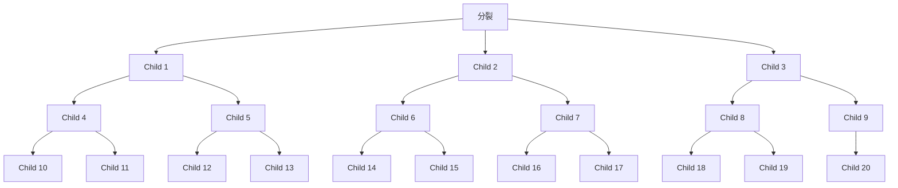
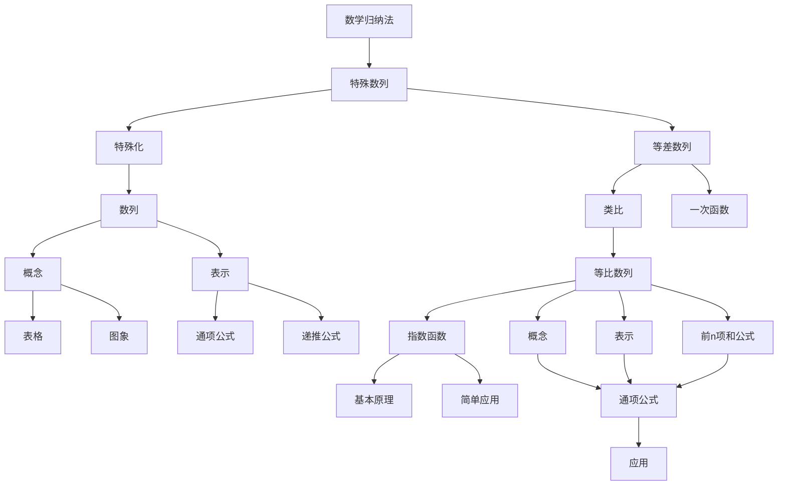

# 第四章 数列

对数列的研究源于现实生产、生活的需要。例如，一棵树在某一时刻的高度是 $2\mathrm{m}$ ，如果在每年的同一时刻都记录下这棵树的高度，并按先后顺序排列起来，就得到一列数。人们常用这样的一列数有序地表达一类事物，或者记录一个过程。像这样按照确定的顺序排列的一列数称为数列。如果用正整数表示事物发展过程的先后顺序，并且把这样的正整数看作自变量的取值，把事物的对应数值看作相应的函数值，那么数列就是定义在正整数集（或正整数集的有限子集）上的一类离散函数。数列无论在理论研究还是在实际应用中都非常重要。

本章我们将学习数列的概念和表示方法，并研究两类特殊的数列——等差数列和等比数列，探索它们的取值规律，建立它们的通项公式、前 $n$ 项和公式，并应用它们解决一些问题。我们将把数列看成一类特殊的函数，并用函数的思想方法研究数列。我们还将学习数学归纳法，这是一种证明与正整数有关的数学命题的特殊方法。在本章的学习中，我们可以体验通过数学抽象获得一个数学对象，并通过数学运算、逻辑推理等进行研究的过程和方法；通过建立数学模型刻画具有递推规律的事物，提高解决实际问题的能力。

text_image

人民教育出版社

## 4.1 数列的概念

在现实生活和数学学习中，我们经常需要根据问题的意义，通过对一些数据按特定顺序排列的方法来刻画研究对象。例如：

1. 王芳从 1 岁到 17 岁，每年生日那天测量身高。将这些身高数据（单位：cm）依次排成一列数：

75, 87, 96, 103, 110, 116, 120, 128, 138,

145, 153, 158, 160, 162, 163, 165, 168. ①

记王芳第 i 岁时的身高为 $h_{i}$ ，那么 $h_{1}=75, h_{2}=87, \cdots, h_{17}=168$ 。我们发现， $h_{i}$ 中的 i 反映了身高按岁数从 1 到 17 的顺序排列时的确定位置，即 $h_{1}=75$ 是排在第 1 位的数， $h_{2}=87$ 是排在第 2 位的数…… $h_{17}=168$ 是排在第 17 位的数，它们之间不能交换位置。所以，①是具有确定顺序的一列数。

2. 在两河流域发掘的一块泥版（编号 K90，约产生于公元前 7 世纪）上，有一列依次表示 15 天中从第 1 天到第 15 天每天月亮可见部分的数 $^{①}$ ：

5, 10, 20, 40, 80, 96, 112, 128,

144, 160, 176, 192, 208, 224, 240. ②

记第 i 天月亮可见部分的数为 $s_{i}$ ，那么 $s_{1}=5,\quad s_{2}=10,\quad\cdots,\quad s_{15}=240$ 。这里， $s_{i}$ 中的 i 反映了月亮可见部分的数按日期从 1 到 15 的顺序排列时的确定位置，即 $s_{1}=5$ 是排在第 1 位的数， $s_{2}=10$ 是排在第 2 位的数…… $s_{15}=240$ 是排在第 15 位的数，它们之间不能交换位置。所以，②也是具有确定顺序的一列数。

text_image

1
2
3
4
5
6
7
8
9
10
11
12
13
14
15

① 把满月分成 240 份，则从初一到十五每天月亮的可见部分可用一个代表份数的数来表示.

3. $-\frac{1}{2}$ 的 n 次幂按 1 次幂、2 次幂、3 次幂、4 次幂……依次排成一列数：

$$
- \frac {1}{2}, \frac {1}{4}, - \frac {1}{8}, \frac {1}{1 6}, \dots . \tag {③}
$$

#### 思考

你能仿照上面的叙述，说明③也是具有确定顺序的一列数吗？

#### 归纳

上述例子的共同特征是什么？

一般地，我们把按照确定的顺序排列的一列数称为数列（sequence of number），数列中的每一个数叫做这个数列的项．数列的第一个位置上的数叫做这个数列的第1项，常用符号 $a_{1}$ 表示，第二个位置上的数叫做这个数列的第2项，用 $a_{2}$ 表示……第n个位置上的数叫做这个数列的第n项，用 $a_{n}$ 表示．其中第1项也叫做首项．①是按年龄从小到大的顺序排列的，②是按每月的日期从小到大的顺序排列的，③是按幂指数从小到大的顺序排列的，它们都是从第1项开始的.

项数有限的数列叫做有穷数列，项数无限的数列叫做无穷数列.

数列的一般形式是

$$
a _ {1}, a _ {2}, \dots , a _ {n}, \dots ,
$$

简记为 $\{a_{n}\}$ .

由于数列 $\{a_{n}\}$ 中的每一项 $a_{n}$ 与它的序号 $n$ 有下面的对应关系：

<table><tr><td>序号</td><td>1</td><td>2</td><td>3</td><td> $\cdots$ </td><td>n</td><td> $\cdots$ </td></tr><tr><td></td><td>↓</td><td>↓</td><td>↓</td><td></td><td>↓</td><td></td></tr><tr><td>项</td><td> $a_{1}$ </td><td> $a_{2}$ </td><td> $a_{3}$ </td><td> $\cdots$ </td><td> $a_{n}$ </td><td> $\cdots$ </td></tr></table>

所以数列 $\{a_{n}\}$ 是从正整数集 $N^{*}$ （或它的有限子集 $\{1,2,\cdots,n\}$ ）到实数集 R 的函数，其自变量是序号 n，对应的函数值是数列的第 n 项 $a_{n}$ ，记为 $a_{n}=f(n)$ 。也就是说，当自变量从 1 开始，按照从小到大的顺序依次取值时，对应的一列函数值 $f(1)$ ， $f(2)$ ， $\cdots$ ， $f(n)$ ， $\cdots$ 就是数列 $\{a_{n}\}$ 。另一方面，对于函数 $y=f(x)$ ，如果 $f(n)$ （ $n\in N^{*}$ ）有意义，那么

以前我们学过的函数的自变量通常是连续变化的，而数列是自变量为离散的数的函数.

$$
f (1), f (2), \dots , f (n), \dots
$$

构成了一个数列 $\{f(n)\}$ .

与其他函数一样，数列也可以用表格和图象来表示．例如，数列①可以表示为表4.1-1.

表4.1-1

<table><tr><td>n</td><td>1</td><td>2</td><td>3</td><td>4</td><td>5</td><td>6</td><td>7</td><td>8</td><td>9</td><td>10</td><td>11</td><td>12</td><td>13</td><td>14</td><td>15</td><td>16</td><td>17</td></tr><tr><td>an</td><td>75</td><td>87</td><td>96</td><td>103</td><td>110</td><td>116</td><td>120</td><td>128</td><td>138</td><td>145</td><td>153</td><td>158</td><td>160</td><td>162</td><td>163</td><td>165</td><td>168</td></tr></table>

它的图象如图 4.1-1 所示.

scatter

| n | an |
|---|---|
| 1 | 75 |
| 2 | 85 |
| 3 | 95 |
| 4 | 102 |
| 5 | 110 |
| 6 | 115 |
| 7 | 120 |
| 8 | 127 |
| 9 | 137 |
| 10 | 145 |
| 11 | 152 |
| 12 | 158 |
| 13 | 160 |
| 14 | 161 |
| 15 | 162 |
| 16 | 165 |
| 17 | 168 |

图4.1-1

从表4.1-1和图4.1-1中，你能发现数列①中的项随序号的变化呈现出的特点吗？

与函数类似，我们可以定义数列的单调性。从第2项起，每一项都大于它的前一项的数列叫做递增数列；从第2项起，每一项都小于它的前一项的数列叫做递减数列。特别地，各项都相等的数列叫做常数列。

如果数列 $\{a_{n}\}$ 的第 $n$ 项 $a_{n}$ 与它的序号 $n$ 之间的对应关系可以用一个式子来表示，那么这个式子叫做这个数列的通项公式．例如，数列③的通项公式为 $a_{n} = \left(-\frac{1}{2}\right)^{n}$ ．显然，通项公式就是数列的函数解析式，根据通项公式可以写出数列的各项.

例 1 根据下列数列 $\{a_{n}\}$ 的通项公式，写出数列的前 5 项，并画出它们的图象.

(1) $a_{n} = \frac{n^{2} + n}{2}$ ;

(2) $a_{n} = \cos \frac{(n - 1)\pi}{2}$ .

解：（1）当通项公式中的 $n = 1,2,3,4,5$ 时，数列 $\{a_{n}\}$ 的前5项依次为1，3，6，10，15.

图象如图 4.1-2(1) 所示.

scatter

| n | an |
|---|---|
| 1 | 1 |
| 2 | 3 |
| 3 | 6 |
| 4 | 9 |
| 5 | 15 |

(1)

scatter

| n | a_n |
|---|---|
| 1 | 1 |
| 2 | 0 |
| 3 | -1 |
| 4 | 0 |
| 5 | 1 |

(2)   
图4.1-2

(2) 当通项公式中的 n=1, 2, 3, 4, 5 时，数列 $\{a_{n}\}$ 的前 5 项依次为 1, 0, -1, 0, 1.

图象如图 4.1-2(2) 所示.

例 2 根据下列数列的前 4 项，写出数列的一个通项公式：

(1) $1, -\frac{1}{2}, \frac{1}{3}, -\frac{1}{4}, \cdots;$

(2) 2, 0, 2, 0, ….

解：（1）这个数列的前4项的绝对值都是序号的倒数，并且奇数项为正，偶数项为负，所以它的一个通项公式为

$$
a _ {n} = \frac {(- 1) ^ {n + 1}}{n}.
$$

（2）这个数列前4项的奇数项是2，偶数项是0，所以它的一个通项公式为

$$
a _ {n} = (- 1) ^ {n + 1} + 1.
$$

① $(-1)^{n}$ 或 $(-1)^{n + 1}$ 常常用来表示正负相间的变化规律.

#### 练习

1. 写出下列数列的前 10 项，并作出它们的图象：

（1）所有正整数的倒数按从大到小的顺序排列成的数列；  
(2) 当自变量 x 依次取 1, 2, 3, …时，函数 $f(x) = 2x + 1$ 的值构成的数列；  
（3）数列的通项公式为 $a_{n} = \left\{ \begin{array}{ll}2, & n\text{为奇数，}\\ n + 1, & n\text{为偶数.} \end{array} \right.$

2. 根据数列 $\{a_{n}\}$ 的通项公式填表：

<table><tr><td>n</td><td>1</td><td>2</td><td>...</td><td>5</td><td>...</td><td></td><td>...</td><td></td><td>...</td><td>n</td></tr><tr><td>an</td><td></td><td></td><td>...</td><td></td><td>...</td><td>153</td><td>...</td><td>273</td><td>...</td><td>3(3+4n)</td></tr></table>

3. 除数函数（divisor function） $y=d(n)(n\in\mathbf{N}^{*})$ 的函数值等于 n 的正因数的个数，例如， $d(1)=1$ ， $d(4)=3$ 。写出数列 $d(1)$ ， $d(2)$ ，…， $d(n)$ ，…的前 10 项。

4. 根据下列数列的前 5 项，写出数列的一个通项公式：

(1) $1, \frac{1}{3}, \frac{1}{5}, \frac{1}{7}, \frac{1}{9}, \cdots;$   
(2) $1, \frac{\sqrt{2}}{2}, \frac{1}{2}, \frac{\sqrt{2}}{4}, \frac{1}{4}, \cdots.$

例3 如果数列 $\{a_{n}\}$ 的通项公式为 $a_{n} = n^{2} + 2n$ ，那么120是不是这个数列的项？如果是，是第几项？

分析：要判断120是不是数列 $\{a_{n}\}$ 中的项，就是要回答是否存在正整数 $n$ ，使得 $n^2 +2n = 120$ ，也就是判断上述关于 $n$ 的方程是否有正整数解.

解：令

$$
n ^ {2} + 2 n = 1 2 0,
$$

解这个关于 $n$ 的方程，得

$$
n = - 1 2 (\text {舍去}), \text {或} n = 1 0.
$$

所以，120 是数列 $\{a_{n}\}$ 的项，是第 10 项.

例4 图4.1-3中的一系列三角形图案称为谢尔宾斯基三角形。在图中4个大三角形中，着色的三角形的个数依次构成一个数列的前4项，写出这个数列的一个通项公式。

  
(1)

  
(2)

  
(3)

  
(4)   
图4.1-3

解：在图4.1-3（1）（2）（3）（4）中，着色三角形的个数依次为

1, 3, 9, 27,

即所求数列的前 4 项都是 3 的指数幂，指数为序号减 1.

因此，这个数列的一个通项公式是

$$
a _ {n} = 3 ^ {n - 1}.
$$

换个角度观察图 4.1-3 中的 4 个图形。可以发现， $a_{1}=1$ ，且每个图形中的着色三角形都在下一个图形中分裂为 3 个着色小三角形和 1 个无色小三角形。于是从第 2 个图形开始，每个图形中着色三角形的个数都是前一个图形中着色三角形个数的 3 倍。这样，例 4 中的数列的前 4 项满足 $a_{1}=1,\quad a_{2}=3a_{1},\quad a_{3}=3a_{2},\quad a_{4}=3a_{3}$ 。由此猜测这个数列满足公式 $a_{n}=\begin{cases}1,&n=1,\\3a_{n-1},&n\geqslant2.\end{cases}$

当不能明显看出数列的项的取值规律时，可以尝试通过运算来寻找规律。如依次取出数列的某一项，减去或除以它的前一项，再对差或商加以观察。

像 $a_{n} = 3a_{n - 1}(n\geqslant 2)$ 这样，如果一个数列的相邻两项或多项之间的关系可以用一个式子来表示，那么这个式子叫做这个数列的递推公式。知道了首项或前几项，以及递推公式，就能求出数列的每一项了。

例5 已知数列 $\{a_{n}\}$ 的首项为 $a_1 = 1$ ，递推公式为 $a_{n} = 1 + \frac{1}{a_{n - 1}} (n\geqslant 2)$ ，写出这个数列的前5项.

解：由题意可知

$$
\begin{array}{l} a _ {1} = 1, \\ a _ {2} = 1 + \frac {1}{a _ {1}} = 1 + \frac {1}{1} = 2, \\ a _ {3} = 1 + \frac {1}{a _ {2}} = 1 + \frac {1}{2} = \frac {3}{2}, \\ a _ {4} = 1 + \frac {1}{a _ {3}} = 1 + \frac {2}{3} = \frac {5}{3}, \\ a _ {5} = 1 + \frac {1}{a _ {4}} = 1 + \frac {3}{5} = \frac {8}{5}. \\ \end{array}
$$

在对数列的研究中，求数列某些项的和是主要问题之一．我们把数列 $\{a_{n}\}$ 从第1项起到第 $n$ 项止的各项之和，称为数列 $\{a_{n}\}$ 的前 $n$ 项和，记作 $S_{n}$ ，即

$$
S _ {n} = a _ {1} + a _ {2} + \dots + a _ {n}.
$$

如果数列 $\{a_{n}\}$ 的前 $n$ 项和 $S_{n}$ 与它的序号 $n$ 之间的对应关系可以用一个式子来表示，那么这个式子叫做这个数列的前 $n$ 项和公式.

显然 $S_{1}=a_{1}$ ，而 $S_{n-1}=a_{1}+a_{2}+\cdots+a_{n-1}\quad(n\geqslant2)$ ，于是我们有

$$
a _ {n} = \left\{ \begin{array}{l l} S _ {1}, & n = 1, \\ S _ {n} - S _ {n - 1}, & n \geqslant 2. \end{array} \right.
$$

探索数列的求和公式，曾是古代算学家非常感兴趣的问题.

#### 思考

已知数列 $\{a_{n}\}$ 的前 $n$ 项和公式为 $S_{n} = n^{2} + n$ ，你能求出 $\{a_{n}\}$ 的通项公式吗？

因为

$$
\begin{array}{l} a _ {1} = S _ {1} = 2, \\ a _ {n} = S _ {n} - S _ {n - 1} \\ = n ^ {2} + n - \left[ (n - 1) ^ {2} + (n - 1) \right] \\ = 2 n (n \geqslant 2), \\ \end{array}
$$

并且当 n=1 时， $a_{1}=2\times1=2$ 依然成立.

所以 $\{a_{n}\}$ 的通项公式是 $a_{n}=2n$ .

#### 练习

1. 根据下面的图形及相应的点数，写出点数构成的数列的一个通项公式，并在横线上和括号中分别填上第5项的图形和点数.

(1)

1

6

11

16

(2)

1

4

7

10

(3)

3

8

15

24

#### (第1题)

2. 根据下列条件，写出数列 $\{a_{n}\}$ 的前5项：

(1) $a_{1} = 1, a_{n} = a_{n - 1} + 2^{n - 1} (n \geqslant 2)$ ;

(2) $a_1 = 3, a_n = \frac{2}{3} a_{n - 1} + 1 (n\geqslant 2).$

3. 已知数列 $\{a_{n}\}$ 满足 $a_{1} = 2, a_{n} = 2 - \frac{1}{a_{n - 1}} (n\geqslant 2)$ ，写出它的前5项，并猜想它的通项公式.  
4. 已知数列 $\{a_{n}\}$ 的前 $n$ 项和公式为 $S_{n} = -2n^{2}$ ，求 $\{a_{n}\}$ 的通项公式.

#### 习题4.1

#### 复习巩固

1. 写出下列数列的前 10 项，并作出它们的图象：

（1）素数按从小到大的顺序排列成的数列；  
（2）欧拉函数 $\varphi(n)$ （ $n \in \mathbf{N}^*$ ）的函数值按自变量从小到大的顺序排列成的数列.

2. 根据下列条件，写出数列 $\{a_{n}\}$ 的前5项：

(1) $a_{n} = \frac{1}{n^{2}};$

(2) $a_{n} = (-1)^{n + 1}(n^{2} + 1)$ ;

(3) $a_1 = \frac{1}{2}, a_n = 4a_{n - 1} + 1 (n\geqslant 2);$

(4) $a_1 = -\frac{1}{4}, a_n = 1 - \frac{1}{a_{n-1}} (n \geqslant 2)$ .

3. 观察下列数列的特点，用适当的数填空，并写出数列的一个通项公式：

(1) ( ), -4, 9, ( ), 25, ( ), 49, …;

欧拉函数 $\varphi(n) (n \in \mathbf{N}^*)$ 的函数值等于所有不超过正整数 $n$ ，且与 $n$ 互素的正整数的个数，例如， $\varphi(1) = 1$ ， $\varphi(4) = 2$ 。

(2) $1, \frac{1}{3^2}, (\quad), \frac{1}{7^2}, \frac{1}{9^2}, (\quad), \frac{1}{13^2}, \cdots;$   
(3) $1, \sqrt{2}, (\quad), 2, \sqrt{5}, (\quad), \sqrt{7}, \cdots;$   
(4) $\frac{1}{2}, \frac{1}{6}, (\quad), \frac{1}{20}, \frac{1}{30}, (\quad), \cdots$ .

#### 综合运用

4. 已知数列 $\{a_{n}\}$ 的第1项是1，第2项是2，以后各项由 $a_{n} = a_{n - 1} + a_{n - 2}$ （ $n > 2$ ）给出.

(1) 写出这个数列的前 5 项；  
(2) 利用数列 $\{a_{n}\}$ ，通过公式 $b_{n}=\frac{a_{n+1}}{a_{n}}$ 构造一个新的数列 $\{b_{n}\}$ ，试写出数列 $\{b_{n}\}$ 的前 5 项.

5. 传说古希腊毕达哥拉斯学派的数学家用沙粒和小石子来研究数。他们根据沙粒或小石子所排列的形状把数分成许多类，如图中第一行的1，3，6，10称为三角形数，第二行的1，4，9，16称为正方形数，第三行的1，5，12，22称为五边形数。请你分别写出三角形数、正方形数和五边形数所构成的数列的第5项和第6项。  
6. 假设某银行的活期存款年利率为 $0.35\%$ ，某人存入10万元后，既不加进存款也不取款，每年到期利息连同本金自动转存。如果不考虑利息税及利率的变化，用 $a_{n}$ 表示第 $n$ 年到期时的存款余额，求 $a_{1}, a_{2}, a_{3}$ 及 $a_{n}$ 。

1

3

6

10

1

4

9

16

•
1

5

12

22

(第 5 题)

#### 拓广探索

7. 已知函数 $f(x) = \frac{2^x - 1}{2^x} (x \in \mathbf{R})$ ，设数列 $\{a_n\}$ 的通项公式为 $a_n = f(n) (n \in \mathbf{N}^*)$ .

(1) 求证 $a_{n} \geqslant \frac{1}{2}$ .   
(2) $\{a_{n}\}$ 是递增数列还是递减数列？为什么？

#### 阅读与思考

#### 斐波那契数列

1202 年，意大利数学家斐波那契（Leonardo Fibonacci，约 1170—约 1250）出版了他的《算盘书》（Liber Abaci）。他在书中收录了一些有意思的问题，其中有一个关于兔子繁殖的问题：

如果 1 对兔子每月能生 1 对小兔子（一雄一雌），而每 1 对小兔子在它出生后的第 3 个月里，又能生 1 对小兔子，假定在不发生死亡的情况下，由 1 对初生的小兔子开始，50 个月后会有多少对兔子？

在第 1 个月时，只有 1 对小兔子，过了 1 个月，那对兔子成熟了，在第 3 个月时便生下 1 对小兔子，这时有 2 对兔子。再过 1 个月，成熟的兔子再生 1 对小兔子，而另 1 对小兔子长大，有 3 对兔子。如此推算下去，我们可以得到一个表格：

<table><tr><td>时间/月</td><td>初生兔子/对</td><td>成熟兔子/对</td><td>兔子总数/对</td></tr><tr><td>1</td><td>1</td><td>0</td><td>1</td></tr><tr><td>2</td><td>0</td><td>1</td><td>1</td></tr><tr><td>3</td><td>1</td><td>1</td><td>2</td></tr><tr><td>4</td><td>1</td><td>2</td><td>3</td></tr><tr><td>5</td><td>2</td><td>3</td><td>5</td></tr><tr><td>6</td><td>3</td><td>5</td><td>8</td></tr><tr><td>7</td><td>5</td><td>8</td><td>13</td></tr><tr><td>8</td><td>8</td><td>13</td><td>21</td></tr><tr><td>9</td><td>13</td><td>21</td><td>34</td></tr><tr><td>10</td><td>21</td><td>34</td><td>55</td></tr><tr><td>11</td><td>34</td><td>55</td><td>89</td></tr><tr><td>12</td><td>55</td><td>89</td><td>144</td></tr><tr><td>...</td><td>...</td><td>...</td><td>...</td></tr></table>

由此可知，从第1个月开始，每月末的兔子总对数是

1, 1, 2, 3, 5, 8, 13, 21, 34, 55, 89, 144, ….

你发现这个数列的规律了吗？

如果用 $F_{n}$ 表示第 $n$ 个月的兔子的总对数，可以看出，

$$
F _ {n} = F _ {n - 1} + F _ {n - 2} (n > 2).
$$

这是一个由递推公式给出的数列，称为斐波那契数列.

斐波那契数列有很多有趣的性质.例如，斐波那契数列满足等式 $F_{1}^{2}+F_{2}^{2}+\cdots+F_{n}^{2}=F_{n}F_{n+1}$ ，我们可以用图形（图1）来表示这个等式．图1中小正方形的边长分别为斐波那契数 $F_{1}=1$ ， $F_{2}=1$ ， $F_{3}=2$ ， $F_{4}=3$ ，…，面积分别为 $F_{1}^{2}$ ， $F_{2}^{2}$ ， $F_{3}^{2}$ ， $F_{4}^{2}$ ，…．前 $n(n=2,3,4,\cdots)$ 个小正方形拼成的长方形的面积依次是两个斐波那契数的乘积 $F_{2}F_{3}$ ， $F_{3}F_{4}$ ， $F_{4}F_{5}$ ，…。如图1所示，从内到外依次连接通过小正方形的四分之一圆弧，就得到了一条被称为“斐波那契螺旋”的弧线。如果我们在图1上不断增加边长是斐波那契数的正方形，那么“斐波那契螺旋”也将不断向外延伸，而且它的形状将越来越接近“黄金比例螺旋”。

text_image

8
5
1
1
2
3

图1

更加有趣的是，人们在自然界中发现了许多斐波那契数列。例如，一棵树在第一年长出一条新枝，新枝成长一年后变为老枝，老枝每年都长出一条新枝。每一条树枝都按照这个规律成长，则每年的树枝总数正好构成了斐波那契数列。又如，图2中向日葵的管状小花排列成两组交错的螺旋，从内往外看，逆时针方向的螺旋有13条，顺时针方向的有21条，恰为斐波那契数列的相邻两项。菠萝和松球的鳞片的排列也呈现出类似的规律。

natural_image

Close-up of a sunflower's center with blue polygonal mesh overlay (no text or symbols)

图2

由于斐波那契数列的广泛应用性，美国成立了斐波那契协会，并于1963年创办《斐波那契季刊》，专门发表关于这个数列的研究论文.

有兴趣的同学可以通过浏览互联网或查阅相关书籍搜集资料，进一步了解和研究斐波那契数列.

## 4.2 等差数列

我们知道，数列是一种特殊的函数。在函数的研究中，我们在理解了函数的一般概念，了解了函数变化规律的研究内容（如单调性、奇偶性等）后，通过研究基本初等函数，不仅加深了对函数的理解，而且掌握了幂函数、指数函数、对数函数、三角函数等非常有用的函数模型。类似地，在了解了数列的一般概念后，我们要研究一些具有特殊变化规律的数列，建立它们的通项公式和前 $n$ 项和公式，并运用它们解决实际问题和数学问题，从中感受数学模型的现实意义与应用。下面，我们从一类取值规律比较简单的数列入手。

#### 4.2.1 等差数列的概念

请看下面几个问题中的数列.

1. 北京天坛圜丘坛的地面由石板铺成，最中间是圆形的天心石，围绕天心石的是9圈扇环形的石板，从内到外各圈的石板数依次为

9, 18, 27, 36, 45, 54, 63, 72, 81. ①

2. S, M, L, XL, XXL, XXXL 型号的女装上衣对应的尺码分别是

38, 40, 42, 44, 46, 48. ②

3. 测量某地垂直地面方向上海拔 500 m 以下的大气温度，得到从距离地面 20 m 起每升高 100 m 处的大气温度（单位：℃）依次为

25.0, 24.4, 23.8, 23.2, 22.6. ③

4. 某人向银行贷款 a 万元，贷款时间为 n 年。如果个人贷款月利率为 r，那么按照等额本金方式还款，他从某月开始，每月应还本金 $b\left(=\frac{a}{12n}\right)$ 万元，每月支付给银行的利息（单位：万元）依次为

ar, ar-br, ar-2br, ar-3br, …. ④

natural_image

Exterior view of a traditional Chinese stone pathway with a pavilion and surrounding trees under a clear blue sky (no signage or text visible)

如果按月还款，等额本金还款方式的计算公式是

每月归还本金 $=$ 贷款总额 $\div$ 贷款期总月数，

利息部分=（贷款总额-已归还本金累计额）×月利率.

#### 思考

在代数的学习中，我们常常通过运算来发现规律。例如，在指数函数的学习中，我们通过运算发现了A，B两地旅游人数的变化规律。类似地，你能通过运算发现以上数列的取值规律吗？

对于①，我们发现

$$
1 8 = 9 + 9, 2 7 = 1 8 + 9, \dots , 8 1 = 7 2 + 9,
$$

换一种写法，就是

$$
1 8 - 9 = 9, 2 7 - 1 8 = 9, \dots , 8 1 - 7 2 = 9.
$$

如果用 $\{a_{n}\}$ 表示数列①，那么有

$$
a _ {2} - a _ {1} = 9, a _ {3} - a _ {2} = 9, \dots , a _ {9} - a _ {8} = 9.
$$

改变表达方式使数列的取值规律更突出了.

这表明，数列①有这样的取值规律：从第2项起，每一项与它的前一项的差都等于同一个常数．数列②～④也有这样的取值规律.

一般地，如果一个数列从第2项起，每一项与它的前一项的差都等于同一个常数，那么这个数列就叫做等差数列（arithmetic progression），这个常数叫做等差数列的公差（common difference），公差通常用字母 $d$ 表示．例如，数列①的公差 $d = 9$

由三个数 $a, A, b$ 组成的等差数列可以看成是最简单的等差数列。这时， $A$ 叫做 $a$ 与 $b$ 的等差中项（arithmetic mean）。根据等差数列的定义可以知道， $2A = a + b$ 。

在日常生活中，人们常常用到等差数列。例如，在给各种产品的尺寸划分级别时，当其中的最大尺寸与最小尺寸相差不大时，常按等差数列进行分级（如前面例子中的上衣尺码）。你能举出一些例子吗？

#### 探究

你能根据等差数列的定义推导它的通项公式吗？

设一个等差数列 $\{a_{n}\}$ 的首项为 $a_1$ ，公差为 $d$ ．根据等差数列的定义，可得

$$
a _ {n + 1} - a _ {n} = d,
$$

所以

$$
a _ {2} - a _ {1} = d, a _ {3} - a _ {2} = d, a _ {4} - a _ {3} = d, \dots .
$$

$a_{n + 1} - a_n = d$ 就是等差数列 $\{a_{n}\}$ 的递推公式.

于是

$$
\begin{array}{l} a _ {2} = a _ {1} + d, \\ a _ {3} = a _ {2} + d = \left(a _ {1} + d\right) + d = a _ {1} + 2 d, \\ a _ {4} = a _ {3} + d = \left(a _ {1} + 2 d\right) + d = a _ {1} + 3 d, \\ \end{array}
$$

......

归纳可得

$$
a _ {n} = a _ {1} + (n - 1) d (n \geqslant 2).
$$

当 $n = 1$ 时，上式为 $a_1 = a_1 + (1 - 1)d = a_1$ 。这就是说，上式当 $n = 1$ 时也成立。

因此，首项为 $a_1$ ，公差为 $d$ 的等差数列 $\{a_n\}$ 的通项公式为

$$
a _ {n} = a _ {1} + (n - 1) d.
$$

#### 思考

观察等差数列的通项公式，你认为它与我们熟悉的哪一类函数有关？

由于 $a_{n} = a_{1} + (n - 1)d = dn + (a_{1} - d)$ ，所以当 $d \neq 0$ 时，等差数列 $\{a_{n}\}$ 的第 $n$ 项 $a_{n}$ 是一次函数 $f(x) = dx + (a_{1} - d)(x \in \mathbf{R})$ 当 $x = n$ 时的函数值，即 $a_{n} = f(n)$ .

在平面直角坐标系中画出函数 $f(x)=dx+(a_{1}-d)$ 的图象，就得到一条斜率为 d，截距为 $a_{1}-d$ 的直线。在这条直线上描出点 $(1, f(1)), (2, f(2)), \cdots, (n, f(n)), \cdots$ ，就得到了等差数列 $\{a_{n}\}$ 的图象。事实上，公差 $d \neq 0$ 的等差数列 $\{a_{n}\}$ 的图象是点 $(n, a_{n})$ 组成的集合，这些点均匀分布在直线 $f(x)=dx+(a_{1}-d)$ 上。d > 0, $a_{1}-d > 0$ 的情形如图 4.2-1 所示。

line

| x | f(x) |
|---|------|
| 1 | a₁-d |
| 2 | a₂ |
| 3 | a₃ |
| 4 | a₄ |
| 5 | a₅ |
| 6 | a₆ |

图4.2-1

反之，任给一次函数 $f(x)=kx+b$ （k，b 为常数），则 $f(1)=k+b$ ， $f(2)=2k+b$ ，…， $f(n)=nk+b$ ，…构成一个等差数列 $\{nk+b\}$ ，其首项为 $(k+b)$ ，公差为 k.

下面，我们利用通项公式解决等差数列的一些问题.

例1（1）已知等差数列 $\{a_{n}\}$ 的通项公式为 $a_{n} = 5 - 2n$ ，求 $\{a_{n}\}$ 的公差和首项；

(2) 求等差数列 8, 5, 2, … 的第 20 项.

分析：（1）已知等差数列的通项公式，只要根据等差数列的定义，由 $a_{n} - a_{n - 1} = d$ 即可求出公差 $d$ ；（2）可以先根据数列的两个已知项求出通项公式，再利用通项公式求数列的第20项.

解：（1）当 $n \geqslant 2$ 时，由 $\{a_{n}\}$ 的通项公式 $a_{n} = 5 - 2n$ ，可得

$$
a _ {n - 1} = 5 - 2 (n - 1) = 7 - 2 n.
$$

于是

$$
d = a _ {n} - a _ {n - 1} = (5 - 2 n) - (7 - 2 n) = - 2.
$$

把 $n = 1$ 代入通项公式 $a_{n} = 5 - 2n$ ，得

$$
a _ {1} = 5 - 2 \times 1 = 3.
$$

所以， $\{a_{n}\}$ 的公差为-2，首项为3.

(2) 由已知条件，得

$$
d = 5 - 8 = - 3.
$$

把 $a_1 = 8$ ， $d = -3$ 代入 $a_{n} = a_{1} + (n - 1)d$ ，得

$$
a _ {n} = 8 - 3 (n - 1) = 1 1 - 3 n.
$$

把 $n = 20$ 代入上式，得

$$
a _ {2 0} = 1 1 - 3 \times 2 0 = - 4 9.
$$

所以，这个数列的第20项是-49.

例 2 —401 是不是等差数列 -5，-9，-13，… 的项？如果是，是第几项？

分析：先求出数列的通项公式，它是一个关于 $n$ 的方程，再看一401是否能使这个方程有正整数解.

解：由 $a_1 = -5$ ， $d = -9 - (-5) = -4$ ，得这个数列的通项公式为

$$
a _ {n} = - 5 - 4 (n - 1) = - 4 n - 1.
$$

令

$$
- 4 n - 1 = - 4 0 1,
$$

解这个关于 $n$ 的方程，得

$$
n = 1 0 0.
$$

所以，-401 是这个数列的项，是第 100 项.

#### 练习

1. 判断下列数列是不是等差数列．如果是，写出它的公差.

(1) 95, 82, 69, 56, 43, 30;   
(2) 1, 1.1, 1.11, 1.111, 1.1111, 1.11111;   
(3) 1, -2, 3, -4, 5, -6;   
(4) $1, \frac{11}{12}, \frac{5}{6}, \frac{3}{4}, \frac{2}{3}, \frac{7}{12}, \frac{1}{2}.$

2. 求下列各组数的等差中项：

(1) 647 和 895; (2) $-12\frac{1}{3}$ 和 $24\frac{3}{5}$ .

3. 已知 $\{a_{n}\}$ 是一个等差数列，请在下表中的空格处填入适当的数.

<table><tr><td> $a_{1}$ </td><td> $a_{3}$ </td><td> $a_{5}$ </td><td> $a_{7}$ </td><td> $d$ </td></tr><tr><td>-7</td><td></td><td>8</td><td></td><td></td></tr><tr><td></td><td>2</td><td></td><td></td><td>-6.5</td></tr></table>

4. 已知在等差数列 $\{a_{n}\}$ 中， $a_{4} + a_{8} = 20$ ， $a_{7} = 12$ 。求 $a_{4}$ .

5. 在 7 和 21 中插入 3 个数，使这 5 个数成等差数列.

例 3 某公司购置了一台价值为 220 万元的设备，随着设备在使用过程中老化，其价值会逐年减少。经验表明，每经过一年其价值就会减少 d 万元(d 为正常数)。已知这台设备的安全使用年限为 10 年，第 11 年期间，它的价值将低于购进价值的 5%，设备需在这年年初报废。请确定 d 的取值范围。

分析：这台设备使用满 $n$ 年时的价值构成一个数列 $\{a_{n}\}$ 。由题意可知，使用满10年时，这台设备的价值应不小于（ $220 \times 5\% =$ ）11万元；而第11年年底，这台设备的价值应小于11万元。可以利用 $\{a_{n}\}$ 的通项公式列不等式求解。

解：设使用满 $n$ 年时，这台设备的价值为 $a_{n}$ 万元，则可得数列 $\{a_{n}\}$ 。由已知条件，得

$$
a _ {n} = a _ {n - 1} - d (n \geqslant 2).
$$

由于 $d$ 是与 $n$ 无关的常数，所以数列 $\{a_{n}\}$ 是一个公差为 $-d$ 的等差数列。因为购进设备的价值为220万元，所以 $a_1 = 220 - d$ ，于是

$$
a _ {n} = a _ {1} + (n - 1) (- d) = 2 2 0 - n d.
$$

根据题意，得

$$
\left\{ \begin{array}{l} a _ {1 0} \geqslant 1 1, \\ a _ {1 1} <   1 1, \end{array} \right.
$$

即

$$
\left\{ \begin{array}{l} 2 2 0 - 1 0 d \geqslant 1 1, \\ 2 2 0 - 1 1 d <   1 1. \end{array} \right.
$$

解这个不等式组，得

$$
1 9 <   d \leqslant 2 0. 9.
$$

所以，d 的取值范围为 $19 < d \leqslant 20.9$ .

例4 已知等差数列 $\{a_{n}\}$ 的首项 $a_1 = 2$ ，公差 $d = 8$ ，在 $\{a_{n}\}$ 中每相邻两项之间都插入3个数，使它们和原数列的数一起构成一个新的等差数列 $\{b_{n}\}$

(1) 求数列 $\{b_{n}\}$ 的通项公式.  
(2) $b_{29}$ 是不是数列 $\{a_{n}\}$ 的项？若是，它是 $\{a_{n}\}$ 的第几项？若不是，说明理由.

分析：（1） $\{a_{n}\}$ 是一个确定的数列，只要把 $a_{1}, a_{2}$ 表示为 $\{b_{n}\}$ 中的项，就可以利用等差数列的定义得出 $\{b_{n}\}$ 的通项公式；（2）设 $\{a_{n}\}$ 中的第 $n$ 项是 $\{b_{n}\}$ 中的第 $c_{n}$ 项，根据条件可以求出 $n$ 与 $c_{n}$ 的关系式，由此即可判断 $b_{29}$ 是不是 $\{a_{n}\}$ 的项.

解：（1）设数列 $\{b_{n}\}$ 的公差为 $d'$ .

由题意可知， $b_{1}=a_{1}$ ， $b_{5}=a_{2}$ ，于是

$$
b _ {5} - b _ {1} = a _ {2} - a _ {1} = 8.
$$

因为 $b_{5} - b_{1} = 4d^{\prime}$ ，所以 $4d^{\prime} = 8$ ，所以 $d^{\prime} = 2$

所以

如果插入 $k(k \in \mathbf{N}^{*})$ 个数，那么 $\{b_{n}\}$ 的公差是多少？

$$
b _ {n} = 2 + (n - 1) \times 2 = 2 n.
$$

所以，数列 $\{b_{n}\}$ 的通项公式是

$$
b _ {n} = 2 n.
$$

（2）数列 $\{a_{n}\}$ 的各项依次是数列 $\{b_{n}\}$ 的第 1，5，9，13，…项，这些下标构成一个首项为 1，公差为 4 的等差数列 $\{c_{n}\}$ ，则 $c_{n}=4n-3$ .

令 $4n - 3 = 29$ ，解得

$$
n = 8.
$$

对于第（2）小题，你还有其他解决方法吗？

所以， $b_{29}$ 是数列 $\{a_{n}\}$ 的第8项.

例5 已知数列 $\{a_{n}\}$ 是等差数列， $p, q, s, t \in \mathbf{N}^{*}$ ，且 $p + q = s + t$ 。求证 $a_{p} + a_{q} = a_{s} + a_{t}$ 。

分析：只要根据等差数列的定义写出 $a_{p}, a_{q}, a_{s}, a_{t}$ ，再利用已知条件即可得证.

证明：设数列 $\{a_{n}\}$ 的公差为 $d$ ，则

$$
a _ {p} = a _ {1} + (p - 1) d,
$$

$$
a _ {q} = a _ {1} + (q - 1) d,
$$

$$
a _ {s} = a _ {1} + (s - 1) d,
$$

$$
a _ {t} = a _ {1} + (t - 1) d.
$$

所以

$$
a _ {p} + a _ {q} = 2 a _ {1} + (p + q - 2) d,
$$

$$
a _ {s} + a _ {t} = 2 a _ {1} + (s + t - 2) d.
$$

因为 $p + q = s + t$ ，所以

$$
a _ {p} + a _ {q} = a _ {s} + a _ {t}.
$$

#### 思考

例 5 是等差数列的一条性质，图 4.2-2 是它的一种情形．你能从几何角度解释等差数列的这一性质吗？

line

| Point | x    | y    |
|-------|------|------|
| a_p   | s    | p    |
| a_q   | q    | q    |
| a_s   | s    | p    |
| a_t   | t    | t    |
| (s,a_s)| s    | p    |
| (q,a_q)| q    | q    |
| (t,a_t)| t    | t    |

图4.2-2

#### 练习

1. 某体育场一角看台的座位是这样排列的：第 1 排有 15 个座位，从第 2 排起每一排都比前一排多 2 个座位．你能用 $a_{n}$ 表示第 $n$ 排的座位数吗？第 10 排有多少个座位？  
2. 画出数列 $a_{n} = \left\{ \begin{array}{ll} 18, & n = 1, \\ a_{n-1} - 3, & 1 < n \leqslant 6 \end{array} \right.$ 的图象，并求通过图象上所有点的直线的斜率.

3. 在等差数列 $\{a_{n}\}$ 中， $a_{n} = m$ ， $a_{m} = n$ ，且 $n \neq m$ ，求 $a_{m + n}$ .  
4. 已知数列 $\{a_{n}\}$ ， $\{b_{n}\}$ 都是等差数列，公差分别为 $d_{1}, d_{2}$ ，数列 $\{c_{n}\}$ 满足 $c_{n} = a_{n} + 2b_{n}$ .

（1）数列 $\{c_{n}\}$ 是不是等差数列？若是，证明你的结论；若不是，请说明理由.  
(2) 若 $\{a_{n}\}$ ， $\{b_{n}\}$ 的公差都等于 2， $a_{1}=b_{1}=1$ ，求数列 $\{c_{n}\}$ 的通项公式.

5. 已知一个无穷等差数列 $\{a_{n}\}$ 的首项为 $a_{1}$ ，公差为 $d$ .

（1）将数列中的前 $m$ 项去掉，其余各项组成一个新的数列，这个新数列是等差数列吗？如果是，它的首项和公差分别是多少？  
（2）依次取出数列中的所有奇数项，组成一个新的数列，这个新数列是等差数列吗？如果是，它的首项和公差分别是多少？  
（3）依次取出数列中所有序号为7的倍数的项，组成一个新的数列，它是等差数列吗？你能根据得到的结论作出一个猜想吗？

#### 4.2.2 等差数列的前 $n$ 项和公式

前面我们学习了等差数列的概念和通项公式，下面我们将利用这些知识解决等差数列的求和问题.

据说，二百多年前，高斯的算术老师提出了下面的问题：

$$
1 + 2 + 3 + \dots + 1 0 0 = ?
$$

当其他同学忙于把 100 个数逐项相加时，10 岁的高斯却用下面的方法迅速算出了正确答案：

$$
(1 + 1 0 0) + (2 + 9 9) + \dots + (5 0 + 5 1) = 1 0 1 \times 5 0 = 5 0 5 0.
$$

高斯的算法实际上解决了求等差数列

$$
1, 2, 3, \dots , n, \dots \tag {①}
$$

前 100 项的和的问题.

natural_image

Portrait sketch of an elderly man with white hair and beard, wearing a red and white garment (no text or symbols visible)

高斯(Gauss,1777—1855)，德国数学家，近代数学的奠基者之一。他在天文学、大地测量学、磁学、光学等领域都作出了杰出贡献。

#### 思考

你能说说高斯在求和过程中利用了数列①的什么性质吗？你能从中得到求数列①的前 $n$ 项和的方法吗？

对于数列①，设 $a_{n} = n$ ，那么高斯的计算方法可以表示为

$$
\left(a _ {1} + a _ {1 0 0}\right) + \left(a _ {2} + a _ {9 9}\right) + \dots + \left(a _ {5 0} + a _ {5 1}\right) = 1 0 1 \times 5 0 = 5 0 5 0.
$$

可以发现，高斯在计算中利用了

$$
a _ {1} + a _ {1 0 0} = a _ {2} + a _ {9 9} = \dots = a _ {5 0} + a _ {5 1}
$$

这一特殊关系，这就是上一小节例 5 中性质的应用，它使不同数的求和问题转化成了相同数（即 101）的求和，从而简

你能用高斯的方法求 $1 + 2 + \dots +100 + 101$ 吗？

化了运算.

将上述方法推广到一般，可以得到：

当 $n$ 是偶数时，有

$$
a _ {1} + a _ {n} = a _ {2} + a _ {n - 1} = \dots = a _ {\frac {n}{2}} + a _ {\frac {n}{2} + 1},
$$

于是有

$$
\begin{array}{l} S _ {n} = 1 + 2 + 3 + \dots + n \\ = (1 + n) + [ 2 + (n - 1) ] + \dots + \left[ \frac {n}{2} + \left(\frac {n}{2} + 1\right) \right] \\ = \underbrace {(1 + n) + (1 + n) + \cdots + (1 + n)} _ {\frac {n}{2} \text {个}} \\ = \frac {n (1 + n)}{2}. \\ \end{array}
$$

当 $n$ 为奇数时，有

$$
\begin{array}{l} S _ {n} = 1 + 2 + 3 + \dots + n \\ = (1 + n) + [ 2 + (n - 1) ] + \dots + \left[ \left(\frac {n + 1}{2} - 1\right) + \left(\frac {n + 1}{2} + 1\right) \right] + \frac {n + 1}{2} \\ = \underbrace {(1 + n) + (1 + n) + \cdots + (1 + n)} _ {\frac {n - 1}{2} \text {个}} + \frac {n + 1}{2} \\ = \frac {n - 1}{2} \cdot (1 + n) + \frac {n + 1}{2} \\ = \frac {n (1 + n)}{2}. \\ \end{array}
$$

所以，对任意正整数 $n$ ，都有

$$
S _ {n} = 1 + 2 + 3 + \dots + n = \frac {n (1 + n)}{2}.
$$

#### 思考

我们发现，在求前 $n$ 个正整数的和时，要对 $n$ 分奇数、偶数进行讨论，比较麻烦．能否设法避免分类讨论？

如果对公式 $S_{n}=1+2+3+\cdots+n=\frac{n(n+1)}{2}$ 作变形，可得

$$
2 S _ {n} = 2 (1 + 2 + 3 + \dots + n) = n (n + 1),
$$

它相当于两个 $S_{n}$ 相加，而结果变成 n 个 $(n+1)$ 相加.

受此启发，我们得到下面的方法：

$$
S _ {n} = 1 + \quad 2 \quad + \quad 3 \quad + \dots + n,
$$

$$
S _ {n} = n + (n - 1) + (n - 2) + \dots + 1,
$$

将上述两式相加，可得

$$
\begin{array}{l} 2 S _ {n} = (n + 1) + [ (n - 1) + 2 ] + [ (n - 2) + 3 ] + \dots + (1 + n) \\ = \underbrace {(1 + n) + (1 + n) + \cdots + (1 + n)} _ {n \text {个}} \\ = n (n + 1), \\ \end{array}
$$

所以 $S_{n} = 1 + 2 + 3 + \dots +n = \frac{n(n + 1)}{2}.$

#### 探究

上述方法的妙处在哪里？这种方法能够推广到求等差数列 $\{a_{n}\}$ 的前 $n$ 项和吗？

可以发现，上述方法的妙处在于将 $1+2+3+\cdots+n$ “倒序”为 $n+(n-1)+(n-2)+\cdots+1$ ，再将两式相加，得到 n 个相同的数（即 $n+1$ ）相加，从而把不同数的求和转化为 n 个相同的数求和.

对于等差数列 $\{a_{n}\}$ ，因为 $a_{1}+a_{n}=a_{2}+a_{n-1}=\cdots=a_{n}+a_{1}$ ，由上述方法得到启示，我们用两种方式表示 $S_{n}$ ：

$$
S _ {n} = a _ {1} + a _ {2} + \dots + a _ {n}, \tag {②}
$$

$$
S _ {n} = a _ {n} + a _ {n - 1} + \dots + a _ {1}. \tag {③}
$$

②+③，得

$$
\begin{array}{l} 2 S _ {n} = \left(a _ {1} + a _ {n}\right) + \left(a _ {2} + a _ {n - 1}\right) + \dots + \left(a _ {n} + a _ {1}\right) \\ = \underbrace {(a _ {1} + a _ {n}) + (a _ {1} + a _ {n}) + \cdots + (a _ {1} + a _ {n})} _ {n \text {个}} \\ = n \left(a _ {1} + a _ {n}\right). \\ \end{array}
$$

由此得到等差数列 $\{a_{n}\}$ 的前 $n$ 项和公式

$$
S _ {n} = \frac {n (a _ {1} + a _ {n})}{2}. \tag {1}
$$

对于等差数列 $\{a_{n}\}$ ，利用公式（1），只要已知等差数列 $\{a_{n}\}$ 的首项 $a_{1}$ 和末项 $a_{n}$ ，就可以求得前 $n$ 项和 $S_{n}$ 。另外，如果已知首项 $a_{1}$ 和公差 $d$ ，那么这个等差数列就完全确定了，所以我们也可以用 $a_{1}$ 和 $d$ 来表示 $S_{n}$ 。

把等差数列的通项公式 $a_{n} = a_{1} + (n - 1)d$ 代入公式(1)，可得

$$
\boxed {S _ {n} = n a _ {1} + \frac {n (n - 1)}{2} d.} \tag {2}
$$

将（1）变形可得 $\frac{a_{1}+a_{n}}{2}=\frac{a_{1}+a_{2}+\cdots+a_{n}}{n}$ ,

所以 $\frac{a_1 + a_n}{2}$ 就是等差数列 $\{a_{n}\}$ 前 $n$ 项的平均数．实际上，我们就是利用等差数列的这一重要特性来推导它的前 $n$ 项和的．你还能发现这一特性的一些应用吗？

#### 思考

不从公式（1）出发，你能用其他方法得到公式（2）吗？

例 6 已知数列 $\{a_{n}\}$ 是等差数列.

(1) 若 $a_{1}=7,\quad a_{50}=101$ ，求 $S_{50}$ ;  
(2) 若 $a_{1}=2,\quad a_{2}=\frac{5}{2}$ ，求 $S_{10}$ ;  
(3) 若 $a_1 = \frac{1}{2}$ , $d = -\frac{1}{6}$ , $S_n = -5$ , 求 $n$ .

分析：对于（1），可以直接利用公式 $S_{n} = \frac{n(a_{1} + a_{n})}{2}$ 求和；在（2）中，可以先利用 $a_{1}$ 和 $a_{2}$ 的值求出 $d$ ，再利用公式 $S_{n} = na_{1} + \frac{n(n - 1)}{2} d$ 求和；（3）已知公式 $S_{n} = na_{1} + \frac{n(n - 1)}{2} d$ 中的 $a_{1}, d$ 和 $S_{n}$ ，解方程即可求得 $n$ .

对于等差数列 $\{a_{n}\}$ 的相关量 $a_1, a_n, d, n, S_n$ ，已知几个量就可以确定其他量？

解：（1）因为 $a_1 = 7$ ， $a_{50} = 101$ ，根据公式 $S_{n} = \frac{n(a_{1} + a_{n})}{2}$ ，可得

$$
S _ {5 0} = \frac {5 0 \times (7 + 1 0 1)}{2} = 2 7 0 0.
$$

(2) 因为 $a_{1}=2$ ， $a_{2}=\frac{5}{2}$ ，所以 $d=\frac{1}{2}$ 。根据公式 $S_{n}=na_{1}+\frac{n(n-1)}{2}d$ ，可得

$$
S _ {1 0} = 1 0 \times 2 + \frac {1 0 \times (1 0 - 1)}{2} \times \frac {1}{2} = \frac {8 5}{2}.
$$

(3) 把 $a_1 = \frac{1}{2}$ , $d = -\frac{1}{6}$ , $S_n = -5$ 代入 $S_n = na_1 + \frac{n(n-1)}{2} d$ , 得

$$
- 5 = \frac {1}{2} n + \frac {n (n - 1)}{2} \times \left(- \frac {1}{6}\right).
$$

整理，得

$$
n ^ {2} - 7 n - 6 0 = 0.
$$

解得

$$
n = 1 2, \text {或} n = - 5 (\text {舍去}).
$$

所以

$$
n = 1 2.
$$

例7 已知一个等差数列 $\{a_{n}\}$ 前10项的和是310，前20项的和是1220。由这些条件能确定这个等差数列的首项和公差吗？

分析：把已知条件代入等差数列前 $n$ 项和的公式（2）后，可得到两个关于 $a_1$ 与 $d$ 的二元一次方程．解这两个二元一次方程所组成的方程组，就可以求得 $a_1$ 和 $d$ .

解：由题意，知

$$
S _ {1 0} = 3 1 0, S _ {2 0} = 1 2 2 0.
$$

把它们代入公式

$$
S _ {n} = n a _ {1} + \frac {n (n - 1)}{2} d,
$$

得

$$
\left\{ \begin{array}{l} 1 0 a _ {1} + 4 5 d = 3 1 0, \\ 2 0 a _ {1} + 1 9 0 d = 1 2 2 0. \end{array} \right.
$$

解方程组，得

$$
\left\{ \begin{array}{l} a _ {1} = 4, \\ d = 6. \end{array} \right.
$$

所以，由所给的条件可以确定等差数列的首项和公差.

一般地，对于等差数列，只要给定两个相互独立的条件，这个数列就完全确定.

#### 探究

已知数列 $\{a_{n}\}$ 的前 $n$ 项和为 $S_{n} = pn^{2} + qn + r$ ，其中 $p,q,r$ 为常数，且 $p\neq 0.$ 任取若干组 $p,q,r$ ，在电子表格中计算 $a_1,a_2,a_3,a_4,a_5$ 的值（图4.2-3给出 $p = 1,q = 2,r = 0$ 的情况），观察数列 $\{a_{n}\}$ 的特点，研究它是一个怎样的数列，并证明你的结论.

<table><tr><td></td><td>A</td><td>B</td><td>C</td><td>D</td></tr><tr><td>1</td><td>1</td><td>3</td><td>3</td><td></td></tr><tr><td>2</td><td>2</td><td>8</td><td>5</td><td></td></tr><tr><td>3</td><td>0</td><td>15</td><td>7</td><td></td></tr><tr><td>4</td><td></td><td>24</td><td>9</td><td></td></tr><tr><td>5</td><td></td><td>35</td><td>11</td><td></td></tr></table>

图4.2-3

图 4.2-3 中的电子表格 A 列中 A1, A2, A3 分别表示 p, q, r 的值, B 列、C 列中分别是相应的 $S_{n}$ 和 $a_{n}$ 的值.

#### 练习

1. 根据下列各题中的条件，求相应等差数列 $\{a_{n}\}$ 的前 $n$ 项和 $S_{n}$ .

(1) $a_{1} = 5, a_{n} = 95, n = 10$ ;

(2) $a_1 = 100, d = -2, n = 50$ ;

(3) $a_{1} = -4, a_{8} = -18, n = 10;$

(4) $a_1 = 14.5, d = 0.7, a_n = 32.$

2. 等差数列-1，-3，-5，…的前多少项的和是-100?

3. 在等差数列 $\{a_{n}\}$ 中， $S_{n}$ 为其前 $n$ 项的和，若 $S_{4} = 6$ ， $S_{8} = 20$ ，求 $S_{16}$ .  
4. 在等差数列 $\{a_{n}\}$ 中，若 $S_{15} = 5(a_{2} + a_{6} + a_{k})$ ，求 $k$ .  
5. 已知一个等差数列的项数为奇数，其中所有奇数项的和为 290，所有偶数项的和为 261．求此数列中间一项的值以及项数.

例8 某校新建一个报告厅，要求容纳800个座位，报告厅共有20排座位，从第2排起每排都比前一排多2个座位。问第1排应安排多少个座位。

分析：将第1排到第20排的座位数依次排成一列，构成数列 $\{a_{n}\}$ 。设数列 $\{a_{n}\}$ 的前 $n$ 项和为 $S_{n}$ 。由题意可知， $\{a_{n}\}$ 是等差数列，且公差及前20项的和已知，所以可利用等差数列的前 $n$ 项和公式求首项。

解：设报告厅的座位从第1排到第20排，各排的座位数依次排成一列，构成数列 $\{a_{n}\}$ ，其前n项和为 $S_{n}$ ．根据题意，数列 $\{a_{n}\}$ 是一个公差为2的等差数列，且 $S_{20}=800$ .

由 $S_{20} = 20a_{1} + \frac{20\times(20 - 1)}{2}\times 2 = 800$ ，可得

$$
a _ {1} = 2 1.
$$

因此，第1排应安排21个座位.

例 9 已知等差数列 $\{a_{n}\}$ 的前 n 项和为 $S_{n}$ ，若 $a_{1}=10$ ，公差 d=-2，则 $S_{n}$ 是否存在最大值？若存在，求 $S_{n}$ 的最大值及取得最大值时 n 的值；若不存在，请说明理由.

分析：由 $a_1 > 0$ 和 $d < 0$ ，可以证明 $\{a_n\}$ 是递减数列，且存在正整数 $k$ ，使得当 $n \geqslant k$ 时， $a_n < 0$ ， $S_n$ 递减。这样，就把求 $S_n$ 的最大值转化为求 $\{a_n\}$ 的所有正数项的和。

另一方面，等差数列的前 $n$ 项和公式可写成 $S_{n} = \frac{d}{2} n^{2} + (a_{1} - \frac{d}{2})n$ ，所以当 $d\neq 0$ 时， $S_{n}$ 可以看成二次函数 $y = \frac{d}{2} x^2 +$ $\left(a_1 - \frac{d}{2}\right)x(x\in \mathbf{R})$ 当 $x = n$ 时的函数值．如图4.2-4，当 $d <   0$ 时， $S_{n}$ 关于 $n$ 的图象是一条开口向下的抛物线上的一些点.因此，可以利用二次函数求相应的 $n$ ， $S_{n}$ 的值.

解法1：由 $a_{n + 1} - a_n = -2 < 0$ ，得 $a_{n + 1} < a_n$ ，所以 $\{a_n\}$ 是递减数列.

又由 $a_{n} = 10 + (n - 1)\times (-2) = -2n + 12$ ，可知：

当 n<6 时， $a_{n}>0$ ;

当 n=6 时， $a_{n}=0$ ;

当 $n > 6$ 时， $a_{n} < 0$ .

scatter

| n  | Sn  |
|----|-----|
| 1  | 10  |
| 2  | 18  |
| 3  | 24  |
| 4  | 28  |
| 5  | 30  |
| 6  | 30  |
| 7  | 28  |
| 8  | 24  |
| 9  | 18  |
| 10 | 10  |
| 11 | 5   |

图4.2-4

所以

$$
S _ {1} <   S _ {2} <   \dots <   S _ {5} = S _ {6} > S _ {7} > \dots .
$$

也就是说，当 n=5 或 6 时， $S_{n}$ 最大.

因为 $S_{5} = \frac{5}{2}\times [2\times 10 + (5 - 1)\times (-2)] = 30$ ，所以 $S_{n}$ 的最大值为30.

解法2：因为 $S_{n} = \frac{d}{2} n^{2} + \left(a_{1} - \frac{d}{2}\right)n$

$$
= - n ^ {2} + 1 1 n
$$

$$
= - \left(n - \frac {1 1}{2}\right) ^ {2} + \frac {1 2 1}{4},
$$

想一想，这是为什么？

所以，当 n 取与 $\frac{11}{2}$ 最接近的整数即 5 或 6 时， $S_{n}$ 最大，最大值为 30.

#### 思考

在例9中，当 $d = -3.5$ 时， $S_{n}$ 有最大值吗？结合例9考虑更一般的等差数列前 $n$ 项和的最大值问题.

#### 练习

1. 某市一家商场的新年最高促销奖设立了两种领奖方式：第一种，获奖者可以选择价值 2000 元的奖品；第二种，从 12 月 20 日到第二年的 1 月 1 日，每天到该商场领取奖品，第 1 天领取的奖品价值为 100 元，第 2 天为 110 元，以后逐天增加 10 元。你认为哪种领奖方式获奖者领取的奖品价值更高？  
2. 已知数列 $\{a_{n}\}$ 的前 $n$ 项和 $S_{n} = \frac{1}{4} n^{2} + \frac{2}{3} n + 3$ . 求这个数列的通项公式.  
3. 已知等差数列 -4.2, -3.7, -3.2, …的前 n 项和为 $S_{n}$ , $S_{n}$ 是否存在最大（小）值？如果存在，求出取得最值时 n 的值.  
4. 求集合 $M = \{m \mid m = 2n - 1, n \in \mathbf{N}^*$ ，且 $m < 60\}$ 中元素的个数，并求这些元素的和.  
\*5. 已知数列 $\{a_{n}\}$ 的通项公式为 $a_{n} = \frac{n - 2}{2n - 15}$ ，前 $n$ 项和为 $S_{n}$ 。求 $S_{n}$ 取得最小值时 $n$ 的值.

#### 习题4.2

#### 复习巩固

1. 根据下列等差数列 $\{a_{n}\}$ 中的已知量，求相应的未知量：

(1) $a_1 = 20, a_n = 54, S_n = 999$ ，求 $d$ 及 $n$

(2) $d = \frac{1}{3}, n = 37, S_n = 629$ ，求 $a_1$ 及 $a_n$

(3) $a_1 = \frac{5}{6}, d = -\frac{1}{6}, S_n = -5$ ，求 $n$ 及 $a_n$ ；

(4) d=2, n=15, $a_{n}=-10$ , 求 $a_{1}$ 及 $S_{n}$ .

2. 已知 $\{a_{n}\}$ 为等差数列， $a_{1} + a_{3} + a_{5} = 105$ ， $a_{2} + a_{4} + a_{6} = 99$ 。求 $a_{20}$ .

3.（1）求从小到大排列的前 n 个正偶数的和.

(2) 求从小到大排列的前 n 个正奇数的和.   
（3）在三位正整数的集合中有多少个数是5的倍数？求这些数的和.  
（4）在小于100的正整数中，有多少个数被7除余2？这些数的和是多少？

4. 1682 年，英国天文学家哈雷发现一颗大彗星的运行曲线和 1531 年、1607 年的彗星惊人地相似。他大胆断定，这是同一天体的三次出现，并预言它将于 76 年后再度回归。这就是著名的哈雷彗星，它的回归周期大约是 76 年。请你查找资料，列出哈雷彗星的回归时间表，并预测它在本世纪回归的年份。

natural_image

Deep space image showing a bright comet with a long tail, surrounded by stars and faint star clusters (no text or symbols)

#### 综合运用

5. 已知一个多边形的周长等于 $158 \mathrm{~cm}$ , 所有各边的长成等差数列, 最大的边长为 $44 \mathrm{~cm}$ , 公差为 $3 \mathrm{~cm}$ . 求这个多边形的边数.  
6. 数列 $\{a_{n}\}$ ， $\{b_{n}\}$ 都是等差数列，且 $a_{1} = 5$ ， $b_{1} = 15$ ， $a_{100} + b_{100} = 100$ 。求数列 $\{a_{n} + b_{n}\}$ 的前 100 项的和。  
7. 已知 $S_{n}$ 是等差数列 $\{a_{n}\}$ 的前 $n$ 项和.

（1）证明 $\left\{\frac{S_n}{n}\right\}$ 是等差数列；  
（2）设 $T_{n}$ 为数列 $\left\{\frac{S_n}{n}\right\}$ 的前 $n$ 项和，若 $S_4 = 12$ ， $S_{8} = 40$ ，求 $T_{n}$

8. 已知两个等差数列 2, 6, 10, …, 190 及 2, 8, 14, …, 200，将这两个等差数列的公共项按从小到大的顺序组成一个新数列．求这个新数列的各项之和.  
9. 一支车队有 15 辆车，某天下午依次出发执行运输任务。第一辆车于 14 时出发，以后每间隔 10 min 发出一辆车。假设所有的司机都连续开车，并都在 18 时停下来休息。

(1) 截止到 18 时, 最后一辆车行驶了多长时间?  
(2) 如果每辆车行驶的速度都是 $60 \mathrm{~km} / \mathrm{h}$ , 这个车队当天一共行驶了多少千米?

#### 拓广探索

10. 已知等差数列 $\{a_{n}\}$ 的公差为 $d$ ，求证 $\frac{a_{m} - a_{n}}{m - n} = d$ 。你能从直线的斜率角度来解释这个结果吗？  
11. 虎甲虫以爬行速度快闻名，下表记录了一只虎甲虫连续爬行 $n \, s \quad (n=1, 2, \cdots, 10)$ 时爬行的距离.

<table><tr><td>时间/s</td><td>1</td><td>2</td><td>3</td><td>4</td><td>5</td><td>6</td><td>7</td><td>8</td><td>9</td><td>10</td></tr><tr><td>距离/m</td><td>2.50</td><td>5.03</td><td>7.55</td><td>10.05</td><td>12.45</td><td>15.01</td><td>17.28</td><td>19.90</td><td>22.48</td><td>25.07</td></tr></table>

（1）你能建立一个数列模型，近似地表示这只虎甲虫连续爬行的距离与时间之间的关系吗？

(2) 利用建立的模型计算，这只虎甲虫连续爬行 $1 \mathrm{~min}$ 能爬多远（精确到 $0.01 \mathrm{~m}$ ）？它连续爬行 $10 \mathrm{~m}$ 需要多长时间（精确到 $0.1 \mathrm{~s}$ ）？

12. 如图的形状出现在南宋数学家杨辉所著的《详解九章算法·商功》中，后人称为“三角垛”。“三角垛”的最上层有1个球，第二层有3个球，第三层有6个球……设各层球数构成一个数列 $\{a_{n}\}$ .

(1) 写出数列 $\{a_{n}\}$ 的一个递推公式；

\* (2) 根据（1）中的递推公式，写出数列 $\{a_{n}\}$ 的一个通项公式.

natural_image

Cluster of red spherical objects with gradient shading (no text or symbols)

(第12题)

## 4.3 等比数列

我们知道，等差数列的特征是“从第2项起，每一项与它的前一项的差都等于同一个常数”，类比等差数列的研究思路和方法，从运算的角度出发，你觉得还有怎样的数列是值得研究的？

#### 4.3.1 等比数列的概念

请看下面几个问题中的数列.

1. 两河流域发掘的古巴比伦时期的泥版上记录了下面的数列①：

$$
9, 9 ^ {2}, 9 ^ {3}, \dots , 9 ^ {1 0}; \tag {①}
$$

$$
1 0 0, 1 0 0 ^ {2}, 1 0 0 ^ {3}, \dots , 1 0 0 ^ {1 0}; \tag {②}
$$

$$
5, 5 ^ {2}, 5 ^ {3}, \dots , 5 ^ {1 0}. \tag {③}
$$

2. 《庄子·天下》中提到：“一尺之棰，日取其半，万世不竭。”如果把“一尺之棰”的长度看成单位“1”，那么从第1天开始，各天得到的“棰”的长度依次是

$$
\frac {1}{2}, \frac {1}{4}, \frac {1}{8}, \frac {1}{1 6}, \frac {1}{3 2}, \dots . \tag {④}
$$

3. 在营养和生存空间没有限制的情况下，某种细菌每20 min就通过分裂繁殖一代，那么一个这种细菌从第1次分裂开始，各次分裂产生的后代个数依次是

$$
2, 4, 8, 1 6, 3 2, 6 4, \dots . \tag {⑤}
$$

4. 某人存入银行 a 元，存期为 5 年，年利率为 r，那么按照复利 $^{②}$ ，他 5 年内每年末得到的本利和分别是

$$
a (1 + r), a (1 + r) ^ {2}, a (1 + r) ^ {3}, a (1 + r) ^ {4}, a (1 + r) ^ {5}. \tag {6}
$$

①古巴比伦人用六十进制记数，这里转化为十进制.

flowchart

②复利是指把前一期的利息和本金加在一起算作本金，再计算下一期的利息.

#### 探究

类比等差数列的研究，你认为可以通过怎样的运算发现以上数列的取值规律？你发现了什么规律？

我们可以通过除法运算探究以上数列的取值规律.

如果用 $\{a_{n}\}$ 表示数列①，那么有

$$
\frac {a _ {2}}{a _ {1}} = 9, \frac {a _ {3}}{a _ {2}} = 9, \dots , \frac {a _ {1 0}}{a _ {9}} = 9.
$$

这表明，数列①有这样的取值规律：从第2项起，每一项与它的前一项的比都等于9.

其余几个数列也有这样的取值规律，请你写出相应的规律.

#### 思考

类比等差数列的概念，从上述几个数列的规律中，你能抽象出等比数列的概念吗？

一般地，如果一个数列从第2项起，每一项与它的前一项的比都等于同一个常数，那么这个数列叫做等比数列（geometric progression），这个常数叫做等比数列的公比（common ratio），公比通常用字母 $q$ 表示（显然 $q \neq 0$ ）。例如，数列①～⑥的公比依次是9， $100, 5, \frac{1}{2}, 2, 1 + r$ .

与等差中项类似，如果在 $a$ 与 $b$ 中间插入一个数 $G$ ，使 $a, G, b$ 成等比数列，那么 $G$ 叫做 $a$ 与 $b$ 的等比中项（geometric mean）。此时， $G^2 = ab$ .

#### 探究

你能根据等比数列的定义推导它的通项公式吗？

设一个等比数列 $\{a_{n}\}$ 的首项为 $a_1$ ，公比为 $q$ ．根据等比数列的定义，可得

$$
a _ {n + 1} = a _ {n} \cdot q.
$$

所以

$$
\begin{array}{l} a _ {2} = a _ {1} q, \\ a _ {3} = a _ {2} q = \left(a _ {1} q\right) q = a _ {1} q ^ {2}, \\ a _ {4} = a _ {3} q = \left(a _ {1} q ^ {2}\right) q = a _ {1} q ^ {3}, \\ \end{array}
$$

●●●●●●

由此可得

$$
a _ {n} = a _ {1} q ^ {n - 1} (n \geqslant 2).
$$

又 $a_1 = a_1q^0 = a_1q^{1 - 1}$ ，这就是说，当 $n = 1$ 时上式也成立.

因此，首项为 $a_1$ ，公比为 $q$ 的等比数列 $\{a_n\}$ 的通项公式为

$$
a _ {n} = a _ {1} q ^ {n - 1}.
$$

类似于等差数列与一次函数的关系，由 $a_{n} = \frac{a_{1}}{q}\cdot q^{n}$ 可知，当 $q > 0$ 且 $q\neq 1$ 时，等比数列 $\{a_n\}$ 的第 $n$ 项 $a_{n}$ 是函数 $f(x) = \frac{a_1}{q}\cdot q^x (x\in \mathbf{R})$ 当 $x = n$ 时的函数值，即 $a_{n} = f(n)$ $a_1 > 0$ ， $q > 1$ 的情形如图4.3-1所示.

类比指数函数的性质，说说公比 q > 0 的等比数列的单调性.

line

| Point | x | f(x)     |
|-------|---|----------|
| 1     | 1 | a₁       |
| 2     | 2 | a₂       |
| 3     | 3 | a₃       |
| 4     | 4 | a₄       |
| 5     | 5 | a₅       |

图4.3-1

公比 $q > 0$ 且 $q \neq 1$ 的等比数列 $\{a_{n}\}$ 的图象有什么特点？

反之，任给函数 $f(x)=ka^{x}(k,a$ 为常数， $k\neq0,a>0$ ，且 $a\neq1)$ ，则 $f(1)=ka$ ， $f(2)=ka^{2},\cdots,f(n)=ka^{n},\cdots$ 构成一个等比数列 $\{ka^{n}\}$ ，其首项为 ka，公比为 a.

下面，我们利用通项公式解决等比数列的一些问题.

例 1 若等比数列 $\{a_{n}\}$ 的第 4 项和第 6 项分别为 48 和 12，求 $\{a_{n}\}$ 的第 5 项.

分析：等比数列 $\{a_{n}\}$ 由 $a_1$ ， $q$ 唯一确定，可利用条件列出关于 $a_1$ ， $q$ 的方程（组），进行求解.

解法1：由 $a_4 = 48$ ， $a_6 = 12$ ，得

$$
\left\{ \begin{array}{l l} a _ {1} q ^ {3} = 4 8, & \\ a _ {1} q ^ {5} = 1 2. & \end{array} \right. \tag {①}
$$

②的两边分别除以①的两边，得

$$
q ^ {2} = \frac {1}{4}.
$$

解得

$$
q = \frac {1}{2} \text {或} - \frac {1}{2}.
$$

把 $q = \frac{1}{2}$ 代入①，得

$$
a _ {1} = 3 8 4.
$$

此时

$$
a _ {5} = a _ {1} q ^ {4} = 3 8 4 \times \left(\frac {1}{2}\right) ^ {4} = 2 4.
$$

把 $q = -\frac{1}{2}$ 代入①，得

$$
a _ {1} = - 3 8 4.
$$

此时

$$
a _ {5} = a _ {1} q ^ {4} = - 3 8 4 \times \left(- \frac {1}{2}\right) ^ {4} = - 2 4.
$$

因此， $\{a_{n}\}$ 的第5项是24或-24.

解法2：因为 $a_5$ 是 $a_4$ 与 $a_6$ 的等比中项，所以

$$
a _ {5} ^ {2} = a _ {4} a _ {6} = 4 8 \times 1 2 = 5 7 6.
$$

所以

$$
a _ {5} = \pm \sqrt {5 7 6} = \pm 2 4.
$$

因此， $\{a_{n}\}$ 的第5项是24或-24.

例 2 已知等比数列 $\{a_{n}\}$ 的公比为 q，试用 $\{a_{n}\}$ 的第 m 项 $a_{m}$ 表示 $a_{n}$ .

解：由题意，得

$$
a _ {m} = a _ {1} q ^ {m - 1}, \tag {①}
$$

$$
a _ {n} = a _ {1} q ^ {n - 1}. \tag {②}
$$

②的两边分别除以①的两边，得

$$
\frac {a _ {n}}{a _ {m}} = q ^ {n - m},
$$

等比数列的任意一项都可以由该数列的某一项和公比表示.

所以

$$
a _ {n} = a _ {m} q ^ {n - m}.
$$

例 3 数列 $\{a_{n}\}$ 共有 5 项，前三项成等比数列，后三项成等差数列，第 3 项等于 80，第 2 项与第 4 项的和等于 136，第 1 项与第 5 项的和等于 132．求这个数列.

分析：先利用已知条件表示出数列的各项，再进一步根据条件列方程组求解.

解：设前三项的公比为 $q$ ，后三项的公差为 $d$ ，则数列的各项依次为 $\frac{80}{q^2}$ ， $\frac{80}{q}$ ，80， $80 + d$ ， $80 + 2d$ 。于是得

$$
\left\{ \begin{array}{l} \frac {8 0}{q} + (8 0 + d) = 1 3 6, \\ \frac {8 0}{q ^ {2}} + (8 0 + 2 d) = 1 3 2. \end{array} \right.
$$

解方程组，得

$$
\left\{ \begin{array}{l l} q = 2, \\ d = 1 6, \end{array} \text {或} \left\{ \begin{array}{l l} q = \frac {2}{3}, \\ d = - 6 4. \end{array} \right. \right.
$$

所以这个数列是 20，40，80，96，112，或 180，120，80，16，-48.

#### 练习

1. 判断下列数列是不是等比数列．如果是，写出它的公比.

(1) 3, 9, 15, 21, 27, 33;

(2) 1, 1.1, 1.21, 1.331, 1.4641;

(3) $\frac{1}{3}, \frac{1}{6}, \frac{1}{9}, \frac{1}{12}, \frac{1}{15}, \frac{1}{18}$ ;

(4) 4, -8, 16, -32, 64, -128.

2. 已知 $\{a_{n}\}$ 是一个公比为 $q$ 的等比数列，在下表中填上适当的数.

<table><tr><td> $a_{1}$ </td><td> $a_{3}$ </td><td> $a_{5}$ </td><td> $a_{7}$ </td><td>q</td></tr><tr><td>2</td><td></td><td>8</td><td></td><td></td></tr><tr><td></td><td>2</td><td></td><td></td><td>0.2</td></tr></table>

3. 在等比数列 $\{a_{n}\}$ 中， $a_{1}a_{3} = 36$ ， $a_{2} + a_{4} = 60$ 。求 $a_{1}$ 和公比 $q$ .

4. 对于数列 $\{a_{n}\}$ ，若点 $(n, a_{n}) (n \in \mathbf{N}^{*})$ 都在函数 $y = cq^{x}$ 的图象上，其中 $c, q$ 为常数，且 $c \neq 0$ ， $q \neq 0, q \neq 1$ ，试判断数列 $\{a_{n}\}$ 是不是等比数列，并证明你的结论.

5. 已知数列 $\{a_{n}\}$ 是等比数列.

(1) $a_{3}, a_{5}, a_{7}$ 是否构成等比数列？为什么？ $a_{1}, a_{5}, a_{9}$ 呢？

(2) 当 n>1 时， $a_{n-1}$ ， $a_{n}$ ， $a_{n+1}$ 是否构成等比数列？为什么？

当 $n > k > 0$ 时， $a_{n - k}, a_n, a_{n + k}$ 是否构成等比数列？

例 4 用 10 000 元购买某个理财产品一年.

(1) 若以月利率 $0.400\%$ 的复利计息，12个月能获得多少利息（精确到0.01元）?  
(2) 若以季度复利计息, 存 4 个季度, 则当每季度利率为多少时, 按季结算的利息不少于 (1) 中按月结算的利息 (精确到 $10^{-5}$ )?

分析：复利是指把前一期的利息与本金之和算作本金，再计算下一期的利息，所以若原始本金为 a 元，每期的利率为 r，则从第一期开始，各期的本利和 $a(1+r)$ ， $a(1+r)^{2}$ ，…构成等比数列.

解：（1）设这笔钱存 n 个月以后的本利和组成一个数列 $\{a_{n}\}$ ，则 $\{a_{n}\}$ 是等比数列，首项 $a_{1}=10^{4}(1+0.400\%)$ ，公比 $q=1+0.400\%$ ，所以

$$
a _ {1 2} = 1 0 ^ {4} (1 + 0. 4 0 0 \%) ^ {1 2} \approx 1 0 4 9 0. 7 0 2.
$$

所以，12个月后的利息为 $10490.702 - 10^{4} \approx 490.70$ （元）.

（2）设季度利率为 $r$ ，这笔钱存 $n$ 个季度以后的本利和组成一个数列 $\{b_{n}\}$ ，则 $\{b_{n}\}$ 也是一个等比数列，首项 $b_{1} = 10^{4}(1 + r)$ ，公比为 $1 + r$ ，于是

$$
b _ {4} = 1 0 ^ {4} (1 + r) ^ {4}.
$$

因此，以季度复利计息，存4个季度后的利息为

$$
[ 1 0 ^ {4} (1 + r) ^ {4} - 1 0 ^ {4} ] \text {元}.
$$

解不等式 $10^{4}(1 + r)^{4} - 10^{4}\geqslant 490.70$ ，得

$$
r \geqslant 1.205 \% .
$$

所以，当季度利率不小于 1.205% 时，按季结算的利息不少于按月结算的利息.

例 5 已知数列 $\{a_{n}\}$ 的首项 $a_{1}=3$ .

（1）若 $\{a_{n}\}$ 为等差数列，公差 $d = 2$ ，证明数列 $\{3^{a_n}\}$ 为等比数列；  
(2) 若 $\{a_{n}\}$ 为等比数列，公比 $q=\frac{1}{9}$ ，证明数列 $\{\log_{3}a_{n}\}$ 为等差数列.

分析：根据题意，需要从等差数列、等比数列的定义出发，利用指数、对数的知识进行证明.

证明：（1）由 $a_1 = 3$ ， $d = 2$ ，得 $\{a_n\}$ 的通项公式为

$$
a _ {n} = 2 n + 1.
$$

设 $b_{n} = 3^{a_{n}}$ ，则

$$
\frac {b _ {n + 1}}{b _ {n}} = \frac {3 ^ {2 (n + 1) + 1}}{3 ^ {2 n + 1}} = 9.
$$

又

$$
b _ {1} = 3 ^ {3} = 2 7,
$$

所以， $\{3^{a_{n}}\}$ 是以27为首项，9为公比的等比数列.

(2) 由 $a_1 = 3, q = \frac{1}{9}$ , 得

$$
a _ {n} = 3 \times \left(\frac {1}{9}\right) ^ {n - 1} = 3 ^ {3 - 2 n}.
$$

两边取以3为底的对数，得

$$
\log_ {3} a _ {n} = \log_ {3} 3 ^ {3 - 2 n} = 3 - 2 n.
$$

所以

$$
\log_ {3} a _ {n + 1} - \log_ {3} a _ {n} = [ 3 - 2 (n + 1) ] - (3 - 2 n) = - 2.
$$

又

$$
\log_ {3} a _ {1} = \log_ {3} 3 = 1,
$$

所以， $\{\log_{3}a_{n}\}$ 是首项为1，公差为-2的等差数列.

#### 思考

已知 $b > 0$ 且 $b \neq 1$ ，如果数列 $\{a_n\}$ 是等差数列，那么数列 $\{b^{a_n}\}$ 是否一定是等比数列？如果数列 $\{a_n\}$ 是各项均为正的等比数列，那么数列 $\{\log_b a_n\}$ 是否一定是等差数列？

例 6 某工厂去年 12 月试产 1050 个高新电子产品，产品合格率为 90%。从今年 1 月开始，工厂在接下来的两年中将生产这款产品。1 月按去年 12 月的产量和产品合格率生产，以后每月的产量都在前一个月的基础上提高 5%，产品合格率比前一个月增加 0.4%，那么生产该产品一年后，月不合格品的数量能否控制在 100 个以内？

分析：设从今年1月起，各月的产量及不合格率分别构成数列 $\{a_{n}\}$ ， $\{b_{n}\}$ ，则各月不合格品的数量构成数列 $\{a_{n}b_{n}\}$ 。由题意可知，数列 $\{a_{n}\}$ 是等比数列， $\{b_{n}\}$ 是等差数列。由于数列 $\{a_{n}b_{n}\}$ 既非等差数列又非等比数列，所以可以先列表观察规律，再寻求问题的解决方法。

解：设从今年1月起，各月的产量及不合格率分别构成数列 $\{a_{n}\}$ ， $\{b_{n}\}$ .

由题意，知

$$
a _ {n} = 1 0 5 0 \times 1. 0 5 ^ {n - 1},
$$

$b_{n}=1-\left[90\%+0.4\%(n-1)\right]=0.104-0.004n$ ，其中 $n=1,2,\cdots,24$

则从今年1月起，各月不合格产品的数量是

$$
\begin{array}{l} a _ {n} b _ {n} = 1 0 5 0 \times 1. 0 5 ^ {n - 1} \times (0. 1 0 4 - 0. 0 0 4 n) \\ = 1. 0 5 ^ {n} \times (1 0 4 - 4 n). \\ \end{array}
$$

由计算工具计算（精确到0.1），并列表（表4.3-1）.

表 4.3-1

<table><tr><td>n</td><td>1</td><td>2</td><td>3</td><td>4</td><td>5</td><td>6</td><td>7</td></tr><tr><td>anbn</td><td>105.0</td><td>105.8</td><td>106.5</td><td>107.0</td><td>107.2</td><td>107.2</td><td>106.9</td></tr><tr><td>n</td><td>8</td><td>9</td><td>10</td><td>11</td><td>12</td><td>13</td><td>14</td></tr><tr><td>anbn</td><td>106.4</td><td>105.5</td><td>104.2</td><td>102.6</td><td>100.6</td><td>98.1</td><td>95.0</td></tr></table>

观察发现，数列 $\{a_{n}b_{n}\}$ 先递增，在第6项以后递减，所以只要设法证明当 $n\geqslant 6$ 时， $\{a_{n}b_{n}\}$ 递减，且 $a_{13}b_{13} < 100$ 即可.

由

$$
\frac {a _ {n + 1} b _ {n + 1}}{a _ {n} b _ {n}} = \frac {1 . 0 5 ^ {n + 1} \times [ 1 0 4 - 4 (n + 1) ]}{1 . 0 5 ^ {n} \times (1 0 4 - 4 n)} <   1,
$$

得

$$
n > 5.
$$

所以，当 $n \geqslant 6$ 时， $\{a_{n}b_{n}\}$ 递减.

又

$$
a _ {1 3} b _ {1 3} \approx 9 8 <   1 0 0,
$$

所以，当 $13 \leqslant n \leqslant 24$ 时， $a_{n}b_{n} \leqslant a_{13}b_{13} < 100$ .

所以，生产该产品一年后，月不合格品的数量能控制在100个以内.

为什么 $n \leqslant 24$ ?

#### 练习

1. 求满足下列条件的数：

（1）在9与243中间插入2个数，使这4个数成等比数列；  
(2) 在 160 与 -5 中间插入 4 个数，使这 6 个数成等比数列.

2. 设数列 $\{a_{n}\}$ ， $\{b_{n}\}$ 都是等比数列，分别研究下列数列是不是等比数列。若是，证明结论；若不是，请说明理由。

(1) 数列 $\{c_{n}\}$ ，其中 $c_{n}=a_{n}b_{n}$ ;  
(2) 数列 $\{d_{n}\}$ ，其中 $d_{n}=\frac{a_{n}}{b_{n}}$ .

3. 某汽车集团计划大力发展新能源汽车，2017年全年生产新能源汽车5000辆。如果在后续的几年中，后一年新能源汽车的产量都是前一年的 $150\%$ ，那么2025年全年约生产新能源汽车多少辆（精确到1)?  
4. 某城市今年空气质量为 “优” “良” 的天数为 105，力争 2 年后使空气质量为 “优” “良” 的天数达到 240。这个城市空气质量为 “优” “良” 的天数的年平均增长率应达到多少（精确到 0.01）？  
5. 已知数列 $\{a_{n}\}$ 的通项公式为 $a_{n} = \frac{n^{3}}{3^{n}}$ ，求使 $a_{n}$ 取得最大值时 $n$ 的值.

#### 4.3.2 等比数列的前 $n$ 项和公式

国际象棋起源于古印度．相传国王要奖赏国际象棋的发明者，问他想要什么．发明者说：“请在棋盘的第1个格子里放上1颗麦粒，第2个格子里放上2颗麦粒，第3个格子里放上4颗麦粒……依此类推，每个格子里放的麦粒数都是前一个格子里放的麦粒数的 2 倍，直到第 64 个格子．请给我足够的麦粒以实现上述要求。” 国王觉得这个要求不高，就欣然同意了．已知 1000 颗麦粒的质量约为 40 g，据查，2016—2017 年度世界小麦产量约为 7.5 亿吨，根据以上数据，判断国王是否能实现他的诺言.

natural_image

Chessboard with wooden pieces arranged on a checkered board (no text or symbols visible)

让我们一起来分析一下．如果把各格所放的麦粒数看成一个数列，我们可以得到一个等比数列，它的首项是1，公比是2，求第1个格子到第64个格子各格所放的麦粒数总和就是求这个等比数列前64项的和.

一般地，如何求一个等比数列的前 $n$ 项和呢？

设等比数列 $\{a_{n}\}$ 的首项为 $a_1$ ，公比为 $q$ ，则 $\{a_{n}\}$ 的前 $n$ 项和是

$$
S _ {n} = a _ {1} + a _ {2} + a _ {3} + \dots + a _ {n}.
$$

根据等比数列的通项公式，上式可写成

$$
S _ {n} = a _ {1} + a _ {1} q + a _ {1} q ^ {2} + \dots + a _ {1} q ^ {n - 1}. \tag {①}
$$

我们发现，如果用公比 $q$ 乘①的两边，可得

$$
q S _ {n} = a _ {1} q + a _ {1} q ^ {2} + \dots + a _ {1} q ^ {n - 1} + a _ {1} q ^ {n}. \tag {②}
$$

①②两式的右边有很多相同的项，用①的两边分别减去②的两边，就可以消去这些相同的项，可得 $S_{n}-qS_{n}=a_{1}-a_{1}q^{n}$ ，即

$$
(1 - q) S _ {n} = a _ {1} (1 - q ^ {n}).
$$

因此，当 $q \neq 1$ 时，我们就得到了等比数列的前 $n$ 项和公式

$$
S _ {n} = \frac {a _ {1} (1 - q ^ {n})}{1 - q} (q \neq 1). \tag {1}
$$

因为 $a_{n} = a_{1}q^{n - 1}$ ，所以公式（1）还可以写成

$$
S _ {n} = \frac {a _ {1} - a _ {n} q}{1 - q} (q \neq 1). \tag {2}
$$

当 $q = 1$ 时，等比数列的前 $n$ 项和 $S_{n}$ 等于多少？

有了上述公式，就可以解决本小节开头提出的问题了.

由 $a_1 = 1$ ， $q = 2$ ， $n = 64$ ，可得

$$
S _ {6 4} = \frac {1 \times (1 - 2 ^ {6 4})}{1 - 2} = 2 ^ {6 4} - 1.
$$

$2^{64}-1$ 这个数很大，超过了 $1.84\times10^{19}$ 。如果一千颗麦粒的质量约为40 g，那么以上这些麦粒的总质量超过了7000亿吨，约是2016—2017年度世界小麦产量的981倍。因此，国王根本不可能实现他的诺言。

例 7 已知数列 $\{a_{n}\}$ 是等比数列.

(1) 若 $a_{1}=\frac{1}{2}$ ， $q=\frac{1}{2}$ ，求 $S_{8}$ ;  
(2) 若 $a_{1}=27,\quad a_{9}=\frac{1}{243},\quad q<0$ ，求 $S_{8}$ ;  
(3) 若 $a_1 = 8, q = \frac{1}{2}, S_n = \frac{31}{2}$ , 求 $n$ .

解：（1）因为 $a_1 = \frac{1}{2}$ ， $q = \frac{1}{2}$ ，所以

$$
S _ {8} = \frac {\frac {1}{2} \times \left[ 1 - \left(\frac {1}{2}\right) ^ {8} \right]}{1 - \frac {1}{2}} = \frac {2 5 5}{2 5 6}.
$$

(2) 由 $a_1 = 27, a_9 = \frac{1}{243}$ , 可得

$$
2 7 \times q ^ {8} = \frac {1}{2 4 3},
$$

对于等比数列的相关量 $a_1, a_n, q, n, S_n$ ，已知几个量就可以确定其他量？

即

$$
q ^ {8} = \left(\frac {1}{3}\right) ^ {8}.
$$

又由 $q < 0$ ，得

$$
q = - \frac {1}{3},
$$

所以

$$
S _ {8} = \frac {2 7 \times \left[ 1 - \left(- \frac {1}{3}\right) ^ {8} \right]}{1 - \left(- \frac {1}{3}\right)} = \frac {1 6 4 0}{8 1}.
$$

(3) 把 $a_1 = 8, q = \frac{1}{2}, S_n = \frac{31}{2}$ 代入 $S_n = \frac{a_1(1 - q^n)}{1 - q}$ ，得

$$
\frac {8 \times \left[ 1 - \left(\frac {1}{2}\right) ^ {n} \right]}{1 - \frac {1}{2}} = \frac {3 1}{2}.
$$

整理，得

$$
\left(\frac {1}{2}\right) ^ {n} = \frac {1}{3 2}.
$$

解得

$$
n = 5.
$$

例8 已知等比数列 $\{a_{n}\}$ 的首项为-1，前 $n$ 项和为 $S_{n}$ 。若 $\frac{S_{10}}{S_5} = \frac{31}{32}$ ，求公比 $q$ .

解：若 $q = 1$ ，则

$$
\frac {S _ {1 0}}{S _ {5}} = \frac {1 0 a _ {1}}{5 a _ {1}} = 2 \neq \frac {3 1}{3 2},
$$

所以

$$
q \neq 1.
$$

当 $q \neq 1$ 时，由 $\frac{S_{10}}{S_5} = \frac{31}{32}$ ，得

$$
\frac {(- 1) (1 - q ^ {1 0})}{1 - q} \cdot \frac {1 - q}{(- 1) (1 - q ^ {5})} = \frac {3 1}{3 2}.
$$

整理，得

$$
1 + q ^ {5} = \frac {3 1}{3 2},
$$

即

$$
q ^ {5} = - \frac {1}{3 2}.
$$

所以

$$
q = - \frac {1}{2}.
$$

例9 已知等比数列 $\{a_{n}\}$ 的公比 $q \neq -1$ ，前 $n$ 项和为 $S_{n}$ 。证明 $S_{n}, S_{2n} - S_{n}, S_{3n} - S_{2n}$ 成等比数列，并求这个数列的公比。

证明：当 $q = 1$ 时，

$$
S _ {n} = n a _ {1},
$$

$$
S _ {2 n} - S _ {n} = 2 n a _ {1} - n a _ {1} = n a _ {1},
$$

$$
S _ {3 n} - S _ {2 n} = 3 n a _ {1} - 2 n a _ {1} = n a _ {1},
$$

所以 $S_{n}$ ， $S_{2n} - S_n$ ， $S_{3n} - S_{2n}$ 成等比数列，公比为1.

当 $q \neq 1$ 时，

$$
S _ {n} = \frac {a _ {1} (1 - q ^ {n})}{1 - q},
$$

$$
S _ {2 n} - S _ {n} = \frac {a _ {1} (1 - q ^ {2 n})}{1 - q} - \frac {a _ {1} (1 - q ^ {n})}{1 - q} = \frac {a _ {1} q ^ {n} (1 - q ^ {n})}{1 - q} = q ^ {n} S _ {n},
$$

$$
S _ {3 n} - S _ {2 n} = \frac {a _ {1} (1 - q ^ {3 n})}{1 - q} - \frac {a _ {1} (1 - q ^ {2 n})}{1 - q} = \frac {a _ {1} q ^ {2 n} (1 - q ^ {n})}{1 - q} = q ^ {n} \left(S _ {2 n} - S _ {n}\right),
$$

想一想，不用分类讨论的方式能否证明该结论？

所以

$$
\frac {S _ {2 n} - S _ {n}}{S _ {n}} = \frac {S _ {3 n} - S _ {2 n}}{S _ {2 n} - S _ {n}} = q ^ {n}.
$$

因为 $q^{n}$ 为常数，所以 $S_{n}$ ， $S_{2n}-S_{n}$ ， $S_{3n}-S_{2n}$ 成等比数列，公比为 $q^{n}$ .

#### 练习

1. 已知数列 $\{a_{n}\}$ 是等比数列.

(1) 若 $a_{1}=3,\quad q=2,\quad n=6$ ，求 $S_{n}$ ;  
(2) 若 $a_1 = -2.7, q = -\frac{1}{3}, a_n = \frac{1}{90}$ , 求 $S_n$ ;  
(3) 若 $a_{3}=\frac{3}{2}$ ， $S_{3}=\frac{9}{2}$ ，求 $a_{1}$ 与 q.

2. 已知 $a \neq b$ ，且 $ab \neq 0$ 。对于 $n \in \mathbf{N}^*$ ，证明：

$$
a ^ {n} + a ^ {n - 1} b + a ^ {n - 2} b ^ {2} + \dots + a b ^ {n - 1} + b ^ {n} = \frac {a ^ {n + 1} - b ^ {n + 1}}{a - b}.
$$

3. 设等比数列 $\{a_{n}\}$ 的前 $n$ 项和为 $S_{n}$ ，已知 $a_{2} = 6$ ， $6a_{1} + a_{3} = 30$ 。求 $a_{n}$ 和 $S_{n}$ 。  
4. 已知三个数成等比数列，它们的和等于 14，积等于 64。求这个等比数列的首项和公比。  
5. 如果一个等比数列前 5 项的和等于 10，前 10 项的和等于 50，那么这个数列的公比等于多少？

例 10 如图 4.3-2，正方形 ABCD 的边长为 5 cm，取正方形 ABCD 各边的中点 E，F，G，H，作第 2 个正方形 EFGH，然后再取正方形 EFGH 各边的中点 I，J，K，L，作第 3 个正方形 IJKL，依此方法一直继续下去.

text_image

A H D
L O K
E P N G
I M J
B F C

图4.3-2

（1）求从正方形 ABCD 开始，连续 10 个正方形的面积之和；  
（2）如果这个作图过程可以一直继续下去，那么这些正方形的面积之和将趋近于多少？

分析：可以利用数列表示各正方形的面积，根据条件可知，这是一个等比数列.

解：设正方形 ABCD 的面积为 $a_{1}$ ，后继各正方形的面积依次为 $a_{2}$ ， $a_{3}$ ，…， $a_{n}$ ，…，则

$$
a _ {1} = 2 5.
$$

由于第 $k + 1$ 个正方形的顶点分别是第 $k$ 个正方形各边的中点，所以

$$
a _ {k + 1} = \frac {1}{2} a _ {k}. ^ {\textcircled {1}}
$$

因此， $\{a_{n}\}$ 是以25为首项， $\frac{1}{2}$ 为公比的等比数列.

①你能说明理由吗？

设 $\{a_{n}\}$ 的前n项和为 $S_{n}$ .

(1) $S_{10} = \frac{25\times\left[1 - \left(\frac{1}{2}\right)^{10}\right]}{1 - \frac{1}{2}} = 50\times \left[1 - \left(\frac{1}{2}\right)^{10}\right] = \frac{25575}{512}.$

所以，前10个正方形的面积之和为 $\frac{25\ 575}{512}\ \mathrm{cm}^2$

(2) 当 n 无限增大时， $S_{n}$ 无限趋近于所有正方形的面积和 $a_{1}+a_{2}+a_{3}+\cdots+a_{n}+\cdots$ 而

$$
S _ {n} = \frac {2 5 \times \left[ 1 - \left(\frac {1}{2}\right) ^ {n} \right]}{1 - \frac {1}{2}} = 5 0 \left[ 1 - \left(\frac {1}{2}\right) ^ {n} \right],
$$

随着 n 的无限增大， $\left(\frac{1}{2}\right)^{n}$ 将趋近于 0， $S_{n}$ 将趋近于 50.

所以，这些正方形的面积之和将趋近于 50.

例 11 去年某地产生的生活垃圾为 20 万吨，其中 14 万吨垃圾以填埋方式处理，6 万吨垃圾以环保方式处理。预计每年生活垃圾的总量递增 5%，同时，通过环保方式处理的垃圾量每年增加 1.5 万吨。为了确定处理生活垃圾的预算，请写出从今年起 n 年内通过填埋方式处理的垃圾总量的计算公式，并计算从今年起 5 年内通过填埋方式处理的垃圾总量（精确到 0.1 万吨）。

分析：由题意可知，每年生活垃圾的总量构成等比数列，而每年以环保方式处理的垃圾量构成等差数列．因此，可以利用等差数列、等比数列的知识进行计算.

解：设从今年起每年生活垃圾的总量（单位：万吨）构成数列 $\{a_{n}\}$ ，每年以环保方式处理的垃圾量（单位：万吨）构成数列 $\{b_{n}\}$ ， $n$ 年内通过填埋方式处理的垃圾总量为 $S_{n}$ （单位：万吨），则

$$
a _ {n} = 2 0 (1 + 5
$$

$$
b _ {n} = 6 + 1. 5 n,
$$

$$
\begin{array}{l} S _ {n} = \left(a _ {1} - b _ {1}\right) + \left(a _ {2} - b _ {2}\right) + \dots + \left(a _ {n} - b _ {n}\right) \\ = \left(a _ {1} + a _ {2} + \dots + a _ {n}\right) - \left(b _ {1} + b _ {2} + \dots + b _ {n}\right) \\ = (2 0 \times 1. 0 5 + 2 0 \times 1. 0 5 ^ {2} + \dots + 2 0 \times 1. 0 5 ^ {n}) - (7. 5 + 9 + \dots + 6 + 1. 5 n) \\ = \frac {(2 0 \times 1 . 0 5) \times (1 - 1 . 0 5 ^ {n})}{1 - 1 . 0 5} - \frac {n}{2} (7. 5 + 6 + 1. 5 n) \\ = 4 2 0 \times 1. 0 5 ^ {n} - \frac {3}{4} n ^ {2} - \frac {2 7}{4} n - 4 2 0. \\ \end{array}
$$

当 $n = 5$ 时， $S_{5}\approx 63.5.$

所以，从今年起5年内，通过填埋方式处理的垃圾总量约为63.5万吨.

例 12 某牧场今年初牛的存栏数为 1200，预计以后每年存栏数的增长率为 8%，且在每年年底卖出 100 头牛．设牧场从今年起每年年初的计划存栏数依次为 $c_{1}$ ， $c_{2}$ ， $c_{3}$ ，…

（1）写出一个递推公式，表示 $c_{n + 1}$ 与 $c_{n}$ 之间的关系；  
（2）将（1）中的递推公式表示成 $c_{n+1}-k=r(c_{n}-k)$ 的形式，其中 k，r 为常数；  
(3) 求 $S_{10}=c_{1}+c_{2}+c_{3}+\cdots+c_{10}$ 的值（精确到 1）.

分析：（1）可以利用“每年存栏数的增长率为 $8\%$ ”和“每年年底卖出100头”建立 $c_{n + 1}$ 与 $c_{n}$ 的关系；（2）这是待定系数法的应用，可以将它还原为（1）中的递推公式的形式，通过比较系数，得到方程组；（3）利用（2）的结论可得出解答.

解：（1）由题意，得 $c_{1} = 1200$ ，并且

$$
c _ {n + 1} = 1. 0 8 c _ {n} - 1 0 0. \tag {①}
$$

(2) 将 $c_{n+1} - k = r(c_n - k)$ 化成

$$
c _ {n + 1} = r c _ {n} - r k + k. \tag {②}
$$

比较①②的系数，可得

$$
\left\{ \begin{array}{l} r = 1. 0 8, \\ k - r k = - 1 0 0. \end{array} \right.
$$

解这个方程组，得

$$
\left\{ \begin{array}{l} r = 1. 0 8, \\ k = 1 2 5 0. \end{array} \right.
$$

所以，（1）中的递推公式可以化为

$$
c _ {n + 1} - 1 2 5 0 = 1. 0 8 (c _ {n} - 1 2 5 0).
$$

（3）由（2）可知，数列 $\{c_{n} - 1250\}$ 是以一50为首项，1.08为公比的等比数列，则

$$
\begin{array}{l} (c _ {1} - 1 2 5 0) + (c _ {2} - 1 2 5 0) + (c _ {3} - 1 2 5 0) + \dots + (c _ {1 0} - 1 2 5 0) \\ = \frac {- 5 0 \times (1 - 1 . 0 8 ^ {1 0})}{1 - 1 . 0 8} \approx - 7 2 4. 3. \\ \end{array}
$$

利用递推公式，借助于电子表格的计算，能快捷地求得（3）的结果.你可以试一试.

所以

$$
S _ {1 0} = c _ {1} + c _ {2} + c _ {3} + \dots + c _ {1 0} \approx 1 2 5 0 \times 1 0 - 7 2 4. 3 = 1 1 7 7 5. 7 \approx 1 1 7 7 6.
$$

#### 练习

1. 一个乒乓球从 $1 \mathrm{~m}$ 高的高度自由落下，每次落下后反弹的高度都是原来高度的0.61倍.

(1) 当它第 6 次着地时, 经过的总路程是多少 (精确到 $1 \mathrm{~cm}$ )?  
(2) 至少在第几次着地后，它经过的总路程能达到 $400 \, cm$ ?

2. 某牛奶厂 2015 年初有资金 1000 万元，由于引进了先进生产设备，资金年平均增长率可达到 50%。每年年底扣除下一年的消费基金后，剩余资金投入再生产。这家牛奶厂每年应扣除多少消费基金，才能实现经过 5 年资金达到 2000 万元的目标（精确到 1 万元）？

3. 已知数列 $\{a_{n}\}$ 的前 $n$ 项和为 $S_{n}$ ，若 $S_{n} = 2a_{n} + 1$ ，求 $S_{n}$ .

#### 习题4.3

#### 复习巩固

1. 已知数列 $\{a_{n}\}$ 是等比数列.

(1) 若 $a_{1}=-1$ , $a_{4}=64$ , 求 q 与 $S_{4}$ ;  
(2) 若 $a_{5}-a_{1}=15$ ， $a_{4}-a_{2}=6$ ，求 $a_{3}$ .

2. 已知 $\{a_{n}\}$ 是一个无穷等比数列，公比为 $q$ .

（1）将数列 $\{a_{n}\}$ 中的前 $k$ 项去掉，剩余项组成一个新数列，这个新数列是等比数列吗？如果是，它的首项与公比分别是多少？  
（2）取出数列 $\{a_{n}\}$ 中的所有奇数项，组成一个新数列，这个新数列是等比数列吗？如果是，它的首项与公比分别是多少？  
（3）在数列 $\{a_{n}\}$ 中，从第1项起，每隔10项取出一项，组成一个新数列，这个新数列是等比数列吗？如果是，它的公比是多少？你能根据得到的结论作出关于等比数列的一个猜想吗？

3. 求和：

(1) $(2-3\times5^{-1})+(4-3\times5^{-2})+\cdots+(2n-3\times5^{-n})$ ;   
(2) $1+2x+3x^{2}+\cdots+nx^{n-1}$

4. 放射性元素在 $t = 0$ 时的原子核总数为 $N_{0}$ ，经过一年原子核总数衰变为 $N_{0}q$ ，常数 $1 - q$ 称为年衰变率。考古学中常利用死亡的生物体中碳14元素稳定持续衰变的现象测定遗址的年代。已知碳14的半衰期为5730年。

(1) 碳 14 的年衰变率为多少（精确到 $10^{-6}$ ）?  
(2) 某动物标本中碳 14 含量为正常大气中碳 14 含量的 $60\%$ （即衰变了 $40\%$ ），该动物的死亡时间大约距今多少年（精确到 1 年）?

#### 综合运用

5. 已知 $S_{n}$ 是等比数列 $\{a_{n}\}$ 的前 $n$ 项和， $S_{3}, S_{9}, S_{6}$ 成等差数列．求证： $a_{2}, a_{8}, a_{5}$ 成等差数列.  
6. 求下列数列的一个通项公式和一个前 $n$ 项和公式：

$$
1, 1 1, 1 1 1, 1 1 1 1, 1 1 1 1 1, \dots .
$$

7. 已知数列 $\{a_{n}\}$ 的首项 $a_1 = 1$ ，且满足 $a_{n+1} + a_n = 3 \times 2^n$ .

(1) 求证: $\{a_{n} - 2^{n}\}$ 是等比数列.   
(2) 求数列 $\{a_{n}\}$ 的前 n 项和 $S_{n}$ .

8. 若数列 $\{a_{n}\}$ 的首项 $a_1 = 1$ ，且满足 $a_{n+1} = 2a_n + 1$ ，求数列 $\{a_{n}\}$ 的通项公式及前10项的和.

9. 在流行病学中，基本传染数 $R_{0}$ 是指在没有外力介入，同时所有人都没有免疫力的情况下，一个感染者平均传染的人数。 $R_{0}$ 一般由疾病的感染周期、感染者与其他人的接触频率、每次接触过程中传染的概率决定。假设某种传染病的基本传染数 $R_{0} = 3.8$ ，平均感染周期为7天，那么感染人数由1个初始感染者增加到1000人大约需要几轮传染？需要多少天？（初

始感染者传染 $R_{0}$ 个人为第一轮传染，这 $R_{0}$ 个人每人再传染 $R_{0}$ 个人为第二轮传染……）

对于 $R_{0}>1$ ，而且死亡率较高的传染病，一般要隔离感染者，以控制传染源，切断传播途径.

#### 拓广探索

10. 已知数列 $\{a_{n}\}$ 为等比数列， $a_{1} = 1024$ ，公比 $q = \frac{1}{2}$ 。若 $T_{n}$ 是数列 $\{a_{n}\}$ 的前 $n$ 项积，求 $T_{n}$ 的最大值。  
11. 已知数列 $\{a_{n}\}$ 的首项 $a_{1} = \frac{3}{5}$ ，且满足 $a_{n+1} = \frac{3a_{n}}{2a_{n} + 1}$ .

（1）求证：数列 $\left\{\frac{1}{a_n} - 1\right\}$ 为等比数列.  
(2) 若 $\frac{1}{a_{1}} + \frac{1}{a_{2}} + \frac{1}{a_{3}} + \cdots + \frac{1}{a_{n}} < 100$ ，求满足条件的最大整数 n.

12. 已知数列 $\{a_{n}\}$ 为等差数列， $a_{1} = 1$ ， $a_{3} = 2\sqrt{2} + 1$ ，前 $n$ 项和为 $S_{n}$ ，数列 $\{b_{n}\}$ 满足 $b_{n} = \frac{S_{n}}{n}$ . 求证：

(1) 数列 $\{b_{n}\}$ 为等差数列；  
(2) 数列 $\{a_{n}\}$ 中的任意三项均不能构成等比数列.

#### 阅读与思考

#### 中国古代数学家求数列和的方法

前面，我们用巧妙的“倒序相加法”和“错位相减法”推导出了等差数列和等比数列的前 $n$ 项和公式。人们对数列求和问题的兴趣由来已久，大约在公元前1800年，古埃及的“加罕纸草书”上就记载了等差数列的求和问题。同样地，等比数列的求和也是人们很早就感兴趣的问题。后来，人们开始探索求正整数的平方、立方、4次幂以至 $n$ 次幂之和的公式。17世纪代数符号普及之后，数列求和问题经历了由有限到无限、由数项到函数项的发展过程，逐渐形成了现代分析学的一个分支——级数理论。

中国古代许多著名的数学家对推导高阶等差数列的求和公式很感兴趣，创造并发展了名为“垛积术”的算法，展现了聪明才智。下面，我们介绍中国数学家求数列和的方法。

刘徽是我国魏晋时期的数学家，他在为《九章算术》所做的注文中给出了等差数列的求和公式（2）。《九章算术》“盈不足”章的第19问是一个等差数列问题：“今有良马与驽马发长安至齐。齐去长安三千里（里是我国市制长度单位，1里=500m）。良马初日行一百九十三里，日增十三里。驽马初日行九十七里，日减半里。良马先至齐，复还迎驽马。问：几何日相逢及各行几何？”刘徽用“平行数±中平里”来计算良马和驽马15日所行里数，其中“平行数”“以二马初日所行里乘十五日”得到，良马的“中平里”的计算公式是 $(1+14)\times\frac{14}{2}\times13$ ，驽马的“中平里”的计算公式是 $(1+14)\times\frac{14}{2}\times\frac{1}{2}$ 。这样良马15日所行里数的和为 $S_{良}=193\times15+(1+14)\times\frac{14}{2}\times13$ ，这相当于使用了等差数列的求和公式（2）。刘徽是怎样发现这个公式的呢？史学家认为，他可能是在把良马15日内每日所行里数逐项相加的过程中发现的。具体如下：

natural_image

Portrait sketch of an elderly man in traditional attire (no text or symbols visible)

刘徽

$$
\begin{array}{l} 1 9 3 + (1 9 3 + 1 3) + (1 9 3 + 1 3 \times 2) + (1 9 3 + 1 3 \times 3) + \dots + (1 9 3 + 1 3 \times 1 4) \\ = 1 9 3 \times 1 5 + (1 + 2 + 3 + \dots + 1 4) \times 1 3 \\ = 2 8 9 5 + (1 + 1 4) \times \frac {1 4}{2} \times 1 3. \\ \end{array}
$$

北宋的数学家沈括博学多才、善于观察。据说有一天，他走进一家酒馆，看见一层层垒起的酒坛，不禁想到：“怎么求这些酒坛的总数呢？”沈括“用刍童（长方台）法求之，常失于数少”。他想堆积的酒坛、棋子等虽然看起来像实体，但中间是有空隙的，应该把它们看成离散的量。经过反复尝试，沈括提出对于上底有 $ab$ 个，下底有 $cd$ 个，共 $n$ 层的堆积物（图1），可以用公式 $S = \frac{n}{6} [(2b + d) \cdot a + (b + 2d)c] + \frac{n}{6}(c - a)$ 求出物体的总数。这就是所谓的“隙积术”，相当于求数列 $ab, (a + 1)(b + 1), (a + 2)(b + 2), \dots, (a + n - 1)(b + n - 1) = cd$ 的和。然而，“隙积术”的意义不仅在于提出了二阶等差数列的一个求和公式，而且在于发展了自《九章算术》以来对等差数列问题的研究，开创了我国“垛积术”的研究。

text_image

a
b
n
c
d

图1

text_image

圭垛

图2

南宋的数学家杨辉“善于把已知形状、大小的几何图形的求面积、体积的连续量问题转化为求离散量的垛积问题”。例如，求图2“圭垛”中的格点个数总和，杨辉认为虽然圭垛的形状与三角形相似，但要用梯形的面积公式计算，即 $S_{7}=\frac{(1+7)\times7}{2}=28$ 。在他的专著《详解九章算法·商功》中，杨辉将堆垛与相应立体图形作类比，推导出了三角垛、方垛、刍甍垛、刍童垛等的公式。例如三角垛指的是顶层放1个，第二层放3个，第三层放6个……第n层放 $\frac{1}{2}n(n+1)$ 个物体堆成的堆垛，类比图3中的立体图形，杨辉推出了它的求和公式 $S=1+3+6+\cdots+\frac{1}{2}n(n+1)=\frac{1}{6}n(n+1)(n+2)$ .

natural_image

Geometric diagram of a triangular pyramid with pink and blue faces, no text or symbols present

图3

#### 4.4\* 数学归纳法

在数列的学习过程中，我们已经用归纳的方法得出了一些结论，例如等差数列 $\{a_{n}\}$ 的通项公式 $a_{n} = a_{1} + (n - 1)d$ 等，但并没有给出严格的数学证明。那么，对于这类与正整数 $n$ 有关的命题，我们怎样证明它对每一个正整数 $n$ 都成立呢？本节我们就来介绍一种重要的证明方法——数学归纳法。

#### 探究

已知数列 $\{a_{n}\}$ 满足 $a_1 = 1$ ， $a_{n + 1} = \frac{1}{2 - a_n}$ （ $n\in \mathbf{N}^*$ ），计算 $a_2, a_3, a_4$ ，猜想其通项公式，并证明你的猜想.

计算可得 $a_{2}=1,\quad a_{3}=1,\quad a_{4}=1$ 。再结合 $a_{1}=1$ ，由此猜想： $a_{n}=1\quad(n\in\mathbf{N}^{*})$

如何证明这个猜想呢？我们自然会想到从 $n = 5$ 开始一个个往下验证。一般来说，与正整数 $n$ 有关的命题，当 $n$ 比较小时可以逐个验证，但当 $n$ 较大时，验证起来会很麻烦。特别是证明 $n$ 取所有正整数都成立的命题时，逐一验证是不可能的。因此，我们需要另辟蹊径，寻求一种方法：

通过有限个步骤的推理，证明 $n$ 取所有正整数时命题都成立.

我们先从多米诺骨牌游戏说起。码放骨牌时，要保证任意相邻的两块骨牌，若前一块骨牌倒下，则一定导致后一块骨牌倒下。这样，只要推倒第1块骨牌，就可导致第2块骨牌倒下；而第2块骨牌倒下，就可导致第3块骨牌倒下；……总之，不论有多少块骨牌，都能全部倒下。

natural_image

Blue 3D blocks descending in a row, symbolizing market decline or drop (no text or symbols)

#### 思考

在这个游戏中，能使所有多米诺骨牌全部倒下的条件是什么？

可以看出，使所有骨牌都能倒下的条件有两个：

(1) 第一块骨牌倒下;

(2) 任意相邻的两块骨牌，前一块倒下一定导致后一块倒下.

#### 思考

你认为条件(2)的作用是什么？如何用数学语言描述它？

可以看出，条件(2)实际上是给出了一个递推关系：第 $k$ 块骨牌倒下 $\Rightarrow$ 第 $k + 1$ 块骨牌倒下.

这样，只要第1块骨牌倒下，其他所有的骨牌就能够相继倒下．事实上，无论有多少块骨牌，只要保证（1）（2）成立，那么所有的骨牌一定可以全部倒下.

假设有无限多块多米诺骨牌，我们可以想象前一块推倒后一块的动作将永远进行下去.

#### 思考

你认为证明前面的猜想“数列的通项公式是 $a_{n} = 1 (n \in \mathbf{N}^{*})$ ”与上述多米诺骨牌游戏有相似性吗？你能类比多米诺骨牌游戏解决这个问题吗？

显然，如果能得到一个类似于“第 $k$ 块骨牌倒下 $\Rightarrow$ 第 $k + 1$ 块骨牌倒下”的递推关系，那么猜想的正确性也就得到证明了．为此，我们先回顾一下猜想的获得过程：

由 $a_{1}=1$ ，利用递推关系，推出 $a_{2}=1$ ;

由 $a_{2}=1$ ，利用递推关系，推出 $a_{3}=1$ ;

由 $a_{3}=1$ ，利用递推关系，推出 $a_{4}=1$ ;

●●●●●●

#### 思考

归纳上述过程的共性，你能得出推理的一般结构吗？

我们发现，上述过程蕴含着一个与多米诺骨牌游戏的条件（2）类似的递推结构：

以 $a_{k} = 1$ 成立为条件，推出 $a_{k + 1} = 1$ 也成立.它相当于命题：

当 $n = k$ 时猜想成立，则 $n = k + 1$ 时猜想也成立.

只要能够证明这个命题，我们就可以在 $a_1 = 1$ 的条件下，由这个命题得到：对任意正整数 $n$ ， $a_{n} = 1$ 成立.

事实上，如果 n=k 时猜想成立，即 $a_{k}=1$ ，那么

$$
a _ {k + 1} = \frac {1}{2 - a _ {k}} = \frac {1}{2 - 1} = 1,
$$

这里 k 是任意的，所有能使猜想成立的正整数都可以作为 k，并且这样的 k 也是存在的，因为数 “1” 就是一个例子.

即当 $n = k + 1$ 时，猜想也成立.

这样，对于猜想 “ $a_{n}=1$ ”，由 n=1 成立，就有 n=2 成立；由 n=2 成立，就有 n=3 成立；……．所以，对于任意正整数 n，猜想都成立，即数列 $\{a_{n}\}$ 的通项公式是 $a_{n}=1$ $(n\in\mathbf{N}^{*})$ .

一般地，证明一个与正整数 $n$ 有关的命题，可按下列步骤进行：

（1）（归纳奠基）证明当 $n = n_0$ （ $n_0 \in \mathbf{N}^*$ ）时命题成立；  
（2）（归纳递推）以“当 $n = k$ （ $k \in \mathbf{N}^*$ ， $k \geqslant n_0$ ）时命题成立”为条件，推出“当 $n = k + 1$ 时命题也成立”.

只要完成这两个步骤，就可以断定命题对从 $n_0$ 开始的所有正整数 $n$ 都成立，这种证明方法称为数学归纳法（mathematical induction).

#### 思考

数学归纳法中的两个步骤之间有什么关系？

记 $P(n)$ 是一个关于正整数 $n$ 的命题．我们可以把用数学归纳法证明的形式改写如下：

条件：（1） $P(n_{0})$ 为真；（2）若 $P(k)$ （ $k \in N^{*}$ ， $k \geqslant n_{0}$ ）为真，则 $P(k+1)$ 也为真.

结论： $P(n)$ 为真.

在数学归纳法的两步中，第一步验证（或证明）了当 $n = n_0$ 时结论成立，即命题 $P(n_0)$ 为真；第二步是证明一种递推关系，实际上是要证明一个新命题：

若 $P(k)$ 为真，则 $P(k+1)$ 也为真.

完成这两步，就有 $P(n_{0})$ 真， $P(n_{0}+1)$ 真…… $P(k)$ 真， $P(k+1)$ 真……．从而完成证明.

例1 用数学归纳法证明：如果 $\{a_{n}\}$ 是一个公差为 $d$ 的等差数列，那么

$$
a _ {n} = a _ {1} + (n - 1) d \tag {①}
$$

对任何 $n \in \mathbf{N}^*$ 都成立.

分析：因为等差数列的通项公式涉及全体正整数，所以用数学归纳法证明的第一步应证明当 $n = 1$ 时命题成立。第二步要明确证明的目标，即要证明一个新命题：如果当 $n = k$ 时①式是正确的，那么当 $n = k + 1$ 时①式也是正确的。

证明：（1）当 $n = 1$ 时，左边 $= a_{1}$ ，右边 $= a_{1} + 0\times d = a_{1}$ ，①式成立.

(2) 假设当 $n = k$ （ $k \in \mathbf{N}^*$ ）时，①式成立，即

$$
a _ {k} = a _ {1} + (k - 1) d,
$$

根据等差数列的定义，有

$$
a _ {k + 1} - a _ {k} = d,
$$

于是

$$
\begin{array}{l} a _ {k + 1} = a _ {k} + d \\ = \left[ a _ {1} + (k - 1) d \right] + d \\ = a _ {1} + [ (k - 1) + 1 ] d \\ = a _ {1} + [ (k + 1) - 1 ] d, \\ \end{array}
$$

即当 $n = k + 1$ 时，①式也成立.

在证明递推步骤时，必须使用归纳假设，并把“证明的目标”牢记在心。

由（1）（2）可知，①式对任何 $n \in \mathbf{N}^*$ 都成立.

#### 练习

1. 下列各题在应用数学归纳法证明的过程中，有没有错误？如果有错误，错在哪里？

(1) 求证：当 $n \in N^{*}$ 时， $n = n + 1$ .

证明：假设当 $n = k$ （ $k \in \mathbf{N}^*$ ）时，等式成立，即 $k = k + 1$ .

则当 $n = k + 1$ 时，左边 $= k + 1 = (k + 1) + 1 =$ 右边.

所以当 $n = k + 1$ 时，等式也成立.

由此得出，对任何 $n \in \mathbf{N}^*$ ，等式 $n = n + 1$ 都成立.

(2) 用数学归纳法证明等差数列的前 n 项和公式是 $S_{n}=\frac{n(a_{1}+a_{n})}{2}$ .

证明：①当 n=1 时，左边 $=S_{1}=a_{1}$ ，右边 $=a_{1}$ ，等式成立.

②假设当 $n = k$ （ $k \in \mathbf{N}^*$ ）时，等式成立，即 $S_k = \frac{k(a_1 + a_k)}{2}$ .

则当 $n = k + 1$ 时，

$$
S _ {k + 1} = a _ {1} + a _ {2} + a _ {3} + \dots + a _ {k} + a _ {k + 1},
$$

$$
S _ {k + 1} = a _ {k + 1} + a _ {k} + a _ {k - 1} + \dots + a _ {2} + a _ {1}.
$$

上面两式相加并除以2，可得

$$
S _ {k + 1} = \frac {(k + 1) (a _ {1} + a _ {k + 1})}{2},
$$

即当 $n = k + 1$ 时，等式也成立.

由①②可知，等差数列的前 $n$ 项和公式是 $S_{n} = \frac{n(a_{1} + a_{n})}{2}$

2. 用数学归纳法证明：首项为 $a_1$ ，公比为 $q$ 的等比数列的通项公式是 $a_n = a_1 q^{n-1}$ ，前 $n$ 项和公式是

$$
S _ {n} = \frac {a _ {1} (1 - q ^ {n})}{1 - q} (q \neq 1).
$$

例 2 用数学归纳法证明：

$$
1 ^ {2} + 2 ^ {2} + \dots + n ^ {2} = \frac {1}{6} n (n + 1) (2 n + 1) (n \in \mathbf {N} ^ {*}). \tag {①}
$$

分析：用数学归纳法证明时，第二步要证明的是一个以“当 $n = k$ 时，①式成立”为条件，得出“当 $n = k + 1$ 时，①式也成立”的命题，证明时必须用上上述条件.

证明：（1）当 $n = 1$ 时，①式的左边 $= 1^{2} = 1$

$$
\text {右边} = \frac {1}{6} \times 1 \times (1 + 1) \times (2 \times 1 + 1) = \frac {1 \times 2 \times 3}{6} = 1,
$$

所以①式成立.

(2) 假设当 $n = k$ ( $k \in \mathbf{N}^*$ ) 时, ①式成立, 即

$$
1 ^ {2} + 2 ^ {2} + \dots + k ^ {2} = \frac {1}{6} k (k + 1) (2 k + 1),
$$

在上式两边同时加上 $(k + 1)^2$ ，有

$$
\begin{array}{l} 1 ^ {2} + 2 ^ {2} + \dots + k ^ {2} + (k + 1) ^ {2} \\ = \frac {1}{6} k (k + 1) (2 k + 1) + (k + 1) ^ {2} \\ = \frac {k (k + 1) (2 k + 1) + 6 (k + 1) ^ {2}}{6} \\ = \frac {(k + 1) (2 k ^ {2} + 7 k + 6)}{6} \\ = \frac {(k + 1) (k + 2) (2 k + 3)}{6} \\ = \frac {1}{6} (k + 1) [ (k + 1) + 1 ] [ 2 (k + 1) + 1 ], \\ \end{array}
$$

即当 $n = k + 1$ 时，①式也成立.

由（1）（2）可知，①式对任何 $n \in \mathbf{N}^*$ 都成立.

例3 已知数列 $\{a_{n}\}$ 满足 $a_1 = 0$ ， $2a_{n + 1} - a_na_{n + 1} = 1 (n\in \mathbf{N}^{*})$ ，试猜想数列 $\{a_{n}\}$ 的通项公式，并用数学归纳法加以证明.

分析：先将数列 $\{a_{n}\}$ 的递推关系 $2a_{n + 1} - a_n a_{n + 1} = 1$ 化为 $a_{n + 1} = \frac{1}{2 - a_n}$ （ $n \in \mathbf{N}^*$ ），通过计算 $a_2, a_3, a_4, a_5$ 的值，归纳共性并作出猜想，再应用数学归纳法证明猜想.

解：由 $2a_{n + 1} - a_na_{n + 1} = 1$ ，可得

$$
a _ {n + 1} = \frac {1}{2 - a _ {n}} (n \in \mathbf {N} ^ {*}).
$$

由

$$
a _ {1} = 0,
$$

可得

$$
a _ {2} = \frac {1}{2 - 0} = \frac {1}{2}.
$$

同理可得

$$
a _ {3} = \frac {1}{2 - \frac {1}{2}} = \frac {2}{3}, a _ {4} = \frac {1}{2 - \frac {2}{3}} = \frac {3}{4}, a _ {5} = \frac {1}{2 - \frac {3}{4}} = \frac {4}{5}.
$$

归纳上述结果，猜想

$$
a _ {n} = \frac {n - 1}{n} (n \in \mathbf {N} ^ {*}). \tag {①}
$$

下面用数学归纳法证明这个猜想.

（1）当 $n = 1$ 时，①式左边 $= a_{1} = 0$ ，右边 $= \frac{1 - 1}{1} = 0$ ，猜想成立.

（2）假设当 $n = k$ （ $k \in \mathbf{N}^*$ ）时，①式成立，即

$$
a _ {k} = \frac {k - 1}{k},
$$

那么

$$
a _ {k + 1} = \frac {1}{2 - a _ {k}} = \frac {1}{2 - \frac {k - 1}{k}} = \frac {k}{k + 1} = \frac {(k + 1) - 1}{k + 1},
$$

即当 $n = k + 1$ 时，猜想也成立.

由（1）（2）可知，猜想对任何 $n\in \mathbf{N}^*$ 都成立.

例 4 设 x 为实数，且 $x > -1, x \neq 0, n$ 为大于 1 的正整数，记数列

$$
x, x (1 + x), x (1 + x) ^ {2}, \dots , x (1 + x) ^ {n - 1}, \dots
$$

的前 n 项和为 $S_{n}$ ，试比较 $S_{n}$ 与 nx 的大小，并用数学归纳法证明你的结论.

分析：该问题中涉及两个字母， $x$ 是大于-1且不等于零的实数， $n$ 是大于1的正整数。一种思路是不求和，而直接通过 $n$ 取特殊值比较 $S_{n}$ 与 $nx$ 的大小关系，并作出猜想；另一种思路是先由等比数列的求和公式求出 $S_{n}$ ，再通过 $n$ 取特殊值比较 $S_{n}$ 与 $nx$ 的大小关系后作出猜想。两种做法都必须用数学归纳法证明得到的猜想。

解法 1: 由已知可得

$$
S _ {n} = x + x (1 + x) + x (1 + x) ^ {2} + \dots + x (1 + x) ^ {n - 1}.
$$

当 $n = 2$ 时， $S_{2} = x + x(1 + x) = x^{2} + 2x$ ，由 $x \neq 0$ ，知 $x^{2} > 0$ ，可得

$$
S _ {2} > 2 x;
$$

当 $n = 3$ 时， $S_{3} = x + x(1 + x) + x(1 + x)^{2} = x^{2}(x + 3) + 3x$ ，由 $x > -1$ 且 $x \neq 0$ ，知 $x^{2}(x + 3) > 0$ ，可得

$$
S _ {3} > 3 x.
$$

由此，我们猜想，当 $x > -1$ 且 $x \neq 0$ ， $n \in \mathbf{N}^*$ 且 $n > 1$ 时， $S_n > nx$ .

下面用数学归纳法证明这个猜想.

(1) 当 n=2 时，由上述过程知，猜想成立.  
(2) 假设当 $n = k$ （ $k \in \mathbf{N}^*$ ，且 $k \geqslant 2$ ）时，不等式成立，即

$$
S _ {k} > k x,
$$

则

$$
S _ {k + 1} = S _ {k} + x (1 + x) ^ {k}
$$

$$
> k x + x (1 + x) ^ {k}.
$$

①当 x>0 时，因为 k>1，所以 $(1+x)^{k}>1$ ，所以

$$
x (1 + x) ^ {k} > x.
$$

②当-1<x<0时， $0<1+x<1$ ，且 $x^{2}>0$ 。又因为k>1，所以 $(1+x)^{k}<1+x$ ，可得

$$
x (1 + x) ^ {k} > x (1 + x) = x + x ^ {2} > x.
$$

综合①②可得，当 $x > -1$ 且 $x \neq 0$ 时，

$$
S _ {k + 1} > k x + x (1 + x) ^ {k}
$$

$$
> k x + x
$$

$$
= (k + 1) x,
$$

所以，当 $n = k + 1$ 时，猜想也成立.

由（1）(2）可知，不等式 $S_{n} > nx$ 对任何大于1的正整数 $n$ 都成立.

解法 2：因为 x > -1， $x \neq 0$ ，所以所给数列是等比数列，公比为 $1 + x$ ，于是

$$
S _ {n} = x + x (1 + x) + x (1 + x) ^ {2} + \dots + x (1 + x) ^ {n - 1}
$$

$$
= \frac {x [ 1 - (1 + x) ^ {n} ]}{1 - (1 + x)}
$$

$$
= (1 + x) ^ {n} - 1.
$$

当 $n = 2$ 时， $S_{2} = (1 + x)^{2} - 1 = x^{2} + 2x$ ，由 $x \neq 0$ ，知 $x^{2} > 0$ ，可得

$$
S _ {2} > 2 x;
$$

当 $n = 3$ 时， $S_{3} = (1 + x)^{3} - 1 = x^{2}(x + 3) + 3x$ ，由 $x > -1$ ， $x \neq 0$ ，得 $x^{2}(x + 3) > 0$ ，可得

$$
S _ {3} > 3 x.
$$

由此，我们猜想，当 $x > -1$ 且 $x \neq 0$ ， $n \in \mathbf{N}^*$ 且 $n > 1$ 时， $S_n > nx$ .

下面用数学归纳法证明.

(1) 当 n=2 时，由上述过程知，猜想成立.  
(2) 假设当 $n = k$ ( $k \in \mathbf{N}^*$ , 且 $k \geqslant 2$ ) 时, 不等式 $S_k > kx$ 成立, 即

$$
(1 + x) ^ {k} - 1 > k x,
$$

亦即

$$
(1 + x) ^ {k} > 1 + k x.
$$

由 $x > -1$ ，得 $x + 1 > 0$ 。又因为 $k > 1$ ， $x \neq 0$ ，所以 $kx^{2} > 0$ 。于是

$$
\begin{array}{l} S _ {k + 1} = (1 + x) ^ {k + 1} - 1 \\ = (1 + x) ^ {k} (1 + x) - 1 \\ > (1 + k x) (1 + x) - 1 \\ = k x ^ {2} + (k + 1) x \\ \end{array}
$$

$$
> (k + 1) x.
$$

所以，当 $n = k + 1$ 时，猜想也成立.

由（1）(2）可知，不等式 $S_{n}>nx$ 对任何大于 1 的正整数 n 都成立.

#### 练习

1. 用数学归纳法证明： $-1+3-5+\cdots+(-1)^{n}(2n-1)=(-1)^{n}n$   
2. 若数列 $\frac{1}{1\times2}$ ， $\frac{1}{2\times3}$ ， $\frac{1}{3\times4}$ ，…， $\frac{1}{n(n+1)}$ ，…的前n项和为 $S_{n}$ ，计算 $S_{1}$ ， $S_{2}$ ， $S_{3}$ ，由此推测计算 $S_{n}$ 的公式，并用数学归纳法进行证明.  
3. 观察下列两个数列 $\{a_{n}\}, \{b_{n}\}$ :

数列 $\{a_{n}\}$ ：1，4，9，16，25，36，49，64，81，…；

数列 $\{b_{n}\}$ ：2，4，8，16，32，64，128，256，512，…

猜想从第几项起 $a_{n}$ 小于 $b_{n}$ ，并证明你的结论.

4. 猜想满足 $a_1 = a$ ， $2a_{n+1} - a_na_{n+1} = 1$ 的数列 $\{a_n\}$ 的通项公式，并用数学归纳法证明你的结论.

#### 习题4.4

#### 复习巩固

1. 选择题

用数学归纳法证明下列等式：

$$
- 1 + 3 - 5 + 7 + \dots + (- 1) ^ {n} (2 n - 1) + (- 1) ^ {n + 1} (2 n + 1) + (- 1) ^ {n + 2} (2 n + 3) = (- 1) ^ {n + 2} (n + 2).
$$

要验证当 n=1 时等式成立，其左边的式子应为（）.

(A) -1

(B) $-1 + 3$

(C) $-1 + 3 - 5$

(D) $-1 + 3 - 5 + 7$

2. 用数学归纳法证明：

(1) $1+3+5+\cdots+(2n-1)=n^{2}$ ;   
(2) $1+2+2^{2}+\cdots+2^{n-1}=2^{n}-1;$   
(3) $1^{3} + 2^{3} + 3^{3} + \dots +n^{3} = \left[\frac{1}{2} n(n + 1)\right]^{2}.$

3. 已知数列 $\{a_{n}\}$ 满足 $a_{1} = 1, 4a_{n + 1} - a_{n}a_{n + 1} + 2a_{n} = 9 (n\in \mathbf{N}^{*})$ 。计算 $a_{2}, a_{3}, a_{4}$ ，由此猜想数列 $\{a_{n}\}$ 的通项公式，并用数学归纳法证明。

4. 已知数列 $\frac{1}{1\times4}$ ， $\frac{1}{4\times7}$ ， $\frac{1}{7\times10}$ ，…， $\frac{1}{(3n-2)(3n+1)}$ ，…的前 n 项和为 $S_{n}$ 。计算 $S_{1}$ ， $S_{2}$ ， $S_{3}$ ， $S_{4}$ ，由此猜想 $S_{n}$ 的表达式，并用数学归纳法证明。

#### 综合运用

5. 用数学归纳法证明： $\frac{1^{2}}{1\times3}+\frac{2^{2}}{3\times5}+\cdots+\frac{n^{2}}{(2n-1)(2n+1)}=\frac{n(n+1)}{2(2n+1)}.$   
6. 已知数列 $\{a_{n}\}$ ， $\{b_{n}\}$ 的通项公式分别为 $a_{n} = 2^{n}$ ， $b_{n} = n^{4}$ ，其中 $n \in \mathbf{N}^{*}$ 。试推断 $a_{n} > b_{n}$ 对哪些正整数 $n$ 成立，证明你的结论。  
7. 已知数列 $\{x_{n}\}$ 满足 $x_{1} = 1$ ， $x_{n} = x_{n + 1} + \ln (1 + x_{n + 1})$ （ $n \in \mathbf{N}^{*}$ ）。试用数学归纳法证明 $x_{n} > 0$ 并比较 $x_{n}$ 与 $x_{n + 1}$ 的大小关系。

#### 拓广探索

8. 证明： $n^{3}+5n\quad(n\in\mathbf{N}^{*})$ 能够被6整除.  
9. 一本旧教材上有一个关于正整数 $n$ 的恒等式

$$
1 \times 2 ^ {2} + 2 \times 3 ^ {2} + \dots + n (n + 1) ^ {2} = \frac {1}{1 2} n (n + 1)?
$$

其中问号处由于年代久远，只能看出它是关于 $n$ 的二次三项式，具体的系数已经看不清楚了.请你猜想这个恒等式的形式，并用数学归纳法证明.

10. 已知命题：设 $a_1, a_2$ 为非负实数， $b_1, b_2$ 为正实数，若 $b_1 + b_2 = 1$ ，则

$$
a _ {1} ^ {b _ {1}} a _ {2} ^ {b _ {2}} \leqslant a _ {1} b _ {1} + a _ {2} b _ {2}.
$$

请将该命题推广到一般形式，并用数学归纳法证明你所推广的命题.

### 小结
#### 一、本章知识结构

flowchart

#### 二、回顾与思考

在本章中，我们学习了数列的定义，并以取值规律最简单的两类数列——等差数列和等比数列为例，在研究它们的性质的基础上，推导出了这两类数列的通项公式与前 $n$ 项和公式，还通过建立数列模型，解决了一些数学问题和实际问题.

数列的定义建立起了它的序号与项之间的对应关系。数列是一种特殊的函数，因此我们可以用函数的方法来研究数列，例如，用表格、图象和函数解析式（数列的通项公式）来表示数列，建立数列模型刻画具有递推规律的事物等。而从等差数列、等比数列的通项公式出发，我们发现了等差数列与一次函数、等比数列与指数函数之间的关系。在本章的学习中，我们还常常通过运算发现数列的取值规律，解决与数列有关的问题。

此外，我们还学习了数学归纳法。这种方法建立了一种无穷递推的机制，用有限的步骤证明了与无限多个正整数有关的命题，实现了从有限到无限的飞跃。它既是我们证明与正整数 $n$ 有关的命题的一种思想方法，又为我们提供了一种“观察—归纳—猜想—证明”的思维模式。需要注意的是，数学归纳法中的两个步骤是缺一不可的。

请你带着下面的问题，复习一下全章内容吧！

1. 为什么说数列是一种特殊的函数？  
2. 在什么情况下可以用通项公式表示数列，在什么情况下可以用递推公式表示数列？  
3. 数列的前 $n$ 项和公式与它的通项公式有什么关系？  
4. 等差数列和等比数列的通项公式分别是什么？你是如何推导出它们的？等差数列和等比数列的图象分别有什么特点？  
5. “等差中项”“等比中项”与“平均数”之间有什么内在联系？等差数列、等比数列有许多有趣的性质，你能列举一些吗？  
6. 推导等差数列、等比数列的前 $n$ 项和公式时，各用了哪些巧妙的方法？  
\* 7. 为什么说数学归纳法的两个步骤（归纳奠基与归纳递推）缺一不可？你能说说两个步骤各自的作用吗？它们之间有怎样的关系？

### 复习参考题4

#### 复习巩固

1. 根据下列数列的通项公式，分别作出它们的图象：

(1) $a_{n} = -\frac{n}{4}$ ;

(2) $b_{n} = \frac{2^{n}}{3}$ ;

(3) $c_{n} = \frac{2n + 1}{n}$ ;

(4) $d_{n} = \frac{(-1)^{n}}{n}$ .

2. 根据下列数列的前 4 项，写出数列的一个通项公式：

(1) $\frac{1}{2},\frac{3}{4},\frac{5}{8},\frac{7}{16},\cdots;$

(2) $1 + \frac{1}{2^2}, 1 - \frac{3}{4^2}, 1 + \frac{5}{6^2}, 1 - \frac{7}{8^2}, \cdots;$

(3) $0, \sqrt{2}, 0, \sqrt{2}, \cdots.$

3. 选择题

（1）预测人口的变化趋势有多种方法，“直接推算法”使用的公式是 $P_{n} = P_{0}(1 + k)^{n}$ $(k > - 1)$ ，其中 $P_{n}$ 为预测期人口数， $P_0$ 为初期人口数， $k$ 为预测期内人口年增长率， $n$ 为预测期间隔年数．如果在某一时期 $k\in (-1,0)$ ，那么在这期间人口数（ ）.

(A) 呈上升趋势

(B) 呈下降趋势

(C) 摆动变化

(D) 不变

(2)《莱因德纸草书》(Rhind Papyrus) 是世界上最古老的数学著作之一。书中有一道这样的题目，请给出答案：把 100 个面包分给 5 个人，使每人所得面包个数成等差数列，且使较大的三份之和的 $\frac{1}{7}$ 是较小的两份之和，则最小的一份为（）.

(A) $\frac{5}{3}$

(B) $\frac{10}{3}$

(C) $\frac{5}{6}$

(D) $\frac{11}{6}$

（3）如图是瑞典数学家科赫在1904年构造的能够描述雪花形状的图案．图形的作法是：从一个正三角形开始，把每条边分成三等份，然后以各边的中间一段为底边分别向外作正三角形，再去掉底边．反复进行这一过程，就得到一条“雪花”状的曲线．设原正三角形(图①)的边长为1，把图①、图②、图③、图④中图形的周长依次记为 $C_{1}$ ， $C_{2}$ ， $C_{3}$ ， $C_{4}$ ，则 $C_{4}=(\quad)$ .

(A) $\frac{128}{9}$

  
①

(B) $\frac{64}{9}$

natural_image

Simple blue eight-pointed star shape on white background (no text or symbols)

②

(C) $\frac{64}{27}$

natural_image

Abstract geometric star-like shape composed of eight petal-like segments in light blue (no text or symbols)

③

(D) $\frac{128}{27}$

natural_image

Symmetrical blue fractal-like shape with jagged edges and no text or symbols

④   
(第3（3）题)

4. 填空题

（1）已知 $a = 5 + 2\sqrt{6}$ ， $c = 5 - 2\sqrt{6}$ 。若 $a$ ， $b$ ， $c$ 三个数成等差数列，则 $b =$ ；若 $a$ ， $b$ ， $c$ 三个数成等比数列，则 $b =$ 。  
(2) 我国古代数学名著《算法统宗》中有如下问题：“远望巍巍塔七层，红光点点倍加增，共灯三百八十一，请问尖头几盏灯。”意思是：一座7层塔共挂了381盏灯，且相邻两层中的下一层灯数是上一层灯数的2倍，则塔的顶层共有盏灯。

5. 某教育网站本月的用户为 2000 人。网站改造后，预计平均每月的用户都比上一个月增加 30%，那么从本月起，大约经过几个月可使用户达到 1 万人（精确到 1）?  
6. 某中学的募捐小组暑假期间走上街头进行了一次募捐活动，共收到捐款 1200 元。他们第 1 天只得到 10 元，之后采取了积极措施，从第 2 天起，每天收到的捐款都比前一天多 10 元。这次募捐活动一共进行了多少天？  
7. 某同学利用暑假中的一段时间（不超过 20 天）到一家商场勤工俭学。该商场向他提供了三种付酬方案：第一种，每天支付 85 元；第二种，第 1 天支付 65 元，从第 2 天起，每天比前一天都多支付 2 元；第三种，第 1 天支付 40 元，从第 2 天起，每天支付的金额都是前一天的 1.1 倍。你认为他选择哪种方案领取报酬更划算？

#### 综合运用

8. 非零实数 $a, b, c$ 不全相等.

（1）若 $a, b, c$ 成等差数列， $\frac{1}{a}, \frac{1}{b}, \frac{1}{c}$ 能构成等差数列吗？你能用函数图象解释一下吗？  
(2) 若 $a, b, c$ 成等比数列， $\frac{1}{a}, \frac{1}{b}, \frac{1}{c}$ 能构成等比数列吗？为什么？

9. 小明的父母为了准备小明将来考入大学的学费，于 2017 年元旦在某银行存入 10 000 元，并在后续每一年的元旦都在该银行存入 1200 元，直到 2022 年存入最后一笔钱为止。如果银行的存款年利率为 2.75%，且以复利计息，那么小明的父母在 2023 年元旦将存款连本带利全部取出时，能取到多少钱？

10. 任取一个正整数，若是奇数，就将该数乘3再加上1；若是偶数，就将该数除以2．反复进行上述两种运算，经过有限次步骤后，必进入循环圈 $1 \rightarrow 4 \rightarrow 2 \rightarrow 1$ ．这就是数学史上著名的“冰雹猜想”（又称“角谷猜想”等）．如取正整数 $m = 6$ ，根据上述运算法则得出 $6 \rightarrow 3 \rightarrow 10 \rightarrow 5 \rightarrow 16 \rightarrow 8 \rightarrow 4 \rightarrow 2 \rightarrow 1$ ，共需经过8个步骤变成1（简称为8步“雹程”）.

现给出冰雹猜想的递推关系如下：

已知数列 $\{a_{n}\}$ 满足： $a_1 = m$ （ $m$ 为正整数）， $a_{n + 1} = \left\{ \begin{array}{ll}\frac{a_n}{2}, & \text{当 } a_n \text{ 为偶数时，}\\ 3a_n + 1, & \text{当 } a_n \text{ 为奇数时.} \end{array} \right.$

（1）当 $m = 17$ 时，试确定使得 $a_{n} = 1$ 需要多少步雹程；

(2) 若 $a_{8}=1$ ，求 m 所有可能的取值集合 M.

11. 已知等差数列 $\{a_{n}\}$ 的前 $n$ 项和为 $S_{n}$ ，且 $S_{4} = 4S_{2}$ ， $a_{2n} = 2a_{n} + 1 (n \in \mathbf{N}^{*})$ .

(1) 求数列 $\{a_{n}\}$ 的通项公式；

(2) 若 $b_{n} = 3^{n - 1}$ ，令 $c_{n} = a_{n}b_{n}$ ，求数列 $\{c_{n}\}$ 的前 $n$ 项和 $T_{n}$ .

12. 已知等比数列 $\{a_{n}\}$ 的前 $n$ 项和为 $S_{n}$ ，且 $a_{n+1} = 2S_{n} + 2 (n \in \mathbf{N}^{*})$ .

(1) 求数列 $\{a_{n}\}$ 的通项公式.

(2) 在 $a_{n}$ 与 $a_{n+1}$ 之间插入 $n$ 个数，使这 $n+2$ 个数组成一个公差为 $d_{n}$ 的等差数列，在数列 $\{d_{n}\}$ 中是否存在3项 $d_{m}, d_{k}, d_{p}$ （其中 $m, k, p$ 成等差数列）成等比数列？若存在，求出这样的3项；若不存在，请说明理由.

13. 类比等差数列和等比数列的定义、通项公式、常用性质等，发现它们具有如下的对偶关系：只要将等差数列的一个关系式中的运算 “+” 改为 “×”，“-” 改为 “÷”，正整数倍改为正整数指数幂，相应地就可得到等比数列中一个形式相同的关系式，反之也成立.

（1）根据上述说法，请你参照下表给出的信息推断出相关的对偶关系式；

<table><tr><td>名称</td><td>等差数列 $\{a_n\}$ </td><td>等比数列 $\{b_n\}$ </td></tr><tr><td>定义</td><td> $a_{n+1}-a_n=d$ </td><td></td></tr><tr><td>通项公式</td><td></td><td> $b_n=b_1q^{n-1}=b_mq^{n-m}$ </td></tr><tr><td>常用性质</td><td>1 $a_1+a_n=a_2+a_{n-1}=a_3+a_{n-2}=\cdots$ 2 $a_{n-k}+a_{n+k}=2a_n(n>k)$ 34 $a_1+a_2+\cdots+a_n=\frac{n}{2}(a_1+a_n)$ </td><td>123若 $m+n=k+l(m,n,k,l\in\mathbb{N}^*)$ ,则 $b_nb_m=b_kb_l$ 4</td></tr></table>

（2）在等差数列 $\{a_{n}\}$ 中，若 $a_{2018} = 0$ ，则有

$$
a _ {1} + a _ {2} + \dots + a _ {n} = a _ {1} + a _ {2} + \dots + a _ {4 0 3 5 - n} (n \in \mathbf {N} ^ {*}, n <   4 0 3 5).
$$

相应地，在等比数列 $\{b_n\}$ 中，若 $b_{2019} = 1$ ，请你类比推测出对偶的等式，并加以证明.

#### 拓广探索

14. 在 2015 年苏州世乒赛期间，某景点用乒乓球堆成若干堆 “正三棱锥” 形的装饰品，其中第 1 堆只有 1 层，就一个球；第 2，3，4，…堆最底层（第一层）分别按图中所示方式固定摆放，从第二层开始，每层的小球自然垒放

natural_image

Three rows of light blue spheres arranged in triangular stacks, with a separate row of black dots (no text or symbols)

(第 14 题)

在下一层之上，第 $n$ 堆第 $n$ 层就放一个乒乓球．记第 $n$ 堆的乒乓球总数为 $f(n)$

(1) 求出 $f(3)$ ;  
（2）试归纳出 $f(n+1)$ 与 $f(n)$ 的关系式，并根据你得到的关系式探求 $f(n)$ 的表达式.  
参考公式： $1^{2}+2^{2}+\cdots+n^{2}=\frac{1}{6}n(n+1)(2n+1)$ .

15. 有理数都能表示成 $\frac{m}{n}$ （ $m, n \in \mathbf{Z}$ ，且 $n \neq 0$ ， $m$ 与 $n$ 互质）的形式，进而有理数集 $Q = \left\{\frac{m}{n} \mid m, n \in \mathbf{Z}\right.$ ，且 $n \neq 0$ ， $m$ 与 $n$ 互质。任何有理数 $\frac{m}{n}$ 都可以化为有限小数或无限循环小数。反之，任一有限小数也可以化为 $\frac{m}{n}$ 的形式，从而是有理数；那么无限循环小数是不是有理数？思考下列问题：

(1) 1.2 是有理数吗？请说明理由.  
(2) 1.24 是有理数吗？请说明理由.

16. 平面上有 $n$ ( $n \in \mathbf{N}$ , $n \geqslant 3$ ) 个点，其中任何三点都不在同一条直线上。过这些点中任意两点作直线，这样的直线共有多少条？证明你的结论。  
\*17. 数学归纳法还有其他变化形式，例如，将数学归纳法中的第（1）步保持不变，第（2）步改为“以‘当 $n_0 \leqslant n \leqslant k$ （ $k \in \mathbf{N}^*$ ， $k \geqslant n_0$ ）时命题成立’为条件，推出‘当 $n = k + 1$ 时命题也成立’，”也可以断定命题对从 $n_0$ 开始的所有正整数 $n$ 都成立．这种证明方法称为第二数学归纳法．试用第二数学归纳法证明如下命题：

若数列 $\{F_n\}$ 满足 $F_{1} = 1$ ， $F_{2} = 1$ ， $F_{n} = F_{n - 1} + F_{n - 2}$ （ $n\geqslant 3$ ， $n\in \mathbf{N}^*$ ）（ $\{F_n\}$ 称为斐波那契数列），则其通项公式为 $F_{n} = \frac{1}{\sqrt{5}}\left[\left(\frac{1 + \sqrt{5}}{2}\right)^{n} - \left(\frac{1 - \sqrt{5}}{2}\right)^{n}\right]$
