以卷克卷，提质增效。专治凌晨一点还在卷

# 解题觉醒™

精练/少刷/
快解/巧做/
透析

副主编：邓诚

清北名师；B站百万粉UP主“清华数学系坑老师”

本册对高考201个高频考点做到了全覆盖

并针对96个实用解题大招设计了系统训练

数学

新高考版

# 前言

natural_image

Illustration of a person falling with motion lines and sparkles, no text or symbols present

破除对新高考数学试卷的恐惧

谨以此书献给那些想磨砺自己，并想通过数学取得高分帮助自己进入更好大学的同学们

2012—2022，十年磨一剑，这10年我从一个教学小白成长为小有名气的数学老师，一直在思考自己能够做点什么，为广大学子复习备考添一份力量。恰逢今年4月份回清华参加本科毕业十周年大会，听着台上演讲的同窗述说自己在祖国一线岗位奋斗的经历，觉得自己也可以结合过往10年的教学经验和学生反馈，从一个课外班老师的角度来为大家奉上解题锦囊。

当然这里还有一个私心，以后小小坑长大了，介绍他爸是干啥的，B站知名UP主？退休网红数学老师？可能畅销书作者会是一个更响亮的名字（前提是真的卖爆，哈哈）。

今年春天，天星教育找到我谈合作，我觉得是时候启动这个项目了。天星教育25年坚守教辅研发阵地，我念高中的时候就曾使用《金考卷》和《试题调研》，天星所积累的出版经验以及对图书品质的严格要求，和我对自身的要求是高度契合的，这里也要感谢数学编辑王文豪老师的辛勤付出，还有樊培培老师的大力推荐，才能让这本书出现在你的面前。

# 下面重点来聊聊这是一本怎样的书？

1. 高考总复习一般分为三个阶段：一轮复习打基础，无死角梳理知识点和基本题型；二轮复习练重难点，对较难掌握的模块进行拔高训练；三轮复习高频检测，通过套卷训练实现查漏补缺。这本书主要针对前两个阶段，既对基础内容进行梳理，也整理出各个模块的题型方法，难度逐渐上升，坑神把各个模块切分整理，让你一个一个过，打怪升级。

2. 最近几年关于 “真题经典” “模拟题新” 的争论很多, 有人将真题捧上天, 有人将真题踩到底, 我的观点是——无论黑猫白猫, 能抓到老鼠的就是好猫。我们应该关注的是所练试题具有代表性, 能够举一反三, 让我们对某种类型的题目了解通透。在每年的备考周期里坑神都会刷 $200 +$ 套模拟题, 这才有了本书所呈现的优秀试题, 希望你能每道题至少做两遍, 全部自主搞定哈。

3. 大家会发现本书有专门的大招册，作为一个 B 站 UP 主，我深知 “大招/秒杀” 字眼在网课视频和自媒体文章上多么吸睛。看过我 B 站视频的同学都知道，我从来是扎扎实实讲题，梳理解题逻辑，给大家以启迪。但我也不得不承认，确实有一些大招在特定环境下很好用，所以我整理了犀利、好用的大招帮你缩短做题时间，“视频讲解 + 文字演绎”，一定要记得它的真实面貌、适用范围。

4. 我看过很多参考书，也听很多同学吐槽过教辅解析写得不明不白，总是站在上帝视角呈现解题过程。比如一类经典试题——求参数范围，答案这么写: 若 $a \geqslant 1$ ，则 balabala, 成立, 若 a < 1，则 balabala, 不成立。初看觉得好有道理哦，但一经细想，为什么这个界限的划分是 1 而不是 2，下次再碰到类似的题目还是不知道怎么操作。在本书的创作过程中，花费时间最多的一步就是做出精准的解析，力求用平时讲课的逻辑给大家梳理解题步骤，让你知其然也知其所以然。

2022 年高考落幕后，数学霸榜热搜，大家形容“杀疯了”。在目前中考越来越“躺平”的情况下，大家发现高考的选拔属性在增强，并且这个现象仍会持续。在这里要告诉各位同学的是，别被情绪化的宣传影响自己的判断，高考难度确实上升了，但是我们抽丝剥茧地分析每一道试题，会发现并没有那种超级 boss 让所有人都动不了笔的题，归根结底高考考查的是在有限时间内考生对各个模块常见题型的快速反应能力，而本书就是为此而作。

前天傍晚带着小小坑在母校附近遛弯，看到校园里灯火通明，记忆瞬间拉回2001—2008年在新余四中的奋斗时光，希望这本书能陪你度过转眼即逝的青葱岁月。

text_image

f'(x₀)=0

坑神

2022.12.7 江西新余

# 学生评价

1. 如果要用词语来形容，那么坑神就是高考数学界的“鲁迅”，解题思路精辟，再复杂的问题，寥寥数语、不知不觉间就让你“心有灵犀一点通”了，坑神的课，就像一杯特浓意式咖啡，初尝“磨人而苦涩”，但余味悠长，让你在之后做题的每个瞬间回忆起来都像打了一针鸡血，支撑你走完高考数学的漫漫求索之路。

清华大学电子工程系 周康林

2. 坑老师带给我帮助最大的地方就是，对知识点的解构、梳理、重组以及恰到好处的练习题，让我从“不识庐山真面目”的局中人，到可以站在更高的高度上看待和理解高中数学。顺祝坑老师新书能帮助更多的同学跨过高中数学学习之路上的障碍！

清华大学经管学院 俞林汐

3. 上岸许久后再回想坑神课堂里的种种，隐约记得圆锥曲线里公式的化繁为简，选填压轴题不走寻常路的快速击破，函数与导数中总令人眼前一亮的精妙构造……屏幕那端谈笑间驾驭数学的身影，已然成为我走上数学求索之路后的榜样。每一个在高等学府的灯光下打开书走入数学星辰大海的夜晚，都会想起高三的日子里在学校里偷偷拿出平板听的每一堂课，想起一年前那个在高考压轴题的深海里几近“溺水”的学子，一次次获得乘风破浪的力量。

清华大学数学系 郭迅

4. 邓诚老师对新高考的题型和难易程度把握深刻，有针对性地对各个难度层次的题型进行讲解，逻辑清晰，深入浅出，如邓诚老师对圆锥曲线、导数等重难模块的总结帮助我在高三攻克压轴难题，让我得到了难以在别处获得的启发。在邓诚老师这里，你能获得不一样的体验，实现数学能力的全方位提高。

北京大学光华管理学院 汤超然

5. “跟着坑神走，满分在我手”，一句话就把我拉回了九年前备考的那个夏天。坑神尤其注重解题思路和分析逻辑，解决标准答案中的“显然”“易知”，极大拓宽了知识面和应用场景，帮助每位学生实现举一反三，融会贯通。现在，你们都将有机会拥有这本倾注坑神十年修为的“秘籍”，十年磨一剑，九州传捷报，愿下一个夏天，你们都能与梦想相遇。

北京大学工学院 何洋

6. 坑神的课非常系统化，分题型、分类别讲解，非常清晰。也许很多其他老师也会这样讲，但我要说的是，坑神选的题目非常经典，一题往往能引出很多在其他题里也会遇到的思维困难点，进而一网打尽。现在坑神的这本书把以前讲义的精华集合了起来，最妙的是坑神亲自写的答案解析！！！鼎力推荐！

清华大学中文系 肖涵予

7. 作为一名跟着邓诚老师从高中数学预习班一直学到高考前一天冲刺班的老学员，我非常感谢邓诚老师在数学知识及思维上对我的培养。邓老师的课程层次清晰，在不同的班中都有独特的教授方式。我曾经坚持每天晚自习放学回家挤出时间听一节压轴题的课，有时候，自己的思路和邓老师的思路碰撞让学习一天后的疲惫顿时消失。

在邓诚老师的课堂上学习到的不只是一道题，更是整个高中数学的框架与思维。邓老师的课可以帮助我们夯实基础，总结方法，开阔思路，锻炼数学思维，是高中数学学习的必备良方！

北京大学经济学院 姜舒鹤

8. 老师不仅教学风格轻松幽默，而且教学内容丰富深刻。老师从教材出发，高屋建瓴地将数学概念与解题技巧组织起来。老师还花费了大量的时间精力对各种高考题型进行了归纳总结，帮助我吃透常见题、熟悉易错题、冲击压轴题，最终取得了高考数学的好成绩。相信邓老师的新书对其他同学也一定会有很大的帮助。

清华大学数学系 王嘉欣

9. 印象最深刻的就是高二暑期的导数班，在坑老师的带领下梳理完这部分知识后，我对导数的整个体系有了很清晰的认识，相比之前，面对题目更加得心应手。很庆幸从一轮复习开始跟坑老师学习，遗憾高三后半段没有紧跟网课，但是觉得一轮复习对数学体系的构建很有用！！

清华大学新雅书院 李佳祺

10. 高二的时候就开始跟坑神的数学网课，一直到高三最后的冲刺阶段，我可以非常笃定地说，坑神的讲授完全可以 cover 不同水平层次、不同阶段的学生的学习需求。同时，他也是一位可以让人常怀学习兴趣和信心的良师益友，没有距离感，在学习方法、做题技巧、备考策略上都给了我非常有益的启发，让我知道了高考题可以难到多变态，要做出来是多么不可能的同时，又让我瞥见了远方希望的曙光，坚信我一定能行。

清华大学法学院 蒋钜

11. 坑老师讲题时的精妙技巧让我印象深刻。高中数学题其实讲究的就是一个“顺”下来的过程，坑老师很容易就把复杂的问题简单化，简直不用经过我大脑的“翻译”就能进入脑子里，所以快选坑老师的书！血赚不亏啊各位！

清华大学自动化系 赵佳怡

12. 高三总会有一些低效、压抑的时刻，那时的我总会在学不动的时候或睡觉前打开坑神在 b 站的“每日一题”，坑神冷静有条理的分析，让我逐渐收获了解题思路和方法，也建立了稳定、强大的内心。感谢邓诚老师的帮助，也祝学弟学妹们能有所收获，高考得偿所愿。

清华大学新雅书院 李俊宁

13. 高一暑假的时候报了预科班，对圆锥曲线等内容一头雾水，在朋友的推荐下报了坑老师的课程，坑老师清晰的讲解打开了我学习数学新世界的大门，坑老师讲课很有趣，讲解细致认真。很感谢坑老师，我在“每日一题”和坑老师的其他视频讲解中巩固了基础也拓展了很多数学思路，跟着坑神学习一定会有所收获！

北京大学信息管理系 张珈茹

14. 坑老师讲课很幽默，很擅长把很难的题目拆解成一个个小的知识点，降低学习的痛苦值，提高学习的快乐值。坑老师选的题目或遍地是坑，或综合性强，或新颖有趣，听过之后总会让人拍案叫绝。跟着坑老师学半个小时，你的收获会比刷一套卷子还要多！

清华大学未央书院 相志诚

15. 邓老师讲课能力超赞，授课也很低调沉稳、有耐心，更重要的是题型选择上往往直击痛点。虽然已经毕业一年了，但高考数学变难变巧已经是趋势，在学校听老师授课之余再跟坑神的课一定会倍有收获！

清华大学历史系 石堡华

16. 我认为全面且扎实掌握知识点是考高分最重要的一点，而坑神的课程就涵盖了全面的知识点和题型，坑神令人醍醐灌顶的讲解和负责的态度，让我在整个复习阶段中收获很多。相信这本由坑神十年教学经验铸成的新书一定会成为学弟学妹们备考路上的一大助力。

北京大学物理学院 罗熙佑

17. 邓老师讲课非常有趣，在之前高中学习的经历中，邓老师的题目和解题方式总给人眼前一亮的感觉。在跟随邓老师学习的过程中，我学到了很多有意思的思维方式，感受到数学是奇妙的，和题目中的“坑”博弈也是其乐无穷的。

清华大学软件学院 苏星辰

18. 邓诚老师授课认真细致，对重点知识的讲解通俗易懂，内容纲举目张，条理性很强。同时，老师在上课时风趣幽默，和同学们有很好的互动。课堂中例题丰富，并且老师经常会总结很多实用的结论，能够“秒杀”很多难题。

清华大学计算机系 程家乐

19. 坑神的课应该是我求学生涯以来上过质量最高的课之一了，一开始报坑神的班就是为了求虐，但实在是没想到坑神的题能这么让人头大，对于数学能力强的同学来说绝对是不二的选择，坑神不只讲做题、讲思路，对于数学这一门伟大学科的理解才是最后的终点。如果是有志于拿高分的同学，那就跟着坑神学习吧，一定不会让你们失望的。

北京大学元培学院 高畅

20. 坑神的教课方法是由浅入深的，在基础题型的各种变形过程中不断强化解题思路，尤其侧重在偏难题型解题时的步骤和方法。在坑神的课上不只是单纯刷题，而是能实质性提高学习能力。

北京大学城市与环境学院 王宇琪

21. “土亢月半”出书啦！我一定要来支持一下。从高一起我就跟着坑神，他独特的教学体系，绝妙的解题方法常常让人叹为观止。在《解题觉醒》里，坑神更是第一次毫无保留地把上课的精华内容都拿了出来，看到《解题觉醒》，仿佛重回当年跟着邓老师上课的时光。这绝对是一套高价值、高效提分的好书！我相信你看了之后，能够真正实现解题的全面觉醒。

清华大学化工系 康厚宇

# 再版前言

natural_image

Illustration of a person mid-jump with motion lines and sparkles, no text or symbols present

时间过得真快，《解题觉醒》上市已经一年了，期间收到了大家很多的反馈。赞美就不说了，反馈的几个主要问题，如部分答案有误、题目数量不够，以及部分视频讲解不够详细等，这些都在今年的新版中做了改进。如果还有问题，也欢迎大家找我或者天星教育反馈，我们继续努力。

写下前言的这段时间里，我人在杭州。今年，你们的邓老师也挺能折腾的，全国各地到处跑。我也在努力突破自己，目前看来，小有所成。高考期间，我的一条视频获得了全网2亿次的播放量，爆炸出圈，粉丝暴涨。而这样的成就，并非一朝一夕就垂手而得的。邓老师和你们一样，曾经也是个没有伞的孩子。为了改变命运，我们能做的就是不断去试错，博概率，博机会。会失败吗？当然。比如我2018年从某网校离职，那会儿是我在高中部如日中天的时代，整个网课行业无人不知、无人不晓，就为了想创业博一下，于是我选择了裸辞。结果创业两年，失败了。那段时间，我遭到了各种冷嘲热讽。能怎么办呢？不过是擦干净身上的泥土，重新出发，寻找下一个机会。你在高中学习奋斗的时候，未来大学参加工作的时候，肯定也会经历各种起伏，这都是人生常态，我希望你哭过之后，依然能够砥砺前行。

这一年也收到了大家很多信息，能感受到2023整个一年大家挺难的。大学毕业生不好找工作，让大家担心学历是否还有用，怀疑奋斗努力是否还有必要。来自小地方、高中时代家庭收入月光、仅够温饱、上大学的学费和住宿费都是家里赞助的邓老师，想告诉你们，如果你的家里也很困难，你也来自小地方，考学依然是改变你和你家庭命运的最可靠的道路，没有之一。这个光怪陆离的世界每时每刻都在给你推送谁谁谁暴富、发达的信息，但是我们都知道，脱离样本数量、脱离概率谈成功都是耍流氓。每个人对于出人头地和成功的定义都不一样，可能你之前的想法是未来在一线城市立足，但现在确实很难，各行各业都很难，那或许你奋斗的目标可以变成在新一线城市，或在你们省的省会立足。任何家族命运的改变都很难靠一代人，得接力。你可能会说我没想带领家族改变命运，那我相信你至少希望自己未来能够自食其力、过得不错吧。对于家里没有兜底能力的人来说，学历是帮助你向上走的最可靠的阶梯，也是保障你未来生活的最好的武器。2023年高考没有那么难，有些人就懈怠了，觉得是不是不用努力学数学了。不是的，我们要以终局思维看问题。科技是第一生产力，高考要发挥指挥棒的选拔作用，数学的重要性不言而喻。2022年和2023年的出题风格如此迥异，是因为出题老师也在适应在没有高考大纲的情况下，怎么来命题。未来，高考数学的难度不会像2022年那么难，也不会像2023年那么简单，而是趋于一个中间值，然后稳定浮动。

《解题觉醒》在很多“超级中学”很火，都在用。坑神从业这么多年以来，从来不缺顶级学生的爱戴，但我写这本书，是发自内心地想帮助更多普通中学的学生看看外面的世界，帮助你们设置一个“打怪升级”的程序，让你们一步一步往上走，走到你们自己能力的顶点。

natural_image

Illustration of two skiers in action, one riding a sled and the other smiling (no text or symbols)

坑神

2023.12.5 浙江杭州

# 2025 高考创新题觉醒速递

命题新动向 1 创新情境 …… 001

命题新动向 2 创新题型 …… 002

命题新动向 3 创新模型 …… 003

强基自招试题专练 005

# 专题一

# 集合与逻辑

考点切片 007

考点 1 集合的概念 …… 007

考点 2 集合间的基本关系 …… 007

考点 3 集合的运算 …… 008

考点 4 充分条件与必要条件 …… 008

考点 5 全称量词与存在量词 …… 009

考点6 集合与逻辑综合题 009

考点7 容斥原理 009 →大招1

考点8 创新性集合小题 010

觉醒集训 010

# 专题二

# 基本不等式

考点切片 012

考点1 配凑定值 012

考点 2 “1” 的代换 012 → 大招 2

考点 3 一个桥梁 …… 013 → 大招 3

觉醒集训 014

# 专题三

# 函数

考点切片 015

考点1 函数的对应法则 015

考点2 函数的定义域问题 015

考点 3 函数的值域与最值问题 …… 015 → 大招 4

考点 4 函数的单调性 …… 016 → 大招 5

考点5 函数的奇偶性 017 →大招6

考点 6 函数图象的对称性 …… 018 → 大招 7

考点 7 函数的周期性 …… 018 → 大招 8

考点8 类周期函数 019 →大招9

考点 9 指对运算 …… 020

考点 10 指对幂函数及其应用 …… 020

考点11 反函数应用 021

考点 12 函数的图象变换 021 → 大招 10

考点 13 抽象函数问题 022

考点 14 函数的零点 & 方程问题（一）——

数形结合找临界 022 → 大招 11

考点 15 函数的零点 & 方程问题（二）——

二次函数的零点分布问题 023 → 大招 12

考点 16 函数的零点 & 方程问题（三）——

复合方程问题 023 → 大招 13

觉醒集训 024

# 专题四

# 导数

考点切片 026

考点 1 导数的基础（一）——

导数的定义 026

考点 2 导数的基础（二）——

导数的基本运算…… 026

# 目录

# CONTENTS

考点 3 导数的基础（三）——

导数的几何意义 026

考点 4 导数的基础（四）——

函数的单调性求解 …… 026

考点5 导数的基础（五）——

函数的极值、最值求解…… 027

考点 6 恒成立 & 存在性问题 …… 027

考点 7 函数图象的切线方程 …… 027 → 大招 14

考点8 导数的复杂运算 028→大招15

考点 9 导数逆向构造 …… 028 → 大招 16

考点10 构造函数比较大小 029

考点 11 同构思想 …… 029 → 大招 17

考点 12 洛必达法则 029 → 大招 18

考点 13 泰勒展开式 030 → 大招 19

考点 14 齐次化 030 → 大招 20

考点 15 $e^{x} \geqslant x + 1$ 与 $\ln x \leqslant x - 1$ 的应用 …… 031 → 大招 21

考点 16 不等式证明——作差比较 …… 031

考点 17 不等式证明——指对处理 …… 032 → 大招 22

考点 18 不等式证明——主元法 …… 032 → 大招 23

考点 19 不等式证明——分割与放缩 …… 033 → 大招 24

考点20 函数零点问题 033 $\rightarrow$ 大招25

考点 21 隐极值点代换 034 → 大招 26

考点 22 根与系数的关系硬算 …… 035

考点 23 恒成立求参——分离参数 …… 036 → 大招 27

考点 24 恒成立求参——分类讨论 …… 036 → 大招 28

考点 25 恒成立求参——必要性探路 …… 037 → 大招 29

考点 26 恒成立求参——端点 & 中间点效应
038 → 大招 30

考点 27 极值点 & 拐点偏移 …… 038 → 大招 31

考点28 对数平均不等式应用 039 $\rightarrow$ 大招32

考点 29 零点的放缩 040 → 大招 33

考点 30 导数与三角结合 040

考点 31 导数与数列结合 …… 041

觉醒集训 042

# 专题五 三角函数

考点切片 045

考点 1 任意角与弧度制 …… 045

考点2 三角函数的定义 045

考点 3 同角关系式 …… 045

考点 4 诱导公式 …… 046

考点 5 和差角公式 …… 046 → 大招 34

考点 6 倍角公式 & 半角公式 & 万能公式 …… 047

考点 7 辅助角公式 …… 048

考点 8 平移 & 伸缩变换 …… 048

考点 9 正弦型函数图象和性质 …… 049

考点 10 “ $\omega$ ” 的求解 …… 050 → 大招 35

考点11 三角函数图象精细分析 051

觉醒集训 052

# 专题六 解三角形

考点切片 054

考点 1 基本定理应用 …… 054

考点 2 边角互化之正弦齐次替换 …… 055

考点 3 边角互化之余弦替换 …… 055

考点 4 判断三角形的形状 …… 056

考点 5 三角形的周长 & 面积 …… 056

考点 6 角平分线定理 …… 058 → 大招 36

考点 7 张角定理 …… 058 → 大招 37

考点 8 平行四边形定理 …… 059 → 大招 38

考点 9 五边两角模型 …… 059 → 大招 39

觉醒集训 060

# 专题七 平面向量

考点切片 063

考点 1 平面向量的基本概念 …… 063

考点 2 算两次 …… 063 → 大招 40

考点 3 数量积运算 …… 063

考点 4 投影 & 向量放缩 …… 064

考点 5 等和线 …… 064 → 大招 41

考点 6 极化恒等式 …… 065 → 大招 42

考点 7 奔驰定理 …… 065 → 大招 43

考点 8 三角形四心向量表达 …… 066

考点9 建系法 066

觉醒集训 067

# 专题八 数列

考点切片 069

考点1 等差数列的基本概念 069

考点 2 等比数列的基本概念 …… 070

考点 3 等差数列与等比数列性质综合 …… 070

考点 4 倒序相加求和 & 并项求和 …… 071 → 大招 44

考点 5 错位相减求和 …… 072 → 大招 45

考点 6 裂项相消求和 …… 073 → 大招 46

考点 7 分组求和 074

考点 8 累加 & 累乘递推 …… 075

考点 9 一阶线性递推 …… 076 → 大招 47

考点 10 二阶线性递推 078 → 大招 48

考点 11 分式结构递推 078 → 大招 49

考点 12 含 $S_{n}$ 的递推 …… 079

考点 13 奇偶分类递推 080

考点 14 数学归纳法 080 → 大招 50

考点 15 数列不等式放缩 081 → 大招 51

考点 16 数列大题综合 083

考点 17 周期数列 085 → 大招 52

考点 18 类杨辉三角数列 085

考点 19 数列函数属性 085 → 大招 53

觉醒集训 086

# 专题九 立体几何

考点切片 089

考点 1 空间几何体 …… 089

# 目录

# CONTENTS

考点2 四面体的特殊模型 089 $\rightarrow$ 大招54

考点 3 外接球问题（一）——补形法 …… 090 → 大招 55

考点 4 外接球问题（二）——双外心模型
091 → 大招 56

考点 5 内切球与球的相切问题 …… 091 → 大招 57

考点 6 球的内接几何体的计算 …… 091

考点 7 空间中的平行关系 …… 092

考点 8 空间中的垂直关系 …… 093

考点 9 空间向量的概念与简单应用 …… 094

考点 10 异面直线所成角 & 三余弦定理 …… 095 → 大招 58

考点 11 运动中找不变量 …… 095 → 大招 59

考点 12 动点轨迹的确定 …… 095 → 大招 60

考点 13 翻折问题之平面化 …… 096 → 大招 61

考点 14 截面问题之补全图形 …… 096 → 大招 62

考点 15 空间向量在线面角问题中的应用 … 097

考点 16 空间向量在二面角问题中的应用 … 098

考点 17 空间向量在动点问题中的应用 …… 099

觉醒集训 100

# 专题十 直线与圆

考点切片 103

考点1 直线的基本概念 …… 103

考点 2 直线过定点 & 过区域 …… 103

考点 3 圆的基本概念 …… 103

考点 4 直线与圆的位置关系 …… 103

考点 5 圆与圆的位置关系 …… 104

考点6 代数问题几何化 …… 104 → 大招 63

考点7 对称问题 104

考点8 动点问题 105→大招64

考点 9 直线系方程 …… 105 → 大招 65

考点10 曼哈顿距离 105→大招66

考点11 圆系方程 106→大招67

考点 12 隐圆 106 → 大招 68

考点 13 阿波罗尼斯圆 …… 107 → 大招 69

觉醒集训 107

# 专题十一 圆锥曲线

考点切片 109

考点1 椭圆的概念与几何性质 …… 109

考点 2 双曲线的概念与几何性质 …… 109

考点 3 抛物线的概念与几何性质 …… 110

考点4 直线与圆锥曲线的位置关系 …… 110

考点 5 曲线与方程 …… 111

考点6 圆锥曲线第一定义的应用 …… 111 → 大招 70

考点 7 圆锥曲线第二定义的应用 …… 112 → 大招 71

考点8 圆锥曲线第三定义的应用 …… 113 → 大招 72

考点9 弦中点问题与点差法 …… 113 → 大招 73

考点10 离心率硬算 114

考点 11 焦点三角形 …… 114 → 大招 74

考点 12 焦点三角形的内心 …… 115 → 大招 75

考点 13 平均性质 …… 116 → 大招 76

考点 14 圆锥曲线的切线 …… 116 → 大招 77

考点 15 硬解定理 …… 117 → 大招 78

考点16 面积问题 118

考点17 角度问题 119→大招79

考点 18 定点定值问题 …… 121考点19 极点极线问题 122 $\rightarrow$ 大招80

考点 20 斜率积 & 斜率和问题 …… 122 → 大招 81

考点21 轨迹问题 124

考点 22 三点共线 & 四点共圆 …… 125

考点 23 定比点差与向量条件的处理 …… 126

考点 24 非对称处理 …… 127 → 大招 82

觉醒集训 128

# 专题十二 计数原理

考点切片 131

考点1 加法计数原理与乘法计数原理 …… 131

考点 2 排列与排列数的基本概念 …… 131

考点 3 组合与组合数的基本概念 …… 131

考点 4 多情况分析 …… 131

考点 5 特殊先安排 …… 131 → 大招 83

考点6 多面手问题 132

考点 7 数字问题 …… 132

考点8 染色问题 132

考点 9 环排问题 …… 132

考点10 固序问题 133→大招84

考点 11 走楼梯问题 …… 133

考点 12 分组分配问题 …… 133 → 大招 85

考点 13 隔板法 …… 134 → 大招 86

考点 14 捆绑法 & 插空法 …… 134 → 大招 87

考点15 正难则反 134→大招88

考点16 二项式定理展开分析 …… 135

考点17 赋值法求解 135→大招89

考点18 系数和问题 135

考点19 整除及余数问题 136→大招90

觉醒集训 136

# 专题十三 概率统计

考点切片 138

考点1 统计的基本概念 …… 138

考点 2 概率的基本概念 …… 140

考点 3 互斥事件 & 对立事件 …… 140

考点 4 独立事件 …… 140

考点 5 条件概率 …… 141 → 大招 91

考点 6 离散型随机变量的基本概念 …… 141

考点 7 两点分布与二项分布 …… 142

考点8 超几何分布 142

考点9 正态分布 142

考点10 常见分布综合 143→大招92

考点11 繁杂分类 144

考点 12 决策问题 146

考点13 概率结合函数 147

考点14 概率结合数列 149→大招93

考点 15 回归分析 …… 149

考点 16 独立性检验 …… 151

觉醒集训 153

# 专题十四 复数

考点切片 157

考点1 复数的基本概念及运算 …… 157

考点2 复数的三角形式 157→大招94

考点3 复数的模的运算 157→大招95

考点4 复数的几何意义 158→大招96

考点5 复数与数列 158

考点6 复数与方程 …… 158

觉醒集训 158

# ▶ 新情境鱼羊之宴

# 五育并举

结合选修课程考查容斥原理 P010 T1

以彩虹角为载体考查三角知识 P052 T5

结合单叶双曲面考查双曲线 P128 T1

志愿者分配问题 P134 T4

结合滑雪运动考查条件概率 P141 T1

以垃圾分类为背景考查概率统计 P156 T17

# 数学文化

结合牛顿迭代法考查函数零点 P042 T4

以剪纸艺术为背景考查错位相减求和 P072 T1

杨辉三角数列求和问题 P085 T1

结合《几何原本》穷竭法考查数列最值 P086 T4

以《九章算术》刍甍为载体考查动点问题 P100 T5

曼哈顿距离 P106 T1

阿基米德三角形 P116 T3

以赵爽弦图为载体考查排列问题 P132 T2

借助黄金分割考查插空法 P136 T1

以二十四节气为背景考查排列组合问题 P137 T4

结合斐波那契数列考查概率问题 P154 T10

# 社会热点

以神舟十五号飞行轨道为载体考查离心率 P001 T2

以直播电商为背景考查决策问题 P003 T10

结合噪声污染考查指对运算 P020 T9

以新能源汽车电池容量为载体考查函数模型 P024 T2

与“一带一路”知识竞赛有关的概率问题 P146 T1

以第33届奥林匹克运动会为背景的概率问题

P154 T12

# 学科交汇

以晶体结构为载体考查立体几何知识 P001 T4

结合朗伯比尔定律考查函数模型 P003 T11

结合物理实验考查三角函数 P053 T16

圆锥曲线光学性质 P128 T3

# 新考法尽纳笔端

# 新定义

双纽线的方程与性质的综合问题 P002 T8

结合曲率考查立体几何知识 P005 T15

结合集合对称差考查集合的运算 P010 T1

借助函数“倍值区间”考查函数值域问题 P015 T6

借助囧函数考查函数的图象与性质 P025 T16

结合对称数列考查数列函数属性 P087 T11

# 开放探究

设置结论开放试题考查二项式定理 P002 T5

设置结构不良试题考查函数零点 P034 T3

设置一题两空试题考查向量知识 P068 T15

立体几何中的动点问题 P099 T2

非对称处理下的探究问题 P128 T3

结合水库流量设置发电机水电站的决策问题 P147 T3

# 创新模型

以纪念塔为模型考查解三角形 P004 T13

Logistic 函数模型 P020 T6

半正八面体 P092 T4

# 2025高考创新题觉醒速递

# 抓命题动向，探创新情境，提前适应新变化

# 命题新动向 1 创新情境

答案 160

1.[生活实际](原创,多选)如图所示的曲杆道闸经常被用于车库出入口,由转动杆 OP 与横杆

text_image

P
60°
O
30°
P
Q
Q

$PQ$ 组成, $P, Q$ 为横杆的两个端点. 在道闸抬起的过程中, 横杆 $PQ$ 始终保持水平. 若转动杆 $OP$ 长度为 $R, OP$ 绕点 $O$ 从与水平方向成 $30^{\circ}$ 角匀速转动到与水平方向成 $60^{\circ}$ 角的过程中, 下列说法正确的是 ( )

A. 横杆 PQ 上升的高度为 $\frac{(\sqrt{3}-1)R}{2}$   
B. 点 P 的运动轨迹长为 $\frac{\pi R}{6}$   
C. 点 Q 的运动轨迹长为 $\frac{(\sqrt{6}-\sqrt{2})R}{2}$   
D. 点 Q 的运动轨迹长为 $\frac{\pi R}{6}$

2.[科技政治](2023广

东惠州检测) 北京时间2023年2月10日0时16分,经过约7小

text_image

近地距离
地球
远地距离

时的出舱活动,神舟十五号航天员费俊龙、邓清明、张陆密切协同,完成出舱全部既定任务.假设神舟十五号的飞行轨道可以看作以地球球心为左焦点的椭圆(如图中虚线所示),我们把飞行轨道上的点与地球表面上的点的最近距离叫近地距离,最远距离叫远地距离.设地球半径为R,若神舟十五号飞行轨道的近地距离是 $\frac{R}{30}$ ,远地距离是 $\frac{R}{15}$ ,则神舟十五号的飞行轨道的离心率为()

A. $\frac{10}{63}$

B. $\frac{2}{63}$

C. $\frac{1}{60}$

D. $\frac{1}{63}$

3.[数学文化](2023 安徽马鞍山二模)风筝是由中国古代劳动人民于东周春秋时期发明的,距今已 2 000 多年.龙被视为中华古老文明的象征,大型龙类风筝放飞场面壮观,气势磅礴,因而广受喜爱.某团队耗时 4 个多月做出一长达 200 米、重约 25 公斤的巨龙风筝,“龙身”共有 180 节“鳞片”.制作过程中,风筝骨架可用竹子制作,但竹子易断,还有一种耐用的碳杆材质也可用来做骨架,但它比竹质的成本高.最终团队决定骨架材质按图中规律排列(即相邻两碳质骨架之间的竹质骨架个数成等差数列),则该“龙身”中竹质骨架个数为 ( )

text_image

碳质
竹质
碳质
竹质
竹质
碳质
竹质
竹质
竹质
碳质

A. 161

B. 162

C. 163

D. 164

4.[学科交汇](原创)化学中的晶体结构研究在化学、医学、材料学、物理学、生物学等众多领域中都有广泛应

natural_image

Three spheres arranged in a triangular formation (no text or symbols)

用. 例如, 在半导体器件领域, 通过对半导体材料晶体结构的研究和优化, 可以提高器件的性能和可靠性, 从而推动这一领域的科技进步, 为新技术的开发奠定基础. 如图是某金属晶体的原子排列的正四面体最密堆积 (表示金属晶体原子的 4 个等球两两相切, 4 个球体中心的连线连接成正四面体形状), 这时金属晶体原子依然存在空隙 (最紧密堆积中由 4 个球体所围成的中间空着的地方). 若设该金属原子的半径为 $r_A$ , 空隙中能容纳的最大外来原子的半径为

$r_{B}$ ，则 $\frac{r_{B}}{r_{A}}=$ \_\_\_\_.

# 命题新动向 2 创新题型

5.[结论开放题](原创)已知二项式 $(x^{2}-\frac{2}{x})^{n}$ $(n\in\mathbf{N}^{*})$ 的展开式中存在常数项,则n可以为\_\_\_\_.(写出一个即可)

6.[一题两空](2023 福建厦门模拟)在 $\triangle OAB$ 中, $OA = AB = 2, \angle OAB = 120^{\circ}$ ,若空间点 $P$ 满足 $S_{\triangle PAB} = \frac{1}{3} S_{\triangle OAB}$ ,则 $OP$ 的最小值为\_\_\_\_;直线 $OP$ 与平面 $OAB$ 所成角的正切值的最大值为\_\_\_\_.

7.[结构不良题](2023广州模拟)已知函数 $f(x)=\ln x-ax^{2}$ .

(1) 讨论函数 $f(x)$ 的单调性.

(2) 若 $x_{1}, x_{2}$ 是方程 $f(x) = 0$ 的两个不等实根, 从下列两个结论中选择一个进行证明, 若都选, 按第一个计分.

$$
① x _ {1} ^ {2} + x _ {2} ^ {2} > 2 \mathrm{e}; ② x _ {1} x _ {2} > \sqrt {\frac {\mathrm{e}}{2 a}}.
$$

8.[新定义题](2023 重庆模拟,多选)如图,2022年卡塔尔世界杯会徽正视图近似伯努利双纽线.伯努利双纽线最早于1694年被瑞士数学家雅各布·伯努利用来描述他所发现的曲线.定义在平面直角坐标系 $xOy$ 中,把到定点 $F_{1}(-a,0),F_{2}(a,0)$ 距离之积等于 $a^{2}(a>0)$ 的点的轨迹称为双纽线,已知点 $P(x_{0},y_{0})$ 是 $a=1$ 时的双纽线 $C$ 上一点,下列说法正确的是()

A. 双纽线 C 是中心对称图形

B. $-\frac{1}{2} \leqslant y_0 \leqslant \frac{1}{2}$

C. 双纽线 C 上满足 $\left|PF_{1}\right| = \left|PF_{2}\right|$ 的点有 2 个

D. $|PO|$ 的最大值为 $\sqrt{2}$

  
FIFA WORLD CUP
Qatar2022

9.[存在探索题](原创)已知数列 $\{a_{n}\}$ 满足:

$$
a _ {1} = \frac {1}{2}, a _ {2} = \frac {1}{5}, a _ {n + 2} = \frac {a _ {n + 1} a _ {n}}{5 a _ {n} - 6 a _ {n + 1}}.
$$

(1) 是否存在 $k \in R$ ，使得数列 $\left\{\frac{1}{a_{n+1}} - \frac{k}{a_n}\right\}$ 为等比数列？若存在，求出 k 的值；若不存在，说明理由.

(2)求数列 $\{a_{n}\}$ 的通项公式.

10.[方案决策题](原创)2023年是“一带一路”倡议提出十周年,为积极推动“一带一路”建设,某地区推行电商直播带货,助力该地区商品的推广,该地区设置甲、乙两个直播间销售推广该地区特色商品,现对某休息日200名网民观看直播后选择在甲、乙直播间购物的情况进行调查(假定每人只在一个直播间购物),统计如下:在甲直播间购物的网民有120人,其中男性80人,女性40人;在乙直播间购物的网民有80人,其中男性20人,女性60人.

(1) 现采用分层抽样的方式从 200 人中抽取 10 人, 再从这 10 人中随机抽取 3 人, 被抽取的 3 人中, 记在甲直播间购物的女性人数为随机变量 X, 求 X 的分布列及数学期望.

(2)由样本调查得知,每位男性和女性网民在甲直播间购物可分别提供50元和80元的利润;每位男性和女性网民在乙直播间购物可分别提供80元和60元的利润.且每开一个直播间,成本约为20 000元,现有以下三种方案:

方案一 甲、乙两直播间同时直播带货，用样本分布的频率估计总体分布的概率，该地区约有10 000名网民在甲和乙直播间购物，且网民选择在哪个直播间购物互不影响；

方案二 只安排甲直播间直播带货,该地区约有9 000人观看直播购物;

方案三 只安排乙直播间直播带货,该地区约有 8 000 人观看直播购物.

试问哪种方案能赚取更多的利润？

# 命题新动向 3 创新模型

11.[函数模型](2023 海南模拟)朗伯比尔定律是一条有关光吸收的物理定律,常用来描述光在透明介质中传播时的衰减规律,其数学表达式可写为 $-\frac{1}{k}\ln\frac{I}{I_{0}}=x$ , 其中 $I_{0}$ 和 I 分别表示光穿过介质前、后的强度(单位:lx), x 是光在介质中传播的距离(单位:m), 其中 k 是

答案 163

取决于介质特性的常数. 若某处湖面的阳光强度为 $I_{0}=6\ 600\ lx$ ，对于此湖中的水取 k=0.025，则此湖中 20 m 深处的阳光强度约为（参考数据： $\sqrt{e}\approx1.65$ ）（）

A. $1500 \mathrm{lx}$

B. 2 000 lx

C. 3 000 lx

D. $4000 \mathrm{lx}$

12. [函数模型] (2024 上海嘉定模拟) 杭州作为 2023 年亚洲夏季运动会的举办城市, 以其先进的科技和创新能力再次吸引了全球的目光. 其中首次采用“机器狗”在田径赛场上运送铁饼, “机器狗”迅速成为了全场的焦点. 已知购买 $x$ 台“机器狗”的总成本满足关系式 $f(x) = \frac{1}{60} x^2 + \frac{3}{4} x + 15$ (单位: 万元).

(1)若使每台“机器狗”的平均成本最低,问应买多少台?  
(2)现安排标明“汪1”“汪2”“汪3”的3台“机器狗”在同一场次运送铁饼,且运送的距离都是120米.3台“机器狗”所用时间(单位:秒)分别为 $T_{1},T_{2},T_{3}$ . “汪1”有一半的时间以速度(单位:米/秒) $V_{1}$ 奔跑,另一半的时间以速度 $V_{2}$ 奔跑;“汪2”全程以速度 $\sqrt{V_{1}V_{2}}$ 奔跑;“汪3”有一半的路程以速度 $V_{1}$ 奔跑,另一半的路程以速度 $V_{2}$ 奔跑.则哪台“机器狗”用的时间最少?请说明理由.

13.[三角模型](2023 江西模拟)八一广场是南昌市的心脏地带,八一南昌起义纪念塔是八一广场的标志性建筑,塔座正面镌刻“八一南昌起义简介”碑文,东、南、西三面各有一幅武装起义的人物浮雕,塔身正面为“八一南昌起义纪念塔”铜胎鎏金大字,塔顶由一支直立的巨型“汉阳造”步枪和一面八一军旗组成.现某兴趣小组准备对八一南昌起义纪念塔的高

度进行测量,并绘制出测量方案示意图(如图),A为纪念塔最顶端,B为纪念塔的基座(B在A的正下方),在广场内(与B在同一水平面内)选取C,D两点,测得CD的长为m.已知兴趣小组利用测角仪可测得的角有 $\angle ACB,\angle ACD,\angle BCD,\angle ADC,\angle BDC$ ,则根据下列各组中的测量数据,不能计算出纪念塔高度AB的是()

natural_image

Geometric diagram of a tetrahedron with vertices labeled A, B, C, D (no text or symbols beyond labels)

A. $m, \angle ACB, \angle BCD, \angle BDC$   
B. $m, \angle ACB, \angle BCD, \angle ACD$   
C. $m, \angle ACB, \angle ACD, \angle ADC$   
D. $m, \angle ACB, \angle BCD, \angle ADC$

14.[概率模型](原创)已知甲袋子中有大小、形状完全相同的2个红球1个黑球,乙袋子中有大小、形状完全相同的1个红球2个黑球.某同学随机从1个袋子中取出1球后又放回,摸完1个球后换袋子的概率为 $\frac{2}{3}$ ,且第1次是从甲袋子中摸球,回答下列问题:

(1) 求第 4 次在甲袋子中摸球的概率;  
(2) 求第 n 次摸到红球的概率, 同时证明 n 为奇数时, 摸到红球的概率高于摸到黑球的概率.

15.[立体几何](2023 沈阳二模)蜂房是自然界最神奇的“建筑”之一,如图1所示.蜂房结构是由正六棱柱截去三个相等的三棱锥 $H - ABC, J - CDE, K - EFA$ ,再分别以 $AC, CE, EA$ 所在直线为轴将 $\triangle ACH, \triangle CEJ, \triangle EAK$ 向上翻转 $180^{\circ}$ ,使 $H, J, K$ 三点重合为点 $S$ 所围成的曲顶多面体(下底面开口),如图2所示.蜂房曲顶空间的弯曲度可用曲率来描述,定义其大小等于蜂房顶端三个菱形的各个顶点的曲率之和,规定每一顶点的曲率等于 $2\pi$ 减去蜂房多面体在该点的各个面角之和(多面体的面角是多面体的面的内角,用弧度制表示).例如:正四面体在每个顶点有3个面角,每个面角是 $\frac{\pi}{3}$ ,所以正四面体在各顶点的曲率为 $2\pi - 3 \times \frac{\pi}{3} = \pi$ .

natural_image

Microscopic view of a spherical cellular structure with interconnected hexagonal cells (no text or symbols)

图1

text_image

E
D
F
J
C
K
A
B
H
-
E₁
D₁
C₁
F₁
A₁
B₁

图2  

text_image

E S
K A J C
H
F₁ E₁ D₁ C₁
A₁ B₁

# 强基自招试题专练

1.(2023 山东大学强基测试)已知 $A \cup B = \{a_{1}, a_{2}, \cdots, a_{10}\}$ , $A \cap B = \{a_{1}, a_{2}, a_{3}\}$ , 则 $(A, B)$ 共有 \_\_\_\_ 种.

2.(大招4)(2022全国高中数学联赛A卷)设函数 $f(x)=\frac{x^{2}+x+16}{x}(2\leqslant x\leqslant a)$ ，其中实数a>

2. 若 $f(x)$ 的值域为 [9,11], 则实数 a 的取值范围是 \_\_\_\_.

3.(2023 中山大学强基测试) 方程 $\cos^{2}x + \cos^{2}(2x) + \cos^{2}(3x) = 1$ 的解集为

4.(2022 上海交通大学强基测试)已知 x, y, z 为正数, 则 $\frac{10x^{2} + 10y^{2} + z^{2}}{xy + yz + xz}$ 的最小值为 \_\_\_\_.

5.(2023 全国高中数学联赛四川地区预赛)在

(1) 求蜂房曲顶空间的弯曲度.

(2)若正六棱柱底面边长为1,侧棱长为2,设 $BH=x,x\in(0,2)$ .

(i) 用 x 表示蜂房(图 2 右侧多面体)的表面积 $S(x)$ ;

(ii) 当蜂房的表面积最小时, 求其顶点 S 的曲率的余弦值.

答案 164

$(-xy+2x+3y-6)^{6}$ 的展开式中, $x^{4}y^{3}$ 的系数为 \_\_\_\_.（用具体数字作答）

6.(2023 全国中学生奥林匹克竞赛浙江地区初赛)设 $a_{1}, a_{2}, a_{3}, a_{4}, a_{5}$ 是数字 1, 2, 3, 4, 5 的排列. 若不存在 $1 \leqslant i < j < k \leqslant 5$ 使得 $a_{i} < a_{j} < a_{k}$ ，则所有这样的排列数有 \_\_\_\_ 种.

7.(2023 全国高中数学联赛江西地区预赛)用 12 种不同的动物图案制作成一些动物卡片,使得每张卡片上都有其中的 4 种动物图案,且制作过程中要求任取的两张卡片有且仅有一种动物是相同的,则最多能制作的卡片数量为

8.(大招 63)(2023 中国科学技术大学强基计划)二元函数 $f(x,y)=(x+\cos y)^{2}+(2x+3+\sin y)^{2}$ 的值域为 \_\_\_\_.

9.(大招 47)(2022 北京大学强基计划)已知数列 $\{a_{n}\}$ 满足 $a_{1}=12, a_{n+1}=\frac{1}{4}(3+a_{n}+3\sqrt{1+2a_{n}})$ ，则 $a_{10}$ 最接近的整数为 \_\_\_\_.

10.(大招27)(2023上海交通大学强基自招)已知 $f(x)=\ln x-mx^{2}+(1-2m)x+1$ ,对任意的x>0, $f(x)\leqslant0$ 成立,则整数m的最小值为\_\_\_\_.

11.(大招 11)(2023 武汉大学强基测试)已知函数 $f(x)=2x^{3}+3ax^{2}+6(3-a)x+2022a$ . 若 $f(x)$ 是区间 $[-2,2]$ 上的增函数,则实数 a 的取值范围是 \_\_\_\_.

12.(大招77)(2023全国高中数学联赛山东地区预赛)已知双曲线 $H: x^{2} - y^{2} = 1$ 上一点 $M(x_{0}, y_{0}) (x_{0} > 0, y_{0} \geqslant 0)$ , 过点 $M$ 作双曲线 $H$ 的切线 $l$ , 切点为 $M$ , 交双曲线 $H$ 的渐近线于 $P, Q$ 两点(点 $P$ 在第一象限), 点 $R$ 与点 $Q$ 在同一渐近线上, 则 $\overrightarrow{RP} \cdot \overrightarrow{RQ}$ 的最小值为 \_\_\_\_.

13.(大招47)(2023上海交通大学强基测试)
[x]表示不大于x的最大整数,如[1.2]=1. $a_{0}=\frac{1}{4},a_{n+1}=a_{n}^{2}+a_{n}$ ，则 $\left[\sum_{i=0}^{2022}\frac{1}{a_{i}+1}\right]$ 的值为\_\_\_\_.

14.(大招 51)(2022 全国高中数学联赛江苏地区预赛)已知数列 $\{a_{n}\}$ 满足 $a_{n}>0, a_{1}=2$ ，且 $(n+1)a_{n+1}^{2}=na_{n}^{2}+a_{n}, n\in\mathbf{N}^{*}$ . 求证：

(1) $1 < a_{n+1} < a_n$ ;   
(2) $\frac{a_{2}^{2}}{2^{2}}+\frac{a_{3}^{2}}{3^{2}}+\frac{a_{4}^{2}}{4^{2}}+\cdots+\frac{a_{2022}^{2}}{2022^{2}}<2.$

15.(2023 全国奥林匹克竞赛预赛)已知椭圆 M: $\frac{x^{2}}{a^{2}}+\frac{y^{2}}{b^{2}}=1(a>b>0)$ 经过点 $P(-2,0)$ ，且其焦距为 $2\sqrt{3}$ .

(1) 求椭圆 M 的方程;
(2) 如图, 过点 $Q(-2, -1)$ 作直线 l 与椭圆 M 的下半部分相交于两个不同点 A, B, 连接 PA, PB 并延长, 分别交直线 y = -1 于 C, D 两点, 求证: $|QC| + |QD| - |QC| \cdot |QD|$ 为定值.

text_image

y
P
O
x
A
B
Q
C
D

16.(大招77)(2023全国高中数学联赛四川地区预赛)已知抛物线Γ的顶点是原点O,焦点是F(0,1).过直线y=-2上任意一点A作抛物线Γ的两条切线,切点分别为P,Q,求证:

(1) 直线 PQ 过定点;  
(2) $\angle PFQ = 2\angle PAQ.$

# 考点切片

答案 166

# 考点 1 集合的概念

1. 以下七种说法正确的有\_\_\_\_（填序号）.

①接近于0的数的全体构成一个集合；  
②正方体的全体构成一个集合；  
③未来世界的高科技产品构成一个集合；  
④不大于3的所有自然数构成一个集合；  
⑤由 1,2,3 组成的集合可表示为 $\{1,2,3\}$ 或 $\{3,2,1\}$ ;  
⑥方程 $(x-1)^{2}(x-2)=0$ 的所有解组成的集合中有3个元素；  
⑦集合 $\{x\mid2<x<5\}$ 可用列举法表示.

2.(2023 江西九江检测)用列举法表示 $\{\frac{6}{a - 1} \in$ $\mathbf{N} | a \in \mathbf{N}\} =$ \_\_\_\_.  
3.(2023 吉林检测,多选)若对任意 $x \in A$ , 都有 $\frac{1}{x} \in A$ , 则称 A 为“影子关系”集合, 下列集合为 “影子关系”集合的是 ()

A. $\{-1, 1\}$

B. $\{\frac{1}{2}, 2\}$

C. $\{x \mid x^2 > 1\}$

D. $\{x \mid x > 0\}$

4.(2023 全国甲卷) 设全集 U = Z, 集合 $M = \{x \mid x = 3k + 1, k \in Z\}$ , $N = \{x \mid x = 3k + 2, k \in Z\}$ , 则 $C_{U}(M \cup N) =$ ( )

A. $\{x \mid x = 3k, k \in Z\}$   
B. $\{x \mid x = 3k - 1, k \in \mathbf{Z}\}$   
C. $\{x \mid x = 3k - 2, k \in \mathbf{Z}\}$   
D. ∅

5.已知集合 $A = \{x \mid x = 2k, k \in Z\}$ , $B = \{x \mid x = 2k + 1, k \in Z\}$ , $C = \{x \mid x = 4k + 1, k \in Z\}$ , 若 $a \in A, b \in B$ , 则一定成立的是 ( )

A. $a + b \in A$   
B. $a + b \in B$   
C. $a + b \in C$   
D. $a + b\in \complement_{\mathbf{R}}(A\cup B\cup C)$

6.(1)已知集合 $\{3,x,x^{2}-2x\}$ ，则实数x的取值范围为\_\_\_\_；

(2) 已知 x 为实数, 将 $x, -x, \sqrt{x^{2}}, -\sqrt[3]{x^{3}}$ , $-\sqrt[4]{x^{4}}, \sqrt{x^{4}}$ 组成集合 M, 则集合 M 中元素个数的最大值为 \_\_\_\_;  
(3) 若 $a, b \in \mathbb{R}$ , 集合 $\{1, a + b, a\} = \{0, \frac{b}{a}, b\}$ , 则 $b - a$ 的值为 \_\_\_\_.

# 考点 2 集合间的基本关系

1.(2023 新高考Ⅱ卷) 设集合 $A = \{0, -a\}$ , $B = \{1, a - 2, 2a - 2\}$ , 若 $A \subseteq B$ ,
则 a =

A. 2

B. 1

C. $\frac{2}{3}$

D. - 1

2. 已知集合 $S_{n} = \{1, 2, 3, \cdots, n\}$ ，则 $S_{n}$ 的子集个数为 \_\_\_\_，真子集个数为 \_\_\_\_.  
3. 判断下列关系是否正确, 并说明理由.

(1) $0 = \emptyset$ ; (2) $0 = \{0\}$ ; (3) $0 \in \emptyset$ ; (4) $\emptyset = \{0\}$ ; (5) $\emptyset = \{\emptyset\}$ ; (6) $\emptyset \in \{\emptyset\}$ ; (7) $\emptyset \subsetneq \{\emptyset\}$ ; (8) $0 \subsetneq \{0\}$ .

4.(1)设集合 $A = \{x \mid -3 \leqslant x \leqslant 2\}$ ， $B = \{x \mid 2k - 1 \leqslant x \leqslant 2k + 1\}$ ，若 $A \supseteq B$ ，则实数 k 的取值范围为 \_\_\_\_.

(2) 设集合 $M = \{x \mid x^2 - x < 0\}$ , $N = \{x \mid 2x^2 - ax - 1 < 0\}$ , 若 $M \subseteq N$ , 则实数 $a$ 的取值范围为 \_\_\_\_.

5.(2023 江西吉安统考)已知集合 $A = \{1, 2\}$ ， $B = \{1, 2, 6, 7, 8\}$ ，且 $A \subsetneq C \subseteq B$ ，则满足题意的集合 C 的个数为（）

A. 6

B. 7

C. 8

D. 9

6. 已知集合 $A = \{(x, y) | x^2 + y^2 = 4\}$ , $B = \{(x, y) | x, y \in \mathbf{Z}\}$ , 则 $A \cap B$ 的子集个数为 ( )

A. 7

B. 8

C. 15

D. 16

# 考点 ③ 集合的运算

1.(1)(2022 新高考 I 卷) 若集合 $M = \{x \mid \sqrt{x} < 4\}$ , $N = \{x \mid 3x \geqslant 1\}$ , 则 $M \cap N =$ ( )

A. $\{x \mid 0 \leqslant x < 2\}$

B. $\{x \mid \frac{1}{3} \leqslant x < 2\}$

C. $\{x \mid 3 \leqslant x < 16\}$

D. $\{x\mid \frac{1}{3}\leqslant x <   16\}$

(2)(2023 新高考 I 卷) 已知集合 $M = \{-2, -1, 0, 1, 2\}$ , $N = \{x \mid x^2 - x - 6 \geqslant 0\}$ , 则 $M \cap N =$ ( )

A. $\{-2, -1, 0, 1\}$

B. $\{0,1,2\}$

C. $\{-2\}$

D. $\{2\}$

(3)(2022 浙江) 设集合 $A = \{1, 2\}$ , $B = \{2, 4, 6\}$ , 则 $A \cup B =$ ( )

A. $\{ 2\}$

B. $\{1,2\}$

C. $\{2,4,6\}$

D. $\{1,2,4,6\}$

2.(2023 扬州统考)已知全集 $U = A \cup B = \{0, 1, 2, 3, 4, 5, 6\}$ , $A \cap (\complement_{U} B) = \{1, 3, 5\}$ , 则 $B = (\quad)$

A. $\{-1,0,2,4,6\}$

B. $\{0,2,4,6\}$

C. $\{-1,2,4,6\}$

D. $\{2,4,5\}$

3.(1)(2023 全国乙卷)设集合 U=R, 集合 M= $\{x\mid x<1\}$ , $N=\{x\mid-1<x<2\}$ , 则 $\{x\mid x\geqslant2\}=$ ()

A. $\complement_{U}(M\cup N)$

B. $N \cup (\complement_U M)$

C. $\complement_{U}(M\cap N)$

D. $M \cup (\complement_U N)$

(2) 设全集 $U = \{1, 2, 3, 4, 5\}$ , 若 $P \cap Q = \{2\}$ , $(C_U P) \cap Q = \{4\}, (C_U P) \cap (C_U Q) = \{1, 5\}$ , 则下列说法正确的是

A. $3 \notin P$ 且 $3 \notin Q$

B. $3 \in P$ 且 $3 \notin Q$

C. $3 \notin P$ 且 $3 \in Q$

D. $3 \in P$ 且 $3 \in Q$

4.(1)已知集合 $A=\{a^{2},a+1,-3\}$ ， $B=\{a-3,2a-1,a^{2}+1\}$ ，若 $A\cap B=\{-3\}$ ，则实数 a 的值为 \_\_\_\_；

(2) 已知集合 $A = \{2, 3, a^2 + 4a + 2\}$ , $B = \{0, 7, a^2 + 4a - 2, 2 - a\}$ , 若 $A \cap B = \{3, 7\}$ , 则实数 $a$ 的值为 \_\_\_\_.

5. 已知集合 $S = \{x \mid x^2 - 4x - 5 > 0\}$ , $T = \{x \mid x - (a + 4) \mid \leqslant 4\}$ .

(1) 若 $S \cup T = R$ ，则 a 的取值范围为 \_\_\_\_；

(2) 若 $-2 \notin S \cap (\complement_{\mathbb{R}} T)$ ，则 a 的取值范围为 \_\_\_\_.

6. 设全集 $U = \mathbf{R}$ , 集合 $A = \{x \mid x^2 - x - 6 < 0\}$ , $B = \{x \mid x^2 - a < 0\}$ .

(1) 若 $A \cap B = A$ ，则 a 的取值范围为 \_\_\_\_；

(2) 若 $(\complement_U A) \cap (\complement_U B) = \complement_U A$ ，则 $a$ 的取值范围为 \_\_\_\_.

# 考点 4 充分条件与必要条件

1.(2023 全国甲卷)设甲: $\sin^{2}\alpha + \sin^{2}\beta = 1$ , 乙: $\sin\alpha+\cos\beta=0$ , 则 ( )

A. 甲是乙的充分条件但不是必要条件

B. 甲是乙的必要条件但不是充分条件

C. 甲是乙的充要条件

D. 甲既不是乙的充分条件也不是乙的必要条件

2.(2023 新高考 I 卷) 设 $S_{n}$ 为数列 $\{a_{n}\}$ 的前 n 项和, 设甲: $\{a_{n}\}$ 为等差数列; 乙: $\left\{\frac{S_{n}}{n}\right\}$ 为等差数列, 则

A. 甲是乙的充分条件但不是必要条件

B. 甲是乙的必要条件但不是充分条件

C. 甲是乙的充要条件

D. 甲既不是乙的充分条件也不是乙的必要条件

3.(2023 北京)若 $xy \neq 0$ , 则“ $x + y = 0$ ”是“ $\frac{y}{x} + \frac{x}{y} = -2$ ”的 ( )

A. 充分不必要条件

B. 必要不充分条件

C. 充要条件

D. 既不充分也不必要条件

4.(2020 浙江改编)已知空间中不过同一点的三条直线 l, m, n, 则“l, m, n 共面”的一个充分不必要条件是 ( )

A. $l \cap m = P, l \cap n = Q$   
B. $l, m, n$ 两两相交   
C. $l \parallel m, l \parallel n$   
D. $l \parallel m, m \cap n = P$

5. 已知 a > 0，则 $x_{0}$ 满足关于 x 的方程 ax = b 的充要条件是（）

A. $\exists x\in \mathbf{R},\frac{1}{2} ax^2 -bx\geqslant \frac{1}{2} ax_0^2 -bx_0$   
B. $\exists x\in \mathbf{R},\frac{1}{2} ax^2 -bx\leqslant \frac{1}{2} ax_0^2 -bx_0$   
C. $\forall x\in \mathbf{R},\frac{1}{2} ax^2 -bx\geqslant \frac{1}{2} ax_0^2 -bx_0$   
D. $\forall x\in \mathbf{R},\frac{1}{2} ax^2 -bx\leqslant \frac{1}{2} ax_0^2 -bx_0$

6. 证明“ $|x+1|<2x$ ”与“ $x\in(1,+\infty)$ ”互为充要条件.

# 考点 5 全称量词与存在量词

1. 用数学符号“∀”“∃”表示下列命题,并判断命题的真假性.

(1) 当 x > 0 时, $x^{2} - 2x + 2 \geqslant 0$ ;  
(2)有实数 $x_{0}$ ，使得 $x_{0}^{2}+2x_{0}+3=0$ ;  
(3) 自然数不都是正整数;  
(4)有些实数的绝对值是正数;   
(5) 至少存在一个实数 x，使得 $x^{2} > 0$ ;  
(6)有理数的平方仍是有理数.

2.(2024 广东联考) $\forall x \in (0,1)$ , $\sin x > x - x^{2}$ 的否定为 ()

A. $\exists x \notin (0,1), \sin x \leqslant x - x^2$   
B. $\exists x\in (0,1),\sin x\leqslant x - x^2$   
C. $\forall x \notin (0,1), \sin x > x - x^2$   
D. $\forall x\in(0,1)$ , $\sin x\leqslant x-x^{2}$

3.(1)(2024 四川成都模拟)设命题 $p: \forall x > 0$ , $x + \frac{2}{x} > a$ , 若 $\neg p$ 是假命题, 则实数 $a$ 的取值范围是 \_\_\_\_;

(2)已知命题“ $\exists x \in \mathbf{R}, ax^{2} - 2ax + 3 < 0$ ”是假命题,则实数 $a$ 的取值范围为 \_\_\_\_.

# 考点 6 集合与逻辑综合题

1. 满足 $\{1,2,3,\cdots,35,36\} \subseteq A \subseteq \{1,2,3,\cdots,99,100\}$ 的集合 A 的个数为 \_\_\_\_.  
2. 已知 $A, B \subseteq \{1, 2, 3, \cdots, 2022, 2023\}$ ，则由集合 A, B 构成的集合 $\{A, B\}$ 的个数为（）

A. $2^{4045} - 2^{2023}$

B. $2^{4045} - 2^{2022}$

C. $2^{4046} - 2^{2023}$

D. $2^{4046} - 2^{2022}$

3. 已知 $p: \frac{x + 1}{x - 2} > 2$ .

(1) 若 $\neg p$ 为真, 则 x 的取值范围为 \_\_\_\_;  
(2)已知存在 $x_0$ 使得 $q: x^2 - ax + 5 > 0$ 为假, 若 $\neg q$ 是 $\neg p$ 的充分不必要条件, 则实数 $a$ 的取值范围为 \_\_\_\_.

# 考点 7 容斥原理

大招1对应练习

# 解题觉醒

我们把含有有限个元素的集合 A 叫做有限集, 用 $\text{card}(A)$ 来表示有限集合 A 中元素的个数. 对于集合 A, B 来说, 有二元容斥原理 $\text{card}(A \cup B) = \text{card}(A) + \text{card}(B) - \text{card}(A \cap B)$ . 对于集合 A, B, C 来说, 有三元容斥原理 $\text{card}(A \cup B \cup C) = \text{card}(A) + \text{card}(B) + \text{card}(C) - \text{card}(A \cap B) - \text{card}(B \cap C) - \text{card}(C \cap A) + \text{card}(A \cap B \cap C)$ .

1.(2023 北京朝阳区模拟)为丰富学生的课外活动,学校开展了丰富的选修课.已知同学中参与“数学建模选修课”的有169人,参与“语文素养选修课”的有158人,参与“国际视野选修课”的有145人,三项选修课都参与的有30人,三项选修课都没有参与的有20人,全校共有400人,则只参与两项选修课的同学有\_\_\_\_人.

2.“生命在于运动”,某学校在普及程度比较高的三个体育项目——乒乓球、

羽毛球、篮球中,会打乒乓球的教师人数为30,会打羽毛球的教师人数为60,会打篮球的教师人数为20,若会至少其中一个体育项目的教师人数为80,且三个体育项目都会的教师人数为5,则会且仅会其中两个体育项目的教师人数为\_\_\_\_.

3.某学校教师周一、周二、周三开车上班的人数分别是8,10,14,若这三天中至少有一天开车上班的教师人数是20,则这三天都开车上班的教师人数至多是()

A. 8

B. 7

C. 6

D. 5

# 考点 8 创新性集合小题

1.(2023 江西模拟,多选)对任意集合 $A, B \subseteq R$ , 记 $A \oplus B = \{x \mid x \in (A \cup B) \text{ 且 } x \notin (A \cap B)\}$ , 则称 $A \oplus B$ 为集合 A, B 的对称差, 例如, 若 A =

# 觉醒集训

1.(2024 江西联考)已知集合 $M = \{-3, -2, -1, 4, 5\}$ , $N = \{x \mid x^{2} - 3x - 4 \leqslant 0\}$ , 则 $M \cap N =$ ( )

A. $[-1,4]$

B. $\{-1,4\}$

C. $\{-3,-2,-1\}$

D. $\{-3,-2,5\}$

2.(2024 湖南联考)已知命题 $p: \exists x \in (0,1)$ , $x^{3} = \frac{\sqrt{3}}{3}$ , 则 $p$ 的否定是 ( )

A. $\forall x\in(0,1),x^{3}\neq\frac{\sqrt{3}}{3}$

B. $\exists x\in(0,1),x^{3}\neq\frac{\sqrt{3}}{3}$

$\{0,1,2\}$ , $B=\{1,2,3\}$ ，则 $A\oplus B=\{0,3\}$ ，下列命题中为真命题的是（）

A. 若 $A, B \subseteq \mathbf{R}$ 且 $A \oplus B = \varnothing$ , 则 $A = B$   
B. 若 $A, B \subseteq \mathbb{R}$ 且 $A \oplus B = B$ , 则 $A = \varnothing$   
C. 存在 $A, B \subseteq \mathbf{R}$ , 使得 $A \oplus B = (\complement_{\mathbf{R}} A) \oplus (\complement_{\mathbf{R}} B)$   
D. 若 $A, B \subseteq \mathbf{R}$ 且 $A \oplus B \subseteq A$ , 则 $A \subseteq B$

2.(多选)19 世纪戴德金利用他提出的分割理论,从对有理数集的分割精确地给出了实数的定义,并且该定义作为现代数学实数理论的基础之一,可以推出实数理论中的六大基本定理.若集合 A,B 满足: $A \cap B = \varnothing, A \cup B = N^{*}$ ,则称(A,B)为 $N^{*}$ 的二划分.例如 $A = \{x \mid x = 2k, k \in N^{*}\}, B = \{x \mid x = 2k - 1, k \in N^{*}\}$ ,则(A,B)就是 $N^{*}$ 的一个二划分,则下列说法正确的是()

A. 设 $A = \{x \mid x = 3k, k \in \mathbf{N}^*\}$ , $B = \{x \mid x = 3k \pm 1, k \in \mathbf{N}^*\}$ , 则 $(A, B)$ 为 $\mathbf{N}^*$ 的二划分  
B. 设 $A = \{x \mid x = 2^{n}, n \in N\}$ , $B = \{x \mid x = k \cdot 2^{n}, k = 2m + 3, m, n \in N\}$ ，则 $(A, B)$ 为 $N^{*}$ 的二划分  
C. 存在一个 $\mathbf{N}^{*}$ 的二划分 $(A, B)$ , 使得 $\forall x, y \in A, x + y \in B; \forall p, q \in B, p + q \in B$   
D. 存在一个 $\mathbf{N}^{*}$ 的二划分 $(A, B)$ , 使得 $\forall x, y \in A, x < y$ , 则 $x + y \in B$ ; $\exists p, q \in B, p < q$ , 则 $p + q \in A$

答案 170

C. $\forall x\in(0,1),x^{3}=\frac{\sqrt{3}}{3}$   
D. $\forall x \notin (0,1), x^3 \neq \frac{\sqrt{3}}{3}$

3.(2024 浙江名校联盟考试)已知集合 $A = \{x \mid (x - 2)^{2} \geqslant x + 10\}$ , $B = \{x \mid 2^{x} > 1\}$ , 则 $A \cup B =$ ()

A. $\{x \mid x \geqslant 3\}$   
B. $\{x \mid x \geqslant 6\}$   
C. $\{x \mid x \leqslant 2 \text{ 或 } x \geqslant 3\}$   
D. $\{x \mid x \leqslant -1 \text{ 或 } x > 0\}$

4.(2023 江苏南通调研)已知全集 U=R,集合 A= $\left\{x\mid\log_{2}(x-1)<0\right\}$ , $B=\left\{x\mid\frac{2}{x}\geqslant1\right\}$ ,则()

A. $\complement_{U}A = [2, +\infty)$

B. $B \subseteq  A$

C. $A \cap (\complement_U B) = \varnothing$

D. $A \cup B = (-\infty, 2]$

5.(2024 江西联考)已知全集 U = R, 集合 A = {1,2,3}, 集合 B = {0,2,3,4}, 则图中的阴影部分表示的集合为 ( )

A. $\{2,3\}$

B. $\{0\}$

C. $\{4\}$

D. $\{0,4\}$

text_image

U
A
B

6.(2023 江苏镇江模拟) 若集合 $A = \{x \mid 2a + 1 \leq x \leq 3a - 5\}$ , $B = \{x \mid 5 \leq x \leq 16\}$ , 则能使 $A \subseteq B$ 成立的所有 a 组成的集合为 ( )

A. $\{a \mid 2 \leqslant a \leqslant 7\}$

B. $\{a \mid 6 \leqslant a \leqslant 7\}$

C. $\{a \mid a \leqslant 7\}$

D. $\{a \mid a < 6\}$

7.(2023 河南联考)已知向量 $\boldsymbol{a} = (2 - t, 3)$ , $\boldsymbol{b} = (t, 1)$ , 则“-1 < t < 3”是“a 与 b 的夹角为锐角”的()

A. 充分不必要条件  
B. 必要不充分条件  
C. 充要条件  
D. 既不充分也不必要条件

8.(2023 南京三模)已知 $x \in R$ , 则“ $\sin x = 1$ ”是 “ $\cos x = 0$ ”的 ()

A. 充分不必要条件  
B. 必要不充分条件  
C. 充要条件  
D. 既不充分也不必要条件

9.(2024 成都模拟)已知命题 p:k<1, 命题 q: 直线 $kx - y + 1 = 0$ 与抛物线 $y = x^{2}$ 有两个公共点, 则 p 是 q 的 ( )

A. 充分不必要条件  
B. 必要不充分条件  
C. 充要条件  
D. 既不充分也不必要条件

10.(2023 河南模拟)“不等式 $ax^{2} + 2ax - 1 < 0$ 恒成立”的一个充分不必要条件是 ( )

A. $-1 \leqslant a < 0$

B. $a \leqslant 0$

C. $-1 < a \leqslant 0$

D. -1 < a < 0

11.(2023 黑龙江模拟)已知集合 A 满足① $A \subseteq N$ ,
② $\forall x, y \in A, x \neq y$ , 必有 $|x - y| \geqslant 2$ , ③ 集合 A 中所有元素之和为 100, 则集合 A 中元素个数最多为 ( )

A. 11

B. 10

C. 9

D. 8

12.(2023 北京联考,多选)设 A,B 是 R 的两个子集,对 $x \in R$ , 定义: $m = \begin{cases} 0, & x \notin A, \\ 1, & x \in A, \end{cases}$ $n = \begin{cases} 0, & x \notin B, \\ 1, & x \in B. \end{cases}$ 若对任意 $x \in R, m + n = 1$ , 则 A,B 的关系为 ( )

A. $B = \complement_{\mathbf{R}} A$

B. $B = \complement_{\mathbf{R}} (A \cap B)$

C. $A = \complement_{\mathbf{R}} B$

D. $A = \complement_{\mathbf{R}} (A \cap B)$

13.(2023 湖北黄冈统考,多选)下列说法正确的有
()

A. “-2 < x < 4” 是“ $x^{2} - 2x - 15 < 0$ ” 的必要不充分条件  
B. 命题“ $\exists x_{0} > 1, \ln (x_{0} - 1) \geqslant 0$ ”的否定是“ $\forall x \leqslant 1, \ln (x - 1) < 0$ ”  
C. “ $\ln a > \ln b$ ”是“ $a^{2} > b^{2}$ ”的充分不必要条件   
D. 设 $a, b \in \mathbf{R}$ , 则“ $a \neq 0$ ”是“ $ab \neq 0$ ”的必要不充分条件

14.(2023 黑龙江模拟)已知有三个条件:① $ac^{2}>bc^{2}(c\neq0)$ ;② $\frac{a}{c}>\frac{b}{c}$ ;③ $a^{2}>b^{2}$ .其中能成为a>b的充分条件的是\_\_\_\_.(填序号)  
15.(2023 湖北黄冈统考)若“ $\exists x_{0} \in [1,4], x_{0}^{2}-ax_{0}+4>0$ ”为假命题,则实数 $a$ 的取值范围为 \_\_\_\_.  
16.(2023 福建联考) 若集合 $A = \{x \mid x > 2\}$ , $B = \{x \mid bx > 1\}$ , 其中 b 为实数.

(1) 若 $x \in A$ 是 $x \in B$ 的充要条件, 则 b = \_\_\_\_;  
(2) 若 $x \in B$ 是 $x \in A$ 的充分不必要条件, 则 b 的取值范围是 \_\_\_\_.

# 考点切片

看什么看，
不服做个试试！

答案 171

# 考点① 配凑定值

# 题组一 和定求积的最大值

1. 已知 $x \in [0,1]$ ，则 $x \sqrt{1-x^{2}}$ 的最大值为 \_\_\_\_.

2.(2024 天津检测)已知 a > 0, b > 0, 则 $\frac{\sqrt{a(a+b)}}{3a+b}$ 的最大值为 \_\_\_\_.

3. 已知 $3a^{2} + 2b^{2} = 5$ ，则 $(2a^{2} + 1)(b^{2} + 2)$ 的最大值为 \_\_\_\_.

4.设正实数 x, y, z 满足 $x^{2} + y^{2} + z^{2} = 1$ ，则 $\sqrt{2}xy + yz$ 的最大值为 \_\_\_\_.

5.(2020 新高考 I 卷, 多选) 已知 a > 0, b > 0, 且 $a + b = 1$ , 则 ( )

A. $a^2 + b^2 \geqslant \frac{1}{2}$

B. $2^{a - b} > \frac{1}{2}$

C. $\log_2a + \log_2b \geqslant -2$

D. $\sqrt{a} +\sqrt{b}\leqslant \sqrt{2}$

# 题组二 积定求和的最小值

6.(2024 山东枣庄八中校考)已知正数 a, b 满足 $2a + b = 1$ , 则 $4^{a} + 2^{b}$ 的最小值为 \_\_\_\_.

7.(2021 上海春考)已知函数 $f(x)=3^{x}+\frac{a}{3^{x}+1}$ (a>0)的最小值为5,则a= \_\_\_\_.

8.(2021 全国乙卷)下列函数中最小值为 4 的是
()

A. $y = {x}^{2} + {2x} + 4$

B. $y = |\sin x| + \frac{4}{|\sin x|}$

C. $y = 2^{x} + 2^{2 - x}$

D. $y = \ln x + \frac{4}{\ln x}$

9.(2021 天津)若 a > 0, b > 0, 则 $\frac{1}{a} + \frac{a}{b^{2}} + b$ 的最小值为 \_\_\_\_.

10.(1)已知 $a \geqslant 0$ ，则 $\frac{a^{2} + 4a + 2}{2a + 1}$ 的最小值是 \_\_\_\_；

(2) 函数 $y = \frac{a^{2} + 3}{\sqrt{a^{2} + 2}}$ 的最小值是 \_\_\_\_.

11. 已知 a > b > c > 0，则 $2a^{2} + \frac{1}{ab} + \frac{1}{a(a - b)} - 10ac + 25c^{2}$ 的最小值是 \_\_\_\_.

12.(2023 宁波检测)若正实数 x, y 满足 $xy^{2}(x + y) = 9$ , 则 $2x + y$ 的最小值为 \_\_\_\_.

考点 ② “1”的代换

大招2对应练习

# 解题觉醒

处理形如“已知正数 x, y 满足 $ax + by = 1$ ，求 $\frac{c}{x} + \frac{d}{y}$ 的最小值，其中 a, b, c, d 都为正参数”的问题时，我们一般作如下操作：

第一步: 将 1 用 ax + by 代替, 得 $\frac{c}{x} + \frac{d}{y} = (ax + by)\left(\frac{c}{x} + \frac{d}{y}\right) = ac + bd + ad \cdot \frac{x}{y} + bc \cdot \frac{y}{x}.$

第二步: 对 $ad \cdot \frac{x}{y} + bc \cdot \frac{y}{x}$ 使用基本不等式.

第三步: 求出 $\frac{c}{x}+\frac{d}{y}$ 的最小值, 注意验证等号成立的条件.

需要注意的是有时候需要经过换元或变形才能得到“1”的代换的基本形式.

1.(2024云南师大附中月考)若a>0,b>0且 $a+b=1$ ,则 $\frac{1}{a}+\frac{4}{b}$ 的最小值为\_\_\_\_.

2.(2024 重庆南开中学月考)已知正数 x, y 满足 $2xy = x + 2y$ ，则 $4^{\frac{1}{x}} + 2^{\frac{1}{y}}$ 的最小值为 \_\_\_\_.

3.(2023 安徽检测)已知非负数 x, y 满足 $x + y =$ 1, 则 $\frac{1}{x+1} + \frac{9}{y+2}$ 的最小值是 \_\_\_\_.

4. 已知 a > 0, b > 0，且 $\frac{3}{a + 2} + \frac{4}{b + 3} = 1$ ，则 $a + b$ 的最小值为 \_\_\_\_.

5. 已知 a, b 为正实数, 且 $\frac{1}{2a + b} + \frac{1}{a + 2b} = 1$ , 则 $a + b$ 的最小值为 \_\_\_\_.

6. 已知正数 a, b 满足 $\frac{1}{a} + \frac{1}{b} = 1$ ，则 $\frac{1}{a - 1} + \frac{9}{b - 1}$ 的最小值为 \_\_\_\_.

7.(2020 天津)已知 a > 0, b > 0, 且 ab = 1, 则 $\frac{1}{2a} + \frac{1}{2b} + \frac{8}{a + b}$ 的最小值为 \_\_\_\_.

8.(2023 长沙一中校考)已知 x > 0, y > 0, $x + y = 1$ , 则 $\frac{2x^{2} + x + 1}{xy}$ 的最小值为 \_\_\_\_.

9. 已知 $a + b = 2, b > 0$ ，则 $\frac{1}{2|a|} + \frac{|a|}{b}$ 的最小值为 \_\_\_\_.

考点 ③ 一个桥梁

大招3对应练习

# 解题觉醒

在求解形如“已知正数 $x, y$ 满足 $ax + by = f(xy)$ （其中 $a, b$ 都为正参数， $f(xy)$ 为 $cxy + d$ 的形式，求 $ax + by$ （或 $xy$ ）的最值”的问题时，我们一般进行如下操作：

第一步:根据基本不等式变形得到 $ax + by \geqslant 2\sqrt{abxy}$ ，建立关于 $ax + by$ （或 xy）的不等式；

第二步: 解关于 $ax + by$ (或 xy) 的不等式, 即可求得 $ax + by$ (或 xy) 的最值, 注意验证等号能否取到.

除此之外,根据式子形式的不同,常见的用于构建桥梁的不等式还有 $xy \leqslant \frac{x^{2} + y^{2}}{2}$ , $xy \leqslant (\frac{x + y}{2})^{2}$ 等.

1.(2024 山东济宁统考,多选)对任意 $x,y,x^{2}+y^{2}-xy=1$ , 则 ( )

A. $x + y \leqslant 1$

B. $x + y \geqslant -2$

C. $x^{2} + y^{2}\leqslant 2$

D. $xy \leqslant 1$

2.(2023 河南检测)已知正实数 x, y 满足 $4x^{2} + 25y^{2} = 1$ , 则 $\frac{5}{x} + \frac{2}{y}$ 的最小值为 \_\_\_\_.

3. 已知 x > 0, y > 0，且 $x + \frac{2}{x} = 6 - 2y - \frac{1}{y}$ ，则 $x + 2y$ 的最大值为 \_\_\_\_.

4. 已知 x > 0, y > 0, $x^{2}y + xy^{2} = 4x + y$ ，则 $x + y$ 的最小值为 \_\_\_\_.

5. 已知实数 a, b, c 满足 $a + b + c = 0$ , $a^{2} + b^{2} + c^{2} = 1$ , 则 a 的最大值为 \_\_\_\_.

6.设正实数 x, y, z 满足 $x^{2} - 3xy + 4y^{2} - z = 0$ ，则当 $\frac{xy}{z}$ 取得最大值时，求 $\frac{2}{x} + \frac{1}{y} - \frac{2}{z}$ 的最大值.

7. 已知实数 $a, b, c$ 满足 $a + b + c = 1, a^2 + b^2 + c^2 = 1$ , 求 $a^3 + b^3 + c^3$ 的最小值.

# 觉醒集训

来了老铁，
测测真学会没

1.(2023 吉林一模) 当 x > 1 时, $y = x + \frac{4}{x - 1}$ 的最小值为 ( )

A. 5

B. 4

C. 3

D. 2

2.(2023 广西柳州模拟)若 a > 0, b > 0, $a + b = 2$ ,
则 $\frac{a+b}{ab}$ 的最小值为()

A. $\frac{\sqrt{2}}{2}$

B. $\sqrt{2}$

C. 1

D. 2

3.(2023 浙江模拟)已知正实数 x, y 满足 $x + 2y = 1$ , 则 $\frac{1}{x + 1} + \frac{2}{y + 1}$ 的最小值为 ( )

A. $\frac{1+2\sqrt{2}}{2}$

B. $\frac{3+\sqrt{2}}{2}$

C. $\frac{9}{4}$

D. $\frac{34}{15}$

4.(2023 湖北统考)若正数 x, y 满足 $x + 2y = 2$ ,
则 $\frac{y}{x}+\frac{1}{y}$ 的最小值为()

A. $\sqrt{2} + 1$

B. $2 \sqrt{2} + 1$

C. 2

D. $\frac{5}{2}$

5.(2023 河南模拟)已知正实数 a, b 满足 $a + b \geqslant \frac{9}{2a} + \frac{2}{b}$ ，则 $a + b$ 的最小值为（）

A. 5

B. $\frac{5}{2}$

C. $5\sqrt{2}$

D. $\frac{5\sqrt{2}}{2}$

6.(2023 山东模拟) 设 a > 2b > 0, 则 $a^{2} + \frac{2}{ab} + \frac{1}{a(a - 2b)}$ 的最小值为 ( )

A. 4

B. 5

C. 6

D. 7

7.(2023 重庆统考)已知 a, b 为非负实数, 且 $2a + b = 1$ , 则 $\frac{2a^{2}}{a + 1} + \frac{b^{2} + 1}{b}$ 的最小值为 ( )

A. 1

B. 2

C. 3

D. 4

8.(2023 江西二模)实数 a, b > 0, 满足 $a^{3} + b^{3} + 7ab = 9$ , 则 $a + b$ 的范围是 ( )

A. $(2, \frac{7}{3})$

B. $\left[2,\frac{7}{3}\right)$

C. $(2, \sqrt[3]{9})$

D. $[2, \sqrt[3]{9})$

9.(2023 黑龙江模拟,多选)已知 a > 0, b > 0, 且 $2a + b = 1$ , 若不等式 $\frac{2}{a} + \frac{1}{b} \geqslant m$ 恒成立, 则 m 的值可以为 ( )

A. 10

B. 9

C. 8

D. 7

10.(2023 湖南岳阳统考,多选)已知正实数 a,b
满足 $a + 4b = 2$ , 则 ( )

A. $ab \leqslant \frac{1}{4}$

B. $2^{a} + 16^{b}\geqslant 4$

C. $\frac{1}{a} + \frac{1}{b} \geqslant \frac{9}{2}$

D. $\sqrt{a} + 2\sqrt{b} \geqslant 4$

11.(2024 广西联考, 多选) 已知 $a + 4b = ab (a > 0, b > 0)$ , 则下列结论正确的是 ()

A. $ab$ 的最小值为 16  
B. $a + b$ 的最小值为 9  
C. $\frac{1}{a} + \frac{1}{b}$ 的最大值为 1  
D. $\frac{4}{a^2} + \frac{1}{b^2}$ 的最小值为 $\frac{1}{5}$

解题 2023 武林大会

12.(2023 山西模拟,多选)下列说法正确的是
()

A. 若 $\frac{a}{c^2} > \frac{b}{c^2}$ , 则 $a - c^2 > b - c^2$   
B. 若 $a > 0, b > 0$ ，且 $a + b = 1$ ，则 $\sqrt{a} + \sqrt{b}$ 的最大值是 1  
C. 若 $a > 0, b > 0$ ，则 $a + b + \frac{1}{\sqrt{ab}} \geqslant 2\sqrt{2}$   
D. 函数 $y = \frac{1}{\sin^2 x} + \frac{4}{\cos^2 x}$ 的最小值为 9

13.(2023 湖南邵阳统考)若 a > 0, b > 0, $a + b =$ 9, 则 $\frac{36}{a} + \frac{a}{b}$ 的最小值为 \_\_\_\_.  
14.(2023 浙江模拟)已知正数 x, y 满足 $x(x + 2y) = 9$ , 则 $\frac{y}{(x + y)^{2}}$ 的最大值为 \_\_\_\_.  
15.(2023 广西模拟) 若 a > 0, b > 0, $2ab + a + 2b = 3$ , 则 $a + 2b$ 的最小值是 \_\_\_\_.  
16.(2023 天津模拟)已知正数 x, y 满足 $\frac{8}{3x^{2}+2xy}+\frac{3}{xy+2y^{2}}=1$ ，则 xy 的最小值是 \_\_\_\_.

# 考点切片

看什么看，
不服做个试试！

# 考点 1 函数的对应法则

1. 在下列四组函数中, 表示同一函数的是 \_\_\_\_ (填序号).

① $f(x)=2x+1,x\in\mathbf{N},g(x)=2x-1,x\in\mathbf{N}.$   
② $f(x)=\sqrt{x-1}\cdot\sqrt{x+1},g(x)=\sqrt{x^{2}-1}.$   
③ $f(x)=\frac{(x-1)(x+1)}{x-1},g(x)=x+1.$   
④ $f(x)=|x|$ , $g(x)=\sqrt{x^{2}}$ .

2.(2023 福建检测,多选)有以下判断,其中是正确判断的有()

A. $f(x)=\frac{|x|}{x}$ 与 $g(x)=\left\{\begin{aligned}&1,x\geqslant0,\\ &-1,x<0\end{aligned}\right.$ 表示同一
函数  
B. 函数 $y = f(x)$ 的图象与直线 x = 1 的交点最多有 1 个  
C. $f(x) = x^{2} - 2x + 1$ 与 $g(t) = t^2 - 2t + 1$ 是同一函数  
D. 若 $f(x) = |x - 1| - x$ ，则 $f\left( {f\left( \frac{1}{2}\right) }\right)  = 0$

# 考点 2 函数的定义域问题

1.(1)(2022 北京) 函数 $f(x)=\frac{1}{x}+\sqrt{1-x}$ 的定义域是 \_\_\_\_；

(2) (2023 江苏常州一模) 函数 $f(x) = \frac{\sqrt{|x - 2| - 1}}{\log_2(x - 3)}$ 的定义域为 \_\_\_\_.

2. 函数 $f(x) = \lg (mx^{2} + mx + 1)$ 的定义域为 R, 则实数 m 的取值范围是 \_\_\_\_.  
3. 函数 $f(x) = \ln(|x - 1| + |x - 2| - 3)$ 的定义域为 \_\_\_\_.  
4.(1)已知函数 $f(x+2)$ 的定义域为[1,3],则函数 $f(x)$ 的定义域为\_\_\_\_;

答案 178

→

(2)(2024 江苏镇江模拟) 若函数 $y = f(2x)$ 的定义域为 $[-2, 4]$ ，则 $y = f(x) - f(-x)$ 的定义域为 \_\_\_\_.

5.(1)已知函数 $f(x)$ 的定义域为 $[-1,3]$ ，则函数 $y=f(|x|)$ 的定义域为\_\_\_\_；  
(2)已知函数 $f(x)$ 的定义域为[0,10],则函数 $y=f(x+1)+f(x-1)$ 的定义域为\_\_\_\_.

# 考点 ③ 函数的值域与最值问题

# 题组一

1.(1) 函数 $f(x)=x^{2}+4x-3, x\in[-2,4]$ 的值域为 \_\_\_\_；  
(2) 函数 $f(x)=9^{x}-4\cdot3^{x}+9$ 的值域为 \_\_\_\_.

2. 函数 $f(x) = \lg(mx^{2} + mx + 1)$ 的值域为 R, 则 m 的取值范围是 \_\_\_\_.  
3.（2023 武汉调研）已知函数 $f(x)=\left\{\begin{aligned}x+1,x&\leqslant a,\\ 2^{x},x>a,\end{aligned}\right.$ 若 $f(x)$ 的值域是 R，则实数 a 的取值范围是 （）

A. $(-\infty, 0]$

B. $[0,1]$

C. $[0, +\infty)$

D. $(-∞,1]$

4.(2022 浙江)已知函数 $f(x)=\left\{\begin{aligned}-x^{2}+2,x&\leqslant1,\\ x+\frac{1}{x}-1,x&>1,\end{aligned}\right.$ 则

$f(f(\frac{1}{2}))=$ \_\_\_\_;若当 $x\in[a,b]$

时, $1 \leqslant f(x) \leqslant 3$ ,则b-a的最大值是\_\_\_\_.

5. 函数 $f(x) = x - \sqrt{1 - 2x}$ 的值域为 \_\_\_\_.  
6.对于函数 $f(x)$ ，如果存在区间 $[m,n]$ ，同时满足下列条件：① $f(x)$ 在 $[m,n]$ 上是单调的，②当 $f(x)$ 的定义域是 $[m,n]$ 时， $f(x)$ 的值域是 $[2m,2n]$ ，则称 $[m,n]$ 是该函数的“倍值区间”。若函数 $f(x)=\sqrt{x+1}+a$ 存在“倍值区间”，则a的取值范围是\_\_\_\_。

# 题组二

大招4对应练习

# 解题觉醒

使用对勾函数求值域时,大多数情况是求分式型函数的值域,通常包含以下几种情形.

①二次比一次型:形如 $f(x)=\frac{ax^{2}+bx+c}{dx+e}(a,$ $b,c,d,e\in R,ad\neq0)$ ，此时把分母看作一个整体进行换元，即可化成对勾函数的形式，进而求解出值域.

②一次比二次型:形如 $f(x)=\frac{ax+b}{cx^{2}+dx+e}(a,$ $b,c,d,e\in R,ac\neq0)$ ，此时将分子、分母同除以
分子，分母就变成了①中的形式，换元后继续操作即可.

③二次比二次型:形如 $f(x)=\frac{ax^{2}+bx+c}{dx^{2}+ex+f}(a,b,c,d,e,f\in\mathbb{R},ad\neq0)$ ，此时先把分子中的二次项分离常数分离下去，就变成了②中的形式，再将分子、分母同除以分子，换元后继续操作即可.

7.(1)求函数 $f(x)=x+\frac{3}{x}$ 的值域;

(2) 求函数 $f(x)=\frac{x^{2}+2x+4}{x}$ 的值域；

(3) 求函数 $f(x)=\frac{2x^{2}-x+1}{2x-1}$ 的值域.

8.(2023 陕西检测) 求函数 $f(x)=\frac{x+1}{x^{2}+2x+10}$ $(0 \leqslant x \leqslant 8)$ 的值域.

9. 求函数 $f(x)=\frac{2x^{2}+3x+2}{x^{2}+x+1}(x \geqslant 0)$ 的值域.

10. 求函数 $f(x) = 5x^{2} + \frac{5}{x^{2}} - 15\left(x + \frac{1}{x}\right) + 6(x > 0)$ 的值域.

# 考点 ④ 函数的单调性

题组一

1.(2023 新高考 I 卷) 设函数 $f(x)=2^{x(x-a)}$ 在区间 $(0,1)$ 单调递减, 则 a 的取值范围是

A. $(-∞,-2]$

B. $[-2,0)$

C. $(0,2]$

D. $[2, +\infty)$

2.(2023 北京四中期中)函数 $f(x)=ax^{2}-(2a-1)x+3$ 在区间 $[0,1]$ 上单调递增, 则实数 a 的取值范围是 \_\_\_\_.

3. 已知函数 $f(x)=\frac{\sqrt{3-ax}}{a-1}$ ，若 $f(x)$ 在区间 $(0,1]$ 上是减函数，则实数 a 的取值范围是 \_\_\_\_.

4. 函数 $f(x)=\left\{\begin{aligned}x^{2}+ax+1,x&\geqslant1,\\ ax^{2}+x+1,x&<1\end{aligned}\right.$ 在 R 上是增函数，则 a 的取值范围是 \_\_\_\_.

5. 若函数 $f(x)$ 在 R 上为增函数, 且对任意实数 x, 都有 $f(f(x) - e^{x}) = e + 1$ (e 是自然对数的底数), 则 $f(\ln 2)$ 的值等于 \_\_\_\_.

# 解题觉醒

处理“解函数不等式 $f(g(x))<f(h(x))$ ”的问题时,我们通常采用以下步骤:

第一步:根据单调性的定义或 $f(x)$ 的导数 $f'(x)$ ，得到函数 $f(x)$ 在对应区间上的单调性.

第二步:根据函数 $f(x)$ 的单调性,将不等式 $f(g(x))<f(h(x))$ 转化为不等式 $g(x)<h(x)$ 或 $g(x)>h(x)$ .

第三步:求出 $g(x) < h(x)$ 或 $g(x) > h(x)$ 的解集.

6. 已知 $f(x)$ 是定义在 $[-1,1]$ 上的增函数, 则不等式 $f(x-1) < f(1-3x)$ 的解集为 \_\_\_\_.

7. 已知函数 $f(x) = \begin{cases} 2^{x} - 1, & x \geqslant 2, \\ 3x - 3, & x < 2, \end{cases}$ 则不等式 $f(3x - 4) < f(x + 2)$ 的解集为 \_\_\_\_.

8. 已知函数 $f(x)=\left\{\begin{aligned} x^{3}, &x \leqslant 1, \\ \ln (x^{2}-2x+4), &x > 1, \end{aligned}\right.$ 若 $f(x)>f(2x-1)$ ，则实数 x 的取值范围是 \_\_\_\_.

9. 已知函数 $f(x)$ 的定义域为 $[-5,8]$ ，且满足 $\forall x_{1}, x_{2} \in [-5,8], x_{1} \neq x_{2}, (x_{1} - x_{2}) [f(x_{1}) - f(x_{2})] < 0$ ，则不等式 $f(2x - 1) > f(x + 3)$ 的解集为 \_\_\_\_.

# 考点 5 函数的奇偶性

# 题组一

1.(2023 新高考Ⅱ卷) 若 $f(x)=(x+a)\ln\frac{2x-1}{2x+1}$ 为偶函数,则 a = ()

A. -1

B. 0

C. $\frac{1}{2}$

D. 1

2.(2022 全国乙卷)若 $f(x)=\ln|a+\frac{1}{1-x}|+b$ 是奇函数, 则 a=\_\_\_\_, b=\_\_\_\_.

3.(2023 河南开封统考)函数 $f(x)$ 满足 $f(x)=\frac{2x-1}{x-2}$ ，则下列函数中为奇函数的是（）

A. $f(x+1)-2$

B. $f(x+2)-2$

C. $f(x-2)+2$

D. $f(x+1)+2$

4. 已知函数 $f(x)$ 是定义在 R 上的奇函数, 当 x > 0 时, $f(x) = \frac{2}{x^{2} - 2x + 2}$ , 则 $f(x) =$ \_\_\_\_.

5.(2023 四省联考,多选)已知 $f(x)$ 是定义在R上的偶函数, $g(x)$ 是定义在R上的奇函数,且 $f(x)$ , $g(x)$ 在 $(-∞,0]$ 上单调递减,则()

A. $f(f(1))<f(f(2))$

B. $f(g(1))<f(g(2))$

C. $g(f(1)) < g(f(2))$

D. $g(g(1)) < g(g(2))$

6. 设函数 $f(x)$ 的定义域为 R, 对任意 $x, y \in R$ , 恒有 $f(x + y) + f(x - y) = 2f(x)f(y)$ 成立, 且 $f(0) \neq 0$ , 则 $f(x)$ 是 \_\_\_\_ (填“奇”或“偶”) 函数.

7. 已知函数 $f(x+1)$ 是定义在 $(-∞,0)∪(0,+∞)$ 上的偶函数，在区间 $(-∞,0)$ 上是减函数，且图象过点 $(1,0)$ ，则不等式 $(x-1)·f(x)≤0$ 的解集为 \_\_\_\_.

8. 已知函数 $f(x) = 2023^{x} + \log_{2023}(\sqrt{x^{2} + 1} + x) - 2023^{-x} + 1$ ，则关于 x 的不等式 $f(2x + 1) + f(x + 1) > 2$ 的解集是 \_\_\_\_.

# 题组二

大招6对应练习

# 解题觉醒

对于根据 $f(x_{0})$ 求解 $f(-x_{0})$ 的问题,我们可以根据以下步骤处理:

第一步: 把函数 $f(x)$ 分解为一个偶函数 $g(x)$ 和一个奇函数 $h(x)$ 的和.

第二步: 如果偶函数 $g(x)$ 形式简单, 根据 $h(-x_{0}) = -h(x_{0})$ 列式子求解; 如果奇函数 $h(x)$ 形式简单, 根据 $g(-x_{0}) = g(x_{0})$ 列式子求解.

9. 已知函数 $f(x) = ax^{4} + bx^{2} + x + 6$ ，且 $f(-1) = 2023$ ，则 $f(1) =$ \_\_\_\_.

10. 已知函数 $f(x) = ax^{7} + bx^{3} + x^{2} + cx - 2023$ ，且 $f(10)=6$ ，则 $f(-10)=$ \_\_\_\_.

# 考点⑥ 函数图象的对称性

大招7对应练习

# 解题觉醒

1. 轴对称相关结论: ① 函数 $f(x)$ 的图象关于直线 x = a 对称 $\Leftrightarrow f(a + x) = f(a - x)$ .

② $f(x)=f(2a-x)\Leftrightarrow$ 函数 $f(x)$ 的图象关于直线x=a对称.  
③ $f(x+a)=f(b-x)\Leftrightarrow$ 函数 $f(x)$ 的图象关于直线 $x=\frac{a+b}{2}$ 对称.

2. 中心对称相关结论: ① 函数 $f(x)$ 的图象关于点 $(a, b)$ 中心对称 $\Leftrightarrow f(a + x) + f(a - x) = 2b$ .

② $f(x)+f(2a-x)=2b\Leftrightarrow$ 函数 $f(x)$ 的图象关于点 $(a,b)$ 中心对称.  
③ $f(x+a)+f(b-x)=2c\Leftrightarrow$ 函数 $f(x)$ 的图象关于点 $\left(\frac{a+b}{2},c\right)$ 中心对称.

3. 三次函数的对称性: 对于一个三次函数 $f(x) = ax^{3} + bx^{2} + cx + d (a \neq 0)$ 来说, $(x_{0}, f(x_{0}))$ 是函数 $f(x)$ 图象的对称中心, 其中 $x_{0}$ 满足方程 $f''(x_{0}) = 0 (f''(x))$ 为函数 $f(x)$ 的二阶导数).

1. 已知函数 $f(x) = 3^{|x - a|} + 2$ ，且满足 $f(5 + x) = f(3 - x)$ ，则 $f(6) =$   
2. 已知函数 $f(x)$ 的定义域为 R, 则下列说法中: ① 若 $f(x-2)$ 是偶函数, 则函数 $f(x)$ 的图象关于直线 x=2 对称; ② 若 $f(x+2)=-f(x-2)$ , 则函数 $f(x)$ 的图象关于原点对称; ③ 函数 $y=f(2+x)$ 与函数 $y=f(2-x)$ 的图象关于直线 x=2 对称; ④ 函数 $y=f(x-2)$ 与函数 $y=f(2-x)$ 的图象关于直线 x=2 对称. 其中一定正确的说法的序号是 \_\_\_\_.  
3.(全国Ⅰ卷)若函数 $f(x)=(1-x^{2})(x^{2}+ax+b)$ 的图象关于直线x=-2对称,则 $f(x)$ 的最大值为  
4.(2021 全国乙卷) 设函数 $f(x)=\frac{1-x}{1+x}$ ，则下列函数中为奇函数的是（）

A. $f(x-1)-1$

B. $f(x-1)+1$

C. $f(x + 1) - 1$

D. $f(x+1)+1$

5.(2023 全国甲卷)已知函数 $f(x)=\mathrm{e}^{-(x-1)^{2}}$ . 记 $a=f(\frac{\sqrt{2}}{2}), b=f(\frac{\sqrt{3}}{2}), c=f(\frac{\sqrt{6}}{2})$ ，则（）

A. b > c > a

B. b > a > c

C. c > b > a

D. c > a > b

6.(2023 河南信阳检测)已知函数 $f(x)=\frac{x^{2}}{x^{2}-6x+18}$ ，则()

A. $f(x)$ 是偶函数  
B. $f(x)$ 是奇函数  
C. $f(x)$ 的图象关于直线 x = 3 对称  
D. $f(x)$ 的图象关于点 $(3,1)$ 中心对称

7. 已知函数 $f(x) = x^{3} + ax^{2} + x + b$ 的图象关于点 (1,0) 对称, 则 b = \_\_\_\_.

8. 已知函数 $f(x) = x^{3} - 3x^{2} - \sin(\pi x)$ ，则

$$
f \left(\frac {1}{2 0 2 3}\right) + f \left(\frac {2}{2 0 2 3}\right) + \dots + f \left(\frac {4 0 4 4}{2 0 2 3}\right) +
$$

$$
f \left(\frac {4 0 4 5}{2 0 2 3}\right) = \underline {{{\quad}}}.
$$

考点⑦ 函数的周期性

大招8对应练习

# 解题觉醒

1. “半周期”推导周期: 已知 $a \in R, a \neq 0$ .

①若函数 $f(x)$ 满足 $f(x)+f(x+a)=b(b\in\mathbb{R})$ ，则函数 $f(x)$ 是周期为2a的周期函数.  
②若函数 $f(x)$ 满足 $f(x)f(x+a)=b(b\in\mathbf{R},b\neq0)$ ，则函数 $f(x)$ 是周期为2a的周期函数.  
③若函数 $f(x)$ 满足 $f(x+a)=\frac{1+f(x)}{1-f(x)}$ ，则函数 $f(x)$ 是周期为4a的周期函数.

2. 双对称推导周期

①两条对称轴: 已知函数 $f(x)$ 图象关于直线 x=a 和直线 x=b 对称, 则函数 $f(x)$ 是周期为 $2|b-a|$ 的周期函数.  
②两个对称中心: 已知函数 $f(x)$ 图象关于点 $(a,0)$ 和点 $(b,0)$ 中心对称, 则函数 $f(x)$ 是周期为 $2|b-a|$ 的周期函数.  
③一条对称轴 + 一个对称中心: 已知函数 $f(x)$ 图象关于点 $(a,0)$ 中心对称且关于直线 x=b 对称, 则函数 $f(x)$ 是周期为 $4|b-a|$ 的周期函数.

1.(1) 若 $f(x) = -f(x + 4)$ ，则函数 $f(x)$ 的周期为 \_\_\_\_；

(2) 若 $f(x)=\frac{1}{f(x+2)}$ ，则函数 $f(x)$ 的周期为 \_\_\_\_；

(3) 若 $f(x+3)=\frac{1+f(x)}{1-f(x)}$ ，则函数 $f(x)$ 的周期为 \_\_\_\_.

2. 已知函数 $f(x)$ 满足 $f(x + 1) = \frac{1 + f(x)}{1 - f(x)}$ . 若 $f(1) = 2$ , 则 $f(2023) + f(2024)$ 的值为 \_\_\_\_.

3.(2021 新高考Ⅱ卷) 设函数 $f(x)$ 的定义域为 R, 且 $f(x+2)$ 为偶函数, $f(2x+1)$ 为奇函数, 则 ( )

A. $f(-\frac{1}{2}) = 0$

B. $f(-1) = 0$

C. $f(2) = 0$

D. $f(4) = 0$

4.(2024 哈尔滨模拟) 定义在 R 上的奇函数 $f(x-1)$ 满足 $f(x)=f(2-x)$ ，且当 $x\in[1,3]$ 时， $f(x)=a\sin(\pi x)+b\cos(\pi x)+1$ ，则 $f(2024)=$ （）

A. -4

B. -2

C. 0

D. 2

5.(2022 全国乙卷)已知函数 $f(x)$ , $g(x)$ 的定义域均为 R, 且 $f(x) + g(2 - x) = 5$ , $g(x) - f(x - 4) = 7$ . 若 $y = g(x)$ 的图象关于直线 x = 2 对称, $g(2) = 4$ , 则 $\sum_{k=1}^{22} f(k) =$ ()

A. -21

B. -22

C. -23

D. -24

6.(2022 新高考 I 卷, 多选) 已知函数 $f(x)$ 及其导函数 $f'(x)$ 的定义域均为 R, 记 $g(x) = f'(x)$ . 若 $f(\frac{3}{2} - 2x)$ , $g(2 + x)$ 均为偶函数, 则 ( )

A. $f(0) = 0$

B. $g(-\frac{1}{2}) = 0$

C. $f(-1) = f(4)$

D. $g(-1) = g(2)$

# 考点 8 类周期函数

大招9对应练习

# 解题觉醒

对于形如 $g(x+T)=ag(bx)+c(a,b>0,c\in\mathbb{R})$ 的类周期函数 $g(x)$ 来说, 我们往往知道其在 $(x_{0},x_{0}+T]$ （或 $[x_{0},x_{0}+T)$ ）上的解析式. 此时我们通常采用以下步骤处理：

第一步:利用函数 $g(x)$ 的类周期性,找到函数 $g(x)$ 各段值域之间的关系(如涉及精细分析则需要将函数 $g(x)$ 各段的解析式求出来,如有必要画出函数 $g(x)$ 各段的图象).

第二步: 对函数 $g(x)$ 各段开展分类讨论(或根据函数 $g(x)$ 各段的图象解决问题).

1. 定义域为 $\mathbf{R}$ 的函数 $f(x)$ 满足 $f(x + 2) = 2f(x) - 1$ , 当 $x \in (0,2]$ 时, $f(x) = \begin{cases} x^2 - x, & x \in (0,1), \\ \frac{1}{x}, & x \in [1,2]. \end{cases}$ . 当 $x \in (0,4]$ 时, $t^2 - \frac{7t}{2} \leqslant f(x) \leqslant 3 - t$ 恒成立, 则实数 $t$ 的取值范围是 \_\_\_\_.

2.(全国Ⅱ卷)设函数 $f(x)$ 的定义域为R,满足 $f(x+1)=2f(x)$ ,且当 $x\in(0,1]$ 时, $f(x)=x(x-1)$ ,若对任意 $x\in(-\infty,m]$ ,都有 $f(x)\geqslant-\frac{8}{9}$ ,则m的取值范围是()

A. $(-\infty, \frac{9}{4}]$

B. $(-∞, \frac{7}{3}]$

C. $(-∞, \frac{5}{2}]$

D. $(-∞, \frac{8}{3}]$

3. 已知函数 $f(x)=\left\{\begin{aligned}x^{2}+2x,x&\leqslant0,\\ f(x-1)+1,x&>0,\end{aligned}\right.$ 当 $x\in[0,100]$ 时, 关于 x 的方程 $f(x)=x-\frac{1}{5}$ 的所有解的和为 \_\_\_\_.

4. 已知定义在 $[0, +\infty)$ 上的函数 $f(x)$ 满足 $f(x) = 3f(x + 2)$ , 当 $x \in [0, 2)$ 时, $f(x) = -x^{2} + 2x$ , 设 $f(x)$ 在 $[2n - 2, 2n)$ 上的最大值为 $a_{n} (n \in \mathbf{N}_{+})$ , 且 $\{a_{n}\}$ 的前 $n$ 项和为 $S_{n}$ , 则 $S_{n}$ 的取值范围是 \_\_\_\_.

5. 已知函数 $f(x)=\left\{\begin{aligned}&2-x,1<x\leqslant2,\\ &\frac{1}{2}f(2x),0<x\leqslant1,\end{aligned}\right.$ 若函数 $g(x)=f(x)-k(x-1)$ 恰有三个不同的零点，
则实数 k 的取值范围是 \_\_\_\_。

# 考点 9 指对运算

1. $\pi^{0} + 16^{\frac{1}{8}} - \sqrt{(-1 - \sqrt{2})^{2}} + 3^{\log_{3}2} =$   
2. 已知 $3^{a}=4^{b}=m$ ，且 $\frac{1}{a}+\frac{2}{b}=2$ ，则 m= \_\_\_\_.  
3.(2023 杭州质检)已知 a > 1, b > 1, 且 $\log_{2}\sqrt{a} = \log_{b}4$ , 则 ab 的最小值为 ( )

A. 4

B. 8

C. 16

D. 32

4.(2022 浙江)已知 $2^{a}=5,\log_{8}3=b$ ，则 $4^{a-3b}=$ ()

A. 25

B. 5

C. $\frac{25}{9}$

D. $\frac{5}{3}$

5.(2022 全国甲卷)已知 $9^{m}=10, a=10^{m}-11$ , $b=8^{m}-9$ , 则 ( )

A. $a > 0 > b$

B. a > b > 0

C. $b > a > 0$

D. b > 0 > a

6. 正实数 u, v, w 均不等于 1, 若 $\log_{u}vw + \log_{v}w = 5$ , 且 $\log_{v}u + \log_{w}v = 3$ , 则 $\log_{w}u =$ \_\_\_\_.  
7. 已知 $a_{1}, a_{2}, \cdots, a_{n}$ 是 n 个正数，若存在 n 个实数 $b_{1}, b_{2}, \cdots, b_{n}$ 满足 $\frac{1}{b_{1}} + \frac{1}{b_{2}} + \cdots + \frac{1}{b_{n}} = 1$ ，且 $a_{1}^{b_{1}} = a_{2}^{b_{2}} = \cdots = a_{n}^{b_{n}} = p$ ，则 p = ()

A. $\sqrt[n]{a_{1}a_{2}\cdots a_{n}}$

B. $a_{1}a_{2}\cdots a_{n}$

C. $\frac{a_{1}+a_{2}+\cdots+a_{n}}{n}$

D. $a_{1} + a_{2} + \cdots + a_{n}$

# 考点 10 指对幂函数及其应用

1. 已知函数 $f(x) = \log_{a}(x^{2} - 2x + 3) (a > 0, a \neq 1)$ 在 $\left[\frac{1}{2}, 2\right]$ 上的最大值比最小值大 2，则 a = \_\_\_\_.  
2. 已知点 $(m,8)$ 在幂函数 $f(x) = (m - 1)x^n$ 的图象上, 设 $a = f\left(\frac{m}{n}\right), b = f(\ln \pi), c = f(n)$ , 则 ( )

A. $b < a < c$

B. $a < b < c$

C. b < c < a

D. $a < c < b$

3.(2021 新高考Ⅱ卷)若 $a=\log_{5}2, b=\log_{8}3, c=\frac{1}{2}$ ，则 ( )

A. $c < b < a$

B. $b < a < c$

C. $a < c < b$

D. $a < b < c$

4.(2023 天津) 若 $a = 1.01^{0.5}$ , $b = 1.01^{0.6}$ , c = $0.6^{0.5}$ , 则 a, b, c 的大小关系为 ( )

A. $c > a > b$

B. $c > b > a$

C. a > b > c

D. b > a > c

5. 已知 $a = \log_{3}6, b = \log_{5}10, c = \log_{7}14$ ，则 a, b, c 的大小关系是 \_\_\_\_.  
6.(2020 全国Ⅲ卷改编) Logistic 模型是常用数学模型之一, 可应用于流行病学领域. 有学者根据公布数据建立了某地区流行病累计确诊病例数 $I(t)$ (t 的单位: 天) 的 Logistic 模型: $I(t) = \frac{K}{1 + \mathrm{e}^{-0.23(t - 53)}}$ , 其中 $K$ 为最大确诊病例数. 当 $I(t^{*}) = 0.95K$ 时, 标志着已初步遏制, 则 $t^{*}$ 约为 $(\ln 19 \approx 3)$ ( )

A. 60

B. 63

C. 66

D. 69

7.(2020 全国 I 卷) 若 $2^{a} + \log_{2}a = 4^{b} + 2\log_{4}b$ ，则（）

A. a > 2b

B. $a <   2b$

C. $a > b^{2}$

D. $a < b^{2}$

8.已知 $a=10e^{0.1}$ , b=10.1, 则 ( )

A. $a > b + 1$

B. $b - 1 < a < b$

C. b < a < b + 1

D. $a < b - 1$

9.(2023 新高考 I 卷, 多选) 噪声污染问题越来越受到重视. 用声压级来度

量声音的强弱,定义声压级 $L_{p}=20\times\lg\frac{p}{p_{0}}$ , 其中常数 $p_{0}(p_{0}>0)$ 是听觉下限阈值,p 是实际声压. 下表为不同声源的声压级:

<table><tr><td>声源</td><td>与声源的距离/m</td><td>声压级/dB</td></tr><tr><td>燃油汽车</td><td>10</td><td>60~90</td></tr><tr><td>混合动力汽车</td><td>10</td><td>50~60</td></tr><tr><td>电动汽车</td><td>10</td><td>40</td></tr></table>

已知在距离燃油汽车、混合动力汽车、电动汽车 10 m 处测得实际声压分别为 $p_{1}, p_{2}, p_{3}$ ，则
()

A. $p_1 \geqslant p_2$

B. $p_{2} > 10p_{3}$

C. $p_{3} = 100p_{0}$

D. $p_1 \leqslant 100p_2$

# 考点 11 反函数应用

1.(2021 上海)已知 $f(x)=\frac{3}{x}+2$ ，则 $f^{-1}(1)=$ \_\_\_\_.

2. 已知函数 $f(x) = 2 + \log_{a}(x + 1)$ (a > 0, 且 $a \neq 1$ ). 若 $y = f(x)$ 的反函数的图象经过点 (1, 2), 则 a = \_\_\_\_.

3. 已知函数 $f(x) = e^{x} + a$ 的反函数是 $f^{-1}(x)$ ，若函数 $y = f(x)$ 的图象与函数 $y = f^{-1}(x)$ 的图象有交点，则 a 的取值范围是 \_\_\_\_.

4.(2023 江苏镇江模拟)已知函数 $f(x)=\mathrm{e}^{x}+x-2$ 的零点为 a, 函数 $g(x)=\ln x+x-2$ 的零点为 b, 则 $e^{a}+\ln b=$ \_\_\_\_.

# 考点 12 函数的图象变换

大招10对应练习

# 解题觉醒

1. 平移变换: 按左加右减, 上加下减的原则处理.  
2. 伸缩变换: 针对自变量 x 做伸缩变换.  
3. 对称变换:

①关于直线 x = a 对称: $f(2a - x)$ 的图象与 $f(x)$ 的图象关于直线 x = a 对称.  
②关于点 $(a,b)$ 对称: $g(x)=2b-f(2a-x)$ 的图象与 $f(x)$ 的图象关于点 $(a,b)$ 对称.  
③关于直线 y = x 对称: $f^{-1}(x)$ 的图象与 $f(x)$ 的图象关于直线 y = x 对称.

4. 翻折变换:

①下翻上:要得到 $g(x)=|f(x)|$ 的图象,只需把 $f(x)$ 图象中 $f(x)<0$ 部分的图形沿 x 轴翻折上来,并抹去原 $f(x)<0$ 部分的图形,保留原 $f(x)\geqslant0$ 部分的图形.  
②右翻左:要得到 $g(x)=f(|x|)$ 的图象,只需把 $f(x)$ 图象中 x>0 部分的图形沿 y 轴翻折过去,并保留原 $x\geqslant0$ 部分的图形.

1.(2023 四川模拟)要得到函数 $y = \left(\frac{1}{2}\right)^{2x - 1}$ 的图象, 只需将函数 $y = \left(\frac{1}{4}\right)^x$ 的图象 ( )

A. 向左平移 1 个单位长度  
B. 向右平移 1 个单位长度  
C. 向左平移 $\frac{1}{2}$ 个单位长度  
D. 向右平移 $\frac{1}{2}$ 个单位长度

2.(2023 北京二模)为了得到函数 $y = \log_{2}(2x - 2)$ 的图象, 只需把函数 $y = \log_{2}x$ 的图象上的所有点 ( )

A. 向左平移 2 个单位长度, 再向上平移 2 个单位长度  
B. 向右平移 2 个单位长度, 再向下平移 2 个单位长度  
C. 向左平移 1 个单位长度, 再向上平移 1 个单位长度  
D. 向右平移 1 个单位长度, 再向上平移 1 个单位长度

3. 已知 $y = f(2x + 1)$ 为奇函数, $y = f(x)$ 的图象与 $y = g(x)$ 的图象关于直线 y = x 对称, 若 $x_{1} + x_{2} = 0$ , 则 $g(x_{1}) + g(x_{2}) =$ \_\_\_\_.

4. 定义域为 $\mathbf{R}$ 的函数 $f(x) = ax^{2} + b|x| + c (a \neq 0)$ 有两个单调区间, 则实数 $a, b, c$ 满足 ( )

A. $b^{2} - 4ac \geqslant 0$ 且 $a > 0$

B. $b^{2} - 4ac \geqslant 0$

C. $-\frac{b}{2a} \geqslant 0$

D. $-\frac{b}{2a} \leqslant 0$

5. 将函数 $f(x) = \lg x$ 的图象向左平移 1 个单位长度, 再将位于 x 轴下方的图象沿 x 轴翻折得到函数 $g(x)$ 的图象, 若实数 m, n (m < n) 满足 $g(m) = g\left(-\frac{n+1}{n+2}\right)$ , $g(10m + 6n + 21) = 4\lg 2$ ,

则 m - n 的值是 ( )

A. $-\frac{2}{5}$

B. $\frac{1}{3}$

C. $-\frac{1}{15}$

D. $\frac{11}{15}$

# 考点 13 抽象函数问题

1. 已知函数 $f(x)$ 对任意 $x, y \in R$ 都有 $2f(x + y) = f(x)f(y)$ . 若 $f(1) = 1$ , 则 $\sum_{i=1}^{n} \frac{1}{f(i)} =$ \_\_\_\_.

2.(2022 新高考Ⅱ卷)已知函数 $f(x)$ 的定义域为R,且 $f(x+y)+f(x-y)=f(x)f(y),f(1)=1$ ,则 $\sum_{k=1}^{22}f(k)=$ ( )

A. -3

B. -2

C. 0

D. 1

3.(2023 新高考 I 卷, 多选) 已知函数 $f(x)$ 的定义域为 R, $f(xy) = y^{2}f(x) + x^{2}f(y)$ , 则 ( )

A. $f(0)=0$

B. $f(1)=0$

C. $f(x)$ 是偶函数

D. x = 0 为 $f(x)$ 的极小值点

4. 已知定义在 $(-1,1)$ 上的函数 $f(x)$ 满足对任意的 $x, y \in (-1,1)$ ，都有 $f(x) + f(y) = f(\frac{x + y}{1 + xy})$ ，且当 $x \in (-1,0)$ 时，有 $f(x) > 0$ 。若 $f(-\frac{1}{2}) = 1$ ，则不等式 $f(2x + 1) + 2 < 0$ 的解集为 \_\_\_\_.

考点 14 函数的零点 & 方程问题

# (一)——数形结合找临界

大招 11 对应练习

# 解题觉醒

对于函数零点问题,按以下步骤处理:

第一步: 将“函数 $F(x)=f(x)-g(x)$ 的零点个数”转化为“函数 $f(x)$ 图象与函数 $g(x)$ 图象的交点个数”（有时需要对 $F(x)$ 做一定的变形，以函数 $f(x)$ 图象与函数 $g(x)$ 图象容易画出为标准）.

第二步:画出函数 $f(x)$ 与函数 $g(x)$ 的图象,如果含参,重点讨论直曲相切、双曲公切以及端点、间断点情形,得到全部的临界情形.

第三步: 数形结合解答问题.

1.(1) 函数 $f(x)=2x^{3}-4x+1$ 的零点个数为 \_\_\_\_；

(2) 函数 $f(x)=2^{x}-x^{2}$ 的零点个数为 \_\_\_\_.

2. 已知函数 $f(x)=\left\{\begin{aligned}&2-|x|,&x \leqslant 2,\\ &(x-2)^{2},&x>2,\end{aligned}\right.$ 函数 $g(x)=b-f(2-x)$ ，若函数 $y=f(x)-g(x)$ 恰有 4 个零点，则 b 的取值范围是 \_\_\_\_.

3.(2021 北京)已知 $f(x)=|\lg x|-kx-2$ , 给出下列四个结论:

①若 k=0，则 $f(x)$ 有两个零点；  
② $\exists k<0$ , 使得 $f(x)$ 有一个零点;  
③ $\exists k<0$ , 使得 $f(x)$ 有三个零点;   
④ $\exists k > 0$ , 使得 $f(x)$ 有三个零点.

以上正确结论的序号是\_\_\_\_。

4.(2023 广东模拟)已知 $f(x)$ 是定义在R上的奇函数,且 $f(x)$ 在[0,2]上单

调递减, $f(x+2)$ 为偶函数,若 $f(x)=m$ 在[0,12]上恰好有4个不同的实数根 $x_{1},x_{2},x_{3},x_{4}$ ,则 $x_{1}+x_{2}+x_{3}+x_{4}=$ \_\_\_\_.

5.（2024 四川模拟）设函数 $f(x)=\left\{\begin{aligned}-x^{2}+4x,x&\leqslant4,\\|\log_{2}(x-4)|,x&>4,\end{aligned}\right.$ 若关于 x 的方程 $f(x)=t$ 有四个实根 $x_{1}, x_{2}, x_{3}, x_{4} (x_{1} < x_{2} < x_{3} < x_{4})$ ，则 $x_{1} + x_{2} + 2x_{3} + \frac{1}{2}x_{4}$ 的最小值为（）

A. $\frac{31}{2}$

B. 16

C. $\frac{33}{2}$

D. 17

6. 已知函数 $f(x)=\left\{\begin{aligned}&2\sqrt{x},0\leqslant x\leqslant1,\\ &\frac{1}{x},x>1,\end{aligned}\right.$ 若关于 x 的方程 $f(x)=-\frac{1}{4}x+a$ 恰有两个互异实数解，则 a 的取值范围是 \_\_\_\_.

7. 已知函数 $f(x) = |x^{2} + 3x|$ , $x \in R$ , 若方程 $f(x) - a|x - 1| = 0$ 恰有 4 个互异的实数根, 则 a 的取值范围是 \_\_\_\_.

# 考点 15 函数的零点 & 方程问题

# (二)——二次函数的零点

# 分布问题

大招12对应练习

# 解题觉醒

对于二次函数的零点分布问题,根据①二次函数图象的开口方向,②对应一元二次方程根的判别式,③二次函数图象的对称轴与区间端点的位置关系,④二次函数在所给区间端点处函数值的正负,列式子解决问题.

1. m 为何值时, $f(x) = x^{2} + 2mx + 3m + 4$ 满足下列条件:

(1)有且仅有一个零点;  
(2)有两个零点且均比 -1 大.

2. 已知二次函数 $f(x) = x^{2} + (2a - 1)x + 1 - 2a$ 有两个零点 $x_{1}, x_{2} (x_{1} < x_{2})$ ，若 $-1 < x_{1} < 0 < x_{2} < \frac{1}{2}$ ，求实数 a 的取值范围.

3. 已知函数 $f(x) = kx^{2} - (2k + 1)x - 3$ 的两个零点为 $x_{1}, x_{2}$ .

(1) 若 $-1 < x_{1} < 1 < x_{2} < 3$ ，则实数 k 的取值范围为 \_\_\_\_；

(2) 若 $x_{1} < 1 < x_{2}$ ，则实数 k 的取值范围为 \_\_\_\_.

4.(2023 新高考Ⅱ卷,多选)若函数 $f(x)=a\ln x+\frac{b}{x}+\frac{c}{x^{2}}(a\neq0)$ 既有极大值也有极小值,则()

A. $bc > 0$

B. ${ab} > 0$

C. $b^{2} + 8ac > 0$

D. ${ac} < 0$

5.(2023 天津) 若函数 $f(x)=ax^{2}-2x-|x^{2}-ax+1|$ 有且仅有两个零点, 则 a 的取值范围为 \_\_\_\_.

# 考点 16 函数的零点 & 方程问题 (三)——复合方程问题

大招 13 对应练习

# 解题觉醒

1. 复合方程的由外向内: 探讨“求关于 x 的复合方程 $f(g(x)) = m (m \in \mathbb{R})$ 实数根的个数”相关问题时, 如果方程能解, 我们一般采用由外向内一层一层去处理, 其一般步骤如下:

第一步: 设 $u = g(x)$ ，解关于 u 的方程 $f(u) = m$ ，得到若干实数根 $u_{1}, u_{2}, \cdots$ .

第二步: 分别探讨关于 x 的方程 $g(x) = u_{1}$ ， $g(x) = u_{2}, \cdots$ 的实数根的个数，各个方程的实数根个数之和即是关于 x 的复合方程 $f(g(x)) = m (m \in \mathbb{R})$ 的实数根的个数（也可以反过来根据实数根个数之和确定方程中参数的取值范围）.

2. 复合方程的由内到外: 探讨“已知关于 x 的复合方程 $f(g(x)) = m (m \in \mathbb{R})$ 的实数根的个数, 求参数的取值范围”的相关问题时, 如果含参方程没法解, 此时需要由内向外处理. 其一般步骤如下:

第一步:构建合适的复合函数,设 $u=g(x)$ , 得到函数 $u=g(x)$ 的性质(主要是单调性)及值域, 如有必要画出函数图象.

第二步:确定关于 u 的方程 $f(u)=m$ 的实数根的个数情况,进而求出参数的取值范围.

1. 已知函数 $f(x) = |\sin x| (x \in [-\pi, \pi])$ , $g(x) = x - 2\sin x (x \in [-\pi, \pi])$ , 设方程 $f(g(x)) = 0$ 的实数根个数为 $n$ , 则 $n =$ \_\_\_\_.  
2. 已知函数 $f(x) = \frac{x}{\mathrm{e}^{x}}$ ，若关于 x 的方程 $[f(x)]^{2} + mf(x) + m - 1 = 0$ 恰有 3 个不同的实数解，则实数 m 的取值范围是 \_\_\_\_.  
3. 已知函数 $f(x)=\left\{\begin{aligned}x,x&>0,\\ \mathrm{e}^{2x},&x\leqslant0,\end{aligned}\right.$ $g(x)=\mathrm{e}^{x}$ ，若关于 x 的方程 $g(f(x))-m=0$ 恰有两个不同的实数根 $x_{1},x_{2}$ ，且 $x_{1}<x_{2}$ ，则 $x_{2}-x_{1}$ 的最小值为 \_\_\_\_.

# 觉醒集训

1.(2023 江苏模拟) 函数 $y=(3^{x}-3^{-x})\cos x$ 在区间 $\left[-\frac{\pi}{2},\frac{\pi}{2}\right]$ 上的图象大致为 ( )

line

| x | y |
|---|---|
| -π/2 | 0 |
| 0 | 1 |
| π/2 | 0 |

A

line

| x | y |
|---|---|
| -π/2 | 0 |
| 0 | 1 |
| π/2 | 0 |

B

line

| x | y |
|---|---|
| -π/2 | 0 |
| 0 | 1 |
| π/2 | 0 |

C

text_image

-π/2
O
1
y
x
π/2

D

2.(2024 四川绵阳一模)纯电动汽车是以车载电源为动力,用电机驱动车轮行驶,符合道路交通安全法规各项要求的车辆,它使用存储在电池中的电来发动.因其对环境影响较小,逐渐成为当今世界的乘用车的发展方向.研究发现电池的容量随放电电流的大小而改变,1898年Peukert提出铅酸电池的容量C、放电时间t和放电电流I之间关系的经验公式: $C=I^{t}$ ,其中 $\lambda$ 为与蓄电池结构有关的常数(称为Peukert常数),在电池容量不变的条件下,当放电电流为15A时,放电时间为30h;当放电电流为50A时,放电时间为7.5h,则该蓄电池的

4. 已知函数 $f(x)=\left\{\begin{aligned}-x^{2}+6x-7(x\geqslant3),\\|\log_{2}(x+1)|(-1<x<3),\end{aligned}\right.$ 若关于 x 的方程 $[f(x)]^{2}+mf(x)+m+2=0$ 有 6 个不同的实数根，则 m 的取值范围为（）

A. $(- \infty, 2 - 2\sqrt{3})$

B. $(-2, 2 - 2\sqrt{3})$

C. $(-2, +\infty)$

D. $[-2, 2 - 2\sqrt{3})$

5. 已知 $f(x) = |xe^{x}|$ , $g(x) = [f(x)]^{2} + tf(x)$ , 若关于 x 的方程 $g(x) = -1$ 恰有 4 个不同的实数解, 则实数 t 的取值范围是 \_\_\_\_.

答案 193

Peukert 常数 $\lambda$ 约为(参考数据: $\lg 2 \approx 0.301$ , $\lg 3 \approx 0.477)$ ()

A. 0.82

B. 1.15

C. 3.87

D. 5.5

3.(2024 四川雅安一模) 设 $a = \sin 2, b = \log_{3} a, c = 4^{a}$ ，则 a, b, c 的大小关系为 ( )

A. $a < b < c$

B. $b < a < c$

C. b < c < a

D. $c < a < b$

4.(2023 西安三模)已知 $y=f(x)$ 是定义域为 R 的奇函数, 若 $y=f(2x+1)$ 的最小正周期为 1, 则下列说法中正确的个数是 ( )

① $f(\frac{1}{4})+f(\frac{3}{4})=0$ ; ② $f(\frac{1}{2})+f(\frac{3}{2})=0$ ;

③ $f(x)$ 的图象的一个对称中心为(1,0);
④ $f(x)$ 的图象的一条对称轴为直线 $x=\frac{1}{2}$ .

A. 1

B. 2

C. 3

D. 4

5.(2023 广东惠州调研)已知函数 $y=f(x)$ 是定义域为 R 的奇函数,且当 x<0 时, $f(x)=x+\frac{a}{x}+1$ . 若函数 $y=f(x)$ 在 $[1,+\infty)$ 上的最小值为 3,则实数 a 的值为 ( )

A. 1

B. 2

C. 3

D. 4

6.(2024 江西联考)已知定义域为 $\mathbf{R}$ 的函数 $f(x)$ 满足 $f(2 + x) = -f(-x)$ , 且曲线 $y = f(x)$ 与曲线 $y = -\frac{1}{x - 1}$ 有且只有两个交点, 则函数 $g(x) = f(x) + \frac{1}{x - 1}$ 的零点之和是 ( )

A. 2

B. -2

C. 4

D. -4

7.(2023 南京调研)已知函数 $f(x)$ ，任意 $x, y \in R$ ，满足 $f(x + y)f(x - y) = f^{2}(x) - f^{2}(y)$ ，且 $f(1) = 2, f(2) = 0$ ，则 $f(1) + f(2) + \cdots + f(90)$ 的值为（）

A. -2

B. 0

C. 2

D. 4

8. (2024 海南模拟) 已知函数 $f(x) = \left\{ \begin{array}{l} |x| - 3, x \leqslant 3, \\ -x^2 + 6x - 9, x > 3, \end{array} \right.$ 若函数 $g(x) = [f(x)]^2 - af(x) + 2$ 有 6 个零点, 则 $a$ 的值可能为 ( )

A. - 1

B. -2

C. -3

D. -4

9.(2023 云南三模, 多选) 若 $6^{a} = 2, 6^{b} = 3$ , 则下列不等关系正确的有 ( )

A. $\frac{b}{a} > 1$

B. $ab < \frac{1}{4}$

C. $a^2 + b^2 < \frac{1}{2}$

D. $\frac{1}{a} (b + \frac{1}{3b}) > 2$

10.(2023 云南模拟,多选)函数 $f(x)$ 的定义域为D,若存在闭区间 $[a,b]\subseteq D$ ,使得函数 $f(x)$ 同时满足① $f(x)$ 在 $[a,b]$ 上是单调函数;② $f(x)$ 在 $[a,b]$ 上的值域为 $[ka,kb](k>0)$ ,则称区间 $[a,b]$ 为 $f(x)$ 的“k倍值区间”.下列函数存在“3倍值区间”的有()

A. $f(x) = \ln x$

B. $f(x)=\frac{1}{x}(x>0)$

C. $f(x)=x^{2}(x\geqslant0)$

D. $f(x) = \frac{x}{1 + x^2} (0\leqslant x\leqslant 1)$

11.(2023 贵州统考,多选)设函数 $y=f(x)$ 的定义域为 R, 其图象关于直线 x=-2 对称, 且

$f(x+2)=f(x-2)$ . 当 $x\in[0,2]$ 时, $f(x)=(\frac{1}{3})^{x}-x$ , 则下列结论正确的是 ()

A. $f(x)$ 为偶函数

B. $f(2023) = 4$

C. $f(x)$ 的图象关于直线 $x = 2$ 对称

D. $f(x)$ 在区间 $[-2,0]$ 上单调递减

12.(2024 四川南充模拟,多选)函数 $f(x)=x\ln x-1$ 的零点为 $x_{1}$ ,函数 $g(x)=\mathrm{e}^{x}(x-1)-\mathrm{e}$ 的零点为 $x_{2}$ ,则下列结论正确的是()

A. $\mathrm{e}^{x_2}\cdot \ln x_1 = \mathrm{e}$

B. $\mathrm{e}^{x_2 - 1} + \frac{1}{x_1} > 2$

C. $\ln x_{1} - x_{2} = 1$

D. $x_{2} + \frac{1}{1 + \ln x_{1}}\leqslant 2$

13.(2023 广东联考)已知函数 $f(x)=\log_{3}(3^{x-1}+3)-\frac{1}{2}x$ ，若 $f(a-1)\geqslant f(2a+1)$ 成立，则实数a的取值范围为\_\_\_\_。

14.(2023 浙江一模)设函数 $y=f(x)$ 的定义域为 R, 且 $f(x+1)$ 为偶函数, $f(x-1)$ 为奇函数, 当 $x\in[-1,1]$ 时, $f(x)=1-x^{2}$ , 则 $\sum_{k=1}^{2023}f(k)=$ \_\_\_\_.

15.（2024 贵州模拟）已知函数 $f(x)=\left\{\begin{aligned}(x+1)^{2},&x\leqslant0,\\|\lg x|,&x>0,\end{aligned}\right.$ 若函数 $g(x)=f(x)-b$ 有四个不同的零点，则实数 b 的取值范围为 \_\_\_\_.

16.(2023 长沙模拟) 函数 $f(x)=\frac{b}{|x|-a}(a>0, b>0)$ 的图象类似于汉字“囧”, 被称为“囧函数”, 并把图象与 y 轴的交点关于原点的对称点称为“囧点”, 以“囧点”为圆心, 凡是与“囧函数”图象有公共点的圆, 皆称之为“囧圆”, 则当 a=1, b=1 时, 函数 $f(x)$ 的“囧点”坐标为 \_\_\_\_; 此时函数 $f(x)$ 的所有“囧圆”中, 面积的最小值为 \_\_\_\_.

# 考点切片

看什么看，
不服做个试试！

答案 196

# 考点 1 导数的基础(一)——导数的定义

1. 已知函数 $f(x)$ 的导函数为 $f'(x)$ ，且 $f'(1) = -1$ ，则 $\lim_{\Delta x \to 0} \frac{f(1 + \Delta x) - f(1)}{\Delta x} =$ （）

A. -4

B. -3

C. -2

D. -1

2. 设函数 $f(x)$ 在 x = 1 处存在导数为 2，则 $\lim_{\Delta x\to0}\frac{f(1+2\Delta x)-f(1)}{3\Delta x}=$ ()

A. $\frac{2}{3}$

B. $\frac{4}{3}$

C. $\frac{3}{2}$

D. 3

3.(2023 枣庄质检)一质点做直线运动,其位移 s 与时间 t 的关系为 $s = t^{2} + 2t$ , 设其在 $t \in [2,3]$ 内的平均速度为 $v_{1}$ , 在 t = 3 时的瞬时速度为 $v_{2}$ , 则 $\frac{v_{1}}{v_{2}} =$ ()

A. $\frac{7}{6}$

B. $\frac{7}{8}$

C. $\frac{6}{7}$

D. $\frac{8}{7}$

# 考点 2 导数的基础(二)——导数的基本运算

1. 设函数 $f(x) = (x - 2) \ln x - x^{2}$ 的导函数为 $f'(x)$ ，则 $f'(1) =$ \_\_\_\_.  
2.(2020 全国Ⅲ卷) 设函数 $f(x)=\frac{\mathrm{e}^{x}}{x+a}$ . 若 $f'(1)=\frac{\mathrm{e}}{4}$ ，则 a= \_\_\_\_.  
3. 已知函数 $f(x) = -\frac{1}{2}x^{2} + 2xf'(2023) + 2023\ln x$ ，则 $f'(2023) =$ \_\_\_\_.

# 考点 ③ 导数的基础(三)——导数的几何意义

1. 函数 $f(x) = x(2x + 1)^{3}$ 的图象在点 $(1, f(1))$ 处的切线的斜率为 \_\_\_\_.  
2. 若曲线 $y = \frac{x^{2}}{4} - 3 \ln x$ 在 $x = x_{0}$ 处的切线的斜率为 $\frac{1}{2}$ ，则 $x_{0} =$ \_\_\_\_ .

3. 已知曲线 $y = \ln x - \frac{1}{x}$ 在 x = 1 处的切线的倾斜角为 $\alpha$ ，则 $\sin 2\alpha =$ \_\_\_\_ .

# 考点 ④ 导数的基础(四)——函数的单调性求解

1. 已知函数 $f(x) = \frac{\mathrm{e}^{x}}{x}$ ，则函数 $f(x)$ 的单调递增区间是 \_\_\_\_.  
2. 已知函数 $f(x) = -4 \ln x + \frac{1}{2} x^{2} + 5$ ，则函数 $f(x)$ 的单调递减区间是 \_\_\_\_.  
3.(2023 新高考Ⅱ卷)已知函数 $f(x)=ae^{x}-\ln x$ 在区间(1,2)单调递增,则 a 的最小值为 ( )

A. $\mathrm{e}^{2}$

B. e

C. $\mathrm{e}^{-1}$

D. $\mathrm{e}^{-2}$

4.(2023 全国乙卷) 设 $a \in (0,1)$ ，若函数 $f(x) = a^{x} + (1 + a)^{x}$ 在 $(0, +\infty)$ 上单调递增，则 a 的取值范围是 \_\_\_\_

5.(2021 全国乙卷)已知函数 $f(x)=x^{3}-x^{2}+ax+1$ . 讨论 $f(x)$ 的单调性.

# 考点 5 导数的基础(五)——函数的极值、最值求解

1. 函数 $f(x)$ 的定义域为 $(a, b)$ ，导函数 $f'(x)$ 在 $(a, b)$ 内的

text_image

a
O
b
x
y

图象如图所示,则函数 $f(x)$ 在区间 $(a,b)$ 内极大值点的个数与极小值点的个数之和为\_\_\_\_.

2. 已知函数 $f(x) = x^{3} + 3ax^{2} + bx + a^{2}$ 在 x = -1 处有极值 0，则 $a + b =$ \_\_\_\_.

3. 函数 $f(x) = x^{m}(1 - x)^{n}$ (m > 0, n > 0) 在区间 [0, 1] 上的图象如图所示，
则 m \_\_\_\_ n(填“<”
“=”或“>”).

line

| x | y |
|---|---|
| 0 | 0 |
| 1/2 | 1/2 |

4.(2022 全国乙卷) 函数 $f(x)=\cos x+(x+1)\cdot$ $\sin x + 1$ 在区间 $[0, 2\pi]$ 的最小值、最大值分别为（）

A. $-\frac{\pi}{2}, \frac{\pi}{2}$

B. $-\frac{3\pi}{2},\frac{\pi}{2}$

C. $-\frac{\pi}{2}, \frac{\pi}{2} + 2$

D. $-\frac{3\pi}{2}, \frac{\pi}{2} + 2$

5. 已知函数 $f(x) = \frac{1}{3}x^{3} - 4x + a$ ，若函数 $f(x)$ 在 [0,3] 上的最大值为 2，则函数 $f(x)$ 在 [0,3] 上的最小值为 \_\_\_\_.

6.(2022 全国乙卷)已知 $x = x_{1}$ 和 $x = x_{2}$ 分别是函数 $f(x) = 2a^{x} - \mathrm{e}x^{2} (a > 0 \text{ 且 } a \neq 1)$ 的极小值点和极大值点. 若 $x_{1} < x_{2}$ ，则 a 的取值范围是 \_\_\_\_.

# 考点 6 恒成立 & 存在性问题

1. 已知函数 $f(x) = a^{x} + x^{2} - x \ln a (a > 0 \text{ 且 } a \neq 1)$ ，若对任意的 $x_{1}, x_{2} \in [1, 2]$ ，不等式 $f(x_{1}) - f(x_{2}) \leqslant a^{2} - a + 1$ 恒成立，则实数 a 的取值范围为 \_\_\_\_.

2. 已知函数 $f(x) = \frac{a}{x} + x \ln x, g(x) = x^{3} - x^{2} - 5$ ，若对任意的 $x_{1}, x_{2} \in [\frac{1}{2}, 2]$ ，都有 $f(x_{1}) - g(x_{2}) \geqslant 2$ 成立，则实数 a 的取值范围是 \_\_\_\_.

3. 若函数 $f(x) = \cos 2x + a \sin x$ 在区间 $\left(\frac{\pi}{6}, \frac{\pi}{2}\right)$ 上是减函数, 则 a 的取值范围是 \_\_\_\_.

4. 已知 e 为自然对数的底数, 若对任意的 $x \in \left[\frac{1}{e}, 1\right]$ , 总存在唯一的 $y \in (0, +\infty)$ , 使得 $x \ln x + 1 + a = \frac{\ln y + y}{y}$ 成立, 则实数 a 的取值范围是 \_\_\_\_.

5.(2023 亳州二中期末)已知函数 $f(x)=\frac{1}{3}x^{3}$ , $g(x)=\mathrm{e}^{x}-\frac{1}{2}x^{2}-x,\exists x_{1},x_{2}\in[1,2]$ 使 $|g(x_{1})-g(x_{2})|>k|f(x_{1})-f(x_{2})|(k \text{为常数})$ 成立，则常数k的取值范围为()

A. $(-\infty, e - 2]$

B. $(-\infty, e - 2)$

C. $(-∞, \frac{e^{2}-3}{4}]$

D. $(-∞, \frac{e^{2}-3}{4})$

# 考点 7 函数图象的切线方程

大招14对应练习

# 解题觉醒

如果直线 l 既是函数 $f(x)$ 的图象在 $(x_{1}, f(x_{1}))$ 处的切线，又是函数 $g(x)$ 的图象在 $(x_{2}, g(x_{2}))$ 处的切线，则 $\left\{\begin{aligned}f'(x_{1}) &= g'(x_{2}), \\ f(x_{1}) - f'(x_{1}) & x_{1} = g(x_{2}) - g'(x_{2}) x_{2}. \end{aligned}\right.$ 特别地, 如果 $x_{1}$ 与 $x_{2}$ 相等且等于 $x_{0}$ ，那么就会有 $\left\{\begin{aligned}f(x_{0}) &= g(x_{0}), \\ f'(x_{0}) &= g'(x_{0}).\end{aligned}\right.$

1.(2023 全国甲卷) 曲线 $y = \frac{e^{x}}{x + 1}$ 在点
(1, $\frac{e}{2}$ )处的切线方程为()

A. $y = \frac{\mathrm{e}}{4} x$

B. $y = \frac{\mathrm{e}}{2} x$

C. $y = \frac{e}{4}x + \frac{e}{4}$

D. $y = \frac{\mathrm{e}}{2} x + \frac{3\mathrm{e}}{4}$

2.(2022 新高考Ⅱ卷)曲线 $y = \ln |x|$ 过坐标原点的两条切线的方程为 \_\_\_\_，\_\_\_\_。

3.(2022 新高考 I 卷) 若曲线 $y = (x + a)e^{x}$ 有两条过坐标原点的切线, 则 a 的取值范围是 \_\_\_\_.

4. 若两函数 $f(x) = x^{2} - 1$ 与 $g(x) = a \ln x - 1$ 的图象存在公切线, 则正实数 a 的取值范围为 \_\_\_\_.

5. 已知函数 $f(x) = x \ln x, g(x) = x^{2} + ax (a \in \mathbb{R})$ ，若经过点 A(0, -1) 存在一条直线 l 与 y = f(x) 的图象和 $y = g(x)$ 的图象都相切，则实数 a 的值为 \_\_\_\_.

# 考点 ⑧ 导数的复杂运算

大招15对应练习

# 解题觉醒

隐函数求导的一般步骤：

第一步:通过两边同时取对数或代数变形,变成等式两边都能对 x 求导的形式.

第二步: 把 y 看作关于 x 的函数, 运用复合函数的求导法则对等式两边求导.

第三步:化简式子,得出 $y'$ 的表达式.

1. 函数 $f(x) = x^{x^{2} + \ln x}$ 的导函数为 \_\_\_\_.

2. 已知椭圆方程为 $\frac{x^{2}}{4} + \frac{y^{2}}{3} = 1$ ，则其在点 $(1, \frac{3}{2})$ 处的切线方程为 \_\_\_\_.

3. 函数 $y = \frac{\sqrt{x^{2}e^{x} + \sin x + 1}}{x} (x > 0)$ 的导函数为 \_\_\_\_.

# 考点 9 导数逆向构造

大招 16 对应练习

# 解题觉醒

对于已知导函数满足的一个不等式,去解一个函数不等式的导数逆向构造问题,按以下步骤处理:

第一步:逆用求导法则构建一个新函数,新函数的导函数能通过题目中所给的导函数不等式判断与0的关系.

第二步:求出新函数的导函数,得到新函数的单调性.

第三步:利用新函数的单调性解决问题.

1.(2023 广东珠海检测,多选)已知函数 $y=f(x)$ , $x\in(0,\frac{\pi}{2})$ , $f'(x)$ 是其导函数, 恒有 $\frac{f'(x)}{\sin x}>$

$\frac{f(x)}{\cos x}$ 则 （）

A. $f(\frac{\pi}{3})>\sqrt{2}f(\frac{\pi}{4})$

B. $f(\frac{\pi}{4})>\frac{\sqrt{2}}{2}f(\frac{\pi}{6})$

C. $f(\frac{\pi}{6}) < 2f(1)\cos 1$

D. $f\left(\frac{\pi}{3}\right) > 2f(1)\cos 1$

2. 已知可导函数 $f(x)$ 的导函数为 $f'(x)$ ，若对任意的 $x \in \mathbb{R}$ ，都有 $f(x) > f'(x) + 2$ ，且 $f(x) - 2023$ 为奇函数，则不等式 $f(x) - 2021\mathrm{e}^x < 2$ 的解集为 \_\_\_\_.

3. 设 $f'(x)$ 是奇函数 $f(x) (x \in \mathbb{R})$ 的导函数, 当 x > 0 时, $x \ln x \cdot f'(x) < -f(x)$ , 则使得 $(x^{2} - 2x - 8)f(x) > 0$ 成立的 x 的取值范围是 \_\_\_\_.

4. 已知定义在 $\mathbf{R}$ 上的函数 $f(x)$ 满足 $[f(x)]^2 \cdot f'(x) - x > 0$ , 且 $f(2) = 2$ , 则不等式 $[f(\sqrt{x})]^3 < \frac{3}{2} x + 2$ 的解集为 \_\_\_\_.

5. 定义在 $(0, +\infty)$ 上的函数 $f(x)$ 满足 $f(x) + xf'(x) = \frac{1}{x}$ , 且 $f(1) = 0$ , 若关于 $x$ 的方程 $|f(x)| - a = 0$ 有 1 个实根, 则 $a$ 的取值范围是 \_\_\_\_.

6.设定义在 $(0, +\infty)$ 上的函数 $f(x)$ 的导函数为 $f'(x)$ , 且满足 $xf'(x) + 2f(x) = \frac{\ln x}{x}, f(\mathrm{e}) = \frac{1}{2\mathrm{e}}$ . 则 $f(\frac{1}{3}), f(\sin \frac{1}{3}), f(\tan \frac{1}{3})$ 的大小关系为 ( )

A. $f(\frac{1}{3})<f(\sin\frac{1}{3})<f(\tan\frac{1}{3})$

B. $f(\sin \frac{1}{3}) < f(\frac{1}{3}) < f(\tan \frac{1}{3})$

C. $f(\tan \frac{1}{3}) < f(\frac{1}{3}) < f(\sin \frac{1}{3})$

D. $f(\sin \frac{1}{3}) < f(\tan \frac{1}{3}) < f(\frac{1}{3})$

# 考点 10 构造函数比较大小

1.(2023 四川绵阳检测)已知 $a = \sin 0.1, b = \frac{0.3}{\pi}, c = \frac{0.9}{\pi^{2}}$ ，则 a, b, c 的大小关系是（）

A. $a > b > c$

B. $a > c > b$

C. $b > a > c$

D. $c > b > a$

2.(2023 湖北联考) 设 $a = \frac{1}{21}$ , $b = \ln 1.05$ , c = $e^{0.05} - 1$ , 则下列关系正确的是 ()

A. $a > b > c$

B. $b > a > c$

C. $c > b > a$

D. $c > a > b$

# 考点 11 同构思想

大招 17 对应练习

# 解题觉醒

运用同构思想将原条件转化为同一函数的两个函数值 $f(a)$ 与 $f(b)$ 之间满足的关系,从而利用函数 $f(x)$ 的单调性,得到a与b之间的关系,从而大大简化问题.

1. 已知 $x, y$ 分别满足 $x^{x} = \mathrm{e}^{2}, y + \ln y = \ln 2$ , 则 $xy =$ \_\_\_\_.

2. 已知 $\forall \alpha, \beta \in (0, \frac{\pi}{2})$ , 满足 $\cos \alpha \cos (\cos \alpha) - \sin (\cos \alpha) < \cos \beta \cos (\cos \beta) - \sin (\cos \beta)$ , 则 $\alpha$ \_\_\_\_ $\beta$ (填“<”“=”或“>”).

3. 已知 $f(x) = \frac{ae^{x}}{x}, x \in [1, 2]$ ，且 $\forall x_{1}, x_{2} \in [1, 2]$ ， $x_{1} \neq x_{2}$ ，有 $\frac{f(x_{1}) - f(x_{2})}{x_{1} - x_{2}} < 1$ 恒成立，则 a 的取值范围是 \_\_\_\_.

4. 已知 $x_{0}$ 是方程 $2x^{2}e^{2x} + \ln x = 0$ 的实根, 则关于 $x_{0}$ 的判断正确的是 ( )

A. $x_0 \geqslant \ln 2$

B. $x_0 < \frac{1}{\mathrm{e}}$

C. $2x_{0} + \ln x_{0} = 0$

D. $2\mathrm{e}^{x_0} + \ln x_0 = 0$

5.(2024 四川模拟)已知关于 x 的不等式 $e^{x} - mx - \ln x - \ln(m + 1) \geqslant 0$ 在 $(0, +\infty)$ 恒成立，则 m 的取值范围是 ( )

A. $(-1,1]$

B. $(-1,e-1]$

C. $(1,e-1]$

D. $(1,e]$

6. 已知函数 $f(x) = m e^{mx} - \ln x$ ，当 x > 0 时， $f(x) > 0$ 恒成立，则 m 的取值范围是 \_\_\_\_.

7. 若不等式 $x^{4}e^{2mx}-[(m+1)x^{2}+x\ln x-1]xe^{mx}-1<0$ 恒成立, 则实数 m 的取值范围是 \_\_\_\_.

8.(2022 新高考 I 卷)已知函数 $f(x)=\mathrm{e}^{x}-ax$ 和 $g(x)=ax-\ln x$ 有相同的最小值.

(1) 求 $a$ ;

(2) 证明: 存在直线 y = b, 其与两条曲线 $y = f(x)$ 和 $y = g(x)$ 共有三个不同的交点, 并且从左到右的三个交点的横坐标成等差数列.

# 考点 12 洛必达法则

大招18对应练习

# 解题觉醒

根据洛必达法则解决问题. 已知函数 $f(x)$ 与 $g(x)$ 都存在导数 $f'(x), g'(x)$ , 其中 $g'(x) \neq 0$ .

①若 $\lim_{x\to a}f(x) = \lim_{x\to a}g(x) = 0$ 或 $\infty$ ，则 $\lim_{x\to a}\frac{f(x)}{g(x)} =$

$\lim_{x\to a}\frac{f'(x)}{g'(x)}.$ ②若 $\lim_{x\to\infty}f(x)=\lim_{x\to\infty}g(x)=0$ 或 $\infty$

则 $\lim_{x\to \infty}\frac{f(x)}{g(x)} = \lim_{x\to \infty}\frac{f'(x)}{g'(x)}.$

1. 若 $x \geqslant 1$ ，不等式 $a(x - 1) - \ln x \geqslant 0$ 恒成立，则参数 a 的取值范围为 \_\_\_\_.

2. 若 $x \geqslant 0$ ，不等式 $e^{x} + e^{-x} - kx - 2 \geqslant 0$ 恒成立，则参数 k 的取值范围为 \_\_\_\_.

3. 若 $x \in (0, \frac{\pi}{2})$ ，不等式 $a \sin x < e^{x} - 1$ 恒成立，则参数 a 的取值范围为 \_\_\_\_.

4.(2023 四川二模)已知函数 $f(x)=\frac{a\ln x}{x+1}+\frac{b}{x}$ ，
曲线 $y=f(x)$ 在点 $(1,f(1))$ 处的切线方程为 $x+2y-3=0$ .

(1) 求 a, b 的值;  
(2) 如果当 x > 0，且 $x \neq 1$ 时， $f(x) > \frac{\ln x}{x - 1} + \frac{k}{x}$ ，求 k 的取值范围.

# 考点 13 泰勒展开式

大招 19 对应练习

1.(2022 全国甲卷)已知 $a=\frac{31}{32}$ , $b=\cos\frac{1}{4}$ , c=4sin $\frac{1}{4}$ , 则 ( )

A. $c > b > a$

B. $b > a > c$

C. $a > b > c$

D. $a > c > b$

2.(2021 全国乙卷) 设 $a = 2 \ln 1.01, b = \ln 1.02, c = \sqrt{1.04} - 1$ , 则 ( )

A. $a < b < c$

B. $b < c < a$

C. $b < a < c$

D. $c < a < b$

3. 设函数 $f(x) = 1 - \mathrm{e}^{-x}$ .

(1) 证明: 当 x > -1 时, $f(x) \geqslant \frac{x}{1 + x}$ ;  
(2) 当 $x \geqslant 0$ 时, $f(x) \leqslant \frac{x}{ax + 1}$ , 求 $a$ 的取值范围.

# 考点 14 齐次化

大招 20 对应练习

# 解题觉醒

齐次化后换元减少变量,进而解决问题.

1. 若存在两个正实数 $x, y$ 使得等式 $3x + a(2y - 4ex)(\ln y - \ln x) = 0$ 成立, 则实数 $a$ 的取值范围是 \_\_\_\_.

2.(2023 常州模拟)已知 $x, y, z \in R_{+}$ ，且 $z \leqslant 3y \leqslant 9z, \ln\left(\frac{x}{z}\right)^{\frac{1}{e}} = \frac{y}{z}$ ，若对任意的 $x, y \in R_{+}, \frac{x}{y} \geqslant m$ 恒成立，则实数 m 的取值范围是 \_\_\_\_.

3. 若关于 x 的方程 $\frac{x}{e^{x}} + \frac{e^{x}}{x - e^{x}} + m = 0$ 有三个不相等的实数解 $x_{1}, x_{2}, x_{3}$ ，且 $x_{1} < 0 < x_{2} < x_{3}$ ，其中 $m \in R$ 。则 $\left(\frac{x_{1}}{e^{x_{1}}} - 1\right)^{2}\left(\frac{x_{2}}{e^{x_{2}}} - 1\right)\left(\frac{x_{3}}{e^{x_{3}}} - 1\right)$ 的值为 \_\_\_\_.

4.(2020 天津)已知函数 $f(x)=x^{3}+k\ln x(k\in\mathbb{R})$ , $f'(x)$ 为 $f(x)$ 的导函数.

(1) 当 k = 6 时:   
(i) 求曲线 $y = f(x)$ 在点 $(1, f(1))$ 处的切线方程；  
(ii) 求函数 $g(x)=f(x)-f'(x)+\frac{9}{x}$ 的单调区间和极值.  
(2) 当 $k \geqslant -3$ 时, 求证: 对任意的 $x_{1}, x_{2} \in [1, +\infty)$ , 且 $x_{1} > x_{2}$ , 有 $\frac{f'(x_{1}) + f'(x_{2})}{2} > \frac{f(x_{1}) - f(x_{2})}{x_{1} - x_{2}}$ .

考点 15 $\mathrm{e}^{x} \geqslant x + 1$ 与 $\ln x \leqslant x - 1$ 的应用

大招21对应练习

# 解题觉醒

根据 $e^{x} \geqslant x + 1$ ，当且仅当 x = 0 时取等号， $\ln x \leqslant x - 1$ ，当且仅当 x = 1 时取等号解决问题.

1. 已知函数 $f(x) = x \mathrm{e}^{x} - \ln x - x - 2, g(x) = \frac{\mathrm{e}^{x - 2}}{x} + \ln x - x$ 的最小值分别为 $a, b$ ，则 （）

A. $a = b$   
B. $a < b$   
C. $a > b$   
D. $a, b$ 大小关系不确定

2. 已知函数 $f(x) = x + \mathrm{e}^{x - a}$ , $g(x) = \ln(x + 2) - 4\mathrm{e}^{a - x}$ , 若存在 $x_{0}$ 使得 $f(x_{0}) - g(x_{0}) = 3$ 成立, 则实数 a = \_\_\_\_.

考点 16 不等式证明——作差比较

1.(2023 新高考 I 卷)已知函数 $f(x)=a\left(\mathrm{e}^{x}+a\right)-x.$

(1) 讨论 $f(x)$ 的单调性;  
(2) 证明: 当 a > 0 时, $f(x) > 2 \ln a + \frac{3}{2}$ .

2.(2021 全国乙卷) 设函数 $f(x)=\ln(a-x)$ ，已知 x=0 是函数 $y=xf(x)$ 的极值点.

(1) 求 a;   
(2) 设函数 $g(x)=\frac{x+f(x)}{xf(x)}$ ，证明： $g(x)<1$ .

3.(2022 北京)已知函数 $f(x)=\mathrm{e}^{x}\ln(1+x)$ .

(1) 求曲线 $y = f(x)$ 在点 $(0, f(0))$ 处的切线方程；  
(2) 设 $g(x)=f'(x)$ ，讨论函数 $g(x)$ 在 $[0, +\infty)$ 上的单调性；  
(3) 证明: 对任意的 $s, t \in (0, +\infty)$ , 有 $f(s + t) > f(s) + f(t)$ .

考点 17 不等式证明——指对处理

大招 22 对应练习

# 解题觉醒

根据“指成双,对落单”原则处理问题.

1. 设函数 $f(x) = ax^{2} - a - \ln x, g(x) = \frac{1}{x} - \frac{\mathrm{e}}{\mathrm{e}^{x}}$ ，其中 $a \in R, e$ 为自然对数的底数.

(1) 当 a=1 时, 讨论 $f(x)$ 的单调性;  
(2) 证明: 当 x > 1 时, $g(x) > 0$ .

2. 已知函数 $f(x) = e^{x} + ex \ln x$ (其中 e 是自然对数的底数).

(1) 求曲线 $y = f(x)$ 在点 $(1, f(1))$ 处的切线方程；  
(2) 求证: $f(x) \geqslant \mathrm{e}x^{2}$ .

考点 18 不等式证明——主元法

大招 23 对应练习

# 解题觉醒

可以先将 x 固定, 以参数为主元, 得到一个关于 x 的不等式, 然后加以处理.

1. 已知函数 $f(x) = (x^{2} - 2x + 2)e^{x} - \frac{1}{2}ax^{2} (a \in \mathbb{R})$ .

(1) 当 a = e 时, 求函数 $f(x)$ 的单调区间;  
(2) 证明: 当 $a \leqslant -2$ 时, $f(x) \geqslant 2$ .

2. 已知函数 $f(x)=\frac{x^{2}-1}{\ln x}$ .

(1) 求证: $f(x)$ 在 $(0,1)$ 和 $(1,+\infty)$ 上都是增函数;  
(2) 设 $x > 0$ 且 $x \neq 1, a > \frac{1}{2}$ , 求证: $af(x) > x$ .

# 考点 19 不等式证明——分割与放缩

大招 24 对应练习

  
名师大招

# 解题觉醒

1. 分割法: 通过证明 $g(x)_{\min} > h(x)_{\max}$ ，证明 $f(x) = g(x) - h(x) > 0$ 或通过证明 $g(x)_{\max} < h(x)_{\min}$ ，证明 $f(x) = g(x) - h(x) < 0$ .  
2. 放缩法: 通过一个辅助函数 $g(x)$ ，对函数 $f(x)$ 进行放缩，使得 $f(x) > g(x) > 0$ （或 $f(x) < g(x) < 0$ ）.

1. 已知函数 $f(x)=\frac{\ln x}{ax+1}$ ，曲线 $y=f(x)$ 在点 (1,

$f(1)$ 处的切线方程为 $y=\frac{1}{2}x+b$ .

(1) 求 a, b 的值;  
(2) 证明: $f(x) > \frac{2}{\mathrm{e}^{x}} - \frac{1}{x}$ .

2. 已知函数 $f(x) = \mathrm{e}^{x} - x$ .

(1) 求函数 $f(x)$ 的最小值;  
(2) 求证: $e^{\frac{x}{e}} - e \ln x \geqslant 0.$

# 考点 20 函数零点问题

大招25对应练习

  
名师大招

# 解题觉醒

求函数 $f(x)$ 的零点个数的一般步骤：

第一步:先通过导函数 $f'(x)$ 分析函数 $f(x)$ 的单调性.

第二步:根据函数零点存在定理确定函数 $f(x)$ 在每个单调区间上的零点个数是0还是1.使用零点存在定理时,通常需要使用特殊值法或放缩法确定找点 $x_{0}$ 使得 $f(x_{0})>0$ (或 $f(x_{0})<0$ ).

第三步:最终得到函数 $f(x)$ 零点个数.

1.(2022 全国乙卷)已知函数 $f(x)=ax-\frac{1}{x}-(a+1)\ln x.$

(1) 当 a=0 时, 求 $f(x)$ 的最大值;  
(2) 若 $f(x)$ 恰有一个零点, 求 a 的取值范围.

2. 已知函数 $f(x) = \ln(x + 1) - ax$ .

(1) 讨论 $f(x)$ 的单调性;  
(2) 当 a > 0 时, 求函数 $g(x) = 2a^{2}f(x - 1) - x + 2a^{3}(x - 1)$ 的零点个数.

3.(2021 新高考Ⅱ卷)已知函数 $f(x)=(x-1)\mathrm{e}^{x}-ax^{2}+b.$

(1) 讨论 $f(x)$ 的单调性.  
(2)从下面两个条件中任选一个作为已知条件,证明: $f(x)$ 有一个零点.

$$
① \frac {1}{2} <   a \leqslant \frac {\mathrm{e} ^ {2}}{2}, b > 2 a; ② 0 <   a <   \frac {1}{2}, b \leqslant 2 a.
$$

# 考点 21 隐极值点代换

大招 26 对应练习

# 解题觉醒

隐极值点代换问题的一般步骤

第一步:求导后得到, $f'(x_{0})=0$ .

第二步:根据 $f'(x_{0})=0$ 代换掉参数或对极值 $f(x_{0})$ 的表达式进行转化,得到一个仅含有 $x_{0}$ ,形式简单且容易求取值范围的式子.

第三步:根据隐极值点 $x_{0}$ 的取值范围,确定极值 $f(x_{0})$ 的取值范围,进而证明不等式.

1. 已知函数 $f(x) = x \mathrm{e}^{x} - a (x + \ln x)$ ，若 $f(x)$ 在 $x = x_{0}$ 处取得极小值.

(1) 求实数 a 的取值范围;  
(2) 若 $f(x_{0}) > 0$ , 求证: $\frac{f(x_{0})}{x_{0} - x_{0}^{3}} > 2$ .

2.(2023 武汉调研)已知函数 $f(x)=\mathrm{e}^{x}-ax^{2}$ .

(1) 若 $f(x)$ 在 $(0, +\infty)$ 上有两个零点, 求 a 的取值范围;  
(2) $g(x)=\mathrm{e}^{x}(f(x)+ax^{2}-1-x)$ ，证明： $g(x)$ 存
在唯一的极大值点 $x_{0}$ ，且 $\frac{2}{\mathrm{e}^{3}}<g(x_{0})<\frac{1}{4}.$

3.(2021 天津)已知 a > 0, 函数 $f(x) = ax - xe^{x}$ .

(1) 求曲线 $y = f(x)$ 在点 $(0, f(0))$ 处的切线方程；  
(2) 证明 $f(x)$ 存在唯一的极值点；  
(3) 若存在 a, 使得 $f(x) \leqslant a + b$ 对任意 $x \in R$ 成立, 求实数 b 的取值范围.

# 考点 22 根与系数的关系硬算

1.(2023 南通二模)已知函数 $f(x)=ax-\ln x-\frac{a}{x}$ .

(1) 对任意 $x \in (1, +\infty)$ , $f(x) > 0$ 恒成立, 求实数 a 的取值范围;  
(2) 设 $x_{1}, x_{2}$ 是 $f(x)$ 的两个极值点, 证明:

$$
\left| f (x _ {1}) - f (x _ {2}) \right| <   \frac {\sqrt {1 - 4 a ^ {2}}}{a}.
$$

2. 已知函数 $f(x) = \mathrm{e}^{x}(x^{2} - a) (a \in \mathbb{R})$ 在定义域内有两个不同的极值点.

(1) 求实数 a 的取值范围;  
(2) 当 a > 3 时, 设 $f(x)$ 有两个不同的极值点 $x_{1}, x_{2}$ , 且 $x_{1} < x_{2}$ , 若不等式 $e^{x_{2}} + \lambda x_{1} > 0$ 恒成立, 求实数 $\lambda$ 的取值范围.

# 考点 23 恒成立求参——分离参数

大招 27 对应练习

# 解题觉醒

参变分离的使用条件:①参数与变量可以比较容易地分离开;②参变分离后得到的函数的形式不复杂,通过导数来研究单调性、极值以及最值比较容易;③参变分离后得到的函数的值域容易算,不会出现必须使用洛必达法则才能解决问题的情形.

1. 已知函数 $f(x) = \ln x - kx (k \in \mathbb{R})$ , $g(x) = x(\mathrm{e}^{x} - 2)$ .

(1) 求函数 $f(x)$ 的极值点；  
(2) 若 $g(x)-f(x)\geqslant1$ 恒成立, 求 k 的取值范围.

2.(2023 佳木斯检测)已知 $f(x)=ax^{2}-2\ln x$ , $a \in R.$

(1) 讨论函数 $f(x)$ 的单调性;  
(2) 若对任意的 $x > 0, 2 - f(x) \leqslant 2(a - 1)x$ 恒成立, 求整数 $a$ 的最小值.

# 考点 24 恒成立求参——分类讨论

大招 28 对应练习

# 解题觉醒

基于单调性、极值点、零点等情况,结合题目要求进行分类讨论.

1.(2020 全国 I 卷)已知函数 $f(x)=\mathrm{e}^{x}+ax^{2}-x$ .

(1) 当 a=1 时, 讨论 $f(x)$ 的单调性;  
(2) 当 $x \geqslant 0$ 时, $f(x) \geqslant \frac{1}{2} x^3 + 1$ , 求 $a$ 的取值范围.

2.(2023 全国甲卷)已知函数 $f(x)=ax-\frac{\sin x}{\cos^{3}x}$ , $x \in (0, \frac{\pi}{2})$ .

(1) 当 a=8 时, 讨论 $f(x)$ 的单调性;  
(2) 若 $f(x) < \sin 2x$ ，求 a 的取值范围.

3.(2023 山东日照统考)已知函数 $f(x)=\mathrm{e}^{x}-\frac{a}{x}$ $(a \in \mathbb{R})$ .

(1) 讨论函数 $f(x)$ 的零点个数；  
(2) 若 $\left|f(x)\right| > a\ln x - a$ 恒成立, 求 a 的取值范围.

# 考点 25 恒成立求参——必要性探路

大招29对应练习

# 解题觉醒

根据必要性探路缩小参数范围,再运用主元法解决问题.

1. 已知函数 $f(x) = \mathrm{e}^{ax} - \mathrm{e}x (a \neq 0)$ .

(1) 讨论函数 $f(x)$ 的单调性;  
(2) 当 $x \geqslant 0$ 时, 不等式 $f(x) \geqslant (x - 1)^{2}$ 恒成立, 求 a 的取值范围.

2. 已知函数 $f(x) = ae^{x} - \ln x - 1$ .

(1) 设 x=2 是 $f(x)$ 的极值点, 求 a 的值, 并讨论 $f(x)$ 的零点个数;  
(2) 若 $f(x) \geqslant 0$ 恒成立, 求 a 的取值范围.

3. 已知函数 $f(x) = k \ln x + x^{2} - 2x$ , $g(x) = kx$ .

(1) 若 k=2，证明：函数 $f(x)$ 单调递增；  
(2) 若 $\forall x \in (0, +\infty), f(x) \geqslant g(x)$ 恒成立, 求 $k$ 的取值范围.

# 考点 26

# 恒成立求参——端点 & 中间点效应

大招 30 对应练习

# 解题觉醒

1. 端点效应

①如果函数 $f(x)$ 满足 $\forall x\in[a,b],f(x)\geqslant0,$ 且 $f(a)=0$ ，则 $f'(a)\geqslant0$ .  
②如果函数 $f(x)$ 满足 $\forall x\in[a,b],f(x)\leqslant0,$ 且 $f(a)=0$ ，则 $f'(a)\leqslant0.$   
③如果函数 $f(x)$ 满足 $\forall x\in[a,b],f(x)\geqslant0,$ 且 $f(b)=0$ ，则 $f'(b)\leqslant0$ .  
④如果函数 $f(x)$ 满足 $\forall x\in[a,b],f(x)\leqslant0,$ 且 $f(b)=0$ ，则 $f'(b)\geqslant0$ .

2. 中间点效应

①如果函数 $f(x)$ 满足 $\forall x\in[a,b],f(x)\geqslant0$ ，且 $f(x_{0})=0$ ，其中 $x_{0}\in(a,b)$ ，则 $f'(x_{0})=0$ ，且 $f''(x_{0})\geqslant0$ .  
②如果函数 $f(x)$ 满足 $\forall x\in[a,b],f(x)\leqslant0$ ，且 $f(x_{0})=0$ ，其中 $x_{0}\in(a,b)$ ，则 $f'(x_{0})=0$ ，且 $f''(x_{0})\leqslant0$ .

1. 已知函数 $f(x) = ax^{2} + (1 + 2a)x + \ln x, g(x) =$

$$
(1 - a) x ^ {2} - (1 + 3 a) x + a - 1 (a \in \mathbf {R}).
$$

(1) 若 a=0，求曲线 $y=f(x)$ 在点 $(1,f(1))$ 处的切线方程；  
(2) 设 $h(x)=f(x)+g(x)$ ，若对 $\forall x\in[1,+\infty)$ ， $h(x)\geqslant0$ 恒成立,求实数 a 的取值范围.

2. 已知函数 $f(x) = \mathrm{e}^{x} - \sin x - \cos x, g(x) = \mathrm{e}^{x} + \sin x + \cos x.$

(1) 证明: 当 $x > -\frac{5\pi}{4}$ 时, $f(x) \geqslant 0$ ;  
(2) 若 $g(x) \geqslant 2 + ax$ , 求 $a$ .

# 考点 27

# 极值点 & 拐点偏移

大招 31 对应练习

# 解题觉醒

1. 极值点偏移: 对于“已知函数 $y = f(x)$ 的极值点为 $x_{0}$ ，且函数 $y = f(x)$ 图象与直线 y = m 交于 $(x_{1}, y_{1})$ ， $(x_{2}, y_{2})$ 两点，去判断 $x_{1} + x_{2}$ 与 $2x_{0}$ 的大小关系（或 $x_{1}x_{2}$ 与 $x_{0}^{2}$ 的大小关系）”的问题来说，构建函数 $g(x) = f(x) - f(2x_{0} - x)$ （或 $g(x) = f(x) - f(\frac{x_{0}^{2}}{x})$ ），再分析函数 $g(x)$ 的单调性即可。

2. 拐点偏移: 类似地, 对于“已知 $(x_{1}, y_{1})$ , $(x_{2}, y_{2})$ 为函数 $y = f(x)$ 的图象上的两个点, 且 $f(x_{1}) + f(x_{2}) = 2f(m)$ , 去判断 $x_{1} + x_{2}$ 与 2m 的大小关系”的问题来说, 构建函数 $g(x) = f(x) + f(2m - x)$ , 再分析函数 $f(x)$ 的单调性即可.

1.(2023 郴州质检)已知函数 $f(x)=\frac{\mathrm{e}^{x}}{x}-xe^{\frac{1}{x}}$ .

(1) 求 $f(x)$ 在 $[1, +\infty)$ 上的最小值；  
(2) 设 $g(x)=f(x)+xe^{\frac{1}{x}}+x-\ln x-a$ ，若 $g(x)$ 有两个零点 $x_{1}, x_{2}$ ，证明： $x_{1}x_{2}<1$ .

2.(2021 新高考 I 卷) 已知函数 $f(x) = x(1 - \ln x)$ .

(1) 讨论 $f(x)$ 的单调性;  
(2) 设 a, b 为两个不相等的正数, 且 $b \ln a - a \ln b = a - b$ , 证明: $2 < \frac{1}{a} + \frac{1}{b} < e$ .

3. 已知函数 $f(x)=\frac{1}{2}\mathrm{e}^{2(x-1)}-x^{2}+\mathrm{e}f'\left(\frac{1}{2}\right)x.$

(1) 求函数 $f(x)$ 的单调区间；  
(2) 若存在 $x_{1}, x_{2} (x_{1} < x_{2})$ ，使得 $f(x_{1}) + f(x_{2}) = 1$ ，求证： $x_{1} + x_{2} < 2$ .

考点 28 对数平均不等式应用

大招32对应练习

# 解题觉醒

当 $a > b > 0$ 时，根据 $\sqrt{ab} < \frac{a - b}{\ln a - \ln b} < \frac{a + b}{2}$ （对数平均不等式）解决问题.

1. 已知函数 $f(x) = 1 - ax + x \ln x$ .

(1) 若函数 $f(x)$ 的图象与 x 轴有交点, 求实数 a 的取值范围;  
(2) 若方程 $f(x)=\frac{1}{2}$ 有两个根 $x_{1}, x_{2}$ 且 $x_{1}<x_{2}$ ,
求证: $x_{1}+x_{2}>1.$

2. 已知函数 $f(x) = ax^{2} - x \ln x + 1$ 有两个零点 $x_{1}, x_{2} (x_{1} < x_{2})$ ，求证： $\ln(x_{1} x_{2}) > 2 + \ln 2$ .

# 考点 29 零点的放缩

大招 33 对应练习

# 解题觉醒

已知定义在 I 上的函数 $f(x)$ , $g(x)$ 的零点分别为 $x_{1}$ , $x_{2}$ .

①若函数 $f(x)$ 单调递增,且 $f(x)>g(x)$ (或 $f(x)<g(x)$ )恒成立,则有 $x_{1}<x_{2}$ (或 $x_{1}>x_{2}$ ).  
②若函数 $g(x)$ 单调递减, 且 $f(x) > g(x)$ (或 $f(x) < g(x)$ ) 恒成立, 则有 $x_{1} > x_{2}$ (或 $x_{1} < x_{2}$ ).  
根据以上结论可以将不可解零点 $x_{1}$ 放缩成可以求解的零点 $x_{2}$ , 从而证明一些关于零点 $x_{1}$ 的不等式.

1. 已知函数 $f(x) = (e - x) \ln x$ .

(1) 求函数 $f(x)$ 的零点, 以及曲线 $y = f(x)$ 在其零点处的切线方程;  
(2) 若方程 $f(x)=m$ 有两个实数根 $x_{1}, x_{2} (x_{1}<x_{2})$ ，求证： $x_{2}-x_{1}\leqslant e-1-\frac{em}{e-1}$ .

2. 已知函数 $f(x) = (x + 1)(e^{x} - 1)$ .

(1)设曲线 $y=f(x)$ 与 x 轴负半轴的交点为点 P, 曲线在点 P 处的切线方程为 $y=h(x)$ , 求证: 对于任意的实数 x, 都有 $f(x)\geqslant h(x)$ ;  
(2) 若关于 $x$ 的方程 $f(x) = m (m > 0)$ 有两个实数根 $x_{1}, x_{2}$ , 且 $x_{1} < x_{2}$ , 求证: $x_{2} - x_{1} \leqslant 1 + \frac{m(1 - 2e)}{1 - e}$ .

# 考点 30 导数与三角结合

1.(2023 新高考Ⅱ卷)已知函数 $f(x)=\cos ax-\ln(1-x^{2})$ ，若 x=0 是 $f(x)$ 的极大值点，求 a 的取值范围.

2.(2022 天津)已知 $a, b \in R$ ，函数 $f(x) = e^{x} - a\sin x, g(x) = b\sqrt{x}$ .

(1) 求曲线 $y = f(x)$ 在点 $(0, f(0))$ 处的切线方程.

(2) 若曲线 $y = f(x)$ 和 $y = g(x)$ 有公共点，

(i) 当 a=0 时, 求 b 的取值范围;  
(ii) 求证: $a^{2} + b^{2} > e$ .

2.(2023 天津)已知函数 $f(x)=(\frac{1}{x}+\frac{1}{2})\ln(x+1)$ .

(1) 求曲线 $y = f(x)$ 在 x = 2 处切线的斜率；  
(2) 当 x > 0 时, 证明: $f(x) > 1$ ;  
(3) 证明: $\frac{5}{6} < \ln(n!) - (n + \frac{1}{2})\ln n + n \leqslant 1$ , $n \in \mathbf{N}_{+}$ .

# 考点 31 导数与数列结合

1.(2022 新高考Ⅱ卷)已知函数 $f(x)=xe^{ax}-e^{x}$ .

(1) 当 a=1 时, 讨论 $f(x)$ 的单调性;  
(2) 当 x > 0 时, $f(x) < -1$ , 求 a 的取值范围;  
(3) 设 $n \in N_{+}$ ，证明： $\frac{1}{\sqrt{1^{2} + 1}} + \frac{1}{\sqrt{2^{2} + 2}} + \cdots + \frac{1}{\sqrt{n^{2} + n}} > \ln(n + 1)$ .

# 觉醒集训

# 来了老铁， 测测真学会没！

1.(2023 辽宁联考) 函数 $y = f(x)$ 的图象如图所示, $f'(x)$ 是函数 $f(x)$ 的导函数, 则下列数值排序正确的是 ()

line

| x | y |
|---|---|
| 0 | 0 |
| 2 | 1 |
| 4 | 3 |

A. $2f^{\prime}(4) < 2f^{\prime}(2) < f(4) - f(2)$   
B. $2f^{\prime}(2) < f(4) - f(2) < 2f^{\prime}(4)$   
C. $2f^{\prime}(2) < 2f^{\prime}(4) < f(4) - f(2)$   
D. $f(4) - f(2) < 2f'(4) < 2f'(2)$

2.(2023 江西联考) 若函数 $f(x)$ 的导函数为 $f'(x)$ ，且满足 $f(x)=2f'(1)\ln x+x$ ，则 $f(e)=(\quad)$

A. 0

B. - 1

C. $-2 + \mathrm{e}$

D. -2

3.(2024 广州统考)已知曲线 $y = x^{3} + 2ax^{2} + x + b$ 在点(1,0)处的切线的倾斜角为 $\frac{\pi}{4}$ ，则 $a + b =$ ()

A. $-\frac{3}{4}$

B. $-\frac{5}{4}$

C. -2

D. $-\frac{11}{4}$

4.(2023 湖南联考)牛顿迭代法亦称切线法,它是求函数零点近似解的另一种方法.若定义 $x_{k}$ $(k \in \mathbb{N})$ 是函数零点近似解的初始值,在点 $P_{k}(x_{k}, f(x_{k}))$ 处的切线为 $y = f'(x_{k})(x - x_{k}) + f(x_{k})$ ,切线与 x 轴交点的横坐标为 $x_{k+1}$ ,即函数零点近似解的下一个初始值,以此类推,满足精度的初始值即函数零点近似解.设函数 $f(x) = x^{2} - 5$ ,满足 $x_{0} = 1$ .应用上述方法,则 $x_{3} =$

A. 3

B. $\frac{7}{3}$

C. $\frac{47}{21}$

D. $\frac{17}{7}$

5.(2023 重庆联考)设 $f'(x)$ 是定义在 R 上的连续函数 $f(x)$ 的导函数, $f(x)-f'(x)+2e^{x}<0$ (e 为自然对数的底数),且 $f(2)=4e^{2}$ ,则不等式 $f(x)>2xe^{x}$ 的解集为()

A. $(-2,0) \cup (2, +\infty)$

B. $(e, +\infty)$   
C. $(2,+\infty)$   
D. $(-∞,-2)∪(2,+∞)$

6.(2023 湖南联考) 已知 $a=\frac{1}{6}\sin\frac{1}{5}, b=\frac{1}{5}\sin\frac{1}{6}$ , $c=\frac{1}{15}\cos\frac{5}{6}$ , 则 ( )

A. $a < b < c$   
B. $b < a < c$   
C. $a < c < b$   
D. c < a < b

7.(2023 河南郑州统考)已知函数 $f(x)=\frac{\mathrm{e}^{x-1}}{x}+\frac{x}{\mathrm{e}^{x-1}+x}+a$ ，若 $f(x)=0$ 有 3 个不同的解 $x_{1}$ ， $x_{2}, x_{3}$ 且 $x_{1}<x_{2}<x_{3}$ ，则 $\frac{2\mathrm{e}^{x_{1}}}{x_{1}}+\frac{\mathrm{e}^{x_{2}}}{x_{2}}+\frac{\mathrm{e}^{x_{3}}}{x_{3}}$ 的取值范围是

A. $(\mathrm{e}, + \infty)$   
B. $\left[2e,+\infty\right)$   
C. $(-8e,+\infty)$   
D. (e,2e)

8.(2023 长郡中学模拟,多选)已知 $0 < x < y < \pi$ , 且 $e^{y}\sin x = e^{x}\sin y$ , 其中 e 为自然对数的底数, 则下列选项中一定成立的是 ( )

A. $\sin x < \sin y$   
B. $\sin x > \sin y$   
C. $\cos x + \cos y > 0$   
D. $\cos x + \cos y < 0$

9.(2023 山东泰安统考,多选)已知函数 $f(x)=x^{3}-ax^{2}-2x$ , 下列命题正确的是 ()

A. 若 $x = 1$ 是函数 $f(x)$ 的极值点, 则 $a = \frac{1}{2}$   
B. 若 x = 1 是函数 $f(x)$ 的极值点, 则 $f(x)$ 在 $x \in [0, 2]$ 上的最小值为 $-\frac{3}{2}$   
C. 若 $f(x)$ 在(1,2)上单调递减, 则 $a \geqslant \frac{5}{2}$   
D. 若 $x^{2} \ln x \geqslant f(x)$ 在 $x \in [1, 2]$ 上恒成立，则 $a \geqslant -1$

10.(2024 重庆联考,多选)已知函数 $f(x)=ae^{x}-\frac{1}{2}x^{2}(a\in\mathbb{R})$ 有两个极值点 $x_{1},x_{2}(x_{1}<x_{2})$ ,则()

A. $0 < a < \frac{1}{\mathrm{e}}$

B. $f(x_{1}) > \frac{1}{2}$

C. $f(x_{2}) < \frac{1}{2}$

D. $x_{1} + x_{2} > 2$

11.(2023 河南开封三模)若函数 $f(x)=\frac{x^{2}-a}{x-1}$ 在 $(1,+\infty)$ 上单调递增,则实数 a 取值范围为 \_\_\_\_.

12.(2023 南京调研)若函数 $f(x)=2x-\sin x-a$ 在 $(-π,π)$ 上存在唯一的零点 $x_{1}$ ，函数 $g(x)=x^{2}+\cos x-ax+a$ 在 $(-π,π)$ 上存在唯一的零点 $x_{2}$ ，且 $x_{1}<x_{2}$ ，则实数 a 的取值范围为 \_\_\_\_.

13.(2023济南模拟)定义在 $\mathbf{R}$ 上的可导函数 $f(x)$ 满足 $f(x) - f(-x) + x\left(\frac{1}{\mathrm{e}^x} + \mathrm{e}^x\right) = 0$ , 且在 $(0, +\infty)$ 上有 $f'(x) > \frac{1}{\mathrm{e}^2}$ 成立. 若实数 $a$ 满足 $f(1 - a) - f(a) + \mathrm{e}^{a - 1} - a\mathrm{e}^{a - 1} - a\mathrm{e}^{-a} \geqslant 0$ , 则 $a$ 的取值范围是

14.(2023江西联考)已知函数 $f(x)=(x-2)e^{x}-ax^{2}+2ax(a\in\mathbf{R},e$ 为自然对数的底数).

(1) 若 x = 1 是 $f(x)$ 的极值点, 求 a 的取值范围;  
(2) 若 $f(x)$ 只有一个零点, 求 a 的取值范围.

15.(2023 南京模拟)已知函数 $f(x)=(x+2)$

$$
\begin{array}{l} \ln (x + 2), g (x) = x ^ {2} + (3 - a) x + 2 (1 - a) \\ (a \in \mathbf {R}). \end{array}
$$

(1) 求函数 $f(x)$ 的极值;  
(2) 若不等式 $f(x) \leqslant g(x)$ 在 $x \in (-2, +\infty)$ 上恒成立, 求 $a$ 的取值范围;

(3) 证明: $(1 + \frac{1}{4})(1 + \frac{1}{4^2})(1 + \frac{1}{4^3}) \cdot \cdots \cdot (1 + \frac{1}{4^n}) < e^{\frac{1}{3}} (n \in \mathbf{N}_+)$ .

16.(2023 湖北统考)已知函数 $f(x)=\frac{a}{x}+\ln x$ .

(1) 讨论 $f(x)$ 的单调性;  
(2) 若 $f(x_{1}) = f(x_{2}) = 2 (x_{1} \neq x_{2})$ ，证明： $a^{2} < x_{1}x_{2} < ae.$

17.(2023 重庆联考)已知函数 $f(x)=\mathrm{e}^{x}\cos x-\sin x-1(\mathrm{e}$ 为自然对数的底数).

(1) 证明: 当 $x \in [0, \frac{\pi}{2}]$ 时, $f(x) \leqslant 0$ .  
(2)①证明: $f(x)$ 在区间 $(0,5\pi)$ 内有4个零点;
②记①中的4个零点为 $x_{1},x_{2},x_{3},x_{4}$ ，且 $x_{1}<x_{2}<x_{3}<x_{4}$ ，求证： $x_{1}+x_{4}>x_{2}+x_{3}$

# 考点切片

看什么看，
不服做个试试！

答案 225

# 考点 ① 任意角与弧度制

1.(1) $600^{\circ}$ 角的弧度数是\_\_\_\_.

(2) $-240^{\circ}$ 角的弧度数是  
(3) $\frac{7\pi}{4}$ 角的角度数是\_\_\_\_.  
(4) $-\frac{5\pi}{12}$ 角的角度数是\_\_\_\_.

2.下列说法正确的是 ( )

A. 小于 $90^{\circ}$ 的角是锐角  
B. 锐角是第一象限角  
C. 第二象限角大于第一象限角  
D. 如果角 $\alpha$ 与角 $\beta$ 的终边关于 y 轴对称, 那么

$$
\alpha + \beta = \pi
$$

3.(1)已知 $\alpha$ 是第二象限角,且 $|\alpha+2|\leqslant4$ ,则 $\alpha$ 的范围是 \_\_\_\_.

(2)已知 $\alpha$ 为第四象限角,则 $\frac{\alpha}{2}$ 的终边在第 \_\_\_\_ 象限.

4.(1)已知扇形的周长为 $4 \mathrm{~cm}$ 、半径为 $1 \mathrm{~cm}$ , 则其圆心角的弧度数为

(2)已知扇形的周长为 $12 \, cm$ 、面积为 $8 \, cm^{2}$ ，则圆心角的弧度数为 \_\_\_\_.  
(3)在面积为定值 $9 \, cm^{2}$ 的扇形中, 当扇形的周长取得最小值时, 扇形的半径是 \_\_\_\_.

# 考点 2 三角函数的定义

1.(2023 西安模拟)已知角 $\alpha$ 的顶点在坐标原点,始边与 x 轴的非负半轴重合,终边过点 $A(\sin \frac{\pi}{3}, \tan \frac{\pi}{3})$ , 则 $\tan \alpha =$ ()

A. $\sqrt{3}$

B. 3

C. $\frac{\sqrt{3}}{3}$

D. 2

2. 已知角 $\theta$ 的顶点为原点, 始边为 $x$ 轴非负半轴, 若点 $P(4, y)$ 是角 $\theta$ 终边上一点, 且 $\sin \theta = -\frac{2\sqrt{5}}{5}$ , 则 $y =$ ( )

A. 8

B. -8

C. 6

D. -6

3.(2020 全国Ⅱ卷)若 $\alpha$ 为第四象限角,则 ( )

A. $\cos 2\alpha > 0$

B. $\cos 2\alpha < 0$

C. $\sin 2\alpha > 0$

D. $\sin 2\alpha < 0$

4.(1)(2024 安徽模拟)已知角 $\alpha$ 终边上有一点 $P(\sin\frac{2\pi}{3},\cos\frac{2\pi}{3})$ ，则 $\pi-\alpha$ 的终边位于第 \_\_\_\_ 象限.

(2)已知角 $\alpha$ 是第二象限角,则点 $P(\sin(\cos\alpha))$ , $\cos(\cos\alpha)$ 在第 \_\_\_\_ 象限.  
(3) 已知角 $\alpha$ 是第二象限角, 且 $|\cos \frac{\alpha}{2}| = -\cos \frac{\alpha}{2}$ , 则角 $\frac{\alpha}{2}$ 的终边位于第 \_\_\_\_ 象限.

5.(1)当 $\alpha\in(0,\frac{\pi}{2})$ 时, $\alpha,\sin\alpha,\tan\alpha$ 的大小关系是 \_\_\_\_.

(2) 若 $\alpha$ 是第一象限角, 则 $\sin \alpha + \cos \alpha$ 的值与 1 的大小关系是 ( )

A. $\sin \alpha + \cos \alpha > 1$

B. $\sin \alpha + \cos \alpha = 1$

C. $\sin \alpha + \cos \alpha < 1$

D. 不能确定

6. 若 $-\frac{3\pi}{4}<\alpha<-\frac{\pi}{2}$ ，则 $\sin\alpha,\cos\alpha,\tan\alpha$ 的大小关系是 \_\_\_\_.

# 考点 ③ 同角关系式

1.(2023 全国乙卷) 若 $\theta \in (0, \frac{\pi}{2})$ , $\tan \theta = \frac{1}{2}$ , 则 $\sin \theta - \cos \theta =$ \_\_\_\_.  
2. 若 $\tan \alpha = \cos \alpha$ ，则 $\frac{1}{\sin \alpha} + \cos^{4} \alpha =$ \_\_\_\_ .  
3. 已知 $\sin \alpha - \cos \alpha = \frac{1}{5}$ ，求下列式子的值：

(1) $\sin \alpha \cos \alpha =$   
(2) $\sin \alpha + \cos \alpha =$ \_\_\_\_.   
(3) $\sin^3\alpha + \cos^3\alpha = \underline{\quad}$ .

4. 化简下列式子:

(1) $\cos \alpha (\sqrt{\frac{1 + \sin \alpha}{1 - \sin \alpha}} +\sqrt{\frac{1 - \sin \alpha}{1 + \sin \alpha}}) =$ （其中 $\alpha$ 是第三象限角）.

(2) $\frac{\tan^{2}x-\frac{1}{\tan^{2}x}}{\sin^{2}x-\cos^{2}x}+\frac{1}{\cos^{2}x}-\frac{1}{\sin^{2}x}=$ \_\_\_\_.

5.(1)已知 $\frac{3\sin\alpha+\cos\alpha}{4\sin\alpha+3\cos\alpha}=3$ ，则 $\tan\alpha=$ \_\_\_\_.

(2) 已知 $3\sin^{2}\alpha + 2\sin\alpha\cos\alpha + \cos^{2}\alpha = 2$ ，则 $\tan\alpha =$ \_\_\_\_ .  
(3) 已知 $2\sin \alpha - \cos \alpha = \sqrt{5}$ ，则 $\tan \alpha =$ \_\_\_\_ .

6.(2021 新高考 I 卷) 若 $\tan \theta = -2$ , 则 $\frac{\sin\theta(1+\sin2\theta)}{\sin\theta+\cos\theta}=$ ( )

A. $-\frac{6}{5}$

B. $-\frac{2}{5}$

C. $\frac{2}{5}$

D. $\frac{6}{5}$

7.(2022 浙江) 若 $3\sin \alpha - \sin \beta = \sqrt{10}, \alpha + \beta = \frac{\pi}{2}$ ，则 $\sin \alpha =$ \_\_\_\_ ， $\cos 2\beta =$ \_\_\_\_ .

考点 ④ 诱导公式

1. 求下列三角函数值：

(1) $\sin\left(-\frac{\pi}{3}\right)=$ \_\_\_\_.   
(2) $\cos \frac{10}{3}\pi =$   
(3) $\tan \left(-\frac{19\pi}{4}\right) =$   
(4) $\sin \frac{4\pi}{3} \cdot \cos \frac{25\pi}{6} \cdot \tan \frac{5\pi}{4} =$ \_\_\_\_.

2.(2024 海南模拟)我们把顶角为 $36^{\circ}$ 的等腰三角形称为“最美三角形”. 已知 $\cos 36^{\circ} = \frac{\sqrt{5} + 1}{4}$ , 则“最美三角形”的顶角与一个底角之和的余弦值为 ( )

A. $\frac{1 - \sqrt{5}}{4}$

B. $\frac{1 - \sqrt{5}}{8}$

C. $\frac{2 - \sqrt{5}}{4}$

D. $\frac{2-\sqrt{5}}{8}$

3.(2024 陕西渭南一模)已知角 $\alpha$ 的终边过点 $P(1,-2)$ ，则 $\frac{\sin(\pi-\alpha)+\cos(-\alpha)}{2\cos(\frac{\pi}{2}-\alpha)-\sin(\frac{\pi}{2}+\alpha)}=$ \_\_\_\_.  
4.(2020 北京)已知 $\alpha, \beta \in R$ ，则“存在 $k \in Z$ 使得 $\alpha = k\pi + (-1)^{k}\beta$ ”是“ $\sin \alpha = \sin \beta$ ”的（）

A. 充分而不必要条件  
B. 必要而不充分条件  
C. 充分必要条件  
D. 既不充分也不必要条件

考点 5 和差角公式

题组一

1.(2022 上海春季)已知 $\tan \alpha = 3$ ，则 $\tan (\alpha + \frac{\pi}{4}) =$ \_\_\_\_.

2. 求下列式子的值:

(1) 已知 $\tan x = 2, \tan y = 3$ ，且 x, y 都为锐角，则 $x + y =$ \_\_\_\_ .  
(2)已知 x, y 均为锐角, 且 $\sin x = \frac{1}{\sqrt{5}}$ , $\cos y = \frac{3}{\sqrt{10}}$ , 则 $x + y =$ \_\_\_\_.   
(3) 已知 $x, y \in (0, \frac{\pi}{2})$ ，且 $(\tan x + \sqrt{3})(\tan y + \sqrt{3}) = 4$ ，则 $x + y =$ \_\_\_\_.

3.(2022 新高考Ⅱ卷)若 $\sin(\alpha+\beta)+\cos(\alpha+\beta)=2\sqrt{2}\cos(\alpha+\frac{\pi}{4})\sin\beta,$ 则 ( )

A. $\tan (\alpha -\beta) = 1$   
B. $\tan (\alpha +\beta) = 1$   
C. $\tan (\alpha -\beta) = -1$   
D. $\tan (\alpha +\beta) = -1$

4. 若 $0 < y \leqslant x < \frac{\pi}{2}$ ，且 $\tan x = 3\tan y$ ，则 x - y 的最大值为 \_\_\_\_.  
5.设 $x \in (0, \frac{\pi}{2})$ , $y \in (0, \frac{\pi}{2})$ ，且 $\tan x = \frac{1 + \sin y}{\cos y}$ ，
则 （）

A. 3x - y = $\frac{\pi}{2}$

B. $3x + y = \frac{\pi}{2}$

C. 2x - y = $\frac{\pi}{2}$

D. $2x + y = \frac{\pi}{2}$

# 题组二

大招 34 对应练习

# 解题觉醒

寻找题目中所给角度之间的关系,题目中所给角度与特殊角之间的关系,或题目中所给角度与待求目标角之间的关系,根据找到的关系选择恰当的三角函数公式处理问题.

6.求下列式子的值:(1) $\sin47^{\circ}\sin77^{\circ}+\cos47^{\circ}$

$$
\cos 7 7 ^ {\circ} = \underline {{\quad}}.
$$

(2) $\sin 54^{\circ} \cos 24^{\circ} + \cos 66^{\circ} \cos 126^{\circ} =$ \_\_\_\_.   
(3) $\frac{1+\tan56^{\circ}\tan26^{\circ}}{\tan56^{\circ}-\tan26^{\circ}}=$ \_\_\_\_.   
(4) $\tan 50^{\circ} + \tan 70^{\circ} - \sqrt{3} \tan 50^{\circ} \tan 70^{\circ} =$ \_\_\_\_.   
(5) $\frac{2\sin12^{\circ}+\sqrt{3}\sin18^{\circ}}{2\cos12^{\circ}-\sin18^{\circ}}=$ \_\_\_\_.   
(6) $\frac{1+\tan15^{\circ}}{1-\tan15^{\circ}}=$ \_\_\_\_.

7. 求下列式子的值: (1) 若 $x \in (0, \frac{\pi}{2})$ , 且 $\sin(x - \frac{\pi}{6}) = \frac{3}{5}$ , 则 $\sin x =$ \_\_\_\_ .

(2) 若 $x, y \in (0, \frac{\pi}{4})$ ，且 $\cos(x + y) = \frac{3}{5}$ ， $\sin(y - \frac{\pi}{4}) = -\frac{\sqrt{5}}{5}$ ，则 $\cos(x + \frac{\pi}{4}) =$ \_\_\_\_.

8.(2024 湖北一模)已知 $\alpha\in(0,\pi)$ ，若 $\sin(\alpha-\frac{\pi}{6})=\frac{\sqrt{3}}{3}$ ，则 $\sin(2\alpha+\frac{\pi}{6})=$ ( )

A. $-\frac{1}{3}$

B. $\frac{2}{3}$

C. $\frac{1}{3}$

D. $\pm\frac{1}{3}$

9.(2023 重庆学业质量调研抽测)写出一个使等式( $\sqrt{3}-\tan10^{\circ}$ ) $\cos\alpha=1$ 成立的角 $\alpha$ 的值: \_\_\_\_.  
10.(2024 南京一模) 若 $2\sin\left(\alpha+\frac{\pi}{3}\right)=\sin\left(\alpha-\frac{\pi}{6}\right)$ ，则 $\tan\left(\alpha-\frac{\pi}{3}\right)=$ ( )

A. $5 \sqrt{3} + 8$

B. $3 \sqrt{3} - 4$

C. $4 + 3\sqrt{3}$

D. $5 \sqrt{3} - 8$

11.(2023 江西模拟)在平面直角坐标系 $xOy$ 中, 锐角 $\theta$ 的大小如图所示, 则 $\frac{\sin 2\theta}{2\cos^2\theta - 3\sin^2\theta} =$ ( )

A. -2   
B. 2   
C. $\frac{5}{2}$   
D. 3

text_image

y
P(3,15)
θ
π/4
O
x

# 考点 6 倍角公式 & 半角公式 & 万能公式

1.(2023 新高考Ⅱ卷)已知 $\alpha$ 为锐角, $\cos \alpha = \frac{1 + \sqrt{5}}{4}$ , 则 $\sin \frac{\alpha}{2} =$ ()

A. $\frac{3-\sqrt{5}}{8}$

B. $\frac{-1 + \sqrt{5}}{8}$

C. $\frac{3-\sqrt{5}}{4}$

D. $\frac{-1+\sqrt{5}}{4}$

2.(2023 新高考 I 卷) 已知 $\sin(\alpha - \beta) = \frac{1}{3}$ , $\cos\alpha\sin\beta=\frac{1}{6}$ ，则 $\cos(2\alpha+2\beta)=$ （）

A. $\frac{7}{9}$

B. $\frac{1}{9}$

C. $-\frac{1}{9}$

D. $-\frac{7}{9}$

3.(1)已知 $\sin\left(\frac{\pi}{6}-\alpha\right)=\frac{1}{3}$ ，则 $\cos\left(\frac{2\pi}{3}+2\alpha\right)=$ \_\_\_\_.

(2) 已知 $\cos\left(x+\frac{\pi}{6}\right)=\frac{4}{5}$ ，则 $\sin\left(2x+\frac{\pi}{12}\right)=$ \_\_\_\_.

4.(2021 全国乙卷) $\cos^{2}\frac{\pi}{12}-\cos^{2}\frac{5\pi}{12}=$ ( )

A. $\frac{1}{2}$

B. $\frac{\sqrt{3}}{3}$

C. $\frac{\sqrt{2}}{2}$

D. $\frac{\sqrt{3}}{2}$

5.求下列式子的值:(1) $\frac{2\cos10^{\circ}-\sin20^{\circ}}{\cos20^{\circ}}=$ \_\_\_\_.

(2) $\frac{3-\sin70^{\circ}}{2-\cos^{2}10^{\circ}}=$ \_\_\_\_.

6. 求下列式子的值: (1) $\cos 20^{\circ} \cos 40^{\circ} \cos 80^{\circ} =$ \_\_\_\_.

(2) $\sin6^{\circ}\sin42^{\circ}\sin66^{\circ}\sin78^{\circ}=$ \_\_\_\_.

7.(1)已知 $2\pi < x < 3\pi$ ，且 $\sin x = \frac{1}{3}$ ，则 $\sin \frac{x}{2} + \cos \frac{x}{2} =$ \_\_\_\_.

(2) 已知 x 是第三象限角, 且 $\cos x = -\frac{4}{5}$ , 则 $\frac{1+\tan\frac{x}{2}}{1-\tan\frac{x}{2}}=$ \_\_\_\_.

8. 已知 $\alpha \in (0, \pi)$ , 且 $\sin \alpha + 2\cos \alpha = 2$ , 则 $\tan \frac{\alpha}{2} =$ \_\_\_\_.

9.(2021 全国甲卷) 若 $\alpha \in (0, \frac{\pi}{2})$ , $\tan 2\alpha = \frac{\cos \alpha}{2 - \sin \alpha}$ , 则 $\tan \alpha =$ ()

A. $\frac{\sqrt{15}}{15}$

B. $\frac{\sqrt{5}}{5}$

C. $\frac{\sqrt{5}}{3}$

D. $\frac{\sqrt{15}}{3}$

10. 函数 $y = \frac{\sin x}{2 - \cos x}$ 的值域为 \_\_\_\_.

# 考点⑦ 辅助角公式

1. 已知 $\sin x + \sqrt{3} \cos x = \frac{6}{5}$ ，则 $\cos\left(\frac{\pi}{6} - x\right) =$ \_\_\_\_.

2.(1)设当 $x=\theta$ 时, 函数 $f(x)=3\sin x-\cos x$ 取得最小值, 则 $\tan\theta=$ \_\_\_\_.

(2)已知函数 $f(x)=a\sin x-b\cos x$ 在 $x=\frac{\pi}{3}$ 处取得最小值-2,则函数 $f(\frac{\pi}{3}-x)=$ \_\_\_\_.

3. $\cos40^{\circ}(1+\frac{\sqrt{3}}{\tan80^{\circ}})=$ \_\_\_\_.

4.(2024雅安一模)已知函数 $f(x)=3\sin(4x+\frac{\pi}{3})+4\sin(4x-\frac{\pi}{6})$ ，设 $\forall x\in R,\exists x_{0}\in R,$ $f(x)\leqslant f(x_{0})$ ，则 $\tan(4x_{0}-\frac{2\pi}{3})=$ （）

A. $-\frac{4}{3}$

B. $-\frac{3}{4}$

C. $\frac{3}{4}$

D. $\frac{4}{3}$

5.(2023 河南模拟) 若关于 x 的方程 $\sin 2x + 2\cos 2x = -2$ 在 $[0, \pi)$ 内有两个不同的解 $\alpha, \beta$ , 则 $\cos(\alpha - \beta)$ 的值为 ( )

A. $-\frac{\sqrt{5}}{5}$

B. $\frac{\sqrt{5}}{5}$

C. $-\frac{2\sqrt{5}}{5}$

D. $\frac{2\sqrt{5}}{5}$

6. $(1 + \frac{1}{\tan 46^{\circ}})(1 + \frac{1}{\tan 47^{\circ}}) \cdot \cdots \cdot (1 + \frac{1}{\tan 89^{\circ}}) =$ \_\_\_\_.

# 考点 ⑧ 平移 & 伸缩变换

1.(2022 浙江)为了得到函数 $y=2\sin3x$ 的图象, 只要把函数 $y=2\sin(3x+\frac{\pi}{5})$ 图象上所有的点 ( )

A. 向左平移 $\frac{\pi}{5}$ 个单位长度

B. 向右平移 $\frac{\pi}{5}$ 个单位长度

C. 向左平移 $\frac{\pi}{15}$ 个单位长度

D. 向右平移 $\frac{\pi}{15}$ 个单位长度

2.(2021 全国乙卷) 把函数 $y = f(x)$ 图象上所有点的横坐标缩短到原来的 $\frac{1}{2}$ 倍, 纵坐标不变, 再把所得曲线向右平移 $\frac{\pi}{3}$ 个单位长度, 得到函数 $y = \sin\left(x - \frac{\pi}{4}\right)$ 的图象, 则 $f(x) =$ ( )

A. $\sin \left(\frac{x}{2} -\frac{7\pi}{12}\right)$

B. $\sin \left(\frac{x}{2} +\frac{\pi}{12}\right)$

C. $\sin (2x - \frac{7\pi}{12})$

D. $\sin (2x + \frac{\pi}{12})$

3.(2023 全国甲卷) 函数 $y = f(x)$ 的图象由函数 $y = \cos(2x + \frac{\pi}{6})$ 的图象向左

平移 $\frac{\pi}{6}$ 个单位长度得到, 则 $y = f(x)$ 的图象与直线 $y = \frac{1}{2} x - \frac{1}{2}$ 的交点个数为 ( )

A. 1

B. 2

C. 3

D. 4

4. 将函数 $y = \sin\left(2x - \frac{\pi}{3}\right)$ 图象上的点 $P\left(\frac{\pi}{4}, t\right)$ 向左平移 $s (s > 0)$ 个单位长度得到点 $P'$ ，若点 $P'$ 位于函数 $y = \sin 2x$ 的图象上，则（）

A. $t = \frac{1}{2}, s$ 的最小值为 $\frac{\pi}{6}$   
B. $t=\frac{\sqrt{3}}{2}$ , s 的最小值为 $\frac{\pi}{6}$   
C. $t=\frac{1}{2}$ , s 的最小值为 $\frac{\pi}{3}$   
D. $t=\frac{\sqrt{3}}{2}$ , s 的最小值为 $\frac{\pi}{3}$

5.(2022 全国甲卷) 将函数 $f(x)=\sin(\omega x+\frac{\pi}{3})$ ( $\omega>0$ ) 的图象向左平移 $\frac{\pi}{2}$ 个单位长度后得到曲线 C, 若 C 关于 y 轴对称, 则 $\omega$ 的最小值是 ( )

A. $\frac{1}{6}$

B. $\frac{1}{4}$

C. $\frac{1}{3}$

D. $\frac{1}{2}$

6. 将函数 $y = \tan(\omega x + \frac{\pi}{4})(\omega > 0)$ 的图象向右平移 $\frac{\pi}{6}$ 个单位长度后, 与函数 $y = \tan(\omega x + \frac{\pi}{6})$ 图象重合, 则 $\omega$ 的最小值为 \_\_\_\_.

# 考点 9 正弦型函数图象和性质

1. 函数 $f(x) = \cos(\omega x + \varphi)$ 的部分图象如图所示，则 $f(x)$ 的单调递减区间为（）

line

| x     | y |
|-------|---|
| 0     | 1 |
| 5/4   | -1 |

A. $(k\pi-\frac{1}{4},k\pi+\frac{3}{4})(k\in\mathbf{Z})$   
B. $(2k\pi-\frac{1}{4},2k\pi+\frac{3}{4})(k\in\mathbf{Z})$   
C. $\left(k-\frac{1}{4},k+\frac{3}{4}\right)\left(k\in\mathbf{Z}\right)$   
D. $(2k-\frac{1}{4},2k+\frac{3}{4})(k\in\mathbf{Z})$

2.(2022 北京)已知函数 $f(x)=\cos^{2}x-\sin^{2}x$ ，则（）

A. $f(x)$ 在 $(-\frac{\pi}{2}, -\frac{\pi}{6})$ 上单调递减  
B. $f(x)$ 在 $(-\frac{\pi}{4}, \frac{\pi}{12})$ 上单调递增  
C. $f(x)$ 在 $(0, \frac{\pi}{3})$ 上单调递减  
D. $f(x)$ 在 $\left(\frac{\pi}{4}, \frac{7\pi}{12}\right)$ 上单调递增

3.(2024 郴州一模, 多选) 已知函数 $f(x)=\sin(\omega x+\frac{\pi}{3})(0<\omega<2)$ 的图象向左平移 $\frac{\pi}{6}$ 个单位长度后得到函数 $g(x)$ 的图象, 若 $g(x)$ 是偶函数, 则 ( )

A. $g(x)$ 的最小正周期为 $\pi$   
B. 点 $\left(\frac{2\pi}{3},0\right)$ 是 $f(x)$ 图象的一个对称中心  
C. $f(x)$ 在 $\left[0, \frac{\pi}{2}\right]$ 的值域为 $\left[\frac{1}{2}, 1\right]$   
D. 函数 $f(x)$ 在 $\left[-\frac{\pi}{6}, \frac{\pi}{4}\right]$ 上单调递增

4.(2022 新高考 I 卷) 记函数 $f(x)=\sin(\omega x+\frac{\pi}{4})+b(\omega>0)$ 的最小正周

期为 T. 若 $\frac{2\pi}{3} < T < \pi$ ，且 $y = f(x)$ 的图象关于点 $(\frac{3\pi}{2}, 2)$ 中心对称，则 $f(\frac{\pi}{2}) =$ （）

A. 1

B. $\frac{3}{2}$

C. $\frac{5}{2}$

D. 3

5.(2020 新高考 I 卷, 多选) 如图是函数 $y = \sin(\omega x + \varphi)$ 的部分图象, 则 $\sin(\omega x + \varphi) =$ ()

A. $\sin (x + \frac{\pi}{3})$   
B. $\sin(\frac{\pi}{3}-2x)$   
C. $\cos(2x+\frac{\pi}{6})$   
D. $\cos\left(\frac{5\pi}{6}-2x\right)$

line

| x       | y     |
| ------- | ----- |
| 0       | -1    |
| π/6     | 0     |
| 2π/3    | -1    |

6.(2022 新高考Ⅱ卷,多选)已知函数 $f(x)=\sin(2x+\varphi)(0<\varphi<\pi)$ 的图象关于点 $\left(\frac{2\pi}{3},0\right)$ 中心对称,则 ()

A. $f(x)$ 在区间 $(0, \frac{5\pi}{12})$ 上单调递减  
B. $f(x)$ 在区间 $(- \frac{\pi}{12}, \frac{11\pi}{12})$ 上有两个极值点  
C. 直线 $x = \frac{7\pi}{6}$ 是曲线 $y = f(x)$ 的对称轴  
D. 直线 $y = \frac{\sqrt{3}}{2} - x$ 是曲线 $y = f(x)$ 的切线

7.(2023 北京市八一学校模拟) 定义 $a \otimes b = \left\{\begin{aligned}a, & a \leqslant b, \\ & b, & a > b.\end{aligned}\right.$ 如: 1 $\otimes$ 2 = 1. 则函数 $f(x) = \sin x \otimes \cos x$ 的值域为 ( )

A. $[-1, -\frac{\sqrt{2}}{2}]$

B. $\left[-\frac{\sqrt{2}}{2}, \frac{\sqrt{2}}{2}\right]$

C. $\left[-\frac{\sqrt{2}}{2},1\right]$

D. $\left[-1,\frac{\sqrt{2}}{2}\right]$

8. 若函数 $f(x) = \cos 2x + a \sin x$ 在区间 $\left(\frac{\pi}{6}, \frac{\pi}{2}\right)$ 上是减函数, 则 a 的取值范围是 \_\_\_\_.

9.(2023 重庆模拟)若函数 $f(x)=\sin(2x-\frac{\pi}{3})$ 在 $[\pi-m,m]$ 上单调递减,则m的最大值为\_\_\_\_.

10. 函数 $f(x) = \cos 2x + 4\cos x + 3, x \in [-\frac{2\pi}{3}, \frac{\pi}{2}]$ 的值域为 \_\_\_\_.

考点 10 “ω”的求解

大招 35 对应练习

# 解题觉醒

“ω”的求解问题按以下步骤处理：

第一步:根据题目条件,得到函数 $f(x)$ 的最值点或图象的对称轴、对称中心所满足的关系,从而建立方程(组)或不等式(组).

第二步: 解方程(组)或不等式(组), 得到答案. (不等式(组)有些复杂时, 可先去压缩不等式中的整数 k 的取值范围, 进而对整数 k 的取值进行分类讨论, 从而求得 $\omega$ 的取值范围)

1.(2023 全国乙卷)已知函数 $f(x)=\sin(\omega x+\varphi)$ 在区间 $\left(\frac{\pi}{6},\frac{2\pi}{3}\right)$ 上单调递

增, 直线 $x = \frac{\pi}{6}$ 和 $x = \frac{2\pi}{3}$ 为函数 $y = f(x)$ 的图象的两条相邻对称轴, 则 $f(-\frac{5\pi}{12}) =$ ()

A. $-\frac{\sqrt{3}}{2}$

B. $-\frac{1}{2}$

C. $\frac{1}{2}$

D. $\frac{\sqrt{3}}{2}$

2.(2022 全国乙卷) 记函数 $f(x)=\cos(\omega x+\varphi)$ $(\omega>0,0<\varphi<\pi)$ 的最小正周期为 T. 若 $f(T)=\frac{\sqrt{3}}{2}, x=\frac{\pi}{9}$ 为 $f(x)$ 的零点，则 $\omega$ 的最小值为 \_\_\_\_.

3.(2022 全国甲卷) 设函数 $f(x)=\sin(\omega x+\frac{\pi}{3})$ ( $\omega>0$ ) 在区间 $(0,\pi)$ 上恰有三个极值点、两个零点，则 $\omega$ 的取值范围是（）

A. $\left[\frac{5}{3}, \frac{13}{6}\right)$

B. $\left[\frac{5}{3},\frac{19}{6}\right)$

C. $\left(\frac{13}{6},\frac{8}{3}\right]$

D. $\left(\frac{13}{6},\frac{19}{6}\right]$

4.(2023 徐州模拟)已知 $f(x)=\sin(\omega x-\frac{\pi}{3})$ $(\omega\in\mathbf{N})$ 的图象与直线 y=a 在区间 $[0,\pi]$ 上存在两个交点,则当 $\omega$ 最大时,曲线 $y=f(x)$ 的对称轴为 ( )

A. $x = \frac{\pi}{24} + \frac{k\pi}{4}, k \in Z$

B. $x = \frac{\pi}{30} + \frac{k\pi}{5}, k \in Z$

C. $x = \frac{5\pi}{24} + \frac{k\pi}{4}, k \in Z$

D. $x = \frac{\pi}{6} + \frac{k\pi}{5}, k \in Z$

5. 已知 $\omega > 0$ , 函数 $f(x) = \sin (\omega x + \frac{\pi}{4})$ 在 $(\frac{\pi}{2}, \pi)$ 上单调递减, 则 $\omega$ 的取值范围是

6.(全国Ⅰ卷)已知函数 $f(x)=\sin(\omega x+\varphi)(\omega>0,|\varphi|\leqslant\frac{\pi}{2})$ , $x=-\frac{\pi}{4}$ 为 $f(x)$ 的零点, 直线x= $\frac{\pi}{4}$ 为 $y=f(x)$ 图象的对称轴, 且 $f(x)$ 在 $(\frac{\pi}{18},\frac{5\pi}{36})$ 上单调, 则 $\omega$ 的最大值为()

A. 11

B. 9

C. 7

D. 5

7.(2024 江西模拟)将函数 $g(x)=\sin \omega x (\omega>0)$ 的图象向右平移 $\frac{\pi}{6\omega}$ 个单位长度可以得到函数 $f(x)$ 的图象, 若函数 $f(x)$ 在区间 $\left(\frac{\pi}{3}, \frac{5\pi}{6}\right)$ 内有零点, 无最值, 则 $\omega$ 的取值范围是 \_\_\_\_.

8.(2023 新高考Ⅱ卷)已知函数 $f(x)=\sin(\omega x+\varphi)$ ，如图，A,B 是直线 $y=\frac{1}{2}$ 与曲线 $y=f(x)$ 的两个交点，若 $\left|AB\right|=\frac{\pi}{6}$ ，则 $f(\pi)=$ \_\_\_\_.

text_image

1/2
y
A B
O
2π/3 x

9.(2019 全国Ⅲ卷)设函数 $f(x)=\sin(\omega x+\frac{\pi}{5})$ $(\omega>0)$ ，已知 $f(x)$ 在 $[0,2\pi]$ 上有且仅有 5 个零点，有下列四个结论：① $f(x)$ 在 $(0,2\pi)$ 上有且仅有 3 个极大值点；② $f(x)$ 在 $(0,2\pi)$ 上有且仅有 2 个极小值点；③ $f(x)$ 在 $(0,\frac{\pi}{10})$ 上单调递增；④ $\omega$ 的取值范围是 $\left[\frac{12}{5},\frac{29}{10}\right)$ . 其中正确结论的编号是 \_\_\_\_.

# 考点 11 三角函数图象精细分析

1. 已知函数 $f(x) = A \sin(\omega x + \varphi) (A, \omega, \varphi)$ 均为正的常数) 的最小正周期为 $\pi$ ，当 $x = \frac{2\pi}{3}$ 时，函数 $f(x)$ 取得最小值，则下列结论正确的是（）

A. $f(2) < f(-2) < f(0)$   
B. $f(0) < f(2) < f(-2)$   
C. $f(-2) < f(0) < f(2)$   
D. $f(2) < f(0) < f(-2)$

2. 将函数 $f(x) = \sin 2x$ 的图象向右平移 $\varphi(0 < \varphi < \frac{\pi}{2})$ 个单位长度后得到函数 $g(x)$ 的图象。若满足 $\left|f\left(x_{1}\right)-g\left(x_{2}\right)\right|=2$ 的 $x_{1}, x_{2}$ 有 $\left|x_{1}-x_{2}\right|_{\min}=\frac{\pi}{3}$ ，则 $\varphi=$ \_\_\_\_.

3. 已知函数 $f(x) = \sin\left(\omega x + \frac{\pi}{3}\right) - \sqrt{3} (\omega > 0)$ 的最小正周期为 $\pi$ ，若对任意的 $x \in [0, \frac{\pi}{3}]$ ，不等式 $[f(x) - 1]^{2} - a[f(x) - 1] + 1 \leqslant 0$ 恒成立，则实数 a 的取值范围是 \_\_\_\_.

4. 函数 $f(x) = \sin 2x + 2\sqrt{3}\cos^{2}x - \sqrt{3}$ ，函数 $g(x) = m\cos(2x - \frac{\pi}{6}) - 2m + 3 (m > 0)$ ，若对所有的 $x_{2} \in [0, \frac{\pi}{4}]$ ，总存在 $x_{1} \in [0, \frac{\pi}{4}]$ ，使得 $f(x_{1}) = g(x_{2})$ 成立，则实数 m 的取值范围是 \_\_\_\_.

5.(2021 全国甲卷)已知函数 $f(x)=2\cos(\omega x+\varphi)$ 的部分图象如图所示,则满

足条件 $\left[f(x)-f\left(-\frac{7\pi}{4}\right)\right]\cdot\left[f(x)-f\left(\frac{4\pi}{3}\right)\right]>0$ 的最小正整数 x 为 \_\_\_\_.

6. 已知函数 $f(x) = A \sin \left( \omega x + \frac{\pi}{4} \right) - 1 (A > 0, 0 < \omega < 1)$ ，且 $f\left( \frac{\pi}{8} \right) = f\left( \frac{5\pi}{8} \right)$ ，且 $f(x)$ 在区间 $(0, \frac{3\pi}{4})$ 上的最大值为 $\sqrt{2}$ ，若对任意 $x_{1}, x_{2} \in [0, t]$ 都有 $2f(x_{1}) \geqslant f(x_{2})$ 成立，则实数 t 的最大值是 \_\_\_\_.

7. 已知函数 $f(x)=2\sin\left(2x+\frac{\pi}{3}\right)-2\sin^{2}\left(x+\frac{\pi}{6}\right)+$ 1, 把 $f(x)$ 的图象向右平移 $\frac{\pi}{6}$ 个单位长度, 得到函数 $g(x)$ 的图象, 若 $x_{1}, x_{2}$ 是关于 x 的方程 $g(x)=m$ 在 $\left[0,\frac{\pi}{2}\right]$ 内的两根, 则 $\sin\left(x_{1}+x_{2}\right)$ 的值为 ( )

A. $\frac{2\sqrt{5}}{5}$

B. $\frac{\sqrt{5}}{5}$

C. $-\frac{\sqrt{5}}{5}$

D. $-\frac{2\sqrt{5}}{5}$

8. 已知函数 $f(x) = \sin x + \cos x$ 的定义域为 [a, b], 值域为 $[-1, \sqrt{2}]$ , 则 b - a 的取值范围是 ( )

A. $\left[\frac{3\pi}{8}, \frac{\pi}{2}\right]$

B. $\left[\frac{\pi}{2}, \frac{3\pi}{4}\right]$

C. $\left[\frac{\pi}{2},\frac{3\pi}{2}\right]$

D. $\left[\frac{3\pi}{4}, \frac{3\pi}{2}\right]$

# 觉醒集训

答案 239

1.(2024 宝鸡一模)已知 $\sin(\alpha-\beta)=\frac{1}{3},\cos\alpha\sin\beta=$ $\frac{1}{4}$ , 则 $\sin(\alpha+\beta)=$ ()

A. $\frac{1}{8}$

B. $\frac{5}{6}$

C. $-\frac{5}{6}$

D. $\frac{1}{9}$

2.(2023 浙江三模)在平面直角坐标系中,角 $\alpha$ 的顶点在坐标原点,始边与 x 轴的非负半轴重合,将角 $\alpha$ 的终边按逆时针方向旋转 $\frac{\pi}{6}$ 后,得到的角终边与圆心在坐标原点的单位圆交于点 $P(-\frac{3}{5},\frac{4}{5})$ ,则 $\sin(2\alpha-\frac{\pi}{6})=$ ()

A. $\frac{7}{25}$

B. $-\frac{7}{25}$

C. $\frac{24}{25}$

D. $-\frac{24}{25}$

3.(2024 昆明模拟) 将函数 $f(x)=\sin(2x+\frac{\pi}{2})$ 的图象向右平移 $\frac{\pi}{12}$ 个单位长度, 则平移后的图象的一个对称轴方程为 ( )

A. $x = -\frac{\pi}{12}$

B. $x = -\frac{\pi}{6}$

C. $x = \frac{\pi}{12}$

D. $x = \frac{\pi}{6}$

4.(2023 吉林一模)已知函数 $f(x)=2\sin(\omega x+\frac{\pi}{4})$ 在区间 $(0,\pi)$ 上有且仅有4个极大值点,则正实数 $\omega$ 的取值范围为()

A. $\left(\frac{13}{4},\frac{17}{4}\right]$

B. $\left[\frac{13}{4},\frac{17}{4}\right)$

C. $\left(\frac{25}{4},\frac{33}{4}\right]$

D. $\left[\frac{25}{4}, \frac{33}{4}\right)$

5.(2023 湖北模拟)用数学的眼光观察世界,神奇的彩虹角约为42°.如图,眼睛与彩虹之间可以抽象

text_image

P
42°
O
A
B
C
M

为一个圆锥, 设 AO 是眼睛与彩虹中心的连线, AP 是眼睛与彩虹最高点的连线, 则称 $\angle OAP$ 为彩虹角. 若平面 ABC 为水平面, BC 为彩虹

面与水平面的交线, M 为 BC 的中点, BC = 1200 米, AM = 800 米, 则彩虹( $\widehat{BPC}$ ) 的长度约为(参考数据: $\sin 42^{\circ} \approx 0.67$ , $\sin 1.1 \approx \frac{60}{67}$ )
()

A. (1 340π - 1 474) 米  
B. (1 340π - 670) 米  
C. (2 000π - 1 474) 米  
D. (2 000π - 670) 米

6.(2024 浙江模拟)已知 $2\sin \alpha - \sin \beta = \sqrt{3}$ , $2\cos\alpha-\cos\beta=1$ , 则 $\cos(2\alpha-2\beta)=$ ()

A. $-\frac{1}{8}$

B. $\frac{\sqrt{15}}{4}$

C. $\frac{1}{4}$

D. $-\frac{7}{8}$

7.(2024 河南模拟)已知函数 $f(x)=A\sin(\omega x+\varphi)(A>0,$ $\omega>0,0<\varphi<\frac{\pi}{2}$ 的部分图象如图所示,则

A. $\omega = 3, \varphi = \frac{\pi}{6}$   
B. $f(x)$ 的图象关于点 $(- \frac{\pi}{12}, 0)$ 中心对称  
C. $f(x)$ 的图象关于直线 $x = \frac{17\pi}{12}$ 对称  
D. $f(x)$ 在区间 $(- \frac{7\pi}{12}, - \frac{\pi}{3})$ 上单调递增

8.(2023 湖南联考)已知函数 $f(x)=\sin(x+\frac{\pi}{9})+$ $\sin(\frac{5\pi}{9}-x), g(x)=f(f(x))$ ，则 $g(x)$ 的最大值为（）

A. $\sqrt{2}$

B. $\sqrt{3}$

C. $\frac{3}{2}$

D. 2

9.(2023济南模拟,多选)如图所示,设单位圆与x轴的正半轴相交于点A(1,0),以O为顶点,x轴非负半轴为始边作锐角 $\alpha,\beta,\alpha-\beta$ ,它们的终边分别与单位圆相交于点 $P_{1},A_{1},P$ ,则下列说法正确的是()

A. $\widehat{AP}$ 的长度为 $\alpha -\beta$   
B. 扇形 $A_{1}OP_{1}$ 的面积为 $\alpha - \beta$   
C. 当 $A_{1}$ 与 $P$ 重合时, $\vert AP_{1} \vert = 2$   
D. 当 $\alpha = \frac{\pi}{3}$ 时, 四边形 $OAA_{1}P_{1}$ 面积的最大值为 $\frac{1}{2}$

10.(2023 广州模拟,多选)如图,一个半径为 $3 \, m$ 的筒车按逆时针方向每分钟转 1.5 圈,筒车的轴心 O 距离水面的高度为 $2.2 \, m$ . 设筒车上的某个盛水筒 P 到水面的距离为 d(单位:m)(在水面下时 d 为负数). 若以盛水筒 P 刚浮出水面时开始计算时间,d 与时间 t(单位:s)之间的关系为 $d = A \sin(\omega t + \varphi) + b (A > 0, \omega > 0, -\frac{\pi}{2} < \varphi < \frac{\pi}{2})$ ,则下列结论正确的是()

A. $A = 3$   
B. $\omega = \frac{4\pi}{3}$   
C. $\sin \varphi = -\frac{11}{15}$   
D. $b = -0.8$

11.(2023 广东华附、省实、广雅、深中四校联考, 多选)已知函数 $f(x)=\sqrt{3}\sin\omega x+\cos\omega x(0<\omega<3)$ 满足 $f(x+\frac{\pi}{2})=-f(x)$ , 其图象向右平移 $s(s\in\mathbb{N}^{*})$ 个单位长度后可以得到函数 $g(x)$ 的图象, 且 $g(x)$ 在 $[- \frac{\pi}{6},\frac{\pi}{6}]$ 上单调递减, 则下列说法正确的是 ( )

A. $\omega = 1$   
B. 函数 $f(x)$ 的图象关于点 $\left(\frac{5\pi}{12},0\right)$ 中心对称  
C. $s$ 可以等于5  
D. s 的最小值为 2

text_image

y
α的终边
P₁
A₁
β的终边
α-β的终边
P
O
A(1,0)
x

text_image

P
O
d
水面

12.(2023 广东联考, 多选) 已知函数 $f(x)=\sin|x|-|\cos x|$ , 下列关于此函数的论述正确的是 ()

A. $\pi$ 是 $f(x)$ 的一个周期  
B. 函数 $f(x)$ 的值域为 $[-\sqrt{2},1]$   
C. 函数 $f(x)$ 在 $\left[\frac{3\pi}{4},\frac{4\pi}{3}\right]$ 上单调递减  
D. 函数 $f(x)$ 在 $[-2\pi, 2\pi]$ 内有 4 个零点

13.(2024 湖北一模) 函数 $f(x)=\sin(2x+\varphi)$ 的图象向左平移 $\frac{\pi}{3}$ 个单位长度后得到函数 $g(x)$ 的图象, 若函数 $g(x)$ 是偶函数, 则 $\tan\varphi=$ \_\_\_\_.  
14.(2024 山西模拟)已知 $\tan\left(\alpha+\frac{\pi}{6}\right)=\frac{1}{2}$ , $\tan\left(\frac{\pi}{12}+\beta\right)=\frac{1}{3}$ ，则 $\tan(\alpha-2\beta)=$ \_\_\_\_.  
15.(2023 上海模拟) 设函数 $f(x)=\cos(\omega x+\varphi)$ $(\omega>0,0<\varphi<\frac{\pi}{2})$ ，若 $f(x)$ 在区间 $\left[-\frac{\pi}{24}, \frac{5\pi}{24}\right]$ 上具有单调性，且 $f(-\frac{\pi}{24})=-f(\frac{5\pi}{24})=-f(\frac{11\pi}{24})$ ，则函数 $f(x)$ 的最小正周期是 \_\_\_\_.  
16.(2023 武汉模拟)如图,一根绝对刚性且长度不变、质量可忽略不计的线,一端固定,另一端悬挂一个沙漏.让沙漏在偏离平衡位置一定角度(最大偏角)后在重力作用下在铅垂面内做周期摆动,沙漏摆动时离开平衡位置的位移 $f(t)$ (单位:cm)与时间t(单位:s)满足函数关系 $f(t)=3\sin(\omega t+\varphi)(\omega>0,0<|\varphi|<\pi)$ ,若函数 $f(t)$ 在区间 $[a,a+1]$ 上的最大值为M,最小值为N,则M-N的最小值为\_\_\_\_.

text_image

Diagram illustrating a physics experiment with a pendulum on an inclined plane, showing motion direction and labeled components.

图1

line

| t   | f(t) |
| --- | ---- |
| 0   | -3   |
| 1   | 0    |
| 2   | 5    |
| 3   | 0    |
| 4   | -5   |
| 5   | 5    |
| 6   | 0    |
| 7   | -5   |
| 8   | 5    |
| 9   | 0    |
| 10  | -5   |
| 11  | 5    |
| 12  | 0    |
| 13  | -5   |
| 14  | 5    |
| 15  | 0    |
| 16  | -5   |
| 17  | 5    |
| 18  | 0    |
| 19  | -5   |
| 20  | 5    |
| 21  | 0    |
| 22  | -5   |
| 23  | 5    |
| 24  | 0    |
| 25  | -5   |
| 26  | 5    |
| 27  | 0    |
| 28  | -5   |
| 29  | 5    |
| 30  | 0    |
| 31  | -5   |
| 32  | 5    |
| 33  | 0    |
| 34  | -5   |
| 35  | 5    |
| 36  | 0    |
| 37  | -5   |
| 38  | 5    |
| 39  | 0    |
| 40  | -5   |
| 41  | 5    |
| 42  | 0    |
| 43  | -5   |
| 44  | 5    |
| 45  | 0    |
| 46  | -5   |
| 47  | 5    |
| 48  | 0    |
| 49  | -5   |
| 50  | 5    |
| 51  | 0    |
| 52  | -5   |
| 53  | 5    |
| 54  | 0    |
| 55  | -5   |
| 56  | 5    |
| 57  | 0    |
| 58  | -5   |
| 59  | 5    |
| 60  | 0    |
| 61  | -5   |
| 62  | 5    |
| 63  | 0    |
| 64  | -5   |
| 65  | 5    |
| 66  | 0    |
| 67  | -5   |
| 68  | 5    |
| 69  | 0    |
| 70  | -5   |
| 71  | 5    |
| 72  | 0    |
| 73  | -5   |
| 74  | 5    |
| 75  | 0    |
| 76  | -5   |
| 77  | 5    |
| 78  | 0    |
| 79  | -5   |
| 80  | 5    |
| 81  | 0    |
| 82  | -5   |
| 83  | 5    |
| 84  | 0    |
| 85  | -5   |
| 86  | 5    |
| 87  | 0    |
| 88  | -5   |
| 89  | 5    |
| 90  | 0    |
| 91  | -5   |
| 92  | 5    |
| 93  | 0    |
| 94  | -5   |
| 95  | 5    |
| 96  | 0    |
| 97  | -5   |
| 98  | 5    |
| 99  | 0    |
|100 | -5   |

图2

# 考点切片

看什么看，
不服做个试试！

答案241

→

# 考点 ① 基本定理应用

1. 设 $\triangle ABC$ 的内角 A, B, C 所对的边分别为 a, b, c，
若 $a = 3b, \sin A = \frac{3}{5}$ ，则 $\sin B$ 的值为 \_\_\_\_.

2.(2021 全国甲卷)在 $\triangle ABC$ 中,已知 $B=120^{\circ}$ , $AC = \sqrt{19}$ , AB = 2, 则 BC = ()

A. 1

B. $\sqrt{2}$

C. $\sqrt{5}$

D. 3

3.(2022 上海)在 $\triangle ABC$ 中, $AB=2,AC=3,A=\frac{\pi}{3}$ ,则 $\triangle ABC$ 外接圆的半径为\_\_\_\_.

4. 在 $\triangle ABC$ 中, 内角 $A, B, C$ 的对边分别是 $a, b$ , $c$ , 若 $a \cos B - b \cos A = c$ , 且 $C = \frac{\pi}{5}$ , 则 $B =$ ( )

A. $\frac{\pi}{10}$

B. $\frac{\pi}{5}$

C. $\frac{3\pi}{10}$

D. $\frac{2\pi}{5}$

5. 在 $\triangle ABC$ 中, 角 $A, B, C$ 所对的边分别为 $a, b$ , $c$ , 且 $a = 1, A = \frac{\pi}{4}, c = x$ , 若存在两个这样的三角形, 则 $x$ 的取值范围是 \_\_\_\_.

6. 若钝角三角形的三边分别为 $a, a + 1, a + 2$ ，其最大角不超过 $120^{\circ}$ ，则 a 的取值范围为 \_\_\_\_.

7.(2024 安徽铜陵联考)如图1,镇国寺塔亦称西塔,是一座方形七层楼阁式砖塔,顶端塔刹为一青铜铸葫芦,葫芦表面刻有“风调雨顺、国泰民安”八个字,是全国重点文物保护单位、国家3A级旅游景区.小胡同学想知道镇国寺塔的高度MN,如图2,他在塔的正东方向找到一座建筑物AB,高为7.5m,在地面上点C处(B,C,N在同一水平面上且三点共线)测得建筑物顶部A,镇国寺塔顶部M的仰角分别为15°和60°,在A处测得镇国寺塔顶部M的仰角为30°,则镇国寺塔的高度约为(参考数据: $\sqrt{3}\approx$ 1.73)()

natural_image

Exterior view of a multi-tiered traditional Chinese pagoda-style building with a white fence in front (no visible text or symbols)

图1

text_image

M
60°
30°
15°
N C B

图2

A. 31.42 m

B. 33.26 m

C. 35.48 m

D. $37.52 \mathrm{~m}$

8.(2024 江西预测) 在 $\triangle ABC$ 中, 内角 A, B, C 所对的边分别为 a, b, c, 已知 $c\cos B + b\cos C = a\sin(B + \frac{\pi}{6})$ .

(1) 求角 B 的大小;  
(2) 设 $a=2, b=\sqrt{6}$ ，求 $\cos(2B-A)$ 的值.

9.(2024 河北邢台联考)如图,在 $\triangle ABC$ 中, $AB \perp AC$ ,点 $M$ 在边 $BC$ 上,且 $\angle BAM=30^{\circ},AM=2$ .

(1) 若 $AC = \frac{3}{2}$ ，求 CM 的长；  
(2) 求 $AB \cdot AC$ 的最小值.

# 考点 ② 边角互化之正弦齐次替换

1.(2023 北京)在 $\triangle ABC$ 中,内角 $A,B,C$ 的对边分别是 $a,b,c$ ,若 $(a+c)(\sin A-\sin C)=b(\sin A-\sin B)$ ,则 $C=$ ( )

A. $\frac{\pi}{6}$

B. $\frac{\pi}{3}$

C. $\frac{2\pi}{3}$

D. $\frac{5\pi}{6}$

2. 已知 $\triangle ABC$ 的面积 $S = 6$ , 外接圆半径 $R = 3$ , 内切圆半径 $r = 1$ , 则 $\sin A + \sin B + \sin C =$ \_\_\_\_.

3.(2024 安徽安庆段考)已知 $\triangle ABC$ 的内角 A, B, C 的对边分别是 a, b, c, 若 $b\sin(B + C) = 2c\sin B$ , $\cos B = \frac{1}{4}$ , b = 2, 则 $\triangle ABC$ 的面积为 \_\_\_\_.

4.(2024 安徽淮南段考)在锐角 $\triangle ABC$ 中, 角 A, B, C 所对的边分别为 a, b, c, 若 A = 2B, 则 $\frac{a}{b}$ 的取值范围是 \_\_\_\_.

5. 若 $\triangle ABC$ 的内角满足 $\sin A + \sqrt{2}\sin B = 2\sin C$ ，则 $\cos C$ 的最小值是 \_\_\_\_.

6.(2022 新高考 I 卷)记△ABC 的内角 A, B, C 的对边分别为 a, b, c, 已知 $\frac{\cos A}{1 + \sin A} = \frac{\sin 2B}{1 + \cos 2B}$ .

(1) 若 $C=\frac{2\pi}{3}$ ，求 B;

(2) 求 $\frac{a^{2} + b^{2}}{c^{2}}$ 的最小值.

7.(2023 全国甲卷)记△ABC 的内角 A, B, C 的对边分别为 a, b, c, 已知 $\frac{b^{2} + c^{2} - a^{2}}{\cos A} = 2$ .

(1) 求 $bc$ ;

(2) 若 $\frac{a\cos B - b\cos A}{a\cos B + b\cos A} - \frac{b}{c} = 1$ ，求 $\triangle ABC$ 面积.

# 考点 3 边角互化之余弦替换

1. 在 $\triangle ABC$ 中, 角 $A, B, C$ 所对的边分别为 $a, b, c$ , 若 $a = 3, b = 5, c = 6$ , 则 $ab \cos C + a c \cos B + b c \cos A =$ \_\_\_\_.

2.(2024 河北唐山联考)若 $\triangle ABC$ 的面积为 $S$ ,角 $A,B,C$ 的对边分别是 $a,b,c$ ,且 $4S=\tan A(b^{2}+c^{2}-5)$ ,则 $a=$ \_\_\_\_.

3.(2023 江苏无锡一中月考)设 a, b, c 分别为 $\triangle ABC$ 的内角 A, B, C 的对边, 若 $B = C \neq A$ , 且 $a(b^{2} + c^{2} - a^{2}) = b^{2}c$ , 则角 A = \_\_\_\_.

4.(2024 安徽淮南联考)在 $\triangle ABC$ 中, $a,b,c$ 分别为角 $A,B,C$ 的对边,且 $2b-c=2a\cos C$ .若 $\triangle ABC$ 为锐角三角形, $c=2$ ,则 $\triangle ABC$ 面积的取值范围是\_\_\_\_.

5. 在锐角 $\triangle ABC$ 中, 角 A, B, C 所对的边分别为 a, b,
c, 若 $\frac{b}{a} + \frac{a}{b} = 6\cos C$ , 则 $\frac{\tan C}{\tan A} + \frac{\tan C}{\tan B} =$ \_\_\_\_ .

6.(2022 新高考Ⅱ卷)记△ABC 的内角 A, B, C 的对边分别为 a, b, c, 分别以 a, b, c 为边长的三个正三角形的面积依次为 $S_{1}, S_{2}, S_{3}$ . 已知 $S_{1} - S_{2} + S_{3} = \frac{\sqrt{3}}{2}, \sin B = \frac{1}{3}$ .

(1) 求 $\triangle ABC$ 的面积;  
(2) 若 $\sin A\sin C = \frac{\sqrt{2}}{3}$ , 求 $b$ .

4. 在 $\triangle ABC$ 中, 角 A, B, C 所对的边分别为 a, b, c, 若 $a^{2}\tan B = b^{2}\tan A$ , 则 $\triangle ABC$ 是 ( )

A. 直角三角形  
B. 等腰三角形  
C. 等腰三角形或直角三角形  
D. 等边三角形

5.(2023 甘肃酒泉三模)在 $\triangle ABC$ 中,a,b,c分别是角A,B,C的对边,且 $2\sin^{2}\frac{A+C}{2}>\frac{a}{c}+1$ ,则 $\triangle ABC$ 的形状为()

A. 直角三角形  
B. 锐角三角形  
C. 直角或钝角三角形  
D. 钝角三角形

6.(2021 新高考Ⅱ卷)在 $\triangle ABC$ 中,角A,B,C所对的边分别为a,b,c,b=a+1,c=a+2.

(1) 若 $2\sin C = 3\sin A$ ，求 $\triangle ABC$ 的面积.  
(2) 是否存在正整数 a, 使得 $\triangle ABC$ 为钝角三角形? 若存在, 求 a; 若不存在, 说明理由.

# 考点 ④ 判断三角形的形状

1. 在 $\triangle ABC$ 中, 角 A, B, C 所对的边分别为 a, b, c, 若 $\sin A \cos B = \sin C$ , 则 $\triangle ABC$ 是 ( )

A. 直角三角形

B. 等腰三角形

C. 等腰直角三角形

D. 等边三角形

2. 在 $\triangle ABC$ 中, 角 A, B, C 所对的边分别为 a, b, c, 若 $a \cos B + b \cos A = c \sin C$ , 则 $\triangle ABC$ 是 ( )

A. 直角三角形

B. 等腰三角形

C. 等腰直角三角形

D. 等边三角形

3. 在 $\triangle ABC$ 中, 角 $A, B, C$ 所对的边分别为 $a, b, c$ , 若 $a \cos B + a \cos C = b + c$ , 则 $\triangle ABC$ 是 ( )

A. 直角三角形

B. 等腰三角形

C. 等腰直角三角形

D. 等边三角形

# 考点 ⑤ 三角形的周长 & 面积

1. 设 $\triangle ABC$ 的内角 $A, B, C$ 所对的边分别为 $a, b$ , $c$ , 若 $\triangle ABC$ 面积为 $\frac{\sqrt{3}}{4} (a^2 + c^2 - b^2)$ , 周长为 6, 则 $b$ 的最小值为 \_\_\_\_.

2. 在 $\triangle ABC$ 中, 角 $A, B, C$ 所对的边分别为 $a, b$ , $c$ , 满足 $b^{2} + c^{2} - a^{2} = bc = 1$ , 且 $\cos B \cos C = -\frac{1}{8}$ , 则 $\triangle ABC$ 的周长为 \_\_\_\_.

3. 在四边形 ABCD 中, AD = DC, AC = $5\sqrt{3}$ , BD = $3\sqrt{2}$ , $\angle ADC = 120^{\circ}$ , $\angle BDC = 75^{\circ}$ , 则四边形 ABCD 的面积为 \_\_\_\_.

4.(2023 全国乙卷)在 $\triangle ABC$ 中,已知 $\angle BAC = 120^{\circ}, AB = 2, AC = 1$ .

(1) 求 $\sin \angle ABC$ ;   
(2) 若 D 为 BC 上一点, 且 $\angle BAD = 90^{\circ}$ , 求 $\triangle ADC$ 的面积.

5.(2022 浙江)在 $\triangle ABC$ 中,角 $A,B,C$ 所对的边分别为 $a,b,c$ .已知 $4a=\sqrt{5}c,\cos C=\frac{3}{5}$ .

(1) 求 $\sin A$ 的值;  
(2) 若 b = 11, 求 $\triangle ABC$ 的面积.

6.(2023 重庆联考)记△ABC 的内角 A, B, C 的对边分别是 a, b, c, 已知 $b \sin A \sin B = 1 - \cos 2B$ .

(1) 求 $a$ ;   
(2) 若 $A = \frac{\pi}{3}$ ，求 $\triangle ABC$ 的周长 l 的取值范围.

7.(2022 全国乙卷)记△ABC 的内角 A, B, C 的对边分别为 a, b, c, 已知 $\sin C\sin(A - B) = \sin B\sin(C - A)$ .

(1) 证明: $2a^{2} = b^{2} + c^{2}$ .   
(2) 若 $a = 5, \cos A = \frac{25}{31}$ , 求 $\triangle ABC$ 的周长.

8. $\triangle ABC$ 的内角 A, B, C 所对的边分别为 a, b, c,

$$
a = 6, b + 1 2 \cos B = 2 c.
$$

(1) 求 A 的大小.

(2) M 为 $\triangle ABC$ 内一点, AM 的延长线交 BC 于点 D, \_\_\_\_, 求 $\triangle ABC$ 的面积.

请在下列三个条件中选择一个作为已知条件补充在横线上,使 $\triangle ABC$ 存在,并解决问题.

①M 为 $\triangle ABC$ 的外心, AM = 4;  
②M 为 $\triangle ABC$ 的垂心, $MD = \sqrt{3}$ ;  
③M 为 $\triangle ABC$ 的内心, $AD = 3\sqrt{3}$ .

9.(2024 安徽滁州中学段考)设△ABC 的内角 A, B, C 所对边分别为 a, b, c ( $a, b, c \in N^{*}$ ), 若 $\frac{1 + \cos B}{2 - \cos A} = \frac{\sin B}{\sin A}$ .

(1) 求 $\frac{a + c}{b}$ 的值;  
(2) 若 a < b 且三个内角中最大角是最小角的两倍, 当 $\triangle ABC$ 周长取最小值时, 求 $\triangle ABC$ 的面积.

# 考点 6 角平分线定理

大招36对应练习

# 解题觉醒

1. 角平分线定理: 在 $\triangle ABC$ 中, $\angle BAC$ 的平分线交 BC 于点 D, 则有 $\frac{AB}{AC} = \frac{DB}{DC}$ .  
2. 角平分线定理的应用: 角平分线定理构建了角平分线分对边形成的两条线段长度与该角的两条邻边长度之间的关系, 题目中出现角平分线条件时可以考虑使用这组关系列式子解决问题.

1. 在 $\triangle ABC$ 中, $\cos C = -\frac{3\sqrt{5}}{10}, BC = \sqrt{5} AC, AD$ 是 $\angle BAC$ 的平分线, 则 $\frac{BD}{CD} =$ \_\_\_\_.  
2. 在 $\triangle ABC$ 中, $\angle BAC$ 的平分线交 BC 于点 D, BD = 2CD = 2, 则 $\triangle ABC$ 周长的取值范围为 \_\_\_\_.  
3.(2024 中学生标准学术能力诊断性测试)已知在三角形 ABC 中, BC = 3, 角 A 的平分线交 BC 于点 D, 若 $\frac{BD}{DC} = \frac{1}{2}$ , 则三角形 ABC 面积的最大值为 ( )

A. 1

B. 2

C. 3

D. 4

4. 已知 CD 为 $\triangle ABC$ 的角平分线, 且 AD = 2,
BD = 1, 则 $\frac{\sin A\sin B}{\sin\angle ACB}$ 的最大值为 \_\_\_\_.

# 考点 ⑦ 张角定理

大招37对应练习

# 解题觉醒

1. 张角定理: 在 $\triangle ABC$ 中, 角 A, B, C 所对的边分别为 a, b, c, 若 D 为 BC 上一点, 且 $\angle BAD = \alpha, \angle CAD = \beta$ , 则有 $\frac{\sin(\alpha + \beta)}{AD} = \frac{\sin\alpha}{b} + \frac{\sin\beta}{c}$ .  
2. 张角定理的应用: 张角定理的本质是通过三角形面积公式构建三角方程.

①如果 $\alpha,\beta$ 是已知的,使用张角定理可以建立 AD,b,c 之间的关系.  
②如果 AD, b, c 是已知的, 使用张角定理可以得到 $\alpha, \beta$ 满足的三角方程.

1. 在 $\triangle ABC$ 中, 角 $A, B, C$ 所对的边分别为 $a, b, c$ , $D$ 为边 $BC$ 上一点, 且 $AD$ 为 $\angle BAC$ 的平分线, 若 $\angle BAC = \frac{\pi}{3}, AD = \sqrt{3}$ , 则 $b + c$ 的最小值为 \_\_\_\_.

2. 在 $\triangle ABC$ 中, $\angle BAC = 120^{\circ}$ , 且 $AD$ 为 $\angle BAC$ 的平分线, 则 $\frac{AB + 4AC}{AD}$ 的最小值为\_.

3. 在 $\triangle ABC$ 中, $AB = BC = 1$ , $D$ 为 $AC$ 上一点, $\angle ABD = \frac{\pi}{4}, \tan \angle CBD = 7$ , 则 $BD =$ \_\_\_\_.

4. 在 $\triangle ABC$ 中, 角 $A, B, C$ 所对的边分别为 $a, b, c, \angle BAC$ 的平分线 $AD$ 与 $BC$ 相交于点 $D, AD = 2, a = 3, c \sin \angle BAC \cos C = (2b - c) \cdot \cos \angle BAC \sin C$ , 则 $\angle BAC = \_\_\_\_$ , $\triangle ABC$ 的面积为\_\_\_\_.

# 考点 ⑧ 平行四边形定理

大招38对应练习

# 解题觉醒

1. 平行四边形定理: 若四边形 ABCD 为平行四边形, 则 $AB^{2} + BC^{2} + CD^{2} + DA^{2} = AC^{2} + BD^{2}$ .

2. 平行四边形定理的应用: 平行四边形定理常用于解决三角形中线长相关的问题.

在 $\triangle ABC$ 中,如果 $D$ 是 $BC$ 的中点,根据平行四边形定理就有 $2AB^{2}+2AC^{2}=4AD^{2}+BC^{2}$ ,利用这个式子能较为快速地处理中线长问题.

1. 在 $\triangle ABC$ 中, 已知 $AB = 4$ , $AC = 7$ , $BC$ 边上的中线 $AD = \frac{7}{2}$ , 则 $BC =$ \_\_\_\_.

2. 在 Rt△ABC 中, ∠BAC = $\frac{\pi}{2}$ , BC = 6, 以 BC 的中点为圆心, 1 为半径的圆交 BC 于点 P, Q, 则 |AB|^2 + |AP|^2 + |AQ|^2 + |AC|^2 = \_\_\_\_.

3.(2023 江西萍乡期中)在 $\triangle ABC$ 中,角 $A,B,C$ 的对边分别为 $a,b,c$ ,若 $(a-c)\sin A+c\sin(A+$

$B) = b \sin B, b = 4$ , 则边 $AC$ 上的中线 $BD$ 长度的最大值为 \_\_\_\_.

4. 在 $\triangle ABC$ 中, 角 $A, B, C$ 所对的边分别为 $a, b, c$ , 且 $2a\cos C - c = 2b$ , $\angle ABC = \frac{\pi}{6}$ , $AC$ 边上的中线 $BD$ 长为7, 则 $\triangle ABC$ 的面积为\_\_\_\_.

5.(2021 浙江)在 $\triangle ABC$ 中, $\angle B=60^{\circ},AB=2,M$ 是 $BC$ 的中点, $AM=2\sqrt{3}$ ,则 $AC=$ \_\_\_\_, $\cos\angle MAC=$ \_\_\_\_.

# 考点 9 五边两角模型

大招39对应练习

# 解题觉醒

1. 五边两角模型: 在 $\triangle ABC$ 中, $D$ 是线段 $BC$ 上一点, 连接 $AD$ , 则有 $\frac{AD^2 + BD^2 - AB^2}{BD} + \frac{AD^2 + CD^2 - AC^2}{CD} = 0$ .

2. 五边两角模型的应用: 五边两角模型的本质是通过余弦定理及 $\angle ADB + \angle ADC = \pi$ 构建三角方程.

题目中出现五边两角的结构时考虑用 $\frac{AD^2 + BD^2 - AB^2}{BD} +\frac{AD^2 + CD^2 - AC^2}{CD} = 0$ 构建 $AD,BD,CD,AB,AC$ 之间的等量关系求解.

1. 在 $\triangle ABC$ 中, $\angle BAC$ 的平分线 $AD$ 与 $BC$ 相交于点 $D$ , 且 $AB=4, AC=6, BC=5$ , 则 $AD=$ \_\_\_\_.

2. 设 $\triangle ABC$ 的内角 $A, B, C$ 所对的边分别为 $a, b, c$ , 且 $(a + b + c)(a - b + c) = 3ac$ , 边 $AC$ 上的点 $D$ 满足 $BD = CD = 2AD = 2$ , 则 $\triangle ABC$ 的面积为 \_\_\_\_.

3. 已知 $\triangle ABC$ 中, $AB = 2$ , $AC = 3$ , 点 $M$ 在线段 $BC$ 上, 且满足 $BM = \frac{1}{2} MC$ , 则 $AM^{2} - \frac{18}{BC^{2}}$ 的最大值为 \_\_\_\_.

4. 在 $\triangle ABC$ 中, 角 $A, B, C$ 所对的边分别为 $a, b$ , $c, b \sin C + a \sin A = b \sin B + c \sin C, c + 2b = 4$ , 点 $D$ 在线段 $BC$ 上, 且 $BD = 2DC$ , 则 $AD$ 的最小值为 \_\_\_\_.

5.(2021 新高考 I 卷)记△ABC 的内角 A, B, C 的对边分别为 a, b, c. 已知 $b^{2} = ac$ , 点 D 在边 AC 上, $BD\sin\angle ABC = a\sin C$ .

(1) 证明: BD = b.   
(2) 若 AD = 2DC, 求 $\cos \angle ABC$ .

# 觉醒集训

# 来了老铁， 测测真学会没！

1.(2023 山西大同模拟)在 ABC 中, 角 A, B, C 所对的边分别为 a, b, c, 如果 $\triangle ABC$ 内接于半径为 R 的圆, 且 $2R(\sin^{2}A - \sin^{2}C) = (\sqrt{2}a - b)\sin B$ , 则角 C 为 ( )

A. $\frac{\pi}{6}$

B. $\frac{\pi}{4}$

C. $\frac{\pi}{3}$

D. $\frac{2\pi}{3}$

2.(2024 四川绵阳联考)2023 年 7 月 28 日第 31 届世界大学生夏季运动会在成都东安湖体育公园开幕. 公园十二景中的第一景东安阁, 阁楼整体采用唐代风格, 萃取太阳神鸟形象、蜀锦与宝相花纹(芙蓉花)元素, 严谨地按照唐式高阁的建筑形制设计建造, 已成为成都市文化新地标, 面向世界展现千年巴蜀风韵. 某数学兴趣小组在探测东安阁高度的实践活动中, 选取与阁底 A 在同一水平面的 B, C 两处作为观测点, 测得 BC = 36 m, ∠ABC = 45°, ∠ACB = 105°, 在 C 处测得阁顶 P 的仰角为 45°, 则他们测得东安阁的高度 AP 约为 (精确到 0.1 m, 参考数据: √2 ≈ 1.41, √3 ≈ 1.73) ()

natural_image

Exterior view of a multi-tiered traditional Chinese pagoda-style building with ornate eaves and wooden base (no signage or text visible)

图1

natural_image

Geometric diagram of a tetrahedron with vertices labeled P, A, B, C (no text or symbols beyond labels)

图2

答案 249

A. $72.0 \mathrm{~m}$

B. $51.0 \mathrm{~m}$

C. $50.8 \mathrm{~m}$

D. $62.3 \mathrm{~m}$

3.(2023鄂东南联考)在 $\triangle ABC$ 中,角 $A,B,C$ 所对的边分别为 $a,b,c,\angle ABC=\frac{2\pi}{3}$ ,点 $D$ 为 $AC$ 上一点且 $\angle DBC=\frac{\pi}{2},BD=3$ ,则 $a+2c$ 的最小值为()

A. $2\sqrt{3}$

B. $9\sqrt{3}$

C. $6\sqrt{3}$

D. $\sqrt{3}$

4.(2023 湖南长沙三模,多选)在 $\triangle ABC$ 中,角A,B,C所对的边分别为a,b,c,已知 $(a+b)$ : $(b+c):(c+a)=5:6:7$ ,则下列结论正确的是()

A. $\sin A: \sin B: \sin C = 2:3:4$   
B. $\triangle ABC$ 为钝角三角形

C. 若 $a = 6$ , 则 $\triangle ABC$ 的面积是 $6 \sqrt{15}$

D. 若 $\triangle ABC$ 外接圆半径是 $R$ , 内切圆半径为 $r$ , 则 $\frac{R}{r} = \frac{16}{5}$

5.(2023 黑龙江哈六中二模,多选)在 $\triangle ABC$ 中,内角A,B,C的对边分别为a,b,c,则下列说法正确的是()

A. 若 $c = 2, b = 4, A = \frac{2\pi}{3}$ , 则 $BC$ 边上的中线 $AD$ 长为 $\sqrt{7}$

B. 若 $B = \frac{\pi}{3}$ , $b = 2$ , $c = \sqrt{3}$ , 则 $\triangle ABC$ 有两个解

C. 若 $\triangle ABC$ 不是直角三角形, 则一定有 $\tan A + \tan B + \tan C = \tan A \tan B \tan C$

D. 若 $\triangle ABC$ 是锐角三角形, 则一定有 $\sin A + \sin B + \sin C > \cos A + \cos B + \cos C$

6.(2023 南京调研)已知△ABC 的三个内角∠A, ∠ABC, ∠C 所对的边分别为 a, b, c, 若 ∠ABC = 60°, D 为边 AC 上的一点, 且 BD = 1, $\frac{AD}{DC} = \frac{c}{a}$ , 则 $\frac{1}{a} + \frac{1}{c}$ 的值为 \_\_\_\_.

7.(2024 河南郑州联考)在 $\triangle ABC$ 中,角 $A,B,C$ 的对边分别是 $a,b,c$ ,若 $b(2b+c)=2a^{2}$ , $\sin\frac{A}{2}=\frac{\sqrt{6}}{4}$ ,则 $\triangle ABC$ 中最大边与该边上高的比值为\_\_\_\_.

8.(2024 河南周口模拟)设锐角三角形 ABC 的内角 A, B, C 所对的边分别为 a, b, c, 且 $b \sin B = a \sin A + a \sin C$ , 则 $\frac{3b - c}{a}$ 的取值范围是 \_\_\_\_.

9.(2023 惠州模拟)如图,在 $\triangle ABC$ 中, $\angle BAC = 120^{\circ}, AB = 1, AC = 3$ ,点 $D$ 在线段 $BC$ 上,且 $BD = \frac{1}{2} DC$ .

(1) 求 $AD$ 的长;

(2) 求 $\cos \angle DAC$ .

text_image

A
B D C

10.(2023 武汉调研)在 $\triangle ABC$ 中,角 $A,B,C$ 所对的边分别为 $a,b,c$ ,且满足 $a\cos C+\sqrt{3}a\sin C=b+2c$ .

(1) 求角 A 的大小;

(2) D 为 BC 边上一点, $DA \perp BA$ , 且 BD = 4DC, 求 $\cos C$ .

11.(2023 广州联考)在 $\triangle ABC$ 中,内角 $A,B,C$ 所对的边分别是 $a,b,c$ ,已知 $c=2b\cos B,C=\frac{2\pi}{3}$ .

(1) 求角 B 的大小.  
(2) 在下列两个条件中选择一个作为已知, 求 BC 边上的中线 AM 的长度.  
①△ABC 的面积为 $\frac{3\sqrt{3}}{4}$ ;  
② $\triangle ABC$ 的周长为 $4+2\sqrt{3}$ .

注:如果选择两个条件分别解答,按第一个解答计分.

12.(2023 湖南长沙一模)在锐角 $\triangle ABC$ 中, 角 A, B, C 所对应的边分别为 a, b, c, 已知 $\frac{\sin A - \sin B}{\sqrt{3}a - c} = \frac{\sin C}{a + b}$ .

(1) 求角 B 的值;  
(2) 若 a = 2, 求 $\triangle ABC$ 的周长的取值范围.

14.(2024 湖南邵阳联考)如图,在平面四边形ABCD中, $BC\perp CD$ ,AB=BC=2, $\angle ABC=\theta$ , $120^{\circ}\leqslant\theta<180^{\circ}$ .

(1) 若 $\theta = 120^{\circ}, AD = 6$ ，求 $\angle ADC$ 的大小；  
(2) 若 $2CD \cdot \sin \frac{\theta}{2} = \sqrt{3} AC$ ，求四边形 ABCD 面积的最大值.

natural_image

Geometric diagram of a quadrilateral ABCD with no text or labels

13.(2023 浙江一模)记△ABC 的内角 A, B, C 的
对边分别为 a, b, c，已知 $\frac{a + b}{a + c} = \frac{\sin \frac{C - A}{2}}{\sin \frac{C + A}{2}}$ .

(1) 若 $A = \frac{\pi}{4}$ ，求 B;  
(2) 求 $\frac{c}{a} + \frac{c}{b}$ 的取值范围.

# 考点切片

看什么看，
不服做个试试！

# 考点 1 平面向量的基本概念

1. 若 $A(x, -1)$ , $B(1, 3)$ , $C(2, 5)$ 三点共线，则 x = \_\_\_\_.

2. 已知向量 a, b 不共线, 实数 x, y 满足向量等式 $3x\boldsymbol{a} + (10 - y)\boldsymbol{b} = 2x\boldsymbol{b} + (4y + 4)\boldsymbol{a}$ , 则 x = \_\_\_\_, y = \_\_\_\_.

3.(2022 新高考 I 卷)在 $\triangle ABC$ 中,点 $D$ 在边 $AB$ 上, $BD=2DA$ .记 $\overrightarrow{CA}=m$ , $\overrightarrow{CD}=n$ ,则 $\overrightarrow{CB}=$

A. $3 m - 2 n$

B. $-2m + 3n$

C. $3 m + 2 n$

D. $2 m + 3 n$

4. 设 D, E, F 分别是 $\triangle ABC$ 的三边 BC, CA, AB 上的点，且 $\overrightarrow{DC} = 2 \overrightarrow{BD}, \overrightarrow{CE} = 2 \overrightarrow{EA}, \overrightarrow{AF} = 2 \overrightarrow{FB}$ ，则 $\overrightarrow{AD} + \overrightarrow{BE} + \overrightarrow{CF}$ 与 $\overrightarrow{BC}$ （）

A. 反向平行

B. 同向平行

C. 互相垂直

D. 既不平行也不垂直

# 考点 2 算两次

大招40对应练习

# 解题觉醒

对于通过平面向量线性运算求参数的相关问题,我们常采用以下步骤处理:

第一步:根据题目要求选取合适的基向量 a 和 b.

第二步:写出待求向量 c 关于基向量 a 和 b 的两种表达方式.

第三步:根据基向量 a 和 b 不共线,得到参数所满足的方程,最终求得参数的值,表达出 c.

1.(2023 云南检测)如图,在矩形 ABCD 中,M,N 分别为线段 BC,CD 的中点,若

text_image

D
N
C
M
A
B

答案 253

$\overrightarrow{MN}=\lambda_{1}\overrightarrow{AM}+\lambda_{2}\overrightarrow{BN},\lambda_{1},\lambda_{2}\in\mathbf{R}$ ，则 $\lambda_{1}+\lambda_{2}$ 的值为 \_\_\_\_.

2. 在平行四边形 ABCD 中, E 和 F 分别是边 CD, BC 的中点, 且 $\overrightarrow{AC} = \lambda \overrightarrow{AE} + \mu \overrightarrow{AF}$ , 其中 $\lambda, \mu \in R$ , 则 $\lambda + \mu =$ \_\_\_\_.

3. 在 $\triangle ABC$ 中, $\overrightarrow{AD}=\frac{2}{3}\overrightarrow{AB},\overrightarrow{BM}=\overrightarrow{MC}$ , 连接 $CD$ 交 $AM$ 于点 $P$ , 若 $\overrightarrow{AP}=\lambda\overrightarrow{AM},\overrightarrow{CP}=\mu\overrightarrow{CD},\lambda,\mu$ 为实数, 则 $\lambda=$ \_\_\_\_, $\mu=$ \_\_\_\_.

4. 在梯形 ABCD 中, $\overrightarrow{AB} = 2\overrightarrow{DC}, \overrightarrow{BE} = \frac{1}{3}\overrightarrow{BC}, P$ 为线段 DE 上的动点 (包括端点), 且 $\overrightarrow{AP} = \lambda \overrightarrow{AB} + \mu \overrightarrow{BC} (\lambda, \mu \in \mathbb{R})$ , 则 $\lambda^{2} + \mu$ 的最小值为 \_\_\_\_.

# 考点 3 数量积运算

1.(2023 新高考 I 卷)已知向量 $\boldsymbol{a}=(1,1)$ , $\boldsymbol{b}=(1,-1)$ . 若 $(\boldsymbol{a}+\lambda\boldsymbol{b})\perp(\boldsymbol{a}+\mu\boldsymbol{b})$ , 则 ( )

A. $\lambda + \mu = 1$

B. $\lambda + \mu = -1$

C. $\lambda \mu = 1$

D. $\lambda \mu = -1$

2.(2023 新高考Ⅱ卷)已知向量 a, b 满足 $\left|a - b\right| = \sqrt{3}$ , $\left|a + b\right| = \left|2a - b\right|$ , 则 $\left|b\right| =$ \_\_\_\_.

3.(2022 全国甲卷)设向量 a, b 的夹角的余弦值为 $\frac{1}{3}$ ，且 $|a|=1, |b|=3$ ，则 $(2a+b)\cdot b=$ \_\_\_\_.

4. 已知单位向量 $e_{1}$ 与 $e_{2}$ 的夹角为 $\alpha$ ，且 $\cos \alpha = \frac{1}{3}$ ，向量 $a = 3e_{1} - 2e_{2}$ 与 $b = 3e_{1} - e_{2}$ 的夹角为 $\beta$ ，则 $\cos \beta =$ \_\_\_\_.

5.(2022 新高考Ⅱ卷)已知向量 $\boldsymbol{a}=(3,4)$ , $\boldsymbol{b}=(1,0)$ , $c=a+t\boldsymbol{b}$ , 若 $\langle\boldsymbol{a},\boldsymbol{c}\rangle=\langle\boldsymbol{b},\boldsymbol{c}\rangle$ , 则 t=()

A. -6

B. -5

C. 5

D. 6

6.(2023四省高考适应性测试)平面向量a与b互相垂直,已知 $a=(6,-8)$ , $|b|=5$ ,且b与向量(1,0)的夹角是钝角,则b=()

A. $(-3,-4)$

B. $(4,3)$

C. $(-4,3)$

D. $(-4,-3)$

7. 设四边形 ABCD 为平行四边形, $\left|\overrightarrow{AB}\right|=6$ , $\left|\overrightarrow{AD}\right|=4$ , 若点 M, N 满足 $\overrightarrow{BM}=3\overrightarrow{MC}, \overrightarrow{DN}=2\overrightarrow{NC}$ , 则 $\overrightarrow{AM} \cdot \overrightarrow{NM}=$ \_\_\_\_.

8. 在等腰梯形 ABCD 中, $AB \parallel CD$ , AB = 2, BC = 1, $\angle ABC = 60^{\circ}$ , 动点 E 和 F 分别在线段 BC 和 DC 上, 且 $\overrightarrow{BE} = \lambda \overrightarrow{BC}, \overrightarrow{DF} = \frac{1}{9\lambda} \overrightarrow{DC}$ , 则 $\overrightarrow{AE} \cdot \overrightarrow{AF}$ 的最小值是 \_\_\_\_.

# 考点④ 投影 & 向量放缩

1. 已知向量 a, b 满足 $\left|a + b\right| = \left|a - b\right|$ ，则 $a + b$ 在 a 方向上的投影向量为（）

A. $\mathbf{a}$

B. $b$

C. $2 a$

D. $2b$

2. 已知 $e_{1}, e_{2}$ 是平面单位向量, 且 $e_{1} \cdot e_{2} = \frac{1}{2}$ , 若平面向量 b 满足 $b \cdot e_{1} = b \cdot e_{2} = 1$ , 则 $|b| =$ \_\_\_\_.

3.(2021 浙江)已知平面向量 a, b, c (c ≠ 0) 满足 |a| = 1, |b| = 2, a · b = 0, (a - b) · c = 0. 记平面向量 d 在 a, b 方向上的投影分别为 x, y, d - a 在 c 方向上的投影为 z, 则 $x^{2} + y^{2} + z^{2}$ 的最小值是 \_\_\_\_.

4. 已知平面向量 a, b 满足 $\left|a\right|=1, \left|b\right|=2$ ，若对任意单位向量 e, $\left|a\cdot e\right|+\left|b\cdot e\right|\leqslant\sqrt{6}$ 恒成立，则 $a\cdot b$ 的最大值是 \_\_\_\_.

5. 已知向量 a, b，有 $\left|a\right|=1,\left|b\right|=2$ ，则 $\left|a+b\right|+\left|a-b\right|$ 的最小值是 \_\_\_\_.

6.已知 a, b, c 为平面内的三个单位向量, 若 $a + b - c = \left( \frac{3\sqrt{3}}{2}, \frac{3}{2} \right)$ , 则 c = ()

A. $\left(\frac{\sqrt{3}}{2},\frac{1}{2}\right)$

B. $\left(-\frac{\sqrt{3}}{2},\frac{1}{2}\right)$

C. $\left(\frac{\sqrt{3}}{2},-\frac{1}{2}\right)$

D. $\left(-\frac{\sqrt{3}}{2},-\frac{1}{2}\right)$

考点 5 等和线

大招 41 对应练习

# 解题觉醒

对于涉及向量式 $\overrightarrow{OA} = \lambda \overrightarrow{OB} +\mu \overrightarrow{OC},\lambda ,\mu \in \mathbf{R}$ 的相关问题，我们常使用等和线处理.

1. 其和为 1 的等和线: 点 O, A, B 为平面上不共线的三个点, 则 $\overrightarrow{OC} = t \overrightarrow{OA} + (1 - t) \overrightarrow{OB} \Leftrightarrow$ 点 C 在直线 AB 上.

2. 其和为 $k$ 的等和线: 点 $O, A, B$ 为平面上不共线的三个点, 则 $\overrightarrow{OC} = t\overrightarrow{OA} + (k - t)\overrightarrow{OB} (k \neq 1, k \in \mathbb{R}) \Leftrightarrow$ 点 $C$ 的轨迹是平行于直线 $AB$ 的一条直线.

1. 在 $\triangle ABC$ 中, $\overrightarrow{AN} = \frac{1}{3}\overrightarrow{NC}$ , 点 $P$ 在 $BN$ 上, 若 $\overrightarrow{AP} = m\overrightarrow{AB} + \frac{2}{9}\overrightarrow{AC}$ , 则 $m =$ \_\_\_\_.

2.(2020 江苏)如图,在 $\triangle ABC$ 中, $AB=4,AC=3$ , $\angle BAC=90^{\circ}$ ,点 $D$ 在边 $BC$ 上,延长 $AD$ 到点 $P$ ,使得 $AP=9$ ,若 $\overrightarrow{PA}=m\overrightarrow{PB}+(\frac{3}{2}-m)\overrightarrow{PC}(m$ 为常数),则 $CD$ 的长度是\_\_\_\_.

text_image

C
D
A
B
P

3. 在直角梯形 ABCD 中, $AB \parallel CD$ , $AB \perp AD$ , $AD = CD = 1$ , AB = 3, 动点 P 在 $\triangle BCD$ 内运动 (含边界), 设 $\overrightarrow{AP} = \alpha \overrightarrow{AB} + \beta \overrightarrow{AD} (\alpha, \beta \in \mathbb{R})$ , 则 $\alpha + \beta$ 的取值范围是 \_\_\_\_.

4. 给定两个长度为 1 的平面向量 $\overrightarrow{OA}$ 和 $\overrightarrow{OB}$ ，它们的夹角为 $120^{\circ}$ ，点 C 在以 O 为圆心的 $\widehat{AB}$ 上运动，若 $\overrightarrow{OC} = x \overrightarrow{OA} + y \overrightarrow{OB}$ （其中 $x, y \in R$ ），则 $x + y$ 的最大值是 \_\_\_\_.

5.在正方形 ABCD 中,E 为 AB 的中点,P 为以 A 为圆心、AB 为半径的圆弧 $\widehat{BD}$ 上的任意一点,设向量 $\overrightarrow{AC} = \lambda \overrightarrow{DE} + \mu \overrightarrow{AP}$ , 则 $\lambda + \mu$ 的最小值为 \_\_\_\_.

# 考点 6 极化恒等式

大招 42 对应练习

# 解题觉醒

问题中出现共起点的两个向量 $\overrightarrow{AB},\overrightarrow{AC}$ 之和或数量积时,取BC的中点D,然后使用极化恒等式 $\overrightarrow{AB}+\overrightarrow{AC}=2\overrightarrow{AD},\overrightarrow{AB}\cdot\overrightarrow{AC}=|\overrightarrow{AD}|^{2}-|\overrightarrow{DB}|^{2}$ 解决问题.

1.(2023 全国乙卷)正方形 ABCD 的边长是 2, E 是 AB 的中点, 则 $\overrightarrow{EC} \cdot \overrightarrow{ED} =$ ()

A. $\sqrt{5}$

B. 3

C. $2\sqrt{5}$

D. 5

2. 在 $\triangle ABC$ 中, $D$ 是 $BC$ 的中点, $E, F$ 是 $AD$ 上的两个三等分点(其中点 $E$ 靠近点 $A$ ), 且 $\overrightarrow{BA} \cdot \overrightarrow{CA} = 4$ , $\overrightarrow{BF} \cdot \overrightarrow{CF} = -1$ , 则 $\overrightarrow{BE} \cdot \overrightarrow{CE}$ 的值是\_\_\_\_.

3. 已知 $\triangle ABC$ 是边长为 2 的等边三角形, P 为平面 ABC 内一点, 则 $\overrightarrow{PA} \cdot (\overrightarrow{PB} + \overrightarrow{PC})$ 的最小值为 \_\_\_\_.

4. 已知 $\triangle ABC, P_{0}$ 是边 AB 上一定点, 满

足 $P_{0}B = \frac{1}{4} AB$ ，且对于边 $AB$ 上任一点 $P$ ，恒有 $\overrightarrow{PB}\cdot \overrightarrow{PC}\geqslant \overrightarrow{P_0B}\cdot \overrightarrow{P_0C}$ ，则

A. $\angle ABC = 90^{\circ}$

B. $\angle BAC = 90^{\circ}$

C. ${AB} = {AC}$

D. $AC = BC$

5. 在四边形 ABCD 中, $\angle B = 60^{\circ}, AB = 3, BC = 6$ , 且 $\overrightarrow{AD} = \lambda \overrightarrow{BC}, \overrightarrow{AD} \cdot \overrightarrow{AB} = -\frac{3}{2}$ , 则实数 $\lambda =$ \_\_\_\_ ; 若 M, N 是线段 BC 上的动点, 且 $|\overrightarrow{MN}| = 1$ , 则 $\overrightarrow{DM} \cdot \overrightarrow{DN}$ 的最小值为 \_\_\_\_.

6. 在四边形 ABCD 中, $AB \perp BC$ , $AD \perp CD$ , $\angle BAD = 120^{\circ}$ , 且 AB = AD = 1, 若点 E 为边 CD 上的动点, 则 $\overrightarrow{AE} \cdot \overrightarrow{BE}$ 的最小值为 \_\_\_\_.

7.(2023 陕西商洛联考)窗花是贴在窗纸或窗户玻璃上的剪纸, 它是中国古老的传统民间艺术之一. 小明设计了一种由外围四个大小相等的半圆和中间正方形所构成的剪纸窗花(如图1). 已知正方形 ABCD 的边长为 2, 中心为 O, 四个半圆的圆心分别为正方形 ABCD 各边的中点(如图 2), 若 P 是 $\widehat{BC}$ 的中点, 则 $(\overrightarrow{PA} + \overrightarrow{PB}) \cdot \overrightarrow{PO} =$ \_\_\_\_.

natural_image

Black-and-white paper-cut artwork featuring a stylized tiger face with symmetrical patterns and decorative motifs (no text or symbols)

图1

text_image

A
B
P
O
C
D

图2

考点 7 奔驰定理

大招 43 对应练习

# 解题觉醒

奔驰定理: 若点 O 为 $\triangle ABC$ 内一点, 则 $S_{\triangle BOC} \cdot \overrightarrow{OA} + S_{\triangle COA} \overrightarrow{OB} + S_{\triangle AOB} \overrightarrow{OC} = 0.$

1. 设 O 为三角形 ABC 内一点, 且满足 $\overrightarrow{OA} + 2\overrightarrow{OB} + 3\overrightarrow{OC} = 3\overrightarrow{AB} + 2\overrightarrow{BC} + \overrightarrow{CA}$ , 则 $\frac{S_{\triangle AOB}}{S_{\triangle ABC}} =$ \_\_\_\_.

2. 已知各项都为正数的数列 $\{a_{n}\}$ , 且 $a_{1} = 1$ , $\triangle ABC$ 内的点 $D_{n} (n \in \mathbf{N}_{+})$ 满足 $\triangle D_{n} AB$ 与 $\triangle D_{n} AC$ 面积比为 $2:1$ , 若 $\overrightarrow{D_{n} A} + \frac{1}{2} a_{n+1} \overrightarrow{D_{n} B} + (2a_{n} + 1) \overrightarrow{D_{n} C} = 0$ , 则 $a_{n} =$ \_\_\_\_.

3. 在 $\triangle ABC$ 中, $AB = 4$ , $AC = 5$ , $\angle BAC = \frac{\pi}{3}$ , $H$ 为 $\triangle ABC$ 内一点, $S_{\triangle HAB}: S_{\triangle HCB}: S_{\triangle HAC} = 2:3:5$ , 则 $\overrightarrow{HA} \cdot \overrightarrow{HC} =$ \_\_\_\_.

4. 已知椭圆 $\frac{x^{2}}{a^{2}} + \frac{y^{2}}{b^{2}} = 1 (a > b > 0)$ 的离心率是 $\frac{3}{4}$ ，M 是椭圆上一点，且 $F_{1}, F_{2}$ 是椭圆的左、右焦点，C 是 $\triangle MF_{1}F_{2}$ 的内切圆圆心，若 $m \overrightarrow{CF_{1}} + 3 \overrightarrow{CF_{2}} + 3 \overrightarrow{CM} = 0$ ，则 m = \_\_\_\_.

5. 已知 O 是 $\triangle ABC$ 内一点, 且满足 $3\overrightarrow{OA} + 4\overrightarrow{OB} + 2\overrightarrow{OC} = 0$ , 记 $I_{1} = \overrightarrow{OA} \cdot \overrightarrow{OB}, I_{2} = \overrightarrow{OB} \cdot \overrightarrow{OC}, I_{3} = \overrightarrow{OA} \cdot \overrightarrow{OC}$ , 则 $I_{1}\tan \angle AOB, I_{2}\tan \angle BOC, I_{3}\tan \angle AOC$ 的大小关系是 \_\_\_\_.

# 考点 8 三角形四心向量表达

1. 设 O 为 $\triangle ABC$ 的外心, 若 $\overrightarrow{OA} + \overrightarrow{OB} + \overrightarrow{OC} = \overrightarrow{OM}$ ,
则点 M 是 $\triangle ABC$ 的 ( )

A. 重心

B. 内心

C. 垂心

D. 外心

2. 在 $\triangle ABC$ 中, 若 $\sin \angle BAC \cdot \overrightarrow{PA} + \sin \angle ABC \cdot \overrightarrow{PB} + \sin \angle ACB \cdot \overrightarrow{PC} = 0$ , 则点 $P$ 是 $\triangle ABC$ 的 ( )

A. 重心

B. 内心

C. 垂心

D. 外心

3. 在 $\triangle ABC$ 中, 设 $\overrightarrow{AC^{2}} - \overrightarrow{AB^{2}} = 2\overrightarrow{AM} \cdot \overrightarrow{BC}$ , 那么动点 M 的轨迹必通过 $\triangle ABC$ 的 ( )

A. 垂心

B. 内心

C. 外心

D. 重心

4. 在 $\triangle ABC$ 中, 给出如下命题:

①O 是 $\triangle ABC$ 所在平面内一定点, 动点 P 满足 $\overrightarrow{OP} = \overrightarrow{OA} + \lambda (\overrightarrow{AB} + \overrightarrow{AC}), \lambda \in [0, +\infty)$ , 则动点 P 的轨迹一定过 $\triangle ABC$ 的重心.  
②O 是 $\triangle ABC$ 所在平面内一定点, 动点 P 满足 $\overrightarrow{OP}=\overrightarrow{OA}+\lambda\left(\frac{\overrightarrow{AB}}{|\overrightarrow{AB}|}+\frac{\overrightarrow{AC}}{|\overrightarrow{AC}|}\right),\lambda\in[0,+\infty)$ ，则动点P的轨迹一定过 $\triangle ABC$ 的内心.  
③ O 是 $\triangle ABC$ 所在平面内一定点, 且 $\overrightarrow{OA} + \overrightarrow{OB} + \overrightarrow{OC} = 0$ , 则 $\frac{S_{\triangle AOC}}{S_{\triangle ABC}} = \frac{2}{3}$ .  
④若 $\left(\frac{\overrightarrow{AB}}{|\overrightarrow{AB}|}+\frac{\overrightarrow{AC}}{|\overrightarrow{AC}|}\right)\cdot\overrightarrow{BC}=0$ ，且 $\frac{\overrightarrow{AB}}{|\overrightarrow{AB}|}\cdot\frac{\overrightarrow{AC}}{|\overrightarrow{AC}|}=$ $\frac{1}{2}$ , 则 $\triangle ABC$ 是等边三角形.

其中正确的命题有\_\_\_\_个.

5. 已知 O 是锐角 $\triangle ABC$ 内的一点, 且点 O 满足 $\overrightarrow{OA} \cdot \overrightarrow{OB} = \overrightarrow{OB} \cdot \overrightarrow{OC} = \overrightarrow{OC} \cdot \overrightarrow{OA}$ . 现给出下列命题: ① O 为 $\triangle ABC$ 的垂心; ② $\angle AOB = \pi - \angle ACB$ ; ③ $|\overrightarrow{OA}| : |\overrightarrow{OB}| : |\overrightarrow{OC}| = \sin \angle BAC : \sin \angle ABC : \sin \angle ACB$ ; ④ $\tan \angle BAC \cdot \overrightarrow{OA} + \tan \angle ABC \cdot \overrightarrow{OB} + \tan \angle ACB \cdot \overrightarrow{OC} = 0$ . 其中正确命题的序号为 \_\_\_\_.

6. 在 $\triangle ABC$ 中, $\angle BAC = \frac{\pi}{6}$ , $O$ 是 $\triangle ABC$ 的垂心, 若 $\sin B\cos C \cdot \overrightarrow{AB} + \sin C\cos B \cdot \overrightarrow{AC} = 2m\sin B\sin C \cdot \overrightarrow{AO}$ , 则 $m$ 的值为 \_\_\_\_.

# 考点 9 建系法

1.(2023 全国甲卷)已知向量 a, b, c 满足 $\left|a\right| = \left|b\right| = 1, \left|c\right| = \sqrt{2}$ ，且 $a + b + c = 0$ ，则 $\cos\left\langle a - c, b - c\right\rangle =$

A. $-\frac{4}{5}$

B. $-\frac{2}{5}$

C. $\frac{2}{5}$

D. $\frac{4}{5}$

2. 设 a, b, c 为单位向量, a, b 夹角为 $60^{\circ}$ , 则 $a \cdot c + b \cdot c$ 的最大值为 \_\_\_\_.  
3. 在直角梯形 ABCD 中, $AD \parallel BC$ , $\angle ADC = 90^{\circ}$ , AD = 2, BC = 1, P 是腰 DC 上的动点, 则 $\vert \overrightarrow{PA} + 3 \overrightarrow{PB} \vert$ 的最小值为 \_\_\_\_.  
4. 已知 $\overrightarrow{AB} \perp \overrightarrow{AC}, |\overrightarrow{AB}| = \frac{1}{t}, |\overrightarrow{AC}| = t$ ，若点 P 是 $\triangle ABC$ 所在平面内的一点，且 $\overrightarrow{AP} = \frac{\overrightarrow{AB}}{|\overrightarrow{AB}|} + \frac{4\overrightarrow{AC}}{|\overrightarrow{AC}|}$ ，则 $\overrightarrow{PB} \cdot \overrightarrow{PC}$ 的最大值等于 \_\_\_\_.  
5.(2022 北京) 在 $\triangle ABC$ 中, AC = 3, BC = 4, $\angle C = 90^{\circ}$ . P 为 $\triangle ABC$ 所在平面内的动点, 且 PC = 1, 则 $\overrightarrow{PA} \cdot \overrightarrow{PB}$ 的取值范围是 ( )

A. $[-5, 3]$

B. $[-3, 5]$

C. $[-6,4]$

D. $[-4,6]$

6. 已知 a, b, e 是平面向量, e 是单位向量. 若非零向量 a 与 e 的夹角为 $\frac{\pi}{3}$ , 向量 b 满足 $b^{2} - 4e \cdot b + 3 = 0$ , 则 $|a - b|$ 的最小值是 \_\_\_\_.  
7.(2023 全国乙卷)已知 $\odot O$ 的半径为 1, 直线 PA 与 $\odot O$ 相切于点 A, 直线 PB 与 $\odot O$ 交于 B, C 两点, D 为 BC 的中点, 若 $|PO| = \sqrt{2}$ , 则 $\overrightarrow{PA} \cdot \overrightarrow{PD}$ 的最大值为 ( )

A. $\frac{1+\sqrt{2}}{2}$

B. $\frac{1+2\sqrt{2}}{2}$

C. $1 + \sqrt{2}$

D. $2 + \sqrt{2}$

8.设向量 a, b, c 满足 $\left|a\right| = \left|b\right| = 1, a \cdot b = -\frac{1}{2}$ ，且 $\langle a - c, b - c \rangle = 60^{\circ}$ ，则 $\left|a - b + c\right|$ 的最大值为 \_\_\_\_.

# 觉醒集训

1.(2023 湖南统考)已知向量 $\boldsymbol{a}=(-1,2)$ , $\boldsymbol{b}=(3,-1)$ , $\boldsymbol{c}=(x,1)$ , 且 $(\boldsymbol{a}+2\boldsymbol{b})\perp\boldsymbol{c}$ , 则 x=

A. 2

B. 1

C. 0

D. -1

2.(2023 安徽模拟)如图所示,向量 $\overrightarrow{OA}=a,\overrightarrow{OB}=b,\overrightarrow{OC}=c$ ,点A,B,C在一条直线上,且 $\overrightarrow{AB}=-2\overrightarrow{CB}$ ,则()

text_image

O
A
B
C

A. $c = -\frac{1}{3}a + \frac{4}{3}b$

B. $c = -\frac{1}{2} a + \frac{3}{2} b$

C. $c = \frac{5}{2}a - \frac{3}{2}b$

D. $c = \frac{3}{2} a - \frac{1}{2} b$

3.(2023 鄂东南联考)已知△ABC 的外接圆圆心为 O, 且 $\overrightarrow{AB} + \overrightarrow{AC} + 2\overrightarrow{OA} = 0$ , 则向量 $\overrightarrow{BC}$ 在向量 $\overrightarrow{BA}$ 上的投影向量为 ( )

A. $\overrightarrow{BA}$

B. $-\overrightarrow{BA}$

C. $\frac{1}{4}\overrightarrow{BC}$

D. $-\frac{1}{4}\overrightarrow{BC}$

4.(2023 重庆联考)平面向量 a, b, e 满足 $|e| = 1$ , $a \cdot e = 1$ , $b \cdot e = 2$ , 则 $|a + b|$ 的最小值为 ( )

A. 1

B. $\frac{3}{2}$

C. 2

D. 3

5.(2023 重庆统考)如图所示,正方形 ABCD 的边长为 2 ,点 E,F,G 分别是边 BC,CD,AD 的中点,点 P 是线段 EF 上的动点,则 $\overrightarrow{GP} \cdot \overrightarrow{AP}$ 的最小值为 ( )

text_image

D
F
C
P
G
E
A
B

A. $\frac{23}{8}$

B. 3

C. $\frac{27}{8}$

D. 48

6.(2023 浙江模拟)在 $\triangle ABC$ 中,E是 $AB$ 上靠近B的四等分点, $\overrightarrow{BD}=2\ \overrightarrow{DC}$ ,EC与 $AD$ 交于点M,则 $\overrightarrow{AM}=$ ( )

A. $\frac{3}{10}\overrightarrow{AB}+\frac{3}{5}\overrightarrow{AC}$

B. $\frac{7}{10}\overrightarrow{AB} +\frac{3}{5}\overrightarrow{AC}$

C. $\frac{3}{7}\overrightarrow{AB} +\frac{2}{5}\overrightarrow{AC}$

D. $\frac{7}{10}\overrightarrow{AB} +\frac{2}{5}\overrightarrow{AC}$

7.(2023 河北三模)在 $\triangle ABC$ 中,若 $|\overrightarrow{OA}|=|\overrightarrow{OB}|=|\overrightarrow{OC}|=|\overrightarrow{OP}|,|\overrightarrow{AB}|=|\overrightarrow{AC}|=2,\angle BAC=120^{\circ}$ ,则 $\overrightarrow{AP} \cdot \overrightarrow{AB}$ 的取值范围为 ( )

A. $[-2,8]$

B. $[-2,6]$

C. $[-4,6]$

D. $[-4,8]$

8.(2023 海南统考)已知平面向量 $a = \overrightarrow{OA}, b = \overrightarrow{OB}, c = \overrightarrow{OC}$ ，满足 $4 \overrightarrow{OC} \cdot \overrightarrow{AC} = 1 - |\overrightarrow{OA}|^{2}$ ， $4\overrightarrow{OB}\cdot\overrightarrow{CB}=1-|\overrightarrow{OC}|^{2}$ ，则向量a-4b与c-2b所成夹角的最大值是()

A. $\frac{\pi}{6}$

B. $\frac{\pi}{3}$

C. $\frac{2\pi}{3}$

D. $\frac{5\pi}{6}$

9.(2023 湖南联考, 多选) 已知向量 $a = (1, 0)$ , $b = (0, 1), c = (1, 1)$ . 在下列各组向量中, 可以作为平面内所有向量的一个基底的是 ( )

A. $\{a,c\}$

B. $\{a, b - c\}$

C. $\{c, a + b\}$

D. $\{a+b,b-c\}$

10.(2023 黄山统考,多选)如图,EF 为圆 O 的一条直径,点 P 是圆 O 上的动点,M,N 是直径 EF 上关于圆心 O 对称的两点,且 EF = 8, MN = 6,则 ( )

text_image

P
E M O N F

A. $\overrightarrow{PM} = \frac{1}{8}\overrightarrow{PE} +\frac{7}{8}\overrightarrow{PF}$   
B. $\overrightarrow{PE} +\overrightarrow{PF} = \overrightarrow{PM} +\overrightarrow{PN}$   
C. $\overrightarrow{PM} \cdot \overrightarrow{PN} > \overrightarrow{PE} \cdot \overrightarrow{PF}$   
D. $\overrightarrow{PF} -\overrightarrow{PE} >\overrightarrow{PN} -\overrightarrow{PM}$

11.(2023 福建统考,多选)如图,半圆形量角器在第一象限内,且与 x 轴、y 轴相切(点 A 和点 B 均不为切点). 若量角器直径 AB = 4, 圆心为 C, 点 P 为坐标系内一点. 下列选项正确的有 ( )

text_image

y
A
E
C
O
D
x
B

A. C 点坐标为 $(2,2)$   
B. $|\overrightarrow{OA} +\overrightarrow{OB}| = 2\sqrt{2}$   
C. $\cos\angle AOB\in\left[\frac{1}{3},\frac{\sqrt{5}}{5}\right)$   
D. 若 $\left|\overrightarrow{PA}\right|^{2}+\left|\overrightarrow{PB}\right|^{2}+\left|\overrightarrow{PO}\right|^{2}$ 最小, 则 $\left|\overrightarrow{OP}\right|=$ $\frac{4\sqrt{2}}{3}$

12.(2023 湖北黄冈统考,多选)点 O,H 分别是 $\triangle ABC$ 的外心、垂心,则下列选项正确的是 ()

A. 若 $\overrightarrow{BD} = \lambda \left( \frac{\overrightarrow{BA}}{|\overrightarrow{BA}|} + \frac{\overrightarrow{BC}}{|\overrightarrow{BC}|} \right)$ 且 $\overrightarrow{BD} = \mu \overrightarrow{BA} + (1 - \mu) \overrightarrow{BC} (\lambda, \mu \in \mathbb{R})$ ，则 $|\overrightarrow{AD}| = |\overrightarrow{DC}|$ B. 若 $2\overrightarrow{BO}=\overrightarrow{BA}+\overrightarrow{BC}$ ，且 AB=2，则 $\overrightarrow{AC}\cdot\overrightarrow{AB}=4$

C. 若 $B = \frac{\pi}{3}$ , $\overrightarrow{OB} = m \overrightarrow{OA} + n \overrightarrow{OC}$ , 则 $m + n$ 的取值范围为 [-2,1)
D. 若 $2\overrightarrow{HA}+3\overrightarrow{HB}+4\overrightarrow{HC}=0$ , 则 $\cos\angle BHC=-\frac{\sqrt{10}}{5}$

13.(2023 福建泉州质检)已知 a, b 为单位向量, $|a-b|=1$ , 则 $|a-2b|=$ \_\_\_\_.  
14.(2023 南京调研)如图是构造无理数的一种方法:线段 $OA_{1}=1$ ; 第一步, 以线段 $OA_{1}$ 为直角边作直角三角形 $OA_{1}A_{2}$ , 其中 $A_{1}A_{2}=1$ ; 第二步, 以 $OA_{2}$ 为直角边作直角三角形 $OA_{2}A_{3}$ , 其中 $A_{2}A_{3}=1$ ; 第三步, 以 $OA_{3}$ 为直角边作直角三角形 $OA_{3}A_{4}$ , 其中 $A_{3}A_{4}=1$ ……如此延续下去, 可以得到长度为无理数的一系列线段, 如 $OA_{2}, OA_{3}, OA_{4}, \cdots$ , 则 $\overrightarrow{OA_{2}} \cdot \overrightarrow{OA_{4}} =$ \_\_\_\_.

text_image

A₄
A₃
A₂
A₁
O
......

15.(2022 天津) 在 $\triangle ABC$ 中, $\overrightarrow{CA} = a$ , $\overrightarrow{CB} = b$ , $\overrightarrow{AC} = 2\overrightarrow{DC}$ , $\overrightarrow{CB} = 2\overrightarrow{BE}$ , 用 $a, b$ 表示向量 $\overrightarrow{DE}$ , 则 $\overrightarrow{DE} =$ \_\_\_\_; 若 $\overrightarrow{AB} \perp \overrightarrow{DE}$ , 则 $\angle ACB$ 的最大值为 \_\_\_\_.  
16.(2023 广东联考)如图放置的边长为 2 的正方形 ABCD,顶点 A,D 分别在 x 轴、y 轴非负半轴上滑动,则 $\overrightarrow{OB} \cdot \overrightarrow{OC}$ 的最大值是 \_\_\_\_.

text_image

y
C
D
B
O
A
x

# 考点切片

看什么看，
不服做个试试！

答案 263

# 考点 1 等差数列的基本概念

1. 已知 $\{a_{n}\}$ 为等差数列, $a_{4} = -5, a_{7} = 7$ , 则其前 10 项和 $S_{10}$ 的值为 \_\_\_\_.  
2.(2022 全国乙卷)记 $S_{n}$ 为等差数列 $\{a_{n}\}$ 的前 n 项和. 若 $2S_{3}=3S_{2}+6$ , 则公差 d= \_\_\_\_.  
3.(2023 全国甲卷)记 $S_{n}$ 为等差数列 $\{a_{n}\}$ 的前 n 项和. 若 $a_{2} + a_{6} = 10, a_{4}a_{8} = 45$ , 则 $S_{5} = (\quad)$

A. 25

B. 22

C. 20

D. 15

4.(2022 新高考Ⅱ卷)图 1 是中国古代建筑中的举架结构, $AA',BB',CC',DD'$ 是桁,相邻桁的水平距离称为步,垂直距离称为举. 图 2 是某古代建筑屋顶截面的示意图,其中 $DD_{1},CC_{1}$ , $BB_{1},AA_{1}$ 是举, $OD_{1},DC_{1},CB_{1},BA_{1}$ 是相等的步,相邻桁的举、步之比分别为 $\frac{DD_{1}}{OD_{1}}=0.5$ , $\frac{CC_{1}}{DC_{1}}=k_{1},\frac{BB_{1}}{CB_{1}}=k_{2},\frac{AA_{1}}{BA_{1}}=k_{3}$ . 已知 $k_{1},k_{2},k_{3}$ 成公差为 0.1 的等差数列,且直线 OA 的斜率为 0.725,则 $k_{3}=$ ( )

text_image

A'
B'
C'
D'
C
D
O
A
B
C
D

图1

text_image

y
A
B
C
D
B₁
C₁
D₁
O
x

图 2

A. 0.75

B. 0.8

C. 0.85

D. 0.9

5. 在等差数列 $\{a_{n}\}$ 中, $a_{10}<0, a_{11}>0$ , 且 $a_{11}>|a_{10}|$ , 则在满足前 n 项和 $S_{n}<0$ 的 n 中, n 的最大值为 \_\_\_\_.

6.(2021 新高考Ⅱ卷)记 $S_{n}$ 是公差不为 0 的等差数列 $\{a_{n}\}$ 的前 n 项和, 若 $a_{3}=S_{5}, a_{2}a_{4}=S_{4}$ .

(1) 求数列 $\{a_{n}\}$ 的通项公式；  
(2) 求使 $S_{n} > a_{n}$ 成立的 n 的最小值.

7.(2023 新高考 I 卷) 设等差数列 $\{a_{n}\}$ 的公差为 d, 且 d > 1. 令 $b_{n} = \frac{n^{2} + n}{a_{n}}$ , 记 $S_{n}, T_{n}$ 分别为数列 $\{a_{n}\}, \{b_{n}\}$ 的前 n 项和.

(1) 若 $3a_{2}=3a_{1}+a_{3}, S_{3}+T_{3}=21$ ，求 $\{a_{n}\}$ 的通项公式；  
(2) 若 $\{b_{n}\}$ 为等差数列, 且 $S_{99}-T_{99}=99$ , 求 d.

# 考点 ② 等比数列的基本概念

1.(2023 全国甲卷)设等比数列 $\{a_{n}\}$ 的各项均为正数, 前 n 项和为 $S_{n}$ , 若 $a_{1}=1, S_{5}=5S_{3}-4$ , 则 $S_{4}=$ ( )

A. $\frac{15}{8}$

B. $\frac{65}{8}$

C. 15

D. 40

2. 已知各项不为 0 的等差数列 $\{a_{n}\}$ 满足 $a_{6} - a_{7}^{2} + a_{8} = 0$ , 数列 $\{b_{n}\}$ 是等比数列, 且 $b_{7} = a_{7}$ , 则 $b_{3} b_{8} b_{10}$ 的值为 \_\_\_\_.

3.(2022 全国乙卷)已知等比数列 $\{a_{n}\}$ 的前 3 项和为 168, $a_{2}-a_{5}=42$ , 则 $a_{6}=$ ()

A. 14

B. 12

C. 6

D. 3

4. 已知数列 $\{a_{n}\}$ 为等比数列, 函数 $y = \log_{a}(2x - 1) + 2$ 的图象过定点 $(a_{1}, a_{2})$ , $b_{n} = \log_{2} a_{n}$ , 数列 $\{b_{n}\}$ 的前 n 项和为 $S_{n}$ , 则 $S_{10}$ 的值为 \_\_\_\_.

5. 已知 $\{a_{n}\}$ 是各项均为正数的等比数列, 其前 n 项和为 $S_{n}$ , 且 $\{S_{n}\}$ 是等差数列, 给出结论: ① $\{a_{n} + S_{n}\}$ 是等差数列; ② $\{a_{n} \cdot S_{n}\}$ 是等比数列; ③ $\{a_{n}^{2}\}$ 是等差数列; ④ $\{\frac{S_{n}}{n}\}$ 是等比数列. 则其中正确结论的序号有 \_\_\_\_.

6.(2022 新高考Ⅱ卷)已知 $\{a_{n}\}$ 是等差数列， $\{b_{n}\}$ 是公比为 2 的等比数列，且 $a_{2}-b_{2}=a_{3}-b_{3}=b_{4}-a_{4}$

(1) 证明: $a_{1} = b_{1}$ ;

(2) 求集合 $\{k \mid b_{k} = a_{m} + a_{1}, 1 \leqslant m \leqslant 500\}$ 中元素的个数.

# 考点 ③ 等差数列与等比数列性质综合

1. 在等差数列 $\{a_{n}\}$ 中, $3(a_{3} + a_{5}) + 2(a_{7} + a_{10} + a_{13}) = 24$ , 则此数列的前 13 项和为 \_\_\_\_.

2. 已知等差数列 $\{a_{n}\}$ ， $\{b_{n}\}$ 的前 n 项和分别是 $S_{n}, T_{n}$ ，且满足 $\frac{S_{n}}{T_{n}} = \frac{2n + 1}{3n + 2}$ ，则 $\frac{a_{6}}{b_{6}} =$ （）

A. $\frac{13}{20}$

B. $\frac{23}{35}$

C. $\frac{25}{38}$

D. $\frac{27}{41}$

3.(2020 全国Ⅱ卷) 数列 $\{a_{n}\}$ 中, $a_{1}=2$ , $a_{m+n}=a_{m}a_{n}$ . 若 $a_{k+1}+a_{k+2}+\cdots+a_{k+10}=2^{15}-2^{5}$ , 则 k=

A. 2

B. 3

C. 4

D. 5

4.(2023 全国乙卷)已知 $\{a_{n}\}$ 为等比数列, $a_{2}a_{4}a_{5}=$ $a_{3}a_{6}, a_{9}a_{10} = -8$ , 则 $a_{7} =$ \_\_\_\_ .

5. 若等差数列 $\{a_{n}\}$ 的前 n 项和为 $S_{n}$ ，且 $S_{3}=2$ ， $S_{6}-S_{3}=6$ ，则 $S_{24}$ 的值为 \_\_\_\_.

6.(2020 全国Ⅱ卷)北京天坛的圜丘坛为古代祭天的场所,分上、中、下三层.上层中心有一块圆形石板(称为天心石),环绕天心石砌9块扇面形石板构成第一环,向外每环依次增加9块.下一层的第一环比上一层的最后一环多9块,向外每环依次也增加9块.已知每层环数相同,且下层比中层多729块,则三层共有扇面形石板(不含天心石)( )

A. 3 699 块

B.3 474 块

C. 3 402 块

D.3 339 块

7. 若等比数列 $\{a_{n}\}$ 的前 n 项和为 $S_{n}$ ，且 $\frac{S_{4}}{S_{2}} = 5$ ，则 $\frac{S_{8}}{S_{4}}$ 的值为 \_\_\_\_.

8.(2023 新高考Ⅱ卷)记 $S_{n}$ 为等比数列 $\{a_{n}\}$ 的前 n 项和, 若 $S_{4} = -5, S_{6} = 21S_{2}$ , 则 $S_{8} =$ ( )

A. 120

B. 85

C. -85

D. - 120

# 考点 4 倒序相加求和 & 并项求和

大招 44 对应练习

# 解题觉醒

在对数列进行求和时,有时把首尾两项或相邻的几项合并在一起后再求和会比较方便.

1. 倒序相加求和: 如果数列 $\{a_{n}\}$ 中与首尾两端等距离的两项的和相等, 那么求这个数列的前 n 项和即可采用倒序相加法.

2. 并项求和: 对通项形如 $a_{n}=(-1)^{n}n, a_{n}=(-1)^{n}n^{2}$ 的数列 $\{a_{n}\}$ 或一些周期数列与类周期数列, 在求和过程中可将相邻两项或几项合并后再进行求和.

1. 已知 $S = \sin^{2}1^{\circ} + \sin^{2}2^{\circ} + \cdots + \sin^{2}88^{\circ} + \sin^{2}89^{\circ}$ ，求 S.

2. 已知函数 $f(x)=\frac{3}{9^{x}+3}$ .

(1) 求证: 函数 $f(x)$ 的图象关于点 $\left(\frac{1}{2}, \frac{1}{2}\right)$ 对称.

(2) 求 $S = f(-2022) + f(-2021) + \cdots + f(0) + \cdots + f(2022) + f(2023)$ 的值.

3. 已知数列 $\{a_{n}\}$ 满足 $a_{n+1} = \frac{1}{1 - a_{n}}$ ，且 $a_{1} = 2$ ，求数列 $\{a_{n}\}$ 的前 2023 项和 S.

4.(2023 长沙雅礼中学模拟)设等比数列 $\{a_{n}\}$ 的前 n 项和为 $S_{n}$ ，已知 $a_{n+1}=S_{n}+1, n\in N^{*}$ .

(1)求数列 $\{a_{n}\}$ 的通项公式;

(2) 设 $b_{n}=(-1)^{n}(a_{n}+n)$ ，求数列 $\{b_{n}\}$ 的前 2n 项和 $T_{2n}$ .

# 考点 ⑤ 错位相减求和

大招 45 对应练习

# 解题觉醒

若差比数列 $\{c_n\}$ 满足 $c_{n} = (an + b)q^{n - 1}(a\neq 0,$ $q\neq 1)$ ，通过错位相减法可以得到其前 $n$ 项和 $S_{n} = (An + B)q^{n} - B$ ，其中 $A = \frac{a}{q - 1},B = \frac{b - A}{q - 1}.$ 在解答题中不能直接套结论，可以按错位相减求和正常写步骤，最后化简时根据结论直接得答案，或检验自己算的结果是否正确.

1.(2021 新高考 I 卷)某校学生在研究民间剪纸艺术时,发现剪纸时经常会沿纸的某条对称轴把纸对折.规格为 $20 \, dm \times 12 \, dm$ 的长方形纸,对折 1 次共可以得到 $10 \, dm \times 12 \, dm$ , $20 \, dm \times 6 \, dm$ 两种规格的图形,它们的面积之和 $S_{1} = 240 \, dm^{2}$ , 对折 2 次共可以得到 $5 \, dm \times 12 \, dm$ , $10 \, dm \times 6 \, dm$ , $20 \, dm \times 3 \, dm$ 三种规格的图形,它们的面积之和 $S_{2} = 180 \, dm^{2}$ , 以此类推. 则对折 4 次共可以得到不同规格图形的种数为 \_\_\_\_; 如果对折 n 次, 那么 $\sum_{k=1}^{n} S_{k} =$ \_\_\_\_ $\, dm^{2}$ .

2. 已知数列 $\{a_{n}\}$ 满足 $a_{n} = (2n + 1) \cdot 2^{n}$ ，求数列 $\{a_{n}\}$ 的前 n 项和 $S_{n}$ .

3.(2021 全国乙卷)设 $\{a_{n}\}$ 是首项为 1 的等比数列, 数列 $\{b_{n}\}$ 满足 $b_{n}=\frac{na_{n}}{3}$ . 已知 $a_{1},3a_{2},9a_{3}$ 成等差数列.

(1) 求 $\{a_{n}\}$ 和 $\{b_{n}\}$ 的通项公式.  
(2) 记 $S_{n}$ 和 $T_{n}$ 分别为 $\{a_{n}\}$ 和 $\{b_{n}\}$ 的前 n 项和. 证明: $T_{n} < \frac{S_{n}}{2}$ .

4. 若 $a_{n} = (n + 1)^{2}, b_{n} = 3^{n}$ , 求数列 $\left\{\frac{a_{n}}{b_{n}}\right\}$ 的前 $n$ 项和 $S_{n}$ .

# 考点 6 裂项相消求和

大招 46 对应练习

  
名师大招

# 解题觉醒

常见的裂项相消求和的形式：

1. 分式裂项

① $\frac{1}{n(n+k)}=\frac{1}{k}\cdot\frac{(n+k)-n}{n(n+k)}=\frac{1}{k}\left(\frac{1}{n}-\frac{1}{n+k}\right)$ $(k \in \mathbf{N}^{*})$ (k 阶裂项);   
② $\frac{1}{(2n-1)(2n+1)}=\frac{1}{2}\cdot\frac{(2n+1)-(2n-1)}{(2n-1)(2n+1)}=$ $\frac{1}{2}(\frac{1}{2n-1}-\frac{1}{2n+1})$ （二阶裂项）；  
③ $\frac{1}{n(n+1)(n+2)} = \frac{1}{2} \left[ \frac{1}{n(n+1)} - \frac{1}{(n+1)(n+2)} \right]$ (二阶裂项).

2. 根式裂项

$$
\begin{array}{r l} & {\frac {1}{\sqrt {n} + \sqrt {n + k}} = \frac {\sqrt {n + k} - \sqrt {n}}{(\sqrt {n + k} - \sqrt {n}) (\sqrt {n + k} + \sqrt {n})} =} \\ & {\frac {1}{k} (\sqrt {n + k} - \sqrt {n}) (k \in \mathbf {N} ^ {*}) (k \text {阶裂项}).} \end{array}
$$

3. 分指裂项

① $\frac{(n-1)\cdot2^{n}}{n(n+1)}=\frac{n\cdot2^{n+1}-(n+1)\cdot2^{n}}{n(n+1)}=\frac{2^{n+1}}{n+1}-$ $\frac{2^{n}}{n}$ （一阶裂项）；  
② $\frac{n-1}{2^{n+1}}=\frac{2n-(n+1)}{2^{n+1}}=\frac{n}{2^{n}}-\frac{n+1}{2^{n+1}}$ （一阶裂项）；  
③ $\frac{n+2}{n(n+1)\cdot2^{n+1}}=\frac{2(n+1)-n}{n(n+1)\cdot2^{n+1}}=\frac{1}{n\cdot2^{n}}-\frac{1}{(n+1)\cdot2^{n+1}}$ （一阶裂项）.

1. 已知数列 $\{a_{n}\}$ 满足 $a_{n} = \frac{1}{\sqrt{n} + \sqrt{n + 1}}$ , 求数列 $\{a_{n}\}$ 的前 $n$ 项和 $S_{n}$ .

2. 已知数列 $\{a_{n}\}$ 满足 $a_{n} = \ln\left(1 + \frac{1}{n}\right)$ ，求数列 $\{a_{n}\}$ 的前 n 项和 $S_{n}$ .

3. 已知数列 $\{a_{n}\}$ 满足 $a_{n} = \frac{1}{n(n + 3)}$ , 求数列 $\{a_{n}\}$ 的前 $n$ 项和 $S_{n}$ .

4.(2023 河南联考)已知数列 $\{a_{n}\}$ 满足 $a_{1} + 3a_{2} + \cdots + (2n - 1)a_{n} = \frac{1}{3} - \frac{1}{2n + 3}, n \in N^{*}$ ，求数列 $\{a_{n}\}$ 的前 n 项和 $S_{n}$ .

5. 已知数列 $\{a_{n}\}$ 满足 $a_{n}=\frac{n\cdot2^{n+1}}{(n+1)(n+2)}$ ，求数列 $\{a_{n}\}$ 的前 n 项和 $S_{n}$ .

# 考点 7 分组求和

1.(2023 全国乙卷)记 $S_{n}$ 为等差数列 $\{a_{n}\}$ 的前 n 项和, 已知 $a_{2}=11, S_{10}=40$ .

(1) 求 $\{a_{n}\}$ 的通项公式；  
(2)求数列 $\{|a_{n}|\}$ 的前n项和 $T_{n}$ .

2.(2021 新高考 I 卷)已知数列 $\{a_{n}\}$ 满足 $a_{1}=1$ , $a_{n+1}=\left\{\begin{aligned}&a_{n}+1,n&为奇数,\\ &a_{n}+2,n&为偶数.\end{aligned}\right.$

(1) 记 $b_{n}=a_{2n}$ ，写出 $b_{1}, b_{2}$ ，并求数列 $\{b_{n}\}$ 的通项公式；  
(2) 求 $\{a_{n}\}$ 的前 20 项和.

3.(2023 新高考Ⅱ卷)已知 $\{a_{n}\}$ 为等差数列， $b_{n}=\left\{\begin{aligned}&a_{n}-6,n\text{为奇数,}\\ &2a_{n},n\text{为偶数,}\end{aligned}\right.$ 记 $S_{n},T_{n}$ 分别为数列 $\{a_{n}\},\{b_{n}\}$ 的前 n 项和, $S_{4}=32,T_{3}=16$ .

(1) 求 $\{a_{n}\}$ 的通项公式；  
(2) 证明: 当 n > 5 时, $T_{n} > S_{n}$ .

4. 已知数列 $\{a_{n}\}$ 满足 $a_{n} = \frac{n^{2} + 2n + 2}{n(n + 1) \cdot 2^{n + 2}}$ , 求数列 $\{a_{n}\}$ 的前 $n$ 项和 $S_{n}$ .

5.(2020 全国 I 卷) 数列 $\{a_{n}\}$ 满足 $a_{n+2} + (-1)^{n}a_{n} = 3n - 1$ , 且其前 16 项和为 540, 则 $a_{1} =$ \_\_\_\_ .

# 考点 8 累加 & 累乘递推

1. 已知数列 $\{a_{n}\}$ 满足 $a_{n+1} = a_{n} + 3n - 2 (n \in \mathbf{N}^{*})$ , 且 $a_{1} = 1$ , 求数列 $\{a_{n}\}$ 的通项公式.

2. 已知数列 $\{a_{n}\}$ 满足 $a_{n}-a_{n-1}=\frac{1}{n^{2}-1}(n\geqslant2)$ ,
且 $a_{1}=\frac{1}{4}$ ，求数列 $\{a_{n}\}$ 的通项公式.

3. 已知数列 $\{a_{n}\}$ 满足 $2(2n+1)a_{n}a_{n+1} + a_{n+1} = a_{n}$ ，且 $a_{1} = \frac{2}{3}$ ，求数列 $\{a_{n}\}$ 的通项公式.

4. 已知数列 $\{a_{n}\}$ 满足 $a_{1}=\frac{2}{3}, a_{n+1}=\frac{n}{n+2}a_{n}$ ，求数列 $\{a_{n}\}$ 的通项公式.

5.(2022 新高考 I 卷) 记 $S_{n}$ 为数列 $\{a_{n}\}$ 的前 n 项和, 已知 $a_{1}=1, \left\{\frac{S_{n}}{a_{n}}\right\}$ 是公差为 $\frac{1}{3}$ 的等差数列.

(1) 求 $\{a_{n}\}$ 的通项公式；  
(2) 证明: $\frac{1}{a_1} + \frac{1}{a_2} + \cdots + \frac{1}{a_n} < 2$ .

热题精讲

# 考点 9 一阶线性递推

大招 47 对应练习

名师大招

# 解题觉醒

我们把“数列 $\{a_{n}\}$ 满足递推式 $a_{n+1}=pa_{n}+f(n)(p\neq0)$ ，求数列 $\{a_{n}\}$ 的通项公式”的问题，称为一阶线性递推问题。有一些递推式需要经过同除、取倒数等变形后才能转化为一阶线性递推的形式。

①当数列 $\{a_{n}\}$ 满足递推式 $a_{n+1}=pa_{n}+q(p\neq0,1)$ 时, 可以使用待定系数法设出 $a_{n+1}-\lambda=p(a_{n}-\lambda)(\lambda\in\mathbb{R})$ , 进而可得数列 $\{a_{n}\}$ 的通项公式.  
②当数列 $\{a_{n}\}$ 满足递推式 $a_{n+1}=pa_{n}+q^{n}(p\neq0,p\neq q)$ 时, 可以使用待定系数法设出 $a_{n+1}-\lambda q^{n+1}=p(a_{n}-\lambda q^{n})$ , 进而可得数列 $\{a_{n}\}$ 的通项公式.  
③当数列 $\{a_{n}\}$ 满足递推式 $a_{n + 1} = pa_n + qn + r$ $(p\neq 0,p\neq 1,q,r\in \mathbf{R})$ 时，可以使用待定系数法设出 $a_{n + 1} - [A(n + 1) + B] = p[a_n - (An+$ $B)$ ]，进而可得数列 $\{a_{n}\}$ 的通项公式.

1. 已知数列 $\{a_{n}\}$ 满足 $a_{n+1}=2a_{n}+2$ ，且 $a_{1}=1$ ，求数列 $\{a_{n}\}$ 的通项公式.

2. 已知数列 $\{a_{n}\}$ 满足 $a_{n+1}=2a_{n}+n$ ，且 $a_{1}=1$ ，求数列 $\{a_{n}\}$ 的通项公式.

3. 已知 $a_{1} = 1, a_{n} + a_{n - 1} = 2^{n} (n \in \mathbf{N}, n \geqslant 2)$ , 求数列 $\{a_{n}\}$ 的通项公式.

4. 在数列 $\{a_{n}\}$ 中, 已知 $a_{1} = \frac{2}{5}$ , $3a_{n+1}a_{n} = 4a_{n+1} - 2a_{n}$ . 求数列 $\{a_{n}\}$ 的通项公式.

5. 已知数列 $\{a_{n}\}$ 满足 $a_{n+1} = \frac{(5n + 10)a_{n}}{(n^{2} + 5n + 6)a_{n} + 5n + 15}$ ,
且 $a_{1}=\frac{5}{6}$ ，求数列 $\{a_{n}\}$ 的通项公式.

# 考点 10 二阶线性递推

大招 48 对应练习

# 解题觉醒

符合 $a_{n+2}=pa_{n+1}+qa_{n}$ 的形式,根据二阶线性递推的一般方法处理.

第一步: 解方程 $x^{2}-px-q=0$ (把 $a_{n+2}$ 替换成 $x^{2}, a_{n+1}$ 替换成 $x, a_{n}$ 替换成 1), 两根分别记为 $\lambda, \mu$ .

第二步: 把 $a_{n+2}=pa_{n+1}+qa_{n}$ 变形为 $a_{n+2}-\mu a_{n+1}=\lambda(a_{n+1}-\mu a_{n})$ ，即 $\left\{a_{n}-\mu a_{n-1}\right\}(n\geqslant2)$

是公比为 $\lambda$ 的等比数列, 可得 $a_{n} = \mu a_{n-1} + \lambda^{n-2}(a_{2} - \mu a_{1}) (n \geqslant 2)$ .

第三步:根据一阶线性递推求解,看 $\lambda,\mu$ 是否相等,当 $\lambda=\mu$ 时,数列 $\{a_{n}\}$ 的通项公式满足 $a_{n}=(An+B)\lambda^{n}$ 的形式.当 $\lambda\neq\mu$ 时,数列 $\{a_{n}\}$ 的通项公式满足 $a_{n}=A\lambda^{n}+B\mu^{n}$ 的形式.

1. 已知数列 $\{a_{n}\}$ 满足 $4a_{n+1}=4a_{n+2}+a_{n}$ ，且 $a_{1}=1, a_{2}=\frac{3}{2}$ .

(1) 证明: $\{a_{n+1} - \frac{1}{2} a_n\}$ 为等比数列;   
(2) 求 $\{a_{n}\}$ 的通项公式.

2. 已知数列 $\{a_{n}\}$ 满足 $a_{n+2}=a_{n+1}+a_{n}$ ，且 $a_{1}=a_{2}=1$ ，则数列 $\{a_{n}\}$ 的通项公式为 \_\_\_\_.  
3. 已知数列 $\{a_{n}\}$ 满足 $a_{n}a_{n+1} + 2a_{n+1}a_{n+2} = 3a_{n}a_{n+2}$ ，且 $a_{1} = 1, a_{2} = \frac{1}{3}$ ，则数列 $\{a_{n}\}$ 的通项公式为 \_\_\_\_.

考点 11 分式结构递推

大招 49 对应练习

# 解题觉醒

符合 $a_{n+1}=\frac{Ca_{n}+D}{Aa_{n}+B}$ 的形式,根据分式结构递推的一般方法处理.

第一步: 解方程 $x = \frac{Cx + D}{Ax + B} (a_{n}, a_{n+1}$ 替换成 x），记方程两根分别为 $x_{1}, x_{2}$ .

第二步: 判断两根 $x_{1}, x_{2}$ 之间的关系, 当 $x_{1} = x_{2}$ 时, 数列 $\left\{\frac{1}{a_{n} - x_{1}}\right\}$ 为等差数列, $x_{1} \neq x_{2}$ 时, 数列 $\left\{\frac{a_{n} - x_{1}}{a_{n} - x_{2}}\right\}$ 为等比数列, 进而可得数列 $\left\{a_{n}\right\}$ 的通项公式.

1. 已知数列 $\{a_{n}\}$ 满足 $a_{n+1}=\frac{2a_{n}-9}{a_{n}-4}$ ，且 $a_{1}=5$ ，求数列 $\{a_{n}\}$ 的通项公式.

2. 已知数列 $\{a_{n}\}$ 满足 $a_{n+1}=\frac{4a_{n}-2}{a_{n}+1}$ ，且 $a_{1}=3$ ，求数列 $\{a_{n}\}$ 的通项公式.

5.(2022 全国甲卷)记 $S_{n}$ 为数列 $\{a_{n}\}$ 的前 n 项和. 已知 $\frac{2S_{n}}{n} + n = 2a_{n} + 1$ .

(1) 证明: $\{a_{n}\}$ 是等差数列;   
(2) 若 $a_{4}, a_{7}, a_{9}$ 成等比数列, 求 $S_{n}$ 的最小值.

6.(2021 全国乙卷)记 $S_{n}$ 为数列 $\{a_{n}\}$ 的前 n 项和, $b_{n}$ 为数列 $\{S_{n}\}$ 的前 n 项积, 已知 $\frac{2}{S_{n}} + \frac{1}{b_{n}} = 2$ .

(1) 证明: 数列 $\{b_{n}\}$ 是等差数列;

(2) 求 $\{a_{n}\}$ 的通项公式.

# 考点 12 含 $S_{n}$ 的递推

1.设数列 $\{a_{n}\}$ 的前 $n$ 项和为 $S_{n}$ , 且 $2S_{n} = 3^{n} + 3$ , 则 $a_{n} = \_$ .

2.设数列 $\{a_{n}\}$ 的前n项和为 $S_{n}=n(2n-1)a_{n}$ ，且 $a_{1}=\frac{1}{3}$ ，则 $a_{n}=$ \_\_\_\_.

3.设数列 $\{a_{n}\}$ 的前 $n$ 项和为 $S_{n}$ , 且 $a_{n} > 0, a_{n}^{2} + 2a_{n} = 4S_{n} + 3$ , 则 $a_{n} =$ \_\_\_\_.

4.设数列 $\{a_{n}\}$ 的前 $n$ 项和为 $S_{n}$ , 且 $a_{1} = 2, S_{n+1} \cdot S_{n} = a_{n+1}$ , 则 $a_{n} = \_$ .

# 考点 13 奇偶分类递推

1.(2023 东北师范大学附属中学模拟)已知数列 $\{a_{n}\}$ 的首项 $a_{1} = 2$ , 且满足 $a_{n}a_{n+1} = 2^{n}$ ( $n \in \mathbf{N}^{*}$ ), 则 $a_{20} = \_$ .  
2. 已知数列 $\{a_{n}\}$ 满足 $a_{n+1} + a_{n} = 2n + 1$ ，且 $a_{1} = 2$ ，求数列 $\{a_{n}\}$ 的通项公式.

3. 已知数列 $\{a_{n}\}$ 满足 $a_{n+1} + (-1)^{n}a_{n} = 2n - 1$ ，且 $a_{1} = 1$ ，求数列 $\{a_{n}\}$ 的通项公式.

4. 已知数列 $\{a_{n}\}$ 与 $\{b_{n}\}$ 满足 $a_{n+1}=a_{n}+2b_{n}, b_{n+1}=2a_{n}+b_{n}$ ，且 $a_{1}=1, b_{1}=2$ ，求数列 $\{a_{n}\}$ 与 $\{b_{n}\}$ 的通项公式.

考点 14 数学归纳法

大招50对应练习

# 解题觉醒

在证明一些数列相关问题时,如果直接证明不太好证明,可以使用数学归纳法证明.

第一步:证明当 $n=n_{0}(n_{0}\in\mathbf{N}^{*})$ 时命题成立.
第二步:假设当 $n=k(k\in\mathbf{N}^{*},k\geqslant n_{0})$ 时命题成立,推出当 $n=k+1$ 时命题也成立.

第三步:综合前两步可得,命题对所有从 $n_{0}$ 开始的正整数 n 都成立.

1. 用数学归纳法证明不等式 $\frac{1}{n + 1} + \frac{1}{n + 2} + \frac{1}{n + 3} + \cdots + \frac{1}{3n + 1} > \frac{25}{24} (n \in \mathbf{N}^*)$ 时, 从“ $n = k$ 到 $n = k + 1$ ”左边需增加的代数式为 （）

A. $\frac{1}{3k + 4}$   
B. $\frac{1}{3k + 2} +\frac{1}{3k + 3} +\frac{1}{3k + 4}$   
C. $\frac{1}{3k + 2} +\frac{1}{3k + 4} -\frac{1}{3k + 3}$   
D. $\frac{1}{3k + 2} +\frac{1}{3k + 4} -\frac{2}{3k + 3}$

2.(2023 浙江模拟)用数学归纳法证明不等式 $1 + \frac{1}{2} + \frac{1}{4} + \cdots + \frac{1}{2^{n-1}} > \frac{127}{64}$ 成立时, 起始值至少应取为 n = \_\_\_\_.

3. 已知数列 $\{a_{n}\}$ 满足 $a_{1} = -\frac{1}{2}, a_{n}a_{n-1} + 2a_{n} + 1 = 0 (n \geqslant 2, n \in \mathbf{N}^{*})$ .

(1) 求 $a_{2}, a_{3}, a_{4}$ ;   
(2)猜想数列 $\{a_{n}\}$ 的通项公式,并用数学归纳法给出证明.

4. 求证: 对任意正整数 $n, 4^n + 15n - 1$ 能被 9 整除.

5. 在数列 $\{a_{n}\}$ 中, $a_{1}=\frac{1}{2}$ , $a_{n+1}=\frac{2-a_{n}}{3-2a_{n}}(n\in\mathbf{N}^{*})$ .

(1)求数列 $\{a_{n}\}$ 的通项公式;  
(2) 证明: $a_{1}a_{2}a_{3} \cdot \cdots \cdot a_{n-1}a_{n} > \frac{\sqrt{n+1}}{2n+1}(n \in \mathbf{N}^{*})$ .

# 考点 15 数列不等式放缩

大招51对应练习

# 解题觉醒

常见的放缩有分组放缩、等比放缩、裂项放缩、基本不等式放缩、递推放缩、函数放缩(详见大招册).

1. 分组放缩: 先将数列的前 n 项和分成若干组, 再对每组单独确定放缩或不放缩.  
2. 等比放缩: 所构造的辅助数列是等比数列的放缩方式称为等比放缩.  
3. 裂项放缩: 所构造的辅助数列是可以裂项相消求和的数列的放缩方式称为裂项放缩.  
4. 基本不等式放缩: 利用基本不等式来进行放缩的放缩方式称为基本不等式放缩.  
5. 递推放缩: 利用题目中给出的递推关系式直接进行放缩的放缩方式称为递推放缩.  
6. 函数放缩: 先利用导数研究函数单调性得到函数相关结论, 再进行放缩.

1. 已知 $n \in N^{*}$ 且 $n \geqslant 2$ ，求证： $\frac{1}{2} + \frac{1}{3} + \frac{1}{4} + \frac{1}{5} + \cdots + \frac{1}{3^{n}} > \frac{5}{6} n.$

2. 已知数列 $\{a_{n}\}$ 的前 n 项和为 $S_{n}$ ，且 $a_{n} = \frac{1}{3^{n} - 2^{n}}$ ，求证： $S_{n} < \frac{3}{2}$ .

3. 已知数列 $\{a_{n}\}$ 的前 n 项和为 $S_{n}$ ，且 $a_{n} = \frac{1}{3 \cdot 2^{n-1} + 1}$ ，求证： $S_{n} < \frac{4}{7}$ .

4. 求证: $1 + \frac{1}{2^{2}} + \frac{1}{3^{2}} + \cdots + \frac{1}{n^{2}} < \frac{7}{4}$ .

5. 已知数列 $\{a_{n}\}$ 的前 n 项和为 $S_{n}$ ，且 $a_{n} = \frac{1}{4^{n} - 1}$ ，求证： $S_{n} < \frac{4}{9}$ .

6. 已知数列 $\{a_{n}\}$ 的前 n 项和为 $S_{n}$ ，且 $a_{n} = \frac{1}{n(n+7)}$ ，求证： $S_{n} < \frac{3}{7}$ .

7. 已知数列 $\{a_{n}\}$ 的前 n 项和为 $S_{n}$ ，且 $a_{n} = \ln(\sin n^{\circ}) (n \in \mathbb{N}^{*})$ ，求证： $S_{89} < -\frac{89}{2} \ln 2$ .

8. 已知数列 $\{a_{n}\}$ 的前 n 项和为 $S_{n}$ ，且 $a_{1}=1$ ， $a_{n}a_{n+1}=n+1$ ，求证： $\frac{1}{a_{1}}+\frac{1}{a_{2}}+\cdots+\frac{1}{a_{n}}\geqslant2\sqrt{n+1}-2.$

9.(2023 海门中学期末)已知数列 $\{a_{n}\}$ 满足 $a_{1}>0, a_{n+1}a_{n}-a_{n}^{2}=1(n\in\mathbf{N}^{*})$ ，若 $\frac{1}{a_{1}}+\frac{1}{a_{2}}+\cdots+\frac{1}{a_{2022}}=2022$ ，则（）

A. $2022 < a_{2023} < 2022 \frac{1}{2}$

B. 2022 $\frac{1}{2} < a_{2023} < 2023$

C. 2023 $< a_{2023} < 2023 \frac{1}{2}$

D. 2023 $\frac{1}{2} < a_{2023} < 2024$

# 考点 16 数列大题综合

1. 在数列 $\{a_{n}\}$ 中, $a_{1}=1$ , 当 $n\geqslant2$ 时, $a_{n}=a_{1}+\frac{1}{2}a_{2}+\frac{1}{3}a_{3}+\cdots+\frac{1}{n-1}a_{n-1}$ .

(1)求数列 $\{a_{n}\}$ 的通项公式;  
(2) 若 $b_{n} = \frac{1}{a_{n+1}a_{n+2}}$ , 求数列 $\{b_{n}\}$ 的前 $n$ 项和.

2. 已知等比数列 $\{a_{n}\}$ 的前 n 项和为 $S_{n}$ ，且 $a_{1}=1$ ， $S_{n+1} + 2S_{n-1} = 3S_{n} (n \geqslant 2)$ .

(1)求数列 $\{a_{n}\}$ 的通项公式;  
(2) 令 $b_{n} = \frac{a_{n+1}}{S_{n} S_{n+1}}$ , 求数列 $\{b_{n}\}$ 的前 $n$ 项和 $T_{n}$ .

3. 已知数列 $\{a_{n}\}$ 的前 n 项和满足 $S_{n} = \frac{n(n+1)(n+2)}{3}$ ，求证： $\frac{\frac{1}{a_{1}} + \frac{1}{a_{2}} + \cdots + \frac{1}{a_{n}}}{\frac{1}{S_{1}} + \frac{1}{S_{2}} + \cdots + \frac{1}{S_{n}}} < \frac{4}{3}$ .

4. 已知数列 $\{a_{n}\}$ 满足 $a_{1}=\frac{1}{2},2a_{n+1}+a_{n}=3$ ，数列 $\{b_{n}\}$ 满足 $b_{1}=1,nb_{n+1}-(n+1)b_{n}=n^{2}+n.$

(1) 求数列 $\{a_{n}\}$ 与 $\{b_{n}\}$ 的通项公式；  
(2) 若 $c_{n} = (b_{n+1} - b_{n}) a_{n}$ ，求使 $[c_{1}] + [c_{2}] + [c_{3}] + \cdots + [c_{n}] \leqslant 2023$ 成立的整数 n 的最大值. ( $[c_{n}]$ 表示不超过 $c_{n}$ 的最大整数)

5.设正项数列 $\{a_{n}\}$ 的前 $n$ 项和为 $S_{n}$ , 且满足 $2S_{n} = a_{n+1}^{2} - n - 1 (n \in \mathbf{N}^{*})$ , $S_{2} = 3$ .

(1)求数列 $\{a_{n}\}$ 的通项公式;  
(2) 设 $T_{i} = \sqrt{1 + \frac{1}{a_{i}^{2}} + \frac{1}{a_{i+1}^{2}}} (i \in \mathbb{N}^{*})$ ，求证： $\sum_{i=1}^{n} T_{i} < n + 1$ .

6.(2023 天津)已知数列 $\{a_{n}\}$ 是等差数列, $a_{2} + a_{5} = 16, a_{5} - a_{3} = 4.$

(1) 求 $\{a_{n}\}$ 的通项公式和 $\sum_{i=2^{n-1}}^{2^{n}-1}a_{i}$ .  
(2)已知 $\{b_n\}$ 为等比数列, 对于任意 $k \in \mathbf{N}^*$ , 若 $2^{k-1} \leqslant n \leqslant 2^k - 1$ , 则 $b_k < a_n < b_{k+1}$ .

(i) 当 $k \geqslant 2$ 时, 求证: $2^{k} - 1 < b_{k} < 2^{k} + 1$ ;  
(ii) 求 $\{b_{n}\}$ 的通项公式及其前 n 项和.

# 解题觉醒

1. 周期数列在数列求和中的应用: 如果数列 $\{a_{n}\}$ 满足 $a_{n}=f(n)\cdot c_{n}+g(n)$ ，其中数列 $\{c_{n}\}$ 是周期为 T 的周期数列，则在求数列 $\{a_{n}\}$ 的前 n 项和 $S_{n}$ 时，把每 T 项并项后再求和比较快.  
2. 周期数列在递推式为 $a_{n+1}=(-1)^{n}a_{n}+f(n)$ 的数列求和中的应用: 如果数列 $\{a_{n}\}$ 满足 $a_{n+1}=(-1)^{n}a_{n}+f(n)$ ，在求数列 $\{a_{n}\}$ 的前 n 项和 $S_{n}$ 时, 把每 4 项并项后再求和比较快.  
3. 周期数列在递推式为 $a_{n+1} = (-1)^{n+1} a_n + f(n)$ 的数列求和中的应用: 如果数列 $\{a_n\}$ 满足 $a_{n+1} = (-1)^{n+1} a_n + f(n)$ , 在求数列 $\{a_n\}$ 的前 $n$ 项和 $S_n$ 时, 把每 4 项并项后再求和比较快.

1. 已知数列 $\{a_{n}\}$ 的前 n 项和为 $S_{n}$ ，且 $a_{n}=n^{2}$ $(\cos^{2}\frac{2n\pi}{3}-\sin^{2}\frac{2n\pi}{3})$ ，则 $S_{30}=$ \_\_\_\_.  
2. 已知数列 $\{a_{n}\}$ 满足 $a_{n+1} + (-1)^{n}a_{n} = 2n - 1$ ，则数列 $\{a_{n}\}$ 的前 60 项和为 \_\_\_\_.  
3. 已知数列 $\{a_{n}\}$ 满足 $a_{n+1} = (2 \left| \sin \frac{n\pi}{2} \right| - 1) a_{n} + 2n$ ，则数列 $\{a_{n}\}$ 的前 100 项和为 \_\_\_\_.

# 考点 18 类杨辉三角数列

1. 在我国南宋数学家杨辉 1261 年所著的《详解九章算法》一书里出现了如图所示的表, 即杨辉三角, 这是数学史上的一个伟大成就. 在杨辉三角中, 第 n 行的所有数字之和为 $2^{n-1}$ , 若去除所有为 1 的项, 依次构成数列 2, 3, 3, 4, 6, 4, 5, 10, 10, 5, …, 则此数列的前 34 项和为 ( )

text_image

1
1 1
1 2 1
1 3 3 1
1 4 6 4 1
1 5 10 10 5 1
......

A. 959

B. 964

C. 1 003

D. 1 004

2. 几位大学生响应国家的创业号召, 开发出一款应用软件, 为激发大家学习数学的兴趣, 他们推出了“解数学题获取软件激活码”的活动. 这款软件的激活码为下面数学问题的答案: 已知数列 1, 1, 2, 1, 2, 4, 1, 2, 4, 8, 1, 2, 4, 8, 16, …, 其中第一项是 $2^{0}$ , 接下来两项是 $2^{0}, 2^{1}$ , 再接下来的三项是 $2^{0}, 2^{1}, 2^{2}$ , 以此类推, 求满足如下条件的最小整数 $N: N > 100$ , 且该数列的前 $N$ 项和为 2 的整数幂. 那么该软件激活码 $N$ 为 \_\_\_\_.

# 考点 19 数列函数属性

大招53对应练习

# 解题觉醒

对于“求数列的最大、最小项或项的取值范围”的相关问题,可以将数列看成函数,利用函数单调性、作差法或作商法等方法得出数列的单调性,再根据其单调性得出最值以及其他一些有价值的结论.

1. 已知数列 $\{a_{n}\}$ 中, $a_{1}=0, a_{n+1}=a_{n}+6n+3$ , 数列 $\{b_{n}\}$ 满足 $b_{n}=n\sqrt{a_{n+1}+3}\cdot(\frac{16}{19})^{n-1}$ , 则数列 $\{b_{n}\}$ 的最大项为第 \_\_\_\_ 项.

2.(2023 全国联考,多选)设数列 $\{a_{n}\}$ 的前 n 项和为 $S_{n}$ , 且 $nS_{n}=(n+1)S_{n-1}+(n-1)n(n+1)(n\geqslant2,n\in\mathbf{N}^{*})$ , 若 $S_{1}=-50$ , 则下列结论正确的有 ()

A. $a_{5} > 0$   
B. 当 n=4 时, $S_{n}$ 取得最小值  
C. 当 $S_{n} > 0$ 时, $n$ 的最小值为 7  
D. 当 n=5 时, $\frac{S_{n}}{a_{n}}$ 取得最小值

3. 在数列 $\{a_{n}\}$ 中, $a_{1}=4$ , $a_{n}=\sqrt{a_{n-1}+2}$ ( $2\leqslant n\leqslant 100$ ), 则数列 $\{a_{n}\}$ 的最大项的值是 \_\_\_\_.

# 觉醒集训

1.(2023 广州模拟)把 120 个面包分给 5 个人,使每人所得面包个数成等差数列,且使较大的三份之和是较小的两份之和的 7 倍,则最小一份的面包个数为 ( )

A. $\frac{5}{3}$

B. 2

C. 6

D. 11

2.(2023 沈阳质检)在等比数列 $\{a_{n}\}$ 中, $a_{2},a_{8}$ 为方程 $x^{2}-4x+\pi=0$ 的两根,则 $a_{3}a_{5}a_{7}$ 的值为()

A. $\pi \sqrt{\pi}$

B. $-\pi\sqrt{\pi}$

C. $\pm \pi \sqrt{\pi}$

D. $\pi^3$

3.(2023 武汉调研)设正项等比数列 $\{a_{n}\}$ 的前 n 项和为 $S_{n}$ ，若 $2S_{3}=3a_{2}+8a_{1}, S_{8}=2S_{7}+2$ ，则 $a_{2}=$ （）

A. 4

B. 3

C. 2

D. 1

4.(2023 河南联考)《几何原本》是一部不朽的数学巨著,在这本书的第 10 卷中给出了“穷竭法”的基本命题.所谓“穷竭”指的是一个变量,它可以小于任意给定的量.根据穷竭法的基本命题,设数列 $\{a_{n}\}$ 满足 $a_{0}=100,0<a_{1}<\frac{1}{2}a_{0},0<a_{2}<\frac{1}{2}a_{1},\cdots,0<a_{n}<\frac{1}{2}a_{n-1},\cdots$ ,若 $a_{m}<1<2a_{m}$ ,则 m 可能取到的最大值为 ( )

A. 5

B. 6

C. 7

D. 8

5.(2024 江西联考)已知各项均为正数的数列 $\{a_n\}$ 满足 $a_n a_{n+1} = (\sin \alpha)^n (0 < \alpha \leqslant \frac{\pi}{2})$ ，且数
列 $\{a_{n}\}$ 的前n项积为 $T_{n}$ ，则下列结论错误的是()

4. 正项数列 $\{a_{n}\}$ 的前 n 项和 $S_{n}$ 满足 $S_{n}=\frac{a_{n}}{2}+\frac{n}{a_{n}}$ $(n\in\mathbf{N}^{*})$ ，若对任意的 $n\in N^{*}$ ，都有 $a_{n}>k$ 成立，则整数 k 的最大值为 \_\_\_\_.

5. 已知数列 $\{a_{n}\}$ 的首项 $a_{1}=1$ ，其前 n 项和为 $S_{n}$ ，且 $S_{n} + S_{n+1} = n^{2} + 2n + p$ ，若 $\{a_{n}\}$ 是递增数列，则实数 p 的取值范围是 \_\_\_\_.

答案 278

A. 若 $\alpha = \frac{\pi}{2}$ , 则 $T_{100} = 1$

B. 若 $\alpha = \frac{\pi}{6}$ , 则 $a_{9} = \frac{a_{1}}{16}$

C. 存在 $\alpha$ 及正整数 $k$ , 使得 $a_{2k+1} > a_{2k-1}$

D. 若 $\{a_{n}\}$ 为等比数列, 则 $a_{1} = \sqrt[4]{\sin \alpha}$

6.(2023 四川模拟)若数列 $\{a_{n}\}$ 的前 n 项和为 $S_{n}, b_{n} = \frac{S_{n}}{n}$ ，则称数列 $\{b_{n}\}$ 是数列 $\{a_{n}\}$ 的“均值数列”。已知数列 $\{b_{n}\}$ 是数列 $\{a_{n}\}$ 的“均值数列”且 $b_{n} = n$ ，设数列 $\left\{\frac{1}{\sqrt{a_{n}} + \sqrt{a_{n+1}}}\right\}$ 的前 n 项和为 $T_{n}$ ，若 $\frac{1}{2}(m^{2} - m + \sqrt{3} - 3) < T_{n}$ 对任意的 $n \in N^{*}$ 恒成立，则实数 m 的取值范围为（）

A. $[-1, 2]$

B. $(-1,2)$

C. $(-∞,-1)∪(2,+∞)$

D. $(-\infty, -1] \cup [2, +\infty)$

7.(2023 南京调研, 多选) 已知数列 $\{a_{n}\}$ 的前 n 项和为 $S_{n}$ , 下列说法正确的是 ()

A. 若 $S_{n} = 2n^{2} - 6n + 1$ ，则 $a_{n} = 4n - 4$

B. 若 $a_{n} = 4n - 25$ ，则 $S_{n}$ 的最小值为 $-66$

C. 若 $a_{n} = 4n - 3$ ，则数列 $\{(-1)^{n} a_{n}\}$ 的前 17 项和为 -33

D. 若数列 $\{a_{n}\}$ 为等差数列, 且 $a_{1011} + a_{1012} < 0, a_{1000} + a_{1024} > 0$ , 则当 $S_{n} < 0$ 时, n 的最大值为 2023

8.(2023 湖南联考,多选)已知数列 $\{a_{n}\}$ 满足 $a_{1}=1,\frac{a_{n+1}}{a_{n}}=a_{n}+\frac{1}{a_{n}}$ ,则()

A. $a_{n + 1}\geqslant 2a_{n}$   
B. $\{\frac{a_{n + 1}}{a_n}\}$ 是递增数列  
C. $\{a_{n + 1} - 4a_n\}$ 是递增数列  
D. $a_{n} \geqslant n^{2} - 2n + 2$

9.(2023 鄂东南联考,多选)已知函数 $f(x)=\frac{2x}{x+1}$ , 令 $x_{1}=\frac{1}{2}$ , $x_{n+1}=f(x_{n})$ , $n\in N^{*}$ , 则下列选项正确的为 ( )

A. 数列 $\{x_{n}\}$ 的通项公式为 $x_{n} = \frac{2^{n - 1}}{2^{n - 1} + 1}, n \in \mathbf{N}^{*}$   
B. $x_{1} + x_{2} + \cdots + x_{n} < \frac{2}{3}n - \frac{1}{6}$   
C. 若数列 $\{a_{n}\}$ 为等差数列, 且 $a_{1} + a_{2} + a_{3} + a_{4} + a_{5} + a_{6} = -6$ , 则 $f(a_{1}) + f(a_{2}) + \cdots + f(a_{6}) = 12$   
D. $x_{1} \cdot x_{2} \cdot x_{3} \cdot \cdots \cdot x_{n+1} > \frac{1}{2e}$

10. (2023 泉州质检) 已知等比数列 $\{a_{n}\}$ 的公比 $q > 1, \frac{1}{a_{2}} + \frac{1}{a_{4}} = \frac{3}{4}, a_{1} \cdot a_{5} = 8$ , 则 $a_{2n} =$ \_\_\_\_.  
11.(2023 鄂东南联考)若项数为 n 的数列 $\{a_{n}\}$ 满足: $a_{i}=a_{n+1-i}(i=1,2,3,\cdots,n)$ ，我们称其为 n 项的“对称数列”。例如: 数列 1,2,2,1 为 4 项的“对称数列”; 数列 1,2,3,2,1 为 5 项的“对称数列”。设数列 $\{c_{n}\}$ 为 $2k-1(k\geqslant2)$ 项的“对称数列”，其中 $c_{1},c_{2},c_{3},\cdots,c_{k}$ 是公差为 2 的等差数列，数列 $\{c_{n}\}$ 的最大项等于 8。记数列 $\{c_{n}\}$ 的前 2k-1 项和为 $S_{2k-1}$ ，若 $S_{2k-1}=32$ ，则 k= \_\_\_\_.  
12.(2024 广东联考) $A=(a_{1},a_{2},a_{3},\cdots,a_{n}),a_{i}\in\{-1,0,1\},\{i=1,2,3,\cdots,n\}$ 为一个有序实数组, $f(A)$ 表示把 A 中每个 -1 都变为 -1,0,每个 0 都变为 -1,1,每个 1 都变为 0,1 所得到的新的有序实数组,例如: $A=(-1,0,$

1), 则 $f(A)=(-1,0,-1,1,0,1)$ . 定义 $A_{k+1}=f(A_k), k=1,2,3,\cdots$ , 若 $A_1=(-1,1)$ , $A_n$ 中有 $b_n$ 项为 1, 则 $\{b_n\}$ 的前 2n 项和为 \_\_\_\_.

13.(2023 南京调研)已知数列 $\{a_{n}\}$ 满足 $a_{1}=1$ ， $a_{2}=3$ ，数列 $\{b_{n}\}$ 为等比数列，且满足 $b_{n}(a_{n+1}-a_{n})=b_{n+1}(n\in\mathbf{N}^{*})$ .

(1)求数列 $\{a_{n}\}$ 的通项公式.  
(2)已知数列 $\{b_{n}\}$ 的前 $n$ 项和为 $S_{n}$ , 若 $\_ \_ \_ \_ \_ \_ \_ \_ \_ \_ \_ \_ \_ \_ \_ \_ \_ \_ \_ \_ \_ \_ \_ \_ \_ \_ \_ \_ \_ \_ \_ \_ \_ \_ \_ \_ \_ \_ \_ \_ \_ \_ \_ \_ \_ \_ \_$ 记数列 $\{c_{n}\}$ 满足 $c_{n} = \left\{ \begin{array}{l}a_{n}, n\text{为奇数,}\\ b_{n}, n\text{为偶数,} \end{array} \right.$ 求数列 $\{c_{n}\}$ 的前 $2n$ 项和 $T_{2n}$ .

在① $2S_{2}=S_{3}-2$ ; ② $b_{2},2a_{3},b_{4}$ 成等差数列; ③ $S_{6}=126$ 这三个条件中任选一个,补充在第(2)问中,并对其求解.

注:若选择多个条件分别解答,则按第一个解答计分.

14.(2023 重庆联考)已知数列 $\{a_{n}\}$ 的各项均为正数, 记 $S_{n}$ 为 $\{a_{n}\}$ 的前 n 项和, $a_{1}=1$ , $\frac{a_{n}}{\sqrt{S_{n}S_{n-1}}}=\frac{1}{\sqrt{S_{n-1}}}+\frac{1}{\sqrt{S_{n}}}(n\in\mathbf{N}^{*}$ 且 $n\geqslant2)$ .

(1) 求证: 数列 $\{\sqrt{S_{n}}\}$ 是等差数列, 并求 $\{a_{n}\}$ 的通项公式.

(2) 当 $n \in N^{*}, n \geqslant 2$ 时, 求证: $\frac{1}{a_{2}^{2}-1} + \frac{1}{a_{3}^{2}-1} + \cdots + \frac{1}{a_{n}^{2}-1} < \frac{1}{4}$ .

15.(2023云南校考)已知数列 $\{a_{n}\}$ 满足: $a_{1}=1$ , $a_{n}=2a_{n-1}+1(n\geqslant2)$ .

(1) 证明: $\{a_{n} + 1\}$ 是等比数列, 并求 $\{a_{n}\}$ 的通项公式;

(2) 令 $b_n = \frac{(-1)^n (3n + 2)}{n(n + 1)(a_{n+1} + 1)}$ ，求 $\{b_n\}$ 的前 $n$ 项和 $S_n$ .

16.(2022 天津)已知 $\{a_{n}\}$ 是等差数列, 其前 n 项和为 $S_{n}, \{b_{n}\}$ 是等比数列, $a_{1} = b_{1} = a_{2} - b_{2} = a_{3} - b_{3} = 1$ .

(1) 求 $\{a_{n}\}$ , $\{b_{n}\}$ 的通项公式;

(2) 证明: $(S_{n+1} + a_{n+1})b_n = S_{n+1} \cdot b_{n+1} - S_n \cdot b_n$ ;

(3) 求 $\sum_{k=1}^{2n}\left[a_{k+1}-(-1)^{k}a_{k}\right]b_{k}.$

# 考点切片

看什么看，
不服做个试试！

# 考点 1 空间几何体

1. 在三棱锥 P-ABC 中, $\triangle ABC$ 是边长为 2 的等边三角形, PA=PB=2, $PC=\sqrt{6}$ , 则该棱锥的体积为 ( )

A. 1

B. $\sqrt{3}$

C. 2

D. 3

2.(2023 新高考 I 卷) 在正四棱台 ABCD - $A_{1}B_{1}C_{1}D_{1}$ 中, AB = 2, $A_{1}B_{1} = 1$ , $AA_{1} = \sqrt{2}$ , 则该棱台的体积为 \_\_\_\_.

3.(2023 新高考 I 卷,多选)下列物体中,能够被整体放入棱长为 1(单位:m)的正方体容器(容器壁厚度忽略不计)内的有()

A. 直径为 $0.99 \mathrm{~m}$ 的球体  
B. 所有棱长均为 $1.4 \mathrm{~m}$ 的四面体  
C. 底面直径为 0.01 m, 高为 1.8 m 的圆柱体  
D. 底面直径为 $1.2 \, m$ ，高为 $0.01 \, m$ 的圆柱体

4.(2023 新高考Ⅱ卷,多选)已知圆锥的顶点为 P,底面圆心为 O,AB 为底面直径, $\angle APB = 120^{\circ},PA = 2$ ,点 C 在底面圆周上,且二面角 P-AC-O 为 $45^{\circ}$ ,则()

A. 该圆锥的体积为 $\pi$   
B. 该圆锥的侧面积为 $4 \sqrt{3} \pi$   
C. $AC = 2\sqrt{2}$   
D. $\triangle PAC$ 的面积为 $\sqrt{3}$

5.(2022 新高考Ⅱ卷, 多选) 如图, 四边形 ABCD 为正方形, ED⊥平面 ABCD, FB ∥ ED, AB = ED = 2FB. 记三棱锥 E - ACD, F - ABC, F - ACE 的体积分别为 $V_{1}, V_{2}, V_{3}$ , 则

text_image

E
D F
A C
B

A. $V_{3}=2V_{2}$

B. $V_{3} = V_{1}$

C. $V_{3} = V_{1} + V_{2}$

D. $2V_{3}=3V_{1}$

答案 281

# 考点 2 四面体的特殊模型

大招54对应练习

# 解题觉醒

四面体的常见特殊模型和常用结论.

1. 正四面体: 若正四面体的边长为 a, 有以下常用结论:

①高 $h=\frac{\sqrt{6}}{3}a$ ，表面积 $S=\sqrt{3}a^{2}$ ，体积 $V=\frac{\sqrt{2}}{12}a^{3}$ .

②记相邻两个面的二面角为 $\alpha$ ，则 $\cos \alpha = \frac{1}{3}$ .
记三条侧棱与底面的夹角为 $\beta$ ，则 $\cos \beta = \frac{\sqrt{3}}{3}$ .

③正四面体外接球的半径 $R=\frac{\sqrt{6}}{4}a$ ，内切球的半径 $r=\frac{\sqrt{6}}{12}a, R: r=3:1.$

④顶点在底面的射影是底面三角形的中心 (四心合一).

⑤对棱互相垂直,且对棱中点的连线为对棱的公垂线,长度为 $\frac{\sqrt{2}}{2}a$ ,三对对棱的公垂线交于一点.

2. 正方体切割出来的四面体: 在正方体的 8 个顶点中任取 4 个, 可组成的三棱锥有以下四种:

①每个面都是正三角形的正四面体(图1), 此正四面体的体积为正方体体积的 $\frac{1}{3}$ .

②每个面都是直角三角形的四面体(也被称作鳖臑)(图2),此鳖臑的外接球球心位于最长棱的中点处,且鳖臑的体积为正方体体积的 $\frac{1}{6}$ .

③有三个面为直角三角形的四面体(图3, 图4), 其中图3也被称为墙角体, 此墙角体的体积为正方体体积的 $\frac{1}{6}$ .

  
图1

  
图2

  
图3

  
图4

1. 某公园供游人休息的石凳可以看作是由一个正方体截去八个一样的四面体得到的, 如图所示. 如果被截正方体的棱长为 $40 \mathrm{~cm}$ , 则石凳所对应几何体的表面积为 $\mathrm{cm}^{2}$ .

natural_image

Geometric wireframe diagram of a polyhedron with solid and dashed lines indicating visible and hidden edges (no text or labels)

2.(2024 广东深圳段考)如图,在三棱锥 S-ABC 中, $SA=SC=AC=2\sqrt{2}$ ,AB=BC=2,二面角 S-AC-B 的余弦值是 $\frac{\sqrt{3}}{3}$ ,则三棱锥 S-ABC 的外接球的表面积是()

text_image

S
A
B
C

A. ${12\pi }$

B. $4 \pi$

C. $4\sqrt{3}\pi$

D. $\frac{4\sqrt{3}}{3}\pi$

3.(多选)甲烷是最简单的有机物,甲烷分子是由一个碳原子和四个氢原子组成的,呈正四面体结构.如图是甲

chemical

Simple molecular structure diagram with one central atom bonded to four surrounding atoms

烷分子结构的球棍模型,表示碳原子的黑球球心位于正四面体的中心,表示氢原子的白球球心分别为正四面体的四个顶点.若模型中白球

半径为 $1 \, cm$ ，任意两个白球球心距为 $6\sqrt{2} \, cm$ ，
则下列选项正确的是（）

A. 模型中黑球与白球球心距是 $3\sqrt{3}$ cm   
B. 如图摆放模型的高度为 $(2+4\sqrt{3})$ cm  
C. 模型中黑球半径最大是 $(3\sqrt{3}-2)$ cm  
D. 给如图模型做一个正四面体形状的包装盒, 包装盒的棱长最小为 $(2 \sqrt{6} + 6 \sqrt{2}) \mathrm{~cm}$

考点 ③ 外接球问题(一)——补形法

大招55对应练习

# 解题觉醒

如果一个三棱锥的各个顶点都是直棱柱的一些顶点,那么就可以将这个三棱锥补形成直棱柱,并且直棱柱的外接球就是原三棱锥的外接球.常见的补形模型有4种,详见大招册.

1. 已知四面体 ABCD 满足: AB = CD = 2, AC = BD = 3, AD = BC = 3, 则四面体 ABCD 外接球的表面积是 \_\_\_\_.   
2. 在平行四边形 ABCD 中, $AB \perp BD, 2AB^{2} + BD^{2} - 4 = 0$ , 将其沿 BD 折成直二面角 A - BD - C, 则三棱锥 A - BDC 外接球的表面积为 \_\_\_\_.  
3.(2019 全国 I 卷)已知三棱锥 P-ABC 的四个顶点在球 O 的球面上, PA = PB = PC, $\triangle ABC$ 是边长为 2 的正三角形, E, F 分别是 PA, AB 的中点, $\angle CEF = 90^{\circ}$ , 则球 O 的体积为 ( )

A. $8\sqrt{6}\pi$   
B. $4\sqrt{6}\pi$   
C. $2\sqrt{6}\pi$   
D. $\sqrt{6}\pi$

4. 三棱锥 S-ABC 的底面 ABC 是等腰直角三角形, $\angle ABC = 90^{\circ}$ , 且 SA =

$SC = AC = \sqrt{2}$ , $SB = \sqrt{3}$ , 则三棱锥 S - ABC 的外接球的表面积为 \_\_\_\_.

5. 已知三棱锥 P-ABC 的底面是正三角形, $PA = \sqrt{3}$ , 点 A 在侧面 PBC 内的射影 H 是 $\triangle PBC$ 的垂心, 则当三棱锥 P-ABC 体积最大时, 三棱锥 P-ABC 外接球的体积为 \_\_\_\_.

# 考点 ④ 外接球问题(二)——

# 双外心模型

大招56对应练习

# 解题觉醒

如图, 点 O 为四面体 ABCD 的外接球球心, 点 $O_{1}$ 为 $\triangle ABC$ 的外接圆圆心, 点 $O_{2}$ 为 $\triangle ABD$ 的外接圆圆心, 点 E 为 AB 的中点,则四面体 ABCD 的外接球半径 R 满足以下关系: $R^{2}=\frac{EO_{1}^{2}+EO_{2}^{2}-2EO_{1}\cdot EO_{2}\cos\angle O_{1}EO_{2}}{\sin^{2}\angle O_{1}EO_{2}}+$

text_image

C
O₁
A
O
D
E
O₂
B

$$
\frac {A B ^ {2}}{4}.
$$

1.(2023 辽宁模拟)在三棱锥 A-BCD 中,AB=AC=BD=CD=BC=4,平面 $\alpha$ 经过 AC 的中点 E,并且与 BC 垂直,当平面 $\alpha$ 截此三棱锥所得的截面面积最大时,三棱锥 A-BCD 外接球的表面积为 ( )

A. $\frac{80\sqrt{3}}{3}\pi$

B. $\frac{70}{3}\pi$

C. $20 \pi$

D. $\frac{80}{3}\pi$

2. 在三棱锥 S-ABC 中, 底面三角形 ABC 是边长为 3 的等边三角形, 且 $SA = 2\sqrt{3}$ , $SB = \sqrt{3}$ , 若此三棱锥外接球的表面积为 $21\pi$ , 则二面角 S-AB-C 的余弦值为 \_\_\_\_.

# 考点 5

# 内切球与球的相切问题

大招57对应练习

# 解题觉醒

1. 对于内切球与球的相切问题,我们处理此类问题的基本逻辑都是去寻找这些几何体之间刚好卡住的临界情况.

2. 求内切球半径的两种方法

①等体积法:先将几何体的内切球球心与几何体各个顶点用线段连接,运用等体积法就

有 $r=\frac{3V}{S}$ ，其中 r 为几何体内切球的半径，V 为几何体的体积，S 为几何体的表面积.

②平面化:通过找特殊截面,将立体几何问题转化为平面问题.

1. 在封闭的直三棱柱 $ABC - A_{1}B_{1}C_{1}$ 内有一个体积为 V 的球, 若 $AB \perp BC, AB = 6, BC = 8, AA_{1} = 3$ , 则 V 的最大值为 \_\_\_\_.

2.(2020 全国Ⅲ卷)已知圆锥的底面半径为1,母线长为3,则该圆锥内半径最大的球的体积为\_\_\_\_.

3.(2024 四川蓬溪中学月考)已知正三棱柱 ABC - $A_{1}B_{1}C_{1}$ 的六个顶点在球 $O_{1}$ 上, 又球 $O_{2}$ 与此三棱柱的五个面都相切, 则球 $O_{1}$ 与球 $O_{2}$ 的表面积之比为 \_\_\_\_.

4.(2024 河南省实验中学月考)正四面体的棱长为 2, MN 是它内切球的一条弦(球面上任意两个点连成的线段弦), P 为正四面体表面上的动点, 当长时, $\overrightarrow{PM} \cdot \overrightarrow{PN}$ 的最大值为

A. $\frac{1}{3}$

B. $\frac{4}{3}$

C. $\frac{1}{6}$

D. $\frac{2}{3}$

5.用半径为 2R 的圆柱形铁罐作一种半径为 R 的球形产品的外包装,一听 4 个,则铁罐的高度至少应为 \_\_\_\_.

6. 将两个半径为 2 的球记为 $O_{1}, O_{2}$ , 两个半径为 3 的球记为 $O_{3}, O_{4}$ , 这四个球彼此相外切, 现有一个球 $O$ 与这 $O_{1}, O_{2}, O_{3}, O_{4}$ 都相内切, 则球 $O$ 的为 \_\_\_\_.

# 考点 6 球的内接几何体的计算

1.(2021 全国甲卷)已知 A, B, C 是半径为 1 的球 O 的球面上的三个点, 且 $AC \perp BC, AC = BC = 1$ , 则三棱锥 O - ABC 的体积为 ( )

A. $\frac{\sqrt{2}}{12}$

B. $\frac{\sqrt{3}}{12}$

C. $\frac{\sqrt{2}}{4}$

D. $\frac{\sqrt{3}}{4}$

2.(2022 新高考Ⅱ卷)已知正三棱台的高为 1, 上、下底面边长分别为 $3 \sqrt{3}$ 和 $4 \sqrt{3}$ , 其顶点都在同一球面上, 则该球的表面积为 ( )

A. $100 \pi$

B. $128 \pi$

C. $144 \pi$

D. $192 \pi$

3.(2023 全国甲卷)在正方体 $ABCD - A_{1}B_{1}C_{1}D_{1}$ 中, AB = 4, O 为 $AC_{1}$ 的中点, 若该正方体的棱与球 O 的球面有公共点, 则球 O 的半径的取值范围是 \_\_\_\_.

4.(2024 安徽联考)截角四面体是一种半正八面体,可由四面体经过适当截角,即截去四面体的四个顶点所产生的多面体.如图所示,将棱长为6的正四面体沿棱的三等分点作平行于底面的截面,得到所有棱长均为2的截角四面体,则该截角四面体外接球的表面积为

text_image

A
B
C
J
D
K
L
G
E
I
F
H

5.(2022 全国乙卷)已知球 O 的半径为 1, 四棱锥的顶点为 O, 底面的四个顶点均在球 O 的球面上, 则当该四棱锥体积最大时, 其高为 ( )

A. $\frac{1}{3}$

B. $\frac{1}{2}$

C. $\frac{\sqrt{3}}{3}$

D. $\frac{\sqrt{2}}{2}$

6.(2022 新高考 I 卷)已知正四棱锥的侧棱长为 l, 其各顶点都在同一球面上. 若该球的体积为 $36\pi$ , 且 $3 \leqslant l \leqslant 3\sqrt{3}$ , 则该正四棱锥体积的取值范围是 ( )

A. $[18, \frac{81}{4}]$

B. $\left[\frac{27}{4},\frac{81}{4}\right]$

C. $\left[\frac{27}{4},\frac{64}{3}\right]$

D. [18,27]

7. 已知在半径为 2 的球面上有 A, B, C, D 四点，若 AB = CD = 2，则四面体 ABCD 的体积的最大值为 \_\_\_\_.

# 考点 ⑦ 空间中的平行关系

1. 设 a, b 是两条不同的直线, $\alpha, \beta$ 是两个不同的平面, 则 $\alpha \parallel \beta$ 的一个充分条件有 \_\_\_\_ (填序号).

①存在一条直线 $a, a \parallel \alpha, a \parallel \beta;$

②存在一条直线 $a, a \subset \alpha, a \parallel \beta;$

③存在两条平行直线 $a, b, a \subset \alpha, b \subset \beta, a \parallel \beta, b \parallel \alpha;$

④存在两条异面直线 $a, b, a \subset \alpha, b \subset \beta, a \parallel \beta, b \parallel \alpha.$

2.下列四个图形中，A,B为正方体的两个顶点，M,N,P分别为其所在棱的中点，能得出AB//平面MNP的图形的序号有\_\_\_\_。

text_image

A
M
N
①
P
B

text_image

②
A
B
N
P
M

text_image

N
A
M
P
B
③

text_image

N
A
P
④
M
B

3.(2022 全国乙卷)在正方体 $ABCD-A_{1}B_{1}C_{1}D_{1}$ 中, E, F 分别为 AB, BC 的中点, 则 ( )

A. 平面 $B_{1}EF \perp$ 平面 $BDD_{1}$

B. 平面 $B_{1}EF \perp$ 平面 $A_{1}BD$

C. 平面 $B_{1}EF \parallel$ 平面 $A_{1}AC$

D. 平面 $B_{1}EF \parallel$ 平面 $A_{1}C_{1}D$

4.(2022 新高考Ⅱ卷节选)如图,PO 是三棱锥 P-ABC 的高,PA = PB,AB ⊥ AC,E 为 PB 的中点.证明:OE // 平面 PAC.

text_image

Geometric diagram of a triangular pyramid with labeled vertices and internal points

5.(2023 山西运城期中)如图,正三棱柱 ABC - $A_{1}B_{1}C_{1}$ 中,E,F,G 分别为棱 AB,BC, $B_{1}C_{1}$ 的中点,连接 $B_{1}E,A_{1}B,CG,BC_{1},AG,EF$ .

(1) 证明: $B_{1} E \parallel$ 平面 $ACG$ .

(2) 在线段 $CC_{1}$ 上是否存在一点 N, 使得平面 $NEF \parallel$ 平面 $A_{1}BC_{1}$ ? 若存在, 请指出并证明; 若不存在, 请说明理由.

text_image

A₁
C₁
G
B₁
A
C
E
F
B

# 考点 8 空间中的垂直关系

1. 正方体 $ABCD - A_{1}B_{1}C_{1}D_{1}$ 中, 与 $AD_{1}$ 垂直的平面有 \_\_\_\_ (填序号).

① 平面 $DD_{1}C_{1}C$ ；② 平面 $A_{1}DB$ ；③ 平面 $A_{1}B_{1}C_{1}D_{1}$ ；④ 平面 $A_{1}DB_{1}$ .

2. 设 m, n 是两条不同的直线, $\alpha, \beta$ 是两个不同的平面, 给出下列四个命题:

①若 $m \perp \alpha, n \parallel \alpha$ ，则 $m \perp n$ ;  
②若 $m \perp n, m \perp \alpha, n \parallel \beta$ , 则 $\alpha \perp \beta$ ;   
③若 $\alpha \parallel \beta, m \subset \alpha$ , 则 $m \parallel \beta;$   
④若 $m \perp \alpha, m \perp \beta$ , 则 $\alpha \parallel \beta$ .

其中正确命题的序号有

3.(2024 上海南洋模范中学月考)如图,空间四边形 ABCD 的四边相等,顺次连接各边中点 E, F, G, H, 则四边形 EFGH 一定是 ( )

text_image

A
H
E
D
G
B
F
C

A. 菱形

B. 正方形

C. 矩形

D. 空间四边形

4.(2021 新高考Ⅱ卷,多选)如图,下列各正方体中,O 为下底面的中心,M,N 为顶点,P 为所在棱的中点,则满足 $MN \perp OP$ 的是()

text_image

M
N
P
O

A

text_image

M
P
O
N

B

  
C

text_image

P
M
N
O

D

5.(2021 全国甲卷)如图,已知直三棱柱 $ABC - A_{1}B_{1}C_{1}$ 中,侧面 $AA_{1}B_{1}B$ 为正方形,AB = BC = 2,E,F 分别为 AC 和 $CC_{1}$ 的中点, $BF \perp A_{1}B_{1}$ .

(1) 求三棱锥 F - EBC 的体积;  
(2)已知 D 为棱 $A_{1}B_{1}$ 上的点,证明: $BF \perp DE$ .

text_image

A₁
D
B₁
C₁
F
A
B
E
C

6.如图所示,在直三棱柱 $ABC-A_{1}B_{1}C_{1}$ 中,侧面 $AA_{1}C_{1}C$ 和侧面 $AA_{1}B_{1}B$ 都是正方形且互相垂直,M 为 $AA_{1}$ 的中点,N 为 $BC_{1}$ 的中点.求证:

(1) $MN \parallel$ 平面 $A_{1}B_{1}C_{1}$ ;  
(2) 平面 $MBC_{1} \perp$ 平面 $BB_{1}C_{1}C$ .

text_image

C
C₁
N
B
B₁
A
M
A₁

# 考点 9 空间向量的概念与简单应用

1.(2024 北京通州区期中)在空间直角坐标系 Oxyz 中, 已知 $\overrightarrow{AB} = (2, 0, 0)$ , $\overrightarrow{AC} = (0, 2, 0)$ , $\overrightarrow{AD} = (0, 0, 2)$ . 则 $\overrightarrow{CD}$ 与 $\overrightarrow{CB}$ 的夹角的余弦值为 \_\_\_\_; $\overrightarrow{CD}$ 在 $\overrightarrow{CB}$ 上的投影向量 a = \_\_\_\_.

2.(2023 山西大同学情检测)如图,四面体 ABCD 中,E,F 分别为 AB,DC 上的点,且 AE = BE,CF = 2DF,设 $\overrightarrow{DA} = a, \overrightarrow{DB} = b,$

text_image

D
F
A
C
E
B

$\overrightarrow{DC} = c.$ 以 $\{a,b,c\}$ 为基底，则 $\overrightarrow{FE} =$ \_\_\_\_；若 $\angle ADB = \angle BDC = \angle ADC = 60^{\circ}$ ，且 $|\overrightarrow{DA}| = 4$ ， $|\overrightarrow{DB}| = 3, |\overrightarrow{DC}| = 3$ ，则 $|\overrightarrow{FE}| =$ \_\_\_\_.

3.(2024 广东东莞阶段检测)如图,正四棱锥 P-ABCD 中,过点 A 作一个平面分别交棱 PB, PC, PD 于点 E, F, G. 若 $\frac{PE}{PB} = \frac{3}{5}, \frac{PF}{PC} = \frac{1}{2}$ , 则 $\frac{PG}{PD} =$ \_\_\_\_.

text_image

P
G
F
D E C
A B

4.如图,已知正方体 $ABCD - A_{1}B_{1}C_{1}D_{1}, M, N$ 分别是 $A_{1}D, D_{1}B$ 的中点,则 ( )

A. 直线 $A_{1} D$ 与直线 $D_{1} B$ 垂直, 直线 $M N \parallel$ 平面 $A B C D$

B. 直线 $A_{1}D$ 与直线 $D_{1}B$ 平行, 直线 $MN \perp$ 平面 $BDD_{1}B_{1}$

text_image

D₁
C₁
A₁
B₁
M
N
D
C
A
B

C. 直线 $A_{1}D$ 与直线 $D_{1}B$ 相交, 直线 MN// 平面 ABCD

D. 直线 $A_{1}D$ 与直线 $D_{1}B$ 异面, 直线 $MN \perp$ 平面 $BDD_{1}B_{1}$

5.如图,四面体ABCD中, $AB = AC = AD = BC = BD = 3$ ,E是AB上一动点,F,G分别是CD,EF的中点.

(1) 求四面体 ABCD 的体积最大值;  
(2) 当 E 是 AB 的中点, CD = 3 时, 求证: $DG \perp BC$ .

text_image

Geometric diagram of a tetrahedron with labeled vertices and internal points, used for spatial geometry problems.

# 考点 10 异面直线所成角 & 三余弦定理

# 题组一

1.(2021 全国乙卷) 在正方体 $ABCD - A_{1}B_{1}C_{1}D_{1}$ 中, P 为 $B_{1}D_{1}$ 的中点, 则直线 PB 与 $AD_{1}$ 所成的角为 ( )

A. $\frac{\pi}{2}$

B. $\frac{\pi}{3}$

C. $\frac{\pi}{4}$

D. $\frac{\pi}{6}$

2.(2022 新高考 I 卷, 多选) 已知正方体 ABCD - $A_{1}B_{1}C_{1}D_{1}$ , 则 ( )

A. 直线 $BC_{1}$ 与 $DA_{1}$ 所成的角为 $90^{\circ}$   
B. 直线 $BC_{1}$ 与 $CA_{1}$ 所成的角为 $90^{\circ}$   
C. 直线 $BC_{1}$ 与平面 $BB_{1}D_{1}D$ 所成的角为 $45^{\circ}$   
D. 直线 $BC_{1}$ 与平面 $ABCD$ 所成的角为 $45^{\circ}$

3.(2024 辽宁重点高中郊联体联考)如图所示, 在三棱锥 $P - ABC$ 中, 侧面 $PAC \perp$ 底面 $ABC$ , 底面 $ABC$ 是边长为 1 的正三角形, 侧面 $PAC$ 中, $PA = PC$ , 且 $\angle APC = 90^{\circ}$ , $M$ 为棱 $BC$ 的中点, 则直线 $AB$ 上任意一点与直线 $PM$ 上任意一点距离的最小值为 \_\_\_\_.

text_image

P
A
C
B
M

题组二  
大招58对应练习

# 解题觉醒

①三余弦定理: O 为平面 $\alpha$ 内一点, 直线 OA 是平面 $\alpha$ 的一条过点 O 的斜线, OB 为 OA 在平面 $\alpha$ 内的投影, OC 为平面 $\alpha$ 内任一直线, 则 $\cos \angle AOC = \cos \angle AOB \cdot \cos \angle BOC$ .  
②三余弦定理实际上构建了“水平面”上的角 $\angle COB$ 、“竖直面”上的角 $\angle AOB$ 以及“斜面”上的角 $\angle AOC$ 的余弦之间的关系,知道其中两个角,就能求出另外一个角,可用于求直线与平面所成的角等相关问题中,能大大简化运算.

4. 四面体 ABCD 中, $\angle ABC = \angle ABD = \angle CBD = 60^{\circ}$ , 且 AB = 3, CB = DB = 2, 则此四面体外接球的表面积为 \_\_\_\_.  
5. 已知两条异面直线 a, b 所成角为 $60^{\circ}$ ，若过空间内一定点的直线 c 和 a, b 所成角分别为 $70^{\circ}$ ，则这样的直线 c 有 \_\_\_\_ 条。

# 考点 11 运动中找不变量

大招59对应练习

# 解题觉醒

对于涉及动点的问题来说,关键是找到运动中哪些长度、角度以及位置关系等是不变的,进而可以利用这些运动过程中的不变量为突破口解决问题.

1. 在三棱锥 A-BCD 中, AC=AD=BC=BD=10, AB=6, CD=16, 点 P 在平面 ACD 内, 且 BP= $\sqrt{30}$ , 设异面直线 BP 与 CD 所成角为 $\alpha$ , 则 $\sin \alpha$ 的最小值为 ( )

A. $\frac{3\sqrt{10}}{10}$

B. $\frac{\sqrt{10}}{10}$

C. $\frac{2\sqrt{5}}{5}$

D. $\frac{\sqrt{5}}{5}$

2. 直线 $l \perp$ 平面 $\alpha$ ，垂足为 O，已知 $\triangle ABC$ 中， $\angle ABC$ 为直角，AB = 2, BC = 1，该直角三角形做符合 $A \in l, B \in \alpha$ 的自由运动，则 C, O 两点间的最大距离为 \_\_\_\_.  
3.(2020 新高考 I 卷)已知直四棱柱 ABCD - $A_{1}B_{1}C_{1}D_{1}$ 的棱长均为 2, $\angle BAD = 60^{\circ}$ . 以 $D_{1}$ 为球心, $\sqrt{5}$ 为半径的球面与侧面 $BCC_{1}B_{1}$ 的交线长为

# 考点 12 动点轨迹的确定

大招 60 对应练习

# 解题觉醒

# 确定动点轨迹的两个方法

①传统几何法:根据传统几何,确定动点满足某一图形的基本定义(如射线、直线、圆、双曲线、球等),从而确定该动点的轨迹.  
②建系法:找到合适的平面,建立直角坐标系,求出动点的轨迹方程,从而确定该动点的轨迹.

1. 我们定义空间中过同一点的三条两两垂直的直线构成空间直角坐标系，

这三条直线分别定义为 x 轴、y 轴、z 轴。棱长为 1 的正四面体 ABCD 在空间直角坐标系中运动，运动过程中始终保持点 A 在 x 轴上，点 B 在 y 轴上，则棱 CD 的中点 E 距离坐标原点的最远距离为 \_\_\_\_。

2.(2024 山西运城调研,多选)已知正方体 ABCD - $A_{1}B_{1}C_{1}D_{1}$ 的棱长为 1, M 为棱 $CC_{1}$ 的中点, P 为正方形 $A_{1}B_{1}C_{1}D_{1}$ 上的动点, 则 ( )

A. 满足 $MP \perp AM$ 的点 $P$ 的轨迹长度为 $\frac{\sqrt{2}}{4}$   
B. 满足 $MP \parallel$ 平面 $BDA_{1}$ 的点 $P$ 的轨迹长度为 $\frac{\sqrt{2}}{2}$   
C. 存在点 P, 使得平面 AMP 经过点 B  
D. 存在点 $P$ 满足 $PA + PM = 6$

3. 点 M 为正方体 $ABCD - A_{1}B_{1}C_{1}D_{1}$ 的内切球 O 球面上的动点, 点 N 为 $B_{1}C_{1}$ 上一点且满足 $2NB_{1} = NC_{1}, DM \perp BN$ , 若球 O 的体积为 $9\sqrt{2}\pi$ , 则动点 M 的轨迹的长度为 \_\_\_\_.

# 考点 13 翻折问题之平面化

大招61对应练习

# 解题觉醒

处理不同平面内的共点线段长度和的最小值或周长最小值问题的关键在于将原本不在一个平面内的情形,通过翻折变换翻折到一个平面内处理,这个过程我们称之为平面化.在实际操作过程中既可以翻折整个平面,也可以只翻折需要的线段.

1. 如图, 已知圆柱底面圆的半径为 $\frac{2}{\pi}$ , 高为 2, AB, CD 分别是两底面的直径, AD, BC 是母线, 若

一只小虫从点 A 出发,从侧面爬行到点 C,则小虫爬行的最短长度为 \_\_\_\_.

2.(2024 广西梧州新高考教研联盟期中)《九章算术》中将四个面都为直角三角形的四面体称为鳖臑. 如图,在鳖臑 P-ABC 中,PA⊥平面 ABC,AB⊥BC,PA=

text_image

P
D
E
A
C
B

$AB=\sqrt{6}$ , BC=2, D, E 分别为棱 PC, PB 上一点, 则 $AE+DE$ 的最小值为 \_\_\_\_.

3. 在直三棱柱 $ABC - A_{1}B_{1}C_{1}$ 中， $\angle ACB = 90^{\circ}$ ，AC = 6, $BC = CC_{1} = \sqrt{2}$ , P 是线段 $B_{1}C$ 上的动点，则 $AP + PC_{1}$ 的最小值是 \_\_\_\_.

4. 正四面体 ABCD 中, E 是 AD 的中点, P 是棱 AC 上一动点, $BP + PE$ 的最小值为 $\sqrt{14}$ , 则该正四面体内切球的体积为 \_\_\_\_.

# 考点 14 截面问题之补全图形

大招 62 对应练习

# 解题觉醒

处理截面问题的关键在于使用平面三公理、三线共点、线面(面面)平行的性质以及判定定理将截面剩下部分的图形补充完整,然后根据完整截面图形进行问题的求解.

1. 已知正方体 $ABCD - A_{1}B_{1}C_{1}D_{1}$ 的体积为 1, 点 M 在线段 BC 上 (点 M 异于 B, C 两点), 点 N 为线段 $CC_{1}$ 的中点, 若平面 AMN 截正方体 $ABCD - A_{1}B_{1}C_{1}D_{1}$ 所得的截面为五边形, 则线段 BM 长的取值范围为 \_\_\_\_.

2.(2023 广东湛江期中)如图,棱长为 2 的正方体 $ABCD - A_{1}B_{1}C_{1}D_{1}$ 中,M 是棱 $AA_{1}$ 的中点,过点 C,M, $D_{1}$ 作正方体的截面,则截面的面积是 \_\_\_\_.

text_image

D₁
C₁
A₁
B₁
M
D
C
A
B

3.(2023 江苏南京联考)如图,在棱长为4的正方体 $ABCD - A_{1}B_{1}C_{1}D_{1}$ 中, $A_{1}B_{1}$ 的中点是P,过直线 $A_{1}C$ 作与平面 $PBC_{1}$ 平行的截面,则该截面的面积为\_\_\_\_.

text_image

D₁
C₁
A₁
P
B₁
D
C
A
B

# 考点 15 空间向量在线面角问题中的应用

1.(2022 全国甲卷)在四棱锥 P-ABCD 中, $PD \perp$ 底面 ABCD, $CD \parallel AB$ , AD = DC = CB = 1, AB = 2, $DP = \sqrt{3}$ .

(1) 证明: $BD \perp PA$ ;   
(2) 求 $PD$ 与平面 $PAB$ 所成的角的正弦值.

text_image

P
D
C
A
B

2.(2022 全国乙卷)如图,四面体 ABCD 中, $AD \perp CD$ ,AD = CD, $\angle ADB = \angle BDC$ ,E 为 AC 的中点.

(1) 证明: 平面 $BED \perp$ 平面 ACD;  
(2) 设 AB = BD = 2, $\angle ACB = 60^{\circ}$ , 点 F 在 BD 上, 当 $\triangle AFC$ 的面积最小时, 求 CF 与平面 ABD 所成的角的正弦值.

text_image

D
F
C
E
A
B

3.(2023 全国甲卷)如图,在三棱柱 ABC - $A_{1}B_{1}C_{1}$ 中, $AA_{1}=2,A_{1}C\perp$ 平面 ABC, $\angle ACB=90^{\circ},A_{1}$ 到平面 $BCC_{1}B_{1}$ 的距离为 1.

(1) 证明: $AC = A_{1}C$ ;   
(2)已知 $AA_{1}$ 与 $BB_{1}$ 的距离为 2, 求 $AB_{1}$ 与平面 $BCC_{1}B_{1}$ 所成角的正弦值.

text_image

C₁
A₁
B₁
C
A
B

# 考点 16 空间向量在二面角问题中的应用

1.(2023 新高考 I 卷)如图,在正四棱柱 ABCD - $A_{1}B_{1}C_{1}D_{1}$ 中,AB = 2, $AA_{1} = 4$ . 点 $A_{2}, B_{2}, C_{2}, D_{2}$ 分别在棱 $AA_{1}, BB_{1}, CC_{1}, DD_{1}$ 上, $AA_{2} = 1, BB_{2} = DD_{2} = 2, CC_{2} = 3$ .

(1) 证明: $B_{2}C_{2} \parallel A_{2}D_{2}$ ;   
(2) 点 P 在棱 $BB_{1}$ 上, 当二面角 $P - A_{2}C_{2} - D_{2}$ 为 $150^{\circ}$ 时, 求 $B_{2}P$ . $C_{1}$ $B_{1}$

text_image

C₁
D₁
C₂
A₁
P
B₁
D₂
C
A₂
B
D
A

2.(2023 新高考Ⅱ卷)如图,三棱锥 A-BCD 中, $DA = DB = DC, BD \perp CD, \angle ADB = \angle ADC = 60^{\circ}, E$ 为 BC 的中点.

(1) 证明: $BC \perp DA$ ;   
(2) 点 F 满足 $\overrightarrow{EF} = \overrightarrow{DA}$ ，求二面角 D - AB - F 的正弦值.

text_image

A
F
C
D
E
B

3.(2021 新高考 I 卷) 如图, 在三棱锥 A - BCD 中, 平面 $ABD \perp$ 平面 BCD, AB = AD, O 为 BD 的中点.

(1) 证明: $OA \perp CD$ ;   
(2) 若 $\triangle OCD$ 是边长为 1 的等边三角形, 点 $E$ 在棱 $AD$ 上, $DE = 2EA$ , 且二面角 $E - BC - D$ 的大小为 $45^{\circ}$ , 求三棱锥 $A - BCD$ 的体积.

text_image

A
E
B
O
C
D

4.(2022 新高考 I 卷)如图,直三棱柱 ABC - $A_{1}B_{1}C_{1}$ 的体积为 4, $\triangle A_{1}BC$ 的面积为 $2\sqrt{2}$ .

(1) 求 A 到平面 $A_{1}BC$ 的距离；  
(2) 设 D 为 $A_{1}C$ 的中点, $AA_{1}=AB$ , 平面 $A_{1}BC \perp$ 平面 $ABB_{1}A_{1}$ , 求二面角 A-BD-C 的正弦值.

text_image

A₁
B₁D
C₁
A
B
C

# 考点 17 空间向量在动点问题中的应用

1.(2024 广东深圳联考)如图,在正方体 ABCD - $A_{1}B_{1}C_{1}D_{1}$ 中,AB = 2, E, F, G 分别是 $AA_{1}$ , BC, $C_{1}D_{1}$ 的中点.

(1) 证明: $B_{1} D \perp$ 平面 EFG.  
(2) 在直线 $DB$ 上是否存在点 $P$ , 使得 $B_{1}P \parallel$ 平面 $EFG$ ? 若存在, 请指出点 $P$ 的位置; 若不存在, 请说明理由.

text_image

D₁
G
C₁
A₁
B₁
E
D
C
A
B
F

2.(2024 北京昌平区期中)如图,在四棱锥 P-ABCD 中,平面 $PDC \perp$ 平面 ABCD, $AD \perp DC$ , $AB \parallel DC$ , $AB = \frac{1}{2}DC$ , PD = AD = 1, M 为棱 PC 的中点.

(1) 证明: BM // 平面 PAD.  
(2) 若 $PC = \sqrt{5}$ , AB = 1,

(i) 求二面角 P - DM - B 的余弦值.  
(ii) 在线段 $PA$ 上是否存在点 $Q$ , 使得点 $Q$ 到平面 $BDM$ 的距离是 $\frac{2\sqrt{6}}{9}$ ? 若存在, 求出 $\frac{PQ}{PA}$ 的值; 若不存在, 请说明理由.

text_image

P
M
D
A
B
C

3.(2021 全国甲卷)如图,已知直三棱柱 $ABC - A_{1}B_{1}C_{1}$ 中,侧面 $AA_{1}B_{1}B$ 为正方形,AB = BC = 2,E,F 分别为 AC 和 $CC_{1}$ 的中点,D 为棱 $A_{1}B_{1}$ 上的点, $BF \perp A_{1}B_{1}$ .

(1) 证明: $BF \perp DE$ ; (2) 当 $B_{1}D$ 为何值时, 平面 $BB_{1}C_{1}C$ 与平面 DFE 所成的二面角的正弦值最小?

text_image

A₁
D
B₁
C₁
F
A
B
E
C

4. 如图, 在梯形 $ABCD$ 中, $AB \parallel CD$ , $AD = DC = CB = 1$ , $\angle ABC = 60^{\circ}$ , 四边形 $ACFE$ 为矩形, 平面 $ACFE \perp$ 平面 $ABCD$ , $CF = 1$ .

(1) 求证: $BC \perp$ 平面 ACFE;
(2) 点 M 在线段 EF 上运动, 设平面 MAB 与平面 FCB 所成二面角的平面角为 $\theta (\theta \leqslant 90^{\circ})$ , 试求 $\cos \theta$ 的取值范围.

text_image

Geometric diagram of a polyhedron with labeled vertices A, B, C, D, E, F, M and solid/dashed edges indicating spatial relationships.

5.中国古代数学名著《九章算术》中记载:“刍(chú)甍(méng)者,下有袤有广,而上有袤无广.刍,草也.甍,屋盖也.”翻译为“底面有长有宽为矩形,顶部只有长没有宽为一条棱.刍甍字面意思为茅草屋顶.”现有一个刍甍如图所示,四边形ABCD为正方形,四边形ABFE,CDEF为两个全等的等腰梯形,AB=4,EF∥AB,AB=2EF,EA=ED=FB=FC= $\sqrt{17}$ .

(1) 求二面角 A - EF - C 的大小.  
(2) 求三棱锥 A - BDF 的体积.  
(3) 点 N 在直线 AD 上, 满足 AN = mAD (0 < m < 1), 在直线 CF 上是否存在点 M, 使

# 觉醒集训

1.(2023 全国甲卷)在三棱锥 P-ABC 中, $\triangle ABC$ 是边长为 2 的等边三角形, PA = PB = 2, PC = $\sqrt{6}$ , 则该棱锥的体积为 ( )

A. 1

B. $\sqrt{3}$

C. 2

D. 3

2.(2023 山西晋中三模)已知点 P 在棱长为 2 的正方体 $ABCD - A_{1}B_{1}C_{1}D_{1}$ 的表面上运动, 则 $\overrightarrow{PA} \cdot \overrightarrow{PB}$ 的最大值为 ( )

A. 6

B. 7

C. 8

D. 9

3.(2023 全国甲卷)在四棱锥 P-ABCD 中, ABCD 为正方形, AB=4, PC=PD=3, $\angle PCA=45^{\circ}$ , 则 $\triangle PBC$ 的面积为 ( )

A. $2\sqrt{2}$

B. $3\sqrt{2}$

C. $4\sqrt{2}$

D. $5\sqrt{2}$

4.(2023 全国乙卷)已知△ABC 为等腰直角三角形,AB 为斜边,△ABD 为等边三角形,若二面角 C-AB-D 为 $150^{\circ}$ ,则直线 CD 与平面 ABC 所成角的正切值为 ( )

A. $\frac{1}{5}$

B. $\frac{\sqrt{2}}{5}$

C. $\frac{\sqrt{3}}{5}$

D. $\frac{2}{5}$

5. (2023 浙江联考) 已知长方体 $ABCD - A_{1}B_{1}C_{1}D_{1}$ , 其中 $AA_{1} = \sqrt{2}, AB = AD = \sqrt{3}, P$ 为底面 $ABCD$ 上的动点, $PE \perp A_{1}C$ 于点 $E$ 且 $PA = PE$ , 设 $A_{1}P$ 与平面 $ABCD$ 所成的角为 $\theta$ , 则 $\theta$ 的最大值为 ( )

NF//平面 BDM? 若存在, 求出 $\frac{CM}{MF}$ 的值; 若不存在, 请说明理由.

text_image

Geometric diagram of a polyhedron with labeled vertices A, B, C, D, E, F and solid/dashed edges indicating 3D perspective.

答案 301

A. $\frac{\pi}{4}$

B. $\frac{\pi}{2}$

C. $\frac{\pi}{6}$

D. $\frac{\pi}{3}$

6.(2023 四川联考)如图1,已知△ABC是边长为4的等边三角形,D,E分别是AB,AC的中点,将△ADE沿着DE所在直线翻折,使点A到点P处,得到四棱锥P-BCED(如图2),则下列命题错误的是()

text_image

A
E
C
D
B

图1

text_image

P
A
E
C
D
B

图2

A. 翻折过程中,该四棱锥的体积有最大值,最大值为 3  
B. 存在某个点 P 位置, 满足平面 $PDE \perp$ 平面 PBC  
C. 当 $PB \perp PC$ 时, 直线 PB 与平面 BCED 所成角的正弦值为 $\frac{\sqrt{3}}{3}$   
D. 当 $PB = \sqrt{10}$ 时, 该四棱锥的五个顶点所在球的表面积为 $\frac{52}{3}\pi$

7.(2024 河北保定联考,多选)已知正方体 ABCD - $A_{1}B_{1}C_{1}D_{1}$ 的棱长为 1,则下列结论正确的是()

A. 若 E, F 分别为 AB, BC 的中点, 则过点 $D_{1}$ ,

E, F 的平面截正方体 $ABCD - A_{1}B_{1}C_{1}D_{1}$ 所得的截面为六边形

B. 若 P 为线段 $B_{1}D_{1}$ 上动点（包括端点），则三棱锥 $P-A_{1}BD$ 的体积为定值

C. 当点 P 为 $B_{1}D_{1}$ 的中点时, 三棱锥 $P - A_{1}BD$ 的外接球半径 $R = \frac{\sqrt{11}}{4}$

D. 若点 P 是正方体体对角线 $BD_{1}$ 上异于 $B, D_{1}$ 的点, 当 $\angle APC$ 为钝角时, $\frac{BP}{BD_{1}} \in (0, \frac{2}{3})$

8.(2023济南模拟,多选)在正四面体ABCD中,若 $AB=\sqrt{2}$ ,则下列说法正确的是()

A. 该四面体外接球的表面积为 $3 \pi$   
B. 直线 $AB$ 与平面 $BCD$ 所成角的正弦值为 $\frac{\sqrt{3}}{3}$   
C. 若点 $M$ 在 $CD$ 上, 则 $AM + BM$ 的最小值为 $\sqrt{6}$   
D. 过线段 $AB$ 一个三等分点且与 $AB$ 垂直的平面截该四面体所得截面的周长为 $\frac{2\sqrt{6} + 2\sqrt{2}}{3}$

9.(2023 南京调研,多选)由南京市委党史办等主办,各区委党史办等协办组织的以“喜迎二十大 永远跟党走 奋进新征程”为主题的庆祝中共南京地方组织成立 100 周年知识竞答活动于 9 月 15 日正式启动.某党支部为本次活动设计了一个冠军奖杯,奖杯由一个铜球和一个托盘组成,如图 1. 已知球的体积为 $\frac{32\pi}{3}$ ,托盘由边长为 8 的正三角形铜片沿各边中点的连线垂直向上折叠而成,如图 2. 则下列结论正确的是 ( )

text_image

C
B
A
F
D
E

图1

text_image

C
F
B
D
E
A

图2

A. 经过三个顶点 A, B, C 的球的截面圆的面积为 $\frac{4\pi}{3}$

B. 异面直线 $AD$ 与 $BE$ 所成角的余弦值为 $\frac{9}{16}$

C. 连接 $AB, BC, CA$ , 构成一个八面体 $ABCDEF$ , 则该八面体 $ABCDEF$ 的体积为 18  
D. 点 $D$ 到球面上点的最小距离为 $\sqrt{20 + 8\sqrt{2}} - 2$

10.(2023 惠州调研) 如图, 在四棱锥 $P - ABCD$ 中, $PA \perp$ 底面 $ABCD$ , 且底面各边都相等, $AC \cap BD = O$ , $M$ 是 $PC$ 上的一动

text_image

Geometric diagram of a tetrahedron with labeled vertices and internal points, including dashed lines indicating hidden edges.

点, 当点 M 满足 \_\_\_\_ 时, 平面MBD⊥平面PCD. (只要填写一个你认为正确的条件即可)

11.(2023 重庆联考)在三棱锥 P-ABC 中, PA = PB = 2, PC = $\sqrt{3}$ , 底面 ABC 是边长为 2 的等边三角形, 则在三棱锥 P-ABC 内, 半径最大的球的表面积为 \_\_\_\_.  
12.(2023 湖南联考) 已知四边形 ABCD 是边长为 3 的菱形, 把 $\triangle ACD$ 沿 AC 所在直线折起, 使得点 D 到达点 P, 当三棱锥 P-ABC 的体积最大时, 其外接球的半径为 \_\_\_\_.  
13.(2023 浙江台州联考)如图,在直三棱柱 ABC - $A_{1}B_{1}C_{1}$ 中, $AA_{1}=AC=6,AB=8,BC=10$ ,点 D 是线段 BC 的中点.

(1) 求证: $AB \perp A_{1}C$ ;   
(2) 求点 D 到平面 $A_{1}B_{1}C$ 的距离.  
(1) 求证: $AB \perp A_{1}C$ ;

text_image

A₁
B₁
C₁
A
B
C
D

14.(2023 惠州调研)如图,在底面 ABCD 是菱形的直四棱柱 $ABCD - A_{1}B_{1}C_{1}D_{1}$ 中, $\angle DAB = \frac{\pi}{3}, AB = 2, AA_{1} = 2\sqrt{3}, E, F, G, H, N$ 分别是棱 $CC_{1}, C_{1}D_{1}, DD_{1}, CD, BC$ 的中点, 点 P 在四边形 EFGH 内部(包含边界)运动.

(1) 现有如下三个条件: 条件① $GE \cap FH = P$ ; 条件② $P \in FH$ ; 条件③ $\overrightarrow{EP} = \overrightarrow{PF}$ . 请从上述三个条件中选择一个条件, 能使 PN // 平面 $BB_{1}D_{1}D$ 成立, 并写出证明过程. (注: 多次选择分别证明, 只按第一次选择计分)

(2)求平面 FGN 与平面 $ADD_{1}A_{1}$ 夹角的余弦值.

text_image

D₁
F
C₁
A₁
B₁
G
E
D
H
C
N
A
B

15.(2023 福建龙岩二模)如图,三棱柱 ABC - $A_{1}B_{1}C_{1}$ 中, $AB \perp AC, AB = AC = 2$ , 侧面 $A_{1}ACC_{1}$ 为矩形, $\angle A_{1}AB = \frac{2\pi}{3}$ , 三棱锥 $C_{1} - ABC$ 的体积为 $\frac{2\sqrt{3}}{3}$ .

(1) 求侧棱 $AA_{1}$ 的长.
(2)侧棱 $CC_{1}$ 上是否存在点 E, 使得直线 AE 与平面 $A_{1}BC$ 所成角的正弦值为 $\frac{\sqrt{5}}{5}$ ? 若存在, 求出线段 $C_{1}E$ 的长; 若不存在, 请说明理由.

text_image

C₁
A₁ B₁
C
A B

16.(2023 湖南名校模拟)如图,四棱锥 P-ABCD 内, $PB\perp$ 平面 ABCD,四边形 ABCD 为正方形, $AB=2,BP=2\sqrt{3}$ . 过点 P 的直线 l 交平面 ABCD 于点 M,点 M 在正方形 ABCD 内且满足平面 $PAM\perp$ 平面 PBM.

(1) 当 $\angle ABM \in \left[\frac{\pi}{6}, \frac{3\pi}{8}\right]$ 时, 求点 M 的轨迹长度;
(2) 当二面角 M - PA - B 的余弦值为 $\frac{4}{5}$ 时, 求
二面角 P - MA - D 的余弦值.

text_image

Geometric diagram of a pyramid with labeled vertices and internal points, including dashed lines for hidden edges.

# 考点切片

看什么看，
不服做个试试！

答案 306

# 考点 1 直线的基本概念

1. 若直线 $ax + by + 1 = 0$ 的方向向量为 (1,1)，则此直线的倾斜角为 \_\_\_\_.  
2. 若直线 $l_{1}: x + ay + 6 = 0$ 与 $l_{2}: (a - 2)x + 3y + 2a = 0$ 平行，则 $l_{1}$ 与 $l_{2}$ 间的距离为 \_\_\_\_.  
3. 若直线 $l_{1}:(a+1)x+ay-1=0$ 与 $l_{2}:ax+(3-2a)y=0$ 互相垂直, 则实数 a 的值为 \_\_\_\_.  
4. 若直线 $l_{1}: x \cos \theta + 2y = 0$ 与直线 $l_{2}: 3x + y \sin \theta + 3 = 0$ 垂直，则 $\sin 2\theta =$ \_\_\_\_.

# 考点 2 直线过定点 & 过区域

1. 已知直线 l 的方程为 $(2m + 3)x + (3m - 4)y - 2m - 9 = 0$ ，则无论 m 取何值，直线 l 一定过点 \_\_\_\_.  
2. 已知直线 $l: 5ax - 5y - a + 3 = 0$ , 若直线不经过第二象限, 则实数 $a$ 的取值范围是 \_\_\_\_.  
3.(2020 全国Ⅲ卷)点(0, -1)到直线 $y = k(x + 1)$ 距离的最大值为 ( )

A. 1

B. $\sqrt{2}$

C. $\sqrt{3}$

D. 2

4. 已知圆 $C: x^{2} + y^{2} = 9$ ，直线 $l: (3 + 2m)x + (7 - 3m)y + 1 - 7m = 0$ ，则直线 l 与圆 C 的位置关系是（选填“相交”“相切”“相离”）.  
5.两平行直线 $l_{1}, l_{2}$ 分别过点 $P_{1}(1,0)$ 和 $P_{2}(0,5)$ ，若 $l_{1}$ 和 $l_{2}$ 间的距离为 5，则直线 $l_{1}$ 的方程为 \_\_\_\_，直线 $l_{2}$ 的方程为 \_\_\_\_。

# 考点 ③ 圆的基本概念

1.(2022 北京)若直线 $2x + y - 1 = 0$ 是圆 $(x - a)^{2} + y^{2} = 1$ 的一条对称轴, 则 a = ()

A. $\frac{1}{2}$

B. $-\frac{1}{2}$

C. 1

D. -1

2.(2020 全国Ⅱ卷)若过点(2,1)的圆与两坐标轴都相切,则圆心到直线 2x - y - 3 = 0 的距离为 ( )

A. $\frac{\sqrt{5}}{5}$

B. $\frac{2\sqrt{5}}{5}$

C. $\frac{3\sqrt{5}}{5}$

D. $\frac{4\sqrt{5}}{5}$

3.(2022 全国甲卷)设点 M 在直线 $2x + y - 1 = 0$ 上, 点 $(3,0)$ 和 $(0,1)$ 均在 $\odot M$ 上, 则 $\odot M$ 的方程为 \_\_\_\_.  
4.(2022 全国乙卷)过四点(0,0),(4,0),(-1,1),(4,2)中的三点的一个圆的方程为

# 考点 4 直线与圆的位置关系

1.(2021 新高考Ⅱ卷,多选)已知直线 $l:ax+by-r^{2}=0(r>0)$ 与圆 $C:x^{2}+y^{2}=r^{2}$ ，点 $A(a,b)$ ，则下列说法正确的是()

A. 若点 $A$ 在圆 $C$ 上, 则直线 $l$ 与圆 $C$ 相切  
B. 若点 $A$ 在圆 $C$ 内, 则直线 $l$ 与圆 $C$ 相离  
C. 若点 $A$ 在圆 $C$ 外, 则直线 $l$ 与圆 $C$ 相离  
D. 若点 $A$ 在直线 $l$ 上, 则直线 $l$ 与圆 $C$ 相切

2.(2023 新高考 I 卷) 过点 $(0, -2)$ 与圆 $x^{2} + y^{2} - 4x - 1 = 0$ 相切的两条直线的夹角为 $\alpha$ ，则 $\sin \alpha =$ （）

A. 1

B. $\frac{\sqrt{15}}{4}$

C. $\frac{\sqrt{10}}{4}$

D. $\frac{\sqrt{6}}{4}$

3.(2023 全国乙卷)已知实数 x, y 满足 $x^{2} + y^{2} - 4x - 2y - 4 = 0$ , 则 x - y 的最大值是 ( )

A. $1 + \frac{3\sqrt{2}}{2}$

B. 4

C. $1 + 3\sqrt{2}$

D. 7

4.(2020 全国 I 卷)已知圆 $x^{2} + y^{2} - 6x = 0$ , 过点 (1,2) 的直线被该圆所截得的弦的长度的最小值为 ( )

A. 1

B. 2

C. 3

D. 4

5. 在平面直角坐标系 $xOy$ 中, 已知圆 $C: (x + 3)^{2} + (y + 4)^{2} = 16$ , 若对于直线 $x + my + 1 = 0$ 上的任意一点 $P$ , 在圆 $C$ 上总存在 $Q$ 使 $\angle PQC = \frac{\pi}{2}$ , 则实数 $m$ 的取值范围为 \_\_\_\_.

# 考点 5 圆与圆的位置关系

1.(2022 贵州遵义联考) 圆 $C_{1}:(x+2)^{2}+(y+4)^{2}=25$ 与圆 $C_{2}:(x+1)^{2}+y^{2}=9$ 的公切线的条数为 ( )

A. 1

B. 2

C. 3

D. 4

2.(2023 江西抚州第一中学段考)已知 O 是坐标原点,若圆 $C: x^{2} + y^{2} + 6x - 8y + a = 0$ 上有两个点到点 O 的距离为 2,则实数 a 的取值范围为 ( )

A. (-24, 16)

B. $[-24, 16]$

C. (-16,24)

D. $[-16, 24]$

3.(2023 重庆第十一中学段考)已知圆 $C_{1}: x^{2} + y^{2} - kx + 2y = 0$ 与圆 $C_{2}: x^{2} + y^{2} + ky - 2 = 0$ 的公共弦所在直线经过定点 P，且点 P 在直线 mx - ny - 2 = 0 上，则 $m^{2} + 2n$ 的取值范围是（）

A. $[3, +\infty)$

B. $[2, +\infty)$

C. $[0,3]$

D. $[0,4]$

4.(2023 山东聊城期末)已知圆 $C_{1}: x^{2} + y^{2} = 1$ 与圆 $C_{2}: x^{2} + y^{2} - 8x + 6y + m = 0$ 相内切, 则圆 $C_{1}$ 与 $C_{2}$ 的公切线方程为 ( )

A. $3x - 4y - 5 = 0$

B. $3x - 4y + 5 = 0$

C. $4x - 3y - 5 = 0$

D. $4x - 3y + 5 = 0$

5.(2022 新高考 I 卷) 写出与圆 $x^{2} + y^{2} = 1$ 和 $(x - 3)^{2} + (y - 4)^{2} = 16$ 都相切的一条直线的方程 \_\_\_\_.

# 考点⑥ 代数问题几何化

大招63对应练习

# 解题觉醒

对于一些解析几何以及代数问题,可以去寻求问题的几何含义,然后从几何角度去解决问题,常见的有斜率、点到直线的距离、两点间的距离等.

1. 已知直线 l 过点 $P(-3,2)$ ，且与以 A(-6, -3)， $B(3,0)$ 为端点的线段相交，则直线 l 斜率的取值范围是 \_\_\_\_.

2. 设 $x + 2y = 1, x \geqslant 0, y \geqslant 0$ ，则 $x^{2} + y^{2}$ 的最小值为 \_\_\_\_，最大值为 \_\_\_\_。

3. 已知函数 $f(x) = \sqrt{8x - x^{2}} - kx - 2$ 有且仅有一个零点，则 k 的取值范围是 \_\_\_\_.

4. 已知实数 $x_{1}, x_{2}, y_{1}, y_{2}$ 满足 $x_{1}^{2} + y_{1}^{2} = 1, x_{2}^{2} + y_{2}^{2} = 1, x_{1}x_{2} + y_{1}y_{2} = \frac{1}{2}$ ，则 $\frac{|x_{1} + y_{1} - 1|}{\sqrt{2}} + \frac{|x_{2} + y_{2} - 1|}{\sqrt{2}}$ 的最大值为 \_\_\_\_.

# 考点⑦ 对称问题

1. 点(3,9)关于直线 $x + 3y - 1 = 0$ 对称的点的坐标是 \_\_\_\_.

2. 已知 $\triangle ABC$ 的顶点 $B(-5, -2), C(1, -2)$ , 一条角平分线所在直线方程为 $x - y - 1 = 0$ , 则点 $A$ 的坐标为 \_\_\_\_.

3.(2022 新高考Ⅱ卷)设点 A(-2,3), B(0,a), 若直线 AB 关于 y = a 对称的直线与圆 $(x + 3)^{2} + (y + 2)^{2} = 1$ 有公共点, 则 a 的取值范围是 \_\_\_\_.

4. 以 $A(2,1)$ 为一个顶点, 试在 $x$ 轴上找一点 $B$ , 直线 $l: y = x + 1$ 上找一点 $C$ , 构成 $\triangle ABC$ , 则 $\triangle ABC$ 的最小周长为 \_\_\_\_.

5. 圆 $C_{1}:(x-2)^{2}+(y-3)^{2}=1$ ，圆 $C_{2}:(x-3)^{2}+(y-4)^{2}=9$ ，M, N 分别是圆 $C_{1}, C_{2}$ 上的动点，P 为 x 轴上的动点，则 $|PM|+|PN|$ 的最小值为 \_\_\_\_.

6. 在等腰直角三角形 ABC 中, AB = AC = 4, 点 P 是边 AB 上异于 A, B 的一点, 光从点 P 出发经反射后又回到点 P, 反射点为 Q, R, 若光线 QR 经过 $\triangle ABC$ 的重心, 则 AP = \_\_\_\_.

# 考点 8 动点问题

大招 64 对应练习

# 解题觉醒

动点问题处理策略:①当问题中出现两个动点时,我们先选取一个“主动点”并固定其余动点加以分析.

②特别地,在处理圆上的动点问题时,我们一般将关于圆上的动点的条件转化为关于圆心的条件.

1. 已知圆 $O: x^{2} + y^{2} = 4$ 及一点 $P(-1, 0)$ ，Q 在圆 O 上运动一周，PQ 的中点 M 的轨迹 C 的方程为 \_\_\_\_.

2.(2021 新高考 I 卷, 多选) 已知点 P 在圆 $(x - 5)^{2} + (y - 5)^{2} = 16$ 上, 点 A(4,0), B(0,2), 则 ( )

A. 点 P 到直线 AB 的距离小于 10  
B. 点 $P$ 到直线 $AB$ 的距离大于 2  
C. 当 $\angle PBA$ 最小时, $|PB|=3\sqrt{2}$   
D. 当 $\angle PBA$ 最大时, $|PB| = 3\sqrt{2}$

3. 过动点 M 作圆 $C: (x - 2)^{2} + (y - 2)^{2} = 1$ 的切线, N 为切点, 若 $|MN| = |MO|$ (O 为坐标原点), 则 $|MN|$ 的最小值为 \_\_\_\_.

4. 已知圆 $O: x^{2} + y^{2} = 1$ 与 x 轴负半轴的交点为 A, P 为直线 $3x + 4y - a = 0$ 上

一点, 过点 P 作圆 O 的切线, 切点为 T, 若 $\left|PA\right|=2\left|PT\right|$ , 则 a 的最大值为 \_\_\_\_.

5.在平面直角坐标系 $xOy$ 中, 已知圆 $C: (x - 2)^{2} + (y - 2)^{2} = 20$ 与 $x$ 轴交于点 $A, B$ (点 $A$ 在点 $B$ 的左侧), 圆 $C$ 的弦 $MN$ 过点 $T(3,4)$ , 分别过点 $M, N$ 作圆 $C$ 的切线, 交点为 $P$ , 则线段 $AP$ 的最小值为 \_\_\_\_.

# 考点 9 直线系方程

大招 65 对应练习

# 解题觉醒

处理直线系方程相关问题的关键是寻找这个直线系方程满足什么条件,如直线过定点、直线的斜率为定值、直线的截距为定值、定点到直线的距离为定值等.

1.(2021 北京)已知圆 $C: x^{2} + y^{2} = 4$ , 直线 l: y = kx + m, 当 k 的值发生变化时, 直线 l 被圆 C 所截得的弦长的最小值为 2, 则 m 的值为 ( )

A. $\pm 2$

B. $\pm\sqrt{2}$

C. $\pm\sqrt{3}$

D. $\pm 3$

2. 已知圆 $O: x^{2} + y^{2} = 5$ , 直线 $l: x \cos \theta + y \sin \theta = 1 (0 \leqslant \theta < 2 \pi)$ , 设圆 $O$ 上到直线 $l$ 的距离等于 1 的点的个数为 $k$ , 则 $k =$ \_\_\_\_.

3. 在平面直角坐标系内, 设 $M(x_{1}, y_{1})$ , $N(x_{2}, y_{2})$ 为不同的两点, 直线 l 的方程为 $ax + by + c = 0$ , 设 $\delta = \frac{ax_{1} + by_{1} + c}{ax_{2} + by_{2} + c}$ . 有下列三个说法:

①存在实数 $\delta$ ，使点 N 在直线 l 上；  
②若 $\delta=1$ ，则过 M, N 两点的直线与直线 l 平行；  
③若 $\delta = -1$ ，则直线 l 经过线段 MN 的中点.  
上述所有正确说法的序号是\_\_\_\_。

4. 经过直线 $l_{1}: 7x - 8y - 1 = 0$ 和 $l_{2}: 2x + 17y + 9 = 0$ 的交点, 且垂直于直线 $2x - y + 7 = 0$ 的直线方程为 \_\_\_\_.

# 考点 10 曼哈顿距离

大招66对应练习

# 解题觉醒

1. 曼哈顿距离的定义: 在平面直角坐标系 xOy 中, 点 $A(x_{1}, y_{1})$ 与点 $B(x_{2}, y_{2})$ 的曼哈顿距离为 $L_{AB} = |x_{2} - x_{1}| + |y_{2} - y_{1}|$ .

2. 点的等曼线: 如果直线 AB, AC 分别平行于 x 轴, y 轴, 且 $\left|AB\right| = \left|AC\right| = m$ , 则若线段 BC 上任意一点 D (含端点) 与点 A 的曼哈顿距离为定值 m, 则线段 BC 就称为点 A 的“等曼哈顿距离线段”, 简称“等曼线”.

3. 等曼线的性质: ①等曼线所在直线的斜率为 -1 或 1; ②若点 A 到“等曼线”所在直线的距离为 d, 则 $m = \sqrt{2}d$ .

1.(2023 重庆八中模拟)十九世纪著名德国犹太人数学家赫尔曼·闵可夫斯基给出了两点 $P(x_{1},y_{1}),Q(x_{2},y_{2})$ 的曼哈顿距离为 $D(P,Q)=|x_{1}-x_{2}|+|y_{1}-y_{2}|$ . 我们把到三角形三个顶点的曼哈顿距离相等的点叫“好点”,已知△ABC的三个顶点为A(2,4),B(8,2),C(12,10),则△ABC的“好点”的坐标为()

A. $(2,4)$

B. $(6,8)$

C. $(0,0)$

D. $(5,1)$

2. 已知点 $P(x_{0}, y_{0})$ 在直线 $y = 2x + 3$ 上运动，则 $z = |x_{0} - 1| + |y_{0} - 2|$ 的最小值为 \_\_\_\_.

3.(多选)已知 P, Q 两点的曼哈顿距离为 $D(P, Q) = |x_{1} - x_{2}| + |y_{1} - y_{2}|$ . 若点 $Q(x_{1}, y_{1})$ 为圆 $C: x^{2} + y^{2} = 4$ 上一动点， $P(x_{2}, y_{2})$ 为直线 l: kx - y - 2k - 4 = 0 ( $k \in [-\frac{1}{2}, 2]$ ) 上一动点，设 $L(k)$ 为 P, Q 两点的曼哈顿距离的最小值，则 $L(k)$ 的可能取值有（）

A. 1

B. 2

C. 3

D. 4

# 考点 11 圆系方程

大招67对应练习

# 解题觉醒

类似于直线系方程相关问题,要处理圆系方程相关问题,关键是寻找这个圆系方程满足什么条件,进而把这个条件作为突破口解决问题.

1.(2023 重庆一中期中)过两圆 $x^{2} + y^{2} + 2x - 4y - 4 = 0$ 和 $x^{2} + y^{2} - 4x + 2y + 2 = 0$ 的交点,且圆心在直线 $x + 2y + 2 = 0$ 上的圆的方程为 ( )

A. $x^{2} + y^{2} - 8x + 6y + 6 = 0$   
B. $x^{2} + y^{2} - 4x + 4y + 6 = 0$   
C. $x^{2} + y^{2} - 8x + 6y - 6 = 0$   
D. $x^{2} + y^{2} - 4x + 4y - 6 = 0$

2.(2023 哈尔滨十三中学开学检测)已知圆 O: $x^{2} + y^{2} = 5$ 与圆 $C_{1}: x^{2} + y^{2} - 5x = 0$ 相交于 M, N 两点, 点 P 的坐标为 $(3, -4)$ . 若圆 $C_{2}$ 经过 M, N, P 三点, 则圆 $C_{2}$ 的方程为 \_\_\_\_.

3.(2023 河北保定月考,多选)已知圆 $O: x^{2} + y^{2} = 4$ 和圆 $M: x^{2} + y^{2} - 4x + 2y + 4 = 0$ 相交于 A, B 两点, 下列说法正确的是 ()

A. 所有过点 A, B 的圆系的方程可以记为 $(x^{2}+y^{2}-4)+\lambda(x^{2}+y^{2}-4x+2y+4)=0$ (其中 $\lambda \in R, \lambda \neq -1$ )  
B. 直线 AB 的方程为 $y = 2x + 4$   
C. 线段 AB 的长为 $\frac{4\sqrt{5}}{5}$   
D. 两圆有两条公切线 $y = -2$ 与 ${4x} + {3y} - {10} = 0$

考点 12 隐圆

大招68对应练习

# 解题觉醒

隐圆第一定义:动点到定点的距离等于定长,动点的轨迹是圆.

隐圆第二定义: 动点到两定点的距离的平方和为定值, 动点的轨迹是圆.

隐圆第三定义: 动点与两定点的两条连线的夹角为直角, 动点的轨迹是圆(本质为圆的直径所对的圆周角为直角).

隐圆第四定义: 已知 A, B 为两个定点, 动点 P 满足 $\overrightarrow{PA} \cdot \overrightarrow{PB} = \lambda (\lambda$ 为某个定值), 则 P 的轨迹是圆.

隐圆第五定义: 若动点 P 满足 $\left|PA\right|=\lambda\left|PB\right|$ $(\lambda>0,\lambda\neq1)$ ，则点 P 的轨迹是圆。（此圆为阿波罗尼斯圆）

1.(2023 上海奉贤中学阶段检测)在平面直角坐标系 $xOy$ 中, 已知 $\odot C: x^2 + (y - 1)^2 = 5$ , $A$ 为 $\odot C$ 与 $x$ 轴负半轴的交点, 过点 $A$ 作 $\odot C$ 的弦 $AB$ , 记线段 $AB$ 的中点为 $M$ . 若 $|OA| = |OM|$ , 则直线 $AB$ 的斜率为 \_\_\_\_.  
2.(2023 北京海淀区期末)在 $\triangle ABC$ 中, $\angle C = 90^{\circ}$ , $|AC| = |BC| = \sqrt{2}$ , $P$ 为 $\triangle ABC$ 所在平面内的动点,且 $|PC| = 1$ ,则 $|\overrightarrow{PA} + \overrightarrow{PB}|$ 的最大值为 ( )

A. 16

B. 10

C. 8

D. 4

3. 已知点 $A(-1,0), B(1,0)$ , 点 $C$ 满足 $|AC|^2 + |BC|^2 = 8$ , 过点 $C$ 作圆 $D: (x - 3)^2 + (y - \sqrt{3})^2 = 1$ 的两条切线, 切点分别为 $P, Q$ , 则 $\overrightarrow{CP} \cdot \overrightarrow{CQ}$ 的最小值是 \_\_\_\_.

4. 直线 $l_{1}: kx - y + 2 = 0$ 与直线 $l_{2}: x + ky - 2 = 0$ 交于点 P，当 k 变化时，点 P 到直线 x - y - 4 = 0 的距离的最大值是 \_\_\_\_.

5.(2023 山东泰安期末,多选)已知 A(-10,0), B(2,0), 动点 P 满足 $\overrightarrow{AP} \cdot \overrightarrow{BP} = -20$ . 设点 P 的轨迹为曲线 C, 直线 $l: x - ay + 1 + a = 0$ 与曲线 C 交于 D, E 两点, 则下列结论正确的是 ( )

A. 曲线 $C$ 的方程为 $(x + 4)^2 + y^2 = 16$

B. $|PA|$ 的取值范围为 $[2, 10]$

C. 当 $|DE|$ 最小时, a = -3

D. 当 $|DE|$ 最大时, a = 3

# 考点 13 阿波罗尼斯圆

大招69对应练习

# 解题觉醒

平面内到两个定点 A, B 的距离之比为定值 $\lambda (\lambda \neq 1)$ 的点 M 的轨迹是圆, 此圆被称为阿波罗尼斯圆. 记圆心为 O, 对圆上任意一点 M 有 $\frac{|OA|}{|OM|} = \frac{|OM|}{|OB|} = \frac{|MA|}{|MB|} = \lambda$ .

# 觉醒集训

1.(2023 湖南联考) 在平面直角坐标系 $xOy$ 中, 圆 $C$ 的方程为 $x^{2} + y^{2} - 8x + 15 = 0$ , 若直线 $y = kx - 2$ 上至少存在一点, 使得以该点为圆心, 1 为半径的圆与圆 $C$ 有公共点, 则 $k$ 的最大值是 ( )

A. 0

B. $\frac{4}{3}$

C. $\frac{3}{4}$

D. 7

2.(2023 惠州调研) 已知圆 $(x+1)^{2}+(y+2)^{2}=$ 4 关于直线 $ax + by + 1 = 0 (a > 0, b > 0)$ 对称，

1. 若 AB = 2, AC = $\sqrt{2}$ BC, 则 $S_{\triangle ABC}$ 的最大值为 \_\_\_\_.

2. 若平面内两定点 A, B 间的距离为 2, 动点 P 满足 $\frac{|PA|}{|PB|} = \sqrt{2}$ , 则 $|PA|^{2} + |PB|^{2}$ 的最小值为（）

A. $36 - 24 \sqrt{2}$

B. $48 - 24\sqrt{2}$

C. $36 \sqrt{2}$

D. $24 \sqrt{2}$

3. 若平面内两定点 A, B 间的距离为 2, 动点 P 满足 $\frac{|PA|}{|PB|} = \sqrt{3}$ , 则 $\frac{|PA|^{2} + |PB|^{2}}{4}$ 的最大值为 \_\_\_\_.

4.如图,圆 C 与 x 轴相切于点 T(1,0),与 y 轴正半轴交于点 A,B(B 在 A 的上方),且 $\vert AB\vert = 2$ .

text_image

y
B
C
M
A
O
T
x
N

(1) 圆 C 的标准方程为 \_\_\_\_.

(2) 过点 A 任作一条直线与圆 $O: x^{2} + y^{2} = 1$ 相交于 M, N 两点, 有下列三个结论: ① $\frac{|NA|}{|NB|} = \frac{|MA|}{|MB|}$ ; ② $\frac{|NB|}{|NA|} - \frac{|MA|}{|MB|} = 2$ ; ③ $\frac{|NB|}{|NA|} + \frac{|MA|}{|MB|} = 2\sqrt{2}$ . 其中正确的有 \_\_\_\_ (填序号).

答案 316

则 $\frac{1}{a} +\frac{2}{b}$ 的最小值为 （）

A. $\frac{5}{2}$

B. 9

C. 4

D. 8

3.(2024 江苏模拟)已知点 A(-2, -1), B(2, 0), 直线 $ax + y - 2 = 0$ 与线段 AB 相交, 则实数 a 的取值范围为 ( )

A. $(-∞,-1]$

B. $(- \frac{3}{2}, 1)$

C. $[1,5)$   
D. $(-\infty, -\frac{3}{2}] \cup [1, +\infty)$

4.(2023 河南模拟)已知圆 O 的直径 $\left|AB\right|=4$ , 若平面内一个动点 M 与点 A 的距离是它与点 B 的距离的 $\sqrt{2}$ 倍, 则 $\triangle MAB$ 的面积的最大值为 ( )

A. 64

B. 12

C. $6\sqrt{2}$

D. $8\sqrt{2}$

5.(2023 浙江嘉兴模拟)已知点 P 是直线 $l_{1}$ : mx - ny - 5m + n = 0 和 $l_{2}$ : nx + my - 5m - n = 0 ( $m, n \in R, m^{2} + n^{2} \neq 0$ ) 的交点, 点 Q 是圆 C: $(x + 1)^{2} + y^{2} = 1$ 上的动点, 则 $|PQ|$ 的最大值是 ()

A. $5 + 2\sqrt{2}$

B. $6 + 2\sqrt{2}$

C. $5 + 2\sqrt{3}$

D. $6 + 2\sqrt{3}$

6.(2023 福建泉州统考)人脸识别,是基于人的脸部特征信息进行身份识别的一种生物识别技术.在人脸识别中,主要应用距离测试检测样本之间的相似度,常用测量距离的方式有曼哈顿距离和余弦距离.设 $A(x_{1},y_{1}),B(x_{2},y_{2})$ ,则曼哈顿距离 $d(A,B)=|x_{1}-x_{2}|+|y_{1}-y_{2}|$ ,余弦距离 $e(A,B)=1-\cos(A,B)$ ,其中 $\cos(A,B)=\cos\langle\overrightarrow{OA},\overrightarrow{OB}\rangle$ (O为坐标原点).已知点 $M(2,1),d(M,N)=1$ ,则 $e(M,N)$ 的最大值近似等于(参考数据: $\sqrt{2}\approx1.41,\sqrt{5}\approx2.24$ .)

A. 0.052

B. 0.104

C. 0.896

D. 0.948

7.(2022青岛模拟,多选)已知直线 $l_{1}:4x-3y+$ $4=0, l_{2}:(m+2)x-(m+1)y+2m+5=0$ $(m \in \mathbb{R})$ , 则 ( )

A. 直线 $l_{2}$ 过定点 $(-3, -1)$   
B. 当 m=1 时, $l_{1} \perp l_{2}$   
C. 当 m=2 时, $l_{1} \parallel l_{2}$

D. 当 $l_{1} \parallel l_{2}$ 时, 两直线 $l_{1}, l_{2}$ 之间的距离为 1

8.(2023 泉州质检,多选)已知直线 $l: x + y - 2 = 0$ 与圆 $C: x^{2} + y^{2} = 4$ 交于 A, B 两点, 点 M 为 C 上的一动点, 点 $N(-2, -2)$ , 记点 M 到直线 l 的距离为 d, 则 ( )

A. $|AB|=2\sqrt{2}$   
B. $d$ 的最大值为 $2 \sqrt{2}$   
C. $\triangle ABN$ 是等腰三角形  
D. $|MN| + d$ 的最小值为 $3 \sqrt{2}$

9.(2023 武汉调研,多选)圆 $M:(x-k^{2})^{2}+(y-2k)^{2}=3$ 与圆 $N:(x-1)^{2}+y^{2}=1$ 交于 A,B 两点, 若 $|AB|=\sqrt{3}$ , 则实数 k 的可能取值有 ( )

A. 2

B. 1

C. 0

D. -1

10.(2023 湖北荆门模拟,多选)已知点 P 在 $\odot O$ : $x^{2} + y^{2} = 4$ 上, 点 A(3,0), B(0,4), 则 ( )

A. 点 $P$ 到直线 $AB$ 的距离最大值是 $\frac{22}{5}$   
B. 满足 $AP \perp BP$ 的点 $P$ 有 2 个  
C. 过直线 AB 上任意一点作 $\odot O$ 的两条切线, 切点分别为 M, N, 则直线 MN 过定点 (12,1)  
D. $2|PA| + |PB|$ 的最小值为 $2\sqrt{10}$

11.(2023 惠州调研) 过点 $P(2,2)$ 作圆 $x^{2} + y^{2} = 4$ 的两条切线, 切点分别为 A, B, 则直线 AB 的方程为 \_\_\_\_.  
12.(2023 重庆联考)点(0,0),(3,4)到直线 l 的距离分别为 1 和 4,写出一个满足条件的直线 l 的方程: \_\_\_\_.  
13.(2023 广东联考)已知 $\odot C: x^{2} + y^{2} - 2x - 2y - 2 = 0$ , 直线 $l: x + 2y + 2 = 0, M$ 为直线 $l$ 上的动点, 过点 $M$ 作 $\odot C$ 的切线 $MA, MB$ , 切点为 $A, B$ , 当四边形 $MACB$ 的面积取最小值时, 直线 $AB$ 的方程为 \_\_\_\_.

# 考点切片

答案 318

# 考点 ① 椭圆的概念与几何性质

1.(1)已知点 $A(-1,0), B(1,0)$ , 动点 $P(x,y)$ 满足 $|PA| + |PB| = 4$ , 则动点 $P$ 的轨迹是 ( )

A. 椭圆

B. 直线

C. 线段

D. 圆

(2)已知点 $A(-1,0), B(1,0)$ , 动点 $P(x,y)$ 满足 $|PA| + |PB| = 2$ , 则动点 $P$ 的轨迹是 ( )

A. 椭圆

B. 直线

C. 线段

D. 圆

2.(2023 新高考 I 卷) 设椭圆 $C_{1}:\frac{x^{2}}{a^{2}}+y^{2}=1(a>$ 1), $C_{2}:\frac{x^{2}}{4} + y^{2} = 1$ 的离心率分别为 $e_{1}, e_{2}$ . 若 $e_{2}=\sqrt{3}e_{1}$ ，则 a= ()

A. $\frac{2 \sqrt{3}}{3}$

B. $\sqrt{2}$

C. $\sqrt{3}$

D. $\sqrt{6}$

3.(2024 重庆一中段考)焦点在 y 轴上且中心为原点的椭圆 $C_{2}$ 与椭圆 $C_{1}:\frac{x^{2}}{2}+y^{2}=1$ 的离心率相同,且 $C_{1},C_{2}$ 在第一象限内公共点的横坐标为 1 ,则 $C_{2}$ 的方程为 \_\_\_\_.

4. 若常数 a > 0, 椭圆 $x^{2} + a^{2}y^{2} = 2a^{2}$ 的长轴长是短轴长的 3 倍, 则实数 a 的值为 \_\_\_\_.

5.(2022 全国甲卷)已知椭圆 $C:\frac{x^{2}}{a^{2}}+\frac{y^{2}}{b^{2}}=1(a>b>0)$ 的离心率为 $\frac{1}{3}, A_{1}, A_{2}$ 分别为 C 的左、右顶点, B 为 C 的上顶点. 若 $\overrightarrow{BA_{1}}\cdot\overrightarrow{BA_{2}}=-1$ , 则 C 的方程为 ( )

A. $\frac{x^2}{18} +\frac{y^2}{16} = 1$

B. $\frac{x^2}{9} +\frac{y^2}{8} = 1$

C. $\frac{x^2}{3} +\frac{y^2}{2} = 1$

D. $\frac{x^2}{2} + y^2 = 1$

6. 已知 F 是椭圆 $C: \frac{x^{2}}{a^{2}} + \frac{y^{2}}{b^{2}} = 1 (a > b > 0)$ 的右焦点, 过椭圆 C 的下顶点且斜率为 $\frac{3}{4}$ 的直线与以点 F 为圆心, 半焦距为半径的圆相切, 则椭圆 C 的离心率为 \_\_\_\_.

7.(2021 全国乙卷)设 B 是椭圆 $C:\frac{x^{2}}{5}+y^{2}=1$ 的上顶点, 点 P 在 C 上, 则 $|PB|$ 的最大值为 ( )

A. $\frac{5}{2}$

B. $\sqrt{6}$

C. $\sqrt{5}$

D. 2

# 考点 2 双曲线的概念与几何性质

1. 已知点 $F_{1}(0, -2)$ , $F_{2}(0, 2)$ ，则在平面内满足下列条件的动点 P 的轨迹为双曲线的是（）

A. $\left|PF_{1}\right| - \left|PF_{2}\right| = 3$

B. $||PF_{1}| - |PF_{2}|| = 3$

C. $|\left|PF_{1}\right| - \left|PF_{2}\right|| = 4$

D. $\left|PF_{1}\right| - \left|PF_{2}\right| = 4$

2. 到两定点 $F_{1}(-3,0)$ , $F_{2}(3,0)$ 的距离之差的绝对值等于 6 的点 M 的轨迹是 ( )

A. 椭圆

B. 线段

C. 双曲线

D. 两条射线

3.(2024 湖南郴州一模)已知双曲线 $\frac{x^{2}}{m}-\frac{y^{2}}{n}=1$ $(m>0,n>0)$ 和椭圆 $\frac{x^{2}}{4}+\frac{y^{2}}{3}=1$ 有相同的焦点,则 $\frac{4}{m}+\frac{1}{n}$ 的最小值为 \_\_\_\_.

4.(2022 全国甲卷)若双曲线 $y^{2}-\frac{x^{2}}{m^{2}}=1(m>0)$ 的渐近线与圆 $x^{2} + y^{2} - 4y + 3 = 0$ 相切, 则
m = \_\_\_\_.

5.(2024 江苏盐城联考) 设 $F_{1}, F_{2}$ 是椭圆 $C_{1}$ : $\frac{x^{2}}{a_{1}^{2}} + \frac{y^{2}}{b_{1}^{2}} = 1 (a_{1} > b_{1} > 0)$ 与双曲线 $C_{2}: \frac{x^{2}}{a_{2}^{2}} - \frac{y^{2}}{b_{2}^{2}} = 1 (a_{2} > 0, b_{2} > 0)$ 的公共焦点, 曲线 $C_{1}, C_{2}$ 在第一象限内交于点 M, $\angle F_{1}MF_{2} = 60^{\circ}$ . 若椭圆的离心率 $e_{1} \in [\frac{\sqrt{3}}{3}, 1)$ , 则双曲线的离心率 $e_{2}$ 的取值范围是 ()

A. $(1, \sqrt{2}]$

B. $(1,\sqrt{3}]$

C. $\left[\sqrt{3},+\infty\right)$

D. $\left[\sqrt{2},+\infty\right)$

6.(2023 全国甲卷)已知双曲线 $C:\frac{x^{2}}{a^{2}}-\frac{y^{2}}{b^{2}}=1$ $(a>0,b>0)$ 的离心率为 $\sqrt{5}$ ，其中一条渐近线与圆 $(x-2)^{2}+(y-3)^{2}=1$ 交于 A, B 两点，则 $|AB|=$ （）

A. $\frac{\sqrt{5}}{5}$

B. $\frac{2\sqrt{5}}{5}$

C. $\frac{3\sqrt{5}}{5}$

D. $\frac{4\sqrt{5}}{5}$

7.(2022 全国乙卷,多选)双曲线 C 的两个焦点为 $F_{1}, F_{2}$ , 以 C 的实轴为直径的圆记为 D, 过 $F_{1}$ 作 D 的切线与 C 交于 M, N 两点, 且 $\cos \angle F_{1} NF_{2} = \frac{3}{5}$ , 则 C 的离心率为 ( )

A. $\frac{\sqrt{5}}{2}$

B. $\frac{3}{2}$

C. $\frac{\sqrt{13}}{2}$

D. $\frac{\sqrt{17}}{2}$

# 考点 ③ 抛物线的概念与几何性质

1. 动点 P 到直线 $x + 4 = 0$ 的距离减去它到点 $M(2,0)$ 的距离等于 2，则点 P 的轨迹是（）

A. 直线

B. 圆

C. 双曲线

D. 抛物线

2.(2023 福建宁德期末)已知动圆 M 经过点 A(3,0)，且与直线 l:x = -3 相切，则动圆圆心 M 的轨迹方程为 ( )

A. $y^{2}=12x$

B. $y^{2}=-12x$

C. $x^{2}=12y$

D. $x^{2} = -12y$

3. 已知动点 $M(x, y)$ 的坐标满足方程 $5\sqrt{x^{2} + y^{2}} = |3x + 4y - 12|$ ，则动点 M 的轨迹是（）

A. 椭圆

B. 双曲线

C. 抛物线

D. 以上都不对

4.(2023 全国乙卷)已知点 $A(1,\sqrt{5})$ 在抛物线 C: $y^{2}=2px$ 上, 则点 A 到 C 的准线的距离为 \_\_\_\_.

5.(2021 新高考 I 卷)已知 O 为坐标原点,抛物线 $C: y^{2} = 2px (p > 0)$ 的焦点为 F, P 为 C 上一点, PF 与 x 轴垂直, Q 为 x 轴上一点, 且 $PQ \perp OP$ . 若 $|FQ| = 6$ , 则 C 的准线方程为 \_\_\_\_.

6.(2022 全国乙卷) 设 F 为抛物线 $C: y^{2} = 4x$ 的焦点, 点 A 在 C 上, 点 $B(3,0)$ , 若 $|AF| = |BF|$ , 则 $|AB| =$ ( )

A. 2

B. $2\sqrt{2}$

C. 3

D. $3\sqrt{2}$

7.(2023 天津) 过原点 O 的一条直线与圆 C: $(x+2)^{2}+y^{2}=3$ 相切, 交曲线 $y^{2}=2px(p>0)$ 于点 P, 若 $|OP|=8$ , 则 p 的值为 \_\_\_\_.

8.(2022 新高考Ⅱ卷,多选)已知 O 为坐标原点,过抛物线 $C: y^{2} = 2px (p > 0)$ 焦点 F 的直线与 C 交于 A, B 两点, 其中 A 在第一象限, 点 $M(p, 0)$ . 若 $|AF| = |AM|$ , 则 ( )

A. 直线 $AB$ 的斜率为 $2 \sqrt{6}$

B. $|OB| = |OF|$

C. $|AB| > 4 |OF|$

D. $\angle OAM + \angle OBM < 180^{\circ}$

# 考点 ④ 直线与圆锥曲线的位置关系

1. 直线 $l: x + y - 3 = 0$ 与椭圆 $C: \frac{x^{2}}{4} + y^{2} = 1$ 的位置关系是 ( )

A. 相交

B. 相切

C. 相离

D. 相切或相交

2. 直线 $l: y = k(x - 1) + 2$ 与抛物线 $C: x^{2} = 4y$ 的位置关系是 ( )

A. 相交

B. 相切

C. 相离

D. 不能确定

3.(2023 新高考Ⅱ卷)已知椭圆 $C:\frac{x^{2}}{3}+y^{2}=1$ 的左、右焦点分别为 $F_{1}, F_{2}$ ，直线 $y=x+m$ 与 C 交于 A, B 两点，若 $\triangle F_{1}AB$ 的面积是 $\triangle F_{2}AB$ 面积的 2 倍，则 m=()

A. $\frac{2}{3}$

B. $\frac{\sqrt{2}}{3}$

C. $-\frac{\sqrt{2}}{3}$

D. $-\frac{2}{3}$

4.(2024 湖南益阳模拟)已知双曲线 $C:\frac{x^{2}}{3}-y^{2}=$ 1, 若直线 l 的倾斜角为 $60^{\circ}$ ，且与双曲线 C 的右支交于 M, N 两点，与 x 轴交于点 P，若 $|MN|=\frac{\sqrt{3}}{2}$ ，则点 P 的坐标为 \_\_\_\_.

# 考点 5 曲线与方程

1.(2023 浙江杭州学军中学期中)方程 $(3x-y+1)(y-\sqrt{1-x^{2}})=0$ 表示的曲线为()

A. 两条线段

B. 一条线段和一个圆

C. 一条线段和半个圆

D. 一条射线和半个圆

2.(2020 新高考 I 卷, 多选) 已知曲线 $C: mx^{2} + ny^{2} = 1$ ()

A. 若 m > n > 0，则 C 是椭圆，其焦点在 y 轴上

B. 若 $m = n > 0$ ，则 $C$ 是圆，其半径为 $\sqrt{n}$

C. 若 mn < 0，则 C 是双曲线，其渐近线方程为

$$
y = \pm \sqrt {- \frac {m}{n}} x
$$

D. 若 m=0, n>0, 则 C 是两条直线

3.(2024 江苏常州联考,多选)若曲线 E 是由方程 $\left|x\right| - 1 = \sqrt{1 - y^{2}}$ 和 $\left|y\right| - 1 = \sqrt{1 - x^{2}}$ 所表示的曲线共同构成的,则下列结论不正确的是()

A. 曲线 $E$ 围成的图形面积为 $\pi + 4$

B. 若点 $(x_0, y_0)$ 在曲线 $E$ 上, 则 $x_0$ 的取值范围是 $[- \sqrt{2}, \sqrt{2}]$

C. 若 $E$ 与直线 $y = x + m$ 有公共点, 则 $-4 \leqslant m \leqslant 4$

D. 若圆 $x^{2} + y^{2} = r^{2}(r > 0)$ 能覆盖曲线 $E$ , 则 $r$ 的最小值为 2

4.如图可以为下列方程 表示的图形的大致形状(填序号).

text_image

y
O
x

① $\sqrt{|x|} + |y| = 2$ ; ② $x^{2} + |y| = 2$ ; ③ $|x| + \sqrt{|y|} = 2$ ; ④ $|x| + y^{2} = 2$ .

# 考点 6 圆锥曲线第一定义的应用

大招70对应练习

# 解题觉醒

1. 椭圆第一定义的应用: 若 $F_{1}, F_{2}$ 分别为椭圆 $C: \frac{x^{2}}{a^{2}} + \frac{y^{2}}{b^{2}} = 1 (a > b > 0)$ 的左、右焦点, 且点 P 在椭圆 C 上, 则根据椭圆第一定义有 $\left|PF_{1}\right| + \left|PF_{2}\right| = 2a$ , 此时就可以将 $\left|PF_{1}\right|$ 与 $\left|PF_{2}\right|$ 互相转化.

2. 双曲线第一定义的应用: 若 $F_{1}, F_{2}$ 分别为双曲线 $C: \frac{x^{2}}{a^{2}} - \frac{y^{2}}{b^{2}} = 1 (a > 0, b > 0)$ 的左、右焦点, 且点 P 在双曲线 C 上, 则根据双曲线第一定义有 $\left|\left|PF_{1}\right| - \left|PF_{2}\right|\right| = 2a$ , 此时也可以将 $\left|PF_{1}\right|$ 与 $\left|PF_{2}\right|$ 互相转化.

3. 抛物线定义的应用: 若点 P 在抛物线 C 上, 则根据抛物线的定义有点 P 到焦点的距离等于到准线的距离, 此时就可以将点 P 到焦点的距离与点 P 到准线的距离互相转化.

1.(2021 新高考 I 卷)已知 $F_{1}, F_{2}$ 是椭圆 $C: \frac{x^{2}}{9} + \frac{y^{2}}{4} = 1$ 的两个焦点, 点 M 在 C 上, 则 $\left|MF_{1}\right| \cdot \left|MF_{2}\right|$ 的最大值为 ( )

A. 13

B. 12

C. 9

D. 6

2.(2024 江苏南通三模)已知 F 为椭圆 $C:\frac{x^{2}}{4} + y^{2} = 1$ 的右焦点, P 为 C 上一点, Q 为圆 M: $x^{2} + (y - 3)^{2} = 1$ 上一点, 则 $|PQ| + |PF|$ 的最大值为 （）

A. 5

B. 6

C. $4 + 2\sqrt{3}$

D. $5 + 2\sqrt{3}$

3.(2022 新高考 I 卷)已知椭圆 $C:\frac{x^{2}}{a^{2}}+\frac{y^{2}}{b^{2}}=1$ $(a>b>0)$ , C 的上顶点为 A, 两个焦点为 $F_{1}$ , $F_{2}$ , 离心率为 $\frac{1}{2}$ . 过 $F_{1}$ 且垂直于 $AF_{2}$ 的直线与 C 交于 D, E 两点, $|DE|=6$ , 则 $\triangle ADE$ 的周长是 \_\_\_\_.

4.(2021 全国甲卷)已知 $F_{1}, F_{2}$ 是双曲线 C 的两个焦点, P 为 C 上一点, 且 $\angle F_{1}PF_{2} = 60^{\circ}$ , $|PF_{1}| = 3|PF_{2}|$ , 则 C 的离心率为 ( )

A. $\frac{\sqrt{7}}{2}$

B. $\frac{\sqrt{13}}{2}$

C. $\sqrt{7}$

D. $\sqrt{13}$

5.(2023 南阳六校高二联考)已知双曲线的方程为 $\frac{x^{2}}{m}-\frac{y^{2}}{m}=1(m>0)$ ，焦距为8，左、右焦点分别为 $F_{1},F_{2}$ ，点A的坐标为(1,2)，P为双曲线右支上一动点，则 $|PF_{1}|+|PA|$ 的最小值为\_\_\_\_。

6.(2024 广东省四校联考)已知双曲线 $C:\frac{x^{2}}{a^{2}}-\frac{y^{2}}{b^{2}}=1(a>0,b>0)$ ，斜率为 $-\sqrt{3}$ 的直线 l 过原点 O 且与双曲线 C 交于 P,Q 两点，且以 PQ 为直径的圆经过双曲线的一个焦点，则双曲线 C 的离心率为（）

A. $\frac{\sqrt{3}+1}{2}$

B. $\sqrt{3} + 1$

C. $2 \sqrt{3} - 1$

D. $2 \sqrt{3} - 2$

7. 在平面直角坐标系 $xOy$ 中, 抛物线 $x^{2} = 4y$ 的焦点为 $F$ , 设点 $G$ 的坐标为 $(0, -1)$ , $M$ 是抛物线上的动点, 则当 $\frac{|MF|}{|MG|}$ 最小时, $|MO|$ 的值为 \_\_\_\_.

8. 设 $\varphi(a,b)=\sqrt{(a-b)^{2}+(\ln a-\frac{b^{2}}{4})^{2}}+\frac{b^{2}}{4}$ $(a>0,b\in\mathbb{R})$ ，当 a,b 变化时， $\varphi(a,b)$ 的最小值为 \_\_\_\_.

# 考点 ⑦ 圆锥曲线第二定义的应用

大招71对应练习

# 解题觉醒

1. 椭圆的第二定义: 平面内到定点 $F_{1}(c,0)$ 的距离与到定直线 $l_{1}: x = \frac{a^{2}}{c}$ (点 $F_{1}$ 不在 $l_{1}$ 上) 的距离之比为常数 $e = \frac{c}{a} \in (0,1)$ 的点 $P(x,y)$ 的轨迹是椭圆.

2. 双曲线的第二定义: 平面内到定点 $F_{1}(c,0)$ 的距离与到定直线 $l_{1}: x = \frac{a^{2}}{c}$ (点 $F_{1}$ 不在 $l_{1}$ 上) 的距离之比为常数 $e = \frac{c}{a} \in (1, +\infty)$ 的点 $P(x, y)$ 的轨迹是双曲线.

3. 焦点弦定比分点问题: 已知斜率为 k 且过焦点在 x 轴上的圆锥曲线(椭圆/双曲线/抛物线)的焦点 F 的直线 l 与圆锥曲线交于 A, B 两点, 若 $\overrightarrow{AF} = \lambda \overrightarrow{FB} (\lambda > 0 \text{ 且 } \lambda \neq 1)$ , 则圆锥曲线的离心率 $e = \left| \frac{\lambda - 1}{\lambda + 1} \right| \sqrt{1 + k^{2}}$ .

1. 已知椭圆 $\frac{x^{2}}{a^{2}} + \frac{y^{2}}{b^{2}} = 1 (a > b > 0)$ 的上顶点为 A，右顶点为 B，若过原点 O 作 AB 的垂线交椭圆的右准线于点 P，点 P 到 x 轴的距离为 $\frac{2a^{2}}{c}$ ，则此椭圆的离心率为 \_\_\_\_.

2.如果以原点为圆心的圆经过双曲线 $\frac{x^{2}}{a^{2}}-\frac{y^{2}}{b^{2}}=1$ $(a>0,b>0)$ 的焦点,且被该双曲线的右准线分成弧长比为2:1的两段圆弧,那么该双曲线的离心率为\_\_\_\_.

3. 已知椭圆 $C: \frac{x^{2}}{4} + y^{2} = 1$ ，过右焦点 F 且斜率为 $\sqrt{2}$ 的直线 l 交椭圆 C 于 A, B 两点，若 $|AF| < |BF|$ ，则 $\frac{|BF|}{|AF|} =$ \_\_\_\_.

4. 已知双曲线 $C: \frac{x^{2}}{a^{2}} - \frac{y^{2}}{b^{2}} = 1 (a > 0, b > 0)$ 的右焦点为 F，过 F 且斜率为 $\sqrt{3}$ 的直线交 C 于 A, B 两点，若 $\overrightarrow{AF} = 4\overrightarrow{FB}$ ，则 C 的离心率为（）

A. $\frac{8}{5}$

B. $\frac{6}{5}$

C. $\frac{7}{5}$

D. $\frac{9}{5}$

5. 设抛物线 $C: y^{2} = 4x$ 的焦点为 F，直线 l 经过 F 且与 C 交于 A, B 两点，若 $|AF| = 3|BF|$ ，则 l 的方程为 \_\_\_\_.

考点 8 圆锥曲线第三定义的应用

大招 72 对应练习

# 解题觉醒

1. 根据椭圆的第三定义可知, 若关于原点对称的点 $A(x_{0}, y_{0})$ , $B(-x_{0}, -y_{0})$ 在椭圆 $C: \frac{x^{2}}{a^{2}} + \frac{y^{2}}{b^{2}} = 1 (a > b > 0)$ 上, 而 $P(x, y)$ 是椭圆上满足条件 $x \neq \pm x_{0}$ 的任意一点, 则 $k_{PA} \cdot k_{PB} = e^{2} - 1 = -\frac{b^{2}}{a^{2}}$ .

2. 根据双曲线的第三定义可知, 若关于原点对称的点 $A(x_{0}, y_{0})$ , $B(-x_{0}, -y_{0})$ 在双曲线 $C: \frac{x^{2}}{a^{2}} - \frac{y^{2}}{b^{2}} = 1 (a > 0, b > 0)$ 上, 而 $P(x, y)$ 是双曲线上满足条件 $x \neq \pm x_{0}$ 的任意一点, 则 $k_{PA} \cdot k_{PB} = e^{2} - 1 = \frac{b^{2}}{a^{2}}$ .

1. 椭圆 $C: \frac{x^2}{4} + \frac{y^2}{3} = 1$ 的左、右顶点分别为 $A_1, A_2$ , 点 $P$ 在 $C$ 上, 且直线 $PA_2$ 的斜率的取值范围是 $[-2, -1]$ , 则直线 $PA_1$ 斜率的取值范围是 \_\_\_\_.

2.(2022 全国甲卷)椭圆 $C:\frac{x^{2}}{a^{2}}+\frac{y^{2}}{b^{2}}=1(a>b>0)$ 的左顶点为 A, 点 P, Q 均在 C 上, 且关于 y 轴对称. 若直线 AP, AQ 的斜率之积为 $\frac{1}{4}$ , 则 C 的离心率为 ( )

A. $\frac{\sqrt{3}}{2}$

B. $\frac{\sqrt{2}}{2}$

C. $\frac{1}{2}$

D. $\frac{1}{3}$

3. 已知点 P, Q 均在双曲线 $C: \frac{x^{2}}{a^{2}} - \frac{y^{2}}{b^{2}} = 1 (a > 0, b > 0)$ 上, 且关于原点对称. 若 A 为双曲线 C 上与 P, Q 不重合的一点, 且直线 AP, AQ 的斜率之积为 $\frac{1}{4}$ , 则 C 的离心率为 \_\_\_\_.

考点 9 弦中点问题与点差法

大招 73 对应练习

# 解题觉醒

1. 椭圆弦中点问题: 若直线 $l: y = kx + p$ 与椭圆 $C: \frac{x^{2}}{a^{2}} + \frac{y^{2}}{b^{2}} = 1 (a > b > 0)$ 交于 $A(x_{1}, y_{1})$ ， $B(x_{2}, y_{2})$ 两点，且 $G(x_{0}, y_{0})$ 是线段 AB 的中点，则 $k = -\frac{b^{2}x_{0}}{a^{2}y_{0}}$ .

2. 双曲线弦中点问题: 若直线 $l: y = kx + p$ 与双曲线 $C: \frac{x^{2}}{a^{2}} - \frac{y^{2}}{b^{2}} = 1 (a > 0, b > 0)$ 交于 $A(x_{1}, y_{1})$ , $B(x_{2}, y_{2})$ 两点, 且 $G(x_{0}, y_{0})$ 是线段 AB 的中点, 则 $k = \frac{b^{2}x_{0}}{a^{2}y_{0}}$ .

3. 抛物线弦中点问题: 若直线 $l: y = kx + t$ 与抛物线 $C: y^{2} = 2px (p > 0)$ 交于 $A(x_{1}, y_{1})$ , $B(x_{2}, y_{2})$ 两点, 且 $G(x_{0}, y_{0})$ 是线段 AB 的中点, 则 $k = \frac{p}{y_{0}}$ .

1.(2023 四川广安期中)已知椭圆 $E:\frac{x^{2}}{a^{2}}+\frac{y^{2}}{b^{2}}=1$ $(a>b>0)$ 的右焦点为 $F(3,0)$ ，过点 F 的直线交椭圆于 A, B 两点，若 AB 的中点坐标为 $(1,-1)$ ，则 E 的方程为 \_\_\_\_.

2.(2022 新高考Ⅱ卷)已知直线 l 与椭圆 $\frac{x^{2}}{6} + \frac{y^{2}}{3} = 1$ 在第一象限交于 A, B 两点, l 与 x 轴、y 轴分别交于 M, N 两点, 且 $|MA| = |NB|$ , $|MN| = 2\sqrt{3}$ , 则 l 的方程为 \_\_\_\_.

3.(2023 陕西商洛三模)如图,已知过原点的直线 l 与双曲线 $C:\frac{x^{2}}{a^{2}}-\frac{y^{2}}{b^{2}}=1(a>0,b>0)$ 相交

于 A, B 两点, 双曲线 C 的右支上一点 P 满足 $\tan \angle APB = \frac{5}{3}$ , 若直线 PB 的斜率为 -3, 则双曲线 C 的离心率为 ( )

A. $\frac{\sqrt{5}}{2}$   
B. $\frac{\sqrt{15}}{2}$   
C. $\frac{\sqrt{15}}{3}$   
D. $\frac{2 \sqrt{5}}{3}$

4.(2024 江西省四校联考)如图,已知抛物线 $E: y^{2} = 2px$ (p > 0) 的焦点为 F, 过 F 且斜率为 1 的直线交 E 于 A, B 两点, 线段 AB 的中点为 M, 其垂直平分线交 x 轴于点

text_image

y
O
A
B
l
x
P

text_image

y
A
N
M
O
F
C
x
B

$C, MN \perp y$ 轴于点 $N$ . 若四边形 $OCMN$ 的面积等于 8 , 则 $E$ 的方程为 ( )

A. $y^{2} = 2x$

B. $y^{2} = 4x$

C. $y^{2} = 4\sqrt{3} x$

D. $y^{2} = 8x$

# 考点 10 离心率硬算

1.(2023 浙江杭州期末)已知椭圆 $C:\frac{x^{2}}{a^{2}}+\frac{y^{2}}{b^{2}}=1$ $(a>b>0)$ 的左、右焦点分别为 $F_{1},F_{2},P$ 为椭圆上一点, $\angle F_{1}PF_{2}=60^{\circ}$ ,若坐标原点 O 到 $PF_{1}$ 的距离为 $\frac{\sqrt{3}}{6}a$ ,则椭圆 C 的离心率为 ( )

A. $\frac{\sqrt{2}}{2}$

B. $\frac{\sqrt{6}}{3}$

C. $\frac{\sqrt{7}}{3}$

D. $\frac{\sqrt{3}}{3}$

2. 已知椭圆 $C: \frac{x^{2}}{a^{2}} + \frac{y^{2}}{b^{2}} = 1 (a > b > 0)$ 的左顶点和上顶点分别为 A, B, 左、右焦点分别是 $F_{1}, F_{2}$ , 若在线段 AB 上有且只有一个点 P 满足 $PF_{1} \perp PF_{2}$ , 则椭圆的离心率的平方为 \_\_\_\_.  
3.(2021 全国乙卷)设 B 是椭圆 $C:\frac{x^{2}}{a^{2}}+\frac{y^{2}}{b^{2}}=1(a>b>0)$ 的上顶点, 若 C 上的任意一点 P 都满足 $|PB|\leqslant2b$ , 则 C 的离心率的取值范围是 ( )

A. $\left[\frac{\sqrt{2}}{2},1\right)$

B. $\left[\frac{1}{2},1\right)$

C. $(0,\frac{\sqrt{2}}{2}]$

D. $(0, \frac{1}{2}]$

4.(2020 全国 I 卷)已知 F 为双曲线 $C: \frac{x^{2}}{a^{2}} - \frac{y^{2}}{b^{2}} = 1 (a > 0, b > 0)$ 的右焦点, A 为 C 的右顶点, B 为 C 上的点, 且 BF 垂直于 x 轴. 若 AB 的斜率为 3, 则 C 的离心率为 \_\_\_\_.  
5.(2023 新高考 I 卷)已知双曲线 $C:\frac{x^{2}}{a^{2}}-\frac{y^{2}}{b^{2}}=1$ $(a>0,b>0)$ 的左、右焦点分别为 $F_{1},F_{2}$ . 点 A 在 C 上, 点 B 在 y 轴上, $\overrightarrow{F_{1}A}\perp\overrightarrow{F_{1}B},\overrightarrow{F_{2}A}=-\frac{2}{3}\overrightarrow{F_{2}B}$ , 则 C 的离心率为 \_\_\_\_.  
6.(2022 浙江)已知双曲线 $\frac{x^{2}}{a^{2}}-\frac{y^{2}}{b^{2}}=1(a>0,b>0)$ 的左焦点为F,过F且斜率为 $\frac{b}{4a}$ 的直线交双曲线于点 $A(x_{1},y_{1})$ ,交双曲线的渐近线于点 $B(x_{2},y_{2})$ 且 $x_{1}<0<x_{2}$ .若 $|FB|=3|FA|$ ,则双曲线的离心率是\_\_\_\_.

# 考点 11 焦点三角形

大招74对应练习

# 解题觉醒

以下均为焦点在 $x$ 轴上的情形：

1. 椭圆焦点三角形 $PF_{1}F_{2}$ 的性质如下: ①焦点三角形 $PF_{1}F_{2}$ 的周长 $L = |PF_{1}| + |PF_{2}| + |F_{1}F_{2}| = 2(a + c)$ . ②若 $\angle F_{1}PF_{2} = \theta$ , 则 $|PF_{1}| \cdot |PF_{2}| = \frac{2b^{2}}{1 + \cos\theta}$ . ③若 $\angle F_{1}PF_{2} = \theta$ , 则焦点三角形 $PF_{1}F_{2}$ 的面积 $S = b^{2}\tan\frac{\theta}{2}$ .

2. 双曲线焦点三角形 $PF_{1}F_{2}$ 的性质如下:

①若 $\angle F_{1}PF_{2} = \theta$ ，则 $\left|PF_{1}\right| \left|PF_{2}\right| = \frac{2b^{2}}{1 - \cos\theta}$ .
②若 $\angle F_{1}PF_{2} = \theta$ ，则焦点三角形 $PF_{1}F_{2}$ 的面积 $S = \frac{b^{2}}{\tan \frac{\theta}{2}}$ .

3. 抛物线焦点三角形 OAB 的性质如下: 若 AB 是经过抛物线的焦点 F 的一条弦, 且倾斜角为 $\theta$ , 则① $|AF| = \frac{p}{1 - \cos \theta}$ , $|BF| = \frac{p}{1 + \cos \theta}$ .

② $|AB| = \frac{2p}{\sin^{2}\theta}$ , $\frac{1}{|AF|} + \frac{1}{|BF|} = \frac{2}{p}$ .

③ 焦点三角形 OAB 的面积 $S = \frac{p^{2}}{2\sin \theta}$ .

1.(2023 全国甲卷)设 $F_{1}, F_{2}$ 为椭圆 $C: \frac{x^{2}}{5} + y^{2} = 1$ 的两个焦点, 点 P 在 C 上, 若 $\overrightarrow{PF_{1}} \cdot \overrightarrow{PF_{2}} = 0$ , 则 $|PF_{1}| \cdot |PF_{2}| =$ ()

A. 1

B. 2

C. 4

D. 5

2.(2021 全国甲卷)已知 $F_{1}, F_{2}$ 为椭圆 $C: \frac{x^{2}}{16} + \frac{y^{2}}{4} = 1$ 的两个焦点, P, Q 为 C 上关于坐标原点对称的两点, 且 $|PQ| = |F_{1}F_{2}|$ , 则四边形 $PF_{1}QF_{2}$ 的面积为 \_\_\_\_.

3.(2023 重庆期末)设双曲线 $C: \frac{x^{2}}{a^{2}} - \frac{y^{2}}{b^{2}} = 1 (a > 0, b > 0)$ 的左、右焦点分别为 $F_{1}, F_{2}$ , 离心率为 $\sqrt{5}$ . $P$ 是 $C$ 上一点, 且 $\angle F_{1}PF_{2} = 120^{\circ}$ . 若 $\triangle PF_{1}F_{2}$ 的面积为 $\frac{4\sqrt{3}}{3}$ , 则 $a =$ ( )

A. 1

B. 2

C. 4

D. 8

4.(2023 北京朝阳区期末)在平面直角坐标系 xOy 中, 设 $F_{1}, F_{2}$ 是双曲线 $C: x^{2} - \frac{y^{2}}{2} = 1$ 的两个焦点, 点 M 在 C 上, 且 $\overrightarrow{MF_{1}} \cdot \overrightarrow{MF_{2}} = 0$ , 则 $\triangle F_{1}F_{2}M$ 的面积为 ( )

A. $\sqrt{3}$

B. 2

C. $\sqrt{5}$

D. 4

5. 直线 l 过抛物线 $y^{2}=2024x$ 的焦点 F 且与抛物线交于 A, B 两点，则 $\frac{|AF||BF|}{|AF|+|BF|}=$ \_\_\_\_.

6.(2023 重庆联考,多选)已知 A,B 是抛物线 C: $y^{2}=4x$ 上两动点,F 为抛物线 C 的焦点,则()

A. 直线 AB 过焦点 F 时, $\left|AB\right|$ 的最小值为 4
B. 直线 AB 过焦点 F 且倾斜角为 $60^{\circ}$ 时(点 A 在第一象限), $\left|AF\right|=2\left|BF\right|$ C. 若 AB 的中点 M 的横坐标为 3, 则 $\left|AB\right|$ 的最大值为 8
D. 点 A 的坐标为 $(4,4)$ ，且直线 AF, AB 斜率之和为 0, AF 与抛物线的另一交点为 D，则直线 BD 的方程为 $4x + 8y + 7 = 0$

# 考点 12 焦点三角形的内心

大招75对应练习

# 解题觉醒

1. 椭圆的焦点三角形的内心: 若点 I 是焦点 $\triangle PF_{1}F_{2}$ 的内心, 则有下列结论: ① 若 r 为焦点 $\triangle PF_{1}F_{2}$ 的内切圆半径, 则 $S_{\triangle PF_{1}F_{2}} = (a + c)r$ ; ② 若 $\angle F_{1}PF_{2}$ 的平分线交 $F_{1}F_{2}$ 于点 Q, 则在 $\triangle PF_{1}F_{2}$ 中, 根据角平分线定理得到 $\frac{|PF_{1}|}{|QF_{1}|} = \frac{|PF_{2}|}{|QF_{2}|} = \frac{|PI|}{|IQ|} = \frac{a}{c}$ .

2. 双曲线的焦点三角形的内心: 若点 P 在双曲线 $\frac{x^{2}}{a^{2}} - \frac{y^{2}}{b^{2}} = 1 (a > 0, b > 0)$ 的右(左)支上且不与右(左)顶点重合, 则焦点 $\triangle PF_{1}F_{2}$ 的内心 I 的横坐标为 $a(-a)$ .

1. 已知椭圆 $C: \frac{x^2}{a^2} + \frac{y^2}{4} = 1 (a > 2)$ 的左、右焦点分别为点 $F_1, F_2$ , 若椭圆 $C$ 上存在点 $P$ , 使得 $\triangle PF_1F_2$ 的内心 $I$ 到 $x$ 轴的距离为 $\frac{1}{4}(a - c)$ ( $c$ 为半焦距), 则椭圆 $C$ 的离心率的取值范围为 \_\_\_\_.

2. 已知椭圆 $\frac{x^{2}}{a^{2}} + \frac{y^{2}}{b^{2}} = 1 (a > b > 0)$ 的左、右焦点分别为 $F_{1}, F_{2}$ ，点 P 为椭圆上一点，且 $\triangle PF_{1}F_{2}$ 的重心为 G，内心为 I，若 $\overrightarrow{GI} = \lambda \overrightarrow{F_{1}F_{2}} (\lambda \neq 0)$ ，则该椭圆的离心率为 \_\_\_\_.

3.(2023 上海师大附中段考)已知双曲线 $\frac{x^{2}}{a^{2}}-\frac{y^{2}}{b^{2}}=1$ $(a>0,b>0)$ 的左、右焦点分别为 $F_{1},F_{2},M$ 为右支上一点, $\angle MF_{2}F_{1}=120^{\circ},\triangle MF_{2}F_{1}$ 的内切圆圆心为Q,直线MQ交x轴于点N, $|MQ|=2|QN|$ ,则双曲线的离心率为\_\_\_\_.

4. 已知双曲线 $\frac{x^{2}}{a^{2}} - \frac{y^{2}}{b^{2}} = 1 (a > 0, b > 0)$ 的左、右焦点分别为 $F_{1}, F_{2}$ ，直线 l 过 $F_{2}$ 且交双曲线的右支于 A, B 两点，其中点 A 在第一象限，记 $\triangle AF_{1}F_{2}$ 的内切圆半径为 $r_{1}, \triangle BF_{1}F_{2}$ 的内切圆半径为 $r_{2}$ ，若 $r_{1}: r_{2} = 3: 1$ ，则直线 l 的斜率为 \_\_\_\_.

# 考点 13 平均性质

大招 76 对应练习

# 解题觉醒

1. 焦点在 x 轴上的抛物线的平均性质: 已知点 $A(x_{1}, y_{1}), B(x_{2}, y_{2})$ 在抛物线 $C: y^{2} = 2px (p > 0)$ 上, 若直线 AB 与 x 轴交于点 $M(m, 0)$ , 则 $\left\{\begin{aligned}x_{1}x_{2}&=m^{2},\\ y_{1}y_{2}&=-2pm.\end{aligned}\right.$

2. 焦点在 y 轴上的抛物线的平均性质: 已知点 $A(x_{1}, y_{1}), B(x_{2}, y_{2})$ 在抛物线 $C: x^{2} = 2py (p > 0)$ 上, 若直线 AB 与 y 轴交于点 $M(0, m)$ , 则 $\left\{\begin{aligned}x_{1}x_{2}&=-2pm,\\ y_{1}y_{2}&=m^{2}.\end{aligned}\right.$

1. 过点 $M(0,2)$ 的直线 l 与抛物线 $y^{2} = -4x$ 交于 A, B 两点，与 x 轴交于点 C，则有（）

A. $|MA| + |MB| = 2|MC|$   
B. $|MA||MB| = |MC|^2$   
C. $|MA| = |MB||MC|$   
D. $|MA|^2 = |MB||MC|$

2.(2023 福建龙岩二模)已知抛物线 $C: y^{2} = 4x$ ，直线 l 过点 $G(0, \frac{4}{3})$ 且与 C 相交于 A, B 两点，若 $\angle AOB$ 的平分线过点 $E(1,1)$ ，则直线 l 的斜率为 \_\_\_\_.

3. 已知 F 为抛物线 $y^{2} = x$ 的焦点, 点 A, B 在该抛物

线上且位于 x 轴的两侧, 若 $\overrightarrow{OA} \cdot \overrightarrow{OB} = 2$ , 则 $\triangle ABO$ 和 $\triangle AFO$ 面积之和的最小值为 \_\_\_\_.

4.(2022 新高考 I 卷, 多选) 已知 O 为坐标原点, 点 A(1,1) 在抛物线 $C: x^{2} = 2py (p > 0)$ 上, 过点 B(0, -1) 的直线交 C 于 P, Q 两点, 则 ( )

A. $C$ 的准线为 $y = -1$   
B. 直线 $AB$ 与 $C$ 相切  
C. $|OP|\cdot |OQ| > |OA|^2$   
D. $|BP|\cdot |BQ| > |BA|^2$

# 考点 14 圆锥曲线的切线

大招 77 对应练习

# 解题觉醒

1. 抛物线 $x^{2}=2py(p>0)$ 在点 $P(x_{0},y_{0})$ 处的切线方程为 $x_{0}x=p(y+y_{0})$ .  
2. 抛物线 $y^{2}=2px(p>0)$ 在点 $P(x_{0},y_{0})$ 处的切线方程为 $y_{0}y=p(x+x_{0})$ .  
3. 椭圆 $\frac{x^2}{a^2} + \frac{y^2}{b^2} = 1 (a > b > 0)$ 在点 $P(x_0, y_0)$ 处的切线方程为 $\frac{x_0x}{a^2} + \frac{y_0y}{b^2} = 1$ .  
4. 双曲线 $\frac{x^2}{a^2} - \frac{y^2}{b^2} = 1 (a > 0, b > 0)$ 在点 $P(x_0, y_0)$ 处的切线方程为 $\frac{x_0x}{a^2} - \frac{y_0y}{b^2} = 1$ .

1. 已知椭圆 $C: \frac{x^{2}}{4} + \frac{y^{2}}{3} = 1$ ，过直线 l: x = 4 上的任一点 P 作椭圆的两条切线，切点分别为 A, B，则原点到直线 AB 的距离的最大值为 \_\_\_\_.  
2. 已知双曲线 $C: \frac{x^2}{4} - \frac{y^2}{b^2} = 1 (b > 0)$ 的两个焦点分别为 $F_1, F_2$ , 点 $P(x_0, y_0)$ 是双曲线在第一象限上一点, 在点 $P$ 处作双曲线 $C$ 的切线 $l$ , 若点 $F_1, F_2$ 到切线 $l$ 的距离之积为 3 , 则双曲线 $C$ 的离心率为 \_\_\_\_.  
3. 抛物线的弦与过弦端点的两条切线所围成的三角形被称为阿基米德三角形. 设抛物线为 $y^{2}=4x$ , 弦 AB 过焦点, $\triangle ABQ$ 为阿基米德三角形, 则 $\triangle ABQ$ 的面积的最小值为 \_\_\_\_.

# 解题觉醒

1. 椭圆的硬解定理: 若直线 $Ax + By + C = 0$ $(B \neq 0)$ 与椭圆 $\frac{x^{2}}{a^{2}} + \frac{y^{2}}{b^{2}} = 1 (a > b > 0)$ 有两个交点 $E(x_{1}, y_{1})$ , $F(x_{2}, y_{2})$ , 则弦长 $|EF| = \frac{2\sqrt{a^{2}b^{2}(A^{2} + B^{2})(a^{2}A^{2} + b^{2}B^{2} - C^{2})}}{|a^{2}A^{2} + b^{2}B^{2}|}$ .

2. 双曲线的硬解定理: 若直线 $Ax + By + C = 0$ $(B \neq 0)$ 与双曲线 $\frac{x^{2}}{a^{2}} - \frac{y^{2}}{b^{2}} = 1 (a > 0, b > 0)$ 有两个交点 $E(x_{1}, y_{1})$ , $F(x_{2}, y_{2})$ , 则弦长 $|EF| = \frac{2\sqrt{-a^{2}b^{2}(A^{2} + B^{2})(a^{2}A^{2} - b^{2}B^{2} - C^{2})}}{|a^{2}A^{2} - b^{2}B^{2}|}$ .

3. 抛物线 $y^{2}=2px(p>0)$ 的硬解定理: 若直线 $Ax+By+C=0(A\neq0)$ 与抛物线 $y^{2}=2px(p>0)$ 有两个交点 $E(x_{1},y_{1}), F(x_{2},y_{2})$ ，则联立可得判别式 $\Delta=B^{2}-\frac{2AC}{p}>0$ ，弦长 $|EF|=\frac{2p\sqrt{A^{2}+B^{2}}\cdot\sqrt{\Delta}}{A^{2}}$ 。同理，得抛物线 $x^{2}=2py(p>0)$ 的弦长 $|EF|=\frac{2p\sqrt{A^{2}+B^{2}}\cdot\sqrt{\Delta}}{B^{2}}(B\neq0)$ 。

1.(2023 全国甲卷)已知直线 $x - 2y + 1 = 0$ 与抛物线 $C: y^{2} = 2px (p > 0)$ 交于 A, B 两点， $|AB| = 4\sqrt{15}$ .

(1) 求 $p$ ;   
(2) 设 F 为 C 的焦点, M, N 为 C 上两点, 且 $\overrightarrow{FM} \cdot \overrightarrow{FN} = 0$ , 求 $\triangle MFN$ 面积的最小值.

2. 设 $F_{1}, F_{2}$ 分别为椭圆 $E: \frac{x^{2}}{a^{2}} + \frac{y^{2}}{b^{2}} = 1 (a > b > 0)$ 的左、右焦点，点 $P(1, \frac{3}{2})$ 在椭圆 E 上，且点 P 和点 $F_{1}$ 关于点 $C(0, \frac{3}{4})$ 对称.

(1) 求椭圆 E 的方程.  
(2) 过右焦点 $F_{2}$ 的直线 l 与椭圆 E 相交于 A, B 两点, 过点 P 且平行于 AB 的直线与椭圆交于另一点 Q, 问是否存在直线 l, 使得四边形 PABQ 的对角线互相平分? 若存在, 求出 l 的方程; 若不存在, 说明理由.

3.(2021 新高考Ⅱ卷)已知椭圆 $C:\frac{x^{2}}{a^{2}}+\frac{y^{2}}{b^{2}}=1$ $(a>b>0)$ ，右焦点为 $F(\sqrt{2},0)$ ，且离心率为 $\frac{\sqrt{6}}{3}$ .

(1) 求椭圆 C 的方程.  
(2) 设 M, N 是椭圆 C 上的两点, 直线 MN 与曲线 $x^{2} + y^{2} = b^{2} (x > 0)$ 相切. 证明: M, N, F 三点共线的充要条件是 $|MN| = \sqrt{3}$ .

# 考点 16 面积问题

1. 已知椭圆 $\frac{x^{2}}{a^{2}} + \frac{y^{2}}{b^{2}} = 1 (a > b > 0)$ 的左、右顶点分别为 $A_{1}, A_{2}$ ，右焦点为 F, $|A_{1}F| = 3, |A_{2}F| = 1$ .

(1) 求椭圆的方程和离心率 e;   
(2)已知点 P 是椭圆上一动点(不与端点重合), 直线 $A_{2}P$ 交 y 轴于点 Q, 若三角形 $A_{1}PQ$ 的面积是三角形 $A_{2}FP$ 面积的 2 倍, 求直线 $A_{2}P$ 的方程.

2.(2024 重庆八中段考)已知椭圆 $C:\frac{x^{2}}{a^{2}}+\frac{y^{2}}{b^{2}}=1$ $(a>b>0)$ 的左焦点为 $F(-1,0)$ ，且椭圆上任意一点到 F 的距离的最大值为 3.

(1) 求椭圆 C 的标准方程;  
(2)设过点 F 的直线 l 与椭圆 C 相交于 A, B 两点, M 为椭圆 C 上一点且满足 $\overrightarrow{OM} = 2(\overrightarrow{OA} + \overrightarrow{OB})$ (O 为坐标原点), 求四边形 AOBM 的面积.

3. 已知双曲线 C 的中心在坐标原点 O，焦点分别是 $F_{1}(-2,0)$ ， $F_{2}(2,0)$ ，且双曲线上的任意一点到两个焦点的距离之差的绝对值等于 2.

(1) 求该双曲线 C 的标准方程;  
(2)若斜率为2的直线l经过双曲线C的右焦点 $F_{2}$ ，并与双曲线C交于M,N两点，点P是双曲线C左支上的一个动点，求 $\triangle PMN$ 面积的最小值.

4.(2021 全国乙卷)已知抛物线 $C: x^{2} = 2py (p > 0)$ 的焦点为 F, 且 F 与圆 $M: x^{2} + (y + 4)^{2} = 1$ 上点的距离的最小值为 4.

(1) 求 $p$ ;   
(2)若点 P 在 M 上, PA, PB 是 C 的两条切线, A, B 是切点, 求 $\triangle PAB$ 面积的最大值.

# 考点 17 角度问题

大招79对应练习

# 解题觉醒

在处理圆锥曲线角度问题时我们通常采用以下两种方法处理：

1. 倾斜角法: 把角度问题通过倾斜角转化为直线斜率问题.  
2. 向量法: 把角度问题通过向量工具转化为向量夹角问题.

1. 如图, 已知 A, B 分别为椭圆 $C: \frac{x^{2}}{4} + y^{2} = 1$ 的左、右顶点, 设点 P 为直线 x = 4 上不同于点 (4,0) 的任意一点, 若直线 AP 与椭圆 C 相交于异于点 A 的点 M, 证明: $\angle PBM$ 为钝角.

text_image

y
M
P
A
O
B
x

2. 已知抛物线 $C: y^{2} = 2px (p > 0)$ 的焦点为 $F$ , 点 $M$ 在抛物线 $C$ 上, 点 $A(-2p, 0)$ , 若当 $MF \perp x$ 轴时, $\triangle MAF$ 的面积为 5.

(1) 求抛物线 C 的方程;  
(2) 若 $\angle MFA + 2\angle MAF = \pi$ , 求点 M 的坐标.

3. 已知双曲线 $x^{2}-\frac{y^{2}}{b^{2}}=1(b\neq1)$ 的左焦点为 F，右顶点为 A，过点 F 向双曲线的一条渐近线作垂线，垂足为 P，直线 AP 与双曲线的左支交于点 B.

(1) 设 O 为坐标原点, 求线段 OP 的长度;  
(2) 求证: PF 平分 $\angle BFA$ .

4. 已知椭圆 $C: \frac{x^2}{4} + \frac{y^2}{3} = 1$ , 点 $P(x_0, y_0)$ 为椭圆 $C$ 在第一象限内的点, $F_1, F_2$ 分别为椭圆的左、右焦点, 点 $P$ 关于原点的对称点为点 $Q$ .

(1) 设点 Q 到直线 $PF_{1}, PF_{2}$ 的距离分别为 $d_{1}$ , $d_{2}$ , 求 $\frac{d_{1}}{d_{2}}$ 的取值范围;  
(2)已知椭圆在 $P(x_0,y_0)$ 处的切线 $l$ 的方程为 $\frac{x_0x}{4} +\frac{y_0y}{3} = 1$ ，射线 $QF_{1}$ 交 $l$ 于点 $R$ ，求证： $\angle F_{1}RP = \angle RPF_{1}.$

# 考点 18 定点定值问题

1.(2024 重庆巴蜀中学段考)如图所示,点 $F_{1}$ , A 分别为椭圆 $E: \frac{x^{2}}{a^{2}} + \frac{y^{2}}{b^{2}} = 1 (a > b > 0)$ 的左焦点和右顶点, 点 F 为抛物线 $C: y^{2} = 16x$ 的焦点,且 $|OF| = 2|OA| = 4|OF_{1}|$ (O 为坐标原点).

(1) 求椭圆 E 的方程;  
(2) 过点 $F_{1}$ 作直线 l 交椭圆 E 于 B, D 两点, 连接 AB, AD 并延长交抛物线的准线于点 M, N, 求证: $\angle MF_{1}N$ 为定值.

text_image

M
y
B
O
F₁
A
F
x
N
D

2.(2023 全国乙卷)已知椭圆 $C:\frac{y^{2}}{a^{2}}+\frac{x^{2}}{b^{2}}=1(a>b>0)$ 的离心率为 $\frac{\sqrt{5}}{3}$ ，点 A(-2,0) 在 C 上.

(1) 求 C 的方程;  
(2) 过点 $(-2,3)$ 的直线交 C 于 P, Q 两点, 直线 AP, AQ 与 y 轴的交点分别为 M, N, 证明: 线段 MN 的中点为定点.

3. 已知抛物线 $C: x^{2} = 4y$ , M 为直线 l: y = -1 上任意一点, 过点 M 作抛物线 C 的两条切线 MA, MB, 切点分别为 A, B.

(1) 当 M 的坐标为 $(0, -1)$ 时, 求过 M, A, B 三点的圆的方程;  
(2) 证明: 以 AB 为直径的圆恒过点 M.

4.(2021 新高考 I 卷) 在平面直角坐标系 $xOy$ 中, 已知点 $F_{1}(-\sqrt{17}, 0), F_{2}(\sqrt{17}, 0)$ , 点 $M$ 满足 $|MF_{1}| - |MF_{2}| = 2$ , 记点 $M$ 的轨迹为 $C$ .

(1) 求 C 的方程;  
(2) 设点 T 在直线 $x = \frac{1}{2}$ 上, 过 T 的两条直线分别交 C 于 A, B 两点和 P, Q 两点, 且 $|TA| \cdot |TB| = |TP| \cdot |TQ|$ , 求直线 AB 的斜率与直线 PQ 的斜率之和.

2. 椭圆 $E: \frac{x^2}{a^2} + \frac{y^2}{b^2} = 1 (a > b > 0)$ 的左、右顶点分别为 $A, B$ , 左、右焦点分别为 $F_1, F_2, |AB| = 4$ , $|F_1F_2| = 2\sqrt{3}$ , 直线 $l: y = kx + \frac{1}{4} (k > 0)$ 交椭圆 $E$ 于 $C, D$ 两点, 与线段 $F_1F_2$ 、椭圆短轴分别交于 $M, N$ 两点 ( $M, N$ 不重合), 且 $|CM| = |DN|$ .

(1) 求椭圆 E 的方程;  
(2) 设直线 AC, BD 的斜率分别为 $k_{1}, k_{2}$ ，且 $k_{1} < 0, k_{2} < 0$ ，求 $\frac{k_{1}}{k_{2}}$ 的值.

3.(2024 江苏扬州中学期中)已知椭圆 $C:\frac{x^{2}}{a^{2}}+\frac{y^{2}}{b^{2}}=1(a>b>0)$ 过点 $(2,\sqrt{2})$ ，且离心率为 $\frac{\sqrt{2}}{2}$ .

(1) 求椭圆 C 方程;   
(2)如图,点A,B分别为椭圆C的上、下顶点,过点 $P(0,4)$ 且斜率为k的直线与椭圆C交于不同的两点M,N,探究直线BM,AN的交点是否在一条定直线 $l_{0}$ 上,若在,求出该直线 $l_{0}$ 的方程;若不在,请说明理由.

text_image

y
P
M
A
O
x
N
B

# 觉醒集训

答案 344

1.(2023 江西九江一模)在几何学中,单叶双曲面是通过围绕其主轴旋转双曲线而产生的表面.由于有良好的稳定性和漂亮的外观,单叶双曲面常常应

natural_image

Exterior view of a large industrial cooling tower (no visible text or symbols)

用于一些大型的建筑结构,如发电厂的冷却塔.已知某发电厂的冷却塔的立体图如图所示,塔的总高度为150 m,塔顶直径为80 m,塔的最小直径(喉部直径)为60 m,喉部标高(标高是地面或建筑物上的一点和作为基准的水平面之间的垂直距离)为110 m,则该双曲线的离心率约为( $\sqrt{3}\approx1.73$ ,精确到0.01)( )

A. 2.14

B. 1.81

C. 1.73

D. 1.41

2.(2023 重庆联考)已知点 M, N 是抛物线 $y = 4x^{2}$ 上不同的两点, F 为抛物线的焦点, 且满足 $\angle MFN = \frac{2\pi}{3}$ , 弦 MN 的中点 P 到直线 l: y =

$-\frac{1}{16}$ 的距离记为 d, 若 $|MN|^{2} = \lambda d^{2}$ , 则 $\lambda$ 的最小值为 ( )

A. 3

B. $1 + \sqrt{2}$

C. 2

D. $\sqrt{2}$

3.(2023 浙江模拟)费马原理是几何光学中的重要原理,可以推导出圆锥曲线的一些光学性质,

text_image

y
M
P
F₁ O F₂ x

如点 P 为椭圆 ( $F_{1}, F_{2}$ 为焦点) 上一点, 则点 P 处的切线平分 $\angle F_{1}PF_{2}$ 的外角. 如图, 已知椭圆 $C: \frac{x^{2}}{8} + \frac{y^{2}}{4} = 1, O$ 为坐标原点, l 是点 $P(2, \sqrt{2})$ 处的切线, 过左焦点 $F_{1}$ 作 l 的垂线, 垂足为 M, 则 $|OM| =$ ()

A. $2\sqrt{2}$

B. 2

C. 3

D. $2\sqrt{3}$

4.(2023 吉林模拟)已知点 F 是抛物线 $M: y^{2} = 2px (p > 0)$ 的焦点, 过点 F 作两条互相垂直的直线分别与抛物线交于点 A, B 和 C, D, 且 $2|AF||BF| = |AB|$ , 则四边形 ACBD 面积的最小值为 ( )

A. 4

B. 8

C. 16

D. 32

5.(2023 湖北武汉调研)设双曲线 $\frac{x^{2}}{a^{2}}-\frac{y^{2}}{b^{2}}=1$ $(a>0,b>0)$ 的左、右焦点分别为 $F_{1},F_{2}$ ，过 $F_{2}$ 的直线与双曲线右支交于A,B两点，设AB的中点为P，若 $|AB|=\sqrt{2}|F_{1}P|$ ，且 $\angle F_{1}PA=45^{\circ}$ ，则该双曲线的离心率为()

A. $\sqrt{3}$

B. $\sqrt{5}$

C. $\frac{\sqrt{3}+1}{2}$

D. $\frac{\sqrt{5}+1}{2}$

6.(2023 重庆联考)已知点 $F_{1}, F_{2}$ 分别为椭圆 $C$ : $\frac{x^{2}}{a^{2}} + \frac{y^{2}}{b^{2}} = 1 (a > b > 0)$ 的左、右焦点, 点 $P$ 为直线 $x = \frac{a^{2}}{b}$ 上的一个动点. 若 $\tan \angle F_{1}PF_{2}$ 的最大值为 $\frac{\sqrt{3}}{3}$ , 则椭圆 $C$ 的离心率为 ( )

A. $\frac{\sqrt{3}}{4}$

B. $\frac{\sqrt{3}}{3}$

C. $\frac{\sqrt{2}}{4}$

D. $\frac{\sqrt{2}}{2}$

7.(2023 广东联考, 多选) 已知双曲线 $C: \frac{x^{2}}{a^{2}} - \frac{y^{2}}{b^{2}} = 1 (a > b > 0)$ 的左、右顶点分别为 $A_{1}, A_{2}$ ，点 P, Q 是双曲线 C 上关于原点对称的两点（异于顶点），直线 $PA_{1}, PA_{2}, QA_{1}$ 的斜率分别为 $k_{PA_{1}}, k_{PA_{2}}, k_{QA_{1}}$ ，若 $k_{PA_{1}} \cdot k_{PA_{2}} = \frac{3}{4}$ ，则下列说法正确的是（）

A. 双曲线 C 的渐近线方程为 $y = \pm \frac{3}{4}x$   
B. 双曲线 C 的离心率为 $\frac{\sqrt{7}}{2}$   
C. $k_{PA_{1}} \cdot k_{QA_{1}}$ 为定值  
D. $\tan\angle A_{1}PA_{2}$ 的取值范围为 $(0, +\infty)$

8. (2023 山东淄博实验中学三模, 多选) 已知抛物线 $C: y^{2} = 2px (p > 0)$ 的焦点为 $F$ , 直线 $l: 2x + y - 6 = 0$ 与抛物线 $C$ 交于 $A, B$ 两点, $M$ 是

线段 AB 的中点, 过 M 作 y 轴的垂线交抛物线 C 于点 N, 则下列判断不正确的是 ( )

A. 若 $l$ 过点 $F$ , 则 $C$ 的准线方程为 $x = -3$   
B. 若 l 过点 F, 则 $\frac{|AF| \cdot |BF|}{|AB|} = 3$   
C. 若 $\overrightarrow{NA} \cdot \overrightarrow{NB} = 0$ ，则 $p = \frac{24}{19}$   
D. 若 $\overrightarrow{NA} \cdot \overrightarrow{NB} = 0$ ，则点 F 的坐标为 $(\frac{5}{2}, 0)$

9.(2023 湖南长沙模拟,多选)已知椭圆 $C:\frac{x^{2}}{a}+\frac{y^{2}}{2}=1(a>2)$ 的离心率为 $\frac{\sqrt{3}}{3}$ , 过点 $P(1,1)$ 的直线与椭圆 C 交于 A, B 两点, 且满足 $\overrightarrow{AP}=\lambda\overrightarrow{PB}$ , 动点 Q 满足 $\overrightarrow{AQ}=-\lambda\overrightarrow{QB}$ , 则下列结论正确的是 ()

A. $a = 3$   
B. 动点 $Q$ 的轨迹方程为 $2x + 3y - 6 = 0$   
C. 线段 $OQ(O$ 为坐标原点 $)$ 长度的最小值为 $\frac{3\sqrt{13}}{13}$   
D. 线段 $OQ$ (O 为坐标原点) 长度的最小值为 $\frac{6\sqrt{13}}{13}$

10.(2023 陕西西安模拟)P 为椭圆 $\frac{x^{2}}{6}+\frac{y^{2}}{2}=1$ 上一点,曲线 $\frac{|x|}{2}+|y|=1$ 与坐标轴的交点为A,B,C,D,若 $|PA|+|PB|+|PC|+|PD|=4\sqrt{6}$ ,则P到x轴的距离为\_\_\_\_.  
11.(2024 浙江联考)已知抛物线 $x^{2}=6y$ 的焦点为 F, 圆 M 与抛物线相切于点 P, 与 y 轴相切于点 F, 则 $\left|PF\right|=\underline{\hspace{2cm}}$ .  
12.(2023 四川绵阳二模)已知双曲线 C 的方程为 $\frac{x^{2}}{a^{2}} - \frac{y^{2}}{b^{2}} = 1 (a > 0, b > 0)$ ，离心率为 $\frac{3\sqrt{5}}{5}$ ，过 C 的右支上一点 $P(x_{0}, y_{0})$ ，作两条渐近线的平行线，分别交 x 轴于 M, N 两点，且 $|OM| \cdot |ON| = 5$ 。过点 P 作 $\angle F_{1}PF_{2}$ 的平分线， $F_{2}$ 在角平分线上的投影为点 H，则 $|F_{1}H|$ 的最大值为 \_\_\_\_.

13.(2023 湖北武汉调研)已知椭圆 $E:\frac{x^{2}}{a^{2}}+\frac{y^{2}}{b^{2}}=1$ $(a>b>0)$ ，过点 $P(-1,-1)$ 且与 x 轴平行的直线与椭圆 E 恰有一个公共点，过点 P 且与 y 轴平行的直线被椭圆 E 截得的线段长为 $\sqrt{3}$ .

(1) 求椭圆 E 的标准方程;  
(2)设过点 P 的动直线 l 与椭圆 E 交于 M, N 两点, T 为 y 轴上的一点, 设直线 MT 和 NT 的斜率分别为 $k_{1}$ 和 $k_{2}$ , 若 $\frac{1}{k_{1}} + \frac{1}{k_{2}}$ 为定值, 求点 T 的坐标.

14.(2023 重庆联考)在平面直角坐标系 $xOy$ 中, 已知点 $M(-2,0), N(2,0)$ . 点 $A$ 满足 $|AM| - |AN| = 2\sqrt{3}$ , 记点 $A$ 的轨迹为 $C$ .

(1) 求 C 的方程;  
(2) 设点 T 与点 A 关于原点 O 对称, $\angle MTN$ 的平分线为直线 l, 过点 A 作 l 的垂线, 垂足为 H, 交 C 于另一点 B, 求 $\frac{|AH|}{|BH|}$ 的最大值.

15.(2023 新高考 I 卷)在直角坐标系 xOy 中, 点 P 到 x 轴的距离等于点 P 到点 $(0, \frac{1}{2})$ 的距离, 记动点 P 的轨迹为 W.

(1) 求 W 的方程;  
(2)已知矩形 ABCD 有三个顶点在 W 上,证明:矩形 ABCD 的周长大于 $3\sqrt{3}$ .

# 考点切片

看什么看，
不服做个试试！

# 考点 ① 加法计数原理与乘法计数原理

1. 某班联欢会原定的 3 个节目已排成节目单, 开演前又增加了 2 个新节目, 如果将这 2 个新节目插入已排好的节目单中, 那么不同的插法种数为 \_\_\_\_.

2.(2023 全国乙卷)甲、乙两位同学从6种课外读物中各自选读2种,则这两人选读的课外读物中恰有1种相同的选法共有()

A. 30 种

B. 60 种

C. 120 种

D. 240 种

3.(2024 浙江省金华十校模拟)甲、乙、丙 3 人从 1 楼上了同一部电梯,已知 3 人都在 2 至 6 层的某一层出电梯,且在每一层最多只有两人同时出电梯,从同一层出电梯的两人不区分出电梯的顺序,则甲、乙、丙 3 人出电梯的不同方法总数是\_\_\_\_.

# 考点 2 排列与排列数的基本概念

1. 若 $A_{m}^{n}=2\ 024\times2\ 023\times2\ 022\times\cdots\times11\times10$ ，则
m = \_\_\_\_ ; n = \_\_\_\_.

2. 计算: $\frac{4A_{8}^{4} + 2A_{8}^{5}}{A_{8}^{8} - A_{9}^{5}} =$ \_\_\_\_.

3. 若正整数 n 满足 $A_{2n}^{3}=10A_{n}^{3}(n\geqslant3)$ ，则正整数 n 的值为 \_\_\_\_.

4. 若正整数 n 满足 $A_{9}^{n} > 6A_{9}^{n-2}$ ，则正整数 n 的取值集合为 \_\_\_\_.

# 考点 ③ 组合与组合数的基本概念

1. 计算: $\frac{C_{12}^{8}}{C_{12}^{7}} =$ \_\_\_\_ .

2. 满足条件 $A_{n}^{2} > C_{n}^{3}$ 的自然数 n 有 \_\_\_\_ 个.

3. 若 n 是正整数, 则 $C_{3n}^{38-n} + C_{n+21}^{3n}$ 的值为 \_\_\_\_.

# 考点 4 多情况分析

答案 349

1.(2021 上海)某人某天运动的总时长需要大于或等于60分钟,现有如下表所示的五项运动可以选择,则共有\_\_\_\_种运动组合方式.

<table><tr><td>A运动</td><td>B运动</td><td>C运动</td><td>D运动</td><td>E运动</td></tr><tr><td>7点~8点</td><td>8点~9点</td><td>9点~10点</td><td>10点~11点</td><td>11点~12点</td></tr><tr><td>30分钟</td><td>20分钟</td><td>40分钟</td><td>30分钟</td><td>30分钟</td></tr></table>

2.(2023 新高考 I 卷)某学校开设了 4 门体育类选修课和 4 门艺术类选修课,学生需从这 8 门课中选修 2 门或 3 门课,并且每类选修课至少选修 1 门,则不同的选课方案共有 \_\_\_\_ 种(用数字作答).

3.从5名物理、4名化学和3名生物老师中选派5人组成一个支教小组,则物化生老师都至少有1人的选派方法种数是\_\_\_\_。

4. 设 $(x_{1}, x_{2}, x_{3}, x_{4}, x_{5})$ 是 1, 2, 3, 4, 5 的一个排列，若 $(x_{i} - x_{i+1})(x_{i+1} - x_{i+2}) < 0$ 对一切 $i \in \{1, 2, 3\}$ 恒成立，就称该排列是“交替”的。则“交替”的排列的数目是 \_\_\_\_.

# 考点 5 特殊先安排

大招83对应练习

# 解题觉醒

先安排特殊条件,以特殊条件为依据开展分类讨论.

1.(2023 全国甲卷)现有5名志愿者报名参加公益活动,在某一星期的星期六、星期日两天,每天从这5人中安排2人参加公益活动,则恰有1人在这两天都参加的不同安排方式共有 ( )

A. 120 种

B. 60 种

C. 30 种

D. 20 种

2.从6名短跑运动员中选出4人参加 $4 \times 100$ m接力赛,其中甲要求不能跑第一棒和第四棒,则有\_\_\_\_种参赛方案.

3. 某生产过程有 4 道工序, 每道工序需要安排一人照看, 现从甲、乙、丙等 6 名工人中安排 4 人分别照看一道工序, 第一道工序只能从甲、乙两工人中安排 1 人, 第四道工序只能从甲、丙两工人中安排 1 人, 则不同的安排方案有 \_\_\_\_ 种.

# 考点 6 多面手问题

1. 某龙舟队有 12 名队员, 其中只能划左边的有 5 人, 只能划右边的有 5 人, 有 2 名队员左右都能划, 现在要组成一支左边 3 人右边 3 人的龙舟队, 有 \_\_\_\_ 种组法.

2. 在一次演唱会上共有 10 名演员, 且他们至少会唱歌、跳舞中的一项, 若 8 人会唱歌, 5 人会跳舞, 现要演出一个 2 人唱歌 2 人伴舞的节目, 有 \_\_\_\_ 种选派方法.

# 考点 7 数字问题

1. 用 0,1,2,3,4,5 可组成 \_\_\_\_ 个无重复数字且比 2000 大的四位偶数.

2.(2023 上海华师大二附中段考)从 1,2,3,4,5,6,7,8,9 中依次取出 4 个不同的数,分别记作 a,b,c,d,则 $a+b$ 和 $c+d$ 的奇偶性相同的取法共有 \_\_\_\_ 种.

3. 用 0,1,2,3,4 这五个数字组成无重复数字的自然数.

(1) 在组成的五位数中, 有多少个奇数?

(2) 在组成的五位数中, 若从小到大排列, 30 124 排第几个?

# 考点 8 染色问题

1. 现用五种不同的颜色对如图所示的四个部分进行涂色, 要求有公共边的两块不能涂同一种颜色, 每个部分只涂一种颜色, 则不同的涂色方法种数为 \_\_\_\_.

2.(2023 黑龙江大庆实验中学期中)如图,“赵爽弦图”是我国古代数学的瑰宝,它由四个全等的直角三角形和一个正方形构成.现从给出的5种不同的颜色中选择不超过4种不同的颜色给这5个区域涂色,要求相邻的区域不能涂同一种颜色,每个区域只涂一种颜色.则不同的涂色方法有\_\_\_\_种.

3.(2023 湖南衡阳期中)某五面体木块的直观图如图所示,现准备给其5个面涂色,每个面涂一种颜色,且相邻两个面(有公共棱的两个面)所涂颜色不能相同.若有6种不同颜色的颜料可供选择,则不同的涂色方案有\_\_\_\_种.

text_image

P
A
D
B
C

# 考点 9 环排问题

1.(1)四对母子坐成一圈,如果每对母子都坐在一起的话,则排列他们座位的方法有\_\_\_\_种.
(2)五对母子坐成一圈,孩子都挨着自己的母亲坐,则所有孩子不相邻的坐法有\_\_\_\_种.

2.(2023 河北石家庄一中段考)有 6 个匣子,每个匣子有一把钥匙,并且钥匙不能通用,如果在每一个匣子内各放入一把钥匙,然后把匣子全部锁上,要求砸开一个匣子后,能继续用钥匙打开其余 5 个匣子,那么钥匙的放法有\_\_\_\_种.

# 考点 10 固序问题

大招84对应练习

# 解题觉醒

1. n 个人排序中 $m (m \leqslant n)$ 个人的顺序固定为 1 个, 不同排法的种数为 $\frac{A_{n}^{n}}{A_{m}^{m}}$ (或 $A_{n}^{n-m}$ 或 $C_{n}^{m} A_{n-m}^{n-m}$ ).

2. n 个人排序中 $m (m \leqslant n)$ 个人的顺序固定为 k 个, 不同排法的种数为 $\frac{k A_{n}^{n}}{A_{m}^{m}}$ (或 $k A_{n}^{n-m}$ 或 $k C_{n}^{m} A_{n-m}^{n-m}$ ).

3. N 个人排序中第一组 $m_{1}$ 个人的顺序固定为 $k_{1}$ 个, 第二组 $m_{2}$ 个人的顺序固定为 $k_{2}$ 个……第 n 组 $m_{n}$ 个人的顺序固定为 $k_{n}$ 个 ( $m_{1} + m_{2} + \cdots + m_{n} \leqslant N$ ), 不同排法的种数为 $\frac{(k_{1}k_{2} \cdot \cdots \cdot k_{n})A_{N}^{N}}{A_{m_{1}}^{m_{1}}A_{m_{2}}^{m_{2}} \cdot \cdots \cdot A_{m_{n}}^{m_{n}}}$ .

1.(2023 北京第十二中学期末)某4位同学排成一排准备照相时,又来了2位同学要加入,若保持原来4位同学的相对顺序不变,则不同的加入方法种数为()

A. 10

B. 20

C. 24

D. 30

2.(2024 江苏联考)甲、乙、丙等六人相约到电影院观看电影《封神榜》,恰好买到了六张连号的电影票.若甲、乙两人必须坐在丙的同一侧,则不同的坐法种数为 ( )

A. 360

B. 480

C. 600

D. 720

3.用1,2,3,4,5,6,7组成没有重复数字的七位数,规定1在2的左边,且4在6的右边,则有\_\_\_\_个七位数符合条件.

# 考点 11 走楼梯问题

1. 一个楼梯共 18 级台阶,一步可以登一级或两级台阶,若 12 步登完,共有 \_\_\_\_ 种不同的走法.

2. 已知相邻楼层之间有 8 级台阶, 一步可以登一级或两级台阶, 那么小明从一层到二层共有 \_\_\_\_ 种不同的走法.

# 考点 12 分组分配问题

大招85对应练习

# 解题觉醒

1. 对于将 $n$ 个不同的元素进行无主体分组的问题, 按照下列步骤处理:

第一步: 将 n 个不同的元素分成有顺序的若干堆;

第二步: 将有顺序的元素堆转换为无顺序的元素堆;

第三步:根据乘法计数原理,计算出不同分法的种数.

2. 对于将 n 个不同的元素进行有主体分配的问题, 按照下列步骤处理:

第一步: 将 n 个不同的元素分成有顺序的若干堆;

第二步:排列获得元素的主体的顺序;

第三步:根据乘法计数原理,计算出不同分法的种数.

1.(2020 新高考 I 卷)6 名同学到甲、乙、丙三个场馆做志愿者,每名同学只去 1 个场馆,甲场馆安排 1 名,乙场馆安排 2 名,丙场馆安排 3 名,则不同的安排方法共有 ( )

A. 120 种

B. 90 种

C. 60 种

D. 30 种

2.(2024 四川成都石室中学开学考试)某单位共招聘6名应届毕业生,其中男女各3人,准备平均分配到3个部门,其中有一组必须分配2名女生,则不同的安排方法有()

A. 36

B. 54

C. 72

D. 108

3.(2023 四川广元中学段考)中国空间站的主体结构包括天和核心舱、问天实验舱和梦天实验舱. 2022 年 10 月 31 日我国将“梦天实验舱”成功送上太空,完成了最后一个关键部分的发射,“梦天实验舱”也和“天和核心舱”按照计划成功对接,成为“T”字形架构,我国成功将中国空间站建设完毕. 2023 年,中国空间站将正式进入运营阶段. 假设空间站要安排甲、乙等 6 名航天员开展实验,三舱中每个舱至少一人至多三人,则不同的安排方法有 ( )

A. 450 种

B. 360 种

C. 90 种

D. 70 种

4.(2021 全国乙卷)将 5 名北京冬奥会志愿者分配到花样滑冰、短道速滑、冰球和冰壶 4 个项目进行培训,每名志愿者只分配到 1 个项目,每个项目至少分配 1 名志愿者,则不同的分配方案共有()

A. 60 种

B. 120 种

C. 240 种

D. 480 种

5. 将 6 名志愿者分到 4 所学校支教, 每个学校至少 1 名志愿者, 则不同的分派方法有 \_\_\_\_ 种.

考点 13 隔板法

大招86对应练习

# 解题觉醒

对于相同元素的分组分配问题采用隔板法处理.

1. 若将 100 个苹果分给 A, B, C, D, E 五人, 且每人至少有 1 个苹果, 则有 \_\_\_\_ (用排列数或组合数作答) 种分法.

2.20 个不加区别的小球放入编号为 1,2,3 的三个盒子中,要求每个盒内的球数不小于它的编号数,则不同的放法种数为 \_\_\_\_.

3. 已知正整数 $x_{1}, x_{2}, x_{3}$ 满足 $x_{1} + x_{2} + x_{3} = 10$ , 且 $x_{2} \geqslant 3$ , 则不同的有序实数对 $(x_{1}, x_{2}, x_{3})$ 有 \_\_\_\_ 种可能.

考点 14 捆绑法 & 插空法

大招 87 对应练习

# 解题觉醒

需要元素相邻的问题采用捆绑法处理,需要元素不相邻的问题采用插空法处理.

1. 用 0,1,2,3,4 这五个数字组成无重复数字的五位数, 数字 1 和 3 相邻的个数为 \_\_\_\_.

2.(2023 江苏盐城联考)《红楼梦》四十一回中,凤姐为刘姥姥准备了一道名为“茄鲞”的佳肴,这道菜用到了鸡汤、鸡脯肉、香菌、新笋、豆腐干、果干、茄子净肉七种原料,烹饪时要求香菌、新笋、豆腐干一起下锅,茄子净肉在鸡脯肉后下锅,鸡汤最后下锅,则烹饪“茄鲞”时不同的下锅顺序共有()

A. 6 种

B. 12 种

C. 36 种

D. 72 种

3.某人射击8枪,命中4枪,命中的4枪中恰好有3枪连在一起的情形有\_\_\_\_种.

考点 15 正难则反

大招88对应练习

# 解题觉醒

对于某些问题,如果直接从问题的正面去分析过于烦琐,那么我们可以尝试从问题的反面进行分析,从而简化分析过程.

1.(2022 上海)用数字 1,2,3,4 组成没有重复数字的四位数,则这些四位数中比 2134 大的四位数的个数为 \_\_\_\_.

2.(2023 河南洛阳期中)某班团支部换届选举,从已产生的甲、乙、丙、丁四名候选人中选出三人分别担任书记、副书记和组织委员,并且规定:上届任职的甲、乙、丙三人不能连任原职,则不同的任职结果有()

A. 15 种

B. 11 种

C. 14 种

D. 23 种

3. 某单位安排7位员工在10月1日至7日值班, 每天安排1人,每人值班1天,若7位员工中的甲、乙排在相邻两天,丙不排在10月1日,丁不排在10月7日,则不同的安排方案共有\_\_\_\_种.

# 考点 16 二项式定理展开分析

1.(2023 上海) 设 $(1-2x)^{4}=a_{0}+a_{1}x+a_{2}x^{2}+a_{3}x^{3}+a_{4}x^{4}$ ，则 $a_{0}+a_{4}=$ \_\_\_\_.

2.(2023 天津)在 $(2x^{3}-\frac{1}{x})^{6}$ 的展开式中, $x^{2}$ 的系数是\_\_\_\_.

3. $(x-\frac{1}{\sqrt[3]{x}})^{12}$ 展开式中的常数项为 \_\_\_\_.

4.(2022 新高考 I 卷) $(1-\frac{y}{x})(x+y)^{8}$ 的展开式中 $x^{2}y^{6}$ 的系数为 \_\_\_\_ (用数字作答).

5. 已知 $(x - m)^{7}$ 的展开式中 $x^{4}$ 的系数是 -35，则系数最大的项是第 \_\_\_\_ 项，系数最大为 \_\_\_\_.

6.(2023 上海)已知 $(1+2\ 023x)^{100}+(2\ 023-x)^{100}=a_{0}+a_{1}x+a_{2}x^{2}+\cdots+a_{100}x^{100}$ ，其中 $a_{0}$ ， $a_{1},a_{2},\cdots,a_{100}\in R$ ，若 $0\leqslant k\leqslant100$ 且 $k\in N$ ，当 $a_{k}<0$ 时，k的最大值为\_\_\_\_。

7. 在 $(1+x)^{3}+(1+\sqrt{x})^{3}+(1+\sqrt[3]{x})^{3}$ 的展开式中，x 的系数是 \_\_\_\_.

8. $(1+x-x^{2})^{6}$ 的展开式中 $x^{3}$ 的系数是\_\_\_\_.

# 考点 17 赋值法求解

大招 89 对应练习

# 解题觉醒

根据赋值法解决问题. ①直接赋值: 常赋的值有 $1, -1, 0, \frac{1}{2}$ 等. ②变形后再赋值.
恒等变形，换元，求导等

1.(2024 湖南师大附中段考)若 $(2x-1)^{10}=a_{0}+a_{1}(x-1)+a_{2}(x-1)^{2}+\cdots+a_{10}(x-1)^{10}$ ，则 $a_{1}+2a_{2}+\cdots+10a_{10}=$ ()

A. $3^{10}$

B. $3^{10} - 1$

C. $20 \times 3^{9}$

D. $10 \times 3^{9}$

2. 若 $(1 - 2x)^{2024} = a_{0} + a_{1}x + \cdots + a_{2024}x^{2024} (x \in R)$ ，则 $\frac{a_{1}}{2} + \frac{a_{2}}{2^{2}} + \cdots + \frac{a_{2024}}{2^{2024}} =$ \_\_\_\_ .

3.(2022 浙江)已知多项式 $(x+2)(x-1)^{4}=a_{0}+a_{1}x+a_{2}x^{2}+a_{3}x^{3}+a_{4}x^{4}+a_{5}x^{5}$ ，则 $a_{2}=$ \_\_\_\_， $a_{1}+a_{2}+a_{3}+a_{4}+a_{5}=$ \_\_\_\_.

4.(2024 山西运城调研)已知 $(x+1)^{4}(x-2)^{5}=a_{0}+a_{1}x+a_{2}x^{2}+\cdots+a_{9}x^{9}$ ，则 $a_{2}+a_{4}+a_{6}+a_{8}=$ \_\_\_\_.

5. 若 $(2x+1)^{6}=a_{0}+a_{1}(x+1)+a_{2}(x+1)^{2}+\cdots+a_{6}(x+1)^{6}$ ，则 $a_{0}+a_{1}+2a_{2}+3a_{3}+4a_{4}+5a_{5}+6a_{6}$ 的值为 \_\_\_\_.

# 考点 18 系数和问题

1. 求证下列恒等式：

(1) $C_{n}^{0} + C_{n}^{1} + C_{n}^{2} + \cdots + C_{n}^{n} = 2^{n};$

(2) $C_{n}^{1}+2C_{n}^{2}+\cdots+nC_{n}^{n}=n\cdot2^{n-1}.$

2. 若 $(3x - \frac{1}{\sqrt[3]{x}})^n$ 的展开式中各二项式系数和为 128, 则展开式中 $x^3$ 项的系数为 \_\_\_\_.  
3. 已知在 $\left(\frac{1}{x} + 2\sqrt[3]{x}\right)^n$ 的展开式中所有奇数项的二项式系数和为 128, 则展开式中常数项为 \_\_\_\_.  
4. 若 $(1 + \sqrt{2})^{7} = a + b\sqrt{2}$ (a, b 为有理数)，则 $a + b =$ \_\_\_\_.  
5.(2023 浙江联考)在 $(x-\frac{3}{x})^{n}$ 的展开式中,只有第4项的二项式系数最大,则展开式中各项的系数和为\_\_\_\_.  
6.(2023 福建三明联考)已知 $(x^{2}+\frac{3}{x})^{n}$ 的展开式中各项系数和为1024,则 $(x^{2}+x+y)^{n}$ 展开式中不含 $x^{5}y^{2}$ 的所有项系数和等于\_\_\_\_.

# 觉醒集训

来了老铁，
测测真学会没

1.(2023 河南郑州模拟)黄金分割最早见于古希腊. 黄金分割又称黄金率、中外比, 即把一条线段分成长短不等的 a, b 两段, 使得长线段 a 与原线段 $a + b$ 的比等于短线段 b 与长线段 a 的比, 即 $a: (a + b) = b: a$ , 其比值约为 0.6180339…. 小王酷爱数学, 他选了其中的 6, 1, 8, 3, 3, 9 这六个数字组成了手机开机密码, 如果两个 3 不相邻, 那么小王可以设置的不同密码个数为 ( )

A. 180

B. 210

C. 240

D. 360

2.(2024 江苏镇江联考)某市为了实施教育振兴计划,依托本市一些优质教育资源,每年都对本市所有在高校就读的定向师范生实施教育教学技能培训,以提高定向师范毕业生的能

# 考点 19 整除及余数问题

大招 90 对应练习

# 解题觉醒

对于 S 被 $a(a \in \mathbf{N}_{+})$ 除的相关问题, 可按以下步骤解决:

第一步: 先将 S 恒等变形为 $S = k (ap \pm 1)^{n}$ $(k \in \mathbf{N}_{+}, n \in \mathbf{N}_{+}, p \in \mathbf{N}_{+})$ .

第二步: 使用二项式定理展开得 S = $k \sum_{i=0}^{n} (\pm 1)^{n-i} p^{i} C_{n}^{i} a^{i}$ .

第三步:从而可得到 S 被 $a(a \in \mathbf{N}_{+})$ 除的余数 $t, t \in \{0, 1, 2, \cdots, a - 1\}$ . 当 t = 0 时, 称 S 被 $a(a \in \mathbf{N}_{+})$ 整除.

$1.74^{2024}$ 被 15 除的余数是 \_\_\_\_.  
2. 设 n 为偶数, 则 $8C_{n}^{n-1} + 8^{2}C_{n}^{n-2} + \cdots + 8^{n-1}C_{n}^{1} + 8^{n}$ 被 10 除的余数是 \_\_\_\_.  
3. 假设今天是星期六, 则 $2^{2024}$ 天后是星期 \_\_\_\_; $3^{2024}$ 天后是星期 \_\_\_\_.

答案 355

力. 现有 5 名即将毕业的定向师范生拟分配到 3 所学校进行跟岗培训, 每名师范生只能跟岗 1 所学校, 每所学校至少分配 1 名师范生, 则不同的跟岗分配方案共有 ( )

A. 150 种

B. 300 种

C. 360 种

D. 540 种

3.(2023 江苏南京调研)如图,用 4 种不同的颜色把图中 A,B,C,D 四块区域区分开,若相邻区域不能涂同一种颜色,则不同的涂法共有()

<table><tr><td rowspan="2">A</td><td>B</td><td rowspan="2">D</td></tr><tr><td>C</td></tr></table>

A. 144 种

B. 73 种

C. 48 种

D. 32 种

4.(2024 河南驻马店统考)2022 年 2 月 4 日,中国北京第 24 届奥林匹克冬季运动会开幕式以二十四节气的方式开始倒计时,创意新颖,惊艳了全球观众.某中学为了弘扬我国二十四节气文化,特制作出“小雪”“大雪”“冬至”“小寒”“大寒”五张知识展板,分别放置在五个并排的文化橱窗里,要求“小雪”不能放在首位,“大雪”不能在末位,且“冬至”不在正中间位置,则不同的放置方式的种数为 ( )

A. 66

B. 64

C. 48

D. 30

5.(2023 江苏南京调研, 多选) 若 $(x^{2}-x+2)^{5}=a_{0}+a_{1}x+a_{2}x^{2}+\cdots+a_{10}x^{10}$ ，则下列结论正确的是 ()

A. $a_0 = 32$   
B. $a_{2}=80$   
C. $a_{1} + a_{2} + \cdots + a_{10} = 32$   
D. $\left|a_{1}\right|+\left|a_{2}\right|+\cdots+\left|a_{10}\right|=992$

6.(2023 辽宁抚顺模拟,多选)在 $(1-2x^{3})(\sqrt{x}-a)^{5}$ 的展开式中,各项系数的和为1,则()

A. $a = 3$   
B. 展开式中的常数项为 -32  
C. 展开式中 $x^{4}$ 的系数为 160  
D. 展开式中无理项的系数之和为 -242

7.(2023 重庆联考,多选)设 $k \in R$ 且 $k \neq 0, n \geqslant 2$ , $n \in N^{*}, (1 + kx)^{n} = a_{0} + a_{1}x + a_{2}x^{2} + \cdots + a_{n}x^{n}$ , 则 ( )

A. $\sum_{i=0}^{n} a_i = 2^n$   
B. $\sum_{i=1}^{n} a_i = (1 + k)^n - 1$

C. $\sum_{i=1}^{n} ia_i = nk(1 + k)^{n-1}$   
D. $\sum_{i=2}^{n} i^2 a_i = 2n(n-1)k^2(1+k)^{n-2}$

8.(2023 湖北武汉调研) $\left(x-\frac{y^{2}}{x}\right)\left(x+y\right)^{5}$ 的展开式中 $x^{3}y^{3}$ 的系数为 \_\_\_\_.  
9.(2023 湖南长沙雅礼中学一模)六个身高不同的人排成二排三列,每一列后面的那个人比他(她)前面的那个人高,则共有\_\_\_\_种排法.  
10.(2023 衡水中学、雅礼中学等名校模拟)设 $a = C_{19}^{0} + C_{19}^{1} \times 7 + C_{19}^{2} \times 7^{2} + \cdots + C_{19}^{19} \times 7^{19}$ , 则
a 除以 9 所得的余数为 \_\_\_\_.  
11.(2024 浙江模拟)若 $(2x-5)^{n}=a_{0}+a_{1}(x-1)+\cdots+a_{n}(x-1)^{n}$ ，且 $(2x-5)^{n}$ 展开式中奇数项二项式系数之和为512，则 $a_{1}+2a_{2}+3a_{3}+\cdots+na_{n}=$ \_\_\_\_.  
12.(2023 广东联考)若 $(x+\frac{a}{x})(2x-\frac{1}{x})^{5}$ 的展开式中各项系数的和为2,则该展开式的常数项为\_\_\_\_.  
13.(2023 上海)已知空间中的三点 A, B, C 满足 AB = AC = BC = 1, 在空间中任取不同的两点 (不计顺序), 使得这两点与点 A, B, C 可以组成正四棱锥, 则不同的取法有 \_\_\_\_ 种(用数字作答).  
14.(2023 江苏联考)从 1,3,5,7,9 中任取 2 个数字,从 0,2,4,6 中任取 2 个数字,一共可以组成 \_\_\_\_ 个没有重复数字的四位数, \_\_\_\_ 个没有重复数字的能被 5 整除的四位数(用数字作答).

# 考点切片

看什么看，
不服做个试试！

答案 357

# 考点 ① 统计的基本概念

1.(2024 湖北恩施一中、建始一中、咸丰一中联考)甲、乙两套设备生产的同类型产品共3 200件,现采用分层抽样的方法从中抽取一个样本容量为80的样本进行质量检测.若样本中有45件产品由甲设备生产,则乙设备生产的产品总数为()

A. 1 100 件

B.1 200 件

C. 1 400 件

D. 1 600 件

2.(2021 新高考 I 卷, 多选)有一组样本数据 $x_{1}$ , $x_{2}, \cdots, x_{n}$ , 由这组数据得到新样本数据 $y_{1}$ , $y_{2}, \cdots, y_{n}$ , 其中 $y_{i} = x_{i} + c (i = 1, 2, \cdots, n)$ , c 为非零常数, 则 ()

A. 两组样本数据的样本平均数相同  
B. 两组样本数据的样本中位数相同  
C. 两组样本数据的样本标准差相同  
D. 两组样本数据的样本极差相同

3.(2023 新高考 I 卷, 多选) 有一组样本数据 $x_{1}$ , $x_{2}, \cdots, x_{6}$ , 其中 $x_{1}$ 是最小值, $x_{6}$ 是最大值, 则 ( )

A. $x_{2}, x_{3}, x_{4}, x_{5}$ 的平均数等于 $x_{1}, x_{2}, \cdots, x_{6}$ 的平均数  
B. $x_{2}, x_{3}, x_{4}, x_{5}$ 的中位数等于 $x_{1}, x_{2}, \cdots, x_{6}$ 的中位数  
C. $x_{2}, x_{3}, x_{4}, x_{5}$ 的标准差不小于 $x_{1}, x_{2}, \cdots, x_{6}$ 的标准差  
D. $x_{2}, x_{3}, x_{4}, x_{5}$ 的极差不大于 $x_{1}, x_{2}, \cdots, x_{6}$ 的极差

4.(2022 全国甲卷)某社区通过公益讲座以普及社区居民的垃圾分类知识. 为了解讲座效果,随机抽取 10 位社区居民,让他们在讲座前和

讲座后各回答一份垃圾分类知识问卷,这10位社区居民在讲座前和讲座后问卷答题的正确率如图,则()

scatter

| 居民编号 | 正确率 | 讲座前 | 讲座后 |
| -------- | ------ | ------ | ------ |
| 1        | 65%    | *      | *      |
| 2        | 60%    | *      | *      |
| 3        | 70%    | *      | *      |
| 4        | 80%    | *      | *      |
| 5        | 90%    | *      | *      |
| 6        | 100%   | *      | *      |
| 7        | 95%    | *      | *      |
| 8        | 85%    | *      | *      |
| 9        | 80%    | *      | *      |
| 10       | 75%    | *      | *      |
| 1        | 60%    | *      | *      |
| 2        | 65%    | *      | *      |
| 3        | 70%    | *      | *      |
| 4        | 80%    | *      | *      |
| 5        | 90%    | *      | *      |
| 6        | 100%   | *      | *      |
| 7        | 95%    | *      | *      |
| 8        (right) | 85%   | *      | *      |
| 9        (right) | 80%   | *      | *      |
| 10       (right) | 75%   | *      | *      |
| 1        | 60%    | *      | *      |
| 2        | 65%    | *      | *      |
| 3        | 70%    | *      | *      |
| 4        | 80%    | *      | *      |
| 5        | 90%    | *      | *      |
| 6        | 1,00%  | *      | *      |
| 7        | 95%    | *      | *      |
| 8        | 85%    | *      | *      |
| 9        | 80%    | *      | *      |
| 10       | 75%    | *      | *      |
| 1        | 60%    | *      | *      |
| 2        | 70%    | *      | *      |
| 3        | 80%    | *      | *      |
| 4        | 90%    | *      | *      |
| 5        | 100%   | *      | *      |
| 6        | 95%    | *      | *      |
| 7        | 85%    | *      | *      |
| 8        | 80%    | *      | *      |
| 9        | 75%    | *      | *      |
| 10       | 70%    | *      | *      |
| 1        | 65%    | *      | *      |
| 2        | 70%    | *      | *      |
| 3        | 80%    | *      | *      |
| 4        | 90%    | *      | *      |
| 5        | 100%   | *      | *      |
| 6        | 95%    | *      | *      |
| 7        (right)     | -     | -      | -      |
| 8        (right)     | -     | -      | -      |
| 9        (right)     | -     | -      | -      |
| 10       (right)     | -     | -      | -      |
| 1        (left)     | -     | -      | -      |
| 2        (left)     | -     | -      | -      |
| 3        (left)     | -     | -      | -      |
| 4        (left)     | -     | -      | -      |
| 5        (left)     | -     | -      | -      |
| 6        (left)     | -     | -      | -      |
| 7        (left)     | -     | -      | -      |
| 8        (left)     | -     | -      | -      |
| 9        (left)     | -     | -      | -      |
| 10       (left)     | -     | -      | -      |
| 1        (right)| -     | -      | -      |
| 2        (right)| -     | -      | -      |
| 3        (right)| -     | -      | -      |
| 4        (right)| -     | -      | -      |
| 5        (right)| -     | -      | -      |
| 6        (right)| -     | -      | -      |
| 7        (right)| -     | -      | -      |
| 8        (right)| -     | -      | -      |
| 9        (right)| -     | -      | -      |
| 10       (right)| -     | -      | -      |
| 1        (right)| -     | -      | -      |
| 2        (right)| -     | -      | -      |
| 3        (right)| -     | -      | -      |
| 4        (right)| -     | -      | -      |
| 5        (right)| -     | -      | -      |
| 6        (right)| -     | +75%   | +75%   |
| 7        (right)| -     | +75%   | +75%   |
| 8        (right)| -     | +75%   | +75%   |
| 9        (right)| -     | +75%   | +75%   |
| 10       (right)| -     | +75%   | +75%   |
| ...      ...   ...| ...    ...| ...    ...| ...    ...|
| ...      ...   ...   ...   ...   ...   ...|
| ...              ...   ...   ...   ...   ...   ...|
| ...              ...   ...   ...   ...   ...   ...|
| ...              ...   ...   ...   ...   ...   ...|
| ...              ...   ...   ...   ...   ...   ...|
| ...              ...   ...   ...   ...   ...   ...|
| ...              ...   ...   ...   ...   ...   ...|
| ...              ...   ...   ...   ...   ... ,...|
| ...              ...   ...   ...   ...   ... ,...|
| ...              ...   ...   ...   ...   ... ,...|
| ...              ...   ...   ...   ... ,... ,...|
| ...              ...   ...   ...   ... ,... ,...|
| ...              ...   ...   ...   ... ,... ,...|
| ...              ...   ...   ...   ... ,... ,...|
| ...              ...   ...   ...   ... ,... ,...|
| ...              ...   ...   ...   ... ,... ,...|
| ...              ...   ...   ...   ... ,... ,...|
| ...              ...   ...<fcel>...    ..+75%<fcel>...+75%<fcel>...+75%<fcel>...+75%<nl>
<fcel>...              ...<fcel>...+75%<fcel>...+75%<fcel>...+75%<fcel>...+75%<nl>
<fcel>...              ...<fcel>...+75%<fcel>...+75%<fcel>...+75%<fcel>...+75%<nl>
<fcel>...              ...<fcel>...+75%<fcel>...+75%<fcel>...+75%<fcel>...+75%<nl>
<fcel>...              ...<fcel>...+75%<fcel>...+75%, +75%, +75%, +75%, +75%, +75%, +75%, +75%, +75%, +75%, +75%, +75%, +75%, +75%, +75%, +75%, +75%, +75%, +75%, +75%, +75%, +75%, +75%, +75%, +75%, +75%, .->*            |
| .->*             <--> ***(×, *)         <--> ***(●, *)         <--> ***(●, ●)         <--> ***(●, ●)         <--> ***(●, ●)         <--> ***(●, ●)         <--> ***(●, ●)         <--> ***(●, ●)         <--> ***(●, ●)         <--> ***(●, ●)         <--> ***(●, ●)         <--> ***(●, ●)         <--> ***(●, ●)         <--> ***(●, ●)          :**           :**         :**         :**         :**         :**         :**         :**         :**         :**         :**         :**         :**         :**         :**         :**         :**         :**         :**         :**         :**         :**         :**         :**         :**         :**         :**         :**         :**         :**         :**         :**         :**         :**         :**         /                :**          :**          :**          :**          :**          :**          :**          :**          :**          :**          :**          :**          :**          :**          :**          :**          :**          :**          :**          :**          :**          :**          :**          :**          :**          :**          :**          :**          :**          :**          :**          :**          :**          :**          /                :**          :**          :**          :**          :**          :**          :**          :**          :**          :**          :**          :**          :**          :**          :**          :**          :**          :**          :**          :**          :**          :**          :**          :**          :**          :**          :**          :**          :**          :**          :**          :**(*)            :**(*)            :**(*)            :**(*)            :**(*)            :**(*)            :**(*)            :**(*)            :**(*)            :**(*)            :**(*)            :**(*)            :**(*)            :**(*)            :**(*)            :**(*)            :**(*)            :**(*)            :**(*)            :**(*)            :**(*)            :**(*)            :**(*)            :**(*)            :**(*)            :**(*)                           :**
- ***(**)           ***(-)**               ***(-)**               ***(-)**               ***(-)**               ***(-)**               ***(-)**               ***(-)**               ***(-)**               ***(-)**               ***(-)**               ***(-)**               ***(-)**               ***(-)**               ***(-)**               ***(-)**               ***(-)**               ***(-)**               ***(-)**               ***(-)**               ***(-)**               ***(-)**               ***(-)**               ***(-)**               ***(-)**               ***(-)**               ***(-)**              :
- ***(**)           ***(-)**               ***(-)**               ***(-)**               ***(-)**               ***(-)**               ***(-)**               ***(-)**               ***(-)**               ***(-)**               ***(-)**               ***(-)**               ***(-)**               ***(-)**               ***(-)**               ***(-)**               ***(-)**               ***(-)**               ***(-)**               ***(-)**               ***(-)**               ***(-)**               ***(-)**               ***(-)**               ***(-)*              :
- ***(**)           ***(-)**               ***(-)**               ***(-)**               ***(-)**               ***(-)**               ***(-)**               ***(-)**               ***(-)**               ***(-)**               ***(-)**               ***(-)**               ***(-)**               ***(-)**               ***(-)**               ***(-)**               ***(-)*              :
- ***(**)           ***(-)**               ***(-)**               ***(-)**               ***(-)**               ***(-)**               ***(-)**               ***(-)**               *** (-)*              :
- ***(**)           ***(-)**               ***(-)**               ***(-)**               ***(-)**               ***(-)*              :
- ***(**)           ***(-)*              ---                ---                ---                ---                ---                ---                ---                ---                ---                ---                ---                ---                ---                ---                ---                ---                ---                ---                ---                ---                ---                ---                ---                ---                ---                ---                ---                ---                ---                ---                ---                ---                ---                ---                ---                ---                ---                ---                ---                ---                ---                ---                ---                ---                ---                ---                ---                ---                ---                ---                ---                          |
| .->*             [X]           [X]             [Y]             [Z]             [W]             [A]             [C]             [D]             [E]             [F]             [G]             [H]             [I]             [J]             [K]             [L]             [M]             [N]             [O]             [P]             [Q]             [R]             [S]             [T]             [U]             [V]             [W]             [W]             [W]             [W]             [W]             [W]             [W]             [W]             [W]             [W]             [W]             [W]             [W]             [W]             [W]             [W]             [W]             [W]             [W]             [W]             [W]             [W]             [W]             [W]             [W]             [K]             [W]             [W]             [W]             [W]             [W]             [W]             [W]             [W]             [W]             [W]             [W]             [W]             [W]             [W]             [W]             [W]             [W]             [W]             [W]             [W]             [W]             [W]             [W]             [W]             [M]             [W]             [W]             [W]             [W]             [W]             [W]             [W]             [W]             [W]             [W]             [W]             [W]             [W]             [W]             [W]             [W]             [W]             [W]             [W]             [M]             [W]             [W]             [W]             [W]             [M]             [W]             [W]             [M]             [M]             [M]             [M]             [M]             [M]             [M]             [M]             [M]             [M]             [M]             [M]             [M]

A. 讲座前问卷答题的正确率的中位数小于 $70 \%$   
B. 讲座后问卷答题的正确率的平均数大于 85%  
C. 讲座前问卷答题的正确率的标准差小于讲座后正确率的标准差  
D. 讲座后问卷答题的正确率的极差大于讲座前正确率的极差

5.(2022 天津)为研究某药品的疗效,选取若干名志愿者进行临床试验,所有志愿者的舒张压数据(单位:kPa)的分组区间为[12,13),[13,14),[14,15),[15,16),[16,17],将其按从左到右的顺序分别编号为第一组,第二组,…,第五组,下图是根据试验数据制成的频率分布直方图.已知第一组与第二组共有20人,第三组中没有疗效的有6人,则第三组中有疗效的人数为()

histogram

| 舒张压 (kPa) | 频率/组距 |
| :--- | :--- |
| 12 | 0.24 |
| 13 | 0.16 |
| 14 | 0.36 |
| 15 | 0.16 |
| 16 | 0.08 |
| 17 | 0.00 |

A. 8

B. 12

C. 16

D. 18

6.(2023 全国乙卷)某厂为比较甲、乙两种工艺对橡胶产品伸缩率的处理效应,进行10次配对试验,每次配对试验选用材质相同的两个橡胶产品,随机地选其中一个用甲工艺处理,另一个用乙工艺处理,测量处理后的橡胶产品的伸缩率,甲、乙两种工艺处理后的橡胶产品的伸缩率分别记为 $x_{i},y_{i}(i=1,2,\cdots,10)$ ,试验结果如下:

<table><tr><td>试验序号i</td><td>1</td><td>2</td><td>3</td><td>4</td><td>5</td><td>6</td><td>7</td><td>8</td><td>9</td><td>10</td></tr><tr><td>伸缩率xi</td><td>545</td><td>533</td><td>551</td><td>522</td><td>575</td><td>544</td><td>541</td><td>568</td><td>596</td><td>548</td></tr><tr><td>伸缩率yi</td><td>536</td><td>527</td><td>543</td><td>530</td><td>560</td><td>533</td><td>522</td><td>550</td><td>576</td><td>536</td></tr></table>

记 $z_{i}=x_{i}-y_{i}(i=1,2,\cdots,10)$ , $z_{1},z_{2},\cdots,z_{10}$ 的样本平均数为 $\bar{z}$ ，样本方差为 $s^{2}$ .

(1) 求 $\bar{z}, s^{2}$ ;

(2) 判断甲工艺处理后的橡胶产品的伸缩率较乙工艺处理后的橡胶产品的伸缩率是否有显著提高 (如果 $\bar{z} \geqslant 2\sqrt{\frac{s^{2}}{10}}$ ，则认为甲工艺处理后的橡胶产品的伸缩率较乙工艺处理后的橡胶产品的伸缩率有显著提高，否则不认为有显著提高).

7.(2022 新高考Ⅱ卷)在某地区进行流行病学调查,随机调查了 100 位某种疾病患者的年龄,得到如下的样本数据的频率分布直方图:

histogram

| 年龄/岁 | 频率/组距 |
| :--- | :--- |
| 0-10 | 0.001 |
| 10-20 | 0.002 |
| 20-30 | 0.012 |
| 30-40 | 0.017 |
| 40-50 | 0.023 |
| 50-60 | 0.020 |
| 60-70 | 0.017 |
| 70-80 | 0.006 |
| 80-90 | 0.002 |

(1) 估计该地区这种疾病患者的平均年龄(同一组中的数据用该组区间的中点值为代表);

(2) 估计该地区一位这种疾病患者的年龄位于区间 [20,70) 的概率；

(3)已知该地区这种疾病的患病率为 $0.1\%$ , 该地区年龄位于区间[40,50)的人口占该地区总人口的 $16\%$ . 从该地区中任选一人,若此人的年龄位于区间[40,50),求此人患这种疾病的概率(以样本数据中患者的年龄位于各区间的频率作为患者的年龄位于该区间的概率,精确到0.0001).

# 考点 2 概率的基本概念

1.(2023 全国甲卷)某校文艺部有 4 名学生,其中高一、高二年级各 2 名.从这 4 名学生中随机选 2 名组织校文艺汇演,则这 2 名学生来自不同年级的概率为 ( )

A. $\frac{1}{6}$

B. $\frac{1}{3}$

C. $\frac{1}{2}$

D. $\frac{2}{3}$

2.(2022 全国乙卷)从甲、乙等 5 名同学中随机选 3 名参加社区服务工作,则甲、乙都入选的概率为 \_\_\_\_.

3.(2022 新高考 I 卷)从 2 至 8 的 7 个整数中随机取 2 个不同的数,则这 2 个数互质的概率为 ( )

A. $\frac{1}{6}$

B. $\frac{1}{3}$

C. $\frac{1}{2}$

D. $\frac{2}{3}$

4.(2022 全国甲卷)从正方体的 8 个顶点中任选 4 个,则这 4 个点在同一个平面的概率为 \_\_\_\_.

5.(2024 上海期中)已知函数 $y = f(x)$ 的定义域为 $\{-4, -3, 3, 4\}$ ，值域为 $\{2, 3\}$ ，则函数 $y = f(x)$ 是偶函数的概率为 \_\_\_\_.

# 考点 ③ 互斥事件 & 对立事件

1.(2024 四川眉山仁寿第一中学模拟)袋中装有红球 3 个、白球 2 个、黑球 1 个,从中任取 2 个,则互斥而不对立的两个事件是 ( )

A. 至少有一个白球; 都是白球  
B. 至少有一个白球; 至少有一个红球  
C. 至少有一个白球; 红、黑球各一个  
D. 恰有一个白球; 一个白球一个黑球

2.假定生男孩和生女孩是等可能的,现考虑有3个小孩的家庭,随机选择一个家庭,则下列说法正确的是()

A. 事件“该家庭 3 个小孩中至少有 1 个女孩”和事件“该家庭 3 个小孩中至少有 1 个男孩”是互斥事件  
B. 事件“该家庭 3 个孩子都是男孩”和事件 “该家庭 3 个孩子都是女孩”是对立事件  
C. 该家庭3个小孩中只有1个男孩的概率为 $\frac{1}{8}$

D. 在已知该家庭 3 个小孩中有男孩的条件下, 3 个小孩中至少有 2 个男孩的概率为 $\frac{4}{7}$

# 考点 ④ 独立事件

1. 设 M, N 为两个随机事件, 给出以下命题:

①若 M, N 为互斥事件, 且 $P(M) = \frac{1}{5}$ , $P(N) = \frac{1}{4}$ , 则 $P(M \cup N) = \frac{9}{20}$ ;  
②若 $P(M)=\frac{1}{2}, P(N)=\frac{1}{3}, P(MN)=\frac{1}{6}$ ，则 M, N 为相互独立事件；  
③若 $P(\overline{M}) = \frac{1}{2}, P(\overline{N}) = \frac{1}{3}, P(\overline{MN}) = \frac{1}{6}$ ，则 M, N 为相互独立事件.

其中正确命题有\_\_\_\_。(填序号)

2.(2024 四川成都七中月考,多选)下列结论正确的是
()

A.“事件 A, B 互斥”是“事件 A, B 对立”的充分不必要条件  
B. 假设 $P(A)=0.7, P(B)=0.8$ ，且事件 A 与 B 相互独立，则 $P(A \cup B)=0.56$   
C. 若 $P(A) > 0, P(B) > 0$ , 则事件 $A, B$ 相互独立与事件 $A, B$ 互斥不能同时成立  
D. 6 个相同的小球, 分别标有 1,2,3,4,5,6, 从中有放回地随机取两次, 每次取 1 个球, 设事件 A = “第一次取出球的数字是 1”, 事件 B = “两次取出的球的数字之和是 7”, 则事件 A 与 B 相互独立

3.(2023 新高考Ⅱ卷,多选)在信道内传输 0,1 信号,信号的传输相互独立. 发送 0 时,收到 1 的概率为 $\alpha(0 < \alpha < 1)$ , 收到 0 的概率为 $1 - \alpha$ ; 发送 1 时,收到 0 的概率为 $\beta(0 < \beta < 1)$ , 收到 1 的概率为 $1 - \beta$ . 考虑两种传输方案: 单次传输和三次传输. 单次传输是指每个信号只发送 1 次;三次传输是指每个信号重复发送 3 次. 收到的信号需要译码,译码规则如下: 单次传输时,收到的信号即为译码;三次传输时,收到的信号中出现次数多的即为译码(例如,若依次收到1,0,1,则译码为1).()

A. 采用单次传输方案, 若依次发送 1,0,1, 则依次收到 1,0,1 的概率为 $(1-\alpha)(1-\beta)^{2}$

B. 采用三次传输方案, 若发送 1, 则依次收到 1, 0, 1 的概率为 $\beta (1 - \beta)^{2}$

C. 采用三次传输方案, 若发送 1, 则译码为 1 的概率为 $\beta (1 - \beta)^{2} + (1 - \beta)^{3}$

D. 当 $0 < \alpha < 0.5$ 时, 若发送 0, 则采用三次传输方案译码为 0 的概率大于采用单次传输方案译码为 0 的概率

4.(2022 全国乙卷)某棋手与甲、乙、丙三位棋手各比赛一盘,各盘比赛结果相互独立.已知该棋手与甲、乙、丙比赛获胜的概率分别为 $p_{1}$ , $p_{2}$ , $p_{3}$ , 且 $p_{3} > p_{2} > p_{1} > 0$ . 记该棋手连胜两盘的概率为 p, 则 ( )

A. p 与该棋手和甲、乙、丙的比赛次序无关

B. 该棋手在第二盘与甲比赛, p 最大

C. 该棋手在第二盘与乙比赛, p 最大

D. 该棋手在第二盘与丙比赛, p 最大

# 考点 5 条件概率

大招 91 对应练习

# 解题觉醒

条件概率相关问题求解方法：

①定义式法: 直接从条件概率的定义式入手.

②缩减样本空间法:在事件A发生的前提下, 缩减事件B的样本空间,再在新的样本空间中计算B发生的概率,进而得到 $P(B|A)$ .

③贝叶斯公式法:使用贝叶斯公式间接计算条件概率.

1.(2023 全国甲卷)某地的中学生中有 60% 的同学爱好滑冰,50% 的同学爱好滑雪,70% 的同学爱好滑冰或爱好滑雪. 在该地的中学生中随机调查一位同学,若该同学爱好滑雪,则该同学也爱好滑冰的概率为 ( )

A. 0.8

B. 0.6

C. 0.5

D. 0.4

2.(2023 河北秦皇岛二模)根据某机构对失踪飞机的调查得知:失踪的飞机中有70%后来被找到,在被找到的飞机中,有60%安装有紧急定位传送器,而未被找到的失踪飞机中,有90%未安装紧急定位传送器,紧急定位传送器是在飞机失事坠毁时发送信号,让搜救人员可以定位的装置.现有一架安装有紧急定位传送器的飞机失踪,则它被找到的概率为 ( )

A. $\frac{14}{23}$

B. $\frac{28}{55}$

C. $\frac{14}{15}$

D. $\frac{27}{55}$

3.(多选)某高校有甲、乙两家餐厅,王同学第一天去甲、乙两家餐厅就餐的概率分别为0.4和0.6,如果他第一天去甲餐厅,那么第二天去甲餐厅的概率为0.6;如果第一天去乙餐厅,那么第二天去甲餐厅的概率为0.5,则王同学()

A. 第二天去甲餐厅的概率为 0.54

B. 第二天去乙餐厅的概率为 0.44

C. 第二天去了甲餐厅, 则第一天去乙餐厅的概率为 $\frac{5}{9}$

D. 第二天去了乙餐厅, 则第一天去甲餐厅的概率为 $\frac{4}{9}$

# 考点 6 离散型随机变量的基本概念

1.(2023 福建泉州期末)红队队员甲、乙、丙与蓝队队员 A, B, C 进行围棋比赛, 甲对 A, 乙对 B, 丙对 C 各一盘, 已知甲胜 A, 乙胜 B, 丙胜 C 的概率分别为 0.6, 0.5, 0.5, 假设各盘比赛结果相互独立.

(1) 红队至少两名队员获胜的概率为 \_\_\_\_；
(2) 用 $\xi$ 表示红队队员获胜的总盘数, $\xi$ 的期望是 \_\_\_\_.

2. 袋子中装有若干个红球和白球, 从中摸出一个红球的概率是 $\frac{1}{3}$ , 现从袋子中有放回地摸球, 每次摸出一个, 有 2 次摸到红球即停止. 恰好摸 4 次停止的概率 $p =$ \_\_\_\_ ; 若记 4 次之内 (含 4 次) 摸到红球的次数为 $\xi$ , 则随机变量 $\xi$ 的数学期望 $E(\xi)$ 为 \_\_\_\_.

3. 已知 $a \neq c$ ，随机变量 $\xi, \eta$ 的分布列如表所示：

<table><tr><td>ξ</td><td>1</td><td>2</td><td>3</td></tr><tr><td>P</td><td>a</td><td>b</td><td>c</td></tr></table>

<table><tr><td>η</td><td>1</td><td>2</td><td>3</td></tr><tr><td>P</td><td>c</td><td>b</td><td>a</td></tr></table>

命题 $p: E(\xi) = E(\eta)$ ，命题 $q: D(\xi) = D(\eta)$ ，
则 （）

A. $p$ 真 $q$ 真

B. $p$ 真 $q$ 假

C. $p$ 假 $q$ 真

D. $p$ 假 $q$ 假

# 考点 7 两点分布与二项分布

1. 若随机变量 X 服从两点分布, 其中 $P(X=0)=\frac{1}{3}$ , $E(X)$ , $D(X)$ 分别为随机变量 X 的均值与方差, 则下列结论不正确的是 ( )

A. $P(X = 1) = E(X)$

B. $E(3X + 2) = 4$

C. $D(3X+2)=2$

D. $D(X) = \frac{4}{9}$

2. 甲、乙两名枪手进行射击比赛, 每人各射击三次, 甲三次射击命中率均为 $\frac{4}{5}$ ; 乙第一次射击的命中率为 $\frac{7}{8}$ , 若第一次未射中, 则乙进行第二次射击, 射击的命中率为 $\frac{3}{4}$ , 若又未中, 则乙进行第三次射击, 射击的命中率为 $\frac{1}{2}$ . 乙若射中, 则不再继续射击. 则甲三次射击命中次数的期望为 , 乙射中的概率为 .

3.(2024 湖北荆州中学段考,多选)设随机变量 $X \sim B(8, \frac{1}{3}), Y \sim B(8, \frac{2}{3})$ , 则下列说法正确的是()

A. $X, Y$ 服从正态分布

B. $P(X>6)=\frac{17}{3^{8}}$

C. $E(X) < E(Y)$ , $D(X) = D(Y)$

D. 当且仅当 k=5 时, $P(Y=k)$ 取最大值

# 考点 8 超几何分布

1. 下列随机变量 $X$ 服从超几何分布的是（）

A. 将一枚硬币连续抛掷 3 次, 正面向上的次数 X  
B. 从7男3女的10名学生中选出5名学生, 女生人数为X  
C. 某射手的射击命中率为 0.8, 现对目标射击 1 次, 记命中次数为 X  
D. 盒子中有 4 个白球和 3 个黑球, 每次从中摸出 1 个球且不放回, X 是第一次摸到黑球时已经摸球的次数

2.(2021 浙江)袋中有 4 个红球, m 个黄球, n 个绿球. 现从中任取两个球, 记取出的红球数为 $\xi$ , 若取出的两个球都是红球的概率为 $\frac{1}{6}$ , 一红一黄的概率为 $\frac{1}{3}$ , 则 m - n = \_\_\_\_, $E(\xi) =$ \_\_\_\_.

3.(2023 山东枣庄二模)一个袋子中有 100 个大小相同的球,其中有 40 个黄球,60 个白球.采取不放回摸球,从中随机摸出 22 个球作为样本,用 X 表示样本中黄球的个数.当 $P(X=k)$ 最大时, $E(X)+k=$ \_\_\_\_.

# 考点 ⑨ 正态分布

1.(2022 新高考Ⅱ卷)已知随机变量 X 服从正态分布 $N(2, \sigma^{2})$ ，且 $P(2 < X \leqslant 2.5) = 0.36$ ，则 $P(X > 2.5) =$ \_\_\_\_.

2.(2021 新高考Ⅱ卷)某物理量的测量结果服从正态分布 $N(10, \sigma^{2})$ ，则下列结论中不正确的是()

A. $\sigma$ 越小,该物理量一次测量结果落在(9.9, 10.1)内的概率越大

B. 该物理量一次测量结果大于 10 的概率为 0.5

C. 该物理量一次测量结果小于 9.99 的概率与大于 10.01 的概率相等

D. 该物理量一次测量结果落在(9.9,10.2)内的概率与落在(10,10.3)内的概率相等

3.(2024 湖南名校联考,多选)山东东阿盛产阿胶,阿胶与人参、鹿茸并称“中药三宝”.阿胶的主要原料是驴皮,配以冰糖、绍酒、豆油等十几种辅料,用东阿特有的含多种矿物质的井水,采取传统的制作工艺熬制而成.已知每盒某阿胶产品的质量 M(单位:g)服从正态分布 $N(250,\sigma^{2})$ ,且 $P(M<251)=0.75$ , $P(249<M<253)=0.7$ ,以下说法正确的是()

A. 若从该阿胶产品中随机选取 1 盒, 则这盒阿胶产品的质量大于 $249 \mathrm{~g}$ 的概率为 0.75  
B. 若从该阿胶产品中随机选取 1 盒, 则这盒阿胶产品的质量在 $251 \mathrm{~g} \sim 253 \mathrm{~g}$ 内的概率为 0.15  
C. 若从该阿胶产品中随机选取 1000 盒, 则质量大于 253 g 的盒数的方差为 47.5  
D. 若从该阿胶产品中随机选取 1 000 盒, 则质量在 251 g \~ 253 g 内的盒数的数学期望为 200

4. 老张每天 17:00 下班回家, 通常步行 5 分钟后乘坐公交车再步行到家, 公交车有 A, B 两条路线可以选择. 乘坐路线 A 所需时间 (单位: 分钟) 服从正态分布 N(44,4), 下车后步行到家, 要 5 分钟, 乘坐路线 B 所需时间 (单位: 分钟) 服从正态分布 N(33,16), 下车后步行到家要 12 分钟. 下列说法从统计角度分析合理的是 ( )

(参考数据: $Z \sim N(\mu, \sigma^{2})$ , 则 $P(\mu - \sigma \leqslant Z \leqslant \mu + \sigma) \approx 0.6827$ , $P(\mu - 2\sigma \leqslant Z \leqslant \mu + 2\sigma) \approx 0.9545$ , $P(\mu - 3\sigma \leqslant Z \leqslant \mu + 3\sigma) \approx 0.9973$ )

A. 若乘坐路线 A, 则在 17:48 前到家的可能性超过 1%  
B. 若乘坐路线 B, 18:00 前一定能到家  
C. 乘坐路线 A 和乘坐路线 B 在 17:58 前到家的可能性一样  
D. 乘坐路线 B 比乘坐路线 A 在 17:54 前到家的可能性更小

# 考点 10 常见分布综合

大招92对应练习

# 解题觉醒

# 常见分布的特征

①二项分布:在进行多次重复试验,且单次试验中事件发生概率已知时使用.  
②超几何分布:从含有两类元素的总体中一次性抽取 n 个元素(不放回抽取),探讨两类元素中的一种被抽取到的个数时使用.  
③正态分布:在随机变量 X 服从正态分布,或能近似地服从正态分布时使用.题目中通常会出现“正态分布”四个大字.

1.(2024 四川成都石室中学月考)为建立健全国家学生体质健康监测评价机制,激励学生积极参加身体锻炼,教育部印发《国家学生体质健康标准》,要求各学校每学年开展覆盖本校各年级学生的《标准》测试工作.为做好全省的迎检工作,成都市在高三年级开展了一次体质健康模拟测试,并从中随机抽取了200名学生的数据,根据他们的健康指数绘制了如图所示的频率分布直方图.

(1)估计这200名学生健康指数的平均数 $\bar{x}$ 和样本方差 $s^{2}$ （同一组数据用该组区间的中点值作代表）.  
(2)由频率分布直方图知,该市学生的健康指数 X 近似服从正态分布 $N(\mu, \sigma^{2})$ , 其中 $\mu$ 近似为样本平均 $\bar{x}, \sigma^{2}$ 近似为样本方差 $s^{2}$ .

①求 $P(50.73 < X < 78.54)$ ;   
②已知该市高三学生约有 10 000 名, 记体质健康指数在区间 (50.73, 78.54) 的人数为 $\xi$ , 试求 $E(\xi)$ .

参考数据: $\sqrt{86} \approx 9.27$ , 若随机变量 X 服从正态分布 $N(\mu, \sigma^{2})$ , 则 $P(\mu - \sigma < X < \mu + \sigma) \approx 0.683$ , $P(\mu - 2\sigma < X < \mu + 2\sigma) \approx$

$$
0. 9 5 5, P (\mu - 3 \sigma <   X <   \mu + 3 \sigma) \approx 0. 9 9 7.
$$

histogram

| 健康指数 | 频率/组距 |
| :--- | :--- |
| 35 | 0.002 |
| 45 | 0.030 |
| 55 | 0.040 |
| 65 | 0.023 |
| 75 | 0.004 |
| 85 | 0.001 |
| 95 | 0.001 |

2.(2024 福建厦门双十中学期中)小李从家出发步行前往公司上班,公司要求不晚于8点整到达,否则视为迟到.小李上班路上需要经过4个路口,每个路口遇到红灯的概率均为 $\frac{1}{2}$ ,且相互独立.已知每遇到红灯的平均等候时长皆为1分钟,若没有遇到任何红灯则小李仅需10分钟即可到达公司.求:

(1)要保证不迟到的概率高于90%,小李最晚在几点几分从家出发;   
(2)若小李连续两天7点48分从家出发,则恰有一天迟到的概率;   
(3) 小李上班路上的平均时长.

3.(2024 重庆开州中学段考)某学校为了提升学生学习数学的兴趣,举行了“趣味数学”闯关比赛,每轮比赛从10道题中任意抽取3道回答,每答对一道题积1分.已知小明同学能答对10道题中的6道题.

(1)求小明同学在一轮比赛中所得积分 X 的分布列和期望;  
(2)规定参赛者在一轮比赛中至少积2分才视为闯关成功,若参赛者每轮闯关成功的概率稳定且每轮是否闯关成功相互独立,问:小明同学在5轮闯关比赛中,需几次闯关成功才能使得对应概率取值最大?

# 考点 11 繁杂分类

1.(2022 全国甲卷) 甲、乙两个学校进行体育比赛, 比赛共设三个项目, 每个项目胜方得 10 分, 负方得 0 分, 没有平局. 三个项目比赛结束后, 总得分高的学校获得冠军. 已知甲学校在三个项目中获胜的概率分别为 0.5, 0.4, 0.8, 各项目的比赛结果相互独立.

(1) 求甲学校获得冠军的概率;  
(2)用 X 表示乙学校的总得分,求 X 的分布列与期望.

2. 现有 4 个人去参加某娱乐活动,该活动有甲、乙两个游戏可供参加者选择,为了增强趣味性,做出如下约定:每个人通过掷一枚质地均匀的骰子决定自己去参加哪一个游戏,掷出点数为 1 或 2 的人去参加甲游戏,掷出点数大于 2 的人去参加乙游戏.

(1)求出 4 个人中恰有 2 人去参加甲游戏的概率;  
(2)求这4个人中去参加甲游戏的人数大于参加乙游戏的人数的概率;  
(3)用 X, Y 分别表示这 4 个人中去参加甲、乙游戏的人数, 记 $\xi = X - Y$ , 求随机变量 $\xi$ 的分布列与数学期望 $E(\xi)$ .

3. 乒乓球台面被球网分成甲、乙两部分, 如图, 甲被划分为区域 $A, B$ , 乙被划分为区域 $C, D$ . 某次测试要求队员接到落点在甲上的来球后向乙回球. 规定: 回球一次, 落点在 $C$ 上记 3 分, 在 $D$ 上记 1 分, 其他情况记 0 分. 对落点在 $A$ 上的来球, 队员小明回球的落点在 $C$ 上的概率为 $\frac{1}{2}$ , 在 $D$ 上的概率为 $\frac{1}{3}$ ; 对落点在 $B$ 上的来球, 小明回球的落点在 $C$ 上的概率为 $\frac{1}{5}$ , 在 $D$ 上的概率为 $\frac{3}{5}$ . 假设共有两次来球且落在 $A, B$ 上各一次, 小明的两次回球互不影响. 求:

(1) 小明的两次回球的落点中恰有一次的落点

在乙上的概率；

(2)两次回球结束后,小明得分之和 X 的分布列与数学期望.

text_image

乙 D A 甲
C B

4.(2024 四川成都月考)双淘汰赛制是一种竞赛形式,比赛一般分两个组进行,即胜者组与负者组.在第一轮比赛后,获胜者编入胜者组,失败者编入负者组继续比赛,之后的每一轮,在负者组中的失败者将被淘汰;胜者组的情况也类似,只是失败者仅被淘汰出胜者组降入负者组,只有在负者组中再次失败后才会被淘汰出整个比赛.A,B,C,D四人参加的双淘汰赛制的流程如图所示,其中第6场比赛为决赛.

```mermaid
graph TD
    A["①"] -->|失败者| B["②"]
    B -->|获胜者| C["③"]
    C --> D["④"]
    D --> E["⑤"]
    E --> F["⑥"]
    F --> G["⑦"]
    G --> H["⑧"]
    H --> I["⑨"]
    I --> J["⑩"]
    J --> K["⑪"]
    K --> L["⑫"]
    L --> M["⑬"]
    M --> N["⑭"]
    N --> O["⑮"]
    O --> P["⑯"]
    P --> Q["⑰"]
    Q --> R["⑱"]
    R --> S["⑲"]
    S --> T["⑳"]
    T --> U["㉑"]
    U --> V["㉒"]
    V --> W["㉓"]
    W --> X["㉔"]
    X --> Y["㉕"]
    Y --> Z["㉖"]
    Z --> AA["㉗"]
    AA --> AB["㉘"]
    AB --> AC["㉙"]
    AC --> AD["㉚"]
    AD --> AE["㉛"]
    AE --> AF["㉜"]
    AF --> AG["㉝"]
    AG --> AH["㉟"]
    AH --> AI["㉟A"]
    AI --> AJ["①A"]
    AJ --> AK["A"]
    AK --> AL["D"]
    AL --> AM["①B"]
    AM --> AN["②C"]
    AN --> AO["③D"]
    AO --> AP["④E"]
    AP --> AQ["⑤F"]
    AQ --> AR["⑥G"]
    AR --> AS["⑦H"]
    AS --> AT["⑧I"]
    AT --> AU["⑨J"]
    AU --> AV["㉑J"]
    AV --> AW["㉒J"]
    AW --> AX["㉓J"]
    AX --> AY["㉔J"]
    AY --> AZ["㉕J"]
    AZ --> BA["㉖J"]
    BA --> BB["㉗J"]
    BB --> BC["㉘J"]
    BC --> BD["㉚J"]
    BD --> BE["㉛J"]
    BE --> BF["㉜J"]
    BF --> BG["㉝J"]
    BG --> BH["㉟J"]
    BH --> BI["㉟K"]
    BI --> BJ["㉟L"]
    BJ --> BK["㉟M"]
    BK --> BL["㉟N"]
    BL --> BM["㉟O"]
    BM --> BN["㉟P"]
    BN --> BO["㉟Q"]
    BO --> BP["㉟R"]
    BP --> BQ["㉟S"]
    BQ --> BR["㉟T"]
    BR --> BS["㉟U"]
    BS --> BT["㉟V"]
    BT --> BU["㉟W"]
    BU --> BV["㉟X"]
    BV --> BW["㉟Y"]
    BW --> BX["㉟Z"]
    BX --> BY["㉟AY"]
    BY --> BZ["㉟ZA"]
    BZ --> CA["㉟AZB"]
    CA --> CB["㉟AZC"]
    CB --> CC["㉟AZD"]
    CC --> CD["㉟AZE"]
    CD --> CE["㉟AZF"]
    CE --> CF["㉟AZG"]
    CF --> CG["㉟AZH"]
    CG --> CH["㉟AZI"]
    CH --> CI["㉟AZJ"]
    CI --> CJ["㉟AZK"]
    CJ --> CK["㉟AZL"]
    CK --> CL["㉟AZM"]
    CL --> CM["㉟AZN"]
    CM --> CN["㉟AZO"]
    CN --> CO["㉟AZP"]
    CO --> CP["㉟AZQ"]
    CP --> CQ["㉟AZR"]
    CQ --> CR["㉟AZS"]
    CR --> CS["㉟AZT"]
    CS --> CT["㉟AZU"]
    CT --> CU["㉟AZV"]
    CU --> CV["㉟AZW"]
    CV --> CW["㉟AZX"]
    CW --> CX["㉟AZY"]
    CX --> CY["㉟AZZ"]
    CY --> CZ["㉟AZY"]
```

flowchart

(1) 假设四人实力旗鼓相当, 即各比赛每人的胜率均为 50%, 求:

①A 获得季军的概率;   
②D 成为亚军的概率.

(2) 若 A 的实力出类拔萃, 有 4 人参加的比赛其胜率均为75%, 其余三人实力旗鼓相当,求 D 进入决赛且先前与对手已有过招的概率.

# 考点 12 决策问题

1.(2021 新高考 I 卷)某学校组织“一带一路”知识竞赛,有 A,B 两类问题. 每位参加比赛的同学先在两类问题中选择一类并从中随机抽取一个问题回答,若回答错误则该同学比赛结束;若回答正确则从另一类问题中再随机抽取一个问题回答,无论回答正确与否,该同学比赛结束. A 类问题中的每个问题回答正确得 20 分,否则得 0 分;B 类问题中的每个问题回答正确得 80 分,否则得 0 分.

已知小明能正确回答 A 类问题的概率为 0.8, 能正确回答 B 类问题的概率为 0.6, 且能正确回答问题的概率与回答次序无关.

(1) 若小明先回答 A 类问题, 记 X 为小明的累计得分, 求 X 的分布列.

(2)为使累计得分的期望最大,小明应选择先回答哪类问题?并说明理由.

2.(2023 广东华南师范大学附属中学三模)某地的水果店老板记录了过去 50 天某类水果的日需求量 x(单位:箱),整理得到数据如下表所示,已知每箱某类水果的进货价为 50 元,售价为 100 元,如果当天卖不完,剩下的水果第二天将在售价的基础上打五折进行特价销售,但特价销售需要运营成本每箱 30 元.根据以往的经验第二天特价水果都能售罄,并且不影响正价水果的销售.

<table><tr><td>x</td><td>22</td><td>23</td><td>24</td><td>25</td><td>26</td></tr><tr><td>频数</td><td>10</td><td>10</td><td>15</td><td>9</td><td>6</td></tr></table>

(1)一次进货太多,水果会变得不新鲜;进货太少,又不能满足顾客的需求.店长希望每天的某类水果尽量新鲜,又能70%地满足顾客的需求(在100天中,大约有70天可以满足顾客的需求).请根据频数分布表,估计每天某类水果的进货量t箱.(结果保留一位小数)

(2)以这50天记录的日需求量的频率作为日需求量发生的概率,设(1)中所求t的值 $t\in[n_{0},n_{0}+1)(n_{0}\in\mathbf{N}^{*})$ ,如果店老板计划每天购进 $n_{0}$ 箱或 $n_{0}+1$ 箱的某类水果,请以利润的期望作为决策依据,判断店老板应当购进的箱数.

3. 计划在某水库建一座至多安装 3 台发电机的水电站, 过去 50 年的水文资料显示, 水库年入流量 X (年入流量: 一年内上游来水与库区降水之和. 单位: 亿立方米) 都在 40 以上. 其中, 不足 80 的年份有 10 年, 不低于 80 且不超过 120 的年份有 35 年, 超过 120 的年份有 5 年. 将年入流量在以上三段的频率作为相应段的概率, 并假设各年的年入流量相互独立.

(1)求未来4年中,至多1年的年入流量超过120的概率.

(2)水电站希望安装的发电机尽可能多地运行,但每年发电机最多可运行台数受年入流量 X 限制,并有如下关系:

<table><tr><td>年入流量X</td><td>4080≤X≤120X&gt;120</td><td>80≤X≤120</td><td>X&gt;120</td></tr><tr><td>发电机最多可运行台数</td><td>1</td><td>2</td><td>3</td></tr></table>

若某台发电机运行,则该台发电机年利润为5 000万元;若某台发电机未运行,则该台发电机年亏损800万元.欲使水电站年总利润的均值达到最大,应安装发电机多少台?

# 考点 13 概率结合函数

1.有一种击鼓游戏,规则如下:每局游戏有两次机会,每次击鼓要么出现“你真棒”,要么出现“再努力”,若击鼓一次出现“你真棒”,则得10分,若出现“再努力”,则得-20分.设击鼓一次出现“你真棒”的概率为 $\alpha$ ,且各次击鼓相互独立.

(1) 设每局游戏所得的分数为 X, 求 X 的分布列;
(2) 经过多次试玩该游戏, 发现玩的局数越多, 总分数越少, 请你结合概率的知识确定 $\alpha$ 的取值范围;

(3)若击鼓6次,求恰有3次出现“你真棒”的最大概率.

2.(2023 新高考Ⅱ卷)某研究小组经过研究发现某种疾病的患病者与未患病者的某项医学指标有明显差异,经过大量调查,得到如下的患病者和未患病者该指标的频率分布直方图:

histogram

| 患病者 | 频率/组距 |
| ------ | --------- |
| 95     | 0.002     |
| 100    | 0.012     |
| 105    | 0.034     |
| 110    | 0.036     |
| 115    | 0.040     |
| 120    | 0.040     |
| 125    | 0.036     |
| 130    | 0.036     |

histogram

| 未患病者 | 频率/组距 |
| -------- | --------- |
| 70-75    | 0.038     |
| 75-80    | 0.040     |
| 80-85    | 0.036     |
| 85-90    | 0.034     |
| 90-95    | 0.010     |
| 95-100   | 0.002     |
| 100-105  | 0.002     |

利用该指标制定一个检测标准,需要确定临界值 c, 将该指标大于 c 的人判定为阳性, 小于或等于 c 的人判定为阴性, 此检测标准的漏诊率是将患病者判定为阴性的概率, 记为 $p(c)$ ; 误诊率是将未患病者判定为阳性的概率, 记为 $q(c)$ . 假设数据在组内均匀分布. 以事件发生的频率作为相应事件发生的概率.

(1) 当漏诊率 $p(c)=0.5\%$ 时, 求临界值 c 和误诊率 $q(c)$ ;  
(2) 设函数 $f(c) = p(c) + q(c)$ ，当 $c \in [95, 105]$ 时，求 $f(c)$ 的解析式，并求 $f(c)$ 在区间 $[95, 105]$ 的最小值.

3.(2021 新高考Ⅱ卷)一种微生物群体可以经过自身繁殖不断生存下来,设一个这种微生物为第0代,经过一次繁殖后为第1代,再经过一次繁殖后为第2代……该微生物每代繁殖的个数是相互独立的且有相同的分布列,设X表示1个微生物个体繁殖下一代的个数, $P(X=i)=p_{i}(i=0,1,2,3)$ .

(1) 已知 $p_{0}=0.4, p_{1}=0.3, p_{2}=0.2, p_{3}=0.1$ ,
求 $E(X)$ ;  
(2) 设 p 表示该种微生物经过多代繁殖后临近灭绝的概率, p 是关于 x 的方程 $p_{0} + p_{1}x + p_{2}x^{2} + p_{3}x^{3} = x$ 的一个最小正实根, 求证: 当 $E(X) \leqslant 1$ 时, p = 1, 当 $E(X) > 1$ 时, p < 1;  
(3) 根据你的理解说明(2)问结论的实际含义.

# 考点 14 概率结合数列

大招93对应练习

# 解题觉醒

对于概率结合数列的问题可采取以下步骤处理: 第一步: 设出第 n 次操作后需要求解的概率 $p_{n}$ .
第二步: 根据题目中的条件得到概率数列 $\{p_{n}\}$ 所满足的递推关系式.

第三步:通过数列递推求通项或数列求和解决问题.

1. 甲、乙、丙、丁4人相互传球,第一次由甲传出,每次传球时,传球者等可能地传给另外3人中的任何一人.

(1) 经过 2 次传球后, 球在甲, 乙手中的概率各是多少?  
(2) 经过 n 次传球后, 球在甲手中的概率记为 $p_{n}$ , 求 $p_{n}$ 的表达式.

2.(2023 新高考 I 卷) 甲、乙两人投篮,每次由其中一人投篮,规则如下:若命中则此人继续投篮,若未命中则换为对方投篮.无论之前投篮情况如何,甲每次投篮的命中率均为0.6,乙每次投篮的命中率均为0.8.由抽签确定第1次投篮的人选,第1次投篮的人是甲、乙的概率各为0.5.

(1) 求第 2 次投篮的人是乙的概率.  
(2) 求第 i 次投篮的人是甲的概率.

(3) 已知: 若随机变量 $X_{i}$ 服从两点分布, 且 $P(X_{i}=1)=1-P(X_{i}=0)=q_{i}, i=1,2,\cdots,n$ , 则 $E\left(\sum_{i=1}^{n}X_{i}\right)=\sum_{i=1}^{n}q_{i}$ . 记前 n 次 (即从第 1 次到第 n 次投篮) 中甲投篮的次数为 Y, 求 $E(Y)$ .

# 考点 15 回归分析

1.(2023 天津)调查某种群花萼长度和花瓣长度, 所得数据如图所示. 其中相关系数 r=0.8245, 下列说法正确的是 ( )

natural_image

Close-up of an irisescent flower with detailed petals and body structure (no text or symbols)

scatter

| 花瓣长度 | 花瓣长度 |
| -------- | -------- |
| 0        | 0        |
| 10       | 10       |
| 20       | 20       |
| 30       | 30       |
| 40       | 40       |
| 50       | 50       |
| 60       | 60       |
| 70       | 70       |
| 80       | 80       |
| 90       | 90       |
| 100      | 100      |

花萼长度

A. 花瓣长度和花萼长度没有相关性  
B. 花瓣长度和花萼长度呈负相关  
C. 花瓣长度和花萼长度呈正相关  
D. 若从样本中抽取一部分, 则这部分的相关系数一定是 0.8245

2.(2022 全国乙卷)某地经过多年的环境治理, 已将荒山改造成了绿水青山,为估计一林区某种树木的总材积量,随机抽取了10棵这种树木,测量每棵树的根部横截面积(单位: $m^{2}$ )和材积量(单位: $m^{3}$ ),得到如下数据:

<table><tr><td>样本号i</td><td>1</td><td>2</td><td>3</td><td>4</td><td>5</td><td>6</td><td>7</td><td>8</td><td>9</td><td>10</td><td>总和</td></tr><tr><td>根部横截面积xi</td><td>0.04</td><td>0.06</td><td>0.04</td><td>0.08</td><td>0.08</td><td>0.05</td><td>0.05</td><td>0.07</td><td>0.07</td><td>0.06</td><td>0.6</td></tr><tr><td>材积量yi</td><td>0.25</td><td>0.40</td><td>0.22</td><td>0.54</td><td>0.51</td><td>0.34</td><td>0.36</td><td>0.46</td><td>0.42</td><td>0.40</td><td>3.9</td></tr></table>

并计算得 $\sum_{i=1}^{10} x_i^2 = 0.038, \sum_{i=1}^{10} y_i^2 = 1.6158, \sum_{i=1}^{10} x_i y_i = 0.2474.$

(1)估计该林区这种树木平均一棵的根部横截面积与平均一棵的材积量；

(2)求该林区这种树木的根部横截面积与材积量的样本相关系数(精确到0.01);

(3) 现测量了该林区所有这种树木的根部横截面积, 并得到所有这种树木的根部横截面积总和为 $186 \, m^{2}$ . 已知树木的材积量与其根部横截面积近似成正比. 利用以上数据给出该林区这种树木的总材积量的估计值.

附: 相关系数 $r = \frac{\sum_{i=1}^{n}(x_i - \bar{x})(y_i - \bar{y})}{\sqrt{\sum_{i=1}^{n}(x_i - \bar{x})^2 \sum_{i=1}^{n}(y_i - \bar{y})^2}}$ , $\sqrt{1.896}\approx1.377.$

3. 第24届冬季奥林匹克运动会, 即2022年北京冬季奥运会, 是由中国举办的国际性奥林匹克赛事, 于2022年2月4日开幕, 2月20日闭幕, 本届冬奥会的关注度已经超越了以往历届冬奥会. 北京冬奥会国家速滑馆(“冰丝带”)承办了本届奥运会的部分冰上项目比赛. 速度滑冰、冰球、花样滑冰项目中, 运动员在冰面上急转急停时, 冰刀会对冰面造成损伤, 因此为给运动员们提供及时优质的冰面保障, 每个比赛日都需要及时补冰. 已知场馆室内温度的变化对于补冰量具有一定的影响, 在赛事举办期间随机挑选五天, 对场馆室内温度与补冰量进行测量, 得到如下相关数据表:

<table><tr><td>比赛日编号</td><td>1</td><td>2</td><td>3</td><td>4</td><td>5</td></tr><tr><td>场馆室内温度x(°C)</td><td>10</td><td>11</td><td>13</td><td>12</td><td>8</td></tr><tr><td>补冰量y(L)</td><td>23</td><td>25</td><td>30</td><td>26</td><td>16</td></tr></table>

(1)从这5个比赛日中任选2天,记这2个比赛日补冰量分别为m,n,求事件“m,n均不小于25”的概率;

(2) 利用编号为 2,3,4 的 3 组相关数据, 建立 y 关于 x 的经验回归方程, 根据此回归方程, 求场馆室内温度为 $10^{\circ}$ C 时的补冰量的估计值, 并计算该估计值与测量值之差的绝对值.

附:样本 $(x_{i},y_{i})(i=1,2,\cdots,n)$ 的最小二乘法
估计公式为 $\hat{b}=\frac{\sum\limits_{i=1}^{n}(x_{i}-\bar{x})(y_{i}-\bar{y})}{\sum\limits_{i=1}^{n}(x_{i}-\bar{x})^{2}}=$

$$
\frac {\sum_ {i = 1} ^ {n} x _ {i} y _ {i} - n \overline {{x}} \overline {{y}}}{\sum_ {i = 1} ^ {n} x _ {i} ^ {2} - n \overline {{x}} ^ {2}}, \hat {a} = \overline {{y}} - \hat {b} \overline {{x}}.
$$

4.(2023 福建南平模拟) 五一小长假期间, 文旅部门在某地区推出 A, B, C, D, E, F 六款不同价位的旅游套票, 每款套票的价格 $x_{i}$ (单位: 元; $i = 1, 2, \cdots, 6$ ) 与购买该款套票的人数 $y_{i}$ (单位: 千人) 的数据如下表:

<table><tr><td>套票类别</td><td>A</td><td>B</td><td>C</td><td>D</td><td>E</td><td>F</td></tr><tr><td>套票价格 $x_{i}$ (元)</td><td>40</td><td>50</td><td>60</td><td>65</td><td>72</td><td>88</td></tr><tr><td>购买人数 $y_{i}$ (千人)</td><td>16.9</td><td>18.7</td><td>20.6</td><td>22.5</td><td>24.1</td><td>25.2</td></tr></table>

(注: A, B, C, D, E, F 对应 i 的值分别为 1, 2, 3, 4, 5, 6) 为了分析数据, 令 $v_{i} = \ln x_{i}, \omega_{i} = \ln y_{i}$ , 发现点 $(v_{i}, \omega_{i})$ 集中在一条直线附近.

(1)根据所给数据,建立购买人数 y 关于套票价格 x 的回归方程.

(2)规定:当购买某款套票的人数 y 与该款套票价格 x 的比值在区间 $\left[\frac{e}{9},\frac{e}{7}\right]$ 上时,该套票为“热门套票”. 现有甲、乙、丙三人分别从以上六款旅游套票中购买一款. 假设他们买到的套票的类别互不相同,且购买到“热门套票”的人数为 X,求随机变量 X 的分布列和期望.

附:①参考数据: $\sum_{i=1}^{6}v_{i}\omega_{i}=75.3,\bar{v}=4.1,\overline{\omega}=3.05,\sum_{i=1}^{6}v_{i}^{2}=101.4.$

②对于一组数据 $(v_{1},\omega_{1}),(v_{2},\omega_{2}),\cdots,(v_{n},\omega_{n})$ ，其回归直线 $\hat{\omega}=\hat{b}v+\hat{a}$ 的斜率和截距的最小二乘估计分别为 $\hat{b}=\frac{\sum_{i=1}^{n}v_{i}\omega_{i}-n\bar{v}\bar{\omega}}{\sum_{i=1}^{n}v_{i}^{2}-n\bar{v}^{2}},\hat{a}=\bar{\omega}-\hat{b}\bar{v}.$

# 考点 16 独立性检验

1.(2023 全国甲卷)一项试验旨在研究臭氧效应, 试验方案如下:选40只小白鼠,随机地将其中20只分配到试验组,另外20只分配到对照组,试验组的小白鼠饲养在高浓度臭氧环境,对照组的小白鼠饲养在正常环境,一段时间后统计每只小白鼠体重的增加量(单位:g).

(1) 设 X 表示指定的两只小白鼠中分配到对照组的只数, 求 X 的分布列和数学期望;

(2) 试验结果如下:

对照组的小白鼠体重的增加量从小到大排序为

<table><tr><td>15.2</td><td>18.8</td><td>20.2</td><td>21.3</td><td>22.5</td><td>23.2</td></tr><tr><td>25.8</td><td>26.5</td><td>27.5</td><td>30.1</td><td>32.6</td><td>34.3</td></tr><tr><td>34.8</td><td>35.6</td><td>35.6</td><td>35.8</td><td>36.2</td><td>37.3</td></tr><tr><td>40.5</td><td>43.2</td><td></td><td></td><td></td><td></td></tr></table>

试验组的小白鼠体重的增加量从小到大排序为

<table><tr><td>7.8</td><td>9.2</td><td>11.4</td><td>12.4</td><td>13.2</td><td>15.5</td></tr><tr><td>16.5</td><td>18.0</td><td>18.8</td><td>19.2</td><td>19.8</td><td>20.2</td></tr><tr><td>21.6</td><td>22.8</td><td>23.6</td><td>23.9</td><td>25.1</td><td>28.2</td></tr><tr><td>32.3</td><td>36.5</td><td></td><td></td><td></td><td></td></tr></table>

(i) 求 40 只小白鼠体重的增加量的中位数 m，再分别统计两样本中小于 m 与不小于 m 的数据的个数，完成如下列联表：

<table><tr><td></td><td>&lt; m</td><td>≥m</td></tr><tr><td>对照组</td><td></td><td></td></tr><tr><td>试验组</td><td></td><td></td></tr></table>

(ii) 根据(i)中的列联表,能否有 95% 的把握认为小白鼠在高浓度臭氧环境中与在正常环境中体重的增加量有差异?

附: $K^{2}=\frac{n(ad-bc)^{2}}{(a+b)(c+d)(a+c)(b+d)}$ ,

<table><tr><td> $P(K^{2} \geqslant k)$ </td><td>0.100</td><td>0.050</td><td>0.010</td></tr><tr><td>k</td><td>2.706</td><td>3.841</td><td>6.635</td></tr></table>

2.(2022 新高考 I 卷)一医疗团队为研究某地的一种地方性疾病与当地居民的卫生习惯(卫生习惯分为良好和不够良好两类)的关系,在已患该疾病的病例中随机调查了 100 例(称为病例组),同时在未患该疾病的人群中随机调查了 100 人(称为对照组),得到如下数据:

<table><tr><td></td><td>不够良好</td><td>良好</td></tr><tr><td>病例组</td><td>40</td><td>60</td></tr><tr><td>对照组</td><td>10</td><td>90</td></tr></table>

(1)能否有 99% 的把握认为患该疾病群体与未患该疾病群体的卫生习惯有差异?

(2)从该地的人群中任选一人,A 表示事件“选到的人卫生习惯不够良好”,B 表示事件“选到的人患有该疾病”, $\frac{P(B|A)}{P(\overline{B}|A)}$ 与 $\frac{P(B|\overline{A})}{P(\overline{B}|\overline{A})}$ 的比值是卫生习惯不够良好对患该疾病风险程度的一项度量指标,记该指标为 R.

(i) 证明: $R = \frac{P(A|B)}{P(\overline{A}|B)} \cdot \frac{P(\overline{A}|\overline{B})}{P(A|\overline{B})}$ ;

(ii) 利用该调查数据, 给出 $P(A \mid B)$ , $P(A \mid \overline{B})$ 的估计值, 并利用 (i) 的结果给出 R 的估计值.

附： $\chi^2 = \frac{n(ad - bc)^2}{(a + b)(c + d)(a + c)(b + d)}.$

<table><tr><td> $P(\chi^{2} \geqslant k)$ </td><td>0.050</td><td>0.010</td><td>0.001</td></tr><tr><td>k</td><td>3.841</td><td>6.635</td><td>10.828</td></tr></table>

3. 当今世界科技迅猛发展,信息日新月异. 为增强全民科技意识,提高公众科学素养,某市图书馆开展了以“亲近科技、畅想未来”为主题的系列活动,并对不同年龄借阅者对科技类图书的情况进行了调查. 该图书馆从只借阅了一本图书的借阅者中随机抽取100名,数据统计如表:

<table><tr><td></td><td>借阅科技类图书(人)</td><td>借阅非科技类图书(人)</td></tr><tr><td>年龄不超过50岁</td><td>20</td><td>25</td></tr><tr><td>年龄大于50岁</td><td>10</td><td>45</td></tr></table>

(1) 是否有 99% 的把握认为年龄与借阅科技类图书有关?

(2)该图书馆为了鼓励市民借阅科技类图书,规定市民每借阅一本科技类图书奖励积分2分,每借阅一本非科技类图书奖励积分1分,积分累计一定数量可以用积分换购自己喜爱的图书.用表中的样本频率作为概率的估计值.

(i) 现有 3 名借阅者每人借阅一本图书, 记此 3 人增加的积分总和为随机变量 $\xi$ , 求 $\xi$ 的分布列和数学期望;  
(ii) 现从只借阅一本图书的借阅者中选取 16 人, 则借阅科技类图书最有可能的人数是多少?

附: $\chi^{2}=\frac{n(ad-bc)^{2}}{(a+b)(c+d)(a+c)(b+d)}$ , 其中 $n=a+b+c+d.$

<table><tr><td> $P(\chi^{2} \geqslant k)$ </td><td>0.050</td><td>0.010</td><td>0.001</td></tr><tr><td>k</td><td>3.841</td><td>6.635</td><td>10.828</td></tr></table>

# 觉醒集训

# 来了老铁， 测测真学会没！

1.(2023 陕西西安模拟)从 1,2,3,4,5 中任取两个不相同的数,则这两个数的和为质数的概率为 ( )

A. $\frac{1}{5}$

B. $\frac{1}{2}$

C. $\frac{3}{5}$

D. $\frac{2}{3}$

2.(2024 浙江金华模拟)有一组样本数据 1,3,2, a,3,5,4,b,则 ( )

A. 这组样本数据的极差不小于 4  
B. 这组样本数据的平均数不小于 4  
C. 这组样本数据的中位数不小于 3  
D. 这组样本数据的众数等于 3

3.(2023 天津滨海区三模)为了解学生每天的体育活动时间,某市教育部门对全市高中学生进行调查,随机抽取1 000名学生每天进行体育运动的时间,按照时长(单位:分钟)分成6组:第一组[30,40),第二组[40,50),第三组[50,60),第四组[60,70),第五组[70,80),第六组[80,90].对统计数据整理得到如图所示的频率分布直方图,则下列结论不正确的是()

histogram

| 时间/分钟 | 频率/组距 |
| :--- | :--- |
| 30-40 | 0.01 |
| 40-50 | 0.02 |
| 50-60 | 0.03 |
| 60-70 | 0.015 |
| 70-80 | 0.015 |
| 80-90 | 0.01 |

A. 频率分布直方图中的 $a = 0.015$   
B. 估计 1 000 名学生每天体育活动不少于 1 小时的学生人数为 400  
C. 估计 1 000 名学生每天体育活动时间的众数是 55  
D. 估计 1 000 名学生每天体育活动时间的第 25 百分位数为 45.5

4.(2024 皖豫名校联考)已知某地区秋季的昼夜温差 $X \sim N(\mu, \sigma^2)$ , 且 $P(X > 9) = \frac{1}{2}$ , 该地区某班级秋季每天感冒的人数 $y$ 关于昼夜温差

答案 367

$x(\mathrm{^\circ C})$ 的经验回归方程为 $\hat{y} = \hat{b} x + 1$ , 秋季某天该班级感冒的学生有9人, 其中有4位男生, 5位女生, 则下列结论错误的是 (参考数据: $\bar{y} = 19, \bar{x} = \mu$ ) ()

A. 若 $P(X > 11) = \frac{2}{5}$ , 则 $P(7 < X < 9) = \frac{1}{10}$   
B. 从这 9 人中随机抽取 2 人, 其中至少有一位女生的概率为 $\frac{5}{6}$   
C. 从这 9 人中随机抽取 2 人, 其中男生人数 $\xi$ 的期望为 $\frac{4}{9}$   
D. 昼夜温差每提高 $1^{\circ}$ C, 该班级感冒的学生大约增加 2 人

5.(2023 湖南名校二模)随着 2022 年卡塔尔世界杯的举办,中国也开始重视足球教育.某市为提升学生的足球水平,特地在当地选拔出几所学校作为足球特色学校,开设了“5 人制”“7 人制”“9 人制”“11 人制”四类足球体验课程.甲、乙两名同学各自从中任意挑选两类课程学习,设事件 A = “甲、乙两人所选课程恰有一类相同”,事件 B = “甲、乙两人所选课程完全不同”,事件 C = “甲、乙两人均未选择‘5 人制’课程”,则()

A. $A$ 与 $B$ 为对立事件

B. $A$ 与 $C$ 互斥

C. $A$ 与 $C$ 相互独立

D. $B$ 与 $C$ 相互独立

6.(2023 河南开封三模)用 1,2,3,4,5 五个数字排成一个无重复数字的五位数,设事件 A = {数字 1 在 2 的左边},事件 B = {1 与 2 相邻},则 P(B|A) = ()

A. $\frac{3}{20}$

B. $\frac{1}{5}$

C. $\frac{1}{4}$

D. $\frac{2}{5}$

7.(2023 江西模拟,多选)下列说法正确的是
()

A. 若 $X \sim B(n, \frac{1}{3}), D(2X + 1) = 8$ ，则 $n = 6$

B. 随机变量 $\xi, \eta$ , 若 $\eta = 3\xi + 1$ , 则 $E(\eta) = 3E(\xi) + 1$

C. 若 $A \subseteq B, P(A) = 0.4, P(B) = 0.6$ , 则 $P(A \mid B) = \frac{2}{3}$

D. 若 $\xi \sim N(2, \sigma^2)$ , 且 $P(\xi < 4) = 0.618$ , 则 $P(0 < \xi < 4) = 0.236$

8.(2023 福建泉州质检,多选)某学校为调查学生迷恋电子游戏的情况,设计如下调查方案:每个被调查者先投掷一枚骰子,若出现向上的点数为3的倍数,则如实回答问题“投掷点数是不是奇数?”,反之,如实回答问题“你是不是迷恋电子游戏?”.已知被调查的150名学生中,共有30人回答“是”,则下列结论正确的是()

A. 这 150 名学生中, 约有 50 人回答问题“投掷点数是不是奇数?”

B. 这 150 名学生中, 必有 5 人迷恋电子游戏

C. 该校约有 $5 \%$ 的学生迷恋电子游戏

D. 该校约有 $2 \%$ 的学生迷恋电子游戏

9.(2024 湖北武汉联考,多选)某高中一年级有3个班级,(1)班、(2)班、(3)班的学生人数之比为3:3:4.在某次数学考试中,(1)班的及格率为80%, (2)班的及格率为70%, (3)班的及格率为75%,从该校随机抽取一名高一学生.记事件A=“该学生本次数学考试及格”,事件 $B_{i}$ =“该学生在高一(i)班”(i=1,2,3),则下列结论正确的是()

A. $P(A) = 0.75$

B. A 与 $B_{i}(i=1,2,3)$ 均不相互独立

C. $P(\overline{B_{2}}|A)=0.72$

D. 若从这次高一年级数学考试及格的学生中随机抽取一人, 则该同学来自(1)班的概率最大

10.(2023 河北衡水中学模拟)意大利数学家斐波那契以兔子繁殖数量为例,引入数列:1,1,

2,3,5,8,…,该数列从第三项起,每一项都等于前两项之和,即 $a_{n+2}=a_{n+1}+a_{n}(n\in\mathbf{N}^{*})$ ,故此数列称为斐波那契数列,又称“兔子数列”.现在从该数列前21项中,按照奇数与偶数这两种类型进行分层抽样抽取6项,再从这6项中抽出2项,则至少含有一项是偶数的概率为\_\_\_\_.

11.(2023 河南郑州模拟)害虫防控对于提高农作物产量具有重要意义. 已知某种害虫产卵数 y （单位: 个）与温度 x（单位: ℃）有关, 测得一组数据 $(x_{i}, y_{i}) (i = 1, 2, \cdots, 20)$ , 可用模型 $y = c_{1} e^{c_{2} x}$ 进行拟合, 利用 $z = \ln y$ 变换得到的线性回归方程为 $\hat{z} = 0.3x + \hat{a}$ . 若 $\sum_{i=1}^{20} x_{i} = 600$ , $\sum_{i=1}^{20} \ln y_{i} = 120$ , 则 $c_{1}$ 的值为 \_\_\_\_.

12.(2024 浙江宁波一模)第33届奥运会将于2024年7月26日至8月11日在法国巴黎举行.某田径运动员准备参加100米、200米两项比赛,根据以往赛事分析,该运动员100米比赛未能站上领奖台的概率为 $\frac{1}{2}$ ,200米比赛未能站上领奖台的概率为 $\frac{3}{10}$ ,两项比赛都未能站上领奖台的概率为 $\frac{1}{10}$ ,若该运动员在100米比赛中站上领奖台,则他在200米比赛中也站上领奖台的概率是\_\_\_\_.

13.(2023 福建名校联盟模拟)若一个点从三棱柱下底面顶点出发,一次运动中随机去向相邻的另一个顶点,则在5次运动后这个点仍停留在下底面的概率是\_\_\_\_.

14.(2024 河南联考)某考生在做高考数学模拟题第 12 题时发现不会做. 已知该题有 4 个选项, 为多选题, 至少有 2 个选项正确, 至多有 3 个选项正确. 评分标准为: 全部选对得 5 分, 部分选对得 2 分, 选到错误选项得 0 分. 设此题正确答案为 2 个选项的概率为 $p_{0} (0 < p_{0} <$

1). 已知该考生随机选择若干个(至少1个).

(1) 若 $p_{0} = \frac{1}{2}$ ，该考生随机选择 1 个选项，求得分 X 的分布列及数学期望.

(2)为使他此题得分数学期望最高,请你帮他从以下两种方案中选一种,并说明理由.

方案一:随机选择1个选项;

方案二:随机选择2个选项.

15.(2023 河北名校联盟期末)航天事业是国家综合国力的重要标志,带动着一批新兴产业和新兴学科的发展.某市为了激发学生对航天科技的兴趣,点燃学生的航天梦,现组织该市全体学生参加航天创新知识竞赛,并随机抽取 1 000 名学生作为样本,研究其竞赛成绩.经统计分析该市高中生竞赛成绩 X 近似地服从正态分布 $N(\mu,\sigma^{2})$ ,其中 $\mu$ 近似为样本平均数 $\bar{x},\sigma^{2}$ 近似为样本方差 $s^{2}$ ,并已求得 $\bar{x}=73$ 和 $s^{2}=37.5$ .

(1)若该市有4万名高中生,试估计这些高中生中竞赛成绩位于区间(66.9,85.2)的人数.

(2) 若规定成绩在 85.2 以上的学生等级为优秀, 现从全市高中生中任意抽取一个进行访谈, 如果取到学生等级不是优秀, 则继续抽取下一个, 直至取到等级为优秀的学生为止, 但抽取的总次数不超过 $n$ . 如果抽取次数的期望值不超过 6, 求 $n$ 的最大值.

附： $\sqrt{37.5} \approx 6.1, 0.975^{5} \approx 0.881, 0.975^{6} \approx 0.859, 0.975^{7} \approx 0.838, 0.975^{8} \approx 0.817$ ，若 $X \sim N(\mu, \sigma^{2})$ ，则 $P(\mu - \sigma < X < \mu + \sigma) \approx 0.68$ ， $P(\mu - 2\sigma < X < \mu + 2\sigma) \approx 0.95$ .

16.(2023 江苏南京调研)某高校男、女学生人数基本相当,为了解该校英语四级考试情况,随机抽取了该校首次参加英语四级考试的男、女各50名学生的成绩,情况如下表:

<table><tr><td></td><td>合格</td><td>不合格</td></tr><tr><td>男生</td><td>35</td><td>15</td></tr><tr><td>女生</td><td>45</td><td>5</td></tr></table>

(1)试依据小概率值 $\alpha = 0.010$ 的独立性检验,分析该校首次参加英语四级考试的学生能否合格是否与性别有关.

(2)从这50名男生中任意选2人,求这2人中合格人数的概率分布列及数学期望.

(3) 将抽取的这 100 名学生合格的频率视为该校首次参加英语四级考试的每位学生合格的概率. 若学生首次考试不合格, 则经过一段时间的努力, 第二次参加考试合格的概率会增加 0.1. 现从该校学生中任意抽取 2 名学生, 求至多两次英语四级考试后, 这 2 人全部合格的概率.

附: $\chi^{2}=\frac{n(ad-bc)^{2}}{(a+b)(c+d)(a+c)(b+d)}$ , n= $a+b+c+d.$

<table><tr><td> $\alpha$ </td><td>0.050</td><td>0.010</td><td>0.001</td></tr><tr><td> $x_{\alpha}$ </td><td>3.841</td><td>6.635</td><td>10.828</td></tr></table>

17.(2023 江苏百校联考)在生产、生活中产生的大量垃圾,正在严重侵蚀我们的生存环境,垃圾分类是实现垃圾减量化、资源化、无害化,避免“垃圾围城”的有效途径.垃圾分类是一项“利国利民”的民生工程,需要全社会的共同参与.为加强社区居民的垃圾分类意识,推动社区垃圾分类正确投放,某社区在吾悦广场举办了“垃圾分类,从我做起”的生活垃圾分类大型宣传活动,为此需要征集一部分垃圾分类志愿者.

(1)为调查志愿者是否与文化水平有关,现随机选取了一部分居民进行调查,其中被调查的具有大专及以上文化的居民和大专文化以下的居民人数相同,大专文化以下的居民中不喜欢担任垃圾分类志愿者的人数占其总数的 $\frac{4}{5}$ ,大专及以上文化的居民中不喜欢担任垃圾分类志愿者的人数占其总数的 $\frac{2}{5}$ ,若研究得到在犯错误概率不超过0.010的前提下,认为居民喜欢担任垃圾分类志愿者与文化程度有关,则被调查的大专及以上文化的居民至少有多

少人？

附： $K^2 = \frac{n(ad - bc)^2}{(a + b)(c + d)(a + c)(b + d)}, n = a + b + c + d.$

<table><tr><td> $P(K^{2} \geqslant k_{0})$ </td><td>0.100</td><td>0.050</td><td>0.010</td><td>0.005</td><td>0.001</td></tr><tr><td> $k_{0}$ </td><td>2.706</td><td>3.841</td><td>6.635</td><td>7.879</td><td>10.828</td></tr></table>

(2)某垃圾站的日垃圾分拣量 y(千克)与垃圾分类志愿者人数 x 满足回归直线方程 $\hat{y} = \hat{b}x + \hat{a}$ ，数据统计如下：

<table><tr><td>志愿者人数x</td><td>2</td><td>3</td><td>4</td><td>5</td><td>6</td></tr><tr><td>日垃圾分拣量y/千克</td><td>26</td><td>31</td><td>39</td><td>44</td><td>t</td></tr></table>

已知 $\overline{y} = \frac{1}{5}\sum_{i = 1}^{5}y_{i} = 40,\sum_{i = 1}^{5}x_{i}^{2} = 90,\sum_{i = 1}^{5}x_{i}y_{i} =$ 881，根据所给数据求 $t$ 和回归直线方程 $\hat{y} = \hat{b} x + \hat{a} .$

附： $\hat{b} = \frac{\sum_{i = 1}^{n}x_iy_i - n\overline{x}\overline{y}}{\sum_{i = 1}^{n}x_i^2 - n\overline{x}^2},\hat{a} = \overline{y} -\hat{b}\overline{x}.$

(3)某小区对垃圾投放实行视频监控,经大数据分析,日均垃圾投放约2000人次,能将垃圾分类投放的约1200人次,将此频率视为概率,现随机抽取5人次调查,记X表示“垃圾进行分类投放”的次数,求X的分布列和数学期望.

# 考点切片

# 考点① 复数的基本概念及运算

1. 已知 $a \in R$ ，若复数 $z = (a^{2} - a) \mathrm{i}(\mathrm{i}$ 为虚数单位) 是纯虚数，则 a 的取值范围为 \_\_\_\_.  
2. 若复数 $z = (1 + a\mathrm{i})(3 - \mathrm{i})$ (i 为虚数单位) 的实部和虚部互为相反数, 则实数 a 的值为 \_\_\_\_.  
3. 已知 $z(1 - 2i) = i$ ，则复数 z 的虚部为 \_\_\_\_；
复数 z 对应的点在复平面的第 \_\_\_\_ 象限；
复数 z 的共轭复数为 \_\_\_\_；复数 z 的模 $|z| =$ \_\_\_\_ .  
4.(2023 湖北武汉华中师大一附中模拟)若 2 - z = zi, 则 $\left|\bar{z} + i\right| =$ ( )

A. 1

B. 2

C. $\sqrt{2}$

D. $\sqrt{5}$

5.(2023 新高考 I 卷)已知 $z=\frac{1-i}{2+2i}$ ，则 $z-\bar{z}=$ ()

A. -i

B. i

C. 0

D. 1

6.(2023 全国乙卷)设 $z=\frac{2+i}{1+i^{2}+i^{5}}$ ，则 $\bar{z}=$ ( )

A. $1 - 2 \mathrm{i}$

B. $1 + 2 \mathrm{i}$

C. $2 - \mathrm{i}$

D. $2 + \mathrm{i}$

7.(2022 全国甲卷)若 $z = -1 + \sqrt{3}i$ ，则 $\frac{z}{z\bar{z}-1}=$ ()

A. $-1 + \sqrt{3} \mathrm{i}$

B. $-1 - \sqrt{3} \mathrm{i}$

C. $-\frac{1}{3}+\frac{\sqrt{3}}{3}i$

D. $-\frac{1}{3} - \frac{\sqrt{3}}{3}\mathrm{i}$

8.(2022 全国乙卷)已知 z = 1 - 2i, 且 $z + a \bar{z} + b = 0$ , 其中 a, b 为实数, 则 ( )

A. a = 1, b = -2

B. a = -1, b = 2

C. a = 1, b = 2

D. a = -1, b = -2

答案 371

# 考点 2 复数的三角形式

大招94对应练习

# 解题觉醒

1. 复数三角形式的应用: 处理复数问题时优先考虑使用复数的代数形式, 在使用复数的代数形式处理起来非常烦琐时, 再考虑使用复数的三角形式.  
2. 三角形式下复数的运算: 复数 $z_{1}=r_{1}(\cos\theta_{1}+\mathrm{i}\sin\theta_{1})$ , $z_{2}=r_{2}(\cos\theta_{2}+\mathrm{i}\sin\theta_{2})(r_{1},r_{2}\geqslant0,\theta_{1},\theta_{2}\in\mathbf{R})$ .

①复数的乘法: $z_{1}z_{2}=r_{1}r_{2}\left[\cos\left(\theta_{1}+\theta_{2}\right)+\mathrm{i}\sin\left(\theta_{1}+\theta_{2}\right)\right]$ ;   
②复数的除法: 若 $z_{2} \neq 0$ , 则 $\frac{z_{1}}{z_{2}} = \frac{r_{1}}{r_{2}} \left[ \cos\left(\theta_{1} - \theta_{2}\right) + \mathrm{i}\sin\left(\theta_{1} - \theta_{2}\right) \right]$ ;  
③复数的乘方: 若 $z = r(\cos \theta + \mathrm{i}\sin \theta) (r \geqslant 0, \theta \in \mathbf{R})$ ，则 $z^{n} = r^{n} (\cos n\theta + \mathrm{i}\sin n\theta) (n \in \mathbf{N}_{+})$ .

1. 已知复数 z 满足 $z = 1 + \sqrt{5}i$ ，则 $\sin(2\arg z)$ 的值为 \_\_\_\_.  
2. 已知复数 z 的辐角主值 $\arg z \in (\frac{\pi}{6}, \frac{\pi}{4})$ ，则 $\frac{1}{z^{6}}$ 在复平面内的对应点 \_\_\_\_（可能、一定）在第 \_\_\_\_（一、二、三、四）象限内。  
3. 已知 i 为虚数单位, 则在 $(\sqrt{3} + i)^{10}$ 的二项展开式中, 所有奇数项的和是 \_\_\_\_.  
4. 设复数 z 满足 $\left|z + \frac{1}{z}\right| \leqslant 2$ ，则 $|z|$ 的取值范围为 \_\_\_\_.

# 考点 ③ 复数的模的运算

大招95对应练习

# 解题觉醒

复数的模的相关结论

1. 复数与共轭复数的乘积: $z \cdot \bar{z} = |z|^{2} = |\bar{z}|^{2}$ .

2. 复数乘除及乘方的模: ① $|z_{1}z_{2}|=|z_{1}||z_{2}|$ ; ②若 $z_{2}\neq0$ , 则 $\left|\frac{z_{1}}{z_{2}}\right|=\frac{|z_{1}|}{|z_{2}|}$ ; ③ $|z^{n}|=|z|^{n}(n\in\mathbf{N}^{*})$ .

1.(2022 北京) 若复数 z 满足 $i \cdot z = 3 - 4i$ ，则 $|z| =$ （）

A. 1

B. 5

C. 7

D. 25

2. 已知 $(a + bi)^{2} = \frac{1}{2} - \frac{\sqrt{3}}{2}i$ ，则 $a^{2} + b^{2} =$ \_\_\_\_ .

3. 定义函数 $f(z) = \frac{2023(z-1)}{z-2023} (z \in \mathbf{C} \text{ 且 } z \neq 2023)$ ，若复数 $\alpha$ 满足 $f(\alpha) = \sqrt{2022} + i$ ，则 $|\alpha^{2}| =$ \_\_\_\_ .

考点④ 复数的几何意义

大招96对应练习

# 解题觉醒

在一些求模或给出模作为条件的问题中,使用复数的代数形式处理会涉及大量的未知数,而使用复数的几何意义可以把一些代数信息转化为几何关系,大大简化运算.

1.(2019 全国 I 卷) 设复数 z 满足 $|z - i| = 1$ , z 在复平面内对应的点为 $(x, y)$ , 则 ( )

A. $(x+1)^{2}+y^{2}=1$

B. $(x - 1)^2 + y^2 = 1$

C. $x^{2} + (y - 1)^{2} = 1$

D. $x^{2} + (y + 1)^{2} = 1$

2. 若复数 z 满足 $\left|z-1\right|+\left|z-3-2i\right|=2\sqrt{2}$ ，则 $\left|z\right|$ 的最小值为 \_\_\_\_.

# 觉醒集训

来了老铁，
测测真学会没！

1.(2023 湖北武汉调研) $\frac{1-2i}{2-i}=$ ( )

A. $\frac{-4+3i}{5}$

B. $\frac{-4-3i}{5}$

C. $\frac{4+3i}{5}$

D. $\frac{4-3i}{5}$

2.(2023 全国甲卷) 设 $a \in \mathbb{R}, (a + i)(1 - ai) = 2$ , 则 a = ()

A. -2

B. -1

C. 1

D. 2

3. 已知复数 $z_{1}, z_{2}$ , 且 $|z_{1}| = 2 |z_{2}| = 2, |z_{1} + z_{2}| = \sqrt{7}$ , 则 $|z_{1} - z_{2}|$ 的值为 ( )

A. $\sqrt{5}$

B. $\sqrt{7}$

C. 3

D. $\sqrt{3}$

4. 已知复数 $z_{1}, z_{2}, z_{3}$ 若 $\frac{z_{1}}{z_{2}}$ 为纯虚数， $|z_{1}| = |z_{2}| = 1, |z_{1} + z_{2} + z_{3}| = 1$ ，则 $|z_{3}|$ 的最小值是 \_\_\_\_.

5.设复数 $z = x + yi$ 满足 $\frac{z + 1}{z + 2}$ 的实部与虚部之比为 $\sqrt{3}$ ，其中 i 是虚数单位， $x, y \in R$ ，则 $\frac{2y - \sqrt{3}}{2x - 1}$ 的最小值为 \_\_\_\_.

考点 ⑤ 复数与数列

1. 已知复数数列 $\{z_{n}\}$ 满足 $z_{1}=1, z_{n+1}=\bar{z}_{n}+1+ni$ $(n=1,2,\cdots)$ ，其中 i 为虚数单位， $\bar{z}_{n}$ 表示 $z_{n}$ 的共轭复数，则 $z_{2025}$ 的值为 \_\_\_\_.

2. 已知复数数列 $\{z_{n}\}$ 满足 $z_{n}=n+\sqrt{n}i$ ，则 $\left|\frac{1}{z_{1}^{2}}\right|+$ $\left|\frac{1}{z_{2}^{2}}\right|+\cdots+\left|\frac{1}{z_{2023}^{2}}\right|=$ \_\_\_\_.

3. 已知 $z_{n} = (1 + \mathrm{i}) \left(1 + \frac{\mathrm{i}}{\sqrt{2}}\right) \cdot \cdots \cdot \left(1 + \frac{\mathrm{i}}{\sqrt{n}}\right) (n \in \mathbf{N}^{*})$ ，则 $\left|z_{2023} - z_{2024}\right|$ 的值为 \_\_\_\_.

考点 6 复数与方程

1. 已知 $x + \frac{1}{x} = -1$ ，则 $x^{2023} - \frac{1}{x^{2023}} =$ \_\_\_\_ .

2. 已知复数 z 满足 $z^{4}=1$ ，则 $z+z^{2}+z^{3}+\cdots+z^{2022}+z^{2023}=$ \_\_\_\_.

答案 373

3.(2023 湖南联考)若 $z = -1 - i^{2023}$ ，则 $|z| =$ ()

A. $2\sqrt{2}$

B. 2

C. $\sqrt{2}$

D. 1

4.(2023 重庆联考) 已知 i 为虚数单位, 若复数 z 满足 $(2 - \mathrm{i})\bar{z} = 5$ , 则 $|z| =$ ()

A. 2

B. 5

C. $\sqrt{5}$

D. $\sqrt{3}$

5.(2023 江苏南京调研)已知复数 $z = (2 + i)i$ ,
其中 i 为虚数单位,则 $z\bar{z}$ 的值为 ( )

A. $\sqrt{3}$

B. $\sqrt{5}$

C. 3

D. 5

6.(2023 重庆联考)设 $a, b \in \mathbb{R}$ 且 $b \neq 0$ , 若复数 $(a + bi)^{3}$ 是实数, 则 ( )

A. $b^{2} = 3a^{2}$

B. $a^2 = 3b^2$

C. $b^{2} = 9a^{2}$

D. $a^2 = 9b^2$

7.(2023 广东惠州调研) 设 $a \in R$ , 若复数 $\frac{a + i}{1 - i}$ (其中 i 为虚数单位) 在复平面内对应的点位于实轴上, 则 a = ()

A. 0

B. -1

C. 1

D. $\sqrt{2}$

8.(2023 北京怀柔区第一中学段考)已知复数 $z_{1}=1+2\mathrm{i}, z_{2}=2-\mathrm{i}, z_{3}=-1-2\mathrm{i}$ 在复平面上对应的点是一个正方形的 3 个顶点, 则这个正方形的第 4 个顶点所对应的复数 $z_{4}=$ ( )

A. $2 - \mathrm{i}$

B. $-2 + \mathrm{i}$

C. $2 + \mathrm{i}$

D. -2 - i

9. (2023 湖南长沙摸底) 设复数 z 满足 $z - \bar{z} = 2i, |z| = 2$ , 复数 z 在复平面所对应的点位于第一象限, 则 $\frac{1}{z} =$ ()

A. $\frac{1 + \sqrt{3} \mathrm{i}}{2}$

B. $\frac{\sqrt{3} - \mathrm{i}}{4}$

C. $\frac{-1 + \sqrt{3} \mathrm{i}}{2}$

D. $\frac{\sqrt{3} + \mathrm{i}}{4}$

10.(2023 广东联考) 设复数 $z = \frac{1}{2} + \frac{\sqrt{3}}{2}i$ ，其中 i 是虚数单位， $\bar{z}$ 是 z 的共轭复数，下列判断错误的是 ( )

A. $z \bar{z} = 1$

B. $z^{2} = \bar{z}$

C. $z$ 是方程 $x^{2} - x + 1 = 0$ 的一个根

D. 满足 $z^n \in \mathbf{R}$ 的最小正整数 $n$ 为 3

11.(2022 湖北武汉模拟, 多选) 设复数 z = $\frac{i(1+2i)}{1+i}$ , 则 ( )

A. 复数 $z$ 的虚部为 $\frac{3}{2}$

B. $\bar{z} = -\frac{1}{2} + \frac{3}{2}\mathrm{i}$

C. $|z| = \frac{\sqrt{10}}{2}$

D. $z^3 = 1$

12.(2023 辽宁抚顺模拟,多选)若复数 z 在复平面内对应的点为 Z,则下列说法正确的是
()

A. 若 $z(i-1)=i^{2023}-1$ ，则点 Z 在第二象限

B. 若 z 为纯虚数, 则点 Z 在虚轴上

C. 若 $|z| \leqslant 3$ , 则点 Z 的集合所构成的图形的面积为 $6\pi$

D. 若 $z_{1}, z_{2}$ 互为共轭复数, 则 $z_{1} \cdot z_{2}$ 是实数

13.(2023 广东惠州调研)已知 i 是虚数单位, 复数 z 满足 $z(1 - \mathrm{i}) = 1 - \sqrt{3} \mathrm{i}$ , 则 $|z| =$ \_\_\_\_.

14.(2022 吉林模拟)已知复数 z 满足 $|z + 1 - 2i| = 1$ , 则 $|z|$ 的最大值为 \_\_\_\_.

15.(2022 宁夏模拟)设复数 $z = a + bi (a, b > 0$ 且 a, b 都为实数), 若复数 $z(1 + i)$ 在复平面所对应的点在直线 $x + 3y - 2 = 0$ 上, 则 $\frac{2}{a} + \frac{1}{b}$ 的最小值为 \_\_\_\_.

# 1.封面你来定，才是《解题觉醒》

只有足够尊重你，才会把选择权交给你

text_image

投票？选封面！
39473
参与人数
快来选择《解题觉醒》练习册你最心仪的封面吧！
投票选项
最多选一项
解题觉醒
40.32%
解题觉醒

2022年10月29日，39473人在bilibili投票选出了《解题觉醒》封面

# 2.有你参与内容共创，才是《解题觉醒》

一个人的好解法哪够？还得练就“吸星大法”

text_image

跳跳学长出新书？还要参加解
题武林大会当评委？
合作 北大学长跳跳 等联合创作
7.8万·10月20日
终选福利，投票就领券，武林
大会解题王，花落谁家？
北大学长跳跳
2.2万·11月10日

2023年10月20日至11月19日，首届解题武林大会成功举办，话题热度891.1万，我们为获奖小伙伴发出价值30000元的实物奖品，同时为所有参赛小伙伴发出价值60000元的代金礼券。部分参与者名单详见附表1

# 3.你吐槽，我修正，才是《解题觉醒》

《解题觉醒》不够完美，但会持续为你改变

爱死天星解题觉醒，及内容建议新人up，请多关照哈

4354 0 2023-07-20 14:29:12 未经作者授权，禁止转载

《解题觉醒》吐槽会:一人吐槽5本书，谈谈一些优缺点。

6.0万 67 2023-07-22 08:30:00

该吐槽视频没有任何恶意！！！

本人整体上很喜欢《解题觉醒》和各科老师！！！

吐槽的点：

1. 定位更像是一本刷题书，没有很多基础知识点

2. 建议讲解视频提供离线缓存功能

3. 讲解视频的“同类推荐”里建议用课程名称代替编号

视频里没说的点：

1. 大题空白太少，不够写题

2. 物理模型不太够

希望《解题觉醒》越做越好！

第-我来了

这本未收录最新高考题，本人的普通话有点不好，字幕可能仍有一些没弄好，见谅见谅

优点：每个章节的考点罗列得很详细，很适合全系统的一轮复习，且题目质量很高

注意点：书的难度本人认为难度偏上或中上，基础不怎么好的同学请依照自己情况进行购买

邓诚老师的书很好，鄙人不才，这是我的一些建议：

习题册：（1）强基计划部分可改为自家老师原创题目或再提升（压轴题系列）

(2) 基本不等式可加入考点：多次使用基本不等式  
(3) 洛必达法则考点中可加入大题，并在解析中呈现不丢分的答案解析  
（4）阿波罗尼斯圆考点中可改为隐圆考点，并修改一些题目，加入向量等元素  
(5) 非对称韦达定理可补充一些考法，比如不平方将x1用x2代换等题目  
(6) 二项式定理的最值

问题描述： 不止政治,包括地理也是,可能整套解题觉醒都是这样？觉醒集训模块旁边的小字，“来了老弟,测测真学会没”中的“老弟”二字忽视了政治选考教辅板块中女性消费者占多数的事实。或者不谈女性消费群体和男性消费群体谁占多少的问题,语言中忽视女性的存在有没有可能就是一个问题呢？更何况这还是称呼呢。改成“老铁”,或者“朋友”,或者“友友”等或许更为妥当,也更亲切些。打扰了！希望后续中能看见改正,我可是很喜欢天星教育的\~

※本部分内容均为原版截图

(所有吐槽及反馈, 我们悉数研究后处理。因篇幅有限, 仅列举部分问题作为代表, 详见附表2)

bilibili用户 

<table><tr><td>周伦街</td><td>小y很困x</td><td>千反田の化学teacher</td><td>君迁商路</td><td>yyyszld</td><td>星星12113</td></tr><tr><td>至清水无</td><td>先进之地</td><td>小姜铁定能上岸</td><td>杰美葱Coooong</td><td>Suleika</td><td>小如小木</td></tr><tr><td>正在学习的小哲</td><td>物理让我无力</td><td>迫害小水母的杨桃精</td><td>杰哥投币的幸运儿</td><td>Shield_XHD</td><td>小蔷啊</td></tr><tr><td>争取数学上90冲冲冲</td><td>武见nnnn</td><td>苹果树上的樱花</td><td>会痛的四月</td><td>Re-Megan</td><td>小麦色鸭</td></tr><tr><td>针圣</td><td>无言的同情你</td><td>雾里</td><td>回忆原</td><td>Qiaojin13</td><td>魈冲冲冲冲冲冲</td></tr><tr><td>詹詹吃饱了</td><td>无太乙mn</td><td>纽币糖</td><td>回首萧瑟处无风也无晴</td><td>Q--__--Qおく</td><td>糖醋里脊好好吃007</td></tr><tr><td>月无缺S</td><td>我們仅迴憶</td><td>内卷号</td><td>何论今夕何夕</td><td>Mr萌芯</td><td>随风如梦828</td></tr><tr><td>月光如盐-</td><td>唯美失落于黄昏</td><td>南下红砂月</td><td>海岛享风</td><td>LogicLearn</td><td>如三月兮_</td></tr><tr><td>与絨鱼</td><td>罔菑</td><td>南风浔灵</td><td>顾得mark</td><td>暖夏的晚风</td><td>去抓死兔子</td></tr><tr><td>与同样</td><td>晚风私藏心动</td><td>奶油面包不要奶油</td><td>孤月阁楼</td><td>IYHPSY</td><td>琼58070</td></tr><tr><td>余俞与俞余</td><td>退后-recede</td><td>你不要贪</td><td>孤念旧人a</td><td>by|临lin</td><td>青阳中和</td></tr><tr><td>印队欧胜解说</td><td>所有TT都要走过</td><td>绫向华量</td><td>高二三好学生</td><td>biubiu周大爷</td><td>千度千度</td></tr><tr><td>一世兴起遍地星云</td><td>苏木尘溪</td><td>凌雪樱儿</td><td>夫人万岁---一哥万岁</td><td>成绩不提不改名666</td><td>螃蟹精爱蟹爪兰</td></tr><tr><td>牙刷刷马桶-</td><td>森之灵泪</td><td>良帅い</td><td>丢撵的敏</td><td>bili_83045003267</td><td>墨铭桑</td></tr><tr><td>学渣子l</td><td>三花村里的白默默-</td><td>怜长情</td><td>此刻是风</td><td>bili_81070515240</td><td>明年今日丿丶</td></tr><tr><td>叙白reminis</td><td>日渐悠长</td><td>励志学完必修一</td><td>赤道西风</td><td>bili_38591161340</td><td>明明就是明明的</td></tr><tr><td>熊二andwho</td><td>求学之人learning</td><td>雷霆暴龙战神250</td><td>超级发育怪</td><td>钻石哥TDM</td><td>慢-漫-灿</td></tr><tr><td>新一柒charming</td><td>秋绥_</td><td>乐乐子讶</td><td>步知名的王同学</td><td>beatboxer黄二狗</td><td>麻麻辣辣小</td></tr><tr><td>小小_里</td><td>钱华施门捷</td><td>箜箜羊</td><td>不止步于北</td><td>A明月清</td><td>柯孟樵</td></tr><tr><td>juner_-_</td><td>bili_46095696321</td><td>亿筐金子</td><td>不与愚者辩论</td><td>Anecho_emm</td><td>今生最爱吃</td></tr><tr><td>juan四叶草fly</td><td>bili_13953333835</td><td>阳光明媚山楂开胃</td><td>不上550不改ming</td><td>AAA-zy</td><td>黑骑念波</td></tr><tr><td>dailyLoG99</td><td>bili_11432238316</td><td>学化学的一遍过</td><td>鬓角烟火色</td><td>A_yyyyyy</td><td>独一无二的毛毛</td></tr><tr><td>Carol无尾泥猴</td><td>bili_10454548462</td><td>摆烂的小仓鼠啊</td><td>表面层</td><td>OMars-ye</td><td>红豆生南国吧</td></tr><tr><td>bili12randolph</td><td>没有未来只有现在</td><td>暗夜启示</td><td>崩坏3第二偶像受酱</td><td>__跃迁__</td><td>淡漠与淡然</td></tr><tr><td>bili_97843154380</td><td>bili_86167153687</td><td>哎呀superman</td><td>黯然思念的人</td><td>轩逸东升</td><td>大山夫</td></tr><tr><td>bili_95313739340</td><td>bili_19849241826</td><td>すずl</td><td>安可长</td><td>Mo三季稻</td><td>蹦极荆芥</td></tr><tr><td>bili_57623680272</td><td>用思考代替旅行</td><td>Yan东886</td><td>艾斯不S</td><td>L孟磊</td><td>不要凶我哈</td></tr></table>

邮箱用户 

<table><tr><td>+8613975919022@mms.rcs.chinamobile.com</td><td>3460803843@qq.com</td><td>huangmiuwenxue@163.com</td><td>zpjf80@icloud.com</td><td>2160629130@qq.com</td></tr><tr><td>+8618382994444@mms.rcs.chinamobile.com</td><td>3506977513@qq.com</td><td>jll13633159640@qq.com</td><td>zyr33404@163.com</td><td>2168863506@qq.com</td></tr><tr><td>1044144606@qq.com</td><td>3515819165@qq.com</td><td>jy20070523@qq.com</td><td>zzx1316955836@126.com</td><td>2182593881@qq.com</td></tr><tr><td>1067274968@qq.com</td><td>3528275283@qq.com</td><td>liushichen549@outlook.com</td><td>15261082966@163.com</td><td>2191263242@qq.com</td></tr><tr><td>1076186405@qq.com</td><td>353660554@qq.com</td><td>ljw18859745465@qq.com</td><td>15576365022@163.com</td><td>2314759075@qq.com</td></tr><tr><td>1245798768@qq.com</td><td>443674075@qq.com</td><td>ljy20070523@qq.com</td><td>15602510332@163.com</td><td>2358950860@qq.com</td></tr><tr><td>1291731844@qq.com</td><td>507719518@qq.com</td><td>m15398228255@163.com</td><td>15625534831@163.com</td><td>2381625607@qq.com</td></tr><tr><td>1343446484@qq.com</td><td>512084130@qq.com</td><td>m18382994444_1@163.com</td><td>15724677332@139.com</td><td>2383755949@qq.com</td></tr><tr><td>13460179430@139.com</td><td>515619182@qq.com</td><td>no-reply@onedrive.com</td><td>1597764443@qq.com</td><td>2393350682@qq.com</td></tr><tr><td>13479091270@163.com</td><td>674215225@qq.com</td><td>postmaster@163.com</td><td>1628463082@qq.com</td><td>2459838266@qq.com</td></tr><tr><td>13523765767@139.com</td><td>805445327@qq.com</td><td>rzhouziyu@icloud.com</td><td>1662518180@qq.com</td><td>2499494802@qq.com</td></tr><tr><td>13557336967@163.com</td><td>946962468@qq.com</td><td>shield_2023@qq.com</td><td>169455912@qq.com</td><td>253095171@qq.com</td></tr><tr><td>1367943501@qq.com</td><td>a17827878515@126.com</td><td>stardust-812@qq.com</td><td>1709197357@qq.com</td><td>2635746914@qq.com</td></tr><tr><td>13692610625@163.com</td><td>a3467346450@163.com</td><td>study53719@qq.com</td><td>171126627@qq.com</td><td>2669731513@qq.com</td></tr><tr><td>13806364468@163.com</td><td>antonia234@qq.com</td><td>sunxing1443301143@163.com</td><td>18211761064@139.com</td><td>2690055659@qq.com</td></tr><tr><td>13966386855@163.com</td><td>anyayay520@gmail.com</td><td>tangqing11221122@163.com</td><td>18235440950@163.com</td><td>2717907381@qq.com</td></tr><tr><td>13977529186@163.com</td><td>buran1234@qq.com</td><td>will2006wzx@qq.com</td><td>1830976423@qq.com</td><td>2720371360@qq.com</td></tr><tr><td>1453665783@qq.com</td><td>dxx13972091128@163.com</td><td>wjt2129569_wjt@163.com</td><td>18690689804@163.com</td><td>2741049511@qq.com</td></tr><tr><td>15018573621@163.com</td><td>fanjiaaovicky@qq.com</td><td>wrx182700@qq.com</td><td>18739715290@139.com</td><td>2772493995@qq.com</td></tr><tr><td>3276432889@qq.com</td><td>fuxinghao350@sina.com</td><td>wxh17799131226@qq.com</td><td>19169732919@163.com</td><td>2776675607@qq.com</td></tr><tr><td>3301901042wxy@sina.com</td><td>gbyl2023@qq.com</td><td>yisai_1102@qq.com</td><td>19317164076@163.com</td><td>2810966763@qq.com</td></tr><tr><td>3306395476@qq.com</td><td>girlhappy2023@qq.com</td><td>3468969115@qq.com</td><td>2045629165@qq.com</td><td>2874378680@qq.com</td></tr><tr><td>3307130060@qq.com</td><td>gwc0218@qq.com</td><td>yuji_0730@qq.com</td><td>2048842533@qq.com</td><td>2942974366@qq.com</td></tr><tr><td>3321155674@qq.com</td><td>gylh13903309604@163.com</td><td>yushuliuguang@qq.com</td><td>15027120321@163.com</td><td>2955017628@qq.com</td></tr><tr><td>3395560699@qq.com</td><td>hjghjkhv@qq.com</td><td>zh3208302007@163.com</td><td>2087854152@qq.com</td><td>2957157375@qq.com</td></tr><tr><td>3444199742@qq.com</td><td>hjl852963741@qq.com</td><td>zhang66.6@qq.com</td><td>2113493440@qq.com</td><td>2992819670@qq.com</td></tr><tr><td>3043177886@qq.com</td><td>3106792936@qq.com</td><td>3164652180@qq.com</td><td>3267084330@qq.com</td><td>303094051@qq.com</td></tr><tr><td>3058065797@qq.com</td><td>3117106641@qq.com</td><td>3204087039@qq.com</td><td>3273098452@qq.com</td><td>mcn0032022@163.com</td></tr></table>

<table><tr><td>bilibili用户</td><td>2024版吐槽大会</td><td>2025版修正情况</td></tr><tr><td>万年老17</td><td>1.练习册题目排版:文本和题目不在同一页很难受;2.希望在化学解析册中增加一个知识梳理的板块。</td><td>1已修正</td></tr><tr><td>乖-我来了</td><td>主书:1.强基自招难度较高,与其花2—3道题的时间去练习强基自招题,不如换成高考压轴题或者类似的创新题,更有利于参加高考的同学使用;2.专题二基本不等式,可以补充“三个基本不等式的运用”,即运用两次基本不等式,然后将两次取等;3.洛必达法则这一块,建议给一个大题,现在只有小题;4.可以补充“隐圆”这个考点的题(与向量、定值问题结合考查);5.非对称处理:题型单一,可以丰富一下;6.二项式定理:缺少利用二项式定理求最值的问题,希望补充。大招册:7.隐函数求导:高考不怎么考,不如换成比大小(运用泰勒展开公式等);8.补充“四心问题”的内容;9.差比数列:补充裂项求出后相消求解的方法;10.有些解析中的计算式比较难,在学校没有手机看不到视频,可以适当在解析中补充一下;11.焦半径问题:可以补充一下 $\frac{ep}{1 - e\cos\alpha}$ 这个式子;12.硬解定理:大招解读这一块可以再详细一些;13.补充一个“概率结合函数的模型”就更完美了。</td><td>1、2、3、4、5、6、7、8、9、10、11、12已修正</td></tr><tr><td>听风闻牛</td><td>语文大招很好,就是题空太小,内容写不下。</td><td>已修正</td></tr><tr><td>酷哥淘子</td><td>1.视频名称都是编号,可以将视频标题改成相对的知识点的名称;2.视频观看添加知识点指示条,有助于提高学生观看体验;3.添加视频的离线缓存功能;4.视频退出观看后,再进入观看,希望停留在原观看的位置。</td><td>1已修正2视频逐步标引改进中3出于版权保护需要,未能实现4技术正在开发</td></tr><tr><td>一只小炸鱼呀</td><td>1.里面的一些段子很有意思,让学习变得很有趣;2.作文练习题有点少,可以增加一些。</td><td>1谢谢夸奖,我不骄傲2已扩充习题量</td></tr><tr><td>清末谈判专家</td><td>1.语文板块太近,不方便练习;2.解析想要更详细点;3.物理大招有点水,解析没有觉醒的风格,看不太懂。</td><td>1、2已修正3已更换主编,重新编写大招和解析</td></tr><tr><td>学习的个人</td><td>1.化学:有些大招练习题的量太少了,比如“与量有关的离子方程式的书写”“离子共存”等;2.语文:很实用!</td><td>1已修正</td></tr><tr><td>蘗芜葳蕤</td><td>1.化学大招可以再写详细一点,可以让不认识杰哥的学生初看就能看懂,或者写得更浅显易懂一些会更好;2.化学的练习题有些比较难的,可以补充一些视频讲解,有助于理解得更透彻;3.化学解析册里有些梗很有意思;4.数学感觉大招写得比较详细和清晰;5.语文能知其然也知其所以然,很好,但是题空太小,没有地方标注和书写。</td><td>1、2、5已修正</td></tr><tr><td>bili_70917167351</td><td>数学练习题量可以再多一些。</td><td>已修正</td></tr><tr><td></td><td>《解题觉醒》的用户中有不少女同学,只体现“老弟”似有性别歧视。</td><td>已修正</td></tr></table>

# 花果山的童话

# 西游路的人生

孙悟空

觉醒先锋

只要你见性志诚，念念回首处，
即是灵山。

我喜欢孙悟空，尤其是学艺归来之后，官封弼马温之前的孙悟空。那段时期的孙悟空，很快乐，也很潇洒。但那段日子，太美好了，以至于像童话一样。然而，真实的世界，从来不是歌谣童话。就像五行山后，走上取经之路的孙悟空，他是齐天大圣，他也一样被黄风怪吹伤过双眼，被白骨精嫁祸过冤屈，在小雷音寺夹伤过小腿，在狮驼岭备感绝望。

花果山是孙悟空的童话，西游路是孙悟空的人生。只有告别童话，面对人生，一步一脚印，一棒一条痕，勇敢地走下去，曾经的石猴，才能蜕变成最终的斗战胜佛。

# 高人一招快人一步

# 技法、实战、拓展环环相扣

1 技 96个觉醒大招，真大招解题快准狠，专治学生“不会做、没技巧、做题慢”法的学习问题。分步骤讲解，手把手教你学大招、用大招！名师大招册

2 实 201个高频考点覆盖，汇编优质真题、模拟题，题好素材新，一本满足刷题需要；按考点匹配试题，并针对性运用大招刷题，提升真高效！
《解题觉醒》主书

3 拓超详细流程化解题过程，批注式点拨，get多种技巧。多解、速解、秒杀展解，开拓解题思路，让你踏上解题快车道！大招解析册

4 深化 186节精品大师课，价值超万元，免费看。收录超多付费课程，购书即可无限次免费看，解决学生“文字太多看不进，大招解读不理解”的学习问题！精品大师课

考前 26个超实用高频提分模型、二级公式、速记结论归纳，从此刻到高考前30分钟都可以看，好拿好记好提分！《解题觉醒》封套知识挂图

text_image

要点觉醒

VOOK教辅（Video Book视频书）《解题觉醒》从2021年11月决定出版至语文、数学、英语、物理、化学、生物、政治、历史、地理9个科目第1版完成，历时595天。目前上新第二版。

视频时长 超13000分钟

总大招数 397个

总大招解析数 2353个

总解题助攻数 850多个

感谢每位觉醒少年的支持与厚爱，在提升解题能力、图书可视化的路上，我们会继续努力！青春梦，觉醒魂，觉醒少年永不止步！

