# 正等轴测图的绘制

### 一、正等测的轴间角和轴向伸缩系数
使确定物体的空间直角坐标轴对轴测投影面的倾角相等，用正投影法将物体连同其坐标轴一起投射到轴测投影面上，所得到的轴测图称为正等轴测图，简称正等测
1. 轴间角
   正等测中的轴间角相等，均为 $120^{\circ}$
2. 轴向伸缩系数
   $p _ {1} = q _ {1} = r _ {1} \approx 0. 8 2$
3. 简化轴向伸缩系数
   $p = q = r = 1$

| 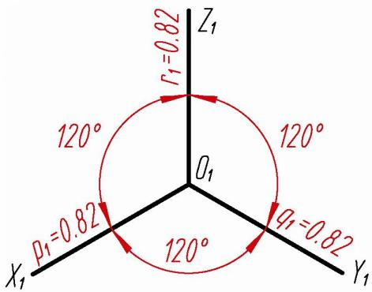 正等测轴间角、轴向伸缩系数 | 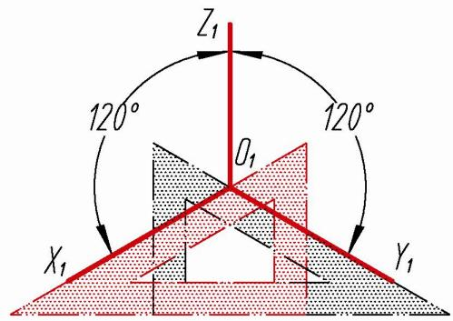 正等测轴测图的画法                                                                                                                                     |
| ------------------------------------------------------------------------------------------------------------------------------------- | --------------------------------------------------------------------------------------------------------------------------------------------------------------------------------------------------------------------------------------------------------------------- |
| ![[images/Pasted image 20260515171720.png]] 视图                                                                                            | 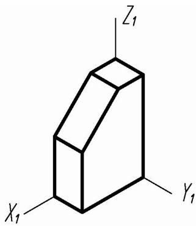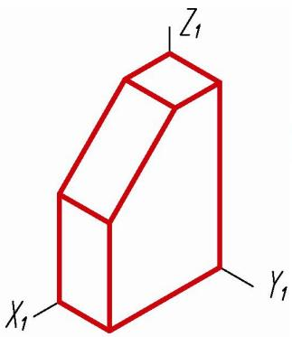 采用轴向伸缩系数       采用简化轴向伸缩系数 |

# 二、平面立体的正等测画法

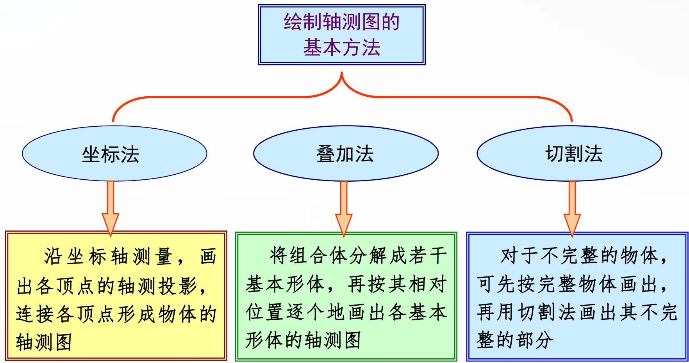

# 例题：根据正六棱柱的两视图，画出其正等测

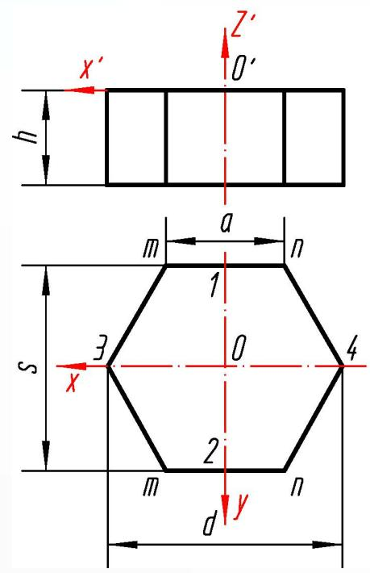

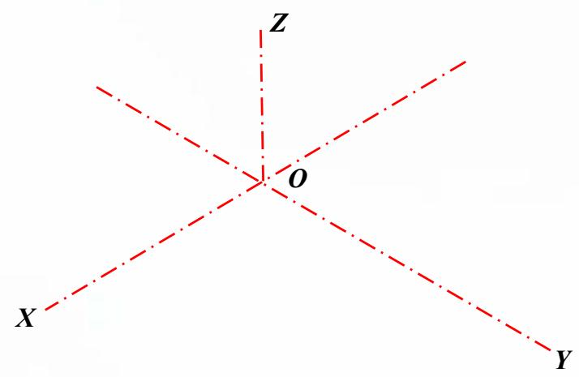

# 例题：根据正六棱柱的两视图，画出其正等测

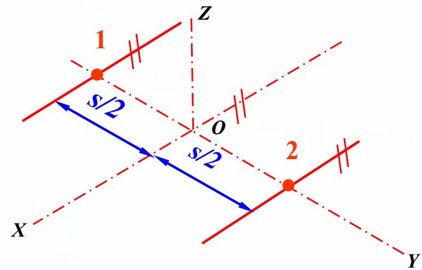

取轴向伸缩系数为1，即各段尺寸不变，绘制正六棱柱顶面。

# 例题：根据正六棱柱的两视图，画出其正等测

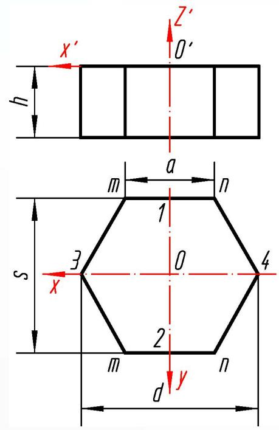

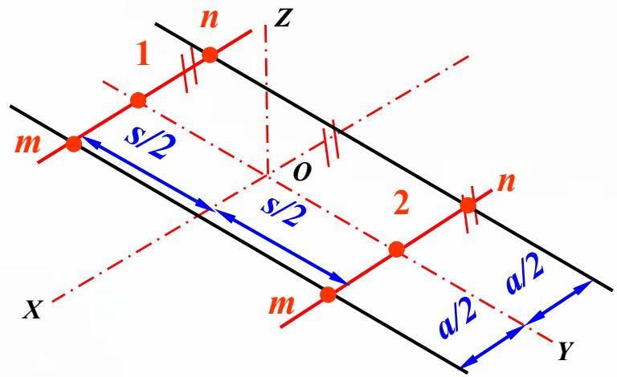

取轴向伸缩系数为1，即各段尺寸不变，绘制正六棱柱顶面。

# 例题：根据正六棱柱的两视图，画出其正等测

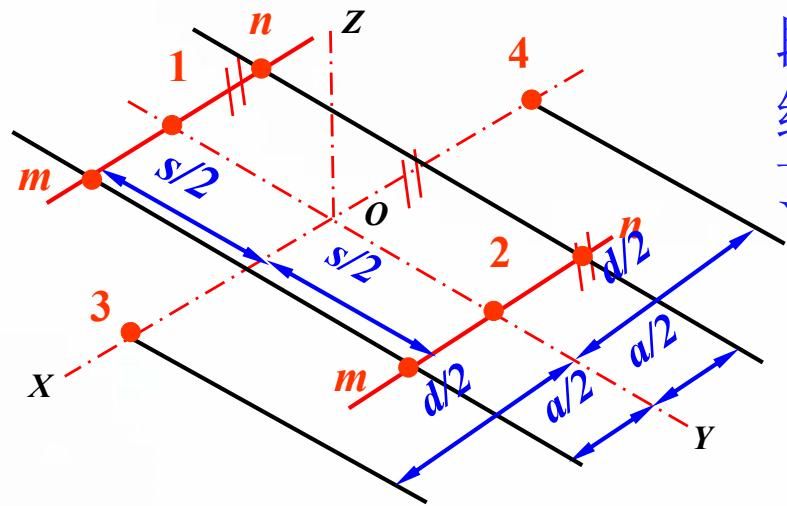

取轴向伸缩系数为1，即各段尺寸不变，绘制正六棱柱顶面。

# 例题：根据正六棱柱的两视图，画出其正等测

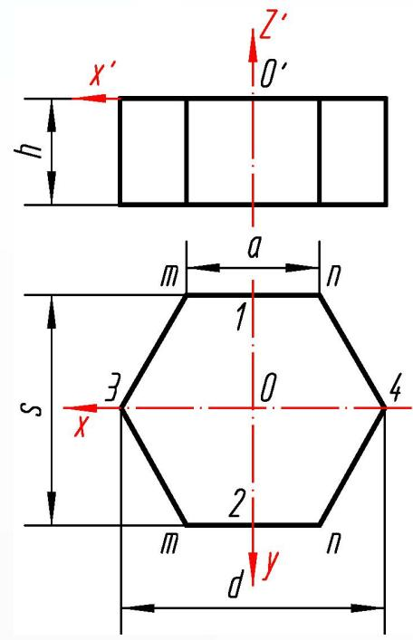

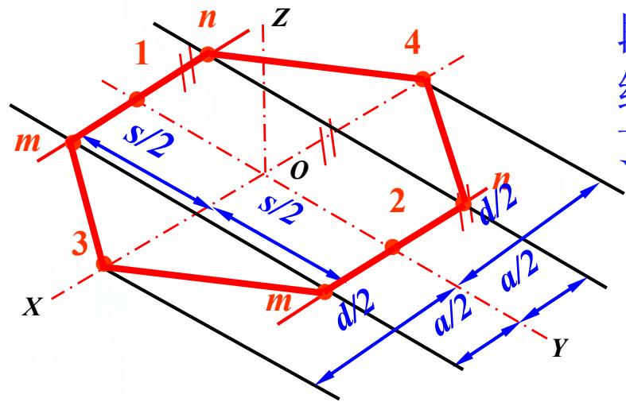

取轴向伸缩系数为1，即各段尺寸不变，绘制正六棱柱顶面。

# 例题：根据正六棱柱的两视图，画出其正等测

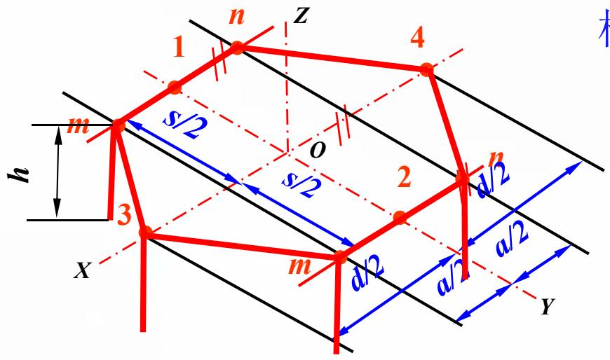

过顶面各顶点，绘制正六棱柱的各边。

# 例题：根据正六棱柱的两视图，画出其正等测

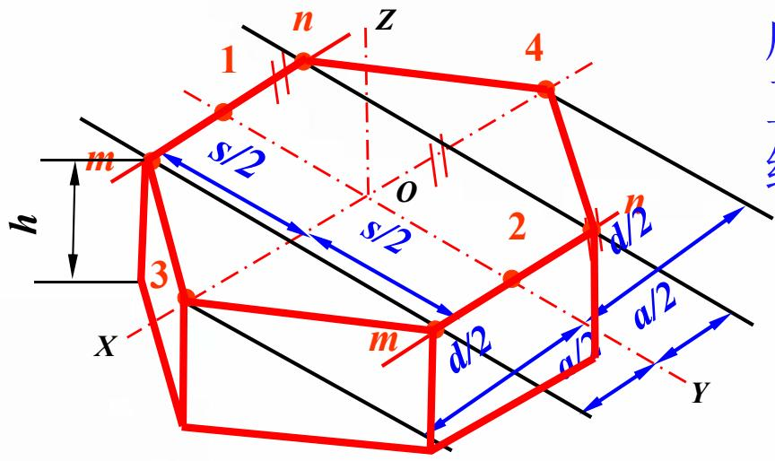

连接确定的各底面顶点，完成正六棱柱的正等轴测图的绘制。

# 例题：根据正六棱柱的两视图，画出其正等测

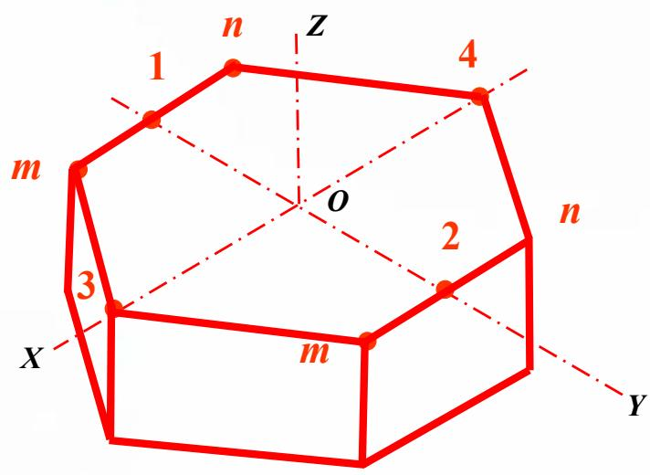
