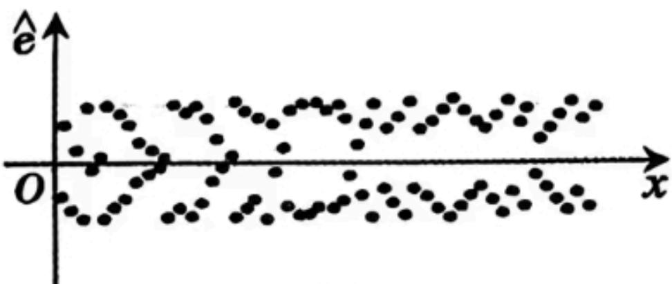
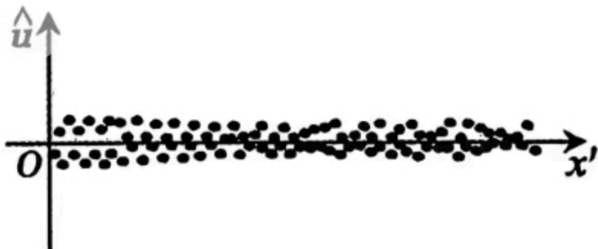
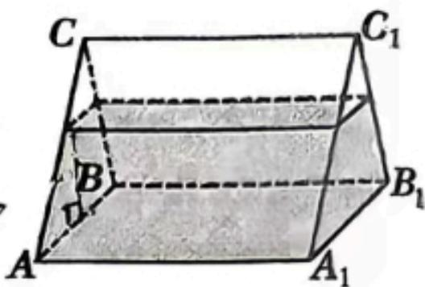

# 2025—2026 学年度第二学期高二年级期末教学质量监测试卷

# 数学

注意事项：

1. 考生答卷前,务必将自己的姓名、座位号写在答题卡上。将条形码粘贴在规定区域。本试卷满分 150 分,考试时间 120 分钟。

2. 做选择题时, 选出每小题答案后, 用铅笔把答题卡上对应题目的答案标号涂黑。如需改动, 用橡皮擦干净后, 再选涂其他答案标号。写在本试卷上无效。

3. 回答非选择题时, 将答案写在答题卡的规定区域内, 写在本试卷上无效。

4. 考试结束后, 将答题卡交回。

## 一、选择题:本题共8小题,每小题5分,共40分.在每小题给出的四个选项中,只有一项是符合题目要求的.

1. 在复平面内, 复数 $z$ 对应的点的坐标是 $(-1, -\sqrt{3})$ , 则 $z$ 的共轭复数 $z =$ A. $1 + \sqrt{3}\mathrm{i}$ B. $1 - \sqrt{3}\mathrm{i}$ C. $-1 + \sqrt{3}\mathrm{i}$ D. $-1 - \sqrt{3}\mathrm{i}$

2. 已知集合 $A = \{-1, 0, 1, 2, 8\}, B = \{x \mid \sqrt[3]{x} = x\}$ , 则 $A \cap B =$ A. $\{0, 1\}$ B. $\{-1, 0, 1\}$ C. $\{0, 2, 8\}$ D. $\{0, 1, 2, 8\}$

3. 设 $\vec{a}, \vec{b}$ 为单位向量，且 $|\vec{a} - \vec{b}| = \sqrt{2}$ ，则 $|\vec{a} + \vec{b}| =$ A. 1
B. $\sqrt{2}$ C. $\sqrt{3}$ D. 2

4. 已知 $\frac{\sin(\alpha+\beta)}{\sin(\alpha-\beta)}=3$ ，则 $\frac{\tan\alpha}{\tan\beta}=$ A. $\frac{1}{3}$ B. $\frac{1}{2}$ C.2 D.3

5. 某中学举办田径运动会, 某班从甲、乙等 6 名学生中选 4 名学生代表班级参加学校 $4 \times 1$ 米接力赛, 其中甲只能跑第 1 棒或第 2 棒, 乙只能跑第 2 棒或第 4 棒, 那么甲、乙都参加不同棒次安排方案总数为
A. 12 B. 24 C. 30 D. 36

6. 长方体的一条体对角线与它在一个顶点处的三个面所成的角分别为 $\alpha, \beta, \gamma$ , 则
A. $\sin^{2}\alpha + \sin^{2}\beta + \sin^{2}\gamma = 1$ B. $\sin^{2}\alpha + \sin^{2}\beta + \sin^{2}\gamma = 2$ C. $\cos^{2}\alpha + \cos^{2}\beta + \cos^{2}\gamma = 3$ D. $\cos^{2}\alpha + \cos^{2}\beta + \cos^{2}\gamma = 1$

7. 设 P, Q 分别为 $x^{2} + (y - 6)^{2} = 2$ 和椭圆 $\frac{x^{2}}{10} + y^{2} = 1$ 上的点，则 P, Q 两点间的最大距离是
A. $5\sqrt{2}$ B. $\sqrt{46} + \sqrt{2}$ C. $7 + \sqrt{2}$ D. $\sqrt{2}$

8. 若存在 $a \in R$ 且 $a \neq 0$ , 对任意的 $x \in R$ , 均有 $f(x + a) < f(x) + f(a)$ 恒成立, 则称函数 $f(x)$ 具有性质 $P$ . 已知: $q_{1}: f(x)$ 单调递减, 且 $f(x) > 0$ 恒成立; $q_{2}: f(x)$ 单调递增, 存在 $x_{0} < 0$ 使得 $f(x_{0}) = 0$ , 则是 $f(x)$ 具有性质 $P$ 的充分条件是
A. $q_{1}$ 和 $q_{2}$ B. 只有 $q_{1}$ C. 只有 $q_{2}$ D. $q_{1}$ 和 $q_{2}$ 都不是

## 二、选择题:大题共3小题,每小题6分,共18分.在每小题给出的四个选项中,有多项是符合题目要求的,全部选对的得6分,部分选对的得部分分,有选错的得0分.

9. 已知曲线 $C: mx^{2} + ny^{2} = 1$ ，下列说法正确的是
A. 若 $m > n > 0$ ，则 $C$ 是椭圆，其焦点在 $y$ 轴上
B. 若 $m = n > 0$ ，则 $C$ 是圆，其半径为 $\sqrt{n}$ C. 若 $mn < 0$ ，则 $C$ 是双曲线，其渐近线方程为 $y = \pm \sqrt{-\frac{m}{n}} x$ D. 若 $m = 0, n > 0$ ，则 $C$ 是两条直线

10. 一组样本数据 $(x_{i},y_{i}), i\in\{1,2,3\cdots,100\}$ . 其中 $\sum_{i=1}^{100}x_{i}=2\times10^{5},\sum_{i=1}^{100}y_{i}=970$ , 求得其经验回归方程为: $\hat{y}=-0.02x+\hat{a}_{1}$ , 残差为 $\hat{e}_{i}$ . 对样本数据进行处理: $x_{i}^{\prime}=\ln x_{i}$ , 得到新的数据 $(x_{i}^{\prime},y_{i})$ , 求得其经验回归方程为: $\hat{y}=-0.42x+\hat{a}_{2}$ , 其残差为 $\hat{u}_{i}\cdot\hat{e}_{i}\cdot\hat{u}_{i}$ 分布如图所示, 且 $\hat{e}\sim N(0,\sigma_{1}^{2}),\hat{u}\sim N(0,\sigma_{2}^{2})$ 则

图1 图2
A. 梯牢 $(x_{i}, y_{i})$ 负相关 B. $\stackrel{\wedge}{a}_{1}=49.7$ C. $\sigma_{1}^{2}<\sigma_{2}^{2}$ D. 处理后的决定系数变大

11. 已知函数 $f(x) = \ln x - \cos x$ ，将 $f(x)$ 的所有极值点按照由小到大的顺序排列，得到数列 $\{x_n\}$ ，对于正整数 $n$ ，则下列说法中正确的有
A. $(n - \frac{1}{2})\pi < x_n < (n + \frac{1}{2})\pi$ B. $x_{n+1} - x_n < \pi$ C. $\{ |x_n - n\pi | \}$ 为递减数列
D. $f(x_{2n-1}) > \ln \frac{(4n-1)\pi}{2}$

## 三、填空题：本题共3小题，每小题5分，共15分.

12. 记 $S_{n}$ 为等差数列 $\{a_{n}\}$ 的前 $n$ 项和, 若 $a_{1} = -3, a_{5} = 5$ , 则 $S_{6} =$ \_\_\_\_.

13. 袋中有 2 个红球、5 个白球, 现随机不放回地逐个摸出. 设 $X$ 为“首次出现某一种颜色的球被全部摸出”时所需的摸球次数, 则 $X = 3$ 的概率为 \_\_\_\_.

14. 一个底面边长和侧棱长均为 4 的正三棱柱密闭容器 ABC - $A_{1}B_{1}C_{1}$ ，其中盛有一定体积的水，当底面 ABC 水平放置时，水面高为 $\frac{15}{4}$ 。当侧面 $AA_{1}B_{1}B$ 水平放置时（如图），容器内的水形成新的几何体。若该几何体的所有顶点均在同一个球面上，则该球的表面积为 \_\_\_\_。

## 四、解答题:本题共5小题,共77分. 解答应写出文字说明、证明过程或演算步骤.

15.(13分)

某沙漠地区经过治理,生态系统得到很大改善,野生动物数量有所增加.为调查该地区某种野生动物的数量,将其分成面积相近的200个地块,从这些地块中用简单随机抽样的方法抽取40个作为样区,工作人员将区域内的地块按植被情况分为高覆盖地块、低覆盖地块两类,统计每块样区野生动物数量为“较多”或“较少”,统计结果如下

<table><tr><td></td><td>高覆盖地块</td><td>低覆盖地块</td><td>合计</td></tr><tr><td>野生动物数量较多</td><td>14</td><td>6</td><td>20</td></tr><tr><td>野生动物数量较少</td><td>8</td><td>12</td><td>20</td></tr><tr><td>合计</td><td>22</td><td>18</td><td>40</td></tr></table>

(1)依据小概率值 $\alpha = 0.05$ 的独立性检验, 判断是否有充分证据认为 “该地区此种野生动物数量多少与地块植物覆盖面积高低存在关联”;

(2)根据现有统计资料,各地块间植物覆盖面积差异很大.为提高样本的代表性以获得该地区这种野生动物数量更准确的估计,请给出一种你认为更合理的抽样方法,并说明理由.

(注: $\chi^{2}=\frac{n(ad-bc)^{2}}{(a+b)(c+d)(a+c)(b+d)}$ ,其中 $n=a+b+c+d$ )

<table><tr><td> $P(\chi^{2} \geqslant k_{\alpha})$ </td><td>0.100</td><td>0.050</td><td>0.010</td><td>0.005</td><td>0.001</td></tr><tr><td> $k_{\alpha}$ </td><td>2.706</td><td>3.841</td><td>6.635</td><td>7.879</td><td>10.828</td></tr></table>

16.(15分)

已知函数 $f(x)=\frac{a\cdot3^{x}+2}{3^{x}+1}+x^{3},a\in R.$

(1) 当 a = -2 时, 求证: 函数 $f(x)$ 是奇函数;

(2) 当 $a > -2$ 时, 求 $f(1) + \frac{1}{f(-1)}$ 的最小值.

17.(15分)

在 $\triangle ABC$ 中，角A、B、C的对边分别为a、b、c，已知 $c=b\tan C$ .

(1) 若 B 为锐角, 试判断 $\triangle ABC$ 的形状;

(2) 若 B 为钝角, 求 $\sin A + \sin C$ 的最大值.

18.(17分)

已知函数 $f(x)=a^{2}x^{2}-3ax\ln x,a>0.$

(1) 当 $a = 1$ 时, 求曲线 $y = f(x)$ 在 $(1, f(1))$ 处的切线方程;

(2) 讨论 $f(x)$ 的零点个数；

(3) 当 a > 2 时, 证明: $f(x) > 2x$ .

19.(17分)

某款游戏预推出一项皮肤抽卡活动,玩家每次抽卡需要花费10元,现有以下两种方案.方案一:没有保底机制,每次抽卡抽中新皮肤的概率为 $p_{1}$ ;方案二:每次抽卡抽中新皮肤的概率为 $p_{2}$ ,若连续9次未抽中,则第10次必中新皮肤.已知 $0<p_{2}<p_{1}<1$ ,玩家按照一、二两种方案进行抽卡,首次抽中新皮肤时的累计花费为X,Y(元).

(1) 按照方案一, 小明先抽取三次, 没有抽中皮肤, 则他第四次抽中皮肤的概率是多少?

(2) 设第 k 次首次抽中皮肤, 求 $P(X=10k)$ , $P(Y=10k)$ ;

(3) 若 $P_{1} = 2P_{2} = 0.1$ , 根据花费的均值从游戏策划角度选择收益较高的方案. (参考数据: $0.95^{9} \approx 0.63, 0.95^{10} \approx 0.60$ .)
