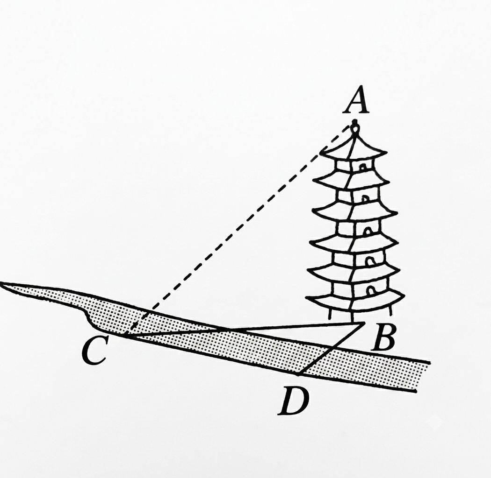
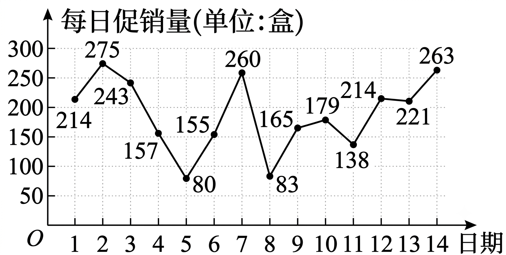
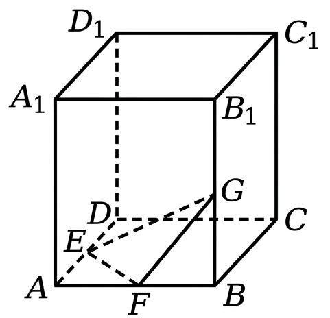
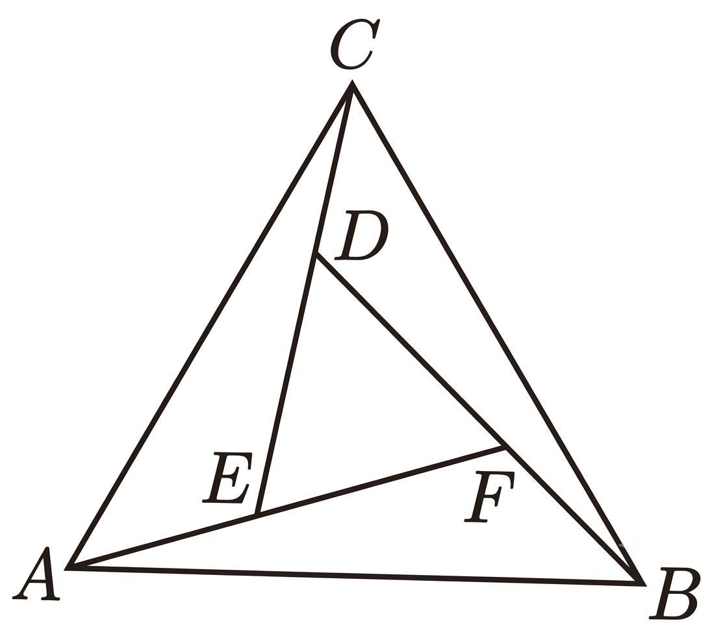
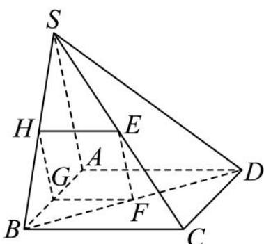
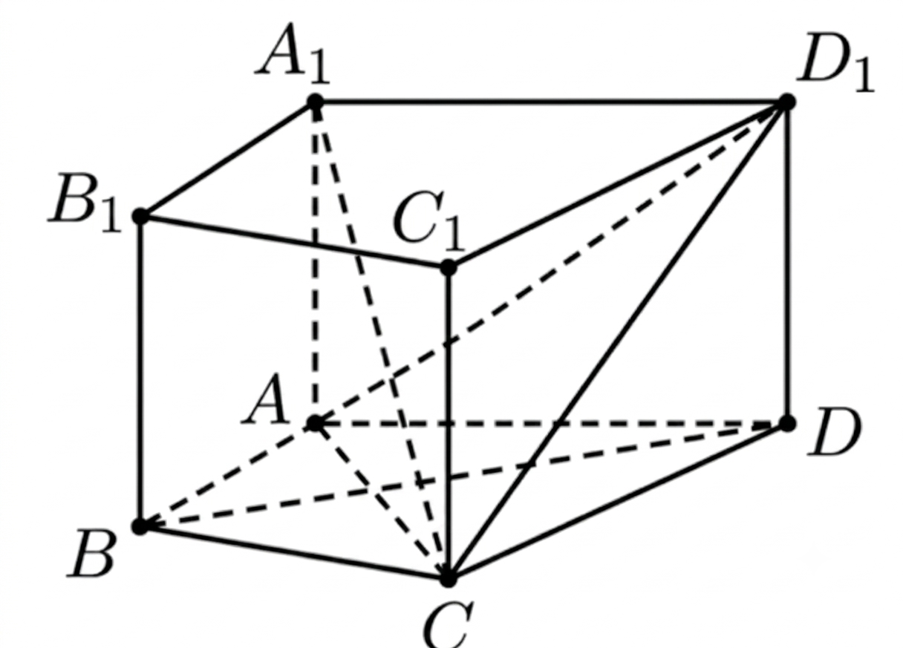
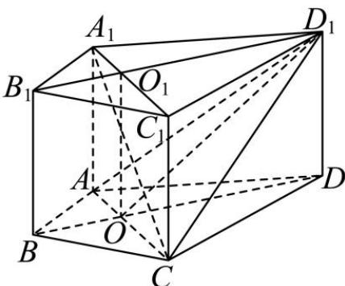

# 2025—2026 学年度第二学期高一年级期末教学质量监测试卷

## 注意事项

1. 考生答卷前,务必将自己的姓名、座位号写在答题卡上。将条形码粘贴在规定区域本试卷满分 150 分,考试时间 120 分钟。

2. 做选择题时, 选出每小题答案后, 用铅笔把答题卡上对应题目的答案标号涂黑。如改动, 用橡皮擦干净后, 再选涂其他答案标号。写在本试卷上无效。

3. 回答非选择题时，将答案写在答题卡的规定区域内，写在本试卷上无效。

4. 考试结束后，将答题卡交回。

## 一、选择题:本题共8小题,每小题5分,共40分.在每小题给出的四个选项中,只有一项是合题目要求的.

### 1

已知复数 z 满足 $z = \frac{3 - i}{1 + i}$ (其中 i 为虚数单位)，则 $|z| =$

- A. $\sqrt{2}$
- B. 2
- C. $\sqrt{5}$
- D. $\sqrt{10}$

#### 答案

C

### 2

已知向量 $\vec{a} = (4, 2), \vec{b} = (x, 1)$ , 且 $\vec{a} // \vec{b}$ , 则 $\vec{a} \cdot \vec{b} =$

- A. 12
- B. 10
- C. 8
- D. 4

#### 答案

B

### 3

某校从 500 名同学中用随机数法抽取 30 人参加一项调查. 将这 500 名同学编号为 00
002, …500, 假设从第 1 行第 4 列的数字开始, 则第 5 个被抽到的同学的编号为
3484 4217 5572 1754 5560 8331
0474 4767 2176 3350 2583 9212
0676 6301 6378 5916 9555 6719

- A. 331
- B. 047
- C. 455
- D. 447

#### 答案

B

### 4

已知 $\alpha, \beta$ 是两个不重合的平面, $m, n$ 是两条不同的直线, 则下列命题中错误的是

- A. 若 $m \parallel n, n \subset \alpha$ , 则 $m \parallel \alpha$
- B. 若 $m \parallel \alpha, m \parallel \beta, \alpha \cap \beta = n$ , 则 $m \parallel n$
- C. 若 $m \perp \alpha, m \perp \beta$ , 则 $\alpha \parallel \beta$
- D. 若 $\alpha \perp \beta, m \perp \alpha, n \perp \beta$ , 则 $m \perp n$

#### 答案

A

### 5

甲、乙两人每次射击命中目标的概率分别为 $\frac{1}{3}$ 与 $\frac{2}{3}$ , 且每次射击命中与否互不影响. 两人约定如下: 每次由一人射击, 若命中, 下一次由另一人射击; 若没有命中, 则继续射击, 若约定甲先射击, 则前 4 次中甲恰好射击 3 次的概率为

- A. $\frac{1}{9}$
- B. $\frac{4}{27}$
- C. $\frac{2}{9}$
- D. $\frac{4}{9}$

#### 答案

D

### 6

已知 $\cos(\alpha - \beta) = \frac{1}{5}$ , $\cos\alpha\cos\beta = \frac{2}{5}$ , 则 $\cos(2\alpha + 2\beta) =$

- A. $\frac{23}{25}$
- B. $-\frac{23}{25}$
- C. $\frac{7}{25}$
- D. $-\frac{7}{25}$

#### 答案

D

### 7

如图, 在测量河对岸的塔高 $AB$ 时, 测量者选取了与塔底 $B$ 在同一水平面内的两个测量基点 $C$ 与 $D$ , 并测得 $\angle BDC = 120^{\circ}, \angle BCD = 15^{\circ}, CD = 20$ 米, 在点 $C$ 处测得塔顶 $A$ 的仰角为 $30^{\circ}$ , 则塔高 $AB =$

- A. $10\sqrt{2}$ 米
- B. 10 米
- C. $10\sqrt{6}$ 米
- D. 11 米

#### 答案

A

### 8

已知三棱锥 $P - ABC$ 的顶点均在球 $O$ 的球面上, 且球心 $O$ 在棱 $AB$ 上, 若球 $O$ 的表面积为 $16 \pi$ , 则三棱锥 $P - ABC$ 的体积最大值为

- A. $\frac{4}{3}$
- B. 2
- C. $\frac{8}{3}$
- D. $\frac{16}{3}$

#### 答案

C

## 二、选择题:本题共3小题,每小题6分,共18分.在每小题给出的四个选项中,有多项符合题目要求.全部选对的得6分,部分选对的得部分分,有选错的得0分.

### 9

某超市在两周内的蓝莓每日促销量如图所示, 根据此折线图, 下面结论正确的是

- A. 这 14 天日促销量的中位数是 196
- B. 这 14 天日促销量的众数是 214
- C. 这 14 天日促销量的第 80 百分位数是 260
- D. 这 14 天日促销量的极差为 194

#### 答案

BC

### 10

已知函数 $f(x) = \cos \left(2x - \frac{\pi}{4}\right)$ ，下列说法正确的是

- A. $f(x)$ 的最小正周期是 $\pi$
- B. $f(x)$ 可由函数 $y = \cos 2x$ 向右平移 $\frac{\pi}{4}$ 个单位（纵坐标不变）得到
- C. $f(x)$ 的图象关于 $x = -\frac{3\pi}{8}$ 对称
- D. $f(x)$ 图象的一个对称中心是 $(\frac{7\pi}{8}, 0)$

#### 答案

ACD

### 11

如图, 正方体 $ABCD - A_{1}B_{1}C_{1}D_{1}$ 棱长为 2, E, F, G 分别为棱 $AD, AB, BB_{1}$ 的中点, P 是正体表面上的动点,则下列说法正确的是

- A. $B_{1}D_{1}$ // 平面 EFG
- B. 若 P 为线段 $B_{1}D_{1}$ 上一点, 则三棱锥 F-EGP 的体积为定值
- C. 若 AP = 2, 则点 P 的轨迹长度为 $\pi$
- D. 过 E、F、G 三点的平面截正方体所得截面的面积为 $3\sqrt{3}$

#### 答案

ABD

## 三、填空题：本题共3小题，每小题5分，共15分.

### 12

已知向量 $\vec{a}, \vec{b}$ 的夹角为 $\frac{5\pi}{6}$ ， $|\vec{a}| = \sqrt{3}$ ， $|\vec{b}| = 1$ ，则 $|2\vec{a} + \vec{b}| =$ \_\_\_\_.

#### 答案

$\sqrt{7}$

### 13

在正方体 $ABCD - A_{1}B_{1}C_{1}D_{1}$ 中，E 是 AD 的中点，F 是 $A_{1}D_{1}$ 的中点，则异面直线 $D_{1}E$ 为 $C_{1}F$ 所成角的正弦值为 \_\_\_\_。

#### 答案

$\frac{2\sqrt{6}}{5}$

### 14

如图, 三个全等的三角形 $\triangle ABF$ , $\triangle BCD$ , $\triangle CAE$ 拼成一个等边三角形 $ABC$ , 且 $\triangle DEF$ 为等边三角形, 若 $EF = 2AE$ , 则 $\tan \angle ACE$ 的值为 \_\_\_\_.

#### 答案

$\frac{\sqrt{3}}{7}$

## 四、解答题：本题共5小题，共77分. 解答应写出文字说明、证明过程或演算步骤.

### 15

(13分)如图,在四棱锥S-ABCD中,底面ABCD是边长为1的正方形,E、F分别是SC、BD的中点.
(1)求证:EF//平面SAB;
(2)若SA⊥平面ABCD,且SA=2,求点A到平面SDB的距离.

#### 解答

（1）证明：取线段 SB、AB 的中点分别为 H、G，连接 EH, HG, FG，则 $EH \parallel BC, EH = \frac{1}{2} BC, \quad FG \parallel AD, FG = \frac{1}{2} AD$ ，又底面 ABCD 是正方形，即 BC // AD, BC = AD，则 EH // FG, EH = FG，即四边形 EFGH 为平行四边形，……4 分则 EF // HG，又 $EF \notin$ 平面 SAB， $HG \subset$ 平面 SAB，故 EF // 平面 SAB.

（2）解：设点 A 到平面 SDB 的距离为 h，
由 $V_{A-SBD} = V_{S-ABD}$ ……8 分
得 $h = \frac{S_{\Delta ABD} \cdot SA}{S_{\Delta SBD}} = \frac{\frac{1}{2} AB \cdot AD \cdot SA}{\frac{1}{2} BD \cdot SF} = \frac{2}{\sqrt{2} \times \sqrt{SB^{2} - BF^{2}}} = \frac{2}{\sqrt{2} \times \sqrt{5 - \frac{1}{2}}} = \frac{2}{3}.$ 即点 A 到平面 SDB 的距离为 $\frac{2}{3}$ . ……13 分

### 16

(15 分) 已知函数 $f(x) = \sin^2 x + \sin x \cos x - \frac{1}{2}, x \in R$ .

(1) 求 $f(x)$ 在 $[0, \pi]$ 的单调递减区间；

(2) 若 $f(\alpha) = \frac{\sqrt{2}}{6}, \alpha \in (-\frac{\pi}{8}, \frac{3\pi}{8})$ ，求 $\sin 2\alpha$ 的值.

#### 解答

解：（1） $f(x)=\sin^{2}x+\sin x\cos x-\frac{1}{2}=\frac{1-\cos 2x}{2}+\frac{1}{2}\sin 2x-\frac{1}{2}$ ……2 分 $=\frac{1}{2}\sin 2x-\frac{1}{2}\cos 2x=\frac{\sqrt{2}}{2}\sin(2x-\frac{\pi}{4})$ ……4 分
由 $\frac{\pi}{2}+2k\pi\leq2x-\frac{\pi}{4}\leq\frac{3\pi}{2}+2k\pi,k\in Z$ ，解得 $\frac{3\pi}{8}+k\pi\leq x\leq\frac{7\pi}{8}+k\pi,k\in Z$ ，……6 分又 $x \in [0, \pi]$ ，所以 $f(x)$ 的单调递减区间为 $\left[\frac{3\pi}{8}, \frac{7\pi}{8}\right]$ . ……7 分
（2）由 $f(\alpha) = \frac{\sqrt{2}}{6}$ ，所以 $\frac{\sqrt{2}}{2} \sin(2\alpha - \frac{\pi}{4}) = \frac{\sqrt{2}}{6}$ ，所以 $\sin(2\alpha - \frac{\pi}{4}) = \frac{1}{3}$ ，……9 分
又 $\alpha \in \left(-\frac{\pi}{8}, \frac{3\pi}{8}\right)$ ，所以 $2\alpha - \frac{\pi}{4} \in \left(-\frac{\pi}{2}, \frac{\pi}{2}\right)$ ，……10 分
所以 $\cos(2\alpha - \frac{\pi}{4}) = \sqrt{1 - \sin^2(2\alpha - \frac{\pi}{4})} = \frac{2\sqrt{2}}{3}$ ，……12 分
所以 $\sin 2\alpha = \sin(2\alpha - \frac{\pi}{4} + \frac{\pi}{4}) = \sin(2\alpha - \frac{\pi}{4}) \cos \frac{\pi}{4} + \cos(2\alpha - \frac{\pi}{4}) \sin \frac{\pi}{4}$ $= \frac{1}{3} \times \frac{\sqrt{2}}{2} + \frac{2\sqrt{2}}{3} \times \frac{\sqrt{2}}{2} = \frac{\sqrt{2} + 4}{6}$ .

……15 分

### 17

(15分)包头市举行“高一年级π节数学竞赛”,竞赛分为初赛和决赛两个阶段.为了解初赛情况,现从某中学高一年级随机抽取了200名学生,记录他们的初赛成绩,将数据按照[50,60), [60,70), [70,80), [80,90), [90,100]分成5组,制成了如图所示的频率分布直方图.

(1)求频率分布直方图中 a 的值,并估计高一年级初赛成绩的众数和平均成绩(同一组中的数据用该组区间的中点值代替);

(2) 按照分层抽样从 $[60,70)$ 和 $[70,80)$ 两组中随机抽取了 5 名学生, 现从已抽取的 5 名学生中随机抽取 2 名, 求至少有 1 名学生的成绩在 $[60,70)$ 内的概率.

#### 解答

解：

（1）由频率分布直方图得， $10 \times (0.005 + a + 0.030 + 0.035 + 0.010) = 1$ ，
解得 $a = 0.020$ ．……2 分
由频率分布直方图可知初赛成绩的众数为 $\frac{80 + 90}{2} = 85$ ，……4 分
估计初赛成绩的平均数为： $\bar{x} = 55 \times 0.05 + 65 \times 0.2 + 75 \times 0.3 + 85 \times 0.35 + 95 \times 0.1 = 77.5$ ．
所以 $a = 0.020$ ，众数为 85，平均成绩为 77.5．……7 分
（2）由（1）知，成绩在[60,70)，[70,80)的频率之比为 $0.2:0.3 = 2:3$ ，……8 分
则在[60,70)中随机抽取了 $5 \times \frac{2}{5} = 2$ 人，记为 $a$ ， $b$ ，
在[70,80)中随机抽取了 $5 \times \frac{3}{5} = 3$ 人，记为 $c$ ， $d$ ， $e$ ，……10 分
从 5 人中随机抽取 2 人的样本空间为： $\Omega = \{ab, ac, ad, ae, bc, bd, be, cd, ce, de\}$ ，共 10 个样本点，……12 分
设事件 $D =$ “至少有 1 名学生的成绩在[60,70)内”，
则 $D = \{ab, ac, ad, ae, bc, bd, be\}$ ，有 7 个样本点，……14 分
因此 $P(D) = \frac{7}{10}$ ，所以至少有 1 名学生的成绩在[60,70)内的概率为 $\frac{7}{10}$ ．……15 分

### 18

(17分)在△ABC中,角A,B,C的对边分别为a,b,c,已知向量 $\vec{m}=(\sin A,\sin B)$ , $\vec{n}=(\cos B,\cos A)$ ，且 $\vec{m}\cdot\vec{n}=\sin2C.$

(1) 求角 C 的大小；

(2) 若 $\triangle ABC$ 为锐角三角形, $c = \sqrt{3}$ , 求 $a + b$ 的取值范围;

(3) 设 $\triangle ABC$ 的面积为 $\sqrt{3}$ ，AB 边上的中线 CD 长为 2，求 c 的长.

#### 解答

解：

（1）由题意 $\vec{m} \cdot \vec{n} = \sin A \cos B + \sin B \cos A = \sin(A + B) = \sin C$ ，
又 $\vec{m} \cdot \vec{n} = \sin 2C$ ，所以 $\sin C = \sin 2C$ ．……2 分
又 $C \in (0, \pi)$ ，所以 $C = 2C$ 或 $C + 2C = \pi$ ，所以 $C = \frac{\pi}{3}$ ．……4 分

（2）因为 $C = \frac{\pi}{3}$ ， $c = \sqrt{3}$ ，由正弦定理得： $\frac{a}{\sin A} = \frac{b}{\sin B} = \frac{c}{\sin C} = \frac{\sqrt{3}}{\sin \frac{\pi}{3}} = \frac{\sqrt{3}}{\frac{\sqrt{3}}{2}} = 2$ 则 $a = 2\sin A$ ， $b = 2\sin B$ . ……5分易知 $B = \pi -A - \frac{\pi}{3} = \frac{2\pi}{3} -A$ 所以 $a + b = 2\sin A + 2\sin \left(\frac{2\pi}{3} -A\right) = 3\sin A + \sqrt{3}\cos A = 2\sqrt{3}\sin \left(A + \frac{\pi}{6}\right)$ . ……8分因为△ABC为锐角三角形，所以 $\left\{ \begin{array}{l}0 < A <   \frac{\pi}{2}\\ 0 <   \frac{2\pi}{3} -A <   \frac{\pi}{2} \end{array} \right.$ ，解得 $\frac{\pi}{6} <  A <   \frac{\pi}{2}$ . ……9分所以 $\frac{\pi}{3} <  A + \frac{\pi}{6} <   \frac{2\pi}{3}$ ，所以 $\frac{\sqrt{3}}{2} <  \sin \left(A + \frac{\pi}{6}\right)\leq 1$ ，则 $3 <   2\sqrt{3}\sin \left(A + \frac{\pi}{6}\right)\leq 2\sqrt{3}$ 所以 $a + b$ 的取值范围是 $(3,2\sqrt{3} ]$ . ……11分

（3）由题意知， $S = \frac{1}{2} ab\sin C = \frac{\sqrt{3}}{4} ab = \sqrt{3}$ ，所以 $ab = 4$ . ……12分因为D为AB中点，所以 $\overline{CD} = \frac{1}{2}\left(\overline{CA} +\overline{CB}\right)$ ，两边平方得： $4 = \frac{1}{4}\left(b^{2} + a^{2} + 2ab\cos C\right)$ 代入并整理： $a^2 +b^2 = 12$ ， ……15分由余弦定理： $c^2 = a^2 +b^2 -2ab\cos \frac{\pi}{3} = a^2 +b^2 -ab = 8$ ，所以 $c = 2\sqrt{2}$ . ……17分

### 19

(17分)如图,在直四棱柱 $ABCD - A_{1}B_{1}C_{1}D_{1}$ 中, $BA = BC = BB_{1} = 2$ , $AC = CD$ , $AC \perp BD$ .

(1) 证明: $A_{1}C \perp BD$ ;

(2) 若 AC = 2，求二面角 $A_{1} - AC - D_{1}$ 的平面角的余弦值；

(3) 求直四棱柱 $ABCD-A_{1}B_{1}C_{1}D_{1}$ 体积的最大值.

#### 解答

（1）证明：在直四棱柱ABCD- $A_{1}B_{1}C_{1}D_{1}$ 中，因为 $AA_{1}\bot$ 平面ABCD， $BD\subset$ 平面ABCD，所以 $AA_{1}\bot BD$ ， ……1分又因为AC⊥BD, $AA_{1}\cap AC = A$ ， $AC,AA_{1}\subset$ 平面 $A_{1}AC$ ，所以BD⊥平面 $A_{1}AC$ ， ……3分又 $A_{1}C\subset$ 平面 $A_{1}AC$ ，所以BD⊥ $A_{1}C$ . ……4分

(2)解：连接 $A_{1}C_{1},B_{1}D_{1}$ ，记 $AC\cap BD = O,A_{1}C_{1}\cap B_{1}D_{1} = O_{1}$ ，连接 $OO_{1},OD_{1}$ 易得 $OO_{1}//BB_{1},BB_{1}\bot$ 平面ABCD，则 $OO_{1}\bot$ 平面ABCD，又AC⊂平面ABCD，故 $OO_{1}\bot AC$ ， ……6分又因BA=BC,AC⊥BD，所以BD是AC的中垂线，得AD=CD=AC=2，

因 $DD_{1} \perp$ 平面ABCD，易得 $AD_{1} = CD_{1}$ ，又因 $O$ 是 $AC$ 中点，所以 $OD_{1} \perp AC$ ，……7分故 $\angle O_{1}OD_{1}$ 就是二面角 $A_{1} - AC - D_{1}$ 的平面角，……8分又因 $OO_{1} = BB_{1} = 2$ ，则 $OD_{1} = \sqrt{\left(\frac{\sqrt{3}}{2} \times 2\right)^{2} + 2^{2}} = \sqrt{7}$ ，则 $\cos \angle O_{1}OD_{1} = \frac{OO_{1}}{OD_{1}} = \frac{2}{\sqrt{7}} = \frac{2\sqrt{7}}{7}$ 。即二面角 $A_{1} - AC - D_{1}$ 的平面角的余弦值是 $\frac{2\sqrt{7}}{7}$ 。……10分

（3）解：设 $\angle ABC = \theta$ ， $0 < \theta < \pi$ ，因 $AB = AC = 2$ ，由余弦定理， $AC^{2} = AB^{2} + BC^{2} - 2AB \cdot BC\cos \theta = 4 + 4 - 2 \times 2 \times 2\cos \theta = 8 - 8\cos \theta$ ， $S_{\text{四边形}ABCD} = S_{\Delta ABC} + S_{\Delta ACD} = \frac{1}{2} \times 2 \times 2\sin \theta + \frac{\sqrt{3}}{4}(8 - 8\cos \theta) = 2\sin \theta - 2\sqrt{3}\cos \theta + 2\sqrt{3} = 4\left(\frac{1}{2}\sin \theta - \frac{\sqrt{3}}{2}\cos \theta\right) + 2\sqrt{3} = 4\sin \left(\theta - \frac{\pi}{3}\right) + 2\sqrt{3}$ ，……14分因 $0 < \theta < \pi$ ，则 $-\frac{\pi}{3} < \theta - \frac{\pi}{3} < \frac{2}{3}\pi$ ，故当 $\theta - \frac{\pi}{3} = \frac{\pi}{2}$ ，即 $\theta = \frac{5\pi}{6}$ 时， $\sin \left(\theta - \frac{\pi}{3}\right)$ 取得最大值1，此时 $S_{\text{四边形}ABCD}$ 的最大值为 $S_{\max} = 4 + 2\sqrt{3}$ ，……16分故直四棱柱 $ABCD - A_{1}B_{1}C_{1}D_{1}$ 体积的最大值 $V_{\max} = S_{\max}h = (4 + 2\sqrt{3}) \times 2 = 8 + 4\sqrt{3}$ 。……17分
