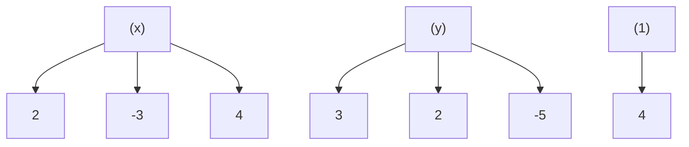
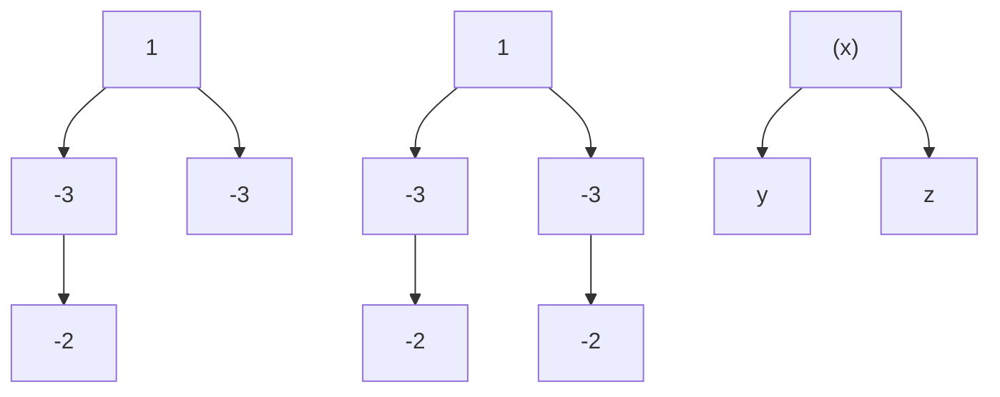
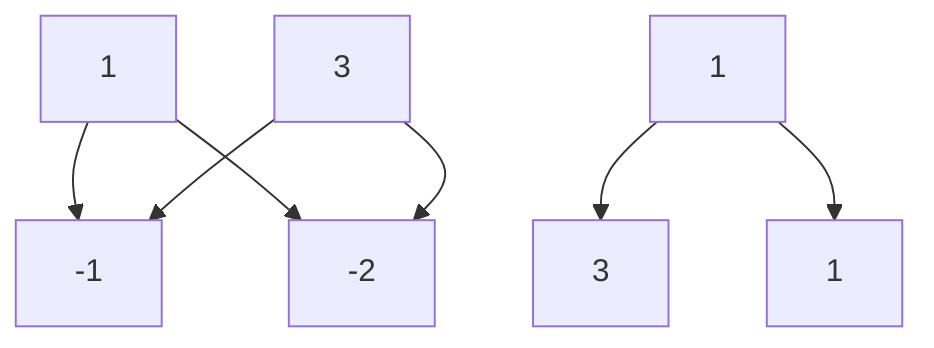

# 6 二元二次式的分解

形如 $ax^2 + bxy + cy^2 + dx + ey + f$ 的 $x$ 、 $y$ 的二元二次式也可以用十字相乘法来分解.

# 6.1 欲擒故纵

【例 1】分解因式： $x^{2}+2xy-3y^{2}+3x+y+2$ .

【解】如果只有二次项 $x^{2} + 2xy - 3y^{2}$ ，那么就由算式

得 $x^{2} + 2xy - 3y^{2} = (x - y)(x + 3y).$

如果没有含 $y$ 的项，那么对于多项式 $x^{2} + 3x + 2$ ，由算式

得 $x^{2} + 3x + 2 = (x + 1)(x + 2).$

如果没有含 x 的项，那么对于多项式 $-3y^{2}+y+2$ ，由算式

得 $-3y^{2} + y + 2 = (-y + 1)(3y + 2)$

把以上三个算式 “拼” 在一起，写成

便得到所需要的分解:

$$
x ^ {2} + 2 x y - 3 y ^ {2} + 3 x + y + 2
$$

$$
= (x - y + 1) (x + 3 y + 2).
$$

上面的算式称为长十字相乘，式中的三个十字叉乘就是上面所说的三次十字相乘（我们省略了横线及横线下面的数）。两次十字相乘就可以确定算是中的6个数，第三次十字相乘只需利用已有的数进行检验，必要时把同一列的两个数的位置交换一下。

长十字中的第一行 $1 - 1 + 1$ 表示因式 $x - y + 1$ ，第二行的 $1 + 3 + 2$ 表示另一个因式 $x + 3y + 2$

为了解决问题，常常先忽略一些条件，导出部分结果，然后再把几方面的结果综合起来，这种欲擒故纵的方法在数学中屡见不鲜.

【例 2】分解因式： $6x^{2}-5xy-6y^{2}+2x+23y-20$ .

【解】 先进行两次十字相乘，由算式得 $6x^{2} - 5xy - 6y^{2} = (2x - 3y)(3x + 2y)$

text_image

(x)
2
3
-5
(y)
-3
2

text_image

(x)
2 —— 4
3 —— -5
——
2

$$
6 x ^ {2} + 2 x - 2 0 = (2 x + 4) (3 x - 5).
$$

为避免混淆，我们在算式中写上（x）、（y）、（1），表示相应的列是 $x$ 、 $y$ 的系数或常数项．然后把两个算式拼成

flowchart

检验一下，正好有 $(-3)\times (-5) + 2\times 4 = 23,$

于是 $6x^{2} - 5xy - 6y^{2} + 2x + 23y - 20$

$$
= (2 x - 3 y + 4) (3 x + 2 y - 5).
$$

# 6.2 三元齐次

长十字相乘对于三个字母 x、y、z 的二次齐次式 $ax^{2}+bxy+cy^{2}+dxz+3yz+fz^{2}$ 也同样适合.

【例 3】分解因式： $x^{2}-6xy+9y^{2}-5xz+15yz+6z^{2}$ .

【解】由算式

flowchart

得 $x^{2} - 6xy + 9y^{2} - 5xz + 15yz + 6z^{2}$

$$
= (x - 3 y - 2 x) (x - 3 y - 3 z).
$$

【例 4】已知：a、b、c 为三角形的三条边，且

$$
a ^ {2} + 4 a c + 3 c ^ {2} - 3 a b - 7 b c + 2 b ^ {2} = 0.
$$

求证： $2b=a+c$ .

【证明】由算式

flowchart

得 $a^2 + 4ac + 3c^2 - 3ab - 7bc + 2b^2$

$$
= (a - b + 3 c) (a - 2 b + c).
$$

于是，由已知条件，得

$$
(a - b + 3 c) (a - 2 b + c) = 0.
$$

因为三角形的两条边的和大于第三条边，所以

$$
a - b + 3 c \neq 0,
$$

从而

$$
a - 2 b + c = 0,
$$

即

$$
2 b = a + c.
$$

# 6.3 项数不全

如果二次式中缺少一项或几项，长十字相乘仍然可用（通常更为简单）.

【例 5】分解因式： $x^{2}-y^{2}+5x+3y+4$ .

【解】由算式

得 $x^{2} - y^{2} + 5x + 3y + 4$

$$
= (x + y + 1) (x - y + 4).
$$

在例 5 中，如果仅看 $x^{2}-y^{2}$ 与 $x^{2}+5x+4$ ，也可能导出不完全正确的算式

在用第三个十字相乘时，可以发现第三列的 4 与 1 应当交换位置.

【例 6】分解因式： $x^{2}+3xy+2y^{2}+2x+4y$ .

【解】 由算式

得 $x^{2} + 3xy + 2y^{2} + 2x + 4y$

$$
= (x + 2 y) (x + y + 2).
$$

# 6.4 能否分解

二元二次式并不是一定能分解的．如果三个十字相乘不能拼成一个长十字相乘，那么这个二元二次式就不能分解．所以，在编制分解二元二次习题时，应当先拟好答案，即两个一次因式，然后把它们相乘，导出一个二元二次式．换句话说，应当先写出长十字相乘的算式，然后再写出二元二次式．如果随意地写一个二元二次式，那么多数是不能分解的．

【例 7】m 为什么数时， $x^{2}+7xy-18y^{2}-5x+my-24$ 可以分解为两个一次因式的积？

【解】对于多项式 $x^{2} + 7xy - 18y^{2}$ ，由算式

对于多项式 $x^{2} - 5x - 24$ ，由算式

这两个算式可以拼成长十字相乘

或

对第一个长十字相乘，有

$$
9 \times 3 + (- 2) \times (- 8) = 4 3,
$$

而对第二个长十字相乘，有

$$
9 \times (- 8) + (- 2) \times 3 = - 7 8,
$$

所以，m=43 或 m=-78 时， $x^{2}+7xy-18y^{2}-5x+my-24$ 才可以分解，并且由第一个长十字相乘，得

$$
\begin{array}{l} x ^ {2} + 7 x y - 1 8 y ^ {2} - 5 x + m y - 2 4 \\ = (x + 9 y - 8) (x - 2 y + 3), \\ \end{array}
$$

由第二个长十字相乘，得

$$
\begin{array}{l} x ^ {2} + 7 x y - 1 8 y ^ {2} - 5 x + m y - 2 4 \\ = (x + 9 y + 3) (x - 2 y - 8). \\ \end{array}
$$

# 小结

x、y 的二次式（或 x、y、z 的二次齐次式）应当用长十字相乘来分解。长十字相乘由三个十字相乘组成，它们分别表示 x、y 的二次齐次式、不含 x 的二次式（或 y、z 的二次齐次式）与不含 y 的二次式（或 z、x 的二次齐次式）的因式分解。

# 习题6

将以下各式分解因式:

1. $x^{2}+2xy+y^{2}+3x+3y+2.$   
2. $4x^{2}-14xy+6y^{2}-7x+y-2$   
3. $x^{2}-y^{2}-3z^{2}-2xz+4yz.$   
4. $2y^{2}-5xy+2x^{2}-ay-ax-a^{2}$   
5. $a^{2}-3b^{2}-3c^{2}+10bc-2ca-2ab.$

6. $2a^{2} - 7ab - 22b^{2} - 5a + 35b - 3.$   
7. $x^{2}-2y^{2}-3z^{2}+xy+7yz+2xz.$   
8. $2x^{2} - 6y^{2} + 3z^{2} - xy + 7xz + 7yz.$   
9. $4x^{2}-9y^{2}+2z^{2}+6xz-3yz.$   
10. $4x^{2}+2z^{2}+xy+9xz+2yz.$

# 习题6

1. $(x+y+1)(x+y+2)$   
2. $(4x - 2y + 1)(z - 3y - 2)$   
3. $(x+y-3z)(x-y+z)$   
4. $(x-2y-a)(2x-y+a)$   
5. $(a + b - 3c)(a - 3b + c)$   
6. $(a+2b-3)(2a-11b+1)$   
7. $(x - y + 3z)(x + 2y - z)$   
8. $(x-2y+3z)(2x+3y+z)$   
9. $(2x + 3y + 2z)(2x - 3y + z)$   
10. $(x+2z)(4x+y+z)$

