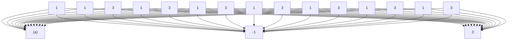

我国古代名将岳飞说过：“阵而后战，兵法之常，运用之妙，存乎一心，”因式分解也是这样，学了前面的基本方法，还需要多加练习，灵活运用。

# 7.1 善于换元

例 1 分解因式; $x^{6}-28x^{3}+27$ .

解 如果把 $x^{3}$ 记为 $u$ , 那么原式就成为:

$$
u ^ {2} - 2 8 + 2 7,
$$

例数式得:

text_image

1
-1
1
-27
-28

得 $u^2 - 28u + 27 = (u - 1)(u - 27)$

$$
x ^ {6} - 2 8 x ^ {3} - 2 7
$$

所以 $= (x^{3} - 1)(x^{3} - 27)$

$$
= (x - 1) \left(x ^ {2} + x + 1\right) (x - 3) \left(x ^ {2} + 3 x + 9\right)
$$

其实，不一定明确地把 $x^{3}$ 改记为u, 只要把 $x^{3}$ 看成一个字母就可以了.

例 2 分解因式: $(x^{2}+4x+8)^{2}+3x(x^{2}+4x+8)+2x^{2}$ .

解 我们把 $x^{2} + 4x + 8$ 看成一个字母，由算式

text_image

1
1
1
2
3

$$
\begin{array}{l} (x ^ {2} + 4 x + 8) ^ {2} + 3 x (x ^ {2} + 4 x + 8) + 2 x ^ {2} \\ = (x ^ {2} + 4 x + 8 + x) (x ^ {2} + 4 x + 8 + 2 x) \\ = (x ^ {2} + 5 x + 8) (x ^ {2} + 6 x + 8) \\ = (x + 2) (x + 4) \left(x ^ {2} + 5 x + 8\right). \\ \end{array}
$$

这里对 $x^{2} + 6x + 8$ 再次用十字相乘分解因式，而 $x^{2} + 5x + 8$ 在有理数集内不能分解，参见第11单元求根公式部分.

例 3 证明：四个连续整数的乘积加 1 是整数的平方.

证明 设这四个连续整数为

$$
x + 1, x + 2, x + 3, x + 4,
$$

则 $(x + 1)(x + 2)(x + 3)(x + 4) + 1$

$$
= [ (x + 1) (x + 4) ] [ (x + 2) (x + 3) ] + 1
$$

$$
= (x ^ {2} + 5 x + 4) (x ^ {2} + 5 x + 6) + 1
$$

我们把 $x + 1$ 与 $x + 4$ 相乘， $x + 2$ 与 $x + 3$ 相乘，好处是两个乘积不但二次项相同，而且一次项也是相同的.

把 $x^{2}+5x+5$ 看成u,这时

$$
u = x ^ {2} + 5 x + \frac {4 + 6}{2},
$$

$$
(x + 1) (x + 2) (x + 3) (x + 4) + 1
$$

$$
= \left[ \left(x ^ {2} + 5 x + 5\right) - 1 \right] \left[ \left(x ^ {2} + 5 x + 5\right) + 1 \right] + 1
$$

$$
= (x ^ {2} + 5 x + 5) ^ {2} - 1 + 1
$$

$$
= (x ^ {2} + 5 x + 5) ^ {2},
$$

这是一个平方数.

在本题中把 $x^{2}+5x$ 或 $x^{2}+5x+4$ 看成一个字母也是可以的，但切勿把 $(x+1)(x+2)(x+3)(x+4)$ 全部乘出来写成 x 的四次式，那样做的结果是被破坏了规律性难以下手.

例 4 因式分解 $4(x+5)(x+6)(x+10)(x+12)-3x^{2}$ .

解 第一项的四个因式以将 $x + 5$ 与 $x + 12$ 相乘， $x + 6$ 与 $x + 10$ 相乘为好，这时不仅二次项相同，而且常数项也相同，于是

$$
4 (x + 5) (x + 6) (x + 1 0) (x + 1 2) - 3 x ^ {2}
$$

$$
= 4 \left(x ^ {2} + 1 7 x + 6 0\right) \left(x ^ {2} + 1 6 x + 6 0\right) - 3 x ^ {2}
$$

$$
= 4 \left[ \left(x ^ {2} + 1 6 x + 6 0 0 + x \right] \left(x ^ {2} + 1 6 x + 6 0\right) - 3 x ^ {2} \right.
$$

$$
= 4 \left(x ^ {2} + 1 6 x + 6 0\right) ^ {2} + 4 x \left(x ^ {2} + 1 6 x + 6 0\right) - 3 x ^ {2}
$$

$$
= [ 2 (x ^ {2} + 1 6 x + 6 0) - x ] [ 2 (x ^ {2} + 1 6 x + 6 0) + 3 x ]
$$

$$
= (2 x ^ {2} + 3 1 x + 1 2 0) (2 x ^ {2} + 3 5 x + 1 2 0)
$$

$$
= (2 x + 1 5) (x + 8) \left(2 x ^ {2} + 3 5 x + 1 2 0\right)
$$

[把 $x^{2} + 16x + 60$ 看作 $u]$

text_image

2
-1
2
+3
4

text_image

2
1
15
8
31

# 7.2 主次分清

例 5 分解因式: $a^{2}b-ab^{2}+a^{2}c-3abc+b^{2}c+bc^{2}$ .

解 这个多项式是 $a, b, c$ 的三项式，项数多，似乎无从下手解决它的方法却是最基本的；把 $a$ 当作主要字母，也就是把这个多项式看成 $a$ 的二次式，按 $a$ 的降幂排列整理为

$$
(b + c) a ^ {2} - \left(b ^ {2} + c ^ {2} + 3 b c\right) a + \left(b ^ {2} c + b c ^ {2}\right),
$$

然后用十字相乘进行分解，这里“常数项”为

$$
b ^ {2} c + b c ^ {2} = b c (b + c).
$$

由算式

text_image

1
- (b + c)
b + c
-bc
-(b + c)² - bc = -b² - c² - 3bc

$$
\begin{array}{l} a ^ {2} b - a b ^ {2} + a ^ {2} c - a c ^ {2} - 3 a b c + b ^ {2} c + b c ^ {2} \\ = (a - b - c) (a b + a c - b c). \\ \end{array}
$$

得 $= [a - (b + c)][(b + c)a - bc]$

注：这个问题还有一个解法，见 10.4 节例 11.

例6 分解因式： $y(y + 1)(x^2 +1) + x(2y^2 +2y + 1).$

解 这是 $x$ 的二次式，原式化为

$$
y (y + 1) x ^ {2} + (2 y ^ {2} + 2 y + 1) x + y (y + 1).
$$

由算式

text_image

y
y+1
y
y+1
y

$$
y ^ {2} + (y + 1) ^ {2} = 2 y ^ {2} + 2 y + 1
$$

得 $= [yx + (y + 1)][(y + 1)x + y]$

$$
\begin{array}{l} y (y + 1) x ^ {2} + \left(2 y ^ {2} + 2 y + 1\right) x + y (y + 1) \\ = (y x + y + 1) (y x + x + y) \\ \end{array}
$$

例 7 分解因式： $ab(x^{2}-y^{2})-(a^{2}-b^{2})(xy+1)-(a^{2}+b^{2})(x+y)$

解 以 $a, b$ 为主要字母，这个多项式是 $a, b$ 的二次齐次式，把它整理成

$$
\begin{array}{l} b ^ {2} \left[ (x y + 1) - (x + y) \right] + a b \left(x ^ {2} - y ^ {2}\right) - a ^ {2} \left[ (x + y) + (x y + 1) \right] \\ = b ^ {2} \left[ (x y - x) - (y - 1) \right] + a b \left(x ^ {2} - y ^ {2}\right) - a ^ {2} \left[ (x + x y) + (y + 1) \right] \\ = b ^ {2} [ x (y - 1) - (y - 1) ] + a b \left(x ^ {2} - y ^ {2}\right) - a ^ {2} [ x (y + 1) + (y + 1) ] \\ = b ^ {2} (x - 1) (y - 1) + a b \left(x ^ {2} - y ^ {2}\right) - a ^ {2} (x + 1) (y + 1). \\ \end{array}
$$

（注：我们把 $b^{2}$ 与 $a^{2}$ 的系数分解是为了进行十字相乘，ab的系数不必分解）

由算式

text_image

x-1
y-1
-(y+1)
x+1

$$
x ^ {2} - 1 - (y ^ {2} - 1) = x ^ {2} - y ^ {2}
$$

得 原式 = $[(x-1)b-(y+1)a][(y-1)b-(x+1)a]$

$$
= (b x - b - a y - a) (b y - b + a x + a).
$$

这题按 $a$ 降幂排列也未尝不可，但是首项系数有一个负号.

# 7.3 一题两解

例 8 分解因式: $x^{2}+2(a+b)x-3a^{2}+10ab-3b^{2}$ .

解法一 这是 $x$ 的二次式，“常数项”可分解为

$$
- 3 a ^ {2} + 1 0 a b - 3 b ^ {2}
$$

$$
= - \left(3 a ^ {2} - 1 0 a b + 3 b ^ {2}\right)
$$

$$
= - (3 a - b) (a - 3 b).
$$

再对整个式子运用十字相乘，由算式

text_image

1
3a-b
1
-(a-3b)
-(a-3b)+3a-b=2a+2b

得

$$
x ^ {2} + 2 (a + b) x - 3 a ^ {2} + 1 0 a b - 3 b ^ {2}
$$

$$
= (x + 3 a - b) (x - a + 3 b).
$$

解法二 把 $x^{2} + 2(a + b)x - 3a^{2} + 10ab - 3b^{2}$ 看成 $x, a, b$ 的二次齐次式，对它采用长十字相乘，由算

式

flowchart

原式 $= (x - a + 3b)(x + 3a - b)$

# 7.4 展开处理

例 9 分解因式: $(ax + by)^{2} + (ay - bx)^{2}$ .

解 这道题必须展开处理.

$$
\begin{array}{l} (a x + b y) ^ {2} (a y - b x) ^ {2} \\ = a ^ {2} x ^ {2} + 2 a b x y + b ^ {2} y ^ {2} + a ^ {2} y ^ {2} - 2 a b x y + b ^ {2} x ^ {2} \\ = a ^ {2} x ^ {2} + b ^ {2} y ^ {2} + a ^ {2} y ^ {2} + b ^ {2} x ^ {2} \\ = \left(a ^ {2} x ^ {2} + a ^ {2} y ^ {2}\right) + \left(b ^ {2} y ^ {2} + b ^ {2} x ^ {2}\right) \\ = a \left(x ^ {2} + y ^ {2}\right) + b ^ {2} \left(x ^ {2} + y ^ {2}\right) \\ = (a ^ {2} + b ^ {2}) (x ^ {2} + y ^ {2}). \\ \end{array}
$$

这个等式表明两个平方和 $(a^{2}+b^{2}$ 和 $x^{2}+y^{2})$ 的积仍然是平方和.

例 10 分解因式: $a^{4} + 4^{4} + (a - 4)^{4}$ .

解 为更加对称起见，我们令

$$
x = a - 2
$$

于是

$$
\begin{array}{l} a ^ {4} + 4 ^ {4} + (a - 4) ^ {4} \\ = (x + 2) ^ {4} + (x - 2) ^ {4} + 4 ^ {4} \\ = \left(x ^ {4} + 1 6 x ^ {2} + 1 6 + 8 x ^ {3} + 3 2 x\right) + \left(x ^ {4} + 1 6 x ^ {2} + 1 6 - 8 x ^ {3} + 8 x ^ {2} - 3 2 x\right) + 4 ^ {4} \\ = 2 \left(x ^ {4} + 2 4 x ^ {2} + 1 6\right) + 2 5 6 \\ = 2 \left(x ^ {4} + 2 4 x ^ {2} + 1 4 4\right) \\ = 2 \left(x ^ {2} + 1 2\right) ^ {2} \\ = 2 [ (a - 2) ^ {2} + 1 2 ] ^ {2} \\ = 2 \left(a ^ {2} - 4 a + 1 6\right) ^ {2} \\ \end{array}
$$

本例是以后第 11 单元例 12 的特殊情况.

例11 分解因式： $xyz(x^{3} + y^{3} + z^{3}) - y^{3}z^{3} - z^{3}x^{3} - x^{3}y^{3}$

解

$$
x y z (x ^ {3} + y ^ {3} + z ^ {3}) - y ^ {3} z ^ {3} - z ^ {3} x ^ {3} - x ^ {3} y ^ {3}
$$

$$
= x ^ {4} y z + x y ^ {4} z + x y z ^ {4} - y ^ {3} z ^ {3} - z ^ {3} x ^ {3} - x ^ {3} y ^ {3}
$$

$$
= \left(x ^ {4} y z - y ^ {3} z ^ {3}\right) + \left(x y ^ {4} z - x ^ {3} y ^ {3}\right) + \left(x y z ^ {4} - z ^ {3} x ^ {3}\right)
$$

$$
= y z \left(x ^ {4} - y ^ {2} z ^ {2}\right) + x y ^ {3} \left(y z - x ^ {2}\right) + x z ^ {3} \left(y z - x ^ {2}\right)
$$

$$
= y z \left(x ^ {2} + y z\right) \left(x ^ {2} - y z\right) - x y ^ {3} \left(x ^ {2} - y z\right) - x z ^ {3} \left(x ^ {2} - y z\right)
$$

$$
= (x ^ {2} - y z) \left[ x ^ {2} y z + y ^ {2} z ^ {2} - x y ^ {3} - x z ^ {3}\right)
$$

$$
= (x ^ {2} - y z) \left[ x y \left(x z - y ^ {2}\right) + z ^ {2} \left(y ^ {2} - x z\right) \right.
$$

$$
= (x ^ {2} - y z) \left(y ^ {2} - x z\right) \left(z ^ {2} - x y\right)
$$

在这个例子中经过两次展开重新组合，在一组中的两项符号相反。以后，在第10单元有处理这种“对称式”的方法。

# 7.5 巧运匠心

例 12 分解因式: $(a+b)^{2}(ab-1)+1$ .

解 把前一项拆为两项，即

$$
(a + b) ^ {2} (a b - 1) + 1
$$

$$
= (a + b) ^ {2} a b - (a + b) ^ {2} + 1
$$

如果是 $x$ 的二次式

$$
(a + b) ^ {2} a b x ^ {2} - (a + b) ^ {2} x + 1,
$$

那么可以用十字相乘来分解，由算式

text_image

a(a+b)
b(a+b)
-1
-1

$$
- a (a + b) - b (a + b) = - (a + b) ^ {2}
$$

$$
(a + b) ^ {2} a b x ^ {2} - (a + b) ^ {2} x + 1
$$

得 $= [a(a + b)x - 1][b(a + b)x - 1]$

$$
= (a ^ {2} + a b - 1) (a b + b ^ {2} - 1).
$$

这个例子很有趣，有字母 x 时可以十字相乘，没有 x 时反而不容易看出它也可以相乘.

例13 将 $5^{1985} - 1$ 分解为三个大于 $5^{100}$ 的因数相乘.

解 令 $x = 5^{397}$ , 则

$$
5 ^ {1 9 8 5} - 1
$$

$$
= x ^ {5} - 1
$$

$$
= (x - 1) \left(x ^ {4} + x ^ {3} + x ^ {2} + x + 1\right).
$$

在一般情况下， $x^4 + x^3 + x^2 + x + 1$ 是一个有理数集内的既约多项式，现在 $x = 5^{397}$ ，所以

$5x=5^{398}=(5^{199})^{2}$ 是一个平方数.在这一特殊情况中，我们可以设法把 $x^{4}+x^{3}+x^{2}+x+1$ 化为两个代数式的平方差.如果前一个式的平方是

$$
(x ^ {2} + x + 1) ^ {2} = x ^ {4} + 2 x ^ {3} + 3 x ^ {2} + 2 x + 1,
$$

那么这时还剩下

$$
\begin{array}{l} (x ^ {4} + x ^ {3} + x ^ {2} + x + 1) - (x ^ {4} + 2 x ^ {3} + 3 x ^ {2} + 2 x + 1) \\ = - x ^ {3} - 2 x ^ {2} - x \\ = - x \left(x ^ {2} + 2 x + 1\right) \\ = - x (x + 1) ^ {2}, \\ \end{array}
$$

这样处理不能获得两个代数式的平方差.

应当使后一项为 $-5x(x+1)^{2}$ 是自然数的平方.这时，另一项为

$$
\begin{array}{l} x ^ {4} + x ^ {3} + x ^ {2} + x + 1 - \left[ - 5 x (x + 1) ^ {2} \right] \\ = x ^ {4} + x ^ {3} + x ^ {2} + x + 1 + 5 x \left(x ^ {2} + 2 x + 1\right) \\ = x ^ {4} + x ^ {3} + x ^ {2} + x + 1 + 5 x ^ {3} + 1 0 x ^ {2} + 5 x \\ = x ^ {4} + 6 x ^ {3} + 1 1 x ^ {2} + 6 x + 1 \\ = (x ^ {2} + 3 x + 1) ^ {2}, \\ \end{array}
$$

这是一个平方.

因此，可得

$$
\begin{array}{l} 5 ^ {1 9 8 5} - 1 \\ = (x - 1) \left(x ^ {4} + x ^ {3} + x ^ {2} + x + 1\right) \\ = (x - 1) \left\{\left[ \left(x ^ {2} + 3 x + 1\right) ^ {2} - \left[ 5 ^ {1 9 9} (x + 1) \right] ^ {2} \right. \right\} \\ = (x - 1) \left[ x ^ {2} + 3 x + 1 + 5 ^ {1 9 9} (x + 1) \right] \left[ x ^ {2} + 3 x + 1 - 5 ^ {1 9 9} (x + 1) \right], \\ \end{array}
$$

而且这三个因数都大于 $5^{100}$ .

小结

每道复杂问题的解法都可以分为若干步，每一步都是简单的问题。因此，要彻底解决复杂问题，首先要会解决简单问题。登高必自卑，行远必自迩，彻底，纯熟地掌握前面所说的基本方法即提，代，分，拆，十字相乘等，“难题”也不太难。

为了确定解题的途径与步骤，应当善于换元，把某个多项式整个看作一个字母，应当分清主次，以一两个字母当做主要字母，按字母的降幂排列，将式子理顺；应适当展开括号或拆项，重新组合。当然“运用之妙，存乎一心”，要根据情况，注意规律，巧运匠心，不可执一不化，生搬硬套”

除了前面所说的基本方法，x 的一元多次试 $f(x)$ 可用第 8 单元的方法求出它的一次因式，x, y, z 的轮换式可以用第 10 单元的方法分解；第 9 单元介绍待定系数法，可以确定 x 的四次多项式的二次因式；

第11单元介绍实数集与复数集内分解以及如何判断 $x$ 的多项式是否有二次因式 $x^{2} + x + 1$ . 在因式分解中,应当分清问题的类型,适当的方法.

最后，必须注意分解到底，即应当把原式分解的既约多项式的乘积，不能半途而废.

在 12 单元将介绍判别式一个多项式是否既约多项式的方法.

# 习题7

将以下各式分解因式:

1. $x^{4}-10x^{2}y^{2}+9y^{4}.$

2. $x^{6}-19x^{3}y^{3}-216y^{6}$

3. $x^{4} - 2(a^{2} + b^{2})x^{2} + (a^{2} - b^{2})^{2}$ .

4. $(x^{2} + y^{2})(a^{2} + b^{2}) + 4abxy]^{2} - 4[xy(a^{2} + b^{2}) + ab(x^{2} + y^{2})]^{2}$

5. $(ax + by + ay)^2 +(bx - ay)(ax + by + ay) + (bx - ay)^2$

6. $(1+y)^{2}-2x^{2}(1+y^{2})+x^{4}(1-y)^{2}$

7. $abcx^{2}+(a^{2}b^{2}+c^{2})x+abc.$

8. $(a - b)x^{2} + 2ax + a + b.$

9. $x^{2} + (a + b + c)x + (a + b)c.$

10. $a^{2}bc + ac^{2} + acb - abd - cd - d^{2}$ .

11. $x^{4}-x^{2}(a^{2}+1)+a^{2}.$

12. $x^{4} + x^{2} - 2ax + 1 - a^{2}$ .

13. $(ay + bx)^{3} + (ax + by)^{3} - (a^{3} + b^{3})(x^{3} + y^{3}).$

14. $(x+1)(x+3)(x+5)9x+7)+15.$

15. $(a - 1)(a - 2)(a - 3)(a - 4) - 24.$

16. $(x^{2} + x + 4)^{2} + 8x(x^{2} + x + 4) + 15x^{2}$ .

17. $2(x^{2} + 6x + 1)^{2} + 5(x^{2} + 6x + 1)(x^{2} + 1) + 2(x^{2} + 1)^{2}$ .

18. $(x^{2} + x)^{2} - 14(x^{2} + x) + 24.$

19. $(x^{2} + x + 1)(x^{2} + x + 2) - 12.$

20. $(x^{2} + 6x + 8)(x^{2} + 14x + 48) + 12.$

# 练习7 答案

1. $(x - y)(x + y)(x - 3y)(x + 3y)$   
2. $(x + 2y)(x - 3y)(x^2 - 2xy + 4y^2)(x^2 + 3xy + 9y^2)$   
3. $(x + a + b)(x - a - b)(x + a - b)(x - a + b)$   
4. $(a + b)^2 (a - b)^2 (x + y)^2 (x - y)^2$   
5. $\left(a^{2} + ab + b^{2}\right)\left(x^{2} + xy + y^{2}\right)$   
6. $(x - 1)(x + 1)(x - xy + 1 + y)(x - xy - 1 - y)$   
7. $(abx + c)(cx + ab)$   
8. $(x + 1)(ax - bx + a + b)$   
9. $(x + a + b)(x + c)$   
10. $(ab + c + d)(ac - d)$   
11. $(x - 1)(x + 1)(x - a)(x + a)$   
12. $\left(x^{2} + x + 1 + a\right)\left(x^{2} - x + 1 - a\right)$   
13. $3abxy(a+b)(x+y)$   
14. $(x + 2)(x + 6)(x^{2} + 8x + 10)$   
15. $a(a - 5)(a^2 -5a + 10)$   
16. $(x - 1)(x + 2)(x^{2} + x + 6)$   
17. $(x^{2} + 6x + 4)(x + 2)^{2}$   
18. $9(x + 1)^{2}(x^{2} + 4x + 1)^{2}$   
19. $(x + 2)(x - 1)(x - 3)(x + 4)$   
20. $(x + 2)(x + 4)(x^{2} + 5x + 8)$   
21. $(x - 1)(x + 2)(x^{2} + x + 5)$   
22. $(x^{2} + 10x + 18)(x^{2} + 10x + 22)$

考百分kao100.com

