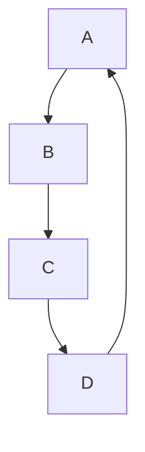

# 4. 元一次方程的应用

如果没有数学的帮助和介入，对于大自然的许多部分，我们既不能以足够的精细去阐明，也不能以足够的明晰去论证，还不能以足够的灵巧去应用。

——伽利略

现在，你已经会解一元一次方程了．你能否运用一元一次方程知识来处理一些实际问题呢?事实上我们是可以的.

因为处理实际问题时我们只要多读题，善于用字母表示出实际问题所涉及的对象和关系，并转化为一元一次方程就变得易于解决了．有时为了尽快的理解思路，需借助图表揭示实际问题中的关系，而迅捷地转化为一元次方程.

从学习数学语言的角度看，处理实际问题就是需要我们会玩语言的“三角”转换，即实际文字语言、符号语言与图表语言之间的转化。让我们从现在起努玩“语言三角”吧！

例 1 某商店一种商品的进价降低了 8%，而售价保持不变使得商店的利润率提提高十个百分点，问：原来的利润率是百分之几？

基本思路 慢读，逐句理解清楚．回顾“进价”，就是商店购进商品时的价格，可以大胆地尝试用字母表示，这里可以用 a 表示原来的进价，“进价降低了 8%”就是现在的进价为 $a \times \square 1 - 8\%$ ．“售价”就是实际销售的价格，“利润”是因销售商品而赚的钱，即利润 = 售价一进价，“利润率”就是利润与进价百分比值．用 x% 表示原来利润率，则原来的售价为“利润 + 进价” = $x\% \cdot a + a$ ，于是由“售价保持不变，可使商店的利润率提高 10%”，可得现在利润率为 $x\% + 10\%$ ，从而有 $\frac{利润}{现进价} \times 100\% = x\% + 10\%$ ，而“售价 - 现进价” = $(a + a \cdot x\%) - a \times \square 1 - 8\%$ 所以就得到式子：

$a+a\cdot x\%-a\times\square1-8\%\square=[a\times\square1-8\%\square]\cdot\square a\%+10\%\square$ ，从而转化为含字母系数的一元一次方程了，求解此方程得结果.

解 设原来的进价为 a 元，原利润率为 $x\%$ .

由题设知原售价为 $(1+x\%)a$ 元，现在进价为 $(1-8\%)a$ 元，利润率为 $x\%+10\%=(x+10)\%$ ，而现在的售价仍为 $(1+x\%)a$ ，所以现在利润= $(1+x\%)a-(1-8\%)a$ 元，从而有

$$
(1 + x \%) a - (1 - 8 \%) a = (1 - 8 \%) a \cdot (x + 10) \%,
$$

可化为 $(1+x\%)-(1-8\%)=(1-8\%(x+10)\%$ ,

$$
(1 0 0 + x) - (1 0 0 - 8) = (1 0 0 - 8) (x + 1 0) \times \frac {1}{1 0 0},
$$

$$
x + 8 = (x + 1 0) \times \frac {9 2}{1 0 0},
$$

解得 $x = 15.$

答：原来的利润率是 15%.

例 2 “妇人洗碗在河滨，路人问她客几人？答曰不知客数目，六十五碗自分明，二人共食一碗饭，三人共吃一碗羹，四人共肉无余数，请君细算客几人？”（摘自《孙子算经》）

基本思路 用 $x$ 表示客人数，“二人共食一碗饭”知饭碗用了 $\frac{x}{2}$ 只，“三人共吃一碗羹”知羹碗用了 $\frac{x}{3}$ 只，“四人共肉无余数”知肉碗用了 $\frac{x}{4}$ 只，共有碗65只，则易于列出等式.

解 设客人有 x 人，则饭碗用了 $\frac{x}{2}$ 只，羹碗用 $\frac{x}{3}$ 只，肉碗用了 $\frac{x}{4}$ 只．于是，根据题设得方程 $\frac{x}{2} + \frac{x}{3} + \frac{x}{4} = 65,$

解得 $x = 60.$

答：客人有60人.

例 3 10 个人围成一个圆圈做游戏．游戏的规则是：每个人心里都想好一个数，并把自己想好的数如实地告诉他两旁的两个人，然后每个人将他两旁的两个人告诉他的数的平均数报出来．若报出来的数如图 4-1 所示，则报 3 的人心里想的数是\_\_\_\_．（2009 年全国初中数学竞赛题）

text_image

10
9
8
7
6
1
2
3
4
5

图4-1

基本思路 设报 3 的人心里想的数是 x，报 5 的心里想的数是 a，那么报 4 的结果是 a 与 x 的平均数，即 $\frac{a+x}{2}=4$ ，得 $a=4\times2-x=8-x$ 。这样就可以知道报 5 的人心里想的数为 8-x。同样的道理，报 7 的人心里想的数是 $6\times2-(8-x)=x+4$ 报 9 的人心里想的数为 $8X2-(x+4)=12-x$ ，报 1 的人心里想的数为 $2\times10-(12-x)=x+8$ ，报 3 的人心里想的数为 $2X2-(x+8)=-x-4$ ，而这等于 x，得到方程

解 设报 3 的人心里想的数是 x 则报 5 的人心里想的数应是 $4 \times 2 - x = 8 - x$ 同理可知报 7 的人心里想的数是 $x + 4$ ，报 9 的人心里想的数是 12 - x，报 1 的人心里想的数是 $x + 8$ ，报 3 的人心里想的数是 -4 - x，于是得

$$
x = - 4 - x
$$

解得 $x = -2$

例 4 如图, 一个高为 $10 \mathrm{~cm}$ 、半径为 $6 \mathrm{~cm}$ 的圆柱, 以每分钟转一圈的速度旋转. 一个宽为 $3 \mathrm{~cm}$ 的刷子从圆柱侧面的顶端以每分钟移动 $1 \mathrm{~cm}$ 的速度垂直向下移动. 那么刷子刷过圆柱侧面 $50 \%$ 的面积所花的时间是\_\_\_\_分钟. (2011 年“时代杯”江苏省中学数学应用与创新邀请赛题)

text_image

3 cm

图(1)

text_image

A
3
B1
E
D
C
F

图(2)  
图4-2

基本思路 刷子第一圈刷过的侧面展开图如图（2）．圆柱侧面展开图为矩形，图柱高10cm为矩形的宽，长为 $2\pi\times6=12\pi$ （cm）．第一圈刷子刷过侧面展开图为平行四边形ABCD．第2圈刷子垂直向下移动1cm，得到一个小平行边形带BCFE，其面积 $1\times2\pi\times6=12\pi(cm^{2})$ ．如此继续下去，每圈多刷出 $12\pi cm^{2}$ 这样，设经过t分钟后刷子共刷过圆柱侧面的面积为 $3\times12\pi+(t-1)\times12\pi$ ，当它是圆柱侧面的50%时，就可以得到等式即方程.

解 设刷子经过 t 分钟刷过圆柱侧面 50% 的面积.

圆柱侧面积为 $2\pi \times 6 \times 10 = 120\pi (cm^{2})$ ，圆柱侧面展开图中矩形的长为 $2\pi \times 6 = 12\pi (cm)$ ，宽为 10cm.

由题设知第一圈刷过的面积为 $3\times12\pi=36\pi(cm^{2})$ ，从第2圈开始每圈多刷 $1\times12\pi=12\pi(cm^{2})$ 。
于是有

$$
36\pi +12\pi (t - 1) = 50\% \times 120\pi ,
$$

解得 t=3.

答：刷子刷过圆柱侧面 50% 的面积所花的时间 3 分钟.

说明 画一个草图如图（2）用以发现面积增加的规律．这是便捷解决实际问题的有益建议.

例 5 —辆客车、一辆货车和一辆小轿车在一条笔直的公路上朝同方向匀速行驶。在某一时刻，客车在前，小轿车在后，货车在客车与小轿车正中间。过了10分钟，小轿车追上了货车；又过了5分钟，小轿车追上了客车；再过t分钟，货车追上了客车，则 $t =$ \_\_\_\_。（2010年全国初中数学竞赛题）

基本思路 解这些较复杂的题，建议大胆用字母表示若干对象及其之间的数量关系，并借助于直观图理清它们之间的关系．读第一遍，知道了题的基本意思．读第二遍大胆设之，逐句列式，“在某一时刻，客车与货车，货车与小轿车之间的距离 s 千米，小轿车、货车、客车的速度分别为 a, b, c 千米/分，货车经过 x 分钟后追上客车．“过了 10 分钟，小轿车追上了货车”可以列式为 $10(a - b) = s$ ；“又过了 5 分钟，小轿车追上了客车”，表明小轿车用 $10 + 5 = 15$ （分钟）追上了客车，即

$(10+5)(a-c)=2s$ ；“货车经过x分钟追上客车”即 $x(a-c)=s$ ．上述三个式子联立，消去a，b，c

后可以得到所求结果.

解 设在某一时刻，货车与客车、小轿车的距离均为 s 千米，小轿车、货车、客车的速度分别为啊 a, b, c 千米/分，并设货车经过 x 分钟追上客车，则由题意得

$$
\begin{array}{l} 1 0 (a - b) = s, \\ 1 5 (a - c) = 2 s, \\ x (b - c) = a = s. \\ \end{array}
$$

由 $10(a - b) = s$ 及 $15(a - c) = 2s$ 得 $a - b = \frac{s}{10}, a - c = \frac{2s}{15}$ ，则

$$
b - c = (b - a) + (a - c) = \frac {2 s}{1 5} - \frac {s}{1 0} = \frac {s}{3 0}. \text {   于是有   }
$$

$$
\frac {s}{3 0} \cdot x = s,
$$

得 $x = 30$

所以 $t = 30 - 10 - 5 = 15$ （分）

例 6 —队旅客乘坐汽车，要求每辆汽车的乘客人数相等，起初，每辆汽车乘了 22 人，结果剩下一人未上车；如果有一辆汽空车开走，那么所旅客正好能平均分乘到其他各车上．已知每辆汽车最多只能容纳 32 人，求起初有多少辆汽车?有多少名旅客？

基本思路 多读，大胆设元，转化为数学式子．设总人数为 s，起初有 x 辆汽车，“起初每辆乘 22 人，结果剩下一人未上车”，得 22x = s - 1；“走开一辆空车，乘客正好平均分到车上”，得 $(x - 1)k = s$ ，这里 k 是为正整数；又“每辆车最多只能容纳 32 人”，即 $k \leq 32$ ．这样消去 s，并结合 x，k 为正整数且 $k \leq 32$ 可得所求结果.

解 设起初有汽车 x 辆，开走一辆空车后平均每辆车所乘的旅客为 k 名.

由题意知 $22x+1=k(x-1)$ ， $x\geq2$ ， $x\leq32$ ，所以

$$
k = \frac {2 2 x + 1}{x - 1} = 2 2 + \frac {2 3}{x - 1}.
$$

因为 $k$ 为正整数，所以 $\frac{23}{x - 1}$ 为整数．而23为素数，那么 $x - 1 = 1$ ，或 $x - 1 = 23$ ，得 $x = 2$ 或 $x = 24$

当 x=2 时，是 =45 不合题意；

当 x=24 时，k=23 合题意，

这时旅客人数为 $k(x-1)=529$ .

答：起初有 24 辆汽车，529 名旅客.

# 习题4

1 已知一个多边形的内角和等于其外角和的 3 倍，求此多边形的边数.

20\~9 这 10 个数字每个恰用一次，组成若干个数，它们的和为 100。问有多少种方法？

3 甲、乙两个机器人同时从起点出发, 沿跑道匀速向终点行进, 电子记录仪表明: 当甲距离终点 1 米时, 乙距离终点 2 米; 当甲到达终点时, 乙距离终点 1.01 米. 那么, 跑道的长度为 $\text{米}$ .

flowchart

(第5题)

4 旅行者从下午 3 时步行到晚上 8 时，他先走平路，然后上山，到达山顶后就按原路下山，再走平路返回出发点．若他走平路每小时行 4 千米，上山每小时行 3 千米，下山每小时行 6 千米，问旅行者一共行多少米？

5 如图为一个阶梯的纵截面，一只老鼠沿长方形的两边 $A \rightarrow B \rightarrow D$ 的路线逃跑，一只猫同时沿阶梯（折线） $A \rightarrow C \rightarrow D$ 的路线去捉，结果在距离点 C1.5 米的 D 处，猫捉住了老鼠．已知老鼠的速度是猫的 $\frac{10}{13}$ ，问：阶梯 $A \rightarrow C$ 的长度是多少米？

6 游泳者在河中逆流而上，所带水壶于桥 A 下被水冲走．继续向前游了 20 分钟后他发现水壶遗失，于是立即返回，在桥 A 下游距桥 A2 千米的桥 B 下追到水壶．求该河水流的速度.

7 梅林中学租用两辆小汽车（设速度相同）同时送 1 名带队老师及 7 名九年级的学生到县城参加数学竞赛，每辆限坐 4 人（不包括司机）。其中一辆小汽车在距离考场 15km 的地方出现故障，此时离截止进考场的时刻还有 42 分钟，这时唯一可利用的交通工具是另一辆小汽车，且这辆车的平均速度是 60km/h，人步行的速度是 5km/h（上、下车时间忽略不计）。

（1）若汽车送 4 人到达考场，然后再回到出故障处接其他人，请你通过计算说明他们能否在截止进考场的时刻前到达考场；

(2)假如你是带队的老师，请你设计一种运送方案，使他们能在截止进考场的时刻前到达考场，并通过计算说明方案的可行性.

# 答案

1. 设边数为 n，得 $(n-2)\times180^{\circ}=3\times360^{\circ}$ ，即 $n-2=3\times2$ ，得 n=8。

2. 易知组成的数至多是两位数．设组成的这些数的十位数字的和为 t，则个位数字的和为 45-t．于是 $l0t + (45 - t) = 100$ ，解得 $t = \frac{55}{9}$ .

因此不可能组成满足条件的数，即共有0种方法.

3. 设跑道的长度为 $z$ 米，甲、乙速度分别为 $v_{1}$ 、 $v_{2}$ ，则 $\frac{v_1}{v_2} = \frac{x - 1}{x - 2} = \frac{x}{x - 1.01}$ ，解得 $x = 101$ .

4. 设旅行者一共行 $x$ 千米, 山路长 $y$ 千米, 则他上山需 $\frac{y}{3}$ 小时, 下山需 $\frac{y}{6}$ 小时, 走平路回来用了 $\frac{x - 2y}{4}$ 小时

依题意，有方程 $\frac{y}{3}+\frac{y}{6}+\frac{x-2y}{4}=8-3$ ，解得x=20。所以旅行者一共行了20千米。

5. 猫在垂直方向走过的距离与老鼠相同，在水平方向上，猫比老鼠多走了 $CD$ 的 2 倍．设猫的速度为 $x$ 米/秒，则老鼠的速度为 $\frac{10}{13} x$ 米/秒．所以，猫抓住老鼠所用的时间为

$(1.5 \times 2) \div \left(x - \frac{10}{13} x\right) = \frac{13}{x}$ （秒），猫走过的距离是 $\frac{13}{x} \bullet x = 13$ （米），阶梯 $A \to C$ 的长度是 $13 - 1.5 = 11.5$ （米）. 故阶梯 $A \to C$ 的长度是 11.5 米.

6. 设该河流水流的速度为每小时 $x$ 千米，游泳者每小时 $a$ 千米，则游泳者自桥 $A$ 逆流游了 $\frac{20}{60}(a - x)$ 千米到 $C$ 处，在返回中用了 $\left[2 + \frac{20}{60}(a - x)\right] \div (a + x)$ 小时，比水壶在遗失后漂流时间 $\frac{2}{x}$ 小时少20分钟，因此得 $\frac{2 + \frac{20}{60}(a - x)}{a + x} = \frac{2}{x} - \frac{20}{60}, \frac{120 - 20x + 20a}{a + x} = \frac{120 - 20x}{x}$ ，

$\frac{6-x+a}{a+x}=\frac{6-x}{x}\cdot\frac{6-x+a}{6-x}=\frac{a+x}{x}$ ， $1-\frac{a}{6-x}=1+\frac{a}{x}$ ，得 $\frac{a}{6-x}=\frac{a}{x}$ ，因为 $a\neq0$ ，所以x=6-x，得x=3．所以水流的速度是每小时3千米.

7. （1） $\frac{15}{60}\times3\quad\frac{3}{4}$ （h）45（分钟），因为45>42，所以不能在截止进考场的时刻到达考场.

(2) 方案 1: 先将 4 人用车送到考场, 另外 4 人同时步行前往考场, 汽车到考场后返回到与另外 4 人的相遇处再载他们到考场.

先将 4 人送到考场所需时间为 15 分钟，另外 4 人步行了 1.25 km，此时他们与考场的距离为 $15 - 1.25 = 13.75 \, (\text{km})$ .

设汽车返回 $t\mathrm{h}$ 后与步行的4人相遇， $5t + 60t = 13.75$ ，解得 $t = \frac{2.75}{13}$ 。汽车由相遇点再去考场所需时间也是 $\frac{2.75}{13}\mathrm{h}$ 。

所以用这一方案送这 8 人到考场共需 $15 + 2 \times \frac{2.75}{13} \times 60 \approx 40.4$ （分钟），因为 40.4 < 42，所以这个方案能使他们在截止进考场的时刻前到达考场.

方案 2: 8 人同时出发, 4 人步行, 同时将另外 4 人用车送到离故障点 $x \mathrm{~km}$ 的 A 处, 然后这 4 个人步行前往考场, 车回去接应后面的 4 人, 使他们跟前面 4 人同时到达考场.

由 A 处步行前往考场需 $\frac{15-x}{5}$ h.

汽车从故障点到 A 处需 $\frac{x}{60}$ h，先步行的 4 人走了 $5 \times \frac{x}{60}$ （km）.

设汽车返回 t h 后与先步行的 4 人相遇，则有 $60t + 5t = x - 5 \times \frac{x}{60}$ ，解得 $t = \frac{11x}{780}$ .

所以相遇点与考场的距离为 $15 - x + 60 \times \frac{11x}{780} = \left(15 - \frac{2x}{13}\right)$ （km）.

由相遇点坐车到考场需 $\left(\frac{1}{4}-\frac{x}{390}\right)$ （h）.

所以先步行的 4 人到考场的总时间为 $\left(\frac{x}{60}+\frac{11x}{780}+\frac{1}{4}-\frac{x}{390}\right)$ （h），先坐车的 4 人到考场的总时间为 $\left(\frac{x}{60}+\frac{15-x}{390}\right)$ （h），他们同时到达，则有 $\frac{x}{60}+\frac{11x}{780}+\frac{1}{4}-\frac{x}{390}=\frac{x}{60}+\frac{15-x}{5}$ ．解得 x=13.

将 x=13 代入上式，可得他们赶到考场所需时间为 $\left(\frac{13}{60}+\frac{2}{5}\right)\times60=37$ （分）.

因为 $37 > 42$ ，所以他们能在截止进考场的时刻前达到考场。

# 心智体操

# 巧作“代换”

从前有座山山里有座庙，庙里有个老和尚和小和尚，老和尚喜欢算术，小和尚也很聪明。有一天，老和尚要求小和尚两天内把圆周率 $\pi$ 的值背到小数点后 20 位。小和尚看到师傅写给他的一串枯燥无味而又杂乱无序数字，很是头疼。背了两天才能背出“3．1415926535”，再往后的数字就乱了。两天后，老和尚来检查时，小和尚没有能完成任务。老和尚罚他面壁思过，并再给他一天的时间，否则重罚。小和尚饥寒交迫地跪在佛像前，盯着这一串杂乱无序的数字发呆，第三天的中午，小和尚看着师傅一个人在自由自在地喝酒，突然灵机一动，头脑中闪过一首诗，他在自己的头脑中理顺后，立刻跑到师傅的桌边说：“师傅，师傅，我背出来了”老和尚道：“背来听听。”小和尚：“山顶一寺一壶酒，尔乐，苦杀吾，把酒吃，酒杀尔，杀不死，乐而乐”老和尚大吃一惊，立即叫他与自己一起吃饭。此后逢人便夸小和尚聪明。小朋友，你知道为什么吗？

原来小和尚的那首诗正好与圆周率 $\pi$ 的值有关.

山顶一寺一壶酒，尔乐，苦杀吾，把酒吃，酒杀尔，杀不死，乐而乐。

3. 14159 26 535 897 932 384 626

