重难点突破01 数式、图形与函数的规律探索问题

目 录

- [类型一 数式规律](#_Toc160706650)
- [题型01  记数类规律](#_Toc160706651)
- [题型02  系数规律](#_Toc160706652)
- [题型03  等式类规律](#_Toc160706653)
- [题型04  数阵类规律](#_Toc160706654)
- [题型05  末尾数字规律](#_Toc160706655)
- [题型06  杨辉三角](#_Toc160706656)
- [题型07  与实数运算有关的规律题](#_Toc160706657)
- [类型二 图形规律](#_Toc160706658)
- [题型01  图形固定累加型](#_Toc160706659)
- [题型02  图形渐变累加型](#_Toc160706660)
- [题型03  图形个数分区域累加型](#_Toc160706661)
- [题型04  图形循环规律](#_Toc160706662)
- [题型05  与几何图形有关的规律探索](#_Toc160706663)
- [类型三  函数规律](#_Toc160706664)
- [题型01  函数图象规律](#_Toc160706665)
- [题型02  函数上点的规律](#_Toc160706666)
- [题型03  函数图象与几何图形的规律](#_Toc160706667)
- [类型四   新定义类规律](#_Toc160706668)

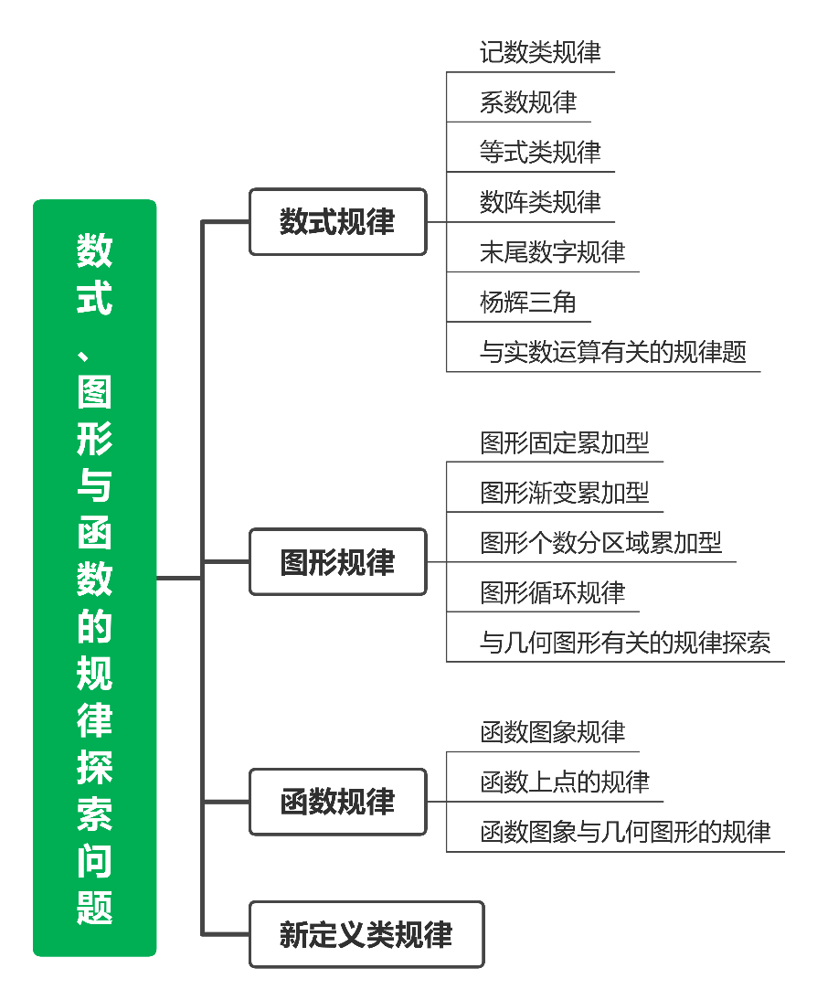

## 类型一 数式规律  

关于数式规律性问题的一般解题思路：  
(1)先对给出的特殊数式进行观察、比较;  
(2)根据观察猜想、归纳出一般规律;  
(3)用得到的规律去解决其他问题

1.数字猜想型:数字规律问题主要是在分析比较的基础上发现题目中所蕴涵的数量关系，先猜想，然后通过适当的计算回答问题。

2.数式规律型:数式规律问题主要是通过观察、分析、归纳、验证，然后得出一般性的结论,以列代数式即函数关系式为主要内容.

## 题型01  记数类规律

1．（2023·浙江衢州·校考一模）观察下列数据： $0$ ， $3$ ， $8$ ， $15$ ， $24$ ，…，它们是按一定规律排列的，依照此规律，第 $201$ 个数据是（　　）

A． $40400$ 	
B． $40040$ 	
C． $4040$ 	
D． $404$

【答案】A

【分析】观察不难发现，各数据都等于完全平方数减 $1$ ，然后列式计算即可得解．

【详解】∵ $0=1^{2}-1$ ，
$3=2^{2}-1$ ，
$8=3^{2}-1$ ，
$15=4^{2}-1$ ，
$24=5^{2}-1$ ，

…，
∴第 $201$ 个数据是： $201^{2}-1=40400$ ，
故选： $A$ ．

【点睛】此题考查了数字变化规律，观察出各数据都等于完全平方数减 $1$ 是解题的关键．

2．（2022·内蒙古鄂尔多斯·统考中考真题）按一定规律排列的数据依次为 $\frac{1}{2}$ ， $\frac{4}{5}$ ， $\frac{7}{10}$ ， $\frac{10}{17}$ ……按此规律排列，则第30个数是_____ ．

【答案】 $\frac{88}{901}$

【分析】由所给的数，发现规律为第*<text style="italic">n*</text>个数是 $\frac{3n-2}{n^{2}+1}$ ，当*<text style="italic">n*</text>＝30时即可求解．

【详解】解：∵ $\frac{1}{2}$ ， $\frac{4}{5}$ ， $\frac{7}{10}$ ， $\frac{10}{17}$ …，
∴第*n*个数是 $\frac{3n-2}{n^{2}+1}$ ，
当*n*＝30时， $\frac{3n-2}{n^{2}+1}$ = $\frac{3\times 30-2}{30^{2}+1}$ = $\frac{88}{901}$ ，
故答案为： $\frac{88}{901}$ ．

【点睛】本题考查数字的变化规律，能够通过所给的数，探索出数的一般规律是解题的关键．

3．（2020·西藏·统考中考真题）观察下列两行数：

1，3，5，7，9，11，13，15，17，…

1，4，7，10，13，16，19，22，25，…

探究发现：第1个相同的数是1，第2个相同的数是7，…，若第n个相同的数是103，则n等于（　　）

A．18	
B．19	
C．20	
D．21

【答案】A

【分析】根据探究发现：第1个相同的数是1，第2个相同的数是7， $\ldots$ ，第 $n$ 个相同的数是 $6(n-1)+1=6n-5$ ，进而可得 $n$ 的值．

【详解】解：第1个相同的数是 $1=0\times 6+1$ ，

第2个相同的数是 $7=1\times 6+1$ ，

第3个相同的数是 $13=2\times 6+1$ ，

第4个相同的数是 $19=3\times 6+1$ ，
$\ldots$ ，

第 $n$ 个相同的数是 $6(n-1)+1=6n-5$ ，
所以 $6n-5=103$ ，
解得 $n=18$ ．
答：第 $n$ 个相同的数是103，则 $n$ 等于18．
故选： $A$ ．

【点睛】此题主要考查了数字变化规律，确定出相同数的差值，从而得出相同数的通式是解题的关键．

4．（2022·湖南怀化·统考模拟预测）正偶数2，4，6，8，10，……，按如下规律排列，

2

4   6

8   10  12

14  16  18  20

……
则第27行的第21个数是______．

【答案】744

【分析】由图可以看出，每行数字的个数与行数是一致的，即第一行有1个数，第二行有2个数，第三行有3个数••••••••第*<text style="italic"><text style="italic">n*</text></text>行有n个数，则前n行共有 $\frac{n(n+1)}{2}$ 个数，再根据偶数的特征确定第几行第几个数是几．

【详解】解：由图可知，

第一行有1个数，

第二行有2个数，

第三行有3个数，

•••••••

第*n*行有*n*个数．
∴前*<text style="italic">n*</text>行共有1+2+3+⋯+n= $\frac{n(n+1)}{2}$ 个数．
∴前26行共有351个数，
∴第27行第21个数是所有数中的第372个数．
∵这些数都是正偶数，
∴第372个数为372×2=744．
故答案为：744．

【点睛】本题考查了数字类的规律问题，解决这类问题的关键是先根据题目的已知条件找出其中的规律，再结合其他已知条件求解．

## 题型02  系数规律

5．（2023·四川成都·校考一模）探索规律：观察下面的一列单项式： $x$ 、 $-2x^{2}$ 、 $4x^{3}$ 、 $-8x^{4}$ 、 $16x^{5}$ 、…，根据其中的规律得出的第9个单项式是（    ）

A． $-256x^{9}$ 	
B． $256x^{9}$ 	
C． $-512x^{9}$ 	
D． $512x^{9}$

【答案】B

【分析】根据已知的式子可以得到系数是以 $-2$ 为底的幂，指数是式子的序号减1，*x*的指数是式子的序号．

【详解】解：第9个单项式是 $\left(-2\right)^{9-1}x^{9}=256x^{9}$ ．
故选：B．

【点睛】本题考查了单项式规律题，正确理解式子的符号、次数与式子的序号之间的关系是关键．

6．（2020·云南·统考中考真题）按一定规律排列的单项式： $a$ ， $-2a$ ， $4a$ ， $-8a$ ， $16a$ ， $-32a$ ，…，第 $n$ 个单项式是（    ）

A． $\left(-2\right)^{n-1}a$ 	
B． $\left(-2\right)^{n}a$ 	
C． $2^{n-1}a$ 	
D． $2^{n}a$

【答案】A

【分析】先分析前面所给出的单项式，从三方面（符号、系数的绝对值、指数）总结规律，发现规律进行概括即可得到答案．

【详解】解： $\because$  $a$ ， $-2a$ ， $4a$ ， $-8a$ ， $16a$ ， $-32a$ ，…，

可记为： $\left(-2\right)^{0}a,\left(-2\right)^{1}a,\left(-2\right)^{2}a,\left(-2\right)^{3}a,\left(-2\right)^{4}a,\left(-2\right)^{5}a, \textbullet \textbullet \textbullet ,$
$\therefore$  第 $n$ 项为： $\left(-2\right)^{n-1}a.$
故选A．

【点睛】本题考查了单项式的知识，分别找出单项式的系数和次数的规律是解决此类问题的关键．

7．（2023·云南昆明·昆明八中校考三模）按一定规律排列的单项式： $-x$ ， $3x^{2}$ ， $-5x^{3}$ ， $7x^{4}$ ， $-9x^{5}$ ，…，第 $n$ 个单项式是（    ）

A． $\left(2n-1\right)(-x)^{n}$ 	
B． $\left(2n+1\right)(-x)^{n}$ 	
C． $\left(2n+1\right)x^{n}$ 	
D． $\left(2n-1\right)x^{n}$

【答案】A

【分析】根据题目中的单项式，可以发现系数的绝对值是一些连续的奇数且第奇数个单项式的系数为负数， $x$ 的指数是一些连续的正整数，从而可以写出第 $n$ 个单项式．

【详解】解：A、当 $n=1$ 时，第一个单项式为： $-x$ 符合题意；
B、当 $n=1$ 时，第一个单项式为： $-3x$ ，不符合题意，排除；
C、当 $n=1$ 时，第一个单项式为： $3x$ ，不符合题意，排除；
D、当 $n=1$ 时，第一个单项式为： $x$ ，不符合题意，排除；
故选：A．

【点睛】此题考查了数字的变化规律，单项式的系数和指数，解此题的关键是明确题意，发现单项式系数和字母指数的变化特点及规律．

## 题型03  等式类规律

8．（2023·浙江嘉兴·统考中考真题）观察下面的等式： $3^{2}-1^{2}=8\times 1,5^{2}-3^{2}=8\times 2,7^{2}-5^{2}=8\times 3,9^{2}-7^{2}=8\times 4,\cdots$  
(1)写出 $19^{2}-17^{2}$ 的结果．  
(2)按上面的规律归纳出一个一般的结论（用含*n*的等式表示，*n*为正整数）  
(3)请运用有关知识，推理说明这个结论是正确的．

【答案】(1) $8\times 9$  
(2) $(2n+1)^{2}-(2n-1)^{2}=8n$  
(3)见解析

【分析】（1）根据题干的规律求解即可；  
（2）根据题干的规律求解即可；  
（3）将 $(2n+1)^{2}-(2n-1)^{2}$ 因式分解，展开化简求解即可．

【详解】（1） $19^{2}-17^{2}=8\times 9$ ；  
（2） $(2n+1)^{2}-(2n-1)^{2}=8n$ ；  
（3） $(2n+1)^{2}-(2n-1)^{2}$
$=(2n+1+2n-1)(2n+1-2n+1)$
$=4n\times 2$
$=8n$ ．

【点睛】此题考查数字的变化规律，因式分解，整式乘法的混合运算，解题关键是通过观察，分析、归纳发现其中的变化规律．

9．（2022·安徽·统考中考真题）观察以下等式：

第1个等式： $\left(2\times 1+1\right)^{2}=\left(2\times 2+1\right)^{2}-\left(2\times 2\right)^{2}$ ，

第2个等式： $\left(2\times 2+1\right)^{2}=\left(3\times 4+1\right)^{2}-\left(3\times 4\right)^{2}$ ，

第3个等式： $\left(2\times 3+1\right)^{2}=\left(4\times 6+1\right)^{2}-\left(4\times 6\right)^{2}$ ，

第4个等式： $\left(2\times 4+1\right)^{2}=\left(5\times 8+1\right)^{2}-\left(5\times 8\right)^{2}$ ，

……

按照以上规律．解决下列问题：  
(1)写出第5个等式：\_\_\_\_\_\_\_\_；  
(2)写出你猜想的第*n*个等式（用含*n*的式子表示），并证明．

【答案】(1) $\left(2\times 5+1\right)^{2}=\left(6\times 10+1\right)^{2}-\left(6\times 10\right)^{2}$  
(2) $\left(2n+1\right)^{2}=\left[(n+1)\cdot 2n+1\right]^{2}-\left[(n+1)\cdot 2n\right]^{2}$ ，证明见解析

【分析】（1）观察第1至第4个等式中相同位置的数的变化规律即可解答；  
（2）观察相同位置的数变化规律可以得出第*n*个等式为 $\left(2n+1\right)^{2}=\left[(n+1)\cdot 2n+1\right]^{2}-\left[(n+1)\cdot 2n\right]^{2}$ ，利用完全平方公式和平方差公式对等式左右两边变形即可证明．

【详解】（1）解：观察第1至第4个等式中相同位置数的变化规律，可知第5个等式为： $\left(2\times 5+1\right)^{2}=\left(6\times 10+1\right)^{2}-\left(6\times 10\right)^{2}$ ，
故答案为： $\left(2\times 5+1\right)^{2}=\left(6\times 10+1\right)^{2}-\left(6\times 10\right)^{2}$ ；  
（2）解：第*n*个等式为 $\left(2n+1\right)^{2}=\left[(n+1)\cdot 2n+1\right]^{2}-\left[(n+1)\cdot 2n\right]^{2}$ ，
证明如下：

等式左边： $\left(2n+1\right)^{2}=4n^{2}+4n+1$ ，

等式右边： $\left[(n+1)\cdot 2n+1\right]^{2}-\left[(n+1)\cdot 2n\right]^{2}$
$=\left[(n+1)\cdot 2n+1+(n+1)\cdot 2n\right]\cdot \left[(n+1)\cdot 2n+1-(n+1)\cdot 2n\right]$
$=\left[(n+1)\cdot 4n+1\right]\times 1$
$=4n^{2}+4n+1$ ，
故等式 $\left(2n+1\right)^{2}=\left[(n+1)\cdot 2n+1\right]^{2}-\left[(n+1)\cdot 2n\right]^{2}$ 成立．

【点睛】本题考查整式规律探索，发现所给数据的规律并熟练运用完全平方公式和平方差公式是解题的关键．

10．（2022·安徽淮南·统考二模）（1）初步感知，在④的横线上直接写出计算结果：

① $\sqrt{1^{3}}=1$ ；② $\sqrt{1^{3}+2^{3}}=3$ ；③ $\sqrt{1^{3}+2^{3}+3^{3}}=6$ ；④ $\sqrt{1^{3}+2^{3}+3^{3}+4^{3}}=$ \_\_\_\_\_\_\_\_\_\_；…  
（2）深入探究，观察下列等式：

① $1+2=\frac{(1+2)\times 2}{2}$ ；② $1+2+3=\frac{(1+3)\times 3}{2}$ ；③ $1+2+3+4=\frac{(1+4)\times 4}{2}$ ；…
根据以上等式的规律，在下列横线上填写适当内容：
$1+2+3+\cdots +n+(n+1)=$ \_\_\_\_\_\_\_\_\_\_．  
（3）拓展应用，通过以上初步感知与深入探究，计算：

① $\sqrt{1^{3}+2^{3}+3^{3}+\ldots +99^{3}+100^{3}}$ ；
② $11^{3}+12^{3}+13^{3}+\ldots +19^{3}+20^{3}$ ．

【答案】（1）10；（2） $\frac{(n+2)(n+1)}{2}$ ；（3）①5050；②41075

【分析】(1)观察可得，每个式子的结果都等于被开放数中所有加数的底数之和；  
(2)所有自然数相加的和等于首项＋尾项的和再乘以自然数的个数，最后除以2即可；  
(3)利用（1）（2）中的规律综合运用即可求解．

【详解】解：（1）10；  
（2） $\frac{(n+2)(n+1)}{2}$ ；  
（3）①原式 $=1+2+3+4+5+\cdots +99+100$
$=\frac{(1+100)\times <eq>=5050$ 100}{2}</eq> ；
②原式 $=1^{3}+2^{3}+3^{3}+\cdots +18^{3}+19^{3}+20^{3}-\left(1^{3}+2^{3}+3^{3}+\cdots +10^{3}\right)$
$=\frac{20^{2}\times <eq>=\frac{400\times 441}{4}-\frac{100\times 121}{4}$ 21^{2}}{4}-\frac{10^{2}\times $=44100-3025$ 11^{2}}{4}</eq> $=41075$   ．

【点睛】主要考查了二次根式的基本性质与化简、探寻数列规律、整式的加减，掌握这三个知识点的应用，其中探求规律是解题关键

## 题型04  数阵类规律

11．（2023·湖南常德·统考中考真题）观察下边的数表（横排为行，竖排为列），按数表中的规律，分数 $\frac{20}{2023}$ 若排在第*a*行*b*列，则 $a-b$ 的值为(   )
$\frac{1}{1}$
$\frac{1}{2}    \frac{2}{1}$
$\frac{1}{3}    \frac{2}{2}    \frac{3}{1}$
$\frac{1}{4}    \frac{2}{3}    \frac{3}{2}   \frac{4}{1}$

……

A．2003	
B．2004	
C．2022	
D．2023

【答案】C

【分析】观察表中的规律发现，分数的分子是几，则必在第几列；只有第一列的分数，分母与其所在行数一致．

【详解】观察表中的规律发现，分数的分子是几，则必在第几列；只有第一列的分数，分母与其所在行数一致，故 $\frac{20}{2023}$ 在第20列，即 $b=20$ ；向前递推到第1列时，分数为 $\frac{20-19}{2023+19}=\frac{1}{2042}$ ，故分数 $\frac{20}{2023}$ 与分数 $\frac{1}{2042}$ 在同一行．即在第2042行，则 $a=2042$ ．
∴ $a-b=2042-20=2022.$
故选：C．

【点睛】本题考查了数字类规律探索的知识点，解题的关键善于发现数字递变的周期性和趋向性．

12．（2018·湖北十堰·中考真题）如图，是按一定规律排成的三角形数阵，按图中数阵的排列规律，第9行从左至右第5个数是（　　）
$\begin{array}{c}\begin{matrix}&\begin{matrix}&\end{matrix}&\end{matrix}1\\\begin{matrix}\begin{matrix}&\end{matrix}&\end{matrix}\sqrt{2}\begin{matrix}&\sqrt{3}\end{matrix}\\\begin{matrix}&\end{matrix}2\begin{matrix}&\sqrt{5}\end{matrix}\begin{matrix}&\sqrt{6}\end{matrix}\\\sqrt{7}\begin{matrix}&2\sqrt{2}\begin{matrix}&3\begin{matrix}&\sqrt{10}\end{matrix}\end{matrix}\end{matrix}\\\cdots \begin{matrix}&\end{matrix}\cdots \begin{matrix}&&\end{matrix}\cdots \end{array}$

A． $2\sqrt{10}$ 	
B． $\sqrt{41}$ 	
C． $5\sqrt{2}$ 	
D． $\sqrt{51}$

【答案】B

【分析】由图形可知，第n行最后一个数为 $\sqrt{1+2+3+\cdots n}=\sqrt{\frac{n\left(n+1\right)}{2}}$ ，据此可得答案．

【详解】由图形可知，第n行最后一个数为 $\sqrt{1+2+3+\cdots n}=\sqrt{\frac{n\left(n+1\right)}{2}}$ ，
∴第8行最后一个数为 $\sqrt{\frac{8\times 9}{2}}=\sqrt{36}$ =6，
∴第9行从左至右第5个数是 $\sqrt{36+5}=\sqrt{41}$ ，
故选B．

【点睛】本题主要考查数字的变化类，解题的关键是根据题意得出第n行最后一个数为 $\sqrt{\frac{n\left(n+1\right)}{2}}$ ．

13．（2023·安徽合肥·统考一模）将从1开始的连续自然数按以下规律排列：

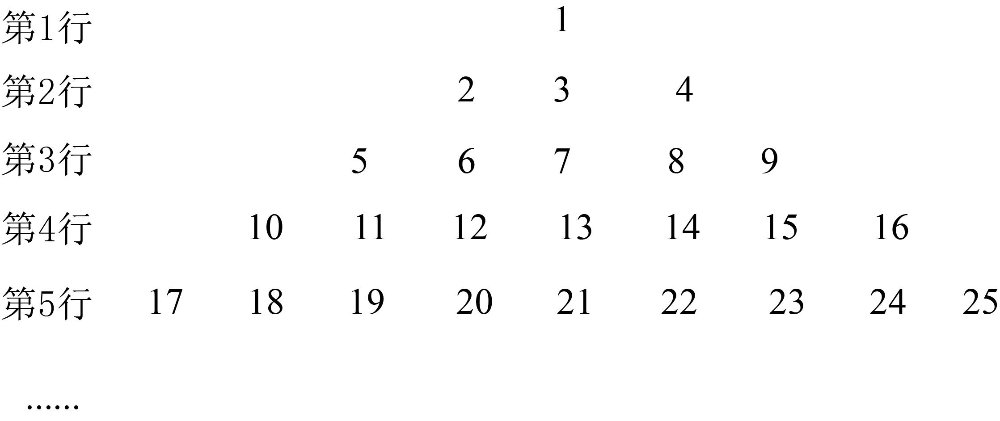

请根据上述规律解答下面的问题：  
(1)第6行有\_\_\_\_\_\_个数；第*n*行有\_\_\_\_\_\_个数（用含*n*的式子表示）；  
(2)若有序数对 $\left(n，m\right)$ 表示第*n*行，从左到右第*m*个数，如 $\left(3，2\right)$ 表示6．

①求 $\left(11，20\right)$ 表示的数；②求表示2023的有序数对．

【答案】(1)11； $2n-1$ ；  
(2)① $120$ ；② $(45,87)$

【分析】（1）观察前5行发现：后一行数字的个数比前一行多2个，以此规律解答即可；  
（2）①先求第11行最后一个数，然后判断 $\left(11，20\right)$ 为第11行倒数第二个数即可解答；
②先根据 $44^{2}<2023<45^{2}$ 判断2023为第45行的数字，然后根据2023比第45行最后一个数字2025小2，即可判断．

【详解】（1）解：第1行有1个数，

第2行有 $3=1+2$ 个数，

第3行有 $5=1+2\times 2$ 个数，

第4行有 $7=1+2\times 3$ 个数，

第5行有 $9=1+2\times 4$ 个数，
∴第6行有 $1+2\times 5=11$ 个数，

……

第*n*行有 $1+2\left(n-1\right)=\left(2n-1\right)$ 个数；  
（2）解：①∵第11行有 $2\times 11-1=21$ 个数，且最末尾的数是 $11^{2}=121$ ，

而 $(11,20)$ 表示第11行的第20个数，
∴ $(11,20)$ 表示的数是 $121-1=120$ ；
②∵ $44^{2}=1936$ ， $45^{2}=2025$ ，
∴ $44^{2}<2023<45^{2}$ ，
∴2023位于第45行，
∵第45行有 $45\times 2-1=89$ 个数，而2023与2025相差2个数，
∴2023位于第45行的第87个数，
∴表示2023的有序数对是 $(45,87)$ ．

【点睛】本题考查了数字的变化类，找到变化规律是解题的关键．

## 题型05  末尾数字规律

14．（2022·湖北鄂州·统考中考真题）生物学中，描述、解释和预测种群数量的变化，常常需要建立数学模型．在营养和生存空间没有限制的情况下，某种细胞可通过分裂来繁殖后代，我们就用数学模型2<em>n</em>来表示．即：21＝2，22＝4，23＝8，24＝16，25＝32，……，请你推算22022的个位数字是（    ）

A．8	
B．6	
C．4	
D．2

【答案】C

【分析】利用已知得出数字个位数的变化规律进而得出答案．

【详解】解：∵21＝2，22＝4，23＝8，24＝16，25＝32，…，
∴尾数每4个一循环，
∵2022÷4＝505……2，
∴22022的个位数字应该是：4．
故选：C．

【点睛】此题主要考查了尾数特征，根据题意得出数字变化规律是解题关键．

15．（2023·河南南阳·统考一模）观察下列等式： $7^{0}=1$ ， $7^{1}=7$ ， $7^{2}=49$ ， $7^{3}=343$ ， $7^{4}=2401$ ， $7^{5}=16807$ ，…，根据其中的规律可得 $7^{0}+7^{1}+7^{2}+\cdots +7^{2023}$ 的结果的个位数字是（    ）

A． $0$ 	
B． $1$ 	
C． $7$ 	
D． $8$

【答案】A

【分析】由已知可得尾数 $1$ ， $7$ ， $9$ ， $3$ 的规律是4个数一循环，则 $7^{0}+7^{1}+7^{2}+\cdots +7^{2023}$ 的结果的个位数字与 $7^{0}+7^{1}+7^{2}+7^{3}$ 的个位数字相同，即可求解．

【详解】解：∵ $7^{0}=1$ ， $7^{1}=7$ ， $7^{2}=49$ ， $7^{3}=343$ ， $7^{4}=2401$ ， $7^{5}=16807$ ，…，
∴尾数 $1$ ， $7$ ， $9$ ， $3$ 的规律是4个数一循环，
∵ $1+7+9+3=20$ ，
∴ $7^{0}+7^{1}+7^{2}+7^{3}$ 的个位数字是 $0$ ，
又∵ $2024\div 4=506$ ，
∴ $7^{0}+7^{1}+7^{2}+\cdots +7^{2023}$ 的结果的个位数字与 $7^{0}+7^{1}+7^{2}+7^{3}$ 的个位数字相同，
∴ $7^{0}+7^{1}+7^{2}+\cdots +7^{2023}$ 的结果的个位数字是 $0$ ．
故选：A．

【点睛】本题考查数的尾数特征，能够通过所给数的特点，确定尾数的循环规律是解题的关键．

16．（2022·湖南湘西·校考模拟预测）观察下列等式： $2^{1}=2$ ， $2^{2}=4$ ， $2^{3}=8$ ， $2^{4}=16$ ， $2^{5}=32$ ， $2^{6}=64$ ， $\cdot \cdot \cdot$ ，根据这个规律，则 $2^{1}+2^{2}+2^{3}+2^{4}+\cdot \cdot \cdot +2^{2022}$ 的末尾数字是（    ）

A． $0$ 	
B． $2$ 	
C． $4$ 	
D． $6$

【答案】D

【分析】通过观察发现2<em>n</em>的个位数字是2、4、8、6四个数字依次不断循环，直接填空即可；
【详解】解：通过观察发现2<em>n</em>的个位数字是2、4、8、6四个数字依次不断循环，且2+4+8+6=20，尾数为0

2022÷4=500……2，
则尾数为2+4=6，
故选D．

【点睛】此题考查幂的乘方末尾的数字规律，注意观察循环的数字规律，利用规律解决问题．

## 题型06  杨辉三角

17．（2023·四川成都·模拟预测）我国宋朝数学家杨辉在他的著作《详解九章算法》中提出如图，此表揭示了 $\left(a+b\right)^{n}$ （*n*为非负整数）展开式的各项系数的规律，例如：
$\left(a+b\right)^{1}=a+b$ ，展开式有两项，系数分别为1，1；
$\left(a+b\right)^{2}=a^{2}+2ab+b^{2}$ ，展开式有三项，系数分别为1，2，1；
$\left(a+b\right)^{3}=a^{3}+3a^{2}b+3ab^{2}+b^{3}$ ，展开式有四项，系数分别为1，3，3，1；
…
根据以上规律，（<em>a</em>＋<em>b</em>）4展开式共有五项，系数分别为________．

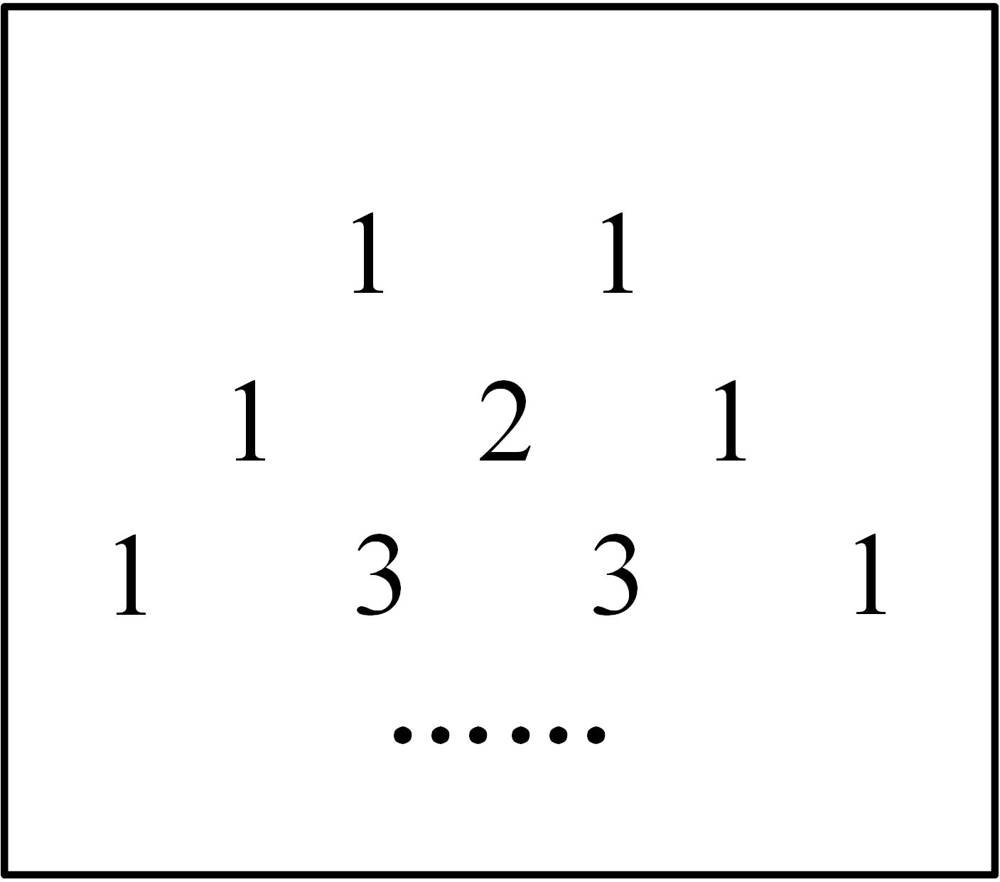

【答案】1、4、6、4、1

【分析】此题考查完全平方公式，多项式展开式，数字的变化规律，正确观察已知的式子与对应的三角形之间的关系是关键．

观察可得 $\left(a+b\right)^{n}$ （*n*为非负整数）展开式的各项系数的规律：首尾两项系数都是1，中间各项系数等于 $\left(a+b\right)^{n-1}$ 相邻两项的系数和．

【详解】解：根据题意知， $\left(a+b\right)^{4}$ 的各项系数分别为1、 $\left(1+3\right)$ 、 $\left(3+3\right)$ 、 $\left(3+1\right)$ 、1，
即：1、4、6、4、1；
∴ $\left(a+b\right)^{4}=a^{4}+4a^{3}b+6a^{2}b^{2}+4ab^{3}+b^{4}$ ．
故答案为：1、4、6、4、1．

18．（2023·黑龙江大庆·统考中考真题）1261年，我国宋朝数学家杨辉在其著作《详解九章算法》中提到了如图所示的数表，人们将这个数表称为“杨辉三角”．

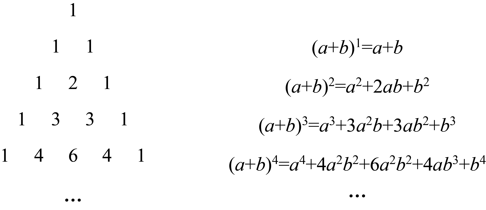

观察“杨辉三角”与右侧的等式图，根据图中各式的规律， $(a+b)^{7}$ 展开的多项式中各项系数之和为____．

【答案】 $128$

【分析】仿照阅读材料中的方法将原式展开，即可得出结果．

【详解】根据题意得： $\left(a+b\right)^{5}$ 展开后系数为： $1,5,10,10,5,1$ ，

系数和： $1+5+10+10+5+1=32=2^{5}$ ，
$\left(a+b\right)^{6}$ 展开后系数为： $1,6,15,20,15,6,1$ ，

系数和： $1+6+15+20+15+6+1=64=2^{6}$ ，
$\left(a+b\right)^{7}$ 展开后系数为： $1,7,21,35,35,21,7,1$ ，

系数和： $1+7+21+35+35+21+7+1=128=2^{7}$ ，
故答案为： $128$ ．

【点睛】此题考查了多项式的乘法运算，以及规律型：数字的变化类，解题的关键是弄清系数中的规律．

19．（2022下·重庆·九年级重庆巴蜀中学校考阶段练习）我国古代数学的许多发现都曾位于世界前列，其中杨辉三角（如图）就是一例．这个三角形给出了 $\left(a+b\right)^{n}$ （ $n=1,2,3,4,5,6\ldots$ ）的展开式（按<text style="it*a*lic">a</text>的次数由大到小顺序排列）的系数规律．例如在三角形中第三行的三个数1，2，1，恰好对应 $\left(a+b\right)^{2}=a^{2}+2ab+b^{2}$ 展开式中各项的系数；第四行的五个数1，4，6，4，1，恰好对应着 $\left(a+b\right)^{4}=a^{4}+4a^{3}b+6a^{2}b^{2}+4ab^{3}+b^{4}$ 展开式中各项的系数等等．有如下结论：①“杨辉三角”中第9行所有数之和1024；②“杨辉三角” 中第20行第3个数为190；③ $\left(a+b\right)^{3}=a^{3}-3a^{2}b-3ab^{2}+b^{3}$ ；④ $99^{3}+3\times 99^{2}+3\times 99+1$ 的结果是 $10^{6}$ ；⑤当代数式 $a^{4}+8a^{3}+24a^{2}+32a+16$ 的值是1时，<text style="it*a*lic">a</text>的值是 $-1$ 或 $-3$ ．上述结论中，正确的有（    ）

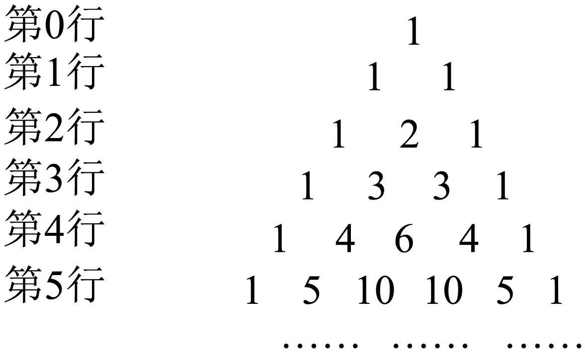

A．2个	
B．3个	
C．4个	
D．5个

【答案】B

【分析】根据每一行的数字，找到其和的规律为 $1,2,4,8,16,25,\cdot \cdot \cdot$ 可得每一行的数字和为 $2^{n}$ ，进而可以判断①，根据从第2行起，每一行的第三个数字分别为 $1,1+2,1+2+3,1+2+3+4\cdot \cdot \cdot$ 找到规律第 $n$ 行的的第3个数字为 $\frac{n\left(1+n\right)}{2}$ ，即可判断②，根据第三行的数字可得 $\left(a+b\right)^{3}=a^{3}+3a^{2}b+3ab^{2}+b^{3}$ ，即可判③④，根据 $\left(a+2\right)^{4}=a^{4}+8a^{3}+24a^{2}+32a+16$  $=1$ ，因式分解一元二次方程即可求得 $a$ 的值，即可判断⑤

【详解】解： $\because$ 每一行的数字，其和的规律为 $1,2,4,8,16,25,\cdot \cdot \cdot$
$\therefore$ 第 $n$ 行的数字和为 $2^{n}$ ，
则“杨辉三角”中第9行所有数之和 $2^{9}=512$
故①不正确；
$\because$ 从第2行起，每一行的第3个数字分别为 $1,1+2,1+2+3,1+2+3+4\cdot \cdot \cdot$
$\therefore$ 第 $n$ 行的第3个数字为 $\frac{n\left(n-1\right)}{2}$ ，
$\therefore$ “杨辉三角” 中第20行第3个数为 $\frac{20\left(20-1\right)}{2}=190$ ；
故②正确；
第三行的数字为 $1,3,3，1$ 可得， $\left(a+b\right)^{3}=a^{3}+3a^{2}b+3ab^{2}+b^{3}$
故③不正确，
$\therefore 99^{3}+3\times 99^{2}+3\times 99+1 =\left(99+1\right)^{3}=\left(10^{2}\right)^{3}=10^{6}$
故④正确
$\because$  $\left(a+2\right)^{4}=a^{4}+8a^{3}+24a^{2}+32a+16$  $=1$ ，
$\therefore \left(a+2\right)^{4}=1$
$\therefore \left(a+2\right)^{2}=1$
解得 $a=-1$ 或 $a=-3$
$\therefore a$ 的值是 $-1$ 或 $-3$ ．
故⑤正确
故正确的有3个，
故选B

【点睛】本题考查了因式分解解一元二次方程，数字类规律，找到规律是解题的关键．

20．（2022·重庆巴南·统考模拟预测）“杨辉三角”给出了 $(a+b)^{n}$ 展开式的系数规律（其中<text style="it*a*lic">n</text>为正整数，展开式的项按a的次数降幕排列），它的构造规则是：两腰上都是数字1，而其余的数则是等于它肩上的两个数之和．例如： $(a+b)^{2}=a^{2}+2ab+b^{2}$ 展开式的项的系数1，2，1与“杨辉三角”第三排对应： $(a+b)^{3}=a^{3}+3a^{2}b+3ab^{2}+b^{3}$ 展开式的项的系数1，3，3，1．与“杨辉三角”第四排对应；依此类推……判断下列说法正确的是（    ）

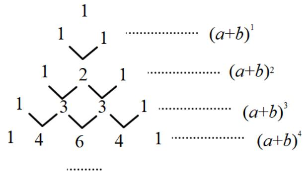

①“杨辉三角”第六排数字依次是：1，5，10，10，5，1；
②当 $a=2,b=-1$ 时，代数式 $a^{3}+3a^{2}b+3ab^{2}+b^{3}$ 的值为 $-1$ ；
③ $(a+b)^{2022}$ 展开式中所有系数之和为 $2^{2022}$ ；
④当代数式 $a^{4}-8a^{3}+24a^{2}-32a+16$ 的值为1时， $a=1$ 或3．

A．①②③	
B．①②④	
C．①③④	
D．②③④

【答案】C

【分析】运用杨辉三角形的排列规律，及展开式的系数规律采用赋值法逐一验证即可求解．

【详解】如图，依次规律可得“杨辉三角”第六排数字依次是：1，5，10，10，5，1，故说法①正确；
当 $a=2,b=-1$ 时， $a^{3}+3a^{2}b+3ab^{2}+b^{3}=\left(a+b\right)^{3}=\left(2-1\right)^{3}=1$ ，故②说法错误；
令 $a=1,b=1$ ，则 $(a+b)^{2022}$  $=(1+1)^{2022}=2^{2022}$ ，故说法③正确；
当代数式 $a^{4}-8a^{3}+24a^{2}-32a+16$ 的值为1时，
即 $a^{4}-8a^{3}+24a^{2}-32a+16=1$ ，
∴ $a^{4}+4\times \left(-2\right)^{1}a^{3}+6\times \left(-2\right)^{2}a^{2}+4\times \left(-2\right)^{3}a+\left(-2\right)^{4}=\left(a-2\right)^{4}=1$ ，
∴ $\left(a-2\right)^{2}=1$ 或 $\left(a-2\right)^{2}=-1$ （不合题意，舍去），
∴ $a-2=\pm 1$ ，
解得 $a=3$ 或 $1$ ，
故说法④正确，

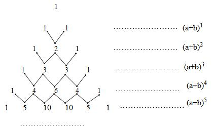

综上可得，说法正确的有①③④，
故选：C

【点睛】本题考查了杨辉三角的规律与展开式的系数规律，正确把握其中的关系以及合理使用赋值法是解题的关键．

## 题型07  与实数运算有关的规律题

21．（2022·湖北恩施·统考中考真题）观察下列一组数：2， $\frac{1}{2}$ ， $\frac{2}{7}$ ，…，它们按一定规律排列，第<em>n</em>个数记为 $a_{n}$ ，且满足 $\frac{1}{a_{n}}+\frac{1}{a_{n+2}}=\frac{2}{a_{n+1}}$ ．则 $a_{4}=$ <u>&lt;text style="underline"&gt;________</u>&lt;/text&gt;， $a_{2022}=$ <u>&lt;text style="underline"&gt;________</u>&lt;/text&gt;．

【答案】     $\frac{1}{5}$      $\frac{1}{3032}$

【分析】由题意推导可得*an*= $\frac{2}{3(n-1)+1}$ ，即可求解．

【详解】解：由题意可得：&lt;text style="it&lt;text style="it<em>a</em>lic"&gt;a&lt;/text&gt;lic"&gt;a&lt;/text&gt;<em>1</em>=<em>2</em>= $\frac{2}{1}$ ，&lt;text style="it&lt;text style="it<em>a</em>lic"&gt;a&lt;/text&gt;lic"&gt;a&lt;/text&gt;<em>2</em>= $\frac{1}{2}=\frac{2}{4}$ ，&lt;text style="it&lt;text style="it<em>a</em>lic"&gt;a&lt;/text&gt;lic"&gt;a&lt;/text&gt;<em>3</em>= $\frac{2}{7}$ ，
∵ $\frac{1}{a_{2}}+\frac{1}{a_{4}}=\frac{2}{a_{3}}$ ，
∴2+ $\frac{1}{a_{4}}$ =7，
∴<em>a4</em>= $\frac{1}{5}=\frac{2}{10}$ ，
∵ $\frac{1}{a_{3}}+\frac{1}{a_{5}}=\frac{2}{a_{4}}$ ，
∴<em>a5</em>= $\frac{2}{13}$ ，

同理可求<em>a6</em>= $\frac{1}{8}=\frac{2}{16}$ ， $\cdots$
∴*an*= $\frac{2}{3(n-1)+1}$ ，
∴<em>a2022</em>= $\frac{2}{6064}=\frac{1}{3032}$ ，
故答案为： $\frac{1}{5}$ ， $\frac{1}{3032}$ ．

【点睛】本题考查了数字的变化类，找出数字的变化规律是解题的关键．

22．（2021·湖北鄂州·统考中考真题）已知 $a_{1}$ 为实数﹐规定运算： $a_{2}=1-\frac{1}{a_{1}}$ ， $a_{3}=1-\frac{1}{a_{2}}$ ， $a_{4}=1-\frac{1}{a_{3}}$ ， $a_{5}=1-\frac{1}{a_{4}}$ ，……， $a_{n}=1-\frac{1}{a_{n-1}}$ ．按上述方法计算：当 $a_{1}=3$ 时， $a_{2021}$ 的值等于（   ）

A． $-\frac{2}{3}$ 	
B． $\frac{1}{3}$ 	
C． $-\frac{1}{2}$ 	
D． $\frac{2}{3}$

【答案】D

【分析】当 $a_{1}=3$ 时，计算出 $a_{2}=\frac{2}{3},a_{3}=-\frac{1}{2},a_{4}=3,\cdot \cdot \cdot \cdot \cdot \cdot$ ，会发现呈周期性出现，即可得到 $a_{2021}$ 的值．

【详解】解：当 $a_{1}=3$ 时，计算出 $a_{2}=\frac{2}{3},a_{3}=-\frac{1}{2},a_{4}=3,\cdot \cdot \cdot \cdot \cdot \cdot$ ，

会发现是以： $3,\frac{2}{3},-\frac{1}{2}$ ，循环出现的规律，
$\because 2021=3\times 673+2$ ，
$\therefore a_{2021}=a_{2}=\frac{2}{3}$ ，
故选：D．

【点睛】本题考查了实数运算规律的问题，解题的关键是：通过条件，先计算出部分数的值，从中找到相应的规律，利用其规律来解答．

23．（2020·浙江金华·统考一模）求1＋2＋22＋23＋…＋22020的值，可令S＝1＋2＋22＋23＋…＋22020，则2S＝2＋22＋23＋24＋…＋22021，因此2S－S＝22021－1．仿照以上推理，计算出1＋2020＋20202＋20203＋…＋20202020的值为（    ）

A． $\frac{2020^{2020}-1}{2020}$ 	
B． $\frac{2020^{2021}-1}{2020}$ 	
C． $\frac{2020^{2021}-1}{2019}$ 	
D． $\frac{2020^{2020}-1}{2019}$

【答案】C

【分析】由题意可知S＝ 1＋2020＋20202＋20203＋…＋20202020①，可得到2020S＝2020＋20202＋20203＋…＋20202020＋20202021②，然后由②－①，就可求出S的值．

【详解】解：设S＝ 1＋2020＋20202＋20203＋…＋20202020①
则2020S＝2020＋20202＋20203＋…＋20202020＋20202021②
由②－①得：

2019S＝20202021－1
∴ $S=\frac{2020^{2021}-1}{2019}$ ．
故答案为：C．

【点晴】本题主要考查探索数与式的规律，有理数的加减混合运算．

24．（2023·浙江·统考一模）有一列数，记为 $a_{1}$ ， $a_{2}$ ，…， $a_{n}$ ，记其前*n*项和为 $S_{n}=a_{1}+a_{2}+\cdot \cdot \cdot +a_{n}$ ，定义 $T_{n}=\frac{S_{1}+S_{2}+\cdot \cdot \cdot +S_{n}}{n}$ 为这列数的“亚运和”，现有99个数 $a_{1}$ ， $a_{2}$ ，…， $a_{99}$ ，其“亚运和”为1000，则1， $a_{1}$ ， $a_{2}$ ，…， $a_{99}$ 这100个数的“亚运和”为（    ）

A．791	
B．891	
C．991	
D．1001

【答案】C

【分析】根据“亚运和”的定义分析可得99个数 $a_{1}$ ， $a_{2}$ ，…， $a_{99}$ ，其“亚运和”为1000，，即 $S_{1}+S_{2}+\cdots +S_{99}=99\times 1000$ ．同理根据定义求新数列1， $a_{1}$ ， $a_{2}$ ，…， $a_{99}$ 这100个数的“亚运和”．

【详解】解：∵ $\frac{S_{1}+S_{2}+\cdots +S_{99}}{99}=1000$ ，
∴ $S_{1}+S_{2}+\cdots +S_{99}=99\times 1000$ ，
∴1， $a_{1}$ ， $a_{2}$ ，…， $a_{99}$ 这100个数的“亚运和”为
$\frac{1+1+S_{1}+1+S_{2}+\cdots +1+S_{99}}{100}$
$=\frac{1\times 100+S_{1}+S_{2}+\cdots +S_{99}}{100}$
$=\frac{1\times 100+99\times 1000}{100}$
$=1+990$
$=991$ ．
故选：C．

【点睛】本题是一道找规律的题目，这类题型在中考中经常出现．对于找规律的题目首先应找出哪些部分发生了变化，是按照什么规律变化的．关键是找到 $S_{1}+S_{2}+\cdots +S_{99}=99\times 1000$ ．

25．（2022·四川达州·统考中考真题）人们把 $\frac{\sqrt{5}-1}{2}\approx 0.618$ 这个数叫做黄金比，著名数学家华罗庚优选法中的“0.618法”就应用了黄金比．设 $a=\frac{\sqrt{5}-1}{2}$ ， $b=\frac{\sqrt{5}+1}{2}$ ，记 $S_{1}=\frac{1}{1+a}+\frac{1}{1+b}$ ， $S_{2}=\frac{2}{1+a^{2}}+\frac{2}{1+b^{2}}$ ，…， $S_{100}=\frac{100}{1+a^{100}}+\frac{100}{1+b^{100}}$ ，则 $S_{1}+S_{2}+\cdots +S_{100}=$ _______．

【答案】5050

【分析】利用分式的加减法则分别可求<em>S1</em>=1，<em>S2</em>=2，<em>S100</em>=100，•••，利用规律求解即可．

【详解】解： $\because$  $a=\frac{\sqrt{5}-1}{2}$ ， $b=\frac{\sqrt{5}+1}{2}$ ，
$\therefore ab=\frac{\sqrt{5}-1}{2}\times \frac{\sqrt{5}+1}{2}=1$ ，
$\because S_{1}=\frac{1}{1+a}+\frac{1}{1+b}=\frac{2+a+b}{1+a+b+ab}=\frac{2+a+b}{2+a+b}=1$ ，
$S_{2}=\frac{2}{1+a^{2}}+\frac{2}{1+b^{2}}=2\times \frac{2+a^{2}+b^{2}}{1+a^{2}+b^{2}+a^{2}b^{2}}=2\times \frac{2+a^{2}+b^{2}}{2+a^{2}+b^{2}}=2$ ，

…，
$S_{100}=\frac{100}{1+a^{100}}+\frac{100}{1+b^{100}}=100\times \frac{1+a^{100}+1+b^{100}}{1+a^{100}+b^{100}+a^{100}b^{100}}=100$
$\therefore S_{1}+S_{2}+\cdots +S_{100}= 1+2+\ldots \ldots +100=5050$
故答案为：5050

【点睛】本题考查了分式的加减法，二次根式的混合运算，求得 $ab=1$ ，找出的规律是本题的关键．

26．（2021·湖南怀化·统考中考真题）观察等式： $2+2^{2}=2^{3}-2$ ， $2+2^{2}+2^{3}=2^{4}-2$ ， $2+2^{2}+2^{3}+2^{4}=2^{5}-2$ ，……，已知按一定规律排列的一组数： $2^{100}$ ， $2^{101}$ ， $2^{102}$ ，……， $2^{199}$ ，若 $2^{100}=m$ ，用含 $m$ 的代数式表示这组数的和是___________．

【答案】 $m^{2}-m$

【分析】根据规律将 $2^{100}$ ， $2^{101}$ ， $2^{102}$ ，……， $2^{199}$ 用含 $m$ 的代数式表示，再计算 $2^{0}+2^{1}+\cdots +2^{99}$ 的和，即可计算 $2^{100}+2^{101}+2^{101}+\cdots +2^{199}$ 的和．

【详解】由题意规律可得： $2+2^{2}+2^{3}+\cdots +2^{99}=2^{100}-2$ ．
∵ $2^{100}=m$
∴ $2+2^{2}+2^{3}+\cdots +2^{99}+2=2^{100}=m=2^{0}m$ ，
∵ $2+2^{2}+2^{2}+\cdots +2^{99}+2^{100}=2^{101}-2$ ，
∴ $2^{101}=2+2^{2}+2^{3}+\cdots +2^{99}+2^{100}+2$  $=m+m=2m=2^{1}m$ ．
$2^{102}=2+2^{2}+2^{3}+\cdots <eq>=m+m+2m=4m=2^{2}m$ +2^{99}+2^{100}+2^{101}+2</eq> ．
$2^{103}=2+2^{2}+2^{3}+\cdots <eq>=m+m+2m+4m=8m=2^{3}m$ +2^{99}+2^{100}+2^{101}+2^{102}+2</eq> ．

……
∴ $2^{199}=2^{99}m$ ．
故 $2^{100}+2^{101}+2^{101}+\cdots +2^{199}=2^{0}m+2^{1}m+\cdots +2^{99}m$ ．
令 $2^{0}+2^{1}+2^{2}+\cdots +2^{99}=S①$
$2^{1}+2^{2}+2^{3}+\cdots +2^{100}=2S②$

②-①，得 $2^{100}-1=S$
∴ $2^{100}+2^{101}+2^{101}+\cdots +2^{199}=2^{0}m+2^{1}m+\cdots +2^{99}m$ = $(2^{100}-1)m=m^{2}-m$
故答案为： $m^{2}-m$ ．

【点睛】本题考查规律问题，用含有字母的式子表示数、灵活计算数列的和是解题的关键．

27．（2021·四川眉山·统考中考真题）观察下列等式： $x_{1}=\sqrt{1+\frac{1}{1^{2}}+\frac{1}{2^{2}}}=\frac{3}{2}=1+\frac{1}{1\times 2}$ ；
$x_{2}=\sqrt{1+\frac{1}{2^{2}}+\frac{1}{3^{2}}}=\frac{7}{6}=1+\frac{1}{2\times 3}$ ；
$x_{3}=\sqrt{1+\frac{1}{3^{2}}+\frac{1}{4^{2}}}=\frac{13}{12}=1+\frac{1}{3\times 4}$ ；
……
根据以上规律，计算 $x_{1}+x_{2}+x_{3}+\cdots +x_{2020}-2021=$ ______．

【答案】 $-\frac{1}{2021}$

【分析】根据题意，找到第*n*个等式的左边为 $\sqrt{1+\frac{1}{n^{2}}+\frac{1}{(n+1)^{2}}}$ ，等式右边为1与 $\frac{1}{n(n+1)}$ 的和；利用这个结论得到原式＝1 $\frac{1}{2}$ +1 $\frac{1}{6}$ +1 $\frac{1}{12}$ +…+1 $\frac{1}{2020\times 2021}$ ﹣2021，然后把 $\frac{1}{2}$ 化为1﹣ $\frac{1}{2}$ ， $\frac{1}{6}$ 化为 $\frac{1}{2}$ ﹣ $\frac{1}{3}$ ， $\frac{1}{2020\times 2021}$ 化为 $\frac{1}{2015}$ ﹣ $\frac{1}{2016}$ ，再进行分数的加减运算即可．

【详解】解：由题意可知， $\sqrt{1+\frac{1}{n^{2}}+\frac{1}{(n+1)^{2}}}=1+\frac{1}{n(n+1)}$ ， $x_{2020}=1+\frac{1}{2020\times 2021}$
$x_{1}+x_{2}+x_{3}+\cdots +x_{2020}-2021$

＝1 $\frac{1}{2}$ +1 $\frac{1}{6}$ +1 $\frac{1}{12}$ +…+1 $\frac{1}{2020\times 2021}$ ﹣2021

＝2020+1﹣ $\frac{1}{2}$ + $\frac{1}{2}$ ﹣ $\frac{1}{3}$ +…+ $\frac{1}{2020}$ ﹣ $\frac{1}{2021}$ ﹣2021

＝2020+1﹣ $\frac{1}{2021}$ ﹣2021

＝ $-\frac{1}{2021}$ ．
故答案为： $-\frac{1}{2021}$ ．

【点睛】本题考查了二次根式的化简和找规律，解题关键是根据算式找的规律，根据数字的特征进行简便运算．

28．（2023·内蒙古·统考中考真题）观察下列各式：
$S_{1}=\sqrt{1+\frac{1}{1^{2}}+\frac{1}{2^{2}}}=1+\frac{1}{1\times 2}$ ， $S_{2}=\sqrt{1+\frac{1}{2^{2}}+\frac{1}{3^{2}}}=1+\frac{1}{2\times 3}$ ， $S_{3}=\sqrt{1+\frac{1}{3^{2}}+\frac{1}{4^{2}}}=1+\frac{1}{3\times 4}$ ，…

请利用你所发现的规律，计算： $S_{1}+S_{2}+\cdots +S_{50}=$ ________．

【答案】 $50\frac{50}{51}$ / $\frac{2600}{51}$

【分析】直接根据已知数据变化规律进而将原式变形求出答案．

【详解】 $S_{1}+S_{2}+\cdots +S_{50}$
$=1+\frac{1}{1\times 2}+1+\frac{1}{2\times 3}+\cdots +1+\frac{1}{50\times 51}$
$=50+(1-\frac{1}{2}+\frac{1}{2}-\frac{1}{3}+\cdots +\frac{1}{50}-\frac{1}{51})$
$=50\frac{50}{51}$ ，
故答案为： $50\frac{50}{51}$ ．

【点睛】本题考查数字变化规律，正确将原式变形是解题的关键．

## 类型二 图形规律
方法总结： 解决这类问题首先要从简单图形入手，抓住随着“编号”或“序号”增加时，后一个图形与前一个图形相比，在数量上增加（或倍数）情况的变化，找出数量上的变化规律，从而推出一般性的结论．

## 题型01  图形固定累加型
解题技巧： 对于图形固定累加首先要确定基础图形中含所求图形的个数a,在确定出后一个图形在前一个图形的基础上累加的所求图形的个数b(即固定累加图形个数)，再根据固定累加的图形规律推导出与序数n有关的关系式为a+b(n-1).

29．（2023·重庆·统考中考真题）用圆圈按如图所示的规律拼图案，其中第①个图案中有2个圆圈，第②个图案中有5个圆圈，第③个图案中有8个圆圈，第④个图案中有11个圆圈，…，按此规律排列下去，则第⑦个图案中圆圈的个数为（    ）

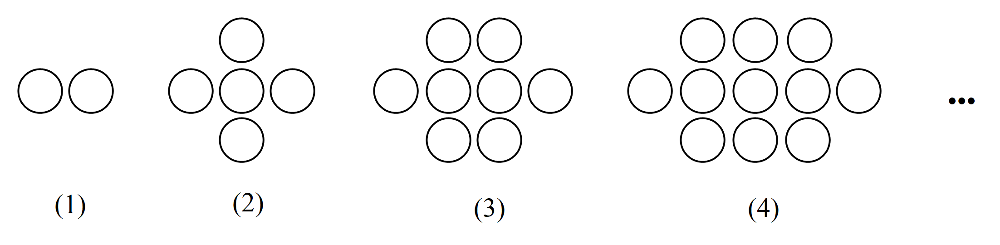

A．14	
B．20	
C．23	
D．26

【答案】B

【分析】根据前四个图案圆圈的个数找到规律，即可求解.

【详解】解：因为第①个图案中有2个圆圈， $2=3\times 1-1$ ；
第②个图案中有5个圆圈， $5=3\times 2-1$ ；
第③个图案中有8个圆圈， $8=3\times 3-1$ ；
第④个图案中有11个圆圈， $11=3\times 4-1$ ；
…，
所以第⑦个图案中圆圈的个数为 $3\times 7-1=20$ ；
故选：B.

【点睛】本题考查了图形类规律探究，根据前四个图案圆圈的个数找到第*n*个图案的规律为 $3n-1$ 是解题的关键.

30．（2023·山西·统考中考真题）如图是一组有规律的图案，它由若干个大小相同的圆片组成．第1个图案中有4个白色圆片，第2个图案中有6个白色圆片，第3个图案中有8个白色圆片，第4个图案中有10个白色圆片，…依此规律，第<em>n</em>个图案中有__________个白色圆片（用含<em>n</em>的代数式表示）

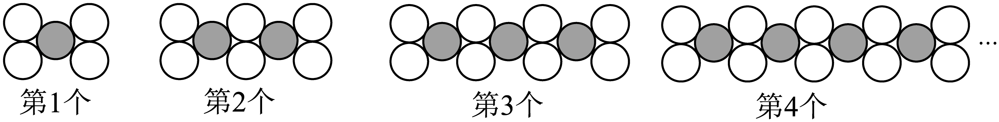

【答案】 $\left(2+2n\right)$

【分析】由于第1个图案中有4个白色圆片 $4=2+2\times 1$ ，第2个图案中有6个白色圆片 $6=2+2\times 2$ ，第3个图案中有8个白色圆片 $8=2+2\times 3$ ，第4个图案中有10个白色圆片 $10=2+2\times 4$ ， $\ldots$ ，可得第 $n(n>1)$ 个图案中有白色圆片的总数为 $2+2n$ ．

【详解】解：第1个图案中有4个白色圆片 $4=2+2\times 1$ ，

第2个图案中有6个白色圆片 $6=2+2\times 2$ ，

第3个图案中有8个白色圆片 $8=2+2\times 3$ ，

第4个图案中有10个白色圆片 $10=2+2\times 4$ ，
$\ldots$ ，
∴第 $n(n>1)$ 个图案中有 $\left(2+2n\right)$ 个白色圆片．
故答案为： $\left(2+2n\right)$ ．

【点睛】此题考查图形的变化规律，通过从一些特殊的数字变化中发现不变的因素或按规律变化的因素，然后推广到一般情况．解题关键是总结归纳出图形的变化规律．

31．（2022·山东济宁·统考中考真题）如图，用相同的圆点按照一定的规律拼出图形．第一幅图4个圆点，第二幅图7个圆点，第三幅图10个圆点，第四幅图13个圆点……按照此规律，第一百幅图中圆点的个数是（  ）

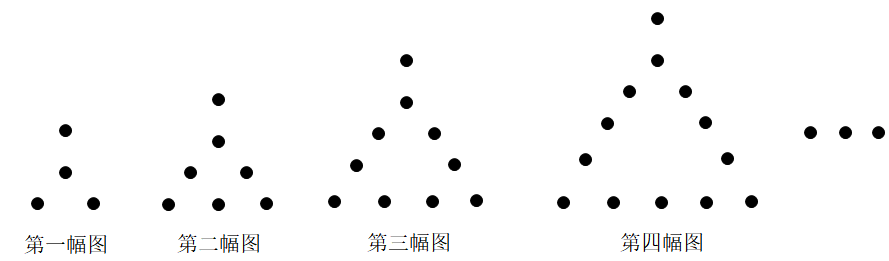

A．297	
B．301	
C．303	
D．400

【答案】B

【分析】首先根据前几个图形圆点的个数规律即可发现规律，从而得到第100个图摆放圆点的个数．

【详解】解：观察图形可知：第1幅图案需要4个圆点，即4＋3×0，

第2幅图7个圆点，即4+3=4+3×1；
第3幅图10个圆点，即4＋3＋3=4＋3×2；
第4幅图13个圆点，即4＋3＋3＋3=4＋3×3；
第*n*幅图中，圆点的个数为：4+3(*n*-1)=3*n*+1，

……，

第100幅图，圆中点的个数为：3×100+1=301．
故选：B．

【点睛】本题主要考查了图形的变化规律，解答的关键是由所给的图形总结出存在的规律．

32．（2023·四川遂宁·统考中考真题）烷烃是一类由碳、氢元素组成的有机化合物，在生产生活中可作为燃料、润滑剂等原料，也可用于动、植物的养护．通常用碳原子的个数命名为甲烷、乙烷、丙烷、……、癸烷（当碳原子数目超过 $10$ 个时即用汉文数字表示，如十一烷、十二烷……）等，甲烷的化学式为 $CH_{4}$ ，乙烷的化学式为 $C_{2}H_{6}$ ，丙烷的化学式为 $C_{3}H_{8}$ ……，其分子结构模型如图所示，按照此规律，十二烷的化学式为_________．

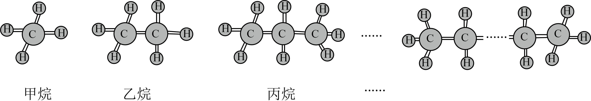

【答案】 $C_{12}H_{26}$

【分析】根据碳原子的个数，氢原子的个数，找到规律，即可求解．

【详解】解：甲烷的化学式为 $CH_{4}$ ，

乙烷的化学式为 $C_{2}H_{6}$ ，

丙烷的化学式为 $C_{3}H_{8}$ ……，

碳原子的个数为序数，氢原子的个数为碳原子个数的2倍多2个，

十二烷的化学式为 $C_{12}H_{26}$ ，
故答案为： $C_{12}H_{26}$ ．

【点睛】本题考查了规律题，找到规律是解题的关键．

## 题型02  图形渐变累加型
解题技巧： 对于个数不固定,

1）首先观察图形，直接可以从图形或者补全图形后就能找出规律，根据图形摆放形状的规律总结推导出关系式即可.

2）如果图形也看不出规律的应该先数出所求图形的个数,在比较后一个图形和前一个图形通过作差(商)来观察图形个数或将图形个数与n进行对比，寻找是否与n有关的平方、平方加1、平方减1等关系,从而总结规律推导出关系式.

33．（2021·湖北十堰·统考一模）如图，每一幅图中均含有若干个正方形，第1幅图中有1个正方形；第2幅图中有5个正方形……按这样的规律下去，第9幅图中正方形正的个数为（    ）

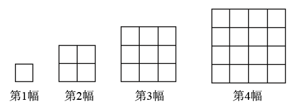

A．180	
B．204	
C．285	
D．385

【答案】C

【分析】从特殊情况开始，先算出前几幅图中正方形的个数，找出其中的规律，归纳得出一般情况，第*n*幅图中正方形个数的规律，于是可算出当*n*=9时的正方形的个数．

【详解】第１幅图中有１个正方形；
第2幅图中有1+4=12+22=5个正方形；
第3幅图中有1+4+9=11+22+32=14个正方形；
第4幅图中有1+4+9+16=12+22+32+42=30个正方形；
…

第<em>n</em>幅图中有12+22+32+42+…+<em>n2</em>个正方形．
于是，当<em>n</em>=9时，正方形的个数为：12+22+32+42+52+62+72+82+92=30+25+36+49+64+81=285（个）
故选：C

【点睛】本题考查了图形的变化规律，利用图形间的联系，得出数字间的运算规律，从而问题解决，体现了由特殊到一般的数学思想．

34．（2023·重庆江北·校考一模）下列图形都是由相同的小正方形按照一定规律摆放而成的，照此规律排列下去，第1个图形中小正方形的个数是3个，第2个图形中小正方形的个数是8个，第3个图形中小正方形的个数是15个，第9个图形中小正方形的个数是（    ）

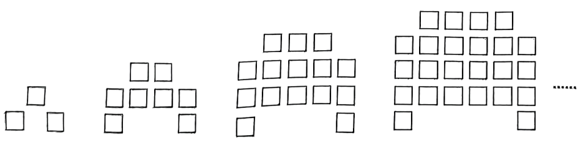

A．100	
B．99	
C．98	
D．80

【答案】B

【分析】根据图形间变化可得第*n*个图中小正方形的个数是 $\left(n+1\right)^{2}-1$ ，再代入 $n=9$ 进行计算即可．

【详解】解： $\because$ 第1个图中小正方形的个数是 $3=2^{2}-1$ ，

第2个图中小正方形的个数是 $8=3^{2}-1$ ，

第3个图中小正方形的个数是 $15=4^{2}-1$ ，

第4个图中小正方形的个数是 $24=5^{2}-1$ ，

…
$\therefore$ 第 $n$ 个图中小正方形的个数是 $\left(n+1\right)^{2}-1$ ，
$\therefore$ 第9个图中小正方形的个数是 $\left(9+1\right)^{2}-1=100-1=99$ ．
故选：B．

【点睛】此题考查了图形变化类规律问题的解决能力，关键是能根据图案变化观察、猜想、验证而得到此题蕴含的规律．

35．（2021·黑龙江绥化·统考中考真题）下面各图形是由大小相同的三角形摆放而成的，图①中有1个三角形，图②中有5个三角形，图③中有11个三角形，图④中有19个三角形…，依此规律，则第 $n$ 个图形中三角形个数是_______．

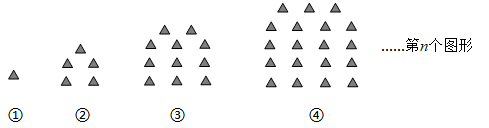

【答案】 $n^{2}+n-1$

【分析】此题只需分成上下两部分即可找到其中规律，上方的规律为(<em>n</em>-1)，下方规律为n2，结合两部分即可得出答案．

【详解】解：将题意中图形分为上下两部分，
则上半部规律为：0、1、2、3、4……*n*-1，

下半部规律为：12、22、32、42……n2，
∴上下两部分统一规律为： $n^{2}+n-1$ ．
故答案为： $n^{2}+n-1$ ．

【点睛】本题主要考查的图形的变化规律，解题的关键是将图形分为上下两部分分别研究．

36．（2023·广东·统考二模）如图是由同样大小的圆按一定规律排列所组成的，其中第1个图形中一共有4个圆，第2个图形中一共有8个圆，第3个图形中一共有14个圆，第4个图形中一共有22个圆．……按此规律排列下去，现已知第<em>n</em>个图形中圆的个数是134个，则 $n=$ _______．

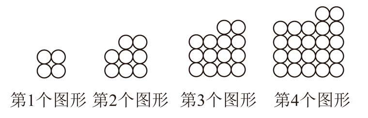

【答案】11

【分析】根据前几个图形圆的个数，找出一般求出规律，得出第*n*个图形中圆的个数 $n\left(n+1\right)+2$ ，然后列出方程，解方程即可．

【详解】解：因为第1个图形中一共有 $1\times \left(1+1\right)+2=4$ 个圆，

第2个图形中一共有 $2\times \left(2+1\right)+2=8$ 个圆，

第3个图形中一共有 $3\times \left(3+1\right)+2=14$ 个圆，

第4个图形中一共有 $4\times \left(4+1\right)+2=22$ 个圆；
可得第*n*个图形中圆的个数是 $n\left(n+1\right)+2$ ；
$n\left(n+1\right)+2=134$ ，
解得 $n=-12$ （舍）， $n=11$ ，
故答案为：11．

【点睛】本题主要考查了图形规律探索，一元二次方程的应用，解题的关键是找出一般规律，列出方程．

## 题型03  图形个数分区域累加型
解题技巧： 首先应观察图形区分图形累加的各部分,分别求出各部分累加规律,再将各部分关系式相加,得到第n项（某项)图形的数量与序数关系式.

37．（2021·内蒙古鄂尔多斯·统考中考真题）将一些相同的“〇”按如图所示的规律依次摆放，观察每个“龟图”的“〇”的个数，则第30个“龟图”中有___________个“〇”．

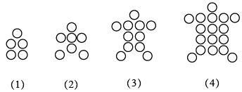

【答案】875

【分析】设第<em>n</em>个“龟图”中有<em>an</em>个“〇”（<em>n</em>为正整数），观察“龟图”，根据给定图形中“〇”个数的变化可找出变化规律“<em>an</em>＝<em>n2</em>−<em>n</em>＋5（<em>n</em>为正整数）”，再代入<em>n</em>＝30即可得出结论．

【详解】解：设第*n*个“龟图”中有*an*个“〇”（*n*为正整数）．

观察图形，可知：<em>a1</em>＝1＋2＋2＝5，<em>a2</em>＝1＋3＋12＋2＝7，<em>a3</em>＝1＋4＋22＋2＝11，<em>a4</em>＝1＋5＋32＋2＝17，…，
∴<em>an</em>＝1＋（<em>n</em>＋1）＋（<em>n</em>−1）2＋2＝<em>n2</em>−<em>n</em>＋5（<em>n</em>为正整数），
∴<em>a30</em>＝302−30＋5＝875．
故答案是：875．

【点睛】本题考查了规律型：图形的变化类，根据各图形中“〇”个数的变化找出变化规律“<em>an</em>＝<em>n2</em>−<em>n</em>＋5（<em>n</em>为正整数）”是解题的关键．

38．（2021下·重庆巴南·九年级校考期中）下列图形都是由同样大小的圆按一定的规律组成，其中，第①个图形中一共有2个圆；第②个图形中一共有7个圆；第③个图形中一共有16个圆；第④个图形中一共有29个圆，…，则第⑦个图形中圆的个数为（　　）

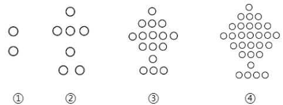

A．67	
B．92	
C．113	
D．121

【答案】B

【分析】分两部分：第①个图形为： $0^{2}+1^{2}+1=1$ ，第②个图形为： $1^{2}+2^{2}+2=7$ ，第③个图形为： $2^{2}+3^{2}+3=16$ ，第④个图形为： $3^{2}+4^{2}+4=29$ ，…，由此得出规律即可求解．

【详解】第①个图形为： $0^{2}+1^{2}+1=1$ ，

第②个图形为： $1^{2}+2^{2}+2=7$ ，

第③个图形为： $2^{2}+3^{2}+3=16$ ，

第④个图形为： $3^{2}+4^{2}+4=29$ ，…，

一般地，第⑦个图形为： $6^{2}+7^{2}+7=92$ ，
故选：B．

【点睛】本题是图形规律探索问题，由特殊出发得出一般规律是解题的关键．

39．（2020·海南·统考中考真题）海南黎锦有着悠久的历史，已被列入世界非物质文化遗产名录．图是黎锦上的图案，每个图案都是由相同菱形构成的，若按照第 $1$ 个图至第 $4$ 个图中的规律编织图案，则第 $5$ 个图中有<u>&lt;text style="underline"&gt;____________</u> &lt;/text&gt;个菱形， 第 $n$ 个图中有____________个菱形(用含 $n$ 的代数式表示)．

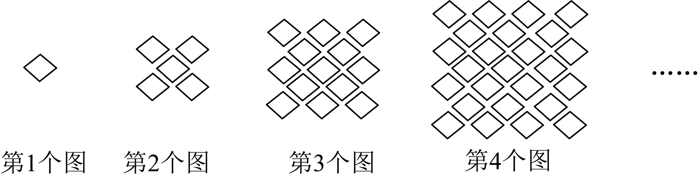

【答案】     $41$      $(2n^{2}-2n+1)$

【分析】根据第1个图形有1个菱形，第2个图形有2×2×1+1=5个菱形，第3个图形有2×3×2+1=13个菱形，第4个图形有2×4×3+1=25个菱形，据此规律求解即可.

【详解】解：∵第1个图形有1个菱形，

第2个图形有2×2×1+1=5个菱形，

第3个图形有2×3×2+1=13个菱形，

第4个图形有2×4×3+1=25个菱形，
∴第5个图形有2×5×4+1=41个菱形，

第n个图形有2×n×(n-1)+1= $2n^{2}-2n+1$ 个菱形.
故答案为：41， $(2n^{2}-2n+1)$ .

【点睛】本题考查了规律型—图形类规律与探究，要求学生通过观察，分析、归纳发现其中的规律，并应用发现的规律解决问题．

40．（2020·贵州黔西·统考中考真题）如图图形都是由同样大小的菱形按照一定规律所组成的，其中第①个图形中一共有3个菱形，第②个图形中一共有7个菱形，第③个图形中一共有13个菱形，…，按此规律排列下去，第⑦个图形中菱形的个数为________．

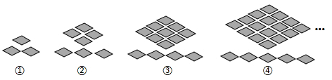

【答案】57

【分析】根据题意得出第n个图形中菱形的个数为 $n^{2}+n+1$ ；由此代入求得第⑦个图形中菱形的个数．

【详解】解：第①个图形中一共有3个菱形， $3=1^{2}+2$ ；
第②个图形中共有7个菱形， $7=2^{2}+3$ ；
第③个图形中共有13个菱形， $13=3^{2}+4$ ；
…，

第n个图形中菱形的个数为： $n^{2}+n+1$ ；
则第⑦个图形中菱形的个数为 $7^{2}+7+1=57$ ．
故答案为：57．

【点睛】本题考查了整式加减的探究规律—图形类找规律，其关键是根据已知图形找出规律．

## 题型04  图形循环规律
解题技巧： ①先找出一个周期的图形个数n:

②N(第N个)÷n=b……m(0≤m<n);

③第N个图形是一个周期中第m次变化后的图形.

41．（2023·广东佛山·佛山市南海区里水镇里水初级中学校考三模）观察下列图形，并判断照此规律从左向右第2007个图形是（   ）

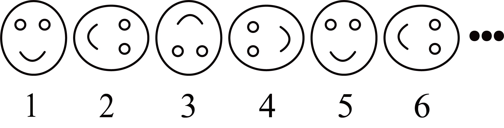

A．	
B．	
C．	
D．

【答案】C

【分析】此题主要考查图形的规律探索，解题的关键是根据已知条件图形推出规律． 图中的笑脸是以ABCD的顺序4个为循环单位排列的，由此可推出第2007个图形．

【详解】解：图中的笑脸是以ABCD的顺序4个为循环单位排列的，即个数能被4整除的图形为D，不能整除余数为1、2、3的图形分别为A、B、C；因为 $2007\div 4$ 商 $501$ 余3，所以第2007个图形为C．
故选：C．

42．（2019·贵州毕节·统考中考真题）下面摆放的图案，从第二个起，每个都是前一个按顺时针方向旋转90°得到，第2019个图案中箭头的指向是(      )

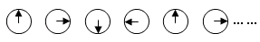

A．上方	
B．右方	
C．下方	
D．左方

【答案】C

【分析】直接利用已知图案得出旋转规律进而得出答案.

【详解】如图所示：每旋转4次一周，2019÷4＝504…3，
则第2019个图案中箭头的指向与第3个图案方向一致，箭头的指向是下方，
故选C.

【点睛】本题考查了规律型——图形的变化类，观察出图形的变化规律是解题的关键.

43．如图，把周长为 $4$ 个单位长度的圆放到数轴（单位长度为 $1$ ）上， $A$ ， $B$ ， $C$ ， $D$ 四点将圆四等分，将点 $A$ 与数轴上表示 $1$ 的点重合，然后将圆沿着数轴正方向滚动，依次为点 $B$ 与数轴上表示 $2$ 的点重合，点 $C$ 与数轴上表示 $3$ 的点重合，点 $D$ 与数轴上表示 $4$ 的点重合，点 $A$ 与数轴上表示 $5$ 的点重合，…，若当圆停止运动时，点 $B$ 正好落到数轴上，此时，则点 $B$ 对应的数轴上的数可能为（    ）

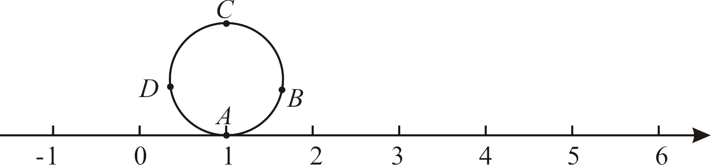

A． $2020$ 	
B． $2021$ 	
C． $2022$ 	
D． $2023$

【答案】C

【分析】本题主要考查数轴，找规律，找到圆的滚动规律是解题的关键．根据圆的滚动规律可知4次一个循环，将各选项中的数字除以4，根据余数可判定求解．

【详解】解：由题意得：圆沿着数轴正方向滚动一次按*A*，*B*，*C*，*D*的顺序排列：

A、 $2020\div 4=505$ ，所以此时点*D*正好落在数轴上；
B、 $2021\div 4=505\ldots 1$ ，所以此时点*A*正好落在数轴上；
C、 $2022\div 4=505\ldots 2$ ，所以此时点*B*正好落在数轴上；
D、 $2023\div 4=505\ldots 3$ ，所以此时点*C*正好落在数轴上．
故选：C．

44．（2019·河北·统考二模）将数轴按如图所示从某点开始折出一个等边三角形 $ABC$ ，设点A表示数为 $x-3$ ，点B表示的数是 $2x+1$ ，点C表示的数是 $-7-x$ ，则 $x$ 的值等于_____；若将 $\Delta ABC$ 向右滚动，数字2019对应的点将与 $\Delta ABC$ 的顶点_____ 重合．

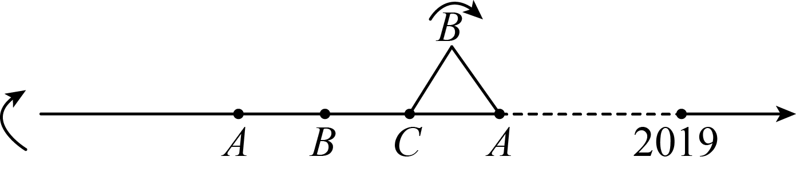

【答案】     $-3$      $A$

【分析】根据等边三角形边长相等列方程求出x的值，进而得出A、B、C所表示的数及等边 $\Delta ABC$ 的边长，然后即可求出数字2019对应的点将与△ABC的顶点A重合．

【详解】解：由题意得：（2x＋1）−（x−3）＝（−7−x）−（2x＋1），
解得：x＝−3，
∴点A表示的数为：−6，点B表示的数为−5，点C表示的数为−4，
∴等边 $\Delta ABC$ 的边长为1，
∵[2019−（−6）]÷3＝675，
∴数字2019对应的点将与△ABC的顶点A重合，
故答案为：−3，A．

【点睛】本题考查了数轴以及图形类规律探索，解答本题的关键是明确数轴的特点，利用数形结合的思想解答．

## 题型05  与几何图形有关的规律探索

45．（2023·湖北十堰·统考模拟预测）如图，正方形 $ABCD$ 的边长为1，以 $AC$ 为边作第二个正方形 $ACEF$ ，再以 $CF$ 为边作第三个正方形 $FCGH$ …，按照这样规律作下去，第10个正方形的边长为__．

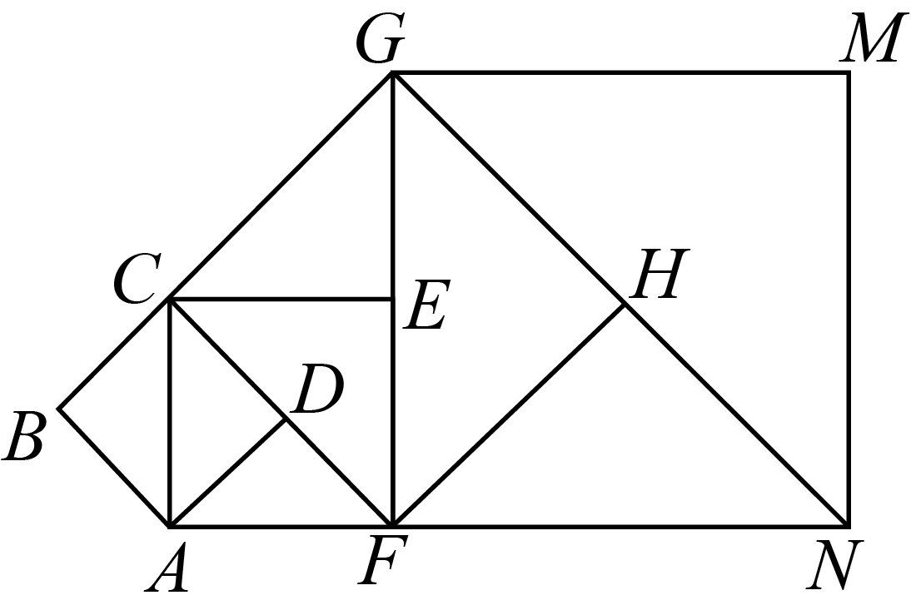

【答案】 $16\sqrt{2}$

【分析】根据题意和图形，可以写出前几个正方形的边长，从而可以发现边长的变化特点，从而可以求得第10个正方形的边长．

【详解】解：由题意可知，

第一个正方形的边长是1，

第二个正方形的边长是 $\sqrt{1^{2}+1^{2}}=\sqrt{2}$ ，

第三个正方形的边长是 $\sqrt{2}\cdot \sqrt{2}=2$ ，

第四个正方形的边长是 $2\times \sqrt{2}=2\sqrt{2}$ ，

……，
则第*n*个正方形的边长是 $\left(\sqrt{2}\right)^{n-1}$ ，
当 $n=10$ 时， $\left(\sqrt{2}\right)^{10-1}=\left(\sqrt{2}\right)^{9}$ ，
即第10个正方形的边长为 $\left(\sqrt{2}\right)^{9}=16\sqrt{2}$ ．
故答案为： $16\sqrt{2}$ ．

【点睛】本题考查图形的变化类，解答本题的关键是明确题意，发现正方形边长的变化特点，求出第10个正方形的边长．

46．（2019·广东汕头·校联考一模）如图：顺次连接矩形<em>A1B1C1D1</em>四边的中点得到四边形<em>A2B2C2D2</em>，再顺次连接四边形<em>A2B2C2D2</em>四边的中点得四边形<em>A3B3C3D3</em>，…，按此规律得到四边形AnBnCnDn．若矩形<em>A1B1C1D1</em>的面积为8，那么四边形AnBnCnDn的面积为______．

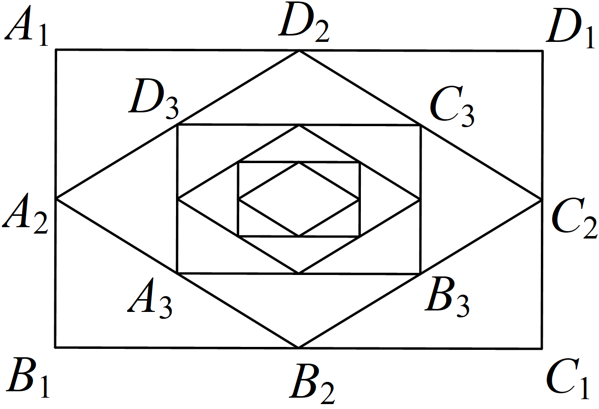

【答案】 $\frac{8}{2^{n-1}}$

【分析】根据矩形<em>A1B1C1D1</em>面积、四边形<em>A2B2C2D2</em>的面积、四边形<em>A3B3C3D3</em>的面积，即可发现新四边形与原四边形的面积的一半，找到规律即可解题．

【详解】解：顺次连接矩形<em>A1B1C1D1</em>四边的中点得到四边形<em>A2B2C2D2</em>，则四边形<em>A2B2C2D2</em>的面积为矩形<em>A1B1C1D1</em>面积的一半，

顺次连接四边形<em>A2B2C2D2</em>四边的中点得四边形<em>A3B3C3D3</em>，则四边形<em>A3B3C3D3</em>的面积为四边形<em>A2B2C2D2</em>面积的一半，
故新四边形与原四边形的面积的一半，
则四边形<em>A</em>&lt;text style="subscript"&gt;&lt;text style="subscript"&gt;&lt;text style="subscript"&gt;n&lt;/text&gt;&lt;/text&gt;&lt;/text&gt;<em>B</em>n<em>C</em>n<em>D</em>n面积为矩形A<em>&lt;text style="italic,subscript"&gt;&lt;text style="italic,subscript"&gt;&lt;text style="italic,subscript"&gt;1</em>&lt;/text&gt;&lt;/text&gt;&lt;/text&gt;B1C1D1面积的 $\frac{1}{2^{n-1}}$ ，
∴四边形A&lt;text style="subscript"&gt;&lt;text style="subscript"&gt;&lt;text style="subscript"&gt;n&lt;/text&gt;&lt;/text&gt;&lt;/text&gt;BnCnDn面积= $\frac{1}{2^{n-1}}$ ×8= $\frac{8}{2^{n-1}}$ ，
故答案为： $\frac{8}{2^{n-1}}$ ．

【点睛】本题考查了学生找规律的能力，本题中找到连接矩形、菱形中点则形成新四边形的面积为原四边形面积的一半是解题的关键．

47．（2022·辽宁·统考中考真题）如图， $A_{1}$ 为射线 $ON$ 上一点， $B_{1}$ 为射线 $OM$ 上一点， $\angle B_{1}A_{1}O=60\circ ,OA_{1}=3,B_{1}A_{1}=1$ ．以 $B_{1}A_{1}$ 为边在其右侧作菱形 $A_{1}B_{1}C_{1}D_{1}$ ，且 $\angle B_{1}A_{1}D_{1}=60\circ ,C_{1}D_{1}$ 与射线 $OM$ 交于点 $B_{2}$ ，得 $\bigtriangleup C_{1}B_{1}B_{2}$ ；延长 $B_{2}D_{1}$ 交射线 $ON$ 于点 $A_{2}$ ，以 $B_{2}A_{2}$ 为边在其右侧作菱形 $A_{2}B_{2}C_{2}D_{2}$ ，且 $\angle B_{2}A_{2}D_{2}=60\circ ,C_{2}D_{2}$ 与射线 $OM$ 交于点 $B_{3}$ ，得 $\bigtriangleup C_{2}B_{2}B_{3}$ ；延长 $B_{3}D_{2}$ 交射线 $ON$ 于点 $A_{3}$ ，以 $B_{3}A_{3}$ 为边在其右侧作菱形 $A_{3}B_{3}C_{3}D_{3}$ ，且 $\angle B_{3}A_{3}D_{3}=60\circ ,C_{3}D_{3}$ 与射线 $OM$ 交于点 $B_{4}$ ，得 $\bigtriangleup C_{3}B_{3}B_{4}$ ；…，按此规律进行下去，则 $\bigtriangleup C_{2022}B_{2022}B_{2023}$ 的面积___________．

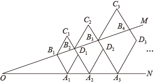

【答案】 $\frac{\sqrt{3}}{6}\times \left(\frac{4}{3}\right)^{4042}$

【分析】过点 $B_{1}$ 作 $B_{1}D\perp OA_{1}$ 于点*D*，连接 $B_{1}D_{1},B_{2}D_{2},B_{3}D_{3}$ ，分别作 $B_{2}H\perp B_{1}D_{1},B_{3}G\perp B_{2}D_{2},B_{4}E\perp B_{3}D_{3}$ ，然后根据菱形的性质及题意可得 $B_{1}D_{1}//OA_{1},B_{2}D_{2}//OA_{1},B_{3}D_{3}//OA_{1}$ ，则有 $tan\angle O=tan\angle B_{2}B_{1}D_{1}=tan\angle B_{3}B_{2}D_{2}=tan\angle B_{4}B_{3}D_{3}=\frac{\sqrt{3}}{5}$ ，进而可得出规律进行求解．

【详解】解：过点 $B_{1}$ 作 $B_{1}D\perp OA_{1}$ 于点*D*，连接 $B_{1}D_{1},B_{2}D_{2},B_{3}D_{3}$ ，分别作 $B_{2}H\perp B_{1}D_{1},B_{3}G\perp B_{2}D_{2},B_{4}E\perp B_{3}D_{3}$ ，如图所示：

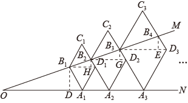
∴ $\angle B_{1}DO=\angle B_{1}DA_{1}=\angle B_{2}HD_{1}=\angle B_{3}GD_{2}=\angle B_{4}ED_{3}=90\circ$ ，
∵ $\angle B_{1}A_{1}O=60\circ$ ，
∴ $\angle DB_{1}A_{1}=30\circ$ ，
∵ $B_{1}A_{1}=1$ ， $OA_{1}=3$ ，
∴ $DA_{1}=\frac{1}{2}B_{1}A_{1}=\frac{1}{2}$ ， $OD=\frac{5}{2}$ ，
∴ $B_{1}D=\sqrt{A_{1}B_{1}^{2}-A_{1}D^{2}}=\frac{\sqrt{3}}{2}$ ，
∴ $tan\angle O=\frac{B_{1}D}{OD}=\frac{\sqrt{3}}{5}$ ，
∵菱形 $A_{1}B_{1}C_{1}D_{1}$ ，且 $\angle B_{1}A_{1}D_{1}=60\circ$ ，
∴ $\bigtriangleup A_{1}B_{1}D_{1}$ 是等边三角形，
∴ $\angle A_{1}B_{1}D_{1}=60\circ$ ， $B_{1}D_{1}=A_{1}B_{1}=1$ ，
∵ $\angle A_{1}B_{1}D_{1}=\angle OA_{1}B_{1}=60\circ$ ，
∴ $OA_{1}//B_{1}D_{1}$ ，
∴ $\angle O=\angle B_{2}B_{1}D_{1}$ ，
∴ $tan\angle B_{2}B_{1}D_{1}=tan\angle O=\frac{\sqrt{3}}{5}$ ，
设 $B_{2}D_{1}=x$ ，
∵ $\angle B_{2}D_{1}H=60\circ$ ，
∴ $HD_{1}=B_{2}D_{1}\cdot cos60\circ =\frac{1}{2}x,B_{2}H=B_{2}D_{1}\cdot sin60\circ =\frac{\sqrt{3}}{2}x$ ，
∴ $B_{1}H=\frac{B_{2}H}{tan\angle B_{2}B_{1}H}=\frac{5}{2}x$ ，
∴ $\frac{5}{2}x+\frac{1}{2}x=1$ ，解得： $x=\frac{1}{3}$ ，
∴ $B_{2}D_{1}=\frac{1}{3}$ ，
∴ $A_{2}B_{2}=\frac{4}{3}$ ，
同理可得： $B_{3}D_{2}=\frac{4}{9}$ ， $B_{4}D_{3}=\frac{16}{27}$ ，
∴ $A_{3}B_{3}=\frac{16}{9},A_{4}B_{4}=\frac{64}{27}$ ，
由上可得： $A_{n}B_{n}=\left(\frac{4}{3}\right)^{n-1}$ ， $B_{n+1}D_{n}=\frac{1}{3}\cdot \left(\frac{4}{3}\right)^{n-1}$ ，
∴ $S_{\bigtriangleup C_{2022}B_{2022}B_{2023}}=S_{\bigtriangleup C_{2022}B_{2022}D_{2022}}-S_{\bigtriangleup B_{2023}B_{2022}D_{2022}}=\frac{\sqrt{3}}{4}\times \left[\left(\frac{4}{3}\right)^{2021}\right]^{2}-\frac{1}{2}\times \left(\frac{4}{3}\right)^{2021}\times \frac{1}{3}\times \left(\frac{4}{3}\right)^{2021}\times \frac{\sqrt{3}}{2}=\frac{\sqrt{3}}{6}\times \left(\frac{4}{3}\right)^{4042}$ ，
故答案为 $\frac{\sqrt{3}}{6}\times \left(\frac{4}{3}\right)^{4042}$ ．

【点睛】本题主要考查菱形的性质、等边三角形的性质与判定、含30度直角三角形的性质及三角函数，熟练掌握菱形的性质、等边三角形的性质与判定、含30度直角三角形的性质及三角函数是解题的关键．

48．（<em>2</em>02<em>&lt;text style="italic,subscript"&gt;&lt;text style="italic,subscript"&gt;&lt;text style="italic,subscript"&gt;&lt;text style="italic,subscript"&gt;&lt;text style="italic,subscript"&gt;&lt;text style="italic,subscript"&gt;&lt;text style="italic,subscript"&gt;1</em>&lt;/text&gt;&lt;/text&gt;&lt;/text&gt;&lt;/text&gt;&lt;/text&gt;&lt;/text&gt;&lt;/text&gt;·云南昭通·统考一模）如图，<em>ΔA&lt;text style="italic"&gt;B&lt;text style="italic"&gt;&lt;text style="italic"&gt;&lt;text style="italic"&gt;C</em>&lt;/text&gt;&lt;/text&gt;&lt;/text&gt;&lt;/text&gt;是边长为1的等边三角形，分别取<em>AC</em>，BC边的中点<em>&lt;text style="italic"&gt;&lt;text style="italic"&gt;&lt;text style="italic"&gt;D</em>&lt;/text&gt;&lt;/text&gt;&lt;/text&gt;，<em>&lt;text style="italic"&gt;&lt;text style="italic"&gt;&lt;text style="italic"&gt;E</em>&lt;/text&gt;&lt;/text&gt;&lt;/text&gt;，连接<em>DE</em>，作 $EF\parallel AC$ 得到四边形<em>&lt;text style="italic"&gt;&lt;text style="italic"&gt;&lt;text style="italic"&gt;E</em>&lt;/text&gt;&lt;/text&gt;&lt;/text&gt;<em>&lt;text style="italic"&gt;&lt;text style="italic"&gt;&lt;text style="italic"&gt;D</em>&lt;/text&gt;&lt;/text&gt;&lt;/text&gt;AF，它的周长记作<em>&lt;text style="italic"&gt;&lt;text style="italic"&gt;C</em>&lt;/text&gt;&lt;/text&gt;<em>&lt;text style="italic,subscript"&gt;&lt;text style="italic,subscript"&gt;&lt;text style="italic,subscript"&gt;&lt;text style="italic,subscript"&gt;&lt;text style="italic,subscript"&gt;&lt;text style="italic,subscript"&gt;&lt;text style="italic,subscript"&gt;1</em>&lt;/text&gt;&lt;/text&gt;&lt;/text&gt;&lt;/text&gt;&lt;/text&gt;&lt;/text&gt;&lt;/text&gt;；分别取<em>EF</em>，<em>BE</em>的中点D1，E1连接D1E1，作 $E_{1}F_{1}\parallel EF$ ，得到四边形<em>&lt;text style="italic"&gt;&lt;text style="italic"&gt;&lt;text style="italic"&gt;E</em>&lt;/text&gt;&lt;/text&gt;&lt;/text&gt;<em>&lt;text style="italic,subscript"&gt;&lt;text style="italic,subscript"&gt;&lt;text style="italic,subscript"&gt;&lt;text style="italic,subscript"&gt;&lt;text style="italic,subscript"&gt;&lt;text style="italic,subscript"&gt;&lt;text style="italic,subscript"&gt;1</em>&lt;/text&gt;&lt;/text&gt;&lt;/text&gt;&lt;/text&gt;&lt;/text&gt;&lt;/text&gt;&lt;/text&gt;<em>&lt;text style="italic"&gt;&lt;text style="italic"&gt;&lt;text style="italic"&gt;D</em>&lt;/text&gt;&lt;/text&gt;&lt;/text&gt;1<em>FF</em>1，它的周长记作<em>&lt;text style="italic"&gt;&lt;text style="italic"&gt;C</em>&lt;/text&gt;&lt;/text&gt;<em>2</em>，照此规律作下去，则C<em>2021</em>等于________．

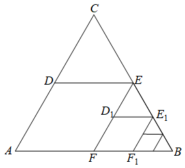

【答案】 $\frac{1}{2^{2019}}$

【分析】根据三角形中位线定理得到<em>DE</em>＝ $\frac{1}{2}$ <em>AB</em>， $DE\parallel AB$ ，进而证明四边形A<em>DE</em>F为菱形，求出菱形<em>&lt;text style="italic"&gt;ADEF</em>&lt;/text&gt;的周长<em>C1</em>，总结规律，根据规律解答即可．

【详解】解：∵点*D*，*E*分别为*AC*，*BC*边的中点，
∴*DE*＝ $\frac{1}{2}$ *AB*＝ $\frac{1}{2}$ ， $DE\parallel AB$ ，*AD*＝ $\frac{1}{2}$ *AC*＝ $\frac{1}{2}$ ，
∴*AD*＝*DE*，
∵ $EF\parallel AC$ ，
∴四边形*ADEF*为菱形，
∴四边形<em>ADEF</em>的周长<em>C1</em>＝4× $\frac{1}{2}$ ＝2，

同理：四边形<em>E&lt;text style="italic,subscript"&gt;&lt;text style="italic,subscript"&gt;1</em>&lt;/text&gt;&lt;/text&gt;<em>D</em>1<em>FF</em>1的周长记作<em>C2</em>＝4× $\frac{1}{4}$ ＝<em>&lt;text style="italic,subscript"&gt;&lt;text style="italic,subscript"&gt;1</em>&lt;/text&gt;&lt;/text&gt;，

…

<em>C2021</em>＝4× $\frac{1}{2^{2021}}$ ＝ $\frac{1}{2^{2019}}$ ，
故答案为： $\frac{1}{2^{2019}}$ ．

【点睛】本题考查的是三角形中位线判定与性质、菱形的判定与性质，图形的变化规律，根据三角形中位线性质总结出规律是解题的关键．

49．（2023·黑龙江齐齐哈尔·统考中考真题）如图，在平面直角坐标系中，点<em>A</em>在 $y$ 轴上，点<em>B</em>在 $x$ 轴上， $OA=OB=4$ ，连接 $AB$ ，过点<em>O</em>作 $OA_{1}\perp AB$ 于点 $A_{1}$ ，过点 $A_{1}$ 作 $A_{1}B_{1}\perp x$ 轴于点 $B_{1}$ ；过点 $B_{1}$ 作 $B_{1}A_{2}\perp AB$ 于点 $A_{2}$ ，过点 $A_{2}$ 作 $A_{2}B_{2}\perp x$ 轴于点 $B_{2}$ ；过点 $B_{2}$ 作 $B_{2}A_{3}\perp AB$ 于点 $A_{3}$ ，过点 $A_{3}$ 作 $A_{3}B_{3}\perp x$ 轴于点 $B_{3}$ ；…；按照如此规律操作下去，则点 $A_{2023}$ 的坐标为______．

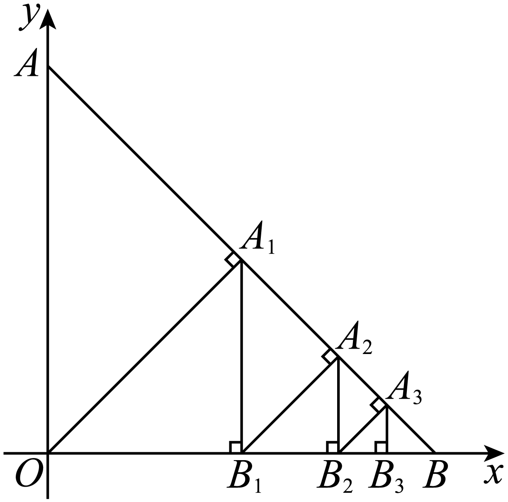

【答案】 $\left(4-\frac{1}{2^{2021}},\frac{1}{2^{2021}}\right)$

【分析】根据题意，结合图形依次求出 $A_{1},A_{2},A_{3}$ 的坐标，再根据其规律写出 $A_{2023}$ 的坐标即可．

【详解】解：在平面直角坐标系中，点*A*在 $y$ 轴上，点*B*在 $x$ 轴上， $OA=OB=4$ ，
$\therefore \bigtriangleup OAB$ 是等腰直角三角形， $\angle OBA=45\circ$ ，
$\because OA_{1}\perp AB$ ，
$\therefore \bigtriangleup OA_{1}B$ 是等腰直角三角形，
同理可得： $\bigtriangleup OA_{1}B_{1},\bigtriangleup A_{1}B$ 均为等腰直角三角形，
$\therefore A_{1}(2,2)$ ，
根据图中所有的三角形均为等腰直角三角形，

依次可得： $A_{2}(3,1),A_{3}(4-\frac{1}{2},\frac{1}{2}),A_{4}(4-\frac{1}{2^{2}},\frac{1}{2^{2}}),$
由此可推出：点 $A_{2023}$ 的坐标为 $\left(4-\frac{1}{2^{2021}},\frac{1}{2^{2021}}\right)$ ．
故答案为： $\left(4-\frac{1}{2^{2021}},\frac{1}{2^{2021}}\right)$ ．

【点睛】本题主要考查了平面直角坐标系中点的坐标特征，以及点的坐标变化规律问题，等腰直角三角形的性质，解题的关键是依次求出 $A_{1},A_{2},A_{3}$ 的坐标，找出其坐标的规律．

50．（2020·辽宁·统考中考真题）如图，四边形 $ABCD$ 是矩形，延长 $DA$ 到点 $E$ ，使 $AE=DA$ ，连接 $EB$ ，点 $F_{1}$ 是 $CD$ 的中点，连接 $EF_{1}$ ， $BF_{1}$ ，得到 $\Delta EF_{1}B$ ；点 $F_{2}$ 是 $CF_{1}$ 的中点，连接 $EF_{2}$ ， $BF_{2}$ ，得到 $\Delta EF_{2}B$ ；点 $F_{3}$ 是 $CF_{2}$ 的中点，连接 $EF_{3}$ ， $BF_{3}$ ，得到 $\Delta EF_{3}B$ ；…；按照此规律继续进行下去，若矩形 $ABCD$ 的面积等于2，则 $\Delta EF_{n}B$ 的面积为_________．（用含正整数 $n$ 的式子表示）

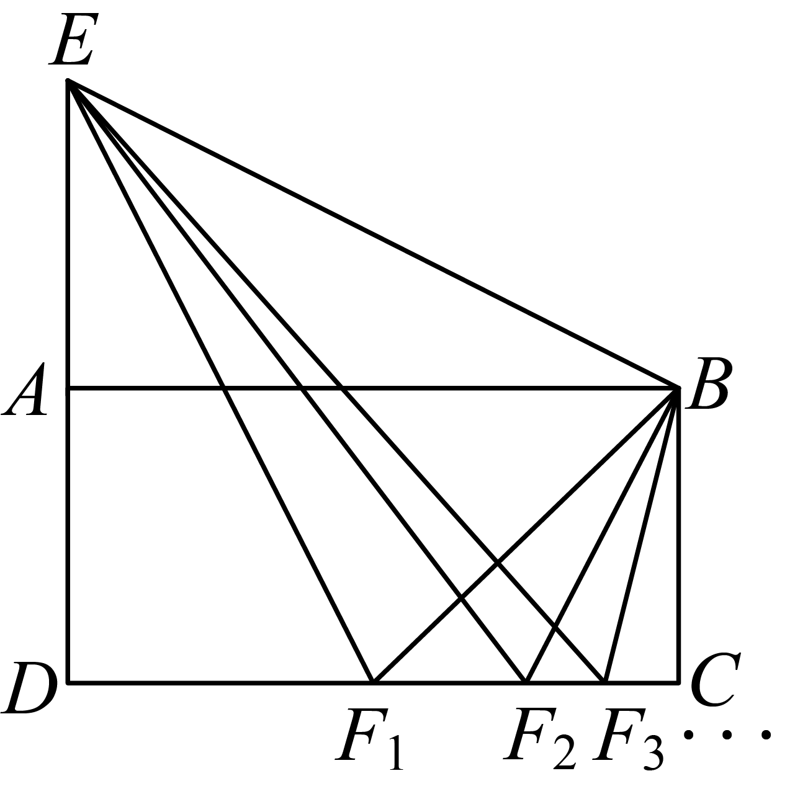

【答案】 $\frac{2^{n}+1}{2^{n}}$

【分析】先计算出 $\Delta EF_{1}B$ 、 $\Delta EF_{2}B$ 、 $\Delta EF_{3}B$ 的面积，然后再根据其面积的表达式找出其一般规律进而求解．

【详解】解：∵ $AE=DA$ ，
∴ $\Delta ABE$ 面积是矩形ABCD面积的一半，∴梯形BCDE的面积为 $2+1=3$ ，
∵点 $F_{1}$ 是 $CD$ 的中点，∴ $DF_{1}=CF_{1}$
∴ $S_{\Delta BF_{1}C}=\frac{1}{2}BC\cdot CF_{1}=\frac{1}{2}BC\cdot \frac{1}{2}CD=\frac{1}{4}S_{矩形ABCD}=\frac{1}{2}$ ，
$S_{\Delta DF_{1}E}=\frac{1}{2}DE\cdot DF_{1}=\frac{1}{2}\times 2AD\cdot \frac{1}{2}DC=\frac{1}{2}S_{矩形ABCD}=1$ ，
∴ $S_{\Delta EF_{1}B}=S_{梯形ABCD}-S_{\Delta DF_{1}E}-S_{\Delta BF_{1}C}=3-1-\frac{1}{2}=\frac{3}{2}$ ，
∵点 $F_{2}$ 是 $CF_{1}$ 的中点，由中线平分所在三角形的面积可知，
∴ $S_{\Delta BF_{2}C}=\frac{1}{2}S_{\Delta BF_{1}C}=\frac{1}{4}$ ，

且 $DF_{2}=\frac{3}{2}DF_{1}$ ，
∴ $S_{\Delta DF_{2}E}=\frac{3}{2}S_{\Delta DF_{1}E}=\frac{3}{2}$
∴ $S_{\Delta EF_{2}B}=S_{梯形ABCD}-S_{\Delta DF_{2}E}-S_{\Delta BF_{2}C}=3-\frac{3}{2}-\frac{1}{4}=\frac{5}{4}$ ，

同理可以计算出：
$S_{\Delta BF_{3}C}=\frac{1}{2}S_{\Delta BF_{2}C}=\frac{1}{8}$ ，

且 $DF_{3}=\frac{7}{4}DF_{1}$ ，
∴ $S_{\Delta DF_{3}E}=\frac{7}{4}S_{\Delta DF_{1}E}=\frac{7}{4}$ ，
∴ $S_{\Delta EF_{3}B}=S_{梯形ABCD}-S_{\Delta DF_{3}E}-S_{\Delta BF_{3}C}=3-\frac{7}{4}-\frac{1}{8}=\frac{9}{8}$ ，
故 $\Delta EF_{1}B$ 、 $\Delta EF_{2}B$ 、 $\Delta EF_{3}B$ 的面积分别为： $\frac{3}{2},\frac{5}{4},\frac{9}{8}$ ，

观察规律，其分母分别为2,4,8，符合 $2^{n}$ ，分子规律为 $2^{n}+1$ ，
∴ $\Delta EF_{n}B$ 的面积为 $\frac{2^{n}+1}{2^{n}}$ ．
故答案为： $\frac{2^{n}+1}{2^{n}}$ ．

【点睛】本题考查了三角形的中线的性质，三角形面积公式，矩形的性质等，本题的关键是能求出前面三个三角形的面积表达式，进而找出规律求解．

51．（2022·山东聊城·统考中考真题）如图，线段 $AB=2$ ，以<em>AB</em>为直径画半圆，圆心为 $A_{1}$ ，以 $AA_{1}$ 为直径画半圆①；取 $A_{1}B$ 的中点 $A_{2}$ ，以 $A_{1}A_{2}$ 为直径画半圆②；取 $A_{2}B$ 的中点 $A_{3}$ ，以 $A_{2}A_{3}$ 为直径画半圆③…按照这样的规律画下去，大半圆内部依次画出的8个小半圆的弧长之和为______________．

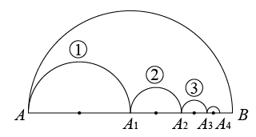

【答案】 $\frac{255}{256}\pi$ / $\frac{255\pi }{256}$

【分析】由<em>AB</em>＝&lt;text style="superscript"&gt;2&lt;/text&gt;，可得半圆①弧长为 $\frac{1}{2}\pi$ ，半圆②弧长为（ $\frac{1}{2}$ ）&lt;text style="superscript"&gt;2&lt;/text&gt;π，半圆③弧长为（ $\frac{1}{2}$ ）&lt;text style="superscript"&gt;3&lt;/text&gt;π，......半圆⑧弧长为（ $\frac{1}{2}$ ）&lt;text style="superscript"&gt;8&lt;/text&gt;π，即可得8个小半圆的弧长之和为 $\frac{1}{2}$ π+（ $\frac{1}{2}$ ）&lt;text style="superscript"&gt;2&lt;/text&gt;π+（ $\frac{1}{2}$ ）&lt;text style="superscript"&gt;3&lt;/text&gt;π+...+（ $\frac{1}{2}$ ）&lt;text style="superscript"&gt;8&lt;/text&gt;π＝ $\frac{255}{256}$ π．

【详解】解：∵ $AB=2$ ，
∴ $AA_{2}=1$ ，半圆①弧长为 $\frac{\pi \times 1}{2}=\frac{1}{2}\pi$ ，

同理 $A_{1}A_{2}=\frac{1}{2}$ ，半圆②弧长为 $\frac{\pi \times \frac{1}{2}}{2}=\left(\frac{1}{2}\right)^{2}\pi$ ，
$A_{2}A_{3}=\frac{1}{4}$ ，半圆③弧长为 $\frac{\pi \times \frac{1}{4}}{2}=\left(\frac{1}{2}\right)^{3}\pi$ ，

……

半圆⑧弧长为 $\frac{\pi \times \left(\frac{1}{2}\right)^{7}}{2}=\left(\frac{1}{2}\right)^{8}\pi$ ，
∴8个小半圆的弧长之和为 $\frac{1}{2}\pi +\left(\frac{1}{2}\right)^{2}\pi +\left(\frac{1}{2}\right)^{3}\pi +\cdot \cdot \cdot +\left(\frac{1}{2}\right)^{8}\pi =\frac{255}{256}\pi$ ．
故答案为： $\frac{255}{256}\pi$ ．

【点睛】此题考查图形的变化类规律，解题的关键是掌握圆的周长公式和找到弧长的变化规律．

52．（2020·湖南湘西·中考真题）观察下列结论：  
（1）如图①，在正三角形 $ABC$ 中，点M，N是 $AB,BC$ 上的点，且 $AM=BN$ ，则 $AN=CM$ ， $\angle NOC=60\circ$ ；  
（2）如图②，在正方形 $ABCD$ 中，点M，N是 $AB,BC$ 上的点，且 $AM=BN$ ，则 $AN=DM$ ， $\angle NOD=90\circ$ ；  
（3）如图③，在正五边形 $ABCDE$ 中，点M，N是 $AB,BC$ 上的点，且 $AM=BN$ ，则 $AN=EM$ ， $\angle NOE=108\circ$ ；……

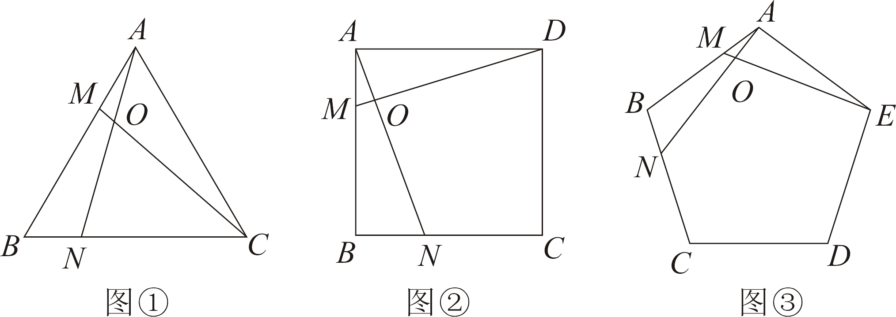
根据以上规律，在正n边形 $A_{1}A_{2}A_{3}A_{4}\cdots \cdots A_{n}$ 中，对相邻的三边实施同样的操作过程，即点M，N是 $A_{1}A_{2},A_{2}A_{3}$ 上的点，且 $A_{1}M=A_{2}N$ ， $A_{1}N$ 与 $A_{n}M$ 相交于O．也会有类似的结论．你的结论是_________________．

【答案】 $A_{1}N$  $=$  $A_{n}M$ ， $\angle NOA_{n}=\frac{(n-2)\cdot 180\circ }{n}$

【分析】根据正多边形内角和定理结合全等三角形的判定和性质可得出（1）、（2）、（3）的结论，根据以上规律可得出正n边形的结论．

【详解】（1）∵正三角形ABC中，点M、N是AB、AC边上的点，且AM=BN，
∴AB=AC，∠CAM=∠ABN= $\frac{\left(n-2\right)\cdot 180\circ }{n}=\frac{\left(3-2\right)\cdot 180\circ }{3}=60\circ$ ，
∵在△ABN和△CAM中，
$\left\{\begin{array}{c}AB=AC\\\angle ABN=\angle CAM\\BN=AM\end{array}\right$ ，
∴△ABN≌△CAM（SAS），
∴AN= CM，∠BAN=∠MCA，
∴∠NOC=∠OAC+∠MCA =∠OAC+∠BAN =∠BAC=60°，
故结论为：AN= CM，∠NOC=60 $\circ$ ；  
（2）∵正方形ABCD中，点M、N是AB、BC边上的点，且AM=BN，
∴AB=AD，∠DAM=∠ABN= $\frac{\left(n-2\right)\cdot 180\circ }{n}=\frac{\left(4-2\right)\cdot 180\circ }{4}=90\circ$ ，

同理可证：Rt△ABN $\cong$ Rt△DAM，
∴AN= DM，∠BAN=∠ADM，

∠NOD=∠OAD+∠ADM =∠OAD+∠BAN =∠BAC=90°，
故结论为：AN= DM，∠NOD=90 $\circ$ ；  
（3）∵正五边形ABCDE中，点M、N是AB、BC边上的点，且AM=BN，
∴AB=AE，∠EAM=∠ABN= $\frac{\left(n-2\right)\cdot 180\circ }{n}=\frac{\left(5-2\right)\cdot 180\circ }{5}=108\circ$ ，

同理可证得：Rt△ABN $\cong$ Rt△EAM，
∴AN= EM，∠BAN=∠AEM，

∠NOE=∠OAE+∠AEM =∠OAE+∠BAN =∠BAE=108°，
故结论为：AN= EM，∠NOE=108 $\circ$ ；
$\cdots$
∵正三角形的内角度数为：60°，

正方形的内角度数为：90°，

正五边形的内角度数为：108°，
∴以上所求的角恰好等于正n边形的内角 $\frac{\left(n-2\right)\cdot 180\circ }{n}$ ，
在正n边形 $A_{1}A_{2}A_{3}A_{4}\cdots \cdots A_{n}$ 中，点M，N是 $A_{1}A_{2},A_{2}A_{3}$ 上的点，且 $A_{1}M=A_{2}N$ ， $A_{1}N$ 与 $A_{n}M$ 相交于O，结论为： $A_{1}N$  $=$  $A_{n}M$ ， $\angle NOA_{n}=\frac{(n-2)\cdot 180\circ }{n}$ ．
故答案为： $A_{1}N$  $=$  $A_{n}M$ ， $\angle NOA_{n}=\frac{(n-2)\cdot 180\circ }{n}$ ．

【点睛】本题考查了正n边形的内角和定理以及全等三角形的判定和性质，解题的关键是发现 $A_{1}N$ 与 $A_{n}M$ 的夹角与正 $n$ 边形的内角相等．

## 类型三  函数规律
根据图形点坐标的变换特点，有两种考查形式:1）点坐标变换是在同一象限递推变化:

2）点坐标变换在坐标轴上或象限内循环递推变化
解决这类题的方法如下：

1）根据图形点坐标的变化特点判断出属于哪一类.

2）根据图形的变换规律分别求出第1个点、第2个点、第3个点、第4个点的坐标，归纳出后一个点坐标与前一个点坐标之间存在的倍分关系

3）①第一类确定点坐标的方法:根据上述得到的倍分关系，得到第 M个点的坐标;

②第二类确定点坐标的方法:先观察点坐标变换的规律是按顺时针循环，还是按逆时针循环交替出现，找出循环一周的变换次数，记为n，用M÷n=w…q(0≤g<n)，则第 M次变换同第q次变换后的点坐标所在的坐标轴或象限相同，根据已得到的倍分关系，得到第M个点的坐标.

## 题型01  函数图象规律

56．（2022·江苏南京·统考中考真题）如图，在平面直角坐标系，横、纵坐标均为整数的点案如下规律依序排列： $(0,0)$ ， $(1,0)$ ， $(0,1)$ ， $(2,0)$ ， $(1,1)$ ， $(0,2)$ ， $(3,0)$ ， $(2,1)$ ， $(1,2)$ ， $(0,3)$ ， $(4,0)$ ， $(3,1)$ ， $(2,2)$ ， $(1,3)$ ，…按这个规律，则 $(6,7)$ 是第________个点．

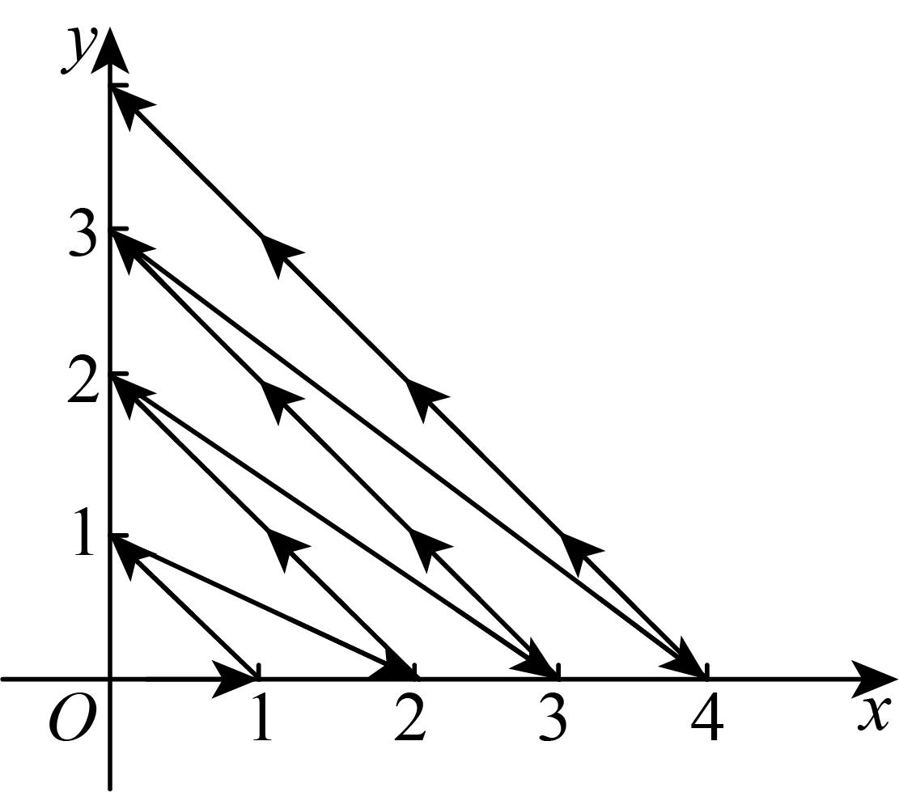

【答案】99

【分析】先根据点的坐标，找出规律，再计算求解．

【详解】解：横纵坐标和是0的有1个点，

横纵坐标和是1的有2个点，

横纵坐标和是2的有3个点，

横纵坐标和是3的有4个点，
$\ldots \ldots$ ，

横纵坐标和是 $n$ 的有 $(n+1)$ 个点，
$6+7=13$ ，
$\because 1+2+\ldots \ldots +12+13=\frac{1}{2}\times 13\times (13+1)=91$ ，
$\therefore$ 横纵坐标和是13的有14点，分别为： $(13,0)$ 、 $(12,1)$ 、 $(11,2)$ 、 $(10,3)$ 、 $(9,4)$ 、 $(8,5)$ 、 $(7,6)$ 、 $(6,7)$ 、 $(5,8)$ 、 $(4,9)$ 、 $(3,10)$ 、 $(2,11)$ 、 $(1,12)$ 、 $(0,13)$ 、
$\therefore (6,7)$ 是第 $91+8=99$ 个点，
故答案为：99．

【点睛】本题考查了点的坐标，找到坐标的排列规律是解题的关键．

57．（2023·浙江绍兴·校考一模）如图，在平面直角坐标系中，每个最小方格的边长均为1个单位长， $P_{1}$ ， $P_{2}$ ， $P_{3}$ ，…，均在格点上，其顺序按图中“→”方向排列，如： $P_{1}(0，0)$ ， $P_{2}(0，1)$ ， $P_{3}(1，1)$ ， $P_{4}(1，-1)$ ， $P_{5}(-1，-1)$ ， $P_{6}(-1，2)$ …根据这个规律，点 $P_{2016}$ 的坐标为______．

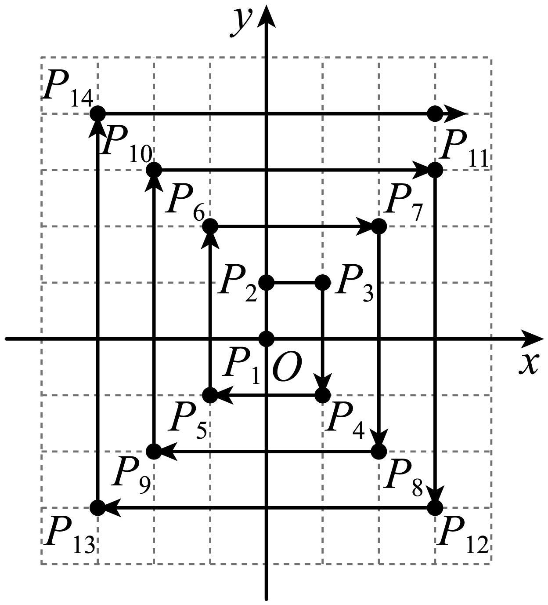

【答案】 $(504,-504)$

【分析】根据各个点的位置关系，可得出从 $P_{3}(1,1)$ 开始，下标为4的倍数的点在第四象限的角平分线上，被4除余1的点在第三象限的角平分线上，被4除余2的点在第二象限的角平分线上，被4除余3的点在第一象限的角平分线上，所以点 $P_{2016}$ 的在第四象限的角平分线上，且横纵坐标的绝对值 $=2016\div 4$ ，再根据第四项象限内点的符号得出答案即可．

【详解】解：由图知，令 $n\geq 0$ （*n*为整数），

从 $P_{3}(1,1)$ 开始， $P_{4n}(n,-n)$ 在第4象限， $P_{4n+1}(-n,-n)$ 在第3象限， $P_{4n+2}(-n,n+1)$ 在第2象限， $P_{4n+3}(n+1,n+1)$ 在第1象限，
由规律可得， $2016=4\times 504$ ，
∴点 $P_{2016}$ 的在第四象限的角平分线上，坐标为 $(504,-504)$
故答案为： $(504,-504)$ ．

【点睛】本题考查了规律型：点的坐标，根据前几个点的坐标，总结出４个一循环的规律是解题的关键.

58．（2023·黑龙江绥化·统考二模）如图，在平面直角坐标系中有一边长为1的正方形 $OABC$ ，边 $OA，OC$ 分别在&lt;text st<em>y</em>le="italic"&gt;x&lt;/text&gt;轴、y轴上，如果以对角线 $OB$ 为边作第二个正方形 $OBB_{1}C_{1}$ ，再以对角线 $OB_{1}$ 为边作第三个正方形 $OB_{1}B_{2}C_{2}$ ……照此规律作下去，则点 $B_{2023}$ 的坐标为___________．

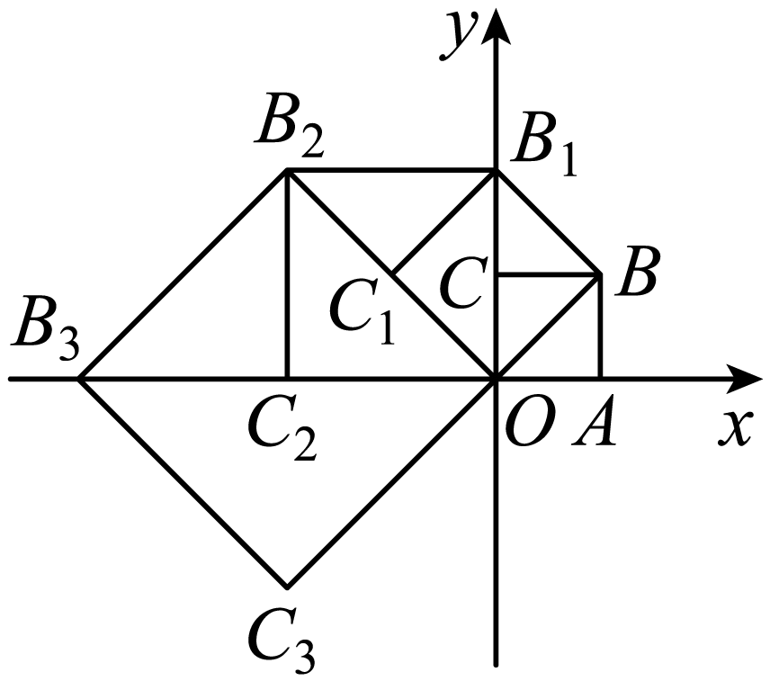

【答案】 $\left(2^{1012}，0\right)$

【分析】首先根据各点的坐标求出 $OB$ ， $OB_{1}$ ， $OB_{2}$ ， $OB_{3}$ ， $OB_{4}$ ， $OB_{5}$ ， $OB_{6}$ ， $OB_{7}$ ， $OB_{8}$ 的长度，找出这些长度之间的规律，然后根据规律即可求解．

【详解】解：∵正方形*OABC*边长为1，
∴*OB*= $\sqrt{2}$ ，
∵正方形<em>OBB1C1</em>是正方形<em>OABC</em>的对角线<em>OB</em>为边，
∴<em>OB1</em>=2 $OB_{1}=2=(\sqrt{2})^{2}$ ，
∴<em>B1</em>点坐标为 $(0,2)$ ，

同理可知 $OB_{2}=2\sqrt{2}=(\sqrt{2})^{3}$ ；
∴<em>B2</em>点坐标为 $(-2,2)$ ，

同理可知 $OB_{3}=4=(\sqrt{2})^{4}$ ；
<em>B3</em>点坐标为 $(-4,0)$ ，
可知 $OB_{4}=4\sqrt{2}=(\sqrt{2})^{5}$ ；
∴<em>B4</em>点坐标为 $(-4,-4)$ ，
可知 $OB_{5}=8=(\sqrt{2})$ ，
∴<em>B5</em>点坐标为 $(0,-8)$ ，
可知 $OB_{6}=8\sqrt{2}=(\sqrt{2})^{7}$ ，
∴ $B_{6}(8,-8)$ ，
可知 $OB_{7}=16=(\sqrt{2})^{8}$ ，
∴ $B_{7}(16,0)$ ，
可知 $OB_{8}=16\sqrt{2}=(\sqrt{2})^{9}$ ，
∴ $B_{8}(16,16)$ ，

···
由规律可以发现， $OB_{n}=\left(\sqrt{2}\right)^{n+1}$ ，
由规律可以发现，每经过8次作图后，点的坐标符号与第一次坐标符号相同，
$\because 2023\div 8=252\ldots 7$ ，
$\therefore B_{2023}$ 的横纵坐标符号与点 $B_{7}$ 相同，横纵坐标互为相反数，且都在*x*轴上，
$\therefore B_{2023}$ 的坐标为 $\left(-2^{1009},2^{1009}\right)$ ，
故答案为： $\left(2^{1012}，0\right)$ ．

【点睛】本题主要考查正方形的性质，坐标与图形的性质，解答本题的关键是由点坐标的规律变化发现 $OB_{n}=\left(\sqrt{2}\right)^{n+1}$ ．

59．（2023·四川内江·统考二模）如图，在平面直角坐标系中，有若干个横纵坐标分别为整数的点，其顺序为 $(1,0)$ 、 $(2,0)$ 、 $(2,1)$ 、 $(1,1)$ 、 $(1,2)$ 、 $(2,2)$ …根据这个规律，第2023个点的坐标________．

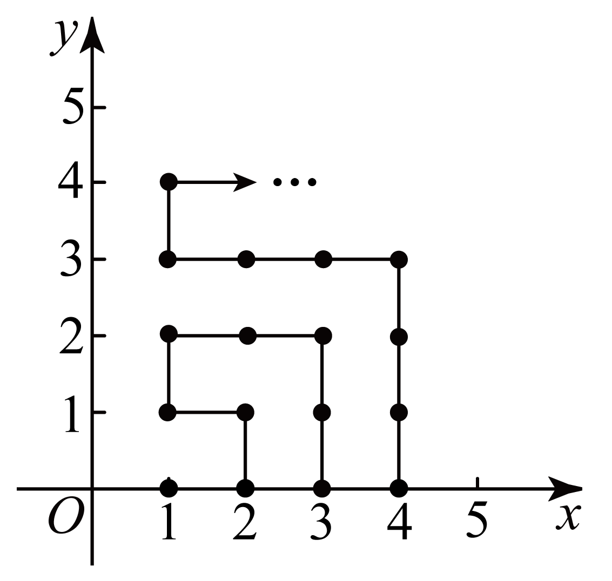

【答案】 $(45,2)$

【分析】观察图形可知，以最外边的矩形边长上的点为准，点的总个数等于*x*轴上右下角的点的横坐标的平方，据此求解即可．

【详解】解：观察图形可知，到每一个横坐标结束，经过整数点的个数等于最后横坐标的平方，
∴横坐标以*n*结束的有 $n^{2}$ 个点，
∵ $45^{2}=2025$ ，
∴第2025个点的坐标是 $(45,0)$ ，
∴2023个点的纵坐标往上数2个单位为2，
∴2023个点的坐标是 $(45,2)$ ；
故答案为： $(45,2)$ ．

【点睛】本题考查了点坐标规律探究，观察出点的个数与横坐标存在平方关系是解题的关键．

## 题型02  函数上点的规律

56．（2022·江苏南京·统考中考真题）如图，在平面直角坐标系，横、纵坐标均为整数的点案如下规律依序排列： $(0,0)$ ， $(1,0)$ ， $(0,1)$ ， $(2,0)$ ， $(1,1)$ ， $(0,2)$ ， $(3,0)$ ， $(2,1)$ ， $(1,2)$ ， $(0,3)$ ， $(4,0)$ ， $(3,1)$ ， $(2,2)$ ， $(1,3)$ ，…按这个规律，则 $(6,7)$ 是第________个点．

【答案】99

【分析】先根据点的坐标，找出规律，再计算求解．

【详解】解：横纵坐标和是0的有1个点，

横纵坐标和是1的有2个点，

横纵坐标和是2的有3个点，

横纵坐标和是3的有4个点，
$\ldots \ldots$ ，

横纵坐标和是 $n$ 的有 $(n+1)$ 个点，
$6+7=13$ ，
$\because 1+2+\ldots \ldots +12+13=\frac{1}{2}\times 13\times (13+1)=91$ ，
$\therefore$ 横纵坐标和是13的有14点，分别为： $(13,0)$ 、 $(12,1)$ 、 $(11,2)$ 、 $(10,3)$ 、 $(9,4)$ 、 $(8,5)$ 、 $(7,6)$ 、 $(6,7)$ 、 $(5,8)$ 、 $(4,9)$ 、 $(3,10)$ 、 $(2,11)$ 、 $(1,12)$ 、 $(0,13)$ 、
$\therefore (6,7)$ 是第 $91+8=99$ 个点，
故答案为：99．

【点睛】本题考查了点的坐标，找到坐标的排列规律是解题的关键．

57．（2023·浙江绍兴·校考一模）如图，在平面直角坐标系中，每个最小方格的边长均为1个单位长， $P_{1}$ ， $P_{2}$ ， $P_{3}$ ，…，均在格点上，其顺序按图中“→”方向排列，如： $P_{1}(0，0)$ ， $P_{2}(0，1)$ ， $P_{3}(1，1)$ ， $P_{4}(1，-1)$ ， $P_{5}(-1，-1)$ ， $P_{6}(-1，2)$ …根据这个规律，点 $P_{2016}$ 的坐标为______．

【答案】 $(504,-504)$

【分析】根据各个点的位置关系，可得出从 $P_{3}(1,1)$ 开始，下标为4的倍数的点在第四象限的角平分线上，被4除余1的点在第三象限的角平分线上，被4除余2的点在第二象限的角平分线上，被4除余3的点在第一象限的角平分线上，所以点 $P_{2016}$ 的在第四象限的角平分线上，且横纵坐标的绝对值 $=2016\div 4$ ，再根据第四项象限内点的符号得出答案即可．

【详解】解：由图知，令 $n\geq 0$ （*n*为整数），

从 $P_{3}(1,1)$ 开始， $P_{4n}(n,-n)$ 在第4象限， $P_{4n+1}(-n,-n)$ 在第3象限， $P_{4n+2}(-n,n+1)$ 在第2象限， $P_{4n+3}(n+1,n+1)$ 在第1象限，
由规律可得， $2016=4\times 504$ ，
∴点 $P_{2016}$ 的在第四象限的角平分线上，坐标为 $(504,-504)$
故答案为： $(504,-504)$ ．

【点睛】本题考查了规律型：点的坐标，根据前几个点的坐标，总结出４个一循环的规律是解题的关键.

58．（2023·黑龙江绥化·统考二模）如图，在平面直角坐标系中有一边长为1的正方形 $OABC$ ，边 $OA，OC$ 分别在&lt;text st<em>y</em>le="italic"&gt;x&lt;/text&gt;轴、y轴上，如果以对角线 $OB$ 为边作第二个正方形 $OBB_{1}C_{1}$ ，再以对角线 $OB_{1}$ 为边作第三个正方形 $OB_{1}B_{2}C_{2}$ ……照此规律作下去，则点 $B_{2023}$ 的坐标为___________．

【答案】 $\left(2^{1012}，0\right)$

【分析】首先根据各点的坐标求出 $OB$ ， $OB_{1}$ ， $OB_{2}$ ， $OB_{3}$ ， $OB_{4}$ ， $OB_{5}$ ， $OB_{6}$ ， $OB_{7}$ ， $OB_{8}$ 的长度，找出这些长度之间的规律，然后根据规律即可求解．

【详解】解：∵正方形*OABC*边长为1，
∴*OB*= $\sqrt{2}$ ，
∵正方形<em>OBB1C1</em>是正方形<em>OABC</em>的对角线<em>OB</em>为边，
∴<em>OB1</em>=2 $OB_{1}=2=(\sqrt{2})^{2}$ ，
∴<em>B1</em>点坐标为 $(0,2)$ ，

同理可知 $OB_{2}=2\sqrt{2}=(\sqrt{2})^{3}$ ；
∴<em>B2</em>点坐标为 $(-2,2)$ ，

同理可知 $OB_{3}=4=(\sqrt{2})^{4}$ ；
<em>B3</em>点坐标为 $(-4,0)$ ，
可知 $OB_{4}=4\sqrt{2}=(\sqrt{2})^{5}$ ；
∴<em>B4</em>点坐标为 $(-4,-4)$ ，
可知 $OB_{5}=8=(\sqrt{2})$ ，
∴<em>B5</em>点坐标为 $(0,-8)$ ，
可知 $OB_{6}=8\sqrt{2}=(\sqrt{2})^{7}$ ，
∴ $B_{6}(8,-8)$ ，
可知 $OB_{7}=16=(\sqrt{2})^{8}$ ，
∴ $B_{7}(16,0)$ ，
可知 $OB_{8}=16\sqrt{2}=(\sqrt{2})^{9}$ ，
∴ $B_{8}(16,16)$ ，

···
由规律可以发现， $OB_{n}=\left(\sqrt{2}\right)^{n+1}$ ，
由规律可以发现，每经过8次作图后，点的坐标符号与第一次坐标符号相同，
$\because 2023\div 8=252\ldots 7$ ，
$\therefore B_{2023}$ 的横纵坐标符号与点 $B_{7}$ 相同，横纵坐标互为相反数，且都在*x*轴上，
$\therefore B_{2023}$ 的坐标为 $\left(-2^{1009},2^{1009}\right)$ ，
故答案为： $\left(2^{1012}，0\right)$ ．

【点睛】本题主要考查正方形的性质，坐标与图形的性质，解答本题的关键是由点坐标的规律变化发现 $OB_{n}=\left(\sqrt{2}\right)^{n+1}$ ．

59．（2023·四川内江·统考二模）如图，在平面直角坐标系中，有若干个横纵坐标分别为整数的点，其顺序为 $(1,0)$ 、 $(2,0)$ 、 $(2,1)$ 、 $(1,1)$ 、 $(1,2)$ 、 $(2,2)$ …根据这个规律，第2023个点的坐标________．

【答案】 $(45,2)$

【分析】观察图形可知，以最外边的矩形边长上的点为准，点的总个数等于*x*轴上右下角的点的横坐标的平方，据此求解即可．

【详解】解：观察图形可知，到每一个横坐标结束，经过整数点的个数等于最后横坐标的平方，
∴横坐标以*n*结束的有 $n^{2}$ 个点，
∵ $45^{2}=2025$ ，
∴第2025个点的坐标是 $(45,0)$ ，
∴2023个点的纵坐标往上数2个单位为2，
∴2023个点的坐标是 $(45,2)$ ；
故答案为： $(45,2)$ ．

【点睛】本题考查了点坐标规律探究，观察出点的个数与横坐标存在平方关系是解题的关键．

## 题型03  函数图象与几何图形的规律

60．（2023·山东烟台·统考中考真题）如图，在直角坐标系中，每个网格小正方形的边长均为1个单位长度，以点*P*为位似中心作正方形 $PA_{1}A_{2}A_{3}$ ，正方形 $PA_{4}A_{5}A_{6},\ldots$ ，按此规律作下去，所作正方形的顶点均在格点上，其中正方形 $PA_{1}A_{2}A_{3}$ 的顶点坐标分别为 $P\left(-3,0\right),A_{1}\left(-2,1\right),A_{2}\left(-1,0\right)$ ， $A_{3}\left(-2,-1\right)$ ，则顶点 $A_{100}$ 的坐标为（    ）

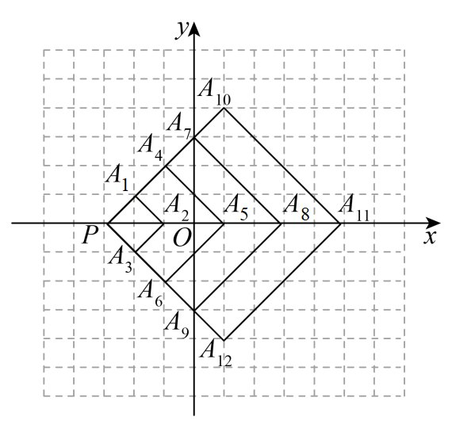

A． $\left(31.34\right)$ 	
B． $\left(31,-34\right)$ 	
C． $\left(32,35\right)$ 	
D． $\left(32,0\right)$

【答案】A

【分析】根据图象可得移动3次完成一个循环，从而可得出点坐标的规律 $A_{3n-2}\left(n-3，n\right)$ ．

【详解】解：∵ $A_{1}\left(-2，1\right)$ ， $A_{4}\left(-1，2\right)$ ， $A_{7}\left(0，3\right)$ ， $A_{10}\left(1，4\right)$ ， $\cdots$ ，
∴ $A_{3n-2}\left(n-3，n\right)$ ，
∵ $100=3\times 34-2$ ，则 $n=34$ ，
∴ $A_{100}\left(31，34\right)$ ，
故选：A．

【点睛】本题考查了点的规律变化，解答本题的关键是仔细观察图象，得到点的变化规律．

61．（2023·山东济南·统考一模）在平面直角坐标系中，正方形 $A_{1}B_{1}C_{1}O$ 、 $A_{2}B_{2}C_{2}C_{1}$ 、 $A_{3}B_{3}C_{3}C_{2}$ ……；按如图的方式放置，点 $A_{1}$ 、 $A_{2}$ 、 $A_{3}$ …… $A_{n}$ 在直线 $y=-x-1$ ，点 $C_{1}$ 、 $C_{2}$ 、 $C_{3}$ …… $C_{n}$ 在*x*轴上．抛物线 $L_{1}$ 过点 $A_{1}$ 、 $B_{1}$ ，且顶点在直线 $y=-x-1$ 上，抛物线 $L_{2}$ 过点 $A_{2}$ 、 $B_{2}$  ，且顶点在直线 $y=-x-1$ 上，……按此规律，抛物线 $L_{n}$ 过点 $A_{n}$ 、 $B_{n}$ ，且顶点也在直线 $y=-x-1$ 上，抛物线 $L_{n}$ 的顶点坐标为(       )

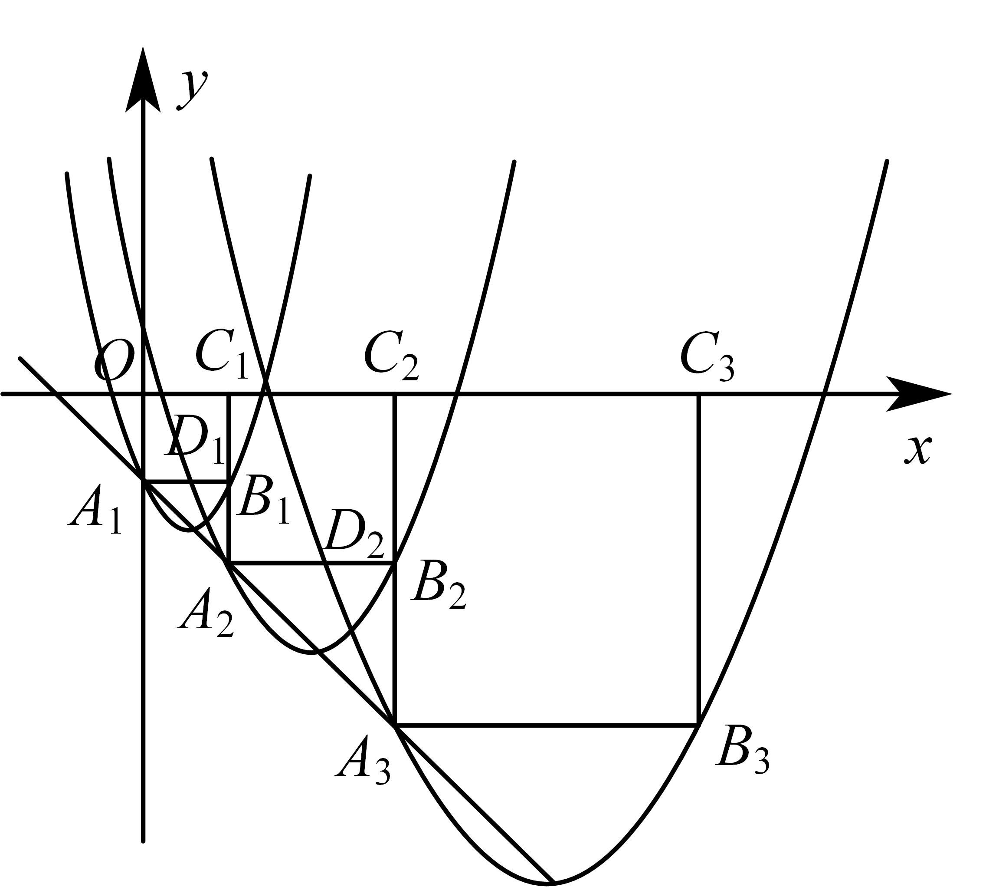

A． $\left(3\times 2^{n-1}-1,-3\times 2^{n-1}\right)$ 	
B． $\left(3\times 2^{n-1}-1,-3\times 2^{n-2}\right)$

C． $\left(3\times 2^{n-2}-1,-3\times 2^{n-1}\right)$ 	
D． $\left(3\times 2^{n-2}-1,-3\times 2^{n-2}\right)$

【答案】D

【分析】由四边形 $A_{1}B_{1}C_{1}O$ 是正方形，求得 $A_{2}(1，-2)$ ，求出抛物线 $L_{2}$ 的顶点为 $(2，-3)$ ，再将点 $(2，-3)$ 代入 $y=a\left(x-2\right)^{2}-3$ ，可求抛物线 $L_{2}$ 的解析式为 $y=\left(x-2\right)^{2}-3$ ；求出 $A_{3}(3，-4)$ ， $B_{3}(7，-4)$ ，再求抛物线 $L_{3}$ 的顶点为 $(5，-6)$ ，将点 $(5，-6)$ 代入 $y=a^{'}\left(x-5\right)^{2}-6$ ，可求抛物线 $L_{3}$ 的解析式为 $y=\frac{1}{2}(x-5)^{2}-6$ ；由抛物线 $L_{1}$ 的顶点为 $\left(\frac{1}{2},-\frac{3}{2}\right)$ ，抛物线 $L_{2}$ 的顶点为 $(2，-3)$ ，抛物线 $L_{3}$ 的顶点为 $(5，-6)$ ，根据规律可得抛物线 $L_{n}$ 的顶点坐标为 $(3\times 2^{n-2}-1，-3\times 2^{n-2})$ .

【详解】解：对于直线 $y=-x-1$ ，设 $x=0,$ 可得 $y=-1$ ，
∴ $A_{1}(0,-1)$ ，
∵四边形 $A_{1}B_{1}C_{1}O$ 是正方形，
∴ $C_{1}(1,0)$ ，又点 $A_{2}$ 在直线 $y=-x-1$ 上，
∴ $A_{2}(1，-2)$ ，
又∵ $B_{2}(3，-2)$ ，
∴抛物线 $L_{2}$ 的对称轴为直线 $x=2$ ，
∴抛物线 $L_{2}$ 的顶点为 $(2，-3)$ ，
设抛物线 $L_{2}$ 的解析式为： $y=a\left(x-2\right)^{2}-3$ ，
∵ $L_{2}$ 过点 $B_{2}(3，-2)$ ，
∴ $-2=a\times \left(3-2\right)^{2}-3$ ，解得 $a=1$ ，
∴抛物线 $L_{2}$ 的解析式为 $y=\left(x-2\right)^{2}-3$ ；
将 $x=3$ 代入 $y=-x-1$ 中， $y=-4$ ，
∴ $A_{3}(3，-4)$ ，
∵四边形 $A_{3}B_{3}C_{3}C_{2}$ 是正方形，
∴ $A_{3}B_{3}=4$ ，
∴ $B_{3}(7，-4)$ ，
∴抛物线 $L_{3}$ 的对称轴为直线 $x=5$ ，

把 $x=5$ 代入 $y=-x-1$ ，得 $y=-6$ ，
∴抛物线 $L_{3}$ 的顶点为 $(5，-6)$ ，
∴设抛物线 $L_{3}$ 的解析式为 $y=a'\left(x-5\right)^{2}-6$ ，
将点 $B_{3}(7，-4)$ 代入，可得 $a^{'}=\frac{1}{2}$ ，
∴抛物线 $L_{3}$ 的解析式为 $y=\frac{1}{2}\left(x-5\right)^{2}-6$ ；
∵抛物线 $L_{1}$ 的顶点为 $\left(\frac{1}{2},-\frac{3}{2}\right)$ ，

抛物线 $L_{2}$ 的顶点为 $(2，-3)$ ，

抛物线 $L_{3}$ 的顶点为 $(5，-6)$ ，

…
∴抛物线 $L_{n}$ 的顶点坐标为 $(3\times 2^{n-2}-1，-3\times 2^{n-2})$ ．
故选：D．

【点睛】本题考查二次函数的图象及性质，熟练掌握二次函数的图象及性质，正方形的性质，根据点的坐标特点，探索出点的一般规律是解题的关键．

62．（2022·黑龙江·统考中考真题）如图，在平面直角坐标系中，点 $A_{1}$ ， $A_{2}$ ， $A_{3}$ ， $A_{4}$ ……在&lt;te<em>x</em>t style="italic"&gt;x&lt;/text&gt;轴上且 $OA_{1}=1$ ， $OA_{2}=2OA_{1}$ ， $OA_{3}=2OA_{2}$ ， $OA_{4}=2OA_{3}$ ……按此规律，过点 $A_{1}$ ， $A_{2}$ ， $A_{3}$ ， $A_{4}$ ……作&lt;te<em>x</em>t style="italic"&gt;x&lt;/text&gt;轴的垂线分别与直线 $y=\sqrt{3}x$ 交于点 $B_{1}$ ， $B_{2}$ ， $B_{3}$ ， $B_{4}$ ……记 $\bigtriangleup OA_{1}B_{1}$ ， $\bigtriangleup OA_{2}B_{2}$ ， $\bigtriangleup OA_{3}B_{3}$ ， $\bigtriangleup OA_{4}B_{4}$ ……的面积分别为 $S_{1}$ ， $S_{2}$ ， $S_{3}$ ， $S_{4}$ ……，则 $S_{2022}=$ ______．

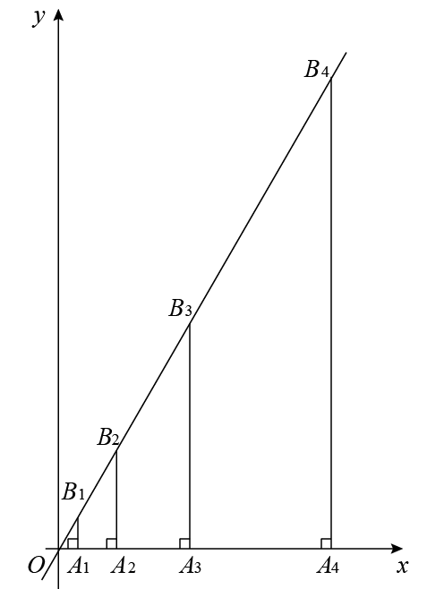

【答案】 $2^{4041}\sqrt{3}$

【分析】先求出 $A_{1}B_{1}=\sqrt{3}$ ，可得 $S_{\bigtriangleup OA_{1}B_{1}}=\frac{\sqrt{3}}{2}$ ，再根据题意可得 $A_{1}B_{1}\parallel A_{2}B_{2}\parallel A_{3}B_{3}\parallel \ldots \ldots \parallel A_{n}B_{n}$ ，从而得到 $\bigtriangleup OA_{1}B_{1}$ ∽ $\bigtriangleup OA_{2}B_{2}$ ∽ $\bigtriangleup OA_{3}B_{3}$ ∽ $\bigtriangleup OA_{4}B_{4}$ ∽……∽ $\bigtriangleup OA_{n}B_{n}$ ，再利用相似三角形的性质，可得 $S_{\bigtriangleup OA_{1}B_{1}}$ ∶ $S_{\bigtriangleup OA_{2}B_{2}}$ ∶ $S_{\bigtriangleup OA_{3}B_{3}}$ ∶ $S_{\bigtriangleup OA_{4}B_{4}}$ ∶……∶ $S_{\bigtriangleup OA_{n}B_{n}}$ = $1:2^{2}:\left(2^{2}\right)^{2}:\left(2^{3}\right)^{2}:\cdots \cdots :\left(2^{n}\right)^{2}$  ，即可求解．

【详解】解：当*x*=1时， $y=\sqrt{3}$ ，
∴点 $B_{1}\left(1,\sqrt{3}\right)$ ，
∴ $A_{1}B_{1}=\sqrt{3}$ ，
∴ $S_{\bigtriangleup OA_{1}B_{1}}=\frac{1}{2}\times 1\times \sqrt{3}=\frac{\sqrt{3}}{2}$ ，
∵根据题意得： $A_{1}B_{1}\parallel A_{2}B_{2}\parallel A_{3}B_{3}\parallel \ldots \ldots \parallel A_{n}B_{n}$ ，
∴ $\bigtriangleup OA_{1}B_{1}$ ∽ $\bigtriangleup OA_{2}B_{2}$ ∽ $\bigtriangleup OA_{3}B_{3}$ ∽ $\bigtriangleup OA_{4}B_{4}$ ∽……∽ $\bigtriangleup OA_{n}B_{n}$ ，
∴ $S_{\bigtriangleup OA_{1}B_{1}}$ ∶ $S_{\bigtriangleup OA_{2}B_{2}}$ ∶ $S_{\bigtriangleup OA_{3}B_{3}}$ ∶ $S_{\bigtriangleup OA_{4}B_{4}}$ ：……∶ $S_{\bigtriangleup OA_{n}B_{n}}$ = <em>&lt;text style="italic"&gt;&lt;text style="italic"&gt;OA</em>&lt;/text&gt;&lt;/text&gt;<em>1&lt;text style="italic,subscript"&gt;&lt;text style="italic,superscript"&gt;&lt;text style="italic,superscript"&gt;&lt;text style="superscript"&gt;2</em>&lt;/text&gt;&lt;/text&gt;&lt;/text&gt;&lt;/text&gt;∶OA22∶OA<em>3</em>2∶……∶OAn2，
∵ $OA_{1}=1$ ， $OA_{2}=2OA_{1}$ ， $OA_{3}=2OA_{2}$ ， $OA_{4}=2OA_{3}$ ，……，
∴ $OA_{2}=2$ ， $OA_{3}=4=2^{2}$ ， $OA_{4}=8=2^{3}$ ，……， $OA_{n}=2^{n-1}$ ，
∴ $S_{\bigtriangleup OA_{1}B_{1}}$ ∶ $S_{\bigtriangleup OA_{2}B_{2}}$ ∶ $S_{\bigtriangleup OA_{3}B_{3}}$ ∶ $S_{\bigtriangleup OA_{4}B_{4}}$ ∶……∶ $S_{\bigtriangleup OA_{n}B_{n}}$ = $1:2^{2}:\left(2^{2}\right)^{2}:\left(2^{3}\right)^{2}:\cdots \cdots :\left(2^{n-1}\right)^{2}=1:2^{2}:2^{4}:2^{6}:\cdots \cdots :2^{2n-2}$  ，
∴ $S_{\bigtriangleup OA_{n}B_{n}}=2^{2n-2}S_{\bigtriangleup OA_{1}B_{1}}$ ，
∴ $S_{2022}=2^{2\times 2022-2}\times \frac{\sqrt{3}}{2}=2^{4041}\sqrt{3}$ ．
故答案为： $2^{4041}\sqrt{3}$ ．

【点睛】本题主要考查了图形与坐标的规律题，相似三角形的判定和性质，明确题意，准确得到规律，是解题的关键．

63．（2023·黑龙江佳木斯·统考一模）如图，在平面直角坐标系中，点 $A_{1}，A_{2}，A_{3}，A_{4}，\ldots$ 在&lt;te<em>x</em>t style="italic"&gt;x&lt;/text&gt;轴上且 $OA_{1}=1，OA_{2}=2OA_{1}，OA_{3}=2OA_{2}，OA_{4}=2OA_{3}，\ldots ，$ 按此规律，过点 $A_{1}，A_{2}，A_{3}，A_{4}，\ldots$ 作&lt;te<em>x</em>t style="italic"&gt;x&lt;/text&gt;轴的垂线分别与直线 $y=\sqrt{3}x$ 交于点 $B_{1}，B_{2}，B_{3}，B_{4}\ldots ．$ 连接 $B_{1}A_{2}，B_{2}A_{3}，B_{3}A_{3}，\ldots$ ，记 $\bigtriangleup B_{1}A_{2}B_{2}，\bigtriangleup B_{2}A_{3}B_{3}，\bigtriangleup B_{3}A_{4}B_{4}，\ldots$ 的面积分别为 $S_{1}，S_{2}，S_{3}，\ldots ，$ 则 $S_{2023}=$ _____．

【答案】 $2^{4044}\sqrt{3}$

【分析】当 $OA_{1}=1$ 时，先求出 $OA_{2}=2OA_{1}=2$ ，再计算出 $A_{2}B_{2}=2\sqrt{3}$ ， $A_{1}A_{2}=1$ ， $S_{1}=2^{0}\sqrt{3}$ ，
$S_{2}=2^{2}\sqrt{3}$ ， $S_{3}=2^{4}\sqrt{3}$ ， $S_{4}==2^{6}\sqrt{3}$ ， $\cdots$ ，得到公式 $S_{n}=2^{2n-2}\sqrt{3}$ ，代入计算即可．

【详解】解：当 $OA_{1}=1$ 时，
∵ $OA_{2}=2OA_{1}=2$ ，
∴ $A_{2}B_{2}=2\sqrt{3}$ ， $A_{1}A_{2}=1$ ， $S_{1}=\frac{1}{2}A_{2}B_{2}\cdot A_{1}A_{2}=\frac{1}{2}\times 2\sqrt{3}\times 1=\sqrt{3}=2^{0}\sqrt{3}$ ，
∵ $OA_{3}=2OA_{2}=4$ ，
∴ $A_{3}B_{3}=4\sqrt{3}$ ， $A_{2}A_{3}=2$ ， $S_{2}=\frac{1}{2}A_{3}B_{3}\cdot A_{2}A_{3}=2=\frac{1}{2}\times 4\sqrt{3}\times 2=4\sqrt{3}=2^{2}\sqrt{3}$ ，
∵ $OA_{4}=2OA_{3}=8$ ，
∴ $A_{4}B_{4}=8\sqrt{3}$ ， $A_{3}A_{4}=4$ ， $S_{3}=\frac{1}{2}A_{4}B_{4}\cdot A_{3}A_{4}=2=\frac{1}{2}\times 8\sqrt{3}\times 4=16\sqrt{3}=2^{4}\sqrt{3}$ ，
$OA_{5}=2OA_{4}=16$ ，
∴ $A_{5}B_{5}=16\sqrt{3}$ ， $A_{4}A_{5}=8$ ， $S_{4}=\frac{1}{2}A_{5}B_{5}\cdot A_{4}A_{5}=2=\frac{1}{2}\times 16\sqrt{3}\times 8=64\sqrt{3}=2^{6}\sqrt{3}$ ，
$\cdots$ ，
∴ $S_{n}=2^{2n-2}\sqrt{3}$ ，
∴ $S_{2023}=2^{2\times 2023-2}\times \sqrt{3}=2^{4044}\sqrt{3}$ ．
故答案为： $2^{4044}\sqrt{3}$ ．

【点睛】本题主要考查了图形与坐标的规律题，明确题意，准确得到规律，是解题的关键．

64．（2023·全国·九年级专题练习）如图，平面直角坐标系中，边长为1的正方形 $OAP_{1}B$ 的顶点<te<text st*y*le="italic">x</text>t style="italic">A</text>、*B*分别在x轴、y轴上，点 $P_{1}$ 在反比例函数 $y=\frac{k}{x}\left(x>0\right)$ 的图象上，过 $P_{1}A$ 的中点 $B_{1}$ 作矩形 $B_{1}AA_{1}P_{2}$ ，使顶点 $P_{2}$ 落在反比例函数的图象上，再过 $P_{2}A_{1}$ 的中点 $B_{2}$ 作矩形 $B_{2}A_{1}A_{2}P_{3}$ ，使顶点 $P_{3}$ 落在反比例函数的图象上，…，依此规律可得：  
（1）点 $P_{2}$ 的坐标为  
（2）作出矩形 $B_{18}A_{17}A_{18}P_{19}$ 时，落在反比例函数图象上的顶点 $P_{19}$ 的坐标为_____．

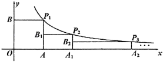

【答案】     $\left(2，\frac{1}{2}\right)$      $\left(2^{18}，\frac{1}{2^{18}}\right)$

【分析】（<em>1</em>）先根据题意得出<em>&lt;text style="italic"&gt;&lt;text style="italic"&gt;&lt;text style="italic"&gt;P</em>&lt;/text&gt;&lt;/text&gt;&lt;/text&gt;1点的坐标，进而可得出反比例函数的解析式，再依次求出点P<em>2</em>，P<em>3</em>，P<em>4</em>的坐标，找出规律可得出 $P_{n}$ 的坐标；  
（2）根据（1）中的规律可得答案．

【详解】解：（&lt;te<em>x</em>t style="italic,subscript"&gt;<em>1</em>&lt;/text&gt;）∵正方形<em>OA&lt;text style="italic"&gt;P</em>&lt;/text&gt;1<em>B</em>的边长为1，点P1在反比例函数 $y=\frac{k}{x}$ （<em>x</em>＞0）的图象上，
∴<em>P1</em>（1，1），
∴*k*=1，
∴反比例函数的解析式为： $y=\frac{1}{x}$ ，
∵<em>B1</em>是<em>P1A</em>的中点，
∴<em>P2A&lt;text style="italic,subscript"&gt;1</em>&lt;/text&gt;=<em>AB</em>1= $\frac{1}{2}$ ，
∴<em>OA1</em>=2，
∴ $P_{2}\left(2，\frac{1}{2}\right)$ ．
故答案为： $\left(2，\frac{1}{2}\right)$ ．  
（2）由（1）的解同理，得 $P_{3}\left(2^{2}，\frac{1}{2^{2}}\right)，P_{4}\left(2^{3}，\frac{1}{2^{3}}\right)$ …
∴ $P_{n}\left(2^{n-1}，\frac{1}{2^{n-1}}\right)$ ，
当 $n=19$ 时， $P_{19}\left(2^{18}，\frac{1}{2^{18}}\right)$ ．
故答案为： $\left(2^{18}，\frac{1}{2^{18}}\right)$ ．

【点睛】本题考查了反比例函数图象上点的坐标特征，矩形的性质，解题的关键是找出规律．

## 类型四   新定义类规律
解题技巧： 新定义运算的规律其实是这几种规律当中最为简单的一种，因为其规律都是由题目给出的，想要找到其规律，需要从所给的条件当中进行简单的推论.这时候就考验大家的观察能力，以及对数字的敏感程度.

65．（2022·湖南株洲·统考二模）定义一种关于整数*<text style="italic"><text style="italic">n*</text></text>的“*<text style="italic"><text style="italic"><text style="italic"><text style="italic">F*</text></text></text></text>”运算：（1）当n是奇数时，结果为 $3n+5$ ；（2）当*<text style="italic"><text style="italic">n*</text></text>是偶数时，结果是 $\frac{n}{2^{k}}$ （其中*k*是使 $\frac{n}{2^{k}}$ 是奇数的正整数），并且运算重复进行．例如：取 $n=58$ ，第一次经*<text style="italic"><text style="italic"><text style="italic"><text style="italic">F*</text></text></text></text>运算是29，第二次经F运算是92，第三次经F运算是23，第四次经F运算是74，……；若 $n=9$ ，则第2020次运算结果是（  ）

A．1	
B．2	
C．7	
D．8

【答案】A

【分析】由题意所给的定义新运算可得当 $n=9$ 时，第一次经*F*运算是32，第二次经F运算是1，第三次经F运算是8，第四次经F运算是1， $\cdots$ ，由此规律可进行求解．

【详解】解：由题意 $n=9$ 时，第一次经F运算是 $3\times 9+5=32$ ，第二次经F运算是 $\frac{32}{2^{5}}=1$ ，第三次经F运算是 $3\times 1+5=8$ ，第四次经F运算是 $\frac{8}{2^{3}}=1$ ， $\cdots$ ；
从第二次开始出现1、8循环，奇数次是8，偶数次是1，
∴第2020次运算结果1，
故选：A．

【点睛】本题主要考查有理数混合运算的应用，关键是从题中所给新运算得出数字的一般规律，然后可进行求解．

66．（2022·湖南永州·统考二模）定义运算：把 $1\times 2\times 3\times \cdot \cdot \cdot \times n$ 缩写为*<text style="italic"><text style="italic"><text style="italic"><text style="italic">n*</text></text></text></text>！，n！叫做n的阶乘，如3！ $=1\times 2\times 3=6$ ，4！ $=1\times 2\times 3\times 4=12$ ．请你化简1！×1＋2！×2＋3！×3＋…＋*<text style="italic"><text style="italic"><text style="italic"><text style="italic">n*</text></text></text></text>！×n，得（    ）

A．（*n*＋1）！－1	
B．*n*！－1

C．（*n*＋1）！	
D．（*n*＋1）！＋1

【答案】A

【分析】利用乘法分配律计算求值即可；
【详解】解：1！×1＋2！×2＋3！×3＋…＋*n*！×*n*

=1！×1＋2！×（3-1）＋3！×（4-1）＋…＋*n*！×（*n*+1-1）

=1！＋3！-2！＋4！-3！＋…＋（*n*+1）！-*n*！

=1！ -2！＋（*n*+1）！

=（*n*＋1）！－1
故选： A．

【点睛】本题考查了数字规律的探索，利用乘法分配律变形求值是解题关键．

67．（2023·四川成都·统考中考真题）定义：如果一个正整数能表示为两个正整数 $m$ ， $n$ 的平方差，且 $m-n>1$ ，则称这个正整数为“智慧优数”．例如， $16=5^{2}-3^{2}$ ，16就是一个智慧优数，可以利用 $m^{2}-n^{2}=(m+n)(m-n)$ 进行研究．若将智慧优数从小到大排列，则第3个智慧优数是<u>&lt;text style="underline"&gt;________</u>&lt;/text&gt;；第23个智慧优数是        ．

【答案】     $15$      $57$

【分析】根据新定义，列举出前几个智慧优数，找到规律，进而即可求解．

【详解】解：依题意， 当 $m=3$ ， $n=1$ ，则第1个一个智慧优数为 $3^{2}-1^{2}=8$
当 $m=4$ ， $n=2$ ，则第2个智慧优数为 $4^{2}-2^{2}=14$
当 $m=4$ ， $n=1$ ，则第3个智慧优数为 $4^{2}-1^{2}=15$ ，
当 $m=5$ ， $n=3$ ，则第4个智慧优数为 $5^{2}-3^{2}=16$ ，
当 $m=6$ ， $n=4$ ，则第5个智慧优数为 $6^{2}-4^{2}=20$
当 $m=5$ ， $n=2$ ，则第6个智慧优数为 $5^{2}-2^{2}=21$
当 $m=5$ ， $n=1$ ，则第7个智慧优数为 $5^{2}-1^{2}=24$

……
$m=6$ 时有4个智慧优数，同理 $m=7$ 时有 $5$ 个， $m=8$ 时有6个，

列表如下，

<table><tr><td></td><td></td><td></td><td></td><td></td><td></td><td></td><td></td><td></td><td></td></tr><tr><td></td><td></td><td></td><td></td><td></td><td></td><td></td><td></td><td></td><td></td></tr><tr><td></td><td></td><td></td><td></td><td></td><td></td><td></td><td></td><td></td><td></td></tr><tr><td></td><td></td><td></td><td></td><td></td><td></td><td></td><td></td><td></td><td></td></tr><tr><td></td><td></td><td></td><td></td><td></td><td></td><td></td><td></td><td></td><td></td></tr><tr><td></td><td></td><td></td><td></td><td></td><td></td><td></td><td></td><td></td><td></td></tr><tr><td></td><td></td><td></td><td></td><td></td><td></td><td></td><td></td><td></td><td></td></tr><tr><td></td><td></td><td></td><td></td><td></td><td></td><td></td><td></td><td></td><td></td></tr><tr><td></td><td></td><td></td><td></td><td></td><td></td><td></td><td></td><td></td><td></td></tr><tr><td></td><td></td><td></td><td></td><td></td><td></td><td></td><td></td><td></td><td></td></tr><tr><td></td><td></td><td></td><td></td><td></td><td></td><td></td><td></td><td></td><td></td></tr><tr><td></td><td></td><td></td><td></td><td></td><td></td><td></td><td></td><td></td><td></td></tr></table>

观察表格可知当 $m=12$ 时， $n=10$ 时，智慧数为 $44$ ，
$m=13,n=11$ 时，智慧数为 $48$ ，
$m=14$ ， $n=12$ 时，智慧数为 $52$ ，
$m=15$ ， $n=13$ 时，智慧数为 $56$ ，

第1至第10个智慧优数分别为： $8$ ， $12$ ， $15$ ， $16$ ， $20$ ， $21$ ， $24$ ， $27$ ， $28$ ， $32$ ，

第11至第20个智慧优数分别为： $33$ ， $35$ ， $36$ ， $39$ ， $40$ ， $44$ ， $45$ ， $48$ ， $51$ ， $52$ ，

第21个智慧优数 $55$ ，第22个智慧优数为 $56$ ，第23个智慧优数为 $57$
故答案为： $15$ ， $57$ ．

【点睛】本题考查了新定义，平方差公式的应用，找到规律是解题的关键．

68．（2020·四川成都·统考二模）定义运算x★y＝ $\frac{xy}{x+y}$ ，则共 100个★的计算结果是_____．

【答案】20．

【分析】根据定义逐项求出部分结果，归纳规律，然后按规律解答即可．

【详解】解：∵x★y＝ $\frac{xy}{x+y}$ ，
∴2020★2020＝ $\frac{2020}{2}$ ，2020★2020★2020＝ $\frac{2020}{2}$ ★2020＝ $\frac{2020}{3}$ ，

2020★2020★2020★2020＝ $\frac{2020}{3}$ ★2020＝ $\frac{2020}{4}$ ，…，
∴共100个★＝ $\frac{2020}{101}$ ＝20
故答案为20．

【点睛】本题考查数字的变化规律；根据定义、求出部分结果、归纳规律并应用规律是解答本题的关键．

