重难点突破03 阴影部分面积求解问题

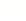

目 录

- [方法一  直接公式法](#_Toc160637619)
- [方法二  和差法](#_Toc160637620)
- [题型01 直接和差法](#_Toc160637621)
- [题型02 构造和差法](#_Toc160637622)
- [题型03 割补法](#_Toc160637623)
- [类型一 全等法](#_Toc160637624)
- [类型二 等面积法](#_Toc160637625)
- [类型三 平移法、旋转法](#_Toc160637626)
- [类型四 对称法](#_Toc160637627)
- [题型04 容斥原理](#_Toc160637628)

【基础】设⊙O 的半径为R，n°圆心角所对弧长为 $l$ ，n为弧所对的圆心角的度数，则

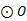

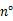

<table><tr><td>
扇形弧长公式
</td><td>
  （弧长的长度和圆心角大小和半径的取值有关，且n表示1°的圆心角的倍数，n和180都不要带单位．）
</td></tr><tr><td>
扇形面积公式
</td><td>
S扇形==R 
</td></tr><tr><td>
圆锥侧面积公式
</td><td>
S圆锥侧=πrl （其中l是圆锥的母线长，r是圆锥的底面半径）
</td></tr><tr><td>
圆锥全面积公式
</td><td>
S圆锥全=πrl+πr2  （圆锥的表面积=扇形面积+底面圆面积）
</td></tr><tr><td>
圆锥的高h，圆锥的底面半径r
</td><td></td></tr></table>

【方法技巧】

1） 利用弧长公式计算弧长时，应先确定弧所对的圆心角的度和半径，再利用公式求得结果．在弧长公式 $l=\frac{n\pi R}{180}$  中，已知l，n，R中的任意两个量，都可以求出第三个量．

2）在利用&lt;text style="subscript"&gt;扇形&lt;/text&gt;面积公式求面积时，关键是明确扇形所在圆的半径、扇形的圆心角的度数或扇形的弧长，然后直接代入公式S扇形= $\frac{n\pi R^{2} }{360}$ 或 S&lt;text style="subscript"&gt;扇形&lt;/text&gt;= $\frac{1}{2}l$ R中求解即可．

3）扇形面积公式S扇形= $\frac{1}{2}l$ R 与三角形面积公式十分类似为了便于记忆，只要把扇形看成一个曲边三角形、把弧长l看成底，R看成底边上的高即可.

4）根据扇形面积公式和弧长公式，已知S扇形，l，n，R中的任意两个量，都可以求出另外两个量．

5）在解决有关圆锥及其侧面展开图的计算题时，常借助圆锥底面圆的周长等于侧面展开图扇形的弧长，即

2 $\pi$ r= $\frac{n\pi R}{180}$ ，来建立圆锥底面圆的半径r、圆锥母线R和侧面展开图扇形圆心角n°之间的关系，有时也根据圆锥的侧面积计算公式来解决问题．

6）求弧长或扇形的面积问题常结合圆锥考查，解这类问题只要抓住圆锥侧面展开即为扇形，而这个扇形的弧长等于原圆锥底面的周长，扇形的半径等于原圆锥的母线长．注意不要混淆圆锥的底面半径和圆锥展开后的扇形半径两个概念．

【阴影部分面积求解问题简介】求阴影部分面积时，最基本的思想就是转化思想，即把所求的不规则的图形的面积转化为规则图形的面积．常用的方法有：

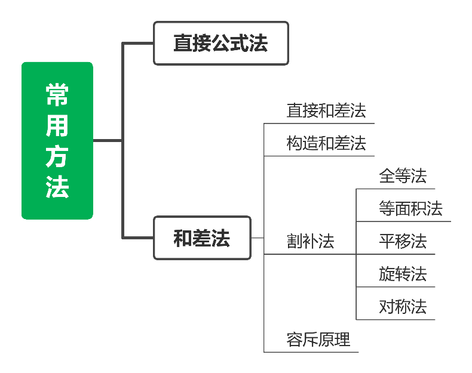

1）直接用公式求解．

2）和差法： 所求面积的图形是一个不规则图形，可将其转化变成多个规则图形面积的和或差，进行求解．

①直接和差法.（阴影部分是几个常见图形组合而成，即S阴影=S常见图形±S常见图形）

②构造和差法（所求阴影部分面积需要添加辅助线构造扇形、三角形或特殊四边形,然后进行相加减。）

3）割补法： 直接求面积较复杂或无法计算时，可通过旋转、平移、割补等方法，对图形进行转化，为利用公式法或和差法创造条件，从而求解．

①全等法

②等面积法

③平移法

④旋转法

⑤对称法

4) 容斥原理
当阴影部分是由几个图形叠加形成时,

1）需先找出叠加前的几个图形;

2）然后理清图形之间的重叠关系.

## 方法一  直接公式法

1．（2022·湖北武汉·校考三模）如图， $AB$ 是半圆的直径，点 $C$ 在直径上，以 $C$ 为圆心、 $CA$ 为半径向内作直角扇形，再以 $D$ 为圆心、 $DC$ 为半径向内作直角扇形，使点 $E$ 刚好落到半圆上，若 $AB=10$ ，则阴影部分的面积为（    ）

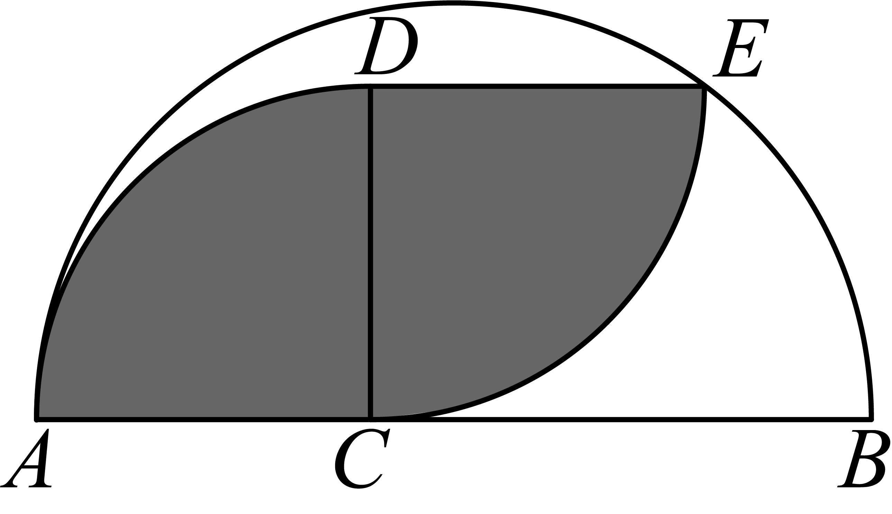

A． $16\pi$ 	
B． $12\pi$ 	
C． $8\pi$ 	
D． $4\pi$

【答案】C

【分析】过点 $E$ 作 $EF\perp AB$ 于点 $F$ ，连接 $AE$ ， $BE$ ，首先证明 $\bigtriangleup AEF\sim \bigtriangleup EBF$ ，设 $AC=x$ ，则 $AF=2x$ ， $BF=10-2x$ ， $EF=x$ ，利用相似三角形的性质列方程即可求出 $x$ 的值，再利用扇形面积公式计算即可．

【详解】解：如图，过点 $E$ 作 $EF\perp AB$ 于点 $F$ ，连接 $AE$ ， $BE$ ，

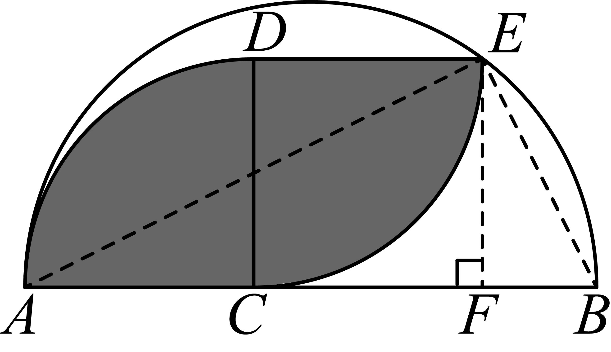
∵ $AB$ 是半圆的直径，
∴ $\angle AEB=90\circ$ ，即 $\angle EAB+\angle EBA=90\circ$ ，
∵ $EF\perp AB$ ，
∴ $\angle AFE=\angle EFB=90\circ$ ，
∴ $\angle EAB+\angle AEF=90\circ$ ，
∴ $\angle EBA=\angle AEF$ ，
∴ $\bigtriangleup AEF\sim \bigtriangleup EBF$ ，
∴ $\frac{AF}{EF}=\frac{EF}{BF}$ ，即 $EF^{2}=AF\cdot BF$ ，
设 $AC=x$ ，
∵ $EF\perp AB$ ，且由作图可知阴影部分是两个半径相等的半圆，
∴四边形 $DCFE$ 是正方形，
∴ $CD=DE=EF=CF=AC=x$ ，
∴ $AF=2x$ ，
∴ $BF=10-2x$ ，
∴ $x^{2}=2x\left(10-2x\right)$ ，
∴ $x_{1}=0$ （舍去）， $x_{2}=4$ ，
∴ $S_{阴影}=2\times \frac{90\times \pi \times 4^{2}}{360}=8\pi$ ，
故选：C．

【点睛】本题考查了相似三角形和扇形的面积，熟练掌握相似三角形的判定和性质以及扇形的面积公式是解题的关键．

2．（2023·四川成都·校考三模）如图，在矩形 $ABCD$ 中， $AB=1$ ， $BC=2$ ，以<em>B</em>为圆心， $BC$ 的长为半径画弧，交 $AD$ 于点<em>E</em>．若将一骰子（看成一个点）投到矩形 $ABCD$ 中，则骰子落在阴影部分的概率为___________________ ．

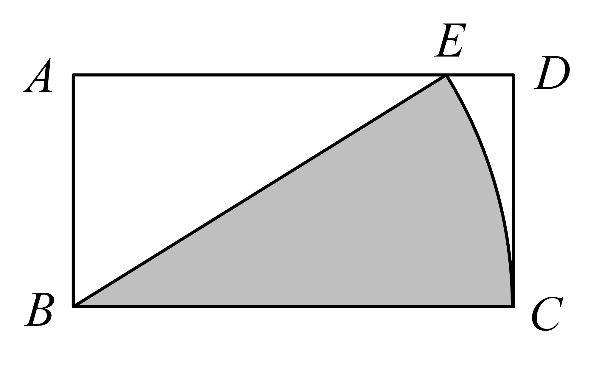

【答案】 $\frac{1}{6}\pi$

【分析】本题考查了几何概率，先根据锐角三角函数求出 $\angle AEB=30\circ$ ，再根据扇形面积公式求出阴影部分的面积，最后根据几何概率的求法解答即可．

【详解】解：∵以*B*为圆心， $BC$ 的长为半径画弧，交 $AD$ 于点*E*，
∴ $BE=BC=2$ ，
在矩形 $ABCD$ 中， $\angle A=\angle ABC=90\circ$ ， $AB=1$ ， $BC=2$ ，
∴ $sin\angle AEB=\frac{AB}{BE}=\frac{1}{2}$ ，
∴ $\angle AEB=30\circ$ ，
∴ $\angle EBA=60\circ$ ，
∴ $\angle EBC=30\circ$ ，
∴阴影部分的面积： $S=\frac{30\circ \pi \times 2^{2}}{360\circ }=\frac{1}{3}\pi$ ，
∵矩形的面积为2，
∴将一骰子（看成一个点）投到矩形 $ABCD$ 中，则骰子落在阴影部分的概率为 $\frac{\frac{1}{3}\pi }{2}=\frac{1}{6}\pi$ ，
故答案为： $\frac{1}{6}\pi$ ．

3．（2023·吉林长春·吉林大学附属中学校考模拟预测）如图，在 $Rt\bigtriangleup ABC$ 中， $\angle BAC=90\circ$ ， $BC=6$ ，点 $D$ 是 $BC$ 的中点，将 $AD$ 绕点<em>A</em>按逆时针方向旋转 $90\circ$ 得 $AD^{'}$ ．那么图中阴影部分的面积为______．

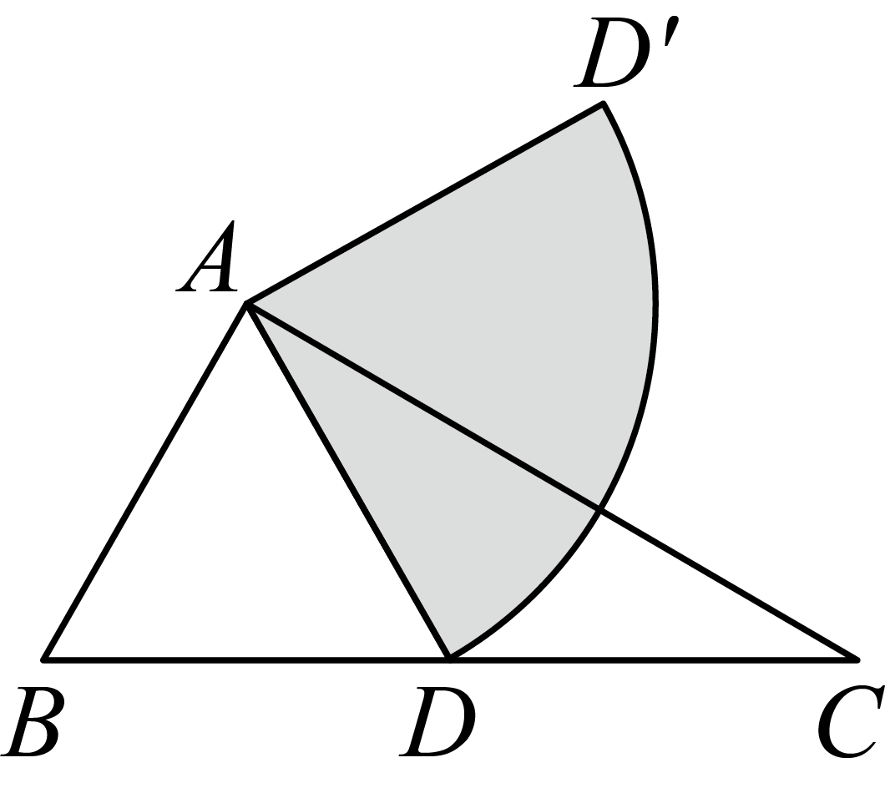

【答案】 $\frac{9\pi }{4}$

【分析】先根据直角三角形的性质求出 $AD$ 的长，再由扇形的面积公式即可得出结论．

【详解】解：∵在 $Rt\bigtriangleup ABC$ 中， $\angle BAC=90\circ$ ， $BC=6$ ，点 $D$ 是 $BC$ 的中点，
∴ $AD=\frac{1}{2}BC=3$ ，
∴ $S_{扇形ADD^{'}}=\frac{90\circ \pi \times 3^{2}}{360\circ }=\frac{9\pi }{4}$ ，
故答案为： $\frac{9\pi }{4}$ ．

【点睛】本题考查的是扇形面积的计算，熟记扇形的面积公式是解答此题的关键．

## 方法二  和差法

## 题型01 直接和差法

4．（2019上·河北石家庄·九年级统考期中）已知点<em>C</em>在以 $AB$ 为直径的半圆上，连接 $AC、BC，$  $AB=10$ ， $BC:AC=3:4$ ，阴影部分的面积为____________________．

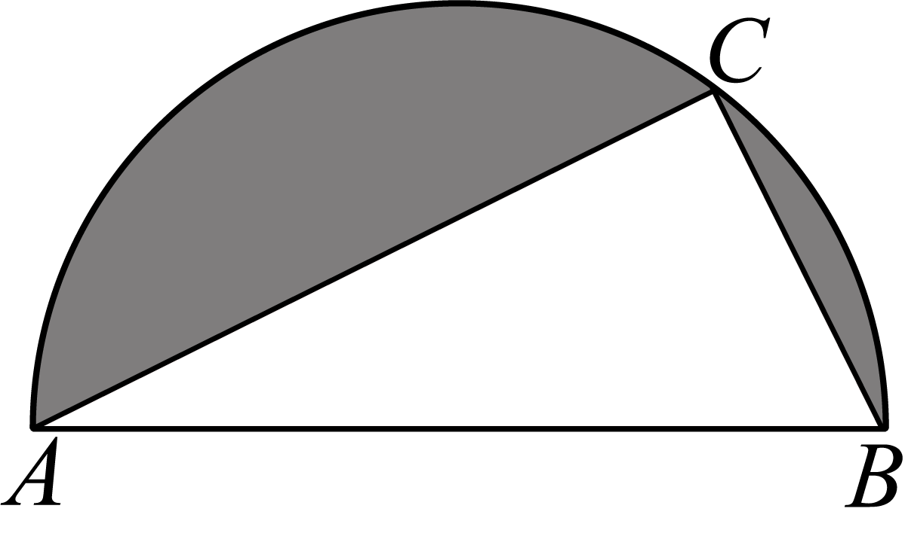

【答案】 $\frac{25}{2}\pi -24$

【分析】要求阴影部分的面积即是半圆的面积减去直角三角形的面积，根据 $AB=10$ ， $BC:AC=3:4$ ，可以求得 $AC$ ， $BC$ 的长，再根据半圆的面积公式和直角三角形的面积公式进行计算．

【详解】解： $\because AB$ 为直径，
$\therefore \angle ACB=90\circ$ ，
$\because BC:AC=3:4$ ，
设 $BC=3a,AC=4a(a>0)$ ，
$AC^{2}+BC^{2}=AB^{2}$ ，即 $(4a)^{2}+(3a)^{2}=10^{2}$ ，
解得： $a=2$ ，
$BC=6,AC=8$ ，
$\therefore S_{阴影}=S_{半圆}-S_{\bigtriangleup ABC}=\frac{1}{2}\times \pi \times 5^{2}-\frac{1}{2}\times 8\times 6=\frac{25}{2}\pi -24$ ．
故答案为： $\frac{25}{2}\pi -24$ ．

【点睛】本题考查了扇形的面积的计算，勾股定理，正确的识别图形是解题的关键．

5．（2023·青海·统考中考真题）如图，正方形<em>&lt;text style="italic"&gt;ABCD</em>&lt;/text&gt;的边长是4，分别以点A，B，C，D为圆心，2为半径作圆，则图中阴影部分的面积是______（结果保留 $\pi$ ）.

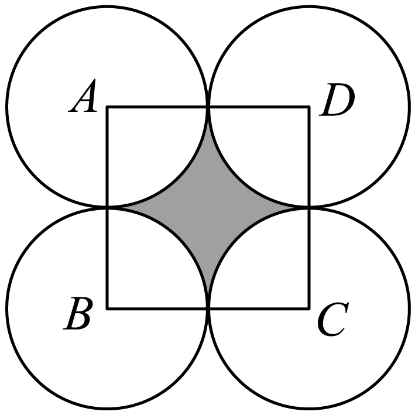

【答案】 $16-4\pi$ / $-4\pi +16$

【分析】分析出阴影面积 $=$ 正方形面积 $-$ 圆的面积，再利用相应的面积公式计算即可．

【详解】解：由图得，阴影面积 $=$ 正方形面积 $-4$ 个扇形面积，
即阴影面积 $=$ 正方形面积 $-$ 圆的面积，
$\therefore S_{阴影}=42-\pi \cdot 2^{2}=16-4\pi$ ．
故答案为： $16-4\pi$ ．

【点睛】本题考查了扇形面积的求法，正方形面积及圆的面积的求法是解题关键．

6．（2023·湖南娄底·统考一模）如图，在等腰直角三角形 $ABC$ 中， $\angle C=90\circ$ ， $AC=\sqrt{2}$ ，以点 $C$ 为圆心画弧与斜边 $AB$ 相切于点 $D$ ，交 $AC$ 于点 $E$ ，交 $BC$ 于点 $F$ ，则图中阴影部分的面积是______ ．

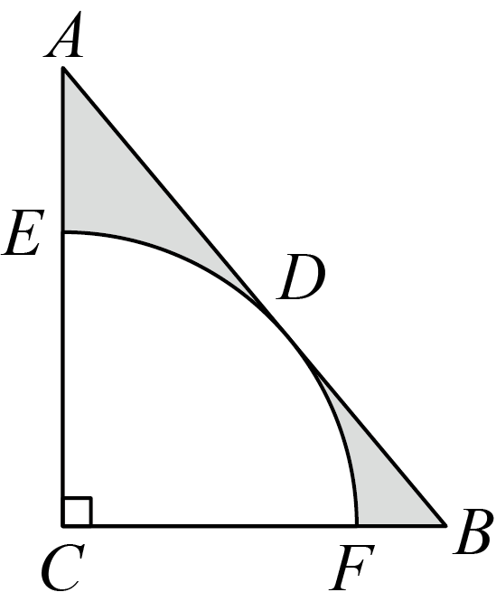

【答案】 $1-\frac{\pi }{4}$

【分析】连接 $CD$ ，利用等腰直角三角形的性质求得扇形的半径，再利用图中阴影部分的面积 $=S_{\bigtriangleup ABC}-S_{扇形CEF}$ 即可解答．

【详解】解：连接 $CD$ ，如图，

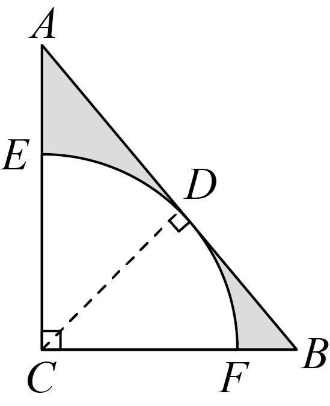
$\because$ 以点 $C$ 为圆心画弧与斜边 $AB$ 相切于点 $D$ ，
$\therefore CD\perp AB$ ，
$\because \bigtriangleup ACB$ 为等腰直角三角形，
$\therefore CD=AD=BD=\frac{1}{2}AB$ ．
$\because AB=\sqrt{2}AC=\sqrt{2}\cdot \sqrt{2}=2$ ，
$\therefore CD=1$ ，
$\therefore$ 阴影部分的面积 $=S_{\bigtriangleup ABC}-S_{扇形CEF}$
$=\frac{1}{2}BC\cdot AC-\frac{90\pi \times 1^{2}}{360}$
$=\frac{1}{2}\times \sqrt{2}\times \sqrt{2}-\frac{\pi }{4}$
$=1-\frac{\pi }{4}$ ．
故答案为： $1-\frac{\pi }{4}$ ．

【点睛】本题主要考查了等腰直角三角形的性质、圆的切线的性质定理、扇形、三角形的面积等知识点，连接经过切点的半径是解决此类问题常添加的辅助线．

7．（2023·山东济南·统考中考真题）如图，正五边形 $ABCDE$ 的边长为 $2$ ，以 $A$ 为圆心，以 $AB$ 为半径作弧 $BE$ ，则阴影部分的面积为_________（结果保留 $\pi$ ）．

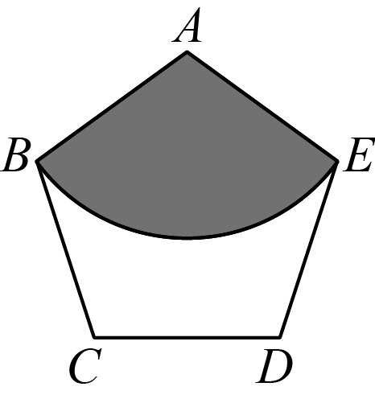

【答案】 $\frac{6\pi }{5}$

【分析】根据正多边形内角和公式求出正五边形的内角和，再求出 $\angle A$ 的度数，利用扇形面积公式计算即可．

【详解】解：正五边形的内角和 $=\left(5-2\right)\times 180\circ =540\circ$ ，
$\therefore \angle A=\frac{540\circ }{5}=108\circ$ ，
$\therefore S_{扇形ABE}=\frac{108\pi 2^{2}}{360}=\frac{6\pi }{5}$ ，
故答案为： $\frac{6\pi }{5}$ ．

【点睛】本题考查了扇形面积和正多边形内角和的计算，熟练掌握扇形面积公式和正多边形内角和公式是解答本题的关键．

## 题型02 构造和差法

8．（2023·四川泸州·统考模拟预测）如图，在 $Rt\bigtriangleup ABC$ 中， $\angle C=90\circ$ ， $AC=4$ ， $BC=3$ ， $\odot O$ 为 $Rt\bigtriangleup ABC$ 的内切圆，则图中阴影部分的面积为(结果保留 $\pi$ )(　　)

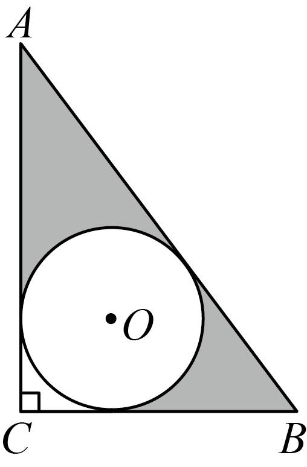

A． $\frac{3\pi }{4}$ 	
B． $6-\frac{3\pi }{4}$ 	
C． $5-\frac{3\pi }{4}$ 	
D． $3+\frac{3\pi }{4}$

【答案】C

【分析】本题考查了三角形内切圆的性质；勾股定理求得 $AB=5$ ，进而根据等面积法求得，三角形的内切半径，根据 $S_{阴影}=S_{\bigtriangleup ABC}-\frac{3}{4}S_{圆}-S_{正方形}$ ，即可求解．

【详解】解： $Rt\bigtriangleup ABC$ 中， $AC=4$ ， $BC=3$ ，
$\therefore <eq>\sqrt{3^{2}+4^{2}}$ AB=</eq> $=5$  ，
$\therefore$  $S_{\bigtriangleup ABC}=\frac{1}{2}AC\cdot BC=6$ ， $C_{\bigtriangleup ABC}=AC+BC+AB=12$ ，
$\therefore$ 内切圆半径 $r=\frac{2S}{C}=1$ ，
$\therefore$  $S_{圆}=\pi r^{2}=\pi$ ，
设 $\odot O$ 与 $AC$ 切于点 $D$ ，与 $BC$ 切于点 $E$ ，连接 $OD$ 、 $OE$ ，

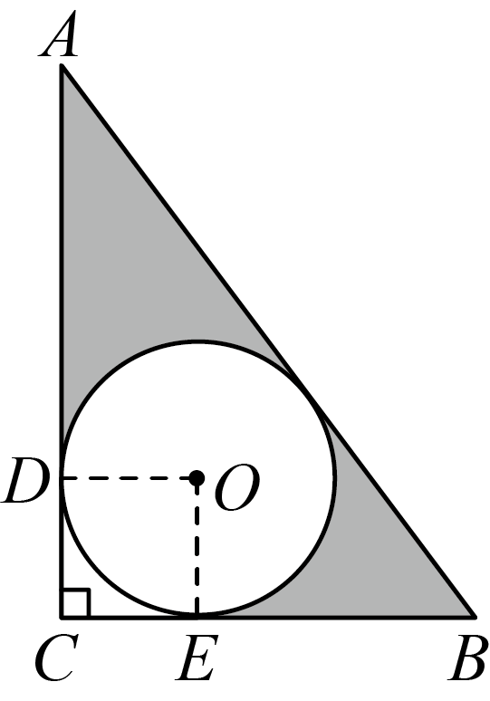
则四边形 $ODCE$ 为正方形，
$\therefore$  $S_{阴影}=S_{\bigtriangleup ABC}-\frac{3}{4}S_{圆}-S_{正方形}=6-\frac{3}{4}\pi -1=5-\frac{3}{4}\pi$ ．
故选：C．

9．（2022·湖北恩施·统考模拟预测）如图，在平行四边形 $ABCD$ 中， $AD=2$ ， $AB=4$ ， $\angle A=30\circ$ ，以点 $A$ 为圆心， $AD$ 的长为半径画弧交 $AB$ 于点 $E$ ，连接 $CE$ ，则阴影部分的面积是（    ）

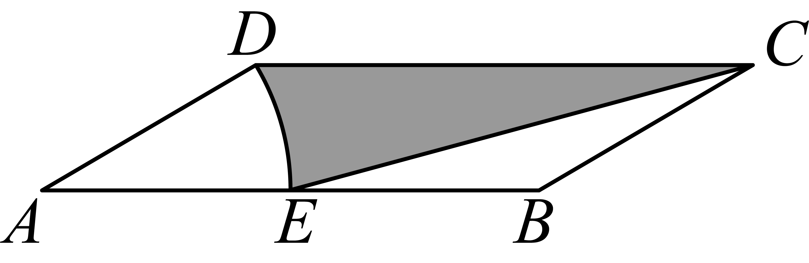

A． $3-\frac{1}{3}\pi$ 	
B． $3\pi -\frac{1}{3}$ 	
C． $\frac{1}{3}\pi$ 	
D． $\frac{1}{3}\pi -3$

【答案】A

【分析】利用平行四边形的面积减去扇形面积和三角形面积即可求解．

【详解】解：过点*D*作 $DF\perp AB$ 于*F*，

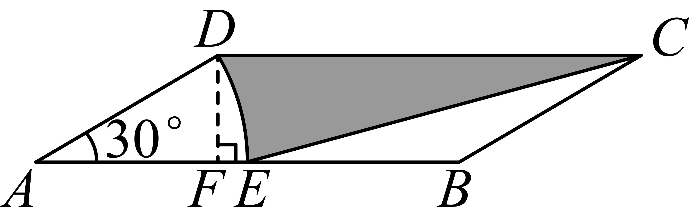
∵ $AD=2$ *，* $\angle A=30\circ$ *，*
∴ $DF=\frac{1}{2}AD=1$  ．
∵以点*A*为圆心， $AD$ 的长为半径画弧交 $AB$ 于点*E*，
∴ $AE=AD=2$ ，
又∵ $AB=4$ ，
∴ $BE=2$ ，
∴ $S_{阴影}=S_{▱ABCD}-S_{扇形ADE}-S_{\bigtriangleup BCE}$
$=AB\cdot DF-\frac{30\pi \cdot AD^{2}}{360}-\frac{1}{2}BE\cdot DF$
$=4\times 1-\frac{30\pi \times 2^{2}}{360}-\frac{1}{2}\times 2\times 1$
$=3-\frac{\pi }{3}$ ．
故选A．

【点睛】本题考查含 $30\circ$ 角的直角三角形的性质，平行四边形和三角形的面积公式，扇形的面积公式，不规则图形面积的求法，掌握相关面积公式和定理是解题的关键．

10．（2023·安徽·模拟预测）如图， $\odot O$ 的半径为 $2$ ， $AB=2\sqrt{3}$ ，则阴影部分的面积是_______．（结果保留 $\pi$ ）

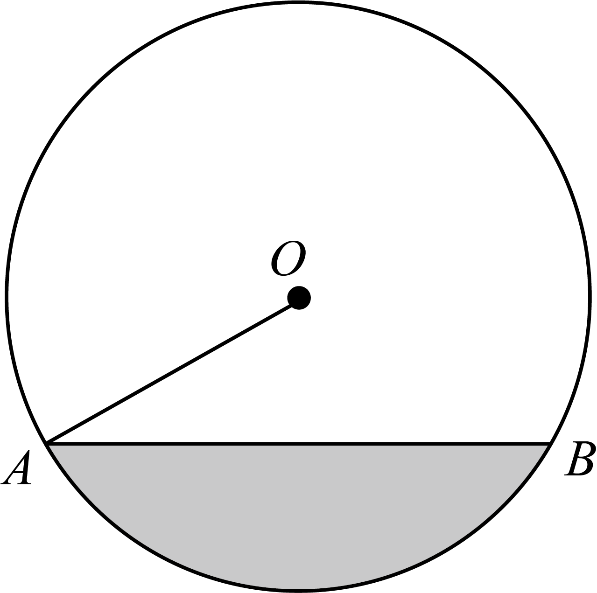

【答案】 $\frac{4\pi }{3}-\sqrt{3}$

【分析】过点*O*作 $OH\perp AB$ 于点*H*，连接 $OB$ ，求出 $OH$ 的长和 $\angle AOB$ 的度数，根据 $S_{^{扇形AOB}}-S_{^{\bigtriangleup AOB}}$ 即可求出答案．

【详解】解：如图所示，过点*O*作 $OH\perp AB$ 于点*H*，连接 $OB$ ，

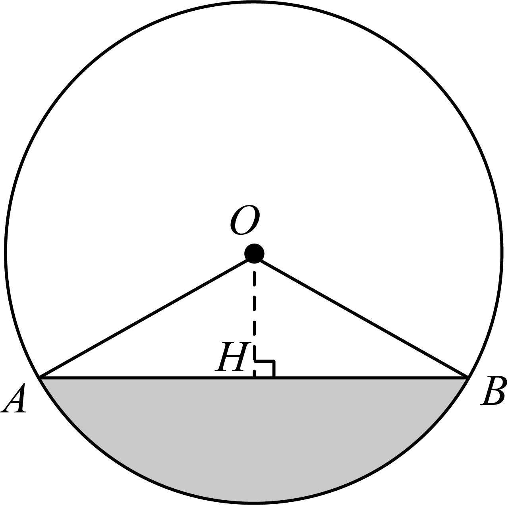
∴ $\angle AHO=\angle BHO=90\circ$ ， $AH=BH=\frac{1}{2}AB=\sqrt{3}$ ， $OA=OB=2$ ，
∴ $sin\angle AOH=\frac{AH}{AO}=\frac{\sqrt{3}}{2}$ ， $\angle AOH=\angle BOH=\frac{1}{2}\angle AOB$ ， $OH=\sqrt{AO^{2}-AH^{2}}=\sqrt{2^{2}-\left(\sqrt{3}\right)^{2}}=1$ ，
∴ $\angle AOH=60\circ$ ，
∴ $\angle AOB=2\angle AOH=120\circ$ ，
∴图中阴影部分的面积为 $S_{^{扇形AOB}}-S_{^{\bigtriangleup AOB}}=\frac{120\pi \times 2^{2}}{360}-\frac{1}{2}\times 2\sqrt{3}\times 1=\frac{4}{3}\pi -\sqrt{3}$ ，
故答案为： $\frac{4}{3}\pi -\sqrt{3}$ ．

【点睛】此题考查了垂径定理、扇形面积、解直角三角形、勾股定理、等腰三角形的判定和性质等知识，求出 $OH$ 的长和 $\angle AOB$ 的度数是解题的关键．

11．（2023上·安徽六安·九年级校考期末）如图，在 $Rt\bigtriangleup ABC$ 中， $\angle C=90\circ$ ， $\angle A=60\circ$ ， $AC=2$ ．点<em>&lt;text style="italic"&gt;D</em>&lt;/text&gt;为 $BC$ 边的中点，以点<em>&lt;text style="italic"&gt;D</em>&lt;/text&gt;为圆心， $CB$ 长为直径画半圆，交 $AB$ 于点<em>E</em>，则图中阴影部分的面积为____________________ ．（结果保留π）

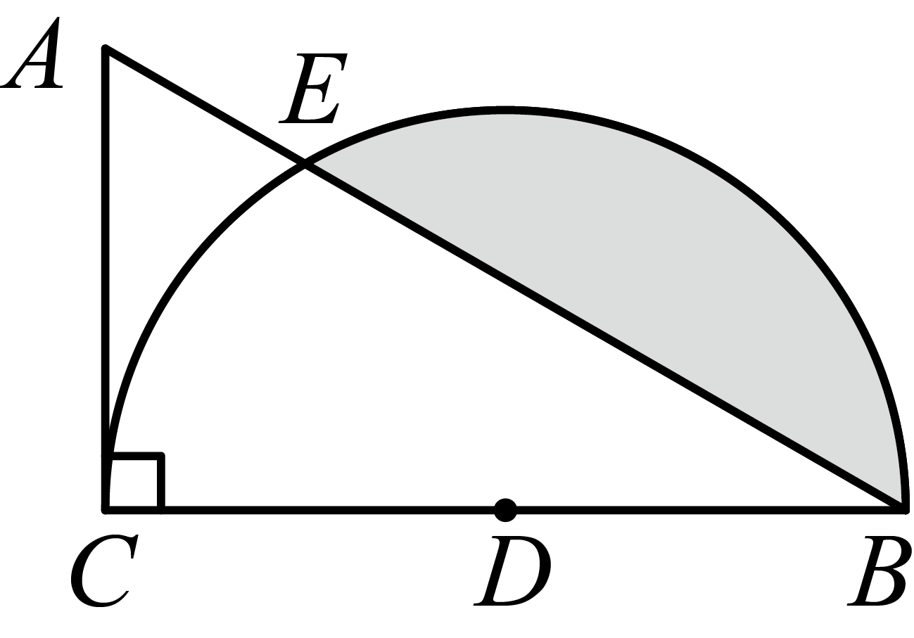

【答案】 $\pi -\frac{3\sqrt{3}}{4}$

【分析】本题考查了含 $30\circ$ 角的直角三角形的特征、勾股定理、扇形的面积，根据含 $30\circ$ 角的直角三角形的特征得 $AB=2AC=4$ ，再利用勾股定理得 $BC=2\sqrt{3}$ ， $BD=CD=\sqrt{3}$ ，进而可得 $CE=\sqrt{3}$ ， $BE=3$ ，再利用阴影部分的面积 $=S_{扇形BDE}-S_{\bigtriangleup BDE}$ 即可求解，熟练掌握基础知识，利用分割法解决问题是解题的关键．

【详解】解：连接 $CE$ 、 $ED$ ，如图：

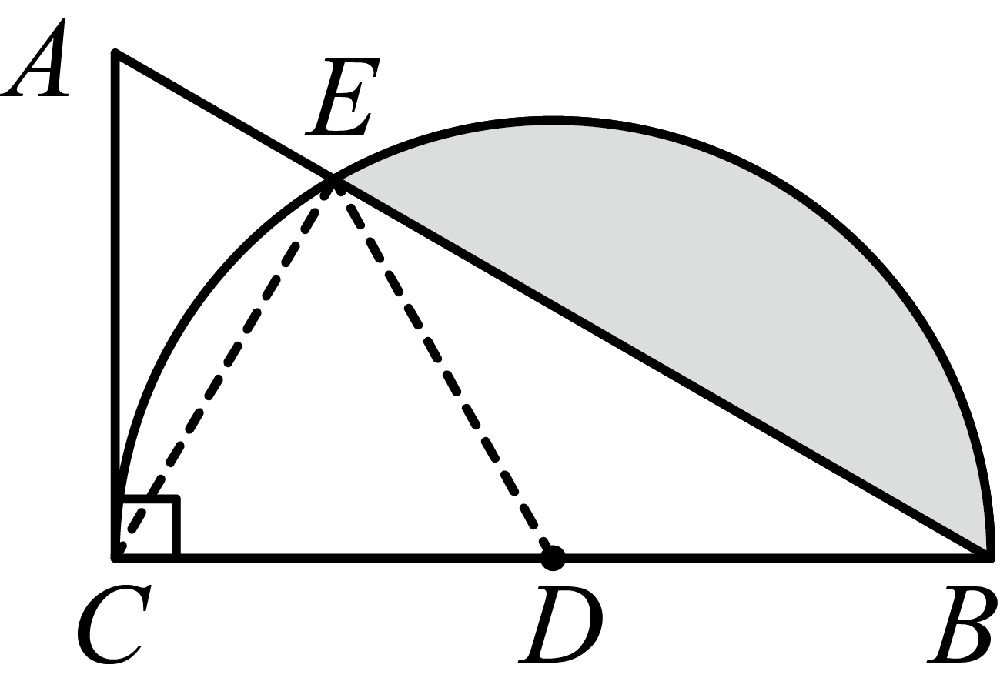
在 $Rt\bigtriangleup ABC$ 中， $\angle C=90\circ$ ， $\angle A=60\circ$ ， $AC=2$ ，点*D*为 $BC$ 边的中点，
$\therefore \angle ABC=30\circ$ ， $AB=2AC=4$ ，
$\therefore \angle CDE=60\circ$ ， $\angle BDE=180\circ -60\circ =120\circ$ ，
$\therefore BC=\sqrt{4^{2}-2^{2}}=2\sqrt{3}$ ， $BD=CD=\sqrt{3}$ ，
$\therefore CE=\frac{1}{2}BC=\sqrt{3}$ ， $BE=\sqrt{BC^{2}-CE^{2}}=\sqrt{\left(2\sqrt{3}\right)^{2}-\sqrt{3}^{2}}=3$ ，
∴图中阴影部分的面积 $=S_{扇形BDE}-S_{\bigtriangleup BDE}=S_{扇形BDE}-\frac{1}{2}S_{\bigtriangleup BCE}=\frac{120\pi \cdot \sqrt{3}^{2}}{360}-\frac{1}{2}\times \frac{1}{2}\times 3\times \sqrt{3}=\pi -\frac{3\sqrt{3}}{4}$ ．
故答案为： $\pi -\frac{3\sqrt{3}}{4}$ ．

12．（2022·广东江门·鹤山市沙坪中学校考模拟预测）如图，在半径为 $\sqrt{5}$ ，圆心角等于 $45\circ$ 的扇形 $AOB$ 内部作一个正方形 $CDEF$ ，使点 $C$ 在 $OA$ 上，点 $D、E$ 在 $OB$ 上，点 $F$ 在 $⌢$ 上，则阴影部分的面积为____________．

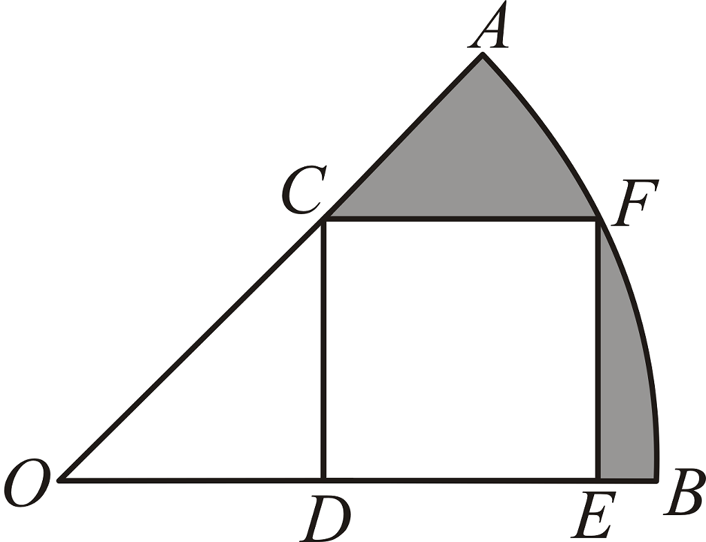

【答案】 $\frac{5}{8}\pi -\frac{3}{2}$

【分析】连接 $OF$ ，由勾股定理可计算得正方形 $CDEF$ 的边长为 $1$ ，则正方形 $CDEF$ 的面积为 $1$ ，等腰直角三角形 $COD$ 的面积为 $\frac{1}{2}$ ，扇形 $AOB$ 的面积为 $\frac{1}{8}\pi \cdot \left(\sqrt{5}\right)^{2}=\frac{5}{8}\pi$ ，所以阴影部分的面积为 $\frac{5}{8}\pi -\frac{3}{2}$ ．

【详解】解：连接 $OF$ ，则 $OF=\sqrt{5}$ ,
∵ $\angle AOB=45\circ$ ,
∴ $\angle DCO=90\circ -\angle COD=45\circ$ .
∴ $\angle COD=\angle DCO$ .
∴ $CD=OD$ .
∴ $EF=ED=OD$ .
$Rt\bigtriangleup OEF$ 中，
$OE^{2}+EF^{2}=OF^{2}$ ,
∴ $(2EF)^{2}+EF^{2}=(\sqrt{5})^{2}$ ，解得 $EF=1$
∴ $OD=CD=EF=1$
∴ $S_{阴影}=S_{扇形AOB}-S_{\bigtriangleup ODC}-S_{CDEF}=\frac{45}{360}\pi \times (\sqrt{5})^{2}-\frac{1}{2}\times 1\times 1-1\times 1=\frac{5}{8}\pi -\frac{3}{2}$ ．
故答案为： $\frac{5}{8}\pi -\frac{3}{2}$

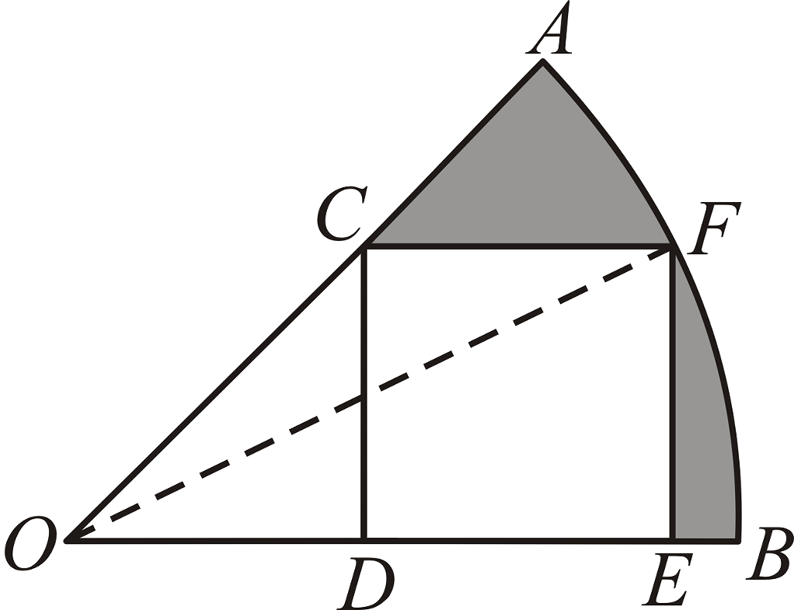

【点睛】本题考查扇形面积的计算，勾股定理，正方形的性质；构造直角三角形运用勾股定理是解题的关键．

13．（2022·福建·一模）如图，在平行四边形纸板 $ABCD$ 中，点 $E，F，O$ 分别为 $AB，CD，BD$ 的中点，连接 $DE，OF，BF$ ．将一飞镖随机投掷到平行四边形纸板上，则飞镖落在阴影部分的概率为________．

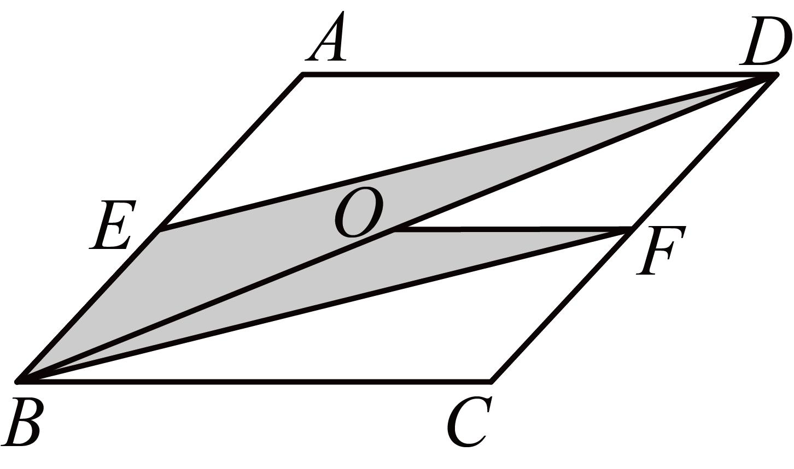

【答案】 $\frac{3}{8}$

【分析】根据点 $E，F，O$ 分别为 $AB，CD，BD$ 的中点，得到 $S_{\bigtriangleup EOD}=\frac{1}{2}S_{\bigtriangleup BED}$ ， $S_{\bigtriangleup BEF}=S_{\bigtriangleup BED}=\frac{1}{4}S_{▱ABCD}$ ，从而得到 $S_{\bigtriangleup EOD}=\frac{1}{8}S_{▱ABCD}$ ，进而得出 $S_{阴影}=\frac{3}{8}S_{▱ABCD}$ ，由此即可得到答案．

【详解】解：如图，连接 $OE$ ，

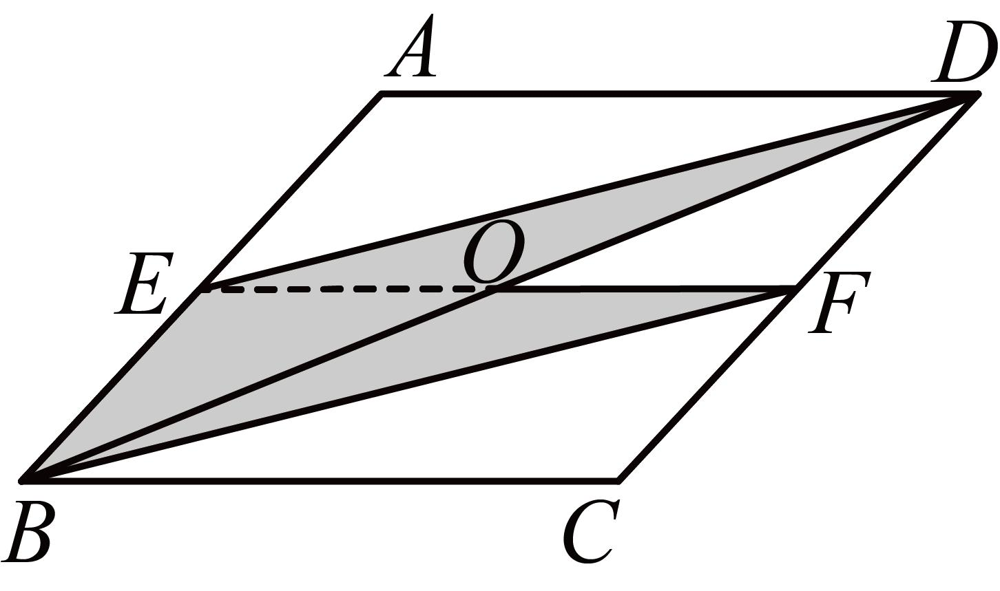
$\because$ 四边形 $ABCD$ 为平行四边形，点 $E，F，O$ 分别为 $AB，CD，BD$ 的中点，
$\therefore$ 点 $E，F，O$ 在同一直线上，
$\therefore S_{\bigtriangleup EOD}=\frac{1}{2}S_{\bigtriangleup BED}$ ， $S_{\bigtriangleup BEF}=S_{\bigtriangleup BED}=\frac{1}{2}S_{\bigtriangleup ABD}=\frac{1}{2}\cdot \frac{1}{2}S_{▱ABCD}=\frac{1}{4}S_{▱ABCD}$ ，
$\therefore S_{\bigtriangleup EOD}=\frac{1}{2}S_{\bigtriangleup BED}=\frac{1}{8}S_{▱ABCD}$ ，
$\therefore S_{阴影}=S_{\bigtriangleup BEF}+S_{\bigtriangleup EOD}=\frac{1}{4}S_{▱ABCD}+\frac{1}{8}S_{▱ABCD}=\frac{3}{8}S_{▱ABCD}$ ，
$\therefore$ 飞镖落在阴影部分的概率为 $\frac{3}{8}$ ，
故答案为： $\frac{3}{8}$ ．

【点睛】本题考查了几何概率，平行四边形的性质，用到的知识点为：概率 $=$ 相应的面积与总面积之比，根据题意计算出 $S_{阴影}=\frac{3}{8}S_{▱ABCD}$ 是解此题的关键．

14．（2023·广东梅州·校考二模）如图，在平面直角坐标系中，已知 $\odot D$ 经过原点&lt;te&lt;text st<em>y</em>le="italic"&gt;x&lt;/text&gt;t style="italic"&gt;O&lt;/text&gt;，与x轴、y轴分别交于<em>A</em>、<em>&lt;text style="italic"&gt;B</em>&lt;/text&gt;两点，点B坐标为 $\left(0,2\sqrt{3}\right)$ ， $OC$ 与 $\odot D$ 交于点<em>C</em>， $\angle OCA=30\circ$ ，则圆中阴影部分的面积为___________________ ．

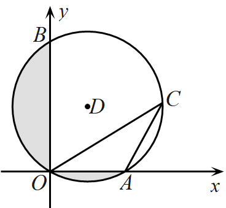

【答案】 $2\pi -2\sqrt{3}$ / $-2\sqrt{3}+2\pi$

【分析】连接 $AB$ ，从图中明确 $S_{阴影}=S_{半圆}-S_{\bigtriangleup ABO}$ ，然后根据公式计算即可．

【详解】解：连接 $AB$  ，

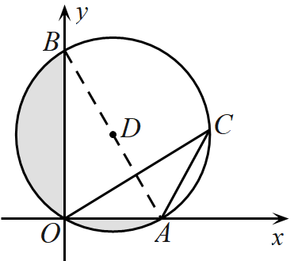
∵ $\angle AOB=90\circ$ ，
∴ $AB$ 是直径，
根据同弧对的圆周角相等得： $\angle OBA=\angle OCA=30\circ$ ，
∵点*B*坐标为 $\left(0,2\sqrt{3}\right)$ ，
∴ $OB=2\sqrt{3}$  ，
∴   $OA=OBtan\angle ABO=OBtan30\circ =2\sqrt{3}\times \frac{\sqrt{3}}{3}=2$ ， $AB=\frac{AO}{sin30\circ }=4$ ，
即圆的半径为2，
∴ $S_{阴影}=S_{半圆}-S_{\bigtriangleup ABO}=\frac{\pi \times 2^{2}}{2}-\frac{1}{2}\times 2\times 2\sqrt{3}=2\pi -2\sqrt{3}$ ．
故答案为： $2\pi -2\sqrt{3}$ ．

【点睛】本题考查了同弧对的圆周角相等； $90\circ$ 的圆周角对的弦是直径；锐角三角函数的概念；圆、直角三角形的面积分式，解题的关键是熟练运用所学的知识进行解题．

15．（2023·河南周口·淮阳第一高级中学校考模拟预测）如图，扇形 $AMB$ 的圆心角 $\angle AMB=60\circ$ ，将扇形 $AMB$ 沿射线 $MB$ 平移得到扇形 $CND$ ，已知线段 $CN$ 经过 $⌢$ 的中点 $E$ ，若 $AM=2\sqrt{3}$ ，则阴影部分的周长为______．

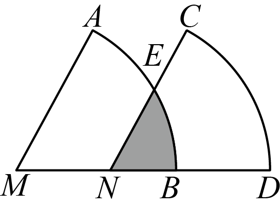

【答案】 $2\sqrt{3}+\frac{\sqrt{3}\pi }{3}$

【分析】连接 $ME$ ，根据 $E$ 为 $⌢$ 的中点，扇形 $AMB$ 的圆心角 $\angle AMB=60\circ$ ，得出 $\angle EMB=\angle AME=\frac{1}{2}\angle AMB=30\circ$ ，求出 $l_{⌢}=\frac{30\times 2\sqrt{3}\pi }{180}=\frac{\sqrt{3}\pi }{3}$ ，证明 $EN=MN$ ，根据 $NE+NB+l_{⌢}=MN+NB+l_{⌢}$ 求出结果即可．

【详解】解：连接 $ME$ ，如图所示：

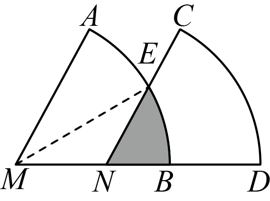
∵ $E$ 为 $\overparen{AB}$ 的中点，扇形 $AMB$ 的圆心角 $\angle AMB=60\circ$ ，
∴ $\angle EMB=\angle AME=\frac{1}{2}\angle AMB=30\circ$ ，
∵ $AM=2\sqrt{3}$ ，
∴ $EM=BM=2\sqrt{3}$ ，
∴ $l_{⌢}=\frac{30\times 2\sqrt{3}\pi }{180}=\frac{\sqrt{3}\pi }{3}$ ，
根据平移可知， $AM\parallel CN$ ，
∴ $\angle AME=\angle MEN$ ，
∴ $\angle BME=\angle MEN$ ，
∴ $EN=MN$ ，
∴阴影部分的周长为：
$NE+NB+l_{⌢}=MN+NB+l_{⌢}$
$=MB+l_{⌢}$
$=2\sqrt{3}+\frac{\sqrt{3}\pi }{3}$ ．
故答案为： $2\sqrt{3}+\frac{\sqrt{3}\pi }{3}$ ．

【点睛】本题主要考查了平移的性质，弧长公式，等腰三角形的判定和性质，平行线的性质，掌握平移的性质是解题的关键．

16．（2024·西藏拉萨·统考一模）如图，等腰 $\bigtriangleup ABC$ 的顶点*A*，*C* 在 $\odot O$ 上， $BC$ 边经过圆心0且与 $\odot O$  交于*D* 点， $\angle B=30\circ$ .

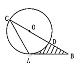  
(1)求证： $AB$ 是 $\odot O$ 的切线；  
(2)若 $AB=6$ ，求阴影部分的面积

【答案】(1)见解析；  
(2) $6\sqrt{3}-2\pi$

【分析】（1）连接 $OA$ ，由 $AB=AC$ ， $\angle B=30\circ$ ，可得 $\angle CAB=120\circ$ ，由 $OC=OA$ ，可得 $\angle OAB=90\circ$ ，即可求证；  
（2）在 $Rt\Delta OAB$ 中，利用勾股定理可求得 $OA=2\sqrt{3}$ ，再根据 $S_{阴}=S_{Rt\Delta OAB}-S_{扇形OAD}$ ，即可求解.

【详解】（1）证明：连接 $OA$ ，

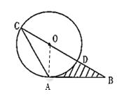
∵ $AB=AC$ ，
∴ $\angle C=\angle B=30\circ$ ， $\angle CAB=120\circ$ ，
∵ $OC=OA$ ，
∴ $\angle OAC=\angle C=30\circ$ ，
∴ $\angle OAB=90\circ$ ，
∵ $OA$ 是 $\odot O$ 的半径，
∴ $AB$ 是圆*O*的切线．  
（2）解：∵ $\angle B=30\circ$ ， $\angle OAB=90\circ$ ，
∴ $OB=2OA$
∵ $AB=6$ ，
∴ $OA^{2}+6^{2}=\left(2OA\right)^{2}$
∴ $OA=2\sqrt{3}$
∴ $S_{阴}=S_{Rt\Delta OAB}-S_{扇形OAD}=\frac{1}{2}OA\cdot AB-\frac{60\pi \cdot OA^{2}}{360}=\frac{1}{2}\times 2\sqrt{3}\times 6-\frac{60\pi \times 12}{360}=6\sqrt{3}-2\pi$ ．

【点睛】此题主要考查切线的判定定理、直角三角形的性质、勾股定理、扇形的面积公式，熟练掌握切线的判定定理是解题的关键.

17．（2023·山西长治·统考模拟预测）如图，在 $\bigtriangleup ABC$ 中， $CA=CB$ ， $AB=4$ ，点 $D$ 是 $AB$ 的中点，分别以点 $A$ 、 $B$ 、 $C$ 为圆心， $AD$ 的长为半径画弧，交线段 $AC$ 、 $BC$ 于点 $E$ 、 $F$ 、 $G$ 、 $H$ ，若点 $E$ 、 $F$ 是线段 $AC$ 的三等分点时，图中阴影部分的面积为（    ）

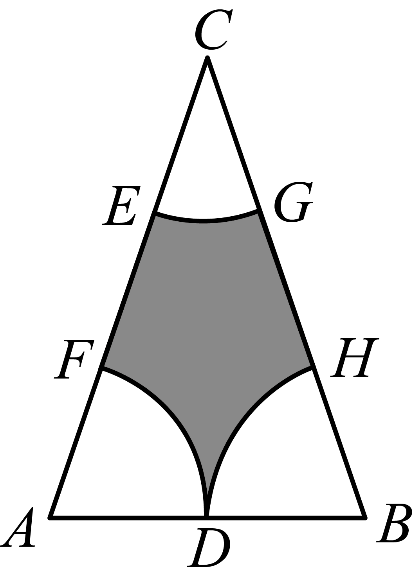

A． $8\sqrt{2}-2\pi$ 	
B． $16\sqrt{2}-4\pi$ 	
C． $8\sqrt{2}-4\pi$ 	
D． $16\sqrt{2}-2\pi$

【答案】A

【分析】连接 $CD$ ，由等腰三角形的性质可得 $CD\perp AB$ ， $AD=BD=2$ ，由题意可得 $AC=BC=3AD=6$ ，由勾股定理可得 $CD=4\sqrt{2}$ ，再由 $S_{阴影}=S_{\bigtriangleup ABC}-S_{扇形ADF}-S_{扇形CEG}-S_{扇形BDH}$ 代入进行计算即可．

【详解】解：如图，连接 $CD$ ，

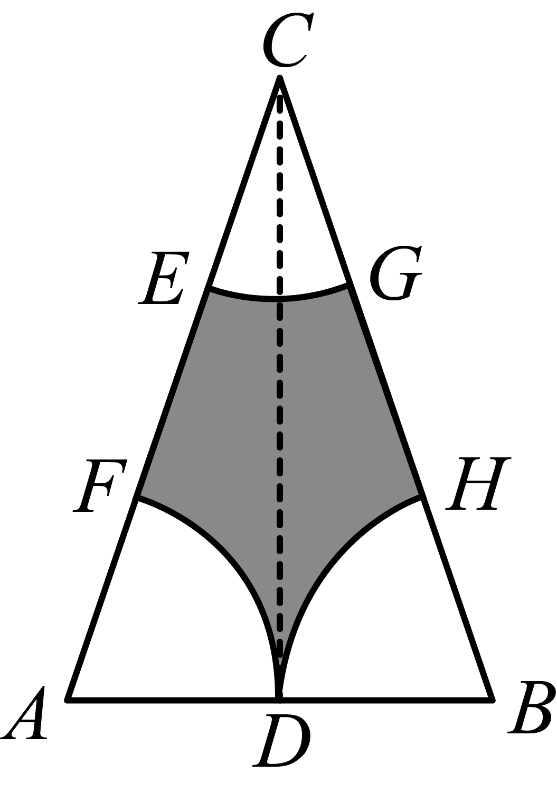

，
$\because CA=CB$ ， $AB=4$ ，点 $D$ 是 $AB$ 的中点，
$\therefore CD\perp AB$ ， $AD=BD=2$ ，
$\because$ 分别以点 $A$ 、 $B$ 、 $C$ 为圆心， $AD$ 的长为半径画弧，交线段 $AC$ 、 $BC$ 于点 $E$ 、 $F$ 、 $G$ 、 $H$ ，点 $E$ 、 $F$ 是线段 $AC$ 的三等分点，
$\therefore AC=BC=3AD=6$ ，
$\therefore CD=\sqrt{AC^{2}-AD^{2}}=\sqrt{6^{2}-2^{2}}=4\sqrt{2}$ ，
$\therefore S_{阴影}=S_{\bigtriangleup ABC}-S_{扇形ADF}-S_{扇形CEG}-S_{扇形BDH}$
$=\frac{1}{2}AB\cdot CD-\frac{\angle FAD\times 2^{2}\times \pi }{360\circ }-\frac{\angle ECG\times 2^{2}\times \pi }{360\circ }-\frac{\angle DBH\times 2^{2}\times \pi }{360\circ }$ ，
$=\frac{1}{2}\times 4\times 4\sqrt{2}-\frac{2^{2}\times \pi }{360\circ }\left(\angle FAD+\angle ECG+\angle DBH\right)$
$=8\sqrt{2}-\frac{4\times \pi \times 180\circ }{360\circ }$
$=8\sqrt{2}-2\pi$ ，
故选：A．

【点睛】本题主要考查了等腰三角形的性质、勾股定理、扇形面积的计算，熟练掌握等腰三角形的性质、勾股定理、扇形的面积公式是解题的关键．

18．（2022·湖北武汉·校考模拟预测）已知 $AB$ 是 $\odot O$ 的直径， $DA、DE、BC$ 是 $\odot O$ 的三条切线，切点分别为 $A、E$ 、 $B$ ，连接 $OE$ ．

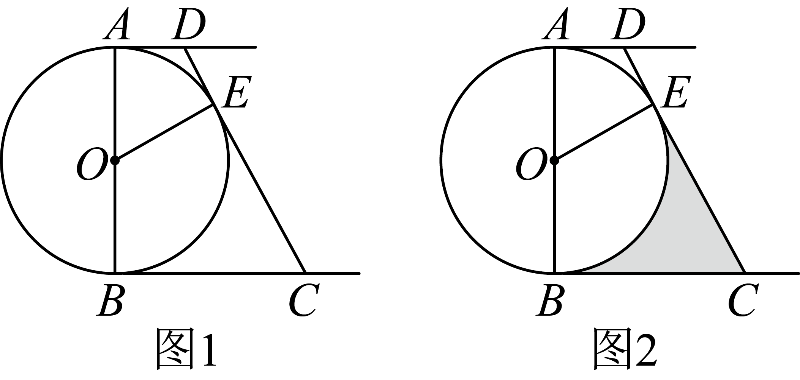  
(1)如图1，求证： $OE^{2}=DE\cdot CE$ ；  
(2)如图2， $AD=1，BC=3$ ，求图中阴影部分的面积．

【答案】(1)见解析  
(2) $3\sqrt{3}-\pi$

【分析】（1）连接 $OD$ ， $OC$ ，根据切线的性质可得 $AB\perp BC$ ， $AB\perp AD$ ， $OE\perp CD$ ，由 $OA=OE$ 可得 $DO$ 垂直平分 $\angle ADE$ ，则 $\angle ADO=\angle CDO$ ，同理可得 $\angle BCO=\angle ECO$ ，可得出 $\angle ODE+\angle OCE=90\circ$ ，根据同角的余角相等可得 $\angle EOD=\angle ECO$ ，证明 $\bigtriangleup ODE\backsim \bigtriangleup COE$ ，根据相似三角形的性质即可得出结论；  
（2）连接 $OC$ ，过点 $D$ 作 $DF\perp BC$ 于点 $F$ ，则四边形 $ABFD$ 是矩形，可得 $CF=2$ ，利用勾股定理求出 $DF$ ，可得半径是 $\sqrt{3}$ ， $OC=2\sqrt{3}$ ，可求出 $\angle BOE=120\circ$ ，根据 $S_{阴影部分}=S_{四边形BCEO}-S_{扇形OBE}$ 即可求出答案．

【详解】（1）证明：如图，连接 $OD$ ， $OC$ ，

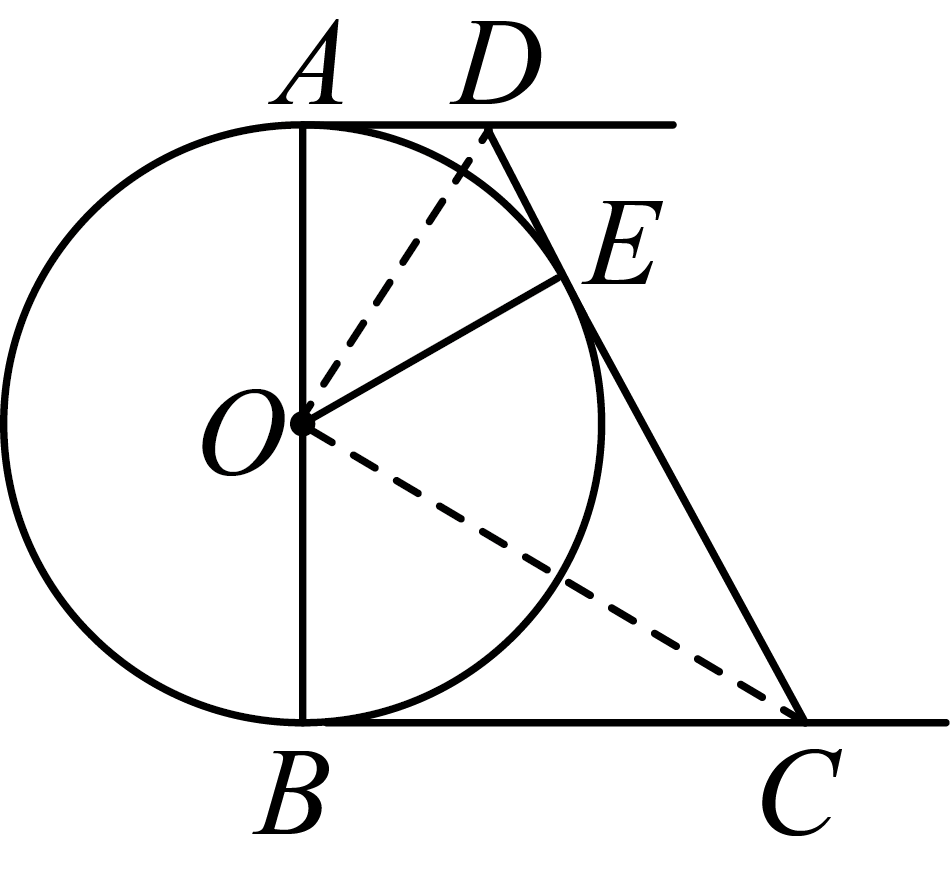

，
$\because DA、DE、BC$ 是 $\odot O$ 的三条切线，切点分别为 $A、E、B$ ，
$\therefore AB\perp BC$ ， $AB\perp AD$ ， $OE\perp CD$ ，
$\therefore AD\parallel BC$ ， $\angle OED=\angle CEO=90\circ$ ，
$\because OA=OE$ ，
$\therefore DO$ 平分 $\angle ADE$ ，
$\therefore \angle ADO=\angle CDO=\frac{1}{2}\angle ADE$ ，
同理可得： $\angle BCO=\angle ECO=\frac{1}{2}\angle BCE$ ，
$\because AD\parallel BC$ ，
$\therefore \angle ADE+\angle BCE=180\circ$ ，
$\therefore \angle ODE+\angle OCE=90\circ$ ，
$\because \angle ODE+\angle EOD=90\circ$ ，
$\therefore \angle EOD=\angle ECO$ ，
$\therefore \bigtriangleup ODE\backsim \bigtriangleup COE$ ，
$\therefore \frac{OE}{CE}=\frac{DE}{OE}$ ，
$\therefore OE^{2}=DE\cdot CE$ ；  
（2）解：如图，连接 $OC$ ，过点 $D$ 作 $DF\perp BC$ 于点 $F$ ，

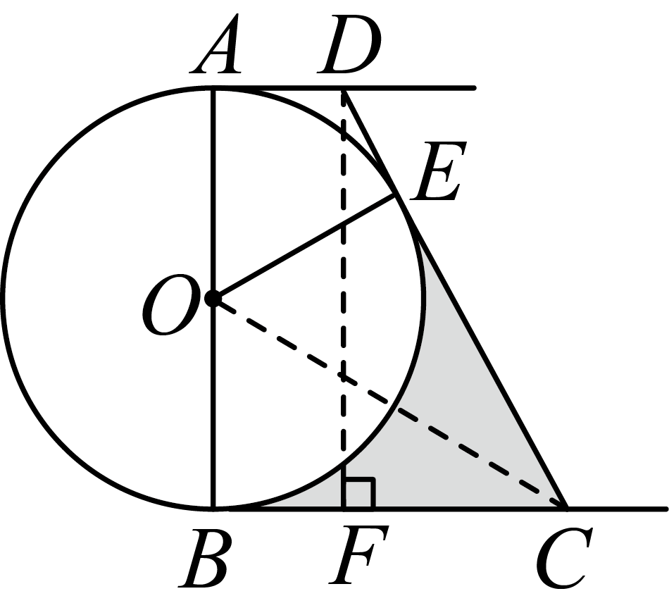

，
则四边形 $ABFD$ 是矩形，
$\therefore AD=BF$ ， $DF=AB$ ，
$\because DA、DE、BC$ 是 $\odot O$ 的三条切线，切点分别为 $A、E、B$ ， $AD=1$ ， $BC=3$ ，
$\therefore DE=AD=BF=1$ ， $CE=BC=3$ ，
$\therefore CF=BC-BF=2$ ， $CD=CE+DE=4$ ，
$\therefore DF=\sqrt{CD^{2}-CF^{2}}=2\sqrt{3}$ ，
$\therefore AB=DF=2\sqrt{3}$ ，
$\therefore \odot O$ 的半径是 $\sqrt{3}$ ，
$\therefore OC=\sqrt{OB^{2}+BC^{2}}=2\sqrt{3}$ ，
$\therefore OC=2OB$ ，
$\therefore \angle OCB=30\circ$ ，
$\therefore \angle BCE=2\angle OCB=60\circ$ ，
$\therefore \angle BOE=360\circ -\angle OBC-\angle OEC-\angle BCE=120\circ$ ，
$\therefore S_{阴影部分}=S_{四边形BCEO}-S_{扇形OBE}=2\times \frac{1}{2}BC\cdot OB-\frac{120\times \pi \times OB^{2}}{360}=3\sqrt{3}-\pi$ ．

【点睛】本题考查了切线的性质，直角三角形的性质，扇形的面积公式，相似三角形的判定和性质，熟练掌握相似三角形的判定和性质及切线的性质是解题的关键．

## 题型03 割补法

## 类型一 全等法

19．（2022上·安徽阜阳·九年级校考期末） $AB$ 是 $\odot O$ 的直径，弦 $CD\perp AB，\angle C=30\circ ，CD=$  $4\sqrt{3}$ ，则 $S_{阴影}=$ （    ）

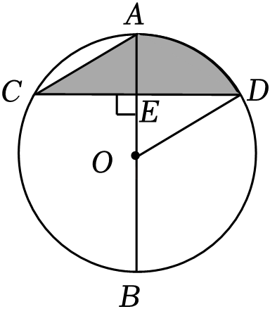

A．π	
B．2π	
C． $\frac{8}{3}\pi$ 	
D．4π

【答案】C

【分析】先求出 $\angle EOD$ ，再根据含 $30\circ$ 直角三角形的性质得 $CE$ ，及 $AC=2AE$ ，然后根据勾股定理求出 $AE$ ，进而得出 $AC$ ，同理求出 $OE$ ， $OD$ ，最后根据 $S_{阴影}=S_{扇形AOD}$ 得出结论．

【详解】解：∵ $\angle C=30\circ$ ，
∴ $\angle EOD=2\angle C=60\circ$ .
∵ $AB\perp CD$ ， $AB$ 过圆心*O*， $CD=4\sqrt{3}$ ，
∴ $\angle AEC=\angle DEO=90\circ$ ， $CE=DE=2\sqrt{3}$ .
∴ $\angle EDO=30\circ$ .
在 $Rt\bigtriangleup ACE$ 中， $\angle C=30\circ$ ，
∴ $AC=2AE$ ，
根据勾股定理，得 $(2AE)^{2}=(2\sqrt{3})^{2}+AE^{2}$ ，
解得 $AE=2$ （负数舍去），
∴ $AC=2AE=4$ ，

同理 $OE=2$ ， $OD=4$ ，
∴ $S_{\bigtriangleup AEC}=S_{\bigtriangleup OED}=\frac{1}{2}\times 2\sqrt{3}\times 2=2\sqrt{3}$ ，
∴ $S_{阴影}=S_{扇形AOD}=\frac{60\pi \times 4^{2}}{360}=\frac{8}{3}\pi$ .
故选：C．

【点睛】本题主要考查了直角三角形的性质，勾股定理，圆周角定理，扇形的面积等，将求不规则图形面积转化为求规则图形的面积是解题的关键．

20．（2023·山西晋城·模拟预测）如图，在矩形 $ABCD$ 中， $AB=1$ ，以点 $A$ 为圆心，矩形的长 $AD$ 为半径画弧，交 $BC$ 于点 $E$ ，交 $AB$ 的延长线于点 $F$ ，若 $AE$ 恰好平分 $\angle BAD$ ，则阴影部分的面积为（   ）

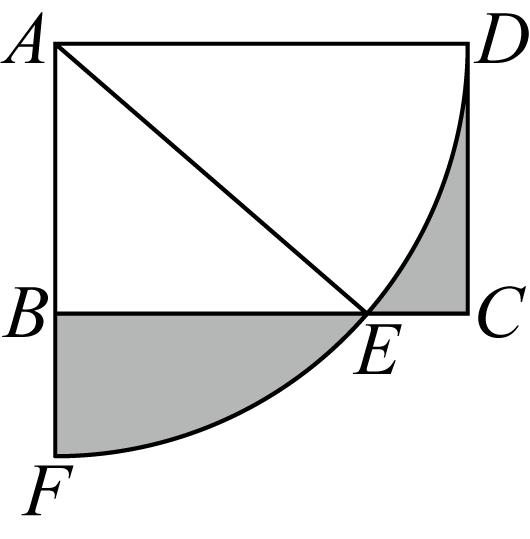

A． $1$ 	
B． $\frac{\pi -\sqrt{2}-1}{2}$ 	
C． $\frac{2\sqrt{2}+\pi }{4}$ 	
D． $\sqrt{2}-1$

【答案】D

【分析】由矩形的性质结合角平分线的定义可求出 $\angle BAE=\angle EAD=\frac{1}{2}\angle BAD=45\circ$ ， $AB=BE=1$ ， $AE=\sqrt{2}$ ，再根据扇形的面积公式，矩形的面积公式和三角形面积公式计算出 $S_{阴影BEF}=S_{扇形AEF}-S_{\bigtriangleup ABE}$ 和 $S_{阴影DCE}=S_{矩形ABCD}-S_{扇形ADE}-S_{\bigtriangleup ABE}$ ，最后相加即可．

【详解】解：∵四边形 $ABCD$ 为矩形，
∴ $\angle BAD=\angle ABC=90\circ$ ．
∵ $AE$ 恰好平分 $\angle BAD$ ，
∴ $\angle BAE=\angle EAD=\frac{1}{2}\angle BAD=45\circ$ ，
∴ $AB=BE=1$ ，
∴ $AE=\sqrt{AB^{2}+BE^{2}}=\sqrt{2}$ ，
∴ $S_{扇形AEF}=\frac{45\pi AE^{2}}{360}=\frac{45\pi \times \left(\sqrt{2}\right)^{2}}{360}=\frac{1}{4}\pi$ ， $S_{\bigtriangleup ABE}=\frac{1}{2}AB\cdot BE=\frac{1}{2}\times 1\times 1=\frac{1}{2}$ ，
∴ $S_{阴影BEF}=S_{扇形AEF}-S_{\bigtriangleup ABE}=\frac{1}{4}\pi -\frac{1}{2}$ ；
由题意可知 $AD=AE=\sqrt{2}$ ，
∴ $S_{矩形ABCD}=AB\cdot AD=1\times \sqrt{2}=\sqrt{2}$ ， $S_{扇形ADE}=\frac{45\pi AE^{2}}{360}=\frac{1}{4}\pi$ ，
∴ $S_{阴影DCE}=S_{矩形ABCD}-S_{扇形ADE}-S_{\bigtriangleup ABE}=\sqrt{2}-\frac{1}{4}\pi -\frac{1}{2}$ ，
∴阴影部分的面积为 $S_{阴影BEF}+S_{阴影DCE}=\sqrt{2}-1$ ．
故选D．

【点睛】本题考查矩形的性质，角平分线的定义，等腰直角三角形的判定和性质，勾股定理，扇形的面积计算等知识．利用数形结合的思想是解题关键．

21．（2023·内蒙古·统考中考真题）如图，正方形 $ABCD$ 的边长为2，对角线 $AC,BD$ 相交于点 $O$ ，以点 $B$ 为圆心，对角线 $BD$ 的长为半径画弧，交 $BC$ 的延长线于点 $E$ ，则图中阴影部分的面积为________．

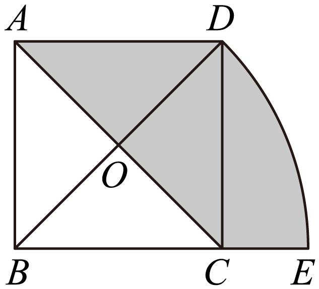

【答案】 $\pi$

【分析】根据正方形的性质得出阴影部分的面积为扇形 $BED$ 的面积，然后由勾股定理得出 $BD=2\sqrt{2}$ ，再由扇形的面积公式求解即可．

【详解】解：正方形 $ABCD$ ，
∴ $AO=CO,BO=DO,AD=CD$ ， $\angle DBE=45\circ$ ，
∴ $\bigtriangleup AOD\allequal \bigtriangleup COB(SSS)$ ，
∵正方形 $ABCD$ 的边长为2，
∴ $BD=\sqrt{2^{2}+2^{2}}=2\sqrt{2}$
∴阴影部分的面积为扇形 $BED$ 的面积，即 $\frac{45\times \pi \times (2\sqrt{2})^{2}}{360}=\pi$ ，
故答案为： $\pi$ ．

【点睛】题目主要考查正方形的性质及扇形的面积公式，理解题意，将阴影部分面积进行转化是解题关键．

22．（2022·青海·统考中考真题）如图，矩形 $ABCD$ 的对角线相交于点<em>&lt;text style="italic"&gt;O</em>&lt;/text&gt;，过点O的直线交 $AD$ ， $BC$ 于点<em>E</em>，<em>F</em>，若 $AB=3$ ， $BC=4$ ，则图中阴影部分的面积为__________．

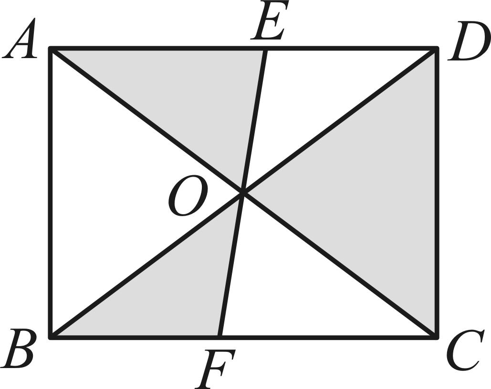

【答案】6

【分析】结合矩形的性质证明 $\bigtriangleup AOE\allequal \bigtriangleup COF$ ，可得 $\bigtriangleup AOE$ 与 $\bigtriangleup COF$ 的面积相等，从而将阴影部分的面积转化为 $\bigtriangleup BDC$ 的面积进行求解即可．

【详解】解：∵四边形 $ABCD$ 是矩形， $AB=3$ ，
∴ $OA=OC$ ， $AB=CD=3$ ， $AD\parallel BC$ ，
∴ $\angle AEO=\angle CFO$ ，
又∵ $\angle AOE=\angle COF$ ，
在 $\bigtriangleup AOE$ 和 $\bigtriangleup COF$ 中，
$\left\{\begin{array}{c}\angle AEO=\angle CFO\\OA=OC\\\angle AOE=\angle COF\end{array}\right$ ，
∴ $\bigtriangleup AOE\allequal \bigtriangleup COF\left(ASA\right)$ ，
∴ $S_{\bigtriangleup AOE}=S_{\bigtriangleup COF}$ ，
∴ $S_{阴影}=S_{\bigtriangleup AOE}+S_{\bigtriangleup BOF}+S_{\bigtriangleup COD}=S_{\bigtriangleup COF}+S_{\bigtriangleup BOF}+S_{\bigtriangleup COD}=S_{\bigtriangleup BCD}$ ，
∴ $S_{\bigtriangleup BCD}=\frac{1}{2}BC\cdot CD=\frac{1}{2}\times 4\times 3=6$ ，
故答案为：6．

【点睛】本题考查矩形的性质、全等三家形的判定与性质，根据证明三角形全等，将阴影部分的面积转化为矩形面积的一半是解题的关键．

23．（2022上·江西南昌·九年级统考期末）如图，半径为10的扇形 $OAB$ 中， $\angle AOB=90\circ$ ， $C$ 为弧 $AB$ 上一点， $CD\perp OA$ ， $CE\perp OB$ ，垂足分别为 $D$ ， $E$ ．若 $\angle CDE=40\circ$ ，则图中阴影部分的面积为（    ）

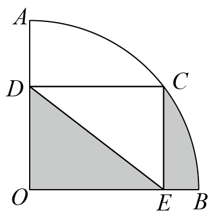

A． $\frac{40}{3}\pi$ 	
B． $\frac{110}{9}\pi$ 	
C． $\frac{100}{9}\pi$ 	
D． $10\pi$

【答案】C

【分析】连接*OC*，易证得四边形*CDOE*是矩形，则△*DOE*≌△*CEO*，得到∠*COB*＝∠*DEO*＝40°，图中阴影部分的面积＝扇形*OBC*的面积，利用扇形的面积公式即可求得．

【详解】解：如图，连接*OC*，

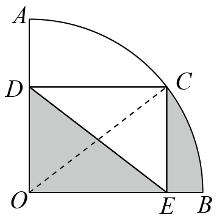
∵∠*AOB*＝90°，*CD*⊥*OA*，*CE*⊥*OB*，
∴四边形*CDOE*是矩形，
∴*OD*＝*CE*，*DE*＝*OC*，*CD*∥*OE*，
∵∠*CDE*＝40°，
∴∠*DEO*＝∠*CDE*＝40°，
在△*DOE*和△*CEO*中， $\left\{\begin{array}{c}OD＝EC\\\begin{array}{c}DE＝CO\\OE＝EO\end{array}\end{array}\right$ ，
∴△*DOE*≌△*CEO*（*SSS*），
∴∠*COB*＝∠*DEO*＝40°，
∴图中阴影部分的面积＝扇形*OBC*的面积，
∵<em>S扇形OBC</em>＝ $\frac{40\pi \times 10^{2}}{360}$ ＝ $\frac{100}{9}\pi$ ，
∴图中阴影部分的面积为 $\frac{100}{9}\pi$ ，
故选：C．

【点睛】本题考查了扇形面积的计算，矩形的判定与性质，利用扇形*OBC*的面积等于阴影的面积是解题的关键．

## 类型二 等面积法  

24．（2023·辽宁锦州·统考二模）如图，在 $\bigtriangleup ABC$ 中， $AB=AC$ ，以 $AC$ 为直径的 $\odot O$ 与 $AB$ ， $BC$ 分别交于点*D*，*E*，连接 $AE$ ， $DE$ ，若 $\angle BED=45\circ$ ， $AB=2$ ，则阴影部分的面积为（　　）

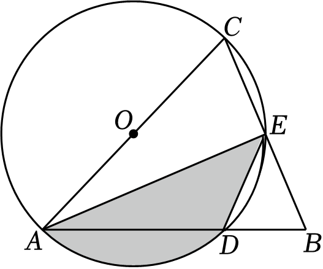

A． $\frac{\pi }{4}$ 	
B． $\frac{\pi }{3}$ 	
C． $\frac{2\pi }{3}$ 	
D．*π*

【答案】A

【分析】连接 $OE$ ， $OD$ ，证明 $S_{\bigtriangleup AOD}=S_{\bigtriangleup AED}$ ，可得 $S_{阴影}=S_{扇形OAD}$ ，求解 $\angle AOD=90\circ$ ，再利用扇形的面积公式计算即可．

【详解】解：连接 $OE$ ， $OD$ ，

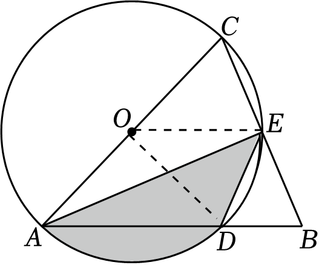
∵ $AC$ 为 $\odot O$ 的直径，
∴ $\angle AEC=90\circ$ ，
∵ $AB=AC$ ，
∴ $BE=CE$ ，
即点*E*是 $BC$ 的中点，
∵点*O*是 $AC$ 的中点，
∴ $OE$ 是 $\bigtriangleup ABC$ 的中位线，
∴ $OE\parallel AB$ ，
∴ $S_{\bigtriangleup AOD}=S_{\bigtriangleup AED}$ ，
∴ $S_{阴影}=S_{扇形OAD}$ ，
∵ $\angle AEC=90\circ$ ，
∴ $\angle AEB=90\circ$ ，
∵ $\angle BED=45\circ$ ，
∴ $\angle AED=45\circ$ ，
∴ $\angle AOD=90\circ$ ，
∴ $S_{扇形OAD}=\frac{90\pi \times 1^{2}}{360}=\frac{\pi }{4}$ ，
∴ $S_{阴影}=\frac{\pi }{4}$ ，
故选：A．

【点睛】本题考查的是等腰三角形的性质，圆周角定理的应用，扇形面积的计算，熟练的证明 $S_{阴影}=S_{扇形OAD}$ 是解本题的关键．

25．（2023·山西大同·校联考模拟预测）阅读与思考

下面是小明的数学学习笔记，请仔细阅读并完成相应的任务：
通过构造全等三角形来解决图形与几何中的问题
在图形与几何的学习中常常会遇到一些问题无法直接解答，需要作辅助线构造全等三角形才能得到解决，比如下面的题目中出现了角平分线和垂线段，我们可以通过延长垂线段与三角形的一边相交，构造全等三角形，再运用全等三角形的性质解决此问题．

例：如图1，*D*是 $\bigtriangleup ABC$ 内的点，且 $AD$ 平分 $\angle BAC$ ， $CD\perp AD$ ，连接 $BD$ ．若 $\bigtriangleup ABC$ 的面积是10，求图中阴影部分的面积．

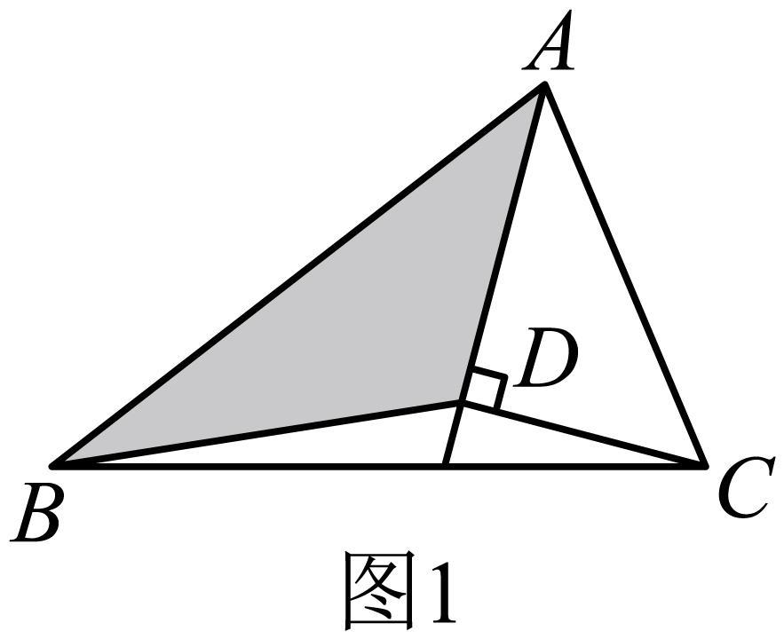

该问题的解答过程如下：
解：如图2，延长 $CD$ 交 $AB$ 于点*E*．

∵ $AD$ 平分 $\angle BAC$ ，
∴ $\angle DAB=\angle DAC$ ．
∵ $AD\perp CD$ ，
∴ $\angle ADC=\angle ADE=90\circ$ ．
在 $\bigtriangleup ADE$ 和 $\bigtriangleup ADC$ 中，
$\left\{\begin{array}{c}\angle DAB=\angle DAC\\AD=AD\\\angle ADC=\angle ADE\end{array}\right$
∴ $\bigtriangleup ADE\allequal \bigtriangleup ADC\left(ASA\right)$ ．
∴ $S_{\bigtriangleup ADE}=S_{\bigtriangleup ADC}$ （依据\*）， $ED=DC$ ．

任务：  
(1)上述解答过程中的“依据\*”是指_；  
(2)请将上述解答过程的剩余部分补充完整；  
(3)如图3，在 $\bigtriangleup ABC$ 中， $\angle ABC=90\circ$ ， $AB=BC$ ， $AD$ 平分 $\angle BAC$ 交 $BC$ 于点*D*， $CE\perp AD$ 交 $AD$ 的延长线于点*E*，连接 $BE$ ．若 $BE=5$ ，请直接写出 $AD$ 的长．

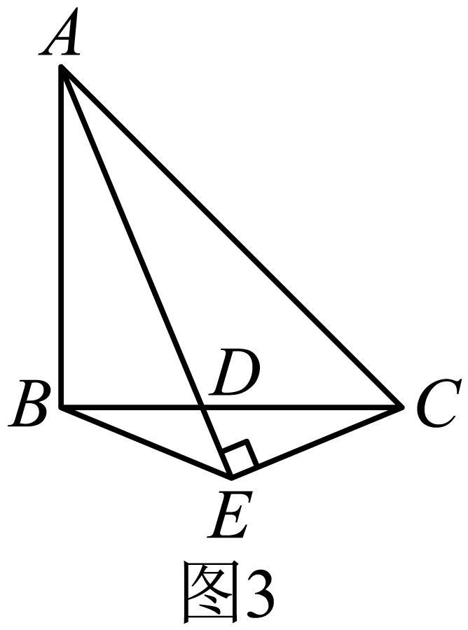

【答案】(1)全等三角形面积相等  
(2)见解析  
(3)10

【分析】（1）根据全等三角形的性质，即可得出答案；  
（2）先判断 $\bigtriangleup ADE\allequal \bigtriangleup ADC\left(ASA\right)$ 得出 $S_{\bigtriangleup ADE}=S_{\bigtriangleup ADC}$ （全等三角形面积相等）， $ED=DC$ ，进而得到 $S_{\bigtriangleup BDE}=S_{\bigtriangleup BDC}$ ，即可得到答案；  
（3）延长 $CE，AB$ 相交于点 $Q$ ，先判断出 $\bigtriangleup AEQ\allequal \bigtriangleup AEC\left(ASA\right)$ ，得出 $EQ=EC$ ，继而得出 $CQ=2BE=10$ ，再判断出 $\bigtriangleup ABD\allequal \bigtriangleup CBQ\left(ASA\right)$ ，即可得出结论．

【详解】（1）由题意可知，依据是全等三角形面积相等，
故答案为：全等三角形面积相等．  
（2）解：如图2，延长 $CD$ 交 $AB$ 于点*E*．

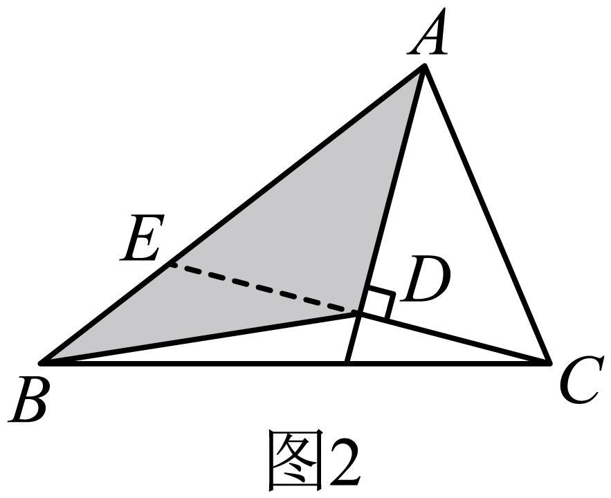
∵ $AD$ 平分 $\angle BAC$ ，
∴ $\angle DAB=\angle DAC$ ．
∵ $AD\perp CD$ ，
∴ $\angle ADC=\angle ADE=90\circ$ ．
在 $\bigtriangleup ADE$ 和 $\bigtriangleup ADC$ 中，
$\left\{\begin{array}{c}\angle DAB=\angle DAC\\AD=AD\\\angle ADC=\angle ADE\end{array}\right$ ，
∴ $\bigtriangleup ADE\allequal \bigtriangleup ADC\left(ASA\right)$ ．
∴ $S_{\bigtriangleup ADE}=S_{\bigtriangleup ADC}$ （全等三角形面积相等）， $ED=DC$ ．
$\therefore S_{\bigtriangleup BDE}=S_{\bigtriangleup BDC}$ （等底同高的两个三角形面积相等），
$\therefore S_{\bigtriangleup ADE}+S_{\bigtriangleup BDE}=\frac{1}{2}S_{\bigtriangleup ACE}+\frac{1}{2}S_{\bigtriangleup BCE}$
$=\frac{1}{2}\left(S_{\bigtriangleup ACE}+S_{\bigtriangleup BCE}\right)$
$=\frac{1}{2}S_{\bigtriangleup ABC}$
$=5$
∴ $S_{阴影部分}=S_{\bigtriangleup ABD}=S_{\bigtriangleup ADE}+S_{\bigtriangleup BDE}=5$  
（3）解：如图：

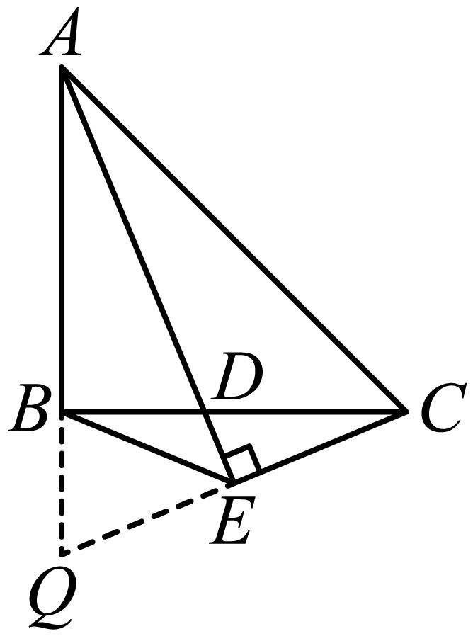

延长 $CE，AB$ 相交于点 $Q$ ，
$\because$  $AD$ 平分 $\angle BAC$ 交 $BC$ 于点，
$\therefore \angle BAD=\angle CAD$ ，
$\because CE\perp AD$ ，
$\therefore \angle AEQ=\angle AEC=90\circ$ ，
$\because AE=AE$ ，
$\therefore \bigtriangleup AEQ\allequal \bigtriangleup AEC\left(ASA\right)$ ，
$\therefore EQ=EC$ ，
$\because \angle CBQ=90\circ$ ，
$\therefore CQ=2BE=10$ ，
$\because \angle ABC=\angle AEC，\angle ADB=\angle CDE$ ，
$\therefore \angle BAD=\angle BCQ$ ，
$\because AB=CB$ ， $\angle ABD=\angle CBQ$ ，
$\therefore \bigtriangleup ABD\allequal \bigtriangleup CBQ\left(ASA\right)$ ，
$\therefore AD=CQ=10$ ．

【点睛】本题考查了全等三角形的判定和性质，等腰三角形的性质，作出辅助线构造出全等三角形是解本题的关键．

26．（2023上·辽宁抚顺·九年级统考期末）如图， $C，D$ 是以 $AB$ 为直径的半圆上的两点，连接 $BC，CD，AC，BD$ ， $BC=CD$ ， $\angle ACD=30\circ$ ， $AB=12$ ，则图中阴影部分的面积为_____ ．

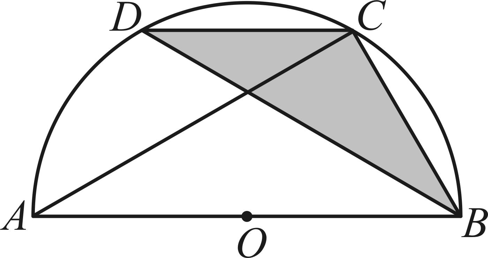

【答案】 $9\sqrt{3}$

【分析】连接 $OD，OC$ ， $OC$ 交 $BD$ 于点 $E$ ，过点 $O$ 作 $OF\perp CD$ 于点 $F$ ，由圆周角定理可得 $\angle AOD=2\angle ACD=60\circ$ ，再由 $OD=OC=OB$ 以及三角形内角和定理可得 $\angle OBD=\angle ODB=\frac{1}{2}\left(180\circ -\angle DOB\right)=30\circ$ ， $\bigtriangleup COD$ 为等边三角形，从而得到 $OE\perp BD，BD=2BE$ ，再计算出 $BD$ 的长，最后根据 $S_{阴影}=S_{\bigtriangleup BCD}=\frac{1}{2}BD\cdot CE$ ，进行计算即可得到答案．

【详解】解：连接 $OD，OC$ ， $OC$ 交 $BD$ 于点 $E$ ，过点 $O$ 作 $OF\perp CD$ 于点 $F$ ，则： $OD=OC=OB$ ，

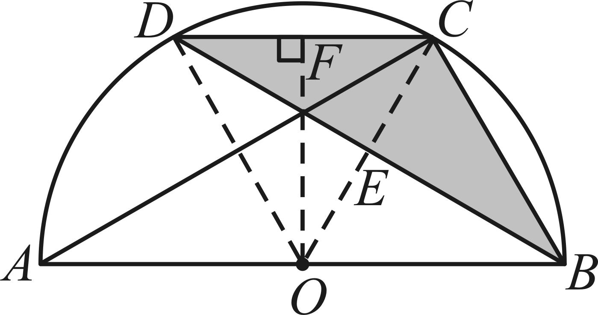
$\because AB$ 为直径，
$\therefore \angle ACB=90\circ$ ，
$\because \angle ACD=30\circ ，AB=12$ ，
$\therefore OD=OC=OB=\frac{1}{2}AB=6，\angle AOD=2\angle ACD=60\circ$ ，
$\because BC=CD$ ， $⌢$ 为半圆，
$\therefore \angle DOC=\angle COB=\frac{1}{2}\left(180\circ -\angle AOD\right)=60\circ$ ，
$\because OD=OC=OB$ ，
$\therefore \angle OBD=\angle ODB=\frac{1}{2}\left(180\circ -\angle DOB\right)=30\circ$ ， $\bigtriangleup COD$ 为等边三角形，
$\therefore OE\perp BD，BD=2BE$ ，
$\therefore OE=\frac{1}{2}OB=3，BE=\sqrt{OB^{2}-OE^{2}}=3\sqrt{3}$ ，
$\therefore BD=2BE=6\sqrt{3}$ ， $CE=OC-OE=6-3=3$ ，
$\therefore S_{阴影}=S_{\bigtriangleup BCD}=\frac{1}{2}BD\cdot CE=\frac{1}{2}\times 6\sqrt{3}\times 3=9\sqrt{3}$ ，
故答案为： $9\sqrt{3}$ ．

【点睛】本题主要考查了等边三角形的判定与性质、等腰三角形的性质、圆周角定理、勾股定理，熟练掌握等边三角形的判定与性质、等腰三角形的性质、圆周角定理是解题的关键．

## 类型三 平移法、旋转法

27．（2023·山西大同·校联考模拟预测）如图，正六边形 $ABCDEF$ 内接于半径为 $8cm$ 的 $\odot O$ 中，连接 $CE$ ， $AC$ ， $AE$ ，沿直线 $CE$ 折叠，使得点 $D$ 与点 $O$ 重合，则图中阴影部分的面积为（    ）

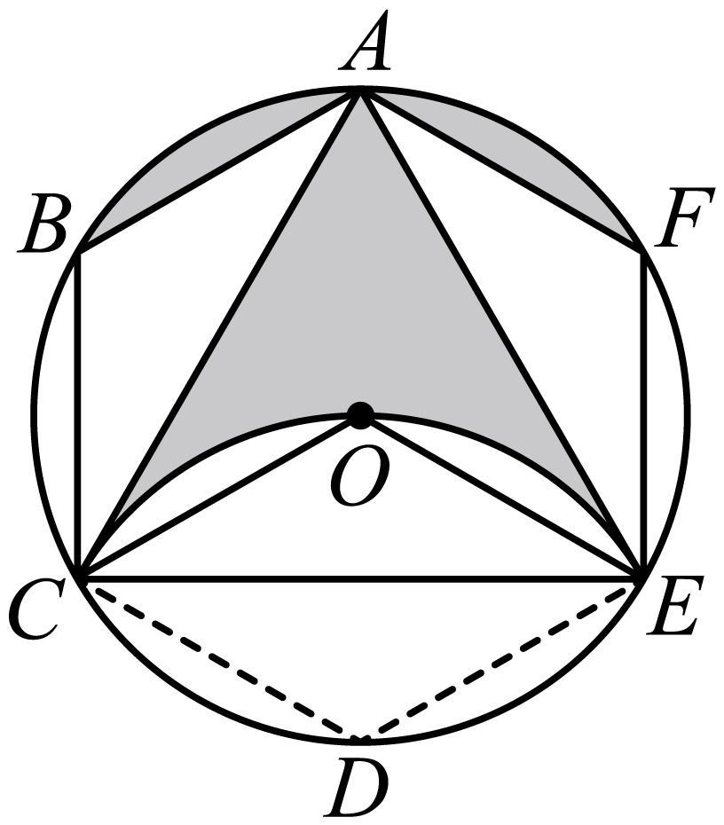

A． $32\sqrt{3}cm^{2}$ 	
B． $8\sqrt{3}cm^{2}$ 	
C． $8\pi cm^{2}$ 	
D． $(\frac{4\sqrt{3}}{3}+3\pi )cm^{2}$

【答案】A

【分析】根据正六边形的性质，折叠的性质以及圆的对称性可得出 $OM=MD=\frac{1}{2}OC=4cm$ ，再根据直角三角形的边角关系求出 $CM$ ，进而求出 $CE$ ，由图形中各个部分面积之间的关系可得 $S_{阴影部分}=2S_{\bigtriangleup COE}$ ，根据三角形的面积计算公式进行计算即可．

【详解】解：如图，连接 $OD$ ，交 $CE$ 于点 $M$ ，则 $OD\perp CE$ ，

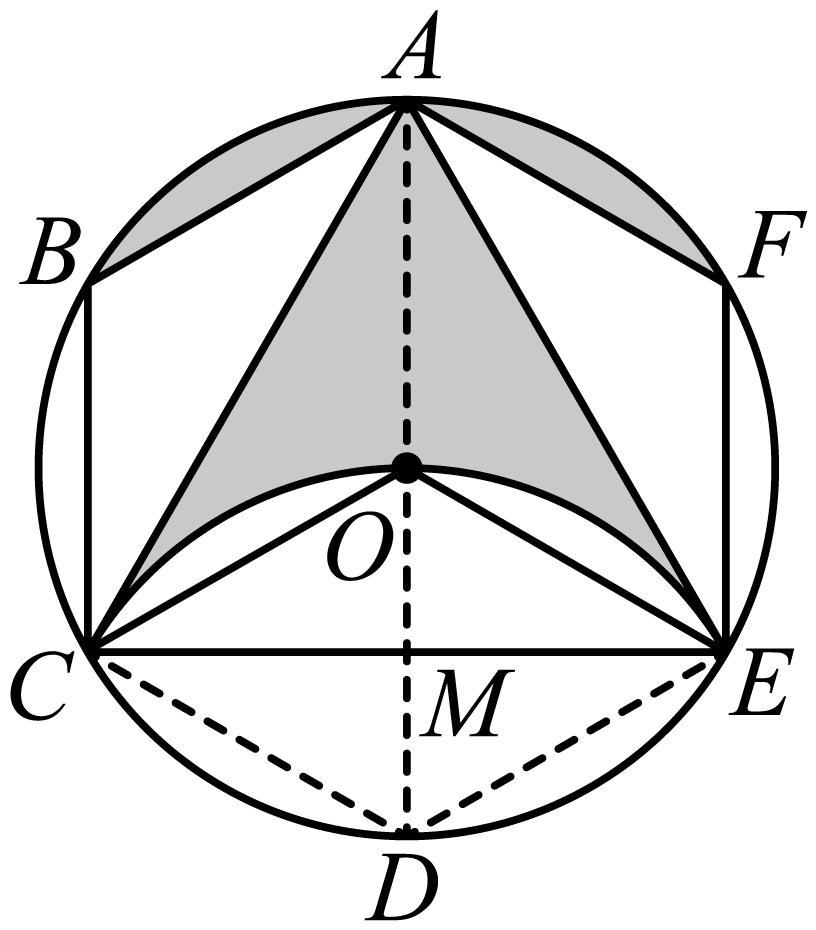
由折叠可知 $OM=MD=\frac{1}{2}OD=\frac{1}{2}OC=4(cm)$ ，
$\angle COM=\frac{360\circ }{6}=60\circ$ ，
在 $Rt\bigtriangleup COM$ 中，
$CM=\sqrt{3}OM=4\sqrt{3}(cm)$ ，
$\therefore CE=2CM=8\sqrt{3}(cm)$ ，
由题意可知， $\bigtriangleup ACE$ 是等边三角形，阴影部分面积等于 $S_{四边形ACOE}$ ，

连接 $OA$ ，点 $O$ 为 $\bigtriangleup ACE$ 的内心，到三边的距离相等，
$S_{\bigtriangleup OAC}=S_{\bigtriangleup OAE}=S_{\bigtriangleup OEC}$ ，
$\therefore S_{阴影部分}=2S_{\bigtriangleup COE}$
$=2\times \frac{1}{2}\times 8\sqrt{3}\times 4$
$=32\sqrt{3}(cm^{2})$ ，
故选： $A$ ．

【点睛】本题考查正多边形和圆，翻折的性质以及直角三角形的边角关系，掌握正六边形和圆的性质以及直角三角形的边角关系是正确解答的前提．

28．（2023·浙江·模拟预测）如图， $\bigtriangleup ABC$ 是直角边长为2的等腰直角三角形，直角边 $AB$ 是半圆 $O_{1}$ 的直径，半圆 $O_{2}$ 过 $C$ 点且与半圆 $O_{1}$ 相切，则图中阴影部分的面积(　　)

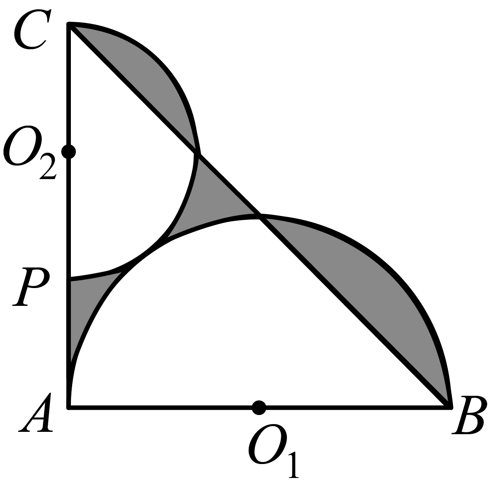

A． $\frac{7-\pi }{9}$ 	
B． $\frac{5-\pi }{9}$ 	
C． $\frac{7}{9}$ 	
D． $\frac{5}{9}$

【答案】D

【分析】利用等弦所对的弧相等，先把阴影部分变化成一个直角梯形，然后再利用等腰直角三角形求小圆的半径，从而求阴影部分的面积．

【详解】解：连接 $O_{1}O_{2}$ ，设 $O_{2}$ 的半径为 $x$ ．

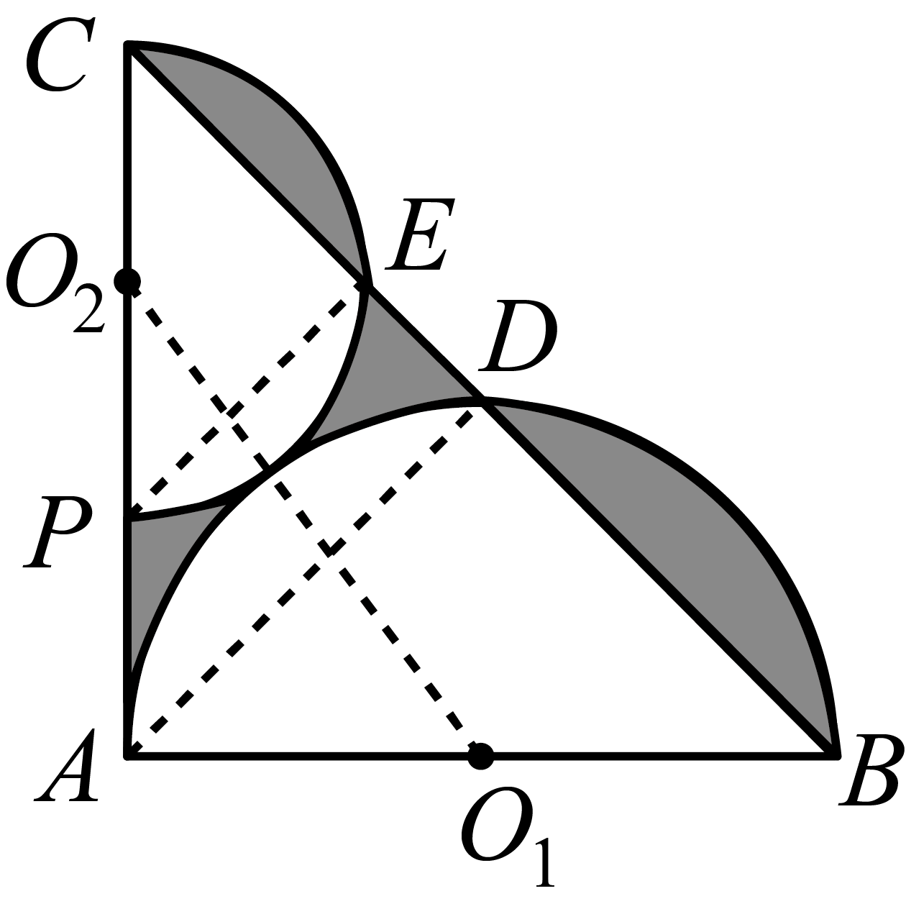
∵ $O_{1}O_{2}^{2}-AO_{1}^{2}=AO_{2}^{2}$ ，
∴ $\left(2+x\right)^{2}-2^{2}=\left(2-x\right)^{2}$ ，
解得： $x=\frac{2}{3}$
设 $\odot O_{1}$ 交 $BC$ 于 $D$ ， $\odot O_{2}$ 交 $BC$ 于 $E$ ．
$\therefore CE=PE=\sqrt{2}x=\frac{2\sqrt{2}}{3}，BC=\sqrt{2}AB，CD=\frac{\sqrt{2}}{2}AB=\sqrt{2}$
$\therefore S_{阴影}=S_{\bigtriangleup ADC}-S_{\bigtriangleup CEP}=\frac{1}{2}CD\cdot AD-\frac{1}{2}CE\cdot PE=\frac{1}{2}\times \sqrt{2}\cdot \sqrt{2}-\frac{1}{2}\times \frac{2\sqrt{2}}{3}\cdot \frac{2\sqrt{2}}{3}=\frac{5}{9}$
故选：D．

【点睛】本题考查了勾股定理，以及三角形的面积的计算，正确理解阴影部分的面积等于梯形 $PEDA$ 的面积是关键．

29．（2018·山西·统考中考真题）如图，正方形*ABCD*内接于⊙*O*，⊙*O*的半径为2，以点*A*为圆心，以*AC*长为半径画弧交*AB*的延长线于点*E*，交*AD*的延长线于点*F*，则图中阴影部分的面积为（　　）

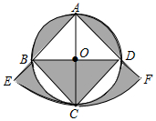

A．4π﹣4	
B．4π﹣8	
C．8π﹣4	
D．8π﹣8

【答案】A

【分析】利用对称性可知：阴影部分的面积=扇形*AEF*的面积-△*ABD*的面积.

【详解】利用对称性可知：阴影部分的面积=扇形*AEF*的面积-△*ABD*的面积= $\frac{90\times \pi \times 4^{2}}{360}-\frac{1}{2}$ ×4×2=4π-4，
故选：A．

【点睛】本题考查扇形的面积公式、正方形的性质等知识，解题的关键是学会用转化的思想思考问题．

## 类似四 对称法

30．（2017上·山东东营·九年级校联考期末）如图，以 $AB$ 为直径，点 $O$ 为圆心的半圆经过点 $C$ ，若 $AC=BC=$  $\sqrt{2}$ ，则图中阴影部分的面积是

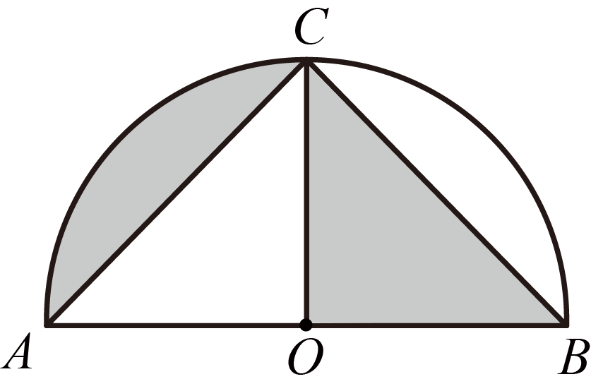

【答案】 $\frac{\pi }{4}$

【分析】本题考查了扇形面积的计算．求阴影面积常用的方法： $①$ 直接用公式法； $②$ 和差法； $③$ 割补法．求阴影面积的主要思路是将不规则图形面积转化为规则图形的面积．先利用圆周角定理的推论得到 $\angle ACB=90\circ$ ，则可判断 $\bigtriangleup ACB$ 为等腰直角三角形，接着判断 $\bigtriangleup AOC$ 和 $\bigtriangleup BOC$ 都是等腰直角三角形，于是得到 $S_{\bigtriangleup AOC}=S_{\bigtriangleup BOC}$ ，然后根据扇形的面积公式计算图中阴影部分的面积．

【详解】解： $\because AB$ 为直径，
$\therefore \angle ACB=90\circ$ ，
$\because AC=BC=\sqrt{2}$ ，
$\therefore \bigtriangleup ACB$ 为等腰直角三角形，
$\therefore OC\perp AB$ ，
$\therefore \bigtriangleup AOC$ 和 $\bigtriangleup BOC$ 都是等腰直角三角形，
$\therefore S_{\bigtriangleup AOC}=S_{\bigtriangleup BOC}$ ， $OA=\frac{\sqrt{2}}{2}AC=1$ ，
$\therefore S_{阴影部分}=S_{扇形AOC}=\frac{90\cdot \pi \cdot 1^{2}}{360}=\frac{\pi }{4}$ ．
故答案为 $\frac{\pi }{4}$ ．

31．（2023·广西北海·统考三模）如图，在平行四边形 $ABCD$ 中，对角线 $AC$ ， $BD$ 相交于点*<text style="italic">O*</text>， $EF$ 过点*<text style="italic">O*</text>，交 $AD$ 于点*F*，交 $BC$ 于点*E*．若 $AB=3$ ， $AC=4$ ， $AD=5$ ，则图中阴影部分的面积是（　　）

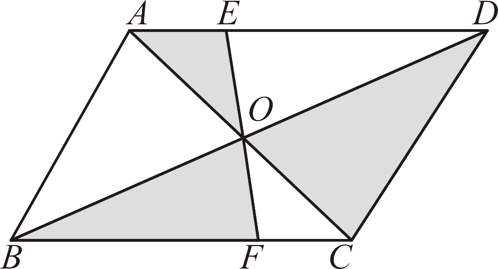

A．1.5	
B．3	
C．6	
D．4

【答案】C

【分析】本题考查了平行四边形的性质，三角形全等的判定和性质，勾股定理的逆定理，利用三角形全等，把阴影面积转化为 $\bigtriangleup ABC$ 的面积计算即可．

【详解】解：∵四边形 $ABCD$ 是平行四边形，
∴ $BC=AD$ ， $AD\parallel BC$ ， $OA=OC$ ， $\angle EOA=\angle FOC$ ， $\angle EAO=\angle FCO$ ，
在 $\bigtriangleup AOE$ 和 $\bigtriangleup OFC$ 中，
∵ $\left\{\begin{array}{c}\angle EOA=\angle FOC\\\angle EAO=\angle FCO\\AO=CO\end{array}\right$ ，
∴ $\bigtriangleup AOE\allequal \bigtriangleup OFC\left(AAS\right)$ ，
∴ $S_{\bigtriangleup AOE}=S_{\bigtriangleup OFC}$ ，
在 $\bigtriangleup AOB$ 和 $\bigtriangleup DOC$ 中，
∵ $\left\{\begin{array}{c}OA=OC\\\angle AOB=\angle COD\\OB=OD\end{array}\right$ ，
∴ $\bigtriangleup AOB\allequal \bigtriangleup COD\left(SAS\right)$ ，
∴ $S_{\bigtriangleup AOB}=S_{\bigtriangleup DOC}$ ，
∵ $AB=3$ ， $AC=4$ ， $AD=5$ ， $AB^{2}+AC^{2}=BC^{2}$
∴ $\bigtriangleup ABC$ 是直角三角形，且 $\angle BAC=90\circ$ ，
∴ $S_{阴影}=S_{\bigtriangleup ABC}=\frac{1}{2}AB\cdot AC=\frac{1}{2}\times 3\times 4=6$ ，
故选：C．

32．（2023·河北保定·统考一模）如图，在正方形 $ABCD$ 中， $AC$ 和 $BD$ 交于点 $O$ ，过点 $O$ 的直线 $EF$ 交 $AB$ 于点 $E(E$ 不与 $A$ ， $B$ 重合），交 $CD$ 于点 $F$ ．以点 $O$ 为圆心， $OC$ 为半径的圆交直线 $EF$ 于点 $M$ ， $N$ ．若 $AB=1$ ，则图中阴影部分的面积为（　　）

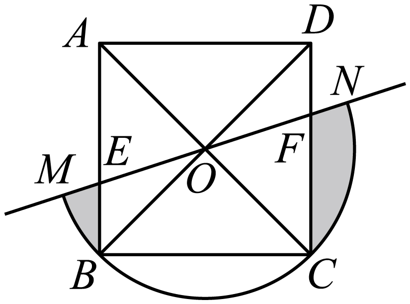

A． $\frac{\pi }{8}-\frac{1}{8}$ 	
B． $\frac{\pi }{8}-\frac{1}{4}$ 	
C． $\frac{\pi }{2}-\frac{1}{8}$ 	
D． $\frac{\pi }{2}-\frac{1}{4}$

【答案】B

【分析】图中阴影部分的面积等于扇形 $DOC$ 的面积减去 $\bigtriangleup DOC$ 的面积．

【详解】解：以 $OD$ 为半径作弧 $DN$ ，

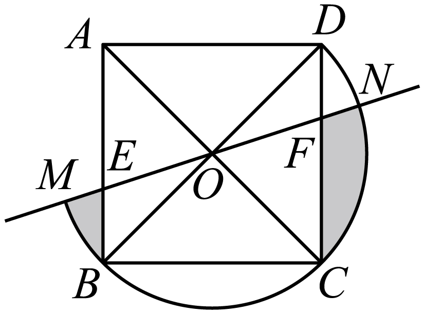
$\because$ 四边形 $ABCD$ 是正方形，
$\therefore OB=OD=OC$ ， $\angle DOC=90\circ$ ，
$\because \angle EOB=\angle FOD$ ，
$\therefore S_{扇形BOM}=S_{扇形DON}$ ，
$\therefore S_{阴影}=S_{扇形DOC}-S_{\Delta DOC}=\frac{90\pi \times (\frac{\sqrt{2}}{2})^{2}}{360}-\frac{1}{4}\times 1\times 1=\frac{\pi }{8}-\frac{1}{4}$ ，
故选：B．

【点睛】本题考查了正方形的性质，扇形的面积，解题的关键是求出阴影部分的面积等于扇形 $DOC$ 的面积减去 $\bigtriangleup DOC$ 的面积．

33．（2022·山东菏泽·统考二模）如图，等边三角形 $ABC$ 内接于 $\odot O$ ，半径 $OA=3$ ，则图中阴影部分的面积是_______ ，（结果保留 $\pi$ ）

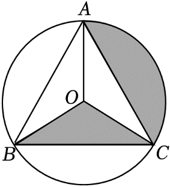

【答案】 $3\pi$

【分析】本题主要考查三角形的外接圆与外心，扇形面积的计算，等边三角形的性质，掌握扇形面积公式是解题的关键．根据等边三角形的性质可得 $S_{\Delta COB}=S_{\Delta AOC}$ ， $\angle AOC=120\circ$ ，将阴影部分的面积转化为扇形 $AOC$ 的面积，利用扇形面积的公式计算可求解．

【详解】解： $\because \bigtriangleup ABC$ 为等边三角形，
$\therefore S_{\Delta COB}=S_{\Delta AOC}$ ， $\angle AOC=120\circ$ ，
$\because \odot O$ 的半径为3，
$\therefore S_{阴影}=S_{扇形AOC}=\frac{120\cdot \pi \times 3^{2}}{360}=3\pi$ ，
故答案为： $3\pi$ ．

34．（2023·江苏南通·统考二模）如图，在 $\odot O$ 中，弦 $AB$ 垂直于半径 $OC$ ，垂足为 $D$ ，点 $E$ 在 $OC$ 的延长线上，且 $\angle EAC=\angle CAB$ ．

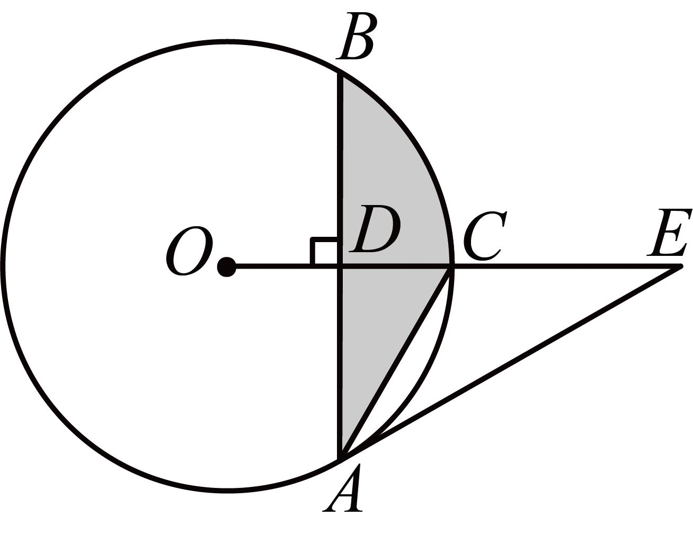  
(1)求证：直线 $AE$ 是 $\odot O$ 的切线；  
(2)若 $OE=6,sin\angle E=\frac{1}{2}$ ，求图中阴影部分的面积．

【答案】(1)见解析  
(2) $S_{阴影}=\frac{3\pi }{2}$

【分析】（1）连接 $OA$ ．根据半径相等可得 $\angle OAC=\angle OCA$ ，根据 $\angle OCA+\angle CAB=90\circ$ ， $\angle EAC=\angle CAB$ ，等量代换可得 $\angle OAC+\angle EAC=90\circ$ ，即可得证；  
（2）连接 $OB$ ，根据特殊角的三角函数值得出 $\angle E=30\circ ,OA=\frac{1}{2}OE=3$ ，进而可得 $\bigtriangleup OAC$ 是等边三角形．再结合垂径定理，根据 $S_{阴影}=S_{扇形BOC}$ ，即可求解．

【详解】（1）解：如图，连接 $OA$ ．
$\because OA=OC$ ．
$\therefore \angle OAC=\angle OCA$
$\because OC\perp AB$ ，
$\therefore \angle ADC=90\circ$
$\therefore \angle OCA+\angle CAB=90\circ$ ．
又 $\because \angle EAC=\angle CAB,\angle OAC=\angle OCA$ ．
$\therefore \angle OAC+\angle EAC=90\circ$ ，
$\therefore \angle OAE=90\circ$ ．
$\therefore AE\perp OA$
又 $\because OA$ 是 $\odot O$ 的半径，
$\therefore$ 直线 $AE$ 是 $\odot O$ 的切线．  
（2）如图，连接 $OB$ ．

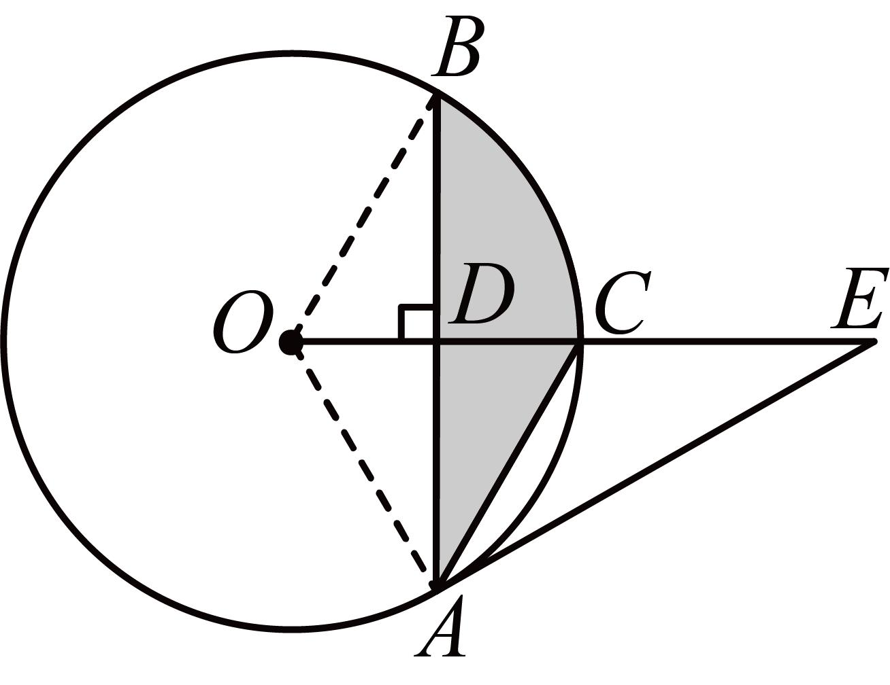
$\because$ 在 $Rt\bigtriangleup OAE$ 中， $sin\angle E=\frac{OA}{OE}=\frac{1}{2}$ ， $OE=6$ ．
$\therefore \angle E=30\circ ,OA=\frac{1}{2}OE=3$
$\therefore \angle AOC=60\circ$ ．
又 $\because OA=OC$
$\therefore \bigtriangleup OAC$ 是等边三角形．
又 $\because$ 弦 $AB$ 垂直于半径 $OC$ ．
$\therefore OD=DC,AD=BD,⌢=⌢$
$\therefore S_{\bigtriangleup OBD}=S_{\bigtriangleup CAD},\angle BOC=\angle AOC=60\circ$ ．
$\therefore S_{阴影}=S_{扇形BOC}=\frac{60\pi \times 3^{2}}{360}=\frac{3\pi }{2}$ ．

【点睛】本题考查了切线的判定，垂径定理，求扇形面积，解直角三角形，等边三角形的判定和性质等知识，熟练掌握切线的性质与判定，垂径定理是解题的关键．

## 题型04  容斥原理

35．（2022上·重庆·九年级重庆巴蜀中学校考期末）如图，在 $Rt\bigtriangleup ABC$ 中， $\angle C=90\circ$ ，分别以 $AB$ 、 $BC$ 、 $AC$ 边为直径作半圆，图中阴影部分在数学史上称为“希波克拉底月牙”．当 $AB=8$ ， $BC=4$ 时，则阴影部分的面积为__________．

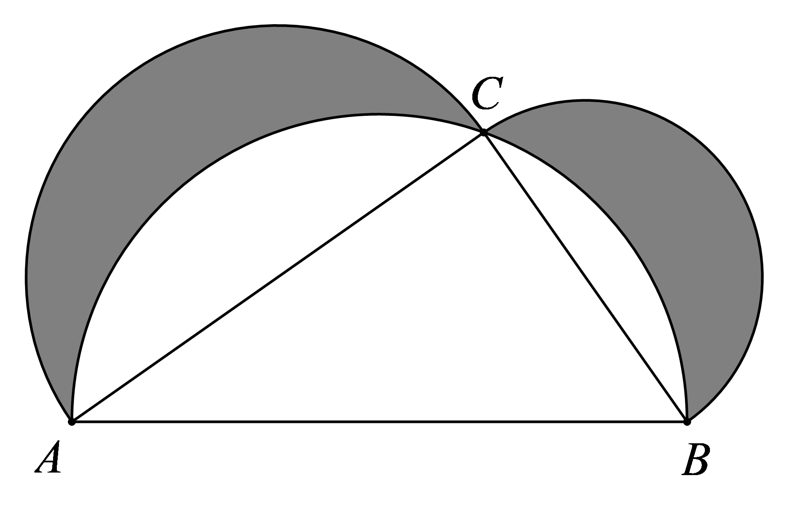

【答案】 $8\sqrt{3}$

【分析】根据阴影部分面积等于以 $AC,BC$ 为直径的2 个半圆的面积加上 $S_{\bigtriangleup ABC}$ 减去 $AB$ 为半径的半圆面积即 $S_{\bigtriangleup ABC}$ ．

【详解】解： $\because$ 在 $Rt\bigtriangleup ABC$ 中， $\angle C=90\circ$ ，
$\therefore AC^{2}+BC^{2}=AB^{2}$
$\because$  $AB=8$ ， $BC=4$
$\therefore AC=\sqrt{8^{2}-4^{2}}=4\sqrt{3}$
$\therefore S_{阴影部分}=\frac{1}{2}AC\cdot BC+\frac{1}{2}\pi \times \left(\frac{1}{2}AC\right)^{2}+\frac{1}{2}\pi \times \left(\frac{1}{2}BC\right)^{2}-\frac{1}{2}\pi \times \left(\frac{1}{2}AB\right)^{2}$
$=\frac{1}{2}AC\cdot BC+\frac{1}{2}\pi \times \frac{1}{4}\left(AC^{2}+BC^{2}-AB^{2}\right)$
$=\frac{1}{2}AC\cdot BC$
$=\frac{1}{2}\times 4\sqrt{3}\times 4$
$=8\sqrt{3}$ ．
故答案为： $8\sqrt{3}$

【点睛】本题考查了勾股定理，求扇形面积，直径所对的圆周角是直角，掌握圆周角定理是解题的关键．

36．（2021·广东江门·校考三模）如图， $AB$ 是半圆 $O$ 的直径，以 $O$ 为圆心， $OC$ 长为半径的半圆交 $AB$ 于 $C$ ， $D$ 两点，弦 $AF$ 切小半圆于点 $E$ ．已知 $AB=4$ ， $\angle BAF=30\circ$ ，则图中阴影部分的面积是（　　）

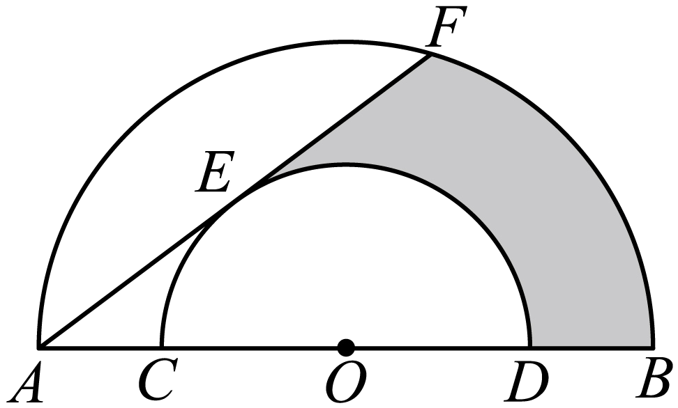

A． $\frac{\sqrt{3}}{2}+\frac{\pi }{3}$ 	
B． $\frac{\sqrt{3}}{3}+\frac{\pi }{2}$ 	
C． $\frac{\sqrt{3}}{2}+\frac{\pi }{2}$ 	
D． $\frac{\sqrt{3}}{3}+\frac{\pi }{3}$

【答案】A

【分析】连接 $OE$ 、 $OF$ ，如图，根据切线的性质得到 $OE\perp AF$ ，再利用勾股定理计算出 $EF=\sqrt{3}$ ，计算出 $\angle FOE=60\circ$ ， $\angle BOF=60\circ$ ，则 $\angle DOE=120\circ$ ，然后根据扇形的面积公式，利用图中阴影部分的面积 $=S_{扇形BOF}+S_{\bigtriangleup OEF}-S_{扇形DOE}$ 进行计算．

【详解】连接 $OE$ 、 $OF$ ，如图，

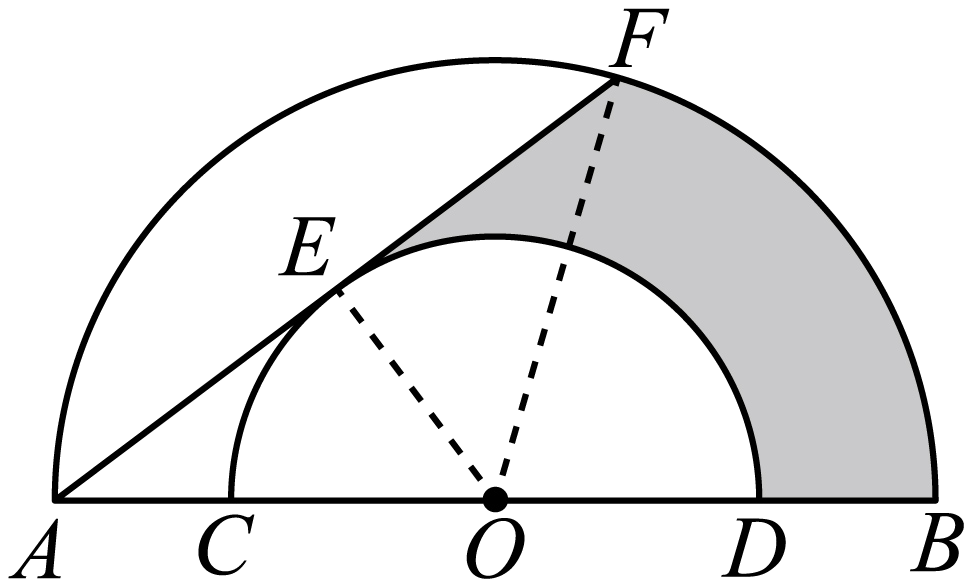
$\because$ 弦 $AF$ 切小半圆于点 $E$ ，
$\therefore OE\perp AF$ ，
$\because AB=4$ ， $\angle BAF=30\circ$ ，
$\therefore OA=OB=OF=2$ ， $OE=1$ ，
在 $Rt\bigtriangleup OEF$ 中， $EF=\sqrt{2^{2}-1^{2}}=\sqrt{3}$ ，
$\because \angle BAF=30\circ$ ，
$\therefore \angle OFE=30\circ$ ，
$\therefore \angle FOE=60\circ$ ， $\angle OAF=30\circ$ ，
$\therefore \angle BOF=60\circ$ ，
$\therefore \angle DOE=120\circ$ ，

图中阴影部分的面积 $=S_{扇形BOF}+S_{\bigtriangleup OEF}-S_{扇形DOE}$
$=\frac{60\times \pi \times 2^{2}}{360}+\frac{1}{2}\times 1\times \sqrt{3}-\frac{120\times \pi \times 1^{2}}{360}$
$=\frac{\pi }{3}+\frac{\sqrt{3}}{2}$ ．
故选：A．

【点睛】本题考查了切线的性质，扇形面积公式，掌握圆的切线垂直于经过切点的半径是解题的关键．

37．（2023·广东肇庆·统考三模）如图，在 $Rt\bigtriangleup ABC$ 中， $\angle ACB=90\circ$ ， $\angle B=30\circ$ ， $AC=2$ ，以点<em>&lt;text style="italic"&gt;C</em>&lt;/text&gt;为圆心， $CA$ 长为半径画弧，交 $B$ <em>&lt;text style="italic"&gt;C</em>&lt;/text&gt;于点<em>D</em>，交 $AB$ 于点<em>E</em>，则图中阴影部分的面积是________．(结果保留<em>π</em>)

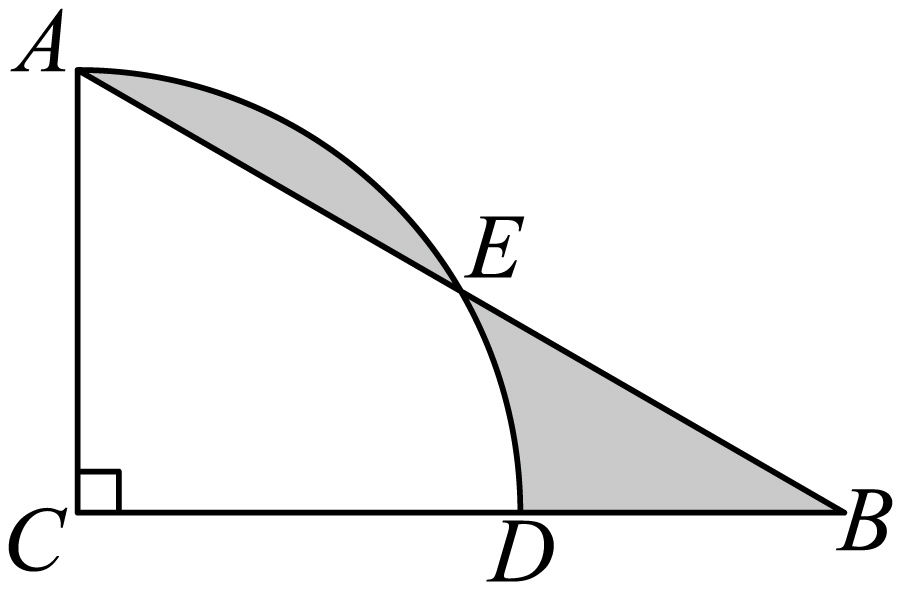

【答案】 $\frac{\pi }{3}$ / $\frac{1}{3}\pi$

【分析】本题考查不规则图形的面积计算，扇形的面积公式，等边三角形的判定与性质等知识，证明 $\bigtriangleup ACE$ 是等边三角形，从而得到 $AB=2AC=4，AC=AE$ ，继而得到 $S_{阴影}=S_{扇形ACE}-S_{扇形CDE}$ 从而得解．掌握扇形面积公式是解题的关键．

【详解】如图，连接 $CD$ ．

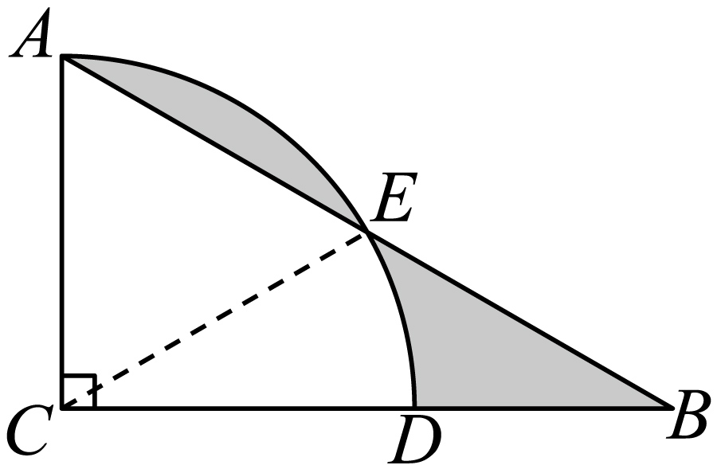
∵ $\angle ACB=90\circ$ ， $\angle B=30\circ$ ， $AC=2$ ，
∴ $\angle BAC=60\circ ，AB=2AC=4$ ， $BC=\sqrt{AB^{2}-AC^{2}}=2\sqrt{3}$ ，
又∵ $CA=CE$ ，
∴ $\bigtriangleup ACE$ 是等边三角形
∴ $\angle ACE=60\circ$ ， $\angle ECD=30\circ$ ，
∵ $AB=4，AC=AE$ ，
∴ $AE=BE=2$ ，
∴ $S_{阴影}=S_{\bigtriangleup BCE}-S_{扇形CDE}+S_{扇形ACE}-S_{\bigtriangleup ACE}=\frac{1}{2}S_{\bigtriangleup ABC}-S_{扇形CDE}+S_{扇形ACE}-\frac{1}{2}S_{\bigtriangleup ABC}=S_{扇形ACE}-S_{扇形CDE}$
∴ $S_{阴影}=S_{扇形ACE}-S_{扇形CDE}$  $=\frac{60\circ \pi \times 2^{2}}{360\circ }-\frac{30\circ \pi \times 2^{2}}{360\circ }$ = $\frac{\pi }{3}$ ．
故答案为： $\frac{\pi }{3}$ ．

38．（2022·河南·统考中考真题）如图，将扇形<em>A&lt;text style="italic"&gt;&lt;text style="italic"&gt;&lt;text style="italic"&gt;O</em>&lt;/text&gt;B&lt;/text&gt;&lt;/text&gt;沿<em>OB</em>方向平移，使点O移到OB的中点 $O^{'}$ 处，得到扇形 $A^{'}O^{'}B^{'}$ ．若∠<em>&lt;text style="italic"&gt;O</em>&lt;/text&gt;＝90°，<em>OA</em>＝2，则阴影部分的面积为______．

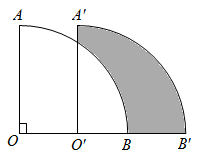

【答案】 $\frac{\pi }{3}+\frac{\sqrt{3}}{2}$

【分析】设 $A^{'}O$ 与扇形 $AOB$ 交于点 $C$ ，连接 $OC$ ，解 $Rt\bigtriangleup OCO^{'}$ ，求得 $O^{'}C=\sqrt{3},\angle COB=60\circ$ ，根据阴影部分的面积为 $S_{扇形A^{'}O^{'}B^{'}}-\left(S_{扇形OCB}-S_{\bigtriangleup OCO^{'}}\right)$ ，即可求解．

【详解】如图，设 $A^{'}O$ 与扇形 $AOB$ 交于点 $C$ ，连接 $OC$ ，如图

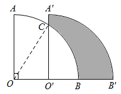
$\because O^{'}$ 是*OB*的中点
$\therefore OO^{'}=\frac{1}{2}OB=\frac{1}{2}OA=1$ , *OA*＝2，
$\because$  $\angle AOB$ ＝90°，将扇形*A<text style="italic">OB*</text>沿OB方向平移，
$\therefore \angle A^{'}O^{'}O=90\circ$
$\therefore cos\angle COB=\frac{OO^{'}}{OC}=\frac{1}{2}$
$\therefore \angle COB=60\circ$
$\therefore O^{'}C=OCsin60\circ =\sqrt{3}$
$\therefore$ 阴影部分的面积为 $S_{扇形A^{'}O^{'}B^{'}}-\left(S_{扇形OCB}-S_{\bigtriangleup OCO^{'}}\right)$
$=S_{扇形AOB^{'}}-S_{扇形OCB}+S_{\bigtriangleup OCO^{'}}$
$=\frac{90}{360}\pi \times 2^{2}-\frac{60}{360}\pi \times 2^{2}+\frac{1}{2}\times 1\times \sqrt{3}$
$=\frac{\pi }{3}+\frac{\sqrt{3}}{2}$
故答案为： $\frac{\pi }{3}+\frac{\sqrt{3}}{2}$

【点睛】本题考查了解直角三角形，求扇形面积，平移的性质，求得 $\angle COB=60\circ$ 是解题的关键．

39．（2023·河南信阳·校考三模）如图，在扇形<em>&lt;text style="italic"&gt;&lt;text style="italic"&gt;OA</em>B&lt;/text&gt;&lt;/text&gt;中， $\angle AOB=150\circ$ ，将扇形<em>&lt;text style="italic"&gt;&lt;text style="italic"&gt;OA</em>B&lt;/text&gt;&lt;/text&gt;绕点A顺时针旋转得到扇形 $O^{'}AB^{'}$ ，点<em>O</em>的对应点 $O^{'}$ 恰好落在 $⌢$ 上，若 $OA=2$ ，则图中阴影部分的面积为________．

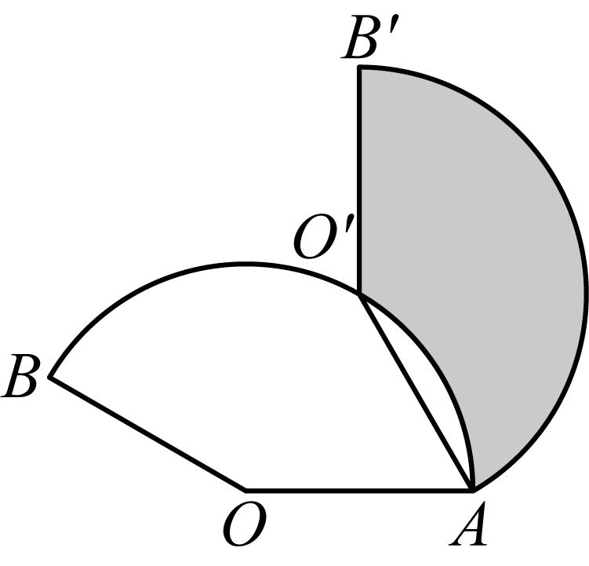

【答案】 $\pi +\sqrt{3}$ / $\sqrt{3}+\pi$

【分析】 $S_{阴影部分}=S_{扇形AO^{'}B}+S_{\bigtriangleup AOO^{'}}-S_{扇形AOO^{'}}$ ，据此即可求解．

【详解】解：连接 $OO^{'}$ ，如图：

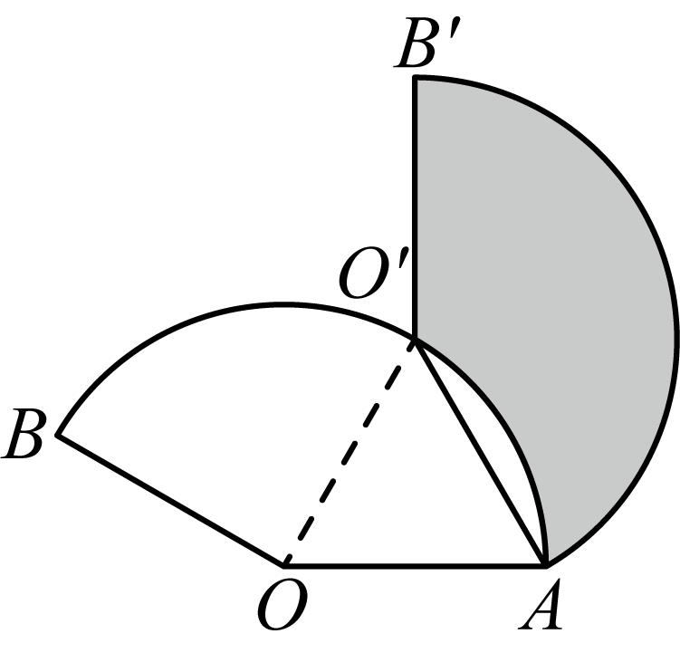
由旋转的性质可得： $OA=O^{'}A$
∵ $OA=OO^{'}$
∴ $\bigtriangleup AOO^{'}$ 是等边三角形

过点 $O^{'}$ 作 $O^{'}C\perp OA$

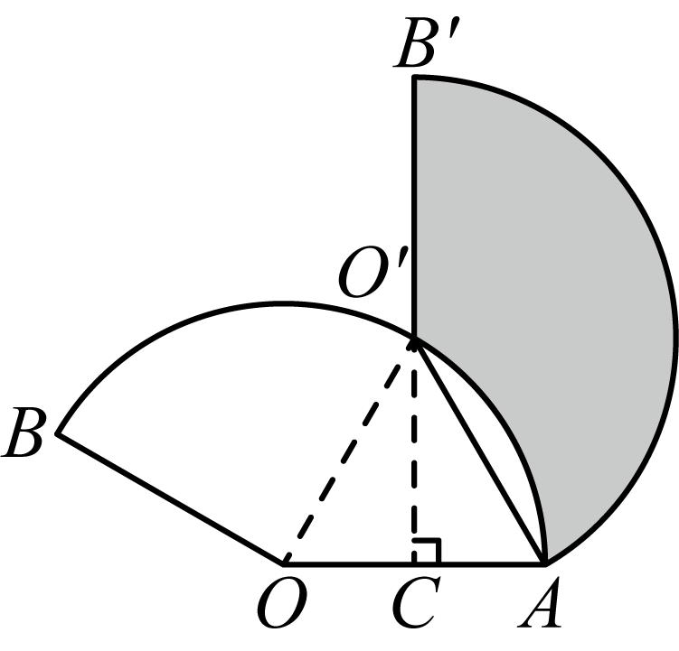
∵ $OO^{'}=2,\angle O^{'}OA=60\circ$
∴ $O^{'}C=OO^{'}\times sin\angle 60\circ =\sqrt{3}$
$S_{阴影部分}=S_{扇形AO^{'}B}+S_{\bigtriangleup AOO^{'}}-S_{扇形AOO^{'}}=\frac{150\circ }{360\circ }\times \pi \times 2^{2}+\frac{1}{2}\times 2\times \sqrt{3}-\frac{60\circ }{360\circ }\times \pi \times 2^{2}$
化简得： $S_{阴影部分}=\pi +\sqrt{3}$
故答案为： $\pi +\sqrt{3}$

【点睛】本题考查扇形面积及不规则图形面积的计算．抓住 $S_{阴影部分}=S_{扇形AO^{'}B}+S_{\bigtriangleup AOO^{'}}-S_{扇形AOO^{'}}$ 是解题关键．

40．（2023·山西忻州·统考模拟预测）如图，将直径为4的半圆形分别沿 $CD$ ， $EF$ 折叠使得直径两端点 $A$ ， $B$ 的对应点都与圆心 $O$ 重合，则图中阴影部分的面积为（    ）

A． $2\sqrt{3}-\frac{2}{3}\pi$ 	
B． $\frac{2}{3}\pi -2\sqrt{3}$ 	
C． $2\sqrt{3}-\frac{1}{3}\pi$ 	
D． $\frac{2}{3}\pi -\sqrt{3}$

【答案】A

【分析】连接 $AC,OC,BE,OE$ ，可推出 $\bigtriangleup ACO,\bigtriangleup BEO,\bigtriangleup COE$ 是边长为2的等边三角形，进一步可得 $S_{阴影部分}=2S_{\bigtriangleup ACO}-S_{扇形AOC}$ ，即可求解．

【详解】解：连接 $AC,OC,BE,OE$ ，如图所示：

由折叠可知： $AC=OC,BE=OE，CD\perp AB,EF\perp AB$
∵ $OC=OE=OA=OB=\frac{1}{2}AB=2$
∴ $\bigtriangleup ACO,\bigtriangleup BEO$ 是边长为2的等边三角形
∴ $\angle AOC=\angle BOE=60\circ$
∴ $\angle COE=60\circ$
∴ $\bigtriangleup COE$ 也是边长为2的等边三角形
$S_{阴影部分}=S_{扇形COE}-2\left(S_{扇形AOC}-S_{\bigtriangleup ACO}\right)=S_{扇形COE}-2S_{扇形AOC}+2S_{\bigtriangleup ACO}$
∵ $S_{扇形COE}=S_{扇形AOC}$
∴ $S_{阴影部分}=2S_{\bigtriangleup ACO}-S_{扇形AOC}$
∵ $OD=\frac{1}{2}AO=1,\angle COD=60\circ$
∴ $CD=OD\times tan60\circ =\sqrt{3}$
∴ $S_{\bigtriangleup ACO}=\frac{1}{2}\times 2\times \sqrt{3}=\sqrt{3}$
∵ $S_{扇形AOC}=\frac{60\circ }{360\circ }\times \pi \times 2^{2}=\frac{3}{3}\pi$
∴ $S_{阴影部分}=2S_{\bigtriangleup ACO}-S_{扇形AOC}=2\sqrt{3}-\frac{2}{3}\pi$
故选：A

【点睛】本题考查了圆中不规则图形面积的求解．得出 $S_{阴影部分}=2S_{\bigtriangleup ACO}-S_{扇形AOC}$ 是解题关键．

41．（2023·江苏泰州·校考三模）在 $Rt\bigtriangleup ABC$ 中， $\angle ABC=90\circ$ ，以 $\bigtriangleup ABC$ 的三边为直径在 $BC$ 同侧作半圆，得两个月牙（图中阴影），过点<em>A</em>作 $BC$ 的平行线，分别和以 $AB、BC$ 为直径的半圆交于 $D、E$ 两点，若 $AD=4，AE=5$ ，则阴影部分的面积和为______．

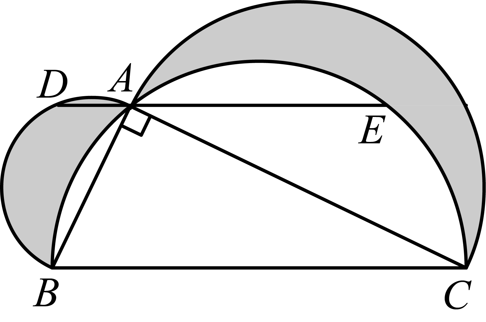

【答案】39

【分析】阴影部分的面积可以看成是以 $AC、AB$ 为直径的两个半圆的面积加上直角三角形 $ABC$ 的面积减去一个以 $BC$ 为直径的半圆的面积．

【详解】解：设 $DE$ 交以 $AC$ 为直径的半圆于*F*，取 $BC$ 的中点*O*，作 $OG\perp DF$ 于 $G$ ，连接 $CF、BD、OA$ ，

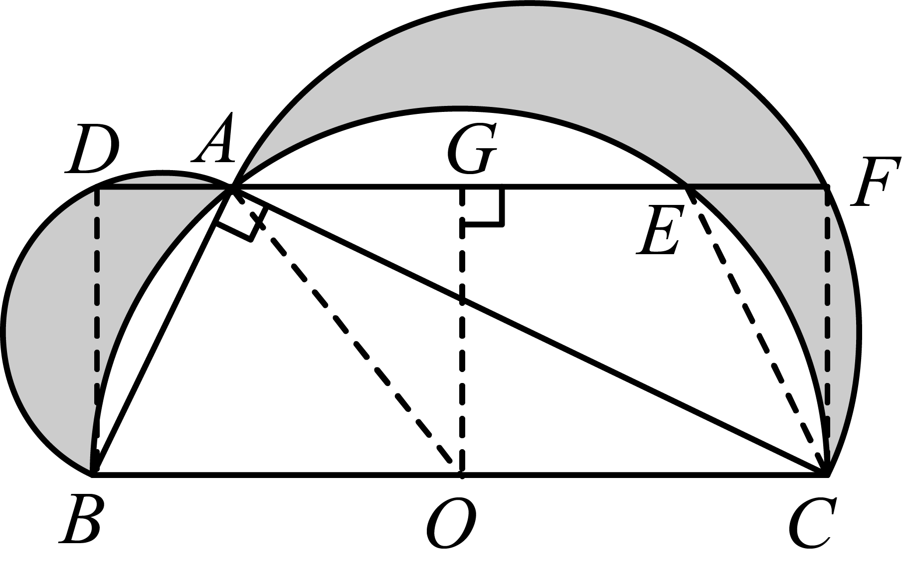
$\because AC$ 是直径，
$\therefore \angle AFC=90\circ$ ，
$\because AB$ 是直径，
$\therefore \angle ADB=90\circ$
$\because DF\parallel BC，OG\perp DF$ ，
$\therefore$ 四边形 $BCFD$ 和四边形 $DBOG$ 是矩形，
$\therefore BC=DF，OB=DG$ ，
$\because AD=4，AE=5$ ，
$\therefore AG=\frac{1}{2}AE=2.5$ ，
$\therefore DG=AD+AG=6.5$ ，
$\therefore OB=OA=DG=6.5，BC=DF=2OB=13$ ，
$\therefore OG=\sqrt{OA^{2}-AG^{2}}=\sqrt{6.5^{2}-2.5^{2}}=6$ ，
$\therefore DB=OG=CF=6$ ，
在 $Rt\bigtriangleup ABD$ 中，
$AB=\sqrt{AD^{2}+BD^{2}}=\sqrt{4^{2}+6^{2}}=2\sqrt{13}$ ，
$AC=\sqrt{BC^{2}-AB^{2}}=\sqrt{13^{2}-\left(2\sqrt{13}\right)^{2}}=3\sqrt{13}$ ，
$S_{阴影}$ =直径为 $AC$ 的半圆的面积+直径为 $AB$ 的半圆的面积+ $S_{\bigtriangleup ABC}-$ 直径为 $BC$ 的半圆的面积

= $\frac{1}{2}\pi \left(\frac{AC}{2}\right)^{2}+\frac{1}{2}\pi \left(\frac{AB}{2}\right)^{2}+\frac{1}{2}AC\times AB-\frac{1}{2}\pi \left(\frac{BC}{2}\right)^{2}$
$=\frac{1}{8}\pi \left(AC\right)^{2}+\frac{1}{8}\pi \left(AB\right)^{2}-\frac{1}{8}\pi \left(BC\right)^{2}+\frac{1}{2}AC\times AB$
$=\frac{1}{8}\pi \left(AC^{2}+AB^{2}-BC^{2}\right)+\frac{1}{2}AC\times BC$
$=\frac{1}{2}AC\times BC$
$=\frac{1}{2}\times 2\sqrt{13}\times 3\sqrt{13}$
$=39$
故答案为39．

【点睛】本题主要考查了扇形面积的计算公式，阴影部分的面积可以看作是几个规则图形的面积的和或差．

42．（2022·山西长治·统考一模）已知：如图，在 $Rt\bigtriangleup ABC$ 中， $\angle ABC=90\circ ，AC=12，BC=6$ ，以 $AB$ 为直径的圆与以 $BC$ 为直径的圆交 $AC$ 于点<em>D</em>，则图中阴影部分的面积为____________．

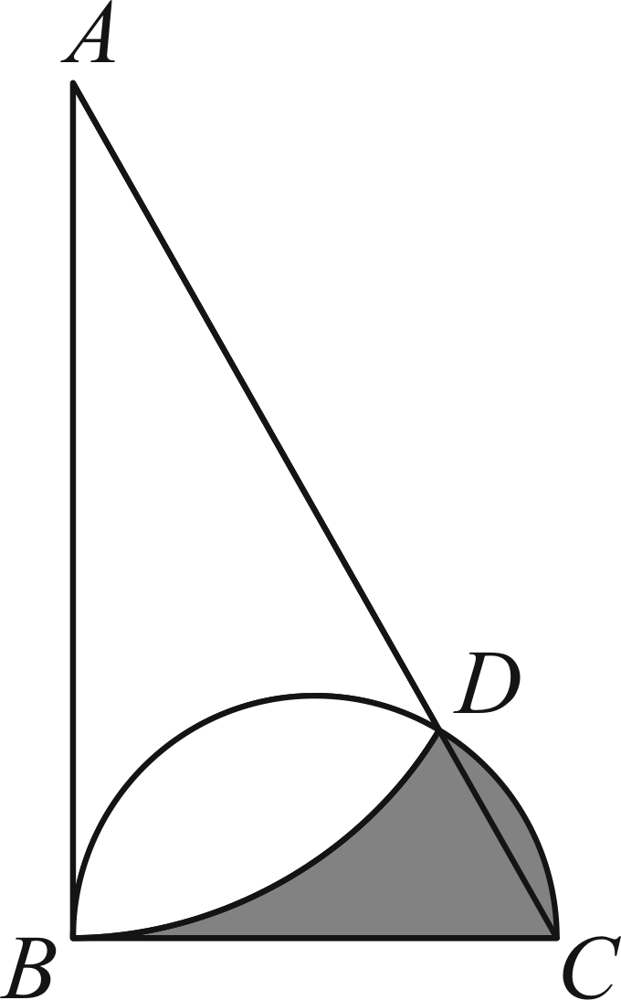

【答案】 $9\sqrt{3}-3\pi$ / $-3\pi +9\sqrt{3}$

【分析】取 $AB,BC$ 的中点*E*，*O*，连接 $DE,DO,DB$ ，如图，根据 $S_{阴影}=S_{\bigtriangleup BCD}-S_{弓形BD}+S_{弓形CD}$ ，想办法分别求出阴影部分涉及的三个图形的面积即可．

【详解】解：取 $AB,BC$ 的中点*E*，*O*，连接 $DE,DO,DB$ ，如图，
在 $Rt\bigtriangleup ABC$ 中，∵ $\angle ABC=90\circ ，AC=12，BC=6$ ，
∴ $sinA=\frac{BC}{AC}=\frac{1}{2}$ ， $AB=\sqrt{12^{2}-6^{2}}=6\sqrt{3}$ ，
∴ $\angle A=30\circ ,\angle C=60\circ$ ，
∵ $AB$ 是直径，
∴ $\angle ADB=\angle CDB=90\circ$ ，
∴ $\angle ABD=60\circ$ ， $AD=AB\cdot cosA=9,BD=\frac{1}{2}AB=3\sqrt{3}$ ，
∴ $CD=12-9=3$ ，
∵*E*为 $AB$ 中点，
∴ $DE=BE=\frac{1}{2}AB$ ， $S_{\bigtriangleup BED}=\frac{1}{2}S_{\bigtriangleup ABD}=\frac{1}{2}\times \frac{1}{2}\times 9\times 3\sqrt{3}=\frac{27\sqrt{3}}{4}$ ，
∴ $\bigtriangleup BDE$ 是等边三角形，
∴ $\angle BED=60\circ$ ，
∴ $S_{弓形BD}=S_{扇形BED}-S_{\bigtriangleup BED}=\frac{1}{6}\pi \times \left(3\sqrt{3}\right)^{2}-\frac{27\sqrt{3}}{4}=\frac{9\pi }{2}-\frac{27\sqrt{3}}{4}$ ，
∵ $OD=OC,\angle C=60\circ$ ，
∴ $\bigtriangleup OCD$ 是等边三角形，
∴ $\angle DOC=60\circ$ ，且 $OC=\frac{1}{2}BC=3$ ，
∴ $S_{扇形DOC}=\frac{1}{6}\pi \times 3^{2}=\frac{3\pi }{2}$ ，
∴ $S_{弓形DC}=S_{扇形ODC}-S_{\bigtriangleup DOC}=\frac{3\pi }{2}-\frac{\sqrt{3}}{4}\times 3^{2}=\frac{3\pi }{2}-\frac{9\sqrt{3}}{4}$ ，
∴ $S_{阴影}=S_{\bigtriangleup BCD}-S_{弓形BD}+S_{弓形CD}$  $=\frac{1}{2}\times 3\times 3\sqrt{3}-\left(\frac{9\pi }{2}-\frac{27}{4}\sqrt{3}\right)+\left(\frac{3\pi }{2}-\frac{9\sqrt{3}}{4}\right)=9\sqrt{3}-3\pi$
故答案为： $9\sqrt{3}-3\pi$ ．

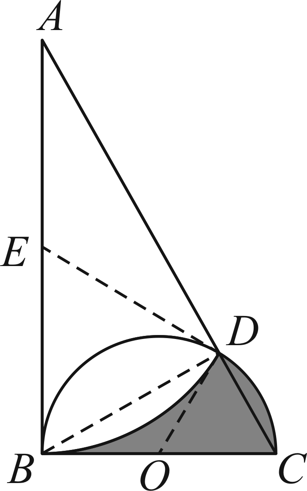

【点睛】本题考查了圆的综合，涉及扇形面积的计算、等边三角形的判定和性质、圆周角定理、解直角三角形、勾股定理等知识，明确求解的思路、熟练掌握相关图形的性质定理是解题的关键．

43．（2023·吉林长春·吉林省第二实验学校校考二模）如图， $Rt\bigtriangleup ABC$ 中， $\angle ACB=90\circ$ ， $\angle BAC=60\circ$ ， $AC=4$ ，以 $A$ 为圆心， $AC$ 长为半径画弧，交 $AB$ 于点 $E$ ，以 $B$ 为圆心， $BC$ 长为半径画弧，交 $AB$ 于点 $D$ ．则图中阴影部分的面积为______（结果保留π）．

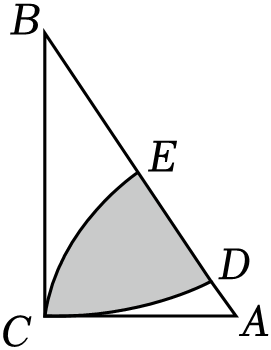

【答案】 $\frac{20}{3}\pi -8\sqrt{3}$

【分析】根据题意和图形可知阴影部分的面积是扇形 $BCD$ 与扇形 $ACE$ 的面积之和与 $Rt\bigtriangleup ABC$ 的面积之差．

【详解】解： $Rt\bigtriangleup ABC$ 中， $\angle ACB=90\circ$ ， $\angle BAC=60\circ$ ， $AC=4$ ，
$\therefore \angle B=30\circ$ ， $BC=\sqrt{3}AC=4\sqrt{3}$ ，
$\therefore$ 阴影部分的面积 $S=S_{扇形BCD}+S_{扇形ACE}-S_{\Delta ACB}=\frac{30\pi \cdot (4\sqrt{3})^{2}}{360}+\frac{60\pi \cdot 4^{2}}{360}-\frac{1}{2}\times 4\times 4\sqrt{3}=\frac{20}{3}\pi -8\sqrt{3}$ ，
故答案为： $\frac{20}{3}\pi -8\sqrt{3}$ ．

【点睛】本题考查扇形面积的计算、含 $30\circ$ 角的直角三角形，解答本题的关键是明确题意，利用数形结合的思想解答．

