重难点突破04 全等三角形与相似三角形

目 录

- [题型01  旋转中的全等模型](#_Toc163646273)
- [类型一  对角互补模型](#_Toc163646274)
- [类型二 对角互补且有一组邻边相等的半角模型](#_Toc163646275)
- [类型三 手拉手旋转模型](#_Toc163646276)
- [类型四  中点旋转模型](#_Toc163646277)
- [类型五  通过旋转构造三角形全等](#_Toc163646278)
- [题型02  构造相似三角形解题](#_Toc163646279)
- [类型一  做平行线构造“A”型相似](#_Toc163646280)
- [类型二  做平行线构造“X”型相似](#_Toc163646281)
- [类型三  作垂线构造直角三角形相似](#_Toc163646282)
- [类型四  作垂线构造“三垂直”型相似](#_Toc163646283)
- [题型03  与相似三角形有关的压轴题](#_Toc163646284)
- [类型一  运用相似三角形的性质与判定求点的坐标](#_Toc163646285)
- [类型二  运用相似三角形的性质与判定求线段的最值](#_Toc163646286)
- [类型三  利用相似三角形的判定和性质求“kAD+BD”型的最值（阿氏圆）](#_Toc163646287)
- [类型四  相似中的“一线三等角”模型](#_Toc163646288)
- [类型五  相似三角形与多边形综合](#_Toc163646289)

## 题型01  旋转中的全等模型

## 类型一  对角互补模型  

1．（20-21八年级上·江苏南京·阶段练习）如图，等腰直角三角形*ABC*中，∠*BAC*= 90°，*AB*=*AC*，点*M*，*N*在边*BC* 上，且∠*MAN*=45°．若*BM*= 1，*CN*=3，求*MN*的长．

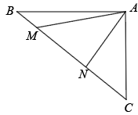

2．（2021·黑龙江齐齐哈尔·中考真题）综合与实践

数学实践活动，是一种非常有效的学习方式．通过活动可以激发我们的学习兴趣，提高动手动脑能力，拓展思推空间，丰富数学体验．让我们一起动手来折一折、转一转、剪一剪，体会活动带给我们的乐趣．

折一折：将正方形纸片*ABCD*折叠，使边*AB*、*AD*都落在对角线*AC*上，展开得折痕*AE*、*AF*，连接*EF*，如图1．

  
（1） $\angle EAF=$ \_\_\_\_\_\_\_\_\_ $\circ$ ，写出图中两个等腰三角形：\_\_\_\_\_\_\_\_\_（不需要添加字母）；
转一转：将图1中的 $\angle EAF$ 绕点*A*旋转，使它的两边分别交边*BC*、*CD*于点*P*、*Q*，连接*PQ*，如图2．  
（2）线段*BP*、*PQ*、*DQ*之间的数量关系为\_\_\_\_\_\_\_\_\_；  
（3）连接正方形对角线*<text style="italic">BD*</text>，若图2中的 $\angle PAQ$ 的边*AP*、*AQ*分别交对角线*<text style="italic">BD*</text>于点*M*、点*N*．如图3，则 $\frac{CQ}{BM}=$ \_\_\_\_\_\_\_\_；
剪一剪：将图3中的正方形纸片沿对角线*BD*剪开，如图4．

  
（4）求证： $BM^{2}+DN^{2}=MN^{2}$ ．

3．（2020·湖南湘西·中考真题）问题背景：如图1，在四边形 $ABCD$ 中， $\angle BAD=90\circ$ ， $\angle BCD=90\circ$ ， $BA=BC$ ， $\angle ABC=120\circ$ ， $\angle MBN=60\circ$ ， $\angle MBN$ 绕B点旋转，它的两边分别交 $AD$ 、 $DC$ 于E、F．探究图中线段 $AE$ ， $CF$ ， $EF$ 之间的数量关系．小李同学探究此问题的方法是：延长 $FC$ 到G，使 $CG=AE$ ，连接 $BG$ ，先证明 $\bigtriangleup BCG\allequal \bigtriangleup BAE$ ，再证明 $\bigtriangleup BFC\allequal \bigtriangleup BFE$ ，可得出结论，他的结论就是\_\_\_\_\_\_\_\_\_\_\_\_\_\_\_；
探究延伸1：如图2，在四边形 $ABCD$ 中， $\angle BAD=90\circ$ ， $\angle BCD=90\circ$ ， $BA=BC$ ， $\angle ABC=2\angle MBN$ ， $\angle MBN$ 绕B点旋转，它的两边分别交 $AD$ 、 $DC$ 于E、F．上述结论是否仍然成立？请直接写出结论（直接写出“成立”或者“不成立”），不要说明理由．

探究延伸2：如图3，在四边形 $ABCD$ 中， $BA=BC$ ， $\angle BAD+\angle BCD=180\circ$ ， $\angle ABC=2\angle MBN$ ， $\angle MBN$ 绕B点旋转，它的两边分别交 $AD$ 、 $DC$ 于E、F．上述结论是否仍然成立？并说明理由．

实际应用：如图4，在某次军事演习中，舰艇甲在指挥中心（O处）北偏西 $30\circ$ 的A处舰艇乙在指挥中心南偏东 $70\circ$ 的B处，并且两舰艇到指挥中心的距离相等接到行动指令后，舰艇甲向正东方向以75海里/小时的速度前进，同时舰艇乙沿北偏东 $50\circ$ 的方向以100海里/小时的速度前进，1.2小时后，指挥中心观测到甲、乙两舰艇分别到达E、F处，且指挥中心观测两舰艇视线之间的夹角为 $70\circ$ ，试求此时两舰艇之间的距离．

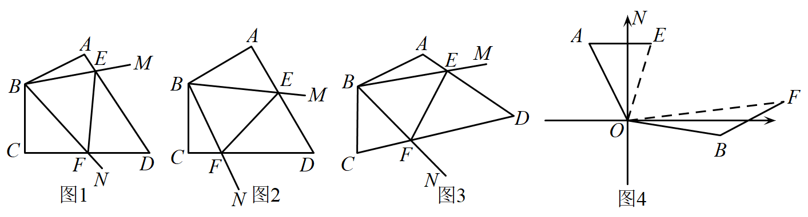

## 类型二 对角互补且有一组邻边相等的半角模型

4．（2022·辽宁朝阳·中考真题）【思维探究】如图1，在四边形*ABCD*中，∠*BAD*＝60°，∠*BCD*＝120°，*AB*＝*AD*，连接*AC*．求证：*BC*+*CD*＝*AC*．

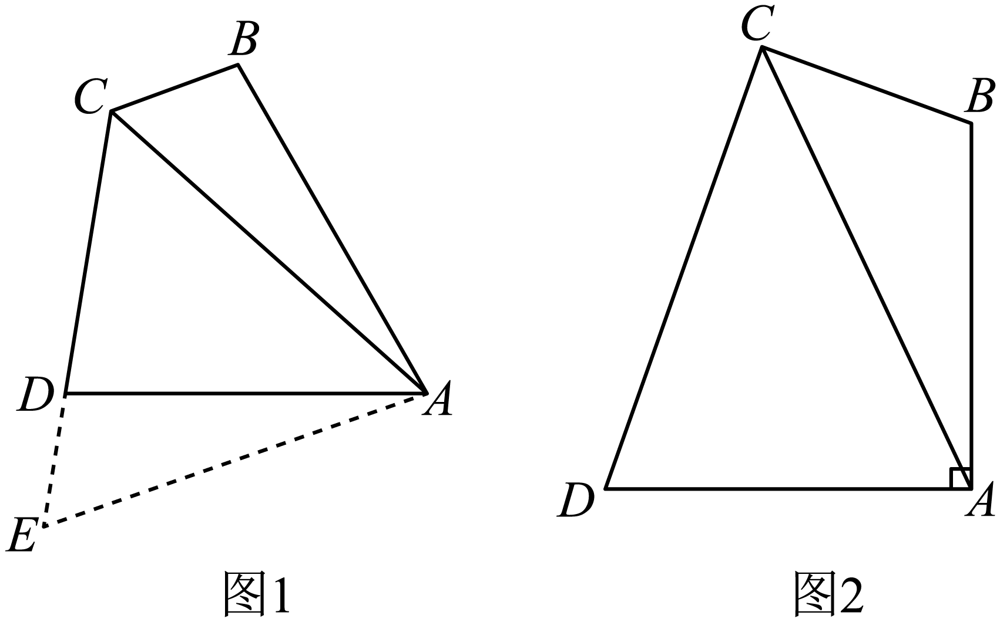  
(1)小明的思路是：延长*<text style="italic">CD*</text>到点*E*，使*DE*＝*<text style="italic"><text style="italic">B*</text>C</text>，连接*AE*．根据∠*BAD*+∠*<text style="italic">BC*D</text>＝180°，推得∠B+∠*ADC*＝180°，从而得到∠B＝∠*<text style="italic">ADE*</text>，然后证明 $\bigtriangleup$ AD*E*≌ $\bigtriangleup$ A*<text style="italic"><text style="italic">B*</text>C</text>，从而可证*BC*+*<text style="italic">CD*</text>＝*AC*，请你帮助小明写出完整的证明过程．  
(2)【思维延伸】如图2，四边形*ABCD*中，∠*BAD*＝∠*BCD*＝90°，*AB*＝*AD*，连接*AC*，猜想*BC*，*CD*，*AC*之间的数量关系，并说明理由．  
(3)【思维拓展】在四边形*A<text style="italic">BCD*</text>中，∠*B<text style="italic">AD*</text>＝∠BCD＝90°，*AB*＝AD＝ $\sqrt{6}$ ，*AC*与*BD*相交于点*O*．若四边形*A<text style="italic">BCD*</text>中有一个内角是75°，请直接写出线段*OD*的长．

5．（20-21九年级上·湖北武汉·阶段练习）（1）问题背景．

如图1，在四边形 $ABCD$ 中， $AB=AD$ ， $\angle B+\angle D=180\circ$ ， $E$ 、 $F$ 分别是线段 $BC$ 、线段 $CD$ 上的点．若 $\angle BAD=2\angle EAF$ ，试探究线段 $BE$ 、 $EF$ 、 $FD$ 之间的数量关系．

童威同学探究此问题的方法是，延长 $FD$ 到点 $G$ ．使 $DG=BE$ ．连接 $AG$ ，先证明 $\bigtriangleup ABE\allequal \bigtriangleup ADG$ ．再证明 $\bigtriangleup AEF\allequal \bigtriangleup AGF$ ，可得出结论，他的结论应是_．  
（2）猜想论证．

如图2，在四边形 $ABCD$ 中， $AB=AD$ ， $\angle B+\angle ADC=180\circ$ ， $E$ 在线段 $BC$ 上、 $F$ 在线段 $CD$ 延长线上．若 $\angle BAD=2\angle EAF$ ，上述结论是否依然成立？若成立说明理由；若不成立，试写出相应的结论并给出你的证明．

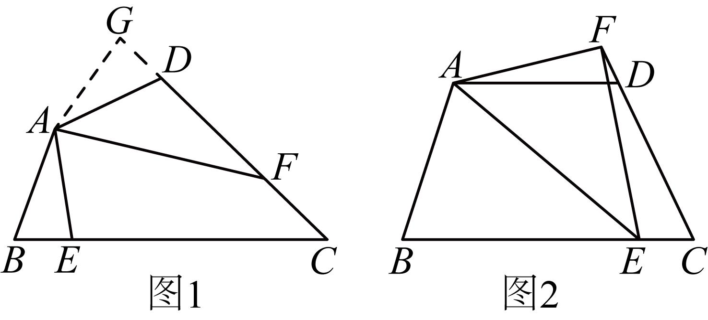  
（3）拓展应用．

如图3，在四边形 $ABDC$ 中， $\angle BDC=45\circ$ ，连接 $BC$ 、 $AD$ ， $AB:AC:BC=3:4:5$ ， $AD=4$ ，且 $\angle ABD+\angle CBD=180\circ$ ．则 $\bigtriangleup ACD$ 的面积为<u>_．</u>

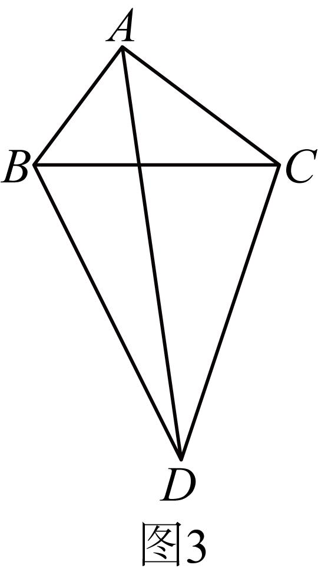

6．（2020·河南南阳·模拟预测）已知四边形 $ABCD$ 中， $AB\perp AD$ ， $BC\perp CD$ ， $AB=BC$ ， $\angle ABC=120\circ$ ， $\angle MBN=60\circ$ ，将 $\angle MBN$ 绕点 $B$ 旋转，它的两边分别交边 $AD$ 、 $DC$ （或它们的延长线）于点 $E$ 、 $F$ ．

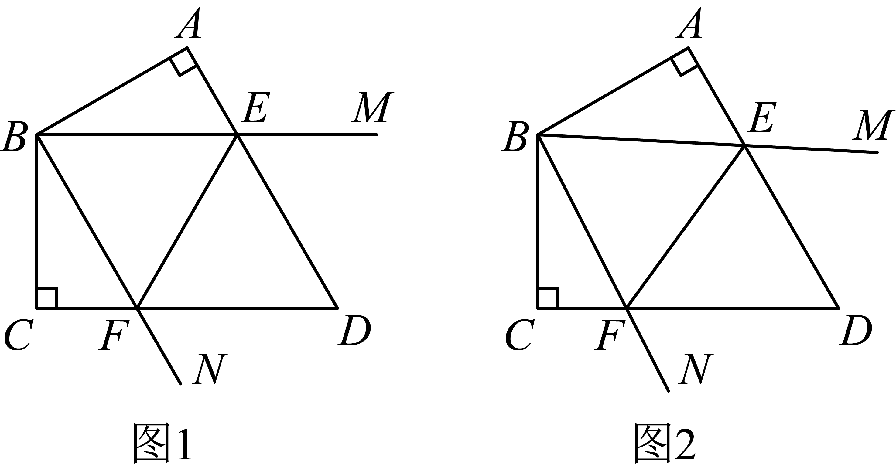  
（1）当 $\angle MBN$ 绕点 $B$ 旋转到 $AE=CF$ 时（如图1），

①求证： $\bigtriangleup ABE\allequal \bigtriangleup CBF$ ；
②求证： $AE+CF=EF$ ；  
（2）当 $\angle MBN$ 绕点 $B$ 旋转到如图2所示的位置时， $AE\ne CF$ ，此时，（1）中的两个结论是否还成立？请直接回答．

## 类型三 手拉手旋转模型  

7．（2022·山东济南·中考真题）如图1，△*ABC*是等边三角形，点*D*在△*ABC*的内部，连接*AD*，将线段*AD*绕点*A*按逆时针方向旋转60°，得到线段*AE*，连接*BD*，*DE*，*CE*．

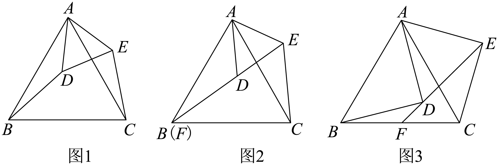  
(1)判断线段*BD*与*CE*的数量关系并给出证明；  
(2)延长*ED*交直线*BC*于点*F*．

①如图2，当点*F*与点*B*重合时，直接用等式表示线段*AE*，*BE*和*CE*的数量关系为\_\_\_\_\_\_\_；
②如图3，当点*F*为线段*BC*中点，且*ED*＝*EC*时，猜想∠*BAD*的度数，并说明理由．

8．（2020·辽宁丹东·中考真题）已知：菱形 $ABCD$ 和菱形 $A^{'}B^{'}C^{'}D^{'}$ ， $\angle BAD=\angle B^{'}A^{'}D^{'}$ ，起始位置点 $A$ 在边 $A^{'}B^{'}$ 上，点 $B$ 在 $A^{'}B^{'}$ 所在直线上，点 $B$ 在点 $A$ 的右侧，点 $B^{'}$ 在点 $A^{'}$ 的右侧，连接 $AC$ 和 $A^{'}C^{'}$ ，将菱形 $ABCD$ 以 $A$ 为旋转中心逆时针旋转 $\alpha$ 角（ $0\circ <\alpha <180\circ$ ）．  
（1）如图1，若点 $A$ 与 $A^{'}$ 重合，且 $\angle BAD=\angle B^{'}A^{'}D^{'}=90\circ$ ，求证： $BB^{'}=DD^{'}$ ；
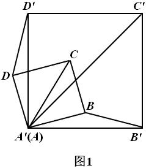  
（2）若点 $A$ 与 $A^{'}$ 不重合， $M$ 是 $A^{'}C^{'}$ 上一点，当 $MA^{'}=MA$ 时，连接 $BM$ 和 $A^{'}C$ ， $BM$ 和 $A^{'}C$ 所在直线相交于点 $P$ ；
①如图2，当 $\angle BAD=\angle B^{'}A^{'}D^{'}=90\circ$ 时，请猜想线段 $BM$ 和线段 $A^{'}C$ 的数量关系及 $\angle BPC$ 的度数；
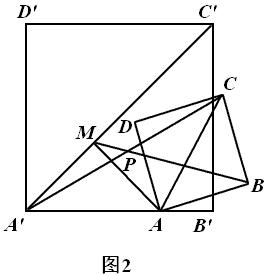

②如图3，当 $\angle BAD=\angle B^{'}A^{'}D^{'}=60\circ$ 时，请求出线段 $BM$ 和线段 $A^{'}C$ 的数量关系及 $\angle BPC$ 的度数；
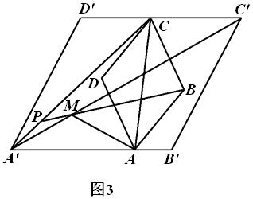

③在②的条件下，若点 $A$ 与 $A^{'}B^{'}$ 的中点重合， $A^{'}B^{'}=4$ ， $AB=2$ ，在整个旋转过程中，当点 $P$ 与点 $M$ 重合时，请直接写出线段 $BM$ 的长．

9．（2022·河南驻马店·三模）如图1， $\bigtriangleup ABC$ 是边长为6cm的等边三角形，边*<text style="italic">A*B</text>在射线*<text style="italic">O*M</text>上，且 $OA=9$ cm．点*<text style="italic">D*</text>从*O*点出发，沿*<text style="italic">OM*</text>方向运动．当点D不与点*A*重合时，将线段*<text style="italic">C*D</text>绕点C逆时针方向旋转60°得到*CE*．连接*BE，DE*．

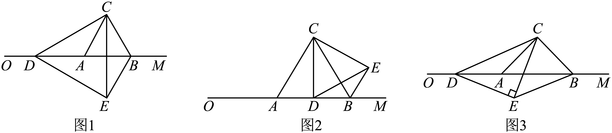  
(1)如图1，当点*D*在线段*OA*上运动时，线段*BD*、*BE*、*BC*之间的数量关系是\_\_\_\_\_\_，直线*AD*和直线*BE*所夹锐角的度数是\_\_\_\_\_\_；  
(2)如图2，当点*D*运动到线段*AB*（不与*A*点重合）上时，（1）中的结论是否仍然成立，若成立，请说明理由；若不成立，请写出正确的结论并说明理由；  
(3)如图3，将 $\bigtriangleup ABC$ 改为等腰直角三角形，其中斜边 $AB=6$ ，其它条件不变，以*CD*为斜边在其右侧作等腰直角三角形*CDE*，连接*<text style="italic">BE*</text>，请问BE是否存在最小值，若存在，直接写出答案；若不存在，说明理由．

## 类型四  中点旋转模型  

10．（2023·河北唐山·二模）已知：在正方形 $ABCD$ 中， $E$ 为对角线 $BD$ 上一点，过点 $E$ 作 $EF\perp BD$ ，交 $BC$ 于点 $F$ ，连接 $DF$ ， $G$ 为 $DF$ 的中点，连接 $EG$ ， $CG$ ．

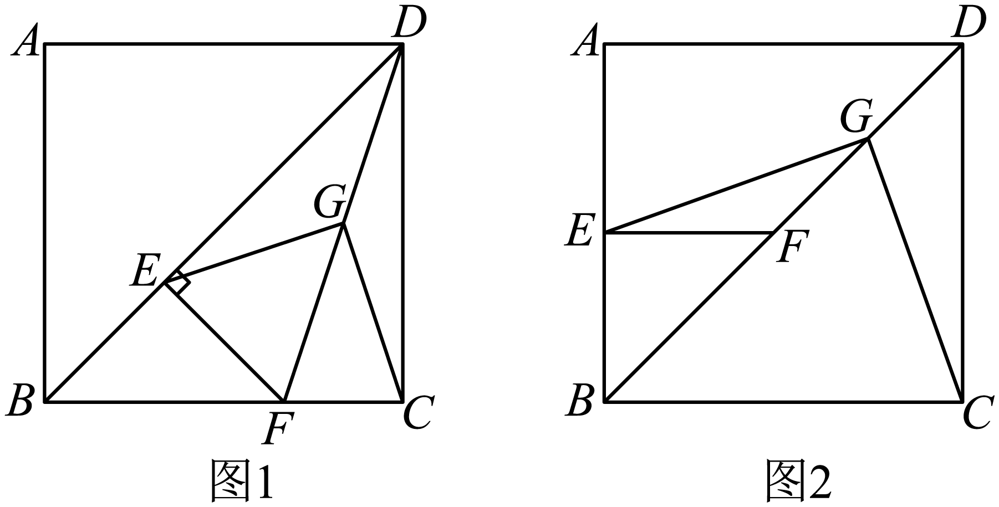

【猜想论证】  
(1)猜想线段 $EG$ 与 $CG$ 的数量关系，并加以证明．

【拓展探究】  
(2)将图 $1$ 中 $\bigtriangleup BEF$ 绕 $B$ 点逆时针旋转 $45\circ$ 得到图 $2$ ，取 $DF$ 中点 $G$ ，连接 $EG$ ， $CG.$ 你在 $(1)$ 中得到的结论还成立吗？写出你的猜想并加以证明．

11．（2023·山东淄博·中考真题）在数学综合与实践活动课上，小红以“矩形的旋转”为主题开展探究活动．  
(1)操作判断

小红将两个完全相同的矩形纸片 $ABCD$ 和 $CEFG$ 拼成“*L*”形图案，如图①．

试判断： $\bigtriangleup ACF$ 的形状为\_\_\_\_\_\_\_\_．

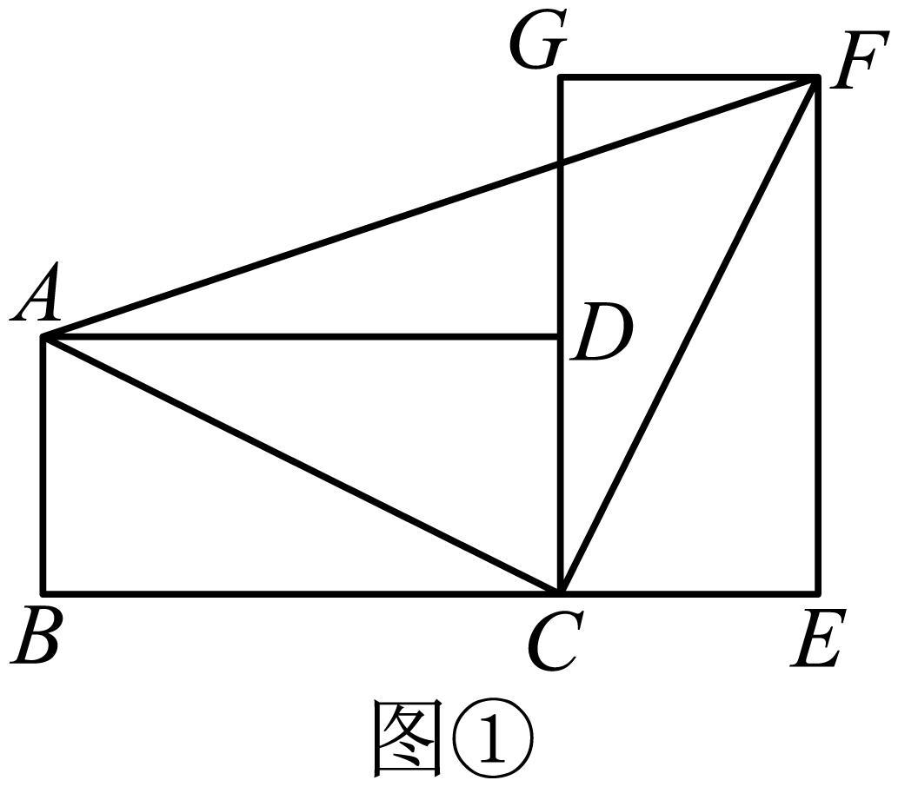  
(2)深入探究

小红在保持矩形 $ABCD$ 不动的条件下，将矩形 $CEFG$ 绕点 $C$ 旋转，若 $AB=2$ ， $AD=4$ ．

探究一：当点 $F$ 恰好落在 $AD$ 的延长线上时，设 $CG$ 与 $DF$ 相交于点 $M$ ，如图②．求 $\bigtriangleup CMF$ 的面积．

探究二：连接 $AE$ ，取 $AE$ 的中点 $H$ ，连接 $DH$ ，如图③．

求线段 $DH$ 长度的最大值和最小值．

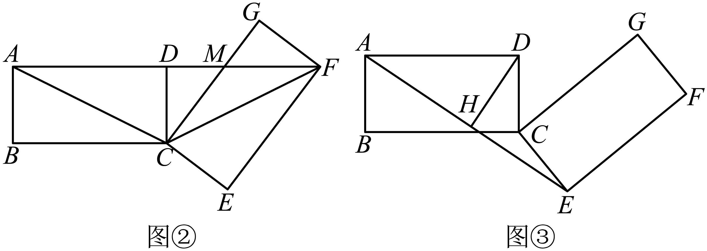

12．（2021·江苏宿迁·中考真题）已知正方形*ABCD*与正方形*AEFG*，正方形*AEFG*绕点*A*旋转一周．  
(1)如图①，连接*BG*、*CF*，求 $\frac{CF}{BG}$ 的值；  
(2)当正方形*AEFG*旋转至图②位置时，连接*CF*、*BE*，分别取*CF*、*BE*的中点*M*、*N*，连接*MN*、试探究：*MN*与*BE*的关系，并说明理由；  
(3)连接*BE*、*BF*，分别取*BE*、*BF*的中点*N*、*Q*，连接*QN*，*AE*=6，请直接写出线段*QN*扫过的面积．

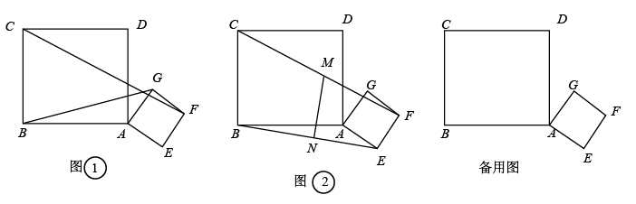

## 类型五  通过旋转构造三角形全等 

13．（2022·内蒙古呼和浩特·二模）如图，点*<text style="italic">P*</text>是正方形*<text style="italic">ABC*D</text>内一点，且点P到点A、B、C的距离分别为 $2\sqrt{3}$ 、 $\sqrt{2}$ 、4，则正方形*<text style="italic">ABC*D</text>的面积为（    ）

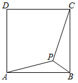

A． $28+8\sqrt{3}$ 	
B． $14+4\sqrt{3}$ 	
C．12	
D．24

14．（2023·湖北随州·中考真题）1643年，法国数学家费马曾提出一个著名的几何问题：给定不在同一条直线上的三个点*A*，*B*，*C*，求平面上到这三个点的距离之和最小的点的位置，意大利数学家和物理学家托里拆利给出了分析和证明，该点也被称为“费马点”或“托里拆利点”，该问题也被称为“将军巡营”问题．  
(1)下面是该问题的一种常见的解决方法，请补充以下推理过程：（其中①处从“直角”和“等边”中选择填空，②处从“两点之间线段最短”和“三角形两边之和大于第三边”中选择填空，③处填写角度数，④处填写该三角形的某个顶点）
当 $\bigtriangleup ABC$ 的三个内角均小于 $120\circ$ 时，

如图1，将 $\bigtriangleup APC$ 绕，点*C*顺时针旋转 $60\circ$ 得到 $\bigtriangleup A^{'}P^{'}C$ ，连接 $PP^{'}$ ，

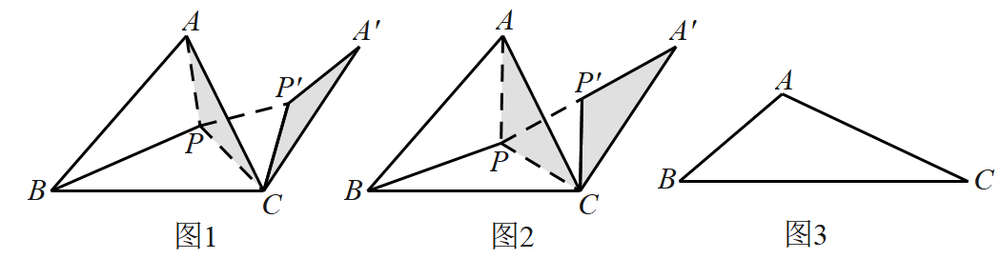
由 $PC=P^{'}C，\angle PCP^{'}=60\circ$ ，可知 $\bigtriangleup PCP^{'}$ 为<u>_①_</u>三角形，故 $PP^{'}=PC$ ，又 $P^{'}A^{'}=PA$ ，故 $PA+PB+PC=PA^{'}+PB+PP^{'}\geq A^{'}B$ ，
由<u>_②_</u>可知，当<em>B</em>，<em>&lt;text style="italic"&gt;P</em>&lt;/text&gt;， $P^{'}$ ，<em>A</em>在同一条直线上时， $PA+PB+PC$ 取最小值，如图2，最小值为 $A^{'}B$ ，此时的<em>&lt;text style="italic"&gt;P</em>&lt;/text&gt;点为该三角形的“费马点”，且有 $\angle APC=\angle BPC=\angle APB=$ <u>_③_</u>；
已知当 $\bigtriangleup ABC$ 有一个内角大于或等于 $120\circ$ 时，“费马点”为该三角形的某个顶点．如图3，若 $\angle BAC\geq 120\circ$ ，则该三角形的“费马点”为<u>_④_</u>点．  
(2)如图4，在 $\bigtriangleup ABC$ 中，三个内角均小于 $120\circ$ ，且 $AC=3，BC=4，\angle ACB=30\circ$ ，已知点*P*为 $\bigtriangleup ABC$ 的“费马点”，求 $PA+PB+PC$ 的值；
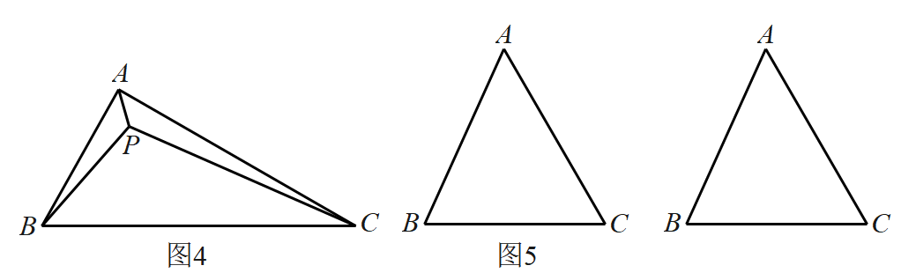  
(3)如图5，设村庄<text style="it<text style="it<text style="it*a*lic">a</text>lic">a</text>lic">*<text style="italic">A*</text></text>，*<text style="italic"><text style="italic">B*</text></text>，*<text style="italic"><text style="italic">C*</text></text>的连线构成一个三角形，且已知 $AC=4km，BC=2\sqrt{3}km，\angle ACB=60\circ$ ．现欲建一中转站<text style="it<text style="it<text style="it*a*lic">a</text>lic">a</text>lic">*<text style="italic">P*</text></text>沿直线向*<text style="italic"><text style="italic">A*</text></text>，*<text style="italic"><text style="italic">B*</text></text>，*<text style="italic"><text style="italic">C*</text></text>三个村庄铺设电缆，已知由中转站P到村庄A，B，C的铺设成本分别为a元/ $km$ ，<text style="it<text style="it*a*lic">a</text>lic">a</text>元/ $km$ ， $\sqrt{2}a$ 元/ $km$ ，选取合适的<text style="it<text style="it<text style="it*a*lic">a</text>lic">a</text>lic">*<text style="italic">P*</text></text>的位置，可以使总的铺设成本最低为\_\_\_\_\_\_\_\_\_\_\_元．（结果用含a的式子表示）

15．（23-24九年级上·湖北武汉·阶段练习）【问题背景】：如图1，点 $D$ 是等边 $\bigtriangleup ABC$ 内一点，连接 $AD,BD$ ，将 $\bigtriangleup ABD$ 绕点 $A$ 逆时针旋转 $60\circ$ 得到 $\bigtriangleup ACE$ ，连接 $DE$ ，观察发现： $BD$ 与 $CE$ 的数量关系为\_\_\_\_\_\_\_\_，直线 $BD$ 与 $CE$ 所夹的锐角为\_\_\_\_\_\_\_\_度；
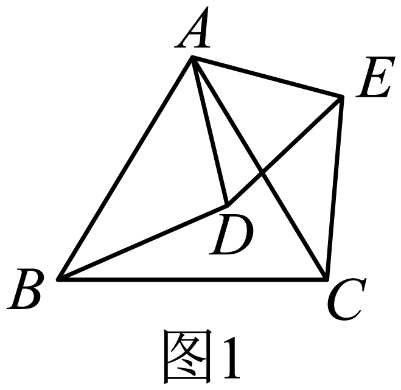

【尝试应用】：如图2，在等腰直角 $\bigtriangleup ABC$ 中， $AB=AC,\angle BAC=90\circ$ ，点 $D$ 是等腰直角 $\bigtriangleup ABC$ 内一点，连接 $AD$ ， $BD$ ， $CD$ ，若 $AD=2\sqrt{2},BD=5,CD=3$ ，求 $\bigtriangleup BCD$ 面积；
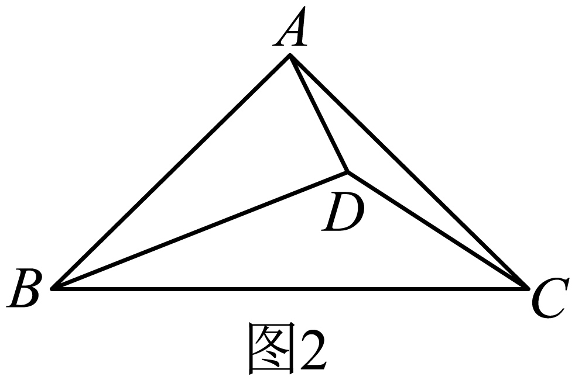

【拓展创新】：如图3，在等腰 $\bigtriangleup ABC$ 中， $AB=AC,\angle BAC=120\circ$ ，点 $D$ 为平面内一点，且 $\angle ADB=60\circ ,\frac{AD}{BD}=3$ ，直接写 $\frac{AC}{CD}$ 的值为\_\_\_\_\_\_\_\_．

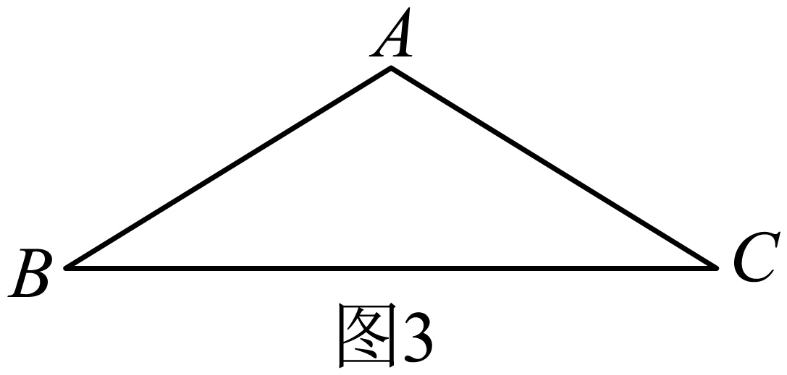

## 题型02  构造相似三角形解题

## 类型一  做平行线构造“A”型相似

16．（2023·内蒙古·中考真题）如图， $AB$ 是⊙ $O$ 的直径， $E$ 为⊙ $O$ 上的一点，点 $C$ 是 $⌢$ 的中点，连接 $BC$ ，过点 $C$ 的直线垂直于 $BE$ 的延长线于点 $D$ ，交 $BA$ 的延长线于点 $P$ ．

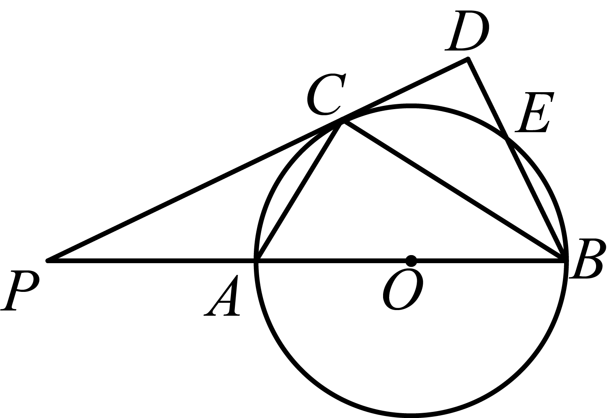  
(1)求证： $PC$ 为⊙ $O$ 的切线；  
(2)若 $PC=2\sqrt{2}BO$ ， $PB=10$ ，求 $BE$ 的长．

17．（2018·湖北黄石·中考真题）在△ABC中，E、F分别为线段AB、AC上的点（不与A、B、C重合）．  
（1）如图1，若EF∥BC，求证： $\frac{S_{\bigtriangleup AEF}}{S_{\bigtriangleup ABC}}=\frac{AE\cdot AF}{AB\cdot AC}$  
（2）如图2，若EF不与BC平行，（1）中的结论是否仍然成立？请说明理由；  
（3）如图3，若EF上一点G恰为△ABC的重心， $\frac{AE}{AB}=\frac{3}{4}$ ，求 $\frac{S_{\bigtriangleup AEF}}{S_{\bigtriangleup ABC}}$ 的值．

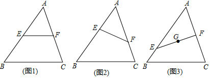

## 类型二  做平行线构造“X”型相似

18．（2023九年级·全国·专题练习）在 $\bigtriangleup ABC$ 中，已知*D*是 $BC$ 边的中点，*<text style="italic">G*</text>是 $\bigtriangleup ABC$ 的重心，过*<text style="italic">G*</text>点的直线分别交*AB*、*AC*于点*E*、*F*．

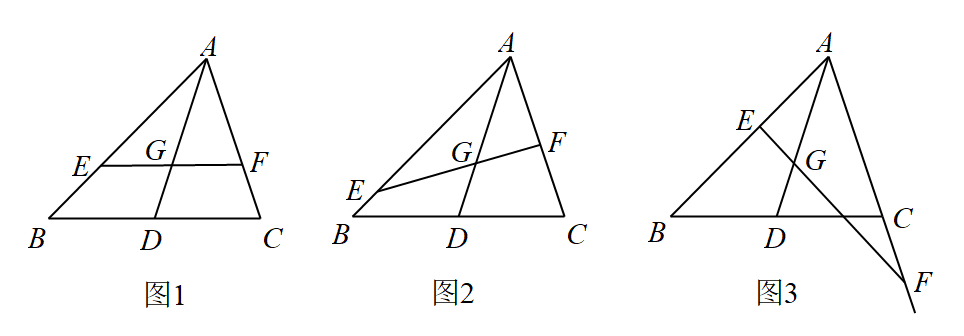  
(1)如图1，当 $EF\parallel BC$ 时，求证： $\frac{BE}{AE}+\frac{CF}{AF}=1$ ；  
(2)如图2，当 $EF$ 和 $BC$ 不平行，且点*E*、*F*分别在线段 $AB、AC$ 上时，（1）中的结论是否成立？如果成立，请给出证明；如果不成立，请说明理由．  
(3)如图3，当点*E*在 $AB$ 的延长线上或点*F*在 $AC$ 的延长线上时，（1）中的结论是否成立？如果成立，请给出证明；如果不成立，请说明理由．

19．（2023·湖北孝感·三模）【问题情境】

小睿遇到这样一个问题：如图1，在 $\bigtriangleup ABC$ 中，点 $D$ 在线段 $BC$ 上， $\angle BAD=75\circ ,\angle CAD=30\circ ,AD=4,BD=2DC$ ，求 $AC$ 的长．

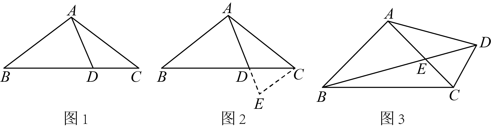

【问题探究】

小睿发现，过点 $C$ 作 $CE\parallel AB$ ，交 $AD$ 的延长线于点 $E$ ，经过推理和计算能够使问题得到解决，如图2．  
(1)① $\angle ACE$ 的度数为\_\_\_\_\_\_\_\_；②求 $AC$ 的长；
【问题拓展】  
(2)如图3，在四边形 $ABCD$ 中， $\angle BAC=90\circ ,\angle CAD=30\circ ,\angle ADC=75\circ ,AC$ 与 $BD$ 交于点 $E,AE=2m,BE=2ED$ ，求 $BC$ 的长．

20．（2023·广东深圳·中考真题）（1）如图，在矩形 $ABCD$ 中， $E$ 为 $AD$ 边上一点，连接 $BE$ ，

①若 $BE=BC$ ，过 $C$ 作 $CF\perp BE$ 交 $BE$ 于点 $F$ ，求证： $\bigtriangleup ABE\allequal \bigtriangleup FCB$ ；
②若 $S_{矩形ABCD}=20$ 时，则 $BE\cdot CF=$ \_\_\_\_\_\_．
> 

> 
> | 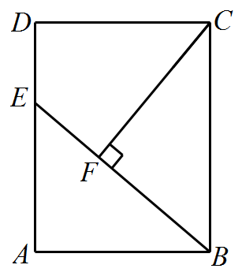 | 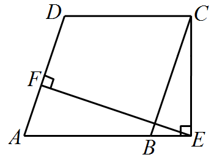 |
> | --- | --- |
> | （2）如图，在菱形 $ABCD$ 中， $cosA=\frac{1}{3}$ ，过 $C$ 作 $CE\perp AB$ 交 $AB$ 的延长线于点 $E$ ，过 $E$ 作 $EF\perp AD$ 交 $AD$ 于点 $F$ ，若 $S_{菱形ABCD}=24$ 时，求 $EF\cdot BC$ 的值． | （3）如图，在平行四边形 $ABCD$ 中， $\angle A=60\circ$ ， $AB=6$ ， $AD=5$ ，点 $E$ 在 $CD$ 上，且 $CE=2$ ，点 $F$ 为 $BC$ 上一点，连接 $EF$ ，过 $E$ 作 $EG\perp EF$ 交平行四边形 $ABCD$ 的边于点 $G$ ，若 $EF\cdot EG=7\sqrt{3}$ 时，请直接写出 $AG$ 的长． |
> 

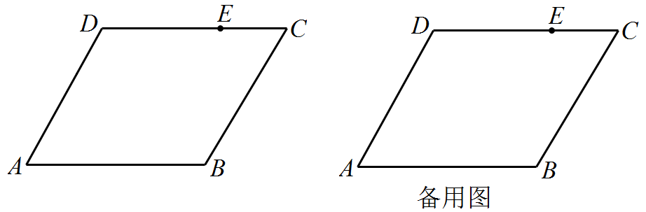

## 类型三  作垂线构造直角三角形相似

21．（2022·山西·中考真题）综合与实践

问题情境：在*Rt*△*ABC*中，∠*BAC*=90°，*AB*=6，*AC*=8．直角三角板*EDF*中∠*EDF*=90°，将三角板的直角顶点*D*放在*Rt*△*ABC*斜边*BC*的中点处，并将三角板绕点*D*旋转，三角板的两边*DE*，*DF*分别与边*AB*，*AC*交于点*M*，*N*，猜想证明：

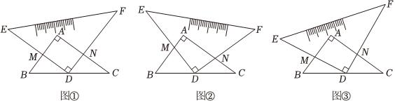  
（1）如图①，在三角板旋转过程中，当点*M*为边*AB*的中点时，试判断四边形*AMDN*的形状，并说明理由；
问题解决：  
（2）如图②，在三角板旋转过程中，当 $\angle B=\angle MDB$ 时，求线段*CN*的长；  
（3）如图③，在三角板旋转过程中，当*AM*=*AN*时，直接写出线段*AN*的长．

22．（2020·江苏南通·中考真题）【了解概念】

有一组对角互余的凸四边形称为对余四边形，连接这两个角的顶点的线段称为对余线．

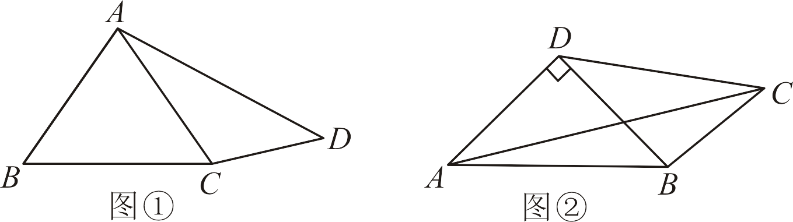

【理解运用】  
（1）如图①，对余四边形*ABCD*中，*AB*＝5，*BC*＝6，*CD*＝4，连接*AC*．若*AC*＝*AB*，求sin∠*CAD*的值；  
（2）如图②，凸四边形<em>ABCD</em>中，<em>AD</em>＝<em>BD</em>，<em>AD</em>⊥<em>BD</em>，当2<em>CD2</em>+<em>CB2</em>＝<em>CA2</em>时，判断四边形<em>ABCD</em>是否为对余四边形．证明你的结论；
【拓展提升】  
（3）在平面直角坐标系中，点<<*t*ext style="italic">t</text>ext style="italic">A</text>（﹣1，0），*B*（3，0），*C*（1，2），四边形*<text style="italic"><text style="italic">ABC*</text>*D*</text>是对余四边形，点*E*在对余线*BD*上，且位于△ABC内部，∠*AEC*＝90°+∠ABC．设 $\frac{AE}{BE}$ ＝<<*t*ext style="italic">t</text>ext style="italic">*u*</text>，点*D*的纵坐标为t，请直接写出u关于t的函数解析式．

## 类型四  作垂线构造“三垂直”型相似

23．（23-24九年级上·江苏扬州·阶段练习）如图，在四边形 $ABCD$ 中， $\angle ABC=90\circ$ ， $AB=3$ ， $BC=4$ ， $CD=10$ ， $DA=5\sqrt{5}$ ，则 $BD$ 的长为________．

24．（2022上·江苏扬州·九年级统考期中）将一张以 $AB$ 为边的矩形纸片，先沿一条直线剪掉一个直角三角形，在剩下的纸片中，再沿一条直线剪掉一个直角三角形（剪掉的两个直角三角形相似），剩下的是如图所示的四边形纸片<em>ABCD</em>，其中 $\angle A=90\circ ，AB=9，BC=7，CD=6，AD=2$ ，则该矩形与 $AB$ 相邻的另一条边长是_____ ．

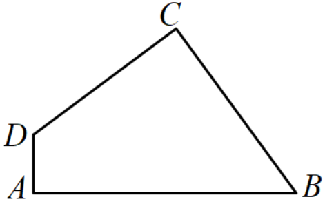

25．（2023九年级·全国·专题练习）如图，在 $\bigtriangleup ABC$ 中， $\angle BAC=60\circ$ ， $\angle ABC=90\circ$ ，直线 $l_{1}\parallel l_{2}\parallel l_{3}$ ， $l_{1}$ 与 $l_{2}$ 之间距离是1， $l_{2}$ 与 $l_{3}$ 之间距离是2，且 $l_{1}$ ， $l_{2}$ ， $l_{3}$ 分别经过点*A*，*B*，*C*，则边 $AC$ 的长为（　　）

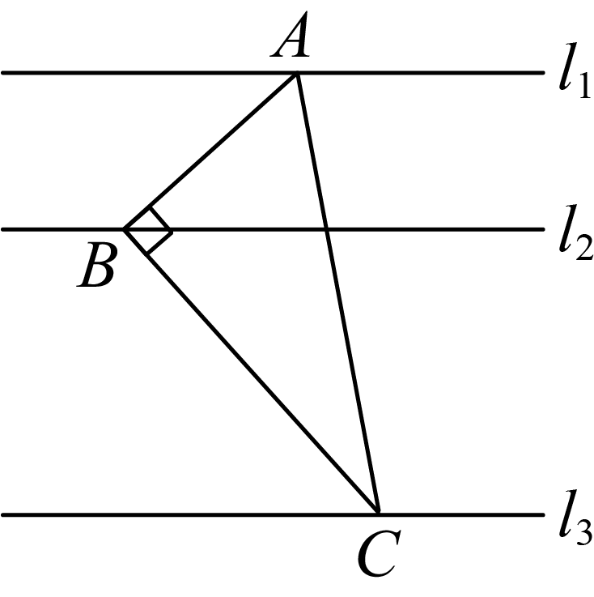

A． $2\sqrt{3}$ 	
B． $\sqrt{11}$ 	
C． $\frac{3\sqrt{21}}{4}$ 	
D． $\frac{2\sqrt{21}}{3}$

## 题型03  与相似三角形有关的压轴题

## 类型一  运用相似三角形的性质与判定求点的坐标

26．（2023·湖北鄂州·中考真题）如图，在平面直角坐标系中， $O$ 为原点， $OA=OB=3\sqrt{5}$ ，点 $C$ 为平面内一动点， $BC=\frac{3}{2}$ ，连接 $AC$ ，点 $M$ 是线段 $AC$ 上的一点，且满足 $CM:MA=1:2$ ．当线段 $OM$ 取最大值时，点 $M$ 的坐标是（　　）

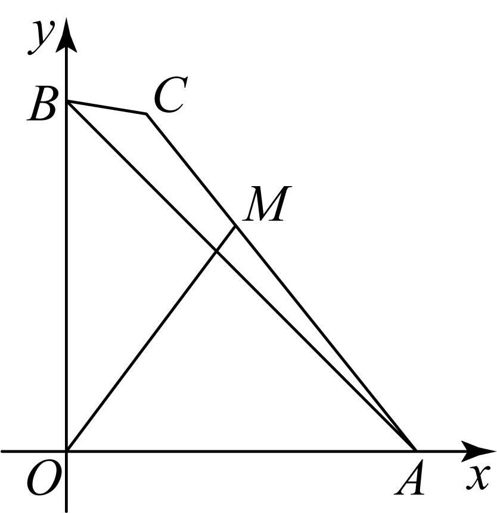

A． $\left(\frac{3}{5},\frac{6}{5}\right)$ 	
B． $\left(\frac{3}{5}\sqrt{5},\frac{6}{5}\sqrt{5}\right)$ 	
C． $\left(\frac{6}{5},\frac{12}{5}\right)$ 	
D． $\left(\frac{6}{5}\sqrt{5},\frac{12}{5}\sqrt{5}\right)$

27．（2021·湖南娄底·中考真题）如图，直角坐标系中，以5为半径的动圆的圆心<te*x*t style="italic">*A*</text>沿x轴移动，当⊙ $A$ 与直线 $l:y=\frac{5}{12}x$ 只有一个公共点时，点<te*x*t style="italic">*A*</text>的坐标为（    ）

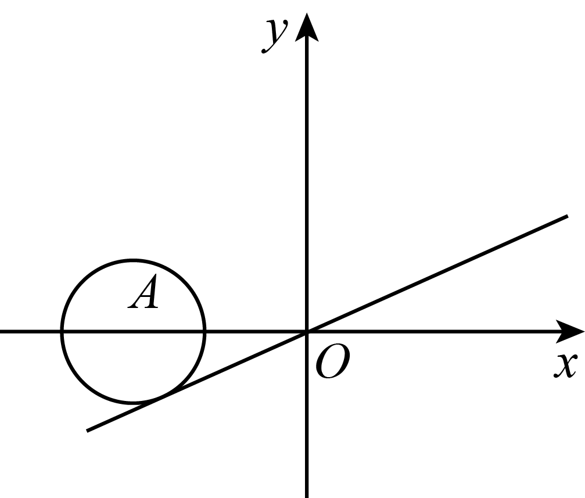

A． $(-12,0)$ 	
B． $(-13,0)$ 	
C． $(\pm 12,0)$ 	
D． $(\pm 13,0)$

28．（2023·江苏镇江·中考真题）如图，正比例函数 $y=-3x$ 与反比例函数 $y=\frac{k}{x}\left(k\ne 0\right)$ 的图象交于<te*x*t style="italic">A</text>， $B\left(1,m\right)$ 两点，点<te*x*t style="italic">C</text>在x轴负半轴上， $\angle ACO=45\circ$ ．

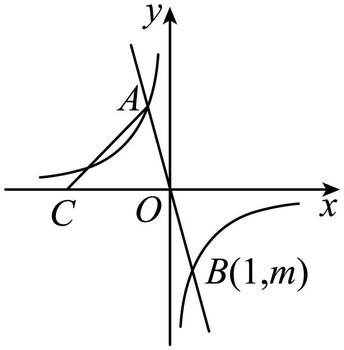  
(1) $m=$ \_\_\_\_\_\_， $k=$ \_\_\_\_\_\_，点*C*的坐标为\_\_\_\_\_\_．  
(2)点<te*x*t style="italic">*<text style="italic">P*</text></text>在x轴上，若以*B*，*O*，P为顶点的三角形与 $\bigtriangleup AOC$ 相似，求点<te*x*t style="italic">*<text style="italic">P*</text></text>的坐标．

## 类型二  运用相似三角形的性质与判定求线段的最值

29．（2021·四川绵阳·中考真题）如图，在 $\bigtriangleup ACD$ 中， $AD=6$ ， $BC=5$ ， $AC^{2}=AB\left(AB+BC\right)$ ，且 $\bigtriangleup DAB\sim \bigtriangleup DCA$ ，若 $AD=3AP$ ，点 $Q$ 是线段 $AB$ 上的动点，则 $PQ$ 的最小值是（    ）

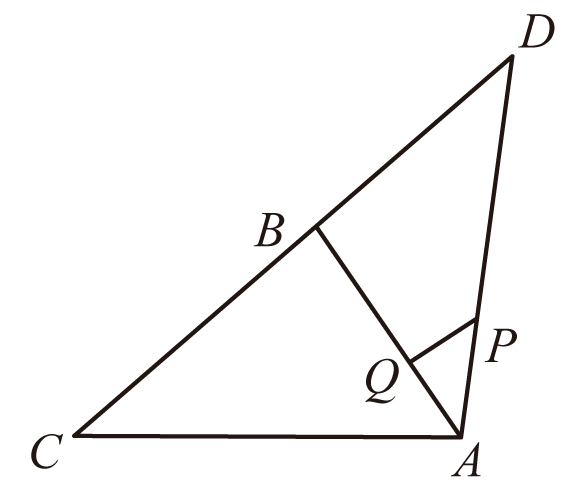

A． $\frac{\sqrt{7}}{2}$ 	
B． $\frac{\sqrt{6}}{2}$ 	
C． $\frac{\sqrt{5}}{2}$ 	
D． $\frac{8}{5}$

30．（2022·贵州铜仁·中考真题）如图，在边长为2的正方形<em>ABCD</em>中，点<em>E</em>为<em>AD</em>的中点，将△<em>CDE</em>沿<em>CE</em>翻折得△<em>CME</em>，点<em>M</em>落在四边形<em>ABCE</em>内．点<em>N</em>为线段<em>CE</em>上的动点，过点<em>N</em>作<em>NP</em>//<em>EM</em>交<em>MC</em>于点<em>P</em>，则<em>MN</em>+<em>NP</em>的最小值为________．

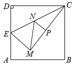

31．（2023·四川泸州·中考真题）如图， $E$ ， $F$ 是正方形 $ABCD$ 的边 $AB$ 的三等分点， $P$ 是对角线 $AC$ 上的动点，当 $PE+PF$ 取得最小值时， $\frac{AP}{PC}$ 的值是___________．

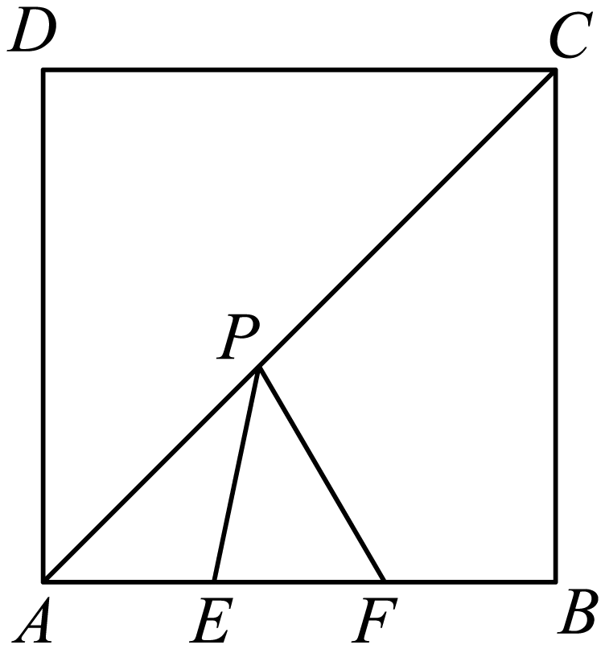

32．（2022·湖南郴州·中考真题）如图1，在矩形*<text style="italic">A*BC*D*</text>中， $AB=4$ ， $BC=6$ ．点*<text style="italic"><text style="italic">E*</text></text>是线段*<text style="italic">AD*</text>上的动点（点E不与点A，D重合），连接*CE*，过点E作 $EF\perp CE$ ，交*A*B于点*F*．

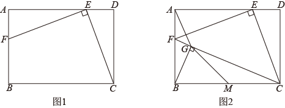  
(1)求证： $\bigtriangleup AEF\backsim \bigtriangleup DCE$ ；  
(2)如图2，连接*CF*，过点*B*作 $BG\perp CF$ ，垂足为*G*，连接*AG*．点*M*是线段*B*C的中点，连接*GM*．

①求 $AG+GM$ 的最小值；
②当 $AG+GM$ 取最小值时，求线段*DE*的长．

## 类型三  利用相似三角形的判定和性质求“kAD+BD”型的最值（阿氏圆）

33．（2020·广西·中考真题）如图，在Rt $\bigtriangleup ABC$ 中，<em>&lt;text style="italic"&gt;AB</em>&lt;/text&gt;＝<em>&lt;text style="italic"&gt;AC</em>&lt;/text&gt;＝4，点<em>E</em>，<em>F</em>分别是AB，AC的中点，点<em>P</em>是扇形<em>AEF</em>的 $⌢$ 上任意一点，连接B<em>P</em>，<em>&lt;text style="italic"&gt;CP</em>&lt;/text&gt;，则 $\frac{1}{2}$ B<em>P</em>+<em>&lt;text style="italic"&gt;CP</em>&lt;/text&gt;的最小值是_____．

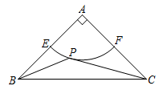

34．（2023·山东烟台·中考真题）如图，抛物线 $y=ax^{2}+bx+5$ 与 $x$ 轴交于 $A,B$ 两点，与 $y$ 轴交于点 $C,AB=4$ ．抛物线的对称轴 $x=3$ 与经过点 $A$ 的直线 $y=kx-1$ 交于点 $D$ ，与 $x$ 轴交于点 $E$ ．

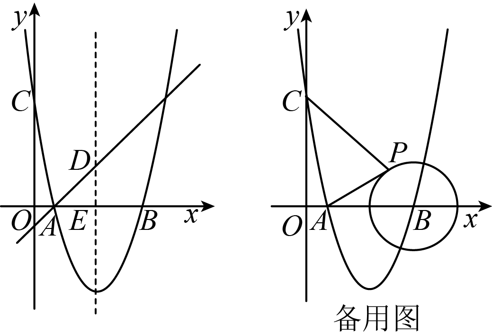  
(1)求直线 $AD$ 及抛物线的表达式；  
(2)在抛物线上是否存在点 $M$ ，使得 $\bigtriangleup ADM$ 是以 $AD$ 为直角边的直角三角形?若存在，求出所有点 $M$ 的坐标；若不存在，请说明理由；  
(3)以点 $B$ 为圆心，画半径为2的圆，点 $P$ 为 $\odot B$ 上一个动点，请求出 $PC+\frac{1}{2}PA$ 的最小值．

35．（2021·四川达州·中考真题）如图，在平面直角坐标系中，抛物线 $y=-x^{2}+bx+c$ 交 $x$ 轴于点 $A$ 和 $C\left(1,0\right)$ ，交 $y$ 轴于点 $B\left(0,3\right)$ ，抛物线的对称轴交 $x$ 轴于点 $E$ ，交抛物线于点 $F$ ．

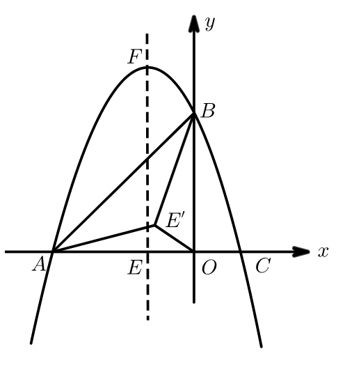  
（1）求抛物线的解析式；  
（2）将线段 $OE$ 绕着点 $\CYRO$ 沿顺时针方向旋转得到线段 $OE'$ ，旋转角为 $\alpha \left(0\circ <\alpha <90\circ \right)$ ，连接 $AE'$ ， $BE'$ ，求 $BE'+\frac{1}{3}AE'$ 的最小值．  
（3） $M$ 为平面直角坐标系中一点，在抛物线上是否存在一点 $N$ ，使得以 $A$ ， $B$ ， $M$ ， $N$ 为顶点的四边形为矩形？若存在，请直接写出点 $N$ 的横坐标；若不存在，请说明理由；

## 类型四  相似中的“一线三等角”模型

36．（23-24九年级上·陕西西安·阶段练习）（1）如图1， $\angle ABC=90\circ$ ，分别过&lt;text_style="italic"&gt;A&lt;/text&gt;，<em>C</em>两点作经过点<em>B</em>的直线的垂线，垂足分别为<em>E</em>、<em>F</em>， $AE=4$ ， $BE=2$ ， $BF=3$ ，求 $CF$ 的长度为_．
> 

> 
> | 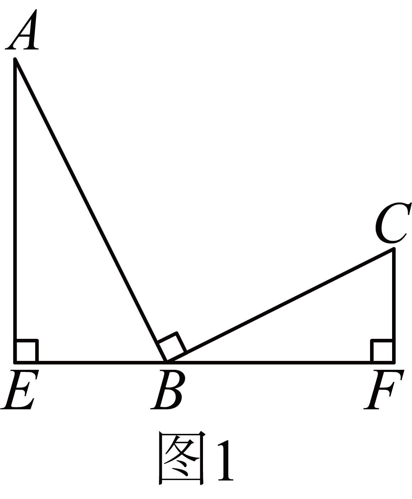 | 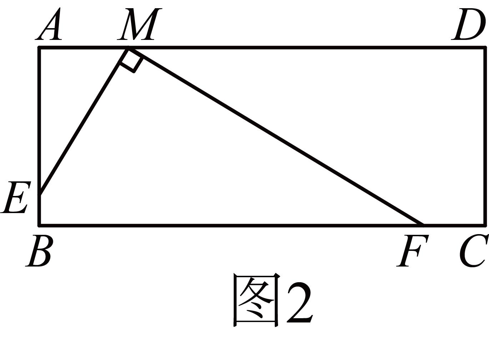 |
> | --- | --- |
> | （2）如图2，在矩形 $ABCD$ 中， $AB=4$ ， $BC=10$ ，点*E*、*F*、*M*分别在 $AB、BC、AD$ 上， $\angle EMF=90\circ$ ， $AM=2$ ，当 $BE+BF=9$ 时，求四边形 $MEBF$ 的面积． | （3）如图3，在 $\bigtriangleup ABC$ 中， $\angle ACB=90\circ$ ， $AC=15$ ， $BC=20$ ，点*E*、*F*分别在边 $AB、BC$ 上， $\angle CEF=\alpha$ 且 $tan\alpha =\frac{3}{4}$ ，若 $BF=8$ ，求 $BE$ 的长度． |
> 

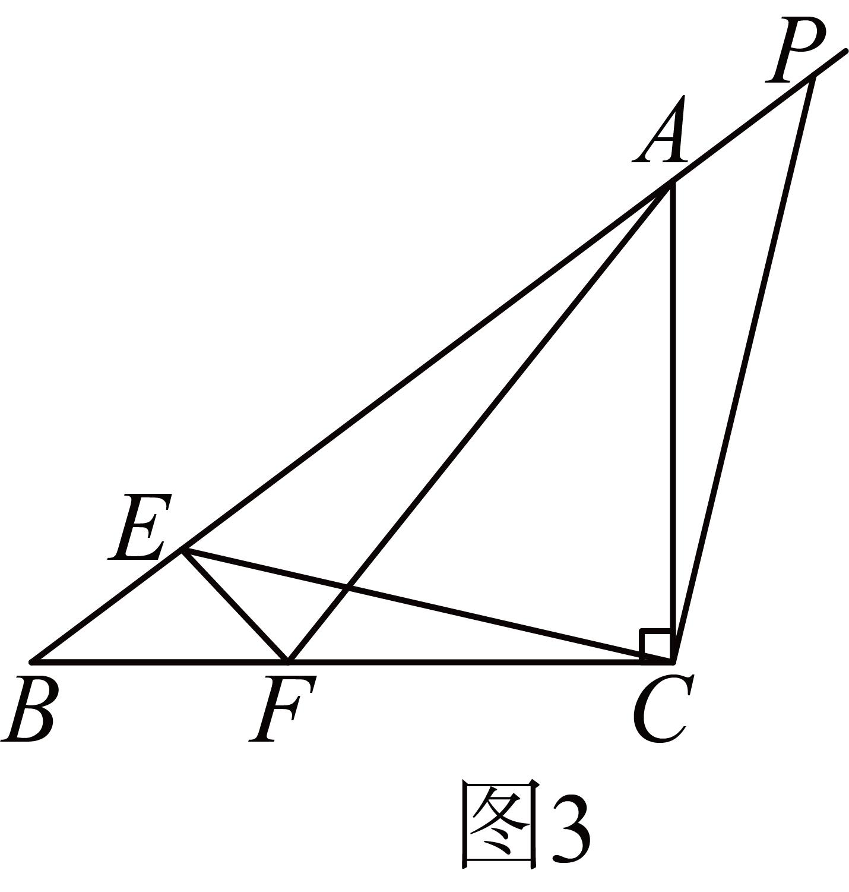

37．（23-24九年级上·黑龙江哈尔滨·开学考试）在综合实践课上，老师组织同学们以“矩形的折叠”为主题开展数学活动．有一张矩形纸片 $ABCD$ ，点*E*在射线 $AB$ 上，现将矩形折叠，折痕为 $DE$ ，点*A*的对应点记为点*F*．

  
(1)操作发现：如图1，若点*F*恰好落在矩形 $ABCD$ 的边 $BC$ 上，直接写出一个与 $\bigtriangleup BEF$ 相似的三角形；  
(2)深入探究：如图2，若点*<text style="italic">F*</text>落在矩形 $ABCD$ 的边 $BC$ 的下方时， $EF$ 、 $DF$ 分别交 $BC$ 于点*M*、*N*，过点*<text style="italic">F*</text>作 $FG\perp BC$ ， $FH\perp DC$ ，垂足分别为点*<text style="italic">G*</text>、*H*，当点G是 $BC$ 的中点时，试判断 $\bigtriangleup DEF$ 与 $\bigtriangleup DFH$ 是否相似，并证明你的结论；  
(3)问题解决：在（2）的条件下，若 $AD=3$ ， $BE=\frac{\sqrt{3}}{3}$ ，求 $CH$ 的长．

38．（2023·河南周口·三模）（1）问题发现：如图1， $\angle ABC=\alpha$ ，将边 $AC$ 绕点*C*顺时针旋转 $\alpha$ 得到线段 $CE$ ，在射线 $BC$ 上取点*D*，使得 $\angle CDE=\alpha$ ．请求出线段 $BC$ 与 $DE$ 的数量关系；  
（2）类比探究：如图2，若 $\alpha =90\circ$ ，作 $\angle ACE=90\circ$ ，且 $CE=\frac{1}{2}AC$ ，其他条件不变，则线段 $BC$ 与 $DE$ 的数量关系是否发生变化?如果变化，请写出变化后的数量关系，并给出证明；  
（3）拓展延伸：如图3，正方形 $ABCD$ 的边长为6，点*E*是边 $AD$ 上一点，且 $AE=2$ ，把线段 $CE$ 逆时针旋转 $90\circ$ 得到线段 $EF$ ，连接 $BF$ ，直接写出线段 $BF$ 的长．

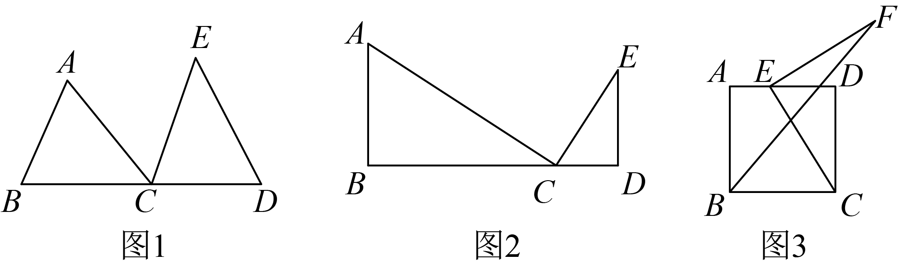

## 类型五  相似三角形与多边形综合

39．（2023·山东济南·中考真题）在矩形 $ABCD$ 中， $AB=2$ ， $AD=2\sqrt{3}$ ，点 $E$ 在边 $BC$ 上，将射线 $AE$ 绕点 $A$ 逆时针旋转90°，交 $CD$ 延长线于点 $G$ ，以线段 $AE$ ， $AG$ 为邻边作矩形 $AEFG$ ．

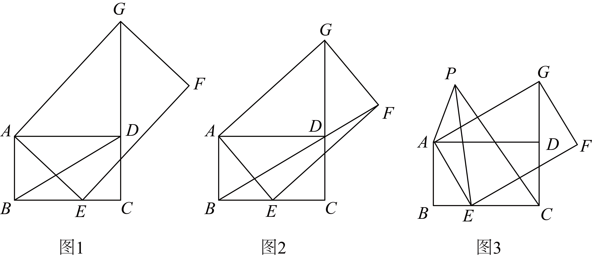  
(1)如图1，连接 $BD$ ，求 $\angle BDC$ 的度数和 $\frac{DG}{BE}$ 的值；  
(2)如图2，当点 $F$ 在射线 $BD$ 上时，求线段 $BE$ 的长；  
(3)如图3，当 $EA=EC$ 时，在平面内有一动点 $P$ ，满足 $PE=EF$ ，连接 $PA$ ， $PC$ ，求 $PA+PC$ 的最小值．

40．（2023·湖北武汉·中考真题）问题提出：如图（1）， $E$ 是菱形 $ABCD$ 边 $BC$ 上一点， $\bigtriangleup AEF$ 是等腰三角形， $AE=EF$ ， $\angle AEF=\angle ABC=\alpha \left(a\geq 90\circ \right),AF$ 交 $CD$ 于点 $G$ ，探究 $\angle GCF$ 与 $\alpha$ 的数量关系．

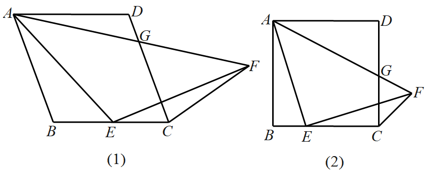

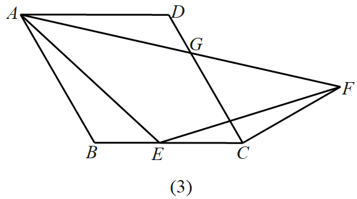

问题探究：  
(1)先将问题特殊化，如图（2），当 $\alpha =90\circ$ 时，直接写出 $\angle GCF$ 的大小；  
(2)再探究一般情形，如图（1），求 $\angle GCF$ 与 $\alpha$ 的数量关系．

问题拓展：  
(3)将图（1）特殊化，如图（3），当 $\alpha =120\circ$ 时，若 $\frac{DG}{CG}=\frac{1}{2}$ ，求 $\frac{BE}{CE}$ 的值．

41．（2021·山东日照·中考真题）问题背景：

如图1，在矩形 $ABCD$ 中， $AB=2\sqrt{3}$ ， $\angle ABD=30\circ$ ，点 $E$ 是边 $AB$ 的中点，过点 $E$ 作 $EF\perp AB$ 交 $BD$ 于点 $F$ ．

实验探究：  
（1）在一次数学活动中，小王同学将图1中的 $\bigtriangleup BEF$ 绕点 $B$ 按逆时针方向旋转 $90\circ$ ，如图2所示，得到结论：① $\frac{AE}{DF}=$ \_\_\_\_\_；②直线 $AE$ 与 $DF$ 所夹锐角的度数为\_\_\_\_\_\_．  
（2）小王同学继续将 $\bigtriangleup BEF$ 绕点 $B$ 按逆时针方向旋转，旋转至如图3所示位置.请问探究（1）中的结论是否仍然成立？并说明理由．

拓展延伸：
在以上探究中，当 $\bigtriangleup BEF$ 旋转至 $D$ 、 $E$ 、 $F$ 三点共线时，则 $\bigtriangleup ADE$ 的面积为\_\_\_\_\_\_．

