重难点突破04 全等三角形与相似三角形

目 录

- [题型01  旋转中的全等模型](#_Toc163646273)
- [类型一  对角互补模型](#_Toc163646274)
- [类型二 对角互补且有一组邻边相等的半角模型](#_Toc163646275)
- [类型三 手拉手旋转模型](#_Toc163646276)
- [类型四  中点旋转模型](#_Toc163646277)
- [类型五  通过旋转构造三角形全等](#_Toc163646278)
- [题型02  构造相似三角形解题](#_Toc163646279)
- [类型一  做平行线构造“A”型相似](#_Toc163646280)
- [类型二  做平行线构造“X”型相似](#_Toc163646281)
- [类型三  作垂线构造直角三角形相似](#_Toc163646282)
- [类型四  作垂线构造“三垂直”型相似](#_Toc163646283)
- [题型03  与相似三角形有关的压轴题](#_Toc163646284)
- [类型一  运用相似三角形的性质与判定求点的坐标](#_Toc163646285)
- [类型二  运用相似三角形的性质与判定求线段的最值](#_Toc163646286)
- [类型三  利用相似三角形的判定和性质求“kAD+BD”型的最值（阿氏圆）](#_Toc163646287)
- [类型四  相似中的“一线三等角”模型](#_Toc163646288)
- [类型五  相似三角形与多边形综合](#_Toc163646289)

## 题型01  旋转中的全等模型

## 类型一  对角互补模型  

1．（20-21八年级上·江苏南京·阶段练习）如图，等腰直角三角形*ABC*中，∠*BAC*= 90°，*AB*=*AC*，点*M*，*N*在边*BC* 上，且∠*MAN*=45°．若*BM*= 1，*CN*=3，求*MN*的长．

【答案】 $\sqrt{10}$

【分析】过点C作CE⊥BC，垂足为点C，截取CE，使CE＝BM．连接AE、EN．通过证明△ABM≌△ACE（SAS）推知全等三角形的对应边AM＝AE、对应角∠BAM＝∠CAE；然后由等腰直角三角形的性质和∠MAN＝45°得到∠MAN＝∠EAN＝45°，所以△MAN≌△EAN（SAS），故全等三角形的对应边MN＝EN；最后由勾股定理得到EN2＝EC2＋NC2即MN2＝BM2＋NC2．

【详解】解：如图，过点C作CE⊥BC，垂足为点C，截取CE，使CE＝BM．连接AE、EN．

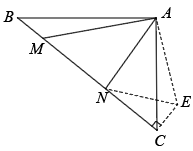
∵AB＝AC，∠BAC＝90°，
∴∠B＝∠ACB＝45°．
∵CE⊥BC，
∴∠ACE＝∠B＝45°．
在△ABM和△ACE中 $\{\begin{array}{c}AB＝AC\\\angle B＝\angle ACE\\BM＝CE\end{array}$ ，
∴△ABM≌△ACE（SAS）．
∴AM＝AE，∠BAM＝∠CAE．
∵∠BAC＝90°，∠MAN＝45°，
∴∠BAM＋∠CAN＝45°．
于是，由∠BAM＝∠CAE，得∠MAN＝∠EAN＝45°．
在△MAN和△EAN中 $\{\begin{array}{c}AM＝AE\\\angle MAN＝\angle EAN\\AN＝AN\end{array}$ ，
∴△MAN≌△EAN（SAS）．
∴MN＝EN．
在Rt△ENC中，由勾股定理，得EN2＝EC2＋NC2．
∴MN2＝BM2＋NC2．
∵BM＝1，CN＝3，
∴MN2＝12＋32，
∴MN＝ $\sqrt{10}$ ．

【点睛】本题主要考查全等三角形的判定和性质、等腰直角三角形的性质以及勾股定理的综合应用，掌握三角形的全等的判定定理是解题关键．

2．（2021·黑龙江齐齐哈尔·中考真题）综合与实践

数学实践活动，是一种非常有效的学习方式．通过活动可以激发我们的学习兴趣，提高动手动脑能力，拓展思推空间，丰富数学体验．让我们一起动手来折一折、转一转、剪一剪，体会活动带给我们的乐趣．

折一折：将正方形纸片*ABCD*折叠，使边*AB*、*AD*都落在对角线*AC*上，展开得折痕*AE*、*AF*，连接*EF*，如图1．

  
（1） $\angle EAF=$ \_\_\_\_\_\_\_\_\_ $\circ$ ，写出图中两个等腰三角形：\_\_\_\_\_\_\_\_\_（不需要添加字母）；
转一转：将图1中的 $\angle EAF$ 绕点*A*旋转，使它的两边分别交边*BC*、*CD*于点*P*、*Q*，连接*PQ*，如图2．  
（2）线段*BP*、*PQ*、*DQ*之间的数量关系为\_\_\_\_\_\_\_\_\_；  
（3）连接正方形对角线*<text style="italic">BD*</text>，若图2中的 $\angle PAQ$ 的边*AP*、*AQ*分别交对角线*<text style="italic">BD*</text>于点*M*、点*N*．如图3，则 $\frac{CQ}{BM}=$ \_\_\_\_\_\_\_\_；
剪一剪：将图3中的正方形纸片沿对角线*BD*剪开，如图4．

  
（4）求证： $BM^{2}+DN^{2}=MN^{2}$ ．

【答案】（1）45， $\bigtriangleup ABC$ ， $\bigtriangleup ADC$ ；（2） $BP+DQ=PQ$ ；（3） $\sqrt{2}$ ；（4）见解析

【分析】（1）由翻折的性质可知： $\angle DAF=\angle FAC,\angle BAE=\angle EAC$ ， $\angle EAF=\angle FAC+\angle EAC$ ，根据正方形的性质： $AB=BC=CD=AD$ , $\angle BAD=90\circ =\angle DAF+\angle FAC+\angle BAE+\angle EAC$  ，则 $\angle EAF=\frac{1}{2}\angle BAD=45\circ$ ， $\bigtriangleup ABC,\bigtriangleup ADC$ 为等腰三角形；  
（2）如图：将 $\bigtriangleup ADQ$ 顺时针旋转 $90\circ$ ，证明 $\bigtriangleup APQ\allequal \bigtriangleup APQ^{'}$ 全等，即可得出结论；  
（3）证明 $\bigtriangleup ACQ\backsim \bigtriangleup ABM$ 即可得出结论；  
（4）根据半角模型，将 $\bigtriangleup ADN$ 顺时针旋转 $90\circ$ ，连接 $MN^{'}$ ，可得 $DN=BN^{'}$ ，通过 $\bigtriangleup AMN\allequal \bigtriangleup AMN^{'}$ 得出 $MN=MN^{'}$ ， $\bigtriangleup BMN^{'}$ 为直角三角形，结合勾股定理即可得出结论．

【详解】（1）由翻折的性质可知： $\angle DAF=\angle FAC,\angle BAE=\angle EAC$
$\because$  $ABCD$ 为正方形
$\therefore \angle BAD=90\circ$ ， $AB=BC=CD=AD$
$\therefore \bigtriangleup ABC,\bigtriangleup ADC$ 为等腰三角形
$\because \angle BAD=\angle DAF+\angle FAC+\angle BAE+\angle EAC$
$\therefore \angle BAD=2\left(\angle FAC+\angle EAC\right)$
$\because \angle EAF=\angle FAC+\angle EAC$
$\therefore \angle EAF=\frac{1}{2}\angle BAD=\frac{1}{2}\times 90\circ =45\circ$  
（2）如图：将 $\bigtriangleup ADQ$ 顺时针旋转 $90\circ$ ，

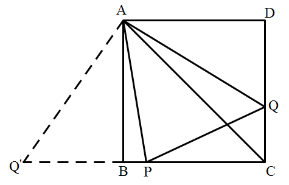
由旋转的性质可得： $AQ=AQ^{'}$ ， $DQ=BQ^{'}$  $\angle DAQ=\angle BAQ^{'}$
由（1）中结论可得 $\angle PAQ=45\circ$
$\because ABCD$ 为正方形， $\angle BAD=90\circ$
$\therefore \angle BAP+\angle DAQ=45\circ$
$\therefore \angle BAQ^{'}+\angle BAP=45\circ$
$\therefore \angle PAQ=\angle PAQ^{'}$
$\therefore$ 在 $\bigtriangleup APQ$ 和 $\bigtriangleup APQ^{'}$ 中
$\left\{\begin{array}{c}AP=AP\\\angle PAQ=\angle PAQ^{'}\\AQ=AQ^{'}\end{array}\right$
$\therefore \bigtriangleup APQ\allequal \bigtriangleup APQ^{'}$
$\therefore PQ=PQ^{'}$
$\because PQ^{'}=BQ^{'}+BP$
$\therefore PQ=DQ+BP$  
（3） $\because BD,AC$ 为正方形 $ABCD$ 对角线
$\therefore AC=\sqrt{2}AB$
$\therefore \angle ABM=\angle ACQ=45\circ$ ， $\angle BAC=45\circ$
$\because \angle PAQ=45\circ$
$\therefore \angle BAM=45\circ -\angle PAC$ ， $\angle CAQ=45\circ -\angle PAC$
$\therefore \angle BAM=\angle CAQ$
$\therefore \bigtriangleup ABM\backsim \bigtriangleup ACQ$
$\therefore \frac{CQ}{BM}=\frac{AC}{AB}=\sqrt{2}$  
（4）如图：将 $\bigtriangleup ADN$ 顺时针旋转 $90\circ$ ，连接 $MN^{'}$ ，

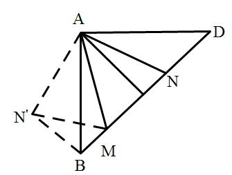
由（2）中的结论可证 $\bigtriangleup AMN^{'}\allequal \bigtriangleup AMN$
$\therefore MN=MN^{'}$
$\because \angle D=45\circ ,\angle ABD=45\circ$
根据旋转的性质可得： $\angle D=\angle ABN^{'}=45\circ$ ， $DN=BN^{'}$
$\therefore \angle MBN^{'}=\angle ABD+\angle ABN^{'}=90\circ$
$\therefore$ 在 $Rt\bigtriangleup MBN^{'}$ 中有 $BM^{2}+BN^{'}^{2}=MN^{'}^{2}$
$\therefore BM^{2}+DN^{2}=MN^{2}$

【点睛】本题是四边形的综合题，考查了正方形的性质，折叠的性质，旋转变换的性质，全等三角形的判定和性质，以及相似三角形的判定和性质，勾股定理等知识，能够综合运用这些性质是解题关键．

3．（2020·湖南湘西·中考真题）问题背景：如图1，在四边形 $ABCD$ 中， $\angle BAD=90\circ$ ， $\angle BCD=90\circ$ ， $BA=BC$ ， $\angle ABC=120\circ$ ， $\angle MBN=60\circ$ ， $\angle MBN$ 绕B点旋转，它的两边分别交 $AD$ 、 $DC$ 于E、F．探究图中线段 $AE$ ， $CF$ ， $EF$ 之间的数量关系．小李同学探究此问题的方法是：延长 $FC$ 到G，使 $CG=AE$ ，连接 $BG$ ，先证明 $\bigtriangleup BCG\allequal \bigtriangleup BAE$ ，再证明 $\bigtriangleup BFC\allequal \bigtriangleup BFE$ ，可得出结论，他的结论就是\_\_\_\_\_\_\_\_\_\_\_\_\_\_\_；
探究延伸1：如图2，在四边形 $ABCD$ 中， $\angle BAD=90\circ$ ， $\angle BCD=90\circ$ ， $BA=BC$ ， $\angle ABC=2\angle MBN$ ， $\angle MBN$ 绕B点旋转，它的两边分别交 $AD$ 、 $DC$ 于E、F．上述结论是否仍然成立？请直接写出结论（直接写出“成立”或者“不成立”），不要说明理由．

探究延伸2：如图3，在四边形 $ABCD$ 中， $BA=BC$ ， $\angle BAD+\angle BCD=180\circ$ ， $\angle ABC=2\angle MBN$ ， $\angle MBN$ 绕B点旋转，它的两边分别交 $AD$ 、 $DC$ 于E、F．上述结论是否仍然成立？并说明理由．

实际应用：如图4，在某次军事演习中，舰艇甲在指挥中心（O处）北偏西 $30\circ$ 的A处舰艇乙在指挥中心南偏东 $70\circ$ 的B处，并且两舰艇到指挥中心的距离相等接到行动指令后，舰艇甲向正东方向以75海里/小时的速度前进，同时舰艇乙沿北偏东 $50\circ$ 的方向以100海里/小时的速度前进，1.2小时后，指挥中心观测到甲、乙两舰艇分别到达E、F处，且指挥中心观测两舰艇视线之间的夹角为 $70\circ$ ，试求此时两舰艇之间的距离．

【答案】EF=AE+CF．探究延伸1：结论EF=AE+CF成立．探究延伸2：结论EF=AE+CF仍然成立．实际应用：210海里．

【分析】延长 $FC$ 到G，使 $CG=AE$ ，连接 $BG$ ，先证明 $\bigtriangleup BCG\allequal \bigtriangleup BAE$ ，可得BG=BE，∠CBG=∠ABE，再证明 $\bigtriangleup BGF\allequal \bigtriangleup BEF$ ，可得GF=EF，即可解题；
探究延伸1：延长 $FC$ 到G，使 $CG=AE$ ，连接 $BG$ ，先证明 $\bigtriangleup BCG\allequal \bigtriangleup BAE$ ，可得BG=BE，∠CBG=∠ABE，再证明 $\bigtriangleup BGF\allequal \bigtriangleup BEF$ ，可得GF=EF，即可解题；
探究延伸2：延长 $FC$ 到G，使 $CG=AE$ ，连接 $BG$ ，先证明 $\bigtriangleup BCG\allequal \bigtriangleup BAE$ ，可得BG=BE，∠CBG=∠ABE，再证明 $\bigtriangleup BGF\allequal \bigtriangleup BEF$ ，可得GF=EF，即可解题；
实际应用：连接EF，延长AE，BF相交于点C，然后与探究延伸2同理可得EF=AE+CF，将AE和CF的长代入即可．

【详解】解：EF=AE+CF

理由：延长 $FC$ 到G，使 $CG=AE$ ，连接 $BG$ ，

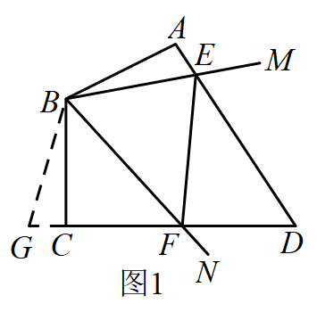
在△BCG和△BAE中，
$\left\{\begin{array}{c}BC=BA\\\angle BCG=\angle BAE=90\circ \\CG=AE\end{array}\right$ ，
∴ $\bigtriangleup BCG\allequal \bigtriangleup BAE$ （SAS），
∴BG=BE，∠CBG=∠ABE，
∵∠ABC=120°，∠MBN=60°，
∴∠ABE+∠CBF=60°，
∴∠CBG+∠CBF=60°，
即∠GBF=60°，
在△BGF和△BEF中，
$\left\{\begin{array}{c}BG=BE\\\angle GBF=\angle EBF\\BF=BF\end{array}\right$ ，
∴△BGF≌△BEF（SAS），
∴GF=EF，
∵GF=CG+CF=AE+CF，
∴EF=AE+CF．

探究延伸1：结论EF=AE+CF成立．

理由：延长 $FC$ 到G，使 $CG=AE$ ，连接 $BG$ ，

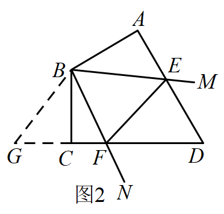
在△BCG和△BAE中，
$\left\{\begin{array}{c}BC=BA\\\angle BCG=\angle BAE=90\circ \\CG=AE\end{array}\right$ ，
∴ $\bigtriangleup BCG\allequal \bigtriangleup BAE$ （SAS），
∴BG=BE，∠CBG=∠ABE，
∵∠ABC=2∠MBN，
∴∠ABE+∠CBF= $\frac{1}{2}$ ∠ABC，
∴∠CBG+∠CBF= $\frac{1}{2}$ ∠ABC，
即∠GBF= $\frac{1}{2}$ ∠ABC，
在△BGF和△BEF中，
$\left\{\begin{array}{c}BG=BE\\\angle GBF=\angle EBF\\BF=BF\end{array}\right$ ，
∴△BGF≌△BEF（SAS），
∴GF=EF，
∵GF=CG+CF=AE+CF，
∴EF=AE+CF．

探究延伸2：结论EF=AE+CF仍然成立．

理由：延长 $FC$ 到G，使 $CG=AE$ ，连接 $BG$ ，

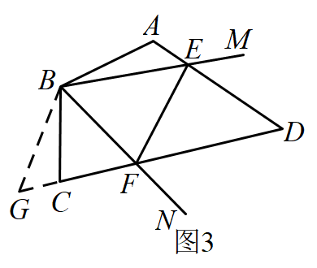
∵ $\angle BAD+\angle BCD=180\circ$ ，∠BCG+∠BCD=180°，
∴∠BCG=∠BAD
在△BCG和△BAE中，
$\left\{\begin{array}{c}BC=BA\\\angle BCG=\angle BAE\\CG=AE\end{array}\right$ ，
∴ $\bigtriangleup BCG\allequal \bigtriangleup BAE$ （SAS），
∴BG=BE，∠CBG=∠ABE，
∵∠ABC=2∠MBN，
∴∠ABE+∠CBF= $\frac{1}{2}$ ∠ABC，
∴∠CBG+∠CBF= $\frac{1}{2}$ ∠ABC，
即∠GBF= $\frac{1}{2}$ ∠ABC，
在△BGF和△BEF中，
$\left\{\begin{array}{c}BG=BE\\\angle GBF=\angle EBF\\BF=BF\end{array}\right$ ，
∴△BGF≌△BEF（SAS），
∴GF=EF，
∵GF=CG+CF=AE+CF，
∴EF=AE+CF．

实际应用：连接EF，延长AE，BF相交于点C，

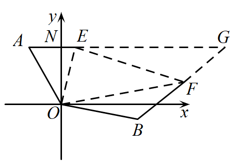
∵∠AOB=30°+90°+(90°-70°)=140°，∠EOF=70°，
∴∠EOF= $\frac{1}{2}$ ∠AOB
∵OA=OB，∠OAC+∠OBC=(90°-30°)+(70°+50°)=180°，
∴符合探索延伸中的条件
∴结论EF= AE+CF仍然成立
即EF=75×1.2+100×1.2=210（海里）
答：此时两舰艇之间的距离为210海里．

【点睛】本题考查了全等三角形的判定与性质．作辅助线构造全等三角形是解题的关键．

## 类型二 对角互补且有一组邻边相等的半角模型

4．（2022·辽宁朝阳·中考真题）【思维探究】如图1，在四边形*ABCD*中，∠*BAD*＝60°，∠*BCD*＝120°，*AB*＝*AD*，连接*AC*．求证：*BC*+*CD*＝*AC*．

  
(1)小明的思路是：延长*<text style="italic">CD*</text>到点*E*，使*DE*＝*<text style="italic"><text style="italic">B*</text>C</text>，连接*AE*．根据∠*BAD*+∠*<text style="italic">BC*D</text>＝180°，推得∠B+∠*ADC*＝180°，从而得到∠B＝∠*<text style="italic">ADE*</text>，然后证明 $\bigtriangleup$ AD*E*≌ $\bigtriangleup$ A*<text style="italic"><text style="italic">B*</text>C</text>，从而可证*BC*+*<text style="italic">CD*</text>＝*AC*，请你帮助小明写出完整的证明过程．  
(2)【思维延伸】如图2，四边形*ABCD*中，∠*BAD*＝∠*BCD*＝90°，*AB*＝*AD*，连接*AC*，猜想*BC*，*CD*，*AC*之间的数量关系，并说明理由．  
(3)【思维拓展】在四边形*A<text style="italic">BCD*</text>中，∠*B<text style="italic">AD*</text>＝∠BCD＝90°，*AB*＝AD＝ $\sqrt{6}$ ，*AC*与*BD*相交于点*O*．若四边形*A<text style="italic">BCD*</text>中有一个内角是75°，请直接写出线段*OD*的长．

【答案】(1)*AC*=*BC*+*CD*；理由见详解；  
(2)*CB*+*CD*= $\sqrt{2}$ *AC*；理由见详解；  
(3) $3\sqrt{3}-3$ 或 $3-\sqrt{3}$

【分析】（1）如图1中，延长*CD*到点*E*，使*DE*=*BC*，连接*AE*．证明△*ADE*≌△*ABC*（SAS），推出∠*DAE*=∠*BAC*，*AE*=*AC*，推出△*ACE*的等边三角形，可得结论；  
（2）结论：*<text style="italic"><text style="italic">CB*</text></text>+*<text style="italic">CD*</text>= $\sqrt{2}$ *<text style="italic">A*C</text>．如图2中，过点A作*A<text style="italic">M*</text>⊥*<text style="italic">CD*</text>于点M，*A<text style="italic">N*</text>⊥*<text style="italic"><text style="italic">CB*</text></text>交CB的延长线于点N．证明△*<text style="italic">AM*D</text>≌△*<text style="italic">AN*B</text>（AAS），推出*DM*=*BN*，AM=AN，证明*<text style="italic">Rt*</text>△*A<text style="italic">CM*</text>≌Rt△*A<text style="italic">CN*</text>（HL），推出CM=CN，可得结论；  
（3）分两种情形：如图3-1中，当∠*CDA*=75°时，过点*O*作*OP*⊥*CB*于点*P*，*CQ*⊥*CD*于点*Q*．如图3-2中，当∠*CBD*=75°时，分别求解即可．

【详解】（1）证明：如图1中，延长*CD*到点*E*，使*DE*=*BC*，连接*AE*．

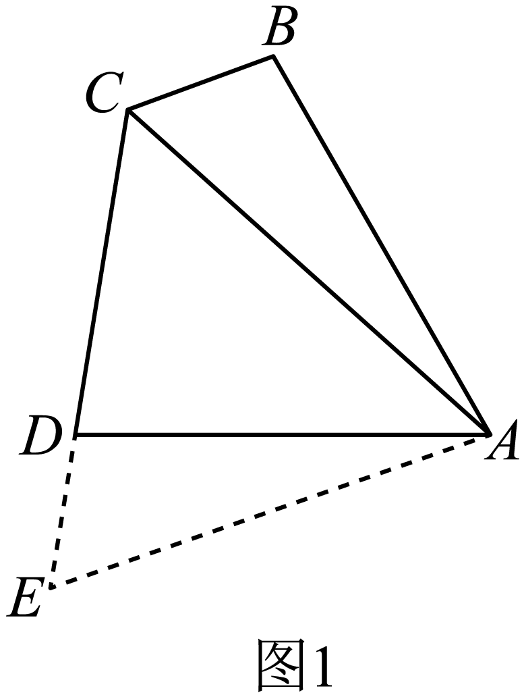
∵∠*BAD*+∠*BCD*=180°，
∴∠*B*+∠*ADC*=180°，
∵∠*ADE*+∠*ADC*=180°
∴∠*B*=∠*ADE*，
在△*ADE*和△*ABC*中，
$\left\{\begin{array}{c}DA=BA\\\angle ADE=\angle B\\DE=BC\end{array}\right$ ，
∴△*ADE*≌△*ABC*（SAS），
∴∠*DAE*=∠*BAC*，*AE*=*AC*，
∴∠*CAE*=∠*BAD*=60°，
∴△*ACE*的等边三角形，
∴*CE*=*AC*，
∵*CE*=*DE*+*CD*，
∴*AC*=*BC*+*CD*；  
（2）解：结论：*CB*+*CD*= $\sqrt{2}$ *AC*．

理由：如图2中，过点*A*作*AM*⊥*CD*于点*M*，*AN*⊥*CB*交*CB*的延长线于点*N*．

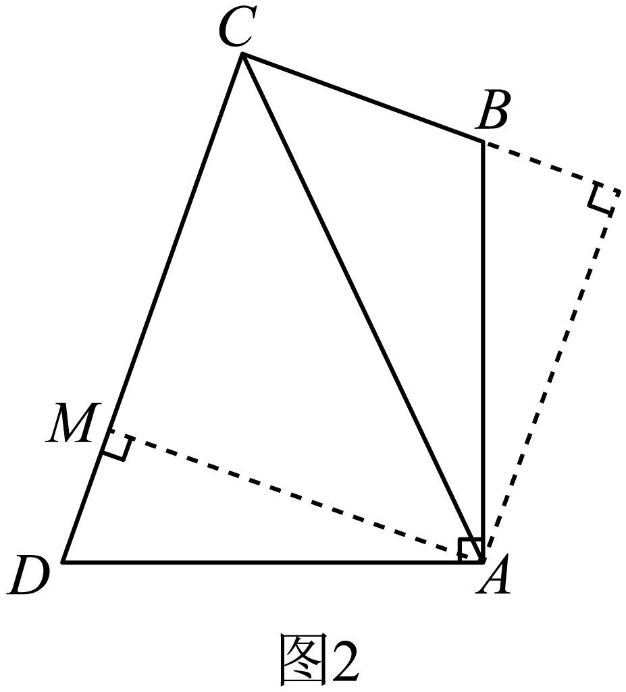
∵∠*DAB*=∠*DCB*=90°，
∴∠*CDA*+∠*CBA*=180°，
∵∠*ABN*+∠*ABC*=180°，
∴∠*D*=∠*ABN*，
∵∠*AMD*=∠*N*=90°，*AD*=*AB*，
∴△*AMD*≌△*ANB*（AAS），
∴*DM*=*BN*，*AM*=*AN*，
∵*AM*⊥*CD*，*AN*⊥*CN*，
∴∠*ACD*=∠*ACB*=45°，
∴*AC*= $\sqrt{2}$ *CM*，
∵*AC*=*AC*．*AM*=*AN*，
∴*Rt*△*ACM*≌*Rt*△*ACN*（HL），
∴*CM*=*CN*，
∴*CB*+*CD*=*CN* $-$ *BN*+*<text style="italic">CM*</text>+*DM*=2CM= $\sqrt{2}$ *AC*；  
（3）解：如图3-1中，当∠*CDA*=75°时，过点*O*作*OP*⊥*CB*于点*P*，*CQ*⊥*CD*于点*Q*．

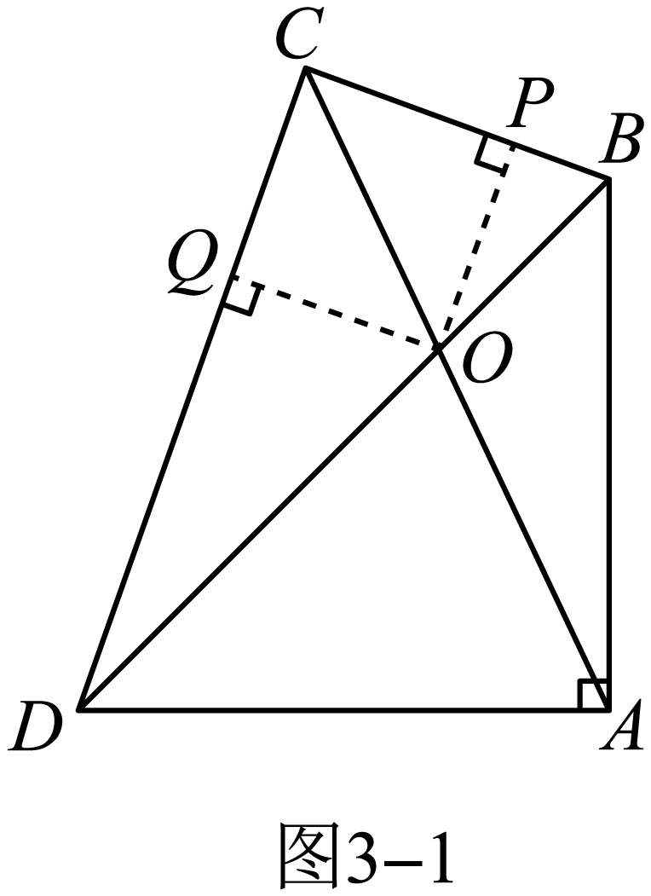
∵∠*CDA*=75°，∠*ADB*=45°，
∴∠*CDB*=30°，
∵∠*DCB*=90°，
∴*CD*= $\sqrt{3}$ *CB*，
∵∠*DCO*=∠*BCO*=45°，*OP*⊥*CB*，*OQ*⊥*CD*，
∴*OP*=*OQ*，
∴ $\frac{S_{\Delta CDO}}{S_{\Delta OBC}}=\frac{\frac{1}{2}CD\cdot OQ}{\frac{1}{2}BC\cdot OP}=\frac{CD}{BC}$ ，
∴ $\frac{OD}{OB}=\frac{CD}{CB}= \hspace{1pt} \sqrt{3}$ ，
∵*AB*=*AD*= $\sqrt{6}$ ，∠D*AB*=90°，
∴*BD*= $\sqrt{2}$ *AD*=2 $\sqrt{3}$ ，
∴*OD*= $\frac{\sqrt{3}}{1+\sqrt{3}}\times 2\sqrt{3}=3\sqrt{3}-3$ ．

如图3-2中，当∠*CBD*=75°时，

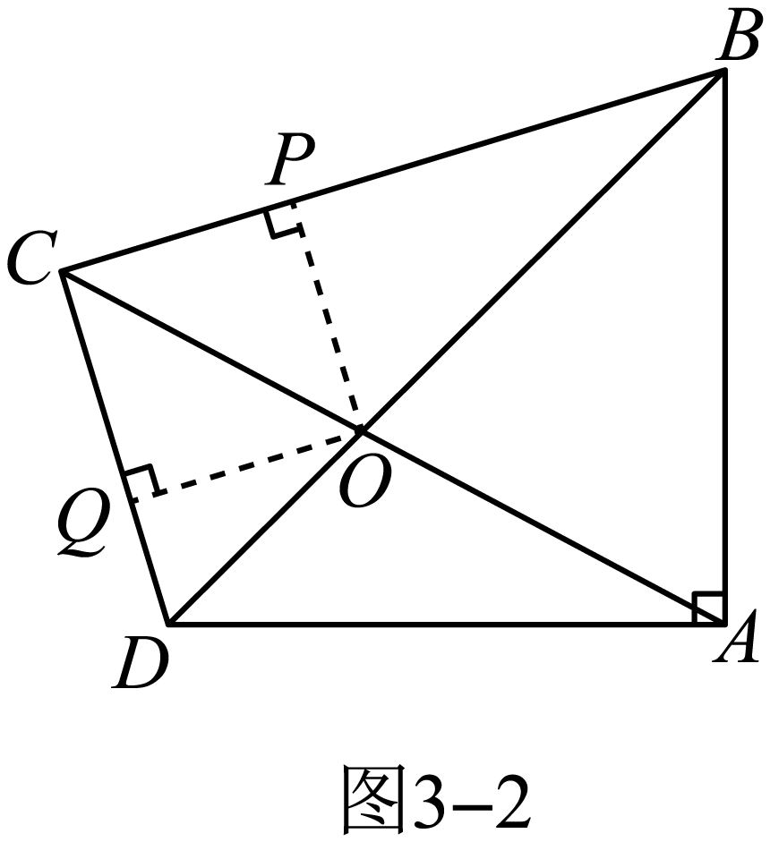

同法可证 $\frac{OD}{OB}= \hspace{1pt} \frac{1}{\sqrt{3}}$ ， $OD=\frac{1}{1+\sqrt{3}}\times 2\sqrt{3}=3-\sqrt{3}$ ，
综上所述，满足条件的*OD*的长为 $3\sqrt{3}-3$ 或 $3-\sqrt{3}$ ．

【点睛】本题属于四边形综合题，考查了全等三角形的判定和性质，解直角三角形，等边三角形的判定和性质，角平分线的性质定理等知识，解题的关键是学会添加常用辅助线，构造全等三角形解决问题，属于中考压轴题．

5．（20-21九年级上·湖北武汉·阶段练习）（1）问题背景．

如图1，在四边形 $ABCD$ 中， $AB=AD$ ， $\angle B+\angle D=180\circ$ ， $E$ 、 $F$ 分别是线段 $BC$ 、线段 $CD$ 上的点．若 $\angle BAD=2\angle EAF$ ，试探究线段 $BE$ 、 $EF$ 、 $FD$ 之间的数量关系．

童威同学探究此问题的方法是，延长 $FD$ 到点 $G$ ．使 $DG=BE$ ．连接 $AG$ ，先证明 $\bigtriangleup ABE\allequal \bigtriangleup ADG$ ．再证明 $\bigtriangleup AEF\allequal \bigtriangleup AGF$ ，可得出结论，他的结论应是_．  
（2）猜想论证．

如图2，在四边形 $ABCD$ 中， $AB=AD$ ， $\angle B+\angle ADC=180\circ$ ， $E$ 在线段 $BC$ 上、 $F$ 在线段 $CD$ 延长线上．若 $\angle BAD=2\angle EAF$ ，上述结论是否依然成立？若成立说明理由；若不成立，试写出相应的结论并给出你的证明．

  
（3）拓展应用．

如图3，在四边形 $ABDC$ 中， $\angle BDC=45\circ$ ，连接 $BC$ 、 $AD$ ， $AB:AC:BC=3:4:5$ ， $AD=4$ ，且 $\angle ABD+\angle CBD=180\circ$ ．则 $\bigtriangleup ACD$ 的面积为<u>_．</u>

【答案】（1） $EF=BE+DF$ ；（2）不成立， $EF=BE-DF$ ．理由见解析；（3） $\frac{8}{3}$

【分析】（1）延长 $FD$ 到点 $G$ ，使 $DG=BE$ ．连接 $AG$ ，即可证明 $\bigtriangleup ABE\allequal \bigtriangleup ADG\left(SAS\right)$ ，可得 $AE=AG$ ，再证明 $\bigtriangleup AEF\allequal \bigtriangleup AGF\left(SAS\right)$ ，可得 $EF=FG$ ，即可解题；  
（2）在 $BE$ 上截取 $BG$ ，使 $BG=DF$ ，连接 $AG$ ．根据（1）的证法，我们可得出 $DF=BG$ ， $GE=EF$ ，那么 $EF=GE=BE-BG=BE-DF$ ．  
（3）如图3中，过点 $D$ 作 $DH\perp AB$ 交 $AB$ 的延长线于 $H$ ， $DK\perp AC$ 交 $AC$ 的延长线于 $K$ ， $DJ\perp BC$ 于 $J$ ．证明四边形 $AHDK$ 是正方形即可解决问题．

【详解】解：延长 $FD$ 到点 $G$ ，使 $DG=BE$ ，连接 $AG$ ，

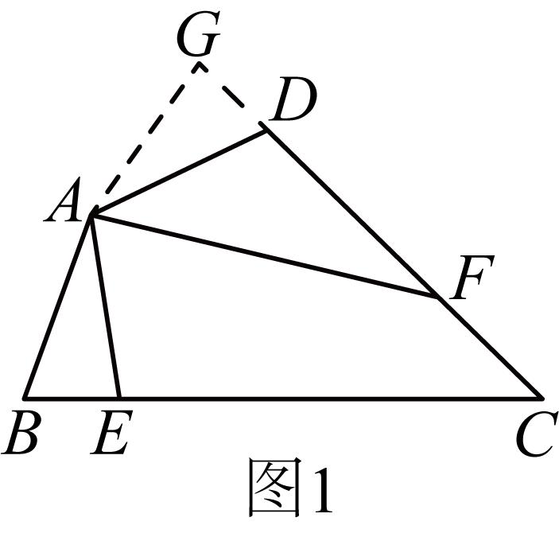
$\because \angle B+\angle ADF=180\circ$ ， $\angle ADF+\angle ADG=180\circ$ ，
$\therefore \angle ADG=\angle B$ ，
在 $\bigtriangleup ABE$ 和 $\bigtriangleup ADG$ 中，
$\left\{\begin{array}{c}BE=DG\\\angle B=\angle ADG\\AB=AD\end{array}\right$ ，
$\therefore \bigtriangleup ABE\allequal \bigtriangleup ADG\left(SAS\right)$ ，
$\therefore AE=AG$ ， $\angle BAE=\angle DAG$ ，
$\because \angle BAD=2\angle EAF$ ，
$\therefore \angle GAF=\angle DAG+\angle DAF=\angle BAE+\angle DAF=\angle BAD-\angle EAF=\angle EAF$ ，
$\therefore \angle EAF=\angle GAF$ ，
在 $\bigtriangleup AEF$ 和 $\bigtriangleup AGF$ 中，
$\left\{\begin{array}{c}AE=AG\\\angle EAF=\angle GAF\\AF=AF\end{array}\right$ ，
$\therefore \bigtriangleup AEF\allequal \bigtriangleup AGF\left(SAS\right)$ ，
$\therefore EF=FG$ ，
$\because FG=DG+DF=BE+DF$ ，
$\therefore EF=BE+DF$ ；
故答案为： $EF=BE+DF$ ．  
（2）结论 $EF=BE+FD$ 不成立，结论： $EF=BE-FD$ ．

理由如下：证明：如图2中，在 $BE$ 上截取 $BG$ ，使 $BG=DF$ ，连接 $AG$ ．

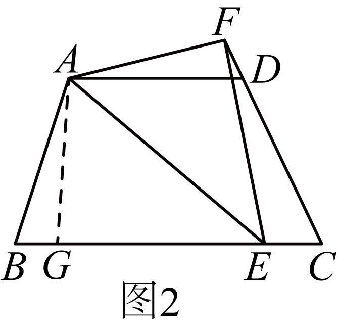
$\because \angle B+\angle ADC=180\circ$ ， $\angle ADF+\angle ADC=180\circ$ ，
$\therefore \angle B=\angle ADF$ ．
$\because$ 在 $\bigtriangleup ABG$ 与 $\bigtriangleup ADF$ 中，
$\left\{\begin{array}{c}AB=AD\\\angle ABG=\angle ADF\\BG=DF\end{array}\right$ ，
$\therefore \bigtriangleup ABG\allequal \bigtriangleup ADF\left(SAS\right)$ ．
$\therefore \angle BAG=\angle DAF$ ， $AG=AF$ ．
$\therefore \angle BAD=\angle BAG+\angle GAD=\angle DAF+\angle GAD=\angle GAF$ ．
$\because \angle BAD=2\angle EAF$ ，
$\therefore \angle GAF=2\angle EAF$ ，
$\therefore \angle GAE=\angle EAF$ ．
$\because AE=AE$ ，
$\therefore \bigtriangleup AEG\allequal \bigtriangleup AEF\left(SAS\right)$ ．
$\therefore EG=EF$ ．
$\because EG=BE-BG$ ，
$\therefore EF=BE-FD$ ．  
（3）如图3中，过点 $D$ 作 $DH\perp AB$ 交 $AB$ 的延长线于 $H$ ， $DK\perp AC$ 交 $AC$ 的延长线于 $K$ ， $DJ\perp BC$ 于 $J$ ．

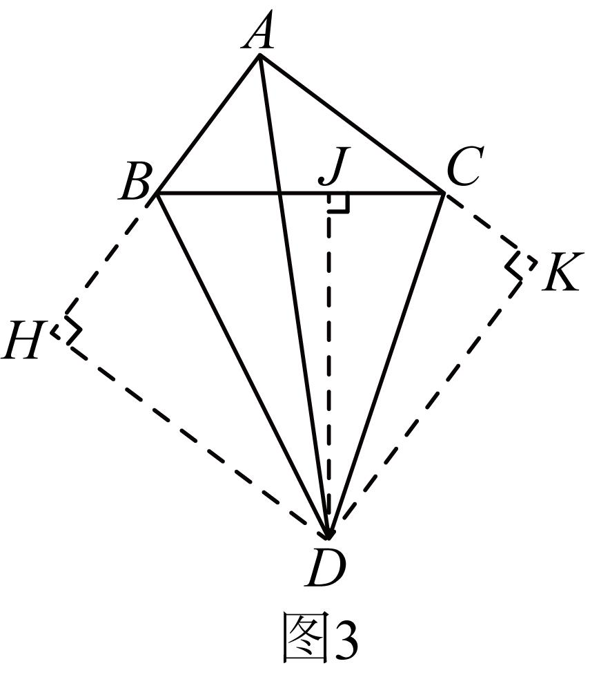
$\because AB:AC:BC=3:4:5$ ，
$\therefore$ 设 $AB=3k$ ， $AC=4k$ ， $BC=5k$ ，
$\therefore AB^{2}+AC^{2}=BC^{2}$ ，
$\therefore \angle BAC=90\circ$ ，
$\because \angle H=\angle K=90\circ$ ，
$\therefore$ 四边形 $AHDK$ 是矩形，
$\therefore \angle HDK=90\circ$ ，
$\because \angle BDC=45\circ$ ，
$\therefore \angle BDH+\angle CDK=45\circ$ ，
$\because \angle ABD+\angle CBD=180\circ$ ， $\angle ABD+\angle DBH=180\circ$ ，
$\therefore \angle DBH=\angle DBC$ ，
$\because \angle H=\angle DJB=90\circ$ ， $DB=DB$ ，
$\therefore \bigtriangleup BDH\allequal \bigtriangleup BDJ\left(AAS\right)$ ，
$\therefore DH=DJ$ ， $\angle BDH=\angle BDJ$ ， $BH=BJ$ ，
$\because \angle BDJ+\angle CDJ=45\circ$ ， $\angle BDH+\angle CDK=\angle BDJ+\angle CDK=45\circ$ ，
$\therefore \angle CDJ=\angle CDK$ ，
$\because \angle K=\angle DJC=90\circ$ ， $CD=CD$ ，
$\therefore \bigtriangleup CDK\allequal \bigtriangleup CDJ\left(AAS\right)$ ，
$\therefore DJ=DK$ ， $CJ=CK$ ，
$\therefore DH=DK$ ，
$\therefore$ 四边形 $AHDK$ 是正方形，
$\therefore BH+CK=BJ+CJ=5k$ ，
$\therefore AH+AK=12k$ ，
$\therefore AK=KD=6k$ ，
$\because AD=4$ ，
$\therefore AK=DK=2\sqrt{2}=6k$ ，
$\therefore k=\frac{\sqrt{2}}{3}$ ，
$\therefore AC=\frac{4\sqrt{2}}{3}$ ，
$\therefore S_{\bigtriangleup ACD}=\frac{1}{2}\cdot AC\cdot DK=\frac{1}{2}\cdot \frac{4\sqrt{2}}{3}\times 2\sqrt{2}=\frac{8}{3}$ ．
故答案为 $\frac{8}{3}$ ．

【点睛】本题是四边形综合题，考查了三角形全等的判定和性质，正方形的判定与性质，勾股定理及其逆定理；本题中通过全等三角形来实现线段的转换是解题的关键，没有明确的全等三角形时，要通过辅助线来构建与已知和所求条件相关联全等三角形．

6．（2020·河南南阳·模拟预测）已知四边形 $ABCD$ 中， $AB\perp AD$ ， $BC\perp CD$ ， $AB=BC$ ， $\angle ABC=120\circ$ ， $\angle MBN=60\circ$ ，将 $\angle MBN$ 绕点 $B$ 旋转，它的两边分别交边 $AD$ 、 $DC$ （或它们的延长线）于点 $E$ 、 $F$ ．

  
（1）当 $\angle MBN$ 绕点 $B$ 旋转到 $AE=CF$ 时（如图1），

①求证： $\bigtriangleup ABE\allequal \bigtriangleup CBF$ ；
②求证： $AE+CF=EF$ ；  
（2）当 $\angle MBN$ 绕点 $B$ 旋转到如图2所示的位置时， $AE\ne CF$ ，此时，（1）中的两个结论是否还成立？请直接回答．

【答案】（1）①详见解析；②详见解析；（2）①不成立，②成立．

【分析】（1）①根据*AB*＝*BC*，∠*A*＝∠*C*，*AE*＝*CF*即可得证；
②先证△BEF为等边三角形，进而得到EF＝BE＝BF，再由 $\angle ABE=\angle CBF$ 结合 $\angle ABC=120\circ$ ， $\angle MBN=60\circ$ 可得 $\angle ABE=\angle CBF=30\circ$ ，进而可证得 $BE=2AE$ ，再用等量代换即可得证；  
（2）延长*FC*至*G*，使*AE*＝*CG*，连接*BG*，先证△*BAE*≌△*BCG*，再证△*GBF*≌△*EBF*即可．

【详解】（1）①证明： $\because AB\perp AD$ ， $BC\perp CD$ ，
$\therefore \angle BAE=\angle BCF=90\circ$ ．
在△*ABE*和△*CBF*中，
$\left\{\begin{array}{c}AE=CF\\\angle BAE=\angle BCF\\AB=CB\end{array}\right$
$\therefore \bigtriangleup ABE\allequal \bigtriangleup CBF$ （SAS）．

②证明：由①知 $\bigtriangleup ABE\allequal \bigtriangleup CBF$ ，
$\therefore BE=BF$ ， $\angle ABE=\angle CBF$ ．
$\because \angle MBN=60\circ$ ，
$\therefore \bigtriangleup BEF$ 是等边三角形，
$\therefore EF=BE=BF$ ．
又 $\because \angle ABC=120\circ$ ，
$\therefore \angle ABE=\angle CBF=\frac{1}{2}\left(120\circ -60\circ \right)=30\circ$ ．
$\because \angle BAE=90\circ$ ，
$\therefore BE=2AE$ ．
$\because AE=CF$ ，
$\therefore AE+CF=2AE=BE=EF$ ．  
（2）如图2，延长*FC*至*G*，使*CG*＝*AE*，连接*BG*，

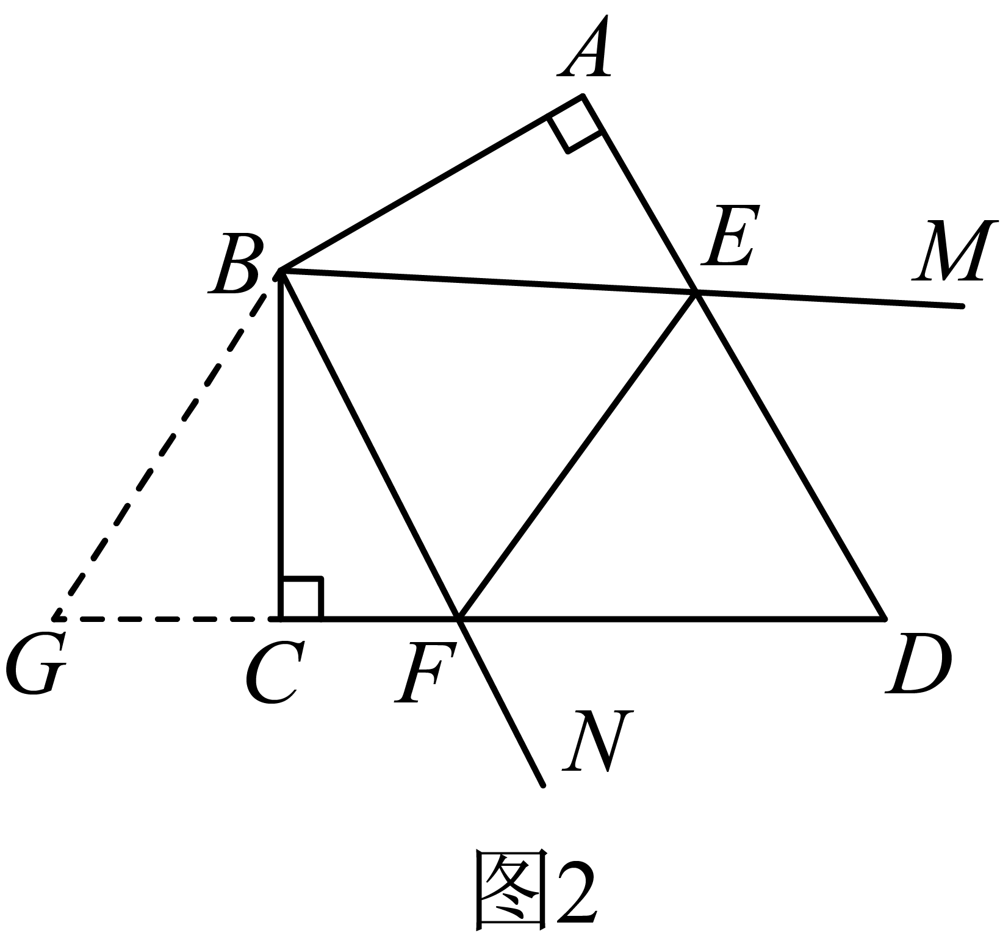
在△*BAE*和△*BCG*中，
$\left\{\begin{array}{c}BA=BC\\\angle BAE=\angle BCG\\AE=CG\end{array}\right$ ，
∴△*BAE*≌△*BCG*（*SAS*），
∴∠*ABE*＝∠*CBG*，*BE*＝*BG*，
∵∠*ABC*＝120°，∠*EBF*＝60°，
∴∠*ABE*＋∠*CBF*＝60°，
∴∠*CBG*＋∠*CBF*＝60°，
∴∠*GBF*＝∠*EBF*，
在△*GBF*和△*EBF*中，
$\left\{\begin{array}{c}BG=BE\\\angle GBF=\angle EBF\\BF=BF\end{array}\right$ ，
∴△*GBF*≌△*EBF*（*SAS*），
∴*EF*＝*GF*＝*CF*＋*CG*＝*CF*＋*AE*，
∴①不成立，②成立．

【点睛】本题主要考查了全等三角形的判定与性质、等边三角形的判定与性质、旋转变换等知识点，难度适中．本题是典型的“大角夹半角模型”，其基本思路是“旋转补短”，从而构造全等三角形．

## 类型三 手拉手旋转模型  

7．（2022·山东济南·中考真题）如图1，△*ABC*是等边三角形，点*D*在△*ABC*的内部，连接*AD*，将线段*AD*绕点*A*按逆时针方向旋转60°，得到线段*AE*，连接*BD*，*DE*，*CE*．

  
(1)判断线段*BD*与*CE*的数量关系并给出证明；  
(2)延长*ED*交直线*BC*于点*F*．

①如图2，当点*F*与点*B*重合时，直接用等式表示线段*AE*，*BE*和*CE*的数量关系为\_\_\_\_\_\_\_；
②如图3，当点*F*为线段*BC*中点，且*ED*＝*EC*时，猜想∠*BAD*的度数，并说明理由．

【答案】(1) $BD=CE$ ，理由见解析  
(2)① $BE=AE+CE$ ；② $\angle BAD=45\circ$ ，理由见解析

【分析】（1）利用等边三角形的性质和旋转的性质易得到 $\bigtriangleup ABD\allequal \bigtriangleup ACE\left(SAS\right)$ ，再由全等三角形的性质求解；  
（2）①根据线段 $AD$ 绕点*A*按逆时针方向旋转 $60\circ$ 得到 $AE$ 得到 $\bigtriangleup ADE$ 是等边三角形，
由等边三角形的性质和（1）的结论来求解；②过点*A*作 $AG\perp EF$ 于点*G*，连接*A*F，根据等边三角形的性质和锐角三角函数求值得到 $\angle BAF=\angle DAG$ ， $\frac{AG}{AD}=\frac{AF}{AB}$ ，进而得到 $\bigtriangleup BAD\backsim \bigtriangleup FAG$ ，进而求出 $\angle ADB=90\circ$ ，结合 $BD=CE$ ，*ED*＝*EC*得到 $BD=AD$ ，再用等腰直角三角形的性质求解．

【详解】（1）解： $BD=CE$ ．
证明：∵ $\bigtriangleup ABC$ 是等边三角形，
∴ $AB=AC$ ， $\angle BAC=60\circ$ ．
∵线段 $AD$ 绕点*A*按逆时针方向旋转 $60\circ$ 得到 $AE$ ，
∴ $AD=AE$ ， $\angle DAE=60\circ$ ，
∴ $\angle BAC=\angle DAE$ ，
∴ $\angle BAC-\angle DAC=\angle DAE-\angle DAC$ ，
即 $\angle BAD=\angle CAE$ ．
在 $\bigtriangleup ABD$ 和 $\bigtriangleup ACE$ 中
$\left\{\begin{array}{c}AB=AC\\\angle BAD=\angle CAE\\AD=AE\end{array}\right$ ，
∴ $\bigtriangleup ABD\allequal \bigtriangleup ACE\left(SAS\right)$ ，
∴ $BD=CE$ ；  
（2）解：① $BE=AE+CE$

理由：∵线段 $AD$ 绕点*A*按逆时针方向旋转 $60\circ$ 得到 $AE$ ，
∴ $\bigtriangleup ADE$ 是等边三角形，
∴ $AD=DE=AE$ ，
由（1）得 $BD=CE$ ，
∴ $BE=DE+BD=AE+CE$ ；
②过点*A*作 $AG\perp EF$ 于点*G*，连接*A*F，如下图．

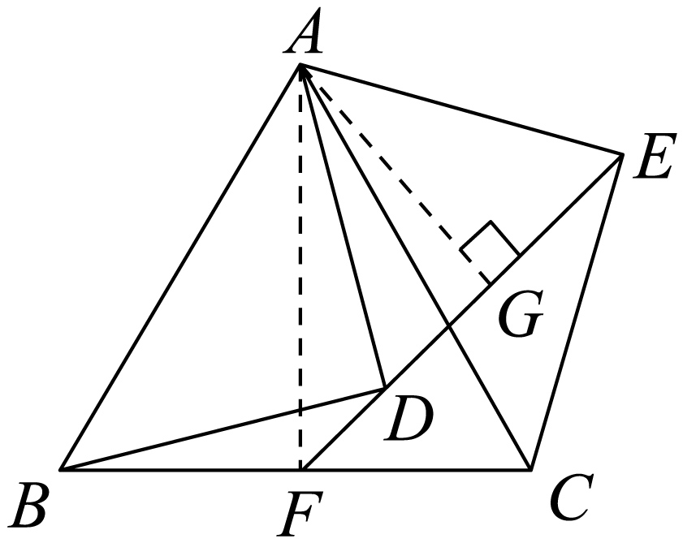
∵ $\bigtriangleup ADE$ 是等边三角形， $AG\perp DE$ ，
∴ $\angle DAG=\frac{1}{2}\angle DAE=30\circ$ ，
∴ $\frac{AG}{AD}=cos\angle DAG=\frac{\sqrt{3}}{2}$ ．
∵ $\bigtriangleup ABC$ 是等边三角形，点*F*为线段*BC*中点，
∴ $BF=CF$ ， $AF\perp BC$ ， $\angle BAF=\frac{1}{2}\angle BAC=30\circ$ ，
∴ $\frac{AF}{AB}=cos\angle BAF=\frac{\sqrt{3}}{2}$ ，
∴ $\angle BAF=\angle DAG$ ， $\frac{AG}{AD}=\frac{AF}{AB}$ ，
∴ $\angle BAF+\angle DAF=\angle DAG+\angle DAF$ ，
即 $\angle BAD=\angle FAG$ ，
∴ $\bigtriangleup BAD\backsim \bigtriangleup FAG$ ，
∴ $\angle ADB=\angle AGF=90\circ$ ．
∵ $BD=CE$ ， $ED＝EC$ ，
∴ $BD=AD$ ，
即 $\bigtriangleup ABD$ 是等腰直角三角形，
∴ $\angle BAD=45\circ$ ．

【点睛】本题主要考查了等边三角形的性质，旋转的性质，全等三角形的判定和性质，解直角三角形，相似三角形的判定和性质，等腰直角三角形的判定和性质，理解相关知识是解答关键．

8．（2020·辽宁丹东·中考真题）已知：菱形 $ABCD$ 和菱形 $A^{'}B^{'}C^{'}D^{'}$ ， $\angle BAD=\angle B^{'}A^{'}D^{'}$ ，起始位置点 $A$ 在边 $A^{'}B^{'}$ 上，点 $B$ 在 $A^{'}B^{'}$ 所在直线上，点 $B$ 在点 $A$ 的右侧，点 $B^{'}$ 在点 $A^{'}$ 的右侧，连接 $AC$ 和 $A^{'}C^{'}$ ，将菱形 $ABCD$ 以 $A$ 为旋转中心逆时针旋转 $\alpha$ 角（ $0\circ <\alpha <180\circ$ ）．  
（1）如图1，若点 $A$ 与 $A^{'}$ 重合，且 $\angle BAD=\angle B^{'}A^{'}D^{'}=90\circ$ ，求证： $BB^{'}=DD^{'}$ ；
  
（2）若点 $A$ 与 $A^{'}$ 不重合， $M$ 是 $A^{'}C^{'}$ 上一点，当 $MA^{'}=MA$ 时，连接 $BM$ 和 $A^{'}C$ ， $BM$ 和 $A^{'}C$ 所在直线相交于点 $P$ ；
①如图2，当 $\angle BAD=\angle B^{'}A^{'}D^{'}=90\circ$ 时，请猜想线段 $BM$ 和线段 $A^{'}C$ 的数量关系及 $\angle BPC$ 的度数；

②如图3，当 $\angle BAD=\angle B^{'}A^{'}D^{'}=60\circ$ 时，请求出线段 $BM$ 和线段 $A^{'}C$ 的数量关系及 $\angle BPC$ 的度数；

③在②的条件下，若点 $A$ 与 $A^{'}B^{'}$ 的中点重合， $A^{'}B^{'}=4$ ， $AB=2$ ，在整个旋转过程中，当点 $P$ 与点 $M$ 重合时，请直接写出线段 $BM$ 的长．

【答案】（1）见详解；（2）①A′C＝ $\sqrt{2}$ BM，∠BPC＝45°；②A′C＝ $\sqrt{3}$ BM，∠BPC＝30°；③1＋ $\frac{\sqrt{33}}{3}$ ．

【分析】（1）证明△ADD′≌△BAB′（SAS）可得结论；  
（2）①证明△AA′C∽△MAB，可得结论；
②证明方法类似①，即证明△AA′C∽△MAB即可得出结论；
③求出A′C，利用②中结论计算即可．

【详解】（1）证明：如图1，在菱形ABCD和菱形A′B′C′D′中，∵∠BAD＝∠B′A′D′＝90°，
∴四边形ABCD，四边形A′B′CD′都是正方形，
∵∠DAB＝∠D′AB′＝90°，
∴∠DAD′＝∠BAB′，
∵AD＝AB，AD′＝AB′，
∴△ADD′≌△BAB′（SAS），
∴DD′＝BB′；  
（2）①解：如图2中，结论：A′C＝ $\sqrt{2}$ BM，∠BPC＝45°；
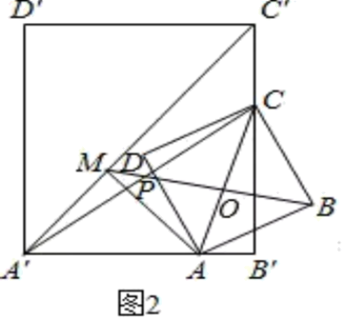

理由：设AC交BP于O，
∵四边形ABCD，四边形A′B′CD′都是正方形，
∴∠MA′A＝∠DAC＝45°，
∴∠A′AC＝∠MAB，
∵MA′＝MA，
∴∠MA′A＝∠MAA′＝45°，
∴∠AMA′＝90°，
∴AA′＝ $\sqrt{2}$ AM，
∵△ABC是等腰直角三角形，
∵AC＝ $\sqrt{2}$ AB，
∴ $\frac{AA'}{AM}=\frac{AC}{AB}$ = $\sqrt{2}$ ，
∵∠A′AC＝∠MAB，
∴△AA′C∽△MAB，
∴ $\frac{A'C}{BM}=\frac{AA'}{AM}$ = $\sqrt{2}$ ，∠A′CA＝∠ABM，
∴A′C＝ $\sqrt{2}$ BM，
∵∠AOB＝∠COP，
∴∠CPO＝∠OAB＝45°，即∠BPC＝45°；
②解：如图3中，设AC交BP于O，

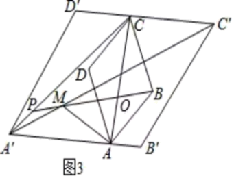
在菱形ABCD和菱形A′B′C′D′中，∵∠BAD＝∠B′A′D′＝60°，
∴∠C′A′B′＝∠CAB＝30°，
∴∠A′AC＝∠MAB，
∵MA′＝MA，
∴∠MA′A＝∠MAA′＝30°，
∴AA′＝ $\sqrt{3}$ AM，
在△ABC中，∵BA＝BC，∠CAB＝30°，
∴AC＝ $\sqrt{3}$ AB，
∴ $\frac{AA'}{AM}=\frac{AC}{AB}$ = $\sqrt{3}$ ，
∵∠A′AC＝∠MAB，
∴△A′AC∽△MAB，
∴ $\frac{A'C}{BM}=\frac{AA'}{AM}$ = $\sqrt{3}$ ，∠ACA′＝∠ABM，
∴A′C＝ $\sqrt{3}$ BM，
∵∠AOB＝∠COP，
∴∠CPO＝∠OAB＝30°，即∠BPC＝30°；
③如图4中，过点A作AH⊥A′C于H，

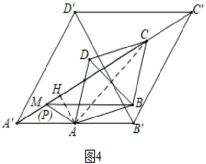
由题意AB＝BC＝CD＝AD＝2，可得AC＝ $\sqrt{3}$ AB＝2 $\sqrt{3}$ ，
在Rt△A′AH中，A′H＝ $\frac{1}{2}$ AA′＝1，A′H＝ $\sqrt{3}$ AH＝ $\sqrt{3}$ ，
在Rt△AHC中，CH＝ $\sqrt{AC^{2}-AH^{2}}$ = $\sqrt{(2\sqrt{3})^{2}-1^{2}}$ = $\sqrt{11}$ ，
∴A′C＝A′H＋CH＝ $\sqrt{3}$ ＋ $\sqrt{11}$ ，
由②可知，A′C＝ $\sqrt{3}$ BM，
∴BM＝1＋ $\frac{\sqrt{33}}{3}$ ．

【点睛】本题属于四边形综合题，考查了菱形的性质，正方形的性质，全等三角形的判定和性质，相似三角形的判定和性质等知识，解题的关键是正确寻找全等三角形或相似三角形解决问题，属于中考压轴题．

9．（2022·河南驻马店·三模）如图1， $\bigtriangleup ABC$ 是边长为6cm的等边三角形，边*<text style="italic">A*B</text>在射线*<text style="italic">O*M</text>上，且 $OA=9$ cm．点*<text style="italic">D*</text>从*O*点出发，沿*<text style="italic">OM*</text>方向运动．当点D不与点*A*重合时，将线段*<text style="italic">C*D</text>绕点C逆时针方向旋转60°得到*CE*．连接*BE，DE*．

  
(1)如图1，当点*D*在线段*OA*上运动时，线段*BD*、*BE*、*BC*之间的数量关系是\_\_\_\_\_\_，直线*AD*和直线*BE*所夹锐角的度数是\_\_\_\_\_\_；  
(2)如图2，当点*D*运动到线段*AB*（不与*A*点重合）上时，（1）中的结论是否仍然成立，若成立，请说明理由；若不成立，请写出正确的结论并说明理由；  
(3)如图3，将 $\bigtriangleup ABC$ 改为等腰直角三角形，其中斜边 $AB=6$ ，其它条件不变，以*CD*为斜边在其右侧作等腰直角三角形*CDE*，连接*<text style="italic">BE*</text>，请问BE是否存在最小值，若存在，直接写出答案；若不存在，说明理由．

【答案】(1) $BD=BE+BC,60\circ$  
(2)（1）中结论 $BD=BE+BC$ 不成立，应为 $BD=BC-BE$ ；直线*AD*与直线*BE*所夹锐角的度数为60°成立．理由见解析  
(3)存在，*BE*的最小值为 $\frac{3\sqrt{2}}{2}$

【分析】（1）结论为：*BD*= *<text style="italic">BE*</text>+*BC*；直线*AD*和直线BE所夹锐角的度数是60°；根据旋转得出*CD*=*CE*，∠*DCE*=60°，再证 $\angle DCA=\angle ECB$ ．然后证明△*DCA*≌△*ECB*（*SAS*）即可  
（2）先根据旋转得出 $\angle CDE=60\circ$ ， $DC=EC$ ．再证 $\angle DCA=\angle ECB$ ．然后证明△*DCA*≌△*ECB*（SAS）即可；  
（3）如图，作 $CF\perp AB$ 于点*<text style="italic">F*</text>，连结*<text style="italic"><text style="italic"><text style="italic">E*</text></text>F</text>，根据 $\angle CED=90\circ$ ，∠*D<text style="italic">F*</text>*C*=90°，得出C，D，*<text style="italic"><text style="italic">E*</text></text>，F四点共圆．*CD*为直径，根据等腰直角三角形三线合一性质得出*AF*=*BF*=*CF*=3，根据勾股定理*AC*=*<text style="italic">BC*</text>= $\sqrt{AF^{2}+CF^{2}}=3\sqrt{2}$ ，根据△*D<text style="italic"><text style="italic">E*</text></text>*C*为等腰直角三角形，得出∠*CD*E=∠C*<text style="italic">F*</text>E=45°进而得出点E运动轨迹是∠*CF*B的平分线所在的直线的一部分，当点E在*<text style="italic">BC*</text>上时，*<text style="italic">BE*</text>最短，然后求出BE即可．

【详解】（1）解：结论为：*BD*= *BE*+*BC*；直线*AD*和直线*BE*所夹锐角的度数是60°；
∵线段*CD*绕点*C*逆时针方向旋转60°得到*CE*．
∴*CD*=*CE*，∠*DCE*=60°，
∴∠*DCA*+∠*ACE*=60°，
∵△*ABC*为等边三角形，
∴*AC*=*BC*=*AB*，∠*ACB*=∠*CAB*=60°，
∴∠*ACE*+∠*ECB*=60°，
∴∠*DCA*=∠*ECB*，
在△*DCA*和△*ECB*中，
$\left\{\begin{array}{c}DC=EC\\\angle DCA=\angle ECB\\AC=BC\end{array}\right$ ，
∴△*DCA*≌△*ECB*（SAS），
∴*DA*=*EB*，∠*DAC*=∠*EBC*=180°-∠*CAB*=120°，
∴*BD*=*DA*+*AB*=*BE*+*BC*，
∴*BD*= *BE*+*BC*，

∠*DBE*=∠*EBC*-∠*ABC*=120°-60°=60°，
故答案为*BD*= *BE*+*BC*；60°；  
（2）解：（1）中结论 $BD=BE+BC$ 不成立，

应为 $BD=BC-BE$ ；直线*AD*与直线*BE*所夹锐角的度数为60°成立．

理由如下：
∵线段*CD*绕点*C*逆时针方向旋转60°得到*CE*，
∴ $\angle CDE=60\circ$ ， $DC=EC$ ．
∵在等边三角形 $\bigtriangleup ABC$ 中， $AB=BC=AC$ ，
$\angle ACB=\angle BAC=\angle ABC=60\circ$ ，
∴ $\angle DCA=\angle ECB$ ．
在△*DCA*和△*ECB*中，
$\left\{\begin{array}{c}DC=EC\\\angle DCA=\angle ECB\\AC=BC\end{array}\right$ ，
∴△*DCA*≌△*ECB*（SAS），
∴ $AD=BE$ ， $\angle CBE=\angle DAC=60\circ$ ．
∴ $BD=AB-AD=BC-BE$ ，
$\angle EBM=180\circ -\angle ABC-\angle CBE=180\circ -60\circ -60\circ =60\circ$ ．  
（3）解：存在，*BE*的最小值为 $\frac{3\sqrt{2}}{2}$ ．

如图，作 $CF\perp AB$ 于点*F*，连结*EF*，
∵ $\angle CED=90\circ$ ，∠*DFC*=90°，
∴*C*，*D*，*E*，*F*四点共圆．*CD*为直径，

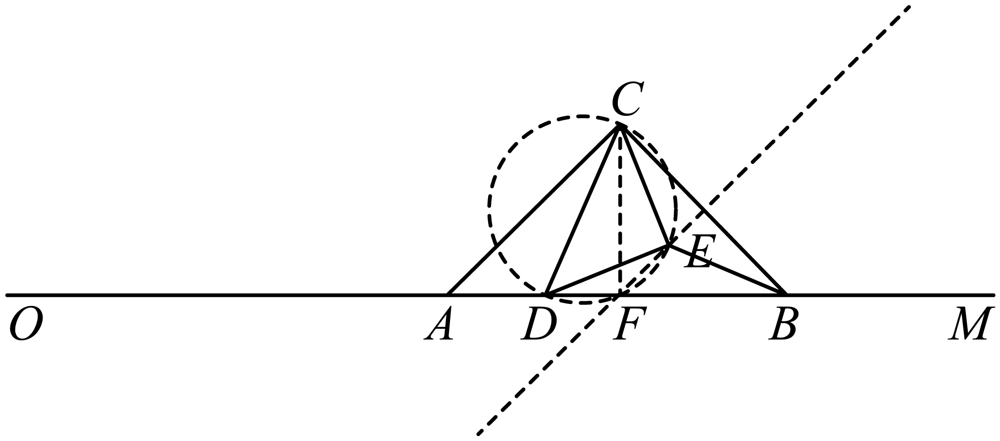
∵*AB*=6，*CF*⊥*AB*，*AC*=*BC*，
∴*AF*=*BF*=*CF*=3，*AC*=*BC*= $\sqrt{AF^{2}+CF^{2}}=3\sqrt{2}$ ，
∵△*DEC*为等腰直角三角形，
∴∠*CDE*=∠*CFE*=45°，
∴点*E*运动轨迹是∠*CFB*的平分线所在的直线的一部分，
当点*E*在*BC*上时．*BE*最短，
∵*DE*平分∠*CDB*，*CF*=*BF*，
∴*BE*=*CE*= $\frac{1}{2}BC=\frac{3\sqrt{2}}{2}$ ．

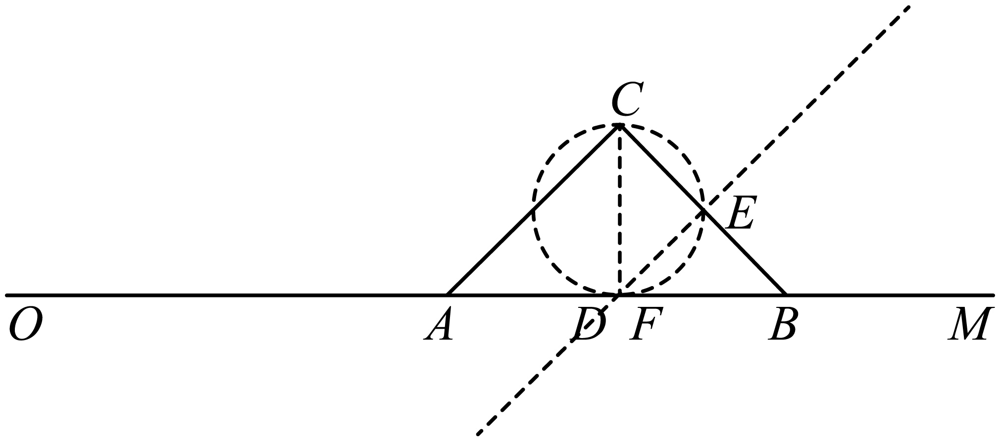

【点睛】本题考查图形旋转，三角形全等判定与性质，等边三角形判定与性质，四点共圆，圆周角定理，勾股定理，动点问题，掌握图形旋转，三角形全等判定与性质，等边三角形判定与性质，四点共圆，圆周角定理，勾股定理，动点问题是解题关键．

## 类型四  中点旋转模型  

10．（2023·河北唐山·二模）已知：在正方形 $ABCD$ 中， $E$ 为对角线 $BD$ 上一点，过点 $E$ 作 $EF\perp BD$ ，交 $BC$ 于点 $F$ ，连接 $DF$ ， $G$ 为 $DF$ 的中点，连接 $EG$ ， $CG$ ．

【猜想论证】  
(1)猜想线段 $EG$ 与 $CG$ 的数量关系，并加以证明．

【拓展探究】  
(2)将图 $1$ 中 $\bigtriangleup BEF$ 绕 $B$ 点逆时针旋转 $45\circ$ 得到图 $2$ ，取 $DF$ 中点 $G$ ，连接 $EG$ ， $CG.$ 你在 $(1)$ 中得到的结论还成立吗？写出你的猜想并加以证明．

【答案】(1) $EG=CG$ ，理由见解析  
(2)（1）中结论仍然成立，即 $EG=CG$ ，理由见解析

【分析】（1）利用直角三角形斜边上的中线等于斜边的一半，可证出 $CG=EG$ ．  
（2）连接 $AG$ ，过 $G$ 点作 $MN\perp AD$ 于 $M$ ，与 $EF$ 的延长线交于 $N$ 点；再证明 $\bigtriangleup DAG$ ≌ $\bigtriangleup DCG$ ，得出 $AG=CG$ ；再证出 $\bigtriangleup DMG\allequal \bigtriangleup FNG\left(ASA\right)$ ，得到 $MG=NG$ ；再证明 $\bigtriangleup AMG$ ≌ $\bigtriangleup ENG$ ，得出 $AG=EG$ ；最后证出 $CG=EG$ ．

【详解】（1） $EG=CG$ ；
证明： $\because$ 四边形 $ABCD$ 是正方形，
$\therefore \angle DCF=90\circ$ ，
在 $Rt\bigtriangleup FCD$ 中，
$\because G$ 为 $DF$ 的中点，
∴ $CG=\frac{1}{2}DF$ ，
∵ $EF\perp BD$ ，

同理，在 $Rt\bigtriangleup DEF$ 中，
$GE=\frac{1}{2}DF$ ，
$\therefore CG=EG$ ．  
（2）解：（1）中结论仍然成立，即 $EG=CG$ ．

连接 $AG$ ，过 $G$ 点作 $MN\perp AD$ 于 $M$ ，与 $EF$ 的延长线交于 $N$ 点，

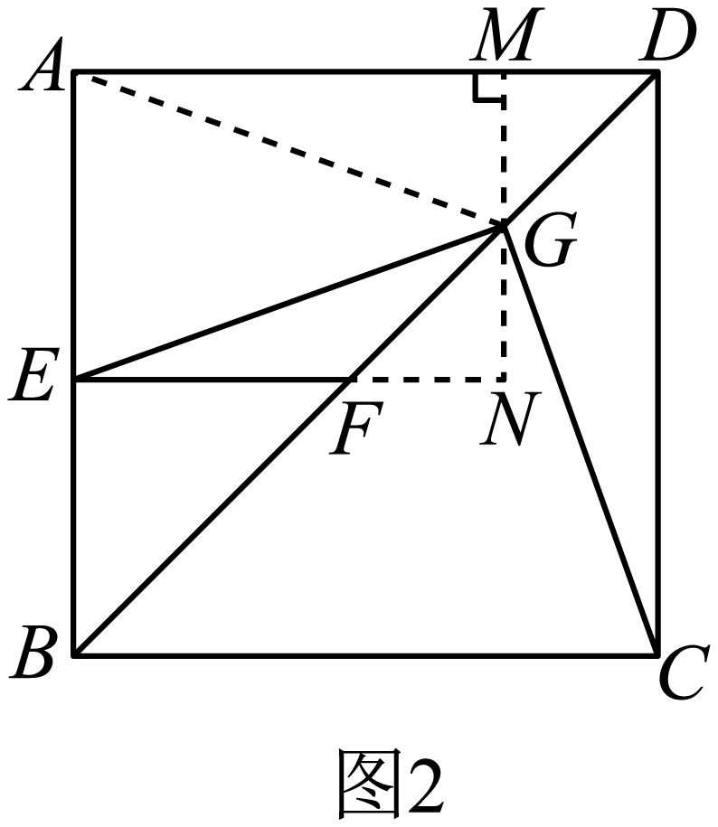
在 $\bigtriangleup DAG$ 与 $\bigtriangleup DCG$ 中，
$\because AD=CD$ ， $\angle ADG=\angle CDG$ ， $DG=DG$ ，
$\therefore \bigtriangleup DAG$ ≌ $\bigtriangleup DCG\left(SAS\right)$ ，
$\therefore AG=CG$ ；
在 $\bigtriangleup DMG$ 与 $\bigtriangleup FNG$ 中，
∵ $\angle DGM=\angle FGN$ ， $\angle MDG=\angle NFG$ ，
∵ $G$ 为 $DF$ 的中点，
∴ $FG=DG$ ，
$\therefore \bigtriangleup DMG\allequal \bigtriangleup FNG\left(ASA\right)$ ，
∴ $GM=GN$ ；
∵ $\angle EAM=\angle AEN=\angle AMN=90\circ$ ，
$\therefore$ 四边形 $AENM$ 是矩形，
∴ $AM=EN$ ，
在 $\bigtriangleup AMG$ 与 $\bigtriangleup ENG$ 中，
∵ $AM=EN$ ， $\angle AMG=\angle ENG$ ， $MG=NG$ ，
$\therefore \bigtriangleup AMG\allequal \bigtriangleup ENG\left(SAS\right)$
$\therefore AG=EG$ ，
$\therefore EG=CG$ ．

【点睛】本题是几何变换综合题，考查了旋转的性质，等腰直角三角形的判定，全等三角形的判定与性质，添加恰当的辅助线本题的关键．

11．（2023·山东淄博·中考真题）在数学综合与实践活动课上，小红以“矩形的旋转”为主题开展探究活动．  
(1)操作判断

小红将两个完全相同的矩形纸片 $ABCD$ 和 $CEFG$ 拼成“*L*”形图案，如图①．

试判断： $\bigtriangleup ACF$ 的形状为\_\_\_\_\_\_\_\_．

  
(2)深入探究

小红在保持矩形 $ABCD$ 不动的条件下，将矩形 $CEFG$ 绕点 $C$ 旋转，若 $AB=2$ ， $AD=4$ ．

探究一：当点 $F$ 恰好落在 $AD$ 的延长线上时，设 $CG$ 与 $DF$ 相交于点 $M$ ，如图②．求 $\bigtriangleup CMF$ 的面积．

探究二：连接 $AE$ ，取 $AE$ 的中点 $H$ ，连接 $DH$ ，如图③．

求线段 $DH$ 长度的最大值和最小值．

【答案】(1)等腰直角三角形  
(2)探究一： $\frac{5}{2}$ ；探究二：线段 $DH$ 长度的最大值为 $\sqrt{5}+1$ ，最小值为 $\sqrt{5}-1$

【分析】（1）由 $AC=CF$ ，可知 $\bigtriangleup ACF$ 是等腰三角形，再由 $\bigtriangleup ABC\allequal \bigtriangleup FGC(SAS)$ ，推导出 $\angle ACF=90\circ$ ，即可判断出 $\bigtriangleup ACF$ 是等腰直角三角形，  
（2）探究一：证明 $\bigtriangleup CDM\allequal \bigtriangleup FGM(AAS)$ ，可得 $CM=MF$ ，再由等腰三角形的性质可得 $AD=DF$ ，在 $Rt\bigtriangleup CDM$ 中，勾股定理列出方程 $CM^{2}=2^{2}+(4-CM)^{2}$ ，解得 $CM$ ，即可求 $\bigtriangleup CMF$ 的面积；
探究二：连接 $DE$ ，取 $DE$ 的中点 $P$ ，连接 $HP$ ，取 $AD$ 、 $BC$ 的中点为 $M$ 、 $N$ ，连接 $MN$ ， $MH$ ， $NH$ ，分别得出四边形 $MHPD$ 是平行四边形，四边形 $HNCP$ 是平行四边形，则 $\angle MHN=90\circ$ ，可知 $H$ 点在以 $MN$ 为直径的圆上，设 $MN$ 的中点为 $T$ ， $DT=\sqrt{5}$ ，即可得出 $DH$ 的最大值与最小值．

【详解】（1）解： $\because$ 两个完全相同的矩形纸片 $ABCD$ 和 $CEFG$ ，
$\therefore AC=CF$ ，
$\therefore \bigtriangleup ACF$ 是等腰三角形，
$\because AB=GF$ ， $\angle FGC=\angle ABC=90\circ$ ． $BC=CG$ ，
$\therefore \bigtriangleup ABC\allequal \bigtriangleup FGC(SAS)$ ，
$\therefore \angle BAC=\angle GFC$ ，
∵ $AB\parallel CD$ ，
∴ $\angle BAC=\angle ACG$ ，
∴ $\angle ACG=\angle GFC$ ，
$\because \angle GCF+\angle GFC=90\circ$ ，
$\therefore \angle ACG+\angle GCF=90\circ$ ，
$\therefore \angle ACF=90\circ$ ，
$\therefore \bigtriangleup ACF$ 是等腰直角三角形，
故答案为：等腰直角三角形；  
（2）探究一： $\because CD=GF$ ， $\angle FMG=\angle DMC$ ， $\angle G=\angle CDF=90\circ$ ，
$\therefore \bigtriangleup CDM\allequal \bigtriangleup FGM(AAS)$ ，
$\therefore CM=MF$ ，
$\because AC=CF$ ， $CD\perp AF$ ，
$\therefore AD=DF$ ，
$\because AB=CD=2$ ， $AD=DF=4$ ，
$\therefore DM=4-CM$ ，
在 $Rt\bigtriangleup CDM$ 中， $CM^{2}=CD^{2}+DM^{2}$ ，
$\therefore$  $CM^{2}=2^{2}+(4-CM)^{2}$ ，
解得 $CM=$  $\frac{5}{2}$ ，
$\therefore <eq>\frac{5}{2}$ MF=</eq> ，
$\therefore \bigtriangleup CMF$ 的面积 $=$  $\frac{1}{2}\times 2\times \frac{5}{2}=\frac{5}{2}$ ；
探究二：连接 $DE$ ，取 $DE$ 的中点 $P$ ，连接 $HP$ ， $CP$ ，取 $AD$ 、 $BC$ 的中点为 $M$ 、 $N$ ，连接 $MN$ ， $MH$ ， $NH$ ，

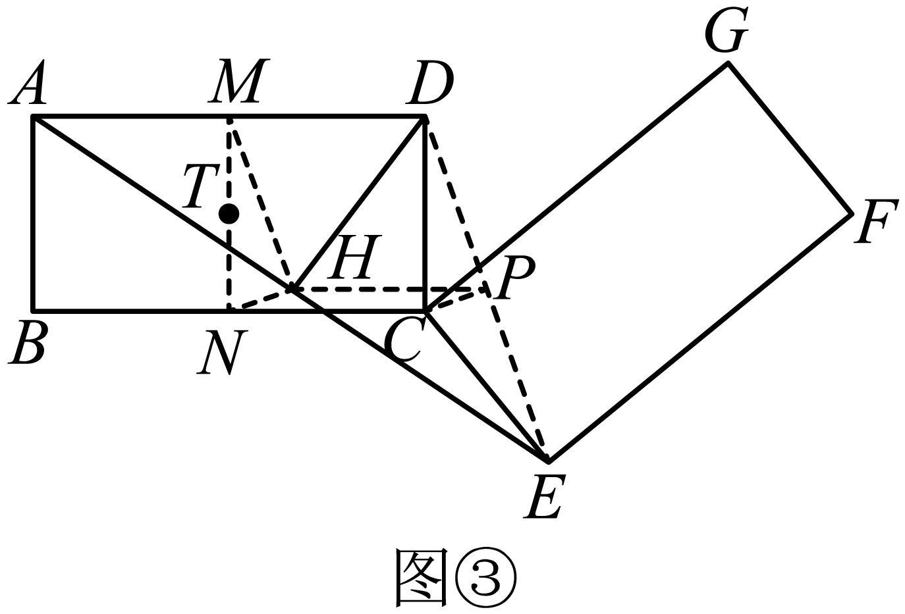
$\because H$ 是 $AE$ 的中点，
$\therefore$  $MH\parallel DE$ ，且 $MH=$  $\frac{1}{2}$  $DE$ ，
$\because CD=CE$ ，
$\therefore CP\perp DE$ ， $DP=PE$ ，
$\because$  $MH\parallel DP$ ，且 $MH=DP$ ，
$\therefore$ 四边形 $MHPD$ 是平行四边形，
$\therefore MD=HP$ ， $MD\parallel HP$ ，
$\because$  $AD\parallel BC$ ， $MD=CN$ ，
$\therefore$  $HP\parallel CN$ ， $HP=CN$ ，
$\therefore$ 四边形 $HNCP$ 是平行四边形，
$\therefore$  $NH\parallel CP$ ，
$\therefore \angle MHN=90\circ$ ，
$\therefore H$ 点在以 $MN$ 为直径的圆上，
设 $MN$ 的中点为 $T$ ，
$\therefore$  $DT=\sqrt{1^{2}+2^{2}}=\sqrt{5}$ ，
$\therefore DH$ 的最大值为 $\sqrt{5}+1$ ，最小值为 $\sqrt{5}-1$ ．

【点睛】本题考查四边形的综合应用，熟练掌握矩形的性质，直角三角形的性质，三角形全等的判定及性质，平行四边形的性质，圆的性质，能够确定*H*点的运动轨迹是解题的关键．

12．（2021·江苏宿迁·中考真题）已知正方形*ABCD*与正方形*AEFG*，正方形*AEFG*绕点*A*旋转一周．  
(1)如图①，连接*BG*、*CF*，求 $\frac{CF}{BG}$ 的值；  
(2)当正方形*AEFG*旋转至图②位置时，连接*CF*、*BE*，分别取*CF*、*BE*的中点*M*、*N*，连接*MN*、试探究：*MN*与*BE*的关系，并说明理由；  
(3)连接*BE*、*BF*，分别取*BE*、*BF*的中点*N*、*Q*，连接*QN*，*AE*=6，请直接写出线段*QN*扫过的面积．

【答案】（1） $\sqrt{2}$ ；（2） $MN\perp BE;MN=\frac{1}{2}BE$ ；（3） $9\pi$

【分析】（1）由旋转的性质联想到连接 $AF、AC$ ，证明 $\Delta CAF\backsim \Delta BAG$ 即可求解；  
（2）由*M*、*N*分别是*CF*、*BE*的中点，联想到中位线，故想到连接*<text style="italic">BM*</text>并延长使BM=*MH*，连接*FH*、*EH*，则可证 $\Delta BMC\allequal \Delta HMF$ 即可得到 $HF=BC=BA$ ，再由四边形 $BEFC$ 内角和为 $360\circ$ 可得 $\angle BAC=\angle HFE$ ，则可证明 $\Delta BAE\allequal \Delta HFE$ ，即 $\Delta BHE$ 是等腰直角三角形，最后利用中位线的性质即可求解；  
（3）*Q*、*N*两点因旋转位置发生改变，所以*Q*、*N*两点的轨迹是圆，又*Q*、*N*两点分别是*BF*、*BE*中点，所以想到取*AB*的中点*O*，结合三角形中位线和圆环面积的求解即可解答．

【详解】解：（1）连接 $AF、AC$
$\because$ 四边形*ABCD*和四边形*AEFG*是正方形
$\therefore AB=BC,AG=FG,\angle BAD=\angle GAE=\angle CBA=\angle AGF=90\circ$
$\because$  $AF、AC$ 分别平分 $\angle EAG,\angle BAD$
$\therefore \angle BAC=\angle GAF=45\circ$
$\therefore \angle BAC+\angle CAG=\angle GAF+\angle CAG$ 即 $\angle BAG=\angle CAF$

且 $\Delta ABC,\Delta AGF$ 都是等腰直角三角形
$\therefore \frac{AC}{AB}=\frac{AF}{AG}=\sqrt{2}$
$\therefore \Delta CAF\backsim \Delta BAG$
$\therefore \frac{CF}{BG}=\frac{AC}{AB}=\sqrt{2}$

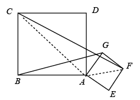  
（2）连接*BM*并延长使*BM*=*MH*，连接*FH*、*EH*
$\because M$ 是*CF*的中点
$\therefore CM=MF$
又 $\angle CMB=\angle FMH$
$\therefore \Delta CMB\allequal \Delta FMH$
$\therefore BC=HF,\angle BCM=\angle HFM$
在四边形*BEFC*中
$\angle BCM+\angle CBE+\angle BEF+\angle EFC=360\circ$
又 $\angle CBA=\angle AEF=90\circ$
$\therefore \angle BCM+\angle ABE+\angle AEB+\angle EFC=360\circ -90\circ -90\circ =180\circ$
即 $\angle HFM+\angle EFC+\angle ABE+\angle AEB=180\circ$
即 $\angle HFE+\angle ABE+\angle AEB=180\circ$
$\because \angle BAE+\angle ABE+\angle AEB=180\circ$
$\therefore \angle HFE=\angle BAE$
又四边形*ABCD*和四边形*AEFG*是正方形
$\therefore BC=AB=FH,EA=EF$
$\therefore \Delta BAE\allequal \Delta HFE$
$\therefore BE=HE.\angle BEA=\angle HEF$
$\because \angle HEF+\angle HEA=\angle AEF=90\circ$
$\therefore \angle BEA+\angle HEA=90\circ =\angle BEH$
$\therefore$ 三角形*BEH*是等腰直角三角形
$\because$ *M*、*N*分别是*BH*、*BE*的中点
$\therefore MN//HE,MN=\frac{1}{2}HE$
$\therefore \angle MNB=\angle HEB=90\circ ,MN=\frac{1}{2}BE$
$\therefore MN\perp BE,MN=\frac{1}{2}BE$

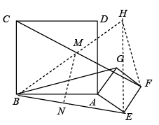  
（3）取*AB*的中点*O，* 连接*OQ*、*ON*，连接*AF*
在 $\Delta ABF$ 中，*O*、*Q*分别是*AB*、*BF*的中点
$\therefore OQ=\frac{1}{2}AF$
同理可得 $ON=\frac{1}{2}AE$
$\because AF=\sqrt{2}AE=6\sqrt{2}$
$\therefore OQ=3\sqrt{2},ON=3$
所以*QN*扫过的面积是以*O*为圆心， $3\sqrt{2}$ 和 $3$ 为半径的圆环的面积
$\therefore S=(3\sqrt{2})^{2}\pi -3^{2}\pi =9\pi$ ．

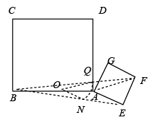

【点睛】本题考查旋转的性质、三角形相似、三角形全等、正方形的性质、中位线的性质与应用和动点问题，属于几何综合题，难度较大．解题的关键是通过相关图形的性质做出辅助线．

## 类型五  通过旋转构造三角形全等 

13．（2022·内蒙古呼和浩特·二模）如图，点*<text style="italic">P*</text>是正方形*<text style="italic">ABC*D</text>内一点，且点P到点A、B、C的距离分别为 $2\sqrt{3}$ 、 $\sqrt{2}$ 、4，则正方形*<text style="italic">ABC*D</text>的面积为（    ）

A． $28+8\sqrt{3}$ 	
B． $14+4\sqrt{3}$ 	
C．12	
D．24

【答案】B

【分析】将△<em>ABP</em>绕点<em>B</em>顺时针旋转90°得到△<em>CBM</em>，过点<em>B</em>作<em>BH</em>⊥<em>PM</em>于<em>H</em>，先证明∠<em>PMC</em>=90°，推出∠<em>CMB</em>=∠<em>APB</em>=135°，推出<em>A</em>、<em>P</em>、<em>M</em>共线，利用勾股定理求出<em>AB2</em>．

【详解】解：如图，将△*ABP*绕点*B*顺时针旋转90°得到△*CBM*，过点*B*作*BH*⊥*PM*于*H*，
∵*BP*=*BM*= $\sqrt{2}$ ，∠P*BM*=90°，
∴*PM*= $\sqrt{2}$ *PB*=2，
∵*PC*=4，*PA*=*CM*= $2\sqrt{3}$ ，
∴<em>PC2</em>=<em>CM2</em>+<em>PM2</em>，
∴∠*PMC*=90°，
∵∠*BPM*=∠*BMP*=45°，
∴∠*CMB*=∠*APB*=135°，
∴∠*APB*+∠*BPM*=180°，
∴*A*、*P*、*M*共线，
∵*BH*⊥*PM*，
∴*PH*=*HM*，
∴*BH*=*PH*=*HM*=1，
∴*AH*= $2\sqrt{3}$ +1，
∴<em>AB&lt;text style="italic,superscript"&gt;&lt;text style="italic,superscript"&gt;&lt;text style="superscript"&gt;&lt;text style="superscript"&gt;2</em>&lt;/text&gt;&lt;/text&gt;&lt;/text&gt;&lt;/text&gt;=<em>AH</em>2+<em>BH</em>2=( $2\sqrt{3}$ +1)<em>&lt;text style="italic,superscript"&gt;&lt;text style="italic,superscript"&gt;&lt;text style="superscript"&gt;&lt;text style="superscript"&gt;2</em>&lt;/text&gt;&lt;/text&gt;&lt;/text&gt;&lt;/text&gt;+12= $14+4\sqrt{3}$ ，
∴正方形*ABCD*的面积为 $14+4\sqrt{3}$ ，
故选：B．

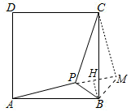

【点睛】本题考查了正方形性质，勾股定理，勾股定理的逆定理，等腰直角三角形，旋转的性质等知识点的应用，解此题的关键是正确作辅助线，本题具有一定的代表性，有一定的难度，对学生提出较高的要求．

14．（2023·湖北随州·中考真题）1643年，法国数学家费马曾提出一个著名的几何问题：给定不在同一条直线上的三个点*A*，*B*，*C*，求平面上到这三个点的距离之和最小的点的位置，意大利数学家和物理学家托里拆利给出了分析和证明，该点也被称为“费马点”或“托里拆利点”，该问题也被称为“将军巡营”问题．  
(1)下面是该问题的一种常见的解决方法，请补充以下推理过程：（其中①处从“直角”和“等边”中选择填空，②处从“两点之间线段最短”和“三角形两边之和大于第三边”中选择填空，③处填写角度数，④处填写该三角形的某个顶点）
当 $\bigtriangleup ABC$ 的三个内角均小于 $120\circ$ 时，

如图1，将 $\bigtriangleup APC$ 绕，点*C*顺时针旋转 $60\circ$ 得到 $\bigtriangleup A^{'}P^{'}C$ ，连接 $PP^{'}$ ，

由 $PC=P^{'}C，\angle PCP^{'}=60\circ$ ，可知 $\bigtriangleup PCP^{'}$ 为<u>_①_</u>三角形，故 $PP^{'}=PC$ ，又 $P^{'}A^{'}=PA$ ，故 $PA+PB+PC=PA^{'}+PB+PP^{'}\geq A^{'}B$ ，
由<u>_②_</u>可知，当<em>B</em>，<em>&lt;text style="italic"&gt;P</em>&lt;/text&gt;， $P^{'}$ ，<em>A</em>在同一条直线上时， $PA+PB+PC$ 取最小值，如图2，最小值为 $A^{'}B$ ，此时的<em>&lt;text style="italic"&gt;P</em>&lt;/text&gt;点为该三角形的“费马点”，且有 $\angle APC=\angle BPC=\angle APB=$ <u>_③_</u>；
已知当 $\bigtriangleup ABC$ 有一个内角大于或等于 $120\circ$ 时，“费马点”为该三角形的某个顶点．如图3，若 $\angle BAC\geq 120\circ$ ，则该三角形的“费马点”为<u>_④_</u>点．  
(2)如图4，在 $\bigtriangleup ABC$ 中，三个内角均小于 $120\circ$ ，且 $AC=3，BC=4，\angle ACB=30\circ$ ，已知点*P*为 $\bigtriangleup ABC$ 的“费马点”，求 $PA+PB+PC$ 的值；
  
(3)如图5，设村庄<text style="it<text style="it<text style="it*a*lic">a</text>lic">a</text>lic">*<text style="italic">A*</text></text>，*<text style="italic"><text style="italic">B*</text></text>，*<text style="italic"><text style="italic">C*</text></text>的连线构成一个三角形，且已知 $AC=4km，BC=2\sqrt{3}km，\angle ACB=60\circ$ ．现欲建一中转站<text style="it<text style="it<text style="it*a*lic">a</text>lic">a</text>lic">*<text style="italic">P*</text></text>沿直线向*<text style="italic"><text style="italic">A*</text></text>，*<text style="italic"><text style="italic">B*</text></text>，*<text style="italic"><text style="italic">C*</text></text>三个村庄铺设电缆，已知由中转站P到村庄A，B，C的铺设成本分别为a元/ $km$ ，<text style="it<text style="it*a*lic">a</text>lic">a</text>元/ $km$ ， $\sqrt{2}a$ 元/ $km$ ，选取合适的<text style="it<text style="it<text style="it*a*lic">a</text>lic">a</text>lic">*<text style="italic">P*</text></text>的位置，可以使总的铺设成本最低为\_\_\_\_\_\_\_\_\_\_\_元．（结果用含a的式子表示）

【答案】(1)①等边；②两点之间线段最短；③ $120\circ$ ；④*A*．  
(2) $5$  
(3) $2\sqrt{13}a$

【分析】（1）根据旋转的性质和两点之间线段最短进行推理分析即可得出结论；  
（2）根据（1）的方法将 $\bigtriangleup APC$ 绕，点*C*顺时针旋转 $60\circ$ 得到 $\bigtriangleup A^{'}P^{'}C$ ，即可得出可知当*B*，*P*， $P^{'}$ ，*A*在同一条直线上时， $PA+PB+PC$ 取最小值，最小值为 $A^{'}B$ ，在根据 $\angle ACB=30\circ$ 可证明 $\angle ACA^{'}=\angle A^{'}CP^{'}+\angle BCP+\angle PCP^{'}=90\circ$ ，由勾股定理求 $A^{'}B$ 即可，  
（3）由总的铺设成本 $=a(PA+PB+\sqrt{2}PC)$ ，通过将 $\bigtriangleup APC$ 绕，点*C*顺时针旋转 $90\circ$ 得到 $\bigtriangleup A^{'}P^{'}C$ ，得到等腰直角 $\bigtriangleup PP^{'}C$ ，得到 $\sqrt{2}PC=PP^{'}$ ，即可得出当*B*，*P*， $P^{'}$ ，*A*在同一条直线上时， $P^{'}A^{'}+PB+PP^{'}$ 取最小值，即 $PA+PB+\sqrt{2}PC$ 取最小值为 $A^{'}B$ ，然后根据已知和旋转性质求出 $A^{'}B$ 即可．

【详解】（1）解：∵ $PC=P^{'}C，\angle PCP^{'}=60\circ$ ，
∴ $\bigtriangleup PCP^{'}$ 为等边三角形；
∴ $PP^{'}=PC$ ， $\angle P^{'}PC=\angle PP^{'}C=60\circ$ ，
又 $P^{'}A^{'}=PA$ ，故 $PA+PB+PC=PA^{'}+PB+PP^{'}\geq A^{'}B$ ，
由两点之间线段最短可知，当*B*，*P*， $P^{'}$ ，*A*在同一条直线上时， $PA+PB+PC$ 取最小值，

最小值为 $A^{'}B$ ，此时的*P*点为该三角形的“费马点”，
∴ $\angle BPC+\angle P^{'}PC=180\circ$ ， $\angle A^{'}P^{'}C+\angle PP^{'}C=180\circ$ ，
∴ $\angle BPC=120\circ$ ， $\angle A^{'}P^{'}C=120\circ$ ，
又∵ $\bigtriangleup APC\cong \bigtriangleup A^{'}P^{'}C$ ，
∴ $\angle APC=\angle AP^{'}C=120\circ$ ，
∴ $\angle APB=360\circ -\angle APC-\angle BPC=120\circ$ ，
∴ $\angle APC=\angle BPC=\angle APB=120\circ$ ；
∵ $\angle BAC\geq 120\circ$ ，
∴ $BC>AC$ ， $BC>AB$ ，
∴ $BC+AB>AC+AB$ ， $BC+AC>AB+AC$ ，
∴三个顶点中，顶点*A*到另外两个顶点的距离和最小．
又∵已知当 $\bigtriangleup ABC$ 有一个内角大于或等于 $120\circ$ 时，“费马点”为该三角形的某个顶点．
∴该三角形的“费马点”为点*A*，
故答案为：①等边；②两点之间线段最短；③ $120\circ$ ；④ $A$ ．  
（2）将 $\bigtriangleup APC$ 绕，点*C*顺时针旋转 $60\circ$ 得到 $\bigtriangleup A^{'}P^{'}C$ ，连接 $PP^{'}$ ，
由（1）可知当*B*，*P*， $P^{'}$ ，*A*在同一条直线上时， $PA+PB+PC$ 取最小值，最小值为 $A^{'}B$ ，

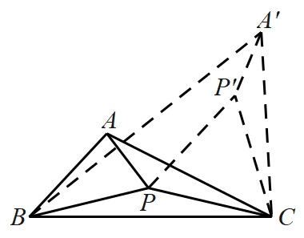
∵ $\angle ACP=\angle A^{'}CP^{'}$ ，
∴ $\angle ACP+\angle BCP=\angle A^{'}CP^{'}+\angle BCP=\angle ACB=30\circ$ ，
又∵ $\angle PCP^{'}=60\circ$
∴ $\angle BCA^{'}=\angle A^{'}CP^{'}+\angle BCP+\angle PCP^{'}=90\circ$ ，
由旋转性质可知： $AC=A^{'}C=3$ ，
∴ $A^{'}B=\sqrt{BC^{2}+A^{'}C^{2}}=\sqrt{4^{2}+3^{2}}=5$ ，
∴ $PA+PB+PC$ 最小值为 $5$ ，  
（3）∵总的铺设成本 $=PA\cdot a+PB\cdot a+PC\cdot \sqrt{2}a=a(PA+PB+\sqrt{2}PC)$
∴当 $PA+PB+\sqrt{2}PC$ 最小时，总的铺设成本最低，
将 $\bigtriangleup APC$ 绕，点*C*顺时针旋转 $90\circ$ 得到 $\bigtriangleup A^{'}P^{'}C$ ，连接 $PP^{'}$ ， $A^{'}B$
由旋转性质可知： $P^{'}C=PC$ ， $\angle PCP^{'}=\angle ACA^{'}=90\circ$ ， $P^{'}A^{'}=PA$ ， $A^{'}C=AC=4km$ ，
∴ $PP^{'}=\sqrt{2}PC$ ，
∴ $PA+PB+\sqrt{2}PC=P^{'}A^{'}+PB+PP^{'}$ ，
当*B*，*P*， $P^{'}$ ，*A*在同一条直线上时， $P^{'}A^{'}+PB+PP^{'}$ 取最小值，即 $PA+PB+\sqrt{2}PC$ 取最小值为 $A^{'}B$ ，

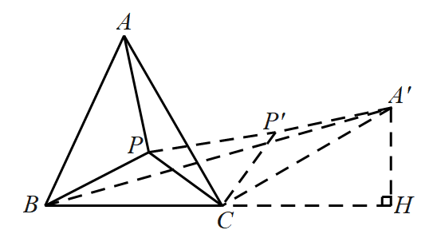

过点 $A^{'}$ 作 $A^{'}H\perp BC$ ，垂足为 $H$ ，
∵ $\angle ACB=60\circ$ ， $\angle ACA^{'}=90\circ$ ，
∴ $\angle A^{'}CH=30\circ$ ，
∴ $A^{'}H=\frac{1}{2}A^{'}C=2km$ ，
∴ $HC=\sqrt{AC^{2}-AH^{2}}=\sqrt{4^{2}-2^{2}}=2\sqrt{3}(km)$ ，
∴ $BH=BC+CH=2\sqrt{3}+2\sqrt{3}=4\sqrt{3}(km)$ ，
∴ $A^{'}B=\sqrt{AH^{2}+BH^{2}}=\sqrt{(4\sqrt{3})^{2}+2^{2}}=2\sqrt{13}(km)$
$PA+PB+\sqrt{2}PC$ 的最小值为 $2\sqrt{13}km$

总的铺设成本 $=PA\cdot a+PB\cdot a+PC\cdot \sqrt{2}a=a(PA+PB+\sqrt{2}PC)=2\sqrt{13}a$ （元）
故答案为： $2\sqrt{13}a$

【点睛】本题考查了费马点求最值问题，涉及到的知识点有旋转的性质，等边三角形的判定与性质，勾股定理，以及两点之间线段最短等知识点，读懂题意，利用旋转作出正确的辅助线是解本题的关键．

15．（23-24九年级上·湖北武汉·阶段练习）【问题背景】：如图1，点 $D$ 是等边 $\bigtriangleup ABC$ 内一点，连接 $AD,BD$ ，将 $\bigtriangleup ABD$ 绕点 $A$ 逆时针旋转 $60\circ$ 得到 $\bigtriangleup ACE$ ，连接 $DE$ ，观察发现： $BD$ 与 $CE$ 的数量关系为\_\_\_\_\_\_\_\_，直线 $BD$ 与 $CE$ 所夹的锐角为\_\_\_\_\_\_\_\_度；

【尝试应用】：如图2，在等腰直角 $\bigtriangleup ABC$ 中， $AB=AC,\angle BAC=90\circ$ ，点 $D$ 是等腰直角 $\bigtriangleup ABC$ 内一点，连接 $AD$ ， $BD$ ， $CD$ ，若 $AD=2\sqrt{2},BD=5,CD=3$ ，求 $\bigtriangleup BCD$ 面积；

【拓展创新】：如图3，在等腰 $\bigtriangleup ABC$ 中， $AB=AC,\angle BAC=120\circ$ ，点 $D$ 为平面内一点，且 $\angle ADB=60\circ ,\frac{AD}{BD}=3$ ，直接写 $\frac{AC}{CD}$ 的值为\_\_\_\_\_\_\_\_．

【答案】问题背景： $BD=CE$ ， $60$ ；；【尝试应用】： $\frac{9}{2}$ ；【拓展创新】： $\frac{1}{2}$ 或 $\frac{\sqrt{133}}{19}$ ．

【分析】问题背景：如图所示，延长 $BD$ 交 $CE$ ，由旋转的性质可得 $AD=AE,\angle DAE=60\circ$ ，通过证明 $\bigtriangleup BAD\allequal \bigtriangleup CAE\left(SAS\right)$ 得到 $BD=CE，\angle ABD=\angle ACE$ ，再由角度之间的关系推出 $\angle ACE+\angle CBD=60\circ$ ，进而利用三角形内角和定理求出 $\angle BFC=60\circ$ ，即可得到结论；
尝试应用：如图，将 $\bigtriangleup ADC$ 绕点*A*顺时针旋转 $90\circ$ 得到 $\bigtriangleup ATB$ ，连接 $DT$ ，证明 $\angle BTD=90\circ ,$ ，推出 $\angle ATB=\angle ADC=135\circ ,$ ，再证明*C*，*D*，*T*共线，可得结论；
拓展创新：分两种情形：当点*D*在的上方时，将线段 $AD$ 绕点*A*逆时针旋转 $120\circ$ 得到 $AT$ ，连接 $CT,DT,CD$ ，设 $BD=m$ ，则 $AD=AT=3m$ ．再求出 $AC$ ， $CD$ ，可得结论；
当点*<text style="italic">D*</text>在 $AB$ 的下方时，将线段 $AD$ 绕点*A*逆时针旋转 $120\circ$ 得到 $AT$ ，连接 $CT,DT,CD$ ，设 $BD=m$ ，则 $AD=AT=3m$ ，过点*<text style="italic">D*</text>作 $DH\perp TC$ 交 $TC$ 的延长线于点*H*．再求出 $AC$ ， $CD$ ，可得结论．

【详解】解：问题背景：如图所示，延长 $BD$ 交 $CE$
由旋转的性质可得 $AD=AE,\angle DAE=60\circ$ ，
∵ $\bigtriangleup ABC$ 是等边三角形，
∴ $AB=AC，\angle BAC=\angle ABC=\angle ACB=60\circ$ ，
∴ $\angle BAD=\angle CAE$ ，
∴ $\bigtriangleup BAD\allequal \bigtriangleup CAE\left(SAS\right)$ ，
∴ $BD=CE，\angle ABD=\angle ACE$ ，
∵ $\angle ABD+\angle CBD=\angle ABC=60\circ$ ，
∴ $\angle ACE+\angle CBD=60\circ$ ，
∴ $\angle BFC=180\circ -\angle ACE-\angle CBD-\angle ACB=60\circ$ ，
∴ $BD=CE$ ，直线 $BD$ 与 $CE$ 所夹的锐角为 $60\circ$ ，
故答案为： $BD=CE$ ， $60$ ；
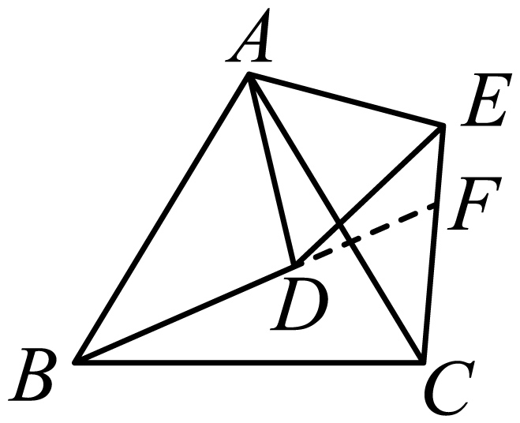

尝试应用：如图，将 $\bigtriangleup ADC$ 绕点*A*顺时针旋转 $90\circ$ 得到 $\bigtriangleup ATB$ ，连接 $DT$ ．

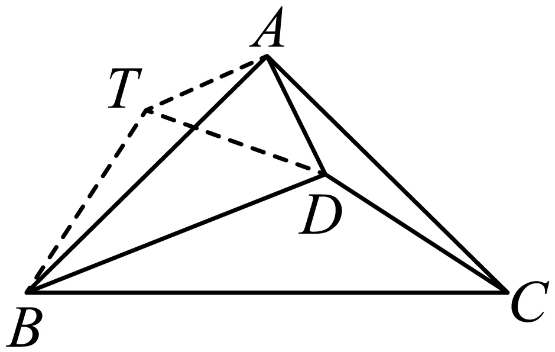
∴ $AT=AD=2\sqrt{2},\angle DAT=90\circ$ ，
$\therefore \angle ATD=\angle ADT=45\circ ,DT=\sqrt{2}AD=4,$
$\because CD=BT=3,BD=5,$
$\therefore BD^{2}=BT^{2}+DT^{2},$
$\therefore \angle BTD=90\circ ,$
$\therefore \angle ATB=\angle ADC=135\circ ,$
$\therefore \angle ADT+\angle ADC=180\circ$ ，
$\therefore C,D,T$ 共线，
$\therefore S_{\bigtriangleup CBD}=\frac{1}{2}\cdot CD\cdot BT=\frac{1}{2}\times 3\times 3=\frac{9}{2}$ ．

拓展创新：①当点*D*在 $AB$ 的上方时，将线段 $AD$ 绕点*A*逆时针旋转 $120\circ$ 得到 $AT$ ，连接 $DT$ ， $CD$ ， $CT$ ，设 $BD=m$ ，则 $AD=AT=3m$ ．

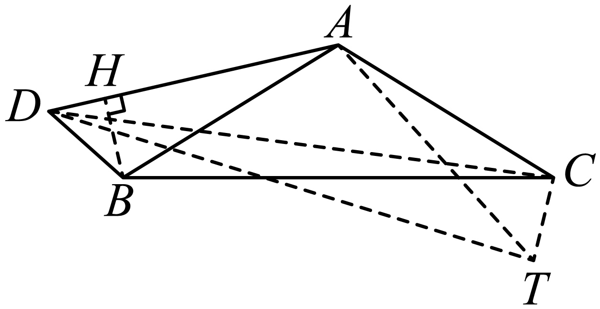
$\because \angle ABT=\angle BAC=120\circ ,$
$\therefore \angle BAD=\angle CAT,$
$\because AD=AT$ ， $AB=AC$ ，
$\therefore \bigtriangleup BAD\allequal \bigtriangleup CAT\left(SAS\right)$ ，
$\therefore BD=CT=m,$
$\angle ADB=\angle ATC=60\circ$ ，

过点*B*作 $BH\perp AD$ 于点*H* ，
则 $DH=\frac{1}{2}BD=\frac{1}{2}m,$
$BH=\frac{\sqrt{3}}{2}m$ ，
$\therefore AH=AD-DH=3m-\frac{1}{2}m=\frac{5}{2}m$ ，
$\therefore <eq>=\sqrt{\left(\frac{5}{2}m\right)^{2}+\left(\frac{\sqrt{3}}{2}m\right)^{2}}=\sqrt{7}m$ AB=AC=\sqrt{AH^{2}+BH^{2}}</eq> ，
$\because AD=AT=3m,\angle DAT=120\circ ,$
$\therefore <eq>DT=3\sqrt{3}m$ \angle ADT=\angle ATD=30\circ ,</eq> ，
$\because \angle ATC=60\circ ,$
$\therefore \angle DTC=90\circ ,$
$\therefore CD=\sqrt{DT^{2}+CT^{2}}$
$=\sqrt{\left(3\sqrt{3}m\right)^{2}+m^{2}}=2\sqrt{7}m$ ，
$\therefore \frac{AC}{CD}=\frac{\sqrt{7}m}{2\sqrt{7}m}=\frac{1}{2}$ ．

②当点*<text style="italic">D*</text>在 $AB$ 的下方时，将线段 $AD$ 绕点*A*逆时针旋转 $120\circ$ 得到 $AT$ ，连接 $DT，CT，CD$ ，设 $BD=m,$ 则 $\begin{array}{c}AD=AT=3m,\\\end{array}$ 过点*<text style="italic">D*</text>作 $DH\perp TC$ 交 $TC$ 的延长线于点*H*．

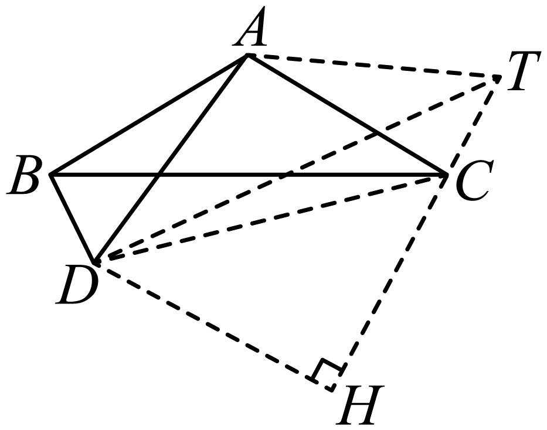

同法可证 $\bigtriangleup BAD\allequal \bigtriangleup CAT$ ，
$AB=AC=\sqrt{7}m$ ，
$\therefore \angle ATC=\angle ADB=60\circ$ ，
$\because \angle ATB=\angle ABT=30\circ ,$
$\therefore \angle DTH=30\circ ,$
$\therefore DT=\sqrt{3}AD=3\sqrt{3}m,$
$\therefore DH=\frac{1}{2}DT=\frac{3\sqrt{3}m}{2},$
$\therefore TH=\sqrt{3}DH=\frac{9}{2}m,$
$\therefore CH=TH-CT=\frac{9}{2}m-m=\frac{7}{2}m,$
$\therefore CD=\sqrt{DH^{2}+CH^{2}}$
$=\sqrt{\left(\frac{3\sqrt{3}m}{2}\right)^{2}+\left(\frac{7}{2}m\right)^{2}}$
$=\sqrt{19}m,$
$\therefore \frac{AC}{CD}=\frac{\sqrt{7}m}{\sqrt{19}m}=\frac{\sqrt{133}}{19}.$
综上所述， $\frac{AC}{CD}$ 的值为 $\frac{1}{2}$ 或 $\frac{\sqrt{133}}{19}.$
故答案为： $\frac{1}{2}$ 或 $\frac{\sqrt{133}}{19}.$

【点睛】本题属于三角形综合题，考查了旋转变换，全等三角形的判定和性质，勾股定理，含30度角的直角三角形的性质，等腰直角三角形的性质与判定等知识，解题的关键是学会添加常用辅助线，构造全等三角形解决问题，学会利用参数解决问题，属于中考压轴题．

## 题型02  构造相似三角形解题

## 类型一  做平行线构造“A”型相似

16．（2023·内蒙古·中考真题）如图， $AB$ 是⊙ $O$ 的直径， $E$ 为⊙ $O$ 上的一点，点 $C$ 是 $⌢$ 的中点，连接 $BC$ ，过点 $C$ 的直线垂直于 $BE$ 的延长线于点 $D$ ，交 $BA$ 的延长线于点 $P$ ．

  
(1)求证： $PC$ 为⊙ $O$ 的切线；  
(2)若 $PC=2\sqrt{2}BO$ ， $PB=10$ ，求 $BE$ 的长．

【答案】(1)见解析  
(2) $BE=\frac{5}{3}$

【分析】（1）连接 $OC$ ，根据点 $C$ 是 $⌢$ 的中点可得 $\angle ABC=\angle CBD$ ，进而证 $OC\parallel BD$ ，从而得证 $\angle PCO=\angle D=90\circ$ 即可；  
（2）解法一：连接 $AE$ 交 $OC$ 于 $M$ ，根据 $PC=2\sqrt{2}BO$ 及勾股定理求出 $OC=\frac{5}{2}$ ，再证明 $AE\parallel PD$ ，从而得到 $\frac{OM}{OC}=\frac{OA}{OP}$ ，即可求出 $BE$ 的值；解法二：过点 $O$ 作 $OH\perp BD$ 于点 $H$ ，按照解法一步骤求出 $OC=\frac{5}{2}$ ，然后证明四边形 $COHD$ 是矩形，再证明 $\bigtriangleup PCO\backsim \bigtriangleup PDB$ ，求得 $BD=\frac{10}{3}$ ，进而求出 $BE$ 的值．

【详解】（1）证明：连接 $OC$ ，
$\because BD\perp CD$ ，
$\therefore \angle D=90\circ$ ，
$\because$ 点 $C$ 是 $⌢$ 的中点，
$\therefore ⌢=⌢$ ，
$\therefore \angle ABC=\angle CBD$ ，
$\because OB=OC$ ，
$\therefore \angle OBC=\angle OCB$ ，
$\therefore \angle OCB＝\angle CBD$ ，
$\therefore OC\parallel BD$ ，
$\therefore \angle PCO=\angle D=90\circ$ ，
$\therefore OC\perp PD$ ，
$\because OC$ 是半径，
$\therefore PC$ 是 $\odot O$ 的切线；
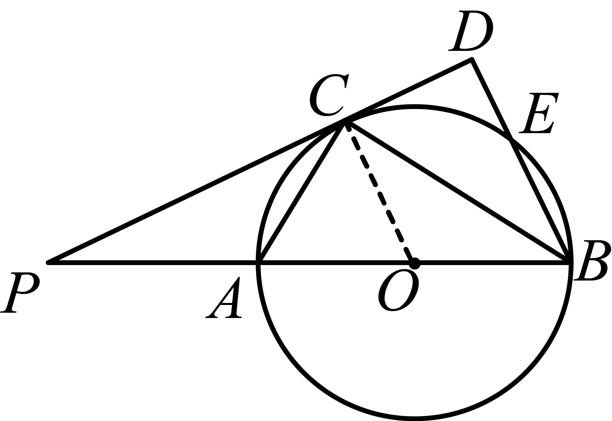  
（2）解法一：连接 $AE$ 交 $OC$ 于 $M$ ，
$\because PC=2\sqrt{2}BO$ ， $BO=CO$ ，
$\therefore PC=2\sqrt{2}CO$ ，
$\because PB=10$ ，
$\therefore PO=PB-OB=10-OC$ ，
$\therefore$ 在 $Rt\bigtriangleup PCO$ 中 $PC^{2}+OC^{2}=PO^{2}$ ，
$\therefore \left(2\sqrt{2}CO\right)^{2}+OC^{2}=\left(10-OC\right)^{2}$ ，
$\therefore OC=\frac{5}{2}$ 或 $OC=-5$ （不符合题意，舍去），
$\because$ 点 $C$ 是 $⌢$ 的中点， $OC$ 是半径，
$\therefore OC$ 垂直平分 $AE$ ，
$\because OA=OB$ ，
$\therefore OM$ 是 $\bigtriangleup AEB$ 的中位线，
$\therefore BE=2OM$ ，
$\because AB$ 是直径，
$\therefore \angle AEB=\angle D=90\circ$ ，
$\therefore AE\parallel PD$ ，
$\therefore \frac{OM}{OC}=\frac{OA}{OP}=\frac{\frac{5}{2}}{10-\frac{5}{2}}=\frac{1}{3}$ ，
$\therefore OM=\frac{1}{3}OC=\frac{1}{3}\times \frac{5}{2}=\frac{5}{6}$ ，
$\therefore BE=2\times \frac{5}{6}=\frac{5}{3}$ ；
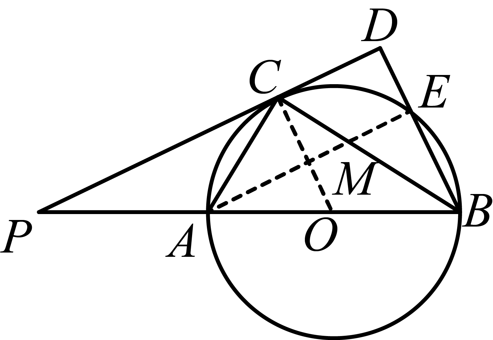
解法二：过点 $O$ 作 $OH\perp BD$ 于点 $H$ ，
$\therefore \angle DHO=90\circ$ ， $BE=2BH$ ，
$\because$  $PC=2\sqrt{2}BO$ ， $BO=CO$ ，
$\therefore PC=2\sqrt{2}CO$ ，
$\because PB=10$ ，
$\therefore PO=PB-OB=10-OC$ ，
$\therefore$ 在 $Rt\bigtriangleup PCO$ 中， $PC^{2}+OC^{2}=PO^{2}$ ，
$\therefore \left(2\sqrt{2}CO\right)^{2}+OC^{2}=\left(10-OC\right)^{2}$ ，
$\therefore OC=\frac{5}{2}$ 或 $OC=-5$ （不符合题意，舍去），
$\because \angle PDB=\angle DHO=\angle OCD=90\circ$ ，
$\therefore$ 四边形 $COHD$ 是矩形，
$\therefore DH=CO=\frac{5}{2}$ ，
$\because OC\parallel BD$ ，
$\therefore \bigtriangleup PCO\backsim \bigtriangleup PDB$ ，
$\therefore \frac{PO}{PB}=\frac{CO}{BD}$ ，
$\therefore \frac{\frac{15}{2}}{10}=\frac{\frac{5}{2}}{BD}$ ，
$\therefore BD=\frac{10}{3}$ ，
$\therefore BH=\frac{10}{3}-\frac{5}{2}=\frac{5}{6}$ ，
$\therefore BE=2BH=2\times \frac{5}{6}=\frac{5}{3}$ ．

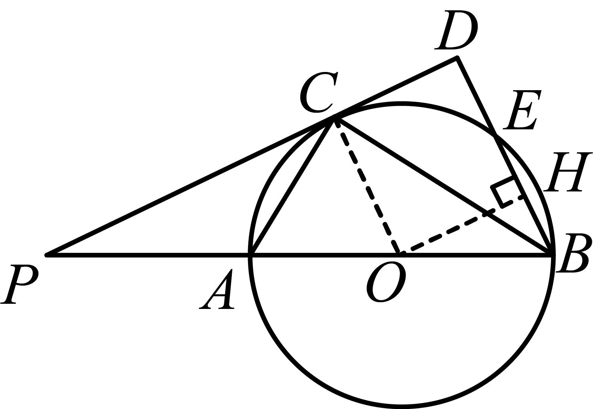

【点睛】本题考查切线的判定，圆的相关性质，勾股定理，平行线间线段成比例，相似三角形的的判定与性质，掌握并理解相关性质定理并能综合应用是关键．

17．（2018·湖北黄石·中考真题）在△ABC中，E、F分别为线段AB、AC上的点（不与A、B、C重合）．  
（1）如图1，若EF∥BC，求证： $\frac{S_{\bigtriangleup AEF}}{S_{\bigtriangleup ABC}}=\frac{AE\cdot AF}{AB\cdot AC}$  
（2）如图2，若EF不与BC平行，（1）中的结论是否仍然成立？请说明理由；  
（3）如图3，若EF上一点G恰为△ABC的重心， $\frac{AE}{AB}=\frac{3}{4}$ ，求 $\frac{S_{\bigtriangleup AEF}}{S_{\bigtriangleup ABC}}$ 的值．

【答案】（1）证明见解析；（2）证明见解析；（3） $\frac{9}{20}$

【详解】分析：（1）由EF∥BC知△AEF∽△ABC，据此得 $\frac{AE}{AB}=\frac{AF}{AC}$ ，根据 $\frac{S_{\bigtriangleup AEF}}{S_{ABC}}=(\frac{AE}{AB})^{2}$ 即可得证；  
（2）分别过点F、C作AB的垂线，垂足分别为N、H，据此知△AFN∽△ACH，得 $\frac{FN}{CH}=\frac{AF}{AC}$ ，根据 $\frac{S_{\bigtriangleup AEF}}{S_{ABC}}$ = $\frac{\frac{1}{2}AE\cdot FN}{\frac{1}{2}AB\cdot CH}$ 即可得证；  
（3）连接AG并延长交BC于点M，连接BG并延长交AC于点N，连接MN，由重心性质知S△ABM=S△ACM、 $\frac{AG}{AM}$ = $\frac{2}{3}$ ，设 $\frac{AF}{AC}$ =a，利用（2）中结论知 $\frac{S_{\bigtriangleup AEG}}{S_{ABM}}$ = $\frac{AE\cdot AG}{AB\cdot AM}$ = $\frac{1}{2}$ 、 $\frac{S_{\bigtriangleup AFG}}{S_{ACM}}$ = $\frac{AG\cdot AF}{AM\cdot AC}$ = $\frac{2}{3}$ a，从而得 $\frac{S_{\bigtriangleup AEF}}{S_{ABC}}$ = $\frac{S_{\bigtriangleup AEG}+S_{\bigtriangleup AFG}}{2S_{ACM}}$ = $\frac{1}{4}$ + $\frac{1}{3}$ a，结合 $\frac{S_{\bigtriangleup AEF}}{S_{ABC}}$ = $\frac{AE\cdot AF}{AB\cdot AC}$ = $\frac{3}{4}$ a可关于a的方程，解之求得a的值即可得出答案．

详解：（1）∵EF∥BC，
∴△AEF∽△ABC，
∴ $\frac{AE}{AB}=\frac{AF}{AC}$ ，
∴ $\frac{S_{\bigtriangleup AEF}}{S_{ABC}}=(\frac{AE}{AB})^{2}$ = $\frac{AE}{AB}\cdot \frac{AF}{AC}$ = $\frac{AE\cdot AF}{AB\cdot AC}$ ；  
（2）若EF不与BC平行，（1）中的结论仍然成立，

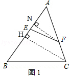
分别过点F、C作AB的垂线，垂足分别为N、H，
∵FN⊥AB、CH⊥AB，
∴FN∥CH，
∴△AFN∽△ACH，
∴ $\frac{FN}{CH}=\frac{AF}{AC}$ ，
∴ $\frac{S_{\bigtriangleup AEF}}{S_{ABC}}$ = $\frac{\frac{1}{2}AE\cdot FN}{\frac{1}{2}AB\cdot CH}$ = $\frac{AE\cdot AF}{AB\cdot AC}$ ；  
（3）连接AG并延长交BC于点M，连接BG并延长交AC于点N，连接MN，

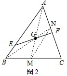
则MN分别是BC、AC的中点，
∴MN∥AB，且MN= $\frac{1}{2}$ AB，
∴ $\frac{GM}{GA}=\frac{GN}{GB}$ = $\frac{1}{2}$ ，且S△ABM=S△ACM，
∴ $\frac{AG}{AM}$ = $\frac{2}{3}$ ，
设 $\frac{AF}{AC}$ =a，
由（2）知： $\frac{S_{\bigtriangleup AEG}}{S_{ABM}}$ = $\frac{AE\cdot AG}{AB\cdot AM}$ = $\frac{3}{4}$ × $\frac{2}{3}$ = $\frac{1}{2}$ ， $\frac{S_{\bigtriangleup AFG}}{S_{ACM}}$ = $\frac{AG\cdot AF}{AM\cdot AC}$ = $\frac{2}{3}$ a，
则 $\frac{S_{\bigtriangleup AEF}}{S_{ABC}}$ = $\frac{S_{\bigtriangleup AEG}+S_{\bigtriangleup AFG}}{2S_{ACM}}$ = $\frac{S_{\bigtriangleup AEG}}{2S_{ACM}}+\frac{+S_{\bigtriangleup AFG}}{2S_{ACM}}$ = $\frac{1}{4}$ + $\frac{1}{3}$ a，

而 $\frac{S_{\bigtriangleup AEF}}{S_{ABC}}$ = $\frac{AE\cdot AF}{AB\cdot AC}$ = $\frac{3}{4}$ a，
∴ $\frac{1}{4}$ + $\frac{1}{3}$ a = $\frac{3}{4}$ a，
解得：a= $\frac{3}{5}$ ，
∴ $\frac{S_{\bigtriangleup AEF}}{S_{ABC}}$ = $\frac{3}{4}$ × $\frac{3}{5}$ = $\frac{9}{20}$ ．

点睛：本题主要考查相似形的综合问题，解题的关键是熟练掌握相似三角形的判定与性质和三角形重心的定义及其性质等知识点．

## 类型二  做平行线构造“X”型相似

18．（2023九年级·全国·专题练习）在 $\bigtriangleup ABC$ 中，已知*D*是 $BC$ 边的中点，*<text style="italic">G*</text>是 $\bigtriangleup ABC$ 的重心，过*<text style="italic">G*</text>点的直线分别交*AB*、*AC*于点*E*、*F*．

  
(1)如图1，当 $EF\parallel BC$ 时，求证： $\frac{BE}{AE}+\frac{CF}{AF}=1$ ；  
(2)如图2，当 $EF$ 和 $BC$ 不平行，且点*E*、*F*分别在线段 $AB、AC$ 上时，（1）中的结论是否成立？如果成立，请给出证明；如果不成立，请说明理由．  
(3)如图3，当点*E*在 $AB$ 的延长线上或点*F*在 $AC$ 的延长线上时，（1）中的结论是否成立？如果成立，请给出证明；如果不成立，请说明理由．

【答案】(1)见解析  
(2)成立，证明见解析  
(3)不成立，理由见解析

【分析】（1）根据三角形重心定理和平行线分线段成比例解答即可；  
（2）过点*A*作 $AN\parallel BC$ 交 $EF$ 的延长线于点*N*， $FE、CB$ 的延长线相交于点*M*，得出 $\bigtriangleup BME\backsim \bigtriangleup ANE$ ， $\bigtriangleup CMF\backsim \bigtriangleup ANF$ ，得出比例式解答即可；  
（3）分两种情况：当*<text style="italic">F*</text>点与*C*点重合时，*<text style="italic">E*</text>为 $AB$ 中点， $BE=AE$ ；点*<text style="italic">F*</text>在 $AC$ 的延长线上时， $BE>AE$ ，得出 $\frac{BE}{AE}>1$ ，则 $\frac{BE}{AE}+\frac{CF}{AF}>1$ ，同理：当点*<text style="italic">E*</text>在 $AB$ 的延长线上时， $\frac{BE}{AE}+\frac{CF}{AF}>1$ ，即可得出结论．

【详解】（1）证明：∵*G*是 $\bigtriangleup ABC$ 重心，
∴ $\frac{DG}{AG}=\frac{1}{2}$ ，
又∵ $EF\parallel BC$ ，
∴ $\frac{BE}{AE}=\frac{DG}{AG}=\frac{1}{2}$ ， $\frac{CF}{AF}=\frac{DG}{AG}=\frac{1}{2}$ ，
则 $\frac{BE}{AE}+\frac{CF}{AF}=\frac{1}{2}+\frac{1}{2}=1$ ；  
（2）解：（1）中结论成立，理由如下：

如图2，过点*A*作 $AN\parallel BC$ 交 $EF$ 的延长线于点*N*， $FE、CB$ 的延长线相交于点*M*，

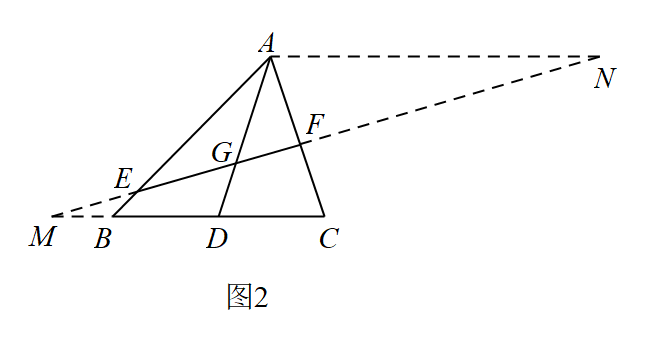
则 $\bigtriangleup BME\backsim \bigtriangleup ANE$ ， $\bigtriangleup CMF\backsim \bigtriangleup ANF$ ，
∴ $\frac{BE}{AE}=\frac{BM}{AN}$ ， $\frac{CF}{AF}=\frac{CM}{AN}$ ，
∴ $\frac{BE}{AE}+\frac{CF}{AF}=\frac{BM}{AN}+\frac{CM}{AN}=\frac{BM+CM}{AN}$ ，
又∵ $BM+CM=BM+CD+DM$ ，

而*D*是 $BC$ 的中点，即 $BD=CD$ ，
∴ $BM+CM=BM+BD+DM=DM+DM=2DM$ ，
∴ $\frac{BE}{AE}+\frac{CF}{AF}=\frac{2DM}{AN}$ ，
又∵ $\frac{DM}{AN}=\frac{DG}{AG}=\frac{1}{2}$ ，
∴ $\frac{BE}{AE}+\frac{CF}{AF}=2\times \frac{1}{2}=1$ ，
故结论成立；  
（3）解：（1）中结论不成立，理由如下：
当*F*点与*C*点重合时，*E*为 $AB$ 中点，，

点*F*在 $AC$ 的延长线上时， $BE>AE$ ，
∴ $\frac{BE}{AE}>1$ ，则 $\frac{BE}{AE}+\frac{CF}{AF}>1$ ，

同理：当点*E*在*AB*的延长线上时， $\frac{BE}{AE}+\frac{CF}{AF}>1$ ，
∴结论不成立．

【点睛】此题是相似三角形综合题，考查了相似三角形的判定与性质、三角形重心定理、平行线分线段成比例定理等知识；本题综合性强，熟练掌握三角形的重心定理和平行线分线段成比例定理，证明三角形相似是解题的关键．

19．（2023·湖北孝感·三模）【问题情境】

小睿遇到这样一个问题：如图1，在 $\bigtriangleup ABC$ 中，点 $D$ 在线段 $BC$ 上， $\angle BAD=75\circ ,\angle CAD=30\circ ,AD=4,BD=2DC$ ，求 $AC$ 的长．

【问题探究】

小睿发现，过点 $C$ 作 $CE\parallel AB$ ，交 $AD$ 的延长线于点 $E$ ，经过推理和计算能够使问题得到解决，如图2．  
(1)① $\angle ACE$ 的度数为\_\_\_\_\_\_\_\_；②求 $AC$ 的长；
【问题拓展】  
(2)如图3，在四边形 $ABCD$ 中， $\angle BAC=90\circ ,\angle CAD=30\circ ,\angle ADC=75\circ ,AC$ 与 $BD$ 交于点 $E,AE=2m,BE=2ED$ ，求 $BC$ 的长．

【答案】(1)① $75\circ$ ；② $6$  
(2) $2\sqrt{6}m$

【分析】（1）①根据两直线平行，同旁内角互补，即可求解；②通过证明 $\bigtriangleup ABD\backsim \bigtriangleup ECD$ ，得出 $\frac{AD}{DE}=\frac{BD}{CD}$ ，即可求解；  
（2）过点 $D$ 作 $DF\perp AC$ 于点 $F$ ，先证明 $\bigtriangleup ABE\backsim \bigtriangleup FDE$ ，得出 $\frac{AB}{FD}=\frac{AE}{FE}=\frac{BE}{DE}=2,$ 再证明 $AC=AD$ ，根据在 $Rt\bigtriangleup AFD$ 中， $AF=2m+m=3m,\angle FAD=30\circ$ ，得出 $DF=AF\cdot tan30\circ ,AD=2DF$ ，则 $AC=AD=2\sqrt{3}m,AB=2DF=2\sqrt{3}m$ ，最后根据勾股定理即可求解．

【详解】（1）解：①∵ $\angle BAD=75\circ ,\angle CAD=30\circ$ ，
∴ $\angle BAC=75\circ +30\circ =105\circ$ ，
∵ $CE\parallel AB$ ，
∴ $\angle ACE+\angle BAC=180\circ$ ，
则 $\angle ACE=180\circ -\angle BAC=75\circ$ ；
②由①知， $\angle ACE=\angle AEC,$
$\therefore AE=AC$ ，
又 $\because CE\parallel AB,$
$\therefore \bigtriangleup ABD\backsim \bigtriangleup ECD$ ，
$\therefore \frac{AD}{DE}=\frac{BD}{CD},$
$\because BD=2DC,$
$\therefore AD=2DE=4,$
$\therefore DE=2,$
$\therefore AE=AD+DE=6,$
$\therefore AC=AE=6$ ．  
（2）解： 如图，过点 $D$ 作 $DF\perp AC$ 于点 $F$ ，

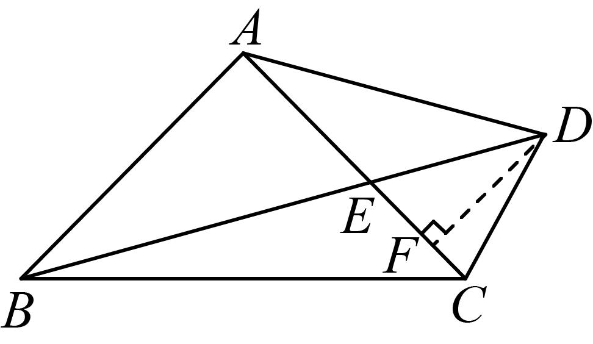
$\therefore \angle DFA=90\circ$ ，
$\because \angle BAC=90\circ =\angle DFA,\therefore AB\parallel DF$ ，
$\therefore \bigtriangleup ABE\backsim \bigtriangleup FDE$ ，
$\therefore \frac{AB}{FD}=\frac{AE}{FE}=\frac{BE}{DE}=2,$
$\therefore EF=m,AB=2DF$ ，
在 $\bigtriangleup ACD$ 中， $\angle CAD=30\circ ,\angle ADC=75\circ ,$
$\therefore \angle ACD=75\circ ,$
$\therefore AC=AD$ ，
在 $Rt\bigtriangleup AFD$ 中， $AF=2m+m=3m,\angle FAD=30\circ$ ，
$\therefore DF=AF\cdot tan30\circ =\sqrt{3}m,AD=2DF=2\sqrt{3}m$ ，
$\therefore AC=AD=2\sqrt{3}m,AB=2DF=2\sqrt{3}m$ ，
$\therefore BC=\sqrt{AB^{2}+AC^{2}}=2\sqrt{6}m$ ．

【点睛】本题主要考查了平行线的性质，相似三角形的判定和性质，解直角三角形，解题的关键是掌握两直线平行，同旁内角互补；相似三角形对应边成比例；以及正确画出辅助线，构造直角三角形求解．

20．（2023·广东深圳·中考真题）（1）如图，在矩形 $ABCD$ 中， $E$ 为 $AD$ 边上一点，连接 $BE$ ，

①若 $BE=BC$ ，过 $C$ 作 $CF\perp BE$ 交 $BE$ 于点 $F$ ，求证： $\bigtriangleup ABE\allequal \bigtriangleup FCB$ ；
②若 $S_{矩形ABCD}=20$ 时，则 $BE\cdot CF=$ \_\_\_\_\_\_．
> 

> 
> |  |  |
> | --- | --- |
> | （2）如图，在菱形 $ABCD$ 中， $cosA=\frac{1}{3}$ ，过 $C$ 作 $CE\perp AB$ 交 $AB$ 的延长线于点 $E$ ，过 $E$ 作 $EF\perp AD$ 交 $AD$ 于点 $F$ ，若 $S_{菱形ABCD}=24$ 时，求 $EF\cdot BC$ 的值． | （3）如图，在平行四边形 $ABCD$ 中， $\angle A=60\circ$ ， $AB=6$ ， $AD=5$ ，点 $E$ 在 $CD$ 上，且 $CE=2$ ，点 $F$ 为 $BC$ 上一点，连接 $EF$ ，过 $E$ 作 $EG\perp EF$ 交平行四边形 $ABCD$ 的边于点 $G$ ，若 $EF\cdot EG=7\sqrt{3}$ 时，请直接写出 $AG$ 的长． |
> 

【答案】（1）①见解析；② $20$ ；（2） $32$ ；（3） $3$ 或 $4$ 或 $\frac{3}{2}$

【分析】  
（1）①根据矩形的性质得出 $\angle ABE+\angle CBF=90\circ$ ， $\angle CFB=\angle A=90\circ$ ，进而证明 $\angle FCB=\angle ABE$ 结合已知条件，即可证明 $\bigtriangleup ABE\allequal \bigtriangleup FCB$ ；
②由①可得 $\angle FCB=\angle ABE$ ， $\angle CFB=\angle A=90\circ$ ，证明 $\bigtriangleup ABE\backsim \bigtriangleup FCB$ ，得出 $\frac{AB}{CF}=\frac{BE}{BC}$ ，根据 $S_{矩形ABCD}=AB\cdot CD=20$ ，即可求解；  
（2）根据菱形的性质得出 $AD\parallel BC$ ， $AB=BC$ ，根据已知条件得出 $BE=\frac{1}{3}BC,AE=\frac{4}{3}AB$ ，证明 $\bigtriangleup AFE\backsim \bigtriangleup BEC$ ，根据相似三角形的性质即可求解；  
（3）分三种情况讨论，①当点 $G$ 在 $AD$ 边上时，如图所示，延长 $FE$ 交 $AD$ 的延长线于点 $M$ ，连接 $GF$ ，过点 $E$ 作 $EH\perp DM$ 于点 $H$ ，证明 $\bigtriangleup EDM\backsim \bigtriangleup ECF$ ，解 $Rt\bigtriangleup DEH$ ，进而得出 $MG=7$ ，根据 $tan\angle MEH=tan\angle HGE$ ，得出 $HE^{2}=HM\cdot HG$ ，建立方程解方程即可求解；②当 $G$ 点在 $AB$ 边上时，如图所示，连接 $GF$ ，延长 $GE$ 交 $BC$ 的延长线于点 $M$ ，过点 $G$ 作 $GN\parallel AD$ ，则 $GN\parallel BC$ ，四边形 $ADNG$ 是平行四边形，同理证明 $\bigtriangleup ENG\backsim \bigtriangleup ECM$ ，根据 $tan\angle FEH=tan\angle M$ 得出 $EH^{2}=FH\cdot HM$ ，建立方程，解方程即可求解；③当 $G$ 点在 $BC$ 边上时，如图所示，过点 $B$ 作 $BT\perp DC$ 于点 $T$ ，求得 $S_{\bigtriangleup BTC}=\frac{25\sqrt{3}}{8}$ ，而 $S_{\bigtriangleup EFG}=\frac{7}{2}\sqrt{3}$ ，得出矛盾，则此情况不存在．

【详解】解：（1）①∵四边形 $ABCD$ 是矩形，则 $\angle A=\angle ABC=90\circ$ ，
∴ $\angle ABE+\angle CBF=90\circ$ ，
又∵ $CF\perp BC$ ，
∴ $\angle FCB+\angle CBF=90\circ$ ， $\angle CFB=\angle A=90\circ$ ，
∴ $\angle FCB=\angle ABE$ ，
又∵ $BC=BE$ ，
∴ $\bigtriangleup ABE\allequal \bigtriangleup FCB$ ；
②由①可得 $\angle FCB=\angle ABE$ ， $\angle CFB=\angle A=90\circ$
∴ $\bigtriangleup ABE\backsim \bigtriangleup FCB$
∴ $\frac{AB}{CF}=\frac{BE}{BC}$ ，
又∵ $S_{矩形ABCD}=AB\cdot CD=20$
∴ $BE\cdot CF=AB\cdot BC=20$ ,
故答案为： $20$ ．  
（2）∵在菱形 $ABCD$ 中， $cosA=\frac{1}{3}$ ，
∴ $AD\parallel BC$ ， $AB=BC$ ，
则 $\angle CBE=\angle A$ ，
∵ $CE\perp AB$ ，
∴ $\angle CEB=90\circ$ ，
∵ $cos\angle CBE=\frac{BE}{CB}$
∴ $BE=BC\cdot cos\angle CBE=BC\times cos\angle A=\frac{1}{3}BC$ ，
∴ $AE=AB+BE=AB+\frac{1}{3}BC=AB+\frac{1}{3}AB=\frac{4}{3}AB$ ，
∵ $EF\perp AD$ ， $CE\perp AB$
∴ $\angle AFE=\angle BEC=90\circ$ ,
又 $\angle CBE=\angle A$ ，
∴ $\bigtriangleup AFE\backsim \bigtriangleup BEC$ ，
∴ $\frac{AE}{BC}=\frac{EF}{CE}=\frac{AF}{BE}$ ，
∴ $EF\cdot BC$  $=AE\cdot CE=\frac{4}{3}AB\times CE=\frac{4}{3}S_{菱形ABCD}=\frac{4}{3}\times 24=32$ ；  
（3）①当点 $G$ 在 $AD$ 边上时，如图所示，延长 $FE$ 交 $AD$ 的延长线于点 $M$ ，连接 $GF$ ，过点 $E$ 作 $EH\perp DM$ 于点 $H$ ，

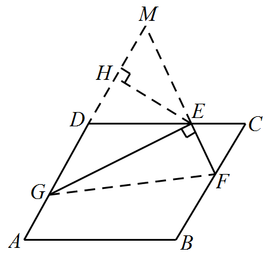
∵平行四边形 $ABCD$ 中， $AB=6$ ， $CE=2$ ，
∴ $CD=AB=6$ ， $DE=DC-EC=6-2=4$ ,
∵ $DM\parallel FC$ ，
∴ $\bigtriangleup EDM\backsim \bigtriangleup ECF$
∴ $\frac{EM}{EF}=\frac{ED}{EC}=\frac{4}{2}=2$ ，
∴ $\frac{S_{\bigtriangleup MGE}}{S_{\bigtriangleup FEG}}=\frac{EM}{EF}=2$
∴ $S_{\bigtriangleup MGE}=2S_{\bigtriangleup EFG}=$  $EF\cdot EG=7\sqrt{3}$
在 $Rt\bigtriangleup DEH$ 中， $\angle HDE=\angle A=60\circ$ ，
则 $EH=\frac{\sqrt{3}}{2}DE=\frac{\sqrt{3}}{2}\times 4=2\sqrt{3}$ ， $DH=\frac{1}{2}DE=2$ ，
∴ $\frac{1}{2}MG\times HE=7\sqrt{3}$
∴ $MG=7$ ，
∵ $GE\perp EF,EH\perp MG$ ，
∴ $\angle MEH=90\circ -\angle HEG=\angle HGE$
∴ $tan\angle MEH=tan\angle HGE$
∴ $\frac{HE}{HG}=\frac{HM}{HE}$
∴ $HE^{2}=HM\cdot HG$
设 $AG=a$ ，则 $GD=AD-AG=5-a$ ， $GH=GD+HD=5-a+2=7-a$ ， $HM=GM-GH=7-\left(7-a\right)=a$ ，
∴ $\left(2\sqrt{3}\right)^{2}=x\left(7-x\right)$
解得： $a=3$ 或 $a=4$ ，
即 $AG=3$ 或 $AG=4$ ，

②当 $G$ 点在 $AB$ 边上时，如图所示，

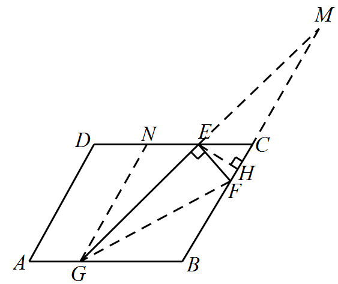

连接 $GF$ ，延长 $GE$ 交 $BC$ 的延长线于点 $M$ ，过点 $G$ 作 $GN\parallel AD$ ，则 $GN\parallel BC$ ，四边形 $ADNG$ 是平行四边形，
设 $AG=x$ ，则 $DN=AG=x$ ， $EN=DE-DN=4-x$ ，
∵ $GN\parallel CM$
∴ $\bigtriangleup ENG\backsim \bigtriangleup ECM$
∴ $\frac{EG}{EM}=\frac{EN}{EC}=\frac{GN}{CM}=\frac{4-x}{2}$ ，
∴ $CM=\frac{2GN}{4-x}=\frac{10}{4-x}$
∴ $\frac{S_{\bigtriangleup GEF}}{S_{\bigtriangleup MEF}}=\frac{EG}{EM}=\frac{4-x}{2}$ ，
∵ $EF\cdot EG=7\sqrt{3}$
∴ $S_{\bigtriangleup MEF}=\frac{2S_{\bigtriangleup GEF}}{4-x}=\frac{7\sqrt{3}}{4-x}$

过点 $E$ 作 $EH\perp BC$ 于点 $H$ ，
在 $Rt\bigtriangleup EHC$ 中， $EC=2,\angle ECH=60\circ$ ，
∴ $EH=\sqrt{3}$ ， $CH=1$ ，
∴ $S_{\bigtriangleup MEF}=\frac{1}{2}\times MF\times EH$ ，则 $\frac{1}{2}\times \sqrt{3}\times MF=\frac{7\sqrt{3}}{4-x}$ ，
∴ $MF=\frac{14}{4-x}$ ，
∴ $FH=MF-CM-CH=\frac{14}{4-x}-\frac{10}{4-x}-1=\frac{x}{4-x}$ ， $MH=CM+CH=\frac{10}{4-x}+1=\frac{14-x}{4-x}$
$\because \angle MEF=\angle EHM=90\circ$ ，
∴ $\angle FEH=90\circ -\angle MEH=\angle M$
∴ $tan\angle FEH=tan\angle M$ ，
即 $\frac{FH}{EH}=\frac{EH}{HM}$ ，
∴ $EH^{2}=FH\cdot HM$
即 $\left(\sqrt{3}\right)^{2}=\frac{x}{4-x}\times \frac{14-x}{4-x}$
解得： $x_{1}=\frac{3}{2},x_{2}=8$ （舍去）
即 $AG=\frac{3}{2}$ ；
③当 $G$ 点在 $BC$ 边上时，如图所示，

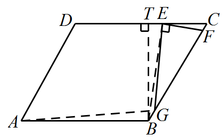

过点 $B$ 作 $BT\perp DC$ 于点 $T$ ，
在 $Rt\bigtriangleup BTC$ 中， $CT=\frac{1}{2}BC=\frac{5}{2}$ ， $BT=\sqrt{3}TC=\frac{5\sqrt{3}}{2}$ ，
∴ $S_{\bigtriangleup BTC}=\frac{1}{2}BT\times TC=\frac{1}{2}\times \frac{5\sqrt{3}}{2}\times \frac{5}{2}=\frac{25\sqrt{3}}{8}$ ，
∵ $EF\cdot EG=7\sqrt{3}$ ，
∴ $S_{\bigtriangleup EFG}=\frac{7}{2}\sqrt{3}$ ，
∵ $\frac{25}{8}\sqrt{3}<\frac{7}{2}\sqrt{3}$ ，
∴ $G$ 点不可能在 $BC$ 边上，
综上所述， $AG$ 的长为 $3$ 或 $4$ 或 $\frac{3}{2}$ ．

【点睛】本题考查了相似三角形的性质与判定，平行四边形的性质，解直角三角形，矩形的性质，熟练掌握相似三角形的性质与判定，分类讨论是解题的关键．

## 类型三  作垂线构造直角三角形相似

21．（2022·山西·中考真题）综合与实践

问题情境：在*Rt*△*ABC*中，∠*BAC*=90°，*AB*=6，*AC*=8．直角三角板*EDF*中∠*EDF*=90°，将三角板的直角顶点*D*放在*Rt*△*ABC*斜边*BC*的中点处，并将三角板绕点*D*旋转，三角板的两边*DE*，*DF*分别与边*AB*，*AC*交于点*M*，*N*，猜想证明：

  
（1）如图①，在三角板旋转过程中，当点*M*为边*AB*的中点时，试判断四边形*AMDN*的形状，并说明理由；
问题解决：  
（2）如图②，在三角板旋转过程中，当 $\angle B=\angle MDB$ 时，求线段*CN*的长；  
（3）如图③，在三角板旋转过程中，当*AM*=*AN*时，直接写出线段*AN*的长．

【答案】（1）四边形*AMDN*为矩形；理由见解析；（2） $CN=\frac{25}{8}$ ；（3） $AN=\frac{25}{7}$ ．

【分析】（1）由三角形中位线定理得到 $MD\parallel AC$ ，证明∠*A*=∠*AMD*=∠*MDN*=90°，即可证明结论；  
（2）证明△*NDC*是等腰三角形，过点*N*作*NG*⊥*BC*于点*G*，证明△*CGN*∽△*CAB*，利用相似三角形的性质即可求解；  
（3）延长*ND*，使*DH*=*DN*，证明△*BDH*≌△*CDN*，推出*BH*=*CN*，∠*DBH*=∠*C*，证明∠*MBH*=90°，设*AM*=*AN*=*x*，在*Rt*△*BMH*中，利用勾股定理列方程，解方程即可求解．

【详解】解：（1）四边形*AMDN*为矩形．

理由如下：∵点*M*为*AB*的中点，点*D*为*BC*的中点，
∴ $MD\parallel AC$ ，
∴∠*AMD*+∠*A*=180°，
∵∠*A*=90°，
∴∠*AMD*=90°，
∵∠*EDF*=90°，
∴∠*A*=∠*AMD*=∠*MDN*=90°，

四边形*AMDN*为矩形；  
（2）在*Rt*△*ABC*中，∠*A*=90°，*AB*=6，*AC*=8，
∴∠*B*+∠*C*=90°， $BC=\sqrt{AB^{2}+AC^{2}}=10$ ．
∵点*D*是*BC*的中点，
∴*CD*= $\frac{1}{2}$ *BC*=5．
∵∠*EDF*=90°，
∴∠*MDB*+∠1=90°．
∵∠*B*=∠*MDB*，
∴∠1=∠*C*．
∴*ND*=*NC*．

过点*N*作*NG*⊥*BC*于点*G*，则∠*CGN*=90°．

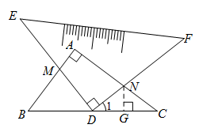
∴*CG*= $\frac{1}{2}$ *CD*= $\frac{5}{2}$ ．
∵∠*C*=∠*C*，∠*CGN*=∠*CAB*=90°，
∴△*CGN*∽△*CAB*．
∴ $\frac{CG}{CA}=\frac{CN}{CB}$ ，即 $\frac{\frac{5}{2}}{8}=\frac{CN}{10}$ ，
∴ $CN=\frac{25}{8}$ ；  
（3）延长*ND*至*H*，使*DH*=*DN*，连接*MH*，*NM*，*BH*，

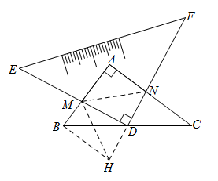
∵*MD*⊥*HN*，∴*MN*=*MH*，
∵*D*是*BC*中点，
∴*BD*=*DC*，
又∵∠*BDH*=∠*CDN*，
∴△*BDH*≌△*CDN*，
∴*BH*=*CN*，∠*DBH*=∠*C*，
∵∠*BAC*=90°，
∵∠*C*+∠*ABC*=90°，
∴∠*DBH*+∠*ABC*=90°，
∴∠*MBH*=90°，
设<te<te<te<te*x*t style="italic">x</text>t style="italic">x</text>t style="italic">x</text>t style="italic">AM</text>=*AN*=x，则*BM*=6-x，*BH*=*CN*=8-x，*MN*=*MH*= $\sqrt{2}$ <te<te<te*x*t style="italic">x</text>t style="italic">x</text>t style="italic">x</text>，
在<em>Rt</em>△<em>BMH</em>中，<em>BM2</em>+<em>BH2</em>=<em>MH2</em>，
∴(6-&lt;te&lt;te<em>x</em>t style="italic"&gt;x&lt;/text&gt;t style="italic"&gt;x&lt;/text&gt;)&lt;text style="superscript"&gt;&lt;text style="superscript"&gt;2&lt;/text&gt;&lt;/text&gt;+(8-x)2=( $\sqrt{2}$ &lt;te&lt;te<em>x</em>t style="italic"&gt;x&lt;/text&gt;t style="italic"&gt;x&lt;/text&gt;)&lt;text style="superscript"&gt;&lt;text style="superscript"&gt;2&lt;/text&gt;&lt;/text&gt;，
解得*x*= $\frac{25}{7}$ ，
∴线段*AN*的长为 $\frac{25}{7}$ ．

【点睛】本题考查了全等三角形的判定和性质，相似三角形的判定和性质，矩形的判定，勾股定理，解第（3）问的关键是学会利用参数构建方程解决问题．

22．（2020·江苏南通·中考真题）【了解概念】

有一组对角互余的凸四边形称为对余四边形，连接这两个角的顶点的线段称为对余线．

【理解运用】  
（1）如图①，对余四边形*ABCD*中，*AB*＝5，*BC*＝6，*CD*＝4，连接*AC*．若*AC*＝*AB*，求sin∠*CAD*的值；  
（2）如图②，凸四边形<em>ABCD</em>中，<em>AD</em>＝<em>BD</em>，<em>AD</em>⊥<em>BD</em>，当2<em>CD2</em>+<em>CB2</em>＝<em>CA2</em>时，判断四边形<em>ABCD</em>是否为对余四边形．证明你的结论；
【拓展提升】  
（3）在平面直角坐标系中，点<<*t*ext style="italic">t</text>ext style="italic">A</text>（﹣1，0），*B*（3，0），*C*（1，2），四边形*<text style="italic"><text style="italic">ABC*</text>*D*</text>是对余四边形，点*E*在对余线*BD*上，且位于△ABC内部，∠*AEC*＝90°+∠ABC．设 $\frac{AE}{BE}$ ＝<<*t*ext style="italic">t</text>ext style="italic">*u*</text>，点*D*的纵坐标为t，请直接写出u关于t的函数解析式．

【答案】（1） $\frac{12}{25}$ ；（2）四边形<*t*ext style="italic">ABCD</text>是对余四边形，证明见解析；（3）*u*＝ $\frac{\sqrt{t}}{2}$ （0＜*t*＜4）．

【分析】（1）先构造直角三角形，然后利用对余四边形的性质和相似三角形的性质，求出sin∠CAD的值．  
（2）通过构造手拉手模型，即构造等腰直角三角形，通过证明三角形全等，利用勾股定理来证明四边形ABCD为对余四边形．  
（3）过点D作DH⊥x轴于点H，先证明△ABE∽△DBA，得出u与AD的关系，设D（x，t），再利用（2）中结论，求出AD与t的关系即可解决问题．

【详解】解：（1）过点A作AE⊥BC于E，过点C作CF⊥AD于F．

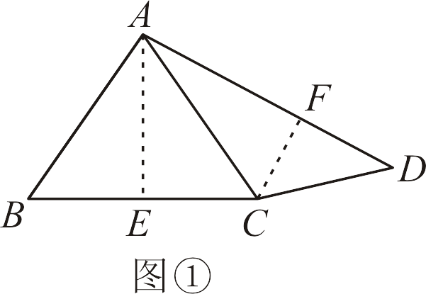
∵AC＝AB，
∴BE＝CE＝3，
在Rt△AEB中，AE＝ $\sqrt{AB^{2}-BE^{2}}=\sqrt{5^{2}-3^{2}}=4$ ，
∵CF⊥AD，
∴∠D+∠FCD＝90°，
∵∠B+∠D＝90°，
∴∠B＝∠DCF，
∵∠AEB＝∠CFD＝90°，
∴△AEB∽△DFC，
∴ $\frac{EB}{CF}=\frac{AB}{CD}$ ，
∴ $\frac{3}{CF}=\frac{5}{4}$ ，
∴CF＝ $\frac{12}{5}$ ，
∴sin∠CAD＝ $\frac{CF}{AC}=\frac{\frac{12}{5}}{5}=\frac{12}{25}$ ．  
（2）如图②中，结论：四边形ABCD是对余四边形．

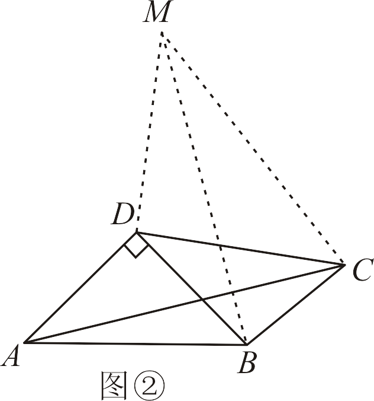

理由：过点D作DM⊥DC，使得DM＝DC，连接CM．
∵四边形ABCD中，AD＝BD，AD⊥BD，
∴∠DAB＝∠DBA＝45°，
∵∠DCM＝∠DMC＝45°，
∵∠CDM＝∠ADB＝90°，
∴∠ADC＝∠BDM，
∵AD＝DB，CD＝DM，
∴△ADC≌△BDM（SAS），
∴AC＝BM，
∵2CD2+CB2＝CA2，CM2＝DM2+CD2＝2CD2，
∴CM2+CB2＝BM2，
∴∠BCM＝90°，
∴∠DCB＝45°，
∴∠DAB+∠DCB＝90°，
∴四边形ABCD是对余四边形．  
（3）如图③中，过点D作DH⊥x轴于H．

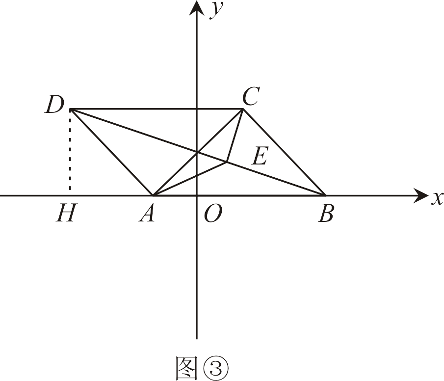
∵A（﹣1，0），B（3，0），C（1，2），
∴OA＝1，OB＝3，AB＝4，AC＝BC＝ $2\sqrt{2}$ ，
∴AC2+BC2＝AB2，
∴∠ACB＝90°，
∴∠CBA＝∠CAB＝45°，
∵四边形ABCD是对余四边形，
∴∠ADC+∠ABC＝90°，
∴∠ADC＝45°，
∵∠AEC＝90°+∠ABC＝135°，
∴∠ADC+∠AEC＝180°，
∴A，D，C，E四点共圆，
∴∠ACE＝∠ADE，
∵∠CAE+∠ACE＝∠CAE+∠EAB＝45°，
∴∠EAB＝∠ACE，
∴∠EAB＝∠ADB，
∵∠ABE＝∠DBA，
∴△ABE∽△DBA，
∴ $\frac{BE}{AB}=\frac{AE}{AD}$ ，
∴ $\frac{AE}{BE}=\frac{AD}{AB}$
∴u＝ $\frac{AD}{4}$ ，
设D（x，t），
由（2）可知，BD2＝2CD2+AD2，
∴（x﹣3）2+t2＝2[（x﹣1）2+（t﹣2）2]+（x+1）2+t2，
整理得（x+1）2＝4t﹣t2，
在Rt△ADH中，AD＝ $\sqrt{AH^{2}+AD^{2}}=\sqrt{(x+1)^{2}+t^{2}}=2\sqrt{t}$ ，
∴u＝ $\frac{AD}{4}$ ＝ $\frac{\sqrt{t}}{2}$ （0＜t＜4），
即u＝ $\frac{\sqrt{t}}{2}$ （0＜t＜4）．

【点睛】本题属于四边形综合题，考查了对余四边形的定义，全等三角形的判定和性质，相似三角形的判定和性质，解直角三角形等知识，解题的关键是理解题意，学会添加常用辅助线，构造全等三角形或相似三角形解决问题，属于中考压轴题．

## 类型四  作垂线构造“三垂直”型相似

23．（23-24九年级上·江苏扬州·阶段练习）如图，在四边形 $ABCD$ 中， $\angle ABC=90\circ$ ， $AB=3$ ， $BC=4$ ， $CD=10$ ， $DA=5\sqrt{5}$ ，则 $BD$ 的长为________．

【答案】 $2\sqrt{41}$

【分析】连接 $AC$ ，过点*D*作 $BC$ 边上的高，交 $BC$ 延长线于点*H*．先证明 $\bigtriangleup ACD$ 为直角三角形，再证明 $\bigtriangleup ABC\backsim \bigtriangleup CHD$ ，求出 $CH=6$ ， $DH=8$ ，即可得解．

【详解】连接 $AC$ ，过点*D*作 $BC$ 边上的高，交 $BC$ 延长线于点*H*．

在 $Rt\bigtriangleup ABC$ 中， $AB=3$ ， $BC=4$ ，
∴ $AC=\sqrt{AB^{2}+BC^{2}}=5$ ， $\angle ABC=90\circ$ ，
又∵ $CD=10$ ， $DA=5\sqrt{5}$ ，
∴ $AD^{2}=CD^{2}+AC^{2}$ ，
∴ $\bigtriangleup ACD$ 为直角三角形，且 $\angle ACD=90\circ$ ，
∴ $\angle ACB+\angle DCH=90\circ$ ，
∵在 $Rt\bigtriangleup ABC$ 中， $\angle ABC=90\circ$ ，，
∴ $\angle ACB+\angle BAC=90\circ$ ，
∴ $\angle DCH=\angle BAC$ ，
∵ $BH\perp DH$ ，
∴ $\angle H=90\circ$ ，
∴ $\angle ABC=\angle H=90\circ$ ，
∴ $\bigtriangleup ABC\backsim \bigtriangleup CHD$ ，
∴ $\frac{CH}{AB}=\frac{HD}{BC}=\frac{CD}{AC}$ ，
∵ $CD=10$ ， $AB=3$ ， $BC=4$ ， $AC=5$ ，
∴ $CH=6$ ， $DH=8$ ，
∴ $BD=\sqrt{\left(4+6\right)^{2}+8^{2}}=2\sqrt{41}$ ．
故答案为： $2\sqrt{41}$ ．

【点睛】本题考查了相似三角形判定及性质，勾股定理等知识，构造合理的辅助线，证明 $\bigtriangleup ABC\backsim \bigtriangleup CHD$ 是解答本题的关键．

24．（2022上·江苏扬州·九年级统考期中）将一张以 $AB$ 为边的矩形纸片，先沿一条直线剪掉一个直角三角形，在剩下的纸片中，再沿一条直线剪掉一个直角三角形（剪掉的两个直角三角形相似），剩下的是如图所示的四边形纸片<em>ABCD</em>，其中 $\angle A=90\circ ，AB=9，BC=7，CD=6，AD=2$ ，则该矩形与 $AB$ 相邻的另一条边长是_____ ．

【答案】 $\frac{35}{4}$ 或12或 $\frac{28}{5}$

【分析】连接 $BD$ ，由勾股定理求得 $BD$ ，再根据勾股定理的逆定理得 $\angle BCD=90\circ$ ，根据题意，画出相应的图形，然后利用相似三角形的性质和分类讨论的方法，求出剪掉的两个直角三角形的斜边长，然后即可得出答案．

【详解】连接 $BD$ ，

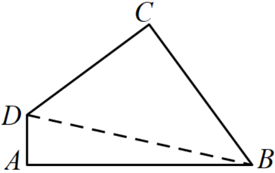
∵ $\angle A=90\circ$ ， $AD=2$ ， $AB=9$ ，
∴ $BD^{2}=2^{2}+9^{2}=85$ ，
∵ $BC=7$ ， $CD=6$ ，
∴ $BC^{2}+CD^{2}=7^{2}+6^{2}=85$ ，
∴ $BC^{2}+CD^{2}=BD^{2}$ ，
∴ $\angle DCB=90\circ$  ，

如图所示，

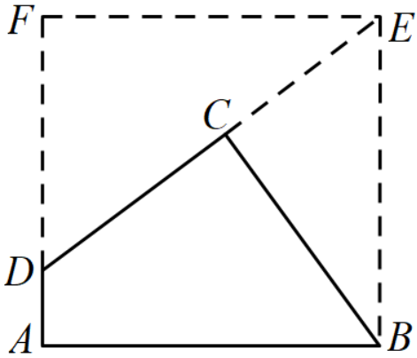
由已知可得， $\bigtriangleup DFE\backsim \bigtriangleup ECB$ ，
则 $\frac{DF}{EC}=\frac{EF}{CB}=\frac{DE}{EB}$ ，
设 $DF=x$ ， $CE=y$ ，
则 $\frac{x}{y}=\frac{9}{7}=\frac{6+y}{2+x}$ ，
解得 $\left\{\begin{array}{c}x=\frac{27}{4}\\y=\frac{21}{4}\end{array}\right$  ，
∴ $AF=2+x=2+\frac{27}{4}=\frac{35}{4}$ ；
如图所示，

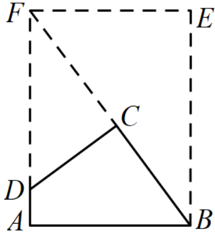
由已知可得， $\bigtriangleup DCF\backsim \bigtriangleup FEB$ ，
则 $\frac{DC}{EF}=\frac{CF}{EB}=\frac{DF}{FB}$ ，
设 $FC=m$ ， $FD=n$ ，
则 $\frac{6}{9}=\frac{m}{n+2}=\frac{n}{m+7}$ ，
解得 $\left\{\begin{array}{c}m=8\\n=10\end{array}\right$ ，
∴ $AF=2+n=2+10=12$ ；
如图3所示，

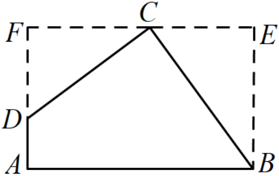
由已知可得， $\bigtriangleup DCF\backsim \bigtriangleup CBE$ ，
则 $\frac{DF}{EC}=\frac{CF}{EB}=\frac{DC}{CB}$ ，
设 $FC=a$ ， $FD=b$ ，
则 $\frac{b}{9-a}=\frac{a}{b+2}=\frac{6}{7}$ ，
解得 $\left\{\begin{array}{c}a=\frac{24}{5}\\b=\frac{18}{5}\end{array}\right$ ，
∴ $AF=2+b=\frac{28}{5}$ ；
∴该矩形与*AB*相邻的另一条边长是 $\frac{35}{4}$ 或12或 $\frac{28}{5}$ ，
故答案为： $\frac{35}{4}$ 或12或 $\frac{28}{5}$ ．

【点睛】本题考查相似三角形的性质、矩形的性质，解答本题的关键是明确题意，利用分类讨论的方法解答．

25．（2023九年级·全国·专题练习）如图，在 $\bigtriangleup ABC$ 中， $\angle BAC=60\circ$ ， $\angle ABC=90\circ$ ，直线 $l_{1}\parallel l_{2}\parallel l_{3}$ ， $l_{1}$ 与 $l_{2}$ 之间距离是1， $l_{2}$ 与 $l_{3}$ 之间距离是2，且 $l_{1}$ ， $l_{2}$ ， $l_{3}$ 分别经过点*A*，*B*，*C*，则边 $AC$ 的长为（　　）

A． $2\sqrt{3}$ 	
B． $\sqrt{11}$ 	
C． $\frac{3\sqrt{21}}{4}$ 	
D． $\frac{2\sqrt{21}}{3}$

【答案】D

【分析】过点*B*作 $EF\perp l_{2}$ ，交 $l_{1}$ 于*E*，交 $l_{3}$ 于*F*，在 $Rt\bigtriangleup ABC$ 中运用三角函数可得 $\frac{BC}{AB}=\sqrt{3}$ ，易证 $\bigtriangleup BFC\backsim \bigtriangleup AEB$ ，运用相似三角形的性质可求出 $FC$ ，然后在 $Rt\bigtriangleup BFC$ 中运用勾股定理可求出 $BC$ ，再在 $Rt\bigtriangleup ABC$ 中运用三角函数就可求出 $AC$ 的值．

【详解】解：如图，过点*B*作 $EF\perp l_{2}$ ，交 $l_{1}$ 于*E*，交 $l_{3}$ 于*F*，如图．

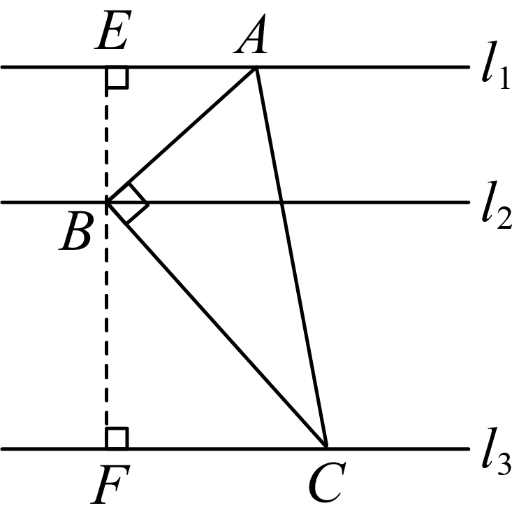
∵ $\angle BAC=60\circ ，\angle ABC=90\circ$ ，
∴ $tan\angle BAC=\frac{BC}{AB}=\sqrt{3}$ ．
∵直线 $l_{1}\parallel l_{2}\parallel l_{3}$ ，
∴ $EF\perp l_{1}，EF\perp l_{3}$ ，
∴ $\angle AEB=\angle BFC=90\circ$ ．
∵ $\angle ABC=90\circ$ ，
∴ $\angle EAB=90\circ -\angle ABE=\angle FBC$ ，
∴ $\bigtriangleup BFC\backsim \bigtriangleup AEB$ ，
∴ $\frac{FC}{EB}=\frac{BC}{AB}=\sqrt{3}$ ．
∵ $EB=1$ ，
∴ $FC=\sqrt{3}$ ．
在 $Rt\bigtriangleup BFC$ 中，
$BC=\sqrt{BF^{2}+FC^{2}}=\sqrt{2^{2}+\left(\sqrt{3}\right)^{2}}=\sqrt{7}$ ．
在 $Rt\bigtriangleup ABC$ 中， $sin\angle BAC=\frac{BC}{AC}=\frac{\sqrt{3}}{2}$ ，
∴ $AC=\frac{2}{\sqrt{3}}\times \sqrt{7}=\frac{2\sqrt{21}}{3}$ ．
故选：D．

【点睛】本题主要考查了相似三角形的判定与性质，三角函数，特殊角的三角函数值等知识，构造相似三角形是解决本题的关键．

## 题型03  与相似三角形有关的压轴题

## 类型一  运用相似三角形的性质与判定求点的坐标

26．（2023·湖北鄂州·中考真题）如图，在平面直角坐标系中， $O$ 为原点， $OA=OB=3\sqrt{5}$ ，点 $C$ 为平面内一动点， $BC=\frac{3}{2}$ ，连接 $AC$ ，点 $M$ 是线段 $AC$ 上的一点，且满足 $CM:MA=1:2$ ．当线段 $OM$ 取最大值时，点 $M$ 的坐标是（　　）

A． $\left(\frac{3}{5},\frac{6}{5}\right)$ 	
B． $\left(\frac{3}{5}\sqrt{5},\frac{6}{5}\sqrt{5}\right)$ 	
C． $\left(\frac{6}{5},\frac{12}{5}\right)$ 	
D． $\left(\frac{6}{5}\sqrt{5},\frac{12}{5}\sqrt{5}\right)$

【答案】D

【分析】由题意可得点 $C$ 在以点 $B$ 为圆心， $\frac{3}{2}$ 为半径的 $OB$ 上，在 $x$ 轴的负半轴上取点 $D\left(-\frac{3\sqrt{5}}{2}，0\right)$ ，连接 $BD$ ，分别过 $C$ 、 $M$ 作 $CF\perp OA$ ， $ME\perp OA$ ，垂足为 $F$ 、 $E$ ，先证 $\bigtriangleup OAM\backsim \bigtriangleup DAC$ ，得 $\frac{OM}{CD}=\frac{OA}{AD}=\frac{2}{3}$ ，从而当 $CD$ 取得最大值时， $OM$ 取得最大值，结合图形可知当 $D$ ， $B$ ， $C$ 三点共线，且点 $B$ 在线段 $DC$ 上时， $CD$ 取得最大值，然后分别证 $\bigtriangleup BDO\backsim \bigtriangleup CDF$ ， $\bigtriangleup AEM\backsim \bigtriangleup AFC$ ，利用相似三角形的性质即可求解．

【详解】解：∵点 $C$ 为平面内一动点， $BC=\frac{3}{2}$ ，
∴点 $C$ 在以点 $B$ 为圆心， $\frac{3}{2}$ 为半径的 $OB$ 上，
在 $x$ 轴的负半轴上取点 $D\left(-\frac{3\sqrt{5}}{2}，0\right)$ ，连接 $BD$ ，分别过 $C$ 、 $M$ 作 $CF\perp OA$ ， $ME\perp OA$ ，垂足为 $F$ 、 $E$ ，

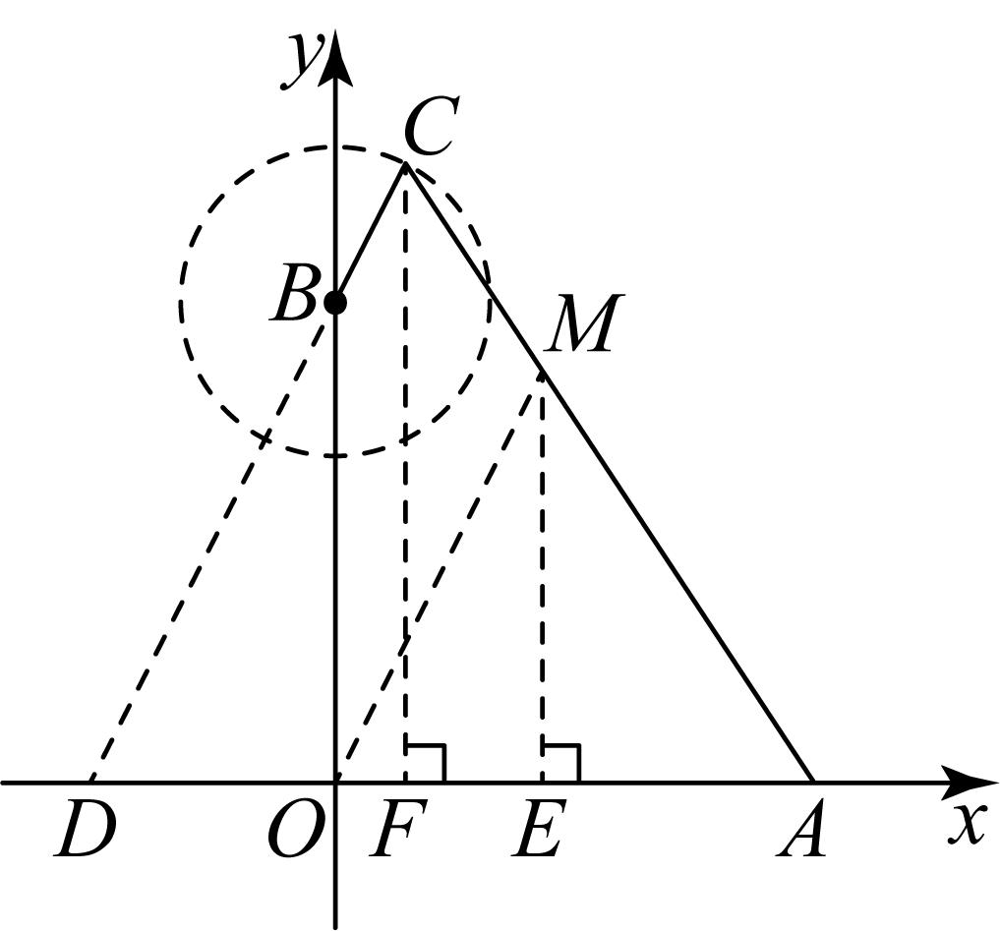
∵ $OA=OB=3\sqrt{5}$ ，
∴ $AD=OD+OA=$  $\frac{9\sqrt{5}}{2}$ ，
∴ $\frac{OA}{AD}=\frac{2}{3}$ ，
∵ $CM:MA=1:2$ ，
∴ $\frac{OA}{AD}=\frac{2}{3}=\frac{CM}{AC}$ ，
∵ $\angle OAM=\angle DAC$ ，
∴ $\bigtriangleup OAM\backsim \bigtriangleup DAC$ ，
∴ $\frac{OM}{CD}=\frac{OA}{AD}=\frac{2}{3}$ ，
∴当 $CD$ 取得最大值时， $OM$ 取得最大值，结合图形可知当 $D$ ， $B$ ， $C$ 三点共线，且点 $B$ 在线段 $DC$ 上时， $CD$ 取得最大值，
∵ $OA=OB=3\sqrt{5}$ ， $OD=$  $\frac{3\sqrt{5}}{2}$ ，
∴ $BD=$  $\sqrt{OB^{2}+OD^{2}}=\sqrt{\left(3\sqrt{5}\right)^{2}+\left(\frac{3\sqrt{5}}{2}\right)^{2}}=\frac{15}{2}$ ，
∴ $CD=BC+BD=9$ ，
∵ $\frac{OM}{CD}=\frac{2}{3}$ ，
∴ $OM=6$ ，
∵ $y$ 轴 $\perp x$ 轴， $CF\perp OA$ ，
∴ $\angle DOB=\angle DFC=90\circ$ ，
∵ $\angle BDO=\angle CDF$ ，
∴ $\bigtriangleup BDO\backsim \bigtriangleup CDF$ ，
∴ $\frac{OB}{CF}=\frac{BD}{CD}$ 即 $\frac{3\sqrt{5}}{CF}=\frac{\frac{15}{2}}{9}$ ，
解得 $CF=\frac{18\sqrt{5}}{5}$ ，
同理可得， $\bigtriangleup AEM\backsim \bigtriangleup AFC$ ，
∴ $\frac{ME}{CF}=\frac{AM}{AC}=\frac{2}{3}$ 即 $\frac{ME}{\frac{18\sqrt{5}}{5}}=\frac{2}{3}$ ，
解得 $ME=\frac{12\sqrt{5}}{5}$ ，
∴ $OE=\sqrt{OM^{2}-ME^{2}}=\sqrt{6^{2}-\left(\frac{12\sqrt{5}}{5}\right)^{2}}=\frac{6\sqrt{5}}{5}$ ，
∴当线段 $OM$ 取最大值时，点 $M$ 的坐标是 $\left(\frac{6\sqrt{5}}{5}，\frac{12\sqrt{5}}{5}\right)$ ，
故选D．

【点睛】本题主要考查了勾股定理、相似三角形的判定及性质、圆的一般概念以及坐标与图形，熟练掌握相似三角形的判定及性质是解题的关键．

27．（2021·湖南娄底·中考真题）如图，直角坐标系中，以5为半径的动圆的圆心<te*x*t style="italic">*A*</text>沿x轴移动，当⊙ $A$ 与直线 $l:y=\frac{5}{12}x$ 只有一个公共点时，点<te*x*t style="italic">*A*</text>的坐标为（    ）

A． $(-12,0)$ 	
B． $(-13,0)$ 	
C． $(\pm 12,0)$ 	
D． $(\pm 13,0)$

【答案】D

【分析】当⊙ $A$ 与直线 $l:y=\frac{5}{12}x$ 只有一个公共点时，则此时⊙A与直线 $l:y=\frac{5}{12}x$ 相切，（需考虑左右两侧相切的情况）；设切点为 $B$ ，此时 $B$ 点同时在⊙A与直线 $l:y=\frac{5}{12}x$ 上，故可以表示出 $B$ 点坐标，过 $B$ 点作 $BC//OA$ ，则此时 $\bigtriangleup AOB\backsim \bigtriangleup OBC$ ，利用相似三角形的性质算出 $OA$ 长度，最终得出结论．

【详解】如下图所示，连接 $AB$ ，过 $B$ 点作 $BC//OA$ ，

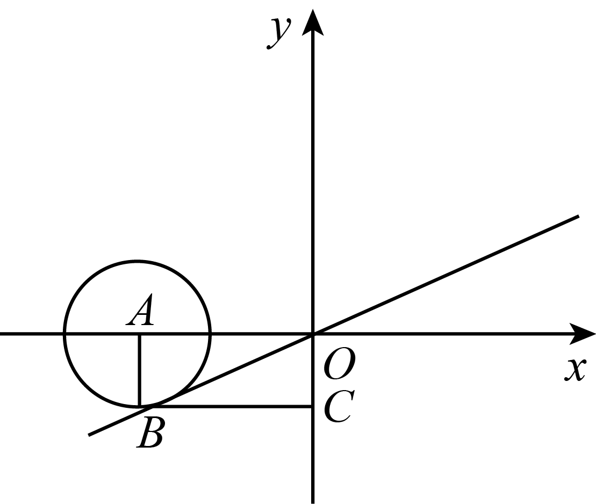

此时 $B$ 点坐标可表示为 $(x,\frac{5}{12}x)$ ，
∴ $OC=\frac{5}{12}|x|$ ， $BC=|x|$ ，
在 $Rt\bigtriangleup OBC$ 中， $OB=\sqrt{BC^{2}+OC^{2}}=\sqrt{x^{2}+(\frac{5}{12}x)^{2}}=\frac{13}{12}|x|$ ，
又∵ $\odot A$ 半径为5，
∴ $AB=5$ ，
∵ $BC//OA$ ，
∴ $\bigtriangleup AOB\backsim \bigtriangleup OBC$ ，
则 $\frac{OA}{BO}=\frac{AB}{OC}=\frac{OB}{BC}$ ，
∴ $\frac{OA}{\frac{13}{12}|x|}=\frac{5}{\frac{5}{12}|x|}$ ，
∴ $OA=13$ ，
∵左右两侧都有相切的可能，
∴*A*点坐标为 $(\pm 13,0)$ ，
故选：D．

【点睛】本题考查的是直线与圆的位置关系，熟知相似三角形的判定与性质是解答此题的关键．

28．（2023·江苏镇江·中考真题）如图，正比例函数 $y=-3x$ 与反比例函数 $y=\frac{k}{x}\left(k\ne 0\right)$ 的图象交于<te*x*t style="italic">A</text>， $B\left(1,m\right)$ 两点，点<te*x*t style="italic">C</text>在x轴负半轴上， $\angle ACO=45\circ$ ．

  
(1) $m=$ \_\_\_\_\_\_， $k=$ \_\_\_\_\_\_，点*C*的坐标为\_\_\_\_\_\_．  
(2)点<te*x*t style="italic">*<text style="italic">P*</text></text>在x轴上，若以*B*，*O*，P为顶点的三角形与 $\bigtriangleup AOC$ 相似，求点<te*x*t style="italic">*<text style="italic">P*</text></text>的坐标．

【答案】(1) $-3$ ， $-3$ ， $\left(-4,0\right)$  
(2)点*P*的坐标为 $\left(4,0\right)$ 或 $\left(\frac{5}{2},0\right)$

【分析】（1）点*B*是两函数图象的交点，利用待定系数法求出*m*，*k*的值；根据“*A*，*B*两点关于原点对称”求出点*A*的坐标，过点*A*作*x*轴的垂线，利用等腰直角三角形的性质，结合图形，求出点*C*的坐标．  
（2）根据点<te<te<te*x*t style="italic">x</text>t style="italic">x</text>t style="italic">*<text style="italic"><text style="italic">P*</text></text></text>在x轴上，结合图形，排除点P在x轴负半轴上的情形，当点P在x轴正半轴上时，两个三角形中已有一对角相等，而夹角的两边的对应关系不确定，故分类讨论：① $\bigtriangleup AOC\backsim \bigtriangleup BOP$ ；② $\bigtriangleup AOC\backsim \bigtriangleup POB$ ．分别求出两种情况下 $OP$ 的长，从而得出点<te<te<te*x*t style="italic">x</text>t style="italic">x</text>t style="italic">*<text style="italic"><text style="italic">P*</text></text></text>的坐标．

【详解】（1）（1）将 $B\left(1,m\right)$ 代入 $y=-3x$ ，得 $m=-3\times 1=-3$ ，
∴ $B\left(1,-3\right)$ ．
将 $B\left(1,-3\right)$ 代入 $y=\frac{k}{x}$ ，得 $-3=\frac{k}{1}$ ，
∴ $k=-3$ ．

如图，过点*A*作 $AD\perp x$ 轴于点*D*，则 $\angle ADC=90\circ$ ．

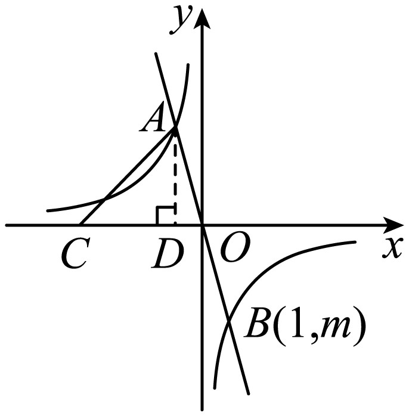
∵点*A*，*B*关于原点*O*对称，
∴ $A\left(-1,3\right)$ ，
∴ $OD=1，AD=3$ ．
又∵ $\angle ACO=45\circ$ ，
∴ $CD=AD=3$ ，
∴ $OC=OD+CD=1+3=4$ ，
∴ $C\left(-4,0\right)$ ．
故答案为： $-3$ ， $-3$ ， $\left(-4,0\right)$ ；  
（2）由（1）可知， $B\left(1,-3\right)$ ， $A\left(-1,3\right)$ ．
当点<te*x*t style="italic">P</text>在x轴的负半轴上时， $\angle BOP>90\circ$ ，
∴ $\angle BOP>\angle AOC$ ．
又∵ $\angle BOP>\angle ACO，\angle BOP>\angle CAO$ ，
∴ $\bigtriangleup BOP$ 与 $\bigtriangleup AOC$ 不可能相似．
当点<te*x*t style="italic">P</text>在x轴的正半轴上时， $\angle AOC=\angle BOP$ ．

①若 $\bigtriangleup AOC\backsim \bigtriangleup BOP$ ，则 $\frac{OA}{OB}=\frac{OC}{OP}$ ，
∵ $OA=OB$ ，
∴ $OP=OC=4$ ，
∴ $P\left(4，0\right)$ ；
②若 $\bigtriangleup AOC\backsim \bigtriangleup POB$ ，则 $\frac{OA}{OP}=\frac{OC}{OB}$ ，
又∵ $OA=\sqrt{\left(-1\right)^{2}+3^{2}}=\sqrt{10}，OB=\sqrt{1^{2}+\left(-3\right)^{2}}=\sqrt{10}$ ， $OC=4$ ，
∴ $OP=\frac{5}{2}$ ，
∴ $P\left(\frac{5}{2},0\right)$ ．
综上所述，点*P*的坐标为 $\left(4，0\right)$ 或 $\left(\frac{5}{2},0\right)$ ．

【点睛】本题考查了反比例函数与一次函数的交点问题、相似三角形的性质．熟练掌握用待定系数法求函数表达式，并能利用数形结合思想和分类讨论思想分析是解答本题的关键．

## 类型二  运用相似三角形的性质与判定求线段的最值

29．（2021·四川绵阳·中考真题）如图，在 $\bigtriangleup ACD$ 中， $AD=6$ ， $BC=5$ ， $AC^{2}=AB\left(AB+BC\right)$ ，且 $\bigtriangleup DAB\sim \bigtriangleup DCA$ ，若 $AD=3AP$ ，点 $Q$ 是线段 $AB$ 上的动点，则 $PQ$ 的最小值是（    ）

A． $\frac{\sqrt{7}}{2}$ 	
B． $\frac{\sqrt{6}}{2}$ 	
C． $\frac{\sqrt{5}}{2}$ 	
D． $\frac{8}{5}$

【答案】A

【分析】根据相似三角形的性质得到 $\frac{AD}{BD}=\frac{CD}{AD}$ ，得到 $BD=4$ ， $AB=BD=4$ ，过*B*作 $BH$  $\perp AD$ 于*H*，根据等腰三角形的性质得到 $AH=\frac{1}{2}AD=3$ ，根据勾股定理得到 $BH=\sqrt{AB^{2}-AH^{2}}=$  $\sqrt{4^{2}-3^{2}}=\sqrt{7}$ ，当 $PQ\perp AB$ 时，*PQ*的值最小，根据相似三角形的性质即可得到结论．

【详解】解： $\because \Delta DAB\sim \Delta DCA$ ，
$\therefore \frac{AD}{BD}=\frac{CD}{AD}$ ，
$\therefore \frac{6}{BD}=\frac{5+BD}{6}$ ，
解得： $BD=4$ （负值舍去），
$\because \Delta DAB\sim \Delta DCA$ ，
$\therefore \frac{AC}{AB}=\frac{CD}{AD}=\frac{9}{6}=\frac{3}{2}$ ，
$\therefore AC=\frac{3}{2}AB$ ，
$\because AC^{2}=AB\left(AB+BC\right)$ ，
$\therefore \left(\frac{3}{2}AB\right)^{2}=AB\left(AB+BC\right)$ ，
$\therefore AB=4$ ，
$\therefore AB=BD=4$ ，

过*B*作 $BH\perp AD$ 于*H*，

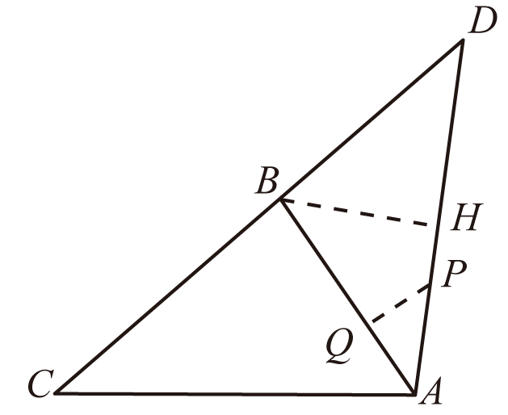
$\therefore AH=\frac{1}{2}AD=3$ ，
$\therefore BH=\sqrt{AB^{2}-AH^{2}}=\sqrt{4^{2}-3^{2}}=\sqrt{7}$ ，
$\because AD=3AP,AD=6$ ，
$\therefore AP=2$ ，
当 $PQ\perp AB$ 时，*PQ*的值最小，
$\because \angle AQP=\angle AHB=90\circ ,\angle PAQ=\angle BAH$
$\therefore \Delta APQ\sim \Delta ABH$ ，
$\therefore \frac{AP}{AB}=\frac{PQ}{BH}$ ，
$\therefore \frac{2}{4}=\frac{PQ}{\sqrt{7}}$ ，
$\therefore PQ=\frac{\sqrt{7}}{2}$ ，
故选：A．

【点睛】本题考查了相似三角形的判定和性质，勾股定理，等腰三角形的判定和性质，正确的作出辅助线构造相似三角形是解题的关键．

30．（2022·贵州铜仁·中考真题）如图，在边长为2的正方形<em>ABCD</em>中，点<em>E</em>为<em>AD</em>的中点，将△<em>CDE</em>沿<em>CE</em>翻折得△<em>CME</em>，点<em>M</em>落在四边形<em>ABCE</em>内．点<em>N</em>为线段<em>CE</em>上的动点，过点<em>N</em>作<em>NP</em>//<em>EM</em>交<em>MC</em>于点<em>P</em>，则<em>MN</em>+<em>NP</em>的最小值为________．

【答案】 $\frac{8}{5}$

【分析】过点*M*作*MF*⊥*CD*于*F*，推出*MN*+*NP*的最小值为*MF*的长，证明四边形*DEMG*为菱形，利用相似三角形的判定和性质求解即可．

【详解】解：作点*P*关于*CE*的对称点*P*′，

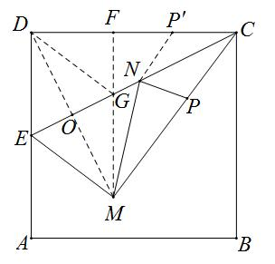
由折叠的性质知*CE*是∠*DCM*的平分线，
∴点*P*′在*CD*上，

过点*M*作*MF*⊥*CD*于*F*，交*CE*于点*G*，
∵*MN*+*NP*=*MN*+*NP*′≤*MF*，
∴*MN*+*NP*的最小值为*MF*的长，

连接*DG*，*DM*，
由折叠的性质知*CE*为线段 *DM*的垂直平分线，
∵*AD*=*CD*=2，*DE*=1，
∴*CE*= $\sqrt{1^{2}+2^{2}}$ = $\sqrt{5}$ ，
∵ $\frac{1}{2}$ *CE*×*DO*= $\frac{1}{2}$ *CD*×*DE*，
∴*DO*= $\frac{2\sqrt{5}}{5}$ ，
∴*EO*= $\frac{\sqrt{5}}{5}$ ，
∵*MF*⊥*CD*，∠*EDC*=90°，
∴*DE*∥*MF*，
∴∠*EDO*=∠*GMO*，
∵*CE*为线段*DM*的垂直平分线，
∴*DO*=*OM*，∠*DOE*=∠*MOG*=90°，
∴△*DOE*≌△*MOG*，
∴*DE*=*GM*，
∴四边形*DEMG*为平行四边形，
∵∠*MOG*=90°，
∴四边形*DEMG*为菱形，
∴*EG*=2*OE*= $\frac{2\sqrt{5}}{5}$ ，*GM*= *DE*=1，
∴*CG*= $\frac{3\sqrt{5}}{5}$ ，
∵*DE*∥*MF*，即*DE*∥*GF*，
∴△*CFG*∽△*CDE*，
∴ $\frac{FG}{DE}=\frac{CG}{CE}$ ，即 $\frac{FG}{1}=\frac{\frac{3\sqrt{5}}{5}}{\sqrt{5}}$ ，
∴*FG*= $\frac{3}{5}$ ，
∴*MF*=1+ $\frac{3}{5}$ = $\frac{8}{5}$ ，
∴*MN*+*NP*的最小值为 $\frac{8}{5}$ ．
故答案为： $\frac{8}{5}$ ．

【点睛】此题主要考查轴对称在解决线段和最小的问题，熟悉对称点的运用和画法，知道何时线段和最小，会运用勾股定理和相似三角形的判定和性质求线段长度是解题的关键．

31．（2023·四川泸州·中考真题）如图， $E$ ， $F$ 是正方形 $ABCD$ 的边 $AB$ 的三等分点， $P$ 是对角线 $AC$ 上的动点，当 $PE+PF$ 取得最小值时， $\frac{AP}{PC}$ 的值是___________．

【答案】 $\frac{2}{7}$

【分析】作点*F*关于 $AC$ 的对称点 $F^{'}$ ，连接 $EF^{'}$ 交 $AC$ 于点 $P^{'}$ ，此时 $PE+PF$ 取得最小值，过点 $F^{'}$ 作 $AD$ 的垂线段，交 $AC$ 于点*K*，根据题意可知点 $F^{'}$ 落在 $AD$ 上，设正方形的边长为 $a$ ，求得 $AK$ 的边长，证明 $\bigtriangleup AEP^{'}\backsim \bigtriangleup KF^{'}P^{'}$ ，可得 $\frac{KP^{'}}{AP^{'}}=2$ ，即可解答．

【详解】解：作点*F*关于 $AC$ 的对称点 $F^{'}$ ，连接 $EF^{'}$ 交 $AC$ 于点 $P^{'}$ ，过点 $F^{'}$ 作 $AD$ 的垂线段，交 $AC$ 于点*K*，

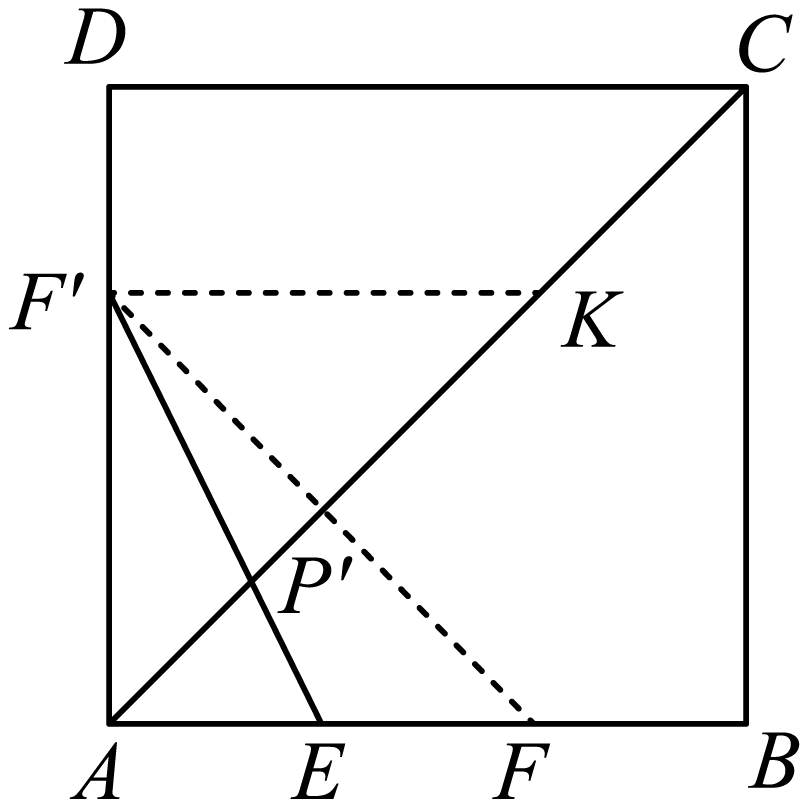
由题意得：此时 $F^{'}$ 落在 $AD$ 上，且根据对称的性质，当*P*点与 $P^{'}$ 重合时 $PE+PF$ 取得最小值，
设正方形 $ABCD$ 的边长为*a*，则 $AF^{'}=AF=\frac{2}{3}a$ ，
$\because$ 四边形 $ABCD$ 是正方形，
$\therefore \angle F^{'}AK=45\circ$ ， $\angle P^{'}AE=45\circ$ ， $AC=\sqrt{2}a$
$\because F^{'}K\perp AF^{'}$ ，
$\therefore \angle F^{'}AK=\angle F^{'}KA=45\circ$ ，
$\therefore AK=\frac{2\sqrt{2}}{3}a$ ，
$\because \angle F^{'}P^{'}K=\angle EP^{'}A$ ，
$\therefore \bigtriangleup E^{'}KP^{'}\backsim \bigtriangleup EAP^{'}$ ，
$\therefore \frac{F^{'}K}{AE}=\frac{KP^{'}}{AP^{'}}=2$ ，
$\therefore AP^{'}=\frac{1}{3}AK=\frac{2}{9}\sqrt{2}a$ ，
$\therefore CP^{'}=AC-AP^{'}=\frac{7}{9}\sqrt{2}a$ ，
$\therefore \frac{AP^{'}}{CP^{'}}=\frac{2}{7}$ ，
$\therefore$ 当 $PE+PF$ 取得最小值时， $\frac{AP}{PC}$ 的值是为 $\frac{2}{7}$ ，
故答案为： $\frac{2}{7}$ ．

【点睛】本题考查了四边形的最值问题，轴对称的性质，相似三角形的证明与性质，正方形的性质，正确画出辅助线是解题的关键．

32．（2022·湖南郴州·中考真题）如图1，在矩形*<text style="italic">A*BC*D*</text>中， $AB=4$ ， $BC=6$ ．点*<text style="italic"><text style="italic">E*</text></text>是线段*<text style="italic">AD*</text>上的动点（点E不与点A，D重合），连接*CE*，过点E作 $EF\perp CE$ ，交*A*B于点*F*．

  
(1)求证： $\bigtriangleup AEF\backsim \bigtriangleup DCE$ ；  
(2)如图2，连接*CF*，过点*B*作 $BG\perp CF$ ，垂足为*G*，连接*AG*．点*M*是线段*B*C的中点，连接*GM*．

①求 $AG+GM$ 的最小值；
②当 $AG+GM$ 取最小值时，求线段*DE*的长．

【答案】(1)见解析  
(2)①5；② $DE=3+\sqrt{5}$ 或 $DE=3-\sqrt{5}$

【分析】（1）证明出 $\angle DCE=\angle AEF$ 即可求解；  
（2）①连接*<text style="italic">A<text style="italic"><text style="italic">M*</text></text></text>．先证明 $BM=CM=GM=\frac{1}{2}BC=3$ ．确定出点*<text style="italic"><text style="italic">G*</text></text>在以点*<text style="italic"><text style="italic">M*</text></text>为圆心，3为半径的圆上．当*A*，G，M三点共线时， $AG+GM=AM$ ．此时， $AG+GM$ 取最小值．在 $Rt\bigtriangleup ABM$ 中利用勾股定理即可求出*<text style="italic">A<text style="italic"><text style="italic">M*</text></text></text>，则问题得解．②先求出*<text style="italic"><text style="italic"><text style="italic"><text style="italic"><text style="italic">AF*</text></text></text></text></text>，求AF的第一种方法：过点M作 $MN\parallel AB$ 交*FC*于点*N*，即有 $\bigtriangleup CMN\backsim \bigtriangleup CBF$ ，进而有 $\frac{MN}{BF}=\frac{CM}{CB}=\frac{1}{2}$ ．设 $AF=x$ ，则 $BF=4-x$ ， $MN=\frac{1}{2}\left(4-x\right)$ ．再根据 $MN\parallel AB$ ，得到 $\bigtriangleup AFG\backsim \bigtriangleup MNG$ ，得到 $\frac{AF}{MN}=\frac{AG}{GM}$ ，则有 $\frac{x}{\frac{1}{2}\left(4-x\right)}=\frac{2}{3}$ ，解方程即可求出*A*F；求*<text style="italic"><text style="italic"><text style="italic"><text style="italic"><text style="italic">AF*</text></text></text></text></text>的第二种方法：过点*<text style="italic"><text style="italic">G*</text></text>作 $GH\parallel AB$ 交*BC*于点*H*．即有 $\bigtriangleup MHG\backsim \bigtriangleup MBA$ ．则有 $\frac{GM}{AM}=\frac{GH}{AB}=\frac{MH}{MB}$ ，根据 $AM=5$ ，可得 $\frac{3}{5}=\frac{GH}{4}=\frac{MH}{3}$ ，进而求出 $GH=\frac{12}{5}$ ， $MH=\frac{9}{5}$ ．由 $GH\parallel AB$ 得 $\bigtriangleup CHG\backsim \bigtriangleup CBF$ ，即可求出*A*F．求出*<text style="italic"><text style="italic"><text style="italic"><text style="italic"><text style="italic">AF*</text></text></text></text></text>之后，由（1）的结论可得 $\frac{AF}{DE}=\frac{AE}{DC}$ ．设 $DE=y$ ，则 $AE=6-y$ ，即有 $\frac{1}{y}=\frac{6-y}{4}$ ，解得解方程即可求出*DE*．

【详解】（1）证明：如图1，

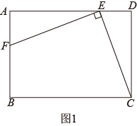
∵四边形*ABCD*是矩形，
∴ $\angle A=\angle D=90\circ$ ，
∴ $\angle CED+\angle DCE=90\circ$ ．
∵ $EF\perp CE$ ，
∴ $\angle CED+\angle AEF=90\circ$ ，
∴ $\angle DCE=\angle AEF$ ，
∴ $\bigtriangleup AEF\backsim \bigtriangleup DCE$ ；  
（2）①解：如图2-1，连接*AM*．

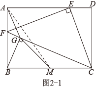
∵ $BG\perp CF$ ，
∴ $\bigtriangleup BGC$ 是直角二角形．
∴ $BM=CM=GM=\frac{1}{2}BC=3$ ．
∴点*G*在以点*M*为圆心，3为半径的圆上．
当*A*，*G*，*M*三点不共线时，由三角形两边之和大于箒三边得： $AG+GM>AM$ ，
当*A*，*G*，*M*三点共线时， $AG+GM=AM$ ．

此时， $AG+GM$ 取最小值．在 $Rt\bigtriangleup ABM$ 中， $AM=\sqrt{AB^{2}+BM^{2}}=5$ ．
∴ $AG+GM$ 的最小值为5．

②（求*AF*的方法一）如图2-2，过点*M*作 $MN\parallel AB$ 交*FC*于点*N*，

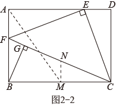
∴ $\bigtriangleup CMN\backsim \bigtriangleup CBF$ ．
∴ $\frac{MN}{BF}=\frac{CM}{CB}=\frac{1}{2}$ ．
设 $AF=x$ ，则 $BF=4-x$ ，
∴ $MN=\frac{1}{2}BF=\frac{1}{2}\left(4-x\right)$ ．
∵ $MN\parallel AB$ ，
∴ $\bigtriangleup AFG\backsim \bigtriangleup MNG$ ，
∴ $\frac{AF}{MN}=\frac{AG}{GM}$ ，
由①知 $AG+GM$ 的最小值为5、即 $AM=5$ ，
又∵ $GM=3$ ，
∴ $AG=2$ ．
∴ $\frac{x}{\frac{1}{2}\left(4-x\right)}=\frac{2}{3}$ ，解得 $x=1$ ，即 $AF=1$ ．

（求*AF*的方法二）

如图2-3，过点*G*作 $GH\parallel AB$ 交*BC*于点*H*．

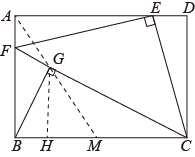
∴ $\bigtriangleup MHG\backsim \bigtriangleup MBA$ ．
∴ $\frac{GM}{AM}=\frac{GH}{AB}=\frac{MH}{MB}$ ，
由①知 $AG+GM$ 的最小值为5，即 $AM=5$ ，
又∵ $GM=3$ ，
∴ $\frac{3}{5}=\frac{GH}{4}=\frac{MH}{3}$ ．
∴ $GH=\frac{12}{5}$ ， $MH=\frac{9}{5}$ ．
由 $GH\parallel AB$ 得 $\bigtriangleup CHG\backsim \bigtriangleup CBF$ ，
∴ $\frac{GH}{FB}=\frac{CH}{CB}$ ，即 $\frac{\frac{12}{5}}{FB}=\frac{3+\frac{9}{5}}{6}$ ，
解得 $FB=3$ ．
∴ $AF=AB-FB=1$ ．
由（1）的结论可得 $\frac{AF}{DE}=\frac{AE}{DC}$ ．
设 $DE=y$ ，则 $AE=6-y$ ，
∴ $\frac{1}{y}=\frac{6-y}{4}$ ，
解得 $y=3+\sqrt{5}$ 或 $3-\sqrt{5}$ ．
∵ $0<3+\sqrt{5}<6$ ， $0<3-\sqrt{5}<6$ ，
∴ $DE=3+\sqrt{5}$ 或 $DE=3-\sqrt{5}$ ．

【点睛】本题主要考查了相似三角形的判定与性质、平行的性质、勾股定理以及一元二次方程的应用等知识，掌握相似三角形的判定与性质是解答本题的关键．

## 类型三  利用相似三角形的判定和性质求“kAD+BD”型的最值（阿氏圆）

33．（2020·广西·中考真题）如图，在Rt $\bigtriangleup ABC$ 中，<em>&lt;text style="italic"&gt;AB</em>&lt;/text&gt;＝<em>&lt;text style="italic"&gt;AC</em>&lt;/text&gt;＝4，点<em>E</em>，<em>F</em>分别是AB，AC的中点，点<em>P</em>是扇形<em>AEF</em>的 $⌢$ 上任意一点，连接B<em>P</em>，<em>&lt;text style="italic"&gt;CP</em>&lt;/text&gt;，则 $\frac{1}{2}$ B<em>P</em>+<em>&lt;text style="italic"&gt;CP</em>&lt;/text&gt;的最小值是_____．

【答案】 $\sqrt{17}$ ．

【分析】在*AB*上取一点*T*，使得*AT*＝1，连接*<text style="italic"><text style="italic"><text style="italic">PT*</text></text></text>，*PA*，*<text style="italic">CT*</text>．证明 $\bigtriangleup PAT\backsim \bigtriangleup BAP$ ，推出 $\frac{PT}{PB}$ ＝ $\frac{AP}{AB}$ ＝ $\frac{1}{2}$ ，推出P*T*＝ $\frac{1}{2}$ *<text style="italic">PB*</text>，推出 $\frac{1}{2}$ *<text style="italic">PB*</text>+*<text style="italic">CP*</text>＝CP+P*T*，根据*PC*+*<text style="italic"><text style="italic"><text style="italic">PT*</text></text></text>≥*TC*，求出*<text style="italic">CT*</text>即可解决问题．

【详解】解：在*AB*上取一点*T*，使得*AT*＝1，连接*PT*，*PA*，*CT*．

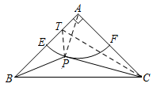
∵*PA*＝2．*AT*＝1，*AB*＝4，
∴<em>PA2</em>＝ $4=$ <em>AT</em>•<em>AB</em>，
∴ $\frac{PA}{AT}$ ＝ $\frac{AB}{PA}$ ，
∵∠*PAT*＝∠*PAB*，
∴ $\bigtriangleup PAT\backsim \bigtriangleup BAP$ ，
∴ $\frac{PT}{PB}$ ＝ $\frac{AP}{AB}$ ＝ $\frac{1}{2}$ ，
∴*PT*＝ $\frac{1}{2}$ *PB*，
∴ $\frac{1}{2}$ *PB*+*<text style="italic">CP*</text>＝CP+*PT*，
∵*PC*+*PT*≥*TC*，
在Rt $\bigtriangleup ACT$ 中，
∵∠*CAT*＝90°，*AT*＝1，*AC*＝4，
∴*CT*＝ $\sqrt{AT^{2}+AC^{2}}$ ＝ $\sqrt{17}$ ，
∴ $\frac{1}{2}$ *PB*+*PC*≥ $\sqrt{17}$ ，
∴ $\frac{1}{2}$ *PB*+*PC*的最小值为 $\sqrt{17}$ ．
故答案为 $\sqrt{17}$ ．

【点睛】本题考查等腰直角三角形的性质，三角形相似的判定与性质，勾股定理的应用，三角形的三边关系，圆的基本性质，掌握以上知识是解题的关键．

34．（2023·山东烟台·中考真题）如图，抛物线 $y=ax^{2}+bx+5$ 与 $x$ 轴交于 $A,B$ 两点，与 $y$ 轴交于点 $C,AB=4$ ．抛物线的对称轴 $x=3$ 与经过点 $A$ 的直线 $y=kx-1$ 交于点 $D$ ，与 $x$ 轴交于点 $E$ ．

  
(1)求直线 $AD$ 及抛物线的表达式；  
(2)在抛物线上是否存在点 $M$ ，使得 $\bigtriangleup ADM$ 是以 $AD$ 为直角边的直角三角形?若存在，求出所有点 $M$ 的坐标；若不存在，请说明理由；  
(3)以点 $B$ 为圆心，画半径为2的圆，点 $P$ 为 $\odot B$ 上一个动点，请求出 $PC+\frac{1}{2}PA$ 的最小值．

【答案】(1)直线 $AD$ 的解析式为 $y=x-1$ ；抛物线解析式为 $y=x^{2}-6x+5$  
(2)存在，点*M*的坐标为 $\left(4,-3\right)$ 或 $\left(0,5\right)$  或 $\left(5,0\right)$  
(3) $\sqrt{41}$

【分析】  
（1）根据对称轴 $x=3$ ， $AB=4$ ，得到点*A*及*B*的坐标，再利用待定系数法求解析式即可；  
（2）先求出点*D*的坐标，再分两种情况：①当 $\angle DAM=90\circ$ 时，求出直线 $AM$ 的解析式为 $y=-x+1$ ，解方程组 $\left\{\begin{array}{c}y=-x+1\\y=x^{2}-6x+5\end{array}\right$ ，即可得到点*<text style="italic">M*</text>的坐标；②当 $\angle ADM=90\circ$ 时，求出直线 $DM$ 的解析式为 $y=-x+5$ ，解方程组 $\left\{\begin{array}{c}y=-x+5\\y=x^{2}-6x+5\end{array}\right$ ，即可得到点*<text style="italic">M*</text>的坐标；  
（3）在 $AB$ 上取点 $F$ ，使 $BF=1$ ，连接 $CF$ ，证得 $\frac{BF}{PB}=\frac{PB}{AB}$ ，又 $\angle PBF=\angle ABP$ ，得到 $\bigtriangleup PBF\backsim \bigtriangleup ABP$ ，推出 $PF=\frac{1}{2}PA$ ，进而得到当点*C*、*P*、*F*三点共线时， $PC+\frac{1}{2}PA$ 的值最小，即为线段 $CF$ 的长，利用勾股定理求出 $CF$ 即可．

【详解】（1）解：∵抛物线的对称轴 $x=3$ ， $AB=4$ ，
∴ $A\left(1,0\right),B\left(5,0\right)$ ，
将 $A\left(1,0\right)$ 代入直线 $y=kx-1$ ，得 $k-1=0$ ，
解得 $k=1$ ，
∴直线 $AD$ 的解析式为 $y=x-1$ ；
将 $A\left(1,0\right),B\left(5,0\right)$ 代入 $y=ax^{2}+bx+5$ ，得
$\left\{\begin{array}{c}a+b+5=0\\25a+5b+5=0\end{array}\right$ ，解得 $\left\{\begin{array}{c}a=1\\b=-6\end{array}\right$ ，
∴抛物线的解析式为 $y=x^{2}-6x+5$ ；  
（2）存在点 $M$ ，
∵直线 $AD$ 的解析式为 $y=x-1$ ，抛物线对称轴 $x=3$ 与 $x$ 轴交于点 $E$ ．
∴当 $x=3$ 时， $y=x-1=2$ ，
∴ $D\left(3,2\right)$ ，

①当 $\angle DAM=90\circ$ 时，
设直线 $AM$ 的解析式为 $y=-x+c$ ，将点*A*坐标代入，
得 $-1+c=0$ ，
解得 $c=1$ ，
∴直线 $AM$ 的解析式为 $y=-x+1$ ，
解方程组 $\left\{\begin{array}{c}y=-x+1\\y=x^{2}-6x+5\end{array}\right$ ，
得 $\left\{\begin{array}{c}x=1\\y=0\end{array}\right$ 或 $\left\{\begin{array}{c}x=4\\y=-3\end{array}\right$ ，
∴点*M*的坐标为 $\left(4,-3\right)$ ；
②当 $\angle ADM=90\circ$ 时，
设直线 $DM$ 的解析式为 $y=-x+d$ ，将 $D\left(3,2\right)$ 代入，
得 $-3+d=2$ ，
解得 $d=5$ ，
∴直线 $DM$ 的解析式为 $y=-x+5$ ，
解方程组 $\left\{\begin{array}{c}y=-x+5\\y=x^{2}-6x+5\end{array}\right$ ，
解得 $\left\{\begin{array}{c}x=0\\y=5\end{array}\right$ 或 $\left\{\begin{array}{c}x=5\\y=0\end{array}\right$ ，
∴点*M*的坐标为 $\left(0,5\right)$  或 $\left(5,0\right)$

综上，点*M*的坐标为 $\left(4,-3\right)$ 或 $\left(0,5\right)$  或 $\left(5,0\right)$ ；  
（3）如图，在 $AB$ 上取点 $F$ ，使 $BF=1$ ，连接 $CF$ ，
∵ $PB=2$ ，
∴ $\frac{BF}{PB}=\frac{1}{2}$ ，
∵ $\frac{PB}{AB}=\frac{2}{4}=\frac{1}{2}$ ，、
∴ $\frac{BF}{PB}=\frac{PB}{AB}$ ，
又∵ $\angle PBF=\angle ABP$ ，
∴ $\bigtriangleup PBF\backsim \bigtriangleup ABP$ ，
∴ $\frac{PF}{PA}=\frac{BF}{PB}=\frac{1}{2}$ ，即 $PF=\frac{1}{2}PA$ ，
∴ $PC+\frac{1}{2}PA=PC+PF\geq CF$ ，
∴当点*C*、*P*、*F*三点共线时， $PC+\frac{1}{2}PA$ 的值最小，即为线段 $CF$ 的长，
∵ $OC=5,OF=OB-1=5-1=4$ ，
∴ $CF=\sqrt{OC^{2}+OF^{2}}=\sqrt{5^{2}+4^{2}}=\sqrt{41}$ ，
∴ $PC+\frac{1}{2}PA$ 的最小值为 $\sqrt{41}$ ．

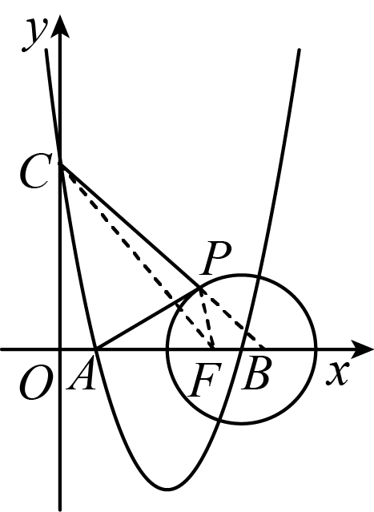

【点睛】此题是一次函数，二次函数及圆的综合题，掌握待定系数法求函数解析式，直角三角形的性质，勾股定理，相似三角形的判定和性质，求两图象的交点坐标，正确掌握各知识点是解题的关键．

35．（2021·四川达州·中考真题）如图，在平面直角坐标系中，抛物线 $y=-x^{2}+bx+c$ 交 $x$ 轴于点 $A$ 和 $C\left(1,0\right)$ ，交 $y$ 轴于点 $B\left(0,3\right)$ ，抛物线的对称轴交 $x$ 轴于点 $E$ ，交抛物线于点 $F$ ．

  
（1）求抛物线的解析式；  
（2）将线段 $OE$ 绕着点 $\CYRO$ 沿顺时针方向旋转得到线段 $OE'$ ，旋转角为 $\alpha \left(0\circ <\alpha <90\circ \right)$ ，连接 $AE'$ ， $BE'$ ，求 $BE'+\frac{1}{3}AE'$ 的最小值．  
（3） $M$ 为平面直角坐标系中一点，在抛物线上是否存在一点 $N$ ，使得以 $A$ ， $B$ ， $M$ ， $N$ 为顶点的四边形为矩形？若存在，请直接写出点 $N$ 的横坐标；若不存在，请说明理由；
【答案】（1） $y=-x^{2}-2x+3$ ；（2） $\frac{\sqrt{82}}{3}$ ；（3）存在， $N$ 点的横坐标分别为：2， $-1$ ， $\frac{-1+\sqrt{5}}{2}$ 或 $\frac{-1-\sqrt{5}}{2}$ ．

【分析】（1）待定系数法求二次函数解析式，设解析式为 $y=-x^{2}+bx+c$ 将 $C\left(1,0\right)$ ， $B\left(0,3\right)$ 两点代入求得 $b$ ，*c*的值即可；  
（2）胡不归问题，要求 $BE'+\frac{1}{3}AE'$ 的值，将折线化为直线，构造相似三角形将 $\frac{1}{3}AE'$ 转化为 $\frac{1}{3}DE'$ ，再利用三角形两边之和大于第三边求得 $BE'+\frac{1}{3}AE'$ 最值；  
（3）分2种情形讨论：①*AB*为矩形的一条边，利用等腰直角三角形三角形的性质可以求得*N*点的坐标;

②*<text style="italic"><text style="italic">AB*</text></text>为矩形的对角线，设*R*为AB的中点,*R<text style="italic">N*</text>= $\frac{1}{2}$ *<text style="italic"><text style="italic">AB*</text></text>,利用两点距离公式求解方程可得*N*点的坐标．

【详解】解：（1）∵ $y=-x^{2}+bx+c$ 过 $C\left(1,0\right)$ ， $B\left(0,3\right)$
∴ $\left\{\begin{array}{c}-1+b+c=0\\c=3\end{array}\right$
∴ $b=-2$ ， $c=3$
∴抛物线的解析式为： $y=-x^{2}-2x+3$  
（2）在 $OE$ 上取一点 $D$ ，使得 $OD=\frac{1}{3}OE$ ，连接 $AE'$ ， $BD$

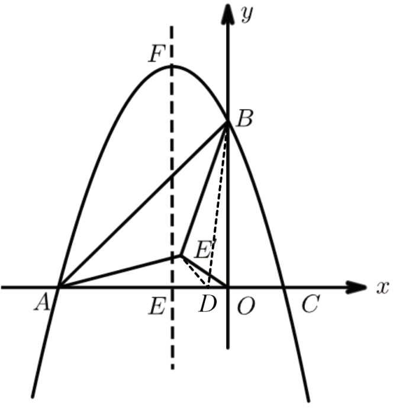
∵ $OD=\frac{1}{3}OE=\frac{1}{3}OE'$

对称轴 $x=\frac{-3+1}{2}=-1$ ．
∴ $E\left(-1,0\right)$ ， $OE=1$
$OE'=OE=1$ ， $OA=3$
∴ $\frac{OE'}{OA}=\frac{OD}{OE'}=\frac{1}{3}$ ， $\angle DOE'=\angle E'OA$
∴ $\Delta DOE'\backsim \Delta E'OA$
∴ $DE'=\frac{1}{3}AE'$
∴ $BE'+\frac{1}{3}AE'=BE'+DE'$
当 $B$ ， $E'$ ， $D$ 三点在同一点直线上时， $BE'+DE'$ 最小为 $BD$ ．
在 $Rt\Delta BOD$ 中， $OD=\frac{1}{3}$ ， $OB=3$
∴ $BD=\sqrt{OB^{2}+OD^{2}}=\sqrt{3^{2}+\left(\frac{1}{3}\right)^{2}}=\frac{\sqrt{82}}{3}$
即 $BE'+\frac{1}{3}AE'$ 最小值为 $\frac{\sqrt{82}}{3}$ ．  
（3）情形①如图，*AB*为矩形的一条边时，
联立 $\left\{\begin{array}{c}y=0\\y=-x^{2}-2x+3\end{array}\right$
得 $\left\{\begin{array}{c}x=-3\\y=0\end{array}\right ,\left\{\begin{array}{c}x=1\\y=0\end{array}\right$
$\therefore A(-3,0),OA=3$
$\because OB=3$
$\therefore \bigtriangleup ABO$ 是等腰 $Rt\bigtriangleup$ ， $\angle BAO=45\circ$
分别过 $A,B$  两点作 $AB$ 的垂线，交 $y=-x^{2}-2x+3$ 于点 $N_{1},N_{2}$ ，

过 $N_{1},N_{2}$ 作 $N_{1}Q\perp y$ 轴， $N_{2}P$  $\perp x$ 轴,
$\therefore \angle QBN_{1}=\angle PAN_{2}=45\circ$
$\therefore$  $\bigtriangleup BN_{1}Q$ , $\bigtriangleup AN_{2}P$ 也是等腰直角三角形
设 $QB=m$ ，则 $N_{1}Q=m$ ，所以 $N_{1}(-m,m+3)$
代入 $y=-x^{2}-2x+3$ ，解得 $m_{1}=1$ , $m_{2}=0$ （不符题意，舍）
$\therefore N_{1}(-1,4)$

同理，设 $OP=n$ ，则 $PN=n+3$  ，所以 $N_{2}(n,-n-3)$
代入 $y=-x^{2}-2x+3$ ，解得 $n_{1}=2$ , $n_{2}=-3$ （不符题意，舍）
$\therefore N_{2}(2,-5)$

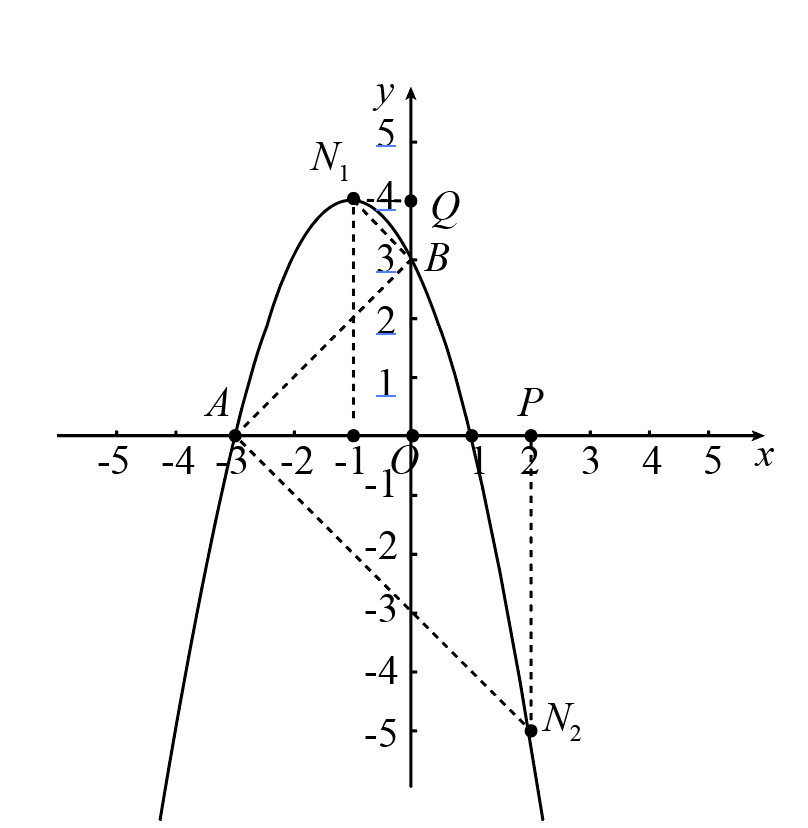

② *<text style="italic">AB*</text>为矩形的对角线，设*R*为AB的中点,则 $RN=\frac{1}{2}AB$
$\because A(-3,0),B(0,3)$
$\therefore R(-\frac{3}{2},\frac{3}{2})$ ， $AB=\sqrt{3^{2}+3^{2}}=3\sqrt{2}$
$\therefore RB=\frac{1}{2}AB=\frac{3\sqrt{2}}{2}$
$\because RN=\frac{1}{2}AB$
$\therefore RN=\frac{3\sqrt{2}}{2}$
设 $N(x,-x^{2}-2x+3)$  ，则
$(x+\frac{3}{2})^{2}+(x^{2}+2x-\frac{3}{2})^{2}=(\frac{3\sqrt{2}}{2})^{2}$
整理得： $x(x+3)(x^{2}+x-1)=0$
解得： $x_{1}=0$ （不符题意，舍）， $x_{2}=-3$ （不符题意，舍），
$x_{3}=\frac{-1+\sqrt{5}}{2}$  ， $x_{4}=\frac{-1-\sqrt{5}}{2}$

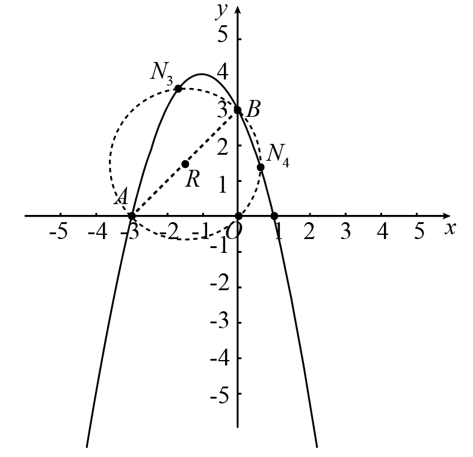
$\therefore$  综上所述： $N$ 点的横坐标分别为：2， $-1$ ， $\frac{-1+\sqrt{5}}{2}$ 或 $\frac{-1-\sqrt{5}}{2}$ ．

【点睛】本题考查了二次函数的性质，待定系数法求解析式，三角形相似，勾股定理，二次函数与一次函数交点，矩形的性质，等腰直角三角形性质，平面直角坐标系中两点距离计算等知识，能正确做出辅助线，找到相似三角形是解题的关键．

## 类型四  相似中的“一线三等角”模型

36．（23-24九年级上·陕西西安·阶段练习）（1）如图1， $\angle ABC=90\circ$ ，分别过&lt;text_style="italic"&gt;A&lt;/text&gt;，<em>C</em>两点作经过点<em>B</em>的直线的垂线，垂足分别为<em>E</em>、<em>F</em>， $AE=4$ ， $BE=2$ ， $BF=3$ ，求 $CF$ 的长度为_．
> 

> 
> |  |  |
> | --- | --- |
> | （2）如图2，在矩形 $ABCD$ 中， $AB=4$ ， $BC=10$ ，点*E*、*F*、*M*分别在 $AB、BC、AD$ 上， $\angle EMF=90\circ$ ， $AM=2$ ，当 $BE+BF=9$ 时，求四边形 $MEBF$ 的面积． | （3）如图3，在 $\bigtriangleup ABC$ 中， $\angle ACB=90\circ$ ， $AC=15$ ， $BC=20$ ，点*E*、*F*分别在边 $AB、BC$ 上， $\angle CEF=\alpha$ 且 $tan\alpha =\frac{3}{4}$ ，若 $BF=8$ ，求 $BE$ 的长度． |
> 

【答案】（1） $\frac{3}{2}$ ，（2） $17$ ；（3） $BE=16-4\sqrt{6}$ ，

【分析】本题主要考查了相似三角形的判定和性质．  
（1）根据一线三垂直模型容易证明 $\bigtriangleup ABE\backsim \bigtriangleup BCF$ ，进而由相似三角形性质即可求解；  
（2）过点 $F$ 作 $FH\perp AD$ 垂足为*H*，根据（1）可知 $\bigtriangleup AME\backsim \bigtriangleup FHM$ ，根据相似三角形性质结合已知求出 $BE=1$ ， $MH=6$ ， $AE=3$ ， $BF=8$ ，再由四边形 $MEBF$ 的面积=矩形 $ABFH$ 的面积 $-S_{\bigtriangleup AME}-S_{\bigtriangleup MHF}$ 即可求解；  
（3）延长 $BA$ 到点*P*使 $CP=BC=20$ ，连接 $CP$ ，过点*C*作 $CH\perp AB$ ，利用等腰三角形三线合一和解三角形求出 $BP=2BH=32$ ，再证明 $\bigtriangleup PEC\backsim \bigtriangleup BFE$ ，得 $\frac{PC}{PE}=\frac{BE}{BF}$ 即可求解．

【详解】解：（1）∵ $\angle ABC=90\circ$ ， $AE\perp EF$ ， $CF\perp EF$ ，
∴ $\angle E=\angle F=90\circ$ ， $\angle A+\angle ABE=90\circ$ ， $\angle CBF+\angle ABE=90\circ$ ，
∴ $\angle A=\angle CBF$ ，
∴ $\bigtriangleup ABE\backsim \bigtriangleup BCF$ ，
∴ $\frac{AE}{BF}=\frac{BE}{CF}$ ，
∵ $AE=4$ ， $BE=2$ ， $BF=3$ ，
∴ $\frac{4}{3}=\frac{2}{CF}$ ，
∴ $CF=\frac{3}{2}$ ，
故答案为 $\frac{3}{2}$ ，  
（2）如图，过点 $F$ 作 $FH\perp AD$ 垂足为*H*，

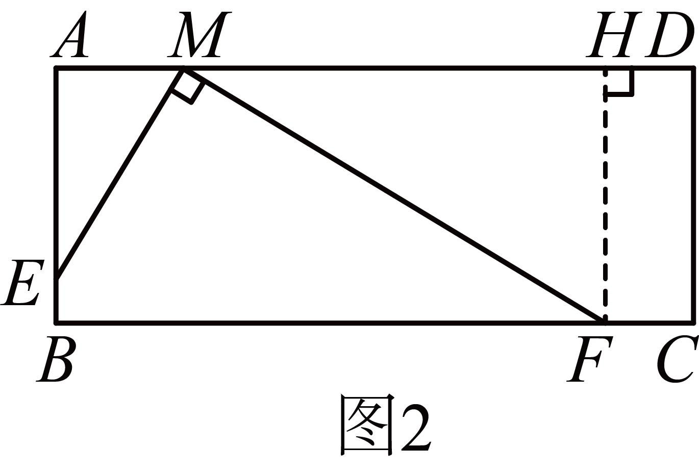

同理（1）得： $\bigtriangleup AME\backsim \bigtriangleup HFM$ ，
∴ $\frac{AE}{MH}=\frac{AM}{HF}$ ，
∵在矩形 $ABCD$ 中， $\angle A=\angle B=90\circ$ ，
∴四边形 $ABFH$ 是矩形，
∴ $HF=AB=4$ ， $BF=AH=AM+MH$ ，
∵ $AM=2$ ， $BE+BF=9$ ，
∴ $BE+2+MH=9$ ，即： $MH=7-BE$ ，
∴ $\frac{4-BE}{7-BE}=\frac{2}{4}$ ，解得： $BE=1$ ，
∴ $MH=6$ ， $AE=AB-BE=3$ ， $BF=8$ ，
∵四边形 $MEBF$ 的面积=矩形 $ABFH$ 的面积 $-S_{\bigtriangleup AME}-S_{\bigtriangleup MHF}$ ，
∴四边形 $MEBF$ 的面积= $4\times 8-\frac{1}{2}\times 2\times 3-\frac{1}{2}\times 6\times 4=17$ ．  
（3）延长 $BA$ 到点*P*使 $CP=BC=20$ ，连接 $CP$ ，过点*C*作 $CH\perp AB$ ，

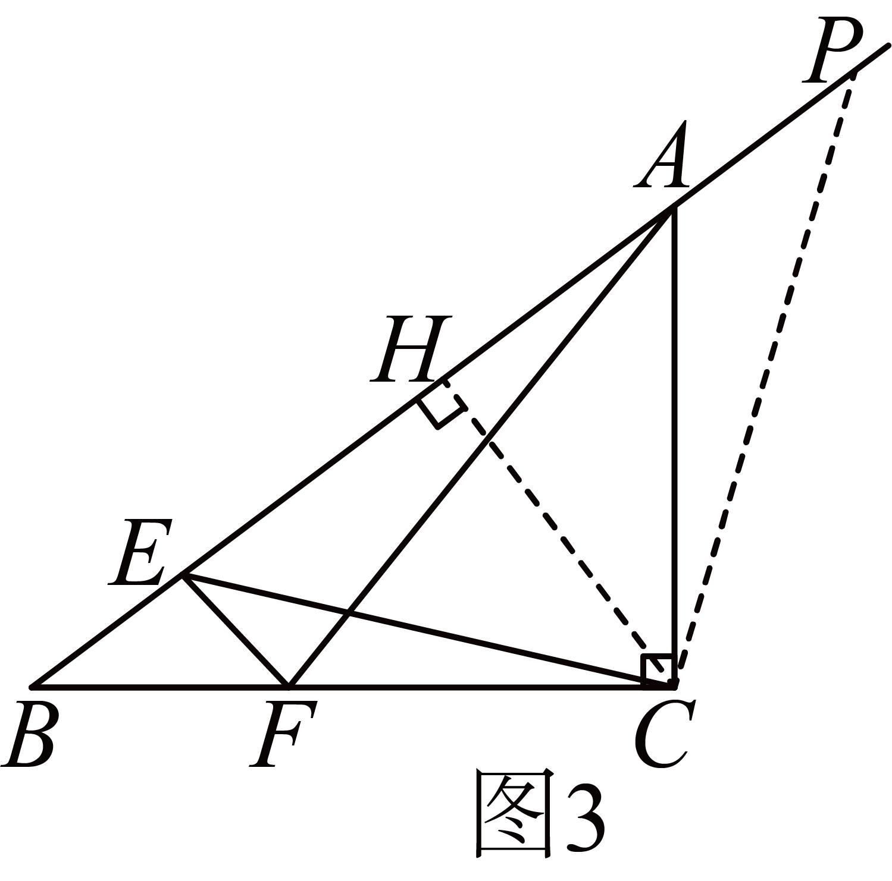
∴ $BH=HP=\frac{1}{2}BP$ ， $\angle B=\angle P$ ，
∵ $\angle ACB=90\circ$ ， $AC=15$ ， $BC=20$ ，
∴ $AB=25$ ， $cos\angle B=\frac{20}{25}=\frac{4}{5}$ ，
∴ $BH=BCcos\angle B=20\times \frac{4}{5}=16$ ，
∴ $BP=2BH=32$ ，
∵ $\angle CEF=\alpha$ 且 $tan\alpha =\frac{3}{4}$ ，
又∵ $tanB=\frac{3}{4}$ ，
∴ $\angle B=\angle CEF=\alpha$ ，
∴ $\angle B+\angle ECF=\angle CEF+\angle ECF$ ，
∴ $\angle AEC=\angle EFB$ ，
∴ $\bigtriangleup PEC\backsim \bigtriangleup BFE$ ，
∴ $\frac{PC}{PE}=\frac{BE}{BF}$ ，
∴ $\frac{20}{32-BE}=\frac{BE}{8}$ ，解得： $BE=16-4\sqrt{6}$ ， $BE=16+4\sqrt{6}>25$ （不合题意舍去）
∴ $BE=16-4\sqrt{6}$

【点睛】本题涉及了相似三角形的判定和性质、解直角三角形、矩形的性质和判定、等腰三角形的判定和性质、勾股定理解三角形等知识点，解题关键是根据一线三等角模型构造和证明三角形相似．

37．（23-24九年级上·黑龙江哈尔滨·开学考试）在综合实践课上，老师组织同学们以“矩形的折叠”为主题开展数学活动．有一张矩形纸片 $ABCD$ ，点*E*在射线 $AB$ 上，现将矩形折叠，折痕为 $DE$ ，点*A*的对应点记为点*F*．

  
(1)操作发现：如图1，若点*F*恰好落在矩形 $ABCD$ 的边 $BC$ 上，直接写出一个与 $\bigtriangleup BEF$ 相似的三角形；  
(2)深入探究：如图2，若点*<text style="italic">F*</text>落在矩形 $ABCD$ 的边 $BC$ 的下方时， $EF$ 、 $DF$ 分别交 $BC$ 于点*M*、*N*，过点*<text style="italic">F*</text>作 $FG\perp BC$ ， $FH\perp DC$ ，垂足分别为点*<text style="italic">G*</text>、*H*，当点G是 $BC$ 的中点时，试判断 $\bigtriangleup DEF$ 与 $\bigtriangleup DFH$ 是否相似，并证明你的结论；  
(3)问题解决：在（2）的条件下，若 $AD=3$ ， $BE=\frac{\sqrt{3}}{3}$ ，求 $CH$ 的长．

【答案】(1) $\bigtriangleup CFD$ ；  
(2)相似，证明见解析；  
(3) $\frac{\sqrt{3}}{6}$ 或 $\frac{5\sqrt{3}}{6}$ ．

【分析】（1）四边形 $ABCD$ 是矩形， $\angle B=\angle C=\angle A=90\circ$ ， $\angle BFE+\angle BEF=90\circ$ ，由折叠的性质可知， $\angle DFE=\angle A=90\circ$ ， $\angle BFE+\angle CFD=90\circ$ ， $\angle BEF=\angle CFD$ ， $\bigtriangleup BEF\backsim \bigtriangleup CFD$ ；  
（2）分别延长 $HF$ 、 $AB$ 交于点*P*，四边形 $ABCD$ 是矩形， $\angle ABC=\angle ADC=90\circ$ ， $FH\perp CD$ ， $\angle DHF=90\circ$ ，四边形 $BPFG$ 、四边形 $GFHC$ 、四边形 $APHD$ 都是矩形， $\angle P=\angle H=\angle A=90\circ$ ， $\angle PFE+\angle PEF=90\circ$ ，由折叠的性质可知， $\angle DFE=\angle A=90\circ$ ， $\angle PFE+\angle HFD=90\circ$ ， $\angle PEF=\angle HFD$ ， $\bigtriangleup PEF\backsim \bigtriangleup HFD$ ， $\frac{EF}{FD}=\frac{PF}{HD}$ ， $BG=FP$ ， $CG=FH$ ，点*G*是 $BG$ 的中点， $BG=CG$ ， $PF=FH$ ， $\frac{EF}{FD}=\frac{FH}{DH}$ ， $\angle DFE=\angle H=90\circ$ ， $\bigtriangleup DEF\backsim \bigtriangleup DFH$ ；  
（3）由（2）可知， $\bigtriangleup DEF\backsim \bigtriangleup DFH$ ， $\angle EDF=\angle FDH$ ，由折叠的性质可知， $\angle EDF=\angle ADE$ ， $DF=AD$ ， $\angle ADE=\angle EDF=\angle FDH=30\circ$ ， $DH=DF \textbullet cos30\circ$ ，分情况讨论，①当点*<text style="italic">E*</text>在 $AB$ 上时， $AE=\frac{\sqrt{3}}{3}AD$ ， $AB=AE+BE$ ， $CH=DH-CD=DH-AB$ ，②当点*<text style="italic">E*</text>在 $AB$ 的延长线上时， $AE=\frac{\sqrt{3}}{3}AD$ ， $AB=AE-BE$ ， $CH=DH-CD=DH-AB$ ．

【详解】（1）解： $\bigtriangleup CFD$ 与 $\bigtriangleup BEF$ 相似
证明：∵四边形 $ABCD$ 是矩形，
$\therefore \angle B=\angle C=\angle A=90\circ$ ，
$\therefore \angle BFE+\angle BEF=90\circ$ ，
由折叠的性质可知， $\angle DFE=\angle A=90\circ$ ，
$\therefore \angle BFE+\angle CFD=90\circ$ ，
$\therefore \angle BEF=\angle CFD$ ，
$\therefore \bigtriangleup BEF\backsim \bigtriangleup CFD$ ；  
（2）解： $\bigtriangleup DEF\backsim \bigtriangleup DFH$ ，

理由：如图，分别延长 $HF$ 、 $AB$ 交于点*P*，

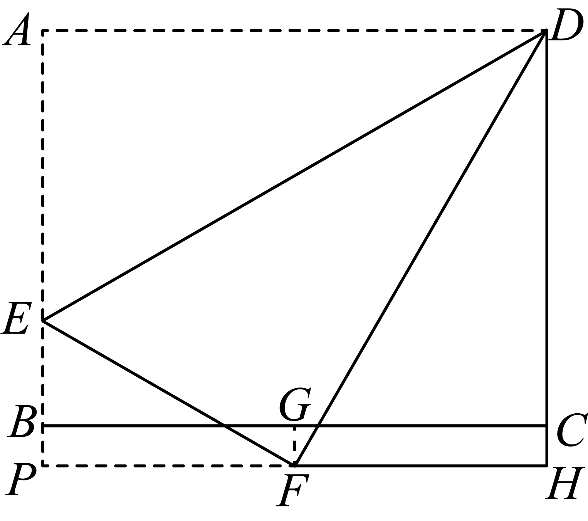
∵四边形 $ABCD$ 是矩形，
$\therefore \angle ABC=\angle ADC=90\circ$ ，
$\because FH\perp CD$ ，
$\therefore \angle DHF=90\circ$ ，
∴四边形 $BPFG$ 、四边形 $GFHC$ 、四边形 $APHD$ 都是矩形，
$\therefore \angle P=\angle H=\angle A=90\circ$ ，
$\therefore \angle PFE+\angle PEF=90\circ$ ，
由折叠的性质可知， $\angle DFE=\angle A=90\circ$ ，
$\therefore \angle PFE+\angle HFD=90\circ$ ，
$\therefore \angle PEF=\angle HFD$ ，
$\therefore \bigtriangleup PEF\backsim \bigtriangleup HFD$ ，
$\therefore \frac{EF}{FD}=\frac{PF}{HD}$ ，
$\because BG=FP$ ， $CG=FH$ ，点*G*是 $BG$ 的中点，
$\therefore BG=CG$ ，
$\therefore PF=FH$ ，
$\therefore \frac{EF}{FD}=\frac{FH}{DH}$ ，
$\therefore \frac{EF}{FH}=\frac{FD}{DH}$ ，
$\because \angle DFE=\angle H=90\circ$ ，
$\therefore \bigtriangleup DEF\backsim \bigtriangleup DFH$ ；  
（3）解：由（2）可知， $\bigtriangleup DEF\backsim \bigtriangleup DFH$ ，
$\therefore \angle EDF=\angle FDH$ ，
由折叠的性质可知， $\angle EDF=\angle ADE$ ， $DF=AD=3$ ，
$\therefore \angle ADE=\angle EDF=\angle FDH=30\circ$ ，
$DH=DF \textbullet cos30\circ =\frac{3\sqrt{3}}{2}$ ，

①当点*E*在 $AB$ 上时，如图，

$AE=\frac{\sqrt{3}}{3}AD=\frac{\sqrt{3}}{3}\times 3=\sqrt{3}$ ，
$\therefore AB=AE+BE=\sqrt{3}+\frac{\sqrt{3}}{3}=\frac{4\sqrt{3}}{3}$ ，
$\therefore CH=DH-CD=DH-AB=\frac{3\sqrt{3}}{2}-\frac{4\sqrt{3}}{3}=\frac{\sqrt{3}}{6}$ ，

②当点*E*在 $AB$ 的延长线上时，如图，

$AE=\frac{\sqrt{3}}{3}AD=\sqrt{3}$ ，
$\therefore AB=AE-BE=\sqrt{3}-\frac{\sqrt{3}}{3}=\frac{2\sqrt{3}}{3}$ ，
$\therefore CH=DH-CD=DH-AB=\frac{3\sqrt{3}}{2}-\frac{2\sqrt{3}}{3}=\frac{5\sqrt{3}}{6}$ ．
综上所述， $CH$ 的长为： $\frac{\sqrt{3}}{6}$ 或 $\frac{5\sqrt{3}}{6}$ ．

【点睛】本题考查了矩形的性质和判定，折叠的性质，相似的性质和判定，三角函数等知识点，属于压轴题，难度较大，熟练掌握相关性质定理和分类讨论思想是解题的关键．

38．（2023·河南周口·三模）（1）问题发现：如图1， $\angle ABC=\alpha$ ，将边 $AC$ 绕点*C*顺时针旋转 $\alpha$ 得到线段 $CE$ ，在射线 $BC$ 上取点*D*，使得 $\angle CDE=\alpha$ ．请求出线段 $BC$ 与 $DE$ 的数量关系；  
（2）类比探究：如图2，若 $\alpha =90\circ$ ，作 $\angle ACE=90\circ$ ，且 $CE=\frac{1}{2}AC$ ，其他条件不变，则线段 $BC$ 与 $DE$ 的数量关系是否发生变化?如果变化，请写出变化后的数量关系，并给出证明；  
（3）拓展延伸：如图3，正方形 $ABCD$ 的边长为6，点*E*是边 $AD$ 上一点，且 $AE=2$ ，把线段 $CE$ 逆时针旋转 $90\circ$ 得到线段 $EF$ ，连接 $BF$ ，直接写出线段 $BF$ 的长．

【答案】（1） $BC=DE$ ；（2）发生变化， $BC=2DE$ ，证明见解析；（3） $2\sqrt{41}$

【分析】（1）结合“一线三等角”推出 $\bigtriangleup ABC\allequal \bigtriangleup CDE$ ，从而证得结论即可；  
（2）利用条件证明 $\bigtriangleup ABC\backsim \bigtriangleup CDE$ ，然后根据相似三角形的性质证明即可；  
（3）作 $FH\perp BA$ 延长线于 $H$ 点，过 $E$ 点作 $GT\perp FH$ ，交 $BC$ 于 $G$ 点，交 $FH$ 于 $T$ 点，结合“一线三垂直”证明 $\bigtriangleup FTE\allequal \bigtriangleup EGC$ ，从而利用全等三角形的性质求出 $BH$ 和 $FH$ ，最后利用勾股定理计算即可．

【详解】（1）解：∵ $\angle ABC=\angle CDE=\angle ACE=\alpha$ ，
∴ $\angle A＝\angle ECD$ ．
在 $\bigtriangleup ABC$ 和 $\bigtriangleup CDE$ 中，
$\left\{\begin{array}{c}\angle ABC=\angle CDE\\\angle A=\angle DCE\\AC=CE\end{array}\right$
∴ $\bigtriangleup ABC\allequal \bigtriangleup CDE\left(AAS\right)$ ，
∴ $BC=DE$ ．  
（2）发生变化， $BC=2DE$ ．
证明：由（1）得， $\angle A=\angle ECD$ ， $\angle ABC=\angle CDE$ ，
∴ $\bigtriangleup ABC\backsim \bigtriangleup CDE$ ，
∴ $\frac{BC}{DE}=\frac{AC}{CE}=2$ ，
∴ $BC=2DE$ ．  
（3）如图所示，作 $FH\perp BA$ 延长线于 $H$ 点，过 $E$ 点作 $GT\perp FH$ ，交 $BC$ 于 $G$ 点，交 $FH$ 于 $T$ 点，
则 $TH=BG=AE=2$ ， $EG=AB=6$ ， $AH=TE$ ，
由（1）同理可证， $\bigtriangleup FTE\allequal \bigtriangleup EGC\left(AAS\right)$ ，
∴ $FT=EG=6$ ， $AH=TE=GC=6-2=4$ ，
∴ $FH=FT+TH=6+2=8$ ， $BH=BA+AH=6+4=10$ ，
∴ $BF=\sqrt{FH^{2}+BH^{2}}=\sqrt{8^{2}+10^{2}}=2\sqrt{41}$ ．

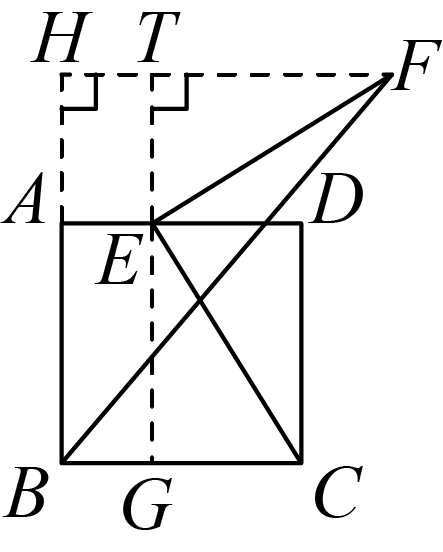

【点睛】本题考查全等三角形的判定与性质，相似三角形的判定与性质等，准确证明三角形全等或相似，并熟练运用其性质是解题关键．

## 类型五  相似三角形与多边形综合

39．（2023·山东济南·中考真题）在矩形 $ABCD$ 中， $AB=2$ ， $AD=2\sqrt{3}$ ，点 $E$ 在边 $BC$ 上，将射线 $AE$ 绕点 $A$ 逆时针旋转90°，交 $CD$ 延长线于点 $G$ ，以线段 $AE$ ， $AG$ 为邻边作矩形 $AEFG$ ．

  
(1)如图1，连接 $BD$ ，求 $\angle BDC$ 的度数和 $\frac{DG}{BE}$ 的值；  
(2)如图2，当点 $F$ 在射线 $BD$ 上时，求线段 $BE$ 的长；  
(3)如图3，当 $EA=EC$ 时，在平面内有一动点 $P$ ，满足 $PE=EF$ ，连接 $PA$ ， $PC$ ，求 $PA+PC$ 的最小值．

【答案】(1) $\angle BDC=60^{\circ }$ ， $\sqrt{3}$ ；  
(2) $\sqrt{3}$ ；  
(3) $4\sqrt{3}$ ．

【分析】（1）根据矩形的性质得出 $\angle C=90\circ$ ， $CD=AB=2$ ， $BC=AD=2\sqrt{3}$ ，进而根据正切函数得出 $tan\angle BDC=\frac{BC}{DC}=\sqrt{3}$ ，可求出 $\angle BDC=60\circ$ ，由矩形 $ABCD$ 和矩形 $AEFG$ 可得， $\angle ABE=\angle BAD=\angle EAG=\angle ADG=90\circ$ ，求出 $\angle DAG=\angle BAE$ ，证明 $\bigtriangleup ADG\backsim \bigtriangleup ABE$ ，根据相似三角形的性质即可得出答案；  
（2）过点 $F$ 作 $FM\perp CG$ 于点 $M$ ，由矩形 $ABCD$ 和矩形 $AEFG$ 可得， $\angle ABE=\angle AGF=\angle ADG=90\circ$ ， $AE=GF$ ，证明 $\bigtriangleup ABE\allequal \bigtriangleup GMF$ ，进而得出 $tan\angle MDF=tan60\circ =\frac{MF}{MD}=\sqrt{3}$ ，设 $DM=x$ ，则 $BE=MF=\sqrt{3}x$ ，根据 $\frac{DG}{BE}=\sqrt{3}$ ，得出 $\frac{2+x}{\sqrt{3}x}=\sqrt{3}$ ，求出 $x=1$ ，进而可得出答案；  
（3）连接 $AC$ ，先证明 $\bigtriangleup AGC$ 是等边三角形， $AG=AC=4$ ，得出 $PE=EF=AG=4$ ，
将 $\bigtriangleup AEP$ 绕点 $E$ 顺时针旋转120°， $EA$ 与 $EC$ 重合，得到 $\bigtriangleup CEP^{'}$ ，进而求出 $PA=P^{'}C$ ， $\angle PEP^{'}=120\circ$ ， $EP=EP^{'}=4$ ，得出 $PP^{'}=\sqrt{3}PE=4\sqrt{3}$ ，可得当点 $P$ ， $C$ ， $P^{'}$ 三点共线时， $PA+PC$ 的值最小，此时为 $PA+PC=PP^{'}=4\sqrt{3}$ ．

【详解】（1）解：∵矩形 $ABCD$ 中， $AB=2$ ， $AD=2\sqrt{3}$ ，
∴ $\angle C=90\circ$ ， $CD=AB=2$ ， $BC=AD=2\sqrt{3}$ ，
∴ $tan\angle BDC=\frac{BC}{DC}=\sqrt{3}$ ，
∴ $\angle BDC=60\circ$ ，
由矩形 $ABCD$ 和矩形 $AEFG$ 可得， $\angle ABE=\angle BAD=\angle EAG=\angle ADG=90\circ$ ，
∴ $\angle EAG-\angle EAD=\angle BAD-\angle EAD$ ，即 $\angle DAG=\angle BAE$ ，
∴ $\bigtriangleup ADG\backsim \bigtriangleup ABE$ ，
∴ $\frac{DG}{BE}=\frac{AD}{AB}=\sqrt{3}$ ；  
（2）解：如答案图1，过点 $F$ 作 $FM\perp CG$ 于点 $M$ ，
由矩形 $ABCD$ 和矩形 $AEFG$ 可得， $\angle ABE=\angle AGF=\angle ADG=90\circ$ ，
$AE=GF$ ，
∴ $\angle BAE=\angle DAG=\angle CGF$ ， $\angle ABE=\angle GMF=90\circ$ ，
∴ $\bigtriangleup ABE\allequal \bigtriangleup GMF$ ，
∴ $BE=MF$ ， $AB=GM=2$ ，
∴ $\angle MDF=\angle BDC=60\circ$ ， $FM\perp CG$ ，
∴ $tan\angle MDF=tan60\circ =\frac{MF}{MD}=\sqrt{3}$ ，
∴ $MF=\sqrt{3}MD$ ，
设 $DM=x$ ，则 $BE=MF=\sqrt{3}x$ ，
∴ $DG=GM+MD=2+x$ ，
∵ $\frac{DG}{BE}=\sqrt{3}$ ，
∴ $\frac{2+x}{\sqrt{3}x}=\sqrt{3}$ ，
解得 $x=1$ ，
∴ $BE=\sqrt{3}x=\sqrt{3}$ ；  
（3）解：如答案图2，连接 $AC$ ，
∵矩形 $ABCD$ 中， $AD=BC=2\sqrt{3}$ ， $AB=2$ ，
∴ $\angle ACB=30\circ$ ， $AC=2AB=4$ ，
∵ $EA=EC$ ，
∴ $\angle EAC=\angle ACE=30\circ$ ， $\angle AEC=120\circ$ ，
∴ $\angle ACG=\angle GAC=90\circ -30\circ =60\circ$ ，
∴ $\bigtriangleup AGC$ 是等边三角形， $AG=AC=4$ ，
∴ $PE=EF=AG=4$ ，
将 $\bigtriangleup AEP$ 绕点 $E$ 顺时针旋转120°， $EA$ 与 $EC$ 重合，得到 $\bigtriangleup CEP^{'}$ ，
∴ $PA=P^{'}C$ ， $\angle PEP^{'}=120\circ$ ， $EP=EP^{'}=4$ ，
∴ $PP^{'}=\sqrt{3}PE=4\sqrt{3}$ ，
∴当点 $P$ ， $C$ ， $P^{'}$ 三点共线时， $PA+PC$ 的值最小，此时为 $PA+PC=PP^{'}=4\sqrt{3}$ ．

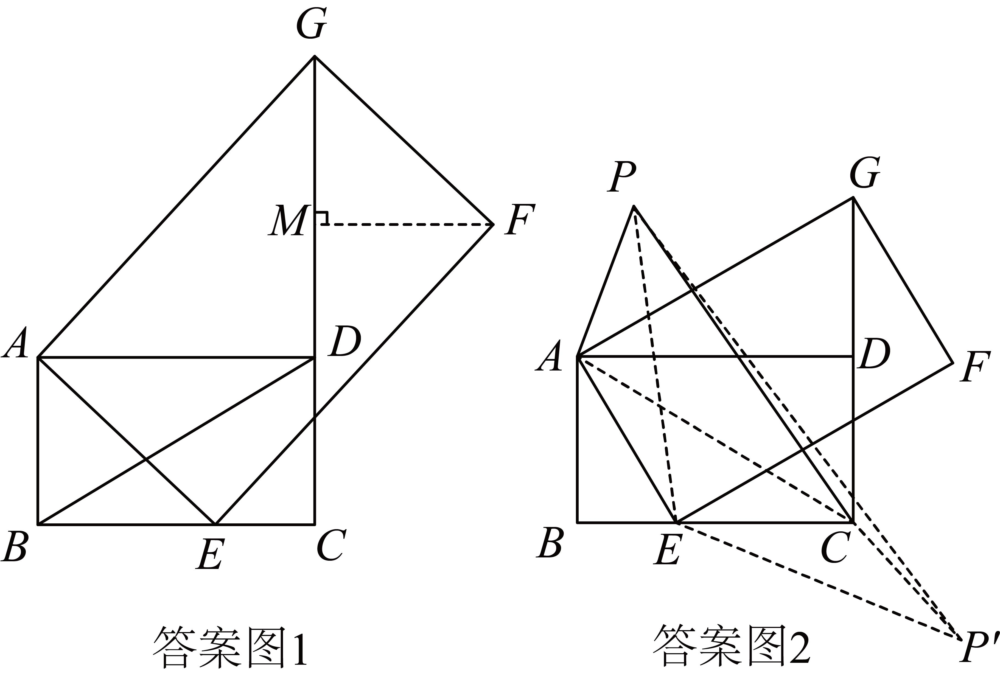

【点睛】本题考查矩形的性质，三角函数，旋转的性质，相似三角形的判定与性质，正确理解题意是解题的关键．

40．（2023·湖北武汉·中考真题）问题提出：如图（1）， $E$ 是菱形 $ABCD$ 边 $BC$ 上一点， $\bigtriangleup AEF$ 是等腰三角形， $AE=EF$ ， $\angle AEF=\angle ABC=\alpha \left(a\geq 90\circ \right),AF$ 交 $CD$ 于点 $G$ ，探究 $\angle GCF$ 与 $\alpha$ 的数量关系．

问题探究：  
(1)先将问题特殊化，如图（2），当 $\alpha =90\circ$ 时，直接写出 $\angle GCF$ 的大小；  
(2)再探究一般情形，如图（1），求 $\angle GCF$ 与 $\alpha$ 的数量关系．

问题拓展：  
(3)将图（1）特殊化，如图（3），当 $\alpha =120\circ$ 时，若 $\frac{DG}{CG}=\frac{1}{2}$ ，求 $\frac{BE}{CE}$ 的值．

【答案】(1) $45\circ$  
(2) $\angle GCF=\frac{3}{2}\alpha -90\circ$  
(3) $\frac{BE}{CE}=\frac{2}{3}$

【分析】（1）延长 $BC$ 过点*F*作 $FH\perp BC$ ，证明 $\bigtriangleup ABE\allequal \bigtriangleup BHF$ 即可得出结论．  
（2）在 $AB$ 上截取 $AN$ ，使 $AN=EC$ ，连接 $NE$ ，证明 $\bigtriangleup ANE\allequal \bigtriangleup ECF$ ，通过边和角的关系即可证明．  
（3）过点*A*作 $CD$ 的垂线交 $CD$ 的延长线于点 $P$ ，设菱形的边长为 $3m$ ，由（2）知， $\angle GCF=\frac{3}{2}a-90\circ =90\circ$ ，通过相似求出 $CF=\frac{6\sqrt{3}}{5}m$ ，即可解出．

【详解】（1）延长 $BC$ 过点*F*作 $FH\perp BC$ ，
∵ $\angle BAE+\angle AEB=90\circ$ ，
$\angle FEH+\angle AEB=90\circ$ ，
∴ $\angle BAE=\angle FEH$ ，
在 $\bigtriangleup EBA$ 和 $\bigtriangleup FHE$ 中
$\left\{\begin{array}{c}\angle ABE=\angle EHF\\\angle BAE=\angle FEH\\AE=EF\end{array}\right$
∴ $\bigtriangleup ABE\allequal \bigtriangleup EHF$ ，
∴ $AB=EH$ ，
$BE=FH$ ，
∴ $BC=EH$ ，
∴ $BE=CH=FH$ ，
∴ $\angle GCF=\angle FCH=45\circ$ ．

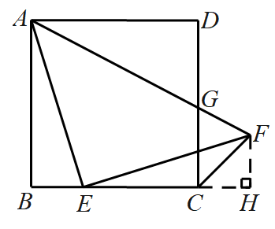
故答案为： $45\circ$ ．  
（2）解：在 $AB$ 上截取 $AN$ ，使 $AN=EC$ ，连接 $NE$ ．
$\because \angle ABC+\angle BAE+\angle AEB=\angle AEF+\angle FEC+\angle AEB=180\circ$ ，
$\angle ABC=\angle AEF$ ，
$\therefore \angle EAN=\angle FEC$ ．
$\because AE=EF$ ，
$\therefore \bigtriangleup ANE\allequal \bigtriangleup ECF$ ．
$\therefore \angle ANE=\angle ECF$ ．
$\because AB=BC,$
$\therefore BN=BE$
$\because \angle EBN=\alpha$ ，
$\therefore \angle BNE=90\circ -\frac{1}{2}\alpha$ ．
$\therefore \angle GCF=\angle ECF-\angle BCD=\angle ANE-\angle BCD$
$=\left(90\circ +\frac{1}{2}\alpha \right)-\left(180\circ -\alpha \right)=\frac{3}{2}\alpha -90\circ$ ．

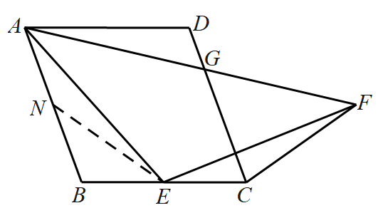  
（3）解：过点 $A$ 作 $CD$ 的垂线交 $CD$ 的延长线于点 $P$ ，设菱形的边长为 $3m$ ，
$\because \frac{DG}{CG}=\frac{1}{2},$
$\therefore DG=m,CG=2m$ ．
在 $Rt\bigtriangleup ADP$ 中，
$\because \angle ADC=\angle ABC=120\circ ,$
$\therefore \angle ADP=60\circ$ ，
$\therefore PD=\frac{3}{2}m,AP=\frac{3}{2}\sqrt{3}m$ ．
$\because \alpha =120\circ$ ，由（2）知， $\angle GCF=\frac{3}{2}a-90\circ =90\circ$ ．
$\because \angle AGP=\angle FGC,$
$\therefore \bigtriangleup APG\backsim \bigtriangleup FCG$ ．
$\therefore \frac{AP}{CF}=\frac{PG}{CG}$ ，
$\therefore \frac{\frac{3}{2}\sqrt{3}m}{CF}=\frac{\frac{5}{2}m}{2m}$ ，
$\therefore CF=\frac{6\sqrt{3}}{5}m$ ，
在 $AB$ 上截取 $AN$ ，使 $AN=EC$ ，连接 $NE$ ，作 $BO\perp NE$ 于点*O*．
由（2）知， $\bigtriangleup ANE\allequal \bigtriangleup ECF$ ，
∴ $NE=CF$ ，
∵ $AB=BC$ ，
∴ $BN=BE$ ， $OE=EF=\frac{1}{2}EN=\frac{\sqrt{3}}{5}m$ ．
∵ $\angle ABC=120\circ$ ，
∴ $\angle BNE=\angle BEN=30\circ$ ，
∵ $cos30\circ =\frac{OE}{BE}$ ，
∴ $BE=\frac{6}{5}m,$ ．
$\therefore CE=\frac{9}{5}m$
$\therefore \frac{BE}{CE}=\frac{2}{3}$ ．

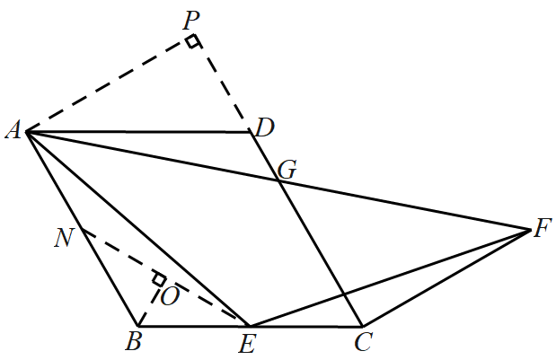

【点睛】此题考查菱形性质、三角形全等、三角形相似，解题的关键是熟悉菱形性质、三角形全等、三角形相似．

41．（2021·山东日照·中考真题）问题背景：

如图1，在矩形 $ABCD$ 中， $AB=2\sqrt{3}$ ， $\angle ABD=30\circ$ ，点 $E$ 是边 $AB$ 的中点，过点 $E$ 作 $EF\perp AB$ 交 $BD$ 于点 $F$ ．

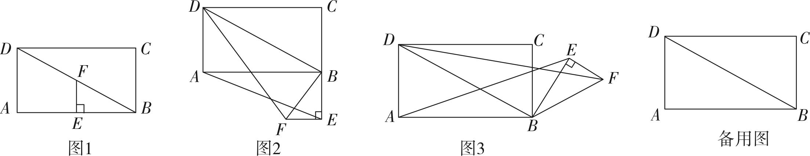

实验探究：  
（1）在一次数学活动中，小王同学将图1中的 $\bigtriangleup BEF$ 绕点 $B$ 按逆时针方向旋转 $90\circ$ ，如图2所示，得到结论：① $\frac{AE}{DF}=$ \_\_\_\_\_；②直线 $AE$ 与 $DF$ 所夹锐角的度数为\_\_\_\_\_\_．  
（2）小王同学继续将 $\bigtriangleup BEF$ 绕点 $B$ 按逆时针方向旋转，旋转至如图3所示位置.请问探究（1）中的结论是否仍然成立？并说明理由．

拓展延伸：
在以上探究中，当 $\bigtriangleup BEF$ 旋转至 $D$ 、 $E$ 、 $F$ 三点共线时，则 $\bigtriangleup ADE$ 的面积为\_\_\_\_\_\_．

【答案】（1） $\frac{\sqrt{3}}{2}$ ，30°；（2）成立，理由见解析；拓展延伸： $\frac{13\sqrt{3}+\sqrt{39}}{8}$ 或 $\frac{13\sqrt{3}-\sqrt{39}}{8}$

【分析】（1）通过证明 $\Delta FBD\backsim \Delta EBA$ ，可得 $\frac{AE}{DF}=\frac{BE}{BF}=\frac{\sqrt{3}}{2}$ ， $\angle BDF=\angle BAE$ ，即可求解；  
（2）通过证明 $\Delta ABE\backsim \Delta DBF$ ，可得 $\frac{AE}{DF}=\frac{BE}{BF}=\frac{\sqrt{3}}{2}$ ， $\angle BDF=\angle BAE$ ，即可求解；
拓展延伸：分两种情况讨论，先求出 $AE$ ， $DG$ 的长，即可求解．

【详解】解：（1）如图1， $\because \angle ABD=30\circ$ ， $\angle DAB=90\circ$ ， $EF\perp BA$ ，
$\therefore cos\angle ABD=\frac{BE}{BF}=\frac{AB}{DB}=\frac{\sqrt{3}}{2}$ ，

如图2，设 $AB$ 与 $DF$ 交于点 $O$ ， $AE$ 与 $DF$ 交于点 $H$ ，

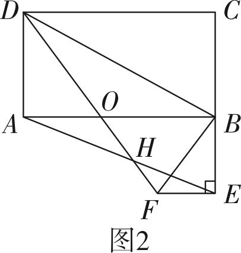
$\because \Delta BEF$ 绕点 $B$ 按逆时针方向旋转 $90\circ$ ，
$\therefore \angle DBF=\angle ABE=90\circ$ ，
$\therefore \Delta FBD\backsim \Delta EBA$ ，
$\therefore$  $\frac{AE}{DF}=\frac{BE}{BF}=\frac{\sqrt{3}}{2}$ ， $\angle BDF=\angle BAE$ ，
又 $\because \angle DOB=\angle AOF$ ，
$\therefore \angle DBA=\angle AHD=30\circ$ ，
$\therefore$ 直线 $AE$ 与 $DF$ 所夹锐角的度数为 $30\circ$ ，
故答案为： $\frac{\sqrt{3}}{2}$ ， $30\circ$ ；  
（2）结论仍然成立，

理由如下：如图3，设 $AE$ 与 $BD$ 交于点 $O$ ， $AE$ 与 $DF$ 交于点 $H$ ，

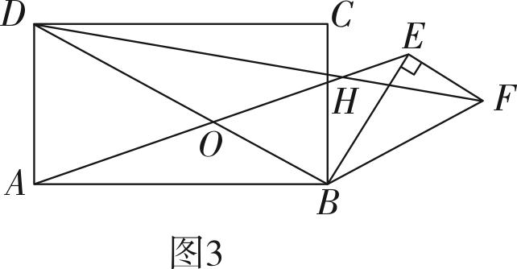
$\because$ 将 $\Delta BEF$ 绕点 $B$ 按逆时针方向旋转，
$\therefore \angle ABE=\angle DBF$ ，
又 $\because$  $\frac{BE}{BF}=\frac{AB}{DB}=\frac{\sqrt{3}}{2}$ ，
$\therefore \Delta ABE\backsim \Delta DBF$ ，
$\therefore$  $\frac{AE}{DF}=\frac{BE}{BF}=\frac{\sqrt{3}}{2}$ ， $\angle BDF=\angle BAE$ ，
又 $\because \angle DOH=\angle AOB$ ，
$\therefore \angle ABD=\angle AHD=30\circ$ ，
$\therefore$ 直线 $AE$ 与 $DF$ 所夹锐角的度数为 $30\circ$ ．

拓展延伸：如图4，当点 $E$ 在 $AB$ 的上方时，过点 $D$ 作 $DG\perp AE$ 于 $G$ ，

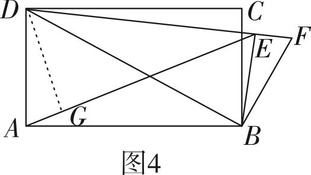
$\because AB=2\sqrt{3}$ ， $\angle ABD=30\circ$ ，点 $E$ 是边 $AB$ 的中点， $\angle DAB=90\circ$ ，
$\therefore BE=\sqrt{3}$ ， $AD=2$ ， $DB=4$ ，
$\because \angle EBF=30\circ$ ， $EF\perp BE$ ，
$\therefore EF=1$ ，
$\because D$ 、 $E$ 、 $F$ 三点共线，
$\therefore \angle DEB=\angle BEF=90\circ$ ，
$\therefore DE=\sqrt{BD^{2}-BE^{2}}=\sqrt{16-3}=\sqrt{13}$ ，
$\because \angle DEA=30\circ$ ，
$\therefore DG=\frac{1}{2}DE=\frac{\sqrt{13}}{2}$ ，
由（2）可得： $\frac{AE}{DF}=\frac{BE}{BF}=\frac{\sqrt{3}}{2}$ ，
$\therefore$  $\frac{AE}{\sqrt{13}+1}=\frac{\sqrt{3}}{2}$ ，
$\therefore AE=\frac{\sqrt{39}+\sqrt{3}}{2}$ ，
$\therefore \Delta ADE$ 的面积 $=\frac{1}{2}\times AE\times DG=\frac{1}{2}\times \frac{\sqrt{39}+\sqrt{3}}{2}\times \frac{\sqrt{13}}{2}=\frac{13\sqrt{3}+\sqrt{39}}{8}$ ；
如图5，当点 $E$ 在 $AB$ 的下方时，过点 $D$ 作 $DG\perp AE$ ，交 $EA$ 的延长线于 $G$ ，

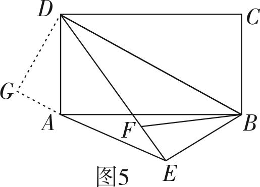

同理可求： $\Delta ADE$ 的面积 $=\frac{1}{2}\times AE\times DG=\frac{1}{2}\times \frac{\sqrt{39}-\sqrt{3}}{2}\times \frac{\sqrt{13}}{2}=\frac{13\sqrt{3}-\sqrt{39}}{8}$ ；
故答案为： $\frac{13\sqrt{3}+\sqrt{39}}{8}$ 或 $\frac{13\sqrt{3}-\sqrt{39}}{8}$ ．

【点睛】本题是几何变换综合题，考查了矩形的性质，相似三角形的判定和性质，直角三角形的性质，旋转的性质等知识，利用分类讨论思想解决问题是解题的关键．

