重难点突破05 几何动点及最值、存在性问题

目 录

- [题型01  将军饮马问题](#_Toc164095067)
- [题型02  胡不归问题](#_Toc164095068)
- [题型03  阿氏圆问题](#_Toc164095069)
- [题型04  隐圆问题](#_Toc164095070)
- [题型05  费马点问题](#_Toc164095071)
- [题型06  瓜豆原理模型](#_Toc164095072)
- [题型07  等腰（边）三角形存在问题](#_Toc164095073)
- [题型08  直角三角形存在问题](#_Toc164095074)
- [题型09  平行四边形存在问题](#_Toc164095075)
- [题型10  矩形、菱形、正方形存在问题](#_Toc164095076)
- [题型11  全等/相似存在性问题](#_Toc164095077)
- [题型12  角度存在性问题](#_Toc164095078)

【命题趋势】动态几何问题是近年来中考的一个重难点问题，以运动的观点探究几何图形或函数与几何图形的变化规律，从而确定某一图形的存在性问题．随之产生的动态几何试题就是研究在几何图形的运动中，伴随着出现一定的图形位置、数量关系的“变”与“不变”性的试题．

【基本原理】

1）基本原理（定点到定点）：两点之间，线段最短.

2）三角形两边之和>第三边

3）基本原理（定点到定线）：垂线段最短.

4）平行线的距离处处相等.

5）基本原理（定点到定圆）：点圆之间，点心线截距最短（长）.

6）基本原理（定线到定圆）：线圆之间，心垂线截距最短.

7）基本原理（定圆到定圆）：圆圆之间，连心线截距最短（长）.

【解题思路】

1）动态几何问题是以几何图形为背景的，几何图形有直线型和曲线型两种，那么动态几何也有直线型的和曲线型的两类，即全等三角形、相似三角形中的动态几何问题，也有圆中的动态问题．有点动、线动、面动，就其运动形式而言，有平移、旋转、翻折、滚动等．根据其运动的特点，又可分为（1） 动点类（点在线段或弧线上运动）也包括一个动点或两个动点； （2） 动直线类；（3）动图形问题．

2）解决动态几何题，通过观察，对几何图形运动变化规律的探索，发现其中的“变量”和“定量”动中求静，即在运动变化中探索问题中的不变性；动静互化抓住“静”的瞬间，使一般情形转化为特殊问题，从而找到“动与静”的关系；这需要有极敏锐的观察力和多种情况的分析能力，加以想象、结合推理，得出结论．解决这类问题，要善于探索图形的运动特点和规律抓住变化中图形的性质与特征，化动为静，以静制动．解决运动型试题需要用运动与变化的眼光去观察和研究图形，把握图形运动与变化的全过程，抓住其中的等量关系和变量关系，并特别关注－－些不变量和不变关系或特殊关系．

3）动态几何形成的存在性问题，重点和难点在于应用分类思想和数形结合的思想准确地进行分类，包括等腰（边）三角形存在问题，直角三角形存在问题，平行四边形存在问题，矩形、菱形、正方形存在问题．全等三角形存在问题，相似三角形存在问题等．

## 题型01  将军饮马问题

1*．*（2023·辽宁盘锦·中考真题）如图，四边形 $ABCD$ 是矩形， $AB=\sqrt{10}$ ， $AD=4\sqrt{2}$ ，点*P*是边 $AD$ 上一点（不与点*A*，*D*重合），连接 $PB，PC$ *．* 点*M*，*N*分别是 $PB，PC$ 的中点，连接 $MN$ ， $AM$ ， $DN$ ，点*E*在边 $AD$ 上， $ME\parallel DN$ ，则 $AM+ME$ 的最小值是（    ）

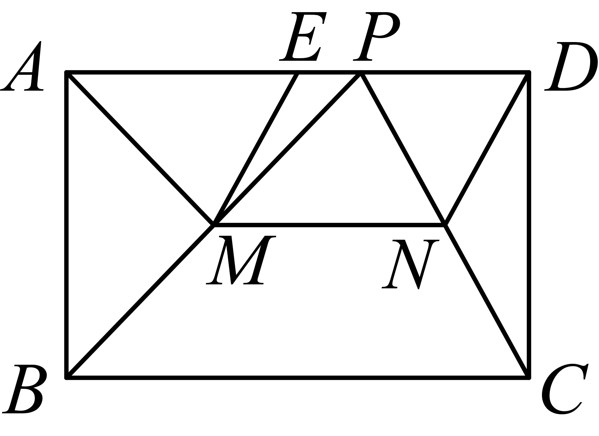

A． $2\sqrt{3}$ 	
B．3	
C． $3\sqrt{2}$ 	
D． $4\sqrt{2}$

2．（2023·广东广州·中考真题）如图，正方形 $ABCD$ 的边长为4，点<em>E</em>在边 $BC$ 上，且 $BE=1$ ，<em>F</em>为对角线 $BD$ 上一动点，连接 $CF$ ， $EF$ ，则 $CF+EF$ 的最小值为___________．

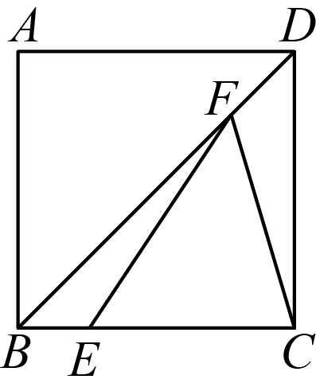

3．（2023·四川宜宾·中考真题）如图，在平面直角坐标系 $xOy$ 中，等腰直角三角形 $ABC$ 的直角顶点 $C\left(3，0\right)$ ，顶点*A*、 $B\left(6，m\right)$ 恰好落在反比例函数 $y=\frac{k}{x}$ 第一象限的图象上．

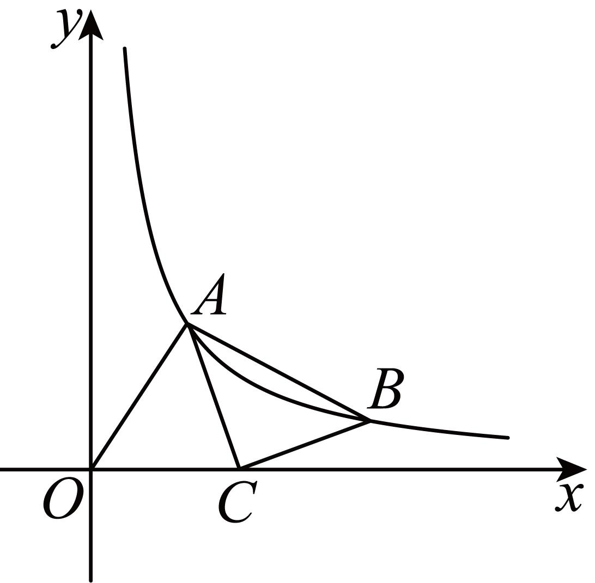  
(1)分别求反比例函数的表达式和直线 $AB$ 所对应的一次函数的表达式；  
(2)在*x*轴上是否存在一点*P*，使 $\bigtriangleup ABP$ 周长的值最小．若存在，求出最小值；若不存在，请说明理由．

## 题型02  胡不归问题

4．（2022·内蒙古鄂尔多斯·中考真题）如图，在△<em>ABC</em>中，<em>AB</em>＝<em>AC</em>＝4，∠<em>CAB</em>＝30°，<em>AD</em>⊥<em>BC</em>，垂足为<em>D</em>，<em>P</em>为线段<em>AD</em>上的一动点，连接<em>PB</em>、<em>PC</em>．则<em>PA</em>+2<em>PB</em>的最小值为 _____．

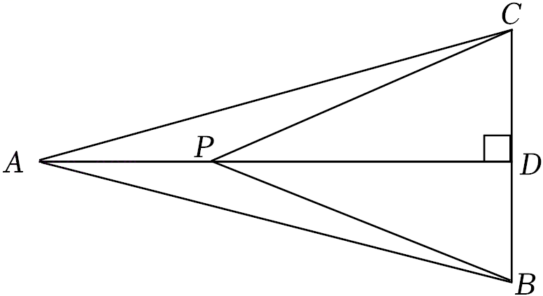

5．（2023·湖南湘西·中考真题）如图， $\odot O$ 是等边三角形 $ABC$ 的外接圆，其半径为4．过点<em>&lt;text style="italic"&gt;B</em>&lt;/text&gt;作 $BE\perp AC$ 于点<em>&lt;text style="italic"&gt;E</em>&lt;/text&gt;，点<em>&lt;text style="italic"&gt;P</em>&lt;/text&gt;为线段 $BE$ 上一动点（点<em>&lt;text style="italic"&gt;P</em>&lt;/text&gt;不与<em>&lt;text style="italic"&gt;B</em>&lt;/text&gt;，<em>&lt;text style="italic"&gt;E</em>&lt;/text&gt;重合），则 $CP+\frac{1}{2}BP$ 的最小值为__________．

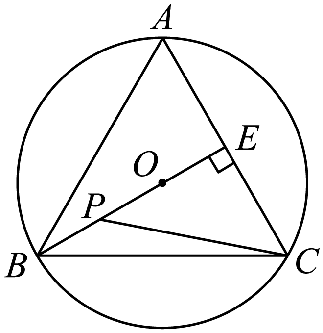

6．（2023·辽宁锦州·中考真题）如图，在 $Rt\bigtriangleup ABC$ 中， $\angle ACB=90\circ$ ， $\angle ABC=30\circ$ ， $AC=4$ ，按下列步骤作图：①在 $AC$ 和 $AB$ 上分别截取 $AD$ 、 $AE$ ，使 $AD=AE$ ．②分别以点<em>D</em>和点<em>E</em>为圆心，以大于 $\frac{1}{2}DE$ 的长为半径作弧，两弧在 $\angle BAC$ 内交于点<em>M</em>．③作射线 $AM$ 交 $BC$ 于点<em>F</em>．若点<em>P</em>是线段 $AF$ 上的一个动点，连接 $CP$ ，则 $CP+\frac{1}{2}AP$ 的最小值是______________．

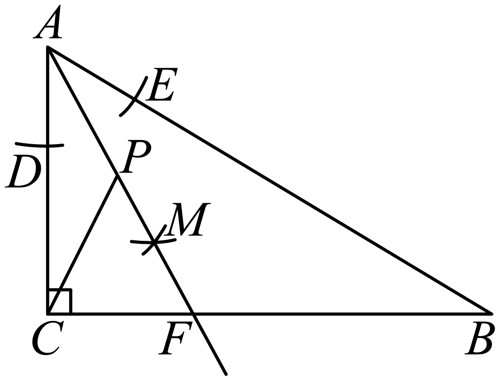

## 题型03  阿氏圆问题

7．（2023·山东烟台·中考真题）如图，抛物线 $y=ax^{2}+bx+5$ 与 $x$ 轴交于 $A,B$ 两点，与 $y$ 轴交于点 $C,AB=4$ ．抛物线的对称轴 $x=3$ 与经过点 $A$ 的直线 $y=kx-1$ 交于点 $D$ ，与 $x$ 轴交于点 $E$ ．

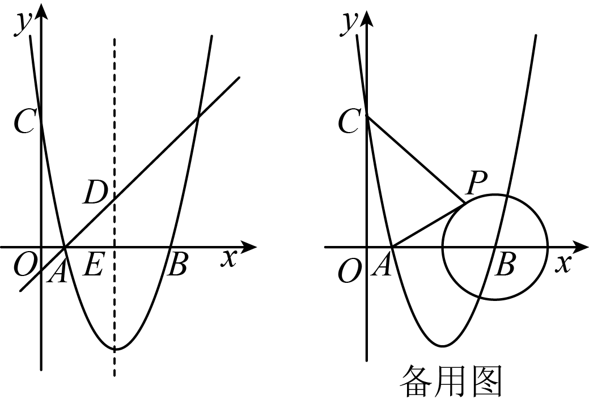  
(1)求直线 $AD$ 及抛物线的表达式；  
(2)在抛物线上是否存在点 $M$ ，使得 $\bigtriangleup ADM$ 是以 $AD$ 为直角边的直角三角形?若存在，求出所有点 $M$ 的坐标；若不存在，请说明理由；  
(3)以点 $B$ 为圆心，画半径为2的圆，点 $P$ 为 $\odot B$ 上一个动点，请求出 $PC+\frac{1}{2}PA$ 的最小值．

8．（2023·山东济南·一模）抛物线 $y=-\frac{1}{2}x^{2}+\left(a-1\right)x+2a$ 与 $x$ 轴交于 $A\left(b,0\right)$ ， $B\left(4,0\right)$ 两点，与 $y$ 轴交于点 $C\left(0,c\right)$ ，点 $P$ 是抛物线在第一象限内的一个动点，且在对称轴右侧．

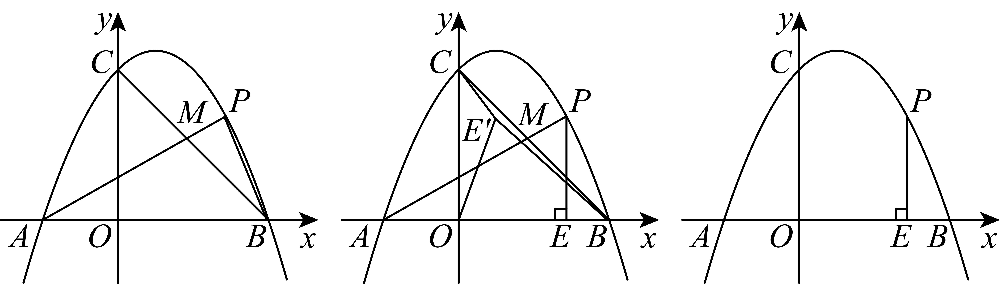  
(1)求*a*，*b*，*c*的值；  
(2)如图 $1$ ，连接 $BC$ 、 $AP$ ，交点为 $M$ ，连接 $PB$ ，若 $\frac{S_{\bigtriangleup PMB}}{S_{\bigtriangleup AMB}}=\frac{1}{4}$ ，求点 $P$ 的坐标；  
(3)如图 $2$ ，在（2）的条件下，过点 $P$ 作 $x$ 轴的垂线交 $x$ 轴于点 $E$ ，将线段 $OE$ 绕点 $O$ 逆时针旋转得到 $OE'$ ，旋转角为 $\alpha (0\circ <\alpha <90\circ )$ ，连接 $E'B$ ， $E^{'}C$ ，求 $E^{'}B+\frac{3}{4}E^{'}C$ 的最小值．

## 题型04  隐圆问题

9．（2022·山东泰安·中考真题）如图，四边形 $ABCD$ 为矩形， $AB=3$ ， $BC=4$ ．点*P*是线段 $BC$ 上一动点，点*M*为线段 $AP$ 上一点． $\angle ADM=\angle BAP$ ，则 $BM$ 的最小值为（    ）

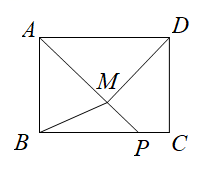

A． $\frac{5}{2}$ 	
B． $\frac{12}{5}$ 	
C． $\sqrt{13}-\frac{3}{2}$ 	
D． $\sqrt{13}-2$

10．（2022·安徽蚌埠·一模）如图， $Rt\bigtriangleup ABC$ 中， $AB\perp BC$ ， $AB=8$ ， $BC=6$ ，*P*是 $\bigtriangleup ABC$ 内部的一个动点，满足 $\angle PAB=\angle PBC$ ，则线段C*P*长的最小值为（   ）

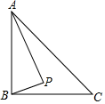

A． $\frac{32}{5}$ 	
B．2	
C． $2\sqrt{13}-6$ 	
D． $2\sqrt{13}-4$

11．（20-21九年级上·江苏盐城·期末）如图， $\odot M$ 的半径为4，圆心 $M$ 的坐标为 $(5,12)$ ，点 $P$ 是 $\odot M$ 上的任意一点， $PA\perp PB$ ，且 $PA$ 、 $PB$ 与 $x$ 轴分别交于 $A$ 、 $B$ 两点，若点 $A$ 、点 $B$ 关于原点 $O$ 对称，则 $AB$ 的最小值为__ ．

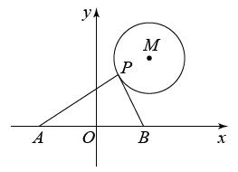

12．（2021九年级·全国·专题练习）如图，在平面直角坐标系*xOy*中，点*A*与点*B*的坐标分别是（1，0），（7，0）．  
（1）对于坐标平面内的一点*P*，给出如下定义：如果∠*APB*＝45°，则称点*P*为线段*AB*的“等角点”．显然，线段*AB*的“等角点”有无数个，且*A*、*B*、*P*三点共圆．

①设*A*、*B*、*P*三点所在圆的圆心为*C*，直接写出点*C*的坐标和⊙*C*的半径；
②*y*轴正半轴上是否有线段*AB*的“等角点”？如果有，求出“等角点”的坐标；如果没有，请说明理由；  
（2）当点*P*在*y*轴正半轴上运动时，∠*APB*是否有最大值？如果有，说明此时∠*APB*最大的理由，并求出点*P*的坐标；如果没有请说明理由．

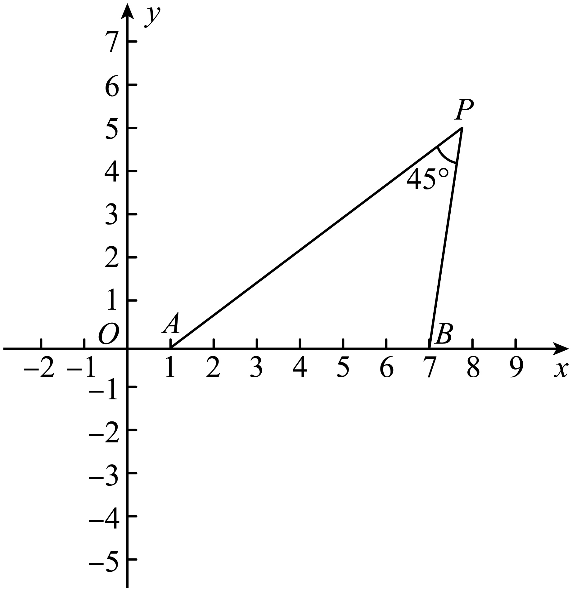

13．（21-22九年级下·福建厦门·期中）如图，等边三角形*ABC*内接于半径长为2的⊙*O*，点*P*在圆弧*AB*上以2倍速度从*B*向*A*运动，点*Q*在圆弧*BC*上以1倍速度从*C*向*B*运动，当点*P*，*O*，*Q*三点处于同一条直线时，停止运动．

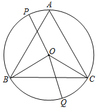  
(1)求点*Q*的运动总长度；  
(2)若*M*为弦*PB*的中点，求运动过程中*CM*的最大值．

## 题型05  费马点问题

14．（2023·湖北随州·中考真题）1643年，法国数学家费马曾提出一个著名的几何问题：给定不在同一条直线上的三个点*A*，*B*，*C*，求平面上到这三个点的距离之和最小的点的位置，意大利数学家和物理学家托里拆利给出了分析和证明，该点也被称为“费马点”或“托里拆利点”，该问题也被称为“将军巡营”问题．  
(1)下面是该问题的一种常见的解决方法，请补充以下推理过程：（其中①处从“直角”和“等边”中选择填空，②处从“两点之间线段最短”和“三角形两边之和大于第三边”中选择填空，③处填写角度数，④处填写该三角形的某个顶点）
当 $\bigtriangleup ABC$ 的三个内角均小于 $120\circ$ 时，

如图1，将 $\bigtriangleup APC$ 绕，点*C*顺时针旋转 $60\circ$ 得到 $\bigtriangleup A^{'}P^{'}C$ ，连接 $PP^{'}$ ，

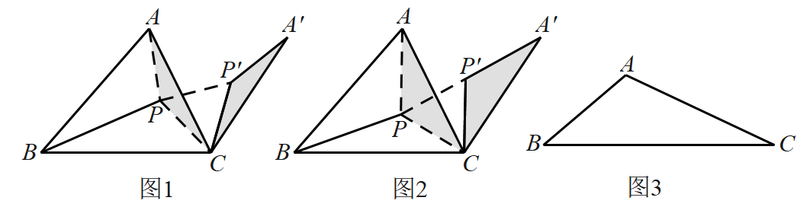
由 $PC=P^{'}C，\angle PCP^{'}=60\circ$ ，可知 $\bigtriangleup PCP^{'}$ 为<u>_①_</u>三角形，故 $PP^{'}=PC$ ，又 $P^{'}A^{'}=PA$ ，故 $PA+PB+PC=PA^{'}+PB+PP^{'}\geq A^{'}B$ ，
由<u>_②_</u>可知，当<em>B</em>，<em>&lt;text style="italic"&gt;P</em>&lt;/text&gt;， $P^{'}$ ，<em>A</em>在同一条直线上时， $PA+PB+PC$ 取最小值，如图2，最小值为 $A^{'}B$ ，此时的<em>&lt;text style="italic"&gt;P</em>&lt;/text&gt;点为该三角形的“费马点”，且有 $\angle APC=\angle BPC=\angle APB=$ <u>_③_</u>；
已知当 $\bigtriangleup ABC$ 有一个内角大于或等于 $120\circ$ 时，“费马点”为该三角形的某个顶点．如图3，若 $\angle BAC\geq 120\circ$ ，则该三角形的“费马点”为<u>_④_</u>点．  
(2)如图4，在 $\bigtriangleup ABC$ 中，三个内角均小于 $120\circ$ ，且 $AC=3，BC=4，\angle ACB=30\circ$ ，已知点*P*为 $\bigtriangleup ABC$ 的“费马点”，求 $PA+PB+PC$ 的值；
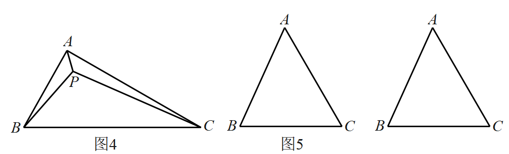  
(3)如图5，设村庄<text style="it<text style="it<text style="it*a*lic">a</text>lic">a</text>lic">*<text style="italic">A*</text></text>，*<text style="italic"><text style="italic">B*</text></text>，*<text style="italic"><text style="italic">C*</text></text>的连线构成一个三角形，且已知 $AC=4km，BC=2\sqrt{3}km，\angle ACB=60\circ$ ．现欲建一中转站<text style="it<text style="it<text style="it*a*lic">a</text>lic">a</text>lic">*<text style="italic">P*</text></text>沿直线向*<text style="italic"><text style="italic">A*</text></text>，*<text style="italic"><text style="italic">B*</text></text>，*<text style="italic"><text style="italic">C*</text></text>三个村庄铺设电缆，已知由中转站P到村庄A，B，C的铺设成本分别为a元/ $km$ ，<text style="it<text style="it*a*lic">a</text>lic">a</text>元/ $km$ ， $\sqrt{2}a$ 元/ $km$ ，选取合适的<text style="it<text style="it<text style="it*a*lic">a</text>lic">a</text>lic">*<text style="italic">P*</text></text>的位置，可以使总的铺设成本最低为\_\_\_\_\_\_\_\_\_\_\_元．（结果用含a的式子表示）

15．（2021·山东济南·三模）如图（1），*<text style="italic">P*</text>为 $\bigtriangleup$ *<text style="italic">ABC*</text>所在平面上一点，且∠A*<text style="italic">P*</text>B＝∠*BPC*＝∠*CPA*＝120°，则点P叫做 $\bigtriangleup$ *<text style="italic">ABC*</text>的费马点．  
（1）若点<em>P</em>是等边三角形三条中线的交点，点<em>P</em><u>　　</u>（填是或不是）该三角形的费马点．  
（2）如果点*P*为锐角 $\bigtriangleup$ *<text style="italic">ABC*</text>的费马点，且∠ABC＝60°．求证： $\bigtriangleup$ AB*P*∽ $\bigtriangleup$ BC*P*；  
（3）已知锐角 $\bigtriangleup$ *<text style="italic">AB*C</text>，分别以AB、*AC*为边向外作正 $\bigtriangleup$ *AB*E和正 $\bigtriangleup$ *AC*D，*CE*和*BD*相交于*P*点．如图（2）

①求∠*CPD*的度数；
②求证：*P*点为 $\bigtriangleup$ *ABC*的费马点．

## 题型06  瓜豆原理模型

16．（22-23九年级上·江苏扬州·阶段练习）如图，*A*是 $\odot B$ 上任意一点，点*C*在 $\odot B$ 外，已知 $AB=2，BC=4，\bigtriangleup ACD$ 是等边三角形，则 $\bigtriangleup BCD$ 的面积的最大值为（    ）

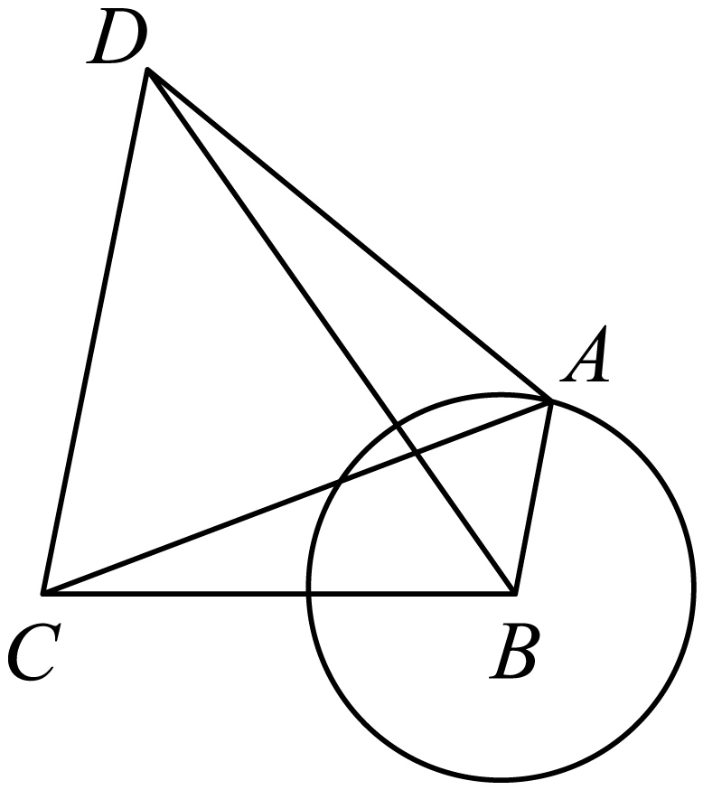

A． $4\sqrt{3}+4$ 	
B．4	
C． $4\sqrt{3}+8$ 	
D．6

17．（2022·广东河源·二模）如图，已知 $AC=2AO=8$ ，平面内点<em>P</em>到点<em>O</em>的距离为2，连接<em>AP</em>，若 $\angle APB=60\circ$ 且 $BP=\frac{1}{2}AP$ ，连接<em>AB</em>，<em>&lt;text style="italic"&gt;BC</em>&lt;/text&gt;，则线段BC的最小值为______．

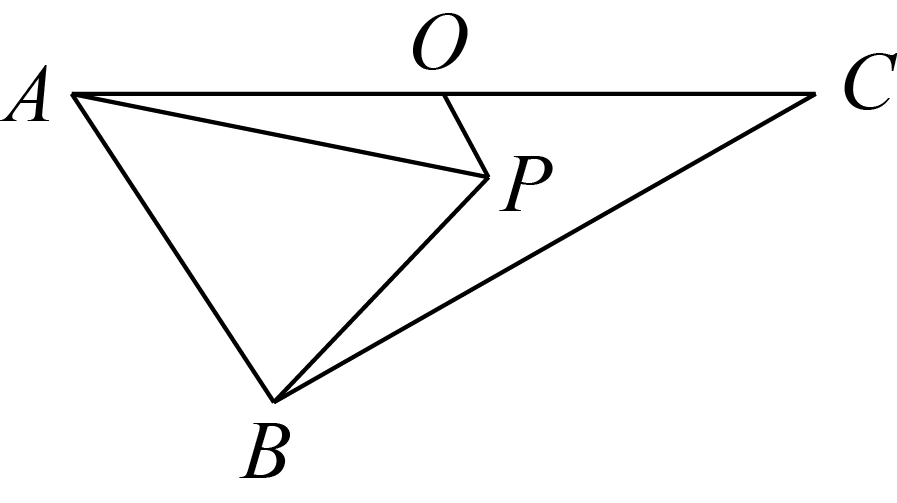

18．（23-24九年级上·江苏宿迁·阶段练习）如图，线段 $AB$ 为 $\odot O$ 的直径，点 $C$ 在 $AB$ 的延长线上， $AB=4$ ， $BC=2$ ，点 $P$ 是 $\odot O$ 上一动点，连接 $CP$ ，以 $CP$ 为斜边在 $PC$ 的上方作Rt $\bigtriangleup PCD$ ，且使 $\angle DCP=60\circ$ ，连接 $OD$ ，则 $OD$ 长的最大值为__．

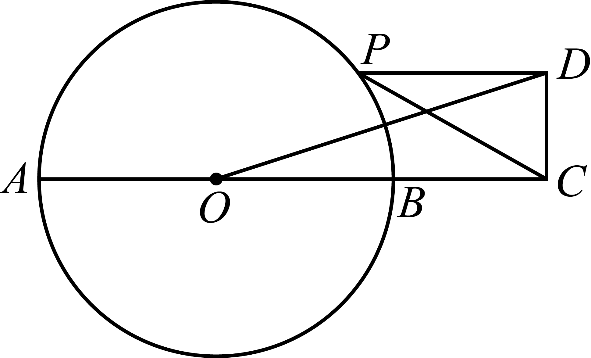

19．（20-21九年级·陕西西安·开学考试）在菱形 $ABCD$ 中， $\angle BAD=120\circ$ ， $E$ 是对角线 $BD$ 上的一点，连接 $AE$ ．

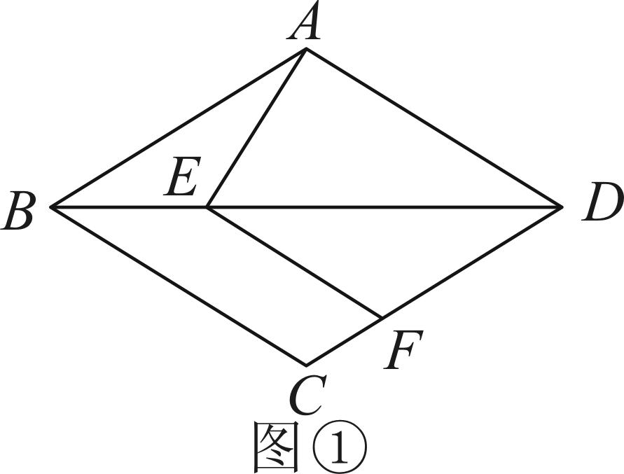

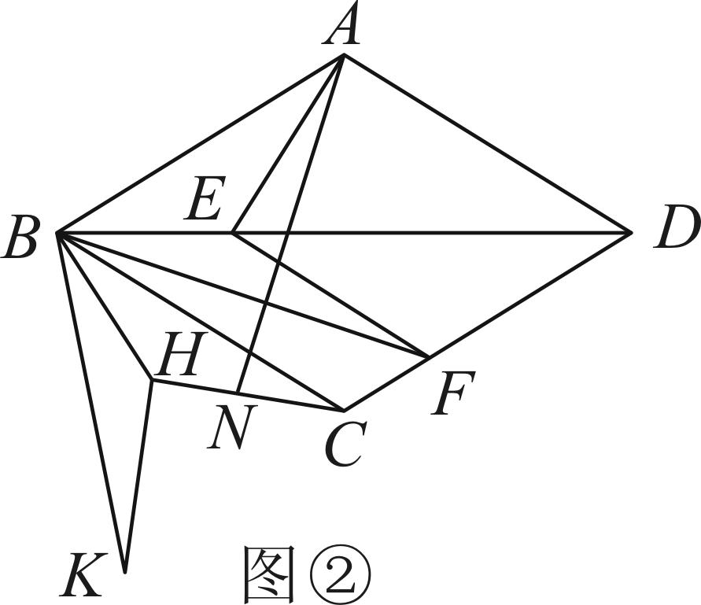  
（1）当 $E$ 在 $AB$ 的中垂线上时，把射线 $EA$ 绕点 $E$ 顺时针旋转 $90\circ$ 后交 $CD$ 于 $F$ ，连接 $BF$ ．如图①，若 $AB=4$ ，求 $EF$ 的长．  
（2）在（1）的条件下，连接 $BF$ ，把 $\bigtriangleup BEF$ 绕点 $B$ 顺时针旋转得到 $\bigtriangleup BHK$ 如图②，连接 $CH$ ，点 $N$ 为 $CH$ 的中点，连接 $AN$ ，求 $AN$ 的最大值．

20．（21-22八年级上·广东湛江·阶段练习）在平面直角坐标系中， $A\left(a,0\right)、B\left(b,0\right)$ ，且<te*x*t st*y*le="italic">a，b</text>满足 $(a+b)^{2}+|3+b|=0$ ，<te*x*t st*y*le="italic">C、D</text>两点分别是y轴正半轴、x轴负半轴上的两个动点：

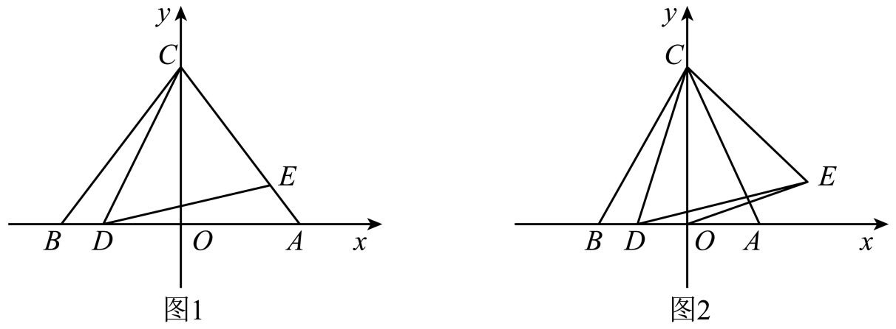  
（1）如图1，若 $C\left(0,4\right)$ ，求 $\bigtriangleup ABC$ 的面积；  
（2）如图1，若 $C\left(0,4\right),BC=5,BD=AE$ ，且 $\angle CBA=\angle CDE$ ，求*D*点的坐标；  
（3）如图2，若 $\angle CBA=60\circ$ ，以 $CD$ 为边，在 $CD$ 的右侧作等边 $\bigtriangleup CDE$ ，连接 $OE$ ，当 $OE$ 最短时，求*A，E*两点之间的距离；

## 题型07  等腰（边）三角形存在问题

21．（2022·黑龙江·中考真题）如图，在平面直角坐标系中，平行四边形<*t*e<text st*y*le="italic">x</text>t style="italic">*A<text style="italic"><text style="italic">B*</text></text>C*<text style="italic">D*</text></text>的边AB在x轴上，顶点D在y轴的正半轴上，*M*为*BC*的中点，*OA*、*OB*的长分别是一元二次方程 $x^{2}-7x+12=0$ 的两个根 $\left(OA<OB\right)$ ， $tan\angle DAB=\frac{4}{3}$ ，动点<*t*ext style="italic">P</text>从点<text st*y*le="italic">*D*</text>出发以每秒1个单位长度的速度沿折线 $DC-CB$ 向点<*t*ext style="italic">*B*</text>运动，到达B点停止．设运动时间为t秒， $\bigtriangleup APC$ 的面积为*S*．

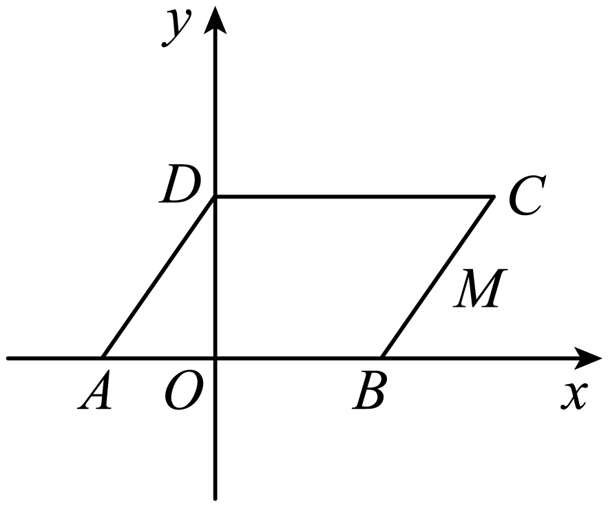  
(1)求点*C*的坐标；  
(2)求*S*关于*t*的函数关系式，并写出自变量*t*的取值范围；  
(3)在点*<text style="italic"><text style="italic">P*</text></text>的运动过程中，是否存在点P，使 $\bigtriangleup CMP$ 是等腰三角形？若存在，请直接写出点*<text style="italic"><text style="italic">P*</text></text>的坐标；若不存在，请说明理由．

22．（2023·广东广州·中考真题）如图，在正方形 $ABCD$ 中，*E*是边 $AD$ 上一动点（不与点*A*，*D*重合）．边 $BC$ 关于 $BE$ 对称的线段为 $BF$ ，连接 $AF$ ．

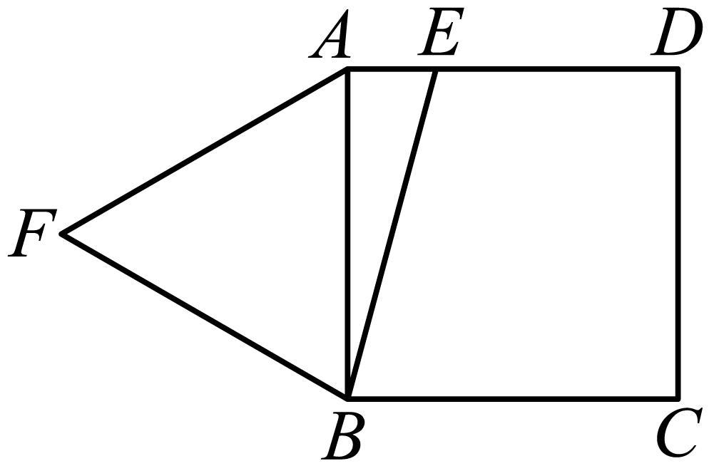  
(1)若 $\angle ABE=15\circ$ ，求证： $\bigtriangleup ABF$ 是等边三角形；  
(2)延长 $FA$ ，交射线 $BE$ 于点*G*；
① $\bigtriangleup BGF$ 能否为等腰三角形？如果能，求此时 $\angle ABE$ 的度数；如果不能，请说明理由；
②若 $AB=\sqrt{3}+\sqrt{6}$ ，求 $\bigtriangleup BGF$ 面积的最大值，并求此时 $AE$ 的长．

## 题型08  直角三角形存在问题

23．（2022·贵州安顺·中考真题）如图1，在矩形 $ABCD$ 中， $AB=10$ ， $AD=8$ ， $E$ 是 $AD$ 边上的一点，连接 $CE$ ，将矩形 $ABCD$ 沿 $CE$ 折叠，顶点 $D$ 恰好落在 $AB$ 边上的点 $F$ 处，延长 $CE$ 交 $BA$ 的延长线于点 $G$ ．

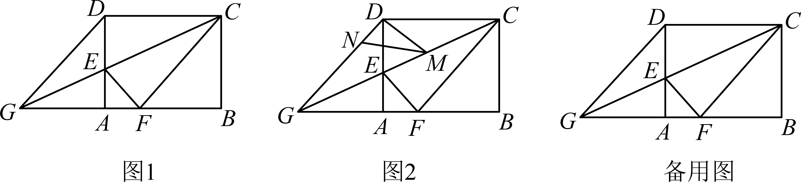  
(1)求线段 $AE$ 的长；  
(2)求证四边形 $DGFC$ 为菱形；  
(3)如图2， $M$ ， $N$ 分别是线段 $CG$ ， $DG$ 上的动点（与端点不重合），且 $\angle DMN=\angle DCM$ ，设 $DN=x$ ，是否存在这样的点 $N$ ，使 $\bigtriangleup DMN$ 是直角三角形？若存在，请求出 $x$ 的值；若不存在，请说明理由．

24．（2024·山东东营·二模）在人教版八年级下册教材“实验与探究——丰富多彩的正方形”中，我们研究正方形的性质时用到了图①、图②两个图形，图②为大小不等的两个正方形如图排列，整个图形被切割为5部分，受这两个图形的启发，三个数学兴趣小组分别提出了以下问题，请你回答：

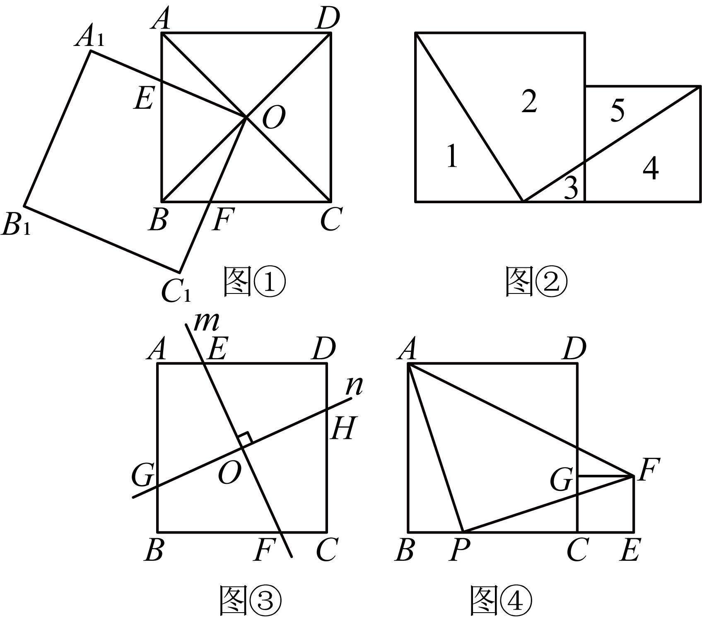

【问题一】“启智”小组提出问题：如图①，正方形 $ABCD$ 的对角线相交于点 $O$ ，点 $O$ 又是正方形 $A_{1}B_{1}C_{1}O$ 的一个顶点， $OA_{1}$ 交 $AB$ 于点 $E$ ， $OC_{1}$ 交 $BC$ 于点 $F$ ，则 $AE$ 与 $BF$ 的数量关系为；
【问题二】受图①启发，“善思”小组继续探究，画出了图③：直线 $m$ 、 $n$ 经过正方形 $ABCD$ 的对称中心 $O$ ，直线 $m$ 分别与 $AD$ 、 $BC$ 交于点 $E$ 、 $F$ ，直线 $n$ 分别与 $AB、CD$ 交于点 $G、H$ ，且 $m\perp n$ ，若正方形 $ABCD$ 边长为10，求四边形 $OEAG$ 的面积；
【问题三】受图②启发，“智慧”小组继续探究，画出了图④：正方形 $CEFG$ 的顶点 $G$ 在正方形 $ABCD$ 的边 $CD$ 上，顶点 $E$ 在 $BC$ 的延长线上，且 $BC=12$ ， $CE=4$ ．在直线 $BE$ 上是否存在点 $P$ ，使 $\bigtriangleup APF$ 为直角三角形？若存在，请直接写出 $BP$ 的长度；若不存在，说明理由．

25．（2024·新疆乌鲁木齐·一模）如图，在 $\bigtriangleup ABC$ 中， $AB=AC$ ， $AD\perp BC$ 于点<*t*ext style="italic">D</text>， $BC=10cm$ ， $AD=8cm$ ，点<*t*ext style="italic">*<text style="italic">P*</text></text>从点*B*出发，在线段 $BC$ 上以每秒 $3cm$ 的速度向点<*t*ext style="italic">*C*</text>匀速运动，与此同时，垂直于 $AD$ 的直线<*t*ext style="italic">*m*</text>从底边 $BC$ 出发，以每秒 $2cm$ 的速度沿 $DA$ 方向匀速平移，分别交 $AB$ 、 $AC$ 、 $AD$ 于<*t*ext style="italic">E</text>、*F*、*H*，当点*<text style="italic"><text style="italic">P*</text></text>到达点*<text style="italic">C*</text>，点P与直线*<text style="italic">m*</text>同时停止运动，设运动时间为t秒 $\left(t>0\right)$ ．

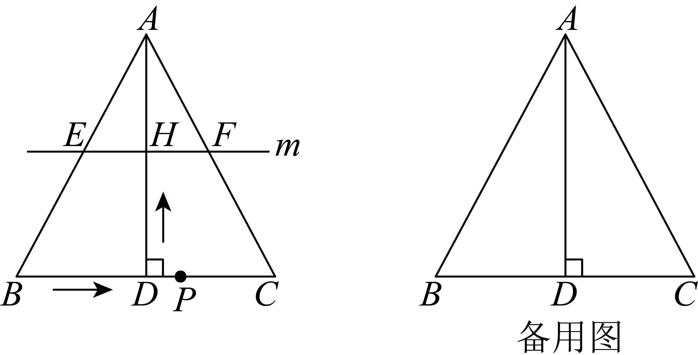  
(1) $AH=$ \_\_\_\_\_\_\_\_\_\_， $EF=$ \_\_\_\_\_\_\_\_\_\_（用含*t*的式子表示）．  
(2)在整个运动过程中，所形成的 $\bigtriangleup PEF$ 的面积存在最大值，当 $\bigtriangleup PEF$ 的面积最大时，求线段 $BP$ 的长；  
(3)是否存在某一时刻<*t*ext style="italic">t</text>，使 $\bigtriangleup PEF$ 为直角三角形？若存在，请求出此时刻<*t*ext style="italic">t</text>的值；若不存在，请说明理由．

## 题型09  平行四边形存在问题

26．（2022·湖北荆州·一模）如图，抛物线 $y=ax^{2}+bx-3$ 与 $x$ 轴交于 $A、B$ 两点，点 $A$ 在点 $B$ 的左侧，且 $A\left(-1,0\right),B\left(4,0\right)$ ，与 $y$ 轴交于点 $C$ ，连结 $BC$ ，以 $BC$ 为边，点 $O$ 为中心作菱形 $BDEC$ ，点 $P$ 是 $x$ 轴上的一个动点，设点 $P$ 的坐标为 $\left(m,0\right)$ ．

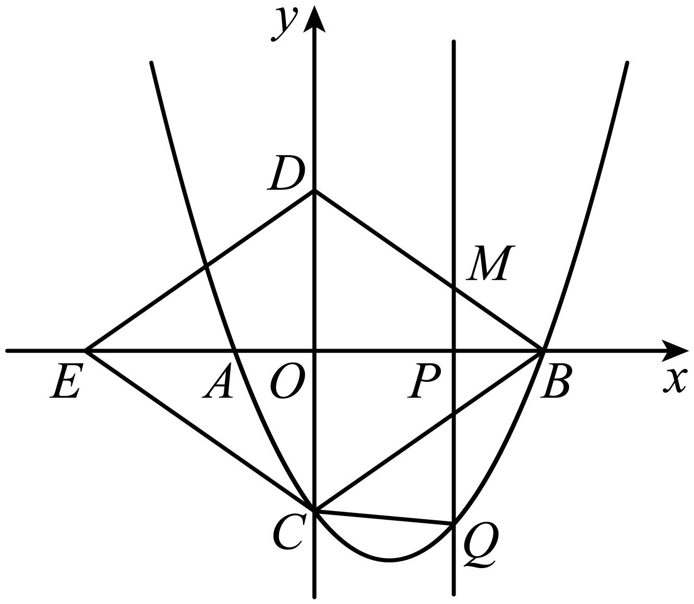  
(1)求该抛物线对应的函数解析式；  
(2) $x$ 轴上是否存在一点 $P$ ，使 $\bigtriangleup PBC$ 为等腰三角形？若存在，请直接写出点 $P$ 的坐标；若不存在，请说明理由；  
(3)当点 $P$ 在线段 $OB$ 上运动时，过点 $P$ 作 $x$ 轴的垂线交抛物线于点 $Q$ ，交 $BD$ 于点 $M$ ．试探究：当 $m$ 为何值时，四边形 $CQMD$ 是平行四边形？请说明理由．

27．（2023·黑龙江鸡西·模拟预测）在平面直角坐标系中，边长为4的菱形的顶点 $B$ ， $C$ 在 $x$ 轴上， $D$ 在 $y$ 轴上，如图，已知 $\angle A=60\circ$ ， $C\left(2,0\right)$ .

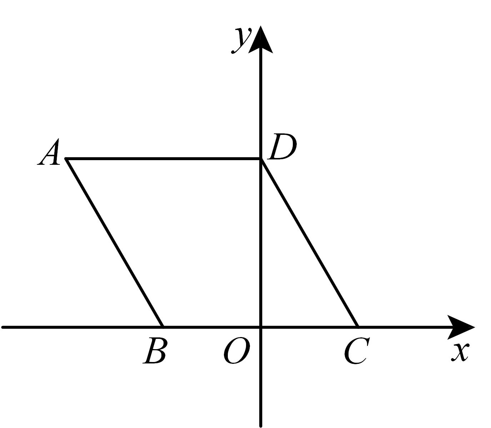  
(1)求点 $D$ 的坐标  
(2)动点 $P$ 从点 $A$ 出发，以每秒1个单位速度沿射线 $AD$ 运动，过点 $P$ 作 $PE\perp x$ 轴于 $E$ ，直线 $PE$ 交直线 $CD$ 于点 $Q$ ，设 $\bigtriangleup PCQ$ 的面积为 $S$ ，点 $P$ 的运动时间为 $t$ 秒，当点 $Q$ 在 $x$ 轴上方时，求 $S$ 与 $t$ 的关系式，直接写出 $t$ 的取值范围.  
(3)在（2）的条件下，连接 $CP$ ，当点 $Q$ 在第一象限， $\bigtriangleup PCQ$ 为等腰三角形时，作 $\angle PQC$ 的平分线交射线 $AD$ 于点 $M$ ，此时是否存在点 $N$ ，使以点 $D$ ， $Q$ ， $M$ ， $N$ 为顶点的四边形是平行四边形？若存在，请求出点 $N$ 的坐标，若不存在，说明理由.

## 题型10  矩形、菱形、正方形存在问题

28．（2023·黑龙江·中考真题）如图，在平面直角坐标系中，菱形 $AOCB$ 的边 $OC$ 在<*t*e<te<text st*y*le="italic">x</text>t style="italic">x</text>t style="italic">x</text>轴上， $\angle AOC=60\circ$ ， $OC$ 的长是一元二次方程 $x^{2}-4x-12=0$ 的根，过点<*t*e<te<text st*y*le="italic">x</text>t style="italic">x</text>t style="italic">C</text>作*x*轴的垂线，交对角线 $OB$ 于点<*t*e<text st*y*le="italic">x</text>t style="italic">*D*</text>，直线 $AD$ 分别交<*t*e<te<text st*y*le="italic">x</text>t style="italic">x</text>t style="italic">x</text>轴和y轴于点*<text style="italic">F*</text>和点*<text style="italic">E*</text>，动点*M*从点*O*以每秒1个单位长度的速度沿 $OD$ 向终点<*t*e<text st*y*le="italic">x</text>t style="italic">*D*</text>运动，动点*N*从点*<text style="italic">F*</text>以每秒2个单位长度的速度沿 $FE$ 向终点<*t*ext style="italic">*E*</text>运动．两点同时出发，设运动时间为t秒．

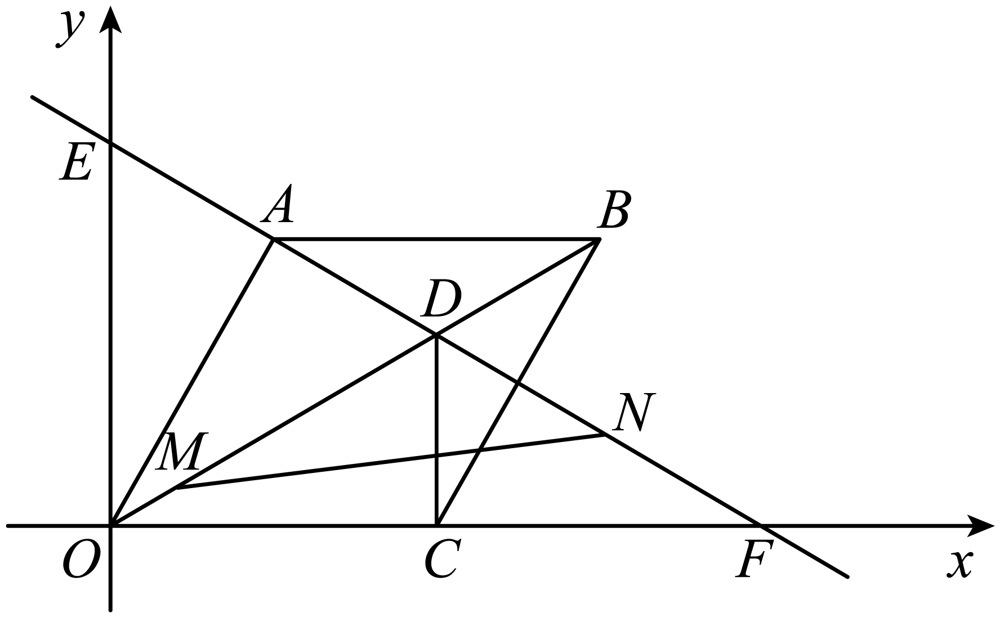  
(1)求直线 $AD$ 的解析式．  
(2)连接 $MN$ ，求 $\bigtriangleup MDN$ 的面积<*t*ext style="italic">S</text>与运动时间t的函数关系式．  
(3)点*N*在运动的过程中，在坐标平面内是否存在一点*Q*．使得以*A*，*C*，*N*，*Q*为项点的四边形是矩形．若存在，直接写出点*Q*的坐标，若不存在，说明理由．

29．（2024·河北张家口·一模）如图，在 $Rt\bigtriangleup ABC$ 中， $\angle ABC=90\circ$ ， $AB=6$ ， $tan\angle CAB=\frac{4}{3}$ ．动点 $M$ 以每秒2个单位的速度从点 $A$ 出发，沿着 $A\rightarrow B\rightarrow C$ 的方向运动，当点 $M$ 到达点 $C$ 时，运动停止．点 $N$ 是点 $M$ 关于点 $B$ 的对称点，过点 $M$ 作 $MQ\perp AC$ 于点 $Q$ ，以 $MN$ ， $MQ$ 为邻边作平行四边形 $MNPQ$ ，设点 $M$ 的运动时间为 $t$ 秒．

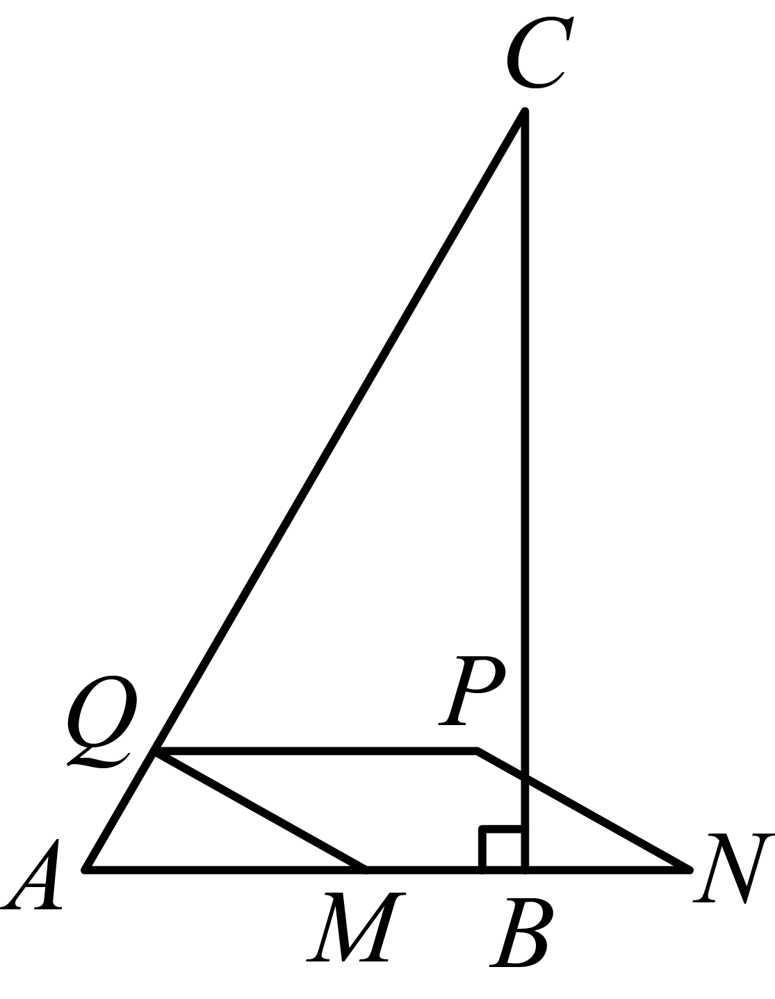  
(1)求 $BC$ 的长；  
(2)当 $t=2$ 时，求证： $QP=AM$ ；  
(3)是否存在这样的 $t$ 值，使得平行四边形 $MNPQ$ 为菱形？若存在，请求出 $t$ 值；若不存在，请说明理由．

30．综合与探索

【探索发现】如图1，等腰直角三角形 $ABC$ 中， $\angle ACB=90\circ ,CB=CA$ ，过点 $A$ 作 $AD\perp l$ 交于点 $D$ ，过点 $B$ 作 $BE\perp l$ 交于点 $E$ ，易得 $\bigtriangleup ADC\allequal \bigtriangleup CEB$ ，我们称这种全等模型为“ $k$ 型全等”．（不需要证明）

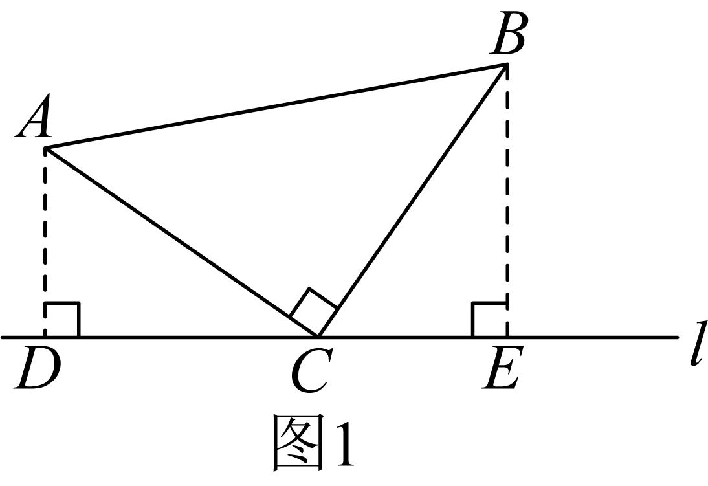

【迁移应用】如图2，在直角坐标系中，直线 $l_{1}:y=2x+4$ 分别与 $y$ 轴， $x$ 轴交于点 $A、B$ ，  
（1）直接写出 $OA=$ \_\_\_\_\_\_\_\_\_， $OB=$ \_\_\_\_\_\_\_\_\_；  
（2）在第二象限构造等腰直角 $\bigtriangleup ABE$ ，使得 $\angle BAE=90\circ$ ，则点 $E$ 的坐标为\_\_\_\_\_\_\_\_\_；
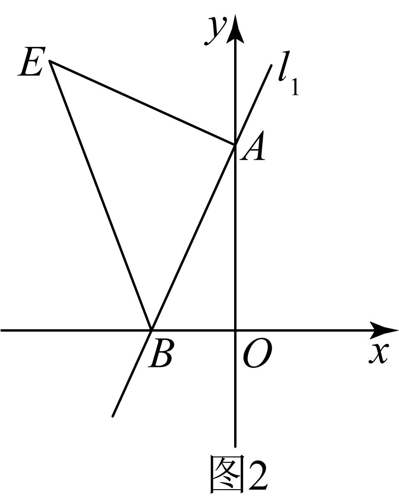  
（3）如图3，将直线 $l_{1}$ 绕点 $A$ 顺时针旋转 $45\circ$ 得到 $l_{2}$ ，求 $l_{2}$ 的函数表达式；
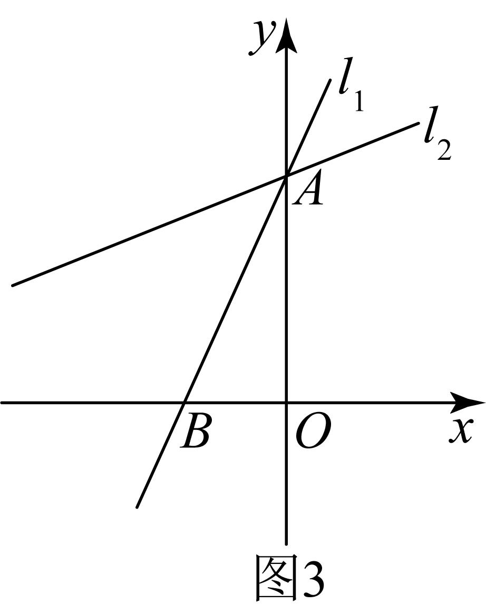

【拓展应用】  
（4）如图4，直线 $AB:y=2x+8$ 分别交 $x$ 轴和 $y$ 轴于 $A,B$ 两点，点 $C$ 在第二象限内一点，在平面内是否存在一点 $D$ ，使以 $A、B、C、D$ 为顶点的四边形为正方形？若存在，请直接写出点 $D$ 的坐标；若不存在，请说明理由．

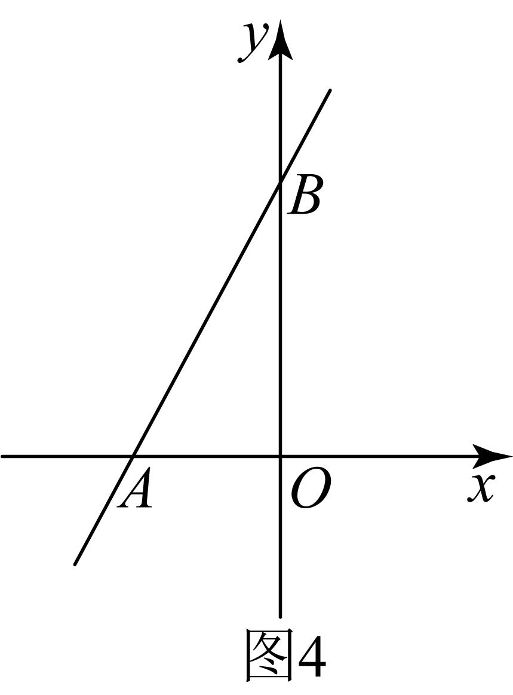

## 题型11  全等/相似存在性问题

31．（2023·广西南宁·二模）如图，在 $\bigtriangleup ABC$ 中， $AD$ 为高， $AC=18$ ．点 $E$ 为 $AC$ 上的一点， $CE=\frac{1}{2}AE$ ，连接 $BE$ ，交 $AD$ 于 $O$ ，若 $\bigtriangleup BDO\allequal \bigtriangleup ADC$ ．

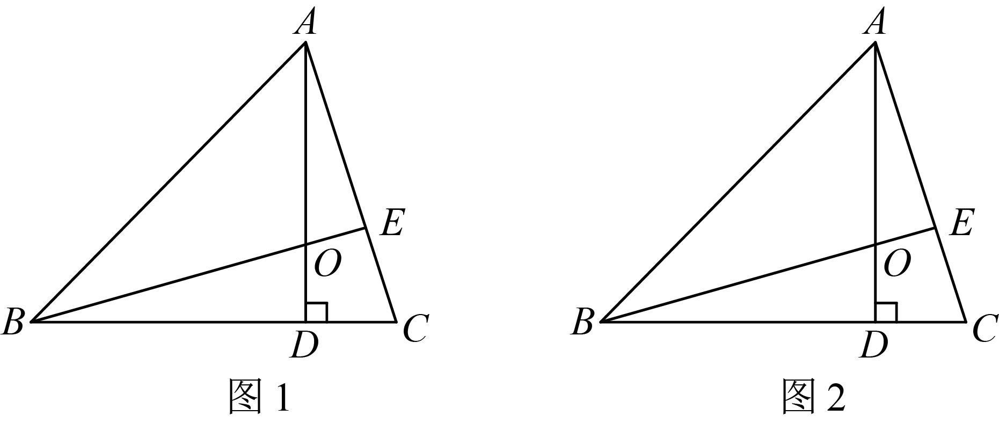  
(1)猜想线段 $BO$ 与 $AC$ 的位置关系，并证明；  
(2)有一动点 $Q$ 从点 $A$ 出发沿射线 $AC$ 以每秒6个单位长度的速度运动，设点 $Q$ 的运动时间为 $t$ 秒，是否存在 $t$ 的值，使得 $\bigtriangleup BOQ$ 的面积为27？若存在，请求出 $t$ 的值；若不存在，请说明理由；  
(3)在（2）条件下，动点 $P$ 从点 $O$ 出发沿线段 $OB$ 以每秒2个单位长度的速度向终点 $B$ 运动， $P$ 、 $Q$ 两点同时出发，当点 $P$ 到达点 $B$ 时， $P$ 、 $Q$ 两点同时停止运动，设运动时间为 $t$ 秒，点 $F$ 是直线 $BC$ 上一点，且 $CF=AO$ ，当 $\bigtriangleup AOP$ 与 $\bigtriangleup FCQ$ 全等时，求 $t$ 的值．

32．（2023·北京海淀·模拟预测）如图，在平面角坐标系中，点 $A$ 在 $x$ 轴的正半轴上，点 $B$ 的坐标 $\left(0，-2\sqrt{3}\right)$ ，过原点的直线 $OC$ 与直线 $AB$ 交于 $C，\angle COA=\angle OCA=\angle OBA=30\circ ，AB=4$

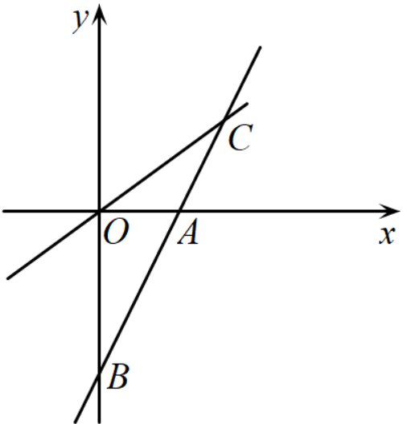  
(1)点 $C$ 坐标为\_\_\_\_\_\_， $OC=$ \_\_\_\_\_\_， $\bigtriangleup BOC$ 的面积为\_\_\_\_\_\_， $\frac{S_{\bigtriangleup OAC}}{S_{\bigtriangleup OAB}}=$ \_\_\_\_\_\_；  
(2)点 $C$ 关于 $x$ 轴的对称点 $C'$ 的坐标为\_\_\_\_\_\_；  
(3)过 $O$ 点作 $OE\perp OC$ 交 $AB$ 于 $E$ 点，则 $\bigtriangleup OAE$ 的形状为\_\_\_\_\_\_，请说明理由；  
(4)在坐标平面内是否存在点 $F$ 使 $\bigtriangleup AOF$ 和 $\bigtriangleup AOB$ 全等，若存在，请直接写出 $F$ 坐标，若不存在，请说明理由

33．（2023·广西桂林·二模）如图，在平面直角坐标系中，矩形 $ABCO$ 的边 $OA$ 在<text st*y*le="italic">x</text>轴上，边 $OC$ 在*y*轴上，且*<text style="italic">B*</text>点坐标为 $\left(4，3\right)$ ．动点*<text style="italic">M*</text>、*<text style="italic"><text style="italic">N*</text></text>分别从点*O*、*<text style="italic">B*</text>同时出发，以1单位/秒的速度运动（点M沿 $OA$ 向终点*A*运动，点*<text style="italic"><text style="italic">N*</text></text>沿 $BC$ 向终点*C*运动），过点*<text style="italic"><text style="italic">N*</text></text>作 $NP\parallel AB$ 交 $AC$ 于点*P*，连接 $MP$ ．

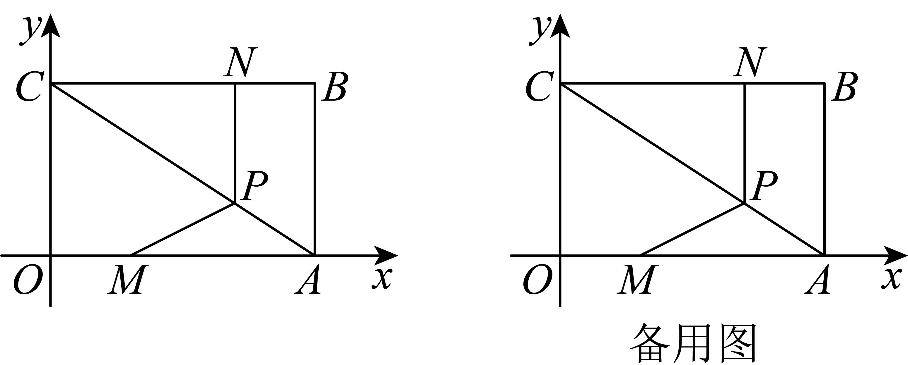  
(1)直接写出 $OA、AB$ 的长度；  
(2)在运动过程中，请求出 $\bigtriangleup MPA$ 的面积<*t*ext style="italic">S</text>与运动时间t的函数关系式；  
(3)在运动过程中， $\bigtriangleup MPA$ 的面积<*t*ext style="italic">S</text>是否存在最大值？若存在，请求出当t为何值时有最大值，并求出最大值；若不存在，请说明理由．  
(4)在运动过程中，以点<*t*ext style="italic">A</text>，*P*，*M*为顶点的三角形与 $\bigtriangleup AOC$ 能相似吗？若能相似，请求出运动时间*t*的值；若不能相似，请说明理由．

## 题型12  角度存在性问题

34．（2023·陕西西安·模拟预测）如果一个三角形的一个内角等于另一个内角的2倍，我们称这样的三角形为倍角三角形，并称这两个角的公共边为底边．

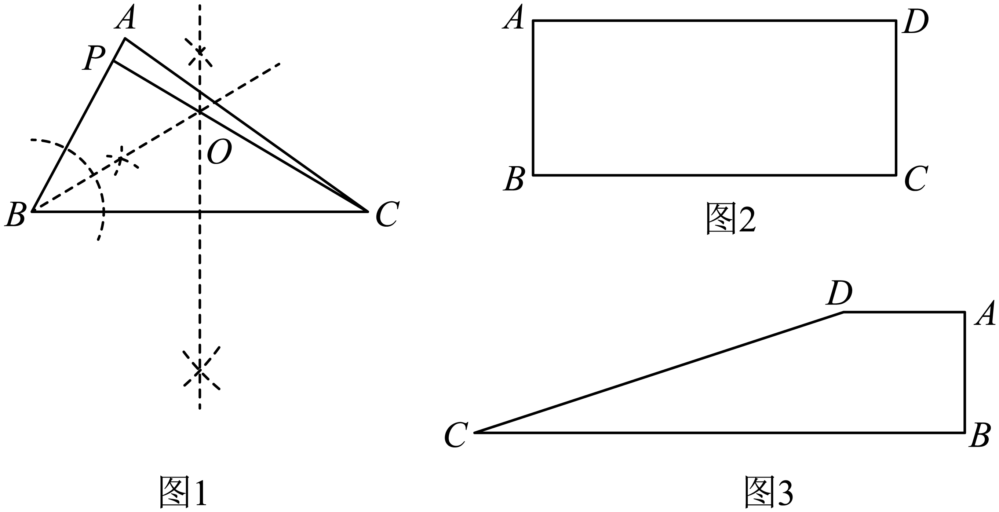  
(1)如图1，在 $\bigtriangleup ABC$ 中．按如下做法：

①作 $BC$ 的中垂线 $l$ ：

②作 $\angle ABC$ 的角平分线与中垂线 $l$ 交于点 $O$ ；
③连接 $CO$ 并延长与 $AB$ 交于点 $P$ ，得到 $\bigtriangleup BCP$ ．
若按上述作法，得到的 $\bigtriangleup BCP$ 是倍角三角形．则 $\angle PBC$ 与 $\angle PCB$ 的等量关系\_\_\_\_\_\_\_\_\_\_\_；  
(2)如图2，在矩形 $ABCD$ 中，以 $BC$ 为底边做一个倍角三角形顶点 $P$ 恰好落在 $AD$ 边上．若 $BC=4$ ， $BP=2$ ．求 $CP$ 的长度．  
(3)如图3，现有一块梯形板材 $ABCD$ ， $AD\parallel BC$ ， $\angle A=90\circ$ ， $AB=AD=3$ ， $BC=12$ ．工人师傅想用这块板材裁出一个 $\bigtriangleup BCP$ 型部件，使得点 $P$ 在梯形 $ABCD$ 的边 $CD$ 上， $\bigtriangleup BCP$ 为以 $BC$ 为底边且 $\angle CBP=2\angle C$ 的倍角三角形．是否存在满足要求的 $\bigtriangleup BCP$ ？若存在，请确定点 $P$ 位置（求出 $CP$ 的长）；若不存在，请说明理由．

35．（2023·上海浦东新·二模）已知： $\odot O$ 的直径 $AB=10$ ，*<text style="italic">C*</text>是 $⌢$ 的中点，*D*是 $\odot O$ 上的一个动点（不与点*A*、*B*、*<text style="italic">C*</text>重合），射线 $CD$ 交射线 $AB$ 于点*E*．

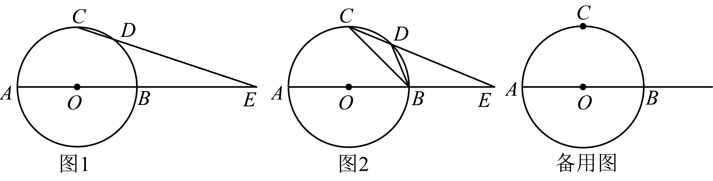  
(1)如图1，当 $BE=AB$ ，求线段 $CD$ 的长；  
(2)如图2，当点*D*在 $⌢$ 上运动时，连接 $BC、BD，\bigtriangleup BCD$ 中是否存在度数保持不变的角？如果存在，请指出这个角并求其度数；如果不存在，请说明理由；  
(3)连接 $OD$ ，当 $\bigtriangleup ODE$ 是以 $DE$ 为腰的等腰三角形时，求 $\bigtriangleup$  $ODE$ 与 $\bigtriangleup CBE$ 面积的比值．

36．（2023·浙江金华·一模）如图，在 $\bigtriangleup ABC$ 中， $AB=AC=5$ ， $BC=6$ ，点*P*是射线 $BC$ 上的动点，连结 $AP$ ，在 $AP$ 的右边作 $\angle PAQ=\frac{1}{2}\angle BAC$ ，交射线 $BC$ 于点*Q*．

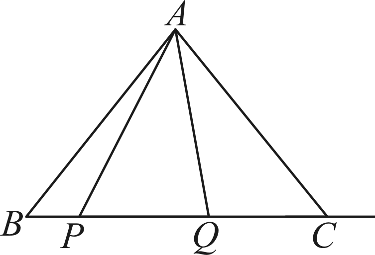  
(1)当 $BP=1$ 时，求点*P*到 $AB$ 的距离．  
(2)当点<te<te*x*t style="italic">x</text>t st*y*le="italic">P</text>在线段 $BC$ 上运动时，记 $BP=x$ ， $CQ=y$ ，求<te<te*x*t style="italic">x</text>t style="italic">y</text>关于x的函数表达式和自变量x的取值范围．  
(3)在点*P*的运动过程中，不再连结其他线段，当图中存在某个角为 $45\circ$ 时，求 $BQ$ 的长，并指出相应的 $45\circ$ 角．

