重难点突破05 几何动点及最值、存在性问题

目 录

- [题型01  将军饮马问题](#_Toc164095067)
- [题型02  胡不归问题](#_Toc164095068)
- [题型03  阿氏圆问题](#_Toc164095069)
- [题型04  隐圆问题](#_Toc164095070)
- [题型05  费马点问题](#_Toc164095071)
- [题型06  瓜豆原理模型](#_Toc164095072)
- [题型07  等腰（边）三角形存在问题](#_Toc164095073)
- [题型08  直角三角形存在问题](#_Toc164095074)
- [题型09  平行四边形存在问题](#_Toc164095075)
- [题型10  矩形、菱形、正方形存在问题](#_Toc164095076)
- [题型11  全等/相似存在性问题](#_Toc164095077)
- [题型12  角度存在性问题](#_Toc164095078)

【命题趋势】动态几何问题是近年来中考的一个重难点问题，以运动的观点探究几何图形或函数与几何图形的变化规律，从而确定某一图形的存在性问题．随之产生的动态几何试题就是研究在几何图形的运动中，伴随着出现一定的图形位置、数量关系的“变”与“不变”性的试题．

【基本原理】

1）基本原理（定点到定点）：两点之间，线段最短.

2）三角形两边之和>第三边

3）基本原理（定点到定线）：垂线段最短.

4）平行线的距离处处相等.

5）基本原理（定点到定圆）：点圆之间，点心线截距最短（长）.

6）基本原理（定线到定圆）：线圆之间，心垂线截距最短.

7）基本原理（定圆到定圆）：圆圆之间，连心线截距最短（长）.

【解题思路】

1）动态几何问题是以几何图形为背景的，几何图形有直线型和曲线型两种，那么动态几何也有直线型的和曲线型的两类，即全等三角形、相似三角形中的动态几何问题，也有圆中的动态问题．有点动、线动、面动，就其运动形式而言，有平移、旋转、翻折、滚动等．根据其运动的特点，又可分为（1） 动点类（点在线段或弧线上运动）也包括一个动点或两个动点； （2） 动直线类；（3）动图形问题．

2）解决动态几何题，通过观察，对几何图形运动变化规律的探索，发现其中的“变量”和“定量”动中求静，即在运动变化中探索问题中的不变性；动静互化抓住“静”的瞬间，使一般情形转化为特殊问题，从而找到“动与静”的关系；这需要有极敏锐的观察力和多种情况的分析能力，加以想象、结合推理，得出结论．解决这类问题，要善于探索图形的运动特点和规律抓住变化中图形的性质与特征，化动为静，以静制动．解决运动型试题需要用运动与变化的眼光去观察和研究图形，把握图形运动与变化的全过程，抓住其中的等量关系和变量关系，并特别关注－－些不变量和不变关系或特殊关系．

3）动态几何形成的存在性问题，重点和难点在于应用分类思想和数形结合的思想准确地进行分类，包括等腰（边）三角形存在问题，直角三角形存在问题，平行四边形存在问题，矩形、菱形、正方形存在问题．全等三角形存在问题，相似三角形存在问题等．

## 题型01  将军饮马问题

1*．*（2023·辽宁盘锦·中考真题）如图，四边形 $ABCD$ 是矩形， $AB=\sqrt{10}$ ， $AD=4\sqrt{2}$ ，点*P*是边 $AD$ 上一点（不与点*A*，*D*重合），连接 $PB，PC$ *．* 点*M*，*N*分别是 $PB，PC$ 的中点，连接 $MN$ ， $AM$ ， $DN$ ，点*E*在边 $AD$ 上， $ME\parallel DN$ ，则 $AM+ME$ 的最小值是（    ）

A． $2\sqrt{3}$ 	
B．3	
C． $3\sqrt{2}$ 	
D． $4\sqrt{2}$

【答案】C

【分析】根据直线三角形斜边中线的性质可得 $AM=\frac{1}{2}BP$ ， $DN=\frac{1}{2}CP$ ，通过证明四边形 $MNDE$ 是平行四边形，可得 $ME=DN$ ，则 $AM+ME=AM+DN=\frac{1}{2}\left(BP+CP\right)$ ，作点*C*关于直线 $AD$ 的对称点*<text style="italic">M*</text>，则 $BP+CP=BP+PM$ ，点*B*，*P*，*<text style="italic">M*</text>三点共线时， $BP+PM$ 的值最小，最小值为 $BM$ ．

【详解】解： $\because$ 四边形 $ABCD$ 是矩形，
$\therefore$  $\angle BAP=\angle CDP=90\circ$ ， $AD\parallel BC$ ，
$\because$ 点*M*，*N*分别是 $PB，PC$ 的中点，
$\therefore$  $AM=\frac{1}{2}BP$ ， $DN=\frac{1}{2}CP$ ， $MN=\frac{1}{2}BC$ ， $MN\parallel BC$ ，
$\because$  $AD\parallel BC$ ， $MN\parallel BC$ ，
$\therefore$  $MN\parallel BC$ ，
又 $\because$  $ME\parallel DN$ ，
$\therefore$ 四边形 $MNDE$ 是平行四边形，
$\therefore$  $ME=DN$ ，
$\therefore$  $AM+ME=AM+DN=\frac{1}{2}\left(BP+CP\right)$ ，

如图，作点*C*关于直线 $AD$ 的对称点*M*，连接 $PM$ ， $BM$ ，

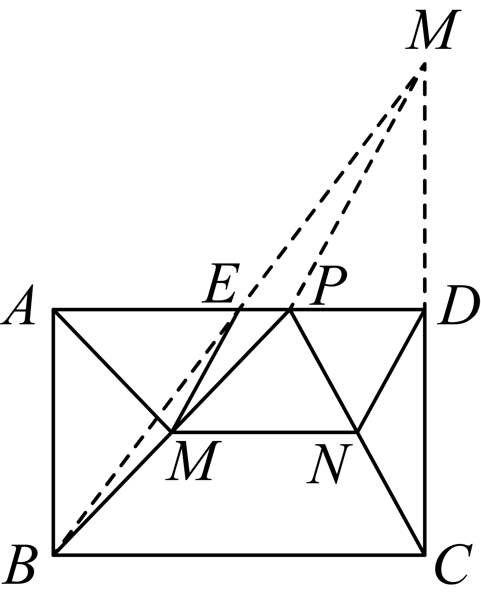
则 $BP+CP=BP+PM$ ，
当点*B*，*P*，*M*三点共线时， $BP+PM$ 的值最小，最小值为 $BM$ ，
在 $Rt\bigtriangleup BCM$ 中， $MC=2CD=2AB=2\sqrt{10}$ ， $BC=AD=4\sqrt{2}$ ，
$\therefore$  $BM=\sqrt{BC^{2}+MC^{2}}=\sqrt{\left(4\sqrt{2}\right)^{2}+\left(2\sqrt{10}\right)^{2}}=6\sqrt{2}$ ，
$\therefore$  $AM+ME$ 的最小值 $=\frac{1}{2}BM=3\sqrt{2}$ ，
故选C．

【点睛】本题考查矩形的性质，直线三角形斜边中线的性质，中位线的性质，平行四边形的判定与性质，轴对称的性质，勾股定理，线段的最值问题等，解题的关键是牢固掌握上述知识点，熟练运用等量代换思想．

2．（2023·广东广州·中考真题）如图，正方形 $ABCD$ 的边长为4，点<em>E</em>在边 $BC$ 上，且 $BE=1$ ，<em>F</em>为对角线 $BD$ 上一动点，连接 $CF$ ， $EF$ ，则 $CF+EF$ 的最小值为___________．

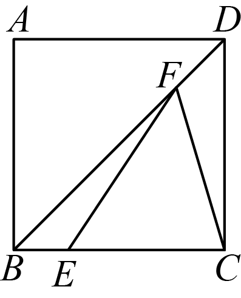

【答案】 $\sqrt{17}$

【分析】连接 $AE$ 交 $BD$ 于一点*F*，连接 $CF$ ，根据正方形的对称性得到此时 $CF+EF=AE$ 最小，利用勾股定理求出 $AE$ 即可．

【详解】解：如图，连接 $AE$ 交 $BD$ 于一点*F*，连接 $CF$ ，
∵四边形 $ABCD$ 是正方形，
∴点*A*与点*C*关于 $BD$ 对称，
∴ $AF=CF$ ，
∴ $CF+EF=AF+EF=AE$ ，此时 $CF+EF$ 最小，
∵正方形 $ABCD$ 的边长为4，
∴ $AD=4,\angle ABC=90\circ$ ，
∵点*E*在 $AB$ 上，且 $BE=1$ ，
∴ $AE=\sqrt{AB^{2}+BE^{2}}=\sqrt{4^{2}+1^{2}}=\sqrt{17}$ ，即 $CF+EF$ 的最小值为 $\sqrt{17}$
故答案为： $\sqrt{17}$ ．

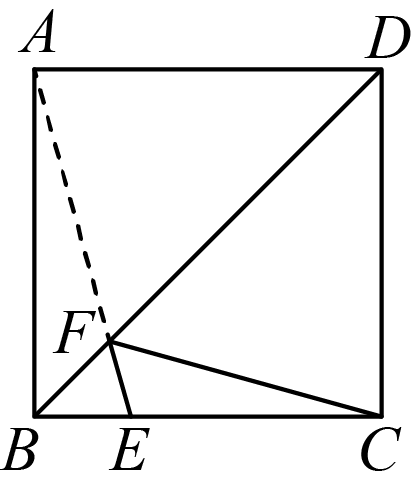

【点睛】此题考查正方形的性质，熟练运用勾股定理计算是解题的关键．

3．（2023·四川宜宾·中考真题）如图，在平面直角坐标系 $xOy$ 中，等腰直角三角形 $ABC$ 的直角顶点 $C\left(3，0\right)$ ，顶点*A*、 $B\left(6，m\right)$ 恰好落在反比例函数 $y=\frac{k}{x}$ 第一象限的图象上．

  
(1)分别求反比例函数的表达式和直线 $AB$ 所对应的一次函数的表达式；  
(2)在*x*轴上是否存在一点*P*，使 $\bigtriangleup ABP$ 周长的值最小．若存在，求出最小值；若不存在，请说明理由．

【答案】(1) $y=\frac{6}{x}$ ， $y=-\frac{1}{2}x+4$  
(2)在*x*轴上存在一点 $P\left(5,0\right)$ ，使 $\bigtriangleup ABP$ 周长的值最小,最小值是 $2\sqrt{5}+4\sqrt{2}$ ．

【分析】（1）过点*<text style="italic"><text style="italic"><text style="italic">A*</text></text></text>作 $AE\perp x$ 轴于点*E*，过点*<text style="italic">B*</text>作 $BD\perp x$ 轴于点*D*，证明 $\bigtriangleup ACE\allequal \bigtriangleup CBD\left(AAS\right)$ ，则 $CD=AE=3,BD=EC=m$ ，由 $OE=3-m$ 得到点*<text style="italic"><text style="italic"><text style="italic">A*</text></text></text>的坐标是 $\left(3-m,3\right)$ ，由*<text style="italic"><text style="italic"><text style="italic">A*</text></text></text>、 $B\left(6，m\right)$ 恰好落在反比例函数 $y=\frac{k}{x}$ 第一象限的图象上得到 $3\left(3-m\right)=6m$ ，解得 $m=1$ ，得到点*<text style="italic"><text style="italic"><text style="italic">A*</text></text></text>的坐标是 $\left(2,3\right)$ ，点*<text style="italic">B*</text>的坐标是 $\left(6,1\right)$ ，进一步用待定系数法即可得到答案；  
（2）延长 $AE$ 至点 $A^{'}$ ，使得 $EA^{'}=AE$ ，连接 $A^{'}B$ 交*x*轴于点*<text style="italic">P*</text>，连接 $AP$ ，利用轴对称的性质得到 $AP=A^{'}P$ ， $A^{'}\left(2,-3\right)$ ，则 $AP+PB=A^{'}B$ ，由 $AB=2\sqrt{5}$ 知 $AB$ 是定值，此时 $\bigtriangleup ABP$ 的周长为 $AP+PB+AB=AB+A^{'}B$ 最小，利用待定系数法求出直线 $A^{'}B$ 的解析式，求出点*<text style="italic">P*</text>的坐标，再求出周长最小值即可．

【详解】（1）解：过点*A*作 $AE\perp x$ 轴于点*E*，过点*B*作 $BD\perp x$ 轴于点*D*，
则 $\angle AEC=\angle CDB=90\circ$ ，

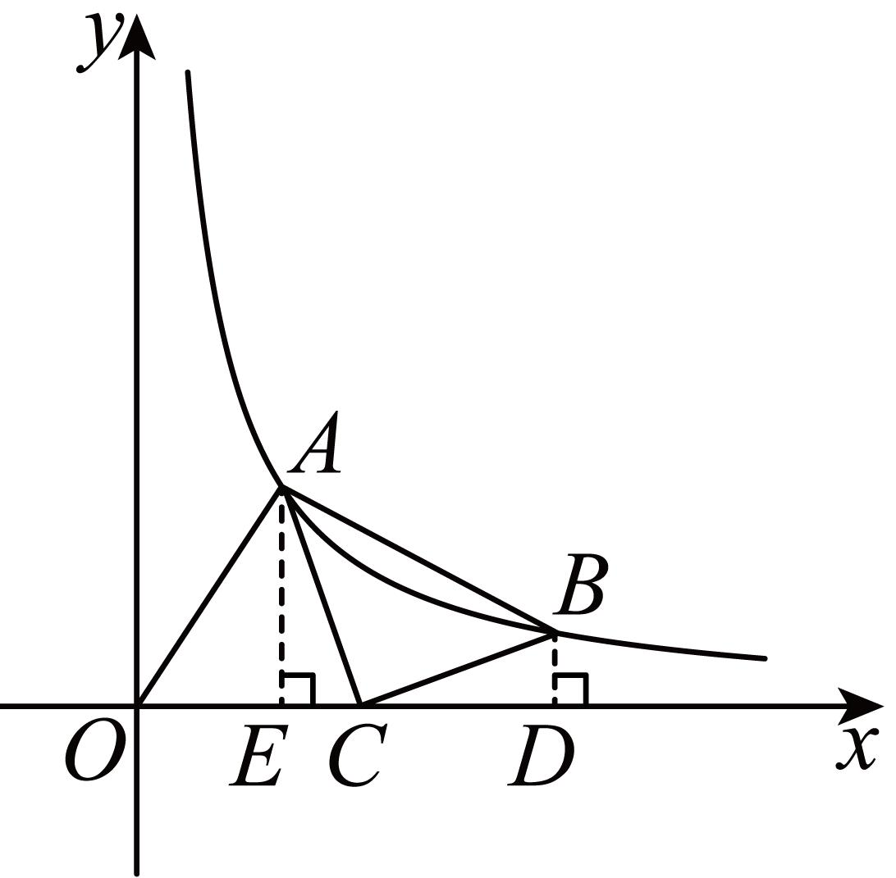
∵点 $C\left(3，0\right)$ ， $B\left(6，m\right)$ ，
∴ $OC=3,OD=6,$  $BD=m$ ，
∴ $CD=OD-OC=3$ ，
∵ $\bigtriangleup ABC$ 是等腰直角三角形，
∴ $\angle ACB=90\circ ,AC=BC$ ，
∵ $\angle ACE+\angle BCD=\angle CBD+\angle BCD=90\circ$ ，
∴ $\angle ACE=\angle CBD$ ，
∴ $\bigtriangleup ACE\allequal \bigtriangleup CBD\left(AAS\right)$ ，
∴ $CD=AE=3,BD=EC=m$ ，
∴ $OE=OC-EC=3-m$ ，
∴点*A*的坐标是 $\left(3-m,3\right)$ ，
∵*A*、 $B\left(6，m\right)$ 恰好落在反比例函数 $y=\frac{k}{x}$ 第一象限的图象上．
∴ $3\left(3-m\right)=6m$ ，
解得 $m=1$ ，
∴点*A*的坐标是 $\left(2,3\right)$ ，点*B*的坐标是 $\left(6,1\right)$ ，
∴ $k=6m=6$ ，
∴反比例函数的解析式是 $y=\frac{6}{x}$ ，
设直线 $AB$ 所对应的一次函数的表达式为 $y=px+q$ ，把点*A*和点*B*的坐标代入得，
$\left\{\begin{array}{c}2p+q=3\\6p+q=1\end{array}\right$ ，解得 $\left\{\begin{array}{c}p=-\frac{1}{2}\\q=4\end{array}\right$ ,
∴直线 $AB$ 所对应的一次函数的表达式为 $y=-\frac{1}{2}x+4$ ，  
（2）延长 $AE$ 至点 $A^{'}$ ，使得 $EA^{'}=AE$ ，连接 $A^{'}B$ 交*x*轴于点*P*，连接 $AP$ ，

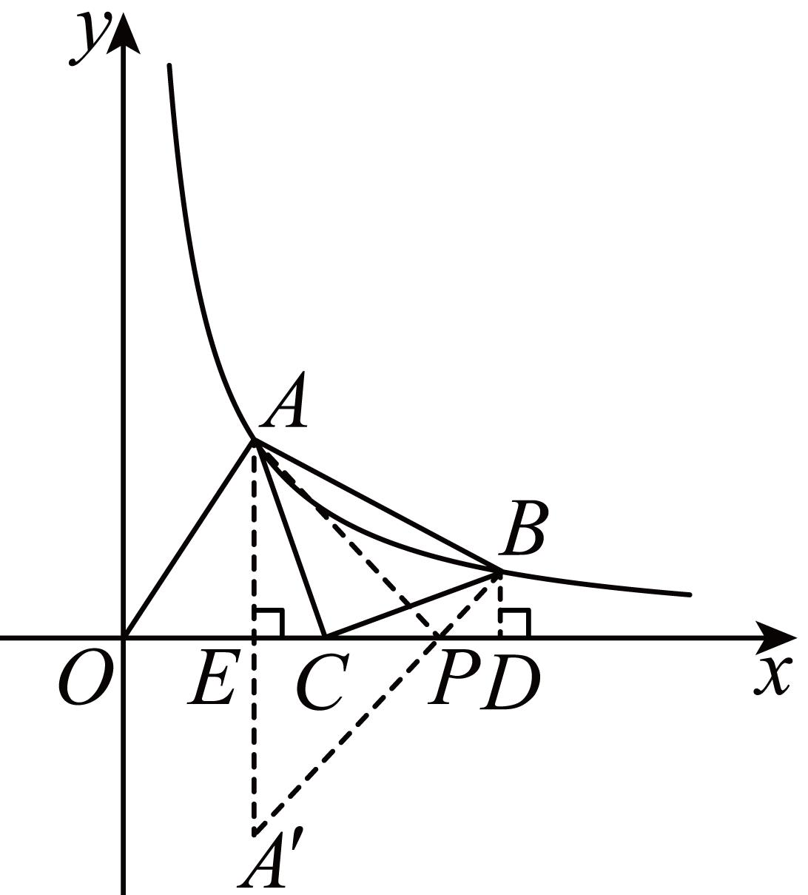
∴点<te*x*t style="italic">A</text>与点 $A^{'}$ 关于*x*轴对称，
∴ $AP=A^{'}P$ ， $A^{'}\left(2,-3\right)$ ，
∵ $AP+PB=A^{'}P+PB=A^{'}B$ ，
∴ $AP+PB$ 的最小值是 $A^{'}B$ 的长度，
∵ $AB=\sqrt{\left(2-6\right)^{2}+\left(3-1\right)^{2}}=2\sqrt{5}$ ，即 $AB$ 是定值，
∴此时 $\bigtriangleup ABP$ 的周长为 $AP+PB+AB=AB+A^{'}B$ 最小，
设直线 $A^{'}B$ 的解析式是 $y=nx+t$ ，
则 $\left\{\begin{array}{c}2n+t=-3\\6n+t=1\end{array}\right$ ，
解得 $\left\{\begin{array}{c}n=1\\t=-5\end{array}\right$ ，
∴直线 $A^{'}B$ 的解析式是 $y=x-5$ ，
当 $y=0$ 时， $0=x-5$ ，解得 $x=5$ ，
即点*P*的坐标是 $\left(5,0\right)$ ，

此时 $AP+PB+AB=AB+A^{'}B=2\sqrt{5}+\sqrt{\left(2-6\right)^{2}+\left(-3-1\right)^{2}}=2\sqrt{5}+4\sqrt{2}$ ，

综上可知，在*x*轴上存在一点 $P\left(5,0\right)$ ，使 $\bigtriangleup ABP$ 周长的值最小，最小值是 $2\sqrt{5}+4\sqrt{2}$ ．

【点睛】此题考查了反比例函数和一次函数的图象和性质、用到了待定系数法求函数解析式、勾股定理求两点间距离、轴对称最短路径问题、全等三角形的判定和性质等知识，数形结合和准确计算是解题的关键．

## 题型02  胡不归问题

4．（2022·内蒙古鄂尔多斯·中考真题）如图，在△<em>ABC</em>中，<em>AB</em>＝<em>AC</em>＝4，∠<em>CAB</em>＝30°，<em>AD</em>⊥<em>BC</em>，垂足为<em>D</em>，<em>P</em>为线段<em>AD</em>上的一动点，连接<em>PB</em>、<em>PC</em>．则<em>PA</em>+2<em>PB</em>的最小值为 _____．

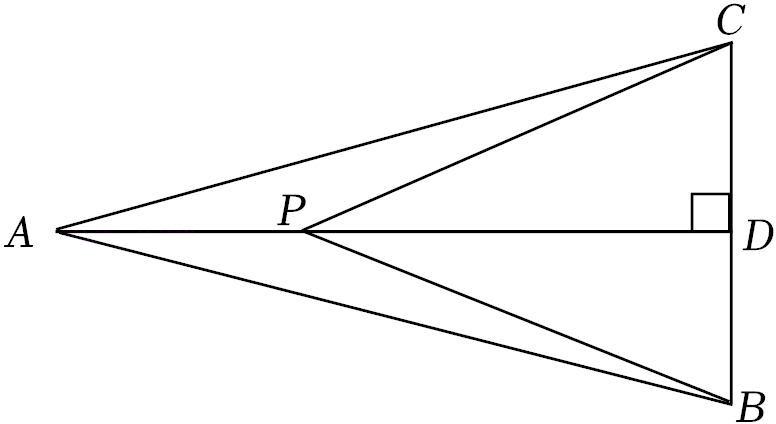

【答案】4 $\sqrt{2}$

【分析】在∠*BAC*的外部作∠*C<text style="italic">AE*</text>＝15°，作*B<text style="italic">F*</text>⊥AE于F，交*AD*于*P*，此时*PA*+2*PB*＝2 $\left(\frac{1}{2}PA+PB\right)$ ＝ $\frac{1}{2}\left(PF+PB\right)$ ＝2*B<text style="italic">F*</text>，通过解直角三角形A*BF*，进一步求得结果．

【详解】解：如图，

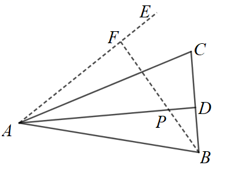
在∠*BAC*的外部作∠*CAE*＝15°，作*BF*⊥*AE*于*F*，交*AD*于*P*，

此时*PA*+2*PB*最小，
∴∠*AFB*＝90°
∵*AB*＝*AC*，*AD*⊥*BC*，
∴∠*CAD*＝∠*BAD*＝ $\frac{1}{2}\angle BAC=\frac{1}{2}\times 30\circ =15\circ$ ，
∴∠*EAD*＝∠*CAE*+∠*CAD*＝30°，
∴*PF*＝ $\frac{1}{2}PA$ ，
∴*PA*+2*PB*＝2 $\left(\frac{1}{2}PA+PB\right)$ ＝ $\frac{1}{2}\left(PF+PB\right)$ ＝2*BF*，
在Rt△*ABF*中，*AB*＝4，∠*BAF*＝∠*BAC*+∠*CAE*＝45°，
∴*BF*＝*AB*•sin45°＝4 $\times \frac{\sqrt{2}}{2}=2\sqrt{2}$ ，
∴（<em>PA</em>+2<em>PB</em>）最大＝2<em>BF</em>＝ $4\sqrt{2}$ ，
故答案为： $4\sqrt{2}$ ．

【点睛】本题考查了等腰三角形的性质，解直角直角三角形，解题的关键是作辅助线．

5．（2023·湖南湘西·中考真题）如图， $\odot O$ 是等边三角形 $ABC$ 的外接圆，其半径为4．过点<em>&lt;text style="italic"&gt;B</em>&lt;/text&gt;作 $BE\perp AC$ 于点<em>&lt;text style="italic"&gt;E</em>&lt;/text&gt;，点<em>&lt;text style="italic"&gt;P</em>&lt;/text&gt;为线段 $BE$ 上一动点（点<em>&lt;text style="italic"&gt;P</em>&lt;/text&gt;不与<em>&lt;text style="italic"&gt;B</em>&lt;/text&gt;，<em>&lt;text style="italic"&gt;E</em>&lt;/text&gt;重合），则 $CP+\frac{1}{2}BP$ 的最小值为__________．

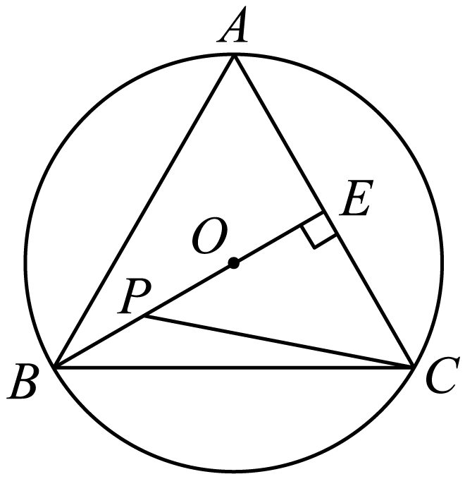

【答案】6

【分析】过点*P*作 $PD\perp AB$ ，连接 $CO$ 并延长交 $AB$ 于点*F*，连接 $AO$ ，根据等边三角形的性质和圆内接三角形的性质得到 $OA=OB=4$ ， $CF\perp AB$ ，然后利用含 $30\circ$ 角直角三角形的性质得到 $OE=\frac{1}{2}OA=2$ ，进而求出 $BE=BO+EO=6$ ，然后利用 $CP+\frac{1}{2}BP=CP+PD\leq CF$ 代入求解即可．

【详解】如图所示，过点*P*作 $PD\perp AB$ ，连接 $CO$ 并延长交 $AB$ 于点*F*，连接 $AO$

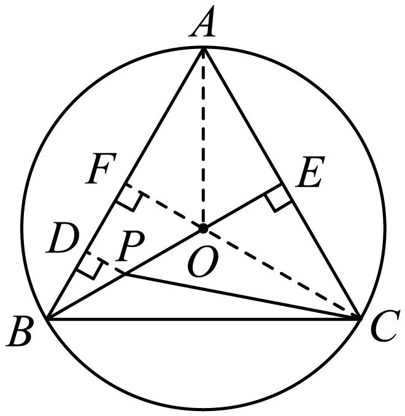
∵ $\bigtriangleup ABC$ 是等边三角形， $BE\perp AC$
∴ $\angle ABE=\angle CBE=\frac{1}{2}\angle ABC=30\circ$
∵ $\odot O$ 是等边三角形 $ABC$ 的外接圆，其半径为4
∴ $OA=OB=4$ ， $CF\perp AB$ ，
∴ $\angle OBA=\angle OAB=30\circ$
∴ $\angle OAE=\angle OAB=\frac{1}{2}\angle BAC=30\circ$
∵ $BE\perp AC$
∴ $OE=\frac{1}{2}OA=2$
∴ $BE=BO+EO=6$
∵ $PD\perp AB$ ， $\angle ABE=30\circ$
∴ $PD=\frac{1}{2}PB$
∴ $CP+\frac{1}{2}BP=CP+PD\leq CF$
∴ $CP+\frac{1}{2}BP$ 的最小值为 $CF$ 的长度
∵ $\bigtriangleup ABC$ 是等边三角形， $BE\perp AC$ ， $CF\perp AB$
∴ $CF=BE=6$
∴ $CP+\frac{1}{2}BP$ 的最小值为6．
故答案为：6．

【点睛】此题考查了圆内接三角形的性质，等边三角形的性质，含 $30\circ$ 角直角三角形的性质等知识，解题的关键是熟练掌握以上知识点．

6．（2023·辽宁锦州·中考真题）如图，在 $Rt\bigtriangleup ABC$ 中， $\angle ACB=90\circ$ ， $\angle ABC=30\circ$ ， $AC=4$ ，按下列步骤作图：①在 $AC$ 和 $AB$ 上分别截取 $AD$ 、 $AE$ ，使 $AD=AE$ ．②分别以点<em>D</em>和点<em>E</em>为圆心，以大于 $\frac{1}{2}DE$ 的长为半径作弧，两弧在 $\angle BAC$ 内交于点<em>M</em>．③作射线 $AM$ 交 $BC$ 于点<em>F</em>．若点<em>P</em>是线段 $AF$ 上的一个动点，连接 $CP$ ，则 $CP+\frac{1}{2}AP$ 的最小值是______________．

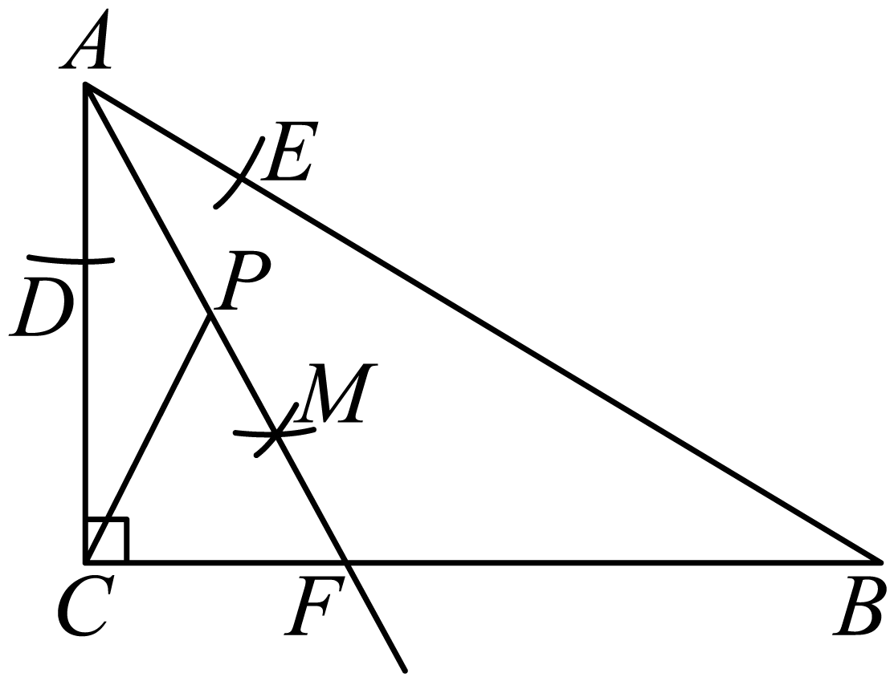

【答案】 $2\sqrt{3}$

【分析】过点*<text style="italic">P*</text>作 $PQ\perp AB$ 于点*<text style="italic">Q*</text>，过点*<text style="italic">C*</text>作 $CH\perp AB$ 于点*H*，先利用角平分线和三角形的内角和定理求出 $\angle BAF=30\circ$ ，然后利用含 $30\circ$ 的直角三角的性质得出 $PQ=\frac{1}{2}AP$ ，则 $CP+\frac{1}{2}AP=CP+PQ\geq CH$ ，当*<text style="italic">C*</text>、*<text style="italic">P*</text>、*<text style="italic">Q*</text>三点共线，且与 $AB$ 垂直时， $CP+\frac{1}{2}AP$ 最小， $CP+\frac{1}{2}AP$ 最小值为 $CH$ ，利用含 $30\circ$ 的直角三角的性质和勾股定理求出 $AB$ ， $BC$ ，最后利用等面积法求解即可．

【详解】解：过点*P*作 $PQ\perp AB$ 于点*Q*，过点*C*作 $CH\perp AB$ 于点*H*，

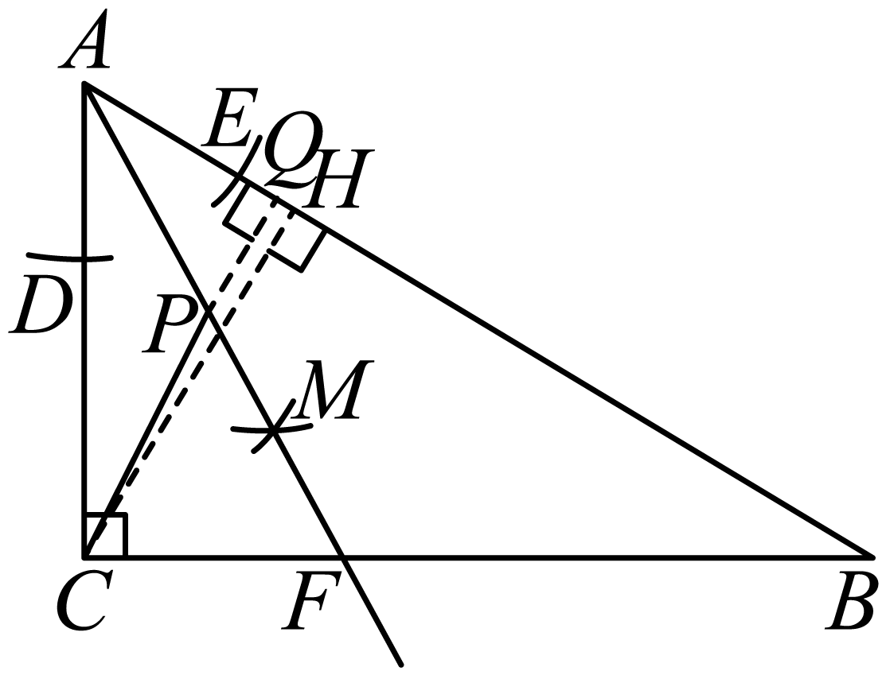
由题意知： $AF$ 平分 $\angle BAC$ ，
∵ $\angle ACB=90\circ$ ， $\angle ABC=30\circ$ ，
∴ $\angle BAC=60\circ$ ，
∴ $\angle BAF=\frac{1}{2}\angle BAC=30\circ$ ，
∴ $PQ=\frac{1}{2}AP$ ，
∴ $CP+\frac{1}{2}AP=CP+PQ\geq CH$ ，
∴当*C*、*P*、*Q*三点共线，且与 $AB$ 垂直时， $CP+\frac{1}{2}AP$ 最小， $CP+\frac{1}{2}AP$ 最小值为 $CH$ ，
∵ $\angle ACB=90\circ$ ， $\angle ABC=30\circ$ ， $AC=4$ ，
∴ $AB=2AC=8$ ，
∴ $BC=\sqrt{AB^{2}-AC^{2}}=4\sqrt{3}$ ，
∵ $S_{\bigtriangleup ABC}=\frac{1}{2}AC\cdot BC=\frac{1}{2}AB\cdot CH$ ，
∴ $CH=\frac{AC\cdot BC}{AB}=\frac{4\times 4\sqrt{3}}{8}=2\sqrt{3}$ ，
即 $CP+\frac{1}{2}AP$ 最小值为 $2\sqrt{3}$ ．
故答案为： $2\sqrt{3}$ ．

【点睛】本题考查了尺规作图-作角平分线，含 $30\circ$ 的直角三角形的性质，勾股定理等知识，注意掌握利用等积法求三角形的高或点的线的距离的方法．

## 题型03  阿氏圆问题

7．（2023·山东烟台·中考真题）如图，抛物线 $y=ax^{2}+bx+5$ 与 $x$ 轴交于 $A,B$ 两点，与 $y$ 轴交于点 $C,AB=4$ ．抛物线的对称轴 $x=3$ 与经过点 $A$ 的直线 $y=kx-1$ 交于点 $D$ ，与 $x$ 轴交于点 $E$ ．

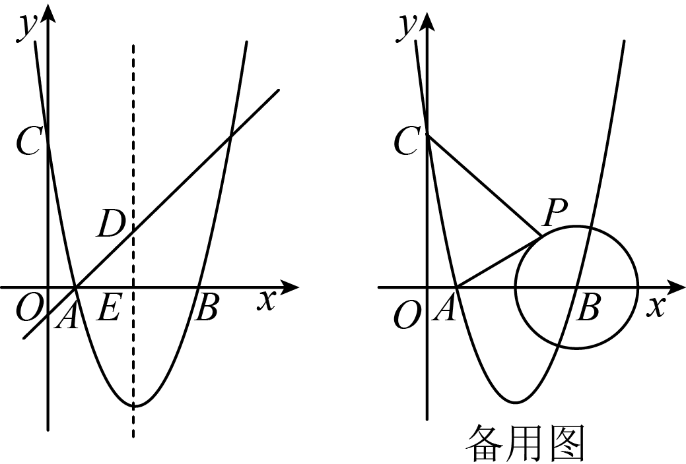  
(1)求直线 $AD$ 及抛物线的表达式；  
(2)在抛物线上是否存在点 $M$ ，使得 $\bigtriangleup ADM$ 是以 $AD$ 为直角边的直角三角形?若存在，求出所有点 $M$ 的坐标；若不存在，请说明理由；  
(3)以点 $B$ 为圆心，画半径为2的圆，点 $P$ 为 $\odot B$ 上一个动点，请求出 $PC+\frac{1}{2}PA$ 的最小值．

【答案】(1)直线 $AD$ 的解析式为 $y=x-1$ ；抛物线解析式为 $y=x^{2}-6x+5$  
(2)存在，点*M*的坐标为 $\left(4,-3\right)$ 或 $\left(0,5\right)$  或 $\left(5,0\right)$  
(3) $\sqrt{41}$

【分析】  
（1）根据对称轴 $x=3$ ， $AB=4$ ，得到点*A*及*B*的坐标，再利用待定系数法求解析式即可；  
（2）先求出点*D*的坐标，再分两种情况：①当 $\angle DAM=90\circ$ 时，求出直线 $AM$ 的解析式为 $y=-x+1$ ，解方程组 $\left\{\begin{array}{c}y=-x+1\\y=x^{2}-6x+5\end{array}\right$ ，即可得到点*<text style="italic">M*</text>的坐标；②当 $\angle ADM=90\circ$ 时，求出直线 $DM$ 的解析式为 $y=-x+5$ ，解方程组 $\left\{\begin{array}{c}y=-x+5\\y=x^{2}-6x+5\end{array}\right$ ，即可得到点*<text style="italic">M*</text>的坐标；  
（3）在 $AB$ 上取点 $F$ ，使 $BF=1$ ，连接 $CF$ ，证得 $\frac{BF}{PB}=\frac{PB}{AB}$ ，又 $\angle PBF=\angle ABP$ ，得到 $\bigtriangleup PBF\backsim \bigtriangleup ABP$ ，推出 $PF=\frac{1}{2}PA$ ，进而得到当点*C*、*P*、*F*三点共线时， $PC+\frac{1}{2}PA$ 的值最小，即为线段 $CF$ 的长，利用勾股定理求出 $CF$ 即可．

【详解】（1）解：∵抛物线的对称轴 $x=3$ ， $AB=4$ ，
∴ $A\left(1,0\right),B\left(5,0\right)$ ，
将 $A\left(1,0\right)$ 代入直线 $y=kx-1$ ，得 $k-1=0$ ，
解得 $k=1$ ，
∴直线 $AD$ 的解析式为 $y=x-1$ ；
将 $A\left(1,0\right),B\left(5,0\right)$ 代入 $y=ax^{2}+bx+5$ ，得
$\left\{\begin{array}{c}a+b+5=0\\25a+5b+5=0\end{array}\right$ ，解得 $\left\{\begin{array}{c}a=1\\b=-6\end{array}\right$ ，
∴抛物线的解析式为 $y=x^{2}-6x+5$ ；  
（2）存在点 $M$ ，
∵直线 $AD$ 的解析式为 $y=x-1$ ，抛物线对称轴 $x=3$ 与 $x$ 轴交于点 $E$ ．
∴当 $x=3$ 时， $y=x-1=2$ ，
∴ $D\left(3,2\right)$ ，

①当 $\angle DAM=90\circ$ 时，
设直线 $AM$ 的解析式为 $y=-x+c$ ，将点*A*坐标代入，
得 $-1+c=0$ ，
解得 $c=1$ ，
∴直线 $AM$ 的解析式为 $y=-x+1$ ，
解方程组 $\left\{\begin{array}{c}y=-x+1\\y=x^{2}-6x+5\end{array}\right$ ，
得 $\left\{\begin{array}{c}x=1\\y=0\end{array}\right$ 或 $\left\{\begin{array}{c}x=4\\y=-3\end{array}\right$ ，
∴点*M*的坐标为 $\left(4,-3\right)$ ；
②当 $\angle ADM=90\circ$ 时，
设直线 $DM$ 的解析式为 $y=-x+d$ ，将 $D\left(3,2\right)$ 代入，
得 $-3+d=2$ ，
解得 $d=5$ ，
∴直线 $DM$ 的解析式为 $y=-x+5$ ，
解方程组 $\left\{\begin{array}{c}y=-x+5\\y=x^{2}-6x+5\end{array}\right$ ，
解得 $\left\{\begin{array}{c}x=0\\y=5\end{array}\right$ 或 $\left\{\begin{array}{c}x=5\\y=0\end{array}\right$ ，
∴点*M*的坐标为 $\left(0,5\right)$  或 $\left(5,0\right)$

综上，点*M*的坐标为 $\left(4,-3\right)$ 或 $\left(0,5\right)$  或 $\left(5,0\right)$ ；  
（3）如图，在 $AB$ 上取点 $F$ ，使 $BF=1$ ，连接 $CF$ ，
∵ $PB=2$ ，
∴ $\frac{BF}{PB}=\frac{1}{2}$ ，
∵ $\frac{PB}{AB}=\frac{2}{4}=\frac{1}{2}$ ，、
∴ $\frac{BF}{PB}=\frac{PB}{AB}$ ，
又∵ $\angle PBF=\angle ABP$ ，
∴ $\bigtriangleup PBF\backsim \bigtriangleup ABP$ ，
∴ $\frac{PF}{PA}=\frac{BF}{PB}=\frac{1}{2}$ ，即 $PF=\frac{1}{2}PA$ ，
∴ $PC+\frac{1}{2}PA=PC+PF\geq CF$ ，
∴当点*C*、*P*、*F*三点共线时， $PC+\frac{1}{2}PA$ 的值最小，即为线段 $CF$ 的长，
∵ $OC=5,OF=OB-1=5-1=4$ ，
∴ $CF=\sqrt{OC^{2}+OF^{2}}=\sqrt{5^{2}+4^{2}}=\sqrt{41}$ ，
∴ $PC+\frac{1}{2}PA$ 的最小值为 $\sqrt{41}$ ．

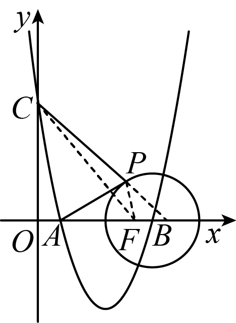

【点睛】此题是一次函数，二次函数及圆的综合题，掌握待定系数法求函数解析式，直角三角形的性质，勾股定理，相似三角形的判定和性质，求两图象的交点坐标，正确掌握各知识点是解题的关键．

8．（2023·山东济南·一模）抛物线 $y=-\frac{1}{2}x^{2}+\left(a-1\right)x+2a$ 与 $x$ 轴交于 $A\left(b,0\right)$ ， $B\left(4,0\right)$ 两点，与 $y$ 轴交于点 $C\left(0,c\right)$ ，点 $P$ 是抛物线在第一象限内的一个动点，且在对称轴右侧．

  
(1)求*a*，*b*，*c*的值；  
(2)如图 $1$ ，连接 $BC$ 、 $AP$ ，交点为 $M$ ，连接 $PB$ ，若 $\frac{S_{\bigtriangleup PMB}}{S_{\bigtriangleup AMB}}=\frac{1}{4}$ ，求点 $P$ 的坐标；  
(3)如图 $2$ ，在（2）的条件下，过点 $P$ 作 $x$ 轴的垂线交 $x$ 轴于点 $E$ ，将线段 $OE$ 绕点 $O$ 逆时针旋转得到 $OE'$ ，旋转角为 $\alpha (0\circ <\alpha <90\circ )$ ，连接 $E'B$ ， $E^{'}C$ ，求 $E^{'}B+\frac{3}{4}E^{'}C$ 的最小值．

【答案】(1) $a=2$ ， $b=-2$ ， $c=4$  
(2) $P\left(3,\frac{5}{2}\right)$  
(3) $\frac{\sqrt{337}}{4}$

【分析】（1）利用待定系数法求解即可；  
（2）过点 $P$ 作 $PD\perp x$ 轴，交 $BC$ 于点 $D$ ，过点 $A$ 作 $y$ 轴的平行线交 $BC$ 的延长线于 $H$ ，求得 $l_{BC}$ 的解析式，设 $P\left(m,-\frac{1}{2}m^{2}+m+4\right)$ ，则 $D\left(m,-m+4\right)$ ，利用相似三角形的判定与性质可得答案；  
（3）在 $y$ 轴上取一点 $F$ ，使得 $OF=\frac{9}{4}$ ，连接 $BF$ ，由相似三角形的判定与性质可得 $FE^{'}=\frac{3}{4}CE^{'}$ ，可得 $E^{'}B+\frac{3}{4}E^{'}C=BE^{'}+E^{'}F$ ，即可解答．

【详解】（1）解：将 $B\left(4,0\right)$ 代入 $y=-\frac{1}{2}x^{2}+\left(a-1\right)x+2a$ ，
得 $-8+4\left(a-1\right)+2a=0$ ，
$\therefore a=2$ ，
$\therefore$ 抛物线的解析式为 $y=-\frac{1}{2}x^{2}+x+4$ ，
令 $x=0$ ，则 $y=4$ ，
$\therefore c=4$ ，
令 $y=0$ ，则 $0=-\frac{1}{2}x^{2}+x+4$ ，
$\therefore x_{1}=4$ ， $x_{2}=-2$ ，
$\therefore A\left(-2,0\right)$ ，即 $b=-2$ ；
∴ $a=2$ ， $b=-2$ ， $c=4$  
（2）过点 $P$ 作 $PD\perp x$ 轴，交 $BC$ 于点 $D$ ，过点 $A$ 作 $y$ 轴的平行线交 $BC$ 的延长线于 $H$ ，

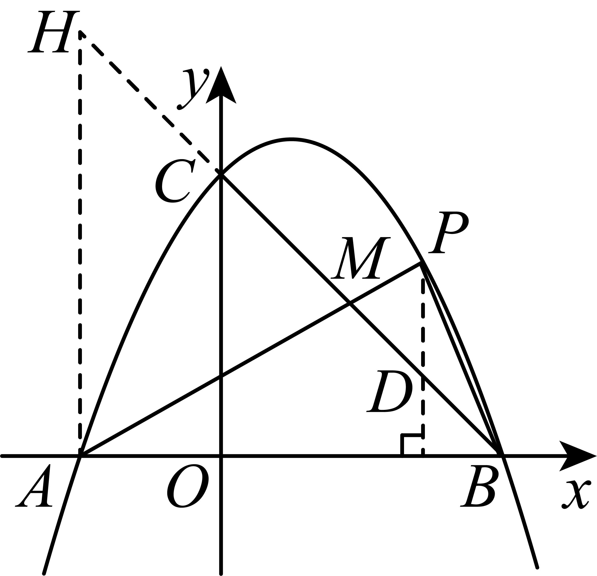
设 $l_{BC}$ ： $y=kx+b$ ，将 $\left(0,4\right)$ ， $\left(4,0\right)$ 代入得 $\left\{\begin{array}{c}b=4\\4k+b=0\end{array}\right$ 解得： $b=4$ ， $k=-1$ ，
$\therefore l_{BC}$ ： $y=-x+4$ ，
设 $P\left(m,-\frac{1}{2}m^{2}+m+4\right)$ ，则 $D\left(m,-m+4\right)$ ，
$PD=y_{P}-y_{D}=-\frac{1}{2}m^{2}+m+4-\left(-m+4\right)=-\frac{1}{2}m^{2}+2m$ ，
$\because PD\parallel HA$ ，
$\therefore \bigtriangleup AMH\backsim \bigtriangleup PMD$ ，
$\therefore \frac{PM}{MA}=\frac{PD}{HA}$ ，
将 $x=-2$ 代入 $y=-x+4$ ，
$\therefore HA=6$ ，
$\because \frac{S_{\bigtriangleup PMB}}{S_{\bigtriangleup AMB}}=\frac{\frac{1}{2}PM\cdot h}{\frac{1}{2}AM\cdot h}=\frac{PM}{AM}=\frac{1}{4}$ ，
$\therefore \frac{PD}{HA}=\frac{PD}{6}=\frac{1}{4}$ ，
$\therefore PD=\frac{3}{2}$ ，
$\therefore \frac{3}{2}=-\frac{1}{2}m^{2}+2m$ ，
$\therefore m_{1}=1($ 舍 $)$ ， $m_{2}=3$ ，
$\therefore P\left(3,\frac{5}{2}\right)$ ；  
（3）在 $y$ 轴上取一点 $F$ ，使得 $OF=\frac{9}{4}$ ，连接 $BF$ ，

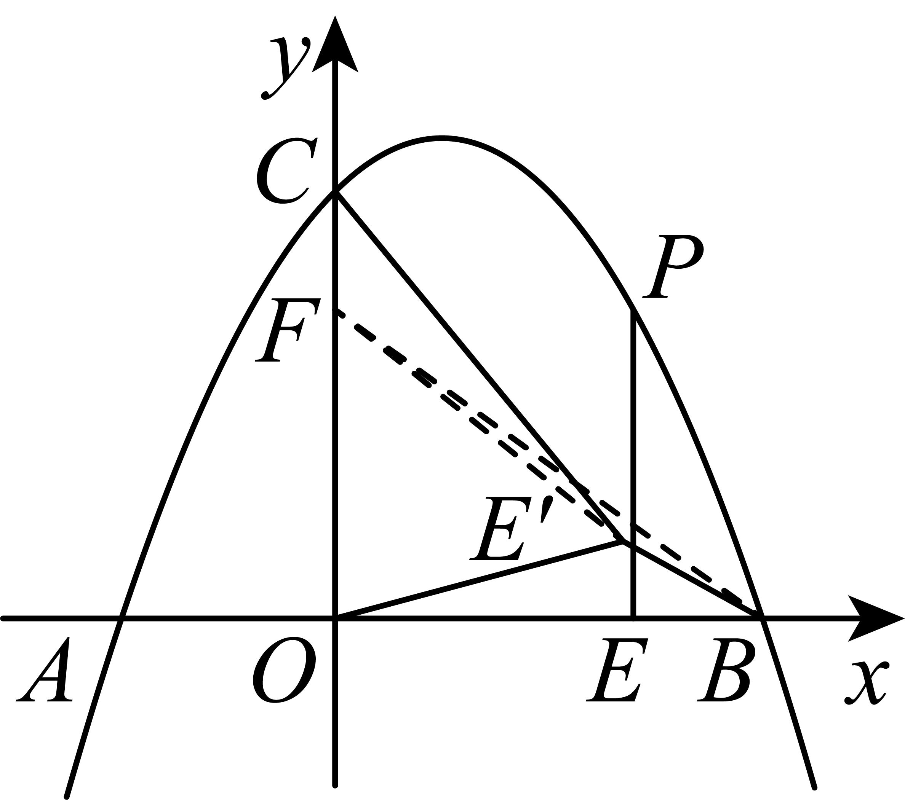
根据旋转得性质得出： $OE^{'}=OE=3$ ，
∵ $OF\cdot OC=\frac{9}{4}\times 4=9$ ，
$\therefore OE^{'}^{2}=OF\cdot OC$ ，
$\therefore$  $\frac{OE^{'}}{OF}=\frac{OC}{OE^{'}}$ ，
$\because$  $\angle COE^{'}=\angle FOE^{'}$ ，
$\therefore$  $\bigtriangleup FOE^{'}\backsim \bigtriangleup E^{'}OC$ ，
$\therefore$  $\frac{FE^{'}}{CE^{'}}=\frac{OE^{'}}{OC}=\frac{3}{4}$ ，
$\therefore$  $FE^{'}=\frac{3}{4}CE^{'}$ ，
$\therefore$  $E^{'}B+\frac{3}{4}E^{'}C=BE^{'}+E^{'}F$ ，当B、 $E'$ 、F三点共线时，此时 $E^{'}B+\frac{3}{4}E^{'}C$ 最小= $BF$ ，

最小值为： $BF=\sqrt{4^{2}+\left(\frac{9}{4}\right)^{2}}=\frac{\sqrt{337}}{4}$ ．

【点睛】此题考查的是二次函数的综合题意，涉及到相似三角形的判定与性质、二次函数与面积的问题、待定系数法求解析式，旋转的性质等知识．正确的作出辅助线是解此题的关键．

## 题型04  隐圆问题

9．（2022·山东泰安·中考真题）如图，四边形 $ABCD$ 为矩形， $AB=3$ ， $BC=4$ ．点*P*是线段 $BC$ 上一动点，点*M*为线段 $AP$ 上一点． $\angle ADM=\angle BAP$ ，则 $BM$ 的最小值为（    ）

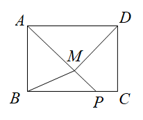

A． $\frac{5}{2}$ 	
B． $\frac{12}{5}$ 	
C． $\sqrt{13}-\frac{3}{2}$ 	
D． $\sqrt{13}-2$

【答案】D

【分析】证明 $\angle AMD=90^{\circ }$ ，得出点*M*在*O*点为圆心，以*AO*为半径的圆上，从而计算出答案．

【详解】设*AD*的中点为*O，* 以*O*点为圆心，*AO*为半径画圆

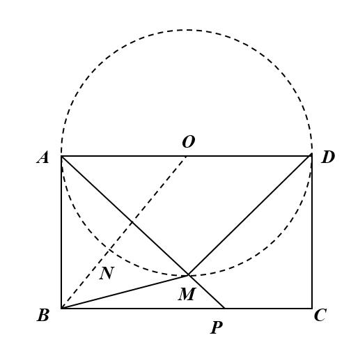
∵四边形 $ABCD$ 为矩形
∴ $\angle BAP+\angle MAD=90^{\circ }$
∵ $\angle ADM=\angle BAP$
∴ $\angle MAD+\angle ADM=90^{\circ }$
∴ $\angle AMD=90^{\circ }$
∴点*M*在*O*点为圆心，以*AO*为半径的圆上

连接*OB*交圆*O*与点*N*
∵点*B*为圆*O*外一点
∴当直线*BM*过圆心*O*时，*BM*最短
∵ $BO^{2}=AB^{2}+AO^{2}$ ， $AO=\frac{1}{2}AD=2$
∴ $BO^{2}=9+4=13$
∴ $BO=\sqrt{13}$
∵ $BN=BO-AO=\sqrt{13}-2$
故选：D．

【点睛】本题考查直角三角形、圆的性质，解题的关键是熟练掌握直角三角形和圆的相关知识．

10．（2022·安徽蚌埠·一模）如图， $Rt\bigtriangleup ABC$ 中， $AB\perp BC$ ， $AB=8$ ， $BC=6$ ，*P*是 $\bigtriangleup ABC$ 内部的一个动点，满足 $\angle PAB=\angle PBC$ ，则线段C*P*长的最小值为（   ）

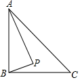

A． $\frac{32}{5}$ 	
B．2	
C． $2\sqrt{13}-6$ 	
D． $2\sqrt{13}-4$

【答案】D

【分析】结合题意推导得 $\angle APB=90\circ$ ，取*<text style="italic">AB*</text>的中点*<text style="italic"><text style="italic">O*</text></text>，以点O为圆心， $AB$ 为直径作圆，连接*<text style="italic"><text style="italic">O*</text></text>*<text style="italic">P*</text>；根据直角三角形斜边中线的性质，得 $OP=OA=OB=\frac{1}{2}AB=4$ ；根据圆的对称性，得点*<text style="italic">P*</text>在以*<text style="italic">AB*</text>为直径的 $\odot O$ 上，根据两点之间直线段最短的性质，得当点*<text style="italic"><text style="italic">O*</text></text>、点*<text style="italic">P*</text>、点*C*三点共线时，*PC*最小；根据勾股定理的性质计算得 $OC$ ，通过线段和差计算即可得到答案．

【详解】 $\because \angle ABC=90\circ$ ，
$\therefore \angle ABP+\angle PBC=90\circ$ ，
$\because \angle PAB=\angle PBC$ ，
$\therefore \angle BAP+\angle ABP=90\circ$ ，
$\therefore \angle APB=90\circ$ ，

取*AB*的中点*<text style="italic">O*</text>，以点O为圆心， $AB$ 为直径作圆，连接*<text style="italic">O*</text>P，

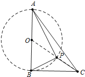
$\therefore OP=OA=OB=\frac{1}{2}AB=4$
$\therefore$ 点*<text style="italic">P*</text>在以*AB*为直径的 $\odot O$ 上，连接*OC*交 $\odot O$ 于点*<text style="italic">P*</text>，
当点*O*、点*P*、点*C*三点共线时，*PC*最小
在 $Rt\bigtriangleup BCO$ 中，
$\because \angle OBC=90\circ$ ， $BC=6$ ， $OB=4$ ，
$\therefore OC=\sqrt{BO^{2}+BC^{2}}=\sqrt{4^{2}+6^{2}}=2\sqrt{13}$ ，
$\therefore PC=OC-OP=2\sqrt{13}-4$
$\therefore PC$ 最小值为 $2\sqrt{13}-4$
故选：D．

【点睛】本题考查了两点之间直线段最短、圆、勾股定理、直角三角形斜边中线的知识；解题的关键是熟练掌握圆的对称性、两点之间直线段最短、直角三角形斜边中线的性质，从而完成求解．

11．（20-21九年级上·江苏盐城·期末）如图， $\odot M$ 的半径为4，圆心 $M$ 的坐标为 $(5,12)$ ，点 $P$ 是 $\odot M$ 上的任意一点， $PA\perp PB$ ，且 $PA$ 、 $PB$ 与 $x$ 轴分别交于 $A$ 、 $B$ 两点，若点 $A$ 、点 $B$ 关于原点 $O$ 对称，则 $AB$ 的最小值为__ ．

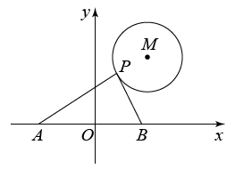

【答案】18

【分析】由 $Rt\Delta APB$ 中 $AB=2OP$ 知要使 $AB$ 取得最小值，则 $PO$ 需取得最小值，连接 $OM$ ，交 $\odot M$ 于点 $P'$ ，当点 $P$ 位于 $P'$ 位置时， $OP'$ 取得最小值，据此求解可得．

【详解】解：连接 $OP$ ，
$\because PA\perp PB$ ，
$\therefore \angle APB=90\circ$ ，
$\because AO=BO$ ，
$\therefore AB=2PO$ ，
若要使 $AB$ 取得最小值，则 $PO$ 需取得最小值，

连接 $OM$ ，交 $\odot M$ 于点 $P'$ ，当点 $P$ 位于 $P'$ 位置时， $OP'$ 取得最小值，

过点 $M$ 作 $MQ\perp x$ 轴于点 $Q$ ，

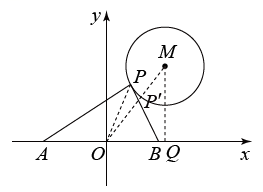
则 $OQ=5$ ， $MQ=12$ ，
$\therefore OM=13$ ，
又 $\because MP'=4$ ，
$\therefore OP'=9$ ，
$\therefore AB=2OP'=18$ ，
故答案是：18．

【点睛】本题主要考查点与圆的位置关系，解题的关键是根据直角三角形斜边上的中线等于斜边的一半得出*AB*取得最小值时点*P*的位置．

12．（2021九年级·全国·专题练习）如图，在平面直角坐标系*xOy*中，点*A*与点*B*的坐标分别是（1，0），（7，0）．  
（1）对于坐标平面内的一点*P*，给出如下定义：如果∠*APB*＝45°，则称点*P*为线段*AB*的“等角点”．显然，线段*AB*的“等角点”有无数个，且*A*、*B*、*P*三点共圆．

①设*A*、*B*、*P*三点所在圆的圆心为*C*，直接写出点*C*的坐标和⊙*C*的半径；
②*y*轴正半轴上是否有线段*AB*的“等角点”？如果有，求出“等角点”的坐标；如果没有，请说明理由；  
（2）当点*P*在*y*轴正半轴上运动时，∠*APB*是否有最大值？如果有，说明此时∠*APB*最大的理由，并求出点*P*的坐标；如果没有请说明理由．

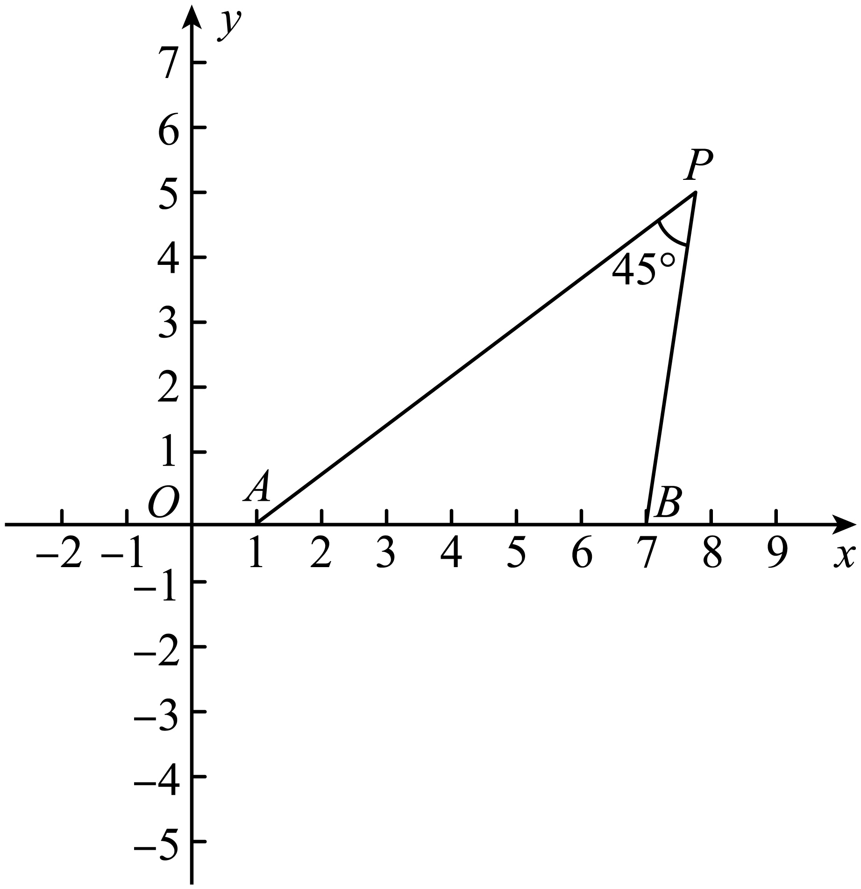

【答案】（1）①(4，3)或(4,−3)，半径为3 $\sqrt{2}$ ；②存在，(0，3+ $\sqrt{2}$ ) 或(0，3− $\sqrt{2}$ )，见解析；（2）有，见解析，(0， $\sqrt{7}$ )

【分析】（1）①在<text st<text st<text st*y*le="italic">y</text>le="italic">y</text>le="italic">x</text>轴的上方，作以*<text style="italic">AB*</text>为斜边的等腰直角三角形△*A<text style="italic"><text style="italic"><text style="italic"><text style="italic"><text style="italic"><text style="italic"><text style="italic">C*</text></text></text></text></text></text>B</text>，易知A，B，*P*三点在⊙C上，圆心C的坐标为(4,3)，半径为3 $\sqrt{2}$ ，根据对称性可知点<text st<text st<text st*y*le="italic">y</text>le="italic">y</text>le="italic">*<text style="italic"><text style="italic"><text style="italic"><text style="italic"><text style="italic">C*</text></text></text></text></text></text>(4，−3)也满足条件；②当圆心为C（4，3）时，过点C作*C<text style="italic"><text style="italic">D*</text></text>⊥y轴于D，则D（0，3），*CD*=4，根据⊙C的半径得⊙C与y轴相交，设交点为 $P_{1}$ ， $P_{2}$ ，此时 $P_{1}$ ， $P_{2}$ 在<text st<text st*y*le="italic">y</text>le="italic">y</text>轴的正半轴上，连接 $CP_{1}$ 、 $CP_{2}$ 、<text st<text st<text st*y*le="italic">y</text>le="italic">y</text>le="italic">*<text style="italic"><text style="italic"><text style="italic"><text style="italic"><text style="italic">C*</text></text></text></text></text></text>*A*，则 $CP_{1}$ = $CP_{2}$ =<text st<text st<text st*y*le="italic">y</text>le="italic">y</text>le="italic">*<text style="italic"><text style="italic"><text style="italic"><text style="italic"><text style="italic">C*</text></text></text></text></text></text>*A* =*r*=3 $\sqrt{2}$ ，得 $DP_{2}=\sqrt{2}$ ，即可得；  
（2）如果点<te*x*t st<text st*y*le="italic">y</text>le="italic">*P*</text>在y轴的正半轴上，设此时圆心为*<text style="italic"><text style="italic"><text style="italic">E*</text></text></text>，则E在第一象限，在y轴的正半轴上任取一点*M*(不与点P重合)，连接*MA*，*<text style="italic">MB*</text>，*PA*，*PB*，设MB交于⊙E于点*N*，连接*NA*，则∠*<text style="italic">APB*</text>=∠*<text style="italic"><text style="italic">ANB*</text></text>，∠ANB是△*MAN*的外角，∠ANB>∠*<text style="italic">AMB*</text>，即∠APB>∠AMB，过点E作*E<text style="italic">F*</text>⊥x轴于F，连接*EA*，*EP*，则*AF*= $\frac{1}{2}$ *AB*=3，O*F*=4，四边形O<te*x*t st<text st*y*le="italic">y</text>le="italic">*P*</text>*<text style="italic"><text style="italic"><text style="italic">E*</text></text></text>F是矩形，*OP*=*<text style="italic">EF*</text>，*PE*=*<text style="italic">OF*</text>=4，得 $EF=\sqrt{7}$ ，则 $OP=\sqrt{7}$ ，即可得．

【详解】（1）①如图1中，

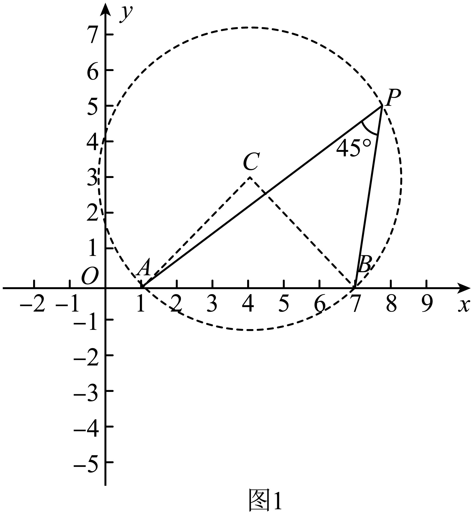
在*x*轴的上方，作以*AB*为斜边的等腰直角三角形△*ACB*，易知*A*，*B*，*P*三点在⊙*C*上，

圆心*C*的坐标为(4,3)，半径为3 $\sqrt{2}$ ，
根据对称性可知点*C*(4,−3)也满足条件；
②*y*轴的正半轴上存在线段*AB*的“等角点“。

如图2所示，当圆心为*C*（4，3）时，过点*C*作*CD*⊥*y*轴于*D*，则*D*（0，3），*CD*=4，

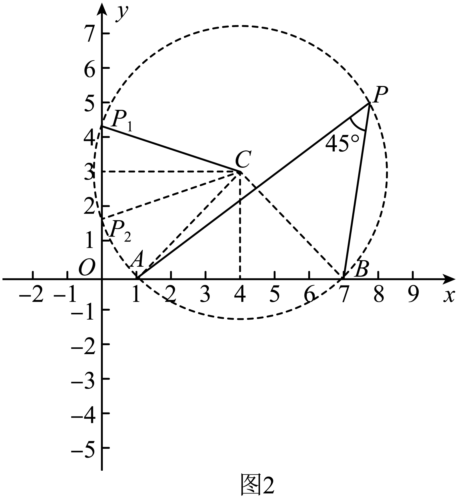
∵⊙*C*的半径 $r=3\sqrt{2}>4$ ，
∴⊙*C*与*y*轴相交，
设交点为 $P_{1}$ ， $P_{2}$ ，此时 $P_{1}$ ， $P_{2}$ 在*y*轴的正半轴上，

连接 $CP_{1}$ 、 $CP_{2}$ 、*<text style="italic">CA*</text>，则 $CP_{1}$ = $CP_{2}$ =*<text style="italic">CA*</text> =*r*=3 $\sqrt{2}$ ，
∵<text st*y*le="italic">*CD*</text>⊥y轴，CD=4， $CP_{1}=3\sqrt{2}$ ，
∴ $DP_{2}=DP_{1}=\sqrt{CP^{2}-CD^{2}}=\sqrt{(3\sqrt{2})^{2}-4^{2}}=\sqrt{2}$ ，
∴ $P_{1}(0,3+\sqrt{2})$ ， $P_{2}(0,3-\sqrt{2})$ ；
当圆心为*C*（4，-3）时，点*P*在*y*轴的负半轴上，不符合题意；  
（2）当过点*A*，*B*的圆与*y*轴正半轴相切于点*P*时，∠*APB*最大，理由如下：
如果点*P*在*y*轴的正半轴上，设此时圆心为*E*，则*E*在第一象限，

如图3所示，在*y*轴的正半轴上任取一点*M*(不与点*P*重合)，

连接*MA*，*MB*，*PA*，*PB*，设*MB*交于⊙*E*于点*N*，连接*NA*，

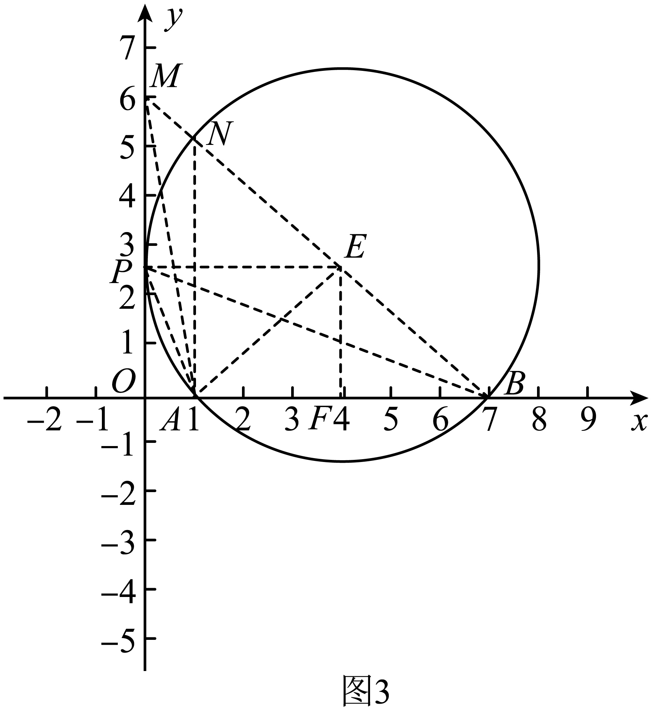
∵点*P*，点*N*在⊙*E*上，
∴∠*APB*=∠*ANB*，
∵∠*ANB*是△*MAN*的外角，
∴∠*ANB*>∠*AMB*，
即∠*APB*>∠*AMB*，

此时，过点<te*x*t style="italic">E</text>作*E<text style="italic">F*</text>⊥x轴于F，连接*EA*，*EP*，则*AF*= $\frac{1}{2}$ *AB*=3，O*F*=4，
∵⊙*E*与*y*轴相切于点*P*，则*EP*⊥*y*轴，
∴四边形*OPEF*是矩形，*OP*=*EF*，*PE*=*OF*=4，
∴⊙*E*的半径为4，即*EA*=4，
∴在*Rt*△*AEF*中， $EF=\sqrt{EA^{2}-AF^{2}}=\sqrt{4^{2}-3^{2}}=\sqrt{7}$ ，
∴ $OP=\sqrt{7}$ ，
即 $P(0，\sqrt{7})$ ．

【点睛】本题考查了圆与三角形，勾股定理，三角形的外角，矩形的性质，解题的关键是掌握这些知识点．

13．（21-22九年级下·福建厦门·期中）如图，等边三角形*ABC*内接于半径长为2的⊙*O*，点*P*在圆弧*AB*上以2倍速度从*B*向*A*运动，点*Q*在圆弧*BC*上以1倍速度从*C*向*B*运动，当点*P*，*O*，*Q*三点处于同一条直线时，停止运动．

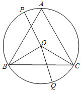  
(1)求点*Q*的运动总长度；  
(2)若*M*为弦*PB*的中点，求运动过程中*CM*的最大值．

【答案】(1) $\frac{2}{3}\pi$  
(2) $\sqrt{7}+1.$

【分析】（1）如图，设 $\angle COQ=\alpha ,$  结合题意可得： $\angle BOP=2\alpha$ ，结合正三角形的性质求解 $\alpha =60\circ ,$  再利用弧长公式进行计算即可；  
（2）解：如图，取 $OB$ 的中点*<text style="italic"><text style="italic"><text style="italic"><text style="italic">N*</text></text></text></text>，连接*N<text style="italic"><text style="italic">M*</text></text>，*N<text style="italic">C*</text>，*MC*，过N作 $NK\perp BC$ 于*K*，过*O*作 $OE\perp BC$ 于*E*，证明*<text style="italic">M*</text>在以*<text style="italic"><text style="italic"><text style="italic"><text style="italic">N*</text></text></text></text>为圆心，半径为1的圆N上运动，可得当*C*，N，M三点共线时，*CM*最大，从而可得答案．

【详解】（1）解：如图，设 $\angle COQ=\alpha ,$  结合题意可得： $\angle BOP=2\alpha$ ，

$\because \bigtriangleup ABC$ 为等边三角形，
$\therefore \angle BOC=\frac{360\circ }{3}=120\circ ,$
$\therefore \angle BOQ=120\circ -\alpha ,$

而 $P,O,Q$ 三点共线，
$\therefore \angle BOQ=180\circ -2\alpha ,$
$\therefore 120\circ -\alpha =180\circ -2\alpha ,$
解得： $\alpha =60\circ ,$
$\therefore Q$ 运动的总长度为： $\frac{60\pi \times 2}{180}=\frac{2}{3}\pi .$  
（2）解：如图，取 $OB$ 的中点*<text style="italic">N*</text>，连接*NM*，*NC*，*MC*，过N作 $NK\perp BC$ 于*K*，过*O*作 $OE\perp BC$ 于*E*，

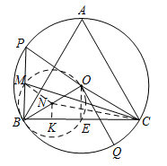
$\because M$ 为*PB*的中点，
$\therefore NM=\frac{1}{2}OP=1,$
∴*M*在以*N*为圆心，半径为1的圆*N*上运动，
∴当*C*，*N*，*M*三点共线时，*CM*最大，
$\because \angle BOC=120\circ ,OB=OC,$
$\therefore \angle OBC=30\circ ,$
$\therefore NK=\frac{1}{2}BN=\frac{1}{2},BK=\frac{\sqrt{3}}{2},$
同理可得： $BE=\sqrt{3},$  则 $BC=2\sqrt{3},$
$\therefore CK=2\sqrt{3}-\frac{\sqrt{3}}{2}=\frac{3\sqrt{3}}{2},$
$\therefore NC=\sqrt{(\frac{1}{2})^{2}+(\frac{3\sqrt{3}}{2})^{2}}=\sqrt{7},$
$\therefore CM=CN+NM=\sqrt{7}+1,$
∴ $CM$ 的最大值为： $\sqrt{7}+1.$

【点睛】本题考查的是弧长的计算，弧与圆心角的关系，圆的基本性质，正多边形的性质，勾股定理的应用，熟练的构造辅助圆，再求解线段的最大值是解本题的关键．

## 题型05  费马点问题

14．（2023·湖北随州·中考真题）1643年，法国数学家费马曾提出一个著名的几何问题：给定不在同一条直线上的三个点*A*，*B*，*C*，求平面上到这三个点的距离之和最小的点的位置，意大利数学家和物理学家托里拆利给出了分析和证明，该点也被称为“费马点”或“托里拆利点”，该问题也被称为“将军巡营”问题．  
(1)下面是该问题的一种常见的解决方法，请补充以下推理过程：（其中①处从“直角”和“等边”中选择填空，②处从“两点之间线段最短”和“三角形两边之和大于第三边”中选择填空，③处填写角度数，④处填写该三角形的某个顶点）
当 $\bigtriangleup ABC$ 的三个内角均小于 $120\circ$ 时，

如图1，将 $\bigtriangleup APC$ 绕，点*C*顺时针旋转 $60\circ$ 得到 $\bigtriangleup A^{'}P^{'}C$ ，连接 $PP^{'}$ ，

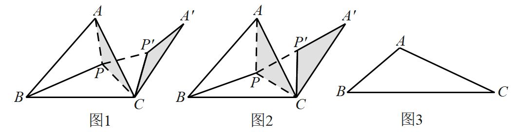
由 $PC=P^{'}C，\angle PCP^{'}=60\circ$ ，可知 $\bigtriangleup PCP^{'}$ 为<u>_①_</u>三角形，故 $PP^{'}=PC$ ，又 $P^{'}A^{'}=PA$ ，故 $PA+PB+PC=PA^{'}+PB+PP^{'}\geq A^{'}B$ ，
由<u>_②_</u>可知，当<em>B</em>，<em>&lt;text style="italic"&gt;P</em>&lt;/text&gt;， $P^{'}$ ，<em>A</em>在同一条直线上时， $PA+PB+PC$ 取最小值，如图2，最小值为 $A^{'}B$ ，此时的<em>&lt;text style="italic"&gt;P</em>&lt;/text&gt;点为该三角形的“费马点”，且有 $\angle APC=\angle BPC=\angle APB=$ <u>_③_</u>；
已知当 $\bigtriangleup ABC$ 有一个内角大于或等于 $120\circ$ 时，“费马点”为该三角形的某个顶点．如图3，若 $\angle BAC\geq 120\circ$ ，则该三角形的“费马点”为<u>_④_</u>点．  
(2)如图4，在 $\bigtriangleup ABC$ 中，三个内角均小于 $120\circ$ ，且 $AC=3，BC=4，\angle ACB=30\circ$ ，已知点*P*为 $\bigtriangleup ABC$ 的“费马点”，求 $PA+PB+PC$ 的值；
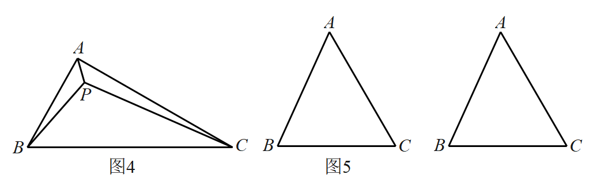  
(3)如图5，设村庄<text style="it<text style="it<text style="it*a*lic">a</text>lic">a</text>lic">*<text style="italic">A*</text></text>，*<text style="italic"><text style="italic">B*</text></text>，*<text style="italic"><text style="italic">C*</text></text>的连线构成一个三角形，且已知 $AC=4km，BC=2\sqrt{3}km，\angle ACB=60\circ$ ．现欲建一中转站<text style="it<text style="it<text style="it*a*lic">a</text>lic">a</text>lic">*<text style="italic">P*</text></text>沿直线向*<text style="italic"><text style="italic">A*</text></text>，*<text style="italic"><text style="italic">B*</text></text>，*<text style="italic"><text style="italic">C*</text></text>三个村庄铺设电缆，已知由中转站P到村庄A，B，C的铺设成本分别为a元/ $km$ ，<text style="it<text style="it*a*lic">a</text>lic">a</text>元/ $km$ ， $\sqrt{2}a$ 元/ $km$ ，选取合适的<text style="it<text style="it<text style="it*a*lic">a</text>lic">a</text>lic">*<text style="italic">P*</text></text>的位置，可以使总的铺设成本最低为\_\_\_\_\_\_\_\_\_\_\_元．（结果用含a的式子表示）

【答案】(1)①等边；②两点之间线段最短；③ $120\circ$ ；④*A*．  
(2) $5$  
(3) $2\sqrt{13}a$

【分析】（1）根据旋转的性质和两点之间线段最短进行推理分析即可得出结论；  
（2）根据（1）的方法将 $\bigtriangleup APC$ 绕，点*C*顺时针旋转 $60\circ$ 得到 $\bigtriangleup A^{'}P^{'}C$ ，即可得出可知当*B*，*P*， $P^{'}$ ，*A*在同一条直线上时， $PA+PB+PC$ 取最小值，最小值为 $A^{'}B$ ，在根据 $\angle ACB=30\circ$ 可证明 $\angle ACA^{'}=\angle A^{'}CP^{'}+\angle BCP+\angle PCP^{'}=90\circ$ ，由勾股定理求 $A^{'}B$ 即可，  
（3）由总的铺设成本 $=a(PA+PB+\sqrt{2}PC)$ ，通过将 $\bigtriangleup APC$ 绕，点*C*顺时针旋转 $90\circ$ 得到 $\bigtriangleup A^{'}P^{'}C$ ，得到等腰直角 $\bigtriangleup PP^{'}C$ ，得到 $\sqrt{2}PC=PP^{'}$ ，即可得出当*B*，*P*， $P^{'}$ ，*A*在同一条直线上时， $P^{'}A^{'}+PB+PP^{'}$ 取最小值，即 $PA+PB+\sqrt{2}PC$ 取最小值为 $A^{'}B$ ，然后根据已知和旋转性质求出 $A^{'}B$ 即可．

【详解】（1）解：∵ $PC=P^{'}C，\angle PCP^{'}=60\circ$ ，
∴ $\bigtriangleup PCP^{'}$ 为等边三角形；
∴ $PP^{'}=PC$ ， $\angle P^{'}PC=\angle PP^{'}C=60\circ$ ，
又 $P^{'}A^{'}=PA$ ，故 $PA+PB+PC=PA^{'}+PB+PP^{'}\geq A^{'}B$ ，
由两点之间线段最短可知，当*B*，*P*， $P^{'}$ ，*A*在同一条直线上时， $PA+PB+PC$ 取最小值，

最小值为 $A^{'}B$ ，此时的*P*点为该三角形的“费马点”，
∴ $\angle BPC+\angle P^{'}PC=180\circ$ ， $\angle A^{'}P^{'}C+\angle PP^{'}C=180\circ$ ，
∴ $\angle BPC=120\circ$ ， $\angle A^{'}P^{'}C=120\circ$ ，
又∵ $\bigtriangleup APC\cong \bigtriangleup A^{'}P^{'}C$ ，
∴ $\angle APC=\angle AP^{'}C=120\circ$ ，
∴ $\angle APB=360\circ -\angle APC-\angle BPC=120\circ$ ，
∴ $\angle APC=\angle BPC=\angle APB=120\circ$ ；
∵ $\angle BAC\geq 120\circ$ ，
∴ $BC>AC$ ， $BC>AB$ ，
∴ $BC+AB>AC+AB$ ， $BC+AC>AB+AC$ ，
∴三个顶点中，顶点*A*到另外两个顶点的距离和最小．
又∵已知当 $\bigtriangleup ABC$ 有一个内角大于或等于 $120\circ$ 时，“费马点”为该三角形的某个顶点．
∴该三角形的“费马点”为点*A*，
故答案为：①等边；②两点之间线段最短；③ $120\circ$ ；④ $A$ ．  
（2）将 $\bigtriangleup APC$ 绕，点*C*顺时针旋转 $60\circ$ 得到 $\bigtriangleup A^{'}P^{'}C$ ，连接 $PP^{'}$ ，
由（1）可知当*B*，*P*， $P^{'}$ ，*A*在同一条直线上时， $PA+PB+PC$ 取最小值，最小值为 $A^{'}B$ ，

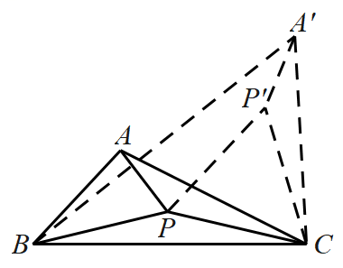
∵ $\angle ACP=\angle A^{'}CP^{'}$ ，
∴ $\angle ACP+\angle BCP=\angle A^{'}CP^{'}+\angle BCP=\angle ACB=30\circ$ ，
又∵ $\angle PCP^{'}=60\circ$
∴ $\angle BCA^{'}=\angle A^{'}CP^{'}+\angle BCP+\angle PCP^{'}=90\circ$ ，
由旋转性质可知： $AC=A^{'}C=3$ ，
∴ $A^{'}B=\sqrt{BC^{2}+A^{'}C^{2}}=\sqrt{4^{2}+3^{2}}=5$ ，
∴ $PA+PB+PC$ 最小值为 $5$ ，  
（3）∵总的铺设成本 $=PA\cdot a+PB\cdot a+PC\cdot \sqrt{2}a=a(PA+PB+\sqrt{2}PC)$
∴当 $PA+PB+\sqrt{2}PC$ 最小时，总的铺设成本最低，
将 $\bigtriangleup APC$ 绕，点*C*顺时针旋转 $90\circ$ 得到 $\bigtriangleup A^{'}P^{'}C$ ，连接 $PP^{'}$ ， $A^{'}B$
由旋转性质可知： $P^{'}C=PC$ ， $\angle PCP^{'}=\angle ACA^{'}=90\circ$ ， $P^{'}A^{'}=PA$ ， $A^{'}C=AC=4km$ ，
∴ $PP^{'}=\sqrt{2}PC$ ，
∴ $PA+PB+\sqrt{2}PC=P^{'}A^{'}+PB+PP^{'}$ ，
当*B*，*P*， $P^{'}$ ，*A*在同一条直线上时， $P^{'}A^{'}+PB+PP^{'}$ 取最小值，即 $PA+PB+\sqrt{2}PC$ 取最小值为 $A^{'}B$ ，

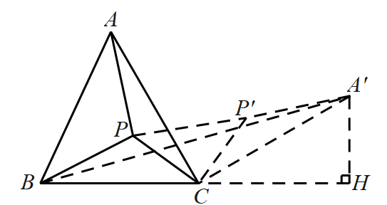

过点 $A^{'}$ 作 $A^{'}H\perp BC$ ，垂足为 $H$ ，
∵ $\angle ACB=60\circ$ ， $\angle ACA^{'}=90\circ$ ，
∴ $\angle A^{'}CH=30\circ$ ，
∴ $A^{'}H=\frac{1}{2}A^{'}C=2km$ ，
∴ $HC=\sqrt{AC^{2}-AH^{2}}=\sqrt{4^{2}-2^{2}}=2\sqrt{3}(km)$ ，
∴ $BH=BC+CH=2\sqrt{3}+2\sqrt{3}=4\sqrt{3}(km)$ ，
∴ $A^{'}B=\sqrt{AH^{2}+BH^{2}}=\sqrt{(4\sqrt{3})^{2}+2^{2}}=2\sqrt{13}(km)$
$PA+PB+\sqrt{2}PC$ 的最小值为 $2\sqrt{13}km$

总的铺设成本 $=PA\cdot a+PB\cdot a+PC\cdot \sqrt{2}a=a(PA+PB+\sqrt{2}PC)=2\sqrt{13}a$ （元）
故答案为： $2\sqrt{13}a$

【点睛】本题考查了费马点求最值问题，涉及到的知识点有旋转的性质，等边三角形的判定与性质，勾股定理，以及两点之间线段最短等知识点，读懂题意，利用旋转作出正确的辅助线是解本题的关键．

15．（2021·山东济南·三模）如图（1），*<text style="italic">P*</text>为 $\bigtriangleup$ *<text style="italic">ABC*</text>所在平面上一点，且∠A*<text style="italic">P*</text>B＝∠*BPC*＝∠*CPA*＝120°，则点P叫做 $\bigtriangleup$ *<text style="italic">ABC*</text>的费马点．  
（1）若点<em>P</em>是等边三角形三条中线的交点，点<em>P</em><u>　　</u>（填是或不是）该三角形的费马点．  
（2）如果点*P*为锐角 $\bigtriangleup$ *<text style="italic">ABC*</text>的费马点，且∠ABC＝60°．求证： $\bigtriangleup$ AB*P*∽ $\bigtriangleup$ BC*P*；  
（3）已知锐角 $\bigtriangleup$ *<text style="italic">AB*C</text>，分别以AB、*AC*为边向外作正 $\bigtriangleup$ *AB*E和正 $\bigtriangleup$ *AC*D，*CE*和*BD*相交于*P*点．如图（2）

①求∠*CPD*的度数；
②求证：*P*点为 $\bigtriangleup$ *ABC*的费马点．

【答案】（1）是；（2）见解析；（3）①60°，②见解析

【分析】（1）由等边三角形的性质证明 $\angle ABP=\angle PAB=30\circ ,$  可得 $\angle APB=120\circ ,$  同法可得： $\angle APC=\angle BPC=120\circ ,$  从而可得结论；  
（2）由 $P$ 为锐角 $\bigtriangleup$ *<text style="italic">ABC*</text>的费马点，且∠ABC＝60°，证明∠*PAB*＝∠*PBC*，∠*APB*＝∠*BPC*＝120°，从而可得△*ABP*∽△*BCP*；  
（3）①如图2所示：由△*ABE*与△*ACD*都为等边三角形，证明△*ACE*≌△*ADB*（*SAS*），利用全等三角形的性质可得∠*<text style="italic">CPD*</text>＝∠6＝∠5＝60°； ② 先证明△*ADF*∽△*PCF*，可得 $\frac{AF}{PF}=\frac{DF}{CF},$  再证明△*AFP*∽△*DFC*．可得∠*APC*＝∠*<text style="italic">CPD*</text>+∠*APF*＝120°，再证明∠*BPC*＝120°，从而可得结论．

【详解】解：（1）如图1所示：

∵*AB*＝*BC*，*BM*是*AC*的中线，
∴*MB*平分∠*ABC*．

同理：*AN*平分∠*BAC*，*PC*平分∠*BCA*．
∵△*ABC*为等边三角形，
∴∠*ABP*＝30°，∠*BAP*＝30°．
∴∠*APB*＝120°．

同理：∠*APC*＝120°，∠*BPC*＝120°．
∴*P*是△*ABC*的费马点．
故答案为：是．  
（2） $\because P$ 为锐角 $\bigtriangleup$ *<text style="italic">ABC*</text>的费马点，且∠ABC＝60°．
$\therefore$  ∠*APB*＝∠*BPC*＝120°，
$\therefore$  ∠*PAB*+∠*<text style="italic">PBA*</text>＝180°﹣∠*APB*＝60°，∠*PBC*+∠PBA＝∠*ABC*＝60°，
∴∠*PAB*＝∠*PBC*，
∴△*ABP*∽△*BCP*．  
（3）如图2所示：

①∵△*ABE*与△*ACD*都为等边三角形，
∴∠*BAE*＝∠*CAD*＝60°，*AE*＝*AB*，*AC*＝*AD*，
∴∠*BAE*+∠*BAC*＝∠*CAD*+∠*BAC*，即∠*EAC*＝∠*BAD*，
在△*ACE*和△*ABD*中， $\{\begin{array}{c}AC=AD\\\angle EAC=\angle BAD\\AE=AB\end{array}$
∴△*ACE*≌△*ADB*（*SAS*），
∴∠1＝∠2，
∵∠3＝∠4，
∴∠*CPD*＝∠6＝∠5＝60°；
②证明： $\because \angle 1=\angle 2,\angle 3=\angle 4,$
$\therefore$  △*ADF*∽△*PCF*，
$\therefore \frac{AF}{PF}=\frac{DF}{CF},$
∵∠*AFP*＝∠*CFD*，
∴△*AFP*∽△*DFC*．
∴∠*APF*＝∠*ACD*＝60°，
∴∠*APC*＝∠*CPD*+∠*APF*＝120°，
$\because \angle 6=60\circ ,$
∴∠*BPC*＝120°，
∴∠*APB*＝360°﹣∠*BPC*﹣∠*APC*＝120°，
∴*P*点为△*ABC*的费马点．

【点睛】本题考查的是等边三角形的性质，三角形全等的判定与性质，三角形相似的判定与性质，确定图中隐含的全等三角形与相似三角形是解题的关键．

## 题型06  瓜豆原理模型

16．（22-23九年级上·江苏扬州·阶段练习）如图，*A*是 $\odot B$ 上任意一点，点*C*在 $\odot B$ 外，已知 $AB=2，BC=4，\bigtriangleup ACD$ 是等边三角形，则 $\bigtriangleup BCD$ 的面积的最大值为（    ）

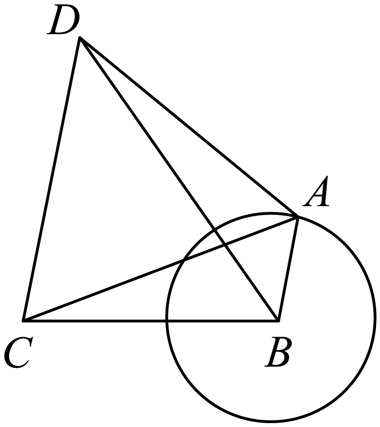

A． $4\sqrt{3}+4$ 	
B．4	
C． $4\sqrt{3}+8$ 	
D．6

【答案】A

【分析】以 $BC$ 为边向上作等边三角形 $BCM$ ，连接 $DM$ ，证明 $\bigtriangleup DCM\allequal \bigtriangleup ACB$ 得到 $DM=AB=2$ ，分析出点*<text style="italic">D*</text>的运动轨迹是以点*M*为圆心， $DM$ 长为半径的圆，在求出点*<text style="italic">D*</text>到线段 $BC$ 的最大距离，即可求出面积的最大值．

【详解】解：如图，以 $BC$ 为边向上作等边三角形 $BCM$ ，连接 $DM$ ，

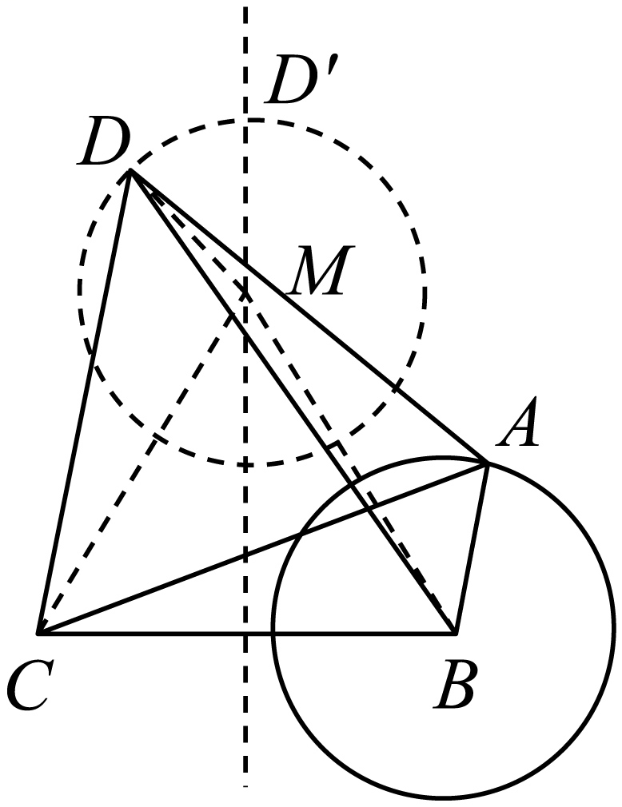
∵ $\angle DCA=\angle MCB=60\circ$ ，
∴ $\angle DCA-\angle ACM=\angle MCB-\angle ACM$ ，即 $\angle DCM=\angle ACB$ ，
在 $\bigtriangleup DCM$ 和 $\bigtriangleup ACB$ 中，
$\left\{\begin{array}{c}DC=AC\\\angle DCM=\angle ACB\\MC=BC\end{array}\right$ ，
∴ $\bigtriangleup DCM\allequal \bigtriangleup ACB\left(SAS\right)$ ，
∴ $DM=AB=2$ ，
∴点*<text style="italic">D*</text>的运动轨迹是以点*M*为圆心， $DM$ 长为半径的圆，要使 $\bigtriangleup BCD$ 的面积最大，则求出点*<text style="italic">D*</text>到线段 $BC$ 的最大距离，
∵ $\bigtriangleup BCM$ 是边长为4的等边三角形，
∴点*M*到 $BC$ 的距离为 $2\sqrt{3}$ ，
∴点*D*到 $BC$ 的最大距离为 $2\sqrt{3}+2$ ，
∴ $\bigtriangleup BCD$ 的面积最大值是 $\frac{1}{2}\times 4\times \left(2\sqrt{3}+2\right)=4\sqrt{3}+4$ ，
故选A．

【点睛】本题考查了动点轨迹是圆的问题，解决本题的关键是利用构造全等三角形找到动点*D*的轨迹圆，再求出圆上一点到定线段距离的最大值．

17．（2022·广东河源·二模）如图，已知 $AC=2AO=8$ ，平面内点<em>P</em>到点<em>O</em>的距离为2，连接<em>AP</em>，若 $\angle APB=60\circ$ 且 $BP=\frac{1}{2}AP$ ，连接<em>AB</em>，<em>&lt;text style="italic"&gt;BC</em>&lt;/text&gt;，则线段BC的最小值为______．

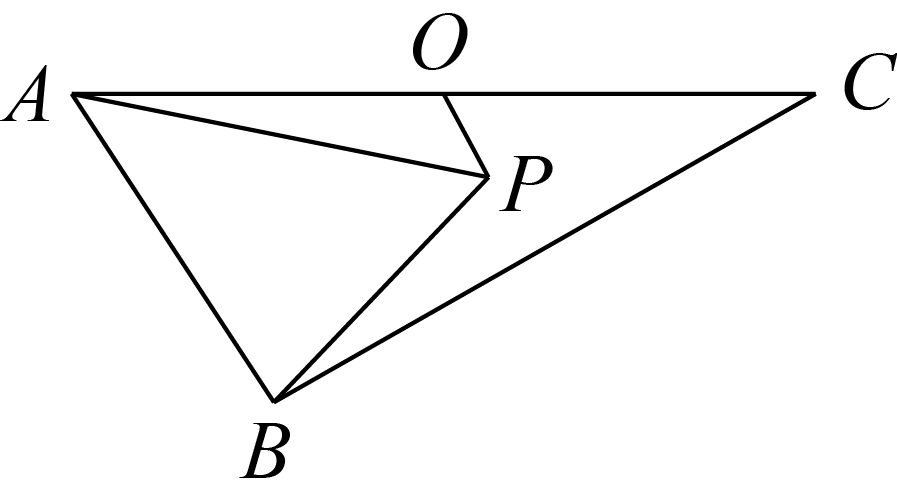

【答案】 $2\sqrt{7}-\sqrt{3}$

【分析】如图所示，延长*<text style="italic">P<text style="italic"><text style="italic"><text style="italic">B*</text></text></text></text>到*D*使得PB=*DB*，先证明△*APD*是等边三角形，从而推出*ABP*=90°，∠*BAP*=30°，以*AO*为斜边在*<text style="italic">A<text style="italic">C*</text></text>下方作*Rt*△*A<text style="italic"><text style="italic"><text style="italic">M*</text></text>O</text>，使得∠*MAO*=30°，连接*CM*，过点M作*M<text style="italic">H*</text>⊥AC于H，解直角三角形得到 $\frac{AM}{AO}=\frac{AB}{AP}=\frac{\sqrt{3}}{2}$ ，从而证明△A*<text style="italic"><text style="italic">M*</text></text>*<text style="italic"><text style="italic">B*</text></text>∽△*AO*P，得到 $\frac{BM}{OP}=\frac{AB}{AP}=\frac{\sqrt{3}}{2}$ ，则 $BM=\sqrt{3}$ ，则点*<text style="italic"><text style="italic">B*</text></text>在以*<text style="italic"><text style="italic">M*</text></text>为圆心，以 $\sqrt{3}$ 为半径的圆上，当*<text style="italic"><text style="italic">M*</text></text>、*<text style="italic"><text style="italic">B*</text></text>、*C*三点共线时，即点B在点 $B^{'}$ 的位置时，*<text style="italic"><text style="italic">B*</text></text>*C*有最小值，据此求解即可．

【详解】解：如图所示，延长*PB*到*D*使得*PB*=*DB*，
∵ $BP=\frac{1}{2}AP$ ，
∴ $AP=PD=2PB$ ，
又∵∠*APB*=60°，
∴△*APD*是等边三角形，
∵*B*为*PD*的中点，
∴*AB*⊥*DP*，即∠*ABP*=90°，
∴∠*BAP*=30°，

以*AO*为斜边在*AC*下方作*Rt*△*AMO*，使得∠*MAO*=30°，连接*CM*，过点*M*作*MH*⊥*AC*于*H*，
∴ $cos\angle OAM=\frac{AM}{AO}=\frac{\sqrt{3}}{2}$ ，
同理可得 $\frac{AB}{AP}=\frac{\sqrt{3}}{2}$ ，
∵∠*OAM*=30°=∠*PAB*，
∴∠*BAM*=∠*PAO*，
又∵ $\frac{AM}{AO}=\frac{AB}{AP}=\frac{\sqrt{3}}{2}$ ，
∴△*AMB*∽△*AOP*，
∴ $\frac{BM}{OP}=\frac{AB}{AP}=\frac{\sqrt{3}}{2}$ ，
∵点*P*到点*O*的距离为2，即*OP*=2，
∴ $BM=\sqrt{3}$ ，
∴点*B*在以*M*为圆心，以 $\sqrt{3}$ 为半径的圆上，

连接*C<text style="italic">M*</text>交圆M（半径为 $\sqrt{3}$ ）于 $B^{'}$ ，
∴当*M*、*<text style="italic">B*</text>、*C*三点共线时，即点B在点 $B^{'}$ 的位置时，*<text style="italic">B*</text>*C*有最小值，
∵*AC*=2*AO*=8，
∴*AO*=4，
∴ $AM=AO\cdot cos\angle OAM=2\sqrt{3}$ ，
∴ $AH=AM\cdot cos\angle MAH=3$ ， $HM=AM\cdot sin\angle MAH=\sqrt{3}$ ，
∴ $CH=5$ ，
∴ $CM=\sqrt{HM^{2}+CH^{2}}=2\sqrt{7}$ ，
∴ $B^{'}C=CM-MB^{'}=2\sqrt{7}-\sqrt{3}$ ，
∴*BC*的最小值为 $2\sqrt{7}-\sqrt{3}$ ，
故答案为： $2\sqrt{7}-\sqrt{3}$ ．

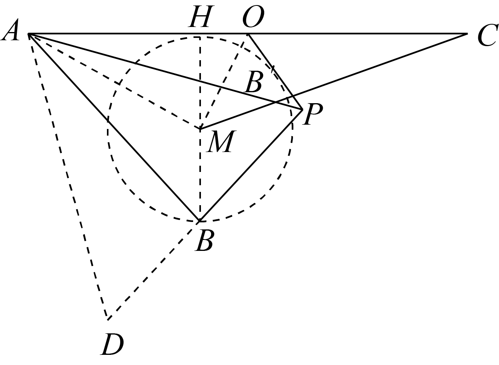

【点睛】本题主要考查了等边三角形的性质与判定，解直角三角形，相似三角形的性质与判定，勾股定理，圆外一点到圆上一点的最值问题，解题的关键在于能够熟练掌握瓜豆模型即证明点*B*在以*M*为圆心，半径为 $\sqrt{3}$ 的圆上运动．

18．（23-24九年级上·江苏宿迁·阶段练习）如图，线段 $AB$ 为 $\odot O$ 的直径，点 $C$ 在 $AB$ 的延长线上， $AB=4$ ， $BC=2$ ，点 $P$ 是 $\odot O$ 上一动点，连接 $CP$ ，以 $CP$ 为斜边在 $PC$ 的上方作Rt $\bigtriangleup PCD$ ，且使 $\angle DCP=60\circ$ ，连接 $OD$ ，则 $OD$ 长的最大值为__．

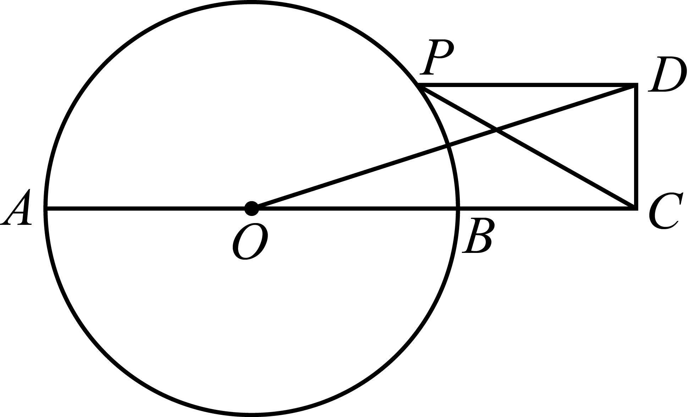

【答案】 $2\sqrt{3}+1$ / $1+2\sqrt{3}$

【分析】作 $\bigtriangleup COE$ ，使得 $\angle CEO=90\circ$ ， $\angle ECO=60\circ$ ，则 $CO=2CE$ ， $OE=2\sqrt{3}$ ， $\angle OCP=\angle ECD$ ，由 $\bigtriangleup COP\backsim \bigtriangleup CED$ ，推出 $\frac{OP}{ED}=\frac{CP}{CD}=2$ ，即 $ED=\frac{1}{2}OP=1$ （定长），由点 $E$ 是定点， $DE$ 是定长，点 $D$ 在半径为1的 $\odot E$ 上，由此即可解决问题．

【详解】解：如图，作 $\bigtriangleup COE$ ，使得 $\angle CEO=90\circ$ ， $\angle ECO=60\circ$ ，则 $CO=2CE$ ， $OE=2\sqrt{3}$ ， $\angle OCP=\angle ECD$ ，

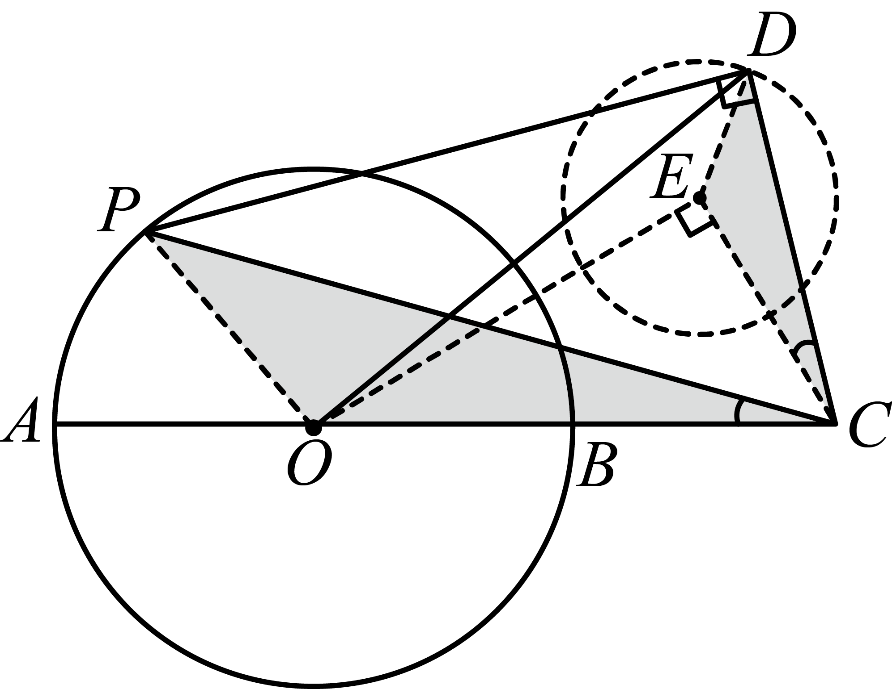
$\because \angle CDP=90\circ$ ， $\angle DCP=60\circ$ ，
$\therefore CP=2CD$ ，
$\therefore$  $\frac{CO}{CE}=\frac{CP}{CD}=2$ ，
$\therefore \bigtriangleup COP\backsim \bigtriangleup CED$ ，
$\therefore$  $\frac{OP}{ED}=\frac{CP}{CD}=2$ ，
即 $ED=\frac{1}{2}OP=1$ （定长），
$\because$ 点 $E$ 是定点， $DE$ 是定长，
$\therefore$ 点 $D$ 在半径为1的 $\odot E$ 上，
$\because OD\leq OE+DE=2\sqrt{3}+1$ ，
$\therefore OD$ 的最大值为 $2\sqrt{3}+1$ ，
故答案为： $2\sqrt{3}+1$ ．

【点睛】本题考查了相似三角形的判定和性质、两圆的位置关系、轨迹等知识，解题的关键是学会添加常用辅助线，构造相似三角形解决问题，属于中考压轴题．

19．（20-21九年级·陕西西安·开学考试）在菱形 $ABCD$ 中， $\angle BAD=120\circ$ ， $E$ 是对角线 $BD$ 上的一点，连接 $AE$ ．

  
（1）当 $E$ 在 $AB$ 的中垂线上时，把射线 $EA$ 绕点 $E$ 顺时针旋转 $90\circ$ 后交 $CD$ 于 $F$ ，连接 $BF$ ．如图①，若 $AB=4$ ，求 $EF$ 的长．  
（2）在（1）的条件下，连接 $BF$ ，把 $\bigtriangleup BEF$ 绕点 $B$ 顺时针旋转得到 $\bigtriangleup BHK$ 如图②，连接 $CH$ ，点 $N$ 为 $CH$ 的中点，连接 $AN$ ，求 $AN$ 的最大值．

【答案】（1） $EF=\frac{8}{3}$  （2） $\frac{8}{3}\sqrt{3}$

【分析】（1）通过菱形性质证明 $AE=BE$ ，在 $Rt\bigtriangleup DAE$ 中，利用勾股定理求出*AE*的长度，再 $Rt\bigtriangleup DAE$ 中，可以得到 $DE=2AE$ ，在等腰 $\bigtriangleup DEF$ 中，利用角度推导出 $DE=\sqrt{3}EF$ ，代入数值求解即可．  
（2）判断出点*Ｈ*的运动轨迹，从而知道点*Ｎ*的运动轨迹，根据三角形三边关系，即可得到*AN*的最大值．

【详解】（1）解：过点*F*作 $FM\perp BD$ 于点*M，* 如下图：

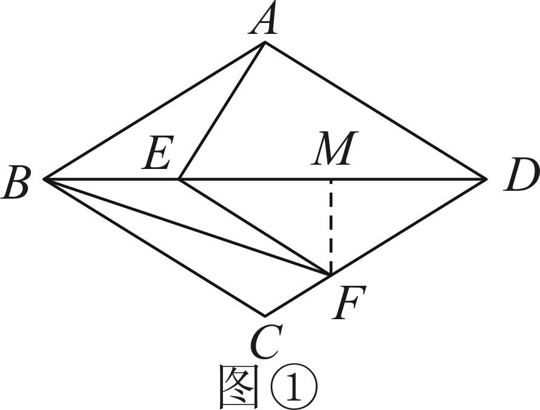
∵四边形*ABCD*是菱形,且 $\angle BAD=120\circ$
∴ $AD=AB=4,\angle ABC=\angle ADC=60^{\circ }$
∵ $BD$ 为菱形对角线
∴ $\angle ABE=\angle ADE=\angle FDE=30^{\circ }$ ,
又∵ $E$ 在 $AB$ 的中垂线上
∴ $AE=BE$
∴ $\angle BAE=\angle ABE=30^{\circ }$
∴ $\angle AED=60^{\circ }$ , $\angle EAD=\angle BAD-\angle BAE=120^{\circ }-30^{\circ }=90^{\circ }$
在 $Rt\bigtriangleup DAE$ 中， $\angle ADE=30^{\circ }$
∴ $DE=2AE$
设： $AE=x$ ，则 $DE=2x$
∵ $AE^{2}+AD^{2}=DE^{2}$
即： $x^{2}+4^{2}=(2x)^{2}$
解得： $x=\frac{4}{3}\sqrt{3}$
∴ $DE=\frac{8}{3}\sqrt{3}$
∵ $\angle AEF=90^{\circ }$ ， $\angle AED=60^{\circ }$
∴ $\angle FED=30^{\circ }$
∴ $\angle FED=\angle FDE$
∴ $EF=DF$
又∵ $FM\perp BD$
∴ $EM=DM$
∴ $DE=2EM=2\times \frac{\sqrt{3}}{2}EF=\sqrt{3}EF$
∴ $\frac{8}{3}\sqrt{3}=\sqrt{3}EF$
∴ $EF=\frac{8}{3}$  
（2）连接*A<text style="italic">C*</text>,延长*AE*交*<text style="italic">B*C</text>于点*<text style="italic">M*</text>，则有 $AM\perp BC$ ,点*H*的运动轨迹是以点*B*为圆心，*BH*为半径的圆，因为点*C*为固定点，点*Ｎ*为*CH*的中点，所以点*N*的运动轨迹是以点*<text style="italic">M*</text>为圆心，*NM*为半径的圆，如下图：

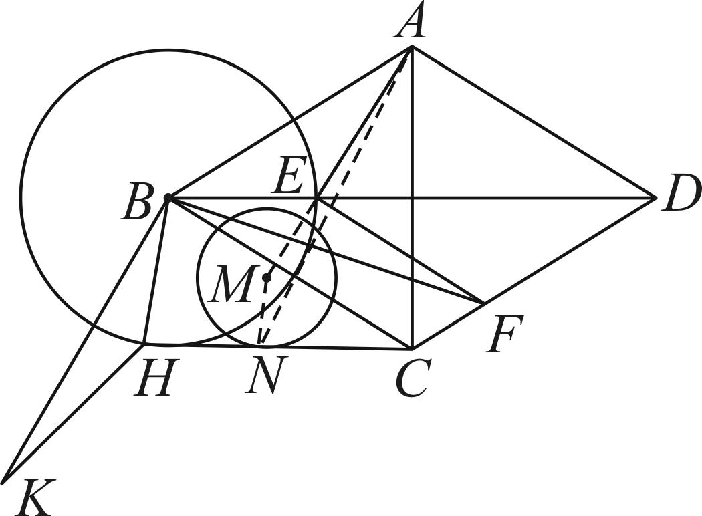

此时：在 $\bigtriangleup AMN$ 在， $AM+MN\geq AN$ ,当 *A、M、N*三点共线时，*AN*最大
则：在 $Rt\bigtriangleup AMC$ 中， $CM=\frac{1}{2}AC=2$
∵ $AM^{2}=AC^{2}-CM^{2}$
∴ $AM^{2}=12$
∴ $AM=2\sqrt{3}$
又∵*M*点是*BC*的中点，*N*是*CH*的中点
∴ $MN=\frac{1}{2}BH=\frac{1}{2}BE=\frac{2}{3}\sqrt{3}$
∴ $AN=2\sqrt{3}+\frac{2}{3}\sqrt{3}=\frac{8}{3}\sqrt{3}$

【点睛】本题看考查勾股定理，等腰三角形性质．瓜豆模型等相关知识点，根据题意列出相关等量关系是解题重点．

20．（21-22八年级上·广东湛江·阶段练习）在平面直角坐标系中， $A\left(a,0\right)、B\left(b,0\right)$ ，且<te*x*t st*y*le="italic">a，b</text>满足 $(a+b)^{2}+|3+b|=0$ ，<te*x*t st*y*le="italic">C、D</text>两点分别是y轴正半轴、x轴负半轴上的两个动点：

  
（1）如图1，若 $C\left(0,4\right)$ ，求 $\bigtriangleup ABC$ 的面积；  
（2）如图1，若 $C\left(0,4\right),BC=5,BD=AE$ ，且 $\angle CBA=\angle CDE$ ，求*D*点的坐标；  
（3）如图2，若 $\angle CBA=60\circ$ ，以 $CD$ 为边，在 $CD$ 的右侧作等边 $\bigtriangleup CDE$ ，连接 $OE$ ，当 $OE$ 最短时，求*A，E*两点之间的距离；
【答案】(1) $\bigtriangleup ABC$ 的面积为12；(2) *D*点的坐标为 $\left(-2,0\right)$ ；(3) *A*，*E*两点之间的距离为 $\frac{3}{2}$ ．

【分析】(1)利用完全平方式和绝对值的性质求出*a*， *b*，然后确定*A*、*B*两点坐标，从而利用三角形面积公式求解即可；  
(2)根据题意判断出 $\bigtriangleup CBD\cong \bigtriangleup DAE$ ，从而得到*<text style="italic">CB*= AD</text>，然后利用勾股定理求出CB，即可求出结论；  
(3)首先根据已知推出 $\bigtriangleup DCB\cong \bigtriangleup ECA$  ，得到*∠<text style="italic">DBC*=∠*EA*C=</text>120°，进一步推出 $AE\parallel BC$  ，从而确定随着*D*点的运动，点*E*在过点*A*且平行于*BC*的直线*PQ*上运动，再根据点到直线的最短距离为垂线段的长度，确定*OE*最短时，各点的位置关系，最后根据含30°角的直角三角形的性质求解即可．

【详解】解： (1) ：∵ $\left(a+b\right)^{2}+\left|b+3\right|=0$ ，
由非负性可知： $\left\{\begin{array}{c}a+b=0\\b+3=0\end{array}\right$  ，
解得： $\left\{\begin{array}{c}a=3\\b=-3\end{array}\right$
∴*A*(3，0)， *B*(-3，0)， *AB*=3-(-3)=6，
∵ *C*(0，4)，
∴*OC*=4，
∴ $S\bigtriangleup ABC=\frac{1}{2}AB\cdot OC=\frac{1}{2}\times 6\times 4=12$ ；  
(2)由(1)知*A*(3，0)， *B*(-3，0)，
∴*OA=OB*，
∵*OC*⊥*AB*，
∴*∠AOC=∠BOC*=90°，
在*△AOC*和*△BOC*中，
$\left\{\begin{array}{c}OA=OB\\\angle AOC=\angle BOC\\OC=OC\end{array}\right$  ，
∴ $\bigtriangleup AOC\cong \bigtriangleup BOC\left(SAS\right)$  ，
∴*∠CBO=∠CAO*，
∵*∠CDA=∠CDE +∠ADE=∠BCD+∠CBA*，*∠CBA=∠CDE*，
∴*∠ADE=∠BCD*，
在*△BCD*和*△ADE*中，
$\left\{\begin{array}{c}\angle BCD=\angle ADE\\\angle CBD=\angle DAE\\BD=AE\end{array}\right$  ，
∴ $\bigtriangleup BCD\cong \bigtriangleup ADE\left(AAS\right)$ ，
∴*CB= AD*，
∵ *B*(-3，0)， *C*(0，4)，
∴*OB*=3，*OC*=4,
∴ $BC=\sqrt{OB^{2}+OC^{2}}=5$  ，
∴*AD=BC*=5，
∵*A*(3，0)，
∴*D*(-2，0)；  
(3)由(2) 可知*CB=CA*，
∵*∠CBA*=60°，
∴*△ABC*为等边三角形，*∠BCA*=60°， *∠DBC*=120°，
∵*△CDE*为等边三角形，
∴*CD=CE*，*∠DCE*=60°，
∵*∠DCE=∠DCB+∠BCE，∠BCA=∠BCE+∠ECA*，
∴*∠DCB=∠ECA*，
在*△DCB*和*△ECA*中，
$\left\{\begin{array}{c}CD=CE\\\angle DCB=\angle ECA\\CB=CA\end{array}\right$  ，
∴*△DCB≌△ECA( SAS)*，
∴*∠DBC=∠EAC*= 120°，
∵*∠EAC+∠ACB*= 120°+60°= 180°，
∴ $AE\parallel BC$ ，
即：随着*D*点的运动，点*E*在过点*A*且平行于*BC*的直线*PQ*上运动，
∵要使得*OE*最短，
∴如图所示，当*OE*⊥*PQ*时，满足*OE*最短，此时*∠OEA*=90°，
∵*∠DBC=∠EAC*=120°，*∠CAB*=60°，
∴*∠OAE=∠EAC-∠CAB*=60°，*∠AOE*= 30°，
∵ *A*(3，0)，
∴*OA*=3，
∴ $AE=\frac{1}{2}OA=\frac{3}{2}$
∴当*O<text style="italic">E*</text>最短时，*A*，E两点之间的距离为 $\frac{3}{2}$ ．

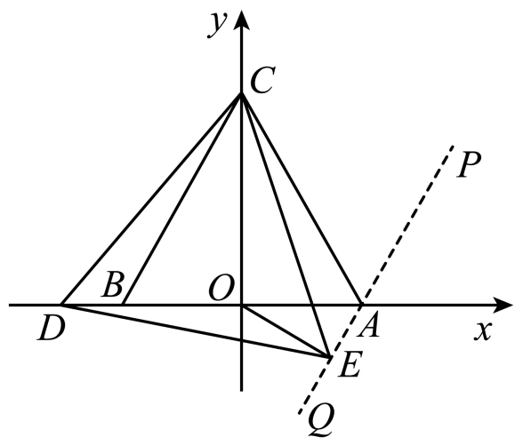

【点睛】本题考查坐标与图形，全等三角形的判定与性质，等腰三角形和等边三角形的判定与性质等，理解平面直角坐标系中点坐标的特征，掌握等腰或等边三角形的性质，熟练使全等三角形的判定与性质是解题关键．

## 题型07  等腰（边）三角形存在问题

21．（2022·黑龙江·中考真题）如图，在平面直角坐标系中，平行四边形<*t*e<text st*y*le="italic">x</text>t style="italic">*A<text style="italic"><text style="italic">B*</text></text>C*<text style="italic">D*</text></text>的边AB在x轴上，顶点D在y轴的正半轴上，*M*为*BC*的中点，*OA*、*OB*的长分别是一元二次方程 $x^{2}-7x+12=0$ 的两个根 $\left(OA<OB\right)$ ， $tan\angle DAB=\frac{4}{3}$ ，动点<*t*ext style="italic">P</text>从点<text st*y*le="italic">*D*</text>出发以每秒1个单位长度的速度沿折线 $DC-CB$ 向点<*t*ext style="italic">*B*</text>运动，到达B点停止．设运动时间为t秒， $\bigtriangleup APC$ 的面积为*S*．

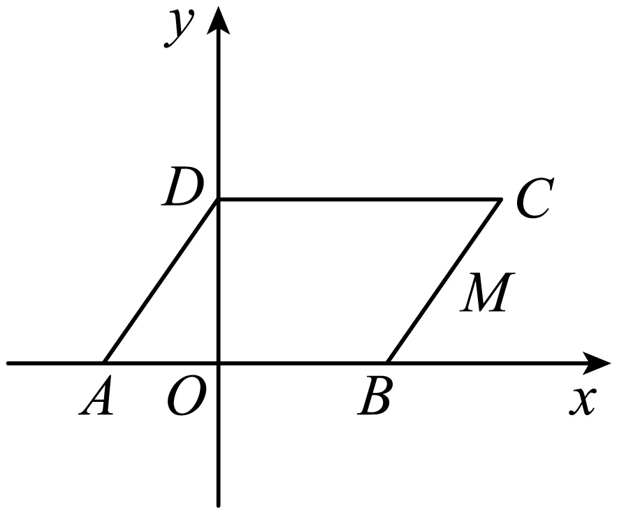  
(1)求点*C*的坐标；  
(2)求*S*关于*t*的函数关系式，并写出自变量*t*的取值范围；  
(3)在点*<text style="italic"><text style="italic">P*</text></text>的运动过程中，是否存在点P，使 $\bigtriangleup CMP$ 是等腰三角形？若存在，请直接写出点*<text style="italic"><text style="italic">P*</text></text>的坐标；若不存在，请说明理由．

【答案】(1)点*C*坐标为 $\left(7,4\right)$  
(2) $S=\left\{\begin{matrix}14-2t&\left(0\leq t<7\right)\\\frac{14}{5}t-\frac{98}{5}&\left(7<t\leq 12\right)\end{matrix}\right$  
(3)存在点*P* $\left(4,4\right)$ 或 $\left(\frac{9}{2},4\right)$ 或 $\left(\frac{59}{12},4\right)$ ，使 $\bigtriangleup CMP$ 是等腰三角形

【分析】（1）先求出方程的解，可得 $OA=3$ ， $OB=4$ ，再由 $tan\angle DAB=\frac{4}{3}$ ，可得 $OD=4$ ，然后根据四边形*AB<text style="italic">CD*</text>是平行四边形，可得CD=7， $\angle ODC=\angle AOD=90\circ$ ，即可求解；  
（2）分两种情况讨论：当 $0\leqslant t<7$ 时，当 $7<t\leqslant 12$ 时，过点*A*作 $AF\perp BC$ 交*CB*的延长线于点*F*，即可求解；  
（3）分三种情况讨论：当*CP*=*P<text style="italic"><text style="italic">M*</text></text>时，过点M作*M<text style="italic">F*</text>⊥*<text style="italic">PC*</text>于点F；当 $PC=CM=\frac{5}{2}$ 时；当*P<text style="italic"><text style="italic">M*</text></text>=*CM*时，过点M作*M<text style="italic">G*</text>⊥*<text style="italic">PC*</text>于点G，即可求解．

【详解】（1）解： $x^{2}-7x+12=0$ ，解得 $x_{1}=3$ ， $x_{2}=4$ ，
∵ $OA<OB$ ，
∴ $OA=3$ ， $OB=4$ ，
∵ $tan\angle DAB=\frac{4}{3}$ ，
∴ $\frac{OD}{OA}=\frac{4}{3}$ ，
∴ $OD=4$ ，
∵四边形*ABCD*是平行四边形，
∴ $DC=AB=3+4=7$ ， $DC\parallel AB$ ，
∴点*C*坐标为 $\left(7,4\right)$ ；  
（2）解：当 $0\leqslant t<7$ 时， $S=\frac{1}{2}CP\cdot OD=\frac{1}{2}\left(7-t\right)\cdot 4=14-2t$ ，
当 $7<t\leqslant 12$ 时，过点*A*作 $AF\perp BC$ 交*CB*的延长线于点*F*，如图，
$AD=\sqrt{OA^{2}+OD^{2}}=\sqrt{3^{2}+4^{2}}=5$ ，
∵四边形*ABCD*是平行四边形，
∴ $BC=AD=5$ ，
∵ $BC\cdot AF=AB\cdot OD$ ，
∴ $5\cdot AF=7\times 4$ ，
∴ $AF=\frac{28}{5}$ ，
∴ $S=\frac{1}{2}CP\cdot AF=\frac{1}{2}\left(t-7\right)\cdot \frac{28}{5}=\frac{14}{5}t-\frac{98}{5}$ ，
∴ $S=\left\{\begin{matrix}14-2t&\left(0\leq t<7\right)\\\frac{14}{5}t-\frac{98}{5}&\left(7<t\leq 12\right)\end{matrix}\right$ ；
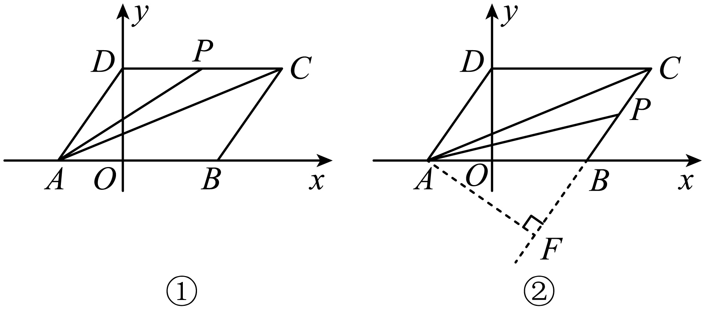  
（3）解：存在点*P*，使 $\bigtriangleup CMP$ 是等腰三角形，理由如下：
根据题意得：当点*P*在*CD*上运动时， $\bigtriangleup CMP$ 可能是等腰三角形，
∵四边形*ABCD*是平行四边形，
∴∠*C*=∠*BAD*，*BC*=*AD*=5，
∴ $tanC=tan\angle DAB=\frac{4}{3}$ ，
∵点*M*为*BC*的中点，
∴ $CM=\frac{5}{2}$ ，
当*CP*=*PM*时，过点*M*作*MF*⊥*PC*于点*F*，

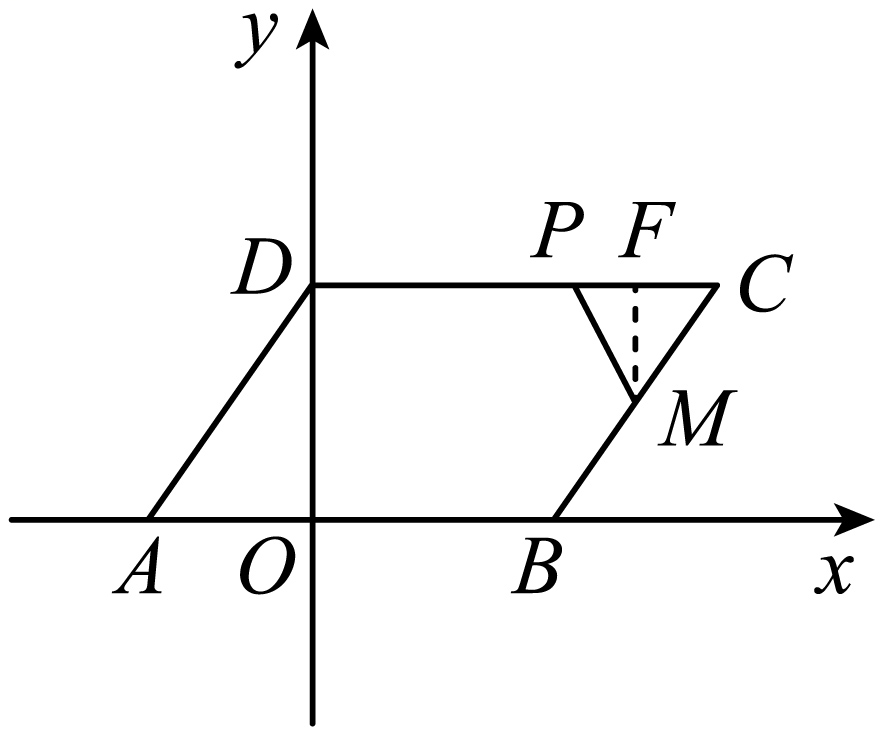
∴ $CF=\frac{3}{2},FM=2$ ，
设<text style="it<text style="it*a*lic">a</text>lic">PC</text>=*PM*=a，则*PD*=7-a， $PF=a-\frac{3}{2}$ ，
∵<em>PF2</em>+<em>FM2</em>=<em>PM2</em>，
∴ $\left(a-\frac{3}{2}\right)^{2}+2^{2}=a^{2}$ ，解得： $a=\frac{25}{12}$ ，
∴ $DP=7-PC=\frac{59}{12}$ ，
∴此时点*P* $\left(\frac{59}{12},4\right)$ ；
当 $PC=CM=\frac{5}{2}$ 时，

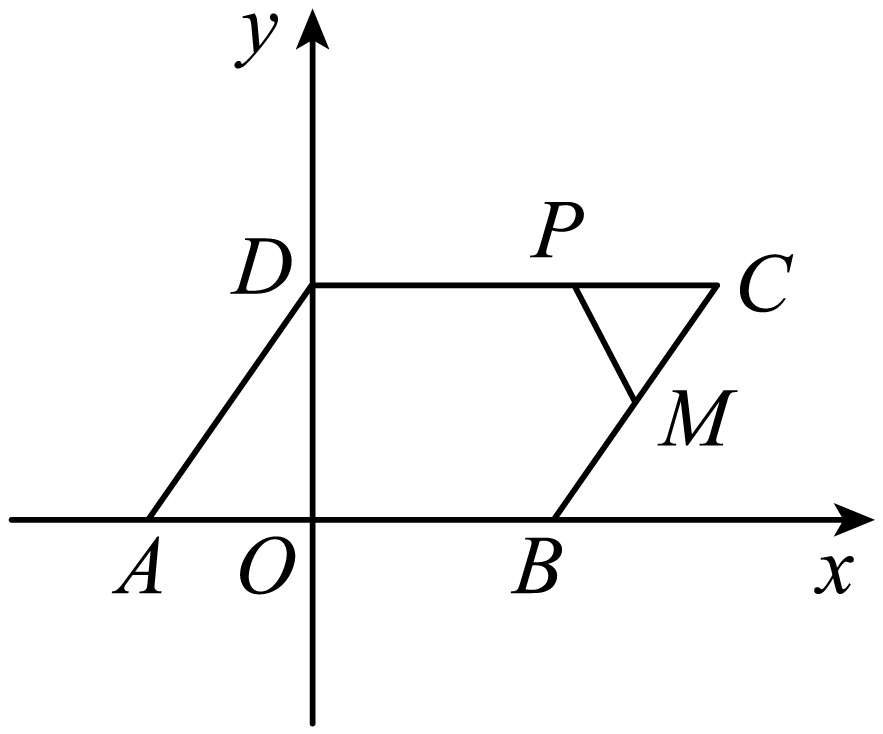
∴ $PD=7-PC=\frac{9}{2}$ ，
∴此时点*P* $\left(\frac{9}{2},4\right)$ ；
当*P<text style="italic">M*</text>=*CM*时，过点M作*M<text style="italic">G*</text>⊥*PC*于点G，则 $CG=\frac{3}{2}$ ，

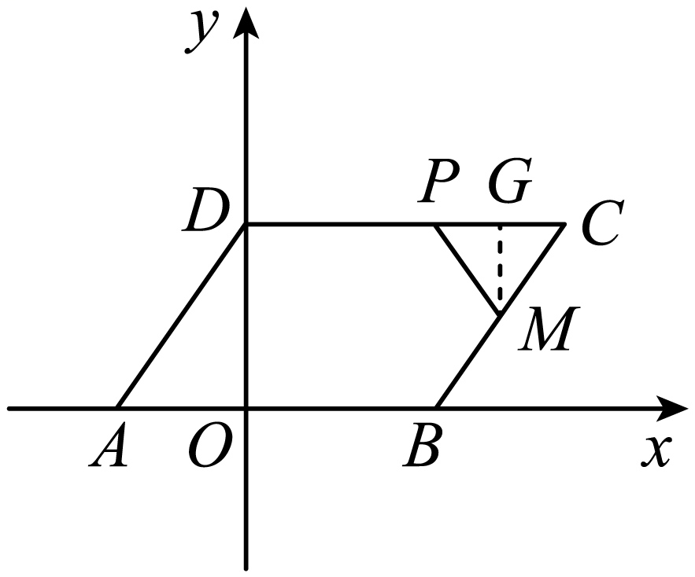
∴ $PC=2CG=3$ ，
∴*PD*=7-*PC*=4，
∴此时点*P* $\left(4,4\right)$ ；
综上所述，存在点*P* $\left(4,4\right)$ 或 $\left(\frac{9}{2},4\right)$ 或 $\left(\frac{59}{12},4\right)$ ，使 $\bigtriangleup CMP$ 是等腰三角形

【点睛】本题主要考查了平行四边形的性质，坐标与图形，等腰三角形的性质，解直角三角形，熟练掌握相关知识点，并利用数形结合思想解答是解题的关键．

22．（2023·广东广州·中考真题）如图，在正方形 $ABCD$ 中，*E*是边 $AD$ 上一动点（不与点*A*，*D*重合）．边 $BC$ 关于 $BE$ 对称的线段为 $BF$ ，连接 $AF$ ．

  
(1)若 $\angle ABE=15\circ$ ，求证： $\bigtriangleup ABF$ 是等边三角形；  
(2)延长 $FA$ ，交射线 $BE$ 于点*G*；
① $\bigtriangleup BGF$ 能否为等腰三角形？如果能，求此时 $\angle ABE$ 的度数；如果不能，请说明理由；
②若 $AB=\sqrt{3}+\sqrt{6}$ ，求 $\bigtriangleup BGF$ 面积的最大值，并求此时 $AE$ 的长．

【答案】(1)见解析  
(2)① $\bigtriangleup BGF$ 能为等腰三角形， $\angle ABE=22.5\circ$ ；② $AE=\sqrt{3}$

【分析】（1）由轴对称的性质得到 $BF=BC$ ，根据正方形的性质得到 $\angle ABC=90\circ$ ，求得 $\angle CBE=75\circ$ ，根据轴对称的性质得到 $\angle FBE=\angle CBE=75\circ$ ，根据等边三角形的判定定理即可得到结论；  
（2）①根据轴对称的性质得到 $BC=BF$ ，根据正方形的性质得到 $BC=AB$ ，得到 $BA<BE<BG$ ，推出点*B*不可能是等腰三角形 $BGF$ 的顶点，若点F是等腰三角形 $BGF$ 的顶点，则有 $\angle FGB=\angle FBG=\angle CBG$ ，此时*E*与*D*重合，不合题意，于是得到只剩下 $GF=GB$ 了，连接 $CG$ 交 $AD$ 于*H*，根据全等三角形的性质得到 $FG=CG$ ，得到 $\bigtriangleup BGF$ 为等腰三角形，根据平行线的性质得到 $\angle AHG=\angle BCG$ ，求得 $\angle BGF=\angle BGC=\frac{1}{2}\angle FGH=45\circ$ ，根据等腰三角形的性质得到 $\angle GBC=\angle GCB=\frac{1}{2}\left(180\circ -\angle BGC\right)=67.5\circ$ ，于是得到 $\angle ABE=\angle ABC-\angle GBC=90\circ -67.5\circ =22.5\circ$ ；
②由①知， $\bigtriangleup CBG\allequal \bigtriangleup FBG$ ，要求 $\bigtriangleup BGF$ 面积的最大值，即求 $\bigtriangleup BGC$ 面积的最大值，在 $\bigtriangleup BGC$ 中，底边 $BC$ 是定值，即求高的最大值即可，如图2，过*<text style="italic">G*</text>作 $GP\perp BC$ 于*P*，连接 $AC$ ，取 $AC$ 的中点*<text style="italic">M*</text>，连接 $GM$ ，作 $MN\perp BC$ 于*<text style="italic">N*</text>，设 $AB=2x$ ，则 $AC=2\sqrt{2}x$ ，根据直角三角形的性质得到 $GM=\frac{1}{2}AC=\sqrt{2}x,MN=\frac{1}{2}AB=x$ ，推出 $PG\leq GM+MN=(\sqrt{2}+1)x$ ，当当*<text style="italic">G*</text>，*<text style="italic">M*</text>，*<text style="italic">N*</text>三点共线时，取等号，于是得到结论；如图3，设 $PG$ 与 $AD$ 交于*Q*，则四边形 $ABPQ$ 是矩形，根据矩形的性质得到 $AQ=PB=x，PQ=AB=2x$ ，求得 $QM=MP=x,GM=\sqrt{2}x$ ，于是得到结论．

【详解】（1）证明：由轴对称的性质得到 $BF=BC$ ，
∵四边形 $ABCD$ 是正方形，
∴ $\angle ABC=90\circ$ ，
∵ $\angle ABE=15\circ$ ，
∴ $\angle CBE=75\circ$ ，
∵ $BC$ 于 $BE$ 对称的线段为 $BF$ ，
∴ $\angle FBE=\angle CBE=75\circ$ ，
∴ $\angle ABF=\angle FBE-\angle ABE=60\circ$ ，
∴ $\bigtriangleup ABF$ 是等边三角形；  
（2）①∵ $BC$ 于 $BE$ 对称的线段为 $BF$ ，
∴ $BF=BC$
∵四边形 $ABCD$ 是正方形，
∴ $BC=AB$ ，
∴ $BF=BC=BA$ ，
∵*E*是边 $AD$ 上一动点，
∴ $BA<BE<BG$ ，
∴点*B*不可能是等腰三角形 $BGF$ 的顶点，
若点*F*是等腰三角形 $BGF$ 的顶点，
则有 $\angle FGB=\angle FBG=\angle CBG$ ，

此时*E*与*D*重合，不合题意，
∴只剩下 $GF=GB$ 了，连接 $CG$ 交 $AD$ 于*H*，

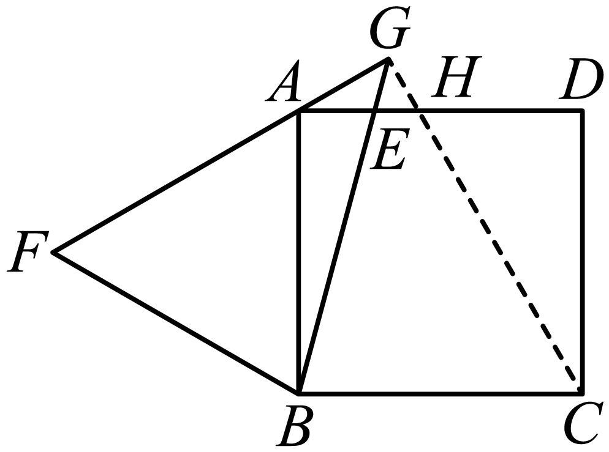
∵ $BC=BF，\angle CBG=\angle FBG，BG=BG$
∴ $\bigtriangleup CBG\allequal \bigtriangleup FBG\left(SAS\right)$
∴ $FG=CG$ ，
∴ $BG=CG$ ，
∴ $\bigtriangleup BGF$ 为等腰三角形，
∵ $BA=BC=BF$ ，
∴ $\angle BFA=\angle BAF$ ，
∵ $\bigtriangleup CBG\allequal \angle FBG$ ，
∴ $\angle BFG=\angle BCG$
∴ $AD\parallel BC$
∴ $\angle AHG=\angle BCG$
∴ $\angle BAF+\angle HAG=\angle AHG+\angle HAG=180\circ －\angle BAD=90\circ$
∴ $\angle FGC=180\circ -\angle HAG-\angle AHG=90\circ$ ，
∴ $\angle BGF=\angle BGC=\frac{1}{2}\angle FGH=45\circ$
∵ $GB=GC$
∴ $\angle GBC=\angle GCB=\frac{1}{2}\left(180\circ -\angle BGC\right)=67.5\circ$
∴ $\angle ABE=\angle ABC-\angle GBC=90\circ -67.5\circ =22.5\circ$ ；
②由①知， $\bigtriangleup CBG\allequal \bigtriangleup FBG$

要求 $\bigtriangleup BGF$ 面积的最大值，即求 $\bigtriangleup BGC$ 面积的最大值，
在 $\bigtriangleup BGC$ 中，底边 $BC$ 是定值，即求高的最大值即可，

如图2，过*G*作 $GP\perp BC$ 于*P*，连接 $AC$ ，取 $AC$ 的中点*M*，连接 $GM$ ，作 $MN\perp BC$ 于*N*，

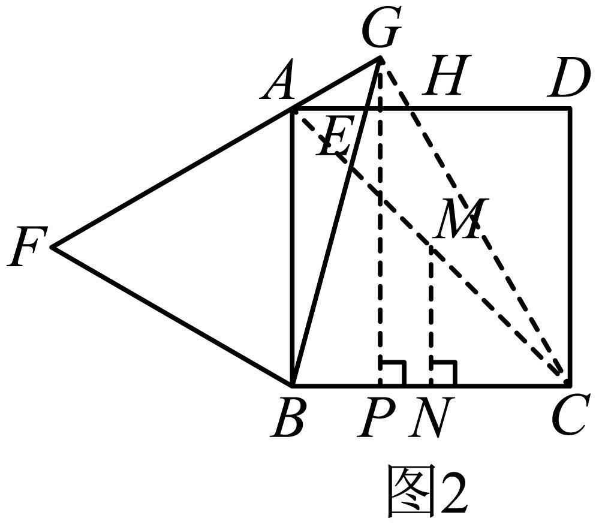
设 $AB=2x$ ，则 $AC=2\sqrt{2}x$ ，
∵ $\angle AGC=90\circ$ ，*M*是 $AC$ 的中点，
∴ $GM=\frac{1}{2}AC=\sqrt{2}x,MN=\frac{1}{2}AB=x$ ，
∴ $PG\leq GM+MN=(\sqrt{2}+1)x$ ，
当*G*，*M*，*N*三点共线时，取等号，
∴ $\bigtriangleup BGF$ 面积的最大值，
$\bigtriangleup BGF$ 的面积 $=\frac{1}{2}BC\cdot PG$
$=\left(\sqrt{2}+1\right)x^{2}$
$=\frac{1}{4}\left(\sqrt{2}+1\right)\times \left(\sqrt{3}+\sqrt{6}\right)^{2}$
$=\frac{21+15\sqrt{2}}{4}$

如图3，设 $PG$ 与 $AD$ 交于*Q*，

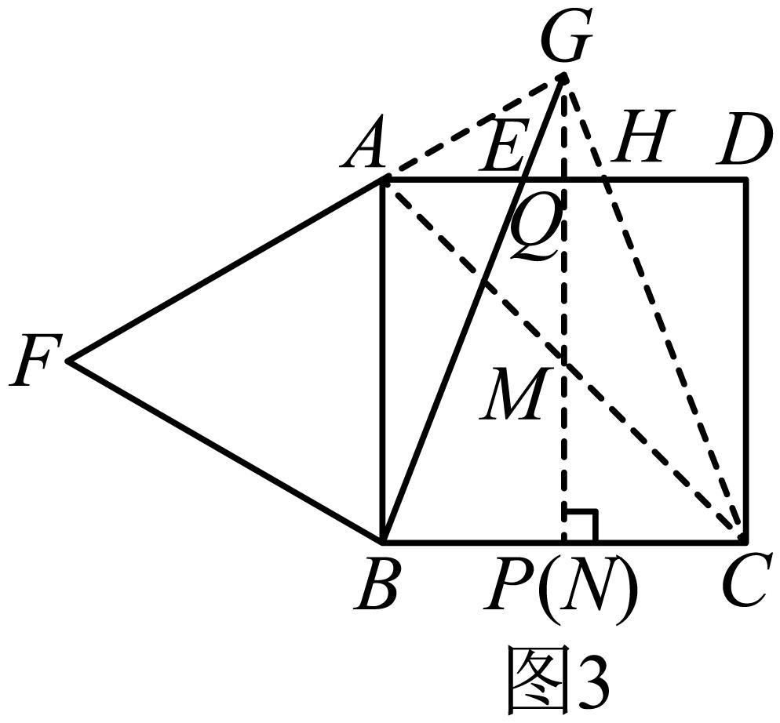
则四边形 $ABPQ$ 是矩形，
∴ $AQ=PB=x，PQ=AB=2x$ ，
∴ $QM=MP=x,GM=\sqrt{2}x$ ，
∴ $GQ=\frac{1}{2}\left(\sqrt{2}-1\right)$ ，
∵ $QE+AE=AQ=x$ ，
∴ $\frac{AQ}{AE}=\frac{\sqrt{2}+1}{2}$ ，
∴ $AE=2(\sqrt{2}-1)x$  $=2(\sqrt{2}-1)\times \frac{1}{2}\left(\sqrt{3}+\sqrt{6}\right)=\sqrt{3}$ ．

【点睛】此题是四边形的综合题，考查了正方形的性质，全等三角形的判定和性质，旋转的性质，轴对称的性质，正确地作出辅助线是解题的关键．

## 题型08  直角三角形存在问题

23．（2022·贵州安顺·中考真题）如图1，在矩形 $ABCD$ 中， $AB=10$ ， $AD=8$ ， $E$ 是 $AD$ 边上的一点，连接 $CE$ ，将矩形 $ABCD$ 沿 $CE$ 折叠，顶点 $D$ 恰好落在 $AB$ 边上的点 $F$ 处，延长 $CE$ 交 $BA$ 的延长线于点 $G$ ．

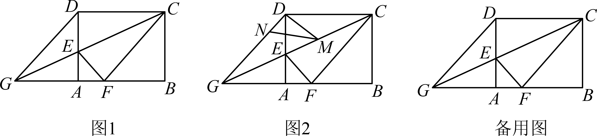  
(1)求线段 $AE$ 的长；  
(2)求证四边形 $DGFC$ 为菱形；  
(3)如图2， $M$ ， $N$ 分别是线段 $CG$ ， $DG$ 上的动点（与端点不重合），且 $\angle DMN=\angle DCM$ ，设 $DN=x$ ，是否存在这样的点 $N$ ，使 $\bigtriangleup DMN$ 是直角三角形？若存在，请求出 $x$ 的值；若不存在，请说明理由．

【答案】(1) $AE=3$  
(2)见解析  
(3)存在， $x=2$ 或 $2.5$

【分析】（1）根据在 $Rt\bigtriangleup AEF$ 中， $AE^{2}+AF^{2}=EF^{2}$ ，根据矩形的折叠与勾股定理即可求解；  
（2）根据（1）的结论分别求得 $GF,DG$ ，根据四边相等的四边形是菱形即可得证；  
（3）分 $\angle NDM=90\circ$ 和 $\angle DNM=90\circ$ 两种情况分别讨论即可求解．

【详解】（1）解：如图

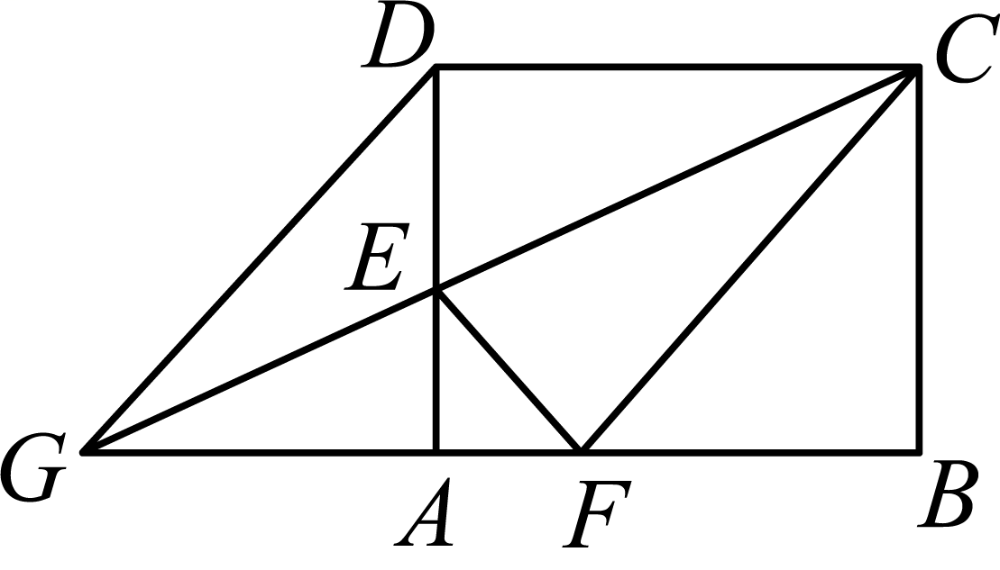
$\because$ 四边形 $ABCD$ 是矩形， $AB=10$ ， $AD=8$ ，
$\therefore AD=BC=8,DC=AB=10$ ， $\angle DAB=\angle B=90\circ$ ，
$\because$ 将矩形 $ABCD$ 沿 $CE$ 折叠，顶点 $D$ 恰好落在 $AB$ 边上的点 $F$ 处，
$\therefore CF=CD=10$ ，
在 $Rt\bigtriangleup BCF$ 中， $BF=\sqrt{CF^{2}-BC^{2}}=\sqrt{10^{2}-8^{2}}=6$ ，
$\therefore AF=AB-BF=10-6=4$ ，
设 $AE=a$ ，则 $DE=EF=8-a$ ，
在 $Rt\bigtriangleup AEF$ 中， $AE^{2}+AF^{2}=EF^{2}$ ，
$a^{2}+4^{2}=\left(8-a\right)^{2}$ ，
解得 $a=3$ ，
$\therefore AE=3$ ；  
（2） $\because$  $DE=AD-AE=8-3=5$ ，
$\therefore tan\angle DCE=\frac{DE}{CD}=\frac{5}{10}=\frac{1}{2}$ ，
$\because$ 四边形 $ABCD$ 是矩形，
$\therefore DC\parallel GB$ ，
$\therefore \angle EGA=\angle DCE$ ，
$\therefore tan\angle EGA=\frac{EA}{GA}=\frac{1}{2}$ ，
$\because EA=3$ ，
$\therefore GA=6$ ，
$Rt\bigtriangleup GAD$ 中， $DG=\sqrt{AG^{2}+AD^{2}}=\sqrt{6^{2}+8^{2}}=10$ ，
$\therefore FG=GA+AF=6+4=10$ ，
$\therefore GD=DC=CF=GF$ ，
$\therefore$ 四边形 $DGFC$ 为菱形；  
（3） $\because$  $\angle DMN=\angle DCM$ ，设 $DN=x$ ， $\bigtriangleup DMN$ 是直角三角形
设 $\angle DMN=\angle DCM=\alpha$
由（2）可得 $tan\angle DCM=\frac{1}{2}$
$\therefore =\frac{1}{2}tan\angle DMN$

①当 $\angle DNM=90\circ$ 时，如图，

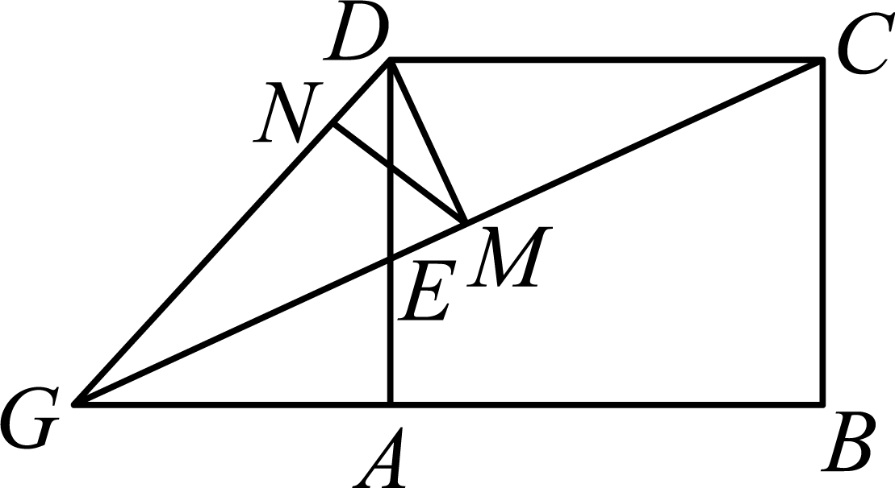
$\therefore DN=\frac{1}{2}NM$ ， $\angle GNM=90\circ$ ,
$\because GD=CD$
$\therefore \angle DGM=\angle DCM=\alpha$
$\therefore \angle NMG=90\circ -\alpha$
$\therefore \angle DMG=90\circ -\alpha +\alpha =90\circ$
$\because DG=DC=10$
$\because tan\angle DGM=tan\alpha =\frac{1}{2}$
$\therefore GN=2NM$
$\therefore 10-x=2\times 2x$
解得 $x=2$ ；
②当 $\angle NDM=90\circ$ 时，
同理可得 $DN=\frac{1}{2}DM,DM=\frac{1}{2}GD$
$\therefore ND=\frac{1}{4}DG=\frac{5}{2}$

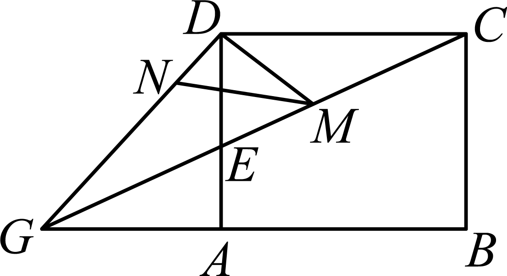
综上所述， $ND=2$ 或 $2.5$

【点睛】本题考查了矩形的性质，折叠的性质，勾股定理，解直角三角形，菱形的判定，掌握以上知识是解题的关键．

24．（2024·山东东营·二模）在人教版八年级下册教材“实验与探究——丰富多彩的正方形”中，我们研究正方形的性质时用到了图①、图②两个图形，图②为大小不等的两个正方形如图排列，整个图形被切割为5部分，受这两个图形的启发，三个数学兴趣小组分别提出了以下问题，请你回答：

【问题一】“启智”小组提出问题：如图①，正方形 $ABCD$ 的对角线相交于点 $O$ ，点 $O$ 又是正方形 $A_{1}B_{1}C_{1}O$ 的一个顶点， $OA_{1}$ 交 $AB$ 于点 $E$ ， $OC_{1}$ 交 $BC$ 于点 $F$ ，则 $AE$ 与 $BF$ 的数量关系为；
【问题二】受图①启发，“善思”小组继续探究，画出了图③：直线 $m$ 、 $n$ 经过正方形 $ABCD$ 的对称中心 $O$ ，直线 $m$ 分别与 $AD$ 、 $BC$ 交于点 $E$ 、 $F$ ，直线 $n$ 分别与 $AB、CD$ 交于点 $G、H$ ，且 $m\perp n$ ，若正方形 $ABCD$ 边长为10，求四边形 $OEAG$ 的面积；
【问题三】受图②启发，“智慧”小组继续探究，画出了图④：正方形 $CEFG$ 的顶点 $G$ 在正方形 $ABCD$ 的边 $CD$ 上，顶点 $E$ 在 $BC$ 的延长线上，且 $BC=12$ ， $CE=4$ ．在直线 $BE$ 上是否存在点 $P$ ，使 $\bigtriangleup APF$ 为直角三角形？若存在，请直接写出 $BP$ 的长度；若不存在，说明理由．

【答案】问题一： $AE=BF$ ；问题二：25；问题三： $BP$ 的长度为4或6或12或14

【分析】问题一：利用 $ASA$ 判断出 $\bigtriangleup AOE\allequal \bigtriangleup BOF$ ，即可得出答案；
问题二：先求出 $S_{\bigtriangleup AOB}=25$ ，再利用 $ASA$ 判断出 $\bigtriangleup AOE\allequal \bigtriangleup BOG$ ，即可求出答案；
问题三：分三种情况：利用三垂线构造出相似三角形，得出比例式求解，即可求出答案．

【详解】解：问题一：∵正方形 $ABCD$ 的对角线相交于点*O*，
∴ $OA=OB$ ， $\angle OAB=\angle OBA=45\circ$ ， $\angle AOB=90\circ$ ，
∵四边形 $A_{1}B_{1}C_{1}O$ 是正方形，
∴ $\angle EOF=90\circ$ ，
∴ $\angle AOE=\angle BOF$ ，
∴ $\bigtriangleup AOE\allequal \bigtriangleup BOF\left(ASA\right)，$
∴ $AE=BF$ ，
故答案为： $AE=BF$ ；
问题二：如图③，

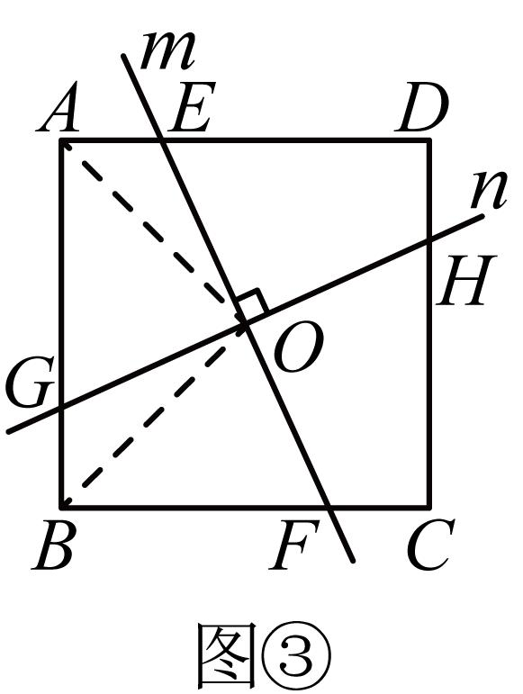

连接 $OA，OB$ ，
∵点*O*是正方形 $ABCD$ 的中心，
∴ $S_{\bigtriangleup AOB}=\frac{1}{4}S_{正方形ABCD}=\frac{1}{4}\times 10^{2}=25$ ，
∵点*O*是正方形 $ABCD$ 的中心，
∴ $\angle OAE=\angle OBG=45\circ$ ， $OA=OB$ ， $\angle AOB=90\circ$ ，
∵ $m\perp n$ ，
∴ $\angle EOG=90\circ$ ，
∴ $\angle AOE=\angle BOG$ ，
∴ $\bigtriangleup AOE\allequal \bigtriangleup BOG\left(ASA\right)，$
∴ $S_{\bigtriangleup AOE}=S_{\bigtriangleup BOG}$ ，
∴ $S_{四边形OEAG}=S_{\bigtriangleup AOE}+S_{\bigtriangleup AOG}=S_{\bigtriangleup BOG}+S_{\bigtriangleup AOG}=S_{\bigtriangleup AOB}=25$ ；
问题三：在直线 $BE$ 上存在点*P*，使 $\bigtriangleup APF$ 为直角三角形，

①当 $\angle AFP=90\circ$ 时，如图④，延长 $EF，AD$ 相交于点*Q*，

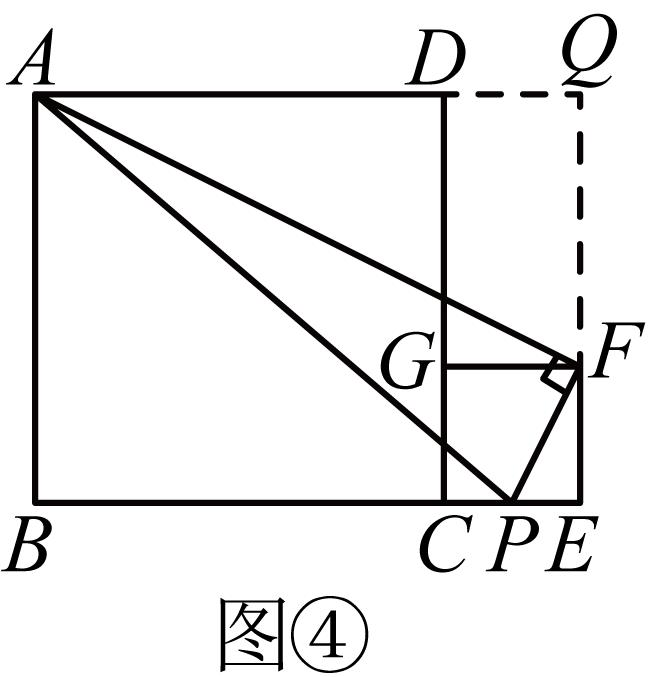
∵四边形 $ABCD$ 和四边形 $CEFG$ 是正方形，
∴ $EQ=AB=12$ ， $\angle BAD=\angle B=\angle E=90\circ$ ，
∴四边形 $ABEQ$ 是矩形，
∴ $AQ=BE=BC+CE=16$ ， $EQ=AB=12$ ， $\angle Q=90\circ =\angle E$ ，
∴ $\angle EFP+\angle EPF=90\circ$ ，
∵ $\angle AFP=90\circ$ ，
∴ $\angle EFP+\angle AFQ=90\circ$ ，
∴ $\bigtriangleup EFP\backsim \bigtriangleup QAF$ ，
∴ $\frac{EP}{QF}=\frac{EF}{AQ}$ ，
∵ $QF=EQ-EF=12-4=8$ ，
∴ $\frac{EP}{8}=\frac{4}{16}$ ，
∴ $EP=2$ ，
∴ $BP=BE-EP=16-2=14$ ；
②当 $\angle APF=90\circ$ 时，如图⑤，

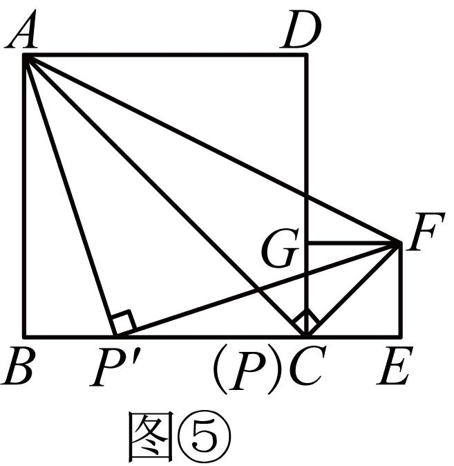

同①的方法得， $\bigtriangleup ABP\backsim \bigtriangleup PEF$ ，
∴ $\frac{AB}{PE}=\frac{BP}{EF}$ ，
∵ $PE=BE-BP=16-BP$ ，
∴ $\frac{12}{16-BP}=\frac{BP}{4}$ ，
∴ $BP=4$ 或 $BP=12$ ；
③当 $\angle PAF=90\circ$ 时，如图⑥，

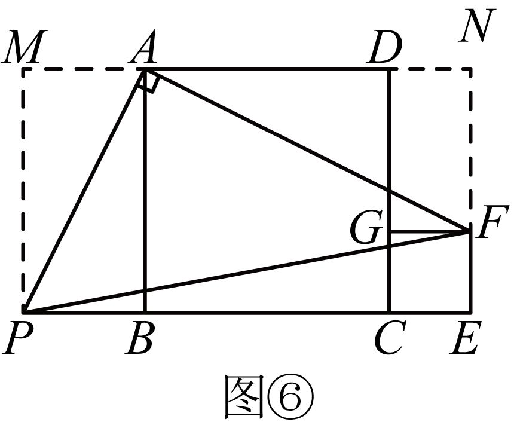

过点*P*作 $AB$ 的平行线交 $DA$ 的延长线于*M*，延长 $EF，AD$ 相交于*N*，

同①的方法得，四边形 $ABPM$ 是矩形，
∴ $PM=AB=12$ ， $AM=BP$ ， $\angle M=90\circ$ ，

同①的方法得，四边形 $ABEN$ 是矩形，
∴ $AN=BE=16$ ， $EN=AB=12$ ，
∴ $FN=EN-EF=8$ ，

同①的方法得， $\bigtriangleup AMP\backsim \bigtriangleup FNA$ ，
∴ $\frac{PM}{AN}=\frac{AM}{FN}$ ，
∴ $\frac{12}{16}=\frac{AM}{8}$ ，
∴ $AM=6$ ，
∴ $BP=6$ ，
即 $BP$ 的长度为4或6或12或14．

【点睛】此题是几何变换综合题，主要考查了正方形的性质，矩形的判定和性质，全等三角形的判定和性质，相似三角形的判定和性质，作出辅助线构造出相似三角形和全等三角形是解本题的关键．

25．（2024·新疆乌鲁木齐·一模）如图，在 $\bigtriangleup ABC$ 中， $AB=AC$ ， $AD\perp BC$ 于点<*t*ext style="italic">D</text>， $BC=10cm$ ， $AD=8cm$ ，点<*t*ext style="italic">*<text style="italic">P*</text></text>从点*B*出发，在线段 $BC$ 上以每秒 $3cm$ 的速度向点<*t*ext style="italic">*C*</text>匀速运动，与此同时，垂直于 $AD$ 的直线<*t*ext style="italic">*m*</text>从底边 $BC$ 出发，以每秒 $2cm$ 的速度沿 $DA$ 方向匀速平移，分别交 $AB$ 、 $AC$ 、 $AD$ 于<*t*ext style="italic">E</text>、*F*、*H*，当点*<text style="italic"><text style="italic">P*</text></text>到达点*<text style="italic">C*</text>，点P与直线*<text style="italic">m*</text>同时停止运动，设运动时间为t秒 $\left(t>0\right)$ ．

  
(1) $AH=$ \_\_\_\_\_\_\_\_\_\_， $EF=$ \_\_\_\_\_\_\_\_\_\_（用含*t*的式子表示）．  
(2)在整个运动过程中，所形成的 $\bigtriangleup PEF$ 的面积存在最大值，当 $\bigtriangleup PEF$ 的面积最大时，求线段 $BP$ 的长；  
(3)是否存在某一时刻<*t*ext style="italic">t</text>，使 $\bigtriangleup PEF$ 为直角三角形？若存在，请求出此时刻<*t*ext style="italic">t</text>的值；若不存在，请说明理由．

【答案】(1) $8-2t$ ； $10-\frac{5}{2}t$  
(2) $BP=6cm$  
(3)当 $t=\frac{40}{17}$ 秒或 $t=\frac{280}{183}$ 秒时， $\bigtriangleup PEF$ 为直角三角形

【分析】（1）根据运动求出 $AH=8-2t$ ，证明 $\bigtriangleup AEF\backsim \bigtriangleup ABC$ ，得出 $\frac{EF}{BC}=\frac{AH}{AD}$ ，求出 $EF=10-\frac{5}{2}t$ 即可；  
（2）先求出 $\bigtriangleup PEF$ 的面积的表达式，然后利用二次函数的性质求解；  
（3）分三种情况，利用平行线分线段成比例及勾股定理求解即可．

【详解】（1）解：根据题意可知， $DH=2t$ ， $AH=8-2t$ ，
∵ $EF\parallel BC$ ，
∴ $\bigtriangleup AEF\backsim \bigtriangleup ABC$ ，
$\therefore \frac{EF}{BC}=\frac{AH}{AD}$ ，
即 $\frac{EF}{10}=\frac{8-2t}{8}$ ，
解得： $EF=10-\frac{5}{2}t$ ；  
（2）解： $S_{\bigtriangleup PEF}=\frac{1}{2}EF\cdot DH=\frac{1}{2}\left(10-\frac{5}{2}t\right)\cdot 2t=-\frac{5}{2}\left(t-2\right)^{2}+10\left(0<t<\frac{10}{3}\right)$ ，
$\therefore$ 当 $t=2$ 秒时， $S_{\bigtriangleup PEF}$ 存在最大值，最大值为 $10cm^{2}$ ，此时 $BP=3t=6cm$ ．

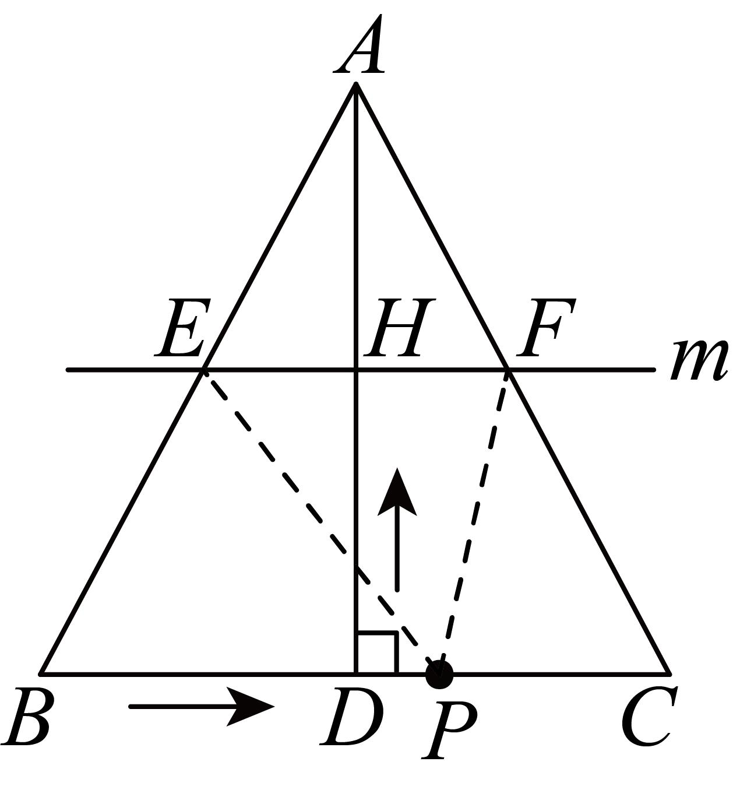  
（3）解：存在，分三种情况，具体如下：

①若点 $E$ 为直角顶点，如图：

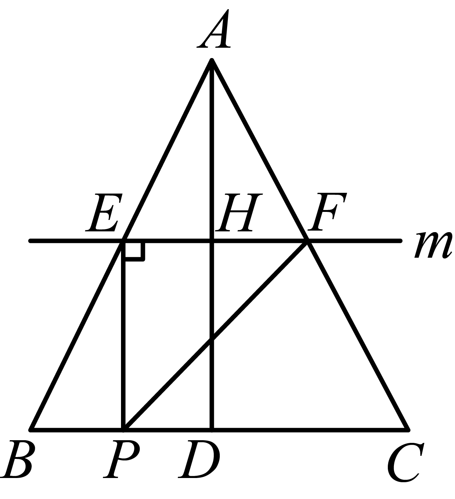

此时， $PE\parallel AD$ ， $PE=DH=2t$ ， $BP=3t$
$\because PE\parallel AD$
$\therefore \frac{PE}{AD}=\frac{BP}{BD}$ ，即 $\frac{2t}{8}=\frac{3t}{5}$ ，

此比例不成立，故不存在这种情况；
②若 $F$ 为直角顶点，如图：

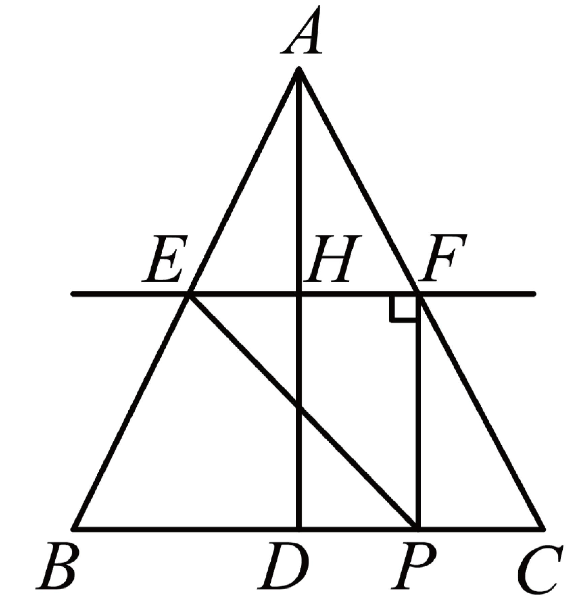

此时， $PF\parallel AD$ ， $PF=DH=2t$ ， $BP=3t$ ， $CP=10-3t$ ，
$\because$  $PF\parallel AD$ ，
$\therefore \frac{PF}{AD}=\frac{CP}{CD}$ ，即 $\frac{2t}{8}=\frac{10-3t}{5}$ ，
解得 $t=\frac{40}{17}$ ；
③若 $P$ 为直角顶点，如图：

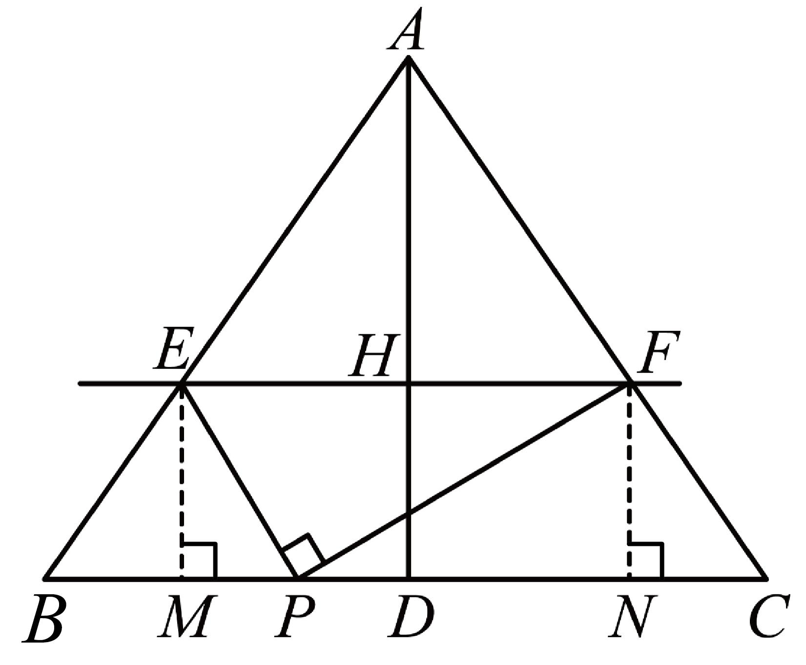

过点 $E$ 作 $EM\perp BC$ 于点 $M$ ，过点 $F$ 作 $FN\perp BC$ 于点 $N$ ，则：
$EM=FN=DH=2t$ ， $EM\parallel FN\parallel AD$
$\because EM\parallel AD$ ，
$\therefore \frac{EM}{AD}=\frac{BM}{BD}$ ，即 $\frac{2t}{8}=\frac{BM}{5}$
解得 $BM=\frac{5}{4}t$ ，
$\therefore PM=BP-BM=3t-\frac{5}{4}t=\frac{7}{4}t$ ，
$\therefore FE^{2}=EM^{2}+PM^{2}=\left(2t\right)^{2}+\left(\frac{7}{4}t\right)^{2}=\frac{113}{16}t^{2}$ ，
$\because FN\parallel AD$
$\therefore \frac{FN}{AD}=\frac{CN}{CD}$ ，即 $\frac{2t}{8}=\frac{CN}{5}$ ，
解得 $CN=\frac{5}{4}t$ ，
$\therefore PN=BC-BP-CN=10-3t-\frac{5}{4}t=10-\frac{17}{4}t$ ，
$\therefore PF^{2}=FN^{2}+PN^{2}=\left(2t\right)^{2}+\left(10-\frac{17}{4}t\right)^{2}=\frac{353}{16}t^{2}-85t^{2}+100$ ，
$\because EF^{2}=PE^{2}+PF^{2}$ ，
$\therefore \left(10-\frac{5}{2}t\right)^{2}=\frac{113}{16}t^{2}+\left(\frac{353}{16}t^{2}-85t+100\right)$
解得 $t=\frac{280}{183}$ 或 $t=0$ （舍去）．

综上，当 $t=\frac{40}{17}$ 秒或 $t=\frac{280}{183}$ 秒时， $\bigtriangleup PEF$ 为直角三角形．

【点睛】本题是运动型的综合题，考查动点及动线两种运动类型，涉及相似三角形、图形面积、二次函数极值和勾股定理等知识，重点考查分类讨论数学思想．

## 题型09  平行四边形存在问题

26．（2022·湖北荆州·一模）如图，抛物线 $y=ax^{2}+bx-3$ 与 $x$ 轴交于 $A、B$ 两点，点 $A$ 在点 $B$ 的左侧，且 $A\left(-1,0\right),B\left(4,0\right)$ ，与 $y$ 轴交于点 $C$ ，连结 $BC$ ，以 $BC$ 为边，点 $O$ 为中心作菱形 $BDEC$ ，点 $P$ 是 $x$ 轴上的一个动点，设点 $P$ 的坐标为 $\left(m,0\right)$ ．

  
(1)求该抛物线对应的函数解析式；  
(2) $x$ 轴上是否存在一点 $P$ ，使 $\bigtriangleup PBC$ 为等腰三角形？若存在，请直接写出点 $P$ 的坐标；若不存在，请说明理由；  
(3)当点 $P$ 在线段 $OB$ 上运动时，过点 $P$ 作 $x$ 轴的垂线交抛物线于点 $Q$ ，交 $BD$ 于点 $M$ ．试探究：当 $m$ 为何值时，四边形 $CQMD$ 是平行四边形？请说明理由．

【答案】(1) $y=\frac{1}{2}x^{2}-\frac{3}{2}x-2$  
(2)存在， $(\frac{3}{2}，0)$ ， $(4+2\sqrt{5}，0)$ ， $(4-2\sqrt{5}，0)$ ， $(-4，0)$  
(3) $m=2$ ，理由见解析

【分析】本题考查待定系数法求解析式，勾股定理，二次函数图象及性质，等腰三角形性质，平行四边形性质等．  
（1）抛物线与 $x$ 轴交于 $A(-1，0)，B(4，0)$ 两点，故抛物线的表达式为∶ $y=a\left(x+1\right)\left(x-4\right)=a\left(x^{2}-3x-4\right)$ ，即 $a=\frac{1}{2}$ ，即可求解；  
（2）分 $PB=PC、PB=BC、PC=BC$ 三种情况，分别求解即可；  
（3）直线 $BD$ 的解析式为 $y=-\frac{1}{2}x+2$ ，当 $MQ=DC$ 时，四边形 $CQMD$ 是平行四边形

，则 $\left(-\frac{1}{2}m+2\right)-(\frac{1}{2}m^{2}-\frac{3}{2}m-2)=2-\left(-2\right)$ 即可求解．

【详解】（1）解：抛物线 $y=ax^{2}+bx-2$ 与 $x$ 轴交于 $A(-1，0)，B(4，0)$ 两点，
设抛物线的表达式为∶ $y=a\left(x+1\right)\left(x-4\right)=a\left(x^{2}-3x-4\right)$ ，
即 $-4a=-2$ ，解得∶ $a=\frac{1}{2}$ ，

抛物线的解析式为∶ $y=\frac{1}{2}x^{2}-\frac{3}{2}x-2$ ；  
（2）解：设点 $P$ 的坐标为 $(m，0)$ ，
则 $PB^{2}=\left(m-4\right)^{2}$ ， $PC^{2}=m^{2}+4$ ， $BC^{2}=20$ ，

①当 $PB=PC$ 时， $\left(m-4\right)^{2}=m^{2}+4$ ，解得∶ $m=\frac{3}{2}$ ；
②当 $PB=BC$ 时，同理可得∶ $m=4\pm 2\sqrt{5}$ ；
③当 $PC=BC$ 时，同理可得∶ $m=\pm 4$ (舍去4)，故： $m=-4$ ，
故点 $P$ 的坐标为∶ $(\frac{3}{2}，0)$ ， $(4+2\sqrt{5}，0)$ ， $(4-2\sqrt{5}，0)$ ， $(-4，0)$ ；  
（3）解：∵ $C(0，-2)$ ，
∴由菱形的对称性可知，点 $D$ 的坐标为 $(0，2)$ ，
设直线 $BD$ 的解析式为 $y=kx+2(k\ne 0)$ ，又 $B(4，0)$ ，
解得： $k=-\frac{1}{2}$ ，
∴直线 $BD$ 的解析式为： $y=-\frac{1}{2}x+2$ ，
则点M的坐标为： $(m，-\frac{1}{2}m+2)$ ，

点Q的坐标为 $(m，\frac{1}{2}m^{2}-\frac{3}{2}m-2)$ ，

如图，当 $MQ=DC$ 时，四边形 $CQMD$ 是平行四边形
∴ $\left(-\frac{1}{2}m+2\right)-(\frac{1}{2}m^{2}-\frac{3}{2}m-2)=2-\left(-2\right)$ ，
解得： $m_{1}=0$  (不合题意舍去)， $m_{2}=2$ ，
∴当 $m=2$ 时，四边形 $CQMD$ 是平行四边形．

27．（2023·黑龙江鸡西·模拟预测）在平面直角坐标系中，边长为4的菱形的顶点 $B$ ， $C$ 在 $x$ 轴上， $D$ 在 $y$ 轴上，如图，已知 $\angle A=60\circ$ ， $C\left(2,0\right)$ .

  
(1)求点 $D$ 的坐标  
(2)动点 $P$ 从点 $A$ 出发，以每秒1个单位速度沿射线 $AD$ 运动，过点 $P$ 作 $PE\perp x$ 轴于 $E$ ，直线 $PE$ 交直线 $CD$ 于点 $Q$ ，设 $\bigtriangleup PCQ$ 的面积为 $S$ ，点 $P$ 的运动时间为 $t$ 秒，当点 $Q$ 在 $x$ 轴上方时，求 $S$ 与 $t$ 的关系式，直接写出 $t$ 的取值范围.  
(3)在（2）的条件下，连接 $CP$ ，当点 $Q$ 在第一象限， $\bigtriangleup PCQ$ 为等腰三角形时，作 $\angle PQC$ 的平分线交射线 $AD$ 于点 $M$ ，此时是否存在点 $N$ ，使以点 $D$ ， $Q$ ， $M$ ， $N$ 为顶点的四边形是平行四边形？若存在，请求出点 $N$ 的坐标，若不存在，说明理由.

【答案】(1) $D\left(0,2\sqrt{3}\right)$  
(2) $-\frac{\sqrt{3}}{2}t^{2}+5\sqrt{3}t-12\sqrt{3}$  
(3)满足条件的点 $N$ 的坐标 $\left(16-4\sqrt{3},12-6\sqrt{3}\right)$ 或 $\left(-4\sqrt{3},12-6\sqrt{3}\right)$ 或 $\left(4\sqrt{3},10\sqrt{3}-12\right)$

【分析】（1）在 $Rt\Delta ODC$ 中，解直角三角形求出 $OD$ 即可解决问题；  
（2）分两种情形分别求解①当 $0<t<4$ 时，如图2中．②当 $4<t<6$ 时，如图3中．求出 $PQ$ 、 $EC$ 即可；  
（3）如图4中，作 $CH\perp AD$ 于 $H$ ，在 $CH$ 上截取一点 $G$ ，使得 $GP=GC$ ，连接 $PG$ ．由 $PE\parallel CH$ ，推出 $\angle PCG=\angle QPC=\angle GPC=15\circ$ ，推出 $\angle PGH=30\circ$ ，设 $PH=m$ ，则 $PG=GC=2x$ ， $GH=\sqrt{3}x$ ，可得 $\sqrt{3}x+2x=2\sqrt{3}$ ，推出 $x=4\sqrt{3}-6$ ，推出 $P(8-4\sqrt{3}$ ， $2\sqrt{3})$ ， $Q(8-4\sqrt{3}$ ， $12-6\sqrt{3})$ ，可得直线 $PC$ 的解析式为 $y=-(\sqrt{3}+2)x+4+2\sqrt{3}$ ，由 $QM$ 平分 $\angle PQC$ ，推出 $QM\perp PC$ ，推出可得直线 $QM$ 的解析式为 $y=(2-\sqrt{3})x+10\sqrt{3}-16$ ，令 $y=2\sqrt{3}$ ，可得 $x=8$ ，可得 $M(8$ ， $2\sqrt{3})$ ，设 $N(x,y)$ ，再分三种情形分别求解即可解决问题．

【详解】（1）如图1中，

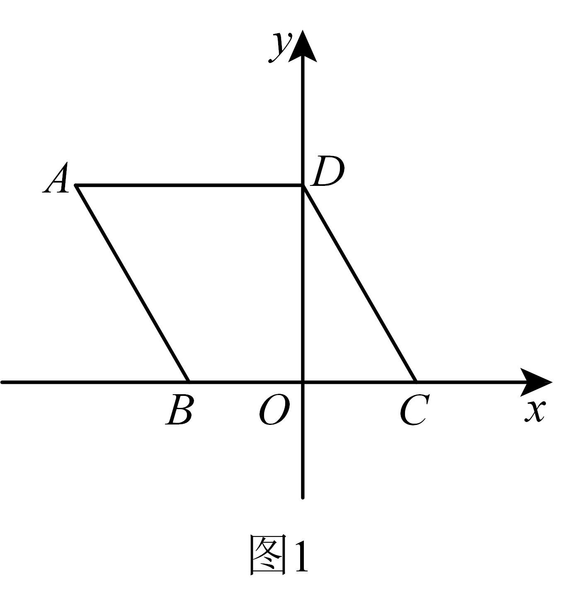
$\because$ 四边形 $ABCD$ 是菱形，
$\therefore \angle DCO=\angle A=60\circ$ ，
在 $Rt\Delta DOC$ 中， $OD=OC\cdot tan60\circ =2\sqrt{3}$ ，
$\therefore D(0$ ， $2\sqrt{3})$ ．  
（2）①当 $0<t<4$ 时，如图2中，

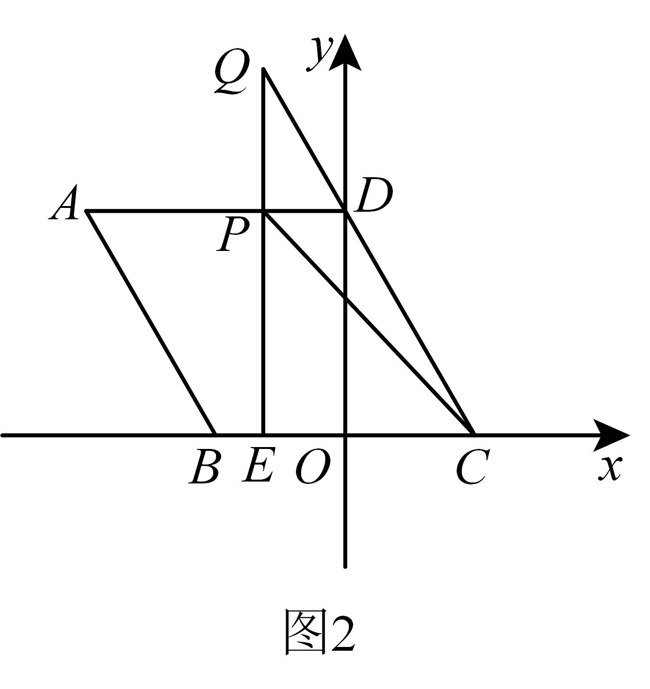
$\because C(2,0)$ ， $D(0$ ， $2\sqrt{3})$ ，
$\therefore$ 直线 $CD$ 的解析式为 $y=-\sqrt{3}x+2\sqrt{3}$ ，
$\therefore AP=t$ ， $AD=4$ ，
$\therefore PD=4-t$ ，
$\therefore P(t-4$ ， $2\sqrt{3})$ ， $Q(t-4,-\sqrt{3}t+6\sqrt{3})$ ，
$\therefore PQ=-\sqrt{3}t+4\sqrt{3}$ ， $CE=6-t$ ，
$\therefore S=\frac{1}{2}\cdot PQ\cdot EC=\frac{1}{2}\cdot (-\sqrt{3}t+4\sqrt{3})(6-t)=\frac{\sqrt{3}}{2}t^{2}-5\sqrt{3}t+12\sqrt{3}$ ．

②当 $4<t<6$ 时，如图3中，

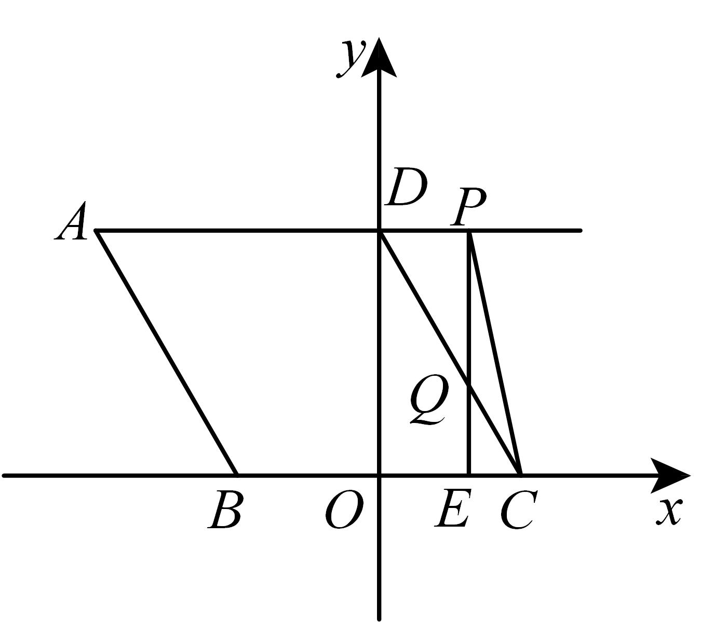

易知： $P(t-4$ ， $2\sqrt{3})$ ， $Q(t-4,-\sqrt{3}t+6\sqrt{3})$ ，
$\therefore PQ=\sqrt{3}t-4\sqrt{3}$ ， $CE=6-t$ ，
$\therefore S=\frac{1}{2}\cdot PQ\cdot EC=\frac{1}{2}\cdot (\sqrt{3}t-4\sqrt{3})(6-t)=-\frac{\sqrt{3}}{2}t^{2}+5\sqrt{3}t-12\sqrt{3}$ ．  
（3）如图4中，作 $CH\perp AD$ 于 $H$ ，在 $CH$ 上截取一点 $G$ ，使得 $GP=GC$ ，连接 $PG$ ．

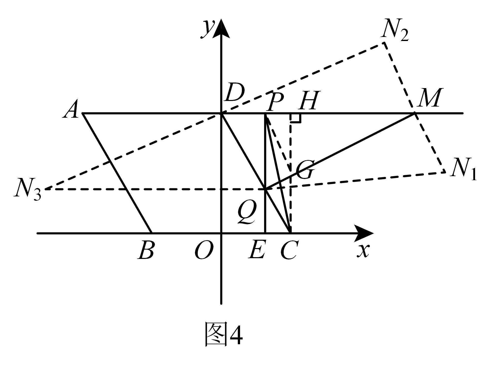
$\because QP=QC$ ， $\angle CQE=30\circ$ ，
$\therefore \angle QCP=\angle QPC=15\circ$ ，
$\because PE\parallel CH$ ，
$\therefore \angle PCG=\angle QPC=\angle GPC=15\circ$ ，
$\therefore \angle PGH=30\circ$ ，设 $PH=m$ ，则 $PG=GC=2x$ ， $GH=\sqrt{3}x$ ，
$\therefore$  $\sqrt{3}x+2x=2\sqrt{3}$ ，
$\therefore x=4\sqrt{3}-6$ ，
$\therefore P(8-4\sqrt{3}$ ， $2\sqrt{3})$ ， $Q(8-4\sqrt{3}$ ， $12-6\sqrt{3})$ ，
$\therefore$ 直线 $PC$ 的解析式为 $y=-(\sqrt{3}+2)x+4+2\sqrt{3}$ ，
$\because QM$ 平分 $\angle PQC$ ，
$\therefore QM\perp PC$ ，
$\therefore$ 可得直线 $QM$ 的解析式为 $y=(2-\sqrt{3})x+10\sqrt{3}-16$ ，
令 $y=2\sqrt{3}$ ，可得 $x=8$ ，
$\therefore M(8$ ， $2\sqrt{3})$ ，设 $N(x,y)$ ，

①当 $QM$ 为对角线时， $x=8-4\sqrt{3}+8=16-4\sqrt{3}$ ， $y=12-6\sqrt{3}$ ，可得 $N_{1}(16-4\sqrt{3}$ ， $12-6\sqrt{3})$ ．

②当 $DQ$ 为对角线时， $x=8-4\sqrt{3}-8=-4\sqrt{3}$ ， $y=12-6\sqrt{3}$ ，可得 $N_{3}(-4\sqrt{3}$ ， $12-6\sqrt{3})$ ．

③当 $DM$ 为对角线时， $\frac{8-4\sqrt{3}+x}{2}=\frac{0+8}{2}$ ， $x=4\sqrt{3}$ ，
$\frac{12-6\sqrt{3}+y}{2}=\frac{2\sqrt{3}+2\sqrt{3}}{2}$ ， $y=10\sqrt{3}-12$ ，
$\therefore N_{2}(4\sqrt{3}$ ， $10\sqrt{3}-12)$ ．
综上所述，满足条件的点 $N$ 的坐标 $(16-4\sqrt{3}$ ， $12-6\sqrt{3})$ 或 $(-4\sqrt{3}$ ， $12-6\sqrt{3})$ 或 $(4\sqrt{3}$ ， $10\sqrt{3}-12)$ ．

【点睛】本题考查一次函数综合题、菱形的性质、平行四边形的判定和性质、等腰三角形的判定和性质，两直线垂直的性质等知识，解题的关键是学会构建一次函数，解决交点问题，学会用分类讨论的思想思考问题，属于中考压轴题．

## 题型10  矩形、菱形、正方形存在问题

28．（2023·黑龙江·中考真题）如图，在平面直角坐标系中，菱形 $AOCB$ 的边 $OC$ 在<*t*e<te<text st*y*le="italic">x</text>t style="italic">x</text>t style="italic">x</text>轴上， $\angle AOC=60\circ$ ， $OC$ 的长是一元二次方程 $x^{2}-4x-12=0$ 的根，过点<*t*e<te<text st*y*le="italic">x</text>t style="italic">x</text>t style="italic">C</text>作*x*轴的垂线，交对角线 $OB$ 于点<*t*e<text st*y*le="italic">x</text>t style="italic">*D*</text>，直线 $AD$ 分别交<*t*e<te<text st*y*le="italic">x</text>t style="italic">x</text>t style="italic">x</text>轴和y轴于点*<text style="italic">F*</text>和点*<text style="italic">E*</text>，动点*M*从点*O*以每秒1个单位长度的速度沿 $OD$ 向终点<*t*e<text st*y*le="italic">x</text>t style="italic">*D*</text>运动，动点*N*从点*<text style="italic">F*</text>以每秒2个单位长度的速度沿 $FE$ 向终点<*t*ext style="italic">*E*</text>运动．两点同时出发，设运动时间为t秒．

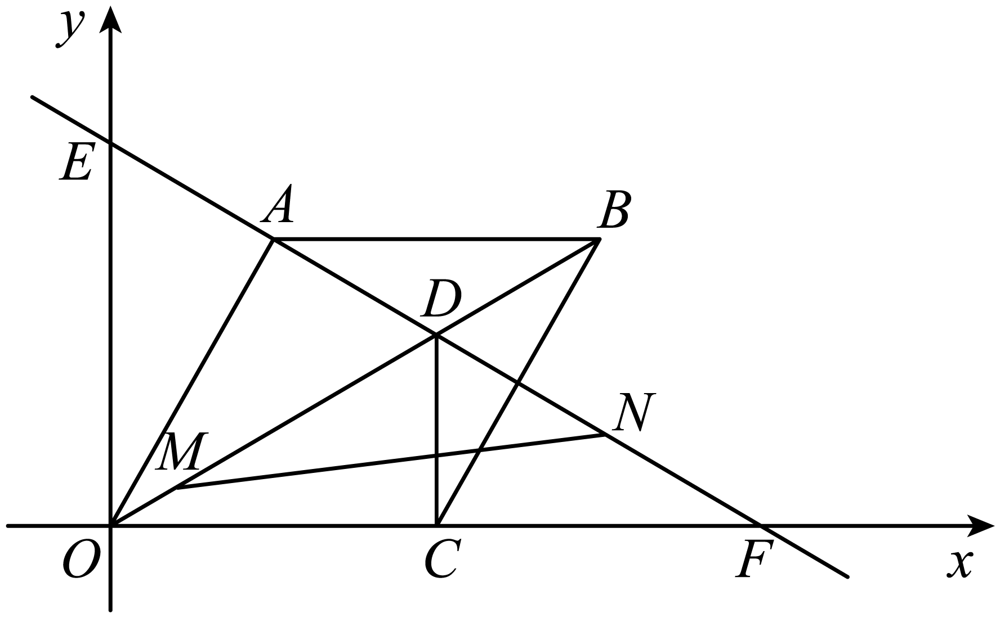  
(1)求直线 $AD$ 的解析式．  
(2)连接 $MN$ ，求 $\bigtriangleup MDN$ 的面积<*t*ext style="italic">S</text>与运动时间t的函数关系式．  
(3)点*N*在运动的过程中，在坐标平面内是否存在一点*Q*．使得以*A*，*C*，*N*，*Q*为项点的四边形是矩形．若存在，直接写出点*Q*的坐标，若不存在，说明理由．

【答案】(1) $y=-\frac{\sqrt{3}}{3}x+4\sqrt{3}$ ；  
(2) $S=\left\{\begin{array}{c}\frac{\sqrt{3}}{2}t^{2}-9t+12\sqrt{3}\left(0\leq t\leq 2\sqrt{3}\right)\\-\frac{\sqrt{3}}{2}t^{2}+9t-12\sqrt{3}\left(2\sqrt{3}<t\leq 4\sqrt{3}\right)\end{array}\right$ ；  
(3)存在，点*Q*的坐标是 $\left(\frac{3}{2},\frac{3\sqrt{3}}{2}\right)$ 或 $\left(6,4\sqrt{3}\right)$ ．

【分析】  
（1）过点*<text style="italic">A*</text>作 $AH\perp OC$ 于*H*，解方程可得 $OC=6$ ，然后解直角三角形求出 $CD$ 、 $OH$ 和 $AH$ 的长，得到点*<text style="italic">A*</text>、*D*的坐标，再利用待定系数法求出解析式即可；  
（2）首先证明 $\bigtriangleup EOD$ 是等边三角形，求出 $DO=DF=4\sqrt{3}$ ，然后分情况讨论：①当点*<text style="italic"><text style="italic"><text style="italic">N*</text></text></text>在 $DF$ 上，即 $0\leq t\leq 2\sqrt{3}$ 时，过点*<text style="italic"><text style="italic"><text style="italic">N*</text></text></text>作 $NP\perp OB$ 于*P*，②当点*<text style="italic"><text style="italic"><text style="italic">N*</text></text></text>在 $DE$ 上，即 $2\sqrt{3}<t\leq 4\sqrt{3}$ 时，过点*<text style="italic"><text style="italic"><text style="italic">N*</text></text></text>作 $NT\perp OB$ 于*T*，分别解直角三角形求出 $NP$ 和 $NT$ ，再利用三角形面积公式列式即可；  
（3）分情况讨论：①当 $AN$ 是直角边时，则 $CN\perp EF$ ，过点*<text style="italic">N*</text>作 $NK\perp CF$ 于*K*，首先求出 $CN$ ，然后解直角三角形求出 $CK$ 和 $NK$ ，再利用平移的性质得出点*<text style="italic">Q*</text>的坐标；②当 $AN$ 是对角线时，则 $\angle ACN=90\circ$ ，过点*<text style="italic">N*</text>作 $NL\perp CF$ 于*L*，证明 $\angle NCF=\angle NFC$ ，可得 $CL=FL=3$ ，然后解直角三角形求出 $NL$ ，再利用平移的性质得出点*<text style="italic">Q*</text>的坐标．

【详解】（1）解：解方程 $x^{2}-4x-12=0$ 得： $x_{1}=6$ ， $x_{2}=-2$ ，
∴ $OC=6$ ，
∵四边形 $AOCB$ 是菱形， $\angle AOC=60\circ$ ，
∴ $OA=OC=6$ ， $\angle BOC=\frac{1}{2}\angle AOC=30\circ$ ，
∴ $CD=OC\cdot tan30\circ =6\times \frac{\sqrt{3}}{3}=2\sqrt{3}$ ，
∴ $D\left(6,2\sqrt{3}\right)$ ，

过点*A*作 $AH\perp OC$ 于*H*，
∵ $\angle AOH=60\circ$ ，
∴ $OH=\frac{1}{2}OA=3$ ， $AH=OA\cdot sin60\circ =6\times \frac{\sqrt{3}}{2}=3\sqrt{3}$ ，
∴ $A\left(3,3\sqrt{3}\right)$ ，
设直线 $AD$ 的解析式为 $y=kx+b\left(k\ne 0\right)$ ，
代入 $A\left(3,3\sqrt{3}\right)$ ， $D\left(6,2\sqrt{3}\right)$ 得： $\left\{\begin{array}{c}3k+b=3\sqrt{3}\\6k+b=2\sqrt{3}\end{array}\right$ ，
解得： $\left\{\begin{array}{c}k=-\frac{\sqrt{3}}{3}\\b=4\sqrt{3}\end{array}\right$ ，
∴直线 $AD$ 的解析式为 $y=-\frac{\sqrt{3}}{3}x+4\sqrt{3}$ ；
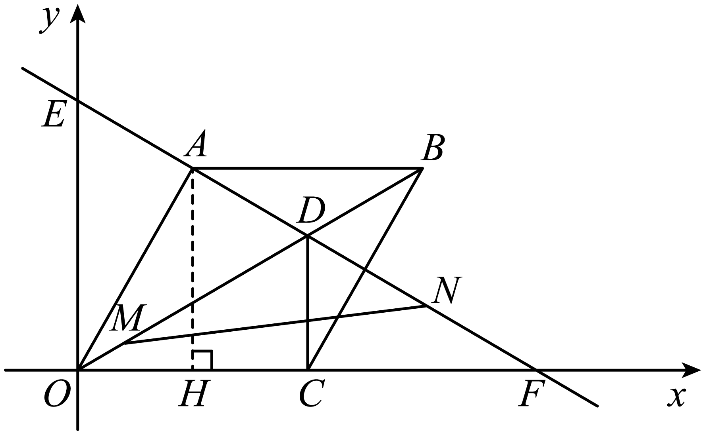  
（2）解：由（1）知在 $Rt\bigtriangleup COD$ 中， $CD=2\sqrt{3}$ ， $\angle DOC=30\circ$ ，
∴ $OD=2CD=4\sqrt{3}$ ， $\angle EOD=90\circ -\angle DOC=90\circ -30\circ =60\circ$ ，
∵直线 $y=-\frac{\sqrt{3}}{3}x+4\sqrt{3}$ 与 *y*轴交于点*E*，
∴ $OE=4\sqrt{3}$ ，
∴ $OE=OD$ ，
∴ $\bigtriangleup EOD$ 是等边三角形，
∴ $\angle OED=\angle EDO=\angle BDF=60\circ$ ， $ED=OD=4\sqrt{3}$ ，
∴ $\angle OFE=30\circ =\angle DOF$ ，
∴ $DO=DF=4\sqrt{3}$ ，

①当点*N*在 $DF$ 上，即 $0\leq t\leq 2\sqrt{3}$ 时，
由题意得： $DM=OD-OM=4\sqrt{3}-t$ ， $DN=4\sqrt{3}-2t$ ，

过点*N*作 $NP\perp OB$ 于*P*，
则 $NP=DN\cdot sin\angle PDN=DN\cdot sin60\circ =\left(4\sqrt{3}-2t\right)\times \frac{\sqrt{3}}{2}=6-\sqrt{3}t$ ，
∴ $S=\frac{1}{2}DM\cdot NP=\frac{1}{2}\left(4\sqrt{3}-t\right)\left(6-\sqrt{3}t\right)=\frac{\sqrt{3}}{2}t^{2}-9t+12\sqrt{3}$ ；
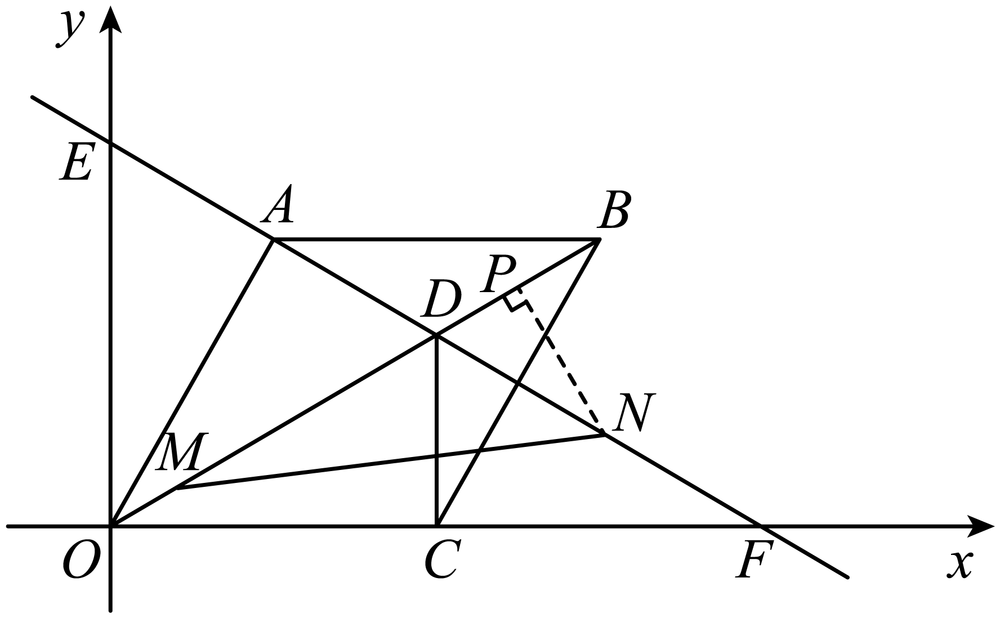

②当点*N*在 $DE$ 上，即 $2\sqrt{3}<t\leq 4\sqrt{3}$ 时，
由题意得： $DM=OD-OM=4\sqrt{3}-t$ ， $DN=2t-4\sqrt{3}$ ，

过点*N*作 $NT\perp OB$ 于*T*，
则 $NT=DN\cdot sin\angle NDT=DN\cdot sin60\circ =\left(2t-4\sqrt{3}\right)\times \frac{\sqrt{3}}{2}=\sqrt{3}t-6$ ，
∴ $S=\frac{1}{2}DM\cdot NT=\frac{1}{2}\left(4\sqrt{3}-t\right)\left(\sqrt{3}t-6\right)=-\frac{\sqrt{3}}{2}t^{2}+9t-12\sqrt{3}$ ；
综上， $S=\left\{\begin{array}{c}\frac{\sqrt{3}}{2}t^{2}-9t+12\sqrt{3}\left(0\leq t\leq 2\sqrt{3}\right)\\-\frac{\sqrt{3}}{2}t^{2}+9t-12\sqrt{3}\left(2\sqrt{3}<t\leq 4\sqrt{3}\right)\end{array}\right$ ；
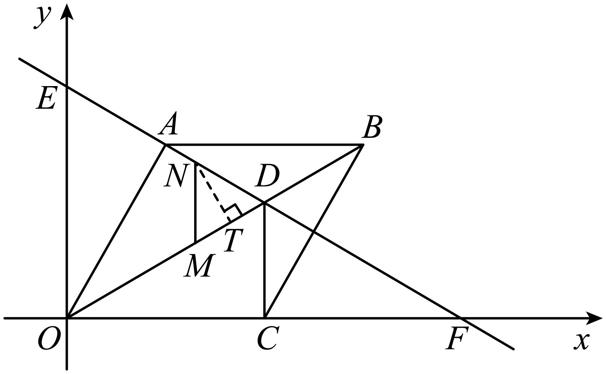  
（3）解：存在，分情况讨论：

①如图，当 $AN$ 是直角边时，则 $CN\perp EF$ ，过点*N*作 $NK\perp CF$ 于*K*，
∵ $\angle NFC=30\circ$ ， $OE=4\sqrt{3}$ ，
∴ $\angle NCK=60\circ$ ， $OF=\sqrt{3}OE=12$ ，
∴ $CF=12-6=6$ ，
∴ $CN=\frac{1}{2}CF=3$ ，
∴ $CK=CN\cdot cos60\circ =3\times \frac{1}{2}=\frac{3}{2}$ ， $NK=CN\cdot sin60\circ =3\times \frac{\sqrt{3}}{2}=\frac{3\sqrt{3}}{2}$ ，
∴将点*N*向左平移 $\frac{3}{2}$ 个单位长度，再向下平移 $\frac{3\sqrt{3}}{2}$ 个单位长度得到点*C*，
∴将点*A*向左平移 $\frac{3}{2}$ 个单位长度，再向下平移 $\frac{3\sqrt{3}}{2}$ 个单位长度得到点*Q*，
∵ $A\left(3,3\sqrt{3}\right)$ ，
∴ $Q\left(\frac{3}{2},\frac{3\sqrt{3}}{2}\right)$ ；
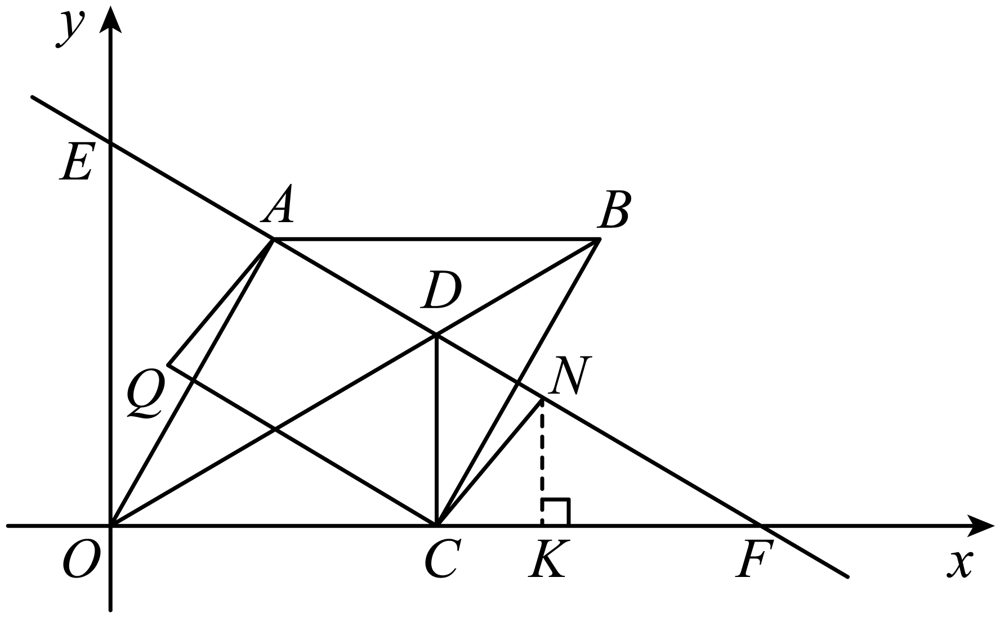

②如图，当 $AN$ 是对角线时，则 $\angle ACN=90\circ$ ，过点*N*作 $NL\perp CF$ 于*L*，
∵ $OA=OC$ ， $\angle AOC=60\circ$ ，
∴ $\bigtriangleup AOC$ 是等边三角形，
∴ $\angle ACO=60\circ$ ，
∴ $\angle NCF=180\circ -60\circ -90\circ =30\circ =\angle NFC$ ，
∴ $CL=FL=\frac{1}{2}CF=3$ ，
∴ $NL=CL\cdot tan30\circ =3\times \frac{\sqrt{3}}{3}=\sqrt{3}$ ，
∴将点*C*向右平移3个单位长度，再向上平移 $\sqrt{3}$ 个单位长度得到点*N*，
∴将点*A*向右平移3个单位长度，再向上平移 $\sqrt{3}$ 个单位长度得到点*Q*，
∵ $A\left(3,3\sqrt{3}\right)$ ，
∴ $Q\left(6,4\sqrt{3}\right)$ ；
∴存在一点*<text style="italic"><text style="italic">Q*</text></text>，使得以*A*，*C*，*N*，Q为顶点的四边形是矩形，点Q的坐标是 $\left(\frac{3}{2},\frac{3\sqrt{3}}{2}\right)$ 或 $\left(6,4\sqrt{3}\right)$ ．

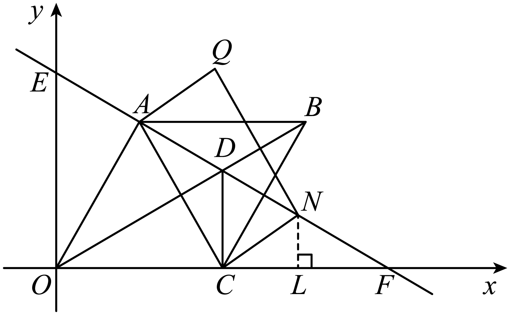

【点睛】本题考查了解一元二次方程，菱形的性质，解直角三角形，待定系数法的应用，等边三角形的判定和性质，含 $30\circ$ 直角三角形的性质，二次函数的应用，矩形的判定和性质以及平移的性质等知识，灵活运用各知识点，作出合适的辅助线，熟练掌握数形结合思想与分类讨论思想的应用是解题的关键．

29．（2024·河北张家口·一模）如图，在 $Rt\bigtriangleup ABC$ 中， $\angle ABC=90\circ$ ， $AB=6$ ， $tan\angle CAB=\frac{4}{3}$ ．动点 $M$ 以每秒2个单位的速度从点 $A$ 出发，沿着 $A\rightarrow B\rightarrow C$ 的方向运动，当点 $M$ 到达点 $C$ 时，运动停止．点 $N$ 是点 $M$ 关于点 $B$ 的对称点，过点 $M$ 作 $MQ\perp AC$ 于点 $Q$ ，以 $MN$ ， $MQ$ 为邻边作平行四边形 $MNPQ$ ，设点 $M$ 的运动时间为 $t$ 秒．

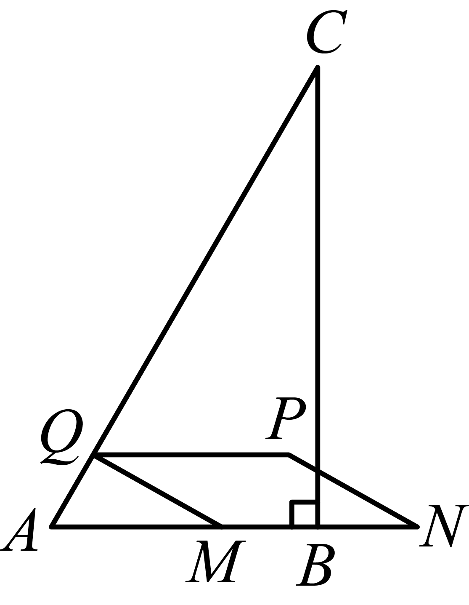  
(1)求 $BC$ 的长；  
(2)当 $t=2$ 时，求证： $QP=AM$ ；  
(3)是否存在这样的 $t$ 值，使得平行四边形 $MNPQ$ 为菱形？若存在，请求出 $t$ 值；若不存在，请说明理由．

【答案】(1) $BC=8$ ；  
(2)证明见解析  
(3)存在；当 $t=\frac{15}{7}$ 或 $\frac{51}{13}$ 时，四边形 $MNPQ$ 为菱形

【分析】（1）由锐角三角函数的定义即可得出答案；  
（2）当 $t=2$ 时，点 $M$ 在线段 $AB$ 上，求出 $AM$ 、 $BM$ 即可得出结果；  
（3）①当点 $M$ 在边 $AB$ 上时，证明 $\bigtriangleup AQM\backsim \bigtriangleup ABC$ ，得出 $\frac{AM}{AC}=\frac{MQ}{BC}$ ，求出 $MQ=\frac{8}{5}t$ ， $MN=2BM=12-4t$ ，当 $MQ=MN$ 时，即 $\frac{8}{5}t=12-4t$ ，解得 $t=\frac{15}{7}$ ；
②当点 $M$ 在边 $BC$ 上时，证明 $\bigtriangleup CMQ\backsim \bigtriangleup CAB$ ，得出 $\frac{CM}{AC}=\frac{MQ}{AB}$ ，求出 $MQ=\frac{3}{5}(14-2t)$ ，当 $MN=MQ$ 时，即 $2(2t-6)=\frac{3}{5}(14-2t)$ ，解得 $t=\frac{51}{13}$ ．

【详解】（1）解： $\because$ 在 $Rt\bigtriangleup ABC$ 中， $\angle ABC=90\circ$ ， $AB=6$ ， $tan\angle CAB=\frac{4}{3}$ ，
$\therefore tan\angle CAB=\frac{BC}{AB}$ ，
$\therefore$  $\frac{4}{3}=\frac{BC}{6}$ ，
解得： $BC=8$ ；  
（2）解：当 $t=2$ 时， $AM=4$ ，
$\therefore MB=AB-AM=6-4=2$ ，
$\because M$ 、 $N$ 关于点 $B$ 对称，
$\therefore BM=BN$ ，
$\therefore MN=2BM=4$ ；
$\because$ 四边形 $MNPQ$ 为平行四边形，
$\therefore QP=MN=4$ ，
$\therefore QP=AM$ ；  
（3）解：存在，理由如下：
在 $Rt\bigtriangleup ABC$ 中，由勾股定理得： $AC=\sqrt{AB^{2}+BC^{2}}=\sqrt{6^{2}+8^{2}}=10$ ，

①当点 $M$ 在边 $AB$ 上时，如图1所示：

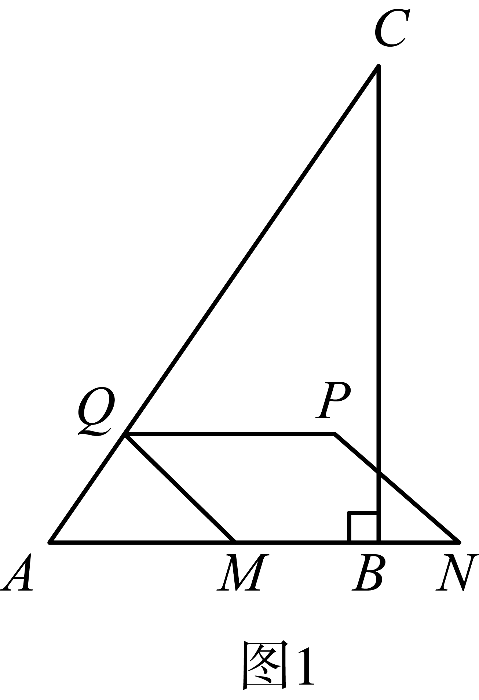
$\because MQ\perp AC$ ，
$\therefore \angle AQM=\angle ABC=90\circ$ ，
$\because \angle QAM=\angle BAC$ ，
$\therefore \bigtriangleup AQM\backsim \bigtriangleup ABC$ ，
$\therefore$  $\frac{AM}{AC}=\frac{MQ}{BC}$ ，
$\because AM=2t$ ，
$\therefore$  $\frac{2t}{10}=\frac{MQ}{8}$ ，
$\therefore MQ=\frac{8}{5}t$ ，
$\because BM=AB-AM=6-2t$ ，
$\therefore MN=2BM=12-4t$ ，
当 $MQ=MN$ 时，即 $\frac{8}{5}t=12-4t$ ，
解得： $t=\frac{15}{7}$ ；
②当点 $M$ 在边 $BC$ 上时，如图2所示：

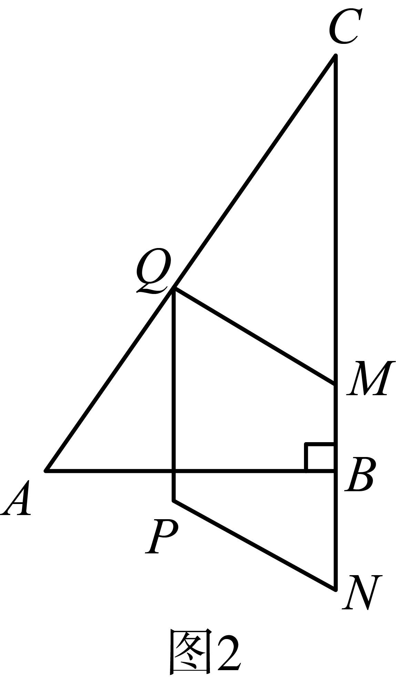
$\because MQ\perp AC$ ，
$\therefore \angle CQM=\angle CBA=90\circ$ ，
$\because \angle QCM=\angle BCA$ ，
$\therefore \bigtriangleup CMQ\backsim \bigtriangleup CAB$ ，
$\therefore$  $\frac{CM}{AC}=\frac{MQ}{AB}$ ，即 $\frac{6+8-2t}{10}=\frac{MQ}{6}$ ，
$\therefore MQ=\frac{3}{5}(14-2t)$ ，
当 $MN=MQ$ 时，即： $2(2t-6)=\frac{3}{5}(14-2t)$ ，
解得： $t=\frac{51}{13}$ ，
综上所述，当 $t=\frac{15}{7}$ 或 $\frac{51}{13}$ 时，四边形 $MNPQ$ 为菱形；
【点睛】本题是四边形综合题，考查了锐角三角函数的定义、平行四边形的判定与性质、菱形的判定与性质、相似三角形的判定与性质、全等三角形的判定与性质、分类讨论等知识，综合性强，注意分类讨论是解题的关键．

30．综合与探索

【探索发现】如图1，等腰直角三角形 $ABC$ 中， $\angle ACB=90\circ ,CB=CA$ ，过点 $A$ 作 $AD\perp l$ 交于点 $D$ ，过点 $B$ 作 $BE\perp l$ 交于点 $E$ ，易得 $\bigtriangleup ADC\allequal \bigtriangleup CEB$ ，我们称这种全等模型为“ $k$ 型全等”．（不需要证明）

【迁移应用】如图2，在直角坐标系中，直线 $l_{1}:y=2x+4$ 分别与 $y$ 轴， $x$ 轴交于点 $A、B$ ，  
（1）直接写出 $OA=$ \_\_\_\_\_\_\_\_\_， $OB=$ \_\_\_\_\_\_\_\_\_；  
（2）在第二象限构造等腰直角 $\bigtriangleup ABE$ ，使得 $\angle BAE=90\circ$ ，则点 $E$ 的坐标为\_\_\_\_\_\_\_\_\_；
  
（3）如图3，将直线 $l_{1}$ 绕点 $A$ 顺时针旋转 $45\circ$ 得到 $l_{2}$ ，求 $l_{2}$ 的函数表达式；

【拓展应用】  
（4）如图4，直线 $AB:y=2x+8$ 分别交 $x$ 轴和 $y$ 轴于 $A,B$ 两点，点 $C$ 在第二象限内一点，在平面内是否存在一点 $D$ ，使以 $A、B、C、D$ 为顶点的四边形为正方形？若存在，请直接写出点 $D$ 的坐标；若不存在，请说明理由．

【答案】（1）4，2；（2） $\left(-4,6\right)$ ；（3） $y=\frac{1}{3}x+4$ ；（4）存在，点*D*的坐标为 $\left(-12,4\right)$ 或 $\left(-8,12\right)$ 或 $\left(2,2\right)$

【分析】（1）在 $y=2x+4$ 中，分别令 $x=0，y=0$ 即可求得*A*，*B*的坐标，从而求得 $OA，OB$ 的长；  
（2）过点*<text style="italic">E*</text>作 $EM\perp y$ 轴于*M*，构造“ $k$ 型全等”即可求得点*<text style="italic">E*</text>的坐标；  
（3）过点*B*作 $BC\perp l_{1}$ 交 $l_{2}$ 于点*<text style="italic"><text style="italic">C*</text></text>，过点C作 $CN\perp x$ 轴于点*N*，这样构造了“ $k$ 型全等”，即可求得点*<text style="italic"><text style="italic">C*</text></text>的坐标，用待定系数法即可求得直线 $l_{2}$ 的函数表达式；  
（4）分三种情况考虑，构造“ $k$ 型全等”即可求得点*D*的坐标．

【详解】解：（1）在 $y=2x+4$ 中，分别令 $x=0，y=0$ ，得 $y=4，x=-2$ ，即点*A*的坐标为 $(0,4)$ ，点*B*的坐标为 $(-2,0)$ ，
∴ $OA=4，OB=2$ ，
故答案为：4，2；  
（2）过点*E*作 $EM\perp y$ 轴于*M*，如图，
则 $\angle AEM+\angle EAM=90\circ$ ，
∵ $EA\perp AB$ ，
∴ $\angle EAM+\angle BAO=90\circ$ ，
∴ $\angle AEM=\angle BAO$ ，
∵ $AB=AE$ ， $\angle EMA=\angle AOB=90\circ$ ，
∴ $\bigtriangleup EAM\allequal \bigtriangleup ABO$ ，
∴ $EM=OA=4，AM=OB=2$ ，
∵ $OM=OA+AM=4+2=6$ ，
∴点*E*的坐标为 $(-4,6)$ ；
故答案为： $\left(-4,6\right)$ ；
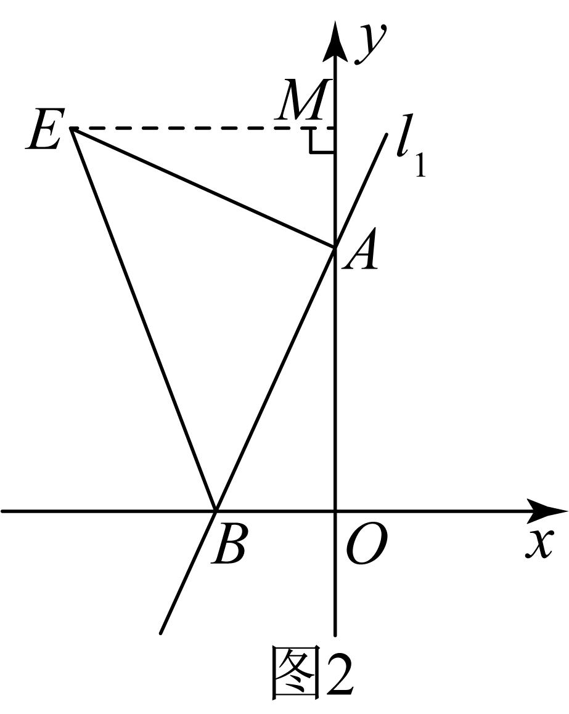  
（3）过点*B*作 $BC\perp l_{1}$ 交 $l_{2}$ 于点*<text style="italic">C*</text>，过点C作 $CN\perp x$ 轴于点*N*，如图，
则 $\angle ABO+\angle CBN=\angle ABC=90\circ$ ，
∵ $\angle ABO+\angle BAO=90\circ$ ，
∴ $\angle CBN=\angle BAO$ ；
∵ $\angle BAC=45\circ$ ，
∴ $\angle BCA=\angle BAC=45\circ$ ，
∴ $AB=BC$ ；
∵ $\angle CNB=\angle BOA=90\circ$ ，
∴ $\bigtriangleup CNB\allequal \bigtriangleup BOA$ ，
∴ $CN=OB=2，BN=OA=4$ ，
∴ $ON=OB+BN=2+4=6$ ，
∴ $C(-6,2)$ ；
设直线 $l_{2}$ 的解析式为： $y=kx+b(k\ne 0)$ ，
∵直线 $l_{2}$ 过点*A*、*C*，
∴ $\left\{\begin{array}{c}b=4\\-6k+b=2\end{array}\right$ ，解得： $\left\{\begin{array}{c}b=4\\k=\frac{1}{3}\end{array}\right$ ，
即直线 $l_{2}$ 的解析式为： $y=\frac{1}{3}x+4$ ；
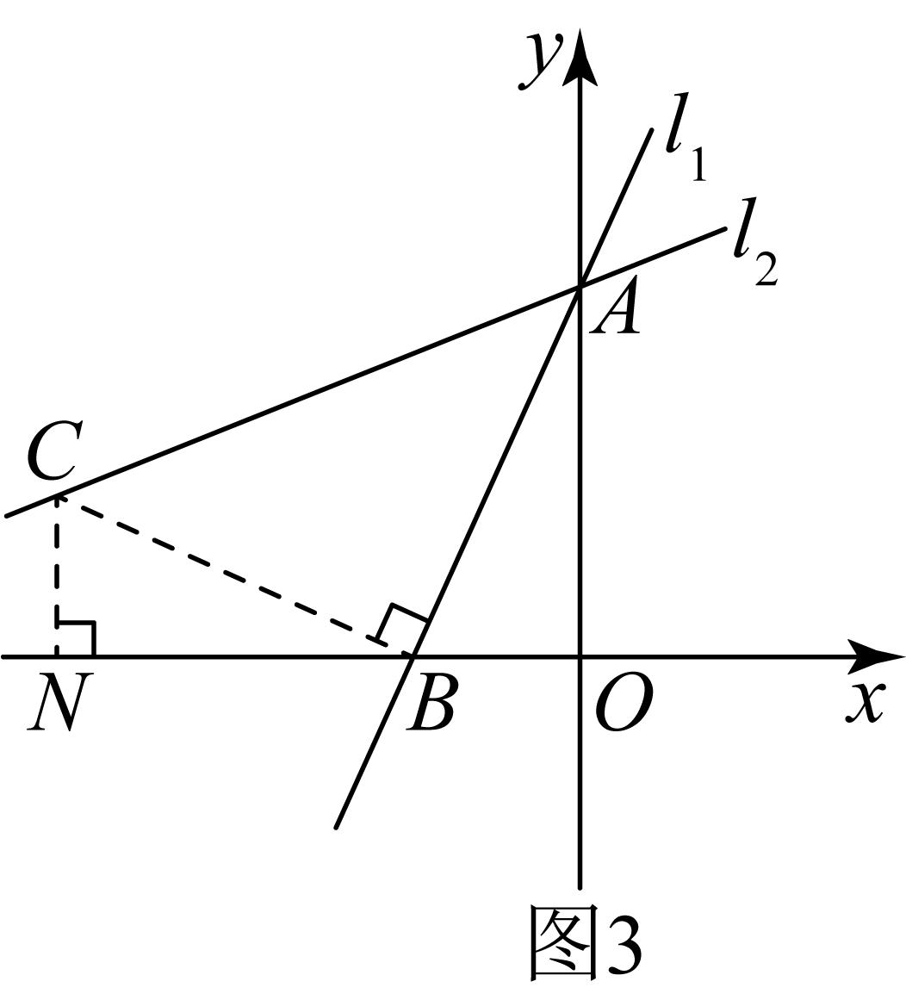  
（4）存在

对于 $y=2x+8$ ，令 $x=0$ ，得 $y=8$ ；令 $y=0$ ，得 $x=-4$ ；
∴ $OB=8，OA=4$ ；
①当 $AB$ 为正方形 $ABDC$ 的一边时，如图，分别过*D*、*C*作 $DF\perp y$ 轴于*F*， $CN\perp x$ 轴于*N*；
则 $\angle DBF+\angle ABO=90\circ$ ，
∵ $\angle ABO+\angle BAO=90\circ$ ，
∴ $\angle DBF=\angle BAO$ ；
∵ $AB=BD$ ； $\angle BFD=\angle BOA=90\circ$ ，
∴ $\bigtriangleup DFB\allequal \bigtriangleup BOA$ ，
∴ $DF=OB=8，BF=OA=4$ ，
∴ $OF=OB+BF=8+4=12$ ，
∴ $D(-8,12)$ ；
同理得 $C(-12,4)$ ；
②当 $AB$ 为正方形 $ABCD$ 的一边时，此时点*<text style="italic">D*</text>的坐标就是①中点*<text style="italic">C*</text>的坐标，点D为①中的点C，
即点*D*的坐标为 $(-12,4)$ ；
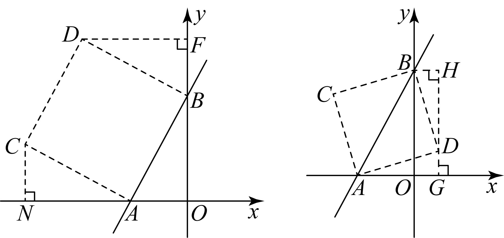

③当 $AB$ 为正方形 $ACBD$ 的对角线时，如图，

过点<te*x*t style="italic">D</text>作x轴垂线，垂足为点*G*，过*B*作 $BH\perp OG$ 于点*H*，

同理可证明 $\bigtriangleup BHD\allequal \bigtriangleup DOA$ ，
∴ $OA=DH，OD=BH$ ，
显然点*D*落在第一象限，设 $D(m,n)$ ，
则 $OD=n，OG=m$ ， $OD=BH=n$ ，
由题意得，四边形 $OBHG$ 是矩形，
∴ $GH=OB=8，OG=BH=m$ ，
∴ $GA=OA+OG=4+m，OH=OD+DH=n+4+m=8$ ，
解得： $m=n=2$ ，
即 $D(2,2)$ ；
综上，点*D*的坐标为 $\left(-12,4\right)$ 或 $\left(-8,12\right)$ 或 $\left(2,2\right)$ ．

【点睛】本题考查一次函数的图象与性质，全等三角形的判定与性质，正方形的性质，等腰三角形的判定等知识，掌握一次函数的图象与性质、全等三角形的判定与性质是解题的关键．注意分类讨论思想．

## 题型11  全等/相似存在性问题

31．（2023·广西南宁·二模）如图，在 $\bigtriangleup ABC$ 中， $AD$ 为高， $AC=18$ ．点 $E$ 为 $AC$ 上的一点， $CE=\frac{1}{2}AE$ ，连接 $BE$ ，交 $AD$ 于 $O$ ，若 $\bigtriangleup BDO\allequal \bigtriangleup ADC$ ．

  
(1)猜想线段 $BO$ 与 $AC$ 的位置关系，并证明；  
(2)有一动点 $Q$ 从点 $A$ 出发沿射线 $AC$ 以每秒6个单位长度的速度运动，设点 $Q$ 的运动时间为 $t$ 秒，是否存在 $t$ 的值，使得 $\bigtriangleup BOQ$ 的面积为27？若存在，请求出 $t$ 的值；若不存在，请说明理由；  
(3)在（2）条件下，动点 $P$ 从点 $O$ 出发沿线段 $OB$ 以每秒2个单位长度的速度向终点 $B$ 运动， $P$ 、 $Q$ 两点同时出发，当点 $P$ 到达点 $B$ 时， $P$ 、 $Q$ 两点同时停止运动，设运动时间为 $t$ 秒，点 $F$ 是直线 $BC$ 上一点，且 $CF=AO$ ，当 $\bigtriangleup AOP$ 与 $\bigtriangleup FCQ$ 全等时，求 $t$ 的值．

【答案】(1)垂直，见解析  
(2)存在， $\frac{5}{2}$  
(3) $\frac{9}{2}$ 或 $\frac{9}{4}$

【分析】（1）由全等三角形的性质得 $\angle OBD=\angle CAD$ ，再由三角形内角和定理得 $\angle AEO=\angle ODB=90\circ$ ，即可得出结论；  
（2）由全等三角形的性质得 $BO=AC=18$ ，再求出 $AE=8$ ， $CE=4$ ，①当 $0<t<1$ 时， $Q$ 在线段 $AE$ 上，然后由三角形面积公式得 $S_{\Delta BOQ}=\frac{1}{2}\times 18\times (12-6t)=27$ ，即可求解；
②当 $t>1$ 时， $Q$ 在射线 $EC$ 上，由三角形面积公式得 $S_{\Delta BOQ}=\frac{1}{2}BO\times QE=\frac{1}{2}\times 18\times (6t-12)=27$ ，即可求解；  
（3）①当点 $F$ 在线段 $BC$ 延长线上时，证 $\angle AOP=\angle QCF$ ，当 $OP=CQ$ 时， $\bigtriangleup AOP\allequal \bigtriangleup FCQ(SAS)$ ，此时 $2t=18-6t$ ，求解即可；
②当点 $F$ 在线段 $BC$ 上时，证 $\angle AOP=\angle FCQ$ ，当 $OP=CQ$ 时， $\bigtriangleup AOP\allequal \bigtriangleup FCQ(SAS)$ ，此时 $2t=6t-18$ ，求解即可．

【详解】（1） $BO\perp AC$ ，理由如下：
在 $\bigtriangleup ABC$ 中， $AD$ 为高，
$\therefore \angle ODB=90\circ$ ，
又 $\because \bigtriangleup BDO\allequal \bigtriangleup ADC$ ，
$\therefore \angle OBD=\angle CAD$ ，
$\because \angle OBD=\angle CAD$ ， $\angle BOD=\angle AOE$ ，
$\therefore \angle AEO=\angle ODB=90\circ$ ，
$\therefore BO\perp AC$ ；  
（2）存在 $t$ 的值，使得 $\bigtriangleup BOQ$ 的面积为27，理由如下：
$\because \bigtriangleup BDO\allequal \bigtriangleup ADC$ ， $AC=18$ ，
$\therefore BO=AC=18$ ，
$\because CE=\frac{1}{2}AE$ ，
$\therefore AE=12$ ， $CE=6$ ，
由（1）可知， $\angle BEC=90\circ$ ，
$\therefore BE\perp AC$ ，

分两种情况：
当 $0<t<2$ 时， $Q$ 在线段 $AE$ 上，如图1，

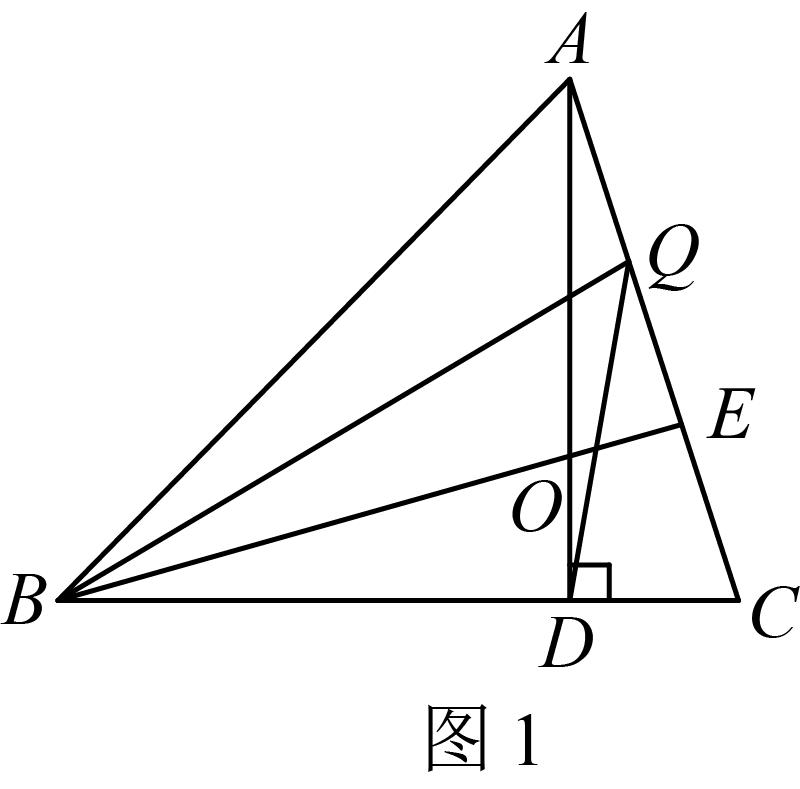
$S_{\Delta BOQ}=\frac{1}{2}BO\times QE=\frac{1}{2}\times 18\times (12-6t)=27$ ，
解得： $t=\frac{3}{2}$ （舍去）；
当 $t>2$ 时， $Q$ 在射线 $EC$ 上，如图2，

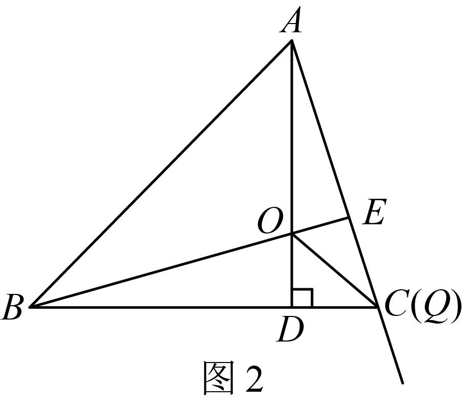
$S_{\Delta BOQ}=\frac{1}{2}BO\times QE=\frac{1}{2}\times 18\times (6t-12)=27$ ，
解得： $t=\frac{5}{2}$ ，

此时 $Q$ 与 $C$ 重合；
综上所述，存在 $t$ 的值，使得 $\bigtriangleup BOQ$ 的面积为27， $t$ 的值为 $\frac{5}{2}$ ；  
（3）由（1）可知， $\bigtriangleup BDO\allequal \bigtriangleup ADC$ ，
$\therefore \angle BOD=\angle ACD$ ，
当点 $F$ 在线段 $BC$ 延长线上时，如图3，

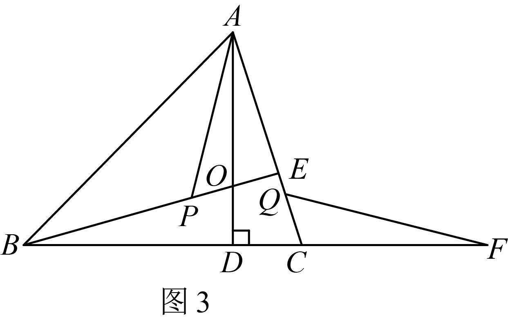
$\because \angle BOD=\angle ACD$ ，
$\therefore \angle AOP=\angle QCF$ ，
$\because AO=CF$ ，
$\therefore$ 当 $OP=CQ$ 时， $\bigtriangleup AOP\allequal \bigtriangleup FCQ(SAS)$ ，

此时， $2t=18-6t$ ，
解得： $t=\frac{9}{4}$ ；
当点 $F$ 在线段 $BC$ 上时，如图4，

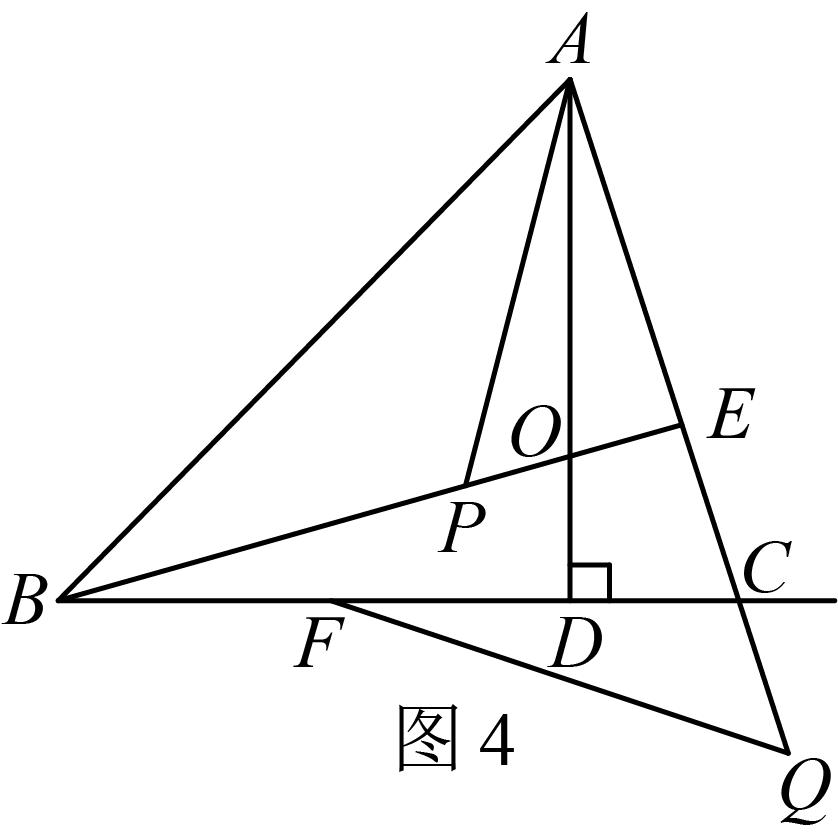
$\because \angle BOD=\angle ACD$ ，
$\therefore \angle AOP=\angle FCQ$ ，
$\because AO=CF$ ，
$\therefore$ 当 $OP=CQ$ 时， $\bigtriangleup AOP\allequal \bigtriangleup FCQ(SAS)$ ，

此时， $2t=6t-18$ ，
解得： $t=\frac{9}{2}$ ；
综上所述，当 $\bigtriangleup AOP$ 与 $\bigtriangleup FCQ$ 全等时， $t$ 的值为 $\frac{9}{2}$ 或 $\frac{9}{4}$ ．

【点睛】本题是三角形综合题目，考查了全等三角形的判定与性质、三角形面积、三角形面积和定理、对顶角相等以及分类讨论等知识，本题综合性强，熟练掌握全等三角形的判定与性质，进行分类讨论是解题的关键．

32．（2023·北京海淀·模拟预测）如图，在平面角坐标系中，点 $A$ 在 $x$ 轴的正半轴上，点 $B$ 的坐标 $\left(0，-2\sqrt{3}\right)$ ，过原点的直线 $OC$ 与直线 $AB$ 交于 $C，\angle COA=\angle OCA=\angle OBA=30\circ ，AB=4$

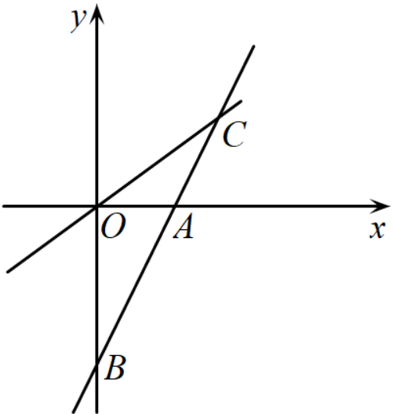  
(1)点 $C$ 坐标为\_\_\_\_\_\_， $OC=$ \_\_\_\_\_\_， $\bigtriangleup BOC$ 的面积为\_\_\_\_\_\_， $\frac{S_{\bigtriangleup OAC}}{S_{\bigtriangleup OAB}}=$ \_\_\_\_\_\_；  
(2)点 $C$ 关于 $x$ 轴的对称点 $C'$ 的坐标为\_\_\_\_\_\_；  
(3)过 $O$ 点作 $OE\perp OC$ 交 $AB$ 于 $E$ 点，则 $\bigtriangleup OAE$ 的形状为\_\_\_\_\_\_，请说明理由；  
(4)在坐标平面内是否存在点 $F$ 使 $\bigtriangleup AOF$ 和 $\bigtriangleup AOB$ 全等，若存在，请直接写出 $F$ 坐标，若不存在，请说明理由

【答案】(1) $\left(3,\sqrt{3}\right)$ ； $2\sqrt{3}$ ； $3\sqrt{3}$ ； $\frac{1}{2}$  
(2) $\left(3,-\sqrt{3}\right)$  
(3)等边三角形  
(4)存在， $F\left(0,2\sqrt{3}\right)$ 或 $\left(0,-2\sqrt{3}\right)$ 或 $\left(2,2\sqrt{3}\right)$ 或 $\left(2,-2\sqrt{3}\right)$

【分析】（1）先由 $\angle OBA=30\circ$ 、 $AB=4$ 得到 $OA$ 的长，即可得到点 $A$ 的坐标，过点 $C$ 作 $CD\perp x$ 轴于点 $D$ ，然后结合 $\angle COA=\angle OCA=30\circ$ ，求得 $AC$ 的长，进而得到 $AD$ 、 $CD$ 的长，即可得到点 $C$ 的坐标；然后得到 $OC$ 的长；由点 $B$ 的坐标得到 $OB$ 的长，进而得到 $\bigtriangleup BOC$ 的面积；由点 $A$ 、点 $B$ 、点 $C$ 的坐标求得 $\bigtriangleup OAC$ 和 $\bigtriangleup OAB$ 的面积，再求得 $\frac{S_{\bigtriangleup OAC}}{S_{\bigtriangleup OAB}}$ 的值；  
（2）根据关于 $x$ 轴对称的点的坐标特征，直接由点 $C$ 的坐标求得点 $C^{'}$ 的坐标；  
（3）由 $OE\perp OC$ 得到 $\angle COE=90\circ$ ，然后由 $\angle COA=30\circ$ 求得 $\angle AOE=60\circ$ ，再由 $\angle OBA=30\circ$ 求得 $\angle OAE=60\circ$ ，即可得到 $\angle AOE=\angle OAB=60\circ$ ，从而得到 $\bigtriangleup OAE$ 是等边三角形；  
（4）分情况讨论：① $\bigtriangleup AOB\allequal \bigtriangleup AOF$ ；② $\bigtriangleup AOB\allequal OAF$ ，然后作出对应的图形求得点 $F$ 的坐标．

【详解】（1）解：∵ $B\left(0，-2\sqrt{3}\right)$ ，
$\therefore <eq>\sqrt{3}$ OB=2</eq> ，
$\because AB=4$ ， $\angle OBA=30\circ$ ， $\angle AOB=90\circ$ ，
$\therefore OA=2$ ，即 $A$ （ $2$ ， $0$ ），
$\because \angle AOC=\angle ACO=30\circ$ ，
$\therefore AC=OA=2$ ， $\angle OAB=60\circ$ ，

过点 $C$ 作 $CD\perp x$ 轴于点 $D$ ，则 $\angle CAD=60\circ$ ， $\angle ADC=90\circ$ ，

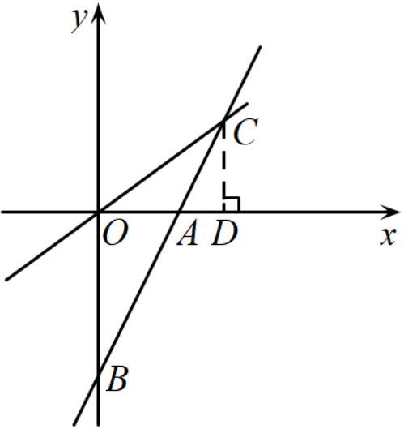
$\therefore \angle ACD=30\circ$ ，
$\therefore AD=1$ ， $CD=$  $\sqrt{3}$ ，
$\therefore OD=OA+AD=2+1=3$ ，
$\therefore$  $C\left(3,\sqrt{3}\right)$ ，
$\therefore OC=2\sqrt{3},S_{\Delta BOC}=\frac{1}{2}OB\cdot OC=\frac{1}{2}\times 2\sqrt{3}\times 3=3\sqrt{3}$ ，
$\therefore S_{\bigtriangleup AOC}=\frac{1}{2}OA\cdot y_{C}=\frac{1}{2}\times 2\times \sqrt{3}=\sqrt{3}$ ， $S_{\bigtriangleup OAB}=\frac{1}{2}OA\cdot OB=\frac{1}{2}\times 2\times 2\sqrt{3}=2\sqrt{3}$ ，
$\therefore \frac{S_{\Delta OAC}}{S_{\Delta OAB}}=\frac{1}{2}$
故答案为： $\left(3,\sqrt{3}\right)$ ； $2\sqrt{3}$ ； $3\sqrt{3}$ ； $\frac{1}{2}$ ．  
（2）解： $\because$  $C\left(3,\sqrt{3}\right)$
$\therefore$ 点 $C$ 与点 $C^{'}$ 关于 $x$ 轴对称，
$\therefore C^{'}\left(3,-\sqrt{3}\right) ,$
故答案为： $\left(3,-\sqrt{3}\right)$ ．  
（3） $\because OE\perp OC$ ，
$\therefore \angle COE=90\circ$ ，
$\because \angle COA=30\circ$ ，
$\therefore \angle AOE=60\circ$ ，
$\because \angle OAE=60\circ$ ，
$\therefore \angle AOE=\angle OAB=60\circ$ ，
$\therefore \bigtriangleup OAE$ 是等边三角形，
故答案为：等边三角形．  
（4）解：①如图 $1$ ，当 $\bigtriangleup AOB\allequal \bigtriangleup AOF$ 时， $OB=OF$ ，

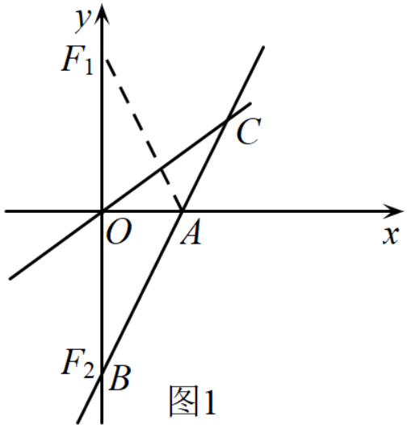
$\because <eq>2\sqrt{3}$ OB=</eq> ，
$\therefore 2\sqrt{3}OF=$
$\therefore$  $F\left(0,2\sqrt{3}\right)$ 或 $\left(0,-2\sqrt{3}\right)$

②如图 $2$ ，当 $\bigtriangleup AOB\allequal OAF$ 时， $AF=OB$ ，

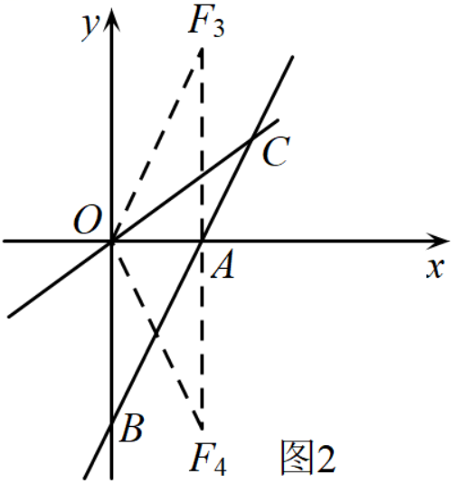
$\therefore <eq>2\sqrt{3}$ AF=</eq> ，
$\therefore$  $F$  $\left(2,2\sqrt{3}\right)$ 或 $\left(2,-2\sqrt{3}\right)$
综上所述，存在 $F\left(0,2\sqrt{3}\right)$ 或 $\left(0,-2\sqrt{3}\right)$ 或 $\left(2,2\sqrt{3}\right)$ 或 $\left(2,-2\sqrt{3}\right)$ 使 $\bigtriangleup AOF$ 和 $\bigtriangleup AOB$ 全等，

【点睛】本题考查了含30°角的直角三角形三边关系、等腰三角形、等边三角形的判定、全等三角形的判定与性质，勾股定理，，解题的关键是通过含30°角的直角三角形三边关系求得相关线段的长度．

33．（2023·广西桂林·二模）如图，在平面直角坐标系中，矩形 $ABCO$ 的边 $OA$ 在<text st*y*le="italic">x</text>轴上，边 $OC$ 在*y*轴上，且*<text style="italic">B*</text>点坐标为 $\left(4，3\right)$ ．动点*<text style="italic">M*</text>、*<text style="italic"><text style="italic">N*</text></text>分别从点*O*、*<text style="italic">B*</text>同时出发，以1单位/秒的速度运动（点M沿 $OA$ 向终点*A*运动，点*<text style="italic"><text style="italic">N*</text></text>沿 $BC$ 向终点*C*运动），过点*<text style="italic"><text style="italic">N*</text></text>作 $NP\parallel AB$ 交 $AC$ 于点*P*，连接 $MP$ ．

  
(1)直接写出 $OA、AB$ 的长度；  
(2)在运动过程中，请求出 $\bigtriangleup MPA$ 的面积<*t*ext style="italic">S</text>与运动时间t的函数关系式；  
(3)在运动过程中， $\bigtriangleup MPA$ 的面积<*t*ext style="italic">S</text>是否存在最大值？若存在，请求出当t为何值时有最大值，并求出最大值；若不存在，请说明理由．  
(4)在运动过程中，以点<*t*ext style="italic">A</text>，*P*，*M*为顶点的三角形与 $\bigtriangleup AOC$ 能相似吗？若能相似，请求出运动时间*t*的值；若不能相似，请说明理由．

【答案】(1) $OA=4，AB=3$  
(2) $S=-\frac{3}{8}t^{2}+\frac{3}{2}t\left(0\leq t\leq 4\right)$  
(3)当 $t=2$ 时， $S$ 有最大值，最大值为 $\frac{3}{2}$  
(4)当 $t=2$ 或 $t=\frac{64}{41}$ 时，以点*A*，*P*，*M*为顶点的三角形与 $\bigtriangleup AOC$ 相似

【分析】（1）根据矩形的性质结合点*B*的坐标进行求解即可；  
（2）延长 $NP$ 交 $OA$ 于*H*，证明四边形 $ABNH$ 是矩形，得到 $NH=AB=3$ ；由题意得 $BN=OM=t$ ，则 $CN=AM=4-t$ ，证明 $\bigtriangleup CNP\backsim \bigtriangleup CBA$ ，求出 $NP=\frac{12-3t}{4}$ ，则 $PH=NH-NP=\frac{3t}{4}$ ，可得 $S=\frac{1}{2}AM\cdot PH=-\frac{3}{8}t^{2}+\frac{3}{2}t\left(0\leq t\leq 4\right)$ ；  
（3）根据（2）所求利用二次函数的性质求解即可；  
（4）分当 $\angle AMP=\angle AOC=90\circ$ 时， $\bigtriangleup \angle MAP\backsim \bigtriangleup OAC$ ，当 $\angle APM=\angle AOC=90\circ$ 时， $\bigtriangleup \angle MAP\backsim \bigtriangleup COA$ ，两种情况讨论求解即可．

【详解】（1）解：矩形 $ABCO$ 的边 $OA$ 在<text st*y*le="italic">x</text>轴上，边 $OC$ 在*y*轴上，且*B*点坐标为 $\left(4，3\right)$ ，
∴ $OA=4，AB=3$ ；  
（2）解：如图所示，延长 $NP$ 交 $OA$ 于*H*，
∵四边形 $OABC$ 是矩形，
∴ $BC\perp AB，\angle B=\angle OAB=90\circ$ ，
∵ $NP\parallel AB$ ，
∴ $NH\perp BC$ ，
∴四边形 $ABNH$ 是矩形，
∴ $NH=AB=3$ ；
由题意得 $BN=OM=t$ ，
∴ $CN=AM=4-t$ ，
∵ $NP\parallel AB$ ，
∴ $\bigtriangleup CNP\backsim \bigtriangleup CBA$ ，
∴ $\frac{NP}{AB}=\frac{CN}{CB}$ ，即 $\frac{NP}{3}=\frac{4-t}{4}$ ，
∴ $NP=\frac{12-3t}{4}$ ，
∴ $PH=NH-NP=\frac{3t}{4}$ ，
∴ $S=\frac{1}{2}AM\cdot PH=\frac{1}{2}\cdot \frac{3t}{4}\cdot \left(4-t\right)=-\frac{3}{8}t^{2}+\frac{3}{2}t\left(0\leq t\leq 4\right)$ ；
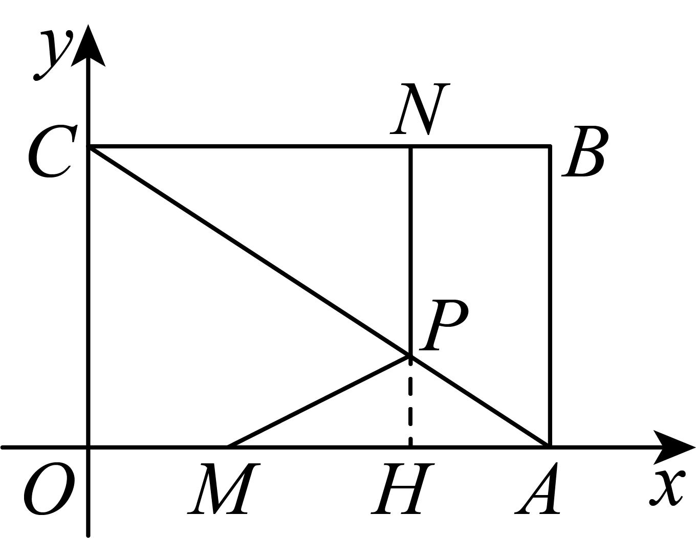  
（3）解：由（2）得 $S=-\frac{3}{8}t^{2}+\frac{3}{2}t=-\frac{3}{8}\left(t-2\right)^{2}+\frac{3}{2}\left(0\leq t\leq 4\right)$ ，
∵ $-\frac{3}{8}<0$ ，
∴当 $t=2$ 时， $S$ 有最大值，最大值为 $\frac{3}{2}$ ；  
（4）解：分两种情况：①当 $\angle AMP=\angle AOC=90\circ$ 时，

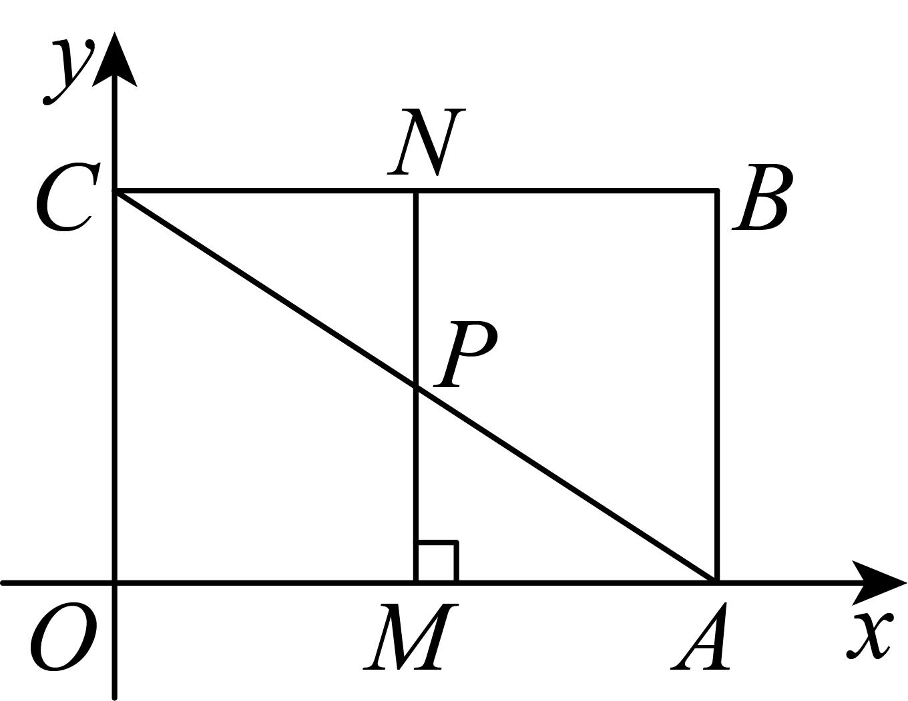
∵ $\angle MAP=\angle OAC$ ，
∴ $\bigtriangleup \angle MAP\backsim \bigtriangleup OAC$ ，
∴ $\frac{AM}{AO}=\frac{MP}{OC}$ ，即 $\frac{4-t}{4}=\frac{\frac{3}{4}t}{3}$
解得： $t=2$ ，

②当 $\angle APM=\angle AOC=90\circ$ 时，

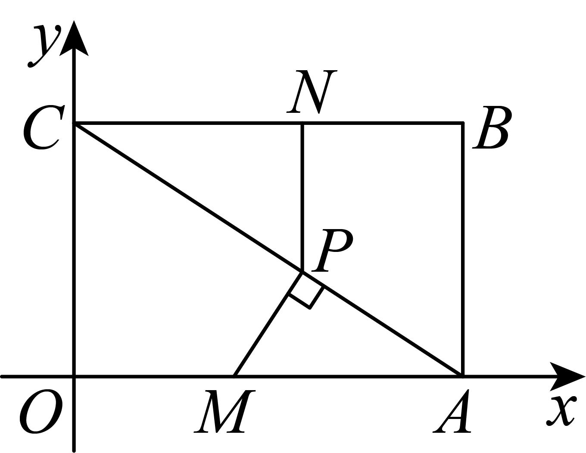
∵ $\angle MAP=\angle COA$ ，
∴ $\bigtriangleup \angle MAP\backsim \bigtriangleup COA$ ，
∴ $\frac{AM}{AC}=\frac{AP}{AO}$
∵ $OA=4，OC=3$ ，
∴ $AC=\sqrt{OA^{2}+OC^{2}}=5$ ，
∵ $NP\parallel AB$ ，
∴ $\frac{BN}{BC}=\frac{AP}{AC}$ ，即 $\frac{t}{4}=\frac{AP}{5}$
∴ $AP=\frac{5}{4}t$ ，
∴ $\frac{4-t}{5}=\frac{\frac{5}{4}t}{4}$
解得： $t=\frac{64}{41}$ ，
综上所述，当 $t=2$ 或 $t=\frac{64}{41}$ 时，以点*A*，*P*，*M*为顶点的三角形与 $\bigtriangleup AOC$ 相似．

【点睛】本题主要考查了相似三角形的性质与判定，二次函数的应用，勾股定理，矩形的性质与判定，坐标与图形，平行线分线段成比例定理等等，正确作出辅助线构造系数三角形是解题的关键．

## 题型12  角度存在性问题

34．（2023·陕西西安·模拟预测）如果一个三角形的一个内角等于另一个内角的2倍，我们称这样的三角形为倍角三角形，并称这两个角的公共边为底边．

  
(1)如图1，在 $\bigtriangleup ABC$ 中．按如下做法：

①作 $BC$ 的中垂线 $l$ ：

②作 $\angle ABC$ 的角平分线与中垂线 $l$ 交于点 $O$ ；
③连接 $CO$ 并延长与 $AB$ 交于点 $P$ ，得到 $\bigtriangleup BCP$ ．
若按上述作法，得到的 $\bigtriangleup BCP$ 是倍角三角形．则 $\angle PBC$ 与 $\angle PCB$ 的等量关系\_\_\_\_\_\_\_\_\_\_\_；  
(2)如图2，在矩形 $ABCD$ 中，以 $BC$ 为底边做一个倍角三角形顶点 $P$ 恰好落在 $AD$ 边上．若 $BC=4$ ， $BP=2$ ．求 $CP$ 的长度．  
(3)如图3，现有一块梯形板材 $ABCD$ ， $AD\parallel BC$ ， $\angle A=90\circ$ ， $AB=AD=3$ ， $BC=12$ ．工人师傅想用这块板材裁出一个 $\bigtriangleup BCP$ 型部件，使得点 $P$ 在梯形 $ABCD$ 的边 $CD$ 上， $\bigtriangleup BCP$ 为以 $BC$ 为底边且 $\angle CBP=2\angle C$ 的倍角三角形．是否存在满足要求的 $\bigtriangleup BCP$ ？若存在，请确定点 $P$ 位置（求出 $CP$ 的长）；若不存在，请说明理由．

【答案】(1) $\angle PBC=2\angle PCB$  
(2) $CP=2\sqrt{3}$ ；  
(3)画图见解析， $CP=\frac{36\sqrt{10}}{13}$ ；
【分析】（1）由作图可得： $OK$ 是 $BC$ 的中垂线， $\angle OBC=\angle OCB$ ， $\angle ABO=\angle CBO$ ，从而可得结论；  
（2）如图，由 $BC=4$ ， $BP=2$ ，可得 $2<PC<6$ ，可得 $\angle PBC>\angle PCB$ ，可得 $\angle PBC=2\angle PCB$ ，作 $\angle PBC$ 的角平分线交 $PC$ 于 $N$ ，过 $N$ 作 $NM\perp BC$ 于 $M$ ，可得 $\angle PBN=\angle CBN=\angle PCB$ ，证明 $\bigtriangleup PBN\allequal \bigtriangleup MBN$ ，可得 $\angle BPN=\angle BMN=90\circ$ ，再利用勾股定理可得答案；  
（3）如图，作 $BC$ 的垂直平分线 $KH$ 交 $CD$ 于 $N$ ，交 $BC$ 于 $M$ ，作 $\angle PBN=\angle CBN$ ， $P$ 在 $CD$ 上，则 $\angle PBC=2\angle C$ ， $\bigtriangleup CPB$ 为倍角三角形，证明四边形 $ABQD$ 为正方形，求解 $sin\angle C=\frac{DQ}{CQ}=\frac{3}{9}=\frac{1}{3}=\frac{NM}{CM}$ ， $MN=2$ ， $CN=\sqrt{6^{2}+2^{2}}=2\sqrt{10}=BN$ ，证明 $\bigtriangleup PBN\backsim \bigtriangleup PCB$ ， $PB=\frac{\sqrt{10}}{6}PC$ ， $PN=\frac{\sqrt{10}}{6}PB$ ， 过 $N$ 作 $NT\perp BD$ 于 $T$ ，则 $NM=NT=2$ ， $BT=\sqrt{\left(2\sqrt{10}\right)^{2}-2^{2}}=6$ ，设 $PN=x$ ， $PB=\frac{3\sqrt{10}}{5}x$ ，再利用勾股定理建立方程求解即可．

【详解】（1）解：由作图可得： $OK$ 是 $BC$ 的中垂线，
∴ $\angle OBC=\angle OCB$ ，

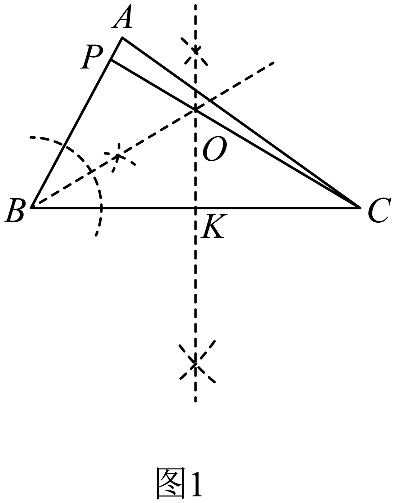
∵ $BO$ 平分 $\angle ABC$ ，
∴ $\angle ABO=\angle CBO$ ，
∴ $\angle ABO=\angle CBO=\angle OCB$ ，
∴ $\angle PBC=2\angle PCB$ ；  
（2）如图，∵ $BC=4$ ， $BP=2$ ，
∴ $2<PC<6$ ，
∴ $\angle PBC>\angle PCB$ ，
∵矩形 $ABCD$ 中，以 $BC$ 为底边做一个倍角三角形顶点 $P$ 恰好落在 $AD$ 边上．
∴ $\angle PBC=2\angle PCB$ ，

作 $\angle PBC$ 的角平分线交 $PC$ 于 $N$ ，过 $N$ 作 $NM\perp BC$ 于 $M$ ，

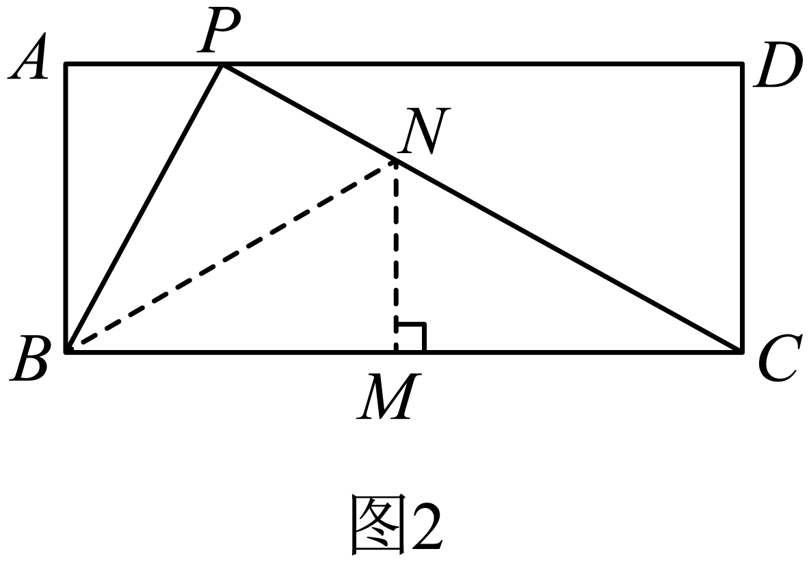
∴ $\angle PBN=\angle CBN=\angle PCB$ ，
∴ $NB=NC$ ， $BM=CM=2$ ，
∴ $BP=BM=2$ ，而 $BN=BN$ ，
∴ $\bigtriangleup PBN\allequal \bigtriangleup MBN$ ，
∴ $\angle BPN=\angle BMN=90\circ$ ，
∴ $CP=\sqrt{BC^{2}-BP^{2}}=\sqrt{4^{2}-2^{2}}=2\sqrt{3}$ ；  
（3）如图，作 $BC$ 的垂直平分线 $KH$ 交 $CD$ 于 $N$ ，交 $BC$ 于 $M$ ，作 $\angle PBN=\angle CBN$ ， $P$ 在 $CD$ 上，则 $\angle PBC=2\angle C$ ， $\bigtriangleup CPB$ 为倍角三角形，

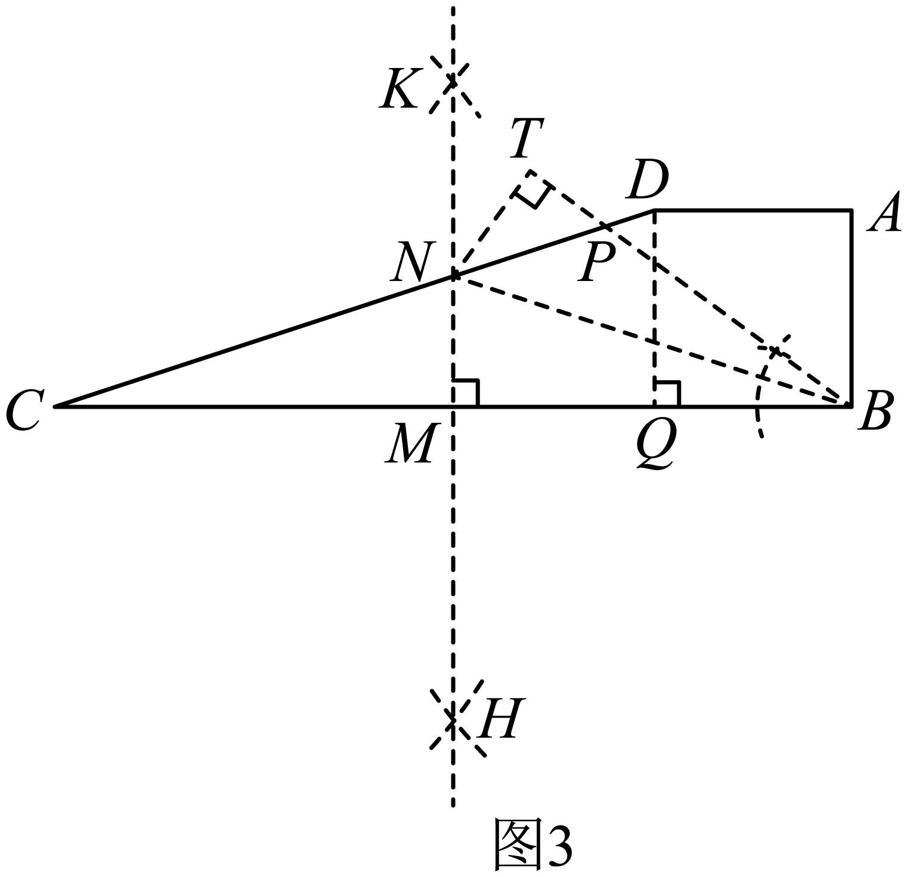

过 $D$ 作 $DQ\perp BC$ 于 $Q$ ， $AB=AD=3$ ，结合直角梯形可得：

四边形 $ABQD$ 为正方形，
∴ $DQ=QB=3$ ， $DQ\perp BC$ ，
∵ $CM=BM=\frac{1}{2}BC=6$ ，
∴ $CQ=9$ ，
∴ $tan\angle C=\frac{DQ}{CQ}=\frac{3}{9}=\frac{1}{3}=\frac{NM}{CM}$ ，
∴ $MN=2$ ， $CN=\sqrt{6^{2}+2^{2}}=2\sqrt{10}=BN$ ，
由作图可得： $\angle PBN=\angle C$ ，而 $\angle BPN=\angle CPB$ ，
∴ $\bigtriangleup PBN\backsim \bigtriangleup PCB$ ，
∴ $\frac{PB}{PC}=\frac{PN}{PB}=\frac{BN}{BC}=\frac{2\sqrt{10}}{12}=\frac{\sqrt{10}}{6}$ ，
∴ $PB=\frac{\sqrt{10}}{6}PC$ ， $PN=\frac{\sqrt{10}}{6}PB$ ，

过 $N$ 作 $NT\perp BD$ 于 $T$ ，则 $NM=NT=2$ ，
∴ $BT=\sqrt{\left(2\sqrt{10}\right)^{2}-2^{2}}=6$ ，
设 $PN=x$ ， $PB=\frac{3\sqrt{10}}{5}x$ ，
∴ $DT=6-\frac{3\sqrt{10}}{5}x$ ，
∴ $x^{2}=2^{2}+\left(6-\frac{3\sqrt{10}}{5}x\right)^{2}$ ，
整理得： $13x^{2}-36\sqrt{10}x+200=0$ ，
解得： $x_{1}=\frac{10\sqrt{10}}{13}$ ， $x_{2}=2\sqrt{10}$ （不符合题意舍去），
∴ $PN=\frac{10\sqrt{10}}{13}$ ，
∴ $CP=CN+PN=\frac{36\sqrt{10}}{13}$ ．经检验符合题意．

【点睛】本题考查的是线段的垂直平分线的作图，角平分线的作图，矩形的性质，倍角三角形的含义，相似三角形的判定与性质，锐角三角函数的应用，勾股定理的应用，一元二次方程的解法，角平分线的性质，本题难度大，综合程度高，属于中考压轴题．

35．（2023·上海浦东新·二模）已知： $\odot O$ 的直径 $AB=10$ ，*<text style="italic">C*</text>是 $⌢$ 的中点，*D*是 $\odot O$ 上的一个动点（不与点*A*、*B*、*<text style="italic">C*</text>重合），射线 $CD$ 交射线 $AB$ 于点*E*．

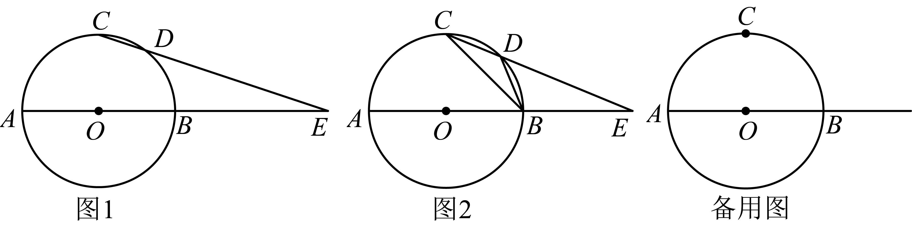  
(1)如图1，当 $BE=AB$ ，求线段 $CD$ 的长；  
(2)如图2，当点*D*在 $⌢$ 上运动时，连接 $BC、BD，\bigtriangleup BCD$ 中是否存在度数保持不变的角？如果存在，请指出这个角并求其度数；如果不存在，请说明理由；  
(3)连接 $OD$ ，当 $\bigtriangleup ODE$ 是以 $DE$ 为腰的等腰三角形时，求 $\bigtriangleup$  $ODE$ 与 $\bigtriangleup CBE$ 面积的比值．

【答案】(1) $CD=\sqrt{10}$ ，详见解析  
(2)存在， $\angle BDC=135\circ$ ，详见解析  
(3) $\bigtriangleup$  $ODE$ 与 $\bigtriangleup CBE$ 面积的比值为 $\frac{3+\sqrt{3}}{4}$ 或 $\frac{\sqrt{3}+1}{4}$ 或 $\frac{\sqrt{3}-1}{4}$ ，详见解析

【分析】（1）连 $OC,AD,BC$ ，构造直角三角形利用勾股定理求出 $CE$ 的长，再利用 $\bigtriangleup AED\backsim \bigtriangleup CEB$ ，求出 $DE$ 的长，即可得解；  
（2）由*C*为 $\overset{�}{AB}$ 的中点， $AB$ 为 $\odot O$ 直径得出 $\overset{�}{BC}$ 的度数为 $90\circ$ ，再利用圆周角定理即可得出答案；  
（3）分类讨论，分点 $E$ 在线段 $AB$ 的延长线上和点 $E$ 在线段 $AB$ 上，利用勾股定理和面积公式分别求出它们的面积，然后求出比值即可得出答案．

【详解】（1）连 $OC,AD,BC$ ，如图1
∵ $AB=BE=10$
∴ $AE=AB+BE=20，OE=OB+BE=5+10=15$ ， $OC=5$
∵*C*为 $⌢$ 的中点， $AB$ 为直径
∴ $OC\perp AB$
在 $Rt\bigtriangleup OCE$ 中
∴ $CE=\sqrt{OC^{2}+OE^{2}}=\sqrt{5^{2}+15^{2}}=5\sqrt{10}$
∵ $\angle A=\angle BCD,\angle AED=\angle CEB$
∴ $\bigtriangleup AED\sim \bigtriangleup CEB$
∴ $\frac{AE}{CE}=\frac{DE}{BE}$
即 $AE\cdot BE=CE\cdot DE$
∴ $20\times 10=5\sqrt{10}\times DE$
∴ $DE=4\sqrt{10}$
∴ $CD=CE-DE=5\sqrt{10}-4\sqrt{10}=\sqrt{10}$

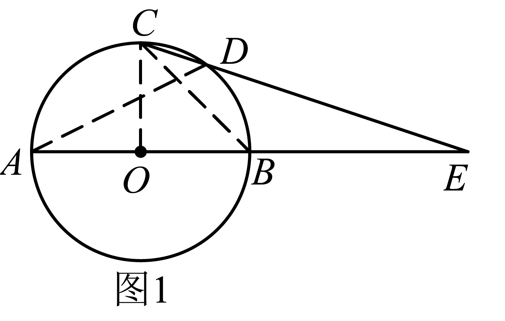  
（2）当*D*在 $⌢$ 上运动时，如图2，在 $\bigtriangleup BCD$ 中， $\angle BDC$ 为度数不变的角， $\angle BDC=135\circ$

理由如下：
∵*C*为 $⌢$ 的中点， $AB$ 为 $\odot O$ 直径，
∴ $⌢$ 的度数 $90\circ$
∴ $⌢$ 的度数为 $270\circ$
∴ $⌢$ 所对的圆心角为 $270\circ$ ，圆周角为 $135\circ$
∴ $\angle BDC=135\circ$  
（3）如图 $3$ ， $①$ 当点 $E$ 在线段 $AB$ 的延长线上， $\bigtriangleup ODE$ 是以 $DE$ 为腰的等腰三角形时，当 $OD=DE=5$ 时，连 $OC$ ，

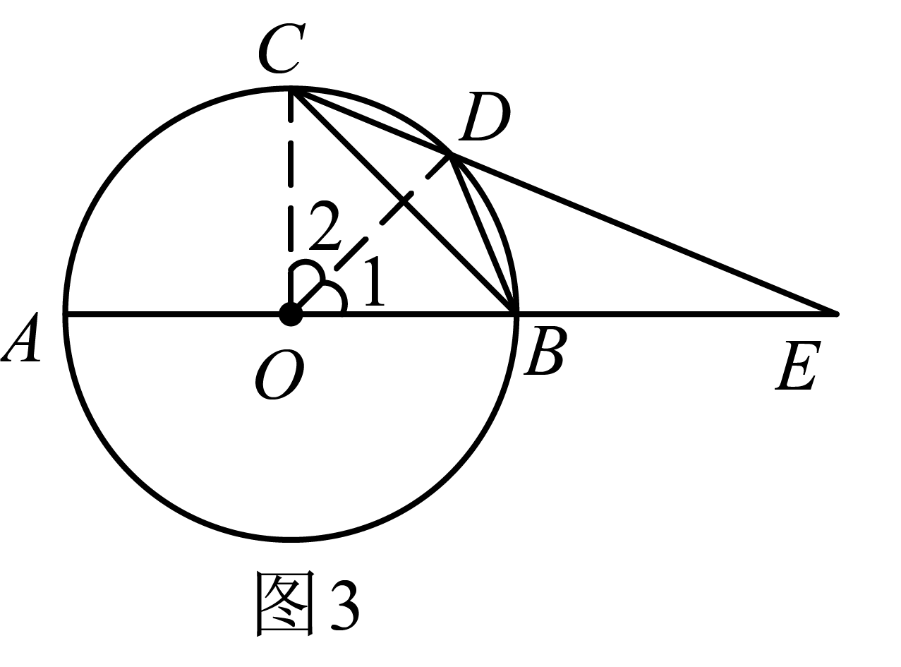
∵ $OD=DE$
∴ $\angle 1=\angle E$
由 $(1)$ 知 $\angle COE=90\circ$
∴ $\angle 1+\angle 2=90\circ ,\angle OCD+\angle E=90\circ$
∴ $\angle 2=\angle OCD$
∴ $OD=CD=5$
又∵ $OD=OC$
∴ $OD=CD=OC=5$
∴ $\bigtriangleup OCD$ 为等边三角形
∴ $CE=CD+DE=5+5=10$
∴ $OE=\sqrt{CE^{2}-OC^{2}}=\sqrt{10^{2}-5^{2}}=5\sqrt{3}$
∴ $S_{\bigtriangleup OCE}=\frac{1}{2}\times OE\times OC=\frac{1}{2}\times 5\sqrt{3}\times 5=\frac{25}{2}\sqrt{3}$
∵ $D$ 为 $CE$ 中点
∴ $S_{\bigtriangleup OCD}=S_{\bigtriangleup ODE}=\frac{1}{2}S_{\bigtriangleup OCE}=\frac{25}{4}\sqrt{3}$
又∵ $S_{\bigtriangleup OBC}=\frac{1}{2}\times 5\times 5=\frac{25}{2}$
∴ $S_{\bigtriangleup CBE}=S_{\bigtriangleup OCE}-S_{\bigtriangleup OBC}=\frac{25}{2}\sqrt{3}-\frac{25}{2}$
∴ $S_{\bigtriangleup ODE}:S_{\bigtriangleup CBE}=\frac{25}{4}\sqrt{3}:\left(\frac{25}{2}\sqrt{3}-\frac{25}{2}\right)=\frac{3+\sqrt{3}}{4}$ ，
当 $DE=OE$ 时
∴ $\angle EOD=\angle EDO=\frac{180\circ -\angle E}{2}<90\circ$
∵ $OC=OD$
∴ $\angle OCD=\angle ODC=\frac{180\circ -\angle COD}{2}<90\circ$
∴ $\angle ODC+\angle ODE<90\circ +90\circ <180\circ$ 与 $C$ *<text style="italic">，*</text> $D$ *<text style="italic">，*</text> $E$ 三点共线矛盾*<text style="italic">，*</text>所以此情况不存在；
$②$ 当点 $E$ 在线段 $AB$ 上，且 $\angle BOD$ 小于或等腰 $90\circ$ 时，过点 $B$ 作 $BH\parallel OD$ 交 $CD$ 于点 $H$ ，过点 $D$ 作 $DG\perp OB$ 于点 $G$ ，

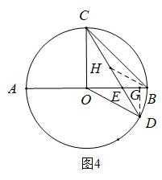

，
由点 $E$ 在线段 $AB$ 上可知， $\bigtriangleup ODE$ 是以 $DE$ 为腰的等腰三角形时， $OE$ 不等于 $OD$ ，只能有 $OE=DE$ ，
∴ $\angle EOD=\angle EDO$ ，
∵ $BH\parallel OD$ ，
∴ $\angle EHB=\angle EDO$ ， $\angle EBH=\angle EOD$ ，
∴ $\angle EBH=\angle EHB=\angle EOD$ ，
∵ $\angle EOD=2\angle ECB$ ，
∴ $\angle EBH=\angle EHB=2\angle ECB$ ，
∵ $\angle EHB=\angle ECB+\angle HBC$ ，
∴ $\angle ECB=\angle HBC$ ，
∴ $\angle EBH=2\angle HBC$ ，
∵由 $(1)$ 知 $\angle COB=90\circ$ ， $OC=OB$
∴ $\angle OBC=\angle EBH+\angle HBC=$  $\frac{90\circ }{2}=45\circ$ ，
∴ $\angle HBC=15\circ$ ，
∴ $\angle EDO=\angle EOD=\angle EHB=\angle EBH=30\circ$ ，
∵ $OC=OD=5$ ， $DG\perp OB$ ，
∴ $DG$  $=\frac{1}{2}OD=\frac{5}{2}$ ， $\angle OCE=\angle ODE=30\circ$ ，
∴ $OE=OC\cdot tan\angle OCE=5\times \frac{\sqrt{3}}{3}=\frac{5\sqrt{3}}{3}$ ，
∴ $BE=OB-OE=5-\frac{5\sqrt{3}}{3}$ ，
∴ $\frac{S_{\bigtriangleup ODE}}{S_{\bigtriangleup CBE}}=\frac{\frac{1}{2}OE\cdot DG}{\frac{1}{2}BE\cdot OC}=\frac{\frac{1}{2}\times \frac{5\sqrt{3}}{3}\times \frac{5}{2}}{\frac{1}{2}\times \left(5-\frac{5\sqrt{3}}{3}\right)\times 5}=\frac{\sqrt{3}+1}{4}$ ；
$③$ 当点 $E$ 在线段 $AB$ 上，且 $\angle BOD$ 大于 $90\circ$ 时，过点 $A$ 作 $BH\parallel OD$ 交 $CD$ 于点 $H$ ，过点 $D$ 作 $DG\perp OA$ 于点 $G$ ，

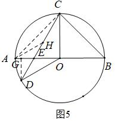

同 $②$ 可得 $OE=\frac{5\sqrt{3}}{3}$ ， $DG$  $=\frac{1}{2}OD=\frac{5}{2}$ ， $BE=OB+OE=5+\frac{5\sqrt{3}}{3}$ ，
∴∴ $\frac{S_{\bigtriangleup ODE}}{S_{\bigtriangleup CBE}}=\frac{\frac{1}{2}OE\cdot DG}{\frac{1}{2}BE\cdot OC}=\frac{\frac{1}{2}\times \frac{5\sqrt{3}}{3}\times \frac{5}{2}}{\frac{1}{2}\times \left(5+\frac{5\sqrt{3}}{3}\right)\times 5}=\frac{\sqrt{3}-1}{4}$ ；
综上所述： $\bigtriangleup$  $ODE$ 与 $\bigtriangleup CBE$ 面积的比值为 $\frac{3+\sqrt{3}}{4}$ 或 $\frac{\sqrt{3}+1}{4}$ 或 $\frac{\sqrt{3}-1}{4}$ ．

【点睛】本题考查了三角形相似，圆周角定理，圆心角定理，勾股定理，等腰三角形等知识的综合应用，熟练掌握其性质，合理作出辅助线是解决此题的关键．

36．（2023·浙江金华·一模）如图，在 $\bigtriangleup ABC$ 中， $AB=AC=5$ ， $BC=6$ ，点*P*是射线 $BC$ 上的动点，连结 $AP$ ，在 $AP$ 的右边作 $\angle PAQ=\frac{1}{2}\angle BAC$ ，交射线 $BC$ 于点*Q*．

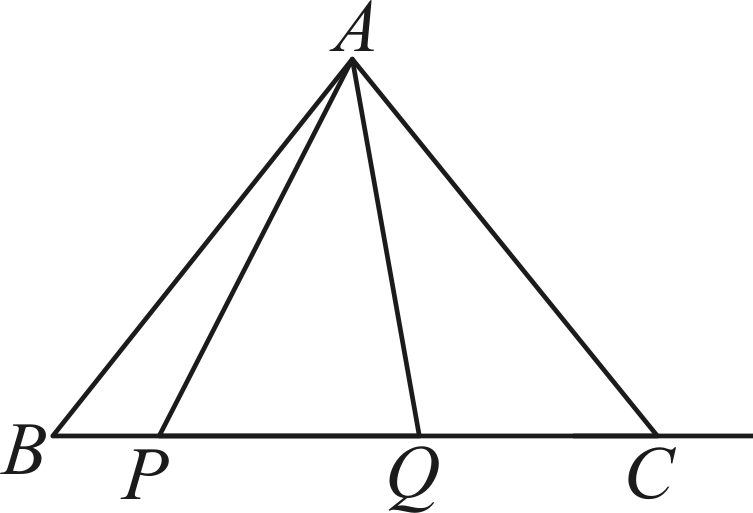  
(1)当 $BP=1$ 时，求点*P*到 $AB$ 的距离．  
(2)当点<te<te*x*t style="italic">x</text>t st*y*le="italic">P</text>在线段 $BC$ 上运动时，记 $BP=x$ ， $CQ=y$ ，求<te<te*x*t style="italic">x</text>t style="italic">y</text>关于x的函数表达式和自变量x的取值范围．  
(3)在点*P*的运动过程中，不再连结其他线段，当图中存在某个角为 $45\circ$ 时，求 $BQ$ 的长，并指出相应的 $45\circ$ 角．

【答案】(1) $\frac{4}{5}$  
(2) $y=\left\{\begin{array}{c}\frac{75-25x}{25-3x}\left(0\leq x\leq 3\right)\\\frac{25x-75}{25-3x}\left(3<x\leq 6\right)\end{array}\right$  
(3) $\angle BAQ=45\circ$ ， $BQ=\frac{25}{7}$ ； $\angle CAP=45\circ$ ， $BQ=\frac{161}{31}$ ； $\angle BAP=\angle AQB=45\circ$ ， $BQ=7$ ； $\angle CAQ=\angle APB=45\circ$ ， $BQ=31$

【分析】（1）过点*A*作 $AE\perp BC$ 与点*E*，过点*P*作 $PF\perp AB$ 于点*F*，先根据等腰三角形的性质和勾股定理得出 $AE=4$ ，再由正弦求解即可；  
（2）分两种情况讨论：当点*<text style="italic">P*</text>在线段 $BE$ 上时，即 $0\leq x\leq 3$ 时，当点*<text style="italic">P*</text>在线段 $CE$ 上时，即 $3<x\leq 6$ 时，先证明 $\angle FAP=\angle EAQ$ ，再利用相似三角形的判定和性质得出 $\frac{AF}{AE}=\frac{FP}{EQ}$ ，进而求解即可；  
（3）分四种情况，分别是 $\angle BAQ=45\circ$ ， $\angle CAP=45\circ$ ， $\angle BAP=\angle AQB=45\circ$ ， $\angle CAQ=\angle APB=45\circ$ ，分别利用勾股定理，相似三角形的判定和性质，等腰直角三角形的性质，进行求解即可．

【详解】（1）如图，过点*A*作 $AE\perp BC$ 与点*E*，过点*P*作 $PF\perp AB$ 于点*F*，

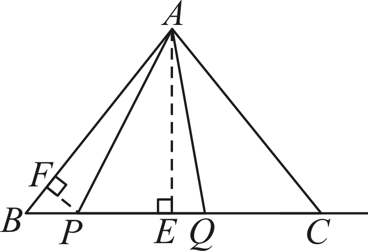
∴ $\angle AEB=\angle BFP=90\circ$ ，
∵ $AB=AC=5$ ， $BC=6$ ，
∴ $BE=\frac{1}{2}BC=3$ ，
∴ $AE=\sqrt{AB^{2}-BE^{2}}=4$ ，
∴ $sinB=\frac{AE}{AB}=\frac{PF}{BP}$ ，
∵ $BP=1$ ，
∴ $\frac{4}{5}=\frac{PF}{1}$ ，
解得 $PF=\frac{4}{5}$ ，
即点*P*到 $AB$ 的距离为 $\frac{4}{5}$ ；  
（2）当点*P*在线段 $BE$ 上时，即 $0\leq x\leq 3$ 时，如图，

∵ $AE\perp BC,AB=AC$ ，
∴ $\angle BAE=\angle CAE=\frac{1}{2}\angle BAC$ ，
∵ $\angle PAQ=\frac{1}{2}\angle BAC$ ，
∴ $\angle FAP=\angle EAQ$ ，
又∵ $\angle AFP=90\circ =\angle AEQ$ ，
∴ $\bigtriangleup AFP\sim \bigtriangleup AEQ$ ，
∴ $\frac{AF}{AE}=\frac{FP}{EQ}$ ，
∵ $BP=x$ ，
∴ $sinB=\frac{PF}{BP}=\frac{4}{5}$ ，
∴ $PF=\frac{4}{5}x$ ，
由勾股定理得 $BF=\sqrt{BP^{2}-PF^{2}}=\frac{3}{5}x$ ，
∵ $AB=5,CE=3$ ， $CQ=y$ ，
∴ $AF=5-\frac{3}{5}x$ ， $EQ=3-y$ ，
∴ $\frac{5-\frac{3}{5}x}{4}=\frac{\frac{4}{5}x}{3-y}$ ，
整理得 $y=\frac{75-25x}{25-3x}$ ；
当点*P*在线段 $CE$ 上时，即 $3<x\leq 6$ 时，如图，

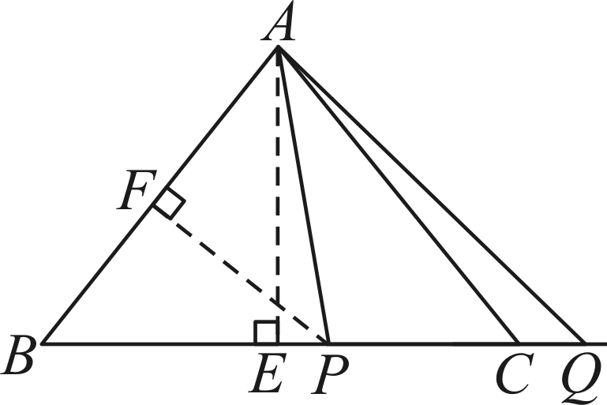
∵ $AE\perp BC,AB=AC$ ，
∴ $\angle BAE=\angle CAE=\frac{1}{2}\angle BAC$ ，
∵ $\angle PAQ=\frac{1}{2}\angle BAC$ ，
∴ $\angle FAP=\angle EAQ$ ，
又∵ $\angle AFP=90\circ =\angle AEQ$ ，
∴ $\bigtriangleup AFP\sim \bigtriangleup AEQ$ ，
∴ $\frac{AF}{AE}=\frac{FP}{EQ}$ ，
∵ $BP=x$ ，
∴ $sinB=\frac{PF}{BP}=\frac{4}{5}$ ，
∴ $PF=\frac{4}{5}x$ ，
由勾股定理得 $BF=\sqrt{BP^{2}-PF^{2}}=\frac{3}{5}x$ ，
∵ $AB=5,CE=3$ ， $CQ=y$ ，
∴ $AF=5-\frac{3}{5}x$ ， $EQ=3+y$ ，
∴ $\frac{5-\frac{3}{5}x}{4}=\frac{\frac{4}{5}x}{3+y}$ ，
整理得 $y=\frac{25x-75}{25-3x}$ ；
综上， $y=\left\{\begin{array}{c}\frac{75-25x}{25-3x}\left(0\leq x\leq 3\right)\\\frac{25x-75}{25-3x}\left(3<x\leq 6\right)\end{array}\right$ ；  
（3）①当 $\angle BAQ=45\circ$ 时，

如图，过点*Q*作 $QD\perp AB$ 于*D*，

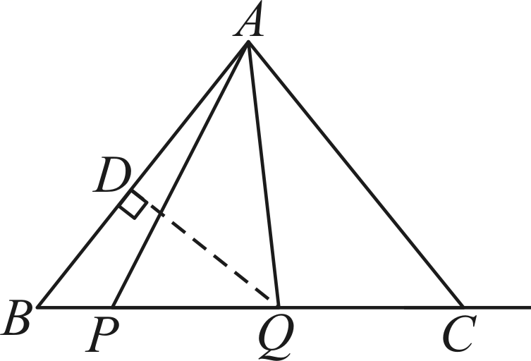
∴ $\angle ADQ=\angle BDQ=90\circ$ ，
设 $BQ=5x$ ，
∵ $sinB=\frac{4}{5}$ ，
∴ $DQ=4x,BD=3x$ ，
∵ $\angle BAQ=\angle AQD=45\circ$ ，
∴ $AD=5-3x=DQ$ ，即 $5-3x=4x$ ，
解得 $x=\frac{5}{7}$ ，
∴ $BQ=5x=\frac{25}{7}$ ；
②当 $\angle CAP=45\circ$ 时，

如图，过点*P*作 $PH\perp AC$ 于*H*，

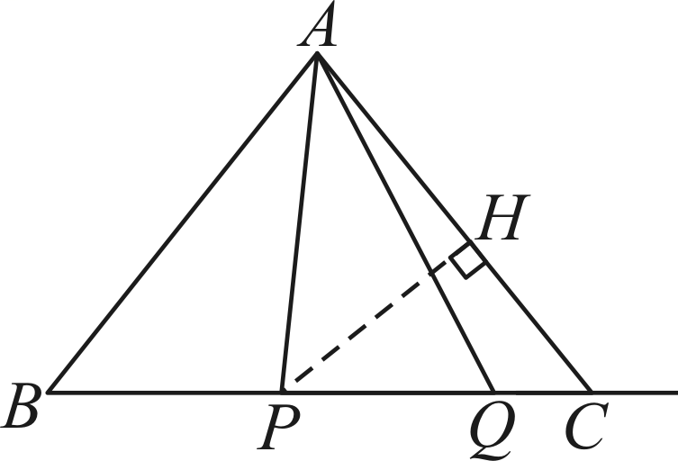

同①可得 $CP=\frac{25}{7}$ ,
∵ $BP=x$ ，
∴ $CP=\frac{25}{7}=6-x$ ，
解得 $x=\frac{17}{7}$ ，
当 $0\leq x\leq 3$ 时， $y=\frac{75-25x}{25-3x}=\frac{25}{31}$ ，
∴ $BQ=6-CQ=6-y=\frac{161}{31}$ ；
③当 $\angle BAP=\angle AQB=45\circ$ 时，

如图，过点*P*作 $PN\perp AB$ 于*N*，

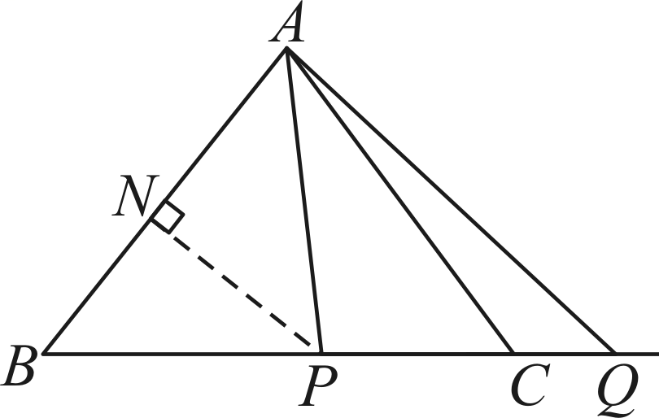

同①得 $BP=\frac{25}{7}=x$ ，
当 $3<x\leq 6$ 时， $y=\frac{25x-75}{25-3x}=1=CQ$ ，
∴ $BQ=BC+CQ=7$ ；
⑤当 $\angle CAQ=\angle APB=45\circ$ 时，

如图，过点作 $AE\perp BC$ 于*E*，
∴ $\angle AEC=90\circ$ ，
∴ $\angle EAP=\angle APB=45\circ$ ，
由（1）得， $AE=4,CE=3$ ，
∴ $AE=PE=4$ ，
∴ $CP=1$ ，
又∵ $\angle ACP=\angle QCA$ ，
∴ $\bigtriangleup CAP\sim \bigtriangleup CQA$ ，
∴ $\frac{CA}{CQ}=\frac{CP}{CA}$ ，即 $\frac{5}{CQ}=\frac{1}{5}$ ，
解得 $CQ=25$ ，
∴ $BQ=BC+CQ=31$ ；
综上， $\angle BAQ=45\circ$ ， $BQ=\frac{25}{7}$ ； $\angle CAP=45\circ$ ， $BQ=\frac{161}{31}$ ； $\angle BAP=\angle AQB=45\circ$ ， $BQ=7$ ； $\angle CAQ=\angle APB=45\circ$ ， $BQ=31$ ．

【点睛】本题考查了三角形的动点问题，涉及等腰三角形的性质，勾股定理，相似三角形的判定和性质，熟练掌握知识点并运用分类讨论的思想是解题的关键．

