重难点突破06 开放探究与新定义问题

目 录

- [题型01  新定义问题](#_Toc164072568)
- [类型一  新定义问题-数、式、方程](#_Toc164072569)
- [类型二  新定义问题-函数](#_Toc164072570)
- [类型三  新定义问题-图形的性质与变化](#_Toc164072571)
- [题型02  方法迁移题型](#_Toc164072572)
- [题型03  归纳概括问题](#_Toc164072573)
- [题型04  探究实践类问题](#_Toc164072574)

【命题趋势】开放探究与新定义问题是近年中考数学的热点问题．开放探究（阅读理解）问题通常不会单独考查，往往会结合初中数学中某个知识点进行命题，进而既能考查初中数学中某个知识点的掌握情况，又能考查学生的自学能力和分析问题、解决问题的能力． 新定义问题是在问题中定义了初中数学中没有学过的一些新概念、新运算、新符号，要求学生读懂题意并结合已有知识进行理解，而后根据新定义进行运算、推理、迁移的一种题型．一般有三种类型问题：（1）定义新运算；（2）定义初、高中知识衔接新知识；（3）定义新概念．这类试题考查考生对新定义的理解和认识，以及灵活运用知识的能力，解题时需要将新定义的知识与已学知识联系起来，利用已有的知识经验来解决问题．

## 题型01  新定义问题

## 类型一  新定义问题-数、式、方程

1．（2022·四川巴中·中考真题）对于实数 $a$ ， $b$ 定义新运算： $a \textreferencemark b=ab^{2}-b$ ，若关于 $x$ 的方程 $1 \textreferencemark x=k$ 有两个不相等的实数根，则 $k$ 的取值范围（    ）

A． $k>-\frac{1}{4}$ 	
B． $k<-\frac{1}{4}$ 	
C． $k>-\frac{1}{4}$ 且 $k\ne 0$ 	
D． $k\geq -\frac{1}{4}$ 且 $k\ne 0$

2．（2022·内蒙古·中考真题）对于实数<te*x*t style="italic">a</text>，*b*定义运算“⊗”为 $a\otimes b=b^{2}-ab$ ，例如 $3\otimes 2=2^{2}-3\times 2=-2$ ，则关于*x*的方程 $(k-3)$  $\otimes x=k-1$ 的根的情况，下列说法正确的是（    ）

A．有两个不相等的实数根	
B．有两个相等的实数根

C．无实数根	
D．无法确定

3．（2022·浙江宁波·中考真题）定义一种新运算：对于任意的非零实数&lt;te<em>x</em>t style="italic"&gt;a&lt;/text&gt;，<em>b</em>， $a\otimes b=\frac{1}{a}+\frac{1}{b}$ ．若 $(x+1)\otimes x=\frac{2x+1}{x}$ ，则<em>x</em>的值为___________．

4．（2023·山东枣庄·中考真题）对于任意实数*a*，*b*，定义一种新运算： $a \textreferencemark b=\left\{\begin{matrix}a-b&\left(a\geq 2b\right)\\a+b-6&(a<2b)\end{matrix}\right$ ，例如： $3 \textreferencemark 1=3-1=2$ ， $5 \textreferencemark 4=5+4-6=3$ ．根据上面的材料，请完成下列问题：  
(1) $4 \textreferencemark 3=$ \_\_\_\_\_\_\_\_\_\_\_， $(-1) \textreferencemark (-3)=$ \_\_\_\_\_\_\_\_\_\_\_；  
(2)若 $(3x+2) \textreferencemark (x-1)=5$ ，求*x*的值．

## 类型二  新定义问题-函数

5．（2023·山东济南·中考真题）定义：在平面直角坐标系中，对于点 $P\left(x_{1},y_{1}\right)$ ，当点 $Q\left(x_{2},y_{2}\right)$ 满足 $2\left(x_{1}+x_{2}\right)=y_{1}+y_{2}$ 时，称点 $Q\left(x_{2},y_{2}\right)$ 是点 $P\left(x_{1},y_{1}\right)$ 的“倍增点”，已知点 $P_{1}\left(1,0\right)$ ，有下列结论：

①点 $Q_{1}\left(3,8\right)$ ， $Q_{2}\left(-2,-2\right)$ 都是点 $P_{1}$ 的“倍增点”；
②若直线 $y=x+2$ 上的点*A*是点 $P_{1}$ 的“倍增点”，则点 $A$ 的坐标为 $\left(2,4\right)$ ；
③抛物线 $y=x^{2}-2x-3$ 上存在两个点是点 $P_{1}$ 的“倍增点”；
④若点 $B$ 是点 $P_{1}$ 的“倍增点”，则 $P_{1}B$ 的最小值是 $\frac{4\sqrt{5}}{5}$ ．
其中，正确结论的个数是（　　　）

A．1	
B．2	
C．3	
D．4

6．（2023·江苏盐城·中考真题）定义：若一次函数的图象与二次函数的图象有两个交点，并且都在坐标轴上，则称二次函数为一次函数的轴点函数．

【初步理解】  
（1）现有以下两个函数：① $y=x^{2}-1$ ；② $y=x^{2}-x$ ，其中，\_\_\_\_\_\_\_\_\_为函数 $y=x-1$ 的轴点函数．（填序号）

【尝试应用】  
（2）函数 $y=x+c$ （ $c$ 为常数， $c>0$ ）的图象与 $x$ 轴交于点 $A$ ，其轴点函数 $y=ax^{2}+bx+c$ 与 $x$ 轴的另一交点为点 $B$ .若 $OB=\frac{1}{4}OA$ ，求 $b$ 的值．

【拓展延伸】  
（3）如图，函数 $y=\frac{1}{2}x+t$ （ $t$ 为常数， $t>0$ ）的图象与 $x$ 轴、 $y$ 轴分别交于 $M$ ， $C$ 两点，在 $x$ 轴的正半轴上取一点 $N$ ，使得 $ON=OC$ .以线段 $MN$ 的长度为长、线段 $MO$ 的长度为宽，在 $x$ 轴的上方作矩形 $MNDE$ .若函数 $y=\frac{1}{2}x+t$ （ $t$ 为常数， $t>0$ ）的轴点函数 $y=mx^{2}+nx+t$ 的顶点 $P$ 在矩形 $MNDE$ 的边上，求 $n$ 的值．

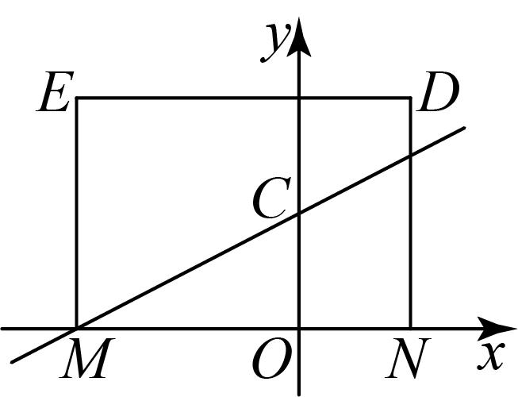

7．（2023·北京·中考真题）在平面直角坐标系 $xOy$ 中， $\odot O$ 的半径为1．对于 $\odot O$ 的弦 $AB$ 和 $\odot O$ 外一点*C*给出如下定义：
若直线 $CA$ ， $CB$ 中一条经过点*O*，另一条是 $\odot O$ 的切线，则称点*C*是弦 $AB$ 的“关联点”．

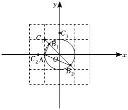  
(1)如图，点 $A\left(-1,0\right)$ ， $B_{1}\left(-\frac{\sqrt{2}}{2},\frac{\sqrt{2}}{2}\right)$ ， $B_{2}\left(\frac{\sqrt{2}}{2},-\frac{\sqrt{2}}{2}\right)$

①在点 $C_{1}\left(-1,1\right)$ ， $C_{2}(-\sqrt{2},0)$ ， $C_{3}\left(0,\sqrt{2}\right)$ 中，弦 $AB_{1}$ 的“关联点”是\_\_\_\_\_\_．

②若点*C*是弦 $AB_{2}$ 的“关联点”，直接写出 $OC$ 的长；  
(2)已知点 $M\left(0,3\right)$ ， $N\left(\frac{6\sqrt{5}}{5},0\right)$ ．对于线段 $MN$ 上一点<<*t*ext style="italic">t</text>ext style="italic">*<text style="italic">S*</text></text>，存在 $\odot O$ 的弦 $PQ$ ，使得点<<*t*ext style="italic">t</text>ext style="italic">*<text style="italic">S*</text></text>是弦 $PQ$ 的“关联点”，记 $PQ$ 的长为<*t*ext style="italic">t</text>，当点*<text style="italic"><text style="italic">S*</text></text>在线段 $MN$ 上运动时，直接写出<*t*ext style="italic">t</text>的取值范围．

8．（2023·内蒙古赤峰·中考真题）定义：在平面直角坐标系 $xOy$ 中，当点*<text style="italic"><text style="italic">N*</text></text>在图形*<text style="italic"><text style="italic">M*</text></text>的内部，或在图形M上，且点N的横坐标和纵坐标相等时，则称点N为图形M的“梦之点”．

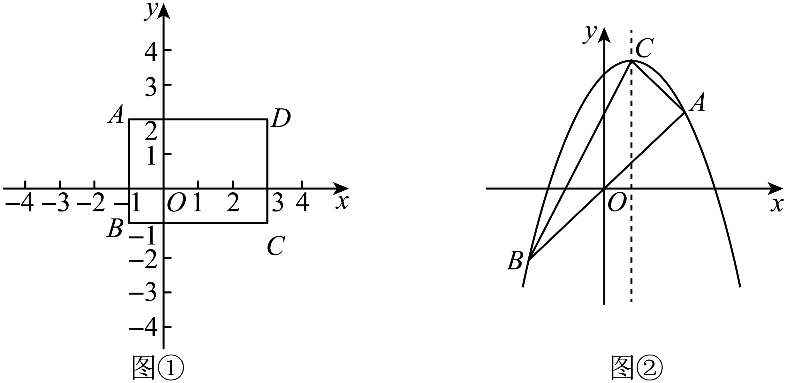  
(1)如图①，矩形 $ABCD$ 的顶点坐标分别是 $A\left(-1,2\right)$ ， $B\left(-1,-1\right)$ ， $C\left(3,-1\right)$ ， $D\left(3,2\right)$ ，在点 $M_{1}\left(1,1\right)$ ， $M_{2}\left(2,2\right)$ ， $M_{3}\left(3,3\right)$ 中，是矩形 $ABCD$ “梦之点”的是\_\_\_\_\_\_\_\_\_\_\_；  
(2)点 $G\left(2,2\right)$ 是反比例函数 $y_{1}=\frac{k}{x}$ 图象上的一个“梦之点”，则该函数图象上的另一个“梦之点”<te*x*t style="italic">H</text>的坐标是\_\_\_\_\_\_\_\_\_\_\_，直线 $GH$ 的解析式是 $y_{2}=$ \_\_\_\_\_\_\_\_\_\_\_．当 $y_{1}>y_{2}$ 时，*x*的取值范围是\_\_\_\_\_\_\_\_\_\_\_．  
(3)如图②，已知点*A*，*B*是抛物线 $y=-\frac{1}{2}x^{2}+x+\frac{9}{2}$ 上的“梦之点”，点*C*是抛物线的顶点，连接 $AC$ ， $AB$ ， $BC$ ，判断 $\bigtriangleup ABC$ 的形状，并说明理由．

## 类型三  新定义问题-图形的性质与变化  

9．（2022·黑龙江绥化·中考真题）定义一种运算； $sin(\alpha +\beta )=sin\alpha cos\beta +cos\alpha sin\beta$ ， $sin(\alpha -\beta )=sin\alpha cos\beta -cos\alpha sin\beta$ ．例如：当 $\alpha =45\circ$ ， $\beta =30\circ$ 时， $sin\left(45\circ +30\circ \right)=$  $\frac{\sqrt{2}}{2}\times \frac{\sqrt{3}}{2}+\frac{\sqrt{2}}{2}\times \frac{1}{2}=\frac{\sqrt{6}+\sqrt{2}}{4}$ ，则 $sin15\circ$ 的值为_______．

10．（2023·江苏·中考真题）综合与实践

定义：将宽与长的比值为 $\frac{\sqrt{2^{2n}+1}-1}{2^{n}}$ （ $n$ 为正整数）的矩形称为 $n$ 阶奇妙矩形．  
（1）概念理解：
当 $n=1$ 时，这个矩形为1阶奇妙矩形，如图（1），这就是我们学习过的黄金矩形，它的宽（ $AD$ ）与长 $\left(CD\right)$ 的比值是\_\_\_\_\_\_\_\_\_．  
（2）操作验证：

用正方形纸片 $ABCD$ 进行如下操作（如图（2））：

第一步：对折正方形纸片，展开，折痕为 $EF$ ，连接 $CE$ ；
第二步：折叠纸片使 $CD$ 落在 $CE$ 上，点 $D$ 的对应点为点 $H$ ，展开，折痕为 $CG$ ；
第三步：过点 $G$ 折叠纸片，使得点 $A、B$ 分别落在边 $AD、BC$ 上，展开，折痕为 $GK$ ．

试说明：矩形 $GDCK$ 是1阶奇妙矩形．

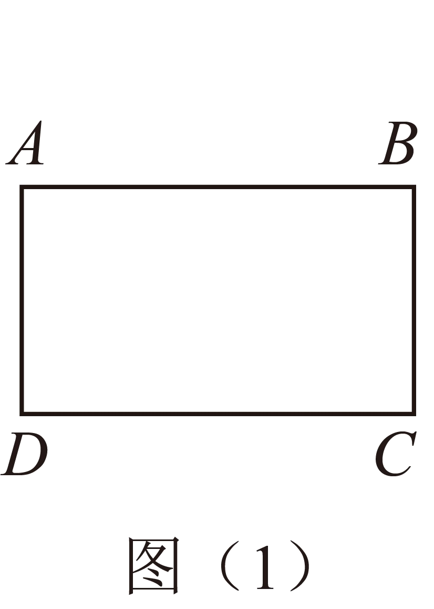

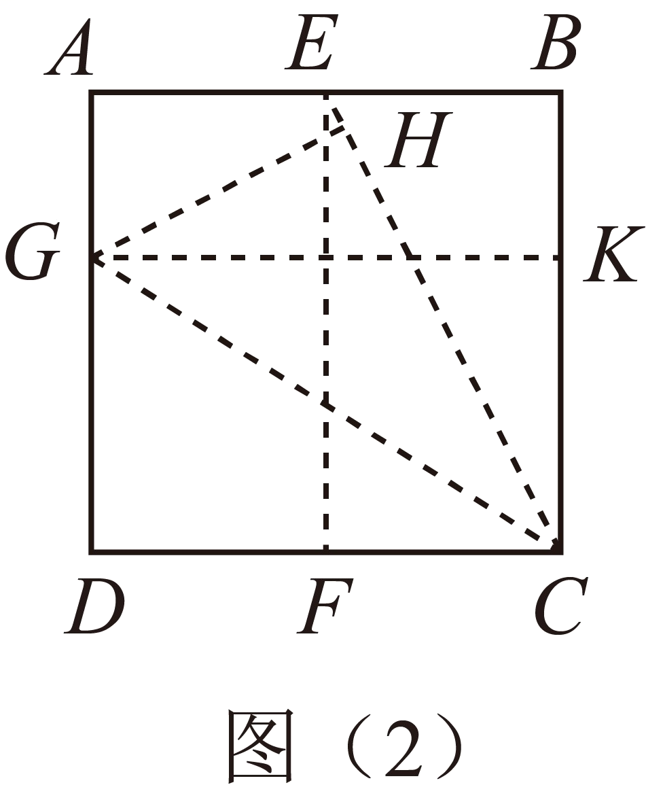

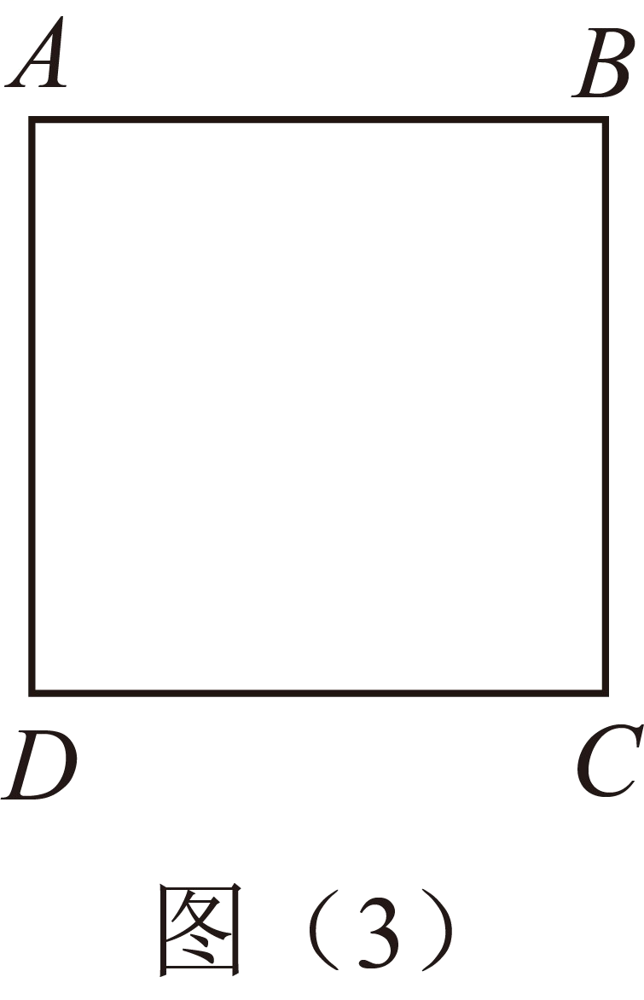

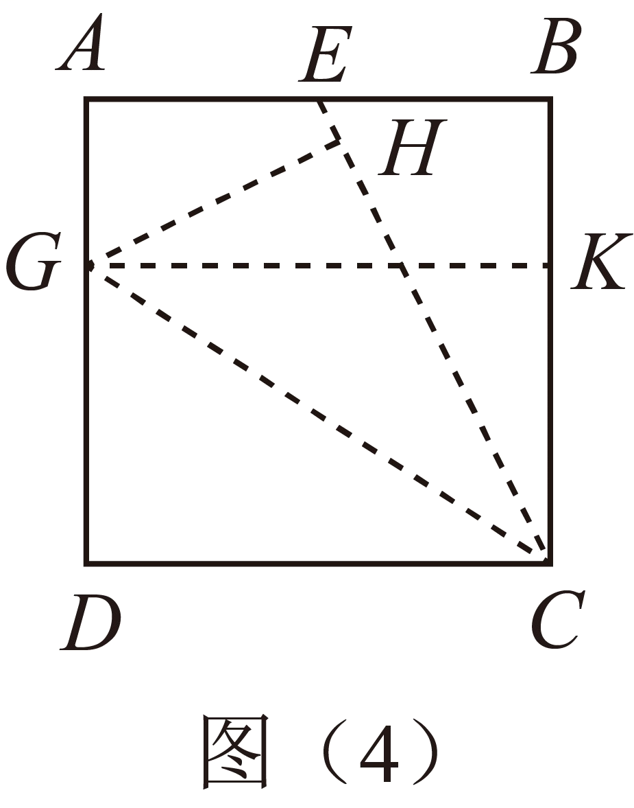  
（3）方法迁移：

用正方形纸片 $ABCD$ 折叠出一个2阶奇妙矩形．要求：在图（3）中画出折叠示意图并作简要标注．  
（4）探究发现：

小明操作发现任一个 $n$ 阶奇妙矩形都可以通过折纸得到．他还发现：如图（4），点 $E$ 为正方形 $ABCD$ 边 $AB$ 上（不与端点重合）任意一点，连接 $CE$ ，继续（2）中操作的第二步、第三步，四边形 $AGHE$ 的周长与矩形 $GDCK$ 的周长比值总是定值．请写出这个定值，并说明理由．

11．（2023·浙江宁波·中考真题）定义：有两个相邻的内角是直角，并且有两条邻边相等的四边形称为邻等四边形，相等两邻边的夹角称为邻等角．

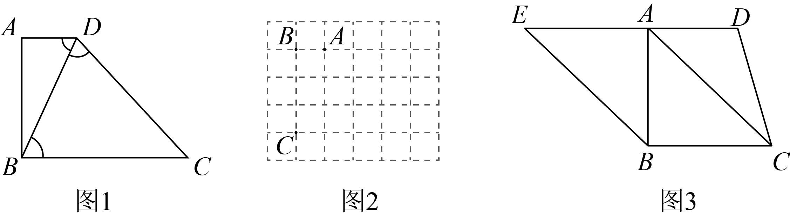  
(1)如图1，在四边形 $ABCD$ 中， $AD\parallel BC,\angle A=90\circ$ ，对角线 $BD$ 平分 $\angle ADC$ ．求证：四边形 $ABCD$ 为邻等四边形．  
(2)如图2，在6×5的方格纸中，*A*，*B*，*C*三点均在格点上，若四边形 $ABCD$ 是邻等四边形，请画出所有符合条件的格点*D*．  
(3)如图3，四边形 $ABCD$ 是邻等四边形， $\angle DAB=\angle ABC=90\circ$ ， $\angle BCD$ 为邻等角，连接 $AC$ ，过*B*作 $BE\parallel AC$ 交 $DA$ 的延长线于点*E*．若 $AC=8,DE=10$ ，求四边形 $EBCD$ 的周长．

12．（2022·北京·中考真题）在平面直角坐标系 $xOy$ 中，已知点 $M(a,b),N.$ 对于点 $P$ 给出如下定义：将点 $P$ 向右 $(a\geq 0)$ 或向左 $(a<0)$ 平移 $\left|a\right|$ 个单位长度，再向上 $(b\geq 0)$ 或向下 $(b<0)$ 平移 $\left|b\right|$ 个单位长度，得到点 $P'$ ，点 $P'$ 关于点 $N$ 的对称点为 $Q$ ，称点 $Q$ 为点 $P$ 的“对应点”．  
(1)如图，点 $M(1,1),$ 点 $N$ 在线段 $OM$ 的延长线上，若点 $P(-2,0),$ 点 $Q$ 为点 $P$ 的“对应点”．

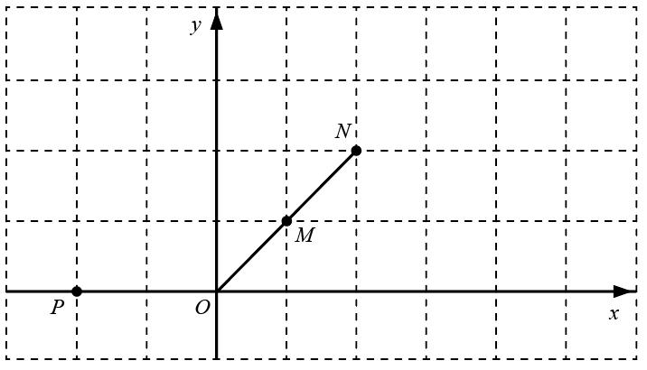

①在图中画出点 $Q$ ；
②连接 $PQ,$ 交线段 $ON$ 于点 $T.$ 求证： $NT=\frac{1}{2}OM;$  
(2) $\odot O$ 的半径为1， $M$ 是 $\odot O$ 上一点，点 $N$ 在线段 $OM$ 上，且 $ON=t(\frac{1}{2}<t<1)$ ，若 $P$ 为 $\odot O$ 外一点，点 $Q$ 为点 $P$ 的“对应点”，连接 $PQ.$ 当点 $M$ 在 $\odot O$ 上运动时直接写出 $PQ$ 长的最大值与最小值的差（用含 $t$ 的式子表示）.

## 题型02  方法迁移题型

13．（2023·湖南张家界·中考真题）阅读下面材料：
将边长分别为*a*， $a+\sqrt{b}$ ， $a+2\sqrt{b}$ ， $a+3\sqrt{b}$ 的正方形面积分别记为 $S_{1}$ ， $S_{2}$ ， $S_{3}$ ， $S_{4}$ ．
则 $S_{2}-S_{1}=(a+\sqrt{b})^{2}-a^{2}$
$=\left[(a+\sqrt{b})+a\right]\cdot \left[(a+\sqrt{b})-a\right]$
$=(2a+\sqrt{b})\cdot \sqrt{b}$
$=b+2a\sqrt{b}$

例如：当 $a=1$ ， $b=3$ 时， $S_{2}-S_{1}=3+2\sqrt{3}$
根据以上材料解答下列问题：  
(1)当 $a=1$ ， $b=3$ 时， $S_{3}-S_{2}=$ \_\_\_\_\_\_， $S_{4}-S_{3}=$ \_\_\_\_\_\_；  
(2)当 $a=1$ ， $b=3$ 时，把边长为 $a+n\sqrt{b}$ 的正方形面积记作 $S_{n+1}$ ，其中*n*是正整数，从（1）中的计算结果，你能猜出 $S_{n+1}-S_{n}$ 等于多少吗？并证明你的猜想；  
(3)当 $a=1$ ， $b=3$ 时，令 $t_{1}=S_{2}-S_{1}$ ， $t_{2}=S_{3}-S_{2}$ ， $t_{3}=S_{4}-S_{3}$ ，…， $t_{n}=S_{n+1}-S_{n}$ ，且 $T=t_{1}+t_{2}+t_{3}+\cdots +t_{50}$ ，求*T*的值．

14．（23-24九年级上·江苏宿迁·阶段练习）阅读材料：各类方程的解法：求解一元一次方程，根据等式的基本性质，把方程转化为<text style="it*a*lic">x</text>＝a的形式，求解二元一次方程组，把它转化为一元一次方程来解：类似的，三元一次方程组，把它转化为解二元一次方程组．求解一元二次方程，把它转化为两个一元一次方程来解．求解分式方程，把它转化为整式方程来解，由于“去分母”可能产生增根，所以解分式方程必须检验．各类方程的解法不尽相同，但是它们有一个共同的基本数学思想﹣﹣转化，把未知转化为已知．用“转化”的数学思想，我们还可以解一些新的方程．例如，一元三次方程 $x^{3}+x^{2}-2x=0$ ，可以通过因式分解把它转化为 $x\left(x^{2}+x-2\right)=0$ ，解方程 $x=0$ 和 $x^{2}+x-2=0$ ，可得方程 $x^{3}+x^{2}-2x=0$ 的解．  
(1)问题：方程 $6x^{3}+14x^{2}-12x=0$ 的解是： $x_{1}=0，x_{2}=$ <u>&lt;text style="underline"&gt;　　</u>&lt;/text&gt;， $x_{3}=$ <u>&lt;text style="underline"&gt;　　</u>&lt;/text&gt;；  
(2)拓展：用“转化”思想求方程 $\sqrt{2x+3}=x$ 的解；  
(3)应用：如图，已知矩形草坪 $ABCD$ 的长 $AD=14$ m，宽 $AB=12$ m，点*<text style="italic">P*</text>在 $AD$ 上（ $AP>PD$ ），小华把一根长为 $28$ m的绳子一段固定在点*B*，把长绳 $PB$ 段拉直并固定在点*<text style="italic">P*</text>，再拉直，长绳的另一端恰好落在点*C*，求 $AP$ 的长．

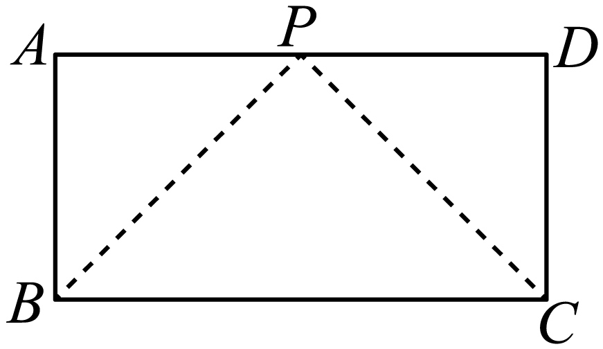

15．（2022·湖北黄石·中考真题）阅读材料，解答问题：

材料1

为了解方程 $\left(x^{2}\right)^{2}-13x^{2}+36=0$ ，如果我们把 $x^{2}$ 看作一个整体，然后设 $y=x^{2}$ ，则原方程可化为 $y^{2}-13y+36=0$ ，经过运算，原方程的解为 $x_{1,2}=\pm 2$ ， $x_{3,4}=\pm 3$ ．我们把以上这种解决问题的方法通常叫做换元法．

材料2

已知实数*<text style="italic">m*</text>，*<text style="italic">n*</text>满足 $m^{2}-m-1=0$ ， $n^{2}-n-1=0$ ，且 $m\ne n$ ，显然*<text style="italic">m*</text>，*<text style="italic">n*</text>是方程 $x^{2}-x-1=0$ 的两个不相等的实数根，由韦达定理可知 $m+n=1$ ， $mn=-1$ ．
根据上述材料，解决以下问题：  
(1)直接应用：

方程 $x^{4}-5x^{2}+6=0$ 的解为\_\_\_\_\_\_\_\_\_\_\_\_\_\_\_\_\_\_\_\_\_\_\_；  
(2)间接应用：

已知实数*a*，*b*满足： $2a^{4}-7a^{2}+1=0$ ， $2b^{4}-7b^{2}+1=0$ 且 $a\ne b$ ，求 $a^{4}+b^{4}$ 的值；  
(3)拓展应用：

已知实数<text st*y*le="italic">x</text>，y满足： $\frac{1}{m^{4}}+\frac{1}{m^{2}}=7$ ， $n^{2}-n=7$ 且 $n>0$ ，求 $\frac{1}{m^{4}}+n^{2}$ 的值．

16．（2023·江苏泰州·中考真题）阅读下面方框内的内容，并完成相应的任务．

<table><tr><td>
小丽学习了方程、不等式、函数后提出如下问题：如何求不等式的解集？

通过思考，小丽得到以下3种方法：

方法1    方程的两根为，，可得函数的图像与<em>x</em>轴的两个交点横坐标为、，画出函数图像，观察该图像在<em>x</em>轴下方的点，其横坐标的范围是不等式的解集．

方法2    不等式可变形为，问题转化为研究函数与的图像关系．画出函数图像，观察发现：两图像的交点横坐标也是、3；的图像在的图像下方的点，其横坐标的范围是该不等式的解集．

方法3    当时，不等式一定成立；当时，不等式变为；当时，不等式变为．问题转化为研究函数与的图像关系…
</td></tr></table>

任务：  
(1)不等式 $x^{2}-x-6<0$ 的解集为\_\_\_\_\_\_\_\_\_\_\_\_\_；  
(2)3种方法都运用了\_\_\_\_\_\_\_\_\_\_\_的数学思想方法（从下面选项中选1个序号即可）；
*A*.分类讨论    *B*.转化思想    *C*.特殊到一般        *D*.数形结合  
(3)请你根据方法3的思路，画出函数图像的简图，并结合图像作出解答．

17．【12345模型】（2023·四川凉山·中考真题）阅读理解题：

阅读材料：

如图1，四边形 $ABCD$ 是矩形， $\bigtriangleup AEF$ 是等腰直角三角形，记 $\angle BAE$ 为 $\alpha$ 、 $\angle FAD$ 为 $\beta$ ，若 $tan\alpha =\frac{1}{2}$ ，则 $tan\beta =\frac{1}{3}$ ．

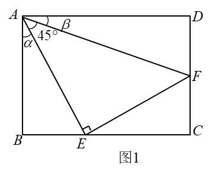
证明：设 $BE=k$ ，∵ $tan\alpha =\frac{1}{2}$ ，∴ $AB=2k$ ，

易证 $\bigtriangleup AEB\allequal \bigtriangleup EFC\left(AAS\right)$
∴ $EC=2k,CF=k$ ，
∴ $FD=k,AD=3k$
∴ $tan\beta =\frac{DF}{AD}=\frac{k}{3k}=\frac{1}{3}$ ，
若 $\alpha +\beta =45\circ$ 时，当 $tan\alpha =\frac{1}{2}$ ，则 $tan\beta =\frac{1}{3}$ ．

同理：若 $\alpha +\beta =45\circ$ 时，当 $tan\alpha =\frac{1}{3}$ ，则 $tan\beta =\frac{1}{2}$ ．
根据上述材料，完成下列问题：

如图2，直线 $y=3x-9$ 与反比例函数 $y=\frac{m}{x}(x>0)$ 的图象交于点 $A$ ，与 $x$ 轴交于点 $B$ ．将直线 $AB$ 绕点 $A$ 顺时针旋转 $45\circ$ 后的直线与 $y$ 轴交于点 $E$ ，过点 $A$ 作 $AM\perp x$ 轴于点 $M$ ，过点 $A$ 作 $AN\perp y$ 轴于点 $N$ ，已知 $OA=5$ ．

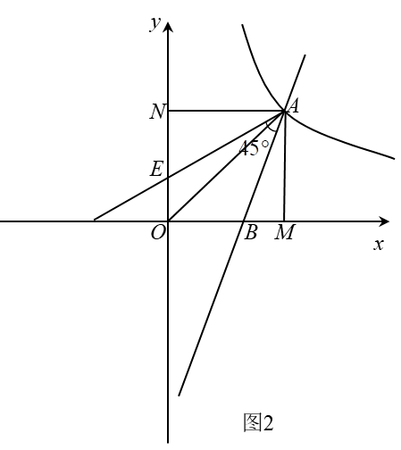  
(1)求反比例函数的解析式；  
(2)直接写出 $tan\angle BAM、tan\angle NAE$ 的值；  
(3)求直线 $AE$ 的解析式．

## 题型03  归纳概括问题

18．（2023·浙江嘉兴·中考真题）观察下面的等式： $3^{2}-1^{2}=8\times 1,5^{2}-3^{2}=8\times 2,7^{2}-5^{2}=8\times 3,9^{2}-7^{2}=8\times 4,\cdots$  
(1)写出 $19^{2}-17^{2}$ 的结果．  
(2)按上面的规律归纳出一个一般的结论（用含*n*的等式表示，*n*为正整数）  
(3)请运用有关知识，推理说明这个结论是正确的．

19．【中点四边形模型】（2023·山西·中考真题）阅读与思考：下面是一位同学的数学学习笔记，请仔细阅读并完成相应任务．

任务：  
(1)填空：材料中的依据1是指：\_\_\_\_\_\_\_\_\_\_\_\_\_．

依据2是指：\_\_\_\_\_\_\_\_\_\_\_\_\_．  
(2)请用刻度尺、三角板等工具，画一个四边形 $ABCD$ 及它的瓦里尼翁平行四边形 $EFGH$ ，使得四边形 $EFGH$ 为矩形；（要求同时画出四边形 $ABCD$ 的对角线）  
(3)在图1中，分别连接 $AC,BD$ 得到图3，请猜想瓦里尼翁平行四边形 $EFGH$ 的周长与对角线 $AC,BD$ 长度的关系，并证明你的结论．

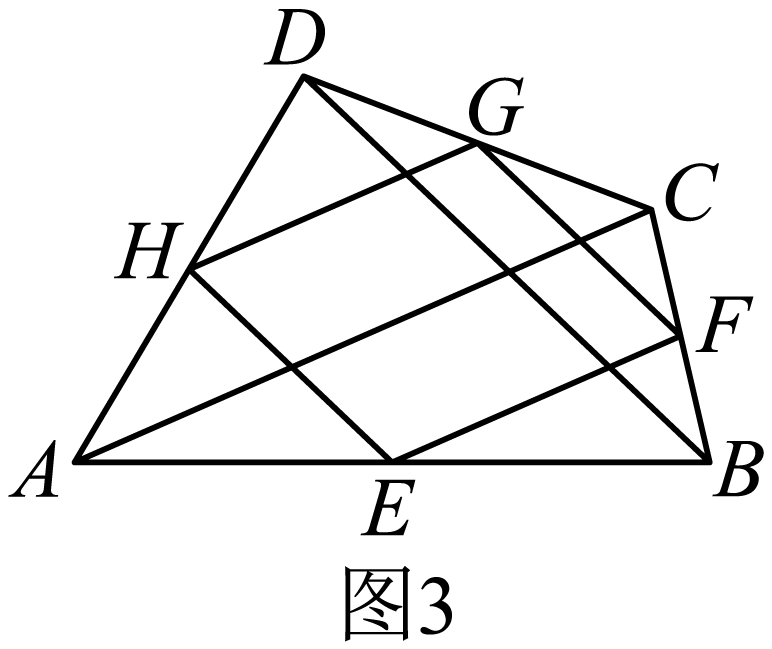

20．（2022·吉林·中考真题）下面是王倩同学的作业及自主探究笔记，请认真阅读并补充完整．

【作业】如图①，直线 $l_{1}\parallel l_{2}$ ， $\bigtriangleup ABC$ 与 $\bigtriangleup DBC$ 的面积相等吗？为什么？

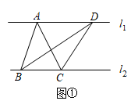
解：相等．理由如下：
设 $l_{1}$ 与 $l_{2}$ 之间的距离为 $h$ ，则 $S_{\bigtriangleup ABC}=\frac{1}{2}BC\cdot h$ ， $S_{\bigtriangleup DBC}=\frac{1}{2}BC\cdot h$ ．
∴ $S_{\bigtriangleup ABC}=S_{\bigtriangleup DBC}$ ．

【探究】  
(1)如图②，当点 $D$ 在 $l_{1}$ ， $l_{2}$ 之间时，设点 $A$ ， $D$ 到直线 $l_{2}$ 的距离分别为 $h$ ， $h^{'}$ ，则 $\frac{S_{\bigtriangleup ABC}}{S_{\bigtriangleup DBC}}=\frac{h}{h^{'}}$ ．

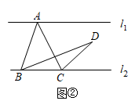
证明：∵ $S_{\bigtriangleup ABC}$

\_

\_  
(2)如图③，当点 $D$ 在 $l_{1}$ ， $l_{2}$ 之间时，连接 $AD$ 并延长交 $l_{2}$ 于点 $M$ ，则 $\frac{S_{\bigtriangleup ABC}}{S_{\bigtriangleup DBC}}=\frac{AM}{DM}$ ．

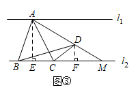
证明：过点 $A$ 作 $AE\perp BM$ ，垂足为 $E$ ，过点 $D$ 作 $DF\perp BM$ ，垂足为 $F$ ，则 $\angle AEM=\angle DFM=90\circ$ ，
∴ $AE\parallel$ _．
∴ $\bigtriangleup AEM\backsim$ _．
∴ $\frac{AE}{DF}=\frac{AM}{DM}$ ．
由【探究】（1）可知 $\frac{S_{\bigtriangleup ABC}}{S_{\bigtriangleup DBC}}=$ _，
∴ $\frac{S_{\bigtriangleup ABC}}{S_{\bigtriangleup DBC}}=\frac{AM}{DM}$ ．  
(3)如图④，当点 $D$ 在 $l_{2}$ 下方时，连接 $AD$ 交 $l_{2}$ 于点 $E$ ．若点 $A$ ， $E$ ， $D$ 所对应的刻度值分别为5，1.5，0， $\frac{S_{\bigtriangleup ABC}}{S_{\bigtriangleup DBC}}$ 的值为_．

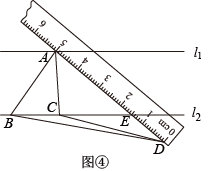

21．（2022·湖南·中考真题）阅读下列材料：
在 $\bigtriangleup ABC$ 中， $\angle A$ 、 $\angle B$ 、 $\angle C$ 所对的边分别为 $a$ 、 $b$ 、 $c$ ，求证： $\frac{a}{sinA}=\frac{b}{sinB}$ ．
证明：如图1，过点 $C$ 作 $CD\perp AB$ 于点 $D$ ，则：
在 $Rt\Delta BCD$ 中，<text style="it*a*lic"> CD</text>=asin*B*
在 $Rt\Delta ACD$ 中， $CD=bsinA$
$\therefore asinB=bsinA$
$\therefore \frac{a}{sinA}=\frac{b}{sinB}$
根据上面的材料解决下列问题：

  
(1)如图2，在 $\Delta ABC$ 中， $\angle A$ 、 $\angle B$ 、 $\angle C$ 所对的边分别为 $a$ 、 $b$ 、 $c$ ，求证： $\frac{b}{sinB}=\frac{c}{sinC}$ ；  
(2)为了办好湖南省首届旅游发展大会，张家界市积极优化旅游环境．如图3，规划中的一片三角形区域需美化，已知 $\angle A=67\circ$ ， $\angle B=53\circ$ ， $AC=80$ 米，求这片区域的面积．（结果保留根号．参考数据： $sin53\circ \approx 0.8$ ， $sin67\circ \approx 0.9)$

## 题型04  探究实践类问题

22．（2023·山东潍坊·中考真题）［材料阅读]

用数形结合的方法，可以探究 $q+q^{2}+q^{3}+...+q^{n}+\ldots$ 的值，其中 $0<q<1$ ．

例求 $\frac{1}{2}+\left(\frac{1}{2}\right)^{2}+\left(\frac{1}{2}\right)^{3}+\cdots +\left(\frac{1}{2}\right)^{n}+\cdots$ 的值．
方法1：借助面积为1的正方形，观察图①可知
$\frac{1}{2}+\left(\frac{1}{2}\right)^{2}+\left(\frac{1}{2}\right)^{3}+\cdots +\left(\frac{1}{2}\right)^{n}+\cdots$ 的结果等于该正方形的面积，
即 $\frac{1}{2}+\left(\frac{1}{2}\right)^{2}+\left(\frac{1}{2}\right)^{3}+\cdots +\left(\frac{1}{2}\right)^{n}+\cdots =1$ ．
方法2：借助函数 $y=\frac{1}{2}x+\frac{1}{2}$ 和 $y=x$ 的图象，观察图②可知
$\frac{1}{2}+\left(\frac{1}{2}\right)^{2}+\left(\frac{1}{2}\right)^{3}+\cdots +\left(\frac{1}{2}\right)^{n}+\cdots$ 的结果等于 $a_{1}$ ， $a_{2}$ ， $a_{3}$ ，…， $a_{n}$ …等各条竖直线段的长度之和，
即两个函数图象的交点到 $x$ 轴的距离．因为两个函数图象的交点 $(1,1)$ 到 $x$ 轴的距为1，
所以， $\frac{1}{2}+\left(\frac{1}{2}\right)^{2}+\left(\frac{1}{2}\right)^{3}+\cdots +\left(\frac{1}{2}\right)^{n}+\cdots =1$ ．

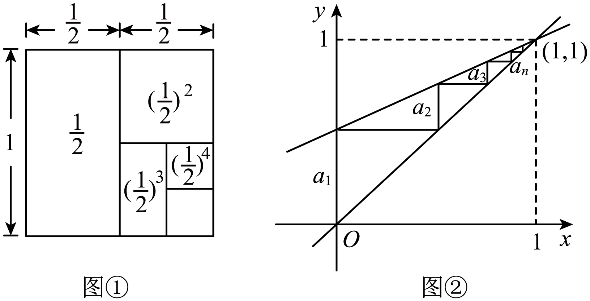

【实践应用】

任务一   完善 $\frac{2}{3}+\left(\frac{2}{3}\right)^{2}+\left(\frac{2}{3}\right)^{3}+\cdots +\left(\frac{2}{3}\right)^{n}+\cdots$ 的求值过程．

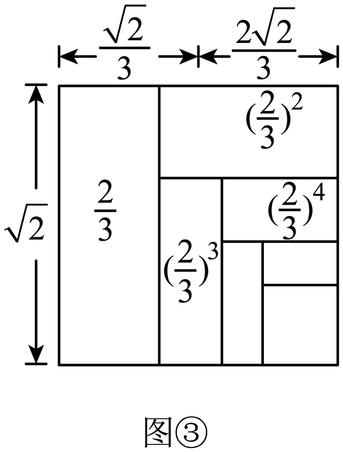
方法1：借助面积为2的正方形，观察图③可知 $\frac{2}{3}+\left(\frac{2}{3}\right)^{2}+\left(\frac{2}{3}\right)^{3}+\cdots +\left(\frac{2}{3}\right)^{n}+\cdots =$ \_\_\_\_\_\_．
方法2：借助函数 $y=\frac{2}{3}x+\frac{2}{3}$ 和 $y=x$ 的图象，观察图④可知
因为两个函数图象的交点的坐标为\_\_\_\_\_\_，
所以， $\frac{2}{3}+\left(\frac{2}{3}\right)^{2}+\left(\frac{2}{3}\right)^{3}+\cdots +\left(\frac{2}{3}\right)^{n}+\cdots =$ \_\_\_\_\_\_．

任务二   参照上面的过程，选择合适的方法，求 $\frac{3}{4}+\left(\frac{3}{4}\right)^{2}+\left(\frac{3}{4}\right)^{3}+\cdots +\left(\frac{3}{4}\right)^{2}+\cdots$ 的值．

任务三   用方法2，求 $q+q^{2}+q^{3}+\cdots +q^{n}+\cdots$ 的值（结果用 $q$ 表示）．

【迁移拓展】

长宽之比为 $\frac{\sqrt{5}+1}{2}:1$ 的矩形是黄金矩形，将黄金矩形依次截去一个正方形后，得到的新矩形仍是黄金矩形．

观察图⑤，直接写出 $\left(\frac{\sqrt{5}-1}{2}\right)^{2}+\left(\frac{\sqrt{5}-1}{2}\right)^{4}+\left(\frac{\sqrt{5}-1}{2}\right)^{6}+\cdots +\left(\frac{\sqrt{5}-1}{2}\right)^{2n}+\cdots$ 的值．

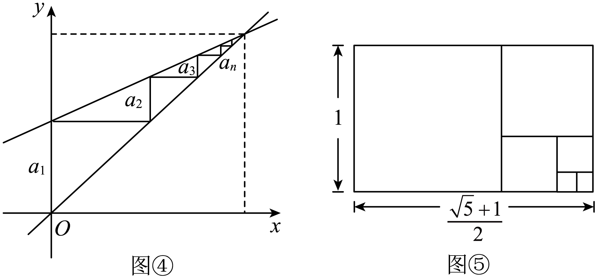

23．（2023·甘肃兰州·中考真题）综合与实践

【思考尝试】  
（1）数学活动课上，老师出示了一个问题：如图1，在矩形*ABCD*中，*E*是边 $AB$ 上一点， $DF\perp CE$ 于点*F*， $GD\perp DF$ ， $AG\perp DG$ ， $AG=CF$ ．试猜想四边形 $ABCD$ 的形状，并说明理由；
【实践探究】  
（2）小睿受此问题启发，逆向思考并提出新的问题：如图2，在正方形 $ABCD$ 中，*E*是边 $AB$ 上一点， $DF\perp CE$ 于点*F*， $AH\perp CE$ 于点*H*， $GD\perp DF$ 交 $AH$ 于点*G*，可以用等式表示线段 $FH$ ， $AH$ ， $CF$ 的数量关系，请你思考并解答这个问题；
【拓展迁移】  
（3）小博深入研究小睿提出的这个问题，发现并提出新的探究点：如图3，在正方形 $ABCD$ 中，*E*是边 $AB$ 上一点， $AH\perp CE$ 于点*H*，点*M*在 $CH$ 上，且 $AH=HM$ ，连接 $AM$ ， $BH$ ，可以用等式表示线段 $CM$ ， $BH$ 的数量关系，请你思考并解答这个问题．

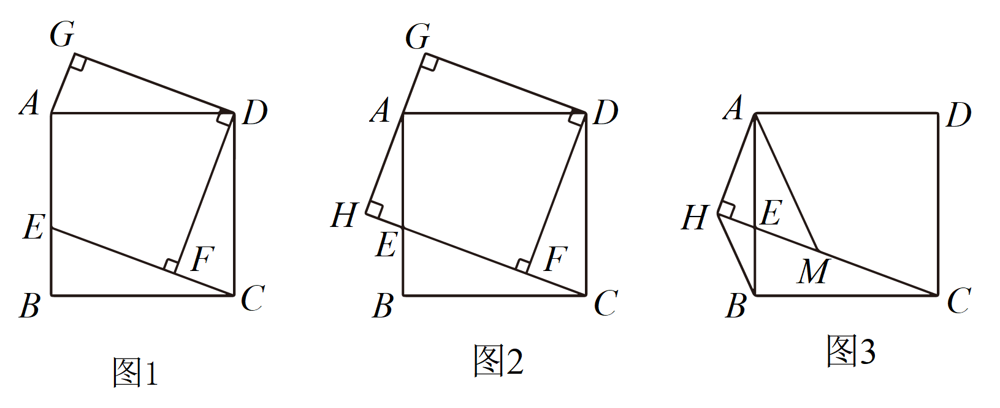

24．（2023·甘肃兰州·中考真题）综合与实践

问题探究：（1）如图1是古希腊数学家欧几里得所著的《几何原本》第1卷命题9：“平分一个已知角．”即：作一个已知角的平分线，如图2是欧几里得在《几何原本》中给出的角平分线作图法：在 $OA$ 和 $OB$ 上分别取点*C*和*D*，使得 $OC=OD$ ，连接 $CD$ ，以 $CD$ 为边作等边三角形 $CDE$ ，则 $OE$ 就是 $\angle AOB$ 的平分线．

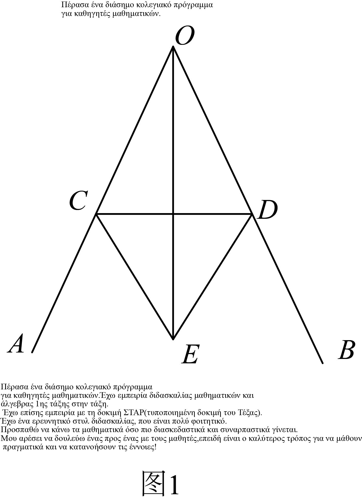

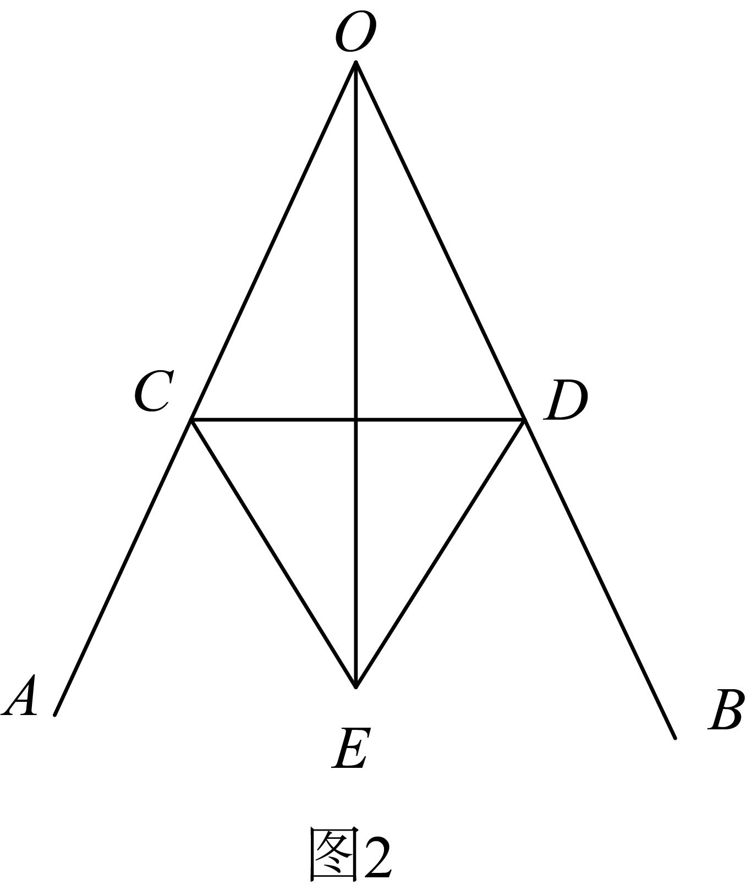

请写出 $OE$ 平分 $\angle AOB$ 的依据：\_\_\_\_\_\_\_\_\_\_\_\_；
类比迁移：  
（2）小明根据以上信息研究发现： $\bigtriangleup CDE$ 不一定必须是等边三角形，只需 $CE=DE$ 即可．他查阅资料：我国古代已经用角尺平分任意角．做法如下：如图3，在 $\angle AOB$ 的边 $OA$ ， $OB$ 上分别取 $OM=ON$ ，移动角尺，使角尺两边相同刻度分别与点*M*，*N*重合，则过角尺顶点*C*的射线 $OC$ 是 $\angle AOB$ 的平分线，请说明此做法的理由；
拓展实践：  
（3）小明将研究应用于实践．如图4，校园的两条小路 $AB$ 和 $AC$ ，汇聚形成了一个岔路口<em>&lt;text style="italic"&gt;&lt;text style="italic"&gt;A</em>&lt;/text&gt;&lt;/text&gt;，现在学校要在两条小路之间安装一盏路灯<em>&lt;text style="italic"&gt;&lt;text style="italic"&gt;E</em>&lt;/text&gt;&lt;/text&gt;，使得路灯照亮两条小路（两条小路一样亮），并且路灯E到岔路口A的距离和休息椅<em>D</em>到岔路口A的距离相等．试问路灯应该安装在哪个位置？请用不带刻度的直尺和圆规在对应的示意图5中作出路灯E的位置．（保留作图痕迹，不写作法）

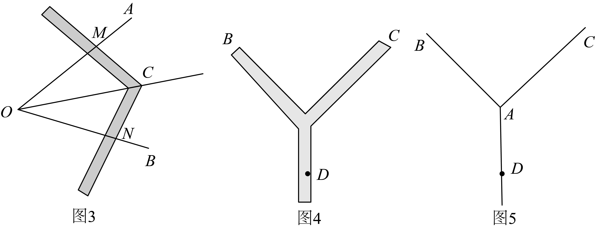

25．【手拉手模型】（2023·黑龙江齐齐哈尔·中考真题）综合与实践

数学模型可以用来解决一类问题，是数学应用的基本途径．通过探究图形的变化规律，再结合其他数学知识的内在联系，最终可以获得宝贵的数学经验，并将其运用到更广阔的数学天地．

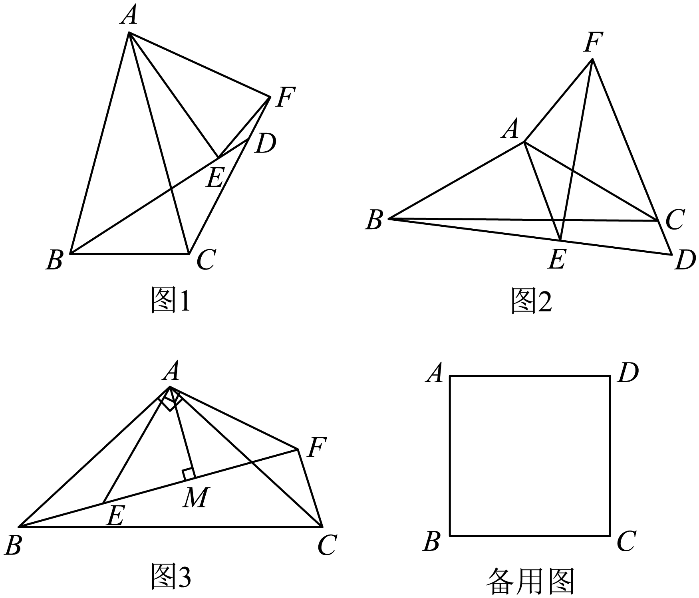  
(1)发现问题：如图1，在 $\bigtriangleup ABC$ 和 $\bigtriangleup AEF$ 中， $AB=AC$ ， $AE=AF$ ， $\angle BAC=\angle EAF=30\circ$ ，连接 $BE$ ， $CF$ ，延长 $BE$ 交 $CF$ 于点 $D$ ．则 $BE$ 与 $CF$ 的数量关系：\_\_\_\_\_\_， $\angle BDC=$ \_\_\_\_\_\_ $\circ$ ；  
(2)类比探究：如图2，在 $\bigtriangleup ABC$ 和 $\bigtriangleup AEF$ 中， $AB=AC$ ， $AE=AF$ ， $\angle BAC=\angle EAF=120\circ$ ，连接 $BE$ ， $CF$ ，延长 $BE$ ， $FC$ 交于点 $D$ ．请猜想 $BE$ 与 $CF$ 的数量关系及 $\angle BDC$ 的度数，并说明理由；  
(3)拓展延伸：如图3， $\bigtriangleup ABC$ 和 $\bigtriangleup AEF$ 均为等腰直角三角形， $\angle BAC=\angle EAF=90\circ$ ，连接 $BE$ ， $CF$ ，且点 $B$ ， $E$ ， $F$ 在一条直线上，过点 $A$ 作 $AM\perp BF$ ，垂足为点 $M$ ．则 $BF$ ， $CF$ ， $AM$ 之间的数量关系：\_\_\_\_\_\_；  
(4)实践应用：正方形 $ABCD$ 中， $AB=2$ ，若平面内存在点 $P$ 满足 $\angle BPD=90\circ$ ， $PD=1$ ，则 $S_{\bigtriangleup ABP}=$ \_\_\_\_\_\_．

