重难点突破06 开放探究与新定义问题

目 录

- [题型01  新定义问题](#_Toc164072568)
- [类型一  新定义问题-数、式、方程](#_Toc164072569)
- [类型二  新定义问题-函数](#_Toc164072570)
- [类型三  新定义问题-图形的性质与变化](#_Toc164072571)
- [题型02  方法迁移题型](#_Toc164072572)
- [题型03  归纳概括问题](#_Toc164072573)
- [题型04  探究实践类问题](#_Toc164072574)

【命题趋势】开放探究与新定义问题是近年中考数学的热点问题．开放探究（阅读理解）问题通常不会单独考查，往往会结合初中数学中某个知识点进行命题，进而既能考查初中数学中某个知识点的掌握情况，又能考查学生的自学能力和分析问题、解决问题的能力． 新定义问题是在问题中定义了初中数学中没有学过的一些新概念、新运算、新符号，要求学生读懂题意并结合已有知识进行理解，而后根据新定义进行运算、推理、迁移的一种题型．一般有三种类型问题：（1）定义新运算；（2）定义初、高中知识衔接新知识；（3）定义新概念．这类试题考查考生对新定义的理解和认识，以及灵活运用知识的能力，解题时需要将新定义的知识与已学知识联系起来，利用已有的知识经验来解决问题．

## 题型01  新定义问题

## 类型一  新定义问题-数、式、方程

1．（2022·四川巴中·中考真题）对于实数 $a$ ， $b$ 定义新运算： $a \textreferencemark b=ab^{2}-b$ ，若关于 $x$ 的方程 $1 \textreferencemark x=k$ 有两个不相等的实数根，则 $k$ 的取值范围（    ）

A． $k>-\frac{1}{4}$ 	
B． $k<-\frac{1}{4}$ 	
C． $k>-\frac{1}{4}$ 且 $k\ne 0$ 	
D． $k\geq -\frac{1}{4}$ 且 $k\ne 0$

【答案】A

【分析】根据新定义运算法则列方程，然后根据一元二次方程的概念和一元二次方程的根的判别式列不等式组求解．

【详解】解：∵ $1 \textreferencemark x=k$ ，
∴ $x^{2}-x=k$ ，
即 $x^{2}-x-k=0$ ，
∵关于 $x$ 的方程 $1 \textreferencemark x=k$ 有两个不相等的实数根，
∴ $\Delta =\left(-1\right)^{2}-4\times \left(-k\right)＞0$ ，
解得： $k＞-\frac{1}{4}$ ，故A正确．
故选：A．

【点睛】本题属于新定义题目，考查一元二次方程的根的判别式，熟练掌握根的判别式 $\Delta ＝b^{2}-4ac$ 当Δ＞0，方程有两个不相等的实数根；当Δ＝0，方程有两个相等的实数根；当Δ＜0方程没有实数根．

2．（2022·内蒙古·中考真题）对于实数<te*x*t style="italic">a</text>，*b*定义运算“⊗”为 $a\otimes b=b^{2}-ab$ ，例如 $3\otimes 2=2^{2}-3\times 2=-2$ ，则关于*x*的方程 $(k-3)$  $\otimes x=k-1$ 的根的情况，下列说法正确的是（    ）

A．有两个不相等的实数根	
B．有两个相等的实数根

C．无实数根	
D．无法确定

【答案】A

【分析】先根据新定义得到关于*x*的方程为 $x^{2}-\left(k-3\right)x+1-k=0$ ，再利用一元二次方程根的判别式求解即可．

【详解】解：∵ $\left(k-3\right)\otimes x=k-1$ ，
∴ $x^{2}-\left(k-3\right)x=k-1$ ，
∴ $x^{2}-\left(k-3\right)x+1-k=0$ ，
∴ $\Delta =b^{2}-4ac=\left(k-3\right)^{2}-4\left(1-k\right)=k^{2}-6k+9-4+4k=\left(k-1\right)^{2}+4>0$ ，
∴方程 $x^{2}-\left(k-3\right)x+1-k=0$ 有两个不相等的实数根，
故选A．

【点睛】本题主要考查了一元二次方程根的判别式，新定义下的实数运算，正确得到关于*x*的方程为 $x^{2}-\left(k-3\right)x+1-k=0$ 是解题的关键．

3．（2022·浙江宁波·中考真题）定义一种新运算：对于任意的非零实数&lt;te<em>x</em>t style="italic"&gt;a&lt;/text&gt;，<em>b</em>， $a\otimes b=\frac{1}{a}+\frac{1}{b}$ ．若 $(x+1)\otimes x=\frac{2x+1}{x}$ ，则<em>x</em>的值为___________．

【答案】 $-\frac{1}{2}$ / $-0.5$

【分析】根据新定义可得 $(x+1)\otimes x=\frac{2x+1}{x^{2}+x}$ ，由此建立方程 $\frac{2x+1}{x^{2}+x}=\frac{2x+1}{x}$ 解方程即可．

【详解】解：∵ $a\otimes b=\frac{1}{a}+\frac{1}{b}$ ，
∴ $(x+1)\otimes x=\frac{1}{x+1}+\frac{1}{x}=\frac{x+1+x}{x\left(x+1\right)}=\frac{2x+1}{x^{2}+x}$ ，
又∵ $(x+1)\otimes x=\frac{2x+1}{x}$ ，
∴ $\frac{2x+1}{x^{2}+x}=\frac{2x+1}{x}$ ，
∴ $\left(x^{2}+x\right)\left(2x+1\right)-x\left(2x+1\right)=0$ ，
∴ $\left(x^{2}+x-x\right)\left(2x+1\right)=0$ ，
∴ $x^{2}\left(2x+1\right)=0$ ，
∵ $(x+1)\otimes x=\frac{2x+1}{x}$ 即 $x\ne 0$ ，
∴ $2x+1=0$ ，
解得 $x=-\frac{1}{2}$ ，
经检验 $x=-\frac{1}{2}$ 是方程 $\frac{2x+1}{x^{2}+x}=\frac{2x+1}{x}$ 的解，
故答案为： $-\frac{1}{2}$ ．

【点睛】本题主要考查了新定义下的实数运算，解分式方程，正确理解题意得到关于*x*的方程是解题的关键．

4．（2023·山东枣庄·中考真题）对于任意实数*a*，*b*，定义一种新运算： $a \textreferencemark b=\left\{\begin{matrix}a-b&\left(a\geq 2b\right)\\a+b-6&(a<2b)\end{matrix}\right$ ，例如： $3 \textreferencemark 1=3-1=2$ ， $5 \textreferencemark 4=5+4-6=3$ ．根据上面的材料，请完成下列问题：  
(1) $4 \textreferencemark 3=$ \_\_\_\_\_\_\_\_\_\_\_， $(-1) \textreferencemark (-3)=$ \_\_\_\_\_\_\_\_\_\_\_；  
(2)若 $(3x+2) \textreferencemark (x-1)=5$ ，求*x*的值．

【答案】(1)1；2；  
(2) $x=1$ ，

【分析】（1）原式利用题中的新定义计算即可求出值；  
（2）已知等式利用已知的新定义进行分类讨论并列出方程，再计算求出*x*的值即可．

【详解】（1） $\because 4＜3\times 2$ ，
$\therefore 4 \textreferencemark 3=4+3-6=1$ ，
$\because -1＞\left(-3\right)\times 2$
$\therefore (-1) \textreferencemark (-3)=-1-(-3)=2$ ；
故答案为：1；2；  
（2）若 $3x+2\geq 2(x-1)$ 时，即 $x\geq -4$ 时，则
$(3x+2)-(x-1)=5$ ，
解得： $x=1$ ，
若 $3x+2＜2(x-1)$ 时，即 $x＜-4$ 时，则
$(3x+2)+(x-1)-6=5$ ，
解得： $x=\frac{5}{2}$ ，不合题意，舍去，
$\therefore x=1$ ，

【点睛】此题考查了实数的新定义运算及解一元一次方程，弄清题中的新定义是解本题的关键．

## 类型二  新定义问题-函数

5．（2023·山东济南·中考真题）定义：在平面直角坐标系中，对于点 $P\left(x_{1},y_{1}\right)$ ，当点 $Q\left(x_{2},y_{2}\right)$ 满足 $2\left(x_{1}+x_{2}\right)=y_{1}+y_{2}$ 时，称点 $Q\left(x_{2},y_{2}\right)$ 是点 $P\left(x_{1},y_{1}\right)$ 的“倍增点”，已知点 $P_{1}\left(1,0\right)$ ，有下列结论：

①点 $Q_{1}\left(3,8\right)$ ， $Q_{2}\left(-2,-2\right)$ 都是点 $P_{1}$ 的“倍增点”；
②若直线 $y=x+2$ 上的点*A*是点 $P_{1}$ 的“倍增点”，则点 $A$ 的坐标为 $\left(2,4\right)$ ；
③抛物线 $y=x^{2}-2x-3$ 上存在两个点是点 $P_{1}$ 的“倍增点”；
④若点 $B$ 是点 $P_{1}$ 的“倍增点”，则 $P_{1}B$ 的最小值是 $\frac{4\sqrt{5}}{5}$ ．
其中，正确结论的个数是（　　　）

A．1	
B．2	
C．3	
D．4

【答案】C

【分析】①根据题目所给“倍增点”定义，分别验证 $Q_{1},Q_{2}$ 即可；②点 $A\left(a,a+2\right)$ ，根据“倍增点”定义，列出方程，求出*a*的值，即可判断；③设抛物线上点 $D\left(t,t^{2}-2t-3\right)$ 是点 $P_{1}$ 的“倍增点”，根据“倍增点”定义列出方程，再根据判别式得出该方程根的情况，即可判断；④设点 $B\left(m,n\right)$ ，根据“倍增点”定义可得 $2\left(m+1\right)=n$ ，根据两点间距离公式可得 $P_{1}B^{2}=\left(m-1\right)^{2}+n^{2}$ ，把 $n=2\left(m+1\right)$ 代入化简并配方，即可得出 $P_{1}B^{2}$ 的最小值为 $\frac{16}{5}$ ，即可判断．

【详解】解：①∵ $P_{1}\left(1,0\right)$ ， $Q_{1}\left(3,8\right)$ ，
∴ $2\left(x_{1}+x_{2}\right)=2\times \left(1+3\right)=8,y_{1}+y_{2}=0+8=8$ ，
∴ $2\left(x_{1}+x_{2}\right)=y_{1}+y_{2}$ ，则 $Q_{1}\left(3,8\right)$ 是点 $P_{1}$ 的“倍增点”；
∵ $P_{1}\left(1,0\right)$ ， $Q_{2}\left(-2,-2\right)$ ，
∴ $2\left(x_{1}+x_{2}\right)=2\times \left(1-2\right)=-2,y_{1}+y_{2}=0-2=-2$ ，
∴ $2\left(x_{1}+x_{2}\right)=y_{1}+y_{2}$ ，则 $Q_{2}\left(-2,-2\right)$ 是点 $P_{1}$ 的“倍增点”；
故①正确，符合题意；
②设点 $A\left(a,a+2\right)$ ，
∵点*A*是点 $P_{1}$ 的“倍增点”，
∴ $2\times \left(1+a\right)=0+a+2$ ，
解得： $a=0$ ，
∴ $A\left(0,2\right)$ ，
故②不正确，不符合题意；
③设抛物线上点 $D\left(t,t^{2}-2t-3\right)$ 是点 $P_{1}$ 的“倍增点”，
∴ $2\left(1+t\right)=t^{2}-2t-3$ ，整理得： $t^{2}-4t-5=0$ ，
∵ $\Delta =\left(-4\right)^{2}-4\times 1\times \left(-5\right)=36>0$ ，
∴方程有两个不相等实根，即抛物线 $y=x^{2}-2x-3$ 上存在两个点是点 $P_{1}$ 的“倍增点”；
故③正确，符合题意；
④设点 $B\left(m,n\right)$ ，
∵点 $B$ 是点 $P_{1}$ 的“倍增点”，
∴ $2\left(m+1\right)=n$ ，
∵ $B\left(m,n\right)$ ， $P_{1}\left(1,0\right)$ ，
∴ $P_{1}B^{2}=\left(m-1\right)^{2}+n^{2}$
$=\left(m-1\right)^{2}+\left[2\left(m+1\right)^{2}\right]$
$=5m^{2}+6m+5$
$=5\left(m+\frac{3}{5}\right)^{2}+\frac{16}{5}$ ，
∵ $5>0$ ，
∴ $P_{1}B^{2}$ 的最小值为 $\frac{16}{5}$ ，
∴ $P_{1}B$ 的最小值是 $\sqrt{\frac{16}{5}}=\frac{4\sqrt{5}}{5}$ ，
故④正确，符合题意；
综上：正确的有①③④，共3个．
故选：C．

【点睛】本题主要考查了新定义，解一元一次方程，一元二次方程根的判别式，两点间的距离公式，解题的关键是正确理解题目所给“倍增点”定义，根据定义列出方程求解．

6．（2023·江苏盐城·中考真题）定义：若一次函数的图象与二次函数的图象有两个交点，并且都在坐标轴上，则称二次函数为一次函数的轴点函数．

【初步理解】  
（1）现有以下两个函数：① $y=x^{2}-1$ ；② $y=x^{2}-x$ ，其中，\_\_\_\_\_\_\_\_\_为函数 $y=x-1$ 的轴点函数．（填序号）

【尝试应用】  
（2）函数 $y=x+c$ （ $c$ 为常数， $c>0$ ）的图象与 $x$ 轴交于点 $A$ ，其轴点函数 $y=ax^{2}+bx+c$ 与 $x$ 轴的另一交点为点 $B$ .若 $OB=\frac{1}{4}OA$ ，求 $b$ 的值．

【拓展延伸】  
（3）如图，函数 $y=\frac{1}{2}x+t$ （ $t$ 为常数， $t>0$ ）的图象与 $x$ 轴、 $y$ 轴分别交于 $M$ ， $C$ 两点，在 $x$ 轴的正半轴上取一点 $N$ ，使得 $ON=OC$ .以线段 $MN$ 的长度为长、线段 $MO$ 的长度为宽，在 $x$ 轴的上方作矩形 $MNDE$ .若函数 $y=\frac{1}{2}x+t$ （ $t$ 为常数， $t>0$ ）的轴点函数 $y=mx^{2}+nx+t$ 的顶点 $P$ 在矩形 $MNDE$ 的边上，求 $n$ 的值．

【答案】（1）①；（2） $b=5$ 或 $-3$ ；（3） $n=1$ 或 $n=-1-\sqrt{2}$ 或 $n=\frac{1}{4}$

【分析】（1）求出函数 $y=x-1$ 与坐标轴的交点，再判断这两个点在不在二次函数图象上即可；  
（2）求出函数 $y=x+c$ 与坐标轴的交点，再由 $OB=\frac{1}{4}OA$ 求出点 $B$ 坐标，代入二次函数解析式计算即可；  
（3）先求出 $M$ ， $C$ 的坐标，再根据 $y=mx^{2}+nx+t$ 的顶点 $P$ 在矩形 $MNDE$ 的边上分类讨论即可．

【详解】（1）函数 $y=x-1$ 交 $x$ 轴于 $\left(1,0\right)$ ，交 $y$ 轴于 $\left(0,-1\right)$ ，
∵点 $\left(1,0\right)$ 、 $\left(0,-1\right)$ 都在 $y=x^{2}-1$ 函数图象上
∴① $y=x^{2}-1$ 为函数 $y=x-1$ 的轴点函数；
∵点 $\left(0,-1\right)$ 不在 $y=x^{2}-x$ 函数图象上
∴② $y=x^{2}-x$ 不是函数 $y=x-1$ 的轴点函数；
故答案为：①；  
（2）函数 $y=x+c$ 交 $x$ 轴于 $A\left(-c,0\right)$ ，交 $y$ 轴于 $\left(0,c\right)$ ，
∵函数 $y=x+c$ 的轴点函数 $y=ax^{2}+bx+c$
∴ $A\left(-c,0\right)$ 和 $\left(0,c\right)$ 都在 $y=ax^{2}+bx+c$ 上，
∵ $c>0$
∴ $OA=c$
∵ $OB=\frac{1}{4}OA$ ，
∴ $OB=\frac{1}{4}c$
∴ $B\left(-\frac{1}{4}c,0\right)$ 或 $B\left(\frac{1}{4}c,0\right)$
当 $B\left(-\frac{1}{4}c,0\right)$ 时，把 $A\left(-c,0\right)$  $B\left(-\frac{1}{4}c,0\right)$ 代入 $y=ax^{2}+bx+c$ 得
$\left\{\begin{array}{c}0=\frac{1}{16}ac^{2}-\frac{1}{4}bc+c\\0=ac^{2}-bc+c\end{array}\right$ ，解得 $b=5$ ，
当 $B\left(\frac{1}{4}c,0\right)$ 时，把 $A\left(-c,0\right)$  $B\left(\frac{1}{4}c,0\right)$ 代入 $y=ax^{2}+bx+c$ 得
$\left\{\begin{array}{c}0=\frac{1}{16}ac^{2}+\frac{1}{4}bc+c\\0=ac^{2}-bc+c\end{array}\right$ ，解得 $b=-3$ ，

综上， $b=5$ 或 $-3$ ；  
（3）函数 $y=\frac{1}{2}x+t$ 交 $x$ 轴于 $M\left(-2t,0\right)$ ，交 $y$ 轴于 $C\left(0,t\right)$ ，
∵ $ON=OC$ ，以线段 $MN$ 的长度为长、线段 $MO$ 的长度为宽，在 $x$ 轴的上方作矩形 $MNDE$
∴ $N\left(t,0\right)$ ， $D\left(t,2t\right)$ ， $E\left(-2t,2t\right)$ ,
∵函数 $y=\frac{1}{2}x+t$ （ $t$ 为常数， $t>0$ ）的轴点函数 $y=mx^{2}+nx+t$
∴ $M\left(-2t,0\right)$ 和 $C\left(0,t\right)$ 在 $y=mx^{2}+nx+t$ 上
∴ $0=m\left(-2t\right)^{2}+n\left(-2t\right)+t$ ，整理得 $4mt-2n+1=0$
∴ $n=2mt+\frac{1}{2}$
∴ $y=mx^{2}+nx+t$ 的顶点 $P$ 坐标为 $\left(-\frac{n}{2m},\frac{4mt-n^{2}}{4m}\right)$ ，
∵函数 $y=mx^{2}+nx+t$ 的顶点 $P$ 在矩形 $MNDE$ 的边上
∴可以分三种情况讨论：当 $P$ 与 $M$ 重合时；当 $P$ 在 $ED$ 上时；当 $P$ 在 $DN$ 上时；
当 $P$ 与 $M$ 重合时，即 $\left\{\begin{array}{c}-\frac{n}{2m}=-2t\\\frac{4mt-n^{2}}{4m}=0\\n=2mt+\frac{1}{2}\end{array}\right$ ，解得 $n=1$ ；
当 $P$ 在 $ED$ 上时， $\left\{\begin{array}{c}-2t<-\frac{n}{2m}<t\\\frac{4mt-n^{2}}{4m}=2t\\n=2mt+\frac{1}{2}\end{array}\right$ ，整理得 $n^{2}+2n-1=0$ ，解得 $n=-1\pm \sqrt{2}$

此时二次函数开口向下，则 $m<0$
∴ $-2t<-\frac{n}{2m}<t$ 整理得： $4mt<n<-2mt$ ，
由 $n=2mt+\frac{1}{2}$ 整理得 $2mt=n-\frac{1}{2}$ ，
∴ $2\left(n-\frac{1}{2}\right)<n<-\left(n-\frac{1}{2}\right)$
解得 $n<\frac{1}{4}$ ，
∴ $n=-1-\sqrt{2}$ ，
当 $P$ 在 $DN$ 上时， $\left\{\begin{array}{c}-\frac{n}{2m}=t\\0\leq \frac{4mt-n^{2}}{4m}\leq 2t\\n=2mt+\frac{1}{2}\end{array}\right$ ，整理得 $2mt=-n=n-\frac{1}{2}$ ，解得 $n=\frac{1}{4}$
∴ $2mt=-\frac{1}{4}$

此时对称轴左边*y*随*x*的增大而增大，
∴ $m<0$
∴ $0\leq \frac{4mt-n^{2}}{4m}\leq 2t$ 整理得： $8mt\leq 4mt-n^{2}\leq 0$
∴代入 $2mt=-\frac{1}{4}$ 、 $n=\frac{1}{4}$ 后 $8mt\leq 4mt-n^{2}\leq 0$ 成立
∴ $n=\frac{1}{4}$ ，
综上所述， $n=1$ 或 $n=-1-\sqrt{2}$ 或 $n=\frac{1}{4}$

【点睛】本题综合考查一次函数与二次函数，解题的关键是理解轴点函数的定义．

7．（2023·北京·中考真题）在平面直角坐标系 $xOy$ 中， $\odot O$ 的半径为1．对于 $\odot O$ 的弦 $AB$ 和 $\odot O$ 外一点*C*给出如下定义：
若直线 $CA$ ， $CB$ 中一条经过点*O*，另一条是 $\odot O$ 的切线，则称点*C*是弦 $AB$ 的“关联点”．

  
(1)如图，点 $A\left(-1,0\right)$ ， $B_{1}\left(-\frac{\sqrt{2}}{2},\frac{\sqrt{2}}{2}\right)$ ， $B_{2}\left(\frac{\sqrt{2}}{2},-\frac{\sqrt{2}}{2}\right)$

①在点 $C_{1}\left(-1,1\right)$ ， $C_{2}(-\sqrt{2},0)$ ， $C_{3}\left(0,\sqrt{2}\right)$ 中，弦 $AB_{1}$ 的“关联点”是\_\_\_\_\_\_．

②若点*C*是弦 $AB_{2}$ 的“关联点”，直接写出 $OC$ 的长；  
(2)已知点 $M\left(0,3\right)$ ， $N\left(\frac{6\sqrt{5}}{5},0\right)$ ．对于线段 $MN$ 上一点<<*t*ext style="italic">t</text>ext style="italic">*<text style="italic">S*</text></text>，存在 $\odot O$ 的弦 $PQ$ ，使得点<<*t*ext style="italic">t</text>ext style="italic">*<text style="italic">S*</text></text>是弦 $PQ$ 的“关联点”，记 $PQ$ 的长为<*t*ext style="italic">t</text>，当点*<text style="italic"><text style="italic">S*</text></text>在线段 $MN$ 上运动时，直接写出<*t*ext style="italic">t</text>的取值范围．

【答案】(1) $C_{1}$ ， $C_{2}$ ； $OC=\sqrt{2}$  
(2) $1\leq t\leq \frac{2\sqrt{3}}{3}$ 或 $\frac{2\sqrt{6}}{3}\leq t\leq \sqrt{3}$ ．

【分析】（1）根据题目中关联点的定义并分情况讨论计算即可；  
（2）根据 $M\left(0,3\right)$ ， $N\left(\frac{6\sqrt{5}}{5},0\right)$ 两点来求最值情况，*S*共有2种情况，分别位于点*M*和经过点*O*的 $MN$ 的垂线上，运用相似三角形计算即可．

【详解】（1）解：①由关联点的定义可知，若直线 $CA，CB$ 中一经过点*O*，另一条是 $\odot O$ 的切线，则称点*C*是弦 $AB$ 的“关联点”，
∵点 $A\left(-1,0\right)$ ， $B_{1}\left(-\frac{\sqrt{2}}{2},\frac{\sqrt{2}}{2}\right)$ ， $C_{1}\left(-1,1\right)$ ， $C_{2}(-\sqrt{2},0)$ ， $C_{3}\left(0,\sqrt{2}\right)$ ，
∴直线 $B_{1}C_{2}$ 经过点*O*，且 $AC_{2}$ 与 $\odot O$ 相切，
∴ $C_{2}$ 是弦 $AB_{1}$ 的“关联点”，
又∵ $C_{1}\left(-1,1\right)$ 和 $A\left(-1,0\right)$ 横坐标相等，与 $B_{1}\left(-\frac{\sqrt{2}}{2},\frac{\sqrt{2}}{2}\right)$ 都位于直线 $y=-x$ 上，
∴ $AC_{1}$ 与 $\odot O$ 相切， $B_{1}C_{1}$ 经过点*O*，

*∴* $C_{1}$ 是弦 $AB_{1}$ 的“关联点”．

②∵ $A\left(-1,0\right)$ ， $B_{2}\left(\frac{\sqrt{2}}{2},-\frac{\sqrt{2}}{2}\right)$ ，
设 $C\left(a，b\right)$ ，如下图所示，共有两种情况，

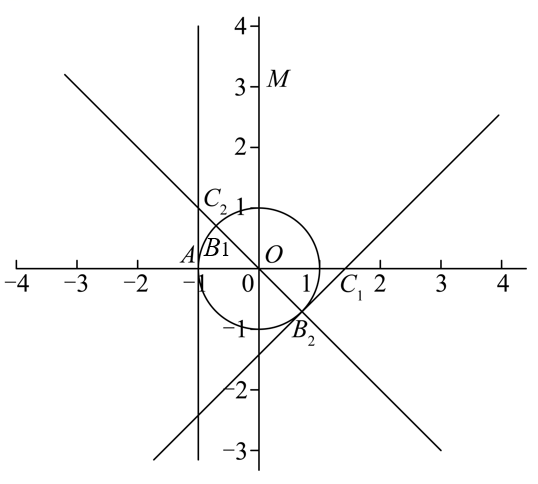

*a*、若 $C_{1}B_{2}$ 与 $\odot O$ 相切， $AC$ 经过点*O，*
则 $C_{1}B_{2}$ 、 $AC_{1}$ 所在直线为： $\left\{\begin{array}{c}y=x-\sqrt{2}\\y=0\end{array}\right$ ，
解得： $C_{1}\left(\sqrt{2}，0\right)$ ，
∴ $OC_{1}=\sqrt{2}$ ，

*b*、若 $AC_{2}$ 与 $\odot O$ 相切， $C_{2}B_{2}$ 经过点*O，*
则 $C_{2}B_{2}$ 、 $AC_{2}$ 所在直线为： $\left\{\begin{array}{c}x=-1\\y=-x\end{array}\right$ ，
解得： $C_{2}\left(-1，1\right)$ ，
∴ $OC_{2}=\sqrt{2}$ ，

综上， $OC_{}=\sqrt{2}$ ．  
（2）解：∵线段 $MN$ 上一点*<text style="italic">S*</text>，存在 $\odot O$ 的弦 $PQ$ ，使得点*<text style="italic">S*</text>是弦 $PQ$ 的“关联点”，
又∵弦 $PQ$ 随着*S*的变动在一定范围内变动，且 $M\left(0,3\right)$ ， $N\left(\frac{6\sqrt{5}}{5},0\right)$ ， $OM>ON$ ，
∴*S*共有2种情况，分别位于点*M*和经过点*O*的 $MN$ 的垂线上，如图所示，

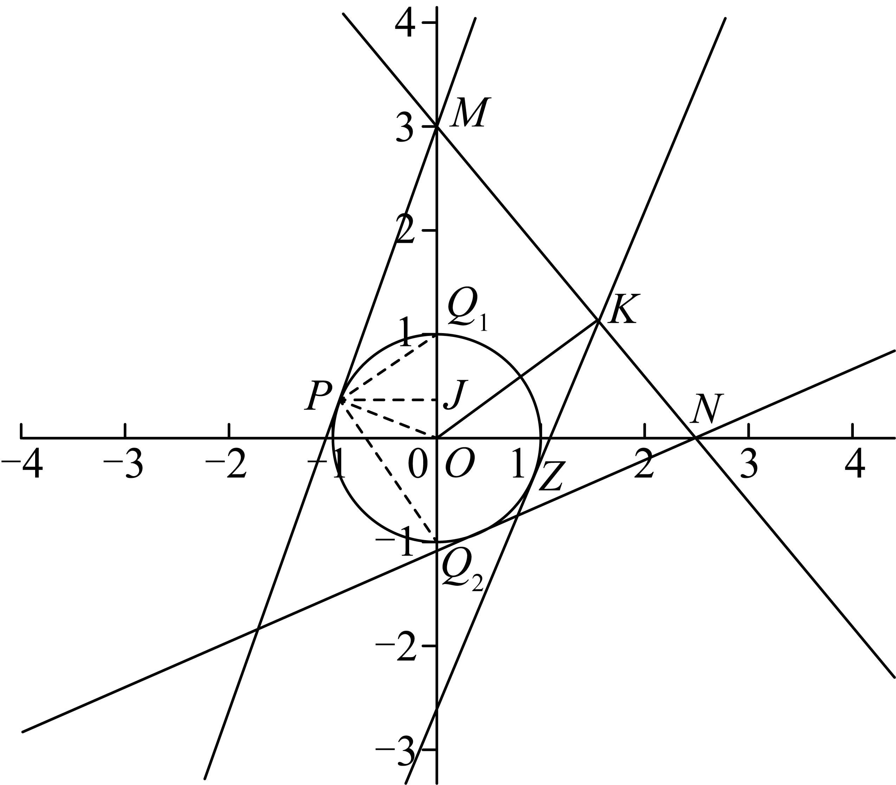

①当*S*位于点 $M\left(0,3\right)$ 时， $MP$ 为 $\odot O$ 的切线，作 $PJ\perp OM$ ，
∵ $M\left(0,3\right)$ ， $\odot O$ 的半径为1，且 $MP$ 为 $\odot O$ 的切线，
∴ $OP\perp MP$ ，
∵ $PJ\perp OM$ ，
∴ $\bigtriangleup MPO\backsim \bigtriangleup POJ$ ，
∴ $\frac{OP}{OJ}=\frac{OM}{OP}$ ，即 $\frac{1}{OJ}=3$ ，
解得 $OJ=\frac{1}{3}$ ，
∴根据勾股定理得， $PJ=\sqrt{PO^{2}-OJ^{2}}=\frac{2\sqrt{2}}{3}$ ， $Q_{1}J=\frac{2}{3}$
根据勾股定理， $PQ_{1}=\sqrt{Q_{1}P^{2}+Q_{1}J^{2}}=\frac{2\sqrt{3}}{3}$ ，同理， $PQ_{2}=\sqrt{Q_{2}P^{2}+Q_{2}J^{2}}=\frac{2\sqrt{6}}{3}$ ，
∴当*S*位于点 $M\left(0,3\right)$ 时， $PQ_{1}$ 的临界值为 $\frac{2\sqrt{3}}{3}$ 和 $\frac{2\sqrt{6}}{3}$ ．

②当*S*位于经过点*O*的 $MN$ 的垂直平分线上即点*K*时，
∵点 $M\left(0,3\right)$ ， $N\left(\frac{6\sqrt{5}}{5},0\right)$ ，
∴ $MN=\sqrt{OM^{2}+ON^{2}}=\frac{9\sqrt{5}}{5}$ ，
∴ $OK=OM\times ON\div MN=2$ ，
又∵ $\odot O$ 的半径为1，∴ $\angle OKZ=30\circ$ ，
∴三角形 $OPQ$ 为等边三角形，
∴在此情况下， $PQ=1$ ， $PQ=\sqrt{3}$ ，
∴当*S*位于经过点*O*的 $MN$ 的垂直平分线上即点*K*时， $PQ_{1}$ 的临界值为 $1$ 和 $\sqrt{3}$ ，
∴在两种情况下， $PQ_{}$ 的最小值在 $1\leq t\leq \frac{2\sqrt{3}}{3}$ 内，最大值在 $\frac{2\sqrt{6}}{3}\leq t\leq \sqrt{3}$ ，
综上所述，*t*的取值范围为 $1\leq t\leq \frac{2\sqrt{3}}{3}$ 或 $\frac{2\sqrt{6}}{3}\leq t\leq \sqrt{3}$ ，

【点睛】本题主要考查最值问题，题目较为新颖，要灵活运用知识点，明确新概念时解答此题的关键．

8．（2023·内蒙古赤峰·中考真题）定义：在平面直角坐标系 $xOy$ 中，当点*<text style="italic"><text style="italic">N*</text></text>在图形*<text style="italic"><text style="italic">M*</text></text>的内部，或在图形M上，且点N的横坐标和纵坐标相等时，则称点N为图形M的“梦之点”．

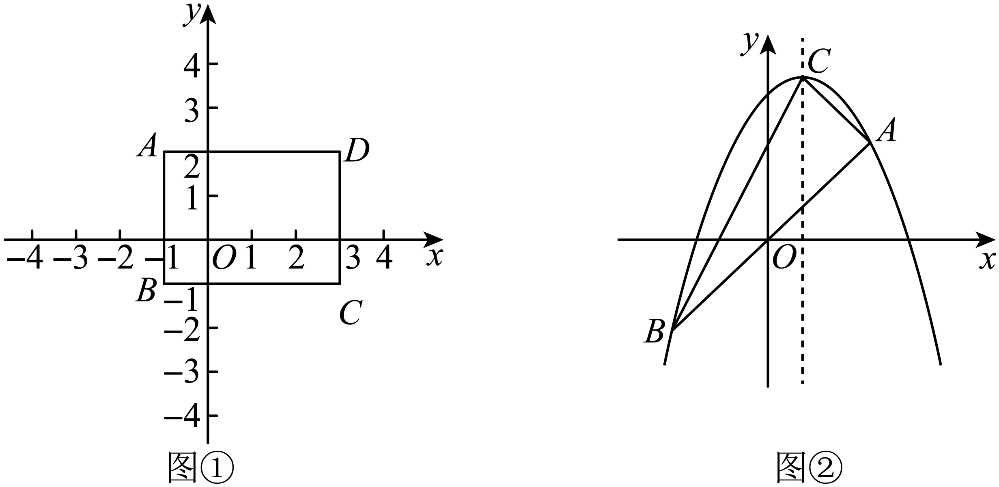  
(1)如图①，矩形 $ABCD$ 的顶点坐标分别是 $A\left(-1,2\right)$ ， $B\left(-1,-1\right)$ ， $C\left(3,-1\right)$ ， $D\left(3,2\right)$ ，在点 $M_{1}\left(1,1\right)$ ， $M_{2}\left(2,2\right)$ ， $M_{3}\left(3,3\right)$ 中，是矩形 $ABCD$ “梦之点”的是\_\_\_\_\_\_\_\_\_\_\_；  
(2)点 $G\left(2,2\right)$ 是反比例函数 $y_{1}=\frac{k}{x}$ 图象上的一个“梦之点”，则该函数图象上的另一个“梦之点”<te*x*t style="italic">H</text>的坐标是\_\_\_\_\_\_\_\_\_\_\_，直线 $GH$ 的解析式是 $y_{2}=$ \_\_\_\_\_\_\_\_\_\_\_．当 $y_{1}>y_{2}$ 时，*x*的取值范围是\_\_\_\_\_\_\_\_\_\_\_．  
(3)如图②，已知点*A*，*B*是抛物线 $y=-\frac{1}{2}x^{2}+x+\frac{9}{2}$ 上的“梦之点”，点*C*是抛物线的顶点，连接 $AC$ ， $AB$ ， $BC$ ，判断 $\bigtriangleup ABC$ 的形状，并说明理由．

【答案】(1) $M_{1}$ ， $M_{2}$  
(2) $H\left(-2,-2\right)$ ， $y_{2}=x$ ， $x<-2$ 或 $0<x<2$  
(3) $\bigtriangleup ABC$ 是直角三角形，理由见解析

【分析】（1）根据“梦之点”的定义判断这几个点是否在矩形内部或边上即可；  
（2）把 $G\left(2,2\right)$ 代入 $y_{1}=\frac{k}{x}$ 求出解析式，再求与 $y=x$ 的交点即为 $H$ ，最后根据函数图象判断当 $y_{1}>y_{2}$ 时，*x*的取值范围；  
（3）根据“梦之点”的定义求出点*A*，*B*的坐标，再求出顶点*C*的坐标，最后求出 $AC$ ， $AB$ ， $BC$ ，即可判断 $\bigtriangleup ABC$ 的形状．

【详解】（1）∵矩形 $ABCD$ 的顶点坐标分别是 $A\left(-1,2\right)$ ， $B\left(-1,-1\right)$ ， $C\left(3,-1\right)$ ， $D\left(3,2\right)$ ，
∴矩形 $ABCD$ “梦之点” $\left(x,y\right)$ 满足 $-1\leq x\leq 3$ ， $-1\leq y\leq 2$ ，
∴点 $M_{1}\left(1,1\right)$ ， $M_{2}\left(2,2\right)$ 是矩形 $ABCD$ “梦之点”，点 $M_{3}\left(3,3\right)$ 不是矩形 $ABCD$ “梦之点”，
故答案为： $M_{1}$ ， $M_{2}$ ；  
（2）∵点 $G\left(2,2\right)$ 是反比例函数 $y_{1}=\frac{k}{x}$ 图象上的一个“梦之点”，
∴把 $G\left(2,2\right)$ 代入 $y_{1}=\frac{k}{x}$ 得 $k=4$ ，
∴ $y_{1}=\frac{4}{x}$ ，
∵“梦之点”的横坐标和纵坐标相等，
∴“梦之点”都在直线 $y=x$ 上，
联立 $\left\{\begin{array}{c}y_{1}=\frac{4}{x}\\y=x\end{array}\right$ ，解得 $\left\{\begin{array}{c}x=2\\y=2\end{array}\right$ 或 $\left\{\begin{array}{c}x=-2\\y=-2\end{array}\right$ ，
∴ $H\left(-2,-2\right)$ ，
∴直线 $GH$ 的解析式是 $y_{2}=x$ ，

函数图象如图：

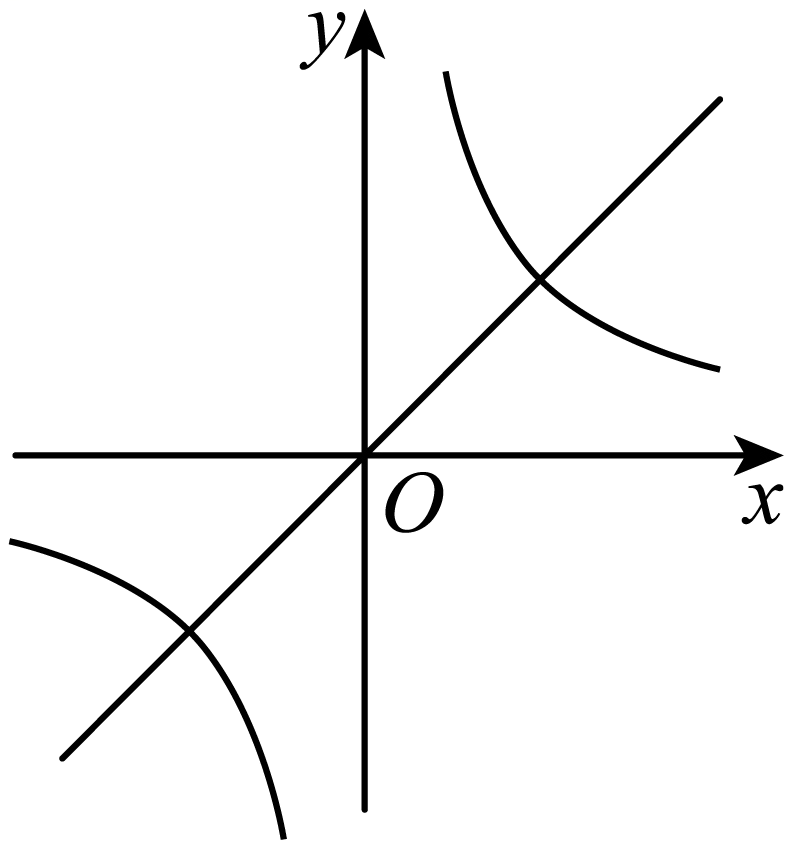
由图可得，当 $y_{1}>y_{2}$ 时，*x*的取值范围是 $x<-2$ 或 $0<x<2$ ；
故答案为： $H\left(-2,-2\right)$ ， $y_{2}=x$ ， $x<-2$ 或 $0<x<2$ ；  
（3） $\bigtriangleup ABC$ 是直角三角形，理由如下：
∵点*A*，*B*是抛物线 $y=-\frac{1}{2}x^{2}+x+\frac{9}{2}$ 上的“梦之点”，
∴联立 $\left\{\begin{array}{c}y=-\frac{1}{2}x^{2}+x+\frac{9}{2}\\y=x\end{array}\right$ ，解得 $\left\{\begin{array}{c}x=3\\y=3\end{array}\right$ 或 $\left\{\begin{array}{c}x=-3\\y=-3\end{array}\right$ ，
∴ $A\left(3,3\right)$ ， $B\left(-3,-3\right)$ ，
∵ $y=-\frac{1}{2}x^{2}+x+\frac{9}{2}=-\frac{1}{2}\left(x-1\right)^{2}+5$
∴顶点 $C\left(1,5\right)$ ，
∴ $AC^{2}=\left(3-1\right)^{2}+\left(3-5\right)^{2}=8$ ， $AB^{2}=\left(-3-3\right)^{2}+\left(-3-3\right)^{2}=72$ ， $BC^{2}=\left(-3-1\right)^{2}+\left(-3-5\right)^{2}=80$ ，
∴ $BC^{2}=AC^{2}+AB^{2}$ ，
∴ $\bigtriangleup ABC$ 是直角三角形．

【点睛】本题是函数的综合题，考查了一次函数、反比例函数、二次函数，理解坐标与图形性质，记住两点间的距离公式，正确理解新定义是解决此题的关键．

## 类型三  新定义问题-图形的性质与变化  

9．（2022·黑龙江绥化·中考真题）定义一种运算； $sin(\alpha +\beta )=sin\alpha cos\beta +cos\alpha sin\beta$ ， $sin(\alpha -\beta )=sin\alpha cos\beta -cos\alpha sin\beta$ ．例如：当 $\alpha =45\circ$ ， $\beta =30\circ$ 时， $sin\left(45\circ +30\circ \right)=$  $\frac{\sqrt{2}}{2}\times \frac{\sqrt{3}}{2}+\frac{\sqrt{2}}{2}\times \frac{1}{2}=\frac{\sqrt{6}+\sqrt{2}}{4}$ ，则 $sin15\circ$ 的值为_______．

【答案】 $\frac{\sqrt{6}-\sqrt{2}}{4}$

【分析】根据 $sin(\alpha -\beta )=sin\alpha cos\beta -cos\alpha sin\beta$ 代入进行计算即可．

【详解】解： $sin15\circ =sin(45\circ -30\circ )$

= $sin45\circ cos30\circ -cos45\circ sin30\circ$

= $\frac{\sqrt{2}}{2}\times \frac{\sqrt{3}}{2}-\frac{\sqrt{2}}{2}\times \frac{1}{2}$

= $\frac{\sqrt{6}}{4}-\frac{\sqrt{2}}{4}$

= $\frac{\sqrt{6}-\sqrt{2}}{4}$ ．
故答案为： $\frac{\sqrt{6}-\sqrt{2}}{4}$ ．

【点睛】此题考查了公式的变化，以及锐角三角函数值的计算，掌握公式的转化是解题的关键．

10．（2023·江苏·中考真题）综合与实践

定义：将宽与长的比值为 $\frac{\sqrt{2^{2n}+1}-1}{2^{n}}$ （ $n$ 为正整数）的矩形称为 $n$ 阶奇妙矩形．  
（1）概念理解：
当 $n=1$ 时，这个矩形为1阶奇妙矩形，如图（1），这就是我们学习过的黄金矩形，它的宽（ $AD$ ）与长 $\left(CD\right)$ 的比值是\_\_\_\_\_\_\_\_\_．  
（2）操作验证：

用正方形纸片 $ABCD$ 进行如下操作（如图（2））：

第一步：对折正方形纸片，展开，折痕为 $EF$ ，连接 $CE$ ；
第二步：折叠纸片使 $CD$ 落在 $CE$ 上，点 $D$ 的对应点为点 $H$ ，展开，折痕为 $CG$ ；
第三步：过点 $G$ 折叠纸片，使得点 $A、B$ 分别落在边 $AD、BC$ 上，展开，折痕为 $GK$ ．

试说明：矩形 $GDCK$ 是1阶奇妙矩形．

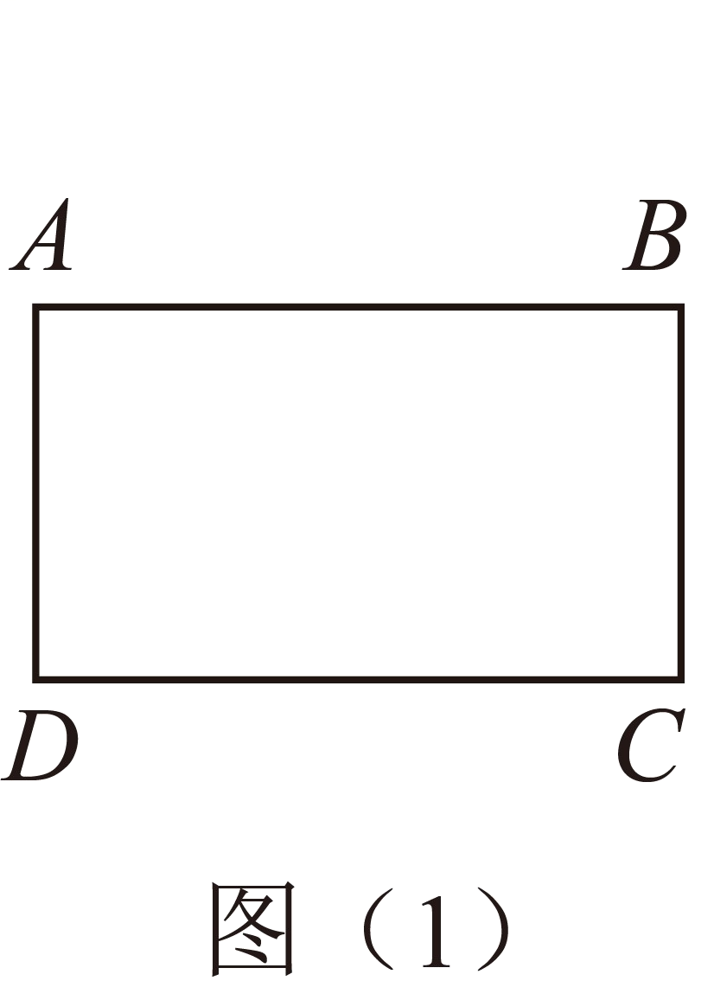

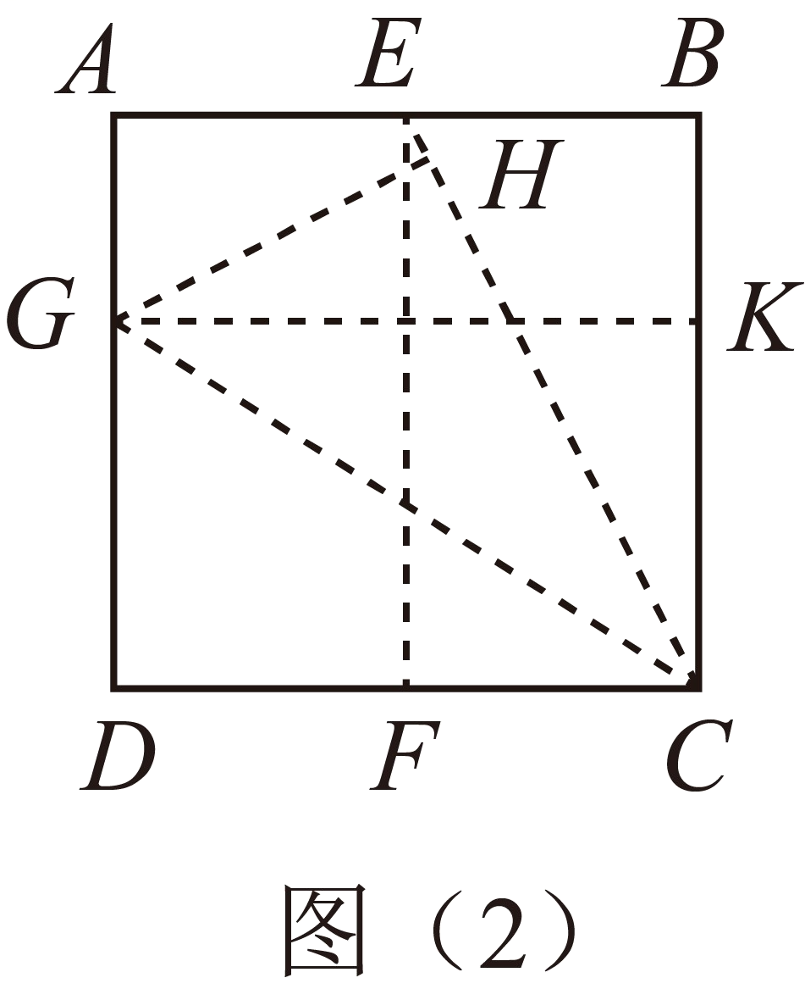

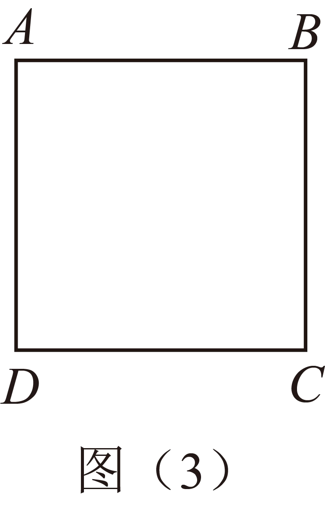

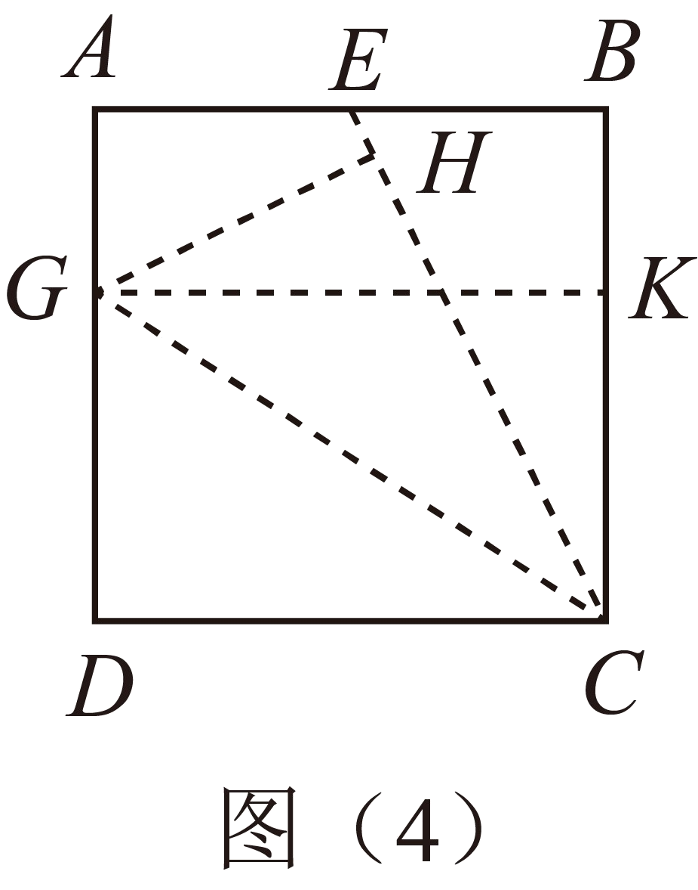  
（3）方法迁移：

用正方形纸片 $ABCD$ 折叠出一个2阶奇妙矩形．要求：在图（3）中画出折叠示意图并作简要标注．  
（4）探究发现：

小明操作发现任一个 $n$ 阶奇妙矩形都可以通过折纸得到．他还发现：如图（4），点 $E$ 为正方形 $ABCD$ 边 $AB$ 上（不与端点重合）任意一点，连接 $CE$ ，继续（2）中操作的第二步、第三步，四边形 $AGHE$ 的周长与矩形 $GDCK$ 的周长比值总是定值．请写出这个定值，并说明理由．

【答案】（1） $\frac{\sqrt{5}-1}{2}$ ；（2）见解析；（3） $\frac{1}{2}$ ，理由见解析

【分析】（1）将 $n=1$ 代入 $\frac{\sqrt{2^{2n}+1}-1}{2^{n}}$ ，即可求解．  
（2）设正方形的边长为 $2$ ，根据折叠的性质，可得 $AE=EB=1$ ，设 $DG=x$ ，则 $AG=2-x$ ，在 $Rt\bigtriangleup AEG,Rt\bigtriangleup GHE$ 中，勾股定理建立方程，解方程，即可求解；  
（3）仿照（2）的方法得出2阶奇妙矩形．  
（4）根据（2）的方法，分别求得四边形 $AGHE$ 的周长与矩形 $GDCK$ 的周长，即可求解．

【详解】解：（1）当 $n=1$ 时， $\frac{\sqrt{2^{2n}+1}-1}{2^{n}}=\frac{\sqrt{5}-1}{2}$ ，
故答案为： $\frac{\sqrt{5}-1}{2}$ ．  
（2）如图（2），连接 $EG$ ，

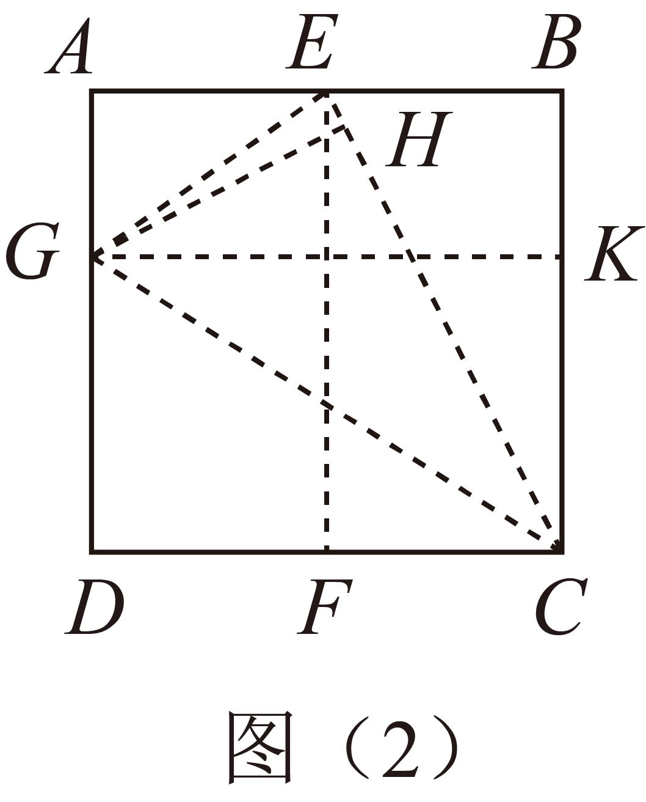
设正方形的边长为 $2$ ，根据折叠的性质，可得 $AE=EB=1$
设 $DG=x$ ，则 $AG=2-x$
根据折叠，可得 $GH=GD=x$ ， $CH=CD=2$ ，
在 $Rt\bigtriangleup BEC$ 中， $EC=\sqrt{EB^{2}+BC^{2}}=\sqrt{1^{2}+2^{2}}=\sqrt{5}$ ，
∴ $EH=\sqrt{5}-2$ ，
在 $Rt\bigtriangleup AEG,Rt\bigtriangleup GHE$ 中，
$AG^{2}+AE^{2}=GE^{2},GH^{2}+EH^{2}=GE^{2}$
∴ $\left(2-x\right)^{2}+1^{2}=\left(\sqrt{5}-2\right)^{2}+x^{2}$
解得： $x=\sqrt{5}-1$
∴ $\frac{GD}{DC}=\frac{\sqrt{5}-1}{2}$
∴矩形 $GDCK$ 是1阶奇妙矩形．  
（3）用正方形纸片 $ABCD$ 进行如下操作（如图）：

第一步：对折正方形纸片，展开，折痕为 $MN$ ，再对折，折痕为 $EF$ ，连接 $CE$ ；
第二步：折叠纸片使 $CD$ 落在 $CE$ 上，点 $D$ 的对应点为点 $H$ ，展开，折痕为 $CG$ ；
第三步：过点 $G$ 折叠纸片，使得点 $A、B$ 分别落在边 $AD、BC$ 上，展开，折痕为 $GK$ ．

矩形 $GDCK$ 是2阶奇妙矩形，

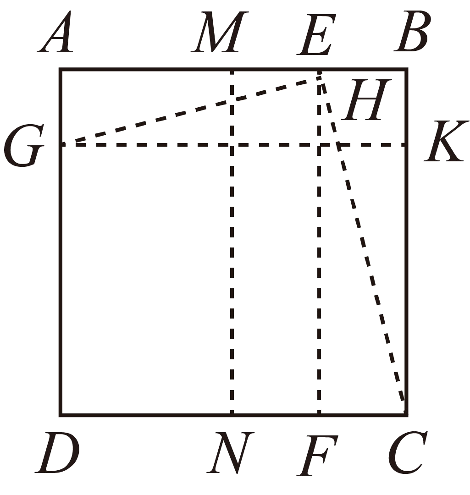

理由如下，连接 $GE$ ，设正方形的边长为 $4$ ，根据折叠可得 $EB=1$ ，则 $AE=4-1=3$ ，

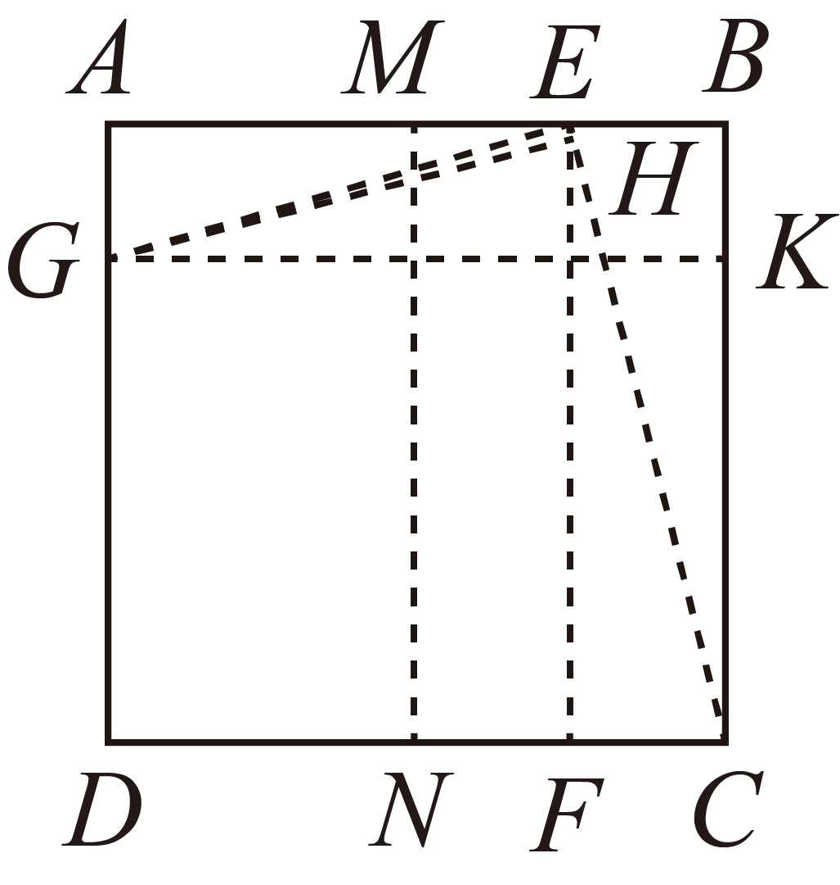
设 $DG=x$ ，则 $AG=4-x$
根据折叠，可得 $GH=GD=x$ ， $CH=CD=4$ ，
在 $Rt\bigtriangleup BEC$ 中， $EC=\sqrt{EB^{2}+BC^{2}}=\sqrt{1^{2}+4^{2}}=\sqrt{17}$ ，
∴ $EH=\sqrt{17}-4$ ，
在 $Rt\bigtriangleup AEG,Rt\bigtriangleup GHE$ 中，
$AG^{2}+AE^{2}=GE^{2},GH^{2}+EH^{2}=GE^{2}$
∴ $\left(4-x\right)^{2}+3^{2}=\left(\sqrt{17}-4\right)^{2}+x^{2}$
解得： $x=\sqrt{17}-1$
∴ $\frac{GD}{DC}=\frac{\sqrt{17}-1}{4}$
当 $n=2$ 时， $\frac{\sqrt{2^{2n}+1}-1}{2^{n}}=\frac{\sqrt{17}-1}{4}$
∴矩形 $GDCK$ 是2阶奇妙矩形．  
（4）如图（4），连接诶 $GE$ ，设正方形的边长为1，设 $EB=m$ ，则 $AE=1-m$ ，

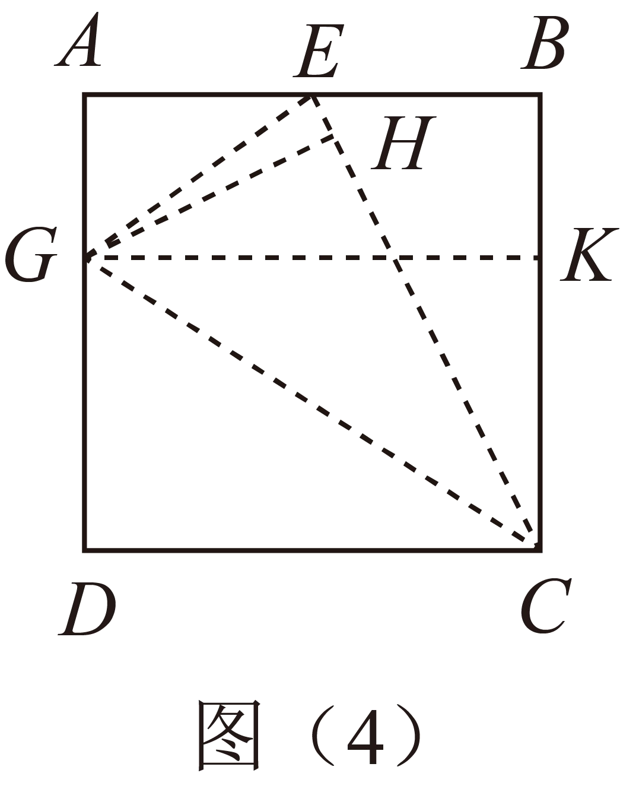
设 $DG=x$ ，则 $AG=1-x$
根据折叠，可得 $GH=GD=x$ ， $CH=CD=1$ ，
在 $Rt\bigtriangleup BEC$ 中， $EC=\sqrt{EB^{2}+BC^{2}}=\sqrt{1+m^{2}}$ ，
∴ $EH=\sqrt{1+m^{2}}-1$ ，
在 $Rt\bigtriangleup AEG,Rt\bigtriangleup GHE$ 中，
$AG^{2}+AE^{2}=GE^{2},GH^{2}+EH^{2}=GE^{2}$
∴ $\left(1-x\right)^{2}+\left(1-m\right)^{2}=\left(\sqrt{1+m^{2}}-1\right)^{2}+x^{2}$
整理得， $x=\sqrt{m^{2}+1}-m$
∴四边形 $AGHE$ 的边长为 $1-x+x+\sqrt{1+m^{2}}-1+1-m=\sqrt{1+m^{2}}-m+1$  $=x+1$

矩形 $GDCK$ 的周长为 $2\left(GD+DC\right)=2\left(x+1\right)$ ，
∴四边形 $AGHE$ 的周长与矩形 $GDCK$ 的周长比值总是定值 $\frac{1}{2}$

【点睛】本题考查了正方形的折叠问题，勾股定理，熟练掌握折叠的性质是解题的关键．

11．（2023·浙江宁波·中考真题）定义：有两个相邻的内角是直角，并且有两条邻边相等的四边形称为邻等四边形，相等两邻边的夹角称为邻等角．

  
(1)如图1，在四边形 $ABCD$ 中， $AD\parallel BC,\angle A=90\circ$ ，对角线 $BD$ 平分 $\angle ADC$ ．求证：四边形 $ABCD$ 为邻等四边形．  
(2)如图2，在6×5的方格纸中，*A*，*B*，*C*三点均在格点上，若四边形 $ABCD$ 是邻等四边形，请画出所有符合条件的格点*D*．  
(3)如图3，四边形 $ABCD$ 是邻等四边形， $\angle DAB=\angle ABC=90\circ$ ， $\angle BCD$ 为邻等角，连接 $AC$ ，过*B*作 $BE\parallel AC$ 交 $DA$ 的延长线于点*E*．若 $AC=8,DE=10$ ，求四边形 $EBCD$ 的周长．

【答案】(1)证明见解析  
(2)画图见解析  
(3) $38-6\sqrt{2}$

【分析】（1）先证明 $\angle ABC=180\circ -\angle A=90\circ$ ， $\angle ADB=\angle CBD$ ，再证明 $CD=CB$ ，即可得到结论；  
（2）根据新定义分两种情况进行讨论即可；① $\angle B=\angle C=90$ ，结合图形再确定满足 $CB=CD$ 或 $AD=CD$ 的格点*<text style="italic">D*</text>；② $\angle B=\angle A=90$ ，结合图形再确定满足 $AB=AD$ 的格点*<text style="italic">D*</text>；  
（3）如图，过 $C$ 作 $CQ\perp AD$ 于 $Q$ ，可得四边形 $ABCQ$ 是矩形， $AQ=BC$ ， $AD\parallel BC$ ，证明四边形 $ACBE$ 为平行四边形，可得 $BE=AC=8$ ， $AE=BC$ ，设 $BC=AE=x$ ，而 $DE=10$ ， $AD=10-x$ ， $DQ=x-\left(10-x\right)=2x-10$ ，由新定义可得 $CD=CB=x$ ，由勾股定理可得： $x^{2}-\left(2x-10\right)^{2}=8^{2}-x^{2}$ ，再解方程可得答案．

【详解】（1）解：∵ $AD\parallel BC,\angle A=90\circ$ ，
∴ $\angle ABC=180\circ -\angle A=90\circ$ ， $\angle ADB=\angle CBD$ ，
∵对角线 $BD$ 平分 $\angle ADC$ ，
∴ $\angle ADB=\angle CDB$ ，
∴ $\angle CBD=\angle CDB$ ，
∴ $CD=CB$ ，
∴四边形 $ABCD$ 为邻等四边形．  
（2）解： $D_{1}$ ， $D_{2}$ ， $D_{3}$ 即为所求；
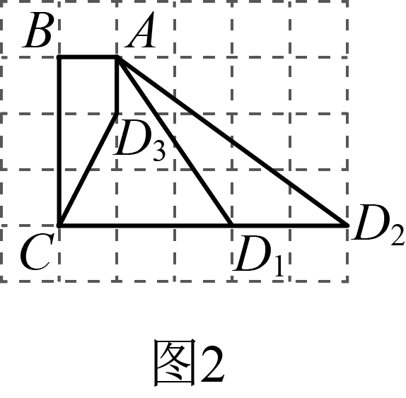  
（3）如图，过 $C$ 作 $CQ\perp AD$ 于 $Q$ ，

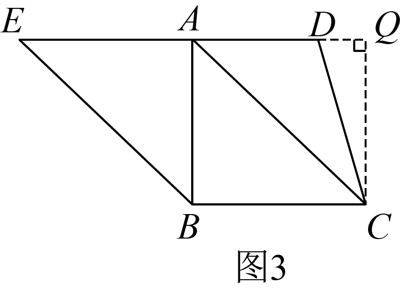
∵ $\angle DAB=\angle ABC=90\circ$ ，
∴四边形 $ABCQ$ 是矩形，
∴ $AQ=BC,AB=CQ$ ， $AD\parallel BC$ ，
∵ $BE\parallel AC$ ，
∴四边形 $ACBE$ 为平行四边形，
∴ $BE=AC=8$ ， $AE=BC$ ，
设 $BC=AE=x$ ，而 $DE=10$ ，
∴ $AD=10-x$ ， $DQ=x-\left(10-x\right)=2x-10$ ，
由新定义可得 $CD=CB=x$ ，
由勾股定理可得： $x^{2}-\left(2x-10\right)^{2}=8^{2}-x^{2}$ ，
整理得： $x^{2}-20x+82=0$ ，
解得： $x_{1}=10-3\sqrt{2}$ ， $x_{2}=10+3\sqrt{2}>8$ （不符合题意舍去），
∴ $CB=CD=10-3\sqrt{2}$ ，
∴四边形 $EBCD$ 的周长为 $10+8+2\left(10-3\sqrt{2}\right)=38-6\sqrt{2}$ ．

【点睛】本题考查的是新定义的含义，平行线的性质，等腰三角形的判定，平行四边形的判定与性质，矩形的判定与性质，勾股定理的应用，一元二次方程的解法，理解题意，作出合适的辅助线是解本题的关键．

12．（2022·北京·中考真题）在平面直角坐标系 $xOy$ 中，已知点 $M(a,b),N.$ 对于点 $P$ 给出如下定义：将点 $P$ 向右 $(a\geq 0)$ 或向左 $(a<0)$ 平移 $\left|a\right|$ 个单位长度，再向上 $(b\geq 0)$ 或向下 $(b<0)$ 平移 $\left|b\right|$ 个单位长度，得到点 $P'$ ，点 $P'$ 关于点 $N$ 的对称点为 $Q$ ，称点 $Q$ 为点 $P$ 的“对应点”．  
(1)如图，点 $M(1,1),$ 点 $N$ 在线段 $OM$ 的延长线上，若点 $P(-2,0),$ 点 $Q$ 为点 $P$ 的“对应点”．

①在图中画出点 $Q$ ；
②连接 $PQ,$ 交线段 $ON$ 于点 $T.$ 求证： $NT=\frac{1}{2}OM;$  
(2) $\odot O$ 的半径为1， $M$ 是 $\odot O$ 上一点，点 $N$ 在线段 $OM$ 上，且 $ON=t(\frac{1}{2}<t<1)$ ，若 $P$ 为 $\odot O$ 外一点，点 $Q$ 为点 $P$ 的“对应点”，连接 $PQ.$ 当点 $M$ 在 $\odot O$ 上运动时直接写出 $PQ$ 长的最大值与最小值的差（用含 $t$ 的式子表示）.

【答案】(1)见解析  
(2) $4t-2$

【分析】（1）①先根据定义和 $M(1,1)$ 求出点 $P'$ 的坐标，再根据点 $P'$ 关于点 $N$ 的对称点为 $Q$ 求出点*Q*的坐标；②延长*<text style="italic">ON*</text>至点 $A\left(3,3\right)$ ，连接A*Q*，利用AAS证明 $\Delta AQT\cong \Delta OPT$ ，得到 $TA=TO=\frac{1}{2}OA$ ，再计算出*OA*，*OM*，*<text style="italic">ON*</text>即可求出 $NT=ON-OT=\frac{\sqrt{2}}{2}=\frac{1}{2}OM$ ；  
（2）连接*PO*并延长至*S*，使 $OP=OS$ ，延长*S*Q至*T*，使 $ST=OM$ ，结合对称的性质得出*NM*为 $\Delta P'QT$ 的中位线，推出 $NM=\frac{1}{2}QT$ ，得出 $SQ=ST-TQ=1-\left(2-2t\right)=2t-1$ ，则 $PQ_{max}-PQ_{min}=\left(PS+QS\right)-\left(PS-QS\right)=2QS$ ．

【详解】（1）解：①点*Q*如下图所示．
∵点 $M(1,1)$ ，
∴点 $P(-2,0)$ 向右平移1个单位长度，再向上平移1个单位长度，得到点 $P'$ ，
∴ $P'\left(-1,1\right)$ ，
∵点 $P'$ 关于点 $N$ 的对称点为 $Q$ ， $N\left(2,2\right)$ ，
∴点 $Q$ 的横坐标为： $2\times 2-\left(-1\right)=5$ ，纵坐标为： $2\times 2-1=3$ ，
∴点 $Q\left(5,3\right)$ ，在坐标系内找出该点即可；
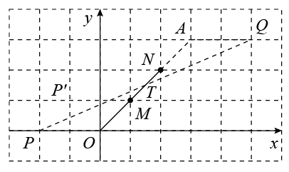

②证明：如图延长*ON*至点 $A\left(3,3\right)$ ，连接*AQ*，
∵ $AQ//OP$ ，
∴ $\angle AQT=\angle OPT$ ，
在 $\Delta AQT$ 与 $\Delta \angle OPT$ 中，
$\left\{\begin{array}{c}\angle AQT=\angle OPT\\\angle ATQ=\angle OTP\\AQ=OP\end{array}\right$ ，
∴ $\Delta AQT\cong \Delta OPT\left(AAS\right)$ ，
∴ $TA=TO=\frac{1}{2}OA$ ，
∵ $A\left(3,3\right)$ ， $M(1,1)$ ， $N(2,2)$ ，
∴ $OA=\sqrt{3^{2}+3^{2}}=3\sqrt{2}$ ， $OM=\sqrt{1^{2}+1^{2}}=\sqrt{2}$ ， $ON=\sqrt{2^{2}+2^{2}}=2\sqrt{2}$ ，
∴ $TO=\frac{1}{2}OA=\frac{3}{2}\sqrt{2}$ ，
∴ $NT=ON-OT=2\sqrt{2}-\frac{3}{2}\sqrt{2}=\frac{\sqrt{2}}{2}$ ，
∴ $NT=\frac{1}{2}OM$ ；  
（2）解：如图所示，

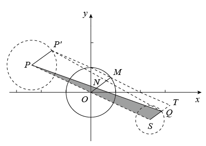

连接*PO*并延长至*S*，使 $OP=OS$ ，延长*S*Q至*T*，使 $ST=OM$ ，
∵ $M(a,b)$ ，点 $P$ 向右 $(a\geq 0)$ 或向左 $(a<0)$ 平移 $\left|a\right|$ 个单位长度，再向上 $(b\geq 0)$ 或向下 $(b<0)$ 平移 $\left|b\right|$ 个单位长度，得到点 $P'$ ，
∴ $PP'=OM=1$ ，
∵点 $P'$ 关于点 $N$ 的对称点为 $Q$ ，
∴ $NP'=NQ$ ，
又∵ $OP=OS$ ，
∴ $OM\parallel ST$ ，
∴*NM*为 $\Delta P'QT$ 的中位线，
∴ $NM//QT$ ， $NM=\frac{1}{2}QT$ ，
∵ $NM=OM-ON=1-t$ ，
∴ $TQ=2NM=2-2t$ ，
∴ $SQ=ST-TQ=1-\left(2-2t\right)=2t-1$ ，
在 $\Delta PQS$ 中， $PS-QS<PQ<PS+QS$ ，

结合题意， $PQ_{max}=PS+QS$ ， $PQ_{min}=PS-QS$ ，
∴ $PQ_{max}-PQ_{min}=\left(PS+QS\right)-\left(PS-QS\right)=2QS=4t-2$ ，
即 $PQ$ 长的最大值与最小值的差为 $4t-2$ ．

【点睛】本题考查点的平移，对称的性质，全等三角形的判定，两点间距离，中位线的性质及线段的最值问题，第2问难度较大，根据题意，画出点*Q*和点 $P'$ 的轨迹是解题的关键．

## 题型02  方法迁移题型

13．（2023·湖南张家界·中考真题）阅读下面材料：
将边长分别为*a*， $a+\sqrt{b}$ ， $a+2\sqrt{b}$ ， $a+3\sqrt{b}$ 的正方形面积分别记为 $S_{1}$ ， $S_{2}$ ， $S_{3}$ ， $S_{4}$ ．
则 $S_{2}-S_{1}=(a+\sqrt{b})^{2}-a^{2}$
$=\left[(a+\sqrt{b})+a\right]\cdot \left[(a+\sqrt{b})-a\right]$
$=(2a+\sqrt{b})\cdot \sqrt{b}$
$=b+2a\sqrt{b}$

例如：当 $a=1$ ， $b=3$ 时， $S_{2}-S_{1}=3+2\sqrt{3}$
根据以上材料解答下列问题：  
(1)当 $a=1$ ， $b=3$ 时， $S_{3}-S_{2}=$ \_\_\_\_\_\_， $S_{4}-S_{3}=$ \_\_\_\_\_\_；  
(2)当 $a=1$ ， $b=3$ 时，把边长为 $a+n\sqrt{b}$ 的正方形面积记作 $S_{n+1}$ ，其中*n*是正整数，从（1）中的计算结果，你能猜出 $S_{n+1}-S_{n}$ 等于多少吗？并证明你的猜想；  
(3)当 $a=1$ ， $b=3$ 时，令 $t_{1}=S_{2}-S_{1}$ ， $t_{2}=S_{3}-S_{2}$ ， $t_{3}=S_{4}-S_{3}$ ，…， $t_{n}=S_{n+1}-S_{n}$ ，且 $T=t_{1}+t_{2}+t_{3}+\cdots +t_{50}$ ，求*T*的值．

【答案】(1) $9+2\sqrt{3}$ ， $15+2\sqrt{3}$  
(2)猜想结论： $S_{n+1}-S_{n}=6n-3+2\sqrt{3}$ ，证明见解析  
(3) $7500+100\sqrt{3}$

【分析】（1）根据题意，直接代入然后利用完全平方公式展开合并求解即可；  
（2）根据题意得出猜想，然后由完全平方公式展开证明即可；  
（3）结合题意利用（2）中结论求解即可．

【详解】（1）解： $S_{3}-S_{2}=(a+2\sqrt{b})^{2}-(a+\sqrt{b})^{2}$
$=a^{2}+4a\sqrt{b}+4b-(a^{2}+2a\sqrt{b}+b)$
$=a^{2}+4a\sqrt{b}+4b-a^{2}-2a\sqrt{b}-b$
$=2a\sqrt{b}+3b$
当 $a=1$ ， $b=3$ 时，
原式 $=2\sqrt{3}+9$ ；
$S_{4}-S_{3}=(a+3\sqrt{b})^{2}-(a+2\sqrt{b})^{2}$
$=a^{2}+6a\sqrt{b}+9b-(a^{2}+4a\sqrt{b}+4b)$
$=a^{2}+6a\sqrt{b}+9b-a^{2}-4a\sqrt{b}-4b$
$=2a\sqrt{b}+5b$
当 $a=1$ ， $b=3$ 时，
原式 $=2\sqrt{3}+15$ ；  
（2）猜想结论： $S_{n+1}-S_{n}=6n-3+2\sqrt{3}$
证明： $S_{n+1}-S_{n}=(1+n\sqrt{3})^{2}-\left[1+(n-1)\sqrt{3}\right]^{2}$
$=\left[2+(2n-1)\sqrt{3}\right]\times \sqrt{3}$
$=3(2n-1)+2\sqrt{3}$
$=6n-3+2\sqrt{3}$ ；  
（3） $T=t_{1}+t_{2}+t_{3}+\cdots +t_{50}$
$=S_{2}-S_{1}+S_{3}-S_{2}+S_{4}-S_{3}+\cdots +S_{51}-S_{50}$
$=S_{51}-S_{1}$
$=(1+50\sqrt{3})^{2}-1$
$=7500+100\sqrt{3}$ ．

【点睛】题目主要考查利用完全平方公式进行计算，理解题意，得出相应规律是解题关键．

14．（23-24九年级上·江苏宿迁·阶段练习）阅读材料：各类方程的解法：求解一元一次方程，根据等式的基本性质，把方程转化为<text style="it*a*lic">x</text>＝a的形式，求解二元一次方程组，把它转化为一元一次方程来解：类似的，三元一次方程组，把它转化为解二元一次方程组．求解一元二次方程，把它转化为两个一元一次方程来解．求解分式方程，把它转化为整式方程来解，由于“去分母”可能产生增根，所以解分式方程必须检验．各类方程的解法不尽相同，但是它们有一个共同的基本数学思想﹣﹣转化，把未知转化为已知．用“转化”的数学思想，我们还可以解一些新的方程．例如，一元三次方程 $x^{3}+x^{2}-2x=0$ ，可以通过因式分解把它转化为 $x\left(x^{2}+x-2\right)=0$ ，解方程 $x=0$ 和 $x^{2}+x-2=0$ ，可得方程 $x^{3}+x^{2}-2x=0$ 的解．  
(1)问题：方程 $6x^{3}+14x^{2}-12x=0$ 的解是： $x_{1}=0，x_{2}=$ <u>&lt;text style="underline"&gt;　　</u>&lt;/text&gt;， $x_{3}=$ <u>&lt;text style="underline"&gt;　　</u>&lt;/text&gt;；  
(2)拓展：用“转化”思想求方程 $\sqrt{2x+3}=x$ 的解；  
(3)应用：如图，已知矩形草坪 $ABCD$ 的长 $AD=14$ m，宽 $AB=12$ m，点*<text style="italic">P*</text>在 $AD$ 上（ $AP>PD$ ），小华把一根长为 $28$ m的绳子一段固定在点*B*，把长绳 $PB$ 段拉直并固定在点*<text style="italic">P*</text>，再拉直，长绳的另一端恰好落在点*C*，求 $AP$ 的长．

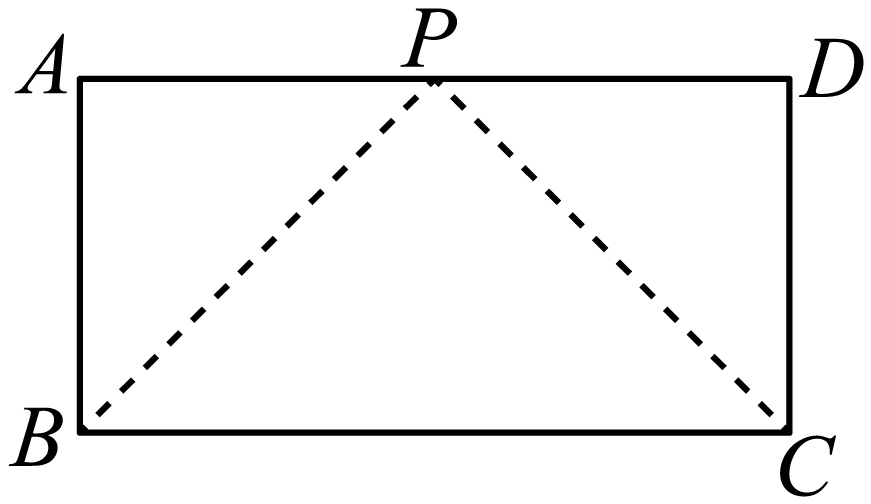

【答案】(1) $\frac{2}{3}$ ， $-3$  
(2) $x=3$  
(3)9m

【分析】本题考查了无理方程、一元二次方程的解法，看懂题例理解转化的思想方法是解决本题的关键．  
（1）利用因式分解法，求解即可；  
（2）两边平方，把无理方程转化为一元二次方程，求解即可；  
（3）设 $AP$ 的长为<te*x*t style="italic">xm</text>，通过勾股定理用含x的代数式表示出 $BP、PC$ ，根据绳长列出方程，利用转化的思想把无理方程转化为整式方程，求解即可．

【详解】（1）解：∵ $6x^{3}+14x^{2}-12x=0$ ，
∴ $2x\left(3x^{2}+7x-6\right)=0$ ．
∴ $2x\left(3x-2\right)\left(x+3\right)=0$ ．
∴ $2x=0$ 或 $3x-2=0$ 或 $x+3=0$ ．
∴ $x_{1}=0，x_{2}=\frac{2}{3}$ ， $x_{3}=-3$
故答案为： $\frac{2}{3}$ ， $-3$  
（2）解：方程 $\sqrt{2x+3}=x$ ，两边平方得 $2x+3=x^{2}$ ，
∴ $x^{2}-2x-3=0$ ．
∴ $\left(x-3\right)\left(x+1\right)=0$ ．
∴ $x_{1}=3，x_{2}=-1$ ．
经检验， $x=3$ 是原方程的根， $x=-1$ 不是原方程的根．
所以原方程的解为 $x=3$  
（3）解：设 $AP$ 的长为*x<text style="italic">m*</text>，则 $DP$ 的长为 $\left(14-x\right)$ *m*．
由题意得： $\sqrt{12^{2}+x^{2}}+\sqrt{\left(14-x\right)^{2}+12^{2}}=28$
整理得 $2\sqrt{12^{2}+x^{2}}=x+21$
两边平方得 $4\left(144+x^{2}\right)=x^{2}+42x+441$ ，
即 $3x^{2}-42x+135=0$ ．
整理得 $x^{2}-14x+45=0$ ．
∴ $\left(x-5\right)\left(x-9\right)=0$ ．
∴ $x_{1}=5,x_{2}=9$
经检验 $x_{1}=5,x_{2}=9$ 是原方程的根．
由于 $AP>DP$ ，
∴ $AP=9$ *m*．

15．（2022·湖北黄石·中考真题）阅读材料，解答问题：

材料1

为了解方程 $\left(x^{2}\right)^{2}-13x^{2}+36=0$ ，如果我们把 $x^{2}$ 看作一个整体，然后设 $y=x^{2}$ ，则原方程可化为 $y^{2}-13y+36=0$ ，经过运算，原方程的解为 $x_{1,2}=\pm 2$ ， $x_{3,4}=\pm 3$ ．我们把以上这种解决问题的方法通常叫做换元法．

材料2

已知实数*<text style="italic">m*</text>，*<text style="italic">n*</text>满足 $m^{2}-m-1=0$ ， $n^{2}-n-1=0$ ，且 $m\ne n$ ，显然*<text style="italic">m*</text>，*<text style="italic">n*</text>是方程 $x^{2}-x-1=0$ 的两个不相等的实数根，由韦达定理可知 $m+n=1$ ， $mn=-1$ ．
根据上述材料，解决以下问题：  
(1)直接应用：

方程 $x^{4}-5x^{2}+6=0$ 的解为\_\_\_\_\_\_\_\_\_\_\_\_\_\_\_\_\_\_\_\_\_\_\_；  
(2)间接应用：

已知实数*a*，*b*满足： $2a^{4}-7a^{2}+1=0$ ， $2b^{4}-7b^{2}+1=0$ 且 $a\ne b$ ，求 $a^{4}+b^{4}$ 的值；  
(3)拓展应用：

已知实数<text st*y*le="italic">x</text>，y满足： $\frac{1}{m^{4}}+\frac{1}{m^{2}}=7$ ， $n^{2}-n=7$ 且 $n>0$ ，求 $\frac{1}{m^{4}}+n^{2}$ 的值．

【答案】(1) $x_{1}=\sqrt{2}$ ， $x_{2}=-\sqrt{2}$ ， $x_{3}=\sqrt{3}$ ， $x_{4}=-\sqrt{3}$  
(2) $\frac{45}{4}$ 或 $\frac{45\pm 7\sqrt{41}}{4}$  
(3)15

【分析】（1）利用换元法降次解决问题；  
（2）模仿例题解决问题即可；  
（3）令 $\frac{1}{m^{2}}$ =<text style="it*a*lic">a</text>，-*n*=*<text style="italic">b*</text>，则 $a^{2}$ +<text style="it*a*lic">a</text>-7=0， $b^{2}$  +<text style="it*a*lic">*b*</text>=0，再模仿例题解决问题．

【详解】（1）解：令<text st*y*le="italic">y</text>= $x^{2}$ ，则有 $y^{2}$ -5<text st*y*le="italic">y</text>+6=0，
∴（*y*-2）（*y*-3）=0，
∴ $y_{1}$ =2， $y_{2}$ =3，
∴ $x^{2}$ =2或3，
∴ $x_{1}=\sqrt{2}$ ， $x_{2}=-\sqrt{2}$ ， $x_{3}=\sqrt{3}$ ， $x_{4}=-\sqrt{3}$ ，
故答案为： $x_{1}=\sqrt{2}$ ， $x_{2}=-\sqrt{2}$ ， $x_{3}=\sqrt{3}$ ， $x_{4}=-\sqrt{3}$ ；  
（2）解：∵ $a\ne b$ ，
∴ $a^{2}\ne b^{2}$ 或 $a^{2}=b^{2}\left(a=-b\right)$

①当 $a^{2}\ne b^{2}$ 时，令 $a^{2}=m$ ， $b^{2}=n$ ，
∴ $m\ne n$ 则 $2m^{2}-7m+1=0$ ， $2n^{2}-7n+1=0$ ，
∴ $m$ ， $n$ 是方程 $2x^{2}-7x+1=0$ 的两个不相等的实数根，
∴ $\left\{\begin{array}{c}m+n=\frac{7}{2}\\mn=\frac{1}{2}\end{array}\right$ ，

此时 $a^{4}+b^{4}=m^{2}+n^{2}=\left(m+n\right)^{2}-2mn=\frac{45}{4}$ ；
②当 $a^{2}=b^{2}\left(a=-b\right)$ 时， $a^{2}=b^{2}=\frac{7\pm \sqrt{41}}{4}$ ，

此时 $a^{4}+b^{4}=2a^{4}=2\left(a^{2}\right)^{2}=2\left(\frac{7\pm \sqrt{41}}{4}\right)^{2}=\frac{45\pm 7\sqrt{41}}{4}$ ；
综上： $a^{4}+b^{4}=\frac{45}{4}$ 或 $\frac{45\pm 7\sqrt{41}}{4}$  
（3）解：令 $\frac{1}{m^{2}}=a$ ， $-n=b$ ，则 $a^{2}+a-7=0$ ， $b^{2}+b-7=0$ ，
∵ $n>0$ ，
∴ $\frac{1}{m^{2}}\ne -n$ 即 $a\ne b$ ，
∴ $a$ ， $b$ 是方程 $x^{2}+x-7=0$ 的两个不相等的实数根，
∴ $\left\{\begin{array}{c}a+b=-1\\ab=-7\end{array}\right$ ，
故 $\frac{1}{m^{4}}+n^{2}=a^{2}+b^{2}=\left(a+b\right)^{2}-2ab=15$ ．

【点睛】本题考查了根与系数的关系，幂的乘方与积的乘方，换元法，解一元二次方程等知识，解题的关键是理解题意，学会模仿例题解决问题．

16．（2023·江苏泰州·中考真题）阅读下面方框内的内容，并完成相应的任务．

<table><tr><td>
小丽学习了方程、不等式、函数后提出如下问题：如何求不等式的解集？

通过思考，小丽得到以下3种方法：

方法1    方程的两根为，，可得函数的图像与<em>x</em>轴的两个交点横坐标为、，画出函数图像，观察该图像在<em>x</em>轴下方的点，其横坐标的范围是不等式的解集．

方法2    不等式可变形为，问题转化为研究函数与的图像关系．画出函数图像，观察发现：两图像的交点横坐标也是、3；的图像在的图像下方的点，其横坐标的范围是该不等式的解集．

方法3    当时，不等式一定成立；当时，不等式变为；当时，不等式变为．问题转化为研究函数与的图像关系…
</td></tr></table>

任务：  
(1)不等式 $x^{2}-x-6<0$ 的解集为\_\_\_\_\_\_\_\_\_\_\_\_\_；  
(2)3种方法都运用了\_\_\_\_\_\_\_\_\_\_\_的数学思想方法（从下面选项中选1个序号即可）；
*A*.分类讨论    *B*.转化思想    *C*.特殊到一般        *D*.数形结合  
(3)请你根据方法3的思路，画出函数图像的简图，并结合图像作出解答．

【答案】(1) $-2<x<3$  
(2)D  
(3)图像见解析，不等式 $x^{2}-x-6<0$ 的解集为 $-2<x<3$

【分析】（1）如图1，作 $y=x^{2}-x-6$ 的图像，由方法1可知，不等式 $x^{2}-x-6<0$ 的解集为 $-2<x<3$ ；  
（2）由题意知，3种方法都运用了数形结合的数学思想方法；  
（3）如图2，作函数 $y=x-1$ 与 $y=\frac{6}{x}$ 的图像，由图像可得， $x^{2}-x-6<0$ 的解集为 $-2<x<0$ ，或 $0<x<3$ ，进而可得 $x^{2}-x-6<0$ 的解集．

【详解】（1）解：如图1，作 $y=x^{2}-x-6$ 的图像，

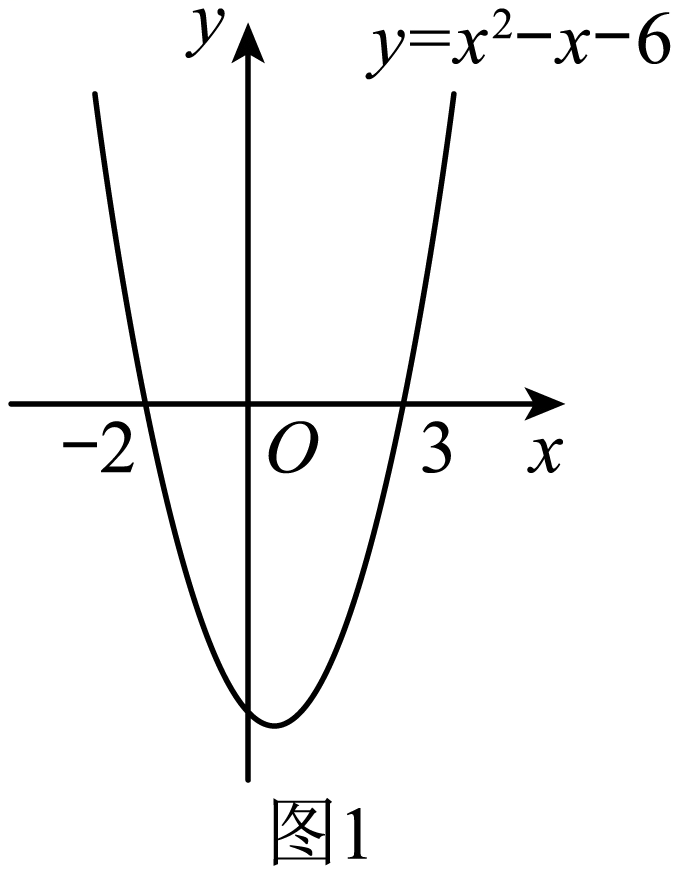
由方法1可知，不等式 $x^{2}-x-6<0$ 的解集为 $-2<x<3$ ，
故答案为： $-2<x<3$ ；  
（2）解：由题意知，3种方法都运用了数形结合的数学思想方法，
故选：D；  
（3）解：如图2，作函数 $y=x-1$ 与 $y=\frac{6}{x}$ 的图像，

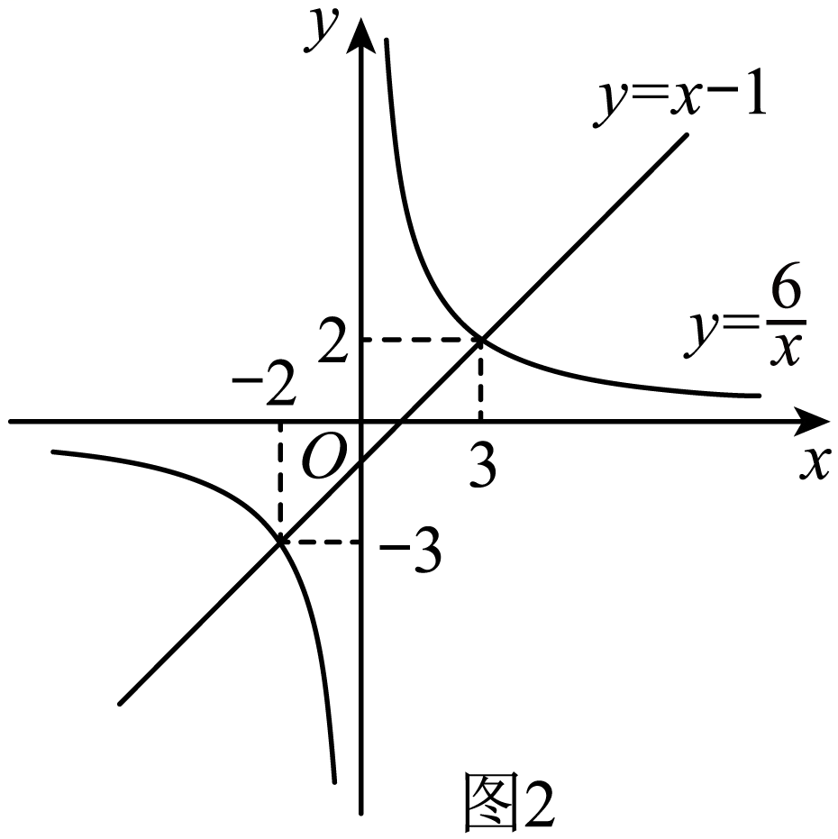
由图像可得， $x^{2}-x-6<0$ 的解集为 $-2<x<0$ ，或 $0<x<3$ ，

综上， $x^{2}-x-6<0$ 的解集为 $-2<x<3$ ．

【点睛】本题考查了数形结合求一元二次不等式的解集，作二次函数、一次函数、反比例函数的图像．解题的关键在于理解题意并正确的作函数图象．

17．（2023·四川凉山·中考真题）阅读理解题：

阅读材料：

如图1，四边形 $ABCD$ 是矩形， $\bigtriangleup AEF$ 是等腰直角三角形，记 $\angle BAE$ 为 $\alpha$ 、 $\angle FAD$ 为 $\beta$ ，若 $tan\alpha =\frac{1}{2}$ ，则 $tan\beta =\frac{1}{3}$ ．

证明：设 $BE=k$ ，∵ $tan\alpha =\frac{1}{2}$ ，∴ $AB=2k$ ，

易证 $\bigtriangleup AEB\allequal \bigtriangleup EFC\left(AAS\right)$
∴ $EC=2k,CF=k$ ，
∴ $FD=k,AD=3k$
∴ $tan\beta =\frac{DF}{AD}=\frac{k}{3k}=\frac{1}{3}$ ，
若 $\alpha +\beta =45\circ$ 时，当 $tan\alpha =\frac{1}{2}$ ，则 $tan\beta =\frac{1}{3}$ ．

同理：若 $\alpha +\beta =45\circ$ 时，当 $tan\alpha =\frac{1}{3}$ ，则 $tan\beta =\frac{1}{2}$ ．
根据上述材料，完成下列问题：

如图2，直线 $y=3x-9$ 与反比例函数 $y=\frac{m}{x}(x>0)$ 的图象交于点 $A$ ，与 $x$ 轴交于点 $B$ ．将直线 $AB$ 绕点 $A$ 顺时针旋转 $45\circ$ 后的直线与 $y$ 轴交于点 $E$ ，过点 $A$ 作 $AM\perp x$ 轴于点 $M$ ，过点 $A$ 作 $AN\perp y$ 轴于点 $N$ ，已知 $OA=5$ ．

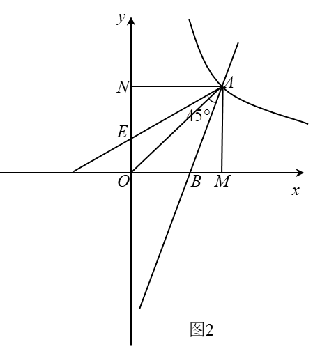  
(1)求反比例函数的解析式；  
(2)直接写出 $tan\angle BAM、tan\angle NAE$ 的值；  
(3)求直线 $AE$ 的解析式．

【答案】(1) $y=\frac{12}{x}(x>0)$  
(2) $tan\angle BAM=\frac{1}{3}$ ， $tan\angle NAE=\frac{1}{2}$  
(3) $y=\frac{1}{2}x+1$

【分析】（1）首先求出点 $B\left(3,0\right)$ ，然后设 $A\left(a,3a-9\right)$ ，在 $Rt\bigtriangleup AOM$ 中，利用勾股定理求出 $a=4$ ，得到 $A\left(4,3\right)$ ，然后代入 $y=\frac{m}{x}(x>0)$ 求解即可；  
（2）首先根据 $A\left(4,3\right)$ ， $B\left(3,0\right)$ 得到 $MO=4$ ， $BO=3$ ，求出 $MB=1$ ， $AM=3$ ，然后利用正切值的概念求出 $tan\angle BAM=\frac{BM}{AM}=\frac{1}{3}$ ，然后证明出四边形 $NOMA$ 是矩形，得到 $\angle BAM+\angle NAE=45\circ$ ，然后由 $tan\angle BAM=\frac{1}{3}$ 即可求出 $tan\angle NAE=\frac{1}{2}$ ；  
（3）首先根据矩形的性质得到 $AN=OM=4$ ， $NO=AM=3$ ，然后利用 $tan\angle NAE=\frac{1}{2}$ 求出 $NE=2$ ，进而得到 $E\left(0,1\right)$ ，然后设直线 $AE$ 的解析式为 $y=kx+b$ ，利用待定系数法将 $E\left(0,1\right)$ 和 $A\left(4,3\right)$ 代入求解即可．

【详解】（1）将 $y=0$ 代入 $y=3x-9$ 得， $x=3$ ，
∴ $B\left(3,0\right)$ ，
∵直线 $y=3x-9$ 与反比例函数 $y=\frac{m}{x}(x>0)$ 的图象交于点 $A$ ，
∴设 $A\left(a,3a-9\right)$ ，
∵ $AM\perp x$ ， $OA=5$ ，
∴在 $Rt\bigtriangleup AOM$ 中， $OM^{2}+AM^{2}=AO^{2}$ ，
∴ $a^{2}+\left(3a-9\right)^{2}=5^{2}$ ，
∴解得 $a_{1}=4$ ， $a_{2}=\frac{7}{5}$ ，
∵点*A*的横坐标要大于点*B*的横坐标，
∴ $a_{2}=\frac{7}{5}$ 应舍去，
∴ $a=4$ ，
∴ $A\left(4,3\right)$ ，
∴将 $A\left(4,3\right)$ 代入 $y=\frac{m}{x}(x>0)$ ，解得 $m=12$ ；
∴反比例函数的解析式为 $y=\frac{12}{x}(x>0)$ ；  
（2）∵ $A\left(4,3\right)$ ， $B\left(3,0\right)$ ，
∴ $MO=4$ ， $BO=3$ ，
∴ $MB=1$ ， $AM=3$ ，
∵ $AM\perp x$ ，
∴ $tan\angle BAM=\frac{BM}{AM}=\frac{1}{3}$ ，
∵ $AN\perp y$ ， $\angle NOM=90\circ$ ，
∴四边形 $NOMA$ 是矩形，
∴ $\angle NAM=90\circ$ ，
∵将直线 $AB$ 绕点 $A$ 顺时针旋转 $45\circ$ 后的直线与 $y$ 轴交于点 $E$ ，
∴ $\angle BAE=45\circ$ ，
∴ $\angle BAM+\angle NAE=45\circ$ ，
∵ $tan\angle BAM=\frac{1}{3}$ ，
∴ $tan\angle NAE=\frac{1}{2}$ ；  
（3）∵四边形 $NOMA$ 是矩形，
∴ $AN=OM=4$ ， $NO=AM=3$ ，
∵ $AN\perp y$ ， $tan\angle NAE=\frac{1}{2}$ ，
∴ $\frac{NE}{AN}=\frac{1}{2}$ ，即 $\frac{NE}{4}=\frac{1}{2}$ ，
∴解得 $NE=2$ ，
∴ $OE=ON-NE=1$ ，
∴ $E\left(0,1\right)$ ，
∴设直线 $AE$ 的解析式为 $y=kx+b$ ，
∴将 $E\left(0,1\right)$ 和 $A\left(4,3\right)$ 代入得， $\left\{\begin{array}{c}b=1\\4k+b=3\end{array}\right$ ，
∴解得 $\left\{\begin{array}{c}b=1\\k=\frac{1}{2}\end{array}\right$ ，
∴直线 $AE$ 的解析式为 $y=\frac{1}{2}x+1$ ．

【点睛】此题考查了反比例函数，一次函数和几何综合题，矩形的性质，解直角三角形，勾股定理等知识，解题的关键是正确理解材料的内容．

## 题型03  归纳概括问题

18．（2023·浙江嘉兴·中考真题）观察下面的等式： $3^{2}-1^{2}=8\times 1,5^{2}-3^{2}=8\times 2,7^{2}-5^{2}=8\times 3,9^{2}-7^{2}=8\times 4,\cdots$  
(1)写出 $19^{2}-17^{2}$ 的结果．  
(2)按上面的规律归纳出一个一般的结论（用含*n*的等式表示，*n*为正整数）  
(3)请运用有关知识，推理说明这个结论是正确的．

【答案】(1) $8\times 9$  
(2) $(2n+1)^{2}-(2n-1)^{2}=8n$  
(3)见解析

【分析】（1）根据题干的规律求解即可；  
（2）根据题干的规律求解即可；  
（3）将 $(2n+1)^{2}-(2n-1)^{2}$ 因式分解，展开化简求解即可．

【详解】（1） $19^{2}-17^{2}=8\times 9$ ；  
（2） $(2n+1)^{2}-(2n-1)^{2}=8n$ ；  
（3） $(2n+1)^{2}-(2n-1)^{2}$
$=(2n+1+2n-1)(2n+1-2n+1)$
$=4n\times 2$
$=8n$ ．

【点睛】此题考查数字的变化规律，因式分解，整式乘法的混合运算，解题关键是通过观察，分析、归纳发现其中的变化规律．

19．（2023·山西·中考真题）阅读与思考：下面是一位同学的数学学习笔记，请仔细阅读并完成相应任务．

任务：  
(1)填空：材料中的依据1是指：\_\_\_\_\_\_\_\_\_\_\_\_\_．

依据2是指：\_\_\_\_\_\_\_\_\_\_\_\_\_．  
(2)请用刻度尺、三角板等工具，画一个四边形 $ABCD$ 及它的瓦里尼翁平行四边形 $EFGH$ ，使得四边形 $EFGH$ 为矩形；（要求同时画出四边形 $ABCD$ 的对角线）  
(3)在图1中，分别连接 $AC,BD$ 得到图3，请猜想瓦里尼翁平行四边形 $EFGH$ 的周长与对角线 $AC,BD$ 长度的关系，并证明你的结论．

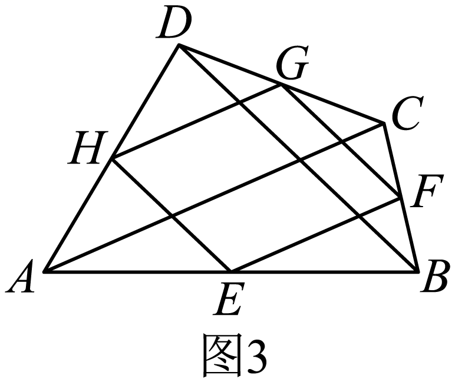

【答案】(1)三角形中位线定理（或三角形的中位线平行于第三边，且等于第三边的一半）；平行四边形的定义（或两组对边分别平行的四边形叫做平行四边形）  
(2)答案不唯一，见解析  
(3)平行四边形 $EFGH$ 的周长等于对角线 $AC$ 与 $BD$ 长度的和，见解析

【分析】（1）根据三角形中位线定理和平行四边形的定义解答即可；  
（2）作对角线互相垂直的四边形，再顺次连接这个四边形各边中点即可；  
（3）根据三角形中位线定理得瓦里尼翁平行四边形一组对边和等于四边形的一条对角线，即可得妯结论．

【详解】（1）解：三角形中位线定理（或三角形的中位线平行于第三边，且等于第三边的一半）

平行四边形的定义（或两组对边分别平行的四边形叫做平行四边形）  
（2）解：答案不唯一，只要是对角线互相垂直的四边形，它的瓦里尼翁平行四边形即为矩形均可．例如：如图即为所求

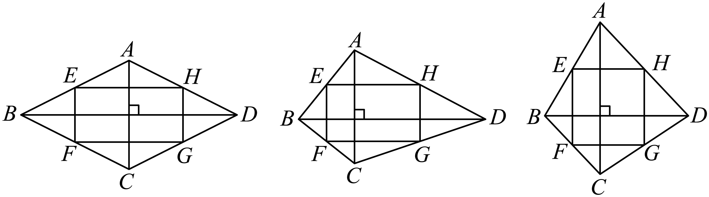  
（3）瓦里尼翁平行四边形 $EFGH$ 的周长等于四边形 $ABCD$ 的两条对角线 $AC$ 与 $BD$ 长度的和，
证明如下：∵点 $E,F,G,H$ 分别是边 $AB,BC,CD,DA$ 的中点，
∴ $EF=\frac{1}{2}AC,GH=\frac{1}{2}AC$ ．
∴ $EF+GH=AC$ ．

同理 $EH+FG=BD$ ．
∴四边形 $EFGH$ 的周长 $=EF+GH+EH+FG=AC+BD$ ．
即瓦里尼翁平行四边形 $EFGH$ 的周长等于对角线 $AC$ 与 $BD$ 长度的和．

【点睛】本题考查平行四边形的判定，矩形的判定，三角形中位线．熟练掌握三角形中位线定理是解题的关键．

20．（2022·吉林·中考真题）下面是王倩同学的作业及自主探究笔记，请认真阅读并补充完整．

【作业】如图①，直线 $l_{1}\parallel l_{2}$ ， $\bigtriangleup ABC$ 与 $\bigtriangleup DBC$ 的面积相等吗？为什么？

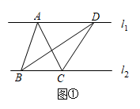
解：相等．理由如下：
设 $l_{1}$ 与 $l_{2}$ 之间的距离为 $h$ ，则 $S_{\bigtriangleup ABC}=\frac{1}{2}BC\cdot h$ ， $S_{\bigtriangleup DBC}=\frac{1}{2}BC\cdot h$ ．
∴ $S_{\bigtriangleup ABC}=S_{\bigtriangleup DBC}$ ．

【探究】  
(1)如图②，当点 $D$ 在 $l_{1}$ ， $l_{2}$ 之间时，设点 $A$ ， $D$ 到直线 $l_{2}$ 的距离分别为 $h$ ， $h^{'}$ ，则 $\frac{S_{\bigtriangleup ABC}}{S_{\bigtriangleup DBC}}=\frac{h}{h^{'}}$ ．

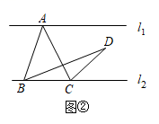
证明：∵ $S_{\bigtriangleup ABC}$

\_

\_  
(2)如图③，当点 $D$ 在 $l_{1}$ ， $l_{2}$ 之间时，连接 $AD$ 并延长交 $l_{2}$ 于点 $M$ ，则 $\frac{S_{\bigtriangleup ABC}}{S_{\bigtriangleup DBC}}=\frac{AM}{DM}$ ．

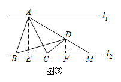
证明：过点 $A$ 作 $AE\perp BM$ ，垂足为 $E$ ，过点 $D$ 作 $DF\perp BM$ ，垂足为 $F$ ，则 $\angle AEM=\angle DFM=90\circ$ ，
∴ $AE\parallel$ _．
∴ $\bigtriangleup AEM\backsim$ _．
∴ $\frac{AE}{DF}=\frac{AM}{DM}$ ．
由【探究】（1）可知 $\frac{S_{\bigtriangleup ABC}}{S_{\bigtriangleup DBC}}=$ _，
∴ $\frac{S_{\bigtriangleup ABC}}{S_{\bigtriangleup DBC}}=\frac{AM}{DM}$ ．  
(3)如图④，当点 $D$ 在 $l_{2}$ 下方时，连接 $AD$ 交 $l_{2}$ 于点 $E$ ．若点 $A$ ， $E$ ， $D$ 所对应的刻度值分别为5，1.5，0， $\frac{S_{\bigtriangleup ABC}}{S_{\bigtriangleup DBC}}$ 的值为_．

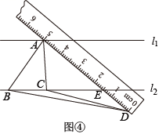

【答案】(1)证明见解析  
(2)证明见解析  
(3) $\frac{7}{3}$

【分析】（1）根据三角形的面积公式可得 $S_{\bigtriangleup ABC}=\frac{1}{2}BC\cdot h,S_{\bigtriangleup DBC}=\frac{1}{2}BC\cdot h^{'}$ ，由此即可得证；  
（2）过点 $A$ 作 $AE\perp BM$ ，垂足为 $E$ ，过点 $D$ 作 $DF\perp BM$ ，垂足为 $F$ ，先根据平行线的判定可得 $AE\parallel DF$ ，再根据相似三角形的判定可证 $\bigtriangleup AEM\sim \bigtriangleup DFM$ ，根据相似三角形的性质可得 $\frac{AE}{DF}=\frac{AM}{DM}$ ，然后结合【探究】（1）的结论即可得证；  
（3）过点 $A$ 作 $AM\perp BC$ 于点 $M$ ，过点 $D$ 作 $DN\perp BC$ 于点 $N$ ，先根据相似三角形的判定证出 $\bigtriangleup AME\sim \bigtriangleup DNE$ ，再根据相似三角形的性质可得 $\frac{AM}{DN}=\frac{AE}{DE}=\frac{7}{3}$ ，然后根据三角形的面积公式可得 $S_{\bigtriangleup ABC}=\frac{1}{2}BC\cdot AM$ ， $S_{\bigtriangleup DBC}=\frac{1}{2}BC\cdot DN$ ，由此即可得出答案．

【详解】（1）证明： $\because S_{\bigtriangleup ABC}=\frac{1}{2}BC\cdot h$ ， $S_{\bigtriangleup DBC}=\frac{1}{2}BC\cdot h^{'}$ ，
$\therefore \frac{S_{\bigtriangleup ABC}}{S_{\bigtriangleup DBC}}=\frac{h}{h^{'}}$ ．  
（2）证明：过点 $A$ 作 $AE\perp BM$ ，垂足为 $E$ ，过点 $D$ 作 $DF\perp BM$ ，垂足为 $F$ ，则 $\angle AEM=\angle DFM=90\circ$ ，

$\therefore AE\parallel DF$ ．
$\therefore \bigtriangleup AEM\sim \bigtriangleup DFM$ ．
$\therefore \frac{AE}{DF}=\frac{AM}{DM}$ ．
由【探究】（1）可知 $\frac{S_{\bigtriangleup ABC}}{S_{\bigtriangleup DBC}}=\frac{AE}{DF}$ ，
$\therefore \frac{S_{\bigtriangleup ABC}}{S_{\bigtriangleup DBC}}=\frac{AM}{DM}$ ．  
（3）解：过点 $A$ 作 $AM\perp BC$ 于点 $M$ ，过点 $D$ 作 $DN\perp BC$ 于点 $N$ ，则 $\angle AME=\angle DNE=90\circ$ ，

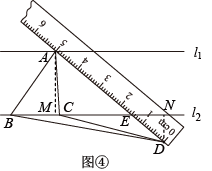
$\therefore AM\parallel DN$ ，
$\therefore \bigtriangleup AME\sim \bigtriangleup DNE$ ，
$\therefore \frac{AM}{DN}=\frac{AE}{DE}$ ，
$\because$ 点 $A,E,D$ 所对应的刻度值分别为5， $1.5$ ，0，
$\therefore AE=5-1.5=3.5$ ， $DE=1.5$ ，
$\therefore \frac{AM}{DN}=\frac{3.5}{1.5}=\frac{7}{3}$ ，
又 $\because S_{\bigtriangleup ABC}=\frac{1}{2}BC\cdot AM$ ， $S_{\bigtriangleup DBC}=\frac{1}{2}BC\cdot DN$ ，
$\therefore \frac{S_{\bigtriangleup ABC}}{S_{\bigtriangleup DBC}}=\frac{AM}{DN}=\frac{7}{3}$ ，
故答案为： $\frac{7}{3}$ ．

【点睛】本题考查了相似三角形的判定与性质、平行线的判定、三角形的面积等知识点，熟练掌握相似三角形的判定与性质是解题关键．

21．（2022·湖南·中考真题）阅读下列材料：
在 $\bigtriangleup ABC$ 中， $\angle A$ 、 $\angle B$ 、 $\angle C$ 所对的边分别为 $a$ 、 $b$ 、 $c$ ，求证： $\frac{a}{sinA}=\frac{b}{sinB}$ ．
证明：如图1，过点 $C$ 作 $CD\perp AB$ 于点 $D$ ，则：
在 $Rt\Delta BCD$ 中，<text style="it*a*lic"> CD</text>=asin*B*
在 $Rt\Delta ACD$ 中， $CD=bsinA$
$\therefore asinB=bsinA$
$\therefore \frac{a}{sinA}=\frac{b}{sinB}$
根据上面的材料解决下列问题：

  
(1)如图2，在 $\Delta ABC$ 中， $\angle A$ 、 $\angle B$ 、 $\angle C$ 所对的边分别为 $a$ 、 $b$ 、 $c$ ，求证： $\frac{b}{sinB}=\frac{c}{sinC}$ ；  
(2)为了办好湖南省首届旅游发展大会，张家界市积极优化旅游环境．如图3，规划中的一片三角形区域需美化，已知 $\angle A=67\circ$ ， $\angle B=53\circ$ ， $AC=80$ 米，求这片区域的面积．（结果保留根号．参考数据： $sin53\circ \approx 0.8$ ， $sin67\circ \approx 0.9)$

【答案】(1)见解析  
(2) $1800\sqrt{3}$

【分析】（1）作*BC*边上的高，利用三角函数表示*AD*后，即可建立关联并求解；  
（2）作*BC*边上的高，利用三角函数分别求出*AE*和*BC*，即可求解．

【详解】（1）证明：如图2，过点 $A$ 作 $AD\perp BC$ 于点 $D$ ，
在 $Rt\Delta ABD$ 中， $AD=csinB$ ，
在 $Rt\Delta ACD$ 中， $AD=bsinC$ ，
$\therefore$  $csinB=bsinC$ ，
$\therefore$  $\frac{b}{sinB}=\frac{c}{sinC}$ ；
  
（2）解：如图3，过点 $A$ 作 $AE\perp BC$ 于点 $E$ ，
$\because \angle BAC=67\circ$ ， $\angle B=53\circ$ ，
$\therefore \angle C=60\circ$ ，
在 $Rt\Delta ACE$ 中， $AE=AC\cdot sin60^{\circ }=80\times \frac{\sqrt{3}}{2}=40\sqrt{3}\left(m\right)$
又 $\because$  $\frac{AC}{sinB}=\frac{BC}{sin\angle BAC}$ ，
即 $\frac{80}{0.8}=\frac{BC}{0.9}$ ，
$\therefore$  $BC=90\left(m\right)$ ，
$\therefore$  $S_{\bigtriangleup ABC}=\frac{1}{2}\times 90\times 40\sqrt{3}=1800\sqrt{3}\left(m^{2}\right)$ ．

【点睛】本题考查了解直角三角形的应用，掌握直角三角形的边角关系，即锐角三角函数的定义是解决问题的前提．

## 题型04  探究实践类问题

22．（2023·山东潍坊·中考真题）［材料阅读]

用数形结合的方法，可以探究 $q+q^{2}+q^{3}+...+q^{n}+\ldots$ 的值，其中 $0<q<1$ ．

例求 $\frac{1}{2}+\left(\frac{1}{2}\right)^{2}+\left(\frac{1}{2}\right)^{3}+\cdots +\left(\frac{1}{2}\right)^{n}+\cdots$ 的值．
方法1：借助面积为1的正方形，观察图①可知
$\frac{1}{2}+\left(\frac{1}{2}\right)^{2}+\left(\frac{1}{2}\right)^{3}+\cdots +\left(\frac{1}{2}\right)^{n}+\cdots$ 的结果等于该正方形的面积，
即 $\frac{1}{2}+\left(\frac{1}{2}\right)^{2}+\left(\frac{1}{2}\right)^{3}+\cdots +\left(\frac{1}{2}\right)^{n}+\cdots =1$ ．
方法2：借助函数 $y=\frac{1}{2}x+\frac{1}{2}$ 和 $y=x$ 的图象，观察图②可知
$\frac{1}{2}+\left(\frac{1}{2}\right)^{2}+\left(\frac{1}{2}\right)^{3}+\cdots +\left(\frac{1}{2}\right)^{n}+\cdots$ 的结果等于 $a_{1}$ ， $a_{2}$ ， $a_{3}$ ，…， $a_{n}$ …等各条竖直线段的长度之和，
即两个函数图象的交点到 $x$ 轴的距离．因为两个函数图象的交点 $(1,1)$ 到 $x$ 轴的距为1，
所以， $\frac{1}{2}+\left(\frac{1}{2}\right)^{2}+\left(\frac{1}{2}\right)^{3}+\cdots +\left(\frac{1}{2}\right)^{n}+\cdots =1$ ．

【实践应用】

任务一   完善 $\frac{2}{3}+\left(\frac{2}{3}\right)^{2}+\left(\frac{2}{3}\right)^{3}+\cdots +\left(\frac{2}{3}\right)^{n}+\cdots$ 的求值过程．

方法1：借助面积为2的正方形，观察图③可知 $\frac{2}{3}+\left(\frac{2}{3}\right)^{2}+\left(\frac{2}{3}\right)^{3}+\cdots +\left(\frac{2}{3}\right)^{n}+\cdots =$ \_\_\_\_\_\_．
方法2：借助函数 $y=\frac{2}{3}x+\frac{2}{3}$ 和 $y=x$ 的图象，观察图④可知
因为两个函数图象的交点的坐标为\_\_\_\_\_\_，
所以， $\frac{2}{3}+\left(\frac{2}{3}\right)^{2}+\left(\frac{2}{3}\right)^{3}+\cdots +\left(\frac{2}{3}\right)^{n}+\cdots =$ \_\_\_\_\_\_．

任务二   参照上面的过程，选择合适的方法，求 $\frac{3}{4}+\left(\frac{3}{4}\right)^{2}+\left(\frac{3}{4}\right)^{3}+\cdots +\left(\frac{3}{4}\right)^{2}+\cdots$ 的值．

任务三   用方法2，求 $q+q^{2}+q^{3}+\cdots +q^{n}+\cdots$ 的值（结果用 $q$ 表示）．

【迁移拓展】

长宽之比为 $\frac{\sqrt{5}+1}{2}:1$ 的矩形是黄金矩形，将黄金矩形依次截去一个正方形后，得到的新矩形仍是黄金矩形．

观察图⑤，直接写出 $\left(\frac{\sqrt{5}-1}{2}\right)^{2}+\left(\frac{\sqrt{5}-1}{2}\right)^{4}+\left(\frac{\sqrt{5}-1}{2}\right)^{6}+\cdots +\left(\frac{\sqrt{5}-1}{2}\right)^{2n}+\cdots$ 的值．

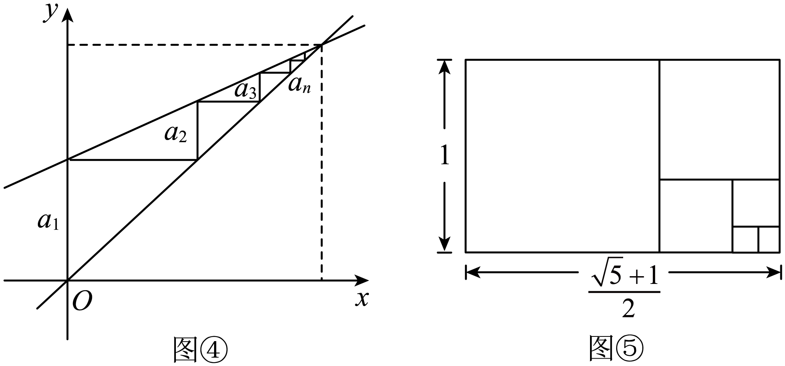

【答案】任务一，方法1： $2$ ；方法2： $\left(2,2\right)$ ， $2$ ；任务二， $3$ ；任务三， $\frac{q}{1-q}$ ；[迁移拓展] $\frac{\sqrt{5}-1}{2}$

【分析】任务一，仿照例题，分别根据方法1，2进行求解即可；
任务二，借助函数 $y=\frac{3}{4}x+\frac{3}{4}$ 和 $y=x$ 得出交点坐标，进而根据两个函数图象的交点到 $x$ 轴的距离．因为两个函数图象的交点 $\left(2,2\right)$ 到 $x$ 轴的距为2，即可得出结果；
任务三  参照方法2，借助函数 $y=qx+q$ 和 $y=x$ 的图象，得出交点坐标，即可求解；
[迁移拓展]观察图⑤第一个正方形的面积为 $1\times 1=1=\left(\frac{\sqrt{5}-1}{2}\right)^{0}$ ，第二个正方形的面积为 $\left(\frac{\sqrt{5}+1}{2}-1\right)^{2}=\left(\frac{\sqrt{5}-1}{2}\right)^{2}$ ，……进而得出则 $\left(\frac{\sqrt{5}-1}{2}\right)^{2}+\left(\frac{\sqrt{5}-1}{2}\right)^{4}+\left(\frac{\sqrt{5}-1}{2}\right)^{6}+\cdots +\left(\frac{\sqrt{5}-1}{2}\right)^{2n}+\cdots$ 的值等于长宽之比为 $\frac{\sqrt{5}+1}{2}:1$ 的矩形减去1个面积为 $1$ 的正方形的面积，即可求解．

【详解】解：任务一，方法1：借助面积为2的正方形，观察图③可知 $\frac{2}{3}+\left(\frac{2}{3}\right)^{2}+\left(\frac{2}{3}\right)^{3}+\cdots +\left(\frac{2}{3}\right)^{n}+\cdots =$  $2$
故答案为： $2$ ．
方法2：借助函数 $y=\frac{2}{3}x+\frac{2}{3}$ 和 $y=x$ 的图象，观察图④可知
因为两个函数图象的交点的坐标为 $\left(2,2\right)$ ，
所以， $\frac{2}{3}+\left(\frac{2}{3}\right)^{2}+\left(\frac{2}{3}\right)^{3}+\cdots +\left(\frac{2}{3}\right)^{n}+\cdots =$  $2$ ．
故答案为： $\left(2,2\right)$ ， $2$ ．

任务二：参照方法2，借助函数 $y=\frac{3}{4}x+\frac{3}{4}$ 和 $y=x$ 的图象， $\left\{\begin{array}{c}y=\frac{3}{4}x+\frac{3}{4}\\y=x\end{array}\right$ ，
解得： $\left\{\begin{array}{c}x=3\\y=3\end{array}\right$
∴两个函数图象的交点的坐标为 $\left(3,3\right)$ ，
$\frac{3}{4}+\left(\frac{3}{4}\right)^{2}+\left(\frac{3}{4}\right)^{3}+\cdots +\left(\frac{3}{4}\right)^{2}+\cdots =3$ ．

任务三  参照方法2，借助函数 $y=qx+q$ 和 $y=x$ 的图象，两个函数图象的交点的坐标为 $\left(\frac{q}{1-q},\frac{q}{1-q}\right)$ ，
∴ $q+q^{2}+q^{3}+\cdots +q^{n}+\cdots =\frac{q}{1-q}$

[迁移拓展]根据图⑤，第一个正方形的面积为 $1\times 1=1=\left(\frac{\sqrt{5}-1}{2}\right)^{0}$ ，第二个正方形的面积为 $\left(\frac{\sqrt{5}+1}{2}-1\right)^{2}=\left(\frac{\sqrt{5}-1}{2}\right)^{2}$ ，……
则 $\left(\frac{\sqrt{5}-1}{2}\right)^{2}+\left(\frac{\sqrt{5}-1}{2}\right)^{4}+\left(\frac{\sqrt{5}-1}{2}\right)^{6}+\cdots +\left(\frac{\sqrt{5}-1}{2}\right)^{2n}+\cdots$ 的值等于长宽之比为 $\frac{\sqrt{5}+1}{2}:1$ 的矩形减去1个面积为1的正方形的面积，
即 $\left(\frac{\sqrt{5}-1}{2}\right)^{2}+\left(\frac{\sqrt{5}-1}{2}\right)^{4}+\left(\frac{\sqrt{5}-1}{2}\right)^{6}+\cdots +\left(\frac{\sqrt{5}-1}{2}\right)^{2n}+\cdots =\frac{\sqrt{5}+1}{2}\times 1-1=\frac{\sqrt{5}-1}{2}$

【点睛】本题考查了一次函数交点问题，正方形面积问题，理解题意，仿照例题求解是解题的关键．

23．（2023·甘肃兰州·中考真题）综合与实践

【思考尝试】  
（1）数学活动课上，老师出示了一个问题：如图1，在矩形*ABCD*中，*E*是边 $AB$ 上一点， $DF\perp CE$ 于点*F*， $GD\perp DF$ ， $AG\perp DG$ ， $AG=CF$ ．试猜想四边形 $ABCD$ 的形状，并说明理由；
【实践探究】  
（2）小睿受此问题启发，逆向思考并提出新的问题：如图2，在正方形 $ABCD$ 中，*E*是边 $AB$ 上一点， $DF\perp CE$ 于点*F*， $AH\perp CE$ 于点*H*， $GD\perp DF$ 交 $AH$ 于点*G*，可以用等式表示线段 $FH$ ， $AH$ ， $CF$ 的数量关系，请你思考并解答这个问题；
【拓展迁移】  
（3）小博深入研究小睿提出的这个问题，发现并提出新的探究点：如图3，在正方形 $ABCD$ 中，*E*是边 $AB$ 上一点， $AH\perp CE$ 于点*H*，点*M*在 $CH$ 上，且 $AH=HM$ ，连接 $AM$ ， $BH$ ，可以用等式表示线段 $CM$ ， $BH$ 的数量关系，请你思考并解答这个问题．

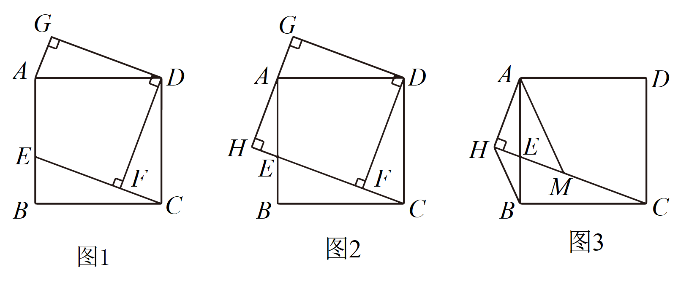

【答案】（1）四边形 $ABCD$ 是正方形，证明见解析；（2） $FH=AH+CF$ ；（3） $MC=\sqrt{2}BH$ ，证明见解析；
【分析】（1）证明 $\bigtriangleup ADG\allequal \bigtriangleup CDF$ ，可得 $AD=CD$ ，从而可得结论；  
（2）证明四边形 $DGHF$ 是矩形，可得 $\angle G=90\circ =\angle DFC$ ，同理可得： $\angle ADG=\angle CDF$ ，证明 $\bigtriangleup ADG\allequal \bigtriangleup CDF$ ， $DG=DF$ ， $AG=CF$ ，证明四边形 $DGHF$ 是正方形，可得 $HG=HF$ ，从而可得结论；  
（3）如图，连接 $AC$ ，证明 $\angle AHE=\angle ABC=90\circ$ ， $\frac{AC}{AB}=\sqrt{2}$ ， $\angle BAC=45\circ$ ， $\bigtriangleup AHE\backsim \bigtriangleup CBE$ ，可得 $\frac{AE}{CE}=\frac{HE}{BE}$ ，再证明 $\bigtriangleup HEB\backsim \bigtriangleup AEC$ ，可得 $\angle HBE=\angle MCA$ ，证明 $\bigtriangleup AHB\backsim \bigtriangleup AMC$ ，可得 $\frac{HB}{MC}=\frac{AB}{AC}=\frac{1}{\sqrt{2}}$ ，从而可得答案．

【详解】解：（1）∵ $GD\perp DF$ ， $DF\perp CE$ ， $AG\perp DG$ ，
∴ $\angle G=\angle DFC=90\circ$ ， $\angle ADG+\angle ADF=90\circ$ ，
∵矩形 $ABCD$ ，
∴ $\angle ADC=90\circ =\angle ADF+\angle CDF$ ，
∴ $\angle ADG=\angle CDF$ ，
∵ $AG=CF$ ，
∴ $\bigtriangleup ADG\allequal \bigtriangleup CDF$ ，
∴ $AD=CD$ ，
∴矩形 $ABCD$ 是正方形．  
（2）∵ $DF\perp CE$ ， $AH\perp CE$ ， $GD\perp DF$ ，
∴ $\angle DFH=\angle H=\angle GDF=90\circ$ ，
∴四边形 $DGHF$ 是矩形，
∴ $\angle G=90\circ =\angle DFC$ ，
同理可得： $\angle ADG=\angle CDF$ ，
∵正方形 $ABCD$ ，
∴ $AD=CD$ ，
∴ $\bigtriangleup ADG\allequal \bigtriangleup CDF$ ，
∴ $DG=DF$ ， $AG=CF$ ，
∴四边形 $DGHF$ 是正方形，
∴ $HG=HF$ ，
∴ $FH=HG=AH+AG=AH+CF$ ．  
（3）如图，连接 $AC$ ，
∵ $AH\perp CE$ ，正方形 $ABCD$ ，
∴ $\angle AHE=\angle ABC=90\circ$ ， $\frac{AC}{AB}=\sqrt{2}$ ， $\angle BAC=45\circ$ ，
∵ $\angle AEH=\angle CEB$ ，
∴ $\bigtriangleup AHE\backsim \bigtriangleup CBE$ ，
∴ $\frac{AE}{CE}=\frac{HE}{BE}$ ，

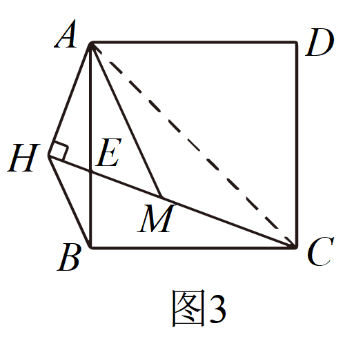
∵ $\angle BEH=\angle AEC$ ，
∴ $\bigtriangleup HEB\backsim \bigtriangleup AEC$ ，
∴ $\angle HBE=\angle MCA$ ，
∵ $AH\perp CE,AH=HM$ ，
∴ $\angle HAM=45\circ =\angle BAC$ ，
∴ $\angle HAE=\angle MAC$ ，
∴ $\bigtriangleup AHB\backsim \bigtriangleup AMC$ ，
∴ $\frac{HB}{MC}=\frac{AB}{AC}=\frac{1}{\sqrt{2}}$ ，
∴ $MC=\sqrt{2}BH$ ．

【点睛】本题考查的是矩形的判定与性质，正方形的判定与性质，全等三角形的判定与性质，相似三角形的判定与性质，作出合适的辅助线，构建相似三角形是解本题的关键．

24．（2023·甘肃兰州·中考真题）综合与实践

问题探究：（1）如图1是古希腊数学家欧几里得所著的《几何原本》第1卷命题9：“平分一个已知角．”即：作一个已知角的平分线，如图2是欧几里得在《几何原本》中给出的角平分线作图法：在 $OA$ 和 $OB$ 上分别取点*C*和*D*，使得 $OC=OD$ ，连接 $CD$ ，以 $CD$ 为边作等边三角形 $CDE$ ，则 $OE$ 就是 $\angle AOB$ 的平分线．

请写出 $OE$ 平分 $\angle AOB$ 的依据：\_\_\_\_\_\_\_\_\_\_\_\_；
类比迁移：  
（2）小明根据以上信息研究发现： $\bigtriangleup CDE$ 不一定必须是等边三角形，只需 $CE=DE$ 即可．他查阅资料：我国古代已经用角尺平分任意角．做法如下：如图3，在 $\angle AOB$ 的边 $OA$ ， $OB$ 上分别取 $OM=ON$ ，移动角尺，使角尺两边相同刻度分别与点*M*，*N*重合，则过角尺顶点*C*的射线 $OC$ 是 $\angle AOB$ 的平分线，请说明此做法的理由；
拓展实践：  
（3）小明将研究应用于实践．如图4，校园的两条小路 $AB$ 和 $AC$ ，汇聚形成了一个岔路口<em>&lt;text style="italic"&gt;&lt;text style="italic"&gt;A</em>&lt;/text&gt;&lt;/text&gt;，现在学校要在两条小路之间安装一盏路灯<em>&lt;text style="italic"&gt;&lt;text style="italic"&gt;E</em>&lt;/text&gt;&lt;/text&gt;，使得路灯照亮两条小路（两条小路一样亮），并且路灯E到岔路口A的距离和休息椅<em>D</em>到岔路口A的距离相等．试问路灯应该安装在哪个位置？请用不带刻度的直尺和圆规在对应的示意图5中作出路灯E的位置．（保留作图痕迹，不写作法）

【答案】（1） $SSS$ ；（2）证明见解析；（3）作图见解析；
【分析】（1）先证明 $\bigtriangleup OCE\allequal \bigtriangleup ODE\left(SSS\right)$ ，可得 $\angle AOE=\angle BOE$ ，从而可得答案；  
（2）先证明 $\bigtriangleup OCM\allequal \bigtriangleup OCN\left(SSS\right)$ ，可得 $\angle AOC=\angle BOC$ ，可得 $OC$ 是 $\angle AOB$ 的角平分线；  
（3）先作 $\angle BAC$ 的角平分线，再在角平分线上截取 $AE=AD$ 即可．

【详解】解：（1）∵ $OC=OD$ ， $CE=DE$ ， $DE=DE$ ，
∴ $\bigtriangleup OCE\allequal \bigtriangleup ODE\left(SSS\right)$ ，
∴ $\angle AOE=\angle BOE$ ，
∴ $OE$ 是 $\angle AOB$ 的角平分线；
故答案为： $SSS$  
（2）∵ $OM=ON$ ， $CM=CN$ ， $OC=OC$ ，
∴ $\bigtriangleup OCM\allequal \bigtriangleup OCN\left(SSS\right)$ ，
∴ $\angle AOC=\angle BOC$ ，
∴ $OC$ 是 $\angle AOB$ 的角平分线；  
（3）如图，点 $E$ 即为所求作的点；
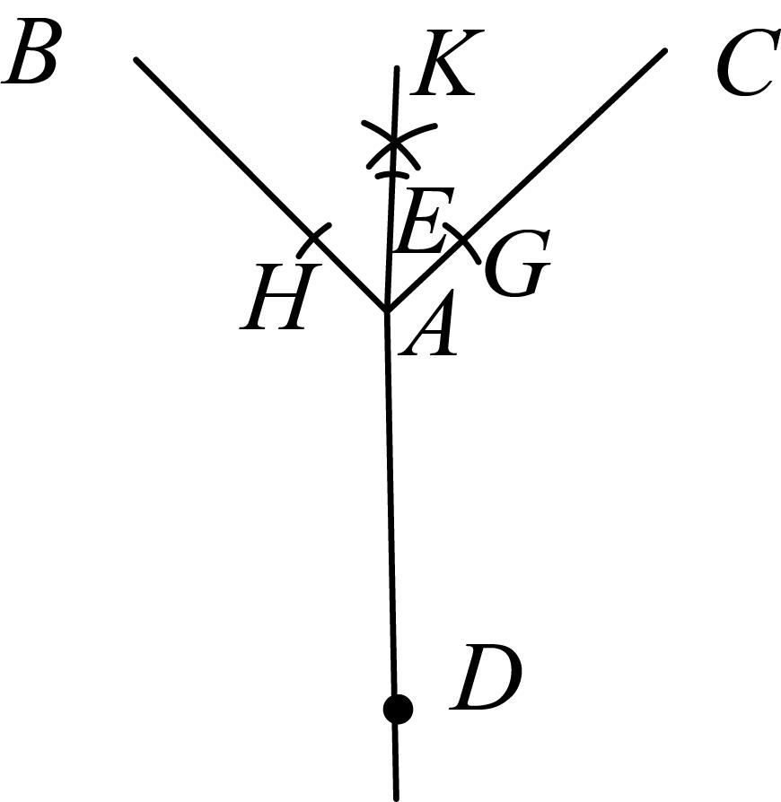

．

【点睛】本题考查的是全等三角形的判定与性质，角平分线的定义与角平分线的性质，作已知角的角平分线，理解题意，熟练的作角的平分线是解本题的关键．

25．（2023·黑龙江齐齐哈尔·中考真题）综合与实践

数学模型可以用来解决一类问题，是数学应用的基本途径．通过探究图形的变化规律，再结合其他数学知识的内在联系，最终可以获得宝贵的数学经验，并将其运用到更广阔的数学天地．

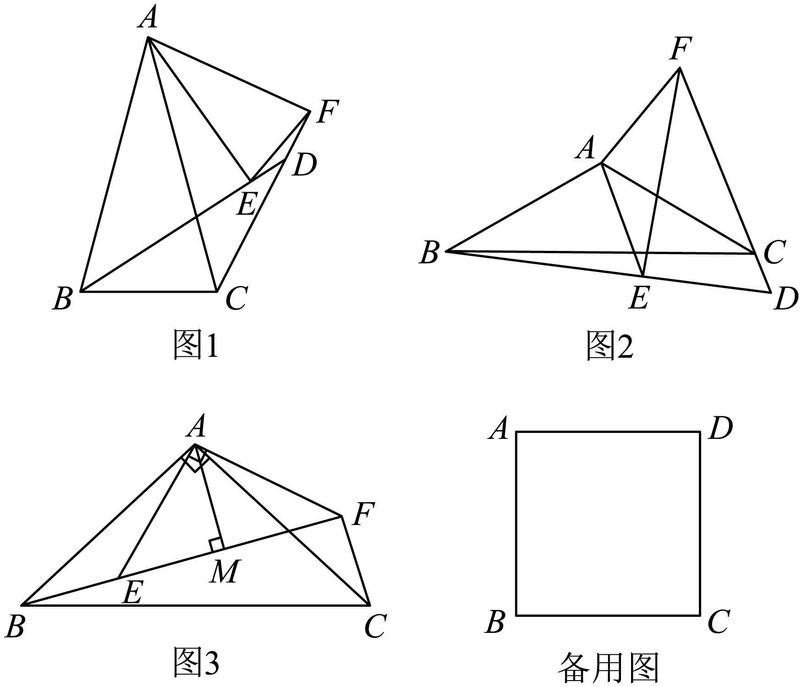  
(1)发现问题：如图1，在 $\bigtriangleup ABC$ 和 $\bigtriangleup AEF$ 中， $AB=AC$ ， $AE=AF$ ， $\angle BAC=\angle EAF=30\circ$ ，连接 $BE$ ， $CF$ ，延长 $BE$ 交 $CF$ 于点 $D$ ．则 $BE$ 与 $CF$ 的数量关系：\_\_\_\_\_\_， $\angle BDC=$ \_\_\_\_\_\_ $\circ$ ；  
(2)类比探究：如图2，在 $\bigtriangleup ABC$ 和 $\bigtriangleup AEF$ 中， $AB=AC$ ， $AE=AF$ ， $\angle BAC=\angle EAF=120\circ$ ，连接 $BE$ ， $CF$ ，延长 $BE$ ， $FC$ 交于点 $D$ ．请猜想 $BE$ 与 $CF$ 的数量关系及 $\angle BDC$ 的度数，并说明理由；  
(3)拓展延伸：如图3， $\bigtriangleup ABC$ 和 $\bigtriangleup AEF$ 均为等腰直角三角形， $\angle BAC=\angle EAF=90\circ$ ，连接 $BE$ ， $CF$ ，且点 $B$ ， $E$ ， $F$ 在一条直线上，过点 $A$ 作 $AM\perp BF$ ，垂足为点 $M$ ．则 $BF$ ， $CF$ ， $AM$ 之间的数量关系：\_\_\_\_\_\_；  
(4)实践应用：正方形 $ABCD$ 中， $AB=2$ ，若平面内存在点 $P$ 满足 $\angle BPD=90\circ$ ， $PD=1$ ，则 $S_{\bigtriangleup ABP}=$ \_\_\_\_\_\_．

【答案】(1) $BE=CF$ ， $30$  
(2) $BE=CF$ ， $\angle BDC=60\circ$ ，证明见解析  
(3) $BF=CF+2AM$  
(4) $\frac{7+\sqrt{7}}{4}$ 或 $\frac{7-\sqrt{7}}{4}$

【分析】（1）根据已知得出 $\angle BAE=\angle CAF$ ，即可证明 $\bigtriangleup BAE\allequal \bigtriangleup CAF$ ，得出 $BE=CF$ ， $\angle ABE=\angle ACF$ ，进而根据三角形的外角的性质即可求解；  
（2）同（1）的方法即可得证；  
（3）同（1）的方法证明 $\bigtriangleup BAE\allequal \bigtriangleup CAF\left(SAS\right)$ ，根据等腰直角三角形的性质得出 $AM=\frac{1}{2}EF=EM=MF$ ，即可得出结论；  
（4）根据题意画出图形，连接 $BD$ ，以 $BD$ 为直径, $BD$ 的中点为圆心作圆，以 $D$ 点为圆心， $1$ 为半径作圆，两圆交于点 $P,P_{1}$ ，延长 $BP$ 至 $M$ ，使得 $PM=DP=1$ ，证明 $\bigtriangleup ADP\backsim \bigtriangleup BDM$ ，得出 $PA=\frac{\sqrt{2}}{2}BM$ ，勾股定理求得 $PB$ ，进而求得 $BM$ ，根据相似三角形的性质即可得出 $PA=\frac{\sqrt{2}}{2}\left(1+\sqrt{7}\right)=\frac{\sqrt{2}+\sqrt{14}}{2}$ ，勾股定理求得 $BQ,PQ$ ，进而根据三角形的面积公式即可求解．

【详解】（1）解：∵ $\angle BAC=\angle EAF=30\circ$ ，
∴ $\angle BAE=\angle CAF$ ，
又∵ $AB=AC$ ， $AE=AF$ ，
∴ $\bigtriangleup BAE\allequal \bigtriangleup CAF$ ，
∴ $BE=CF$ ， $\angle ABE=\angle ACF$
设 $AC,BD$ 交于点 $O$ ，

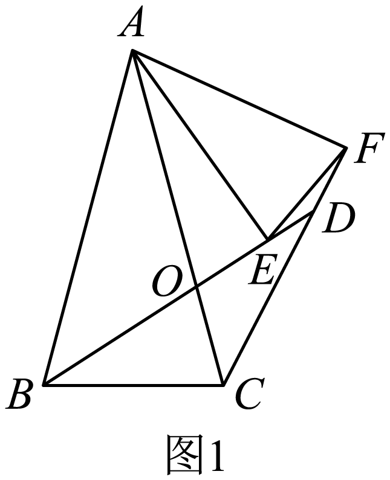
∵ $\angle AOD=\angle ACF+\angle BDC=\angle ABE+\angle BAO$
∴ $\angle BDC=\angle BAO=\angle BAC=30\circ$ ，
故答案为： $BE=CF$ ， $30$ ．  
（2）结论： $BE=CF$ ， $\angle BDC=60\circ$ ；
证明：∵ $\angle BAC=\angle EAF=120\circ$ ，
∴ $\angle BAC-\angle EAC=\angle EAF-\angle EAC$ ，即 $\angle BAE=\angle CAF$ ，
又∵ $AB=AC$ ， $AE=AF$ ，
∴ $\bigtriangleup BAE\allequal \bigtriangleup CAF$
∴ $BE=CF$ ，
$\angle AEB=\angle AFC$
∵ $\angle EAF=120\circ$ ， $AE=AF$ ，
∴ $\angle AEF=\angle AFE=30\circ$ ，
∴ $\angle BDC=\angle BEF-\angle EFD=\angle AEB+30\circ -\left(\angle AFC-30\circ \right)=60\circ$ ，  
（3） $BF=CF+2AM$ ，理由如下，
∵ $\angle BAC=\angle EAF=90\circ$ ，
∴ $\angle BAC-\angle EAC=\angle EAF-\angle EAC$ ，
即 $\angle BAE=\angle CAF$ ，
又∵ $\bigtriangleup ABC$ 和 $\bigtriangleup AEF$ 均为等腰直角三角形
∴ $AB=AC,AE=AF$ ，
∴ $\bigtriangleup BAE\allequal \bigtriangleup CAF\left(SAS\right)$ ，
∴ $BE=CF$ ，
在 $Rt\bigtriangleup AEF$ 中， $AM\perp BF$ ，
∴ $AM=\frac{1}{2}EF=EM=MF$ ，
∴ $BF=BE+EF=CF+2AM$ ；  
（4）解：如图所示，

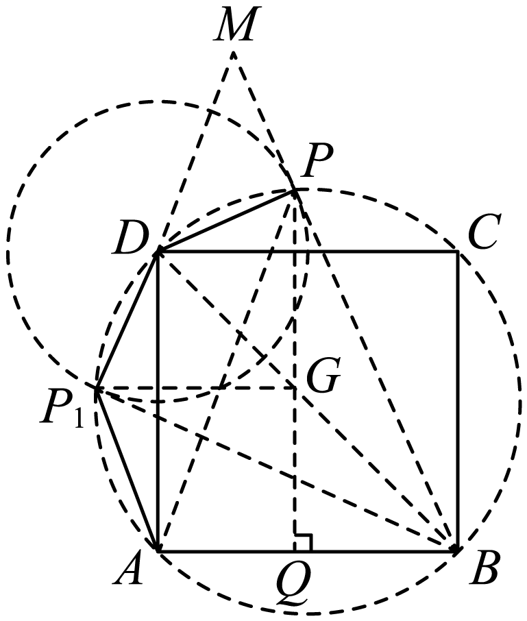

连接 $BD$ ，以 $BD$ 为直径, $BD$ 的中点为圆心作圆，以 $D$ 点为圆心， $1$ 为半径作圆，两圆交于点 $P,P_{1}$ ，

延长 $BP$ 至 $M$ ，使得 $PM=DP=1$ ，
则 $\bigtriangleup MDP$ 是等腰直角三角形， $\angle MDP=45\circ$

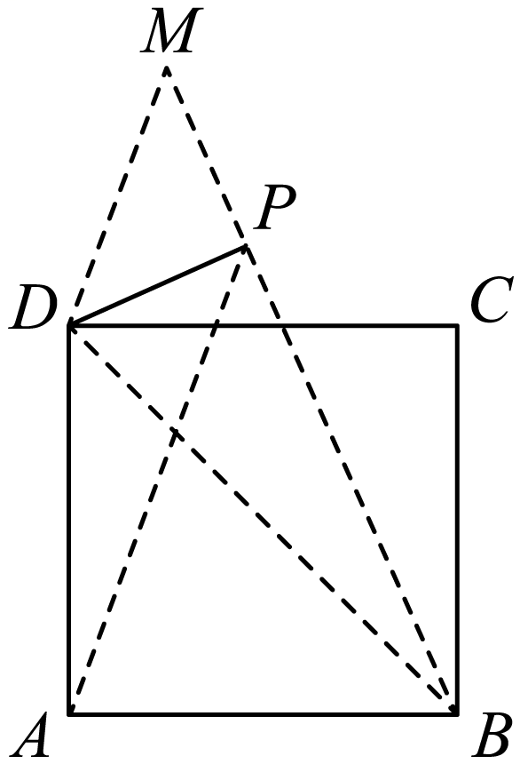
∵ $\angle CDB=45\circ$ ,
∴ $\angle MDB=\angle MDP+\angle PDC+\angle CDB=90\circ +\angle PDC$  $=\angle ADP$ ，
∵ $\frac{AD}{DB}=\frac{1}{\sqrt{2}},\frac{DP}{DM}=\frac{1}{\sqrt{2}}$ ，
∴ $\bigtriangleup ADP\backsim \bigtriangleup BDM$
∴ $\frac{PA}{BM}=\frac{1}{\sqrt{2}}=\frac{\sqrt{2}}{2}$ ，
∴ $PA=\frac{\sqrt{2}}{2}BM$ ，
∵ $AB=2$ ，
在 $Rt\bigtriangleup DPB$ 中， $PB=\sqrt{DB^{2}-DP^{2}}=\sqrt{\left(2\sqrt{2}\right)^{2}-1^{2}}=\sqrt{7}$ ，
∴ $BM=BP+PM=\sqrt{7}+1$
∴ $PA=\frac{\sqrt{2}}{2}\left(1+\sqrt{7}\right)=\frac{\sqrt{2}+\sqrt{14}}{2}$

过点 $P$ 作 $PQ\perp AB$ 于点 $Q$ ，
设 $QB=x$ ，则 $AQ=2-x$ ，
在 $Rt\bigtriangleup APQ$ 中， $PQ^{2}=AP^{2}-AQ^{2}$ ，
在 $Rt\bigtriangleup PBQ$ 中， $PQ^{2}=PB^{2}-BQ^{2}$
∴ $AP^{2}-AQ^{2}=PB^{2}-BQ^{2}$
∴ $\left(\frac{\sqrt{2}+\sqrt{14}}{2}\right)^{2}-\left(2-x\right)^{2}=\left(\sqrt{7}\right)^{2}-x^{2}$
解得： $x=\frac{7-\sqrt{7}}{4}$ ，则 $BQ=\frac{7-\sqrt{7}}{4}$ ，
设 $PQ,BD$ 交于点 $G$ ，则 $\bigtriangleup BQG$ 是等腰直角三角形，
∴ $QG=QB=\frac{7-\sqrt{7}}{4}$
在 $Rt\bigtriangleup DPB,Rt\bigtriangleup DP_{1}B$ 中，
$\left\{\begin{array}{c}DP=DP_{1}\\DB=DB\end{array}\right$
∴ $Rt\bigtriangleup DPB\allequal Rt\bigtriangleup DP_{1}B$
∴ $\angle PDB=\angle P_{1}DB$
又 $PD=P_{1}D=1$ ， $DG=DG$
∴ $\bigtriangleup PGD\allequal \bigtriangleup P_{1}DG$
∴ $\angle PGD=\angle P_{1}GD=45\circ$
∴ $\angle PGP_{1}=90\circ$ ，
∴ $P_{1}G\parallel AB$
∴ $S_{\bigtriangleup ABP_{1}}=\frac{1}{2}AB\times QG=\frac{1}{2}\times 2\times \frac{7-\sqrt{7}}{4}=\frac{7-\sqrt{7}}{4}$ ，
在 $Rt\bigtriangleup PQB$ 中， $PQ=\sqrt{PB^{2}-BQ^{2}}=\sqrt{\left(\sqrt{7}\right)^{2}-\left(\frac{7-\sqrt{7}}{4}\right)^{2}}=\frac{7+\sqrt{7}}{4}$ ，
∴ $S_{\bigtriangleup ABP}=\frac{1}{2}AB\times PQ=\frac{1}{2}\times 2\times \frac{7+\sqrt{7}}{4}=\frac{7+\sqrt{7}}{4}$ ，
综上所述， $S_{\bigtriangleup ABP}=$  $\frac{7+\sqrt{7}}{4}$ 或 $\frac{7-\sqrt{7}}{4}$
故答案为： $\frac{7+\sqrt{7}}{4}$ 或 $\frac{7-\sqrt{7}}{4}$ ．

【点睛】本题考查了全等三角形的性质与判定，相似三角形的性质与判定，正方形的性质，勾股定理，直径所对的圆周角是直角，熟练运用已知模型是解题的关键．

