# 第一章 • 勾股定理 资料更新，关注公众号★全科AA+

# 学习区 • 1 探索勾股定理

课时 1 探索勾股定理 …… 过基础 过能力 001

一图多变 直角三角形中的折叠问题 003

课时 2 验证并应用勾股定理 …… 过基础 过能力 004

2 一定是直角三角形吗 …… 过基础 过能力 006  
3 勾股定理的应用 …… 过基础 过能力 008

☆ 问题解决策略：反思 …… 过能力 010

拓展区 专项1 利用勾股定理解决折叠问题 …… 过专项 011

专项 2 勾股定理中的数学思想方法…… 过专项 012

章末复习专练 …… 过全章 过中考 013

综合与实践(设计最短路线) 015

反馈区 • 第一章综合能力测评卷 …… 过综合 见活页卷 1


# 第二章·实数

# 学习区 • 1 认识实数

课时1 不是有理数的数 …… 过基础 016

课时2 认识实数 …… 过基础 017

# 2 平方根与立方根

课时 1 算术平方根 …… 过基础 过能力 018

课时 2 平方根 …… 过基础 过能力 020

课时 3 立方根 …… 过基础 过能力 022

课时 4 估算 …… 过基础 过能力 024

# 3 二次根式

课时 1 二次根式及其乘除运算 …… 过基础 过能力 026

课时 2 二次根式的化简 …… 过基础 过能力 028

课时 3 二次根式的混合运算 …… 过基础 过能力 030

拓展区 专项1 实数的大小比较……过专项 032

专项 2 二次根式的常考题型…… 过专项 034

章末复习专练 …… 过全章 过中考 036

反馈区 • 第二章综合能力测评卷 …… 过综合 见活页卷 2


# 第三章·位置与坐标资料更新，关注公众号★全科AA+

学习区 1 确定位置 过基础 038

# 2 平面直角坐标系

课时1 平面直角坐标系 …… 过基础 过能力 039

课时 2 点的坐标特征 …… 过基础 过能力 040

一题练透 点的坐标特征 041

课时 3 建立平面直角坐标系求坐标 …… 过基础 过能力 042

拓展区 专项 平面直角坐标系中的面积问题 …… 过专项 044

易错疑难集训 …… 过易错 过疑难 045

学习区 • 3 轴对称与坐标变化 …… 过基础 过能力 046

拓展区 • 章末复习专练 …… 过全章 过中考 048

综合与实践(描述施工平面设计图) 050

反馈区 • 第三章综合能力测评卷 …… 过综合 见活页卷 3

在深度研究 2025 秋新教材与 2022 年版义务教育课程标准的基础上，天星教育研究院结合教与学实际，在《一遍过》中创设独特模块，高效解决学科痛点和难点。并通过对比分析近四年全国中考题，总结提炼出最能体现数学中考趋势的 5 个创新题维度：新情境、新考法、新趋势（开放题，融入传统文化、数学文化，过程性学习等）、跨学科、全面渗透核心素养。

因此，《一遍过》在紧扣教材的基础上，注重新课标理念渗透和试题的创新性，帮助学生高效练透知识、掌握方法、发展素养，以适应中考新趋势。

# 学科创新设计

# 过全章

基于学生认知规律,在每章末将知识进行结构化整合,通过一题多设问的方式将全章内容进行有效串联和深度融合。由点到面整合教材内容,由低到高达成学习目标,由浅入深感悟数学思想,最终获得系统性认知。如 P013,P036,P048 等。

# 综合与实践

通过创设真实情境,以问题解决为导向,让学生从数学的角度观察与分析、思考与表达、解决与阐释社会生活及科学技术中遇到的现实问题,体会数学的科学价值,提高发现与提出问题、分析与解决问题的能力,发展应用意识、创新意识和实践能力。如 P074“利用物理学中的杠杆原理制作简易杆秤”等。

# 一题练透、一题多变、一图多变、数学思想、课标新增等微专题

以数学学科特有的图形、情境等鲜活生动的素材为载体,通过大小问题串的形式进行分层次、螺旋式探究,启发思路延续,促进理解掌握,构建逻辑体系,形成和发展数学思维,激发创新意识。如 P003 “直角三角形中的折叠问题”等。


# 第四章 · 一次函数

学习区 1 函数 过基础 051

2 认识一次函数

课时1 “均匀”变化 …… 过基础 052

课时 2 一次函数与正比例函数 …… 过基础 过能力 053

课时3 生活中的一次函数 …… 过能力 055

3 一次函数的图象

课时 1 正比例函数的图象与性质 …… 过基础 过能力 056

课时 2 一次函数的图象与性质 …… 过基础 过能力 058

一题多变 一次函数图象的平移规律 …… 059

拓展区 专项1 一次函数图象与字母系数的关系 …… 过专项 060

易错疑难集训 …… 过易错 061

学习区 • 4 一次函数的应用

课时 1 确定一次函数的表达式 …… 过基础 过能力 062

课时 2 单个一次函数图象的应用 …… 过基础 过能力 064

课时 3 两个一次函数图象的应用 …… 过基础 过能力 066

拓展区 专项2 一次函数与几何图形 …… 过专项 068

专项 3 利用一次函数解决实际问题 …… 过专项 070

章末复习专练 …… 过全章 过中考 072

综合与实践(制作简易杆秤) 074

反馈区 • 第四章综合能力测评卷 …… 过综合 见活页卷 4


# 第五章 · 二元一次方程组

学习区 • 1 认识二元一次方程组 …… 过基础 075

2 二元一次方程组的解法

课时 1 代入消元法 …… 过基础 过能力 076

课时 2 加减消元法 …… 过基础 过能力 078

一题多变 不解方程，利用整体思想求代数式的值 079

拓展区 专项1 二元一次方程组的解法 过专项 080

专项 2 含参数的二元一次方程组的常考题型 …… 过专项 082

易错疑难集训 …… 过易错 083

学习区 • 3 二元一次方程组的应用

课时1 二元一次方程组的应用（1） …… 过基础 过能力 084

课时 2 二元一次方程组的应用（2）…… 过基础 过能力 086

课时 3 二元一次方程组的应用（3）…… 过基础 过能力 088

4 二元一次方程与一次函数

课时 1 二元一次方程（组）与一次函数的关系 … 过基础 过能力 090

课时 2 用二元一次方程组确定一次函数表达式 …… 过基础 过能力 092

拓展区 专项3 二元一次方程组与一次函数的综合 …… 过专项 094

学习区 • \*5 三元一次方程组 …… 过基础 096

☆ 问题解决策略：逐步确定 …… 过能力 097

拓展区 章末复习专练 过全章 过中考 098

综合与实践(T1: 设计裁切方案。T2: 挖掘机的租用和保养) …… 100

反馈区 • 第五章综合能力测评卷 …… 过综合 见活页卷 5

# 一题多解

依托数学知识和方法的内在联系与多样性,鼓励学生通过不同的切入角度和不同的分析思路,多维度拆解问题,锻炼思维灵活性,引导掌握更多解题策略,提高解决问题的能力。如 P017T10, P033T8, P056T5, P057T15, P059T17, P060T7 等。

# 5维创新题

# 新情境

1. 以牵绳遛狗为背景考查勾股定理的应用/P004T6

2. 多种图形考查勾股定理的验证/P005T7

3. 以自制简易书架为背景考查勾股定理在最短路径问题中的应用/P010T7

4. 以第九届亚洲冬季运动会会徽为背景考查建立坐标系求点的坐标/P042T3

5. 以区间测速为背景考查一次函数的实际应用/P092T5

# 新考法

1. 通过线段上任意一点的坐标表示考查与 x 轴平行的直线上的点的坐标特征/P041T14

2. 在实际问题中, 给出方程(组), 考查所用的等量关系及未知数的意义/P087T9

3. 利用条形图考查算术平均数的概念/
P102T4

4. 考查通过平均数和方差知识, 解释如何体现发展生产力, 消除两极分化/P108T4

5. 设定方差和平均数需满足的条件, 反推符合要求的数据/P136T8

# 新趋势

1. 传统文化、数学文化
P002T11, P005T8, P008T2, P012T4,
P014T4, P019T19, P042T4


# 第六章 · 数据的分析

# 学习区 1 平均数与方差

课时 1 众数与算术平均数 …… 过基础 过能力 102

课时 2 加权平均数 …… 过基础 过能力 104

课时 3 离差平方和、方差、标准差 …… 过基础 过能力 106

课时 4 离差平方和、方差、标准差的应用 …… 过能力 108

# 2 中位数与箱线图

课时1 中位数 …… 过基础 过能力 109

课时2 四分位数与箱线图 …… 过基础 111

# 3 哪个团队收益大 …… 过基础 112

# 拓展区 专项 统计与决策 过专项 113

易错疑难集训 …… 过易错 115

章末复习专练 …… 过全章 过中考 116

综合与实践(利用树叶特征对树木分类) 118

# 反馈区 • 第六章综合能力测评卷 …… 过综合 见活页卷6


# 第七章·证明 资料更新，关注公众号★全科AA+

# 学习区 • 1 为什么要证明 …… 过基础 119

# 2 认识证明

课时1 定义与命题 …… 过基础 120

课时2 定理与证明 …… 过基础 121

# 3 平行线的证明

课时 1 平行线的判定 …… 过基础 过能力 122

课时 2 平行线的性质 …… 过基础 过能力 124

一图多变 三角板背景下的平行问题 …… 126

# 拓展区 • 章末复习专练 …… 过全章 过中考 127

# 反馈区 • 第七章综合能力测评卷 …… 过综合 见活页卷 7


# 期末提分专项 资料更新，关注公众号★全科AA+

（一）勾股定理 129

（二）实数 130

（三）位置与坐标 131

（四）一次函数 132

（五）二元一次方程组 134

（六）数据的分析 …… 136

（七）证明 138

（八）传统文化、数学文化 139

# 期末综合能力测评卷 见活页卷8

# 附1：单元测评卷[单独成册活页卷]

2:6 维答案解析[单独成册]

3: 学思用 [单独成册]

# 2. 开放题

P017T3, P026T6, P028T7, P037T12, P039T4, P042T1, P046T5, P073T7

# 3. 过程性学习

P021T22, P024T3, P025T15, P027T19, P031T16, P032T4, P035T8, P076T6, P079T13

# 跨学科

# 1. 结合物理

P018T12, P057T12, P062T6, P124T2, P125T8, P128T2, P138T4

# 2. 结合生物

P051T5, P092T4

# 3. 结合地理

P084T4

# 4. 结合科学

P134T7

# 核心素养

# 1. 几何直观

P002T14, P043T12, P123T11

# 2. 推理能力

P007T14, P009T13, P023T20

# 3. 运算能力

P019T20, P079T14

# 4. 抽象能力

P054T15, P085T10

# 5. 应用意识

P065T9, P077T15, P087T10, P093T9,
P103T16

  
免费下载

①PPT 课件

(含希沃版)

②讲评教案

③教师用书

④中考真题

⑤课时检测

⑥视频微课


# 1 探索勾股定理

# 课时1▶ 探索勾股定理

  
课时检测


# 过基础 教材必备知识精练 √ 答案P01

# 知识点 1 勾股定理

1 [2025 贵阳月考]直角三角形中两直角边长分别为 a, b, 斜边长为 c, 则勾股定理的表示为 ( )

A. $a^2 + b^2 = c^2$

B. $b^{2} + c^{2} = a^{2}$

C. $a^2 + c^2 = b^2$

D. $a^2 - c^2 = b^2$

2 你听说过亡羊补牢的故事吧! 为了防止羊的再次丢失, 牧羊人要在如图所示的宽9 dm、长12 dm 的长方形栅栏门的相对角的顶点钉一根加固木条, 则这根木条的长至少为 ( )

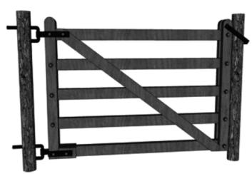

A. 9 dm

B. $12 \mathrm{dm}$

C. 15 dm

D. 21 dm

3 [2025 杭州拱墅区期末]一个直角三角形,若三边的平方和为 200,则斜边长为 ( )

A. 8

B. 9

C. 10

D. 11

4 [2025 黔东南州质检]底边长为 16 cm, 底边上的高为 6 cm 的等腰三角形的腰长为 （）

A. 8 cm

B. $9 \mathrm{~cm}$

C. $10 \mathrm{~cm}$

D. $12 \mathrm{~cm}$

5 [2024 咸阳秦都区期末]已知某直角三角形的两条直角边长的比为 5:12, 若该直角三角形的周长为 60, 则该直角三角形的斜边长为 \_\_\_\_。

变式 [2024 泰州二附中期末] 在 Rt $\triangle ABC$ 中, $\angle C=90^{\circ},AB-BC=1,AC=4$ ,则 BC=\_\_\_\_。

6 [2025 泰州期中] 如图, 在 $\triangle ABC$ 中, $\angle BAC = 90^{\circ}, AB = 3, AC = 4, AD \perp BC$ , 垂足为 D。

求:(1)BC 的长;

(2) $AD$ 的长。

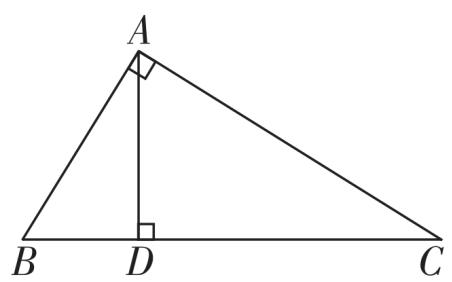

<details>
<summary>text_image</summary>

A
B D C
</details>

# 知识点 2 勾股定理与图形面积

7 教材随堂练习变式 [2025 大庆四校月考] 如图, 阴影部分是两个正方形, 其他三个图形是一个正方形和两个直角三角形, 则阴影部分的面积之和为 \_\_\_\_。

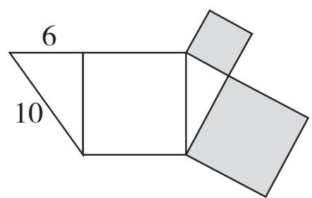

<details>
<summary>text_image</summary>

6
10
</details>

第7题图

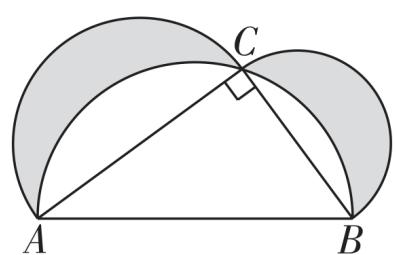

<details>
<summary>text_image</summary>

Geometric diagram showing two intersecting semicircles with labeled points A, B, C and a right angle at C.
</details>

变式题图

变式[2024 张掖甘州区三模]如图, 在 $\triangle ABC$ 中, $\angle ACB = 90^{\circ}$ , 分别以三边为直径向上作三个半圆。若 $AB = 5$ , $AC = 4$ , 则阴影部分图形的面积为 \_\_\_\_。


# 过能力 学科关键能力构建 √ 答案P01

8 [2024 揭阳期末] 在 Rt $\triangle ABC$ 中, $AB^{2} = 9$ , $AC^{2}=25$ , 则 $BC^{2}=$ ( )

A. 16

B. 4 或 34

C. 16 或 34

D. 4 或 24

9 [2025 梅州期末] 小明将一张长为 20 cm、宽为 15 cm 的长方形纸片 (AE > DE) 剪去了一角, 剩余部分如图所示, 量得 AB = 3 cm, CD = 4 cm, 则剪去的直角三角形的斜边长为 ( )

A. $5 \mathrm{~cm}$

B. $12 \mathrm{~cm}$

C. 16 cm

D. 20 cm

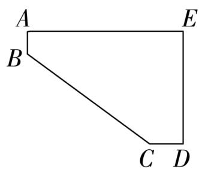

<details>
<summary>text_image</summary>

A
B
E
C D
</details>

第9题图

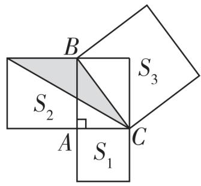

<details>
<summary>text_image</summary>

B
S₂
A
S₁
C
S₃
</details>

第 10 题图

10 教材习题变式 [2025 郑州枫杨外国语学校月考] 如图, 在 Rt△ABC 中, 分别以这个三角形的三边为边长向外侧作正方形, 面积分别记为 $S_{1}, S_{2}, S_{3}$ 。若 $S_{3} + S_{2} - S_{1} = 18$ 。则图中阴影部分的面积为 ( )

A. 6

B. $\frac{9}{2}$

C. 5

D. $\frac{7}{2}$

变式[2025 南宁三美学校月考]勾股定理是人类最伟大的科学发现之一,在我国古算书《周髀算经》中早有记载。勾股定理描述:直角三角形两条直角边的平方和等于斜边的平方。如图,以直角三角形的各边为边分别向外作正方形,再把较小的两张正方形纸片按图中的方式放置在最大正方形内。则图中阴影部分的面积为 ( )

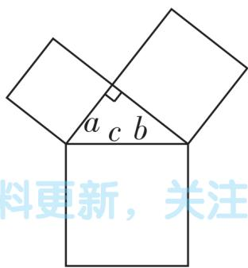

<details>
<summary>text_image</summary>

a c b
料更新，关注
</details>

A. $\frac{(a+b)^{2}-c^{2}}{4}$

C. $a(a + b - c)$

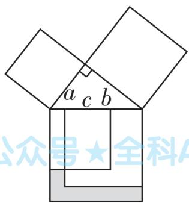

<details>
<summary>text_image</summary>

a c b
公众号★全科A
</details>

B. $b^{2} - a^{2}$

D. $c^2 - \frac{1}{2} ab$

11 新趋势·数学文化 [2025 无锡期末] 我国古代称直角三角形为“勾股形”。如图, 数学家刘徽(约公元 225 年 \~ 公元 295 年) 将勾股形分割成一个正方形和两对全等的直角三角形。若 $a = 10, b = 2$ , 则此勾股形的面积为 ( )

A. 28

B. 30

C. 32

D. 36

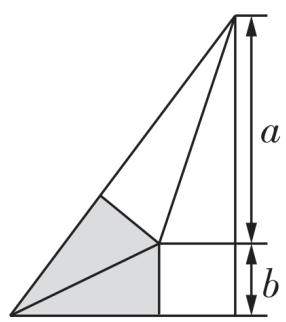

<details>
<summary>text_image</summary>

a
b
</details>

第11题图

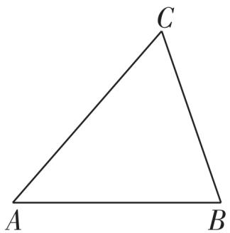

<details>
<summary>natural_image</summary>

Simple geometric triangle labeled with vertices A, B, and C (no additional text or symbols)
</details>

第 12 题图

12 教材习题变式 如图, 在 $\triangle ABC$ 中, $BC = 13$ , $AB = 14$ , $AC = 15$ , 则 $\triangle ABC$ 的面积为 \_\_\_\_。

13 [2024 沈阳期末] 如图, 在 $\triangle ABC$ 中, $\angle C = 90^{\circ}$ , $M$ 是 $BC$ 的中点, $MD \perp AB$ 于点 $D$ , 若 $AC = 2 \mathrm{~cm}, AD = \frac{5}{2} \mathrm{~cm}$ , 则 $BD$ 的长度为 $\mathrm{cm}$ 。


# 素养提升。

14 几何直观 [2024 汕头潮南区期中] 已知: 如图, 在 Rt△ABC 中, ∠ACB = 90°, AB = 5, AC = 3, 动点 P 从点 B 出发沿射线 BC 以每秒 1 个单位长度的速度移动, 设运动的时间为 t 秒。

(1) $BC = \_\_\_\_ , AB$ 边上的高 $h = \_\_\_\_ ;$   
(2) 当 $\triangle ABP$ 为直角三角形时, 求 t 的值。

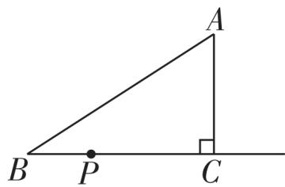

# 一图多变


# 直角三角形中的折叠问题

答案 P02

1 折叠锐角顶点, 落在直角边延长线上 [2024 南通海门区月考] 如图, 有一张直角三角形纸片 $ABC$ , $\angle ACB = 90^{\circ}$ , $AC = 8 \text{ cm}$ , $BC = 6 \text{ cm}$ , 将斜边 $AB$ 翻折, 使点 $B$ 落在直角边 $AC$ 的延长线上的点 $E$ 处, 折痕为 $AD$ , 则 $CE$ 的长为 ( )

A. $1 \mathrm{~cm}$

B. 2 cm

C. 3 cm

D. 4 cm

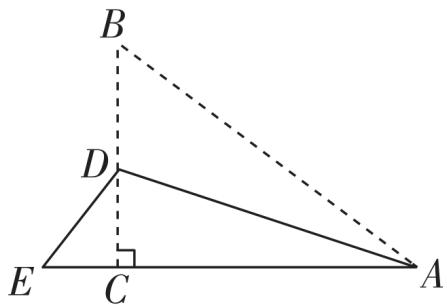

<details>
<summary>text_image</summary>

B
D
E C A
</details>

第1题图

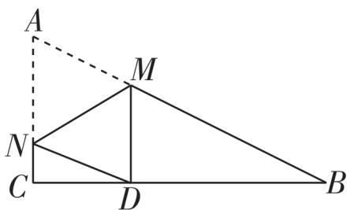

<details>
<summary>text_image</summary>

A
M
N
C
D
B
</details>

第2题图

2 折叠锐角顶点, 落在直角边上 [2025 济南期末] 如图, Rt $\triangle ABC$ 中, $AC = 6$ , $BC = 12$ , $\angle C = 90^{\circ}$ , 将 $\triangle ABC$ 折叠后点 $A$ 恰好落在 $BC$ 边上的点 $D$ 处, 折痕为 $MN$ , $CD = \frac{1}{3} BC$ , 则线段 $CN$ 的长为 ( )

A. 2

B. 3

C. $\frac{5}{3}$

D. $\frac{10}{3}$

3 折叠两锐角顶点, 重合于斜边上一点 [2025 镇江期中] 如图, 三角形纸片 $ABC$ 中, $\angle BAC = 90^{\circ}, AB = 2, AC = 3$ 。沿过点 $A$ 的直线将纸片折叠, 使点 $B$ 落在边 $BC$ 上的点 $D$ 处; 再折叠纸片, 使点 $C$ 与点 $D$ 重合。若折痕与 $AC$ 的交点为 $E$ , 则 $AE$ 的长是 ( )

A. $\frac{13}{6}$

B. $\frac{5}{6}$

C. $\frac{7}{6}$

D. $\frac{6}{5}$

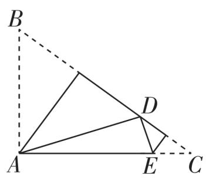

<details>
<summary>text_image</summary>

B
A
D
E
C
</details>

第3题图

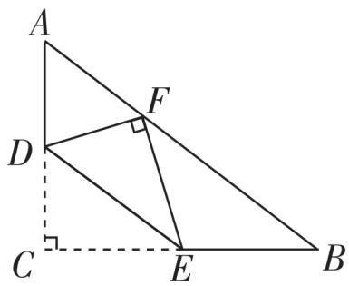

<details>
<summary>text_image</summary>

A
D
F
C
E
B
</details>

第4题图

4 折叠直角顶点，落在斜边上如图，在 $\triangle ABC$ 中， $\angle C=90^{\circ}, AC=6, BC=8$ ，点 $D,E$ 分别在 $AC$ ，

BC 上, 且 $DE \parallel AB$ 。将 $\triangle ABC$ 沿 DE 折叠, 使点 C 落在斜边 AB 上的点 F 处, 则 AF 的长是 ( )

A. 3.6

B. 4

C. 4.8

D. 6.4

5 特殊情形 [2024 汉中期末] 小王剪了两张直角三角形纸片, 分别进行了如下的操作:

  
视频解题

操作一 如图 1, 小王拿出一张直角三角形纸片 ABC, 将 Rt△ABC 折叠, 使斜边的两个端点 A 与 B 重合, 折痕为 DE。

(1) 若 $AC = 6 \, cm, AB = 10 \, cm$ ，则 $\triangle ACD$ 的周长为 \_\_\_\_ cm；  
(2) 若 $\angle CAD: \angle BAD = 1:4$ , 则 $\angle B$ 的度数为 \_\_\_\_。

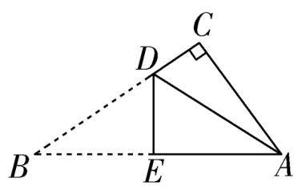  
图1

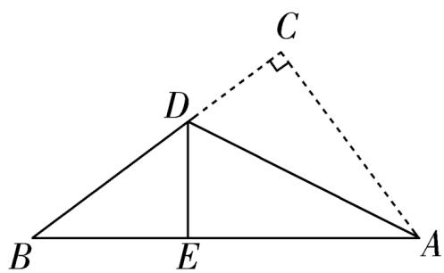

<details>
<summary>text_image</summary>

C
D
B E A
</details>

图 2

操作二 如图 2, 小王拿出另一张直角三角形纸片 ABC, 将直角边 AC 沿 AD 折叠, 使它落在斜边 AB 上, 且点 C 与点 E 重合。若 AC = 9 cm, AB = 15 cm, 请求出 CD 的长。

# 课时2▶ 验证并应用勾股定理

  
课时检测


# 过基础 教材必备知识精练 答案P03

# 知识点 1 验证勾股定理

1 教材习题变式 历史上对勾股定理的一种证法采用了如图所示的图形,其中两个全等的直角三角形的边 AE,EB 在一条直线上。证明中用到的面积相等关系是 ( )

A. $S_{\triangle EDA} = S_{\triangle CEB}$   
B. $S_{\triangle EDA} + S_{\triangle CEB} = S_{\triangle CDE}$   
C. $S_{四边形CDAE} = S_{四边形CDEB}$   
D. $S_{\triangle EDA} + S_{\triangle CDE} + S_{\triangle CEB} =$ $S_{\text{四边形}ABCD}$

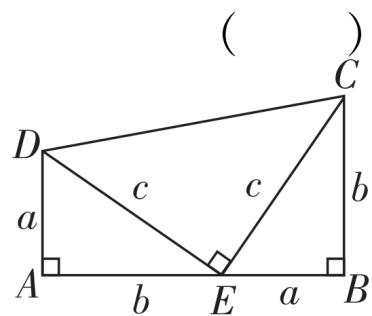

<details>
<summary>text_image</summary>

( )
C
D
a
c
c
b
A
b
E
a
B
</details>

2 用如图 1 所示的四个完全一样的直角三角形可以拼成如图 2 所示的大正方形。解答下列问题:

(1) 请用含 a, b, c 的代数式表示大正方形的面积。

代数式 1: \_\_\_\_。

代数式 2: \_\_\_\_。

(2)根据图 2 及图形的面积关系, 推导 a, b, c 之间满足的关系式。  
(3)利用(2)的关系式解答:如果大正方形的面积是25,且 $(a+b)^{2}=49$ ,求图2中小正方形的面积。

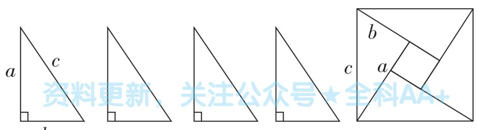

<details>
<summary>text_image</summary>

资料更新：关注公众号★全科AA+
</details>

图 1  
图 2

# 知识点 2 勾股定理的简单应用

3 [2025 平顶山月考] 如图, 某学校举办元旦联欢会, 准备在舞台一侧长 5 m、高 3 m 的台阶上铺设红地毯, 已知台阶的宽为 3 m, 则至少需购买红地毯 ( )

A. $21 \mathrm{~m}^{2}$

B. 45 m $^{2}$

C. 24 m $^{2}$

D. $12 \, m^{2}$

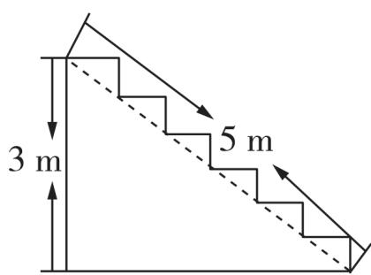

<details>
<summary>text_image</summary>

3 m
5 m
</details>

第3题图

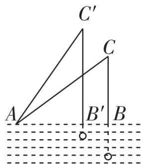

<details>
<summary>text_image</summary>

C'
C
A
B'
B
</details>

第4题图

4 [2025 烟台福山区期末] 如图, 已知钓鱼竿 AC 的长为 10 m, 露在水面上的鱼线 BC 的长为 6 m, 某钓鱼者想看看鱼钩上的情况, 把鱼竿 AC 转动到 AC' 的位置, 此时露在水面上的鱼线 B'C' 的长为 8 m, 则 BB' 的长为 ( )

A. $1 \mathrm{~m}$

B. 2 m

C. 3 m

D. 4 m

5 [2025 重庆南开中学期中] 小宁在迪卡侬购买了拳击反应球作为居家健身器材。如图, 若将球体支架最底端 O 到球体最顶端 A 看成一条线段 OA, 当反应球被击打时, 可看作线段

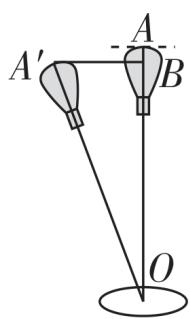

OA 绕着点 O 旋转得到线段 $OA'$ (在安全角度范围内旋转)。小宁击打反应球后 $A'$ 与支架 OA 的水平距离为 $A'B$ ，当 $A'B = 50 \, cm$ 时，AB = 10 cm，则球体支架 $OA =$ \_\_\_\_ $\, cm$ 。

6 新情境 [2025 成都树德实验中学期末] 如图, 一天傍晚, 小方和家人去小区遛狗, 小方观察发现, 她站直身体时, 牵绳的手离地面高度为 $AB = 13$ 分米, 小狗的高 $CD = 3$ 分米, 小狗与小方的距离 $AC = 24$ 分米 (绳子一直是直的)。则牵狗绳 $BD = \_\_ \_\_ \_\_ \_\_ \_\_ \_$ 分米。

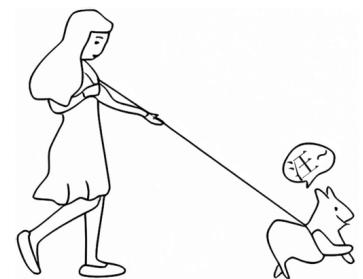

<details>
<summary>natural_image</summary>

Line drawing of a woman pulling a rabbit with a dog on her side (no text or symbols)
</details>

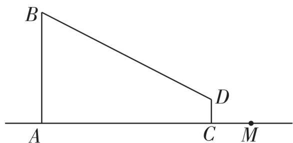

<details>
<summary>text_image</summary>

B
A
C
D
M
</details>


# 过能力 学科关键能力构建 √ 答案P03

7 新情境 [2024 郑州桐柏一中期中] 勾股定理是数学定理中证明方法最多的定理之一, 也是用代数思想解决几何问题最重要的工具之一。下列图形中可以证明勾股定理的有 （）

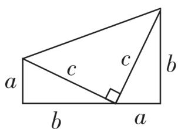  
①

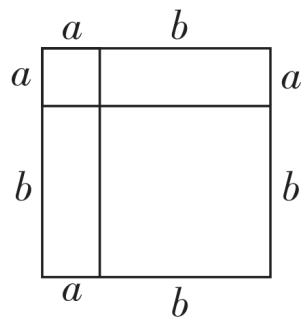

<details>
<summary>text_image</summary>

a b
a
b
a b
</details>

②

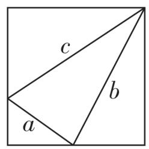  
③

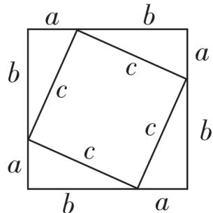

<details>
<summary>text_image</summary>

a
b
b
c
c
a
c
b
a
b
a
</details>

④

A. ①③

B. ②③

C. ②④

D. ①④

8 新趋势·数学文化 [2025 泉州泉港区期末] 如图, 《九章算术》中记载: “今有竹高一丈, 末折抵地, 去本三尺。问折者高几何?” 译文: 一根竹子, 原高一丈, 折断后其竹尖恰好着地, 着地处离原竹子根部 3 尺远。问: 原处还有多高的竹子? (1 丈 = 10 尺) 则竹子折断处离地面 ()

A. $\frac{81}{20}$ 尺

B. $\frac{91}{20}$ 尺

C. $\frac{81}{19}$ 尺

D. $\frac{91}{19}$ 尺

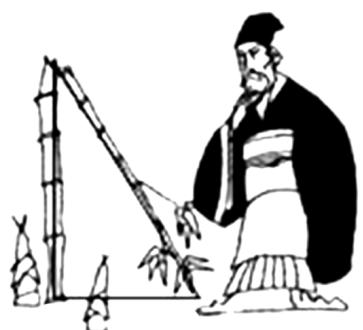

<details>
<summary>natural_image</summary>

Illustration of a historical figure in traditional attire handling bamboo poles (no text or symbols)
</details>

第8题图

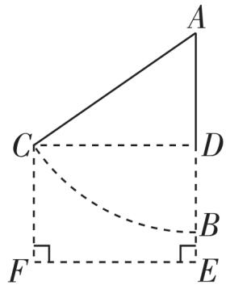

<details>
<summary>text_image</summary>

A
C
D
B
F
E
</details>

第9题图

9 [2025 宝鸡高新中学段考]勾股定理是人类数学文化的一颗璀璨明珠,是用代数思想解决几何问题最重要的工具,也是数形结合的纽带之一。如图,当秋千静止时,踏板 B 离地的垂直高度 BE = 0.7 m,将它往前推 3 m 至 C 处时(即水平距离 CD = 3 m),踏板离地的垂直高度 CF = 2.5 m,它的绳索始终拉直,则绳索 AC 的长是 ( )

A. $3.4 \mathrm{~m}$

B. 5 m

C. 4 m

D. 5.5 m

10 新趋势·数学文化 [2025 郑州育才中学月考] 如图 1, 四个全等的直角三角形围成一个大正方形, 中间是一个小正方形, 这个图形是我国汉代赵爽在注解《周髀算经》时给出的, 人们称它为“赵爽弦图”, 若图 1 中的直角三角形的长直角边为 5, 大正方形的面积为 29, 连接图 2 中四条线段得到如图 3 的新图案, 求图 3 中阴影部分的面积 \_\_\_\_。

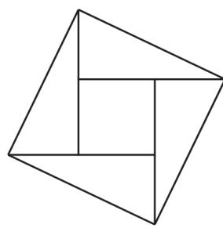  
图 1

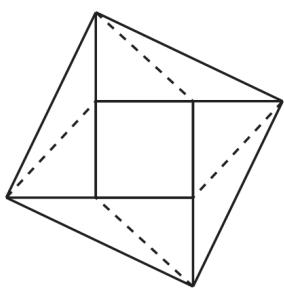  
图 2

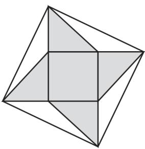  
图 3

11 [2024 沈阳辽中区期末改编] 如图, 一架梯子 AB 斜靠在某个胡同竖直的左墙上, 顶端在点 A 处, 底端在水平地面的点 B 处, 保持梯子底端 B 的位置不变, 将梯子斜靠在竖直的右墙上, 此时梯子的顶端在点 E 处。已知顶端 A 距离地面的高度 AC 为 2 米, BC 为 1.5 米。

(1)梯子的长为\_\_\_\_米;
(2)若顶端 E 距离地面的高度 EF 比 AC 多 0.4 米, 则胡同的宽 CF 为 \_\_\_\_ 米。

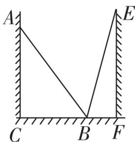

12 教材习题变式 勾股定理神秘而美妙, 它的证法多样, 其巧妙各有不同, 其中的“面积法”给了小明灵感, 他惊喜地发现, 当四个全等的直角三角形如图摆放时, 可以用“面积法”来证明 $a^{2} + b^{2} = c^{2}$ 。请你写出证明过程。

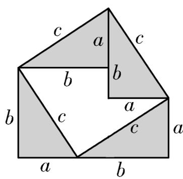

<details>
<summary>text_image</summary>

c
a
c
b
b
b
c
a
c
a
a
b
</details>


# 2 一定是直角三角形吗

  
课时检测


# 过基础 教材必备知识精练 √ 答案P04

# 知识点 1 直角三角形的判别方法

1 [2024 青岛期中] 下列四组数据中, 能作为直角三角形的三边长的一组是 ( )

A. 1,2,3

B. 4,5,6

C. 5,12,13

D. 13, 14, 15

2 [2024 武汉武昌区期末]已知 M, N 是线段 AB 上的两点, AM = MN = 2, NB = 1, 以点 A 为圆心, AN 长为半径画弧; 再以点 B 为圆心, BM 长为半径画弧, 两弧交于点 C, 连接 AC, BC, 则 $\triangle ABC$ 一定是 ( )

A. 锐角三角形

B. 直角三角形

C. 钝角三角形

D. 等腰三角形

3 教材习题变式 [2025 西安高新一中期末] 如图, 小正方形组成的 $3 \times 2$ 网格中, 每个小正方形的顶点称为格点。点 $A, B, C, D, M, N$ 均在格点上, 其中 $A, B, C, D$ 四个点中能与点 $M, N$ 构成一个直角三角形的是点 \_\_\_\_。

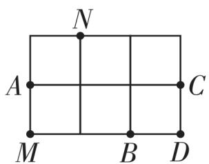

4 [2024 绥化期末] 如图, 在锐角三角形 ABC 中, AB = 13, AC = 15, 点 D 是 BC 边上一点, BD = 5, AD = 12, 求 BC 的长。

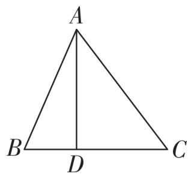

<details>
<summary>text_image</summary>

A
B D C
</details>

# 知识点 2 勾股数

5 [2024 沈阳皇姑区期末]下列各组数据是勾股数的是 ( )

A. $\frac{1}{3},\frac{1}{4},\frac{1}{5}$

B. 4,5,6

C. 0.3, 0.4, 0.5

D. 9,40,41

6 [2025 泰安期中] 在探索勾股定理的实践课上,同学们发现勾股定理 $a^{2} + b^{2} = c^{2}$ 本身就是一个关于 $a, b, c$ 的方程,满足这个方程的正整数解 $(a, b, c)$ 通常叫作勾股数组。毕达哥拉斯学派提出了一个构造勾股数组的公式,根据该公式可以构造出如下勾股数组: (3,4,5), (5,12,13), (7,24,25), …。分析上面勾股数组可以发现, $4 = 1 \times (3 + 1)$ , $12 = 2 \times (5 + 1)$ , $24 = 3 \times (7 + 1)$ , …。分析上面的规律,第6个勾股数组为 \_\_\_\_。

# 知识点 3 勾股定理的逆应用

7 教材习题变式 [2025 扬州江都区期中] 小惠同学用 25 个等距离的结把一根绳子分成等长的 24 段, 她同时握住第 1 个结和第 25 个结, 小淇同学握住第 7 个结, 这时小婷同学应该握住第 \_\_\_\_ 个结, 拉紧绳子后才会得到一个以第 7 个结为直角顶点的直角三角形。

8 [2024 渭南期中] 如图, 在四边形 ABCD 中, AB = 20, BC = 15, CD = 7, AD = 24, $\angle B = 90^{\circ}$ 。

(1) 判断 $\angle D$ 是否为直角, 并说明理由。  
(2) 四边形 ABCD 的面积为 \_\_\_\_。

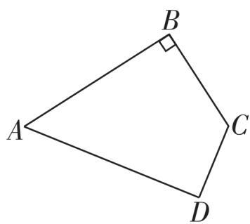

<details>
<summary>text_image</summary>

A
B
C
D
</details>


# 过能力 学科关键能力构建 √ 答案P04

9 [2024 烟台福山区质检] 给出下列四个说法:

①由于 0.3, 0.4, 0.5 不是勾股数, 所以以 0.3, 0.4, 0.5 为边长的三角形不是直角三角形;  
②由于以 0.5,1.2,1.3 为边长的三角形是直角三角形,所以 0.5,1.2,1.3 是勾股数;  
③若 a, b, c 是勾股数，且 c 最大，则一定有 $a^{2} + b^{2} = c^{2}$ ;  
④若三个整数 a, b, c (c 最大) 是直角三角形的三边长, 则 2a, 2b, 2c 一定是勾股数。

其中正确的是 （）

A. ①②

B. ②③

C. ③④

D. ①④

10 [2024 西安曲江一中期末] 如图, 在 $4 \times 4$ 的网格中, 每个小正方形的边长均为 1, 点 A, B, C 都在格点上, 则下列结论错误的是 ( )

A. $AB^{2}=20$

B. $\angle BAC = 90^{\circ}$

C. $\triangle ABC$ 的面积为 10

D. 点 $A$ 到直线 $BC$ 的距离是 2

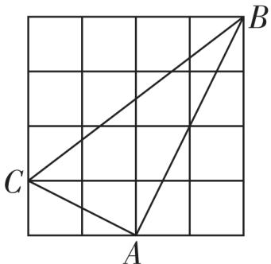

<details>
<summary>text_image</summary>

C
A
B
</details>

11 天星原创 如图,分别以 $\triangle ABC$ 的三边为边向外作正方形,然后分别以三个正方形的中心为圆心,以正方形边长的一半为半径作圆,记三个圆的面积分别为 $S_{1}, S_{2}, S_{3}$ , 若 $S_{1} + S_{2} = S_{3}$ , 则 $\triangle ABC$ 为 \_\_\_\_ 三角形。

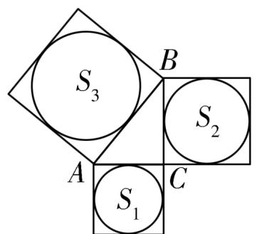

<details>
<summary>text_image</summary>

S₃
B
S₂
A
C
S₁
</details>

第11题图

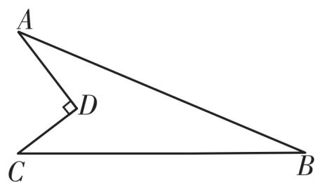

<details>
<summary>text_image</summary>

A
D
C
B
</details>

第 12 题图

12 [2024 江门蓬江区月考] 如图所示的一块地, $AD = 12 \mathrm{~m}, CD = 9 \mathrm{~m}, \angle ADC = 90^{\circ}, AB = 39 \mathrm{~m}, BC = 36 \mathrm{~m}$ , 这块地的面积为 \_\_\_\_。

13 [2025 郑州期中] 如图, 点 D 是 $\triangle ABC$ 边 BC 的中点, 过点 D 作 $DE \perp BC$ 交 AB 于点 E, BD = 5, $DE = \frac{15}{4}$ , $AE = \frac{7}{4}$ , AC = 6, $\triangle ABC$ 是直角三角形吗? 请通过计算说明理由。

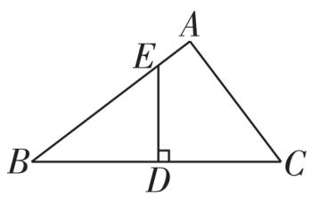


# 素养提升。

14 推理能力 [2025 成都锦江区月考] 满足 $a^{2} + b^{2} = c^{2}$ 的三个正整数, 称为勾股数。

(1)请把下列三组勾股数补充完整:①\_\_\_\_, 8,10;②9,\_\_\_\_,15;③9,40,\_\_\_\_。

(2) 小明发现, 很多已经约去公因数的勾股数组中, 都有一个数是偶数, 如果将它写成 $2mn$ , 那么另外两个数可以写成 $m^2 + n^2$ , $m^2 - n^2$ , 如 $4 = 2 \times 2 \times 1$ , $5 = 2^2 + 1^2$ , $3 = 2^2 - 1^2$ , 请你帮小明说明这三个数 $2mn$ , $m^2 + n^2$ , $m^2 - n^2$ 是勾股数组。

(3)如果 28,96,100 是满足上述小明发现的规律的勾股数组,那么 $m + n = \_\_\_\_$ 。


# 3 勾股定理的应用

  
课时检测


# 过基础 教材必备知识精练 √ 答案P05

# 知识点 1 勾股定理的实际应用

1 [2025 洛阳期末] 如图, 在水塔 O 的东北方向 32 m 处有一抽水站 A, 在水塔的东南方向 24 m 处有一建筑工地 B, 在 AB 间建一条直水管, 则水管的长为 ( )

A. $45 \mathrm{~m}$

B. 40 m

C. 50 m

D. 56 m

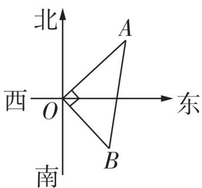

<details>
<summary>text_image</summary>

北
西 O 东
南
A
B
</details>

第1题图

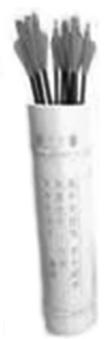  
第2题图

2 新趋势·传统文化 [2025 郑州四十七中期末]《醉翁亭记》中写道：“……射者中……”，其中“射”指投壶，宴饮时的一种游戏。如图，现有一圆柱形投壶内部底面直径是 5 cm，内壁高 12 cm，若箭长 18 cm，则箭在投壶外面部分的长度不可能是 （）

A. 4.5 cm

B. 5 cm

C. 5.5 cm

D. 6 cm

3 [2025 南京秦淮区期末] 如图,南京地铁公安监控区域的警示图标中,摄像头的支架由水平、竖直方向的 AB, BC 两段构成,若 BC 段长度为 8 cm,点 A, C 之间的距离比 AB 段长 2 cm,则 AB 段的长度为 \_\_\_\_ cm。

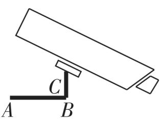  
第3题图

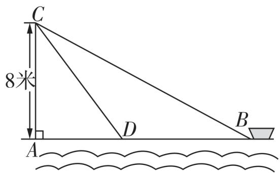

<details>
<summary>text_image</summary>

C
8米
D
B
A
</details>

第4题图

4 [2025 重庆黔江区期末] 如图, 在离水面高度为 8 米的岸上, 有人用绳子拉船靠岸, 开始时绳子 BC 的长为 17 米, 几分钟后船到达点 D 的位置, 此时绳子 CD 的长为 10 米, 则船向岸边移动了 \_\_\_\_ 米。  
5 [2025 威海期中] 公路旁有一块山地正在开发, 现有 C 处需要爆破。已知点 C 与公路上的停靠站 A 的距离为 300 米, 与公路上的另一停靠站 B 的距离为 400 米, 且 CA ⊥ CB, 如图所

示。为了安全起见,爆破点 C 周围 250 米内不得进入,在进行爆破时,公路 AB 段是否需要暂时封锁?请通过计算进行说明。

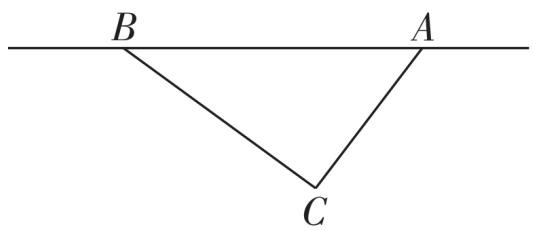

<details>
<summary>text_image</summary>

B
A
C
</details>

# 知识点 2 勾股定理逆定理的应用

6 [2025 佛山南海区月考]如图1、图2分别是某种型号拉杆箱的实物图与示意图,根据商品介绍,获得了如下信息:滑竿 DE、箱长 BC、拉杆 AB 的长度都相等,即 DE = BC = AB = 60 cm,点 B,F 在线段 AC 上,点 C 在 DE 上,支杆 DF = 30 cm。若 EC = 24 cm 时,B,D 相距 48 cm,连接 BD,试判定 BD 与 DE 的位置关系,并说明理由。

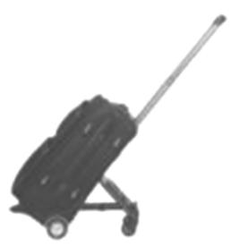  
图 1

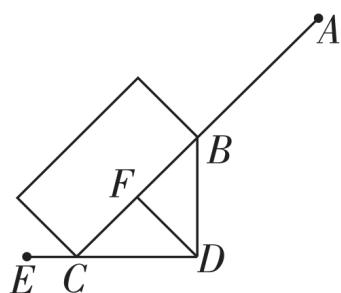

<details>
<summary>text_image</summary>

Geometric diagram with labeled points A, B, C, D, E, F and connecting lines, likely from a math problem or proof.
</details>

图 2


# 过能力 学科关键能力构建 √ 答案P06

7 [2025 沈阳期末] 杜甫曾经哀叹“茅屋为秋风所破”。现在我们来看

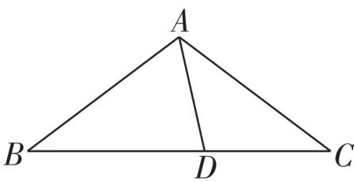

<details>
<summary>text_image</summary>

A
B D C
</details>

一茅屋的屋顶剖面(如图),它呈等腰三角形,如果屋檐 AB = AC = 5 米,横梁 BC = 8 米,那么从梁 BC 上的任意一点 D 要支一根木头顶住屋顶 A 处,这根木头需要长度可能是 ( )

A. 2.5 米

B. 6 米

C. 4 米

D. 8 米

8 教材习题变式 [2024 吕梁期末] 现有一楼房发生火灾, 消防队员用消防车上的云梯救人。如图, 已知消防车高 3 m, 云梯最多只能伸长到 15 m。救人时云梯伸长至最长, 在完成从 12 m 高处救人后, 还要从 15 m 高处救人。这时消防车要从原处向着火的楼房靠近的距离 MN 为（）


<details>
<summary>natural_image</summary>

Exterior view of a modern high-rise building with thick smoke rising (no visible text or signage)
</details>

A. 3 m

B. 5 m


<details>
<summary>text_image</summary>

D
B
O
C
A
消防车
E
N
M
</details>

C. 7 m

D. 9 m

9 教材复习题变式 [2025 成都期末] 国庆假期中, 小华与同学去玩探宝游戏, 按照探宝图, 如图, 他们从门口 A 处出发先往东走 8 km, 又往北走 2 km, 遇到障碍后又往西走 3 km, 再向北走到 6 km 处往东拐, 仅走了 1 km, 就找到了宝藏, 则门口 A 到藏宝点 B 的直线距离是 \_\_\_\_ km。


<details>
<summary>text_image</summary>

北
东
1 km
B
6 km
3 km
2 km
A
8 km
</details>

第9题图

  
第 10 题图

10 [2024 郑州期中] 如图, 有一个由传感器 A 控制的灯, 要装在门上方离地面 4.5 m 的墙上, 任何东西只要移到离该灯 5 m 及 5 m 内的位置, 灯就会自动发光。若小明身高 1.5 m, 则他走到离墙 \_\_\_\_ m 的地方灯刚好自动发光。

11 [2024 济宁任城区期末]某品牌婴儿车的简化结构示意图如图所示。根据安全标准,需满足 $BC \perp CD$ ,现测得 $AB = CD = 6 \text{ dm}, BC = 3 \text{ dm}, AD = 9 \text{ dm}$ ,其中 $AB$ 与 $BD$ 之间是由一个角固定为 $90^\circ$ 的零件连接的(即 $\angle ABD = 90^\circ$ ),该车是否符合安全标准?请通过计算说明。


12 教材习题变式 [2025 无锡新吴区月考]一辆装满货物的卡车,其外形高 2.5 m,宽 1.6 m,某工厂的厂门形状及尺寸如图所示(上部是半圆形,下部是长方形)。这辆卡车能否通过该工厂的厂门?并说明理由。


<details>
<summary>text_image</summary>

1 m
2.3 m
2 m
</details>


# 素养提升。

13 推理能力 [2024 兰州树人中学期末] 如图是高空秋千的示意图, 小红从起始位置点 A 处绕着点 O 经过最低点 B, 最终荡到最高点 C 处。若 $\angle AOC = 90^{\circ}$ , 点 A 与点 B 的高度差 AD = 1 米, 水平距离 BD = 4 米, 则点 C 与点 B 的高度差 CE 为 \_\_\_\_ 米。


<details>
<summary>text_image</summary>

O
A
D
B
E
C
</details>


# ☆问题解决策略：反思

  
课时检测


# 过能力 学科关键能力构建 √ 答案P06

1 [2025 北京门头沟区期末] 如图, 一只蜗牛从圆柱的点 A 出发, 绕圆柱侧面沿最短路线爬行到了 BC 的中点 E 处, 若沿 AD 将圆柱侧面剪开并展开, 所得侧面展开图示意图的是 ( )


<details>
<summary>text_image</summary>

D C D C D
A E E A B A B B
A B
A B
</details>

A   
B

  
C   
D

2 [2024 西安交大附中月考] 如图, 长方体的底面边长分别为 2 cm 和 4 cm, 高为 5 cm。若一只蚂蚁从 P 点开始经过 4 个侧面爬行一周到达 Q 点, 则蚂蚁爬行的最短路程为 ( )

A. $11 \mathrm{~cm}$

B. $12 \mathrm{~cm}$

C. $13 \mathrm{~cm}$

D. 15 cm

  
第2题图

  
第3题图

3 [2025 西安鄠邑区期末] 如图, 有一个圆柱体礼盒, 高为 $18 \mathrm{~cm}$ , 底面周长为 $12 \mathrm{~cm}$ 。现准备在礼盒表面粘贴彩带作为装饰, 若彩带一端粘在 $A$ 处, 另一端绕礼盒侧面 2 周后粘贴在 $C$ 处 ( $B$ 为 $AC$ 的中点), 则彩带最短为 ( )

A. $15 \mathrm{~cm}$

B. $20 \mathrm{~cm}$

C. 25 cm

D. 30 cm

4 [2024 郑州枫杨外国语学校月考] 小彬用 3D 打印机制作了一个底面周长为 $18 \mathrm{~cm}$ , 高为 $12 \mathrm{~cm}$ 的圆柱状粮仓模型, 如图, $B C$ 是底面直径, $A B$ 是圆柱的高。现要在此模型的侧面贴一圈彩色装饰带, 且装饰带经过 $A, C$ 两点 (接头不计), 则装饰带的长度最短为 \_\_\_\_ cm。

  
第4题图


<details>
<summary>text_image</summary>

D
C
N
M
A
B
</details>

第5题图

5 易错题 [2024 青岛城阳区期末] 如图, ABCD 是长方形土地, AB = 10 m, AD = 5 m, 中间竖有一堵高 1 m 的砖墙 (MN = 1 m)。一只蚂蚁从点 A 爬到点 C, 它必须翻过中间那堵墙, 则它至少要爬 \_\_\_\_ m。  
6 [2024 贵阳期中联考]如图所示的是长方体透明玻璃鱼缸, 假设其长 $AD = 80 \mathrm{~cm}$ , 高 $AB = 60 \mathrm{~cm}$ , 水深 $AE = 40 \mathrm{~cm}$ 。在水面上紧贴内壁的 $G$ 处有一块面包屑, 点 $G$ 在水面线 $EF$ 上, 且 $EG = 60 \mathrm{~cm}$ , 一只蚂蚁想从鱼缸外的点 $A$ 沿鱼缸壁爬到鱼缸内的 $G$ 处吃面包屑, 则蚂蚁爬行的最短路程为 \_\_\_\_ cm。


<details>
<summary>text_image</summary>

B
C
E
G
F
A
D
</details>

7 新情境 [2024 太原期中] 包装纸箱是我们生活中常见的物品。如图 1, 创意 DIY 小组的同学将一个 $10 \mathrm{~cm} \times 30 \mathrm{~cm} \times 40 \mathrm{~cm}$ 的长方体纸箱裁去一部分 (粗虚线为裁剪线), 得到图 2 所示的简易书架。若一只蜘蛛从该书架的顶点 $A$ 出发, 沿书架内壁爬行到顶点 $B$ 处, 则它爬行的最短距离为 \_\_\_\_ cm。


<details>
<summary>text_image</summary>

40 cm
30 cm
10 cm
A
10 cm
30 cm
40 cm
B
</details>

图1  
图 2


# 专项 1 利用勾股定理解决折叠问题


# 过专项 阶段强化专项训练 √ 答案P07

# 方法指导

解决折叠问题通常有两种思路:(1)通过折叠变换构造直角三角形,进而利用勾股定理构建方程解决问题;(2)通过折叠变换构造全等三角形,从而实现等边或等角的转换,再利用勾股定理构建方程解决问题。

# 类型 1 三角形中的折叠问题

1 [2024 常州田家炳中学期中] 如图, 在 Rt $\triangle ABC$ 中, $\angle ACB = 90^{\circ}$ , $AB = 10$ , $BC = 6$ , 点 $D$ 为斜边 $AB$ 的中点, 连接 $CD$ , 将 $\triangle BCD$ 沿 $CD$ 翻折, 使点 $B$ 落在


<details>
<summary>text_image</summary>

A
F
E
D
C
B
</details>

点 E 处, 点 F 为直角边 AC 上一点, 连接 DF, 将 $\triangle ADF$ 沿 DF 翻折, 使点 A 与点 E 重合, 则 AF 的长为 \_\_\_\_。

2 如图, 在 $\triangle ABC$ 中, AB = AC = 5, BC = 6, 点 M, N 分别在边 BC, AC 上, 将 $\triangle ABC$ 沿 MN 折叠, 使得点 C 与点 A 重合, 求折痕 MN 的长。


<details>
<summary>text_image</summary>

A
N
B M C
</details>

# 类型 2 长（正）方形中的折叠问题

3 [2025 宝鸡一中调研] 如图, 折叠长方形的一边 AD, 使点 D 落在 BC 边上的 F 点处, 若 AB = 8 cm, BC = 10 cm, 则 EC 的长为

  
类题讲解

A. 2 cm

B. 3 cm

C. 4 cm

D. 5 cm

  
第3题图


<details>
<summary>text_image</summary>

Geometric diagram with labeled points and lines, showing triangle ABCD and auxiliary points E, F, G, P
</details>

第4题图

4 [2025 揭阳榕城区期中] 如图, 在长方形 ABCD 中, AB = 4, BC = 3, P 为边 BC 上一点, 将 $\triangle CDP$ 沿 DP 折叠, 点 C 落在点 E 处, DE, PE 分别交 AB 于点 F, G, 已知 GE = GB, 则 BF 的长为 ( )

A. $\frac{17}{5}$

B. $\frac{3}{5}$

C. $\frac{12}{5}$

D. 5

5 [2024 贵阳一模改编] 如图, 动点 E, P 分别是正方形 ABCD 的边 BC, CD 上的动点, 沿 AE, AP 折叠正方形, 点 B, D 的对应点恰好都落在点 O 处, 若 AB = 3, 当点 P 是 CD 边的三等分点时, BE 的长为 \_\_\_\_。


6 [2024 揭阳惠城中学月考] 如图, 把长方形纸片ABCD沿 EF 折叠, 使点 B 落在边 AD 上的点 B' 处, 点 A 落在点 A' 处。

(1)试说明 $B'E = BF$ ;  
(2) 设 AE = a, AB = b, BF = c, 试猜想 a, b, c 之间的关系, 并说明理由。


<details>
<summary>text_image</summary>

A'
D B' E A
C F B
</details>


# 专项 2 勾股定理中的数学思想方法


# 过专项 阶段强化专项训练 √ 答案P08

# 类型 1 数形结合思想在勾股定理中的应用

1 新趋势·数学文化 [2024 南阳期末] 勾股定理被记载于我国古代的数学著作《周髀算经》中, 汉代数学家赵爽为了证明勾股定理, 创制了一幅如图 1 所示的“弦图”, 后人称之为“赵爽弦图”。图 2 由“弦图”变化得到, 它是由八个全等的直角三角形拼接而成的, 记图中正方形 ABCD, 正方形 EFGH, 正方形 MNXT 的面积分别为 $S_{1}, S_{2}, S_{3}$ , 若 $S_{1} + S_{2} + S_{3} = 24$ , 则正方形 EFGH 的面积为 \_\_\_\_。

  
图 1


<details>
<summary>text_image</summary>

D
H
G
T
X
A
M
N
E
F
C
B
</details>

图 2

# 类型 2 分类讨论思想在勾股定理中的应用

2 在 Rt△ABC 中, AB = 8, BC = 6, 则以 AC 为边的正方形的面积为 \_\_\_\_。  
3 [2025 无锡期中改编]已知 $\triangle ABC$ 中, $AB = 17$ , $AC = 10$ , $BC$ 边上的高 $AD = 8$ 。求边 $BC$ 的长。

# 类型 3 方程思想在勾股定理中的应用

4 新趋势·数学文化 [2024 沈阳浑南区期末]《九章算术》是古代东方数学代表作, 书中记载: 今有开门去阖一尺, 不合二寸。问门广几何。题目大意: 如图 1,2(图 2 为图 1 的平面示意图), 推开双门, 双门间隙 CD 的长为 2 寸, 点 C 和点 D 距离门槛 AB 都为 1 尺 (1 尺 = 10 寸), 则 AB 的长是 ( )

  
图 1


<details>
<summary>text_image</summary>

2寸
D/C
1尺
A O B
</details>

图 2

A. 50.5 寸

B. 52 寸

C. 101 寸

D. 104 寸

5 [2024 漯河实验中学月考] 如图, AB 为一棵大树, 在树上距地面 10 m 的 D 处有两只猴子, 它们同时发现地面上的 C 处有一筐水果, 一只猴子从 D 处爬到树顶 A 处, 利用滑绳 AC, 滑到 C 处, 另一只猴子从 D 处滑到地面 B 处, 再由 B 处跑到 C 处, 已知两只猴子所经路程都是 16 m, 求树高 AB。


# 类型 4 转化思想在勾股定理中的应用

6 [2025 贵阳月考] 在直线 l 上依次摆放着七个正方形(如图)。已知斜放的三个正方形的面积分别是 1,2,3, 正放的四个正方形的面积依次是 $S_{1}$ , $S_{2}$ , $S_{3}$ , $S_{4}$ , 则 $S_{1} + S_{2} + S_{3} + S_{4} =$ \_\_\_\_。


<details>
<summary>text_image</summary>

S₁
1
S₂
2
S₃
3
S₄
l
</details>


# 章末复习专练


# 过全章 题串练透全章知识 √ 答案P08

如图 1, 在 $4 \times 4$ 的正方形网格中, 每个小正方形的边长都为 1, A, B, C, E 四点都在正方形网格的格点上。


<details>
<summary>text_image</summary>

C
B
E
A
</details>

图1

# 【基础设问】

(1)试说明 $\angle ABC=90^{\circ}$ 。

(2) 若点 D 为直线 AC 上任意一点, 求线段 BD 长的最小值。

(3) 求 $\angle CAE + \angle ACE$ 的大小。

# 【能力设问】

(4)如图2,在 $3 \times 3$ 的正方形网格中,每个小正方形的边长都为1,H,I,J,O四点都在正方形网格的格点上,求 $\angle HOI - \angle IOJ$ 的大小。

  
图 2

(5)如图3,在边长为1的小正方形组成的网格中,M,N,Q,R四点都在网格的格点上,P为MN上任一点,求 $PR^{2}-PQ^{2}$ 的值。


<details>
<summary>text_image</summary>

N
P
Q M R
</details>

图 3


# 过中考 中考真题同步挑战 √ 答案P09

1 新趋势·数学文化 [2024 南通中考]“赵爽弦图”巧妙利用面积关系证明了勾股定理。如图所示的“赵爽弦图”是由四个全等直角三角形和中间的小正方形拼成的一个大正方形。设直角三角形的两条直角边长分别为 $m, n (m > n)$ 。若小正方形面积为 $5, (m + n)^{2} = 21$ ，则大正方形面积为 （）


A. 12

B. 13

C. 14

D. 15

2 [2023 天津中考] 如图, 在 $\triangle ABC$ 中, 分别以点 $A$ 和点 $C$ 为圆心, 大于 $\frac{1}{2} AC$ 的长为半径作弧 (弧所在圆的半径都相等), 两弧相交于 $M, N$ 两点, 直线 $MN$ 分别与边 $BC, AC$ 相交于点 $D, E$ , 连接 $AD$ 。若 $BD = DC, AE = 4, AD = 5$ , 则 $AB$ 的长为 ( )


<details>
<summary>text_image</summary>

Geometric diagram with labeled points A, B, C, D, E, M, N and intersecting lines forming triangles and a line segment
</details>

A. 9

B. 8

C. 7

D. 6

3 新趋势·数学文化 [2023 泸州中考]《九章算术》是中国古代重要的数学著作,该著作中给出了勾股数 a, b, c 的计算公式: $a = \frac{1}{2}(m^{2} - n^{2})$ , $b = mn, c = \frac{1}{2}(m^{2} + n^{2})$ , 其中 m > n > 0, m, n 是互质的奇数。下列四组勾股数中,不能由该勾股数计算公式直接得出的是 ( )

A. 3,4,5

B. 5,12,13

C. 6,8,10

D. 7,24,25

4 新趋势·数学文化 [2024 巴中中考]“今有方池一丈,葭生其中央,出水一尺,引葭赴岸,适与

岸齐。问:水深几何?”这是我国数学史上的“葭生池中”问题。如图,已知 $AC \perp BD$ 于点 C, AC = 5, DC = 1, BD = BA, 则 BC = ()


A. 8

B. 10

C. 12

D. 13

5 [2024 陕西中考]如图,在 $\triangle ABC$ 中, $AB=AC,E$ 是边 $AB$ 上一点,连接 $CE$ ,在 $BC$ 的右侧作 $BF//AC$ ,且 $BF=AE$ ,连接 $CF$ 。若 $AC=13$ , $BC=10$ ,则四边形 $EBFC$ 的面积为\_\_\_\_。


6 [2023 随州中考] 如图, 在 Rt△ABC 中, ∠C = 90°, AC = 8, BC = 6, D 为 AC 上一点, 若 BD 是 ∠ABC 的平分线, 则 AD = \_\_\_\_。


<details>
<summary>text_image</summary>

C
D
A
B
</details>

7 [2024 大庆中考]如图 1, 直角三角形的两个锐角分别是 $40^{\circ}$ 和 $50^{\circ}$ , 其三边上分别有一个正方形。执行下面的操作: 由两个小正方形向外分别作锐角为 $40^{\circ}$ 和 $50^{\circ}$ 的直角三角形, 再分别以所得到的直角三角形的直角边为边长作正方形。图 2 是 1 次操作后的图形。图 3 是重复上述步骤若干次后得到的图形, 人们把它称为 “毕达哥拉斯树”。若图 1 中的直角三角形斜边长为 2, 则 10 次操作后图形中所有正方形的面积和为 \_\_\_\_。


  
图1  
图 2


<details>
<summary>natural_image</summary>

Abstract geometric pattern composed of interconnected polygons and nodes, resembling a stylized tree or floral design (no text or symbols)
</details>

图3

# 综合与实践


[2024 佛山南海区期中]先阅读下面的材料,再解决问题。

【实际问题】如图 1, 一圆柱的底面半径为 5 cm, BC 是底面直径, 高 AB 为 5 cm, 求一只蚂蚁从点 A 出发沿圆柱表面爬行到点 C (点 A 与点 C 正对) 的最短路线, 小明设计了两条路线。

  
视频解题


<details>
<summary>text_image</summary>

B
C
沿AB剪开
摊平
A
B
C
A
</details>

图 1

  
图 3

【解决方案】路线1:侧面展开图中的线段AC,如图2所示。

设路线 1 的长度为 $l_{1}$ ，则 $l_{1}^{2}=AC^{2}=AB^{2}+BC^{2}=5^{2}+(5\pi)^{2}=25+25\pi^{2}$ 。

路线 2: 高线 AB + 底面直径 BC。

设路线 2 的长度为 $l_{2}$ ，则 $l_{2}^{2}=(5+10)^{2}=225$ 。

为比较 $l_{1}, l_{2}$ 的大小,采用“作差法”:

因为 $l_{1}^{2}-l_{2}^{2}=25(\pi^{2}-8)>0$ ,

所以 $l_{1}^{2}>l_{2}^{2}$ ，所以 $l_{1}>l_{2}$ ，

所以小明认为路线 2 较短。

(1)【问题类比】小亮对上述结论有些疑惑,于是他把条件改成“圆柱的底面半径为 $1 \, cm$ , 高 AB 为 $5 \, cm$ ”。请你用上述方法帮小亮比较出 $l_{1}$ 与 $l_{2}$ 的大小。

(2)【问题拓展】请你帮他们继续研究:在一般情况下,若圆柱的底面半径为 $r \, cm$ , 高为 $h \, cm$ , 蚂蚁从点 A 出发沿圆柱表面爬行到点 C, 当 $\frac{r}{h}$ 满足什么条件时, 路线 2 较短? 请说明理由。

(3)【问题解决】图3是紧密排列在一起的2个相同的圆柱,高为5 cm。蚂蚁从点A出发沿圆柱表面爬行到点C,当路线1和路线2这两条路线长度相等时,求圆柱的底面半径r。


# 1 认识实数

# 课时1▶ 不是有理数的数


# 过基础 教材必备知识精练 √ 答案P10

# 知识点 1 不是有理数的数

1 以下各正方形的边长不是有理数的是（）

A. 面积为 25 的正方形  
B. 面积为 $\frac{4}{25}$ 的正方形  
C. 面积为 8 的正方形  
D. 面积为 1.44 的正方形

2 在直角三角形 ABC 中, $\angle C = 90^{\circ}$ , $\angle A$ , $\angle B$ , $\angle C$ 的对边分别为 a, b, c。

(1) 计算: ① 当 a = 1, c = 2 时, $b^{2} =$ \_\_\_\_ ;

②当 a=3, c=5 时, $b^{2}=$ \_\_\_\_ ;  
③当 a=0.6, c=1 时, $b^{2}=$ \_\_\_\_。

(2)通过(1)中计算出的 $b^{2}$ 的值, 可知 b 是整数的是\_\_\_\_; b 是分数的是\_\_\_\_; b 既不是整数, 也不是分数的是\_\_\_\_。(填序号)

3 教材习题变式 如图,每个小正方形的边长均为 1,A,B,C,D 均为小正方形的顶点,四边形 ABCD 中,AC,BD 相交于点 O,试说明边 AB,BC,CD,AD 的长度和对角线 AC,BD 的长度中,哪些是有理数?哪些不是有理数?


<details>
<summary>text_image</summary>

A
B
O
D
C
</details>

# 知识点 2 非有理数的估算

4 一个正方形的面积是 15,估计它的边长大小在 ( )

A.2 与 3 之间

B. 3 与 4 之间

C. 4 与 5 之间

D. 5 与 6 之间

5 设边长为 4 的正方形的对角线长为 x。

(1) $x$ 是有理数吗？说说你的理由。  
(2)估计 $x$ 在哪两个相邻整数之间？  
(3)估计 x 的值(结果精确到十分位)。

6 有一类数像一首读不完的长诗,既不循环,也不枯竭,无穷无尽,数学家称之为一种特殊的数。设面积为 $10\pi$ 的圆的半径为 $x$ 。

(1)x 是有理数吗？说明理由。  
(2) $x$ 的整数部分是多少?  
(3) 将 $x$ 精确到十分位是多少?

圆周率 $\pi=3.141\ 592\ 653\cdots$

真是天长地久有时尽，
此“数”绵绵无绝期啊！


# 课时2·认识实数

  
课时检测


# 过基础 教材必备知识精练 √ 答案P10

# 知识点 1 识别无理数

1 [2024 泸州中考]下列各数中,无理数是（）

A. $-\frac{1}{3}$

B. 3.14

C. 0

D. $\pi$

2 [2025 北京五十四中期末] 给出下列各数:

-8, 2.7, -3 $\frac{1}{2}$ , $\frac{\pi}{3}$ , 0.666666 $\cdots$ , 0.2,

0.080 080 008…。其中无理数的个数为 （）

A. 0

B. 1

C. 2

D. 3

3 新趋势·结论开放 [2025 盐城期中] 请你写出一个无理数 $a$ , 使得 $0 < a < 1$ , 则 $a$ 为

。(写出一个即可)

# 知识点 2 实数的定义及分类

4 [2024 承德期中]下列说法中,正确的是（）

A. 无理数包括正无理数、零和负无理数  
B. 无限小数都是无理数  
C. 正实数包括正有理数和正无理数  
D. 实数可以分为正实数和负实数两类

5 教材习题变式 把下列实数分别填入相应的集合里：

$$
- \left| - 5 \right|, \left| - \frac {3}{2} \right|, 0, - 3. 1 4, \frac {2 2}{7}, 1. 9 9, - (- 6),
$$

$2\pi, -12.101001\cdots$ （每两个1之间0的个数依次增加1）。

(1) 负数集合: { \_\_\_\_
    …}。  
(2)非负整数集合: {\_\_\_\_…}。  
(3) 分数集合: { … }。  
(4)无理数集合: { \_\_\_\_
\_\_\_\_\_\_\_\_…}。

# 知识点 3 实数的有关概念

6 [2025 茂名电白区一模] $\pi$ 的绝对值是（）

A. $\pi$

B. $-\pi$

C. $\pm\pi$

D. $\frac{1}{\pi}$

7 [2024 邵阳期中]已知 ab = 1, 若 a = 2024, 则 b 的相反数是 ( )

A. -2 024

B. $-\frac{1}{2024}$ C. $\frac{1}{2024}$

D. 2 024

8 [2025 宝鸡期中] 已知实数 a, b, c, d, e, 且 a, b 互为倒数, c, d 互为相反数, e 的绝对值为 2, 求 $\frac{1}{2} \times ab + \frac{c + d}{5} - e$ 的值。

# 知识点 4 实数与数轴上的点的关系

9 [2025 哈尔滨期末]与数轴上的点具有一一对应关系的数是 ( )

A. 实数

B. 有理数

C. 无理数

D. 整数

10 一题多解 [2023 新乡期末] 实数 a 在数轴上的对应点的位置如图所示, 若实数 b 满足 -a < b < a, 则 b 的值可以是 ( )


A.2

B. -1

C. -2

D. -3

11 [2024 北京中考] 实数 a, b 在数轴上的对应点的位置如图所示, 下列结论中正确的是 ( )


<details>
<summary>text_image</summary>

-4
-3
-2
b
-1
0
1
2
a
3
4
</details>

A. b > -1

B. $|b| > 2$

C. $a + b > 0$

D. ab > 0

12 [2025 石家庄五十四中期中] 如图, 半径为 1 个单位长度的圆上有一点 A 与数轴上表示 -1 的点重合, 若将该圆沿数轴向右滚动一周, 圆上的点 A 恰好与数轴上的点 B 重合, 则点 B 对应的实数为 ( )


<details>
<summary>text_image</summary>

A
-1 0 1 2 B
</details>

A. $\pi - 1$

B. $\pi + 1$

C. $2 \pi - 1$

D. $2 \pi + 1$


# 2 平方根与立方根

# 课时1▶算术平方根

  
课时检测


# 过基础 教材必备知识精练 √ 答案P11

# 知识点 1 算术平方根

1 [2024 新余期末]“16 的算术平方根”这句话用数学符号表示为 （）

A. $\pm \sqrt{16}$

B. $\sqrt{16}$

C. $\sqrt{4}$

D. $\pm\sqrt{4}$

2 [2024 商洛一模]36 的算术平方根为 （）

A. $\pm 6$

B. 6

C. -6

D. 18

3 [2024 菏泽二模] 下列说法正确的是 （）

A. 64 是 8 的算术平方根  
B.9 是 $\sqrt{81}$ 的算术平方根  
C. $\sqrt{9}$ 的算术平方根是 $\sqrt{3}$   
D. 一个数的算术平方根等于它本身, 这个数只能是 1

4 求下列各数的算术平方根:

(1)7;

(2)1.21;

(3) $\frac{49}{81}$ ;

(4) $1\frac{9}{16};$

(5) $(-8)^{2}$ 。

# 知识点 2 算术平方根的运算

5 [2024 南京六合区模拟] $\sqrt{64}$ 的值为 （）

A. -4

B. 4

C. -8

D. 8

6 [2025 连云港新海初级中学期末]下列各式中,正确的是 ( )

A. $\sqrt{(-2)^2} = -2$

B. $\sqrt{(-3)^2} = 9$

C. $\sqrt{(-9)^2} = \pm 3$

D. $\sqrt{(-13)^2} = 13$

7 计算下列各式:

(1) $\sqrt{2\frac{7}{9}}$ ;

(2) $\sqrt{0.81} - \sqrt{0.04}$ 。

8 若 $2x + 1$ 的算术平方根是 2, 求 $x + \frac{1}{2}$ 的算术平方根。

# 知识点 3 算术平方根的性质

9 [2025 上海静安区期中] 计算: $\sqrt{(\pi - 4)^2} =$ \_\_\_\_。

变式若 $\left(\sqrt{x-4}\right)^{2}=4-x$ ，则x的值为\_\_\_\_。

10 [2025 石家庄期中]若 m, n 为实数, 且 $(m + 4)^{2} + \sqrt{n - 5} = 0$ , 则 $\sqrt{m + n}$ 的值为 \_\_\_\_。

# 知识点 4 算术平方根的实际应用

11 [2024 广东中考] 完全相同的 4 个正方形面积之和是 100, 则正方形的边长是 ( )

A. 2

B. 5

C. 10

D. 20

12 跨学科·物理 教材例题变式 [2025 榆林八中期中]电流通过导线时会产生热量,电流 I(单位:A)、导线电阻 R(单位:Ω)、通电时间 t(单位:s)与产生的热量 Q(单位:J)满足 $Q = I^{2}Rt$ 。已知导线的电阻为 10 Ω,1 s 时间导线产生 1 000 J 的热量,电流 I 的值是 ( )

A. 2

B. 5

C. 8

D. 10


# 过能力 学科关键能力构建 √ 答案P12

13 [2024 兰州期末] $\sqrt{16}$ 的算术平方根的相反数是 ( )

A. 4

B. -2

C. $\pm4$

D. $\pm2$

14 [2024 福州一中期末]若 $\sqrt{(x-3.5)^{2}}=3.5-x$ ，则 x 的值不能是（）

A. 4

B. 3

C. 2

D. 1

15 若 $\sqrt{25} = x, \sqrt{y} = 2, z$ 是 9 的算术平方根，则 $2x + y - z$ 的算术平方根为（）

A. $\sqrt{11}$

B. 3

C. $\sqrt{6}$

D. 2

16 当 x = \_\_\_\_ 时, 式子 $3 + \sqrt{x - 4}$ 取得最小值, 且最小值是 \_\_\_\_。

17 [2024 天水期中] 已知 $y = \sqrt{x - 3} + \sqrt{3 - x} + 8$ ，求 $3x + 2y$ 的算术平方根。

18 [2025 抚州临川一中期中] 如图是一个数值转换器 (x 取绝对值小于 10 的实数), 其工作原理如图所示。


<details>
<summary>flowchart</summary>

```mermaid
graph TD
    A["输入x"] --> B["计算|x-2"]]
    B --> C["取算术平方根"]
    C --> D["是无理数"]
    C --> E["是有理数"]
    E --> C
    D --> F["输出y"]
```
</details>

(1) 若输入有意义的 x 值后, 始终输不出 y 值, 请写出所有满足要求的 x 的值: \_\_\_\_;

(2) 若输出的 y 值是 $\sqrt{3}$ ，求 x 的负整数值。

19 新趋势·传统文化 [2025 宿迁宿城区期末]《清秘藏》是明代所著工艺美术鉴赏著作,其中所述的刺绣在中国经过长时间的发展,已经形成了极高的工艺水平和独特的工艺门类。现有一张长方形绣布,长、宽之比为4:3,绣布面积为 $588 \text{ cm}^2$ 。

(1)求绣布的周长。  
(2) 刺绣师傅想利用这张绣布裁出一张面积为 $375 \, cm^{2}$ 的完整圆形绣布来绣花鸟图, 她能够裁出来吗? 请说明理由。(π 取 3)


# 素养提升。

20 运算能力 [2025 九江柴桑区联考] 观察表格并回答下列问题。

<table><tr><td> $a(a>0)$ </td><td>...</td><td>0.000 1</td><td>0.01</td><td>1</td><td>100</td><td>10 000</td><td>...</td></tr><tr><td> $\sqrt{a}$ </td><td>...</td><td>0.01</td><td>x</td><td>1</td><td>y</td><td>100</td><td>...</td></tr></table>

(1) 表格中 $x = \_$ , $y = \_$ 。  
(2)①已知 $\sqrt{6}\approx2.45$ ,则 $\sqrt{0.06}\approx$ \_\_\_\_;
②已知 $\sqrt{0.0012}\approx0.03464,\sqrt{2m}\approx34.64$ ,求 $m$ 的值。

# 课时2 ▶ 平方根

  
课时检测


# 过基础 教材必备知识精练 √ 答案P13

# 知识点 1 平方根及其性质

1 [2025 金华金东区期末]9 的平方根是 ±3, 用数学符号表示, 正确的是 ( )

A. $\sqrt{9} = 3$

B. $\pm \sqrt{9} = 3$

C. $\sqrt{9} = \pm 3$

D. $\pm\sqrt{9}=\pm3$

2 [2024 衡阳期末] 下列各数中, 没有平方根的是 ( )

A.2

B. 0

C. $-(-5)^{2}$

D. $|-2|$

3 [2025 重庆北碚区期末]下列说法正确的是 ( )

A. 0 的平方根是 0

B. 4 的平方根是 2

C. 负数有 2 个平方根

D. 正数只有 1 个平方根

4 [2025 宝鸡凤翔区期末] 若一个正数 $a$ 的两个平方根分别是 $3b - 5$ 和 $-2b + 2$ 。

(1) 求 $a$ 和 $b$ 的值;  
(2) 求 $a + 3b$ 的平方根。

# 知识点 2 开平方

5 [2025 河源期末]2 的平方根是 （）

A. 2

B. $\pm 4$

C. $\sqrt{2}$

D. $\pm\sqrt{2}$

6 [2024 佛山南海区月考] 如果 $a^2 = (-3)^2$ , 那么 $a$ 等于 ( )

A. 3

B. -3

C. $\pm3$

D. 9

7 易错题 [2023 广安中考] $\sqrt{16}$ 的平方根是\_\_\_\_。  
8 [2024 安庆模拟] $4^{-2}$ 的平方根是 \_\_\_\_。  
9 教材例题变式 求下列各数的平方根:

(1)49; (2) $\frac{16}{25}$ ; (3) $2\frac{7}{9}$ ; (4)0.36;   
(5) $\left(-\frac{3}{8}\right)^{2}$ 。

10 求下列各式的值:

(1) $\pm \sqrt{1600}$ ;

(2) $-\sqrt{1\frac{11}{25}};$

(3) 一题多解 $\sqrt{17^{2} - 8^{2}}$ 。

11 教材习题变式求下列各式中的 x:

(1) $16x^{2}-49=0;$

(2) $(x + 1)^{2} = 64$

# 知识点 3 算术平方根与平方根

12 若 m 是 169 的算术平方根, n 是 121 的负的平方根, 则 $(m + n)^{2}$ 的平方根为 ( )

A. 2

B. 4

C. $\pm2$

D. $\pm4$

13 [2024 衡阳期末]已知 $2x - 1$ 的平方根为 $\pm 3$ , 且 $3x + y - 1$ 的平方根为 $\pm 4$ , 求 $x + 2y$ 的算术平方根。


# 过能力 学科关键能力构建 √ 答案P13

14 [2024 廊坊广阳区期中] 下列说法中不正确的个数是 ( )

① $(-5)^{2}$ 的平方根是 $\pm5$ ; ② $-a^{2}$ 没有平方根; ③非负数 a 的平方根是非负数; ④因为负数没有平方根, 所以平方根不可能为负; ⑤0 和 1 的平方根等于本身。

A. 1

B. 2

C. 3

D. 4

15 [2024 沧州期末] 如果一个自然数的平方根是 $\pm a (a \geqslant 0)$ ，那么与这个自然数相邻的下一个自然数的平方根为（）

A. $\pm (a + 1)$

B. $\pm a + 1$

C. $\pm \sqrt{a^2 + 1}$

D. $\pm\sqrt{a+1}$

16 [2024 保定竞秀区期中] 如果 $a + 3$ 和 $2a - 15$ 是某个正数的两个平方根, 那么这个正数是 ( )

A. 49

B. 441

C. 21

D. 7

17 [2024 金华五校期中]已知 $3a^{m}b^{8}$ 与 $-\frac{1}{10} b^{n}a^{3}$ 的和是单项式,则 $n^{2}-m^{2}$ 的平方根是\_\_\_\_。

18 [2024 邯郸丛台区期中] 若 $x + 1$ 是 16 的一个平方根, 则 x 的值为 \_\_\_\_。

19 如图是一数值转换机, 若输出的结果为 -32, 则输入的 x 值为 \_\_\_\_。


20 求下列各式中 $x$ 的值:

(1) $(3x-1)^{2}-64=0;$

(2) $2(x-1)^{2}-18=0$ 。

21 [2024 泉州六中月考]已知正数 x 的平方根是 m 和 $m + b (b \neq 0)$ 。

(1) 若 b=8 ，求 m 的值；  
(2) 若 $m^{2}x + (m + b)^{2}x = 4$ ，求 x 的值。

22 新趋势·过程性学习 [2024 芜湖月考] 甲、乙两人计算 $a + \sqrt{1 - 2a + a^2}$ 的值, 当 $a = 3$ 时,得到下面不同的答案。

甲的解答: $a + \sqrt{1 - 2a + a^{2}} = a + \sqrt{(1 - a)^{2}} = a + 1 - a = 1$ 。

乙的解答: $a + \sqrt{1 - 2a + a^{2}} = a + \sqrt{(a - 1)^{2}} = a + a - 1 = 2a - 1 = 5$ 。

哪一个解答是正确的？错误的解答错在哪里？为什么？


# 素养提升。

23 运算能力 已知 $\left|2\ 024 - m\right| + \sqrt{m - 2\ 025} = m$ ，求 $m - 2\ 024^{2}$ 的值。

# 课时3▶立方根

  
课时检测


# 过基础 教材必备知识精练 √ 答案P14

# 知识点 1 立方根及其性质

1 [2025 杭州萧山区期中] 下列说法中, 正确的是 ( )

A. 一个数的立方根有两个, 它们互为相反数  
B. 负数没有立方根  
C. 如果一个数有立方根,那么它一定有平方根  
D. 一个数的立方根与这个数同号

2 下列说法中正确的是 ( )

A. 512 的立方根是 $\pm 8$   
B. $\sqrt[3]{-216}$ 没有意义  
C. $\sqrt{64}$ 的立方根为 2  
D. $\sqrt[3]{-8}$ 与 $-\sqrt[3]{8}$ 的值不相等

3 [2025 洛阳期末]已知一个数的立方根等于它本身,则这个数是 ( )

A. 1

B. -1

C. 0

D. -1 或 0 或 1

# 知识点 2 开立方

4 下列等式成立的是 ( )

A. $\sqrt[3]{1}=\pm1$

B. $\sqrt[3]{225}=15$

C. $\sqrt[3]{-729} = -9$

D. $\sqrt[3]{-9} = -3$

5 求下列各数的立方根:

(1) - 125; (2) $\frac{1}{27}$ ; (3) 0; (4) - $\sqrt{81}$ 。

6 [2025 沈阳七中月考]求下列各式中 x 的值:

(1) $(x + 3)^{3} + 27 = 0$ ; (2) $2x^{3} - 6 = \frac{3}{4}$ 。

# 知识点 3 $(\sqrt[3]{a})^3$ 与 $\sqrt[3]{a^3}$

7 $(\sqrt[3]{4})^3$ 的算术平方根是 （）

A. 2

B. $\sqrt{8}$

C. $\pm2$

D. $\pm\sqrt{8}$

8 $\sqrt[3]{\left(-\frac{1}{8}\right)^{3}}=$ \_\_\_\_。

# 知识点 4 算术平方根、平方根与立方根的综合

9 易错题 [2024 泰州期末] 若 x 满足 $\sqrt{x} = \sqrt[3]{x}$ ，则 x 的值为（）

A. 1

B. 0

C. 0 或 1

D. 0 或 $\pm 1$

10 [2025 榆林期末] 已知 $5a + 2$ 的立方根是 3, $3a + b - 1$ 的算术平方根是 4, 求 $a + 2b$ 的平方根。

# 知识点 5 开立方在实际问题中的应用

11 [2024 平顶山期末]一个正方体的体积扩大为原来的 64 倍,则它的棱长变为原来的 （）

A. 2 倍

B. 4 倍

C.6 倍

D. 9 倍

12 [2025 杭州闻涛中学期中] 如图, 是一块体积为 $343 \, cm^{3}$ 的立方体铁块。

(1)求这个铁块的棱长;  
(2) 现在工厂要将这个铁块融化, 重新锻造成两个小立方体铁块, 其中一个小立方体铁块的体积为 $218 \mathrm{~cm}^{3}$ , 求另一个小立方体铁块的棱长。


# 过能力 学科关键能力构建 √ 答案P15

13 [2025 张掖思源实验学校月考] 下列计算正确的是 ( )

A. $\sqrt[3]{(-2)^{3}}=2$

B. $\sqrt[3]{-0.064} = -0.4$

C. $\left(\sqrt[3]{-21}\right)^{3} = 21$

D. $-\sqrt[3]{8\frac{1}{8}} = -2$

14 易错题 [2025 泉州诊断性考试] 若 $\sqrt[3]{x+3}=2$ ，则 $(x+3)^{2}$ 的平方根是 \_\_\_\_。

15 [2023 新乡期中] 已知 $\sqrt[3]{x-3}-\sqrt[3]{2x+1}=0$ ，则 $x^{2}+x-3$ 的平方根为 \_\_\_\_。

变式 [2024 常德期末] 若一个正数 $x$ 的平方根是 $\sqrt[3]{17 - a}$ 和 $\sqrt[3]{3a - 1}$ , 则 $\sqrt[3]{a}$ 的值为 \_\_\_\_。

16 [2025 绵阳游仙区模拟] 已知 $x^{2}=1, \sqrt[3]{y}=-2$ ，且 xy<0，则 $\sqrt{x-y}=$ \_\_\_\_。

17 [2025 佛山禅城区期末] 小明是一位电脑爱好者,他设计了一个程序如图所示,当输入的 x 值为 64 时,输出的 y 值为 \_\_\_\_。


<details>
<summary>flowchart</summary>


</details>

18 [2024 扬州期末] 已知 $3m + 1$ 的平方根是 $\pm 5, 5n - m$ 的立方根是 3。

(1) 求 $m - n$ 的平方根。

(2) 若 $4a + m$ 的算术平方根是 4, 求 3a - 2n 的立方根。

19 教材素材变式请根据如图所示的对话内容回答下列问题。


我有一个正方体魔方，它的体积是 $216 \mathrm{~cm}^{3}$ 。

我有一个长方体纸盒，它的体积是 $600 \mathrm{~cm}^{3}$ ，纸盒的宽与你的魔方的棱长相等，纸盒的长与高相等。


(1)求该魔方的棱长;   
(2)求该长方体纸盒的表面积。


# 素养提升。

20 推理能力 [2024 北京大兴区期中] 人教版教材的数学活动中有这样一段材料: 我国著名数学家华罗庚有一次在飞机上看到他的助手阅读的杂志上有一道智力题: 一个数是 59319, 求它的立方根。华罗庚脱口而出: 39。华罗庚迅速求出立方根的过程如下:

假设 59319 的立方根是 n，

①由 $10^{3}=1\ 000,100^{3}=1\ 000\ 000$ ，可以确定 n 是两位数；  
②由 $30^{3} = 27\ 000, 40^{3} = 64\ 000, 27\ 000 < 59\ 319 < 64\ 000$ 可知，n 的十位上的数是 3；  
③考虑到 1 至 9 的立方中, 只有 9 的立方的个位上的数是 9, 所以确定 n 的个位上的数是 9, 所以 n = 39。

请你根据上述步骤求出 140 608 的立方根是
\_\_\_\_。

# 课时4▶估算

  
课时检测


# 过基础 教材必备知识精练 √ 答案P15

# 知识点 1 无理数的估算

1 [2024 新疆生产建设兵团中考] 估计 $\sqrt{5}$ 的值在 ( )

A.2 和 3 之间

B. 3 和 4 之间

C. 4 和 5 之间

D. 5 和 6 之间

变式 1 [2024 邯郸期末] 下列选项中的整数,与 $\sqrt{13}$ 最接近的是 ( )

A. 2

B. 3

C. 4

D. 5

变式 2 [2024 惠州期末] 无理数 $6 - \sqrt{13}$ 的大小在
()

A. 1 和 2 之间

B.2 和 3 之间

C. 3 和 4 之间

D. 4 和 5 之间

2 [2024 滨州中考] 写出一个比 $\sqrt{3}$ 大且比 $\sqrt{10}$ 小的整数 2 (或 3)。

# 知识点 2 用估算法确定无理数的整数部分和小数部分

3 新趋势·过程性学习 [2025 石家庄五十四中期中]

例: 因为 $\sqrt{4} < \sqrt{7} < \sqrt{9}$ ，即 $2 < \sqrt{7} < 3$ ，
所以 $\sqrt{7}$ 的整数部分为2，小数部分为 $\sqrt{7}-2$ 。

请你参考上面的讲解,解答下列问题。

(1) $\sqrt{15}$ 的相反数是\_\_\_\_, $\sqrt{15}$ 的整数部分是\_\_\_\_; $8 - \sqrt{15}$ 的整数部分是\_\_\_\_, $8 + \sqrt{15}$ 的整数部分是\_\_\_\_。

(2) 已知 $8 - \sqrt{15}$ 的小数部分是 $m, 8 + \sqrt{15}$ 的小数部分是 n。若 $(x - 1)^{2} = m + n$ ，请求出满足条件的 x 的值。

# 知识点 3 比较两个数的大小

4 [2024 威海中考]下列各数中,最小的数是
()

A. -2

B. $-(-2)$

C. $-\frac{1}{2}$

D. $-\sqrt{2}$

5 [2025 杭州钱塘区期末] 若记 $a = -2, b = -\sqrt{5}, c = -\sqrt[3]{7}$ , 则 $a, b, c$ 的大小关系是（）

A. $a < b < c$

B. $b < a < c$

C. c < a < b

D. c < b < a

6 教材随堂练习变式 [2025 北京育英学校期末] 比较大小:

(1) $\sqrt{40}$ \_\_\_\_ 6; (2) $\sqrt{12} - 1$ \_\_\_\_ 3。

7 教材思考·交流变式 比较 $\frac{\sqrt{2}-1}{3}$ 与 $\frac{1}{3}$ 的大小。

# 知识点 4 估算的实际应用

8 教材例题变式 如图,校园里的旗杆 AC 高 11 m, 小强和小军想要在旗杆顶部点 A 与地面一固定点 B 之间拉一根直的铁丝,小强已测量出固定点 B 到旗杆底部 C 的距离是 8 m,小军已准备好一根长 12.3 m 的铁丝,你认为这根铁丝的长度够用吗?并说明理由。


# 过能力 学科关键能力构建 √ 答案P16

9 [2025 滁州二模]已知正整数 m, n 满足: $m < \sqrt[3]{10} < m + 1, n < \sqrt{12} < n + 1$ 。则 $m^{n}$ 的值为 ( )

A. 4

B. 8

C. 9

D. 27

10 教材习题变式 [2024 保定期中] 某计算器中有 $\sqrt{1}, 1/x, x^2$ 三个按键, 以下是这三个按键的功能。

①√: 将荧幕显示的数变成它的算术平方根。  
② $1/x$ : 将荧幕显示的数变成它的倒数。  
③ $x^{2}$ : 将荧幕显示的数变成它的平方。

如图,小明输入一个数据后,依次按照从第1步到第3步循环按键。

输入 $x \longrightarrow \boxed{x^{2}} \longrightarrow \boxed{1/x} \longrightarrow \boxed{\sqrt{} }$

第1步 第2步 第3步

若一开始输入的数据为 5,那么第2024步之后,显示的结果是 ( )

A.5

B.0.2

C. 0.04

D. 25

11 新趋势·数学文化 [2024 安徽中考] 我国古代数学家张衡将圆周率取值为 $\sqrt{10}$ , 祖冲之给出圆周率的一种分数形式的近似值为 $\frac{22}{7}$ 。比较大小: $\sqrt{10}$ \_\_\_\_ $\frac{22}{7}$ 。(填“>”或“<”)  
12 教材习题变式利用计算器, 比较下列各组数的大小: (1) $\sqrt{18}$ \_\_\_\_ $\sqrt[3]{35}$ ; (2) $\frac{8}{13}$ \_\_\_\_ $\frac{\sqrt{6} - 1}{2}$ 。(填“>”“<”或“=”）  
13 [2024 河北中考]已知 a, b, n 均为正整数。

(1) 若 $n < \sqrt{10} < n + 1$ ，则 $n =$ \_\_\_\_ ;  
(2) 若 $n - 1 < \sqrt{a} < n, n < \sqrt{b} < n + 1$ ，则满足条件的 a 的个数总比 b 的个数少 \_\_\_\_ 个。

14 (1) 利用计算器, 将下列各数用“<”排列起来:

$$
\begin{array}{l} \sqrt {1} + \sqrt {1 2}, \sqrt {2} + \sqrt {1 1}, \sqrt {3} + \sqrt {1 0}, \sqrt {4} + \sqrt {9}, \\ \sqrt {5} + \sqrt {8}, \sqrt {6} + \sqrt {7}. \end{array}
$$

(2)上面各数有什么共同的特征？由此能得出什么结论？

15 新趋势·过程性学习 [2024 沈阳于洪区期末]
小李同学探索 $\sqrt{86}$ 的近似值的过程如下：

因为面积为 86 的正方形的边长是 $\sqrt{86}$ , 且 $9 < \sqrt{86} < 10$ ,

所以设 $\sqrt{86}=9+x$ ，其中 0<x<1，画出示意图，如图所示。

根据示意图,可得图中正方形的面积 $S_{正方形}=81+2\times9x+x^{2}$ ,

又因为 $S_{正方形}=86$ ，所以 $81+2\times9x+x^{2}=86$ 。
当 $x^{2}<1$ 时, 可忽略 $x^{2}$ , 得 $81+18x\approx86$ , 解得 $x\approx0.28$ , 所以 $\sqrt{86}\approx9.28$ 。

(1) 填空: $\sqrt{157}$ 的整数部分的值为 \_\_\_\_;
(2) 仿照上述方法, 探究 $\sqrt{157}$ 的近似值。(结果精确到 0.01)  
(答题要求:画出示意图,标明数据,并写出求解过程)


<details>
<summary>text_image</summary>

9 → x
81 9x
9 9x x²
</details>


# 3 二次根式

# 课时1▶二次根式及其乘除运算

  
课时检测


# 过基础 教材必备知识精练 答案P16

# 知识点 1 二次根式的定义

1 [2025 遂宁期中] 在式子 $\sqrt{5}, \sqrt[3]{8}, \sqrt{-2}$ , $\sqrt{(x+3)^{2}}, \sqrt{\frac{1}{x^{2}+5}}$ 中, 是二次根式的有（）

A. 2 个

B. 3 个

C. 4 个

D. 5 个

2 [2024 常州中考] 若式子 $\sqrt{x-2}$ 有意义, 则实数 x 的值可能是 ( )

A. -1

B. 0

C. 1

D. 2

# 知识点 2 二次根式的乘法

3 [2024 湖南中考] 计算 $\sqrt{2} \times \sqrt{7}$ 的结果是 ( )

A. $2 \sqrt{7}$

B. $7\sqrt{2}$

C. 14

D. $\sqrt{14}$

4 [2024 信阳期末]下列计算正确的是 （）

A. $3 \sqrt{3} \times 4 \sqrt{3} = 36$   
B. $3 \sqrt{3} \times 4 \sqrt{3} = 7 \sqrt{3}$   
C. $3\sqrt{3} \times 4\sqrt{3} = 12\sqrt{3}$   
D. $3 \sqrt{3} \times 4 \sqrt{3} = 12 \times 9 = 108$

5 [2024 淮安中考] 计算: $\sqrt{8} \times \sqrt{\frac{1}{2}} =$ \_\_\_\_ 。   
6 新趋势·结论开放 若计算 $\sqrt{12} \times m$ 的结果为正整数, 则无理数 m 的值可以是 \_\_\_\_ 。(写出一个符合条件的即可)  
7 计算:

(1) $2\sqrt{15} \times 3\sqrt{\frac{1}{3}};$

(2) $\sqrt{2\frac{2}{3}}\times \sqrt{1\frac{1}{2}}$

# 知识点 3 二次根式的除法

8 [2025 咸阳秦都中学期中]化简 $\sqrt{75} \div \sqrt{3}$ 正确

的是 （）

A. $2\sqrt{5}$

B. $\sqrt{5}$

C. $\sqrt{15}$

D. 5

9 [2024 武汉洪山区期末] 计算 $\sqrt{12} \div \square = 2$ , 则 □ 中的数为 ( )

A. $\sqrt{3}$

B. $\sqrt{6}$

C. 3

D. 6

10 教材例题变式计算：

(1) $\frac{\sqrt{12} \times \sqrt{6}}{\sqrt{2}}$ ;

(2) $\frac{\sqrt{12}+\sqrt{27}}{\sqrt{3}}$ 。

# 知识点 4 运算律、乘法公式的运用

11 [2024 天津中考] 计算 $(\sqrt{11} + 1)(\sqrt{11} - 1)$ 的结果为 \_\_\_\_。  
12 计算:

(1) [2025 扬州邗江区期末] $(\sqrt{18} - 4\sqrt{\frac{1}{8}}) \times \sqrt{2}$ ;

(2) $[2025$ 漳州一中期中 $(2\sqrt{3} + 1)(2\sqrt{3} - 1) - (\sqrt{3} - 1)^{2}$ 。


# 过能力 学科关键能力构建 √ 答案P17

13 [2024 武威二十四中月考]下列运算错误的是 （）

A. $\sqrt{8} \div \sqrt{2} = 2$

B. $\sqrt{\frac{1}{2}} \div \sqrt{2} = \frac{1}{2}$

C. $\sqrt{3} \div \sqrt{\frac{3}{2}} = \sqrt{2}$

D. $\sqrt{\frac{2}{3}} \div \sqrt{\frac{3}{2}} = 1$

14 [2024 云浮期中] 计算 $\sqrt{20} \times \frac{\sqrt{3}}{4} \div \sqrt{15}$ 的结果是 （）

A. $\frac{1}{2}$

B. 1

C. $\frac{\sqrt{5}}{2}$

D. $\frac{5}{2}$

15 [2024 阳江江城区期中] 若 $\sqrt{2} \times \sqrt{\frac{6}{x}}$ 是整数, 则整数 x 的值是 ( )

A. 1 或 3

B. 3 或 6

C. 3 或 12

D. 6 或 12

16 [2025 南阳期中] 如图, 若计算 $\sqrt{\frac{1}{2}} \times \sqrt{24}$ 的结果为 a, 则数 a 对应的点落在了数轴上的 \_\_\_\_ 段。


<details>
<summary>text_image</summary>

①
②
③
④
0 1 2 3 4
</details>

17 [2025 百色期中] 计算: $\sqrt{1\frac{2}{3}} \div \sqrt{2\frac{1}{3}} \times \sqrt{1\frac{2}{5}} =$ \_\_\_\_。

18 计算:

(1) [2025 沈阳沈河区期末] $\left(\sqrt{\frac{9}{2}} - \frac{\sqrt{98}}{3}\right) \div \sqrt{2} + \frac{1}{3}$ ;

(2) [2025 郑州期末] $\frac{\sqrt{20} + \sqrt{5}}{\sqrt{5}} - (\sqrt{3} + \sqrt{2}) \times (\sqrt{3} - \sqrt{2})$ 。

19 新趋势·过程性学习 [2025 长春期末节选] 阅读材料, 回答下列问题。

【材料一】两个含有二次根式且非零的代数式相乘,如果它们的积不含二次根式,那么这两个代数式互为有理化因式。例如: $\sqrt{2} \times \sqrt{2} = 2, (\sqrt{3} + 1) \times (\sqrt{3} - 1) = 2$ ,我们称 $\sqrt{2}$ 和 $\sqrt{2}$ 互为有理化因式, $\sqrt{3} + 1$ 和 $\sqrt{3} - 1$ 互为有理化因式。

(1) $\sqrt{5}$ 的有理化因式是\_\_\_\_，2- $\sqrt{3}$ 的有理化因式是\_\_\_\_；(写出一个即可)

【材料二】将代数式分子、分母同乘分子的有理化因式,从而消去分子中的根式,这种变形叫作分子有理化。例如: $\sqrt{3} - \sqrt{2} = \frac{(\sqrt{3} - \sqrt{2})(\sqrt{3} + \sqrt{2})}{\sqrt{3} + \sqrt{2}} = \frac{1}{\sqrt{3} + \sqrt{2}}$ 。

(2)用分子有理化直接比较 $\sqrt{n + 1} -\sqrt{n}$ 和 $\sqrt{n} -$ $\sqrt{n - 1}(n\geqslant 2)$ 的大小。

# 课时2·二次根式的化简

  
课时检测


# 过基础 教材必备知识精练 √ 答案P17

# 知识点 1 积的算术平方根

1 [2025 长春期末]化简 $\sqrt{(-2)^{2} \times 3}$ 的结果是 ( )

A. $2\sqrt{3}$

B. $-2\sqrt{3}$

C. $3\sqrt{2}$

D. $-3\sqrt{2}$

2 化简：

(1) $\sqrt{81 \times 16}$ ; (2) $\sqrt{(-9) \times (-25)}$ 。

3 设 $\sqrt{2}=a,\sqrt{3}=b$ ，用含 a,b 的式子表示 $\sqrt{0.54}$ 。

# 知识点 2 商的算术平方根

4 下列化简错误的是 （）

A. $\sqrt{\frac{16}{25}} = \frac{4}{5}$

B. $\sqrt{1\frac{9}{16}} = 1\frac{3}{4}$

C. $\sqrt{\frac{27}{64}}=\frac{3\sqrt{3}}{8}$

D. $-\sqrt{7\frac{1}{5}} = -\frac{6\sqrt{5}}{5}$

5 化简：

(1) $\sqrt{\frac{3}{64}}$ ;

(2) $\sqrt{\frac{121b^2}{9a^2}} (a > 0, b < 0)$ ;

(3) $\sqrt{\frac{81\times125}{144}}$ ;

(4) $\sqrt{\frac{9x}{49y^2}} (y < 0)$ 。

# 知识点 3 最简二次根式

6 [2025 福州台江区期末]下列二次根式是最简二次根式的是 （）

A. $\sqrt{\frac{1}{5}}$

B. $\sqrt{5}$

C. $\sqrt{9}$

D. $\sqrt{12}$

7 新趋势·结论开放 [2024 驻马店驿城区期末] 写出一个实数 $x$ , 使 $\sqrt{x - 3}$ 是最简二次根式, 则 $x$ 可以是 \_\_\_\_。

8 [2024 北京日坛中学月考] 把下列二次根式化为最简二次根式：

(1) $\sqrt{28}$ ; (2) $\sqrt{\frac{3}{5}}$ ; (3) $\sqrt{2\frac{1}{4}}$ ; (4) $\sqrt{9a^2b^5}$ ( $a \geqslant 0, b \geqslant 0$ )。

# 知识点 4 二次根式的加减法

9 [2025 梅州期末] 下列二次根式中, 不能与 $\sqrt{3}$ 合并的是 ( )

A. $\sqrt{\frac{1}{3}}$

B. $\sqrt{8}$

C. $\sqrt{12}$

D. $-\sqrt{75}$

10 [2025 石家庄期末]下列计算正确的是（）

A. $\sqrt{8} -\sqrt{2} = \sqrt{2}$

B. $\sqrt{2} +\sqrt{3} = \sqrt{5}$

C. $4 \sqrt{3} - 4 \sqrt{3} = 1$

D. $3 + 2\sqrt{2} = 5\sqrt{2}$

11 [2025 哈尔滨六十九中期中]计算 $3\sqrt{7}-21\sqrt{\frac{1}{7}}$ 的结果是 \_\_\_\_。

12 [2024 北京朝阳区月考] 计算:

(1) $9\sqrt{3}+7\sqrt{12}-5\sqrt{48}$ ;

(2) $\sqrt{24} + \sqrt{12} - \sqrt{6}$ ;

(3) $\sqrt{\frac{1}{2}} + \sqrt{\frac{1}{8}} + \sqrt{\frac{1}{32}}$ ;

(4) $3\sqrt{2x}-5\sqrt{8x}+7\sqrt{18x}$ 。


# 过能力 学科关键能力构建 √ 答案P18

13 [2025 上海黄浦区期末]下列二次根式中,是最简二次根式的是 ( )

A. $\sqrt{18}$

B. $\sqrt{63a}$

C. $\sqrt{a^2 - 2a + 4}$

D. $\sqrt{\frac{a}{3}}$

14 [2024 贵港覃塘区期末] 计算 $3\sqrt{\frac{1}{2}} + 2\sqrt{\frac{1}{3}} - \frac{3}{4}\sqrt{8}$ 的结果是 ( )

A. $\sqrt{3}$

B. $\frac{2\sqrt{3}}{3}$

C. $\sqrt{3} -\sqrt{2}$

D. $\sqrt{3} +\sqrt{2}$

15 [2024 天津泰达实验学校期中]已知 $\sqrt{20n}$ 是整数, 则满足条件的最小正整数 n 为 \_\_\_\_。

16 教材思考·交流变式 一个三角形的三边长分别为 $\sqrt{20} \mathrm{~cm}, \sqrt{12} \mathrm{~cm}, \sqrt{32} \mathrm{~cm}$ , 求这个三角形的周长和面积。

17 [2025 漳州闽南师大附中期中]高空抛物严重威胁着人们的“头顶安全”,即便是常见小物件,一旦高空落下,也威力惊人,而且用时很短,常常避让不及。据研究,高空抛物下落的时间 t(单位:s)和高度 h(单位:m)近似满足公式 $t = \sqrt{\frac{2h}{g}}$ (不考虑风速的影响,g 取 $10 \, m/s^{2}$ )。

(1)求从 $40 \, m$ 高空抛物到落地的时间。(结果保留根号)  
(2)已知高空抛物动能(单位:J)=10×物体质量(单位:kg)×高度(单位:m),某质量为0.2 kg的玩具在高空被抛出,经过4 s后落在地上,这个玩具产生的动能会伤害

到楼下的行人吗？请说明理由。（注：伤害无防护人体只需要65 J的动能）

18 [2024 邢台襄都区月考]嘉琪准备完成题目 “计算: $\sqrt{48} - \blacksquare \sqrt{\frac{1}{8}} - (3\sqrt{\frac{1}{3}} - 4\sqrt{0.5})$ ” 时, 发现“■”处的数字印刷不清楚。

(1)他把“■”处的数字猜成4,请你计算 $\sqrt{48}-4\sqrt{\frac{1}{8}}-(3\sqrt{\frac{1}{3}}-4\sqrt{0.5})$ 的结果。  
(2)他妈妈说:“你猜错了,我看到这个题的正确答案是 $3\sqrt{3}$ 。”通过计算说明题目中的“■”处的数字是几。

# 课时3▶二次根式的混合运算

  
课时检测


# 过基础 教材必备知识精练 √ 答案P19

# 知识点 二次根式的混合运算

1 [2024 临沂河东区月考] 计算 $\sqrt{24} \div \sqrt{3} - \sqrt{3} \times \sqrt{6}$ 的结果为 ( )

A. $-\sqrt{2}$

B. $5\sqrt{2}$

C. $2\sqrt{2}$

D. $\sqrt{2}$

2 [2025 西安西光中学月考] 计算 $\sqrt{3} \times (\sqrt{\frac{1}{3}} + \sqrt{3})$ 的结果是 ()

A. 2

B. 4

C. $\sqrt{6}$

D. $1 + \sqrt{3}$

3 [2024 楚雄州二模] 估计 $\sqrt{2} \times 2\sqrt{3} - \sqrt{6}$ 的值应在 （）

A. -2 和 -3 之间

B. 1 和 2 之间

C. 2 和 3 之间

D. 7 和 8 之间

4 教材例题变式 [2025 南昌期末] 老师设计了一个“接力游戏”,用合作的方式完成二次根式的混合运算,如图,老师把题目交给一位同学,他完成一步解答后交给第二位同学,依次进行,最后完成计算。规则是每人只能看到前一人传过来的式子。接力中,自己负责的式子出现错误的是 ( )


<details>
<summary>flowchart</summary>


</details>

A. 小明和小丽

B. 小丽和小红

C. 小红和小亮

D. 小丽和小亮

5 [2025 宿州埇桥区期中] $\frac{\sqrt{8} + \sqrt{18}}{\sqrt{2}} - \sqrt{16} =$ \_\_\_\_。

6 计算:

(1) [2024 三明期末] $\frac{\sqrt{20}}{\sqrt{5}} - \sqrt{\frac{1}{3}} \times \sqrt{12} + \sqrt{27}$ ;

(2) [2024 重庆江津区期末] $(5+\sqrt{6})(5\sqrt{2}-2\sqrt{3})$ ;

(3) $\sqrt{12} \div \left(\frac{\sqrt{3}}{4} + \frac{2\sqrt{3}}{3}\right)$ 。

7 [2024 商丘期末] 小明家装修, 如图, 电视背景墙的长 BC 为 $\sqrt{27}$ m, 宽 AB 为 $\sqrt{8}$ m, 中间要镶一个长为 $2\sqrt{3}$ m, 宽为 $\sqrt{2}$ m 的大理石图案(图中阴影部分)。除去大理石图案部分, 其他部分贴壁布, 求壁布的面积。(结果化为最简二次根式)


<details>
<summary>text_image</summary>

A
D
B
C
众号★全科AA+
</details>

8 [2024 咸阳实验中学月考] 先化简, 再求值: $(a + \sqrt{3})^{2} - a(a - \sqrt{3})$ , 其中 $a = \sqrt{2}$ 。


# 过能力 学科关键能力构建 √ 答案P19

9 [2025 宜春段考] 已知 $a = \sqrt{3} + \sqrt{2}$ , $b = \sqrt{3} - \sqrt{2}$ , 那么 a 与 b 的关系为 ( )

A. 相等

B. 互为相反数

C. 互为倒数

D. 绝对值相等

10 [2024 南通期末] 若 m 为实数, 在 “ $(\sqrt{5} + 2)$ □m” 的 “□” 中添上一种运算符号 (在 “+” “-” “×” “÷” 中选择) 后, 其运算的结果为有理数, 则 m 的值不可能是 ( )

A. $\sqrt{5} + 2$

B. $\sqrt{5}-2$

C. $2\sqrt{5}$

D. $2 - \sqrt{5}$

11 [2025 南阳十三中月考] 如图,从一个大正方形中裁去面积为 $6 \, cm^{2}$ 和 $15 \, cm^{2}$ 的两个小正方形,则留下的阴影部分的面积为 ( )

<table><tr><td></td><td>$ 6\ cm^{2} $</td></tr><tr><td>$ 15\ cm^{2} $</td><td></td></tr></table>

A. $6 \sqrt{10} \mathrm{~cm}^{2}$

B. 21 cm $^{4}$

C. $2 \sqrt{15} \, cm^{2}$

D. $4\sqrt{6}$ cm $^{2}$

12 [2025 眉山期中] 计算: $(1 - \sqrt{2})^{2024} \times (\sqrt{2} + 1)^{2025} =$

13 [2025 怀化期末] 对于任意不相等的两个数 $a, b$ , 定义一种运算※如下: $a \otimes b = \frac{\sqrt{a + b}}{a - b}$ , 如 $5 \otimes 4 = \frac{\sqrt{5 + 4}}{5 - 4} = 3$ , 那么 $(2 - \sqrt{3}) \otimes (7 \otimes 5) =$

14 计算:

(1) $[2024 \text{青岛崂山区期末}](3\sqrt{20} + \sqrt{45} - \sqrt{\frac{1}{5}}) \times \sqrt{5};$

(2) $[2025$ 上海黄浦区期末] $\sqrt{48} - 2\sqrt{0.75} - 6\sqrt{\frac{1}{3}} - \frac{1}{2 - \sqrt{3}}$ 。

15 [2024 枣庄山亭区期中] 已知 $a = 2 + \sqrt{5}$ , $b = 2 - \sqrt{5}$ , 求代数式 $a^{2}b + ab^{2}$ 的值。

16 新趋势·过程性学习 [2024 沈阳四十三中期中] 在进行二次根式的化简与运算时, 我们有时会碰到 $\frac{5}{\sqrt{3}}$ ,

  
类题讲解

$\sqrt{\frac{2}{3}}, \frac{2}{\sqrt{3} + 1}$ 之类的式子, 其实我们还可以将其进一步化简, 如: $\frac{5}{\sqrt{3}} = \frac{5 \times \sqrt{3}}{\sqrt{3} \times \sqrt{3}} = \frac{5\sqrt{3}}{3}; \sqrt{\frac{2}{3}} = \sqrt{\frac{2 \times 3}{3 \times 3}} = \frac{\sqrt{6}}{3}; \frac{2}{\sqrt{3} + 1} = \frac{2(\sqrt{3} - 1)}{(\sqrt{3} + 1)(\sqrt{3} - 1)} = \frac{2(\sqrt{3} - 1)}{2} = \sqrt{3} - 1$ 。

以上这种化简的方法叫作分母有理化。

(1) 化简: $\frac{3}{\sqrt{27}} =$ \_\_\_\_ ; $\frac{2}{\sqrt{5} + \sqrt{3}} =$ \_\_\_\_ 。  
(2) 化简: $\frac{1}{\sqrt{3} + 1} + \frac{1}{\sqrt{5} + \sqrt{3}} + \frac{1}{\sqrt{7} + \sqrt{5}} + \cdots + \frac{1}{\sqrt{2n + 1} + \sqrt{2n - 1}}$ 。


# 专项 1 实数的大小比较


# 过专项 阶段强化专项训练 √ 答案P20

# 类型 1 平方法或立方法

# 方法指导

对任意实数 $a, b, a > b \geqslant 0 \Leftrightarrow \sqrt{a} > \sqrt{b}$ （用于二次根式的估值及含有根式的实数的大小比较）。

1 比较 $-\sqrt{11}$ 与 -3.2 的大小。

2 (1) 比较 2,3, $\sqrt[3]{20}$ 的大小;

(2) 比较 $\sqrt[3]{10}$ 与 2.3 的大小。

3 比较 $\sqrt{13} + \sqrt{5}$ 与 $\sqrt{15} + \sqrt{3}$ 的大小。

# 类型 2 作差法

# 方法指导

对于任意实数 $a, b$ ，有 $a - b > 0 \Leftrightarrow a > b; a - b = 0 \Leftrightarrow a = b; a - b < 0 \Leftrightarrow a < b$ 。

4 新趋势·过程性学习课堂上,老师出了一道题,

比较 $\frac{\sqrt{19}-2}{3}$ 与 $\frac{2}{3}$ 的大小。

小明的解法如下:

解: $\frac{\sqrt{19} - 2}{3} - \frac{2}{3} = \frac{\sqrt{19} - 2 - 2}{3} = \frac{\sqrt{19} - 4}{3}$ ,

因为 $4^{2}=16<19$ ，所以 $\sqrt{19}>4$ ，所以 $\sqrt{19}-4>0$ 。

所以 $\frac{\sqrt{19}-4}{3}>0$ ,所以 $\frac{\sqrt{19}-2}{3}>\frac{2}{3}$ 。

我们把这种比较大小的方法称为作差法。

(1) 根据上述材料填空。(在横线上填“>” “=”或“<”)

①若 a-b>0，则 a\_b;

②若 a-b=0，则 a b；

③若 a-b<0, 则 a \_\_\_\_ b。

(2) 利用上述方法比较 $\frac{9 - \sqrt{22}}{4}$ 与 $\frac{2}{3}$ 的大小。

# 类型 3 作商法

# 方法指导

对于任意正实数 $a, b$ ，有 $\frac{a}{b} > 1 \Leftrightarrow a > b; \frac{a}{b} < 1 \Leftrightarrow a < b; \frac{a}{b} = 1 \Leftrightarrow a = b$ 。

5 一题多解 比较 $\frac{\sqrt{3}+1}{\sqrt{3}+2}$ 与 $\frac{\sqrt{3}+2}{\sqrt{3}+3}$ 的大小。

# 类型 4 估算法

# 方法指导

当两个实数不能直接比较大小时,可以估算这两个数的大小,找到一个中间数,使一个数比中间数大,另一个数比中间数小,即可比较这两个数的大小。

6 (1) 比较 $-\sqrt{5} + 1$ 与 $-\frac{\sqrt{2}}{2}$ 的大小；

(2) 比较 $\sqrt{65}-2$ 与 $\sqrt{10}+2$ 的大小；

(3) 比较 $\sqrt[3]{29}$ 与 $\sqrt{7}$ 的大小；

(4) 比较 $\frac{\sqrt{13} - 3}{8}$ 与 $\frac{\sqrt{3}}{8}$ 的大小。

# 类型 5 特殊值法

# 方法指导

当要比较的式子形式多样时,可以选用特殊值法。

7 已知 0 < x < 1 , 则 $x, \frac{1}{x}, x^{2}, \sqrt{x}$ 的大小关系为
()

A. $x < \frac{1}{x} < x^2 < \sqrt{x}$

B. $x <   x^{2} <   \sqrt{x} <  \frac{1}{x}$

C. $x^{2} <   x <   \sqrt{x} <  \frac{1}{x}$

D. $\sqrt{x} < x < x^2 < \frac{1}{x}$

# 类型 6 倒数法

# 方法指导

对于任意正实数 $a, b$ ，有 $\frac{1}{a} > \frac{1}{b} \Leftrightarrow a < b; \frac{1}{a} < \frac{1}{b} \Leftrightarrow a > b$ 。

8 一题多解 比较 $\sqrt{6}-\sqrt{5}$ 与 $\sqrt{7}-\sqrt{6}$ 的大小。


# 专项 2 二次根式的常考题型


# 过专项 阶段强化专项训练 √ 答案P21

# 类型 1 二次根式的运算

# 1 计算：

(1) $(2\sqrt{\frac{3}{2}} - \sqrt{\frac{1}{2}})(\frac{\sqrt{8}}{2} + \sqrt{\frac{2}{3}})$ ;   
(2) $(\sqrt{3} + \sqrt{2} - \sqrt{6})^2 - (\sqrt{2} - \sqrt{3} + \sqrt{6})^2$ ;   
(3) $(1 + \sqrt{2} - \sqrt{3})(1 - \sqrt{2} + \sqrt{3})$ ;

(4) $\sqrt{6} \div (\sqrt{3} + \sqrt{2}) + (\sqrt{3} + \sqrt{2}) \div \sqrt{6}$ 。

# 类型 2 化简与求值

# 1. 直接代入求值

2 [2024 南昌青山湖区期末]已知 $a = \sqrt{5} + 1$ ，则代数式 $a^{2} - 2a$ 的值为 \_\_\_\_。  
3 [2024 长春绿园区期末] 先化简, 再求值: $(a + 2)^{2} + a(2 - a)$ , 其中 $a = \frac{\sqrt{2} - 2}{3}$ 。

4 [2024 泉州期末] 先化简, 再求值: $\left[(2x + y)(2x - y) + (x - y)^{2} + 3(x^{2} - 2xy)\right] \div 8x$ , 其中 $x = \frac{1}{\sqrt{2} - 1}, y = \frac{1}{\sqrt{2} + 1}$ 。

# 2. 整体代入求值

5 [2024 成都温江区期中] 已知 $xy = 12, x + y = -8$ , 则 $y \sqrt{\frac{x}{y}} + x \sqrt{\frac{y}{x}}$ 的值为 \_\_\_\_。  
6 已知 $a + \frac{1}{a} = 1 + \sqrt{10}$ ，求 $a^{2} + \frac{1}{a^{2}}$ 的值。

7 [2024 抚州期中] 已知 $x = 2 + \sqrt{3}$ , $y = 2 - \sqrt{3}$ , 求下列各式的值:

(1) $x^{2}-y^{2}$ ;

(2) $x^{2}+xy+y^{2}$ 。

8 新趋势·过程性学习 [2024 淮安期中]【问题解决】

已知 $x=\sqrt{5}+2$ ，求代数式 $x^{2}-4x-7$ 的值。

小敏的做法如下:

由 $x=\sqrt{5}+2$ , 得 $(x-2)^{2}=5$

所以 $x^{2}-4x+4=5$ , 得 $x^{2}-4x=1$ 。

把 $x^{2}-4x$ 作为整体代入, 得 $x^{2}-4x-7=1-7=-6$ 。

即:把已知条件适当变形,再整体代入解决问题。

# 【迁移应用】

(1) 已知 $x = \sqrt{5} - 2$ ，求代数式 $x^{2} + 4x - 10$ 的值。

(2) 已知 $a = \frac{1}{\sqrt{10} - 3}$ ，求代数式 $3a^{2} - 18a + 5$ 的值。


# 章末复习专练

# 过全章 题串练透全章知识 答案P21

已知一个正数的两个平方根分别为 $a + 6$ 和 $2a - 15, 3a + 4b + 7$ 的立方根为 4, 请解答下列问题。

(1) 求 $a$ 和 $b$ 的值。

(2) $\sqrt{b - 2a}$ 是 \_\_\_\_ 数。(填“有理”或“无理”)  
(3) $\sqrt{3a + 7}$ 的算术平方根是 $\_ , a - b + 1$ 的立方根是 $\_ 。$   
(4) 与 $\sqrt{2(a + b)}$ 最接近的整数是 \_\_\_\_。  
(5) 若 $x$ 是 $\sqrt{a}$ 的整数部分, $y$ 是 $\sqrt{a}$ 的小数部分, ①求 $2x - y$ 的值。

②若 $z = \sqrt{30} \times \sqrt{\frac{2}{3}} - \sqrt{27} + \frac{-\sqrt{10} + 2\sqrt{6}}{\sqrt{2}}$ ,
试比较 y 与 z 的大小。

③求代数式 $(2 + \sqrt{3})y^{2} + (1 + \sqrt{3})y + \sqrt{3}$ 的值。


# 过中考 中考真题同步挑战 √ 答案P22

1 [2024 烟台中考]下列实数中的无理数是( )

A. $\frac{2}{3}$

B. 3.14

C. $\sqrt{15}$

D. $\sqrt[3]{64}$

2 [2024 南充中考] 如图, 数轴上表示 $\sqrt{2}$ 的点是 ( )


A. 点 A

B. 点 $B$

C. 点 $C$

D. 点 $D$

3 [2024 自贡中考] 在 $0, -2, -\sqrt{3}, \pi$ 四个数中，最大的数是 ( )

A. -2

B. 0

C. $\pi$

D. $-\sqrt{3}$

4 [2024 济宁中考]下列运算正确的是 （）

A. $\sqrt{2} +\sqrt{3} = \sqrt{5}$

B. $\sqrt{2} \times \sqrt{5} = \sqrt{10}$

C. $2 \div \sqrt{2} = 1$

D. $\sqrt{(-5)^2} = -5$

5 一题多解 [2024 包头中考] 计算 $\sqrt{9^2 - 6^2}$ 所得结果是 （）

A. 3

B. $\sqrt{6}$

C. $3\sqrt{5}$

D. $\pm3\sqrt{5}$

6 [2024 重庆中考 A 卷] 已知 $m = \sqrt{27} - \sqrt{3}$ , 则实数 $m$ 的范围是 ( )

A. $2 < m < 3$

B. $3 < m < 4$

C. 4 < m < 5

D. $5 < m < 6$

7 [2024 乐山中考] 已知 $1 < x < 2$ , 化简 $\sqrt{(x - 1)^2} + |x - 2|$ 的结果为 ( )

A. -1

B. 1

C. $2x - 3$

D. $3 - 2x$

8 [2024 德阳中考] 将一组数 $\sqrt{2}, 2, \sqrt{6}, 2\sqrt{2}$ , $\sqrt{10}, 2\sqrt{3}, \cdots, \sqrt{2n}, \cdots$ , 按以下方式进行排列:

第一行 $\sqrt{2}$

第二行 2 $\sqrt{6}$

第三行 $2\sqrt{2}$ $\sqrt{10}$ $2\sqrt{3}$

... ...

则第八行左起第1个数是 （）

A. $7\sqrt{2}$

B. $8\sqrt{2}$

C. $\sqrt{58}$

D. $4\sqrt{7}$


# 过综合 全章学习成果反馈

9 新趋势·结论开放 [2023 青海中考] 写出一个比 $-\sqrt{2}$ 大且比 $\sqrt{2}$ 小的整数: \_\_\_\_。

10 [2024 南京中考]计算 $\frac{\sqrt{6} \times \sqrt{8}}{\sqrt{2}}$ 的结果是\_\_\_\_。

11 [2023 宁夏中考]如图, 点 A, B, C 在数轴上, 点 A 表示的数是 -1, 点 B 是 AC 的中点, 线段 $AB = \sqrt{2}$ , 则点 C 表示的数是 \_\_\_\_。


12 新趋势·结论开放 [2024 深圳中考] 如图, 四边形 ABCD, DEFG, GHIJ 均为正方形, 若 $S_{正方形ABCD} = 10$ , $S_{正方形GHIJ} = 1$ , 则正方形 DEFG 的边长可以是 \_\_\_\_。(写出一个答案即可)


<details>
<summary>text_image</summary>

B
C
E
F
H
I
A
D
G
J
</details>

13 [2023 金昌中考] 计算: $\sqrt{27} \div \frac{\sqrt{3}}{2} \times 2\sqrt{2} - 6\sqrt{2}$ 。

14 [2023 上海中考] 计算: $\sqrt[3]{8} + \frac{1}{2 + \sqrt{5}} - \left(\frac{1}{3}\right)^{-2} + |\sqrt{5} - 3|$ 。

√ 见活页卷 2


# 1 确定位置

  
课时检测


# 过基础 教材必备知识精练 √ 答案P22

# 知识点 1 行列定位法

1 [2024 沈阳浑南区期末] 如果剧院里“5 排 2 号”记作(5,2),那么(7,9)表示 ( )

A.7 排 9 号

B.9 排 7 号

C.7 排 7 号

D. 9 排 9 号

# 知识点 2 “方位角 + 距离” 定位法

2 [2025 深圳中学初中部期中]陈强同学向大家介绍自己家的位置,其表达正确的是 （）

A. 在学校的东边  
B. 距学校 500 米处  
C. 在东南方向 500 米处  
D. 在学校西北方向 500 米处

3 教材例题变式 [2024 甘孜州中考] 如图, 在一个平面区域内, 一台雷达探测器测得在点 A, B, C 处有目标出现。按某种规则, 点 A, B 的


<details>
<summary>radar</summary>

| Angle (°) | Radius |
|---|---|
| 0 | 1 |
| 30 | 2 |
| 60 | 2 |
| 90 | 1 |
| 120 | 1 |
| 150 | 1 |
| 180 | 1 |
| 210 | 2 |
| 240 | 2 |
| 270 | 2 |
| 300 | 2 |
| 330 | 1 |
</details>

位置可以分别表示为 $(1,90^{\circ})$ ， $(2,240^{\circ})$ ，则点C的位置可以表示为\_\_\_\_。

# 知识点 3 经纬定位法

4 [2025 扬州广陵区期末] 根据下列表述, 能确定准确位置的是 ( )

A. 万达影城 1 号厅 2 排  
B. 扬州中学南偏东 $40^{\circ}$   
C. 东经 $119^{\circ}27'$ , 北纬 $32^{\circ}17'$   
D. 文昌西路

# 知识点 4 区域定位法

5 [2025 佛山三水区期末] 如表, 若田径场的位置可以表示为 A1 区, 则办公楼的位置可以表示为 ( )

<table><tr><td>序号</td><td>1</td><td>2</td><td>3</td><td>4</td></tr><tr><td>A</td><td>田径场</td><td>喷泉</td><td>教学楼</td><td>实验楼</td></tr><tr><td>B</td><td>篮球场</td><td>办公楼</td><td>食堂</td><td>宿舍楼</td></tr></table>

A. B2 区

B. B3 区

C. A2 区

D. A3 区

6 教材习题变式 如图,请设计一条由学校到博物馆的路线,并分别用“××区”(如 A1 区)表示这条路线所经过的区域。


<details>
<summary>flowchart</summary>


</details>

# 知识点 5 方格定位法

7 教材习题变式 如图是足球起源地——山东淄博临淄部分路段示意图,已知体育场的位置用(1,4)表示。

(1) 小颖家在东王小区, 她家的位置可以用表示;  
(2) 李红家的位置在 $(5,5)$ 处, 请在图中标出她家的位置;  
(3)从电影院到邮局的一条路线可用 $(0,0)\rightarrow$ $(1,0)\rightarrow(2,0)\rightarrow(2,1)\rightarrow(2,2)$ 表示,类比这种路线表示方法,在(2)的条件下,写出李红从家到少年宫的一条路线。


<details>
<summary>text_image</summary>

体育场
少年宫
中学
邮局
电影院
汽车站
东王小区
0 1 2 3 4 5
主公众号★全科AA+
</details>


# 2 平面直角坐标系

# 课时1▶ 平面直角坐标系

  
课时检测


# 过基础 教材必备知识精练 √ 答案P23

# 知识点 1 平面直角坐标系的有关概念

1 下列说法错误的是 ( )

A. 平面内两条互相垂直的数轴就构成了平面直角坐标系  
B. 平面直角坐标系中两条坐标轴是互相垂直的  
C. 坐标平面被两条坐标轴分成了四个部分, 每个部分称为象限  
D. 坐标轴上的点不在任何一个象限内

# 知识点 2 点的坐标与平面内点的对应性

2 [2025 宁波期末] 坐标思想是法国数学家笛卡尔创立的, 在平面直角坐标系中, 关于点坐标 $(-2, 4)$ 和 $(2, -4)$ , 下列结论正确的是 ()

A. 横坐标相同

B. 纵坐标相同

C. 所在象限相同

D. 到 $y$ 轴距离相同

3 教材习题变式 [2024 滁州期中] 在如图所示的平面直角坐标系中描出下列各点: $A(5, -1), B(3, 0), C(2, 1), D(6, 2)$ 。


<details>
<summary>text_image</summary>

y
5
4
3
2
1
O
1 2 3 4 5 6 x
-1
-2
-3
</details>

4 新趋势·结论开放 教材随堂练习变式 如图是某中学平面结构示意图(图中每个小正方形的边长均为1个单位)。

(1)若以大门为坐标原点,以水平向右为x轴的正方向,以铅直向上为y轴的正方向建立平面直角坐标系,用坐标表示下列位置:实验楼\_\_\_\_;教学楼\_\_\_\_;食堂\_\_\_\_。

(2)请你另建立适当的平面直角坐标系,并写出宿舍楼、实验楼和大门的坐标。


<details>
<summary>text_image</summary>

宿舍楼
食堂
实验楼
教学楼
大门
</details>


# 过能力 学科关键能力构建 √ 答案P23

5 [2024 茂名期中] 数经历了从自然数到有理数、到实数、再到复数的发展过程, 数学中把形如 $a + bi (a, b$ 为实数) 的数叫作复数, 用 $z = a + bi$ 表示, 任何一个复数 $z = a + bi$ 在平面直角坐标系中都可以用有序数对 $z(a, b)$ 表示。如 $z = 1 + 2i$ 表示为 $z(1, 2)$ , 则 z = 2i - 1 可表示为 ( )

A. $z(2,0)$

B. $z(2,1)$

C. $z(2, - 1)$

D. $z(-1,2)$

6 [2024 河源期末] 若点 P 在 x 轴的下方、y 轴的左侧, 到每条坐标轴的距离都是 5 , 则点 P 的坐标为 ( )

A. $(5,5)$

B. $(-5,5)$

C. $(-5, -5)$

D. $(5, -5)$

变式 易错题 [2024 泰安期末] 已知点 P 的坐标为 $(3 - 2a, a - 9)$ ，且点 P 到两坐标轴的距离相等，则点 P 的坐标为 \_\_\_\_。

7 [2025 中卫沙坡头区期末] 课间操时, 小华、小军、小刚的位置如图所示, 小华对小刚说: “如果我的位置用(0,0)表示,小军的位置用(2,1)表示,那么你的位置则用\_表示。”


<details>
<summary>text_image</summary>

小刚
小华 小军
</details>

8 教材习题变式 如图, 在平面直角坐标系中, 已知四边形 ABCD。

  
类题讲解

(1) 写出点 A, B, C, D 的坐标;

(2) 求四边形 ABCD 的面积。


<details>
<summary>text_image</summary>

y
A
D
1
O
1
x
B
C
</details>

# 课时2▶ 点的坐标特征

  
课时检测


# 过基础 教材必备知识精练 √ 答案P23

# 知识点 1 各象限内点的坐标特征

1 [2025 佛山顺德区期末] 若点 M 在第三象限, 点 M 到 x 轴的距离为 4 , 到 y 轴的距离为 6 , 则点 M 坐标是 ( )

A. $(-6, -4)$

B. $(-4,-6)$

C. $(-6,4)$

D. $(-4,6)$

2 新趋势·结论开放点 $P(m, 2)$ 在第二象限内, 则 $m$ 的值可以是 \_\_\_\_。(写出一个即可)  
3 [2024 宿迁中考] 点 $P(a^{2} + 1, -3)$ 在第 \_\_\_\_ 象限。  
4 [2024 广州花都区期中] 若点 $A(a, b)$ 在第一象限, 则点 $B(-a, b + 3)$ 在第 \_\_\_\_ 象限。

# 知识点 2 坐标轴及象限角平分线上的点的坐标特征

5 [2025 昭通昭阳区期末]点 $M(1-m,1+m)$ 在 x 轴上, 点 $N(n+2,n-2)$ 在 y 轴上, 那么 $m+n$ 的值为 ( )

A. -3

B. -1

C. 3

D. 1

6 易错题已知点 C 在 y 轴上,且距离原点 5 个单位,则点 C 的坐标是 ( )

A. $(5,0)$   
B. $(0,5)$   
C. $(5,0)$ 或 $(0,5)$   
D. $(0,5)$ 或 $(0, - 5)$

7 若点 $A(-\frac{1}{2}, \frac{a}{3})$ 在第三象限的角平分线上, 则 a 的值为 ( )

A. $\frac{3}{2}$

B. $-\frac{3}{2}$

C. $\frac{2}{3}$

D. $-\frac{2}{3}$

8 [2024 天津宁河区模拟] 若点 $P(m-2, -1 - 3m)$ 在坐标轴上, 则 m 的值是 ( )

A. m = 2   
B. $m = -\frac{1}{3}$   
C. $m = 2$ 或 $m = -\frac{1}{3}$   
D. $m = -2$ 或 $m = \frac{1}{3}$

# 知识点 3 与坐标轴平行的直线上的点的坐标特征

9 [2025 河南省实验中学月考]已知两点 $A(a, 5), B(-1, b)$ 且直线 $AB \parallel x$ 轴, 则 ( )

A. a 可取任意实数, b = 5   
B. $a = -1, b$ 可取任意实数  
C. $a \neq -1, b = 5$   
D. $a = -1, b \neq 5$

10 [2025 盐城期末]已知 $AB \parallel y$ 轴,且点 A 的坐标为 $(m,2m-1)$ , 点 B 的坐标为 $(2,4)$ , 则点 A 的纵坐标为 ( )

A. 3

B. 4

C. 0

D. -3

11 [2024 西安市航天中学月考] 如图, 正方形 ABCD 的边长为 4 , 点 A 的坐标为 $(-1,1)$ , AB 平行于 x 轴, 则点 C 的坐标为 ( )


<details>
<summary>text_image</summary>

y
D C
A B
O x
</details>

A. $(3,1)$

B. $(-1,1)$

C. $(3,5)$

D. $(-1,5)$

12 [2025 西安莲湖区期中]已知点 A 的坐标为 $(1,2)$ ，直线 $AB \parallel x$ 轴，且 AB = 5，则点 B 的坐标为（）

A. $(5,2)$ 或 $(4,2)$   
B. $(6,2)$ 或 $(-4,2)$   
C. $(6,2)$ 或 $(-5,2)$   
D. $(1,7)$ 或 $(1,-3)$


# 过能力 学科关键能力构建 √ 答案P24

13 [2025 亳州期中]已知点 $P(2a, 1 - 3a)$ 在第二象限,且点 $P$ 到 $x$ 轴的距离与到 $y$ 轴的距离之和是 11 ,则 $a$ 的值为 ( )

A. -1

B. 1

C. -2

D. 3

14 新考法 [2025 郑州四中月考] 如图, 在平面直角坐标系中, 点 A 的坐标为 $(-1,3)$ , 点 B 的坐标为 $(4,3)$ , 则线段 AB 上任意一点的坐标可表示为 ()

A. $(x,3)(-1\leqslant x\leqslant 4)$

B. $(x,3)(x\leqslant 4)$

C. $(x,3)(x\geqslant -1)$

D. $(x,3)$


<details>
<summary>text_image</summary>

A
y
B
O
x
</details>

第 14 题图


<details>
<summary>text_image</summary>

y
A
C
B
O
x
</details>

第 15 题图

15 [2025 宁波鄞州区期末] 如图, 在平面直角坐标系中, AB = AC = 13, 点 B, C 的坐标分别为 (7, 2), (7, 12), 则点 A 的坐标为 ( )

A. $(-5,5)$

B. $(-5,7)$

C. $(-7,5)$

D. $(-7,-7)$

16 [2025 平顶山期中] 若点 $A(x,y)$ 的坐标满足等式 $x + y - xy = 0$ ，则称该点 A 为“和谐点”。若某个“和谐点”到 x 轴的距离为 4，则该点的坐标为（）

A. $\left(\frac{4}{3},4\right)$ 或 $(2,2)$

B. $\left(\frac{4}{5},-4\right)$ 或 $\left(\frac{4}{3},4\right)$

C. $\left(\frac{4}{5},-2\right)$ 或 $(-2,-2)$

D. $\left(\frac{4}{5},4\right)$ 或 $\left(-\frac{4}{3},-4\right)$

17 [2024 咸阳彩虹中学期中]在平面直角坐标系中, 点 $A(-2,3), B(1,-4)$ , 经过点 $A$ 的直线 $l \parallel y$ 轴, 若点 $C$ 为直线 $l$ 上的一个动点, 则当线段 $BC$ 的长度最小时, 点 $C$ 的坐标为 \_\_\_\_。

18 [2024 沈阳期中] 在平面直角坐标系中取任意两点 $A(x_{1}, y_{1}), B(x_{2}, y_{2})$ , 定义新运算 “\*”, 得到点 $C$ 的坐标为 $(x_{1}y_{2}, x_{2}y_{1})$ , 即 $(x_{1}, y_{1}) * (x_{2}, y_{2}) = (x_{1}y_{2}, x_{2}y_{1})$ 。若点 $A$ 在第一象限, 点 $B$ 在第四象限, 根据上述规则得到的点 $C$ 在第 \_\_\_\_ 象限。

# 一题练透


# 点的坐标特征

答案 P24

已知平面直角坐标系中有一点 $P(m-1,2m+3)$ 。

(1) 若点 P 在 x 轴上, 则点 P 的坐标为 \_\_\_\_;

(2) 若点 P 在第二、四象限的角平分线上, 则点 P 的坐标为 \_\_\_\_ ;

(3) 若点 P 到 y 轴的距离为 2, 求点 P 的坐标;

(4) 若点 P 和点 Q 都在过点 $M(2,3)$ 且与 y 轴平行的直线上, PQ = 3, 求点 Q 的坐标。

# 课时3▶ 建立平面直角坐标系求坐标

  
课时检测


# 过基础 教材必备知识精练 √ 答案P25

# 知识点 1 建立适当的平面直角坐标系求点的坐标

1 新趋势·结论开放 教材例题变式 如图, 在长方形 ABCD 中, 已知 AB = 6, AD = 4, 在长方形 ABCD 外画 $\triangle ABE$ , 使 AE = BE = 5, 请建立适当的平面直角坐标系, 并写出各顶点的坐标。


<details>
<summary>text_image</summary>

E
A B
D C
</details>

# 知识点 2 根据已知点的坐标建立平面直角坐标系

2 教材习题变式 [2025 太原晋源区期末] 如图是李明绘制的他所在社区的平面示意图, 若学校所在位置的坐标是 (1,4), 儿童公园所在位置的坐标为 (-3, -2), 则位于 (2,0) 的建筑是 ( )

A. 汽车站

B. 医院

C. 李明家

D. 水果店


<details>
<summary>text_image</summary>

学校
水果店
李明家
汽车站
儿童公园
医院
</details>

第2题图


<details>
<summary>text_image</summary>

C
A
B
HARBIN 2025
ASIAN WINTER GAMES
</details>

第3题图

3 新情境 [2025 保定竞秀区期中] 2025 年第九届亚洲冬季运动会将在哈尔滨举行。如图是本届亚冬会的会徽“超越”，将其放在平面直角坐标系中，若 A, C 两点的坐标分别为 (1,2)，(-1,3)，则点 B 的坐标为 \_\_\_\_。

4 新趋势·传统文化 教材习题变式 [2025 济宁任城区期末] 围棋, 起源于中国, 古代称为“弈”, 是棋类鼻祖, 距今已有 4000 多年的历史。如图是某围棋棋盘的局部, 若棋盘是由边长均为 1 的小正方形组成的, 棋盘上 A, B 两颗棋子的坐标分别为 $(-2, 4)$ , $(1, 2)$ 。

(1)根据题意,画出相应的平面直角坐标系;   
(2) 分别写出 C, D 两颗棋子的坐标;  
(3)有一颗黑色棋子 E 的坐标为 $(3, -1)$ ，请在图中画出黑色棋子 E。


<details>
<summary>text_image</summary>

A
B
C
D
</details>

# 知识点 3 求平面直角坐标系中图形的面积

5 在平面直角坐标系 $xOy$ 中, 点 $A$ 的坐标为 $(-2,3)$ , 过点 $A$ 作 $AB \perp x$ 轴, 垂足为点 $B$ , 则 $\triangle AOB$ 的面积为 \_\_\_\_。  
6 [2024 郑州枫杨外国语学校月考]已知在平面直角坐标系中有三点 $A(-2,1), B(3,1), C(2,3)$ 。请回答如下问题：

(1) 在如图所示的平面直角坐标系内描出点 A, B, C 的位置。  
(2) 求出以 A, B, C 三点为顶点的三角形的面积。  
(3) 在 y 轴上是否存在点 P, 使以 A, B, P 三点为顶点的三角形的面积为 10? 若存在, 直接写出点 P 的坐标; 若不存在, 请说明理由。


<details>
<summary>text_image</summary>

资料更新，关注公众号★全科AA+
</details>


# 过能力 学科关键能力构建 √ 答案P25

7 若以 B 点为坐标原点,建立平面直角坐标系,则 A 点的坐标为 $(1,5)$ 。若以 A 点为坐标原点,建立平面直角坐标系,则 B 点的坐标为 ( )

A. $(-1,-5)$

B. $(-1,5)$

C. $(1,-5)$

D. $(1,5)$

8 [2024 湛江期末] 小明家位于公园的正东方向 200 m 处, 从小明家出发向正北走 300 m 就到小华家。若选取小华家所在位置为原点, 以 1 m 为单位, 分别以正东、正北方向为 x 轴、y 轴正方向, 建立平面直角坐标系, 则公园的坐标是 ( )

A. $(-300,-200)$

B. (200,300)

C. $(-200,-300)$

D. (300,200)

9 [2024 恩施州月考] 如图, 直线 $l_{1} \perp l_{2}$ , 在某平面直角坐标系中, x 轴 $\parallel l_{1}, y$ 轴 $\parallel l_{2}$ , 点 A 的坐标为 $(-2, -1)$ , 点 B 的坐标为 $(1, 2)$ , 那么点 C 在第


<details>
<summary>text_image</summary>

l₁
A C
B
l₂
象限。
</details>

10 [2024 聊城期末] 如图为某中学新校区分布图的一部分, 图中每个小正方形的边长都是 1 , 若教学楼的坐标为 A(1,2), 图书馆的坐标为 B(-2,-1), 解答以下问题:

(1)在图中建立平面直角坐标系;  
(2) 若体育馆的坐标为 $C(1, -3)$ ，食堂的坐标为 $D(2, 0)$ ，请在图中标出体育馆和食堂的位置；  
(3)在(2)的条件下,顺次连接教学楼、图书馆、体育馆和食堂,得到四边形ABCD,求四边形ABCD的面积。


<details>
<summary>text_image</summary>

A教学楼
B图书馆
</details>

11 [2025 沈阳浑南区期末] 如图, 用 $(-1, -2)$ 表示 A 点位置, 用 $(3, -1)$ 表示 B 点的位置。

(1) 画出平面直角坐标系, 并写出点 E 的坐标;  
(2) 若点 P 在 y 轴上, 且与点 C 在直线 DE 的同侧, 当 $\triangle PDE$ 的面积等于 $\triangle CDE$ 的面积时, 求点 P 的坐标。


<details>
<summary>text_image</summary>

D
E
C
B
A
</details>


# 素养提升。

12 几何直观 如图, 在 Rt△OAB 中, 斜边 OB 在 x 轴的正半轴上, 直角顶点 A 在第四象限内, $S_{\triangle OAB} = 20$ , OA:AB = 1:2。求 A, B 两点的坐标。


<details>
<summary>text_image</summary>

y
O
A
B
x
</details>


# 专项 平面直角坐标系中的面积问题


# 过专项 阶段强化专项训练 √ 答案P26

# 类型 1 直接利用公式解决面积问题

1 在平面直角坐标系 $xOy$ 中, 点 $A(-2,0)$ , 点 $B(0,3)$ , 点 $C$ 在坐标轴上, 若三角形 $ABC$ 的面积为 6 , 则符合题意的点 $C$ 有 ( )

A. 1 个

B. 2 个

C. 3 个

D. 4 个

2 [2024 沈阳期末] 如图, 在平面直角坐标系中, 点 A, B 的坐标分别为 $(a,0)$ , $(b,0)$ , 且 a, b 满足 $\left|a+2\right|+\sqrt{b-4}=0$ , 点 C 的坐标为 $(0,3)$ 。

(1) 求 a, b 的值及 $S_{\triangle ABC}$ ;

(2) 若点 M 在 x 轴上, 且 $S_{\triangle ACM} = \frac{1}{3} S_{\triangle ABC}$ , 试求点 M 的坐标。


<details>
<summary>text_image</summary>

y
C(0,3)
A O B x
</details>

# 类型 2 利用割补法解决面积问题

# 方法指导

当图形的各边不都在坐标轴上且不都与坐标轴平行时,可考虑添加辅助线,利用分割法或补形法,将其面积转化为规则图形面积的和或差进行求解。当利用补形法构建长方形求解不规则四边形的面积时,为了简便计算,通常使该四边形的各个顶点均在所构建的长方形的边上,这样就可以通过长方形与几个直角三角形的面积之差进行求解。

3 如图, 在平面直角坐标系中, 点 $A(4,0), B(3,4)$ , $C(0,2)$ , 则四边形 $ABCO$ 的面积是\_\_\_\_。


<details>
<summary>text_image</summary>

y
B
C
O
A
x
</details>

4 如图, 在平面直角坐标系中, 点 A, B, C, D, E, F, G 的坐标分别为 $(-5, 4)$ , $(-4, 0)$ , $(-5, -3)$ , $(0, -2)$ , $(5, -3)$ , $(3, 4)$ , $(-1, 2)$ , 求图中阴影部分的面积。


<details>
<summary>text_image</summary>

A
F
G
B
O
-6 -5 -4 -3 -2 -1 1 2 3 4 5 6 x
-1
-2
C
D
E
-3
-4
-5
-6
</details>


# 易错疑难集训


# 过易错 教材易混易错集训 √ 答案P27

# 易错点 1 忽略点的坐标特征

1 在平面直角坐标系中, 点 $A(a+2, a-1)$ 在 y 轴上, 则点 A 的坐标为 ( )

A. $(-3,0)$

B. $(0, -3)$

C. $(3,0)$

D. $(0,3)$

2 [2025 西安八十三中期末] 在平面直角坐标系中, 点 A 位于第二象限, 且点 A 到 x 轴的距离为 3 , 则点 A 的坐标可能是 ( )

A. $(-3,1)$

B. $(-1,-3)$

C. $(-2,3)$

D. $(3,1)$

# 易错点 2 忽略分类讨论

3 [2024 平顶山期中]已知点 $P(2 - a, 3)$ 到两坐标轴的距离相等, 则 a 的值为 ( )

A. 3

B. -1

C. -1 或 5

D. -3

4 [2024 长春期中] 若点 $M(x,y)$ 满足 $(x+y)^{2}=x^{2}+y^{2}-2$ ，则点 M 所在的象限是（）

A. 第一象限或第三象限  
B. 第二象限或第四象限  
C. 第一象限或第二象限  
D. 第二象限或第三象限

5 求符合下列条件的点 B 的坐标。

(1) 已知点 $A(2,0)$ , AB = 4, 点 B 和点 A 在同一坐标轴上;  
(2) 已知点 $A(0,0)$ , AB = 4, 点 B 和点 A 在同一坐标轴上。


# 过疑难 常考疑难问题突破 √ 答案P27

# 疑难点 1 整点问题

6 在平面直角坐标系中,我们把横、纵坐标都是整数的点叫作整点,且规定,正方形的内部不包含边界上的点。观察如图所示的中心在原点、一边平行于 x 轴的正方形:边长为 1 的正方形内部有 1 个整点,边长为 2 的正方形内部有 1 个整点,边长为 3 的正方形内部有 9 个整点……则边长为 8 的正方形内部的整点的个数为 ( )


<details>
<summary>text_image</summary>

y
1
-1 O 1 x
-1
</details>

A. 64

B. 49

C. 36

D. 25

# 疑难点 2 点的坐标与几个图形的综合

7 如图,在平面直角坐标系中,点 O 是坐标原点,点 A 的坐标为 $(4,3)$ , P 是坐标轴上的一点,若以 O, A, P 三点为顶点的三角形为等腰三角形,则满足条件的点 P 共有 \_\_\_\_ 个。写出所有满足条件的点 P 的坐标:


<details>
<summary>line</summary>

| x | y |
|---|---|
| 4 | 3 |
</details>


# 3 轴对称与坐标变化

  
课时检测


# 过基础 教材必备知识精练 √ 答案P28

# 知识点 1 关于坐标轴对称的点的坐标特征

1 在平面直角坐标系中, 点 A(-1,0) 与点 B(1,0) 的位置关系是 ( )

A. 在同一象限

B. 都在 $y$ 轴上

C. 关于 $x$ 轴对称

D. 关于 $y$ 轴对称

2 [2023 怀化中考]在平面直角坐标系中,点 $P(2, -3)$ 关于 x 轴对称的点 $P'$ 的坐标是 ( )

A. $(-2,-3)$

B. $(-2,3)$

C. $(2,-3)$

D. $(2,3)$

变式[2024 德宏州期末]在平面直角坐标系中,若点 A(m,3) 与点 B(4,n) 关于 x 轴对称,则点 C(m,n) 所在的象限是 ( )

A. 第一象限

B. 第二象限

C. 第三象限

D. 第四象限

3 一题多解 在平面直角坐标系中, 点 $P(-4, m^{2} + 1)$ 关于 y 轴的对称点在 ( )

A. 第一象限

B. 第二象限

C. 第三象限

D. 第四象限

# 知识点 2 与坐标轴对称有关的作图

4 [2024 焦作期末联考] 如图, 在平面直角坐标系中, $\triangle ABC$ 各顶点的坐标分别为 A(4,0), B(-1,4), C(-3,1)。

(1) 在图中作 $\triangle A'B'C'$ ，使 $\triangle A'B'C'$ 和 $\triangle ABC$ 关于 x 轴对称；

(2) 写出点 $A'$ , $B'$ , $C'$ 的坐标。


<details>
<summary>line</summary>

| Point | x  | y  |
|-------|----|----|
| A     | 4  | 0  |
| B     | 0  | 4  |
| C     | -3 | 1  |
</details>

5 新趋势·结论开放 [2025 青岛期末] 已知: 如图, 在等边三角形 ABC 中, AB = 4。

(1)建立适当的平面直角坐标系,求出 $\triangle ABC$ 各个顶点的坐标;

(2)若在这个平面直角坐标系中作 $\triangle ABC$ 关于 $y$ 轴的对称图形 $\triangle A'B'C'$ ,点 $M(m,n)$ 为 $AB$ 上的一点,则点 $M$ 在 $\triangle A'B'C'$ 上的对应点 $M'$ 的坐标为\_\_\_\_。


<details>
<summary>natural_image</summary>

Simple geometric triangle diagram labeled A, B, C (no additional text or symbols)
</details>

# 知识点 3 图形对称与坐标变化

6 [2024 西安铁一中期中] 将平面直角坐标系中某个图形上的各个点的横坐标都乘 -1, 纵坐标不变, 所得图形与原图形的位置关系是 （）

A. 关于 $x$ 轴对称

B. 关于 $y$ 轴对称

C. 关于原点对称

D. 重合

7 教材例题变式 [2024 菏泽月考] 在平面直角坐标系中, $\triangle ABC$ 的位置如图所示。

(1) 写出 A, B, C 三点的坐标;

(2) 若 $\triangle ABC$ 各顶点的横坐标不变, 纵坐标都乘 -1, 请你在同一平面直角坐标系中描出对应的点 $A', B', C'$ , 并依次连接这三个点, 所得的 $\triangle A'B'C'$ 与 $\triangle ABC$ 有怎样的位置关系?


<details>
<summary>text_image</summary>

y
5
A
4
3
2
B
1
C
-5 -4 -3 -2 -1 O 1 2 3 4 5 x
-1
-2
-3
-4
-5
</details>


# 过能力 学科关键能力构建 √ 答案P28

8 [2025 北京十一学校期中] 在平面直角坐标系中, 线段 AB 两端点的坐标分别为 A(-1,2), B(2,-3)。作 AB 关于某直线的对称图形 A'B', 若 B' 的坐标为 (-2,-3), 则 A' 的坐标为 ( )

A. $(1,2)$

B. $(2,1)$

C. $(1,-2)$

D. $(-1,-2)$

9 [2024 阜新期末] 如果 P 点的坐标为 $(a, b)$ ，它关于 y 轴的对称点为 $P_{1}, P_{1}$ 关于 x 轴的对称点为 $P_{2}$ ，已知 $P_{2}$ 的坐标为 $(-2, 3)$ ，那么点 P 的坐标为（）

A. $(-2,-3)$

B. $(2,-3)$

C. $(-2,3)$

D. $(2,3)$

10 [2025 大同新荣区期中] 小红同学误将点 A 的横、纵坐标次序颠倒, 写成 $A(a, b)$ , 另一学生误将点 B 的坐标写成关于 y 轴的对称点的坐标, 写成 $B(-b, -a)$ , 则 A, B 两点原来的位置关系是 ( )

A. 关于 $x$ 轴对称

B. 关于 $y$ 轴对称

C. $A$ 和 $B$ 重合

D. 以上都不对

11 [2025 江门六校期中联考] 如图, 在平面直角坐标系中, 对 $\triangle ABC$ 进行循环往复的轴对称变换, 若原来点 A 的坐标是 (1,2), 则经过第 2025 次变换后点 A 的对应点的坐标为 ( )


<details>
<summary>text_image</summary>

y
A
B C
O x O x y
第1次
关于y轴对称
第2次
关于x轴对称
第3次
关于y轴对称
y
O x O x ......
第4次
关于x轴对称
</details>

A. $(1, -2)$

B. $(-1,-2)$

C. $(-1,2)$

D. $(1,2)$

12 [2025 德阳旌阳区期中] 如果点 $P(2, b)$ 和点 $Q(a, -3)$ 关于直线 x = 1 (平行于 y 轴的直线, 直线上的每个点的横坐标都是 1) 对称, 那么 $a + b$ 的值是 \_\_\_\_。

13 [2025 昭通期中] 如图所示的正方形网格中, 每个小正方形的边长都为 1, $\triangle ABC$ , $\triangle EFD$ 的顶点都在网格线的交点上, 在图中建立平面直角坐标系 $xOy$ , 使 $\triangle ABC$ 与 $\triangle EFD$ 关于 $y$

轴对称,点 C 的坐标为 $(-1,1)$ 。

(1) 在图中画出平面直角坐标系 $xOy$ ;  
(2)①写出点 B 关于 x 轴的对称点 $B_{1}$ 的坐标；  
②画出 $\triangle ABC$ 关于 x 轴对称的图形 $\triangle A_{1}B_{1}C_{1}$ ，其中点 A 的对称点是 $A_{1}$ ，点 C 的对称点是 $C_{1}$ 。


<details>
<summary>text_image</summary>

A
B
C
D
E
F
</details>

14 [2024 宁波海曙区四校期中联考] 如图, 在平面直角坐标系中, $\triangle ABC$ 的三个顶点分别是 $A(1,3)$ , $B(4,1)$ , $C(-2,-2)$ 。

(1) 在图中作出 $\triangle ABC$ 关于 y 轴对称的图形 $\triangle A_{1}B_{1}C_{1}$ ，并写出 $A_{1}, B_{1}, C_{1}$ 三点的坐标；  
(2) 在 x 轴上有一点 P, 画图找出使得 $PA + PB$ 取得最小值时点 P 的位置。(不写作法, 保留作图痕迹)


<details>
<summary>line</summary>

| Point | x | y |
|-------|---|---|
| A     | 3 | 3 |
| B     | 4 | 1 |
| C     | -2| -2 |
</details>


# 章末复习专练


# 过全章 题串练透全章知识 √ 答案P29

在平面直角坐标系中, 点 A 的坐标为 $(m + 7, -m - 2)$ 。

# 【基础设问】

(1) 若 $m = -3$ , 则点 $A$ 在第 \_\_\_\_ 象限。  
(2) 若 m=2，则点 A 关于 x 轴对称的点 $A_{1}$ 的坐标是 \_\_\_\_，关于 y 轴对称的点 $A_{2}$ 的坐标是 \_\_\_\_。  
(3) 若点 A 在第一、三象限的角平分线上, 求 m 的值。  
(4) 若点 A 在坐标轴上, 求 m 的值。

(5)若点 A 的纵坐标比横坐标大 7, 则点 A 在第几象限?

(6) 若 m=0，点 $A'(x,y)$ 与点 A 在同一条平行于 y 轴的直线上，且点 $A'$ 到 x 轴的距离为 6，求点 $A'$ 的坐标。

# 【能力设问】

(7) 若 m = -4，点 B 的坐标为 $(3, -4)$ ，点 P 为直线 AB 上任意一点（不与 A, B 重合），点 Q 是点 P 关于 x 轴的对称点。

①在如图所示的平面直角坐标系中标出点A,B,并求 $\triangle AOB$ 的面积;  
②设点 P 的纵坐标为 a, 求点 Q 的坐标;  
③设 $\triangle OPA$ 和 $\triangle OPQ$ 的面积相等, 且点 P 在点 Q 的上方, 求出此时点 P 的坐标。


<details>
<summary>text_image</summary>

-6-5-4-3-2-10
-1
-2
-3
-4
-5
-6
x
y
6
5
4
3
2
1
0
1
2
3
4
5
6
</details>


# 过中考 中考真题同步挑战 √ 答案P29

1 [2024 绵阳中考] 蝴蝶颜色绚丽,翩翩起舞时非常美丽,深受人们喜爱,它的图案具有对称美,如图,蝴蝶图案关于 y 轴对称,点 M 的对应点为 $M_{1}$ , 若点 M 的坐标为 $(-2, -3)$ , 则点 $M_{1}$ 的坐标为 ( )

A. $(2, -3)$

B. $(-3,2)$

C. $(-2,3)$

D. $(2,3)$


<details>
<summary>text_image</summary>

y
x
M
M₁
</details>

第1题图


<details>
<summary>text_image</summary>

y
Q
P
O
x
</details>

第2题图

2 [2024 广西中考] 如图, 在平面直角坐标系中, 点 O 为坐标原点, 点 P 的坐标为 $(2,1)$ , 则点 Q 的坐标为 ()

A. $(3,0)$

B. $(0,2)$

C. $(3,2)$

D. $(1,2)$

3 [2022 宜昌中考] 如图是一个教室平面示意图,我们把小刚的座位“第 1 列第 3 排”记为 (1,3)。若小丽的座位为(3,2),以下四个座位中,与小丽相邻且能比较方便地讨论交流的同学的座位是 ( )


<details>
<summary>text_image</summary>

7
6
5
4
3 小刚
2
1
1 2 3 4 5 6
纵列 讲台
横排
</details>

A. $(1,3)$

B. $(3,4)$

C. $(4,2)$

D. $(2,4)$

4 [2024 广元中考] 如果单项式 $-x^{2m}y^{3}$ 与单项式 $2x^{4}y^{2-n}$ 的和仍是一个单项式, 那么在平面直角

坐标系中,点 $(m,n)$ 在()

A. 第一象限

B. 第二象限

C. 第三象限

D. 第四象限

5 [2024 贵州中考]为培养青少年的科学态度和科学思维,某校创建了“科技创新”社团。小红将“科”“技”“创”“新”写在如图所示的方格纸中,若建立平面直角坐标系,使“创”“新”的坐标分别为 $(-2,0)$ , $(0,0)$ ,则“技”所在的象限为()

A. 第一象限

B. 第二象限

C. 第三象限

D. 第四象限

  
第5题图


<details>
<summary>text_image</summary>

y
O
x
</details>

第6题图

6 [2023 大庆中考]已知 $a + b > 0, ab > 0$ , 则在如图所示的平面直角坐标系中, 小手盖住的点的坐标可能是 ( )

A. $(a,b)$

B. $(-a,b)$

C. $(-a, -b)$

D. $(a, -b)$

7 [2024 甘南州中考]若点 $P(3m + 1,2 - m)$ 在 $x$ 轴上, 则点 $P$ 的坐标是 \_\_\_\_。

8 [2022 黔西南州中考] 如图, 在平面直角坐标系中, $A_{1}(2,0)$ , $B_{1}(0,1)$ , $A_{1}B_{1}$ 的中点为 $C_{1}$ ; $A_{2}(0,3)$ , $B_{2}(-2,0)$ , $A_{2}B_{2}$ 的中点为 $C_{2}$ ; $A_{3}(-4,0)$ , $B_{3}(0,-3)$ , $A_{3}B_{3}$ 的中点为 $C_{3}$ ; $A_{4}(0,-5)$ , $B_{4}(4,0)$ , $A_{4}B_{4}$ 的中点为 $C_{4}$ ; …。按此做法进行下去, 则点 $C_{2022}$ 的坐标为


<details>
<summary>text_image</summary>

y
B₅
A₂
C₅
G₂
B₁
C₁
A₅
x
A₆ B₂ O A₁ B₄
G₃
C₄
B₃
A₄
</details>

# 综合与实践


[2025 太原晋源区联考] 综合与实践

问题情境:某地计划新建一所高校,该学校包含图书馆、教学楼、实验楼与宿舍楼等公共设施,图1为该学校的平面设计图。为学校方便施工,需要建立平面直角坐标系,对该学校各公共设施的位置和所需的面积进行描述。

方案设计：

第一步:图 2 为该学校平面示意图简图,建立以图书馆为原点的平面直角坐标系,记建筑物中心点的坐标为该建筑坐标,该坐标系中 1 个单位表示的距离为 50 m。

第二步: 描述学校各设施的位置。

<table><tr><td colspan="2">建筑物</td><td>中心点坐标</td><td>所需面积/ $m^2$ </td><td colspan="2">建筑物</td><td>中心点坐标</td><td>所需面积/ $m^2$ </td></tr><tr><td rowspan="4">宿舍楼</td><td> $A_1$ </td><td>(4.5,8)</td><td>2 500</td><td rowspan="4">宿舍楼</td><td> $A_5$ </td><td>(4.5,5)</td><td>2 500</td></tr><tr><td> $A_2$ </td><td>(6.5,8)</td><td>2 500</td><td> $A_6$ </td><td>1</td><td>2 500</td></tr><tr><td> $A_3$ </td><td>(4.5,6.5)</td><td>2 500</td><td> $A_7$ </td><td>(4.5,3.5)</td><td>2 500</td></tr><tr><td> $A_4$ </td><td>2</td><td>2 500</td><td> $A_8$ </td><td>(6.5,3.5)</td><td>2 500</td></tr><tr><td>餐厅</td><td>3</td><td>(3.5,1)</td><td>15 000</td><td rowspan="3">教学楼</td><td> $D_1$ </td><td>(-3,-3.5)</td><td>7 500</td></tr><tr><td>报告厅</td><td>C</td><td>(-2.5,3)</td><td>15 000</td><td> $D_2$ </td><td>4</td><td>7 500</td></tr><tr><td>实验楼</td><td>E</td><td>(-3.25,-5.5)</td><td>5</td><td> $D_3$ </td><td>(-3,0)</td><td>15 000</td></tr></table>

(1)①处应填写\_\_\_\_；②处应填写\_\_\_\_；③处应填写\_\_\_\_；④处应填写\_\_\_\_；⑤处应填写\_\_\_\_。

(2)该学校报告厅预计长度 150 m, 宽度 100 m, 根据表格中的信息, 在图 2 中画出报告厅的示意图。

深入研究:学生上课最远通行距离。

(3)若按照图1中的白色路线进行建造,学生从哪个建筑到哪个建筑的通行距离最远?估算此时学生最远通行距离。


<details>
<summary>text_image</summary>

A宿舍楼
A₁ A₂
C报告厅
D教学楼
B餐厅
O图书馆
E实验楼
</details>

图 1


<details>
<summary>text_image</summary>

y
8
A₁ A₂
A₃ A₄
6
A₅ A₆
4
A₇ A₈
2
B
-6 -4 -2 O 2 4 6 8 x
D₁ D₂ +2
D₁ -4
E -6
</details>

图2


# 过综合

# 全章学习成果反馈


# 见活页卷3


# 1 函数

  
课时检测


# 过基础 教材必备知识精练 √ 答案P30

# 知识点 1 函数的相关概念

1 [2025 淄博张店区期中]一根蜡烛长 20 cm, 点燃后每小时燃烧 5 cm。若点燃后燃烧时间为 x(h), 所剩余蜡烛的长为 y(cm), 则在这个变化过程中, 下列判断错误的是 ( )

A. 20 是常量

B. $x$ 是自变量

C. $y$ 是因变量

D. $x$ 是 $y$ 的函数

2 [2025 晋中期中]下列图象中,表示 y 是 x 的函数的是 ( )

  
A

  
B

  
C

  
D

# 知识点 2 函数的表示方法

3 [2024 北京八一教育集团零模] 小明晚饭后出门散步,从家点 O 出发,最后回到家里,行走的路线如图所示。则小明离家的距离 h 与散步时间 t 之间的关系可能是（）


  
A

  
B

  
C

  
D

4 易错题 [2024 邢台期末] 如图, 用每张长为 6 cm 的纸片, 重叠 1 cm 粘贴成一条纸带, 纸带的长度 y (cm) 与纸片的张数 x 之间的关系式是 \_\_\_\_。


<details>
<summary>text_image</summary>

1 cm
6 cm ...
</details>

5 跨学科·生物 教材习题变式 蛇作为变温动物（也称为冷血动物），其体温会随着外界环境温度的变化而变化。一条蛇在两昼夜之间的体温变化情况如图所示。


<details>
<summary>line</summary>

| 时间/h | 体温/℃ |
| ------ | ------- |
| 0      | 37      |
| 4      | 35      |
| 8      | 37      |
| 12     | 39      |
| 16     | 40      |
| 20     | 39      |
| 24     | 36      |
| 28     | 35      |
| 32     | 37      |
| 36     | 39      |
| 40     | 40      |
| 44     | 39      |
| 48     | 36      |
</details>

(1)第一天,蛇的体温变化范围是多少? 它的体温从最低上升到最高需要多少时间?

(2) 若用 x 表示时间 (单位: h), y 表示蛇的体温 (单位: ℃), 将相应数据填入下表:

<table><tr><td>x/h</td><td>4</td><td>12</td><td>20</td><td>28</td><td>32</td><td>40</td><td>48</td></tr><tr><td>y/°C</td><td></td><td></td><td></td><td></td><td></td><td></td><td></td></tr></table>

(3) $y$ 是 $x$ 的函数吗?

# 知识点 3 函数值及自变量的取值范围

6 [2024 泸州中考] 函数 $y = \sqrt{x + 2}$ 的自变量 x 的取值范围是 \_\_\_\_。

7 [2024 泉州五校联考]根据如图所示的程序计算函数 $y$ 的值, 若输入的 $x$ 的值为 -1 和 5 时, 输出的 $y$ 的值相等, 则 $b$ 等于 \_\_\_\_。


<details>
<summary>flowchart</summary>


</details>


# 2 认识一次函数

# 课时1▶ “均匀”变化

  
课时检测


# 过基础 教材必备知识精练 √ 答案P30

# 知识点 “均匀”变化

1 [2024 沈阳期末] 目前, 全球淡水资源日益减少, 提倡全社会节约用水已成为全球的共识。据测试: 拧不紧的水龙头每分钟滴出 60 滴水, 每滴水约 0.05 毫升。小康洗手后, 没有把水龙头拧紧, 水龙头按测试的速度滴水。设小康离开 x 分钟后, 水龙头滴出 y 毫升的水, 则 y 与 x 之间的关系式是 ( )

A. $y = 0.05x$

B. $y = 3x$

C. $y = 60x$

D. $y = 0.05x + 60$

2 [2025 大庆十六中期中]已知蓄水池有水 $50 \, m^{3}$ ，现匀速放水，池中水量和放水时间的关系如表所示，则放水 14 min 时，池中水量为（）

<table><tr><td>放水时间/min</td><td>0</td><td>1</td><td>2</td><td>3</td><td>4</td><td>...</td></tr><tr><td>池中水量/ $m^{3}$ </td><td>50</td><td>48</td><td>46</td><td>44</td><td>42</td><td>...</td></tr></table>

A. 22 m $^{3}$

B. 24 m $^{3}$

C. 26 m $^{3}$

D. 28 m $^{3}$

3 [2025 西安雁塔区模拟]一蜡烛高 20 厘米, 点燃后平均每小时燃掉 4 厘米, 则蜡烛点燃后剩余的高度 h (厘米) 与燃烧时间 t (时) 之间的关系式是 $h = \_\_\_\_\_(0 \leqslant t \leqslant 5)$ 。

4 [2025 武汉硚口区期中] 在某次综合与实践活动中, 小华同学了解到鞋号(码)与脚长(毫米)的对应关系如表所示:

<table><tr><td>鞋号/码</td><td>...</td><td>33</td><td>34</td><td>35</td><td>36</td><td>37</td><td>...</td></tr><tr><td>脚长/毫米</td><td>...</td><td>215 ± 2</td><td>220 ± 2</td><td>225 ± 2</td><td>230 ± 2</td><td>235 ± 2</td><td>...</td></tr></table>

若小华的脚长为 259 毫米, 则他的鞋号是 \_\_\_\_ 码。

5 [2025 潍坊期中] 数学兴趣小组通过查阅资料发现,声音在空气中传播的速度和气温的变化存在如下的关系:

<table><tr><td>气温 t/°C</td><td>-20</td><td>-10</td><td>0</td><td>10</td><td>20</td><td>30</td></tr><tr><td>声音在空气中的传播速度 v/(m/s)</td><td>319</td><td>325</td><td>331</td><td>337</td><td>343</td><td>349</td></tr></table>

阅读上述材料,回答下列问题:

(1)从表中数据可知,气温每升高1℃,声音在空气中传播的速度提高了多少?

(2)用含 t 的代数式表示 v。  
(3)某日的气温为 $15^{\circ}$ C, 小莹同学看到烟花燃放后 5 s 才听到声响, 那么小莹同学与燃放烟花所在地大约相距多远?

6 [2024 西安爱知中学期末] 在学习地理时, 我们知道“海拔越高, 气温越低”。下表是海拔 $h(\text{km})$ 与此高度处气温 $t(\text{℃})$ 的关系。根据下表, 回答以下问题:

<table><tr><td>海拔 h/km</td><td>0</td><td>1</td><td>2</td><td>3</td><td>4</td><td>5</td><td>...</td></tr><tr><td>气温 t/°C</td><td>20</td><td>14</td><td>8</td><td>2</td><td>-4</td><td>-10</td><td>...</td></tr></table>

(1)由表可知,距离地面高度每上升1 km,温度降低\_\_\_\_℃。  
(2)写出气温 t 与海拔 h 的关系式;并求出当海拔高度是 7 km 时,气温是多少?  
(3)某航班飞机在执行飞行任务至一定高度时,驾驶舱突现险情,此时舱外气温为-38.2℃。两名飞行员冷静应对,创造了世界航空史上的奇迹,请你计算出该飞机发生险情时的海拔(假设当时所在位置的地面温度为20℃)。

# 课时2▶一次函数与正比例函数

  
课时检测


# 过基础 教材必备知识精练 √ 答案P31

# 知识点 1 一次函数的定义

1 [2025 西安高新一中期中]给出下列函数:①y = kx + b;②y = 2x;③y = - $\frac{3}{x}$ ;④y = $\frac{1}{3}$ x + 3;⑤y = x² - 2x + 1。y 是 x 的一次函数的有 ( )

A. 1 个

B. 2 个

C. 3 个

D. 4 个

2 [2025 成都金牛区期中] 若 y 关于 x 的函数 $y = (m - 2)x^{m^{2} - 3} + 2m - 1$ 是一次函数, 则 m 的值为 -2。

# 知识点 2 正比例函数的定义

3 [2025 淮北月考] 给出下列函数: (1) y = -x;
(2) $y = 5x + 2$ ; (3) $y = \frac{x}{2}$ ; (4) $y = x^{2} - 4$ 。y 是 x 的正比例函数的有 ()

A. 4 个

B. 3 个

C. 2 个

D. 1 个

4 教材例题变式下列问题中,两个变量满足正比例函数关系的是()

A. 圆的面积 $S$ 与它的半径 $r$   
B. 三角形面积一定时, 某一边 a 和该边上的高 h  
C. 正方形的周长 $C$ 与它的边长 $a$   
D. 周长不变的长方形的长 $a$ 与宽 $b$

5 如果 y 是 z 的正比例函数, z 是 x 的一次函数,那么 y 是 x 的 \_\_\_\_ 函数。

# 知识点 3 根据实际问题列一次函数关系式

6 教材随堂练习变式 已知 A, B 两地相距 3 千米, 小黄从 A 地到 B 地, 平均速度为 4 千米/时, 若用 x(时) 表示行走的时间, y(千米) 表示余下的路程, 则 y 关于 x 的函数表达式是 ( )

A. $y = 4x(x\geqslant 0)$

B. $y = 4x - 3(x \geqslant \frac{3}{4})$

C. $y = 3 - 4x(x\geqslant 0)$

D. $y = 3 - 4x (0 \leqslant x \leqslant \frac{3}{4})$

7 [2024 沈阳 126 中月考]某室内篮球馆每月的固定支出费用为 10 000 元,入场票价为 20 元/人,为吸引顾客,凡入场者每人赠送成本 2 元的矿泉水一瓶,设每月有 x 人到该篮球馆打球,每月净利润为 y 元,请写出 y 与 x 之间的关系式:\_\_\_\_。

8 如图, 在 $\triangle ABC$ 中, $BC$ 边的长是 10, $BC$ 边上的高是 6, 点 $D$ 在 $BC$ 边上运动 (点 $D$ 不与点 $B, C$ 重合)。设 $BD$ 的长为 $x$ , 则 $\triangle ACD$ 的面积 $y$ 与 $x$ 之间的函数关系式为 \_\_\_\_, 自变量 $x$ 的取值范围是 \_\_\_\_。

9 [2025 运城期中] 为配合地铁修建施工,保障道路交通顺畅,太原市在交通主干道设置隔离护栏。某道路中间的隔离护栏平面示意图如图所示,假如每根立柱宽为 0.2 米,立柱间距为 3 米。


<details>
<summary>text_image</summary>

0.2米
3米
</details>

(1)根据图示,将表格补充完整;

<table><tr><td>立柱根数</td><td>1</td><td>2</td><td>3</td><td>4</td><td>5</td><td>...</td></tr><tr><td>护栏总长度/米</td><td>0.2</td><td>3.4</td><td></td><td>9.8</td><td></td><td>...</td></tr></table>

(2) 设有 x 根立柱, 护栏总长度为 y 米, 求 y 与 x 之间的函数关系式;  
(3)求护栏总长度为93米时立柱的根数。


# 过能力 学科关键能力构建 √ 答案P31

10 [2025 上海南汇实验学校期中]下列说法中正确的有 （）

①y = kx 是正比例函数；  
②如果 $y=(a+3)x+a^{2}-9$ 是正比例函数，
那么 $a = \pm 3$ ;  
③如果 y 与 $x + 2$ 成正比例,那么 y 是 x 的正比例函数;  
④如果 $y=\frac{1}{3}x^{2}$ ，那么 y 与 $x^{2}$ 成正比例。

A. 4 个

B. 3 个

C. 2 个

D. 1 个

11 [2025 南京外国语学校月考] 李大爷要围一个长方形菜园, 菜园的一边利用足够长的墙, 用篱笆围成的另外三边总长恰好为 24 米。若要围成的菜园是如图所示的长方形 ABCD, 设 BC 边的长为 x 米, AB 边的长为 y 米, 则 y 与 x 之间的函数关系式是 ( )


<details>
<summary>text_image</summary>

墙
A
y
菜园
D
B
C
x
</details>

A. $y = -2x + 24(0 <   x <   12)$

B. $y = -\frac{1}{2}x + 12 (0 < x < 24)$

C. $y = 2x - 24(0 <   x <   12)$

D. $y = \frac{1}{2} x - 12 (0 < x < 24)$

12 [2024 惠州期末]已知摄氏温度 $x(\mathrm{^{\circ}C})$ 与华氏温度 $y(\mathrm{^{\circ}F})$ 之间存在如下关系：

<table><tr><td>摄氏温度/°C</td><td>0</td><td>10</td><td>20</td><td>30</td><td>40</td><td>50</td><td>...</td></tr><tr><td>华氏温度/°F</td><td>32</td><td>50</td><td>68</td><td>86</td><td>104</td><td>122</td><td>...</td></tr></table>

根据表中提供的信息,则 y 与 x 之间的函数关系式为 \_\_\_\_。

13 新定义: $[a, b]$ 为一次函数 $y = ax + b (a, b$ 为常数, $a \neq 0$ ) 的“联盟数”。若“联盟数”为 $[1, m - 5]$ 的一次函数是正比例函数, 则 $m$ 的值为 \_\_\_\_。

14 教材例题变式 [2025 烟台期末] 海水养殖是烟台经济产业的亮丽名片之一。某养殖场响应山东省加快新旧动能转换的号召,今年采用新技术投资养殖了 300 万笼扇贝,并且全部被订购,已知每笼扇贝的成本是 40 元,售价是 100 元,打捞出售过程中发现,一部分扇贝生长情况不符合要求,最后只能按照 20 元一笼出售,如果纯收入为 y 万元,不符合要求的扇贝有 x 万笼。

(1) 求 y 关于 x 的关系式。  
(2)当符合要求的扇贝有多少笼时,养殖场不赔不赚?


# 素养提升。

15 抽象能力 如图, 已知长方形 ABCD 中, AB = CD = 16, BC = DA = 24, E 为 CD 边的中点, P 为长方形 ABCD 边上的动点, 动点 P 以 4 个单位/秒的速度从点 A 出发, 沿着 A → B → C → E 运动到点 E 停止。设点 P 运动的时间为 t 秒, △APE 的面积为 y。

(1) 当 t=2 时, y 的值是\_\_\_\_; 当 t=6 时, y 的值是\_\_\_\_。  
(2) 直接写出在点 P 的运动过程中, y 与 t 之间的函数关系式。


<details>
<summary>text_image</summary>

A
P
↓
B
C
D
E
</details>

# 课时3▶生活中的一次函数

  
课时检测


# 过能力 学科关键能力构建 √ 答案P32

1 [2025 上海静安区期中]某风景区集体门票的收费标准是 25 人以内(含 25 人), 每人 10 元, 超过 25 人的, 超过的部分每人 5 元。当人数超过 25 人时, 请写出此时应收门票费用 $y$ (元)与人数 $x$ (人)之间的函数关系式: \_\_\_\_。

2 某校组织学生到距学校 6 千米的光明科技馆参观,学生王红因故没能乘上学校的校车,于是准备在学校门口改乘出租车去光明科技馆,出租车收费标准如下:

<table><tr><td>里程/千米</td><td>收费/元</td></tr><tr><td>3 千米以下(含 3 千米)</td><td>8.00</td></tr><tr><td>3 千米以上,每增加 1 千米</td><td>1.80</td></tr></table>

(1)写出出租车的收费 $y$ (元)与行驶的里程 $x$ (千米)之间的函数关系式；  
(2) 王红同学身上仅有 14 元钱, 则她乘出租车到光明科技馆这些钱够不够用? 请说明理由。

3 教材素材变式 [2025 晋中期中] 某电信公司规定的手机收费标准有甲、乙两类。甲类收费标准: 不管通话时间多长, 每部手机每月必须缴月租费 19 元, 另外, 通话费按 0.2 元/min 计。乙类收费标准: 每月没有月租费, 但通话费按 0.3 元/min 计。

(1) 甲类收费标准每月应缴费用 $y_{1}$ (元)与通话时间 $x(\min)$ 之间的关系式为 \_\_\_\_；

乙类收费标准每月应缴费用 $y_{2}$ (元) 与通话时间 x (min) 之间的关系式为 \_\_\_\_。

(2)若该电信公司的某位手机用户每月平均通话时间为 300 min, 则该手机用户应选择哪类收费标准比较划算?  
(3)当每月平均通话时间为多长时,按甲、乙两类收费标准所缴费用相等?

4 教材随堂练习变式 [2025 西安曲江二中期中] 某市为了鼓励居民节约用电,采用分段计费的方法按月计算用户的电费,每月用电量不超过 $210\ kW \cdot h$ 时,按0.55元/ $(kW \cdot h)$ 计费;每月用电量超过 $210\ kW \cdot h$ 时,其中的 $210\ kW \cdot h$ 仍按0.55元/ $(kW \cdot h)$ 计费,超过的部分按0.6元/ $(kW \cdot h)$ 计费,设用户每月用电量为 $x\ kW \cdot h$ ,应交电费y元。

(1) 求当 x > 210 时, y 与 x 的函数关系式。  
(2) 小林家 12 月份交纳电费 145.5 元, 小林家这个月的用电量为多少?


# 3 一次函数的图象

# 课时1▶ 正比例函数的图象与性质

  
课时检测


# 过基础 教材必备知识精练 √ 答案P32

# 知识点 1 正比例函数的图象

1 [2024 沈阳辽中区期末]在平面直角坐标系中, 正比例函数 y = -x 的图象大致是 ( )

  
A

  
B

  
C

  
D

2 [2024 济南期末] 关于函数 $y = -\frac{x}{2}$ ，下列结论正确的是（）

A. $k = -2$

B. 图象必经过点 $(-1,2)$

C. 图象不经过原点

D. 图象经过第二、四象限

3 新趋势·结论开放 [2024 天津中考] 若正比例函数 $y = kx$ ( $k$ 是常数, $k \neq 0$ ) 的图象经过第一、三象限, 则 $k$ 的值可以是 \_\_\_\_。(写出一个即可)

4 请在图中画出正比例函数 $y = 2x$ 和 $y = \frac{1}{2} x$ 的图象。


<details>
<summary>line</summary>

| x  | y  |
|----|----|
| 0  | 0  |
| -1 | 0  |
| -2 | 0  |
| -3 | 0  |
| -4 | 0  |
| -5 | 0  |
</details>

# 知识点 2 正比例函数的性质

5 一题多解 若点 $A(-5, y_1)$ 和点 $B(-6, y_2)$ 都在函数 $y = -9x$ 的图象上, 则 $y_1$ 与 $y_2$ 的大小关系是 ( )

A. $y_{1} < y_{2}$

B. $y_{1} > y_{2}$

C. $y_{1} = y_{2}$

D. 无法确定

6 [2025 西安爱知中学期末]已知正比例函数 $y = -2x$ ，当 $x$ 每增加 1 时， $y$ 的变化情况是（）

A. 增加 1

B. 减少 1

C. 增加 2

D. 减少 2

7 正比例函数 $y = 4x, y = -7x, y = -\frac{4}{5} x$ 的共同特点是 ( )

A. 图象经过相同的象限

B. $y$ 随 $x$ 的增大而减小

C. $y$ 随 $x$ 的增大而增大

D. 图象都经过原点

8 [2024 上海中考]若正比例函数 $y = kx$ 的图象经过点(7, -13),则 $y$ 的值随 $x$ 的增大而\_\_\_\_。(选填“增大”或“减小”)

9 新趋势·结论开放 [2025 铜陵铜官区月考] 若正比例函数 $y = (1 - 2m)x$ 的图象经过点 $A(x_{1}, y_{1})$ 和点 $B(x_{2}, y_{2})$ ，当 $x_{1} < x_{2}$ 时， $y_{1} < y_{2}$ ，则 $m$ 的值可以是 \_\_\_\_。（写出一个即可）

10 [2025 贵阳乌当区联考]已知 y 关于 x 的函数 $y = (2m + 6)x + m - 3$ ，且该函数是正比例函数。

(1) m 的值为 \_\_\_\_, 该函数的图象经过第 \_\_\_\_ 象限;

(2) 若点 $(a, y_1), (a + 1, y_2)$ 在该函数的图象上, 请写出 $y_1, y_2$ 的大小关系;

(3) 若点 $P(b, -3)$ 在这个函数的图象上, 求 b 的值。


# 过能力 学科关键能力构建 √ 答案P33

11 [2024 南通崇川区月考] 如果 $y = (m - 2)x + m^{2} - 4$ 是 y 关于 x 的正比例函数, 点 $A(m, a)$ 和点 $B(-m, b)$ 在该函数的图象上, 那么 a 和 b 的大小关系是 ()

A. $a < b$

B. $a > b$

C. $a \leqslant b$

D. $a \geqslant b$

12 跨学科·物理 一题多解 [2025]

西安秦汉中学模拟]如图表示光从空气进入水中前与进入水中后的光路图,若建立如图


所示的平面直角坐标系,并设入水前与入水后光线所在直线的表达式分别为 $y_{1}=k_{1}x, y_{2}=k_{2}x$ , 则关于 $k_{1}$ 与 $k_{2}$ 的关系, 正确的是 ()

A. $k_{1} > 0, k_{2} < 0$

B. $k_{1} > 0, k_{2} > 0$

C. $\left|k_{1}\right|<\left|k_{2}\right|$

D. $|k_{1}| > |k_{2}|$

13 定义运算: $a * b = \begin{cases} ab (b > 0), \\ -ab (b \leqslant 0) \end{cases}$ 如: $1 * (-2) = -1 \times (-2) = 2$ 。则函数 $y = 2 * x$ 的图象大致是

  
A

  
B

  
C

  
D

14 [2025 合肥五十中期中]已知正比例函数 $y = kx$ ，当 $-4 \leqslant x \leqslant 4$ 时，函数有最大值3，则 $k$ 的值为 \_\_\_\_。

15 一题多解如图, 过点 A(2,0) 作 x 轴的垂线, 与正比例函数 y = x 和 y = 3x 的图象分别相交于点 B, C, 则 $\triangle OCB$ 的面积为 \_\_\_\_。


<details>
<summary>text_image</summary>

y
y=3x
C
y=x
O
B
A(2, 0)
x
</details>

第 15 题图

  
第 16 题图

16 [2024 济南期中] 如图, 在平面直角坐标系中, 函数 $y_{1}=2x$ 和 $y_{2}=-x$ 的图象分别为直线 $l_{1}, l_{2}$ , 过点 (1,0) 作 x 轴的垂线交 $l_{1}$ 于点 $A_{1}$ , 过点 $A_{1}$ 作 y 轴的垂线交 $l_{2}$ 于点 $A_{2}$ , 过点 $A_{2}$ 作 x 轴的垂线交 $l_{1}$ 于点 $A_{3}$ , 过点 $A_{3}$ 作 y 轴的垂线交 $l_{2}$ 于点 $A_{4}$ ……依次进行下去, 则点 $A_{9}$ 的坐标为 \_\_\_\_ , 点 $A_{2025}$ 的坐标为 \_\_\_\_ 。

17 [2025 上海静安区期中]已知正比例函数 $y = kx$ 的图象经过点 $A$ , 点 $A$ 在第四象限, 过点 $A$ 作 $AH \perp x$ 轴, 垂足为点 $H$ , 点 $A$ 的横坐标为 3 ,且 $\triangle AOH$ 的面积为 3 ( $O$ 为坐标原点)。

(1) 求正比例函数的表达式。  
(2) 在 $x$ 轴上是否存在一点 $P$ , 使 $\triangle AOP$ 的面积为 5? 若存在, 求点 $P$ 的坐标; 若不存在, 请说明理由。  
(3)在(2)的条件下,在正比例函数 y = kx 的图象上是否存在一点 M,使得 $S_{\triangle APM} = \frac{2}{3}S_{\triangle OPM}$ ?若存在,请求出点 M 的坐标;若不存在,请说明理由。

# 课时2▶一次函数的图象与性质

  
课时检测


# 过基础 教材必备知识精练 √ 答案P34

# 知识点 1 一次函数的图象

1 一题多解 [2023 通辽中考] 在平面直角坐标系中,一次函数 y = 2x - 3 的图象是 ( )

  
A

  
B

  
C

  
D

变式[2023 沈阳中考]已知一次函数 $y = kx + b$ 的图象如图所示, 则 k, b 的取值范围是（）

A. k > 0, b > 0   
B. k > 0, b < 0   
C. k < 0, b > 0   
D. k < 0, b < 0


<details>
<summary>text_image</summary>

y
y=kx+b
O
x
</details>

2 [2025 沈阳铁西区期末] 点 $P(6, m)$ 是直线 y = $-\frac{3}{4}x + 4$ 上一点, 则点 P 在 ( )

A. 第一象限  
C. 第三象限

B. 第二象限

D. 第四象限

3 [2024 兰州中考]一次函数 y = 2x - 3 的图象不经过 ()

A. 第一象限  
C. 第三象限

B. 第二象限

D. 第四象限

变式 新趋势·结论开放 [2025 北京育英学校期末]请写出一个图象平行于直线 $y = -5x$ ，且过第一、二、四象限的一次函数的表达式 \_\_\_\_。

4 [2024 重庆大渡口区期末]一次函数 $y = k_{1}x$ , $y = k_{2}x, y = k_{3}x + b$ 的图象如图所示, 则 $k_{1}, k_{2}, k_{3}$ 的大小关系为 \_\_\_\_。(用“<”符号连接)


<details>
<summary>text_image</summary>

y=k₁x
y=k₂x
O
y=k₃x+b
x
</details>

# 知识点 2 一次函数的性质

5 [2025 兰州城关区期末] 若点 $A(-2, y_{1})$ , $B(3, y_{2})$ , $C(1, y_{3})$ 都在一次函数 $y = -3x + m$ (m 是常数) 的图象上, 则 $y_{1}, y_{2}, y_{3}$ 的大小关系是 ( )

A. $y_{1} > y_{2} > y_{3}$   
C. $y_{1} > y_{3} > y_{2}$

B. $y_{2} > y_{1} > y_{3}$

D. $y_{3} > y_{2} > y_{1}$

6 [2025 郑州八校期中联考]关于函数 $y = -2x + 1$ , 下列结论错误的是 ()

A. 图象经过点(0,1)  
B. $y$ 随着 $x$ 的增大而减小  
C. 图象与直线 $y = -2x + 3$ 平行  
D. 图象经过第一、三、四象限

7 [2025 合肥蜀山区期末] 已知一次函数 $y = kx - 2$ 的图象经过点 $P$ , 且 $y$ 随 $x$ 的增大而增大, 则点 $P$ 的坐标可以是 ( )

A. $(1,1)$

B. $(-1,-1)$

C. $(2,-2)$

D. $(3, -4)$

变式 新趋势·结论开放 [2024 长春中考] 已知直线 $y = kx + b$ (k, b 是常数) 经过点 (1, 1)，且 y 随 x 的增大而减小，则 b 的值可以是 \_\_\_\_。（写出一个即可）

8 已知一次函数 $y = -2x + 3$ 中, 自变量 x 的取值范围是 $-3 \leqslant x \leqslant 8$ , 则当 x = \_\_\_\_ 时, y 取得最大值 \_\_\_\_; 当 x = \_\_\_\_ 时, y 取得最小值 \_\_\_\_。

# 知识点 3 一次函数图象的平移

9 [2023 无锡中考] 将函数 $y = 2x + 1$ 的图象向下平移 2 个单位, 所得图象对应的函数表达式是 ( )

A. $y = 2x - 1$

B. $y = 2x + 3$

C. y = 4x - 3

D. $y = 4x + 5$

10 [2025 西安高新一中期末] 将直线 y = 3x - 1 平移后, 得到直线 $y = 3x + 6$ , 则原直线 ( )

A. 沿 $y$ 轴向上平移了 7 个单位  
B. 沿 $y$ 轴向下平移了 7 个单位  
C. 沿 $x$ 轴向左平移了 7 个单位  
D. 沿 $x$ 轴向右平移了 7 个单位


# 过能力 学科关键能力构建 √ 答案P34

11 [2025 南京玄武区期末] 若一次函数 $y = kx + b (k, b$ 是常数, $k \neq 0$ 的图象经过一、二、四象限, 则点 $(k, b)$ 在 ( )

A. 第一象限

B. 第二象限

C. 第三象限

D. 第四象限

12 [2023 陕西中考]在同一平面直角坐标系中, 函数 y = ax 和 $y = x + a$ (a 为常数, a < 0) 的图象可能是 ()

  
A

  
B

  
C

  
D

13 [2024 乌兰察布集宁区抽测] 将直线 $y = 2x + 1$ 向上平移 2 个单位, 相当于 ( )

A. 向左平移 2 个单位

B. 向左平移 1 个 立

C. 向右平移 2 个单位

D. 向右平移 1 个单位

14 [2024 保定期末]在同一平面直角坐标系中,给出下列函数的图象:① $y = x + 1$ ;② $y = 2x + 1$ ;③y = 2x - 1;④ $y = -2x + 1$ 。以下说法不正确的是()

A. ②和③的图象互相平行

B. ②的图象可由③的图象平移得到

C. ①和④的图象关于 $y$ 轴对称

D. ③和④的图象关于 $x$ 轴对称

15 易错题 直线 $y = kx + b$ 经过点 A(-2,0)，与 y 轴交于点 B，若 $\triangle ABO$ （O 为坐标原点）的面积为 2，则 b 的值为 \_\_\_\_。

16 新趋势·结论开放 如图, 直线 $y = -\frac{3}{2}x + 3$ 与 $x$ 轴、 $y$ 轴分别交于点 $A, B$ , 点 $P(m, 1)$ 在 $\triangle AOB$ 的内部(不含边界), 则 $m$ 的值可能是\_\_\_\_ (写出一个即可)


17 一题多解 已知直线 $y = kx + 2 - k$ (其中 $k \neq 0$ ), 当 k 取不同数值时, 可得不同直线。

(1)①当 k=1 时, 直线 $l_{1}$ 对应的函数表达式为 \_\_\_\_, 请在图中画出直线 $l_{1}$ 。

②当 k=2 时, 直线 $l_{2}$ 对应的函数表达式为 \_\_\_\_, 请在图中画出直线 $l_{2}$ 。

③观察①②的直线,猜想:直线 $y = kx + 2 - k$ 必经过点(\_\_\_\_, \_\_\_\_ )。

(2)试说明(1)③中你的猜想。


<details>
<summary>line</summary>

| x   | l₁    | l₂    |
| --- | ----- | ----- |
| 0   | -1    | 0     |
| 1   | 1     | 1     |
| 2   | 2     | 2     |
| 3   | 3     | 3     |
| 4   | 4     | 4     |
| 5   | 5     | 5     |
| 6   | 6     | 6     |
| 7   | 7     | 7     |
| 8   | 8     | 8     |
| 9   | 9     | 9     |
| 10  | 10    | 10    |
</details>

# 一题多变


# 一次函数图象的平移规律

答案 P35

1 母题 [2023 包头中考] 在平面直角坐标系中, 将正比例函数 $y = -2x$ 的图象向右平移 3 个单位得到一次函数 $y = kx + b (k \neq 0)$ 的图象, 则该一次函数的表达式为 ( )

A. $y = -2x + 3$

B. $y = -2x + 6$

C. $y = -2x - 3$

D. $y = -2x - 6$

2 变为已知平移后的直线经过定点 [2025 烟台期末] 在平面直角坐标系中, 将一次函数 $y = x + m$ (m 为常数) 的图象向上平移 2 个单位后恰好经过原点, 若点 A(-1, n) 在一次函数 y =

$x + m$ 的图象上,则 n 的值为 ( )

A. 1

B. -2

C. -3

D. -4

3 变为已知平移前后两直线的位置关系 [2023 陕西中考副卷] 在平面直角坐标系中, 直线 $y = -x + m$ (m 为常数) 与 x 轴交于点 A, 将该直线沿 x 轴向左平移 6 个单位后, 与 x 轴交于点 $A'$ 。若点 $A'$ 与 A 关于原点 O 对称, 则 m 的值为 ( )

A. -3

B. 3

C. -6

D. 6

4 平移变为平行 [2024 西安铁一中期中] 已知一次函数 $y = kx + b$ 的图象与 $y = 4x$ 的图象平行，且图象经过点 (2,5)，则 $b$ 的值为 \_\_\_\_。


# 专项1 一次函数图象与字母系数的关系


# 过专项 阶段强化专项训练 √ 答案P35

# 归纳总结

<table><tr><td>函数表达式</td><td>k的符号</td><td>b的符号</td><td>图象</td><td>经过的象限</td><td>增减性</td></tr><tr><td rowspan="6">y=kx+b(k≠0)</td><td rowspan="3">k&gt;0</td><td>b=0</td><td></td><td>第一、三象限</td><td rowspan="3">y随x的增大而增大</td></tr><tr><td>b&gt;0</td><td></td><td>第一、二、三象限</td></tr><tr><td>b&lt;0</td><td></td><td>第一、三、四象限</td></tr><tr><td rowspan="3">k&lt;0</td><td>b=0</td><td></td><td>第二、四象限</td><td rowspan="3">y随x的增大而减小</td></tr><tr><td>b&gt;0</td><td></td><td>第一、二、四象限</td></tr><tr><td>b&lt;0</td><td></td><td>第二、三、四象限</td></tr></table>

# 类型 1 由一次函数图象判断系数的符号

1 [2024 通辽中考]如图,在同一平面直角坐标系中,一次函数 $y = k_{1}x + b_{1}$ 与 $y = k_{2}x + b_{2}$ (其中 $k_{1}k_{2} \neq 0, k_{1}, k_{2}, b_{1}, b_{2}$ 为常数) 的图象分别为直线 $l_{1}, l_{2}$ 。


<details>
<summary>text_image</summary>

l₁
y
2
-1
O
x
l₂
-1
</details>

下列结论正确的是 （）

A. $b_{1} + b_{2} > 0$

B. $b_{1}b_{2} > 0$

C. $k_{1} + k_{2} < 0$

D. $k_{1}k_{2}< 0$

2 已知直线 $y = kx + b (k \neq 0)$ 与 x 轴的交点在 x 轴的正半轴上, 给出下列结论: ① k < 0, b > 0; ② k < 0, b < 0; ③ k > 0, b > 0; ④ k > 0, b < 0。其中可能正确的是 \_\_\_\_。(填序号)

# 类型 2 由系数的符号判断一次函数的图象

3 [2025 济南槐荫区期中]若一次函数 $y = kx + b$ （其中 $kb \neq 0, k, b$ 都是常数）的图象经过第一、二、三象限，则一次函数 y = bx - k 的图象大致是（）

  
A

  
B

  
C

  
D

4 若实数 a, c 满足 $a + c = 0$ 且 a > c，则关于 x 的一次函数 y = cx - a 的图象可能是（）

  
A

  
B

  
C

  
D

5 一题多解 [2025 镇江期末] 一次函数 $y = mx - m (m \neq 0)$ 的图象有可能是 ( )

  
A

  
B

  
C

  
D

# 类型 3 一次函数图象的共存问题

6 [2025 咸阳启迪中学一模]在同一平面直角坐标系中,一次函数 y = kx - b 与正比例函数 y = kbx (k, b 为常数,且 kb ≠ 0) 的图象不可能是（）

  
A

  
B

  
C

  
D

7 一题多解 [2025 青岛大学附中期末]一次函数 $y = k(x - 1) (k \neq 0)$ 与 $y = k(1 - x) (k \neq 0)$ 在同一个平面直角坐标系内的图象大致是（）

  
A

  
B

  
C

  
D


# 易错疑难集训


# 过易错 教材易混易错集训 √ 答案P36

# 易错点 1 对函数概念理解不清

1 [2025 郑州二七区期末]下列选项中, y 不是 x 的函数的是 ( )

  
A

  
B

  
C

  
D

2 [2025 锦州期中] 若 $y = (m - 2)x^{|m-1|}$ 为正比例函数, 则 m 的值为 ( )

A. 0

B. 1

C. 2

D. 0 或 2

# 易错点 2 忽略自变量的实际意义

3 [2024 淮南大通区期末]拖拉机开始工作时,油箱中有油 24 升,如果每小时耗油 4 升,那么油箱中的余油量 y(升)与工作时间 x(时)之间的函数关系的图象为 ( )


<details>
<summary>line</summary>

| x/时 | y/升 |
| ---- | ---- |
| 6    | 6    |
| -24  | -24  |
</details>

A


<details>
<summary>line</summary>

| x/时 | y/升 |
| ---- | ---- |
| 0    | 24   |
| 6    | 6    |
</details>

B


<details>
<summary>line</summary>

| x/时 | y/升 |
| ---- | ---- |
| 0    | -24  |
| 6    | 6    |
</details>

C


<details>
<summary>line</summary>

| x/时 | y/升 |
| ---- | ---- |
| 0    | 24   |
| 6    | 6    |
</details>

D

4 一个水池有水 $60 \, m^{3}$ ，现要将水池中的水排出，如果排水管每小时排出的水量为 $3 \, m^{3}$ 。

(1) 写出水池中剩余水量 $Q(\mathrm{~m}^{3})$ 与排水时间 $t(\mathrm{~h})$ 之间的函数关系式；  
(2)画出这个函数图象。

# 易错点 3 分类讨论思想在一次函数中的应用

5 [2024 昆明三中期中] 若一次函数 $y = kx + b$ ( $k \neq 0$ ) 的图象不经过第三象限, 则 k, b 的取值范围是 ()

A. $k <   0,b\geqslant 0$

B. k > 0, b > 0

C. k < 0, b > 0

D. k > 0, b < 0

6 [2024 合肥期末]若一次函数 $y = kx + 1 (k \neq 0)$ 在 $-2 \leqslant x \leqslant 2$ 的范围内 y 的最大值比最小值大 8, 则下列说法正确的是 ()

A. $k$ 的值为 2 或 -2  
B. $y$ 随 $x$ 的增大而减小  
C. $k$ 的值为1或-1  
D. 在 $-2 \leqslant x \leqslant 2$ 的范围内, y 的最大值为 3

7 如图, 直线 $y = \frac{4}{3}x + 4$ 与 x 轴、y 轴分别交于点 A, B, P 为 y 轴上的一动点, 连接 AP, 若将 $\triangle PAB$ 沿直线 AP

  
视频解题

翻折,使点 B 恰好落在 x 轴上的点 $B'$ 处,求符合条件的点 P 的坐标。


<details>
<summary>text_image</summary>

y
B
A O x
</details>


# 4 一次函数的应用

# 课时1▶ 确定一次函数的表达式

  
课时检测


# 过基础 教材必备知识精练 √ 答案P36

# 知识点 1 确定正比例函数的表达式

1 [2025 抚州临川一中期中] 某正比例函数的图象如图所示,则此正比例函数的表达式为 ( )


<details>
<summary>text_image</summary>

y
M
1
-2 O x
</details>

A. $y = -\frac{1}{2}x$

B. $y = \frac{1}{2}x$

C. $y = -2x$

D. $y = 2x$

2 教材随堂练习变式 [2025 西安铁一中模拟] 若一个正比例函数的图象经过点(2, -3), 则这个图象也经过点 ( )

A. $(-3,2)$

B. $\left(\frac{3}{2},-1\right)$

C. $(\frac{2}{3}, -1)$

D. $(- \frac{3}{2}, 1)$

# 知识点 2 确定一次函数的表达式

3 [2024 沈阳期中] 如图, 将 8 个边长均为 1 的小正方形摆放在平面直角坐标系中, 直线 l 经过小正方形的顶点 A, B, 则直线 l 的表达式为


<details>
<summary>text_image</summary>

y
A
O
x
B
l
</details>

A. $y = \frac{1}{2} x + 1$

B. $y = \frac{1}{3}x + 1$

C. $y = \frac{2}{3}x + 1$

D. $y = \frac{3}{4}x + 1$

4 教材习题变式 [2024 安庆期末] 一次函数 $y = kx + b$ 的图象经过点 $A(2,3)$ ，当 $x$ 每增加 1 个单位时， $y$ 增加 3 个单位，则此函数的表达式是（）

A. $y = -3x - 5$

B. $y = 3x - 3$

C. $y = 3x + 1$

D. $y = 3x - 1$

5 [2024 运城期末] 如图, 直线 AB 与 x 轴交于点 A(1,0), 与 y 轴交于点 B(0,-2)。

(1) 求直线 AB 的表达式;  
(2) 若直线 AB 上有一点 C，且 $S_{\triangle BOC} = 2$ ，求点 C 的坐标。


<details>
<summary>text_image</summary>

y
O A x
B
</details>

# 知识点 3 在实际问题中确定一次函数的表达式

6 跨学科·物理 [2024 东营中考] 在弹性限度内, 弹簧的长度 $y(\mathrm{cm})$ 是所挂物体质量 $x(\mathrm{kg})$ 的一次函数。一根弹簧不挂物体时长 $12.5 \mathrm{~cm}$ , 当所挂物体的质量为 $2 \mathrm{~kg}$ 时, 弹簧长 $13.5 \mathrm{~cm}$ , 当所挂物体的质量为 $5 \mathrm{~kg}$ 时, 弹簧的长度为 $15 \mathrm{~cm}$ 。  
7 某快递公司的每位“快递小哥”日收入与每日的派送量成一次函数关系,如图所示。

(1)求每位“快递小哥”的日收入 $y$ (元)与日派送量 $x$ (件)之间的函数关系式。  
(2) 已知某“快递小哥”的日收入不少于 110 元, 则他至少要派送多少件?


<details>
<summary>line</summary>

| x/件 | y/元 |
| ---- | ---- |
| 0    | 70   |
| 30   | 100  |
</details>


# 过能力 学科关键能力构建 √ 答案P37

8 [2025 内江月考] 如图, 过点 A 的一次函数的图象与正比例函数 y = 2x 的图象相交于点 B, 则这个一次函数的表达式是 ( )

A. $y = -x + 3$

B. $y = -2x + 3$

C. $y = 2x - 3$

D. $y = -x - 3$


<details>
<summary>text_image</summary>

y
3
A
y=2x
B
2
1
O
1
x
</details>

第8题图


<details>
<summary>text_image</summary>

C
y
B
A
O
x
</details>

第9题图

9 [2024 深圳福田区期中] 如图, 直线 $y = \frac{2}{3}x + 2$ 分别与 x 轴、y 轴交于点 A, B, 以线段 AB 为边, 在第二象限内作等腰直角三角形 ABC, $\angle BAC = 90^{\circ}$ , 则过 B, C 两点的直线的表达式为 ( )

A. $y = \frac{1}{3}x + 2$

B. $y = -\frac{1}{5} x + 2$

C. $y = \frac{1}{4}x + 2$

D. $y = -2x + 2$

10 教材习题变式 [2025 青岛期末] 中国茶文化博大精深, 祁门红茶在国内外享有盛誉, 并被评为“中国十大名茶”。泡茶时, 水温很有讲究。祁门红茶的冲泡温度一般建议在 $90^{\circ} \mathrm{C} \sim 95^{\circ} \mathrm{C}$ , 为了冲泡出来的茶口感更佳, 徽徽同学在煮茶时记录了水温 $T$ (单位: $\mathrm{^\circ C}$ ) 随时间 $t$ (单位: min) 变化的数据, 如表所示。若水温的变化是均匀的, 预测水温达到 $90^{\circ} \mathrm{C}$ 的时间是 ( )

<table><tr><td>时间 t/min</td><td>0</td><td>2</td><td>4</td><td>6</td></tr><tr><td>水温 T/°C</td><td>18</td><td>34</td><td>50</td><td>66</td></tr></table>

A. 8 min

B. 9 min

C. 10 min

D. 11 min

11 教材习题变式 已知某一次函数的图象经过点 $A(0,2)$ , 且与两坐标轴围成的三角形的面积为 2 , 则该一次函数的表达式是 \_\_\_\_ 。

变式 [2024 咸阳期末] 已知直线 $l_{1}$ 与 x 轴交于点 A(-2,0)，且直线 $l_{1}$ 与两坐标轴围成的三角形的面积为 4，将直线 $l_{1}$ 向下平移 m (m > 0) 个单位得到直线 $l_{2}$ ，直线 $l_{2}$ 交 x 轴于点 B，若点 A 与点 B 关于 y 轴对称，则 m 的值为 \_\_\_\_。

12 如图,在平面直角坐标系中,直线 $y = -x + 3$ 过点 A(5, m) 且与 y 轴交于点 B, 把点 A 向左平移 2 个单位, 再向上平移 4 个单位, 得到点 C。过点 C 且与直线 y = 2x 平行的直线交 y 轴于点 D。

(1) 求直线 CD 的函数表达式;  
(2) 直线 AB 与 CD 交于点 E, 将直线 CD 沿 EB 方向平移, 平移到经过点 B 的位置结束, 求直线 CD 在平移过程中与 x 轴交点的横坐标的取值范围。


<details>
<summary>text_image</summary>

y
B
C
E
O
x
A
D
</details>

# 课时2▶ 单个一次函数图象的应用

  
课时检测


# 过基础 教材必备知识精练 √ 答案P38

# 知识点 1 单个一次函数图象的应用

1 [2024 泰安泰山区期末]为了提高居民节水意识,某市自来水公司对居民用水采用以户为单位分段计费的方法收费,每月收取水费 y(元)与用水量 x(吨)之间的函数关系如图所示(实线部分)。按上述分段收费标准,小明家六、三月份分别交水费 35 元和 18 元,则三月份比六月份节约用水 ( )


<details>
<summary>line</summary>

| x/吨 | y/元 |
| ---- | ---- |
| 10   | 20   |
</details>

A. 3 吨

B. 4 吨

C. 5 吨

D. 6 吨

2 [2023 宜昌中考]某食用油的沸点温度远高于水的沸点温度。小聪想用刻度不超过 $100^{\circ}$ C 的温度计测算出这种食用油沸点的温度。在老师的指导下,他在锅中倒入一些这种食用油均匀加热,并每隔 10 s 测量一次锅中油温,得到的数据记录如下:

<table><tr><td>时间 t/s</td><td>0</td><td>10</td><td>20</td><td>30</td><td>40</td></tr><tr><td>油温 y/°C</td><td>10</td><td>30</td><td>50</td><td>70</td><td>90</td></tr></table>

(1)如图,小聪在平面直角坐标系中描出了表中数据对应的点。经老师介绍,在这种食用油达到沸点前,锅中油温 $y(\mathrm{^{\circ}C})$ 与加热的时间 $t(\mathrm{s})$ 符合初中学习过的某种函数关系,填空:可能是\_\_\_\_函数关系。  
(2)根据以上判断,求 y 关于 t 的函数表达式。  
(3) 当加热 110 s 时, 油沸腾了, 请推算沸点的温度。


<details>
<summary>scatter</summary>

| t/s | y/℃ |
| --- | ---- |
| 10  | 10   |
| 20  | 30   |
| 30  | 50   |
| 40  | 70   |
| 40  | 90   |
</details>

3 [2024 陕西中考]我国新能源汽车快速健康发展,续航里程不断提升。王师傅驾驶一辆纯电动汽车从 A 市前往 B 市,他驾车从 A 市一高速公路入口驶入时,该车的剩余电量是 $80 \, kW \cdot h$ ,行驶了 $240 \, km$ 后,从 B 市一高速公路出口驶出。已知该车在高速公路上行驶的过程中,剩余电量 $y(\text{kW} \cdot \text{h})$ 与行驶路程 $x(\text{km})$ 之间的关系如图所示。

(1) 求 y 与 x 之间的关系式；
(2) 已知这辆车的“满电量”为 $100 \, kW \cdot h$ ，求王师傅驾车从 B 市这一高速公路出口驶出时，该车的剩余电量占“满电量”的百分之多少。


<details>
<summary>line</summary>

| x (km) | y (kW) · h |
| :--- | :--- |
| 0 | 80 |
| 150 | 50 |
| 240 | 40 |
</details>

# 知识点 2 一次函数与一元一次方程的关系

4 [2024 广州白云区期末] 若 x = 4 是方程 $kx + b = 0$ 的解, 则直线 $y = kx + b$ 的图象与 x 轴交点的坐标为 ( )

A. $(4,0)$

B. $(0,4)$

C. $(0,-4)$

D. $(-4,0)$

5 [2025 郑州冠军中学期中]如图是一次函数 $y = kx + b$ 的图象,则方程 $kx + b = 0$ 的解为\_\_\_\_。


<details>
<summary>line</summary>

| Point | x | y |
|---|---|---|
| A | -2 | 0 |
| B | 2 | 2 |
</details>

第5题图


<details>
<summary>text_image</summary>

y=kx+b
y=2x
2
P
O
m
x
y
</details>

第6题图

6 [2024 深圳福田区期末] 如图, 直线 y = 2x 与 $y = kx + b$ 相交于点 $P(m, 2)$ , 则关于 x 的方程 $2x = kx + b$ 的解是 \_\_\_\_。


# 过能力 学科关键能力构建 √ 答案P38

7 [2024 襄阳期末] 如图 1 是我国青海湖最深处的某一截面图, 青海湖水面下任意一点 A 的压强 P (单位: cmHg) 与其离水面的深度 h (单位: m) 的函数关系式为 $P = kh + P_{0}$ , 其图象如图 2 所示, 其中 $P_{0}$ 为青海湖水面大气压强, k 为常数且 $k \neq 0$ 。根据图中信息分析, 下列结论正确的是 ()


<details>
<summary>text_image</summary>

湖面
32.8 m
h
A
青海湖最深处
某一截面图
</details>

图 1


<details>
<summary>line</summary>

| h/m   | P/cmHg |
|-------|--------|
| 0     | 68     |
| 16.4  | 200    |
| 30.8  | 309.2  |
</details>

图 2

A. 青海湖水深 16.4 m 处的压强为 188.6 cmHg  
B. 青海湖水面大气压强为 $76.0 \, cmHg$   
C. 函数关系式 $P = kh + P_{0}$ 中自变量 h 的取值范围是 $h \geqslant 0$   
D. P 与 h 的函数关系式为 $P = 9.8 \times 10^{5} h + 76$

8 [2024 六安月考]一列快车从甲地驶往乙地,一列慢车从乙地驶往甲地,两车同时出发。设慢车行驶的时间为 $x \mathrm{~h}$ ,两车之间的距离为 $y \mathrm{~km}$ ,图中的折线表示 $y$ 与 $x$ 之间的关系。根据图象解答下列问题:

(1)甲、乙两地之间的距离为\_\_\_\_km;   
(2)请解释图中点 B, C, D 的实际意义;  
(3)求慢车和快车的速度。


<details>
<summary>line</summary>

| Point | x (h) | y (km) |
|---|---|---|
| A | 0 | 900 |
| B | 4 | 0 |
| C | 6 | 300 |
| D | 12 | 900 |
</details>


# 素养提升。

9 应用意识[2025 郑州京广实验中学月考]请根据学习“一次函数”时积累的经验和方法研究函数 $y = -|x| + 2$ 的图象和性质,并解决问题。

(1) 填空:

①当 x=0 时, $y=-|x|+2=$ \_\_\_\_ ;  
②当 x > 0 时, $y = -|x| + 2 =$ \_\_\_\_ ;  
③当 x < 0 时, $y = -|x| + 2 =$ \_\_\_\_。

(2) 在如图所示的平面直角坐标系中作出函数 $y = -|x| + 2$ 的图象。  
(3) 观察函数图象, 写出有关这个函数的两条结论。  
(4) 进一步探究函数图象发现:

①函数图象与 x 轴有 \_\_\_\_ 个交点, 方程 $-|x| + 2 = 0$ 有 \_\_\_\_ 个解;

②方程 $-|x|+2=2$ 有 \_\_\_\_ 个解；

③若关于 x 的方程 $-|x| + 2 = a$ 无解, 则 a 的取值范围是 \_\_\_\_。


<details>
<summary>text_image</summary>

-6-5-4-3-2-10
-1
-2
-3
-4
-5
-6
x
y
6
5
4
3
2
1
1 2 3 4 5 6
</details>

# 课时3▶ 两个一次函数图象的应用

  
课时检测


# 过基础 教材必备知识精练 √ 答案P39

1 [2025 重庆沙坪坝区期末] 在一场赛车比赛中,有两辆赛车甲和乙同时出发,赛车行驶过程中,随着时间推移,赛车的能量值会不断消耗。如图,线段 AC 表示甲车,线段 AB 表示乙车,在这段时间内,甲、乙两车的能量值 y(单位)与行驶时间 x(分)之间都近似满足一次函数关系,其函数图象如图所示。根据图象信息,下列说法不正确的是 ( )

A. 甲、乙两车的初始能量值均为 90 单位  
B. 甲车能量消耗更慢  
C. 乙车的能量值 y 与行驶时间 x 的函数关系式为 $y = -\frac{1}{10}x + 90$   
D. 当甲车的能量值是 60 单位时, 乙车的能量值是 75 单位


<details>
<summary>line</summary>

| x/分 | y/单位 (A) | y/单位 (B) | y/单位 (C) |
| ---- | ---------- | ---------- | ---------- |
| 0    | 90         | 90         | 90         |
| 150  | 60         | 60         | 60         |
| 300  | 30         | 30         | 30         |
</details>

第1题图


<details>
<summary>text_image</summary>

h/尺
9
P
O
x/天
</details>

第2题图

2 新趋势·数学文化 [2024 烟台期末]《九章算术》记载: 今有垣高九尺, 瓜生其上, 蔓日长七寸; 弧生其下, 蔓日长一尺。问几何日相逢。意思是: 有一道墙, 高9尺, 墙顶长了一株瓜, 瓜蔓向下伸, 每天长7寸 (1尺 = 10寸); 墙脚长着瓠, 弧蔓每天长1尺, 问瓜蔓、瓠蔓要多少天才相遇。如图是瓜蔓与瓠蔓离地面的高度h(尺)关于生长时间x(天)的函数图象, 则由图可知两图象交点P的横坐标是 ( )

A. $\frac{9}{2}$

B. 5

C. $\frac{90}{17}$

D. 6

3 [2024 西宁中考]西宁市城北客运站是我市“一芯双城”建设规划项目之一,依据规划要按一定比例配套建设新能源汽车充电设施。某校数学兴趣小组为了解新能源汽车的充电情况,对某品牌汽车进行了调查研究,绘制了如图所示的汽车电池电量 y(单位:kW·h)与充电时间 x(单位:h)之间的函数图象,其中折线 ABC 表示用快速充电器充电时 $y_{1}$ 与 x 的函数关系;线段 AD 表示用普通充电器充电时 $y_{2}$ 与 x 的函数关系。根据相关信息,回答下列问题:

(1) 用快速充电器充电时, 汽车电池电量从 $10 \, kW \cdot h$ 充到 $70 \, kW \cdot h$ 需 h。  
(2) 求 $y_{2}$ 关于 x 的函数表达式, 并直接写出自变量 x 的取值范围。

(3)该品牌汽车电池电量从 $10 \, kW \cdot h$ 充到 $100 \, kW \cdot h$ ，快速充电器比普通充电器少用 $h_{0}$ 。

\_\_\_\_


<details>
<summary>line</summary>

| Point | x/h   | y/(kW·h) |
|-------|-------|----------|
| A     | 0     | 10       |
| B     | 1/3   | 70       |
| C     | 2/3   | 100      |
| D     | 2     | 100      |
| E     | 2     | 70       |
</details>

4 [2025 北京育才学校模拟] 小玲和弟弟小东分别从家和图书馆同时出发，沿同一条路相向而行。小玲开始跑步中途改为步行，到达图书馆恰好用

  
视频解题

30 min。小东骑自行车以 300 m/min 的速度直接回家。两人离家的路程 y(m) 与各自离开出发地的时间 x(min) 之间的函数关系如图所示。

(1)家与图书馆之间的路程为\_\_\_\_m,小玲步行的速度为\_\_\_\_m/min;  
(2)求小东离家的路程 y 关于 x 的函数表达式,并写出自变量的取值范围;  
(3) 求两人相遇的时间。


<details>
<summary>line</summary>

| Point | x/min | y/m  |
|-------|-------|------|
| A     | 10    | 2000 |
| B     | 30    | 4000 |
</details>


# 过能力 学科关键能力构建 √ 答案P39

5 教材习题变式 [2023 丽水中考] 我市“共富工坊”问海借力, 某公司产品销售量得到大幅提升。为促进生产, 公司提供了两种付给员工月报酬的方案, 如图, 员工可以任选一种方案与公司签订合同。看图解答下列问题:

(1) 直接写出员工生产多少件产品时, 两种方案付给的报酬一样多;  
(2)求方案二 $y$ 关于 $x$ 的函数表达式；  
(3)如果你是劳务服务部门的工作人员,你如何指导员工根据自己的生产能力选择方案。


<details>
<summary>line</summary>

| x/件 | y/元 (方案一) | y/元 (方案二) |
| ---- | ------------ | ------------ |
| 0    | 0            | 600          |
| 30   | 1200         | 1200         |
</details>

6 教材例题变式 甲、乙两辆汽车先后从 A 地出发到 B 地, 甲车出发 1 h 后, 乙车才出发, 如图所示的 $l_{1}$ 和 $l_{2}$ 表示甲、乙两车离出发地的距离 $y(\mathrm{km})$ 与乙车行驶时间 $x(\mathrm{h})$ 之间的关系。

(1)哪条线表示乙车离出发地的距离 y 与乙车行驶时间 x 之间的关系?  
(2)甲、乙两车的速度分别是多少?  
(3)试分别确定甲、乙两车离出发地的距离 $y(\mathrm{km})$ 与乙车行驶时间 $x(\mathrm{h})$ 之间的函数关系式。  
(4)乙车能在 1.5 h 内追上甲车吗？若能，说明理由；若不能，求乙车行驶几小时才能追上甲车。


<details>
<summary>line</summary>

| x/h | y/km (l₁) | y/km (l₂) |
|-----|-----------|-----------|
| 0   | 60        | 0         |
| 1   | 90        | 90        |
| 2   | 180       | 130       |
</details>


# 专项 2 一次函数与几何图形


# 过专项 阶段强化专项训练 √ 答案P40

# 类型 1 面积问题

1 [2024 宿迁宿城区期末]如图,已知直线 $l_{1}:y=kx+2$ 与 x 轴交于点 B,与 y 轴交于点 C,与直线 $l_{2}:y=5x+20$ 交于点 $P(-3,a)$ , 直线 $l_{2}$ 与 x 轴交于点 A。

(1) 直接写出点 P 的坐标;  
(2)求直线 $l_{1}$ 的函数表达式;  
(3) 求四边形 OAPC 的面积。


<details>
<summary>text_image</summary>

l₁
P
l₂
y
C
A O B x
</details>

2 [2025 沈阳皇姑区期末] 如图, 在平面直角坐标系中, 直线 $y = kx + b$ 与 x 轴交于点 B(-4, 0), 与 y 轴交于点 A, 直线 $y = -2x + 4$ 过点 A, 与 x 轴交于点 C。

(1) 点 A 的坐标是\_\_\_\_; 直线 AB 的函数表达式是\_\_\_\_。  
(2) 若点 P 是直线 AB 上一动点, 且 $S_{\triangle PBC} = S_{\triangle AOB}$ , 求 P 点的坐标。  
(3) 点 M 在第二象限, 当 $S_{\triangle MAB} = S_{\triangle AOB}$ 时, 动点 N 从点 B 出发, 先运动到点 M, 再从点 M 运动到点 C 后停止运动。点 N 的运动速度

始终为每秒 1 个单位, 运动的总时间为 t 秒, 请求出 t 的最小值。


<details>
<summary>text_image</summary>

y
A
B O C x
</details>

# 类型 2 图形变化问题

3 [2025 济南历城区月考] 如图, 已知直线 $y = \frac{3}{4}x + 6$ 与 x 轴、y 轴分别相交于点 A 和点 B, 点 C 在线段 AO 上。将 $\triangle ABO$ 沿 BC 折叠后, 点 O 恰好落在 AB 边上点 D 处。

(1) 求出 A, B 两点的坐标;  
(2) 求出 OC 的长;  
(3) 点 E 是坐标轴上一点, 若 $\triangle ABE$ 是直角三角形, 求点 E 的坐标。


<details>
<summary>text_image</summary>

y
B
D
A C O x
</details>

4 [2024 成都武侯区期末] 如图, 直线 $l: y = ax + 3$ 交 x 轴于点 A(6,0), 将直线 l 向下平移 4 个单位, 得到的直线分别交 x 轴, y 轴于点 B, C。

  
类题讲解

(1) 求 a 的值及 B, C 两点的坐标;  
(2) 点 M 为线段 AB 上一点, 连接 CM 并延长, 交直线 l 于点 N, 若 $\triangle AMN$ 是等腰三角形, 求点 M 的坐标。


<details>
<summary>text_image</summary>

y
O
B
C
A x
</details>


# 专项 3 利用一次函数解决实际问题


# 过专项 阶段强化专项训练 √ 答案P41

# 类型 1 利用一次函数的图象解决实际问题

1 [2025 沈阳和平区期中]某公共汽车线路收支差额y(万元)(票价总收入减去运营成本)与乘客数量x(万人)之间的关系如图1所示。

(1) $y$ 与 $x$ 之间的关系式是 $\quad$ ，点 $A$ 的实际意义是 $\quad$ 。  
(2) 目前这条线路是亏损运营,为了扭亏,公交公司提出了以下两种解决方法:

方法 1: 票价不变, 节约能源, 改善管理, 降低运营成本;

方法 2: 运营成本不变, 只提高票价。

如果分别按照上述两种方法运营,那么收支差额 y(万元)与乘客数量 x(万人)之间的函数关系发生了变化,你认为在图 2 和图 3 中,哪个图象反映了按方法 1 运营的函数关系?请说明理由。

(3)两种解决办法的具体措施如下:

方法1:票价不变,将运营成本降低到0.5万元;
方法2:运营成本不变,只提高票价,使每万人收支差额提高到0.75万元。

请直接写出两种解决方法的收支差额相等时的乘客数量: \_\_\_\_万人。

  
图1

  
图2


<details>
<summary>line</summary>

| x (万人) | y (万元) |
| -------- | -------- |
| 3        | 1        |
</details>

图3

2 [2024 南京建邺区期末]如图 1, 部队、学校、仓库、基地在同一条直线上。学校开展国防教育活动, 师生乘坐校车从学校出发前往基地, 与此同时, 教官们乘坐客车从部队出发, 到仓库领取装备后再前往基地; 到达基地后, 他们需要 10 min 整理装备。客车和校车离部队的距离 y(km) 与所用时间 t(h) 的函数图象如图 2 所示, 其中, 点 C 在线段 AB 上。

(1)部队和基地相距 \_\_\_\_ km, 客车到达仓库前的速度为 \_\_\_\_ km/h。  
(2)求校车离部队的距离 y 与 t 的函数表达式以及教官们领取装备所用的时间。  
(3)为确保师生到达基地时装备已经整理完毕,则客车第二次出发时的速度至少是多少?


<details>
<summary>text_image</summary>

部队 学校
仓库 基地
</details>

图 1


<details>
<summary>line</summary>

| t/h | 客车 (km) | 校车 (km) |
| --- | --------- | --------- |
| 0   | 20        | 20        |
| 0.5 | 40        | 40        |
| 1   | 80        | 80        |
| 2   | 100       | 100       |
</details>

图 2

# 类型 2 利用一次函数的性质解决优化策略问题

3 C, D 两市的蔬菜丰收, 现需向 A, B 两市分别运送 200 吨和 300 吨的蔬菜进行售卖。已知 C 市有蔬菜 240 吨, D 市有蔬菜 260 吨, 从 C 市运往 A, B 两市的运费分别为每吨 20 元和 25 元, 从 D 市运往 A, B 两市的运费分别为每吨 15 元和 30 元, 设从 D 市运往 B 市的蔬菜为 x 吨。

(1)请填写下表:

<table><tr><td></td><td>运往A市/吨</td><td>运往B市/吨</td><td>总计/吨</td></tr><tr><td>C市运出/吨</td><td>——</td><td>——</td><td>240</td></tr><tr><td>D市运出/吨</td><td>——</td><td>x</td><td>260</td></tr><tr><td>总计/吨</td><td>200</td><td>300</td><td>500</td></tr></table>

(2) 设 C, D 两市的总运费为 w 元, 求 w 与 x 之间的函数关系式, 并写出自变量 x 的取值范围。  
(3) 怎样安排调运可使得总运费最小？并求出总运费的最小值。

4 某花卉基地出售两种花卉,其中马蹄莲每株 3.5 元,康乃馨每株 5 元。如果同一客户所购买的马蹄莲数量多

  
视频解题

于 1 000 株,那么所有的马蹄莲每株还可优惠 0.5 元。现某鲜花店向该花卉基地采购马蹄莲 800 \~ 1 200 株、康乃馨若干株,本次采购共用了 7 000 元,再以马蹄莲每株 4.5 元、康乃馨每株 7 元的价格卖出。该鲜花店应如何采购这两种鲜花才能使获得的利润最大?

(注:800 \~ 1 200 株表示采购株数大于或等于 800 株,且小于或等于 1 200 株;利润 = 销售所得金额 - 进货所需金额)


# 章末复习专练


# 过全章

# 题串练透全章知识

答案P42

已知关于 $x$ 的一次函数 $y = (m - 1)x + 7 - 3m$ 。

# 【基础设问】

(1) 当 m 满足什么条件时, 它的图象经过原点?

(2) 当 m 满足什么条件时, 它的图象平行于直线 $y = -x + 8$ ?

(3) 当 m 满足什么条件时, y 随 x 的增大而减小?

(4) 若 $m = -\frac{1}{3}$ ，如图，一次函数的图象分别交 x 轴、y 轴于点 A, B, M 是 OB 上一点，若将 $\triangle ABM$ 沿直线 AM 折叠，使点 B 恰好落在 x 轴上的点 $B_{1}$ 处。


<details>
<summary>text_image</summary>

y
B
M
x
B₁ O A
</details>

①求 A, B 两点的坐标及 $\triangle AOB$ 的面积。

②一次函数的图象经过第\_\_\_\_象限。  
③点 $(-3,4)$ \_\_\_\_（填“在”或“不在”）该一次函数图象上。  
④求直线 AM 的函数表达式。

# 【能力设问】

(5)在(4)条件下,若一次函数的图象平移后与x轴、y轴分别交于P,Q两点,且BA=PA,求点P的坐标和直线PQ的函数表达式。

# 【拓展设问】

(6)在(4)条件下,过 $\triangle AOB$ 的顶点能否画出直线把 $\triangle AOB$ 分成面积相等的两部分?若能,可以画几条?并求出满足条件的直线的函数表达式;若不能,请说明理由。


# 过中考 中考真题同步挑战 √ 答案P42

1 [2024 陕西中考副卷] 若点 $A(-2, y_1)$ 和点 $B(2, y_2)$ 在同一个正比例函数 $y = kx (k < 0)$ 的图象上, 则 ( )

A. $y_{1} = -y_{2}$

B. $y_{1} = y_{2}$

C. $y_{2} > 0$

D. $y_{2} > y_{1}$

2 [2024 临夏州中考]一次函数 $y = kx - 1 (k \neq 0)$ 的函数值 $y$ 随 $x$ 的增大而减小, 它的图象不经过的象限是 ( )

A. 第一象限

B. 第二象限

C. 第三象限

D. 第四象限

3 新趋势·结论开放 [2024 包头中考] 在平面直角坐标系中, 若一次函数的图象经过第一、二、三象限, 请写出一个符合该条件的一次函数的表达式 \_\_\_\_。  
4 [2024 淮安中考]一辆轿车从 A 地驶向 B 地, 设出发 x h 后, 这辆轿车离 B 地的路程为 y km, 已知 y 与 x 之间的函数表达式为 y = 200 - 80x, 则轿车从 A 地到达 B 地所用时间是 \_\_\_\_ h。  
5 [2024 凉山州中考] 如图,一次函数 $y = kx + b$ 的图象经过 A(3,6), B(0,3) 两点,交 x 轴于点 C, 则 $\triangle AOC$ 的面积为 \_\_\_\_。


<details>
<summary>text_image</summary>

y
A
B
C
O
x
</details>

第5题图


<details>
<summary>line</summary>

| x/km | y/(kW·h) for l₁ | y/(kW·h) for l₂ |
|------|-----------------|-----------------|
| 0    | 80              | 80              |
| 200  | 48              | 48              |
| >200 | 0               | 0               |
</details>

第6题图

6 [2024 济南中考]某公司生产了 A, B 两款新能源电动汽车。如图, $l_{1}, l_{2}$ 分别表示 A 款, B 款新能源电动汽车充满电后电池的剩余电量 $y(\mathrm{kW} \cdot \mathrm{h})$ 与汽车行驶路程 x (km) 的关系。当两款新能源电动汽车的行驶路程都是 300 km 时, A 款新能源电动汽车电池的剩余电量比 B 款新能源电动汽车电池的剩余电量多 \_\_\_\_ kW·h。

7 新趋势·结论开放 [2024 攀枝花中考] 如图, 折线 OABC 表示了距离 s(米) 与时间 t(分) 之间的函数关系。

(1) 分别直接写出线段 OA, AB 所对应的函数表达式, 并注明相应的 t 的取值范围;

(2)请你想象一个符合函数图象的实际情境,并用语言进行描述(不必描述具体的速度)。


<details>
<summary>line</summary>

| t/分 | s/米 |
| ---- | ---- |
| 0    | 0    |
| 20   | 900  |
| 30   | 900  |
| 45   | 0    |
</details>

8 [2023 温州中考] 如图, 在平面直角坐标系中, 点 $A(2, m)$ 在直线 $y = 2x - \frac{5}{2}$ 上, 过点 $A$ 的直线交 $y$ 轴于点 $B(0, 3)$ 。

(1) 求 m 的值和直线 AB 的函数表达式；
(2) 若点 $P(t, y_{1})$ 在线段 AB 上，点 $Q(t-1, y_{2})$ 在直线 $y = 2x - \frac{5}{2}$ 上，求 $y_{1} - y_{2}$ 的最大值。


<details>
<summary>text_image</summary>

y
B
A
O
x
</details>

# 综合与实践


[2023 广西中考]【综合与实践】有言道：“杆秤一头称起人间生计，一头称起天地良心。”某兴趣小组将利用物理学中杠杆原理制作简易杆秤，小组先设计方案，然后动手制作，再结合实际进行调试，请完成下列方案设计中的任务。

【知识背景】如图,称重物时,移动秤砣可使杆秤平衡,根据杠杆原理推导得: $(m_{0}+m)\cdot l=M\cdot(a+y)$ ,其中秤盘质量为 $m_{0}$ 克,重物质量为m克,秤砣质量为M克,秤纽与秤盘的水平距离为l厘米,秤纽与零刻线的水平距离为a厘米,秤砣与零刻线的水平距离为y厘米。

【方案设计】目标:设计简易杆秤。设定 $m_{0}=10, M=50$ ，最大可称重物质量为 1 000 克，零刻线与末刻线的距离定为 50 厘米。

任务一: 确定 l 和 a 的值。

(1) 当秤盘不放重物, 秤砣在零刻线时, 杆秤平衡, 请列出关于 l, a 的方程;  
(2) 当秤盘放入质量为 1000 克的重物, 秤砣从零刻线移至末刻线时, 杆秤平衡, 请列出关于 l, a 的方程;  
(3)根据(1)和(2)所列方程,求出 l 和 a 的值。  
任务二: 确定刻线的位置。  
(4)根据任务一,求 y 关于 m 的函数表达式;  
(5)从零刻线开始,每隔100克在秤杆上找到对应刻线,请写出相邻刻线间的距离。


<details>
<summary>text_image</summary>

秤秤示意图
秤组
秤秤
l
a
y
零刻线
秤砣
末刻线
重物
秤盘
</details>


# 1 认识二元一次方程组

  
课时检测


# 过基础 教材必备知识精练 √ 答案P43

# 知识点 1 二元一次方程（组）的概念

1 [2025 西安月考]下列方程中属于二元一次方程的是 ( )

A. $x + \frac{2}{y} = -4$

B. $3x^{2} + y = 8$

C. $x + y - 2 = 0$

D. $x - y - 2z = 10$

2 [2025 咸阳月考] 下列方程组是二元一次方程组的是 ( )

A. $\left\{\begin{aligned}x+y&=5,\\ \frac{1}{x}+\frac{1}{y}&=3\end{aligned}\right.$

B. $\left\{\begin{aligned}x+y&=6,\\ y+z&=7\end{aligned}\right.$

C. $\left\{\begin{aligned}x-1&=xy,\\ x-y&=xy\end{aligned}\right.$

D. $\left\{\begin{aligned}x&=3,\\ 2x-y&=7\end{aligned}\right.$

3 [2024 广州荔湾区期末] 若 $(a - 1)x + 4y^{|a|} = 3$ 是关于 x, y 的二元一次方程, 则 a = \_\_\_\_。

4 易错题若方程组 $\left\{\begin{aligned}&2x-(c+3)xy=3,\\ &x^{a-2}-y^{b+3}=4\end{aligned}\right.$ 是关于x，
y的二元一次方程组，则代数式 $a+b+c$ 的值是-2或-3。

# 知识点 2 二元一次方程（组）的解

5 在① $\left\{\begin{aligned}x&=2,\\ y&=1,\end{aligned}\right.$ ② $\left\{\begin{aligned}x&=3,\\ y&=2,\end{aligned}\right.$ ③ $\left\{\begin{aligned}x&=1,\\ y&=4\end{aligned}\right.$ 中，\_\_\_\_是方程 x-y=1 的解，\_\_\_\_是方程 $x+y=5$ 的解，\_\_\_\_是方程组 $\left\{\begin{aligned}x-y&=1,\\ x+y&=5\end{aligned}\right.$ 的解。（填序号）

6 新趋势·结论开放 教材习题变式 [2024 信阳期末]已知二元一次方程 $x + 3y = 14$ ,请写出该方程的一个整数解 \_\_\_\_。

7 [2024 梧州期末]已知 $\left\{\begin{aligned}x&=2,\\ y&=1\end{aligned}\right.$ 是二元一次方程 $mx+3y=2$ 的一个解,则m的值为\_\_\_\_。

变式 [2025 六安裕安区月考] 若 $\left\{\begin{aligned} x &= m, \\ y &= n \end{aligned}\right.$ 是方程

2x - 3y = 2 的解, 则 $-4m + 5 + 6n =$ \_\_\_\_。

8 天星原创 已知关于 x, y 的二元一次方程组 $\left\{\begin{aligned}&2x+by=8,\\&bx-ay=-1\end{aligned}\right.$ 的解为 $\left\{\begin{aligned}&x=3,\\&y=2,\end{aligned}\right.$ 则 a, b 的值分别为
2,1。

# 知识点 3 由实际问题抽象出二元一次方程 (组)

9 新趋势·数学文化 [2024 湖北中考] 我国古代数学著作《九章算术》中记载了一个关于“方程”的问题：“今有牛五、羊二，直金十两。牛二、羊五，直金八两。问牛羊各直金几何。”译文：“今有牛5头，羊2头，共值金10两。牛2头，羊5头，共值金8两。问牛、羊每头各值金多少。”若设牛每头值金 $x$ 两，羊每头值金 $y$ 两，则可列方程组是 （）

A. $\left\{ \begin{array}{l}5x + 2y = 10,\\ 2x + 5y = 8 \end{array} \right.$

B. $\left\{\begin{aligned}&2x+5y=10,\\ &5x+2y=8\end{aligned}\right.$

C. $\left\{ \begin{array}{l}5x + 5y = 10,\\ 2x + 5y = 8 \end{array} \right.$

D. $\left\{\begin{aligned}5x+2y&=10,\\ 2x+2y&=8\end{aligned}\right.$

10 教材习题变式 [2024 黑龙江龙东地区中考] 国家“双减”政策实施后,某班开展了主题为“书香满校园”的读书活动。班级决定为在活动中表现突出的同学购买笔记本和碳素笔进行奖励(两种奖品都买)。其中笔记本每本3元,碳素笔每支2元,共花费28元,则共有几种购买方案 ( )

A. 5

B. 4

C. 3

D. 2


# 2 二元一次方程组的解法

# 课时1▶ 代入消元法

  
课时检测


# 过基础 教材必备知识精练 √ 答案P44

# 知识点 1 直接用代入消元法解二元一次方程组

1 [2024 武汉期末] 解关于 x, y 的二元一次方程组 $\left\{\begin{aligned}y &= 2x - 3, \\ 3x &= -2y = 8,\end{aligned}\right.$ 将①代入②，消去 y 后所得到的方程是 ( )

A. $3x - 4x - 6 = 8$

B. $3x + 4x - 6 = 8$

C. $3x + 4x + 6 = 8$

D. $3x - 4x + 6 = 8$

2 [2025 郑州金水区期中] 二元一次方程组 $\left\{\begin{aligned}x+2y&=5,\\ y&=2x\end{aligned}\right.$ 的解是 \_\_\_\_。

3 用代入消元法解下列二元一次方程组:

(1) $\left\{ \begin{array}{l} y = 2x + 1, \\ 3x - 2y = 2; \end{array} \right.$

(2) $\left\{ \begin{array}{l} y = \frac{2x - 1}{3}, \\ x + 3y = 5. \end{array} \right.$

# 知识点 2 变形后用代入消元法解二元一次方程组

4 用代入消元法解方程组 $\left\{\begin{aligned}&2x-y=5,①\\ &3x-2y=8②\end{aligned}\right.$ 时, 较简单的方法是 ( )

A. 由①得 $x = \frac{5 + y}{2}$ , 再代入②

B. 由①得 y = 2x - 5, 再代入②

C. 由②得 $x = \frac{8 + 2y}{3}$ , 再代入①

D. 由②得 $y = \frac{3x - 8}{2}$ ，再代入①

5 (1) 完成框图中解方程组的过程:


<details>
<summary>flowchart</summary>


</details>

(2) 上面框图所示的解方程组的方法的名称是\_\_\_\_。

6 新趋势·过程性学习 阅读下面的解题过程:

解方程组 $\left\{\begin{aligned}&2x+y=9,①\\ &5x+3y=33\end{aligned}\right.$ 。②

解:由①,得 y=9-2x,③

将③代入①, 得 $2x + 9 - 2x = 9$ ,

所以 9 = 9, 故此方程组无解。

以上解题过程是否正确？若不正确，请说明理由，并给出正确的解答过程。

7 [2025 兰州城关区期末]用代入消元法解下列二元一次方程组：

(1) $\left\{ \begin{array}{l} 3x = 5y, \\ \frac{x}{4} + \frac{y}{3} = 3; \end{array} \right.$

(2) $\left\{\begin{aligned}\frac{x}{3}-y+1&=0,\\ 2(x+1)&-y=6\end{aligned}\right.$


# 过能力 学科关键能力构建 √ 答案P45

8 小明说 $\left\{ \begin{array}{l} x = -1, \\ y = 2 \end{array} \right.$ 为关于 $x, y$ 的方程 $ax + by = 10$ 的解, 小惠说 $\left\{ \begin{array}{l} x = 2, \\ y = -1 \end{array} \right.$ 为关于 $x, y$ 的方程 $ax + by = 10$ 的解。两人谁也不能说服对方, 如果你想让他们的解都正确, 那么需要添加的条件是 ( )

A. $a = 12, b = 12$

B. $a = 9, b = 10$

C. $a = 10, b = 11$

D. $a = 10, b = 10$

9 [2024 广州七中期中] 已知 t 满足方程组 $\left\{\begin{aligned}&2x=3-t,\\ &3y-2t=x,\end{aligned}\right.$ 则 x 和 y 之间满足的关系是 y = \_\_\_\_。  
10 [2025 中卫三中期末] 若实数 a, b 满足 $(a + b - 2)^{2} + \sqrt{(b - 2a + 3)} = 0$ ，则 $2b - a + 1 =$ \_\_\_\_ 。  
11 [2025 四平期末] 若 $2^{x} = 4^{y+1}, 27^{y} = 3^{x-1}$ ，则 x - y 的值为 \_\_\_\_。  
12 [2025 济南历下区期末]已知关于 x, y 的二元一次方程组 $\left\{\begin{aligned}x-2y&=2m+3,\\ 2x-y&=-3\end{aligned}\right.$ 的解互为相反数, 则 m 的值为 \_\_\_\_。  
13 [2025 杭州外国语学校期中] 解下列方程组：

(1) $\left\{ \begin{array}{l} 3(y - 2) = x + 1, \\ 2(x - 1) = 5y - 8; \end{array} \right.$

(2) 一题多解 $\left\{\begin{aligned}\frac{x+1}{3}&=2y,\\ 2(x+1)&-y=11\end{aligned}\right.$

14 [2024 咸阳期中] 甲、乙两人同时解方程组 $\left\{\begin{array}{l} ax + y = 3, \\ x - by = 2, \end{array}\right.$ 甲看错了 $b$ , 求得解为 $\left\{\begin{array}{l} x = 1, \\ y = -1; \end{array}\right.$ 乙
看错了 $a$ , 求得解为 $\left\{\begin{array}{l} x = -1, \\ y = 3. \end{array}\right.$ 求 $a + b$ 的值。


# 素养提升。

15 应用意识 [2024 邢台襄都区月考] 先阅读, 再解方程组。

解方程组 $\left\{\begin{aligned}x-y-1&=0,①\\ 4(x-y)-y&=5②\end{aligned}\right.$ 时, 可由①, 得 x-y=1③, 再将③代入②, 得 $4\times1-y=5$ , 解得 y=-1, 进一步得 $\left\{\begin{aligned}x&=0,\\ y&=-1\end{aligned}\right.$ 这种方法被称为整体代入法。

请用上述方法解方程组 $\left\{\begin{aligned}&2x-3y-2=0,\\ &\frac{2x-3y+5}{7}+2y=9.\end{aligned}\right.$

# 课时2▶加减消元法

  
课时检测


# 过基础 教材必备知识精练 √ 答案P45

# 知识点 1 直接用加减消元法解二元一次方程组

[2024 贵阳花溪区质检] 解方程组 $\left\{\begin{aligned}&2x+y=3,①\\ &2x-3y=4②\end{aligned}\right.$ 时, 若将①-②可得 ( )

A. $-2y = -1$

B. $-2y = 1$

C. $4y = 1$

D. 4y = -1

2 [2025 平顶山期末] 在解关于 $x, y$ 的二元一次方程组 $\left\{ \begin{array}{l} 6x + my = 3, \\ 2x + ny = -6 \end{array} \right.$ 时, 若① + ②可以直接消去一个未知数, 则 $m, n$ 之间的数量关系可以用等式表示为 \_\_\_\_。

3 用加减消元法解下列方程组:

(1) $\left\{ \begin{array}{l} 3x + 5y = 21, \\ 2x - 5y = -11; \end{array} \right.$

(2) $\left\{ \begin{array}{l} 3m - 2n = 7, \\ 3m - n = 5; \end{array} \right.$

(3) $\left\{ \begin{array}{l} 2y - 2x = 2, \\ 2x + 2y = 8 \circ \end{array} \right.$

# 知识点 2 变形后用加减消元法解二元一次方程组

4 [2024 咸宁期末] 已知二元一次方程组 $\left\{\begin{aligned}&2x+5y=13,①\\ &3x-7y=-7,②\end{aligned}\right.$ 用加减消元法解方程组正确的是
()

A. ① × 5 - ② × 7

B. ① × 2 + ② × 3

C. ① × 3 - ② × 2

D. ① × 7 - ② × 5

5 [2025 毕节期末] 小丽在用加减消元法解二元一次方程组 $\left\{\begin{aligned}5x-2y=4,①\\ 2x+3y=9②\end{aligned}\right.$ 时, 利用 $① \times a + ② \times b$ 消去 x, 则 a, b 的值可能是 ( )

A. 2,5

B. 3,2

C. -3,2

D. 2, -5

6 [2024 文山州期末] 已知二元一次方程组
① $\left\{\begin{aligned}x&=y,\\ 3x&-2y=1;\end{aligned}\right.$ ② $\left\{\begin{aligned}5x&-3y=2,\\ 3x&+2y=0;\end{aligned}\right.$ ③ $\left\{\begin{aligned}5x&-3y=2,\\ y&=6+2x;\end{aligned}\right.$ ④ $\left\{\begin{aligned}2x+y&=-2,\\ 2x-6y&=1.\end{aligned}\right.$ 解以上方程组比较适合选择的方法是 ( )

A. ①②用代入法, ③④用加减法  
B. ①③用代入法, ②④用加减法  
C. ②③用代入法,①④用加减法  
D. ②④用代入法,①③用加减法

7 [2024 恩施州月考] 已知 $\left\{\begin{aligned}&2x+4y=5,\\ &x-y=10,\end{aligned}\right.$ 则 $x + y$ 的值是 ( )

A. 4

B. 5

C. 6

D. 7

8 解下列方程组:

(1) $\left\{ \begin{array}{l} 9x + 2y = 15, \\ 3x + 4y = 10; \end{array} \right.$

(2) $\left\{ \begin{array}{l} x - 4y = 10, \\ 2x + y = 11; \end{array} \right.$

(3) 一题多解 $\left\{\begin{aligned}3x+2y&=7,\\ 2x+3y&=8\end{aligned}\right.$


# 过能力 学科关键能力构建 √ 答案P46

9 [2024 永州李达中学月考] 如图, 其中①②中天平保持平衡, 现要使③中的天平也平衡, 需要在天平右盘中放入砝码 ( )


<details>
<summary>text_image</summary>

80克
70克
?
</details>

A. 30 克

B. 25 克

C. 20 克

D. 59 克

10 [2025 驻马店二中月考] 在解关于 x, y 的方程组 $\left\{\begin{aligned}(m+1)x - ny &= 8, \\nx + my &= 11\end{aligned}\right.$ 时, 可以用 $① \times 2 + ②$ 消去未知数 x, 也可以用 $① + ② \times 5$ 消去未知数 y, 则 m - n = ()

A. 4

B. $-\frac{8}{3}$

C. $-\frac{6}{7}$

D. $\frac{8}{7}$

11 [2025 西安高新一中月考改编]已知关于 x, y 的方程组 $\left\{\begin{aligned}x+2y=10,\\ ax+by=1\end{aligned}\right.$ 和 $\left\{\begin{aligned}2x-y=5,\\ bx+ay=6\end{aligned}\right.$ 的解相同，则 $4a^{2}+b^{2}$ 的平方根是 \_\_\_\_。

12 解下列方程组:

(1) $\left\{ \begin{array}{l} 3(x - 1) = 4(y - 4), \\ 5(y - 1) = 3(x + 5); \end{array} \right.$

(2) $\left\{\begin{aligned}\frac{x+1}{5}&=\frac{y-3}{2},\\3x+4y&=32\circ\end{aligned}\right.$

13 新趋势·过程性学习 [2024 平顶山期末] 阅读以下内容：

  
视频解题

已知有理数 m, n 满足 $m + n = 3$ , 且 $\left\{\begin{aligned}&3m+2n=7k-4,\\ &2m+3n=-2,\end{aligned}\right.$ 求 k 的值。

三位同学分别提出了以下三种不同的解题思路。

甲同学：先解关于 m, n 的方程组 $\left\{\begin{aligned}3m+2n=7k-4,\\ 2m+3n=-2,\end{aligned}\right.$ 再求 k 的值。

乙同学:将原方程组中的两个方程相加,再求 k 的值。

丙同学:先解方程组 $\left\{\begin{aligned}m+n=3,\\ 2m+3n=-2,\end{aligned}\right.$ 再求k的值。
试选择其中一名同学的解题思路,解答此题。


# 素养提升。

14 运算能力 [2024 天津和平区期末] 已知关于 x, y 的二元一次方程组 $\left\{\begin{aligned}x+2y&=-a+1,\\ x-3y&=4a+6\end{aligned}\right.$ (a 是常数), 若不论 a 取什么实数, 代数式 kx-y (k 是常数) 的值始终不变, 则 k 的值为 ( )

A. -1

B. -2

C. 1

D. 2

# 一题多变


# 资料更新，关注公众号★全科AA+

# 不解方程,利用整体思想求代数式的值

答案 P47

1 母题 [2024 成都七中育才学校期中] 已知二元一次方程组 $\left\{\begin{aligned}&2x+y=5,\\ &x+2y=4,\end{aligned}\right.$ 则 $x+y$ 的值为 \_\_\_\_。

2 系数变为非“轮换型”[2025 邵阳期末]已知方程组 $\left\{\begin{aligned}&2x-3y=14,\\ &x-4y=12,\end{aligned}\right.$ 则 $x+y$ 的值是\_\_\_\_。

3 求未知数的和变为求未知数的差 [2025 福州平潭一中模拟] 已知关于 $x, y$ 的方程组

$\left\{ \begin{array}{l} 2x + y = -a + 4, \\ x + 2y = 3 - a, \end{array} \right.$ 则 $x - y$ 的值为 \_\_\_\_。

4 变为 “新定义” 问题 [2025 河南省实验中学月考] 对于 x, y 定义一种新运算“\*”: $x * y = ax + by$ , 其中 a, b 为常数, 等式右边是通常的加法和乘法运算。已知 $3 * 5 = 15, 4 * 7 = 28$ , 则 1 \* 2 运算的结果为 \_\_\_\_。


# 专项 1 二元一次方程组的解法


# 过专项 阶段强化专项训练 √ 答案P47

# 类型 1 运用代入法或加减法解二元一次方程组

# 1 解下列方程组:

(1) 一题多解 $\left\{\begin{aligned}&2x+y=2,\\ &8x+3y=9;\end{aligned}\right.$

(2) $\left\{ \begin{array}{l} 2x + 5y = -10, \\ 5x - 3y = 6; \end{array} \right.$

(3) $\left\{ \begin{array}{l} x - 3y = -4, \\ \frac{x + 1}{2} + y = 1; \end{array} \right.$

(4) $\left\{ \begin{array}{l} \frac{x - 2}{2} - \frac{5 - y}{3} = 1, \\ \frac{x}{0.2} - \frac{y + 1}{0.3} = 5. \end{array} \right.$

# 类型 2 二元一次方程组的特殊解法

# 方法指导

解系数“轮换型”(x, y 的系数恰好“互换”)二元一次方程组时, 常先将两方程相加、相减变换成形如 $\left\{\begin{aligned} x + y &= a \\ x - y &= b \end{aligned}\right.$ , 这样的方程组, 再求解。

2 [2024 兰州三十九中期末] 解方程组: $\left\{\begin{aligned}13x+14y=40,\\ 14x+13y=41\end{aligned}\right.$

# 方法指导

解系数连续型二元一次方程组时,常先根据系数特点对方程进行加减变形化简,再进行消元。

3 [2024 哈尔滨香坊区期末节选] 解方程组: $\left\{\begin{aligned}&20x+19y=17,\\ &17x+16y=14\end{aligned}\right.$

# 方法指导

当方程组某一项中含有相同的整式时,通常将此项看成一个整体,利用整体代入消元法解方程组。

# 4 解下列方程组:

(1) $\left\{ \begin{array}{l} \frac{2}{3}(2x + y) = 4, \\ \frac{3}{4} x + \frac{5}{6}(2x + y) = 8; \end{array} \right.$

(2) $\left\{ \begin{array}{l} 3x + 2y - 2 = 0, \\ \frac{3x + 2y + 1}{5} - 2x = -\frac{2}{5} \circ \end{array} \right.$

5 新趋势·过程性学习 [2024 抚州一中月考] 阅读材料: 善于思考的小军在解方程组 $\left\{\begin{aligned}&2x+5y=3,①\\ &4x+11y=5②\end{aligned}\right.$ 时,采用了一种“整体代换”的解法。

解: 将②变形, 得 $4x + 10y + y = 5$ ,

即 $2(2x + 5y) + y = 5$ 。③

把①代入③, 得 $2 \times 3 + y = 5$ , 解得 y = -1。

把 y = -1 代入①, 得 2x - 5 = 3, 解得 x = 4。

所以原方程组的解为 $\left\{\begin{aligned}x&=4,\\ y&=-1\end{aligned}\right.$

请你解决以下问题:

(1) 模仿小军的“整体代换”法解方程

$$
\text { 组 } \left\{ \begin{array}{l} 3 x - 2 y = 5, \\ 9 x - 4 y = 1 9; \end{array} \right. \tag {①}
$$

(2)已知 $x$ ， $y$ 满足方程组

$$
\begin{array}{l} {\left\{ \begin{array}{l l} {3 x ^ {2} - 2 x y + 1 2 y ^ {2} = 4 7,} & {\textcircled {1}} \\ {2 x ^ {2} + x y + 8 y ^ {2} = 3 6,} & {\textcircled {2}} \end{array} \right. \text {求} x ^ {2} + 4 y ^ {2} \text {和} x y} \\ {\text {的值。}} \end{array}
$$

# 方法指导

解两个方程中都含有相同结构的整式的二元一次方程组时,常通过换元法使问题化繁为简。

6 [2024 揭阳月考]【阅读材料】小明同学在解方

程组 $\left\{\begin{aligned}\frac{2x+3y}{4}+\frac{2x-3y}{3}&=7,\\ \frac{2x+3y}{3}+\frac{2x-3y}{2}&=8\end{aligned}\right.$ 时,发现如果直接用

代入消元法或加减消元法求解,运算量都比较大。聪明的他想到如果把方程组中的 $(2x + 3y)$ 看作一个数,把 $(2x - 3y)$ 看作另一个数,通过换元,可以简化运算。以下是他的解题过程:

令 $m=2x+3y, n=2x-3y,$

则原方程组可化为 $\left\{\begin{aligned}\frac{m}{4}+\frac{n}{3}&=7,\\ \frac{m}{3}+\frac{n}{2}&=8,\end{aligned}\right.$ 解得 $\left\{\begin{aligned}m&=60,\\ n&=-24.\end{aligned}\right.$ 。

所以 $\left\{\begin{aligned}&2x+3y=60,\\ &2x-3y=-24,\end{aligned}\right.$ 解得 $\left\{\begin{aligned}&x=9,\\ &y=14,\end{aligned}\right.$

所以原方程组的解为 $\left\{\begin{aligned}x&=9,\\ y&=14.\end{aligned}\right.$

【解决问题】请你参考小明同学的做法,解方程

组： $\left\{\begin{aligned}\frac{x+y}{3}+\frac{x-y}{5}&=2,\\ \frac{x+y}{3}-\frac{x-y}{5}&=-1\end{aligned}\right.$


# 专项 2 含参数的二元一次方程组的常考题型


# 过专项 阶段强化专项训练 √ 答案P48

# 类型 1 利用二元一次方程组的解求参数的值

1 [2024 自贡期中] 解方程组 $\left\{\begin{aligned} ax + by &= 6, \\ cx - 4y &= -2\end{aligned}\right.$ 时, 小强正确解得 $\left\{\begin{aligned} x &= 2, \\ y &= 2,\end{aligned}\right.$ 而小刚只看错了 c, 解得 $\left\{\begin{aligned} x &= -2, \\ y &= 4\end{aligned}\right.$ 。

(1) 小刚把 $c$ 错看成了什么数？并求出原方程组中 $c$ 的值。  
(2) 求 $a, b$ 的值。

# 类型 2 利用二元一次方程组解的关系求参数 资料更新，关注公众号★全科AA+ 的值

2 [2025 重庆八中期中]已知关于 x, y 的方程组 $\left\{\begin{aligned}&2x+y=3k+2,\\ &4x-3y=-k+5,\end{aligned}\right.$ 若 x-2y=1，则 k 的值为
()

A. $\frac{1}{4}$

B. $-\frac{1}{4}$

C. $\frac{1}{2}$

D. $-\frac{1}{2}$

3 一题多解 已知关于 x, y 的方程组 $\left\{\begin{aligned}x+2y=3m,\\ x-y=9m\end{aligned}\right.$ 的解满足方程 $3x+2y=17$ , 求 m 的值。

4 已知 m 比 n 大 1, 关于 x, y 的二元一次方程组 $\left\{\begin{aligned}&4x-3y=21,\\ &mx-ny=9\end{aligned}\right.$ 的解中 x 和 y 互为相反数, 求 m,
n 的值。

# 类型 3 利用两个方程组同解求参数的值

5 [2024 杭州拱墅区期中] 已知关于 $x, y$ 的二元一次方程组 $\left\{ \begin{array}{l} 3x - 5y = 36, \\ bx + ay = -8 \end{array} \right.$ 与方程组 $\left\{ \begin{array}{l} 2x + 5y = -26, \\ ax - by = -4 \end{array} \right.$ 有相同的解。

(1)求这两个方程组的相同解;   
(2) 求 $(a + 2b)^{2024}$ 的值。


# 易错疑难集训


# 过易错 教材易混易错集训 √ 答案P49

# 易错点 1 解方程组时出现符号错误

1 新趋势·过程性学习 [2024 唐山期末] 下面是两个同学解方程组 $\left\{\begin{aligned}-4x+7y&=-19,①\\-4x-5y&=17②\end{aligned}\right.$ 时, 不完整的解题过程:

甲同学:①-②,得2y=-36,

所以 y = -18。

乙同学:由①,得 $4x = 7y + 19$ ,③

将③代入②, 得 $-7y + 19 - 5y = 17$ ,

所以 -12y = -2，所以 $y = \frac{1}{6}$ 。

(1)甲、乙两位同学的解题过程正确吗？若不正确,请找出错误的地方,并指出他用的哪种消元法。  
(2)请你改正并完善两个同学的解题过程。

2 [2025 茂名电白区期末] 解方程组:

$$
\left\{ \begin{array}{l} \frac {y + 1}{4} = \frac {x + 2}{3}, \\ 2 x - y = - 4 _ {\circ} \end{array} \right.
$$

# 易错点 2 解方程组时漏乘

3 新趋势·过程性学习 [2024 赣州赣县区期末] 阅读小邦同学数学作业本上的截图内容并完成任务。

解方程组: $\left\{\begin{aligned}&3x+2y=8,①\\ &2x+3y=7.②\end{aligned}\right.$

解:①×2,②×3,得 $\left\{\begin{aligned}&6x+4y=16,③\\&6x+3y=21,④\end{aligned}\right.\cdots(第一步)$

③-④,得 $y = -5, \cdots$ (第二步)

把 y = -5 代入②, 得 $x = 11, \cdots$ (第三步)

所以原方程组的解是 $\left\{\begin{aligned}x=11,\\ y=-5\end{aligned}\right.$ …(第四步)

任务：

(1)这种求解二元一次方程组的方法叫作\_\_\_\_（填“代入消元法”或“加减消元法”），以上解答过程从第\_\_\_\_步开始出现错误。  
(2)请写出该方程组的正确解答过程。

4 [2025重庆期末]解方程组：

$$
\left\{ \begin{array}{l} 4 (x - y - 1) = 3 (1 - y) - 2, \\ \frac {x}{2} + \frac {y}{3} = 2 _ {\circ} \end{array} \right.
$$


# 3 二元一次方程组的应用

# 课时1▶二元一次方程组的应用（1）

  
课时检测


# 过基础 教材必备知识精练 √ 答案P50

# 知识点 1 “鸡兔同笼”问题

1 [2024 赤峰中考]用 1 块 A 型钢板可制成 3 块 C 型钢板和 4 块 D 型钢板;用 1 块 B 型钢板可制成 5 块 C 型钢板和 2 块 D 型钢板。现在需要 58 块 C 型钢板、40 块 D 型钢板,问恰好用 A 型钢板、B 型钢板各多少块。若设用 A 型钢板 x 块,用 B 型钢板 y 块,则可列方程组为 ( )

A. $\left\{ \begin{array}{l}3x + 2y = 40,\\ 4x + 5y = 58 \end{array} \right.$

B. $\left\{\begin{aligned}3x+5y=40,\\ 4x+2y=58\end{aligned}\right.$

C. $\left\{ \begin{array}{l}3x + 5y = 58,\\ 4x + 2y = 40 \end{array} \right.$

D. $\left\{\begin{aligned}3x+4y&=58,\\ 5x+2y&=40\end{aligned}\right.$

2 教材素材变式 每只蜻蜓有 6 条腿,2 对翅膀,每只大蚊有 6 条腿,1 对翅膀。现有若干蜻蜓和大蚊,共有 42 条腿,10 对翅膀,则蜻蜓和大蚊的只数分别是 ( )

A. 3,4

B. 4,3

C. 2,5

D. 5,2

3 新趋势·数学文化 [2024 景德镇期末]《孙子算经》是中国古代重要的数学著作,该书第三卷记载:“今有兽六首四足,禽四首二足,上有七十六首,下有四十六足,问禽、兽各几何。”译文:今有一种6头4脚的兽与一种4头2脚的鸟,若兽与鸟共有76个头与46只脚。问兽、鸟分别有多少。

根据译文,解决下列问题:

(1) 设兽有 x 个, 鸟有 y 只, 可列方程组为

;

(2)求兽、鸟分别有多少。

# 知识点 2 和、差、倍、分问题

4 跨学科·地理 [2025 榆林期末] 地理老师介绍: 长江比黄河长 899 千米, 黄河长度的 6 倍比长江长度的 5 倍多 969 千米。小东为了求出长江和黄河的长度, 设长江长为 x 千米, 黄河长为 y 千米, 可列方程组为 ( )

A. $\left\{ \begin{array}{l}x - y = 899,\\ 6y - 5x = 969 \end{array} \right.$

B. $\left\{ \begin{array}{l}x - y = 899,\\ 6x - 5y = 969 \end{array} \right.$

C. $\left\{ \begin{array}{l}x + y = 899,\\ 6y - 5x = 969 \end{array} \right.$

D. $\left\{ \begin{array}{l}x + y = 899,\\ 5x - 6y = 969 \end{array} \right.$

5 教材例题变式 [2024 陕西师大附中期末] 古典数学文献《增删算法统宗·六均输》中有这样一道题: 甲、乙两人一同放牧, 两人暗地里在数羊的数量。若乙给甲 9 只羊, 则甲的羊数量为乙的两倍; 若甲给乙 9 只羊, 则两人的羊数量相同。则乙的羊数量为\_\_\_\_只。

6 新情境 [2024 山西中考] 当下电子产品更新换代速度加快, 废旧智能手机数量不断增加。科学处理废旧智能手机, 既可减少环境污染, 还可回收其中的可利用资源。据研究, 从每吨废旧智能手机中能提炼出的白银比黄金多 760 克。已知从 2.5 吨废旧智能手机中提炼出的黄金, 与从 0.6 吨废旧智能手机中提炼出的白银克数相等。求从每吨废旧智能手机中能提炼出黄金与白银各多少克。


# 过能力 学科关键能力构建 √ 答案P50

7 新趋势·数学文化 [2024 泰安中考] 我国古代《算法统宗》中记载“二果问价”问题, 其内容大致如下: 用九百九十九文钱, 可买甜果苦果共一千个, 若..., …, 试问买甜果苦果各几个。若设买甜果 x 个, 买苦果 y 个, 可列出符合题意的二元一次方程组: $\left\{\begin{aligned}x+y=1 & 000,\\ \frac{11}{9}x+\frac{4}{7}y=999,\end{aligned}\right.$ 根据已有信息, 题中用“..., …”表示的缺失的条件应为 ( )

A. 甜果七个用四文钱, 苦果九个用十一文钱   
B. 甜果十一个用九文钱, 苦果四个用七文钱  
C. 甜果四个用七文钱, 苦果十一个用九文钱  
D. 甜果九个用十一文钱, 苦果七个用四文钱

8 运动会结束后八(1)班班主任准备购买一批明信片,用来奖励积极参与运动会各个比赛项目的学生,计划花 180 元购买 A,B 两种明信片共 20 盒。已知 A 种明信片每盒 12 元,B 种明信片每盒 8 元。

(1)根据题意,甲同学列出了尚不完整的方程

组如下： $\left\{\begin{aligned}a+b&= \\ \frac{a}{12}+\frac{b}{8}&= \end{aligned}\right.$

请你帮他在横线上填上具体的数字,并说明 a,b 分别表示的含义。

(2)乙同学设 x 表示购买了 A 种明信片的盒数, y 表示购买了 B 种明信片的盒数后, 发现不会列方程组, 请你帮他列出方程组并解答。

9 [2025 郑州四中期中]某运输公司有 A, B 两种货车, 3 辆 A 货车与 2 辆 B 货车一次可以运货 90 吨, 5 辆 A 货车与 4 辆 B 货车一次可以运货 160 吨。

  
视频解题

(1) 请问 1 辆 A 货车和 1 辆 B 货车一次可以分别运货多少吨。  
(2) 目前有 190 吨货物需要运输,该运输公司计划安排 A, B 两种货车将全部货物一次运完 (A, B 两种货车均满载),其中每辆 A 货车一次运货花费 500 元,每辆 B 货车一次运货花费 400 元。请你列出所有的运输方案,并指出哪种运输方案费用最少。


# 素养提升。

10 抽象能力 [2025 潍坊期末] 某种足球是由 32 块黑白相间的牛皮缝制而成的(如图所示),黑皮可看作正五边形,白皮可看作正六边形。设白皮有 x 块,黑皮有 y 块,则以下列出的方程组正确的是()


A. $\left\{\begin{aligned}x+y&=32,\\ 3x&=y\end{aligned}\right.$

B. $\left\{\begin{aligned}x+y&=32,\\ 6x&=y\end{aligned}\right.$

C. $\left\{ \begin{array}{l}x + y = 32,\\ 3x = 5y \end{array} \right.$

D. $\left\{\begin{aligned}x+y&=32,\\ 6x&=5y\end{aligned}\right.$

# 课时2▶二元一次方程组的应用（2）

  
课时检测


# 过基础 教材必备知识精练 √ 答案P50

# 知识点 1 百分率问题

1 [2024 益阳大通湖区模拟] 我市某九年一贯制学校共有学生 3 000 人, 计划一年后初中在校生增加 8%, 小学在校生增加 11%, 这样全校在校生将增加 10%, 设这所学校现初中在校生 x 人, 小学在校生 y 人, 由题意可列方程组为 ( )

A. $\left\{ \begin{array}{l} x + y = 3000, \\ 8 \% x + 11 \% y = 3000 \times 10 \% \end{array} \right.$   
B. $\left\{ \begin{array}{l} x + y = 3000, \\ 8 \% x + 11 \% y = 3000 \times (1 + 10\%) \end{array} \right.$   
C. $\left\{ \begin{array}{l} x + y = 3000, \\ (1 + 8\%)x + (1 + 11\%)y = 3000 \times 10\% \end{array} \right.$   
D. $\left\{ \begin{array}{l} x + y = 3000, \\ 8 \% x + 11 \% y = 10 \% \end{array} \right.$

2 [2025 沈阳皇姑区期末] 小明家种植水果, 去年收支相抵后, 结余 1200 元, 今年因为改进了种植技术, 他家水果获得丰收, 收入比去年增加 15%, 支出比去年减少 5%, 今年比去年多结余 1140 元, 则小明家去年收入\_\_\_\_元, 支出\_\_\_\_元。  
3 今年“五一”小长假期间,某市外来与外出旅游的总人数为 287 万人,分别比去年同期增长 35% 和 25%,去年同期外来旅游的人数比外出旅游的人数多 20 万人。求该市今年外来和外出旅游的人数。

# 知识点 2 利用表格梳理信息

4 [2024 渭南临渭区期末]某配餐公司需用甲、乙两种食材为在校午餐的同学配置营养餐,两种食材每克所含的蛋白质含量和碳水化合物含量如下表所示:

<table><tr><td></td><td>甲食材</td><td>乙食材</td></tr><tr><td>每克所含蛋白质</td><td>0.3 单位</td><td>0.7 单位</td></tr><tr><td>每克所含碳水化合物</td><td>0.6 单位</td><td>0.4 单位</td></tr></table>

若每位中学生每餐需要21单位蛋白质和40单位碳水化合物,那么每餐甲、乙两种食材各多少克恰好满足一个中学生的需要?设每餐需要甲食材x克,乙食材y克,那么可列方程组为

5 [2024 华东师大附属杭州学校期中] 甲、乙两人从相距 18 km 的两地同时出发, 相向而行, 经 $\frac{9}{5}$ h 相遇。如果甲比乙先出发 $\frac{2}{3}$ h, 那么在乙出发后经 $\frac{3}{2}$ h 两人相遇。则甲的速度为 km/h。  
6 [2024 安徽中考] 乡村振兴战略实施以来, 很多外出人员返乡创业。某村有部分返乡青年承包了一些田地, 采用新技术种植 A, B 两种农作物。种植这两种农作物每公顷所需人数和投入资金如下表:

<table><tr><td>农作物品种</td><td>每公顷所需人数</td><td>每公顷所需投入资金/万元</td></tr><tr><td>A</td><td>4</td><td>8</td></tr><tr><td>B</td><td>3</td><td>9</td></tr></table>

已知农作物种植人员共 24 位,且每人只参与一种农作物种植,投入资金共 60 万元,问 A,B 这两种农作物的种植面积各多少公顷。


# 过能力 学科关键能力构建 √ 答案P51

7 [2024 西安铁一中期末] 某工厂去年的利润（总收入－总支出）为 200 万元，今年总收入比去年增加了 20%，总支出比去年减少了 10%，今年的利润为 780 万元，今年的总收入、总支出各是多少万元？设今年的总收入为 x 万元，总支出为 y 万元，可列出方程组为 （）

A. $\left\{\begin{aligned}x-y=780,\\ \frac{x}{1+20\%}-\frac{y}{1-10\%}=200\end{aligned}\right.$   
B. $\left\{ \begin{array}{l} x - y = 780, \\ (1 - 20\%)x - (1 + 10\%)y = 200 \end{array} \right.$   
C. $\left\{ \begin{array}{l} x - y = 200, \\ (1 + 20\%)x - (1 - 10\%)y = 780 \end{array} \right.$   
D. $\left\{ \begin{array}{l} x - y = 780, \\ (1 + 20\%)x - (1 - 10\%)y = 200 \end{array} \right.$

8 教材随堂练习变式 甲、乙两人在 400 米的环形跑道上练习跑步, 若同时同地反向跑, 则 32 秒后相遇; 若同时同地同向跑, 甲先跑 10 米, 则乙 20 秒可追上甲。则甲的速度为 \_\_\_\_ 米/秒, 乙的速度为 \_\_\_\_ 米/秒。

9 新考法 [2024 平顶山期末] 某市在创建全国卫生文明城市建设中, 对城内的部分河道进行整治。现有一段长 360 米的河道整治任务由甲、乙两个工程队先后接力完成。甲工程队每天整治 16 米, 乙工程队每天整治 24 米, 共用时 20 天。求甲、乙两工程队分别整治河道多少米。

(1) 小明、小华两位同学提出的解题思路如下:
①小明同学: 设甲工程队整治河道 x 米, 乙工程队整治河道 y 米。

根据题意, 得 $\left\{\begin{aligned}x+y=360,\\ (\quad)+(\quad)=20.\end{aligned}\right.$

②小华同学:设 m 表示 \_\_\_\_, n 表示 \_\_\_\_,

则可列方程组为 $\left\{\begin{aligned}m+n&=20,\\ 16m+24n&=360\end{aligned}\right.$

请你补全小明、小华两位同学的解题思路。

(2)请从①②中任选一个解题思路,写出完整的解答过程。


# 素养提升。

10 应用意识 [2025 六安期末] 某商店分两次购进 A, B 型两种台灯进行销售, 两次购进的数量及费用如下表所示, 由于物价上涨, 第二次购进 A, B 型两种台灯时, 两种台灯每台进价分别上涨 30%, 20%。

<table><tr><td></td><td colspan="2">购进的台数</td><td rowspan="2">购进所需要的费用/元</td></tr><tr><td></td><td>A型</td><td>B型</td></tr><tr><td>第一次</td><td>10</td><td>20</td><td>3 000</td></tr><tr><td>第二次</td><td>15</td><td>10</td><td>4 500</td></tr></table>

(1)求第一次购进 A, B 型两种台灯每台进价分别是多少元。  
(2)A,B型两种台灯销售单价不变,第一次购进的台灯全部售出后,获得的利润为2800元,第二次购进的台灯全部售出后,获得的利润为1800元。

①求 A, B 型两种台灯每台售价分别是多少元。  
②若按照第二次购进 A, B 型两种台灯的价格再购进一次, 将再次购进的台灯全部售出后, 要想使获得的利润为 1000 元, 求有哪几种购进方案。

# 课时3▶二元一次方程组的应用（3）

  
课时检测


# 过基础 教材必备知识精练 √ 答案P51

# 知识点 1 几何图形问题

1 教材素材变式 [2025 宝鸡陈仓区期末] 在长方形 ABCD 中, 放入六个形状、大小相同的长方形, 所标尺寸如图所示, 设小长方形长、宽分别为 $x \mathrm{~cm}, y \mathrm{~cm}$ , 则下列方程组正确的是 ( )

A. $\left\{\begin{aligned}x-2y+y&=6,\\ x+3y&=14\end{aligned}\right.$

B. $\left\{\begin{aligned}x+2y&=6,\\ x+3y&=14\end{aligned}\right.$

C. $\left\{\begin{aligned}&2x-y=6,\\ &x+3y=14\end{aligned}\right.$

D. $\left\{\begin{aligned}x+2&=6,\\ x+3y&=14\end{aligned}\right.$


<details>
<summary>text_image</summary>

D
6 cm
A
14 cm
B
C
</details>

第1题图


<details>
<summary>text_image</summary>

A
D
B
C
</details>

变式题图

变式 [2025 西安经开一中模拟] 如图, 周长为 42 m 的长方形 ABCD 中刚好铺满 6 块完全相同的小长方形木块, 则每块小长方形木块的面积为 \_\_\_\_ m $^{2}$ 。

# 知识点 2 行程问题

2 教材例题变式 [2025 济宁十七中月考] 已知某桥长 850 米, 一列火车从桥上通过, 测得火车开始上桥到完全过桥共用 1 分钟, 整列火车在桥上的时间为 40 秒, 设火车的速度为 x 米/秒, 车长为 y 米, 下面所列方程组正确的是 ( )

A. $\left\{ \begin{array}{l}60x + y = 850,\\ 40x - y = 850 \end{array} \right.$

B. $\left\{\begin{aligned}x-y=850,\\ \frac{40}{60}x+y=850\end{aligned}\right.$

C. $\left\{ \begin{array}{l}60x - y = 850,\\ 40x + y = 850 \end{array} \right.$

D. $\left\{ \begin{array}{l} x + y = 850, \\ \frac{40}{60} x - y = 850 \end{array} \right.$

3 [2024 保定竞秀区月考] A, B 两地相距 80 km。一艘船从 A 出发, 顺水航行 4 h 到 B, 而从 B 出发逆水航行 5 h 到 A, 已知船顺水航行、逆水航行的速度分别是船在静水中的速度与水流速度的和与差, 则船在静水中的速度是 \_\_\_\_ km/h。

4 [2025 沈阳铁西区期末] 列二元一次方程组解应用题:

小明早上骑自行车上学,中途因道路施工步行了一段路,到学校共用20分钟。他骑自行车的平均速度是200米/分,步行的平均速度是70米/分,他从家到学校的路程是3350米。求小明骑自行车和步行的时间分别为多少分钟。

5 一题多解 教材随堂练习变式一辆汽车从 A 地驶往 B 地, 前三分之一路段为普通公路, 其余路段为高速公路。已知汽车在普通公路上行驶的速度为 60 km/h, 在高速公路上行驶的速度为 100 km/h。汽车从 A 地到 B 地共行驶了 2.2 h。求 A 地到 B 地的路程。


# 过能力 学科关键能力构建 √ 答案P52

6 [2024 西安交大附中期末]一个两位数,减去它的各位数字之和的 3 倍,结果是 13;这个两位数除以它的各位数字之和,商是 4,余数是 6,设十位上的数字为 x,个位上的数字为 y,列方程组为 ( )

A. $\left\{\begin{aligned}10x+y-3(x+y)&=13,\\ 10x+y-6&=4(x+y)\end{aligned}\right.$   
B. $\left\{\begin{aligned}10x+y+3(x+y)&=13,\\ 10x+y-6&=4(x+y)\end{aligned}\right.$   
C. $\left\{ \begin{array}{l} 10x + y - 3(x + y) = 13, \\ 10x + y + 6 = 4(x + y) \end{array} \right.$   
D. $\left\{ \begin{array}{l} 10x + y + 3(x + y) = 13, \\ 10x + y + 6 = 4(x + y) \end{array} \right.$

7 [2024 重庆渝北区模拟]客车和货车分别在两条平行的铁轨上行驶,客车长 450 米,货车长 600 米。如果两车相向而行,那么从两车车头相遇到车尾离开共需 21 秒;如果客车从后面追货车,那么从客车车头追上货车车尾到客车车尾离开货车车头共需 1 分 45 秒。则客车的速度为\_\_\_\_米/秒,货车的速度为\_\_\_\_米/秒。  
8 教材习题变式 [2025 太原月考] 从小明家到公园有一段上坡路和一段平路。周末, 小明到公园玩耍, 如果上坡路每小时走 3 千米, 平路每小时走 4 千米, 下坡路每小时走 5 千米, 小明从家到公园需要 1 小时, 从公园回到家需要 48 分钟。请问从小明家到公园的上坡路和平路各多少千米。

9 [2024 杭州萧山区期末]某铁件加工厂用如图1所示的长方形和正方形铁片(长方形的宽与正方形的边长相等),加工成如图2所示的竖式与横式两种无盖的长方体铁容器(加工时接缝材料忽略不计)。

(1) 填表:

<table><tr><td></td><td>长方形铁片张数</td><td>正方形铁片张数</td></tr><tr><td>1 只竖式无盖铁容器中</td><td></td><td></td></tr><tr><td>1 只横式无盖铁容器中</td><td></td><td></td></tr></table>

(2)现有长方形铁片300张,正方形铁片100张,如果将两种铁片刚好全部用完,则可加工的竖式和横式无盖长方体铁容器各有多少个?  
(3) 把无盖铁容器加盖可以加工成铁盒。现工厂准备将 35 块铁板裁剪成长方形铁片和正方形铁片,用来加工铁盒,已知 1 块铁板可裁成 3 张长方形铁片或 4 张正方形铁片,也可以裁成 1 张长方形铁片和 2 张正方形铁片。问:该工厂充分利用这 35 张铁板,最多可以加工成多少个铁盒?

  
图 1


<details>
<summary>text_image</summary>

竖式
横式
</details>

图 2


# 4 二元一次方程与一次函数

  
课时检测

# 课时1▶二元一次方程（组）与一次函数的关系


# 过基础 教材必备知识精练 √ 答案P52

# 知识点 1 二元一次方程与一次函数的关系

1 有以下四条直线,其中直线上每个点的坐标都适合二元一次方程 x - 2y = 2 的是 ( )


<details>
<summary>line</summary>

| Line | x-axis position | y-axis position |
|---|---|---|
| A | -2 | y = 2 |
| B | 0 | y = -2 |
| C | -1 | y = 2 |
| D | 0 | y = 1 |
</details>

2 以二元一次方程 $3x - 2y = 1$ 的解为坐标的点都在直线 $l$ 上, 则直线 $l$ 对应的函数表达式为 \_\_\_\_。

# 知识点 2 二元一次方程组与一次函数的关系

3 [2024 张家口桥西区期末] 已知方程组 $\left\{ \begin{array}{l} 3x - y = 1, \\ y = 2x \end{array} \right.$ 的解为 $\left\{ \begin{array}{l} x = 1, \\ y = 2, \end{array} \right.$ 则一次函数 $y = 3x - 1$ 与 $y = 2x$ 的图象的交点坐标为 ( )

A. $(1, -2)$

B. $(-1,2)$

C. $(-1,-2)$

D. $(1,2)$

4 教材随堂练习变式 [2025 宁波期末] 如图, 已知一次函数 $y = -x + 4$ 和 $y = ax + 2 (a \neq 0)$ 的图象交于点 M, 则关于 x, y 的二元一次方程组 $\left\{\begin{aligned}y&=-x+4,\\ y&=ax+2\end{aligned}\right.$ 的解是 ( )


<details>
<summary>text_image</summary>

y
y=-x+4
M
y=ax+2
3
O 1 x
</details>

A. $\left\{\begin{aligned}x&=3,\\ y&=1\end{aligned}\right.$

B. $\left\{\begin{aligned}x&=0,\\ y&=2\end{aligned}\right.$

C. $\left\{\begin{aligned}x&=1,\\ y&=3\end{aligned}\right.$

D. $\left\{\begin{aligned}x&=4,\\ y&=0\end{aligned}\right.$

5 [2025 咸阳期末] 若直线 $y = 3x + a$ 与直线 $y = -\frac{1}{2}x$ 的交点的横坐标为 2，则关于 x, y 的二元一次方程组 $\left\{\begin{aligned}y - 3x &= a, \\ y + \frac{1}{2}x &= 0\end{aligned}\right.$ 的解是（）

A. $\left\{\begin{aligned}x&=2,\\ y&=1\end{aligned}\right.$

B. $\left\{\begin{aligned}x&=-1,\\ y&=2\end{aligned}\right.$

C. $\left\{\begin{aligned}x&=-2,\\ y&=1\end{aligned}\right.$

D. $\left\{\begin{aligned}x&=2,\\ y&=-1\end{aligned}\right.$

6 教材思考·交流变式 若关于 x, y 的二元一次方程组 $\left\{\begin{aligned}y &= 3x - 2, \\ y &= kx - 3\end{aligned}\right.$ 无解，则直线 y = 3x - 2 与 y = kx - 3 的位置关系是 ( )

A. 平行

B. 垂直

C. 相交

D. 重合

7 [2025 太原晋源区期末]如图,一次函数 $y = kx + b$ 的图象与一次函数 $y = x + 4$ 的图象交于点 A,与 y 轴交于点 B,根据图象,解决下列问题:

(1) 根据图象直接写出方程组 $\left\{\begin{aligned} x - y &= -4, \\ y &= kx + b \end{aligned}\right.$ 的解；
(2) 直线 $y = x + 4$ 与 x 轴交于点 C，连接 BC，求 $\triangle ABC$ 的面积。


<details>
<summary>line</summary>

| Point | x  | y  |
|-------|----|----|
| A     | -2 | 3  |
| B     | 0  | 1  |
| C     | -5 | -1 |
</details>


# 过能力 学科关键能力构建 √ 答案P53

8 [2024 丹东期末]已知一次函数 $y_{1} = k_{1}x + b_{1}$ 和一次函数 $y_{2} = k_{2}x + b_{2}$ 的自变量 $x$ 与因变量 $y_{1}$ , $y_{2}$ 的部分对应数值如表所示,则关于 $x, y$ 的二元一次方程组 $\left\{\begin{aligned}y &= k_{1}x + b_{1},\\ y &= k_{2}x + b_{2}\end{aligned}\right.$ 的解为 ( )

<table><tr><td> $x$ </td><td>...</td><td>-2</td><td>-1</td><td>0</td><td>1</td><td>2</td><td>...</td></tr><tr><td> $y_1$ </td><td>...</td><td>-1</td><td>0</td><td>1</td><td>2</td><td>3</td><td>...</td></tr><tr><td> $y_2$ </td><td>...</td><td>-5</td><td>-3</td><td>-1</td><td>1</td><td>3</td><td>...</td></tr></table>

A. $\left\{\begin{aligned}x&=-5,\\ y&=-2\end{aligned}\right.$

B. $\left\{\begin{aligned}x&=4,\\ y&=5\end{aligned}\right.$

C. $\left\{\begin{aligned}x&=2,\\ y&=3\end{aligned}\right.$

D. $\left\{\begin{aligned}x&=-1,\\ y&=-3\end{aligned}\right.$

9 [2024 威海文登区期末] 若以关于 x, y 的二元一次方程 $x + 2y - b = 0$ 的解为坐标的点都在直线 $y = -\frac{1}{2}x + b - 1$ 上, 则 b = ()

A. $\frac{1}{2}$

B. 2

C. -1

D. 1

10 教材习题变式 [2025 沈阳浑南区期末] 已知一次函数 $y = -\frac{3}{4}x + \frac{9}{2}$ 的图象与函数 $y = kx + b$ 的图象相交于点 $P(2, n)$ ，则关于 x, y 的方程组 $\left\{\begin{aligned}&3x+4y-18=0,\\ &kx-y+b=0\end{aligned}\right.$ 的解是 ( )

A. $\left\{\begin{aligned}x&=2,\\ y&=2\end{aligned}\right.$

B. $\left\{\begin{aligned}x&=2,\\ y&=3\end{aligned}\right.$

C. $\left\{\begin{aligned}x&=3,\\ y&=2\end{aligned}\right.$

D. $\left\{\begin{aligned}x&=3,\\ y&=3\end{aligned}\right.$

11 教材习题变式 [2024 兰州五中期末] 已知关于 x, y 的二元一次方程组 $\left\{\begin{aligned}y &= (3 - k)x - 2, \\ y &= (3k - 5)x + 5\end{aligned}\right.$ 无解, 则一次函数 y = kx - 1 的图象不经过的象限是 ( )

A. 第一象限

B. 第二象限

C. 第三象限

D. 第四象限

12 [2025 沈阳期末] 如图, 直线 $y = kx (k \neq 0)$ 与直线 $y = \frac{2}{3}x + 4$ 在第二象限交于点 A, y = $\frac{2}{3}x + 4$ 的图象交 x 轴、y 轴分别于 B, C 两点, $S_{\triangle ABO} : S_{\triangle ACO} = 1 : 2$ , 则方程组 $\left\{\begin{aligned}&kx - y = 0,\\ &2x - 3y + 12 = 0\end{aligned}\right.$ 的解为。


<details>
<summary>text_image</summary>

y
y=kx
A
C
y=\frac{2}{3}x+4
B
O
x
y
</details>

13 新考法 [2024 烟台期末] 如图, 已知一次函数 $y = -\frac{1}{2}x + b$ 的图象与 y 轴交于点 A, 与 x 轴交于点 B, 与正比例函数 y = 2x 的图象交于点 $C(1, a)$ 。

(1) 求 $a, b$ 的值。

(2) 方程组 $\left\{\begin{aligned}&2x-y=0,\\ &\frac{1}{2}x+y=b\end{aligned}\right.$ 的解为 \_\_\_\_。

(3) 在 $y = 2x$ 的图象上是否存在点 $P$ , 使得 $\triangle BOP$ 的面积比 $\triangle AOP$ 的面积大 5? 若存在, 请直接写出符合条件的点 $P$ 的坐标; 若不存在, 请说明理由。


<details>
<summary>text_image</summary>

y
A
C
O
B
x
</details>

# 课时2▶ 用二元一次方程组确定一次函数表达式

  
课时检测


# 过基础 教材必备知识精练 √ 答案P53

# 知识点 1 用待定系数法确定一次函数表达式

1 若一条直线经过点 A(-1,1) 和 B(1,5)，则这条直线的函数表达式为 \_\_\_\_。  
2 [2024 汕头潮南区期末]已知 y 是 x 的一次函数, 下表列出了部分对应值:

<table><tr><td>x</td><td>...</td><td>-2</td><td>1</td><td>3</td><td>...</td></tr><tr><td>y</td><td>...</td><td>7</td><td>-2</td><td>-8</td><td>...</td></tr></table>

则 $y$ 与 $x$ 的函数表达式为

3 [2024 西宁海湖中学开学考试] 如图,一次函数 $y = kx + b (k \neq 0)$ 的图象经过 $A(1,3)$ , $B(-2,-1)$ 两点。

(1)求此一次函数的表达式;  
(2)若该一次函数与 x 轴交于 C 点, 求 $\triangle AOC$ 的 ☐ 口.


<details>
<summary>text_image</summary>

y
A
C
B
O
x
</details>

# 知识点 2 借助一次函数表达式解决实际问题

4 跨学科·生物 [2024 陕西中考副卷] 实验表明, 在某地, 温度在 $15^{\circ} \mathrm{C}$ 至 $25^{\circ} \mathrm{C}$ 的范围内, 一种蟋蟀 $1 \mathrm{~min}$ 的平均鸣叫次数 $y$ 可近似看成该地当时温度 $x(\mathrm{°C})$ 的一次函数。已知这种蟋蟀在温度为 $16^{\circ} \mathrm{C}$ 时, $1 \mathrm{~min}$ 平均鸣叫 92 次; 在温度为 $23^{\circ} \mathrm{C}$ 时, $1 \mathrm{~min}$ 平均鸣叫 155 次。

(1) 求 y 与 x 之间的函数表达式。  
(2) 当这种蟋蟀 1 min 平均鸣叫 128 次时, 该地当时的温度约是多少?

5 新情境 [2024 长春中考] 区间测速是指在某一路段前后设置两个监控点, 根据车辆通过两个监控点的时间来计算车辆在该路段上的平均行驶速度。小春驾驶一辆小型汽车在高速公路上行驶, 其间经过一段长度为 20 千米的区间测速路段, 从该路段起点开始, 他先匀速行驶 $\frac{1}{12}$ 小时, 再立即减速以另一速度匀速行驶 (减速时间忽略不计), 当他到达该路段终点时, 测速装置测得该辆汽车在整个路段行驶的平均速度为 100 千米/时。汽车在区间测速路段行驶的路程 $y$ (千米) 与在此路段行驶的时间 $x$ (时) 之间的函数图象如图所示。


<details>
<summary>line</summary>

| x/时   | y/千米 |
| ------ | ------ |
| 0      | 0      |
| 1/12   | 17     |
| 1/6    | 20     |
</details>

(1) $a$ 的值为  
(2) 当 $\frac{1}{12} \leqslant x \leqslant a$ 时, 求 y 与 x 之间的函数关系式;  
(3)通过计算说明在此区间测速路段内,该辆汽车减速前是否超速。(此路段要求小型汽车行驶速度不得超过120千米/时)


# 过能力 学科关键能力构建 √ 答案P54

6 若点 $A(2, -3)$ , $B(4, 3)$ , $C(5, a)$ 在同一条直线上, 则 a 的值是 ( )

A. 6 或 -6

B. 6

C. -6

D. 6 或 3

7 如图,在平面直角坐标系中放置三个长为 2, 宽为 1 的长方形, 已知一次函数 $y = kx + b$ 的图象经过点 A 与点 B, 则该一次函数表达式为


8 [2024 无锡中考副卷]大运河畔有一条笔直的健身步道,小明、小亮分别从相距1500 m的M,N两点同时出发,相向而行。两人离M点的距离s关于时间t的函数关系如图中折线所示。小明跑了一段路之后与小亮相距250 m,休息1 min之后与小亮相距400 m,小明继续跑了4 min后与小亮同时到达各自终点。

(1) $a$ 的值为\_\_\_\_；  
(2) 求图中 BC 所对应的函数表达式;  
(3)求小明、小亮相遇的时间。


<details>
<summary>line</summary>

| Point | t/min | s/m |
|-------|-------|-----|
| A     | a     | 1500 |
| B     | a     | 1500 |
| C     | a     | 1500 |
</details>


# 素养提升。

9 应用意识 [2025 沈阳 126 中月考] 小林生日时, 妈妈送她一个斜挎包, 如图 1, 包的挎带由双层部分、单层部分和调节扣构成, 通过调节扣加长或缩短单层部分的长度, 可以使挎带的长度 (单层部分与双层部分长度的和, 其中调节扣所占的长度忽略不计) 加长或缩短。单层部分的长度 $x(\mathrm{cm})$ 与双层部分的长度 $y(\mathrm{cm})$ 满足函数关系, 经测量, 得到如下数据:

<table><tr><td>单层部分的长度x/cm</td><td>...</td><td>60</td><td>70</td><td>80</td><td>90</td><td>100</td><td>110</td><td>...</td></tr><tr><td>双层部分的长度y/cm</td><td>...</td><td>40</td><td>35</td><td>30</td><td>25</td><td>20</td><td>15</td><td>...</td></tr></table>


<details>
<summary>text_image</summary>

调节扣
双层部分
单层部分
</details>

图1


<details>
<summary>line</summary>

| x/cm | y/cm |
|------|------|
| 60   | 45   |
| 70   | 45   |
| 80   | 45   |
| 90   | 45   |
| 100  | 45   |
| 110  | 45   |
</details>

图 2

(1)请在图2的平面直角坐标系中,描出各点,并把这些点依次连接起来,画出函数图象,根据图象猜想y与x是否满足一次函数的关系?如果是,请求出y关于x的函数表达式;如果不是,请说明理由。  
(2)若刚买回来的斜挎包挎带全为双层,小林的身高最合适的挎带长度为 126 cm,调节挎带长度的方法是\_\_\_\_\_\_\_\_\_\_。


# 专项 3 二元一次方程组与一次函数的综合


# 过专项 阶段强化专项训练 √ 答案P55

# 类型 1 几何问题

[2025 西安爱知中学期中]如图,在平面直角坐标系中,已知正比例函数 $y = -\frac{5}{12}x$ 与一次函数 $y = \frac{1}{4}x - 8$ 的图象交于点 A。设 x 轴上一点 $P(a,0)$ , 过点 P 作 x 轴的垂线(垂线位于 y 轴的左侧), 分别交 $y = -\frac{5}{12}x$ 和 $y = \frac{1}{4}x - 8$ 的图象于点 B, C, 若 $BC = \frac{16}{13}OA$ , 则 a 的值为 ( )


<details>
<summary>text_image</summary>

y
B
P O x
C A
</details>

A. -13

B. -12

C. -11

D. -10

2 已知 $A(-1,5), B(-2,4), C$ 在 $x$ 轴上, $D$ 在 $y$ 轴上, 当四边形 $ABCD$ 的周长最小时, 直线 $CD$ 的表达式为 \_\_\_\_。  
3 [2025 萍乡期末] 如图,一次函数 $y = x + 1$ 的图象分别与 x 轴, y 轴交于点 A, Q, 一次函数 $y = -2x + 2$ 的图象与 x 轴交于点 B, 与 $y = x + 1$ 的图象交于点 P。

(1) 求 A, B, P 三点的坐标;  
(2) 求四边形 PQOB 的面积。


<details>
<summary>text_image</summary>

y
Q P
A O B x
</details>

# 类型 2 实际问题

4 [2024 青岛市北区期末] 爆竹声中一岁除, 春风送暖入屠苏。春节前期, 家家户户贴春联, 挂灯笼, 欢天喜地迎新年。某百货超市计划购进春联和灯笼这两种商品。已知第一次购进 5 个灯笼和 4 副春联花费 185 元, 第二次购进 3 个灯笼和 8 副春联花费 195 元。

(1)求每个灯笼和每副春联的进价分别是多少元。  
(2)由于灯笼和春联畅销,超市决定第三次购进灯笼和春联这两种商品共300件,其中灯笼的数量不低于75个,且灯笼和春联的进价保持不变。若每个灯笼的售价为30元,每副春联的售价为25元,在销售中灯笼有4%的损坏,春联有8%的损坏。若第三次购进的灯笼和春联全部售出(损坏的灯笼和春联不能售出),请问当第三次购进多少个灯笼时,可使本次销售获得最大利润,最大利润是多少元。

5 某校一课外小组准备进行“绿色环保”的宣传活动,需要制作宣传单,校园附近有甲、乙两家印刷社,制作此种宣传单的收费标准如下。

甲印刷社的收费 $y$ (元)与印数 $x$ (张)的函数关系如下表：

<table><tr><td>印数 x/张</td><td>...</td><td>100</td><td>200</td><td>300</td><td>...</td></tr><tr><td>收费 y/元</td><td>...</td><td>15</td><td>30</td><td>45</td><td>...</td></tr></table>

乙印刷社的收费方式:500 张以内(含 500 张), 按每张 0.20 元收费;超过 500 张的部分,按每张 0.10 元收费。

(1)根据表中规律,求出甲印刷社的收费y(元)与印数x(张)之间的函数关系式。

(2)若该小组在甲、乙两家印刷社共印制 400 张宣传单,用去 65 元,问在甲、乙两家印刷社分别印制多少张。

(3) 活动结束后,市民反映此活动很好,该小组决定再加印 800 张宣传单,若在甲、乙印刷社中选一家,则该小组选择哪家印刷社比较划算?

6 [2025 扬州邗江区期末] 现有甲、乙两个容器, 每个容器都装有进水管和出水管, 甲容器原来没有水, 乙容器原有的水量。首先打开甲容器的进水管注水, 第 10 min 同时打开甲、乙两容器的出水管排水, 第 15 min 关闭甲容器的进水管, 直到甲、乙两容器水排完。甲、乙两容器中的水量 $y_1, y_2$ (单位: L) 与时间 $x$ (从甲容器注水开始计时, 单位: min) 的函数关系如图所示。请结合图象信息, 解答下列问题:

(1)甲容器进水管的注水速度是\_\_\_\_ L/min，
乙容器出水管的排水速度是\_\_\_\_ L/min;

(2)求甲容器出水管的排水速度及线段 AB 对应的函数表达式;

(3) 当 x = \_\_\_\_ 时, 两

容器中的水量差为 $180 \, L$ 。


<details>
<summary>line</summary>

| x/min | y/L (A) | y/L (B) |
|-------|---------|---------|
| 0     | 0       | 0       |
| 10    | 600     | 440     |
| 15    | 600     | 440     |
| 20    | 0       | 0       |
| 21    | 0       | 0       |
</details>


# \*5 三元一次方程组

  
课时检测


# 过基础 教材必备知识精练 √ 答案P56

# 知识点 1 三元一次方程（组）的有关概念

1 下列方程中,是三元一次方程的是 ( )

A. $\frac{x}{3} -\frac{2}{y} = y + 5x$

B. $3x + 1 = 2xy$

C. $\frac{1}{5} x = y^2 + 1$

D. $x + y = z$

2 下列方程组中,是三元一次方程组的是 ( )

A. $\left\{ \begin{array}{l}x^{2} - y = 1,\\ y + z = 0,\\ xz = 2 \end{array} \right.$ B. $\left\{ \begin{array}{l}\frac{1}{x} +y = 1,\\ \frac{1}{y} +z = 2,\\ \frac{1}{z} +x = 6 \end{array} \right.$

C. $\left\{ \begin{array}{l}a + b + c + d = 1,\\ a - c = 2,\\ b - d = 3 \end{array} \right.$

D. $\left\{\begin{aligned}m+n&=18,\\ n+t&=12,\\ t+m&=0\end{aligned}\right.$

3 [2024 遂宁期末] 下列四组数值中, 是方程组

$\left\{ \begin{array}{l}a + b + c = 0,\\ 2a - b + c = -5,\text{的解的是}\\ 3a - b - c = -4 \end{array} \right.$ （）

A. $\left\{\begin{aligned}a&=0,\\ b&=1,\\ c&=-1\end{aligned}\right.$

B. $\left\{\begin{aligned}a&=-1,\\ b&=2,\\ c&=-1\end{aligned}\right.$

C. $\left\{\begin{aligned}a&=-1,\\ b&=1,\\ c&=-2\end{aligned}\right.$

D. $\left\{\begin{aligned}a&=1,\\ b&=-2,\\ c&=3\end{aligned}\right.$

# 知识点 2 三元一次方程组的解法

4 [2024 泉州期中] 解方程组 $\left\{\begin{aligned}&2x-y+3z=1,\\ &3x+y-7z=2,\\ &5x-y+3z=3,\end{aligned}\right.$ 果要使运算简便,那么消元时最好应（）

A. 先消去 $x$

B. 先消去 $y$

C. 先消去 $z$

D. 先消常数项

5 [2024 烟台牟平区期中] 三元一次方程组

$2a + b - 3c = 19$ ， $4a + 2b + c = 3$ ，消去未知数 $c$ 后，所得二元一 $a - b + c = 0$

次方程组是 （）

A. $\left\{ \begin{array}{l}5a - 2b = 19,\\ a + b = 1 \end{array} \right.$

B. $\left\{\begin{aligned}&2a+b=4,\\ &3a+b=3\end{aligned}\right.$

C. $\left\{ \begin{array}{l}a + b = 1,\\ 3a - 2b = 19 \end{array} \right.$

D. $\left\{\begin{aligned}3a+b=3,\\ 5a-2b=19\end{aligned}\right.$

6 [2024 西安高新一中期中] 解方程组:

$$
\left\{ \begin{array}{l} x + y + z = 1 0, \\ 2 x + 3 y + z = 1 7, \\ 3 x + 2 y - z = 8 _ {\circ} \end{array} \right.
$$

# 知识点 3 三元一次方程组的应用

7 教材习题变式 [2024 郑州二七区模拟] 甲、乙、丙三个数的和为 29, 甲数比乙数大 5, 乙数的 $\frac{1}{3}$ 等于丙数的 $\frac{1}{2}$ , 则这三个数依次为 \_\_\_\_。

8 [2024 重庆模拟]买3本练习本、2支笔、7块橡皮共用了27元,买同样的练习本5本、同样的笔4支、同样的橡皮9块共用了43元。如果买同样的练习本、笔、橡皮各5本、5支、5块,总共需要\_\_\_\_元。

变式[2024 宁波江北区月考]有 A, B, C 三种商品, 单价都是正整数(单位: 元), 若黄老师去买 A 商品 3 件、B 商品 7 件、C 商品 1 件, 共付款 24 元; 黄老师又去买 A 商品 4 件、B 商品 10 件、C 商品 1 件, 共付款 33 元。则黄老师买 A, B, C 三种商品各一件共需付款 \_\_\_\_ 元。


# ☆问题解决策略：逐步确定

  
课时检测


# 过能力 学科关键能力构建 √ 答案P57

1 [2025 郑州金水区期末] 杨老师在“双十一”期间买了一件毛衣, 通过研究缝在衣服内部标签上的内容, 得到了以下结论:

①毛衣的总质量为 200 g;  
②毛衣的成分:绵羊毛、腈纶、锦纶、聚酯纤维;   
③绵羊毛和腈纶的含量占 20%, 锦纶的含量是绵羊毛含量的 5 倍, 聚酯纤维的含量比腈纶含量的 2 倍少 1 g。  
请你求出这件毛衣中绵羊毛和腈纶的质量。

2 [2025 岳阳期末]你看过《一千零一夜》吗？有个故事中有一个绝妙的谜语：有一群鸽子，飞过一棵高高的树，一部分鸽子落在树上，其他的停在树下，一只落在树上的鸽子对树下的鸽子说：“倘若你们当中有一只飞上来，你们的数目就是我们总数的 $\frac{1}{3}$ ；倘若我们中飞下去一只，我们的数目恰好和你们相同啦！”根据这段描述，请你算一算，有多少只鸽子在树上，多少只鸽子在树下。  
3 [2025 台州期末] 两位同学设计一款填数游戏, 根据如图所示信息解决问题。


<details>
<summary>flowchart</summary>


</details>

(1) 求 a, b 之间的数量关系;   
(2) 求 c 的值。

4 [2025 湖州期末]已知 M, N 两点在数轴上所表示的数分别为 m, n, 且 m, n 满足 $\left|m - 10\right| + (n + 2)^{2} = 0$ 。


<details>
<summary>text_image</summary>

N
n 0 A B M
m
</details>

图 1


<details>
<summary>text_image</summary>

N
n 0 A B M
m
</details>

备用图

(1) 填空: m = \_\_\_\_, n = \_\_\_\_。   
(2) 问题探究: 将一根木棒 AB 如图 1 所示放置在数轴上, 将木棒沿数轴左右水平移动, 当点 A 移动到点 B 时, 点 B 所对应的数为 m; 当点 B 移动到点 A 时, 点 A 所对应的数为 n, 由此可得这根木棒的长为一个单位。  
(3)在(2)的条件下,现将木棒 AB 从某点处切断,切断后左边的木棒以每秒 4 个单位的速度往左移动,同时右边的木棒以每秒 5 个单位的速度往右移动,是否存在某一时刻,M 和 N 刚好是两段木棒的中点?若存在,求出木棒切断处所表示的数;若不存在,请说明理由。


# 章末复习专练


# 过全章 题串练透全章知识 √ 答案P57

某汽车销售公司计划购进一批新能源汽车尝试进行销售,现有 A 型汽车和 B 型汽车可供选择。据了解,2 辆 A 型汽车、3 辆 B 型汽车的进价共计80 万元,3 辆 A 型汽车、2 辆 B 型汽车的进价共计95 万元。

# 【基础设问】

(1) $A$ 型汽车和 $B$ 型汽车每辆进价分别为多少万元?

(2)汽车制造工厂由于抽调不出足够的熟练工人来完成新能源汽车的安装,决定招聘一批新工人,他们经过培训后上岗,也能独立进行新能源汽车的安装。生产开始后,该工厂调研部门发现:1名熟练工人和2名新工人每月可安装8辆新能源汽车,2名熟练工人和3名新工人每月可安装14辆新能源汽车。求每名熟练工人和新工人每月分别可以安装多少辆新能源汽车。

(3)该公司计划购进以上两种型号的新能源汽车,并租用若干辆运输车进行运送。若每辆运输车装载6辆新能源汽车,则剩余1辆新能源汽车无法运送;若每辆运输车装载7辆新能源汽车,则有1辆运输车空余3个车位。求购进的新能源汽车的数量和租用的

运输车的数量。

# 【能力设问】

(4)若该公司计划正好用 250 万元购进以上两种型号的新能源汽车(两种型号的汽车均有购买),请你通过计算写出所有购进方案。

(5)若该公司计划购进以上两种型号的新能源汽车(两种型号的汽车均有购买)共20辆,且A型汽车不超过6辆,根据市场调查,销售1辆A型汽车可获利0.8万元,销售1辆B型汽车可获利0.5万元,请问怎样安排采购方案获利最大。


# 过中考 中考真题同步挑战 √ 答案P58

1 新趋势·数学文化[2024 深圳中考]在明朝程大位《算法统宗》中有首住店诗:我问开店李三公,众客都来到店中,一房七客多七客,一房九客一房空。诗的大意是:一些客人到李三公的店中住宿,如果每一间客房住7人,那么有7人无房可住;如果每一间客房住9人,那么就空出一间房。设该店有客房x间,房客y人,则可列方程组为()

A. $\left\{ \begin{array}{l}7x + 7 = y,\\ 9(x - 1) = y \end{array} \right.$

B. $\left\{ \begin{array}{l}7x + 7 = y,\\ 9(x + 1) = y \end{array} \right.$

C. $\left\{ \begin{array}{l}7x - 7 = y,\\ 9(x - 1) = y \end{array} \right.$

D. $\left\{ \begin{array}{l}7x - 7 = y,\\ 9(x + 1) = y \end{array} \right.$

2 [2024 齐齐哈尔中考]校团委开展以“我爱读书”为主题的演讲比赛活动,为奖励表现突出的学生,计划拿出 200 元钱全部用于购买单价分别为 8 元和 10 元的两种笔记本(两种都要购买)作为奖品,则购买方案有 ( )

A. 5 种

B. 4 种

C. 3 种

D. 2 种

3 [2023 眉山中考] 已知关于 x, y 的二元一次方程组 $\left\{\begin{aligned}3x-y=4m+1,\\ x+y=2m-5\end{aligned}\right.$ 的解满足 x-y=4，则 m 的值为 ( )

A. 0

B. 1

C. 2

D. 3

4 [2024 无锡中考副卷]二元一次方程组 $\left\{\begin{aligned}&3x-y=1,\\ &2x+3y=8\end{aligned}\right.$ 的解为 \_\_\_\_。

5 教材例题变式 [2024 上海中考] 已知某种商品的销售额 $y$ (万元) 与广告投入 $x$ (万元) 成一次函数关系, 当投入 10 万元时, 销售额为 1 000 万元, 当投入 90 万元时, 销售额为 5 000 万元。则投入 80 万元时, 销售额为 \_\_\_\_ 万元。

6 新趋势·数学文化[2024 淮安中考]《张丘建算经》由北魏数学家张丘建所著,其中有这样一个问题:“今有客不知其数。两人共盘,少两盘;三人共盘,长三盘。问客及盘各几何。”意思为:“现有若干名客人。若 2 个人共用 1 个盘子,则少 2 个盘子;若 3 个人共用 1 个盘子,则多出来 3 个盘子。问客人和盘子各有多少。”请你解答这个问题。

7 [2024 呼伦贝尔中考]某超市从某水果种植基地购进甲、乙两种优质水果,经调查,这两种水果的进价和售价如下表所示:

<table><tr><td>水果种类</td><td>进价/(元/千克)</td><td>售价/(元/千克)</td></tr><tr><td>甲</td><td>a</td><td>22</td></tr><tr><td>乙</td><td>b</td><td>25</td></tr></table>

该超市购进甲种水果 18 千克和乙种水果 6 千克需 366 元; 购进甲种水果 30 千克和乙种水果 15 千克需 705 元。

(1) 求 a, b 的值。

(2)该超市决定每天购进甲、乙两种水果共150千克进行销售,其中甲种水果的数量不少于50千克,且不大于120千克。实际销售时,若甲种水果超过80千克,则超过部分按每千克降价5元销售。求超市当天销售完这两种水果获得的利润y(元)与购进甲种水果的数量x(千克)之间的函数关系式(写出自变量x的取值范围),并求出在获得最大利润时,超市的进货方案以及最大利润。

# 综合与实践


# 1 新趋势·结论开放 [2024 贺州期末] 综合与实践

广西贺州文化旅游形象大使“麒大宝”萌出圈,它是以贺州麒麟尊为原型,并融入了贺州当地文化的典型色彩。某景区计划在景区内放置两种不同型号的“麒大宝”形象雕塑,雕塑下方是30 cm高的长方体底座。

<table><tr><td colspan="3">如何设计底座裁切方案?</td></tr><tr><td>素材1</td><td>经测量,这两种型号的底座尺寸分别为60cm×45cm,60cm×120cm。如图是A,B两种型号底座的尺寸示意图。</td><td> A型 B型</td></tr><tr><td>素材2</td><td colspan="2">因景区需要,某工厂配合制作A,B两款雕塑底座。工厂现在在市场上购进相应型号的长方体物料,只需根据要求进行裁切、加工,即可制作这两种底座。已知该物料长为720cm,宽为60cm,高为30cm。(裁切时不计损耗)</td></tr><tr><td></td><td colspan="2">我是裁切师</td></tr><tr><td>任务一</td><td>拟定裁切方案</td><td>若要不造成物料浪费,请你设计出一块物料的所有裁切方法。方法一:裁切A型底座16个和B型底座0个。方法二:裁切A型底座_个和B型底座_个。方法三:裁切A型底座_个和B型底座_个。</td></tr><tr><td>任务二</td><td>确定搭配数量</td><td>若1个A型底座与1个B型底座为一组,该工厂购进11块该型号物料,能制作成多少组底座?</td></tr><tr><td>任务三</td><td>解决实际问题</td><td>现需要制作70组底座,该工厂仓库现有6个A型底座和4个B型底座,还需要购买该型号物料多少块(恰好全部用完)?并给出一种裁切方案。</td></tr></table>

2 [2024 杭州拱墅区期中] 根据以下素材, 完成任务。

<table><tr><td colspan="4">解决挖掘机的租用和保养问题</td></tr><tr><td rowspan="4">素材1</td><td colspan="3">市政府计划对奥体中心附近的主干道进行改造。施工方考虑到封道区域的限定,计划每小时挖掘土石方 $1\ 760 \ m^{3}$ ,现租用甲、乙两种型号的挖掘机,租赁公司提供的挖掘机有关信息如下表:</td></tr><tr><td>型号</td><td>挖掘土石方量(单位: $m^{3}$ /(台·时))</td><td>租金(单位:元/(台·时))</td></tr><tr><td>甲型</td><td>160</td><td>190</td></tr><tr><td>乙型</td><td>240</td><td>260</td></tr><tr><td>素材2</td><td colspan="3">为使得挖掘机正常运行,应注重对自锁机构的维修与保养,对失去定位效能的弹簧、钢球应及时更换。现预估保养费用为 $w$ 元,若购买20根弹簧和15颗钢球,则保养费用 $w$ 还缺25元;若购买19根弹簧和13颗钢球,则保养费用 $w$ 还剩15元。</td></tr><tr><td colspan="4">问题解决</td></tr><tr><td>任务1</td><td>制定租用计划</td><td colspan="2">若租用甲、乙两种型号的挖掘机共8台,恰好完成每小时的挖掘量。甲、乙两种型号的挖掘机各需租用多少台?</td></tr><tr><td>任务2</td><td>探究租用方案</td><td colspan="2">若租用的挖掘机不限台数(两种型号的挖掘机都要租用),又恰好完成每小时的挖掘量,请问有哪几种租用方案。</td></tr><tr><td>任务3</td><td>确定保养费用</td><td colspan="2">基于任务2中租金最少的方案,现为每台挖掘机分别配备2根弹簧和1颗钢球,并额外购买1根弹簧和1颗钢球作为备用,则实际保养费用为____元(用含 $w$ 的代数式表示)。</td></tr></table>


# 1 平均数与方差

# 课时1▶ 众数与算术平均数

  
课时检测


# 过基础 教材必备知识精练 √ 答案P59

# 知识点 1 众数

1 教材素材变式 [2024 河南中考] 2024 年 3 月是第 8 个全国近视防控宣传教育月, 其主题是 “有效减少近视发生, 共同守护光明未来”。某校组织各班围绕这个主题开展板报宣传活动, 并对各班的宣传板报进行评分, 得分情况如图, 则得分的众数为 \_\_\_\_ 分。

宣传板报得分情况(满分 10 分)


<details>
<summary>histogram</summary>

| 分数/分 | 班数 |
| :--- | :--- |
| 7 | 3 |
| 8 | 5 |
| 9 | 13 |
| 10 | 9 |
</details>

2 [2024 河北中考]某校生物小组的9名同学各用100粒种子做发芽实验,几天后观察并记录种子的发芽数分别为89,73,90,86,75,86,89,95,89,以上数据的众数为\_\_\_\_。  
3 新趋势·数学文化 [2025 云南师大实验中学模拟] 祖冲之是中国数学史上杰出的数学家, 他把圆周率精确到小数点后 7 位, 这是祖冲之最重要的数学贡献。胡老师对圆周率的小数点后 100 位数字进行了如下统计:

<table><tr><td>数字</td><td>0</td><td>1</td><td>2</td><td>3</td><td>4</td><td>5</td><td>6</td><td>7</td><td>8</td><td>9</td></tr><tr><td>频数</td><td>8</td><td>8</td><td>12</td><td>11</td><td>10</td><td>8</td><td>9</td><td>8</td><td>12</td><td>14</td></tr></table>

那么圆周率的小数点后 100 位数字的众数是 9。

# 知识点 2 算术平均数

4 新考法 [2025 武汉江岸区模拟] 夏季我们不能单独去陌生的水域游泳。巡逻队测量了某水域 4 个不同地方的水深情况(如图), 下列图中

虚线位置能表示该水域平均深度的是（）

  
A

  
B

  
C

  
D

5 [2025 扬州江都区期中]某校开展“庆国庆”画展,参展的彩铅、水墨、水彩、速写四个类别作品的幅数分别为 58,52,58,60,则这组数据的平均数为 ( )

A. 55

B. 56

C. 57

D. 58

6 [2023 湖州中考]某住宅小区6月1日\~6月5日每天用水量情况如图所示,那么这5天平均每天的用水量是 ( )

某住宅小区6月1日\~6月5日每天用水量统计图


<details>
<summary>line</summary>

| 日期 | 用水量/m³ |
| ---- | --------- |
| 1    | 30        |
| 2    | 40        |
| 3    | 20        |
| 4    | 30        |
| 5    | 30        |
</details>

A. 25 m $^{3}$

B. $30 \, m^{3}$

C. 32 m $^{3}$

D. 35 m $^{4}$

7 [2024 宿迁中考]一组数据 6,8,10,x 的平均数是 9,则 x 的值为 \_\_\_\_。  
8 [2025 九江柴桑区期中] 某小组 6 名学生的平均身高为 $a \mathrm{~cm}$ , 规定超过 $a \mathrm{~cm}$ 的部分记为正数, 不足 $a \mathrm{~cm}$ 的部分记为负数, 他们的身高与平均身高的差值情况记录如表:

<table><tr><td>学生序号</td><td>1</td><td>2</td><td>3</td><td>4</td><td>5</td><td>6</td></tr><tr><td>身高差值/cm</td><td>+2</td><td>x</td><td>+3</td><td>-1</td><td>-4</td><td>-1</td></tr></table>

据此判断,2号学生的身高为\_\_\_\_cm。


# 过能力 学科关键能力构建 √ 答案P59

9 [2025 苏州期末]已知五个数据 2,2,x,5,8 的平均数是 4,现增加了一个数据后的平均数仍不变,则增加的这个数据是 ( )

A. 0

B. 2

C. 4

D. 5

10 [2025 连云港期中] 数学期中考试, 齐思所在班级的平均分是 112 分, 苗想所在班级的平均分是 122 分, 这次齐思的数学成绩与苗想相比 ( )

A. 齐思分数高

B. 苗想分数高

C. 他们分数一样

D. 以上三种都有可能

11 教材操作·思考变式 [2025 承德二中月考] 某市某一周的每日平均气温(℃)的统计结果如图所示,则这七天的每日平均气温的众数是()


<details>
<summary>line</summary>

| 星期 | 平均气温/℃ |
| ---- | ----------- |
| 一   | 8           |
| 二   | 11          |
| 三   | 15          |
| 四   | 17          |
| 五   | 17          |
| 六   | 14          |
| 日   | 9           |
</details>

A. $14^{\circ} \mathrm{C}$

B. $15^{\circ} \mathrm{C}$

C. $16^{\circ}$ C

D. $17^{\circ}$ C

12 一题多解 教材思考·交流变式 在某次演讲比赛中,五位评委给选手圆圆打分,得到互不相等的五个分数。若去掉一个最高分,平均分为 x; 去掉一个最低分,平均分为 y; 同时去掉一个最高分和一个最低分,平均分为 z,则 ( )

A. $y > z > x$

B. $x > z > y$

C. $y > x > z$

D. z > y > x

13 [2024 成都期末]一组数据 4,4,5,5,x,6,7 的平均数是 5,则这组数据的众数是\_\_\_\_。

变式[2025 七台河茄子河区调研]一组数据8, -2,3,x,3,-2,若每个数据都是这组数据的众数,则这组数据的平均数是\_\_\_\_。

14 [2024 茂名电白区期末] 某班共有 50 名学生, 平均身高为 168 cm, 其中 30 名男生的平均身高为 172 cm, 则 20 名女生的平均身高为 \_\_\_\_ cm。

15 [2025 苏州期末]为了解某校九年级学生每天的睡眠时间,随机对20名学生进行问卷调查,问卷选项如下:A.7 h;B.8 h;C.9 h;D.10 h。将调查结果绘制成如图所示的扇形统计图和条形统计图。已知扇形统计图是正确的,条形统计图有一个选项的人数是错误的。

各选项人数占比
扇形统计图


各选项人数
条形统计图


<details>
<summary>bar</summary>

| 选项 | 人数 |
|---|---|
| A | 4 |
| B | 8 |
| C | 6 |
| D | 3 |
</details>

(1) 条形统计图中错误的是\_\_\_\_选项的人数, 正确的应该是\_\_\_\_人;  
(2) 这 20 名同学每天睡眠时间的众数是 \_\_\_\_ h;  
(3) 请计算这 20 名同学每天的平均睡眠时间。


# 素养提升。

16 应用意识 [2025 菏泽期末] 在某次数学测验中, 小明得了 99 分, 小华得了 90 分, 小龙比小华成绩好, 但不超过 93 分。则可估计这三人的平均成绩在 ( )

A. 90 分以下

B. 94 分以上

C. 93 分 \~ 94 分之间

D. 90 分 \~ 93 分之间

# 课时2▶加权平均数

  
课时检测


# 过基础 教材必备知识精练 √ 答案P60

# 知识点 1 加权平均数

1 [2024 南充中考] 学校举行篮球技能大赛, 评委从控球技能和投球技能两方面为选手打分, 各项成绩均按百分制计, 然后再按控球技能占 $60\%$ , 投球技能占 $40\%$ 计算选手的综合成绩 (百分制)。选手李林控球技能得 90 分, 投球技能得 80 分。李林综合成绩为 ( )

A. 170 分

B. 86 分

C. 85 分

D. 84 分

2 教材例题变式 [2025 长春质检] 小彩参加“吾有所爱, 其名华夏”主题演讲比赛, 形象、表达、内容三项得分分别是 9 分、8 分、10 分 (每项满分为 10 分)。若将三项得分依次按 1:5:4 的比例确定最终成绩, 则小彩的最终比赛成绩为 ( )

A. 9.3 分

B.8.9 分

C. 9 分

D. 9.6 分

3 [2025 兰州安宁区期末] 在植树节当天, 某班同学分成 10 个小组参加植树造林活动, 10 个小组植树的株数如表:

<table><tr><td>植树株数</td><td>5</td><td>6</td><td>7</td></tr><tr><td>小组个数</td><td>3</td><td>4</td><td>3</td></tr></table>

则这 10 个小组植树株数的平均数是 （）

A. 6

B. 6.2

C. 7

D. 6.5

# 知识点 2 加权平均数的应用

4 新考法[2024 深圳光明区期末]某学校考察各个班级的教室卫生情况时包括以下四项: 黑板、门窗、桌椅、地面。其中“地面”最重要, “桌椅和黑板”次之, 对“门窗”要求最低。根据这个要求, 对黑板、门窗、桌椅、地面四项考察比较合适的比例设计分别为 ( )

A. 10%, 15%, 35%, 40%

B. 15%, 10%, 35%, 40%

C. 15%, 10%, 40%, 35%

D. 10%, 35%, 15%, 40%

5 [2024 江门新会区月考]某单位招聘员工,采取笔试与面试相结合的方式进行,两项成绩的满分均为100分。前5名候选人的得分如表:

<table><tr><td></td><td>1</td><td>2</td><td>3</td><td>4</td><td>5</td></tr><tr><td>笔试成绩/分</td><td>85</td><td>92</td><td>84</td><td>90</td><td>84</td></tr><tr><td>面试成绩/分</td><td>90</td><td>88</td><td>86</td><td>90</td><td>80</td></tr></table>

根据规定,笔试成绩和面试成绩分别按一定的百分比折合成综合成绩(综合成绩的满分仍为100分)。

(1) 现得知 1 号候选人的综合成绩为 88 分, 求笔试成绩和面试成绩分别占的百分比。

(2)在(1)的条件下,求出其余4名候选人的综合成绩,并以综合成绩排序确定前2名人选。


# 过能力 学科关键能力构建 √ 答案P60

6 教材尝试·交流变式 [2024 大同平城区期末] 商场为了满足顾客需求, 将 5 千克奶糖、3 千克酥心糖和 2 千克水果糖合成什锦糖出售。若奶糖的售价为 40 元/千克, 酥心糖的售价为 20 元/千克, 水果糖的售价为 15 元/千克, 那么混合后什锦糖的售价为每千克 ( )

A. 25 元

B. 28.5 元

C. 29 元

D. 34.5 元

7 [2025 郑州管城区模拟] 学校食堂有 15 元、18 元、20 元三种盒饭供学生选择(每人购一份), 某天盒饭销售情况如图所示, 则当天学生购买盒饭费用的平均数是 ( )

学校食堂某天盒饭销售情况统计图


<details>
<summary>pie</summary>

| Category | Value (元) | Percentage (%) |
|---|---|---|
| 18元 | 18 | 50 |
| 15元 | 15 | 40 |
| 20元 | 20 | 20 |
</details>

A. 16 元

B. 17 元

C. 18 元

D. 19 元

8 [2025 沈阳期末] 参加某次数学竞赛的女生和男生人数的比是 1:3, 这次竞赛的平均成绩是 82 分, 其中男生的平均成绩是 80 分, 女生的平均成绩是 ( )

A. 82 分

B. 86 分

C. 87 分

D. 88 分

9 [2024 福建中考]已知 A, B 两地都只有甲、乙两类普通高中学校。在一次普通高中学业水平考试中, A 地甲类学校有考生 3 000 人, 数学平均分为 90 分; 乙类学校有考生 2 000 人, 数学平均分为 80 分。

(1) 求 A 地考生的数学平均分。

(2) 若 B 地甲类学校数学平均分为 94 分, 乙类学校数学平均分为 82 分, 据此, 能否判断 B 地考生数学平均分一定比 A 地考生数学平均分高? 若能, 请给予证明; 若不能, 请举例说明。

10 新趋势·结论开放 教材习题变式 学校坚持“德育为先、智育为重、体育为基、美育为要、劳育为本”的五育并举育人理念,拟开展校级优秀学生评比活动。下表是八年级(1)班三名同学综合素质考核的得分表:(每项满分10分,单位:分)

<table><tr><td>姓名</td><td>行为规范</td><td>学习成绩</td><td>体育成绩</td><td>艺术获奖</td><td>劳动卫生</td></tr><tr><td>李铭</td><td>10</td><td>10</td><td>6</td><td>9</td><td>7</td></tr><tr><td>张晶晶</td><td>10</td><td>8</td><td>8</td><td>9</td><td>8</td></tr><tr><td>王浩</td><td>9</td><td>7</td><td>9</td><td>8</td><td>9</td></tr></table>

(1)如果根据五项考核的平均成绩确定推荐 1 人,那么被推荐的是\_\_\_\_。

(2)你认为表中五项考核成绩中最重要的是\_\_\_\_。请你设定一个各项考评内容的占分比例(比例的各项须满足: ①均为整数;②总和为10;③不全相同), 按这个比例对各项的得分重新计算,比较出大小关系,并从中推荐得分最高的作为校优秀学生的候选人。

# 课时3▶ 离差平方和、方差、标准差

  
课时检测


# 过基础 教材必备知识精练 √ 答案P60

# 知识点 1 离差平方和

1 在某校举办的学习强国演讲比赛中,六位评委给小华的评分(单位:分)分别为 8,7.5,9.5,8.5,8.5,9,则小华此次演讲比赛得分的离差平方和为\_\_\_\_。

# 知识点 2 方差、标准差

2 [2024 黑龙江龙东地区中考] 一组数据 2,3,3,4,则这组数据的方差为 ( )

A. 1

B. 0.8

C. 0.6

D. 0.5

3 教材素材变式 [2024 烟台中考] 射击运动队进行射击测试, 甲、乙两名选手的测试成绩如图, 其成绩的方差分别记为 $s_{\text {甲}}^{2}$ 和 $s_{\text {乙}}^{2}$ , 则 $s_{\text {甲}}^{2}$ 和 $s_{\text {乙}}^{2}$ 的大小关系是 ( )


<details>
<summary>scatter</summary>

| 次数 | 成绩/环 |
| ---- | ------- |
| 1    | 5       |
| 2    | 10      |
| 3    | 9       |
| 4    | 5       |
| 5    | 8       |
| 6    | 7       |
| 7    | 6       |
| 8    | 6       |
</details>


<details>
<summary>scatter</summary>

| 次数 | 成绩/环 |
| ---- | ------- |
| 1    | 8       |
| 2    | 7       |
| 3    | 9       |
| 4    | 7       |
| 5    | 7       |
| 6    | 8       |
| 7    | 8       |
| 8    | 10      |
</details>

A. $s_{\text{甲}}^{2} > s_{\text{乙}}^{2}$

B. $s_{\text{甲}}^{2} < s_{\text{乙}}^{2}$

C. $s_{甲}^{2}=s_{乙}^{2}$

D. 无法确定

4 [2024 长沙中考]为了比较甲、乙、丙三种水稻秧苗的长势,每种秧苗各随机抽取 40 株,分别量出每株高度,计算发现三组秧苗的平均高度一样,并且得到甲、乙、丙三组秧苗高度的方差分别是 3.6,10.8,15.8,由此可知\_\_\_\_种秧苗长势更整齐。(填“甲”“乙”或“丙”)

5 一题多解已知一组数据为97,98,99,100,101,则这组数据的标准差是\_\_\_\_。

6 [2025 聊城月考]已知一个样本 -1,0,2,x,3,平均数为 2 ,则这个样本的方差是\_\_\_\_,标准差是\_\_\_\_。

7 [2025 宁德月考] 在我校射箭队的一次训练中, 甲、乙两名运动员前 5 箭的平均成绩相同, 教练将两人的成绩绘制成如下尚不完整的统计图表。


<details>
<summary>line</summary>

| 次数 | 成绩/环 |
| ---- | ------- |
| 1    | 9       |
| 2    | 5       |
| 3    | 10      |
| 4    | 7       |
| 5    | 9       |
</details>

乙运动员成绩统计表(单位:环)

<table><tr><td>次数</td><td>第1次</td><td>第2次</td><td>第3次</td><td>第4次</td><td>第5次</td></tr><tr><td>成绩/环</td><td>8</td><td>10</td><td>8</td><td>6</td><td>a</td></tr></table>

(1) 甲运动员前5箭射击成绩的众数是\_\_\_\_环。  
(2)求乙运动员第5次的成绩。  
(3)如果从中选择一个成绩稳定的运动员参加全市中学生比赛,你认为应选谁去?请说明理由。


# 过能力 学科关键能力构建 √ 答案P61

8 [2025 乌鲁木齐测评]“计”高一筹,“算”出风采。为提高学生的运算能力,某校开展以计算为主题的项目活动。已知甲班10名学生测试成绩的方差是 $s_{甲}^{2}=0.19$ ,乙班10名学生测试成绩的方差是 $s_{乙}^{2}=m$ ,两班学生测试的平均分都是95分,结果主办方根据平均成绩和方差判定乙班胜出,则m的值可能是()

A. 0.20

B. 0.22

C. 0.19

D. 0.18

9 一题多解 [2024 德州中考] 甲、乙、丙三名射击运动员分别进行了 5 次射击训练, 成绩(单位: 环)如表所示:

<table><tr><td>甲</td><td>9.7</td><td>9.7</td><td>9.6</td><td>9.7</td><td>9.7</td></tr><tr><td>乙</td><td>9.9</td><td>9.8</td><td>10</td><td>9.4</td><td>9.3</td></tr><tr><td>丙</td><td>10</td><td>9.8</td><td>9.6</td><td>9.5</td><td>9.5</td></tr></table>

则三名运动员中成绩最稳定的是 （）

A. 甲

B. 乙

C. 丙

D. 无法确定

10 [2025 泸州期末] 在对一组样本数据进行分析时, 小华列出了方差的计算公式 $s^{2} = \frac{(1 - \bar{x})^{2} + (2 - \bar{x})^{2} + (3 - \bar{x})^{2} + (3 - \bar{x})^{2} + (6 - \bar{x})^{2}}{n}$ ,

则下列说法正确的是 （）

A. 样本的平均数是 3

B. 样本的离差平方和是 3

C. 样本的众数是 2

D. 样本的方差是 2

11 [2025 长春月考] 小明计算出一组数据的方差为 $s^{2}$ ，小丽将这组数据中每个数据都除以 2，所得新数据的方差是（）

A. $\frac{1}{2} s^{2}$

B. $2s^{2}$

C. $\frac{1}{4}s^{2}$

D. $4s^{2}$

变式[2025 漯河期末]已知一组数据 $x_{1}, x_{2}, x_{3}, x_{4}, x_{5}$ 的平均数是 2 , 方差是 2 , 那么另一组数据 $2x_{1} - 1, 2x_{2} - 1, 2x_{3} - 1, 2x_{4} - 1, 2x_{5} - 1$ 的平均数和方差分别为 （）

A. 4,4

B. 3,3

C. 3,8

D. 3,4

12 教材思考·交流变式 [2025 南京期末] 体育课进行小组跳绳比赛, 在规定时间内两个小组的跳绳成绩(单位: 次)记录如表所示:

<table><tr><td>组别</td><td>1号</td><td>2号</td><td>3号</td><td>4号</td><td>5号</td><td>6号</td><td>平均数</td><td>方差</td></tr><tr><td>甲</td><td>96</td><td>92</td><td>88</td><td>94</td><td>101</td><td>81</td><td>92</td><td>____</td></tr><tr><td>乙</td><td>95</td><td>96</td><td>87</td><td>93</td><td>94</td><td>____</td><td>93</td><td> $\frac{25}{3}$ </td></tr></table>

(1) 根据所给数据填写表格。  
(2) 请分别解释甲组中两个“92”的实际意义。  
(3)如果乙组中再增加一名学生,且他在规定时间内的跳绳次数为93,小明认为乙组的平均数和方差都不会发生改变。你认为小明的说法对吗?请说出你的理由。

# 课时4▶ 离差平方和、方差、标准差的应用

  
课时检测


# 过能力 学科关键能力构建 √ 答案P62

1 在分组时要求“组内离差平方和最小”, 其目的是
()

A. 使每组数据量相等  
B. 使每组组内数据差异尽可能小, 组间数据差异尽可能大  
C. 减少计算复杂度  
D. 保证组间均值相等

2 [2024 云南中考]甲、乙、丙、丁四名运动员参加射击项目选拔赛,每人10次射击成绩的平均数 $\bar{x}$ (单位:环)和方差 $s^{2}$ 如表所示:

<table><tr><td></td><td>甲</td><td>乙</td><td>丙</td><td>丁</td></tr><tr><td> $\overline{x}$ </td><td>9.9</td><td>9.5</td><td>8.2</td><td>8.5</td></tr><tr><td> $s^{2}$ </td><td>0.09</td><td>0.65</td><td>0.16</td><td>2.85</td></tr></table>

根据表中数据,从中选择一名成绩好且发挥稳定的运动员参加比赛,应该选择（）

A. 甲

B. 乙

C. 丙

D. 丁

3 [2024 杭州建兰中学期中]体育委员小聪要帮体育老师分析本班的跳远成绩,将各统计量计算好后却发现由于场地布置失误,导致每位同学的成绩都少记录了 3 cm,则实际成绩与记录成绩相比,方差 ( )

A. 不变

B. 变大

C. 变小

D. 不能确定

4 新考法 [2025 新乡一模] 社会主义本质是解放生产力, 发展生产力, 消灭剥削, 消除两极分化, 最终达到共同富裕。下列有关居民收入的统计量中, 最能体现发展生产力, 消除两极分化的是 ( )

A. 收入平均数变小, 方差变大  
B. 收入平均数变小, 方差变小  
C. 收入平均数变大, 方差变大  
D. 收入平均数变大, 方差变小

5 教材例题变式 某小组 8 名学生的数学考试成绩 (单位: 分) 分别为 88,98,87,92,92,90,91,96。老师决定将这些成绩分为两组, 以便更好地分析学生的成绩分布。若按照以下分组方式: 第一组 {87,88,90,91,92,92}, 第二组 {96,98}。则组内离差平方和为 \_\_\_\_。  
6 甲、乙两名同学参加学校组织的 100 米短跑集训，教练把 10 天的训练成绩用折线图(如图)进行了统计。


<details>
<summary>line</summary>

| 天数 | 甲    | 乙    |
| ---- | ----- | ----- |
| 0    | 18.0  | 17.0  |
| 2    | 17.0  | 16.0  |
| 4    | 16.0  | 15.0  |
| 6    | 15.0  | 14.0  |
| 8    | 14.0  | 14.0  |
| 10   | 13.0  | 15.0  |
</details>

(1)请你用折线图所提供的信息完成下表:

<table><tr><td></td><td>平均数</td><td>方差</td><td>10天中成绩在15秒以下的天数</td></tr><tr><td>甲</td><td>15</td><td>2.6</td><td>5</td></tr><tr><td>乙</td><td>____</td><td>____</td><td>____</td></tr></table>

(2)学校欲从两人中选出一人参加市中学生运动会100米比赛,请你帮助学校做出选择,并简述你的理由。


# 2 中位数与箱线图

# 课时1▶中位数

  
课时检测


# 过基础 教材必备知识精练

√ 答案P62

# 知识点 1 中位数

1 [2024 徐州中考] 桐桐收藏有 7 枚南宋铁钱“庆元通宝”（如图所示），测得它们的质量（单位：g）分别为 6.9, 7.5, 6.6, 6.6, 6.8, 7.4, 7.7。这组数据的中位数为


<details>
<summary>text_image</summary>

慶元通
寶
</details>

A. 7.1 g

B. 6.9 g

C. 6.8 g

D. 6.6 g

2 [2024 成都中考]为深入贯彻落实《中共中央国务院关于学习运用“千村示范、万村整治”工程经验有力有效推进乡村全面振兴的意见》精神,某镇组织开展“村 BA”、村超、村晚等群众文化赛事活动,其中参赛的六个村得分分别为55,64,51,50,61,55,则这组数据的中位数是()

A. 53 分

B. 55 分

C. 58 分

D. 64 分

3 新情境教育部决定在 2025 年 3 月以“抓早抓小抓关键,更快降低近视率”为主题,开展第 10 个全国近视防控宣传教育月活动。我校积极响应,开展视力检查,某班 45 名同学视力检查数据如表所示:

<table><tr><td>视力</td><td>4.3</td><td>4.4</td><td>4.5</td><td>4.6</td><td>4.7</td><td>4.8</td><td>4.9</td><td>5.0</td></tr><tr><td>人数</td><td>1</td><td>4</td><td>4</td><td>7</td><td>11</td><td>10</td><td>5</td><td>3</td></tr></table>

这 45 名同学视力检查数据的中位数是\_\_\_\_。

# 知识点 2 众数、平均数、中位数的选用

4 [2024 绥化中考] 某品牌女运动鞋专卖店, 老板统计了一周内不同鞋码运动鞋的销售量如表:

<table><tr><td>鞋码</td><td>36</td><td>37</td><td>38</td><td>39</td><td>40</td></tr><tr><td>平均每天销售量/双</td><td>10</td><td>12</td><td>20</td><td>12</td><td>12</td></tr></table>

如果每双鞋的利润相同,你认为老板最关注的销售数据是下列统计量中的()

A. 平均数

B. 中位数

C. 众数

D. 方差

5 [2025 杭州拱墅区模拟]某校九年级有 13 个班进行大合唱比赛,预赛成绩各不相同,要取前 6 名参加决赛,小林已经知道了自己班的成绩,她想知道自己班能否进入决赛,还需要知道这 13 个班合唱成绩的 ( )

A. 中位数

B. 众数

C. 平均数

D. 方差

6 教材随堂练习变式 [2024 宁波期末] 某工艺品厂草编车间共有 20 名工人, 调查每个工人的日均生产能力, 获得数据如表:

<table><tr><td>日均生产能力/件</td><td>10</td><td>11</td><td>12</td><td>13</td><td>14</td><td>15</td></tr><tr><td>人数</td><td>1</td><td>3</td><td>5</td><td>4</td><td>4</td><td>3</td></tr></table>

(1)求这20名工人日均生产件数的平均数、众数、中位数。

(2)为了提高工作效率和工人的积极性,管理者准备实行“每天定额生产,超产有奖”的措施。若要使占80%的工人都能完成任务,应选什么统计量(平均数、众数、中位数)作为日生产件数的定额?


# 过能力 学科关键能力构建 √ 答案P63

7 教材习题变式 [2024 日照中考] 某班 40 名同学一周参加体育锻炼的时间统计图如图所示,那么该班 40 名同学一周参加体育锻炼时间的众数、中位数分别是 ( )


<details>
<summary>bar</summary>

| 时间/h | 人数 |
|---|---|
| 7 | 6 |
| 8 | 12 |
| 9 | 14 |
| 10 | 8 |
</details>

A. $9 \mathrm{~h}, 9 \mathrm{~h}$

B. 14 h, 9 h

C. 14 h, 8.5 h

D. 9 h, 8.5 h

8 [2023 牡丹江中考]一组数据 1, x, 5, 7 有唯一众数, 且中位数是 6, 则平均数是 ( )

A. 6

B. 5

C. 4

D. 3

9 新考法[2024 苏州中考]某公司拟推出由 7 个盲盒组成的套装产品,现有 10 个盲盒可供选择,统计这 10 个盲盒的质量如图所示。序号为 1 到 5 号的盲盒已选定,这 5 个盲盒质量的中位数恰好为 100,6 号盲盒从甲、乙、丙中选择 1 个,7 号盲盒从丁、戊中选择 1 个,使选定 7 个盲盒质量的中位数仍为 100,可以选择 （）


<details>
<summary>scatter</summary>

| 序号 | 质量/克 |
| ---- | ------- |
| 1    | 90      |
| 2    | 100     |
| 3    | 60      |
| 4    | 110     |
| 5    | 105     |
| 6    | 100     |
| 7    | 105     |
</details>

A. 甲、丁

B. 乙、戊

C. 丙、丁

D. 丙、戊

10 [2025 镇江丹徒区一模]为了解学生练字的情况,学校第一次随机抽查24名学生上一周练字的字帖页数(保留整数),情况统计如表所示。第二次学校又随机抽查了一些同学,其中最少的练了3页,将第二次抽查的数据与第一次抽查数据合并,发现合并后的数据的中位数没有发生改变,则第二次最多抽查了()

<table><tr><td>页数</td><td>1</td><td>2</td><td>3</td><td>4</td></tr><tr><td>人数</td><td>5</td><td>9</td><td>6</td><td>4</td></tr></table>

A. 2 人

B. 3 人

C. 4 人

D. 5 人

11 [2024 西安新城区模拟] 甲、乙、丙三个家电厂在广告中都声称他们的某种电子产品在正常情况下的使用寿命为 8 年, 质量检测部门对这三个家电厂销售的该产品的使用寿命进行跟踪调查, 统计结果如下(单位: 年):

甲厂:4,5,5,5,5,7,9,12,13,15;

乙厂:6,6,8,8,8,9,10,12,14,15;

丙厂:4,4,4,6,7,9,13,15,16,16。

请回答下列问题:

(1) 分别求出三个家电厂销售的该电子产品使用寿命的平均数、众数、中位数。

(2)这三个家电厂的销售广告分别利用了哪一种表示数据集中趋势的特征数?

(3)如果你是顾客,你会选购哪个厂家的产品?为什么?

# 课时2▶ 四分位数与箱线图

  
课时检测


# 过基础 教材必备知识精练 √ 答案P63

# 知识点 1 四分位数

1 现有 8 张卡片, 分别写上数字 2, 4, 5, 5, 6, 7, 9, 16, 则这 8 个数的上四分位数是\_\_\_\_。  
2 教材例题变式 [2025 邯郸一模改编] 某校举办校园歌手大赛, 决赛中 12 名参赛选手的得分 (满分: 10 分) 分别为 9.5, 8.1, 7.8, 8.5, 8.8, 9.1, 7.5, 9.6, 8.6, 8.8, 9.3, 9.0。求这组数据的四分位数 $m_{25}, m_{50}, m_{75}$ 。

# 知识点 2 箱线图

3 [2024 潍坊模拟]有一组被墨水污染的数据: 4,17,7,14,★,★,★,16,10,4,4,11,其箱线图如图所示:


<details>
<summary>bar</summary>

| Position | Value |
|---|---|
| 1 | 3 |
| 2 | 4 |
| 3 | 5 |
| 4 | 6 |
| 5 | 7 |
| 6 | 8 |
| 7 | 9 |
| 8 | 10 |
| 9 | 11 |
| 10 | 12 |
| 11 | 13 |
| 12 | 14 |
| 13 | 15 |
| 14 | 16 |
| 15 | 17 |
| 16 | 18 |
| 17 | 19 |
| 18 | 19 |
| 19 | 19 |
</details>

下列说法不正确的是 （）

A. 这组数据的下四分位数是 4  
B. 这组数据的中位数是 10  
C. 这组数据的上四位数是 15  
D. 被墨水污染的数据中一个数是 3, 一个数是 18

4 [2024 台州期末] 如图是甲、乙两地在某一个月中日平均气温的箱线图,从中可以发现这个月的日平均气温方差较大的是\_\_\_\_。(填“甲地”或“乙地”)


<details>
<summary>boxplot</summary>

| 地区 | 气温/℃ |
| ---- | ------- |
| 甲地 | 16.0    |
| 甲地 | 20.0    |
| 乙地 | 16.0    |
| 乙地 | 20.0    |
</details>

5 甲、乙两组的测试成绩如下:

甲:91,96,70,89,60,70,100,80,92,98。

乙:92,93,70,88,82,75,96,80,92,95。

(1)求甲组数据的四分位数 $m_{25}, m_{50}, m_{75}$ 。  
(2)根据四分位数可绘制如图所示的箱线图, 观察图中乙组的箱线图, 绘制甲组的箱线图。  
(3)根据对箱线图和四分位数的理解,谈谈你对两组成绩的看法。


<details>
<summary>boxplot</summary>

| 组别 | 数值 |
| ---- | ---- |
| 甲组 | 90   |
| 乙组 | 93   |
</details>


# 3 哪个团队收益大

  
课时检测


# 过基础 教材必备知识精练 √ 答案P64

# 知识点 1 利用平均数、方差分析数据

1 易错题 [2025 云南师大实验学校期末] 选拔一名选手参加区中学生男子百米比赛, 我校四名中学生参加了训练, 他们成绩的平均数 $\bar{x}$ 及其方差 $s^{2}$ 如表所示:

<table><tr><td></td><td>甲</td><td>乙</td><td>丙</td><td>丁</td></tr><tr><td> $\overline{x}$ </td><td>12&quot;33</td><td>10&quot;26</td><td>10&quot;26</td><td>11&quot;29</td></tr><tr><td> $s^{2}$ </td><td>1.1</td><td>1.1</td><td>1.3</td><td>1.6</td></tr></table>

要选拔一名成绩好且发挥稳定的同学,最合适的是()

A. 甲

B. 乙

C. 丙

D. 丁

2 [2025 深圳宝安区月考改编] 现在越来越多的孩子从小学习很多乐器, 吉他就是很热门的一个, 中国音乐协会为了了解国产吉他的品质 (指板材质、发出的声音等), 对敦煌、凤灵两种品牌进行了抽样调查。在相同条件下, 随机抽取了两种品牌的吉他各 9 份样品, 对吉他的品质进行评分 (百分制), 并对数据进行收集、整理, 下面给出两种品牌吉他得分的统计图表。

甲、乙两种品牌吉他得分表

<table><tr><td>序号</td><td>1</td><td>2</td><td>3</td><td>4</td><td>5</td><td>6</td><td>7</td><td>8</td><td>9</td></tr><tr><td>敦煌/分</td><td>81</td><td>82</td><td>83</td><td>88</td><td>90</td><td>90</td><td>90</td><td>92</td><td>95</td></tr><tr><td>凤灵/分</td><td>74</td><td>75</td><td>85</td><td>88</td><td>89</td><td>90</td><td>91</td><td>97</td><td>97</td></tr></table>

甲、乙两种品牌吉他得分折线统计图


<details>
<summary>line</summary>

| 序号 | 敦煌 | 凤灵 |
| ---- | ---- | ---- |
| 1    | 81   | 74   |
| 2    | 82   | 75   |
| 3    | 83   | 85   |
| 4    | 88   | 88   |
| 5    | 90   | 90   |
| 6    | 90   | 90   |
| 7    | 90   | 91   |
| 8    | 92   | 97   |
| 9    | 95   | 97   |
</details>

(1)从方差的角度看, $s_{敦煌}^{2}$ \_\_\_\_ $s_{凤灵}^{2}$ ; (填“>”或“<”或“=”)

(2) 利用平均数、方差评价两种吉他的品质。

# 知识点 2 利用四分位数、箱线图分析数据

3 天星原创 为了宣传垃圾分类,我校举行了垃圾分类相关知识竞赛,七年级和八年级各有20名学生参加本次竞赛,他们的成绩(百分制,单位:分)如下。

七年级:65,68,70,76,77,78,87,88,88,88,89,89,89,89,93,95,97,97,98,99。

八年级:72,72,72,73,76,80,84,84,88,88,88,89,96,97,97,98,98,99,99,99。

请你利用四分位数、箱线图对这两个年级的成绩进行分析和评价。


# 专项 统计与决策


# 过专项 阶段强化专项训练 √ 答案P64

# 类型 1 利用平均数做决策

1 [2025 清远模拟]为了增强学生的防溺水安全意识,某校举办了“防溺水安全主题系列活动”,要求每个班派一名代表参加本次活动。八(1)班陈老师从全班学生中经过层层筛选,决定从以下两名同学中选一名学生代表八(1)班参加比赛。如表是班上两名同学参加各项活动的测试成绩(单位:分):

<table><tr><td rowspan="2">选手</td><td colspan="3">主题活动项目</td></tr><tr><td>在线学习</td><td>知识竞赛</td><td>演讲比赛</td></tr><tr><td>甲</td><td>89</td><td>99</td><td>85</td></tr><tr><td>乙</td><td>84</td><td>96</td><td>90</td></tr></table>

(1)如果根据三项测试的平均成绩确定人选,那么谁将被选中?  
(2)如果将在线学习、知识竞赛、演讲比赛三项测试成绩得分按1:3:4的比例确定两人的测试成绩,那么谁将被选中?  
(3)如果将在线学习、知识竞赛、演讲比赛三项测试成绩得分按20%,50%,30%的比例确定两人的测试成绩,那么谁将被选中?

# 类型 2 利用众数、中位数做决策

2 新情境 2025 年山西中考体育在原来三项的基础上增加了第四项, 即在篮球技能、排球技能、足球技能中必选一项, 分值为 10 分, 体育总分由原来的 50 分增加到 60 分。思博同学在老师的帮助下对自己的篮球技能、排球技能、足球技能分别进行了测试, 并获得了一些数据。

【数据整理】得到如图所示的“三项”得分折线统计图：


<details>
<summary>line</summary>

| 次数 | 篮球技能 | 排球技能 | 足球技能 |
| ---- | -------- | -------- | -------- |
| 第一次 | 6        | 4        | 9        |
| 第二次 | 10       | 7        | 8        |
| 第三次 | 5        | 7        | 8        |
| 第四次 | 10       | 5        | 9        |
| 第五次 | 9        | 8        | 8        |
| 第六次 | 10       | 4        | 8        |
| 第七次 | 7        | 3        | 8        |
| 第八次 | 10       | 6        | 9        |
</details>

【数据分析】思博对上述数据进行了如下分析：

<table><tr><td>项目</td><td>平均数/分</td><td>中位数/分</td><td>众数/分</td></tr><tr><td>篮球技能</td><td>8.375</td><td>b</td><td>10</td></tr><tr><td>排球技能</td><td>a</td><td>5.5</td><td>c</td></tr><tr><td>足球技能</td><td>8.375</td><td>8</td><td>8</td></tr></table>

请认真阅读上述信息,回答下列问题:

(1) 填空: a = \_\_\_\_, b = \_\_\_\_, c = \_\_\_\_。   
(2)请你给思博一些建议,建议内容包括①选择篮球技能、排球技能、足球技能中的哪一项作为中考体育项目,②选择该项目的理由(2条即可),③针对该项目后续的努力方向(1条即可)。

# 类型 3 利用方差做决策

3 [2024 南京市鼓楼区期末]一个家具厂有甲、乙两个木材货源。如表所示是家具厂向两个货源订货后等待交货天数样本数据(单位:天):

<table><tr><td>甲</td><td>8</td><td>9</td><td>9</td><td>10</td><td>10</td><td>10</td><td>10</td><td>11</td><td>11</td><td>12</td></tr><tr><td>乙</td><td>6</td><td>6</td><td>7</td><td>8</td><td>9</td><td>9</td><td>9</td><td>10</td><td>12</td><td>14</td></tr></table>

(1) 分别计算向甲、乙两个货源订货后等待交货天数的平均数、方差。  
(2) 判断家具厂从哪个货源进货比较好,为什么?

# 类型 4 利用四分位数、箱线图做决策

4 [2025 潍坊四校调研节选]已知 A, B 两个班级的人数相同, 在一次测试中两个班级的成绩箱线图如图所示。判断 A, B 两个班级平均分较高的是哪个班级。


<details>
<summary>boxplot</summary>

| 班级 | 成绩/分 |
| ---- | ------- |
| A班   | 120     |
| B班   | 120     |
</details>

# 类型 5 综合运用统计量做决策

5 [2025 郑州一模] 小明家安排家庭旅行, 计划从某汽车租赁公司租借一辆电动汽车, 使用时间为一天, 往

  
类题讲解

返行程为 210 km。该公司有 A, B, C 三种型号的电动汽车, 每辆车每天的费用分别为 360 元、450 元、600 元。小明为了选择合适型号的汽车, 进行网络调查, 获得了这三种型号汽车充满电后行驶里程的数据, 如图所示。

A,B,C三种型号电动汽车充满   
电后能行驶里程的统计图  


<details>
<summary>line</summary>

| 行驶里程/km | A型号 | B型号 | C型号 |
| ----------- | ----- | ----- | ----- |
| 190         | 3     | -     | -     |
| 195         | 4     | -     | -     |
| 200         | 5     | -     | -     |
| 205         | 6     | 2     | -     |
| 210         | 2     | 3     | -     |
| 215         | -     | 6     | 1     |
| 220         | -     | 7     | 2     |
| 225         | -     | 2     | 7     |
| 230         | -     | -     | 6     |
| 235         | -     | -     | 4     |
</details>

小明对数据进行分析,得到三种型号汽车的续航里程的统计量如表所示。

<table><tr><td>型号</td><td>平均数/km</td><td>中位数/km</td><td>众数/km</td><td>方差</td></tr><tr><td>A</td><td>200</td><td>200</td><td>205</td><td>37.5</td></tr><tr><td>B</td><td>216</td><td>215</td><td>220</td><td>31.5</td></tr><tr><td>C</td><td>227.5</td><td>227.5</td><td>225</td><td>28.75</td></tr></table>

小明既想尽可能地避免行程中充电耽误时间，又想减少租车费用，应租借哪种型号的电动汽车？请结合统计图、统计量等信息综合分析，并给出合理的建议。


# 易错疑难集训


# 过易错 教材易混易错集训 √ 答案P65

# 易错点 1 混淆算术平均数与加权平均数

1 [2024 贵州模拟]4 月 23 日是 “世界读书日”。某校为了解八年级学生“全民读书月”活动的开展情况,抽取了八年级的 50 名学生在 4 月阅读的课外读物数量作统计,并绘制成如图所示的条形统计图,根据图中提供的信息,这 50 名学生在 4 月阅读的课外读物数量的平均数是 ( )


<details>
<summary>bar</summary>

| 课外 | 人数 |
| :--- | :--- |
| 3 | 6 |
| 4 | 13 |
| 6 | 20 |
| 8 | 8 |
| 10 | 3 |
</details>

A.5.68本 B.5.66本 C.5.64本 D.5.62本

2 某校八年级期末考试情况如下: 八年级(1)班 55 人, 平均分 81 分; 八年级(2)班 40 人, 平均分 90 分; 八年级(3)班 45 人, 平均分 85 分; 八年级(4)班 60 人, 平均分 84 分。求八年级的平均分。

# 易错点 2 对 “三数一差” 理解不清

3 在一次体检中,甲、乙、丙、丁四位同学的平均身高为 1.65 米,而甲、乙、丙三位同学的平均身高为 1.63 米,下列说法一定正确的是 ( )

A. 四位同学身高的中位数一定是其中一位同学的身高  
B. 丁同学的身高一定高于其他三位同学的身高  
C. 丁同学的身高为 1.71 米  
D. 四位同学身高的众数一定是 1.65 米

4 在垃圾分类打卡活动中,小丽统计了本班 5 月份打卡情况:31 次的有 17 人,30 次的有 8 人,28 次的有 16 人,25 次的有 9 人,则本班同学垃圾分类打卡次数的中位数是 ( )

A. 25 次 B. 28 次 C. 29 次 D. 30 次

5 [2025 淄博期中] 如果将一组数据中的每个数都减去 25, 那么所得的一组新数据 ( )

A. 众数改变, 方差改变   
B. 众数不变, 平均数改变  
C. 中位数改变, 方差不变  
D. 中位数不变,平均数不变

6 [2024 东营中考]4 月 23 日是“世界读书日”，东营市组织开展“书香东营,全民阅读”活动，某学校为了解学生的阅读时间,随机调查了七年级 50 名学生每天的平均阅读时间,统计结果如表所示。在本次调查中,学生每天的平均阅读时间的众数是\_\_\_\_h。

<table><tr><td>时间/h</td><td>0.5</td><td>1</td><td>1.5</td><td>2</td><td>2.5</td></tr><tr><td>人数</td><td>10</td><td>18</td><td>12</td><td>6</td><td>4</td></tr></table>

# 易错点 3 求中位数时，忽视分类讨论或未对数据排序

7 甲、乙、丙三人进行掷飞镖比赛,已知他们每人五次投得的成绩如图所示,那么甲成绩的中位数是\_\_\_\_环,乙成绩的中位数是\_\_\_\_环,丙成绩的中位数是\_\_\_\_环。


<details>
<summary>line</summary>

| 次序 | 甲   | 乙   | 丙   |
| ---- | ---- | ---- | ---- |
| 一   | 3.0  | 7.0  | 10.0 |
| 二   | 6.0  | 7.0  | 9.0  |
| 三   | 9.0  | 7.0  | 4.0  |
| 四   | 10.0 | 8.0  | 7.0  |
| 五   | 7.0  | 6.0  | 5.0  |
</details>

8 某班 4 个课外兴趣小组的人数分别为 10,10, x,8, 若这组数据的中位数与平均数相等, 则这组数据的中位数是\_\_\_\_。


# 过全章 题串练透全章知识 √ 答案P65

快递业为农产品走进全国千家万户提供了极大便利,不同的快递公司在配送、服务、收费和投递范围等方面各具优势。草莓种植户小刘经过初步了解,打算从甲、乙两家快递公司中选择一家合作。为此,小刘收集了10家草莓种植户对两家公司的相关评价,并整理如下:

a. 配送速度得分(满分 10 分):

甲:6,6,7,7,8,8,9,9,9,10。

乙:6,7,7,8,8,8,8,9,9,10。

b. 服务质量得分统计图(满分10分):


<details>
<summary>line</summary>

| 种植户编号 | 甲得分 | 乙得分 |
| ---------- | ------ | ------ |
| 1          | 7      | 4      |
| 2          | 8      | 8      |
| 3          | 6      | 10     |
| 4          | 8      | 6      |
| 5          | 7      | 9      |
| 6          | 5      | 5      |
| 7          | 8      | 7      |
| 8          | 6      | 5      |
| 9          | 8      | 10     |
| 10         | 7      | 6      |
</details>

根据以上信息,解答下列问题:

(1) 分别计算两家公司配送速度得分的平均数、中位数、众数。

(2)分别计算两家公司服务质量得分的离差平方和、方差。

(3) 综合(1)(2) 中的统计量, 你认为小刘应选择哪家公司? 请说明理由。

(4) 小刘又收集了 10 家草莓种植户对两家公司的相关评价, 并与第一次收集的 10 家草莓种植户对两家公司的相关评价一起整理、分析, 得出如下配送速度和服务质量得分统计表。

<table><tr><td></td><td>配送速度得分</td><td>服务质量得分</td></tr><tr><td>甲</td><td>8</td><td>7.2</td></tr><tr><td>乙</td><td>8.2</td><td>6.8</td></tr></table>

鉴于生鲜产品对配送速度要求会更高,小刘将两项得分按 3:2 的比例确定最终得分,计算两家公司的最终得分。

(5)为了从甲、乙两家公司中选出更合适的公司,你认为还应收集什么信息? (列出一条即可)


# 过中考 中考真题同步挑战 √ 答案P66

1 [2024 德阳中考]为了推进“阳光体育”,学校积极开展球类运动,在一次定点投篮测试中,每人投篮5次,七年级某班统计全班50名学生投中的次数,并记录如表:

<table><tr><td>投中次数</td><td>0</td><td>1</td><td>2</td><td>3</td><td>4</td><td>5</td></tr><tr><td>人数</td><td>1</td><td></td><td>10</td><td>17</td><td></td><td>6</td></tr></table>

表格中有两处数据不小心被墨汁遮盖了,下列关于投中次数的统计量中可以确定的是（）

A. 平均数

B. 中位数

C. 众数

D. 方差

2 [2024 常州中考] 小丽进行投掷标枪训练, 总共投掷 10 次, 前 9 次标枪的落点如图所示, 记录成


<details>
<summary>text_image</summary>

30 m
20 m
30 m
20 m
</details>

绩(单位:m),此时这组成绩的平均数是20 m,方差是 $s_{1}^{2}\ m^{2}$ 。若第10次投掷标枪的落点恰好在20 m线上,且投掷结束后这组成绩的方差是 $s_{2}^{2}\ m^{2}$ ,则 $s_{1}^{2}$ \_\_\_\_ $s_{2}^{2}$ (填“>”“=”或“<”)。

3 [2024 深圳中考]据了解,“i 深圳”体育场馆一键预约平台是市委、市政府打造“民生幸福标杆”城市过程中,推动的惠民利民重要举措,在满足市民健身需求、激发全民健身热情、促进体育消费等方面具有重大意义。按照符合条件的学校体育场馆和社会体育场馆“应接尽接”原则,“i 深圳”体育场馆一键预约平台实现了“让想运动的人找到场地,已有的体育场地得到有效利用”。

小明爸爸决定在周六上午预约一所学校的操场锻炼身体,现有 A, B 两所学校适合,小明收集了这两所学校过去 10 周周六上午的预约人数:学校 A 预约人数为 28,30,40,45,48,48,48,48,48,50。学校 B 预约人数的统计图如图所示。


<details>
<summary>line</summary>

| 日期 | 预约人数 |
| ---- | -------- |
| 1    | 25       |
| 2    | 25       |
| 3    | 25       |
| 4    | 40       |
| 5    | 45       |
| 6    | 50       |
| 7    | 60       |
| 8    | 65       |
| 9    | 70       |
| 10   | 79       |
</details>

(1)请将表格补充完整:

<table><tr><td>学校</td><td>平均数</td><td>众数</td><td>中位数</td><td>方差</td></tr><tr><td>A</td><td>___</td><td>48</td><td>48</td><td>58.01</td></tr><tr><td>B</td><td>48.4</td><td>___</td><td>___</td><td>354.04</td></tr></table>

(2)根据上述材料分析,小明爸爸应该预约哪所学校?请说明你的理由。

4 [2024 天津中考]为了解某校八年级学生每周参加科学教育的时间(单位:h),随机调查了该校八年级 a 名学生,根据统计的结果,绘制出统计图如图 1 和图 2。


<details>
<summary>bar</summary>

| 时间/h | 人数 |
|---|---|
| 6 | 3 |
| 7 | 7 |
| 8 | 17 |
| 9 | 15 |
| 10 | 8 |
</details>

图1  
图2

请根据相关信息,解答下列问题:

(1) 填空: a 的值为 \_\_\_\_, 图 1 中 m 的值为 \_\_\_\_, 统计的这组学生每周参加科学教育的时间数据的众数和中位数分别为 \_\_\_\_ 和 \_\_\_\_。

(2)求统计的这组学生每周参加科学教育的时间数据的平均数。

(3)根据样本数据,若该校八年级共有学生500人,估计该校八年级学生每周参加科学教育的时间是9 h的人数约为多少。

# 综合与实践


[2025 福州一中调研] 综合与实践

【问题情境】数学课上,老师带领同学们开展“利用树叶的特征对树木进行分类”的实践活动。

【实践发现】同学们随机收集芒果树、荔枝树的树叶各1片,通过测量得到这些树叶的长y(单位:cm),宽x(单位:cm)的数据后,分别计算长宽比,整理数据如表:

<table><tr><td></td><td>1</td><td>2</td><td>3</td><td>4</td><td>5</td><td>6</td><td>7</td><td>8</td><td>9</td><td>10</td></tr><tr><td>芒果树叶的长宽比</td><td>3.8</td><td>3.7</td><td>3.5</td><td>3.4</td><td>3.8</td><td>4.0</td><td>3.6</td><td>4.0</td><td>3.6</td><td>4.0</td></tr><tr><td>荔枝树叶的长宽比</td><td>2.0</td><td>2.0</td><td>2.0</td><td>2.4</td><td>1.8</td><td>1.9</td><td>1.8</td><td>2.0</td><td>1.3</td><td>1.9</td></tr></table>

【实践探究】分析数据如表:

<table><tr><td></td><td>平均数</td><td>中位数</td><td>众数</td><td>方差</td></tr><tr><td>芒果树叶的长宽比</td><td>3.74</td><td>m</td><td>4.0</td><td>0.0424</td></tr><tr><td>荔枝树叶的长宽比</td><td>1.91</td><td>1.95</td><td>n</td><td>0.0669</td></tr></table>

【问题解决】

(1) 上述表格中: m = \_\_\_\_, n = \_\_\_\_。   
(2)通过数据,同学们总结出了一些结论:

①A 同学说:“从树叶的长宽比的方差来看,芒果树叶的形状差别比荔枝树叶\_\_\_\_。”(填“小”或者“大”)  
②B 同学说:“从树叶的长宽比的平均数、中位数和众数来看,我发现荔枝树叶的长约为宽的\_\_\_\_倍。”

(3) 现有一片长 11 cm, 宽 5.6 cm 的树叶, 请判断这片树叶更可能来自于芒果树、荔枝树中的哪种树, 并给出你的理由。


# 1 为什么要证明

  
课时检测


# 过基础 教材必备知识精练 √ 答案P66

# 知识点 1 证明的必要性

1 通过观察,你能肯定的是 ( )

A. 图形中线段是否相等  
B. 图形中线段是否平行  
C. 图形中线段是否相交  
D. 图形中线段是否垂直

2 下列结论,你能肯定的是 ( )

A. 今天是阴天,明天必然还是阴天  
B. 三个连续整数的积一定能被6整除  
C. 小明的数学成绩一向很好, 因而后天的竞赛考试中他必然能获得一等奖  
D. 两张照片看起来完全一样, 可以知道这两张照片必然是同一张底片冲洗出来的

3 教材随堂练习变式 如图,位于中心的两个圆一样大吗?


<details>
<summary>natural_image</summary>

Simple diagram of six circles arranged in a fan-like pattern (no text or symbols)
</details>


# 知识点 2 推理论证

4 教材习题变式 [2025 郑州金水区期末] 甲、乙、丙、丁、戊五位同学, 他们的年龄之间的关系为: 丙没有丁大, 乙比甲大, 戊不比丁小, 而乙不比丙大。请你判断谁的年龄最小 ( )

A. 甲

B. 乙

C. 丙

D. 丁

5 下列推理正确的是\_\_\_\_。（填序号）

①弟弟今年13岁,哥哥比弟弟大6岁,到了明年,哥哥比弟弟只大5岁,因为明年弟弟长大了1岁;②如果a=b,b=c,则a=c;③两个无理数的和一定是无理数;④ $\angle A$ 与 $\angle B$ 相等,原因是它们看起来大小差不多;⑤因为对顶角必然相等,所以相等的角也必是对顶角。  
6 [2025 成都武侯区期末]某密码锁的密码是一个三位数,小亮说:“它是 254。”小明说:“它是 964。”小强说:“它是 357。”最后由小颖揭秘说:“你们每人都只猜对了不同数位的一个数字。”则这个密码锁的密码是\_\_\_\_。  
7 新趋势·传统文化 [2024 驻马店期中] 天干地支纪年法是上古文明的产物,又称节气历或中国阳历。有十天干与十二地支,如下表:

<table><tr><td>天干</td><td>甲</td><td>乙</td><td>丙</td><td>丁</td><td>戊</td><td>己</td><td>庚</td><td>辛</td><td>壬</td><td>癸</td><td></td><td></td></tr><tr><td></td><td>4</td><td>5</td><td>6</td><td>7</td><td>8</td><td>9</td><td>0</td><td>1</td><td>2</td><td>3</td><td></td><td></td></tr><tr><td>地支</td><td>子</td><td>丑</td><td>寅</td><td>卯</td><td>辰</td><td>巳</td><td>午</td><td>未</td><td>申</td><td>酉</td><td>戌</td><td>亥</td></tr><tr><td></td><td>4</td><td>5</td><td>6</td><td>7</td><td>8</td><td>9</td><td>10</td><td>11</td><td>0</td><td>1</td><td>2</td><td>3</td></tr></table>

算法如下:先用年份的尾数查出天干,再用年份除以12的余数查出地支。如2008年,尾数8为戊,2008除以12余数为4,4为子,那么2008年就是戊子年。

2024 年是中华人民共和国成立 75 周年,则 2024 年是\_\_\_\_年。(用天干地支纪年法表示)


# 2 认识证明

# 课时1▶ 定义与命题

  
课时检测


# 过基础 教材必备知识精练 √ 答案P67

# 知识点 1 定义

1 下列不属于定义的是 ( )

A. 两边相等的三角形是等腰三角形  
B. 两点之间线段的长度, 叫作这两点之间的距离   
C. 正方形的四条边相等  
D. 含有未知数的等式叫作方程

# 知识点 2 命题

2 [2024 淮北烈山区期末] 下列语句中, 不是命题的是 ( )

A. 两点确定一条直线

B. 垂线段最短

C. 作 $\angle A$ 的平分线

D. 内错角相等

3 [2025 邵阳期中]下列语句不是命题的有（）

①全等三角形对应边相等。②过一点画已知直线的平行线。③对顶角不相等。④内错角相等吗？⑤太阳从西边升起。

A. 1 个

B. 2 个

C. 3 个

D. 4 个

# 知识点 3 命题的组成

4 [2025 银川期末]命题“同角的余角相等”的条件是\_\_\_\_，结论是\_\_\_\_。

5 将下列命题改写成“如果……那么……”的形式,并指出条件、结论。

(1) $90^{\circ}$ 的角是直角；  
(2)平行于同一条直线的两条直线平行。

# 知识点 4 真命题、假命题、反例

6 [2023 呼伦贝尔中考]下列命题正确的是()

A.“经过有交通信号灯的路口,遇到红灯”是必然事件  
B. 3.14 精确到十分位  
C. 点 $(-2,-3)$ 关于 x 轴的对称点坐标是 $(-2,3)$   
D. 甲、乙两人参加环保知识竞赛,他们的平均成绩相同,方差分别是 $s_{\text {甲}}^{2} = 2.25, s_{\text {乙}}^{2} = 1.81$ 则甲成绩比乙的稳定

7 [2024 怀化期末]以下命题是假命题的是( )

A. $\sqrt{4}$ 的算术平方根是 2  
B. 有两边相等的三角形是等腰三角形  
C. 一组数据 3, -1, 1, 1, 2, 4 的中位数是 1.5  
D. 过直线外一点有且只有一条直线与已知直线平行

8 [2025 保定期末]下列选项中,可以用来说明命题“两个无理数 a, b 的乘积一定是无理数”是假命题的反例是 ( )

A. $a = 2, b = 3$

B. $a = \sqrt{2}, b = 3\sqrt{2}$

C. $a = 2, b = \sqrt{3}$

D. $a = \sqrt{2}, b = \sqrt{3}$

9 判断下列命题是真命题还是假命题,如果是假命题,请举出一个反例。

(1)两个钝角的和一定大于 $180^{\circ}$ ;  
(2) 异号两数相加和为零;   
(3) 若 $a^{2}=b^{2}$ ，则 a=b。

# 课时2 ▶ 定理与证明

  
课时检测


# 过基础 教材必备知识精练 √ 答案P67

# 知识点 公理、证明、定理

1 在证明过程中可以作为推理根据的是（）

A. 命题、定义、公理

B. 定理、定义、公理

C. 命题

D. 真命题

2 [2024 黄石月考]“同位角相等,两直线平行”是 ( )

A. 公理

B. 定理

C. 定义

D. 待证的命题

3 某工程队在修建高速公路时,有时需将弯曲的道路改直,根据什么公理可以说明这样做能缩短路程()

A. 直线的公理  
B. 直线的公理或线段最短公理  
C. 线段最短的公理  
D. 平行公理

4 [2025 吕梁期末] 如图, 点 D 是 $\triangle ABC$ 外一点, 连接 BD, AD, AD 与 BC 交于点 O。给出下列三个等式: ① BC = AD, ② $\angle ABC = \angle BAD$ , ③ AC = BD。请从这三个等式中, 任选两个作为已知条件, 剩下的一个作为结论, 组成一个真命题, 将你选择的等式或等式的序号填在下面对应的横线上, 然后对该真命题进行证明。

已知：\_\_\_\_，\_\_\_\_。

求证：\_\_\_\_。


<details>
<summary>text_image</summary>

A
B
O
C
D
</details>

5 “全等三角形对应边上的中线相等”是真命题还是假命题？若是真命题，请给予证明（要求写出已知、求证，并画出图形）；若是假命题，请举出反例。

6 [2024 南昌期中] 小明在学习定义与命题时, 发现一个很有意思的问题: 对于很多真命题, 将一个已知条件和结论互换后仍然成立。如图, 在 $\triangle ABC$ 中, 点 $D$ 在边 $BC$ 上, 如果 $AB = AC$ , $BD = CD$ , 那么 $AD$ 平分 $\angle BAC$ 。小明提出如下猜想: 如果 $AD$ 平分 $\angle BAC$ , $BD = CD$ , 那么 $AB = AC$ 。你同意小明的猜想吗? 如果同意, 请给出证明; 如果不同意, 请说明理由。


<details>
<summary>text_image</summary>

A
B D C
A
</details>


# 3 平行线的证明

# 课时1 ▶ 平行线的判定

  
课时检测


# 过基础 教材必备知识精练 √ 答案P68

1 教材思考·交流变式 [2024]

枣庄山亭区期中]用两块相同的三角板按如图所示的方式作平行线 AB 和CD,能解释其中的道理的依据是（）


<details>
<summary>natural_image</summary>

Geometric diagram showing two overlapping triangles labeled A, B, C, D (no text or symbols beyond labels)
</details>

A. 内错角相等,两直线平行  
B. 同位角相等,两直线平行  
C. 同旁内角互补,两直线平行  
D. 平行于同一直线的两直线平行

2 [2024 长沙期末] 下列图形中, 由 $\angle 1 = \angle 2$ 能判定 $AB \parallel CD$ 的是 ( )

  
A

  
B

  
C

  
D

3 教材习题变式 [2024 长治期末] 下列各图中, 能画出 $AB \parallel CD$ 的是 ( )

  
①

  
②

  
③

  
④

A. ①②③

B. ①②④

C. ③④

D. ①②③④

4 教材习题变式 已知：如图， $\angle 1 = \angle ABC = \angle ADC, \angle 3 = \angle 5, \angle 2 = \angle 4, \angle ABC + \angle BCD = 180^{\circ}$ 。填空：


<details>
<summary>text_image</summary>

A
1
2
3
4
5
B
C
D
</details>

(1) $\because \angle 1 = \angle ABC,$ $\therefore AD / / (\_);$

(2)∵∠3=∠5,
∴AB∥\_\_\_\_(\_\_\_\_);

(3)∵∠2=∠4,
∴\_\_\_\_//\_\_\_\_(\_\_\_\_
\_\_\_\_);

(4)∵ $\angle1 = \angle ADC$ ,
∴ \_\_\_\_// \_\_\_\_(\_\_\_\_
\_\_\_\_);

(5)∵ $\angle ABC + \angle BCD = 180^{\circ}$ ,
∴ \_\_\_\_// \_\_\_\_(\_\_\_\_
\_\_\_\_)。

5 教材习题变式 如图, 已知 AE 平分 $\angle BAC$ 交 BC 于点 E, AF 平分 $\angle CAD$ 交 BC 的延长线于点 F, $\angle B = 64^{\circ}$ , $\angle EAF = 58^{\circ}$ , 试判断 AD 与 BC 是否平行, 并说明理由。


<details>
<summary>text_image</summary>

A
D
B E C F
</details>

6 [2025 上海张江集团中学月考]如图,已知 $EF \perp BC, DE \perp AB, \angle B = \angle ADE$ 。求证: $AD \parallel EF$ 。


<details>
<summary>text_image</summary>

Geometric diagram of triangle ABC with perpendiculars from E to BD and BC, labeled points A, B, C, D, E, F, and right-angle symbols.
</details>


# 过能力 学科关键能力构建 √ 答案P68

7 如图, BE 平分 $\angle ABC$ , CE 平分 $\angle BCD$ , 下列选项能判断 $AB \parallel CD$ 的是 ( )


A. $\angle 1 = \angle 2$

B. $\angle 2 = \angle 4$

C. $\angle 2 + \angle 3 = 90^{\circ}$

D. $\angle 1 + \angle 2 = 90^{\circ}$

8 [2024 吉安吉州区期中] 如图, 四种沿 AB 折叠的方法中, 不一定能判定纸带两条边 a, b 互相平行的是 ( )

  
图 1

  
图 2

  
图 3

  
图 4

A. 如图 1, 展开后测得 $\angle 1 = \angle 2$   
B. 如图 2, 展开后测得 $\angle 1 = \angle 2$ 且 $\angle 3 = \angle 4$   
C. 如图 3, 测得 $\angle 1 = \angle 2 = 60^{\circ}$   
D. 如图 4, 展开后再沿 CD 折叠, 两条折痕的交点为 O, 测得 $AB \perp CD$

9 [2025 甘孜州期末]已知:如图,点 F 在 AB 上,
EF 交 BD 于 G,交 CD 于 E, $\angle1=\angle2,\angle3=$ $\angle ABE, \angle ADC + \angle C = 180^{\circ}$ 。求证: $AD \parallel EF$ 。


<details>
<summary>text_image</summary>

A
D
F
G
3
E
1
2
B
C
</details>

10 一题多解 有一段如图所示的公路, 其中 $\angle BCD + \angle B + \angle D = 360^{\circ}$ , 那么该段公路中的 $AB$ 与 $ED$ 平行吗? 请说明理由。


# 素养提升。

11 几何直观 已知 $\angle EAC = 90^{\circ}, \angle 1 + \angle 2 = 90^{\circ}, \angle 1 = \angle 3, \angle 2 = \angle 4$ 。

(1)如图1,求证: $DE \parallel BC$ 。  
(2)在图 2、图 3、图 4 中，(1)的结论是否仍成立？若成立，请选出一个图形予以证明；若不成立，请说明理由。

  
图 1

  
图 2

  
图 3

  
图 4

# 课时2 ▶ 平行线的性质

  
课时检测


# 过基础 教材必备知识精练 √ 答案P69

# 知识点 1 平行线的性质

1 [2024 重庆中考 A 卷] 如图, $AB \parallel CD$ , $\angle 1 = 65^{\circ}$ , 则 $\angle 2$ 的度数是 ( )

A. $105^{\circ}$

B. $115^{\circ}$

C. $125^{\circ}$

D. $135^{\circ}$


<details>
<summary>text_image</summary>

A
B
1
2
C
D
</details>

第1题图


<details>
<summary>text_image</summary>

2
3
1
</details>

第2题图

2 跨学科·物理 [2024 达州中考] 当光线从空气射入水中时, 光线的传播方向发生了改变, 这就是光的折射现象 (如图所示), 图中 $\angle 1 = 80^{\circ}, \angle 2 = 40^{\circ}$ , 则 $\angle 3$ 的度数为 ( )

A. $30^{\circ}$

B. $40^{\circ}$

C. $50^{\circ}$

D. $70^{\circ}$

3 [2024 资阳中考] 如图, $AB \parallel CD$ , 过点 $D$ 作 $DE \perp AC$ 于点 $E$ 。若 $\angle D = 50^{\circ}$ , 则 $\angle A$ 的度数为 ( )


A. $130^{\circ}$

B. $140^{\circ}$

C. $150^{\circ}$

D. $160^{\circ}$

4 如图, $AB \parallel DE$ , CM 平分 $\angle BCE$ , $CN \perp CM$ 。求证: $\angle B = 2 \angle DCN$ 。


<details>
<summary>text_image</summary>

A M B
E C D
N
</details>

# 知识点 2 平行线的性质与判定的综合

5 [2024 呼和浩特中考] 如图, 直线 $l_{1}$ 和 $l_{2}$ 被直线 $l_{3}$ 和 $l_{4}$ 所截, $\angle1 = \angle2 = 130^{\circ}, \angle3 = 75^{\circ}$ , 则 $\angle4$ 的度数为 ( )


<details>
<summary>text_image</summary>

l₃
l₄
1
3
l₁
2
4
l₂
</details>

A. $75^{\circ}$

B. $105^{\circ}$

C. $115^{\circ}$

D. $130^{\circ}$

6 [2024 贵阳期末] 如图, $AB \parallel CD$ , $AC$ 交 $EF$ 于点 $G$ , $\angle AGE = \angle ACD$ 。

(1) 求证: $AB \parallel EF$ 。  
(2) 若 $\angle A = 25^{\circ}, \angle ACF = 45^{\circ}$ , 求 $\angle F$ 的度数。


# 知识点 3 证明的一般步骤

7 一题多解 教材习题变式 [2025 南京期末] 如图, $AB \parallel CD$ , $\angle BAD = \angle BCD$ 。求证: $AD \parallel BC$ 。

(1)茜茜同学很快写出解答,请你在茜茜证明过程的括号内填写理由:

因为 $AB \parallel CD$ ,

所以 $\angle BAD + \angle D = 180^{\circ}$ (① \_\_\_\_,

因为 $\angle BAD = \angle BCD$ ，所以 $\angle BCD + \angle D = 180^{\circ}$ ，

所以 $AD \parallel BC$ (②\_\_\_\_)。

(2) 小洁说也可以不用“同旁内角”来证明, 请你写出小洁的证理过程。


<details>
<summary>natural_image</summary>

Simple geometric diagram of a parallelogram labeled ABCD with no additional text or symbols
</details>


# 过能力 学科关键能力构建 √ 答案P70

8 跨学科·物理 [2024 南充中考] 如图, 两个平面镜平行放置, 光线经过平面镜反射时, $\angle 1 = \angle 2 = 40^{\circ}$ , 则 $\angle 3$ 的度数为 ( )


<details>
<summary>text_image</summary>

1
2
3
关注公众是大金新AA+
</details>

A. $80^{\circ}$

B. $90^{\circ}$

C. $100^{\circ}$

D. $120^{\circ}$

9 [2024 朝阳期末]如图, 直线 $CE \parallel DF$ , $\angle CAB = 135^{\circ}$ , $\angle ABD = 85^{\circ}$ , 则 $\angle 1 + \angle 2 =$ ( )

A. $30^{\circ}$

B. $35^{\circ}$

C. $36^{\circ}$

D. $40^{\circ}$


<details>
<summary>text_image</summary>

C
E
1
A
B
2
D
F
</details>

第9题图


<details>
<summary>text_image</summary>

A
E
1°
B
G
M
F
N
C
D
</details>

第 10 题图

10 [2024 株洲天元区期末] 如图, 把一张长方形纸片 ABCD 沿 EF 折叠后, D, C 分别在 M, N 的位置上, EM 与 BC 的交点为 G, 若 $\angle EFC = 125^{\circ}$ , 则 $\angle 1 =$ ( )

A. $35^{\circ}$

B. $55^{\circ}$

C. $70^{\circ}$

D. $65^{\circ}$

11 [2024 上饶月考] 如图, 已知直线 $EF \perp MN$ , 垂足为 F, 且 $\angle 1 = 140^{\circ}$ , 则当 $\angle 2 =$ \_\_\_\_ $^{\circ}$ 时, $AB \parallel CD$ 。


<details>
<summary>text_image</summary>

E
2
M
F
1
A
C
B
D
N
</details>

第 11 题图


<details>
<summary>text_image</summary>

C
D
2
E
1
B
A
</details>

第 12 题图

12 [2025 西安高新十中月考]如图,将一条对边互相平行的纸带进行两次折叠,折痕分别为AB,CD。若 $CD \parallel BE, \angle 1 = 25^{\circ}$ ,则 $\angle 2$ 的度数是\_\_\_\_。

13 [2025 厦门双十中学月考] 如图, 已知 $EF \perp AC$ 于点 F, $DB \perp AC$ 于点 M, $\angle 1 = \angle 2$ , $\angle 3 = \angle C$ 。

(1) 求证: $AB \parallel MN$ 。
(2) 若 $\angle BMN = 140^{\circ}, \angle ADM = 25^{\circ}$ ，求 $\angle BAD$ 的度数。


<details>
<summary>text_image</summary>

B
3
A
M
1
N
F
2
C
E
D
</details>

14 一题多解 如图, $AB \parallel CD$ , $BE$ 平分 $\angle ABF$ , $DE$ 平分 $\angle CDF$ , $\angle BFD = 120^{\circ}$ , 求 $\angle BED$ 的度数。

  
视频解题


<details>
<summary>text_image</summary>

A
B
E
F
C
D
</details>

# 一图多变


# 三角板背景下的平行问题

√ 答案 P71

1 一组直角边共线 [2025 长沙期末] 如图, 将一副直角三角板如图放置, 使含 $30^{\circ}$ 角的三角板的短直角边和含 $45^{\circ}$ 角的三角板的一条直角边重合, 则 $\angle 1$ 的度数为 ( )

A. $100^{\circ}$

B. $120^{\circ}$

C. $135^{\circ}$

D. $105^{\circ}$


<details>
<summary>text_image</summary>

1
</details>

第1题图

  
第2题图

2 直角边与斜边平行 [2024 凉山州中考] 一副直角三角板按如图所示的方式摆放, 点 E 在 AB 的延长线上, $\angle EDF = 30^{\circ}$ , 当 $DF \parallel AB$ 时, $\angle EDB$ 的度数为 ( )

A. $10^{\circ}$

B. $15^{\circ}$

C. $30^{\circ}$

D. 45

3 斜边平行 [2025 黔南州一模] 将一副直角三角板 ( $\angle B = 45^{\circ}, \angle E = 30^{\circ}$ ) 按如图所示的方式摆放, 点 D 在 BC 上且点 F 在 AC 的延长线上。若 $AB \parallel DE$ , 则 $\angle CDF$ 的度数为 ( )

A. $80^{\circ}$

B. $75^{\circ}$

C. $70^{\circ}$

D. $65^{\circ}$

  
第3题图

  
第4题图

4 直角边与斜边平行，共顶点，且两三角形不重合
[2025 大同一调] 将一副直角三角板按如图所示方式摆放在一起, 其中 $\angle ABC = \angle MAN = 90^{\circ}, \angle BAC = 45^{\circ}, \angle N = 30^{\circ}$ , 若 $MN \parallel BA$ , 则 $\angle CAM$ 的度数为 ( )

A. $10^{\circ}$

B. $15^{\circ}$

C. $20^{\circ}$

D. $30^{\circ}$

5 直角边与斜边平行, 共顶点, 且两三角形有重合部分 [2025 毕节期末]有一副直角三角板, $\angle C = 30^{\circ}$ , $\angle E = 45^{\circ}$ , 如图所示叠放, 使 $BC \parallel DE$ , $\angle BAD$ 的度数为 ( )

A. $60^{\circ}$

B. $45^{\circ}$

C. $30^{\circ}$

D. $15^{\circ}$

  
第5题图


<details>
<summary>text_image</summary>

C
D
1
A
E
B
F
</details>

第6题图

6 斜边平行, 不共顶点, 且两三角形有重合部分 [2025 重庆九龙坡区一检]一位同学把一副直角三角板在桌面上摆放成如图所示形状, $\angle E = 30^{\circ}$ , 若 $DE \parallel AB$ , 则 $\angle 1$ 的度数为 ( )

A. $95^{\circ}$

B. $85^{\circ}$

C. $75^{\circ}$

D. $65^{\circ}$

7 直角边平行，不共顶点，且两三角形有重合部分 [2025 晋城一模] 如图, 将一副直角三角板按如图方式摆放, $\angle BAC = \angle EDF = 90^{\circ}$ , $\angle ACB = 60^{\circ}$ , $\angle DFE = 45^{\circ}$ 。若 $DE \parallel AC$ , 过点 $F$ 作 $MF \parallel BC$ , 则 $\angle MFD$ 的度数是 ( )

A. $20^{\circ}$

B. $30^{\circ}$

C. $40^{\circ}$

D. $45^{\circ}$


<details>
<summary>text_image</summary>

M
F
D
A
B
E
C
</details>

第7题图


<details>
<summary>text_image</summary>

1
45°
30°
A
B
D
E
C
F
</details>

第8题图

8 直角边与斜边平行，不共顶点，且两三角形有重合部分 [2025 晋中榆次区一模] 一副直角三角板如图放置， $\angle A = 45^{\circ}, \angle E = 30^{\circ}, DE \parallel AC$ ，则 $\angle 1$ 的度数为 （）

A. $95^{\circ}$

B. $100^{\circ}$

C. $105^{\circ}$

D. $120^{\circ}$

9 一组直角边平行, 另一组直角边共线 [2025 宿迁宿城区期末] 如图, $AB \parallel CD$ , 将一副直角三角板作如下摆放, $\angle GEF = 60^{\circ}$ , $\angle MNP = 45^{\circ}$ 。给出下列结论: ① $GE \parallel MP$ ; ② $\angle EFN = 150^{\circ}$ ; ③ $\angle BEF = 65^{\circ}$ ; ④ $\angle AEG + \angle PMN = \angle GPM$ 。其中正确的是 \_\_\_\_。


<details>
<summary>text_image</summary>

A E B
G
P
F
C M N D
</details>

第9题图


<details>
<summary>text_image</summary>

E A F
C D
M B N
</details>

第 10 题图

10 斜边与直角边重合 [2025 成都双流区期末] 一副直角三角板按如图所示放置, 已知 $\angle ACB = \angle ABD = 90^{\circ}, \angle CBA = 45^{\circ}, \angle BAD = 30^{\circ}$ , 过点 $A$ 的直线 $EF$ 与过点 $B$ 的直线 $MN$ 互相平行, 设 $\angle EAC = \alpha, \angle DBN = \beta$ , 则 $\alpha, \beta$ 满足的等量关系式是 \_\_\_\_。


# 章末复习专练


# 过全章 题串练透全章知识 √ 答案P72

如图 1, 直线 AB, CD 被射线 EF 所截, EF 分别与 AB, CD 交于点 E, O。

  
图 1

  
图 2

# 【基础设问】

(1) 若 $\angle DOF = 3\angle COF$ ，则 $\angle DOE$ 的度数是 \_\_\_\_。  
(2)要使 $AB \parallel CD$ , 只需添加一个条件, 这个条件可以是 \_\_\_\_ 。 (不添加其他字母与辅助线)  
(3)如图2,已知 $AO \perp BO$ ,且 $\angle1 + \angle2 = 90^{\circ}$ ,OB
平分 $\angle DOE,\angle2:\angle3=2:5$ 。

①请说明 $AB \parallel CD$ 的理由；  
②∠BEO 的度数为\_\_\_\_。

# 【能力设问】

(4)如图3,已知 $AB \parallel CD$ ,H为直线AB,CD之间的一点,点G为直线CD上一点。

①若 $\angle HGC = \angle BEF$ 。请说明 $EF \parallel HG$ 的理由。  
②探究 $\angle EHG, \angle BEH$ 与 $\angle HGD$ 之间的数量关系。

  
图 3

③如图4,若EI和EH为∠BEF内满足∠4=∠5的两条线,分别与∠EOD的平分线交于点I和点H,猜想∠EIO和∠EHI的关系,并说明理由。

  
图 4

# 【拓展设问】

(5)如图 5, 若 $AB \parallel CD$ , EN 平分 $\angle AEO$ , $\angle AEO = 50^{\circ}$ , $\angle EON = 100^{\circ}$ , 点 $G$ 在直线 $CD$ 上且在点 $O$ 右侧, 过点 $G$ 在 $CD$ 下方作 $GP \perp CD$ , 垂足为 $G$ , 将射线 $GP$ 绕点 $G$ 以每秒 $6^{\circ}$ 的速度沿逆时针方向旋转 $180^{\circ}$ , 旋转过程中, 射线 $GT$ 在 $\angle DGP$ 内部且 $\angle DGT = \frac{1}{2} \angle DGP$ , 设旋转时间为 $t$ 秒, 求射线 $GT$ 与三角形 $NEO$ 的任意一条边平行时 $t$ 的值。

  
图 5


# 过中考 中考真题同步挑战 √ 答案P72

1 [2024 兰州中考] 如图, 小明在地图上量得 $\angle1 = \angle2$ , 由此判断幸福大街与平安大街互相平行, 他判断的依据是 ( )


<details>
<summary>text_image</summary>

幸福大街
平安大街
</details>

A. 同位角相等,两直线平行  
B. 内错角相等,两直线平行  
C. 同旁内角互补,两直线平行  
D. 对顶角相等

2 跨学科·物理 [2024 深圳中考] 如图, 一束平行光线照射平面镜后反射, 若入射光线与平面镜夹角 $\angle 1 = 50^{\circ}$ , 则反射光线与平面镜夹角 $\angle 4$ 的度数为 ( )

A. $40^{\circ}$

B. $50^{\circ}$

C. $60^{\circ}$

D. $70^{\circ}$


<details>
<summary>text_image</summary>

1
2
3
4
</details>

第2题图


<details>
<summary>text_image</summary>

A
m
1
C
B
2
n
</details>

第3题图

3 [2024 海南中考] 如图, 直线 $m \parallel n$ , 把一块含 $45^{\circ}$ 角的直角三角板 ABC 按如图所示的方式放置, 点 B 在直线 n 上, $\angle A = 90^{\circ}$ , 若 $\angle 1 = 25^{\circ}$ , 则 $\angle 2$ 等于 ( )

A. $70^{\circ}$

B. $65^{\circ}$

C. $25^{\circ}$

D. $20^{\circ}$

4 [2024 绥化中考]如图, $AB \parallel CD, \angle C = 33^{\circ}, OC = OE$ ,则 $\angle A =$ \_\_\_\_°。


<details>
<summary>text_image</summary>

B
D
A
O
E
C
</details>

第 4 题图


<details>
<summary>text_image</summary>

A
D
E
120°
F
115°
B
G
C
</details>

第5题图

5 [2023 徐州中考] 如图, 在 $\triangle ABC$ 中, 若 $DE \parallel BC$ , $FG \parallel AC$ , $\angle BDE = 120^{\circ}$ , $\angle DFG = 115^{\circ}$ , 则 $\angle C =$ \_\_\_\_°。  
6 [2024 赤峰中考] 编号为 A, B, C, D, E 的五台收割机, 若同时启动其中两台收割机, 收割面积相同的田地所需时间如表:

<table><tr><td>收割机编号</td><td>A,B</td><td>B,C</td><td>C,D</td><td>D,E</td><td>A,E</td></tr><tr><td>所需时间/h</td><td>23</td><td>19</td><td>20</td><td>22</td><td>18</td></tr></table>

则收割最快的一台收割机编号是\_\_\_\_。

7 [2024 南通中考] 如图, 点 D 在 $\triangle ABC$ 的边 AB 上, DF 经过边 AC 的中点 E, 且 EF = DE。求证: $CF \parallel AB$ 。


<details>
<summary>text_image</summary>

A
E
F
D
B
C
</details>

8 [2024 盐城中考]已知:如图,点 A,B,C,D 在同一条直线上, $AE \parallel BF$ ,AE = BF。

若\_\_\_\_，则 AB = CD。

请从① $CE \parallel DF$ ; ②CE = DF; ③ $\angle E = \angle F$ 这3个选项中选择一个作为条件(写序号),使结论

成立,并说明理由。


<details>
<summary>text_image</summary>

E
F
A B C D
</details>


# 过综合 全章学习成果反馈

√ 见活页卷 7


# (一) 勾股定理

答案 P73

1 新考法 [2025 杭州观成教育集团期中] 如图是小观爸爸设置的微信手势密码, 已知左右、上下两个相邻密码点间的距离均为 1 , 手指沿 A→B→C→D→E 顺序解锁。按此手势解锁一次的路径长为 ( )

A. 8

B. $4 + \sqrt{5}$

C. $5 + \sqrt{5}$

D. 1

  
第1题图

  
第2题图

2 [2024 包头东河区期末] 如图所示, 在 $\triangle ABC$ 中, CE 平分 $\angle ACB, CF$ 平分 $\angle ACD$ , 且 $EF \parallel BC$ 交 AC 于点 M, 若 CM = 7, 则 $CE^{2} + CF^{2}$ 等于 ( )

A. 166

B. 186

C. 196

D. 256

3 [2024 平顶山期末] 如图, 在四边形 ABCD 中, $\angle ABC = \angle ADC = 90^{\circ}$ , 分别以四边形的四条边为边向外作四个正方形, 面积依次为 $S_{1}, S_{2}, S_{3}, S_{4}$ , 下列结论正确的是 ()

A. $S_{3} + S_{4} = 4(S_{1} + S_{2})$

B. $S_{1} - S_{2} = S_{3} - S_{4}$

C. $S_{4} - S_{1} = S_{3} - S_{2}$

D. $S_{4} - 3S_{1} = S_{3} - 3S_{2}$


<details>
<summary>text_image</summary>

A
S₃
D
S₄
C
S₂
B
S₁
</details>

第3题图

  
第4题图

4 [2025 西安期末] 如图, 在 $\triangle ABC$ 中, AB = AC, 点 D 在边 AC 上, 且 AD = BD, 过点 A 作 $AE \perp BD$ , 交 BD 的延长线于点 E, 若 AE = 6, BC = $2\sqrt{10}$ , 则 BD 的长为 \_\_\_\_。

5 [2024 郑州二七区期末]固定在地面上的一个正方体木块如图1所示,其棱长为4,沿其相邻三个面的对角线(图中虚线)去掉一角,得到如图2所示的几何体木块,一只蚂蚁沿着该木块的表面从点A爬行到点B的最短路程为\_\_\_\_。

  
图 1

  
图 2

6 [2024 重庆期中] 如图, 已知 $\triangle ABC$ 中, $\angle B = 90^{\circ}, AB = 8 \mathrm{~cm}, BC = 6 \mathrm{~cm}, P, Q$ 是 $\triangle ABC$ 边上的

两个动点, 点 P 从点 A 开始沿 $A \rightarrow B$ 方向运动, 且速度为 1 cm/s, 点 Q 从点 B 开始沿 $B \rightarrow C \rightarrow A$ 方向运动, 且速度为 2 cm/s, 它们同时出发, 设运动的时间为 t s。

  
视频解题

(1) 求运动几秒时, $\triangle APC$ 是等腰三角形;
(2) 当点 Q 在边 CA 上运动时, 求能使 $\triangle BCQ$ 成为等腰三角形的运动时间。


<details>
<summary>text_image</summary>

C
Q
B
P
A
</details>


# (二) 实数

1 [2024 驻马店期中] 若 $\sqrt{50} + \sqrt{2} = \sqrt{2}(a + 1)$ ，则 a 的值为（）

A. 5

B. 6

C. 10

D. 25

2 若点 $(m,n)$ 在第二象限,则将 $\sqrt{-\frac{m}{n}}$ 化为最简二次根式为()


A. $\frac{\sqrt{mn}}{n}$

B. $-\frac{\sqrt{mn}}{n}$

C. $\frac{\sqrt{-mn}}{n}$

D. $-\frac{\sqrt{-mn}}{n}$

3 [2025 洛阳月考] 满足 $m > \left| \sqrt{10} - 1 \right|$ 的整数 m 的值可能是 ( )

A. 3

B. 2

C. 1

D. 0

4 如图, 数轴上有 A, B, C, D 四点, 根据图中各点的位置, 四个点所表示的数中与 $11 - 2\sqrt{39}$ 最接近的是 ()


<details>
<summary>text_image</summary>

-3
A
-2
B
-1
C
0
D
1
</details>

A. $A$ 点

B. $B$ 点

C. C 点

D. $D$ 点

5 [2023 兰州中考] 如图, 将面积为 7 的正方形 OABC 和面积为 9 的正方形 ODEF 分别绕原点 O 顺时针旋转, 使 OA, OD 落在数轴上, 点 A, D 在数轴上对应的数分别为 a, b, 则 b - a = \_\_\_\_。


<details>
<summary>text_image</summary>

E
F C B
D
O
A
-2 -1 0 1 2 a b
</details>

6 [2024 苏州姑苏区期末] 计算: $\left(\frac{\sqrt{5}+1}{2}\right)^{2} + \left(\frac{\sqrt{5}-1}{2}\right)^{2} =$ \_\_\_\_ 。

7 一题多解 [2025 南阳卧龙区期中] 比较大小: $\sqrt{5} - 3$ \_\_\_\_ $\frac{\sqrt{5} - 2}{2}$ 。(填“>”“<”或“=”）

8 [2025 内江月考]已知 m 为正整数, 若 $\sqrt{189m}$ 是整数, 则根据 $\sqrt{189m} = \sqrt{3 \times 3 \times 3 \times 7m} = 3\sqrt{3 \times 7m}$ 可知 m 有最小值 $3 \times 7 = 21$ 。设 n 为正整数, 若 $\sqrt{\frac{300}{n}}$ 是大于 1 的整数, 则 n 的最小值为 \_\_\_\_, 最大值为 \_\_\_\_。

9 [2024 宿州埇桥区期中] 已知直角三角形 ABC 的三边长分别为 a, b, c，且 b 的平方根分别为 2 - a 与 2a - 5，求 c 的值。

10 问题解决

如图, D 为 AB 上一动点, 分别过点 A, B 作 CA ⊥ AB 于点 A, EB ⊥ AB 于点 B, 连接 CD, DE。

  
视频解题

(1) 当点 D 满足什么条件时, $CD + DE$ 的值最小?  
(2) 若 AB = 8, AC = 4, BE = 2, 设 AD = x, 用含 x 的代数式表示 $CD + DE$ 的长。(直接写出结果)

# 拓展应用

(3)参考上述解决问题的方法,请构造图形,并求出代数式 $\sqrt{x^{2}+1}+\sqrt{(4-x)^{2}+4}$ 的最小值。


<details>
<summary>text_image</summary>

C
A
D
B
E
</details>


# (三) 位置与坐标

√ 答案 P75

1 [2024 泰安期末]若点 $P(a,b)$ 在第二象限, 则点 $M(ab,-a)$ 应在 ( )

A. 第一象限

B. 第二象限

C. 第三象限

D. 第四象限

2 [2024 杭州萧山区期末] 如图, 直线 l 是过点 $(-5,0)$ 且垂直于 x 轴的直线, 直线 m 是过点 $(0,-3)$ 且垂直于 y 轴的直线, 点 P 的坐标为 $(a,b)$ 。根据图中点 P 的位置, 下列正确的是 ( )

A. $a < -5, b < -3$

B. $a < -5, b > -3$

C. $a > -5, b > -3$

D. $a > -5, b < -3$


<details>
<summary>text_image</summary>

l
y
x
P.
O
m
</details>

第2题图


<details>
<summary>text_image</summary>

y
A
B
O
x
</details>

第3题图

3 [2025 东莞期末] 如图, 在平面直角坐标系中, $\angle A = 90^{\circ}, OA = 4, OB$ 平分 $\angle AOx$ , 点 $B(a - 1, a - 2)$ 关于 $x$ 轴的对称点是 ( )

A. $(-4,3)$

B. $(5,-2)$

C. $(4, -3)$

D. $(5,-3)$

4 [2025 杭州西湖区月考] 如图, 在平面直角坐标系中, 以点 $A(3,1)$ 为端点的四条射线 $AB$ , $AC,AD,AE$ 分别过点 $B(1,1)$ , 点 $C(1,3)$ , 点 $D(4,4)$ , 点 $E(5,2)$ , 则 $\angle BAC$ \_\_\_\_ $\angle DAE$ 。(填“>”“=”“<”中的一个)


<details>
<summary>line</summary>

| Point | x | y |
|---|---|---|
| A | 3 | 1 |
| B | 0 | 3 |
| C | 1 | 2 |
| D | 4 | 5 |
| E | 5 | 2 |
</details>

第4题图


<details>
<summary>text_image</summary>

y
3
2
N
1
P
-4 -3 -2 -1 O 1 2 3 4 x
-1
Q
-2
M
-3
</details>

第5题图

5 [2024 周口淮阳区四校联考] 如图, 四边形 PQMN 在平面直角坐标系中, 且点 P(-2,1), Q(-3,-2), N(1,2), 点 M 是点 Q 关于 y 轴的对称点, 则四边形 PQMN 的面积为 \_\_\_\_。

6 新情境[2025 郑州金水区期末]近两年文旅盛行,众多游客来郑州探索“建业电影小镇”的复古风情,漫步“郑州海昌海洋公园”的蓝色奇境,沉浸于“只有河南”的深厚文化! 图中小方格都是边长为1的正方形,已知“建业电影小镇”A的坐标为(2,1),“只有河南”B的坐标

为 $(0,3)$ 。

(1)请在图中画出平面直角坐标系,并写出“郑州海昌海洋公园”C的坐标\_\_\_\_;

(2)若要在“建业电影小镇”A关于直线y=-1轴对称的点D处再打造一个特色景点,请在图中描出点D,点D的坐标是\_\_\_\_;

(3)为了缓解“建业电影小镇”和“只有河南”之间的交通压力,在 x 轴上找一点 P 修建一个摆渡车车站,定时发车沿“摆渡车车站→建业电影小镇→只有河南→摆渡车车站”的路线接送游客,若要使每趟车路线最短,请写出 P 点的坐标,并求出摆渡车的最短路线长。


<details>
<summary>text_image</summary>

B
C
A
</details>


# (四) 一次函数

答案 P76

1 [2024 青海中考] 如图,一次函数 y = 2x - 3 的图象与 x 轴相交于点 A,则点 A 关于 y 轴的对称点是 ( )


<details>
<summary>text_image</summary>

y
y=2x-3
O
A
x
</details>

A. $(- \frac{3}{2}, 0)$

B. $\left(\frac{3}{2},0\right)$

C. $(0,3)$

D. $(0,-3)$

2 [2024 长沙中考] 对于一次函数 y = 2x - 1, 下列结论正确的是 ( )

A. 它的图象与 $y$ 轴交于点 $(0, -1)$   
B. $y$ 随 $x$ 的增大而减小  
C. 当 $x > \frac{1}{2}$ 时, y < 0   
D. 它的图象经过第一、二、三象限

3 [2025 合肥期末]在同一平面直角坐标系中,一次函数 $y = ax + a^2$ 与 $y = a^2 x + a$ 的图象可能是 ( )

  
A

  
B

  
C

  
D

4 [2025 张掖甘州区期末] 如图, 直线 $y_{1}=x+3$ 分别与 x 轴、y 轴交于点 A 和点 C, 直线 $y_{2}=-x+3$ 分


<details>
<summary>text_image</summary>

y
y₁=x+3
C
A O B x
y₂=-x+3
</details>

别与 x 轴、y 轴交于点 B 和点 C，点 $P(m,2)$ 是 $\triangle ABC$ 内部（包括边上）的一点，则 m 的最大值与最小值之差为（）

A. 1

B. 2

C. 4

D. 6

5 [2024 淄博周村区期末] 如图 1, 甲、乙两个容器内都装了一定数量的水, 现将甲容器中的水

匀速注入乙容器中。图 2 中的线段 AB, CD 分别表示甲、乙容器中的水的深度 h (厘米) 与注入时间 t (分) 之间的关系。下列结论错误的是 ( )


<details>
<summary>text_image</summary>

甲
乙
</details>

图 1


<details>
<summary>line</summary>

| Point | t/分 | h/厘米 |
|-------|------|--------|
| A     | 20   | 20     |
| B     | 4    | 0      |
| C     | 0    | 5      |
| D     | 4    | 15     |
</details>

图 2

A. 注水前乙容器内水的深度是 5 厘米  
B. 甲容器内的水 4 分钟全部注入乙容器  
C. 注水 2 分钟时, 甲、乙两个容器中的水的深度相等  
D. 注水 1 分钟时, 甲容器中的水比乙容器中的水深 5 厘米

6 新趋势·数学文化 [2023 武汉中考] 我国古代数学经典著作《九章算术》记载: “今有善行者行一百步, 不善行者行六十步, 今不善行者先行一百步, 善行者追之。问几何步及之?” 如图是善行者与不善行者行走路程 s (单位: 步) 关于善行者的行走时间 t 的函数图象, 则两图象交点 P 的纵坐标是 \_\_\_\_。


<details>
<summary>line</summary>

| t   | s/步 |
| --- | ---- |
| O   | 100  |
| P   | 160  |
</details>

第6题图

  
第7题图

7 [2025 郑州四中期中改编] 如图,有一种动画设计,屏幕上的长方形 ABCD 是黑色区域(含长方形的边界),其中 A(-1,1),B(2,1),C(2,2),D(-1,2),用信号枪沿直线 y=kx-2 发射信号,当信号遇到黑色区域时,区域便由黑变白,则能够使黑色区域变白的 k 的取值范围是 \_\_\_\_。

8 [2025 西安碑林区期末] 如图, 在平面直角坐标系中, $A(-8,0), B(-3,3)$ , 动点 $P$ 在直线 $y = -x$ 上, 动点 $Q$ 在 $x$ 轴上, 则 $AP + PQ + QB$ 的最小值为 \_\_\_\_。


<details>
<summary>text_image</summary>

P
B
A Q O x
y
</details>

9 一题多解[2024 郑州七十三中调研]如图,在平面直角坐标系中,线段AB的端点为A(-8,19),B(6,5)。

(1) 求 AB 所在直线的表达式。  
(2)某同学设计了一个动画:

在函数 $y = mx + n (m \neq 0, y \geqslant 0)$ 中, 分别输入 m 和 n 的值, 便得到射线 CD, 其中 $C(c, 0)$ 。当 c = 2 时, 会从 C 处弹出一个光点 P, 并沿 CD 飞行; 当 $c \neq 2$ 时, 只发出射线而无光点弹出。

①若有光点 P 弹出,试推算 m,n 应满足的数量关系;  
②当有光点 P 弹出,并击中线段 AB 上的整点(横、纵坐标都是整数)时,线段 AB 就会发光。求此时整数 m 的个数。


<details>
<summary>line</summary>

| Point | x | y |
|---|---|---|
| A | -8 | 20 |
| B | 6 | 5 |
| C | 2 | 1 |
| D | 1 | 6 |
The chart displays a line connecting points A, B, C, D, and P to the origin O on the x-axis. The y-axis is labeled 'y' and the x-axis is labeled 'x'.
</details>

10 [2024 黑龙江龙东地区中考]甲、乙两货车分别从相距 225 km 的 A, B 两地同时出发, 甲货车从 A 地出发途经配货站时, 停下来卸货, 半小时后继续驶往 B 地, 乙货车沿同一条公路从 B 地驶往 A 地, 但乙货车到达配货站时接到紧急任务立即原路原速返回 B 地, 结果比甲货车晚半小时到达 B 地。如图是甲、乙两货车距 A 地的距离 y (km) 与行驶时间 x (h) 之间的函数图象, 结合图象回答下列问题:

(1) 甲货车到达配货站之前的速度是\_\_\_\_ km/h, 乙货车的速度是\_\_\_\_ km/h;  
(2)求甲货车在配货站卸货后驶往 B 地的过程中,甲货车距 A 地的距离 $y(\text{km})$ 与行驶时间 $x(\text{h})$ 之间的函数表达式;  
(3)直接写出甲、乙两货车在行驶的过程中,出发多长时间甲、乙两货车与配货站的距离相等。


<details>
<summary>line</summary>

| Point | x/h | y/km |
|-------|-----|------|
| O     | 0   | 0    |
| C     | 0   | 225  |
| M     | 3.5 | 105  |
| D     | 3.5 | 105  |
| E     | 3.5 | 105  |
| F     | 6   | 225  |
| N     | 6   | 225  |
</details>


# （五）二元一次方程组

√ 答案 P77

1 [2024 淄博淄川区二模]由方程组 $\left\{\begin{aligned}x+m&=-4,\\ y-3=m\end{aligned}\right.$ 可得出 x 与 y 之间的关系是 ( )

A. $x + y = 1$

B. $x + y = -1$

C. $x + y = 7$

D. $x + y = -7$

2 新趋势·过程性学习 [2024 温州实验中学月考]数学老师设计了一个解方程组的接力游戏,学习小组 4 名同学每人完成一步。如图,这是 4 个人合作完成解方程组的过程,合作中自己负责的一步没有出现错误的同学是 ( )


<details>
<summary>text_image</summary>

老师	甲	乙	丙	丁
{2x+3y=8,①	由①，得x=
3x-5y=5,②	8-3y/2，③	将③代入②得
			3×8-3y/2-5y=5。	去分母，
			得24-9y-
			10y=5。	解得y=1。
由③得x=5/2。
</details>

A. 甲、乙、丙

B. 甲、乙、丁

C. 甲、丙、丁

D. 乙、丙、丁

3 [2023 巴中中考] 某学校课后兴趣小组在开展手工制作活动中, 美术老师要求用 14 张卡纸制作圆柱体包装盒, 准备把这些卡纸分成两部分, 一部分做侧面, 另一部分做底面。已知每张卡纸可以裁出 2 个侧面, 或者裁出 3 个底面, 如果 1 个侧面和 2 个底面可以做成一个包装盒, 这些卡纸最多可以做成包装盒的个数为 ( )

A. 6

B. 8

C. 12

D. 16

4 [2025 西安高新二中模拟]在同一平面直角坐标系中,一次函数 $y = ax + b$ 与 $y = mx + n (a < m < 0)$ 的图象如图所示。小星根据图象得到如下结论:

①在一次函数 $y = mx + n$ 的图象中, y 的值随着 x 值的增大而增大;  
②方程组 $\left\{\begin{aligned}y-ax&=b,\\ y-mx&=n\end{aligned}\right.$ 的解为 $\left\{\begin{aligned}x&=-3,\\ y&=2;\end{aligned}\right.$   
③方程 $mx + n = 0$ 的解为 x = 2;  
④当 x=0 时, $ax+b=-1$ 。

其中结论正确的个数是 （）


<details>
<summary>line</summary>

| x   | y=ax+b | y=mx+n |
| --- | ------ | ------ |
| -3  | 2      | 2      |
| 0   | 1      | 1      |
| 3   | -3     | -3     |
</details>

A. 1

B. 2

C. 3

D. 4

5 [2023 黑龙江龙东地区中考]某社区为了打造“书香社区”,丰富小区居民的业余文化生活,计划出资 500 元全部用于采购 A,B,C 三种图书,A 种每本 30 元,B 种每本 25 元,C 种每本 20 元,其中 A 种图书至少买 5 本,最多买 6 本(三种图书都要买),此次采购的方案有 ( )

A. 5 种

B. 6 种

C. 7 种

D. 8 种

6 一题多解 同型号的甲、乙两辆车加满气体燃料后均可行驶 210 km。它们各自单独行驶并返回的最远距离是 105 km。现在它们都从 A 地出发, 沿笔直公路行驶, 行驶途中停下来从甲车的气体燃料桶抽一些气体燃料注入乙车的气体燃料桶, 甲车再行驶返回 A 地, 而乙车继续行驶, 到 B 地后再行驶返回 A 地, 则 B 地最远可距离 A 地 ( )

A. $120 \mathrm{~km}$

B. $140 \mathrm{~km}$

C. 160 km

D. 180 km

7 跨学科·科学 [2025 西安交大附中期末] 科学研究表明: 树叶在光合作用后产生的分泌物能够吸附空气中的悬浮颗粒物, 具有滞尘净化空气的作用。已知一片银杏树叶一年的平均滞尘量比一片国槐树叶一年的平均滞尘量的 2 倍少 4 mg, 若一片国槐树叶与一片银杏树叶一年的平均滞尘总量为 62 mg。则一片国槐树叶一年的平均滞尘量为 \_\_\_\_ mg。

8 [2024 宿迁中考] 若关于 x, y 的二元一次方程组 $\left\{\begin{aligned} ax + y &= b, \\ cx - y &= d \end{aligned}\right.$ 的解是 $\left\{\begin{aligned} x &= 3, \\ y &= -2 \end{aligned}\right.$ 则关于 x, y 的方程组 $\left\{\begin{aligned} ax + 2y &= 2a + b, \\ cx - 2y &= 2c + d \end{aligned}\right.$ 的解是 \_\_\_\_。

9 [2024 烟台期末] 如图, 直线 $l_{1}: y = 2x + 1$ 与直线 $l_{2}: y = mx + 4$ 相交于点 $P(1, b)$ , 与 x 轴分别交于 A, B 两点。

(1) 求 b, m 的值, 并结合图象写出关于 x, y 的方程组 $\left\{\begin{aligned}2x - y &= -1, \\ mx - y &= -4\end{aligned}\right.$ 的解;

(2) 求 $\triangle ABP$ 的面积;

(3) 垂直于 x 轴的直线 x = a 与直线 $l_{1}, l_{2}$ 分别交于点 C, D, 若线段 CD 的长为 2, 直接写出 a 的值。


<details>
<summary>text_image</summary>

y
y=2x+1
b
P
1
A O 1 B x
y=mx+4
</details>

10 [2025 西安铁一中二模]为响应国家“发展新一代人工智能”的号召，某市举办了无人机大赛。甲无人机从地面起飞,乙无人机从距离地面12米高的升降平台起飞,甲、乙两架无人机同时匀速上升,6秒时甲无人机到达大赛指定的高度停止上升开始表演,完成表演动作后,按原速继续飞行上升,当甲、乙两架无人机按照大赛要求同时到达距离地面的高度为72米时,进行联合表演。甲、乙两架无人机所在的位置距离地面的高度y(米)与飞行的时间x(秒)之

  
类题讲解

间的函数关系如图所示。请根据图象回答下列问题：

(1)甲无人机的速度是\_\_\_\_米/秒,乙无人机的速度是\_\_\_\_米/秒;

(2) 求线段 PQ 对应的函数表达式;

(3)甲无人机在完成独立表演动作后继续上升时,求出与乙无人机的高度差为9米的时间。


<details>
<summary>line</summary>

| x/秒 | y/米 (P) | y/米 (Q) |
|------|----------|----------|
| 0    | 12       | 0        |
| 6    | 36       | 36       |
| 20   | 72       | 72       |
</details>


# (六) 数据的分析

√ 答案 P79

1 [2025 聊城月考] 若 $x_{1}, x_{2}, x_{3}, x_{4}$ 的平均数为 4, $x_{5}, x_{6}, x_{7}, \cdots, x_{10}$ 的平均数为 6, 则 $x_{1}, x_{2}, x_{3}, \cdots, x_{10}$ 的平均数为 ( )

A. 4.8

B. 5

C. 5.2

D. 8

2 [2024 上海中考] 科学家同时培育了甲、乙、丙、丁四种花(如表),从甲、乙、丙、丁四种花中选出开花时间最短并且最平稳的是 ( )

<table><tr><td>种类</td><td>甲种类</td><td>乙种类</td><td>丙种类</td><td>丁种类</td></tr><tr><td>平均数</td><td>2.3</td><td>2.3</td><td>2.8</td><td>3.1</td></tr><tr><td>方差</td><td>1.05</td><td>0.78</td><td>1.05</td><td>0.78</td></tr></table>

A. 甲种类

B. 乙种类

C. 丙种类

D. 丁种类

3 [2024 雅安中考]某校开展了红色经典故事演讲比赛,其中8名同学的成绩(单位:分)分别为85,81,82,86,82,83,92,89。关于这组数据,下列说法中正确的是()

A. 众数是92分

B. 中位数是 84.5 分

C. 平均数是 84 分

D. 方差是 13

4 [2024 达州中考] 小明在处理一组数据“12, 12,28,35,■”时, 不小心将其中一个数据污染了, 只记得该数据在 30 \~ 40 之间, 则“■”在范围内无论为何值都不影响这组数据的（）

A. 平均数

B. 众数

C. 中位数

D. 方差

5 [2025 烟台期末] 若一组数据 2,4,6,8,x 的方差比另一组数据 1,3,5,7,9 的方差大,则 x 的值可能是 ( )

A. 12

B. 10

C. 2

D. 0

6 [2025 宝鸡一中模拟]某电脑公司销售部为了定制下个月的销售计划,对20位销售人员本月的销售量(单位:台)进行了统计,绘成如图所示的统计图,则这20位销售人员本月销售量的中位数是\_\_\_\_台,众数是\_\_\_\_台。


<details>
<summary>pie</summary>

| 台数 | 占比 (%) |
| :--- | :--- |
| 12台 | 20 |
| 14台 | 25 |
| 20台 | 40 |
| 30台 | 15 |
</details>

第6题图  
成绩/分


<details>
<summary>bar</summary>

| 测试项目 | 数值 |
| :--- | :--- |
| 笔试 | 86 |
| 面试 | 80 |
| 试讲 | 90 |
</details>

第7题图

7 [2024 德阳中考]某校拟招聘一名优秀的数学教师,设置了笔试、面试、试讲三项水平测试,综合成绩按照笔试占 30%,面试占 30%,试讲占 40% 进行计算,小徐的三项测试成绩如图所示,则她的综合成绩为 \_\_\_\_ 分。

8 新考法 [2023 北京中考] 某校舞蹈队共 16 名学生, 测量并获取了所有学生的身高(单位: cm), 数据整理如下:

a. 16 名学生的身高:

161, 162, 162, 164, 165, 165, 165, 166, 166, 167, 168, 168, 170, 172, 172, 175。

b. 16 名学生的身高的平均数、中位数、众数：

<table><tr><td>平均数</td><td>中位数</td><td>众数</td></tr><tr><td>166.75</td><td>m</td><td>n</td></tr></table>

(1) 写出表中 m, n 的值。

(2)对于不同组的学生,如果一组学生的身高的方差越小,则认为该组舞台呈现效果越好。据此推断:在下列两组学生中,舞台呈现效果更好的是\_\_\_\_。(填“甲组”或“乙组”)

<table><tr><td>甲组学生的身高</td><td>162</td><td>165</td><td>165</td><td>166</td><td>166</td></tr><tr><td>乙组学生的身高</td><td>161</td><td>162</td><td>164</td><td>165</td><td>175</td></tr></table>

(3)该舞蹈队要选五名学生参加比赛。已确定三名学生参赛,他们的身高分别为168,168,172,他们的身高的方差为 $\frac{32}{9}$ 。在选另外两名学生时,首先要求所选的两名学生与已确定的三名学生所组成的五名学生的身高的方差小于 $\frac{32}{9}$ ,其次要求所选的两名学生与已确定的三名学生所组成的五名学生的身高的平均数尽可能大,则选出的另外两名学生的身高分别为\_\_\_\_和\_\_\_\_。

9 [2024 河南中考]为提升学生体质健康水平,促进学生全面发展,学校开展了丰富多彩的课外体育活动。在八年级组织的篮球联赛中,甲、乙两名队员表现优异,他们在近六场比赛中关于得分、篮板和失误三个方面的统计结果如图和表所示。

比赛得分统计图  


<details>
<summary>line</summary>

| 场次 | 甲得分 | 乙得分 |
| ---- | ------ | ------ |
| 一   | 24     | 20     |
| 二   | 28     | 14     |
| 三   | 28     | 24     |
| 四   | 28     | 30     |
| 五   | 28     | 32     |
| 六   | 27     | 32     |
</details>

技术统计表

<table><tr><td>队员</td><td>平均每场得分</td><td>平均每场篮板</td><td>平均每场失误</td></tr><tr><td>甲</td><td>26.5</td><td>8</td><td>2</td></tr><tr><td>乙</td><td>26</td><td>10</td><td>3</td></tr></table>

根据以上信息,回答下列问题。

(1)这六场比赛中,得分更稳定的队员是\_\_\_\_(填“甲”或“乙”);甲队员得分的中位数为27.5分,乙队员得分的中位数为\_\_\_\_分。  
(2)请从得分方面分析:这六场比赛中,甲、乙两名队员谁的表现更好。  
(3)规定“综合得分”为:平均每场得分×1+平均每场篮板×1.5+平均每场失误×(-1),且综合得分越高表现越好。请利用这种评价方法,比较这六场比赛中甲、乙两名队员谁的表现更好。

10 [2024 潍坊中考] 在某购物电商平台上, 客户购买商家的商品后, 可从“产品质量”“商家服务”“发货速度”“快递服务”等方面给予商家分值评价 (分值为 1 分、2 分、3 分、4 分和 5 分)。该平台上甲、乙两个商家以相同价格分别销售同款 T 恤衫, 平台为了了解他们的客户对其“商家服务”的评价情况, 从甲、乙两个商家各随机抽取了一部分“商家服务”的评价分值进行统计分析。

【数据描述】

如图是根据样本数据制作的不完整的统计图,请回答问题(1)(2)。

“商家服务”评价分值的条形统计图


<details>
<summary>bar</summary>

| 评价分值/分 | 评价分值个数 |
| :--- | :--- |
| 1 | 2 |
| 1 | 1 |
| 2 | 1 |
| 2 | 3 |
| 3 | 12 |
| 3 | 3 |
| 4 | 0 |
| 5 | 5 |
| 5 | 4 |
</details>

□ 甲商家  
□乙商家

“商家服务”评价分值的扇形统计图  


<details>
<summary>pie</summary>

| 分数 | 占比 (%) |
| :--- | :--- |
| 1分 | 1 |
| 2分 | 2 |
| 3分 | 40 |
| 4分 | 4 |
| 5分 | 5 |
</details>

甲商家


<details>
<summary>pie</summary>

| Category | Value (%) |
|---|---|
| 1分 | 1 |
| 2分 | 2 |
| 3分 | 15 |
| 4分 | 4 |
</details>

乙商家

(1)平台从甲、乙两个商家分别抽取了多少个评价分值？请补全条形统计图。  
(2)求甲商家的“商家服务”评价分值的扇形统计图中圆心角 $\alpha$ 的度数。

【分析与应用】

样本数据的统计量如表,请回答问题(3)(4)。

<table><tr><td rowspan="2">商家</td><td colspan="4">统计量</td></tr><tr><td>中位数/分</td><td>众数/分</td><td>平均数/分</td><td>方差</td></tr><tr><td>甲商家</td><td>a</td><td>3</td><td>3.5</td><td>1.05</td></tr><tr><td>乙商家</td><td>4</td><td>b</td><td> $\overline{x}$ </td><td>1.24</td></tr></table>

(3) 直接写出表中 a 和 b 的值, 并求 $\bar{x}$ 的值。  
(4)小亮打算从甲、乙两个商家中选择“商家服务”好的一家购买此款T恤衫。你认为小亮应该选择哪一家？说明你的观点。


# (七) 证明

√ 答案 P79

1 [2025 太原期末] 将文具套尺中的量角器和直角三角板按照如图方式摆放, 其中 $\angle A = 30^{\circ}$ , 三角板的直角顶点 $C$ 与量角器的中心重合, $DE$ 为量角器的直径。下列条件中, 不能判定 $AB \parallel DE$ 的是 ( )

A. $\angle ACD = 30^{\circ}$   
B. $\angle BCE = 60^{\circ}$   
C. $\angle B + \angle BCD = 180^{\circ}$   
D. $\angle BCE + \angle BCD = 180^{\circ}$


<details>
<summary>text_image</summary>

A
B
C
D
E
</details>

第1题图

  
第2题图

2 [2023 台州中考] 如图, 锐角三角形 ABC 中, AB = AC, 点 D, E 分别在边 AB, AC 上, 连接 BE, CD。下列命题中, 假命题是 ( )

A. 若 $CD = BE$ , 则 $\angle DCB = \angle EBC$   
B. 若 $\angle DCB = \angle EBC$ ，则 $CD = BE$   
C. 若 $BD = CE$ , 则 $\angle DCB = \angle EBC$   
D. 若 $\angle DCB = \angle EBC$ ，则 BD = CE

3 [2025 上海协和双语学校月考] 如图, 将一副直角三角板和一张对边平行的纸条按如图方式摆放, 两个三角板的一条直角边共线, 含 $45^{\circ}$ 角的直角三角板的斜边与纸条一边重合, 含 $30^{\circ}$ 角的三角板的一个顶点在纸条的另一边上, 则 $\angle 1$ 的度数是 \_\_\_\_°。


<details>
<summary>natural_image</summary>

Abstract geometric diagram with triangular shapes and a curved boundary, no text or symbols present
</details>

4 跨学科·物理 [2023 威海中考] 某些灯具的设计原理与抛物线有关。如图, 从点 O 照射到抛物线上的光线 OA, OB 等反射后都沿着与 POQ 平行的方向射出。若 $\angle AOB = 150^{\circ}$ , $\angle OBD = 90^{\circ}$ , 则 $\angle OAC =$ \_\_\_\_ $^{\circ}$ 。


<details>
<summary>text_image</summary>

A
C
P
O
Q
B
D
</details>

第4题图

  
第5题图

5 一副直角三角尺按如图所示的位置叠放在一起,点 C 为直角顶点,边 AB 和边 DE 所在的直线交于点 P。若固定三角尺 ABC,将三角尺 CDE 绕点 C 旋转(其中点 C 的位置始终不变),则当 $\angle APD =$ \_\_\_\_  时, $DE \parallel AC$ 。  
6 [2024 濮阳期末]综合与实践:折纸中的数学王玲同学在探究“过直线外一点作已知直线的平行线”的活动中,通过如下的折纸方式找到了符合要求的直线。

①如图1,在纸上画出一条直线BC,在BC外取一点P。过点P折叠纸片,使得点C的对应点C'落在直线BC上(如图2),记折痕DE与BC的交点为A,将纸片展开铺平。  
②再过点 P 将纸片进行折叠,使得点 E 的对应点 $E'$ 落在直线 DP 上(如图 3),得折痕 FG,再将纸片展开铺平(如图 4)。此时王玲说,折痕 FG 就是 BC 的平行线。

(1) 在上述过程中, $\angle PAB =$ \_\_\_\_ $^{\circ}$ 。  
(2) 王玲的说法正确吗？若不正确，请说明理由；若正确，请写出证明过程。  
(3)在折痕 DE 上任取一点 M, 连接 FM, BM, 若记 $\angle ABM$ 为 $\angle 1, \angle PFM$ 为 $\angle 2, \angle BMF$ 为 $\angle 3$ , 则 $\angle 1, \angle 2, \angle 3$ 之间的数量关系是 \_\_\_\_。

  
图1

  
图 2

  
图3

  
图4


# （八）传统文化、数学文化

√ 答案 P80

1 [2024 临沂兰山区期中]《九章算术》是中国传统数学中最早记载无理数的著作,书中指出:“若开之不尽者为不可开,当以面命之”,作者给这种开方开不尽的数起了一个专门名词——“面”。请问下列各数符合“面”的描述的是()

A. $\sqrt{4}$

B. $\sqrt{6}$

C. $\sqrt{9}$

D. $\sqrt{16}$

2 [2024 通辽中考] 剪纸是我国民间艺术之一，如图放置的剪纸作品，它的对称轴与平面直角坐标系的坐标轴重合，则点 $A(-4,2)$ 关于对称轴对称的点的坐标为（）


<details>
<summary>natural_image</summary>

Symmetrical decorative dragon motif centered on a Cartesian coordinate system (x, y axes), no text or symbols present.
</details>

A. $(-4,-2)$

B. $(4, -2)$

C. $(4,2)$

D. $(-2,-4)$

3 [2024 开封期末] 古代房梁建筑中多采用“四梁八柱”的设计, 其中蕴含着数学知识, 将房梁中的一些图形抽象出几何模型如图所示, 在三角形 $ABC$ 中, 点 $D, E, F$ 分别在边 $AB, AC, BC$ 上, $DF \parallel AC$ , $\angle C = \angle EDF$ , 则下列结论不一定正确的是 ( )


<details>
<summary>natural_image</summary>

Interior view of a traditional wooden building with exposed beams and columns (no text or symbols visible)
</details>


A. DE // BC

B. $\angle ADE = \angle B$

C. $\angle BFD = \angle AED$

D. $\angle B + \angle CED = 180^{\circ}$

4 [2024 娄底期末]古代数学问题:直田七亩半,忘了长和短。记得立契时,长阔争一半。今问俊明公,此法如何算。意思是:有一块面积为7亩半的长方形田地,忘了长与宽各是多少。只记得在立契约的时候说过,宽是长的一半。现在请你帮他算出它的长是\_\_\_\_步。(一亩 = 240 平方步)

5 [2025 徐州期中] 勾股定理最早出现在《周髀算经》中，“勾广三，股修四，径隅五”。观察下列勾股数：3,4,5;5,12,13;7,24,25……这类

勾股数的特点是: 勾为奇数, 径与股相差为 1。柏拉图研究了勾为偶数, 径与股相差为 2 的一类勾股数, 如 6,8,10;8,15,17……若此类勾股数的勾为 12, 则其径是 \_\_\_\_。

6 [2025 清远模拟]【问题情境】“漏壶”也称为“漏刻”,是一种古代计时器,在社会实践活动中,某同学根据“漏壶”的原理制作了如图1所示的液体漏壶,漏壶是由一个圆锥和一个圆柱组成的,中间连通,液体可以从圆锥容器中匀速漏到圆柱容器中,实验开始时圆柱容器中已有一部分液体。

# 【实验观察】

(1)如表是实验记录的圆柱容器中液体高度 $y(\mathrm{cm})$ 与时间 $x(\mathrm{h})$ 的数据：

<table><tr><td>时间 x/h</td><td>1</td><td>2</td><td>3</td><td>4</td><td>5</td></tr><tr><td>圆柱容器中液体高度 y/cm</td><td>6</td><td>10</td><td>14</td><td>18</td><td>22</td></tr></table>

在图 2 所示的平面直角坐标系中描出表中的各点,用光滑的线连接。

# 【探索发现】

(2)请你根据表中的数据及图象,确定 y 与 x 之间的函数表达式: \_\_\_\_。

# 【结论应用】

(3) 如果本次实验记录的开始时间是 8:00, 请直接写出当圆柱容器中液体高度达到 20 cm 时是几点。

  
图 1


<details>
<summary>line</summary>

| x/h | y/cm |
|---|---|
| 0 | 2 |
| 1 | 4 |
| 2 | 6 |
| 3 | 8 |
| 4 | 10 |
| 5 | 12 |
| 6 | 14 |
| 7 | 16 |
| 8 | 18 |
| 9 | 20 |
| 10 | 22 |
</details>

图 2