# 1|第一章综合能力测评卷

时间:80 分钟

# 一、选择题(每小题3分,共30分)

1. 在 $\triangle ABC$ 中, $BC = a$ , $AC = b$ , $AB = c$ , 则下列说法正确的是 ( )

A. 总有 $a^2 + b^2 = c^2$   
B. 当 $\triangle ABC$ 是直角三角形时, $a^2 + b^2 = c^2$   
C. 当 $\angle A = 90^{\circ}$ 时, $a^2 + b^2 = c^2$   
D. 当 $\angle C = 90^{\circ}$ 时, $a^{2} + b^{2} = c^{2}$

2. 下列四组数, 是勾股数的是 ( )

A. 0.5, 1.2, 1.3

B.6,7,8

C. 30,40,50

D. $3^{2},4^{2},5^{2}$

3. 三角形的三边 a, b, c 满足 $(a + b)^{2} = 2ab + c^{2}$ ，则这个三角形是（）

A. 直角三角形

B. 等边三角形

C. 锐角三角形

D. 钝角三角形

4. 下列三角形中, 一定是直角三角形的有 ( )

①有两个内角互余的三角形；②三边长的比为3:4:5的三角形；③三个内角的度数比是1:2:3的三角形。

A.0个

B. 1 个

C. 2 个

D. 3 个

5. 新情境某数学兴趣小组开展了笔记本电脑的张角大小的实践探究活动。如图, 当张角为 $\angle BAF$ 时, 顶部边缘 B 处离桌面的高度 BC 为 7 cm, 此时底部边缘 A 处与 C 处间的距离 AC 为 24 cm, 小组成员调整张角的大小继续探究, 最后发现当张角为 $\angle DAF$ 时 (D 是 B 的对应点), 顶部边缘 D 处到桌面的距离 DE 为 20 cm, 则底部边缘 A 处与 E 之间的距离 AE 为 ( )

A. 15 cm

B. 18 cm

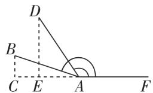

B. 18 cm

C. 21 cm

D. 24 cm

6. 下列选项中的三角形均为正方形网格图中的格点三角形, 其中不是直角三角形的是 ( )

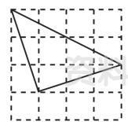

A

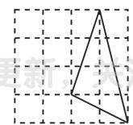

B

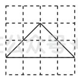

C

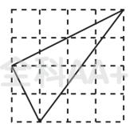

D

满分:120 分

7. 如图是一个长、宽、高分别是 a, b, c 的长方体无盖盒子, 已知一根木棒长为 $7 \, cm$ , 且 $DC \perp AC$ 。通过计算发现, 不能放入此木棒的无盖盒子的规格是

( )

A. $a = 6 \mathrm{~cm}, b = 2 \mathrm{~cm}, c = 2 \mathrm{~cm}$

B. $a = 5 \, cm, b = 4 \, cm, c = 3 \, cm$

C. $a = 6 \mathrm{~cm}, b = 5 \mathrm{~cm}, c = 1 \mathrm{~cm}$

D. $a = 5 \, cm, b = 5 \, cm, c = 2 \, cm$

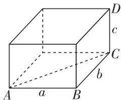

8. 新趋势·数学文化意大利著名画家达·芬奇用下图所示的方法证明了勾股定理。若设图1中空白部分的面积为 $S_{1}$ ，图3中空白部分的面积为 $S_{2}$ ，则下列表示 $S_{1}, S_{2}$ 的等式成立的是（）

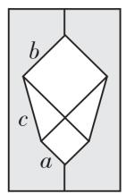  
图1

剪开

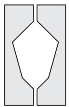  
图2

右边部分
上下翻转

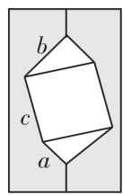  
图3

A. $S_{1} = a^{2} + b^{2} + 2ab$

B. $S_{1} = a^{2} + b^{2} + ab$

C. $S_{2} = c^{2}$

D. $S_{2} = c^{2} + \frac{1}{2} ab$

9. 定义: 如果一个正整数 m 能表示为两个正整数 a, b 的平方和, 即 $m = a^{2} + b^{2}$ , 那么称 m 为广义勾股数。给出下面三个结论: ①7 不是广义勾股数; ②13 是广义勾股数; ③两个广义勾股数的和是广义勾股数。正确的是 ( )

A. ②③

B.①②

C. ①③

D.①②③

10. 勾股定理是人类早期发现并证明的重要数学定理之一, 是数形结合的重要纽带。数学家欧几里得验证了勾股定理。如图, 分别以 Rt $\triangle ABC (\angle ACB = 90^{\circ})$ 的三条边为边长向外作正方形 ABED、正方形 ACHI、正方形 BCGF, 连接 CE。若 $S_{正方形ABED} = 25$ , $S_{正方形BCGF} = 16$ , 则 $CE^{2}$ 的值为 ( )

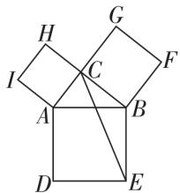

A. 63

B. 64

C. 65

D. 66

# 二、填空题(每小题3分,共15分)

11. 若直角三角形的三边长为 5, 12, m, 则 $m^{2}$ 的值为 \_\_\_\_。

12. 如图, 幸福小区 C 位于快递站点 B 的北偏东 $35^{\circ}$ 方向, 沁苑小区 D 位于 B 的南偏东 $55^{\circ}$ 方向, 无人机以 1 千米/分的速度配送快递时, 从 B 到 C 需飞行 8 分钟, 从 B 到 D 需飞行 15 分钟。若无人机的配送路线是 $B \rightarrow C \rightarrow D \rightarrow B$ , 则配送途中飞行的时间为 \_\_\_\_ 分。

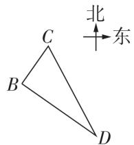  
第12题图

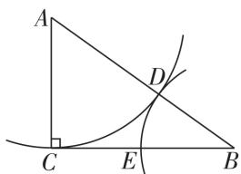  
第 13 题图

13. 如图, 在 $\triangle ABC$ 中, $\angle ACB = 90^{\circ}, BC = 16 \mathrm{~cm}$ , 以点 $A$ 为圆心, $AC$ 长为半径画弧, 交线段 $AB$ 于点 $D$ ; 以点 $B$ 为圆心, $BD$ 长为半径画弧, 交线段 $BC$ 于点 $E$ 。若 $BD = CE$ , 则 $AC$ 的长为 \_\_\_\_。

14. 如图, 长方形纸片 ABCD 中, AB = 3 cm, AD = 9 cm, 将此长方形纸片折叠, 使点 D 与点 B 重合, 点 C 落在点 H 的位置, 折痕为 EF, 则 $\triangle BEF$ 的面积为 \_\_\_\_ cm²。

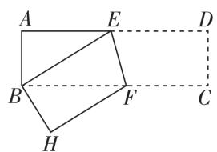  
第14题图

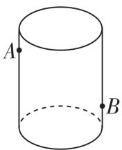  
第15题图

15. 如图,透明的圆柱形玻璃容器(容器厚度忽略不计)的高为20 cm,在容器内壁离容器底部4 cm的点B处有一滴蜂蜜,此时一只蚂蚁正好在容器外壁,位于离容器上沿4 cm的点A处,若蚂蚁吃到蜂蜜需爬行的最短路径为25 cm,则该圆柱底面周长为\_\_\_\_。

<table><tr><td colspan="10">选择题、填空题答题区</td></tr><tr><td>1</td><td>2</td><td>3</td><td>4</td><td>5</td><td>6</td><td>7</td><td>8</td><td>9</td><td>10</td></tr><tr><td></td><td></td><td></td><td></td><td></td><td></td><td></td><td></td><td></td><td></td></tr><tr><td colspan="10">11._ 12._ 13._14._ 15._</td></tr></table>

# 三、解答题(本大题共6小题,共75分)

16. (10 分) 如图, 已知 $\triangle ABC$ 中, $CD \perp AB$ 于点 $D$ , $AC = 2$ , $BC = 1.5$ , $DB = 0.9$ 。判断 $\triangle ABC$ 的形状, 并说明理由。

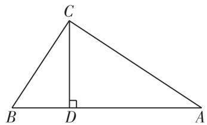

17. (10 分) 如图, 在 $\triangle ABC$ 中, $AB = AC = 13$ , $BP \perp CP$ 于点 $P, BP = 8, CP = 6$ , 求阴影部分的面积。

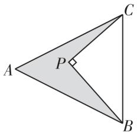

18. (12 分) 如图, 在 $\triangle ABC$ 中, $\angle ACB = 90^{\circ}, AC = BC$ , 点 $P$ 在斜边 $AB$ 上, 以 $PC$ 为直角边作等腰直角三角形 $PCQ$ , $\angle PCQ = 90^{\circ}$ 。试说明: $PB^{2} + AP^{2} = 2CP^{2}$ 。

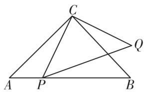  
C

19.(13 分)2024 年 12 月 4 日,我国传统节日春节申遗成功。为庆祝这一喜讯,郑州市新湖社区举办了名为“郑好遇见,大美非遗”的创意文化市集,诸多非遗有关文化项目集中亮相。图图和涵涵在市集上买了一个年画风筝,在放飞风筝过程中,他们想利用数学知识测量风筝的垂直高度(如图)。以下是他们测量高度的过程:

①先测得放飞点与风筝的水平距离 BD 的长为 8 米；  
②根据手中剩余线的长度计算出风筝线 AC 的长为 10 米；  
③牵线放风筝的手离地面的距离 AB 为 1.5 米。
已知 A, B, C, D 点在同一平面内。

(1) 求风筝离地面的垂直高度 CD。

(2)在测高的过程中涵涵提出了一个新的问题: 在手中剩余线仅剩7.5米的情况下,若想要风筝沿射线DC方向再上升9米,BD长度不变,能否成功呢?请你帮助解决涵涵提出的问题。

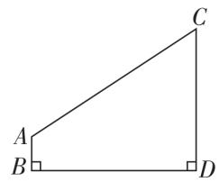

20. (15 分) 定义: 如图, 点 M, N 把线段 AB 分割成 AM, MN, NB, 若以 AM, MN, NB 为边的三角形是一个直角三角形, 则称点 M, N 是线段 AB 的勾股分割点。

(1) 若 $AM = 2.5, MN = 6.5, BN = 6$ ，则点 $M, N$ 是线段 $AB$ 的勾股分割点吗？请说明理由。  
(2) 已知点 M, N 是线段 AB 的勾股分割点, 且 AM 为直角边, 若 AB = 30, AM = 5, 求 BN 的长。

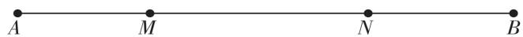

21. (15 分) 新考法 勾股定理是几何学中的明珠, 充满着魅力。千百年来, 证明勾股定理的方法层出不穷, 以下为勾股定理的一种证法:

把两个全等的直角三角形 $(\mathrm{Rt}\triangle ACB\cong\mathrm{Rt}\triangle DAE)$ 如图1放置, $\angle DAB=\angle B=90^{\circ},AC\perp DE$ ,点E在边AB上,设Rt△ABC两直角边AB=a,BC=b,斜边AC=c,连接CE,CD,用a,b,c分别表示出梯形ABCD、四边形AECD、△EBC的面积,再探究这三个图形面积之间的关系,可得到勾股定理。

(1)请根据上述图形的面积关系证明勾股定理。  
(2)如图 2, 铁路上 A, B 两点(看作直线上的两点)相距 40 千米, C, D 为两个村庄(看作两点), $AD \perp AB$ , $BC \perp AB$ , 垂足分别为 A, B, AD = 25 千米, BC = 16 千米, 则两个村庄之间的距离为 \_\_\_\_ 千米。  
(3) 在(2)的背景下,若要在 AB 上建造一个供应站 P, 使得 PC = PD, 请用尺规作图在备用图中作出 P 点的位置, 并求出 AP 的距离。

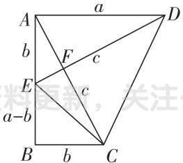  
图 1

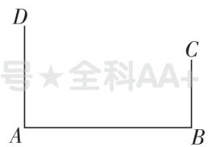  
图 2

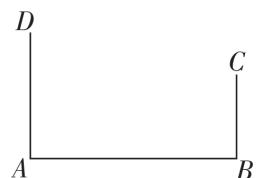  
备用图

# 2 | 第二章综合能力测评卷

时间:80 分钟

满分:120 分

# 一、选择题(每小题3分,共30分)

1. 给出下列各数: $\frac{1}{3}$ , 3.14, $\sqrt{16}$ , $\sqrt{5}$ , $\sqrt[3]{8}$ , 1.1010010001…
(相邻两个1之间0的个数逐次加1)。其中,无理数有()

A. 1 个

B. 2 个

C. 3 个

D. 4 个

2. 无理数 $\sqrt{6}$ 的倒数是 （）

A. $\frac{1}{6}$

B. $-\frac{\sqrt{6}}{6}$

C. $\frac{\sqrt{6}}{6}$

D. $-\sqrt{6}$

3. 在数轴上, 离表示 $\sqrt{32}$ 的点最近的整数点表示的数是 ( )

A.7

B. 6

C. 5

D. 4

4. 若 $\sqrt{20n}$ 是整数, 则正整数 n 的最小值是 ( )

A. 2

B. 3

C. 4

D. 5

5. 在算式“ $(\sqrt{2}+1)\Box(\sqrt{2}-1)$ ”的“□”中填上一种运算符号, 其运算结果为有理数, 则“□”可能为 ( )

A. +

B. ÷

C. +或×

D. -或×

6. 如图是小高的作业,他的得分是 ( )

判断题(每小题20分,共100分) 姓名:小高

1. -1 没有平方根。(√)  
2. $\sqrt{3^2}$ 与 $\sqrt{(-3)^2}$ 互为相反数。（√）  
3. $\sqrt{0.2}$ 化简后能与 $\sqrt{2}$ 合并。(√)  
4. $a^2$ 的算术平方根是 $a$ 。（×）  
5. $\sqrt[3]{9}$ 是一个大于2的无理数。(×)

A. 40 分

B. 60 分

C. 80 分

D. 100 分

7. 如图, 若数轴上点 A, B 对应的实数分别为 $-\sqrt{2}$ 和 $\sqrt{2}$ , 用圆规在数轴上画点 C, 则点 C 对应的实数是 ( )

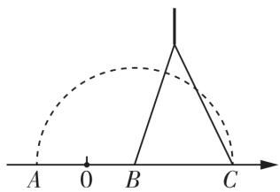

A. $\sqrt{2}$

B. $2\sqrt{2}$

C. $3\sqrt{2}$

D. $4\sqrt{2}$

8.2,5,m 是某三角形三边的长,则 $\sqrt{(m-3)^{2}} + \sqrt{(m-7)^{2}} =$ ( )

A. $2m - 10$

B. 10 - 2m

C. 10

D. 4

9. 设 $6 - \sqrt{10}$ 的整数部分为 a, 小数部分为 b, 则 $(2a + \sqrt{10})b$ 的值是 ( )

A. 6

B. $2\sqrt{10}$

C. 12

D. $9\sqrt{10}$

10. 如图, 在正方形网格中, 小正方形的边长为 1, 点 A, B, C 都在格点上, 则点 C 到 AB 所在直线的距离为 ( )

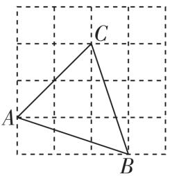

A. $\frac{\sqrt{10}}{8}$

B. $\frac{4\sqrt{10}}{5}$

C. $\frac{2\sqrt{10}}{5}$

D. $\frac{\sqrt{10}}{4}$

# 二、填空题(每小题3分,共15分)

11. 新情境“海阔千江辏,风翻大浪随”。海浪的大小与风速和风压有很大的关系,用风速估计风压的通用公式为 $w_{p}=\frac{v^{2}}{1600}$ , 其中 $w_{p}$ 为风压(单位: $kN/m^{2}$ ), v 为风速(单位: m/s)。当风压为 $0.16\ kN/m^{2}$ 时, 估计风速为 \_\_\_\_ m/s。

12. 一个正数 b 的平方根为 $a + 1$ 和 2a - 7，则 $9a + b$ 的立方根是 \_\_\_\_。

13. 若 k, b 都是实数, 且 $\sqrt{k-1} + \sqrt{1-k} + b = 3$ , 则 $k + b =$ \_\_\_\_ 。

14. 若 $x=\sqrt{6}-\sqrt{2}$ ，则代数式 $x(\sqrt{6}-x)+(x+\sqrt{5})(x-\sqrt{5})$ 的值为 \_\_\_\_。

15. 对于任意实数 a, 可用 $[a]$ 表示不超过 a 的最大整数, 如 $[4]=4, [\sqrt{3}]=1$ 。现对 72 进行如下操作: $72 \xrightarrow{\text{第1次}} [\sqrt{72}] = 8 \xrightarrow{\text{第2次}} [\sqrt{8}] = 2 \xrightarrow{\text{第3次}} [\sqrt{2}] = 1$ 。这样对 72 需进行 3 次操作后变为 1。类似地, 对 81 需进行 \_\_\_\_ 次操作后变为 1; 需进

行 3 次操作后变为 1 的所有正整数中, 最大的数是 \_\_\_\_。

<table><tr><td colspan="10">选择题、填空题答题区</td></tr><tr><td>1</td><td>2</td><td>3</td><td>4</td><td>5</td><td>6</td><td>7</td><td>8</td><td>9</td><td>10</td></tr><tr><td></td><td></td><td></td><td></td><td></td><td></td><td></td><td></td><td></td><td></td></tr><tr><td colspan="10">11._ 12._ 13._14._ 15._</td></tr></table>

# 三、解答题(本大题共6小题,共75分)

16. 计算：

(1)(5 分) $\sqrt[3]{27}\times\sqrt{\frac{8}{9}}-\sqrt{12}\div\sqrt{6}$ ;

(2)(5分) $\left(\sqrt{8}+\sqrt{3}\right)\times\sqrt{2}-4\sqrt{\frac{3}{2}};$

(3)(5 分) $\sqrt{2}\times\sqrt{6}-\sqrt{15}\div\sqrt{5}+\sqrt{3}(\sqrt{3}-1)$ ;

(4)(5 分) $\frac{1}{2+\sqrt{3}}+2+\sqrt{3}-\left(\sqrt{3}-1\right)^{2}$ 。

17. (10 分) 有个填写运算符号的游戏: 在“ $\frac{\sqrt{2}}{2}\square\sqrt{8}\square\sqrt{18}\square4\sqrt{2}$ ”中的每个□内, 填入 +, -, ×, ÷ 中的某一个(可重复使用), 然后计算结果。

(1) 计算: $\frac{\sqrt{2}}{2}+\sqrt{8}-\sqrt{18}-4\sqrt{2}$ ;

(2) 若 $\frac{\sqrt{2}}{2}\div\sqrt{8}\times\sqrt{18}\square4\sqrt{2}=-\frac{13}{4}\sqrt{2}$ , 请推算□内的符号。

18. (10 分) 新情境现有两块同样大小的长方形木板 ①, ②, 甲木工采用如图 1 所示的方式, 在长方形木板 ① 上截出三个面积分别为 $4 \mathrm{dm}^{2}, 8 \mathrm{dm}^{2}$ 和 $18 \mathrm{dm}^{2}$ 的正方形木板 $A, B, C$ 。

①   
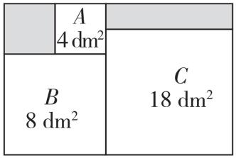  
图 1

②   
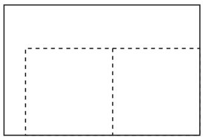  
图 2

(1)求木板①中剩余部分(阴影部分)的面积;  
(2)乙木工想采用如图2所示的方式,在长方形木板②上截出两个面积均为 $16\ dm^{2}$ 的正方形木板,请你判断能否截出,并说明理由。

19.（10 分）新趋势·过程性学习【阅读材料】问题：
已知 $x=\sqrt{3}+1$ ，求 $x^{2}-2x+2$ 的值。

小明的做法：

因为 $x=\sqrt{3}+1$ ，

所以 $x - 1 = \sqrt{3}$

所以 $(x-1)^{2}=3$ ，

所以 $x^{2}-2x+1=3$ ，

所以 $x^{2}-2x=2$ ，

所以 $x^{2}-2x+2=2+2=4$ 。

小明的做法是将已知条件

适当变形,再整体代入所求

代数式进行解答。

小丽的做法：

因为 $x^{2} - 2x + 2$

$= x^{2} - 2x + 1 + 1$

$= (x - 1)^{2} + 1$

所以当 $x = \sqrt{3} + 1$ 时，

原式 $= (\sqrt{3} + 1 - 1)^{2} +$

$1 = 3 + 1 = 4$

小丽的做法是将结论中代

数式适当变形,再将已知条

件代入变形式进行解答。

# 【解决问题】

(1)请你仿照“小明的做法”或“小丽的做法”，解决问题：

已知 $x=\sqrt{5}-3$ ，求 $x^{2}+6x-4$ 的值。

(2)请你参考“小明的做法”和“小丽的做法”,运用恰当的方法解决问题:

已知 $x = \frac{\sqrt{10} - 2}{3}$ , 求 $6x^{3} + 11x^{2}$ 的值。

20. (11 分)为了比较 $\sqrt{5} + 1$ 与 $\sqrt{10}$ 的大小, 小明和小宇同学对这个问题分别进行探究。

(1) 小明同学利用计算器得到了 $\sqrt{5} \approx 2.236, \sqrt{10} \approx 3.162$ ，所以 $\sqrt{5} + 1$ \_\_\_\_ $\sqrt{10}$ ; (填“>”“<”或“=”)  
(2) 小宇同学受到前面学习数轴上用点表示无理数的启发, 构造了图形 (如图), 其中 $\angle C = 90^{\circ}, BC = 3, D$ 在 $BC$ 上且 $BD = AC = 1$ , 请你利用此图进行计算与推理, 帮小宇同学比较 $\sqrt{5} + 1$ 与 $\sqrt{10}$ 的大小。

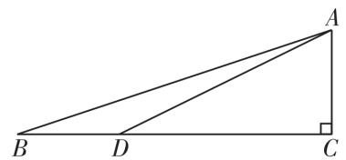

21. (14 分)(1)用“=”“>”或“<”填空:

$$
\begin{array}{l} 4 + 3 \quad \underline {{\quad}} \quad 2 \sqrt {4 \times 3}, 1 + \frac {1}{6} \quad \underline {{\quad}} \quad 2 \sqrt {1 \times \frac {1}{6}}, \\ 5 + 5 \quad \underline {{\quad}} \quad 2 \sqrt {5 \times 5} 。 \end{array}
$$

(2)由(1)中各式猜想 $m + n$ 与 $2\sqrt{mn} (m \geqslant 0, n \geqslant 0)$ 的大小，并说明理由。  
(3)请利用上述结论解决下面的问题:
某园林设计师要对园林的一个区域进行设计改造,将该区域用篱笆围成长方形的花圃。如图,花圃恰好可以借用一段墙体,为了围成面积为 $200 \, m^{2}$ 的花圃,至少需要篱笆多少米?

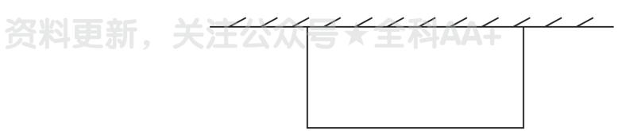

text_image

资料更新，关注公众号★全科AA+

# 3 | 第三章综合能力测评卷

时间:60 分钟

# 一、选择题(每小题3分,共30分)

1. 2024 年 10 月 30 日, 神舟十九号在酒泉卫星发射中心成功发射。以下选项中, 能够准确表示“酒泉卫星发射中心”地理位置的是 ( )

A. 北纬 $40^{\circ}$ , 东经 $100^{\circ}$   
B. 离北京市 1500 千米  
C. 在巴丹吉林沙漠深处  
D. 在中国甘肃

2. 若一个点的坐标为 $(2, -3)$ ，则这个点在如图所示的平面直角坐标系上的位置可能是（）

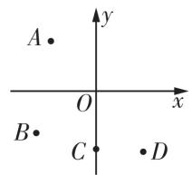

A. 点 $A$

B. 点 B

C. 点 C

D. 点 D

3. 生态园位于县城东北方向 5 千米处, 则下列选项表示准确的是 ( )

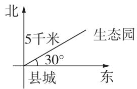  
A

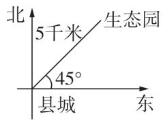  
B

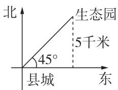  
C

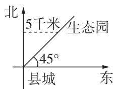  
D

4. 如果点 $A(m+2, m-1)$ 在 x 轴上, 那么点 $B(m+3, m-2)$ 关于 x 轴的对称点的坐标是 ( )

A. $(4,-1)$

B. $(-4,-1)$

C. $(4,1)$

D. $(-4,1)$

5. 在平面直角坐标系中, 第四象限内的点 P 到 x 轴的距离是 3, 到 y 轴的距离是 2, $PQ \parallel x$ 轴, 若 PQ = 4, 则点 Q 的坐标是 ( )

A. $(6,-3)$ 或 $(-2,-3)$   
B. $(6,3)$ 或 $(-2,3)$   
C. $(2,1)$ 或 $(2,-7)$   
D. $(-1,-2)$ 或 $(7,-2)$

满分:120 分

6. 在平面直角坐标系中, 点 $P(m, 2 - 2m)$ 在第二、四象限的角平分线上, 则 $m$ 的值是 ( )

A. 2

B. $-\frac{2}{3}$

C. $\frac{2}{3}$

D.-2

7. 把 $\triangle ABC$ 各顶点的横坐标都乘 -1, 纵坐标都不变, 所得图形是下列选项中的 ( )

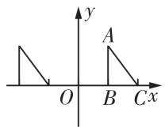  
A

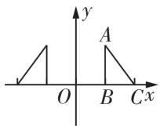  
B

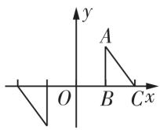  
C

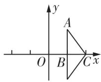  
D

8. 新趋势·传统文化中国象棋文化历史久远,雅俗共赏,具有广泛的参与度。象棋残局是象棋的基础,“七星聚会”素有“残局之王”的称谓,深受广大棋迷喜爱。如图就是残局“七星聚会”。如果建立平面直角坐标系,使“帥”位于点(-2,-2),“象”位于点(-2,5),那么“砲”在同一坐标系下的坐标是()

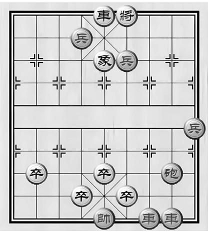

text_image

車將
兵
象兵
卒
卒
卒
卒
砲
車車

A. $(1,1)$

B. $(2,3)$

C. $(1,0)$

D. $(0,1)$

9. 如图是一块不规则的四边形地皮 ABCO, 各顶点坐标分别为 A(-2,6), B(-5,4), C(-7,0), O(0,0) (图上 1 个单位表示 10 m), 则这块地皮的面积是 ( )

A. $25 \, m^{2}$

B. 250 m $^{4}$

C. 2 500 m $^{4}$

D. 25 000 m $^{4}$

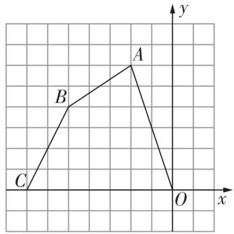

text_image

y
A
B
C
O
x

第9题图

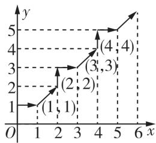  
第10题图

10. 如图, 在平面直角坐标系中, 将若干个整点按图中方向排列, 即 $(0,0) \rightarrow (0,1) \rightarrow (1,1) \rightarrow (2,2) \rightarrow (2,3) \rightarrow (3,3) \rightarrow (4,4) \rightarrow \cdots$ , 按此规律排列下去, 第 24 个点的坐标是 ()

A. $(13,13)$

B. $(14,14)$

C. $(15,15)$

D. $(14,15)$

# 二、填空题(每小题3分,共15分)

11. 如图, 在平面直角坐标系中, $\triangle ABC$ 关于直线 $m$ (直线 $m$ 上各点的横坐标都为 1) 对称, 点 $C$ 的坐标为 $(4,1)$ , 则点 $B$ 的坐标为 \_\_\_\_。

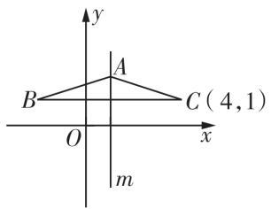  
第11题图

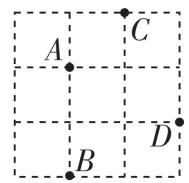  
第12题图

12. 如图, 在 $3 \times 3$ 的正方形网格中有四个格点 $A, B, C$ , $D$ , 以其中一个点为原点, 网格线所在直线为坐标轴, 建立平面直角坐标系, 使其余三个点中存在两个点关于一条坐标轴对称, 则原点可能是 \_\_\_\_。  
13. 同学们玩过五子棋吗？它的比赛规则是只要同色5枚棋子先成一条直线就算胜。如图，是两人玩的一盘棋，若白①的位置是(1，-1)，黑②的位置是(2,0)，现轮到黑棋走，你认为黑棋放在什么位置就胜了：\_\_\_\_。

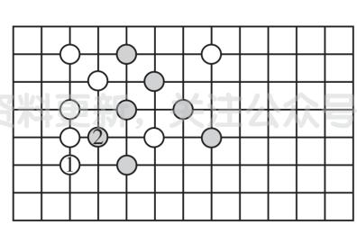

text_image

资料来源：关注公众号
①
②

第13题图

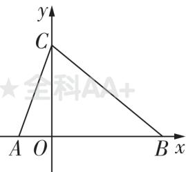  
第 14 题图

14. 如图, 在平面直角坐标系 $xOy$ 中, 点 $A(-2,0)$ , $C(0,6)$ , 点 $B$ 在 $x$ 轴的正半轴上, 连接 $AC, BC$ 。若 $AB = BC$ , 则点 $B$ 的坐标是 \_\_\_\_。

15. 如图, 在平面直角坐标系中, 长为 2 的线段 CD (点 D 在点 C 的右侧) 在 x 轴上移动, y 轴上的点 A, B 的坐标分别为 (0, 1), (0, 3), 连接 AC, BD, 则 $AC + BD$ 的最小值为 \_\_\_\_。

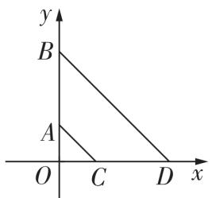

<table><tr><td colspan="10">选择题、填空题答题区</td></tr><tr><td>1</td><td>2</td><td>3</td><td>4</td><td>5</td><td>6</td><td>7</td><td>8</td><td>9</td><td>10</td></tr><tr><td></td><td></td><td></td><td></td><td></td><td></td><td></td><td></td><td></td><td></td></tr><tr><td colspan="10">11._ 12._ 13._14._ 15._</td></tr></table>

# 三、解答题(本大题共6小题,共75分)

16.(10 分)如图是某市市政府周边的一些建筑,以市政府为坐标原点,建立平面直角坐标系。(每个小正方形的边长均为 1)

(1)请写出商会大厦和医院的坐标;   
(2) 王老师在市政府办完事情后, 沿 $(2,0)\rightarrow(2,-1)\rightarrow(2,-3)\rightarrow(0,-3)\rightarrow(0,-1)\rightarrow(-2,-1)$ 的路线逛了一下, 然后到汽车站坐车回家, 写出他路上经过的地方。

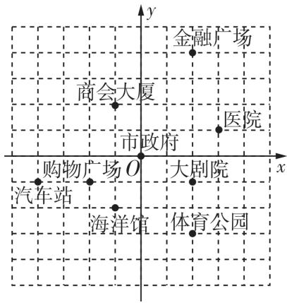

text_image

金融广场
商会大厦
市政府
医院
购物广场O
大剧院
汽车站
海洋馆
体育公园

17. (12 分) 已知平面直角坐标系中有一点 $M(m-1, 2m+3)$ 。

(1) 若点 M 到 y 轴的距离为 3, 求点 M 的坐标;  
(2) 若点 N 的坐标为 $(5, -1)$ ，且 $MN \parallel x$ 轴，求点 M 的坐标；  
(3) 当点 M 到 x 轴、y 轴的距离相等时, 求点 M 的坐标。

18.(12 分)如图,在平面直角坐标系中,已知点 A,B 的坐标分别为 $(-3,4),(4,-2)$ 。

(1) 求点 A, B 关于 y 轴的对称点的坐标;  
(2)在平面直角坐标系中分别作出点 A, B 关于 x 轴的对称点 M, N, 顺次连接 AM, BM, BN, AN, 求四边形 AMBN 的面积。

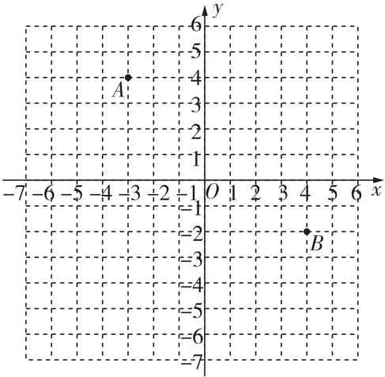

scatter

| Point | x | y |
|---|---|---|
| A | -3 | 4 |
| B | 4 | -2 |
| Point | 4 | -2 |
| Point | 5 | -1 |
| Point | 6 | -1 |
| Point | 7 | -1 |
| Point | 8 | -1 |
| Point | 9 | -1 |
| Point | 10 | -1 |
| Point | 11 | -1 |
| Point | 12 | -1 |
| Point | 13 | -1 |
| Point | 14 | -1 |
| Point | 15 | -1 |
| Point | 16 | -1 |
| Point | 17 | -1 |
| Point | 18 | -1 |
| Point | 19 | -1 |
| Point | 20 | -1 |
| Point | 21 | -1 |
| Point | 22 | -1 |
| Point | 23 | -1 |
| Point | 24 | -1 |
| Point | 25 | -1 |
| Point | 26 | -1 |
| Point | 27 | -1 |
| Point | 28 | -1 |
| Point | 29 | -1 |
| Point | 30 | -1 |
| Point | 31 | -1 |
| Point | 32 | -1 |
| Point | 33 | -1 |
| Point | 34 | -1 |
| Point | 35 | -1 |
| Point | 36 | -1 |
| Point | 37 | -1 |
| Point | 38 | -1 |
| Point | 39 | -1 |
| Point | 40 | -1 |
| Point | 41 | -1 |
| Point | 42 | -1 |
| Point | 43 | -1 |
| Point | 44 | -1 |
| Point | 45 | -1 |
| Point | 46 | -1 |
| Point | 47 | -1 |
| Point | 48 | -1 |
| Point | 49 | -1 |
| Point | 50 | -1 |
| Point | 51 | -1 |
| Point | 52 | -1 |
| Point | 53 | -1 |
| Point | 54 | -1 |
| Point | 55 | -1 |
| Point | 56 | -1 |
| Point | 57 | -1 |
| Point | 58 | -1 |
| Point | 59 | -1 |
| Point | 60 | -1 |
| Point | 61 | -1 |
| Point | 62 | -1 |
| Point | 63 | -1 |
| Point | 64 | -1 |
| Point | 65 | -1 |
| Point | 66 | -1 |
| Point | 67 | -1 |
| Point | 68 | -1 |
| Point | 69 | -1 |
| Point | 70 | -1 |
| Point | 71 | -1 |
| Point | 72 | -1 |
| Point | 73 | -1 |
| Point | 74 | -1 |
| Point | 75 | -1 |
| Point | 76 | -1 |
| Point | 77 | -1 |
| Point | 78 | -1 |
| Point | 79 | -1 |
| Point | 80 | -1 |
| Point | 81 | -1 |
| Point | 82 | -1 |
| Point | 83 | -1 |
| Point | 84 | -1 |
| Point | 85 | -1 |
| Point | 86 | -1 |
| Point | 87 | -1 |
| Point | 88 | -1 |
| Point | 89 | -1 |
| Point | 90 | -1 |
| Point | 91 | -1 |
| Point | 92 | -1 |
| Point | 93 | -1 |
| Point | 94 | -1 |
| Point | 95 | -1 |
| Point | 96 | -1 |
| Point | 97 | -1 |
| Point | 98 | -1 |
| Point | 99 | -1 |
| Point A
Point A
Point B
Point C
Point D
Point E
Point F
Point G
Point H
Point I
Point J
Point K
Point L
Point M
Point N
Point O
Point P
Point Q
Point R
Point S
Point T
Point U
Point V
Point W
Point X
Point Y
Point Z
Point AA
Point AB
Point AC
Point AD
Point AE
Point AF
Point AG
Point AH
Point AI
Point AJ
Point AK
Point AL
Point AM
Point AN
Point AO
Point AP
Point AQ
Point AR
Point AS
Point AT
Point AU
Point AV
Point AW
Point AX
Point AXB
Point AXC
Point AXD
Point AXE
Point AXF
Point AXG
Point AXH
Point AXI
Point AXJ
Point AXK
Point AXL
Point AXM
Point AXN
Point AXO
Point AXP
Point AXQ
Point AXQ
Point AXR
Point AXS
Point AXS
Point AXS
Point AXS
Point AXS
Point AXS

19.(13分)如图,在边长为1的正方形网格中建立平面直角坐标系,已知 $\triangle ABC$ 三个顶点分别为A(1,3),B(-1,1),C(4,1)。

(1) 将点 A, B, C 的纵坐标保持不变, 横坐标分别乘 -1, 得到点 $A', B', C'$ , 请在图中作出 $\triangle A'B'C'$ , 则 $\triangle A'B'C'$ 与 $\triangle ABC$ 关于 \_\_\_\_ 轴对称;  
(2) 在 y 轴的负半轴上找一点 P 使得 $\triangle PAB$ 的面积与 $\triangle ABC$ 的面积相等, 求点 P 的坐标。

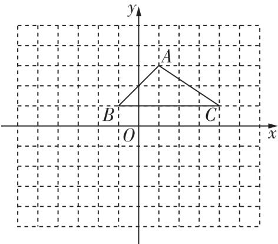

text_image

y
A
B
O
C
x

20. (14 分)【阅读材料】

在平面直角坐标系中, 点 $P(x,y)$ 的横坐标 x 的绝对值表示为 $|x|$ , 纵坐标 y 的绝对值表示为 $|y|$ , 我们把点 $P(x,y)$ 的横坐标与纵坐标的绝对值之和叫作点 $P(x,y)$ 的勾股值, 记为 [P], 即 $[P] = |x| + |y|$ 。例如, 点 $P(1,2)$ 的勾股值 $[P] = |1| + |2| = 3$ 。

【解决问题】

(1) 分别求点 $A(-2,4)$ , $B(\sqrt{2} + \sqrt{3}, \sqrt{2} - \sqrt{3})$ 的勾股值 [A], [B];   
(2) 若点 $M(x, y)$ 在 x 轴的上方, 其横、纵坐标均为整数, 且 $[M] = 3$ , 求点 M 的坐标。

21. (14 分) 在平面直角坐标系中, 给出如下定义: 点 P 到 x 轴, y 轴的距离的较大值称为点 P 的“长距”, 点 Q 到 x 轴, y 轴的距离相等时, 称点 Q 为 “完美点”。

(1) 点 A(-1,3) 的“长距”为 \_\_\_\_；  
(2) 若点 $B(4a-1,-3)$ 是“完美点”，求 a 的值；  
(3) 若点 $C(-2, 3b - 2)$ 的“长距”为 4 , 且点 $C$ 在第二象限内, 点 $D$ 的坐标为 $(9 - 2b, -5)$ , 试说明: 点 $D$ 是“完美点”。

# 4 | 第四章综合能力测评卷

时间:80 分钟

# 一、选择题(每小题3分,共30分)

1. 如果 $y = x + 2a - 1$ 是正比例函数, 那么 a 的值是 ( )

A. $-\frac{1}{2}$

B. 0

C. $\frac{1}{2}$

D. -2

2. 已知点 $A(1, y_{1})$ 和点 $B(a, y_{2})$ 均在一次函数 $y = -2x + b$ 的图象上，且 $y_{1} > y_{2}$ ，则 a 的值可能是（）

A. -1

B. -2

C. 3

D. 0

3. 将某一次函数图象向右平移 2 个单位后得到函数 $y = -2x + 1$ 的图象, 则这个一次函数的表达式为 ( )

A. $y = -2x + 3$

B. $y = -2x - 1$

C. $y = -2x + 5$

D. $y = -2x - 3$

4. 如图, 点 A, B, C, D 为平面直角坐标系中的四个点, 一次函数 $y = kx + 1 (k > 0)$ 的图象不可能经过 ()

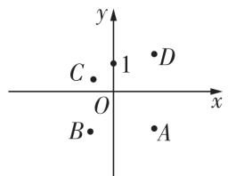

A. 点 A

B. 点 B

C. 点 C

D. 点 D

5. 若关于 $x$ 的方程 $kx + b = 0$ 的解是 $x = -1$ , 则直线 $y = kx + 2b$ 一定经过点 ( )

A. $(-2,0)$

B. $(0,-1)$

C. $(1,0)$

D. $(0,-2)$

6. 在平面直角坐标系中, O 为坐标原点, 若直线 y = x + 3 分别与 x 轴, 直线 y = -2x 交于点 A, B, 则 $\triangle AOB$ 的面积为 ( )

A.2

B. 3

C. 4

D. 6

7. 跨学科·物理在物理实验探究课上,小明利用滑轮组及相关器材进行提升重物实验时(不计绳重和摩擦),他把得到的拉力 $F(N)$ 和所悬挂重物的重力 $G(N)$ 的几组数据用电脑绘制成如图所示的图

满分:120 分

象,请你根据图象判断以下结论错误的是（）

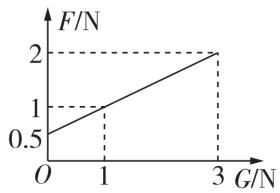

A. 当 F = 3 时, G = 5   
B. $F$ 随着 $G$ 的增大而增大  
C. 当 1 < G < 3 时, 0.5 < F < 2  
D. 当滑轮组不挂重物时, 所用拉力为 0.5 N

8. 新趋势·过程性学习 我们知道,通过列表,描点,连线可以画出一个函数的图象。在画完函数 y=2x 的图象后,何老师给同学们提出一个问题:“不通过画图,你能解释为什么函数 y=2x 的图象经过第一、三象限吗?”聪明的小亮经过思考,给出了这样的解答:“当 x>0 时,y=2x>0,此时描出的点都在第一象限;当 x<0 时,y=2x<0,此时描出的点都在第三象限。所以函数 y=2x 的图象一定经过第一、三象限。”大家不禁为善于思考的小亮鼓掌。最后何老师又给大家留了一道思考题:下面四个图象中哪个是函数 $y=\sqrt{x}$ 的图象 ( )

  
A

  
B

  
C

  
D

9. 如图, 一直线与两坐标轴的正半轴分别交于 A, B 两点, P 是线段 AB 上任意一点 (不包括端点), 过点 P 分别作两坐标轴的垂线与两坐标轴围成的长方形的周长为 8, 则该直线的函数表达式是 ( )

A. $y = -x + 4$

B. $y = x + 4$

C. $y = x + 8$

D. $y = -x + 8$

10. 在同一平面直角坐标系内作一次函数 $y_{1}=ax+b$ 和 $y_{2}=-bx+a$ 图象, 可能是 ( )

text_image

y
y₂
y₁ O
x
A
y
y₂
y₁ O y₁ x
B
y
y₂
y₁ O x
C
y
y₁ O y₂ x
D

# 二、填空题(每小题3分,共15分)

11. 小明在用“列表、描点、连线”的方法画一次函数 $y = kx + b (k, b \text{ 为常数}, k \neq 0)$ 的图象时，列出 x 与 y 的几组对应值（如表），请你细心观察，当 x = \_\_\_\_ 时，小明计算的 y 值是错误的。

<table><tr><td>x</td><td>...</td><td>0</td><td>1</td><td>2</td><td>3</td><td>...</td></tr><tr><td>y</td><td>...</td><td>-3</td><td>-1</td><td>0</td><td>3</td><td>...</td></tr></table>

12. 关于函数 y = -x - 2 的图象,有下列说法:①由图象知 y 随 x 的增大而增大;②图象不经过第一象限;③图象是与 y = x 平行的直线。其中正确的说法是\_\_\_\_。  
13. 将直线 $l_{1}: y = ax - 2 (a \neq 0)$ 向上平移 1 个单位后得到直线 $l_{2}$ ，将直线 $l_{1}$ 向左平移 1 个单位后得到直线 $l_{3}$ ，若直线 $l_{2}$ 和直线 $l_{3}$ 恰好重合，则 a 的值为 \_\_\_\_。  
14. 如图, 一束光线从点 A(-2,5) 出发, 经过 y 轴上的点 B(0,1) 反射后经过点 C(m,n), 则 2m-n 的值是 \_\_\_\_。

15. 直线 $y = kx - 2k + 3$ 必经过一点, 则该点的坐标是 \_\_\_\_; 平面直角坐标系中有 A(-1,0), B(2,3), C(7,0) 三点, 若直线 $y = kx - 2k + 3$ 将 $\triangle ABC$ 分成面积相等的两部分, 则 k 的值是 \_\_\_\_。

<table><tr><td colspan="10">选择题、填空题答题区</td></tr><tr><td>1</td><td>2</td><td>3</td><td>4</td><td>5</td><td>6</td><td>7</td><td>8</td><td>9</td><td>10</td></tr><tr><td></td><td></td><td></td><td></td><td></td><td></td><td></td><td></td><td></td><td></td></tr><tr><td colspan="10">11._ 12._ 13._14._ 15._</td></tr></table>

# 三、解答题(本大题共6小题,共75分)

16. (10 分) 若 y 与 x - 2 成正比例, 且当 x = 3 时, y = -2。

(1) 求 $y$ 与 $x$ 之间的函数表达式。  
(2) 当 $x$ 在什么范围内时, $y < 2$ ?

17. (10 分) 在平面直角坐标系中, 一次函数 $y = kx + b$ 的图象是由一次函数 $y = -x + 2$ 的图象平移得到的, 且经过点 $A(2,3)$ 。

(1) 求一次函数 $y = kx + b$ 的表达式；  
(2) 若点 $P(2m, 4m - 1)$ 为一次函数 $y = kx + b$ 的图象上一点, 求 m 的值。

18.(12 分)某次气象探测活动中,在一广场上同时释放两个探测气球。1 号探测气球从距离地面 5 米处出发,以 1 米/分的速度上升,2 号探测气球距离地面的高度 y(米)与上升时间 x(分)满足一次函数关系,其图象如图所示。

(1) 求 $y$ 关于 $x$ 的函数表达式;  
(2)探测气球上升多长时间时,两个气球位于同一高度?此时它们距离地面多少米?

19. (12 分) 如图, 平面直角坐标系 $xOy$ 中, 一次函数 $y = -\frac{1}{2} x + 5$ 的图象 $l_{1}$ 分别与 $x$ 轴、 $y$ 轴交于 $A, B$ 两点, 正比例函数的图象 $l_{2}$ 与 $l_{1}$ 交于点 $C(m,4)$ 。

(1) 求 m 的值及 $l_{2}$ 的函数表达式；  
(2) 求 $S_{\triangle AOC} - S_{\triangle BOC}$ 的值；  
(3)一次函数 $y = kx + 1$ 的图象为 $l_{3}$ ，且 $l_{1}, l_{2}, l_{3}$ 不能围成三角形，直接写出 k 的值。

text_image

y
B
l₂
C
1
O
1
A
x
l₁:y=-\frac{1}{2}x+5

20. (15 分) 表格中的两组对应值满足一次函数 $y = kx + b$ , 现画出了它的图象为直线 $l$ , 如图。某同学为观察 $k, b$ 对图象的影响, 将上面函数中的 $k$ 与 $b$ 交换位置后得到另一个一次函数, 设其图象为直线 $l'$ 。

(1) 求直线 $l$ 的函数表达式;  
(2)请在图上画出直线 $l'$ (不要求列表计算), 并求直线 $l'$ 被直线 l 和 y 轴所截线段的长;  
(3) 设直线 y = a 与直线 l, $l'$ 及 y 轴有三个不同的交点, 且其中两点关于第三点对称, 直接写出 a 的值。

<table><tr><td>x</td><td>-1</td><td>0</td></tr><tr><td>y</td><td>-2</td><td>1</td></tr></table>

line

| x | y |
|---|---|
| -3 | -2 |
| -2 | -1 |
| -1 | 0 |
| 0 | 1 |
| 1 | 2 |
| 2 | 4 |
| 3 | 6 |
| 4 | 8 |

# 21. (16 分) 综合与实践

【问题背景】

某市 2025 年初中学业体育水平考试的总分值拟提高到 80 分, 考试项目增加 5 项, 其中技能类考试项目除篮球和足球外增加了排球垫球。某校为更好地开展排球课程, 计划购买一批排球, 该市两家体育用品商店分别推出了自己的优惠方案: 甲商店: 若购买超过 20 个, 超过部分按每个排球标价的八折出售。

乙商店:若购买超过 15 个,超过部分按每个排球标价的九五折再优惠 10 元出售。

【问题研究】

若用字母 x 表示购买排球的数量, 字母 y 表示购买排球的总价, 其函数图象如图所示。

【问题解决】

(1)每个排球的标价是多少元?   
(2) 当 x > 20 时, 甲商店应付的总价 $y_{甲}$ 与数量 x 之间的函数表达式为 \_\_\_\_; 当 x > 15 时, 乙商店应付的总价 $y_{乙}$ 与数量 x 之间的函数表达式为 \_\_\_\_。  
(3) 求点 C 的坐标, 并根据图象直接写出选择哪家商店购买排球更合算。

# 5 | 第五章综合能力测评卷

时间:80 分钟

# 一、选择题(每小题3分,共30分)

1. 下列方程组中, 是二元一次方程组的是 ( )

A. $\left\{\begin{aligned}3x^{2}+y=1,\\ 10x-8y=-9\end{aligned}\right.$

B. $\left\{\begin{aligned}xy&=4,\\ x+2y&=6\end{aligned}\right.$

C. $\left\{ \begin{array}{l} x - y = 2, \\ \frac{1}{x} - 3y = -\frac{7}{4} \end{array} \right.$

D. $\left\{\begin{aligned}x+2y&=4,\\ 7x-9y&=5\end{aligned}\right.$

2. 下列方程的解为 $\left\{\begin{aligned} x &= 2, \\ y &= -1 \end{aligned}\right.$ 的是 ( )

A. $3x - 4y = 10$

B. $\frac{1}{2}x+2y=3$

C. $x + 3y = 2$

D. $2(x - y) = 6y$

3. 用加减消元法解方程组 $\left\{\begin{aligned}3x+2y=7,①\\ x+2y=-3,②\end{aligned}\right.$ 具体解法如下：

(1)①-②,得2x=4;   
(2) 所以 x = 2;   
(3) 把 $x = 2$ 代入①, 得 $y = \frac{1}{2}$ ;  
(4)所以这个方程组的解是 $\left\{ \begin{array}{l}x = 2,\\ y = \frac{1}{2} 。 \end{array} \right.$

其中错误开始于步骤 （）

A. (4)

B. (3)

C. (2)

D. (1)

4. 对于二元一次方程组 $\left\{\frac{1}{3x-y=8},\frac{1}{2}\right.$ 把 ① 代入 ② 消去 y 后所得到的方程为 3x-x-5=8，则 ① 可以是（）

A. $y = x + 5$

B. y = x - 5

C. $x = y + 5$

D. $x = 3y - 5$

5. 甲种防腐药水含药 30%, 乙种防腐药水含药 75%, 现用这两种防腐药水配制含药 50% 的防腐药水 18 千克, 两种药水各需要多少千克? 设甲种药水需要 x 千克, 乙种药水需要 y 千克, 则所列方程组正确的是 ( )

A. $\left\{ \begin{array}{l} x + y = 18, \\ 30\% x + 75\% y = 18 \times 50\% \end{array} \right.$

满分:120 分

B. $\left\{ \begin{array}{l} x + y = 18, \\ 30\% x + 75\% y = 18 \end{array} \right.$   
C. $\left\{ \begin{array}{l} x + y = 18, \\ 75 \% x + 30 \% y = 18 \times 50 \% \end{array} \right.$   
D. $\left\{ \begin{array}{l} x + y = 18, \\ 75 \% x + 30 \% y = 18 \end{array} \right.$

6. 若 $(x-y+1)^{2}+|2x+3y-3|=0$ ，则代数式 xy 的值是（）

A.0

B.1

C. 3

D. -3

7. 某果农将采摘的荔枝分装为大箱和小箱销售, 其中每个大箱装 4 千克荔枝, 每个小箱装 3 千克荔枝。该果农现采摘有 32 千克荔枝, 根据市场销售需求, 大小箱都要装满, 则所装的箱数最多为 ( )

A.8 箱

B.9 箱

C. 10 箱

D. 11 箱

8. 某商场按定价销售某种商品时, 每件可获利 45 元, 按定价的 8.5 折销售该商品 8 件与将定价降低 35 元销售该商品 12 件所获利润相等。则该商品的进价、定价分别是 ( )

A. 155 元, 200 元

B.95元,180元

C. 100 元, 145 元

D. 125 元, 150 元

9. “九宫图”传说是远古时代洛河中的一只神龟背上的图案,故又称“龟背图”,中国古代数学史上经常研究这一神话。数学上的“九宫图”所体现的是一个 $3 \times 3$ 表格,其每行、每列、每条对角线上三个数之和都相等,也称为三阶幻方,如图是一个三阶幻方,则 $2x + y$ 的值为()

<table><tr><td></td><td>y</td><td>-7</td></tr><tr><td></td><td>-2</td><td>4</td></tr><tr><td>3</td><td></td><td>x</td></tr></table>

A. -5

B. -4

C. 4

D. 5

10. 已知关于 $x, y$ 的方程组 $\left\{ \begin{array}{l} x + 2y = a, \\ x - y = 4a - 1, \end{array} \right.$ 给出下列结论：

①方程组的解也是 $2x + y = 5a - 1$ 的解；

②x,y 值不可能是互为相反数;

③不论 a 取什么实数, $x+3y$ 的值始终不变;  
④若 $2x + y = 9$ ，则 a = 2。

其中,正确的结论是 ( )

A. ②③④ B. ①④

C.①③④

D.①②

# 二、填空题(每小题3分,共15分)

11. 已知二元一次方程组 $\left\{\begin{aligned}x-y&=-5,\\ x+2y&=-2\end{aligned}\right.$ 的解为 $\left\{\begin{aligned}x&=-4,\\ y&=1,\end{aligned}\right.$ 则在同一平面直角坐标系中，直线 $l_{1}$ ： $y=x+5$ 与直线 $l_{2}:y=-\frac{1}{2}x-1$ 的交点坐标为 \_\_\_\_。

12. 已知方程组 $\left\{\begin{aligned}3a+b=6,\\ a-3b=3,\end{aligned}\right.$ 则 2a-b 的值是 \_\_\_\_。  
13. 新趋势·数学文化 我国古代数学著作《九章算术》中有这样一个问题：“今有共买物，人出八，盈三；人出七，不足四，问人数、物价各几何。”意思是：“几个人一起去购买某物品，每人出8钱，则多出3钱；每人出7钱，则还差4钱。问人数、物品的价格分别是多少。”该问题中的人数为\_\_\_\_。  
14. 对于有理数 $x, y$ , 定义新运算“※”: $x \text{※} y = ax + by + 1, a, b$ 为常数。若 $3 \text{※} 5 = 15, 4 \text{※} 7 = 28$ , 则 $5 \text{※} 9 =$ \_\_\_\_。  
15. 老师利用两块大小一样的长方体木块测量一张桌子的高度,首先按照图 1 方式放置,再交换两木块儿的位置,按照图 2 方式放置,测量的数据如图,则桌子的高度是 \_\_\_\_ cm。

  
图1

  
图 2

<table><tr><td colspan="10">选择题、填空题答题区</td></tr><tr><td>1</td><td>2</td><td>3</td><td>4</td><td>5</td><td>6</td><td>7</td><td>8</td><td>9</td><td>10</td></tr><tr><td></td><td></td><td></td><td></td><td></td><td></td><td></td><td></td><td></td><td></td></tr><tr><td colspan="10">11._ 12._ 13._14._ 15._</td></tr></table>

# 三、解答题(本大题共6小题,共75分)

16. 解下列方程组：

(1)(6分) $\left\{\begin{aligned}x-y&=2,①\\ 2x+y&=7;②\end{aligned}\right.$

(2)(6分) $\left\{\begin{aligned}\frac{x}{2}-\frac{y+2}{3}&=-1,①\\3x+2y&=14。②\end{aligned}\right.$

17. (10 分) 已知方程组 $\left\{\begin{aligned}2x+y=7,\\ x=y-1\end{aligned}\right.$ 的解也是关于 x,y 的方程 $ax+y=4$ 的一组解，求 a 的值。

18. (12 分) 甲、乙两地相距 74 千米, 途中有上坡、平路和下坡。一辆汽车从甲地下午 1 点出发到乙地是下午 3 点 30 分, 停留 30 分钟后从乙地出发, 6 点 48 分返回甲地。已知汽车在上坡路每小时行驶 20 千米, 平路每小时行驶 30 千米, 下坡每小时行驶 40 千米, 求甲地到乙地的行驶过程中平路、上坡、下坡分别是多少千米。

19.(12 分)下面是学习二元一次方程组时,老师提出的问题和两名同学所列的方程。

问题:某个工人一天工作6个小时,可以生产零件一整箱和不足一箱的20个;由于特殊情况,今天他只工作4个小时,生产零件一整箱和不足一箱的4个,问一整箱的零件数和该工人每小时能生产的零件数分别是多少。

小明所列方程组： $\left\{\begin{aligned}&6y=x+20,\\ &4y=x+4_{\circ}\end{aligned}\right.$

小亮所列方程: $\frac{4(x+20)}{6}=x+4$ 。

根据以上信息,解答下列问题。

(1)以上两个方程(组)中 x 的意义是否相同? \_\_\_\_ (填“是”或“否”)。

(2) 小亮的方程所用的等量关系是\_\_\_\_（填序号，①“每个小时生产的零件数相等”或②“4个小时生产的零件数相等”）。

(3)从以上两个方程(组)中任选一个求解,完整解答老师提出的问题。

20. (14 分) 如图, 在平面直角坐标系中, 一次函数 $y = kx + b$ 的图象经过点 $A(-2,6)$ , 且与 $x$ 轴相交于点 $B$ , 与正比例函数 $y = 3x$ 的图象相交于点 $C$ , 点 $C$ 的横坐标为 1。

(1) 求 k, b 的值。

(2) 直接写出方程组 $\left\{\begin{aligned} y &= kx + b, \\ y &= 3x \end{aligned}\right.$ 的解：\_\_\_\_。

(3) 在 y 轴找点 P, 使得 $\triangle PBC$ 周长最小, 求点 P 的坐标。

text_image

y
6
A
y=3x
C
B
-2 O 1 x
y=kx+b

21. (15 分) 新考法根据如表素材, 探索完成任务。

<table><tr><td>背景</td><td>某班级开展知识竞赛活动,去咖啡店购买A,B两种款式的咖啡作为奖品。</td></tr><tr><td>素材1</td><td>若买10杯A款咖啡,15杯B款咖啡需230元;若买25杯A款咖啡,25杯B款咖啡需450元。</td></tr><tr><td>素材2</td><td>为了满足市场的需求,咖啡店推出每杯2元的加料服务,顾客在选完款式后可以自主选择加料或者不加料。小华恰好用了208元购买A,B两款咖啡,其中A款不加料的杯数是总杯数的 $\frac{1}{3}$ 。</td></tr><tr><td colspan="2">问题解决</td></tr><tr><td>任务1</td><td>问A款咖啡和B款咖啡的销售单价分别是多少元。</td></tr><tr><td>任务2</td><td>在不加料的情况下,购买A,B两种款式的咖啡(两种都要),刚好花200元,问有几种购买方案。</td></tr><tr><td>任务3</td><td>求小华购买的这两款咖啡中,B款加料的咖啡买了多少杯。(直接写出答案)</td></tr></table>

# 6 | 第六章综合能力测评卷

时间:70 分钟

# 一、选择题(每小题3分,共30分)

1. 12月4日为国家宪法日,某校开展“宪法进校园”法律知识竞赛,满分为10分,九年级1班9位学生的成绩如下(单位:分):7,9,7,9,7,9,10,8,9。则这9位学生竞赛成绩的众数是()

A. 10 分

B.9 分

C.7 分

D. 4 分

2. 一条葡萄藤上结有五串葡萄, 每串葡萄的颗数如图所示(单位: 颗)。则这组数据的中位数为 ( )

A. 32 颗

B. 34 颗

C. 36 颗

D. 37 颗

3. “凤凰单枞”以独特的山韵和花香深受广东人喜爱。在我国传统节日春节前后,某茶叶经销商对甲、乙、丙、丁四种包装的单枞(售价、利润均相同)在这段时间内的销售情况统计如表所示,最终决定增加乙种包装单枞的进货数量,影响经销商决策的统计量是()

<table><tr><td>包装</td><td>甲</td><td>乙</td><td>丙</td><td>丁</td></tr><tr><td>销售量/盒</td><td>15</td><td>28</td><td>16</td><td>10</td></tr></table>

A. 众数

B. 平均数

C. 中位数

D. 方差

4. 若将排序后的数据分为两组, 计算组内离差平方和时需
()

A. 仅计算第一组的离差平方和  
B. 计算两组离差平方和的总和  
C. 仅计算最大值与最小值的差  
D. 计算两组离差平方和的平均数

5. 小刘在某建筑公司的工地上工作,公司承诺:正常上班的工资为200元/天,不能正常上班(如下雨)的工资为80元/天,若某月(30天)正常上班的天数占80%,则当月小刘的日平均工资为()

A. 140 元

B. 160 元

C. 176 元

D. 182 元

6. 八年级(1)班 30 名同学在一次测试中, 某道题目 (满分 4 分) 的得分情况如表:

<table><tr><td>得分/分</td><td>0</td><td>1</td><td>2</td><td>3</td><td>4</td></tr><tr><td>人数</td><td>1</td><td>3</td><td>4</td><td>14</td><td>8</td></tr></table>

满分:120 分

则这道题目得分的众数和中位数分别是 （）

A. 8 分, 3 分

B. 8 分, 2 分

C. 3 分, 2 分

D. 3 分, 3 分

7. 申报某个项目时, 某 7 个区域提交的申报表数量的前 5 名的数据统计如图所示, 则这 7 个区域提交该项目的申报表数量的中位数是 ( )

bar

申报表数量/个
| 类别 | 申报表数量 (个) |
|---|---|
| 1 | 10 |
| 2 | 9 |
| 3 | 8 |
| 4 | 6 |
| 5 | 5 |

区域1 区域2 区域3 区域4 区域5 区域

A.8个

B.7 个

C. 6 个

D. 5 个

8. 一组数据 3,3,4,5,5 的方差为 $s_{1}^{2}$ ，将这组数据中的最大数 5 换为 7，最小数 3 换成 1 后，得到一组新数据的方差为 $s_{2}^{2}$ ，则关于 $s_{1}^{2}$ 与 $s_{2}^{2}$ 的大小关系，下列结论正确的是（）

A. $s_1^2 < s_2^2$

B. $s_1^2 = s_2^2$

C. $s_{1}^{2} > s_{2}^{2}$

D. 无法确定

9. 甲、乙、丙、丁四人10次随堂测验的成绩如图所示，从图中可以看出这10次测验平均成绩较高且较稳定的是 （）

甲的成绩  

乙的成绩  

丙的成绩   

丁的成绩  

A. 甲

B. 乙

C. 丙

D. 丁

10. 石家庄博物馆五位小讲解员的年龄(单位:岁)分别为 13,14,14,12,15,则三年后这五位小讲解员的年龄数据中一定不会改变的是 ( )

A. 平均数

B. 众数

C. 中位数

D. 方差

# 二、填空题(每小题3分,共15分)

11. 某生产小组 5 名工人某天加工零件的个数分别是 10, 10, 12, x, 8。若这组数据的众数与平均数相等, 则 x = \_\_\_\_。

12. 已知一组数据的离差平方和 $S^2 = (x_1 - 6)^2 + (x_2 - 6)^2 + (x_3 - 6)^2 + (x_4 - 6)^2$ ，那么这组数据的总和为 \_\_\_\_。

13. 学校为落实立德树人, 发展素质教育, 加强美育, 需要招聘两位艺术老师, 从学历、笔试、上课和现场答辩四个项目进行测试, 以最终得分择优录取。甲、乙、丙三位应聘者的测试成绩 (10 分制) 如表所记, 如果四项得分按照 “1:1:1:1” 比例确定每人的最终得分, 丙得分最高, 甲与乙得分相同, 分不出谁将被淘汰; 鉴于教师行业应在 “上课” 项目上权重大一些 (其他项目比例相同), 为此设计了新的计分比例, 你认为三位应聘者中 \_\_\_\_ 将被淘汰。(填 “甲” “乙” 或 “丙”)

<table><tr><td>项目\成绩\应聘者</td><td>甲</td><td>乙</td><td>丙</td></tr><tr><td>学历</td><td>9</td><td>8</td><td>9</td></tr><tr><td>笔试</td><td>8</td><td>7</td><td>9</td></tr><tr><td>上课</td><td>7</td><td>8</td><td>8</td></tr><tr><td>现场答辩</td><td>8</td><td>9</td><td>8</td></tr></table>

14. 已知一组从小到大排列的数据 2,5,x,y,2x,11 的平均数与中位数都是 7, 则这组数据的众数是 \_\_\_\_。

15. 甲、乙两班举行了一分钟跳绳比赛, 参赛学生每分钟跳绳次数的统计结果如下表:

<table><tr><td>班级</td><td>参加人数</td><td>中位数</td><td>方差</td><td>平均数</td></tr><tr><td>甲</td><td>45</td><td>109</td><td>181</td><td>110</td></tr><tr><td>乙</td><td>45</td><td>111</td><td>108</td><td>110</td></tr></table>

某同学分析表格后得到如下结论:①甲、乙两班学生的平均跳绳次数相同;②乙班优秀的人数多于甲班优秀的人数(每分钟跳绳≥110次为优秀);③甲班学生的跳绳次数的波动比乙班大。则正确结论的序号是\_\_\_\_。

<table><tr><td colspan="10">选择题、填空题答题区</td></tr><tr><td>1</td><td>2</td><td>3</td><td>4</td><td>5</td><td>6</td><td>7</td><td>8</td><td>9</td><td>10</td></tr><tr><td></td><td></td><td></td><td></td><td></td><td></td><td></td><td></td><td></td><td></td></tr></table>

11.

12.

13.

14.

15.

# 三、解答题(本大题共6小题,共75分)

16. (8 分)为扎实推进“五育并举”工作,某校利用课外活动时间开设了舞蹈、篮球、象棋、足球和农艺五个社团活动。为了解参加篮球社团学生的身高情况,学校随机抽取部分参加篮球社团的学生进行调查,已知从篮球社团中抽取的学生的身高(单位:cm)如下:190,172,180,184,168,188,174,184。求这组数据的四分位数 $m_{25}, m_{50}, m_{75}$ 。

17.（12 分）新趋势·结论开放 端午假期,王先生计划与家人一同前往景区游玩。为了选择一个最合适的景区,王先生对 A,B,C 三个景区进行了调查与评估。他依据特色美食、自然风光、乡村民宿及科普基地四个方面,为每个景区评分(10 分制)。三个景区的得分如表所示:

<table><tr><td>景区</td><td>特色美食</td><td>自然风光</td><td>乡村民宿</td><td>科普基地</td></tr><tr><td>A</td><td>6</td><td>8</td><td>7</td><td>9</td></tr><tr><td>B</td><td>7</td><td>7</td><td>8</td><td>7</td></tr><tr><td>C</td><td>8</td><td>8</td><td>6</td><td>6</td></tr></table>

(1)若四项所占百分比如图所示,通过计算回答:王先生会选择哪个景区去游玩?  
(2)如果你是王先生,请按你认为的各项“重要程度”设计四项得分的百分比,选择最合适的景区,并说明理由。

pie

| 类别 | 占比 (%) |
| :--- | :--- |
| 科普基地 | 15 |
| 乡村民宿 | 40 |
| 自然风光 | 15 |
| 特色美食 | 30 |

18. (12 分)2025 年 3 月 5 日, 江苏首个基于 DeepSeek 的区域卫生领域 AI 智慧服务“宁宁”正式上线! 市民可通过“南京卫生 12320”微信公众号获得 24 小时全天候、精准、快速的咨询服务。某公司为评估智慧客服“宁宁”和人工客服解决问题的效率, 记录了某一周内每天处理客户咨询的数量, 数据如下:

<table><tr><td></td><td>周一</td><td>周二</td><td>周三</td><td>周四</td><td>周五</td><td>周六</td><td>周日</td></tr><tr><td>智慧客服“宁宁”</td><td>25</td><td>30</td><td>28</td><td>35</td><td>32</td><td>26</td><td>34</td></tr><tr><td>人工客服</td><td>9</td><td>17</td><td>10</td><td>20</td><td>10</td><td>19</td><td>13</td></tr></table>

(1) 分别计算智慧客服“宁宁”和人工客服这两组数据的平均数和中位数；  
(2)根据以上数据,对智慧客服“宁宁”和人工客服的工作数量进行评价。

19. (14 分)为了解学生物理实验操作情况,随机抽取小青和小海两名同学的 10 次实验得分,并对他们的得分情况从以下两方面整理描述如下:

①操作规范性(如图):

line

| 次数 | 小青 | 小海 |
| ---- | ---- | ---- |
| 0    | 2    | 4    |
| 1    | 2    | 4    |
| 2    | 3    | 5    |
| 3    | 7    | 3    |
| 4    | 3    | 5    |
| 5    | 6    | 4    |
| 6    | 3    | 4    |
| 7    | 4    | 5    |
| 8    | 2    | 3    |
| 9    | 7    | 4    |
| 10   | 3    | 4    |

②书写准确性：

小青:1,1,2,2,2,3,1,3,2,1。

小海:1,2,2,3,3,3,2,1,2,1。

操作规范性和书写准确性的得分统计表:

<table><tr><td rowspan="2">项目统计量学生</td><td colspan="2">操作规范性</td><td colspan="2">书写准确性</td></tr><tr><td>平均数</td><td>方差</td><td>平均数</td><td>中位数</td></tr><tr><td>小青</td><td>4</td><td> $s_{1}^{2}$ </td><td>1.8</td><td>a</td></tr><tr><td>小海</td><td>4</td><td> $s_{2}^{2}$ </td><td>b</td><td>2</td></tr></table>

根据以上信息,回答下列问题:

(1)表格中的 $a = \_\_\_\_$ ，比较 $s_1^2$ 和 $s_2^2$ 的大小： $s_1^2$ \_\_\_\_ $s_2^2$ 。  
(2) 计算表格中 b 的值。  
(3)综合上表的统计量,请你评价两名同学的得分情况。

20. (14 分)为振兴乡村经济,在农产品网络销售中实行目标管理,根据目标完成的情况对销售员给予适当的奖励,某村委会统计了 15 名销售员在某月的销售额(单位:万元),数据如下:

10,4,7,5,4,10,5,4,4,18,8,3,5,10,8。

(1)补全月销售额数据的条形统计图。

histogram

| 销售额/万元 | 人数 |
|---|---|
| 3 | 1 |
| 4 | 0 |
| 5 | 3 |
| 7 | 1 |
| 8 | 0 |
| 10 | 3 |
| 18 | 1 |

(2)月销售额在哪个值的人数最多(众数)? 最中间的月销售额(中位数)是多少? 平均月销售额(平均数)是多少?  
(3)根据(2)中的结果,确定一个较高的销售目标给予奖励,你认为月销售额定为多少合适?

21.(15 分)为了解学生关注热点新闻的情况,在“两会”期间,小明对所在班级同学一周内收看“两会”新闻的次数做了调查,调查结果统计如图所示。(其中男生收看 3 次的人数没有标出)

bar

| 次数 | 女生 | 男生 |
|---|---|---|
| 0 | 0 | 1 |
| 1 | 2 | 3 |
| 2 | 5 | 6 |
| 3 | 6 | 0 |
| 4 | 5 | 7 |
| 5 | 2 | 4 |

根据上述信息,解答下列问题:

(1)该班级女生人数是\_\_\_\_,女生收看“两会”新闻次数的中位数是\_\_\_\_。  
(2)对于某个群体,我们把一周内收看某热点新闻次数不低于3次的人数占其所在群体总人数的百分比叫作该群体对某热点新闻的关注指数。如果该班级男生对“两会”新闻的关注指数比女生低5%,求该班级的男生人数。  
(3)为进一步分析该班级男生和女生收看“两会”新闻次数的特点,小明给出了男生的部分统计量。(如下表)

<table><tr><td>统计量</td><td>平均数</td><td>中位数</td><td>众数</td><td>方差</td></tr><tr><td>该班级男生</td><td>3</td><td>3</td><td>4</td><td>2</td></tr></table>

根据你所学过的统计知识,适当计算女生的有关统计量,进而比较该班级男、女生收看“两会”新闻次数的波动大小。

# 7 | 第七章综合能力测评卷

时间:70 分钟

# 一、选择题(每小题3分,共30分)

1. 下列语句中, 是定义的是 ( )

A. 连接 A, B 两点  
B. 等角的余角相等吗  
C. 内错角相等,两直线平行  
D. 有理数和无理数统称实数

2. 下列命题是真命题的是 ( )

A. 同位角相等

B. 两直线平行

C. 补角是钝角

D. 垂线段最短

3. 能说明命题“对于任何实数 $a, \sqrt{a^{2}} = a$ ”是假命题的一个反例可以是（）

A. $a = 0$

B. $a = \sqrt{2}$

C. a = -2

D. a = 2024

4. 斑马线的作用是为了引导行人安全地通过马路。某数学兴趣小组为了验证斑马线是由若干条平行线组成的, 在保证安全的前提下, 按照如图方式分别测出 $\angle1 = \angle2 = 85^{\circ}$ , 这种验证方法的数学依据是 ( )

A. 平行于同一条直线的两条直线平行  
B. 同位角相等,两直线平行  
C. 内错角相等,两直线平行  
D. 同旁内角互补,两直线平行

5. 将一副直角三角板如图放置, 使点 A 在 DE 上, BC // DE, 则 $\angle ACE$ 的度数为 ( )

A. $15^{\circ}$

B. $30^{\circ}$

C. $10^{\circ}$

D. $20^{\circ}$

6. 如图, 已知 $l_{1} \parallel l_{2}$ , 则下列选项不能判定 $l_{3} \parallel l_{4}$ 的是
()

满分:120 分

A. $\angle 1 + \angle 4 = 180^{\circ}$

B. $\angle 2 + \angle 3 = 180^{\circ}$

C. $\angle 1 + \angle 2 = 180^{\circ}$

D. $\angle 2 = \angle 4$

7. 新趋势·过程性学习 试说明“若 $\angle A + \angle B = 180^{\circ}, \angle C + \angle D = 180^{\circ}, \angle A = \angle C$ ，则 $\angle B = \angle D$ ”是真命题。以下是排乱的推理过程：

①因为 $\angle A = \angle C$ (已知);  
②因为 $\angle A + \angle B = 180^{\circ},\angle C + \angle D = 180^{\circ}$ （已知）；  
③所以 $\angle B = 180^{\circ} - \angle A, \angle D = 180^{\circ} - \angle C$ (等式的性质);   
④所以 $\angle B = \angle D$ (等量代换);   
⑤所以 $\angle B = 180^{\circ} - \angle C$ (等量代换)。

正确的顺序是

( )

A. ①→③→②→⑤→④

B. ②→③→⑤→①→④

C. ②→③→①→⑤→④

D. ②→⑤→①→③→④

8. 如图, 将一条两边沿互相平行的纸带折叠。若 $\angle AGE = 40^{\circ}$ , 则 $\angle ABC$ 的度数为 ( )

A. $50^{\circ}$

B. $65^{\circ}$

C. $70^{\circ}$

D. $75^{\circ}$

9. 如图, 在四边形 ABCD 中, $\angle A = 50^{\circ}$ , DB 平分 $\angle ADC, \angle 1 + \angle 2 = 180^{\circ}$ , 且 $ED \perp DB$ 。下列判断错误的是 ()

A. $AB \parallel CD$   
B. $\angle EDC = 25^{\circ}$   
C. 若 $AD \parallel BC$ ，则 $\angle1 = 130^{\circ}$   
D. 若 $\angle 1 = 140^{\circ}$ , 则 $DE \parallel BC$

10. 如图, 直线 $AB \parallel CD, E, M$ 分别为直线 $AB, CD$ 上的点, $N$ 为两平行线间的点, 连接 $NE, NM$ , 过点 $N$ 作 $NG$ 平分 $\angle ENM$ 交直线 $CD$ 于点 $G$ , 过点 $N$ 作

$NF \perp NG,$ 交直线 CD 于点 F。若 $\angle BEN = 160^{\circ}$ ，则 $\angle GNM + \angle NFG$ 的度数为（）

A. $110^{\circ}$

B. $115^{\circ}$

C. $120^{\circ}$

D. $125^{\circ}$

# 二、填空题(每小题3分,共15分)

11. 命题“如果一个三角形两边的平方和等于第三边的平方,那么这个三角形是直角三角形”的条件是\_\_\_\_。  
12. 如图表示钉在一起的木条 a, b, c。若测得 $\angle1 = 50^{\circ}$ , $\angle2 = 75^{\circ}$ , 木条 c, b 不动, 要使木条 $a \parallel b$ , 木条 a 至少要绕点 O 旋转 \_\_\_\_°。

13. 我市为了方便市民绿色出行, 推出了共享单车服务。图 1 是某品牌共享单车放在水平地面的实物图, 图 2 是其示意图, 其中 AB, CD 都与地面 l 平行, $\angle BCD = 60^{\circ}$ , $\angle BAC = 50^{\circ}$ , 若 $AM \parallel BE$ , 则 $\angle MAC$ 的度数为 \_\_\_\_。

  
图 1

  
图 2

14. 如图 1 是长方形纸带, $\angle DEF = 20^{\circ}$ , 将纸带沿 $EF$ 折叠成图 2, 则图 2 中的 $\angle CFG$ 的度数是 \_\_\_\_°。

  
图1

15. 将一块三角板 $ABC(\angle ABC = 30^{\circ}, \angle BAC = 90^{\circ})$ 按如图所示方式放置, 使 $A, B$ 两点分别落在直线 $m$ , $n$ 上, 给出下列三个条件: ① $\angle 1 + \angle 2 = 90^{\circ}$ ; ② $\angle 1 = 25^{\circ}, \angle 2 = 55^{\circ}$ ; ③ $\angle ACB = \angle 1 + \angle 3$ 。其中能判断直线 $m // n$ 的有 \_\_\_\_。(填序号)

<table><tr><td colspan="10">选择题、填空题答题区</td></tr><tr><td>1</td><td>2</td><td>3</td><td>4</td><td>5</td><td>6</td><td>7</td><td>8</td><td>9</td><td>10</td></tr><tr><td></td><td></td><td></td><td></td><td></td><td></td><td></td><td></td><td></td><td></td></tr></table>

11.

12.

The Ground Truth image displays a single, solid horizontal line. According to Rule 2 (UNDERSCORE & LINE RULES), if the GT contains lines used for stylistic emphasis or as background (like ruled paper), the OCR result must ignore them. The line in the GT is clearly a stylistic or background line, not a placeholder for text. Therefore, the OCR should not have output any underscores. Outputting \`\_\_\_\_\` constitutes an error under Rule 2, as it hallucinates placeholder symbols where none are semantically intended. Hence, the OCR result is inconsistent with the Ground Truth.

The Ground Truth image displays a single, solid horizontal line. According to Rule 2 (UNDERSCORE & LINE RULES), if the GT contains lines used for stylistic emphasis or as background (like ruled paper), the OCR result must ignore them. The OCR content provided is "\_\_\_\_", which consists of four underscores. This is incorrect because underscores are not equivalent to a solid line and are not permitted under the “Stylistic/Background Lines (Ignore)” rule. Outputting underscores for a stylistic line violates the rule and constitutes an error. Therefore, the OCR result is inconsistent with the Ground Truth.

The Ground Truth image displays a single, solid horizontal line. According to Rule 2 (UNDERSCORE & LINE RULES), if the GT contains lines used for stylistic emphasis or as background (like ruled paper), the OCR result must ignore them. The line in the GT is clearly a stylistic or background line, not a placeholder for text. Therefore, the OCR should not have output any underscores. Outputting \`\_\_\_\_\` constitutes an error under Rule 2, as it hallucinates placeholder symbols where none are semantically intended. Hence, the OCR result is inconsistent with the Ground Truth.

13.

The Ground Truth image displays a single, solid horizontal line. According to Rule 2 (UNDERSCORE & LINE RULES), if the GT contains lines used for stylistic emphasis or as background (like ruled paper), the OCR result must ignore them. The OCR content provided is "\_\_\_\_", which consists of four underscores. This is incorrect because underscores are not equivalent to a solid line and are not permitted under the “Stylistic/Background Lines (Ignore)” rule. Outputting underscores for a stylistic line violates the rule and constitutes an error. Therefore, the OCR result is inconsistent with the Ground Truth.

The Ground Truth image displays a single, solid horizontal line. According to Rule 2 (UNDERSCORE & LINE RULES), if the GT contains lines used for stylistic emphasis or as background elements (like ruled paper), the OCR result must ignore them. The line in the GT is clearly a stylistic or background line, not a placeholder for text. Therefore, the OCR should not have output any underscores. Outputting \`\_\_\_\_\` constitutes an error under Rule 2, as it hallucinates placeholder symbols where none are semantically intended. Hence, the OCR result is inconsistent with the Ground Truth.

The Ground Truth image displays a single, solid horizontal line. According to Rule 2 (UNDERSCORE & LINE RULES), if the GT contains lines used for stylistic emphasis or as background (like ruled paper), the OCR result must ignore them. The line in the GT is clearly a stylistic or background line, not a placeholder for text. Therefore, the OCR should not have output any underscores. Outputting \`\_\_\_\_\` constitutes an error under Rule 2, as it hallucinates placeholder symbols where none are semantically intended. Hence, the OCR result is inconsistent with the Ground Truth.

14.

The Ground Truth image displays a single, solid horizontal line. According to Rule 2 (UNDERSCORE & LINE RULES), if the GT contains lines used for stylistic emphasis or as background (like ruled paper), the OCR result must ignore them. The line in the GT is clearly a stylistic or background line, not a placeholder for text. Therefore, the OCR should not have output any underscores. Outputting \`\_\_\_\_\` constitutes an error under Rule 2, as it hallucinates placeholder symbols where none are semantically intended. Hence, the OCR result is inconsistent with the Ground Truth.

15.

The Ground Truth image displays a single, solid horizontal line. According to Rule 2 (UNDERSCORE & LINE RULES), if the GT contains lines used for stylistic emphasis or as background (like ruled paper), the OCR result must ignore them. The line in the GT is clearly a stylistic or background line, not a placeholder for text. Therefore, the OCR should not have output any underscores. Outputting \`\_\_\_\_\` constitutes an error under Rule 2, as it hallucinates placeholder symbols where none are semantically intended. Hence, the OCR result is inconsistent with the Ground Truth.

The Ground Truth image displays a single, solid horizontal line. According to Rule 2 (UNDERSCORE & LINE RULES), if the GT contains lines used for stylistic emphasis or as background (like ruled paper), the OCR result must ignore them. The OCR content provided is "\_\_\_\_", which consists of four underscores. This is incorrect because underscores are not equivalent to a solid line and are not permitted under the “Stylistic/Background Lines (Ignore)” rule. Outputting underscores for a stylistic line violates the rule and constitutes an error. Therefore, the OCR result is inconsistent with the Ground Truth.

# 三、解答题(本大题共6小题,共75分)

16.(10 分)将下列命题改写成“如果……,那么……”的形式,并判断它们是真命题还是假命题,若是假命题,请举出反例。

(1)互为相反数的两个数的和为零;   
(2) 同旁内角互补。

17. (12 分) 如图, 点 E, F 分别在 AB, CD 上, $AF \perp CE$ 于点 O, $\angle 1 = \angle B$ , $\angle A + \angle 2 = 90^{\circ}$ 。求证: $AB \parallel CD$ 。

证明：∵ $AF \perp CE$ （已知），

$\therefore \angle AOE = 90^{\circ}$ （垂直的定义），

$\because \angle1 = \angle B$ （已知），

∴ \_\_\_\_ (\_\_\_\_),

$\therefore \angle AFB = \angle AOE ($

∴ $\angle AFB = 90^{\circ}$ (等量代换),

又∵ $\angle AFC + \angle AFB + \angle 2 = 180^{\circ}$ （平角的定义），

$\therefore \angle AFC + \angle 2 = \_$

又∵ $\angle A + \angle 2 = 90^{\circ}$ （已知），

$\therefore \angle A = \angle AFC( \_\_\_\_\_\_\_\_\_\_\_\_\_\_\_\_\_\_\_\_\_\_\_\_\_\_\_\_\_\_\_\_\_\_\_\_\_\_\_\_\_\_\_\_\_\_\_\_\_\_\_\_\_\_\_\_\_\_\_)$

∴ $AB \parallel CD(\underline{\quad})$ 。

18. (12 分) 如图, $AD \perp BC$ 于点 $D, E$ 为 $BA$ 的延长线上的一点, $EG \perp BC$ 于点 $G, \angle E = \angle 1$ 。求证: $AD$ 平分 $\angle BAC$ 。

19. (12 分) 如图, $BD \perp AC$ 于点 $D$ , $EF \perp AC$ 于点 $F$ , $\angle ADM = \angle C$ , $\angle 1 = \angle 2 = 25^{\circ}$ 。

20. (14 分) 已知 $MN \parallel EF, C$ 为两直线间的一点。

(1)如图1,若 $\angle CAM$ 与 $\angle CBE$ 的平分线相交于点 $D,\angle ACB=100^{\circ}$ ,求 $\angle ADB$ 的度数。

(2)如图2,若 $\angle CAM$ 与 $\angle CBE$ 的平分线相交于点D, $\angle ACB$ 与 $\angle ADB$ 有何数量关系?为什么?

  
图1

  
图2

21. (15 分) 如图 1, 是小明同学用的一盏可以伸缩的台灯, 它的优点是可以伸缩变化, 找到合适的照明角度。图 2 是这盏台灯的示意图。已知台灯水平放置, 当灯头 AB 与支架 CD 平行时可达到最佳照明角度, 此时支架 BC 与水平线 BE 的夹角 $\angle CBE = 135^{\circ}$ , 两支架 BC 和 CD 的夹角 $\angle BCD = 108^{\circ}$ 。如何求此时支架 CD 与底座 MN 的夹角 $\angle CDM$ 的度数及灯头 AB 与水平线 BE 的夹角 $\angle ABE$ 的度数呢? 小明解决此问题的思路如下:  
  
图1

  
图2

  
图3

(1) 小明在解决问题时, 过点 C 作 $CF \parallel BE$ , 则可以得到 $CF \parallel MN$ , 其理由是 \_\_\_\_。  
(2) 如图 3, 根据小明的思路求 $\angle CDM$ 和 $\angle ABE$ 的度数。  
(3) 小明在解题中发现 $\angle CDM$ 和 $\angle ABE$ 的度数永远是相等的, 与 $\angle CBE$ 和 $\angle BCD$ 的度数无关。小明的说法正确吗? 请说明理由。

# 8 | 期末综合能力测评卷

时间:100 分钟

# 一、选择题(每小题3分,共30分)

1. 实数 $1,0, -2, -\sqrt{3}$ 中最小的数是 （）

A. 1

B. 0

C. $-\sqrt{3}$

D. -2

2. 如图, 将一根长为 $16 \, cm$ 的橡皮筋固定在笔直的木棒上, 两端点分别记为点 A, B, 然后将橡皮筋的中点 C 向上拉升 $6 \, cm$ , 则橡皮筋被拉长了 ( )

A. 4 cm

B. 5 cm

C. 6 cm

D. 7 cm

  
第2题图

  
第3题图

3. “十里绿荫岸, 千亩桂圆林。”有关部门对张坝桂圆林古树实行分级保护和标准认定, 百年以上古树均有经纬坐标等详细信息。如图, 三棵古树 A, B, C 都在正方形网格的格点上。若 A 的位置用坐标表示为 $(1,0)$ , C 的位置用坐标表示为 $(2,-1)$ , 则 B 的位置用坐标表示为 ( )

A. $(0,-1)$

B. $(-2,0)$

C. $(-1,-1)$

D. $(-1,2)$

4. 下列命题是真命题的是 ( )

A. $\sqrt{4^2}$ 的平方根是 $\pm 4$   
B. -64 的立方根是 -8  
C. $\frac{22}{7}$ 是有理数  
D. 无限小数是无理数

5. 给出下列条件: ① $a^{2}=b^{2}-c^{2}$ ; ② $\angle A=\angle B-\angle C$ ;
③a:b:c=3:4:5;④ $\angle A:\angle B:\angle C=3:4:5$ 。能
判定 $\triangle ABC$ 是直角三角形的有（）

A. 4 个

B. 3 个

C. 2 个

D. 1 个

6. 将一个直角三角尺与两边平行的纸条如图放置, 若 $\angle1=50^{\circ}$ , 则下列正确的是 ()

A. $\angle 5 = 130^{\circ}$

B. $\angle 4 = 40^{\circ}$

C. $\angle 3 = 140^{\circ}$

D. $\angle 2 = 40^{\circ}$

满分:120 分

7. 某学校篮球队所有队员的年龄(单位:岁)只有 12, 13, 14, 15, 16 这五种情况, 如图, 其中部分数据因破损无法看到, 若队员年龄的唯一的众数与中位数相等, 则年龄为 14 岁的队员人数可能是 ( )

histogram

| 年龄/岁 | 人数 |
|---|---|
| 12 | 1 |
| 13 | 3 |
| 14 | 4 |
| 15 | 2 |
| 16 | 2 |

A. 1

B.2

C. 3

D. 4

8. 上学期某班的学生都是双人桌, 其中男生的 $\frac{1}{4}$ 与女生同桌, 这些女生占全班女生的 $\frac{1}{5}$ , 本学期该班新转入 4 个男生后, 男、女生刚好一样多。设上学期该班有男生 x 人, 女生 y 人, 根据题意可得方程组为（）

A. $\left\{\begin{aligned}x+4&=y,\\ \frac{x}{4}&=\frac{y}{5}\end{aligned}\right.$

B. $\left\{\begin{aligned}x+4&=y,\\ \frac{x}{5}&=\frac{y}{4}\end{aligned}\right.$

C. $\left\{\begin{aligned}x-4&=y,\\ \frac{x}{4}&=\frac{y}{5}\end{aligned}\right.$

D. $\left\{\begin{aligned}x-4&=y,\\ \frac{x}{5}&=\frac{y}{4}\end{aligned}\right.$

9. 新情境为避开周五放学时学校门口的交通拥堵, 乐乐和爸爸商定了一个学校附近的集合地点, 爸爸开车从家出发提前到集合地点等待, 乐乐放学后从学校出发步行到达集合地, 爸爸接到乐乐后再返回家中。假设汽车行进过程中始终保持匀速行驶, 二人出发时间 $t(\min)$ 与距家路程 $S(\mathrm{km})$ 的函数关系图象如图所示, 下列说法中正确的有 ( )

①学校距家的距离为 10.6 km; ②爸爸比乐乐提前 5 min 到达集合地点; ③乐乐步行的速度为 100 m/min; ④爸爸返程时的速度为 45 km/h。

A. 1 个

B.2 个

C. 3 个

D. 4 个

line

| t/min | S/km |
| ----- | ---- |
| 0     | 0    |
| 910   | 10   |
| 15    | 10   |
| 30    | 0    |

第9题图

  
第10题图

10. 如图, 在平面直角坐标系中, 直线 $y = \frac{3}{4}x - 3$ 分别与 x 轴、y 轴相交于 A, B 两点, 将 $\triangle AOB$ 沿 x 轴翻折得到 $\triangle AOC$ , 使点 B 刚好落在 y 轴正半轴的点 C 处, 过点 C 作 $CD \perp AB$ 交 AB 于点 D, 则 CD 的长为 ( )

A. $\frac{24}{5}$

B. $\frac{18}{5}$

C. 5

D. 4

# 二、填空题(每小题3分,共15分)

11. 点 M 在第一象限且到 x 轴的距离为 2，到 y 轴的距离为 3，则点 M 的坐标为 \_\_\_\_。  
12. 如图, 已知直线 $a \parallel b$ , 现将含 $45^{\circ}$ 角的直角三角板放入平行线之间, 两个锐角顶点分别落在两条直线上。若 $\angle 1 = 23^{\circ}$ , 则 $\angle 2$ 的度数为 \_\_\_\_。

  
第 12 题图

  
第 13 题图

13. 如图, 将 Rt△ABC 放在平面直角坐标系内, ∠ABC = 90°, AC = 5, 点 A, B 的坐标分别为 (-4, 0), (-1, 0), 点 C 关于 y 轴的对称点为 C', 当点 C' 恰好落在直线 y = -2x + b 上时, b 的值是 \_\_\_\_。  
14. 如图, 教室的墙面 ADEF 与地面 ABCD 垂直, 点 P 在墙面上。若 PA = AB = 10 米, 点 P 到 AD 的距离是 6 米, 有一只蚂蚁要从点 P 爬到点 B, 它的最短行程是 \_\_\_\_ 米。

  
第14题图

  
第15题图

15. 如图, 已知射线 $AM \parallel BN$ , 连接 $AB$ , 点 $P$ 是射线 $AM$ 上的一个动点 (与点 $A$ 不重合), $\angle A = x^{\circ}$ , $BC$ , $BD$ 分别平分 $\angle ABP$ 和 $\angle PBN$ , 分别交射线 $AM$ 于点 $C, D$ , 则 $\angle CBD =$ \_\_\_\_°。(用含 $x$ 的代数式表示)

<table><tr><td colspan="10">选择题、填空题答题区</td></tr><tr><td>1</td><td>2</td><td>3</td><td>4</td><td>5</td><td>6</td><td>7</td><td>8</td><td>9</td><td>10</td></tr><tr><td></td><td></td><td></td><td></td><td></td><td></td><td></td><td></td><td></td><td></td></tr><tr><td colspan="10">11._ 12._ 13._14._ 15._</td></tr></table>

# 三、解答题(本大题共7小题,共75分)

16. 解答下列各题:

(1)(5分)计算: $(2\sqrt{3}+\sqrt{6})(2\sqrt{3}-\sqrt{6})-(\sqrt{3}-\sqrt{2})^{2}$ 。

(2)(5 分)解方程组: $\left\{\begin{aligned}&5x-y=110,\\ &9y-x=110\end{aligned}\right.$

17. (8 分) 如图, 点 $D, E$ 分别在 $AB, AC$ 上, 且 $DE \parallel BC$ , $\angle ACB$ 的平分线 $CF$ 交 $DE$ 于点 $G$ , 点 $N$ 在 $BC$ 上, 连接 $NG$ 并延长交 $AB$ 于点 $M$ , 连接 $EM$ , $\angle EGC = \angle AEM$ 。

(1) 求证: $EM \parallel CF$ 。  
(2) 若 $MN \perp BC, \angle ACB = 64^{\circ}$ ，求 $\angle EMN$ 的度数。

18.(8 分)某学校从九年级同学中任意选取 40 人,随机分成甲、乙两个小组(每组 20 人)进行“引体向上”体能测试,根据测试成绩绘制出如下的统计表和统计图。

甲组成绩统计表

乙组成绩统计图

bar

| 成绩/分 | 人数 |
|---|---|
| 成绩/分 7 | 7 |
| 成绩/分 8 | 8 |
| 成绩/分 9 | 9 |
| 成绩/分 10 | 10 |
| 人数 | 1 |
| 人数 | 9 |
| 人数 | 5 |
| 人数 | 5 |

| 成绩/分 | 人数 |
| :--- | :--- |
| 7 | 2 |
| 8 | 9 |
| 9 | 6 |
| 10 | 3 |

请根据上面的信息,解答下列问题:

(1)甲组成绩的中位数是\_\_\_\_，乙组成绩的众数是\_\_\_\_；  
(2) 请求出乙组成绩的平均数;  
(3)已知甲组成绩的方差为 $s_{甲}^{2}=0.81$ ，请求乙组成绩的方差，并判断哪个小组的成绩更加稳定。

19. (10 分)“儿童散学归来早,忙趁东风放纸鸢。”又到了放风筝的最佳时节。如图,某校八年级(1)班的小明和小亮学习了“勾股定理”之后,为了测得风筝的垂直高度 CE,他们进行了如下操作:①测得水平距离 BD 的长为 15 米;②根据手中剩余线的长度计算出风筝线 BC 的长为 25 米;③牵线放风筝的小明的身高为 1.6 米。

(1)求风筝的垂直高度 CE。  
(2)如果小明想风筝沿 CD 方向下降 12 米,那么他应该往回收线多少米?

text_image

Geometric diagram showing a right triangle with labeled points A, B, C, D, E and a small circular object at C.

20. (12 分) 如图, 在平面直角坐标系中, 点 A 的坐标为 $(-3, 2)$ , 点 B 的坐标为 $(1, 4)$ , 已知点 C 在 x 轴上, 且 $\angle ABC = 90^{\circ}$ , 点 A 关于 x 轴的对称点为点 D。

(1)在图中画出点 C, D, 并写出点 C, D 的坐标;  
(2) 连接 BC, CD, DA, 求四边形 ABCD 的面积。

text_image

y
B
A
-1
O 1 x

21.(13 分)某书店在“读书节”之前,图书按标价销售,在“读书节”期间制订了活动计划。

(1)“读书节”之前小明发现:购买5本A图书和8本B图书共花335元,购买10本A图书比购买6本B图书多花120元,请求出A,B图书的标价。  
(2)“读书节”期间书店计划购进 A, B 图书共 200 本, 且 A 图书不少于 40 本, 不多于 60 本, A, B 两种图书进价分别为 20 元、18 元; 销售时准备 A 图书每本降价 1.5 元, B 图书价格不变, 那么书店如何进货才能使利润最大, 最大是多少?

22. (14 分) 如图 1, 在平面直角坐标系中, 点 A 是函数 $y_{1} = kx$ 与函数 $y_{2} = nx + m$ 图象的交点。函数 $y_{2} = nx + m$ 的图象与 x 轴, y 轴分别交于点 B, C。

  
图1

  
图2

  
图3

(1) 若二元一次方程组 $\left\{\begin{aligned} y &= kx, \\ y &= nx + m \end{aligned}\right.$ 的解为 $\left\{\begin{aligned} x &= 4, \\ y &= 3, \end{aligned}\right.$ 则交点 A 的坐标为 \_\_\_\_；  
(2)在(1)的条件下,如图2,过点A作直线 $AD\perp x$ 轴于点D,若 $\triangle ABD$ 的面积是3,求k和m的值;  
(3)如图3,若 $k=\frac{3}{4},n=-\frac{3}{4},m=6$ ,点P是直线BC上一个动点,点Q为直线OA上的动点,当 $PQ\parallel y$ 轴,且PQ=3时,请直接写出OQ的长度。