# · 教材同步练，提分有大招。

# 学完1课, 练透1课!

3区8过高效分层作业,1课1练一遍过

图书部件  


<details>
<summary>text_image</summary>

天星教育
一遍过®
学完1课,练透1课!
1课1练一遍过
</details>

主书精练册


<details>
<summary>text_image</summary>

天星教育 | 一卡通书屋
一遍过 高效提分手册
学思用
1课1总结 掌授提分关键
</details>

精讲册


<details>
<summary>text_image</summary>

天星教育
一遍过
3区8过高效分层作业
单元测评卷
1单元1测评  查看计题  综合提升
</details>

测评卷


<details>
<summary>text_image</summary>

天星教育 | 1.2
天星教育
一遍过
6维 答案解析
3区8过高效分层作业
</details>

答案册

# 提分口诀

先做学习区

主书课时练

夯实基础

再看精讲册

学思用

突破重难

接着拓展区

主书专项练

培优拔高

最后反馈区

测评卷

冲刺满分

穿插看解析

答案册

扫清盲区


<details>
<summary>natural_image</summary>

Cartoon character with a yellow star wearing a blue patterned jacket and yellow tie, holding a pen (no text or symbols visible)
</details>

# 一遍过®

3 区 8 过高效分层作业

# 单元测评卷 关注公众号★全科AA+


1单元1测评


查漏补缺


综合提升


<details>
<summary>text_image</summary>

大王
附 ③/4 测评卷
</details>

附

③/4 测评卷

# 本册包含试卷

第十九章 综合能力测评卷

第二十章 综合能力测评卷

第二十一章 综合能力测评卷

第二十二章 综合能力测评卷

第二十三章 综合能力测评卷

第二十四章 综合能力测评卷

期末综合能力测评卷

# 初中数学

八年级下册

RJ

# 1|第十九章综合能力测评卷

时间:90 分钟

# 一、选择题(本大题共10小题,每小题3分,共30分)

1. 下列式子是二次根式的是 ( )

A. $\sqrt{a}$

B. $\sqrt{-2}$

C. $\sqrt{\frac{1}{3}}$

D. $\sqrt[3]{-8}$

2. 若 $\sqrt{2a+1}$ 在实数范围内有意义, 则 a 的值可以是 ( )

A. -5

B.0

C. -100

D. -1

3. 下列二次根式中,是最简二次根式的是 ( )

A. $\sqrt{4}$

B. $\sqrt{7}$

C. $\sqrt{\frac{1}{9}}$

D. $\sqrt{0.5}$

4. 下列计算正确的是 ( )

A. $\sqrt{5} +\sqrt{6} = \sqrt{11}$

B. $\sqrt{3}+\sqrt{3}=\sqrt{6}$

C. $(\sqrt{2})^2 = 2$

D. $\sqrt{(-3)^2} = -3$

5. 下列二次根式, 化简后能与 $\sqrt{5}$ 合并的是 ( )

A. $\sqrt{10}$

B. $\sqrt{18}$

C. $\sqrt{20}$

D. $\sqrt{0.5}$

6. 已知 $\sqrt{a - b + 4} + \sqrt{a + 2} = 0$ ，则 $a^b$ 的值为（）

A.0

B. 1

C. 4

D. -4

7. 在将式子 $\frac{m}{\sqrt{m}} (m > 0)$ 化简时，

小明的方法是 $\frac{m}{\sqrt{m}} = \frac{m\sqrt{m}}{\sqrt{m}\cdot\sqrt{m}} = \frac{m\sqrt{m}}{m} = \sqrt{m}$

小亮的方法是 $\frac{m}{\sqrt{m}} = \frac{(\sqrt{m})^2}{\sqrt{m}} = \sqrt{m}$

小丽的方法是 $\frac{m}{\sqrt{m}} = \frac{\sqrt{m^2}}{\sqrt{m}} = \sqrt{\frac{m^2}{m}} = \sqrt{m}$ .

则下列说法正确的是 （）

A. 小明、小亮的方法正确, 小丽的方法不正确

B. 小明、小丽的方法正确, 小亮的方法不正确

C. 小明、小亮、小丽的方法都正确

D. 小明、小丽、小亮的方法都不正确

8. 如图, 表示数 a, b, c 的点在数轴上的位置如图所示, 化简 $\sqrt{a^{2}} - |a + c| + \sqrt{(c - b)^{2}}$ 的结果是 ( )

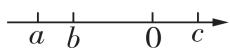

A. $2c - b$

B. -b

C. b

D. $-2a - b$

满分:100 分

电子错题本

9. 如图, 在数学课上, 老师用 5 个完全相同的小长方形在无重叠的情况下拼成了一个大长方形, 已知小长方形的长为 $\sqrt{27}$ , 宽为 $\sqrt{12}$ , 下列是四位同学对该大长方形的判断, 其中不正确的是 ( )

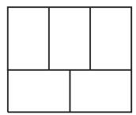

A. 大长方形的长为 $6 \sqrt{3}$

B. 大长方形的宽为 $5 \sqrt{3}$

C. 大长方形的周长为 $11 \sqrt{3}$

D. 大长方形的面积为 90

10. 若 $6 - \sqrt{13}$ 的整数部分为 x，小数部分为 y，则 $(2x + \sqrt{13})y$ 的值是（）

A. $5 - 3\sqrt{13}$

B. 3

C. $3 \sqrt{13} - 5$

D. -3

# 二、填空题(本大题共5小题,每小题3分,共15分)

11. 新趋势·条件开放 写出一个正整数 m，使 $\sqrt{4m}$ 是整数：\_\_\_\_。

12. 如果 a<0, b<0, 且 a-b=6, 那么 $\sqrt{a^{2}} - \sqrt{b^{2}}$ 的值是 \_\_\_\_.

13. 我国南宋著名数学家秦九韶和古希腊几何学家海伦分别提出利用三角形的三边求面积的公式并加以证明,人们把这个公式称为海伦-秦九韶公式. 即如果一个三角形的三边长分别为 $a, b, c$ , 记 $p = \frac{a + b + c}{2}$ , 那么三角形的面积 $S = \sqrt{p(p - a)(p - b)(p - c)}$ . 若 $\triangle ABC$ 的三边长分别为 4,5,7, 则利用海伦-秦九韶公式可求出 $\triangle ABC$ 的面积为 \_\_\_\_.

14. 已知 $a + b = -7, ab = 4$ ，则 $\sqrt{\frac{a}{b}} + \sqrt{\frac{b}{a}}$ 的值为．

15. 对于任意不相等的两个数 a, b, 定义一种运算※如下: $a \otimes b = \frac{\sqrt{a + b}}{a - b}$ , 如 $5 \otimes 4 = \frac{\sqrt{5 + 4}}{5 - 4} = 3$ , 那么

$(2 - \sqrt{3})$ ※(7※5) =

# 选择题、填空题答题区

<table><tr><td>1</td><td>2</td><td>3</td><td>4</td><td>5</td><td>6</td><td>7</td><td>8</td><td>9</td><td>10</td></tr><tr><td></td><td></td><td></td><td></td><td></td><td></td><td></td><td></td><td></td><td></td></tr><tr><td colspan="10">11._ 12._ 13._14._ 15._</td></tr></table>

# 三、解答题(本大题共6小题,共55分)

16. (6 分) 计算:

(1)(3 分) $\sqrt{12} \times \sqrt{\frac{1}{3}} - \sqrt{18} + |\sqrt{2} - 2|$ ;

(2)(3 分) $(7+4\sqrt{3})(7-4\sqrt{3})-(\sqrt{3}-1)^{2}$ .

17. (8 分) 已知 $a = 2 + \sqrt{6}$ , $b = 2 - \sqrt{6}$ , 求下列式子的值:

(1) $a^{2}-3ab+b^{2}$ ;   
(2) $(a + 1)(b + 1)$ .   
(1) $a^{2}-3ab+b^{2}$ ;   
(2) $(a + 1)(b + 1)$ .

17. (8 分) 已知 $a = 2 + \sqrt{6}$ , $b = 2 - \sqrt{6}$ , 求下列式子的值:

18.（8分）新趋势·过程性学习 先化简,再求值: $2a + \sqrt{a^{2} - 8a + 16}$ ,其中 a = 3.

小亮和小颖在解答时产生了不同意见,具体如下.

小亮的解答过程如下.

解: $2a + \sqrt{a^{2} - 8a + 16}$

$$
= 2 a + \sqrt {(a - 4) ^ {2}} \quad \dots \dots (\text {第一步})
$$

$$
= 2 a + a - 4 \dots \dots \text {(第二步)}
$$

$$
= 3 a - 4. \quad \dots\dots\tag {第三步}
$$

当 $a = 3$ 时，

原式 $= 3 \times 3 - 4 = 5.$ ……（第四步）

小颖为检验小亮的做法是否正确,她将 a=3 直接代入原式中:

$$
2 a + \sqrt {a ^ {2} - 8 a + 1 6}
$$

$$
= 6 + \sqrt {9 - 2 4 + 1 6}
$$

$$
= 6 + 1
$$

$$
= 7.
$$

由此,小颖认为小亮的解答有错误,你认为小亮的解答有错误吗?如果有,错在哪一步?并给出正确的完整的解答过程.

19.(9分)定义:若两个二次根式a,b满足ab=c,且c是有理数,则称a与b是关于c的共轭二次根式.

(1) 若 $a$ 与 $\sqrt{2}$ 是关于 4 的共轭二次根式, 则 $a = 2\sqrt{2}$ ;  
(2) 若 $2 + \sqrt{3}$ 与 $4 + \sqrt{3} m$ 是关于 2 的共轭二次根式, 求 $m$ 的值.

20. (12 分) 如图, 某居民小区有一块长方形绿地, 长方形绿地的长 BC 为 $8\sqrt{3}$ m, 宽 AB 为 $\sqrt{98}$ m, 现要在长方形绿地中修建一个长方形花坛(即图中阴影部分), 长方形花坛的长为 $(\sqrt{13} + 1)$ m, 宽为 $(\sqrt{13} - 1)$ m.

(1)长方形ABCD的周长为多少？（结果化为最简二次根式）  
(2)除去修建花坛的地方,其他地方全修建成通道,通道上要铺上造价为6元/ $m^{2}$ 的地砖,若要铺完整个通道,则购买地砖需要花费多少元?(结果化为最简二次根式)

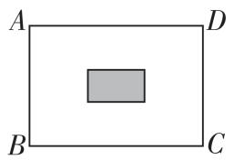

21. (12 分)著名数学教育家 G·波利亚有句名言:“发现问题比解决问题更重要。”这句话启发我们:要想学会数学,就需要观察,发现问题,探索问题的规律性东西,要有一双敏锐的眼睛.请先阅读下列材料,再解决问题:

数学上有一种根号内又带根号的数,它们能通过完全平方公式及二次根式的性质化去里面的一层根号.

例如： $\sqrt{3 + 2\sqrt{2}} = \sqrt{1 + 2\times 1\times\sqrt{2} + 2} =$ $\sqrt{1^2 + 2\times 1\times\sqrt{2} + (\sqrt{2})^2} = \sqrt{(1 + \sqrt{2})^2} = 1 + \sqrt{2}.$ 解决问题：

(1) 化简: $\sqrt{14 + 6\sqrt{5}} =$ \_\_\_\_ ;   
(2) 根据上述思路, 化简并求出 $\sqrt{28 - 10\sqrt{3}} + \sqrt{7 + 4\sqrt{3}}$ 的值;  
(3) 若 $a + 4\sqrt{3} = (m + n\sqrt{3})^2$ ，且 $a, m, n$ 均为正整数，求 $a$ 的值.

# 2 | 第二十章综合能力测评卷

时间:90 分钟

# 一、选择题(本大题共10小题,每小题3分,共30分)

1. 如图, 在 $\triangle ABC$ 中, $\angle C = 90^{\circ}$ , 若 AC = 1,
AB = 2, 则 BC 的长是 ( )

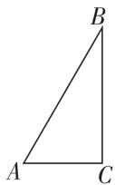

A.1

B. $\sqrt{3}$

C. 2

D. $\sqrt{5}$

2. 在 $\triangle ABC$ 中, $\angle A, \angle B, \angle C$ 的对边分别为 $a, b, c$ , 且 $a^2 - b^2 = c^2$ , 则下列说法正确的是 ( )

A. $\angle A$ 是直角

B. $\angle B$ 是直角

C. $\angle C$ 是直角

D. $\angle A$ 是锐角

3. 下列几组数中, 是勾股数的是 ( )

A. $\frac{3}{5},\frac{4}{5},1$

B. 3,4,6

C. 6,8,10

D. 0.9, 1.2, 1.5

4. 1955 年, 希腊为纪念毕达哥拉斯学派发行了如图 1 所示的邮票, 图案中间的直角三角形由三个正方形的顶点相连构成. 图 2 是小华模仿这个图形结构所画的图, 则图 2 中三个正方形的面积可能的取值为 ( )

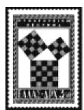  
图1

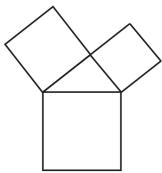  
图 2

A. 2,3,4

B. 5,6,11

C. 6,8,10

D. 7,12,14

5. 如图, 下列四个三角形均为正方形网格图中的格点三角形, 其中不是直角三角形的是 ( )

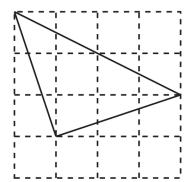  
A

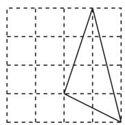  
B

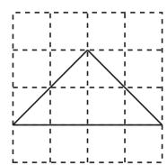  
C

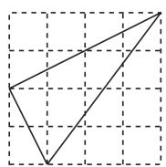  
D

6. 如图, 长方形 ABCD 的顶点 A, B 在数轴上, 点 A 表示的数为 -1, AB = 3, AD = 1. 若以点 A 为圆心, 对

满分:100 分

电子错题本

角线 AC 的长为半径作弧, 交数轴正半轴于点 M, 则点 M 表示的数为 ( )

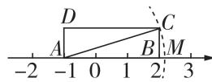

A. $\sqrt{10} + 1$

B. $\sqrt{10}$

C. $\sqrt{10} - 2$

D. $\sqrt{10} - 1$

7. 如图, 已知钓鱼竿 AC 的长为 10 m, 露在水面上的鱼线 BC 的长为 6 m, 某钓鱼者想看看鱼钩上的情况, 把鱼竿 AC 转动到 $AC'$ 的位置, 此时露在水面上的鱼线 $B'C'$ 的长为 8 m, 则 $BB'$ 的长为 ( )

A. 1 m

B. 2 m

C. 3 m

D. 4 m

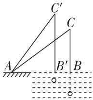  
第7题图

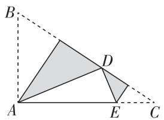  
第8题图

8. 如图, 在三角形纸片 ABC 中, $\angle BAC = 90^{\circ}, AB = 2$ , AC = 3, 沿过点 A 的直线将纸片折叠, 使点 B 落在边 BC 上的点 D 处; 再折叠纸片, 使点 C 与点 D 重合, 若折痕与 AC 的交点为 E, 则 AE 的长是 ( )

A. $\frac{13}{6}$

B. $\frac{5}{6}$

C. $\frac{7}{6}$

D. $\frac{6}{5}$

9. 新趋势·数学文化 意大利著名画家达·芬奇用如图所示的方法证明了勾股定理. 若设图 1 中空白部分的面积为 $S_{1}$ , 图 3 中空白部分的面积为 $S_{2}$ , 则下列表示 $S_{1}, S_{2}$ 的等式成立的是 ( )

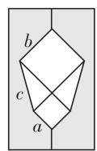  
图 1

剪开

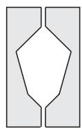  
图 2

右边部分
上下翻转

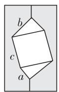  
图 3

A. $S_{1}=a^{2}+b^{2}+2ab$

B. $S_{1} = a^{2} + b^{2} + ab$

C. $S_{2} = c^{2}$

D. $S_{2} = c^{2} + \frac{1}{2} ab$

10. 勾股定理是人类早期发现并证明的重要数学定理之一, 是数形结合的重要纽带. 数学家欧几里得利用如图验证了勾股定理. 以 Rt $\triangle ABC$ ( $\angle ACB = 90^{\circ}$ ) 的三条边为边向外作正方形 $ABED$ 、正方形 $ACHI$ 、正方形 $BCGF$ , 连接 $CE$ . 若 $S_{\text{正方形}ABED} = 25$ , $S_{\text{正方形}BCGF} = 16$ , 则 $CE$ 的长为 ( )

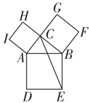

A. $\sqrt{34}$

B. $\sqrt{41}$

C. $\sqrt{65}$

D. $\sqrt{55}$

# 二、填空题(本大题共5小题,每小题3分,共15分)

11. 如图, 长为 $3 \, m$ 的梯子靠在墙上, 梯子的底端离墙脚线的距离为 $1.8 \, m$ , 则梯子顶端的高度 h 为 \_\_\_\_ m.

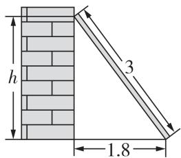

12. 已知 a, b, c 分别是 $\triangle ABC$ 的三边长，且满足 $\sqrt{c^{2}-a^{2}-b^{2}} + |a - b| = 0$ ，则 $\triangle ABC$ 的形状为 \_\_\_\_.

13. 如图 1, 由五个边长为 1 的小正方形组成的卡纸, 可以将它剪拼出一个大正方形, 如图 2 所示, 则这个大正方形的边长为 \_\_\_\_.

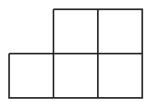  
图 1

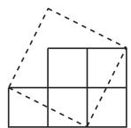  
图 2

14. 如图, $OA = \sqrt{13}, AB = \sqrt{26}, B(-2,3), O$ 是坐标原点, 则 $\angle OAB$ 的度数是 \_\_\_\_.

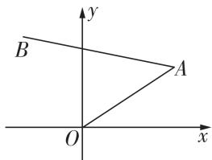

15. 如图所示的是长方体透明玻璃鱼缸, 假设其长 $AD = 80 \mathrm{~cm}$ , 高 $AB = 60 \mathrm{~cm}$ , 水深 $AE = 40 \mathrm{~cm}$ . 在水面上紧贴内壁的 $G$ 处有一块面包屑, 点 $G$ 在水面线 $EF$ 上, 且 $EG = 60 \mathrm{~cm}$ , 一只蚂蚁想从鱼缸外的点 $A$ 沿鱼缸壁爬到鱼缸内的 $G$ 处吃面包屑, 则蚂

蚁爬行的最短路程为 \_\_\_\_ cm. (鱼缸的各种厚度不计)

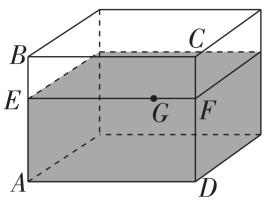  
选择题、填空题答题区

<table><tr><td>1</td><td>2</td><td>3</td><td>4</td><td>5</td><td>6</td><td>7</td><td>8</td><td>9</td><td>10</td></tr><tr><td></td><td></td><td></td><td></td><td></td><td></td><td></td><td></td><td></td><td></td></tr><tr><td colspan="10">11._ 12._ 13._</td></tr><tr><td colspan="10">14._ 15._</td></tr></table>

# 三、解答题(本大题共6小题,共55分)

16. (6 分) 如图, 在 $\triangle ABC$ 中, $CD \perp AB$ 于点 $D$ . 若 $AC = \sqrt{34}, CD = 5, BC = 13$ , 求 $AB$ 的长.

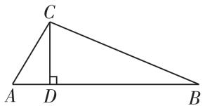

17.(8分)如图,绿地广场有一块四边形空地将进行绿化, $AC=8\ m,BC=6\ m,DE\perp AB$ 交AB边于点D, $DE=5\ m,\triangle ABE$ 的面积为 $25\ m^{2}$ .请计算:

(1) 这块四边形空地的对角线 AB 的长度;  
(2) 这块四边形空地的面积.

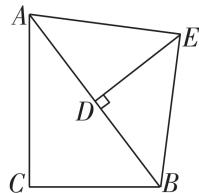

18.(8 分)在数学活动课上,老师让学生用勾股定理内容设计一个测量旗杆的高度的方案.下面是小明同学的设计方案,请根据小明的设计方案计算出旗杆的高度.

<table><tr><td>课题</td><td>测量学校旗杆的高度</td></tr><tr><td>工具</td><td>皮尺</td></tr><tr><td>方案</td><td>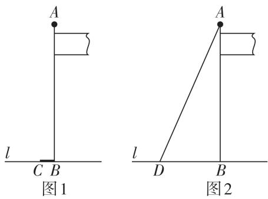测量过程步骤一:如图1,线段AB表示旗杆高度,AB垂直地面于点B,将系在旗杆顶端的绳子垂直到地面,并多出了一段BC,用皮尺测出BC的长度;步骤二:如图2,将绳子拉直,并且使绳子末端D处恰好接触地面,用皮尺测出BD的距离.</td></tr><tr><td rowspan="2">数据</td><td>绳子垂到地面多出的部分BC为1米.</td></tr><tr><td>绳子末端D到旗杆的水平距离BD为5米.</td></tr></table>

19. (9 分) 定义: 如图, 点 M, N 把线段 AB 分割成 AM, MN, NB, 若以 AM, MN, NB 为边的三角形是一个直角三角形, 则称点 M, N 是线段 AB 的勾股分割点.

(1) 若 $AM = 2.5, MN = 6.5, BN = 6$ ，则点 $M, N$ 是线段 $AB$ 的勾股分割点吗？请说明理由。  
(2)已知点 M, N 是线段 AB 的勾股分割点, 且 AM 为直角边, 若 AB = 30, AM = 5, 求 BN 的长.

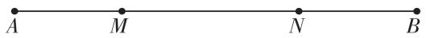

20. (12 分)某市夏季经常受台风天气影响, 台风是一种自然灾害, 它以台风中心为圆心在周围上千米的范围内形成极端气候, 有极强的破坏力. 如图, 有一台风中心沿东西方向 AB 由点 A 行驶向点 B, 已知点 C 为一海港, 当 $AC \perp BC$ 时, 点 A 到 B, C 两点的距离分别为 500 km 和 300 km, 以台风中心为圆心, 周围 250 km 以内为受影响区域.

(1) 求 BC 的长.  
(2)海港 C 受台风影响吗？为什么？  
(3)若台风的速度为 $35 \, km/h$ ，则台风影响海港 C 持续的时间为多长？

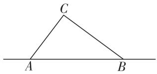

21. (12 分) 新考法 勾股定理是几何学中的明珠, 充满着魅力. 千百年来, 证明勾股定理的方法层出不穷, 以下为勾股定理的一种证法:

把两个全等的直角三角形 $(\mathrm{Rt}\triangle ABC\cong\mathrm{Rt}\triangle DAE)$ 如图1放置, $\angle DAB=\angle B=90^{\circ},AC\perp DE$ ,点E在边AB上,设Rt△ABC两直角边AB=a,BC=b,斜边AC=c,用a,b,c分别表示出梯形ABCD、四边形AECD、△EBC的面积,再探究这三个图形面积之间的关系,可得到勾股定理.

(1)请根据上述图形的面积关系证明勾股定理;   
(2)如图2,铁路上A,B两点(看作直线上的两点)相距40千米,C,D为两个村庄(看作直线上的两点), $AD\perp AB$ , $BC\perp AB$ ,垂足分别为A,B,AD=25千米,BC=16千米,则这两个村庄之间的距离为\_\_\_\_千米;  
(3)在(2)的背景下,若要在AB上建造一个供应站P,使得PC=PD,请用尺规作图在备用图中作出点P的位置并求出AP的距离.(保留作图痕迹,不写作法)

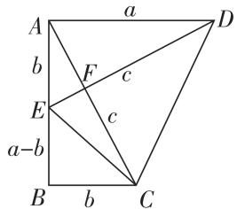  
图1

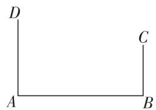  
图 2

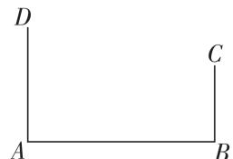  
备用图

# 3 | 第二十一章综合能力测评卷

时间:90 分钟

# 一、选择题(本大题共10小题,每小题3分,共30分)

1. 在实际生活中,我们经常利用四边形的不稳定性,如图,实物图中利用了四边形的不稳定性的图形个数为 (C)

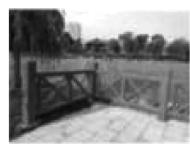  
栅栏

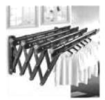  
可伸缩晾衣架

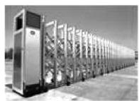  
电动伸缩门

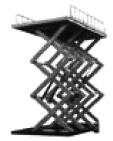  
升降平台

A.1

B. 2

C. 3

D. 4

2. 每一个外角都是 $72^{\circ}$ 的正多边形为 （）

A. 正三角形

B. 正四边形

C. 正五边形

D. 正六边形

3. 如图, 在菱形 AOBC 中, 点 C 的坐标是 $(6,0)$ , 点 A 的纵坐标是 1, 则点 B 的坐标是 ( )

A. $(3,1)$

B. $(3,-1)$

C. $(1,-3)$

D. $(1,3)$

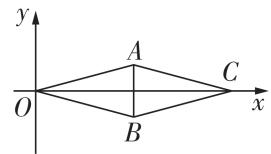  
第3题图

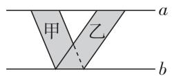  
第4题图

4. 如图, a, b 是两条平行线, 则平行四边形甲、乙的面积关系是 ( )

A. $S_{\text{甲}} > S_{\text{乙}}$

B. $S_{\text{甲}} = S_{\text{乙}}$

C. $S_{甲} < S_{乙}$

D. 无法确定

5. 小明在复习时, 将几种特殊四边形的关系整理如图, (1)(2)(3)(4) 处需要添加条件, 则下列条件添加错误的是 ( )

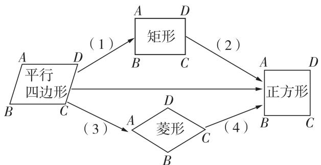

<details>
<summary>flowchart</summary>

```mermaid
graph TD
    A["平行四边形"] -->|A| B["矩形"]
    A -->|B| C["正方形"]
    A -->|C| D{菱形}
    D -->|D| B
    D -->|C| C
    D -->|A| B
    D -->|3| A
    B -->|(1)| A
    B -->|(2)| A
    B -->|(4)| C
```
</details>

A. (1) 处可填 $\angle A = 90^{\circ}$

B.(2)处可填AD=AB

C. (3) 处可填 DC = CB

D. (4) 处可填 $\angle B = \angle D$

满分:100 分

电子错题本

6. 如图, 在平行四边形 ABCD 中, AB = 8, 对角线 AC, BD 交于点 O, 点 P 是 AB 的中点, 连接 DP, 点 E 是 DP 的中点, 连接 OE, 则 OE 的长是 ( )

A.1

B. $\frac{3}{2}$

C. 2

D. 4

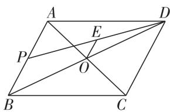  
第6题图

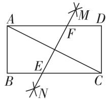  
第7题图

7. 如图, 在矩形 ABCD 中, 分别以点 A, C 为圆心, 大于 $\frac{1}{2}AC$ 的长为半径作弧, 两弧相交于点 M, N, 作直线 MN, 交 BC 于点 E, 交 AD 于点 F, 若 BE = 3, AF = 5, 则矩形 ABCD 的周长为 ( )

A.8

B. 20

C. 24

D. 30

8. 如图, 菱形 ABCD 的面积为 10, 点 E, F, G, H 分别为 AB, BC, CD, DA 的中点, 则四边形 EFGH 的面积为 ( )

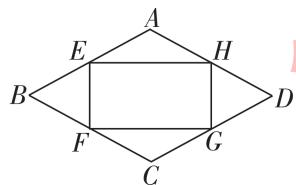

A. $\frac{5}{2}$

B. 5

C. 4

D. 8

9. 如图, 以矩形 ABCD 的顶点 A 为圆心, AD 的长为半径作弧, 交 CB 的延长线于点 E, 过点 D 作 $DF \parallel AE$ 交 BC 于点 F, 连接 AF. 若 AB = 4, AD = 5, 则 AF 的长是 ( )

A. $2\sqrt{5}$

B. $3\sqrt{5}$

C. 3

D. $3\sqrt{3}$

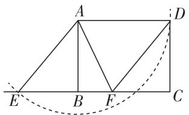  
第9题图

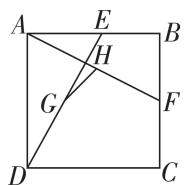  
第10题图

10. 如图, 在正方形 ABCD 中, AB = 4, E, F 分别为边 AB, BC 的中点, 连接 AF, DE, G, H 分别为 DE, AF 的中点, 连接 GH, 则 GH 的长为 ( )

A. $\frac{\sqrt{2}}{2}$

B. 1

C. $\sqrt{2}$

D. 2

# 二、填空题(本大题共5小题,每小题3分,共15分)

11. 如图, 有机化合物苯的结构式可以抽象为一个正六边形. 过该图形的一个顶点最多可以引\_\_条对角线.

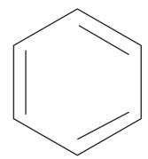  
第11题图

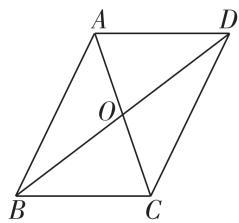  
第 12 题图

12. 新趋势·条件开放 如图, 在平行四边形 ABCD 中, 对角线 AC, BD 相交于点 O, 请添加一个条件: \_\_\_\_, 使平行四边形 ABCD 为菱形.

13. “方胜”是中国古代妇女的一种发饰, 其图案由两个全等的菱形相叠组成, 寓意是同心吉祥. 如图, 将边长为 $2 \mathrm{~cm}$ 的菱形ABCD沿对角线BD方向平移 $1 \mathrm{~cm}$ 得到菱形 $A'B'C'D'$ , 形成一个“方胜”图案, 若 $\angle A = 90^{\circ}$ , 则点 $D, B'$ 之间的距离为 \_\_\_\_.

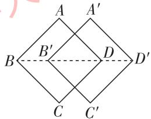  
第 13 题图

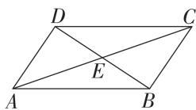  
第14题图

14. 如图, 在四边形ABCD中, 对角线AC, BD相交于点E, $\angle CBD = 90^{\circ}$ , BC = 4, BE = ED = 3, AC = 10, 则四边形ABCD的面积为\_\_\_\_.

15. 如图, 分别以 $\triangle ABC (\angle BAC \neq 60^{\circ})$ 的三边为边长, 在 BC 同侧作等边三角形 ACD, 等边三角形 ABE, 等边三角形 BCF, 连接 EF, DF. 给出以下结论:

①四边形 ADFE 是平行四边形；  
②当 $\angle BAC=150^{\circ}$ 时,四边形ADFE是矩形;   
③当 AB = AC 时, 四边形 ADFE 是菱形;  
④当 AB = AC，且 $\angle BAC = 150^{\circ}$ 时，四边形 ADFE 是正方形.

以上结论正确的有\_\_\_\_（填序号）.

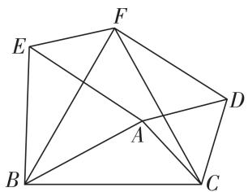

选择题、填空题答题区 

<table><tr><td>1</td><td>2</td><td>3</td><td>4</td><td>5</td><td>6</td><td>7</td><td>8</td><td>9</td><td>10</td></tr><tr><td></td><td></td><td></td><td></td><td></td><td></td><td></td><td></td><td></td><td></td></tr><tr><td colspan="10">11._ 12._</td></tr><tr><td colspan="10">13._ 14._ 15._</td></tr></table>

# 三、解答题(本大题共6小题,共55分)

16. (6 分)一个正多边形的每个外角都等于它的相邻内角的 $\frac{1}{4}$ , 求这个正多边形的边数及内角和.

17. (8 分) 如图, 在 $\square ABCD$ 中, 点 $E, F$ 分别在 $AB, CD$ 上, $\angle BED = \angle BFD$ .

(1) 求证: 四边形 BEDF 是平行四边形.  
(2) 若 $AB = 8, AD = 4, \angle A = 60^{\circ}$ , 当 $AE$ 的长为 \_\_\_\_ 时, 四边形 $BEDF$ 是菱形.

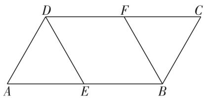

18. (8 分) 如图, E, F 是正方形 ABCD 的对角线 BD 上的两点, BD = 10, DE = BF, 连接 AE, AF, CE, CF.

(1) 求证: $\triangle ADE \cong \triangle CBF$ .   
(2) 若四边形 AECF 的周长为 $4 \sqrt{34}$ ，求 EF 的长.

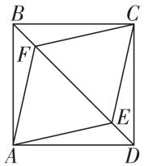

20. (12 分) 如图, 在矩形 ABCD 中, BC 边上有一点 E, 连接 AE, 若 $AD = 12 \, cm, AB = 3 \, cm, AE = 5 \, cm$ .

(1) 求 CE 的长.  
(2)有一点 P 从点 A 出发,以 2 cm/s 的速度沿 AD 向点 D 运动,有一点 Q 从点 C 出发,以 4 cm/s 的速度沿 CB 向点 B 运动,当点 Q 到达点 B 时,点 P,Q 同时停止运动,设点 P 的运动时间为 t s.

①t = \_\_\_\_ 时, 四边形 AEQP 为平行四边形.

②t = \_\_\_\_时,四边形 ABQP 为矩形.

(3)有一点 M 从点 D 出发,以 2 cm/s 的速度沿 DA 向点 A 运动,有一点 N 从点 B 出发,以 4 cm/s 的速度沿射线 BC 运动,当点 M 到达点 A 时,点 M,N 同时停止运动,设点 M 的运动时间为 x s,当 x 取何值时,以 M,N,C,D 为顶点的四边形为平行四边形?

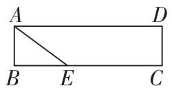

  
备用图

19. (9 分) 如图, 菱形 ABCD 的对角线 AC, BD 相交于点 O, E 是 AD 的中点, 点 F, G 在 AB 上, $EF \perp AB$ , $OG \parallel EF$ .

(1) 求证: 四边形 OEFG 是矩形.  
(2) 若 AD = 10, EF = 4, 求 OE 和 BG 的长.


21. (12 分) 在 $\triangle ABC$ 中, $\angle BAC = 90^{\circ}$ , $AB = AC$ , $D$ 为直线 $BC$ 上一动点 (点 $D$ 不与 $B, C$ 重合), 以 $AD$ 为边在 $AD$ 右侧作正方形 $ADEF$ , 连接 $CF$ .

(1) 探究猜想: 如图 1, 当点 D 在线段 BC 上时,

①BC 与 CF 的位置关系为 \_\_\_\_.  
②BC, CD, CF 之间的数量关系为 \_\_\_\_.

(2) 深入思考: 如图 2, 当点 D 在线段 CB 的延长线上时, 结论①②是否仍然成立? 若成立, 请给予证明; 若不成立, 请你写出正确结论再给予证明.  
(3) 拓展延伸: 如图 3, 当点 D 在线段 BC 的延长线上时, 正方形 ADEF 的两条对角线 AE, DF 交于点 O. 若 $AB = 4\sqrt{2}$ , $CD = \frac{1}{4}BC$ , 求 OC 的长.

  
图1

  
图2

  
图 3

# 4 | 第二十二章综合能力测评卷

时间:90 分钟

# 一、选择题(本大题共10小题,每小题3分,共30分)

1. 在圆周长公式 $C = 2\pi r$ 中(其中 r 表示半径, C 表示周长), 常量与变量分别是 ( )

A. 常量是 2, 变量是 $\pi, r$   
B. 常量是 2, 变量是 C, r  
C. 常量是 $2, \pi$ , 变量是 $C, r$   
D. 常量是 $2, \pi$ , 变量是 $r$

2. 函数 $y = \frac{9 - 2x}{x - 5}$ 的自变量 $x$ 的取值范围是（）

A. $x > 5$

B. $x <   5$

C. $x \geqslant 5$

D. $x \neq 5$

3. 观察下列表格和图象, 判断正确的是 ( )

<table><tr><td>x</td><td colspan="2">-2</td><td colspan="2">1</td></tr><tr><td> $y_1$ </td><td>1</td><td>2</td><td>3</td><td>4</td></tr></table>


A. $y_{1}$ 是 x 的函数, $y_{2}$ 不是 x 的函数  
B. $y_{1}$ 和 $y_{2}$ 都是 $x$ 的函数  
C. $y_{1}$ 不是 x 的函数, $y_{2}$ 是 x 的函数  
D. $y_{1}$ 和 $y_{2}$ 都不是 $x$ 的函数

4. 如图, 曲线表示一只蝴蝶在飞行过程中离地面的高度 $h(\mathrm{~m})$ 随飞行时间 $t(\mathrm{~s})$ 的变化情况, 则这只蝴蝶飞行的最高高度为 ( )

A. 5 m

B. 7 m

C. 10 m

D. 13 m

5.4 月 19 日,2025 年北京亦庄半程马拉松暨人形机器人半程马拉松开赛,这场赛事吸引了多家企业和高校自研团队的参与,成为人工智能与机器人领域的焦点.机器人爱好者小刚同学为了解某种搬运机器人的工作效率,将一台机器人的搬运时间 $x(\mathrm{h})$ 和搬运货物的质量 $y(\mathrm{kg})$ 的几组对应值记录如下表:

<table><tr><td>搬运时间 x/h</td><td>1</td><td>2</td><td>3</td><td>4</td><td>...</td></tr><tr><td>搬运货物的质量 y/kg</td><td>60</td><td>120</td><td>180</td><td>240</td><td>...</td></tr></table>

则 $y$ 与 $x$ 之间的关系式为 （）

A. $y = 60 + x$

B. y = 60x

C. y = 80x

D. $y = 20 + 40x$

满分:100 分

电子错题本

6. 跨学科·语文《司马光》中记载:群儿戏于庭,一儿登瓮,足跌没水中.众皆弃去,光持石击瓮破之,水迸,儿得活.比较符合故事情节的是()

  
A

  
B

  
C

  
D

7. 某商场为了增加销售额, 推出“五月销售大酬宾”活动, 其活动内容为“凡五月份在该商场一次性购物超过 50 元以上者, 超过 50 元的部分按 9 折优惠”. 在大酬宾活动中, 李明到该商场为单位购买单价为 30 元的办公用品 x 件 (x > 2), 则应付货款 y (元) 与商品件数 x 的函数关系式是 ( )

A. $y = 27x(x > 2)$

B. $y = 27x + 5 (x > 2)$

C. $y = 27x + 50 (x > 2)$

D. $y = 27x + 45 (x > 2)$

8. 根据如图所示程序计算函数值, 若输入的 x 的值为 $\frac{1}{2}$ , 则输出的函数值为 ( )


<details>
<summary>flowchart</summary>


</details>

A. $-\frac{1}{2}$

B. $\frac{1}{4}$

C. 1

D. $\frac{25}{4}$

9. 纯电动汽车续航里程取决于车载动力电池容量的大小. 某品牌汽车采用智能快速充电模式进行充电,


当充电量达到电池容量的 80% 时,为保护电池,充电速度会明显降低并保持匀速充电模式.如图是该款电动汽车某次充电时,汽车电池含电率 y 随充电时间 x (min) 变化的函数图象,根据图象,下列说法错误的是()

A. 本次充电开始时汽车电池内仅剩 $10\%$ 的电量  
B. 当汽车电池含电率达到 80% 时, 充电用时 40 min  
C. 本次充电持续时间是 $120 \mathrm{~min}$   
D. 若汽车电池从无电状态到充满电状态需要耗电 80 千瓦时, 则本次充电耗电 70 千瓦时

10. 如图 1, 在 Rt△ABC 中, 动点 P 沿 A→B→C 运动, 到点 C 后停止, 速度为每秒 2 个单位长度, 其中 BP 的长与运动时间 t(s) 的关系如图 2, 则 AC 的长为 ( )

  
图1  
图2

A. $\frac{15\sqrt{5}}{2}$

B. $\sqrt{427}$

C. 17

D. $5\sqrt{3}$

# 二、填空题(本大题共5小题,每小题3分,共15分)

11. 一个长方形的一条边长为 $x \mathrm{~cm}$ , 另一条边长为 $3 \mathrm{~cm}$ , 它的面积为 $S \mathrm{~cm}^{2}$ , 则 $S$ 与 $x$ 之间的关系式为 \_\_\_\_.  
12. 新趋势·结论开放 分析图中反映的变量之间的关系图象,写出一个符合它的实际情境: \_\_\_\_.

  
第 12 题图

  
第13题图

13. 若小航家、花鸟市场和学校在同一条直线上, 如图反映的过程是小航从学校去花鸟市场买花, 然后回家, 图中 x 表示时间, y 表示小航离家的距离. 小航从花鸟市场回家时的速度为 \_\_\_\_ km/min.  
14. 如图, 大拇指与小拇指尽量张开时, 两指尖的距离称为指距. 某项研究表明, 一般情况下人的身高 $y(\mathrm{cm})$ 是指距 $x(\mathrm{cm})$ 的一次函数, 下表是指距 $x$ 与身高 $y$ 的几组对应值:

<table><tr><td>指距x/cm</td><td>16</td><td>18</td><td>20</td><td>22</td></tr><tr><td>身高y/cm</td><td>133</td><td>151</td><td>169</td><td>187</td></tr></table>


小明的身高是 $160 \, cm$ ，一般情况下，他的指距约是 \_\_\_\_ cm.

15. 甲、乙两人从 A, B 两地同时出发相向而行, 乙到达 A 地后立即返回 B 地, 两人与 A 地的距离 s (km) 与所用时间 t (min) 之间的函数关系如图所示, 则甲、乙两人在途中两次相遇的间隔时间为 \_ min.

  
选择题、填空题答题区

<table><tr><td>1</td><td>2</td><td>3</td><td>4</td><td>5</td><td>6</td><td>7</td><td>8</td><td>9</td><td>10</td></tr><tr><td></td><td></td><td></td><td></td><td></td><td></td><td></td><td></td><td></td><td></td></tr><tr><td colspan="10">11. 12.</td></tr><tr><td colspan="10">13. 14. 15.</td></tr></table>

# 三、解答题(本大题共6小题,共55分)

16.(6 分)下表是某报纸公布的世界人口总数的情况(人口总数为大约值):

<table><tr><td>年份</td><td>1957</td><td>1974</td><td>1987</td><td>1999</td><td>2010</td><td>2024</td></tr><tr><td>人口总数</td><td>30亿</td><td>40亿</td><td>50亿</td><td>60亿</td><td>70亿</td><td>81亿</td></tr></table>

(1)表中有几个变量?   
(2) 如果用 $x$ 表示年份, 用 $y$ 表示世界人口总数, 那么随着 $x$ 的变化, $y$ 的变化趋势是怎样的?

17. (8 分) 不画函数 $y = -\frac{1}{3} x^3 + 2$ 的图象.

(1) 判断 $A(0,2)$ , $B(2,0)$ 两点是否在该函数的图象上.   
(2) 若点 $P_{1}(a,0)$ , $P_{2}(-\frac{3}{2},b)$ 都在该函数的图象上, 试求 a, b 的值.

19.(9 分)一艘冲锋舟 A 从甲地匀速航行到乙地,到达乙地后随即匀速返回.该冲锋舟在往返过程中离甲地的距离 $y(\text{km})$ 与行驶时间 $x(\text{h})$ 之间的函数图象如图 1 所示,请根据图象解答下列问题:

  
图 1

  
图 2

(1) 甲、乙两地间的距离是 \_\_\_\_ km, 往返共用时 h;  
(2) 若冲锋舟 A 从甲地到乙地的速度是 $v_{1} \, km/h$ ，返回时从乙地到甲地的速度是 $v_{2} \, km/h$ ，则 $v_{1}$ 与 $v_{2}$ 的关系是 $v_{1}$ \_\_\_\_ $v_{2}$ （填“>”“<”或“=”）；  
(3)如图2,若冲锋舟A从甲地去往乙地用时2 h,另有一艘冲锋舟B以25 km/h的速度与冲锋舟A同时从甲地出发前往乙地,求冲锋舟A出发后多长时间与冲锋舟B相遇.

18. (8 分) 已知点 $A(6,0)$ 及在第一象限的动点 $P(x, 10 - x)$ , 设 $\triangle OPA$ 的面积为 $S$ .

(1) 求 S 关于 x 的函数解析式及 x 的取值范围;  
(2) 画出 S 关于 x 的函数图象.

20. (12 分)某学校在操场上举办“绑腿跑”比赛,要求每队若干名队员并列立于起跑线后,每相邻的两名队员把腿绑在一起,队员通过协调配合在跑道上共同行进(如图 1).赛前某班队员在长方形比赛场地 ABCD 中(如图 2)进行适应性训练,把这组“绑腿跑”队员表示为图中线段 MN. 线段 MN 可匀速向右或向左平行移动,该组“绑腿跑”队员

从矩形 ABCD 内平行于 AB 边的某地出发向右匀速奔跑 4 s 之后到达终点 CD 边, 停留 3 s 后又向左返回, 匀速平行奔跑直至与 AB 边重合.

  
图1

  
图2

  
图3

  
图4

【问题分析】

(1) 图 3 反映队员奔跑时与 AB 边的距离 $y(\mathrm{~m})$ （即线段 BN 的长度）随时间 $t(\mathrm{~s})$ 变化的情况.

①在这个变化过程中,自变量是\_\_\_\_;   
②当这组队员开始出发时,到 AB 边的距离是 \_\_\_\_ m;  
③当 $0 < t \leqslant 4$ 时, 求该组“绑腿跑”队员向右运动的速度.

【实践探索】

(2) 图 4 反映了队员在奔跑过程中形成矩形 ABNM 的面积 $S(\mathrm{~m}^{2})$ 随时间 $t(\mathrm{~s})$ 变化的情况.

①矩形 ABCD 中 AB 边的长为 \_\_\_\_ m;  
②结合(1)，当 $7\leqslant t\leqslant12$ 时，请写出S与y之间的关系式.

21.(12分)随着科技的进步,机器人的种类日益繁多,应用场景更加广泛.某机器人实验基地的科研人员对新型智能机器人进行测试,测试路线如图1所示(图中各角均为直角).机器人(抽象为一点)R从点A出发,沿 $A\rightarrow B\rightarrow C\rightarrow D\rightarrow E$ 的路线匀速运动,并能够监测 $\triangle ARF$ 区域内的实时情况. $\triangle ARF$ 的面积 $y(\mathrm{m}^{2})$ 与机器人R运动的时间 $x(\mathrm{s})$ 之间的关系如图2所示.若 $AF=6\ m$ .

  
图 1

  
图 2

请根据图象问答下列问题：

(1) 求机器人 R 的运动速度 v;  
(2) 求 $a$ 的值;  
(3) 当 y=21 时, 求 x 的值.

# 5 | 第二十三章综合能力测评卷

电子错题本

时间:90 分钟

# 一、选择题(本大题共10小题,每小题3分,共30分)

1. 下列函数中, 为正比例函数的是 ( )

A. $y = 3x + 1$

B. $y = 3x^{2}$

C. $y = \frac{x}{3}$

D. $y = \frac{3}{x}$

2. 已知直线 $y = kx + b$ 经过第三、第二、第一象限，则 k, b 的取值范围是 ( )

A. k < 0, b < 0

B. k < 0, b > 0

C. k > 0, b < 0

D. k > 0, b > 0

3. 在平面直角坐标系中, 若将直线 y = x - 1 向上平移 m 个单位长度得到直线 $y = x + 1$ , 则 m 的值为 ( )

A.1

B.2

C. 3

D. 4

4. 已知点 $A(-3, m)$ 和点 $B(4, n)$ 都在直线 $y = -3x + b$ 上, 则 $m$ 与 $n$ 的大小关系是 ( )

A. $m > n$

B. $m < n$

C. m = n

D. 无法判定

5. 已知一次函数 $y = ax + b (a \neq 0)$ 的图象经过点 $(3, m)$ ，则关于 x 的一元一次方程 $ax + b = m$ 的解是（）

A. $x = 3$

B. $x = -3$

C. $x = 3$ 或 $x = -3$

D. 不能确定

6. 在一次函数 $y = -5ax + b (a \neq 0)$ 中, y 随 x 的增大而增大, 且 ab > 0, 则点 $A(a, b)$ 在 ( )

A. 第四象限

B. 第三象限

C. 第二象限

D. 第一象限

7. 在同一平面直角坐标系中, 一次函数 $y = ax + a^{2}$ 与 $y = a^{2}x + a (a \neq 0)$ 的图象可能是 ()

  
A

  
B

  
D

8. 在平面直角坐标系中, O 为坐标原点, 若直线 y = x + 3 分别与 x 轴、直线 y = -2x 交于点 A, B, 则 $\triangle AOB$ 的面积为 ( )

A.2

B. 3

C. 4

D. 6

满分:100 分

9. 如图, 一直线与两坐标轴的正半轴分别交于 A, B 两

点, P 是线段 AB 上任意一点(不包括端点), 过点 P 分别作两坐标轴的垂线与两坐标轴围成的矩形的周长为 8, 则直线 AB 的解析式是


A. $y = -x + 4$

B. $y = x + 4$

C. $y = x + 8$

D. $y = -x + 8$

10. 某单位准备印制一批证书, 现有两个印刷厂可供选择, 甲厂费用分为制版费和印刷费两部分, 乙厂直接按印刷数量收取印刷费用. 甲、乙两厂的印刷费用 $y$ (千元)与证书数量 $x$ (千个)的函数关系图象如图所示, 下列三种说法正确的是 ( )

①甲厂的制版费为1千元；

②当印制证书超过2千个时,乙厂的印刷费用为0.2元/个;

③当印制证书8千个时,应选择乙厂,可节省费用500元.


A. ①

B.①②

C. ①③

D. ②③

# 二、填空题(本大题共5小题,每小题3分,共15分)

11. 已知一次函数 $y = -x + b$ 的图象经过点 $P(4,3)$ ，则 $b =$ \_\_\_\_.

12. 新趋势·结论开放 请写出同时满足以下两个条件的一个函数：\_\_\_\_。

①y 随 x 的增大而减小；②函数图象与 y 轴正半轴相交.

13. 如图, 在平面直角坐标系中, 已知矩形 ABCO 的两个顶点 A(4,0), B(4,2), 顶点 C 在 y 轴上, 如果一次函数的图象经过点 A 与点 C, 那么这个一次函数的解析式为


14. 如图, 一束光线从点 $A(-2,5)$ 出发, 经过 $y$ 轴上的点 $B(0,1)$ 反射后经过点 $C(m,n)$ , 则 $2m-n$ 的值是 \_\_\_\_.


<details>
<summary>text_image</summary>

A
y
B
O
x
C
</details>

15. 直线 $y = kx - 2k + 3$ 必经过一点, 则该点的坐标是 \_\_\_\_; 平面直角坐标系中有 $A(-1,0)$ , $B(2,3)$ , $C(7,0)$ 三点, 若直线 $y = kx - 2k + 3$ 将 $\triangle ABC$ 分成面积相等的两部分, 则 k 的值是 \_\_\_\_.

选择题、填空题答题区 

<table><tr><td>1</td><td>2</td><td>3</td><td>4</td><td>5</td><td>6</td><td>7</td><td>8</td><td>9</td><td>10</td></tr><tr><td></td><td></td><td></td><td></td><td></td><td></td><td></td><td></td><td></td><td></td></tr><tr><td colspan="10">11._ 12._</td></tr><tr><td colspan="10">13._ 14._ 15._</td></tr></table>

# 三、解答题(本大题共6小题,共55分)

16. (7 分) 在平面直角坐标系中, 一次函数 $y = kx + b$ ( $k \neq 0$ ) 的图象是由一次函数 $y = -x + 2$ 的图象平移得到的, 且经过点 $A(2,3)$ .

(1) 求一次函数 $y = kx + b$ 的解析式；

(2) 若点 $P(2m, 4m - 1)$ 为一次函数 $y = kx + b$ 图象上的一点, 求 m 的值.

17. (8 分) 已知一次函数 $y = kx + 4 (k \neq 0)$ 的图象经过点 (1,2).

(1) 求 k 的值, 并在如图所示的平面直角坐标系中, 画出函数图象;

(2) 当 $-1 \leqslant x < 3$ 时, 求 y 的取值范围.


<details>
<summary>text_image</summary>

-6 -5 -4 -3 -2 -1 O 1 2 3 4 5 6 x
-1
-2
-3
-4
-5
-6
</details>

18.(9分)某校为学生装一台直饮水器,课间学生到直饮水器打水.他们先同时打开全部的水龙头放水,后来又关闭了部分水龙头.假设前后两人接水间隔时间忽略不计,且不发生泼洒,直饮水器的剩余水量y(升)与接水时间x(分)的函数图象如图,请结合图象回答下列问题:

(1) 当 $x > 5$ 时, 求 $y$ 与 $x$ 之间的函数解析式.  
(2) 假定每人水杯接水 0.7 升, 要使 40 名学生接水完毕, 课间 10 分钟是否够用? 请计算回答.


19.(9 分)某校开展阳光体育大课间活动,需购买一批球类用品.在采购中发现,篮球的单价比足球的单价高20元,用10 000元购买篮球的数量和用8 000元购买足球的数量相同.

(1) 求篮球和足球的单价;  
(2) 学校需购买篮球和足球共 120 个 (两种球都要购买), 足球的数量不能多于篮球数量的 $\frac{2}{3}$ , 设购买篮球 $x$ 个, 总费用为 $y$ 元, 求 $y$ 关于 $x$ 的函数解析式, 并求出 $x$ 的取值范围和总费用最低时的购买方案.

20. (10 分) 新情境 综合与实践

某班同学分三个小组进行“板凳中的数学”的项目式学习研究,第一小组负责调查板凳的历史及结构特点,第二小组负责研究板凳中蕴含的数学知识,第三小组负责汇报和交流.下面是第三小组汇报的部分内容.

# 【背景调查】

图 1 中的板凳又叫“四脚八叉凳”，是中国传统家具，其榫卯结构体现了古人含蓄内敛的审美观。榫眼的设计很有讲究，木工一般用铅笔画出凳面的对称轴，以对称轴为基准向两边各取相同的长度，确定榫眼的位置，如图 2 所示。板凳的结构设计体现了数学的对称美。

# 【收集数据】

小组收集了一些板凳并进行了测量. 设以对称轴为基准向两边各取相同的长度为 $x \mathrm{~mm}$ , 凳面的宽度为 $y \mathrm{~mm}$ , 记录如下:

<table><tr><td>以对称轴为基准向两边各取相同的长度x/mm</td><td>16.5</td><td>19.8</td><td>23.1</td><td>26.4</td><td>29.7</td></tr><tr><td>凳面的宽度y/mm</td><td>115.5</td><td>132</td><td>148.5</td><td>165</td><td>181.5</td></tr></table>

# 【分析数据】

如图 3, 小组根据表中 x, y 的数值, 在平面直角坐标系中描出了各点.

# 【建立模型】

请你帮助小组解决下列问题：

(1) 观察上述各点的分布规律, 它们是否在同一条直线上? 如果在同一条直线上, 求出这条直线所对应的函数解析式; 如果不在同一条直线上, 说明理由.  
(2) 当凳面宽度为 $213 \, mm$ 时, 以对称轴为基准向两边各取相同的长度是多少?


<details>
<summary>text_image</summary>

图 1
榫眼
</details>

图2


<details>
<summary>scatter</summary>

| x/mm | y/mm |
| ---- | ---- |
| 20   | 110  |
| 25   | 130  |
| 30   | 150  |
| 35   | 165  |
| 40   | 180  |
</details>

图3

21.(12 分)如图 1, 在平面直角坐标系中, 直线 AB 与 x 轴交于点 B, 与 y 轴交于点 A, OA = 1, OB = 2OA, 直线 OC: y = x 交直线 AB 于点 C.

(1) 求直线 AB 的解析式及点 C 的坐标.  
(2)如图2,将图1中的 $\triangle AOB$ 沿着射线CO的方向平移,平移后点A,O,B分别对应点D,E,F,设点 $E(m,m)$ .问:直线AB上是否存在点H,使 $\triangle EFH$ 是以线段EF为直角边的等腰直角三角形,若存在,请求出点H的坐标;若不存在,请说明理由.  
(3)如图3,P为直线OC上一动点,且点P在点C的右侧,M,N为x轴上的动点,点N在点M的右侧且MN=1.

①当 $S_{\triangle PCB} = \frac{7}{3}$ 时，点 P 的坐标是 \_\_\_\_.  
②在①的条件下,连接 AM 和 PN,则 $AM + MN + PN$ 的最小值为 \_\_\_\_.

  
图1

  
图2

  
图3

# 6 | 第二十四章综合能力测评卷

时间:90 分钟

# 一、选择题(本大题共10小题,每小题3分,共30分)

1. 某 4S 店今年 1 \~ 5 月新能源汽车的销量(单位: 辆)
如下:25,33,36,31,40,这组数据的平均数是()

A. 34

B. 33

C. 32.5

D. 31

2. 一截葡萄藤上结有五串葡萄, 每串葡萄的数量如图所示(单位: 颗), 则这组数据的中位数为 ( )


A. 32

B. 34

C. 36

D. 37

3. 某班准备从甲、乙、丙、丁四名同学中选一名最优秀的参加禁毒知识比赛, 下表记录了四人 3 次选拔测试的相关数据. 根据表中数据, 应该选择 ( )

<table><tr><td></td><td>甲</td><td>乙</td><td>丙</td><td>丁</td></tr><tr><td>平均分</td><td>95</td><td>93</td><td>95</td><td>94</td></tr><tr><td>方差</td><td>3.2</td><td>3.2</td><td>4.8</td><td>5.2</td></tr></table>

A. 甲

B. 乙

C. 丙

D. 丁

4. “凤凰单枞”以独特的韵味和花香深受广东人喜爱. 在我国传统节日春节前后, 某茶叶经销商对甲、乙、丙、丁四种包装的单枞 (售价、利润均相同) 在这段时间内的销售情况统计如表所示, 最终决定增加乙种包装单枞的进货数量, 影响经销商决策的统计量是 ( )

<table><tr><td>包装</td><td>甲</td><td>乙</td><td>丙</td><td>丁</td></tr><tr><td>销售量/盒</td><td>15</td><td>28</td><td>16</td><td>10</td></tr></table>

A. 方差

B. 平均数

C. 中位数

D. 众数

5. 为了解全市中学生的视力情况,随机抽取某校 50 名学生的视力情况作为其中一个样本,整理样本数据如图,则这 50 名学生视力情况的中位数和众数分别是 ( )


<details>
<summary>bar</summary>

| 视力情况 | 人数 |
| :--- | :--- |
| 4.7以下 | 12 |
| 4.7 | 8 |
| 4.8 | 13 |
| 4.9 | 7 |
| 4.9以上 | 10 |
视力情况
</details>

A. 4.8, 4.8

B. 13,13

C. 4.7,13

D. 13,4.8

满分:100 分

电子错题本

6. 某快递员十二月份送餐统计数据如下表:

<table><tr><td>送餐距离</td><td>小于或等于3 km</td><td>大于3 km</td></tr><tr><td>占比</td><td>70%</td><td>30%</td></tr><tr><td>送餐费</td><td>4元/单</td><td>6元/单</td></tr></table>

则该快递员十二月份平均每单送餐费是 （）

A. 4.6 元

B.4.8元

C. 5 元

D. 5.2 元

7. 甲、乙两名同学本学期五次引体向上的测试成绩如图所示,下列判断正确的是 ( )


<details>
<summary>line</summary>

| 次序 | 甲   | 乙   |
| ---- | ---- | ---- |
| 一   | 8    | 6    |
| 二   | 9    | 7    |
| 三   | 8    | 10   |
| 四   | 8    | 7    |
| 五   | 8    | 9    |
</details>

A. 甲的成绩比乙稳定

B. 甲的最好成绩比乙的最好成绩高

C. 甲的成绩的平均数比乙大

D. 甲的成绩的中位数比乙大

8. 某班有 50 人,一次体能测试后,老师对测试成绩进行了统计.由于小亮没有参加本次集体测试,因此计算其他 49 人的平均分为 95 分,方差 $s^{2}=41$ . 后来小亮进行了补测,成绩为 95 分,关于该班 50 人的测试成绩,下列说法正确的是()

A. 平均分不变, 方差变大

B. 平均分不变, 方差变小

C. 平均分和方差都不变

D. 平均分和方差都改变

9. 某校为了解八年级学生的身高情况(单位: cm, 精确到 1 cm), 抽查了部分学生的身高, 将所得数据处理后分成七组(每组只包含最低值, 不包含最高值), 并制成两个图表(如图).

<table><tr><td rowspan="2">分组</td><td>一</td><td>二</td><td>三</td><td>四</td><td>五</td><td>六</td><td>七</td></tr><tr><td>140 ~ 145</td><td>145 ~ 150</td><td>150 ~ 155</td><td>155 ~ 160</td><td>160 ~ 165</td><td>165 ~ 170</td><td>170 ~ 175</td></tr><tr><td>人数</td><td>6</td><td>12</td><td></td><td>26</td><td></td><td></td><td>4</td></tr></table>


根据以上信息可知,样本的中位数落在（）

A. 第二组

B. 第三组

C. 第四组

D. 第五组

10. 如图, 一个转盘被分成 4 等分, 每份内均标有数字, 旋转这个转盘 5 次, 得到 5 个数字, 经统计这组数据的平均数为 2, 下列判断正确的是


A. 中位数一定是 2

B. 众数一定是 2

C. 方差一定小于 2

D. 方差一定大于 1

# 二、填空题(本大题共5小题,每小题3分,共15分)

11. 已知一组数据的离差平方和 $d^{2} = (x_{1} - 6)^{2} + (x_{2} - 6)^{2} + (x_{3} - 6)^{2} + (x_{4} - 6)^{2}$ ，那么这组数据的总和为 \_\_\_\_.

12. 为了了解某水库中某种鱼的生长情况,随机从水库中捕捞了10条这种鱼,称得它们的质量(单位:kg)如下:1.16,1.08,1.33,1.26,1.22,1.19,1.10,1.25,1.17,1.34.估计水库中这种鱼的平均质量为\_\_\_\_kg.

13. 如图是甲、乙两地在某一个月中日平均气温的箱线图,从中可以发现这个月的日平均气温方差较大的是\_\_\_\_。(填“甲地”或“乙地”)


<details>
<summary>boxplot</summary>

| 地区 | 日期 | 日平均气温 (°C) |
| ---- | ---- | ---------------- |
| 甲地 | 10   | 8                |
| 甲地 | 15   | 12               |
| 甲地 | 20   | 18               |
| 甲地 | 25   | 24               |
| 乙地 | 10   | 10               |
| 乙地 | 15   | 13               |
| 乙地 | 20   | 19               |
| 乙地 | 25   | 22               |
</details>

14. 新考法 学校为落实立德树人,发展素质教育,加强美育,需要招聘两位艺术老师,从学历、笔试、上课和现场答辩四个项目进行测试,以最终得分择优录取.甲、乙、丙三位应聘者的测试成绩(10分制)如表所示,如果四项得分按照“1:1:1:1”的比确定每人的最终得分,丙得分最高,甲与乙得分相同,分不出谁将被淘汰;鉴于教师行业应在“上课”项目上权重大一些(其他项目比例相同),为此设计了新的计分比例,你认为三位应聘者中\_\_\_\_(填甲、乙或丙)将被淘汰.

<table><tr><td>应聘者</td><td>甲</td><td>乙</td><td>丙</td></tr><tr><td>学历</td><td>9</td><td>8</td><td>9</td></tr><tr><td>笔试</td><td>8</td><td>7</td><td>9</td></tr><tr><td>上课</td><td>7</td><td>8</td><td>8</td></tr><tr><td>现场答辩</td><td>8</td><td>9</td><td>8</td></tr></table>

15. 有一组数据 2,3,5,6,a 有唯一众数,且众数与中位数相等,则 a 的值为 \_\_\_\_.

选择题、填空题答题区 

<table><tr><td>1</td><td>2</td><td>3</td><td>4</td><td>5</td><td>6</td><td>7</td><td>8</td><td>9</td><td>10</td></tr><tr><td></td><td></td><td></td><td></td><td></td><td></td><td></td><td></td><td></td><td></td></tr><tr><td colspan="10">11._ 12._ 13._ 14._15._</td></tr></table>

# 三、解答题(本大题共5小题,共55分)

16.(8分)为扎实推进“五育并举”工作,某校利用课外活动时间开设了舞蹈、篮球、象棋、足球和农艺五个社团活动.为了解参加篮球社团学生的身高情况,学校随机抽取部分参加篮球社团的学生进行调查,已知从篮球社团中抽取的学生的身高(单位:cm,精确到1 cm)如下:190,172,180,184,168,188,174,184.求这组数据的第一、第二、第三四分位数.

17. (10 分) 新情境 2025 年 3 月 5 日, 江苏首个基于 DeepSeek 的区域卫生领域 AI 智慧服务“宁宁”正式上线! 市民可通过“南京卫生 12320”微信公众号获得 24 小时全天候、精准、快速的咨询服务. 某公司为评估智慧客服“宁宁”和人工客服解决问题的效率, 记录了某一周内每天处理客户咨询的数量, 数据如下:

<table><tr><td></td><td>周一</td><td>周二</td><td>周三</td><td>周四</td><td>周五</td><td>周六</td><td>周日</td></tr><tr><td>智慧客服“宁宁”</td><td>25</td><td>30</td><td>28</td><td>35</td><td>32</td><td>26</td><td>34</td></tr><tr><td>人工客服</td><td>9</td><td>17</td><td>10</td><td>20</td><td>10</td><td>19</td><td>13</td></tr></table>

(1) 分别计算智慧客服“宁宁”和人工客服这两组数据的平均数和中位数；  
(2)根据以上数据,对智慧客服“宁宁”和人工客服的工作数量进行评价.


<details>
<summary>pie</summary>

| 类别 | 占比 (%) |
| :--- | :--- |
| 特色美食 | 30 |
| 科普基地 | 15 |
| 自然风光 | 15 |
| 乡村民宿 | 40 |
</details>

(1)若四项所占百分比如图所示,通过计算回答:王先生会选择哪个景区去游玩?  
(2)如果王先生认为四项同等重要,通过计算回答:王先生将会选择哪个景区去游玩?  
(3)如果你是王先生,请按你认为的各项“重要程度”设计四项所占的百分比,选择最合适的景区,并说明理由.

19. (12 分)为了解学生物理实验操作情况,随机抽取小青和小海两名同学的 10 次实验得分,并从两方面将他们的得分情况整理描述如下:

①操作规范性：


<details>
<summary>line</summary>

| 次数 | 小青 | 小海 |
| ---- | ---- | ---- |
| 1    | 2    | 4    |
| 2    | 3    | 5    |
| 3    | 7    | 3    |
| 4    | 3    | 5    |
| 5    | 6    | 4    |
| 6    | 3    | 4    |
| 7    | 5    | 4    |
| 8    | 2    | 3    |
| 9    | 7    | 4    |
| 10   | 3    | 4    |
</details>

②书写准确性：

小青:1 1 2 2 2 3 1 3 2 1

小海:1 2 2 3 3 3 2 1 2 1

操作规范性和书写准确性的得分统计表:

<table><tr><td rowspan="2">学生</td><td colspan="2">操作规范性</td><td colspan="2">书写准确性</td></tr><tr><td>平均数</td><td>方差</td><td>平均数</td><td>中位数</td></tr><tr><td>小青</td><td>4</td><td> $s_{1}^{2}$ </td><td>1.8</td><td>a</td></tr><tr><td>小海</td><td>4</td><td> $s_{2}^{2}$ </td><td>b</td><td>2</td></tr></table>

根据以上信息,回答下列问题:

(1)表格中的 a = \_\_\_\_, 比较 $s_{1}^{2}$ 和 $s_{2}^{2}$ 的大小: \_\_\_\_.  
(2) 计算表格中 b 的值.  
(3)综合上表的统计量,请你对两名同学的得分进行评价并说明理由.  
(4)为了取得更好的成绩,你认为在实验过程中还应该注意哪些方面?

叶各 10 片,通过测量得到这些树叶的长 y(单位:cm)、宽 x(单位:cm) 的数据后,分别计算长宽比,整理数据如下.

<table><tr><td></td><td>1</td><td>2</td><td>3</td><td>4</td><td>5</td><td>6</td><td>7</td><td>8</td><td>9</td><td>10</td></tr><tr><td>芒果树叶的长宽比</td><td>3.8</td><td>3.7</td><td>3.5</td><td>3.4</td><td>3.8</td><td>4.0</td><td>3.6</td><td>4.0</td><td>3.6</td><td>4.0</td></tr><tr><td>荔枝树叶的长宽比</td><td>2.0</td><td>2.0</td><td>2.0</td><td>2.4</td><td>1.8</td><td>1.9</td><td>1.8</td><td>2.0</td><td>1.3</td><td>1.9</td></tr></table>

【实践探究】分析数据如下.

<table><tr><td></td><td>平均数</td><td>中位数</td><td>众数</td><td>方差</td></tr><tr><td>芒果树叶的长宽比</td><td>3.74</td><td>m</td><td>4.0</td><td>0.0424</td></tr><tr><td>荔枝树叶的长宽比</td><td>1.91</td><td>1.95</td><td>n</td><td>0.0669</td></tr></table>

# 【问题解决】

(1) 上述表格中, $m = \_$ , $n = \_$ .

(2)①A 同学说:“从树叶的长宽比的方差来看,我认为芒果树叶的形状差别大.”

②B 同学说:“从树叶的长宽比的平均数、中位数和众数来看,我发现荔枝树叶的长约为宽的两倍.”

上面两位同学的说法中,合理的是②.(填序号)

(3)如图,现有一片长11 cm、宽5.6 cm的树叶,请判断这片树叶更可能来自芒果、荔枝中的哪种树,并给出你的理由.


18. (12 分) 新趋势·条件开放 端午假期,王先生计划与家人一同前往景区游玩,为了选择一个最合适的景区,王先生对 A,B,C 三个景区进行了调查与评估.他从特色美食、自然风光、乡村民宿及科普基地四个方面,为每个景区评分(10 分制).三个景区的得分如下表所示:

<table><tr><td>景区</td><td>特色美食</td><td>自然风光</td><td>乡村民宿</td><td>科普基地</td></tr><tr><td>A</td><td>6</td><td>8</td><td>7</td><td>9</td></tr><tr><td>B</td><td>7</td><td>7</td><td>8</td><td>7</td></tr><tr><td>C</td><td>8</td><td>8</td><td>6</td><td>6</td></tr></table>

20. (13 分) 综合与实践

【问题情境】数学活动课上,老师带领同学们开展“利用树叶的特征对树木进行分类”的实践活动.

【实践发现】同学们随机收集芒果树、荔枝树的树

# 7 | 期末综合能力测评卷

时间:90 分钟

# 一、选择题(本大题共10小题,每小题3分,共30分)

1. 下列式子中, 属于最简二次根式的是 ( )

A. $\sqrt{9}$

B. $\sqrt{12}$

C. $\sqrt{0.7}$

D. $\frac{\sqrt{3}}{3}$

2. 下列各组线段中, 能构成直角三角形的是 ( )

A. 2,3,4

B. $\sqrt{3},\sqrt{4},\sqrt{5}$

C. $1, \sqrt{3}, 2$

D. $\sqrt{2},\sqrt{6},8$

3. 正方形具有而矩形不一定具有的性质是 （）

A. 对角线相等

B. 对角线互相平分

C. 四个角都是直角

D. 对角线互相垂直

4. 在体育课上, 甲、乙两名同学分别进行了 10 次投篮测试, 经计算他们的平均成绩相同. 若要比较这两名同学的成绩哪一个更稳定, 通常需要比较他们成绩的 ( )

A. 众数

B. 平均数

C. 中位数

D. 方差

5. 已知一班和二班人数相等, 在一次考试中两班成绩的箱线图如图所示, 则下列说法正确的是 ( )

A. 一班成绩比二班成绩集中  
B. 一班成绩的下四分位数是 80 分  
C. 一班有同学的成绩超过 140 分  
D. 一班的平均分高于二班的平均分


<details>
<summary>boxplot</summary>

| 班级 | 统成/分 |
| ---- | ------- |
| 一班 | 60-130 |
| 二班 | 70-130 |
</details>

第5题图

  
第6题图

6. 如图, 在 $\triangle ABC$ 中, $D$ 为 $AB$ 的中点, $E$ 在 $AC$ 上, 且 $BE \perp AC$ . 若 $DE = 5, AE = 8$ , 则 $BE$ 的长度是 ( )

A. 5

B. 5.5

C. 6

D. 6.5

7. 如图, 在 $\triangle ABC$ 中, D, E 分别是 AB, BC 边的中点, 点 F 在 DE 的延长线上. 添加一个条件, 使得四边

满分:120 分

电子错题本

形 ADFC 为平行四边形,则这个条件可以是()

A. $\angle B = \angle F$

B. $DE = EF$

C. AC = CF

D. $AD = CF$

  
第7题图

  
第8题图

8. 一次函数 $y_{1} = kx + b (k \neq 0)$ 与 $y_{2} = x + a$ 的图象如图所示. 给出下列结论: ① $k < 0$ ; ② $ab < 0$ ; ③ $y_{1}$ 随 $x$ 的增大而增大; ④ 当 $x < 3$ 时, $y_{1} > y_{2}$ ; ⑤ $3k + b = 3 + a$ . 其中正确的个数是 ( )

A.1

B.2

C. 3

D. 4

9. 2024 年 6 月 2 日, 跑遍辽宁·2024 沈阳和河半程马拉松鸣枪开跑. 甲、乙两选手的行程 y (千米) 随时间 x (时) 变化的图象 (全程) 如图所示, 则下列判断错误的是

A. 起跑后 1 小时内, 乙在甲的前面  
B. 起跑后 1 小时, 甲和乙相遇  
C. 乙比甲先到达终点  
D. 甲、乙都跑了 20.09 千米

10. 如图 1, E 为矩形 ABCD 的边 AD 上一点, 点 P 从点 B 出发沿折线 B—E—D 运动到点 D 停止, 点 Q 从点 B 出发沿 BC 运动到点 C 停止, 它们的运动速度都是 1 cm/s. 现 P, Q 两点同时出发, 设运动时间为 $x(\mathrm{s})$ , $\triangle BPQ$ 的面积为 $y(\mathrm{cm}^{2})$ , 若 y 与 x 的对应关系如图 2 所示, 则矩形 ABCD 的面积是 ( )


<details>
<summary>line</summary>

| x/时 | y/千米 (实线) | y/千米 (虚线) |
| ---- | ------------- | ------------- |
| 0    | 0             | 0             |
| 1    | 10            | 10            |
| 2    | 20.09         | 20.09         |
</details>

  
图1

  
图2

A. $96 \, cm^{2}$

B. $84 \, cm^{2}$

C. $72 \, cm^{2}$

D. $56 \, cm^{2}$

# 二、填空题(本大题共5小题,每小题3分,共15分)

11. 要使式子 $\sqrt{2-x}$ 有意义, 则 x 的取值范围是 \_\_\_\_.  
12. 已知点 $A(x_{1}, y_{1}), B(x_{2}, y_{2})$ 都在正比例函数 $y = 3x$ 的图象上, 若 $x_{1} < x_{2}$ , 则 $y_{1} \_ y_{2}$ . (填“>”“=”或“<”)  
13. 如图, 将透明直尺叠放在正五边形徽章 ABCDE 上, 若直尺的下沿 $MN \perp DE$ 于点 O, 且经过点 B, 上沿 PQ 经过点 E, 则 $\angle ABM$ 的度数为 \_\_\_\_.

  
第13题图

  
第 14 题图

14. 如图,菱形ABCD的边长为2, $\angle ABC=120^{\circ}$ ,边AB在数轴上,以点A为圆心,AC长为半径作弧,交数轴于点E,若点E表示的数是3,则点A表示的数是\_\_\_\_.  
15. 如图, 在菱形纸片 ABCD 中, $\angle B = 60^{\circ}$ , E 是 CD 边的中点, 将菱形纸片沿过点 A 的直线折叠, 使点 B 落在直线 AE 上的点 G 处, 折痕为 AF, FG 与 CD 交于点 H. 给出如下结论: ① $\angle CFH = 30^{\circ}$ ; ② $DE = \frac{\sqrt{3}}{3}AE$ ; ③ CH = GH; ④ $S_{\triangle ABF}: S_{四边形AFCD} = 3:5$ . 上述结论中, 所有正确结论的序号是 \_\_\_\_.

选择题、填空题答题区 

<table><tr><td>1</td><td>2</td><td>3</td><td>4</td><td>5</td><td>6</td><td>7</td><td>8</td><td>9</td><td>10</td></tr><tr><td></td><td></td><td></td><td></td><td></td><td></td><td></td><td></td><td></td><td></td></tr></table>

11.

12.

13.

14.

15.

# 三、解答题(本大题共8小题,共75分)

16.(共2小题,每小题4分,共8分)计算:

(1) $\sqrt{48} - 3\sqrt{6} \div \sqrt{2} + 6\sqrt{\frac{1}{3}}$ ;   
(2) $(\sqrt{2} + \sqrt{3})^2 - (2\sqrt{3} + 3\sqrt{5})(2\sqrt{3} - 3\sqrt{5})$ .

17.(6分)如图,在□ABCD中,对角线BD的垂直平分线分别与AD,BD,BC相交于点E,O,F,连接BE,DF.求证:四边形EBFD是菱形.


18.(8 分) 新情境 我国新能源汽车快速健康发展, 续航里程不断提升, 王师傅驾驶一辆纯电动汽车从 A 市前往 B 市, 他驾车从 A 市一高速公路入口驶入时, 该车的剩余电量是 $80 \, kW \cdot h$ , 行驶了 240 km 后, 从 B 市一高速公路出口驶出, 已知该车在高速公路上行驶的过程中, 剩余电量 $y(\text{kW} \cdot \text{h})$ 与行驶路程 $x(\text{km})$ 之间的关系如图所示.

(1) 求 $y$ 与 $x$ 之间的解析式;   
(2)已知这辆车的“满电量”为 $100 \, kW \cdot h$ ，求王师傅驾车从 B 市这一高速公路出口驶出时，该车的剩余电量占“满电量”的百分之多少.


<details>
<summary>line</summary>

| x/km | y/(kW·h) |
|---|---|
| 150 | 50 |
| 240 | 30 |
</details>

19.(8分)蓬勃发展的快递业,为全国各地的新鲜水果及时走进千家万户提供了极大便利.不同的快递公司在配送、服务、收费和投递范围等方面各具优势.樱桃种植户小丽经过初步了解,打算从甲、乙两家快递公司中选择一家合作,为此,小丽收集了10家樱桃种植户对两家公司的相关评价,并整理、描述、分析如下:

a. 配送速度得分(满分 10 分):

甲:6 6 7 7 7 8 9 9 9 10

乙:6 7 7 8 8 8 8 9 9 10

b. 服务质量得分统计图(满分10分):


<details>
<summary>line</summary>

| 种植户编号 | 甲   | 乙   |
| ---------- | ---- | ---- |
| 1          | 7    | 4    |
| 2          | 8    | 8    |
| 3          | 6    | 10   |
| 4          | 8    | 6    |
| 5          | 7    | 9    |
| 6          | 5    | 5    |
| 7          | 8    | 7    |
| 8          | 6    | 5    |
| 9          | 8    | 10   |
| 10         | 7    | 6    |
</details>

c. 配送速度和服务质量得分统计表:

<table><tr><td rowspan="2">快递公司\项目</td><td colspan="2">配送速度</td><td colspan="2">服务质量</td></tr><tr><td>平均数</td><td>中位数</td><td>平均数</td><td>方差</td></tr><tr><td>甲</td><td>7.8</td><td>m</td><td>7</td><td> $s_{甲}^{2}$ </td></tr><tr><td>乙</td><td>8</td><td>8</td><td>7</td><td> $s_{乙}^{2}$ </td></tr></table>

根据以上信息,回答下列问题:

(1) 表格中的 $m =$ \_\_\_\_ ; $s_{甲}^{2}$ \_\_\_\_ $s_{乙}^{2}$ (填“>”“=”或“<”).  
(2) 综合上表中的统计量, 你认为小丽应选择哪家公司? 请说明理由.  
(3)为了从甲、乙两家公司中选出更合适的公司,你认为还应收集什么信息(列出一条即可)?

20. (10 分) 如图, 在矩形 ABCD 的 CD 边上取一点 E, 将 $\triangle BCE$ 沿 BE 翻折, 使点 C 恰好落在 AD 边上的点 F 处, 其中 BC = 10.

(1)如图1,若 $\angle CBE=15^{\circ}$ ,求AB的长;   
(2)如图2,若AB=6,求CE的长.

  
图1

  
图2

21.(11 分)为响应“全民植树增绿,共建美丽中国”的号召,学校组织学生到郊外参加义务植树活动,并准备了 A,B 两种食品作为午餐.这两种食品每包质量均为 50 g,营养成分表如下.

<table><tr><td colspan="2">营养成分表</td></tr><tr><td>项目</td><td>每50g</td></tr><tr><td>热量</td><td>700kJ</td></tr><tr><td>蛋白质</td><td>10g</td></tr><tr><td>脂肪</td><td>5.3g</td></tr><tr><td>碳水化合物</td><td>28.7g</td></tr><tr><td>钠</td><td>205mg</td></tr></table>

<table><tr><td colspan="2">B营养成分表</td></tr><tr><td>项目</td><td>每50g</td></tr><tr><td>热量</td><td>900kJ</td></tr><tr><td>蛋白质</td><td>15g</td></tr><tr><td>脂肪</td><td>18.2g</td></tr><tr><td>碳水化合物</td><td>6.3g</td></tr><tr><td>钠</td><td>236mg</td></tr></table>

(1)若要从这两种食品中摄入 4 600 kJ 热量和 70 g 蛋白质,应选用 A,B 两种食品各多少包?  
(2)运动量大的人或青少年对蛋白质的摄入量应更多. 若每份午餐选用这两种食品共7包, 要使每份午餐中的蛋白质含量不低于90 g, 且热量最低, 应如何选用这两种食品?

22. (12 分) 如图, 直线 $y = x + 2$ 与 x 轴和 y 轴分别交于点 A, B, 直线 CD 与 AB 交于点 C, 与 y 轴交于点 D(0,8), 过点 C 作 $CE \perp x$ 轴于点 E, 点 E 的横坐标为 3.

(1) 求直线 CD 的解析式.  
(2) P 是 x 轴上一动点, 点 P 的坐标为 $(t,0)$ , 且 t < 3, 过点 P 作 x 轴的垂线分别与直线 AB, CD 交于点 M, N, 求线段 MN 的长. (用含 t 的代数式表示)

(3)在(2)的条件下,当 t 为何值时,以 M,N,C,E 为顶点的四边形是平行四边形?


<details>
<summary>text_image</summary>

y
D
N
C
M
B
A
O
P
E
x
</details>

# 23.(12 分)问题情境

小红同学在学习了正方形的知识后,进行以下探究:在正方形 ABCD 的边 BC 上任意取一点 G,以 BG 为边向外作正方形 BEFG,将正方形 BEFG 绕点 B 按顺时针方向旋转.

# 特例感知

(1) 当 BG 在 BC 上时, 连接 DF, AC, 相交于点 P, 小红发现 P 恰为 DF 的中点, 如图 1. 针对小红发现的结论, 请给出证明.  
(2) 小红继续连接 $EG$ , 并延长与 $DF$ 相交, 发现交点恰好也是 $DF$ 的中点 $P$ , 如图 2, 根据小红发现的结论, 请判断 $\triangle APE$ 的形状, 并说明理由.

# 规律探究

(3)如图3,将正方形BEFG绕点B顺时针旋转 $\alpha$ ,连接DF,P是DF的中点,连接AP,EP,AE, $\triangle APE$ 的形状是否发生改变?请说明理由.

  
图1

  
图2

  
图3