# 1.1 正数和负数

  
课时检测

# 过基础

教材必备知识精练 答案P01教辅资源，关注公众号★全科AA+

# 知识点 1 正数和负数的概念

1 [2025 海南中学月考] 下列各数中, 属于负数的是 ( )

A. 2025

B. -2 025

C. $\frac{1}{2025}$

D. 0

2 [2024 凉山州中考]下列各数中: $5, -\frac{5}{7}, -3$ ,
0, -25.8, +2. 负数有 ()

A. 1 个

B. 2 个

C. 3 个

D. 4 个

3 教材 P3T1 变式 下列各数中是正数的是\_\_\_\_\_\_\_\_；是负数的是

;既不是正数也不是负数的是\_\_\_\_. $-3,0,+5,-3\frac{1}{2},+3.1,-\frac{1}{2},2025,15\%,-1.5.$

# 知识点 2 用正数、负数表示具有相反意义的量

4 [2025 杭州西湖区六校联考]下列选项的各对量中,表示具有相反意义的量的是 ( )

A. 向东走 5 步, 向北走 4 步  
B. 水位上升 2 米, 股票下跌两元  
C. 进货 2 吨, 库存 3 吨   
D. 收入 100 元, 支出 50 元

5 [2024 山西中考] 中国空间站位于距离地面约 400 km 的太空环境中. 由于没有大气层保护, 在太阳光线直射下, 空间站表面温度可高于零上 150 ℃, 其背阳面温度可低于零下 100 ℃. 若零上 150 ℃ 记作 + 150 ℃, 则零下 100 ℃ 记作 ( )

A. +100 ℃

B. $-100^{\circ}\mathrm{C}$

C. +50 ℃

D. $-50^{\circ}\mathrm{C}$

6 手机移动支付给生活带来便捷,若小莹某天收到微信红包 200 元记为 +200 元,则小莹当天

支出的两笔费用 19.9 元和 38.7 元分别记为
()

A. +19.9 元和 +38.7 元  
B. +19.9 元和 -38.7 元  
C. -19.9 元和 -38.7 元  
D. -19.9 元和 +38.7 元

7 新趋势·数学文化 [2025 深圳龙岗区期末] 我国古代数学著作《九章算术》中对正负数的概念注有“今两算得失相反,要令正负以名之”. 若粮库把运进 30 吨粮食记为“+30 吨”,则 “-20 吨”表示 ( )

A. 运出 20 吨粮食

B. 亏损 20 吨粮食

C. 卖掉 20 吨粮食

D. 吃掉 20 吨粮食

8 教材 P22T6 变式 [2024 烟台福山区期末] 温度上升 -3 ℃ 的意义是 ( )

A. 下降了 $3^{\circ} \mathrm{C}$

B. 上升了 $3^{\circ} \mathrm{C}$

C. 下降了 $-3^{\circ} \mathrm{C}$

D. 温度是 $-3^{\circ} \mathrm{C}$

9 如果规定海平面以上的高度为正,海平面以下的高度为负,那么海平面以上982米记作\_\_\_\_, -1 190 米的意义是\_\_\_\_.

10 教材 P4 例 2 变式 [2025 临沧云县期中] 某电脑公司三种型号的电脑今年的销售量与去年相比, 变化率如下: A 型号增长 3%, B 型号减少 1%, C 型号减少 2%.

(1) 写出 A, B, C 三种型号的电脑今年销售量的增长率.  
(2)该公司 D,E,F 三种型号的键盘今年销售量的增长率分别是 5%, -4% 和 0, 这三个数分别表示什么意思?

# 过能力 学科关键能力构建 √ 答案P01

11 下列说法中正确的是 ( )

A. 不是正数的数一定是负数  
B. 不是负数的数一定是正数  
C. 0 只表示没有  
D.0 既不是正数,也不是负数

12 人的正常体温约是 $37^{\circ}$ C, 我们把体温超过正常体温的部分记作正数, 那么 $-0.3^{\circ}$ C 表示 ( )

A. 体温为零下 $0.3^{\circ} \mathrm{C}$   
B. 体温为零上 $0.3^{\circ} \mathrm{C}$   
C. 体温为 $37.3^{\circ} \mathrm{C}$   
D. 体温为 $36.7^{\circ} \mathrm{C}$

13 教材 P6 阅读与思考变式 [2025 周口鹿邑期末] 图纸上一个零件的标注为 $\Phi30_{-0.02}^{+0.02}$ ，这里的 30 表示这个零件直径的标准尺寸是 30 mm，实际合格产品的直径最小可以是 29.98 mm，最大可以是 30.02 mm。现有另一零件的标注为 $\Phi\blacksquare_{-0.6}^{+0.4}$ ，这个标注中零件直径的标准尺寸有些模糊，已知该零件的七个合格产品的直径尺寸分别为 73.1 mm, 72.7 mm, 72.8 mm, 73.2 mm, 72.9 mm, 73.3 mm, 72.6 mm，则该零件直径的标准尺寸不可能是 （）

A. $73.0 \mathrm{~mm}$

B. $73.1 \mathrm{~mm}$

C. 73.2 mm

D. 73.3 mm

14 在 $-4, -1 \frac{1}{2}, 0, -3.2, -0.5, 5, -1, 2.4$ 中，
若负数共有 m 个，正数共有 n 个，则 m - n = \_\_\_\_.

15 规定 45 分钟为 1 个单位时间,并以每天上午 9 时记为 0,9 时以前的时间记为负数,9 时以后的时间记为正数,例如:上午 8:15 记为 -1;上午 9:45 记为 +1.依此类推,则上午 7:30 应记为 \_\_\_\_.

16 教材 P5T6 变式 体育课上全班男生进行了百米测试,下面是第一小组8名男生的成绩(单位:s)记录:12.9,14.7,13.9,13.5,13.6,13.9,14.2,14.5.

(1)这个小组8名男生的平均成绩是多少?  
(2)以平均成绩为标准,用正数表示超出的部分,用负数表示不足的部分,他们的成绩分别应记为多少?

# 素养提升。

17 推理能力 [2025 铜陵十中期中] 如图,标号为①②③④的时钟准确显示了同一时刻的伦敦、悉尼、纽约和北京时间,下表给出的是伦敦、悉尼、纽约与北京的时差(“+”表示同一时刻比北京早的时间,“-”表示同一时刻比北京晚的时间),则表示伦敦、悉尼、纽约和北京时间的时钟标号分别是\_\_\_\_.

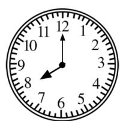  
①

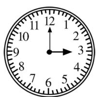  
②

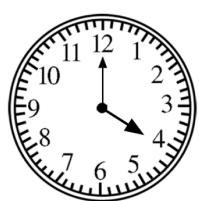  
③

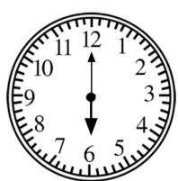  
④

<table><tr><td>城市</td><td>伦敦</td><td>悉尼</td><td>纽约</td></tr><tr><td>时差</td><td>-8</td><td>+2</td><td>-13</td></tr></table>

# 1.2 有理数及其大小比较

# 课时1▶ 有理数的概念

  
课时检测

# 过基础 教材必备知识精练 √ 答案P01

1 [2025 淮安期末]下列各数中是负整数的是
()

A. 0

B. 3

C. -2.5

D. -100

2 [2025 广州南沙区期末] 下列各数中, 既是分数又是负数的是 ( )

A. $\frac{1}{2}$

B. -2

C. $-\frac{1}{2}$

D. 0

3 [2025 湖南师大附中教育集团期中]在下列各数中: $\pi, -21, 25\%, 0, \frac{2}{3}, -0.3$ . 正有理数有 ( )

A. 2 个

B. 3 个

C. 4 个

D. 5 个

4 关于数 -3.1415 的说法正确的是 ( )

A. 是负数,也是有理数  
B. 是小数,但不是有理数  
C. 不是整数, 也不是有理数  
D. 不是自然数, 也不是有理数

5 [2025 广州三中期中]下列说法中不正确的是
()

A. 有理数分为正有理数、负有理数和 0  
B. 整数都可以写成分数的形式  
C. 可以写成分数形式的数就是有理数  
D. 整数只包括正整数和负整数

6 下列选项中,大括号中所填的数正确的是（）

A. 正数集合: $\{2,1,5,\frac{1}{2},\cdots\}$   
B. 非负数集合: $\{0, -1, -2.5, \cdots\}$   
C. 负有理数集合: $\{-2.5,0,-\frac{1}{3},\cdots\}$   
D. 整数集合: $\{3\frac{1}{2}, -5, \cdots\}$

7 [2025 西宁期末] 所有整数组成整数集合, 所有负数组成负数集合, 若图中阴影部分也表示一个集合, 则这个集合包含的有理数可以是（）

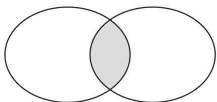  
整数集合 负数集合

A. 0

B. -10

C. $-\frac{1}{2}$

D. 5

8 新趋势·结论开放 分别写出一个符合下列条件的有理数：

(1)是负数但不是整数: ;   
(2)是整数但不是负数: \_\_\_\_；  
(3)既不是整数也不是负数: \_\_\_\_.

9 教材 P8T3 变式 在 0,3.1415926,200,-2025, -6.143,+108,-2 $\frac{2}{7}$ , -0.58, $\frac{1}{11}$ 中,负有理数的个数为\_\_\_\_,非负有理数的个数为\_\_\_\_,正整数的个数为\_\_\_\_.

10 [2025 南京鼓楼区期中] 把下列各数填入相应的表格内: $-1, \frac{2}{3}, -0.01001, 6.6, 2, -\frac{22}{7}$ .

<table><tr><td></td><td>正有理数</td><td>负有理数</td></tr><tr><td>整数</td><td></td><td></td></tr><tr><td>分数</td><td></td><td></td></tr></table>

11 教材 P7 例 1 变式 [2024 无锡仓下中学月考] 将下列有理数按照分类, 填入下面对应的大括号内:

$$
- 2. 2 5, + 1 6, \frac {1}{4}, - 4, 3. 1 4, 0, \frac {8}{3}, 1 2, - \frac {3}{5},
$$

$$
0. \stackrel {\bullet \bullet} {5 6}, 5 \frac {1}{2}.
$$

整数集合：{ … }；

正有理数集合：{

$$
\left. \dots \right\};
$$

负有理数集合: { … } ;

非正数集合: { … } .

# 课时2·数轴

  
课时检测

# 过基础 教材必备知识精练 √ 答案P02

# 知识点 1 数轴的概念及其画法

1 下列关于数轴的说法不正确的是 （）

A. 数轴上的单位长度必须相等  
B. 数轴的正方向一定向右  
C. 数轴上的原点可以任意选取  
D. 数轴是规定了原点、正方向和单位长度的直线

2 [2025 重庆育才中学教育集团期中]下列数轴的画法中,规范的是 ( )

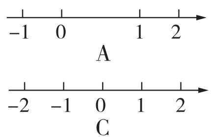

text_image

-1 0 1 2
A
-2 -1 0 1 2
C

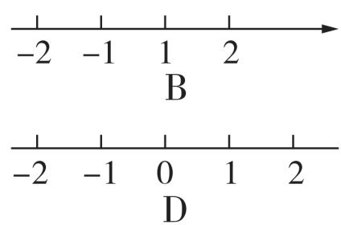

text_image

-2 -1 1 2
B
-2 -1 0 1 2
D

# 知识点2 数轴上的点与有理数的关系教辅资源，关注公众号★全科AA+

3 [2024 河南中考] 如图, 数轴上点 P 表示的数是 ( )

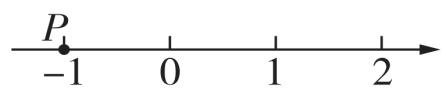

A. -1

B. 0

C. 1

D. 2

4 [2025 石家庄栾城区期中] 如图, 将 -1 在数轴上对应的点向右平移 3 个单位长度, 则此时该点表示的数是 ( )

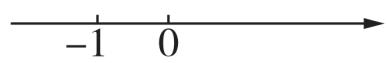

A. -4

B. 4

C. -2

D. 2

5 [2025 淮安淮安区一模] 如图, 数轴的单位长度为 1, 如果点 A 表示的数是 -2, 那么点 B 表示的数是 ( )

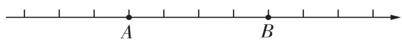

A. -1

B. 0

C. 1

D. 2

6 填空:

(1)在数轴上,表示+2的点在数轴的\_\_\_\_半轴上,距离原点\_\_\_\_个单位长度;表示-7的点在数轴的\_\_\_\_半轴上,距离原点\_\_\_\_个单位长度.

(2)在数轴的正半轴上,且距离原点 $\frac{5}{8}$ 个单位长度的点表示的数是 .

7 教材 P11T3 变式 如图, 数轴上被墨迹盖住的部分有\_\_\_\_个点表示的数是整数, 其中非正整数分别是\_\_\_\_.

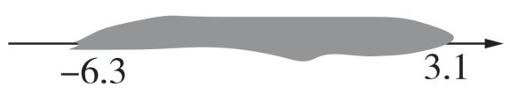

8 教材 P11T1 变式 如图, 写出数轴上点 A, B, C, D 表示的有理数.

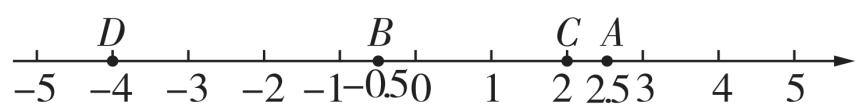

text_image

-5
D
-4
-3
-2
-1
-0.50
B
1
C
2
A
2.53
4
5

9 教材 P10 例 2 变式 画出数轴, 并在数轴上表示下列各数: 2, -5, 0, -3 $\frac{3}{4}$ , 1 $\frac{1}{2}$ , -2.

10 [2025 泰州姜堰区期中] 快递员骑车从配送中心出发, 先向西骑行 2 km 到达 A 村, 继续向西骑行 4 km 到达 B 村, 然后向东骑行 8 km 到达 C 村, 最后回到配送中心.

(1)以配送中心为原点,以正东为正方向,用1个单位长度表示1 km,画出数轴,并在该数轴上标出A,B,C三个村庄的位置,写出数轴上A,B,C所表示的数;

(2) 求 C 村离 A 村有多远;

(3)求快递员一共骑了多少千米.

# 过能力 学科关键能力构建 √ 答案P02

11 如图,在数轴上有 A, B, C, D 四点,分别表示不同的四个数,若从这四点中选一点作为原点,使得其余三点表示的数中有两个正数和一个负数,则这个点是 ( )

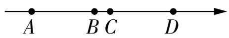

A. 点 A

B. 点 $B$

C. 点 $C$

D. 点 $D$

12 教材 P11T4 变式 [2025 许昌禹州期末] 点 A 是数轴上一点, 从点 A 出发, 沿数轴向某一方向移动 3 个单位长度到达点 B, 若点 B 表示的数是 1, 则点 A 表示的数是 ( )

A. -2

B. -1

C. 4

D. -2 或 4

13 [2025 杭州十三中期中] 如图 1, 点 A, B, C 是数轴上从左到右排列的三个点, 分别表示的数为 -2, b, 4. 某同学将刻度尺如图 2 放置, 使刻度尺上的数字 0 对齐数轴上的点 A, 发现点 B 对应的刻度为 1.8, 点 C 对应的刻度为 5.4. 则数轴上点 B 表示的数 b 为 ( )

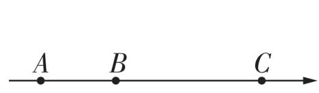  
图1

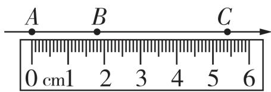  
图2

A. 2

B. 1

C. 0

D. -1

14 [2024 江门江海区期末] 如图, 圆的周长为 4 个单位长度, 圆周的 4 等分点分别为 A, B, C, D, 先将圆上的 A 点与数轴上数 1 所对应的点重合, 再将圆沿着数轴向左滚动, 那么圆上与数轴上数 -2025 所对应的点重合的点是 ( )

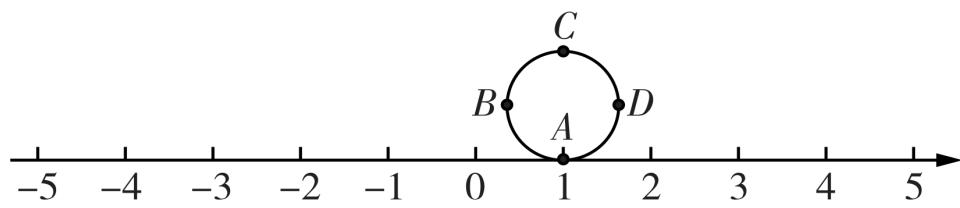

text_image

-5
-4
-3
-2
-1
0
1
2
3
4
5
C
B
A
D

A. $A$

B. B

C. C

D. D

15 在一条不完整的数轴上从左到右有 A, B, C 三点, 其中 A, B 两点之间的距离是 2 个单位长度, B, C 两点之间的距离是 1 个单位长度, 如图所示.

(1)若以点 B 为原点, 写出点 A, C 表示的数;
若以点 C 为原点, 写出点 A, B 表示的数.

(2) 若原点 O 与点 C 之间的距离为 8 个单位长度, 写出点 A, B, C 表示的数.

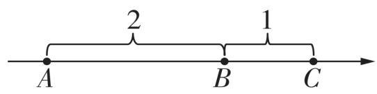

# 素养提升。

16 几何直观 [2024 榆林榆阳区期末] 如图, 已知在纸面上有一数轴.

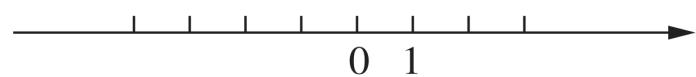

操作一:

(1)折叠纸面,使表示1的点与表示-1的点重合,则表示-2的点与表示\_\_\_\_的点重合.

操作二：

(2)折叠纸面,使表示 -1 的点与表示 3 的点重合,回答下列问题:

①表示 5 的点与表示\_\_\_\_的点重合;
②若数轴上 A, B 两点之间的距离为 9 个单位长度 (A 在 B 的左侧), 且折叠后 A, B 两点重合, 求 A, B 两点表示的数.

# 课时3▶相反数

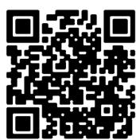  
课时检测

# 过基础 教材必备知识精练 √ 答案P02

# 知识点 1 相反数

1 [2024 济南中考]9 的相反数是 （）

A. -9

B. $-\frac{1}{9}$

C. $\frac{1}{9}$

D. 9

2 [2024 陕西中考副题] - $\frac{7}{12}$ 的相反数是（）

A. $\frac{7}{12}$

B. $-\frac{7}{12}$

C. $\frac{12}{7}$

D. $-\frac{12}{7}$

3 教材 P12T1 变式 下列说法中正确的是 （）

A. +7 是相反数  
B. -7 是相反数  
C. +7 不是 -7 的相反数  
D. -7 与 +7 互为相反数

4 [2025 武汉江夏区期中] 如图, 数轴上有 A, B, C, D 四个点, 其中哪两个点所表示的数互为相反数? ()

$$
\begin{array}{c c c c c} A & B & C & D \\ \hline - 2 & - 1 & 0 & 1 & 2 \end{array}
$$

A. 点 $A$ 与点 $B$

B. 点 $B$ 与点 $C$

C. 点 $B$ 与点 $D$

D. 点 $A$ 与点 $D$

5 教材 P12T3 变式 若一个数的相反数是它本身, 则该数为 ( )

A. 0

B. 1

C. -1

D. 不存在

6 填空:

(1) - 10 的相反数是\_\_\_\_, 0.5 是\_\_\_\_的相反数.  
(2) $a$ 的相反数是\_\_\_\_. 若 $a$ 是负数, 则 $-a$ 是\_\_\_\_数 (填“正”或“负”); 若 $-a$ 是负数, 则 $a$ 是\_\_\_\_数 (填“正”或“负”).

7 填空:

(1) 距离原点 3 个单位长度的点表示的数是\_\_\_\_；  
(2)若在数轴负半轴上表示数 a 的点距离原点 5 个单位长度,则 -a = \_\_\_\_.

8 [2025 遵义红花岗区期末] 数轴上 A, B 两点之间的距离为 6 个单位长度, 且 A, B 表示的数互为相反数, 点 B 在点 A 的右侧, 则点 B 表示的数为 \_\_\_\_.  
9 分别写出 5,4,-3 的相反数,在如图所示的数轴上表示出 5,4,-3 及它们的相反数,并说明表示各对相反数的点在数轴上的位置特点.

$$
- 6 \quad - 5 \quad - 4 \quad - 3 \quad - 2 \quad - 1 \quad 0 \quad 1 \quad 2 \quad 3 \quad 4 \quad 5 \quad 6
$$

# 知识点 2 多重符号的化简

10 [2023 赤峰中考]化简 - (-20) 的结果是
()

A. $-\frac{1}{20}$

B. 20

C. $\frac{1}{20}$

D. -20

11 下列表示 -5 的相反数的是 （）

A. -(-5)

B. $-(+5)$

C. $-[-(-5)]$

D. $-\left[ + (+5) \right]$

12 给出下列各数: +(-10), -(+15), -(-7), -[+(-9)], -[-(-20)]. 其中负数有 ( )

A. 0 个

B. 2 个

C. 3 个

D. 4 个

13 化简下列各数:

(1) $-(+2.7)$ ;

(2) $-\left(-\frac{1}{4}\right)$ ;

(3) $-\left[-\left(-\frac{3}{5}\right)\right]$ ;

(4) $-\left[ + (-3.8)\right]$ .

# 过能力 学科关键能力构建 答案P03教辅资源，关注公众号★全科AA+

14 下列说法正确的是 ( )

A. $\pi$ 的相反数是 -3.14  
B. 符号相反的数互为相反数  
C. 一个数和它的相反数可能相等  
D. 正数与负数互为相反数

15 - (-8)的相反数是 ( )

A. -8

B. 8

C. $-\frac{1}{8}$

D. $\frac{1}{8}$

16 [2024 许昌十二中期中]下列各组数中,互为相反数的是 ( )

A. $-(+7)$ 与 $+(-7)$   
B. -0.5 与 + (-0.5)   
C. $-\left(-\frac{5}{3}\right)$ 与 $-\left(+\frac{3}{5}\right)$   
D. $-\left[ + (-1) \right]$ 与 $-\left[ + (+1) \right]$

17 [2025 龙岩二中质检] - a 表示的数是( )

A. 负数

B. 正数

C. 负数或正数

D. 负数、正数或 0

18 若 $-(+a)=+(-6)$ ，则 a 的值为（）

A. $\frac{1}{6}$

B. $-\frac{1}{6}$

C. 6

D. -6

19 [2025 肇庆封开期末]数轴上一动点 A 向左移动 2 个单位长度到达点 B, 再向右移动 5 个单位长度到达点 C. 若点 C 表示的数为 1, 则与点 A 表示的数互为相反数的数是 \_\_\_\_.

20 (1) 化简下列各数:

① $-\left[-(+1)\right]$ ; ② $-\left[-(-1)\right]$ ;

③ $-\left\{-\left[-(+1)\right]\right\}$ ; ④ $-\left\{-\left[-(-1)\right]\right\}$ .

(2)化简过程中发现:化简结果的符号与原式中“-”的个数有着密切联系,当“-”的个数是奇数时,化简结果为\_\_\_\_数;当“-”的个数是偶数时,化简结果为\_\_\_\_数.

21 [2025 大同新荣区两校联考] 如图, 数轴上的 1 个单位长度表示 2, 请回答下列问题:

(1) 若点 A 与点 D 表示的数互为相反数, 则点 D 表示的数是多少?  
(2)若点 B 与点 F 表示的数互为相反数,则点 D 表示的数的相反数是多少?

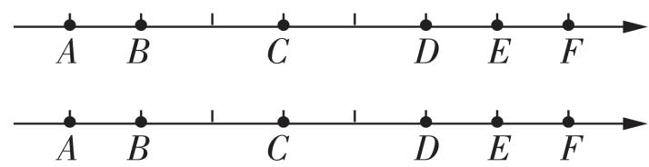

text_image

A B C D E F
A B C D E F

备用图

22 [2025 河南师大附中月考]已知表示数 a 的点在数轴上的位置如图所示, 数轴的单位长度为 1.

(1) 在数轴上标出表示数 a 的相反数的点的位置.  
(2)若表示数 a 的点与表示数 a 的相反数的点相距 20 个单位长度,则 a 的值是多少?  
(3)在(2)的条件下,若表示数 b 的点与表示数 a 的相反数的点相距 5 个单位长度,则 b 的值是多少?

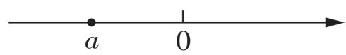

# 课时4 ▶ 绝对值

  
课时检测

# 过基础 教材必备知识精练 答案P03 教辅资源，关注公众号★全科AA+

# 知识点 1 绝对值的定义

1 [2025 三亚期末] 如图, 数轴上点 A 表示的数的绝对值为 ( )

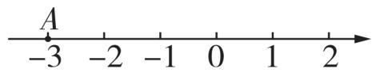

A. -3

B. -1

C. 1

D. 3

2 [2025 惠州惠城区期中] 数 a, b, c, d 在数轴上的对应点的位置如图所示, 这四个数中绝对值最大的是 ( )

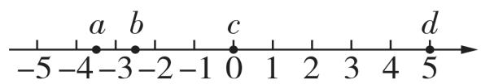

A. $a$

B. b

C. c

D. d

3 教材 P14T1 变式 求下列各数的绝对值:

(1) $+\frac{2}{3}$ ;(2)-7.2;(3)0;(4)-(-3).

# 知识点 2 绝对值的性质

4 [2025 南宁西大附中期中] a 的绝对值等于 2, 则 a = ()

A. 2

B. -2

C. $\pm 2$

D. 2 或 $\frac{1}{2}$

5 [2025 丹东东港期末] 给出下列说法: ①有理数的绝对值一定比 0 大; ②如果两个数相等, 那么这两个数的绝对值一定相等; ③如果两个数的绝对值相等, 那么这两个数相等; ④有理数的绝对值越大, 离原点越远. 其中正确的有 ( )

A. 1 个

B. 2 个

C. 3 个

D. 4 个

6 用符号语言表述“负数的绝对值等于它的相反数”正确的是 （）

A. $|-a|=a$

B. $|a| = -a$

C. $|-a| = a (a < 0)$

D. $|a| = -a (a < 0)$

7 新趋势·结论开放 如果 $|-2a| = -2a$ , 那么符合条件的 a 的值可能是 \_\_\_\_. (写出一个即可)

8 [2024 巴中期末] 绝对值大于 3 且小于 5 的所有整数是 \_\_\_\_.

9 教材 P14T4 变式 化简下列各数:

(1) $+\left|-\frac{2}{3}\right|$ ;

(2) $-\left| -\frac{4}{5} \right|$ ;

(3) - | - (+2.5)|;

(4) $| + (-3)|$ .

# 知识点 3 绝对值的应用

10 [2025 洛阳期末] 古筝是中国独特的民族乐器之一,为了保持音准,弹奏者常使用调音器对每根琴弦进行调音. 如图所示是某古筝调音器软件的界面,指针指向 40 表示音调偏高,需放松琴弦. 下列指针指向的数字中表示需拧紧琴弦,且最接近标准音(指针指在 0 处为标准音)的是 ( )

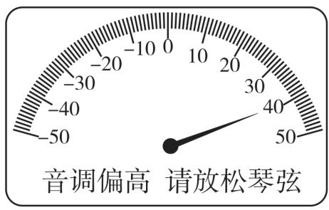

text_image

音调偏高 请放松琴弦

A. -20

B. -5

C. 10

D. 20

11 某交警每天都骑摩托车沿南北街来回巡逻. 假定向北为正方向, 当天巡逻记录如下(单位:千米): 15, -9, 18, -7, 13, -6, 10, -6. 若摩托车每千米耗油 0.025 升, 求这一天巡逻共耗油多少升.

# 过能力 学科关键能力构建 √ 答案P04

12 [2025 郑州中原区期末] 如图, 数轴的单位长度为 1, 点 A, B, C 表示的数都是整数. 若点 A 和点 C 所表示的两个数的绝对值相等, 则点 B 表示的数是 ( )

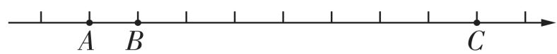

A. -4

B. -3

C. 2

D. 3

13 若 $\left|a\right|=\left|b\right|$ ，则 a 和 b 的关系为（）

A. $a$ 和 $b$ 相等

B. $a$ 和 $b$ 互为相反数

C. $a$ 和 $b$ 相等或互为相反数

D. 以上答案都不对

14 [2024 大同多校联考] 如图, 四个有理数在不完整的数轴上对应的点分别为 M, P, N, Q. 若点 M, N 表示的有理数互为相反数, 则图中表示的数的绝对值最小的点是 ( )

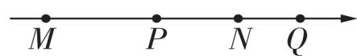

A. 点 $M$

B. 点 $N$

C. 点 $P$

D. 点 $Q$

15 [2025 铜陵十中期中] 根据 $|x|$ 是非负数, 且非负数中最小的数是 0. 解答下列问题:

(1) 已知 $\left|a - 2\right| + \left|b - 1\right| = 0$ ，则 $a + b$ 的值是 \_\_\_\_；

(2) 当 $a =$ \_\_\_\_时, $|1 - a| + 2$ 有最小值, 且最小值是\_\_\_\_;

(3) 当 $x =$ \_\_\_\_时, $5 - |x - 3|$ 有最大值, 且最大值是 \_\_\_\_.

16 [2025 达州达川四中期中]已知 a, b, c 为有理数,且它们在数轴上对应点的位置如图所示.

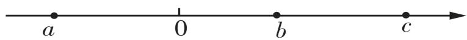

(1)试判断 a, b, c 是正数还是负数.

(2) 根据数轴化简:

① $|a| =$ \_\_\_\_; ② $|b| =$ \_\_\_\_;

③ $|c| =$ \_\_\_\_; ④ $|-a| =$ \_\_\_\_;

⑤ $|-b| =$ \_\_\_\_;⑥ $|-c| =$ \_\_\_\_.

(3) 若 $\left|a\right|=3.5,\left|b\right|=2.5,\left|c\right|=5$ , 求 a, b,
c 的值.

# 素养提升·教辅资源，关注公众号★全科AA+

17 几何直观 [2025 驻马店四中月考]【问题情境】数学活动课上, 王老师出示了一个问题: 点 A, B 在数轴上分别表示有理数 a, b, $|a - b|$ 表示数轴上数 a 与数 b 的对应点之间的距离. 利用数形结合思想回答下列问题:

(1)数轴上表示 2 和 6 的两点之间的距离是\_\_\_\_; 数轴上表示 3 和 -1 的两点之间的距离是\_\_\_\_;

# 【独立思考】

(2)试用数轴探究: 当 $\left|m-1\right|=3$ 时, m 的值为 \_\_\_\_.

# 【实践探究】

(3) 利用数轴求出 $\left|x-2\right|+\left|x-5\right|$ 的最小值，
并写出此时 x 可取哪些整数？

# 课时5▶有理数的大小比较

  
课时检测

# 过基础 教材必备知识精练 √ 答案P04

# 知识点 1 利用数轴比较有理数的大小

1 [2025 深圳模拟]有理数 a 与 b 在数轴上对应点的位置如图所示,则它们的大小关系是 （）

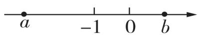

A. a > b

B. a = b

C. a < b

D. 无法确定

2 若 a < b < 0, 在数轴上表示 a, b 的点可能是 ( )

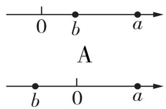  
C

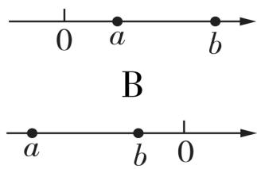  
D

3 教材 P16T2 变式 把下列各数在数轴上表示出来,并用“<”把它们连接起来.

$$
- 3, - 4, 0, \vert - 2. 5 \vert , - 1 \frac {1}{2}.
$$

4 [2025 长沙望城区期末]有理数 a, b 在数轴上对应点的位置如图所示.

(1) 结合数轴可知: $\left|a\right|$ \_\_\_\_ $\left|b\right|$ ; (填“>”“<”或“=”)   
(2)结合数轴, 比较 -a, -b, 0, a, b 的大小, 并用“<”连接起来.  
(1) 结合数轴可知: $\left|a\right|$ \_\_\_\_ $\left|b\right|$ ; (填“>”“<”或“=”)   
(2)结合数轴, 比较 -a, -b, 0, a, b 的大小, 并用“<”连接起来.

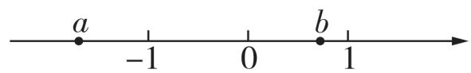

# 知识点 2 利用法则比较有理数的大小

5 [2025 遵义汇川区二模] 下列有理数中, 最大的数是 ( )

A. $\frac{1}{3}$

B. -0.5

C. -1

D. 0

6 [2024 广州中考] 四个数 -10, -1, 0, 10 中, 最小的数是 ( )

A. -10

B. -1

C. 0

D. 10

7 跨学科·物理 [2025 鞍山千山区模拟] 几种气体的液化温度(标准大气压)如表所示.

<table><tr><td>气体</td><td>氧气</td><td>氢气</td><td>氮气</td><td>氦气</td></tr><tr><td>液化温度/°C</td><td>-183</td><td>-253</td><td>-195.8</td><td>-269</td></tr></table>

其中液化温度最低的气体是 （）

A. 氦气

B. 氮气

C. 氢气

D. 氧气

8 请写出一个大于 -4 并且小于 -1 的整数: \_\_\_\_.  
9 [2024 南京中考] 比较大小: $-\frac{2}{3}$ \_\_\_\_ $-\frac{4}{9}$ .
(填“＞”“＜”或“＝”)  
10 比较下列各组数的大小.

(1) -6.26 与 $-\frac{25}{4}$ ;   
(2) $-(+5.5)$ 与 $-(-4.5)$ ;  
(3) -1 -2.7 和 $-\left(+2\frac{2}{3}\right)$ .

4 [2025 长沙望城区期末]有理数 a, b 在数轴上对应点的位置如图所示.

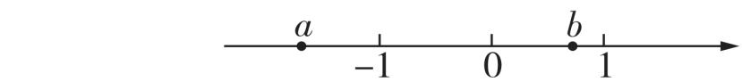

# 数学活动

# 过基础 教材必备知识精练

√ 答案P04

# 活动 1 体重调查

1 党和国家非常重视青少年的身心健康,采取多种举措增强青少年体质. 近几年,青少年肥胖问题不容忽视,现以 48.0 kg 为标准,将七名学生的体重记录如下表:

<table><tr><td>学生</td><td>A</td><td>B</td><td>C</td><td>D</td><td>E</td><td>F</td><td>G</td></tr><tr><td>超出标准体重的千克数</td><td>-3.0</td><td>+1.5</td><td>+0.8</td><td>-0.5</td><td>+0.2</td><td>+1.2</td><td>+0.5</td></tr></table>

(1) 表中的 -3.0, +1.5 分别表示什么意思?  
(2)最接近标准体重的学生体重是多少?

2 [2024 珠海斗门区期中] 下表给出了某校七年级(1)班其中 6 位同学的体重情况:(单位:kg)

<table><tr><td>姓名</td><td>小芳</td><td>小轩</td><td>小彤</td><td>小余</td><td>小廖</td><td>小何</td></tr><tr><td>个人体重与班级平均体重的差值</td><td>-1</td><td>+2</td><td>0</td><td>-3</td><td>+4</td><td></td></tr><tr><td>个人体重</td><td>44</td><td></td><td>45</td><td></td><td>49</td><td>55</td></tr></table>

根据表格信息,解答下列问题:

(1)班级的平均体重为\_\_\_\_kg.  
(2) 完成表中空白部分.  
(3)这6位同学的平均体重比班级的平均体重重还是轻？相差多少千克？

# 活动 2 猜数游戏

3 生活中的许多事都蕴含着数学思想,我们来看一个猜数游戏. 甲心中想一个 1 \~ 32 的整数,乙只许问“比某数大吗?”甲只能回答“是”或“不”,想一想,如何猜想能更快地猜中甲心中想的数? 最多猜想几次就一定能猜中?  
4 有 1 000 箱外形完全相同的产品, 其中 999 箱重量相同(等于规定重量), 有 1 箱次品重量较轻. 现有一个称(一次可称量 500 箱), 怎样才能尽快找出这箱次品?  
5 现有 80 粒重量、外形完全相同的珍珠和 1 粒外形相同、但重量较轻的假珍珠, 怎样才能用一台天平尽快地将这粒假珍珠挑出来?

# 章末复习专练

# 过全章 题串练透全章知识 √ 答案P05

已知有理数: 1, -2, 0, 2.5, $-\frac{3}{2}$ , 50%, 0.23, $-(+10.1), -\left|-\frac{4}{5}\right|, +\left[-(-10)\right], \left|-(-8.1)\right|.$

# 【基础设问】

(1)如果规定向北为正,向南为负,那么向北走2.5米,可记作\_\_\_\_米,向南走1米,可记作\_\_\_\_米,小明先向北走-2米,再向南走1米,则小明现在所处的位置在起始位置的\_\_\_\_(填“南方”或“北方”),且到起始位置的距离是\_\_\_\_米.

(2)化简下列各数:

① - (+10.1) = \_\_\_\_ ;   
② $-\left|-\frac{4}{5}\right|=$ ;   
③ + [ - ( - 10) ] = \_\_\_\_ ;   
④ $\left| - (-8.1) \right| =$ \_\_\_\_.

(3) 将所给各数填入相应的集合内.

①非正整数集合：{ … }；  
②整数集合：{ … }；  
③正有理数集合：{

$$
\left. \dots \right\}.
$$

(4) 画出数轴, 在数轴上表示下列各数, 并用 “<” 连接起来.

$$
\begin{array}{l} 1, - 2, 0, 2. 5, - \frac {3}{2}, 50 \%, + [ - (- 1 0) ], \\ | - (- 8. 1) |. \end{array}
$$

(5) 写出下列各数的相反数.

① $-\frac{3}{2}$ 的相反数是 \_\_\_\_；  
②0 的相反数是\_\_\_\_；  
③ $|-(-8.1)|$ 的相反数是\_\_\_\_。

(6) 若数轴上的点 A 表示 -2.5, 点 B 表示 1, 在点 A 与点 B 之间的点表示的负整数有 \_\_\_\_.

# 【能力设问】

(7) 点 A, B 在数轴上分别表示有理数 a, b, A, B 两点之间的距离 $AB = |a - b|$ ，所以 $|x - 3|$ 的几何意义是数轴上表示有理数 x 的点与表示有理数 3 的点之间的距离.

①若 $|x-3|=5$ ，则 x= \_\_\_\_；  
②若 $|x-3|=|x+1|$ ，则x= \_\_\_\_.

3 [2024 东营中考] - 3 的绝对值是 （）

A. 3

B. -3

C. $\pm3$

D. $\frac{1}{3}$

4 [2024 大庆中考]下列各组数中,互为相反数的是 ( )

A. $|-2024|$ 和 $-2024$

B. 2024 和 $\frac{1}{2024}$

C. | -2 024 | 和 2 024

D. -2024 和 $\frac{1}{2024}$

5 [2024 湖南中考] 计算: -(-2024) = \_\_\_\_.

# 过中考 中考真题同步挑战 √ 答案P05

1 [2024 湖北中考] 在实际生产生活中, 正数和负数都有现实意义. 例如收入 20 元记作 +20 元, 则支出 10 元记作 ( )

A. +10 元

B. -10 元

C. +20 元

D. -20 元

2 [2024 甘肃中考]下列各数中,比 -2 小的数是 ( )

A. -1

B. -4

C. 4

D. 1

# 过综合 全章学习成果反馈

√ 见活页卷 1

# 2.1 有理数的加法与减法

# 课时1▶ 有理数的加法

  
课时检测

# 过基础 教材必备知识精练 答案P05教辅资源，关注公众号★全科AA+

# 知识点 1 有理数的加法法则

1 [2024 长春中考] 根据有理数加法法则, 计算 $2 + (-3)$ 过程正确的是 ( )

A. + (3 + 2)

B. $+ (3 - 2)$

C. $-(3 + 2)$

D. $- (3 - 2)$

2 [2024 广东中考] 计算 $(-5) + 3$ 的结果是 ( )

A. -2

B. -8

C. 2

D. 8

3 [2025 天津河东区一模] 计算 $(-2) + (-5)$ 的结果等于 ( )

A. -3

B. 3

C. -7

D. 7

4 [2023 温州中考] 如图, 比数轴上点 A 表示的数大 3 的数是 ( )

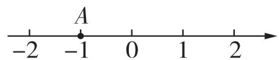

A. -1

B. 0

C. 1

D. 2

5 下列各式运算正确的是 ( )

A. $(-4)+(-4)=0$   
B. $0 + (-4) = 4$   
C. $(- \frac{1}{2}) + (- \frac{1}{3}) = -\frac{1}{6}$   
D. $\left(-\frac{1}{3}\right)+\left(+\frac{1}{3}\right)=0$

6 [2024 宿迁宿豫区期末] 若两个数在数轴上对应的点分别在原点的两侧, 则这两个数相加所得的和 ( )

A. 一定是正数

B. 一定是负数

C. 一定是0

D. 以上都不对

7 教材 P27 例 1 变式 计算:

(1) $(-5)+8;$

(2) $(-19)+(-91)$ ;

(3) $(-2.4)+2.4;$

(4) $5 + \left(-\frac{1}{2}\right)$ ;

(5) $\left(-\frac{1}{2}\right)+\left(+\frac{1}{5}\right)$ ;

(6) $(-2\frac{1}{3})+(-1\frac{1}{9}).$

# 知识点 2 有理数加法的应用

8 新趋势·数学文化 [2025 襄阳襄城区期末]我国古代用算筹(小棍形状的记数工具)正放表示正数,斜放表示负数. 如图 1 可列式计算为 $(+2)+(-1)=1$ ,由此可推算图 2 可列算式为（）

  
图1

  
图2

A. $(+3) + (+4) = 7$   
B. $(-3)+(-4)=-7$   
C. $(-3)+(+4)=1$   
D. $(+3) + (-4) = -1$

9 教材 P28T4 变式 [2025 昭通昭阳区期末] 对 2 + (-3) = -1 用生活实例解释其意义正确的是 ( )

A. 一物体从数轴的原点出发, 向左移动 3 个单位长度, 再向右移动 2 个单位长度, 现在该物体在数轴上的点对应的数为 1  
B. 某人做生意 1 月赚了 2 万元, 2 月亏了 3 万元, 他这两个月合计亏了 1 万元  
C. 今天早上的气温是零上 $2^{\circ}$ C, 随着冷空气的到来, 下午气温下降了 $3^{\circ}$ C, 现在的气温是零上 $1^{\circ}$ C  
D. 某人早上从水池里打水冲洗道路用了 $3 \, m^{3}$ 水, 接着他又往水池注入 $2 \, m^{3}$ 水, 现在水池里的水比原来多了 $1 \, m^{3}$

10 教材 P27 探究变式 若规定向东走为正, 小明从学校出发先走了 +40 米, 又走了 -100 米, 则此时小明的位置在学校的 ( )

A. 西面 40 米

B. 东面 40 米

C. 西面 60 米

D. 东面 60 米

# 过能力 学科关键能力构建 √ 答案P06

11 教材 P28 思考变式 [2024 台州一模] 如图, 数轴上三个不同的点 A, B, P 分别表示有理数 a, b, $a + b$ , 则下列关于数轴原点位置的描述正确的是 ( )

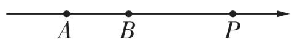

A. 原点在点 $A$ 的左侧  
B. 原点在 $A, B$ 两点之间  
C. 原点在 $B, P$ 两点之间  
D. 原点在点 $P$ 的右侧

12 [2024 潮州德芳中学期中] 如果两个数的和为负数,那么这两个数一定 ( )

A. 同为正数

B. 同为负数

C. 至少有一个正数

D. 至少有一个负数

13 已知有理数 a, b, c 在数轴上对应点的位置如图所示, 下列结论不正确的是 ( )

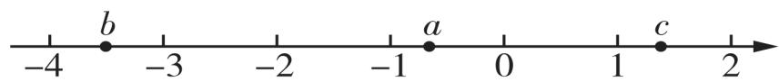

A. $|b| < 4$

B. $b + c < 0$

C. $a + b > 0$

D. $a + c > 0$

14 [2025 泉州洛江区期中] 用 $[x]$ 表示不超过 $x$ 的最大整数, 如 $[2.23] = 2$ , $[-3.24] = -4$ , 则 $[3.3] + [-4.8]$ 的值为 \_\_\_\_.

15 [2025 连云港海州区期中] 若 $\left|m\right|=7,\left|n\right|=3$ , 且 $\left|m-n\right|=m-n$ , 则 $m+n$ 的值是 \_\_\_\_.

16 新趋势·结论开放 已知两个有理数相加,和小于每一个加数,请写出满足上述条件的一个算式: \_\_\_\_.

17 [2025 重庆梁平区期末] 我们给出如下规定: 如果两个有理数的和是 8, 那么称这两个有理数互为“吉祥数”.

(1)下列各数对①5 和 3, ② - 5 和 13, ③ - 54 和 46 中,互为“吉祥数”的数对有\_\_\_\_.
(只填写序号)

(2)在数轴上,点 A 到原点 O 的距离是 8,请直接写出与点 A 表示的数互为“吉祥数”的数.

# 素养提升。

18 推理能力 [2025 宿迁名校联考] 探索研究:

(1)用“<”“>”或“=”填空：

① $|-2|+|3|>|-2)+3|,|4|+|-1|$ \_\_\_\_ $|4+(-1)|$ ;

② $|2| + |3| = |2 + 3|, |-1| + |-3|$ $|(-1) + (-3)|;$

③ $|0| + |-8|$ \_\_\_\_ $|0 + (-8)|$ .

(2)通过以上比较,请你分析、归纳出当 a,b 为有理数时, $|a|+|b|$ 与 $|a+b|$ 的大小关系.

(3)根据(2)中得出的结论,若 $|x|+|y|=10$ , $|x+y|=8$ , 求 x-y 的值.

# 课时2▶ 有理数的加法运算律

  
课时检测

# 过基础

教材必备知识精练

答案P06

# 知识点 1 有理数加法运算律

1 [2025 杭州滨和中学期中]下列交换加数位置的变形,正确的是 ( )

A. $(-3) + 4 - 3 = (-3) + 3 - 4$   
B. $(-3) + 4 - 3 = (-4) + 3 - 3$   
C. $\frac{6}{7} + 1.5 - \frac{1}{7} = \frac{6}{7} - \frac{1}{7} + 1.5$   
D. $\frac{6}{7} + 1.5 - \frac{1}{7} = \frac{6}{7} - \frac{1}{7} - 1.5$

2 用简便方法计算:

(1) $(-24)+(+65)+(-16)+(+35)$ ;

(2) $\frac{1}{4} + (-\frac{2}{5}) + (-\frac{1}{4}) + (-\frac{1}{5})$ ;

(3) $0.36 + (-7.4) + 0.5 + (-0.6) + 0.14.$

# 知识点 2 有理数加法运算律的应用

3 教材 P30T2 变式 某 24 小时自助银行服务网点的一台自动存取款机在某时段内处理了以下 6 笔现款储蓄业务: 存入 5 200 元, 取出 800 元, 取出 1 000 元, 存入 2 500 元, 取出 500 元, 取出 1 500 元. 则该自动存取款机在这一时段内现款增加 (填“增加”或“减少”) 了 \_\_\_\_ 元.

# 过能力

学科关键能力构建

答案P06

# 教辅资源，关注公众号★全科AA+

4 [2025 邵阳洞口期中] 小明写作业时不慎将墨水滴在数轴上, 根据图中的数值, 判定墨迹盖住部分的整数的和是 \_\_\_\_.

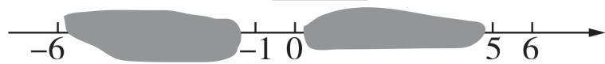

5 用简便方法计算: $(-2\frac{3}{5})+(+3\frac{1}{4})+(-3\frac{2}{5})+(+2\frac{3}{4})$ .

# 素养提升。

6 运算能力 张老师在黑板上列出了如下的算式并写出了计算过程.

计算: $\left(-5\frac{5}{6}\right)+\left(-9\frac{2}{3}\right)+17\frac{3}{4}+\left(-3\frac{1}{2}\right)$ .

解: 原式 = $\left[\left(-5\right)+\left(-\frac{5}{6}\right)\right]+\left[\left(-9\right)+\right.$

$$
\begin{array}{l} \left(- \frac {2}{3}\right) ] + \left(1 7 + \frac {3}{4}\right) + \left[ (- 3) + \left(- \frac {1}{2}\right) \right] \\ = [ (- 5) + (- 9) + (- 3) + 1 7 ] + [ (- \frac {5}{6}) + \\ \left. \left(- \frac {2}{3}\right) + \left(- \frac {1}{2}\right) + \frac {3}{4} \right] = 0 + \left(- 1 \frac {1}{4}\right) = \\ - 1 \frac {1}{4}. \\ \end{array}
$$

上述这种方法叫作拆项法.

请仿照上面的方法计算: $(-2026\frac{2}{3})+2025\frac{3}{4}+(-2024\frac{5}{6})+2023\frac{1}{7}.$

# 课时3▶有理数的减法

  
课时检测

# 过基础

教材必备知识精练 答案P07教辅资源，关注公众号★全科AA+

# 知识点 1 有理数的减法法则

1 [2024 天津中考] 计算 3 - (-3) 的结果等于
()

A. -6

B. 0

C. 3

D. 6

2 [2023 滨州中考] 计算 2-1-31 的结果是
()

A. 1

B. -1

C. 5

D. -5

3 [2025 信阳潢川期末]下列计算错误的是
()

A. $(-9)-6=-15$

B. $(-9)-(-6)=3$

C. $9 - (-6) = 15$

D. $9 - (+6) = 3$

4 [2024 唐山丰润区期末] 若 $(-2) - \square = 3$ ，则 “☐” 表示的数是 （）

A. -5

B. -1

C. 1

D. 5

5 比0小3的数是\_\_\_\_,比3小5的数是\_\_\_\_,比-8大6的数是\_\_\_\_.

6 教材 P36T11 变式 计算: (1) (-10) -3 = \_\_\_\_ ;

(2) $(-7)-(-7)=$ \_\_\_\_ ;

(3) $(-4)-\_=-8;$

(4) \_\_\_\_ - (-10) = 20.

7 计算:

(1) $(-5)-4;$

(2)4.8-(-5.6);

(3)0 - (-3.5);

(4)16 - 47;

(5) $(- \frac{2}{3}) - (- \frac{3}{5})$ ;

(6) $(-2\frac{1}{4}) - (-3\frac{1}{2})$

# 知识点 2 有理数减法的应用

8 教材 P36T10 变式 [2024 长沙中考]“玉兔号”是我国首辆月球车,它和着陆器共同组成“嫦娥三号”探测器。“玉兔号”月球车能够耐受月球表面的最低温度是 -180 ℃、最高温度是 150 ℃,则它能够耐受的温差是 ( )

A. $-180^{\circ}\mathrm{C}$

B. $150^{\circ}$ C

C. $30^{\circ}$ C

D. $330^{\circ}$ C

9 [2025 张家口桥西区期中] 全班学生分成五个小组进行知识抢答比赛, 每组的基本分是 100 分, 答对 1 题加 50 分, 答错 1 题扣 50 分, 游戏结束时, 各小组的分数如下表: (单位: 分)

<table><tr><td>第一组</td><td>第二组</td><td>第三组</td><td>第四组</td><td>第五组</td></tr><tr><td>100</td><td>150</td><td>m</td><td>350</td><td>-100</td></tr></table>

(1)第二组的分数超过第五组多少分?

(2)五个小组中,成绩最低的两组分数相差50分,请推断m的值.

# 过能力 学科关键能力构建 √ 答案P07

10 设 a 是最小的正整数, b 是最大的负整数, c 是绝对值最小的数, 则 a - b - c = ()

A. 1

B. 0

C. 2

D. 2 或 0

11 [2024 深圳龙岗区期末] 法国的“小九九”从“一一得一”到“五五二十五”和我国的“小九九”是一样的, 后面的就改用手势了. 下面两个图框是用法国的“小九九”计算 $7 \times 8$ 和 $8 \times 9$ 的两个示例, 且左手伸出的手指数不大于右手伸出的手指数. 若用法国的“小九九”计算 $7 \times 9$ , 左、右手依次伸出的手指数是 ( )

<table><tr><td>7×8=?</td><td>8×9=?</td></tr><tr><td>因为两手伸出的手指数的和为5,未伸出的手指数的积为6,所以7×8=56.7×8=10×(2+3)+3×2=56</td><td>因为两手伸出的手指数的和为7,未伸出的手指数的积为2,所以8×9=72.8×9=10×(3+4)+2×1=72</td></tr></table>

A. 2,4

B. 1,4

C. 3,4

D. 3,1

12 有理数 a, b, c 在数轴上对应点的位置如图所示, 则 c - b \_\_\_\_ 0, a - c \_\_\_\_ 0. (用“>”或“<”填空)

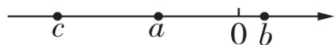

13 某同学在计算 $(-3\frac{3}{4})-N$ 时,误将-N看成了+N,从而算得的结果是 $5\frac{1}{4}$ ,请你算出正确结果:

14 若 $|x|=7,|y|=6,|x+y|=x+y$ ，则 x-y 的值为 \_\_\_\_.

15 计算: $3 \frac{2}{5} - 2 \frac{7}{8} - (-5 \frac{3}{5}) - 0.125.$

16 一题多解 小林积极参加体育锻炼,天天坚持跑步,他每天以 $1000 \, m$ 为标准,超过的记作正数,不足的记作负数.下表是一周内小林跑步情况的记录:

<table><tr><td>星期</td><td>一</td><td>二</td><td>三</td><td>四</td><td>五</td><td>六</td><td>日</td></tr><tr><td>跑步情况/m</td><td>+420</td><td>+460</td><td>-100</td><td>-210</td><td>-330</td><td>+200</td><td>0</td></tr></table>

(1) 星期三小林跑了多少米?   
(2) 小林跑步最少的一天跑了多少米？跑步最多的一天比最少的一天多跑了多少米？  
(3)若小林跑步的平均速度为 $120 \, m/min$ ，求本周小林用于跑步的时间.

# 素养提升。

17 几何直观已知 A, B 两点在数轴上表示的数分别为 m, n.

(1) 对照数轴填写下表:

<table><tr><td>m</td><td>6</td><td>-6</td><td>-6</td><td>-6</td><td>2</td><td>-1.5</td></tr><tr><td>n</td><td>4</td><td>0</td><td>4</td><td>-4</td><td>-8</td><td>-1.5</td></tr><tr><td>A,B两点间的距离</td><td></td><td></td><td></td><td></td><td></td><td></td></tr></table>

(2) 若 A, B 两点间的距离记为 d, 试问 d 与 m, n 有何数量关系? 并用文字描述出来.  
(3)已知 A, B 在数轴上表示的数分别为 x, -1, 则 A, B 两点间的距离 d 可表示为 d = \_\_\_\_, 如果 d = 3, 求 x 的值.

# 课时4·有理数的加减混合运算

  
课时检测

# 过基础 教材必备知识精练 √ 答案P08

# 知识点 1 省略算式中的括号和加号

1 把算式: $(-5)-(-4)+(-7)-(-2)$ 写成省略括号和加号的形式,结果正确的是()

A. $-5 - 4 + 7 - 2$

B. $5 + 4 - 7 - 2$

C. $-5 + 4 - 7 + 2$

D. $- 5 + 4 + 7 - 2$

2 把 $(-12)-(-13)+(-14)-(+15)+(+16)$ 统一成只有加法运算的形式是\_\_\_\_，写成省略括号和加号的形式是\_\_\_\_，读作\_\_\_\_或\_\_\_\_。

# 知识点 2 有理数的加减混合运算

3 甲、乙两人用简便方法进行计算的过程如下所示,下列判断正确的是 ( )

甲: $11 + (-14) + 19 + (-6) = 11 - 14 + 19 - 6 = (11 + 19) - (14 + 6) = 10.$

$$
\begin{array}{r l} \text {乙:} & (- \frac {2}{3}) - (+ \frac {1}{5}) + (- \frac {1}{3}) = - \frac {2}{3} - \frac {1}{5} - \frac {1}{3} = \\ & - \frac {2}{3} - \frac {1}{3} - \frac {1}{5} = - \frac {6}{5}. \end{array}
$$

A. 甲、乙都正确

B. 甲、乙都不正确

C. 只有甲正确

D. 只有乙正确

4 计算下列各式:

(1) $(-20)+(+3)-(-5)-(+7)$ ;

(2) -20.75 - 3.25 + $\frac{1}{4}$ + 19 $\frac{3}{4}$ ;

(3) $-\frac{1}{3} - \frac{5}{2} - \frac{2}{3} + \frac{1}{2}$ .

5 新趋势·过程性学习 阅读下面的解题过程并解决问题.

计算: 53.27 - (-18) + (-21) + 46.73 - (+15) + 21.

解: 原式 = 53.27 + 18 - 21 + 46.73 - 15 + 21
(第一步)

$= (53.27 + 46.73) + (21 - 21) + (18 - 15)$ （第二步）

$= 100 + 0 + 3$ （第三步）

= 103.

(1)计算过程中,第一步把原式化成\_\_\_\_的形式,体现了数学中的\_\_\_\_思想,为了计算简便,第二步应用了\_\_\_\_.

(2)根据以上解题技巧计算: $-21\frac{2}{3}+3\frac{1}{4}-$ $(- \frac{2}{3}) - (+ \frac{1}{4}).$

# 知识点 3 有理数的加减混合运算的应用

6 教材 P35T7 变式 某地一天早晨的气温是 $-7^{\circ}C$ ，中午气温上升了 $11^{\circ}C$ ，下午又下降了 $9^{\circ}C$ ，晚上又下降了 $5^{\circ}C$ ，则晚上的气温为 \_\_\_\_ ℃.

7 某水果店在一周的销售中,盈亏情况如下表(盈为正,亏为负,单位:元):

<table><tr><td>星期一</td><td>星期二</td><td>星期三</td><td>星期四</td><td>星期五</td><td>星期六</td><td>星期日</td><td>合计</td></tr><tr><td>-36.7</td><td>-63.3</td><td>138</td><td>-8</td><td> $\bigtriangleup$ </td><td>200</td><td>186</td><td>456</td></tr></table>

表中星期五的盈亏被墨水涂污了,请你通过计算说明星期五是盈还是亏,盈亏数是多少.

# 过能力 学科关键能力构建 √ 答案P08

8 [2025 沈阳和平区期末] 已知有理数 1, -7, +11, -2, 通过有理数的加减混合运算, 使其运算结果最大, 则这个运算结果的最大值是 ( )

A. 23

B. 22

C. 21

D. 3

9 [2025 德阳中学月考] 分别输入 -1, -2, 按如图所示的程序运算, 则输出的结果分别是 \_\_\_\_.

输入→+4→-(-3)→-5→输出

10 计算: $1 - 2 + 3 - 4 + 5 - 6 + \cdots + 97 - 98 + 99 =$ \_\_\_\_.

变式计算: $1 - 2 + 3 - 4 + 5 - 6 + \cdots + 97 - 98 + 99 - 100 =$ \_\_\_\_.

11 计算:

(1) $\frac{5}{6} + (-2\frac{1}{2}) - (-1\frac{1}{6}) - (+0.5)$ ;

(2) $-\left| -\frac{1}{5} \right| - \left( +\frac{4}{5} \right) - \left| -\frac{3}{7} \right| - \left| -\frac{4}{7} \right|$ ;

(3) $1.5 - (-4\frac{1}{4}) + 3.75 - (+8\frac{1}{2}).$

12 [2024 保定期末] 小明家购置了一辆续航为 350 km(能行驶的最大路程)的新能源纯电汽车,他将汽车充满电后连续 7 天每天行车电脑上显示的行驶路程记录如下表(单位:km,以 40 km 为标准,超过部分记为“+”,不足部分记为“-”)。已知该汽车第三天行驶了 45 km,第六天行驶了 34 km。

<table><tr><td>第一天</td><td>第二天</td><td>第三天</td><td>第四天</td><td>第五天</td><td>第六天</td><td>第七天</td></tr><tr><td>-6</td><td>+2</td><td>■</td><td>-3</td><td>+8</td><td>●</td><td>+7</td></tr></table>

(1)“■”处的数为\_\_\_\_,“●”处的数为\_\_\_\_.   
(2)已知小明家这款汽车在行驶结束时,若剩余电量不足续航的 15%,行车电脑就会发出充电提示.请通过计算说明该汽车第七天行驶结束时,行车电脑会不会发出充电提示.

# 素养提升教辅资源，关注公众号★全科AA+

13 运算能力|一题多解 如图, 将 -3, -2, -1, 0, 1, 2, 3, 4, 5 这九个数分别填入九个空格内, 使每行、每列、每条对角线上的三个数之和相等, 现在 a, b, c 分别表示其中的一个数, 则 $a - b + c$ 的值为 ( )

<table><tr><td>4</td><td>a</td><td>2</td></tr><tr><td>-1</td><td>1</td><td>3</td></tr><tr><td>b</td><td>5</td><td>c</td></tr></table>

A. -5

B. -4

C. 0

D. 5

# 专项1 有理数的加减混合运算的计算技巧

# 教辅资源，关注公众号★全科AA+

# 过专项 阶段强化专项训练 √ 答案P08

# 类型 1 归类——同号相加，同分母相加

1 计算: $13 + (-24) + 8 + (-25) + 20.$   
2 计算: $(-1\frac{2}{3})+1\frac{1}{2}+2\frac{2}{3}+(-5\frac{1}{2})$ .

# 类型 2 凑整——将易通分或能 “凑 0”、能 “凑整” 的数相结合

3 计算: $6 \frac{1}{4} - 3.3 - (-6) - (-3 \frac{3}{4}) + 4 + 3.3.$   
4 计算: $(-3.125)-(-5\frac{1}{4})-(-3\frac{1}{8})+4.75+(-4\frac{2}{3})$ .

# 类型 3 分解——将一个数拆分成两个数的和或差

5 计算: $(-88\frac{5}{8})+(-77\frac{2}{5})+166\frac{3}{4}+(-1\frac{1}{2})$ .

# 综合练习

6 计算: $0.85 + (+0.75) - (+2\frac{3}{4}) + (-1.85) + (+3)$ .  
7 计算: $(-3.5)+(-\frac{4}{3})+(-\frac{3}{4})+(+\frac{7}{2})+0.75+(-\frac{7}{3})$ .

8 计算: $2\frac{7}{8} + (-2\frac{7}{12}) + 5\frac{3}{5} + (-1\frac{7}{8}) + 2\frac{2}{5} + (-3\frac{5}{12})$ .  
9 计算: $(-3\frac{5}{12}) + 8\frac{1}{6} + (-16\frac{1}{4}) + 4\frac{1}{2}$ .

# 2.2 有理数的乘法与除法

# 课时1▶ 有理数的乘法

  
课时检测

# 过基础 教材必备知识精练 √ 答案P09

# 知识点 1 有理数的乘法法则

1 [2023 山西中考] 计算 $(-1) \times (-3)$ 的结果为 ( )

A. 3

B. $\frac{1}{3}$

C. -3

D. -4

2 [2023 株洲中考] 计算: $(-4) \times \frac{3}{2} =$ ()

A. -6

B. 6

C. -8

D. 8

3 [2024 吉林中考] 若 $(-3) \times \square$ 的运算结果为正数, 则 □ 内的数字可以为 ( )

A.2

B. 1

C. 0

D. -1

4 [2025 十堰郧西期末]有理数 m, n 在数轴上的对应点的位置如图所示, 下列结论中正确的是 ( )

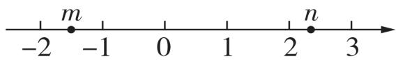

A. $m + n = 0$

B. $|m| < |n|$

C. -n > 0

D. mn > 0

5 教材 P40T1 变式 计算：

(1) $5 \times (-3)$ ;

(2) $(-4)\times\frac{1}{4};$

(3) $0 \times \left(-\frac{1}{6}\right)$ ;

(4) $(- \frac{3}{5}) \times (-\frac{5}{9})$ ;

(5) $\left(-\frac{1}{2}\right)\times\left|-\frac{3}{4}\right|;$

(6) $(-6) \times (-1\frac{2}{3})$ .

# 知识点 2 倒数

6 [2024 陕西中考] -3 的倒数是 ( )

A. $-\frac{1}{3}$

B. $\frac{1}{3}$

C. -3

D. 3

7 一个数的倒数是它本身的数是 ( )

A. 1

B. -1 或 0

C. 0

D. $\pm 1$

8 下列各组数中,互为倒数的是 ( )

A. $1 \frac{1}{4}$ 与 $\frac{4}{5}$

B. -1 与 1

C. 2 与 $-\frac{1}{2}$

D.0.2 与 0.8

9 0.45 的倒数是 \_\_\_\_ ; -1 $\frac{1}{2}$ 的倒数是 \_\_\_\_.

10 若 a, b 互为相反数, c, d 互为倒数, m 的绝对值是 3, 则 $\frac{a + b}{5} + 3m - c \times d =$ \_\_\_\_.

# 知识点 3 有理数乘法的应用

11 教材 P40 例 2 变式 规定: 水位上升为正, 水位下降为负; 几天后为正, 几天前为负. 若水位每天下降 4 cm, 今天的水位记为 0 cm, 则 3 天前的水位用算式表示正确的是 ( )

A. $(+4) \times (+3)$

B. $(+4)\times(-3)$

C. $(-4)\times(+3)$

D. $(-4)\times(-3)$

12 新情境一座两道环路的数字迷宫如图所示,外环两个路口的数字分别为 -5,4,内环两个路口的数字分别为 -3,2. 要想进入迷宫中心需破解密码:两个路口的数相乘,若乘积最大,沿这两个路口就可到达迷宫中心,则乘积最大为 \_\_\_\_.

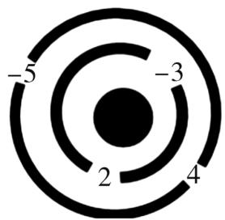

# 课时2▶有理数的乘法运算律

  
课时检测

# 过基础 教材必备知识精练 √ 答案P10

# 知识点 1 有理数的乘法运算律

1 [2025 贵阳观山湖区期末]某同学在计算 $(-4)\times5\times(-0.25)$ 时,将原式变形为 $[(-4)\times(-0.25)]\times5$ 进行简便运算,这样做的依据是()

A. 乘法交换律

B. 分配律

C. 乘法结合律

D. 乘法交换律和乘法结合律

2 计算 $(-3)\times(4-\frac{1}{2})$ ，用分配律计算的过程正确的是()

A. $(-3) \times 4 + (-3) \times (-\frac{1}{2})$   
B. $(-3)\times4-(-3)\times(-\frac{1}{2})$   
C. $3 \times 4 - (-3) \times (-\frac{1}{2})$   
D. $(-3) \times 4 + 3 \times (-\frac{1}{2})$

3 下列变形不正确的是 ( )

A. $5 \times (-6) = (-6) \times 5$   
B. $[4\times (-5)]\times (-10) = 4\times [(-5)\times (-10)]$   
C. $\left[(-\frac{2}{3}) + \frac{1}{2}\right] \times (-12) = \left(-\frac{2}{3}\right) \times$

$$
(- 1 2) + \frac {1}{2} \times (- 1 2)
$$

D. $(-8) \times \frac{3}{16} \times (-1) \times \frac{1}{2} = (-8) \times \frac{3}{16} \times 1 \times \frac{1}{2}$

4 计算: $(-22)\times\frac{5}{7}\times(-\frac{3}{11})\times(-21)=$ \_\_\_\_.  
5 教材 P43T1 变式 计算：

(1) $(-4) \times \frac{2}{3} \times (-0.25)$ ;   
(2) $\left(\frac{1}{2} -\frac{5}{9} +\frac{5}{6} -\frac{7}{12}\right)\times (-36);$

(3) $(-273) \times (-4) + (+273) \times (-7) - (+273) \times (-3)$ .

# 知识点 2 多个有理数相乘

6 [2025 漂河期末] 已知三个数的积为负数, 如果一个数为正数, 那么另外两个数 ( )

A. 一定都是正数

B. 一定都是负数

C. 一定异号

D. 无法确定

7 [2025 金华金东区期末]有 2 025 个有理数相乘,结果为 0,那么这 2 025 个数 ( )

A. 都为 0

B. 只有一个 0

C. 有两个数互为相反数

D. 至少有一个 0

8 教材 P43T2 变式 计算:

(1) $(-2)\times \frac{5}{4}\times (-\frac{9}{10})\times (-\frac{2}{3});$

(2) $(-2026) \times 2025 \times 0 \times (-2024)$ ;   
(3) $(-1\frac{2}{3})\times (-\frac{4}{9})\times (-2.5)\times (-\frac{3}{25}).$

# 过能力 学科关键能力构建 √ 答案P10

9 [2024 锦州太和区期中] $a, b, c$ 为非零有理数，它们的积一定为正数的是 （）

A. $a, b, c$ 同号

B. $a > 0, b$ 与 $c$ 同号

C. b < 0, a 与 c 同号

D. $a > b > 0 > c$

10 [2025 蚌埠期末]若 $(-9)\times2024=m$ ,则 $(-9)\times2025$ 可以表示为()

A. $m + 9$

B. $m - 9$

C. $m + 1$

D. $- m + 1$

11 计算下列各题:

(1) $(-13) \times \frac{2}{3} - \frac{5}{7} \times 0.35 + \frac{1}{3} \times (-13) - \frac{2}{7} \times 0.35$ ;

(2) $30 \times \left(\frac{1}{2} - \frac{2}{3} + \frac{3}{5}\right) - 11.7 \times 2\frac{1}{2} + 11.7 \times 12.5;$

(3) $4 \times (-123) + (-5) \times 125 - 127 \times 4 - 75 \times 5.$

12 定义一种新的运算“\*”，规定有理数 $a * b = 4ab$ ，如： $2 * 3 = 4 \times 2 \times 3 = 24$ .

(1) 求 $3 \times (-4)$ 的值;  
(2) 求 $(-2)*(6*3)$ 的值.

# 素养提升。

13 运算能力 [2025 眉山东坡区百坡校联体期中] 学习了有理数的乘法后,老师给同学们布置了这样一道题目:计算 $49\frac{24}{25}\times(-5)$ ,看谁算得又快又对.

有两位同学的解法如下:

小明： $49\frac{24}{25}\times (-5) = -(\frac{1249}{25}\times 5) =$ $-\frac{1249}{5} = -249\frac{4}{5}.$

小军: $49\frac{24}{25}\times(-5)=(49+\frac{24}{25})\times(-5)=49\times$ $(-5)+\frac{24}{25}\times(-5)=-249\frac{4}{5}.$

(1) 对于以上两种解法,你认为谁的解法较好?  
(2)上面的解法对你有何启发,你认为还有更好的方法吗?如果有,请把它写出来.  
(3)用你认为最合适的方法计算 $19\frac{15}{16}\times (-8)$ .

# 课时3▶有理数的除法

  
课时检测

# 过基础 教材必备知识精练 √ 答案P11

# 教辅资源，关注公众号★全科AA+

# 知识点 1 有理数的除法法则

1 [2025 长春力旺实验中学一模] 根据有理数除法法则, 计算 $-3 \div (-4)$ 的过程正确的是（）

A. + (3 × 4)

B. $-(3\times 4)$

C. $+\left(3\times\frac{1}{4}\right)$

D. $-\left(3 \times \frac{1}{4}\right)$

2 [2024 临汾一模] 计算 $(-3) \div \frac{1}{2}$ 的结果是 ( )

A. -6

B. $-3 \frac{1}{2}$

C. $-\frac{3}{2}$

D. 6

3 [2025 上海青浦区期末] 如果两个有理数的商是 -1, 那么下列说法正确的是 ( )

A. 这两个数相等  
B. 这两个数互为相反数  
C. 这两个数互为倒数  
D. 这两个数中一个数是另一个数的相反数的倒数

4 已知算式 $\left(-\frac{5}{2}\right)\div(\quad)=-3$ ，则括号内的数为（）

A. $-\frac{6}{5}$

B. $\frac{6}{5}$

C. $-\frac{5}{6}$

D. $\frac{5}{6}$

5 计算: (1) (-27) ÷ 9 = \_\_\_\_ ;

(2) $0 \div (-8) =$ \_\_\_\_;   
(3) $(- \frac{1}{7}) \div (-7) =$ ;   
(4) $\frac{3}{7}\div(-\frac{9}{14})=$ \_\_\_\_.

6 易错题已知 $|x| = 4, |y| = \frac{1}{2}, x < y$ , 则 $\frac{x}{y}$ 的值是 \_\_\_\_.

7 教材 P45T1 变式 计算：

(1) $4 \div (-8)$ ;   
(2) $(- \frac{12}{25}) \div \frac{3}{5}$ ;   
(3) $(-4)\div\frac{4}{9};$   
(4) $(-1\frac{2}{3})\div (-0.2)$ .

# 知识点 2 有理数除法的应用

8 一个数与 -4 的乘积等于 $3 \frac{1}{5}$ , 则这个数是 ( )

A. $\frac{4}{5}$

B. $-\frac{4}{5}$

C. $\frac{5}{4}$

D. $-\frac{5}{4}$

9 教材 P44 例 5 变式化简：

(1) $\frac{-125}{5}$ ;   
(2) $\frac{0.2}{-0.5}$ ;   
(3) $\frac{-3}{-\frac{1}{2}};$   
(4) $-\frac{26}{-4}.$

# 素养提升。

10 运算能力 [2024 杭州十三中教育集团改编] 分类讨论是一种重要的数学方法, 如在化简 $|a|$ 时, 可以这样分类: 当 $a > 0$ 时, $|a| = a$ ; 当 $a = 0$ 时, $|a| = 0$ ; 当 $a < 0$ 时, $|a| = -a$ . 用这种方法解决下列问题:

(1) 当 a = -2 时, $\frac{a}{|a|}$ 的值为 \_\_\_\_;  
(2) 若 $a \neq 0$ , 则 $\frac{|a|}{a}$ 的值为 \_\_\_\_;  
(3) 若有理数 a, b 异号, 则 $\frac{a}{|a|} + \frac{|b|}{b}$ 的值为 \_\_\_\_.

# 课时4▶有理数的加减乘除混合运算

  
课时检测

过基础 教材必备知识精练 √ 答案P11

教辅资源，关注公众号★全科AA+

# 知识点 1 有理数的乘除混合运算

1 计算 $(-8) \times (-2) \div (-\frac{1}{4})$ 的结果为（）

A. -32

B. 32

C. -64

D. 64

2 下列计算正确的是 ( )

A. $(-32) \div 4 \times (-8) = 1$   
B. $-3.5 \div \frac{7}{8} \times \left(-\frac{3}{4}\right) = -3$   
C. $-6 \div (-4) \times \frac{5}{6} = \frac{5}{4}$   
D. $-\frac{1}{30} \times \left( \frac{1}{6} - \frac{1}{5} \right) = -1$

3 计算:

(1) $-3 \div 3 \times \frac{1}{3}$ ;   
(2) $32 \div \left(-\frac{4}{5}\right) \times \left(-\frac{5}{4}\right)$ ;   
(3) $(-2\frac{1}{4})\div 4\times (-2)$ ;   
(4) $(-2\frac{4}{7})\times (-1\frac{5}{6})\div (-1\frac{1}{21}).$

# 知识点 2 有理数的加减乘除混合运算

4 计算 $5 \div (-2 + 3)$ 的结果是 ( )

A. 5

B. $\frac{1}{5}$

C. -5

D. $-\frac{1}{5}$

5 下列计算正确的是 ( )

A. $-9 \div 2 \times \frac{1}{2} = -9$

B. $6 \div \left(\frac{1}{3} - \frac{1}{2}\right) = -1$

C. $1 \frac{1}{4} - 1 \frac{1}{4} \div \frac{5}{6} = 0$

D. $-\frac{1}{2} \div \frac{1}{4} \div \frac{1}{4} = -8$

6 计算:

(1) $-3\frac{1}{3} \times \left(-\frac{8}{35}\right) + \frac{2}{27} \div \frac{7}{9} - \frac{2}{3};$

(2) $-64 \div 3 \frac{1}{5} \times \frac{5}{8} + (-1) \times (-12)$ .

# 知识点 3 计算器的使用

7 下列说法错误的是 ( )

A. 开启计算器使之工作的按键是ON键  
B. 输入 -5.8 的按键顺序是 $(-)$ 5.8  
C. 输入 0.58 的按键顺序是 0 . 5 8  
D. 按键 69 - 87 = 能计算出 -69 - 87 的结果

8 用计算器计算:

(1)358.3 - 27.5 ÷ 50 + 26 = \_\_\_\_ ;   
(2) $15 + 5 \times 23.4 \div 15 =$ \_\_\_\_.

# 过能力 学科关键能力构建 √ 答案P12

9 将下列运算符号分别填入算式 $6 - \left( -\frac{1}{2} \diamond 2 \right)$ 的◇中, 计算结果最小的是 ( )

A. +

B. -

C. ×

D. ÷

10 [2024 苏州外国语学校月考]我们把 $2 \div 2 \div 2$ 记作 $2^{③}, (-4) \div (-4)$ 记作 $(-4)^{②}$ ，那么计算 $9 \times (-3)^{④}$ 的结果为（）

A. 1

B. 3

C. $\frac{1}{3}$

D. $\frac{1}{9}$

11 [2022 镇江中考]“五月天山雪,无花只有寒”,反映出地形对气温的影响.大致海拔每升高100米,气温下降约0.6℃.有一座海拔为2350米的山,在这座山上海拔为350米的地方测得气温是6℃,则此时山顶的气温约为-6℃.

12 计算下列各题:

(1) $18 - 6 \div (-2) \times \left(-\frac{1}{3}\right)$ ;

(2) $-3 - \left[-5 + (1 - 0.2 \times \frac{5}{3}) \div (-2)\right]$ ;

(3) $-\frac{2}{3} \div \left(-\frac{4}{3}\right) - 24 \times \left(\frac{2}{3} - \frac{3}{4} - \frac{1}{12}\right)$ .

13 新趋势·过程性学习 阅读下面解题过程:

计算: $(-15)\div\left(\frac{1}{3}-\frac{3}{2}-3\right)\times6.$

解: $(-15)\div\left(\frac{1}{3}-\frac{3}{2}-3\right)\times6$

$= (-15) \div (-\frac{25}{6}) \times 6$ (第一步)

$= (-15) \div (-25)$ （第二步）  
$= -\frac{3}{5}$ (第三步).

回答:

(1)上面解题过程中有两处错误,第一处是第几步?第二处是第几步?  
(2)请写出正确的解题过程.

# 素养提升。

14 运算能力 [2025 邯郸永年区期中] 阅读下列材料: 计算: $\frac{1}{24} \div \left( \frac{1}{3} - \frac{1}{4} + \frac{1}{12} \right)$ .

解法一: 原式 $=\frac{1}{24}\div\frac{1}{3}-\frac{1}{24}\div\frac{1}{4}+\frac{1}{24}\div\frac{1}{12}=\frac{1}{24}\times$ $3-\frac{1}{24}\times4+\frac{1}{24}\times12=\frac{11}{24}.$

解法二: 原式 $=\frac{1}{24}\div\left(\frac{4}{12}-\frac{3}{12}+\frac{1}{12}\right)=\frac{1}{24}\div\frac{2}{12}=$ $\frac{1}{24}\times6=\frac{1}{4}.$

解法三: 原式的倒数 = $\left(\frac{1}{3}-\frac{1}{4}+\frac{1}{12}\right)\div\frac{1}{24}=$ $\left(\frac{1}{3}-\frac{1}{4}+\frac{1}{12}\right)\times24=\frac{1}{3}\times24-\frac{1}{4}\times24+\frac{1}{12}\times$ 24=4,所以原式= $\frac{1}{4}$ .

(1)上述得到的结果不同,你认为解法\_\_\_\_是错误的.  
(2)请你选择合适的解法计算: $\left(-\frac{1}{42}\right)\div\left(\frac{1}{6}-\frac{3}{14}+\frac{2}{3}-\frac{2}{7}\right)$ .

# 有理数运算中的数学思想方法

√ 答案 P12

# 思想方法 1 分类讨论思想

1 已知 $\left|x\right|=5,\left|y\right|=4.$

(1) 若 $xy < 0$ , 则 $x + y$ 的值为 \_\_\_\_;  
(2) 若 $\left|x+y\right|=x+y$ ，则 xy 的值为 \_\_\_\_.

2 若 ab > 0, 化简: $\frac{|a|}{a} + \frac{|b|}{b} - \frac{|ab|}{ab} =$ \_\_\_\_ .

# 思想方法 2 数形结合思想

3 [2024 广州荔湾区期末] 在数轴上表示有理数 a, b, c 的点如图所示, 已知 $a + b < 0$ , ac < 0, 给出四个结论: ① abc < 0; ② $b + c < 0$ ; ③ $|a| - |b| > 0$ ; ④ $|a - c| < |a|$ , 其中一定成立的结论个数为 (

A. 1

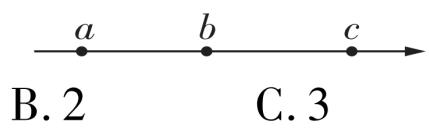

D. 4

# 思想方法 3 转化思想(减法转化为加法,除法转化为乘法)

4 计算: (1) $-|-0.5| - (-3\frac{1}{4}) + 2.75 - 7\frac{1}{2}$ ;

(2) $-\frac{2}{5} \div (-\frac{1}{3}) \div (-3\frac{2}{5}) \times 5\frac{2}{3}$ .

# 一题练透

# 有理数四则运算的实际应用

√ 答案 P13

小明的妈妈在某模具厂工作,厂里规定每个工人每周要生产某种模具280个,计划每天生产40个,但由于种种原因,实际每天的生产量与计

划量相比有出入. 下表是小明妈妈某周的生产情况(超产记为正、减产记为负):

<table><tr><td>星期</td><td>一</td><td>二</td><td>三</td><td>四</td><td>五</td><td>六</td><td>日</td></tr><tr><td>增减产值</td><td>+8</td><td>-1</td><td>-4</td><td>+9</td><td>-13</td><td>+7</td><td>0</td></tr></table>

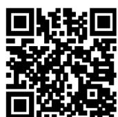  
视频解题

(1) 小明的妈妈本周实际生产模具多少个?

(2)该厂实行“每日计件工资制”,每生产一个模具可得工资6元,若超额完成任务,则超过的部分每个另奖3元;若没有完成任务,则少生产一个倒扣2元.小明的妈妈这一周的工资总额是多少元?

(3)在(2)的条件下,①若将实行“每日计件工资制”改为实行“每周计件工资制”,则在此

方式下小明的妈妈这一周的工资与按日计件的工资哪一个更多？请说明理由.

②若按“每周计件工资制”的方式,小明的妈妈这一周的工资要想达到1806元,则她一周需要生产多少个模具?

③若按“每日计件工资制”的方式,且某周中的星期一至星期六每天生产模具的个数分别是45,38,43,40,41,36,小明妈妈这一周的工资要想达到1803元,则她星期日需要生产多少个模具?

# 专项 2 运用乘法运算律进行简便计算

# 过专项 阶段强化专项训练 √ 答案P13

# 类型 1 将互为倒数、能约分或相乘得整数的数相结合

1 计算: $-1.25 \times (-4) \times 8 \times (-25)$ .  
2 计算: $(-5)\div(-1\frac{2}{7})\times\frac{4}{5}\times(-2\frac{1}{4})\div1\frac{3}{4}.$

# 类型 2 运用分配律简化计算

3 用简便方法计算:

(1) $\left(\frac{1}{3} - \frac{1}{4} + \frac{2}{5} - \frac{5}{6}\right) \times (-60)$ ;   
(2) $-13 \times \frac{2}{3} - 0.34 \times \frac{2}{7} + \frac{1}{3} \times (-13) - \frac{5}{7} \times$ 0.34;   
(3) $\frac{5}{9} \times \left(-\frac{5}{21}\right) - \frac{7}{9} \times \frac{5}{21} - \frac{5}{3} \times \frac{1}{7}$ ;

(4) $-36 \times \left(\frac{7}{18} - \frac{3}{4} - \frac{5}{6}\right) - 5 \times \left(-\frac{11}{5}\right) + 13 \times$ $(- \frac{11}{5}) - 3 \times \left(-\frac{11}{5}\right)$ .

# 类型 3 将一个数拆分成多个数之和（或差），再运用分配律简化计算

4 计算: $(-50)\times999.$   
5 计算: $-49 \frac{15}{16} \times 8.$

# 类型 4 利用倒数法进行计算

6 计算: $-\frac{1}{24} \div \left( \frac{2}{3} - \frac{1}{12} + \frac{1}{6} - 1 \frac{1}{4} \right)$ .

# 2.3 有理数的乘方

# 课时1▶乘方

  
课时检测

# 过基础 教材必备知识精练 √ 答案P13

# 知识点 1 有理数乘方的意义

1 [2025 郑州中原区期末] 计算 $\underbrace{5 \times 5 \times \cdots \times 5}_{n个5}$ 的
结果是 （）

A. $5n$

B. $5 + n$

C. $n^{5}$

D. $5^{n}$

2 式子 $(-3)\times(-3)\times(-3)\times(-3)$ 写成乘方的形式是\_\_\_\_，底数是\_\_\_\_，指数是\_\_\_\_。

# 知识点 2 有理数的乘方运算

3 [2025 南京五十中期末] - $7^{2}$ 的值是 （）

A. -49

B. 49

C. -14

D. 14

4 [2024 玉溪期末]下列计算正确的是 （）

A. $-4^{2}=16$

B. ${3}^{2} = 6$

C. $\left(-\frac{1}{2}\right)^{2}=-\frac{1}{4}$

D. $(-3)^{3} = -27$

5 下列各数中,是负数的是 ( )

A. -(-2)

B. $-(-1)^{2026}$

C. $\left| -1^{2} \right|$

D. $(-5)^{2}$

6 [2025 大庆一模] 下列各组数中, 互为相反数的是 ( )

A. $-2^{3}$ 与 $(-2)^{3}$

B. $-3^{2}$ 与 $(-3)^{2}$

C. $-5^{2}$ 与 $(-2)^{5}$

D. -(-3)与|-3|

7 计算:

(1) $(-2)^{4}$ ;

(2) $(-5)^{3}$ ;

(3) $-5^{3}$ ;

(4) $\left(\frac{2}{3}\right)^{3}$ ;

(5) $\left(-\frac{6}{7}\right)^{3}$ ;

(6) $-\left(-\frac{3}{2}\right)^{3}$ .

# 知识点 3 利用计算器计算有理数的乘方

8 用计算器计算:

(1) $13^{5}=$ \_\_\_\_;

(2) $(-3.4)^{3}=$ \_\_\_\_.

# 过能力 学科关键能力构建 √ 答案P14

9 [2025 保定竞秀区期中] 甲、乙、丙、丁 4 位同学, 学了有理数的乘方之后, 发表了以下见解, 观点正确的有 ( )

甲: $2^{5}$ 是2个5相加.

乙： $-\left(\frac{3}{4}\right)^{3}$ 与 $\left(-\frac{3}{4}\right)^{3}$ 是不同的结果.

丙： $-2^{8}$ 中底数是 -2，指数是 8.

丁: $n^{4}$ 是 n 个 4 相乘.

A. 0 个

B. 1 个

C. 2 个

D. 3 个

10 新趋势·数学文化 [2024 成都天府新区期末]《庄子》中记载:“一尺之棰,日取其半,万世不竭.”大意是一尺长的木棍,每天截取它的一半,永远也截不完.若按此方式截一根长为 1 米的木棍,则第 5 天截取的木棍的长度是（）

A. $\left[1 - \left(\frac{1}{2}\right)^5\right]$ 米

B. $[1 - (\frac{1}{2})^4]$ 米

C. $(\frac{1}{2})^5$ 米

D. $\left(\frac{1}{2}\right)^{4}$ 米

11 定义: 如果 $2^{m} = n(m, n$ 为正数), 那么我们把 m 叫作 n 的 D 数, 记作 $m = \mathrm{D}(n)$ . 根据所学知识, 试计算: $\mathrm{D}(16) =$ \_\_\_\_.

# 课时2▶有理数的混合运算

  
课时检测

# 过基础 教材必备知识精练 √ 答案P14

# 知识点 1 有理数的混合运算

1 [2025 邯郸期末] 计算 $(-4) \times (-3) + 8 \div (-2)^{3}$ ，得 （）

A. 11

B. 13

C. -11

D. -13

2 下列各式计算正确的是 （）

A. $7 - 2 \times \left(-\frac{1}{5}\right) = 5 \times \left(-\frac{1}{5}\right) = -1$   
B. $-3 \div 7 \times \frac{1}{7} = -3 \div 1 = -3$   
C. $-3^{2} - (-3)^{2} = -9 - 9 = -18$   
D. $3 \times 2^{3} - 2 \times 9 = 3 \times 6 - 18 = 0$

3 计算: $-4^{2} \div \frac{4}{9} \times \left(-\frac{4}{9}\right) =$ \_\_\_\_ .  
4 计算: $-2^{2} \div 8 - \frac{1}{4} \times (-2)^{2} =$ \_\_\_\_.  
5 教材 P53 例 3 变式 计算:

(1) $|-4|-2\times(-3)^{2}+4\div(-\frac{1}{3})$ ;   
(2) $-1^{4} - \frac{27}{4} \times \left(\frac{1}{3} - 1\right) \div (-3)^{2}$ ;   
(3) $(-10)^{3} + [(-4)^{2} - (1 - 3)^{2} \times 2]$ .

6 新趋势·过程性学习 [2024 银川兴庆区期末]

计算: $(-2)^{3}\div\left[-3^{2}\times\left(-\frac{2}{3}\right)^{2}+2\right]\times\frac{1}{6}.$

下面是小聪的解答过程,请认真阅读并完成任务:

解： $(-2)^{3}\div [-3^{2}\times (-\frac{2}{3})^{2} + 2]\times \frac{1}{6}$

$= (-8) \div (9 \times \frac{4}{9} + 2) \times \frac{1}{6} \cdots$ 第一步  
$= (-8) \div (4 + 2) \times \frac{1}{6} \cdots$ 第二步  
$= (-8) \div 6 \times \frac{1}{6} \cdots$ 第三步  
$= (-8) \div 1 \cdots$ 第四步  
$= -8.\cdots$ 第五步

(1)任务一:小聪的解答过程共存在两处错误,分别在第\_\_\_\_步和第\_\_\_\_步.  
(2)任务二:请写出正确的解答过程.

# 知识点 2 有理数混合运算中的数字规律

7 已知 $2 + \frac{2}{3} = 2^{2} \times \frac{2}{3}, 3 + \frac{3}{8} = 3^{2} \times \frac{3}{8}, 4 + \frac{4}{15} = 4^{2} \times \frac{4}{15}, \cdots$ , 若 $14 + \frac{a}{b} = 14^{2} \times \frac{a}{b} (a, b \text{ 均为正整数})$ , 则 $a + b = \_\_\_\_$ .  
8 [2022 泰安中考] 将从 1 开始的连续自然数按以下规律排列: 若有序数对 $(n, m)$ 表示第 n 行, 从左到右第 m 个数如 3, 2) 表示 6, 则表示 99 的有序数对是 \_\_\_\_.

<table><tr><td>第1行</td><td></td><td></td><td></td><td>1</td><td></td><td></td><td></td><td></td></tr><tr><td>第2行</td><td></td><td></td><td>2</td><td>3</td><td>4</td><td></td><td></td><td></td></tr><tr><td>第3行</td><td></td><td>5</td><td>6</td><td>7</td><td>8</td><td>9</td><td></td><td></td></tr><tr><td>第4行</td><td>10</td><td>11</td><td>12</td><td>13</td><td>14</td><td>15</td><td>16</td><td></td></tr><tr><td>第5行</td><td>17</td><td>18</td><td>19</td><td>20</td><td>21</td><td>22</td><td>23</td><td>24</td></tr><tr><td>......</td><td></td><td></td><td></td><td></td><td></td><td></td><td></td><td></td></tr></table>

# 过能力 学科关键能力构建 √ 答案P14

9 如图是一个计算程序,若输入 a 的值为 -1,则输出 b 的值为 ( A )

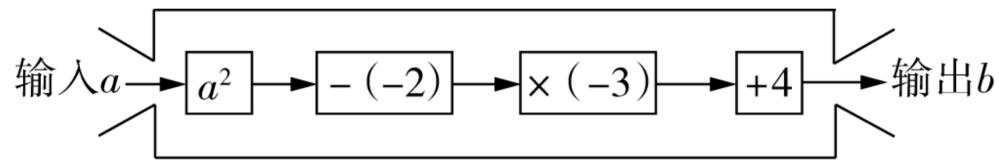

flowchart

A. -5

B. -6

C. 5

D. 6

10 教材 P53 例 4 变式 [2023 牡丹江中考] 观察下面两行数：

1,5,11,19,29,…;

1,3,6,10,15,…

取每行数的第 7 个数, 计算这两个数的和是 ( )

A. 92

B. 87

C. 83

D. 78

11 跨学科·科学 [2025 莆田涵江区期中]生活中常用的十进制是用 0 \~ 9 这十个数字来表示数, 满十进一, 例: $12 = 1 \times 10^{1} + 2, 212 = 2 \times 10^{2} + 1 \times 10^{1} + 2$ ; 计算机常用十六进制来表示字符, 它是用 0 \~ F 来表示 0 \~ 15, 满十六进一, 它与十进制对应的数如下表:

<table><tr><td>十进制</td><td>0</td><td>1</td><td>2</td><td> $\cdots$ </td><td>8</td><td>9</td><td>10</td><td>11</td><td>12</td><td>13</td><td>14</td><td>15</td><td>16</td><td>17</td><td> $\cdots$ </td></tr><tr><td>十六进制</td><td>0</td><td>1</td><td>2</td><td> $\cdots$ </td><td>8</td><td>9</td><td>A</td><td>B</td><td>C</td><td>D</td><td>E</td><td>F</td><td>10</td><td>11</td><td> $\cdots$ </td></tr></table>

例:十六进制 2A 对应十进制的数为 $2 \times 16^{1} + 10 = 42, 12B = 1 \times 16^{2} + 2 \times 16^{1} + 11 = 299$ , 那么十六进制中 -20F 对应十进制的数是（）

A. -271

B. -2 015

C. -527

D. -300

12 [2025 定西一模] 用“ $\odot$ ”定义一种新运算： $a \odot b = a^{b} - ab + 1$ ，如 $2 \odot 3 = 2^{3} - 2 \times 3 + 1 = 3$ . 则 $3 \odot [(-1) \odot 2]$ 的值为 \_\_\_\_.

13 计算下列各题:

(1) $(8 \div 2 \times \frac{1}{2}) - [5 \times (3 - \frac{3}{5})]^2$ ;

(2) $(-1)^{5} - \left[-3 \times \left(-\frac{2}{3}\right)^{2} - 1\frac{1}{3} \div (-2)^{2}\right]$ ;

(3) $-\frac{4}{5} \times \left[ \left( -\frac{1}{2} \right) \div (0.75 - 1) + (-2)^{5} \right]$ .

14 新情境如图 1,从大拇指开始,按食指、中指、无名指、小指,再回到大拇指的顺序,依次数正整数 1,2,3,4,5…

(1) 当第 5 次数到中指时, 这个数是 \_\_\_\_.  
(2) 当数到 2025 时, 数到的是哪一根手指? 说明理由.  
(3)若改变顺序,按大拇指、食指、中指、无名指、小指、无名指、中指……的顺序,如图2,当数到2025时,数到的是哪一根手指?说明理由.

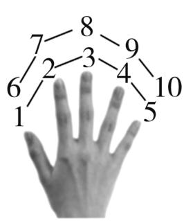  
图1

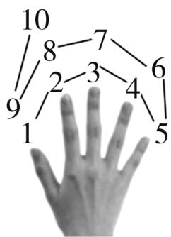  
图2

# 课时3▶ 科学记数法

  
课时检测

# 过基础 教材必备知识精练 √ 答案P15

# 知识点 1 用科学记数法表示绝对值较大的数

1 [2024 廊坊安次区期末] 小明将 58 935 325 用科学记数法记为 $a \times 10^{n}$ 的形式 (其中 $a$ 大于或等于 1 且小于 10, $n$ 是正整数), 他表示的结果为 $58.935325 \times 10^{7}$ . 则下列判断正确的是 ( )

A. 小明只将 $a$ 写错了  
B. 小明只将 $n$ 写错了  
C. 小明将 $a, n$ 都写错了  
D. 小明将 $a, n$ 都写对了

2 新情境 [2025 大连甘井子区一模] DeepSeek 是一款先进的人工智能助手, 可提供高效、精准的信息检索和智能对话服务, 其活跃用户数在上线三个星期后达到了 33 700 000. 将 33 700 000 用科学记数法表示为 ( )

A. $33.7 \times 10^{6}$

B. $3.37 \times 10^{6}$

C. $3.37 \times 10^{7}$

D. $0.337 \times 10^{7}$

3 [2025 深圳模拟] 截至 2025 年 3 月 27 日, 电影《哪吒 2》的全球票房为 153.78 亿元, 将 153.78 亿用科学记数法表示为 ( )

A. 1.537 $8 \times 10^{9}$

B. 1.537 $8 \times 10^{10}$

C. $153.78 \times 10^{8}$

D. $15.378 \times 10^{9}$

4 [2024 淄博中考] 我国大力发展新质生产力,推动了新能源汽车产业的快速发展. 据中国汽车工业协会发布的消息显示, 2024 年 1 至 3 月, 我国新能源汽车完成出口 30.7 万辆. 将 30.7 万用科学记数法表示为 $3.07 \times 10^{n}$ , 则 $n$ 的值是 ( )

A. 4

B. 5

C. 6

D. 7

5 教材 P55 思考变式 [2024 淮安淮安区期中] 用科学记数法表示的数 $2.021 \times 10^{n+1}$ 的整数数位有 （）

A. $n$ 个   
C. $(n + 2)$ 个

B. $(n + 1)$ 个

D. $(n + 3)$ 个

6 新趋势·数学文化 [2024 深圳福田区模拟]《孙子算经》卷上说：“十圭为抄，十抄为撮，十撮为勺，十勺为合。”说明“抄、撮、勺、合”均为

十进制,则九十合等于

B. $9 \times 10^{3}$ 圭

A. $9 \times 10^{2}$ 圭

D. $9 \times 10^{5}$ 圭

C. $9 \times 10^{4}$ 圭

7 教材 P57T9 变式 [2024 北京中考] 为助力数字经济发展,北京积极推进多个公共算力中心的建设. 北京数字经济算力中心日前已部署上架和调试的设备的算力为 $4 \times 10^{17}$ Flops (Flops 是计算机系统算力的一种度量单位),整体投产后,累计实现的算力将是日前已部署上架和调试的设备的算力的 5 倍,达到 $m$ Flops,则 $m$ 的值为 ( )

A. $8 \times 10^{16}$

B. $2 \times 10^{17}$

C. $5 \times 10^{17}$

D. $2 \times 10^{18}$

8 用科学记数法表示下列各数:

(1) -900 200; (2) 2 005; (3) 100; (4) -30 100.

# 知识点 2 还原用科学记数法表示的数

9 全面推进新农村建设是改善农村居住环境,提高农民生活水平的必经之路. 某地积极响应党中央号召,大力推进农村厕所改革,已经累计投资 $1.023 \times 10^{8}$ 元资金. 数据 $1.023 \times 10^{8}$ 可表示为 ( )

A. 0.1023 亿

B. 1.023 亿

C. 10.23 亿

D. 102.3 亿

10 若整数 815 550…0 用科学记数法表示为 $8.1555 \times 10^{11}$ ，则原数中“0”的个数为（）

A. 4

B. 6

C. 7

D. 10

11 已知下列用科学记数法表示的数,写出原来的数:

(1) $2.01 \times 10^{4}$ ; (2) $6.070 \times 10^{5}$ ; (3) $-3 \times 10^{3}$ .

# 课时4 ▶ 近似数

  
课时检测

# 过基础 教材必备知识精练 √ 答案P15

# 知识点 1 准确数与近似数

1 下列语句中的数据是近似数的是 （）

A. 七(2)班有 54 名学生  
B. 足球比赛开始时每队各有 11 名球员  
C. 杨老师在交通银行存入 1 000 元  
D. 我国最长的河流是长江,全长约 6300 km

2 下列各数是准确数的是 ( )

A. 嘉嘉同学的身高约是 $163 \mathrm{~cm}$   
B. 汽车行驶的平均速度是 $65 \, km/h$   
C. 琪琪同学买了约 5 千克苹果  
D. 一台电脑的单价是 5600 元

# 知识点 2 近似数的精确度

3 [2024 攀枝花中考]下列各数都是用四舍五入法得到的近似数,其中精确到十分位的是 （）

A. 24

B. 24.0

C. 24.00

D. 240

4 [2025 承德宽城期末]下列说法正确的是（）

A. 1.8 和 1.80 的精确度相同  
B. 5.7 万精确到十分位  
C. $1.20 \times 10^{3}$ 精确到百位  
D. 6.610 精确到千分位

5 下列由四舍五入法得到的近似数,各精确到哪一位?

(1)4.60; (2)1.50万; (3) $-2.30\times10^{3}$ .

# 知识点 3 按要求求近似数

6 苍南因地处玉苍山之南,故取县名为苍南.其总面积为1 079.34平方公里,数1 079.34精确到个位,则近似值为()

A. 1 080

B. 1 079.3

C. 1 079

D. 1 070

7 教材 P56T4 变式 [2024 重庆长寿区期末] 用四舍五入法按要求对 0.05019 分别取近似值, 其中错误的是 ( )

A.0.1(精确到十分位)  
B. 0.05(精确到百分位)  
C. 0.05(精确到千分位)  
D. 0.0502 (精确到万分位)

8 [2024 赤峰期末]用四舍五入法把 4.0962 精确到 0.01,所得到的近似数为 ( )

A. 4. 10

B. 4.09

C. 4.1

D. 4.096

9 近似数 1.30 所表示的准确数 A 的取值范围是 ( )

A. 1. $25 \leqslant A < 1.35$

B. 1.20 < A < 1.30

C. 1. $295 \leqslant A < 1.305$

D. $1.300 \leqslant A < 1.305$

10 教材 P61T5 变式 用四舍五入法, 按要求对下列各数取近似值:

(1)38 063(精确到千位);   
(2)0.403 0(精确到百分位);   
(3)0.028 66(精确到0.000 1);   
(4)3.5486(精确到十分位).

11 某工厂小张师傅接受了加工两根轴承的任务,他很快完成了任务,当他把轴承交给质检员验收时,质检员说:“不合格,作废!”小张不服气地说:“图纸上要求的精确度是2.60 m,我加工的轴承,一根是2.56 m,另一根是2.62 m,怎么不合格了?”

请你说一说,是小张师傅加工的轴承不合格,
还是质检员故意刁难? 为什么?

# 数学活动

# 过基础 教材必备知识精练 √ 答案P16

1 [2024 北京朝阳区期末]对幻方的研究体现了中国古人的智慧,如图 1 是一个幻方的图案,其中 9 个格中的点数分别为 1,2,3,4,5,6,7,8,9. 每一横行、每一竖列、每一斜对角线上的点数的和都是 15. 如图 2 是一个没有填完整的幻方,如果处于同一横行、同一竖列、同一斜对角线上的 3 个数的和都相等,那么正中间的方格中的数为 ( )

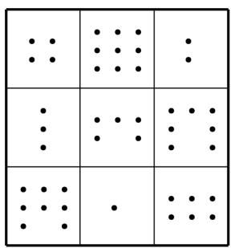

text_image

Grid pattern with dot and dot clusters in a 4x4 layout

图 1

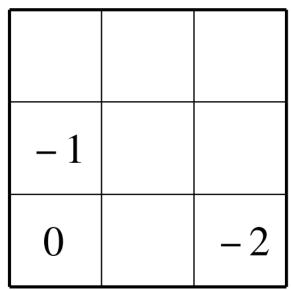  
图 2

A. 5

B. 1

C. 0

D. -1

2 如图,在 $3 \times 3$ 的九个格子中填入 9 个数字,当每行、每列及每条对角线上的 3 个数字之和都相等时,我们把这个数表称为三阶幻方. 若 -2, -1,0,1,2,3,4,5,6 这 9 个数也能构成三阶幻方,则此时每行、每列及每条对角线上的 3 个数字之和都为 \_\_\_\_.

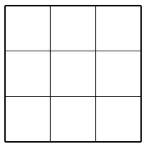  
第2题图

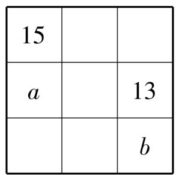  
第3题图

3 [2025 德阳中学期中] 将 1,3,5,7,9,11,13,15,17 这 9 个数填入幻方的 9 个空格中,使每行、每列、每条对角线上的三个数之和相等. 如图,如果小明已填入的 13 和 15 两个数是正确的解答,那么请你帮他把剩余的数填上并利用字母所代表的数,计算: $b^{a} =$ \_\_\_\_.

4 [2025 枣庄市中区期末] 同学们都熟悉“幻方”游戏, 现将“幻方”游戏稍作改进变成“幻圆”游戏, 将 -6, 8, -10, 12, -14, 16, -18, 20 分别

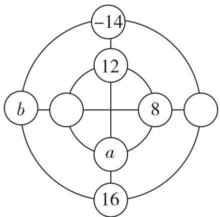

flowchart

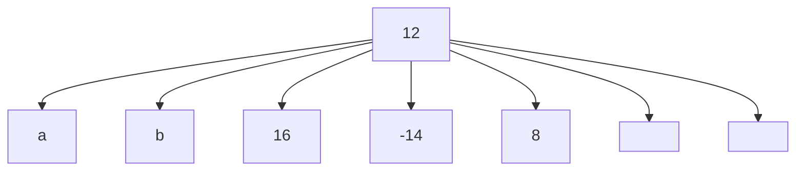

填入图中的圆圈内,使横、竖以及内外两个圈上4个数之和都相等,则 $a+b$ 的值为\_\_\_\_.

5 新趋势·结论开放 如图 1 所示的图案叫作幻方, 其中 9 个格中的点数分别是 1,2,3,4,5,6,7,8,9. 每一横行、每一竖列以及两条斜对角线上的点数的和都是 15. 如果火星上有智能生物, 那么他们可以从这种“数学语言”了解到地球上也有智能生物(人). 你能将 -4, -3, -2, -1,0,1,2,3,4 这 9 个数分别填入如图 2 所示的幻方的 9 个空格中, 使得处于同一横行、同一竖列、同一斜对角线上的 3 个数相加都得 0 吗?

text_image

Grid pattern with nine cells containing dots, arranged in 4x4 layout

图1

natural_image

Simple 2x2 grid with no text, numbers, or symbols

图 2

6 [2025 福州屏东中学期中]“幻方”最早记载于春秋时期的《大戴礼》中,现将 1,2,3,4,5,7,8,9 这 8 个数填入如图 1 所示的“幻方”中,使得每个三角形的三个顶点上的数之和都与中间正方形四个顶点上的数之和相等. 现有如图 2 所示的“幻方”,求 $(x-y)^{m-n}$ 的值.

flowchart

图1

flowchart

图2

# 易错疑难集训

# 过易错 教材易混易错集训 √ 答案P16

# 易错点 1 运算法则理解不到位

1 [2024 广州期末]计算: $-2^{4} + (-2)^{4} =$ ( )

A. -32

B. -16

C. 32

D. 0

2 [2023 常德中考]下面算法正确的是 （）

A. $(-5) + 9 = -(9 - 5)$   
B. $7 - (-10) = 7 - 10$   
C. $(-5) \times 0 = -5$   
D. $(-8)\div(-4)=8\div4$

# 易错点 2 弄错运算顺序或运算律

3 计算: $-8 \div \frac{2}{3} \times \frac{3}{2}$ .

下面是小明同学的解答过程:

$$
- 8 \div \frac {2}{3} \times \frac {3}{2} = - 8 \div 1 = - 8.
$$

你认为小明同学的解答是否正确？若不正确，请指出错在哪里，并给出正确的解题过程；若正确，请写出计算过程中每步的依据。

4 计算: $-2^{2} \times \frac{1}{4} \div (-\frac{1}{2})^{2} \times (-2)^{3}$ .  
5 计算: $50 \div \left( \frac{1}{3} - \frac{1}{4} + \frac{1}{12} \right)$ .

# 过疑难 常考疑难问题突破 √ 答案P17

# 疑难点 1 数轴与有理数加减运算的综合

6 有理数 a, b, c 在数轴上对应点的位置如图所示, 则下列式子正确的是 ( )

A. $c(b - a) > 0$   
B. $b(c - a) < 0$   
C. $b(a + c) > 0$   
D. $a(c - b) < 0$

# 疑难点 2 有理数的运算与绝对值

7 若 a, b, c 为有理数, 且 $\frac{a}{|a|} + \frac{b}{|b|} + \frac{c}{|c|} = -1$ , 则 $\frac{abc}{|abc|}$ 的值为 \_\_\_\_.  
8 [2025 宿迁钟吾初级中学月考] 对于含绝对值的算式, 在有些情况下, 可以不需要计算出结果也能将绝对值符号去掉, 例如:

$$
\begin{array}{l} \vert 7 - 6 \vert = 7 - 6; \vert 6 - 7 \vert = 7 - 6; \left| \frac {1}{2} - \frac {1}{3} \right| = \frac {1}{2} - \\ \frac {1}{3}; \left| \frac {1}{3} - \frac {1}{2} \right| = \frac {1}{2} - \frac {1}{3}. \\ \end{array}
$$

观察上述式子的特征,解答下列问题:

(1) 把下列各式写成去掉绝对值符号的形式 (不用写出计算结果):

① $\left|\frac{2}{3}-\frac{2}{5}\right|=$ \_\_\_\_ ;   
② $|3.14 - \pi | =$

(2) 当 a > b 时, $\left|a - b\right| =$ \_\_\_\_; 当 a < b 时, $\left|a - b\right| =$ \_\_\_\_.  
(3) 计算: $\left|\frac{1}{2}-1\right|+\left|\frac{1}{3}-\frac{1}{2}\right|+\left|\frac{1}{4}-\frac{1}{3}\right|+\cdots+$

$$
\left| \frac {1}{2 0 2 5} - \frac {1}{2 0 2 4} \right|.
$$

# 章末复习专练

# 过全章 题串练透全章知识 √ 答案P17

小明拿出 6 张写着不同数值的卡片,请你按要求抽出卡片,完成下列问题:

-8 -2 3 1 6 0

# 【基础设问】

(1)从中取出非负数的卡片,从大到小排列,组成一个较大数,用科学记数法表示这个数:

(2)从中取出正数的卡片,组成的一个数刚好是小明的身高(1.63米),将数1.63精确到0.1的结果是\_\_\_\_.

(3)从中取出2张卡片,使这2张卡片上的数乘积最大,最大值是\_\_\_\_.

(4)从中取出2张卡片,使这2张卡片上的数相除的商最小,最小值是\_\_\_\_.

(5)算 24 点游戏:从中取出 4 张卡片,用学过的 “+,-,×,÷” 运算,使结果为 24. 请写出 2 个算式并进行计算.

(6)从中取出 -8, -2, 6, 1 四张卡片, 结合第 (5)问得出的结果 24, 随意作为分数的一部分, 组成下列算式, 运算符号不小心被墨迹污染, 请你在☐内填上 ×, ÷ 中的一种, 使计算更简便, 并计算.

$$
\left(\frac {1}{6} - 1 \frac {1}{8} - \frac {1}{2}\right) \square \frac {1}{2 4}.
$$

(7) 小明定义一种新运算: $a \otimes b = a^{2} - b + ab$ . 例如: $3 \otimes 2 = 3^{2} - 2 + 3 \times 2 = 13$ . 现取出 1, 6, -8, -2 这几张卡片进行新运算:

①计算 $1 \otimes 6$ 的值；

②计算 $(-8)\otimes[(-2)\otimes6]$ 的值.

# 【拓展设问】

(8)在有理数的运算的小结中提到,数形结合是运算过程中的重要思想方法.小明将一根木棒放在如图所示的数轴上,木棒左端与数轴上的点A重合,右端与数轴上的点B重合.

0 3 A B 30

若将木棒沿数轴向右水平移动,则当它的左端移动到点 B 时,它的右端在数轴上所对应的数为 30;若将木棒沿数轴向左水平移动,则当它的右端移动到点 A 时,它的左端在数轴上所对应的数为 3,由此可得这根木棒的长为\_;图中点 A 所表示的数是\_;点 B 所表示的数是\_.

(9)受(8)的启发,请借助“数轴”这个工具解决下列问题:

爷爷对小明说:“我若是你现在这么大,你还要22年才出生;你若是我现在这么大.我就128岁啦!”求出爷爷的年龄.(在下图中标出分析过程)

0 小明 爷爷

# 过中考 中考真题同步挑战 √ 答案P17

1 [2024 扬州中考]数 2 的倒数是 ( )

A. -2

B. 2

C. $-\frac{1}{2}$

D. $\frac{1}{2}$

2 [2023 营口中考]有下列四个算式:①(-5) + (+3) = -8;②-(-2) $^{3}$ =6;③( $+\frac{5}{6}$ ) + ( $-\frac{1}{6}$ ) = $\frac{2}{3}$ ;④-3 ÷ ( $-\frac{1}{3}$ ) =9. 其中, 正确的有 ()

A. 0 个

B. 1 个

C. 2 个

D. 3 个

3 [2024 河南中考] 据统计, 2023 年我国人工智能核心产业规模达 5784 亿元. 数据“5784 亿”用科学记数法表示为 ( )

A. $5\ 784 \times 10^{8}$

B. $5.784 \times 10^{10}$

C. $5.784 \times 10^{11}$

D. 0.578 $4 \times 10^{12}$

4 [2023 河北中考] 光年是天文学上的一种距离单位, 一光年是指光在一年内走过的路程, 约等于 $9.46 \times 10^{12} \mathrm{~km}$ , 下列正确的是 ( )

A. $9.46 \times 10^{12} - 10 = 9.46 \times 10^{11}$

B. $9.46 \times 10^{12} - 0.46 = 9 \times 10^{12}$

C. $9.46 \times 10^{12}$ 是一个 12 位数

D. $9.46 \times 10^{12}$ 是一个 13 位数

5 [2023 西宁中考]算式 -3□1 的值最小时, □中填入的运算符号是 ( )

A. +

B. -

C. ×

D. ÷

6 跨学科·生物 [2022 鄂州中考]生物学中,描述、解释和预测种群数量的变化,常常需要建立数学模型.在营养和生存空间没有限制的情况下,某种细胞可通过分裂来繁殖后代,我们就用数学模型 $2^{n}$ 来表示,即 $2^{1}=2,2^{2}=4,2^{3}=8,2^{4}=16,2^{5}=32,\cdots$ ,请你推算 $2^{2022}$ 的个位数字是()

A. 8

B. 6

C. 4

D. 2

7 [2024 资阳中考] 若 $(a-1)^{2} + |b-2| = 0$ ，则 ab = \_\_\_\_.

8 [2024 甘肃中考] 定义一种新运算 \*, 规定运算法则为 $m * n = m^n - mn (m, n$ 均为整数, 且 $m \neq 0$ ). 例: $2 * 3 = 2^3 - 2 \times 3 = 2$ , 则 $(-2) * 2 = \_$ .

9 新趋势·结论开放 [2024 陕西中考] 小华探究 “幻方”时, 提出了一个问题: 如图, 将 0, -2, -1, 1, 2 这五个数分别填在五个小正方形内, 使横向三个数之和与纵向三个数之和相等, 则填入中间位置的小正方形内的数可以是 \_\_\_\_. (写出一个符合题意的数即可)

10 计算:

(1) [2023 桂林中考] (-1) × (-4) + $2^{3}$ + (7 - 5);

(2) [2024 广西中考] (-3) × 4 + (-2) $^{2}$ .

# 综合与实践

答案 P18

进位制是人们为了记数和运算方便而约定的记数系统. 请根据以下素材, 完成探究任务.

<table><tr><td colspan="2">进位制的认识与探究</td></tr><tr><td>素材1</td><td>国际数学教育大会是全球数学教育界水平最高、规模最大的学术盛会,第十四届国际数学教育大会(简称ICME-14)于2021年在上海举办.大会标识(如图)中蕴含着很多数学文化元素,以中国传统文化中“洛书”与“河图”为原本,并将其与我国古老的八卦进行了融合,体现了我国传统文化的博大精深,其中八卦符号可以用于记数.</td></tr><tr><td>素材2</td><td>进位制约定逢十进一就是十进制,逢二进一就是二进制.也就是说,“逢几进一”就是几进制.例如:十进制数 $3721 = 3 \times 10^{3} + 7 \times 10^{2} + 2 \times 10^{1} + 1 \times 10^{0}$ (规定 $a \neq 0$ 时, $a^{0} = 1$ ).为了区分不同的进位制,常在数的右下角标明基数,例如:七进制数 $123_{(7)} = 1 \times 7^{2} + 2 \times 7^{1} + 3 \times 7^{0}$ ,记作 $123_{(7)}$ .各进制之间可以进行转化,如:七进制数转化成与其相等的十进制数,只要将七进制数的每个数字,依次乘7的相应正整数次幂,然后将这些乘积相加,就可得到与它相等的十进制数.将十进制数化为与其相等的七进制数,用十进制的数除以7,然后将商继续除以7,直到商为1,将所得的余数按倒序从低位到高位排序即可.将十进制数化为二进制数亦如此.如: $7 \boxed{66} \cdots 3$ (第1位余数) $2 \boxed{5} \cdots 1$ (第1位余数) $7 \boxed{9} \cdots 2$ (第2位余数) $2 \boxed{2} \cdots 0$ (第2位余数) $1 \cdots 1$ (第3位余数) $1 \cdots 1$ (第3位余数) $66 = 123_{(7)},5 = 101_{(2)}.$ </td></tr><tr><td>素材3</td><td>二进制的四则运算与十进制的四则运算规则相同,不同的是十进制的数位有十个数码0,1,2,3,4,5,6,7,8,9,满十进一,而二进制的数位有两个数码0和1,满二进一.二进制的加减运算规则如下:加法: $0 + 0 = 0,0 + 1 = 1,1 + 0 = 1,1 + 1 = 10_{(2)}$ ;减法: $0 - 0 = 0,1 - 0 = 1,1 - 1 = 0,10_{(2)} - 1 = 1$ (同一数位不够减时,向高一位借1当2).</td></tr><tr><td>任务1</td><td>探究不同进位制的数之间的转换.1将七进制数 $243_{(7)}$ 转化成十进制数的值为多少?2将十进制数22转化成二进制数的值为多少?3若三进制数 $a = 1210_{(3)}$ ,四进制数 $b = 303_{(4)}$ ,试比较 $a$ 与 $b$ 的大小关系,并说明理由.</td></tr><tr><td>任务2</td><td>探究进位制数的加减运算(结果仍用二进制表示):\( 110110_{(2)} + 1101_{(2)} = \_\_\_\_;2110101_{(2)} - 11110_{(2)} = \_\_\_\_.</td></tr><tr><td>任务3</td><td>中国古代《易经》一书中记载,人们通过在绳子上打结来记录数量,即“结绳记数”.如图,一位妇女在从右到左依次排列的绳子上打结,满六进一,用来记录采集到的野果数量.根据下图,计算采集到的野果数量.[IMAGE]</td></tr></table>

# 过综合

# 全章学习成果反馈

见活页卷2

# 3.1 列代数式表示数量关系

# 课时1▶ 代数式的概念及意义

  
课时检测

过基础 教材必备知识精练 答案P18

教辅资源，关注公众号★全科AA+

# 知识点 1 代数式的概念及书写规则

1 [2024 怀化期末]下列各式中,是代数式的是 ( )

A. $S = \pi r^{2}$

B. $2a > b$

C. $3x + y$

D. $\pi \approx 3.14$

2 [2024 漳州龙海区期中]下列式子符合代数式的书写要求的是 （）

A. $a12$

B. $3x \div y$

C. $1 \frac{1}{2} abc$

D. $a(x + y)$

3 教材 P70 例 1 变式 用代数式表示:

(1) 小红在一次测试中每个小题平均用时 3 分钟, 则她答完 a 个小题共需要 \_\_\_\_ 分钟.  
(2)某地冬季一天的温差是 $7^{\circ} \mathrm{C}$ , 若这天的最高气温是 $t^{\circ} \mathrm{C}$ , 则最低气温是 $\_ \_ \_ \_ \_ \_ \_ \_ \_ \_ \_ \_ \_ \_ \_ \_ \_ \_ \_ \_ \_ \_ \_ \_ \_ \_ \_ \_ \_$   
(3)七年级(2)班有女生 a 人,男生人数比女生人数的 $\frac{4}{3}$ 少 3,则男生的人数为 \_\_\_\_.  
(4)底面圆的半径为 r m, 高为 h m 的圆柱的体积为 $\pi r^{2}h$ $m^{3}$ .

# 知识点 2 代数式的意义

4 下列关于代数式的意义表述错误的是 （）

A. $4(a + 5)$ 的意义是 $a$ 与5的和的4倍  
B. $3m - n$ 的意义是 $m$ 的 3 倍与 $n$ 的差  
C. $\frac{2b}{ac}$ 的意义是 $b$ 的 2 倍除以 $a, c$ 的积的商  
D. $-a^{2} + 1$ 的意义是 $a$ 的平方的相反数

5 代数式 $a^{2} + 3a + 1$ 的意义是 \_\_\_\_.  
6 新趋势·结论开放 [2025 徐州期中] 对代数式 “0.6a” 可以解释为一件商品原价为 a 元, 若按原价的六折出售, 这件商品现在的售价是 0.6a 元, 请你对“0.6a”再赋予一个含义: \_\_\_\_.

# 过能力 学科关键能力构建 √ 答案P18

7 [2025 济宁泗水期中]给出下列各式:① $-1a^{2}b$ ; ② m - 2 ℃; ③ $\frac{3x^{2}-y}{2}$ ; ④ $a - b \div c$ ; ⑤ $1\frac{3}{5}x$ . 其中,符合代数式书写要求的有 ( )

A. 1 个

B. 2 个

C. 3 个

D. 4 个

8 [2025 邢台任泽区期中]下列能用 $2(a + 2)$ 表示的是 ( )

2 a 4
A 线段AB的长 B

  
长方形的周长
C

  
B

  
圆柱的体积
D

9 [2025 沧州期中] 根据你的生活经验, 下列选项中能正确解释代数式 a - 3b 的是 ( )

A. 小明每季度有零花钱 a 元, 拿出 b 元捐给希望工程, 平均每月剩余的零花钱  
B. 七(1)班共有 a 名学生, 其中有 b 名男生, 男生的 $\frac{1}{3}$ 去参加篮球比赛, 班级剩余的人数  
C. 某种汽车油箱装满油为 a 升, 每小时耗油 b 升, 行驶了 3 个小时, 油箱剩余油量  
D. 某商品原价每件 a 元, 商场打折, 现价每件 b 元, 现买 3 件可以省下的钱

10 填空:

(1) 若 m 千克苹果的售价为 a 元, 则代数式 $\frac{na}{m}$ 表示的实际意义是 \_\_\_\_.  
(2)请你给 $\frac{1}{2}mn$ 赋予一个实际意义: \_\_\_\_
\_\_\_\_.
\_\_\_\_.

# 课时2▶列代数式

  
课时检测

# 过基础 教材必备知识精练 √ 答案P18

# 知识点 1 列代数式解决数学问题

1 [2025 昆明盘龙区期末]用代数式表示“x 的平方的 3 倍与 y 的和”正确的是 （）

A. $(3x)^{2}+y$

B. $3x^{2} + y$

C. $3(x + y)^{2}$

D. $(3x+y)^{2}$

2 [2025 开封尉氏期末] 若用 n 表示任意一个整数, 则偶数可以表示为 ( )

A. $n + 1$

B. $n - 1$

C. $2n$

D. $2n + 1$

3 教材 P77T10 变式 一个两位正整数的个位数字是 x，十位数字是 y，则这个两位正整数可表示为 （）

A. $yx$

B. $10y + x$

C. $y + x$

D. $10x + y$

4 新趋势·传统文化|教材 P73T4 变式 如图, 圆形方孔钱是我国古钱币的突出代表, 一枚圆形方孔钱的外半径为 r, 中间方孔边长为 a, 则方孔钱的面积可表示为 ( )

A. $\pi r^{2} - a^{2}$

B. $\pi r^{2} + a^{2}$

C. $2 \pi r - a^{2}$

D. $2\pi r + a^{2}$

5 [2024 北京朝阳区期末] 用含字母的式子表示：

(1) $x$ 与 $y$ 的和与3的积的倒数；  
(2)x,y两数的平方差;   
(3)x,y两数和的平方的2倍.

# 知识点 2 列代数式解决实际问题

6 中原美食,黄河之巅. 买一份开封灌汤包(如图)需要 m 元,买一份道口烧鸡(如图)需要 n 元,则买 4 份开封灌汤包和 7 份道口烧鸡需要 ( )

natural_image

Close-up of a steamed buns in a bamboo steamer (no text or symbols visible)

A. $11mn$ 元

text_image

道口烧鸡

C. $(7m + 4n)$ 元

B. $28mn$ 元

D. $(4m + 7n)$ 元

7 教材 P72 例 3 变式 [2024 忻州地区期末] 超市出售某商品, 先在原标价 $a$ 元的基础上提价 $20\%$ , 再打八折, 则商品现在的售价 (单位: 元) 为 ( )

A. $0.2 \times (1 + 20\%) a$

B. $0.2 \times (1 - 20\%) a$

C. $0.8 \times (1 + 20\%) a$

D. $0.8 \times (1 - 20\%) a$

8 新情境2025年3月8日,随着一辆辆无人车缓缓驶出物流园区,正式开启配送任务,廊坊市广阳区的无人物流配送车正式上岗,为物流行业的发展注入了全新活力.快递员工将快递包裹装进无人物流配送车车厢内,轻点显示屏操作后,配送车按照系统预设线路自动上路行驶,并将快递投送到指定快递自提点.已知某天甲配送车投送快递m件,乙配送车比甲配送车多投送6件,丙配送车比乙配送车投送的件数的 $\frac{1}{2}$ 多2,则丙配送车这天投送快递()

A. $\left[\frac{1}{2} (m - 6) - 2\right]$ 件

B. $\left[\frac{1}{2} (m - 6) + 2\right]$ 件

C. $\left[\frac{1}{2} (m + 6) - 2\right]$ 件

D. $\left[\frac{1}{2} (m + 6) + 2\right]$ 件

9 教材 P72 例 4 变式 已知小聪的步行速度为 $a \mathrm{~km} / \mathrm{h}$ , 小明比小聪的速度快 $5 \mathrm{~km} / \mathrm{h}$ , 两人从同一地点出发要去距离为 $10 \mathrm{~km}$ 的地方, 如果要求他们同时到达, 那么小聪比小明要提前 h 出发.

# 过能力 学科关键能力构建 √ 答案P18

10 [2024 张掖甘州中学期末]一次知识竞赛共有 24 道选择题,规定:答对一道得 3 分,不答或答错一道扣 1 分,若某位学生答对了 x 道题,则用代数式表示他的成绩(单位:分)为

( )

A. $3x - (24 + x)$

B. $100 - (24 - x)$

C. $3x$

D. $3x - (24 - x)$

11 [2025 福州平潭一中期末]某企业今年 1 月份的产值为 $x$ 万元, 2 月份的产值比 1 月份减少了 $15\%$ , 则 2 月份的产值是 ( )

A. $(1 + 15\%)$ $x$ 万元

B. $(1 - 15\% x)$ 万元

C. $(x - 15\%)$ 万元

D. $(1 - 15\%)$ $x$ 万元

12 [2025 保定十七中教育集团期末]已知有 n 位运动员乘坐 m 辆车,若每辆车载 30 人,则还有 7 人不能上车;若每辆车载 35 人,则最后一辆车空了 6 个座位,下列选项中错误的是 ( )

A. 运动员有 $(30m + 7)$ 人

B. 运动员有(35m - 6)人

C. 运动员乘坐的车有 $\frac{n + 7}{30}$ 辆

D. 运动员乘坐的车有 $\frac{n+6}{35}$ 辆

13 [2025 邯郸十一中一模]下列各式中不能表示图中阴影部分面积的是 （）

text_image

x
3
x
2

A. $3(x + 2) + x^{2}$

B. $x(x+3)+6$

C. $(x + 3)(x + 2) - 2x$

D. $x^{2} + 5x$

14 [2025 昭通昭阳区一模] 按一定规律排列的代数式: $a + b, a^{2} + 2b, a^{3} + 3b, a^{4} + 4b, \cdots$ . 则第 n 个代数式是 ( )

A. $a^{n} + nb$

B. $a^{n - 1} + nb$

C. $a^{n+1} + nb$

D. $a^n + (n + 1)b$

15 [2024 衢州衢江区期末]1905 年,清朝学堂的课本中用“ $\frac{\text{五}}{\text{甲}^{\text{三}}} \top \frac{\text{三}}{\text{丙}} \perp \frac{\text{四}}{\text{甲乙}^{\text{三}}}$ ”来表示代数式 $\frac{a^{2}}{5} - \frac{c}{3} + \frac{ab^{2}}{4}$ . 则 $\frac{\text{三}}{\text{甲乙}^{\text{三}}} \perp \frac{\text{二}}{\text{甲}^{\text{二}}\text{乙}}$ 表示的代数式为 ( )

A. $\frac{ab^2}{3} +\frac{a^2b}{2}$

B. $\frac{ab^{2}}{3}-\frac{a^{2}b}{2}$

C. $\frac{3}{ab^2} +\frac{2}{a^2b}$

D. $\frac{3}{ab^2} -\frac{2}{a^2b}$

16 测得一根弹簧的长度 $l$ (单位: $\mathrm{cm}$ ) 与所挂物体质量 $m$ (单位: $\mathrm{kg}$ ) 的关系如下表所示 (重物不超过 $20 \mathrm{~kg}$ 时, 去掉重物后, 弹簧能恢复原状), 请完成下表.

<table><tr><td>物体质量m/kg</td><td>0</td><td>1</td><td>2</td><td>3</td><td>...</td><td>a(a不超过20)</td></tr><tr><td>弹簧长度l/cm</td><td>6</td><td>6+0.5</td><td>6+1</td><td>6+1.5</td><td>...</td><td></td></tr></table>

17 [2024 深圳盐田区期末] 小明跟同学在某餐厅吃饭, 如表是此餐厅的菜单. 他们共点了 10 份凉皮, x 个肉夹馍, y 瓶饮料, 则他们点了 $(10 - x)$ 份 A 餐.

A 餐:一份凉皮

B 餐:一份凉皮加一个肉夹馍

C 餐:一份凉皮加一个肉夹馍加一瓶饮料

18 [2025 连云港凤凰学校开学考试]酒店门口的楼梯有 5 级台阶,每级台阶长 2 米,宽 m 米,高 0.3 米.

(1)5级台阶一共占地多少平方米?

(2) 给这些台阶铺上一层地毯, 至少需要地毯多少平方米?

# 课时3▶ 反比例关系

  
课时检测

# 过基础 教材必备知识精练 √ 答案P19

# 知识点 1 反比例关系的概念

1 下列各式中, y 与 x 成反比例关系的是 ( )

A. $\frac{y}{x} = 8$

B. $y = 6x$

C. $x + y = 9$

D. xy = 5

2 如表所示,如果 A 与 B 两个量成反比例关系,那么“x”的值是 ( )

<table><tr><td>A</td><td>12</td><td>8</td></tr><tr><td>B</td><td>6</td><td>x</td></tr></table>

A. 9

B. 0

C. 4

D. 16

# 知识点 2 实际问题中的反比例关系

3 下列各种关系中,成反比例关系的是 ( )

A. 书的总页数一定,未读的页数与已读的页数  
B. 小麦的总产量一定, 每公顷产量与公顷数  
C. 圆柱的底面积一定,圆柱的体积与高   
D. 同学的年龄一定,他们的身高与体重

4 新趋势·数学文化 中国古代数学著作《九章算术》在“粟米章”中对比例就有深入研究. 请解决问题: 如果 y 与 x 互为倒数, 那么 y 与 x 成\_\_\_\_比例关系.  
5 [2025 鄂尔多斯一模] 研究发现, 近视眼镜的度数 $y$ (度) 与镜片焦距 $x$ (米) 成反比例关系. 七年级入校小明佩戴的 250 度近视镜片的焦距为 0.4 米, 由于小明有长时间使用电子产品等不规范用眼的行为, 九年级测视力发现近视度数增长为 400 度, 那么此时需重配的眼镜镜片的焦距应为 \_\_\_\_ 米.  
6 教材 P76T5 变式 用一批纸装订相同的练习本,每本的页数和可以装订的本数如表.

<table><tr><td>每本的页数</td><td>16</td><td>20</td><td>25</td><td>30</td><td>60</td></tr><tr><td>可以装订的本数</td><td>225</td><td>180</td><td>——</td><td>——</td><td>60</td></tr></table>

(1) 将表格补充完整.   
(2)用 m 表示每本的页数,用 n 表示可以装订的本数,则 m 与 n 之间的数量关系是什么? m 与 n 成什么比例关系?  
(3)如果现在需要用这批纸装订80本相同的练习本,平均每本练习本有多少页?

7 跨学科·物理 同学们在探究“杠杆原理”时,通过实验发现:当左边刻度4上放3个砝码,右边刻度及放砝码数如图所示,两边平衡.想一想:在右边其余刻度上放几个砝码才能保证平衡?

text_image

4 3 2 1 1 2 3 4
4 3 2 1 1 2 3 4

(1)请你完成表格.

<table><tr><td>右边刻度</td><td>1</td><td>2</td><td>3</td><td>4</td></tr><tr><td>砝码数</td><td>___</td><td>6</td><td>___</td><td>3</td></tr><tr><td>乘积</td><td>___</td><td>___</td><td>___</td><td>___</td></tr></table>

(2)从表中你发现刻度数和砝码数成什么比例关系？为什么？

# 3.2 代数式的值 教辅资源，关注公众号★全科AA+ 课时1▶ 求代数式的值

# 过基础 教材必备知识精练 √ 答案P19

1 当 x = -2 时,代数式 $x + 3$ 的值是 ( )

A. -1

B. 1

C. -2

D. 2

2 [2024 河池期末] 若 x = -2, y = 1, 则代数式 $x^{2} - xy - 1$ 的值为 ( )

A. -3

B. 5

C. 1

D. -7

3 当 a = -3 时, 代数式 $a^{2} - \frac{9}{a}$ 的值为 ( )

A. -12

B. -6

C. 12

D. 6

4 [2024 天津宁河区期末] 当 $x = \pm 1$ 时, 代数式 $5x^{4} - 6x^{2} - 2$ 的值 ()

A. 互为相反数

B. 相等

C. 互为倒数

D. 异号

5 新趋势·结论开放 [2024 周口二模] 请写出一个含 x 的代数式, 且当 x = 5 时, 代数式的值为 15: \_\_\_\_.

6 教材 P82T8 变式 [2025 宿迁泗阳期中] 已知摄氏度(℃)与华氏度(℉)之间的转换关系为 $t_{C} = \frac{5}{9}(t_{F} - 32)$ 或 $t_{F} = 32 + \frac{9}{5}t_{C}(t_{C}$ 表示摄氏度, $t_{F}$ 表示华氏度). 某天纽约的最高气温是 64.4 ℉, 上海的最高气温是 18 ℃, 则这一天纽约的最高气温\_\_\_\_上海的最高气温. (填“高于”“低于”或“等于”)

7 教材 P82T4 变式 [2025 临汾翼城多校期中] 求下列代数式的值:

(1) $(a + c)^2 - \frac{b}{2}$ , 其中 $a = 7, b = -2, c = 1$ ;

(2) $(a+b)^{2}-4(a+b)+1$ ,其中 $a+b=2$ .

# 过能力 学科关键能力构建 √ 答案P19

8 [2025 济南历城区期中] 如图是一个运算程序, 若第 1 次输入 a 的值为 16, 则第 2025 次输出的结果是 ( )

A. 1

B. 2

C. 4

D. 8

flowchart

9 [2025 枣庄薛城区期中]人在运动时心跳速度通常和人的年龄有关. 如果用 a 表示一个人的年龄, 用 b 表示正常情况下这个人在运动时能适应的每分钟心跳的最高次数, 那么 b = 0.8 (220 - a). 如果一个 45 岁的人运动 60 秒后的心跳为 132 次, 那么他有危险吗?

10 [2025 河南师大附中期中] 根据表格, 回答问题:

<table><tr><td>x</td><td>...</td><td>-2</td><td>-1</td><td>0</td><td>1</td><td>2</td><td>...</td></tr><tr><td>-2x+5</td><td>...</td><td>9</td><td>7</td><td>5</td><td>3</td><td>a</td><td>...</td></tr><tr><td>3x+8</td><td>...</td><td>2</td><td>5</td><td>8</td><td>11</td><td>b</td><td>...</td></tr></table>

(1)【初步感知】a = \_\_\_\_ ; b = \_\_\_\_.   
(2)【归纳规律】表中 $-2x + 5$ 的值的变化规律是: x 的值每增加 1, $-2x + 5$ 的值就减少 \_\_\_\_. 类似地, 请写出 $3x + 8$ 的值的变化规律: \_\_\_\_.

(3)【问题解决】请直接写出一个含 x 的代数式,要求 x 的值每增加 1 ,代数式的值就减小 5 ,且当 x = 2 时,代数式的值为 -4 .

# 课时2▶ 代数式求值的应用

  
课时检测

# 过基础

教材必备知识精练 答案P20
教辅资源，关注公众号★全科AA+

# 知识点 1 在实际问题中求代数式的值

1 跨学科·物理 在物理电学中, 常用公式 $U = IR_{1} + IR_{2} + IR_{3}$ 求串联电路的总电压, 当 $R_{1} = 28.3 \Omega, R_{2} = 61.5 \Omega, R_{3} = 10.2 \Omega, I = 3.1 \AA$ 时, 电压 U = ()

A. $200 \mathrm{~V}$

B. 210 V

C. $300 \mathrm{~V}$

D. 310 V

2 工地上有 a 吨水泥, 每天用去 b 吨, 用了 3 天, 则剩下 \_\_\_\_ 吨水泥 (用含 a, b 的代数式表示), 如果 a = 36, b = 8, 那么剩下 \_\_\_\_ 吨水泥.

3 师傅每小时加工 a 个零件, 徒弟每小时加工 b 个零件, 两人合作 m 个小时.

(1)师徒两人共加工的零件个数是\_\_\_\_\_\_\_\_\_\_\_.   
(2) 如果 $a = 6, b = 4, m = 5$ , 求师徒两人共加工的零件个数.

# 知识点 2 在几何图形问题中求代数式的值

4 一个长方形的周长是 c, 长为 a, 则该长方形的宽为 \_\_\_\_ (用含 a, c 的代数式表示); 当 c = 20, a = 7 时, 长方形的宽是 \_\_\_\_.  
5 教材 P81T2 变式 [2025 广州西外教育集团期中] 设圆锥的底面圆半径为 r, 高为 h, 体积为 V, 则 V = \_\_\_\_ (结果保留 π), 当 r = 2 cm, h = 3 cm 时, $V = \_\_\_\_cm^{3}$ . (π 取 3)  
6 一辆汽车原计划以 v 千米/时的速度行驶 s 千米的路程, 现在实际速度比原计划增加 20 千米/时. 现在行驶完全程需 \_\_\_\_ 小时, 当 s = 480, v = 80 时, 实际比原计划少用 \_\_\_\_ 小时.

7 [2025 武汉东西湖区期中]如图是某居民小区的一块长为 a 米, 宽为 2b 米的长方形空地, 为了美化环境, 准备在这个长方形空地的四个顶点处各修建一个半径为 b 米的扇形花坛, 然后在花坛内种花, 其余部分种草. 如果建造花坛及种花的费用为每平方米 100 元, 种草的费用为每平方米 50 元.

(1)草地(阴影部分)的面积为\_\_\_\_平方米。(用含a,b, $\pi$ 的代数式表示)  
(2) 当 $a = 7, b = 2, \pi$ 取 3 时, 美化这块空地共需多少元?

text_image

a
2b

8 [2025 北京二中教育集团期中]今年电商年中大促提前打响. 某电商客服在为买家包装商品时用到长、宽、高分别为 a 厘米、b 厘米、c 厘米的箱子, 并发现有如图所示的甲、乙两种打包方式(打包带不计接头处的长). 回答下列问题:

  
甲

  
乙

(1)用含 a, b, c 的代数式表示甲、乙两种打包方式所用的打包带的长度: 甲需要 \_\_\_\_ 厘米, 乙需要 \_\_\_\_ 厘米.  
(2) 当 a = 50, b = 40, c = 30 时, 求甲、乙两种打包方式所需打包带的长度.

# 过能力 学科关键能力构建 √ 答案P20

9 [2025 昆明五华区期中] 如图, 把一块正方形纸板剪去四个相同的三角形后留下了阴影部分的图形, 已知正方形的边长为 $a$ , 三角形的高为 $h$ , 则阴影部分的面积为 \_\_\_\_ (用含 $a$ , $h$ 的代数式表示). 当 $h = 4, a = 16$ 时, 阴影部分的面积为 \_\_\_\_.

text_image

a
h

10 教材 P81 例 4 变式 [2025 乌兰察布集宁区期中] 如图是由长方形、正方形、三角形及圆组成的图形(单位:m).

(1) 用式子表示图中阴影部分的面积;  
(2) 当 x = 4, y = 6, r = 1 时, 求阴影部分的面积; ( $\pi$ 取 3)   
(3) 按照如图所示的尺寸设计出一个新的图形, 使其面积等于 $\left(x^{2} + \frac{1}{2}xy - \frac{1}{4}\pi x^{2}\right)\mathrm{m}^{2}$ .

text_image

x
2
2
x
r
x
y

# 素养提升。

11 运算能力 [2024 新乡期末] 为贯彻落实《河南省中招体育考试改革方案》的精神, 自 2024 年起, 河南省多地市中招体育考试总分值由原来的 70 分提高到 100 分. 某中学为配足体育训练器材, 准备向某体育用品公司采购一批足球和跳绳, 已知足球每个定价 140 元, 跳绳每根定价 20 元.

该体育用品公司给该中学提供以下两种优惠方案：

方案 A: 足球和跳绳都按定价的九折付款.

方案 B: 买一个足球送一根跳绳.

该中学计划购买足球60个,跳绳 $x(x\geqslant60)$ 根.

(1)用含 x 的代数式将该中学分别按方案 A, B 购买需付款的钱数表示出来;  
(2) 当 x=90 时, 试通过计算说明此时按哪种方案购买较划算;  
(3)若两种优惠方案可同时使用, 当 x = 90 时, 请你设计出一种最省钱的购买方案, 并计算需付款多少元.

# 数学活动

# 过基础 教材必备知识精练 √ 答案P20

# 活动 1 拼图小游戏

1 跨学科·化学 [2023 遂宁中考]烷烃是一类由碳、氢元素组成的有机化合物,在生产生活中可作为燃料、润滑剂等原料,也可用于动、植物的养护.通常用碳原子的个数命名为甲烷、乙烷、丙烷……癸烷(当碳原子数目超过 10 个时即用汉文数字表示,如十一烷、十二烷……)等,甲烷的化学式为 $\mathrm{CH}_{4}$ ,乙烷的化学式为 $\mathrm{C}_{2} \mathrm{H}_{6}$ ,丙烷的化学式为 $\mathrm{C}_{3} \mathrm{H}_{8}$ ……其分子结构模型如图所示,按照此规律,十二烷的化学式为 \_\_\_\_.

chemical

Structural formulas of three organic molecules: methylene, ethylene, and propylene, each with carbon atoms and hydrogen atoms shown.

2 新情境 [2025 江西省泰和中学一模] 2025 年 4 月 24 日, 搭载神舟二十号载人飞船的长征二号 F 遥二十运载火箭在酒泉卫星发射中心点火发射, 发射取得圆满成功. 如图, 某中学科技小组的同学用形状大小相同的基本图形按照一定规律拼接得到火箭模型图, 按照此规律, 则第 50 个图案中基本图形的个数为 \_\_\_\_.

  
第1个图案

  
第2个图案

  
第3个图案

3 [2025 陕西师范大学附属中学期中]某公园中的一条小路使用六边形、正方形、三角形三种地砖(均为正多边形)按照如图方式铺设,第1个图案中有1块六边形地砖,6块正方形地砖,6块三角形地砖;第2个图案中有2块六边形

地砖,11 块正方形地砖,10 块三角形地砖……按此规律铺设下去.

  
第1个图案

  
第2个图案

  
第3个图案

• • • • • •

(1) 每增加 1 块六边形地砖, 正方形地砖会增加 \_ 块, 三角形地砖会增加 \_ 块;  
(2)若铺设这条小路共用去 n 块六边形地砖, 则共用去\_\_\_\_块正方形地砖, \_\_\_\_块三角形地砖; (用含 n 的代数式表示)  
(3) 当 n = 30 时, 求正方形地砖和三角形地砖的总数量.

# 活动 2 密码中的数学

4 有一种密码, 将英文 26 个字母 a, b, c, …, z (不论大小写) 依次对应自然数 1, 2, 3, …, 26, 当明码对应的序号 x 为奇数时, 密码对应的序号为 $\frac{|x - 25|}{2}$ , 当明码对应的序号 x 为偶数时, 密码对应的序号为 $\frac{x}{2} + 3$ , 按上述规定, 将明码 “agfo” 译成密码是 ( )

<table><tr><td>字母</td><td>a</td><td>b</td><td>c</td><td>d</td><td>e</td><td>f</td><td>g</td><td>h</td><td>i</td><td>j</td><td>k</td><td>l</td><td>m</td></tr><tr><td>序号</td><td>1</td><td>2</td><td>3</td><td>4</td><td>5</td><td>6</td><td>7</td><td>8</td><td>9</td><td>10</td><td>11</td><td>12</td><td>13</td></tr><tr><td>字母</td><td>n</td><td>o</td><td>p</td><td>q</td><td>r</td><td>s</td><td>t</td><td>u</td><td>v</td><td>w</td><td>x</td><td>y</td><td>z</td></tr><tr><td>序号</td><td>14</td><td>15</td><td>16</td><td>17</td><td>18</td><td>19</td><td>20</td><td>21</td><td>22</td><td>23</td><td>24</td><td>25</td><td>26</td></tr></table>

A. like

B. life

C. look

D. love

# 易错疑难集训

# 过易错 教材易混易错集训 √ 答案P21

# 易错点 1 列代数式时出错

1 下列说法中不正确的是 （）

A. $x$ 与 $y$ 的差的平方是 $(x - y)^2$   
B. $x$ 与 $y$ 的和除以 $x$ 的商是 $x + \frac{y}{x}$   
C. $x$ 减去 $y$ 的 2 倍所得的差是 $x - 2y$   
D. $x$ 与 $y$ 和的平方的2倍是 $2(x + y)^{2}$

2 下列对代数式 $\frac{1}{b}-a$ 的描述,正确的是（）

A. $b$ 的相反数与 $a$ 的差  
B. $b$ 与 $a$ 的差的倒数  
C. $a$ 的相反数与 $b$ 的差的倒数  
D. $b$ 的倒数与 $a$ 的差

# 易错点 2 当代入的数值为负数或分数时，没有添加括号而出错

3 已知 a = -3, 则代数式 $a^{2} + 1$ 的值为 \_\_\_\_.  
4 当 $a=\frac{1}{3}$ 时, $\frac{a^{2}}{a-1}$ 的值为 \_\_\_\_.

# 易错点 3 弄错公式出错

5 [2024 安庆外国语学校期中] 如图, 正方形的边长是 a, 用代数式表示阴影部分的面积 S, 并求当 a = 8, b = 2 时, S 的值. ( $\pi$ 取 3)

text_image

a
a
b

# 过疑难 常考疑难问题突破 √ 答案P21

# 疑难点 1 探索算式中的规律

6 [2024 成都郫都区期末] 认真观察并寻找“将一项拆成两项”的规律: $\frac{1}{1 \times 2} = 1 - \frac{1}{2}, \frac{1}{2 \times 3} =$

$$
\frac {1}{2} - \frac {1}{3}, \frac {1}{3 \times 4} = \frac {1}{3} - \frac {1}{4}, \frac {1}{4 \times 5} = \frac {1}{4} - \frac {1}{5}, \frac {1}{5 \times 6} =
$$

$$
\frac {1}{5} - \frac {1}{6}, \dots .
$$

用上面的思路,解答下列问题:

(1) 写出第 $n$ 个等式.   
(2) 计算: $\frac{1}{1 \times 3} + \frac{1}{3 \times 5} + \frac{1}{5 \times 7} + \cdots + \frac{1}{2023 \times 2025}.$

# 疑难点 2 与代数式求值有关的方案问题

7 [2025 中卫期末]某文具店售卖一种钢笔, 原价每支 12 元. 该文具店为了促销这种钢笔, 决定推出下列两种促销方案:

方案一:若购买数量不超过5支,则按照原价销售;若购买数量超过5支,则超过部分每支降价4元销售;

方案二:每支均打七五折销售.

在促销期间,王老师在该文具店购买 $x(x>5)$ 支该种钢笔作为奖品.

(1) 王老师选择方案一购买所需要的费用是 \_\_\_\_ 元, 选择方案二购买所需要的费用是 \_\_\_\_ 元. (用含 x 的代数式表示)  
(2)如要购买10支这种钢笔,应该选择上述哪种购买方案最省钱?

# 章末复习专练

# 过全章 题串练透全章知识 √ 答案P21

用一根绳子围成一个长为 $x \mathrm{~m}$ , 宽为 $y \mathrm{~m}$ 的长方形.

# 【基础设问】

(1)①2(x+y)表示的实际意义是\_\_\_\_.

②下列说法可以用 $2(x + y)$ 表示的是（）

A. $x$ 的2倍与 $y$ 的和

B. $x$ 与 $y$ 的2倍的和

C. $x$ 与 $y$ 的和的2倍

D. 2 与 $x$ 的积与 $y$ 的和

(2) 当绳子的长为 $10 \, m$ 时, 用含 y 的代数式表示 x, 则 x = \_\_\_\_.

(3)当长方形的面积为 $10 \, m^{2}$ 时,用含 y 的代数式表示 x,则 x = \_\_\_\_.

(4)当长方形的面积一定时, $x$ 与 $y$ 成什么比例关系?

(5)在围成的长方形中,分别以它的两个顶点为圆心,以 y m 为半径作两个不重叠的四分之一圆,如图.

①用代数式表示阴影部分的面积;

②当 x = 10, y = 4 时, 求阴影部分的面积.
(结果保留 $\pi$ )

text_image

y
x

(6)已知某纺织品商店销售这种成卷的绳子,按卷发货,每卷绳子售价65元,每天在某平台可以销售100卷,每卷可盈利20元.为了扩大销售量,该商店决定适当降价.经市场调查发现:每卷绳子每降价1元,每天可多销售5卷.

①当每卷绳子降价 $a(a < 20)$ 元时, 每天该种绳子的销售额是多少元?

②当 a=8 时, 每天的销售额是多少元?

# 【能力设问】

(7) 若 $x = y$ , 则用绳子围成的是正方形, 下列图案都是由同样大小的正方形按一定规律组成的, 其中第①个图案中一共有 5 个正方形, 第②个图案中一共有 12 个正方形, 第③个图案中一共有 21 个正方形……按此规律排列, 则第⑧个图案中正方形的个数为 \_\_\_\_.

text_image

①
②
③

# 【开放设问】

(8)在不同的实际问题中,相同的代数式表示不同的意义,请举2个例子说明代数式 $2(x+y)$ 表示的实际问题中的数量关系.

# 过中考 中考真题同步挑战 √ 答案P22

1 [2024 广安中考]下列对代数式 -3x 的意义表述正确的是 ( )

A. -3 与 $x$ 的和

B. -3 与 $x$ 的差

C. -3 与 $x$ 的积

D. -3 与 $x$ 的商

2 [2023 无锡中考] 当 a = 2, b = -3 时, 代数式 $(a - b)^{2} + 2ab$ 的值为 ()

A. 13

B. 27

C. -5

D. -7

3 [2024 重庆中考 B 卷]用菱形按如图所示的规律拼图案,其中第①个图案中有 2 个菱形,第②个图案中有 5 个菱形,第③个图案中有 8 个菱形,第④个图案中有 11 个菱形……按此规律,则第⑧个图案中,菱形的个数是 ( )

  
①

  
②

  
③

  
④

...

A. 20

B. 21

C. 23

D. 26

4 [2024 新疆维吾尔自治区中考]若每个篮球 30 元, 则购买 n 个篮球需 \_\_\_\_ 元.

5 [2024 雅安中考] 如图是 1 个纸杯和若干个叠放在一起的纸杯的示意图, 在探究纸杯叠放在一起后的总高度 H 与杯子数量 n 的变化规律的活动中, 我们可以获得以下数据(字母), 请选用适当的字母表示 H = \_\_\_\_.

①杯子底部到杯沿底边的高 h; ②杯口直径 D; ③杯底直径 d; ④杯沿高 a.

6 [2024 宁夏中考] 观察下列等式:

第1个: $1 \times 2 - 2 = 2^{2} \times 0$ ,

第2个: $4 \times 3 - 3 = 3^{2} \times 1$ ,

第3个: $9 \times 4 - 4 = 4^{2} \times 2$ ,

第4个: $16 \times 5 - 5 = 5^{2} \times 3$ ,

• • • • • •

按照以上规律,第 n 个等式为 \_\_\_\_.

7 [2023 宁夏中考] 如图是某种杆秤. 在秤杆的点 A 处固定提纽, 点 B 处挂秤盘, 点 C 为 0 刻度点. 当秤盘不放物品时, 提起提纽, 秤砣所挂位置移动到点 C, 秤杆处于平衡. 秤盘放入 x 克物品后移动秤砣, 当秤砣所挂位置与提纽的距离为 y 毫米时秤杆处于平衡. 测得 x 与 y 的几组对应数据如表. 由表中数据的规律可知, 当 x = 20 时, y = \_\_\_\_.

<table><tr><td>x/克</td><td>0</td><td>2</td><td>4</td><td>6</td><td>10</td></tr><tr><td>y/毫米</td><td>10</td><td>14</td><td>18</td><td>22</td><td>30</td></tr></table>

text_image

Physics problem diagram showing a balance scale and a conical pendulum setup with labeled points A, B, C.

8 [2022 金华中考] 如图 1, 将长为 $2a + 3$ , 宽为 $2a$ 的长方形分割成四个完全相同的直角三角形, 拼成“赵爽弦图”(如图 2), 得到大小两个正方形.

(1)用关于 a 的代数式表示图 2 中小正方形的边长.

(2) 当 a = 3 时, 该小正方形的面积是多少?

  
图1

  
图2

# 过综合 全章学习成果反馈

√ 见活页卷 3

# 4.1 整式

  
课时检测

# 课时1▶ 单项式

# 过基础 教材必备知识精练 √ 答案P22

# 知识点 1 单项式的概念

1 [2025 上海静安区一模] 下列代数式中, 不是单项式的是 ( )

A. $3mn$

B. $\frac{1}{2\pi}$

C. 0

D. $\frac{a+b}{2}$

2 在代数式 $a^{2}+2,\frac{1}{x},ab^{2},\frac{xy}{2},-8x,2a+m$ 中, 单项式有 3 个.

# 知识点 2 单项式的系数与次数

3 [2025 武汉江岸区期末] 单项式 $-5xy^{3}$ 的系数与次数分别是 ( )

A. -5,4

B. 5,3

C. -5,3

D. 5,4

4 [2025 茂名电白区期中] 下列说法中, 正确的是 ( )

A. 0 不是单项式  
B. $-a^{2}b^{3}$ 的系数是 -1, 次数是 5  
C. $6 \pi x^{3}$ 的系数是 6  
D. $-\frac{2x^{2}y}{3}$ 的系数是 -2, 次数是 3

5 教材 P93 习题 T1 变式 单项式 $2^{2}ab^{4}$ 的系数是 \_, 次数是 5 .  
6 若 $-a^{m}b^{3}c$ 是七次单项式, 则 m 的值为 \_\_\_\_.  
7 教材 P90 例 1 变式 用单项式填空,并指出它们的系数和次数.

(1) 学校购买了一批图书, 共 a 箱, 每箱有 b 册, 将这批图书的一半捐给社区, 则捐给社区的图书有册.

(2)一个直角三角形的一条直角边长为 $x \, cm$ ，另一条直角边长为 $9 \, cm$ ，则该直角三角形的面积为 $cm^{2}$ .

# 过能力 学科关键能力构建 √ 答案P22

8 教材 P94T2 变式 | 新趋势·结论开放 请写出一个仅含有字母 a 和 b, 且系数为 -2, 次数为 4 的单项式:  
9 [2025 临沂郯城期末]已知 $(m-2)xy^{|m|+1}$ 是关于x,y的四次单项式,则m的值是\_\_\_\_.

变式 [2025 福州三牧中学期中] 若 $(a-3)x^{2}y^{|a|}+|b+2|$ 是关于 x, y 的五次单项式，则 $a+b=$ \_\_\_\_.

10 [2025 德阳中学期中] 已知单项式 $-\frac{2}{3}xy^{m-1}$ 与 $-2^{2}x^{2}y^{2}$ 的次数相同.

(1) 求 $m$ 的值;  
(2) 当 x = -9, y = -2 时, 求单项式 $-\frac{2}{3}xy^{m-1}$ 的值.

11 观察下列一系列单项式的特点: $\frac{1}{2}x^{2}y$ , $-\frac{1}{4}x^{2}y^{2},\frac{1}{8}x^{2}y^{3},-\frac{1}{16}x^{2}y^{4},\cdots.$

(1) 写出第 8 个单项式;   
(2)猜想第 $n(n$ 是大于 0 的整数)个单项式是什么,并指出它的系数和次数.

# 课时2·多项式及整式

  
课时检测

# 过基础 教材必备知识精练 √ 答案P22

# 知识点 1 多项式的概念

1 [2024 廊坊期末]下列各式中是多项式的是
()

A. $\frac{1}{2} xy$

B. $2 x$

C. $\frac{1}{2}$

D. $x^{2} - 2$

# 知识点 2 多项式的项与次数

2 [2024 深圳龙华区期末] 多项式 $-x^{2} + 3x - 5$ 的二次项系数是 ( )

A. $-x^{2}$

B. -1

C. 3

D. -5

3 教材 P93T2 变式 [2025 重庆七中月考] 多项式 $m^{3} n^{4} - 5 m^{3} n^{5} + 3$ 的项数和次数分别为（）

A. 2,7

B. 3,8

C. 2,8

D. 3,7

4 易错题 [2025 许昌襄城期末] 下列说法中, 正确的是 ( )

A. $-2xy^{2} + x^{2} - 2$ 的常数项是 2  
B. 单项式 $2 \pi^{2} a b c$ 的次数是 5  
C. 多项式 $x^{2}y - 2xy^{3} + 9$ 的三次项是 $-2xy^{3}$   
D. 多项式 $m^2 + 2m + 4$ 是二次三项式

5 [2025 镇江期中] 若多项式 $\frac{1}{2}x^{|m|} - (m - 2)x + 7$ 是关于 x 的二次三项式, 则 m 的值是 ( )

A. 2

B. -2

C. 2 或 -2

D. 3

6 新趋势·条件开放 如图是一位同学数学笔记可见的一部分. 若要将这个式子补充完整,你补充的内容是\_\_\_\_.

+xy-5是一个三次三项式.

# 知识点 3 整式

7 [2025 菏泽巨野期末]下列各式中:① $a + bc$ ;

$$
② \frac {5 a}{\pi}; ③ m x ^ {3} + n x ^ {2} + 9; ④ S = \frac {1}{2} a b; ⑤ - x; ⑥ \frac {y}{x} +
$$

9. 其中整式有 （）

A. 3 个

B. 4 个

C. 5 个

D. 6 个

# 过能力 学科关键能力构建 √ 答案P23

8 如果一个多项式的各项次数都相同,那么这个多项式叫作齐次多项式. 如 $x^{3} + 3xy^{2} + 4xyz + 2y^{3}$ 是三次齐次多项式. 若 $a^{x+3}b^{2} - 6ab^{3}c^{2}$ 是齐次多项式,则 x 的值为 ( )

A. -1

B. 0

C. 1

D. 2

9 新趋势·结论开放 [2025 上海东华附校段考] 请写出一个整式: \_\_\_\_, 使其同时满足以下条件: ①该整式中只含有字母 x; ②该整式的次数为 5, 项数为 3; ③该整式不含二次项.

10 [2025 杭州萧山区期中] 观察多项式 $2x - 4x^{2} + 6x^{3} - 8x^{4} + \cdots$ 的构成规律, 它的第 10 项是 \_\_\_\_, 第 n (n 为正整数) 项是 \_\_\_\_.

# 素养提升。

11 抽象能力|教材 P94T9 变式 [2024 咸阳实验中学期中] 在某次综合与实践活动中, 小聪同学了解到鞋号(码)与脚长(mm)的对应关系如表:

<table><tr><td>鞋号/码</td><td>...</td><td>33</td><td>34</td><td>35</td><td>36</td><td>37</td><td>...</td></tr><tr><td>脚长/mm</td><td>...</td><td>215</td><td>220</td><td>225</td><td>230</td><td>235</td><td>...</td></tr></table>

(1) 若小华的脚长为 245 mm, 则他的鞋号是码;  
(2) 若脚长为 $a \mathrm{~mm}$ , 鞋号为 $b$ 码, 写出脚长与鞋号之间的关系式.

# 4.2 整式的加法与减法

# 课时1▶ 合并同类项

  
课时检测

# 过基础 教材必备知识精练 √ 答案P23

# 知识点 1 同类项

1 [2025 江门蓬江区期末]下列单项式中, 是 $ab^{3}$ 的同类项的是 ( )

A. $3ab^{3}$

B. $2a^{2}b^{3}$

C. $-a^{2}b^{2}$

D. $a^{3}b$

2 [2024 遵义播州区期末] 下列各组中的两项,属于同类项的是 ( )

A. $3a$ 与 $2b$

B. $2a^{2}b$ 与 $2b^{2}a$

C. $a^2$ 与 $b^{2}$

D. $2^{2}$ 与 $-3$

3 [2024 绵阳中考]已知单项式 $3a^{2}b$ 与 $-2a^{2}b^{n-1}$ 是同类项, 则 n = \_\_\_\_.

4 新趋势·结论开放 写出多项式 $a^{2} - 2ab^{2} + 3ab - 1$ 中最高次项的一个同类项: \_\_\_\_.

# 知识点 2 合并同类项

5 [2024 常州中考]计算 $2a^{2}-a^{2}$ 的结果是（）

A. 2

B. $a^{2}$

C. $3a^{2}$

D. $2a^{4}$

6 下列运算中,正确的是 ( )

A. $5a + 2b = 7ab$

B. $4b^{2}-3b^{2}=1$

C. $-2a^{2}b + 2ba^{2} = 0$

D. $5a^{2} + 2a^{3} = 7a^{5}$

7 合并多项式 $4x^{2} + 2y + 7 + 3y - 8x^{2} - 2$ 中的同类项后的结果有 （）

A. 一项

B. 二项

C. 三项

D. 四项

8 代数式 $2x^{3} + 7x + x^{3} - x^{2} + x + 1$ 合并同类项后按 $x$ 的降幂排列为 \_\_\_\_.

9 教材 P98T1 变式 合并下列各式的同类项：

(1) $x + 7x - 4x$ ;

(2) $3x - 2y + 5x - y$ ;

(3) $-3x^{2}y + 5x - \frac{1}{2} x^{2}y + \frac{7}{2} x^{2}y - 2x$ ;

(4) $-2mn + 5mn^{2} - 3 + 3mn - 6n^{2}m + 11$ .

10 教材 P97 例 2 变式 [2024 广州南沙区期末]
已知 $T = 3a + ab - 7c^{2} + 3a + 7c^{2}$ .

(1)化简 $T$ ;

(2) 当 $a = 3, b = -2, c = -\frac{1}{6}$ 时, 求 $T$ 的值.

# 知识点 3 合并同类项的应用

11 某学校组织七、八年级全体学生参观革命圣地西柏坡. 七年级租用 45 座(不含司机座位, 下同)大巴车 x 辆, 60 座大巴车 y 辆; 八年级租用 60 座大巴车 x 辆, 30 座中巴车 y 辆. 当每辆车恰好坐满时, 则该校七、八年级学生的总数为 \_\_\_\_ 名. (用含 x, y 的代数式表示)

12 一本书有 a 页, 小明第一天读了全书的 $\frac{2}{3}$ , 第二天又读了余下部分的 $\frac{1}{3}$ , 小明还有 \_\_\_\_ 页没有读. (用含 a 的代数式表示)

# 过能力 学科关键能力构建 √ 答案P23

13 若 $M = 2a^{2}b, N = 7ab^{2}, P = -4a^{2}b$ ，则下列等式成立的是（）

A. $M + N = 9a^{2}b$

B. $N + P = 3a$

C. $M + P = -2a^{2}b$

D. $M - P = 2a^{2}b$

14 [2024 邵阳大祥区期末] 若单项式 $2x^{3}y^{m}$ 与 $-\frac{1}{5}y^{2}x^{n}$ 的和也是单项式, 则 $m^{n}$ 的值为 ( )

A. 8

B. 6

C. 5

D. 9

15 已知 $5ab - a^{2} + 2a^{2} - 7ab - 6a^{2} = ma^{2} + nab$ ，则 mn 的值为 \_\_\_\_.

16 [2025 榆林榆阳区期末]若关于 x, y 的多项式 $mx^{2} + 6xy - 9x - 4x^{2} + nxy - 5y$ 合并同类项后不含二次项, 则 $m + n$ 的值为 \_\_\_\_.

变式[2025 重庆八中期末]已知关于 $x$ 的多项式 $-3x^{2} + mx + nx^{2} + x + 3$ 的值与 $x$ 的取值无关, 则 $m + n$ 的值为 \_\_\_\_.

17 教材 P109T10 变式 [2024 深圳南山外国语集团期中] 阅读材料: “整体思想” 是中学数学解题中的一种重要的思想方法, 它在多项式的化简与求值中应用极为广泛, 如我们把 $(a + b)$ 看成一个整体, 则 $4(a + b) - 2(a + b) + (a + b) = (4 - 2 + 1)(a + b) = 3(a + b)$ .

尝试应用:

(1) 把 $(a-b)^{2}$ 看成一个整体, 合并 $3(a-b)^{2}-6(a-b)^{2}+7(a-b)^{2}$ 的结果是 \_\_\_\_ ;

(2) 已知 $x - y = 3$ , 求多项式 $\frac{1}{4} (x - y)^2 - 0.3(x - y) + 0.75(x - y)^2 + \frac{3}{10}(x - y) - 2(x - y) + 7$ 的值.

# 素养提升。

18 应用意识某单位在5月份准备组织部分员工到北京旅游,现联系了甲、乙两家旅行社,两家旅行社报价均为2000元/人,两家旅行社同时都对10人以上的团体推出了优惠举措:甲旅行社对每位员工七五折优惠;乙旅行社是免去一位带队管理员工的费用,其余员工八折优惠.

(1) 设参加旅游的员工共有 $a (a > 10)$ 人, 则甲旅行社的费用为 \_\_\_\_ 元, 乙旅行社的费用为 \_\_\_\_ 元. (用含 $a$ 的代数式表示)

(2)假如这个单位现组织包括管理员工在内共20名员工到北京旅游,该单位选择哪一家旅行社比较优惠?请说明理由.

(3)如果计划在5月份外出连续旅游七天,设这七天中最中间一天的日期数为b,那么这七天的日期数之和为\_\_\_\_.(用含b的代数式表示,并化简)

(4)在(3)的条件下,假如这七天的日期数之和为63的整数倍,则他们可能于5月几日出发?(写出所有符合条件的可能性,并写出简单的计算过程)

# 课时2▶去括号

  
课时检测

# 过基础 教材必备知识精练 √ 答案P24

# 知识点 1 去括号

1 式子 $-a + (b - 2)$ 去括号的结果是（）

A. -a-b-2

B. $a + b - 2$

C. $-a - b + 2$

D. $- a + b - 2$

2 教材 P100T1 变式 [2024 北京通州区期中] 下列
去括号所得结果正确的是 ( )

A. $x^{2} - (2x - 1) = x^{2} - 2x - 1$   
B. $x^{2} - (-2x + 1) = x^{2} - 2x - 1$   
C. $x^{2} - (-2x - 1) = x^{2} + 2x + 1$   
D. $x^{2} - (2x + 1) = x^{2} - 2x + 1$

3 [2025 扬州中学文昌教育集团期末]下列各式中与多项式 a-b-c 不相等的是 ( )

A. $a - (b + c)$   
B. $a - (b - c)$   
C. $(a - b) + (-c)$   
D. $-b - (c - a)$

4 [2025 济宁十八中期中] 化简: $3x + 1 - 2(4 - x) =$ \_\_\_\_.   
5 教材 P100T3 变式 化简：

(1) $-2\left(2x + \frac{2}{3} x^{2}\right)$ ;   
(2) $-3(2s - 5) + 6s$ ;   
(3) $7x - (-5x + 9) + (4x - 7)$ ;

(4) $3(2a+b)-2(2a-3b)+4(3b+2a)$ .

6 [2025 抚州东乡区期中] 先化简, 再求值: $3y^{2} - x^{2} + 2(2x^{2} - 3xy) - 3(x^{2} + y^{2})$ , 其中 x = 1, y = -2.

# 知识点 2 去括号的应用

7 陈老师做了一个周长为 $2a + 4b$ 的长方形教具, 其中一边长为 $a - b$ , 则其邻边长为 ( )

A. $3 b$

B. $a + 5b$

C. $2a$

D. $3a - 5b$

8 新趋势·代数推理 当 a 是整数时, 整式 $a^{3}-3a^{2}+7a+7+(3-2a+3a^{2}-a^{3})$ 一定是 ( )

A. 3 的倍数

B. 4 的倍数

C. 5 的倍数

D. 10 的倍数

9 [2024 衡水期末] 已知 $a + b = 5, c - d = 3$ , 则 $(b + d) - (c - a)$ 的值是 \_\_\_\_.  
10 “践行垃圾分类·助力双碳目标”主题班会结束后,甲、乙各收集了一些废电池,如果甲再多收集6节,就是乙的2倍,若甲收集x节,则两人一共收集 \_\_\_\_ 节废电池.(用含x的代数式表示)

# 过能力 学科关键能力构建 √ 答案P24

11 [2024 安阳七校联考期中]下列去括号运算中,错误的是 ( )

A. $a^2 - (a - b + c) = a^2 - a + b - c$   
B. $a^3 - [a^2 - (-b)] = a^3 - a^2 - b$   
C. $3a - \frac{1}{3} (3a^2 - 2a) = 3a - a^2 + \frac{2}{3} a$   
D. $5 + a - 2(3a - 5) = 5 + a - 6a + 5$

12 [2025 沧州一模]要使 $3(a^{2}-2a)-\square$ 的化简结果为单项式,则□内的单项式可以是（）

A. $a^{2}$

B. -2a

C. $-3a^{2}$

D. -6a

13 [2025 深圳南科大附中期中]要使多项式 $mx^{2} - (5 - x + x^{2})$ 化简后不含 x 的二次项, 则 m 等于 ( )

A. 0

B. 1

C. -1

D. -5

14 [2025 黑龙江龙东地区期中] 如图 1, 将一个边长为 $a$ 的正方形纸片剪去两个相同的小长方形, 得到一个“☐”的图案, 如图 2 所示, 再将剪下的两个小长方形拼成一个新的长方形, 如图 3 所示, 则新长方形的周长可表示为 \_\_\_\_. (用含 $a, b$ 的代数式表示)

  
图1  
图2  
图 3

15 [2025 长沙开福区期末]有理数 a, b, c 在数轴上的对应点的位置如图所示.

(1)用“>”或“<”填空:

$$
c - b \_ 0, a - b \_ 0, a + c \_ 0.
$$

(2) 化简: $\left|c-b\right|+\left|a-b\right|-\left|a+c\right|$ .

16 新趋势·过程性学习 [2025 商丘夏邑期中] 下面是小彬同学进行整式化简的过程,请认真阅读并完成相应任务.

$$
3 (3 x y - x ^ {2}) - 2 (2 x ^ {2} - x y)
$$

$$
= 9 x y - 3 x ^ {2} - \left(4 x ^ {2} - 2 x y\right) \quad \text {第一步}
$$

$$
= 9 x y - 3 x ^ {2} - 4 x ^ {2} - 2 x y \quad \text {第二步}
$$

$$
= 7 x y - 7 x ^ {2}. \quad \text {第三步}
$$

(1) 填空: ①以上化简步骤中, 第一步的依据是\_\_\_\_;

②以上化简步骤中,第\_\_\_\_步开始出现错误,这一步错误的原因是\_\_\_\_.

(2)请写出该整式正确的化简结果,并计算当 $x = -1, y = -\frac{1}{11}$ 时该整式的值.

17 新考法[2024廊坊六中期中]如图是一道关于整式运算的例题及正确的解答过程,其中A,B是两个关于x的二项式.

【例题】先去括号,再合并同类项:2( $\boxed{A}$ ) - 3( $\boxed{B}$ )

解: 原式 = 8x - 6 - 15x - 9 = \_.

(1)二项式 A 为\_\_\_\_,二项式 B 为\_\_\_\_;

(2) 求 5A - 4B 的值.

# 课时3▶ 整式的加减 教辅资源，关注公众号★全科AA+

  
课时检测

# 过基础 教材必备知识精练 √ 答案P24

# 知识点 1 整式的加减

1 [2025 保定定州期末] 化简 $3(x - 1) - 2(x + 1)$ 的结果是 （）

A. $x - 5$

B. $x - 1$

C. $x + 1$

D. $x + 5$

2 [2025 齐齐哈尔龙沙区期末] 小明在写作业时不小心打翻了墨水, 导致一部分内容看不清楚, 如图, 则被墨水遮住的多项式为 ( )

A. $6x^{2} + 2x - 5$

B. $5x^{2} + 2x - 5$

C. $6x^{2} + 3x$

D. $6x^{2} + 2$

3 [2024 邯郸期末] 若关于 x 的多项式 $ax^{2}-3x+5$ 与 $2x^{2}-bx-2$ 的差是常数, 则 a-b 的值为 \_\_\_\_.

4 计算:

(1) $2(x^{2} - 2xy + y^{2}) - (x^{2} - 4xy - y^{2})$ ;

(2) $2(x^{3}-y^{2}+\frac{1}{4}x^{2})-[-x^{3}+\frac{1}{2}(x^{2}-4y^{2})]$ .

# 知识点 2 整式的化简求值

5 先化简,再求值: $2xy + \frac{1}{3}(3xy - 8y^{2}) - 6(\frac{2}{3}xy - \frac{4}{9}y^{2})$ ,其中 x = -1,y = 3.

6 [2025 六安金寨期末] 已知 $A = 2x^{2} + 3xy - 2x - 1$ , $B = 3x^{2} + 2xy - x$ .

(1) 计算: A - 2B.   
(2) 若 $x, y$ 满足 $(x + 5)^2 + |y - 3| = 0$ , 求 (1) 中代数式的值.

# 知识点 3 整式加减的应用

7 如图,两个三角形的面积分别是6和4,对应阴影部分的面积分别是m和n,则m-n等于（）

A. 2

B. 3

C. 4

D. 5

84月23日是世界读书日,某学校为了激发学生的阅读兴趣,举办了校园书香文化节.为了表扬在活动中表现突出的同学,学校准备了U盘、笔记本、钢笔、篮球等精美礼品,已知U盘、笔记本、钢笔、篮球的总量为 $4m+2n+8$ ,其中U盘m个,笔记本数量比U盘数量的2倍多n,钢笔数量比笔记本数量的 $\frac{1}{2}$ 多3.

(1)请分别表示出钢笔、篮球的数量。(用含 m, n 的式子表示)  
(2) 若 U 盘、笔记本、钢笔、篮球的总量为 88, 则笔记本的数量比钢笔多多少?

# 过能力 学科关键能力构建 √ 答案P25

9 [2025 吉安十校联盟期中] 在计算 $M - (5x^{2} - 3x - 6)$ 时, 小明同学将括号前面的“-”号抄成了“+”号, 得到的运算结果是 $-2x^{2} + 3x - 4$ , 则多项式 M 是 ()

A. $-7x^{2}+6x+2$

B. $-7x^{2}-6x-2$

C. $-7x^{2} + 6x - 2$

D. $-7x^{2}-6x+2$

10 [2025 合肥蜀山区期中] 如果 $M = 4x^{2} - 5x + 12$ , $N = -2x^{2} - 5x + 9$ , 那么 M 和 N 的大小关系是 ( )

A. $M <   N$

B. $M = N$

C. $M > N$

D. 无法判断

11 如果 M 是五次多项式, N 是五次多项式, 那么 $M + N$ 一定是 ( )

A. 十次多项式

B. 次数不高于五的整式

C. 五次多项式

D. 次数不低于五的整式

12 教材 P103T7 变式 [2025 天津建华中学期末] 甲三角形的周长为 $3a^{2} - 6b + 8$ , 乙三角形的第一条边的长为 $a^{2} - 2b$ , 第二条边的长为 $a^{2} - 3b$ , 第三条边比第二条边短 $a^{2} - 2b - 5$ .

(1)求乙三角形第三条边的长.

(2)甲、乙两个三角形的周长哪个大？试说明理由.

13 教材 P102T6 变式 [2025 黄石大冶期末] 在数学课上, 王老师出示了这样一道题目: “当 $x = -3, y = -3.5$ 时, 求多项式 $x^{2} + 4xy + 2y^{2} - 2(x^{2} + 2xy + y^{2} - 2x - 1)$ 的值.” 解完这道题后, 小明指出 $y = -3.5$ 是多余的条件. 师生讨论后, 一致认为小明的说法是正确的.

(1)请你说明小明的说法是正确的理由.

(2)接着王老师又出示了一道题:“设 a, b, c

为常数,关于 x,y 的多项式 $M = ax^{2} + bxy + cy^{2} - 3y - 2$ , 关于 x,y 的多项式 N = $2x^{2} - xy + 3y^{2} + 2x - 3$ , 并且 M-N 的差是关于 x,y 的一次多项式, 求代数式 $(a - b - c)^{2025}$ 的值. “请你解决这个问题.”

# 素养提升。

14 应用意识 [2025 合肥四十二中期中] 定义: 若 $a + b = 2$ , 则称 $a$ 与 $b$ 是关于 2 的平衡数.

(1)3 与\_\_\_\_是关于2的平衡数,7-x与\_\_\_\_是关于2的平衡数(填一个含x的式子);  
(2) 若 $a = x^{2} - 4x - 1$ , $b = x^{2} - 2(x^{2} - 2x - 1) + 1$ , 判断 a 与 b 是不是关于 2 的平衡数, 并说明理由;  
(3) 若 $c = kx + 1, d = x - 3$ ，且 c 与 d 是关于 2 的平衡数，x 为正整数，求非负整数 k 的值.

# 数学思想

# 整体思想在整式求值中的应用

√ 答案 P25

1 若 $a + b = 5$ ，则 $(a + b)^{2} - 4 (a + b)$ 的值为 \_\_\_\_.  
2 [2025 洛阳伊川期中] 若 $x^{2} + 3x - 5 = 0$ ，则代数式 $2x^{2} + 6x - 3$ 的值为 \_\_\_\_.  
3 已知 $A = 3x^{2} - 3x + 2y - 4xy, B = 6x^{2} - 7x + 3y +$

xy. 当 $x + y = 5$ , xy = -1 时, 则 2A - B 的值为 \_\_\_\_.

4 [2025 开封河大附中期中] 当 x = 2025 时, 代数式 $px^{3} + qx + 1$ 的值为 20, 则当 x = -2025 时, 代数式 $px^{3} + qx + 1$ 的值为 \_\_\_\_.

# 一题练透

# 整式加减运算的常见问题

√ 答案 P25

已知关于 $x, y$ 的整式 $A = 2x^{3} + 3ax - y, B = bx^{3} - 3x + 2y - 1$ .

(1) 计算 $A - 2B$ ;

  
视频解题

(3) 若 A - 2B 的值与字母 x 的值无关, 求 $(a - b) - (2a + b)$ 的值;

(2) 若 A - 2B 不含三次项, 求 b 的值;

(4) 若 $a = -\frac{1}{3}$ , b = 2 且 $\left|x + 2\right| + (y - 1)^{2} = 0$ ,
求 A - 2B 的值.

# 数学活动

# 过能力 学科关键能力构建 √ 答案P26

# 活动 1 月历中的奥秘

1 如图 1 是某月的月历, 现用一长方形在月历表中任意框出 4 个数(如图 2), 下列表示 a, b, c, d 之间关系的式子中不正确的是 ( )

<table><tr><td>日</td><td>一</td><td>二</td><td>三</td><td>四</td><td>五</td><td>六</td></tr><tr><td></td><td>1</td><td>2</td><td>3</td><td>4</td><td>5</td><td>6</td></tr><tr><td>7</td><td>8</td><td>9</td><td>10</td><td>11</td><td>12</td><td>13</td></tr><tr><td>14</td><td>15</td><td>16</td><td>17</td><td>18</td><td>19</td><td>20</td></tr><tr><td>21</td><td>22</td><td>23</td><td>24</td><td>25</td><td>26</td><td>27</td></tr><tr><td>28</td><td>29</td><td>30</td><td></td><td></td><td></td><td></td></tr></table>

图 1

  
图 2

A. $a + d = b + c$

B. $a - d = b - c$

C. $a + c + 2 = b + d$

D. $a + b + 14 = c + d$

2 [2025 北京丰台区期末]如图 1 是 2025 年 3 月份的月历,用图 2 所示的“九方格”在图 1 中框住 9 个日期,并把其中被阴影方格覆盖的四个日期分别记为 a,b,c,d.

<table><tr><td>日</td><td>一</td><td>二</td><td>三</td><td>四</td><td>五</td><td>六</td></tr><tr><td></td><td></td><td></td><td></td><td></td><td></td><td>1</td></tr><tr><td>2</td><td>3</td><td>4</td><td>5</td><td>6</td><td>7</td><td>8</td></tr><tr><td>9</td><td>10</td><td>11</td><td>12</td><td>13</td><td>14</td><td>15</td></tr><tr><td>16</td><td>17</td><td>18</td><td>19</td><td>20</td><td>21</td><td>22</td></tr><tr><td>23</td><td>24</td><td>25</td><td>26</td><td>27</td><td>28</td><td>29</td></tr><tr><td>30</td><td>31</td><td></td><td></td><td></td><td></td><td></td></tr></table>

图1

  
图2

(1)“九方格”中空白的五个日期之和 m 与正中心的日期 e 的关系是 \_\_\_\_.  
(2) $b = \_\_\_\_, c = \_\_\_\_, d = \_\_\_\_.$ （用含 a 的代数式分别表示）  
(3) 当图 2 在图 1 的不同位置时, 代数式 $a - 2b + 4c - 3d$ 的值是否为定值? 若是, 请求出它的值; 若不是, 请说明理由.

# 活动 2 自然数被 3 整除的规律

3 [2025 长春九台区期末改编]【探究】(1) 设 abc 是一个三位数, 若 $a + b + c$ 可以被 3 整除, 则这个数可以被 3 整除.

理由: $abc = 100a + 10b + c = (\underline{\quad}) + (a + b + c) = 3(\underline{\quad}) + (a + b + c)$ .

显然 \_\_\_\_ 能被 3 整除, 因此, 如果 $(a + b + c)$ 能被 3 整除, 那么 abc 就能被 3 整除. 请补全【探究】过程.

【迁移】(2)设 $\overline{abcd}$ 是一个四位数,若 $a+b+c+d$ 可以被9整除,试说明这个数可以被9整除.

【应用】(3)已知四位数 231 ■能被 9 整除,则 ■的值是 \_\_\_\_.

4 [2025 南阳社旗期末]下面是小聪同学的数学笔记,请仔细阅读并完成相应的任务.

# 一定能整除吗?

# 【发现问题】

(1)任意写一个两位数;(2)交换这个两位数的十位数字和个位数字,又得到一个新的两位数;(3)这个新的两位数与原来两位数的和一定能被11整除.

【数学思考】

举例:例①14 + 41 = 55,55 ÷ 11 = 5;例②25 + 52 = 77,77 ÷ 11 = 7……

【问题解决】

设一个两位数的十位上的数字是 a, 个位上的数字是 b,

根据题意,得 $(10a+b)+(10b+a)=11a+11b=11(a+b)$ .这个两位数与得到的新数的和能被11整除.

任务：

一个三位数,它的百位数字为 a, 十位数字为 b, 个位数字为 c, 若把它的百位数字与个位数字对调, 将得到一个新的三位数. 计算原数与新数的差, 这个差能被 11 整除吗? 为什么?

# 专项 整式化简求值的常考题型

# 过专项 阶段强化专项训练 √ 答案P26

# 类型 1 先化简再求值

1 [2025 开封河大附中期中]化简求值:

(1) $5x^{2}-(5x+4x^{2})+2(3x-3)-6$ ,其中x=-2.

(2) $5x^{2}y-\left[2xy^{2}-2\left(xy-\frac{5}{2}x^{2}y\right)\right]+8xy^{2}$ ，其中 $|x-3|+(y+1)^{2}=0.$

2 小明同学在写作业时,不小心将一滴墨水滴在了卷子上面的数轴上,如图所示.此时同学告诉他,遮住的最大整数是 a,最小整数是 b.

(1) 求 $\left|2b - 3a\right|$ 的值;  
(2) 求 $-2(ab-3a^{2})-[a^{2}-5(ab-a^{2})+2ab]$ 的值.

3 [2024 桂林期中] 已知 $A = 3x^{2} - x + 2y - 4xy$ , $B=2x^{2}-3x-y+xy.$

(1) 化简 $4A - 6B$ ;   
(2) 当 $x + y = \frac{6}{7}$ , xy = -1, 求 4A - 6B 的值.

# 类型 2 与整式化简求值有关的说理

4 有这样一道题:“当 x = -2, $y = \frac{3}{2}$ 时, 求 mx - 2( $x - \frac{1}{3}y^{2}$ ) + ( $\frac{1}{3}y^{2} - \frac{3}{2}x$ ) 的值.”小明在做此题时把“x = -2”看成了“x = 2”, 但结果也正确, 并且小明的计算过程没有错误. 请你分析原因, 并在此条件下计算 $-[-7m^{2}-5m+(m^{2}-3m)+2m]-2m^{2}$ 的值.

5 新趋势·代数推理|教材 P109T9 变式已知一个两位数,它的十位上的数字是 a,个位上的数字是 b. 则这个两位数可表示为 \_\_\_\_. 若 $a \neq b$ , 将这个两位数十位上的数字与个位上的数字对调,得到一个新的两位数,则原两位数与新两位数的差能被哪个数整除,为什么?

# 易错疑难集训

# 过易错 教材易混易错集训 √ 答案P27

# 易错点1 对整式的相关概念理解不清

1 [2025 佳木斯期中]关于整式的概念,下列说法正确的是 ( )

A. $-\frac{4\pi x^{2}y^{3}}{3}$ 的系数是 $-\frac{4}{3}$   
B. $3^{2} x^{2} y$ 的次数是 5  
C.2 是单项式  
D. $-x^{2}y + xy - 7$ 是五次三项式

2 [2025 洛阳伊川期中]已知多项式 $-5x^{2}y^{m+1} + xy^{2} - 3x^{3} - 6$ 是关于 x, y 的六次四项式, 且单项式 $3x^{2n}y^{5-m}$ 的次数与该多项式的次数相同.

(1) 求 m, n 的值;  
(2)请将该多项式按 x 的降幂重新排列.

5 [2025 重庆长寿中学期末] 先化简, 再求值: $3a^{2}b - [ab^{2} - 2(2a^{2}b - ab^{2})] - ab^{2}$ , 其中 $a = 2$ , $b = 3$ .

# 易错点 4 两个多项式相减时忽略括号的作用

6 已知 $A = x^{2} + xy - 3y^{2}$ , $B = 4x^{2} - 3xy + y^{2}$ , 其中 $x = \frac{1}{2}$ , $y = \frac{1}{4}$ , 求 5A - B 的值.

# 易错点 2 合并同类项时出错

3 计算: $4xy^{2} + \frac{1}{2}x^{2}y + 5x^{2}y - \frac{1}{2}xy^{2} - 5.$

7 [2024 庆阳西峰区期末]已知 $A = 2x^{2} + 5xy - 7y - 3, B = x^{2} - xy + 2.$

(1) 求 $3A - (2A + 3B)$ 的值；  
(2) 若 A - 2B 的值与 x 的取值无关, 求 y 的值.

# 易错点 3 去括号时漏乘

4 计算: $(x-3x^{2}+1)-2(x^{2}-1+3x)$ .

# 章末复习专练

# 过全章

# 题串练透全章知识

# 答案P27

已知关于 $a, b$ 的多项式 $A = 2a^3 + 3ab + 7, B = 8ab - (m - 2)b + 6a^3 - a.$ （ $m$ 为常数）

# 【基础设问】

(1)若多项式 B 是三次三项式,则 m 的值是 \_\_\_\_.  
(2)若多项式 A 的值为 10, 则 $6a^{3} + 9ab - 7$ 的值为 \_\_\_\_.  
(3) 若单项式 $2^{2}x^{2a}y$ 与 $x^{4}y^{2 + b}$ 的和仍是单项式，  
①单项式 $x^{2a}y$ 为几次单项式；  
②求多项式 A 的值.

(4)若一个多项式减去多项式 A, 小明误当成了加法计算, 得到的结果是 $a^{3}-13ab-6$ , 请你帮助小明求出正确的计算结果.

(5)在(1)的基础上,解决下列问题:

①化简 $3A - B$ ;  
②若 $3A - B$ 化简的结果与 $a$ 的取值无关, 求 $b$ 的值.

# 【能力设问】

(6) 若有理数 a, b 在数轴上的对应点的位置如图所示, 且 c 为最大的负整数. 化简: $\left|a - b\right| - 2\left|b - a + c\right| + 2\left|b - c\right| =$ \_\_\_\_.  
(7)我们知道能被3整除的数的规律,设 $\overline{abm}$ 是一个三位数,其中a,b,m分别是这个三位数百位、十位、个位上的数字.若 $a+b+m$ 可以被3整除,则这个数就能被3整除.

例如,三位数 108,因为 $a + b + m = 1 + 0 + 8 = 9$ ,9 可以被 3 整除,所以 108 就能被 3 整除.

# 【发现】

将三位数 $\overline{abm}$ 去掉末尾数字 m 得到两位数 $\overline{ab}$ ，再用 $\overline{ab}$ 减去 m 的 2 倍所得的差为 $\overline{ab} - 2m$ 。若 $\overline{ab} - 2m$ 能被 7 整除，则三位数 $\overline{abm}$ 就能被 7 整除。

# 【验证】

例如,三位数 364,因为 $36 - 2 \times 4 = 28$ ,28 可以被 7 整除,所以 364 就能被 7 整除.

①用上述方法判断 455 能否被 7 整除? \_\_\_\_. (填“能”或“不能”)

# 【探究】

②请用含 a, b, m 的代数式表示 $\overline{ab} - 2m =$ \_\_\_\_.

# 【拓展设问】

③结合②论证【发现】中的结论正确.

# 过中考 中考真题同步挑战 √ 答案P28

1 [2024 贵州中考] 计算 $2a + 3a$ 的结果正确的是 ( )

A. $5 a$

B. 6a

C. $5a^{2}$

D. $6a^{2}$

2 [2023 宜宾中考]下列计算正确的是 （）

A. $4a - 2a = 2$

B. $2ab + 3ba = 5ab$

C. $a + a^{2} = a^{3}$

D. $5x^{2}y - 3xy^{2} = 2xy$

3 [2023 宜昌中考] 在日历上, 某些数满足一定的规律. 如图是某年 8 月份的日历, 任意选择其中所示的含 4 个数的方框部分, 设右上角的数为 $a$ , 则下列叙述中正确的是 ( )

<table><tr><td>日</td><td>一</td><td>二</td><td>三</td><td>四</td><td>五</td><td>六</td></tr><tr><td></td><td></td><td></td><td>1</td><td>2</td><td>3</td><td>4</td></tr><tr><td>5</td><td>6</td><td>7</td><td>8</td><td>9</td><td>10</td><td>11</td></tr><tr><td>12</td><td>13</td><td>14</td><td>15</td><td>16</td><td>17</td><td>18</td></tr><tr><td>19</td><td>20</td><td>21</td><td>22</td><td>23</td><td>24</td><td>25</td></tr><tr><td>26</td><td>27</td><td>28</td><td>29</td><td>30</td><td>31</td><td></td></tr></table>

A. 左上角的数为 $a + 1$   
B. 左下角的数为 $a + 7$   
C. 右下角的数为 $a + 8$   
D. 方框中 4 个位置的数相加, 结果是 4 的倍数

4 [2024 云南中考] 按一定规律排列的代数式: $2x, 3x^{2}, 4x^{3}, 5x^{4}, 6x^{5}, \cdots$ , 第 $n$ 个代数式是 ( )

A. $2x^{n}$

B. $(n-1)x^{n}$

C. $nx^{n + 1}$

D. $(n + 1)x^{n}$

5 [2023 德阳中考] 在“点燃我的梦想,数学皆有可能”数学创新设计活动中,“智多星”小强设计了一个数学探究活动;对依次排列的两个整

式 m, n 按如下规律进行操作:

第 1 次操作后得到整式串 m, n, n - m;

第 2 次操作后得到整式串 m, n, n - m, -m;

第 3 次操作后……

其操作规则为:每次操作增加的项,都是用上一次操作得到的最末项减去其前一项的差,小强将这个活动命名为“回头差”游戏.

则该“回头差”游戏第 2023 次操作后得到的整式串各项之和是 （）

A. $m + n$

B. m

C. n - m

D. 2n

6 [2024 牡丹江中考] 如图是由一些同样大小的三角形按照一定规律所组成的图形, 第 1 个图中有 4 个三角形, 第 2 个图中有 7 个三角形, 第 3 个图中有 10 个三角形……按照此规律排列下去, 第 674 个图中三角形的个数是 （）

text_image

第1个
第2个
第3个
......

A. 2 022

B. 2 023

C. 2 024

D. 2 025

7 新趋势·结论开放 [2024 河南中考] 请写出 $2 m$ 的一个同类项: \_\_\_\_.

8 [2024 泰安中考] 单项式 $-3ab^{2}$ 的次数是 \_\_\_\_.

9 [2024 德阳中考]若一个多项式加上 $y^{2} + 3xy - 4$ ，结果是 $3xy + 2y^{2} - 5$ ，则这个多项式为 \_\_\_\_.

10 [2024 苏州中考] 若 $a = b + 2$ ，则 $(b - a)^{2} =$ \_\_\_\_.

变式 [2023 泰州中考] 若 $2a - b + 3 = 0$ ，则 $2(2a + b) - 4b$ 的值为 \_\_\_\_.

# 过综合 全章学习成果反馈

√ 见活页卷 4

# 5.1 方程

# 课时1▶ 从算式到方程

  
课时检测

过基础 教材必备知识精练 答案P28

教辅资源，关注公众号★全科AA+

# 知识点 1 方程的概念

1 [2025 北京朝阳区期末]下列各式是方程的是 ( )

A. $x - 3$

B. $1 + 2 = 3$

C. $x - 2 \neq 1$

D. $x - 3 = 2$

# 知识点 2 根据实际问题列方程

2 教材 P113T1 变式 某中学为了落实《大中小学劳动教育指导纲要》, 让学生体验农耕劳动, 欲用 1080 元购买 40 把锄头和 10 把铲子, 锄头的单价是铲子的 2 倍. 若设铲子的单价为 $x$ 元, 则可列方程为 ( )

A. $40x + 10 \times 2x = 1080$

B. $40x + 2x = 1\ 080$

C. $40 \times 2x + 10x = 1080$

D. $40x + 10x = 1080$

3 [2024 广州中考]某新能源车企今年 5 月交付新车 35 060 辆,且今年 5 月交付新车的数量比去年 5 月交付的新车数量的 1.2 倍还多 1 100 辆.设该车企去年 5 月交付新车 x 辆,根据题意,可列方程为 ( )

A. $1.2x + 1\ 100 = 35\ 060$

B. 1. $2x - 1100 = 35060$

C. 1. $2(x + 1100) = 35060$

D. x - 1 100 = 35 060 × 1.2

4 根据下列问题,设未知数并列出方程:

(1)小聪对小明说:“我是6月份出生的,我的年龄的2倍加上10,正好是我出生的那个月的总天数,你猜我几岁?”

(2)已知两个正方形,大正方形的边长比小正方形的边长多5,大正方形的面积比小正方形的面积多40,求这两个正方形的边长各是多少.

# 知识点 3 方程的解

5 [2025 泉州期末]下列各项中是方程 1 - x = 0 的解的是 ( )

A. $x = 1$

B. $x = -1$

C. $x = 0$

D. x = 2

6 [2024 衡阳三中期中] 下列方程中, 解是 x = -1 的是 ( )

A. $-2(x - 2) = 12$

B. $-2(x-1)=4$

C. $11x + 1 = 5(2x + 1)$

D. $2 - (1 - x) = -2$

7 教材 P114 例 2 变式 检验下列括号中的数是不是方程的解：

(1) $2x + 1 = x - 5(x = 6)$ ;

(2) $x(x + 1) = 12(x = 3)$ .

# 知识点 4 一元一次方程的概念

8 [2025 南京秦淮区期末]下列是一元一次方程的是 ( )

A. $x^{2} - 2x - 3 = 0$

B. $2x + y = 5$

C. $\frac{1}{x} = 1$

D. x = -1

9 [2025 张家口桥西区期末] 若 $\square + x = 0$ 是关于 $x$ 的一元一次方程, 则“ $\square$ ”可以为 ( )

A. $x^{2}$

B. y

C. 2

D. $\frac{1}{x}$

10 若 $2x^{k-1} + 3 = -1$ 是关于 x 的一元一次方程，则 k 的值是 \_\_\_\_.

11 新趋势·结论开放 写出一个解为 $x = 3$ 的一元一次方程:

# 过能力 学科关键能力构建 √ 答案P28

12 [2025 云南师大附中月考] 给出下列各式:

①x=0;②2x>3;③ $x^{2}$ +x-2=0;④ $\frac{1}{x}$ +2=
0;⑤3x-2;⑥x-y=0. 其中是方程的有（）

A. 3 个

B. 4 个

C. 5 个

D. 6 个

13 教材 P113T2 变式 [2025 湖州期末] 甲煤场有煤 390 吨, 乙煤场有煤 96 吨, 为了使甲煤场的存煤量是乙煤场的 2 倍, 应从甲煤场运多少吨煤到乙煤场? 若设从甲煤场运 x 吨煤到乙煤场, 则下列方程中, 正确的是 ( )

A. 390 - x = 2(96 + x)   
B. $390 + x = 2(96 - x)$   
C. 390 - x = 2 × 96   
D. $390 - 2x = 96$

14 新趋势·数学文化 [2022 十堰中考] 我国古代数学著作《张邱建算经》中记载：“今有清酒一斗直粟十斗，醑酒一斗直粟三斗。今持粟三斛，得酒五斗，问清、醑酒各几何？”意思是：现在一斗清酒价值 10 斗谷子，一斗醑酒价值 3 斗谷子，现在拿 30 斗谷子，共换了 5 斗酒，问清、醑酒各几斗？如果设清酒 x 斗，那么可列方程为 （）

A. $10x + 3(5 - x) = 30$   
B. $3x + 10(5 - x) = 30$   
C. $\frac{x}{10} + \frac{30 - x}{3} = 5$   
D. $\frac{x}{3} + \frac{30 - x}{10} = 5$

15 若关于 x 的一元一次方程 $2x^{a-2} + m = 4$ 的解为 x = 1，则 $a + m$ 的值为 \_\_\_\_.

16 教材 P118T2 变式 根据图中的标注,列出的方程为 \_\_\_\_.

17 [2024 广州黄埔区期末]已知 $(a+1)x^{2}+4x^{b-2}-3=0$ 是关于x的一元一次方程.

(1) 求 a, b 的值;  
(2) 求 $3(a-2b)-(b+2a)$ 的值；  
(3) 判断 $x = 3, x = \frac{3}{4}$ 是不是该方程的解.

18 根据下列问题,列方程(不解方程):

(1) $x$ 的 5 倍比 $x$ 的 2 倍小 12.  
(2) 小明参加了一场 3 000 米的跑步比赛, 他以 3 米/秒的速度跑了一段路程后, 又以 2 米/秒的速度跑完了剩下的路程, 一共花了 20 分钟, 求小明以 3 米/秒的速度跑了多少米.  
(3) 教材 P119T9 变式 如图是一个长方体包装盒的示意图, 长为 1.2 米, 高为 1 米, 表面积为 6.8 米 $^{2}$ . 这个包装盒底面的宽是多少米?

text_image

1米
1.2米

# 课时2▶等式的性质

  
课时检测

# 过基础 教材必备知识精练 √ 答案P29

# 知识点 1 等式的性质

1 [2025 南通海门区期末] 若 $x = y$ , 则下列等式不一定成立的是 ( )

A. $x + 1 = y + 1$

B. $x - m = y - m$

C. ax = ay

D. $\frac{x}{n}=\frac{y}{n}$

2 [2025 北京师大附属实验中学期中]下列变形符合等式的性质的是 ( )

A. 若 $ac = bc$ ，则 $a = b$   
B. 若 $2a - b = 4$ ，则 $b = 4 - 2a$   
C. 若 $\frac{a}{c} = \frac{b}{c}$ , 则 $a = b$   
D. 若 $-\frac{1}{3}x=6$ ，则 x=2

3 教材 P116 例 3 变式 填空:

(1) 如果 $3a = -2a + 5$ ，那么 $3a + \_\_\_\_ = 5$ ;  
(2) 如果 $5x + 3m = -7$ , 那么 $5x = -7 -$ \_\_\_\_ ;  
(3) 如果 $m = \frac{4}{3}n$ ，那么 $\cdot m = 2n$ ;  
(4) 如果 -4x = 8, 那么 x = \_\_\_\_;  
(5) 如果 $a + b = c, c = 2a - b$ ，那么 a 与 b 的关系是 \_\_\_\_.

4 [2025 贵港港南区一模]已知 $5a + 8b = 3b + 10$ , 利用等式的性质可求得 $a + b + 1 = \_\_\_$ .

# 知识点 2 利用等式的性质解一元一次方程

5 [2025 南昌期末]下列等式变形正确的是（）

A. 若 $x + 1 = 2$ ，则 $x = 3$   
B. 若 $x + 1 = 2x$ ，则 x = -1  
C. 若 -4x = 2, 则 x = -2   
D. 若 $-\frac{1}{4}x=2$ ，则 x=-8

6 新趋势·过程性学习 下面是小明利用等式的性质解方程的过程.

解方程: x - 4 = 3x - 4.

解: $x-4+4=3x-4+4$ ,①

$$
x = 3 x, \textcircled {2}
$$

$$
1 = 3. \textcircled {3}
$$

阅读小明的解题过程并回答下列问题:

(1)①的依据是\_\_\_\_\_\_\_\_\_;   
(2)小明出错的步骤是\_\_\_\_（填序号），错误的原因是\_\_\_\_\_\_\_\_；  
(3)给出正确的解题过程.

7 教材 P117T2 变式 根据等式的性质解下列方程:

(1) $2x + 1 = 4$   
(2) $\frac{4}{9} y - \frac{5}{6} = 1\frac{2}{3}$ ;   
(3) $-8y = 9 - 5y$ ;   
(4) $13.2 + x = 2x - 6.8$ .

# 过能力 学科关键能力构建 √ 答案P30

8 [2025 张家口桥西区期末] 匀速直线运动的物体行驶的路程 s, 速度 v, 时间 t 之间的关系为 $t = \frac{s}{v}$ , 将其变形为 vt = s, 那么变形的依据是（）

A. 等式的性质 1

B. 等式的性质 2

C. 分数的基本性质

D. 去括号法则

9 [2025 宜春高安一模]下列运用等式的性质进行的变形,正确的是 ( )

A. 如果 $a - 3 = 2b - 5$ ，那么 $a = 2b - 8$   
B. 如果 $\frac{1}{3} a + 3 = b + 4$ ，那么 $a + 3 = 3b - 3$   
C. 如果 $a = -b + 2$ ，那么 $a + b = 2$   
D. 如果 4x - 1 = 2 - 3x，那么 $4x + 3x = 2 - 1$

10 新情境 [2025 宁波慈溪期末] 等式的性质在生活中广泛应用. 如图, a, b 分别表示两位同学的身高, c 表示台阶的高度, 左边同学比右边同学高 5 cm, 图中两人的对话体现的数学原理可表示为 ( )

text_image

我比你高5 cm.
你还是比我高5 cm.

A. 若 $a = b + 5$ ，则 $a + c = b + c + 5$   
B. 若 $a = b + c$ ，则 $a + 5 = b + c + 5$   
C. 若 $a = b + 5$ ，则 $ac = (b + 5)c$   
D. 若 $a = b + 5$ ，则 $\frac{a}{c} = \frac{b + 5}{c}$

11 [2025 邢台襄都区期末]一名同学把“等式①”按照如图所示的程序作了变形：

flowchart

小明认为:等式①②③依次为 2a = 2b, 2a - 2 = 2b - 2, 12a - 2 = 12b - 2.

以上等式中,符合题意的个数为 ( )

A. 3

B. 2

C. 1

D. 0

12 [2025 厦门湖里区期末] 假设“△, ○, □”分别表示三种不同质量的物体. 如图, 前两架天平保持平衡, 如

  
视频解题

果要使第三架天平也保持平衡,那么“?”处应放“□”的个数为(“?”处只有“□”)()

A. 5

B. 6

C. 7

D. 8

13 对于任意有理数 a, b, c, d，我们规定 $\begin{vmatrix} a & b \\ c & d \end{vmatrix} = ad - bc$ ，如 $\begin{vmatrix} 1 & 2 \\ 3 & 4 \end{vmatrix} = 1 \times 4 - 2 \times 3$ 。若 $\begin{vmatrix} x & -2 \\ 3 & -4 \end{vmatrix} = -2$ ，则 x 的值是 \_\_\_\_。  
14 已知等式 $2a - 3 = 2b + 1$ ，你能比较 a 和 b 的大小吗？请说明理由.

# 素养提升。

15 推理能力 设 a, b, c 为互不相等的数, 且 b = $\frac{4}{5}a + \frac{1}{5}c$ , 则下列结论正确的是 ( )

A. 5b = 4a - c

B. $5(b - a) = c + a$

C. $a - b = 4(b - c)$

D. $a - c = 5(a - b)$

16 运算能力 [2024 广元利州区期中] 我们规定, 若关于 x 的一元一次方程 ax = b 的解为 x = b - a, 则称该方程为“差解方程”, 例如: 2x = 4 的解为 2, 且 2 = 4 - 2, 则方程 2x = 4 是差解方程.

请根据上述规定解答下列问题:

(1) 判断 3x = 4.5 是否为差解方程;   
(2) 若关于 x 的一元一次方程 $5x = 5m + 5$ 是差解方程, 求 m 的值.

# 5.2 解一元一次方程

# 课时1▶ 用合并同类项解一元一次方程

  
课时检测

# 过基础 教材必备知识精练 答案P30教辅资源，关注公众号★全科AA+

# 知识点 1 解一元一次方程——合并同类项

1 解下列方程时,合并同类项不正确的是（）

A. 5x - 4x = 1, 合并同类项, 得 x = 1   
B. 3x - 5x = -2, 合并同类项, 得 -2x = -2   
C. 2x - 3x - 4x = 1, 合并同类项, 得 x = 1   
D. $\frac{1}{2} x + \frac{1}{3} x = 2$ ，合并同类项，得 $\frac{5}{6} x = 2$

2 一题多解一元一次方程 $8y + y = 9 + 9$ 的解为 （）

A. $y = -2$ B. $y = \frac{18}{7}$ C. $y = 0$ D. $y = 2$

3 在有理数范围内定义一种新运算“⊕”，其运算规则为 $a \oplus b = -2a + 3b$ 。如 $1 \oplus 5 = -2 \times 1 + 3 \times 5 = 13$ ，则 $x \oplus 4x = 20$ 的解为 \_\_\_\_.

4 解下列方程:

(1) $-3x + 6x = 18$ ;   
(2) $2x - 7x + 8x = 9 - 12 + 1$ ;   
(3) $\frac{1}{3} x - x + \frac{2}{3} x + 2x = 5$ ;   
(4)2. $5 - 1 = -\frac{3}{2} x - 3x.$

# 知识点 2 用合并同类项解一元一次方程的实际应用

5 [2025 西安高新一中一模]袁隆平,“共和国勋章”获得者,中国工程院院士,“中国杂交水稻之父”,一生致力于对水稻的研究. 现有 A,B 两块试验田各 30 亩,A 块试验田种植普通水稻,B 块试验田种植杂交水稻,杂交水稻的亩产量是普通水稻的 1.2 倍,两块试验田单次共收获水稻 56 100 千克,则普通水稻的亩产量是\_\_\_\_千克.  
6 教材 P121T3 变式 [2025 北京石景山区期末] 某工人制作 1 个 A 零件、1 个 B 零件、1 个 C 零件所用的时间之比为 1:2:3, 他制作 2 个 A 零件、3 个 B 零件、4 个 C 零件共用 10 工时. 若他要制作 14 个 A 零件、10 个 B 零件、12 个 C 零件, 则需要的时间是 \_\_\_\_ 工时.  
7 新趋势·数学文化 [2025 南通期末] 在我国明代数学家吴敬所著的《九章算法比类大全》中,有一道数学名题叫“宝塔装灯”. 内容为“远望巍巍塔七层,红灯点点倍加增;共灯三百八十一,请问顶层几盏灯.”大致意思是有一座七层高塔,从底层开始,每层安装的灯的数目都是上一层的 2 倍,共有 381 盏灯,请你算出塔的顶层有多少盏灯.

# 课时2·用移项解一元一次方程

  
课时检测

# 过基础 教材必备知识精练 √ 答案P30

# 知识点 1 解一元一次方程——移项

1 [2025 保定十三中期末] 如图是解一元一次方程的过程,“□”所代表的内容是 ( )

A. $+2x$

B. -2x

C. $+\frac{1}{2}x$

D. $-\frac{1}{2}x$

2 [2024 菏泽期末] 下列变形属于移项且正确的有 ( )

①由 $5x + 6 = 0$ ，得 5x = -6；  
②由 $3x = 4x + 8$ ，得 3x - 4x = -8；  
③由 $2x = 4x - 2 + 3x$ ，得 $2x = 4x + 3x - 2$ ;

④由 3x=4 , 得 $x=\frac{4}{3}$ .

A. 1 个

B. 2 个

C. 3 个

D. 4 个

3 [2025 信阳新县期末]已知 $y = -2x + 1$ , 若 y = -2, 则 x 的值为 ( )

A. 5

B. $\frac{3}{2}$

C. $\frac{2}{3}$

D. $\frac{1}{2}$

4 若多项式 $3x + 5$ 与 5x - 7 的值相等, 则 x 的值为 \_\_\_\_.

5 [2024 庆阳期末] 小明在做作业时, 不小心把方程中的一个常数污染了, 被污染的方程为 $3x + 2 = \blacksquare x + 5$ . 他翻看答案, 得知方程的解为 x = -2, 则这个常数是 .

6 解下列方程:

(1) $2x - 8 = 10 - 3x$ ;

(2) $7x - 3 = 4x + 6$ ;

(3) $4y = \frac{20}{3} y + 16$ ;

(4) $1 - \frac{1}{2} x = x + \frac{1}{3}$ .

# 知识点 2 用移项解一元一次方程的实际应用

7 [2025 上海杨浦区期末]小丽的妈妈即将出国参加一个国际会议. 小丽帮妈妈查询得知, 到达目的地当日该地最高气温是 95 华氏度(°F). 由于小丽不懂什么是“华氏度”, 于是查阅资料后了解到, 我国常用的摄氏温标和华氏温标的转换关系为华氏度 = 摄氏度 × $\frac{9}{5}$ +32, 那么小丽应建议妈妈到达目的地时穿着 ( )

A. 春季服装

B. 夏季服装

C. 秋季服装

D. 冬季服装

8 新趋势·数学文化 [2025 扬州一模] 我国明代数学读本《算法统宗》中有一道题, 其题意是客人一起分银子, 若每人 7 两, 则剩 4 两; 若每人 9 两, 则差 8 两. 那么一共有 \_\_\_\_ 人分银子.

9 教材 P130T5 变式 一个长方形的周长为 26 厘米. 若这个长方形的长减少 1 厘米, 宽增加 2 厘米, 就可成为一个正方形, 求这个长方形的长和宽.

# 素养提升。

10 运算能力|教材 P132 探究与发现变式 用一元一次方程的知识, 可把无限循环小数化为分数, 如: 把 0.1 化为分数, 设 x = 0.1, 两边同乘 10, 得 10x = 1.1, 10x = 1 + 0.1, 即 10x = 1 + x, 移项、合并同类项, 得 9x = 1, 解得 $x = \frac{1}{9}$ , 即 0.1 = $\frac{1}{9}$ . 把 1.25 化为分数是 ( )

A. $1 \frac{1}{4}$

B. $\frac{125}{99}$

C. $1 \frac{1}{5}$

D. $1 \frac{25}{99}$

# 课时3▶ 用去括号解一元一次方程

  
课时检测

# 过基础 教材必备知识精练 √ 答案P31

# 知识点 1 解一元一次方程——去括号

1 [2024 金华金东区期末] 解方程 2 - 3 (2 - 3x) = 2, 去括号正确的是 ( )

A. 2 - 6 - 9x = 2

B. $2 - 6 - 3x = 2$

C. $2 - 6 + 9x = 2$

D. $2 - 6 + 3x = 2$

2 [2025 阜阳太和期末] 如果 $3(x + 2)$ 的值与 -24 互为相反数,那么 x 的值为 ( )

A. 6

B. 4

C. -6

D. -4

3 新趋势·结论开放 请你写出一个一元一次方程,使它同时符合下面两个条件:①含有括号;②解为 x = -1. 你写出的一元一次方程是\_\_\_\_.

4 解下列方程:

(1) $3-(x+2)=4;$

(2) $2x - 3(2x - 3) = x + 4$ ;

(3) $2(x-1)-3(x+2)=12;$

(4) $3 - 2(2x + 1) = 2(x - 3)$ .

# 知识点 2 用去括号解一元一次方程的实际应用

5 [2025 邢台一模] 草船借箭是一个流传很广的故事. 按照这个故事所说的, 我们假定诸葛亮一共派出大小草船共 20 艘, 回来清点发现小船平均每艘上借的“箭”约有 4 800 支, 大船平均每艘上借的“箭”约有 6 200 支, 已知一共借箭约 112 800 支, 则派出大船 ( )

A.6 艘

B.8 艘

C. 12 艘

D. 14 艘

6 教材 P125 例 6 变式 一架飞机在两城市之间飞行, 风速为 $25 \mathrm{~km} / \mathrm{h}$ , 顺风飞行需要 $2.8 \mathrm{~h}$ , 逆风飞行需要 $3 \mathrm{~h}$ , 则无风时飞机的平均飞行速度为 \_\_\_\_ km/h, 两城市之间的距离为 \_\_\_\_ km.

7 教材 P126T3 变式 食品安全是关乎民生的重要问题,在食品中添加过量的添加剂对人体健康有害,但适量的添加剂对人体无害而且有利于食品的储存和运输.为提高质量,做进一步研究,某饮料加工厂需生产 A,B 两种饮料共 100 瓶,需加入同种添加剂共 260 克,其中 A 种饮料每瓶需加该添加剂 3 克,B 种饮料每瓶需加该添加剂 2 克,则饮料加工厂生产了 A,B 两种饮料各多少瓶?

(1) 设 A 种饮料生产了 x 瓶, 请补全下面的表格:

<table><tr><td>类型</td><td>生产瓶数</td><td>每瓶添加剂质量/克</td><td>总添加剂质量/克</td></tr><tr><td>A种饮料</td><td>x</td><td>3</td><td>3x</td></tr><tr><td>B种饮料</td><td></td><td>2</td><td></td></tr></table>

(2)列出一元一次方程,解决问题.

# 过能力 学科关键能力构建 √ 答案P31

8 设 P=2y-2, Q=2y+3, 且 $3P-Q=1$ , 则 y 的值为 ( )

A. $\frac{2}{5}$

B. $\frac{5}{2}$

C. $-\frac{2}{5}$

D. $-\frac{5}{2}$

9 若方程 $3(2x-1)=2-3x$ 的解与关于 x 的方程 6 - 2k = 2(x + 3) 的解相同, 则 k 的值为 \_\_\_\_.

10 解下列方程:

(1) $4x - 3(20 - x) = 6x - 7(9 - x)$ ;

(2) $(6x - 5) + [2x - (4x - 1)] = -24.$

11 [2025 泸州龙马潭区开学考试] 七年级的两位同学有一段精彩的数学比赛, 看谁算得快. 其中有一道题目是: 严冬松柏树, 斑鸠夜来住. 每树卧三只, 五只无去处. 每树卧五只, 空了一棵树. 问鸠、树各几数?

12 [2025 武汉江岸区期末] 江岸区某校七年级学生从学校乘大客车去实践基地开展研学活动. 小李同学因事迟到 10 分钟才赶到学校, 他立即坐上爸爸的小汽车从学校出发, 沿相同的路线用了半小时在路上追上了大客车.

已知小汽车比大客车每小时多走 20 千米, 分别求大客车、小汽车的速度.

(1)若设大客车的速度为 x 千米/时,则小汽车的速度为\_\_\_\_千米/时,小汽车追上大客车时,大客车从学校出发已行驶的路程可表示为\_\_\_\_千米,小汽车从学校出发已行驶的路程可表示为\_\_\_\_千米;  
(2)请列方程求大客车、小汽车的速度.

# 素养提升。

13 运算能力 规定一种新的运算 $a \star b \star c = a + b - ac$ ，例如 $3 \star 2 \star 1 = 3 + 2 - 3 \times 1 = 2$ 。按照这个规定，解决下面的问题：

(1) 计算 $1 \star 2 \star 3$ 的结果为 \_\_\_\_；  
(2) 当 $2 \star x \star 3 = 4 \star 1 \star x$ 时, x 的值为 \_\_\_\_ ;  
(3) 若 $(1 - x)$ $\star(2x + 1)$ $\star(-2) = m, 2$ $\star$ $m\star(m-1)=2$ , 求 x 的值.

# 课时4▶ 用去分母解一元一次方程

  
课时检测

# 过基础 教材必备知识精练 √ 答案P32

# 知识点 1 解一元一次方程——去分母

1 [2025 广州增城区期末] 在解方程 $1 - \frac{3y - 11}{4} = \frac{7 - y}{2}$ 时, 去分母后正确的是 ( )

A. $1 - 2(3y - 11) = 4(7 - y)$   
B. $1 - (3y - 11) = 7 - y$   
C. $4 - (3y - 11) = 7 - y$   
D. $4 - (3y - 11) = 2(7 - y)$

2 教材 P147T4 变式已知代数式 $\frac{2x+1}{3}$ 的值比代数式 $\frac{5x-1}{6}$ 的值大 1, 则 x 的值为 \_\_\_\_.  
3 新趋势·过程性学习 [2023 衢州中考] 小红在解方程 $\frac{7x}{3} = \frac{4x - 1}{6} + 1$ 时, 第一步出现了错误:

解: $2 \times 7x = (4x - 1) + 1$ ,
...

(1)请在相应的方框内用横线画出小红的错误处;  
(2)写出你的解答过程.

4 解下列方程:

(1) $\frac{x - 1}{4} - \frac{3x - 1}{8} = 1$ ;

(2) $3 - \frac{x - 1}{2} = 3x - 1$ ;   
(3) $x - \frac{x + 2}{3} = 2 - \frac{x - 1}{2};$   
(4) $\frac{x}{0.2} - 1 = \frac{2x - 0.8}{0.3}$ .

# 知识点 2 用去分母解一元一次方程的实际应用

5 新趋势·数学文化 [2025 北京十一中期中]《九章算术》是我国古代重要的数学著作,其中记载了一个问题,大致意思为现有田出租,第一年3亩1钱,第二年4亩1钱,第三年5亩1钱.三年共得94钱,则出租的田有\_\_\_\_亩.  
6 一题多解 小王步行,预定用相同的时间往返于甲、乙两地,去时的速度是每小时6千米,结果早到20分钟,返回时,速度为每小时4千米,结果晚到了5分钟,求甲、乙两地的路程是多少千米.

# 过能力 学科关键能力构建 √ 答案P32

7 [2024 汕头龙湖区期末]下列解方程的变形过程正确的是 ( )

A. 由 $3x = 2x - 1$ 移项, 得 $3x + 2x = -1$

B. 由 $4 + 3x = 2x - 1$ 移项, 得 3x - 2x = 1 - 4

C. 由 $\frac{3x - 1}{2} = 1 + \frac{2x + 1}{3}$ 去分母, 得 $3(3x - 1) =$

$$
1 + 2 (2 x + 1)
$$

D. 由 $4 - 2(3x - 1) = 1$ 去括号, 得 $4 - 6x + 2 = 1$

8 [2025 张家口怀安期末] 若 x 与 2 的差的 $\frac{1}{3}$ 是 1 的相反数, 则 x 的值为 ( )

A. -1

B. 1

C. -2

D. 2

9 小军同学利用去分母解关于 x 的方程 $\frac{2x-1}{2}=\frac{x+m}{2}-1$ 时, 方程右边的

  
视频解题

-1 没有乘 2, 因而求得方程的解为 x = 3, 则 m 的值和方程的正确解分别为 ( )

A. 2, x = 2

B. 2, x = 3

C. 3, x = 2

D. 3, x = 3

10 一题多解 [2024 台州椒江区期中] 若关于 $x$ 的方程 $\frac{2kx + m}{3} = 2 + \frac{x - nk}{6}$ , 无论 $k$ 取何值, 它的解总是 $x = 2$ , 则 $m + n$ 的值为 \_\_\_\_.

11 解下列方程:

(1) $\frac{x - 1}{2} - \frac{2x + 1}{5} = \frac{3x + 1}{4} - 1$ ;

(2) $\frac{x + 4}{5} - (x - 5) = \frac{x + 3}{3} - \frac{x - 2}{6}$ .

12 一题多解是培养我们发散思维的重要方法, 方程“ $6(4x-3)+2(3-4x)=3(4x-3)+5$ ”可以有多种不同的解法, 观察此方程, 假设 4x-3=y.

(1) 原方程可变形为关于 y 的方程 \_\_\_\_
\_\_\_\_, 通过先求 y 的值, 从而可得 x = \_\_\_\_.  
(2) 利用上述方法解方程: $3(x-1)-\frac{1}{3}(x-1)=2(x-1)-\frac{1}{2}(x+1)$ .

# 素养提升教辅资源，关注公众号★全科AA+

13 模型观念 [2025 南京鼓楼区期末改编] 用 A 型和 B 型机器生产同样的产品, 已知 5 台 A 型机器生产一天的产品装满 8 箱后还剩 4 个, 7 台 B 型机器生产一天的产品装满 11 箱后还剩 1 个.

(1) 若每台 A 型机器比 B 型机器一天多生产 1 个产品, 求每箱装多少个产品.  
(2) 每台 A 型机器与 B 型机器每天生产的产品数量能相等吗？用你学过的数学知识做出解释.

# 一题练透

# 一元一次方程与字母参数

√ 答案 P33

已知关于 $x$ 的方程 $\frac{3x - m}{2} -\frac{x + m}{3} = \frac{5}{6}.$

(1) 若 m = -1 ，求该方程的解；

(4)若该方程的解与方程 $\frac{x+1}{2}=3+\frac{x-6}{4}$ 的解相同,求m的值;

(2) 若 $x = 5$ 是方程的解, 求 $\frac{1}{2} m^2 + 2m$ 的值;

(5)若该方程的解与方程 $7x = -2(x + 3)$ 的解互为相反数,求 m 的值;

(3)某同学在解该方程时,误将“ $\frac{5}{6}$ ”看作“ $\frac{6}{5}$ ”得到方程的解为x=1,求m的值;

(6)若该方程有正整数解,求整数 m 的最小值.

# 专项1 一元一次方程的解法

# 教辅资源，关注公众号★全科AA+

# 过专项 阶段强化专项训练 √ 答案P34

# 类型 1 直接去分母

1 解方程: $1 - \frac{x - 7}{3} = 4(x - 10)$ .  
2 解方程: $\frac{3y+1}{4}=2-\frac{4y+1}{5}.$   
3 一题多解 解方程: $\frac{x+2}{4}-\frac{4x-5}{20}=\frac{3-x}{5}.$

# 类型 2 解含有多重括号的方程

4 一题多解 解下面的方程:

$$
4 \left[ \frac {1}{2} x - \frac {3}{4} (x - 1) \right] = \frac {1}{3} (5 + x).
$$

5 解方程: $\frac{1}{3}\left\{\frac{1}{7}\left[\frac{1}{5}\left(\frac{x+2}{3}+4\right)+6\right]+8\right\}=3.$

# 类型 3 分母化整

6 解方程: $x - \frac{x + 1}{0.2} = \frac{x}{0.5}.$

# 类型 4 利用整体思想解方程

7 解方程: $5(2x + 3) - \frac{3}{4}(x - 2) = 2(x - 2) - \frac{1}{2}(2x + 3)$ .

# 专项 2 利用一元一次方程的解求参数的值

# 过专项 阶段强化专项训练 √ 答案P34

# 类型 1 解的关系问题

1 [2025 揭阳榕城区期末] 已知关于 $x$ 的方程 $\frac{x - m}{2} = x + \frac{m}{3}$ 与方程 $\frac{x - 1}{2} = 3x - 2$ 的解互为倒数, 求 $2m^{2} - 4m + 3$ 的值.

# 类型 2 错解问题

2 [2024 盐城盐都区期末] 小明是七(2)班的学生,他在对方程 $\frac{x+2}{3}=\frac{x-a}{2}-1$ 去分母时由于粗心,方程右边的 -1 没有乘6而得到错解 x=8,你能由此判断出 a 的值吗? 如果能,请求出方程正确的解.

# 类型 3 整数解问题

3 [2025 邯郸武安期末] 已知关于 x 的方程 $\frac{kx-2}{2}-\frac{x-3}{4}=1$ 的解是整数, 且 k 是正整数, 求满足条件的所有 k 值的和.

# 类型 4 两方程的解符合某种定义规则

4 [2024 十堰第一教联体期中] 若两个一元一次方程的解相差 1, 则称解较大的方程为另一个方程的“后移方程”. 例如: 方程 x - 2 = 0 是方程 x - 1 = 0 的“后移方程”.

(1) 判断方程 $2x + 1 = 0$ 是否为方程 $2x + 3 = 0$ 的“后移方程”；  
(2) 若关于 $x$ 的方程 $3(x - 1) - m = \frac{m + 3}{2}$ 是关于 $x$ 的方程 $2(x - 3) - 1 = 3 - (x + 1)$ 的“后移方程”，求 $m$ 的值.

# 5.3 实际问题与一元一次方程

# 课时1▶ 配套问题

  
课时检测

# 过基础 教材必备知识精练 √ 答案P35

1 [2025 邢台任泽区期末]某车间有90名工人生产螺丝与螺母,平均每人每天生产50个螺丝或80个螺母,要使每天生产的螺丝和螺母按1:2配套,如果有m人生产螺丝,那么根据题意可列方程为()

A. $80m = 2 \times 50 \times (90 - m)$   
B. $2 \times 50m = 80 \times (90 - m)$   
C. $2 \times 80m = 50 \times (90 - m)$   
D. $50m = 2 \times 80 \times (90 - m)$

2 [2024 黔南州期末] 如图是学校手工艺社团编织的手工花朵,一朵花由 1 个花心和 8 个花瓣构成,已知手工

艺社团有 30 人, 据统计, 每个学生一节课可以编织 5 个花心或 20 个花瓣. 则安排\_\_\_\_人编织花心, \_\_\_\_人编织花瓣, 才能使一节课编织出来的花心和花瓣刚好配套.

3 教材 P133 例 1 变式 | 一题多解 某机械厂加工车间有 68 名工人, 平均每人每天加工大齿轮 16 个或小齿轮 10 个. 已知 2 个大齿轮与 3 个小齿轮刚好配成一套, 那么需要分别安排多少名工人加工大、小齿轮, 才能使每天加工的大、小齿轮刚好配套?

# 过能力 学科关键能力构建 √ 答案P35

4 [2024 鹤壁联考期中]某工厂现需为 C919 客机模型制作一款定制礼盒,工作人员准备按照以下两种裁剪方式制作,已知 1 个长方形和 2 个圆形可以组装成一个礼盒,现有 210 张纸板,其中 a 张纸板用图 1 的方式裁剪,剩余的纸板用图 2 的方式裁剪.若组装完后,裁出的圆形和长方形正好用完,则一共做了多少个礼盒?

  
图1

  
图2

5 [2025 咸阳秦都区期末]已知某茶具生产车间共有22名工人,其中生产茶杯的工人数量比生产茶壶的工人数量的2倍还多1人.(用一元一次方程解答下列问题)

(1) 该车间生产茶壶和茶杯的工人各有多少人?  
(2) 已知每人每天可生产 30 个茶壶或 100 只茶杯, 一个茶壶与 4 只茶杯配套. 为使每天生产的茶壶和茶杯刚好配套, 需要调几名工人去生产茶壶?

# 课时2▶ 工程问题

  
课时检测

# 过基础 教材必备知识精练 √ 答案P35

1 [2025 西安曲江一中模拟] 某市今年进行天然气工程改造, 甲、乙两个工程队共同承包这个工程. 这个工程若甲队单独做需要 10 天完成; 若乙队单独做需要 15 天完成. 若甲、乙两队同时施工 4 天, 余下的工程由乙队单独完成, 则乙队完成余下的工程还需要 ( )

A. 4 天

B. 5 天

C. 6 天

D. 7 天

2 一题多解 [2025 南京求真中学月考]某车间原计划9小时生产一批零件,实际生产时每小时多生产10件,不但用8小时完成任务,而且还多生产了40件,则原计划每小时生产\_\_\_\_件零件.

3 教材 P133 例 2 变式 [2024 周口期末] 整理一批图书, 若由一个人单独做需要 80 个小时完成, 假设每人的工作效率相同. 计划由一部分人先做 4 小时, 然后增加 3 人与他们一起做 4 小时, 正好完成这项工作的 $\frac{3}{4}$ , 应该安排多少人先工作?

4 [2024 陕西中考] 星期天, 妈妈做饭, 小峰和爸爸进行一次家庭卫生大扫除. 根据这次大扫除的任务量, 若小峰单独完成, 需 4 h; 若爸爸单独完成, 需 2 h. 当天, 小峰先单独打扫了一段时间后, 去参加篮球训练, 接着由爸爸单独完成了剩余的打扫任务, 小峰和爸爸这次一共打扫了 3 h, 求这次小峰打扫了多长时间.

# 过能力 学科关键能力构建 √ 答案P35

5 [2025 秦皇岛海港区期末]为了美化环境,建设生态城市,某社区需要进行绿化改造,现有甲、乙两个绿化工程队可供选择.已知甲队先做了2天,然后乙队加入一起完成剩下的工作.设工作总量为1,工作进度如表.

<table><tr><td>时间</td><td>第1天</td><td>第3天</td></tr><tr><td>工作进度</td><td> $\frac{1}{12}$ </td><td> $\frac{3}{8}$ </td></tr></table>

(1)甲队单独完成这项工作需要\_\_\_\_天,乙队单独完成这项工作需要\_\_\_\_天.  
(2)完成这项工作共需要几天？（要求利用方程求解）

# 素养提升。

6 模型观念 甲、乙两人想共同承包一项工程. 甲单独做需要30天完成, 乙单独做需要20天完成. 合同规定不超过15天完成, 超期即构成违约. 甲、乙两人商量后签订了该合同.

(1)在不违约的情况下,两人能否完成此项工程?为什么?  
(2)现两人合作完成了该项工程的 $75\%$ ，因别处有急事，必须调走一人，剩下的由另一人单独完成.若调走甲，能否在不违约的情况下完成此项工程？若调走乙呢？为什么？

# 课时3▶销售问题

  
课时检测

# 过基础 教材必备知识精练 √ 答案P36

1 教材 P136T2 变式 [2025 南京求真中学月考] 将一种商品按进价提高 30% 后标价, 又以九折优惠卖出, 结果每件获利 34 元, 这种商品每件的进价是多少元? 若设这种商品每件的进价是 x 元, 则可列方程为 ( )

A. 30% (1 + 0.9) x = 34   
B. $x - 0.9(1 + 30\%)x = 34$   
C. 0.9(1 + 30%) $x - x = 34$   
D. $0.9(1 - 30\%)x - x = 34$

2 [2024 南京秦淮区期末]某种商品的进价为 18 元,标价为 x 元,由于该商品积压,商店准备按标价的八折销售,可保证利润达到 20%,则标价为 ( )

A. 26 元

B. 27 元

C. 28 元

D. 29 元

变式 [2025 沧州检测] 某商场以 50 元每件的价格购进一批衬衫, 以标价 75 元的价格进行销售. 赶上换季, 商场进行打折销售, 每件仍可获利 10 元, 则该商品应打 ( )

A. 六折

B. 七折

C. 八折

D. 九折

3 [2025 阜阳颍州区期末]由于换季,商场准备对某商品打折出售,若按原售价的七折出售,将亏损20元,而按原售价的八五折出售,将盈利10元,则该商品的原售价为 ( )

A. 140 元

B. 160 元

C. 180 元

D. 200 元

4 [2025 安阳期末]为配合“我读书,我快乐”读书节活动,某书店推出一种优惠卡,每张卡的售价为20元,凭卡购书可享受八折优惠.小惠同学到该书店购书,她先买优惠卡,再凭卡付款,结果节省了12元.若此次小惠不买卡直接购书,则她需付款()

A. 160 元

B. 170 元

C. 180 元

D. 200 元

5 [2025 厦门湖滨中学期末]请根据下面李老师和张老师的对话,求张老师买平板电脑的预算金额.

李老师：“张老师，你之前提到的平板电脑买了没？”

张老师:“还没,它的售价比我的预算多1500元呢!”

李老师：“这台平板电脑现在正在打七折呢！”

张老师:“是嘛,太好了,这样比我的预算还要少750元!”

6 教材 P136T1 变式 同样一件衣服, A 商店的进价比 B 商店的进价低 10%, 若 A, B 两商店的利润率分别为 20% 和 17%, 则 A 商店的售价比 B 商店的售价低 5.4 元. 求两家商店的进价各是多少.

# 过能力 学科关键能力构建 √ 答案P36

7 教材 P135 探究 1 变式 [2025 保定徐水区期末] 已知某商店在一次买卖中有两件进价不同的运动衫都卖了 160 元, 其中一件盈利 60%, 另一件亏损 20%, 在这次买卖中这家商店 ( )

A. 不盈不亏

B. 盈利 20 元

C. 盈利 10 元

D. 亏损 20 元

8 [2024 深圳南山区期末]某商品原先的利润率为 20%,为了促销,现降价 20 元销售,此时利润率下降为 10%.那么这种商品的进价是 ( )

A. 20 元

B. 100 元

C. 150 元

D. 200 元

9 [2025 广州白云区期末]某校开展校园艺术节系列活动,派张老师到文体店购买奖品.

(1)若张老师计划购买笔记本,文体店笔记本的标价为每本10元,结账时老板建议:“你再多买一本,就可以全部打九折,花费比现在还省6元.”张老师原计划购买多少本笔记本?

(2) 张老师购买了钢笔和签字笔共 50 支, 文体店钢笔的标价为每支 8 元, 签字笔的标价为每支 6 元, 经过沟通, 老板给予总价打八折的优惠, 张老师购买钢笔和签字笔共花费了 272 元. 张老师购买了钢笔和签字笔各多少支?

10 [2024 云浮期末]某超市第一次用6 000元购进甲、乙两种商品,其中甲商品的件数比乙商品件数的2倍少30件,甲、乙两种商品的进价和售价如下表:

<table><tr><td>商品种类</td><td>进价/(元/件)</td><td>售价/(元/件)</td></tr><tr><td>甲</td><td>22</td><td>29</td></tr><tr><td>乙</td><td>30</td><td>40</td></tr></table>

(1)该超市第一次购进甲、乙两种商品各多少件?

(2)该超市第二次以第一次的进价又购进甲、乙两种商品,其中甲商品的件数不变,乙商品的件数是第一次的3倍,甲商品按原价销售且全部售完,乙商品销售一部分后出现滞销,于是超市将剩余的乙商品五折促销且全部售完.若在本次销售过程中超市共获利2350元,则以五折售出的乙商品有多少件?

# 课时4▶ 积分问题

  
课时检测

# 过基础 教材必备知识精练 √ 答案P36

1 [2024 东营东营区期末] 在某足球联赛中, 某足球队在联赛的前 30 场比赛中只输了 4 场, 其他场次全部保持不败, 共得了 74 分, 暂列积分榜第一位. 已知胜一场得 3 分, 平一场得 1 分, 负一场得 0 分, 设该足球队一共胜了 x 场, 则可列方程为 ( )

A. $3x + (30 - x) = 74$

B. $x + 3(30 - x) = 74$

C. $3x + (26 - x) = 74$

D. $x + 3(26 - x) = 74$

2 [2025 扬州模拟] 某班在校园安全教育主题班会上举行安全知识竞赛, 一共 30 道测试题, 规则如下: 每答对一道题得 5 分, 答错或不答扣 2 分, 晓红最后得了 80 分, 则晓红答对题目的数量是 ( )

A. 18

B. 19

C. 20

D. 22

3 新趋势·代数推理|教材 P148T13 变式 [2025 武汉硚口区期末] 学校组织知识竞赛, 共设 20 道选择题, 各题分值相同, 每题必答. 如表记录了 3 个参赛学生的得分情况, 则下列分数中可能是某一学生得分的是 ( )

<table><tr><td>参赛学生</td><td>答对题数</td><td>答错题数</td><td>得分</td></tr><tr><td>A</td><td>20</td><td>0</td><td>100</td></tr><tr><td>B</td><td>18</td><td>2</td><td>88</td></tr><tr><td>C</td><td>10</td><td>10</td><td>40</td></tr></table>

A. 52

B. 65

C. 78

D. 93

4 教材 P136 探究 2 变式 [2024 太原期末] 阳光体育季, 赛场展风采. 七年级组织迎新拔河比赛, 每班代表队都需比赛 10 场, 如图是此次拔河比赛积分榜的部分信息, 请解决下列问题:

(1)由积分榜可知,胜一场得\_\_\_\_分,负一场得\_\_\_\_分;

(2)已知积分榜中4班的积分是24分,则4班胜了\_场比赛.

text_image

积分榜
班次	比赛
场次	胜场	负场	积分
5班	10	10	0	30
4班	10			24
6班	10	0	10	10
1班	10	
3班	10	
2班	10	
    0
    10

5 教材 P137T2 变式 [2025 荆州监利期末] 为满足不同学生个性化课后服务需求, 某初中开展了丰富多彩的小组活动. 下表是几位同学某学期参加的课外兴趣小组活动时间统计表, 其中同一兴趣小组每次活动时间相同.

<table><tr><td></td><td>参与小组活动总时间/h</td><td>科技小组活动次数</td><td>体育小组活动次数</td></tr><tr><td>张新</td><td>20.5</td><td>7</td><td>5</td></tr><tr><td>王华</td><td>19</td><td>6</td><td>5</td></tr><tr><td>刘晴</td><td>8.5</td><td></td><td></td></tr></table>

(1)科技小组每次活动的时间为\_\_\_\_h,体育小组每次活动的时间为\_\_\_\_h.

(2)在一次聊天中,赵杰说他参加科技小组和体育小组活动共14次,且参加科技小组的活动时长刚好是参加体育小组活动时长的2倍.请你通过计算,判断赵杰的话是否属实.

(3)刘晴共参加小组活动\_次.

# 课时5▶方案选择问题

  
课时检测

# 过基础 教材必备知识精练 √ 答案P37

1 教材 P141T14 变式 [2025 济源期末] 下面是某购物平台的两种图书促销方式.

方式一:满 100 元减 50 元. 方式二:单件打六折. 设某套书的原价为 t 元,考虑并解决下列问题:

(1)请根据 t 的不同取值范围,填写下表:

<table><tr><td>t的取值范围</td><td>按方式一购买需支付的金额/元</td><td>按方式二购买需支付的金额/元</td></tr><tr><td>t小于100</td><td></td><td></td></tr><tr><td>t大于或等于100</td><td></td><td></td></tr></table>

(2)请你求出当 t 为何值时,按两种方式购买支付的金额相同.  
(3) 当 t 为 145 时, 按照 \_\_\_\_ (填“方式一”或“方式二”) 购买更省钱.

2 [2025 襄阳樊城区期末]某校组织若干师生到故宫进行参观活动,若学校只租用 45 座的客车,则刚好坐满;若只租用 60 座的客车,则可少租用 1 辆,但有一辆上只坐了一半座位,其余车辆都坐满.

(1)参加此次活动的师生共有多少人？下面是解决该问题的两种方法,请补充完整两种方法的分析过程,并选择其中的一种方法完成解答.

<table><tr><td>方法一分析:设该校租用45座的客车需要x辆,则参观总人数可表示为_;租用60座的客车(x-1)辆,则参观总人数又可以表示为_,根据题意列方程.</td><td>方法二分析:设该校参加此次活动的师生共有y人,则租用45座的客车需要_辆;租用60座的客车需要_辆,根据题意列方程.</td></tr></table>

(2) 若 45 座的客车每辆租金是 $a (a > 1000)$ 元, 60 座的客车每辆租金是 $(a + 300)$ 元, 如果只能单独租一种车, 那么选用哪一种车, 费用较少?

3 [2024 南阳期末] 爱读书是一种美德, 快乐读书吧为促进孩子们阅读, 特推出两种付费借阅方式(每借阅一本为一次). 方式一: 先购买会员证, 每张会员证 50 元, 只限本人当年使用, 凭证借阅每次再付费 1 元; 方式二: 不购买会员证, 每次借阅付费 3 元. 设小明一年内借阅 x 次 (x 为正整数).

(1)根据题意填空,表中的 m = \_\_\_\_,

n = \_\_\_\_. 

<table><tr><td>借阅次数</td><td>10</td><td>20</td><td>...</td><td>x</td></tr><tr><td>方式一的总费用/元</td><td>60</td><td>70</td><td>...</td><td>m</td></tr><tr><td>方式二的总费用/元</td><td>30</td><td>60</td><td>...</td><td>n</td></tr></table>

(2) 通过计算说明当 x = 23 和 x = 27 时, 分别应选择哪种付费方式更合算?  
(3)若小明计划今年到该书吧借阅的总费用为100元,请说明他选择哪种付费方式借阅次数比较多.

2 [2025 襄阳樊城区期末]某校组织若干师生到故宫进行参观活动,若学校只租用 45 座的客车,则刚好坐满;若只租用 60 座的客车,则可少租用 1 辆,但有一辆上只坐了一半座位,其余车辆都坐满.

# 课时6▶行程问题

  
课时检测

# 过基础 教材必备知识精练 √ 答案P37

1 [2024 绥化期中]一列火车匀速行驶,经过一条长800米的隧道,从车头开始进入隧道到车尾离开隧道一共需要50秒,在隧道中央的顶部有一盏灯,垂直向下发光照在火车上的时间是18秒.设该火车的长度为x米,根据题意可列方程为()

A. 18x - 800 = 50x

B. $18x + 800 = 50x$

C. $\frac{800 + x}{50} = \frac{x}{18}$

D. $\frac{800 - x}{50} = \frac{x}{18}$

2 新趋势·数学文化 [2024 宜宾中考] 元朝朱世杰所著的《算学启蒙》中, 记载了这样一道题: “良马日行二百四十里, 鸟马日行一百五十里, 鸟马先行一十二日, 问良马几何日追及之?” 其大意是: 快马每天行 240 里, 慢马每天行 150 里, 慢马先行 12 天, 问快马几天可追上慢马? 则快马追上慢马需要 ( )

A. 5 天

B. 10 天

C. 15 天

D. 20 天

3 [2022 张家界中考]中国“最美扶贫高铁”之一的“张吉怀高铁”开通后,张家界到怀化的运行时间由原来的 3.5 小时缩短至 1 小时,运行里程缩短了 40 千米. 已知高铁的平均速度比普通列车的平均速度每小时快 200 千米,求高铁的平均速度.

text_image

张家界西站
芙蓉镇站
古丈西站
吉首东站
凤凰古城站
麻阳西站
怀化南站

# 过能力 学科关键能力构建 √ 答案P37

4 [2025 信阳平桥区期末]一天早晨,小华和爸爸在1 000米的环形跑道上跑步,他们8点整时在同一地点沿着同一方向同时出发,小华跑了半圈时,看到爸爸刚好跑完一圈,8点零8分时爸爸第一次追上小华.

(1)小华的跑步速度是\_\_\_\_米/分,爸爸的跑步速度是\_\_\_\_米/分.

(2)爸爸第一次追上小华后,在第二次相遇前,再经过 \_\_\_\_ 分,小华和爸爸相距150米.

5 [2025 许昌期末] 许多人选择晨跑作为锻炼身体的一种方式, 某日小聪与小明戴着智能运动手表相约在鹿鸣湖绿道上晨跑, 从相同的起点匀速跑向相同的终点, 请提取以下相关信息并解决问题.

信息一:两人佩戴某款智能运动手表中的若干数据如下:

<table><tr><td>小聪出发时刻智能手表数据</td><td>小聪结束时刻智能手表数据</td><td>小明出发时刻智能手表数据</td><td>小明结束时刻智能手表数据</td></tr><tr><td>时刻(7:00)步数(690步)心率(92次/分)</td><td>时刻(7:20)步数(4 690步)心率(132次/分)</td><td>时刻(7:00)步数(340步)心率(85次/分)</td><td>时刻(a)步数(5 340步)心率(141次/分)</td></tr></table>

信息二:小聪每步比小明每步多跑 0.2 米,小聪每分钟比小明多跑 20 步.

问题:(1)求起点与终点的距离.

(2)跑步结束他们相约去吃早饭,则小聪要在终点处等小明 分钟.

# 数学活动

# 过基础 教材必备知识精练 √ 答案P38

# 活动 1 生活中的阶梯计价问题

1 [2025 绵阳平武期末]某购物中心举行优惠活动,规定:一次性购物不超过 200 元(包括 200 元)的不优惠;超过 200 元的,全部按六折优惠.小丽买一件服装,付款 150 元,则这件服装的标价为 ( )

A. 150 元或 250 元

B. 150 元或 225 元

C. 120 元或 250 元

D. 180 元或 225 元

2 某种出租车的收费标准:起步价 7 元(即行驶路程不超过 3 km 都需付 7 元车费);超过 3 km 以后,每增加 1 km,加收 2.4 元(不足 1 km 按 1 km 计).某人乘出租车从甲地到乙地共支付车费 19 元,则甲、乙两地的最大路程是()

A. 5 km

B. 7 km

C. 8 km

D. 15 km

3 [2025 天津和平区期末]某地政府为鼓励节约用电,采用阶梯式电价计量标准. 根据每户居民每月的用电量(用电量均为整数,单位:千瓦·时)分为三档进行收费(第一档:月用电量不超过 240 千瓦·时;第二档:月用电量为 241 \~ 400 千瓦·时;第三档:月用电量超过 400 千瓦·时). 设居民每月用电量为 x 千瓦·时.

<table><tr><td>用电量/千瓦·时</td><td>收费/[元/(千瓦·时)]</td></tr><tr><td>不超过240</td><td>0.55</td></tr><tr><td>241~400</td><td>0.75</td></tr><tr><td>超过400</td><td>1.5</td></tr></table>

(1)①每月用电量不超过240千瓦·时,则应缴电费\_\_\_\_元;

②每月用电量超过 400 千瓦·时,则应缴电费\_\_\_\_元。(用含 x 的代数式表示)

(2)若某户居民用电量为 312 千瓦·时,则应缴电费多少元?

(3)若某户居民某月缴费210元,则该户居民该月用电多少千瓦·时?

# 活动 2 木杆挂重物问题

4 跨学科·物理 [2022 西宁中考] 在数学活动课上, 兴趣小组的同学用一根质地均匀的轻质木杆和若干个钩码做实验. 如图所示, 在轻质木杆 O 处用一根细线悬挂, 左端 A 处挂一重物, 右端 B 处挂钩码, 每个钩码的质量是 50 g. 若 OA = 20 cm, OB = 40 cm, 挂 3 个钩码可使轻质木杆在水平位置平衡. 设重物的质量为 x g, 根据题意列方程得 ( )

text_image

A
O
B

A. $20x = 40 \times 50 \times 3$

B. $40x = 20 \times 50 \times 3$

C. $3 \times 20x = 40 \times 50$

D. $3 \times 40x = 20 \times 50$

5 [2024 大连中山区期末节选] 小明在数学活动课上学习了木杆挂重物问题, 觉得意犹未尽, 在课余时间制作了如图简易杆秤, 其中秤盘质量为 10 g, 重物质量为 m g, 秤砣质量为 100 g, 秤纽与秤盘的水平距离为 l cm, 秤纽与零刻线的水平距离为 a cm, 零刻线与末刻线水平距离为 50 cm. 当秤盘不放重物, 秤砣在零刻线时, 杆秤平衡; 当秤盘放入质量为 500 g 的重物, 秤砣从零刻线移至末刻线时, 杆秤平衡.

(1) $l$ 与 $a$ 的数量关系是 \_\_\_\_.

(2)列方程求解:小明在秤盘上放了一个笔记本,秤砣位于零刻线右侧15 cm处时,杆秤平衡,求笔记本的质量.

text_image

杆秤示意图
秤组
l a
零刻线
秤砣
末刻线
重物
秤盘

# 过能力 学科关键能力构建 √ 答案P38

6 [2024 台州一模] 某省居民生活用电实施阶梯电价, 年用电量分为三个阶梯. 阶梯电费计价方式如下:

<table><tr><td>阶梯档次</td><td>年用电量/(kW·h)</td><td>电价/[元/(kW·h)]</td></tr><tr><td>第一阶梯</td><td>0~2760</td><td>0.538</td></tr><tr><td>第二阶梯</td><td>2761~4800</td><td>0.588</td></tr><tr><td>第三阶梯</td><td>4801及以上</td><td>0.838</td></tr></table>

小聪家去年 12 月份的用电量为 $500 \, kW \cdot h$ ，电费为 319 元，则小聪家去年全年的用电量为（）

A. 5 250 kW · h

B. 5 100 kW · h

C. 4 900 kW · h

D. 4 850 kW · h

7 [2025 南平建瓯期末]某小区停车场 24 小时开放,根据车流量情况和汽车驶入和离开的时段分段收费,如图所示.

<table><tr><td>停车时段</td><td>收费方式</td></tr><tr><td>8:00 ~ 20:00</td><td>15 元/时(最高收取费用 80 元)</td></tr><tr><td>20:00 ~ 次日 8:00</td><td>5 元/时(最高收取费用 30 元)</td></tr><tr><td colspan="2">备注:停车时间 10 分钟内不收取费用,超过 10 分钟且未满 1 小时按照 1 小时收费,以此类推,如:停车时间为 1 小时 10 分钟则按照 2 小时收费.</td></tr></table>

(1) 小明某日 9:00 驾驶汽车驶入小区停车场 a (a 为整数) 小时, 在当日的时间段 20:00 \~ 24:00 内离开, 用含 a 的代数式表示小明汽车的停车费用.

(2)若小明此次的停车费用为95元,请你估计小明的汽车离开的时间?

# 素养提升。

8 模型观念 [2024 舟山期末] 根据以下素材, 探索未完成的任务.

<table><tr><td colspan="2">水费、用水量是多少?</td></tr><tr><td>素材1</td><td>为增强公民节水意识,合理利用水资源,某市2023年采用“阶梯收费”.</td></tr></table>

<table><tr><td>素材2</td><td colspan="2">第一阶梯(用水量不超过14吨):水费为4.3元/吨,其中自来水为3.35元/吨,污水处理费为0.95元/吨.第二阶梯(用水量超过14吨且不超过21吨):水费为5.97元/吨,其中自来水为5.02元/吨,污水处理费为0.95元/吨.第三阶梯(用水量超过21吨):水费为11元/吨,其中自来水为10.05元/吨,污水处理费为0.95元/吨.</td></tr><tr><td colspan="3">问题解决</td></tr><tr><td>任务1</td><td>确定污水处理费</td><td>已知某用户2023年12月份所缴水费中,自来水费为66.98元,求该用户12月份需缴污水处理费多少元.</td></tr><tr><td>任务2</td><td>确定水费</td><td>某用户2023年11月用水a吨,则应缴水费多少元?</td></tr><tr><td>任务3</td><td>确定用水量</td><td>如果该用户2023年5,6月份共用水42吨(6月份用水量超过5月份用水量),共缴水费209.01元,则该用户5,6月份各用水多少吨?</td></tr></table>

# 专项 3 分析应用题常用的方法

# 过专项 阶段强化专项训练 √ 答案P38

# 类型 1 直接找等量关系列方程解题

1 [2023 陕西中考改编] 小红在一家文具店买了 4 本大笔记本和 6 本小笔记本, 共用了 62 元. 已知她买的这种大笔记本的单价比这种小笔记本的单价多 3 元, 则该文具店中这种大笔记本的单价是\_\_\_\_元.  
2 某班共有 40 名学生. 在该班举行的元旦联欢会上, 主持人将一堆糖果分给全班每位同学, 如果男生每人分 3 颗, 女生每人分 2 颗, 那么少 2 颗; 如果女生每人分 3 颗, 男生每人分 2 颗, 那么多 2 颗. 这个班男生和女生分别有多少名?

# 类型 2 利用辅助方法找等量关系列方程解题

# 角度 1 画线段图分析法

3 [2024 青岛城阳区期末]老师在黑板上出了一道题: A, B 两地相距 46 千米, 甲骑自行车从 A 地前往 B 地, 速度为每小时 15 千米, 1 小时后, 乙骑摩托车也沿相同的路线从 A 地前往 B 地, 速度为每小时 40 千米. 乙出发多长时间后能追上甲?

为了更好地理解题意,老师设出未知数 x, 并画出了如下线段图.

text_image

追上
甲 15 15x
乙 40x
A地 B地

请你按照老师的思路写出完整的解答过程.

追问:若乙到达 B 地后立即返回,返回途中与甲相遇的地点距 A 地多少千米?

# 角度 2 列表分析法

4 [2024 连云港赣榆区月考]受连日暴雨影响,某地甲、乙两个村庄突发泥石流灾害,急需从市中心东、西两个储备仓库调运救灾物资.已知两个储备仓库均有救灾物资15吨,其中A村需要18吨,B村需要12吨,从东仓库运往A,B两村的运费分别为60元/吨和20元/吨,从西仓库运往A,B两村的运费分别为40元/吨和30元/吨.

(1)若从东仓库运往 A 村 10 吨,则从西仓库运往 B 村的物资为\_\_\_\_吨;  
(2)设从东仓库调运 x 吨救灾物资去 A 村, 完成表格中的填空;

<table><tr><td></td><td>运往A村的物资/吨</td><td>运往B村的物资/吨</td></tr><tr><td>东仓库</td><td>x</td><td></td></tr><tr><td>西仓库</td><td></td><td></td></tr></table>

(3) 结合(2), 调运结束后结算时发现, 支付给东、西两个仓库的运费相差 220 元. 求从东仓库运往 A 村的物资是多少吨.

# 章末复习专练

# 过全章 题串练透全章知识 √ 答案P39

周末,数学老师带同学们去某市博物馆参观.

# 【基础设问】

(1)坐车途中,数学老师和大家玩游戏. 数学老师根据方程 $5x + 2 = 6x - 8$ 编写了一道应用题,请你帮他们把空缺的部分补充完整.
某手工小组计划教师节前做一批手工品赠给老师,如果每人做5个,那么就比计划少2个;

请问手工小组有几人？（设手工小组有 $x$ 人）

# 【开放设问】

(2)请你结合生活实例根据方程 $5x + 2 = 6x - 8$ 编写一道应用题.

# 【能力设问】

(3) 小明想起来之前和爸爸一共下了 8 盘围棋, 爸爸赢一盘记 2 分, 自己赢一盘记 6 分, 每盘都分出了胜负, 比赛结束后, 爸爸说: “我的得分比你的得分多 2 分.” 请你帮小明判断爸爸的说法是否正确, 并给出理由.

(4) 参观结束后, 小明打算给朋友带一些文创用品, 现博物馆有以下两种优惠方案:

<table><tr><td>方案一</td><td>可购买100元代金券,每张79元,每次消费时最多可使用3张,未满100元的部分不得使用代金券.</td></tr><tr><td>方案二</td><td>消费满300元按总价的九折优惠,不得同时使用代金券.</td></tr></table>

例:某次消费 120 元,使用代金券后,实际花费 $79 + (120 - 100) = 99$ (元).

假如小明消费了 $a(a>300)$ 元.

①若使用代金券,则实际花费\_\_\_\_元(用含 a 的代数式表示);

②选择哪种方案更省钱?

# 【拓展设问】

(5)买完文创用品后,所有人员乘客车返回相距50 km的酒店,客车的行驶速度为60 km/h,同时,酒店工作人员小王开车以90 km/h的速度从酒店出发,前去迎接,数学老师在两车相遇后换乘小王的车,和小王立刻返回酒店先为大家办理入住手续(车辆掉头、数学老师下车和上车的时间忽略不计),求客车行驶多长时间时两车相距5 km.

# 过中考 中考真题同步挑战 √ 答案P39

[2024 贵州中考] 小红学习了等式的性质后, 在甲、乙两台天平的左右两边分别放入“■” “●” “▲” 三种物体, 如图所示, 天平都保持平衡. 若设“■”与“●”的质量分别为 x, y, 则下列关系式正确的是 ( )

natural_image

Line drawing of a balance scale with weights on both pans (no text or symbols)

甲

natural_image

Line drawing of a balance scale with two pans and two weights (no text or symbols)

乙

A. $x = y$

B. $x = 2y$

C. $x = 4y$

D. $x = 5y$

2 [2024 宿迁中考] 我国古代问题: 以绳测井, 若将绳三折测之, 绳多四尺; 若将绳四折测之, 绳多一尺. 绳长、井深各几何? 这段话的意思是用绳子量井深, 把绳三折来量, 井外余绳四尺, 把绳四折来量, 井外余绳一尺. 绳长、井深各几尺? 若设绳长为 x 尺, 则可列方程为 ( )

A. $\frac{1}{3} x - 4 = \frac{1}{4} x - 1$

B. $\frac{1}{3} x + 4 = \frac{1}{4} x - 1$

C. $\frac{1}{3} x - 4 = \frac{1}{4} x + 1$

D. $\frac{1}{3} x + 4 = \frac{1}{4} x + 1$

3 [2022 乐山中考] 如果一个长方形内部能用一些正方形铺满,既不重叠,又无缝隙,就称它为“优美长方形”. 如图所示,“优美长方形”ABCD 的周长为 26,则正方形 d 的边长为 \_\_\_\_.

text_image

A
a
b
b
c
d
B
C
D

4 新趋势·代数推理 [2024 长沙中考] 为庆祝中国改革开放 46 周年, 某中学举办了一场精彩纷呈的庆祝活动, 现场参与者均为在校中学生, 其中有一个活动项目是“选数字猜出生年份”, 该活动项目主持人要求参与者从 1,2,3,4,5,6,7,8,9 这九个数字中任取一个数字, 先乘 10, 再加上 4.6, 将此时的运算结果再乘 10, 然后加上 1978, 最后减去参与者的出生年份 (注: 出生年份是一个四位数, 比如 2010 年对应的四位数是 2010), 得到最终的运算结果. 只要参与者报出最终的运算结果, 主持人立马就知道参与者的出生年份. 若某位参与者报出

的最终的运算结果是 915, 则这位参与者的出生年份是 \_\_\_\_.

5 [2024 北京中考]为防治污染,保护和改善生态环境,自2023年7月1日起,我国全面实施汽车国六排放标准6b阶段(以下简称“标准”).对某型号汽车,“标准”要求A类物质排放量不超过35 mg/km,A,B两类物质排放量之和不超过50 mg/km.已知该型号某汽车的A,B两类物质排放量之和原为92 mg/km.经过一次技术改进,该汽车的A类物质排放量降低了50%,B类物质排放量降低了75%,A,B两类物质排放量之和为40 mg/km,判断这次技术改进后该汽车的A类物质排放量是否符合“标准”,并说明理由.

6 跨学科·物理 [2023 南京中考] 如图, 某校的饮水机有温水、开水两个按钮, 温水和开水共用一个出水口. 温水的温度为 $30^{\circ}$ C, 流速为 20 mL/s; 开水的温度为 $100^{\circ}$ C, 流速为 15 mL/s. 某学生先接了一会儿温水, 又接了一会儿开水, 得到一杯 280 mL 温度为 $60^{\circ}$ C 的水 (不计热损失), 求该学生分别接温水和开水的时间.

# 物理常识

开水和温水混合时会发生热传递,开水放出的热量等于温水吸收的热量,可以转化为开水的体积×开水降低的温度=温水的体积×温水升高的温度.

text_image

100℃
温水
出水口
开水

# 综合与实践

√ 答案 P40

[2025 张家口桥西区期末]根据以下素材,探索完成任务.

<table><tr><td colspan="2">不同方案利润问题的探索</td></tr><tr><td>素材1</td><td>某校开展爱心义卖活动,嘉琪和同学们打算推销自己的手工制品.他们以每块12元的价格买了30块长方形木板,每块木板的长和宽分别为40cm和20cm.</td></tr><tr><td>素材2</td><td>木板可按图1虚线裁割,裁去4个边长相同的小正方形(阴影部分),把裁出的5个长方形拼制成无盖长方体收纳盒,使其底面长为30cm.木板也可按图2虚线裁割出2块木板(阴影部分是余料),给图1制成的盒子配上盖子.除购买木板支出和销售手工制品收入,其他费用忽略不计.图1 图2</td></tr><tr><td>素材3</td><td>方案1:木板都制成无盖长方体收纳盒;方案2:木板制成有盖的长方体收纳盒,且每个收纳盒配1个盖子,余料不使用;方案3:在方案2的基础上,每块图2的余料可以另制作1个小玩具.</td></tr><tr><td>素材4</td><td>义卖时的售价如标签所示:(所有手工制品全部售出)无盖长方体收纳盒28元/个,有盖长方体收纳盒a元/个,小玩具10元/个.</td></tr><tr><td colspan="2">问题解决</td></tr><tr><td>任务1</td><td>求收纳盒的高度及方案2最多可制成有盖长方体收纳盒的数量;</td></tr><tr><td>任务2</td><td>当方案1与方案2利润相同时,求a的值;</td></tr><tr><td>任务3</td><td>当a的值为39时,确定利润最大的方案,并说明理由.</td></tr></table>

# 6.1 几何图形

# 课时1▶立体图形与平面图形

  
课时检测

# 过基础

教材必备知识精练 √ 答案P40

教辅资源，关注公众号★全科AA+

# 知识点 1 认识立体图形

1 下面的几何体中,是圆柱的是 ( )

  
A

  
B

  
C

  
D

2 [2025 南京外国语学校期末] 下面的几何体中, 属于棱柱的有 ( )

  
A. 1 个

B. 2 个   

  
C. 3 个

D. 4 个   

3 某品牌老冰棍雪糕有下列性质: ①质量为 $65 \mathrm{~g}$ ; ②外形是长方体; ③吃起来冰冰凉; ④白色; ⑤长 $12.5 \mathrm{~cm}$ , 宽 $1 \mathrm{~cm}$ , 厚 $2 \mathrm{~cm}$ . 其中几何研究的性质是 \_\_\_\_. (填序号)  
4 教材 P151 思考变式 如图, 实物的形状对应哪些立体图形? 把相应的实物与图形用线连起来.

解: 连线如图所示.

5 下列立体图形中的柱体有\_\_\_\_\_, 锥体有\_\_\_\_\_, 球有\_\_\_\_\_. (填序号)

  
①

  
②

  
③

  
④

  
⑤

  
⑥

  
⑦

  
⑧

# 知识点 2 认识平面图形

6 [2025 重庆合川区期末]下面几何图形中,表示平面图形的是 ( )

  
A

  
B

  
C

  
D

7 下列各组图形中都是平面图形的是 （）

A. 三角形、圆、球、圆锥  
B. 点、线段、棱锥、棱柱   
C. 角、三角形、正方形、圆  
D. 点、角、线段、长方体

8 新趋势·传统文化“七巧板”是我国古代人民创造的益智玩具,如图是由一副七巧板组成的一个“狐狸”,组成这个图案的平面图形有

9 教材 P152T2 变式 如图所示的立体图形的表面中分别包含哪些平面图形？分别指出这些平面图形在立体图形中的位置.

  
图1

  
图2

# 素养提升。

10 几何直观 如图,一个正方体盒子(可密封)里装入六分之一高度的水,改变正方体盒子的放置方式,下列选项中不是盒子里的水能形成的

A. 正方体

B. 长方体

C. 三棱柱

D. 三棱锥

# 课时2·从不同方向看立体图形

  
课时检测

# 过基础 教材必备知识精练 √ 答案P40

1 [2025 广州黄埔区一模] 下列几何体中, 从上面看得到的图形是三角形的是 ( )

  
A

  
B

  
C

  
D

2 新趋势·传统文化 [2025 武汉青山区期末] 鲁班锁是我国古代传统建筑的固定结合器,也是广泛流传的益智玩具. 如图是鲁班锁中的一个部件,从前面看得到的图形是 ( )

text_image

前面

  
A

  
B

  
C

  
D

3 [2025 陇南模拟] 如图是《九章算术》中“堑堵”的立体图形,从左面看得到的图形是

  
前面
(

  
A

  
B

  
C

  
D

4 [2025 太原外国语学校月考] 如图, 这是由 6 个大小相同的正方体组成的几何体, 则 ( )

  
前面

A. 从前面看和从左面看得到的图形相同  
B. 从上面看和从左面看得到的图形相同  
C. 从前面看和从上面看得到的图形相同  
D. 从前面看、从左面看和从上面看得到的图形都相同

5 教材 P154T1 变式 图 2 中的三幅图分别是从前面、左面、上面哪个方向看图 1 中的六棱柱得到的？分别填在相应的横线上.

  
图1

  
图2

6 找出与图中几何体对应的从前面、左面、上面看得到的图形,并在横线上填对应的序号.

  
①

  
②

  
③

7 教材 P153 例题变式 如图 1、图 2 是由几个大小完全相同的正方体组成的几何体.

  
前面

  
前面  
图 1  
图 2

(1)如图 1,若将正方体①移走,则变化后的几何体与变化前的几何体从\_\_\_\_(填“前面”“上面”或“左面”)看得到的图形没有发生改变;  
(2)请画出从上面和左面看图 2 中的几何体得到的图形.

  
从上面看

  
从左面看

# 课时3▶立体图形的展开与折叠

  
课时检测

# 过基础 教材必备知识精练 √ 答案P40

1 [2025 广州海珠区一模]要制作一个带盖的圆柱体礼品盒,下列设计的展开图中正确的是()

  
A

  
B

  
C

  
D

2 [2025 北京海淀区期末] 如图是某立体图形的展开图, 则这个立体图形是 ( )

A. 圆柱

B. 球

C. 半球

D. 圆锥

3 [2025 武汉江夏区期末] 如图所示的图形是某个几何体的展开图,该几何体是 ( )

A. 圆锥

B. 圆柱

C. 三棱柱

D. 四棱柱

4 教材 P155T3 变式 下列展开图中, 是正方体的展开图的是 ( )

  
A

  
B

  
C

  
D

5 教材 P159T8 变式 [2024 宿迁中考] 全国两会, 习近平总书记在参加江苏代表团审议时指出, 我们能不能如期全面建成社会主义现代化强国, 关键看科技自立自强. 将“科技、自立、自强”六个字分别写在某正方体的表面上, 如图是它的一种表面展开图, 在原正方体中, 与 “强” 字所在面相对面上的汉字是 ( )

A. 自

B. 立

C. 科

D. 技

# 过能力 学科关键能力构建 √ 答案P41

6 教材 P159T9 变式 如图,下面每一组图形都由四个等边三角形组成,其中可以折叠成三棱锥的是 ( )

  
图1

  
图2

  
图3

A. 图 1

B. 图 1 和图 2

C. 图 2 和图 3

D. 图 1 和图 3

7 教材 P159T11 变式 小聪同学用如图的纸折成了一个正方体的盒子,里面放了一块橡皮,则橡皮在哪个盒子中? ( )

  
A

  
B

  
C

  
D

8 新考法 如图,某张白纸上放有一个表面涂满染料的小正方体,在不脱离白纸的情况下,转动小正方体,使其各面染料都能印在白纸上,且各面仅能接触白纸一次,则在白纸上可以形成的图形有\_\_\_\_。(填序号)

  
①

  
②

  
③

  
④

# 课时4▶点、线、面、体

  
课时检测

# 过基础 教材必备知识精练 √ 答案P41

# 知识点 1 图形的构成元素

1 下列说法不正确的是 （）

A. 正方体有六个面, 这六个面都是平的  
B. 圆柱有三个面,这三个面都是平的  
C. 圆锥有两个面, 这两个面中一个是平的, 一个是曲的  
D. 球由一个面围成, 这个面是曲的

2 [2024 沈阳辽中区期末] 如图所示的立体图形是由\_\_个面组成的, 其中有\_\_个面是平的, 有\_\_个面是曲的.

3 教材 P155 思考变式 五棱柱有\_\_\_\_个顶点,\_\_\_\_个面,\_\_\_\_条棱,\_\_\_\_个侧面,侧面形状是\_\_\_\_形,底面形状是\_\_\_\_形.  
4 观察如图所示的棱锥,回答下列问题:

(1)这个图形是平面图形还是立体图形?  
(2)图中有多少个顶点？多少条棱？多少个平的面？

# 知识点 2 图形的形成方法

5 新情境如图,你见过这种折叠灯笼吗?折叠时,它看起来是平面的,可是提起来后却变成了美丽的灯笼,这个过程可以近似地用哪个数学原理来解释?()

A. 点动成线

B. 线动成面

C. 面动成体

D. 以上都不对

6 跨学科·语文 [2025 宿迁泗洪期末]“鸣雨既过渐细微,映空摇飏如丝飞”是唐代诗人杜甫作品《雨不绝》中的诗句,意为喧哗的雨已经过去,逐渐变得细微,映着天空摇漾如丝的细雨飘飞.诗中描写雨滴下来形成雨丝,用数学语言解释这一现象为 ( )

A. 点动成线

B. 线动成面

C. 面动成体

D. 面面相交成线

7 [2025 镇江期末] 如图的几何体是由下列哪个图形绕竖直的直线旋转一周形成的？（）

  
A

  
B

  
C

  
D

8 [2025 河南省实验中学月考] 将如图中的图形绕虚线旋转一周, 形成的几何体是 ( )

  
A

  
B

  
C

  
D

9 新趋势·传统文化 [2025 泰州姜堰区期末] 中国扇(如图)文化有深厚的文化底蕴,历来中国有“制扇王国”之称. 打开折扇时,随着扇骨的移动形成一个扇面,这种现象可以用数学原理解释为 \_\_\_\_.

natural_image

Illustration of a traditional Chinese folding fan with decorative patterns (no text or symbols)

# 过能力 学科关键能力构建 √ 答案P41

10 [2025 连云港海州区期末]在一个不透明的布袋中,装有一个简单几何体模型,甲、乙两人在摸后各说出了它的一个特征,甲:它有曲的面.乙:它有顶点.该几何体模型可能是()

A. 球

B. 三棱锥

C. 圆锥

D. 圆柱

11 新趋势·传统文化 [2024 南宁期末] 如图, 尉迟恭单鞭救主图罐是南宁博物馆的镇馆之宝, 下列平面图形绕轴旋转一周能形成这个瓷罐形状的是 ( )

  
A

  
B

  
C

  
D

12 教材 P158T5 变式 如图, 长方形的长为 3 cm, 宽为 2 cm, 分别以该长方形的长、宽所在直线为轴, 将其旋转一周, 形成甲、乙两个圆柱, 其体积分别记作 $V_{\text{甲}}, V_{\text{乙}} (V_{\text{圆柱}} = \pi r^{2} h)$ , 则下列关系正确的是 ()

A. $V_{\text{甲}} > V_{\text{乙}}$

B. $V_{\text{甲}} = V_{\text{乙}}$

C. $V_{\text{甲}} < V_{\text{乙}}$

D. 无法确定

13 用数学的眼光去观察问题,你会发现很多图形都能看成是动静结合,舒展自如的.下面所给的三排图形都存在着某种联系,用线将它们连起来.

解: 连线如图所示.

# 素养提升。

14 几何直观十八世纪瑞士数学家欧拉证明了简单多面体中顶点数(V)、面数(F)、棱数(E)之间存在的一个有趣的关系式,被称为多面体欧拉公式.请你观察图中的几种简单多面体模型,解答下列问题:

  
四面体

  
六面体

  
八面体

  
十二面体

(1)根据上面的多面体模型,填写如下表格.

<table><tr><td>多面体</td><td>顶点数(V)</td><td>面数(F)</td><td>棱数(E)</td></tr><tr><td>四面体</td><td>4</td><td>4</td><td></td></tr><tr><td>六面体</td><td>8</td><td>6</td><td>12</td></tr><tr><td>八面体</td><td></td><td>8</td><td>12</td></tr><tr><td>十二面体</td><td>20</td><td>12</td><td>30</td></tr></table>

(2)你能发现顶点数(V)、面数(F)、棱数(E)之间存在着怎样的关系式吗?  
(3)一个多面体的面数与顶点数相同,且有12条棱,则这个多面体是几面体?

# 6.2 直线、射线、线段

# 课时1▶ 直线、射线、线段

  
课时检测

# 过基础 教材必备知识精练 √ 答案P42

# 知识点 1 直线、射线、线段的图形和表示方法

1 [2025 平顶山鲁山期末]下列有关线段或者直线的表示方法,正确的是 ( )

  
A

  
B

  
C

  
D

2 下列生活中的实例可以看成射线的是 （）

A. 紧绷的琴弦

B. 人行横道线

C. 手电筒发出的光线

D. 黑板的边沿

3 新情境《红楼梦》第 57 回有这么一句话:“自古道:‘千里姻缘一线牵.’管姻缘的有一位月下老儿,预先注定,暗里只用一根红丝,把这两个人的脚绊住.”这里所说的“丝”若是真的且是拉直的,则在数学中指的应是()

A. 直线

B. 射线

C. 线段

D. 以上都不对

4 新考法 [2025 邢台襄都区期末] 小明和小亮为了互相促进学习,两人实行你出题我答题的模式,如图,这是小亮出的题目和小明的答题情况,则小明的得分是 ( )

text_image

每题25分，共100分
1.画射线CD
C D
2.画线段AB
A B
3.画直线DE
D E
4.画射线AB
A B

A. 25 分

B. 50 分

C. 75 分

D. 100 分

5 教材 P166 习题 T1 变式 [2024 恩施州期末] 如图, 平面上有 A, B, C, D 四个点, 根据下列语句画图.

(1) 连接 BD.

(2)画射线 AD 和射线 BC, 相交于点 E.

(3)画直线 AB 和直线 CD, 相交于点 F.

(4) 直接写出直线 AB 上所有能表示的线段.

# 知识点 2 点与直线、射线、线段的关系

6 [2025 唐山路南区期末] 如图, 下列给出的直线、射线、线段能相交的是 ( )

A. $a$ 与 $b$

B. $b$ 与 $d$

C. b 与 c

D. $c$ 与 $d$

7 [2025 厦门湖里区期末] 根据“点 P 是直线 a 外的一点, 经过点 P 有一条直线 b 与直线 a 相交于点 Q”画图, 下列图形正确的是 ( )

  
A

  
B

  
C

  
D

8 [2025 辽阳市第二初级中学月考]下列几何图形与相应语言描述相符的是（）

  
图 1

  
图 2

  
图 3

  
图 4

A. 如图 1, 延长线段 AB 到点 C  
B. 如图 2, 点 B 在射线 CA 上  
C. 如图 3, 直线 AB 的延长线与直线 CD 的延长线相交于点 P  
D. 如图 4, 射线 CD 和线段 AB 没有交点

# 知识点 3 直线的基本事实

9 经过两点可以画出的直线有 （）

A. 一条

B. 两条

C. 三条

D. 无数条

10 [2025 台州临海期末] 跳高比赛时, 只需两个支点就能固定横杆, 这种做法依据的数学基本事实是 \_\_\_\_.

# 过能力 学科关键能力构建 √ 答案P42

11 教材 P163T3 变式 [2025 石家庄外国语学校期中] 如图,下列说法不正确的是 ( )

text_image

A
B
C
D

A. 点 $A$ 在直线 $BD$ 外  
B. 线段 $BD$ 和线段 $DB$ 是同一条线段  
C. 射线 $AC$ 和射线 $BC$ 是同一条射线  
D. 直线 $AC$ 和直线 $BC$ 是同一条直线

12 [2024 三明永安期末]下列关于作图的语句中,正确的是 ( )

A. 画射线 $AB = 10 \mathrm{~cm}$   
B. 画直线 OB = 10 cm  
C. 画线段 MN, 在线段 MN 上任取一点 A  
D. 以点 $M$ 为端点画射线 $A M$

13 [2025 廊坊广阳区期末] 棋盘上有黑、白两色棋子若干, 若把颜色相同的三颗棋子在同一条直线上看作一条直线. 如图, 判断满足这种条件的直线共有 ( )

text_image

Grid diagram with alternating black and white circles connected by dashed lines

A. 5 条

B.4 条

C. 3 条

D. 2 条

14 教材 P168T10 变式 如图,2 条直线相交有 1 个交点,3 条直线相交最多有 3 个交点,4 条直线相交最多有 6 个交点……按这样的规律,若 n 条直线相交最多有 36 个交点,则此时 n 的值为 ( )

A. 10

B. 9

C. 8

D. 7

15 [2025 唐山遵化期末] 如图, 已知数轴的原点为 O, 点 A 表示的数为 3, 点 B 表示的数为 $-\frac{3}{2}$ .

(1)数轴上原点 O 右边的部分(包括原点)是什么图形? 怎么表示?  
(2) 射线 OB 上的点表示什么数? 端点表示什么数?  
(3)数轴上表示不小于 $-\frac{3}{2}$ 且不大于 3 的部分是什么图形？怎么表示？

# 素养提升。

16 模型观念 (1)【观察思考】如图,线段 AB 上有两个点 C,D,分别以点 A,B,C,D 为端点的线段共有\_\_条.

(2)【模型构建】若线段上有 m 个点(包括端点),则该线段上共有 \_\_\_\_ 条线段.  
(3)【模型应用】随着郑许市域铁路的运营，“双城生活模式”正式启动,郑州人可以直接坐地铁去许昌逛胖东来.图中展示了郑许市域铁路的其中五个站点,若要满足乘客在这五个站点之间的往返需求,铁路公司需要准备\_\_\_\_种不同的车票.

text_image

体育中心站
电气谷站
芙蓉湖站
鹿鸣湖站
许昌东站

# 课时2▶ 线段的比较与性质

  
课时检测

# 过基础 教材必备知识精练 √ 答案P42

# 知识点 1 线段的尺规作图

1 [2024 重庆南岸区期末节选] 如图, 已知直线 AB, 点 P 在直线 AB 外. 按要求用尺规作图, 不写作法, 保留作图痕迹: 在射线 PA 上求作一条线段 PD, 使得 PD = PB.

P

# 知识点 2 线段的长短比较

2 [2025 大连沙河口区期末]用圆规比较两条线段 $A'B'$ 和 $AB$ 的长短,如图,下列结论正确的是()

A. $A'B' = AB$

C. $A'B' < AB$

B. $A^{\prime}B^{\prime} > AB$

D. 无法比较

3 如图, 比较线段 AC 和 AB 的长短, 科学的方法有 ( )

①沿点 A 折叠,使 AB 和 AC 重合,观察点 B 的位置;②用直尺

度量出 AB 和 AC 的长度;③用圆规将线段 AB 叠放到线段 AC 上, 观察点 B 的位置;④凭感觉估计.

A. 1 个

B. 2 个

C. 3 个

D. 4 个

# 知识点 3 线段的基本事实及两点间的距离

4 [2025 台州路桥区期末]爸爸准备从家出发去杭州奥体中心体育场,打开导航,显示两地的直线距离为 12.4 km,但导航提供的三条可选路线长却分别为 19 km,17 km,18 km,能解释这一现象最合理的数学知识是 ( )

A. 两点之间, 线段最短

B. 两点之间, 直线最短

C. 垂线段最短

D. 两点确定一条直线

5 下列说法正确的是 ( )

A. 过 $A, B$ 两点的直线的长度是 $A, B$ 两点间的距离  
B. 线段 $AB$ 就是 $A, B$ 两点间的距离  
C. 线段 $AB$ 的长度就是 $A, B$ 两点间的距离  
D. 火车从上海站到北京站通过的路程为 $1462 \mathrm{~km}$ , 则上海站与北京站之间的距离是 $1462 \mathrm{~km}$

6 [2025 深圳光明区期末]下列四个生产生活现象,可以用“两点之间,线段最短”来解释的是()

A. 把弯曲的河道改直, 可以缩短航程  
B. 用两个钉子就可以把木条固定在墙上  
C. 植树时, 只要定出两棵树的位置, 就能确定同一行树所在的直线  
D. 木匠师傅锯木料时,一般先在木板上画出两个点,然后过这两点弹出一条墨线

7 新考法 [2025 保定一模] 如图, 这是嘉嘉绘制的从 A 地到 B 地的路线图, 这两地之间的最短

text_image

M
6 N 4
A 3 3 2 B
8
10 P (单位
12 Q

(单位：km)

距离为 $8 \, km$ ，从上到下分别为路线 M, N, P, Q，其中某条路线所标的数据错误，则数据错误的是（）

A. 路线 $M$

B. 路线 N

C. 路线 $P$

D. 路线 $Q$

8 如图, $A, B, C, D$ 表示 4 个居民小区, 现要在四边形 $ABCD$ 内建一购物中心, 试问把购物中心建在何处才能使 4 个居民小区到购物中心的距离之和最小. 说明理由.

# 课时3▶线段的运算

  
课时检测

# 过基础 教材必备知识精练 √ 答案P43

# 知识点 1 线段的和差

1 已知线段 AB = 3 cm, 延长线段 AB 到 C, 使 BC = 4 cm, 则线段 AC 的长为 ( )

A. $1 \mathrm{~cm}$

B. 6 cm

C. 7 cm

D. 8 cm

2 根据下图填空.

$$
\begin{array}{c c c c} \hline & & & \\ A & B & C & D \end{array}
$$

(1) $AD = \underline{\quad} + BC + \underline{\quad} = AB + \underline{\quad} = CD +$ \_\_\_\_；  
(2) $AB = AD - \_$ ;   
(3) $AC = BC + \_\_\_\_ = AD - \_\_\_\_ ;$   
(4) $BD - CD + AB = \_$ .

3 [2025 唐山滦州期中] 如图, 画射线 PQ, 在射线 PQ 上依次截取 PA = AB = 2, 在线段 PB 上截取 BC = 3, 则 PC 的长为 \_\_\_\_.

$$
\begin{array}{c c c c c} \bullet & & & & \\ P & C & A & B & Q \end{array}
$$

4 教材 P165 例题变式 | 一题多解 如图, 已知线段 a, b, 用圆规和无刻度的直尺作一条线段 AB, 使 AB = 2b - 2a.

# 知识点 2 线段的中点与等分点

5 [2025 莆田荔城区期末] 点 C 在线段 AB 上, 下列条件中, 不能确定点 C 是线段 AB 的中点的是 ( )

A. $AC = BC$

B. $AC + BC = AB$

C. $AB = 2AC$

D. $BC = \frac{1}{2} AB$

6 [2025 上海黄浦区期末] 如图, C 是线段 AD 的中点, 如果 AC = 1.5 cm, BC = 2.3 cm, 那么 BD = \_\_\_\_ cm.

$$
\begin{array}{c c c c} \hline A & C & D & B \\ \hline \end{array}
$$

变式[2025 开封通许期末]如图,长度为 12 cm 的线段 AB 的中点为 M,C 为线段 MB 上一点,且 MC: CB = 1:2 ,则线段 AC 的长度为 • cm.

$$
A \quad M \quad C \quad B
$$

7 如图, 线段 AB = 10 cm, C 是线段 AB 上一点, AC = 4 cm, M 是 AB 的中点, N 是 AC 的中点. 求: (1) 线段 CM 的长;

(2) 线段 $MN$ 的长.

$$
A \quad N \quad C \quad M \quad B
$$

8 [2025 济宁兖州区期末节选]如图,线段 AC 上依次有 D, B, E 三点, $AD = \frac{1}{2}DB$ , E 是 BC 的中点, $BE = \frac{1}{5}AC = 2$ .

(1) 求线段 $AB$ 的长;  
(2) 求线段 DE 的长.

# 过能力 学科关键能力构建 √ 答案P43

9 教材 P168T7 变式 已知 A, B, C 三点在数轴上从左向右排列, 且 AC = 3AB = 6 , 原点 O 为 AC 的中点, 则点 B 表示的数是 ( )

A. 1

B. -1

C. 3

D. -3

10 [2025 天津和平区期末] 如图, 线段 AB 的长为 m, 点 C 为 AB 上一动点 (不与 A, B 重合), D 为 AC 的中点, E 为 BC 的中点, 随着点 C 的运动, 线段 DE 的长度 ()

A. 随之变化

B. 不变, 且为 $\frac{2}{3} m$

C. 不变, 且为 $\frac{3}{5} m$

D. 不变, 且为 $\frac{1}{2} m$

11 教材 P166T3 变式 [2025 厦门期末] 已知点 M, N, P 在同一条直线上, MN = 3, NP = 1, 点 A 是 MP 的中点, 则 AN 的长为 \_\_\_\_.

12 新考法 [2024 泰州姜堰区期末]周末,小丽和小红相约爬山(山脚处的点 A,B 在同一水平线上).她们从南坡山脚 A 处出发上行,在南坡的 E 处休息片刻后,继续登山到达坡顶 C 处观光游玩,之后沿北坡下山,至北坡山脚 B 处.已知南北两坡长度不相等,可以分别看作线段 AC,BC,点 E 为 AC 的中点,且 EC = 200 m,点 D 平分南北两坡总长,且 CD = 20 m,则北坡 BC 的长度是\_\_\_\_.

13 易错题 [2025 石家庄四十二中教育集团期中] 如图, 将一根绳子对折以后用线段 AB 表示, 现从 P 处将绳子剪断, 剪断后的各段绳子中最长的一段为 12 cm, 若 AP: PB = 1:3, 则这根绳子原来的长度为 \_\_\_\_.

14 [2025 德阳旌阳区期末]已知线段 AB, 延长线段 BA 到点 C, 使 $BC = \frac{5}{2} AB$ , D 为 BC 的中点, E 为 BD 的中点.

(1)①补全图形;

②若 AB=4, 则 AE= . (直接写出结果)

(2) 若 $AE = 2$ , 求 $AC$ 的长.

15 一题多解 [2024 厦门湖里区期末] 如图, 已知线段 AB, 点 C 是 AB 的中点, 点 D 是 AB 的三等分点, 且点 D 在点 C 的右边.

(1) 若 AB = 6, 求 CD 的长.
(2) 在线段 AC 上是否存在一点 E, 使得点 E 是 AD 的中点, 同时点 C 也是 DE 的中点? 若存在, 请用圆规找出点 E 的位置, 并说明理由; 若不存在, 请说明理由.

# 素养提升。

16 推理能力如图, 点 C 是线段 AB 上任意一点 (不与端点重合), 点 M 是 AB 的中点, 点 P 是 AC 的中点, 点 Q 是 BC 的中点, 给出下列结论: ① PQ = MB; ② PM = $\frac{1}{2}$ (AM - MC); ③ PQ = $\frac{1}{2}$ (AQ + AP); ④ MQ = $\frac{1}{2}$ (MB + MC). 其中正确的有 ( )

A. 1 个

B. 2 个

C. 3 个

D. 4 个

# 一题练透

# 教辅资源，关注公众号★全科AA+

# 线段长度的有关计算

√ 答案 P44

如图, 点 C, D 是线段 AB 上两点 (不与端点重合, 且点 C 在点 D 的左侧), AB = 4 cm.

(1) 若 $AD = 1.5 \, cm, BC = 3.5 \, cm$ ，则 CD 的长度为 \_\_\_\_ cm.  
(2) 若点 D 是线段 AB 的中点, 点 C 是线段 AD 的中点, 则 CD 的长度为 \_\_\_\_ cm.  
(3) 若 $AC: BC = 1:4, AD: BD = 2:3$ , 求 CD 的长度.

(4) 若 AC = BD, 延长线段 BA 至点 M, 使 MD = 5 cm, 点 N 是线段 CM 的中点, 求 AN 的长度.

(5) 若点 D 是线段 AB 的三等分点, 点 C 是线段 AD 的中点, 求 CD 的长度.

(6) 若 $CD = 1 \mathrm{~cm}$ , 点 $M$ 是线段 $AC$ 的中点, 点 $N$ 是线段 $BD$ 的中点, 则当 $CD$ 在线段 $AB$ 上滑动时, $MN$ 的长度会发生改变吗? 若不变, 请求出 $MN$ 的长度; 若改变, 试说明你的理由.

# 专项1 线段中的动点问题

# 过专项 阶段强化专项训练 √ 答案P45

1 [2025 绵阳涪城区期末节选] 如图, 点 C 在线段 AB 上, AC = 6 cm, CB = 4 cm, 点 M 以 1 cm/s 的速度从点 A 沿线段 AC 向点 C 运动, 同时点 N 以 2 cm/s 的速度从点 C 出发, 在线段 CB 上做来回往返运动 (即沿 C → B → C → B → … 运动), 当点 M 运动到点 C 时, 点 M, N 都停止运动, 设点 M 运动的时间为 t s.

(1) 当 t=1 时, 求 MN 的长.  
(2) 当 t 为何值时, 点 C 为线段 MN 的中点?

2 [2025 沈阳大东区期中] 如图, 已知点 C 在线段 AB 上, AC = 2BC. 若 AB = 15, DE = 6, 线段 DE 在线段 AB 上移动 (点 D, E 不与点 A, B 重合), 且点 D 在点 E 的左侧,

(1) 当点 E 为 BC 的中点时, 求 AD 的长;  
(2) 若点 $F$ (不与点 $A, B, C$ 重合) 在线段 $AB$ 上, $AF = 3AD$ , $CF = 3$ , 求 $AE$ 的长.

text_image

A D C E B
A C B
备用图

# 6.3 角

# 课时1▶角的概念

  
课时检测

# 过基础 教材必备知识精练 √ 答案P45

# 知识点 1 角的定义及表示方法

1 下列说法正确的是 （）

A. 由两条射线组成的图形叫作角  
B. 角的大小与角的两边长度有关  
C. 角可以看作由一条射线绕着它的端点旋转而形成的图形  
D. 用放大镜看一个角, 角的度数变大了

2 [2025 北京平谷区期末] 下列图形中, 能用 $\angle1, \angle O, \angle AOB$ 三种方法表示同一个角的图形是 ( )

  
A

  
B

  
C

  
D

3 教材 P172T2 变式 如图, 把同一个角用不同的表示方法表示出来, 并填表.

text_image

E
A 1
2
β
D
B 3
α
C

<table><tr><td>表示方法1</td><td>∠1</td><td>—</td><td>∠α</td><td>—</td><td>∠3</td></tr><tr><td>表示方法2</td><td>—</td><td>∠BAD</td><td>—</td><td>∠D</td><td>—</td></tr></table>

# 知识点 2 角的度量与换算

4 用量角器测量 $\angle MON$ 的度数, 下列操作正确的是 ( )

text_image

90
N
O
M

A

text_image

N
90
100 110 120 130 140 150 160 170 180
O M

B

text_image

N
90
100
110
120
130
140
150
160
170
180
190
200
210
220
230
240
250
260
270
280
290
300
310
320
330
340
350
360
370
380
390
400
410
420
430
440
450
460
470
480
490
500
510
520
530
540
550
560
570
580
590
600
610
620
630
640
650
660
670
680
690
700
710
720
730
740
750
760
770
780
790
800
810
820
830
840
850
860
870
880
890
900

C

text_image

N
90
80
70
60
50
40
30
20
10
0
O
M

D

5 [2025 唐山滦南期末] 若 $\angle A = 20^{\circ}25'$ , $\angle B = 20^{\circ}15'30''$ , $\angle C = 20.25^{\circ}$ , 则 ( )

A. $\angle A > \angle B > \angle C$

B. $\angle B > \angle A > \angle C$

C. $\angle A > \angle C > \angle B$

D. $\angle C > \angle A > \angle B$

6 计算:

(1) $\frac{1}{4}$ 周角 = 平角 = \_\_\_\_直角；  
(2) $8.76^{\circ} = \underline{\quad}$ $^\circ$ $^\prime$ $^\prime$ ;   
(3) $0.15^{\circ}=$ \_\_\_\_' = \_\_\_\_.

# 知识点 3 方位角与钟面角

7 [2025 南通海门区期末] 如图, 货轮 O 在航行途中观察到灯塔 A 在它的南偏东 $60^{\circ}$ 的方向上, 在货轮 O 的其他方向上还有货轮 B, 货轮 C, 货轮 D, 那么在货

text_image

北
40°
C
B
45°
西
东
O
60°
D
20°
南
A

轮 O 的北偏东 $40^{\circ}$ 方向上的是货轮 \_\_\_\_.

8 [2025 南京秦淮区期末]从中午 12 时开始,时钟的时针转过了 $80^{\circ}$ 的角,则此时的时间是下午 \_\_\_\_.  
9 教材 P171 例 1 变式 如图, 点 O 表示学校, 下面是三个同学的对话:

甲同学:“我家(用点 A 表示)在学校的西北方向上.”

乙同学:“我家(用点 B 表示)在学校的北偏东 $30^{\circ}$ 方向上.”

丙同学:“我家(用点 C 表示)在学校的南偏西60°方向上.”

根据上面三个同学的对话,在图中画出射线OA,OB,OC.

# 课时2·角的比较与运算

  
课时检测

# 过基础 教材必备知识精练 √ 答案P46

# 知识点 1 角的比较

1 [2024 邢台信都区期中] 在 $\angle AOB$ 的内部任取一点 C, 作射线 OC, 则一定存在 ( )

A. $\angle AOB > \angle AOC$

B. $\angle AOB < \angle BOC$

C. $\angle BOC > \angle AOC$

D. $\angle AOC > \angle BOC$

2 [2025 衡水桃城区期中] 如图 1、图 2 所示, 把一副三角尺先后放在 $\angle AOB$ 上, 则 $\angle AOB$ 的度数可能是 ( )

  
图1

  
图 2

A. $60^{\circ}$

B. $50^{\circ}$

C. $40^{\circ}$

D. $30^{\circ}$

# 知识点 2 角的和差

3 [2025 广州花都区期末] 如图, 下列角度关系不一定正确的是 (

A. $\angle AOC = \angle 1 + \angle 2$   
B. $\angle 1 = \angle 2$   
C. $\angle AOB = \angle AOC - \angle BOC$   
D. $\angle AOC - \angle AOB = \angle BOC$

4 [2025 保定十三中期末] 将量角器按如图所示的方式摆放在 $\angle MON$ 上, 其中点 $O$ 为量角器的中心. 小明同学仔细观察射线 $ON, OM$ 的位置, 判断它们所处的刻度位置分别为 $55^{\circ}$ 和 $130^{\circ}$ , 则 $\angle MON$ 的度数为 ( )

text_image

N
M
O

A. $60^{\circ}$

B. $65^{\circ}$

C. $75^{\circ}$

D. $85^{\circ}$

5 教材 P173 探究变式 [2024 天津宁河区期末]用一副三角尺不能画出的角是 （）

A. $75^{\circ}$

B. $15^{\circ}$

C. $110^{\circ}$

D. $135^{\circ}$

变式 [2024 淄博期中] 如图, 将一个三角尺 $60^{\circ}$ 角的顶点与另一个三角尺的直角顶点重合, $\angle1=26^{\circ}50'28''$ , 则 $\angle2$ 的度数是 ( )

A. $56^{\circ} 50' 28''$

B. 33°9′32″

C. $26^{\circ}50'28''$

D. 63°9'32"

text_image

A
2
1
B
E
C
D

第 5 题变式题图

text_image

北
A
东
O
B

第6题图

6 [2025 哈尔滨呼兰区期末] 如图, 甲从 O 处出发沿北偏东 $15^{\circ}$ 方向走到 A 处, 乙从 O 处出发沿南偏西 $55^{\circ}$ 方向走到 B 处, 则 $\angle BOA$ 的度数是 \_\_\_\_.  
7 易错题 [2025 丹东期末] 已知 $\angle AOB = 80^{\circ}$ , $\angle BOC = 30^{\circ}$ , 则 $\angle AOC$ 的度数为 \_\_\_\_.  
8 教材 P174T3 变式 计算：

(1) $47^{\circ}53'43'' + 53^{\circ}47'42''$ ;   
(2) $92^{\circ}56'3''-46^{\circ}57'54''$ .

# 素养提升。

9 推理能力 [2025 江门新会东方红中学期中] 如图 1, 点 A, O, B 依次在直线 MN 上. 现将射线 OA 绕点 O 沿顺时针方向以每秒 $4^{\circ}$ 的速度转动, 同时射线 OB 绕点 O 沿逆时针方向以每秒 $6^{\circ}$ 的速度转动. 直线 MN 保持不动, 当有一条射线与直线 MN 重合时, 转动停止, 如图 2. 设转动时间为 t 秒. 转动过程中, 当 $\angle AOB = 80^{\circ}$ 时, t 的值为 \_\_\_\_.

  
图1

  
图 2

# 课时3▶角的平分线

  
课时检测

# 过基础 教材必备知识精练 √ 答案P46

# 知识点 角的平分线及相关运算

1 [2024 湘潭雨湖区期末] 如图, $\angle AOB = 75^{\circ}$ , $\angle BOC = 15^{\circ}$ , $OD$ 是 $\angle AOC$ 的平分线, 则 $\angle COD$ 的度数为 ( )

A. $30^{\circ}$

B. $37.5^{\circ}$

C. $45^{\circ}$

D. $60^{\circ}$

2 [2025 淄博期中]如图,已知 OC 是 $\angle AOB$ 内部的一条射线,下列条件中不能确定 OC 是 $\angle AOB$ 的平分线的是 ()

A. $\angle AOC = \angle BOC$

B. $\angle AOB = 2\angle AOC$

C. $\angle AOC + \angle COB = \angle AOB$

D. $\angle BOC = \frac{1}{2}\angle AOB$

3 教材 P188T11 变式 如图, 将书页斜折过去, 使角的顶点 A 落在点 $A'$ 处, BC 为折痕, BD 为 $\angle A'BE$ 的平分线, 则 $\angle CBD =$ ( )

text_image

G
F
C
A'
D
A
B
E

A. $45^{\circ}$

B. $90^{\circ}$

C. $135^{\circ}$

D. $120^{\circ}$

4 [2025 无锡期末] 如图, $\angle AOB$ 是直角, $\angle AOC = 50^{\circ}$ , 射线 $OP$ 从边 $OA$ 出发, 绕点 $O$ 逆时针旋转直至与边 $OB$ 重合, 在旋转过程中, 下列情形不可能出现的是 ( )

A. OP 平分 $\angle AOC$

B. OP 平分 $\angle AOB$

C. OC 平分 $\angle BOP$

D. OC 平分 $\angle AOP$

5 [2025 青岛大学附中期末]如图, 点 A 在直线 BC 上, 过点 A 作射线 AD 和 AE, $\angle CAD = \frac{1}{3} \angle CAE$ , AF 是 $\angle BAE$ 的平分线, 已知 $\angle CAF = 165^{\circ}$ , 则 $\angle CAD$ 的度数是 \_\_\_\_.

text_image

D
E
F
C
A
B

6 教材 P176T3 变式 计算：

(1) $65^{\circ}24'\div4;$   
(2) $23^{\circ}53'\times2-17^{\circ}43'$ ;   
(3) $35^{\circ}27'48''\times8-49^{\circ}54'\div6.$

7 如图, 直线 AB 经过点 O, OA 平分 $\angle COD$ , OB 平分 $\angle MON$ , 若 $\angle AON = 150^{\circ}$ , $\angle BOC = 120^{\circ}$ .

(1) 求 $\angle MON$ 的度数;  
(2) 求 $\angle DOM$ 的度数.

text_image

C
M
A
O
B
D
N

# 过能力 学科关键能力构建 √ 答案P46

8 教材 P178T8 变式 [2025 金华永康期末] 如图, 已知射线 OC 是 $\angle AOB$ 的一条靠近 OA 边的三等分线, $\angle AOD = \frac{1}{2} \angle AOB$ , 且 $\angle COD = 20^{\circ}$ , 则 $\angle AOB$ 的度数为 ( )

A. $100^{\circ}$

B. $110^{\circ}$

C. $120^{\circ}$

D. $135^{\circ}$

text_image

B
D
C
O
A

第8题图

  
第9题图

9 如图, $OM$ 是 $\angle AOB$ 的平分线, $OP$ 是 $\angle MOB$ 内部的一条射线, 已知 $\angle AOP$ 比 $\angle BOP$ 大 $30^{\circ}$ , 则 $\angle MOP$ 的度数是 \_\_\_\_.

10 [2025 北京通州区期末]一副三角尺按如图 1 方式放置, 直角三角尺 $ABC(\angle ABC = 45^{\circ})$ 的边 $BC$ 与直角三角尺 $BDE(\angle DBE = 30^{\circ})$ 的边

BD 重合, 点 F 在线段 AB 的延长线上. 如图 2, 将图 1 中的直角三角尺 BDE 绕点 B 以每秒 $2^{\circ}$ 的速度顺时针旋转 (当线段 BE 落到射线 BF 上时停止), BM 平分 $\angle EBF$ , 当满足 $\angle CBM = 3 \angle CBD - 80^{\circ}$ 时, 求三角尺 BDE 的运动时间 t 的值.

text_image

E
C(D)
A B F

图1

text_image

C
D
E
M
A
B
F

图2

# 一图多变

# 双角平分线模型

√ 答案 P47

1 [2025 张家口万全区期末]如图, OE 是 $\angle AOD$ 的平分线, OC 是 $\angle BOD$ 的平分线.

(1) 如果 $\angle AOE = 45^{\circ}, \angle BOD = 40^{\circ}$ ，那么 $\angle COE =$ \_\_\_\_ $^{\circ}$ ;

(2) 如果 $\angle AOB = 130^{\circ}, \angle COD = 20^{\circ}$ ，那么 $\angle BOE =$ \_\_\_\_ $^{\circ}$ .

text_image

A
E
O
D
C
B

2 如图, 已知 $\angle AOB = 120^{\circ}$ , 过角的内部任一点 C 画射线 OC, 若 OD, OE 分别平分 $\angle AOC$ 和 $\angle BOC$ , 试说明 $\angle DOE = 60^{\circ}$ 且与射线 OC 的位置无关.

3 已知 $\angle AOB = 90^{\circ}$ , OC 是 $\angle AOB$ 外部的一条射线, 若 OE, OD 分别平分 $\angle AOC$ 和 $\angle BOC$ , $\angle DOC = \alpha$ .

(1) 如图 1, 当 OC 在直线 OA 右侧时, 求 $\angle EOD$ 的度数.  
(2)如图 2, 当 OC 在直线 OA 左侧时, $\angle EOD$ 的度数是否发生改变, 若改变, 直接写出它的度数, 若不变, 请说明理由.

  
图1

  
图2

# 课时4▶ 余角和补角

  
课时检测

# 过基础 教材必备知识精练 √ 答案P48

# 知识点 1 余角和补角的定义

1 [2024 武威中考] 若 $\angle A = 55^{\circ}$ , 则 $\angle A$ 的补角为 ( )

A. $35^{\circ}$

B. $45^{\circ}$

C. $115^{\circ}$

D. $125^{\circ}$

2 教材 P178T4 变式 若一个角的余角是 $40^{\circ}$ ，则这个角的补角是（）

A. $50^{\circ}$

B. $120^{\circ}$

C. $130^{\circ}$

D. $140^{\circ}$

3 新趋势·传统文化 [2025 厦门海沧区期末] 人们很早就借助工具度量角. 我国夏商时代就出现

了校验直角的工具——“矩”. 一个简单结构的“矩”是指两条边成直角的曲尺(如图), 它的两条边分别为 $AB, BC$ . 若 $\angle 1 = 35^{\circ}$ , 则 $\angle 2$ 的度数是 \_\_\_\_.

4 [2025 泉州丰泽区期末] 已知 $\angle A$ 是锐角, $\angle A$ 与 $\angle B$ 互补, $\angle A$ 与 $\angle C$ 互余, 则 $\angle B - \angle C =$ \_\_\_\_°.

5 如果一个角的补角是这个角的余角的 4 倍, 求这个角的度数.

# 知识点 2 余角和补角的性质

6 [2025 南通通州区期末] 如图, 将一副直角三角尺的直角顶点重合, 按图中位置摆放, 可得 $\angle ACD = \angle BCE$ , 下列理由最合理的是 ( )

text_image

Geometric diagram with labeled points A, B, C, D, E forming intersecting triangles and quadrilaterals

A. 等角的余角相等

B. 同角的余角相等

C. 等角的补角相等

D. 同角的补角相等

7 [2024 龙岩月考]下列说法错误的是 （）

A. 因为 $\angle 1 + \angle 2 = 90^{\circ}, \angle 2 + \angle 3 = 90^{\circ}$ , 所以 $\angle 1 = \angle 3$   
B. 因为 $\angle 1 = \angle 2, \angle 2 = \angle 3$ , 所以 $\angle 1 = \angle 3$   
C. 因为 $\angle1 + \angle2 = 180^{\circ}, \angle1 + \angle3 = 180^{\circ}$ ，所以 $\angle2 = \angle3$   
D. 因为 $\angle1 + \angle2 = 90^{\circ}$ ，所以 $\angle1 = \angle2 = 45^{\circ}$

8 新趋势·过程性学习 [2024 鹰潭余江区期末] 如图, $\angle AOB = \angle COD$ , $\angle AOC = 90^{\circ}$ . 过点 $O$ 在 $\angle AOC$ 的内部画射线 $OE$ . 探究发现:

(1) 如图 1, 当 $\angle EOD = 90^{\circ}$ 时, 说明: $OA$ 平分 $\angle EOB$ .

将下面的推理补充完整.

解: 因为 $\angle EOD = 90^{\circ}$ ，所以 $\angle EOC + \angle = 90^{\circ}$ .

因为 $\angle AOB = \angle COD$ ，所以 $\angle EOC + \angle$ $= 90^{\circ}$

因为 $\angle AOC = 90^{\circ}$ ，所以 $\angle EOC + \angle AOE = 90^{\circ}.$

所以 $\angle AOB = \angle$ \_\_\_\_ . ( \_\_\_\_)（填推理的依据）

所以 OA 平分 $\angle EOB$ .

(2)如图 2, 当 $\angle EOB = 90^{\circ}$ 时, 射线 \_\_\_\_ 平分 $\angle$ \_\_\_\_.

text_image

A
O
B
C
D
E

图 1

text_image

C
E
A
O
D
B

图 2

9 如图, 点 O 在直线 AB 上, $\angle AOD = \angle EOC = 90^{\circ}$ , $\angle BOC : \angle AOE = 3:1$ .

(1) 求 $\angle DOC$ 的度数.  
(2)图中有哪几对互余的角?   
(3) 图中有哪几对互补的角?

text_image

D
C
E
A
O
B

# 过能力 学科关键能力构建 √ 答案P48

10 [2025 安阳滑县期末] 如图, $\angle AOB = \angle COD = \angle EOF = 90^{\circ}$ , 则图中 $\angle 1, \angle 2, \angle 3$ 三个角的数量关系为 ( )

A. $\angle 1 + \angle 2 + \angle 3 = 90^{\circ}$   
B. $\angle 1 + \angle 2 - \angle 3 = 90^{\circ}$   
C. $2 \angle 1 - \angle 2 + \angle 3 = 90^{\circ}$   
D. $\angle 1 + 2\angle 2 - \angle 3 = 90^{\circ}$

text_image

B
D
E
3
2
F
C
1
O
A

11 [2024 无锡梁溪区期末] 若 $\angle \alpha$ 与 $\angle \beta$ 互补, 且 $\angle \alpha > \angle \beta$ , 给出下列式子: ① $90^{\circ} - \angle \beta$ ; ② $\angle \alpha - 90^{\circ}$ ; ③ $180^{\circ} - \angle \alpha$ ; ④ $\frac{1}{2} (\angle \alpha - \angle \beta)$ . 其中是 $\angle \beta$ 的余角的是 ( )

A. ①②

B. ①②④

C. ①②③

D. ①②③④

12 [2025 南通启东期末]已知 O 是直线 AB 上一点, $\angle BOC < 180^{\circ}$ , 射线 OD 在 $\angle BOC$ 内部, OE 平分 $\angle BOC$ .

(1)如图 1, 当 $\angle AOC = 40^{\circ}$ , $\angle COD = 60^{\circ}$ 时, $\angle DOE$ 的度数是 \_\_\_\_.  
(2)如图 2, OF 平分 $\angle BOD$ .

①试说明 $\angle COD = 2 \angle EOF$ ;  
②若 $\angle COF$ 与 $\angle DOE$ 互补, 求 $\angle COD$ 的度数.

  
图 1

  
图 2

# 素养提升。

13 推理能力 如图 1, 将一副三角尺的直角顶点 C 叠放在一起.

(1)①若 $\angle DCE=35^{\circ}$ ,则 $\angle ACB=$ \_\_\_\_°;   
②若 $\angle ACB=150^{\circ}$ ,则 $\angle DCE=$ \_\_\_\_°.   
(2)请你猜想 $\angle ACB$ 与 $\angle DCE$ 有何关系,并说明理由.

追问 1: 如图 2, 若将两个同样的三角尺的 $60^{\circ}$ 角的顶点 A 重合在一起, 请你猜想 $\angle DAB$ 与 $\angle EAC$ 有何关系, 并说明理由.

追问 2: 如图 3, 如果把任意两个锐角 $\angle AOB$ , $\angle COD$ 的顶点 O 重合在一起, 已知 $\angle AOB = \alpha$ , $\angle COD = \beta (\alpha, \beta$ 都是锐角), 请你直接写出 $\angle AOD$ 与 $\angle BOC$ 的关系.

  
图 1

  
图 2

  
图 3

# 专项 2 角的旋转问题

# 过专项 阶段强化专项训练 √ 答案P49

1 [2025 齐齐哈尔建华区期末] 在数学活动课上,老师和同学们以“在同一平面内,点 O 为直线 AB 上一点,过点 O 作射线 OC,使 $\angle AOC = 110^{\circ}$ ,把一直角三角尺的直角顶点固定在点 O 处,绕点 O 转动直角三角尺.”为问题背景,展开研究.

(1) 如图 1, 当三角尺 DOE 的一边 OD 落在射线 OB 上时, $\angle COD =$ \_\_\_\_ $^{\circ}$ ;  
(2) 如图 2, 绕点 O 逆时针转动直角三角尺 DOE, 当 OC 恰好是 $\angle BOE$ 的平分线时, 求 $\angle COD$ 的度数;  
(3)绕点 O 逆时针转动直角三角尺 DOE, 始终保证 OE 在 $\angle AOC$ 的内部, 当 $\angle AOE = 3\angle COD$ 时, 求 $\angle COD$ 的度数.

  
图 1

  
图 2

  
备用图

2 如图 1, $\angle AOB = 30^{\circ}$ , $\angle BOC = \frac{4}{5} \angle AOC$ .

(1) 求 $\angle AOC$ 的度数;  
(2)如图 2, 若射线 OP 从 OA 开始绕点 O 以每秒 $10^{\circ}$ 的速度逆时针旋转, 同时射线 OQ 从 OB 开始绕点 O 以每秒 $6^{\circ}$ 的速度逆时针旋转, 其中射线 OP 到达 OC 后立即改变运动方向, 以相同的速度绕点 O 顺时针旋转, 当射线 OQ 到达 OC 时, 射线 OP, OQ 同时停止运动. 设旋转的时间为 t 秒, 当 $\angle POQ = 10^{\circ}$ 时, 试求 t 的值.

  
图1

  
图2

  
备用图

# 数学活动

# 过基础

# 教材必备知识精练

√ 答案P49

# 活动 1 制作纸魔方

1 [2024 济南槐荫区一模] 如图, 从前面看此纸魔方得到的平面图形为 ( )

2 将如图所示的纸魔方沿某些棱剪开,且使五个面连在一起,然后铺平,则得到的图形不可能是 ( )

  
A

  
B

  
C

  
D

3 [2024 苏州星湾学校月考] 小明在将一个纸魔方沿着棱剪开使其成为表面展开图时, 不小心剪断了, 分成了如图 1、图 2 所示的两部分.

(1)这个几何体的名称是\_\_\_\_,小明共剪开了\_\_\_\_条棱;  
(2)此时小明希望将图 2 与图 1 重新粘上,请你帮助小明将图 2 画在图 1 的 AB 边上,使其能重新折叠为一个完整的几何体纸盒(直接在图 1 中完成作图);  
(3)在(2)的条件下,计算这个几何体的表面积(用含a,b,c,h的代数式表示).

text_image

A B C D
h
H G F E
l c
a b

图 1

  
图 2

# 活动 2 绘制五角星

4 [2025 淮安期末] 把如图所示的五角星沿虚线折叠, 可以围成 ( )

natural_image

Geometric diagram of a five-pointed star with solid and dashed lines forming an inner pentagon (no text or symbols)

A. 三棱锥

B. 三棱柱

C. 五棱锥

D. 五棱柱

5 如图, 先将一张长方形纸片按图①的虚线对折, 得到图②, 然后将图②沿虚线折叠得到图③, 再将图③沿虚线 BC 剪下三角形 ABC, 展开即可得到一个五角星. 若想得到一个正五角星 (如图④, 正五角星的 5 个角都是 36°), 则在图③中应沿什么角度剪, 即 ∠ABC 的度数为 ( ) (提示: 三角形的内角和为 180°)

  
①

  
②

  
③

  
④

A. $144^{\circ}$

B. $126^{\circ}$

C. $120^{\circ}$

D. $108^{\circ}$

6 补全下面的步骤并依照下面的步骤制作八角星.

步骤 1: 任意画一个圆;

步骤 2: 以圆心为顶点, 连续画\_\_\_\_度的角, 与圆相交于\_\_\_\_个点;

步骤 3: 连接每隔一点的两个点;

步骤 4: 擦去多余的线, 就得到八角星, 再把它剪下来.

请你仿照上面的方法,利用圆规、量角器、直尺画出图形.(要求:保留画图痕迹,不写画图过程)

# 专项3 几何图形初步中的数学思想方法

# 过专项 阶段强化专项训练 √ 答案P50

# 类型 1 方程思想

1 如图, 点 C 把线段 MN 分成两部分, 且 MC: CN = 5:4, 点 P 是 MN 的中点, PC = 2 cm, 则 MN 的长为 ( )

A. $30 \mathrm{~cm}$

B. 36 cm

C. 40 cm

D. 48 cm

2 如图, $\angle AOC$ 与 $\angle BOC$ 互余, OD 平分 $\angle BOC$ , $\angle EOC = 2\angle AOE$ .

(1) 若 $\angle AOD = 75^{\circ}$ ，求 $\angle AOE$ 的度数；  
(2) 若 $\angle DOE = 54^{\circ}$ ，求 $\angle EOC$ 的度数.

# 类型 2 分类讨论思想

3 已知 OC 为 $\angle AOB$ 的三等分线, 若 $\angle AOB = 150^{\circ}$ , 则 $\angle AOC$ 的度数为  
4 [2024 武汉六中月考]已知点 D 为线段 AB 的中点.

(1)如图,若 AB = 4 cm, 点 C 为线段 AD 的中点, 则 BC = \_\_\_\_cm;

$$
\begin{array}{c c c c} \hline & & & \\ A & C & D & B \end{array}
$$

(2) 若点 E 在线段 AB 上, 且 EB = 5DE, 求 $\frac{AE}{EB}$ 的值;  
(3) 若 AB = a，点 E 在直线 AB 上，且 BE = b （a > b），点 F 为 BE 的中点，求 FD 的长。（用含 a, b 的代数式表示）

# 类型 3 类比思想

5 如图 1, 已知线段 $AB = 30 \mathrm{~cm}, CD = 4 \mathrm{~cm}$ , 线段 $CD$ 在线段 $AB$ 上运动, $E, F$ 分别是 $AC, BD$ 的中点.

(1) 若 AC = 8 cm, 则 EF = \_\_\_\_ cm.   
(2) 当线段 CD 在线段 AB 上运动时, EF 的长度是否发生变化? 如果不变化, 请求出 EF 的长度; 如果变化, 请说明理由.  
(3)我们发现角的很多规律和线段一样,如图2,已知∠COD在∠AOB内部转动,OE,OF分别平分∠AOC和∠BOD,试探究∠EOF,∠AOB和∠COD之间的数量关系,请直接写出结果不需证明.

text_image

A E C D F B
A E C
D
F
O B

图1  
图 2

# 类型 4 整体思想

6 如图, C, D 是线段 AB 上的两点, AB = a, CD = b, M, N, P 分别为 AC, CD, DB 的中点.

(1) 求 $AM + CN + DP$ 的长;  
(2) 求 $AM + PB$ 的长;  
(3) 求 PM 的长.

7 如图, $\angle AOC = 100^{\circ}$ , $\angle BOD = 40^{\circ}$ , 射线 $OM$ 在 $\angle AOB$ 内部, 射线 $ON$ 在 $\angle COD$ 内部, $\angle AOB = 4\angle AOM$ , $\angle COD = 4\angle CON$ , 求 $\angle MON$ 的度数.

text_image

C N
B
M
D
A O

# 类型 5 数形结合思想

8 数轴上有两点 A, B, 点 A 在点 B 左边, 原点 O 是线段 AB 上的一点, 已知 AB = 8, 且 OB = 3OA, 点 A, B 在数轴上表示的数分别是 a, b, 点 P 为数轴上的一动点, 其对应的数为 x.

(1) $a = \_$ , $b = \_$ , 并在如图所示的数轴上标出 $A, B$ 两点.   
(2) 若 PA = 4PB, 求 x 的值.  
(3)若点 P 以每秒 2 个单位长度的速度从原点 O 向右运动,同时点 A 以每秒 1 个单位长度的速度向左运动,点 B 以每秒 3 个单位长度的速度向右运动,设运动时间为 t 秒.请问在运动过程中,3PB - PA 的值是否随着时间 t 的变化而变化? 若变化,请说明理由;若不变,请求其值.

# 章末复习专练

# 过全章

# 题串练透全章知识

# √ 答案P51

# 【基础设问】

(1)每年的6月5日是世界环境日,小聪所在的综合与实践小组进行废物再利用的环保小卫士行动,他们准备用废弃的宣传单制作装垃圾的无盖纸盒.

①若准备制作一个无盖的正方体纸盒,则下列经过折叠能围成无盖正方体纸盒的是()

②如图是他们的设计图,把它折成无盖正方体纸盒后,有“保”字一面的相对面上的字是\_\_\_\_.

(2)如图,学校所在的位置为A,小聪家所在的位置为B,则小聪放学回家距离最短的路径是\_\_\_\_(填序号),得出这个结论的依据是\_\_\_\_

(3)小聪从地图上测得学校在她家的北偏西 $60^{\circ}$ 方向(如图1), 她看到家里的钟表(如图2), 想到如果把家的位置看成钟表表盘的中心, 那么可以说学校在家的 (

text_image

北
东
学校
教辅资源，关注公众号全科AA+
家

图1  
图 2

A.2 点钟方向  
C. 11 点钟方向

B. 10 点钟方向

D. 8 点钟方向

(4)小聪放学回家途经商店时买了一个圆柱形的笔筒,如图,分别从前面、左面、上面观察这个笔筒,分别能得到什么平面图形?

# 【能力设问】

(5)小聪将买来的一副三角尺按不同的位置摆

放,其中 $\angle1$ 与 $\angle2$ 一定互余的是（）

(6)小聪打算用如图1的手表做限时训练,小聪将其理解成如图2的数学模型(点A和点D是表带的两端,点A,B,C,D在同一条直线上).已知表盘的直径BC为3cm,CD:AB=2:1,若点B是AC靠近点C的三等分点,则手表全长AD=\_\_\_\_cm.

  
图 1

  
图 2

# 【拓展设问】

(7)如图,在某个时刻,分针 ON 指向表盘上的数字“6”(此时 ON 与 OC 重合).时针为 OE,小聪一看现在正好是 8:30.

① 8:30 时分针和时针的夹角为\_\_\_\_°.   
②作射线 OF, 使 $\angle EOF = 20^{\circ}$ , 求此时 $\angle BOF$ 的度数.  
③自 8:30 之后, OM 始终是 $\angle EON$ 的平分线(分针还是 ON), 在一小时以内, 探究经过多久 $\angle EOM$ 的度数是 $25^{\circ}$ .

text_image

A
B
C(N)
D
E

# 过中考 中考真题同步挑战 √ 答案P51

1 [2024 广西中考] 如图, 2 时整, 钟表的时针和分针所成的锐角为 ( )

A. $20^{\circ}$

B. $40^{\circ}$

C. $60^{\circ}$

D. $80^{\circ}$

natural_image

Analog clock face showing 10:30 (no text or symbols beyond hour and minute hands)

第1题图

natural_image

Geometric diagram of a cross-shaped figure composed of rectangles and hexagons (no text or symbols)

第2题图

2 [2024 绵阳中考] 如图是某几何体的展开图, 则此几何体是 ( )

A. 五棱柱

B. 五棱锥

C. 六棱柱

D. 六棱锥

3 [2024 陕西中考] 如图, 将半圆绕直径所在的虚线旋转一周, 得到的立体图形是

( )

  
A

  
B

  
C

  
D

4 [2023 北京中考] 如图, $\angle AOC = \angle BOD = 90^{\circ}$ , $\angle AOD = 126^{\circ}$ , 则 $\angle BOC$ 的大小为 ( )

A. $36^{\circ}$

B. $44^{\circ}$

C. $54^{\circ}$

D. $63^{\circ}$

text_image

A
B
C
O
D

第4题图

  
第5题图

5 [2024 济宁中考] 如图是一个正方体的展开图, 把展开图折叠成正方体后, 有“建”字一面的相对面上的字是 ( )

A. 人

B. 才

C. 强

D. 国

变式[2024 宜宾中考]如图是正方体表面展开图. 将其折叠成正方体后, 距顶点 A 最远的点是

A. $B$ 点

B. $C$ 点

C. $D$ 点

D. $E$ 点

6 新趋势·传统文化 [2024 德阳中考] 走马灯,又称仙音烛,据史料记载,走马灯盛行于宋代,是中国特色工艺品,常见于除夕、

元宵、中秋等节日. 在一次综合实践活动中,一同学用如图所示的纸片,沿折痕折合成一个棱锥形的“走马灯”,正方形做底,侧面有一个三角形面上写了“祥”字,当灯旋转时,正好看到“吉祥如意”的字样. 则在 A,B,C 处依次写上的字可以是 ( )

A. 吉 如 意

B. 意 吉 如

C. 吉 意 如

D. 意 如 吉

7 教材 P187T9 变式 [2022 金华中考] 如图, 圆柱的底面直径为 AB, 高为 AC, 一只蚂蚁在 C 处, 沿圆柱的侧面爬到 B 处, 现将圆柱侧面沿 AC “剪开”, 在侧面展开图上画出蚂蚁爬行的最近路线, 正确的是 ( )

  
A

  
B

  
C

  
D

8 [2024 吉林中考] 如图,从长春站去往胜利公园,与其他道路相比,走人民大街路程最近,其蕴含的数学道理是\_\_\_\_.

9 [2024 南京中考] 如图, 点 A, O, B 在同一条直线上, OD 是 $\angle AOC$ 的平分线, OE 是 $\angle BOC$ 的平分线. 若 $\angle AOE = 162^{\circ}$ , 则 $\angle BOD =$ \_\_\_\_ $^{\circ}$ .

text_image

长春站
人民大街

胜利公园

10 [2023 宁夏中考改编]如图,点 A,B,C 在数轴上,点 A 表示的数是 -1, 点 B 是 AC 的中点,线段 AB = 2, 则点 C 表示的数是 \_\_\_\_.

# 综合与实践

答案 P52

# 设计学校田径运动会比赛场地

学校体育场是学生进行各类体育运动的主要场所. 不同学校的运动场设置不一定相同, 举行运动会前, 需要规划不同项目的比赛场地. 规划这些运动场地, 除了要考虑体育场的大小, 不同运动项目的特点, 还要用到数学知识.

下面,我们用数学的眼光观察学校体育场,并为学校日后要举行的田径运动会规划比赛场地.如图为操场跑道示意图,最内侧跑道由两段相等的直道和两段半径相同的半圆形弯道组成,其中直道AB的长度为a m,半圆形弯道的半径OE的长度为r m,每条跑道宽1.22 m,在一个标准的跑道内,100 m,200 m,400 m,800 m等比赛跑道的起点不同,终点相同.

text_image

110 m
栏起点
100 m起跑点
B
a
O
无障碍区
A'
终点
r
E
无障碍区
(单位: m)

(1)施工团队在规划操场的直跑道时,为保证跑道笔直,他们在跑道的起点和终点分别树立了一根高高的标杆作为参照.这样操作的数学道理是\_\_\_\_.  
(2)请你用含 a 和 r 的式子表示出最内侧跑道的周长.  
(3) 当 a = 67, r = 26.5 时, 求最内侧跑道的周长. ( $\pi$ 取 3.14, 结果取整数)   
(4)如果终点相同,那么第一条跑道和第四条跑道的起跑线应差多少米? (π取3.14,结果保留整数)   
(5)小明、小勇参加学校运动会 200 m 比赛, 小明在第一条跑道, 小勇在第二条跑道, 小明的速度是 5.4 m/s, 小勇的速度是 4.8 m/s, 他们跑向同一终点, 则小明几秒能追上小勇? ( $\pi$ 取 3.14, 结果保留两位小数)

# 过综合

# 全章学习成果反馈

√ 见活页卷 6

# (一) 有理数

√ 答案 P52

1 [2024 云南中考]中国是最早使用正负数表示具有相反意义的量的国家. 若向北运动100米记作+100米,则向南运动100米可记作 ( )

A. 100 米 B. -100 米 C. 200 米 D. -200 米

2 下列各数: 3,0, -5,0.48, -3.1415, $\frac{22}{7}$ , $-\frac{3}{8}$ ,
+20,1 $\frac{2}{3}$ 中,下列说法正确的是()

A. 正有理数有 6 个

B. 正整数有 3 个

C. 分数有 3 个

D. 整数有 4 个

3 [2025 长沙浏阳期末]把 $-(-1)$ , $-\frac{2}{3}$ , $-|-\frac{4}{5}|$ ,
0,用“>”连接正确的是 ( )

A. $0 > -(-1) > -\left| -\frac{4}{5} \right| > -\frac{2}{3}$   
B. $0 > - (-1) > - \frac{2}{3} > - | - \frac{4}{5}|$   
C. $-(-1)>0>-\frac{2}{3}>-|- \frac{4}{5}|$   
D. $-(-1)>0> -\left|-\frac{4}{5}\right|> -\frac{2}{3}$

4 [2025 天津红桥区期末] 已知 a, b 是不为 0 的有理数, 且 $\left|a\right| = -a, \left|b\right| = b, \left|a\right| > \left|b\right|$ , 那么用数轴上的点来表示 a, b, 正确的是 ( )

A   
  
C

B   
  
D

5 新趋势·结论开放 [2024 西安临潼区月考]若 $|4 - a| = a - 4$ , 则 $a$ 的值可以是 \_\_\_\_.  
6 按下列步骤进行操作：

①画一条数轴,在数轴上用点 A,B,C 分别表示 -20,2024,-26,如图 1 所示;  
②将这条数轴在点 A 处剪断, 点 A 右侧的部分称为 I, 点 A 左侧的部分称为 II;  
③平移Ⅱ使点 A 位于点 B 的正下方, 如图 2 所示.

则此时在 I 上与点 C 正上方对应的点表示的

数为\_\_\_\_。

text_image

II -26 -20 I 2 024
C A ...B

图1

text_image

2 024
-26 B
C A -20
图2
I
II

7 当 $a =$ \_\_\_\_时, $|a - 1| + 5$ 的值最小.  
8 数轴上有三点 A, B, C, 且 A, B 两点间的距离是 4, B, C 两点间的距离是 2, 若点 A 表示的数是 -2, 则点 C 表示的数是 \_\_\_\_. (写出所有可能的结果)  
9 [2025 河南省实验中学月考]出租车司机刘师傅某天上午从 A 地出发,在东西方向的公路上行驶营运,表中是上午每次行驶的里程记录(单位:千米)(规定向东走为正,向西走为负;×表示空载,○表示载有乘客,且乘客都不相同):

<table><tr><td>次数</td><td>1</td><td>2</td><td>3</td><td>4</td><td>5</td><td>6</td><td>7</td><td>8</td></tr><tr><td>里程</td><td>-3</td><td>-15</td><td>+19</td><td>-1</td><td>+5</td><td>-12</td><td>-6</td><td>+12</td></tr><tr><td>载客</td><td>×</td><td>○</td><td>○</td><td>×</td><td>○</td><td>○</td><td>○</td><td>○</td></tr></table>

(1) 刘师傅走完第 8 次里程后,他在 A 地的什么方向? 离 A 地多少千米?  
(2)已知出租车每千米耗油约0.06升,刘师傅开始营运前油箱里有8升油,若少于2升则需要加油,请通过计算说明刘师傅这天上午中途是否可以不加油.

# （二）有理数的运算

√ 答案 P52

1 [2025 郑州二模] 国务院新闻办公室 2025 年 1 月 17 日上午举行新闻发布会, 2024 年末全国人口为 140 828 万人, 比上年末减少 139 万人. 数据“139 万”用科学记数法表示为 （）

A. $1.39 \times 10^{6}$

B. $13.9 \times 10^{5}$

C. $0.139 \times 10^{6}$

D. $139 \times 10^{4}$

2 [2025 石家庄长安区一模] 杭州、武汉、重庆、拉萨都在地球的北纬 $30^{\circ}$ 附近, 下面是某天这四个城市的最高和最低气温(单位: $^{\circ}$ C), 则日温差最小的城市是()

  
A

  
B

  
C

  
D

3 下列说法正确的是 ( )

A. 近似数 3.6 与 3.60 精确度相同  
B. 2.9954 精确到百分位为 3.00  
C. 近似数 $1.3 \times 10^{4}$ 精确到十分位  
D. 近似数 3.61 万精确到百分位

4 [2025 石家庄五十四中期中] 小林在计算“40 ÷ □ × (-2)”时, 误将“÷”看成“+”, 结果得 50 , 则 40 ÷ □ × (-2) 的值为 ( )

A. 10

B. 16

C. -12

D. -18

5 已知 $|a|=2,|b|=5$ , 若 $|a-b|=a-b$ , 则 ab= \_\_\_\_.  
6 [2025 沧州泊头一中期中]嘉琪编写了一个计算机程序如图所示,若输入的数是 2 ,则输出的数是 \_.

flowchart

7 计算:

(1) $\frac{7}{6} \times \left(\frac{1}{6} - \frac{1}{3}\right) \times \frac{3}{14} \div \frac{3}{5}$ ;

8 在学习完有理数后,小奇对运算产生了浓厚的兴趣.借助有理数的运算,定义了一种新运算“⊕”,规则如下: $a \oplus b = ab + 2a$ .

(1) 求 $2 \oplus (-1)$ 的值;  
(2) 求 $(-3) \oplus [(-4) \oplus \frac{1}{2}]$ 的值；  
(3)试用学习有理数的经验和方法探究新运算“⊕”是否具有交换律. 请写出你的探究过程.

# (三) 代数式

√ 答案 P53

1 [2025 肇庆期中]下列所列代数式正确的是
()

A. $a$ 的平方的7倍与 $b$ 的积的立方是 $7a^{2}b^{3}$   
B. $x$ 与 $y$ 的倒数的差是 $x - \frac{1}{y}$   
C. $x$ 与 $y$ 的平方的差是 $(x - y)^2$   
D. 5 与 $x$ 的差的 7 倍是 $5 - 7x$

2 [2024 龙岩永定区期末] 小咏用现金买了 8 支相同的签字笔, 找回了 $(50 - 8a)$ 元, 有下列两种说法:

说法 I: 若小咏原有现金 50 元, 则每支签字笔 a 元;

说法Ⅱ:若每支签字笔2a元,则小咏原有现金 $(50+8a)$ 元.

则下面判断正确的是 （）

A. I 对 II 错

B. I 错Ⅱ对

C. I 与 II 都对

D. I 与 II 都错

3 下列各种关系中,成反比例关系的是 ( )

A. 铺地面积一定, 每块砖的面积和用砖块数  
B. 圆的半径一定,圆的周长与圆周率  
C. 工作效率一定, 工作总量与工作时间  
D. 一根绳子的长一定,剪去的一段与剩下的一段的长

4 [2025 庆阳镇原期中]根据如图所示的运算程序计算 y 的值, 若输入 m = -2, n = 2, 则输出 y 的值是 ( )

flowchart

A. 8

B. 6

C. -6

D. -8

5 如图是用棋子摆成的图案,摆第①个图案需要3枚棋子,摆第②个图案需要6枚棋子,摆第③个图案需要11枚棋子……按照这样的方式摆下去,则摆第⑥个图案需要的棋子枚数为（）

①

②

③

A. 26

B. 37

C. 38

D. 51

6 [2025 沧州期末] 如图是某种窗户的形状(实线为窗框), 其上部是半圆形, 下部是边长为 $x \mathrm{~m}$ 的四个小正方形.

(1) 求窗户的面积;   
(2)求窗框的总长.

(用含 x 的代数式表示, 结果保留 $\pi$ )

7 [2024 济南历下区期末]为响应国家低碳节能号召,倡导居民节约用电,某市阶梯电价收费标准如下:

第一档:用电量每户每月210千瓦·时及以下,电价不变,执行每千瓦·时0.55元.

第二档:用电量每户每月 210 \~ 400 千瓦 · 时之间(含 400 千瓦 · 时),在第一档电价基础上,超出 210 千瓦 · 时的部分执行每千瓦 · 时 0.6 元.

第三档:用电量每户每月400千瓦·时以上,在第一档和第二档电价基础上,超出400千瓦·时的部分执行每千瓦·时0.85元.

如:小明家8月份用电500千瓦·时,则应缴的电费为 $210 \times 0.55 + (400 - 210) \times 0.6 + (500 - 400) \times 0.85 = 314.5$ （元）.

(1) 小明家 5 月份的用电量为 300 千瓦·时, 则小明家 5 月份应缴的电费为 \_\_\_\_ 元.  
(2)若小明家月用电量为 x 千瓦·时.

①当 x 在第二档时, 应缴电费多少元? 当 x 在第三档时, 应缴电费多少元? (用含 x 的代数式表示)  
②当小明家 11 月份的电费是 190.5 元时,用电量处于第\_\_\_\_档,并求出小明家 11 月份的用电量是\_\_\_\_千瓦·时.

# (四) 整式的加减

√ 答案 P53

1 [2025 商洛多校期中]下列说法中,正确的是
()

A. $-\frac{a^2b}{4}$ 不是整式  
B. 多项式 $a - 1$ 的常数项是 1  
C. $-\frac{1}{2}xy^{3}$ 的系数是 $-\frac{1}{2}$ ，次数是 3  
D. 多项式 $x^{2}y - 3y^{2} - 2$ 有三项, 且次数是 3

2 [2025 长沙开福区期末] 已知 $x - 2y = 4, xy = 4$ , 则代数式 $5xy - 2x + 4y$ 的值为 ( )

A. 28

B. 24

C. 12

D. 8

3 [2025 武汉江岸区期末]已知 a, b, c, d 为常数, 多项式 $P = ax^{2} + by + x$ , $Q = 6x^{2} + 3y + cx$ , 若 $3P + Q$ 的值与 x 的取值无关, P - 2Q 是不含 y 的多项式, 且 $bx - a + dx - c = 5$ 恒成立, 则 $ad + bc$ 的值为 ( )

A. -6

B. 0

C. 5

D. 6

4 [2025 大连西岗区期中]已知长为 a 的两个完全相同的大长方形,按照如图所示的方式各放入四个完全一样的小长方形,则图 1 与图 2 阴影部分周长之差为 \_\_\_\_. (用含 a 的代数式表示)

  
图 1

  
图 2

5 2025 年 10 月的月历如图所示,用长方形框出四个数,设最小的数为 x,用含 x 的代数式表示这四个数的和为\_\_\_\_;如果这四个数的和能被 12 整除,那么这四个数的和的最大值为\_\_\_\_.

<table><tr><td>日</td><td>一</td><td>二</td><td>三</td><td>四</td><td>五</td><td>六</td></tr><tr><td></td><td></td><td></td><td>1</td><td>2</td><td>3</td><td>4</td></tr><tr><td>5</td><td>6</td><td>7</td><td>8</td><td>9</td><td>10</td><td>11</td></tr><tr><td>12</td><td>13</td><td>14</td><td>15</td><td>16</td><td>17</td><td>18</td></tr><tr><td>19</td><td>20</td><td>21</td><td>22</td><td>23</td><td>24</td><td>25</td></tr><tr><td>26</td><td>27</td><td>28</td><td>29</td><td>30</td><td>31</td><td></td></tr></table>

6 [2025 信阳息县期末]亮亮在计算多项式 A 减多项式 $2b^{2}-3b-5$ 时, 因一时疏忽忘了将两个多项式用括号括起来, 计算成了 $A-2b^{2}-3b-5$ , 得到的结果是 $b^{2}+3b-1$ .

(1) 求多项式 $A$ ;  
(2) 求这两个多项式相减的正确结果.

7 [2025 郑州金水区期中] 阅读下列材料, 解决问题:

# 三位数的“衍生数”

一个三位正整数 x，它的每个数位上的数字均不为零且互不相等，若从 x 的三个数位上的数字中任选两个组成一个新的两位数，我们称这样的两位数为 x 的“衍生数”。如 654，任选其中两个数字组成的所有两位数分别是 65, 64, 56, 54, 46, 45。它们都是 654 的“衍生数”。

(1) 写出 135 所有的“衍生数”: \_\_\_\_.  
(2)一个三位正整数的每个数位上的数字均不为零且互不相等,若它的百位数字为7,十位数字为3,个位数字为m,用含m的代数式表示这个三位数的所有“衍生数”的和:  
(3)一个三位正整数的每个数位上的数字均不为零且互不相等,假设它的百位数字为 a, 十位数字为 b,个位数字为 c,请说明它的所有“衍生数”的和能被 22 整除.

# (五)一元一次方程

√ 答案 P54

1 [2025 安阳期末]下列方程变形中,正确的是（）

A. 方程 $3x + 4 = 4x - 5$ ，移项得 3x - 4x = 5 - 4  
B. 方程 $-\frac{3}{2}x=4$ ，系数化为 1 得 $x=4\times(-\frac{3}{2})$   
C. 方程 $3 - 2(x + 1) = 5$ ，去括号得 $3 - 2x - 2 = 5$   
D. 方程 $\frac{x - 1}{2} - 1 = \frac{3x + 1}{3}$ , 去分母得 $3(x - 1) - 1 = 2(3x + 1)$

2 [2024 邢台任泽区期末] 对于两个不相等的有理数 a, b, 我们规定符号 $\min\{a, b\}$ 表示 a, b 两数中较小的数, 例如 $\min\{2, -4\} = -4$ , 则方程 $\min\{x, -x\} = 3x + 4$ 的解为 ( )

A. $x = -2$

B. $x = -1$

C. $x = -1$ 或 $x = -2$

D. $x = 1$ 或 $x = 2$

3 新情境 [2022 河北中考]“曹冲称象”是流传很广的故事,如图.按照他的方法:先将象牵到大船上,并在船侧面标记水位,再将象牵出.然后往船上抬入 20 块等重的条形石,并在船上留 3 个搬运工,这时水位恰好到达标记位置.如果再抬入 1 块同样的条形石,船上只留 1 个搬运工,水位也恰好到达标记位置.已知搬运工的体重均为 120 斤(1 斤 = 500 克),设每块条形石的重量是 x 斤,则正确的是 ( )

natural_image

Illustration of two historical figures in traditional attire, one standing on a boat with an elephant, the other looking thoughtfully at it (no text or symbols present)

孙权曾致巨象，太祖欲知其斤重，
访之群下，咸莫能出其理.冲曰：
“置象大船之上，而刻其水痕所至，
称物以载之，则校可知矣.”

——《三国志》

A. 依题意 $3 \times 120 = x - 120$   
B. 依题意 $20x + 3 \times 120 = (20 + 1)x + 120$   
C. 该象的重量是 5040 斤  
D. 每块条形石的重量是 260 斤

4 如图给出的是某月的月历,任意选取“H”形框中的7个数(如阴影部分所示),请你运用所学的数学知识来研究,发现这7个数的和不可能是()

<table><tr><td>日</td><td>一</td><td>二</td><td>三</td><td>四</td><td>五</td><td>六</td></tr><tr><td></td><td></td><td></td><td></td><td>2</td><td></td><td>4</td></tr><tr><td>5</td><td>6</td><td>7</td><td></td><td></td><td></td><td>11</td></tr><tr><td>12</td><td>13</td><td>14</td><td></td><td>16</td><td></td><td>18</td></tr><tr><td>19</td><td>20</td><td>21</td><td>22</td><td>23</td><td>24</td><td>25</td></tr><tr><td>26</td><td>27</td><td>28</td><td>29</td><td>30</td><td>31</td><td></td></tr></table>

A. 63

B. 70

C. 96

D. 105

5 [2025 廊坊安次区期末] 若关于 x 的一元一次方程 $\frac{1}{2024}x + 3 = 2x + b$ 的解为 x = -3，则关于 y 的一元一次方程 $\frac{1}{2024}(y + 1) + 3 = 2(y + 1) + b$ 的解为 ( )

A. $y = 1$

B. y = -2

C. $y = -3$

D. y = -4

6 [2025 秦皇岛抚宁区期末] 如图, 把一个长为 90 cm, 宽为 60 cm 的长方形硬纸板四个角各剪去一个同样大小的正方形, 再折成一个无盖的长方体盒子, 使得该长方体盒子的底面周长是 220 cm, 则该长方体盒子的高为 \_\_\_\_ cm.

text_image

教辅资源，关注公众号★全科AA+

7 [2025 济宁兖州区期末]某市居民每月用水收费标准如下表,李阿姨家11月份用水 $5 \mathrm{~m}^{3}$ , 缴纳水费11元. 若李阿姨家12月份缴纳水费38.8元, 则李阿姨家12月份的用水量是 $\_ \mathrm{m}^{3}$ .

<table><tr><td>用水量/ $m^{3}$ </td><td>单价/元</td></tr><tr><td> $x \leqslant 10$ </td><td> $a$ </td></tr><tr><td>超过10的部分</td><td> $a + 0.6$ </td></tr></table>

8 解下列方程:

(1) $3x - 7(x - 1) = 3 - 2(x + 3)$ ;   
(2) $\frac{2x + 1}{3} - \frac{10x + 7}{6} = 1.$

9 [2025 天津河北区期末] 某商场经销某商品,每件的售价为 60 元,利润率为 20%.

(1)求该商品每件的进价为多少元;   
(2) 小明准备到商场团购该商品, 当团购数量不超过 5 件时, 按照原售价购买, 当团购数量超过 5 件时, 超出部分按照原价的八折购买, 最终小明团购的均价为 52 元/件, 求小明团购了多少件该商品.

10 [2023 重庆中考 B 卷] 某粮食生产基地为了落实在适宜地区开展双季稻中间季节再种一季油菜的号召, 积极扩大粮食生产规模, 计划用基地的甲、乙两区农田进行油菜试种. 甲区的农田比乙区的农田多 10 000 亩 (1 亩 ≈ 667 平方米), 甲区农田的 80% 和乙区全部农田均适宜试种, 且两区适宜试种农田的面积刚好相同.

(1) 求甲、乙两区各有农田多少亩.   
(2)在甲、乙两区适宜试种的农田全部种上油菜后,为加强油菜的虫害治理,基地派出一批性能相同的无人机,对试种农田喷洒除虫药.由于两区地势差别,派往乙区的无人机架次是甲区的1.2倍(每架次无人机喷洒时间相同).喷洒任务完成后,发现派往甲区的每架次无人机比乙区的平均多喷洒 $\frac{50}{3}$ 亩,求派往甲区的每架次无人机平均喷洒多少亩.

11 一题多解 已知甲、乙两人在一条200米的环形跑道上练习跑步,现在A,B,C,D四个点把跑道分成相

  
视频解题

等的4段,即两条直道和两条弯道的长度相同.甲平均每秒跑4米,乙平均每秒跑6米,若甲、乙两人分别从A,C两处同时相向出发(如图所示),请回答:

(1)多少秒后两人首次相遇？请说出此时他们在跑道上的具体位置.  
(2)首次相遇后,又经过多长时间他们再次相遇?  
(3)他们第10次相遇时,在哪一段跑道上?

flowchart

# （六）几何图形初步

√ 答案 P55

1 [2024 重庆黔江区期末]下列几何体中,不同类的是 ( )

  
A

  
B

  
C

  
D

2 [2025 深圳模拟] 我国古代数学家利用“牟合方盖”找到了球体体积的计算方法. 如图所示的几何体是可以形

成“牟合方盖”的一种模型,它是由两个圆柱分别从纵横两个方向嵌入一个正方体时两圆柱公共部分形成的几何体.则从上面看得到的图形是()

  
A

  
B

  
C

  
D

3 [2024 江西中考] 如图是 $4 \times 3$ 的正方形网格, 选择一空白小正方形, 能与阴影部分组成正方体展开图的方法有 ( )

A. 1 种

B. 2 种

C. 3 种

D. 4 种

  
第3题图

  
第4题图

4 教材 P158T3 变式 [2024 平凉期末] 如图, 把该平面图形绕虚线旋转一周形成一个几何体, 则与它相似的物体是 ( )

A. 水桶

B. 课桌

C. 灯泡

D. 篮球

5 新情境 [2025 北京海淀区期末] 某校举办校园微型模拟定向越野赛, 参赛者要依靠标有若干检查点和方向线的地图并借助指北针, 自己选择行进路线, 依次寻找各个检查点, 用最短时间完成比赛者胜. 小明和小华用同款手机自带的指北软件参赛, 指北软件屏幕里有一条黑色的竖线, 这条线所指的方向是参赛者当前的行进方向. 图 1 和图 2 分别是小明和小华在比赛中某时刻指北软件的屏幕截图, 根据屏幕截图数据, 下列说法正确的是 ( )

text_image

0
30
60
90
120
150
180
210
240
270
300
北
东
南

图 1

text_image

180
210
240
270
300
330
南
西
北
东
北
90
60
30

图 2

A. 小明当时的行进方向是东偏北 $30^{\circ}$ 方向  
B. 小华当时的行进方向是南偏西 $240^{\circ}$ 方向  
C. 小明当时的行进方向是东北方向, 小华当时的行进方向是西南方向  
D. 小明当时的行进方向与小华当时的行进方向所成角可能是 $150^{\circ}$

6 [2024 许昌期末]下列说法正确的是 （）

A. 若 $AC + CB = AB$ ，则点 C 在线段 AB 上  
B. 射线 $AB$ 和射线 $BA$ 表示同一条射线  
C. 直线比射线长  
D. 若 $AP = PB$ , 则点 $P$ 是线段 $AB$ 的中点

7 [2024 海口期末] 如图, 数轴上 A, B 两点表示的数分别为 -2 和 6, 点 C 是线段 AB 的中点, 点 D 在线段 AC 的延长线上, 若 $AD = \frac{3}{2} AC$ , 则 BD 等于 ( )

A. 1

B. 2

C. 3

D. 4

8 如图, 已知 $\angle AOB = 90^{\circ}$ , OC 是 $\angle AOB$ 内任意一条射线, OB, OD 分别平分 $\angle COD$ , $\angle BOE$ . 给出下列结论: ① $\angle COD =$

text_image

A
C
B
D
O
E

$\angle BOE.②\angle COE=3\angle BOD;③\angle BOE=\angle AOC;④\angle AOC+\angle BOD=90^{\circ}.$ 其中一定正确的是()

A. ①②④

B. ①③④

C. ①②③

D. ②③④

9 计算: $66.6^{\circ} + 28^{\circ}30' =$ \_\_\_\_°.

10 在一个正方体的每个面上分别画了十二生肖中“马、龙、兔、鼠、猴、牛”的图案,如图从不同的方向看这个正方体,所看到的图形如图所示,那么与“龙”相对的面上的图案是“\_\_\_\_”.

11 [2025 北京东城区期末] 如图, A 地在某快递公司转运中心 B 的正西方向, C 地在 A 地的东北方向. 该快递公司要在 B 地的北偏西 $60^{\circ}$ 方向上设置快递驿站 D, 使得快递驿站 D 到 A, C 两地的距离之和最短.

根据以上信息,回答下列问题:

(1)请描述快递驿站 D 的位置: \_\_\_\_；  
(2)确定快递驿站 D 的位置的理由是 \_\_\_\_.

text_image

C.
北
西←东
南
60°
A
B

12 教材 P172T1 变式 | 一题多解 钟表盘上指示的时间是 11 时 20 分, 此刻时针与分针之间的夹角为 \_\_\_\_°.  
13 如图,两根木条 AB 和 CD 的长度分别为 $6 \, cm$ 和 $10 \, cm$ , 在它们的中点处各打一个小孔(小孔大小忽略不计). 将这两根木条的一端重合并放置在同一条直线上, 则两小孔间的距离 MN 的长度是 \_\_\_\_.

14 [2025 石家庄五十四中期中] 如图, 已知线段 AB.

(1) 尺规作图: 延长 AB 到点 C, 使得 BC = 2AB. (保留作图痕迹, 不写作法)  
(2) 在(1)的条件下, 取 AC 的中点 D, 若 AB = 4, 求 BD 的长.

15 [2025 广州番禺区期末] 如图, O 是直线 CE 上一点, 以 O 为顶点作 $\angle AOB = 90^{\circ}$ , 且 OA, OB 位于直线 CE 两侧, OB 平分 $\angle COD$ .

(1) 当 $\angle AOC = 60^{\circ}$ 时, 求 $\angle DOE$ 的度数;  
(2)请你猜想 $\angle AOC$ 和 $\angle DOE$ 的数量关系，并说明理由.

text_image

A
C
B
O
E
D

16 如图,线段 AB = 24, 动点 P 从 A 出发, 以每秒 2 个单位长度的速度沿射线 AB 运动, 设点 P 的运动时间为 x 秒, M 为 AP 的中点.

(1) 出发多少秒时, PB = 2AM?  
(2) 当 P 在线段 AB 上运动时, 试说明 2BM - BP 为定值.  
(3) 当 P 在 AB 的延长线上运动时, N 为 BP 的中点, 给出下列两个结论:

①MN 的长度不变; ②MN + PN 的值不变. 从中选出一个正确的结论, 并求其值.

A M P B

# （七）数学文化、传统文化

√ 答案 P56

1 [2024 贵阳花溪区期末] 墨斗(如图)被认为是“百作手艺祖师爷”鲁

班的发明,是木匠用来弹、放各种线记的重要工具,以其“绳之以墨”的功能成为文人墨客心中正直的化身.经过刨平的木板上的两个点,能弹出一条笔直的墨线,而且只能弹出一条墨线,能解释这一实际应用的数学知识是()

A. 过一点有无数条直线  
B. 两点确定一条直线  
C. 两点之间,线段最短   
D. 线段是直线的一部分

2 [2025 郑州中学月考]《孙子算经》中记载:“凡大数之法,万万曰亿,万万亿曰兆.”说明了大数之间的关系:1 亿 = 1 万 × 1 万,1 兆 = 1 万 × 1 万 × 1 亿,则 3 亿可用科学记数法表示为
()

A. $3 \times 10^{8}$   
B. $3 \times 10^{9}$   
C. $3 \times 10^{12}$   
D. $3 \times 10^{16}$

3 [2025 洛阳期末] 我国古代著作《增删算法统宗》中记载了一首古算诗: “林下牧童闹如簇, 不知人数不知竹. 每人六竿多十四, 每人八竿恰齐足.” 其大意是: “牧童们在树下拿着竹竿高兴地玩耍, 不知有多少人和竹竿. 每人6竿, 多14竿; 每人8竿, 恰好用完”.

甲、乙两位同学分别给出自己的理解.

甲:设牧童有 y 人,由题意可列方程 $6y + 14 = 8y$ ;

乙:设竹竿有 x 等,由题意可列方程 $\frac{x-14}{6}=\frac{x}{8}$ .
则下列判断正确的是（）

A. 甲正确, 乙正确  
B. 甲正确,乙错误   
C. 甲错误,乙正确  
D. 甲错误,乙错误

4 [2024 德阳模拟] 在一堂充满探索与创意的 “幻方” 与 “幻圆” 活动课上, 一个小组勇敢地

挑战了一项任务:他们试图将1,2,3,4,5,6,7,8,9,10,11,12这12个数巧妙地填入如图所示的“六角幻星”图中，使6条边上的四个数之和都相等,部分数已经被填入图中的圆圈内,则 a 的值为 ( )

flowchart

A. 9

B. 7

C. 6

D. 4

004 007 596 123 186 247 357 457 557 657 757 857 957 1057 1157 1257 1357 1457 1557 1657 1757 1857 1957 2057 2157 2257 2357 2457 2557 2657 2757 2857 2957 3057 3157 3257 3357 3457 3557 3657 3757 3857 3957 4057 4157 4257 4357 4457 4557 4657 4757 4857 4957 5057 5157 5257 5357 5457 5557 5657 5757 5857 5957 6057 6157 6257 6357 6457 6557 6657 6757 6857 6957 7057 7157 7257 7357 7457 7557 7657 7757 7857 7957 8057 8157 8257 8357 8457 8557 8657 8757 8857 8957 9057 9157 9257 9357 9457 9557 9657 9757 9857 9957

6 [2024 金华五校联考期中] 在明代的《算法统宗》一书中将用格子的方法计

  
图1

  
图2

算两个数相乘称作“铺地锦”. 如图 1, 计算 $82 \times 34$ , 将乘数 82 记入上面, 乘数 34 记入右面, 然后用乘数 82 的每位数字乘乘数 34 的每位数字, 将结果记入相应的格子中, 最后按斜行加起来, 再把左面和下面的数连起来, 即 $82 \times 34 = 2788$ . 如图 2, 用“铺地锦”的方法表示两个两位数相乘 (斜行相加的和都不超过 9), 则 $a = \_\_, b = \_\_.$