# 1 | 第一章综合能力测评卷

时间:60 分钟

# 一、选择题(本大题共10小题,每小题3分,共30分)

1. 某植物种子发芽的最适宜温度是 $26^{\circ}C$ ，如果高于最适宜发芽温度 $1^{\circ}C$ 记作 $+1^{\circ}C$ ，那么低于最适宜发芽温度 $0.5^{\circ}C$ 应该记作 (B)

A. +0.5 ℃

B. $-0.5^{\circ}\mathrm{C}$

C. +26.5 ℃

D. $-26.5^{\circ}\mathrm{C}$

2. 在 $-2,0,\frac{1}{2},2$ 这四个数中, 是负数的是 ( A )

A. -2

B. 0

C. $\frac{1}{2}$

D. 2

3. 数 a 在数轴上的对应点的位置如图所示, 则 a 的相反数是 (B)

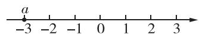

A. -3

B. 3

C. $\frac{1}{3}$

D. $-\frac{1}{3}$

4. 以下四个数中, 最小的数是 (D)

A. -2

B. 0

C. 2

D. -4

5. 下列所画数轴, 正确的是 (C)

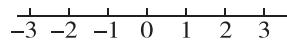  
A

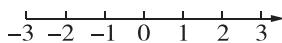  
B

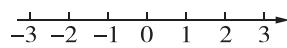  
C

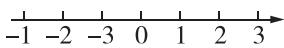  
D

6. 从一批汤圆中挑选 4 个汤圆, 编号后进行称重检查, 结果如下表(超过标准质量的克数记为正数, 不足标准质量的克数记为负数), 其中最接近标准质量的是 (B)

<table><tr><td>编号</td><td>1</td><td>2</td><td>3</td><td>4</td></tr><tr><td>检查结果</td><td>+0.4</td><td>-0.1</td><td>-0.5</td><td>+0.3</td></tr></table>

A. 1 号汤圆

B.2 号汤圆

C.3 号汤圆

D. 4 号汤圆

7. 在数轴上表示数 -1 和 2025 的两点分别为 A 和 B, 则 A 和 B 两点间的距离为 (A)

A. 2 026

B. 2 025

C. 2 024

D. 2 023

满分:100 分

8. 若 $|a| = 5, |b| = 1$ ，且 $a < b$ ，则 $a$ 的值为（A）

A. -5

B. -1 或 5

C. 1 或 -1

D. 5

9. 如图, 数轴上点 A 和点 B 分别表示数 a 和数 b, 则下列式子正确的是 (C)

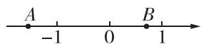

A. $a > - b$

B. a = -b

C. $a < -b$

D. a = b

10. 给出下列语句: ①一个数的绝对值一定是正数; ②-a 一定是负数; ③没有绝对值为 -4 的数; ④在数轴负半轴上, 离原点越远的数就越小; ⑤若 $\left|a\right| = \left|b\right|$ , 则 a = b. 其中正确的有 (C)

A. 4 个

B. 3 个

C.2个

D. 0 个

# 二、填空题(本大题共5小题,每小题3分,共15分)

11. 某单位为鼓励员工锻炼身体, 开展了职工健步走活动, 职工每天健步走 5000 步为达标. 若小夏走了 6200 步, 记为 +1200 步, 则小辰走了 4800 步, 记为 -200 步.

12. 新趋势·结论开放 写出一个比 -1 小的有理数：
-2(答案不唯一).

13. 比较大小: $+ \left( -\frac{3}{4} \right) < -1 - \frac{5}{7}$ .

14. 某种零件,标明要求是 $\Phi20_{-0.01}^{+0.02}$ ( $\Phi$ 表示直径, 单位: mm), 有一个零件的直径为 20.01 mm, 则这个零件\_合格. (填“合格”或“不合格”)

15. 观察下列各数: $-\frac{1}{2}, \frac{2}{3}, -\frac{3}{4}, \frac{4}{5}, -\frac{5}{6}, \cdots$ . 根据它们的排列规律, 第 2025 个数为 $-\frac{2025}{2026}$ .

选择题、填空题答题区 

<table><tr><td>1</td><td>2</td><td>3</td><td>4</td><td>5</td><td>6</td><td>7</td><td>8</td><td>9</td><td>10</td></tr><tr><td>B</td><td>A</td><td>B</td><td>D</td><td>C</td><td>B</td><td>A</td><td>A</td><td>C</td><td>C</td></tr><tr><td colspan="10">11. -200 12. -2(答案不唯一) 13. &lt;14. 合格 15. - $\frac{2025}{2026}$ </td></tr></table>

# 三、解答题(本大题共6小题,共55分)

16.(6分)化简下列各数:

(1)(2 分) $-\left[-(-5)\right]$ ;

解： $-[-(-5)] = -5.$ (2分）

17. (8 分) 把下列各有理数填在相应的集合内:

$$
- \frac {3}{8}, 0, - 3 0, \frac {2 2}{5}, 2 0, - 2. 6, 1 \frac {1}{4}, 0. \dot {3}, 0. 2 5, - 7.
$$

正有理数集合：{ …}.

负有理数集合：{ …}.

整数集合：{ …}.

非负数集合：{ …}.

解: 正有理数集合: $\left\{\frac{22}{5},20,1\frac{1}{4},0.\dot{3},0.25,\cdots\right\}$ .
(2 分)

(2)(2分) $-\left[-\left(+\frac{1}{5}\right)\right]$ ;

解： $-\left[-\left(+\frac{1}{5}\right)\right]=\frac{1}{5}.$ (2分)

负有理数集合： $\left\{-\frac{3}{8},-30,-2.6,-7,\cdots\right\}$ .
(4 分)

整数集合: $\{0,-30,20,-7,\cdots\}$ . (6分)

非负数集合： $\left\{0,\frac{22}{5},20,1\frac{1}{4},0.\dot{3},0.25,\cdots\right\}$ .
(8 分)

(3)(2分) $-\left\{-\left[-\left(+2\frac{6}{17}\right)\right]\right\}$ .

解： $-\{-[-(+2\frac{6}{17})]\} = -2\frac{6}{17}$ （2分）

18.(8分)某食品厂从生产的袋装食品中抽出样品20袋,检测每袋的质量是否符合标准,检测结果显示有5袋的质量符合标准,1袋的质量比标准质量少5g,4袋的质量比标准质量少2g,3袋的质量比标准质量多1g,4袋的质量比标准质量多3g,3袋的质量比标准质量多6g.请你借助正数、负数,用列表的方式记录样品的检测情况.

解:由题意得,检测结果显示有5袋的质量符合标准,记为0 g,

1 袋的质量比标准质量少 5 g, 记为 -5 g,  
4 袋的质量比标准质量少 2 g, 记为 -2 g,  
3 袋的质量比标准质量多 1 g, 记为 +1 g,  
4 袋的质量比标准质量多 3 g, 记为 +3 g,  
3 袋的质量比标准质量多 6 g, 记为 +6 g, (5 分)
样品的检测情况记录如下:

<table><tr><td>与标准质量的差值(单位:g)</td><td>0</td><td>-5</td><td>-2</td><td>+1</td><td>+3</td><td>+6</td></tr><tr><td>袋数</td><td>5</td><td>1</td><td>4</td><td>3</td><td>4</td><td>3</td></tr></table>

(8 分)

19. (9 分) 已知有理数 $a, b$ , 其中数 $a$ 在如图所示的数轴上对应点 $M, b$ 是负数, 且 $b$ 在数轴上对应的点与原点的距离为 3.

(1) $a=\underline{2}$ , $b=\underline{-3}$ .   
(2) 在数轴上表示下列各数: $+(-5), -3.5, \frac{1}{2}, -1\frac{1}{2}, |-4|, -(-2.5)$ . 并用“<”把这些数连接起来.

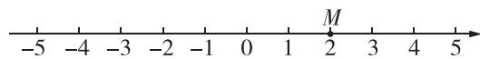

解:(1)2 -3 (2分)

(2) $+(-5)=-5,|-4|=4,-(-2.5)=2.5,$

在数轴上表示各数如图.

$$
\begin{array}{c c c c c c c c c} + (- 5) & - 3. 5 & - 1 \frac {1}{2} & \frac {1}{2} & - (- 2. 5) & 1 - 4 \\ \hline - 5 & - 4 & - 3 & - 2 & - 1 & 0 & 1 M ^ {2} & 3 & 4 & 5 \end{array} \tag {7分}
$$

由数轴可知 $+(-5) < -3.5 < -1\frac{1}{2} < \frac{1}{2} < -(-2.5) < 1 - 4$ . (9分)

20.(12分)如图所示的送餐机器人在一条东西走向的走道上为客人服务,从取餐点A出发,先向东移动4m到达3号桌B处,然后向西移动7m到达2号桌C处,再返回取餐点.

(1)以取餐点为原点,向东为正方向,用1个单位长度表示1 m,画出数轴,并在数轴上表示出A,B,C三处的位置.  
(2) $C$ 处离 $A$ 处多远?   
(3)机器人一共移动了多少米?

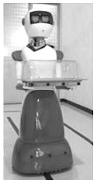

解:(1)如图所示.

$$
\begin{array}{c c c c c c c c c c c c c c c} \hline & & & C _ {1} & & & & A _ {1} & & & & B _ {1} & & \\ \hline - 6 & - 5 & - 4 & - 3 & - 2 & - 1 & 0 & 1 & 2 & 3 & 4 & 5 & 6 & 7 \end{array} \tag {4分}
$$

(2) 由(1)中数轴可知 C 处离 A 处 3 m. (8 分)  
(3) 由(1)中数轴可知,机器人一共移动的路程为 $4 + 7 + 3 = 14 \, (\text{m})$ . (12 分)

21.(12分)点A,B,C在数轴上的位置如图所示.

(1) 点 B 表示的数是 -2，点 C 表示的数是 6。  
(2) 折叠数轴, 使数轴上的点 B 和点 C 重合, 则点 A 与表示数 9 的点重合.  
(3)有理数 $m, n$ 在数轴上对应的点之间的距离可表示为 $|m - n|$ , 如 5 与 2 在数轴上所对应的点之间的距离为 $|5 - 2| = 3$ .

①求 $|x-3|+|x-6|$ 的最小值；  
②若 M, N 两点之间的距离为 2026（点 M 在点 N 的左侧），将数轴折叠，使得 1 对应的点与 -3 对应的点重合，此时 M, N 两点也重合，求 M, N 两点分别表示的数.

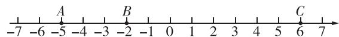

解:(1)-2 6 (2 分)

(2)9 (4分)

(3)①因为 $|x-3|+|x-6|$ 表示数轴上x对应的点分别到3对应的点和6对应的点的距离之和，所以当 $|x-3|+|x-6|$ 的值最小时，x所对应的点的位置应该在3对应的点和6对应的点之间，
(6 分)

所以 $|x-3|+|x-6|$ 的最小值为3. (7分)

②因为1对应的点与-3对应的点重合，

所以数轴从 -1 对应的点处折叠. (8 分)

因为 M, N 两点之间的距离为 2026, 点 M 在点 N 的左侧,

所以点 M 与 -1 对应的点之间的距离为 1013，点 N 与 -1 对应的点之间的距离为 1013，（10 分）所以点 M 表示的数为 -1014，点 N 表示的数为 1012. (12 分)

# 2|第二章综合能力测评卷

时间:60 分钟

# 一、选择题(本大题共10小题,每小题3分,共30分)

1. -2025的倒数是 (D)

A. 2025

B. -2 025

C. $\frac{1}{2025}$

D. $-\frac{1}{2025}$

2. 新情境 据报道,今年国际圆周率日(3月14日),某计算机存储公司发布声明称,该公司已将圆周率( $\pi$ )计算到小数点后约105万亿位,打破此前100万亿位的世界纪录. 数据105万亿用科学记数法表示为
(D)

A. $105 \times 10^{12}$

B. $10.5 \times 10^{13}$

C. $1.05 \times 10^{13}$

D. $1.05 \times 10^{14}$

3. 用四舍五入法把 7.9463 精确到百分位, 取得的近似数是 (D)

A.7.9

B.7.94

C. 7.946

D. 7.95

4. $(-8) + 11 + (-2) + (-11) = (-8) + (-2) + 11 +$ $(-11) = [(-8) + (-2)] + [11 + (-11)] = -10 +$ $0 = -10.$ 这个计算所运用的运算律是 （D）

A. 加法交换律  
B. 加法结合律  
C. 先用加法结合律,再用加法交换律   
D. 先用加法交换律,再用加法结合律

5. 新趋势·数学文化 在《九章算术注》中用不同颜色的算筹(小棍形状的记数工具)分别表示正数和负数. 如图1表示的是 +21 - 32 = -11 的计算过程（白色为正，灰色为负），则图2表示的过程是在计算 (A)

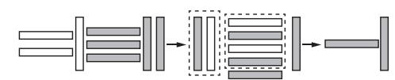

图1  
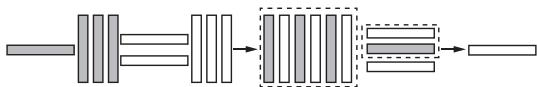  
图2

A. $(-13) + (+23) = 10$   
B. $(-31)+(+32)=1$   
C. $(+13) + (+23) = 36$   
D. $(+13) + (-23) = -10$

满分:100 分

6. 下列各组数中, 相等的是 (B)

A. $+3^{2}$ 与 $+2^{3}$

B. $-2^{3}$ 与 $(-2)^{3}$

C. $-3^{2}$ 与 $(-3)^{2}$

D. $|-3|^{3}$ 与 $(-3)^{3}$

7. 要使算式 3-1-5□21 的运算结果最大, 则“□”内应填入的运算符号为 (D)

A. +

B. -

C. ×

D. ÷

8. 已知 $(x - 3)^2$ 与 $|y + 2|$ 互为相反数, 则 $(x + y)^{2025}$ 的值为 (A)

A. 1

B. -1

C. 0

D. $\pm 1$

9. 已知 $a, b$ 两数在数轴上对应的点的位置如图所示，下列结论正确的有 (D)

① $\frac{b}{a}<0$ ; ②ab>0; ③a-b>0; ④ $a+b>0$ ; ⑤-a<-b; ⑥a<|b|.

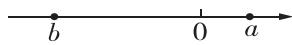

A. 1 个

B. 2 个

C. 3 个

D. 4 个

10. 如图是根据幻方改编的“幻圆”游戏, 将 -3, 2, -1, 0, 1, -2, 3, -4 分别填入图中的圆圈内, 使横行、竖列以及内外两圈上的 4 个数字之和都相等. 已知图中 a, b, c, d 分别表示一个数, 则 $a + b$ 的值是 (C)

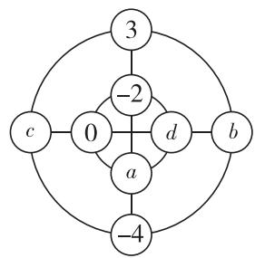

flowchart

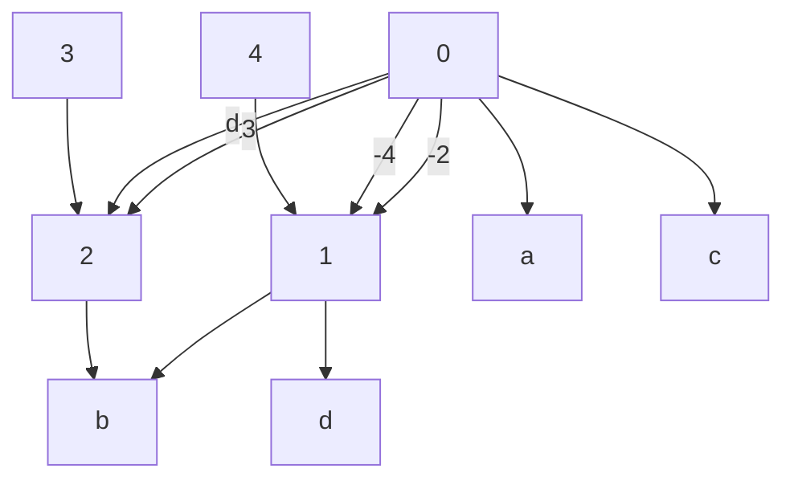

A. -4

B.1

C. -2 或 3

D. -2

# 二、填空题(本大题共5小题,每小题3分,共15分)

11. 新趋势·结论开放 “一个数与 -2 相加, 和是负数”, 请写出一个满足上述条件的数: -3 (答案不唯一).

12. 计算 $(-2) \div 6 \times \frac{1}{6}$ 的结果是 $-\frac{1}{18}$ .

13. 按如图所示的程序计算, 若开始输入的数为 0, 则最后输出的结果为 25.

14. 某高山上的气温从山脚处开始每升高 100 米, 降低 $0.6^{\circ}$ C. 若山脚处的气温是 $28^{\circ}$ C, 则山上 500 米处的气温是 $25^{\circ}$ C.

15. 将从 1 开始的连续奇数按如图所示的规律排列, 例如, 位于第 4 行第 3 列的数为 27, 则位于第 32 行第 12 列的数是 2025.

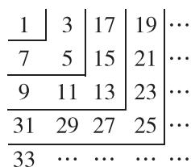

选择题、填空题答题区 

<table><tr><td>1</td><td>2</td><td>3</td><td>4</td><td>5</td><td>6</td><td>7</td><td>8</td><td>9</td><td>10</td></tr><tr><td>D</td><td>D</td><td>D</td><td>D</td><td>A</td><td>B</td><td>D</td><td>A</td><td>D</td><td>C</td></tr></table>

11. -3(答案不唯一) 12. $-\frac{1}{18}$ 13. 25

14. 25 15. 2025

# 三、解答题(本大题共6小题,共55分)

16. (6 分) 计算:

(1)(3分)2-10-(-8)+(-9);

解:2 - 10 - (-8) + (-9)

= -9. (3 分)

$$
\begin{array}{l} = 2 - 1 0 + 8 - 9 \\ = (2 + 8) + (- 1 0 - 9) \\ = 1 0 - 1 9 \\ \end{array}
$$

(2)(3分)(-7.3)- $(-6\frac{5}{6})+|-3.3|+1\frac{1}{6}.$

解： $(-7.3)-(-6\frac{5}{6})+|-3.3|+1\frac{1}{6}$

$$
= - 7. 3 + 6 \frac {5}{6} + 3. 3 + 1 \frac {1}{6}
$$

$$
= (- 7. 3 + 3. 3) + \left(6 \frac {5}{6} + 1 \frac {1}{6}\right)
$$

$$
= - 4 + 8
$$

=4. (3分)

17. (8 分) 计算:

(1)(4分) $-1^{2}+(-3)^{2}-24\times\left(\frac{1}{4}-\frac{3}{8}-\frac{1}{12}\right)$ ;

解： $-1^{2}+(-3)^{2}-24\times\left(\frac{1}{4}-\frac{3}{8}-\frac{1}{12}\right)$

=13. (4分)

$$
\begin{array}{l} = - 1 + 9 - 2 4 \times \frac {1}{4} + 2 4 \times \frac {3}{8} + 2 4 \times \frac {1}{1 2} \\ = 8 - 6 + 9 + 2 \\ \end{array}
$$

[Non-Text]

(2)(4 分) $-1^{2025}-(-3\frac{1}{2})\times\frac{4}{7}+(-2)^{3}\div$

$$
\left| - 4 ^ {2} + 1 \right|.
$$

解： $-1^{2025} - (-3\frac{1}{2})\times \frac{4}{7} +(-2)^{3}\div | - 4^{2} + 1|$

$= \frac{7}{15}$ . (4分)

$$
\begin{array}{l} = - 1 - \left(- \frac {7}{2}\right) \times \frac {4}{7} + (- 8) \div | - 1 6 + 1 | \\ = - 1 + 2 + (- 8) \div 1 5 \\ = 1 - \frac {8}{1 5} \\ \end{array}
$$

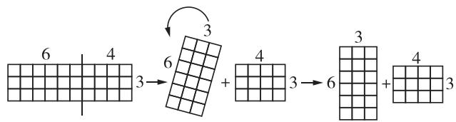

text_image

6 4
3 → 6 + 4 3 → 6 + 4
3
3

利用这种运算律可以得到 $(6+4)\times3=6\times3+4\times3=30.$

(1) 它的计算过程可以解释 分配律 这一运算律.

(2)请你利用这种运算律计算: $118\frac{4}{5}\times999+$

$$
\left(- \frac {1}{5}\right) \times 9 9 9 - 1 8 \frac {3}{5} \times 9 9 9.
$$

解:(1)分配律 (3 分)

$$
(2) 1 1 8 \frac {4}{5} \times 9 9 9 + (- \frac {1}{5}) \times 9 9 9 - 1 8 \frac {3}{5} \times 9 9 9
$$

$$
= (1 1 8 \frac {4}{5} - \frac {1}{5} - 1 8 \frac {3}{5}) \times 9 9 9
$$

$$
= (1 1 8 \frac {3}{5} - 1 8 \frac {3}{5}) \times 9 9 9
$$

$$
= 1 0 0 \times 9 9 9
$$

$$
= 9 9 9 0 0. \tag {7分}
$$

19. 新趋势·代数推理（8分）小华在电脑上设计了一个有理数的运算程序：输入 $a$ ，加 $*$ 键，再输入 $b$ 且 $a \neq b$ ，得到运算 $a * b = ab \div (a - b)$

(1) 求 $2 * (-3)$ 和 $(-3) * 2$ 的值；  
(2)猜想 $a * b$ 与 $b * a$ 的关系（不必说明理由）；  
(3) 若 $\left|x+4\right|=m*n,\left|y-8\right|=n*m$ , 且 $m\neq n$ , 求 $\frac{y}{x}-xy$ 的值.

解:(1) $2*(-3)=2\times(-3)\div[2-(-3)]=$

$$
- 6 \div 5 = - \frac {6}{5}. \tag {1分}
$$

$(-3)*2 = -3\times 2\div (-3 - 2) = -6\div (-5) =$

$$
\frac {6}{5}. \tag {2分}
$$

(2) $a*b=-\left(b*a\right).$ (4分)

(3) 因为 $a * b = -(b * a)$ , 所以 $m * n = -(n * m)$ ,

所以 $|x+4|= - |y-8|$ ，即 $|x+4| + |y-8|=0$ ，

所以 $x + 4 = 0, y - 8 = 0$ ,

所以 $x = -4, y = 8$ ，(7分)

所以 $\frac{y}{x} - xy = \frac{8}{-4} - 8 \times (-4) = -2 + 32 = 30.$

(8 分)

20.(12分)世界杯比赛中,根据场上攻守形势,守门员会在门前来回跑动,向前跑记作正数,返回则记作负数,一段时间内,某守门员的跑动情况记录如下(单位:米):+10,-2,+10,+5,+12,-6,-9,+4,-14(假定开始计时时,守门员正好在球门线上).

(1)守门员最后是否回到球门线上?  
(2)如果守门员离开球门线的距离超过10米(不包括10米),则对方球员挑射极有可能造成破门.请问:在这一时间段内,对方球员有几次挑射破门的机会?简述理由.  
(3)在(1)的条件下,随后又记录了该守门员5次跑动情况,分别是: +6, ○, -2, -5, +7, 其

中一次记录被墨迹污染,若5次跑动后,守门员在球门线前3米处,直接写出被污染的数据.

解:(1)依题意,得 $10 - 2 + 10 + 5 + 12 - 6 - 9 + 4 - 14 = 10$ (米).

答:守门员最后没能回到球门线上. (4 分)

(2) 对方球员有 6 次挑射破门的机会, 理由如下:

第一次跑距离球门线10米，

第二次跑距离球门线 10 - 2 = 8（米），

第三次跑距离球门线 $8 + 10 = 18$ （米），

第四次跑距离球门线 $18 + 5 = 23$ （米），

第五次跑距离球门线 $23 + 12 = 35$ （米），

第六次跑距离球门线35-6=29(米)，

第七次跑距离球门线 29 - 9 = 20（米），

第八次跑距离球门线 $20 + 4 = 24$ （米），

第九次跑距离球门线 24 - 14 = 10（米），

则符合题意的有 18 米,23 米,35 米,29 米,20 米,24 米,

故对方球员有6次挑射破门的机会. (8分)

(3) -13. $3 - [10 + 6 + (-5) + (-2) + 7] =$

-13,所以被污染的数据为 -13. (12 分)

21. (14 分)【问题情境】在数学活动课上,同学们玩“计算竞大”游戏:每场游戏开始时甲、乙两人手上各执四张数字牌和四张运算符号牌,四张数字牌上分别标有一个数字,四张运算符号牌分别标有“+”“-”“×”“÷”四个运算符号,双方都能看到对方牌面的信息.游戏开始,两人依次轮流出牌,每次只有一人出牌.

游戏规则：

①第一次,由先出牌者出一张数字牌,直接作为第一次结果.  
②从第二次开始,每次由出牌者出一张符号牌和一张数字牌,与上一次结果进行相应运算,运算结果记为本次结果.若本次结果的绝对值比上一次结果的绝对值大,则游戏继续;否则游戏结束,本次出牌者失利,对方获得本场游戏胜利.  
③若游戏继续,则按上述规则玩到两人手上都没有数字牌为止.若最后一次结果的绝对值大于上一次结果的绝对值,则最后一次出牌者获得本场游戏胜利,否则对方获胜.  
(相应的运算示例:若上一次的结果为-3,本次出牌的符号为“÷”,数字为“2”,则相应的运算为 $-3\div2$ )

【问题解决】在某一场游戏前,甲、乙两人拿到的数字牌和符号牌如下:

甲：-3 5 $-\frac{1}{3}$ 2

\+ - × ÷

乙： $-\frac{1}{2}$ 3 4 1

\+ - × ÷

(1)若第一次甲出“2”,第二次乙出“-”和“3”,直接写出第二次的结果,并判断游戏是否继续.  
(2)若第一次甲出“-3”，第二次乙出“-”和“1”，第三次甲出“÷和“ $-\frac{1}{3}$ ”，第四次乙出“×”和“3”，第五次甲出“×”和“2”，请列出综合算式求第五次的结果.  
(3)在(2)的基础上,第六次乙应如何出牌才能保证最后结果总是自己胜出?请写出保证乙能最终获胜的第六次出牌方案,并说明该方案乙必胜的理由.

解:(1)第二次的结果为2-3=-1. (2分)

因为 $|-1|<|2|$ ，所以游戏不再继续。（4分）

(2) 根据题意列式为 $(-3-1)\div(-\frac{1}{3})\times3\times2=$ $12 \times 3 \times 2 = 72.$ (8 分)  
(3) 乙必胜的方案是: 第六次乙出“+”和“4”.
(10 分)

理由一:此时,第六次结果为76,游戏继续;第七次若甲出“-”和“5”,则结果为71,游戏结束,乙获胜;第七次若甲出“+”和“5”,则结果为81,游戏继续;第八次乙出“÷”和“ $-\frac{1}{2}$ ”,结果为-162,游戏结束,乙获胜. (14分)

理由二:所有的出牌可能有:

① $72 \div \left( -\frac{1}{2} \right) + 5$ ，乙胜；  
② $72 \div \left( -\frac{1}{2} \right) - 5 + 4$ , 乙负;  
③72÷4,乙负;   
④72 + ( - $\frac{1}{2}$ ), 乙负;   
⑤ $(72+4+5)\div(-\frac{1}{2})$ ，乙胜；  
⑥72 +4 -5, 乙胜，

所以乙必胜的是第六次乙出“+”和“4”。（14分）

# 3 | 第三章综合能力测评卷

时间:60 分钟

# 一、选择题(本大题共10小题,每小题3分,共30分)

1. 下列代数式书写规范的是 (C)

A. $8 \div x$

B. $a \times 5$

C. $4a^{2}b$

D. $1 \frac{2}{3}a$

2. 在 $\pi, x^2 + 5, 1 - 3x = 0, ab, a > 2, 0, \frac{1}{a}$ 中，代数式有 (B)

A.6个

B. 5 个

C. 4 个

D. 3 个

3. 关于代数式“ $-x+1$ ”的意义, 下列说法中正确的是 ( A )

A. $x$ 的相反数与1的和

B. $x$ 与1的和的相反数

C. $x$ 与1的和

D. $x$ 与1的相反数的和

4. $a$ 的平方与 $b$ 的一半的和用代数式表示为（A）

A. $a^2 +\frac{1}{2} b$

B. $\frac{1}{2} (a^2 + b)$

C. $a^2 + 2b$

D. $a + \frac{1}{2}b$

5. 若 $x = -1, y = -2$ ，则代数式 $3 - x^2 + 4y$ 的值是 (C)

A. 12

B. 8

C. -6

D. -4

6. 春节游河南, 探寻千年古韵, 品味地道年味! 有游客 m 人到龙门石窟游玩, 需要住宿, 若每 n 个人住一间房, 结果还有一个人无房住, 则入住客房的间数是 (A)

A. $\frac{m-1}{n}$

B. $\frac{m}{n}-1$

C. $\frac{m+1}{n}$

D. $\frac{m}{n}+1$

7. 下列两个量成反比例关系的是 (A)

A. 平行四边形的面积一定时, 其中一边长与这条边上的高  
B. 圆的面积与其半径  
C. 汽车匀速行驶过程中,行驶的路程与行驶的时间  
D. 图书馆藏书量一定, 每天借出的本数和剩下的本数

满分:100 分

8. 如果 m 是一个三位数, 现在把 3 放在它的右边得到一个四位数, 那么这个四位数是 (C)

A. $m + 3$

B. $m + 3\ 000$

C. 10m + 3

D. 1 000m + 3

9. 某商场出售一件商品,在原标价基础上实行以下四种调价方案,其中调价后售价最低的是 (D)

A. 先打九五折, 再打九五折  
B. 先提价 10%, 再打八折  
C. 先提价 30%, 再降价 35%  
D. 先打七五折, 再提价 10%

10. 根据如图所示的流程图计算, 若 x = 2, 则 $a_{2025}$ 的值为 (C)

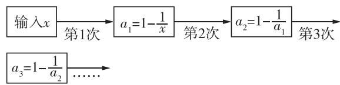

flowchart

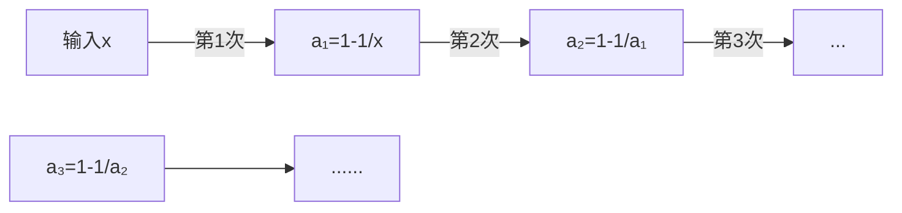

A. $\frac{1}{2}$

B. -1

C. 2

D. 1

# 二、填空题(本大题共5小题,每小题3分,共15分)

11. 对代数式“3a”可以赋予实际意义: 如果一天平均读书 a 页, 那么 3a 表示 3 天读书的总页数. 请你对代数式“9a + 1.5b”赋予一个实际意义: 已知一支钢笔 9 元, 一块橡皮 1.5 元, 则购买 a 支钢笔和 b 块橡皮共需 $(9a + 1.5b)$ 元(答案不唯一).  
12. 根据一项科学研究, 一个 10 岁至 15 岁的人每天所需的睡眠时间 $t(\mathrm{h})$ 可用公式 $t = 11 - \frac{n}{10}$ 计算出来, 其中 $n$ 代表人的年龄. 则一个 12 岁的未成年人每天所需的睡眠时间是 $9.8 \mathrm{~h}$ .  
13. 甲车每小时行驶 a km, 乙车每小时行驶 b km, 甲车先行驶 2 h 后乙车出发, 则乙车行驶 35 km 时, 甲车行驶的路程为 $a(\frac{35}{b}+2)$ 或 $(\frac{35a}{b}+2a)$ km.  
14. 某工厂接到一个订单, 生产 x 套校服, 原计划每天生产 y 套. 由于工期紧张, 增加了人手, 最后平均每天比原计划每天多生产了 60 套, 则工厂完成这个订单的时间比原计划提前 $\left(\frac{x}{y}-\frac{x}{y+60}\right)$ 天.

15. 如图是由大小相同的五角星摆放而得到的图案，其中第 1 个图案有 5 个五角星，第 2 个图案有 10 个五角星，第 3 个图案有 17 个五角星……按此规律，则第 10 个图案中五角星的个数为 122.

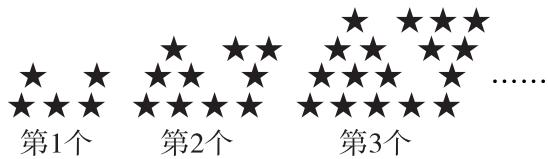

text_image

第1个
第2个
第3个
......

选择题、填空题答题区

<table><tr><td>1</td><td>2</td><td>3</td><td>4</td><td>5</td><td>6</td><td>7</td><td>8</td><td>9</td><td>10</td></tr><tr><td>C</td><td>B</td><td>A</td><td>A</td><td>C</td><td>A</td><td>A</td><td>C</td><td>D</td><td>C</td></tr><tr><td colspan="10">11.已知一支钢笔9元,一块橡皮1.5元,则购买a支钢笔和b块橡皮共需(9a+1.5b)元(答案不唯一) 12.9.8 13. $a(\frac{35}{b}+2)$ 或 $(\frac{35a}{b}+2a)$ 14. $(\frac{x}{y}-\frac{x}{y+60})$  15.122</td></tr></table>

# 三、解答题(本大题共6小题,共55分)

16. (6 分) 当 $a = 2, b = -1, c = -3$ 时, 求下列各代数式的值:

(1)(3 分) $b^{2}-4ac;$

解: 当 a=2, b=-1, c=-3 时,

$$
b ^ {2} - 4 a c = (- 1) ^ {2} - 4 \times 2 \times (- 3) = 1 + 2 4 = 2 5.
$$

(3 分)

(2)(3 分) $a^{2}-2ab+b^{2}$ .

解: 当 a = 2, b = -1 时,

$$
\begin{array}{l} a ^ {2} - 2 a b + b ^ {2} = 2 ^ {2} - 2 \times 2 \times (- 1) + (- 1) ^ {2} = 4 + \\ 4 + 1 = 9. \tag {3分} \\ \end{array}
$$

17.(8分)2025年4月24日,第十个“中国航天日”主场活动在上海举办,航天日的主题为“海上生明月,九天揽星河”.某校借此机会开展了火箭模型制作比赛,如图为火箭模型的截面图,下面是梯形,中间是长方形,上面是三角形.

(1)用含 a, b 的代数式表示该截面的面积;  
(2) 当 $a = 2 \, cm, b = 2.5 \, cm$ 时, 求这个截面的面积.

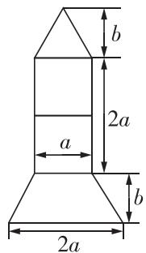

解:(1)该截面的面积为 $\frac{1}{2}ab+2a^{2}+\frac{1}{2}b(a+2a)$ . (4分)

(2) 当 $a = 2 \mathrm{~cm}, b = 2.5 \mathrm{~cm}$ 时，

该截面的面积为 $\frac{1}{2} \times 2 \times 2.5 + 2 \times 2^2 + \frac{1}{2} \times 2.5 \times (2 + 2 \times 2) = 2.5 + 8 + 7.5 = 18(\mathrm{cm}^2)$ . (8分)

18. 新情境 (8 分)2025 年 4 月 9 日,世界最长公路水下盾构隧道——海太长江隧道正式开启穿江作业,国产超大直径盾构机“江海号”顺利始发,隧道建设取得重大突破. 假设该盾构机每天挖掘隧道的长度和所需的天数如下表:

<table><tr><td>每天挖掘隧道的长度/m</td><td>4</td><td>6</td><td>10</td></tr><tr><td>所需天数</td><td>3 000</td><td>2 000</td><td>1 200</td></tr></table>

(1)该隧道全长多少米?   
(2)挖掘隧道的天数怎样随着每天挖掘隧道的长度的变化而变化的?   
(3)用 t 表示所需的天数,用 a 表示每天挖掘隧道的长度,用式子表示 t 与 a 的关系,t 与 a 成什么比例关系?

解:(1)该隧道全长 $4 \times 3\ 000 = 6 \times 2\ 000 = 10 \times 1\ 200 = 12\ 000 \, (\text{m})$ . (2分)

(2) 挖掘隧道的天数随着每天挖掘隧道的长度的增大而减小. (5 分)  
(3) ta = 12000, t 与 a 成反比例关系. (8 分)

19. (9 分) 小林房间窗户的窗帘如图 1 所示, 它是由两个半径相同的四分之一圆组成的. (图中单位均为分米)

(1)用代数式表示窗户能射进阳光部分的面积；（结果保留 $\pi$ ）  
(2)出于美观考虑,小林重新将房间的窗帘设计成如图2所示(由两个半径相同的四分之一圆和一个半圆组成),请用代数式表示该种设计下窗户能射进阳光部分的面积.(结果保留 $\pi$ )

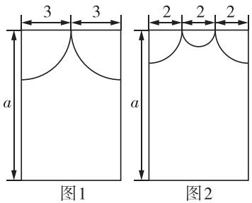

text_image

3 3
a
图1
2 2 2
a
图2

解:(1)窗户能射进阳光部分的面积为 $6a - \frac{1}{2}\pi \times 3^{2} = (6a - \frac{9}{2}\pi)$ (分米 $^{2}$ ). (4 分)  
(2) 重新设计后窗户能射进阳光部分的面积为 $6a - \frac{1}{2}\pi \times 2^2 - \frac{1}{2}\pi \times 1^2 = (6a - \frac{5}{2}\pi)$ （分米²）. (9 分)

20. (12 分) 学校需要到印刷厂印刷 x 份材料, 甲印刷厂提出: 每份材料收 0.2 元印刷费, 另收 500 元制版费. 乙印刷厂提出: 每份材料收 0.4 元印刷费, 不收制版费.

(1) 如果学校要印刷 100 份材料, 则甲印刷厂的收费是 520 元, 乙印刷厂的收费是 40 元.  
(2) 如果学校要印刷 $x$ 份材料, 则甲印刷厂的收费是 $(0.2x + 500)$ 元, 乙印刷厂的收费是 $0.4x$ 元. (用含 $x$ 的代数式表示)  
(3) 学校要印刷 2 600 份材料, 若不考虑其他因素, 选择哪家印刷厂比较合算? 并说明理由.

解:(1)520 40 (4 分)

甲印刷厂的收费是 $0.2 \times 100 + 500 = 520$ （元），乙印刷厂的收费是 $0.4 \times 100 = 40$ （元）.

(2) $(0.2x + 500)$ $0.4x$ (8分)   
(3)选择甲印刷厂比较合算. 理由如下: (9 分)

甲印刷厂的收费是 $0.2 \times 2600 + 500 = 1020$ （元），乙印刷厂的收费是 $0.4 \times 2600 = 1040$ （元），因为 1040 > 1020，所以选择甲印刷厂比较合算。

(12 分)

21. (12 分) 某玩具店将进价为 80 元/个的玩具以 90 元/个的价格售出, 平均每月能售出 100 个. 市场调研表明: 当每个玩具的售价每涨价 1 元时, 其销售量将减少 2 个. 若设每个玩具的售价上涨 a 元.

(1)试用含 $a$ 的代数式填空：

①涨价后,每个玩具的售价为 $(90+a)$ 元;  
②涨价后,每个玩具的利润为 $(10+a)$ 元;  
③涨价后,玩具的月销售量为 $(100-2a)$ 个.

(2)玩具店老板想让该玩具的销售利润平均每月达到1600元,销售员甲说:“在原售价每个90元的基础上再上涨30元,可以完成任务.”销售员乙说:“不用涨那么多,在原售价每个90元的基础上再上涨10元就可以了.”判断销售员甲与销售员乙的说法是否正确,并说明理由.

解：(1)① $(90+a)$ ;② $(10+a)$ ;③ $(100-2a)$ (6 分)

(2) 销售员甲与乙的说法都正确. 理由如下:
(7 分)

依题意可得该玩具的月销售利润为 $(100 - 2a)(10 + a)$ 元.

当 $a = 30$ 时， $(100 - 2a)(10 + a) = (100 - 2 \times 30) \times (10 + 30) = 1600$ （元）；

当 $a = 10$ 时， $(100 - 2a)(10 + a) = (100 - 2 \times 10) \times (10 + 10) = 1600$ （元）.

所以销售员甲与乙的说法都正确. (12 分)

# 4 | 第四章综合能力测评卷

时间:60 分钟

# 一、选择题(本大题共10小题,每小题3分,共30分)

1. 下列整式中, 是二次单项式的是 (C)

A. $x^{2} - 3$

B. $x^{2}y^{3}$

C. $3x^{2}$

D. -2x

2. 多项式 $x - 2x^{2}$ 的二次项系数是 (C)

A. 2

B. $2x^{2}$

C. -2

D. $-2x^{2}$

3. 下列说法中, 不正确的是 (A)

A. $x^{2}y$ 与 $\frac{-6yx^2}{\pi}$ 不是同类项  
B. -1 是单项式  
C. $2xy + x - y$ 是二次多项式  
D. 单项式 $ab^{3}m$ 的次数是 5

4. 下列各式的计算结果正确的是 (D)

A. $4x + 3y = 7xy$

B. $-a^{2}-a^{2}=0$

C. $5y + 5y = 25y^{2}$

D. $4b - 4b = 0$

5. 下列去括号正确的是 (C)

A. $-(a - b) = -a - b$   
B. $-2(x - 4y) = -2x + 4y$   
C. $+(-m + 2) = -m + 2$   
D. $x - (y - 1) = x - y - 1$

6. 若关于 $x$ 的多项式 $ax^2 - abx + b$ 与 $bx^2 + abx + b$ 的和是一个单项式, 则 $a$ 与 $b(a, b \neq 0)$ 的关系是

( B )

A. $a = b$

B. $a + b = 0$

C. ab = -1

D. ab = 1

7. 习近平总书记指出：“要牢牢把住粮食安全主动权，粮食生产年年要抓紧。”某村大豆种植面积是 a 公顷，水稻种植面积是大豆种植面积的 2 倍，玉米种植面积比大豆种植面积少 5 公顷，则水稻种植面积比玉米种植面积多 (C)

A. $2a$ 公顷

B. $(a-5)$ 公顷

C. $(a + 5)$ 公顷

D. $(3a-5)$ 公顷

8. 如图, 用“十”字形框任意框住 2025 年 9 月份月历中的五个数, 如果这五个数中最小的数为 a, 那么这五个数的和是 (D)

<table><tr><td>日</td><td>一</td><td>二</td><td>三</td><td>四</td><td>五</td><td>六</td></tr><tr><td></td><td>1</td><td>2</td><td>3</td><td>4</td><td>5</td><td>6</td></tr><tr><td>7</td><td>8</td><td>9</td><td>10</td><td>11</td><td>12</td><td>13</td></tr><tr><td>14</td><td>15</td><td>16</td><td>17</td><td>18</td><td>19</td><td>20</td></tr><tr><td>21</td><td>22</td><td>23</td><td>24</td><td>25</td><td>26</td><td>27</td></tr><tr><td>28</td><td>29</td><td>30</td><td></td><td></td><td></td><td></td></tr></table>

满分:100 分

A. 5a

B. 5a + 7

C. 5a + 21

D. $5a + 35$

9. 已知关于 $x, y$ 的多项式 $A = x^3 - axy + 3x^2y^3 + 1, B = 2x^3 - xy + bx^2y^3$ . 小希在计算时把题目条件 $A + B$ 错看成了 $A - B$ , 求得的结果为 $-x^3 + 2xy + 1$ , 那么小希最终计算的 $A + B$ 的结果中不含 (B)

A. 三次项

B. 二次项

C. 五次项

D. 常数项

10. 将四张边长各不相同的正方形纸片按如图方式放入长方形 ABCD 内(相邻纸片之间互不重叠也无缝隙), 未被四张正方形纸片覆盖的部分用阴影表示. 设右上角与左下角阴影部分的周长的差为 l, 若知道 l 的值, 则不需测量就能知道周长的正方形的标号为 (D)

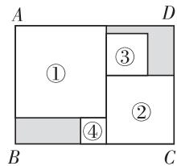

A. ①

B. ②

C. ③

D. ④

# 二、填空题(本大题共5小题,每小题3分,共15分)

11. 新趋势·结论开放 写出一个多项式,使得它与单项式 x 的和是二次三项式: $x^{2} + 2x + 1$ (答案不唯一).  
12. 若 $2x^{a+1}y$ 与 $x^{2}y^{b-1}$ 是同类项，则 $\frac{a}{b}$ 的值是 $\frac{1}{2}$ .  
13. 有理数 $a, b, c$ 在数轴上的对应点的位置如图所示，请化简： $|-a + c| - |b - a| + |c - b| = \underline{2a - 2c}$ .  
14. 若长方形的一边长为 a - 2b，其邻边比该边长 $2a + b$ ，则该长方形的周长为 $8a - 6b$ .  
15. 如果整式 $A$ 与整式 $B$ 的和为一个有理数 $a$ , 那么我们称 $A, B$ 为有理数 $a$ 的“友好整式”. 例如: $x - 4$ 与 $-x + 5$ 为有理数 1 的“友好整式”. 若关于 $x$ 的整式 $4x^{3} - kx^{2} + 6$ 与 $-4x^{3} - 3x^{m} + k - 1$ 为有理数 $n$ 的“友好整式”, 则 $mn$ 的值为 $\underline{4}$ .

# 选择题、填空题答题区

<table><tr><td>1</td><td>2</td><td>3</td><td>4</td><td>5</td><td>6</td><td>7</td><td>8</td><td>9</td><td>10</td></tr><tr><td>C</td><td>C</td><td>A</td><td>D</td><td>C</td><td>B</td><td>C</td><td>D</td><td>B</td><td>D</td></tr></table>

11. $x^{2}+2x+1$ (答案不唯一)

12. $\frac{1}{2}$

13. 2a - 2c

14. 8a - 6b 15. 4

# 三、解答题(本大题共6小题,共55分)

16.(6分)计算:

(1)(3 分) $(2x^{2}y+3xy^{2})-(x^{2}y-3xy^{2})$ ;

解： $(2x^{2}y + 3xy^{2}) - (x^{2}y - 3xy^{2})$

$$
\begin{array}{l} = 2 x ^ {2} y + 3 x y ^ {2} - x ^ {2} y + 3 x y ^ {2} \\ = x ^ {2} y + 6 x y ^ {2}. \tag {3分} \\ \end{array}
$$

[Non-Text]

(2)(3分) $4m^{2}n-2(2mn-m^{2}n)+mn.$

解: $4m^{2}n-2(2mn-m^{2}n)+mn$

$$
\begin{array}{l} = 4 m ^ {2} n - 4 m n + 2 m ^ {2} n + m n \\ = 6 m ^ {2} n - 3 m n. \tag {3分} \\ \end{array}
$$

[Non-Text]

所以 $x - 2 = 0, y + 3 = 0$

所以 $x = 2, y = -3$ ，所以破损部分整式的值为

17.(8 分)完成下列各题:

(1) (4 分) 先化简, 再求值: $2(x^{2}-3xy+1)-(3x^{2}-2xy+5)$ , 其中 x=-1, $y=\frac{1}{2}$ .

解: $2(x^{2}-3xy+1)-(3x^{2}-2xy+5)$

$$
= 2 x ^ {2} - 6 x y + 2 - 3 x ^ {2} + 2 x y - 5
$$

$$
= - x ^ {2} - 4 x y - 3, \tag {3分}
$$

当 $x = -1, y = \frac{1}{2}$ 时，原式 $= -(-1)^2 - 4 \times (-1) \times$

$$
\frac {1}{2} - 3 = - 1 + 2 - 3 = - 2. \tag {4分}
$$

(2)(4 分)如图是一道整式运算的参考答案,部分答案在破损处看不见了.

$$
\begin{array}{r l} & \text {解:原式} = \bigcirc + 2 (3 y ^ {2} - 2 x) - 4 (2 x - y ^ {2}) \\ & \qquad = - 1 1 x + 7 y ^ {2}. \end{array}
$$

①求破损部分的整式；  
②若 $|x-2|+(y+3)^{2}=0$ ，求破损部分整式的值.

解:①根据题意,得破损部分的整式为 $-11x + 7y^{2} +$

$$
4 (2 x - y ^ {2}) - 2 (3 y ^ {2} - 2 x) = - 1 1 x + 7 y ^ {2} + 8 x -
$$

$$
4 y ^ {2} - 6 y ^ {2} + 4 x = - 3 y ^ {2} + x. \tag {2分}
$$

②因为 $|x-2|+(y+3)^{2}=0$ ,

所以 $x - 2 = 0, y + 3 = 0$

所以 $x = 2, y = -3$ ，所以破损部分整式的值为

$$
- 2 7 + 2 = - 2 5. \tag {4分}
$$

18.(9分)如图,公园有一块长为 $(2a-1)$ 米,宽为a米的长方形土地(一边靠墙),现将三面留出宽都是b米的小路,余下部分设计成长方形花圃ABCD,并用篱笆把花圃不靠墙的三边围起来.

(1) 花圃的宽 AB 为 $(a - b)$ 米, 花圃的长 BC 为 $(2a - 2b - 1)$ 米; (用含 a, b 的式子表示)  
(2)求篱笆的总长度;(用含a,b的式子表示)  
(3) 若 a = 30, b = 5, 篱笆的单价为 60 元/米, 请计算篱笆的总价.

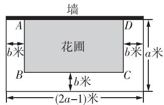

text_image

墙
A
b米
花圃
D
b米
a米
B
b米
C
(2a-1)米

解:(1)(a-b) (2a-2b-1) (3分)

(2) 篱笆的总长度为 $(2a - 2b - 1) + 2(a - b) = 2a - 2b - 1 + 2a - 2b = (4a - 4b - 1)$ (米). (6 分)  
(3) 当 $a = 30, b = 5$ 时， $(4a - 4b - 1) \times 60 = (4 \times 30 - 4 \times 5 - 1) \times 60 = 5940$

即篱笆的总价为5 940元. (9分)

19. (9 分) 老师写出一个整式 $(ax^2 + bx - 3) - (2x^2 - 3x)$ , 其中 $a, b$ 为常数, 然后让同学们给 $a, b$ 赋予不同的数值并进行计算.

(1)甲同学给出一组值,最后计算的结果为 $-x^{2}+4x-3$ ,则甲同学给出的a,b的值分别是 $1,1$ ;   
(2)乙同学给出一组值,最后计算的结果与x的取值无关,求 $b^{a}+ab$ 的值.

解:(1)1,1 (3 分)

(2) $(ax^{2} + bx - 3) - (2x^{2} - 3x)$

$$
\begin{array}{l} = a x ^ {2} + b x - 3 - 2 x ^ {2} + 3 x \\ = (a - 2) x ^ {2} + (b + 3) x - 3, \tag {6分} \\ \end{array}
$$

因为最后计算的结果与 $x$ 的取值无关，

所以 $a - 2 = 0, b + 3 = 0$

所以 $a = 2, b = -3$ ，(8分)

所以 $b^{a} + ab = (-3)^{2} + 2 \times (-3) = 9 - 6 = 3.$ (9 分)

20. (11 分)“整体思想”是中学数学解题中的一种重要的思想方法, 它在整式的化简与求值中应用极为广泛, 如我们把 $(a - b)$ 看成一个整体, 则 $5(a - b) + 2(a - b) - 3(a - b) = (5 + 2 - 3)(a - b) = 4(a - b)$ .

请依照上面的解题方法,解答下列问题:

(1) 把 $(a+b)^{2}$ 看成一个整体, 化简 $-3(a+b)^{2} + (a+b)^{2} - 4(a+b)^{2} = -6(a+b)^{2}$ ;  
(2) 已知 $a^{2}-2b=3$ ，求 $11-4a^{2}+8b$ 的值；  
(3) 已知 $a - 2b = 2, b - c = -4, 3c + d = 8$ ，求 $(a + 3c) - (2b + c) + (b + d)$ 的值.

解: $(1)-6(a+b)^{2}$ (3分)

(2) 因为 $a^2 - 2b = 3$ ，所以 $11 - 4a^2 + 8b = 11 - 4(a^2 - 2b) = 11 - 4 \times 3 = 11 - 12 = -1$ . (7 分)  
(3) 因为 $a - 2b = 2, b - c = -4, 3c + d = 8$ ,

所以 $(a + 3c) - (2b + c) + (b + d)$

=6. (11分)

$$
\begin{array}{l} = a + 3 c - 2 b - c + b + d \\ = (a - 2 b) + (b - c) + (3 c + d) \\ = 2 + (- 4) + 8 \\ \end{array}
$$

21. 新趋势·代数推理 (12 分) 对于一个三位数 $n = \overline{abc} = 100a + 10b + c$ ( $a$ 是 10 以内的正整数, $b, c$ 是 10 以内的自然数), 若 $a + c - b = 6$ , 则称这个三位数为“好六数”. 例如: $n = 413$ , 因为 $4 + 3 - 1 = 6$ , 所以 413 是“好六数”.

(1) 判断: 352 不是 “好六数”; (填 “是” 或 “不是”)  
(2) 若 $n = 110t + 17$ (t 为 9 以内的正整数)，则 n 是“好六数”。请将下列说明过程补充完整：
因为 $n=110t+17=100t+10t+10+7=100t+10(t+1)+7$

所以 $a = t, b = \underline{t + 1}, c = \underline{7}$ .

所以 $a + c - b = \underline{t + 7 - (t + 1)} = \underline{6}$

所以 n 是“好六数”.

(3) 已知三位数 $m$ 是“好六数”，且 $m = 100e + 10f - 16(e$ 是 10 以内的正整数， $f$ 是 10 以内的自然数）， $p$ 是 $m$ 去掉其百位数字后的两位数，而 $q$ 是 $m$ 去掉其个位数字后的两位数，请说明 $p$ 与 $q$ 的和能被 3 整除.

解:(1)不是 (2 分)

(2) $t + 1 \quad 7 \quad t + 7 - (t + 1) \quad 6$ (6分)   
(3) 因为 $m = 100e + 10f - 16 = 100e + 10f - 20 + 4 = 100e + 10(f - 2) + 4$ ,

所以 m 的百位上的数字为 e，十位上的数字为 f-2，个位上的数字为 4. (8 分)

因为 $p$ 是 $m$ 去掉其百位数字后的两位数， $q$ 是 $m$ 去掉其个位数字后的两位数，

所以 $p = 10(f - 2) + 4, q = 10e + (f - 2)$ ，

所以 $p + q = 10(f - 2) + 4 + 10e + (f - 2) = 10f - 20 + 4 + 10e + f - 2 = 10e + 11f - 18.$ (10 分)

因为 $m$ 是“好六数”，

所以 $e + 4 - (f - 2) = 6$ ，即 $e = f$ （11分）

所以 $p + q = 21e - 18 = 3(7e - 6)$ .

因为 7e-6 为整数, 所以 $p + q$ 能被 3 整除.

# 5 | 第五章综合能力测评卷

时间:90 分钟

# 一、选择题(本大题共10小题,每小题3分,共30分)

1. 下列属于一元一次方程的是 (A)

A. $x + 1 = 2x$

B. $x + 5$

C. $x^{2} - 1 = 5$

D. $x + y = 4$

2. 根据“x 的 3 倍与 5 的和比 x 的 $\frac{1}{3}$ 多 2”可列方程为
(A)

A. $3x + 5 = \frac{x}{3} +2$

B. $3x + 5 = \frac{x}{3} - 2$

C. $3(x + 5) = \frac{x}{3} -2$

D. $3(x + 5) = \frac{x}{3} +2$

3. 下列各式进行的变形中, 正确的是 (D)

A. 若 $3a = 2b$ ，则 $3a - 2 = 2 - 2b$

B. 若 $3a = 2b$ ，则 $9a = 4b$

C. 若 $3a = 2b$ ，则 $3a^2 = 2b^2$

D. 若 $3a = 2b$ ，则 $\frac{a}{2} = \frac{b}{3}$

4. 下面解一元一次方程 $2(x+3)=5x$ 的步骤中, 没有依据“等式的性质”变形的是 (B)

(1) $2(x+3)=5x\xrightarrow{第①步}2x+6=5x;$

(2) $2x+6=5x\xrightarrow{第②步}6=5x-2x;$

(3) $6 = 5x - 2x \stackrel{\text{第③步}}{\longrightarrow} 6 = 3x$ ;

(4) $6=3x\xrightarrow{第④步}x=2.$

A. 第①步和第②步

B. 第①步和第③步

C. 第②步和第③步

D. 第③步和第④步

5. 如果三个连续偶数的和为 72, 那么其中最大的数为 (A)

A. 26

B. 27

C. 28

D. 30

6. 新趋势·数学文化《孙子算经》一书中记载了这样一个题目: 今有木, 不知长短. 引绳度之, 余绳四尺五寸; 屈绳量之, 不足一尺. 问木长几何. 其大意是用一根绳子去量一根长木, 绳子还剩余 4.5 尺; 将绳子对折再量长木, 长木还剩余 1 尺. 问木长多少尺. 设木长 x 尺, 则可列方程为 (C)

A. $\frac{1}{2} (x + 1) = x - 4.5$

B. $\frac{1}{2}(x-1)=x+4.5$

C. $\frac{1}{2} (x + 4.5) = x - 1$

D. $\frac{1}{2} (x + 4.5) = x + 1$

满分:100 分

7. 小红在解关于 x 的方程 $-3x + 1 = 3a - 2$ 时, 误将方程中的“-3”看成了“3”, 求得方程的解为 x = 1, 则原方程的解为 (A)

A. $x = -1$

B. $x = -2$

C. $x = 1$

D. $x = 2$

8. 今年小明妈妈和小明的年龄之和是 36 岁, 再过 5 年, 妈妈的年龄是小明年龄的 4 倍还大 1 岁, 则今年小明的年龄为 (A)

A.4岁

B.5岁

C.6 岁

D. 8 岁

9. 新情境智能手机是现代人必备的通信工具,手机软件种类繁多,为了测试手机应用不同软件的耗电量,进行了如下试验:用一款智能手机刷短视频90分钟和微信聊天30分钟消耗了总电量的30%,若将刷短视频时间缩短 $\frac{1}{3}$ ,微信聊天时间变成原来的3倍后消耗的电量和之前一样.已知微信聊天10分钟耗电量约70毫安,则下列说法不正确的是(C)

A. 该手机电池容量 4900 毫安

B. 设刷短视频 10 分钟耗电 x 毫安, 可列方程 $9x + 3 \times 70 = 9\left(1 - \frac{1}{3}\right)x + 3 \times 3 \times 70$

C. 刷短视频 10 分钟耗电量约为 160 毫安

D. 相同时间内刷短视频的耗电量是微信聊天的 2 倍

10. 如图, 甲、乙、丙、丁、戊五名同学围成一圈玩游戏. 游戏规则是每个同学心中想一个数, 并将所想的数报给左右两边和自己相邻的同学, 每

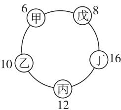

位同学将其他两个同学报来的数求和后说出结果,最终得到的结果如图所示.请大家猜猜甲同学心中所想的数是 ( C )

A.2

B. 1

C. -2

D. -1

# 二、填空题(本大题共5小题,每小题3分,共15分)

11. 新趋势·结论开放 写出一个一元一次方程,要求:所写的方程必须直接利用等式的性质2求解.这个方程可以为 $2x=8$ (答案不唯一).

12. 已知 $2m - 3 = 3n + 1$ ，则 $2m - 3n = \underline{4}$ 。

13. 如图是一个“数值转换机”，当输入“-5”时，输出“12”，则 $a = \underline{3}$ .

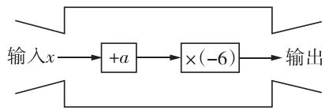

14. 若关于 $x$ 的方程 $3x - 2a = 0$ 与 $2x + 3a - 13 = 0$ 的解相同, 则这两个方程的解为 $x = \underline{2}$ .

15. 规定: 用 $\{m\}$ 表示大于 m 的最小整数. 例如: $\{2.6\}=3,\{8\}=9,\{-4.9\}=-4$ . 用 [m] 表示不大于 m 的最大整数. 例如: $\left[\frac{7}{2}\right]=3,[-4]=-4,[-1.5]=-2$ . 若整数 x 满足关系式 $2[x]-5\{x-2\}=29$ , 则 x 的值为 -8.

# 选择题、填空题答题区

<table><tr><td>1</td><td>2</td><td>3</td><td>4</td><td>5</td><td>6</td><td>7</td><td>8</td><td>9</td><td>10</td></tr><tr><td>A</td><td>A</td><td>D</td><td>B</td><td>A</td><td>C</td><td>A</td><td>A</td><td>C</td><td>C</td></tr></table>

11. 2x=8(答案不唯一) 12. 4 13. 3

14. 2 15. -8

# 三、解答题(本大题共6小题,共55分)

16.(8 分)解方程:

(1)(4分) $3x+1=8-2(x-1)$ ;

解:去括号,得 $3x + 1 = 8 - 2x + 2$ ,

移项, 得 $3x + 2x = 8 + 2 - 1$ ,

合并同类项, 得 5x = 9,

系数化为 1, 得 $x = \frac{9}{5}$ . (4 分)

(2)(4分) $\frac{x-1}{2}-\frac{5x+2}{6}=1.$

解: 去分母, 得 $3(x-1)-(5x+2)=6$ ,

去括号, 得 3x - 3 - 5x - 2 = 6,

移项, 得 3x - 5x = 6 + 3 + 2,

合并同类项, 得 -2x = 11,

系数化为 1, 得 $x = -\frac{11}{2}$ . (4 分)

17.(8 分)某磁性飞镖游戏的靶盘如图. 珍珍玩了两局, 每局投 10 次飞镖, 若投到边界则不计入次数, 需重新投. 计分规则如下:

<table><tr><td>投中位置</td><td>A区</td><td>B区</td><td>脱靶</td></tr><tr><td>一次计分/分</td><td>3</td><td>1</td><td>-2</td></tr></table>

(1) 在第一局中, 珍珍投中 A 区 4 次, B 区 2 次, 脱靶 4 次. 求珍珍第一局的得分;

(2)第二局,珍珍投中A区k次,B区3次,其余全部脱靶.若本局得分比第一局提高了13分,求k的值.

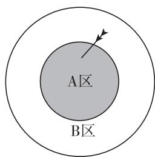

解:(1)根据题意,得 $4 \times 3 + 2 \times 1 + 4 \times (-2) = 6$ (分),

故珍珍第一局的得分为 6 分. (3 分)

(2) 因为第二局得分比第一局提高了 13 分, 所以第二局的得分为 $6 + 13 = 19$ (分).

根据题意,得 $3k + 3 \times 1 + (10 - k - 3) \times (-2) = 19$ ,
解得 k = 6.
(8 分)

18.(8 分)已知关于 x 的一元一次方程 $\frac{3x-1}{2} + m = 5$ ,
其中 m 是正整数.

(1) 当 m=3 时, 求方程的解;  
(2)若方程有正整数解,求 m 的值.

解:(1)当m=3时,原方程为 $\frac{3x-1}{2}+3=5$ , (1分)

去分母, 得 $3x - 1 + 6 = 10$ ,

移项, 得 $3x = 10 - 6 + 1$ ,

合并同类项, 得 3x = 5,

系数化为 1, 得 $x = \frac{5}{3}$ . (4 分)

(2) 去分母, 得 $3x - 1 + 2m = 10$ ,

移项, 得 $3x = 10 - 2m + 1$ ,

合并同类项, 得 3x = 11 - 2m,

系数化为 1, 得 $x = \frac{11 - 2m}{3}$ . (7 分)

因为 $m$ 是正整数，方程有正整数解，

所以 $m = 1$ 或4. (8分)

19.(8 分)某校新进了一批课桌椅,七年级(2)班的学生利用活动课时间帮助学校搬运部分课桌椅,已知七年级(2)班共有学生45人,其中男生人数比女生人数的2倍少24,要求每个学生搬运6张桌子或者搬运15把椅子.请解答下列问题:

(1)七年级(2)班男生、女生分别有多少人?   
(2)一张桌子配两把椅子,为了使搬运的桌子和椅子刚好配套,应该分配多少名学生搬运桌子,多少名学生搬运椅子?

解:(1)设女生有x人,则男生有 $(2x-24)$ 人.

根据题意,得 $(2x-24)+x=45$ , (2分)

解得 x=23，则 45-x=22.

答:七年级(2)班男生有22人,女生有23人.
(4 分)

(2) 设分配 y 名学生搬运桌子, 则有 $(45 - y)$ 名学生搬运椅子,

根据题意,得 $2 \times 6y = 15(45 - y)$ ，(6 分)

解得 y=25，则 45-y=20.

答:应该分配 25 名学生搬运桌子,20 名学生搬运椅子.
(8 分)

20. (11 分) 某商场开展打折促销活动, 对标价为 80 元/件的 A 商品和标价为 100 元/件的 B 商品进行打折销售, 设计了如下两种方案.

方案一:A 商品打 7 折,B 商品打 8.5 折;

方案二:A,B两种商品都打8折.

(1)甲单位准备到该商场购买 A 商品 40 件, B 商品 30 件, 那么甲单位选择哪种方案合算? 能节省多少钱?  
(2)乙单位到该商场购买 A, B 两种商品, 购买 B 商品的件数比购买 A 商品的件数的 2 倍少 10, 经过计算发现, 选择方案一和选择方案二实际付款相同, 求乙单位购买 A, B 两种商品各多少件.

解:(1)方案一: $80 \times 0.7 \times 40 + 100 \times 0.85 \times 30 = 4790$ (元),

方案二: $80 \times 0.8 \times 40 + 100 \times 0.8 \times 30 = 4960$ (元),

因为 4 790 < 4 960，所以甲单位选择方案一合算，

因为 4960 - 4790 = 170(元)，所以能节省 170 元.
(5 分)

(2) 设乙单位购买 A 商品 x 件, 则购买 B 商品 $(2x - 10)$ 件,

根据题意, 得 $80 \times 0.7x + 100 \times 0.85(2x - 10) = 80 \times 0.8x + 100 \times 0.8(2x - 10)$ ,

解得 x=25，所以 $2x-10=2\times25-10=40$ .

答:乙单位购买 A 商品 25 件,购买 B 商品 40 件.
(11 分)

21. (12 分) 根据以下素材, 探索完成任务.

<table><tr><td colspan="3">如何设计宣传牌?</td></tr><tr><td>素材1</td><td colspan="2">如图1是长方形宣传牌,长330cm,宽220cm,拟在上面书写24个字.(1)中间可以用来设计的部分也是长方形,且长是宽的1.55倍.(2)四周空白部分的宽度相等.</td></tr><tr><td>素材2</td><td colspan="2">如图2,为了美观,将设计部分分割成大小相等的左、中、右三个长方形栏目,栏目与栏目之间的中缝间距相等.</td></tr><tr><td>素材3</td><td colspan="2">如图3,每栏划出正方形方格,中间有十字间隔,竖向中间间隔和横向中间间隔宽度比为1:2.</td></tr><tr><td colspan="3">220cm330cm图1 图2 图3</td></tr><tr><td colspan="3">问题解决</td></tr><tr><td>任务1</td><td>分析数量关系</td><td>设四周宽度为xcm,用含x的代数式分别表示设计部分的长和宽.</td></tr><tr><td>任务2</td><td>确定四周宽度</td><td>求x的值.</td></tr><tr><td>任务3</td><td>确定栏目大小</td><td>1求每个栏目的水平宽度.2求长方形栏目与栏目之间的中缝间距.</td></tr></table>

解:任务1 根据题意,得设计部分的长为 $(330-2x)$ cm,宽为 $(220-2x)$ cm. (2分)

任务 2 因为设计的部分也是长方形,且长是宽的 1.55 倍,

所以 $330 - 2x = 1.55(220 - 2x)$ ，解得 $x = 10$

所以 x 的值是 10. (5 分)

任务 3 由任务 2 得, 设计部分的长为 $330 - 2 \times 10 = 310 \, (\text{cm})$ , 宽为 $220 - 2 \times 10 = 200 \, (\text{cm})$ .

①设每个栏目的水平宽度为 y cm，每栏竖向中间间隔是 a cm，则横向中间间隔为 2a cm，

根据正方形的边长相等, 得 $\frac{200 - 2a}{4} = \frac{y - a}{2}$ , 解得 y = 100.

所以每个栏目的水平宽度为 $100 \, cm$ . (9 分)

②因为 $\frac{310-3y}{2}=\frac{310-3\times100}{2}=5$ ，

所以长方形栏目与栏目之间的中缝间距为 5 cm.

# 6 | 第六章综合能力测评卷

时间:60 分钟

# 一、选择题(本大题共10小题,每小题3分,共30分)

1. 下列立体图形中, 表面只包含平面图形的是 (D)

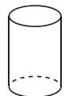  
A

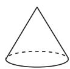  
B

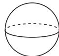  
C

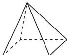  
D

2. 高速公路的建设带动我国经济的快速发展. 在高速公路的建设中, 通常要在大山中开挖隧道, 把道路取直, 以缩短路程. 这样做蕴含的数学道理是 ( B )

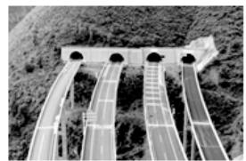

A. 连接两点的线段的长度, 叫作这两点间的距离   
B. 两点之间, 线段最短  
C. 两点确定一条直线  
D. 平面内经过一点有无数条直线

3. 如图是由一个长方体和一个圆锥组成的立体图形，从前面看该立体图形得到的图形是 （C）

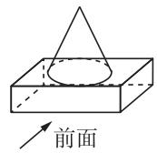

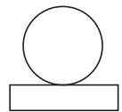  
A

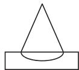  
B

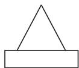  
C

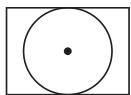  
D

4. 如图, B, C, D 三点在直线 l 上, 点 A 在直线 l 外, 下列说法中正确的有 (B)

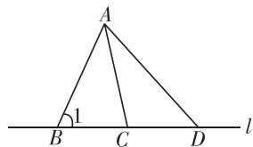

①射线 BD 和射线 CD 是同一条射线；  
②直线 BD 和直线 CD 是同一条直线；  
③∠1 和 ∠B 表示的是同一个角；  
④若 2BC = BD，则 C 是线段 BD 的中点.

A.1个

B.2 个

C. 3 个

D. 4 个

满分:100 分

5. 如图, $AB = 12 \, cm$ , C 为 AB 的中点, 点 D 在线段 AC 上且 AD: CB = 1:3, 则 AD 的长是 (B)

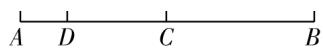

A. $1 \mathrm{~cm}$

B. 2 cm

C. 3 cm

D. 4 cm

6. 春节期间,各类取暖用火、用气、用电增多,如果使用和防范不当,极易引发火灾.如图,在小虎家(点O)北偏东30°方向的一栋居民楼(点A)发生火灾,消防车从消防站(点B)赶过来,若 $\angle AOB=90^{\circ}$ ,则消防站位于小虎家的 (A)

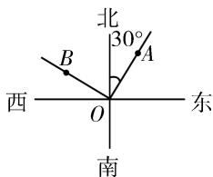

A. 北偏西 $60^{\circ}$ 方向

B. 北偏西 $30^{\circ}$ 方向

C. 北偏东 $60^{\circ}$ 方向

D. 北偏东 $30^{\circ}$ 方向

7. 如图是一个正方体的平面展开图, 把展开图折叠成正方体后, 与“中”字所在面相对的面上的汉字是 ( C )

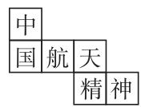

A. 航

B. 天

C. 精

D. 神

8. 如图, 在长方形纸片 ABCD 中, M 为 AD 边的中点, 将纸片沿 BM, CM 折叠, 使点 A 落在点 $A_{1}$ 处, 点 D 落在点 $D_{1}$ 处. 若 $\angle 1 = 40^{\circ}$ , 则 $\angle BMC =$ ( C )

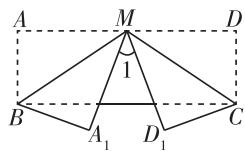

A. $135^{\circ}$

B. $120^{\circ}$

C. $110^{\circ}$

D. $100^{\circ}$

9. 如图, 点 C 是线段 AB 上一点, 点 D 为 AB 的中点, 点 E 为 AC 的中点, 若 BC = 4 cm, 则 DE 的长为 (B)

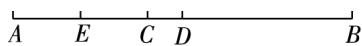

A. 1 cm

B. 2 cm

C. 3 cm

D. 4 cm

10. 如图, $C$ 为直线 $AB$ 上一点, $\angle DCE$ 为直角, $CF$ 平分 $\angle ACD, CH$ 平分 $\angle BCD, CG$ 平分 $\angle BCE$ , 各学习小组经过讨论后得到以下结论: ① $\angle ACF$ 与 $\angle DCH$ 互余; ② $\angle HCG = 60^{\circ}$ ; ③ $\angle ECF$ 与 $\angle BCH$ 互补; ④ $\angle ACF - \angle BCG = 45^{\circ}$ . 其中正确的是 (A)

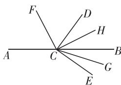

A.①③④

B. ①③

C. ②③④

D.①②③④

# 二、填空题(本大题共5小题,每小题3分,共15分)

11. 节日的焰火可以看成是由点运动形成的, 可以说明这一现象的数学道理是 点动成线.  
12. 若 $\angle 1 = 60^{\circ}$ , 则 $\angle 1$ 的补角比 $\angle 1$ 的余角大 $90^{\circ}$ .  
13. 已知 $\angle A = 78^{\circ}54'$ , $\angle B = 78.9^{\circ}$ , 则 $\angle A = \angle B$ . (填“>”“<”或“=”)   
14. 如图, 8 时 30 分时, 时针与分针所成的锐角的度数为 $75^{\circ}$ .

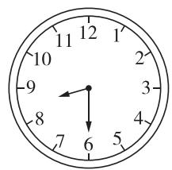

15. 如图, 点 C 在线段 AB 上, 图中三条线段中, 若有一条线段长是另一条线段长的两倍, 则称点 C 是线段 AB 的“巧分点”. 已知 AB = 6, 点 C 是线段 AB 的“巧分点”, 则 AC 的长为 2 或 3 或 4 .

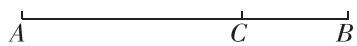  
选择题、填空题答题区

<table><tr><td>1</td><td>2</td><td>3</td><td>4</td><td>5</td><td>6</td><td>7</td><td>8</td><td>9</td><td>10</td></tr><tr><td>D</td><td>B</td><td>C</td><td>B</td><td>B</td><td>A</td><td>C</td><td>C</td><td>B</td><td>A</td></tr><tr><td colspan="10">11. 点动成线 12. 90 13. = 14. 75°15. 2或3或4</td></tr></table>

# 三、解答题(本大题共6小题,共55分)

16.(6分)如图,已知三点A,B,C,按下列要求画图:

(1)画射线 $AB$   
(2) 连接 BC;   
(3) 反向延长 BC 至 D, 使得 BD = 2BC - AB. (不写作法, 保留作图痕迹)

C•

•B

$A^{\bullet}$

解:(1)射线 AB 如图所示. (1 分)

(2) 连接 BC 如图所示. (2 分)  
(3)如图, $BD$ 即为所作. (6分)

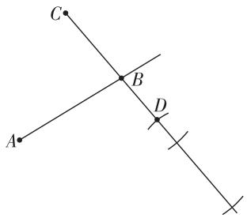

text_image

C
B
D
A

17. (8 分) 计算.

(1)(4 分) $35^{\circ}45' + 23^{\circ}29' - 53^{\circ}17'$ ;  
解: $35^{\circ}45' + 23^{\circ}29' - 53^{\circ}17'$   
$= 59^{\circ}14^{\prime} - 53^{\circ}17^{\prime}$   
$= 5^{\circ}57^{\prime}$ (4分）

(2)(4分) $67^{\circ}31' + 48^{\circ}39' - 21^{\circ}17' \times 5.$

解: $67^{\circ}31' + 48^{\circ}39' - 21^{\circ}17' \times 5$   
$= 67^{\circ}31^{\prime} + 48^{\circ}39^{\prime} - 106^{\circ}25^{\prime}$   
$= 116^{\circ}10^{\prime} - 106^{\circ}25^{\prime}$   
$= 9^{\circ}45^{\prime}$ (4分）

18. (8 分) 如图所示的几何体是由若干个相同的小正方体组成的.

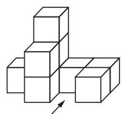  
前面

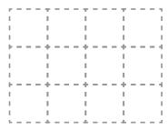  
从左面看

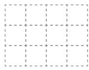  
从上面看

(1) 填空: 这个几何体是由 9 个小正方体组成的.  
(2)画出从左面、上面观察这个几何体所看到的图形.   
(3)在不改变此几何体从左面、上面观察到的图形的情况下,最多还可以添加7个小正方体.
解:(1)9
(2分)

(2)从左面、上面观察这个几何体所看到的形状图如图所示.

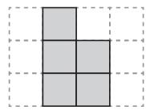  
从左面看

  
从上面看

(6 分)

(3)7

(8 分)

19. (9 分) 如图, C 为线段 AD 上一点, 点 B 为 CD 的中点, 且 $AD = 9 \, cm$ , $BD = 2 \, cm$ .

(1) 求 $AC$ 的长；  
(2) 若点 E 在直线 AD 上, 且 AE = 3 cm, 求 BE 的长.

解:(1)因为点 B 为 CD 的中点, $BD=2\ cm$ ,

所以 $CD = 2BD = 4\mathrm{cm}$ ， (2分)

因为 AD = 9 cm，

所以 $AC = AD - CD = 9 - 4 = 5(\mathrm{cm})$ （3分）

(2) 因为点 B 为 CD 的中点, BD = 2 cm,

所以 BC = BD = 2 cm，

因为 $AC = 5 \, cm$ ，所以 $AB = AC + BC = 7 \, cm$ 。(4 分)

①当点 E 在线段 AD 上时, 如图 1,

  
图1

因为 $AE = 3\mathrm{cm}$

所以 $BE = AB - AE = 7 - 3 = 4(\mathrm{cm})$ （6分）

当点 E 在线段 DA 的延长线上时, 如图 2,

  
图2

因为 AE = 3 cm，

所以 $BE = AB + AE = 7 + 3 = 10(\mathrm{cm})$ （8分）

综上,BE 的长为 4 cm 或 10 cm. (9 分)

20. (12 分) 如图, 现有一副三角尺, $\angle DOC = 30^{\circ}$ , $\angle ABO = 45^{\circ}$ .

(1) 把三角尺按图 1 所示方式放置, 当 OD 平分 $\angle AOB$ 时, 求 $\angle COB$ 的度数;  
(2) 把三角尺按图 2 所示方式放置, 使直线 OB, OD 重合, 若 OM 平分 $\angle AOD$ , ON 平分 $\angle AOC$ , 求 $\angle MON$ 的度数;  
(3)如图3,将三角尺OCD绕点O旋转,把OD旋转到∠AOB的外部(OD始终在直线OA右侧),OM平分∠AOD,ON平分∠AOC,求∠MON的度数.

  
图1

  
图2

  
图3

解:(1) 因为 $\angle AOB = 90^{\circ}$ , OD 平分 $\angle AOB$ ,

所以 $\angle BOD = \frac{1}{2}\angle AOB = 45^{\circ}$

因为 $\angle DOC = 30^{\circ}$

所以 $\angle COB = 45^{\circ} - 30^{\circ} = 15^{\circ}$ . (3分)

(2) 因为 OM 平分 $\angle AOD, ON$ 平分 $\angle AOC,$

所以 $\angle AOM = \frac{1}{2} \angle AOB = 45^{\circ}, \angle AON = \frac{1}{2} \angle AOC = \frac{1}{2} (\angle AOB + \angle DOC) = 60^{\circ},$

所以 $\angle MON = \angle AON - \angle AOM = 60^{\circ} - 45^{\circ} = 15^{\circ}$ (6分）

(3) 当 OC 在直线 OA 右侧时, 与 (2) 同理易得 $\angle MON = 15^{\circ}$ . (8 分)

当 OC 在直线 OA 左侧时, 设 $\angle BOD = x$ ,

所以 $\angle AOD = \angle AOB + \angle BOD = 90^{\circ} + x$

$$
\angle A O C = 3 6 0 ^ {\circ} - 9 0 ^ {\circ} - 3 0 ^ {\circ} - x = 2 4 0 ^ {\circ} - x,
$$

因为 OM 平分 $\angle AOD, ON$ 平分 $\angle AOC,$

所以 $\angle AOM = \frac{1}{2} (90^{\circ} + x)$ ， $\angle AON = \frac{1}{2} (240^{\circ} - x)$

所以 $\angle MON = \angle AOM + \angle AON = \frac{1}{2} (90^{\circ} +$

$x) + \frac{1}{2} (240^{\circ} - x) = 165^{\circ}$ . (11分)

综上所述， $\angle MON$ 的度数为 $15^{\circ}$ 或 $165^{\circ}$ . (12分)

21. (12 分) 我国著名数学家华罗庚说过“数缺形时少直观, 形少数时难入微”, 数形结合是解决数学问题的重要思想方法, A, B 是数轴上的两点 (点 B 在点 A 的右侧), 点 A 表示的数为 -15, A, B 两点间的距离 AB 是点 A 到原点 O 的距离 OA 的 4 倍, 即 AB = 4OA.

# 【特例初探】

(1) 数轴上点 B 表示的数是 45. 点 C 为数轴上的动点, 当 $AC + BC = 72$ 时, 点 C 表示的数为 -21 或 51.

# 【能力提升】

(2) 动点 P, Q 分别从点 B 和点 A 同时出发向左匀速运动, 点 P, Q 的速度分别为每秒 7 个单位长度和每秒 3 个单位长度.

①当点 P 与点 Q 之间的距离为 4 个单位长度时, 求此时点 P 和点 Q 在数轴上所表示的数;  
②设运动时间为 t 秒, 点 M 为数轴上 P, Q 两点之间的动点, 且点 M 始终满足 PM:MQ = 1:3, 点 M 在运动到点 O 的过程中, $\frac{3}{2}PQ - OM$ 的值是否发生变化? 若不变, 求其值; 若变化, 说明理由.

解:(1)45 -21 或 51 (4 分)

(2)①设运动时间为 x 秒.

当点 P 追上点 Q 前，点 P 与点 Q 之间的距离为 4 个单位长度时，依题意，得 $45 - 7x - (-15 - 3x) = 4$ ，解得 x = 14，则此时点 P 表示的数为 $45 - 7 \times 14 = -53$ ，点 Q 表示的数为 $-15 - 3 \times 14 = -57$ 。（6 分）当点 P 追上点 Q 后，点 P 与点 Q 之间的距离为 4 个单位长度时，依题意，得 $-15 - 3x - (45 - 7x) = 4$ ，解得 x = 16，则此时点 P 表示的数为 $45 - 7 \times 16 = -67$ ，点 Q 表示的数为 $-15 - 3 \times 16 = -63$ 。（8 分）

② $\frac{3}{2}PQ-OM$ 的值不变,其值为60.

设点 M 表示的数为 y，

依题意, 得 $y - (-15 - 3t) = 3(45 - 7t - y)$ ,

解得 y = 30 - 6t，

依题意可知， $M$ 在原点右侧，所以 $OM = 30 - 6t.$ （10分）

因为 $PQ = 45 - 7t - (-15 - 3t) = 60 - 4t$ ，(11分）

所以 $\frac{3}{2}PQ-OM=\frac{3}{2}(60-4t)-(30-6t)=90-6t-30+6t=60,$

所以 $\frac{3}{2}PQ-OM$ 的值不发生变化,其值为60.

(12 分)

# 7 | 期末综合能力测评卷

时间:90 分钟

# 一、选择题(本大题共10小题,每小题3分,共30分)

1. -6 的相反数是 (C)

A. -6

B. $-\frac{1}{6}$

C. 6

D. $\frac{1}{6}$

2. 新情境 DeepSeek 的出现,不仅推动了技术的进步,还让更多的开发者能够使用高性能的 AI 模型,推动了 AI 技术的普惠化. DeepSeek 仅用二十天就实现了 21 600 000 的日活跃用户(DAU),超过了 ChatGPT 发布之初的数据表现,展现出巨大的市场潜力. 其中 21 600 000 用科学记数法表示为 ( C )

A. $21.6 \times 10^{6}$

B. $2.16 \times 10^{6}$

C. $2.16 \times 10^{7}$

D. $0.216 \times 10^{8}$

3. 下列选项叙述错误的是 (D)

A. $x^{2} + y^{2} - 2xy$ 表示 $x, y$ 两数的平方和与它们乘积的2倍的差

B. $(x + y)(x - y)$ 表示 $x, y$ 两数的和与差的积

C. 单项式 $-x^{3}y^{2}$ 的系数是 -1

D. $3x^{2} - y + 5xy^{2}$ 的次数是2

4. 如图是一个正方体纸盒的展开图, 正方体的各面上分别标有“知识就是力量”六个字, 则原正方体中与“知”字相对的字是

A. 就

B. 力

C. 是

D. 量

5. A, B 两个海上观测站的位置如图所示, A 在灯塔 O 北偏东 $40^{\circ}$ 方向上, $\angle AOB = 110^{\circ}$ , 则 B 在灯塔 O 的 (A)

text_image

北
西——O——东——南
A
B

A. 南偏东 $30^{\circ}$ 方向上

B. 南偏东 $40^{\circ}$ 方向上

C. 南偏西 $50^{\circ}$ 方向上

D. 北偏东 $30^{\circ}$ 方向上

6. 已知有理数 a, b, c 在数轴上对应点的位置如图所示, 则下列结论不正确的是 (D)

A. c < a < b

B. $a - c > 0$

C. bc < 0

D. $a + b > 0$

满分:120 分

7. 新趋势·数学文化《增删算法统宗》中记载：“有个学生资性好，一部孟子三日了，每日增添一倍多，问君每日读多少。”其大意是：有个学生天资聪慧，三天读完一部《孟子》，每天阅读的字数是前一天的两倍，问他每天分别读多少个字。已知《孟子》一书共有34685个字，设这个学生第二天读 $x$ 个字，则下面所列方程正确的是 （C）

A. $x + 2x + 4x = 34685$

B. $x + 2x + 3x = 34685$

C. $\frac{1}{2} x + x + 2x = 34685$

D. $x + \frac{1}{2} x + \frac{1}{4} x = 34685$

8. 幻方起源于中国,是我国古代数学的杰作之一.“洛书”是我国文化中最古老、最神秘的事物之一,“洛书”就是三阶幻方,其中每行、每

<table><tr><td>3a</td><td></td><td>a</td></tr><tr><td>2</td><td>4</td><td></td></tr><tr><td>7</td><td></td><td></td></tr></table>

列、每条对角线上的三个数之和都是相等的,如图所示的三阶幻方中 a 的值是 ( A )

A.1

B.0

C. 2

D. 4

9. 已知线段 AB = 5，点 C 为直线 AB 上一点，且 AC: BC = 3:2，点 D 为线段 AC 的中点，则线段 BD 的长为 (C)

A. 3.5

B.3.5或7.5

C. 3.5 或 2.5

D.2.5 或 7.5

10. 用边长相等的正方形和等边三角形卡片按如图所示的方式和规律拼出图形. 拼第 1 个图形所用两种卡片的总数为 7 张, 拼第 2 个图形所用两种卡片的总数为 12 张……若按照这样的规律拼出的第 n 个图形中, 所用正方形卡片比等边三角形卡片多 10 张, 则拼第 n 个图形所用两种卡片的总数为 ( B )

  
第1个图形

  
第2个图形

  
第3个图形

A. 57 张

B. 52 张

C. 50 张

D. 47 张

# 二、填空题(本大题共5小题,每小题3分,共15分)

11. 近年来,我国科技工作者践行“科技强国”使命,不断取得世界级的科技成果. 如由我国研制的中国首台作业型全海深自主遥控潜水器“海斗一号”, 最大下潜深度 10 907 米, 填补了中国水下万米作业型无人潜水器的空白; 由我国自主研发的极目一号Ⅲ型浮空艇“大白鲸”, 升空高度至海拔 9 032 米, 创造了浮空艇原位大气科学观测海拔最高的世界纪录.

如果把海平面以上9032米记作“+9032米”，那么海平面以下10907米记作-10907米.

12. 新趋势·结论开放 写出一个同时满足以下两个条件的单项式: ①系数是负数; ②次数是5. 这个单项式可以是 $-3x^{2}y^{3}$ (答案不唯一).

13. 如图, 将甲、乙两把尺子拼在一起, 两端重合, 如果甲尺经校验是直的, 那么乙尺一定不是直的, 判断依据是两点确定一条直线.

14. 一家商店把一种运动鞋按成本价 a 元提高 50% 标价, 然后以八折优惠卖出, 则这种运动鞋每双的售价是 1.2a 元. (用含 a 的代数式表示)

15. 如图是 $3 \times 3$ 的数表, 数表每个位置所对应的数都是 1, 2 或 3. 定义 $a \oplus b$ 的值等于数表中第 $a$ 行第 $b$ 列所对应的数. 例如, 数表中第 2 行第 3 列所对应的数是 3, 所以 $2 \oplus 3 = 3$ . 若 $(x - 5) \oplus 1 = 1 \oplus 3$ , 则 $x$ 的值为 6 或 8.

第1列 第2列 第3列

<table><tr><td>第1行</td><td>2</td><td>3</td><td>2</td></tr><tr><td>第2行</td><td>3</td><td>1</td><td>3</td></tr><tr><td>第3行</td><td>2</td><td>3</td><td>2</td></tr></table>

选择题、填空题答题区 

<table><tr><td>1</td><td>2</td><td>3</td><td>4</td><td>5</td><td>6</td><td>7</td><td>8</td><td>9</td><td>10</td></tr><tr><td>C</td><td>C</td><td>D</td><td>C</td><td>A</td><td>D</td><td>C</td><td>A</td><td>C</td><td>B</td></tr><tr><td colspan="10">11. -10 907 米 12.  $-3x^{2}y^{3}$ (答案不唯一)13. 两点确定一条直线 14. 1.2a 15. 6或8</td></tr></table>

# 三、解答题(本大题共8小题,共75分)

16. (6 分) 计算:

(1)(3 分)(-3)+6-(-8)-4;

解： $(-3) + 6 - (-8) - 4$

$$
\begin{array}{l} = - 3 + 6 + 8 - 4 \\ = 7. \\ = 7. \\ \end{array}
$$

(2)(3 分) $(-2)^{2}\times5-(-2)^{3}\div4.$

解： $(-2)^{2}\times 5 - (-2)^{3}\div 4$

$$
\begin{array}{l} = 4 \times 5 - (- 8) \div 4 \\ = 2 0 + 2 \\ = 2 2. \\ \end{array}
$$

17. (8 分) 先化简, 再求值: $2(a^{2}-2ab)-3(a^{2}-ab-$

$$
4 b ^ {2})  , \text {其中} a = 2, b = - \frac {1}{2}.
$$

解: $2(a^{2}-2ab)-3(a^{2}-ab-4b^{2})$

$$
= 2 a ^ {2} - 4 a b - 3 a ^ {2} + 3 a b + 1 2 b ^ {2}
$$

$$
= - a ^ {2} - a b + 1 2 b ^ {2}. \tag {6分}
$$

当 $a = 2, b = -\frac{1}{2}$ 时，原式 $= -2^{2} - 2 \times \left(-\frac{1}{2}\right) +$

$$
1 2 \times (- \frac {1}{2}) ^ {2} = - 4 + 1 + 3 = 0. \tag {8分}
$$

18.(8 分)解方程:

(1)(4分) $6-2(x-1)=2(x-1)$ ;

解:去括号,得 $6 - 2x + 2 = 2x - 2$ ,

移项、合并同类项，得 -4x = -10，

系数化为 1, 得 $x = \frac{5}{2}$ . (4 分)

(2)(4 分) $\frac{x+2}{3}-\frac{x-1}{2}=x+1.$

解:去分母,得 $2(x+2)-3(x-1)=6(x+1)$ ,

去括号, 得 $2x + 4 - 3x + 3 = 6x + 6$ ,

移项、合并同类项，得 $-7x = -1$

系数化为 1, 得 $x = \frac{1}{7}$ . (4 分)

19.(8分)如图,延长线段AB至点C,使 $BC=\frac{1}{2}AB$ ,
反向延长 AB 至点 D, 使 $AD = \frac{1}{3} AB$ .

(1)依题意画出图形,则 $\frac{BC}{AD}=\frac{3}{2}$ （直接写出结果）;

(2) 若点 E 为 BC 的中点, 且 BD - 4BE = 2, 求 AC 的长.

解:(1)画出图形如图所示. (3 分)

$\frac{3}{2}$ (4 分)

(2) 如图, 设 AB = 6x, 则 BC = 3x, AD = 2x, (5 分)
因为点 E 是 BC 的中点，

所以 $BE = CE = \frac{1}{2} BC = 1.5x$ ， (6分)

因为 BD - 4BE = 2，

所以 $6x + 2x - 4 \times 1.5x = 2$ ，解得 $x = 1$ ，

所以 $AC = AB + BC = 9x = 9.$ (8 分)

20. (10 分) 用 A, B 两种型号的机器生产相同的产品, 产品装入同样规格的包装箱后运往仓库. 已知每台 B 型机器比每台 A 型机器一天多生产 2 件产品, 3 台 A 型机器一天生产的产品恰好能装满 5 箱, 4 台 B 型机器一天生产的产品恰好能装满 7 箱. 每台 A 型机器一天生产多少件产品? 每箱装多少件产品?

下面是解决该问题的两种方法,请选择其中的一种方法完成分析和解答.

<table><tr><td>方法一分析:设每台A型机器一天生产x件产品,则每台B型机器一天生产(x+2)件产品,3台A型机器一天共生产3x件产品,4台B型机器一天共生产4(x+2)件产品,再根据题意列方程.解:设每台A型机器一天生产x件产品,......</td><td>方法二分析:设每箱装y件产品,则3台A型机器一天共生产5y件产品,4台B型机器一天共生产7y件产品,再根据题意列方程.解:设每箱装y件产品,......</td></tr></table>

解: 方法一 3x 4(x+2) (4 分)

根据题意, 得 $\frac{3}{5}x = \frac{4(x + 2)}{7}$ , 解得 x = 40, (8 分)

所以 $\frac{3}{5} x = \frac{3 \times 40}{5} = 24.$ (9分)

答:每台 A 型机器一天生产 40 件产品,每箱装 24 件产品.
(10 分)

方法二 $5y$ 7y (4分)

根据题意, 得 $\frac{5}{3}y = \frac{7}{4}y - 2$ , 解得 y = 24, (8 分)

所以 $\frac{5}{3} y = \frac{5 \times 24}{3} = 40.$ (9分)

答:每台 A 型机器一天生产 40 件产品,每箱装 24 件产品. (10 分)

注:选一种方法解答即可.

21. (10 分)【方法】

有一种整式处理器,能将二次多项式处理成一次多项式,处理方法是:将二次多项式的二次项系数与一次项系数的和(和为非零数)作为一次多项式的一次项系数,将二次多项式的常数项作为一次多项式的常数项.例如: $A=x^{2}+2x-3$ ,A经过处理器得到 $B=(1+2)x-3=3x-3$ .

【应用】

若关于 x 的二次多项式 C 经过处理器得到 D, 根据以上方法, 解决下列问题:

(1) 填空: 若 $C = 3x^{2} - 2x + 5$ , 则 $D = \underline{x + 5}$ ;

(2) 若 $C = 4x^{2} - 5(2x - 3)$ ，求关于 x 的方程 D = 9 的解.

【延伸】

(3) 已知 $M = x - 2(m - 4)x^{2} + 7$ , M 是关于 x 的二次多项式, 若 N 是 M 经过处理器得到的整式, 且 $N = 3x + 7$ , 求 m 的值.

解:(1) $x+5$ (2分)

(2) 由题意可知, $C=4x^{2}-5(2x-3)=4x^{2}-10x+15$ ,
所以 $D=(4-10)x+15=-6x+15$ ,

则 $-6x + 15 = 9$ ，解得 x = 1，

所以关于 $x$ 的方程 $D = 9$ 的解为 $x = 1$ . (6分)

(3)由题意可知， $M$ 经过处理器得到整式 $N$ ，则 $N = \left[-2(m - 4) + 1\right]x + 7 = (-2m + 9)x + 7,$

所以 $(-2m+9)x+7=3x+7$ ，即 $-2m+9=3$ ，

解得 m=3，所以 m 的值为 3. (10 分)

22. (12 分) 如图, O 是直线 AB 上的一点, $\angle COD = 90^{\circ}$ , OE 平分 $\angle BOC$ .

【观察计算】

(1)如图1,当 $\angle AOC=30^{\circ}$ 时,求 $\angle DOE$ 的度数;

【类比猜想】

(2) 在图 1 中, 当 $\angle AOC = \alpha (0^{\circ} < \alpha < 180^{\circ})$ 时, 试猜想 $\angle DOE$ 的度数 (用含 $\alpha$ 的代数式表示), 并说明理由;

【拓展探究】

(3)如图2,将 $\angle DOC$ 绕着顶点O顺时针旋转,探究 $\angle AOC$ 和 $\angle DOE$ 之间的数量关系,写出你的结论,并说明理由.

  
图1

  
图2

解:(1) 因为 $\angle AOC + \angle BOC = 180^{\circ}$ ,

所以 $\angle BOC = 180^{\circ} - \angle AOC = 150^{\circ}$

因为 OE 平分 $\angle BOC$ ，所以 $\angle COE = \frac{1}{2} \angle BOC = 75^{\circ}$ ，

所以 $\angle DOE = \angle COD - \angle COE = 15^{\circ}$ . (4分)

(2) $\angle DOE = \frac{1}{2}\alpha$ . 理由如下: (5 分)

因为 $\angle AOC + \angle BOC = 180^{\circ}$

所以 $\angle BOC = 180^{\circ} - \angle AOC$

因为 OE 平分 $\angle BOC$ ,

所以 $\angle COE = \frac{1}{2}\angle BOC = \frac{1}{2} (180^{\circ} - \angle AOC) = 90^{\circ} - \frac{1}{2}\angle AOC,$

所以 $\angle DOE = \angle COD - \angle COE = 90^{\circ} - (90^{\circ} - \frac{1}{2}\angle AOC) = \frac{1}{2}\angle AOC = \frac{1}{2}\alpha.$ (8分）

(3) $\angle AOC = 2\angle DOE.$ 理由如下： (9分)

因为 $OE$ 平分 $\angle BOC$ ，所以 $\angle BOC = 2\angle COE.$

因为 $\angle AOC = 180^{\circ} - \angle BOC$

所以 $\angle AOC = 180^{\circ} - 2\angle COE.$

因为 $\angle COE = \angle COD - \angle DOE = 90^{\circ} - \angle DOE$

所以 $\angle AOC = 180^{\circ} - 2(90^{\circ} - \angle DOE) = 2\angle DOE.$ (12分）

23. (13 分) 如图, 已知数轴上三点 M, O, N 对应的数分别为 -1, 0, 3, 点 P 为数轴上一点, 其对应的数为 x.

(1)MN的长为4.

(2) 当点 $P$ 到点 $M$ 、点 $N$ 的距离相等时, 求 $x$ 的值.

(3)数轴上是否存在点 P, 使点 P 到点 M、点 N 的距离之和是 8? 若存在, 求出 x 的值; 若不存在, 请说明理由.

(4) 如果点 $P$ 以每秒 1 个单位长度的速度从点 $O$ 沿数轴向左运动, 同时点 $A$ 和点 $B$ 分别从点 $M$ 和点 $N$ 出发以每秒 2 个单位长度和每秒 3 个单位长度的速度也沿数轴向左运动. 当点 $P$ 到点 $A$ 、点 $B$ 的距离相等时, 直接写出 $t$ 的值.

解:(1)4 (2 分)

(2) 根据题意, 得 $x - (-1) = 3 - x$ ,

解得 $x = 1$ （4分）

(3)①当点 $P$ 在点 $M$ 的左侧时，

根据题意,得 $(-1-x)+(3-x)=8$ ,

解得 $x = -3$ ； (6分)

②当点 $P$ 在点 $M$ 和点 $N$ 之间时，

则 $[x - (-1)] + (3 - x) = 8$ ，方程无解，

即点 $P$ 不可能在点 $M$ 和点 $N$ 之间； (8分)

③当点 $P$ 在点 $N$ 的右侧时，

根据题意,得 $\left[x-(-1)\right]+\left(x-3\right)=8$ ,解得x=5.

综上, $x$ 的值是-3或5. (10分)

(4) t 的值为 $\frac{2}{3}$ 或 4. (13 分)

解法提示:设运动 t 秒时,点 P 到点 A、点 B 的距离相等,即 PA = PB. 根据题意,得点 P 对应的数是 -t, 点 A 对应的数是 -1 - 2t, 点 B 对应的数是 3 - 3t. ①当点 A 和点 B 在点 P 同侧时,点 A 和点 B 重合,所以 -1 - 2t = 3 - 3t, 解得 t = 4, 符合题意. ②当点 A 和点 B 在点 P 异侧时,点 A 位于点 P 的左侧,点 B 位于点 P 的右侧(因为三个点都向左运动,出发时点 A 在点 P 左侧,且点 A 运动的速度大于点 P 的速度,所以点 A 永远位于点 P 的左侧),则 $PA = -t - (-1 - 2t) = t + 1$ , $PB = (3 - 3t) - (-t) = 3 - 2t$ , 所以 $t + 1 = 3 - 2t$ , 解得 $t = \frac{2}{3}$ , 符合题意. 综上所述, t 的值为 $\frac{2}{3}$ 或 4.