# 周测小卷

  
活页可撕

natural_image

Cartoon illustration of a green deer-like character with large eyes and antlers (no text or symbols)

\- 检测每周学习成果，及时查漏补缺

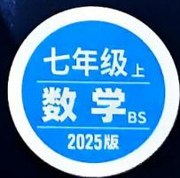

text_image

七年级上
数学BS
2025版

# 目录

主题情境:本书结合学生日常生活、数学文化、跨学科学习等创设主题情境,围绕主题情境原创更多情境题,让学生在真实情境中掌握知识,提升解决实际问题的能力.

# 第一章 丰富的图形世界

主题情境

周测1 立体图形的识别、展开与折叠 中国传统小吃 1

周测2 截一个几何体及从三个方向看物体的形状 …… 筑梦马拉,扬帆起航 3

# √ 第二章 有理数及其运算

周测3 认识有理数 人体中的化学元素 5

周测4 有理数的加减运算…… 奇妙的幻方 7

周测 5 有理数的乘除运算 …… 传统美食——花馍 9

周测6 有理数的乘方及混合运算 …… 粮香满园 11

专题 有理数的实际应用 …… 13

教材原题 北师七上随堂练习第1题

改编 1 改变背景及设问 / 13

改编 2 改变背景,融入有理数乘法 / 13

改编3 将固定基准改为动态变化基准/14

# 第三章 整式及其加减

周测7 代数式 更多教辅关注公众号【全科A+】“智”领未来 15

周测8 整式的加减 家庭装修 17

周测 9 探索与表达规律 …… 19

专题 整式的化简与求值 …… 21

# 期中检测

选填及简单解答题题组(一) 传统手工 23

选填及简单解答题题组(二) 梦圆穹顶之巅 25

中档解答题题组(一) 27

中档解答题题组(二) 29

专题 数轴上的动点问题 31

# 第四章 基本平面图形

周测10 线段、射线、直线 安全知识讲座 33

周测11 角及多边形和圆的初步认识 七巧板中的数学 35

专题 与线段中点有关的问题 …… 37

教材原题 北师七上尝试·思考

改编 1 改变中点的位置,改为线段长度比 / 37

改编 2 增加一个中点,并改变线段比例 / 37

改编 3 改变条件,并与尺规作图结合 / 37

改编4 与动点结合/38

专题 与角平分线有关的问题 …… 39

方法 1 利用整体思想求角度 / 39

方法 2 利用分类讨论思想求角度 / 39

# 第五章 一元一次方程

周测 12 认识方程及一元一次方程的解法 …… 41

周测 13 一元一次方程的应用 …… 镂空艺术——剪纸 43

# 第六章 数据的收集与整理

周测 14 丰富的数据世界、数据的收集 …… 薪火传承育新人 45

周测 15 数据的表示 …… 劳动最光荣 47

# 期末检测

选填及简单解答题题组(一) 49

选填及简单解答题题组(二) 助力农村电商发展 51

中档解答题题组(一) 53

中档解答题题组(二) 55

专题 一元一次方程的实际应用 …… 弘扬红色文化,传承红色精神 57

专题 数轴与线段的动点问题 …… 59

专题 角的计算综合题 ……更多教辅关注公众号【全科A+】…… 61

# 小卷中考新考法索引

# 开放性试题

满足条件的结果开放 / P1 第 6 题 组合条件开放 / P28 第 21 题

# 过程性学习

过程纠错改错 / P10 第 11 题 补充过程及依据 / P34 第 11 题

续写解题过程 / P53 第 21 题

# 综合与实践

操作探究 / P38 第 2 题 类比猜想 / P62 第 2 题

# 阅读理解题

新定义型阅读理解题 / P12 第 14 题、P41 第 6 题

# 项目化学习

数学与生活融合项目化学习 / P58 第 4 题

# 代数推理

归纳一般结论 / P20 第 13 题、P56 第 23 题

# 附：《参考答案》单独成册

新知识预习视频课 扫码即享

内容选自万唯《预习视频课》

# 周测1 立体图形的识别、展开与折叠

建议用时:40 分钟

满分:60分

班级：

姓名：

得分：

# 一、选择题(每小题3分,共18分)

主题情境 中国传统小吃 冰糖葫芦又叫糖葫芦,在宋朝年间便开始了古式的做法,现已成为中国传统小吃.请完成第1\~2题.

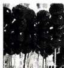

1. 如图,一颗糖葫芦的外观可以近似看作
()

A. 圆柱

B. 球

C. 圆台

D. 圆锥

2. 如果将下列图形绕虚线旋转一周,得到的几何体与一颗糖葫芦类似的是 ( )

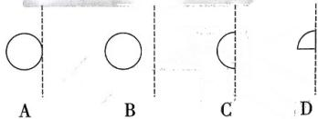

natural_image

Four geometric shapes (circle, semicircle, rectangle, crescent) with dashed vertical lines, labeled A to D (no text or symbols on shapes)

3. 在不透明的盒子中装有一个几何体模型, 小明摸该模型并描述了它的特征: 有曲面, 有顶点, 则该模型对应的立体图形可能是 ( )

A. 圆柱

B. 三棱锥

C. 球

D. 圆锥

4.（教材随堂练习第2题改编） 一题多变

# 4.1 判断能否折叠成正方体

下列图形不能折叠成正方体的是（）

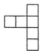  
A

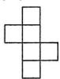  
B

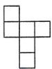  
C

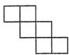  
D

# 4.2 给出多个正方形, 讨论不同选法

如图所示的纸板上有9个无阴影的正方形,从中选择一个,使其与图中5个有阴影的正方形一起折成一个正方体的包装盒,不同的选法有()

A. 3种

B. 4 种

C. 5种

D. 6种

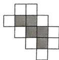

natural_image

Abstract geometric pattern composed of interlocking squares (no text or symbols)

第4.2题图

5. 日常生活情境（快递箱改造）如图①是小胡收到的一个快递箱，形状近似为三棱柱，他打算将其改造利用，并沿棱裁成如图②所示的图形，则他需要裁开棱的条数为 （）

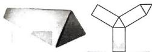

natural_image

Two geometric shapes: a 3D polyhedron and a Y-shaped figure (no text or symbols)

图①  
图②  
第5题图

A. 4 条

B. 5 条

C. 6 条

D. 7 条

# 二、填空题(每小题3分,共12分)

6. (中考新考法·满足条件的结果开放)请举出一个实际生活中“线动成面”的例子:

7. 下列几何体中, 是柱体的有 \_\_\_\_, 是锥体的有 \_\_\_\_.

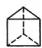  
①

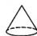  
②

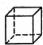  
③

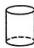  
④

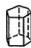  
⑤   
第7题图

8. (教材习题第1题改编)下列图形中,经过折叠可以围成圆锥的是\_\_\_\_.

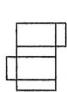  
①

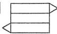  
②

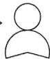  
③

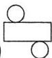  
④   
第8题图

9.（教材习题第4题改编）如图是正方体的平面展开图，若将图中的平面展开图折叠成正方体后，相对面上的两个数之和相

等,则 y-x= \_\_\_\_.

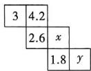  
第9题图

# 三、解答题(共30分)

10. (8分)(教材习题第2题改编)如图,是一个五棱柱,它的底面边长均为5 cm,侧棱长均为8 cm,回答下列问题:

(1)这个五棱柱一共有多少个面？它们分别是什么形状,哪些面的形状、大小完全相同?  
(2)这个五棱柱的侧面积之和是多少?  
(3)这个五棱柱一共有多少条棱？它们的长度之和是多少？

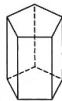  
第10题图

11. (10 分) 如图是某银行大堂的旋转门, 内部由三块宽 1.2 m, 高 2 m 的长方形玻璃隔板组成.

(1)每扇旋转门旋转一周,能形成的几何体是\_\_\_\_,这体现了\_\_\_\_动成体;   
(2)求每扇旋转门旋转一周形成的几何体的体积(结果保留 $\pi$ ).

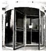  
第11题图

12. (12 分) 在学习《展开与折叠》这一节课时, 老师让同学们将准备好的正方体或长方体沿某些棱剪开, 展开成平面图形. 其中, 小凡同学不小心多剪了一条棱, 把一个长方体纸盒剪成了图①, 图②两部分, 根据你所学的知识, 回答下列问题:

(1)小凡剪了\_\_\_\_条棱；  
(2)现在小凡想将剪断的图②重新粘贴到图①上去，而且经过折叠以后，仍然可以还原成一个长方体纸盒，她有几种粘贴方法？请画出粘贴后的图形（画出一种即可）；  
(3)已知图③是小凡剪开的图①的某些数据,求这个长方体纸盒的体积.

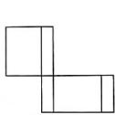

natural_image

Abstract geometric shape composed of connected rectangles (no text or symbols)

图①

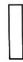

图②  
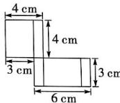

text_image

4 cm
4 cm
3 cm
3 cm
6 cm

图③  
第12题图

视频讲解  
  
第12题

# 第一章 丰富的图形世界

# 周测2 截一个几何体及从三个方向看物体的形状

建议用时:40 分钟 满分:50 分

班级： 姓名： 得分：

更多教辅关注公众号【全科A+】

# 一、选择题(每小题3分,共18分)

1. 如图,用一个垂直于圆锥底面且过圆锥顶点的平面截圆锥,截面的形状是（）

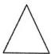  
A

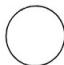  
B

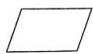  
C

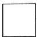  
D

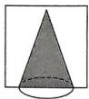  
第1题图

  
正面  
第2题图

主题情境 筑梦马拉,扬帆起航 马拉松是一项长跑运动项目,发扬更快更强的奥林匹克运动竞技精神.请完成第2\~3题.

2. 如图, 是某地马拉松比赛的奖杯, 该奖杯的底座从左面看到的平面图形是 ( )

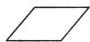  
A

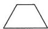  
B

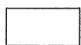  
C

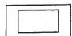  
D

3. 如图是某地马拉松比赛颁奖现场的领奖台的示意图, 则此领奖台从正面看到的平面图形是 ( )

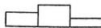  
A

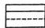  
B

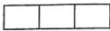  
C

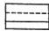  
D

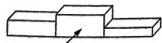  
正面  
第3题图

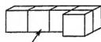  
正面  
第4.1题图

4.（教材习题第3题改编） 一题多变

4.1 已知几何体, 判断从正面看到的形状图如图, 该几何体从正面看到的形状图是

( )

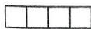  
A

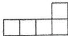  
B

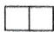  
C

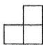  
D

# 4.2 改变小立方块的个数, 判断形状图

如图,将下列几何体中的①号小立方块移走,则下列说法正确的是()

A. 从左面看形状图不变,从上面看形状图改变  
B. 从正面看形状图改变,从上面看形状图不变  
C. 从正面看形状图不变,从左面看形状图改变  
D. 从不同方向看形状图均不变

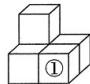  
正面  
第4.2题图

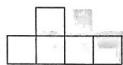  
第5题图

5.（教材复习题第9题改编）一个几何体由几个大小相同的小立方块搭成，从上面看到这个几何体的形状图如图所示，则从左面看这个几何体的形状图不可能是 （）

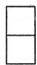  
A

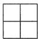  
B

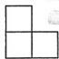  
C

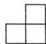  
D

# 二、填空题(每小题3分,共12分)

6.（中考新考法·满足条件的结果开放）写出一个从三个方向看,得到的形状图都相同的几何体：\_\_\_\_.  
7. 如图①为一个长方体, 其内部是一个形状规则的空心几何体, 用一个平行于底面的截面自下而上截这个长方体依次得到如图②所示的截面图, 则这个长方体空心部分的几何体可能为 \_\_\_\_.

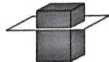  
图①

  
图②  
第7题图

8. (教材习题第6题改编)用一个平面去截八棱柱,截面的边数最多为\_\_\_\_.

9. 从正面和从左面看一个四棱柱得到的形状图如图所示(单位:cm), 则其从上面看到的形状图的面积为 \_\_\_\_.

text_image

从正面看
5
3
4
从左面看

第9题图

# 三、解答题(共20分)

10. (8 分)(教材习题第 2 题改编)一个圆柱的底面半径是 6 cm, 高是 12 cm, 如果用一个平面去截这个圆柱.

(1)截面能是圆吗？如果能,请说出你的截法并画图说明；

(2)截面能是长方形吗？如果能,请说出你的截法并画图说明；

(3)截面能是正方形吗? 如果能,请说出你的截法并画图说明,求出这个正方形的面积.

11. (12 分) 一题多设问 如图①, 是一个由棱长为 $1 \mathrm{~cm}$ 的小正方体所搭几何体从上面看得到的形状图, 正方形中的数字表示在该位置小正方体的个数.

(1) 请你在图②表格中画出它从正面和左面看到的形状图；

(2) 求该组合体的体积；

(3) 求该组合体的表面积；

(4)如果现在你还有一些大小相同的小正方体,要求保持从正面和左面看到的形状图都不变,最多可以添加多少个小正方体?

text_image

2 3
4 2 1
1
图①
从正面看
从左面看
图②

第11题图

# 周测3 认识有理数

建议用时:40 分钟 满分:60 分

班级： 姓名： 得分：

更多教辅关注公众号【全科A+】

# 一、选择题(每小题3分,共18分)

1. $-\frac{1}{3}$ 的相反数为 （）

A.-3

B. 3

C. $-\frac{1}{3}$

D. $\frac{1}{3}$

2. 下列各数: $-8, -\frac{1}{3}, 0, 9.8181181118 \cdots$ (每两个8之间1的个数依次增加1),
0.112 134,其中有理数有()

A. 2 个

B. 3 个

C. 4个

D. 5 个

主题情境 人体中的化学元素 人体和地球一样,都是由各种化学元素组成的.根据元素在机体内的含量,可划分为宏量与微量两种.请完成第3\~4题.

3. 钙占人体重的 1.7% 左右, 是人体必不可少的元素之一. 若 +0.7 表示张老师每日钙的摄入量高于标准 0.7 mg, 则低于标准 1.3 mg 可以记作 ( )

A. +1.3

B. +23.7

C. -1.3

D. -23.7

4.（教材习题第10题改编）铁、铜、锌、碘是人体的4种重要的微量元素，以 $0.5\mathrm{g}$ 为标准，它们在成人体内的含量（单位：g）如下表所示，其中含量最低的是（）

<table><tr><td>元素</td><td>铁</td><td>铜</td><td>锌</td><td>碘</td></tr><tr><td>含量</td><td>+3.5</td><td>-0.15</td><td>+2</td><td>-0.47</td></tr></table>

A. 铁

B. 铜

C. 锌

D. 碘

5. 下列说法中: ①零既不是正数也不是负数; ②有理数不是整数就是分数; ③整数一定是正数; ④-a一定是负数; ⑤负整数和负分数统称为负有理数, 正确的有（）

A. 2个

B. 3个

C. 4个

D. 5 个

6. (教材习题第8题改编)有理数 $a, b$ 在数轴上对应点的位置如图所示, 下列结论正

确的是 （）

  
第6题图

A. $-b > a$

B. $|a|>b$

C. $\left|-a\right|<\left|-b\right|$

D. b<-a

# 二、填空题(每小题3分,共12分)

7. 化简 $\vert -2024 \vert =$ \_\_\_\_.

8.（中考新考法·满足条件的结果开放）写出一个比-3大的负分数

9. 如图, 在数轴上标注了四段范围, 其中只含有一个整数的是第 \_\_\_\_ 段.

text_image

-4.1
-1.5
0.2
1.7
3.5

第9题图

10. 日常生活情境（作息时间）如图，将小明暑假期间每日的作息时间表示在数轴上（1个单位长度表示1小时），已知小明每天21:30上床睡觉，则有以下说法：①小明每天早上7:00起床；②小明每天睡觉的时长为7.5个小时；③小明每天17:30开始吃晚饭，其中正确的是\_\_\_\_。

<table><tr><td>起床</td><td>午饭</td><td>晚饭</td><td>睡觉</td></tr><tr><td>-5</td><td>-1</td><td>5</td><td>9</td></tr></table>

第10题图

# 三、解答题(共30分)

11. (8分)(教材复习题第3题改编)有下列数: $-(-1), -|-2|, -3.3, 3.1415, -\frac{2}{7}, 0, -1.2.$

(1) 将上面各数分类, 填在相应的框里;

text_image

...
...
...
...
负数
整数

第11题图①

大小卷·七年级(上) 数学 BS 更多教辅关注公众号【全科A+】

(2) 在数轴上把上面各数表示出来, 并用“>”连接各数.

  
第11题图②

12.（10分）学习生活情境制作蛋糕初一年级开展了一项关于创意小蛋糕的制作比赛活动，并对小蛋糕的规格做了有关说明。小明制作了6个富有创意的小蛋糕，现在他把6个小蛋糕进行称重并统计列表如下（参数1为实际重量，参数 $2 =$ 参数1-标准重量）：(单位：g)

<table><tr><td>编号</td><td>1</td><td>2</td><td>3</td><td>4</td><td>5</td><td>6</td></tr><tr><td>参数1</td><td>62.3</td><td></td><td>61</td><td>59.2</td><td></td><td>60.7</td></tr><tr><td>参数2</td><td></td><td>-1.4</td><td></td><td>-0.8</td><td>+2</td><td></td></tr></table>

(1)请你把表格补充完整；  
(2) 按照小蛋糕制作比赛的活动要求, 一个小蛋糕的重量合格标准为 $(60 \pm 1.2)$ g, 请问小明制作的小蛋糕中有多少个合格?

13. (12 分) 一题多设问 如图, 数轴上标出的所有点中, 任意相邻两点间的距离都相等. 已知点 A 表示 -16, 点 G 表示 8.

(1)表示原点的是点\_\_\_\_，点C表示的有理数是\_\_\_\_；  
(2)数轴上有两点 M, N, 点 M 到点 E 的距离为 4, 点 N 到点 E 的距离为 4, 则点 M, N 之间的距离为多少?  
(3) 点 P 为数轴上一点, 且表示的数是整数, 点 P 到点 A 的距离与点 P 到点 G 的距离之和是 24, 则这样的点 P 共有几个?  
(4)若点 A 先以每秒 4 个单位长度的速度运动 3 秒后, 又以同样的速度向相反的方向运动 5 秒, 求运动后点 A 表示的数.

text_image

-16
A B C D E F G
8

第13题图

视频讲解  
  
第13题

# 周测4 有理数的加减运算

建议用时:50 分钟 满分:70 分

班级： 姓名： 得分：

更多教辅关注公众号【全科A+】

# 一、选择题(每小题3分,共18分)

1. 计算-3+2的结果是 （）

A.-5

B.-1

C. 5

D. 1

2. 计算 $4 + (-2) + 7 + (-1) = (4 + 7) + [(-2) + (-1)]$ 是应用了 （）

A. 加法交换律

B. 加法结合律

C. 加法交换律与结合律

D. 分配律

3. 下列算式中不正确的是 ( )

A. $-4-(-7)=3$

B. $-2.5 + (+6.5) = 4$

C. $(- \frac{1}{2}) - (+ \frac{1}{4}) = -\frac{1}{4}$

D. $-3+0=-3$

4. 日常生活情境 测血糖 下表是某病人星期一至星期六每天早上空腹测量的血糖变化情况(单位: mmol/L)(“+”表示比前一天上升,“-”表示比前一天下降). 已知该病人上个星期日早上的血糖值为 9.2mmol/L, 则他本周星期四的血糖值为 ( )

<table><tr><td>星期</td><td>一</td><td>二</td><td>三</td><td>四</td><td>五</td><td>六</td></tr><tr><td>血糖变化</td><td>+2.3</td><td>-3.0</td><td>+1.8</td><td>-1.1</td><td>-1.7</td><td>+0.6</td></tr></table>

A. $8.5 \mathrm{mmol} / \mathrm{L}$

B. 8.6mmol/L

C. 9.2mmol/L

D. 10.3mmol/L

主题情境 奇妙的幻方 我国古代的《洛书》中记载了最早的幻方,用数学符号翻译出来就是一个九宫格,如图,其中每行、每列、每条对角线上的三个数字之和都相等.请完成第5\~6题.

text_image

4 9 2
3 5 7
8 1 6

5. 现有一个三阶幻方如图所示, 则 b-a 的值为 ( )

A.-3

B. -1

C. 1

D. 3

  
第5题图

  
第6题图

6. 李老师设计了如图所示的四阶幻方(每行、每列、每条对角线上的四个数字之和都相等), 用点来表示数字, 则下列选项中, 适合填补图中空白处的是 ( )

  
A

  
B

  
C

  
D

二、填空题(每小题3分,共12分)

7. 将 $8+5-6-3$ 统一为加法运算的形式为 \_\_\_\_.

8.（教材习题第14题改编）算筹是中国古代的计算方法之一，宋代数学家用白色筹码代表正数，用黑色筹码代表负数，图中算式一表示的算式是 $(+2) + (-3) = -1$ ，按照这种算法，算式二表示的算式是

text_image

算式一
算式二

第8题图

9. 如图, 小颖不小心将墨水滴在了数轴上, 则根据已知数据, 被墨水盖住部分的整数之和为 \_\_\_\_.

  
第9题图

10. 已知 $|x| = 4, |y| = 9$ ，且 $x > y$ ，则 $x - y$ 的值为

# 三、解答题(共40分)

11. (15 分) 计算：

(1) $-5-(-4)+(-3)$ ;

(2) $7+(-6)-|8-12|$ ;

(3) $(-4.5)-(-8.9)+7.5-(-6.1)$ .

12.（11分）(中考新考法·代数推理——归纳一般结论)若 $\left|\frac{1}{3}-1\right|=1-\frac{1}{3},\left|\frac{1}{3}-\frac{3}{5}\right|=\frac{3}{5}-\frac{1}{3},\left|\frac{3}{5}-\frac{5}{7}\right|=\frac{5}{7}-\frac{3}{5},\cdots$ ，照此规律试求：

(1) $\left|\frac{17}{19}-\frac{19}{21}\right|=$ \_\_\_\_;

(2) 计算 $\left|\frac{1}{3}-1\right|+\left|\frac{1}{3}-\frac{3}{5}\right|+\left|\frac{3}{5}-\frac{5}{7}\right|+\cdots+\left|\frac{2021}{2023}-\frac{2023}{2025}\right|$ .

13. (14 分)(教材习题第 20 题改编)小明家购置了一辆续航为 320 km(能行驶的最大路程)的新能源纯电汽车,他记录了汽车充满电后一周七天每天的行驶路程,以 40 km 为标准,超过或不足的部分分别用正数和负数表示,该汽车星期一到星期日行驶路程的变化情况如下(单位:km):+12,+4,-9,+5,-2,+1,-8.

(1)小明家新能源汽车本周行驶路程最多的一天是\_\_\_\_，这一天的实际行驶路程为\_\_\_\_；  
(2) 小明想要了解本周每天与前一天相比行驶路程的变化量, 于是小明制作了如下表格. 若规定行驶路程比前一天增多用“+”表示, 比前一天减少用“-”表示, 不增不减用“0”, 请补全下表;

<table><tr><td>星期</td><td>一</td><td>二</td><td>三</td><td>四</td><td>五</td><td>六</td><td>日</td></tr><tr><td>变化情况</td><td>+10</td><td></td><td>-13</td><td></td><td></td><td>+3</td><td></td></tr></table>

(3) 已知该款汽车在行驶过程中, 若续航不足 48 km, 就会发出充电提示, 请通过计算说明该汽车在本周星期日, 会不会发出充电提示.

视频讲解  
  
第13题

# 周测5 有理数的乘除运算

建议用时:40 分钟 满分:60 分

班级： 姓名： 得分：

更多教辅关注公众号【全科A+】

# 一、选择题(每小题3分,共18分)

1. -2024的倒数为 （）

A. $-\frac{1}{2024}$

B. 2024

C. $\frac{1}{2024}$

D. -2 024

2. 计算 $(-3) \times \frac{1}{4}$ 的结果为 （）

A. -12

B. $-\frac{3}{4}$

C. $\frac{3}{4}$

D. 12

3.（教材习题第7题改编）根据如下运算过程,右侧为各个步骤依据的运算律,则①,②,③分别表示的运算律为（）

$$
\begin{array}{l} 1 5 \times (- \frac {4}{7}) \times (\frac {8}{1 5} - \frac {1 0}{3}) \\ = (- \frac {4}{7}) \times 1 5 \times (\frac {8}{1 5} - \frac {1 0}{3}) (①) \\ = \left(- \frac {4}{7}\right) \times \left[ 1 5 \times \left(\frac {8}{1 5} - \frac {1 0}{3}\right) \right] (②) \\ = (- \frac {4}{7}) \times [ 1 5 \times \frac {8}{1 5} - 1 5 \times \frac {1 0}{3} ] (③) \\ = 2 4. \\ \end{array}
$$

A. 乘法对加法的分配律、乘法结合律、乘法交换律   
B. 乘法交换律、乘法对加法的分配律、乘法结合律   
C. 乘法结合律、乘法交换律、乘法对加法的分配律   
D. 乘法交换律、乘法结合律、乘法对加法的分配律

4. 已知有理数 a, b, c 在数轴上的位置如图所示, 则 abc 的值 ( )

  
第4题图

A. 大于0

B. 小于0

C. 等于0

D. 无法确定

# 试题变式

4.1 (变为已知积,判断正负)已知三个数的积为负数,如果一个数为正数,那么另外两个数 ( )

A. 一定都是正数

B. 一定都是负数

C. 一定异号

D. 一定同号

5. 如图是一个运算程序框图, 如果输入 x 的值是 10, 那么输出的数值是 ( )

flowchart

第5题图

A. -2 160

B. 360

C. 60

D. -60

# 二、填空题(每小题3分,共12分)

6. 计算: $12 \div \left(-\frac{1}{3}\right) =$ \_\_\_\_ .

主题情境 传统美食——花馍 花馍，又称面花，是国家第二批非物质文化遗产。请完成第7\~8题。

7. 某花馍坊一周内前三天平均每天盈利150元,周四、周五平均每天亏损120元,周六、周日平均每天盈利250元,则该花馍坊本周\_\_\_\_(填“盈利”或“亏损”)了\_\_\_\_元.

8. 该花馍坊推出一款“祥龙花馍”，已知上周这款花馍的销量为107个，经市场调查发现，该款特色花馍每个降价0.2元，日销售量将增加5个，花馍坊通过适当的降价措施，成功将“祥龙花馍”的周销量提升至317个，则每个该款花馍的价格下降了\_\_\_\_元（一周7天）.

9. 如图, 现有 5 张写着不同数字的卡片, 请按要求完成下列问题:

-3 0 1 -7 4

第9题图

大小卷·七年级(上) 数学 BS

若从中取出2张卡片,则这2张卡片上数字乘积的最小值是\_\_\_\_;商的最大值为\_\_\_\_.

# 三、解答题(共30分)

10. (12 分) 计算:

(1) $42\div(-3)\div2;$

(2) $\frac{17}{21}\times\frac{5}{2}\times(-\frac{4}{10})$ ;

(3) $(- \frac{2}{3}) \div (-5 \frac{1}{6}) \times 6 \frac{1}{5}$ .

11. (8 分)(中考新考法·过程纠错改错)
阅读下面解题过程并解答问题:

计算： $(-21)\div(-\frac{1}{2}\times\frac{56}{3})\div\frac{1}{6}$

$$
\begin{array}{l} = - 2 1 \div (- 5 6) \dots \text { 第二步 } \\ = - \frac {3}{8} \dots \text { 第   三   步 } \\ \end{array}
$$

解: 原式= $(-21)\div(-\frac{56}{6})\times6$ … 第一步

(1)上面解题过程有两处错误:第一处是第\_\_\_\_步,错误原因是\_\_\_\_;第二处是第\_\_\_\_步,错误原因是\_\_\_\_;

(2)请写出正确的解题过程.

12. (10 分) (教材思考 · 交流改编) 计算: $-\frac{1}{12}\div(-\frac{1}{4}+\frac{1}{6}-\frac{1}{12})$ .

小明的解题思路为: 原式的倒数为 $\left(-\frac{1}{4}+\frac{1}{6}-\frac{1}{12}\right)\div\left(-\frac{1}{12}\right)=\cdots$

小亮的解题思路为: 原式通分得 $-\frac{1}{12} \div$ $(- \frac{3}{12} + \frac{2}{12} - \frac{1}{12}) = \cdots$

(1)请你选择其中一种方法,将计算过程补充完整;
(2)请你根据对上述步骤的理解,按照“先求倒数”的方法计算 $\frac{1}{30}\div(\frac{2}{3}-\frac{1}{10}+\frac{1}{6}-\frac{2}{5})$ .

# 周测6 有理数的乘方及混合运算

建议用时:40 分钟 满分:60 分

班级： 姓名： 得分：

# 更多教辅关注公众号【全科A+】

# 一、选择题(每小题3分,共18分)

1. 对于式子 $\left(-\frac{1}{5}\right)^{3}$ ，下列说法不正确的是（）

A. 幂为 $-\frac{1}{15}$

B. 底数是 $-\frac{1}{5}$

C. 指数是 3

D. 表示 3 个 $-\frac{1}{5}$ 相乘

2. $\underbrace{4+4+\cdots+4}_{5个4}-\underbrace{7\times7\times\cdots\times7}_{9个7}$ 可表示为（）

A. $4 \times 5 + 7 \times 9$

B. $4^{5} - 7^{9}$

C. $4 \times 5 - 7^{9}$

D. $4^{5} - 7 \times 9$

3. 下列运算结果相等的是 \_\_\_\_ ()

A. $-4^{3}$ 和 $3^{4}$

B. $-5^{3}$ 和 $(-5)^{3}$

C. $-4^{2}$ 和 $(-4)^{2}$

D. $\left(\frac{2}{3}\right)^{3}$ 和 $\left(\frac{3}{2}\right)^{3}$

4. 科技发展情境（登月）中国载人航天办公室宣布计划在2030年前实现中国人首次登陆月球，已知地球与月球之间的平均距离约为384 400公里，将384 400用科学记数法表示为 （）

A. $3.844 \times 10^{4}$

B. $3.844 \times 10^{5}$

C. $38.44 \times 10^{4}$

D. 0.384 $4 \times 10^{6}$

5.（教材图改编）如图是草履虫的细胞分裂示意图，这种细胞每过30分钟便由1个分裂成2个，根据此规律，请问一个草履虫8个小时后可分裂为 （）

flowchart

第5题图

A. 16个 B. $2^{16}$ 个 C. 8个 D. $2^{8}$ 个

6. 请选择一个运算符号填入算式 $1 + \left[\frac{2}{3} \times 6 \square (-2)^{3}\right] \div (-5)$ 中的 $\square$ 位置上, 若要使计算

结果最小,应填入的运算符号为 （）

A. $\div$ B. $\times$ C. - D. +

# 二、填空题(每小题3分,共12分)

7. 计算: $(-1)^{2024} \times (-2) =$ \_\_\_\_.

# 主题情境 粮香满园 请完成第8\~9题.

8. 粮农组织把每年的10月16日定为“世界粮食日”，相关数据显示，每年全世界有13.256亿吨粮食被浪费，13.256精确到0.01的近似数是\_\_\_\_。

9. 2023年通过以秋补夏、以丰补欠,我国全年粮食产量再创新高,全国粮食总产量比2022年增长了178亿斤,将178亿用科学记数法表示为 $1.78 \times 10^{n}$ ,其中n的值为\_\_\_\_.

10. 观察: $2^{1} - 1 = 1, 2^{2} - 1 = 3, 2^{3} - 1 = 7, 2^{4} - 1 = 15, 2^{5} - 1 = 31, \cdots$ . 归纳各计算结果中个位数字的规律, 猜测 $2^{2024} - 1$ 的个位数字是 \_\_\_\_.

# 三、解答题(共30分)

11. (6分)计算：

(1) $(-6)\times3+24\div(-4)-(-2)$ ;

(2) $(-1)^{2}+|2-5|\div(-3)\times\frac{2}{3};$

大小卷·七年级(上) 数学 BS

12. (8分)你会玩“24点”游戏吗？在一副扑克牌(去掉大小王)中任意抽取4张，根据牌面上的数字进行混合运算(每张牌上的数字只能用一次,包含乘方)使得运算结果为24,其中A,J,Q,K分别代表1,11,12,13,小源抽到了3,3,7,7,可用算式 $7\times(3+3\div7)$ 得到24.小浩受到“24点”游戏的启发,打算用如图所示的四张牌计算,使得计算结果为-24.

(1)请帮小浩写出算式：\_\_\_\_；  
(2) 再任选 4 张牌, 尝试凑成 -24.

  
第12题图

13. (8分)(教材习题第11题改编)如图, 将一个面积为1的等边三角形分为四个面积相等的等边三角形, 根据面积数量关系可以得到等式 $\frac{3}{4}=1-\frac{1}{4}$ ; 再把其中一个面积为 $\frac{1}{4}$ 的等边三角形分为四个面积为 $\frac{1}{16}$ 的等边三角形, 我们可以得到等式 $\frac{3}{4}+\frac{3}{4^{2}}=1-\frac{1}{4^{2}},\cdots$ , 按此规律, 请计算数式

$\frac{3}{4}+\frac{3}{16}+\frac{3}{64}+\frac{3}{256}+\frac{3}{1024}$ 的值.

text_image

1/4
1/4
1/16
1/16
1/16

第13题图

14. (8 分) (中考新考法·新定义型阅读理解题) 我们把满足 $mn = m^2 - 2n - 2$ ( $m \neq -2$ ) 的一对有理数 $m, n$ 叫“完美数对”，记为 $(m, n)$ ，如： $4 \times \frac{7}{3} = 4^2 - 2 \times \frac{7}{3} - 2$ ，所以数对 $(4, \frac{7}{3})$ 是“完美数对”。

(1) 判断数对 $(-4, -\frac{7}{3})$ 是否是“完美数对”，并说明理由；  
(2)请再写出一对符合条件的“完美数对”（不能与题目中已有的数对重复）.

# 第二章 有理数及其运算

# 专题 有理数的实际应用

建议用时:40 分钟 更多教辅关注公众号【全科A+】

班级： 姓名：

# 教材原题改编练

教材原题(北师七上随堂练习第1题)

某运动队队员的平均身高是 180 cm. 下表给出了该运动队 6 名队员的身高情况(单位: cm).

<table><tr><td>队员</td><td>A</td><td>B</td><td>C</td><td>D</td><td>E</td><td>F</td></tr><tr><td>身高</td><td>179</td><td></td><td></td><td>174</td><td></td><td>182</td></tr><tr><td>身高与平均身高的差</td><td>-1</td><td>+2</td><td>0</td><td></td><td>+3</td><td></td></tr></table>

(1)试完成上表;   
(2)这6名队员中谁最高,谁最矮?  
(3)这6名队员中,最高与最矮的队员身高相差多少?

(2)已知本月的4周中,第二周亏损了182元,且本月共盈利1280元,求后面两周共盈利或亏损了多少?

# 改编 2 改变背景,融入有理数乘法

某公司现对一批货物进行邮寄,以 20 kg 为标准,将 20 件货物的重量分别用正、负数来表示并记录如下(单位:kg):

<table><tr><td>与标准重量的差值</td><td>-3</td><td>-2</td><td>-1.5</td><td>0</td><td>1</td><td>2.5</td></tr><tr><td>件数</td><td>1</td><td>3</td><td>2</td><td>4</td><td>2</td><td>8</td></tr></table>

(1)这些货物中,最重的是多少? 最轻的是多少? 它们相差多少?  
(2) 求这 20 件货物的总重量.

# 改编1 改变背景及设问

某文具店在某月第一周的销售中,从星期一到星期日的盈亏情况如下表(盈利为正,亏损为负,单位:元):

<table><tr><td>星期</td><td>一</td><td>二</td><td>三</td><td>四</td><td>五</td><td>六</td><td>日</td></tr><tr><td>盈亏</td><td>-28.2</td><td>-69.5</td><td>+210</td><td>+156.7</td><td>-22</td><td>+43</td><td>+183</td></tr></table>

(1)该文具店盈利最多的一天与亏损最多的一天相差多少?

# 改编 3 将固定基准改为动态变化基准

无人机是一种新兴的科技,它可以通过遥控或自主飞行来完成各种任务.在某次表演秀中,无人机飞行到指定高度后,开始飞行表演,若将上升的高度记作正数,下降的高度记作负数,无人机的五次飞行高度记录如下表(单位:m):

<table><tr><td>次数</td><td>一</td><td>二</td><td>三</td><td>四</td><td>五</td></tr><tr><td>飞行高度</td><td>+2.2</td><td>-2.5</td><td>+2.8</td><td>-0.7</td><td>-0.5</td></tr></table>

(1)求无人机最后所在的位置比开始位置高还是低？高了或低了多少m？  
(2) 若一架无人机平均上升 1 m 需消耗 18 mAh 电量, 平均下降 1 m 需消耗 4 mAh 电量, 则该架无人机在五次飞行中, 一共消耗多少电量?

# 综合训练

1. 外卖服务为我们的生活提供了诸多便利。外卖员李师傅详细记录了自己一周的送餐情况，并整理成表格如下（单位：单），在此表中，“+”表示相较于前一天的送餐量有所增加，“-”则表示相较于前一天的送餐量有所减少，已知李师傅上周日的送餐量为56单。

<table><tr><td>星期</td><td>一</td><td>二</td><td>三</td><td>四</td><td>五</td><td>六</td><td>日</td></tr><tr><td>送餐量</td><td>-3</td><td>+6</td><td>-7</td><td>-5</td><td>+13</td><td>+18</td><td>-3</td></tr></table>

(1)这周三李师傅的送餐量是多少单?

(2) 若每送一单能获得 2.3 元的酬劳, 请计算李师傅这周外卖送餐的收入.

2. 在一次体检过程中,七(3)班班主任记录了班级中6名学生的视力情况,若每名学生的视力以5.0为标准,大于5.0的记为正数,小于5.0的记为负数,数值越小表示视力越差,记录数据如下:

<table><tr><td>学生</td><td>小明</td><td>小颖</td><td>小梦</td><td>小璐</td><td>小杰</td><td>小萌</td></tr><tr><td>视力</td><td>+0.1</td><td>-0.4</td><td>0</td><td>-0.2</td><td>-0.6</td><td>-0.1</td></tr></table>

(1)这6名学生中哪名学生的视力最差?  
(2)请你判断小梦的视力比这6名学生的平均视力高还是低?  
(3) 若视力在 4.8 以下 (不含 4.8) 需要配戴近视眼镜, 问这 6 名学生中有几名学生不需要佩戴近视眼镜?

# 周测7 代数式

建议用时:40 分钟 满分:60 分

班级： 姓名： 得分：

# 一、选择题(每小题3分,共18分)

1. 下列能够表示比 x 的 $\frac{1}{2}$ 倍多 5 的是（）

A. $\frac{1}{2}x+5$

B. $\frac{1}{2} x - 5$

C. $\frac{1}{2} (x + 5)$

D. $\frac{1}{2} (x - 5)$

2. 已知 $x + 3y = 2$ ，则 $x + 3y - 1$ 的值为（）

A. 0

B. 1

C. 2

D. 3

3. 下列说法中正确的是 ( )

A. 单项式 $-x^{3}y^{2}$ 的系数是-1

B. $3x^{2} - y + 5xy^{2}$ 是二次三项式

C. 0 不是整式

D. $2x^{2}-3$ 的常数项是 3

4.（教材随堂练习第1题改编）下列赋予代数式3a实际意义的例子中，不恰当的是()

A. 若葡萄的价格是 3 元/千克, 则 3a 表示买 a 千克葡萄的金额

B. 若 $a$ 表示一个等边三角形的边长, 则 $3a$ 表示这个等边三角形的周长

C. 原价为 a 元的商品打 3 折后的售价

D. 货车以 a km/h 的平均速度行驶 3 h 的路程

5. 若 $(a-1)x^{|a+2|}y$ 为四次单项式,则a的值为()

A. 1

B.-5

C.-1或5

D. 1 或 -5

6. 传统文化情境 古代钱币 铜钱是我国的早期货币,外圆内方的构造彰显了数学之美.如图,铜钱外部的圆半径为a,正方形边长为b.下列表示铜钱阴影部分的面积的式子正确的是()

text_image

招進
b
a

第6题图

A. $\pi (b^{2} - a^{2})$

B. $\pi a^{2}-b^{2}$

C. $2\pi(a-b)$

D. $2\pi(b-a)$

# 二、填空题(每小题3分,共12分)

7. 下列各式中: $\frac{3}{x^2} (x \neq 0), b, -1, m + n, 6a^2, 0$ 中, 是整式的有 \_\_\_\_ 个.

# 主题情境 “智”领未来 请完成第8\~9题.

8. 随着科技的快速发展,无人物流配送车成为推进物流业发展的新动力、新路径. 如图是某小区的无人物流配送车,已知某天 A 配送车投递快递 a 件,B 配送车投递的数量是 A 配送车投递的数量的 $\frac{1}{3}$ , C 配送车投递的数量比 B 配送车多 20 件,则 C 配送车这天投递快递 \_\_\_\_ 件.

natural_image

Illustration of a futuristic autonomous vehicle with visible suspension and roof structure (no text or symbols)

第8题图

9. 训练一个 AI 作曲软件需要好的配套设备. 已知某 AI 作曲软件最初生产作品的月效率为 m, 训练 1 个月后, 更换更好的配套设备, 训练过程中生产作品的效率为 n, 该作曲软件共训练了 11 个月后, 由于配套设备性能不稳定, 在第 12 个月生产作品的效率降至 p, 则该作曲软件这一年的月平均生产效率为 \_\_\_\_.

10. (教材复习题第2题改编)如图是一个运算程序框图.

flowchart

第10题图

大小卷·七年级(上) 数学 BS

(1) 若输入的 x = -2, y = 1，则输出的结果为 \_\_\_\_；  
(2)若输入的 x=2, 输出的结果为 -2, 则输入的 y 值为 \_\_\_\_.

# 三、解答题(共30分)

11. (8 分) 根据题意列代数式:

(1) 比 m, n 的差的平方多 3 的数;  
(2)三个连续奇数,最大的一个是 $2n+1$ ,
求最小的一个数.

12.（10分）日常生活情境服装定制某学校为学生定制演出服装和鞋子，已知每套服装 $m$ 元，每双鞋子 $n$ 元，服装厂给出两种优惠方案供学校选择.

方案一:每套服装和每双鞋子均打9折;
方案二:买两套服装送一双鞋子.

若学校需要定制 20 套服装和 20 双鞋子.

(1)若按方案一购买,则需要的总费用为多少元?  
(2)若按方案二购买,则需要的总费用为多少元?

(3) 若 m=150, n=60，则选择哪种方案更划算？会节省多少元？

13. (12分) 一题多设问 已知代数式:①0,

$$
② x ^ {3} + 3, ③ - \frac {1}{7} x ^ {2} y, ④ \frac {1}{x} - 2 y ^ {2}, ⑤ a b - b ^ {3}, ⑥
$$

$(m-2)x^{m+1}y^{2}+xy^{2}-4x^{2}+1$ (m 为非负整数).

(1) 其中哪些是单项式？哪些是多项式？  
(2)任选一个多项式,指出该多项式是几次几项式?式子中最高次项的系数是多少?  
(3)若⑥为三次三项式,求出m的值;   
(4)若单项式 $\frac{1}{8}x^{m}y^{8-m}$ 与⑥的次数相同，请写出多项式⑥.

视频讲解  
  
第13题

# 周测8 整式的加减

建议用时:40 分钟 满分:70 分

班级： 姓名： 得分：

# 一、选择题(每小题3分,共18分)

1. 化简 $2x - (y + 3z)$ 正确的是 （）

A. $2x - y + 3z$

B. $-2x-y+3z$

C. 2x-y-3z

D. $-2x - y - 3z$

2. 下列各组式子中是同类项的是 （）

A. $m^4$ 和 $4^{m}$

B. $a^2 b$ 和 $ab^{2}$

C. 3x 和 3y

D. 25 和 -25

3. 下列计算正确的是 ( )

A. $3a - a = 2a^{2}$

B. $2ab + 3ba = 5ab$

C. 4xyz-2xyz=2

D. $a^5 + a^2 = a^7$

4. 如图是“整式的加减运算”的流程图, 则图中 A 和 B 分别表示为 ( )

flowchart

第4题图

A. 次数, 系数  
B. 单项式,合并同类项  
C. 整式,合并同类项   
D. 多项式,合并同类项

5.（教材复习题第12题改编）琪琪在计算-2(m-5)时错算成-2m+5，则该结果比正确结果 （）

A. 多5

B. 少5

C. 多10

D. 少 10

6. 如图, 大正方形的边长为 a, 小正方形的边长为 b, 则两个阴影部分面积之差可能为 ( )

A. a-b   
B. $a+b$   
C. $a^{2}-b^{2}$   
D. $a^{2}+b^{2}$

  
第6题图

# 二、填空题(每小题3分,共12分)

7. 计算多项式 $3a + b + 2(a - b)$ 的值为 \_\_\_\_.  
8. 已知 $a+b=2, b-c=3$ ，则 $3a+5b-2c$ 的值为 \_\_\_\_.  
9. 若 $A=3x+2y, B=-5x+6y$ ，则 2A-B 的结果是 \_\_\_\_.  
10. 学习生活情境（租书阅读）自开展读书宣传活动以来，小刚和小美都喜欢上了阅读，他们常在某图书出租店租书阅读，已知其收费标准如下：

方案一: 不办理会员卡, 每月收取租书费用为 3 元/本;

方案二:办理会员卡,会员费5元/月,另每月收取租书费用为1.5元/本.

若小刚和小美分别选择方案一、二租书，且每月的租书数量分别为 $x, x + 5$ ，两人每月应付的租书总费用为 \_\_\_\_ 元.

# 三、解答题(共40分)

11. (8 分) 先化简, 再求值:

(1) $2(m^{2}+4m+5)-(7m^{2}+3m)$ ，其中m=2;

(2) $(6x^{2}-3y^{2}+2xy)-(y^{2}-xy+3)$ ，其中
x=-1,y=2.

大小卷·七年级(上) 数学 BS

12. (10 分)(中考新考法·过程纠错改错)下面是小华同学进行整式化简的过程，请认真阅读并完成相应的问题.

$$
\begin{array}{l} 3 a ^ {2} b - \left[ 4 a b ^ {2} - 3 \left(a b ^ {2} + a ^ {2} b\right) - a b ^ {2} \right] - 6 a ^ {2} b \\ = 3 a ^ {2} b - \left(4 a b ^ {2} - 3 a b ^ {2} + 3 a ^ {2} b - a b ^ {2}\right) - 6 a ^ {2} b \dots (①) \\ = 3 a ^ {2} b - 4 a b ^ {2} + 3 a b ^ {2} - 3 a ^ {2} b + a b ^ {2} - 6 a ^ {2} b \dots (②) \\ = - 6 a ^ {2} b. \quad \dots (③) \\ \end{array}
$$

(1)以上化简步骤中,第\_\_\_\_步开始出现错误,错误的原因是\_\_\_\_;

(2)请写出该整式化简的正确过程.

# 主题情境 家庭装修 请完成第 13\~14 题

13. (10 分) 明明家新买的房子需要装修, 户型呈长方形, 部分平面图如图 (单位: m). 铺设地面前, 明明对房屋进行了初步测量, 已知厨房和卫生间需要做防水处理.

text_image

12
厨房
客餐厅
入户区
卧室1
卧室3
卧室2
卫生间
x
a
2
a
6
3
1

第13题图

(1)a 的值为 \_\_\_\_；  
(2) 求需要做防水处理的总面积(用含 x 的代数式表示);

(3) 若卫生间和厨房防水处理的市场价为 200 元/ $m^{2}$ （含人工费），当 x=5.5 时，求做防水处理的总费用.

14. (12 分) 已知客餐厅、卧室以及厨房需分别铺设不同类型的瓷砖, 明明爸爸购买了 A, B, C 三种瓷砖共 62 箱, 设购买 A 种瓷砖 x 箱, 购买 B 种瓷砖的箱数比 A 种的 2 倍多 2, 根据下表中的信息, 回答下列问题:

<table><tr><td colspan="4">价目表</td></tr><tr><td>瓷砖类型</td><td>A</td><td>B</td><td>C</td></tr><tr><td>每箱数量(片/箱)</td><td>10</td><td>4</td><td>3</td></tr><tr><td>每片价格(元/片)</td><td>15</td><td>32</td><td>50</td></tr></table>

(1)请用含有 x 的代数式表示购买 C 种瓷砖的数量为 \_\_\_\_ 箱；  
(2)请用含有 x 的代数式表示共购买了多少片瓷砖?  
(3) 若 $x = 10$ , 则购买瓷砖的总费用为多少元?

# 周测9 探索与表达规律

建议用时:40 分钟 满分:60 分

班级： 姓名： 得分：

# 一、选择题(每小题3分,共18分)

1. 有一组单项式 $a, 2a^2, 3a^3, 4a^4, 5a^5, \cdots$ , 依照此规律, 则第 $n (n \geqslant 1)$ 个单项式是 ( )

A. $na^n$

B. $(n-1)a^{n}$

C. $(n + 1)a^{n}$

D. $na^{n + 1}$

2. 如图,用小木棒拼成图形,第①个图形需要6根小木棒,第②个图形需要11根小木棒,第③个图形需要16根小木棒,则第⑪个图形需要的小木棒数量为（）

  
图①

  
图②

  
图③

  
第2题图

A. $5n+2$

B. 5n-2

C. $5n+1$

D. 5n-1

3. 观察下列数字:1,5,9,13,…,则第 n 个数字是 ( )

A. $4n + 1$

B. $4n+3$

C. $4n - 1$

D. 4n-3

4. 观察下列多项式: $2a+b, 4a^{2}-b^{3}, 6a^{3}+b^{5}, \cdots$ , 根据你发现的规律, 第6个多项式为 ( )

A. $12a^{6} + b^{11}$

B. $12a^{6} - b^{11}$

C. $10a^{6} - b^{13}$

D. $10a^{6} - b^{11}$

5.（教材习题第2题改编）在如图所示的日历中涂出“X”形的五个数，设中间的一个数为 $x$ ，则用含 $x$ 的代数式表示这五个数之和为 （）

<table><tr><td>日</td><td>一</td><td>二</td><td>三</td><td>四</td><td>五</td><td>六</td></tr><tr><td></td><td></td><td>1</td><td>2</td><td>3</td><td>4</td><td>5</td></tr><tr><td>6</td><td>7</td><td>8</td><td>9</td><td>10</td><td>11</td><td>12</td></tr><tr><td>13</td><td>14</td><td>15</td><td>16</td><td>17</td><td>18</td><td>19</td></tr><tr><td>20</td><td>21</td><td>22</td><td>23</td><td>24</td><td>25</td><td>26</td></tr><tr><td>27</td><td>28</td><td>29</td><td>30</td><td>31</td><td></td><td></td></tr></table>

第5题图

A. 5x

B. $5x+1$

C. 5x-12

D. $5x+12$

6. (教材习题第3题改编)小欢和小欣玩数

字游戏,小欢说:“你随便选定3个一位数,按下列步骤依次进行计算:①把第1个数乘以5,再减去8后所得的差乘以2,②加上第2个数字,再把所得的和乘以10,③加上第3个数字.只要你告诉我最后的得数,我就知道你所选的3个个位数.”若小欣最后得到的结果为760,则她所选定的这3个个位数的和为（）

A. 9

B. 11

C. 13

D. 15

# 二、填空题(每小题3分,共12分)

7. 有一组数: $\frac{1}{2}, \frac{3}{4}, \frac{5}{6}, \frac{7}{8}, \frac{9}{10}, \cdots$ , 它们是按一定规律排列的, 那么这一组数的第 10 个数是 \_\_\_\_.

8.（教材习题第4题改编）英文字母表中字母是按以下顺序排列的： $abcdefghijklmnopqrstuvwxyz$ ，这些字母依次对应序号1，2,3,…,26.有一种密码，当明码 $X$ 为奇数时，密码对应的序号为 $X-6$ ，当明码 $X$ 为偶数时，密码对应的序号为 $\left(\frac{X}{2}\right)^{2}+4$ ，再将序号依次转换为对应字母，即可得出密码。按上述规定，将明码“8,15,19,11”译成密码为\_\_\_\_。

9. 按照一定规律可以画出如图所示的“树形图”，观察图形可以发现：图②比图①多2个“树枝”；图③比图②多4个“树枝”，…，按照以上规律，第n个图比第n-1个图多\_\_\_\_个“树枝”.

text_image

图① 图② 图③ 图④ ...

第9题图

10. 数学文化情境 / 杨辉三角 1261 年, 我国南宋数学家杨辉用图中的三角形解释二大小卷·七年级(上) 数学 BS

项和的乘方规律,我们把这个三角形称为“杨辉三角”,请观察图中的数字排列规律,依照此规律,那么第20行从左边起第3个数为\_\_\_\_.

text_image

1
1 1
1 2 1
1 3 3 1
1 4 6 4 1
1 5 10 10 5 1
...

第10题图

# 三、解答题(共30分)

11. (8 分) 将三角形(图①)按如图方式进行分割依次得到图②, 图③, 图④. 回答下列问题:

(1) 第 n 次分割后, 图中共有个三角形;  
(2)根据(1)中结论,求第2024次分割后三角形的数量.

  
图①

  
图②

  
图③

  
图④  
第11题图

12. (10 分)(2022 年版课标例 66 改编)在学习过程中,我们要善于归纳总结和反思.

【初步感知】填空：

$$
1 + 2 = 3 \times 1, 1 2 = 3 \times 4;
$$

$$
4 + 2 = 3 \times 2, 4 2 = 3 \times 1 4;
$$

$$
7 + 6 + 8 = 3 \times \quad , 7 6 8 = 3 \times \quad ;
$$

【知识反思】试说明 3456 可以被 3 整除；

【归纳总结】设一个五位数万位，千位，百位，十位，个位上的数字分别为 $a, b, c, d, e$ ，若 $a + b + c + d + e$ 可以被3整除，试说

明这个五位数可以被 3 整除.

视频讲解  
  
第12题

13. (12 分)(中考新考法·代数推理——归纳一般结论) 用火柴棒按如图的方式搭图形,并解决以下问题:

(1) 按图示规律完成下表；

<table><tr><td>图形编号</td><td>1</td><td>2</td><td>3</td><td>4</td><td>...</td></tr><tr><td>三角形个数</td><td>1</td><td>2</td><td></td><td></td><td>...</td></tr><tr><td>正方形个数</td><td>3</td><td>5</td><td></td><td></td><td>...</td></tr><tr><td>火柴棒总根数</td><td>12</td><td>20</td><td></td><td></td><td>...</td></tr></table>

(2) 求搭第 100 个图形所需要的火柴棒根数；  
(3) 小颖同学说她按这种方式搭出来的一个图形用了 2025 根火柴棒, 你认为可能吗? 如果可能, 那么是第几个图形? 如果不可能, 请说明理由.

  
图①

  
图②

  
图③

  
图④  
第13题图

# 第三章 整式及其加减

# 专题 整式的化简与求值

建议用时:40 分钟

班级： 姓名：

# 分点训练

# 1. 合并同类项

(1) $5y-2y=$ \_\_\_\_;   
(2) $2ab-5ab=$ \_\_\_\_;   
(3) $3x-2y+1-2x+5y-4=$ \_\_\_\_;   
(4) $11a-6a^{2}+8-7a^{2}+a=$ \_\_\_\_;   
(5) $7xy^{2}-5xy-5y^{2}x+4xy=$ \_\_\_\_.

# 2. 去括号

(1) $2(1-2x)=$ \_\_\_\_;   
(2) $-(2x-3)+5(x-1)=$ \_\_\_\_ ;   
(3) $3(a-\frac{1}{3}b)-2(\frac{1}{2}a+b)=$ \_\_\_\_;   
(4) $2(3x^{2}y-xy^{2})-5(-xy^{2}+3x^{2}y)=$ \_\_\_\_；  
(5) $4x^{3}-(-3x^{2}+2x-1)-3(x^{2}+1)=$ \_\_\_\_；  
(6) $-(-x+y)-[-(x-y)]=$ \_\_\_\_.

# 3. 添括号

(1) $-b-c+2a=-(\quad)$ ;   
(2) $-2x+6y=2(\quad)$ ;   
(3) $a-ab+3b=a+($ ;   
(4) $x - 5y + 5z = x - 5(\quad)$ .

# 综合训练

# 1. 先化简,再求值:

(1) $5x^{2}-\left[4-\left(3x^{2}-5x-2x^{2}\right)-5\right]+6x$ ，其中
x=-1;

(2) $-\frac{1}{3}(6xy-9x)+\frac{3}{4}(-8x+4xy)+xy$ ,其中
x=-3,y=2.

# 2. 求代数式的值：

(1) $(a+c)-(b-d)$ ，其中 a-b=-3,-c-d=2;

(2) $2(4x+5y-xy)-(x+3y-7xy)$ ，其中 $x+y=-5,xy=8.$

3. 多项式 $5x^{2}+4-5x-$ 的一部分被图标挡住了, 已知化简结果为 $2x^{2}-6x+7$ , 若 $3x^{2}+x-5=0$ , 求被图标挡住的代数式的值.

4.（中考新考法·过程纠错改错）下面是晓彬同学进行整式的加减的过程，请认真阅读并完成相应任务.

$$
\begin{array}{l} (2 a ^ {2} b - 5 a b) - 2 (a b - a ^ {2} b) \\ = 2 a ^ {2} b - 5 a b - 2 a b + a ^ {2} b \dots \text {第一步} \\ = 2 a ^ {2} b - 2 a ^ {2} b - 5 a b - 2 a b \quad \dots \dots \text {   第二步   } \\ = - 7 a b. \quad \dots \tag {第三步} \\ \end{array}
$$

(1)任务一:①以上步骤中第一步是在进行\_\_\_\_,依据是\_\_\_\_;

②以上步骤第\_\_\_\_步开始出现错误,错误的原因是\_\_\_\_;

③请你进行正确化简,并求出当 a=2,b=-3 时,式子的值;

(2)任务二:除纠正上述错误外,请你根据平时的学习经验,就整式的加减还需要注意的事项给其他同学提出一条建议.

5.（中考新考法·新定义型阅读理解题）已知 $A = x^{2} - x - 1, B = -x^{2} - x + 1$ ，将能够表示成 $aA + bB$ （其中 $a, b$ 为常数）的整式进行分类：

①若 $a \neq 0, b = 0$ ，则称该组合整式为“A 类整式”；  
②若 $a \neq 0, b \neq 0$ ，则称该组合整式为“AB 类整式”.

(1)模仿上面的分类方式,请给出“B类整式”的定义:若\_\_\_\_,则称该组合整式为“B类整式”;  
(2)说明整式 $2x^{2}-2$ 为“AB 类整式”.

6. 已知 $A = 3a^{2}b - 2ab^{2} + abc$ ，小明错将“2A - B”看成“2A + B”，算得结果 $C = 4a^{2}b - 3ab^{2} + 4abc$ .

(1) 计算 B 的代数式；  
(2)小强说正确结果的大小与 $c$ 的取值无关,小强的说法正确吗?请说明理由;  
(3) 若 $a=\frac{1}{8}, b=\frac{1}{5}$ ，求正确结果的代数式的值.

# 选填及简单解答题题组(一)

建议用时:40 分钟 满分:60 分

班级： 姓名： 得分：

更多教辅关注公众号【全科A+】

# 一、选择题(每小题3分,共30分)

1. -4的相反数是 （）

A.-4

B. 4

C. $\frac{1}{2}$

D. $\frac{1}{4}$

2. 用一个平面截几何体,不管怎么截,截面形状都不发生改变的是 ( )

  
A

  
B

  
C

  
D

3. 下列与 $-5x^{2}y^{3}$ 是同类项的是 （）

A. 2xy

B. $5x^{3}y^{2}$

C. $-x^{2}y^{3}$

D. $-5a^{2}b^{3}$

4. 下列运算正确的是 （）

A. $-48 \div 2^{3} = -6$

B. $-3-(-1)=-4$

C. $-\left|-\frac{2}{3}\right|+\left(-\frac{4}{5}\right)=-\frac{2}{15}$

D. $16 \times \left( \frac{1}{3} - \frac{1}{4} \right) = -\frac{4}{3}$

主题情境 传统手工 请完成第5\~6题.

5. 我国纺织业是传统产业之一,为中国文化的传播和交流做出了重要的贡献,如丝绸之路的开辟和推动. 古时流传着这样一首民谣:一进十八洞,一洞十八家,一家十八人,人人会纺纱,一人纺四两,共纺几两纱?答 ( )

A. $18 \times 4^{3}$

B. $4 \times 10^{3}$

C. $18 \times 10^{4}$

D. $4 \times 18^{3}$

6. (教材习题第3题改编)鲁班锁,民间也称作孔明锁、八卦锁,它起源于中国古代建

筑中首创的榫卯结构. 如图是鲁班锁的其中一个部件, 它从正面看到的形状图是 ( )

  
第6题图

7. 已知 $A = x^{2} + xy, B = y^{2} - mxy$ ，若 $A - 2B$ 的值不含 $xy$ 项，则 $m$ 的值为 （）

A. -1

B. $-\frac{1}{2}$

C. $\frac{1}{2}$

D. 1

8.（中考新考法·新定义型阅读理解题）已知 $a$ 为有理数，定义运算符号@：当 $a \geqslant b$ 时， $a @ b = 2a$ ；当 $a < b$ 时， $a @ b = 2b - a$ . 则 $3 @ 2 - [(-3) @ 2]$ 的值为 （）

A.-6

B.-1

C. 5

D. 10

9. 有理数 a, b 在数轴上的位置如图所示, 下列说法错误的是 ( )

  
第9题图

A. $ab < 0$

B. a-b>0

C. $a^2 > b^2$

D. $|b - a| = b - a$

10. 日常生活情境（中国结）如图①所示的“中国结”是我国特有的手工编织品，它是按照一定的规律编织而成的，如图②是其抽离出的平面图形，若其中第1个图形中共有9个小正方形，第2个图形中共有14个小正方形，第3个图形中共有19个小正方形，…；则第100个图形

中小正方形的个数为 （）

  
图①

  
第1个图形

  
第2个图形

  
第3个图形  
图②

第10题图

A. 398

B. 496

C. 504

D. 596

# 二、填空题(每小题3分,共15分)

11. 如图是某古筝调音器软件的界面, 指针指在最中间的 0 处时为标准音, 指针转向右侧表示音调偏高, 需放松琴弦, 指向左侧表示音调偏低, 需拧紧琴弦. 若指针指向右侧 20 记为 +20, 那么指针指向左侧 30 记为 \_\_\_\_.

  
第11题图

text_image

K L
F E D C B
G H I J A
M N

第13题图

12.（教材随堂练习第2题改编）若 $m$ 表示一个三位数， $n$ 表示一个两位数，将 $m$ 放在 $n$ 左侧，组成一个五位数，则该五位数可表示为 \_\_\_\_.  
13. 如图表示一个正方体的平面展开图, 把它折成一个正方体时, 与顶点 M 重合的点为 \_\_\_\_.  
14.（中考新考法·满足条件的结果开放）
欢欢带20元去文具店购物，已知一个本子3元，一块橡皮1元，一支中性笔2元，结账时欢欢计算： $20-5\times3-2-4\times2=-5$ （元）发现带的钱不够支付，请你帮欢欢计算若想要所带钱恰好足够支付，则应该放下\_\_\_\_（写出一种情况即可）.  
15. 如图, 是一个运算程序框图, 若开始输入 x 的值为 243, 则第 2025 次输出的结果

为

flowchart

第15题图

# 三、解答题(共15分)

16. (9分)计算：

(1) $9.5+11.6-(-1.4)+1.5;$   
(2) $-1^{4}-\frac{1}{6}\times[2\times(-3)^{2}]$ ;   
(3) $5 \times (-1.2) + 1 \div 0.25 + |-3|^{2}$ .

17. (6分)化简下列各式：

(1) $5x^{2}+4-(3x^{2}-5x-2x^{2})-5+6x;$   
(2) $3(2a^{2}b + ab^{2} - 1) - \frac{1}{2} (-6ab^{2} + 12a^{2}b)$ .

# 期中检测

# 选填及简单解答题题组(二)

建议用时:40 分钟 满分:60 分

班级： 姓名： 得分：

更多教辅关注公众号【全科A+】

# 一、选择题(每小题3分,共30分)

1. 下列各数: $-3.14, 0, \frac{1}{7}, -1, -\frac{3}{4}$ , 其中负分数的个数是 ( )

A. 1

B. 2

C. 3

D. 4

# 主题情境 梦圆穹顶之巅

请完成第2\~4题.

2. 火箭在高速穿越大气层时,其头部的温度会高达上千摄氏度,而我国研制的航天防热材料可以耐近 $4000^{\circ}$ C 的高温,其中数据 4000 用科学记数法表示为 ( )

A. $4 \times 10^{3}$

B. $400 \times 10$

C. $0.4 \times 10^{4}$

D. $40 \times 10^{2}$

3. 如图①是神舟十八号火箭, 图②是其主体的示意图, 它可以由下列哪个平面图形绕虚线旋转一周得到 ( )

  
图①

  
图②  
第3题图

  
A

  
B

  
C

  
D

4. 神舟十八号载人飞船上有一种零件的尺寸标准为 $320 \pm 5$ (单位: mm)，则下列零件尺寸不合格的是（）

A. 315 mm

B. 318 mm

C. 324 mm

D. 330 mm

5. 若 $x=-1,2x^{2}-(3x^{2}-5x)-5$ 的值为（）

A. -11

B.-6

C. 6

D. 11

6. 下列运算正确的是 ( )

A. $a + 3a = 3a^{2}$

B. $3a^{3} - 5a^{3} = -2$

C. $5m^{3}n + \frac{5}{2} nm^{3} = \frac{15}{2} m^{3}n$

D. $4xy^{2} + 3x^{2}y = 7x^{2}y$

7. 如图, 数轴的单位长度为 1, 如果点 B 表示的数为 3, 那么点 A 表示的数是()

  
第7题图

A.-2

B.-1

C. 0

D. 1

8. 如果 $A = -3ab + 2a^{3} + 5$ , $B = -9ab + 6a^{3} + 8$ , 则 3A 和 B 之间的大小关系是 ( )

A. $3A = B$

B. $3A > B$

C. $3A <   B$

D. 无法比较

9.（教材复习题第9题改编）由若干个相同的小立方块搭成一个几何体，从正面看和从上面看得到的形状图如图所示，其中小正方形中的字母和数字表示该位置上小立方块的个数，则小立方块最多有（）

A. 6个

B. 7个

C. 8个

D. 9个

  
从正面看

  
从上面看

  
第10题图  
第9题图

10. (教材习题第 17 题改编) 如图, 是一块正方形卡纸, 萌萌在这张卡纸上剪掉了四个相等的三角形后得到了一个四角星, 请根据图中数据帮萌萌表示出四角星的面积为 ( )

A. $4a(1-2h)$

B. 4a-2ah

C. $a^{2}-4ah$

D. $a^2 - 2ah$

# 二、填空题(每小题3分,共15分)

11. -|-2|\_\_\_\_-2 $\frac{2}{3}$ (填“>”“<”或“=”).

12. 若一个直棱柱共有 10 个面, 所有侧棱长的和等于 72, 则每条侧棱的长为 \_\_\_\_.

13.（中考新考法·满足条件的结果开放）有下列条件：①次数是4；②常数项为-2；③含有3项；④最高次项系数为 $\frac{1}{2}$ 写出一个含有字母 $a,b$ ，且同时满足上述条件的多项式：

14. 如图是某市连续 3 天的天气预报数据, 其中日温差最小的一天是

<table><tr><td>11月25日</td><td>晴</td><td>-3°C~6°C</td></tr><tr><td>11月26日</td><td>阴</td><td>-5°C~3°C</td></tr><tr><td>11月27日</td><td>雨</td><td>-8°C~-1°C</td></tr></table>

第14题图

15. 下列图形是用若干枚棋子摆成的“上”字, 按此规律, 摆第 50 个“上”字需要的棋子个数为 \_\_\_\_.

text_image

图①
图②
图③

第15题图

# 三、解答题(共15分)

16. (9分)计算：

(1) $\left(-\frac{3}{4}\right)+2-1.25-(-2)$ ;

(2) $(-3)^{2}\times4-(-24)\div4;$

(3) $-1^{2}+(-3)\div\frac{1}{2}+|-2^{3}|$ .

17. (6分)先化简,再求值:

(1) $2x^{2}+4(x^{2}-3x-1)-(5x^{2}-12x+3)$ ，其中 x=-7；

(2) $4mn+2(m^{2}+n^{2})-2(m^{2}-mn-2n^{2})+$ 1, 其中 $m = -1, n = \frac{1}{6}.$

# 期中检测

# 中档解答题题组(一)

建议用时:30 分钟 满分:50 分

班级： 姓名： 得分：

更多教辅关注公众号【全科A+】

18. (8 分) 如图是由 8 个大小相同的正方体搭成的几何体, 请在网格中分别画出从正面看, 从左面看, 从上面看到的平面图形.

  
从正面看  
第18题图

  
从正面看

  
从左面看

  
从上面看

19. (10分)已知数轴上A,B,C三点对应的数分别是a,b,c,若a<0,b<0, $|a|>|b|>1$ ,c为最小的正整数.

(1)请在数轴上标出A,B,C三点的大致位置；  
(2) 化简: $\left|a-b\right|+2\left|b-a+c\right|-\left|b-2c\right|$ .

1. 联团

第19题图

20. (10 分) 生产劳动情境/挖地瓜 金秋时节, 某校组织七年级全体同学开展劳动实践活动, 体验农业劳动, 探究农业生产的基本流程, 从自然风土中汲取成长的力量. 活动期间, 学校组织同学们参加挖地瓜大赛, 每班派出 12 名同学参赛, 在规定时间内, 以挖 120 个地瓜为标准, 多出的部分记为正数, 不足的部分记为负数, 下表是 7 个班挖地瓜的实际数量 (单位: 个):

<table><tr><td>班级</td><td>1班</td><td>2班</td><td>3班</td><td>4班</td><td>5班</td><td>6班</td><td>7班</td></tr><tr><td>数量</td><td>+17</td><td>-13</td><td>-9</td><td>+11</td><td>+23</td><td>-5</td><td>-18</td></tr></table>

(1) 这 7 个班中哪个班所挖地瓜数量最多?   
(2)与标准数量比较,7个班所挖地瓜数量总计多出或不足多少个?

21. (10 分)(中考新考法·组合条件开放) 数学课上,老师设计了一个数字组合游戏,如图,给出两组不同的整式,第一组均为数字,第二组均为多项式,请同学们按照题目要求,利用“+,-,×,÷”符号(每个符号仅限使用一次)自由组合,完成下面问题.

第一组:-2,-3,7;

第二组： $m^2 + n^2 + 2, m^2 - n^2, 2m^2 + 3.$

# 第21题图

(1)请将第一组的数字与运算符号按照你喜欢的方式自由组合,列出算式并求出结果;  
(2)请从第一组数字中任选一个数字，从第二组多项式中任选两个多项式，使这三个整式组成的新的整式不含常数项，并求当 $m = -4, n = 3$ 时，新组成的整式的值.

视频讲解  
  
中考新考法题

22. (12分) 学习生活情境 趣味课堂 数学课上, 王老师准备了3张大小不同的小正方形纸片(如图①)和一张大长方形纸片, 小正方形的边长分别为a, b, c, 让同学们将小正方形纸片按照不同的方式放置在大长方形纸片中, 如图②和图③为其中的两种放置方式.

A

  
图①

  
图②

  
图③

# 第22题图

(1) 若 a=3, b=5, c=7，则大长方形的周长为 \_\_\_\_；  
(2)若记图③中阴影部分周长分别为 $l_{1}$ 和 $l_{2}$ ，请判断 $l_{1}$ 和 $l_{2}$ 之间的数量关系，并说明理由.

# 中档解答题题组(二)

建议用时:30 分钟 满分:50 分

班级： 姓名： 得分：

更多教辅关注公众号【全科A+】

18. (8分)已知 $a, b$ 互为相反数, $c, d$ 互为倒数, $x$ 是最大的负整数, 求代数式 $x^{2} - (a + b + cd)x - (a + b)^{2} + (-cd)^{5}$ 的值.

19. (9 分) 在一条南北走向的马路旁, 有早餐店、理发店、书店、服装城四家公共场所, 已知早餐店在理发店南 $150 \mathrm{~m}$ 处, 书店在理发店北 $200 \mathrm{~m}$ 处, 服装城在理发店北 $400 \mathrm{~m}$ 处, 若将马路近似地看作一条直线, 以理发店为原点, 向北方向为正方向, 用 1 个单位长度表示 $50 \mathrm{~m}$ .

(1)画出数轴,并在数轴上表示出这四家公共场所的位置;

(2) 计算早餐店与服装城之间的距离.

20. (10 分) (中考新考法·新定义型阅读理解题) 数学课上, 老师设计了一个数学游戏: 若两个多项式相减的结果等于第三多个项式, 则称这三个多项式为“友好多项式”. 现有多项式 $A = 2x^{2} - 3x - 2$ , $B = 3x^{2} - x + 1$ , $C = x^{2} + 2x + 3$ , 回答下列问题:

(1) 判断多项式 A, B, C 是否为“友好多项式”，并说明理由；  
(2)若多项式 D 与多项式 A, B 是“友好多项式”, 求多项式 D.

大小卷·七年级(上) 数学 BS

21. (11 分) 壮壮将如图①所示的牛奶盒沿缝隙拆开, 得到平面展开图如图②, 测量得到图中数据, 已知阴影部分为粘贴角料.

(1)求该牛奶盒的容积(牛奶盒厚度不计);   
(2)壮壮查询资料了解到每个牛奶盒粘贴角料的面积占牛奶盒表面积的 $\frac{1}{8}$ , 则一个牛奶盒需要纸板的面积为多少?

text_image

MILK
6 cm
14 cm
16 cm
图①
图②

第21题图

22. (12 分)为更好地传承中华传统文化,体悟历史、山川、文化之美,某校七年级举办了以“祖国锦绣山河”为主题的诗词朗诵比赛,并设立一等奖、二等奖、三等奖三个奖项,共有60个获奖名额.其中二等奖的名额数量比一等奖的名额数量的2倍多5个.现比赛负责人要采购奖品(每人一件奖品).各种奖品的单价如下表所示:

<table><tr><td></td><td>一等奖奖品</td><td>二等奖奖品</td><td>三等奖奖品</td></tr><tr><td>单价(元)</td><td>50</td><td>35</td><td>10</td></tr><tr><td>数量(件)</td><td>a</td><td></td><td></td></tr></table>

(1)请用含 a 的代数式把表格补全；  
(2)请用含 a 的代数式表示购买 60 件奖品所需的总费用；  
(3)若一等奖奖品购买了8件,则购买本次大赛奖品共需多少元?

# 专题 数轴上的动点问题

建议用时:40 分钟

更多教辅关注公众号【全科A+】

班级： 姓名：

# 一题多设问

例如图, A, B 是数轴上两点, 点 P 为数轴上一动点, 其表示的数为 x.

text_image

-5 -4 -3 -2 -1 0 1 2 3 4 5
例题图

(1) 点 A 表示的数为 \_\_\_\_，点 B 表示的数为 \_\_\_\_；  
(2) 点 A, B 之间的距离为 \_\_\_\_；  
(3) 若点 P 到点 A, B 的距离相等, 求点 P 表示的数 x 的值;

(4)若点 $C$ 为数轴上一点，将图中数轴以点 $C$ 为折叠点向右对折，若折叠后点 $A$ 在点 $B$ 的右侧，且 $A, B$ 两点之间的距离为3，求点 $C$ 表示的数；

(5) 将点 A 在数轴上向左移动 1 个单位长度, 再向右移动 9 个单位长度, 得到点 D, 求出 B, D 两点间的距离是多少个单位长度?

(6)若点 $P$ 从点 $A$ 出发，以每秒1个单位长度的速度向右运动，同时点 $Q$ 从点 $B$ 出发以每秒1.5个单位长度的速度向左运动，当 $P, Q$ 之间的距离为1时，求运动时间 $t$ 的值.

# 综合训练

1.（中考新考法·代数推理——归纳一般结论）我们对数轴上的点进行如下操作：

①将点 A 表示的数乘以 3, 再把所得数对应的点向左平移 4 个单位长度, 得到点 B;  
②将点 B 表示的数乘以 3, 再把所得数对应的点向左平移 4 个单位长度, 得到点 C;  
③将点 C 表示的数乘以 3, 再把所得数对应的点向左平移 4 个单位长度, 得到点 D:  
④将点 D 表示的数乘以 3, 再把所得数对应的点向左平移 4 个单位长度, 得到点 E:

...

(1) 若点 A 表示的数是 6, 则点 B 表示的数是 \_\_\_\_;  
(2) 若点 B 表示的数是 -13, 则点 A 表示的数是 \_\_\_\_;  
(3) 若点 A 表示的数是 -1, 则第 2023 次操作后得到的对应点所表示的数的个位数字是多少?

2. 如图①, 点 A, B, C 是数轴上从左到右排列的三个点, 分别对应的数为 -10, -4, c, 某同学将刻度尺按如图所示的方式放置, 使刻度尺上的数字 0 对齐数轴上的点 A, 发现点 B 对齐刻度 1.8 cm, 点 C 对齐刻度 5.4 cm.

(1)数轴上的一个单位长度对应刻度尺上的长度是多少cm?  
(2) 求在数轴上点 C 所对应的数 c;  
(3)在图①的数轴上有一动点 P, 当 P, B 两点的距离为 4 时, 求点 P 在图②中对应刻度尺上的读数.

  
图①

  
图②  
第2题图

# 周测10 线段、射线、直线

建议用时:40 分钟 满分:60 分

班级： 姓名： 得分：

更多教辅关注公众号【全科A+】

# 一、选择题(每小题3分,共18分)

1. 下列关于直线、射线和线段的表示正确的是
()

A

B

C

D

2. 在射击比赛中,运动员在瞄准时,总是用一只眼睛瞄准准星和目标,这样做的数学依据是()

A. 两点之间线段最短   
B. 两点确定一条直线  
C. 线段有两个端点  
D. 三点确定一条直线

3. 如图, 下列说法正确的是 ( )

A. 点 $A$ 在直线 $l_{2}$ 上  
B. 点 B 在直线 $l_{1}$ 外  
C. 点 $B$ 在直线 $l_{1}$ 上  
D. 直线 $l_{1}$ 与 $l_{2}$ 交于点 A

  
第3题图

4. 已知 A, B 是数轴上的两点, AB = 8, 点 A 表示的数为 2, 则 AB 的中点 C 表示的数为 ( )

A.-2

B. 6

C.-2或6

D. 无法确定

5. 如图, 已知点 C 是线段 AB 的中点, 点 D, E 分别在线段 AC, BC 上, 且 AD = CE, 若 DE = 6, 则线段 AB 的长度为 ( )

  
第5题图

A. 12

B. 14

C. 15

D. 16

6. 如图, 某医院有 A, B, C 三个住宅区, 分别住有医院职工 30 人, 15 人, 10 人, 且这三点在一条大道上 (A, B, C 三点共线), 已知 AB = 100 m, BC = 200 m. 为方便医院职工上下班, 该医院的接送车打算在这条大道上设一个停靠点, 为使所有人步行到停

靠点的路程之和最小,那么该停靠点的位置应设在()

  
第6题图

A. 点 $A$

B. 点 $B$

C. A, B 之间

D. B, C 之间

# 二、填空题(每小题3分,共12分)

# 主题情境 安全知识讲座

请完成第7\~8题.

7. 小明的学校计划在操场举办一场安全知识讲座,如图,从教学楼到操场有①,②,③三条路可以走,则小明从教学楼到操场的最短路线是路线\_\_\_\_,其判断依据是\_\_\_\_.

flowchart

第7题图

8. 操场上排列了各种类型的讲座宣讲点,其中交通安全、自然灾害预防、饮食卫生安全知识宣讲点的位置在同一条直线上,如图所示,则图中共有\_\_\_\_条直线,\_\_\_\_条射线,\_\_\_\_条线段.

  
第8题图

9. 如图, 有两张纸条 AB 和 CD, 其中 AB 长为 80 cm, CD 长为 120 cm, 在它们的中点处各有一个小圆孔 M, N (圆孔大小忽略不计), 我们将 A, C 两端重合并放置在同一条直线上, 此时两张纸条的小圆孔之间的距离 MN 为

text_image

M
A B C N
C D

第9题图

大小卷·七年级(上) 数学 BS

10. 如图, 在平面上画 2 条直线最多有 1 个交点, 画 3 条直线最多有 3 个交点, 画 4 条直线最多有 6 个交点, 画 5 条直线最多有 10 个交点, …, 当画 12 条直线时, 交点最多有 \_\_\_\_ 个.

text_image

1个交点
3个交点
6个交点
10个交点…
第10题图

# 三、解答题(共30分)

11. (8 分)(中考新考法·补充过程及依据)补全解题过程:如图,AB=6,延长AB至点C,使得AB=2BC,点P为线段AB的中点,点Q为线段AC的中点,求线段PQ的长.

  
第11题图

解: 因为 AB=6, AB=2BC,

所以 $BC=\frac{1}{2}AB=$ \_\_\_\_，

所以 $AC=AB+BC=$ \_\_\_\_，

因为点 $Q$ 为线段 $AC$ 的中点，

所以 $AQ=\frac{1}{2}$ \_\_\_\_ = \_\_\_\_,

因为点 $P$ 为线段 $AB$ 的中点，

所以 $AP=\frac{1}{2}$ \_\_\_\_ = \_\_\_\_,

(理由是:\_\_\_\_)

所以 PQ = AQ - AP = \_\_\_\_.

12. (10 分)(教材例题改编)如图,平面上有射线 AP 和点 B, 点 C, 按下列要求画图:

(1)画直线AC;   
(2) 用尺规在射线 AP 上截取 AD = AB;   
(3) 连接 BC, 并延长 BC 到 E, 使得 CE = BC;  
(4) 在线段 BD 上取点 F, 使得 $AF + CF$ 的

值最小.

text_image

A
P
B
C

第12题图

13. (12 分) 数学课上, 老师给出了如下问题: 如图, 一条直线上有 A, B, C, D, E 五点, 线段 AB = 20, 点 C 是线段 AB 的中点, 点 D 在线段 AC 上, 且 AD : BC = 2 : 5, 线段 DE = 8.

(1)小欣根据题意作出了点 E, 如图①, 请根据小欣所作的图求出线段 CE 的长度;  
(2) 小欢说: 我觉得 E 点的位置应该有两种情况, 小欣只考虑了点 E 在点 D 左侧的情况, 点 E 还可以在点 D 的右侧. 根据小欢的想法, 请你在图②中作出另一种情况对应的示意图, 并求出此时线段 CE 的长度.

text_image

E A D C B
图①
A D C B
图②

第13题图

# 周测11 角及多边形和圆的初步认识

建议用时:40 分钟 满分:60 分

班级： 姓名： 得分：

# 一、选择题(每小题3分,共18分)

1. 下列选项中, 能用 $\angle AOB, \angle O, \angle 1$ 三种方法表示同一个角的图形是 ( )

  
A

  
B

  
C

  
D

2. 一个 $36^{\circ}$ 的角在10倍显微镜下的大小是（）

A. $360^{\circ}$

B. $36^{\circ}$

C. $3.6^{\circ}$

D. 无法判断

# 主题情境 七巧板中的数学

请完成第3\~4题.

3. 七巧板是一种古老的中国传统智力玩具，已知七巧板中所有的锐角都为 $45^{\circ}$ ，用图①所示的七巧板可以拼成如图②所示的“小天鹅”图案，则图②中 $\angle ABC$ 的度数为 （）

A. $115^{\circ}$

B. $120^{\circ}$

C. $135^{\circ}$

D. $145^{\circ}$

  
图①

  
图②

  
第3题图  
第4题图

4.（教材习题第1题改编）19世纪末，德国工业家阿道尔夫·李希特博士受到七巧板的启发，发明了多巧板，如图是由多巧板拼出的一个六边形，从该六边形的一个顶点出发最多可以引出 $m$ 条对角线，并将六边形分割成 $n$ 个三角形，则 $m + n$ 的值为 （）

A. 5

B. 6

C. 7

D. 8

5. (教材尝试·思考改编) 如图, 小明在纸片

上画出 $\angle AOC$ ,然后将纸片沿 $OB$ 折叠,射线 $OA$ 的对应射线为 $OA'$ ,则 $\angle AOB$ 和 $\angle BOC$ 的大小关系为()

A. $\angle AOB < \angle BOC$

B. $\angle {AOB} > \angle {BOC}$

C. $\angle AOB = \angle BOC$

D. 无法比较

  
第5题图

  
第6题图

6. 传统文化情境（传统农具）如图是一种古老的灌溉工具——水车的平面示意图，其主体是一个圆形，被分成8等份，三角形OAB是水车的支架，水车的支架固定不动，主体可绕着圆心O旋转，已知∠AOB=60°，若OC平分∠AOB，则∠BOD的度数为()

A. $10^{\circ}$

B. $15^{\circ}$

C. $20^{\circ}$ D. $25^{\circ}$

# 二、填空题(每小题3分,共12分)

7. 49. $26^{\circ} =$ \_\_\_\_°\_\_\_\_'\_\_\_\_".

8. 如图, $\angle A$ 的度数为 \_\_\_\_.

  
第8题图

  
第9题图

9. 日常生活情境(驯鹿迁徙)驯鹿每年入冬都会从北方向南方迁徙,迁徙过程中会有个别落单的情况.如图,从点O处观测到驯鹿群A位于北偏西50°的方向,落单驯鹿位于点B处,若 $\angle AOB=142^{\circ}$ ,则落单驯鹿位于点O的方向.

10. (中考新考法·新定义型阅读理解题)
定义: 若从角的顶点出发的一条射线将大小卷·七年级(上) 数学 BS

角分为2:3的两部分,则称这条射线为这个角的“胶着线”.例:如图, $\angle BOC:\angle AOC=2:3$ ,则称射线OC为 $\angle AOB$ 的“胶着线”.如果 $\angle MPN=115^{\circ}$ ,PQ是 $\angle MPN$ 的“胶着线”,则 $\angle MPQ$ 的度数为\_\_\_\_.

  
第10题图

视频讲解  
  
中考新考法题

# 三、解答题(共30分)

11. (8 分) 如图是某辆公交车行驶路线的一部分:

(1) 请你用方向与距离描述市图书馆、历史博物馆相对于光明小区的位置；
(2) 若这辆公交车的平均行驶速度为 30 km/h, 请问从市体育场行驶到历史博物馆大概需要多少分钟(公交车停靠站点，红绿灯的时间忽略不计)?

text_image

市体育场
1.5km
45°
中央公园
2km
市图书馆
1km
30°
光明小区
2.5km
历史博物馆
北

第11题图

12. (10分)如图,已知射线OE和∠ABC在同一平面内,BD是∠ABC的平分线.

(1) 尺规作图: (不写作法, 保留作图痕迹)

①在 OE 上方作 $\angle EOF = \frac{3}{2} \angle ABC$ ;

②在 OE 下方作 $\angle EOP = \angle CBD$ ;

(2) 在 (1) 的条件下, 若 $\angle ABC = 50^{\circ}$ , 求 $\angle POF$ 的度数.

text_image

A
D
B
C
O
E

第12题图

13. (12 分) 已知: OD 平分 $\angle AOC, \angle BOC = 90^{\circ}$ , 若 $\angle AOB = \alpha$ .

(1)如图①,则∠BOD的度数为\_\_\_\_
(用含有α的式子表示);   
(2) 将图①中的 $\angle BOC$ 绕顶点 O 按顺时针方向旋转至图②的位置, 其他条件不变, 试探究 $\angle BOD$ 与 $\alpha$ 的度数之间的关系, 写出你的结论, 并说明理由;  
(3) 将图①中的 $\angle BOC$ 绕顶点 O 按逆时针方向旋转至图③的位置, 其他条件不变, 写出 $\angle BOD$ 的度数 (用含有 $\alpha$ 的式子表示), 并说明理由.

text_image

C
D
B
O
A

图①

  
图②

  
图③  
第13题图

# 专题 与线段中点有关的问题

建议用时:40 分钟

班级： 姓名：

# 教材原题改编练

教材原题(北师七上尝试·思考)

在直线 l 上顺次取 A, B, C 三点, 使得 AB = 4 cm, BC = 3 cm. 如果点 O 是线段 AC 的中点, 那么线段 AC 和 OB 的长度分别是多少?

改编 1 改变中点的位置,改为线段长度比如图, 点 O, B 是线段 AC 上两点, O 是 AB 的中点, AO:OC=2:3, 若 BC=3 cm, 求 AC 的长度.

  
改编1题图

改编 2 增加一个中点,并改变线段比例如图, 点 E 是线段 AC 上一点, AE = 4EC, 点 O, B 分别是线段 AE, AC 的中点, AB = 5 cm. 求线段 OA 的长.

  
改编2题图

改编 3 改变条件,并与尺规作图结合

如图, 已知点 B 是线段 AC 上的点, O 是 AB 的中点, $AB = 6 \, cm$ , BC = 4 $cm$ , 延长线段 AC 至点 E, 使 CE = 2BC, 点 F 在直线 AC 上, $OF = \frac{1}{3} BE$ .

(1) 根据题意, 补全图形;   
(2) 求线段 CF 的长.

  
改编3题图

# 改编4 与动点结合

如图, 动点 B 从点 A 出发, 以 2 cm/s 的速度沿 $A \rightarrow C \rightarrow A$ 运动, O 是线段 BC 的中点. 已知 AC = 20 cm, 设点 B 的运动时间为 t s.

(1) 求线段 OC 的长(用含 t 的代数式表示);  
(2)在运动过程中,设AB的中点为E,OE的长度是否变化?若不变,请写出OE的长;若发生变化,请说明理由.

  
改编4题图

几何画板动态演示  
  
线段中的运动点问题

# 综合训练

1. 如图, 点 C, D 在线段 AB 上, 且 AC = 2BC, 点 D 为 AB 的中点.

(1) 若 $AB = 30 \, cm$ ，求线段 CD 的长；  
(2) 若点 E 为 AC 的中点, DE = 4 cm, 求线段 AB 的长.

  
第1题图

2.（中考新考法·综合与实践——操作探究）如图，AB为一根长为60 cm的绳子，拉直铺平后，在绳子上任意取两点E,F，分别将AE,BF沿点E,F折叠，点A,B分别落在绳子上的点 $A^{\prime},B^{\prime}$ 处（折叠处的长度忽略不计）.

(1) 当点 $A'$ 与点 $B'$ 恰好重合时, EF 的长为 \_\_\_\_ cm;  
(2) 当点 $A'$ 落在点 $B'$ 的左侧, 且 $A'B' = 10 \, cm$ 时, 求线段 EF 的长度;  
(3) 若 $A'B' = x \, cm$ ，请直接写出 EF 的长（用含 x 的式子表示）.

  
第2题图

视频讲解  
  
中考新考法题

# 专题 与角平分线有关的问题

建议用时:40 分钟

更多教辅关注公众号【全科A+】 班级： 姓名：

# √ 方法分类练

# 方法1 利用整体思想求角度

1.（教材随堂练习第2题改编）如图，OC是 $\angle AOB$ 内部的一条射线，OD,OE分别平分 $\angle AOB,\angle BOC$ ，已知 $\angle DOE=15^{\circ}$ ，求 $\angle AOC$ 的度数.

  
第1题图

2. 如图①, 将一张纸的一角向上折叠, 使角的顶点 A 落在点 $A'$ 处, BC 为折痕.

(1)如图①,若 $\angle ABC=25^{\circ}$ ,则 $\angle A^{\prime}BD$ 的度数为\_\_\_\_;   
(2)如果将这张纸的另一角也向上折叠，使 $BD$ 边与 $BA'$ 重合，折痕为 $BE$ ，如图②所示，求 $\angle CBE$ 的度数.

text_image

A'
C
1
A B D

图①

text_image

A
C
1
2
B
D
E
A'

图②  
第2题图

# 方法 2 利用分类讨论思想求角度

3. 已知 O 是直线 AB 上一点, 过点 O 作 $\angle COD = 90^{\circ}$ , OE 是 $\angle AOD$ 的平分线, 若 $\angle AOC = 50^{\circ}$ , 求 $\angle BOE$ 的度数.

4. 如图, $OC$ 是 $\angle BOD$ 的平分线, $OE$ 是 $\angle BOC$ 内部一条射线, 过点 $O$ 作射线 $OA$ , 在平面内沿箭头方向转动, 使得 $\angle AOB: \angle BOE = 3:2$ , 若 $\angle BOD = 120^{\circ}$ , $\angle COE = 30^{\circ}$ , 求 $\angle AOC$ 的度数.

  
第4题图

# 综合训练

1. 如图, 已知 D 是直角三角板 ABC 斜边 AB 上的一个动点, CE, CF 分别是 $\angle ACD$ 和 $\angle BCD$ 靠近 CD 的三等分线, 试探究: 当点 D 在斜边 AB 上移动时, $\angle ECF$ 的大小是否会发生变化? 请说明你的理由.

  
第1题图

几何画板动态演示

  
角度中的运动点问题

2. 已知 $\angle AOB = 90^{\circ}$ ，过点 O 作射线 OC，若 OE 平分 $\angle AOC, OF$ 平分 $\angle BOC$ ，求 $\angle EOF$ 的度数.

3. 如图①, 将一副三角板的 $60^{\circ}$ 角与 $45^{\circ}$ 角顶点重合于点 $O$ , 绕点 $O$ 顺时针旋转含有 $60^{\circ}$ 角的三角板, 转成如图②所示的情况 (OB 在 $\angle COD$ 内部).

(1) 若 $\angle COB = 20^{\circ}$ ，求 $\angle AOD$ 的度数；  
(2) 当 OB 旋转至恰好平分 $\angle COD$ 时, 求 $\angle AOD$ 的度数;  
(3)在旋转的过程中,是否存在某一时刻,使得 $\angle BOC$ 的度数与 $\angle BOD$ 的度数是2倍的关系?若存在,求出此时 $\angle AOD$ 的度数;若不存在,请说明理由.

  
图①

  
图②  
第3题图

# 周测12 认识方程及一元一次方程的解法

建议用时:40 分钟 满分:70 分

班级： 姓名： 得分：

# 一、选择题(每小题3分,共18分)

1. 下列式子中, 不是方程的是 ( )

A. $2x + 3y = 5$

B. $\frac{1}{x - 1} = 2$

C. $4x+6$

D. $2(y + 3) = 7$

2. 下列方程中, 解是 x = -3 的方程是()

A. 3x=9

B. $-x + 3 = 0$

C. $2(x-1)=x-5$

D. $\frac{2x + 1}{3} = \frac{3}{2}$

3. 将一元一次方程 3x-3=2x-2 移项后, 正确的是 ( )

A. 3x-2x=-2+3

B. $3x+2x=-2+3$

C. $3x + 2x = -2 - 3$

D. $3x - 2x = -2 - 3$

4. 下列选项中, 正确的是 \_\_\_\_ ()

A. 若 $x = y$ ，则 $x + 5 = y - 5$

B. 若 $x = y$ ，则 $-\frac{1}{2} x = -\frac{1}{2} y$

C. 若 $mx = my$ ，则 $x = y$

D. 若 $\frac{x}{3} = \frac{y}{2}$ , 则 $3x = 2y$

5. 日常生活情境（国标鞋码）在中国制造和销售的鞋子，若将鞋码号数用字母 M 表示，脚长用字母 L 表示，则码数和脚长满足换算公式： $L=\frac{M+10}{2}$ ，已知小明脚长 22.5 cm，则适合他的鞋码为（）

A. 33 码 B. 34 码 C. 35 码 D. 36 码

6. (中考新考法·新定义型阅读理解题) 现规定 $x \otimes y = 2xy + x - y$ , 其中 $x, y$ 为任意两个有理数, 若 $m \otimes 2 = 13$ , 则 $m$ 的值为 ( )

A. -1 B. 1 C. 2 D. 3

# 二、填空题(每小题3分,共12分)

7. 方程 $3x+2=0$ 的解为 \_\_\_\_.

8. 如果 $(4-m)x^{|m|-3}-16=0$ 是关于x的一元一次方程,那么m的值为\_\_\_\_.

9. 小明在做作业时, 发现方程 $\frac{x-4}{3} = \frac{x}{2} - \bullet$ 中的一个常数被黑点遮住了, 他翻开书后的答案, 发现方程的解是 x = -2. 请问这个被黑点遮住的常数是 \_\_\_\_.

10.（教材习题第12题改编）已知兄弟俩的对话如下，弟弟对哥哥说：“我俩的年龄加起来是妈妈年龄的一半”，哥哥对弟弟说：“现在我比你大4岁，再过18年，我们的年龄加起来就等于妈妈18年后的年龄了”，则哥哥今年\_\_\_\_岁。

# 三、解答题(共40分)

11. (12分)解方程：

(1) $5y+1=-9+y;$

(2) $\frac{3x+2}{4}-x=\frac{1-x}{6};$

(3) $-8x+4=-2(x-7)$ ;

大小卷·七年级(上) 数学 BS

(4) $\frac{1}{3}(x+6)-1=\frac{2}{5}(10-x).$

12. (8分)(教材习题第1题改编)为积极响应书香社会建设,朝阳中学开展了“家长学生共享书香”活动,已知乐乐在活动开始前已经单独阅读完了一本书(共400页)的前40页,活动开始后,乐乐和妈妈计划除了2天节假日期间每天读10页外,其余每天一起阅读20页,照这样的速度,活动开始后大约几天能看完这本书?

13. (8 分)(中考新考法·过程纠错改错)本章学习了一元一次方程的解法,下面是小凡同学的解题过程:

解方程： $\frac{3x-1}{2}=1-\frac{2x-2}{3}$

解： $3(3x-1)=6-2(2x-2)$ ，…第一步 $9x-3=6-4x-4,\quad\cdots\cdots$ 第二步 $9x+4x=6-4-3,\quad\cdots\cdots$ 第三步 $13x=-1,\quad\cdots\cdots$ 第四步 $x=-\frac{1}{13}.$ ……第五步

(1)请仔细阅读解题过程,你认为小凡同学哪些步骤运算错误?并说明理由;
(2)请写出正确的解题过程.

14. (12 分) 一题多设问已知关于 $x$ 的方程 $4(x - 1) = 3mx - 2(m + 5)$ , 回答下列问题:

(1) 若 m=1，求该方程的解；  
(2) 若 $\frac{m+4}{5}$ 与 $\frac{3}{5}$ 互为相反数, 求该方程的解;  
(3) 小明在解方程时, 误将 “3mx” 看成 “-3mx”, 得到方程的解为 x=1, 求原方程正确的解;  
(4)是否存在 m 值,使得该方程的解是方程 $-x+4=\frac{-2-x}{3}$ 的解的 2 倍?

视频讲解  
  
第14题

# 周测13 一元一次方程的应用

建议用时:40 分钟 满分:60 分

班级： 姓名： 得分：

# 一、选择题(每小题3分,共18分)

1. 某商场进行促销优惠活动,把原价2500元的空调以八折价格出售,仍可获利400元,设空调进价为x元,则下列方程正确的是()

A. $2500 \times 0.8 - x = 400$

B. $x - 400 = 2500 \times 0.8$

C. x-2 500=400×0.8

D. 0.8x-400=2500

2. 一个两位数, 十位数字是 1, 个位数字是 x, 把 1 与 x 对调后得到的两位数比原来的两位数大 18, 根据题意列出的方程正确的是 ( )

A. $10+x-10x+1=18$

B. $10x+1-10+x=18$

C. $10+x-(10x+1)=18$

D. $10x+1-(10+x)=18$

# 主题情境 镂空艺术——剪纸

请完成第3\~4题.

3. 在某次活动课上,老师让同学进行剪纸练习.已知用1张硬纸片分别可剪出3个A型剪纸或5个B型剪纸,2个A型剪纸和1个B型剪纸可以组成一个套装,现有26张硬纸片,应如何进行分配才能使剪出的剪纸恰好配套?根据题意列方程: $2\times5x=3(26-x)$ ,则x代表的实际意义是()

A. 做 A 型剪纸的个数  
B. 用于剪 A 型剪纸的硬纸片数量  
C. 做 B 型剪纸的个数  
D. 用于剪 B 型剪纸的硬纸片数量

4.（教材习题第4题改编）手工剪纸课上，小明从一个正方形彩纸中裁剪下来两个长方形，如图，其中 $A, B$ 两个长方形的宽分别为 $4 \mathrm{~cm}, 2 \mathrm{~cm}$ ，面积之比为 $\frac{3}{2}$ ，则正方形

的面积为 （）

A. $49 \, cm^{2}$

B. $64~\mathrm{cm}^2$

C. $81 \, cm^{2}$

D. $100 \mathrm{~cm}^{2}$

text_image

单位:cm
2
A B
4

第4题图

5.（教材回顾反思第4题改编）为丰富学生的课外生活，朝阳中学开设了戏剧社团和汉服社团，七年级(3)班共有50名同学，已知参加戏剧社团的学生有38人，参加汉服社团的学生有29人，两个社团都不参加的有5人，则两个社团都参加的学生人数为 （）

A. 22 B. 29 C. 38 D. 45

6. 某电信运营商推出了如下表所示的数据流量套餐, 小华订购了该流量套餐, 且上个月数据流量费用为 124 元, 则他上个月使用的流量为 ( )

<table><tr><td>数据流量</td><td>收费</td></tr><tr><td>30G(含30G)</td><td>共19元</td></tr><tr><td>30G~60G部分(含60G)</td><td>2元/G</td></tr><tr><td>60G以上部分</td><td>3元/G</td></tr></table>

A. 70G B. 75G C. 80G D. 85G

# 二、填空题(每小题3分,共12分)

7. 七年级(1)班师生共48人计划去参观故宫博物院. 李老师在网上查询到当前订票价格: 成人票40元/张, 学生票20元/张, 若该班所有师生购买门票共花费1020元, 设购买了x张学生票, 则可列方程为

8. 如图, 在做科学实验时, 王老师将甲容器里的溶液全部倒入空的乙容器中, 已知甲容器中原来的溶液高为 x, 倒入乙容器后大小卷·七年级(上) 数学 BS

乙容器中的溶液的高变为 $x+5$ ，则甲容器中原来溶液的高度为 \_\_\_\_.

  
甲

  
乙  
第8题图

9.（教材复习题第9题改编）小明在爸爸的协助下为妈妈制作生日礼物，已知爸爸单独制作礼物需要4 h，小明单独制作礼物需要8 h，两人商量先由小明制作2 h，再由爸爸和小明共同完成剩下的部分，则礼物的制作共需\_\_\_\_h.

10. 小欢在回家路上,看到远处有一火车从长 600 m 的桥上经过,小欢计时了火车从车头上桥到车尾离桥共 36 s,且整列火车在桥上的时间为 4 s,若设火车的长度为 x m,则可列方程为 \_\_\_\_; 若设火车的行驶速度为 x m/s,则可列方程为 \_\_\_\_.

# 三、解答题(共30分)

11. (8分)(教材例1改编)如图,墙上钉着用一根彩绳围成的直角三角形,如果将直角三角形顶点B上的钉子去掉,并将这根彩绳钉成一个长方形,则所钉长方形的长、宽各是多少?面积是多少?

text_image

A
8 10
C 6 B

第11题图

12. (10 分) 数学文化情境 / 牧童与竹竿 中国古代人民在生产生活中发现了许多有趣的数学问题, 其中《增删算法统宗》中有这样一个问题: “林下牧童闹如簇, 不知人数不知竹. 每人六竿多十四, 每人八竿少二竿.” 其大意是: “牧童们在树下拿着竹竿高兴地玩耍, 不知有多少人和竹竿. 每人6竿, 多14竿; 每人8竿, 少2竿.” 试问: 有牧童有几人? 竹竿有几根?

13. (12 分)(教材习题第 8 题改编)已知 A, B 两地之间相距 3.5 km, 小明骑电动车从 A 地出发, 以 380 m/min 的速度向 B 地行驶, 小华骑自行车从 B 地出发, 以 220 m/min 的速度向 A 地行驶, 请问:

(1)若小华先出发5 min,两人相向而行,小明出发多长时间后两人相遇?   
(2)若两人同时出发,相向而行,经过几分钟后两人相距1 100 m?

# 周测14 丰富的数据世界、数据的收集

建议用时:40 分钟

满分:40 分

班级：

姓名：

得分：

# 一、选择题(每小题3分,共15分)

1. 某校为了解学生最喜欢的体育项目,设计了如下调查问卷(不完整):

# 调查问卷(单选)

你最喜欢的体育项目是 （）

A. 球类

B. 田径

C.

D. 其他

若要将此调查问卷补充完整,C 选项应设置为
()

A. 跑步

B. 游泳

C. 篮球

D. 阅读

2.（教材尝试·思考改编）下列数据是定量数据的是 （）

A. 牛奶的主要组成成分  
B. 某小区市民的出行方式  
C. 全班同学养的宠物种类  
D. 本班同学完成百米测试所需要的时间

3. 下列适合采用全面调查的是 （）

A. 调查某小区住户一周的用水量  
B. 高铁乘车旅客携带危险品情况的调查  
C. 调查市民骑电动车头盔佩戴情况   
D. 调查市场上某食品色素含量是否符合标准

4. (教材习题第 4 题改编) 某中学为了解同学们对保护动物的看法, 设计了以下几种调查方案:

方案一:在初一年级随机调查 100 名同学对保护动物的看法

方案二: 在每班随机调查 10 名女同学对保护动物的看法

方案三:在全校随机调查 100 名学生对保护动物的看法

在上述方案中,能较好且准确地得到该中学学生对保护动物的看法的是（）

A. 方案一

B. 方案二

C. 方案三

D. 以上都不行

5. 某校为了解七年级 1000 名学生的体重情况,从中抽取了 300 名学生的体重进行统计分析,下列分析正确的有 ( )

①这种调查方式是抽样调查；  
②1 000 名学生是总体；  
③每名学生的体重是个体；  
④300 名学生的体重是总体的一个样本；  
⑤300 名学生是样本容量.

A. 1 个

B. 2 个

C. 3 个

D. 4 个

# 二、填空题(每小题3分,共9分)

# 主题情境 薪火传承育新人

请完成第6\~8题.

6. 少年强则国强,青少年是祖国的希望和未来.某中学的心理健康小组想要了解七年级学生的心理健康状况,在七年级一班中选择了10名学生进行心理健康测试,合格率为90%,由此得出结论:本校七年级学生的心理健康测试成绩合格率为90%.请你根据所学的统计知识,判断这个数据是否可靠:\_\_\_\_(填“是”或“否”),理由是\_\_\_\_.

7. 为响应“德智体美劳全面发展”的宗旨,莉莉报名了钢琴学习的课程,并统计了自己某月练习钢琴的次数与对应时长,并将统计结果整理绘制成表格,则练习时长超过30 min 的次数占总练习次数的百分比为 \_\_\_\_.

<table><tr><td>练习时长x/min</td><td>0＜x≤10</td><td>10＜x≤20</td><td>20＜x≤30</td><td>30＜x≤40</td><td>40＜x≤50</td></tr><tr><td>练习次数</td><td>2</td><td>4</td><td>6</td><td>13</td><td>5</td></tr></table>

8. (教材随堂练习第1题改编)某校为了解学生的课外阅读情况,随机抽取了若干名大小卷·七年级(上) 数学 BS

同学进行调查,制作了如图所示的条形统计图,已知阅读漫画类书籍的学生占40%,下列说法:①阅读社评类书籍的学生有12名;②总共有50名学生参与调查;③阅读科学类书籍的学生人数占调查总人数的10%;④阅读文学类书籍的学生人数最少.正确的是\_\_\_\_.

bar

| 书籍种类 | 人数 |
|---|---|
| 科学类 | 10 |
| 社评类 | 12 |
| 文学类 | 8 |
| 漫画类 | 20 |

第8题图

# 三、解答题(共16分)

9. (7分)如下表是 $A, B$ 两个球队在某场比赛中的各项技术比较：

<table><tr><td></td><td>A队</td><td>B队</td></tr><tr><td>投篮</td><td>79投34中</td><td>84投42中</td></tr><tr><td>三分球</td><td>19投12中</td><td>31投18中</td></tr><tr><td>罚球</td><td>30罚22中</td><td>28罚20中</td></tr><tr><td>篮板球</td><td>61次</td><td>37次</td></tr><tr><td>总得分/分</td><td>102</td><td>122</td></tr></table>

(1) 表中的数据是通过什么方法得到的?  
(2)你从这些数据中获得关于这场比赛的哪些信息和结论(至少写出2条)?

10. (9 分)(中考新考法·满足条件的结果开放)某中学为了解七年级学生对航空航天知识的掌握情况,开展了“追梦航天”的主题活动,随机抽取七年级部分学生进行“航空航天”的知识测试,并将成绩划分为 $A(80 < x \leqslant 100), B(60 < x \leqslant 80), C(40 < x \leqslant 60), D(x \leqslant 40)$ 四个等级,并对成绩进行整理并绘制成表,以下是所抽取学生的测试成绩:

<table><tr><td>86</td><td>72</td><td>90</td><td>66</td><td>70</td><td>55</td><td>36</td><td>68</td><td>74</td><td>60</td></tr><tr><td>56</td><td>78</td><td>40</td><td>88</td><td>75</td><td>86</td><td>70</td><td>53</td><td>55</td><td>79</td></tr></table>

<table><tr><td>成绩</td><td>806040x≤100≤80≤60≤40</td><td>6040x≤80≤60≤40</td><td>40x≤60≤60≤40</td><td>x≤40</td></tr><tr><td>等级</td><td>A</td><td>B</td><td>C</td><td>D</td></tr><tr><td>人数</td><td>4</td><td>9</td><td>m</td><td>2</td></tr></table>

(1)参加此次“航空航天”知识测试的学生的测试成绩可以看作\_\_\_\_数据，测试等级可以看作\_\_\_\_数据（填“定性”或“定量”）；  
(2)本次参加测试的学生有\_\_\_\_人,统计表的m的值为\_\_\_\_;   
(3)此次调查中的总体、个体、样本、样本容量分别是什么？  
(4)根据统计表中的信息你能提出哪些问题？你能用表中的数据解决提出的问题吗？

  
中考新考法题

# 周测15 数据的表示

建议用时:40 分钟 满分:40 分

班级： 姓名： 得分：

# 一、选择题(每小题3分,共12分)

1. 某自然保护区有着丰富的鸟类资源,每天都有新来觅食和飞走的鸟,若想了解该保护区某种珍稀鸟类的数量变化趋势,应绘制()

A. 条形统计图

B. 折线统计图

C. 扇形统计图

D. 以上均可以

2. 小明在和同学玩飞行棋的时候,记录了自己投掷 50 次正方体骰子时出现不同点数的情况,如下表所示,则出现点数 6 的频数与占比分别是 ( )

<table><tr><td>出现点数</td><td>1</td><td>2</td><td>3</td><td>4</td><td>5</td><td>6</td></tr><tr><td>次数</td><td>7</td><td>10</td><td>8</td><td>10</td><td>6</td><td>9</td></tr></table>

A. 9 和 16%

B. 9 和 $18\%$

C. 6 和 25%

D. 9 和 3%

3. 如图, 七年级(1)班的小颖和小林分别将本学期每次数学测试成绩整理绘制成折线统计图, 则进步较大的同学是 ( )

line

| 次数/次 | 分数/分 |
| :--- | :--- |
| 1 | 70 |
| 2 | 75 |
| 3 | 80 |
| 4 | 85 |
| 5 | 90 |

line

| 次数/次 | 分数/分 |
|---|---|
| 0 | 70 |
| 1 | 72 |
| 2 | 80 |
| 3 | 88 |
| 4 | 90 |
| 5 | 90 |

第3题图

A. 小林

B. 小颖

C. 无法比较

D. 与统计图选择有关

4. 饲养员小庆对牧场的若干只小肥羊的重量进行了统计, 将统计结果绘制成如图所示的统计图, 下列说法错误的是（）

bar

| 重量 (kg) | 数量/只 |
|---|---|
| 70-75 | 20 |
| 75-80 | 40 |
| 80-85 | 90 |
| 85-90 | 30 |
| 90-95 | 20 |
数量/只

第4题图

A. 小庆统计的小肥羊的总数量为 200 只  
B. 频数分布直方图中组距是 5  
C. 重量在 $85 \sim 90 \mathrm{~kg}$ 的小肥羊数量最少  
D. $75 \sim 80 \mathrm{~kg}$ 的小肥羊占总数量的 $20\%$

# 二、填空题(每小题3分,共9分)

5. 某地区两个城市最近两月的月平均降水量都从上个月的 10 mm 升至本月的 15 mm, 可两地的气象观测员绘制的统计图却不一样, 图中 \_\_\_\_ (填“甲”或“乙”) 观测员绘制的统计图能更准确直观地反映月平均降水量的增长情况.

bar

| 时间 | 月平均降水量/mm |
|---|---|
| 上个月 | 10 |
| 本月 | 15 |

bar

| 时间 | 月平均降水量/mm |
|---|---|
| 上个月 | 10 |
| 本月 | 15 |

第5题图

6. 小明在献血站随机抽取了 40 位献血志愿者并记录他们的血型情况, 绘制成如图所示扇形统计图, 则抽取的志愿者为 AB 血型的人数为 \_\_\_\_.

  
第6题图

histogram

| 分数 | 人数 |
|---|---|
| 0-50 | 1 |
| 50-60 | 2 |
| 60-70 | 3 |
| 70-80 | 4 |
| 80-90 | 3 |
| 90-100 | 2 |

第7题图

7. 在某省举办的“班主任基本素质大赛”中，共有128名教师参加了比赛，组委会将得分情况绘制成如图所示的频数分布直方图（分数为整数，每组包含左端数值），小长方形高的比为 $2:5:11:9:5$ （从左到右），若分数大于或等于80分才有资格获奖，则获奖老师共有\_\_\_\_名.

# 三、解答题(共19分)

主题情境 劳动最光荣 请完成第8\~9题.

8. (9 分) 向阳中学开展学生“劳动教育周”系列活动, 为了解同学们会选择哪种活动进行动手实践, “劳动修身”小组在校园内随机抽取了部分学生关于“你会参加哪种活动来锻炼自己”(必选且只能选一个)进行了问卷调查.

【问卷调查】(1)本次调查属于

(填“抽样调查”或“普查”),用划记法记录数据;

【整理数据】(2)统计参加各种劳动的人数,并计算各种劳动人数占总抽取人数的百分比,请完善下面的表格;

<table><tr><td>活动项目</td><td>划记</td><td>频数</td><td>百分比</td></tr><tr><td>种植花草</td><td></td><td>27</td><td></td></tr><tr><td>食堂帮厨</td><td>正正正正一</td><td></td><td></td></tr><tr><td>校园清洁</td><td>正正</td><td></td><td></td></tr><tr><td>礼仪劝导</td><td>下</td><td></td><td>5%</td></tr></table>

【描述数据】(3)为了能一目了然地了解参加各种活动项目的人数占比情况,请你从条形统计图、折线统计图和扇形统计图中选择一种合适的统计图表示上表数据,并绘制出来.

9. (10 分)(中考新考法·满足条件的结果开放) 小悦调查了七年级(1)班全班同学一周家务劳动的总时长(单位:min), 将得到的数据进行整理得到如下不完整的频数分布表(每组不包含右端数值)和扇形统计图.

<table><tr><td>总时长</td><td>频数</td></tr><tr><td>A:30~60</td><td>4</td></tr><tr><td>B:60~90</td><td>8</td></tr><tr><td>C:90~120</td><td></td></tr><tr><td>D:120~150</td><td></td></tr><tr><td>E:150~180</td><td>6</td></tr></table>

pie

| Category | Value (%) |
|---|---|
| A | 15 |
| B | 20 |
| C | 30 |
| D | 30 |
| E | 15 |

第9题图

(1)请补全频数分布表并绘制对应的频数分布直方图；  
(2)扇形统计图中,表示 C 组劳动总时长的扇形的圆心角为 \_\_\_\_°;  
(3) 观察、分析以上统计图, 请你写出一条从中获得的信息.

# 选填及简单解答题题组(一)

建议用时:40 分钟 满分:60 分

班级： 姓名： 得分：

# 一、选择题(每小题3分,共30分)

1. $-\frac{5}{3}$ 的相反数为 （）

A. $\frac{5}{3}$

B. $-\frac{5}{3}$

C. $\frac{3}{5}$

D. $-\frac{3}{5}$

2. 据报道,2024年全国硕士研究生考试报名人数约为438万,数据438万用科学记数法表示为()

A. $0.438 \times 10^{7}$

B. $4.38 \times 10^{6}$

C. $43.8 \times 10^{5}$

D. $4.38 \times 10^{5}$

3. 下列调查方式中,采用合适的是（）

A. 了解某品牌新能源汽车的最大续航里程,选择普查方式  
B. “天舟三号”货运飞船零部件的质量检查,选择抽样调查方式  
C. 了解《动物世界》电视栏目的收视率，选择普查方式  
D. 调查游客对我市某景点的满意度,选择抽样调查方式

4. 下列说法中, 正确的是 ( )

A. $\pi$ 不是单项式  
B. $-3xy^{3}$ 是三次单项式  
C. $-\frac{xy}{5}$ 的系数为-5  
D. $4x^{2} + 6xy + 5$ 是二次三项式

5. 小华在解方程 $\triangle x - 15 = 3 - 4x$ 时，“ $\triangle$ ”处被盖住了一个数字，已知该方程的解为 x = 2，则“ $\triangle$ ”处的数字是（）

A.-4

B. 7

C. 5

D.-6

6. (教材习题第11题改编)如图是由5个大小相同的小正方形组成的平面图形,补充

一个黑色的小正方形后,使它折叠后能围成一个正方体的是 ( )

  
第6题图

  
A

  
B

  
C

  
D

7. 下面是一道黑板上出示的尺规作图题, 不同符号代表不同的内容. 下列说法错误的是 ( )

如图, 已知 $\angle ABC$ , 求作: $\angle PFG$ , 使 $\angle PFG = \angle ABC$ .

作法:(1)以点 B 为圆心,任意长为半径画弧,分别交♠,BC 于点 D,E;

(2)作射线 FP, 并以点 F 为圆心, BE 长为半径画弧, 交 FP 于点 H;  
(3)以♣为圆心，♥为半径画弧，交(2)
步中所画弧于点 G;  
(4)作◆,∠PFG即为所求作的角.

text_image

Geometric diagram showing two semicircles with labeled points and lines, likely illustrating a math problem or proof.

第7题图

A. ♠表示 BA  
B. ♣表示点 H  
C. ♥表示任意长  
D. ◆表示射线 FG

8. 日常生活情境 特种邮票 《世界文化遗产——平遥古城》特种邮票在山西省平遥县首发. 如图, 该特种邮票含套票 (1 套 3 枚) 和小全张 (1 枚), 套票的面值为 3.6元(同售价),小全张售价为每枚5.4元.某纪念品店花费900元购买了400枚(套票包含的邮票数量+小全张的数量)特种邮票,则购买小全张的枚数为()

A. 80

B. 100

C. 200

D. 300

text_image

中國書籍館
平見古城
120
120
120

第8题图

9. 点 A, B 在数轴上的位置如图所示, 其对应的数分别是 x, y, 以下结论: ① $|x| < |y|$ ; ② $\frac{x}{y} < 0$ ; ③ $x + y > 0$ ; ④ y - x > 0, 正确的有 ( )

  
第9题图

A. ①②

B. ②③

C. ②④

D. ②③④

10. 跨学科情境/跨化学苯的结构简式：苯是一种石油化工基本原料，自然界中，火山爆发和森林火险都能生成苯。如图，小华用9根火柴棒搭出的第1个图形恰好类似于苯的结构简式，他继续用火柴棒搭出第2个图形，第3个图形，第4个图形，…，按此规律，搭出的第56个图形所需火柴棒的根数为（）

chemical

Four naphthalene rings labeled 图① to 图④, showing structural differences in aromatic hydrocarbon chain length

第10题图

A. 504

B. 502

C. 449

D. 448

# 二、填空题(每小题3分,共15分)

11. 滑板爱好者小张在一条笔直的小路上练习滑行, 如果向东滑行 50 m 记作 +50 m, 那么向西滑行 100 m 应记作 \_\_\_\_.

12.（中考新考法·满足条件的结果开放）对于式子“3a”可以赋予一个实际意义，如：小张骑行的速度为 $a\mathrm{km / h}$ ，则他骑行3小时的路程为 $3a\mathrm{km}$ .请你对式子

“x-y”赋予一个实际意义：\_\_\_\_。

13. 已知 $8m + 3n + 2 = 4m + 7n$ ，根据等式的基本性质比较 m, n 的大小关系：m \_\_\_\_ n （填“>”“<”或“=”）.

14. 若 a, b 互为相反数, b, c 互为倒数,
则 $\left(\frac{b}{a}+2bc\right)^{2025}=$ \_\_\_\_.

15. 如图, 射线 OC 在 $\angle AOB$ 内, $\angle AOB = 120^{\circ}$ , $\angle AOC = 40^{\circ}$ , 过点 O 作射线 OD, 使得 $\angle AOD: \angle COD = 3:1$ , 则 $\angle BOD$ 的度数为 \_\_\_\_.

  
第15题图

# 三、解答题(共15分)

16. (8分)计算：

(1) $16\times(-\frac{1}{2})^{3}+9\div|-3|$ ;

(2) $-\frac{1}{4}\times(-19)-\frac{1}{2}\times19-\frac{3}{4}\times(-19).$

17. (7分)先化简,再求值: $\frac{1}{2} m^2 + \left(\frac{5}{3} n^2 - \frac{3}{2} \times m^2\right) - 2(m^2 - \frac{2}{3} n^2)$ , 其中 $m = 2, n = -1$ .

# 选填及简单解答题题组(二)

建议用时:40 分钟 满分:60 分

班级： 姓名： 得分：

# 一、选择题(每小题3分,共30分)

1. 下列四个数中, 最小的是 ( )

A.-2

B. 1

C.-2.5

D. 0

2. 用一个平面去截下列几何体,截面不可能是圆形的是 ( )

  
A

  
B

  
C

  
D

3. 下列计算正确的是 （）

A. $5x+5y=10xy$   
B. -y-y=-2y   
C. $6(x-1)=6x-1$   
D. $4a^{2}b^{2} - 3a^{2}b^{2} = 1$

# 主题情境 助力农村电商发展

请完成第 4\~5 题.

4. 近年来, 互联网公司纷纷借助产业优势、科技优势, 助力农村产业转型升级, 农村电商呈现高速发展的态势. 某村庄 2024 年四个季度的农产品网络零售额(单位: 万元)分别为 18, 25, 19, 31. 为了能清楚地反映该村农产品网络零售额各个季度的占比情况, 最适合制作的是 ( )

A. 折线统计图  
B. 扇形统计图  
C. 频数分布直方图  
D. 频数分布表

5. 为全力推进农村电商快速发展,疏通农村物流瓶颈,现将 A, B, C 三村连通的公路进行硬化改造,铺设成水泥路面. 如图,已知 C 村在 B 村的北偏西 $15^{\circ}$ 方向上, $\angle ABC = 100^{\circ}$ , 则 A 村在 B 村的 ( )

A. 南偏西 $65^{\circ}$ 方向上  
B. 北偏东 $65^{\circ}$ 方向上  
C. 南偏西 $85^{\circ}$ 方向上  
D. 北偏东 $85^{\circ}$ 方向上

text_image

北
东
C
B
A

第5题图

text_image

B
C
D
A
O
E

第8题图

6. 若单项式 $8a^{4}b^{x}$ 与单项式 $-a^{2y}b^{3}$ 的和仍是单项式, 则 $y^{x}$ 的值为 ( )

A. -4

B. 8

C. 10

D. 12

7.（中考新考法·新定义型阅读理解题）对于有理数 $a, b (ab \neq 0)$ 定义运算“ $\forall$ ”： $a \forall b = \frac{2}{a} \div \left(-\frac{b}{4}\right)$ ，例如， $2 \forall 1 = \frac{2}{2} \div \left(-\frac{1}{4}\right) = -4$ 。则-8 $\forall 16$ 的值为（）

A. $\frac{1}{16}$

B. $\frac{1}{8}$

C. 8

D. 16

8. 如图, 点 A, O, E 在同一条直线上, 过点 O 作射线 OC, 若 OD 平分 $\angle COE$ , $\angle BOC = 90^{\circ}$ , 且 $\angle AOB : \angle COD = 4 : 3$ , 则 $\angle BOD$ 的度数是 ( )

A. $108^{\circ}$

B. $117^{\circ}$

C. $120^{\circ}$

D. $126^{\circ}$

9. (教材习题第 12 题改编) 当 x 的取值不同时, 整式 mx-n (其中 m, n 是常数) 的值也不同, 具体情况如下表所示:

<table><tr><td>x</td><td>-3</td><td>-2</td><td>-1</td><td>0</td><td>1</td></tr><tr><td>mx-n</td><td>-7</td><td>-4</td><td>-1</td><td>2</td><td>5</td></tr></table>

则关于 $x$ 的方程 $mx = n + 1$ 的解为（

A. $x = \frac{1}{2}$

B. $x=\frac{1}{3}$

C. $x = -\frac{1}{3}$

D. $x = -\frac{1}{2}$

大小卷·七年级(上) 数学 BS

10. 如图, 数轴上点 A, B 分别表示数 a, b, 其中 a < 0, b > 0. 若线段 AB 上有一点 M 表示数 3, 且 AM = 3BM, 则式子 $a + 3b + 2024$ 的值为 ( )

text_image

A
a 0 B
b

第10题图

A. 2024

B. 2028

C. 2032

D. 2036

# 二、填空题(每小题3分,共15分)

11. 大唐郓城 630 ℃ 超超临界二次再热国家电力示范项目是我国“压力最高、温度最高、效率最高、煤耗最低”的单轴百万千瓦火电机组，该项目将为当地带来年发电量可达 100 亿千瓦时的新能源，减排二氧化碳 94.5 万吨。将 94.5 万用科学记数法表示为 $9.45 \times 10^{n}$ ，则其中 n 的值为 \_\_\_\_.

12.（教材习题第1题改编）室内盆栽植物可以净化空气，某绿植店老板为了解绿萝和吊兰的受欢迎程度，统计了这两种植物星期一至星期五的销售情况，得到的数据是\_\_\_\_数据（填“定性”或“定量”）.

13. 数学文化情境 / 日读书几何 清代珠算书《增删算法统宗》中记载：“有个学生资性好，一部孟子三日了，每日增添一倍多，问君每日读多少？”其大意是：有个学生天资聪慧，三天读完一部《孟子》，每天阅读的字数是前一天的两倍，问他每天各读多少个字？已知《孟子》一书共有 34 685 个字，设他第一天读 x 个字，则可以列方程为 \_\_\_\_.

14. 已知新疆和北京有 2 个小时的时差, 当北京学生早上 8 点上课时, 新疆的时间是早上 6 点, 学生还在睡梦中. 现有一半径为 10 cm 的时钟, 当北京时间为

10:30 的时候,新疆时间的时针与分针夹角所对应的扇形面积为 \_\_\_\_.

15. 已知点 A 和点 C 在直线 BD 上, AC = 10, 点 B 是 AC 的中点, 且 BD = 4AB, 则 CD 的长为 \_\_\_\_.

# 三、解答题(共15分)

16. (7 分) 计算:

(1) $-3^{3}\times\frac{1}{9}-(-1)^{2024}+|-2|$ ;

(2) $\left(-\frac{1}{3}+\frac{5}{12}-\frac{1}{18}\right)\div\left(-\frac{1}{36}\right).$

17. (8分)解下列方程：

(1) $4x+9=-5-3x;$

(2) $3+\frac{2x-1}{2}=\frac{x}{6}.$

# 中档解答题题组(一)

建议用时:40 分钟 满分:60 分

班级： 姓名： 得分：

18. (9 分) 某景区记录每天接待的游客人数, 以 500 人为标准, 超过的人数记为正数, 不足的人数记为负数, 下表是该景区上周每天接待的游客数量.

<table><tr><td>星期</td><td>一</td><td>二</td><td>三</td><td>四</td><td>五</td><td>六</td><td>日</td></tr><tr><td>人数</td><td>+6</td><td>-34</td><td>-18</td><td>+10</td><td>+23</td><td>+57</td><td>+42</td></tr></table>

(1)上周接待游客最多的一天比接待游客最少的一天多多少人?

(2)该景区上周实际共接待游客多少人?

19. (9 分) 如图, 已知 $\angle COE = \frac{1}{3} \angle BOC$ , $\angle AOC: \angle BOC = 4:3, OD$ 平分 $\angle AOC$ , 且 $\angle DOE = 60^\circ$ , 求 $\angle BOD$ 的度数.

text_image

A
D
C
E
O
B

第19题图

20. (10 分) 如图是由六个完全相同的小正方体组成的几何体.

(1) 在虚线网格中分别画出从正面、左面和上面观察几何体所得到的形状图；

  
从正面看

  
从左面看

  
从上面看

(2)在图中再放置几个相同的小正方体,并保持几何体从正面和左面看的形状图不变,最多可以再放置几个小正方体?

  
第20题图

21. (10 分)(中考新考法·续写解题过程) 小庆在求解含小数的一元一次方程时, 想到了下列思路:

解方程: $\frac{0.4x-0.1}{0.3}-\frac{0.3x+2}{0.4}=-3.$

解: 原方程可化为 $\frac{4x-1}{3}-\frac{3x+20}{4}=-3,\cdots$

…… 第一步 $4(4x-1)-3(3x+20)=-36,\cdots$ 第二步

(1)第二步的式子是怎样得到的？这样做的依据是什么？

(2) 将解题过程补充完整.

大小卷·七年级(上) 数学 BS

22. (11 分) 如图是某花园广场计划修建的一条凹字形小路(单位:m).

(1)用含a,b的式子表示出小路的面积;
(2)若修建小路的费用为200元/m²,当a=2,b=3时,求修建这条小路共需花费多少元?

text_image

a
4b
a
3a
b

第22题图

23.（11分）“文房四宝”是中国独有的书法绘画工具，即笔、墨、纸、砚。为了更好地弘扬“文房四宝”文化，某中学举办了关于“文房四宝知多少”的展览活动，并从中随机抽取了七年级部分学生调查他们对笔、墨、纸、砚这四种文化中的哪一种最感兴趣，将得到的数据绘制成如下两幅不完整的条形统计图和扇形统计图。根据统计图提供的信息，回答下列问题：

(1) 求本次调查的学生人数；  
(2)请补全条形统计图；  
(3)求扇形统计图中“砚”所在扇形的圆心角度数.

bar

| 文化 | 人数 |
|---|---|
| 笔 | 14 |
| 墨 | 9 |
| 纸 | 12 |
| 砚 | 0 |

图①

pie

| Category | Percentage (%) |
|---|---|
| 砜 | 24 |
| 笔 | 18 |
| 墨 | 16 |

图②  
第23题图

# 中档解答题题组(二)

建议用时:40 分钟 满分:60 分

班级： 姓名： 得分：

18. (9 分) 如图, 已知 $\angle 1$ 与线段 $a$ , 请用直尺和圆规按如下顺序作图(保留作图痕迹即可, 不写作法).

(1)作 $\angle A = \angle 1$   
(2) 在 $\angle A$ 的两边分别作 AM = AN = a;  
(3) 连接 MN.

text_image

1
a

第18题图

19. (9分) 小明在解关于 x 的一元一次方程 $\frac{x+a}{3}-2=\frac{x-19}{5}$ 时, 误将 $x+a$ 抄成 x-a, 求得方程的解为 x=-1, 请帮小明求出原方程正确的解.

20. (10分)已知 $A = -2x^{2} - 7mx + 3x - 3, B = 4x^{2} + 5mx - 9.$

(1) 求 $2A+B$ 的值；  
(2) 若代数式 $2A+B$ 的值与字母 x 的取值无关, 求 m 的值.

21. (10 分)(教材尝试·思考改编)如图,在直线 l 上顺次有 A, B, C, D 四点,且 AD = 16 cm, AC = BD.

(1) 比较线段的长短: AB \_\_\_\_ CD (填: “>”“=”或“<”);   
(2) 若点 E, F 分别是线段 AC, BD 的中点, BC = 4 cm, 求线段 EF 的长度.

  
第21题图

22. (11 分)西安作为十三朝古都,有着浓厚的历史色彩,是著名的旅游城市.某校兴趣小组准备调查同学们最想去的西安景点(每位同学只能选择一个),设定了“A. 兵马俑”“B. 大唐不夜城”“C. 华清池”“D. 陕西历史博物馆”共四个景点进行了调查.

(1) 在确定调查方案时, 小组成员设计了三种方案:

方案一:调查每个班级数学考试前10名的学生;

方案二: 调查女生中的部分学生;

方案三:选取全校所有班级学号为 1, 11,21,31 的学生.

其中最有代表性的一个方案是\_\_\_\_；

(2)该小组组长采用了最有代表性的方案,用收集到的数据绘制出如图所示的两幅不完整的统计图,请你根据图中信息,完成下列任务:

①本次调查的总人数是多少？

②补全条形统计图；

③扇形统计图中，m 的值为 \_\_\_\_；

(3) 求 A 景点对应扇形的圆心角度数.

bar

| 旅游景点 | 人数 |
| :--- | :--- |
| A | 70 |
| B | 80 |
| C | 30 |
| D | 5 |

图①

pie

| Category | Value (%) |
|---|---|
| A | 10 |
| B | 15 |
| C | 15 |
| D | 10 |

图②  
第22题图

23. (11分)(中考新考法·代数推理——归纳一般结论) 当 $n \geqslant 2$ ( $n$ 为自然数) 时, 可以将 $n^2$ “分裂”成 $n$ 个连续奇数的和, 观察下图中的规律, 回答下列问题.

$$
2 ^ {2} = 1 + 3
$$

$$
3 ^ {2} = 1 + 3 + 5
$$

$$
4 ^ {2} = 1 + 3 + 5 + 7 \dots
$$

第23题图

(1) $5^{2}=$ \_\_\_\_; $8^{2}=$ \_\_\_\_;   
(2) $n^{2}=1+3+5+\cdots+$ \_\_\_\_（用含n的式子表示）；  
(3)根据上述规律求出 $(n+1)^{2}-n^{2}$ .

# 专题 一元一次方程的实际应用

建议用时:60 分钟

班级： 姓名：

# 主题情境练基础

# 主题情境 弘扬红色文化,传承红色精神

请完成第 1\~4 题.

1. 为培养学生爱国主义情怀,某校学生和带队老师计划集体参观红色文化基地,已知学生人数比老师人数的12倍多20,学生和老师共有540人,设带队老师有x人,则可列方程为\_\_\_\_.

2. 同学们制作五角星来表达对革命先烈的敬意和缅怀之情. 已知一张黄色卡纸可做3个大星星, 或做8个小星星, 一个大星星配4个小星星. 现有30张卡纸, 设用x张卡纸制作大星星, 其余卡纸做小星星, 恰好配套组成国旗上的五角星. 则可列方程为 \_\_\_\_.

3. 同学们前往烈士陵园时有一段上坡路和一段下坡路, 总长 1600 m, 已知上坡的平均速度为 50 m/min, 下坡的平均速度为 100 m/min, 共用时 20 min, 设同学们上坡花费 x min, 则可列方程为 \_\_\_\_.

4. 学校组织了一场关于工农红军文化的知识竞赛,共25道题,各题分值相同,下表记录了两位同学的得分情况.

<table><tr><td>参赛者</td><td>答对题目</td><td>答错题目</td><td>最终得分</td></tr><tr><td>A</td><td>25</td><td>0</td><td>100</td></tr><tr><td>B</td><td>18</td><td>7</td><td>58</td></tr></table>

(1)从表中可以看出答对1题得\_\_\_\_分,答错1题扣\_\_\_\_分;   
(2)若小明得了76分,设他答对了x道题目,则可列方程为\_\_\_\_.

# 多样情境练综合

1. 数学文化情境/织布《九章算术》中记载:今有女子善织,日自倍,五日织五尺.问日织几何?译文:一位善于织布的女子,每天织的布都是前一天的2倍,她5天共织了5尺布,问在这5天里,她每天各织布多少尺?

2. 某商业部门计划组织商品交流会,若每个展厅摆放30件商品,则有20件商品无处摆放,若每个展厅摆放35件商品,则刚好空余一个展厅.

(1)该商业部门设立了几个展厅?   
(2)该商品交流会共有多少件商品?

大小卷·七年级(上) 数学 BS

3. 某公司准备给所有员工定制工作服, 现在有两个加工厂可供选择, 其效率如图所示, 已知乙工厂生产完这批工作服比甲工厂要多用 30 天.

甲:可接急单,高效产出20件/天
乙:保质保量,稳定产出15件/天

# 第3题图

(1)该公司定制了多少件工作服?  
(2)为了加快进度,先由甲、乙两工厂一起进行生产,生产一段时间后乙工厂机器故障停工了,剩余的部分由甲工厂单独完成,此时甲工厂生产效率提高25%,最终甲工厂的全部生产时间是乙工厂的2倍,求甲工厂共生产多少天?

4. (中考新考法·数学与生活融合项目化学习)

<table><tr><td>背景</td><td>放假期间,七年级一班的学生和家长共12人一同去龙门石窟游玩.第4题图</td></tr><tr><td>素材一</td><td>该班学生小庆在查阅景区购票信息,了解到景区的门票分为个人票和团体票两种,其中个人票分为成人票和学生票;成人票:每张90元学生票:按成人票5折优惠团体票(13人及以上):按成人票8折优惠</td></tr><tr><td>素材二</td><td>小庆计算了一下,若单独购买个人票,共需900元.</td></tr><tr><td>任务一</td><td>一共去了几名学生,几名家长?</td></tr><tr><td>任务二</td><td>请帮小庆算一算,用哪种方式购票更实惠?并说明理由;</td></tr><tr><td>任务三</td><td>若七年级二班的8名学生和12名家长也计划去龙门石窟游玩,请通过计算帮他们设计最实惠的购票方案.</td></tr></table>

# 专题 数轴与线段的动点问题

建议用时:40分钟

班级： 姓名：

# 一题多设问

例如图, 点 O 为原点, A, B 为数轴上两点, AB = 15, 且 OA : OB = 1 : 2, 点 C 为数轴上一动点且对应的数为 x.

  
例题图

(1) 求点 A 和点 B 分别对应的数；

(2) 当 BC=2AC 时, 求点 C 表示的数;

(3) 若点 C 在点 A 的左侧运动, M 是 AC 的中点, 式子 2BM-BC 的值是否变化? 若不变化, 请求出其值; 若变化, 请说明理由;

(4)现有另一动点 D 从点 B 出发,以每秒 3 个单位长度的速度向左运动,同时动点 C 从点 A 出发,以每秒 1 个单位长度的速度向右运动,设运动时间为 t 秒 $(t>0)$ ,当 t 为何值时,原点 O 恰是线段 CD 的中点;

(5) 若点 C 在线段 AB 上, 点 P 从点 B 以每秒 3 个单位长度的速度向左运动, 同时点 Q 从点 C 以每秒 1 个单位长度的速度向左运动, 点 P 在线段 BC 上, 点 Q 在线段 AC 上. 若点 P, Q 在运动过程中, 总有 CP = 3AQ, 求点 C 在数轴上对应的数.

# 综合训练

1.（中考新考法·新定义型阅读理解题）如图，在数轴上有相距24个单位长度的 $A$ ， $B$ 两点，点 $A$ 表示的数是-8，点 $C$ 为线段 $AB$ 上的一个动点.规定：当 $AC,BC,AB$ 中的任意两条线段之间满足三倍的数量关系时，我们称此时的点 $C$ 是线段 $AB$ 的“奇分点”.

(1) 当点 C 与数轴原点重合时, 此时点 C \_\_\_\_ (填“是”或“不是”) 线段 AB 的 “奇分点”;  
(2) 若动点 C 从点 B 出发, 以每秒 2 个单位长度的速度向点 A 运动 (到达点 A 后运动停止), 设运动时间为 t 秒.

①在这个过程中,点 C 表示的数是

(用含 t 的式子表示);  
②若点 C 是线段 AB 的“奇分点”，求运动时间 t.

  
第1题图

2. 已知在数轴上有 A, B 两点, 点 A 表示的数为 -10, 点 B 表示的数为 6. 若动点 M 从点 A 出发, 以每秒 3 个单位长度的速度沿数轴向右匀速运动, 同时动点 N 从点 B 出发, 以每秒 1 个单位长度的速度沿数轴向左匀速运动, 设运动时间为 t 秒.

(1) 当 t=2 时, 求点 M, N 表示的数;  
(2) 当 MN=4 时, 求 t 的值;  
(3) 若点 C 为 AM 的中点, 点 D 为 BN 的中点, 当点 M 在线段 AB 上运动时, 试猜想 MN 与 CD 之间的数量关系, 并说明理由.

  
第2题图

几何画板

动态演示

  
数轴上的运动点问题

# 专题 角的计算综合题

建议用时:40分钟

班级： 姓名：

# 一题多设问

例如图, 点 A, O, B 在同一条直线上, 过点 O 在直线同侧作射线 OC, OD.

(1) 如图①, 若 $\angle BOC = 5 \angle AOC$ , 射线 OD 平分 $\angle BOC$ , 求 $\angle COD$ 的度数;

text_image

A
O
B
C
D

例题图①

(2) 如图②, 过点 O 作射线 OE 平分 $\angle AOD$ , 若 $\angle AOC = 40^{\circ}$ , $\angle BOD = 60^{\circ}$ , 求 $\angle COE$ 的度数;

text_image

E
C
D
A
O
B

例题图②

(3) 如图 ③, $\angle COD = 90^{\circ}$ , $OE$ 平分 $\angle AOD$ , 若 $\angle AOD$ 比 $\angle BOC$ 大 $38^{\circ}$ , 求 $\angle COE$ 的度数;

text_image

D
E
C
A
O
B

例题图③

(4)如图④, $\angle AOC=40^{\circ}$ ,射线ON,OM分别平分 $\angle AOC,\angle AOD$ ,射线OD从OC出发,绕点O以每秒 $20^{\circ}$ 的速度顺时针旋转,旋转时间为t秒 $(t\leqslant7)$ ,用含t的代数式表示 $\angle MON$ 的度数;

  
例题图④

(5) 如图⑤, $\angle AOD = 160^{\circ}$ , $\angle AOC = 2\angle BOD$ , 现有射线 $OP$ 从 $OC$ 出发, 以每秒 $5^{\circ}$ 的速度绕点 $O$ 顺时针旋转, 同时射线 $OQ$ 从 $OD$ 出发, 以每秒 $10^{\circ}$ 的速度绕点 $O$ 逆时针旋转, 当 $OQ$ 旋转至与射线 $OA$ 重合时, 这两条射线都停止旋转, 则在多少秒时, 射线 $OP, OQ$ 的夹角为 $30^{\circ}$ ?

text_image

P
C
Q
D
A
O
B

例题图⑤

几何画板动态演示  
  
角中的射线旋转问题

# 综合训练

1. (中考新考法·新定义型阅读理解题) 定义: 有公共顶点和一条公共边的两个角可以称为“共边角”.

(1)请写出图①中的一组“共边角”；  
(2) $\angle AOB$ 与 $\angle BOC$ 是一组“共边角”，其中 $\angle AOB=90^{\circ},\angle BOC=45^{\circ}$ ，请画出图形，并计算非公共边的两边所夹的角的度数；  
(3)如图②, $\angle AOB=144^{\circ}$ ,射线OC从OA开始,绕点O以每分钟21°的速度逆时针旋转,射线OD从OB开始,绕点O以每分钟9°的速度逆时针旋转,OC和OD同时旋转,设旋转时间为t分钟(0≤t≤15).当t为何值时, $\angle AOC$ 与 $\angle BOD$ 为一组“共边角”?

  
图①

  
图②  
第1题图

2. (中考新考法·综合与实践——类比猜想)已知∠AOB, 将直角三角板 COD 按如图所示位置放置, ∠AOB = 2 ∠COD, OE 平分∠AOD.

(1) 如图①, 若 $\angle COE = \frac{1}{4} \angle COD$ , 求 $\angle AOC$ 的度数;  
(2) 将三角板 COD 旋转至图②的位置, $\angle BOD$ 和 $\angle COE$ 有怎么样的数量关系? 请说明理由;  
(3) 将三角板 COD 旋转至图③的位置, (2) 中的关系是否成立? 若成立, 请说明理由; 若不成立, 求出 $\angle BOD$ 和 $\angle COE$ 所满足的关系式.

text_image

A
O
D
B
C
E

图①

text_image

Geometric diagram showing angles formed by rays from point O, labeled with points A, B, C, D, E.

图②

text_image

A
E
O
B
C
D

图③  
第2题图

视频讲解  
  
中考新考法题