# 第一章 丰富的图形世界

# 周测 1 立体图形的识别、展开与折叠

1. B 2. C

3. D 【解析】圆柱有曲面,但是没有顶点,A选项不符合题意;三棱锥有顶点,但是没有曲面,B选项不符合题意;球有曲面,但是没有顶点,C选项不符合题意;圆锥既有曲面,又有顶点,D选项符合题意.

4.1. A 【解析】A 选项不属于正方体展开图的类型,符合题意;B 选项属于正方体展开图的 1-4-1 型,不符合题意;C 选项属于正方体展开图的 2-3-1 型,不符合题意;D 选项属于正方体展开图的 2-2-2 型,不符合题意.

4.2. B 【解析】如解图,共有 4 种不同的选法.

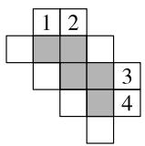  
第 4.2 题解图

5. B 【解析】因为裁开一条棱会变为两条边, 图②中共有 10 条裁开的边, 所以需要裁开的棱的条数为 5 条.

6. 汽车雨刷器在玻璃上画过的痕迹(答案不唯一)

7. ①③④⑤;②

8. ③ 【解析】①经过折叠可以围成长方体,故此选项不符合题意;②经过折叠可以围成三棱柱,故此选项不符合题意;③经过折叠可以围成圆锥,故此选项符合题意;④经过折叠可以围成圆柱,故此选项不符合题意.

9. 0.4 【解析】根据正方体表面展开图的“相间，Z端是对面”可知，3与x是相对的面，4.2与1.8是相对的面，2.6与y是相对的面，因为相对面上的两个数之和相等，所以 $3+x=4.2+1.8=2.6+y$ ，所以x=3,y=3.4，所以y-x=0.4。

10. 解: (1) 这个五棱柱一共有 7 个面; 上、下底面是五边形, 侧面都是长方形; 两个底面的形状、大小完全相同, 五个侧面的形状、大小完全相同; …… (4 分)
(2) 这个五棱柱的侧面积之和是 $5 \times 8 \times 5 = 200 \, (\text{cm}^{2})$ ; …… (6 分)

(3)这个五棱柱一共有 $3 \times 5 = 15$ (条)棱,

它们的长度之和是 $5 \times 5 \times 2 + 8 \times 5 = 90 \, (\text{cm})$ . …
…… (8 分)

11. 解:(1)圆柱,面;……(5分)

(2)由题意得: $\pi\times1.2^{2}\times2=2.88\pi(m^{3})$ ,

所以每扇旋转门旋转一周形成的几何体的体积为 $2.88\pi m^{3}$ . …… (10 分)

12. 解: (1)8; …… (2分)

(2)有4种粘贴的方法,如解图所示;(画出一种即可)……(6分)

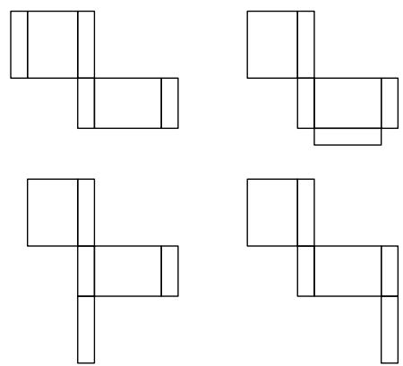  
第 12 题解图

(3)由题图可得这个长方体的长为4,宽为3,高为1,

所以这个长方体的体积为: $4 \times 3 \times 1 = 12 \, (\text{cm}^3)$ .
……(12 分)

# 周测2 截一个几何体及从三个方向看物体的形状

1. A 【解析】用一个垂直于圆锥底面的且过圆锥顶点平面截圆锥,截面的形状是三角形.

2. B 3. A 4. 1 A

4.2 A 【解析】将几何体中的①号小立方块移走,从正面看形状图不变,从左面看形状图不变,从上面看形状图改变,故选项A符合题意.

5. A 【解析】根据从上面看的形状图可知,该立体图形从左面看的形状图有 2 列,所以 A 选项不符合题意.

6. 球(答案不唯一)

7. 圆锥 【解析】由题意可知,这个长方体的空心部分的几何体可能是圆锥.

8. 10 【解析】八棱柱有 10 个面,用一平面去截八

# 大小卷·七年级(上) 数学 BS

棱柱时最多与 10 个面相交得十边形, 即截面的边数最多为 10.

9. $20 \, cm^{2}$ 【解析】根据从正面、从左面四棱柱得看到的形状图的相关数据可得,从上面看到的形状图是长为 5,宽为 4 的长方形,则从上面看到的形状图的面积为 $4 \times 5 = 20 (\, \text{cm}^{2})$ .

10. 解: (1) 能.

截法:用一个平面沿与底面平行的方向去截这个圆柱,如解图①(画法不唯一);……(2分)

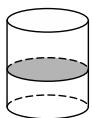  
第 10 题解图①

(2) 能.

截法:用一个平面沿与底面垂直的方向去截这个圆柱(不过两底面的圆心),如解图②(画法不唯一);……(5分)

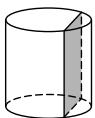  
第 10 题解图②

(3) 能.

截法:用一个平面沿与底面垂直的方向方向去截这个圆柱(过两底面的圆心),如解图③(画法不唯一),……(6分)这个正方形的面积为 $6\times2\times12=144\ (cm^{2})$ .

……（8分）

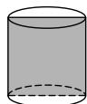  
第 10 题解图③

11. 解:(1)其从正面和左面看到的形状图如解图①;

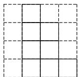  
从正面看

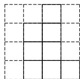  
从左面看  
第 11 题解图①

……（3分）

(2)如题图可得,该组合体由 $2+3+4+2+1+1=$ 13(个)小正方体组成，

又小正方体的棱长为 $1 \, cm$ ,

所以 1 个小正方体的体积为 $1 \times 1 \times 1 = 1 \, (\text{cm}^{3})$ ，
所以该组合体的体积为 $13 \, cm^{3}$ ; …… (6 分)

(3)该组合体的表面积为 $6 \times 2 + 8 \times 2 + 8 \times 2 = 44$ $(\mathrm{cm}^{2})$ ; …… (9 分)

(4)如解图②所示:

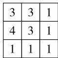  
第 11 题解图②

最多可以再添加 5 个小正方体. …… (12 分)

# 第二章 有理数及其运算

# 周测3 认识有理数

1. D

2. C 【解析】 $-8,-\frac{1}{3},0,9.818\ 118\ 111\ 8\cdots$ （每两个8之间1的个数依次增加1），0.112 134中，有理数有 $-8,-\frac{1}{3},0,0.112\ 134$ ，共4个.

3. C

4. D 【解析】-0.47<-0.15<+2<+3.5,所以选D.

5. B 【解析】根据有理数的分类可以判断①, ②, ⑤是正确的; ③整数包含正整数、负整数和0, 所以不正确; ④若a<0, 则-a>0, 故-a不一定是负数, 所以不正确.

6. C 【解析】由数轴可得-1<a<0,b>1,则-b<a,故A选项错误; $|a|<1$ ,则 $|a|<b$ ,故B选项错误; $0<|-a|<1,|-b|>1$ ,则 $|-a|<|-b|$ ,故C选项正确;-a<1,b>1,则b>-a,故D选项错误.

7. 2024

8. $-\frac{1}{3}$ (答案不唯一)

9. ③ 【解析】①段中包含的整数有-4,-3,-2,共3个;②段中包含的整数有-1,0,共2个;③段中包含的整数有1,共1个;④段中包含的整数有2,3,共2个.

10. ③ 【解析】因为表示睡觉的点在数轴上所对应的数为9,表示起床的点在数轴上所对应的数为-5,所以起床和睡觉间隔14个小时,因为小明每天21:30睡觉,所以小明每天早上起床的时间为7:30,故①错误;由题及①可得,小明每天21:30睡觉,7:30起床,间隔了10个小时,所以小明每天睡觉的时长为10个小时,故②错误;由数轴可知吃晚饭和睡觉间隔4个小时,所以小明每天吃晚饭的时间为17:30,故③正确.

11. 解: (1) 将各数分类, 填在相应的框里如解图
①; …… (3 分)

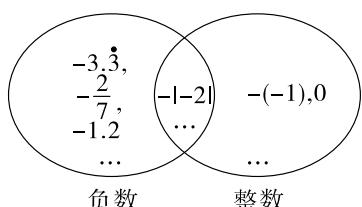

text_image

-3,3,
-2/7,
-1.2
...
负数
-|-1,-2|
... 
整数
-(-1),0
...

第 11 题解图①

(2)在数轴上把上面各数表示出来如解图②，……(6分)

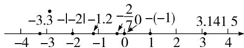

line

| Point | Value |
|---|---|
| -3.3 | -3.3 |
| -1.2 | -1.2 |
| -2 | -2 |
| 0 | -1 |
| 1 | 0 |
| 2 | 1 |
| 3 | 2 |
| 4 | 4 |
| 5 | 5 |
The chart displays a single numerical series with tick marks indicating key positions along the x-axis. The y-axis is unlabeled but represents the magnitude of each point.

第 11 题解图②

用“>”连接各数:3.141 5>-( -1 )>0> $-\frac{2}{7}$ >

-1. 2>-|-2|>-3. 3. …… (8分)

12. 解: (1) 补充表格如下:

<table><tr><td>编号</td><td>1</td><td>2</td><td>3</td><td>4</td><td>5</td><td>6</td></tr><tr><td>参数 1</td><td>62.3</td><td>58.6</td><td>61</td><td>59.2</td><td>62</td><td>60.7</td></tr><tr><td>参数 2</td><td>+2.3</td><td>-1.4</td><td>+1</td><td>-0.8</td><td>+2</td><td>+0.7</td></tr></table>

……（5分）

(2) 因为一个小蛋糕的重量合格标准为 $(60 \pm 1.2)$ g,

$$
\vert + 2. 3 \vert > \vert + 2 \vert > \vert - 1. 4 \vert > 1. 2,
$$

$$
\vert + 0. 7 \vert <   \vert - 0. 8 \vert <   \vert + 1 \vert <   1. 2,
$$

所以小明制作的小蛋糕中有 3 个合格. ……
…… (10 分)

13. 解: (1) E, -8; …… (2 分)

【解法提示】点 A, G 之间的距离为 $\left|8\right| + \left|-16\right| = 24$ ，且一共有 7 个点。所以题图中相邻的两个点之间的距离为 4 个单位长度，所以表示原点的是点 E，点 C 距离原点 $2 \times 4 = 8$ （个）单位长度，因为点 C 在原点的左侧，所以点 C 表示的有理数为 -8。

(2) 当点 M, N 在点 E 同侧时, M, N 重合, 则点 M, N 之间的距离为 0,

当点 M, N 在点 E 异侧时, 点 M, N 之间的距离为 $4 + 4 = 8$ .

综上所述,点 M,N 之间的距离为 0 或 8;……
……(5 分)

(3) 因为点 A, G 之间的距离为 24, 点 P 可以是点 A, G 之间的所有整数点 (包括 A, G), 共有 25 个; …… (8 分)

(4) 分两种情况讨论：

①点 A 先向右以每秒 4 个单位长度的速度运动 3 秒，

# 大小卷·七年级(上) 数学 BS

此时点 A 向右移动了 $4 \times 3 = 12$ (个) 单位长度，
点 A 表示的数为 -4，

再以同样的速度向左运动 5 秒，

此时点 A 向左移动了 $4 \times 5 = 20$ (个) 单位长度，
点 A 表示的数为 -24；

②点 A 先向左以每秒 4 个单位长度的速度运动 3 秒，

此时点 A 向左移动了 $4 \times 3 = 12$ (个) 单位长度，
点 A 表示的数为 -28，

再以同样的速度向右运动 5 秒，

此时点 A 向右移动了 $4 \times 5 = 20$ (个) 单位长度，点 A 表示的数为 -8.

综上所述,运动后点 A 表示的数为 -24 或 -8.

……（12分）

# 周测 4 有理数的加减运算

1. B

2. C 【解析】 $4+(-2)+7+(-1)=(4+7)+[(-2)+(-1)]$ 应用了加法交换律与结合律,所以选C.

3. C 【解析】 $-4-(-7)=-4+7=3$ ，故 A 选项正确，不符合题意； $-2.5+(+6.5)=4$ ，故 B 选项正确，不符合题意； $(- \frac{1}{2})-(+\frac{1}{4})=-\frac{3}{4}$ ，故 C 选项错误，符合题意； $-3+0=-3$ ，故 D 选项正确，不符合题意。

4. C 【解析】因为上个星期日早上的血糖值为 9.2 mmol/L, 所以该病人星期四血糖值为 9.2 + 2.3 - 3.0 + 1.8 - 1.1 = 9.2 (mmol/L).

5. A 【解析】因为 $-1+2+5=6$ ，所以 $a=6-1-(-1)=6, b=6-1-2=3$ ，所以 $b-a=3-6=-3$ .

6. D 【解析】如解图, 将空白部分的点数表示为 a, b, c. 根据题意可得, 各行各列的点数之和都为 12, 所以 a = 12 - 3 - 5 - 2 = 2, b = 12 - 4 - 2 - 3 = 3, c = 12 - 5 - 3 - 2 = 2, 所以空白处填补的是 D 选项.

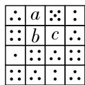  
第6题解图

7. $8+5+(-6)+(-3)$

8. $(+4) + (-2) = (+2)$

9. 3 【解析】由图可知,被盖住的整数为-3,-2,-1,2,3,4,所以 $-3+(-2)+(-1)+2+3+4=3$ .

10. 5 或 13 【解析】因为 $\left|x\right|=4,\left|y\right|=9$ , 且 x>y,

所以 x=4 或 x=-4, y=-9，当 x=4 时， $x-y=4-(-9)=4+9=13$ ；当 x=-4 时， $x-y=-4-(-9)=-4+9=5$ 。综上所述，x-y 的值为 5 或 13。

11. 解: (1) 原式 = -5 + 4 - 3

=-4; …… (5 分)

(2) 原式 = 7 - 6 - 4

=-3; …… (10 分)

(3) 原式 = -4.5 + 8.9 + 7.5 + 6.1

$= (-4.5 + 7.5) + (8.9 + 6.1)$

$= 3 + 15$

=18. …… (15分)

12. 解: (1) $\frac{19}{21}-\frac{17}{19}$ ; (6分)

(2) $\left|\frac{1}{3}-1\right|+\left|\frac{1}{3}-\frac{3}{5}\right|+\left|\frac{3}{5}-\frac{5}{7}\right|+\cdots+\left|\frac{2021}{2023}-\right.$

$$
\frac {2 0 2 3}{2 0 2 5}
$$

$$
= 1 - \frac {1}{3} + \frac {3}{5} - \frac {1}{3} + \frac {5}{7} - \frac {3}{5} + \dots + \frac {2 0 2 3}{2 0 2 5} - \frac {2 0 2 1}{2 0 2 3}
$$

$$
= 1 - \frac {1}{3} - \frac {1}{3} + \frac {2 0 2 3}{2 0 2 5}
$$

$= \frac{2698}{2025}$ (11分)

13. 解: (1) 星期一, 52 km; …… (4 分)

【解法提示】由题意可知,小明家新能源汽车本周行驶路程最多的一天是星期一,这一天的实际行驶路程为 $40+12=52$ (km).

(2)补全表格如下;……(8分)

<table><tr><td>星期</td><td>一</td><td>二</td><td>三</td><td>四</td><td>五</td><td>六</td><td>日</td></tr><tr><td>变化情况</td><td>+10</td><td>-8</td><td>-13</td><td>+14</td><td>-7</td><td>+3</td><td>-9</td></tr></table>

【解法提示】星期二的行驶路程变化情况为+4- $(+12)=-8(\text{km})$ ，星期四的行驶路程变化情况为 $+5-(-9)=+14(\text{km})$ ，星期五的行驶路程变化情况为 $-2-(+5)=-7(\text{km})$ ，星期日的行驶路程变化情况为 $-8-(+1)=-9(\text{km})$ 。

(3)由题意得, $+12+4-9+5-2+1-8=3(\text{km})$ ,

$$
4 0 \times 7 + 3 = 2 8 3 (\mathrm{km}),
$$

$$
3 2 0 - 4 8 = 2 7 2 (\mathrm{km}),
$$

因为 283>272，

所以会发出充电提示. …… (14 分)

# 周测5 有理数的乘除运算

1. A 2. B 3. D

4. A 【解析】因为 a<0, b<0, c>0, 所以 abc>0, 故 A 选项正确.

4.1. C 【解析】因为三个数的积为负数,且其中一个数为正数,所以另外两个数一个为正、一个为负,所以另外两个数一定异号.

5. B 【解析】 $10 \times (-4) \div (-2) \times (-3) = -60$ ，因为 -60 > 0 不成立，所以继续运算， $-60 \times (-4) \div (-2) \times (-3) = 360$ ，因为 360 > 0，所以输出 360，故选 B.

6. -36 【解析】 $12 \div \left(-\frac{1}{3}\right) = 12 \times (-3) = -36.$

7. 盈利,710 【解析】由题意可知, $150\times3+(-120)\times2+250\times2=710$ （元），所以该花馍坊本周盈利了710元.

8. 1.2 【解析】由题意可知, $(317-107)\div7\div5\times(-0.2)=-1.2$ （元），所以每个该款花馍的价格下降了1.2元.

9. -28;4 【解析】要使得乘积最小,则结果一定为负值,所以乘积的最小值是 $(-7)\times4=-28$ ;选择4和1时,商最大,最大值为 $4\div1=4$ .

10. 解: (1) 原式 = (-14) ÷ 2

$$
= - 7; \quad \dots\dots (4 \text {分})
$$

(2) 原式 $= \frac{17}{21} \times \left[\frac{5}{2} \times \left(-\frac{4}{10}\right)\right]$

$$
\begin{array}{l} = \frac {1 7}{2 1} \times (- 1) \\ = - \frac {1 7}{2 1}; \dots \tag {8分} \\ \end{array}
$$

(3) 原式 $= \left(-\frac{2}{3}\right) \div \left(-\frac{31}{6}\right) \times \frac{31}{5}$

$$
= \left(- \frac {2}{3}\right) \times \left(- \frac {6}{3 1}\right) \times \frac {3 1}{5}
$$

$$
= \frac {4}{3 1} \times \frac {3 1}{5}
$$

$$
= \frac {4}{5}. \quad \dots\dots\tag {12分}
$$

11. 解:(1)二,没有按同级运算从左至右运算;
三,符号弄错;……(4分)

(2) 原式 $= (-21) \div \left(-\frac{56}{6}\right) \times 6$

$$
= 2 1 \times \frac {6}{5 6} \times 6
$$

$$
= \frac {2 7}{2}. \dots \tag {8分}
$$

12. 解: (1) 选择小明: 原式的倒数为

$$
\begin{array}{l} \left(- \frac {1}{4} + \frac {1}{6} - \frac {1}{1 2}\right) \div \left(- \frac {1}{1 2}\right) \\ = \left(- \frac {1}{4} + \frac {1}{6} - \frac {1}{1 2}\right) \times (- 1 2) \\ = - \frac {1}{4} \times (- 1 2) + \frac {1}{6} \times (- 1 2) - \frac {1}{1 2} \times (- 1 2) \\ = 3 - 2 + 1 \\ = 2, \\ \end{array}
$$

$$
\begin{array}{l} \left(- \frac {1}{4} + \frac {1}{6} - \frac {1}{1 2}\right) \div \left(- \frac {1}{1 2}\right) \\ = \left(- \frac {1}{4} + \frac {1}{6} - \frac {1}{1 2}\right) \times (- 1 2) \\ = - \frac {1}{4} \times (- 1 2) + \frac {1}{6} \times (- 1 2) - \frac {1}{1 2} \times (- 1 2) \\ = 3 - 2 + 1 \\ = 2, \\ \end{array}
$$

故原式= $\frac{1}{2}$ . …… (5分)

选择小亮: 原式通分得

$$
\begin{array}{l} - \frac {1}{1 2} \div (- \frac {3}{1 2} + \frac {2}{1 2} - \frac {1}{1 2}) \\ = - \frac {1}{1 2} \div (- \frac {1}{6}) \\ = - \frac {1}{1 2} \times (- 6) \\ = \frac {1}{2}; \dots \tag {5分} \\ \end{array}
$$

(任选一种即可)

(2) 原式的倒数为

$$
\begin{array}{l} \left(\frac {2}{3} - \frac {1}{1 0} + \frac {1}{6} - \frac {2}{5}\right) \div \frac {1}{3 0} \\ = \left(\frac {2}{3} - \frac {1}{1 0} + \frac {1}{6} - \frac {2}{5}\right) \times 3 0 \\ = \frac {2}{3} \times 3 0 - \frac {1}{1 0} \times 3 0 + \frac {1}{6} \times 3 0 - \frac {2}{5} \times 3 0 \\ = 2 0 - 3 + 5 - 1 2 \\ = 1 0, \\ \end{array}
$$

所以原式= $\frac{1}{10}$ . …… (10分)

# 周测6 有理数的乘方及混合运算

1. A 【解析】式子 $\left(-\frac{1}{5}\right)^{3}$ ，指数是3，底数是 $-\frac{1}{5}$ ，幂为 $-\frac{1}{125}$ ，表示3个 $-\frac{1}{5}$ 相乘，故A错误.  
2. C 【解析】因为 5 个 4 相加表示为 $4 \times 5, 9$ 个 7 相乘表示为 $7^{9}$ ，所以该算式可表示为 $4 \times 5 - 7^{9}$ .  
3. B 【解析】 $-4^{3}=-64,3^{4}=81$ , A 选项错误； $-5^{3}=-125,(-5)^{3}=-125$ , B 选项正确； $-4^{2}=-16$ ,

大小卷·七年级(上) 数学 BS

$(-4)^{2}=16$ , C 选项错误; $\left(\frac{2}{3}\right)^{3}=\frac{8}{27},\left(\frac{3}{2}\right)^{3}=\frac{27}{8}$ ,
D 选项错误.

4. B 【解析】 $384400 = 3.844 \times 10^{5}$ .

5. B 【解析】根据题意,细胞第1个30分钟分裂成2个,即 $2^{1}$ 个草履虫;第2个30分钟分裂成4个,即 $2^{2}$ 个;…;依此类推,8个小时即16个30分钟,则一个草履虫8个小时后可分裂为 $2^{16}$ 个.

6. C 【解析】填入“+”时, 原式为 $1 + \left[\frac{2}{3} \times 6 + (-2)^{3}\right] \div (-5) = \frac{9}{5}$ ; 填入“-”时, 原式为 $1 + \left[\frac{2}{3} \times 6 - (-2)^{3}\right] \div (-5) = -\frac{7}{5}$ ; 填入“×”时, 原式为 $1 + \left[\frac{2}{3} \times 6 \times (-2)^{3}\right] \div (-5) = \frac{37}{5}$ ; 填入“÷”时, 原式为 $1 + \left[\frac{2}{3} \times 6 \div (-2)^{3}\right] \div (-5) = \frac{11}{10}$ . 因为 $-\frac{7}{5}$ 最小, 故选 C.

7. -2 【解析】原式 $= 1 \times (-2) = -2$ .

8. 13.26

9. 10 【解析】178 亿即 17 800 000 000, 用科学记数法表示为 $1.78 \times 10^{10}$ , 所以 $n$ 的值为 10.

10. 5 【解析】 $2^{1} - 1 = 1, 2^{2} - 1 = 3, 2^{3} - 1 = 7, 2^{4} - 1 = 15, 2^{5} - 1 = 31, 2^{6} - 1 = 63, 2^{7} - 1 = 127, 2^{8} - 1 = 255$ ，由此可以猜测个位数字按照 1, 3, 7, 5 的顺序进行循环。因为 $2024 \div 4 = 506$ ，所以 $2^{2024} - 1$ 的个位数字是 5。

11. 解: (1) 原式 = -18 + (-6) + 2

$$
= - 2 4 + 2
$$

$$
= - 2 2; \dots\dots(3 \text {分})
$$

(2) 原式 $= 1 + 3 \times \left(-\frac{1}{3}\right) \times \frac{2}{3}$

$$
= 1 - \frac {2}{3}
$$

$$
= \frac {1}{3}. \dots \tag {6分}
$$

12. 解: (1) $(5-11)\times6+12$ (答案不唯一); …… (3 分)

(2)如抽到 $A,2,3,4$

可以列式为 $(1-4)\times2^{3}=-3\times2^{3}=-24$ .(答案不唯一,合理即可)……(8分)

13. 解: $\frac{3}{4} + \frac{3}{16} + \frac{3}{64} + \frac{3}{256} + \frac{3}{1024}$

$$
= 1 - \frac {1}{1 0 2 4}
$$

$$
= \frac {1 0 2 3}{1 0 2 4}. \dots \tag {8分}
$$

14. 解: (1) 数对 $(-4, -\frac{7}{3})$ 不是“完美数对”. …… (1 分)

理由如下：

因为 $mn=(-4)\times(-\frac{7}{3})=\frac{28}{3}$ ,

$$
m ^ {2} - 2 n - 2 = (- 4) ^ {2} - 2 \times \left(- \frac {7}{3}\right) - 2 = \frac {5 6}{3},
$$

$$
\frac {2 8}{3} \neq \frac {5 6}{3},
$$

所以数对 $(-4,-\frac{7}{3})$ 不是“完美数对”；……(5分)

(2) $(1,-\frac{1}{3})$ (答案不唯一)

因为 $mn = 1 \times \left(-\frac{1}{3}\right) = -\frac{1}{3}$ ,

$$
m ^ {2} - 2 n - 2 = 1 ^ {2} - 2 \times \left(- \frac {1}{3}\right) - 2 = - \frac {1}{3},
$$

$$
- \frac {1}{3} = - \frac {1}{3},
$$

所以 $(1,-\frac{1}{3})$ 是“完美数对”. …… (8分)

# 专题 有理数的实际应用

# 教材原题改编练

教材原题 解:(1)补全表格如下表所示;

<table><tr><td>姓名</td><td>A</td><td>B</td><td>C</td><td>D</td><td>E</td><td>F</td></tr><tr><td>身高</td><td>179</td><td>182</td><td>180</td><td>174</td><td>183</td><td>182</td></tr><tr><td>身高与平均身高的差</td><td>-1</td><td>+2</td><td>0</td><td>-6</td><td>+3</td><td>+2</td></tr></table>

(2)由表格中的数据得队员 E 最高,队员 D 最矮;  
(3) 183-174=9(cm).

答:最高与最矮的队员身高相差 9 cm.

改编 1 解:(1)盈利最多的一天盈利 210 元,亏损最多的一天亏损 69.5 元,

所以相差 $210 - (-69.5) = 210 + 69.5 = 279.5$

(元),

所以该文具店盈利最多的一天与亏损最多的一天相差 279.5 元；

(2) 因为 $-28.2 + (-69.5) + 210 + 156.7 + (-22) + 43 + 183 = 473$ (元),

所以第一周盈利 473 元，

所以 1280-(-182)-473=989(元).

所以后面两周共盈利 989 元.

改编 2 解: (1) 最重的是 $20 + 2.5 = 22.5 \, (\text{kg})$ ,

最轻的是 $20+(-3)=17(\text{kg})$ ,

$$
2. 5 - (- 3) = 5. 5 (\mathrm{kg}),
$$

所以它们相差 5.5 kg;

(2) $20 \times 20 + (-3) \times 1 + (-2) \times 3 + (-1.5) \times 2 + 0 \times 4 +$

$$
1 \times 2 + 2. 5 \times 8 = 4 1 0 (\mathrm{kg}),
$$

所以这 20 件货物的总重量为 410 kg.

改编 3 解: (1) $2.2 + (-2.5) + 2.8 + (-0.7) + (-0.5)$

$$
\begin{array}{l} = 2. 2 + 2. 8 + (- 2. 5) + (- 0. 5) + (- 0. 7) \\ = 5 + (- 3) + (- 0. 7) \\ = 1. 3 (\mathrm{m}), \\ \end{array}
$$

因为 1.3 > 0,

所以无人机最后所在的位置比开始位置高,高了1.3 m;

(2) $(2.2+2.8)\times18+(|-2.5|+|-0.7|+|-0.5|)$

$$
\times 4 = 1 0 4. 8 (\mathrm{mAh}),
$$

答:一共消耗了 104.8 mAh 电量.

# 综合训练

1. 解: (1) $56-3+6-7=52$ (单),

所以这周三李师傅的送餐量是 52 单；

(2) 星期一的送餐量: 56-3=53 (单),

星期二的送餐量:53+6=59(单),

星期三的送餐量:59-7=52(单),

星期四的送餐量:52-5=47(单)

星期五的送餐量:47+13=60(单),

星期六的送餐量:60+18=78(单),

星期日的送餐量:78-3=75(单),

李师傅一周的送餐量为 $53+59+52+47+60+78+$ 75=424(单)，

$424 \times 2.3 = 975.2$ （元）.

所以李师傅这周外卖送餐的收入为 975.2 元.

2. 解: (1) 小杰的视力最差;

(2)0.1-0.4+0-0.2-0.6-0.1=-1.2,

$$
5. 0 - \frac {1 . 2}{6} = 4. 8,
$$

所以这6名学生的平均视力为4.8.

因为小梦的视力为 5.0,

所以小梦的视力比这6名学生的平均视力高；

(3) 小明的视力为 5.1, 小颖的视力为 4.6, 小梦的视力为 5.0, 小璐的视力为 4.8, 小杰的视力为 4.4, 小萌的视力为 4.9,

所以这 6 名学生中有 4 名学生不需要佩戴近视眼镜.

# 第三章 整式及其加减

# 周测7 代数式

1. A 【解析】比 x 的 $\frac{1}{2}$ 倍多 5 的是比 $\frac{1}{2}x$ 多 5，可以表示成 $\frac{1}{2}x + 5$ .

2. B 【解析】因为 $x+3y=2$ ，所以 $x+3y-1=2-1=$ 1.

3. A 【解析】A. 单项式 $-x^{3}y^{2}$ 的系数是 -1, 说法正确, 符合题意; B. $3x^{2}-y+5xy^{2}$ 是三次三项式, 说法错误, 不符合题意; C. 0 是整式, 说法错误, 不符合题意; D. $2x^{2}-3$ 的常数项是 -3, 说法错误, 不符合题意.

4. C 【解析】A. 若葡萄的价格是 3 元/千克, 则 3a 表示买 a 千克葡萄的金额, 该例子恰当, 不符合题意; B. 若 a 表示一个等边三角形的边长, 则 3a 表示这个等边三角形的周长, 该例子恰当, 不符合题意; C. 原价为 a 元的商品打 3 折后的售价为 0.3a, 该例子不恰当, 符合题意; D. 货车以 a km/h 的平均速度行驶 3 h 的路程为 3a, 该例子恰当, 不符合题意.

5. B 【解析】因为 $x^{|a+2|}y$ 的次数为 4, 所以 $|a+2|+1=4$ , 即 a=1 或 -5, 因为 $a-1\neq0$ , 即 $a\neq1$ , 所以 a=-5.

6. B 【解析】由题图可得,铜钱阴影部分面积表示为 $\pi a^{2}-b^{2}$ .

7. 5 【解析】单项式与多项式统称为整式,题中 m+n 为多项式, $b,-1,6a^{2},0$ 为单项式, $\frac{3}{x^{2}}(x\neq0)$ 既不是单项式也不是多项式,所以是整式的有5个.

8. $\frac{1}{3}a+20$ 【解析】A 配送车投递快递 a 件, B 配送车投递快递 $\frac{1}{3}a$ 件, C 配送车投递快递为 $(\frac{1}{3}a+20)$ 件.

9. $\frac{m+10n+p}{12}$ 【解析】依题意,第1个月生产作品的效率为 m, 第2个月至第11个月生产作品的效率均为 n, 第12个月生产作品的效率为 p, 所

以该作曲软件这一年的月平均生产效率为 $\frac{m+10n+p}{12}$ .

10. (1)3; (2)-4 或 6 【解析】(1) 若输入的 $x = -2, y = 1$ , 则输出的结果为 $(-2)^{2} - 1 = 3$ ; (2) 若输入的 $x = 2$ , 输出的结果为 $-2$ , 当 $y \geqslant 0$ 时, 即 $2^{2} - y = -2$ , 可得 $y = 6$ , 当 $y < 0$ 时, 可得 $y + 2 = -2$ , 解得 $y = -4$ , 故 $y$ 的值为 $-4$ 或 6.

11. (1) $(m - n)^{2} + 3$ ; …… (3 分)
(2) 因为三个连续奇数, 最大的一个是 $2n + 1$ ,
所以三个连续奇数为 $2n - 3, 2n - 1, 2n + 1$ ,
所以最小的一个数为 $2n - 3$ . …… (8 分)

12. 解: (1) $20m \times 0.9 + 20n \times 0.9 = 18m + 18n$ (元), 所以若按方案一购买, 则需要的总费用为 $(18m + 18n)$ 元; …… (3 分)
(2) $20m+(20-\frac{20}{2})n=20m+10n$ （元），

所以若按方案二购买,需要的总费用为 $(20m+10n)$ 元；……(6分)
(3) 若 m=150, n=60,

则方案一所需费用为 $18m+18n=18\times150+18\times60=3780$ （元），

方案二所需费用为 $20 \times 150 + 10 \times 60 = 3600$ (元),

因为 3 600 < 3 780, 且 3 780 - 3 600 = 180 (元), 所以选择方案二更合算, 会节省 180 元. …… (10 分)

13. 解:(1)单项式:①③;……(1分)
多项式:②⑤⑥;……(2分)
(2)选择⑤,多项式 $ab-b^{3}$ 是三次二项式,最高次项为 $-b^{3}$ ,最高次项的系数为-1;(答案不唯一)……(5分)
(3)因为多项式 $(m-2)x^{m+1}y^{2}+xy^{2}-4x^{2}+1$ 是三次三项式,

所以当 m-2=0 时, m=2, 此时 $xy^{2}-4x^{2}+1$ 是三次三项式;
当 $m+1=1$ 时, m=0, 所以 m-2=-2,

此时多项式前两项合并后变为 $-xy^{2}-4x^{2}+1$ 是三次三项式.

综上所述, m 的值为 0 或 2; …… (9 分)

(4) 因为单项式 $\frac{1}{8}x^{m}y^{8-m}$ 的次数为 $m+(8-m)=8$ ，多项式 $(m-2)x^{m+1}y^{2}+xy^{2}-4x^{2}+1$ 要和其次数相同，所以 $(m+1)+2=8$ ，所以 m=5，所以该多项式为 $3x^{6}y^{2}+xy^{2}-4x^{2}+1$ 。……

……（12分）

# 周测 8 整式的加减

1. C

2. D 【解析】选项 A 中, 字母所在位置不同, 不是同类项, 故 A 选项不符合题意; 选项 B 中, 两个整式的字母相同, 但相同字母的指数不同, 不是同类项, 故 B 选项不符合题意; 选项 C 中, 字母不同, 不是同类项, 故 C 选项不符合题意; 选项 D 中, 都是常数项, 故 D 选项符合题意.

3. B 【解析】A. $3a - a = 2a \neq 2a^{2}$ ，故本选项计算错误；B. $2ab + 3ba = 5ab$ ，故本选项计算正确；C. $4xyz - 2xyz = 2xyz \neq 2$ ，故本选项计算错误；D. $a^{5}$ 与 $a^{2}$ 不是同类项，所以不能合并，故本选项计算错误。

4. B

5. B 【解析】 $-2(m-5)=-2m+10$ ，所以 $-2m+5-(-2m+10)=-2m+5+2m-10=-5$ ，故选B.

6. C 【解析】假设空白部分的面积为 x，则大的阴影部分面积为 $a^{2}-x$ ，小的阴影部分面积为 $b^{2}-x$ ，所以两个阴影部分的面积之差为 $a^{2}-x-(b^{2}-x)=a^{2}-b^{2}$ 或 $b^{2}-x-(a^{2}-x)=b^{2}-a^{2}$ .

7. 5a-b 【解析】 $3a+b+2(a-b)=3a+b+2a-2b=5a-b.$

8. 12 【解析】因为 $a + b = 2, b - c = 3$ ，所以 $3a + 5b - 2c = 3(a + b) + 2(b - c) = 3 \times 2 + 2 \times 3 = 12$ .

9. 11x-2y 【解析】 $2A-B=2(3x+2y)-(-5x+6y)$ $=6x+4y+5x-6y=11x-2y.$

10. 4.5x+12.5 【解析】由题意得,小刚每月应付租书总费用是3x元,小美每月应付租书总费用是 $5+1.5(x+5)=5+1.5x+7.5=(1.5x+12.5)$ 元,所以两人每月应付的租书总费用为 $3x+1.5x+12.5=(4.5x+12.5)$ 元.

11. 解: (1) 原式 $=2m^{2}+8m+10-7m^{2}-3m$ $=-5m^{2}+5m+10$ ,

将 m=2 代入, 得

原式 $=-5\times2^{2}+5\times2+10=0;\cdots\cdots(4分)$

(2) 原式 $= 6x^{2} - 3y^{2} + 2xy - y^{2} + xy - 3$

$$
= 6 x ^ {2} + \left(- 3 y ^ {2} - y ^ {2}\right) + (2 x y + x y) - 3
$$

$$
= 6 x ^ {2} - 4 y ^ {2} + 3 x y - 3,
$$

将 $x = -1, y = 2$ 代入，得

原式 $= 6 \times (-1)^{2} - 4 \times 2^{2} + 3 \times (-1) \times 2 - 3$

=-19. …… (8分)

12. 解: (1)①, 去括号未变号; …… (5 分)

(2) 原式 $= 3a^{2}b - (4ab^{2} - 3ab^{2} - 3a^{2}b - ab^{2}) - 6a^{2}b$

$$
= 3 a ^ {2} b - 4 a b ^ {2} + 3 a b ^ {2} + 3 a ^ {2} b + a b ^ {2} - 6 a ^ {2} b
$$

=0. …… (10分)

13. 解: (1)5; …… (3分)

【解法提示】 $a=(12-2)\div2=5.$

(2)根据题图可得,厨房的长为5 m,宽为3+6-x-1=(8-x)m,

卫生间的长为 $2 \, m$ ，宽为 $(x-1) \, \text{m}$ ，

所以需要做防水处理的总面积为 $5(8-x)+2(x-1)=(38-3x)\mathrm{m}^{2}$ ; …… (7 分)

(3) 当 x=5.5 时, 原式 =38-3x=38-3×5.5=
21. $5(\mathrm{~m}^{2})$ ,

所以做防水处理的总费用 = 21.5 × 200 = 4300 (元),

答:做防水处理的总费用为 4 300 元. ……
…… (10 分)

14. 解: (1) 60-3x; …… (3 分)

【解法提示】根据题意可知购买 B 种瓷砖的箱数为 $(2x+2)$ 箱, 所以购买 C 种瓷砖的数量为 $62-x-(2x+2)=(60-3x)$ 箱.

(2) A 种瓷砖每箱有 10 片, 共有 x 箱, 因此数量为 10x 片;

B 种瓷砖每箱有 4 片, 共有 $(2x+2)$ 箱, 因此数量为 $4(2x+2)=(8x+8)$ 片;

C 种瓷砖每箱有 3 片, 共有 $(60-3x)$ 箱, 因此数量为 $3(60-3x)=(180-9x)$ 片,

因此三种瓷砖的总数为 $10x + 8x + 8 + 180 - 9x = (9x + 188)$ 片，

答:共购买了 $(9x+188)$ 片瓷砖;……(7分)

(3) A 种瓷砖每片 15 元, 共有 10x 片, 因此需花费 $15 \times 10x = 150x$ (元);

B 种瓷砖每片 32 元, 共有 $(8x+8)$ 片, 因此需花费 $32(8x+8)=(256x+256)$ 元;

C 种瓷砖每片 50 元, 共有 $(180-9x)$ 片, 因此需

花费 $50(180-9x)=(9\ 000-450x)$ 元，

因此购买三种瓷砖共需花费 $150x + 256x + 256 + 9000 - 450x = (-44x + 9256)$ 元，

当 x=10 时, 购买瓷砖的总费用为 $-44 \times 10+9256 = 8816$ (元),

答:购买瓷砖的总费用为 8 816 元. ……

……（12分）

# 周测 9 探索与表达规律

1. A

2. C 【解析】观察可知,后一个图形比前一个多5根小木棒,第①个图形需要6根小木棒,第②个图形需要 $6+1\times5=11$ 根,第③个图形需要 $6+2\times5=16$ 根,所以第⑨个图形需要小木棒 $6+(n-1)\times5=(5n+1)$ 根.

3. D 【解析】由题知, $1=4\times0+1$ , $5=4\times1+1$ , $9=4\times2+1$ , $13=4\times3+1$ , $\cdots$ ,所以第n个数可表示为4 $(n-1)+1=4n-3$ (n为正整数),所以第n个数字是4n-3.

4. B 【解析】观察式子可知,变化可总结如下表:

<table><tr><td colspan="2">多项式</td><td> $2a+b$ </td><td> $4a^{2}-b^{3}$ </td><td> $6a^{3}+b^{5}$ </td><td rowspan="5">...</td></tr><tr><td rowspan="2">第一项</td><td>系数</td><td>2</td><td>4</td><td>6</td></tr><tr><td>次数</td><td>1</td><td>2</td><td>3</td></tr><tr><td rowspan="2">第二项</td><td>系数</td><td>1</td><td>-1</td><td>1</td></tr><tr><td>次数</td><td> $1=2\times1-1$ </td><td> $3=2\times2-1$ </td><td> $5=2\times3-1$ </td></tr></table>

所以第 n 个多项式为 $2na^{n}+(-1)^{n-1}b^{2n-1}$ ，所以第 6 个多项式为 $12a^{6}-b^{11}$ .

5. A 【解析】设中间的数为 x，则左上的数为 x-8，右上的数为 x-6，左下的数为 $x+6$ ，右下的数为 $x+8$ ，所以这五个数之和为 $x-8+x-6+x+x+6+x+8=5x$ .

6. B 【解析】设这三个一位数分别为 a, b, c，依题意得 $\left[(5a-8)\times2+b\right]\times10+c=760$ ，整理得 $100a+10b+c-160=760$ ，即 $400a+10b+c=920$ ，因为百位是 a，十位是 b，个位是 c，所以小红所选定的这三个一位数的和为 $9+2+0=11$ 。

7. $\frac{19}{20}$ 【解析】因为 $\frac{1}{2} = \frac{2 \times 1 - 1}{2 \times 1}, \frac{3}{4} = \frac{2 \times 2 - 1}{2 \times 2}, \frac{5}{6} = \frac{2 \times 3 - 1}{2 \times 3}, \frac{7}{8} = \frac{2 \times 4 - 1}{2 \times 4}, \cdots$ ，所以第 n 个数为 $\frac{2n - 1}{2n}$ ，所以第 10 个数是 $\frac{2 \times 10 - 1}{2 \times 10} = \frac{19}{20}$ .

8. time 【解析】当 X=8 时, 密码对应的序号为 $\left(\frac{8}{2}\right)^{2}+4=20$ ; 当 X=15 时, 密码对应的序号为 15-6=9; 当 X=19 时, 密码对应的序号为 19-6=13; 当 X=11 时, 密码对应的序号为 11-6=5, 再将所得序号依次转换为对应字母, 所以译成密码是 time.

9. $2^{n-1}$ 【解析】由题图可知图②比图①多 $2^{1}$ 个“树枝”，所以图②有 $(1+2^{1})$ 个“树枝”，图③比图②多 $2^{2}$ 个“树枝”，所以图③有 $(1+2^{1}+2^{2})$ 个“树枝”，…，所以第 n-1 个图有 $(1+2^{1}+2^{2}+2^{3}+\cdots+2^{n-2})$ 个“树枝”；第 n 个图有 $(1+2^{1}+2^{2}+2^{3}+\cdots+2^{n-1})$ 个“树枝”，所以第 n 个图比第 n-1 个图多 $(1+2^{1}+2^{2}+2^{3}+\cdots+2^{n-1})-(1+2^{1}+2^{2}+2^{3}+\cdots+2^{n-2})=2^{n-1}$ （个）“树枝”.

10. 171 【解析】由图中数字排列规律可知,从第3行起,每一行从左边起第三个数依次为1,3,6,10,15,21,…,则第n行从左边起第3个数为 $1+2+3+4+\cdots+(n-2)=\frac{1}{2}(1+n-2)(n-2)=\frac{1}{2}(n-1)(n-2)$ . 当n=20时, $\frac{1}{2}\times19\times18=171$ ,即第20行从左边起第3个数为171.

11. 解: (1) $1+2n$ ; …… (4分)

【解法提示】第1次分割后,得到三角形的个数为 $1+2=3$ ,第2次分割后,得到三角形的个数为 $1+2\times2=5,\cdots$ ,按此规律,第n次分割后,得到三角形的个数为 $1+2n$ .

(2) 当 n=2024 时, $1+2n=1+2\times2024=4049$ ,
所以第 2024 次分割后共有 4049 个三角形.

……（8分）

12. 解:【初步感知】7,256; …… (2 分)

【知识反思】3 456=3×1 000+4×100+5×10+6

$$
\begin{array}{l} = 3 \times (9 9 9 + 1) + 4 \times (9 9 + 1) + 5 \times (9 + 1) + 6 \\ = 3 \times 9 9 9 + 3 + 4 \times 9 9 + 4 + 5 \times 9 + 5 + 6 \\ = 3 \times (3 \times 3 3 3 + 4 \times 3 3 + 5 \times 3) + 3 + 4 + 5 + 6 \\ = 3 \times (3 \times 3 3 3 + 4 \times 3 3 + 5 \times 3) + 1 8 \\ = 3 \times (3 \times 3 3 3 + 4 \times 3 3 + 5 \times 3 + 6) \\ \end{array}
$$

所以 3 456 可以被 3 整除;……(6 分)

$$
\begin{array}{l} 1 0 0 c + 1 0 d + e \\ = a (9 9 9 9 + 1) + b (9 9 9 + 1) + c (9 9 + 1) + d (9 + 1) + e \\ \end{array}
$$

【归纳总结】这个五位数 $= 10000a + 1000b+$

大小卷·七年级(上) 数学 BS

$$
\begin{array}{l} = 9 9 9 9 a + a + 9 9 9 b + b + 9 9 c + c + 9 d + d + e \\ = 3 (3 3 3 3 a + 3 3 3 b + 3 3 c + 3 d) + a + b + c + d + e. \\ \end{array}
$$

因为 $3(3333a+333b+33c+3d)$ 能被 3 整除, $a+b+c+d+e$ 能被 3 整除,

所以 $3(3333a+333b+33c+3d)+a+b+c+d+e$ 可以被 3 整除, 即这个五位数可以被 3 整除. ………（10分）

13. 解:(1)如下表格;

<table><tr><td>图形编号</td><td>1</td><td>2</td><td>3</td><td>4</td><td>...</td></tr><tr><td>三角形个数</td><td>1</td><td>2</td><td>3</td><td>4</td><td>...</td></tr><tr><td>正方形个数</td><td>3</td><td>5</td><td>7</td><td>9</td><td>...</td></tr><tr><td>火柴棒总根数</td><td>12</td><td>20</td><td>28</td><td>36</td><td>...</td></tr></table>

……（3分）

(2)由(1)中表格分析可得,在第n个图中,

三角形个数为 n，正方形个数为有 $(2n+1)$ ，所用火柴棒总根数为 $4(2n+1)$ ,

当 n=100 时, $4\times(2\times100+1)=804$ (根),

所以搭第 100 个图形需要的火柴棒为 804 根；……（8分）

(3) 不可能, 理由如下:

由(2)可得,所用火柴棒总根数为 $4(2n+1)$ ,所以所用火柴棒总根数为 4 的整数倍，而 2025 不是 4 的倍数，

所以按这种方式搭出来的一个图形用了 2025根火柴棒是不可能的. …… (12 分)

# 专题 整式的化简与求值

# 分点训练

1. (1) 3y;

(2)-3ab;   
(3) $x+3y-3;$   
(4) $-13a^{2}+12a+8;$   
(5) $2xy^{2}-xy.$

2. (1) 2-4x;

(2) $3x - 2$ ；【解析】 $-(2x - 3) + 5(x - 1) = -2x + 3$

$$
+ 5 x - 5 = 3 x - 2.
$$

(3)2a-3b; 【解析】 $3(a-\frac{1}{3}b)-2(\frac{1}{2}a+b)=3a$

$$
- b - a - 2 b = 2 a - 3 b.
$$

(4) $-9x^{2}y+3xy^{2}$ ; 【解析】 $2(3x^{2}y-xy^{2})-5(-xy^{2}$

$$
\left. + 3 x ^ {2} y\right) = 6 x ^ {2} y - 2 x y ^ {2} + 5 x y ^ {2} - 1 5 x ^ {2} y = - 9 x ^ {2} y + 3 x y ^ {2}.
$$

(5) $4x^{3}-2x-2$ ; 【解析】 $4x^{3}-(-3x^{2}+2x-1)$ -

$$
3 \left(x ^ {2} + 1\right) = 4 x ^ {3} + 3 x ^ {2} - 2 x + 1 - 3 x ^ {2} - 3 = 4 x ^ {3} - 2 x - 2.
$$

(6) $2x - 2y$ 【解析】 $-(-x + y) - [- (x - y)] = x - y$

$$
- (- x + y) = x - y + x - y = 2 x - 2 y.
$$

3. (1) $b+c-2a$ ;

(2) $-x+3y;$   
(3) $-ab + 3b$ ;   
(4) y-z.

# 综合训练

1. 解: (1) 原式 $=5x^{2}-(4-3x^{2}+5x+2x^{2}-5)+6x$

$$
\begin{array}{l} = 5 x ^ {2} - 4 + 3 x ^ {2} - 5 x - 2 x ^ {2} + 5 + 6 x \\ = 6 x ^ {2} + x + 1, \\ \end{array}
$$

当 $x = -1$ 时，

原式 $= 6 \times (-1)^{2} + (-1) + 1 = 6$ ;

(2) 原式 = -2xy + 3x - 6x + 3xy + xy

$$
= 2 x y - 3 x,
$$

当 $x = -3, y = 2$ 时，

原式=2×(-3)×2-3×(-3)=-3.

2. 解: (1) 因为 a-b=-3, -c-d=2,

所以 $(a + c) - (b - d)$

$$
\begin{array}{l} = a + c - b + d \\ = (a - b) + (c + d) \\ = (a - b) - (- c - d) \\ = - 3 - 2 \\ = - 5; \\ \end{array}
$$

(2) 原式 = 8x + 10y - 2xy - x - 3y + 7xy

$$
\begin{array}{l} = 7 x + 7 y + 5 x y \\ = 7 (x + y) + 5 x y, \\ \end{array}
$$

当 $x+y=-5,xy=8$ 时，

原式 $= 7 \times (-5) + 5 \times 8 = 5.$

3. 解:由题意得,被挡住的代数式为

$$
\begin{array}{l} 5 x ^ {2} + 4 - 5 x - (2 x ^ {2} - 6 x + 7) \\ = 5 x ^ {2} + 4 - 5 x - 2 x ^ {2} + 6 x - 7 \\ = 3 x ^ {2} + x - 3, \\ \end{array}
$$

因为 $3x^{2}+x-5=0$ ,

所以 $3x^{2}+x=5$ ，

所以被图标挡住的代数式的值为 5-3=2.

4. 解:(1)①去括号,去括号法则;

②一,括号内的项漏乘系数;

③ $(2a^{2}b - 5ab) - 2(ab - a^{2}b)$

$$
= 2 a ^ {2} b - 5 a b - 2 a b + 2 a ^ {2} b
$$

$$
= 4 a ^ {2} b - 7 a b,
$$

当 a=2, b=-3 时，

原式 $= 4 \times 2^{2} \times (-3) - 7 \times 2 \times (-3) = -6$ ;

(2)建议:去括号时,若括号前面是负号,去掉括号后,括号里各项都变号,勿漏;若括号前面有数字,利用乘法对加法的分配律时,注意分配到每一项.(答案不唯一)

5. 解: (1) $a=0, b \neq 0$ ;

(2) 因为 $2x^{2} - 2 = x^{2} - x - 1 + x^{2} + x - 1$

$$
= x ^ {2} - x - 1 - \left(- x ^ {2} - x + 1\right)
$$

即 $2x^{2}-2=A-B$ ,

所以 a=1, b=-1, 此时 $a \neq 0, b \neq 0$ ,

所以 $2x^{2}-2$ 为“AB 类整式”.

6. 解: (1) 因为 $2A + B = C$ ,

所以 $B = C - 2A$

$$
= 4 a ^ {2} b - 3 a b ^ {2} + 4 a b c - 2 \left(3 a ^ {2} b - 2 a b ^ {2} + a b c\right)
$$

$$
= 4 a ^ {2} b - 3 a b ^ {2} + 4 a b c - 6 a ^ {2} b + 4 a b ^ {2} - 2 a b c
$$

$$
= - 2 a ^ {2} b + a b ^ {2} + 2 a b c;
$$

(2) 小强的说法正确.

理由如下：

$$
\begin{array}{l} 2 A - B = 2 \left(3 a ^ {2} b - 2 a b ^ {2} + a b c\right) - \left(- 2 a ^ {2} b + a b ^ {2} + 2 a b c\right) \\ = 6 a ^ {2} b - 4 a b ^ {2} + 2 a b c + 2 a ^ {2} b - a b ^ {2} - 2 a b c \\ = 8 a ^ {2} b - 5 a b ^ {2}; \\ \end{array}
$$

因为正确结果中不含 c，

所以正确结果的大小与 c 的取值无关，

即小强的说法正确；

(3) 当 $a=\frac{1}{8}$ , $b=\frac{1}{5}$ 时,

$$
\begin{array}{l} 2 A - B = 8 a ^ {2} b - 5 a b ^ {2} \\ = 8 \times \left(\frac {1}{8}\right) ^ {2} \times \frac {1}{5} - 5 \times \frac {1}{8} \times \left(\frac {1}{5}\right) ^ {2} \\ = 0. \\ \end{array}
$$

# 期中检测

# 选填及简单解答题题组(一)

1. B 2. B 3. C

4. A 【解析】 $-48\div2^{3}=-48\div8=-6$ , A 选项正确； $-3-(-1)=-3+1=-2\neq-4$ , B 选项错误； $-|-\frac{2}{3}|+(-\frac{4}{5})=-\frac{2}{3}-\frac{4}{5}=-\frac{22}{15}\neq-\frac{2}{15}$ , C 选项错误； $16\times(\frac{1}{3}-\frac{1}{4})=16\times\frac{1}{12}=\frac{4}{3}\neq-\frac{4}{3}$ , D 选项错误.

5. D 6. C

7. B 【解析】 $A-2B=x^{2}+xy-2(y^{2}-mxy)=x^{2}+xy-2y^{2}+2mxy=x^{2}-2y^{2}+(2m+1)xy$ ，因为A-2B的值不含xy项，所以 $2m+1=0$ ，所以m的值为 $-\frac{1}{2}$ .

8. B 【解析】根据题中的新定义得 3@2=6, -3@2=4-(-3)=4+3=7, 则原式 =6-7=-1.

9. D 【解析】由题图可知, $a > 0, b < 0, |a| > |b|$ , $ab < 0$ , 故 A 正确; $a - b > 0$ , 故 B 正确; $a^2 > b^2$ , 故 C 正确; $b - a < 0, |b - a| = a - b$ , 故 D 错误, 选 D.

10. C 【解析】观察图形可知,第1个图形中小正方形的个数为: $9=1\times5+4$ ;第2个图形中小正方形的个数为: $14=2\times5+4$ ;第3个图形中小正方形的个数为: $19=3\times5+4,\cdots$ ,所以第n个图形中小正方形的个数为:(5n+4),所以第100个图形中小正方形的个数为: $5\times100+4=504$ ,所以C选项正确.

11. -30

12. $100m+n$ 【解析】因为 m 表示一个三位数, n 表示一个两位数, 把 m 放在 n 的左侧组成一个五位数, 相当于把 m 扩大 100 倍, 再加上 n 则该五位数可表示为 $100m+n$ .

13. G, A 【解析】当把这个平面图形折成正方体时,与顶点 M 重合的点是 G, A.

14. 一个本子和一支中性笔(答案不唯一) 【解析】已知欢欢结账时计算发现超出预算5元,且想要所带钱恰好足够支付,所以可以放下一个本子和一支中性笔.

15. 1 【解析】当 x=243 时, 输出 81, 当 x=81 时, 输出 27, 当 x=27 时, 输出 9, 当 x=9 时, 输出 3, 当 x=3 时, 输出 1, 当 x=1 时, 输出 3, …,

(2025-3)÷2=1011,所以第2025次输出的结果为1.

16. 解: (1) 原式 = 9.5 + 11.6 + 1.4 + 1.5

$$
= (9. 5 + 1. 5) + (1 1. 6 + 1. 4)
$$

$$
= 1 1 + 1 3
$$

$$
= 2 4; \quad \dots\dots\tag {3分}
$$

(2) 原式 $= -1 - \frac{1}{6} \times (2 \times 9)$

$$
= - 1 - \frac {1}{6} \times 1 8
$$

$$
= - 1 - 3
$$

$$
= - 4; \dots \tag {6分}
$$

(3) 原式 = $-6 + 4 + 3^{2}$

$$
= - 6 + 4 + 9
$$

$$
= 7. \quad \dots\dots (9 \text {分})
$$

17. 解: (1) 原式 $=5x^{2}+4-3x^{2}+5x+2x^{2}-5+6x$

$$
= 5 x ^ {2} - 3 x ^ {2} + 2 x ^ {2} + 5 x + 6 x + 4 - 5
$$

$$
= 4 x ^ {2} + 1 1 x - 1. \dots \tag {3分}
$$

(2) 原式 $= 6a^{2}b + 3ab^{2} - 3 + 3ab^{2} - 6a^{2}b$

$$
= 6 a b ^ {2} - 3. \dots \tag {6分}
$$

# 选填及简单解答题题组(二)

1. B 【解析】负分数有-3.14, $-\frac{3}{4}$ ,故选B.

2. A 3. C 4. D

5. A 【解析】原式 $= 2x^{2} - 3x^{2} + 5x - 5 = -x^{2} + 5x - 5$ ，当 $x = -1$ 时，原式 $= -(-1)^{2} + 5 \times (-1) - 5 = -11$ .

6. C 【解析】 $a+3a=4a$ ，故 A 选项错误； $3a^{3}-5a^{3}=-2a^{3}$ ，故 B 选项错误； $5m^{3}n+\frac{5}{2}nm^{3}=\frac{15}{2}m^{3}n$ ，故 C 选项正确； $4xy^{2}$ 与 $3x^{2}y$ 不是同类项，不能合并，故 D 选项错误.

7. B 【解析】因为数轴的单位长度为 1, 点 B 表示的数是 3, 由题图可知, 点 A, B 之间的距离为 4, 且点 A 在点 B 左侧, 所以点 A 表示的数是 3-4=-1.

8. B 【解析】因为 $3A = -9ab + 6a^{3} + 15$ ，所以 $3A - B = -9ab + 6a^{3} + 15 - (-9ab + 6a^{3} + 8) = -9ab + 6a^{3} + 15 + 9ab - 6a^{3} - 8 = 7 > 0$ ，所以 3A > B.

9. C 【解析】由从正面看和从上面看得到的形状图可得, x 为 1 或 2, y = 3, 所以小立方块最多有大小卷·七年级(上) 数学 BS

$$
2 + 2 + 3 + 1 = 8 (\text {个}).
$$

10. D 【解析】由题图可知,正方形卡纸的边长为 a, 面积为 $a^{2}$ , 剪掉的四个三角形的底为 a, 高为 h, 剪掉的总面积为 $4 \times \frac{1}{2} ah$ , 所以留下四角星的面积为 $a^{2} - 4 \times \frac{1}{2} ah = a^{2} - 2ah$ .

11. >

12. 9 【解析】因为直棱柱共有 10 个面, 所以这个直棱柱是八棱柱, 因此每条侧棱的长为 $72 \div 8 = 9$ , 故答案为 9.

13. $\frac{1}{2}a^{3}b+2b-2$ (答案不唯一) 【解析】多项式 $\frac{1}{2}a^{3}b-2$ 同时满足条件①②④, 符合题意.

14. 11月27日 【解析】由题意可得,11月25日的温差为 $6-(-3)=9(℃)$ ,11月26日的温差为 $3-(-5)=8(℃)$ ,11月27日的温差为 $-1-(-8)=7(℃)$ ,所以日温差最小的一天是11月27日.

15. 202 【解析】由题图可得, 图①中“上”字需要用6枚棋子, 图②中“上”字需要用10枚棋子, 图③中“上”字需要用14枚棋子, 以此类推, 图⑨中“上”字需要用 $(4n+2)$ 枚棋子, 所以当n=50时, “上”字需要棋子 $4\times50+2=202$ (个).

16. 解: (1) 原式 = -0.75 + 2 - 1.25 + 2

$$
= - 0. 7 5 - 1. 2 5 + 2 + 2
$$

$$
= - 2 + 4
$$

$$
= 2; \dots\dots(3 \text {分})
$$

(2) 原式 = $9 \times 4 - (-6)$

$$
= 3 6 + 6
$$

$$
= 4 2; \dots\dots(6 \text {分})
$$

(3) 原式 = -1 + (-6) + |-8|

$$
= - 1 - 6 + 8
$$

$$
= 1. \quad \dots\dots (9 \text {分})
$$

17. 解: (1) 原式 = $2x^{2} + 4x^{2} - 12x - 4 - 5x^{2} + 12x - 3$

$$
= x ^ {2} - 7,
$$

当 x = -7 时, 原式 = 49 - 7

$$
= 4 2; \dots \tag {3分}
$$

(2) 原式 $= 4mn + 2m^{2} + 2n^{2} - 2m^{2} + 2mn + 4n^{2} + 1$

$$
= 6 n ^ {2} + 6 m n + 1,
$$

当 $m = -1, n = \frac{1}{6}$ 时，

原式 $= 6 \times \left(\frac{1}{6}\right)^2 + 6 \times (-1) \times \frac{1}{6} + 1$

$$
= \frac {1}{6} - 1 + 1
$$

$$
= \frac {1}{6}. \dots\dots\tag {6分}
$$

# 中档解答题题组(一)

18. 解:所求作图形如解图所示.

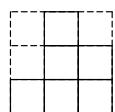  
从正面看

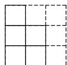  
从左面看

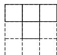  
从上面看  
第 18 题解图

(8 分)

19. 解: (1) 因为 a<0, b<0, $|a|>|b|>1$ ,

所以 $a < b < -1$ . …… (1 分)

因为 $c$ 为最小的正整数，

所以 c=1. …… (2 分)

A,B,C三点在数轴上的大致位置如解图所示；
……(5分)

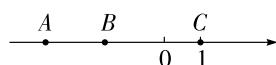  
第 19 题解图

(2)由(1)知 a<b<0, c=1,

所以 a-b<0, b-a+c>0, b-2c<0,

所以 $|a-b|+2|b-a+c|-|b-2c|$

$$
= b - a + 2 (b - a + c) - (2 c - b)
$$

$$
= b - a + 2 b - 2 a + 2 c - 2 c + b
$$

$$
= - 3 a + 4 b. \dots \tag {10分}
$$

20. 解: (1) 因为正数 > 负数,

且 23>17>11，

所以这 7 个班中 5 班所挖地瓜的数量最多;

……（5分）

(2) 因为 $+17+(-13)+(-9)+11+23+(-5)+$ $(-18)=6,$

所以与标准数量比较,7个班所挖地瓜数量总计多出6个. …… (10分)

21. 解: (1) 根据题意, 可列式子为: $-2+(-3)\times7=-2-21=-23$ (答案不唯一); …… (4 分)

(2)因为三个整式组成的新的整式不含常数项，

所以可从第一组数字中选择-2,从第二组多项式中选择 $m^{2}+n^{2}+2,m^{2}-n^{2}$ ，……（7分）

并使用加减符号连接得到 $m^2 + n^2 + 2 - (m^2 - n^2)$

$$
+ (- 2) = m ^ {2} + n ^ {2} + 2 - m ^ {2} + n ^ {2} - 2 = 2 n ^ {2},
$$

当 n=3 时, 原式 $=2 \times 3^{2} = 18$ (答案不唯一).

……（10分）

22. 解: (1)48; …… (4 分)

【解法提示】由图②可得,大长方形的宽为 $c+b-a$ , 由图③可得,大长方形的长为 $a+b+c$ , 所以大长方形的周长为 $2(c+b-a+a+b+c)=4b+4c$ , 当 b=5, c=7 时, $4b+4c=48$ , 故大长方形的周长为 48.

(2) $l_{1}=l_{2}$ ，理由如下：……（6分）

由(1)知,大长方形的宽为 $c+b-a$ ,

由图③可得, $l_{1}=2(a+b)+2(c+b-a-a)$

$$
= 2 a + 2 b + 2 c + 2 b - 4 a
$$

$$
= - 2 a + 4 b + 2 c,
$$

$$
l _ {2} = 2 (b + c) + 2 (c + b - a - c)
$$

$$
= 2 b + 2 c + 2 b - 2 a
$$

$$
= - 2 a + 4 b + 2 c,
$$

所以 $l_{1}=l_{2}$ . …… (12 分)

# 中档解答题题组(二)

18. 解: 因为 a, b 互为相反数, c, d 互为倒数, x 是最大的负整数,

所以 $a+b=0, cd=1, x=-1.$ …… (6 分)

所以原式 $= (-1)^{2} - (0 + 1)\times (-1) - 0^{2} + (-1)^{5}$

$$
= 1 + 1 - 1
$$

=1. …… (8分)

19. 解: (1) 这四家公共场所在数轴上表示如解图所示;

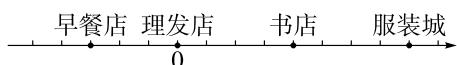  
第 19 题解图

……（4分）

(2)依题意得早餐店与服装城之间的距离为 $400-(-150)=550(m)$ ,

答:早餐店与服装城之间的距离为 550 m. …
…… (9 分)

20. 解: (1) 多项式 A, B, C 是“友好多项式”,

理由如下：

因为 $(3x^{2}-x+1)-(2x^{2}-3x-2)$

$$
= 3 x ^ {2} - x + 1 - 2 x ^ {2} + 3 x + 2
$$

$$
= x ^ {2} + 2 x + 3,
$$

即 B-A=C，

所以多项式 A, B, C 是“友好多项式”；… (3 分)

(2)因为多项式 D 与多项式 A, B 是“友好多项式”, 所以分三种情况:

① $(2x^{2}-3x-2)-(3x^{2}-x+1)$

$$
= 2 x ^ {2} - 3 x - 2 - 3 x ^ {2} + x - 1
$$

$= -x^{2} - 2x - 3;$ ……（5分）

② $(3x^{2}-x+1)-(2x^{2}-3x-2)$

$$
= 3 x ^ {2} - x + 1 - 2 x ^ {2} + 3 x + 2
$$

$= x^{2} + 2x + 3$ ，7分）

③ $(3x^{2}-x+1)+(2x^{2}-3x-2)$

$$
= 3 x ^ {2} - x + 1 + 2 x ^ {2} - 3 x - 2
$$

$$
= 5 x ^ {2} - 4 x - 1.
$$

所以多项式 D 是 $-x^{2}-2x-3$ 或 $x^{2}+2x+3$ 或 $5x^{2}-4x-1$ . …… (10 分)

21. 解: (1) 由题图可知, 该牛奶盒的长为 6 cm,

且高+宽=14 cm, 高+长=16 cm,

所以牛奶盒的高为 $16-6=10(\text{cm})$ ，宽为 14-10=4(cm)，……（3分）

所以容积= $6\times4\times10=240(cm^{3})$ ; …… (5分)

(2)由(1)得牛奶盒的长,宽,高分别为6 cm,4 cm,10 cm,

所以该牛奶盒的表面积 $S=2\times(4\times6+4\times10+6\times10)=248(\mathrm{~cm}^{2})$ ，……（8分）

所以粘贴角料的面积 $S_{阴影} = \frac{1}{8} \times 248 = 31$ $(cm^{2})$ ,

故一个牛奶盒需要纸板的面积为 $S=248+31=$ $279(\mathrm{~cm}^{2})$ . …… (11 分)

22. 解: (1) 根据题意得, 二等奖奖品的数量为 $(2a + 5)$ 件, 三等奖奖品的数量为 $60 - a - (2a + 5) = (55 - 3a)$ 件, 补全表格如下; …… (4 分)

<table><tr><td></td><td>一等奖奖品</td><td>二等奖奖品</td><td>三等奖奖品</td></tr><tr><td>单价(元)</td><td>50</td><td>35</td><td>10</td></tr><tr><td>数量(件)</td><td>a</td><td>2a+5</td><td>55-3a</td></tr></table>

(2) $50a + 35(2a + 5) + 10(55 - 3a) = 90a + 725$

所以购买 60 件奖品所需的总费用为 $(90a + 725)$ 元；……（8 分）

(3) 当 a = 8 时, $90a + 725 = 90 \times 8 + 725 = 1445$ (元),

答:购买本次大赛奖品共需1445元. ……

……（12分）

# 专题 数轴上的动点问题

# 一题多设问

例 解:(1)-4,5;

(2)9;【解法提示】由题图可得,点 A,B 在数轴上表示的数分别为 -4,5,所以点 A,B 之间的距离为 $5-(-4)=9$ .  
(3) 因为点 P 到点 A, B 的距离相等,

所以点 P 对应的数 x 的值为 $\frac{-4+5}{2}=\frac{1}{2}$ ;

(4)折叠前 A, B 两点之间的距离为 9, 折叠后 A, B 两点之间的距离为 3,

所以 B, C 两点之间的距离为 $(9-3) \div 2 = 3$ ,
5-3=2,所以点 C 表示的数为 2;

(5)由点 A, B 在数轴上的位置可知，

点 A 所表示的数为 -4, 点 B 所表示的数为 5,

因为点 D 由点 A 向左移动 1 个单位长度, 再向右移动 9 个单位长度得到的,

所以点 D 表示的数为 $-4-1+9=4$ ，

所以 $BD = |4 - 5| = 1$ ,

所以 B, D 两点间的距离是 1 个单位长度;

(6)P,Q之间的距离为1时,分两种情况讨论:

①当点 P 在点 Q 的左侧时，  
(9-1)÷(1+1.5)=3.2(秒),   
②当点 P 在点 Q 的右侧时，

$(9+1)\div(1+1.5)=4$ （秒）.

综上所述, P, Q 两点之间的距离为 1 时, 运动时间 t 的值为 3.2 秒或 4 秒.

# 综合训练

1. 解:(1)14;【解法提示】点 B 表示的数为 $6 \times 3 - 4 = 14$ .

(2)-3;【解法提示】点 A 表示的数为 $(-13+4)\div3=-3$ .  
(3) 若点 A 表示的数为 -1,

则第一次操作后得到的对应点所表示的数是-1 $\times3-4=-7$ ,

第二次操作后得到的对应点所表示的数是 $-7\times3-4=-25$ ，

第三次操作后得到的对应点所表示的数是 $-25\times3-4=-79$ ，

第四次操作后得到的对应点所表示的数是 $-79\times3-4=-241$ ，

第五次操作后得到的对应点所表示的数是-241×3-4=-727，

第六次操作后得到的对应点所表示的数是-727×3-4=-2185，

...

由以上规律可得,得到的对应点所表示的数的个位数以7,5,9,1四个数循环,

因为 $2023 \div 4 = 505 \cdots 3$ ,

所以第 2023 次操作得到的对应点所表示的数的个位数字是 9.

2. 解: (1) 因为在数轴上点 A 和点 B 分别表示的数为 -10, -4,

所以数轴上点 A 和点 B 的距离为 $-4-(-10)=6$ ,

因为在刻度尺上的数字 0 对齐数轴上的点 A, 点 B 对齐刻度 1.8 cm,

所以在刻度尺上点 A 和点 B 的距离为 1.8 cm，
所以数轴上的一个单位长度对应刻度尺上的长度是 $\frac{1.8}{6}=0.3(\text{cm})$ ;

(2)因为在刻度尺上点 A 和点 C 的距离为 5.4 cm,

所以在数轴上点 A 和点 C 的距离为 $\frac{5.4}{0.3}=18$ ,

所以点 C 表示的数为 $-10+18=8$ ,
所以 c=8;

(3) 因为 P, B 两点的距离为 4,

所以 P 在图②中对应刻度尺上的 P, B 两点的距离为 $4 \times 0.3 = 1.2$ ,

又因为在刻度尺上点 B 对齐刻度 1.8 cm,

所以 1.8-1.2=0.6 或 $1.8+1.2=3.0$ ,

所以点 P 在图②中对应刻度尺上的读数为 0.6 或 3.0.

# 第四章 基本平面图形

# 周测 10 线段、射线、直线

1. C 【解析】A 选项为射线 AB, 故错误; B 选项为线段 AB, 故错误; C 选项为直线 BA (或直线 AB), 故正确; D 选项在表示直线、射线、线段时, 应使用统一的字母, 不能大小写混用, 故错误.

2. B 【解析】在正常情况下,射击时要保证瞄准的那只眼在准星和缺口确定的直线上,才能射中目标,这说明了两点确定一条直线的道理.

3. B 【解析】点 A 在直线 $l_{1}$ 上；点 B 在直线 $l_{1}$ 外；直线 $l_{1}$ 与 $l_{2}$ 交于点 C，故 B 选项正确.

4. C 【解析】因为点 C 为线段 AB 的中点, 所以 $AC = \frac{1}{2} AB = 4$ , 当点 B 在点 A 的右侧时, 点 C 表示的数为 $2 + \frac{1}{2} AB = 2 + 4 = 6$ ; 当点 B 在点 A 的左侧时, 点 C 表示的数为 $2 - \frac{1}{2} AB = 2 - 4 = -2$ , 故选 C.

5. A 【解析】因为 AD=CE, DE=DC+CE, 所以 AC=AD+CD=CE+CD=DE=6, 因为点 C 是线段 AB 的中点, 所以 AB=2AC=12.

6. A 【解析】以点 A 为停靠点, 则所有人的路程之和为 $15 \times 100 + 10 \times 300 = 4500 \, (\text{m})$ ; 以点 B 为停靠点, 则所有人的路程之和为 $30 \times 100 + 10 \times 200 = 5000 \, (\text{m})$ ; 当在 A, B 之间停靠时, 设停靠点到 A 的距离是 $m (0 < m < 100)$ , 则所有人的路程之和为 $30m + 15(100 - m) + 10(300 - m) = 4500 + 5m > 4500$ ; 当在 B, C 之间停靠时, 设停靠点到 B 的距离是 $n (0 < n < 200)$ , 则所有人的路程之和为 $30(100 + n) + 15n + 10(200 - n) = 5000 + 35n > 4500$ , 所以该停靠点的位置应设在点 A, 故选 A.

7. ②;两点之间线段最短

8. 1;6;3

9. 20 cm 或 100 cm 【解析】分情况讨论: 当 B, D 两端在同侧时, $MN = CN - AM = \frac{1}{2}CD - \frac{1}{2}AB = 60 - 40 = 20 \, (\text{cm})$ ; 当 B, D 两端在两侧时, $MN = CN + AM = \frac{1}{2}CD + \frac{1}{2}AB = 60 + 40 = 100 \, (\text{cm})$ , 综上所

述,此时两张纸条的小圆孔之间的距离 MN 为 20 cm 或 100 cm.

10. 66 【解析】因为2条直线最多有1个交点,3条直线最多有3个交点,4条直线最多有6个交点,5条直线最多有10个交点,…,所以n条直线的交点最多为 $1+2+3+\cdots+(n-1)=\frac{n(n-1)}{2}$ (个),所以当画12条直线时,交点最多有 $\frac{12\times(12-1)}{2}=66$ (个).

11. 解: 3,9,AC,4.5,AB,3,线段中点的定义,1.5.
……(8分)

12. 解: 如解图即为所求作. …… (10 分)

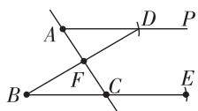  
第 12 题解图

13. 解:(1)因为点 C 是线段 AB 的中点,

所以 $AC = BC = \frac{1}{2} AB = 10$ ,

因为 AD : BC = 2 : 5 ,

所以 AD:10=2:5, 所以 AD=4,

所以 CD=AC-AD=10-4=6,……(4分)

因为 DE=8，所以 $CE=CD+DE=6+8=14$ ;

……（6分）

(2)作图如解图所示,……(9分)

由题意及(1)可得,DE=8,CD=6,

因为点 E 在点 C 右侧，

所以 CE=DE-CD=8-6=2. …… (12 分)

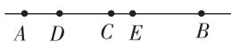  
第 13 题解图

# 周测 11 角及多边形和圆的初步认识

1. B 【解析】A. $\angle O$ 无法表示一个角, 故此选项不符合题意; B. $\angle AOB, \angle O, \angle 1$ 三种方法表示同一个角, 故此选项符合题意; C. $\angle O$ 无法表示一个角, 故此选项不符合题意; D. $\angle O$ 无法表示一个角, 故此选项不符合题意.

2. B

# 大小卷·七年级(上) 数学 BS

3. C 【解析】 $\angle ABC=45^{\circ}+90^{\circ}=135^{\circ}$ , 故选 C.

4. C 【解析】由题图可知,从六边形的一个顶点出发最多可以引出3条对角线,这些对角线将六边形分割成4个三角形,所以m=3,n=4,m+n=7,故选C.

5. A 【解析】由折叠的性质可知 $\angle AOB = \angle A'OB$ , 因为 $\angle BOC = \angle A'OB + \angle A'OC$ , 所以 $\angle BOC > \angle A'OB$ , 所以 $\angle AOB < \angle BOC$ .

6. B 【解析】由题意得, $\angle COD=360^{\circ}\div8=45^{\circ}$ ,因为 $\angle AOB=60^{\circ}$ ,OC平分 $\angle AOB$ ,所以 $\angle BOC=\frac{1}{2}\angle AOB=30^{\circ}$ ,所以 $\angle BOD=\angle COD-\angle BOC=15^{\circ}$ .

7. 49,15,36 【解析】 $0.26^{\circ} = 0.26 \times 60' = 15.6'$ , $0.6' = 0.6 \times 60'' = 36''$ , 所以 $49.26^{\circ} = 49^{\circ}15'36''$ .

8. $120^{\circ}$ 【解析】此时分针处于 12, 时针处于 4, 每一个大格为 $30^{\circ}$ , 所以 $\angle A$ 的度数为 $30^{\circ} \times 4 = 120^{\circ}$ .

9. 南偏东 $12^{\circ}$ 【解析】由题意可知 OA 与正北方向的夹角为 $50^{\circ}$ ，则 OA 与正西方向的夹角为 $90^{\circ}-50^{\circ}=40^{\circ}$ 。因为 $\angle AOB=142^{\circ}$ ，所以 OB 与正南方向的夹角为 $142^{\circ}-40^{\circ}-90^{\circ}=12^{\circ}$ ，所以落单驯鹿位于点 O 的南偏东 $12^{\circ}$ 的方向。

10. 69°或46°【解析】因为 $\angle MPN=115^{\circ}$ , $PQ$ 是 $\angle MPN$ 的“胶着线”,则由“胶着线”的定义可知有两种情况符合题意:① $\angle NPQ:\angle MPQ=2:3$ ,此时 $\angle MPQ=115^{\circ}\times\frac{3}{2+3}=69^{\circ}$ ;② $\angle MPQ:\angle NPQ=2:3$ ,此时 $\angle MPQ=115^{\circ}\times\frac{2}{2+3}=46^{\circ}$ ,所以 $\angle MPQ=69^{\circ}$ 或46°.

11. 解: (1) 市图书馆在光明小区正北方向 1 km 处,

历史博物馆在光明小区北偏东 $60^{\circ}$ 方向 2.5 km 处；……（4 分）

(2)公交车行驶的总路程为 $1.5 + 2 + 1 + 2.5 = 7 \, (\text{km})$ ,

所以从市体育场行驶到历史博物馆大概需要 $\frac{7}{30}\times60=14(\min)$ . …… (8分)

12. 解: (1) 如解图, $\angle EOF$ , $\angle EOP$ 即为所求作; …… (6 分)

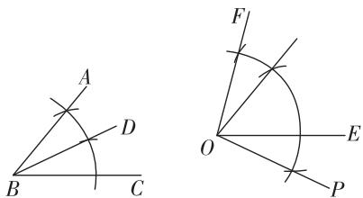

text_image

Geometric diagram showing two angles with labeled points and intersecting lines, likely illustrating a geometry proof or construction.

第 12 题解图

(2) 因为 BD 是 $\angle ABC$ 的平分线, $\angle ABC = 50^{\circ}$ ,
所以 $\angle CBD=\frac{1}{2}\angle ABC=\frac{1}{2}\times50^{\circ}=25^{\circ}$

$$
\angle E O F = \frac {3}{2} \angle A B C = 7 5 ^ {\circ}.
$$

$$
\angle E O P = \angle C B D = 2 5 ^ {\circ},
$$

所以 $\angle POF = \angle EOF + \angle EOP = 75^{\circ} + 25^{\circ} = 100^{\circ}$ .
……（10分）

13. 解: (1) $45^{\circ}-\frac{1}{2}\alpha$ ; …… (4 分)

【解法提示】因为 $\angle AOB = \alpha, \angle BOC = 90^{\circ}$ , 所以 $\angle AOC = 90^{\circ} + \alpha$ , 因为 $OD$ 平分 $\angle AOC$ , 所以 $\angle AOD = \frac{1}{2} \angle AOC = 45^{\circ} + \frac{1}{2} \alpha$ , 所以 $\angle BOD = \angle AOD - \angle AOB = 45^{\circ} + \frac{1}{2} \alpha - \alpha = 45^{\circ} - \frac{1}{2} \alpha$ .

(2) 结论: $\angle BOD = 45^{\circ} + \frac{1}{2}\alpha$ .

理由: 因为 $\angle BOC = 90^{\circ}$ ,

所以 $\angle AOC = 90^{\circ} - \alpha.$

因为 OD 平分 $\angle AOC$ ,

所以 $\angle AOD = \frac{1}{2}\angle AOC = 45^{\circ} - \frac{1}{2}\alpha$

所以 $\angle BOD = \angle AOD + \alpha = 45^{\circ} - \frac{1}{2}\alpha + \alpha = 45^{\circ} + \frac{1}{2}\alpha;$ …… (7 分)

(3) $45^{\circ}+\frac{1}{2}\alpha.$ (9分)

理由: 因为 $\angle AOB = \alpha, \angle BOC = 90^{\circ}$ ,

所以 $\angle AOC = \alpha - 90^{\circ}$ .

因为 OD 平分 $\angle AOC$ ,

所以 $\angle AOD = \frac{1}{2}\angle AOC = \frac{1}{2}\alpha -45^{\circ},$

所以 $\angle BOD = \alpha -\angle AOD = \alpha -(\frac{1}{2}\alpha -45^{\circ}) = 45^{\circ}+$

$\frac{1}{2}\alpha.$ (12分)

# 专题 与线段中点有关的问题

# 教材原题改编练

教材原题 解:如解图,因为 AB=4 cm, BC=3 cm,

所以 $AC = AB + BC = 4 + 3 = 7 \, cm$ ,

因为点 O 是线段 AC 的中点，

所以 $OC=\frac{1}{2}AC=\frac{1}{2}\times7=3.5\ cm$ ,

所以 OB=OC-BC=3.5-3=0.5 cm.

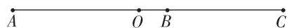  
原题解图

改编 1 解: 因为 AO:OC=2:3, 所以 OC= $\frac{3}{2}$ OA,

因为 O 是 AB 的中点, 所以 OB = OA = $\frac{1}{2}$ AB,

因为 BC=OC-OB,

所以 $BC = OC - OA = \frac{3}{2}OA - OA = \frac{1}{2}OA = 3 \, cm$ ，所以 $OA = 6 \, cm$ ，

所以 $AC = OA + OB + BC = 6 + 6 + 3 = 15 \, cm.$

改编 2 解: 因为点 B 是线段 AC 的中点, 所以 AC = 2AB = 2 × 5 = 10 cm,

又因为 AE=4EC,

所以 $AC = AE + EC = 4EC + EC = 5EC = 10 \, cm$ ，所以 $EC = 2 \, cm$ ，

所以 $AE=4EC=4\times2=8\ cm$ ,

因为点 O 是线段 AE 的中点, 所以 $OA = \frac{1}{2}AE = \frac{1}{2} \times 8 = 4 \, cm$ .

改编3 解:(1)若点F在点O的右侧,则补全图形如解图①;

若点 F 在点 O 的左侧, 则补全图形如解图②;

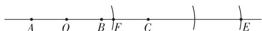  
图①

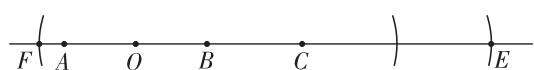

text_image

F A O B C E

图②  
改编 3 题解图

(2) 因为 O 是 AB 的中点, AB = 6 cm,

所以 AO=BO=3 cm,

因为 BC=4 cm, 所以 CE=2BC=8 cm,

所以 $OF=\frac{1}{3}BE=\frac{1}{3}(BC+CE)=\frac{1}{3}\times12=4\ cm.$

当 F 在点 O 的右侧时, CF = AC - AO - OF = 3 cm,

当 F 在点 O 的左侧时, $CF = BC + BO + OF = 11 \, cm$ ,

综上所述,CF 的长为 3 cm 或 11 cm.

改编 4 解: (1) 当动点 B 由 A 到 C 运动时, 此时 $0 \leqslant t \leqslant 10$ ,

$$
A B = 2 t, B C = 2 0 - 2 t, O C = \frac {1}{2} B C = (1 0 - t) \mathrm{cm};
$$

当点 B 由 C 到 A 运动时, 此时 $10 < t \leqslant 20$ ,

$$
B C = 2 t - 2 0, O C = \frac {1}{2} B C = (t - 1 0) \mathrm{cm}.
$$

综上所述, 当 $0 \leqslant t \leqslant 10$ 时, $OC = (10 - t) \, \text{cm}$ ; 当 10 < t $\leqslant 20$ 时, $OC = (t - 10) \, \text{cm}$ ;

(2) 线段 OE 的长不发生变化, OE = 10 cm.

分情况讨论如下：

①当点 B 从 A 运动到 C 时, $0 \leqslant t \leqslant 10$ ,

此时 AB=2t, BC=20-2t, 因为点 E 是线段 AB 的中点,

所以 $BE=\frac{1}{2}AB=\frac{1}{2}\times2t=t(\text{cm})$ ，又点 O 是线段 BC 的中点，

所以 $OB=\frac{1}{2}BC=\frac{1}{2}\times(20-2t)=(10-t)$ cm,

所以 $OE=BE+OB=t+(10-t)=10\ cm;$

②当点 B 从 C 运动到 A 时, $10 < t \leqslant 20$ ,

此时 BC=2t-20, AB=20-(2t-20)=40-2t,

因为点 E 是线段 AB 的中点，

所以 $BE=\frac{1}{2}AB=\frac{1}{2}\times(40-2t)=(20-t)$ cm,

又点 O 是线段 BC 的中点，

所以 $OB=\frac{1}{2}BC=\frac{1}{2}\times(2t-20)=(t-10)$ cm,

所以 $OE=BE+OB=20-t+(t-10)=10\ cm$ ,

综上所述,线段 OE 的长不发生变化,且 OE 的长为 10 cm.

# 综合训练

1. 解: (1) 因为 $AB = 30 \, cm$ , 点 D 是 AB 的中点,

所以 $AD = BD = \frac{1}{2} AB = 15 \, cm$ ,

因为 AC=2BC,

所以 $BC=\frac{1}{3}AB=10\ cm$ ,

大小卷·七年级(上) 数学 BS

所以 CD=BD-BC=15-10=5 cm;

(2) 因为 AC=2BC，点 D 为 AB 的中点，

所以 $AC=\frac{2}{3}AB, AD=\frac{1}{2}AB.$

如解图,因为点 E 为 AC 的中点,

所以 $AE=\frac{1}{2}AC=\frac{1}{2}\times\frac{2}{3}AB=\frac{1}{3}AB$ ,

所以 $DE = AD - AE = \frac{1}{2} AB - \frac{1}{3} AB = \frac{1}{6} AB = 4\mathrm{cm}$

所以 AB = 24 cm.

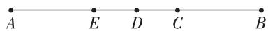  
第1题解图

2. 解: (1) 30; 【解法提示】由折叠的性质得, AE = A'E, BF = B'F, 所以当点 A' 与点 B' 恰好重合时, $EF = A'E + B'F = \frac{1}{2} AB = 30 \, cm$ .

(2) 当点 $A'$ 落在点 $B'$ 的左侧时，

因为 $AE + A'E + A'B' + B'F + BF = 60 \, cm, A'B' = 10 \, cm,$

所以 $AA' + BB' = 50 \, cm$ ,

由折叠的性质得, $AE=A'E$ , $BF=B'F$ ,

所以 $A'E + B'F = 25 \, cm$ ,

所以 $EF = A'E + A'B' + B'F = 35 \, cm$ ;

(3) $(30+\frac{1}{2}x)$ cm 或 $(30-\frac{1}{2}x)$ cm.【解法提示】根据题意可知, E, F 分别为 $AA'$ , $BB'$ 的中点, 即 $A'E=\frac{1}{2}AA', B'F=\frac{1}{2}BB'$ , 分两种情况讨论: ①当点 $A'$ 落在点 $B'$ 左侧时, 由 (2) 知, $EF=A'B'+\frac{1}{2}AA'+\frac{1}{2}BB'= \frac{1}{2}(A'B'+AA'+BB')+\frac{1}{2}A'B'= \frac{1}{2}AB+\frac{1}{2}A'B'=(30+\frac{1}{2}x)$ cm; ②当点 $A'$ 落在点 $B'$ 右侧时, 因为 $AA'+BB'=AB+A'B'=(60+x)$ cm, 所以 $AE+BF=\frac{1}{2}AA'+\frac{1}{2}BB'=(30+\frac{1}{2}x)$ cm, 所以 $EF=AB-(AE+BF)=60-(30+\frac{1}{2}x)=(30-\frac{1}{2}x)$ cm, 综上所述, EF 的长度为 $(30+\frac{1}{2}x)$ cm 或 $(30-\frac{1}{2}x)$ cm.

# 专题 与角平分线有关的问题

# 方法分类练

1. 解: 因为 OD, OE 分别平分 $\angle AOB, \angle BOC,$

所以 $\angle BOD = \frac{1}{2}\angle AOB,\angle BOE = \frac{1}{2}\angle BOC$

因为 $\angle BOD - \angle BOE = \angle DOE$ ,

所以 $\angle DOE = \frac{1}{2} (\angle AOB - \angle BOC) = \frac{1}{2}\angle AOC,$

所以 $\angle AOC = 2 \angle DOE = 30^{\circ}$ .

2. 解: (1) $130^{\circ}$ ; 【解法提示】由折叠的性质, 得 $\angle 1 = \angle ABC = 25^{\circ}$ , 所以 $\angle A'BD = 180^{\circ} - 25^{\circ} - 25^{\circ} = 130^{\circ}$ .

(2)由折叠性质得 $\angle 1 = \angle ABC = \frac{1}{2}\angle ABA^{\prime},\angle 2$ $= \angle DBE = \frac{1}{2}\angle A^{\prime}BD$ ，所以 $\angle CBE = \angle 1 + \angle 2 =$ $\frac{1}{2}\angle ABA^{\prime} + \frac{1}{2}\angle A^{\prime}BD = \frac{1}{2} (\angle ABA^{\prime} + \angle A^{\prime}BD) = \frac{1}{2}\times$ $180^{\circ} = 90^{\circ}.$

3. 解: 分情况讨论如下:

①如解图①，

当射线 OC, OD 位于直线 AB 同侧时，

因为 $\angle COD=90^{\circ},\angle AOC=50^{\circ}$ ,

所以 $\angle AOD = \angle COD + \angle AOC = 90^{\circ} + 50^{\circ} = 140^{\circ}$ ,

所以 $\angle BOD = 180^{\circ} - \angle AOD = 180^{\circ} - 140^{\circ} = 40^{\circ}$ ,

因为 OE 是 $\angle AOD$ 的平分线，

所以 $\angle EOD=\frac{1}{2}\angle AOD=\frac{1}{2}\times140^{\circ}=70^{\circ}$

所以 $\angle BOE = \angle BOD + \angle EOD = 40^{\circ} + 70^{\circ} = 110^{\circ}$

②如解图②, 当射线 OC, OD 位于直线 AB 两侧时,

因为 $\angle COD=90^{\circ},\angle AOC=50^{\circ},$

所以 $\angle AOD = \angle COD - \angle AOC = 90^{\circ} - 50^{\circ} = 40^{\circ}$ ,

因为 OE 是 $\angle AOD$ 的平分线，

所以 $\angle AOE = \frac{1}{2}\angle AOD = \frac{1}{2}\times 40^{\circ} = 20^{\circ},$

所以 $\angle BOE = 180^{\circ} - \angle AOE = 180^{\circ} - 20^{\circ} = 160^{\circ}$ ,
综上所述, $\angle BOE$ 的度数为 $110^{\circ}$ 或 $160^{\circ}$ .

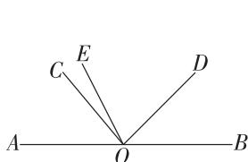

text_image

A
O
B
C
E
D

图①

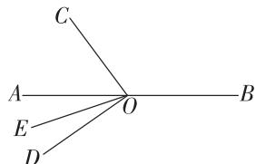

text_image

C
A — O — B
E
D

图②  
第3题解图

4. 解: 当 OA 在 OB 的下方时, 如解图①,

因为 OC 是 $\angle BOD$ 的平分线, $\angle BOD = 120^{\circ}$ ,所以 $\angle BOC = \frac{1}{2}\angle BOD = 60^{\circ},$

因为 $\angle COE = 30^{\circ}$

所以 $\angle BOE = \angle BOC - \angle COE = 60^{\circ} - 30^{\circ} = 30^{\circ}$ 因为 $\angle AOB: \angle BOE = 3:2$ ，所以 $\angle AOB = 45^{\circ}$ ，所以 $\angle AOC = \angle AOB + \angle BOC = 45^{\circ} + 60^{\circ} = 105^{\circ}$

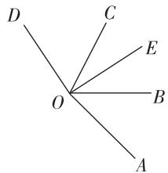

text_image

D
C
E
O
B
A

图①

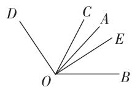  
图②  
第 4 题解图

当 OA 在 OB 的上方时,如解图②,

同理可得 $\angle BOC = 60^{\circ}, \angle AOB = 45^{\circ}$ ,

所以 $\angle AOC = \angle BOC - \angle AOB = 60^{\circ} - 45^{\circ} = 15^{\circ}$ ,

综上所述, $\angle AOC$ 的度数为 $105^{\circ}$ 或 $15^{\circ}$ .

# 综合训练

1. 解: 不会发生变化. 理由如下:

因为 CE, CF 分别是 $\angle ACD$ 和 $\angle BCD$ 靠近 CD 的三等分线, $\angle ACB = 90^{\circ}$ ,

所以 $\angle ECF = \angle ECD + \angle FCD = \frac{1}{3} \angle ACD +$

$$
\frac {1}{3} \angle B C D = \frac {1}{3} (\angle A C D + \angle B C D) = \frac {1}{3} \angle A C B = \frac {1}{3} \times
$$

$$
9 0 ^ {\circ} = 3 0 ^ {\circ}.
$$

2. 解: 分情况讨论如下:

①如解图①,射线 OC 在 $\angle AOB$ 内部,

因为 OE 平分 $\angle AOC, OF$ 平分 $\angle BOC, \angle AOB = 90^{\circ}$ ,

所以 $\angle EOF = \angle EOC + \angle COF = \frac{1}{2} (\angle AOC +$

$$
\angle C O B) = \frac {1}{2} \angle A O B = 4 5 ^ {\circ};
$$

②如解图②, 射线 OC 在 $\angle AOB$ 外部且 $\angle AOC$ 是钝角, $\angle BOC$ 是锐角,

因为 OE 平分 $\angle AOC, OF$ 平分 $\angle BOC,$

所以 $\angle COE = \frac{1}{2}\angle AOC = \frac{1}{2} (\angle AOB + \angle BOC)$

$$
\angle C O F = \frac {1}{2} \angle B O C,
$$

所以 $\angle EOF = \angle COE - \angle COF = \frac{1}{2} (\angle AOB + \angle BOC) - \frac{1}{2}\angle BOC = \frac{1}{2}\angle AOB = \frac{1}{2}\times 90^{\circ} = 45^{\circ};$

③如解图③, 射线 OC 在 $\angle AOB$ 外部且 $\angle AOC$ 和 $\angle BOC$ 都是钝角，

因为 OE 平分 $\angle AOC, OF$ 平分 $\angle BOC, \angle AOB = 90^{\circ}$ ,

所以 $\angle EOF = \angle EOC + \angle COF = \frac{1}{2} \angle AOC + \frac{1}{2} \angle BOC = \frac{1}{2}(360^{\circ} - \angle AOB) = 135^{\circ};$

④如解图④, 射线 OC 在 $\angle AOB$ 外部且 $\angle AOC$ 是锐角, $\angle BOC$ 是钝角,

因为 OE 平分 $\angle AOC, OF$ 平分 $\angle BOC,$

所以 $\angle EOF = \angle COF - \angle COE = \frac{1}{2}\angle BOC - \frac{1}{2}\angle AOC$

$$
= \frac {1}{2} (\angle B O C - \angle A O C) = \frac {1}{2} \angle A O B = 4 5 ^ {\circ}.
$$

综上所述, $\angle EOF$ 的度数为 $45^{\circ}$ 或 $135^{\circ}$ .

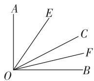  
图①

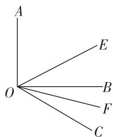

text_image

A
O
E
B
F
C

图②

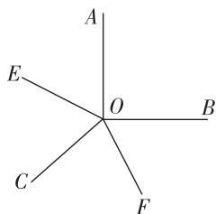

text_image

A
E
O
B
C
F

图③

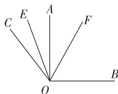

text_image

C E A F
O B

图④  
第2题解图

3. 解: (1) 依题意可知, $\angle AOB = 60^{\circ}$ , $\angle COD = 45^{\circ}$ ,
因为 $\angle COB=20^{\circ}$ ,

所以 $\angle BOD = \angle COD - \angle COB = 25^{\circ}$ ,

所以 $\angle AOD = \angle AOB + \angle BOD = 60^{\circ} + 25^{\circ} = 85^{\circ}$

(2) 因为 OB 平分 $\angle COD$ ,

所以 $\angle BOD = \frac{1}{2}\angle COD = 22.5^{\circ},$

所以 $\angle AOD = \angle AOB + \angle BOD = 60^{\circ} + 22.5^{\circ} = 82.5^{\circ}$

(3) 存在. 分为两种情况:

①当 $\angle BOC:\angle BOD=2:1$ 时,如解图①,

# 大小卷·七年级(上) 数学 BS

设 $\angle BOD = x^{\circ}$

因为 $\angle BOC: \angle BOD = 2:1$ ,

所以 $\angle BOC = 2x^{\circ}$ ,

又因为 $\angle BOC + \angle BOD = \angle COD = 45^{\circ}$ ,

即 $2x + x = 45$ ,

解得 x=15，

所以 $\angle BOD = 15^{\circ}$ ,

所以 $\angle AOD = \angle AOB + \angle BOD = 60^{\circ} + 15^{\circ} = 75^{\circ}$

②当 $\angle BOD:\angle BOC=2:1$ 时,如解图②,

设 $\angle BOC = y^{\circ}$

因为 $\angle BOD: \angle BOC = 2:1$ ,

所以 $\angle BOD = 2y^{\circ}$ ,

又因为 $\angle BOC + \angle BOD = \angle COD = 45^{\circ}$ ,

即 $y+2y=45$ ,

解得 y=15，

所以 $\angle BOD = 30^{\circ}$ ,

所以 $\angle AOD = \angle AOB + \angle BOD = 60^{\circ} + 30^{\circ} = 90^{\circ}$

综上所述,存在某一时刻,使得 $\angle BOC$ 的度数与 $\angle BOD$ 的度数是2倍的关系,此时 $\angle AOD$ 的度数为 $75^{\circ}$ 或 $90^{\circ}$ .

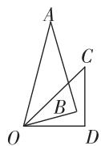  
图①

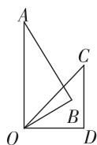  
图②  
第3题解图

# 第五章 一元一次方程

# 周测 12 认识方程及一元一次方程的解法

1. C 【解析】由方程的概念可知:用不同的代数式表示相等的量,像这样含有未知数的表示量相等的等式称为方程,所以 $4x+6$ 不是方程,故选 C.

2. C 【解析】把 x = -3 代入 3x = 9，得左边 $-3 \times 3 = -9$ ，右边 = 9，左边 ≠ 右边，A 选项不符合题意；把 x = -3 代入 $-x + 3 = 0$ ，得左边 $-(-3) + 3 = 6$ ，右边 = 0，左边 ≠ 右边，B 选项不符合题意；把 x = -3 代入 $2(x - 1) = x - 5$ ，得左边 $2(-3 - 1) = -8$ ，右边 = -3 - 5 = -8，左边 = 右边，C 选项符合题意；把 x = -3 代入 $\frac{2x + 1}{3} = \frac{3}{2}$ ，得左边 $\frac{2 \times (-3) + 1}{3} = -\frac{5}{3}$ ，右边 = $\frac{3}{2}$ ，左边 ≠ 右边，D 选项不符合题意。

3. A 【解析】方程 3x-3=2x-2, 移项后为 3x-2x=-2+3.

4. B 【解析】若 x=y，则 $x+5=y+5$ ，原变形错误，A 选项不符合题意；若 x=y，则 $-\frac{1}{2}x=-\frac{1}{2}y$ ，原变形正确，B 选项符合题意；若 mx=my，当 m=0，则 x 不一定等于 y，原变形错误，C 选项不符合题意；若 $\frac{x}{3}=\frac{y}{2}$ ，则 2x=3y，原变形错误，D 选项不符合题意，故选 B.

5. C 【解析】由题意可知 L=22.5 cm, 代入换算公式得 $22.5=\frac{M+10}{2}$ , 解得 M=35, 即适合他的鞋码为 35 码, 故选 C.

6. D 【解析】根据 $x \otimes y = 2xy + x - y$ ，得 $m \otimes 2 = 2 \times m \times 2 + m - 2 = 13$ ，解得 m = 3.

7. $x = -\frac{2}{3}$ 【解析】移项得 3x = -2，系数化为 1 得， $x=-\frac{2}{3}.$

8. -4 【解析】因为 $(4-m)x^{|m|-3}-16=0$ 是关于 x 的一元一次方程, 所以 $|m|-3=1$ 且 $4-m\neq0$ , 解

得 $m = -4$

9. 1 【解析】设被黑点遮住的常数是 m，因为 x = -2 是方程 $\frac{x-4}{3} = \frac{x}{2} - m$ 的解，所以 $\frac{-2-4}{3} = \frac{-2}{2} - m$ ，解得 m = 1.

10. 11 【解析】设哥哥今年 x 岁, 则弟弟今年 $(x-4)$ 岁, 妈妈今年的年龄是 $(x-4+x)\times2=(4x-8)$ 岁, 由题意得 $(18+x)+(18+x-4)=18+4x-8$ , 解得 x=11, 即哥哥今年 11 岁.

11. 解: (1) 移项, 得 5y-y=-9-1,
合并同类项, 得 4y=-10,

系数化为 1, 得 $y = -\frac{5}{2}$ ; …… (3 分)

(2) 去分母, 得 $3(3x+2)-12x=2(1-x)$ ,

去括号, 得 $9x+6-12x=2-2x$ ,

移项, 得 $9x - 12x + 2x = 2 - 6$ ,

合并同类项,得-x=-4,

系数化为 1, 得 x=4; …… (6 分)

(3) 解法一: 去括号, 得 $-8x + 4 = -2x + 14$ ,

移项,得 $-8x+2x=14-4$ ,

合并同类项,得-6x=10,

系数化为 1, 得 $x = -\frac{5}{3}$ ; …… (9 分)

解法二:两边都除以-2,得4x-2=x-7,

移项, 得 $4x - x = -7 + 2$ ,

合并同类项, 得 3x = -5,

系数化为 1, 得 $x = -\frac{5}{3}$ ; …… (9 分)

(4) 解法一: 去括号, 得 $\frac{1}{3}x + 2 - 1 = 4 - \frac{2}{5}x$ ,

移项, 得 $\frac{1}{3}x + \frac{2}{5}x = 4 - 2 + 1$ ,

合并同类项,得 $\frac{11}{15}x=3$ ,

系数化为 1, 得 $x=\frac{45}{11}$ ; …… (12 分)

解法二:两边都乘15,得 $5(x+6)-15=6(10-x)$ ,

去括号, 得 $5x + 30 - 15 = 60 - 6x$ ,

移项, 得 $5x + 6x = 60 - 30 + 15$ ,

# 大小卷·七年级(上) 数学 BS

合并同类项,得 11x=45,

系数化为 1, 得 $x=\frac{45}{11}$ . …… (12 分)

12. 解: 设大约 x 天能看完,

由题意得: $40+2\times10+20(x-2)=400$ ,

去括号, 得 $40+20+20x-40=400$ ,

移项, 得 20x = 400 - 40 - 20 + 40,

合并同类项, 得 20x = 380,

系数化为 1, 得 x = 19,

答:照这样的速度,活动开始后大约19天能看完这本书. …… (8分)

13. 解:(1)小凡同学的解题过程错误在:第二步方程右边去括号时变号不完全,第三步移项时没有变号; …… (2分)

(2) $3(3x-1)=6-2(2x-2)$ ,

$$
9 x - 3 = 6 - 4 x + 4,
$$

$$
9 x + 4 x = 6 + 4 + 3,
$$

$$
1 3 x = 1 3,
$$

x=1.……(8分)

14. 解: (1) m=1 时, 原方程为 $4(x-1)=3x-12$ ,
去括号, 得 4x-4=3x-12,

解得 x = -8; …… (3 分)

(2)因为 $\frac{m + 4}{5}$ 与 $\frac{3}{5}$ 互为相反数，

则 $\frac{m+4}{5}=-\frac{3}{5}$ ，解得m=-7，

则原方程为 $4(x-1)=-21x+4$ ,

去括号, 得 $4x-4=-21x+4$ ,

移项合并,得 25x=8,

解得 $x=\frac{8}{25}$ ; …… (6 分)

(3)由题意得方程 $4(x-1)=-3mx-2(m+5)$ 的解为 x=1，

代入,得 $0=-3m-2(m+5)$ ,

去括号,得 0=-3m-2m-10,

移项合并,得 5m=-10, 解得 m=-2,

代入原方程,得 $4(x-1)=-6x-6$ ,

去括号,得 4x-4=-6x-6,

移项合并,得 10x=-2,

解得 $x=-\frac{1}{5}$ ; …… (9 分)

(4) 存在.

将 $-x+4=\frac{-2-x}{3}$ 去分母,得 $-3x+12=-2-x$ ,

解得 x=7，所以原方程的解为 x=14，

代入,得 $52=42m-2(m+5)$ ,

去括号, 得 52 = 42m - 2m - 10,

移项合并,得 40m=62,

解得 $m=\frac{31}{20}$ . …… (12 分)

# 周测 13 一元一次方程的应用

1. A 【解析】折后售价为 $2500 \times 0.8$ ，根据售价-进价=利润，可列方程 $2500 \times 0.8 - x = 400$ ，故选 A.

2. D 【解析】根据题意得,原两位数为 $10+x$ , 新两位数为 $10x+1$ , 得 $10x+1-(10+x)=18$ .

3. D 【解析】设用于剪 B 型剪纸的硬纸片数量为 x，则用于剪 A 型剪纸的硬纸片数量为 $(26-x)$ ，由题意得 $2 \times 5x = 3(26 - x)$ .

4. B 【解析】设长方形 A 的长为 $x \, cm$ ，则长方形 B 的长为 $(x+2) \, \text{cm}$ ，由题意可得 $4x = \frac{3}{2}(x+2) \times 2$ ，解得 x = 6，所以正方形的边长为 $8 \, cm$ ，面积为 $64 \, cm^2$ .

5. A 【解析】如解图,设两个社团都参加的学生人数为 x, 已知两个社团都参加的学生人数 = 参加戏剧社团的学生人数 + 参加汉服社团的学生人数 + 两个社团都不参加的学生人数 - 总人数, 所以可列方程为 $38 + 29 + 5 - 50 = x$ , 解得 x = 22.

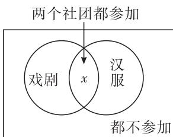

text_image

两个社团都参加
戏剧
x
汉服
都不参加

第5题解图

6. B 【解析】设小华上个月使用流量 x G, 因为 19 +2×30 = 79 < 124, 所以 x > 60, 根据题意, 得 19 + 2×30 + 3 (x - 60) = 124, 解得 x = 75, 所以小华上个月使用流量 75 G.

7. $20x+40\times(48-x)=1\ 020$ 【解析】购买了 x 张学生票, 则购买成人票 $(48-x)$ 张, 所以购买学生票共花费 20x 元, 购买成人票共花费 $[40\times(48-x)]$ 元, 因为师生购买门票共花费 1020 元, 所以可列方程为 $20x+40\times(48-x)=1\ 020$ .

8. 4 【解析】由图可知, $V_{甲}=6\times6\times x=36x$ , $V_{乙}=4\times4\times(x+5)=16(x+5)$ ，因为倒入后甲、乙两容器中溶液体积相等，所以 $36x=16(x+5)$ ，解得x=4.  
9. 4 【解析】设小明一共做了 $x \mathrm{~h}$ , 则爸爸一共做了 $(x - 2) \mathrm{~h}$ , 可设制作礼物的总工作量为 1, 则小明的工作效率为 $\frac{1}{8}$ , 爸爸的工作效率为 $\frac{1}{4}$ , 根据题意可得方程 $\frac{x}{8} + \frac{x - 2}{4} = 1$ , 解得 $x = 4$ , 所以礼物的制作共需 $4 \mathrm{~h}$ .  
10. $\frac{600+x}{36}=\frac{600-x}{4};36x-600=600-4x.$   
11. 解: 三角形的周长为 $6+8+10=24$ , 当去掉顶点 B 的钉子时, AC 为长方形的一条边长, 设长方形的另一条边长为 x,
由题意得 $2(x+8)=24$ ,
解得 x=4，
所以长方形的长为8,宽为4,……(6分)
面积为 $8 \times 4 = 32$ . …… (8 分)

12. 解: 设牧童有 x 人,

根据题意可列方程为 $6x+14=8x-2$ ,

解得 x=8，

所以竹竿有 $6 \times 8 + 14 = 62$ (根)，

答:有牧童8人,竹竿62根. …… (10分)

13. 解:(1)设小明出发 x min 后两人相遇,

根据题意可列方程为 $380x + 220(5 + x) = 3500$ ,
解得 x = 4.

答: 小明出发 4 min 后两人相遇; …… (5 分)
(2) 设经过 y min 后两人相距 1 100 m,

由题意得,当相遇前相距 1 100 m 时,0.38y+0.22y=3.5-1.1,

解得 y=4；……（8 分）

当相遇后相距 1 100 m 时，

$$
0. 3 8 y + 0. 2 2 y = 3. 5 + 1. 1,
$$

解得 $y=\frac{23}{3}$ . …… (11 分)

答: 经过 $4 \, min$ 或 $\frac{23}{3} \, min$ 后两人相距 $1100 \, m$ .
……（12 分）

# 第六章 数据的收集与整理

# 周测 14 丰富的数据世界、数据的收集

1. B

2. D 【解析】牛奶的主要组成成分不是用数值表示的,是定性数据,A 不符合题意;出行方式不是用数值表示的,是定性数据,B 不符合题意;宠物种类不是用数值表示的,是定性数据,C 不符合题意;百米测试所需要的时间是用数值表示的,是定量数据,D 符合题意.

3. B 【解析】A. 调查某小区住户一周的用水量因范围广, 应采用抽样调查; B. 高铁乘车旅客携带危险品情况的调查数据要求全面准确, 应采用全面调查; C. 调查市民骑电动车头盔佩戴情况因范围广, 应采用抽样调查; D. 对市场上某食品色素含量是否符合标准的调查因范围广, 应采用抽样调查, 故选 B.

4. C 【解析】所选取的样本需要具有广泛性和代表性,故方案三符合要求.

5. C 【解析】①为了解这 1 000 名学生的体重从中随机抽取了 300 名学生的体重进行统计分析,这种调查采用了抽样调查的方式,故原说法正确;②1 000 名学生的体重是总体,故原说法错误;③每名学生的体重是个体,故原说法正确;④300 名学生的体重是总体的一个样本,故原说法正确;⑤300 是样本容量,故原说法错误.所以正确的说法有 3 个.

6. 否;所取的样本容量太小,样本缺乏代表性(说法有理即可)

7. 60% 【解析】根据表格可知,莉莉某月内的练习次数一共有 $2+4+6+13+5=30$ (次), 练习时长超过 30 min 的次数一共有 $13+5=18$ (次), 所以练习时长超过 30 min 的次数占总练习次数的百分比为 $\frac{18}{30}\times100\%=60\%$ .

8. ①②④ 【解析】20÷40%=50(名),所以总共有50名学生参与调查,故②正确;50-10-8-20=12(名),故阅读社评类书籍的学生有12名,故①正确;10÷50×100%=20%,阅读科学类书籍的学生人数占调查总人数20%,故③错误;阅读文学类书籍的学生人数最少,为8名,故④

正确.

9. 解: (1) 表中的数据是通过观察、记录得到的; …… (2 分)

(2)由题意可知：

①B 队以 20 分的优势取胜；
②A 队的篮板球明显高于 B 队。（答案不唯一，合理即可）……（7 分）

10. 解: (1) 定量, 定性; …… (2 分)

【解法提示】测试成绩是用数值表示的,所以测试成绩是定量数据;测试等级不是用数值表示的,所以测试等级是定性数据.

(2)20,5;……(4分)

【解法提示】本次参加的总人数为 20(人)，所以 m=20-4-9-2=5.

(3)总体:该校七年级学生对航空航天知识的掌握情况,

个体:该校每名七年级学生的“航空航天”知识测试的测试成绩，

样本:抽取的 20 名七年级学生的“航空航天”知识测试的测试成绩，

样本容量:20; …… (7 分)

(4)人数最多的等级是什么？最高分是多少？
人数最多的等级是 B，最高分为 90。（答案不唯一，合理即可）……（9 分）

# 周测 15 数据的表示

1. B

2. B 【解析】出现点数 6 的频数是 9, 所以出现点数 6 的占比是 $\frac{9}{50}=0.18$ , 故选 B.

3. A 【解析】由折线统计图可知,小颖的成绩提升了 85-70=15(分),小林的成绩提高了 90-70=20(分),故小林的进步比较大.

4. C 【解析】小庆统计的小肥羊的总数量为 20+40+90+30+20=200(只), 故 A 选项正确, 不符合题意; 频数分布直方图中组距是 75-70=5, 故 B 选项正确, 不符合题意; 由题图可得, 70\~75 kg 和 90\~95 kg 的小肥羊数量最少, 均为 20 只, 故 C 选项错误, 符合题意; 75\~80 kg 的小肥羊占总数量的百分比为: $\frac{40}{200} \times 100\% = 20\%$ , 故 D

# 大小卷·七年级(上) 数学 BS

选项正确,不符合题意.

5. 甲 【解析】因为两个城市上个月的月平均降水量为 $10 \mathrm{~mm}$ , 本月的月平均降水量为 $15 \mathrm{~mm}$ , 只上升了 $5 \mathrm{~mm}$ , 相比上个月增加了 $50 \%$ , 所以甲测绘员绘制的统计图能更准确直观地反映月平均降水量的增长情况.

6. 4 【解析】AB 血型所占百分比为 1-20%-25% -45%=10%, 所以 AB 血型的人数为 $40 \times 10\% = 4$ (人).

7. 56 【解析】分数大于或等于80分的人数占总体的百分比为 $\frac{9+5}{2+5+11+9+5}\times100\%=43.75\%$ , 因为总人数为128名, 则获奖老师共有 $128\times43.75\%=56$ (名).

8. 解: (1) 抽样调查; …… (2 分)
(2) 由表格可知, 选择食堂帮厨的人数是 21,
选择校园清洁的人数是 9, 选择礼仪劝导的人数
是 3,

因为选择礼仪劝导的学生所占的百分比是 5%，所以调查的总人数是 $3 \div 5\% = 60$ （人），

所以选择种植花草的学生所占的百分比为 $\frac{27}{60}\times100\%=45\%$ ,

选择食堂帮厨的学生所占的百分比是 $\frac{21}{60}\times100\%$ $=35\%$ ,

选择校园清洁的学生所占的百分比是 $\frac{9}{60}\times100\%$ $=15\%$ ,

完善如下表:

<table><tr><td>活动项目</td><td>划记</td><td>频数</td><td>百分比</td></tr><tr><td>种植花草</td><td>正正正正正丁</td><td>27</td><td>45%</td></tr><tr><td>食堂帮厨</td><td>正正正正一</td><td>21</td><td>35%</td></tr><tr><td>校园清洁</td><td>正下</td><td>9</td><td>15%</td></tr><tr><td>礼仪劝导</td><td>下</td><td>3</td><td>5%</td></tr></table>

……（5分）

(3)选择扇形统计图,绘制如解图所示.……
……(9分)

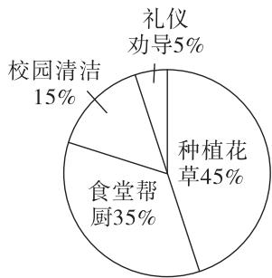

pie

| 类别 | 占比 (%) |
| :--- | :--- |
| 种植花草 | 45 |
| 食堂帮厨 | 35 |
| 校园清洁 | 15 |
| 礼仪劝导 | 5 |

第8题解图

9. 解:(1)由题意可知,B组人数为8人,对应占比为20%,

所以七年级(1)班共有 $\frac{8}{20\%}=40$ （人），

所以 A 组对应占比为 $\frac{4}{40}=10\%$ , D 组共有 $40\times30\%=12$ (人),

C 组对应占比为 $1 - 10\% - 15\% - 30\% - 20\% = 25\%$ ,

所以 C 组共有 $40 \times 25\% = 10$ (人)，……（3 分）
补全频数分布如下:并绘制对应的频数分布直方图

<table><tr><td>总时长</td><td>频数</td></tr><tr><td>A:30~60</td><td>4</td></tr><tr><td>B:60~90</td><td>8</td></tr><tr><td>C:90~120</td><td>10</td></tr><tr><td>D:120~150</td><td>12</td></tr><tr><td>E:150~180</td><td>6</td></tr></table>

如解图所示. …… (5 分)

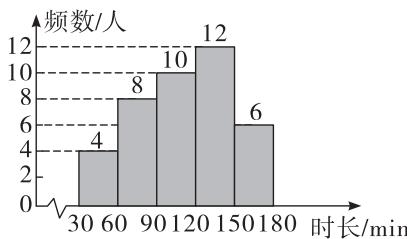

histogram

| 时间 | 频数/人 |
| :--- | :--- |
| 30-60 | 4 |
| 60-90 | 8 |
| 90-120 | 10 |
| 120-150 | 12 |
| 150-180 | 6 |

第9题解图

(2)90; …… (7分)

【解法提示】由(1)可得, C 组对应占比为 25%, 所以表示 C 组劳动总时长的扇形的圆心角为 $360^{\circ} \times 25\% = 90^{\circ}$ .

(3)七年级(1)班一周家务劳动的总时长为 120 \~ 150 min 的同学人数最多, 总时长为 30 \~ 60 min 的同学人数最少. (答案不唯一)

……（10分）

# 期末检测

# 选填及简单解答题题组(一)

1. A

2. B 【解析】438 万 = 4 380 000 = 4. $38 \times 10^{6}$ .

3. D 【解析】了解某品牌新能源汽车的最大续航里程,应选择抽样调查方式,A 选项不符合题意;“天舟三号”货运飞船零部件的质量检查,选择普查方式,B 选项不符合题意;了解《动物世界》电视栏目的收视率,选择抽样调查方式,C 选项不符合题意;调查游客对我市某景点的满意度,选择抽样调查方式,D 选项符合题意.

4. D 【解析】 $\pi$ 是单项式, A 选项错误; $-3xy^{3}$ 是四次单项式, B 选项错误; $-\frac{xy}{5}$ 的系数为 $-\frac{1}{5}$ , C 选项错误; $4x^{2} + 6xy + 5$ 是二次三项式, D 选项正确.

5. C 【解析】设 $\triangle$ 为 a, 把 x=2 代入方程得, $2a-15=3-4\times2$ , 解得 a=5, 所以“ $\triangle$ ”处的数字是 5.

6. B 【解析】A. 出现“U”字型的展开图不能组成正方体, 错误; B. “一三二”型, 可以组成正方体, 正确; C. 有两个面重合, 不能组成正方体, 错误; D. 展开图四个方格形成“田”字型的, 不能组成正方体, 错误.

7. C 【解析】该作法为作一个角等于已知角的步骤. 所以♠表示 AB, ♣表示点 H, ♥表示 DE 长, ♦表示射线 FG, 故 A, B, D 选项正确, C 选项错误.

8. B 【解析】设购买套票包含的邮票 x 枚, 小全张 $(400-x)$ 枚. 根据题意, 可得 $\frac{3.6}{3}x + 5.4(400 - x) = 900$ , 解得 x = 300, $400 - x = 400 - 300 = 100$ , 该纪念品店购买小全张的枚数为 100.

9. C 【解析】点 A, B 在数轴上的位置可得 x<-5<0<y<5，所以 $\left|x\right|>\left|y\right|$ ，故①错误； $\frac{x}{y}<0$ ，故②正确； $x+y<0$ ，故③错误；y-x>0，故④正确，综上，正确的有②④.

10. C 【解析】第 1 个图形需要火柴棒的根数为： $9=1\times8+1$ , 第 2 个图形需要火柴棒的根数为： $17=2\times8+1$ , 第 3 个图形需要火柴棒的根数为： $25=3\times8+1$ , 第 4 个图形需要火柴棒的根数为：

$33=4\times8+1,\cdots$ , 第 n 个图形需要火柴棒的根数为: $8n+1$ . 当 n=56 时, $8n+1=8\times56+1=449$ , 所以搭出的第 56 个图形需要 449 根火柴棒.

11. -100 m

12. 一个箱子装 x 个足球, 拿出 y 个足球后, 箱子里的足球剩余 $(x-y)$ 个. (答案不唯一)

13. < 【解析】移项,合并同类项,得 4m-4n=-2,
两边除以 4, 得 $m-n=-\frac{1}{2}<0$ , 所以 m<n.

14. 1 【解析】因为 a, b 互为相反数, b, c 互为倒数, 所以 $\frac{b}{a} = -1$ , bc = 1, 所以 $\left(\frac{b}{a} + 2bc\right)^{2025} = (-1 + 2)^{2025} = 1$ .

15. 90°或60°【解析】设∠COD=x，则∠AOD=3x，因为∠AOB=120°，∠AOC=40°，所以∠BOC=∠AOB-∠AOC=80°，如解图①，因为∠COD+∠AOD=∠AOC，所以 $x+3x=40^{\circ}$ ，解得 $x=10^{\circ}$ ，所以∠BOD=∠BOC+∠COD=80°+10°=90°；如解图②，因为∠AOD-∠COD=∠AOC，所以 $3x-x=40^{\circ}$ ，解得 $x=20^{\circ}$ ，所以∠BOD=∠BOC-∠COD=80°-20°=60°。综上所述，∠BOD的度数为90°或60°。

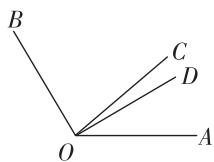  
图①

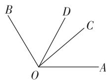  
图②  
第 15 题解图

16. 解: (1) 原式 = $16 \times \left(-\frac{1}{8}\right) + 9 \div 3$

$$
= - 2 + 3
$$

$$
= 1; \dots\dots\tag{4分}
$$

(2) 原式 $= (-19) \times \left(-\frac{1}{4} + \frac{1}{2} - \frac{3}{4}\right)$

$$
= (- 1 9) \times \left(\frac {- 1 + 2 - 3}{4}\right)
$$

$$
= (- 1 9) \times \left(- \frac {1}{2}\right)
$$

$$
= \frac {1 9}{2}. \dots \tag {8分}
$$

17. 解: 原式= $\frac{1}{2}m^{2}+\frac{5}{3}n^{2}-\frac{3}{2}m^{2}-2m^{2}+\frac{4}{3}n^{2}$

大小卷·七年级(上) 数学 BS

$$
= - 3 m ^ {2} + 3 n ^ {2}, \dots \tag {4分}
$$

当 $m = 2, n = -1$ 时，

$$
\begin{array}{l} \text {原式} = - 3 \times 2 ^ {2} + 3 \times (- 1) ^ {2} \\ = - 1 2 + 3 \\ = - 9. \quad \dots\dots (7 \text {分}) \\ \end{array}
$$

# 选填及简单解答题题组(二)

1. C 【解析】因为 $|-2|=2,|-2.5|=2.5,2.5>2$ ，所以-2.5<-2，所以-2.5<-2<0<1，所以四个数中，最小的是-2.5.  
2. A 【解析】用一个平面截一个几何体,得到的截面是圆,这个几何体可能是圆锥、圆柱、球体,不可能是棱柱.  
3. B 【解析】5x 与 5y 不是同类项,不能合并,A 选项错误;-y-y=-2y,B 选项正确; $6(x-1)=6x-6$ , C 选项错误; $4a^{2}b^{2}-3a^{2}b^{2}=a^{2}b^{2}$ , D 选项错误.  
4. B 【解析】由题意可得,为了能清楚地反映该村农产品网络零售额各个季度的占比情况,最适合制作扇形统计图.  
5. A 【解析】如解图,由题意得 $\angle CBQ = 15^{\circ}$ , 又 $\angle ABC = 100^{\circ}$ , 所以 $\angle ABQ = \angle ABC + \angle CBQ = 115^{\circ}$ , 所以 $\angle ABP = 180^{\circ} - 115^{\circ} = 65^{\circ}$ , 所以 A 村在 B 村的南偏西 $65^{\circ}$ 方向上.

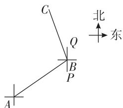

text_image

C
Q
B
P
A
北
东

第 5 题解图

6. B 【解析】因为单项式 $8a^{4}b^{x}$ 与单项式 $-a^{2y}b^{3}$ 的和仍是单项式, 所以 x=3, y=2, 所以 $y^{x}=2^{3}=8$ .  
7. A 【解析】 $-8\forall16=\frac{2}{-8}\div(-\frac{16}{4})=\frac{1}{16}.$   
8. B 【解析】由题意可知 $\angle AOB + \angle COE = 90^{\circ}$ ，因为 OD 平分 $\angle COE, \angle AOB : \angle COD = 4 : 3$ ，所以 $\angle AOB : \angle COE = 4 : 6$ ，设 $\angle AOB = 4x$ ，则 $\angle COE = 6x$ ，所以 $4x + 6x = 90^{\circ}$ ，解得 $x = 9^{\circ}$ ，所以 $\angle COE = 54^{\circ}$ ，所以 $\angle COD = \frac{1}{2} \angle COE = 27^{\circ}$ ，所以 $\angle BOD = \angle BOC + \angle COD = 117^{\circ}$ .  
9. C 【解析】由表可得, 当 x=0 时, 整式为 -n=2, 解得 n=-2, 当 x=1 时, 整式为 $m-n=m-(-2)=5$ , 解得 m=3, 所以 $mx=n+1$ 即 3x=-1, 解得 x=

$$
- \frac {1}{3}.
$$

10. D 【解析】因为点 M 表示数 3, 点 M 在线段 AB 上, 且 AM = 3BM, 所以 $3 - a = 3(b - 3)$ , 整理得: $a + 3b = 12$ , 所以 $a + 3b + 2024 = 12 + 2024 = 2036$ .  
11. 5 【解析】94.5万=945000=9.45×10^{5}.  
12. 定量  
13. $x+2x+4x=34\ 685$ 【解析】设他第一天读 x 个字, 则第二天读 2x 个字, 第三天读 4x 个字, 所以可列方程 $x+2x+4x=34\ 685$ .  
14. $\frac{125}{6}\pi\ cm^{2}$ 【解析】如解图,时钟一大格为 $30^{\circ}$ ,时针与分针的夹角是2格半,即 $75^{\circ}$ ,故所对应的扇形面积为 $\pi\times10^{2}\times\frac{75}{360}=\frac{125}{6}\pi(\mathrm{~cm}^{2})$ .

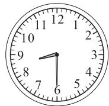  
第 14 题解图

15. 15 或 25 【解析】因为 AC=10, 点 B 是 AC 的中点, 所以 $AB=BC=\frac{1}{2}\times10=5$ , 又因为 BD=4AB, 所以 $BD=4\times5=20$ . 若点 C 在线段 AD 上, 如解图①所示, 那么 CD=BD-BC=20-5=15; 若点 C 在线段 DA 的延长线上, 如解图②所示, 那么 $CD=BD+BC=20+5=25$ .

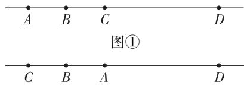

text_image

A B C D
图①
C B A D

图②  
第 15 题解图

16. 解: (1) 原式 $= -27 \times \frac{1}{9} - 1 + 2$

$$
\begin{array}{l} = - 3 - 1 + 2 \\ = - 2; \quad \dots\dots\tag {3分} \\ \end{array}
$$

(2) 原式= $\left(-\frac{1}{3}+\frac{5}{12}-\frac{1}{18}\right)\times(-36)$

$$
\begin{array}{l} = \left(- \frac {1}{3}\right) \times (- 3 6) + \frac {5}{1 2} \times (- 3 6) + \left(- \frac {1}{1 8}\right) \times \\ (- 3 6) \\ = 1 2 - 1 5 + 2 \\ (- 3 6) \\ = 1 2 - 1 5 + 2 \\ \end{array}
$$

=-1. …… (7 分)

17. 解: (1) 移项, 得 $4x + 3x = -5 - 9$ ,

合并同类项, 得 7x = -14,

系数化为 1, 得 x = -2; …… (4 分)

(2) 去分母, 得 $18+3(2x-1)=x$ ,

去括号, 得 $18+6x-3=x$ ,

移项, 得 $6x - x = -18 + 3$ ,

合并同类项,得 5x=-15,

系数化为 1, 得 x = -3. …… (8 分)

# 中档解答题题组(一)

18. 解: $(1)+57-(-34)=91$ (人),

所以上周接待游客最多的一天比接待游客最少的一天多91人；……（4分）

(2) 根据题意得:

$$
(+ 6 - 3 4 - 1 8 + 1 0 + 2 3 + 5 7 + 4 2) + 5 0 0 \times 7
$$

$$
= 8 6 + 3 5 0 0
$$

$$
= 3 5 8 6 (\text {人}),
$$

所以该景区上周实际共接待游客 3 586 人.

…… (9 分)

19. 解: 设 $\angle BOC = 3x$ ,

因为 $\angle COE = \frac{1}{3}\angle BOC$

所以 $\angle COE = x$ ,

因为 $\angle AOC : \angle BOC = 4 : 3$ ,

所以 $\angle AOC = 4x, \cdots$ (4 分)

又因为 OD 平分 $\angle AOC$ ,

所以 $\angle COD = \frac{1}{2}\angle AOC = 2x$

因为 $\angle COD + \angle COE = \angle DOE = 60^{\circ}$ ,

所以 $x+2x=60^{\circ}$ ,

解得 $x=20^{\circ}$ ,

所以 $\angle BOD = \angle BOC + \angle COD = 5x = 100^{\circ}$ .

……(9分)

20. 解: (1) 从正面、左面和上面看到的形状图如解图①所示; …… (5 分)

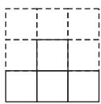  
从正面看

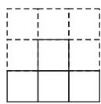  
从左面看

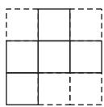  
从上面看  
第20题解图①

(2)最多可以再放置4个小正方体. …… (10分)

【解法提示】放置后俯视图如解图②所示,数字表示这个位置上小正方体的个数.

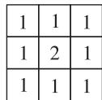  
第20题解图②

21. 解: (1) 方程两边同时乘 12; 依据是等式的性质 2; …… (4 分)

(2) 补充过程如下: 16x-4-9x-60=-36,

$$
7 x = 2 8,
$$

x=4. …… (10 分)

22. 解: (1) 小路的面积 $= 2 \times a \cdot (3a + b) + 4b \cdot b = (6a^{2} + 2ab + 4b^{2}) \, \text{m}^{2}$ ; …… (5 分)

(2) 当 a=2, b=3 时, 小路的面积 $=6\times2^{2}+2\times2\times3+4\times3^{2}=72(m^{2})$ .

所以修建这条小路共需花费 $72 \times 200 = 14400$ (元)，

答:修建这条小路共需花费 14 400 元.

…… (11 分)

23. 解: (1) $12 \div 24\% = 50$ (人),

所以本次调查的学生人数为 50 人；……（2 分）

(2)补全条形统计图如解图;……(6分)

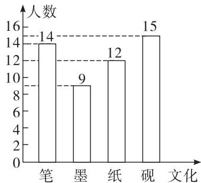

bar

| 文化 | 人数 |
|---|---|
| 笔 | 14 |
| 墨 | 9 |
| 纸 | 12 |
| 砚 | 15 |

第 23 题解图

【解法提示】50-14-9-12=15(人).

(3) 因为 $360^{\circ} \times \frac{15}{50} = 108^{\circ}$ ,

所以扇形统计图中“砚”所在扇形的圆心角度数为 $108^{\circ}$ . …… (11 分)

# 中档解答题题组(二)

18. 解:所求作的图如解图所示.

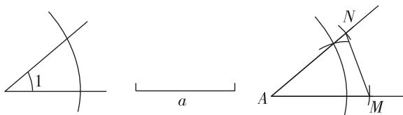

text_image

1
a
N
A
M

第 18 题解图

…… (9 分)

# 大小卷·七年级(上) 数学 BS

19. 解: 由题意得 x = -1 是关于 x 的一元一次方程 $\frac{x - a}{3} - 2 = \frac{x - 19}{5}$ 的解,

所以 $\frac{-1-a}{3}-2=\frac{-1-19}{5}$ ，解得 $a=5,\cdots\cdots$ （4分）

所以原方程为 $\frac{x+5}{3}-2=\frac{x-19}{5}$ ,

去分母, 得 $5(x+5)-30=3(x-19)$ ,

去括号, 得 $5x+25-30=3x-57$ ,

移项, 得 $5x - 3x = -25 + 30 - 57$ ,

合并同类项,得 2x = -52,

系数化为 1, 得 x = -26. …… (9 分)

20. 解: (1) $2A + B = 2(-2x^{2} - 7mx + 3x - 3) + 4x^{2} + 5mx - 9$

$$
\begin{array}{l} = - 4 x ^ {2} - 1 4 m x + 6 x - 6 + 4 x ^ {2} + 5 m x - 9 \\ = - 9 m x + 6 x - 1 5; \dots \tag {4分} \\ \end{array}
$$

(2)由(1)知 $2A+B$ 的值为 $-9mx+6x-15$ ,

因为代数式 $2A+B$ 的值与字母 x 的取值无关，

所以 $-9m + 6 = 0$ ，解得 $m = \frac{2}{3}$

所以当代数式 $2A+B$ 的值与字母 x 的取值无关时, m 的值为 $\frac{2}{3}$ . …… (10 分)

21. 解: (1) = ; …… (4 分)

【解法提示】因为 AC = BD，所以 AC - BC = BD - BC，所以 AB = CD。

(2) 因为 $AD = 16 \, cm, BC = 4 \, cm,$

所以 $AB = CD = \frac{1}{2} (AD - BC)$

$$
= \frac {1}{2} \times (1 6 - 4) = 6 (\mathrm{cm}),
$$

所以 $AC = AB + BC = BD = 6 + 4 = 10 \, (\text{cm})$ .

因为点 E, F 分别是线段 AC, BD 的中点,

所以 $AE=\frac{1}{2}AC=\frac{1}{2}\times10=5\left(\mathrm{~cm}\right)$ , $DF=\frac{1}{2}BD=$

$$
\frac {1}{2} \times 1 0 = 5 (\mathrm{cm}),
$$

所以 EF=AD-AE-DF=16-5-5=6(cm),

所以线段 EF 的长度为 6 cm. …… (10 分)

22. 解: (1) 方案三; …… (1 分)

(2)①调查的总人数为 $30 \div 15\% = 200$ (人);

……（3分）

②补全条形统计图如解图所示；……（5分）

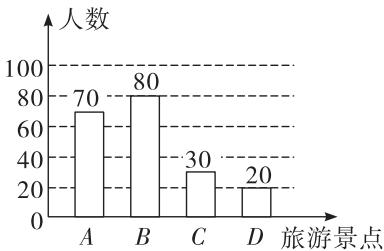

bar

| 旅游景点 | 人数 |
| :--- | :--- |
| A | 70 |
| B | 80 |
| C | 30 |
| D | 20 |

第 22 题解图

③40; …… (7 分)

【解法提示】 $m\%=\frac{80}{200}\times100\%=40\%$ , 所以 m=40.

(3) A 景点对应扇形的圆心角度数为 $\frac{70}{200} \times 360^{\circ} = 126^{\circ}$ . (11 分)

23. 解: (1) $1 + 3 + 5 + 7 + 9$ , $1 + 3 + 5 + 7 + 9 + 11 + 13 + 15$ ;

(3 分)

(2) $(2n-1)$ ; $\cdots\cdots$ (5分)   
(3)根据上述规律可知 $n^{2}=1+3+5+\cdots+(2n-1)$ ,

$$
\begin{array}{l} (n + 1) ^ {2} = 1 + 3 + 5 + \dots + (2 n - 1) + [ 2 (n + 1) - 1 ], \\ \dots (8 \text {分}) \\ \end{array}
$$

所以 $(n+1)^{2}-n^{2}=1+3+5+\cdots+(2n-1)+[2(n+$

$$
\begin{array}{l} 1) - 1 ] - [ 1 + 3 + 5 + \dots + (2 n - 1) ] \\ = 2 (n + 1) - 1 \\ = 2 n + 1. \dots\dots\tag {11分} \\ \end{array}
$$

# 专题 一元一次方程的实际应用

# 主题情境练基础

1. $x+12x+20=540$ 【解析】根据题意可知老师人数为 x 人, 学生人数为 $12x+20$ , 因此可列得方程 $x+12x+20=540$ .  
2. $4 \times 3x = 8(30 - x)$ 【解析】因为制作大星星的卡纸有 x 张, 所以制作小星星的卡纸有 $(30 - x)$ 张, 所以大星星的个数为 3x, 小星星的个数为 8 $(30 - x)$ , 又因为 4 个小星星配 1 个大星星, 所以可列得方程 $4 \times 3x = 8(30 - x)$ .  
3. $50x+100(20-x)=1600$ 【解析】因为上坡花费 x min, 所以下坡花费 $(20-x)$ min, 所以可列方程为 $50x+100(20-x)=1600$ .  
4. (1)4;2;【解析】由 A 同学可知答对 1 题得 $\frac{100}{25}=4$ (分),由 B 同学可知答错 1 题扣 $\frac{18\times4-58}{7}=2$ (分).

(2) $4x-2(25-x)=76$ 【解析】设他答对了 x 道题目,则答错了 $(25-x)$ 道题目,根据题意可列方程为 $4x-2(25-x)=76$ .

# 多样情境练综合

1. 解: 设她第一天织布 x 尺, 因为每天织的布都是前一天的 2 倍,

则后 4 天每天织的布分别是 2x 尺, 4x 尺, 8x 尺, 16x 尺,

根据题意 5 天共织 5 尺布，

所以 $x+2x+4x+8x+16x=5$ ,

解得 $x=\frac{5}{31}$ ,

所以 $2x=\frac{10}{31},4x=\frac{20}{31},8x=\frac{40}{31},16x=\frac{80}{31}$ ,

答:在这 5 天里,她每天各织布 $\frac{5}{31}$ 尺, $\frac{10}{31}$ 尺, $\frac{20}{31}$ 尺, $\frac{40}{31}$ 尺, $\frac{80}{31}$ 尺.

2. 解: 设该商业部门设立了 x 个展厅,

根据题意,得 $30x+20=35(x-1)$ .

解得 x=11.

答:该商业部门设立了11个展厅;

(2) $30\times11+20=350$ （件）.

答:该商品交流会共有 350 件商品.

3. 解: (1) 设该公司定制了 x 件工作服, 根据题意,

得 $\frac{x}{15}-\frac{x}{20}=30$ ,

解得 x=1 800.

答:该公司定制了 1 800 件工作服;

(2)设乙工厂生产了 y 天,则甲工厂生产了 2y 天,根据题意,

得 $(20+15)y+20\times(1+25\%)(2y-y)=1800$ ,

解得 y=30, 所以 2y=60.

答:甲工厂共生产60天.

4. 解: 任务一:

设一共去了 x 名家长, 则去了 $(12-x)$ 名学生,

根据题意,得 $90x+90\times0.5\times(12-x)=900$ ,

解得 x=8，

所以 12-x=12-8=4，

所以一共去了8名家长,4名学生;

任务二：

单独买票,即分别购买成人票和学生票更实惠,

理由如下:若他们购买团体票,需花费 $13 \times 90 \times 0.8 = 936$ (元),

因为 900<936, 所以小庆他们单独买票, 即分别购买成人票和学生票更实惠;

任务三：

若单独买票,需花费 $12 \times 90 + 8 \times 90 \times 0.5 = 1440$ (元);

若均购买团体票,需花费 $(12+8)\times90\times0.8=1\ 440$ （元）;

若 12 名家长和 1 名学生购买团体票, 剩余 7 名学生购买学生票, 需花费 $13 \times 90 \times 0.8 + 7 \times 90 \times 0.5 = 1251$ (元).

因为 1251<1 440,

所以 12 名家长和 1 名学生购买团体票,剩余 7 名学生购买学生票最实惠.

# 专题 数轴与线段的动点问题

# 一题多设问

例 解:(1)因为 AB=15, 且 OA:OB=1:2,

所以 OA=5, OB=10,

所以点 A 对应的数为 -5, 点 B 对应的数为 10;

(2) 当点 C 在点 A 左侧时, 点 C 对应的数为 x,

$$
B C = 1 0 - x, A C = - 5 - x,
$$

因为 BC=2AC,

所以有 $10-x=2(-5-x)$ ,

解得 x = -20，

所以点 C 表示的数为 -20;

当点 C 在点 A 与点 B 之间时, BC = 10 - x, AC = x + 5,

因为 BC=2AC,

所以有 $10-x=2(x+5)$ ,

解得 x=0,

所以点 C 表示的数为 0;

当点 C 在 B 点右侧时, 不符合题意;

综上所述,点 C 表示的数为 -20 或 0;

(3)式子 2BM-BC 的值不发生变化.

根据题意得点 M 在数轴上表示的数为 $\frac{-5+x}{2}$ ,

所以 $BM=(10-\frac{-5+x}{2})$ , BC=10-x,

$$
2 B M - B C = 2 \left(1 0 - \frac {- 5 + x}{2}\right) - (1 0 - x) = 2 5 - x - 1 0 + x
$$

$$
= 1 5,
$$

# 大小卷·七年级(上) 数学 BS

故 2BM-BC 的值不发生变化且 2BM-BC=15.

(4) 点 C 在数轴上对应的数为 $-5+t$ ，点 D 在数轴上对应的数为 10-3t，

因为原点 O 恰是线段 CD 的中点，

所以 $\frac{(-5+t)+(10-3t)}{2}=0$ , 解得 t=2.5,

所以当 t = 2.5 时, 原点 O 恰是线段 CD 的中点;

(5)根据点 P, Q 的运动速度可知, BP = 3CQ,
因为 CP = 3AQ,

所以 $BP+CP=3(CQ+AQ)$ ，即 BC=3AC，

又因为 $BC+AC=15$ ,

所以 $AC=\frac{15}{4},-5+\frac{15}{4}=-\frac{5}{4}$ ,

所以点 C 在数轴上对应的数为 $-\frac{5}{4}$ .

# 综合训练

1. 解:(1)是;【解法提示】因为点 A, B 相距 24 个单位长度, 点 A 表示的数是 -8, 且点 B 在点 A 右侧, 所以点 B 表示的数是 16, 当点 C 与数轴原点重合时, AC = 8, BC = 16, 所以 AB = 3AC, 所以点 C 是线段 AB 的“奇分点”.

(2)①16-2t;

②分情况讨论：

当 AC=3BC 时,16-2t-(-8)=3×2t,

解得 t=3;

当 AB=3BC 时, $24=3\times2t$ ,

解得 t=4;

当 AB=3AC 时, $24=3\times[16-2t-(-8)]$ ,

解得 t=8;

当 BC=3AC 时, $2t=3\times[16-2t-(-8)]$ ,

解得 t=9;

当 AC=3AB 或 BC=3AB 时, 点 C 在点 A 左侧, 不符合题意.

综上所述,当运动时间 t 为 3 秒或 4 秒或 8 秒或 9 秒时,点 C 是线段 AB 的“奇分点”.

2. 解: (1) 因为点 M 以每秒 3 个单位长度的速度向右匀速运动, 同时点 N 以每秒 1 个单位长度的速度向左匀速运动,

所以当 t=2 时, $AM=2\times3=6$ , $BN=1\times2=2$ ,

所以点 M 表示的数为 $-10+6=-4$ ，点 N 表示的数为 6-2=4；

(2)由题意可知,AM=3t,BN=t,分情况讨论:点M,N相遇之前,可得 $3t+t+4=6-(-10)$ ,解得t=3;

点 M, N 相遇之后, 可得 $3t + t - 4 = 6 - (-10)$ , 解得 t = 5.

故当 MN=4 时, t 的值为 3 或 5;

(3)MN 与 CD 之间的数量关系为 2CD-MN=16 或 $2CD+MN=16$ .

理由如下：

分情况讨论:①当点 M 在点 N 的左侧时,如解图①,

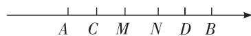  
第2题解图①

因为 $CD = CM + MN + ND$ ，点 C 为 AM 的中点，点 D 为 BN 的中点，

所以 AC = CM, BD = ND,

所以 $AC+BD+MN=CD$ ,

所以 $AC+BD=CD-MN.$

因为 $AC+CD+BD=AB$ ,

所以 $CD+CD-MN=AB$ ,

所以 $2CD-MN=6-(-10)$ ,

即 2CD-MN=16;

②当点 M 在点 N 的右侧时, 如解图②,

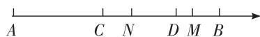  
第2题解图②

因为 $CM-MN+ND=CD$ ，点 C 为 AM 的中点，点 D 为 BN 的中点，

所以 AC = CM, BD = ND,

所以 $AC+BD-MN=CD$ ,

所以 $AC+BD=CD+MN.$

因为 $CD+AC+BD=AB$ ,

所以 $CD+CD+MN=AB$ ,

所以 $2CD+MN=16.$

综上所述, MN 与 CD 之间的数量关系为 2CD-MN=16 或 $2CD+MN=16$ .

# 专题 角的计算综合题

# 一题多设问

例 解:(1)因为点A,O,B在同一条直线上,

所以 $\angle AOB = 180^{\circ}$ ,

因为 $\angle BOC = 5 \angle AOC$ ,

所以 $\angle AOB = \angle AOC + \angle BOC = \angle AOC + 5 \angle AOC$

$$
= 6 \angle A O C = 1 8 0 ^ {\circ},
$$

所以 $\angle AOC = 30^{\circ}$

所以 $\angle BOC = 5 \angle AOC = 150^{\circ}$ .

因为射线 OD 平分 $\angle BOC$ ,

所以 $\angle COD = \frac{1}{2}\angle BOC = \frac{1}{2}\times 150^{\circ} = 75^{\circ};$

(2) 因为 $\angle BOD = 60^{\circ}$ ,

所以 $\angle AOD = 180^{\circ} - \angle BOD = 180^{\circ} - 60^{\circ} = 120^{\circ}$

因为射线 OE 平分 $\angle AOD$ ,

所以 $\angle AOE = \frac{1}{2}\angle AOD = \frac{1}{2}\times 120^{\circ} = 60^{\circ}.$

又因为 $\angle AOC = 40^{\circ}$ ,

所以 $\angle COE = \angle AOE - \angle AOC = 60^{\circ} - 40^{\circ} = 20^{\circ}$

(3) 因为 $\angle COD = 90^{\circ}$ ,

所以 $\angle AOD + \angle BOC = 180^{\circ} - \angle COD = 90^{\circ}$ ,

因为 $\angle AOD$ 比 $\angle BOC$ 大 $38^{\circ}$ ,故设 $\angle BOC=x^{\circ}$ ,

则 $\angle AOD=(x+38)^{\circ}$ ,

所以 $x^{\circ}+(x+38)^{\circ}=90^{\circ}$ ，解得 x=26，

所以 $\angle AOD = 64^{\circ}$ ,

因为 OE 平分 $\angle AOD$ ,

所以 $\angle DOE=\frac{1}{2}\angle AOD=32^{\circ}$ ,

所以 $\angle COE = \angle COD + \angle DOE = 122^{\circ}$ ;

(4)根据题意,得 $\angle DOC=(20t)^{\circ}$ ,

所以 $\angle AOD = (40 + 20t)^{\circ}$ ,

因为射线 ON, OM 分别平分 $\angle AOC, \angle AOD,$

所以 $\angle AOM=\frac{1}{2}\angle AOD=(20+10t)^{\circ}$ ,

$$
\angle A O N = \frac {1}{2} \angle A O C = 2 0 ^ {\circ},
$$

所以 $\angle MON = \angle AOM - \angle AON = (10t)^{\circ}$ ;

(5) 因为 $\angle AOD = 160^{\circ}$ ，且 $\angle AOD + \angle BOD = 180^{\circ}$ ，

所以 $\angle BOD = 20^{\circ}$ ,

所以 $\angle AOC = 2 \angle BOD = 40^{\circ}$ ,

$$
\angle C O D = \angle A O D - \angle A O C = 1 6 0 ^ {\circ} - 4 0 ^ {\circ} = 1 2 0 ^ {\circ},
$$

当 OQ 旋转至与射线 OA 重合时, 共经过 $160 \div 10 = 16 \, (\text{s})$ ,

故设在 $t \, \mathrm{s} (t \leqslant 16)$ 时, 射线 OP, OQ 的夹角为 $30^{\circ}$ , 分情况讨论如下:

射线 OP, OQ 相遇前, $5t + 30^{\circ} + 10t = 120^{\circ}$ ,

解得 t=6;

射线 OP, OQ 相遇后, $10t + 5t - 30^{\circ} = 120^{\circ}$ ,

解得 t=10,

则在 6 s 或 10 s 时, 射线 OP, OQ 的夹角

为 $30^{\circ}$

# 综合训练

1. 解:(1) $\angle POM$ 与 $\angle NOM$ (答案不唯一);【解法提示】由题意可得,图中的“共边角”为 $\angle POM$ 与 $\angle NOM$ 或 $\angle NOP$ 与 $\angle NOM$ 或 $\angle POM$ 与 $\angle NOP$ .

(2) 当 OC 在 $\angle AOB$ 内部, 如解图①所示,

$$
\angle A O C = \angle A O B - \angle B O C = 9 0 ^ {\circ} - 4 5 ^ {\circ} = 4 5 ^ {\circ}.
$$

当 OC 在 $\angle AOB$ 外部, 如解图②所示,

$$
\angle A O C = \angle A O B + \angle B O C = 9 0 ^ {\circ} + 4 5 ^ {\circ} = 1 3 5 ^ {\circ}.
$$

综上所述,非公共边的两边所夹的角的度数为 $45^{\circ}$ 或 $135^{\circ}$ ;

text_image

A
C
O
B

图①

text_image

A
O
B
C

图②  
第1题解图

(3) 当公共边为 OB, 即 OC 旋转至与 OB 重合, $t=\frac{144}{21}=\frac{48}{7};$

当公共边为 OD, 即 OC 旋转至与 OD 重合, $21t = 9t + 144^{\circ}$ , 解得 t = 12,

综上所述, 当 t 为 $\frac{48}{7}$ 或 12 时, $\angle AOC$ 与 $\angle BOD$ 为一组“共边角”.

2. 解: (1) 因为 $\angle COE = \frac{1}{4} \angle COD$ ,

所以 $\angle DOE = \angle COD + \angle COE = \angle COD + \frac{1}{4} \angle COD = \frac{5}{4} \angle COD,$

又因为 OE 平分 $\angle AOD$ ,

所以 $\angle AOE = \angle DOE = \frac{5}{4}\angle COD$

所以 $\angle AOC = \angle AOE + \angle COE = \frac{5}{4}\angle COD + \frac{1}{4}\angle COD$ $= \frac{3}{2}\angle COD,$

根据题意,得 $\angle COD=60^{\circ}$ ,

所以 $\angle AOC = \frac{3}{2} \times 60^{\circ} = 90^{\circ}$ ;

(2) $\angle BOD=2\angle COE$ ,理由如下:

# 大小卷·七年级(上) 数学 BS

因为 $\angle AOB = 2 \angle COD$ ,

所以 $\angle BOD = \angle AOB - \angle AOD = 2 \angle COD - \angle AOD$ ,

所以 $\angle BOD = 2 (\angle AOC + \angle AOD) - \angle AOD = \angle AOD + 2 \angle AOC.$

因为 OE 平分 $\angle AOD$ ,

所以 $\angle AOD = 2 \angle AOE$ ,

所以 $\angle BOD = 2\angle AOE + 2\angle AOC = 2\angle COE;$

(3)(2)中的关系不成立,此时 $\angle BOD=360^{\circ}-2\times\angle COE$ ,理由如下:

因为 OE 平分 $\angle AOD$ ,

所以 $\angle AOD = 2\angle DOE.$

因为 $\angle AOD = 360^{\circ} - \angle AOB - \angle BOD$ ,

所以 $2 \angle DOE = 360^{\circ} - \angle AOB - \angle BOD$ ,

所以 $2(\angle COE - \angle COD) = 360^{\circ} - \angle AOB - \angle BOD,$

因为 $\angle AOB = 2 \angle COD = 2 \times 60^{\circ} = 120^{\circ}$ ,

所以 $2 \angle COE - 120^{\circ} = 360^{\circ} - 120^{\circ} - \angle BOD$ ,

所以 $\angle BOD = 360^{\circ} - 2\angle COE$ ，(2)中的关系不成立.