# 中考原创好题用

# 万唯®

年超4600万人次的选择

更多名校，总复习从《试题研究》开始

注 以上数据已经第三方机构审计

# 扫码获取免费资源

20个重难题视频讲解  
名校期末试题  
几何画板动态演示  
□教材新变化等前沿信息

text_image

QR code with central logo, likely linking to a website or digital content

# 让师生用书安心

√ 万唯图书紧跟教材修订。图书上市后，若教材变化：变化小，则免费补发《教材变化速递》册；变化大，则另出新版。凭之前所购图书，可到购买书店免费领取或更换  
√ 本书依据最新教材编写，请放心使用

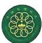  
绿色印刷产品

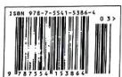  
定价：49.90元

万唯中考

万唯中考®

全国视野 原创题好

试题:100%原创

重难题配视频讲解

# 大小卷

小卷：一周一测

大卷：章测、期中期末测

数学BS
七年级(上)

2025歲

閩西安出版社

本书依据最新教材编写

更多情境化试题

结合日常生活、数学文化、跨学科学习等创设主题情境，围绕主题情境原创更多情境题

主编 武泽涛 研发 万唯中考千人研究院

西安出版社

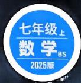

text_image

七年级上
数学BS
2025版

# 大小卷

小卷：一周一测

大卷：章测、期中期末测

主编 武泽涛

编者 朱继召 蒋继媛 魏小群 吕经江 苏石磊  
高红敏 李爽 李昭华 杨云芳 曹晓莉  
潘江平 崔红丹 刘付顺 赵音波 罗增胜  
邢晓英 祝瑞 李渊 谷扬 张燕  
吕峰 石芳芳 杜道民 任三平 刘宗鹏  
刘啊东 谢超 李红远 张振兴 李彦武

编委 姜二嫚 王艳妮 马辉 赵梅香 贾豪勇
李珍珍 杜金金 谭吉丽 李香玉 李思雨
王玉梅 王飞艳 王晨 蒋自林 王思凡
饶梦莹

text_image

七年级上
数学BS
2025版

主题情境:本书结合学生日常生活、数学文化、跨学科学习等创设主题情境,围绕主题情境原创更多情境题,让学生在真实情境中掌握知识,提升解决实际问题的能力.

# 周测小卷

更多教辅关注公众号【全科A+】

第一章 丰富的图形世界

周测1 立体图形的识别、展开与折叠 …… 1
周测2 截一个几何体及从三个方向看物体的形状 …… 3

√ 第二章 有理数及其运算

周测3 认识有理数 …… 5
周测4 有理数的加减运算 …… 7
周测5 有理数的乘除运算 …… 9
周测6 有理数的乘方及混合运算 …… 11
专题 有理数的实际应用 …… 13
教材原题 北师七上随堂练习第1题
改编1 改变背景及设问/13
改编2 改变背景,融入有理数乘法/13
改编3 将固定基准改为动态变化基准/14

第三章 整式及其加减

周测7 代数式 …… 15  
周测8 整式的加减 …… 17  
周测9 探索与表达规律 …… 19  
专题 整式的化简与求值 …… 21

期中检测

选填及简单解答题题组(一) …… 23
选填及简单解答题题组(二) …… 25
中档解答题题组(一) …… 27
中档解答题题组(二) …… 29
专题 数轴上的动点问题 …… 31

第四章 基本平面图形

周测10 线段、射线、直线 …… 33  
周测11 角及多边形和圆的初步认识 …… 35  
专题 与线段中点有关的问题 …… 37  
教材原题 北师七上尝试·思考  
改编1 改变中点的位置，改为线段长度比/37

# 大卷

第一章检测卷 …… 1
主题情境 传统竹编工艺
第二章检测卷 …… 3
主题情境 “白色荒漠” 南极洲

第三章检测卷 5
主题情境 文创展览

期中检测卷 7
主题情境 郁金香的种植

第四章检测卷(一) …… 11
主题情境 会场布置
第四章检测卷(二) …… 13
主题情境 校园军训

# 周测小卷

改编2 增加一个中点，并改变线段比例 / 37

改编3 改变条件，并与尺规作图结合/37

改编4 与动点结合/38

专题 与角平分线有关的问题 …… 39

方法1 利用整体思想求角度/39

方法2 利用分类讨论思想求角度/39

第五章 一元一次方程

周测12 认识方程及一元一次方程的解法 41

周测13 一元一次方程的应用 43

第六章 数据的收集与整理

周测14 丰富的数据世界、数据的收集 45

周测15 数据的表示 47

期末检测

选填及简单解答题题组(一) 49

选填及简单解答题题组(二) 51

中档解答题题组(一) 53

中档解答题题组(二) 55

专题 一元一次方程的实际应用 …… 57

专题 数轴与线段的动点问题 59

专题 角的计算综合题 61

# 大卷中考新考法索引

# 更多教辅关注公众号【全科A+】

开放性试题

<table><tr><td>满足条件的结果开放 / P1 第 16 题</td><td>选择条件开放 / P6 第 19 题</td></tr></table>

写建议开放 / P21 第 20 题

过程性学习

<table><tr><td>过程纠错改错 / P8 第 18 题</td><td>补充过程及依据 / P11 第 17 题</td></tr></table>

阅读理解题

<table><tr><td>解题方法型阅读理解题 / P4 第 21 题</td><td>新定义型阅读理解题 / P7 第 8 题</td></tr></table>

综合与实践

<table><tr><td>操作探究 / P2 第 20 题、P14 第 20 题</td><td>类比猜想 / P10 第 22 题</td></tr></table>

代数推理

<table><tr><td>归纳一般结论 / P4 第 19 题、P21 第 21 题</td></tr></table>

# 大卷

第五章检测卷 15

主题情境 计时演变

第六章检测卷 17

主题情境 敬老爱老志愿者服务

期末检测卷 19

主题情境 天文浅问

# 图书在版编目（CIP）数据

大小卷. 七年级. 上. 数学：BS / 武泽涛主编. — 西安：西安出版社，2021.5（2024.5重印）

ISBN 978-7-5541-5386-4

I. ①大… II. ①武… III. ①中学数学课-初中-习题集 IV. ①G634

中国版本图书馆 CIP 数据核字(2021)第 085525 号

责任编辑：赵春荣

装帧设计：万唯视觉设计中心

大小卷·七年级（上）数学 BS

DAXIAOJUAN·QINIANJI (SHANG) SHUXUE BS

主 编：武泽涛

出版发行：西安出版社

社 址：西安市曲江新区雁南五路1868号影视演艺大厦11层

电话：(029) 85253740

邮政编码：710061

印刷：西安文泽图书有限公司

开 本：880 mm×1230 mm 1/8

印 张：10

字 数：256 千字

版 次：2021年5月第1版

印 次：2024年5月第4次印刷

书号：ISBN 978-7-5541-5386-4

定 价: 49.90 元

附：《参考答案》单独成册

版权所有，翻印必究。如有印装质量问题，请到购书书店调换。

√ 本书结构：大卷+周测小卷+参考答案  
√ 盗版举报电话：029-8756 9851 / 邮箱：wanwei12315@126.com  
√ 咨询、订购：029-8221 5628

先做本章小卷，效果更佳

# 第一章检测卷

<table><tr><td>题号</td><td>一</td><td>二</td><td>三</td><td>总分</td></tr><tr><td>得分</td><td></td><td></td><td></td><td></td></tr></table>

时间:90 分钟 满分:100 分

更多教辅关注公众号【全科A+】

# 一、选择题(共10小题,每小题3分,共30分)

1. 下列立体图形中, 面数最多的是 ( )

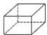  
A

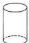  
B

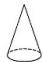  
C

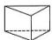  
D

2. 如图是下列某个几何体的展开图, 则这个几何体是 ( )

A. 圆锥

B. 四棱柱

C. 五棱锥

D. 五棱柱

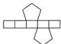  
第2题图

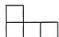  
第3题图

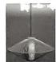  
第4题图

3. 如图是某个几何体从正面看得到的形状图, 则该几何体不可能为 ( )

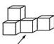  
从正面看  
A

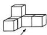  
从正面看  
B

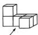  
从正面看  
C

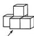  
从正面看  
D

;

主题情境 传统竹编工艺 传统竹编工艺有着悠久的历史和文化内涵,凝结着中华民族的智慧结晶.请完成第4\~5题.

4. 如图是一竹编吊灯,则吊灯的外形可近似看成两个 ( )

A. 圆锥

B. 圆柱

C. 长方体

D. 五棱柱

5. 如图, 将给定的图形绕虚线旋转一周得到的几何体与下列竹编工艺品的形状最为近似的是 ( )

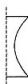  
第5题图

  
A

  
B

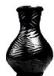  
C

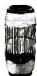  
D

6. 日常生活情境 猜谜语 谜语是我国民间文学的一种特殊形式，古时称“隐语”。谜语：“正看一矩形；侧看一矩形；上看一圆圈”，则该几何体为 （）

A. 圆锥

B. 圆柱

C. 四棱柱

D. 四棱锥

7. 如图是一几何体从上面看到的形状图,其中小正方形上的数字表示在该位置上的小立方块的个数,则该几何体从左面看到的形状图为()

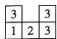  
第7题图

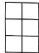  
A

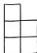  
B

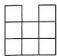  
C

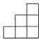  
D

8. 用一平面去截下列几何体,其截面可能是长方形的有 ( )

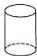  
圆柱

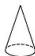  
圆锥

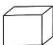  
长方体

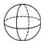  
球  
第8题图

A. 4 个

B. 3个

C. 2个

D. 1 个

9.（教材复习题第1题改编）如图，有一个正方体抽奖箱，它的平面展开图可能是 （）

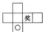  
A

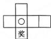  
B

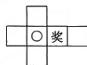  
C

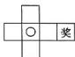  
D

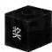  
第9题图

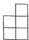  
从正面看

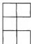  
从上面看  
第10题图

10.（教材复习题第9题改编）一几何体从正面和上面看到的形状图如图所示，若这个几何体最多由 $m$ 个小正方体组成，最少由 $n$ 个小正方体组成，则 $m + n$ 的值为 （）

A. 17

B. 18

C. 20

D. 21

# 二、填空题(共5小题,每小题3分,共15分)

11. 跨学科情境/跨语文课文 朱自清的《春》中描写春雨“像牛毛,像花针,像细丝,密密地斜织着,…”的语句,用数学原理可以解释为 \_\_\_\_.

12. 传统文化情境/传统文学“四书五经”是历代儒客学子研学

的核心书经,在中国的传统文化中,占据着相当重要的位置.在与国际好友的交流中,小敏打算制作一个正方体礼盒送给外国朋友,六个面上包含了五经的名称简写.如图是她设计的礼盒的平面展开图,那么“春”字对面的字是\_\_\_\_.

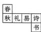  
第12题图

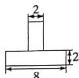  
从正面看

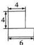  
从左面看

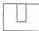  
[Non-Text]

13. 若一个棱柱有 18 个顶点, 则这个棱柱有 \_\_\_\_ 个面.  
14. 李师傅焊接了一“T型”机器零件,其从正面、左面、上面看到的形状图(单位:cm)如图所示,则该零件的表面积为\_\_\_\_.  
15. 如图, 将图①所示的展开图折叠为图②所示的正方体, 将其第一次沿 AB 边向右翻转 $90^{\circ}$ , 第二次沿 CD 边向右翻转 $90^{\circ}, \cdots$ , 以此类推, 分别记录朝上的面所对应的点数, 则第 2024 次翻转后, 朝上的面所对应的点数为 \_\_\_\_.

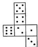  
图①

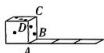  
图②  
第15题图

# 三、解答题(共6小题,共55分)

16. (8 分) (中考新考法·满足条件的结果开放) 如图是一些常见的几何体, 请将图中的几何体进行分类, 并说明分类依据.

  
①

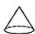  
②

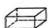  
③

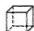  
④

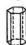  
⑤

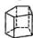  
⑥

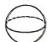  
⑦

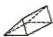  
⑧   
第16题图

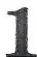

17. (8 分) 如图, 是用 6 个完全相同的棱长为 2 的小正方体搭成的几何体.

(1)请在方格纸中分别画出它从正面看,从左边看,从上面看的形状图;   
(2) 如果在这个几何体上再添加一些小正方体, 并保持从正面看和从上面看的形状图不变, 最多可添加几个小正方体?

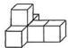  
第17题图

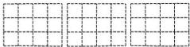

natural_image

Three identical grid diagrams with dashed lines, no text or symbols present

从正面看

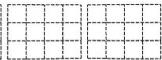  
从左面看

  
从上面看

18. (9 分) 如图是一直角三角形纸片, 两条较短的边长分别为 4 和 6, 现将三角形纸片绕两条短边中的一条所在的直线旋转一周.

(1)形成的几何体是\_\_\_\_,若用一平面去截该几何体,所得到的截面形状可能为\_\_\_\_(写出一种即可);  
(2)该几何体的体积是多少(结果保留 $\pi$ )?

  
第18题图

19.（9分）日常生活情境/塑料大棚/塑料大棚俗称冷棚，是一种简易实用的保护地栽培设施，可以将其看成是由如图所示的一个长方体和圆柱的一半组成的几何体，已知 $AB = 2\mathrm{m}$ ， $BC =$ $2\mathrm{m},BD = 10\mathrm{m}$

(1) 求塑料大棚的种植面积；  
(2) 围起一个这样的大棚需要多大面积的塑料薄膜(结果保留 $\pi$ )?

  
第19题图

20.（9分）(中考新考法·综合与实践——操作探究)新年将至，某手办店想要将一款手办包装成新年款式以提高销量，已知这款手办的包装盒的底面是正方形，侧面是4个完全一样的长方形，为了制作这种包装盒，需要先画出展开图纸样.

  
图①

  
图②

  
图③

  
图④

# 第20题图

(1)如图是店员小欣给出的四种纸样①,②,③,④(皆无盖),其中正确的有\_\_\_\_;  
(2) 新年期间,该店铺将举办为期 3 天的盲盒抽奖活动,现需大量无盖长方体纸盒,为了提高制作效率,小欣提出可以利用边长为 25 cm 的正方形油彩纸,将其四个角各剪去一个边长为

10 cm 的小正方形, 折成无盖长方体纸盒. 试着在图⑤中画出剪切线(用虚线表示), 并求出此时长方体无盖纸盒的容积.

  
第20题图⑤

21. (12分)(教材随堂练习第2题改编)如图①\~图④是将一个正方体按某种方式截去一部分后所得到的多面体.

  
图①

  
图②

  
图③

  
图④  
第21题图

(1) 分别写出图①\~图④截面的形状；  
(2)根据要求填写表格,并根据表格数据猜想f,v,e之间的关系;

<table><tr><td></td><td>面数(f)</td><td>顶点数(v)</td><td>棱数(e)</td></tr><tr><td>图1</td><td></td><td></td><td></td></tr><tr><td>图2</td><td></td><td></td><td></td></tr><tr><td>图3</td><td></td><td></td><td></td></tr><tr><td>图4</td><td></td><td></td><td></td></tr></table>

(3)根据猜想计算,若一个多面体有200个顶点,300条棱,求它的面数.

视频讲解  
  
第21题

# 第二章检测卷

<table><tr><td>题号</td><td>一</td><td>二</td><td>三</td><td>总分</td></tr><tr><td>得分</td><td></td><td></td><td></td><td></td></tr></table>

时间:90 分钟 满分:100 分

更多教辅关注公众号【全科A+】

# 一、选择题（共10小题，每小题3分，共30分）

1. 下列四个数中, 是负数的是 ( )

A. 3

B. $\vert-2\vert$

C. 0

D. $-\frac{1}{2}$

2. 化简 $-\left(-\frac{2}{3}\right)$ 的结果为 ( )

A. $\frac{2}{3}$

B. $-\frac{2}{3}$

C. $\frac{3}{2}$

D. $-\frac{3}{2}$

3. 下列选项中, 具有相反意义的量为 ( )

A. 向东 3 米和向北 3 米  
B. 弹簧伸长 5 cm 和弹簧缩短 6 cm  
C. 身高增加 1 cm 和体重下降 1 kg  
D. 胜 2 局和平 4 局

4. 用四舍五入法对5.17045取近似值,其中错误的是 ( )

A. 5.2(精确到十分位)   
B. 5.17(精确到百分位)   
C. 5.17(精确到0.001)   
D. 5.1705(精确到0.0001)

5. 数学文化情境 古代容量单位 《孙子算经》卷上记载：“十圭为抄，十抄为撮，十撮为勺，十勺为合。”则十合等于 （）

A. $10^{2}$ 圭

B. $10^{3}$ 圭

C. $10^{4}$ 圭

D. $10^{5}$ 圭

6. 若数轴上点 A 表示的数是 2, 点 A 和点 B 之间的距离为 5, 则点 B 表示的数是 ( )

A.-3

B. 7

C.-3或7

D.-7或3

7. 日常生活情境（广式月饼）广式月饼是我国著名的月饼之一。某品牌的广式月饼，标准净含量为50 g。下表是（编号分别为①，②，③，④）4块广式月饼的检验结果，“+”和“-”分别表示比标准净含量（单位：g）多或少，则重量最接近标准的一块月饼的编号为（）

<table><tr><td>编号</td><td>1</td><td>2</td><td>3</td><td>4</td></tr><tr><td>与标准净含量的差值</td><td>-0.53</td><td>+1.47</td><td>-1.72</td><td>+0.84</td></tr></table>

A. ①

B. ②

C. ③

D. ④

8. 老师设计了接力游戏,用合作的方式完成有理数的混合运算,规则是:每位同学只能在上一位同学的基础上进一步计算,再将结果传给下一位同学,最后解决问题,过程如图所示.在接力中,从哪位同学负责的那一步开始出错()

text_image

老师
(-3)²-32÷8×2
甲
9-32÷8×2
乙
9-32÷16
丙
9-2
丁
7

第8题图

A. 甲

B. 乙

C. 丙

D. 丁

9. 跨学科情境（跨地理海拔与大气压）已知海拔每升高100 m，大气压就会下降约1.1 kPa（kPa：大气压单位）。明明假期爬山时，在山脚下测得大气压的值为100 kPa，爬到山顶时测得大气压的值为72.5 kPa，则明明所爬山的高度为（）

A. 250 m

B. 2 000 m

C. 2 500 m

D. 2 700 m

10. 如图, 边长为 2 个单位长度的正方形 ABCD 一边与数轴重合, 点 A 对应数轴上的 -4, 点 D 对应数轴上的 -2, 将正方形 ABCD 沿数轴正方向滚动, 则数轴上的数字 2024 对应的点将与正方形 ABCD 的哪一点重合? ()

  
第10题图

A. 点 $A$

B. 点 $B$

C. 点 C

D. 点 $D$

# 二、填空题(共5小题,每小题3分,共15分)

11. 比较大小: $-\frac{2}{3}$ \_\_\_\_ - $\frac{3}{4}$ (填“>”“<”或“=”).

# 主题情境 “白色荒漠”南极洲 请完成第12\~13题.

12. 据不完全统计,南极洲约有海豹3200万头,约占世界海豹总数的90%. 数据3200万用科学记数法表示为\_\_\_\_.  
13. 南极洲大陆几乎全被冰雪所覆盖, 是世界上最冷的陆地. 南极洲某地某天早晨的气温是 -41.8 ℃, 中午上升了 3.7 ℃, 夜间又下降了 6.1 ℃, 那么这天夜间的气温是 \_\_\_\_ ℃.  
14. 小张在纸上画了一条数轴，并按照如图所示方式折叠纸面，使得数轴上表示数-2的点和表示数4的点重合，表示数5的点与

点 A 重合, 则点 A 表示的数为 \_\_\_\_.

  
第14题图

15.（教材习题第5题改编）有一电脑数学游戏：每按一次 $A$ 键，屏幕上的数字加上5；每按一次 $B$ 键，屏幕上的数字乘-2；每按一次 $C$ 键，屏幕上的数字除以8.已知屏幕上的初始数字为-1.例如：若按键顺序为 $A\rightarrow B$ ，则屏幕上的数字为-8.若按键顺序为 $A\rightarrow B\rightarrow C\rightarrow A\rightarrow B\rightarrow C\cdots$ ，依照这样的按键规律，按了2025次后，屏幕上的数字是

# 三、解答题(共7小题,共55分)

16. (6 分) 把下列各数分别填在相应的集合里.

$$
- 2 0 2 4, 3. 5, + 1. 2, 0, \frac {5}{6}, - 1 \frac {1}{3}, 1 2, - 3. 1 4, 4 \%, 2. \dot {7}.
$$

(1) 正数集合: | …|;   
(2)整数集合：| …|；  
(3)负分数集合：| …|.

17. (6分)计算: (1) $\frac{1}{4}+\left(\frac{1}{3}\right)-\left(\frac{5}{6}\right)+\left(\frac{13}{6}\right)$ ;

(2) $-\left(-\frac{1}{2}\right)\times\left[(-7)+9\div(-3)\right]$ ;   
(3) $-2^{3}-0.75\div(-\frac{5}{4})\times[6+(-2)^{2}]$

18. (7分)(教材习题第8题改编)如图,点A,B在数轴上,点C表示的数为-|-1.5|,点D表示的数为-(-3),点E表示的数为 $-1\frac{1}{3}$ .

(1) 点 A 表示的数为 \_\_\_\_，点 B 表示的数为 \_\_\_\_；  
(2) 在数轴上表示出点 C, D, E;  
(3) 比较五个有理数的大小, 并用“<”连接起来.

  
第18题图

19. (8 分)(中考新考法·代数推理——归纳一般结论) 观察下列算式, 寻找规律, 利用规律解答问题.

$$
1 \times 3 + 1 = 4 = 2 ^ {2};
$$

$$
2 \times 4 + 1 = 9 = 3 ^ {2};
$$

$$
3 \times 5 + 1 = 1 6 = 4 ^ {2};
$$

$$
4 \times 6 + 1 = 2 5 = 5 ^ {2};
$$

...

(1) 根据上述规律填空: $7 \times 9 + 1 =$ \_\_\_\_ $=$ \_\_\_\_ ;   
(2) 计算: $(1+\frac{1}{1\times3})\times(1+\frac{1}{2\times4})\times(1+\frac{1}{3\times5})\times\cdots\times(1+\frac{1}{9\times11})$ .

20. (9 分)(教材习题第 5 题改编)西安地铁 16 号线是陕西省首条采用全自动无人驾驶系统的轨道交通线路,北起于秦创原中心站,南止于诗经里站,其中的 9 个站点如图所示。小李从秦创原中心站开始乘坐地铁,在图中的地铁站点中做值勤志愿服务,到 A 站下车时,本次值勤志愿服务活动结束。约定向诗经里站方向为正,经过 1 站路程记为 1,当天的乘车记录如下(单位:站):+5,+2,-6,+7,-3,-2,+5,-6。

(1)请你通过计算说明 A 站是哪一站?  
(2)已知相邻两站之间的平均距离约为 $1.9\mathrm{km}$ ，求小李在值勤志愿服务期间乘坐地铁行进的总路程；  
(3)在(2)的条件下,请问在小李做值勤志愿服务的8个站点中,哪个站点距离秦创原中心站(数轴原点)最近?哪一站最远?它们相距多远?

flowchart

第20题图

21. (9 分)(中考新考法·解题方法型阅读理解题)在解决问题的过程中,我们常用到“分类讨论”的数学思想,下面是运用分类讨论的思想解决问题的过程,请仔细阅读并填空,根据要求解决下列问题.

【提出问题】若非零有理数 a, b 同号，求 $\frac{|a|}{a} + \frac{|b|}{b}$ 的值.

【解决问题】解：由 $a, b$ 同号可知， $a, b$ 有两种可能。

(1) 若 $a > 0, b > 0$ , 有 $|a| = a, |b| = b$ , 所以 $\frac{|a|}{a} + \frac{|b|}{b} = \frac{a}{a} + \frac{b}{b} =$ \_\_\_\_;

(2) 若 $a$ \_\_\_\_ 0, b < 0, 有 $|a| = -a$ , $|b| = \_\_\_\_$ , 所以 $\frac{|a|}{a} + \frac{|b|}{b} = \_\_\_\_$ = -2;

综上所述， $\frac{|a|}{a} +\frac{|b|}{b}$ 的值为2或-2；

【拓展探究】(3)若三个有理数 a, b, c 满足 abc > 0，求 $\frac{|a|}{a} + \frac{b}{|b|} + \frac{|c|}{c}$ 的值.

22. (10分)如图, $A, B, C$ 三个点在数轴上表示的数分别为 $a, b, c$ , 且 $|a + 16| + |b + 6| + (c - 8)^2 = 0$ . 动点 $P$ 从点 $B$ 出发, 以每秒1个单位长度的速度向终点 $C$ 运动.

(1) 求 $a, b, c$ 的值；  
(2) 点 P 运动到点 C 前, 若点 P 到点 A 距离是到点 C 距离的 3 倍, 求点 P 运动的时间;  
(3) 若点 P 运动的同时, 点 Q 从点 A 出发, 以每秒 3 个单位长度的速度向点 C 运动, 点 Q 到达点 C 后, 再立即以同样的速度返回, 运动到终点 A, 在点 P 开始运动后, P, Q 两点之间的距离能否为 2 个单位长度? 如果能, 请求出此时点 P 表示的数; 如果不能, 请说明理由.

  
第22题图

# 第三章检测卷

<table><tr><td>题号</td><td>一</td><td>二</td><td>三</td><td>总分</td></tr><tr><td>得分</td><td></td><td></td><td></td><td></td></tr></table>

时间:90 分钟 满分:100 分

# 一、选择题(共10小题,每小题3分,共30分)

1. 下列代数式中属于单项式的是 （）

A. $\frac{a}{x}$

B. $x^{2} + \frac{2}{x + 1}$

C. $x^{2}-m^{2}$

D.-3

2. 下列各式中与 $x - y + z$ 的值不相等的是 （）

A. $x - (y + z)$

B. $x-(y-z)$

C. $(x-y)-(-z)$

D. $z-(y-x)$

3. 多项式 $xy^{5} - 7xy + x^{2}y$ 的次数和项数分别是 （）

A. 5,3

B. 6,3

C. 5,-7

D. 6,-7

4. 下列计算正确的是 ( )

A. $x^{2} + x^{2} = 2x^{4}$

B. $4m^{4}-3m^{3}=m$

C. $-3mn + \frac{5}{2} mn = -\frac{1}{2} mn$

D. $2x^{2}y+3xy^{2}=5x^{2}y$

5. 跨学科情境/跨物理串联电路 在物理学中, 串联电路中总电压等于各部分电路电压之和, 常用公式 $U = IR_{1} + IR_{2}$ ( $U$ 表示电压, $I$ 表示电流, $R_{1}, R_{2}$ 表示各部分电路中的电阻) 求串联电路的总电压, 当 $I = 2, R_{1} = 12.6, R_{2} = 22.4$ 时, 电压 $U$ 的值是 ( )

A. 19.6

B. 35

C. 44.8

D. 70

# 主题情境 文创展览 请完成第6\~7题.

6. 如图是某文创展馆的部分区域示意图, 阴影部分为文创文具的展出区域, 空白部分为宽为 2 m 的走廊, 则文创文具展出区域的周长为 ( )

  
第6题图

A. $(b-2)$ m

B. $(a-4)$ m

C. $(2a+2b)$ m

D. $(2a+2b-12)$ m

7. 晨晨参观完文创展览后用现金买了6支相同的文创书签，找回了(60-6a)元，有下列两种说法：

text_image

若晨晨原有现金60元，则每支书签a元
若每支书签2a元，则晨晨原有现金(60+6a)元
小华
小丽

则下面判断正确的是 （）

A. 小华说法正确,小丽说法错误

B. 小华说法错误,小丽说法正确

C. 小华、小丽说法均正确

D. 小华、小丽说法均错误

8. 已知关于 $x$ 的多项式 $(a - 3)x^{3} + 4x^{2} + (4 - b)x + 3$ 不含三次项和一次项，则 $(a - b)^{2024}$ 的值为 （）

A. 1

B. 0

C.-1

D.-2

9. 当 x=2 时, 整式 $mx^{3}-nx+3$ 的值为 2024, 那么当 x=-2 时, 整式 $mx^{3}-nx+3$ 的值为 ( )

A. -2 016

B. -2 018

C. -2 022

D. -2 024

10.（教材尝试·思考改编）已知一个三位数的百位上的数为 $m$ ，个位上的数为 $n$ ，把百位上的数与个位上的数交换位置，十位上的数不变，原数与所得数的差恰好是5的倍数，则下列 $m,n$ 的值满足条件的是 （）

A. m=3, n=2

B. m=4, n=0

C. m=6, n=2

D. m=6, n=1

二、填空题(共5小题,每小题3分,共15分)

11. 整式 $M = -2a + b$ 与 N = 4a - 3b 的和为 \_\_\_\_.

12. 若单项式 $5m^{8}n^{6}$ 与 $-\frac{3}{4} m^{2a}n^{2b}$ 是同类项, 则 $a = \_$ , $b = \_$ .

13.（教材复习题第2题改编）如图是一个简单的数值运算程序框图，如果输入 $x$ 的值为2，那么输出的数值是

  
第13题图

14. 日常生活情境（兵马俑纪念品）随着秦兵马俑的发掘与展出，秦兵马俑装饰品也日渐成为中外游客理想的纪念品和礼品。某商铺以每个 $m$ 元的价格从 $A$ 厂购置了206个秦兵马俑摆件，以

每个 $n$ 元 $(m > n > 0)$ 的价格从 $B$ 厂购置了194个秦兵马俑摆件，经包装后以每个 $\frac{m + n}{2}$ 元的价格全部卖出，则这家商铺\_\_\_\_（填“盈利”或“亏损”）了.

15. 如图, 取一条长度为 1 的线段, 将它三等分, 去掉中间一段, 留剩下两段, 这称为第一阶段; 然后将剩下的两段再三等分, 各去掉中间一段, 剩下更短的四段, 这称为第二阶段; …, 将这样的操作无限地重复下去, 那么经过第 n 阶段后, 留下的线段的长度之和为 \_\_\_\_.

natural_image

Pure electrical circuit lines without any symbols

第15题图

# 三、解答题(共7小题,共55分)

16. (8分)化简下列各式：

(1) $-0.8a^{2}b-6a^{3}-1.2a^{2}b+5a^{3}+2;$

(2) $2(m^{2}-2m)-3(-\frac{1}{3}m^{2}+4m)$ .

17. (8 分) 先化简, 再求值:

(1) $2(4a-3)-3(2a^{2}-3a+1)-4a^{2}$ ，其中a=3；

(2) $3ab-\left[(4a^{2}-2ab+b^{2})-\frac{1}{2}(8a^{2}-6ab-4b^{2})\right]$ ，其中a,b满足 $(a\frac{1}{4})^{2}+|b+2|=0.$

万唯原创好题，复印、盗版必究。举报电话：029-8756 9851

18. (7 分) 如图, 是一个小正方体的表面展开图, 每一个面上的字母都代表一个式子, 已知 $A = -\frac{1}{2} a^2 b + a^3$ , $B = a^3 + \frac{1}{5} a^2 b + 3$ , $C = a^3 - 1$ , $D = -\frac{1}{5} \times (a^2 b + 15)$ .

(1)与面A,面B相对的面分别是\_\_\_\_;   
(2)若相对的两个面所表示的两个代数式的和都相等,求 E,F 代表的式子.

  
第18题图

19. (7 分) (中考新考法·选择条件开放) 在整式 $5x^{2}-[2xy-3(\frac{1}{3}xy \bigcirc 6)+9]-x^{2}$ 中, “○” 是“+,-,×,÷” 中的某一种运算符号, 请按要求完成下列各题.

(1)请选择一种符号代表“○”，并化简这个整式；  
(2) 若“○”是“×”，且 $x^{2}+xy=6$ ，求这个整式的值.

20. (7 分)(中考新考法·代数推理——归纳一般结论)用火柴棒按如图的方式摆图形,并解决以下问题:

(1) 按图示规律完成下表；

<table><tr><td>图形编号</td><td>1</td><td>2</td><td>3</td><td>4</td><td>5</td><td>...</td><td>n</td></tr><tr><td>所用欠柴棒根数</td><td>10</td><td>16</td><td>22</td><td></td><td></td><td>...</td><td></td></tr></table>

(2) 求摆第 100 个图形需要的火柴棒根数；  
(3) 小颖同学说她按这种方式摆出来的一个图形用了 100 根火柴棒, 你认为可能吗? 如果可能, 那么是第几个图形? 如果不可能, 请说明理由.

text_image

图①
图②
图③

第20题图

21. (8 分) 传统文化情境/传统手工艺 景德镇是“瓷器之国”的代表和象征. 某瓷器店计划前往景德镇购进如图所示的青花瓷碗、玲珑瓷茶杯和粉彩瓷花瓶共30件瓷器进行销售, 其中玲珑瓷茶杯的数量比青花瓷碗的3倍少5.

natural_image

Three black-and-white porcelain items: a bowl with floral patterns, a teapot with lid, and a vase with floral patterns (no text or symbols visible)

第21题图

已知这3种瓷器的单价如下表所示：

<table><tr><td>品名</td><td>青花瓷碗</td><td>玲珑瓷茶杯</td><td>粉彩瓷花瓶</td></tr><tr><td>单价/元</td><td>75</td><td>50</td><td>130</td></tr><tr><td>数量/件</td><td>x</td><td></td><td></td></tr></table>

(1)用含 $x$ 的代数式补全表格；  
(2)请用含 $x$ 的代数式表示购进30件瓷器所需的总费用；  
(3) 当 x=3 时, 求购进 30 件瓷器所需的总费用.

22. (10 分) 如图①是北京鸟巢田径比赛的场地, 图②是其示意图已知最内圈跑道周长为 400 m, 且内圈弯道的半径 R 约为 36 m, 每条跑道宽约 1.2 m ( $\pi$ 取 3.14, 结果保留整数).

(1)求最内圈跑道中每段直道的长度；  
(2)跑道周长(单位:m)随跑道圈数的变化而变化.请完成下表:

<table><tr><td>跑道圈数</td><td>1</td><td>2</td><td>3</td><td>4</td><td>...</td></tr><tr><td>跑道周长</td><td>400</td><td></td><td></td><td></td><td>...</td></tr></table>

若设 a 表示跑道圈数, b 表示该条跑道周长(单位:m), 试用含 a 的代数式表示 b;

(3)已知该场地共有8条跑道,求最外圈的跑道周长.

  
图①

text_image

a
R=36
直道
最内圈

图②  
第22题图

  
第22题

[Unreadable]

# 期中检测卷

<table><tr><td>题号</td><td>一</td><td>二</td><td>三</td><td>总分</td></tr><tr><td>得分</td><td></td><td></td><td></td><td></td></tr></table>

时间:100 分钟 满分:120 分

更多教辅关注公众号【全科A+】

# 一、选择题（共10小题，每小题3分，共30分）

1. 在 $x^4, 5, 2x + 5, \frac{x + y}{2}, ab - 5, \frac{x}{2}, \frac{6xy}{x + y}$ 中，单项式的个数是 （）

A. 1

B. 2

C. 3

D. 4

2. 国家社会情境/可燃冰自然资源部数据显示,我国是全球“可燃冰”资源储量最多的国家之一,除了陆地冻土区外,整个南海的可燃冰地质资源量约为700亿吨油当量,将700亿用科学记数法表示为()

A. $7 \times 10^{10}$

B. $7 \times 10^{9}$

C. $0.7 \times 10^{11}$

D. $70 \times 10^{9}$

3. 下列图形经过折叠可以围成一个棱柱的是

  
A

  
B

  
C

  
D

4. 下列说法中, 正确的是

A. 符号相反的两个数互为相反数  
B. 如果 $a$ 大于 $b$ , 那么 $a$ 的倒数小于 $b$ 的倒数  
C. 一个数的数量大小叫作这个数的绝对值  
D. 部分有理数不能用数轴上的点表示

5. 下列运算正确的是

A. $-12\div(-6)=-2$   
C. $\frac{2}{3} \times \left(-\frac{9}{4}\right) = \frac{3}{2}$

主题情境 郁金香的种植 请完成第6\~7题.

6. 郁金香的原种地在中国新疆,新疆郁金香最初由传教士从新疆带到土耳其,后引入到世界各地.郁金香最适宜的生长条件是该地区的四季温差不超过 $30^{\circ}$ C,若不考虑其他因素,表中的四个地区中,最适合大面积栽培郁金香的地区是()

<table><tr><td></td><td>甲地区</td><td>乙地区</td><td>丙地区</td><td>丁地区</td></tr><tr><td>四季最高温度/°C</td><td>24</td><td>23</td><td>37</td><td>19</td></tr><tr><td>四季最低温度/°C</td><td>-11</td><td>-8</td><td>2</td><td>-6</td></tr></table>

A. 甲地区

B. 乙地区

C. 丙地区

D. 丁地区

7.（教材复习题第8题改编）某基地引入某品种郁金香种子，计划在一块长方形空地上进行种植，如图所示，空白部分为郁金香种植区域，则郁金香的种植面积为 （）

A. $7.5+11x$

B. -7.5+11x

C. -8.5+11x

D. $-7.5 + 12x$

text_image

1.5
12
x
2

第7题图

  
第9题图

8.（中考新考法·新定义型阅读理解题）用“\*”定义如下新运算：对于任意的有理数 $a$ 和 $b$ ，都有 $a*b = b^2 -3a.$ 例如： $\frac{1}{3} *5 = 5^{2} - 3\times \frac{1}{3} = 24$ ，当 $m = 2$ 时， $m*\left[m*\left(-3\right)\right]$ 的结果为 （

A.-9

B.-3

C. 3

D. 9

9.（教材习题第4题改编）如图是一个正方体纸盒的展开图，若正方体相对面上的两个数字之和相等，则 $x - 2y$ 的值为 （）

A. 9

B.-9

C. 39

D. -39

10. 如图, 下列各三角形中的三个数均有相同的规律, 则最后两个三角形中, $m+n$ 的值为 ( )

  
第10题图

A. 154

B. 155

C. 164

D. 173

# 二、填空题(共5小题,每小题3分,共15分)

11. 计算 $(-24)-12+(+5)$ 的结果为 \_\_\_\_.  
12. 用平面去截正方体和圆锥, 若得到的截面形状相同, 那么截面的形状为 \_\_\_\_.  
13. 若 $4xy^{|k|} - \frac{1}{5} (k - 2)y^2 + 1$ ( $k$ 为常数) 是三次三项式, 则 $k$ 的值为 \_\_\_\_.  
14. 把下列各数填在相应的集合内：

$$
- 2. 5, 0, 5, - \frac {4}{3}, 1. 7.
$$

(1)负分数集合：{ …}；  
(2)非负数集合：{ …}.

15.（教材随堂练习第1题改编）现有一堆卡片，小颖按如下步骤操作：

①将这堆卡片分成左、中、右三堆张数相同的卡片，且每堆卡片不少于八张；  
②分别从左、右两堆卡片中各拿出三张卡片，放入中间一堆；  
③左边一堆有几张卡片，就从中间一堆拿几张卡片放入左边一堆。

这时,小聪准确说出了中间一堆卡片现有的张数,则他说出的张数是\_\_\_\_.

万唯原创好题，复印、盗版必究。举报电话：029-8756 9851

# 三、解答题(共8小题,共75分)

16. (8 分) 计算：

(1) $(-36)\times(-\frac{4}{9}+\frac{5}{6}-\frac{7}{12})$ ;

(2) $-1^{4}-(1-\frac{1}{2})\times\frac{3}{8}\div\frac{1}{(-4)^{2}}.$

17. (8 分) 先化简, 再求值:

(1) $(xy^{2}-xy)+(x-4y)-(-xy)$ ，其中x=2,y=-1；

(2) $2(3a^{2}-\frac{1}{2}a+2b-ab)-3(2a^{2}-3a-\frac{4}{3}b+ab)$ ，其中a,b满足 $a+b=\frac{3}{4}$ ,ab=-2.

18. (9分)(中考新考法·过程纠错改错)欢欢计算 $(-24)\div(\frac{1}{3}-\frac{3}{8}+\frac{1}{4})$ 的过程如下：

$$
\begin{array}{r l} \text {解:原式} & = (- 2 4) \div \frac {1}{3} - (- 2 4) \div \frac {3}{8} + (- 2 4) \div \frac {1}{4} \\ & = - 7 2 - (- 6 4) - 9 6 \\ & = - 1 0 4. \end{array}
$$

(1)老师看过后告诉欢欢计算错了,欢欢计算错误的原因为\_\_\_\_;
(2)请你写出正确的计算过程.

19. (9分)“逐梦巴黎·毕加索青年时期作品&真迹特展”于2024年3月1日在上海市毕加索艺术馆正式举办。本届展览门票种类及价格如图所示，某校美术社团的10名同学利用周末到毕加索艺术馆参观。已知他们中有x名同学抢到了早鸟票，其余同学购买了正价票。

早鸟票68元/张；  
正价票88元/张；  
·现役军人，残疾人可凭有效证件免票

第19题图

(1) 求这 10 名同学此次购买展览门票的总费用 (用含 x 的代数式表示并化简);
(2) 若有 3 人抢到早鸟票, 求这 10 名同学购买展览门票的总费用.

20. (9 分) 日常生活情境 U 型池 如图是一供滑板爱好者使用的 U 型池的示意图, 中间可供滑行部分的截面是直径为 8 m 的半圆, U 型池总长为 20 m, 请回答下列问题:

(1) 请你画出 U 型池从正面、左面看到的形状图，并在图中标注相应的尺寸；  
(2) 求 U 型池的体积(结果保留 $\pi$ ).

  
第20题图

21. (10分)某自助餐厅开业大酬宾,采取第一周35元/位,第二周40元/位,第三周45元/位,从第四周开始50元/位的方式吸引顾客,经统计该餐厅前四周的就餐人数如下表所示(超过200人的记为“+”,低于200人的记为“-”)。每位顾客的用餐成本约为15元(利润=售价-成本).

<table><tr><td>周次</td><td>一</td><td>二</td><td>三</td><td>四</td></tr><tr><td>就餐人数</td><td>+50</td><td>+20</td><td>-5</td><td>-40</td></tr></table>

(1)这四周中哪个周获利最多？利润最多为多少？  
(2)这四周中,获利最多的一周与获利最少的一周利润相差多少元?

万唯原创好题，复印、盗版必究。举报电话：029-8756 9851

22. (10 分) (中考新考法·综合与实践——类比猜想) 如图①是 2024 年 11 月份的日历, 小乐在其中画出一个 $3 \times 3$ 的方框 (粗线框), 框住九个数, 计算其中位置如图②所示的四个数 “ $(c - b) + (d - a)$ ” 的值, 探索其运算结果的规律.

  
图①

  
图②

  
图③  
第22题图

# 【初步分析】

(1)计算图①中(25-13)+(27-11)的结果为\_\_\_\_；将3×3的方框移动到图①中的其他位置，通过计算可以发现 $(c-b)+(d-a)$ 的值为\_\_\_\_；

# 【数学思考】

(2) 小乐认为 (1) 中猜想正确, 其说理的过程如下, 请你将其补充完整.

解: 设 a = x，则 $b = x + 2, c = x + 14, d =$ \_\_\_\_.

$$
(c - b) + (d - a) = [ (x + 1 4) - (x + 2) ] + [ (\quad) - x ]
$$

$$
= \underline {{\quad}}.
$$

所以， $(c - b) + (d - a)$ 的值均为

# 【拓广探究】

(3)探究方框框住的如图③所示的四个数“\((c - b) + (d - a)\$”的值满足的规律，写出你的结论，并说明理由.

23. (12 分) 如图, 点 A 对应的有理数为 a, 点 B 对应的有理数为 b, 点 C 对应的有理数为 c, 且 c = -1, 点 C 向左移动 2 个单位长度到达点 A, 再向右移动 7 个单位长度到达点 B.

(1) $a = \_\_\_\_ , b = \_\_\_\_ ;$   
(2) 若将数轴折叠, 使得点 A 与点 B 重合, 求与点 C 重合的点表示的数;  
(3) 若点 A 以每秒 1 个单位长度的速度向左运动, 同时点 B 和点 C 分别以每秒 3 个单位长度和每秒 1 个单位长度的速度向右运动, 假设 t 秒过后, 点 A 与点 C 之间的距离为 m, 点 B 与点 C 之间的距离为 n, m-n 的值是否会随着时间 t 的变化而改变?

  
第23题图

几何画板动态演示  
  
数轴上的运动点问题

# 第四章检测卷(一)

<table><tr><td>题号</td><td>一</td><td>二</td><td>三</td><td>总分</td></tr><tr><td>得分</td><td></td><td></td><td></td><td></td></tr></table>

时间:90 分钟 满分:100 分

更多教辅关注公众号【全科A+】

一、选择题(共10小题,每小题3分,共30分)

1.夜晚，汽车灯射出的光线可以看成是 （）

A. 直线

B. 射线

C. 线段

D. 折线

2. 下列作图语句中, 正确的是 ( )

A. 在射线 OC 上截取射线 CD=2 cm  
B. 画直线 MN 的中点 P  
C. 作 $\angle AOB = \angle \alpha$   
D. 延长线段 $AB$ 至点 $C$ , 使 $AC = BC$

3. 将 3 960"用度表示为 ( )

A. $1.6^{\circ}$

B. $1.4^{\circ}$

C. 1. $1^{\circ}$

D. $0.8^{\circ}$

4. 下列是正多边形的是 ( )

A.三条边都相等的三角形

B. 四个角都是直角的四边形

C. 四条边都相等的四边形

D.六条边都相等的六边形

5. 已知射线 OC 在 $\angle AOB$ 的内部, 下列选项不能判断 OC 是 $\angle AOB$ 的角平分线的是 ()

A. $\angle BOC = \angle AOC$

B. $\angle AOB = 2\angle AOC$

C. $\angle BOC + \angle AOC = \angle AOB$

D. $\angle AOC = \frac{1}{2}\angle AOB$

6.（教材观察·思考改编）如图，海面上有一个灯塔 $O$ ，测得岛 $A$ 在灯塔 $O$ 北偏东 $45^{\circ}$ 方向上，岛 $B$ 在灯塔 $O$ 南偏东 $30^{\circ}$ 方向上，则灯塔 $O$ 的位置可能是 （）

A. $O_{1}$

B. $O_{2}$

C. $O_{3}$

D. $O_{4}$

$^{*}O_{2}$ $^{*}A$ ↑北 $^{*}O_{1}$

$\cdot O_{3}$

$\cdot O_{4}$ .B

第6题图

  
图①

  
图②

第8题图

7. 已知 A, B, C, D 四点在同一直线上, 若 AB = 6, 点 C 是线段 AB 的中点, 点 B 是线段 AD 的中点, 则线段 CD 的长为 ( )

A. 6

B. 8

C. 9

D. 12

8.（教材习题第2题改编）有诗曰：“开合清风纸半张，随之舒卷岂寻常。花前月下团圆坐，一道清风共自凉。”讲的就是扇子，如图①。如图②，打开的折扇可看作是圆面的一部分，设扇形的面积为 $S_{1}$ ，其圆心角为 $\theta$ ，圆面中剩余部分的面积为 $S_{2}$ ，当 $S_{1}$ 与 $S_{2}$ 的比值为 $\frac{3}{5}$ 时，扇面为“美观扇面”，则此时 $\theta$ 为()

A. $105^{\circ}$

B. $120^{\circ}$

C. $135^{\circ}$

D. $216^{\circ}$

9. 如图, 点 $C$ 为线段 $AB$ 上一点, 点 $D$ 为 $CB$ 中点, 点 $E$ 为 $CD$ 中点, 有如下结论: ① $BD = 2CE$ ; ② $AC = AB - 2ED$ ; ③ $CE = \frac{1}{2}(BC - BD)$ ; ④ $BD = \frac{1}{2}(AB - AC)$ . 其中正确的有 ( )

A. ①④

B. ①②③

C. ①③④

D. ②③④

  
第9题图

  
第10题图

10.（教材习题第9题改编）如图，已知 $\angle AOB = 120^{\circ}$ ，射线 $OC,OD$ 在 $\angle AOB$ 内部， $\angle AOC = 60^{\circ},\angle BOD = 40^{\circ}$ ，若 $OP$ 为 $\angle AOC$ 的平分线， $\angle BOQ = \frac{1}{2}\angle BOD$ ，则 $\angle POQ$ 的度数为 （）

A. $70^{\circ}$

B. $110^{\circ}$

C. $70^{\circ}$ 或 $110^{\circ}$

D. $130^{\circ}$ 或 $170^{\circ}$

# 二、填空题(共5小题,每小题3分,共15分)

11. 观察图中数据,判断铅笔 A 的长度 \_\_\_\_ 铅笔 B 的长度(填“>”“<”或“=”).

  
第11题图

  
第13题图

主题情境 会场布置 请完成第 12\~13 题.

12. 工作人员在布置会场时,为了将所有的姓名牌对齐,进行了如下操作:先放置第一个姓名牌,然后放置最后一个姓名牌,以此拉一条线作为参照进行放置. 这么做的原因是\_\_\_\_.  
13. 在开会前,工作人员通常会在会场中挂一个钟表,如图是当下一款常见的计时钟表,呈八边形形状.将该八边形截去一个角,则剩余的图形可能是\_\_\_\_边形.

14. 传统文化情境/传统计时器/如图,在我国古代,人们用“铜壶滴漏”的方法计时,把一昼夜分为十二时辰,对应于今天的二十四小时,又划为九十六刻,一刻对应于今天的十五分钟.已知寅时二刻为凌晨三点三十分,则寅时二刻对应钟表的时针和分针之间所夹的角度为\_\_\_\_.

  
第14题图

  
第15题图

15. 如图, 已知点 M 在线段 AB 上, 5AM = AB, P, Q 分别为线段 AM, MB 上的两点, $AP = \frac{1}{2}AM$ , $MQ = \frac{1}{3}MB$ , 若 AB = 20, 则线段 PQ 的长为 \_\_\_\_.

# 三、解答题(共7小题,共55分)

16. (6分)(教材习题第5题改编)如图,平面内有四个点A,B,C,D,请你按要求作图:

(1)作直线AB,线段CD;   
(2)①作射线 AD 与射线 BC 交于点 E;  
②延长线段 CE 到 F，使 CF=3CE；  
③在②的条件下，若点C为BE中点，CE=2cm，则BF=\_cm.

A·

•D

B· $^{•}$ C

第16题图

17. (7 分) (中考新考法·补充过程及依据) 补全解题过程: 如图, 一束光线 AO 照射到玻璃表面 DE 时, 发生了折射和反射现象. 若 $\angle AOB = 80^{\circ}, \angle EOC = 70^{\circ}, \angle KOE = 90^{\circ}$ , 且 OK 为 $\angle AOB$ 的平分线, 求反射光线与折射光线形成的 $\angle BOC$ 的度数.

text_image

入射光线
A
K
B
反射光线
D
O
E
玻璃表面
折射光线
C

第17题图

万唯原创好题，复印、盗版必究。举报电话：029-8756 9851

解: 因为 $\angle AOB = 80^{\circ}$ , OK 为 $\angle AOB$ 的平分线,

所以 $\angle BOK = \frac{1}{2} \angle$ \_\_\_\_ = \_\_\_\_°. (依据: \_\_\_\_)

又 $\angle KOE = 90^{\circ}$

所以 $\angle BOE = \angle KOE - \angle$ \_\_\_\_ = \_\_\_\_°,

又 $\angle EOC = 70^{\circ}$

所以 $\angle BOC = \angle$ + $\angle$ = $^\circ$ .

18. (7 分)(教材例题改编)将一个圆分割成三个扇形.

(1) 若其中一个扇形的圆心角为 $72^{\circ}$ ，另外两个扇形的圆心角度数之比为 3:5，求这两个扇形的圆心角度数；

(2)在(1)的条件下,若该圆的半径为3,请在圆内画出这三个扇形并求其中圆心角度数最小的扇形面积.

19. (8 分) 某地政府计划在本地打造一个生态湿地公园, 如图是其简易地图, O 为公园的正中心, A, B, C 是公园内三个景点. 经测量得, 景点 A 位于中心 O 的北偏东 $43^{\circ}45'$ 方向, $\angle AOB = 32^{\circ}49'$ , 景点 C 位于中心 O 的北偏西 $43^{\circ}45'$ 方向.

(1) 景点 B 位于中心 O 的什么方向?

(2) 求 $\angle BOC$ 的度数.

  
第19题图

20. (8 分)(中考新考法·代数推理——归纳一般结论)

【观察思考】如图，五边形 ABCDE 内部有若干个点（任意三点不共线），将这些点与五边形的顶点相连可以把原五边形分割成一些三角形（互相不重叠）.

  
内部有1个点

  
内部有2个点

  
内部有3个点 …

【规律总结】(1)填写下表：

<table><tr><td>五边形 ABCDE 内点的个数</td><td>1</td><td>2</td><td>3</td><td>4</td><td>...</td><td>n</td></tr><tr><td>分割成的三角形的个数</td><td>5</td><td>7</td><td>9</td><td></td><td>...</td><td></td></tr></table>

【问题解决】(2)当五边形 ABCDE 内部有 100 个点时, 可被分割成多少个三角形?

【拓展应用】(3)由此猜想:当六边形内点的个数为n时,可被分割成多少个三角形?十二边形呢?

视频讲解  
  
中考新考法题

21. (9分)如图, $A, B, C, D$ 是数轴上的4个点, 已知点 $D$ 是 $AB$ 中点, $AB = 12$ , 点 $A$ 在数轴上对应的数是-3, 且点 $C$ 是线段 $AB$ 上靠近 $B$ 点的一个三等分点.

  
第21题图

(1) 分别求出点 B, C, D 在数轴上对应的数；
(2) 若点 E 是线段 AD 上一点，且 CD = 2DE，则点 C 是线段 BE 的中点，这个说法正确吗？请说明理由；

(3) 数轴上是否存在一点 F 使得 AD-CF=5？若存在，求点 F 在数轴上对应的数；若不存在，请说明理由.

22. (10分)已知将一副三角尺(直角三角尺OCD和直角三角尺OEF)按图①位置摆放在直线AB上,将直角三角尺OEF绕点O顺时针方向旋转.

(1) 当直角三角尺 OEF 旋转到 OE 恰好平分 $\angle BOC$ 时, 试说明 $\angle COF$ 和 $\angle DOF$ 的数量关系;

(2)若直角三角尺 OEF 转动的同时,直角三角尺 OCD 也绕点 O 顺时针方向旋转,当 OC 平分 $\angle AOE$ 时,如图②,若 $\angle COF = \alpha$ ,求 $\angle BOE$ 的度数(用含 $\alpha$ 的式子表示);

(3) 当三角尺绕点 O 旋转到图③的位置时, $\angle COF = \alpha$ , 且 OC 平分 $\angle BOE$ , $\angle BOE$ 的度数相对于 (2) 中发生变化吗? 若不变, 请说明理由; 若变化, 请计算出 $\angle BOE$ 的度数.

  
图①

  
图②

  
图③  
第22题图

几何画板动态演示  
  
三角尺中的旋转问题

# 第四章检测卷(二)

<table><tr><td>题号</td><td>一</td><td>二</td><td>三</td><td>总分</td></tr><tr><td>得分</td><td></td><td></td><td></td><td></td></tr></table>

时间:90 分钟 满分:100 分

更多教辅关注公众号【全科A+】

# 一、选择题（共10小题，每小题3分，共30分）

1. 下列图形中,属于多边形的是 ( )

  
A

  
B

  
C

  
D

2. 如图,下列对图中各个角的表示方法不正确的是 ( )

A. $\angle\alpha$   
B. $\angle1$   
C. ∠O   
D.∠BOC

  
第2题图

3. 在生活中,若要在一面墙上固定一根木条,则至少需要两个钉子,这其中蕴含的道理是()

A. 两点之间线段最短

B. 两点确定一条直线

C. 线动成面

D. 过一点可以作无数条直线

4. 已知 A, B, C 三点在同一条直线上, 若线段 AB = 5, BC = 3, AC = 2, 则下列判断正确的是 ()

A. 点 A 在线段 BC 上

B. 点 $B$ 在线段 $AC$ 上

C. 点 C 在线段 AB 上

D. 无法确定

5.（教材操作·思考改编）在如图所示的小正方形网格中，点 $A,B$ ， $C,D,E,F$ 均为格点，则 $\angle ABC, \angle DEF$ 的大小关系为 （）

A. $\angle ABC > \angle DEF$

B. ∠ABC<∠DEF

C. $\angle ABC = \angle DEF$

D. 无法确定

  
第5题图

  
第6题图

6. 篮球是一种深受同学们喜爱的球类运动，在某次比赛中，小明、小强和小亮三人在球场上的站位如图所示，且 $\angle BAC = 120^{\circ}$ ，则

下列结论正确的是 （）

A. 小强在小明的正东方向  
B. 小明在小强的北偏西 $90^{\circ}$ 方向  
C. 小亮在小明的南偏东 $30^{\circ}$ 方向  
D. 小明在小亮的北偏东 $30^{\circ}$ 方向

7. 如图, 将一张长方形纸片沿 OC, OD 折叠, 使顶点 A 落在点 A' 处, 顶点 B 落在点 B' 处, 若 $\angle AOC = 32^{\circ}, \angle A'OB' = 40^{\circ}$ , 则 $\angle BOD$ 的度数为 ( )

A. $38^{\circ}$

B. $40^{\circ}$

C. $42^{\circ}$

D. $76^{\circ}$

  
第7题图

  
第8题图

  
第9题图

8. 如图, 线段 AB 上有 C, D 两点, 点 M 为线段 AC 的中点, 点 N 为线段 BD 的中点, 若 AB = 24, CD = 4, 则 MN 的长为 ( )

A. 12

B. 14

C. 16

D. 18

9.（教材习题第9题改编）如图，点 $O$ 在直线 $AB$ 上， $OD$ 平分 $\angle AOC$ ， $OE$ 平分 $\angle AOD$ ，若 $\angle COE = 90^{\circ}$ ，则 $\angle BOC$ 的度数为 （）

A. $40^{\circ}$

B. $50^{\circ}$

C. $55^{\circ}$

D. $60^{\circ}$

10.（中考新考法·新定义型阅读理解题）已知点 $C$ 在线段 $AB$ 上，则共有三条线段 $AB, AC$ 和 $BC$ . 若其中有一条线段的长度是另外一条线段长度的2倍，则称点 $C$ 是线段 $AB$ 的“巧点”. 若 $AB = 15$ ，点 $C$ 是线段 $AB$ 的“巧点”，则 $AC$ 的长为 （）

A. 5

B. 10

C. 5或10

D. 5或7.5或10

# 二、填空题(共5小题,每小题3分,共15分)

11.（中考新考法·满足条件的结果开放）如图是一副特制的三角板，能用它们画出的大于直角且小于平角的角的度数为\_\_\_\_（写出一个即可）.

  
第11题图

  
第12题图

  
第13题图

12.（教材随堂练习第2题改编）如图，点 $A,B,C,D$ 在同一条直线上，给出下列结论：①直线 $BC$ 比射线 $AD$ 长；②射线 $AB$ 与射线

BC 是同一条射线；③若 AB-BC=CD，则点 B 是线段 AD 的中点；④图中共有 6 条线段。其中正确的有 \_\_\_\_（填序号）。

13.（教材复习题第6题改编）如图，AB是圆的直径，OC，OD为圆的半径，若 $\angle AOD=90^{\circ}$ ， $\angle AOC=\frac{2}{3}\angle AOD$ ，则图中扇形甲、乙、丙、丁的面积之比为\_\_\_\_。  
14. 如图, 已知数轴上有 A, B 两点, a, b 为 A, B 两点所表示的数, 若 OA = 2OB, 则 $\left|a + 2b\right| - \left|\frac{a}{2b}\right|$ 的值为 \_\_\_\_.

  
第14题图

  
第15题图

15. 如图, 把 $\angle APB$ 放在量角器上, 点 $P$ 与量角器的中心重合, 射线 $PA, PB$ 分别对准 $118^{\circ}$ 刻度线和 $146^{\circ}$ 刻度线, 将 $\angle APB$ 绕点 $P$ 逆时针旋转得到 $\angle A'PB'$ , 当 $\angle APA' = 3\angle APB'$ 时, 则射线 $PA'$ 所在的刻度为 \_\_\_\_ 刻度线.

# 三、解答题(共7题,共55分)

16. (6分)计算：

(1) $150^{\circ}30'42''+27^{\circ}31'32''$ ;

(2) $(180^{\circ} - 34^{\circ}27'36^{\circ})\div 2.$

17. (6分)(教材例2改编)如图,已知∠MON,点A是射线OM上的一点.用尺规完成下列作图.

(1) 求作: $\angle OAB = \angle MON$ , 且点 $B$ 在射线 $ON$ 上;  
(2) 在(1)中的线段 $AB$ 的延长线上取一点 $C$ , 使 $BC = 2AB$ .

  
第17题图

主题情境（校园军训）军训是学生接受国防教育的基本形式，是培养“四有”人才的一项重要措施，七年级新生在入学期间需要完成军事训练。请完成18\~19题。

18.（7分)在军训时，每个人都要严格遵守时间和纪律，如图①，小明出发之前看了下手表的时间，此时刚好是上午8:30，并在规定时间前到达了训练场地，我们可以将手表抽象成如图②所示，表带用线段AD表示，表盘与线段AD分别相交于B,C两点，OE为时针，OF为分针，且与OD重合.

  
图①

  
图②  
第18题图

(1) $\angle EOF$ 的度数为 \_\_\_\_；  
(2) 若 $AB:CD=3:2, AD=240\ mm, CD=80\ mm$ ，求表盘的直径（即 BC 的长）为多少？

19. (8分)(教材随堂练习第1题改编)到达训练场地后,学生们按照班级的位置,各自展开训练.如图是其场地的示意图,O为训练场地的指挥中心,A,B,C分别是三个班级的训练场地,经测量得,班级B在指挥中心O的北偏东75°方向上,班级C在指挥中心O的北偏西15°方向上.

(1) 求 $\angle BOC$ 的度数；  
(2)若班级 A 在 $\angle BOC$ 的角平分线上, 则班级 A 在指挥中心 O 的什么方向上?

text_image

北
C
A
西—O—东
南

第19题图

20. (8 分) (中考新考法·综合与实践——操作探究)

【问题提出】(1)如图①,已知点A,B,C,D在直线l上,则图中共有\_\_\_\_条可用图中字母表示的射线,\_\_\_\_条可用图中字母表示的线段;

  
第20题图

【归纳总结】(2)若直线 m 上标明字母的点的个数如表所示,请补全表格.

<table><tr><td>直线m上点的个数</td><td>2</td><td>3</td><td>4</td><td>5</td><td>...</td><td>n(n≥2)</td></tr><tr><td>可用图中字母表示的射线的条数</td><td>2</td><td>4</td><td></td><td></td><td>...</td><td></td></tr><tr><td>可用图中字母表示的线段的条数</td><td>1</td><td>3</td><td></td><td></td><td>...</td><td></td></tr></table>

【拓展应用】(3)2023年11月26日，丽香铁路正式开通运营。至此，迪庆藏族自治州结束不通铁路的历史，滇西北秘境“香格里拉”与世界连接起来，沿线地区各族民众间的文化传播和交流将更加便捷。已知丽香铁路全线共设拉市海、小中甸等13个站点，为满足乘客需求，铁路公司共需要设置多少种火车票（只看单程）？

21. (9分)如图, O 是直线 CE 上一点, 以点 O 为顶点作 $\angle AOB = 90^{\circ}$ , 且 OA, OB 位于直线 CE 两侧, OB 平分 $\angle COD$ .

(1) 当 $\angle AOC = 60^{\circ}$ 时，求 $\angle DOE$ 的度数；  
(2)请你猜想 $\angle AOC$ 和 $\angle DOE$ 的数量关系,并说明理由.

  
第21题图

22. (11分)如图,已知点C在线段AB上,AC=2BC,AB=18.点D,点E在直线AB上,满足DE=8,且点D在点E的左侧.

(1) 当 E 为 BC 中点时, 求 AD 的长;  
(2) 点 F(异于 A, B, C 三点) 在线段 AB 上, AF = 3AD, CE + EF = 3, 求 AD 的长;  
(3) 若点 D 从点 A 处出发, 以 3 个单位长度/秒的速度沿线段 AB 向右运动, 点 E 随之向右运动. 设运动时间为 t 秒, 求出当点 D 或点 E 三等分线段 AB 时 t 的值.

  
第22题图

  
第22题

# 第五章检测卷

<table><tr><td>题号</td><td>一</td><td>二</td><td>三</td><td>总分</td></tr><tr><td>得分</td><td></td><td></td><td></td><td></td></tr></table>

时间:90 分钟 满分:100 分

# 一、选择题(共10小题,每小题3分,共30分)

1. 下列方程中, 是一元一次方程的是 ( )

A. $\frac{1}{x}-2=7$

B. 3x-y=2

C. $2x^{2}-4x=3$

D. $\frac{2x-1}{3}=2x+5$

2. 将等式 $2x = y + 2$ 进行如下变换, 正确的是 ( )

A. $2x + y = -2$

B. $x = \frac{y - 2}{2}$

C. y=2x-2

D. $2x = 2y + 4$

3. 代数式 $1 - 4x$ 的值比 $-6x$ 的值大3, 则 $x$ 的值为 ( )

A.-2

B. 2

C.-1

D. 1

4. 下列方程变形正确的是 ( )

A. 方程 $\frac{2}{3}t=\frac{3}{2}$ ，系数化为1，得t=1  
B. 方程 3x-1=4, 移项, 得 3x=-1+4  
C. 方程-3(x-1)=2,去括号,得-3x-3=2   
D. 方程 $-\frac{3}{5} (x - 3) = \frac{1}{3} (x + 2)$ , 去分母, 得 $-9(x - 3) = 5(x + 2)$

5.（教材习题第6题改编）网购的蓬勃发展为物流行业带来了机遇和挑战。某快递分派站在双十一期间有若干生鲜快递需紧急配送，若每个快递员派送20件，还剩12件；若每个快递员派送24件，还差12件，则该快递分派站的快递员人数为（）

A. 4

B. 5

C. 6

D. 7

6.（教材复习题第17题改编）已知关于 $x$ 的方程 $2m - (3 + 4x) = 5$ 与 $-\frac{x - 3}{2} = 4$ ，如果两个方程的解相同，那么 $m$ 的值为 （）

A.-6

B. 4

C. 11

D. 14

7.（教材习题第8题改编）小明和小华在 $400\mathrm{m}$ 的环形跑道上同时同向出发，小明的速度为 $120~\mathrm{m / min}$ ，小华的速度为 $100\mathrm{m / min}$ ，则他们初次相遇经过的时间为 （）

A. $10\mathrm{min}$

B. 15 min

C. 20 min

D. 25 min

8. 数学文化情境 五人分鹿《九章算术》中记载了这样一道题，原文是：“今有大夫、不更、簪袅、上造、公士，凡五人，共猎得五鹿。欲以爵次分之，问各得几何？”意思是：今有大夫、不更、簪袅、上造、公士共5人，他们一共猎得5只鹿，想要按照爵次高低即大夫、不更、簪袅、上造、公士按5:4:3:2:1的量来分配，问各得多少？设公士分得鹿x只，则可列方程为（）

A. $5x+3=5$

B. $x+x+1+x+2+x+3+x+4=5$

C. $5x+4x+3x+2x+x=5$

D. 5x=5

9. 如图, 大长方形中放有 6 个完全相同的小长方形, 根据图中标注的尺寸, 图中阴影部分的面积为 ( )

A. $16 \, cm^{2}$

B. $44 \, cm^{2}$

C. $60 \, cm^{2}$

D. $84 \, cm^{2}$

10. 观察下列方程：

$\frac{x}{4}+\frac{x-1}{2}=1$ 的解是 x=2;

$\frac{x}{6}+\frac{x-2}{2}=1$ 的解是 x=3;

$\frac{x}{8}+\frac{x-3}{2}=1$ 的解是 x=4;

...

  
第9题图

根据规律,请问下列哪个方程的解为 x=2024 ()

A. $\frac{x}{4048} +\frac{x - 2023}{2} = 1$

B. $\frac{x}{4048} + \frac{x - 2022}{2} = 1$

C. $\frac{x}{4046} + \frac{x - 2023}{2} = 1$

D. $\frac{x}{4044} + \frac{x - 2021}{2} = 1$

# 二、填空题(共5小题,每小题3分,共15分)

11.（中考新考法·满足条件的结果开放）已知一个方程0.8x=108，则该方程的实际意义可以是

12. 如图是某同学编写的程序流程图.

  
第12题图

已知输出结果是16,那么输入x的值为\_\_\_\_.

主题情境 计时演变 请完成第13\~14题.

13. 古人常以“一炷香”“一盏茶”等来作为计时方法. 现有甲、乙两种香(等长), 甲种香燃完需要3个时辰, 乙种香燃完需要2个

时辰,若两支香同时点燃,则\_\_\_\_个时辰后乙种香的剩余长度是甲种香的一半.

14. “一日之计在于晨”,暑假期间晓晓每天早晨从如图所示的时间开始背诵单词,则至少经过\_\_\_\_min,时针与分针所形成的角度为120°.

  
第14题图

15. 已知关于 x 的方程 $\frac{x+1}{6} = \frac{k-3}{7}$ 的解为负数，则符合条件的正整数 k 的个数为 \_\_\_\_.

# 三、解答题(共8小题,共55分)

16. (6分)解方程：

(1) $3(x+1)=5x-1$ ;

(2) $\frac{8-x}{4}-\frac{5x+4}{12}=\frac{8+x}{2}.$

17. (6分)已知关于 $y$ 的方程 $(\frac{y}{2} - 1) - m = y - 4$ 的解为 $y = 2$ ，求关于 $x$ 的方程 $mx + 2(x - 3) = 3m - (2x - 6)$ 的解.

18. (6 分) 如图, 随着农业技术的现代化, 节水型灌溉得到逐步推广. 李叔叔和王叔叔将去年的浸灌方式进行优化, 已知李叔叔有 12 亩土地, 王叔叔有 8 亩土地, 在相同土地条件下, 每亩地滴灌比浸灌节水 85%, 喷灌比浸灌节水 70%. 李叔叔和王叔叔分别采用滴灌与喷灌后, 比去年合计少用水 9480 吨, 则每亩地浸灌需用水多少?

万唯原创好题，复印、盗版必究。举报电话：029-8756 9851

19. (7分)(中考新考法·过程纠错改错)下面是小林同学解一元一次方程 $\frac{2x+1}{3}-\frac{5x-1}{6}=1$ 的过程,请认真阅读并解决相应问题.

解: $2(2x+1)-(5x-1)=1$ , 第一步 $4x+2-5x+1=1$ , 第二步 $4x-5x=1-1-2$ , 第三步
-x=-2, 第四步
x=2. 第五步

(1) 填空：

①以上步骤中,第\_\_\_\_步是移项,移项的依据是\_\_\_\_;
②该同学解答过程从第\_\_\_\_步开始出错,错误的原因是\_\_\_\_;

(2)请写出正确的解答过程；

(3)除纠正上述错误外,请你根据平时的学习经验,给其他同学就解方程过程中还需注意的事项提一条建议.

20. (7 分)(中考新考法·新定义型阅读理解题)若 A, B 代表两个整式, 其中 $A=\frac{1}{5}x+\frac{1}{2}, 2A-B=-\frac{1}{10}x+\frac{3}{4}.$

(1) 求整式 B;  
(2) 定义: 若 3A-2B=m, 则称 A 是 B 的“补足 m 数”. 若 A 是 B 的“补足 6 数”, 求满足条件的 x 的值.

21.（7分）生产劳动情境人工吹制玻璃灯罩人工吹制玻璃是一项古老的工艺.李师傅和张师傅吹制某种型号的玻璃灯罩，已知李师傅4小时吹制的玻璃灯罩数量与张师傅5小时吹制的玻璃灯罩数量相同，张师傅6小时吹制的玻璃灯罩数量比李师傅5小时吹制的玻璃灯罩少4个，若李师傅每小时比张师傅多吹制4个玻璃灯罩，求两位师傅每小时吹制的玻璃灯罩的数量各是多少？以下是两位同学所列的方程：

欣欣:4(x+4)=5x 悦悦:5y-6(y-4)=4

(1) 欣欣所列的方程中的未知数表示 \_\_\_\_，
列方程依据的等量关系是 \_\_\_\_；  
(2) 悦悦所列的方程中的未知数表示 \_\_\_\_，
列方程依据的等量关系是 \_\_\_\_；  
(3)请你选择其中一个方程,解答题目中的问题.

22. (7 分) 某综合实践小组在课后利用小球和水做实验, 根据图中给出的信息, 解答下列问题:

text_image

55 cm
26 cm
放入体积相同的小球
32 cm
放入体积相同的大球
32 cm

第22题图

(1)放入一个小球水面升高\_\_\_\_cm,放入一个大球水面升高\_\_\_\_cm;  
(2)如果放入10个球使水面恰好上升到52 cm,应放人大球、小球各多少个?

23. (9分)(教材复习题第13题改编)某精品店进购甲、乙两种类型礼品,已知第一次购进400个甲种类型礼品和600个乙种类型礼品共花费9200元,甲、乙两种类型礼品的进价和售价如下表:

<table><tr><td></td><td>甲</td><td>乙</td></tr><tr><td>进价(元/个)</td><td>x</td><td>x+2</td></tr><tr><td>售价(元/个)</td><td>15</td><td>20</td></tr></table>

(1)甲、乙两种类型礼品的进价分别为多少元?   
(2)若精品店第二次购进甲、乙两种类型礼品共1200个,全部售完后总利润为9900元,求该精品店第二次分别购进甲、乙两种类型礼品各多少个?  
(3)若精品店第三次购买时,两种类型礼品的进价都比第一次优惠了10%,且购买的数量与第二次相同,甲种类型礼品按原价销售,乙种类型礼品进行打折出售,全部售完后总利润比第二次还多60元,则乙种类型礼品打了几折?

视频讲解  
  
第23题

# 第六章检测卷

<table><tr><td>题号</td><td>一</td><td>二</td><td>三</td><td>总分</td></tr><tr><td>得分</td><td></td><td></td><td></td><td></td></tr></table>

时间:90 分钟 满分:100 分

更多教辅关注公众号【全科A+】

# 一、选择题（共8小题，每小题3分，共24分）

1. 国家社会情境（全国“爱眼日”）2024年6月6日是第29个全国“爱眼日”，为了解某校学生的视力情况，下列调查方法中最恰当的是 （）

A. 直接观察

B.查阅资料

C. 问卷调查

D. 做试验

2.如图是某地区一天的气温变化图，这一天的温差是 （）

line

| 时间/点 | 温度/℃ |
|---|---|
| 0 | 10 |
| 4 | 12 |
| 8 | 16 |
| 12 | 22 |
| 16 | 16 |
| 20 | 12 |
| 24 | 10 |

第2题图

A. $-12^{\circ}C$   
B. $12^{\circ}$ C   
C. $14^{\circ}$ C   
D. $16^{\circ}$ C

3. 小欢通过本班同学得到如下信息: ①同学们最喜爱的娱乐方式; ②同学们对某社会热点事件的看法; ③同学们完成课后作业所需要的时间. 其中是定性数据的是 ( )

A. ①②

B. ②③

C. ①③

D. ①②③

# 主题情境 敬老爱老志愿者服务 请完成第4\~5题.

4. “点点爱老心,浓浓敬老情”,一老年志愿服务队在某小区开展重阳节活动,弘扬尊老敬老的优良传统,为了解该小区老年人的饮食习惯,服务队调查了小区老年人最爱吃的食物及具体人数,最适宜采用的统计图是()

A. 折线统计图

B. 扇形统计图

C. 条形统计图

D. 频数直方图

5. 志愿服务队为了解某小区老年人的兴趣爱好,从该小区随机抽取了100名老年人进行问卷调查,下列说法正确的是 ( )

A. 该小区老年人是总体  
B. 样本容量是 100   
C. 100名老年人是总体的一个样本  
D. 每1名老年人是个体

6.（教材随堂练习第1题改编）教育部办公厅印发的《关于加强中小学生手机管理工作的通知》指出，中小学生原则上不得将个人手机带入校园，某校对七年级学生及家长对“中学生带手机进校园”的态度进行统计，并根据统计结果绘制了如图所示不完整的统计图，参与调查的家长和学生人数相等，则其中反对中学生带手机进校园的家长占家长总人数的（）

A. $\frac{3}{8}$

B. $\frac{7}{16}$

C. $\frac{9}{16}$

D. $\frac{11}{16}$

bar

| 类别 | 学生 | 家长 |
|---|---|---|
| 赞成 | 120 | 30 |
| 无所谓 | 60 | 70 |
| 反对 | 140 | - |

第6题图

pie

| 类别 | 占比 (%) |
|---|---|
| 山地 | 33 |
| 公丘陵 | 10 |
| 盆地 | 19 |
| 平原 | 12 |
| 高原 | 26 |

第7题图

7. 跨学科情境/跨地理地形分布 如图是我国陆地地形分布统计图,下列说法中错误的是 ( )

A. 我国陆地地形分为 5 类, 其中山地面积最大  
B. 高原所占扇形的圆心角度数为 $93.6^{\circ}$   
C.丘陵和盆地的总面积占我国陆地总面积的 $29\%$   
D. 平原面积和丘陵面积相差约20万平方千米

8. 张老师对七年级同学的到校方式进行了调查, 将随机抽样所得到的数据整理绘制成如图①所示不完整的扇形统计图和如图②所示的条形统计图, 由于不小心把条形统计图撕了一块, 则图② “（）”中应填入的数字是 （）

pie

| Category | Percentage (%) |
|---|---|
| 乘公交车 | 44 |
| 骑自行车 | 30 |
| 步行 | 0 |

图①

bar

| 到校方式 | 人数 |
|---|---|
| 乘公交车 | 20 |
| 步行 | 4 |
| 骑自行车 | 4 |
| 其他 | 15 |

图②  
第8题图

A. 9

B. 15

C. 22

D. 50

# 二、填空题(共4小题,每小题4分,共16分)

9. 小慧为了了解学校七年级学生最喜爱阅读的书籍类型,以下操作顺序正确的是\_\_\_\_(填序号).

①绘制扇形统计图表示各类书籍所占的百分比；②收集学生最

喜爱阅读书籍类型的数据；③整理数据进行分组，并在表格中表示；④根据扇形统计图分析学生最喜爱阅读的书籍类型的状况.

10. 跨学科情境（跨语文古诗词）文学作品有时需要不断反复，一咏三叹，如李清照《残花》中的“花谢为花开，花飞为花悲。花悲为花泪，花泪为花碎。”其中“花”字出现的频数为

11.（教材操作·思考改编）如图，是某班学生喜爱的音乐种类的扇形统计图，则喜爱“流行音乐”的圆心角度数是\_\_\_\_。

bar_line

| 类别 | 销售总额/万元 |
|---|---|
| 民谣 | 25 |
| 流行 | 25 |
| 摇滚 | 15 |
| 二次元 | 20 |
| 古典 | 10 |

| 月份 | 销售总额/万元 |
|---|---|
| 1 | 90 |
| 2 | 85 |
| 3 | 60 |
| 4 | 70 |
| 5 | 15 |

| 商场各月销售总额占比 (%) | 销售总额/万元 |
|---|---|
| 服装部各月销售总额占比 | 14 |
| 商场各月销售额占比 | 12 |
| 销售总额占比 | 16 |
| 销售总额占比 | 15 |

第11题图  
第12题图

12.（教材随堂练习第1题改编）如图是某商场各月销售总额及商场的服装部各月销售额占商场当月销售总额的统计图，已知商场1\~5月份的销售总额一共是345万元，则下列结论：①商场4月份的销售总额为40万元；②商场服装部2月份的销售额为12.9万元；③4月份服装部的销售额比3月份增加了。其中正确的有\_\_\_\_（填序号）.

# 三、解答题(共5小题,共60分)

13. (8分) 某位同学在交通管制电视节目中看见这样一则新闻、标题为“本市电动自行车合格率为 $82\%$ ”。如果在该市一家商场检查了2辆电动自行车发现有1辆不合格，即合格率为 $50\%$ ，是否可以由此断定该电视节目上的那则新闻是虚假新闻？为什么？

14. (10 分)(教材习题第 15 题改编)空气质量指数(AQI)是定量描述空气质量状况的无量纲指数,数值越大,空气污染越重.将某网站统计的某市 6 月份 30 天的空气质量指数进行整理,结果(数据均为整数,单位: $\mu g/m^{3}$ )如下:

<table><tr><td>33</td><td>28</td><td>24</td><td>22</td><td>28</td><td>53</td><td>52</td><td>56</td><td>62</td><td>64</td></tr><tr><td>83</td><td>61</td><td>60</td><td>59</td><td>44</td><td>37</td><td>28</td><td>27</td><td>48</td><td>58</td></tr><tr><td>70</td><td>59</td><td>46</td><td>42</td><td>51</td><td>70</td><td>55</td><td>30</td><td>63</td><td>63</td></tr></table>

根据上述数据,解决问题:

(1)在绘制频数分布直方图时,若取组距为 $13 \mu g/m^{3}$ , 则能分 \_\_\_\_ 组;  
(2) 在 (1) 的条件下, 列出频数分布表, 并绘制频数分布直方图.

15.（12分）学习生活情境/融合式教学模式：为了加快建设教育强国，国家推进教育数字化，我们的学习将融合物理空间、社会空间和数字空间，构建以学习者为中心的教育教学场景，实现融合式的教学模式变革。为了了解本校学生对融合式教学模式的喜爱程度，随机抽取部分学生进行问卷调查，并将调查结果整理后绘制成如下统计图表。

<table><tr><td>喜爱程度</td><td>非常喜欢</td><td>喜欢</td><td>一般</td><td>不喜欢</td></tr><tr><td>频数(人数)</td><td>a</td><td>105</td><td>45</td><td>15</td></tr></table>

  
第15题图

请你根据统计图表提供的信息解答下列问题：

(1) 求本次调查的总人数；

(2) 求频数分布表中 a 的值；  
(3) 求“喜欢”融合式教学模式的学生在扇形统计图中所对应的圆心角的度数.

16.（14分）某同学为探究“一定温度范围内，温度对小麦种子发芽率的影响”，设计如下实验：取100粒小麦种子分成 $A,B$ 两组，每组50粒，分别放置于 $25^{\circ}C$ 和 $10^{\circ}C$ 条件下培养，其他条件相同且适宜，整理实验数据并绘制了不完整的折线统计图如下：

<table><tr><td colspan="2">实验天数</td><td>第1天</td><td>第2天</td><td>第3天</td><td>第4天</td><td>第5天</td><td>第6天</td></tr><tr><td rowspan="2">种子发芽总数(粒)</td><td>A组(25°C)</td><td>0</td><td>4</td><td>10</td><td>25</td><td>35</td><td>42</td></tr><tr><td>B组(10°C)</td><td>0</td><td>0</td><td>0</td><td>2</td><td>8</td><td>22</td></tr></table>

解决下列问题：

(1) 分别计算第 5 天当天 A, B 两组种子的发芽率，并补全折线统计图（发芽率指萌发的种子数占全部被测种子数的百分比）；
(2)请你预测第7天时哪一组种子的发芽数量较多？并说明理由.

line

| 实验天数/天 | A组 (当天种子发芽数量/粒) | B组 (当天种子发芽数量/粒) |
| :--- | :--- | :--- |
| 1 | 0 | 0 |
| 2 | 4 | 4 |
| 3 | 6 | 6 |
| 4 | 15 | 2 |
| 5 | - | - |
| 6 | - | - |
| 7 | - | - |

第16题图

17.（16分）(中考新考法·满足条件的结果开放)某校艺术项目小组负责计划本校学生在本学期参观一次艺术展，为选出同学们最感兴趣的艺术展类型，随机抽取了一部分学生进行问卷调查，并将调查结果绘制成如下不完整的条形统计图和扇形统计图.

# 调查问卷

1. 你 \_\_\_\_ (填“是/否”) 喜欢艺术展览.  
2. 你最感兴趣的艺术展类型是 \_\_\_\_ (单选).

A. 雕塑艺术

B. 绘画展览

C. 摄影展览

D. 书法作品

E. 插画作品

F.历史文物

bar

| 类型 | 人数 |
|---|---|
| A | 100 |
| B | 72 |
| C | 80 |
| D | 0 |
| E | 60 |
| F | 48 |
图①

  
第17题图

根据以上信息回答下列问题：

(1) 求被调查的总人数；  
(2)补全条形统计图与扇形统计图；  
(3)“A”与“B”所在的扇形圆心角的度数和为\_\_\_\_°；  
(4)从以上统计图中你能得出什么结论,说说你的想法(写出一条即可).

# 期末检测卷

<table><tr><td>题号</td><td>一</td><td>二</td><td>三</td><td>总分</td></tr><tr><td>得分</td><td></td><td></td><td></td><td></td></tr></table>

时间:100 分钟 满分:120 分

更多教辅关注公众号【全科A+】

# 一、选择题(共10小题,每小题3分,共30分)

1. 下列四个选项中, 计算结果是负数的是 ( )

A. $(-1)^{2}$

B. $\left|-\frac{1}{3}\right|$

C. $-(-3)$

D. $-1^{3}$

2. 如图, 是某立体图形的表面展开图, 则该立体图形为 ( )

A. 三棱柱

B. 三棱锥

C. 长方体

D. 半圆柱

  
第2题图

  
第5题图

主题情境 天文浅问 请完成第3\~4题.

3. 迄今为止,科学家发现的最大星系是 IC 1101,它的直径约为 4 000 000 光年,相当于银河系直径的 20 多倍,其中数据 4 000 000 用科学记数法表示正确的是()

A. $4 \times 10^{7}$

B. $40 \times 10^{5}$

C. $4 \times 10^{6}$

D. $0.4 \times 10^{7}$

4. 自古以来,我国始终怀着无限好奇与探索精神,不断攀登宇宙奥秘的高峰,在航空航天领域取得了多项重要进展.某学校为了解学生对我国航天事业发展历史的掌握情况,从全校学生中随机抽取了300名学生,对其进行问卷调查,以下说法正确的是()

A. 这种调查是普查

B. 样本容量是 300

C. 个体是每个学生

D. 总体是该校学生

5.（教材随堂练习第2题改编）如图，小明同学根据图形写出了三个结论：①图中共有5条线段；②图中共有1条直线；③图中射线 $AD$ 与射线 $AC$ 不是同一条射线.其中结论错误的有（）

A. ①②

B. ②③

C. ①③

D. ①②③

6. (中考新考法·过程纠错改错)数学活动课上,老师在黑板上给出了一道题目:

将多项式 $4x^{3} + 5x^{2} + 3 - (mx^{3} + nx^{2} - 1)$ 化简，并求出当 $x = 1$ 时该多项式的值.

琪琪在抄题目时,误将 x=1 抄成了 x=-1,但是计算结果却与正确答案一致,则下列说法正确的是()

A. m 的值确定, n 的值不确定

B. $m, n$ 的值均不确定

C. m 的值不确定, n 的值确定

D. $m, n$ 的值均确定

7. 如图, C 是线段 AB 上一点, D, E 分别是线段 AC, BC 的中点, 若 AB = 16, AD: BE = 3:1, 则 BE 的长为 ( )

A. 4

B. 3

C. 2

D. $\frac{3}{2}$

  
第7题图

  
第9题图

8. 数学文化情境/绳索量竿 我国古代数学著作《增删算法统宗》记载“绳索量竿”问题：“一条羊子一条索，索比竿子长一托。折回索子却量竿，却比竿子短一托。”其大意为：现有一根竿和一条绳索，用绳索去量竿，绳索比竿长5尺；如果将绳索对半折后再去量竿，就比竿短5尺。设绳索长x尺。则符合题意的方程是()

A. $\frac{1}{2} x = (x - 5) - 5$

B. $\frac{1}{2} x = (x + 5) + 5$

C. $2x = x - 5$

D. $2x = (x + 5) + 5$

9. 如图, OE, OF 是 $\angle AOB$ 内的任意两条射线, 且 $\angle AOF = \angle BOE = 90^{\circ}$ , 下列结论: ① $\angle AOE = \angle FOB$ ; ② $\angle AOE + \angle FOB = 90^{\circ}$ ; ③ $\angle AOB + \angle EOF = 180^{\circ}$ ; ④ 若 OE 平分 $\angle AOF$ , 则 OF 平分 $\angle EOB$ ; ⑤ $\angle AOB$ 的平分线与 $\angle EOF$ 的平分线是同一条射线. 其中一定正确的有 ( )

A. 2个

B. 3个

C. 4个

D. 5个

10. 已知关于 $x$ 的一元一次方程 $x - \frac{3 - ax}{6} = \frac{x + 3}{2} - 1$ 的解是偶数，则符合条件的所有整数 $a$ 的值有（）

A. 3个

B. 4个

C. 5个

D. 6个

# 二、填空题(共5小题,每小题3分,共15分)

11. 生产劳动情境（砌墙）如图，建筑工人在砌墙时，往往会先在墙的两端用细绳拉一条参照线，以保证砌出来的每层砖都在一条直线上，这种操作所蕴含的数学原理是

  
第11题图

12. 若一个棱柱有 10 个面, 则这个棱柱的底面是 \_\_\_\_ 边形.

13. 学习生活情境/借阅书籍 某校图书馆对某月数学类书籍的借阅情况进行了统计,并将统计结果绘制成如下统计表. 已知该月《九章算术》的借阅量占数学类书籍总借阅量的 25%, 则《数学简史》的借阅量为 \_\_\_\_ 人次.

<table><tr><td>书名</td><td>《九章算术》</td><td>《数学简史》</td><td>《孙子算经》</td><td>《数学的奥妙》</td></tr><tr><td>借阅量/人次</td><td>40</td><td></td><td>50</td><td>30</td></tr></table>

万唯原创好题，复印、盗版必究。举报电话：029-8756 9851

14. 小华和几个同学去看电影,电影院准备了如图三种零食套餐供观众选择购买,若小华和她的同学们一共买了9份爆米花,x杯可乐,y包薯片,则买A套餐的份数是\_\_\_\_(用含x的式子表示).

A套餐：一份爆米花  
B套餐：一份爆米花+一杯可乐  
C套餐：一份爆米花+一杯可乐+一包薯片

第14题图

  
第15题图

15. 如图, 有一根木棒 CD 放置在数轴上, 它的两端 C, D 分别落在点 A, B 上, 将木棒在数轴上水平移动, 当 C, D 的中点移动到 B 时, 点 D 所对应的数为 -2, 当 CD 的四等分点移动到点 A 时, 点 C 所对应的数为 -9, 则木棒 CD 的长度为 \_\_\_\_.

# 三、解答题(共8小题,共75分)

16. (6分)计算：

(1) $(-2)^{2} + (-7 + 3)\times \frac{1}{4} -|\frac{1}{2} | \times 6;$

(2) $4-\left[-1^{2}+(-6)\div3\right]^{2}\times\frac{1}{6}.$

17. (8分)解方程：

(1) $2(2-2x)=2-3(x+5)$ ;

(2) $\frac{2x-1}{3}=4-\frac{x}{5}.$

18. (9分)先化简,再求值: $5(x^{2}-2xy)+(3y-5x^{2})-3(xy+y)$ ,其中 $|x-6|+(y+\frac{3}{2})^{2}=0$ .

19. (9分)(教材随堂练习第2题改编)如图,已知线段a和线段AB,按照下列要求完成作图和计算.

(1)延长线段 $AB$ 到 $C$ , 使 $BC = \alpha$ , 延长线段 $BA$ 到 $D$ , 使 $AD = AB$ (尺规作图, 不写作法, 保留作图痕迹);

(2) 在(1)的条件下, 若 AB=6, BC=4, O 为 DC 的中点, 求线段 OB 的长.

  
第19题图

[Unreadable]

20.（10分）(中考新考法·写建议开放)第十四届全国冬季运动会于2024年2月17日在内蒙古自治区呼伦贝尔市开幕，这是历届全国冬季运动会中规模最大、项目最多、标准最高的一届，各系列纪念品备受喜爱。某商铺老板对一周内游客购买的纪念品系列进行了统计整理，绘制成如下不完整的频数分布表和扇形统计图，已知购买吉祥物手办的人数是购买其他纪念品人数的2倍。

<table><tr><td>纪念品系列</td><td>频数</td></tr><tr><td>纪念币</td><td></td></tr><tr><td>吉祥物手办</td><td></td></tr><tr><td>纪念邮票</td><td></td></tr><tr><td>纪念徽章</td><td></td></tr><tr><td>其他纪念品</td><td>150</td></tr></table>

pie

| Category       | Percentage |
| -------------- | ---------- |
| 纪念币         | 24%        |
| 吉祥物手办     | 33%        |
| 纪念邮票       | 13%        |
| 纪念徽章       | 13%        |
| 其他纪念品     | 24%        |

(1)请将频数分布表补充完整；  
(2) 求扇形统计图中吉祥物手办部分的圆心角度数；  
(3)若商铺老板计划再购进一批纪念品，请你分析统计图表中的信息，为该商铺老板提出一条合理化建议.

21.（10分）(中考新考法·代数推理——归纳一般结论)为了美化城市环境,某市政府准备按照如图①所示,铺设休闲步道,步道是由大小形状完全相同的灰色长方形地砖和大小形状完全相同的白色长方形地砖铺设而成.

# 【观察思考】

如图②, 当灰色长方形地砖有 1 块时, 白色长方形地砖有 8 块;

如图③,当灰色长方形地砖有2块时,白色长方形地砖有14块…,以此类推;

# 【发现规律】

(1)若休闲步道上每增加1块灰色长方形地砖,则白色长方形地砖需增加\_\_\_\_块;   
(2)若一条这样的休闲步道一共有 $n$ ( $n$ 为正整数)块灰色长方形地砖, 则白色长方形地砖有 \_\_\_\_ 块(用含 $n$ 的代数式表示);

# 【问题解决】

(3) 小明查询到这条休闲步道共用了 2024 块白色长方形地砖, 且这种白色长方形地砖的长为 40 cm, 宽为 20 cm, 请你计算这条休闲步道的长度.

  
第21题图

万唯原创好题、复印、盗版必究。举报电话：029-8756 9851

22. (11 分) (教材例 3 改编) 周末小明和爸爸来到了一处农场, 并体验了农场的骑马项目, 马场有一个如图所示的长为 600 m 的环形跑道, 若把跑道从 A, B, C, D 处分成长度相等的四段, 小明和爸爸在骑师的引导下分别从 A, D 两处同时出发, 沿箭头方向相向而行, 小明骑小马和爸爸骑大马的平均速度分别为 5 m/s, 7 m/s.

(1)多久后两人首次相遇？并说出此时他们在跑道上的具体位置；  
(2)在首次相遇后第二次相遇前,又经过多长时间两人相距60 m?

  
图①

  
图②  
第22题图

23. (12分)已知 $O$ 为直线 $AB$ 上的一点， $\angle EOF$ 为直角， $OC$ 平分 $\angle BOE$ .

(1)如图①,若 $\angle AOE=46^{\circ}$ ,则 $\angle COF=$ \_\_\_\_°;   
(2)如图①,若 $\angle AOE=n^{\circ}(0<n<90)$ ,求 $\angle COF$ 的度数(用含n的式子表示);  
(3)如图②,若 $\angle AOE=n^{\circ}(90<n<180)$ ,OD平分 $\angle AOC$ ,且 $\angle AOD-\angle BOF=15^{\circ}$ ,求n的值.

  
图①

  
图②  
第23题图