# 第一章检测卷

1. A 【解析】A. 此立体图形是长方体, 共有 6 个面; B. 此立体图形是圆柱, 共有 3 个面; C. 此立体图形是圆锥, 共有 2 个面; D. 此立体图形是直三棱柱, 共有 5 个面. 故面数最多的是选项 A 所示图形.

2. D

3. D 【解析】由题图可知,选项 D 从正面看得到的形状从左到右小正方形的个数为 1,2,1,符合题意.

4. A

5. B

6. B 【解析】由题可得该几何体为圆柱.

7. A

8. C 【解析】沿着与圆柱底面垂直的方向可以截出长方形,符合题意;圆锥中不可能截出长方形,不符合题意;沿着与长方体任意一个面平行的方向可以截出长方形,故符合题意;球中无法截出长方形,不符合题意,所以截面可能是长方形的有2个.

9. B

10. C 【解析】由从正面看,从上面看到的形状图可知,如解图①,该几何体最少由 $1+1+1+2+3=8$ (个) 小正方体组成,即 n=8; 如解图②所示,该几何体最多由 $3+2+2+2+3=12$ (个) 小正方体组成,即 $m=12, m+n=8+12=20$ ,所以 $m+n$ 的值为 20.

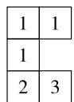  
从上面看
图①

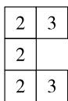  
从上面看
图②  
第10题解图

11. 点动成线

12. 书

13. 11 【解析】若一个棱柱有 18 个顶点, 所以该棱柱的底面边数为 $18 \div 2 = 9$ , 即该棱柱为九棱柱, 有 11 个面.

14. $200 \, cm^{2}$ 【解析】由图可知,该零件的表面积为 $6 \times 8 \times 2 + 6 \times 2 \times 2 + 8 \times 2 \times 2 + 4 \times 4 \times 2 + 4 \times 2 \times 2 = 200 \, cm^{2}$ .

15. 3 【解析】由题意可知,正方体朝上的面的点数从第一次翻转开始分别为 $5,4,2,3,5\cdots$ , 所以四次翻转是一个循环, 因为 $2024 \div 4 = 506$ , 所以第 2024 次翻转后, 朝上的面的点数为 3.

16. 解: 可以按柱体, 锥体, 球体来分类:
属于柱体的有: ①, ③, ④, ⑤, ⑥, ⑧;

属于锥体的有:②;

属于球体的有:⑦.

(答案不唯一,合理即可) …… (8 分)

17. 解: (1) 该几何体从正面看, 从左边看, 从上面看的形状图如解图; …… (5 分)

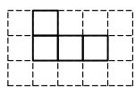  
从正面看

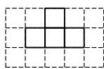  
从左面看

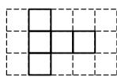  
从上面看  
第 17 题解图

(2)最多可添加 2 个小正方体. …… (8 分)

18. 解: (1) 圆锥, 三角形(答案不唯一); …… (4 分)

(2)①绕长为4的边所在直线旋转得到的圆锥的底面半径为6,高为4,体积为 $\frac{1}{3}\times\pi\times6^{2}\times4=$ $48\pi;$ …… (6分)

②绕长为6的边所在直线旋转得到的圆锥的底面半径为4,高为6,体积为 $\frac{1}{3}\times\pi\times4^{2}\times6=$ $32\pi.$ …… (8分)

综上所述,该几何体的体积是 $48\pi$ 或 $32\pi^{3}$ .

…… (9 分)

19. 解: (1) 塑料大棚的种植面积为 $2 \times 10 = 20 \, (\mathrm{m}^{2})$ ; …… (4 分)

(2)需要塑料薄膜的面积为 $2 \times (10 \times 2 + 2 \times 2) + \frac{1}{2} \times 2\pi \times 10 + 2 \times \frac{1}{2} \times \pi \times 1^{2} = (48 + 11\pi) \, m^{2}$ . ……

……(9分)

大小卷·七年级(上) 数学 BS

20. 解: (1)①③④; …… (3 分)

(2)画示意图如解图所示,……(6分)

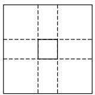  
第20题解图

此时无盖纸盒的底面边长为 $25-2 \times 10 = 5 \, (\text{cm})$ ，
则该纸盒的容积为 $5 \times 5 \times 10 = 250 \, (\text{cm}^{3})$ .

答:此时长方体无盖纸盒的容积为 $250 \, cm^{3}$ .
……(9 分)

21. 解: (1) 题图①截面的形状是长方形, 题图②截面的形状是正方形, 题图③截面的形状是三角形, 题图④截面的形状是五边形; …… (3 分)

(2)填写表格如下:……(6分)

<table><tr><td></td><td>面数(f)</td><td>顶点数(v)</td><td>棱数(e)</td></tr><tr><td>图1</td><td>5</td><td>6</td><td>9</td></tr><tr><td>图2</td><td>6</td><td>8</td><td>12</td></tr><tr><td>图3</td><td>7</td><td>8</td><td>13</td></tr><tr><td>图4</td><td>6</td><td>8</td><td>12</td></tr></table>

$f+v-e=2;$ …… (8分)

(3) 因为 v=200, e=300, 由(2)知, $f+v-e=2$ ,
所以 $f+200-300=2$ ,

所以 f=102，

即它的面数是 102. …… (12 分)

# 第二章检测卷

1. D 【解析】A. 3 不是负数; B. $|-2|=2$ , 2 是正数, 不是负数; C. 0 既不是正数, 也不是负数; D. $-\frac{1}{2}$ 是负数, 故选 D.

2. A 【解析】 $-\left(-\frac{2}{3}\right) = \frac{2}{3}$ .

3. B 【解析】A. 向东和向北, 不具有相反意义, 不符合题意; B. 弹簧伸长和缩短, 具有相反意义, 符合题意; C. 身高增加和体重下降, 不具有相反意义, 不符合题意; D. 胜和平, 不具有相反意义, 不符合题意.

4. C 【解析】5.170 45 精确到十分位为 5.2, 精确到百分位为 5.17, 精确到 0.001 为 5.170, 精确到 0.000 1 为 5.170 5, A, B, D 选项正确, C 选项错误.

5. D 【解析】由题意得,10 合 = 10×10 勺 = 10×10 ×10 撮 = 10×10×10×10 抄 = 10×10×10×10×10 圭 = 10^{5} 圭.

6. C 【解析】数轴上点 A 表示的数是 2, 点 A 和点 B 之间的距离为 5, 当点 B 在点 A 的右边, 点 B 表示的数是 $2 + 5 = 7$ ; 当点 B 在点 A 的左边, 点 B 表示的数是 2 - 5 = -3, 所以点 B 表示的数是 -3 或 7, 故选 C.

7. A 【解析】 $|-0.53|=0.53, |+1.47|=1.47$ ， $|-1.72|=1.72, |+0.84|=0.84$ ，因为 0.53<0.84<1.47<1.72，所以重量最接近标准的一块月饼的编号为①.

8. B 【解析】甲: $(-3)^{2}-32\div8\times2=9-32\div8\times2$ , 故甲负责的这步正确; 乙: $9-32\div8\times2=9-4\times2$ , 故从乙同学负责的那一步开始出错.

9. C 【解析】明明从山脚到山顶测得大气压的变化为 100-72.5 = 27.5 (kPa)，因为海拔每升高 100 m，大气压就会下降约 1.1 kPa，所以明明所爬山的高度为 $27.5 \div 1.1 \times 100 = 2500 \, (\text{m})$ ，故选 C.

10. C 【解析】由题图可知,在滚动的过程中,点 A 所对应的数字分别为 $-4, 4, 12, \cdots$ , 点 B 所对应的数字分别为 $2, 10, 18, \cdots$ , 点 C 所对应的数字

为 0,8,16,…,点 D 所对应的数字为 -2,6,14, …, 因为 $2024 = 0 + 8 \times 253$ , 所以数轴上的数字 2024 对应的点将与正方形 ABCD 的点 C 重合.

11. > 【解析】因为 $\frac{2}{3}<\frac{3}{4}$ ，所以 $-\frac{2}{3}>-\frac{3}{4}$ .

12. $3.2 \times 10^{7}$ 【解析】3 200 万 = 32 000 000 = 3.2 $\times10^{7}$ .

13. -44.2 【解析】由题意, 得 $-41.8 + 3.7 - 6.1 = -44.2$ (℃).

14. -3 【解析】因为数轴上表示数-2的点与表示数4的点重合,所以折叠时的中点表示的数是1,因为表示数5的点与点A重合,所以点A表示的数为-3.

15. -1 【解析】已知初始数字为-1, 按 A 键 $-1+5=4$ , 按 B 键 $4\times(-2)=-8$ , 按 C 键 $-8\div8=-1$ , 所以可知每按键 3 次一个循环, 因为 $2025\div3=675$ , 所以按了 2025 次后, 屏幕上的数字是 -1.

16. 解: (1) 正数集合: $\{3.5, +1.2, \frac{5}{6}, 12, 4\%$ , $2.\dot{7}, \cdots\}$ ; (2分)

(2)整数集合: $\{-2\ 024,0,12,\cdots\}$ ; $\cdots$ (4分)

(3)负分数集合: $\left\{-1\frac{1}{3},-3.14,\cdots\right\}$ . ……
…… (6分)

17. 解: (1) 原式 = $-\frac{1}{4}-\frac{1}{3}+\frac{5}{6}-\frac{13}{6}$

$$
= - \frac {3}{1 2} - \frac {4}{1 2} + \frac {1 0}{1 2} - \frac {2 6}{1 2}
$$

$$
= \frac {- 3 - 4 + 1 0 - 2 6}{1 2}
$$

$$
= - \frac {2 3}{1 2}; \dots \tag {2分}
$$

(2) 原式= $\frac{1}{2}\times\left[(-7)+(-3)\right]$

$$
= \frac {1}{2} \times (- 1 0)
$$

$$
= - 5; \dots \tag {4分}
$$

# 大小卷·七年级(上) 数学 BS

(3) 原式 $= -8 - \frac{3}{4} \times \left(-\frac{4}{5}\right) \times (6 + 4)$

$$
\begin{array}{l} = - 8 + \frac {3}{5} \times 1 0 \\ = - 8 + 6 \\ = - 2. \dots\dots\tag {6分} \\ \end{array}
$$

18. 解: (1)-2.5,2; …… (2分)

(2) 在数轴上表示出点 C, D, E 如解图所示;

$$
\dots\dots (5 \text {分})
$$

$$
\begin{array}{c c c c c c c} A & C E \\ \hline - 3 & - 2 & - 1 & 0 & 1 & 2 & 3 \end{array}
$$

第 18 题解图

(3)-2.5<-|-1.5|<-1 $\frac{1}{3}<2<-(-3)$ . ……
…… (7 分)

19. 解: (1) $64, 8^{2}$ ; …… (4 分)

$$
\begin{array}{l} = \frac {2 ^ {2}}{1 \times 3} \times \frac {3 ^ {2}}{2 \times 4} \times \frac {4 ^ {2}}{3 \times 5} \times \dots \times \frac {1 0 ^ {2}}{9 \times 1 1} \\ = \frac {2}{1} \times \frac {2}{3} \times \frac {3}{2} \times \frac {3}{4} \times \frac {4}{3} \times \frac {4}{5} \times \dots \times \frac {1 0}{9} \times \frac {1 0}{1 1} \\ = \frac {2 \times 1 0}{1 \times 1 1} \\ = \frac {2 0}{1 1}. \dots \tag {8分} \\ \end{array}
$$

(2) 原式= $\frac{1\times3+1}{1\times3}\times\frac{2\times4+1}{2\times4}\times\frac{3\times5+1}{3\times5}\times\cdots\times\frac{9\times11+1}{9\times11}$

20. 解: $(1)5+2+(-6)+7+(-3)+(-2)+5+(-6)=2$ ,

所以 A 站是上林路站；……（2 分）

$$
\begin{array}{l} \vert - 6 \vert) \times 1. 9 \\ = (5 + 2 + 6 + 7 + 3 + 2 + 5 + 6) \times 1. 9 \\ = 3 6 \times 1. 9 \\ = 6 8. 4 (\mathrm{km}), \\ \end{array}
$$

(2) $(|5| + |2| + |-6| + |7| + |-3| + |-2| + |5| +$

答: 小李在值勤志愿服务期间乘坐地铁行进的总路程约为 68.4 km; …… (5 分)

(3) 因为 $5+2=7,5+2+(-6)=1$ ,

$$
5 + 2 + (- 6) + 7 = 8, 5 + 2 + (- 6) + 7 + (- 3) = 5,
$$

$$
5 + 2 + (- 6) + 7 + (- 3) + (- 2) = 3,
$$

$$
5 + 2 + (- 6) + 7 + (- 3) + (- 2) + 5 = 8,
$$

$$
5 + 2 + (- 6) + 7 + (- 3) + (- 2) + 5 + (- 6) = 2,
$$

所以在小李做值勤志愿服务的8个站点中，

西咸大厦站距离秦创原中心站(数轴原点)最近,诗经里站最远,

它们相距约(8-1)×1.9=13.3(km). …… (9分)

21. 解: (1) 2; …… (1 分)

(2) $<,-b,\frac{-a}{a}+\frac{-b}{b};\cdots\cdots(4分)$   
(3) 因为 abc > 0,

所以 a, b, c 都是正数或其中一个为正数, 另两个为负数,

①当 $a, b, c$ 同正时， $\frac{|a|}{a} + \frac{b}{|b|} + \frac{|c|}{c} = 1 + 1 + 1 = 3;$   
②当 a, b, c 有一个为正数, 另两个为负数时,

$$
\frac {| a |}{a} + \frac {b}{| b |} + \frac {| c |}{c} = 1 - 1 - 1 = - 1.
$$

综上所述, $\frac{|a|}{a}+\frac{b}{|b|}+\frac{|c|}{c}$ 的值为3或-1.……(9分)

22. 解: (1) 因为 $\left|a+16\right|+\left|b+6\right|+\left(c-8\right)^{2}=0$ ,

所以 $a+16=0, b+6=0, c-8=0,$

所以 a=-16, b=-6, c=8; …… (2 分)

(2)由(1)可知, $AC=8-(-16)=24$ ,

因为点 P 在 BC 之间,且点 P 到点 A 的距离是到点 C 距离的 3 倍,

所以 $CP=24\times\frac{1}{4}=6$ ,

因为点 C 表示的数为 8, 点 P 在点 C 的左边,
所以点 P 表示的数为 2,

所以 $BP=2-(-6)=8.$

因为点 P 以每秒 1 个单位长度的速度运动，
所以点 P 的运动时间为 8 秒；……（5 分）
(3) 能，

点 P 从点 B 运动到点 C 需要 $\frac{8-(-6)}{1}=14$ 秒，
而点 Q 从点 A 运动到点 C 需要 $\frac{8-(-16)}{3}=8$ 秒, 点 Q 到达点 C 时, 此时点 P 表示的数为 2,
所以当点 P 从点 B 运动到点 C 的过程中, 点 Q
从点 A 运动到点 C, 又从点 C 返回, 因此可分为四种情况讨论:

点 Q 到达点 C 之前:

①点 P 在点 Q 右侧, 且点 Q 距离点 P 为 2 个单位长度时, 两点同向而行,

运动时间为 $\frac{10-2}{3-1}=4$ 秒,所以此时点P表示的数为 $-6+4\times1=-2$ ;

②当点 P 在点 Q 左侧, 且点 Q 距离点 P 为 2 个单位长度时, 两点同向而行,

运动时间为 $\frac{10+2}{3-1}=6$ 秒,所以此时点P表示的数为 $-6+6\times1=0$ ;

点 Q 从点 C 返回后:

③当点 P 在点 Q 左侧, 且点 Q 距离点 P 为 2

个单位长度时,两点背向而行,

运动时间为 $8+\frac{8-2-2}{3+1}=9$ 秒, 所以此时点 P 表示的数为 $-6+9\times1=3$ ;

④当点 P 在点 Q 右侧, 且点 Q 距离点 P 为 2 个单位长度时, 两点背向而行,

运动时间为 $8+\frac{8-2+2}{3+1}=10$ 秒, 所以此时点 P 表示的数为 $-6+10\times1=4$ .

综上所述,点 P 表示的数为 -2 或 0 或 3 或 4.

……（10分）

# 第三章检测卷

1. D 【解析】 $\frac{a}{x}$ 是两字母相除的形式,不是单项式,故 A 选项错误; $x^{2}+\frac{2}{x+1}$ 是 $x^{2}$ 和 $\frac{2}{x+1}$ 的和,不是单项式,故 B 选项错误; $x^{2}-m^{2}$ 是 $x^{2}$ 与 $m^{2}$ 的差,不是单项式,故 C 选项错误;-3 是数字,是单项式,故 D 选项正确.

2. A 【解析】 $x-(y+z)=x-y-z$ , A 选项符合题意； $x-(y-z)=x-y+z$ , B 选项不符合题意； $(x-y)-(-z)=x-y+z$ , C 选项不符合题意； $z-(y-x)=x-y+z$ , D 选项不符合题意.

3. B

4. C 【解析】 $x^{2}+x^{2}=2x^{2}$ ，A 选项不符合题意； $4m^{4}$ 与 $-3m^{3}$ 不是同类项，不能合并，B 选项不符合题意； $-3mn+\frac{5}{2}mn=-\frac{1}{2}mn$ ，C 选项符合题意； $2x^{2}y$ 与 $3xy^{2}$ 不是同类项，不能合并，D 选项不符合题意.

5. D 【解析】合并同类项, 得 $U = IR_{1} + IR_{2} = I(R_{1} + R_{2})$ , 将 $I = 2, R_{1} = 12.6, R_{2} = 22.4$ 代入, 得 $U = 2 \times (12.6 + 22.4) = 70$ .

6. D 【解析】由图可得展出区域的长为 a-4, 宽为 b-2, 所以文创文具展出区域的周长 = $2(a-4) + 2(b-2) = (2a+2b-12)$ m.

7. C 【解析】小华: 每支书签的价钱 = [60 - (60 - 6a)] ÷ 6 = a (元); 小丽: 晨晨原有现金 = 2a × 6 + 60 - 6a = (60 + 6a) 元, 所以小华、小丽说法均正确.

8. A 【解析】因为关于 x 的多项式 $(a-3)x^{3}+4x^{2}+(4-b)x+3$ 不含三次项和一次项, 所以 a-3=0, 4-b=0, 所以 a=3, b=4, 所以 $(a-b)^{2024}=(3-4)^{2024}=1$ .

9. B 【解析】由题意可知, 当 x=2 时, 8m-2n=2021, 当 x=-2 时, $mx^{3}-nx+3=-8m+2n+3=-(8m-2n)+3=-2021+3=-2018$ .

10. D 【解析】设这个三位正整数的十位上的数为 a，则该三位正整数为 $100m + 10a + n$ ，新三位正整数为 $100n + 10a + m$ ，因为 $100m + 10a + n - (100n + 10a + m) = 100m + 10a + n - 100n - 10a -$

$m=99m-99n=99(m-n)$ ，因为原数与所得数的差恰好是5的倍数，所以m-n是5的倍数，显然m=6,n=1满足题意.

11. $2a - 2b$ 【解析】 $M + N = -2a + b + (4a - 3b) = 2a$ $-2b.$

12. 4,3 【解析】因为单项式 $5m^{8}n^{6}$ 与 $-\frac{3}{4} m^{2a}n^{2b}$ 是同类项, 所以 $8 = 2a, 6 = 2b$ , 所以 $a = 4, b = 3$ .

13. 12 【解析】当 x=2 时, $x^{2}-2x-3=2^{2}-2\times2-3=-3<0$ , 不能输出; 当 x=-3 时, $x^{2}-2x-3=(-3)^{2}-2\times(-3)-3=12>0$ , 输出.

14. 亏损 【解析】因为 m > n，所以 $(206 + 194) \times \frac{m + n}{2} - (206m + 194n) = 6(n - m) < 0$ ，所以这家商铺亏损了.

15. $\left(\frac{2}{3}\right)^{n}$ 【解析】第一阶段后,留下线段长度之和为 $\frac{2}{3}$ ;第二阶段后,留下线段长度之和为 $\frac{2}{3}\times\frac{2}{3}=\left(\frac{2}{3}\right)^{2}$ ;第三阶段后,留下线段长度之和为 $\frac{2}{3}\times\frac{2}{3}\times\frac{2}{3}=\left(\frac{2}{3}\right)^{3}$ ;…;所以经过第n阶段后,留下的线段的长度之和为 $\left(\frac{2}{3}\right)^{n}$ .

16. 解: (1) 原式 $= -(0.8 + 1.2)a^{2}b - (6 - 5)a^{3} + 2$ $= -2a^{2}b - a^{3} + 2;$ …… (4 分)

(2) 原式 $= 2m^{2} - 4m + m^{2} - 12m$

$$
= 3 m ^ {2} - 1 6 m. \dots \tag {8分}
$$

17. 解: (1) $2(4a-3)-3(2a^{2}-3a+1)-4a^{2}$

$$
\begin{array}{l} = 8 a - 6 - (6 a ^ {2} - 9 a + 3) - 4 a ^ {2} \\ = 8 a - 6 - 6 a ^ {2} + 9 a - 3 - 4 a ^ {2} \\ = - 1 0 a ^ {2} + 1 7 a - 9, \dots \tag {2分} \\ \end{array}
$$

当 a=3 时, 原式 = -48; …… (4 分)

$$
\begin{array}{l} = 3 a b - \left(4 a ^ {2} - 2 a b + b ^ {2} - 4 a ^ {2} + 3 a b + 2 b ^ {2}\right) \\ = 3 a b - 4 a ^ {2} + 2 a b - b ^ {2} + 4 a ^ {2} - 3 a b - 2 b ^ {2} \\ = 2 a b - 3 b ^ {2}, \dots \tag {6分} \\ \end{array}
$$

(2) $3ab - \left[(4a^{2} - 2ab + b^{2}) - \frac{1}{2}(8a^{2} - 6ab - 4b^{2})\right]$

# 大小卷·七年级(上) 数学 BS

因为 $\left(a-\frac{1}{4}\right)^{2}+|b+2|=0,\left(a-\frac{1}{4}\right)^{2}\geqslant0,|b+2|\geqslant0,$

所以 $a-\frac{1}{4}=0, b+2=0,$

所以 $a=\frac{1}{4}, b=-2,$

当 $a = \frac{1}{4}, b = -2$ 时，

原式 $= 2ab - 3b^{2} = 2 \times \frac{1}{4} \times (-2) - 3 \times (-2)^{2}$ $= -1 - 12 = -13.$ ……（8分）

18. 解: (1) 面 F, 面 D; …… (2 分)

(2)根据小正方体展开图可知,面 A 与面 F 相对,面 B 与面 D 相对,面 C 与面 E 相对,

所以 $A+F=B+D=C+E.$ …… (4 分)

因为 $B + D = a^3 +\frac{1}{5} a^2 b + 3 + \left[-\frac{1}{5} (a^2 b + 15)\right] = a^3$

所以 $E=a^{3}-C=a^{3}-(a^{3}-1)=1$ ,

$F=a^{3}-A=a^{3}-(-\frac{1}{2}a^{2}b+a^{3})=\frac{1}{2}a^{2}b.\cdots\cdots$ (7分)

19. 解:(1)①若“○”是“+”，

则原式 $= 5x^{2} - \left[2xy - 3\left(\frac{1}{3} xy + 6\right) + 9\right] - x^{2}$

$$
= 5 x ^ {2} - (2 x y - 3 \times \frac {1}{3} x y - 3 \times 6 + 9) - x ^ {2}
$$

$$
= 4 x ^ {2} - (x y - 9)
$$

$= 4x^{2} - xy + 9;$ ……（3分）

②若“○”是“-”，

则原式 $= 5x^{2} - \left[2xy - 3\left(\frac{1}{3} xy - 6\right) + 9\right] - x^{2}$

$$
= 5 x ^ {2} - (2 x y - x y + 1 8 + 9) - x ^ {2}
$$

$$
= 4 x ^ {2} - (x y + 2 7)
$$

$= 4x^{2} - xy - 27$ ；……（3分）

③若“○”是“×”，

则原式 $= 5x^{2} - \left[2xy - 3\left(\frac{1}{3} xy\times 6\right) + 9\right] - x^{2}$

$$
= 5 x ^ {2} - (2 x y - 6 x y + 9) - x ^ {2}
$$

$= 4x^{2} + 4xy - 9$ ；……（3分）

④若“○”是“÷”，

则原式 $= 5x^{2} - \left[2xy - 3\left(\frac{1}{3} xy \div 6\right) + 9\right] - x^{2}$

$$
= 5 x ^ {2} - \left(2 x y - \frac {1}{6} x y + 9\right) - x ^ {2}
$$

$$
= 5 x ^ {2} - \frac {1 1}{6} x y - 9 - x ^ {2}
$$

$= 4x^{2} - \frac{11}{6} xy - 9;$ ……（3分）

(答案不唯一,任选一种即可)

(2)若“○”是“×”，由(1)可得

原式 $= 4x^{2} + 4xy - 9.$

又因为 $x^{2}+xy=6$ ,

所以原式 $= 4(x^{2} + xy) - 9$

$$
= 4 \times 6 - 9
$$

=15. …… (7分)

20. 解: (1) 28, 34, 6n+4; …… (3 分)

【解法提示】摆第①个图形用了10根火柴棒；摆第②个图形用了 $10+6\times1=16$ 根火柴棒；摆第③个图形用了 $10+6\times2=22$ 根火柴棒；摆第④个图形用了 $10+6\times3=28$ 根火柴棒；摆第⑤个图形用了 $10+6\times4=34$ 根火柴棒；…那么摆第n个图形用了 $10+6\times(n-1)=(6n+4)$ 根火柴棒.

(2) 当 n=100 时, $6n+4=6\times100+4=604$ (根), 所以摆第 100 个图形需要的火柴棒为 604 根; …… (5 分)

(3) 可能.

令 $6n+4=100$ ，则 n=16，

所以按这种方式摆出来的一个图形用了 100 根火柴棒是可能的, 是第⑯个图形. …… (7 分)

21. 解: (1) 3x - 5, 35 - 4x; …… (3 分)

【解题提示】因为青花瓷碗购进了 x 件, 共购进了 30 件瓷器, 其中玲珑瓷茶杯比青花瓷碗数量的 3 倍少 5 件, 所以玲珑瓷茶杯购进了 $(3x-5)$ 件, 粉彩瓷花瓶购进了 $[30-x-(3x-5)]=(35-4x)$ 件, 补全表格如下:

<table><tr><td></td><td>青花瓷碗</td><td>玲珑瓷茶杯</td><td>粉彩瓷花瓶</td></tr><tr><td>单价/元</td><td>75</td><td>50</td><td>130</td></tr><tr><td>数量/件</td><td>x</td><td>3x-5</td><td>35-4x</td></tr></table>

(2)购进 30 件瓷器所需的总费用为

$$
7 5 x + 5 0 (3 x - 5) + 1 3 0 (3 5 - 4 x) = 7 5 x + 1 5 0 x -
$$

$$
2 5 0 + 4 5 5 0 - 5 2 0 x = (- 2 9 5 x + 4 3 0 0) \text {元},
$$

所以购进 30 件瓷器所需的总费用为 $(-295x+$ 4 300)元；……(6分)

(3) 当 $x = 3$ 时，

$$
- 2 9 5 x + 4 3 0 0 = - 2 9 5 \times 3 + 4 3 0 0 = 3 4 1 5 (\text {元}).
$$

所以购进 30 件瓷器所需的总费用为 3415 元.……（8分）

22. 解: (1) 最内圈跑道中每段直道的长度为 (400

$$
- 2 \times 3. 1 4 \times 3 6) \div 2 = 8 6. 9 6 \approx 8 7 (\mathrm{m}),
$$

答:最内圈跑道中每段直道的长度约为 $87 \, m$ ;……（3分）

(2)由(1)知,400 m 跑道中每段直道的长度为 87 m,

第 1 条跑道的周长为 $87 \times 2 + 2 \times 3.14 \times (36 + 1.2)$

$$
\times 0) \approx 4 0 0 (\mathrm{m}),
$$

第 2 条跑道的周长为 $87 \times 2 + 2 \times 3.14 \times (36 + 1.2)$

$$
\times 1) \approx 4 0 8 (\mathrm{m}),
$$

第 3 条跑道的周长为 $87 \times 2 + 2 \times 3.14 \times (36 + 1.2)$

$$
\times 2) \approx 4 1 5 (\mathrm{m}),
$$

第 4 条跑道的周长为 $87 \times 2 + 2 \times 3.14 \times (36 + 1.2)$

$$
\times 3) \approx 4 2 3 (\mathrm{m}),
$$

所以表格填写如下：

<table><tr><td>跑道圈数</td><td>1</td><td>2</td><td>3</td><td>4</td><td>...</td></tr><tr><td>跑道周长</td><td>400</td><td>408</td><td>415</td><td>423</td><td>...</td></tr></table>

由题意可知, $b=87\times2+2\pi[36+1.2(a-1)]$

$$
\approx 1 7 4 + 6. 2 8 [ 3 6 + 1. 2 (a - 1) ]
$$

$$
= 7. 5 3 6 a + 3 9 2. 5 4 4;
$$

……（7分）

(3) 当 a = 8 时, $b = 7.536 \times 8 + 392.544 \approx 453 \, (\text{m})$ ,

答:该场地的最外圈跑道周长约为 453 m. …

……（10分）

# 期中检测卷

1. C 【解析】单项式有 $x^{4}, 5, \frac{x}{2}$ ，共 3 个，故选 C.

2. A 【解析】700 亿 = 70 000 000 000 = 7 × 10 $^{10}$ .

3. D 【解析】A 选项: 底面应该在两侧, 不符合题意; B 选项: 侧面有 4 个, 底面应该是四边形, 不符合题意; C 选项: 侧面有 3 个, 底面应该是三角形, 不符合题意; D 选项: 符合四棱柱展开图的特征, 符合题意.

4. C 【解析】绝对值相等符号相反的数互为相反数,0 的相反数是 0,A 选项错误;如果 a>b,那么 a 的倒数不一定小于 b 的倒数,例如 a=2,b=-1,a 的倒数是 $\frac{1}{2}$ ,b 的倒数是 $-1,\frac{1}{2}>-1$ ,B 选项错误;一个数的数量大小叫做这个数的绝对值,C 选项正确;所有的有理数都能用数轴上的点表示,D 选项错误.

5. D 【解析】A. $-12 \div (-6) = 2$ , 故此选项不符合题意; B. a 与 $2a^{2}$ 不是同类项, 不能合并, 故此选项不符合题意; C. $\frac{2}{3} \times \left(-\frac{9}{4}\right) = -\frac{3}{2}$ , 故此选项不符合题意; D. $\frac{1}{3}(2m - 6n) = \frac{2}{3}m - 2n$ , 故此选项符合题意.

6. D 【解析】甲地区温差为 $24-(-11)=24+11=35^{\circ}C$ ; 乙地区温差为 $23-(-8)=23+8=31^{\circ}C$ ; 丙地区温差为 $37-2=35^{\circ}C$ ; 丁地区温差为 $19-(-6)=25^{\circ}C$ , 其中丁地区温差不超过 $30^{\circ}C$ , 即丁地区适合大面积栽培郁金香, D 正确.

7. B 【解析】空白部分的面积为 $12x \times \frac{1}{2} + (12 - 2)$ $\times(x-1.5)\times\frac{1}{2}=-7.5+11x.$

8. C 【解析】因为 m=2，所以 $m*[m*(-3)]=2$ $*[2*(-3)]=2*\left[(-3)^{2}-3\times2\right]=2*3=3^{2}-3$ $\times2=3.$

9. A 【解析】由题图及题意可知, $x=15+16-8$ ,y=15+16-24,所以x=23,y=7,所以 $x-2y=23-2\times7=9$ ,所以x-2y的值是9.

10. C 【解析】由题意可得,三角形左边数字的规律为 n,三角形右边数字的规律为 $(n-1)^{2}$ ,三

角形下边数字的规律为上面两项数字之和,所以9右侧的数为64,10右侧的数为81,所以 $m=9+64=73,n=10+81=91$ ,所以 $m+n=73+91=164$ .

11. -31 【解析】原式 $= -24 - 12 + 5 = -36 + 5 = -31$

12. 三角形 【解析】圆锥的截面可能是圆形、椭圆形、三角形,而正方体的截面不可能是圆形和椭圆形,若要截面形状相同,那么这个截面形状只能是三角形.

13. -2 【解析】因为 $4xy^{|k|}-\frac{1}{5}(k-2)y^{2}+1$ 是三次三项式, 所以 $1+|k|=3$ , 且 $k-2\neq0$ , 解得 k=-2.

14. (1)-2.5, $-\frac{4}{3}$ ; (2)0,5,1.7.

15. 9 【解析】①若开始三堆卡片各有 a 张；②左边卡片张数为 a-3，右边卡片张数为 a-3，中间卡片张数为 $a+6$ ；③左边卡片张数为 $2(a-3)$ ，中间卡片张数为 $a+6-(a-3)=9$ ，故中间现有卡片张数为 9.

16. 解: (1) 原式 = $36 \times \frac{4}{9} - 36 \times \frac{5}{6} + 36 \times \frac{7}{12}$

$$
= 1 6 - 3 0 + 2 1
$$

$$
= 7; \dots\dots(4 \text {分})
$$

(2) 原式 $= -1 - \frac{1}{2} \times \frac{3}{8} \times 16$

$$
= - 1 - \frac {3}{1 6} \times 1 6
$$

$$
= - 1 - 3
$$

$$
= - 4. \dots \tag {8分}
$$

17. 解: (1) 原式 = $xy^{2}-xy+x-4y+xy$

$$
= x y ^ {2} + x - 4 y.
$$

当 $x = 2, y = -1$ 时，

原式 $= 2 \times (-1)^{2} + 2 - 4 \times (-1)$

$$
= 2 + 2 + 4
$$

$$
= 8; \dots\dots\tag {4分}
$$

(2) 原式 $= 6a^{2} - a + 4b - 2ab - 6a^{2} + 9a + 4b - 3ab$

$$
= 8 a + 8 b - 5 a b,
$$

当 $a + b = \frac{3}{4}, ab = -2$ 时，

大小卷·七年级(上) 数学 BS

$$
\begin{array}{l} \text {   原式   } = 8 (a + b) - 5 a b \\ = 8 \times \frac {3}{4} - 5 \times (- 2) \\ = 6 + 1 0 \\ = 1 6. \quad \dots\dots\tag {8分} \\ \end{array}
$$

18. 解: (1) 除法没有分配律; …… (4 分)

(2) 原式 $= (-24) \div \left(\frac{8}{24} - \frac{9}{24} + \frac{6}{24}\right)$

$$
\begin{array}{l} = (- 2 4) \div \frac {5}{2 4} \\ = (- 2 4) \times \frac {2 4}{5} \\ = - \frac {5 7 6}{5}. \dots \tag {9分} \\ \end{array}
$$

19. 解: (1) $68x + 88(10 - x) = 68x + 880 - 88x = (880 - 20x)$ 元,

答:这10名同学此次购买展览门票的总费用是 $(880-20x)$ 元;……(5分)

(2) 当 x = 3 时, $880 - 20x = 880 - 20 \times 3 = 820$ (元),

答:这10名同学此次购买展览门票的总费用为820元. …… (9分)

20. 解: (1) U 型池从正面、左面看到的形状图如解图所示;

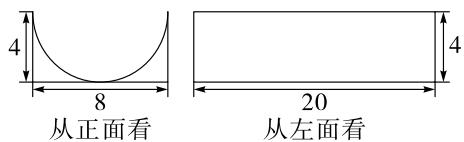

text_image

4
8
从正面看
20
从左面看

第20题解图

……(6分)

(2)由题图得 U 型池可以看作由一个长方体去掉半个圆柱，

所以 U 型池的体积为 $\frac{8}{2} \times 8 \times 20 - \frac{1}{2} \times \pi \times \left( \frac{8}{2} \right)^{2} \times 20 = (640 - 160\pi) \, \text{m}^{3}$ . …… (9 分)

21. 解: (1) 第一周获利: $(35-15)\times(200+50)=$ 5 000(元),

第二周获利: $(40-15)\times(200+20)=5\ 500$ (元),

第三周获利: $(45-15)\times(200-5)=5\ 850$ （元），
第四周获利： $(50-15)\times(200-40)=5\ 600$ （元），

因为 5 850 > 5 600 > 5 500 > 5 000,

所以第三周获利最多,利润最多为 5 850 元;

……（5分）

(2)由(1)知,获利最多的一周利润为5850元,获利最少的一周利润为5000元,

所以利润相差 5 850 - 5 000 = 850 (元),

所以获利最多的一周与获利最少的一周利润相差 850 元. …… (10 分)

22. 解: (1) 28, 28; …… (3 分)

【解法提示】 $(25-13)+(27-11)=12+16=28$ ，将 $3\times3$ 的方框移动到图①中的其他位置，

通过计算可以发现 $(c-b)+(d-a)$ 的值均为28.

(2) $x+16,x+16,28,28;$ …… (6分)

【解法提示】设 a=x，则 $b=x+2, c=x+14, d=x+16, (c-b)+(d-a)=\left[(x+14)-(x+2)\right]+\left[(x+14)-(x+2)\right]$

$16)-x]=12+16=28$ ,所以, $(c-b)+(d-a)$ 的值均为28.

(3) $(c-b)+(d-a)$ 的值始终为21,理由如下:

……（7分）

设 a=x，则 $b=x+2, c=x+8, d=x+15$ ,

$(c - b) + (d - a) = [(x + 8) - (x + 2)] + [(x + 15) - x] = 6 + 15 = 21,$

所以, $(c-b)+(d-a)$ 的值始终为21. ……
……（10分）

23. 解: (1)-3,4; …… (2分)

【解法提示】由题意可知,点 A 对应的有理数为 -1-2=-3, 点 B 对应的有理数为 $-3+7=4$ .

(2)由题意可知,若将数轴折叠,使得点A与点B重合,

则折叠点对应的有理数为 $\frac{4+(-3)}{2}=\frac{1}{2}$ ,

所以点 C 到折叠点的距离为 $\frac{1}{2}-(-1)=\frac{3}{2}$ ,

所以与点 C 重合的点表示的数为 $\frac{1}{2} + \frac{3}{2} = 2; \cdots$ ……（6分）

(3) 不会, t 秒过后, 点 A 表示的数为 -3-t, 点 B 表示的数为 $4+3t$ , 点 C 表示的数为 $-1+t$ ,

所以 $m=(-1+t)-(-3-t)=2+2t, n=(4+3t)-(-1+t)=5+2t$ ,

所以 $m-n=2+2t-(5+2t)=-3$ ，所以 m-n 的值不会随着时间 t 的变化而改变。……（12 分）

# 第四章检测卷(一)

1. B

2. C 【解析】射线的一端无限延长,无法截取有长度的射线,A 错误;直线没有长度,无法确定中点,B 错误;作 $\angle AOB = \angle \alpha$ , C 正确;延长线段 AB 至点 C,则 AC 大于 BC,D 错误.

3. C 【解析】 $3960''=\left(\frac{3960}{60\times60}\right)^{\circ}=1.1^{\circ}$

4. A 【解析】三条边都相等的三角形是等边三角形,它的三个角都相等,根据正多边形的定义,各边相等,各角也相等的多边形叫做正多边形,故只有 A 选项符合题意.

5. C 【解析】 $\angle BOC = \angle AOC$ ，说明 $OC$ 是 $\angle AOB$ 的角平分线，A 选项正确； $\angle AOB = 2\angle AOC$ ，说明 $OC$ 是 $\angle AOB$ 的角平分线，B 选项正确； $\angle BOC + \angle AOC = \angle AOB$ ，只能说明射线 $OC$ 在 $\angle AOB$ 内，不一定是角平分线，C 选项错误； $\angle AOC = \frac{1}{2}\angle AOB$ ，说明 $OC$ 是 $\angle AOB$ 的角平分线，D 选项正确.

6. A 【解析】由题知灯塔 O 在岛 A 南偏西 $45^{\circ}$ 方向上, 灯塔 O 也在岛 B 北偏西 $30^{\circ}$ 方向上, 故 $O_{1}$ 符合题意.

7. C 【解析】如解图,因为 C 是线段 AB 的中点,B 是线段 AD 的中点,所以 $CB=\frac{1}{2}AB=3$ , BD =AB=6,所以 $CD=CB+BD=9$ .

$$
\begin{array}{c c c c} \bullet & \bullet & \bullet \\ A & C & B & D \end{array}
$$

第7题解图

8. C 【解析】因为 $S_{1}$ 与 $S_{2}$ 的比值为 $\frac{3}{5}$ ，所以 $S_{1}$ 占整个圆面的 $\frac{3}{8}$ ，所以 $\theta=360^{\circ}\times\frac{3}{8}=135^{\circ}$ .

9. C 【解析】因为点 D 为 CB 中点, 点 E 为 CD 中点, 所以 $CE = \frac{1}{2}CD = \frac{1}{2}BD$ , 所以 BD = 2CE, ① 正确; AC = AB - BC = AB - 2CD = AB - 4ED, ② 错误; 因为 CD = BC - BD, 所以 $CE = \frac{1}{2}(BC - BD)$ , ③ 正确; $BD = \frac{1}{2}BC = \frac{1}{2}(AB - AC)$ , ④ 正确.

10. C 【解析】由题意可知, $\angle COD = 120^{\circ} - 60^{\circ} -$

$40^{\circ}=20^{\circ}$ ，如解图①，当OQ在 $\angle BOD$ 内部时， $\angle POQ = \frac{1}{2}\angle AOC + \angle COD + \frac{1}{2}\angle BOD = 30^{\circ} + 20^{\circ} + 20^{\circ} = 70^{\circ}$ ;如解图②,当OQ在 $\angle BOD$ 外部时, $\angle POQ=\frac{1}{2}\angle AOC+\angle COD+\angle BOD+\frac{1}{2}\angle BOD=30^{\circ}+20^{\circ}+40^{\circ}+20^{\circ}=110^{\circ}$ .综上所述, $\angle POQ$ 的度数为 $70^{\circ}$ 或 $110^{\circ}$ .

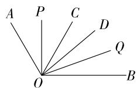  
图①

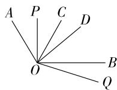  
图②  
第 10 题解图

11. < 【解析】由题图可知,铅笔 A 的长度为 $7-2=5(\text{cm})$ , 铅笔 B 的长度为 8.5-3=5.5 (cm), 所以铅笔 A 的长度<铅笔 B 的长度.  
12. 两点确定一条直线  
13. 七或八或九 【解析】如解图可知,剩余的图形可能是七边形、八边形、九边形.

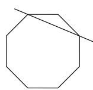

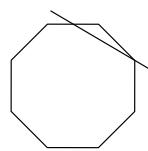

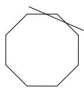  
第 13 题解图

14. $75^{\circ}$ 【解析】因为寅时二刻对应的是凌晨三点三十分, 因为时针一小时走 $30^{\circ}$ , 一分钟走 $0.5^{\circ}$ , 分针一分钟走 $6^{\circ}$ , 所以寅时二刻即凌晨三点三十分所对应钟表的时针与分针之间的夹角为 $30 \times 6^{\circ} - (3 \times 30^{\circ} + 30 \times 0.5^{\circ}) = 75^{\circ}$ .  
15. $\frac{22}{3}$ 【解析】因为点 $M$ 在线段 $AB$ 上, $5AM = AB$ , 且 $AB = 20$ , 所以 $AM = \frac{1}{5} AB = 4$ , $MB = AB - AM = 16$ , 因为 $AP = \frac{1}{2} AM$ , $MQ = \frac{1}{3} MB$ , 所以 $AP = PM = 2$ , $MQ = \frac{16}{3}$ , 所以 $PQ = PM + MQ = 2 + \frac{16}{3} = \frac{22}{3}$ .  
16. 解: (1) 如解图所示, 直线 AB, 线段 CD 即为所求; …… (1 分)

# 大小卷·七年级(上) 数学 BS

(2)①如解图所示,射线 AD 与射线 BC 交于点 E;……(2 分)

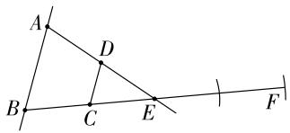

text_image

A
D
B
C
E
F

第 16 题解图

②如解图所示,线段 CF 即为所求; … (3 分)
③8. …… (6 分)

【解法提示】因为 $CE = 2 \, cm, CF = 3CE$ ，所以 $CF = 6 \, cm$ ，又点 C 为 BE 中点，所以 $BC = CE = 2 \, cm$ ，所以 $BF = BC + CF = 8 \, cm$ 。

17. 解: AOB, 40, 角平分线的定义; BOK, 50; BOE, EOC, 120. …… (7 分)

18. 解: (1) 因为另外两个扇形的圆心角度数之比为 3:5,

所以这两个扇形的圆心角度数分别为 $(360^{\circ}-72^{\circ})\times\frac{3}{3+5}=108^{\circ},(360^{\circ}-72^{\circ})\times\frac{5}{3+5}=180^{\circ};$ ……（3分）

(2)作图如下:

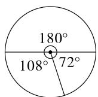  
第 18 题解图

……（5分）

在三个扇形中,圆心角度数最小的是 $72^{\circ}$ ,

该扇形的面积为 $\pi \times 3^{2} \times \frac{72}{360} = \frac{9}{5}\pi$ ,

所以三个扇形中圆心角度数最小的扇形面积为 $\frac{9}{5}\pi.$ (7分)

19. 解: (1) 因为景点 A 位于中心 O 的北偏东 $43^{\circ}45'$ 方向,

所以 $\angle NOA = 43^{\circ}45'$ ,

$$
\begin{array}{l} \text { 所以 } \angle N O B = \angle N O A + \angle A O B \\ = 4 3 ^ {\circ} 4 5 ^ {\prime} + 3 2 ^ {\circ} 4 9 ^ {\prime} \\ = 7 6 ^ {\circ} 3 4 ^ {\prime}, \\ \end{array}
$$

所以景点 B 位于中心 O 的北偏东 $76^{\circ}34'$ 方向；
……（3 分）

(2) 由 (1) 可知, $\angle NOB = 76^{\circ}34'$ , 由题可知 $\angle NOC = 43^{\circ}45'$ ,

所以 $\angle BOC = \angle NOB + \angle NOC$

$$
= 7 6 ^ {\circ} 3 4 ^ {\prime} + 4 3 ^ {\circ} 4 5 ^ {\prime}
$$

$$
= 1 2 0 ^ {\circ} 1 9 ^ {\prime}. \quad \dots\dots\tag {8分}
$$

20. 解: (1) $11, 2n+3$ ; …… (3 分)

【解法提示】因为五边形 ABCDE 内点的个数为 1 时, 分割成的三角形的个数为 $5 = 5 + 2(1 - 1)$ , 五边形 ABCDE 内点的个数为 2 时, 分割成的三角形的个数为 $7 = 5 + 2(2 - 1)$ , 五边形 ABCDE 内点的个数为 3 时, 分割成的三角形的个数为 $9 = 5 + 2(3 - 1)$ , 所以五边形 ABCDE 内点的个数为 4 时, 分割成的三角形的个数为 $11 = 5 + 2(4 - 1)$ , … 所以五边形 ABCDE 内点的个数为 n 时, 分割成的三角形的个数为 $5 + 2(n - 1) = 2n + 3$ .

(2) 当五边形 ABCDE 内部有 100 个点时, $2n+3=2\times100+3=203$ ,

所以该五边形可被分割成 203 个三角形；…
……（5 分）

(3)由题意及(1)中结论可得,m 边形 $(m\geqslant3)$ 内点的个数为 n 时，

可被分割成的三角形的个数为 $m+2(n-1)$ $(m\geqslant3)$ ,

所以当六边形内点的个数为 n 时, 可被分割成 $6+2(n-1)=(2n+4)$ 个三角形,

当十二边形内点的个数为 n 时, 可被分割成 $12+2(n-1)=(2n+10)$ 个三角形. …… (8 分)

21. 解: (1) 因为点 D 是 AB 中点, 点 C 是线段 AB 上靠近 B 点的一个三等分点, AB = 12,

所以 AD=6, BC=4, AC=AB-BC=8,

又点 A 在数轴上对应的数是 -3，

所以点 B 在数轴上对应的数是 $-3+12=9$ ,

点 C 在数轴上对应的数是 $-3+8=5$ ,

点 D 在数轴上对应的数是 $-3+6=3$ ; …… (3 分)

(2)这个说法不正确,理由如下:

由题意可得 $BC=\frac{1}{3}AB=4$ ,

因为点 E 是线段 AD 上一点, 且 CD = 2DE,

由(1)易得 CD=2,

所以 DE=1，

因为点 E 是线段 AD 上一点，

所以 $CE = CD + DE = 3$ ，

因为 BC=4, CE 与 BC 不相等,

所以点 C 不是 BE 的中点；……（6 分）

(3) 存在, 且点 F 在数轴上对应的数为 6 或 4.

因为 AD-CF=5，

所以 CF=AD-5=1.

当点 F 在点 C 右侧时, 则

$$
A F = A C + C F = 8 + 1 = 9,
$$

又点 A 在数轴上对应的数是 -3，

所以此时点 F 在数轴上对应的数为 6;

当点 F 在点 C 左侧时, 则

$$
A F = A C - C F = 8 - 1 = 7,
$$

点 A 在数轴上对应的数是 -3，

所以此时点 F 在数轴上对应的数为 4,

综上,点 F 在数轴上对应的数为 4 或 6. …… (9 分)

22. 解: (1) 如解图, $\angle BOC = 180^{\circ} - 30^{\circ} = 150^{\circ}$ ,

因为 OE 平分 $\angle BOC$ ,

所以 $\angle COE=\frac{1}{2}\angle BOC=75^{\circ}$ ,

所以 $\angle COF = \angle EOF - \angle COE = 90^{\circ} - 75^{\circ} = 15^{\circ}$ ,

所以 $\angle DOF = \angle DOC - \angle COF = 30^{\circ} - 15^{\circ} = 15^{\circ}$

所以 $\angle COF = \angle DOF;$ …… (3 分)

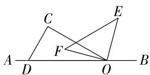  
第 22 题解图

(2) 因为 $\angle EOF = 90^{\circ}, \angle COF = \alpha,$

所以 $\angle COE = 90^{\circ} - \alpha$

因为 OC 平分 $\angle AOE$ ,

所以 $\angle AOE = 2 \angle COE = 2 \times (90^{\circ} - \alpha) = 180^{\circ} - 2\alpha,$

所以 $\angle BOE = 180^{\circ} - \angle AOE$

$$
= 1 8 0 ^ {\circ} - (1 8 0 ^ {\circ} - 2 \alpha)
$$

$$
= 2 \alpha ; \quad \dots\dots (8 \text {分})
$$

(3) 发生变化.

因为 $\angle EOF = 90^{\circ},\angle COF = \alpha$

所以 $\angle COE = \alpha - 90^{\circ}$ ,

因为 OC 平分 $\angle BOE$ ,

所以 $\angle BOE = 2\angle COE = 2(\alpha -90^{\circ}) = 2\alpha -180^{\circ}.$

……（10分）

# 第四章检测卷(二)

1. C 【解析】根据多边形的定义: 由若干条不在同一条直线上的线段首尾顺次相接组成的封闭平面图形叫多边形, 故选项 C 属于多边形.

2. C

3. B 【解析】由题意可知,两个钉子可以固定一根木条,其中蕴含的道理是两点确定一条直线.

4. C 【解析】根据题意作图如解图,所以点 C 在线段 AB 上.

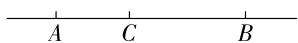  
第 4 题解图

5. B 【解析】如解图, 过点 E 作线段 EG, 由网格线可得, $\angle GEF = \angle ABC$ , 因为 $\angle GEF < \angle DEF$ , 所以 $\angle ABC < \angle DEF$ .

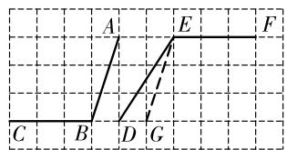

text_image

A
B
C
D
E
F
G

第 5 题解图

6. C 【解析】如解图,小强在小明的正西方向,小明在小强的正东方向,A,B选项错误;因为 $\angle BAC=120^{\circ}$ ,所以 $\angle 1=120^{\circ}-90^{\circ}=30^{\circ}$ ,所以小亮在小明的南偏东 $30^{\circ}$ 方向,小明在小亮的北偏西 $30^{\circ}$ 方向,C选项正确,D选项错误.

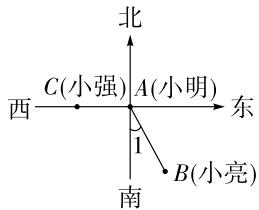

text_image

北
西 C(小强) A(小明) 东
1
南 B(小亮)

第6题解图

7. A 【解析】由折叠的性质可知, $\angle AOC = \angle A'OC$ , $\angle BOD = \angle B'OD$ , 因为 $\angle AOC = 32^\circ$ , 所以 $\angle A'OC = 32^\circ$ , 因为 $\angle A'OB' = 40^\circ$ , 所以 $\angle BOB' = 180^\circ - 2 \times 32^\circ - 40^\circ = 76^\circ$ , 所以 $\angle BOD = \frac{1}{2} \angle BOB' = 38^\circ$ .

8. B 【解析】因为 AB = 24, CD = 4, 所以 AC + BD = AB - CD = 20, 因为点 M 为线段 AC 的中点, 点 N 为线段 BD 的中点, 所以 $CM = \frac{1}{2}AC$ , DN = $\frac{1}{2}BD$ , 所以 $CM + DN = \frac{1}{2}(AC + BD) = 10$ , 所以

$$
M N = C M + C D + D N = 1 4.
$$

9. D 【解析】因为 OD 平分 $\angle AOC, OE$ 平分 $\angle AOD$ ，所以 $\angle AOD = \angle COD, \angle AOE = \angle DOE$ ，所以 $\angle COE = \angle DOE + \angle COD = 3\angle DOE = 90^{\circ}$ ，所以 $\angle DOE = 30^{\circ}$ ，所以 $\angle AOC = 4\angle DOE = 4\times30^{\circ} = 120^{\circ}$ ，所以 $\angle BOC = 180^{\circ} - \angle AOC = 60^{\circ}$ .

10. D 【解析】当点 C 是线段 AB 的“巧点”时, 可能有 BC = 2AC, AC = 2BC, AB = 2AC = 2BC 三种情况: ① 当 BC = 2AC 时, $AC = \frac{1}{3}AB = \frac{1}{3} \times 15 = 5$ ;

② 当 AC = 2BC 时, $AC = \frac{2}{3}AB = \frac{2}{3} \times 15 = 10$ ;

③ 当 AB = 2AC = 2BC 时, $AC = \frac{1}{2}AB = \frac{1}{2} \times 15 = 7.5$ . 综上所述, AC 的长为 5 或 7.5 或 10.

11. $102^{\circ}$ （答案不唯一） 【解析】因为 $102^{\circ}=72^{\circ}+30^{\circ}$ ，所以 $102^{\circ}$ 可以用这副三角板画出。能用这幅三角板画出的角需要满足是 $30^{\circ},60^{\circ},90^{\circ},72^{\circ},36^{\circ}$ 其中任意两角或两角以上的和或差，且在 $90^{\circ}$ 和 $180^{\circ}$ 之间即可。

12. ③④ 【解析】直线与射线都是可以无限延伸的,所以不能比较其长短,故①错误;射线的表示是有顺序的,端点要写在前面,所以射线 AB 与射线 BC 不是同一条射线,故②错误;因为 AB-BC=CD,所以 AB=BC+CD=BD,所以点 B 是线段 AD 的中点,故③正确;题图中线段有 AB,AC,AD,BC,BD,CD 共 6 条,故④正确.所以正确的有③④.

13. 2:3:3:4 【解析】由题意可得, $\angle AOC = \frac{2}{3}\angle AOD$ $= \frac{2}{3} \times 90^{\circ} = 60^{\circ}, \angle BOD = \angle AOD = 90^{\circ}$ , 所以 $\angle COB = 120^{\circ}$ , 又圆中扇形的面积比等于对应的角度比, 即 $60^{\circ}:90^{\circ}:90^{\circ}:120^{\circ} = 2:3:3:4$ , 所以图中扇形甲、乙、丙、丁的面积之比为 $2:3:3:4$ .

14. -1 【解析】因为 a<0<b, OA=2OB, 所以 $a+2b=0,\frac{a}{2b}=-1$ , 所以 $\left|a+2b\right|-\left|\frac{a}{2b}\right|=\left|0\right|-\left|-1\right|=-1$ .

15. 97°或 76° 【解析】因为射线 PA, PB 分别对准刻度 118° 和 146°，所以 $\angle APB = 146^{\circ} -$

# 大小卷·七年级(上) 数学 BS

$118^{\circ} = 28^{\circ}$ , 因为 $\angle A'PB'$ 由 $\angle APB$ 绕点 $P$ 逆时针旋转得到, 所以 $\angle A'PB' = \angle APB = 28^{\circ}$ . 分情况讨论: (1) 如解图①所示, $\angle APA' = \angle A'PB' - \angle APB'$ , 且 $\angle APA' = 3\angle APB'$ , 所以 $3\angle APB' = 28^{\circ} - \angle APB'$ , 所以 $\angle APB' = 7^{\circ}, \angle APA' = 21^{\circ}$ , 所以射线 $PA'$ 所在的刻度为 $118^{\circ} - 21^{\circ} = 97^{\circ}$ ;

(2)如解图②所示, $\angle APA'=\angle A'PB'+\angle APB'$ ,且 $\angle APA'=3\angle APB'$ ,所以 $3\angle APB'=28^{\circ}+\angle APB'$ ,所以 $\angle APB'=14^{\circ},\angle APA'=42^{\circ}$ ,所以射线 $PA'$ 所在的刻度为 $118^{\circ}-42^{\circ}=76^{\circ}$ .

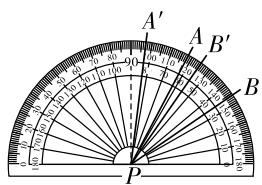

text_image

A'
A
B'
B
P

图①

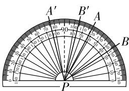

text_image

A'
B'
A
B
P

图②  
第 15 题解图

16. 解: (1) 原式 = $(150^{\circ} + 27^{\circ}) + (30' + 31') +$

$$
\begin{array}{l} (4 2 ^ {\prime \prime} + 3 2 ^ {\prime \prime}) \\ = 1 7 7 ^ {\circ} + 1 ^ {\circ} 1 ^ {\prime} + 1 ^ {\prime} 1 4 ^ {\prime \prime} \\ = 1 7 8 ^ {\circ} 2 ^ {\prime} 1 4 ^ {\prime \prime}; \dots \tag {3分} \\ \end{array}
$$

(2) 原式 = $(179^{\circ}60' - 34^{\circ}27'36'') \div 2$

$$
\begin{array}{l} = 1 4 5 ^ {\circ} 3 2 ^ {\prime} 2 4 ^ {\prime \prime} \div 2 \\ = 7 2 ^ {\circ} 4 6 ^ {\prime} 1 2 ^ {\prime \prime}. \dots \tag {6分} \\ \end{array}
$$

17. 解:(1)如解图, $\angle OAB$ 即为所求作; …… (3分)

(2)如解图,点 C 即为所求作. …… (6 分)

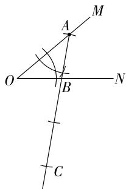

text_image

Geometric diagram with labeled points O, A, B, C, M, N and intersecting lines forming angles and segments

第 17 题解图

18. 解: (1) $75^{\circ}$ ; …… (3 分)

【解法提示】因为时针一分钟走 $0.5^{\circ}$ ，分针一分钟走 $6^{\circ}$ ，所以时针 30 分钟走的路程为 $0.5^{\circ} \times 30 = 15^{\circ}$ ，即时针从 8 点到 8:30 走的路程为 $15^{\circ}$ ，所以 $\angle EOF = 15^{\circ} + 2 \times 30^{\circ} = 75^{\circ}$ .

(2) 因为 $AB:CD=3:2, CD=80\ mm,$

所以 AB = 120 mm,

因为 $AD = AB + BC + CD, AD = 240 \, mm,$

所以 BC=AD-AB-CD=40 mm,

所以表盘的直径为 40 mm. …… (7 分)

19. 解: (1) 如解图所示, 因为班级 B 位于指挥中心 O 的北偏东 $75^{\circ}$ 方向上, 班级 C 位于指挥中心 O 的北偏西 $15^{\circ}$ 方向上,

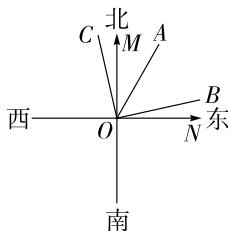

text_image

北
C M A
西 O N 东
南

第 19 题解图

所以 $\angle BOC = \angle COM +$

$$
\angle B O M = 1 5 ^ {\circ} + 7 5 ^ {\circ} = 9 0 ^ {\circ}; \dots\dots (4 \text {分})
$$

(2) 因为班级 A 在 $\angle BOC$ 的角平分线上，

所以 $\angle AOC = \frac{1}{2}\angle BOC = \frac{1}{2}\times 90^{\circ} = 45^{\circ},$

又因为 $\angle COM = 15^{\circ}$ ,

所以 $\angle AOM = \angle AOC - \angle COM = 45^{\circ} - 15^{\circ} = 30^{\circ}$

所以班级 A 在指挥中心 O 的北偏东 $30^{\circ}$ 方向上. …… (8 分)

20. 解: (1) 6, 6; …… (2 分)

【解法提示】用图中字母表示,以点 A 为端点的射线有 1 条,以点 B 为端点的射线有 2 条,以点 C 为端点的射线有 2 条,以点 D 为端点的射线有 1 条,所以共有 $1+2+2+1=6$ (条) 可用图中字母表示的射线;以点 A 为左端点的线段有 AB, AC, AD, 以点 B 为左端点的线段有 BC, BD, 以点 C 为左端点的线段有 CD, 所以共有 $3+2+1=6$ (条) 可用图中字母表示的线段.

(2)补全表格如下；……（5分）

<table><tr><td>直线m上点的个数</td><td>2</td><td>3</td><td>4</td><td>5</td><td>...</td><td>n(n≥2)</td></tr><tr><td>可用图中字母表示的射线的条数</td><td>2</td><td>4</td><td>6</td><td>8</td><td>...</td><td>2n-2</td></tr><tr><td>可用图中字母表示的线段的条数</td><td>1</td><td>3</td><td>6</td><td>10</td><td>...</td><td> $\frac{1}{2}n(n-1)$ </td></tr></table>

【解法提示】当直线 m 上有 $n(n \geqslant 2)$ 个点时，除第一个点和最后一个点，以每个点为端点有两条射线，以第一个点或最后一个点为端点分别只有一条射线，所以共有 $(2n - 2)$ 条；直线上线段的条数 $= (n - 1) + (n - 2) + (n - 3) + \cdots + 3 + 2 + 1 = (n - 1) + 1 + (n - 2) + 2 + (n - 3) + 3 + \cdots = \frac{1}{2} n(n - 1)$ .

(3)每个站点看作直线上的13个点,每种火车票看作一条线段,所以共需要设置 $12+11+10+9+8+7+6+5+4+3+2+1=\frac{1}{2}\times13\times(13-1)=78$

(种)火车票，

答:铁路公司共需要设置78种火车票. …… (8分)

21. 解: (1) 因为 $\angle AOB = 90^{\circ}, \angle AOC = 60^{\circ}$ ,

所以 $\angle BOC = 90^{\circ} - 60^{\circ} = 30^{\circ}$ .

因为 OB 平分 $\angle COD$ ,

所以 $\angle BOC = \angle BOD = 30^{\circ}$ ,

所以 $\angle DOE = 180^{\circ} - 30^{\circ} - 30^{\circ} = 120^{\circ}$ ; $\cdots$ (4 分)

(2) $\angle DOE = 2\angle AOC.$ (5分)

理由: 因为 $\angle AOB = 90^{\circ}$ ,

所以 $\angle BOC = 90^{\circ} - \angle AOC.$

因为 OB 平分 $\angle COD$ ,

所以 $\angle BOC = \angle BOD = 90^{\circ} - \angle AOC,$

所以 $\angle DOE = 180^{\circ} - 2\angle BOC = 180^{\circ} - 2(90^{\circ} -$

$\angle AOC)=2\angle AOC.$ (9分)

22. 解:(1)如解图①,

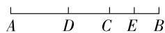  
第 22 题解图①

因为 AC=2BC, AB=18,

所以 BC=6, AC=12,

因为 E 为 BC 中点，

所以 CE=3，

因为 DE=8，

所以 CD=DE-CE=5，

所以 $AD=AB-BD=AB-(BC+CD)=18-11=7;$ ……（4分）

(2)①当点 E 在点 F 的左侧时,如解图②,

因为 $CE+EF=3, BC=6,$

所以点 F 是 BC 的中点，

所以 CF=BF=3，

所以 AF=AB-BF=18-3=15，

因为 AF=3AD,

所以 $AD=\frac{1}{3}AF=5;$ …… (6 分)

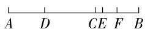  
第 22 题解图②

②当点 E 在点 F 的右侧时, 如解图③,

因为 AC=12, $CE+EF=CF=3$ ,

所以 AF = AC - CF = 9，

所以 AF=3AD=9，

所以 AD = 3.

其他情况不存在,舍去.

综上所述,AD 的长为 3 或 5;……(8 分)

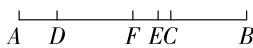  
第 22 题解图③

(3) 当点 E 为线段 AB 靠近点 B 的三等分点时, BE = 6, DE = 8,

所以 AD=4，

所以点 D 向右运动了 $\frac{4}{3}$ 秒, 即 $t=\frac{4}{3}$ ;

当点 D 为线段 AB 靠近点 A 的三等分点时, AD=6,

所以点 D 向右运动了 $\frac{6}{3}=2$ 秒, 即 t=2;

当点 D 运动到线段 AB 靠近点 B 的三等分点时, AD = 12,

所以点 D 向右运动了 $\frac{12}{3}=4$ 秒, 即 t=4;

综上所述,当 $t=\frac{4}{3}$ 或 t=2 或 t=4 时,点 D 或点 E 三等分线段 AB.……(11 分)

# 第五章检测卷

1. D 【解析】A 选项方程中分母含有未知数, 故不是一元一次方程; B 选项方程中有 2 个未知数, 故不是一元一次方程; C 选项方程的最高次数为 2, 故不是一元一次方程; D 选项方程是一元一次方程.

2. C 【解析】A. 将原等式两边都加 y, 得 $2x + y = 2y + 2$ , 故本选项不符合题意; B. 将原等式两边都除以 2, 得 $x = \frac{y + 2}{2}$ , 故本选项不符合题意; C. 将原等式两边都减去 2, 得 2x - 2 = y, 故本选项符合题意; D. 将原等式两边都乘以 2, 得 $4x = 2y + 4$ , 故本选项不符合题意.

3. D 【解析】由题意, 得 $1-4x = -6x + 3$ , 解方程, 得 x = 1, 故选 D.

4. D 【解析】方程 $\frac{2}{3}t=\frac{3}{2}$ ，系数化为1，得 $t=\frac{9}{4}$ ，变形错误，不符合题意；方程3x-1=4，移项，得3x=1+4，变形错误，不符合题意；方程 $-3(x-1)=2$ ，去括号，得 $-3x+3=2$ ，变形错误，不符合题意；方程 $-\frac{3}{5}(x-3)=\frac{1}{3}(x+2)$ ，去分母，得 $-9(x-3)=5(x+2)$ ，变形正确，符合题意。

5. C 【解析】设该分派站有 x 名快递员, 则可列方程为 $20x + 12 = 24x - 12$ , 解得 x = 6, 所以该快递分派站的快递员人数为 6.

6. A 【解析】解方程 $-\frac{x-3}{2}=4$ ，去分母，得 $-(x-3)=8$ ，去括号，得 $-x+3=8$ ，移项、合并同类项，得x=-5，因为两个方程的解相同，将x=-5代入 $2m-(3+4x)=5$ ，得 $2m-(3-20)=5$ ，解得m=-6.

7. C 【解析】设他们初次相遇经过的时间为 x min, 所以 $100x + 400 = 120x$ , 解得 x = 20, 所以他们初次相遇经过的时间为 20 min.

8. C 【解析】设公士分得鹿 x 只, 大夫、不更、簪袅、上造分别分得 5x, 4x, 3x, 2x, 则列方程为 $5x + 4x + 3x + 2x + x = 5$ . 故 C 选项符合题意.

9. B 【解析】设小长方形的长为 x cm, 则小长方形的宽为 $\frac{14-x}{3}$ cm. 由题意, 得 $2 \times \frac{14-x}{3} + 6 = x +$

$\frac{14-x}{3}$ , 解得 x=8, 所以 $\frac{14-x}{3}=2$ , 所以阴影部分的面积为 $(6+2\times2)\times14-2\times8\times6=44(\text{cm}^{2})$ .

10. A 【解析】题中给出的方程分别可以写成： $\frac{x}{2\times2}+\frac{x-1}{2}=1$ 的解是 x=2; $\frac{x}{2\times3}+\frac{x-2}{2}=1$ 的解是 $x=3;\frac{x}{2\times4}+\frac{x-3}{2}=1$ 的解是 $x=4;\cdots$ ，所以解为
x=n 的方程是 $\frac{x}{2n}+\frac{x-(n-1)}{2}=1$ ，所以解是 x=
2024 的方程为 $\frac{x}{4048}+\frac{x-2023}{2}=1$ .

11. 原价为 $x$ 元的衣服打八折后的售价为 108 元 (答案不唯一)

12. 9 【解析】由题图可得, $(x-5)\times8\div2=16$ , 解得 x=9.

13. 1.5 【解析】设 x 个时辰后乙种香的剩余长度是甲种香的一半, $1 - \frac{1}{2}x = \frac{1}{2}(1 - \frac{1}{3}x)$ , 解得 x = 1.5, 所以 1.5 个时辰后乙种香的剩余长度是甲种香的一半.

14. $\frac{180}{11}$ 【解析】分针一分钟转动的角度为 $\frac{360^{\circ}}{60}=6^{\circ}$ ，时针一分钟转动的角度为 $\frac{30^{\circ}}{60}=0.5^{\circ}$ ，设经过 x min，时针与分针所形成的角度为 $120^{\circ}$ ，由题意，得 $(210-6x)+0.5x=120$ ，解得 $x=\frac{180}{11}$ ，所以至少经过 $\frac{180}{11}$ min，时针与分针所形成的角度为 $120^{\circ}$ .

15. 4 【解析】去分母, 得 $7(x+1)=6(k-3)$ , 去括号, 得 $7x+7=6k-18$ , 移项、合并同类项, 得 $7x=6k-25$ , 解得 $x=\frac{6k-25}{7}$ , 因为方程的解为负数且 k 为正整数, 当 k=1 时, $x=-\frac{19}{7}$ , 当 k=2 时, $x=-\frac{13}{7}$ , 当 k=3 时, x=-1, 当 k=4 时, $x=-\frac{1}{7}$ , 当 k=5 时, $x=\frac{5}{7}$ , 不符合要求, 所以当正整数 k 取 1, 2, 3, 4 时, 可使方程的解为负数.

# 大小卷·七年级(上) 数学 BS

16. 解: (1) 去括号, 得 $3x + 3 = 5x - 1$ ,

移项,得 3x-5x=-1-3,

合并同类项,得-2x=-4,

系数化为 1, 得 x=2; …… (3 分)

(2) 去分母, 得 $3(8-x)-(5x+4)=6(8+x)$ ,

去括号, 得 24-3x-5x-4=48+6x,

移项,得-3x-5x-6x=48-24+4,

合并同类项,得-14x=28,

系数化为 1, 得 x = -2. …… (6 分)

17. 解: 由方程 $\left(\frac{y}{2}-1\right)-m=y-4$ 的解为 y=2,

得 $\left(\frac{2}{2}-1\right)-m=2-4,$

解得 m=2，……（3 分）

将 m=2 代入 $mx+2(x-3)=3m-(2x-6)$ 中，

得 $2x+2(x-3)=6-(2x-6)$ ,

去括号, 得 $2x + 2x - 6 = 6 - 2x + 6$ ,

移项、合并同类项,得 6x=18,

解得 x=3. …… (6 分)

18. 解: 设每亩地漫灌需用水 x 吨,

根据题意,得 $12 \times 85\% x + 8 \times 70\% x = 9480$ , …
……(3分)

解得 x=600,

答:每亩地漫灌需用水 600 吨. …… (6 分)

19. 解: (1)①三, 等式的基本性质; …… (1 分)

②一,去分母时漏乘方程右边的常数项;……(2分)

(2) 正确的解答过程如下:

去分母,得 $2(2x+1)-(5x-1)=6$ ,

去括号,得 $4x+2-5x+1=6$ ,

移项, 得 4x-5x=6-2-1,

合并同类项,得-x=3,

系数化为 1, 得 x = -3; …… (5 分)

(3)有分母的方程去分母时,每一个整式的分子要先整体加括号,去括号时,括号前为“-”号时需变号.(答案不唯一,合理即可)……

…… (7 分)

20. 解: (1) $B = 2A - \left( -\frac{1}{10}x + \frac{3}{4} \right)$

$$
\begin{array}{l} = 2 \times \left(\frac {1}{5} x + \frac {1}{2}\right) - \left(- \frac {1}{1 0} x + \frac {3}{4}\right) \\ = \frac {2}{5} x + 1 + \frac {1}{1 0} x - \frac {3}{4} \\ = 2 \times \left(\frac {1}{5} x + \frac {1}{2}\right) - \left(- \frac {1}{1 0} x + \frac {3}{4}\right) \\ = \frac {2}{5} x + 1 + \frac {1}{1 0} x - \frac {3}{4} \\ \end{array}
$$

20. 解: (1) $B = 2A - \left( -\frac{1}{10}x + \frac{3}{4} \right)$

$$
= \frac {1}{2} x + \frac {1}{4}; \quad \dots\dots (3 \text {分})
$$

(2) 当 3A-2B=6 时，

$$
3 \times \left(\frac {1}{5} x + \frac {1}{2}\right) - 2 \times \left(\frac {1}{2} x + \frac {1}{4}\right) = 6,
$$

去括号, 得 $\frac{3}{5}x + \frac{3}{2} - x - \frac{1}{2} = 6$ ,

移项、合并同类项, 得 $-\frac{2}{5}x=5$ ,

系数化为 1, 得 $x = -\frac{25}{2}$ . …… (7 分)

21. 解: (1) 张师傅每小时吹制的玻璃灯罩数量, 李师傅 4 小时吹制的玻璃灯罩数量与张师傅 5 小时吹制的玻璃灯罩数量相同; …… (2 分)

(2)李师傅每小时吹制的玻璃灯罩数量,张师傅6小时吹制的玻璃灯罩数量比李师傅5小时吹制的玻璃灯罩少4个;……(4分)

(3)选择欣欣所列的方程: $4(x+4)=5x$ ,
去括号,得 $4x+16=5x$ ,

移项、合并同类项, 得 x=16,

所以张师傅每小时吹制 16 个玻璃灯罩，

李师傅每小时吹制 20 个玻璃灯罩. …… (7 分)

选择悦悦所列的方程: $5y-6(y-4)=4$ ,

去括号, 得 $5y - 6y + 24 = 4$ ,

移项、合并同类项, 得 y=20,

所以李师傅每小时吹制 20 个玻璃灯罩，

张师傅每小时吹制 16 个玻璃灯罩. …… (7 分)
(任选一个即可)

22. 解: (1) 2, 3; …… (4 分)

【解法提示】设放入一个小球水面升高 x cm，由题图可得，3x = 32 - 26，解得 x = 2；设放入一个大球水面升高 y cm，由题图可得，2y = 32 - 26，解得 y = 3。故放入一个小球水面升高 2 cm，放入一个大球水面升高 3 cm。

(2)设放入大球 m 个,则放入小球(10-m)个,
根据题意,得 $3m+2(10-m)=52-26$ , …… (6分)

解得 m=6，

则 $10 - m = 10 - 6 = 4.$

答:应放入大球6个,小球4个. …… (7分)

23. 解: (1) 由题意, 得 $400x + 600(x + 2) = 9200$ ,
解得 x=8,x+2=10,

答:甲、乙两种类型礼品的进价分别为8元,10

元；……（2分）

(2)设第二次甲种类型礼品购进 y 个,则乙种类型礼品购进(1 200-y)个,

由题意, 得 $(15-8)y+(20-10)\times(1\ 200-y)=9\ 900$ ,

解得 y=700,1200-y=500,

答:该精品店第二次购进甲种类型礼品 700 个,乙种类型礼品 500 个;……(4 分)

(3)设乙种类型礼品打了a折，

1 200 个礼物的总售价为 $700 \times 15 + 500 \times 20 \times \frac{a}{10} = 10\ 500 + 1\ 000a$ ,

总进价为 $(700 \times 8 + 500 \times 10) \times (1 - 10\%) = 9540$ （元），

则总利润为 $10\ 500 + 1\ 000a - 9\ 540 = 9\ 900 + 60$ ,
解得 a=9,

答:乙种类型礼品打了九折. …… (9 分)

# 第六章检测卷

1. C

2. B 【解析】从题图中可以看出,12点气温是22℃,0点气温为10℃,所以这一天的温差为22-10=12(℃).

3. A 【解析】娱乐方式不是用数值表示的,是定性数据,①符合题意;对某社会热点事件的看法不是用数值表示的,是定性数据,②符合题意;完成课后作业所需要的时间是用数值表示的,是定量数据,③不符合题意.故是定性数据的是①②.

4. C

5. B 【解析】该小区老年人的兴趣爱好情况是总体,A 选项错误;样本容量是 100,B 选项正确;100 名老年人的兴趣爱好情况是总体的一个样本,C 选项错误;每 1 名老年人的兴趣爱好情况是个体,D 选项错误.

6. D 【解析】因为参与调查的家长和学生人数相等,所以反对学生带手机进入校园的家长占家长总人数的 $\frac{120+60+140-(30+70)}{120+60+140}=\frac{220}{320}=\frac{11}{16}$ .

7. D 【解析】由扇形统计图可知,我国陆地地形分为5类,其中山地面积最大,故A选项正确;高原所占扇形的圆心角度数为 $360^{\circ}\times26\%=93.6^{\circ}$ ,故B选项正确;丘陵和盆地的总面积占我国陆地总面积的 $10\%+19\%=29\%$ ,故C选项正确;平原面积和丘陵面积相差约 $960\times(12\%-10\%)=19.2$ (万平方千米),故D选项错误.

8. A 【解析】由题图, 得抽取的总人数为 $15 \div 30\% = 50$ , 所以乘公交车上学的学生人数为 $50 \times 44\% = 22$ , 所以步行上学的学生人数为 50 - 15 - 22 - 4 = 9, 即“( )”中应填入的数字是 9.

9. ②③①④ 【解析】统计调查的一般过程: ①问卷调查法, 收集数据; ②列统计表, 整理数据; ③画统计图, 分析数据.

10. 8

11. $108^{\circ}$ 【解析】喜爱“流行音乐”所占的百分比为 $1-25\%-20\%-15\%-10\%=30\%$ , 所以喜爱 “流行音乐” 的圆心角度数为 $30\%\times360^{\circ}=108^{\circ}$ .

12. ① 【解析】商场4月份的销售总额为345-

$(90+85+60+70)=40$ （万元），①符合题意；商场服装部2月份的销售额为 $85\times14\%=11.9$ （万元），②不符合题意；4月份服装部的销售额为 $40\times16\%=6.4$ （万元），3月份服装部的销售额为 $60\times12\%=7.2$ （万元），因为6.4<7.2，所以4月份服装部的销售额比3月份减少了，③不符合题意.

13. 解: 不可以由此断定该电视节目上的那则新闻是虚假新闻. …… (4 分) 因为本市电动自行车合格率是针对全市电动自行车的质量分析, 所以仅一家商场的合格率不能代表该市电动自行车的合格率(说法合理即可). …… (8 分)

14. 解:(1)5;……(3分)
【解法提示】所给数据最小值是22,最大值是83,最小值与最大值相差83-22=61,取组距为 $13\ \mu g/m^{3}$ ,由于 $61\div13\approx4.7$ ,因此能分5组.
(2)列出频数分布表如下,(每组含最大值,不含最小值)……(7分)

<table><tr><td>空气质量指数/ $(\mu g/m^{3})$ </td><td>频数(天数)</td></tr><tr><td>20~33</td><td>8</td></tr><tr><td>33~46</td><td>4</td></tr><tr><td>46~59</td><td>9</td></tr><tr><td>59~72</td><td>8</td></tr><tr><td>72~85</td><td>1</td></tr></table>

绘制频数分布直方图如解图.(每组含最大值,不含最小值)……(10分)

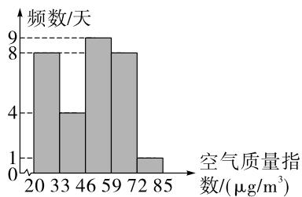

histogram

| 空气质量指数/(μg/m³) | 频数/天 |
|---|---|
| 20 | 8 |
| 33 | 4 |
| 46 | 9 |
| 59 | 8 |
| 72 | 1 |
| 85 | 0 |

第14题解图

15. 解:(1)由题图可知,本次调查的总人数为 $15\div5\%=300$ ; …… (4分)
(2) $a=300-105-45-15=135$ ; …… (8分)
(3)“喜欢”融合式教学模式的学生在扇形统大小卷·七年级(上) 数学 BS

计图中所对应的圆心角度数为 $\frac{105}{300}\times100\%$ $\times360^{\circ}=126^{\circ}$ . …… (12分)

16. 解: (1) 第 5 天当天 A 组种子的发芽率为 $\frac{35-25}{50} \times 100\% = 20\%$ ,

第 5 天当天 B 组种子的发芽率为 $\frac{8-2}{50} \times 100\% = 12\%$ .

补全折线统计图如解图；……（8分）

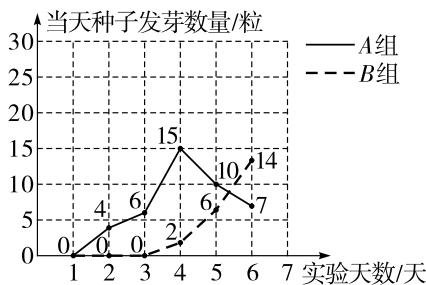

line

| 实验天数/天 | A组 | B组 |
| ---------- | --- | --- |
| 1          | 0   | 0   |
| 2          | 4   | 0   |
| 3          | 6   | 0   |
| 4          | 15  | 2   |
| 5          | 10  | 6   |
| 6          | 7   | 14  |

第 16 题解图

(2)A 组虽然前 4 天每天发芽的种子数量都在增加,但是从第 5 天开始每天发芽种子数量逐渐减少;B 组前三天没有种子发芽,从第 4 天开始,每天的种子发芽数量都在增加,所以预测第 7 天时,B 组种子的发芽数量较多.……(14 分)

17. 解: (1) 被调查的总人数为 $100 \div 25\% = 400$ ; …… (4 分)

(2)补全条形统计图和扇形统计图如解图所示；……（9分）

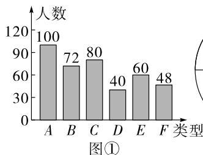

bar

| 类型 | 人数 |
| :--- | :--- |
| A | 100 |
| B | 72 |
| C | 80 |
| D | 40 |
| E | 60 |
| F | 48 |
图①

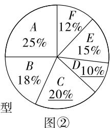

pie

| 型 | Percentage (%) |
|---|---|
| A | 25 |
| B | 18 |
| C | 20 |
| D | 10 |
| E | 15 |
| F | 12 |
图②

第 17 题解图

【解法提示】由(1)知被调查的总人数为400,所以选“C”类艺术展人数占总调查人数的百分比为 $\frac{80}{400}\times100\%=20\%$ ,选“D”类艺术展人数为400-100-72-80-60-48=40,选“D”类艺术展人数占总调查人数的百分比为 $\frac{40}{400}\times100\%=10\%$ .

(3)154.8;……(13分)

【解法提示】由扇形统计图可知，“A”与“B”所在的扇形圆心角的度数和为 $360^{\circ} \times (25\% + 18\%) = 154.8^{\circ}$ .

(4)由条形统计图可知,选择“A 雕塑艺术”类型的艺术展的人数最多,所以该校学生最终会参观“A 雕塑艺术”类型的艺术展.(言之有理即可)……(16 分)

# 期末检测卷

1. D 【解析】 $(-1)^{2}=1>0$ , A 选项不符合题意； $\left|-\frac{1}{3}\right|=\frac{1}{3}>0$ , B 选项不符合题意； $-(-3)=3>0$ , C 选项不符合题意； $-1^{3}=-1<0$ , D 选项符合题意.

2. A 【解析】由展开图可知,该立体图形的侧面是长方形,上下两面为三角形,故该立体图形为三棱柱.

3. C

4. B 【解析】这种调查是抽样调查,故选项 A 错误;样本容量是 300,故选项 B 正确;个体是每一名学生对我国航天事业发展历史的掌握情况,故选项 C 错误;总体是全校学生对我国航天事业发展历史的掌握情况,故选项 D 错误.

5. C 【解析】图中有线段 AB, BC, BD, DC, AD, AC 共 6 条, 所以结论①错误; 图中共有一条直线, 所以结论②正确; 图中射线 AD 可表示为射线 AC, 所以图中射线 AD 与射线 AC 是同一条射线, 所以结论③错误. 综上所述, 错误的结论是①③.

6. A 【解析】 $4x^{3}+5x^{2}+3-(mx^{3}+nx^{2}-1)=(4-m)\times x^{3}+(5-n)x^{2}+4$ ，将 x=1 抄成了 x=-1，但是运算结果正确，所以可知三次项系数为 0，即 4-m=0，解得 m=4，二次项系数 5-n 为任意实数，所以 m 的值确定，n 的值不确定，A 选项正确.

7. C 【解析】因为点 D, E 分别是线段 AC, BC 的中点, 所以 AD = DC, CE = EB, 所以 $AD + BE = \frac{1}{2}AB = \frac{1}{2} \times 16 = 8$ , 又 AD : BE = 3 : 1, 所以 $BE = 8 \times \frac{1}{4} = 2$ .

8. A 【解析】设绳索长为 x 尺, 则竿子长为 $(x-5)$ 尺, 依题意得 $(x-5)-\frac{1}{2}x=5$ , 即 $\frac{1}{2}x=(x-5)-5$ .

9. C 【解析】因为 $\angle AOF = \angle EOB = 90^{\circ}$ ，所以 $\angle AOE + \angle EOF = \angle FOB + \angle EOF = 90^{\circ}$ ，所以 $\angle AOE = \angle FOB$ ，故①正确；因为 $\angle AOE = \angle FOB$ 不一定等于 $45^{\circ}$ ，所以 $\angle AOE + \angle FOB$ 不一定等于 $90^{\circ}$ ，故②错误；因为 $\angle AOE + \angle EOF = \angle EOF +$

$\angle FOB = 90^{\circ}, \angle AOB = \angle AOF + \angle FOB$ ，所以 $\angle AOB + \angle EOF = \angle AOF + \angle FOB + \angle EOF = \angle AOF + \angle EOB = 90^{\circ} + 90^{\circ} = 180^{\circ}$ ，故③正确；因为 $OE$ 平分 $\angle AOF$ ，所以 $\angle AOE = \angle EOF = \frac{1}{2} \angle AOF = 45^{\circ}$ ，所以 $\angle FOB = \angle EOB - \angle EOF = 90^{\circ} - 45^{\circ} = 45^{\circ}$ ，所以 $\angle FOB = \angle EOF$ ，所以 $OF$ 平分 $\angle EOB$ ，故④正确；因为 $\angle AOE = \angle FOB$ ，所以 $\angle AOB$ 的平分线与 $\angle EOF$ 的平分线是同一条射线，故⑤正确。综上，一定正确的有4个。

10. B 【解析】方程 $x - \frac{3 - ax}{6} = \frac{x + 3}{2} - 1$ 去分母, 得 $6x - (3 - ax) = 3(x + 3) - 6$ , 整理, 得 $(3 + a)x = 6$ . 显然 $3 + a \neq 0$ , 即 $a \neq -3$ . 因为 x 的值是偶数且 a 是整数, 所以 $3 + a$ 的值可能为 1, 3, -1, -3, 所以 a 的值可能为 -2, 0, -4, -6, 共 4 个.

11. 两点确定一条直线

12. 八 【解析】一个棱柱有 10 个面,那么这个棱柱是八棱柱,所以这个棱柱的底面是八边形.

13. 40 【解析】由题意可得,该月数学类书籍的总借阅量为 $40 \div 25\% = 160$ (人次), 所以《数学简史》的借阅量为 $160 - 40 - 50 - 30 = 40$ (人次).

14. 9-x 【解析】由题意可得,购买 C 套餐 y 份,B 套餐 $(x-y)$ 份,所以 A 套餐的份数为 $9-y-(x-y)=9-x$ .

15. 4 或 $\frac{28}{9}$ 【解析】设 $CD = AB = 8x$ ，由题意可知， $CC_{1} = C_{1}D = DD_{1} = 4x$ . 如解图①，当 $CD$ 的左四等分点移动到点 $A$ 时，此时 $CC_{2} = 2x$ ，因为点 $D_{1}$ 对应的数为-2，点 $C_{2}$ 对应的数为-9，所以 $C_{2}D_{1} = CC_{2} + CD + DD_{1} = 2x + 8x + 4x = -2 - (-9)$ ，解得 $x = \frac{1}{2}$ ，所以 $CD = 8x = 4$ ；如解图②，当 $CD$ 的右四等分点移动到点 $A$ 时，此时 $CC_{3} = 6x$ ，因为点 $D_{1}$ 对应的数为-2，点 $C_{3}$ 对应的数为-9，所 $C_{3}D_{1} = CC_{3} + CD + DD_{1} = 6x + 8x + 4x = -2 - (-9)$ ，解得 $x = \frac{7}{18}$ ，所以 $CD = 8x = \frac{28}{9}$ .

大小卷·七年级(上) 数学 BS

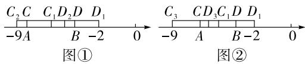

text_image

C₂C C₁D₂D D₁
-9A B -2 0 → C₃ C D₃C₁D D₁
-9 A B -2 0
图① 图②

第 15 题解图

16. 解: (1) 原式 = 4 + (-4) × $\frac{1}{4} - \frac{1}{2} \times 6$

$$
= 4 - 1 - 3
$$

$$
= 0; \dots\dots(3 \text {分})
$$

(2) 原式 $= 4 - (-1 - 2)^{2} \times \frac{1}{6}$

$$
= 4 - 9 \times \frac {1}{6}
$$

$$
= \frac {5}{2}. \dots\dots(6 \text {分})
$$

17. 解: (1) $2(2-2x)=2-3(x+5)$ ,

去括号, 得 4-4x=2-3x-15,

移项,得 $-4x+3x=2-15-4$ ,

合并同类项,得-x=-17,

系数化为 1, 得 x=17; …… (4 分)

(2) $\frac{2x-1}{3}=4-\frac{x}{5}$ ,

去分母, 得 $5(2x-1)=60-3x$ ,

去括号, 得 10x-5=60-3x,

移项, 得 $10x + 3x = 60 + 5$ ,

合并同类项,得 13x=65,

系数化为 1, 得 x=5. …… (8 分)

18. 解: 因为 $\left|x-6\right|+\left(y+\frac{3}{2}\right)^{2}=0,\left|x-6\right|\geqslant0,\left(y+\frac{3}{2}\right)$

$$
\left. \frac {3}{2}\right) ^ {2} \geqslant 0,
$$

所以 $x - 6 = 0, y + \frac{3}{2} = 0$

所以 $x = 6, y = -\frac{3}{2}$ , …… (4分)

$$
5 \left(x ^ {2} - 2 x y\right) + \left(3 y - 5 x ^ {2}\right) - 3 (x y + y)
$$

$$
= 5 x ^ {2} - 1 0 x y + 3 y - 5 x ^ {2} - 3 x y - 3 y
$$

$$
= - 1 3 x y, \dots \tag {8分}
$$

所以原式 $= -13 \times 6 \times \left(-\frac{3}{2}\right)$

$$
= 1 1 7. \quad \dots\dots\tag {9分}
$$

19. 解: (1) 尺规作图如解图所示; …… (4 分)

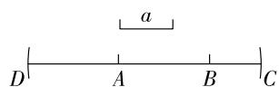  
第 19 题解图

(2)由题意可知 AB=AD=6, BC=4,

所以 DC=16, AC=10.

因为 O 为 DC 的中点，

所以 $OC=\frac{1}{2}DC=8$ ,

所以 AO = AC - OC = 10 - 8 = 2，

所以 OB=AB-AO=6-2=4. …… (9 分)

20. 解: (1) 360, 300, 495, 195 (表格从上至下填写); …… (5 分)

【解法提示】因为 100% - 13% - 33% - 24% = 30%, 又因为购买吉祥物手办的人数是购买其他纪念品人数的 2 倍, 所以购买其他纪念品的人数占购买纪念品系列的总人数的 10%, 又因为购买其他纪念品的人数为 150, 所以购买纪念品系列的总人数有 $150 \div 10\% = 1500$ , 所以购买纪念币、吉祥物手办、纪念邮票、纪念徽章的人数分别为 360, 300, 495, 195.

(2)由(1)可知,购买吉祥物手办的人数占购买纪念品系列的总人数的 20%,

所以扇形统计图中吉祥物手办部分的圆心角度数为 $360^{\circ} \times 20\% = 72^{\circ}$ ; …… (7 分)

(3)由扇形统计图可得,购买纪念邮票的游客人数占比最大,说明纪念邮票最受欢迎,可以多购进一些纪念邮票。(答案不唯一)……(10分)

21. 解: (1)6; …… (3分)

【解法提示】观察图形可知每增加 1 块灰色长方形地砖, 白色长方形地砖会增加 6 块.

(2) $6n+2$ ; (6分)

【解法提示】由(1)可知每增加1块灰色长方形地砖,会增加6块白色长方形地砖,观察规律可知若灰色长方形地砖的数量为1,则白色长方形地砖的数量为 $1\times6+2=8$ ;若灰色长方形地砖的数量为2,则白色长方形地砖的数量为 $2\times6+2=14$ ;…因此若灰色长方形地砖的数量为n,则白色长方形地砖的数量为 $6n+2$ .

(3)根据题中规律可知当白色长方形地砖的数量为2024时,灰色长方形地砖的数量为 $(2024-2)\div6=337$ (块),

因为白色长方形地砖的长为 $40 \, cm$ ，所以灰色长方形地砖较长的一边为 $40 \times 2 = 80 \, (\text{cm})$ ，

因此 337 块灰色长方形地砖的长度为 $337 \times$

$$
8 0 = 2 6 9 6 0 (\mathrm{cm}),
$$

观察图中规律可知,该休闲步道的长为“337块灰色长方形地砖的长+338块白色长方形地砖的宽”,

故该休闲步道的长为 $26\ 960 + 338 \times 20 = 33\ 720$ (cm) = 337.2(m),

答:这条休闲步道的长度为 337.2 m. ……
…… (10 分)

22. 解: (1) 设 x s 后两人首次相遇,

根据题意,得 $5x+7x=600\times\frac{3}{4}$ ,

解得 x=37.5;

此时小明骑小马跑的路程为 $5 \times 37.5 = 187.5 \, (\text{m})$ ,
……（4 分）

$$
6 0 0 \div 4 = 1 5 0 (\mathrm{m}),
$$

$$
1 8 7. 5 > 1 5 0,
$$

$$
1 8 7. 5 - 1 5 0 = 3 7. 5 (\mathrm{m}),
$$

答:出发37.5 s后两人首次相遇,此时他们在弯道BC上,距离B点37.5 m处; …(5分)

(2)设又经过 y s 两人相距 60 m,

分为两种情况：

①两人背对背相距60 m,

根据题意可列方程为 $5y+7y=60$ ，解得 y=5；
……（7分）

②两人面对面相距60 m，

根据题意可列方程为 $5y+7y+60=600$ ,

解得 y=45. …… (9 分)

答:在首次相遇后第二次相遇前,又经过5 s或45 s两人相距60 m. …… (11分)

23. 解: (1) 23; …… (3 分)

【解法提示】因为 $\angle AOE = 46^{\circ}$ ，所以 $\angle BOE = 134^{\circ}$ ，因为 OC 平分 $\angle BOE$ ，所以 $\angle COE = 67^{\circ}$ ，因为 $\angle EOF$ 为直角，所以 $\angle COF = \angle EOF - \angle EOC = 90^{\circ} - 67^{\circ} = 23^{\circ}$ .

(2) 因为 $\angle AOE = n^{\circ}$ ,

所以 $\angle BOE = 180^{\circ} - n^{\circ}$ ,

因为 OC 平分 $\angle BOE$ ,

所以 $\angle COE = \frac{1}{2} (180^{\circ} - n^{\circ})$

因为 $\angle EOF$ 为直角，

所以 $\angle COF = \angle EOF - \angle EOC = 90^{\circ} - \frac{1}{2}(180^{\circ}$

$-n^{\circ})=\frac{1}{2}n^{\circ};\quad\cdots\cdots(7\text{分})$

(3) 设 $\angle BOF = x^{\circ}$ ，则 $\angle AOD = (x + 15)^{\circ}$ ，

因为 $\angle EOF$ 为直角,所以 $\angle EOB=(90-x)^{\circ}$ ,

因为 OC 平分 $\angle BOE, OD$ 平分 $\angle AOC, \angle AOD + \angle DOC + \angle EOB = \angle AOB + \angle EOC,$

所以 $x+15+x+15+90-x=180+\frac{1}{2}\times(90-x)$ ,

解得 x=70，

所以可得 $\angle EOB = (90 - x)^{\circ} = 20^{\circ}$ ,

$$
\angle A O E = 1 8 0 ^ {\circ} - \angle E O B = 1 8 0 ^ {\circ} - 2 0 ^ {\circ} = 1 6 0 ^ {\circ},
$$

故 n 的值是 160. …… (12 分)