# 周测小卷

活页可撕

natural_image

Cartoon illustration of a green deer-like character with large eyes and antlers (no text or symbols)

检测每周学习成果，及时查漏补缺

更多教辅，请关注公众号【全科A+】主编 武泽涛 研发 万唯中考千人研究院

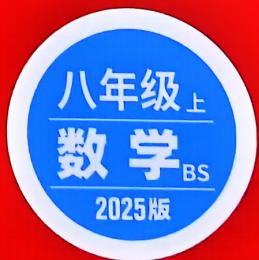

text_image

八年级上
数学BS
2025版

# 本书配套系列用书

<table><tr><td>名校满分作文</td><td>七~九年级通用</td></tr><tr><td>语文《中考名校模考 满分作文》《初中名师 教你改出满分作文》《教材写作 名校满分作文与中考新方向 八年级+九年级》英语《中考名校模考 英语满分作文》《初中英语 教材写作 名校满分作文与 中考新方向》</td><td>《初中 基础知识与中考创新题》语文/数学/英语/物理/化学/道德与法治/历史/地理/生物学《初中 实验与中考新考法》物理/化学/生物学语文《初中 名著阅读与中考新考法》《初中 文言文常用字字典》《初中 教材文言文完全解读与中考考点》数学《初中数学 几何模型与中考新考法》《初中数学 几何辅助线与中考新考法》英语《中考 英语词汇与新考法》《初中 英语语法与中考新趋势》</td></tr></table>

更多教辅，请关注公众号【全科A+】

# 同步训练

《情境题与中考新考法 八年级》

语文/数学/英语/物理/道德与法治/历史/地理/生物学

《大小卷 八年级》

语文/数学/英语/物理/道德与法治/历史/地理/生物学

《情境期末卷 八年级》

语文/数学/英语/物理

《初二预习视频课》

语文/数学/英语/物理/地理/生物学

语文

《现代文阅读与中考新考法 八年级+九年级》

《课外文言文阅读与中考新考法八年级+九年级》

数学

《尖子生 每日一题 数学 八年级》

《初中计算题 数学》

英语

《英语听力与中考新考法 八年级》

《完形填空阅读理解与中考新考法八年级》基础版/提升版

物理

《尖子生 每日一题 物理 八年级》

· 重难题视频讲解(20个)  
· 省会城市名校期末试题及解析   
· 几何画板动态演示(含源文件)  
·期中、期末复习更多好题：选自万唯《情境期末卷》  
- 更多教辅，请关注公众号【全科A+】

# 目录

主题情境:本书结合日常生活、数学文化、跨学科学习等创设主题情境,围绕主题情境原创更多情境题,让学生在真实情境中掌握知识,提升解决实际问题的能力.

# 第一章 勾股定理

主题情境

周测1 勾股定理及其逆定理 …… 1

周测2 勾股定理的应用 …… 社会安全 3

专题 最短路径问题 5

# 第二章 实数

周测3 平方根和立方根 …… 手工缝纫 7

周测4 估算和实数 9

周测5 二次根式 11

# 第三章 位置与坐标

周测6 确定位置及平面直角坐标系 …… 剧场观演 13

专题 平面直角坐标系中的面积问题 …… 15

周测7 轴对称与坐标变化……自然界中的对称美 17

# 第四章 一次函数

周测8 函数及一次函数的图象与性质 19

周测9 一次函数的应用 …… 汉服体验节 21

专题 一次函数的图象与性质 …… 23

# 期中检测

选填及简单解答题组(一) 25

选填及简单解答题题组(二) 27

中档解答题题组(一) 29

中档解答题题组(二) 31

专题 几何综合题 …… 33

# 第五章 二元一次方程组

周测10 二元一次方程组及其解法 活动课上的新发现 35

周测11 二元一次方程组的应用 推进绿色茶园建设 37

周测12 二元一次方程(组)与一次函数 39

专题 二元一次方程(组)的实际应用 …… 传承红色精神 41

# 第六章 数据的分析

周测13 平均数、中位数、众数 关注中学生健康成长 43

周测 14 数据的集中趋势与离散程度……保护生态,守望绿意

# 第七章 平行线的证明

主题情境

周测15 平行线的判定与性质 47

周测16 三角形的内角和定理 49

专题 三角形中内、外角的有关计算 …… 51

教材原题 教材P185第9题

改编1 改变角平分线位置/51

改编2 增加一条外角平分线/51

改编3 变高线为垂线/51

改编4 改高线为垂直平分线/52

# 期末检测

选填及简单解答题题组(一) …… 运动展风采 53

选填及简单解答题题组(二) …… 气温变化 55

中档解答题题组(一) 57

中档解答题题组(二) 59

专题 一次函数综合题 …… 61

# 小卷中考新考法索引

# 开放性试题

满足条件的结论开放 / P1 第 7 题、P35 第 7 题

选择条件开放 / P8 第 15 题

满足结论的条件开放 / P19 第 7 题

写评价开放 / P44 第 11 题

组合多选条件开放 / P48 第 12 题

# 过程性学习

过程纠错改错 / P12 第 12 题

续写解题过程 / P29 第 19 题

# 阅读理解题

解题方法型阅读理解题 / P10 第 15 题

新定义型阅读理解题 / P14 第 13 题、P18 第 13 题

# 代数推理

归纳一般结论/P31第19题

# 综合与实践

操作探究 / P50 第 12 题、P52 第 2 题

# 附:《参考答案》单独成册

# 周测1 勾股定理及其逆定理

建议用时:40 分钟 满分:60 分

班级： 姓名： 得分：

# 一、选择题(每小题3分,共18分)

1. 在直角三角形中,若两条直角边长分别为3和4,则斜边长为 ( )

A. 3

B. 4

C. 5

D. 6

2. 在 Rt $\triangle ABC$ 中, 斜边 $AB$ 的长为 6 , 则 $AB^{2} + AC^{2} + BC^{2}$ 的值为 ( )

A. 36

B. 48

C. 60

D. 72

3. 生产劳动情境 零件质检 车间李师傅收到一个零件质检任务,零件如图所示,按照规定 $\angle B=90^{\circ}$ ,李师傅依次测量 $\triangle ABC$ 三条边的长度,由此判断该零件是否合格.李师傅这样做的依据是 ( )

A. 直角三角形两锐角互余  
B. 三角形两边之和大于第三边  
C. 勾股定理  
D. 勾股定理的逆定理

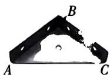

natural_image

Black metal truss structure with labeled points A, B, and C (no text or symbols beyond labels)

第3题图

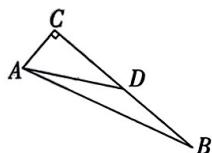

text_image

Geometric diagram of triangle ABC with point D on side AB and line segment CD drawn

第4题图

4. 如图, 在 $\triangle ABC$ 中, $\angle C = 90^{\circ}, AD$ 为 $BC$ 边上的中线. 若 $AC = 8, AD = 17$ , 则 $\triangle ABC$ 的面积为 ( )

A. 60

B. 68

C. 120

D. 240

5. 传统文化情境 琴棋书画 如图是中国象棋的一盘残局,各个小正方形的边长均为1,则“车”“炮”“帅”三个棋子对应点所构成的三角形最大的内角为 ( )

A. ${45}^{ \circ  }$   
B. ${60}^{ \circ  }$   
C. ${80}^{ \circ  }$   
D. ${90}^{ \circ  }$

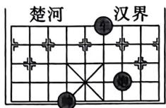

text_image

楚河
汉界

第5题图

6. 数学文化情境(会徽) 图①是第七届国际数学教育大会的会徽,会徽的主题图案是由一连串如图②所示的直角三角形演化而成的. 若 $OP = PP_{1} = P_{1}P_{2} = P_{2}P_{3}$ , 则 $OP_{3} : OP$ 为 ( )

  
图①

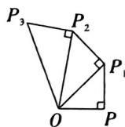

text_image

P₃
P₂
P₁
O
P

图②

# 第6题图

A. $3:1$ B. $2:1$ C. $3:2$ D. $4:3$

# 二、填空题(每小题3分,共12分)

7. (中考新考法·满足条件的结论开放)请写出一组包含12的勾股数：\_\_\_\_。

8. (教材 P3 第 1 题改编) 一题多变

# 8.1 去掉一个正方形

如图, 在 Rt△ABC 中, ∠BAC=90°, 以 BC 和 AC 为边分别向外作正方形, 面积分别为 $S_{1}$ 和 $S_{2}$ . 已知 $S_{1}-S_{2}=25$ , 且 $AB+AC=7$ , 则 $S_{1}$ 的值为 \_\_\_\_.

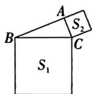

text_image

A
S₂
B
C
S₁

第8.1题图

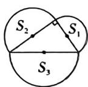  
第8.2题图

# 8.2 正方形改为半圆

如图,分别以直角三角形的三边为直径作半圆,三个半圆的面积分别为 $S_{1},S_{2},S_{3}$ ,若 $S_{1}=6\pi,S_{2}=12\pi$ ,则 $S_{3}$ 的值为\_\_\_\_.

9.（教材P7第2题改编）如图，在四边形ABCD中，点 $E$ 在边 $BC$ 上， $AB \perp BC, CD \perp BC, BE = CD = a, AB = EC = b$ ，有以下结论：① $\triangle ABE \cong \triangle ECD$ ；② $AE^2 + ED^2 = BC^2$ ；

大小卷·八年级(上) 数学 BS

③四边形ABCD的面积为 $\frac{1}{2} (a + b)^2$ ; ④此图形可验证勾股定理. 其中正确的结论为 \_\_\_\_. (填序号)

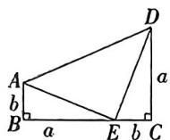

text_image

A
b
B
a
E
b
C
a
D

第9题图

# 三、解答题(共30分)

10. (6分)(教材P11第4题改编)如图,网格中每个小正方形的边长都是1,点A,B,C,D都在格点上.若 $EF^{2}=8$ ,则以AB,CD,EF三条线段为边长,能否构成直角三角形?请说明理由.

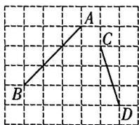

text_image

A
B
C
D

第10题图

11. (6分)如图,在 $\triangle ABC$ 中, $AB=AC=4$ ,AD平分 $\angle BAC$ , $BE\perp AB$ ,且与 $AD$ 的延长线交于点 $E$ .若 $BE=3$ ,求 $BC$ 的长.

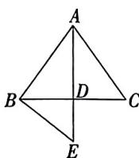

text_image

A
B
D
C
E

第11题图

12. (8分)面积法是最常见的验证勾股定理的方法. 用两个全等的直角三角形的纸板拼出如图所示的图形, $\angle ACB = \angle DEA = 90^{\circ}$ , 设 $AB = AD = c$ , $BC = AE = a$ , $AC = DE = b$ , 请结合图形验证勾股定理.

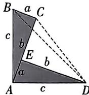

text_image

B
a C
c
b
E b
a
A c D

第12题图

13. (10 分)(教材 P7 第 3 题改编)如图,有一座半圆形拱桥,它的跨度 AB 为 68 米,为保证安全,当水位上升到 25 米及以上时,将禁止船只通行.若某次测得水面宽度 PQ 为 32 米,试通过计算说明这时船只能否正常通行? $(OM \perp PQ$ 于点 N, ON 的长即水位的高度)

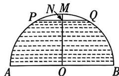

text_image

P
N,M
Q
A
O
B

第13题图

  
第13题

# 周测2 勾股定理的应用

建议用时:40 分钟 满分:50 分

班级： 姓名： 得分：

# 一、选择题(每小题3分,共18分)

1. 如图,一枝长 30 cm 的花插在圆柱形花瓶中(壁厚不计),花瓶底面直径为 7 cm,高为 24 cm,则这枝花露在花瓶外面部分的长度最短为 ( )

A. $3 \mathrm{~cm}$

B. $4 \mathrm{~cm}$

C. $5 \mathrm{~cm}$

D. $6 \mathrm{~cm}$

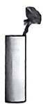  
第1题图

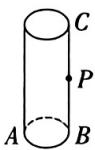  
第2题图

2. 如图是一个底面周长为 $16 \mathrm{~cm}$ , 高为 $12 \mathrm{~cm}$ 的圆柱体, $P$ 为 $BC$ 的中点, 一只蚂蚁从点 $A$ 出发沿着圆柱的表面爬到点 $P$ 的最短路程为 ( )

A. $9 \mathrm{~cm}$

B. ${10}\mathrm{\;{cm}}$

C. 11 cm

D. ${12}\mathrm{\;{cm}}$

3. 数学文化情境 折竹抵地《九章算术》中有个“折竹抵地”的问题,其大意为:如图,一根竹子,原来高一丈,后来竹子折断,其竹梢恰好抵地,抵地处离原竹子根部三尺远,问原处还有多高的竹子(1 丈 = 10 尺)?设原处的竹子还有 x 尺,则可列方程为 ( )

A. $x^{2} + (x + 3)^{2} = 10^{2}$

B. $x^{2} + 3^{2} = (10 - x)^{2}$

C. $x^{2} + 3^{2} = 10^{2}$

D. $x^{2} + (x + 3)^{2} = (10 - x)^{2}$

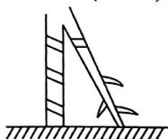

natural_image

Simple line drawing of a ladder leaning against a ground surface with leaf-like structures (no text or symbols)

第3题图

# 主题情境 社会安全 请完成第4\~5题

4. (教材 P14 练习改编) 海上巡逻是维护国家海洋权益的有效手段. 如图, 我军巡逻舰队在点 A 处巡逻, 突然发现在南偏东 $50^{\circ}$ 方向距离 15 海里的点 B 处有可疑目标正在以 16 海里/小时的速度沿南偏西

$40^{\circ}$ 方向行驶, 我军巡逻舰队立即沿直线追赶, 半小时后在点 $C$ 处将其追上, 则我军巡逻舰队的航行速度为 ( )

A. 16 海里/小时

B. 17 海里/小时

C. 32 海里/小时

D. 34 海里/小时

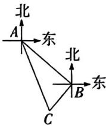

text_image

北
A
东
北
B
东
C

第4题图

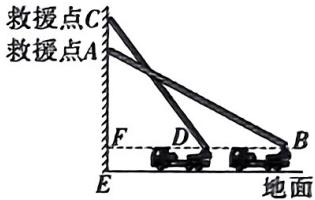

text_image

救援点C
救援点A
E
D
B
地面

第5题图

5. 如图, 救援时云梯伸至最长为 20 米 (AB = CD = 20 米), 消防车高 3 米. 某次, 在完成 15 米 (AE = 15 米) 高的 A 处的救援后, 还要完成比 A 处高 4 米的 C 处的救援, 则消防车需要从点 B 向点 D 移动的距离为 ( )

A. 2 米

B. 3米

C. 4米

D. 5米

6. 如图, 在 Rt $\triangle ABC$ 中, $\angle C = 90^{\circ}, AB = 5$ , AC = 4, 将 $\triangle ABC$ 沿 DE 折叠, 顶点 B 的对应点 $B'$ 恰好与点 A 重合, 点 C 落在点 F 处, 则 AE 的长为 ( )

A. 3

B. $\frac{25}{8}$

C. $\frac{13}{4}$

D. $\frac{15}{4}$

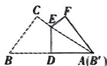

text_image

C
E
F
B
D
A(B')

第6题图

# 二、填空题(每小题3分,共12分)

7. 生产劳动情境修建公路: 如图, 在 A 镇和 B 镇之间有一座大山, 原来从 A 镇到 B 镇需沿道路 $A \rightarrow C \rightarrow B$ 绕过两镇间的大山, 为了促进两镇交流发展, 决定修建一大小卷·八年级(上) 数学 BS

条从 A 镇直达 B 镇的公路. 已知 AC = 90 km, BC = 120 km, AC ⊥ BC, 那么直达公路建成后, 从 A 镇到 B 镇比原来少走 \_\_\_\_ km.

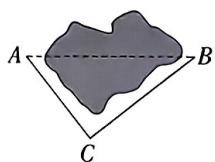

text_image

A
B
C

第7题图

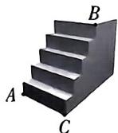

natural_image

3D diagram of a stepped structure with labeled points A, B, and C (no text or symbols beyond labels)

第8题图

8.（教材 P13 例题改编）如图,一只蚂蚁从 A 处出发沿台阶爬行到达 B 处,已知每级台阶的宽度和高度分别是 30 cm 和 20 cm,台阶长度 AC = 165 cm,则蚂蚁爬行的最短路程为 \_\_\_\_ cm.

9. 科技发展情境 感应水龙头 如图是一款自动感应水龙头及其示意图,在距离洗手台面 $20 \mathrm{~cm}$ 的点 $C$ 处连接着出水口 $D$ 所在的水管,水管 $AB$ 上的点 $E$ 处安装有红外线感应装置. 已知出水口 $D$ 到点 $C$ 的距离 $CD$ 为 $15 \mathrm{~cm}$ , 出水口 $D$ 到点 $E$ 的距离为 $17 \mathrm{~cm}$ , 且 $CD \perp AB$ , 则红外线感应装置距离洗手台的高度 $BE$ 为 \_\_\_\_ cm.

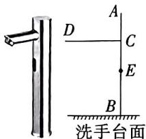

text_image

A
D
C
E
B
洗手台面

第9题图

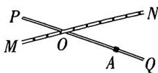

text_image

P
M
O
A
Q
N

第10题图

10. 如图, 铁路 $MN$ 和公路 $PQ$ 在点 $O$ 处交汇. 在公路 $PQ$ 边上有一居民楼 $A$ , 居民楼与点 $O$ 的距离为 $240 \mathrm{~m}$ , 且其到铁路的距离正好是到点 $O$ 的一半. 已知火车行驶时, 周围 $200 \mathrm{~m}$ 以内会受到噪音的影响, 那么火车在铁路 $MN$ 上沿 $ON$ 方向以 $20 \mathrm{~m} / \mathrm{s}$ 的速度行驶时, 居民楼受到噪音影响的时间是 \_\_\_\_ s.

# 三、解答题(共20分)

11. (10分)(教材P19第12题改编)如图,一个长方体盒子的长、宽、高分别为 $20\mathrm{cm},20\mathrm{cm},30\mathrm{cm}$ ,一只蚂蚁想从盒底的点A处沿盒的表面爬到盒顶的点B处,现有①,②两条路径可供蚂蚁选择(图中的路线),则蚂蚁选择爬行的最短路径应是哪条?最短路径长为多少?

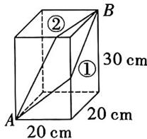

text_image

②
30 cm
①
20 cm
A
20 cm
B

第11题图

12. (10 分) 如图是张伯伯承包的一块待开垦的四边形田地 $ABCD, AC$ 为田间的一条小路, 且 $AD \perp AC$ , 已知 $AB = 16$ 米, $BC = 12$ 米, $CD = 29$ 米, $AD = 21$ 米.

(1)求四边形田地的面积;   
(2)为了方便灌溉,张伯伯打算从靠近河岸的 CD 边上引一条水渠到点 A 处,请你帮他计算这条水渠的最短长度.

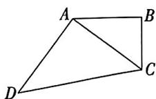

natural_image

Geometric diagram of a quadrilateral ABCD with diagonal AC, no text or labels present

第12题图

# 专题 最短路径问题

建议用时:40 分钟

班级： 姓名：

# 方法分类练

# 方法1 利用“两点之间,线段最短”求最值

1. 如图, 圆柱体的底面周长为 $8 \, cm$ , 高 AB 为 $3 \, cm$ , BC 是上底面的直径, 一只蚂蚁从点 A 出发, 沿着圆柱的侧面爬行到点 C, 求爬行的最短路程.

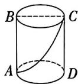  
第1题图

2. 如图是一个长方体盒子, 其长、宽、高分别为 4,2,9, 现要用彩色丝带绕侧面绑在点 A, B 处, 不计线头, 求所需彩色丝带的最短长度.

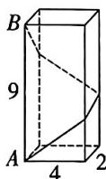

text_image

B
9
A
4
2

第2题图

3. 如图, 在一条东西走向河流的同侧有两个村庄 $A, B, A$ 村庄到河边的距离为 $1 \mathrm{~km}$ , $B$ 村庄到河边的距离为 $2 \mathrm{~km}, A, B$ 的水平距离为 $4 \mathrm{~km}$ , 现准备在河岸边上建一个抽水站 $C$ , 分别通往 $A, B$ 两村庄. 已知每铺设 $1 \mathrm{~km}$ 送水管道需花费 1200 元, 求铺设送水管道的最低费用.

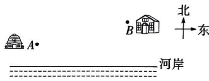

text_image

北
东
河岸

第3题图

# 方法2 利用垂线段最短求最值

4. 如图, 在 $\triangle ABC$ 中, $\angle A = 90^{\circ}$ , $AB = 6$ , $\triangle ABC$ 的面积为 $24, D$ 为 $BC$ 所在直线上一点, 求 $AD$ 的最小值.

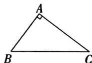

text_image

A
B C

第4题图

大小卷·八年级(上) 数学 BS

5. 如图, 在 $\triangle ABC$ 中, $AB = AC = 10$ , $BC = 12$ , $AD$ 是 $BC$ 边上的中线, $F$ 是 $AD$ 边上的动点, $E$ 是 $AC$ 边上的动点, 求 $CF + EF$ 的最小值.

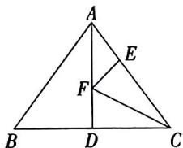

text_image

A
E
F
B
D
C

第5题图

# 综合训练

6. 如图是一张长方形桌子 ABCD, 已知长 AB = 40 cm, 宽 AD = 20 cm, 中间有一个盒子, 盒子高为 4 cm, 现有一只蚂蚁要从 A 点爬到 C 点, 它必须翻过中间的盒子, 求蚂蚁要走的最短路程.

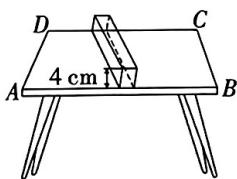

text_image

D
C
4 cm
A
B

第6题图

7. 跨学科情境 跨生物藤本植物 葛藤是一种多年生藤本植物,其缠绕着附近的树干盘旋而上,如图,若把树干看作底面周长为4米的圆柱体,现有一段葛藤自点A处盘旋树干3圈到达点B的位置,已知AB=9米,则这段葛藤至少多少米?

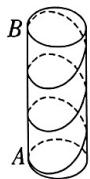  
第7题图

  
第7题

8. 如图, $AB, AC, BC$ 分别为连接村庄 $A, B, C$ 的三条公路, $AD$ 为村庄 $A$ 到公路 $BC$ 的一段水泥路. 已知 $AD \perp BC$ , $AD = 2.4 \mathrm{~km}$ , $BD = 1.8 \mathrm{~km}$ , $CD = 3.2 \mathrm{~km}$ .

(1)以村庄 A, B, C 为顶点构成的 $\triangle ABC$ 是直角三角形吗？请说明理由.  
(2)若该地区打算以点 D 为起点再修建两条分别到公路 AB, AC 的水泥路, 则至少需要修建多长的水泥路?

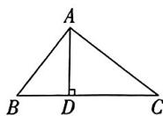

text_image

A
B D C

第8题图

# 周测3 平方根和立方根

建议用时:40 分钟 满分:70 分

班级： 姓名： 得分：

# 一、选择题(每小题3分,共18分)

1. 16的算术平方根为 （）

A. ±2

B. 2

C. $\pm 4$

D. 4

2. 若 $x$ 是64的立方根, 则 $x$ 的值是 ( )

A. 4

B. $\pm 4$

C. 8

D. $\pm 8$

3. 下列运算结果正确的是 ( )

A. $(\sqrt{2})^2 = \pm 2$

B. $\sqrt[3]{27} = 3$

C. $\sqrt{(-3)^2} = -3$

D. $\sqrt[3]{-125} = 5$

4. 下列说法正确的是 ( )

A. 1 的立方根是±1

B. 0.36 的平方根是 0.6

C. 算术平方根等于它本身的数只有1和0

D. 9 的算术平方根是±3

5. 已知 $\sqrt{a - 5} + |b - 25| = 0$ ，则 $\sqrt[3]{ab}$ 的值为（）

A. 5

B. 10

C. 15

D. ±15

6. 如图是一个无理数筛选器的工作流程图, 根据该流程图, 下列说法错误的是 ( )

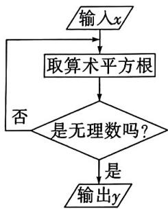

flowchart

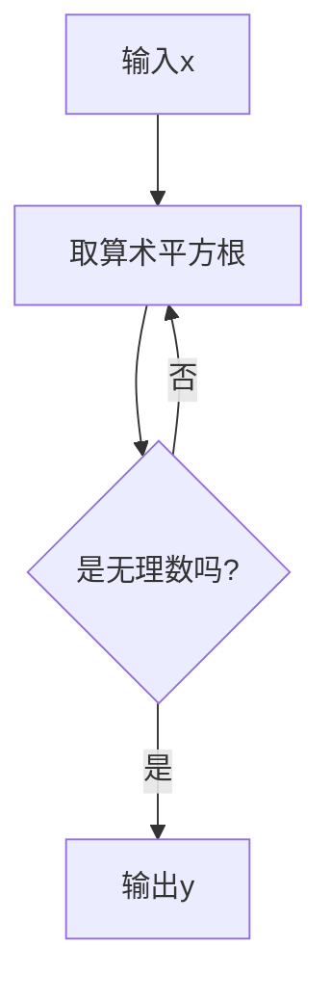

第6题图

A. 当输入值 x 为 -4 时, 筛选器无法运行

B. 当输入值 x 为 16 时, 输出值 y 为 $\sqrt{2}$

C. 当输出值 $y$ 为 $\sqrt{3}$ 时, 输入值 $x$ 可能为81

D. 对于任意的正无理数 $y$ ，都存在正整数 $x$ ，使得输入 $x$ 后能够输出 $y$

# 二、填空题(每小题3分,共12分)

7. 计算: $\sqrt[3]{-8^3} =$ \_\_\_\_.

8. 已知一个正数的两个平方根分别为 5-2x 和 3x-2, 则 x 的值为 \_\_\_\_.

主题情境 手工缝纫 请完成第9\~10题

9. 如图, 李师傅需要将两块完全一样的小正方形布料经过裁剪缝补成一个大正方形布料. 若每块小正方形布料的面积为 $8 \mathrm{~cm}^{2}$ , 则缝补后大正方形布料的边长为 \_\_\_\_ cm.

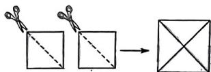

flowchart

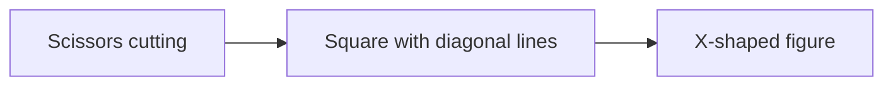

第9题图

10. 若需缝制一个体积为 $343 \, cm^{3}$ 的正方体沙包, 则这个沙包的表面积为 \_\_\_\_ $cm^{2}$ .

# 三、解答题(共40分)

11. (4分)求下列各式的值:

(1) $\sqrt{36}$ ;

(2) $\sqrt{0.25}$ ;

(3) $\sqrt{(-3)^2}$ ;

(4) $-\sqrt[3]{1 - \frac{124}{125}}.$

12. (8 分) 求满足下列各式的未知数 $x$ :

(1) $(2x + 1)^{2} = 121$ ;

(2) $17x^{3}+100=-36.$

13. (8 分) 跨学科情境/跨生物食物链在生物学中,能量在食物链中的流动有着“逐级递减”的特点,即一个营养级的能量只有一部分会流到下一个营养级中. 在如图所示的食物链中( $H_{n}$ 表示第 $n$ 营养级),能量的传递效率为 $a\%$ .

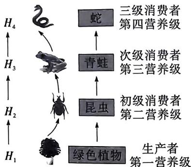

flowchart

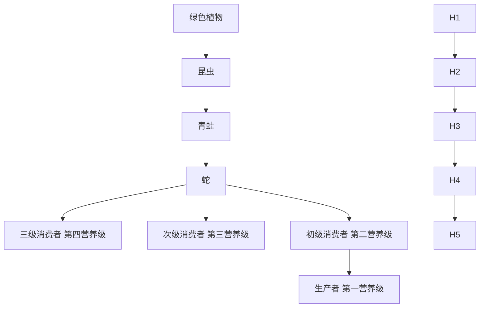

第13题图

(1)已知 $H_{1}$ 中输入了 $1000\mathrm{kJ}$ 能量, $H_{4}$ 获得了 $1\mathrm{kJ}$ 能量, 求 $a$ 的值;  
(2)在(1)的条件下,若 $H_{1}$ 中输入600 kJ能量,则 $H_{3}$ 可以获得多少能量?

14. (10 分) 已知 $3x - y + 9$ 的算术平方根是 5, $1 - 2y$ 的立方根是 -3.

(1) 求 x, y 的值;  
(2) 求 $\sqrt{x+2y-2}$ 的平方根.

15. (10 分)(中考新考法·选择条件开放)在日历上,我们可以发现其中某些数满足一定规律,如图是某年6月份的日历,我们选择其中被框起来的部分,将每个框中三个位置上的数按如下方式计算:

$$
\begin{array}{l} \sqrt {9 ^ {2} - 2 \times 1 6} = \sqrt {8 1 - 3 2} = \sqrt {4 9} = 7, \\ \sqrt {2 0 ^ {2} - 1 3 \times 2 7} = \sqrt {4 0 0 - 3 5 1} = \sqrt {4 9} = 7, \\ \end{array}
$$

不难发现,结果都是7.

<table><tr><td colspan="7">6月日历</td></tr><tr><td>日</td><td>一</td><td>二</td><td>三</td><td>四</td><td>五</td><td>六</td></tr><tr><td></td><td></td><td></td><td>1</td><td>2</td><td>3</td><td>4</td></tr><tr><td>5</td><td>6</td><td>7</td><td>8</td><td>9</td><td>10</td><td>11</td></tr><tr><td>12</td><td>13</td><td>14</td><td>15</td><td>16</td><td>17</td><td>18</td></tr><tr><td>19</td><td>20</td><td>21</td><td>22</td><td>23</td><td>24</td><td>25</td></tr><tr><td>26</td><td>27</td><td>28</td><td>29</td><td>30</td><td></td><td></td></tr></table>

第15题图

(1)请你再在图中框出一个类似的部分并加以验证；  
(2)请你利用所学知识对以上规律进行说明.

  
中考新考法题

# 周测4 估算和实数

建议用时:40 分钟 满分:70 分

班级： 姓名： 得分：

# 一、选择题(每小题3分,共18分)

1. 下列各数中, 是无理数的是 ( )

A. $-\sqrt{4}$

B. $\sqrt{3}$

C. 3.14

D. 0.67

2. 在下列实数中,最小的数是 ( )

A. 0

B. -1

C. $-\sqrt{3}$

D. 2

3. 已知一个正方体的体积为 19, 试估计它的棱长大小在 ( )

A. 4 和 5 之间

B. 3 和 4 之间

C. 2 和 3 之间

D. 1 和 2 之间

4. 数学文化情境 勾股弦《九章算术》第九章“勾股”中提出了勾股数问题的通解公式: 若 a, b, c 分别是勾股形的勾、股、弦, 则有 $c = \sqrt{a^{2} + b^{2}}$ . 若勾为 6, 股为 10, 则弦最接近的整数是 ( )

A. 8

B. 9

C. 11

D. 12

5. 若 $\sqrt{5} < a < \sqrt[3]{216}$ , 则整数 $a$ 可能为 ( )

A. 8

B. 7

C. 6

D. 5

6. 如图, 在数轴上, B 是 AC 的中点, B, C 两点对应的实数分别是 -1 和 $\sqrt{2}$ , 则点 A 对应的实数是 ( )

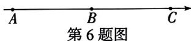

A. $\sqrt{2} - 2$

B. $-2 - \sqrt{2}$

C. $-4 + \sqrt{2}$

D. $-\sqrt{2} + 2$

# 二、填空题(每小题3分,共12分)

7. $\sqrt{5}$ 的相反数是 $\underline{\hspace{2cm}}$ , $3 - \sqrt{11}$ 的绝对值是 $\underline{\hspace{2cm}}$ .

8. 传统文化情境 世界遗产 兵马俑的眼睛到下巴的距离与头顶到下巴的距离之比近似为 $\frac{\sqrt{5} - 1}{2}$ , 它介于整数 $n$ 与 $n + 1$ 之间, 则 $n$ 的值为 \_\_\_\_.

9. 如图,老师将3张写有数字的卡片分给小明、小颖和小亮,要求他们根据自己手中卡片上的数选择合适的位置(数越大,站的位置越高),则站在1号位置的同学是\_\_\_\_,站在3号位置的同学是\_\_\_\_.

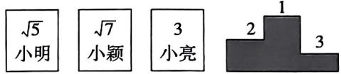

text_image

√5
小明
√7
小颖
3
小亮
1
2
3

第9题图

10. 如图, 在数轴上, 点 A, B 表示的数分别是 0, 3, BC ⊥ AB 于点 B, 且 BC = 1, 连接 AC, 在 AC 上截取 CD = BC, 以点 A 为圆心, AD 长为半径画弧, 交线段 AB 于点 E, 则点 E 表示的实数是 \_\_\_\_.

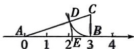

text_image

A
0 1 2E 3 4
D C
B

第10题图

# 三、解答题(共40分)

11. (6分)将下列各数填入相应的框内：

$$
0, - \sqrt {3}, | - 2 |, 0. 1 2 3 4 5 6, \frac {\pi}{5}, \frac {1 1}{2}, \sqrt {2 5},
$$

-5.7,-1,9, $\sqrt[3]{5}$ , -0.303 003 000 3…(相邻两个3之间0的个数逐次加1), -8.

<table><tr><td>有理数</td><td>无理数</td></tr></table>

<table><tr><td>正整数</td><td>负整数</td></tr></table>

大小卷·八年级(上) 数学 BS

12. (6分)计算：

(1) $|-12|+\sqrt[3]{-0.125}+\sqrt{(-4)^{2}}-\sqrt{\frac{1}{36}};$

(2) $\sqrt[3]{-8}+|2-\sqrt{5}|-(-1)^{2025}+\sqrt{16}.$

13. (8分)已知实数 $a, b, c$ 在数轴上的位置如图所示，化简： $|a + b| - |a - c| + \sqrt{(a - b)^2} - \sqrt{c^2} + \sqrt{(2 - a)^2}$ .

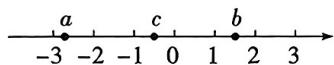  
第13题图

14. (10 分) 生产劳动情境 住房改建 如图, 某改建后的住房分为宿舍、餐厅和卫生间三部分, 其中宿舍和餐厅都为正方形, 且改建后宿舍的面积为 $64 \mathrm{~m}^{2}$ .

(1)若餐厅的面积比宿舍小 $28\mathrm{m}^2$ ，求卫生间的面积；  
(2)若餐厅的面积为 $48~\mathrm{m}^2$ ，计划在卫生间较短的两边墙壁各贴上一条金属线条

装饰,则准备的 5 m 长的金属线条装饰是否够用?

<table><tr><td rowspan="2">宿舍</td><td>餐厅</td></tr><tr><td>卫生间</td></tr></table>

第14题图

15. (10 分)(中考新考法·解题方法型阅读理解题) 阅读下列材料: 面积为 5 的正方形的边长是 $\sqrt{5}$ , 因为 $2 < \sqrt{5} < 3$ , 且更接近于 2, 所以设 $\sqrt{5} = 2 + x$ . 如图, 将正方形边长分为 2 与 $x$ 两部分, 由面积公式可得 $(x + 2)^{2} = 5$ , 即 $x^{2} + 4x + 4 = 5$ . 因为 $x$ 较小, 略去 $x^{2}$ , 得方程 $4x + 4 = 5$ , 解得 $x = 0.25$ .

(1) 阅读材料, 可以得到 $\sqrt{5} \approx$ \_\_\_\_;

(2) 请类比所给方法, 探究 $\sqrt{10}$ 的近似值. (画出示意图, 标出数据, 并写出求解过程, 结果保留两位小数)

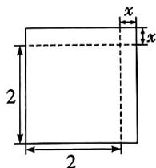

text_image

2
x
x
2

第15题图

# 周测5 二次根式

建议用时:40 分钟 满分:60 分

班级： 姓名： 得分：

# 一、选择题(每小题3分,共18分)

1. 若二次根式 $\sqrt{x - 1}$ 在实数范围内有意义，则 $x$ 可以是 （）

A. -1

B. $\frac{1}{2}$

C. $\frac{2}{3}$

D. 2

2. 下列式子是最简二次根式的是 （）

A. $\sqrt{28}$

B. $\sqrt{12}$

C. $\sqrt{\frac{1}{7}}$

D. $\sqrt{6}$

3. 下列计算正确的是 ( )

A. $2 + \sqrt{5} = 2\sqrt{5}$

B. $\sqrt{18} -\sqrt{8} = \sqrt{10}$

C. $\sqrt{2} \times \sqrt{3} = \sqrt{6}$

D. $\sqrt{24} \div \sqrt{6} = 2\sqrt{2}$

4. 估计 $(5\sqrt{2} + 2\sqrt{5}) \times \sqrt{\frac{1}{2}}$ 的值应在（）

A. 5 和 6 之间

B. 6 和 7 之间

C. 7 和 8 之间

D. 8 和 9 之间

5. 如图是一个树墩的截面图, 年轮部分分为深色和浅色, 其中深色部分以及整个截面可以看作两个同心圆. 已知深色部分的半径为 $5 \mathrm{~cm}$ , 浅色圆环部分面积为 $23 \mathrm{~cm}^{2}$ , 若 $\pi$ 取 3 , 则可以估计此树墩截面的半径为 ( )

A. $\frac{\sqrt{3}}{3} \mathrm{~cm}$

B. $\frac{\sqrt{6}}{3} \mathrm{~cm}$

C. $\frac{7\sqrt{3}}{2}\mathrm{cm}$

D. $\frac{7\sqrt{6}}{3}\mathrm{cm}$

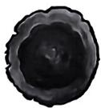  
第5题图

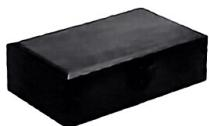

natural_image

Solid black rectangular block with smooth surface (no text or symbols)

第6题图

6. 妈妈给朋友买了一条项链,决定将其用一个如图所示的长方体古风礼盒进行包装,已知礼盒底面积为 $36 \mathrm{~cm}^{2}$ ,其长、宽、高之

比为 6:3:1, 则该古风礼盒的体积为( )

A. $18 \mathrm{~cm}^{3}$

B. $18 \sqrt{3} \mathrm{~cm}^{3}$

C. $36 \mathrm{~cm}^{3}$

D. $36 \sqrt{2} \mathrm{~cm}^{3}$

# 二、填空题(每小题3分,共12分)

7. 计算 $\sqrt{8} + \frac{1}{\sqrt{2}}$ 的结果是 \_\_\_\_.

8. 若 $y = \sqrt{x - 10} + \sqrt{10 - x}$ ，则 $\sqrt{x + 2}$ 的值为 \_\_\_\_.

9. 若 $\sqrt{63n}$ 是整数, 则正整数 n 的最小值是 \_\_\_\_.

10. 传统文化情境/传统手工艺 春节来临之际,人们会在家中挂上中国结,寓意着团圆美满.如图①是一个中国结,中间部分可以看作两个全等的正方形,图②是从其中抽象出来的示意图.若两个大正方形的面积均为 $98 \mathrm{~cm}^{2}$ ,重叠部分的小正方形面积为 $72 \mathrm{~cm}^{2}$ ,则 BE 的长为 \_\_\_\_ cm.

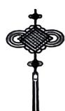  
图①

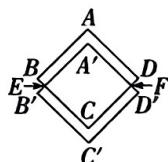

text_image

A
B
E
B'
A'
C
D
F
D'
C'

图②  
第10题图

# 二、解答题(共30分)

11. (8分)计算:(1) $\sqrt{8}-\sqrt{27}+\sqrt{18}-\sqrt{12}$ ;

大小卷·八年级(上) 数学 BS

(2) $(\sqrt{24} - \sqrt{6}) \times \sqrt{3} - (2 + \sqrt{3})(2 - \sqrt{3})$

(3) $(\sqrt{3} - 2)^{2} + \sqrt{32} \times \sqrt{\frac{3}{2}} - \frac{6}{\sqrt{2}};$

(4) $\sqrt{2\frac{1}{4}} - \sqrt{24} \div \sqrt{3} + 5 \times \sqrt{\frac{1}{2}}.$

12. (10 分)(中考新考法·过程纠错改错)

下面是小颖计算 $\sqrt{\frac{5}{4}} +\sqrt{20}\div (\sqrt{5} -\frac{1}{\sqrt{5}})$ 的过程,请仔细阅读并回答问题：

解: 原式= $\frac{\sqrt{5}}{2}+\sqrt{20}\div(\sqrt{5}-\frac{1}{\sqrt{5}})$ 第一步

$$
= \frac {\sqrt {5}}{2} + \sqrt {2 0} \div \sqrt {5} - \sqrt {2 0} \div \frac {1}{\sqrt {5}} \text {   第二步   }
$$

$$
= \frac {\sqrt {5}}{2} + 2 - 1 0 \quad \text { 第   三   步 }
$$

$$
= \frac {\sqrt {5}}{2} - 8. \quad \text { 第四步 }
$$

(1)以上解答过程是从第\_\_\_\_步开始出现错误的,错误的原因是\_\_\_\_;

(2)请写出正确的解答过程.

13. (12分) 跨学科情境/跨物理自由落体运动物体在做自由落体运动时,下落到地面的时间 t (单位:s) 和下落高度 h (单位:m) 之间满足关系式 $t=\sqrt{\frac{2h}{g}}$ , 其中 g 取 $10\ m/s^{2}$ . (不考虑空气阻力)

(1) 小球从 60 m 高空自由落下, 需要多长时间到达地面?

(2)明明认为,小球从120 m的高空自由落下,到达地面所需要的时间是从60 m高空自由落下所需时间的2倍,你是否认同明明的想法?请说明理由.

# 周测6 确定位置及平面直角坐标系

建议用时:40 分钟 满分:70 分

班级： 姓名： 得分：

# 一、选择题(每小题3分,共18分)

# 主题情境 剧场观演 请完成第1\~2题

1. 在下面四个描述中,小佳能准确找到剧场具体位置的是 ( )

A. 西长安街  
B. 人民广场北偏西 $30^{\circ}$ 方向  
C. 北纬 $40^{\circ}$ , 东经 $116^{\circ}$   
D. 距离音乐厅 $1 \mathrm{~km}$ 处

2.（教材P54素材改编）小梦和小佳到达剧场后，开始寻找自己的座位，已知小梦的座位为3排2座，可记作(3,2)，则小佳的座位4排6座，可记作 （）

A. (4,6)

B. (6,4)

C. (3,6)

D. (4,2)

3. 在平面直角坐标系中, 点 $M(x^{2}+1,5)$ 所在的象限是 ( )

A. 第一象限

B. 第二象限

C. 第三象限

D. 第四象限

4. 社会热点情境 野生动物保护宣传月 山西野生动物保护宣传月启动仪式上举行了褐马鸡放归活动. 如图是利用网格画出的褐马鸡示意图, 若建立适当的平面直角坐标系, 表示嘴部 A 点的坐标为 $(-3,1)$ , 表示尾部 B 点的坐标为 $(2,-1)$ , 则表示足部 C 点的坐标为 ( )

A. $(1, - 1)$

B. $(0, - 1)$

C. $(0, -2)$

D. $(-1, - 1)$

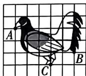

text_image

A
B
C

第4题图

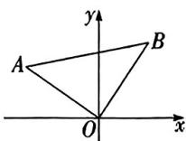

text_image

A
y
B
O
x

第5题图

5. 如图, 在平面直角坐标系中, $\triangle AOB$ 为等腰直角三角形, $\angle AOB = 90^{\circ}$ , 点 $A$ 的坐标为 $(-3,2)$ , 则点 $B$ 的坐标为 ( )

A. (2,3)

B. $(-2,3)$

C. (3,2)

D. $(-3,2)$

6. 如图, 在桌面 ABCD 上建立平面直角坐标系, 小球从点 $P(0,4)$ 出发, 撞击桌面边缘 (桌壁) 发生反弹, 反射角等于入射角. 若小球以每秒 $\sqrt{2}$ 个单位长度的速度沿图中箭头方向运动, 则第 128 秒时小球所在位置的横坐标为 ( )

A. 4

B. 3

C. 2

D. 0

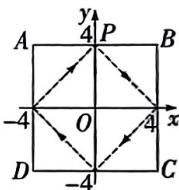

text_image

y
4 P
A B
-4 O 4 x
D -4 C

第6题图

text_image

A
B

第10题图

# 二、填空题(每小题3分,共12分)

7. 在平面直角坐标系 $xOy$ 中, 点 $P(2, -5)$ 到 $x$ 轴的距离是 \_\_\_\_.

8. 若点 $P(-1, b)$ 在第二、四象限的角平分线上, 则 $b$ 的值为 \_\_\_\_.

9. (教材 P62 例 2 改编) 在平面直角坐标系中, 线段 AB 平行于 x 轴, 且 AB = 4, 若点 B 的坐标为 $(2, -1)$ , 则点 A 的坐标是 \_\_\_\_.

10. 如图, 在 $6 \times 5$ 的方格纸中, 若建立平面直角坐标系, 点 $A$ 的坐标为 $(-1, -1)$ , 点 $B$ 的坐标为 $(3, -1)$ , 在第一象限的格点上找到点 $C$ , 使三角形 $ABC$ 的面积为 6 , 则这样的点 $C$ 共有 \_\_\_\_ 个.

# 三、解答题(共40分)

11. (8分)如图,在 $4 \times 4$ 的方格中(每个小正方形的边长均为1),标有A,B两点(A,大小卷·八年级(上) 数学 BS

B 均在格点上).

(1)用方位角和距离表示点 B 相对点 A 的位置: 点 B 位于点 A 的北偏东 \_\_\_\_ 方向, 距离点 A \_\_\_\_ ;

(2)请你用一种不同的方法表示点 B 相对点 A 的位置.

text_image

北
B
A

第11题图

12. (10 分) 传统文化情境 传统建筑 平遥古城是现今中国境内保存最为完整的一座古代县城. 如图是其部分景点分布示意图, 已知市楼的坐标为 $(0, -1)$ , 清虚观的坐标为 $(5, 2)$ .

(1)请根据题目条件,在图中画出平面直角坐标系;   
(2)写出城隍庙、县衙、日昇昌、关帝庙的坐标；   
(3)若点将台的坐标为(6,-1)，请你在图上标出点将台的位置.

text_image

拱极门(北门)
关帝庙
百昇昌
清虚观
市楼
县衙
城隍庙
迎黨门(南门)

第12题图

13. (10 分)(中考新考法·新定义型阅读理解题)在平面直角坐标系中,对于点 $P(a,b)$ , 若点 $P'$ 的坐标为 $(ma+b,a+mb)$ (其中 m

为常数, 且 $m \neq 0$ ), 则称点 $P'$ 为点 $P$ 的 “ $m$ 系点”. 例如: $P(1,4)$ 的 “3 系点” 为 $P'(3 \times 1 + 4, 1 + 3 \times 4)$ , 即 $P'(7,13)$ .

(1) 求点 $N(-1,6)$ 的“2 系点” $N'$ 的坐标；  
(2) 若点 $Q$ 在 $x$ 轴的负半轴上, 点 $Q$ 的 “3 系点” 为点 $Q'$ , 且点 $Q'$ 到两坐标轴的距离之和为 8 , 求点 $Q$ 的坐标.

视频讲解  
  
中考新考法题

14. (12 分) 如图, 在平面直角坐标系中, $\triangle ABC$ 的边 $AB$ 在 $x$ 轴上, 点 $C$ 在 $y$ 轴上, 其中 $OB = 2OC = 4$ , $AB = 5$ , 已知点 $D$ 是线段 $AB$ 上的动点, 连接 $CD$ .

(1) 求 $\triangle ABC$ 各顶点的坐标；  
(2)是否存在点 $D$ ，使得 $\triangle ACD$ 是以 $CD$ 为腰的等腰三角形？若存在，求出点 $D$ 的坐标及 $\triangle ACD$ 的面积；若不存在，请说明理由.

text_image

y
C
A O D B x

第14题图

# 专题 平面直角坐标系中的面积问题

建议用时:30 分钟

班级： 姓名：

# 方法分类练

# 方法1 直接利用公式法求图形面积

1. 在如图所示的平面直角坐标系中, $\triangle ABC$ 各个顶点的坐标分别是 $A(0,0), B(3,6), C(9,0)$ , 求 $\triangle ABC$ 的面积.

line

| Point | x | y |
|---|---|---|
| A | 1 | 0 |
| B | 3 | 6 |
| C | 9 | 0 |

第1题图

2. 在如图所示的平面直角坐标系中, 已知点 $A(-2, -2), B(-2, -6), C(4, 1)$ .

(1) 求 $\triangle ABC$ 的面积;  
(2) 若点 P 是 x 轴上一动点, 当 $S_{\triangle BOP} = \frac{1}{3} S_{\triangle ABC}$ 时, 求点 P 的坐标.

line

| Point | x | y |
|---|---|---|
| A | -10 | -1 |
| B | 0 | -6 |
| C | 4 | 1 |

第2题图

# 方法2 利用割补法求图形面积

3. 如图, 在平面直角坐标系中, 已知点 $A(1, 3), B(5,6), C(9,2)$ , 求 $\triangle ABC$ 的面积.

line

| Point | x | y |
|---|---|---|
| A | 1 | 3 |
| B | 5 | 6 |
| C | 9 | 2 |

第3题图

4. 在平面直角坐标系中, 已知点 $A(a,0)$ , $B(b,0), C(a,2), D(b-1,4)$ , 且满足 $|a+1| + \sqrt{(b-3)^2} = 0$ .

(1) 求点 $A, B, C, D$ 的坐标;  
(2) 一题多解法 求四边形 ABDC 的面积

# 综合训练

5. 如图, 在平面直角坐标系中, 直线 AB 经过原点 O, 点 C 在 x 轴上, 已知点 A, B, C 的坐标分别是 $(2, m)$ , $(-\sqrt{2}, n)$ , $(4, 0)$ , 则 $\triangle ABC$ 的面积用代数式表示为 \_\_\_\_.

text_image

y
A
O
B
C
x

第5题图

6. 在如图所示的平面直角坐标系中, $\triangle ABC$ 各个顶点的坐标分别是 $A(0,0), B(3,6), C(9,3)$ .

(1) 判断 $\triangle ABC$ 的形状;

(2) 一题多解法 求 $\triangle ABC$ 的面积.

text_image

y
7
B
5
C
4
3
2
1
O(A)
1 2 3 4 5 6 7 8 9 10 11 x

第6题图

7. 如图, 在平面直角坐标系中, 四边形 ABCD 各顶点的坐标分别为 $(1,0)$ , $(0,2)$ , $(-3,2)$ , $(-3,0)$ , 动点 P 从点 B 出发, 以每秒 1 个单位长度的速度沿 $B \rightarrow C \rightarrow D$ 方向匀速运动到点 D, 运动时间为 t 秒, 回答下列问题:

(1)运动时间 t 的取值范围是 \_\_\_\_；

(2)用含 t 的代数式表示点 P 的坐标；

(3) 当 $\triangle PAB$ 的面积为 $\frac{16}{5}$ 时, 求此时点 P 的坐标.

text_image

C
B
D O A x
y

第7题图

几何画板动态演示

平面直角坐标系中的面积问题

# 周测7 轴对称与坐标变化

建议用时:40 分钟 满分:60 分

班级： 姓名： 得分：

# 一、选择题(每小题3分,共18分)

1. 在平面直角坐标系中,与点(2,5)关于 x 轴对称的点的坐标是 ( )

A. $(-2,5)$

B. $(2,-5)$

C. $(-2, -5)$

D. (5,2)

2. 在平面直角坐标系中, 给点 $M(1,5)$ 的横坐标乘-1, 得到点 $M'$ , 则点 $M$ 与点 $M'$ 的位置关系为 ( )

A. 关于 $x$ 轴对称  
B. 关于 $y$ 轴对称  
C. 在同一象限内  
D. 都在 $y$ 轴上

# 主题情境 自然界中的对称美

请完成第 3\~4 题

3. 七星瓢虫是各种蚜虫的重要捕食性天敌, 如图, 将其放在平面直角坐标系中, 已知点 $E(m,5)$ 和点 $F(3,n)$ 关于 $\gamma$ 轴对称, 则 $m+n$ 的值是 ( )

A. -2   
B. 0   
C. 2   
D. 8

text_image

E
F
O
x
y

第3题图

text_image

y
M
l
θ
N
x

第4题图

4. 如图是三色鹭在水面照镜子的画面, 点 $M(1,3)$ 和点 $N$ 关于水面所在直线 $l$ 对称. 若将水面看作平行于 $x$ 轴且过点 $(0,1)$ 的直线, 则点 $N$ 的坐标为 ( )

A. $(-1,3)$   
B. $(1,-1)$   
C. $(1, -2)$   
D. $(1, - 3)$

5. 如图, 等边 $\triangle AOB$ 在平面直角坐标系中, 点 $A$ 的坐标为 $(-6,0)$ , 则点 $B$ 关于 $y$ 轴

对称的点的坐标为 （）

A. $(3, - 3)$   
B. $(3,-3\sqrt{3})$   
C. (3,3)   
D. $(3, 3\sqrt{3})$

text_image

B
y
A O x

第5题图

text_image

y
C
1
A
B
O
1 3 x

第6题图

6. 如图, 等边 $\triangle ABC$ 的顶点 $A(1,1), B(3,1)$ , 规定把等边 $\triangle ABC$ “先沿 $x$ 轴翻折, 再向左平移 1 个单位”为一次变换, 连续经过 2025 次这样的变换后, $\triangle ABC$ 的顶点 $C$ 的坐标为 ( )

A. $(-2024, 1 + \sqrt{3})$   
B. $(-2024, -1 - \sqrt{3})$   
C. $(-2023, 1 + \sqrt{3})$   
D. $(-2023,-1-\sqrt{3})$

# 二、填空题(每小题3分,共12分)

7. 若点 $P(-1,2)$ 关于 x 轴的对称点是点 Q，则 PQ 长为 \_\_\_\_.  
8. 如图, 直线 $l$ 经过点 $(1,0)$ 且垂直于 $x$ 轴, 若点 $A(-3,-1)$ 与点 $B(a,b)$ 关于直线 $l$ 对称, 则 $a+b$ 的值为 \_\_\_\_.

text_image

-3
A
O
-1
y
l
x

第8题图

text_image

Grid diagram with black and white stones arranged in a 3x3 pattern

第9题图

9. 传统文化情境/琴棋书画 小彤和小真下五子棋,如图,已知棋盘左上角黑子的位置用(-1,2)表示,右下角黑子的位置用(1,0)表示,小彤将第4枚白子放入棋盘后,所有棋子构成一个轴对称图形(有颜色区分),则小彤放的位置是\_\_\_\_。(用坐标表示)

大小卷·八年级(上) 数学 BS

10. (教材 P66 第 4 题改编) 如图, 已知正六边形 ABCDEF, 其中点 A, B, C, F 的坐标分别为 A(0, m), B(a, b), C(-2, -3), F(-a, b), 则点 E 的坐标为 \_\_\_\_.

text_image

A
B
F
C
D
E

第10题图

# 三、解答题(共30分)

11. (8 分) 如图, $x$ 轴, $y$ 轴是长方形 $ABCD$ 的对称轴, 若这个长方形的长、宽之比为 3:2, 且长方形面积为 24, 请写出长方形四个顶点的坐标.

text_image

y
A	B
O	x
D	C

第11题图

12. (10 分) 如图, 在平面直角坐标系中, $\triangle ABC$ 各顶点的坐标分别为 $A(-2,1)$ , $B(3,1), C(-1,3)$ .

(1)作出点 C 关于直线 AB 的对称点 D，
并写出点 D 的坐标；  
(2) 在 $x$ 轴上找一点 $F$ , 使 $\triangle ABF$ 的周长最小, 画出点 $F$ 的位置, 并求 $\triangle ABF$ 周长的最小值.

line

| Point | x | y |
|---|---|---|
| A | -2 | 1 |
| B | 3 | 0 |
| C | -2 | 4 |

第12题图

13. (12分)(中考新考法·新定义型阅读理解题)【阅读理解】在平面直角坐标系xOy中,给出如下定义:将点P关于y轴的对称点 $P_{1}$ ,称为点P的一次反射点;将点 $P_{1}$ 关于直线l:y=1的对称点 $P_{2}$ ,称为点P的二次反射点.例如,如图,点 $M(3,2)$ 的一次反射点为 $M_{1}(-3,2)$ ,点M的二次反射点为 $M_{2}(-3,0)$ .已知点 $A(-1,-1),B(3,3)$ .

# 【解决问题】

(1)点 A 的一次反射点为 \_\_\_\_，点 B 的二次反射点为 \_\_\_\_；  
(2)设点 $C_2(-2,4), D_2(-1,0)$ 分别为 $C, D$ 的二次反射点，求四边形 $CD_2C_2D$ 的面积.

text_image

y
5
4
3
2
M
l:y=1
M₁
M₂
1
-4 -3 -2 -1 O 1 2 3 4 5 x
-1
-2
-3

第13题图

# 周测8 函数及一次函数的图象与性质

建议用时:40 分钟

满分:60分

班级：

姓名：

得分：

# 一、选择题(每小题3分,共18分)

1. 下列各图给出了 $y$ 与自变量 $x$ 之间的对应关系, 其中能表示 $y$ 是 $x$ 的函数的是

( )

  
图①

  
图②

  
图③

  
图④

# 第1题图

A. ②④

B. ①③

C. ①④

D. ③④

2. 已知函数 $y = (m + 2)x^{|m + 2|}$ 是正比例函数，且其图象经过第二、四象限，则 $m$ 的值是（）

A. -3

B. -1

C. 0

D. -1 或 -3

3. 已知一次函数 $y = -2x - 1$ ，当 $0 \leqslant x \leqslant 5$ 时， $y$ 的最大值为（）

A. 0

B. -1

C. -2

D. -3

4. 若点 $M(1,3)$ 关于 $x$ 轴的对称点在一次函数 $y = (5k + 1)x - 1$ 的图象上，则 $k$ 的值为（）

A. $-\frac{4}{5}$

B. $-\frac{3}{5}$

C. $\frac{3}{5}$

D. $\frac{4}{5}$

5. 一次函数 $y = kx + b$ 与正比例函数 $y = \frac{k}{b} x$ 在同一坐标系内的图象可能为（）

  
A

  
B

  
C

  
D

6. 如图, 直线 $l_{1}: y = \frac{1}{2}x + \frac{1}{2}$ 与直线 $l_{2}: y = x + 1$ 分别与 y 轴交于点 A, B. 一动点 C 从点 A

出发,先沿垂直于 x 轴的方向运动,到达直线 $l_{2}$ 上的点 B 处后,改为沿平行于 x 轴的方向运动,到达直线 $l_{1}$ 上的点 $A_{1}$ 处后,再沿垂直于 x 轴的方向运动,到达直线 $l_{2}$ 上的点 $B_{1}$ 处后,又改为沿平行于 x 轴的方向运动,到达直线 $l_{1}$ 上的点 $A_{2}$ 处后, $\cdots$ ,照此规律运动,动点 C 依次经过点 A,B,A $_{1}$ ,B $_{1}$ ,A $_{2}$ ,B $_{2}$ , $\cdots$ ,则 A $_{2024}$ B $_{2024}$ 的长度为 ( )

text_image

y
l₂
B₂
l₁
B₁
A₃
B
A₂
A₁
O
x

第6题图

A. $2^{2023}$

B. $2^{2024}$

C. 2024

D. 4 048

# 二、填空题(每小题3分,共12分)

7. (中考新考法·满足结论的条件开放) 若一次函数 $y = (k + 1)x + 3$ 的图象经过第一、二、三象限, 请写出一个符合上述条件的 $k$ 值 \_\_\_\_.

8.（教材P88第4题改编）直线 $l$ 向下平移3个单位后得到直线 $l_{1}:y = -2x - 5$ ，则直线 $l$ 对应的函数表达式为

9. 日常生活情境/风寒效应 风寒效应是一种因风引起使体感温度较实际气温低的现象. 从大量的科学实验中, 人们找出了风速大小和体感温度的关系, 当风速为 $0 \mathrm{~km} / \mathrm{h}$ 时, 体感温度 $T$ 为 $5^{\circ} \mathrm{C}$ , 风速每增加 $10 \mathrm{~km} / \mathrm{h}$ , 体感温度降低 $2^{\circ} \mathrm{C}$ . 若某时刻的体感温度为 $-24^{\circ} \mathrm{C}$ , 那么此时的风速为 \_\_\_\_ km/h.

大小卷·八年级(上) 数学 BS

10. 如图, 若一次函数 $y = kx + 1$ 的图象与线段 $AB$ 始终有一个交点, 则 $k$ 的取值范围为 \_\_\_\_.

text_image

y
2
A
B
O 1 3 x

第10题图

# 三、解答题(共30分)

11. (8分) 正比例函数 $y_{1} = \frac{1}{2} x$ 的图象如图所示, 已知一次函数 $y_{2} = 2x - b$ 与正比例函数 $y_{1} = \frac{1}{2} x$ 的图象相交于点(2, a).

(1) 求 b 的值, 并在平面直角坐标系中画出一次函数 $y_{2}=2x-b$ 的图象;

(2) 求出一次函数 $y_{2}=2x-b$ 与 x 轴的交点坐标.

text_image

y
4
3
2
1
-3 -2 -1 O 1 2 3 4 x
-1
-2
-3
-4
y₁=1/2x

第11题图

12. (10 分) 小梦作为校园节水宣传员, 向同学们倡导节水理念. 为获得真实数据, 小梦做了关于水龙头滴水的实验, 实验过程中小梦通过多次测量得到水龙头的滴水速度为 $5 \mathrm{~mL} / \mathrm{min}$ , 已知接水的容器内原有水量为 $2 \mathrm{~mL}$ .

(1) 求容器内水量 $y(\mathrm{~mL})$ 与滴水时间 $t(\mathrm{min})$ 之间的函数关系式；

(2) 求这个水龙头一天 (24 h) 的漏水量.

13. (12分)如图,已知一次函数 $y = \frac{1}{2} x + 5$ 的图象与 $y$ 轴交于点 $A$ ,与正比例函数 $y = 3x$ 的图象交于点 $B$ .

(1) 求点 A, B 的坐标;

(2)x 轴上是否存在一点 P, 使得 $S_{\triangle POB}=3S_{\triangle AOB}$ ? 若存在, 请求出 P 点坐标; 若不存在, 请说明理由.

text_image

y
A B
O x

第13题图

几何画板动态演示  
  
一次函数的面积问题

# 周测9 一次函数的应用

建议用时:40 分钟 满分:55 分

班级： 姓名： 得分：

# 一、选择题(每小题3分,共18分)

1. 童童网购一种文学读物,已知该书每册定价20元,另加15元邮寄费.若童童购书x册,则需付款y(元)与x(册)之间的函数关系式为()

A. $y = 20x$

B. $y = 20.5x + 10$

C. $y = 20x + 15$

D. $y = 15x + 20$

2. 某地举办摄影展, 在如图所示的平面直角坐标系中, $OA, BC$ 分别表示两种展票团购方式花费的金额 $y_{1}, y_{2}$ (元) 与购买数量 $x$ (张) 的函数关系, 若选择 $y_{2}$ 更优惠, 则展票购买数量 $x$ (张) 的范围是 ( )

A. $x > 50$

B. $x = 50$

C. $x <   50$

D. $x \geqslant 50$

text_image

y/元
A
C
B
O 50 x/张

第2题图

text_image

秤纽
秤砣

第5题图

3. 若点(1,4)在某正比例函数图象上,则下列点中,在该正比例函数图象上的是()

A. $(-2,8)$

B. (2,6)

C. (3,9)

D. $(-2, - 8)$

4. 气象探测小组在探测气象时, 将探测气球从距离地面 15 米处释放, 探测气球距离地面的高度 $y(\mathrm{~m})$ 与上升时间 $x(\min)$ 之间的关系式为 $y = 400x + 15$ , 已知这种探测气球上升的高度为 $26015 \mathrm{~m}$ 时会自行爆裂, 则此时该探测气球上升的时间为 ( )

A. $60 \mathrm{~min} \mathrm{~B}$ . $63 \mathrm{~min} \mathrm{C}$ . $65 \mathrm{~min} \mathrm{D}$ . $68 \mathrm{~min}$

# 主题情境 杆秤 请完成第5\~6题

5. 如图是中药房用来称中草药的一款杆秤，称量比一般杆秤精确。在量程范围内，该杆秤的秤砣到秤纽的水平距离 $y$ （毫米）

与所挂重物 $x$ （克）的关系如下表所示，由表中数据规律可知，当所挂重物为6克时，秤砣到秤纽的水平距离为 （）

<table><tr><td>x/克</td><td>0</td><td>2</td><td>4</td><td>...</td></tr><tr><td>y/毫米</td><td>5</td><td>13</td><td>21</td><td>...</td></tr></table>

A. 27 毫米

B. 29 毫米

C. 31 毫米

D. 33 毫米

6. 如图①是数学兴趣小组自制的一个无刻度简易杆秤, 秤纽固定在点 B 的位置, 将所称物体悬挂在点 A 处, 通过移动 C 处的秤砣使杆秤保持平衡. 在量程范围内测得 BC 之间的距离 $L(\text{cm})$ 与所称物体质量 $m(\text{kg})$ 的关系如图②所示. 下列说法正确的是 ( )

text_image

B
A
C

图①

line

| m/kg | L/cm |
|---|---|
| 0 | 2 |
| 1 | 3 |
| 2 | 5 |
| 3 | 7 |
| 4 | 8 |
| 5 | 9 |
| 6 | 10 |

图②

# 第6题图

A. 重物的质量越小(量程范围内), BC 之间的距离越大

B. 当所称物体的质量为 $6 \mathrm{~kg}$ 时, $BC$ 之间的距离为 $10 \mathrm{~cm}$

C. 未挂重物时, $BC$ 之间的距离为 $1 \mathrm{~cm}$

D. 当 L=6 时, 所称物体的质量为 2.5 kg

# 二、填空题(每小题3分,共12分)

7. 若关于 x 的方程 2x-b=0 的解为 x=1，则直线 y=2x-b 一定经过点 \_\_\_\_.

8. 日常生活情境(药熏消毒)采用药熏法消毒,药物燃烧时,室内每立方米空气中药物含量 $y(\mathrm{mg}/\mathrm{m}^{3})$ 与药物点燃后的时间 $x(\min)$ 的关系如图所示,则 y 与 x 之间的函数关系式为 \_\_\_\_.

  
第8题图

text_image

y/尺
9
O
x/天

第9题图

9. 数学文化情境 瓜瓠相遇《九章算术》中第七章“盈不足”记载了这样一个问题，其大意为：“今有墙高9尺，瓜在墙上，瓜蔓每日向下长7寸，葫芦在墙下，葫芦蔓每日向上长1尺。”如图是瓜蔓与葫芦蔓离地面的高度y(尺)关于生长时间x(天)的函数图象，则瓜蔓与葫芦蔓在\_\_\_\_天后相遇，此时距离地面\_\_\_\_尺。(1尺=10寸)

10. 如图, 在平面直角坐标系中, 已知 $A(0, \frac{4}{3})$ , $B(0, 4)$

是 $y$ 轴上的两点, 点 $P$ 是直线 $y = x$ 上一动点, 当 $PA+$ PB 取最小值时, 点 P 的坐标为 \_\_\_\_.

text_image

y
B
A
P
O
x

第10题图

# 三、解答题(共25分)

# 主题情境 汉服体验节

请完成第 11\~12 题

11. (12 分) 小兰和小欣计划穿汉服参加活动, 现有两种计时租用方案, 具体如下: 方案一: 每件每小时按原价收取租金; 方案二: 花 20 元办理汉服体验日卡, 则当天租用汉服, 每件每小时按 8 折计费. 方案一和方案二的租金 $y_1, y_2$ (元) 与租用时间 $x$ (小时) 之间的函数关系如图所示. (1) 该汉服体验馆的汉服每小时租金的原价是多少元?

(2)若小兰和小欣计划每人租用1套汉服,且租用时间为下午1点到晚上10点,则选择哪种方案更合算?共便宜多少钱?

line

| x/小时 | y1 (元) | y2 (元) |
| ------ | ------- | ------- |
| 0      | 20      | 20      |
| 3      | 60      | 60      |

第11题图

12. (13 分)傍晚,小欣与小兰准备离开汉服体验馆回酒店,体验馆距酒店 1500 米. 小欣先从体验馆出发步行回酒店,小兰由于需要还汉服,10 分钟后骑共享单车离开体验馆回酒店,到达酒店后又骑行若干米到达还车点还车,再立即以 60 米/分钟的速度步行回酒店. 设小欣步行的时间为 x(分钟),两人距离汉服体验馆的路程为 y(米),y 关于 x 的函数图象如图所示,根据图中信息,回答下列问题:

(1)求点 E 的坐标,并写出点 E 所表示的实际意义;

(2) 求线段 OA, BC 的函数表达式;

(3)小兰比小欣提前多久到达酒店?

line

| Point | x (分钟) | y (米) |
|-------|----------|--------|
| B     | 10       | 0      |
| C     | 21       | 1500   |
| D     | 30       | 1500   |

第12题图

  
第12题

# 专题 一次函数的图象与性质

建议用时:40 分钟

班级： 姓名：

# 题型分类练

# 类型1 一次函数的图象与性质

1. 已知一次函数 $y = (2 - k)x + 3$ 的图象经过第一、二、四象限，则 $k$ 的值可能为（）

A. 0

B. 1

C. 2

D. 3

2. 如图是一次函数 $y = (m + 1)x - m$ 的图象，则 $m$ 的值为（）

A. $\frac{1}{2}$

B. 1

C. $\frac{2}{3}$

D. $\frac{3}{2}$

line

| x | y |
|---|---|
| 0 | 0 |
| 2 | 3 |

第2题图

text_image

y
O
x
(2, -7)

第4题图

3. 已知点 $(-1, y_1), (3, y_2)$ 在一次函数 $y = 2x + 1$ 的图象上，则 $y_1, y_2$ 的大小关系是（）

A. $y_{1}<y_{2}$

B. $y_{1}=y_{2}$

C. $y_{1} > y_{2}$

D. 不能确定

4. 如图,一次函数 $y=kx+b$ 的图象过点 $(2,-7)$ , 则当 y<-7 时,x 的取值范围是 \_\_\_\_.

5. 一次函数 $y = -4x - 6$ 的图象与 $x$ 轴的交点坐标为 \_\_\_\_，与 $y$ 轴的交点坐标为 \_\_\_\_。

6. 已知一次函数 $y = -2x + b$ ，当 $0 \leqslant x \leqslant 2$ 时，y 取得最大值 -2，则 b 的值为 \_\_\_\_.

7. 已知正比例函数 y=kx，当 x 每增加 1 时，y 减少 3，则 k 的值为 \_\_\_\_.

# 类型2 一次函数图象的平移

8. 已知一次函数 $y = -x + 1$ ，将该函数的图象向上平移4个单位长度，得到的函数图象的表达式为 \_\_\_\_，新函数的图象再向下平移 \_\_\_\_ 个单位长度得到函数 $y = -x - 1$ 的图象.

9. 已知一次函数 $y = kx + b$ 的图象与直线 y = -2x 平行，且过点 $(-3, 5)$ ，则该一次函数的表达式为 \_\_\_\_.

# 综合训练

10. 已知一次函数的表达式为 $y = (2k - 1)x + 6$ .

(1)若函数图象过点(3,3);

①求函数表达式；

②当 $-5 \leqslant x \leqslant 0$ 时,求y的取值范围;

(2) 若函数图象不经过第三象限, 求 $k$ 的取值范围.

大小卷·八年级(上) 数学 BS

11. 在平面直角坐标系中, 一次函数 $y = kx + b$ ( $k \neq 0$ ) 的图象与正比例函数 $y = -3x$ 的图象平行.

(1) 若一次函数的图象经过点 $(1,2)$ ，求一次函数的表达式；  
(2) 当 $2 \leqslant x \leqslant 4$ 时, 一次函数有最小值 -8, 求一次函数图象与 $x$ 轴的交点坐标.

12. 如图, 函数 $y=kx+4(k<0)$ 的图象为直线 l, 且与 x 轴交于点 A, 与 y 轴交于点 B, 已知 $S_{\triangle AOB}=4$ .

(1) 求点 A, B 的坐标;  
(2) 求直线 l 对应的函数表达式；  
(3) 函数 $y = x + b$ 的图象为直线 $m$ , 若直线 $m$ 与 $\triangle AOB$ 的边有两个交点, 求 $b$ 的取值范围.

text_image

l
y
B
A
O
x

第12题图

视频讲解  
  
第12题

# 选填及简单解答题题组(一)

建议用时:40 分钟 满分:60 分

班级： 姓名： 得分：

期中复习:单元高频考点强化练扫码即享

内容选自万唯《情境期末卷》

# 一、选择题(每小题3分,共30分)

1. 下列各实数中, 是无理数的是 ( )

A. $\frac{19}{7}$

B. 3.14

C. $\sqrt{5}$

D. -3

2. 在平面直角坐标系中, 点 $P(-2,3)$ 的位置在
()

A. 第一象限

B. 第二象限

C. 第三象限

D. 第四象限

3. 下列计算正确的是 ( )

A. $\sqrt{(-4)^2} = -4$   
B. $3 \sqrt{3} - 2 \sqrt{3} = 1$   
C. $-3\sqrt{5} +\sqrt{5} = -2\sqrt{5}$   
D. $\sqrt{2} \times \sqrt{5} = \sqrt{7}$

4. 日常生活情境 海洋馆游玩 周末小林和爸爸妈妈一起去海洋馆玩,在门口看到海洋馆的导览图,为了方便确定位置,小林将导览图简化为如下的平面示意图,则下列表示海豚湾的位置正确的是 ( )

<table><tr><td>2</td><td>水母馆</td><td>海豚湾</td><td>珊瑚馆</td></tr><tr><td>1</td><td>[HYSZ]极地企鹅</td><td>海底隧道</td><td>美人鱼表演</td></tr><tr><td></td><td>A</td><td>B</td><td>C</td></tr></table>

A. $B1$

B. $C1$

C. A2

D. $B2$

5. 已知正比例函数的图象经过点 $A(2, m)$ , $B(n, 4)$ , 则 $mn$ 的值为 ( )

A. 2

B. 6

C. 8

D. 9

6. 已知在平面直角坐标系中, 过点 A(2,5) 作 x 轴的平行线 AB, 则点 C(-4,-1) 关于直线 AB 的对称点 C' 的坐标为 ( )

A. (2,11)

B. (2,6)

C. $(-4,6)$

D. $(-4, 11)$

7. 如图是由单位为 1 的小正方形组成的网格, 点 A, B, C 均在格点上, 则 $\angle ACB$ 的度数为 ( )

A. ${90}^{ \circ  }$

B. $85^{\circ}$

C. ${80}^{ \circ  }$

D. $75^{\circ}$

text_image

Geometric diagram showing triangle ABC on a grid with labeled vertices and internal lines

第7题图

text_image

y
A—B
O
x

第8题图

8. 如图, 点 $A$ 的坐标为 $(1,2), AB // x$ 轴, 且 $AB = 2$ , 将一次函数 $y = \frac{1}{2} x - 3$ 的图象向上平移 $n$ 个单位后与线段 $AB$ 有交点 (包括 $A, B$ 两点), 则 $n$ 的取值范围是 ( )

A. $\frac{5}{2} \leqslant n \leqslant \frac{7}{2}$

B. $\frac{7}{2} \leqslant n \leqslant \frac{9}{2}$

C. $5 \leqslant n \leqslant 7$

D. $7 \leqslant n \leqslant 9$

9. 若 $\sqrt{(m + 3)^2} = -m - 3$ ，则 $m$ 可以是（）

A. -4

B. -2

C. 1

D. 3

10. 如图, 在平面直角坐标系中, 将 $\triangle ABO$ 沿 $x$ 轴正方向滚动到 $\triangle AB_{1}C_{1}$ 的位置, 再到 $\triangle A_{1}B_{1}C_{2}$ 的位置, $\cdots$ , 依次进行下去, 若点 $A(3,0), B(0,4)$ , 则点 $C_{50}$ 的坐标为 （）

text_image

y
B
C₁
A₁
B₂
...
O
A
B₁
C₂
A₂
x

第10题图

A. (300,3)

B. (300,0)

C. (288,0)

D. (288,3)

# 二、填空题(每小题3分,共15分)

11. 121 的算术平方根是  
12. 已知点 $A(2, a), B(-1, b)$ 在一次函数 $y = -7x + 2$ 的图象上, 则 $a$ \_\_\_\_ b. (填“>”“<”或“=”）  
13. 日常生活情境/手绘水仙花 如图是手绘的水仙花图案,将其放在平面直角坐标系中,已知 A,B 两点的坐标分别为 $(-2,1)$ , $(2,0)$ , 则点 C 的坐标为 \_\_\_\_.

natural_image

Hand-drawn illustration of flowers on a grid background (no text or symbols)

第13题图

text_image

y
B
D
O C A x

第14题图

14. 如图, 直线 $y = -\frac{4}{3}x + 4$ 分别交 x 轴, y 轴于点 A, B, 点 C 在线段 OA 上, 将 $\triangle BOC$ 沿 BC 翻折, 点 O 恰好落在 AB 边上的点 D 处, 则 $\triangle ABC$ 的面积为 \_\_\_\_.  
15. 如图是一个水平放置的圆柱形无盖水杯, 杯口朝左, 现水杯外表面距离杯口 2 cm 的点 A 处有一只蚂蚁, 它要爬行到水杯内表面距离杯底 5 cm 的点 B 处觅食. 已知水杯底面的周长为 18 cm, 水杯高度为 15 cm, 则蚂蚁需要爬行的最短距离是 \_\_\_\_.

text_image

A
O
B
杯底

第15题图

# 三、解答题(共15分)

16. (6分)计算：

(1) $\sqrt{48} \div 2\sqrt{6} - |\sqrt{8} - 3| + \sqrt{18}$ ;

(2) $(\sqrt{3} + \sqrt{2})(\sqrt{3} - \sqrt{2}) + \frac{1}{2 - \sqrt{5}}.$

17. (9 分) 如图, 在平面直角坐标系中, $\triangle ABC$ 各顶点的坐标分别为 $A(3,3)$ , $B(3,1), C(1,1)$ .

(1) 请你在图中作 $\triangle A_{1}B_{1}C_{1}$ , 使 $\triangle A_{1}B_{1}C_{1}$ 和 $\triangle ABC$ 关于 $x$ 轴对称;  
(2)作 $\triangle A_{1}B_{1}C_{1}$ 关于y轴对称的 $\triangle A_{2}B_{2}C_{2}$ ,并写出点 $C_{2}$ 的坐标.

text_image

y
3
2
1
C
O 1 2 3 x
-3 -2 -1 O 1 2 3
-1
-2
-3

第17题图

# 期中检测

# 选填及简单解答题题组(二)

建议用时:40 分钟 满分:60 分

班级： 姓名： 得分：

# 一、选择题(每小题3分,共30分)

1. 一个数的立方根为-3,则这个数为( )

A. 3

B. -3

C. -9

D. -27

2. 下列各组数中, 是勾股数的是 ( )

A. 3,4,7

B. 7,24,25

C. $\frac{1}{3}, \frac{1}{4}, \frac{1}{5}$

D. 3,-4,5

3. 下列是最简二次根式的是 ( )

A. $\sqrt{20}$

B. $\sqrt{\frac{1}{5}}$

C. $\sqrt{3}$

D. $\sqrt{1.5}$

4. 已知直线 $y = mx + n (m \neq 0, m, n$ 为常数) 经过点 $(3, 0)$ ，则关于 x 的方程 $mx + n = 0$ 的解为（）

A. $x = 0$

B. $x = 1$

C. x = -2

D. $x = 3$

5. 传统文化情境/传统手工艺风筝由中国古代劳动人民发明于东周时期,距今已两千多年.如图所示的风筝是一个轴对称图形,将其放在平面直角坐标系中,已知点P的坐标为(m,-2),其关于y轴对称的点Q的坐标(3,n),则m+n的值为()

text_image

y
O
x
P
Q

第5题图

A. -5

B. -3

C. 1

D. 5

6. 关于一次函数 $y = -2x + 3$ ，下列说法中不正确的是（）

A. 若 $x_{1}=4, x_{2}=5$ ，则 $y_{1}<y_{2}$

B. 该函数的图象经过第一、二、四象限

C. 该函数的图象与一次函数 $y = -2x - 3$ 的图象相互平行

D. 该函数的图象与 x 轴的交点坐标为 $\left(\frac{3}{2},0\right)$

7. 如图是一种灯泡和正方形电源的连接方式, 分别用 x 和 y 表示电源和灯泡的个数, 则灯泡数 y (个) 与电源数 x (个) 之间的函数关系式为 ( )

  
第7题图

A. $y = 2x + 2$

B. $y = 2x + 4$

C. y=3x-4

D. $y = 3x + 1$

8. 恰逢周末, 小颖一家去三亚旅游, 决定前往景点指南上的网红岛屿 C 打卡. 如图, 小颖一家从码头 A 出发, 已知码头 A 到岛屿 C 的距离为 10 海里, 但由于航线 AC 上有礁石, 所以小颖一家乘坐快艇先沿北偏东 $70^{\circ}$ 方向行驶 8 海里到达 B 地, 再从 B 地行驶 6 海里到达 C 地, 则岛屿 C 位于 B 地的 ( )

text_image

北
C
A
B
东

第8题图

A. 北偏东 $20^{\circ}$

B. 北偏西 $20^{\circ}$

C. 北偏西 $30^{\circ}$

D. 北偏西 $40^{\circ}$

9. 如图, 已知等腰直角 $\triangle ABC$ 的顶点 $A$ 在数轴上, 点 $A$ 表示的数为 1 , 以点 $A$ 为圆心, $AB$ 长为半径画弧交数轴的正半轴于大小卷·八年级(上) 数学 BS

点 $F, CE, BD$ 均垂直于数轴, 若点 $E$ 表示的数为-2, 点 $D$ 表示的数为2, 则点 $F$ 表示的数为 ( )

text_image

-3 -2 -1 0 1 2 3
C
E
A
D
B
F

第9题图

A. $\sqrt{10} - 1$

B. $\sqrt{10}$

C. 4

D. $\sqrt{10} + 1$

10. 甲、乙两车同时从 A 地出发前往 B 地, A, B 两地相距 260 km, 它们离出发地的距离 $y(\text{km})$ 与时间 $t(\text{h})$ 之间的函数关系如图所示, 下列结论中错误的是（）

line

| t/h | y/km |
|---|---|
| 0 | 60 |
| 1 | 140 |
| 2.2 | 140 |
| 3.8 | 260 |
| 4 | 260 |
乙甲

第10题图

A. 乙车先到达 $B$ 地  
B. 两车相遇时,乙车的速度是 $75 \mathrm{~km} / \mathrm{h}$   
C. 当 0 < t < 2.2 时, 乙车的速度比甲车的速度慢  
D. 两车行驶了 $2.8 \mathrm{~h}$ 相遇

# 二、填空题(每小题3分,共15分)

11. $\frac{\sqrt{2}}{2}$ 的倒数是  
12. 如图, 已知点 P 的坐标为 $(-a-7, 2a+3)$ , 且点 P 到两坐标轴的距离相等, 则点 P 的坐标是 \_\_\_\_.

text_image

P
y
O
x

第12题图

text_image

A
E
D
F
B
C

第15题图

13. 已知 $a = 3 + 2\sqrt{2}, b = 3 - 2\sqrt{2}$ , 则 $\frac{a - b}{ab}$ 的值为 \_\_\_\_.  
14. 在平面直角坐标系中, 将一次函数 $y = 4x + m$ ( $m$ 为常数) 的图象向下平移 3 个单位长度后恰好经过原点, 若点 $A(-2, n)$ 在一次函数 $y = 4x + m$ 的图象上, 则 $n$ 的值为 \_\_\_\_.  
15. 如图, 在长方形 ABCD 中, AB = 3, BC = 4, 点 E 为长方形内一点, 且 BE = BC, 点 F 为 BE 的中点, 连接 DE, CE, CF, 则 DE + CF 的最小值为 \_\_\_\_.

# 三、解答题(共15分)

16. (6分)计算：

(1) $(\sqrt{7} - 1)^2 + (4 + \sqrt{28}) \times \sqrt{7}$ ;

(2) $\sqrt{50} \times \sqrt[3]{-8} - \frac{\sqrt{6} \times \sqrt{3}}{\sqrt{2}} + 11^0$ .

17. (9 分) 已知实数 $x, y, z$ 满足 $|x - y| + \sqrt{2y + z} + (z + 2)^2 = 0$ , 求 $x + y - z$ 的平方根.

# 中档解答题题组(一)

建议用时:40 分钟 满分:50 分

班级： 姓名： 得分：

18. (8 分) 日常生活情境 伸缩杆 如图①是一个提供床底收纳支持的气压伸缩杆,除了 $AB$ 是完全固定的钢架外, $AD$ , $BC$ , $DQ$ 均是可调节位置的定长钢架.如图②是伸缩杆 $PQ$ 打开最大时 ( $\angle ADC = 180^\circ$ ) 的结构示意图,伸缩杆 $PQ$ 的两端分别固定在支架 $BC$ , $DQ$ 两边上,其中 $AB = 30 \text{ cm}$ , $PB = AD = 14 \text{ cm}$ , $CQ = BC = 24 \text{ cm}$ , $PQ = 26 \text{ cm}$ ,求可变定长钢架 $CD$ 的长.

text_image

Geometric diagram of a mechanical structure with labeled points A, B, C, D, P, Q and diagonal lines

图①

text_image

Q
C
D
P
A
B

图②  
第18题图

19. (8分)(中考新考法·续写解题过程)若实数 $x, y$ 满足 $y = \sqrt{x - 4} + \sqrt{4 - x} + 3$ , 求 $x + y$ 的值. 下面是小华的部分解题过程:

解:若要使式子有意义,需要同时满足 $x-4\geqslant0,4-x\geqslant0$ ,

...

(1)请你将上述解题过程补充完整；

(2) 若 $m, n$ 分别为等腰三角形的两条边长，且 $m, n$ 满足 $n = 6 + \sqrt{10 - 2m} + \sqrt{m - 5}$ ，求这个等腰三角形的周长.

20. (10 分) 实数与数轴上的点成一一对应关系, 无理数也可以在数轴上表示出来.

(1)如图①,点 O 对应的实数为 0,点 A 对应的实数是 \_\_\_\_;

(2)在(1)的条件下,若将线段OA向右平移,使得点O对应的实数为1,那么此时点A对应的实数是\_\_\_\_;

(3)如图②,请你在数轴上借助尺规作出表示 $1-\sqrt{13}$ 的点(保留作图痕迹,不写作法),并说明理由.

text_image

-1
O
0.5
A
1
2
3

图①

  
图②  
第20题图

21. (12 分) 跨学科情境/跨物理弹力公式
在“探究弹力与弹簧伸长量的关系”的实验中,用 x(单位:N) 表示弹簧的弹力,用 y(单位: cm) 表示弹簧的总长,已知弹簧的总长不能超过 18 cm. 弹簧的总长 y 与弹簧的弹力 x 之间的关系如图所示.

(1) 根据图象补全表格：

<table><tr><td>弹力x(N)</td><td>1</td><td>2</td><td>3</td><td>4</td></tr><tr><td>弹簧的总长y(cm)</td><td>13.5</td><td>_</td><td>16.5</td><td>_</td></tr></table>

(2)在弹性范围内,弹力每增加1 N,弹簧总长的变化情况为\_\_\_\_;   
(3)请用含有 x 的代数式表示 y, 并计算当弹簧的弹力为 2.8 N 时, 弹簧的伸长量是多少?

line

| x/N | y/cm |
|---|---|
| 0 | 12 |
| 1 | 13.5 |
| 2 | 15 |
| 3 | 16.5 |
| 4 | 18 |
The chart displays a linear relationship between x/N and y/cm. The x-axis ranges from 0 to 7, and the y-axis ranges from 12 to 19 cm. There is no title or legend present in the image.

第21题图

22. (12 分) 如图, 在平面直角坐标系 $xOy$ 中, 直线 $AB$ 交 $y$ 轴于点 $A(0,3)$ , 交 $x$ 轴于点 $B(-4,0)$ . 在线段 $OB$ 上有一点 $C$ (点 $C$ 不与点 $O$ , 点 $B$ 重合), 将 $\triangle AOC$ 沿 $AC$ 折叠, 使点 $O$ 落在 $AB$ 上, 记作点 $D$ , 过点 $D$ 作 $x$ 轴的垂线, 垂足为点 $E$ .

(1) 求直线 AB 对应的函数表达式；  
(2) 求点 $C$ 的坐标；  
(3) 求 BE 的长度.

text_image

y
A
D
B E C O x

第22题图

# 中档解答题题组(二)

建议用时:40 分钟 满分:50 分

班级： 姓名： 得分：

18. (8 分) 如图, 在平面直角坐标系中, $\triangle ABC$ 各顶点的坐标分别是 $A(1,1)$ , $B(5,3), C(3,-1)$ .

(1) 作出 $\triangle ABC$ 关于 $y$ 轴的对称图形 $\triangle A'B'C'$ , 并写出点 $A'$ 的坐标;  
(2)已知点 M 是 x 轴上一点,请在图中标出 $MA+MB$ 最小时点 M 的位置,并写出点 M 的坐标.

text_image

-6 -5 -4 -3 -2 -1 0 1 2 3 4 5 6
A
B
C
y
1
2
-1
-2
-3
-4
-5

第18题图

19. (8 分)(中考新考法·代数推理——归纳一般结论)观察下列等式：

第1个等式：

$$
\sqrt {1 + \frac {1}{3}} = \sqrt {\frac {3 + 1}{3}} = \sqrt {4 \times \frac {1}{3}} = 2 \sqrt {\frac {1}{3}},
$$

第2个等式：

$$
\sqrt {2 + \frac {1}{4}} = \sqrt {\frac {8 + 1}{4}} = \sqrt {9 \times \frac {1}{4}} = 3 \sqrt {\frac {1}{4}},
$$

第3个等式： $\sqrt{3 + \frac{1}{5}} = 4\sqrt{\frac{1}{5}}$

...

(1)第6个等式为：\_\_\_\_；

(2) 写出你猜想的第 $n$ 个等式, 并验证你的猜想.

视频讲解  
  
中考新考法题

20. (10分)已知正方形 $GNMC$ , 正方形 $AENF$ , 正方形 $ABCD$ 的边长分别为 $a, b, c$ , 将它们拼成如图所示的图形, 连接 $BF$ . 点 $E, D, N, M$ 共线, 点 $N, G, F, B$ 共线. 请用此图验证勾股定理, 即 $a^2 + b^2 \subseteq c^2$ .

text_image

A
b
c
B
F
G
a
C
b
E
D
N
a
M
a

第20题图

# 21. 日常生活情境 舰艇模型航行测试

(12分)春风中学科技社团成员组装了一艘舰艇模型,并在一条笔直的河道内进行往返航行测试.已知该舰艇模型在静水中的速度为 $150\mathrm{m / min}$ ，水流的速度为 $30~\mathrm{m / min}$ .该社团根据测试结果绘制了如图所示的函数图象，其中 $\pmb{t}$ 表示航行时间，s表示舰艇模型与出发点O的距离.

(1) 结合图象可知, 在 OA 段舰艇模型是 \_\_\_\_ 水航行 (填“顺”或“逆”), 航行速度为 \_\_\_\_ m/min;

(2) 分别求 $OA$ 段和 $AB$ 段对应的一次函数表达式；

(3) 当航行 8 分钟时, 该舰艇模型与出发点 O 的距离是多少?

text_image

s/m
A
O
B
t/min

第21题图

22. (12 分) 如图, 直线 $l_{1}: y_{1} = kx + a (k \neq 0)$ 分别交 $x$ 轴, $y$ 轴于点 $A(-2,0), B(0,1)$ , 直线 $l_{2}: y_{2} = -2x + b$ 分别交 $x$ 轴, $y$ 轴于点 $C, D$ , 与直线 $l_{1}$ 交于点 $E$ . 已知 $OB = \frac{1}{3} OC$ .

(1) 求直线 $l_{1}$ 对应的函数表达式；
(2) 当 $y_{1}=y_{2}$ 时, 求 x 的值;
(3) 在 y 轴上是否存在一点 M, 使得 $S_{\triangle ABM} = S_{\triangle BDE}$ ? 若存在, 求出点 M 的坐标; 若不存在, 请说明理由.

text_image

l₂
y
D
E
l₁
B
A O C x

第22题图

# 专题 几何综合题

建议用时:40 分钟

班级： 姓名：

# 一题多设问

例 在 $\triangle ABC$ 中, $\angle BAC = 90^{\circ}$ , $AB = AC = 5\sqrt{2}$ , 点 $D$ 为直线 $BC$ 上一动点 (不与点 $B, C$ 重合), 过点 $A$ 作 $AE \perp AD$ , 且 $AE = AD$ , 连接 $CE, DE$ .

(1)如图①,当点 D 在线段 BC 上,且点 E 在点 D 的右侧时,判断 $\triangle CDE$ 的形状,并说明理由;

text_image

Geometric diagram of a tetrahedron with labeled vertices A, B, C, D, E and an internal point D connected to A and C.

例题图①

(2)如图②,在(1)的条件下,若点F为线段BC上的另一个动点,且 $\angle DAF=45^{\circ}$ ,连接EF,已知BD=2,求DF的长;

text_image

Geometric diagram of triangle ABC with internal points D, E, F and connecting lines forming smaller triangles and quadrilaterals

例题图②

(3)如图③,当点D在点C的右侧,且点E在点D上方时,判断线段BD,DE和CD之间的数量关系,并说明理由;

text_image

Geometric diagram with labeled points A, B, C, D, E and connecting lines forming triangles and a trapezoid

例题图③

(4)如图④,当点D在点B的左侧,且点E在点D下方时,若BD=5,求DE的长.

text_image

Geometric diagram with labeled points A, B, C, D, E and connecting line segments forming triangles and a quadrilateral

例题图④

# 综合训练

1. 在四边形 $ABCD$ 中, $AC = AD$ , 点 $E$ 是平面内一点, 且 $AB = AE$ , $\angle BAE = \angle CAD = 60^\circ$ , 连接 $BE$ .

(1)如图①,当点E在线段CD上时,试说明: $\angle ACB=\angle CAD;$   
(2)如图②,当点 E 是 $\triangle ACD$ 内部一点时,连接 CE,DE,且 $\angle AED=150^{\circ}$ .

①判断 $\triangle BCE$ 的形状,并说明理由;

②若 $AE \perp CE, CE = 2, BC = 1$ ，求线段 AC 的长.

text_image

A
B
C
E
D

图①

text_image

Geometric diagram of a tetrahedron with labeled vertices A, B, C, D and internal points E, showing edges and diagonals.

图②

第1题图  
几何画板动态演示  
  
几何综合题

2. 在 $\triangle ABC$ 中, $\angle BCA=90^{\circ}$ , $CA=CB$ , 点 $M$ , $N$ 为直线 $AB$ 上两点, 且 $\angle MCN=45^{\circ}$ .

(1)如图①,当 $AM = BN$ 时,将 $\triangle ACM$ 和 $\triangle BCN$ 分别沿 $CM,CN$ 折叠,点 $A$ 和点 $B$ 恰好同时落在点 $P$ 处,试判断 $\triangle PMN$ 的形状以及 $AM,BN,MN$ 之间的数量关系,并说明理由;  
(2) 如图②, 当 $\angle MCN$ 绕点 $C$ 旋转到 $\angle ACB$ 内部任意位置时, $AM, BN, MN$ 之间的数量关系是否还满足 (1) 中的结论? 请说明理由;  
(3) 在(2)的条件下, 若 $MN = 5, BN = 1$ , 求 $AM$ 的长.

text_image

C
A M N B
P

图①

text_image

C
A M N B

图②  
第2题图

# 周测10 二元一次方程组及其解法

建议用时:40 分钟

满分:70 分

班级：

姓名：

得分：

# 一、选择题(每小题3分,共18分)

1. 下列是二元一次方程的是 ( )

A. $x = y$

B. ${xy} + {2x} - y = 1$

C. $ax + by = 1$

D. $x + \frac{1}{y} = 1$

2. 由方程 $2x - \frac{1}{3} y = 6$ 可以得到用 $x$ 表示 $y$ 的式子为 （）

A. $y = \frac{3}{2} x - 6$

B. $y = 6x - 18$

C. $y = 18 - 6x$

D. $y = \frac{2}{3} x + 18$

3. 用“代入消元法”解方程组 $\left\{ \begin{array}{l} x + y = 6, \\ y = 2x \end{array} \right.$ 时，把②代入①所得方程正确的是 （）

A. $x - 2x = 6$

B. $2y + y = 6$

C. $x + 2x = 6$

D. $y + y = 6$

4. 如果 $x, y$ 满足方程组 $\left\{ \begin{array}{l} x + y = -1, \\ 2x - y = 7, \end{array} \right.$ 那么 $x - 2y$ 的值是 （）

A.-4

B. 2

C. 6

D. 8

5. 方程组 $\left\{ \begin{array}{l} 2x - 3y = 5, \\ x + 3y = 7 \end{array} \right.$ 的解是 （）

A. $\left\{ \begin{array}{l}x = 5,\\ y = 2 \end{array} \right.$

B. $\left\{ \begin{array}{l}x = 4,\\ y = 1 \end{array} \right.$

C. $\left\{ \begin{array}{l}x = -2,\\ y = -3 \end{array} \right.$

D. $\left\{ \begin{array}{l}x = 1,\\ y = -1 \end{array} \right.$

6. 社会热点情境 “水中大熊猫” 长江江豚因其珍贵稀有被誉为“水中大熊猫”，长江某文创品店出售不同规格的江豚玩偶，已知2个大号玩偶和1个小号玩偶共需294元，1个大号玩偶和2个小号玩偶共需264元，则可列出方程组

$\left\{ \begin{array}{l} 2x + y = 294, \\ x + 2y = 264, \end{array} \right.$ 若对该方程组进行变形可得到方程 $x - y = 30$ ，下列对“ $x - y = 30$ ”的含义说法正确的是 （）

A. 大号玩偶比小号玩偶便宜 30 元

B. 大号玩偶比小号玩偶贵 30 元

C. 大号玩偶比小号玩偶少购买 30 个

D. 大号玩偶比小号玩偶多购买 30 个

# 二、填空题(每小题3分,共12分)

7. (中考新考法·满足条件的结论开放) 请写出一个解为 $\left\{ \begin{array}{l} x = -1, \\ y = 2 \end{array} \right.$ 的二元一次方程: \_\_\_\_. (写出一个即可)

8. 已知 $\left\{\begin{aligned} x &= 1, \\ y &= 2 \end{aligned}\right.$ 是方程 $ax + y = -4$ 的一个解，则 a 的值为 \_\_\_\_.

9. 传统文化情境 古代典籍 九宫格是一款数字游戏,起源于《河图洛书》. 在如图所示的九宫格中,横向、纵向及对角线上的实数之和相等,则 $x = \_\_\_\_,$ $y = \_\_\_\_.$

  
第9题图

10. 丽丽在解方程组 $\left\{ \begin{array}{l} x + 3y = \blacksquare, \\ x + y = \blacksquare \end{array} \right.$ 时，不小心碰翻了墨水瓶，墨水盖住了两个方程的常数项。丽丽求助老师，老师给了她两条信息：“第一，方程①的常数项比方程②的常数项大1；第二，方程组的解 $x, y$ 是相等的。”则该方程组为

# 三、解答题(共40分)

11. (8 分) 解方程组:

(1) $\left\{ \begin{array}{l} 2x - y = -4, \\ 7x + 5y = 3; \end{array} \right.$

(2) $\left\{\begin{aligned}x-1&=3-2y,\\ 3x+2(y-6)&=4.\end{aligned}\right.$

# 主题情境 活动课上的新发现

请完成第 12\~13 题

12. (10分)数学活动课上,对关于x,y的二元一次方程 $ax+by=-2$ ,小雪、小轩、小浩分别写出了一个解,小雪写的是 $\left\{\begin{aligned}x=1,\\ y=-1,\end{aligned}\right.$ 小轩写的是 $\left\{\begin{aligned}x=2,\\ y=2,\end{aligned}\right.$ 小浩写的是 $\left\{\begin{aligned}x=4,\\ y=6,\end{aligned}\right.$ 如果小雪、小轩写的正确,则小浩写的正确吗?

13. (10分)数学活动课上,老师给出了这样一道题:若关于x,y的二元一次方程组 $\left\{\begin{aligned}x-y&=k+1,①\\ x+3y&=5②\end{aligned}\right.$ 的解满足 $x+y=1③$ ,求k的值.甲、乙两个同学分别给出了他们的观点.

甲: 将②③联立成一个新的方程组, 解出 x, y 的值, 再求出 k 的值.

乙: 直接①+②也能求出 k 的值.

(1) 根据甲同学的思路, 求出原方程组的解;  
(2)根据乙同学的思路求出 k 的值.

14. (12 分) 日常生活情境/巧测铁锭质量
现有条形和元宝形两种铁锭, 小明想知道它们的质量, 而身边只有 30 kg 的砝码. 经过试验, 小明得到如图所示的两种使天平平衡的摆放方式.

text_image

条形铁锭
元宝形铁锭
条形和元宝形铁锭
30 kg 砝码

第14题图

根据以上信息分别求出每块条形铁锭和每块元宝形铁锭的质量.

# 周测11 二元一次方程组的应用

建议用时:40 分钟

满分:50 分

班级：

姓名：

得分：

# 主题情境 推进绿色茶园建设 请完成第1\~12题

# 一、选择题(每小题3分,共18分)

1. 近年来,我国茶产业快速发展,产量持续提高.某茶园新采摘包装了 x 袋茶包,并买来 y 个包装盒用来装茶包制成礼盒.若一盒装 4 袋茶包,则会剩余 28 袋茶包,若一盒装 5 袋茶包,则会剩余 8 个包装盒.根据以上信息可列方程组为 （）

A. $\left\{ \begin{array}{l} x + 28 = 4y, \\ x = 5(y - 8) \end{array} \right.$

B. $\left\{ \begin{array}{l} x = 4y + 28, \\ x = 5(y - 8) \end{array} \right.$

C. $\left\{ \begin{array}{l} x + 28 = 4y, \\ x = 5y - 8 \end{array} \right.$

D. $\left\{ \begin{array}{l} x = 4y + 28, \\ x = 5y - 8 \end{array} \right.$

2. A, B 两地相距 288 km, 一艘轮船往返两地运送茶叶, 若轮船顺流需用 6 h 到达, 逆流需用 9 h 到达, 则水流速度为 ( )

A. $8 \mathrm{~km} / \mathrm{h}$

B. $10 \mathrm{~km} / \mathrm{h}$

C. $12 \mathrm{~km} / \mathrm{h}$

D. $14 \mathrm{~km} / \mathrm{h}$

3. 茶园现有两种包装礼盒,两种礼盒均可装8盒一样的小盒茶叶.若装在如图①所示的长方形礼盒中,刚好装满;若装在如图②所示的正方形礼盒中,中间会留一个边长为2 cm的小正方形空隙.则图②中正方形礼盒的边长为()

  
图①

  
图②

# 第3题图

A. $22 \mathrm{~cm}$

B. $33 \mathrm{~cm}$

C. $39 \mathrm{~cm}$

D. ${42}\mathrm{\;{cm}}$

4. 为了提高劳动实践能力,小林和弟弟到舅舅家的茶园采摘茶叶,已知小林采摘茶叶

的株数比弟弟采摘茶叶株数的2倍多20株,两人平均采摘茶叶各100株,则小林和弟弟采摘茶叶的株数之差是（）

A. 40 株

B. 60株

C. 80株

D. 100株

5. 茶园推出采茶制茶体验活动, 小华和爸爸计划前往距家 21 km 的茶园去体验, 由于山路泥泞, 他们先开车、后步行, 共用了 1 h 到达茶园. 已知他们开车的平均速度为 45 km/h, 两人步行的平均速度为 5 km/h, 则他们开车和步行的路程分别为 ( )

A. 16 km,5 km

B. $17\mathrm{km},4\mathrm{km}$

C. 18 km,3 km

D. 19 km,2 km

6. 据统计,茶树因病、虫、草害,每年损失大量茶叶,并导致茶叶的品质下降,故刘爷爷将一瓶含量为80%的农药溶液和另一瓶含量为85%的农药溶液混合,得到含量为82%的农药溶液5 000 mL,则含量为80%和含量为85%的农药溶液各有()

A. $1000 \mathrm{~mL}, 4000 \mathrm{~mL}$

B. $2500 \mathrm{~mL}, 2500 \mathrm{~mL}$

C. $3000 \mathrm{~mL}, 2000 \mathrm{~mL}$

D. $3300 \mathrm{~mL}, 1700 \mathrm{~mL}$

# 二、填空题(每小题3分,共12分)

7. 茶园计划购买坚果和糕点共 50 kg 来接待顾客, 已知坚果的价格为 30 元/kg, 糕点的价格为 18 元/kg, 若本次购买总预算为 1260 元, 设该茶园购买坚果的质量为 x kg, 购买糕点的质量为 y kg. 可列方程组为 \_\_\_\_.

大小卷·八年级(上) 数学 BS

8. 如图是王伯伯家的长方形茶园, 长为 120 米, 宽为 90 米, 为了方便顾客前来品茶, 他计划将茶园中 A, B, C, D, E 五块完全相同的长方形区域建造成茶室, 让顾客在茶室品茶赏景, 则茶室的总面积为 \_\_\_\_ 平方米.

text_image

90米
A
120米
B
C
D
E

第8题图

9. 为规范管理,茶园老板决定给员工定制统一的 T 恤,已知服装厂 1 米布料可做 2 个衣身或 6 个衣袖,一个衣身与两个衣袖组成一件 T 恤,现计划用 135 米布料生产这款 T 恤(不考虑布料的损耗),则在恰好配套的情况下,可做 T 恤\_\_\_\_件.

10. 茶园有抛荒茶园和生态茶园共20亩,根据市场销售情况,老板将3亩抛荒茶园改造为生态茶园后,收获的新茶共1000千克.已知抛荒茶园平均每亩可采新茶20千克,生态茶园平均每亩可采新茶60千克,则该茶园原有抛荒茶园\_\_\_\_亩.

# 三、解答题(共20分)

11. (8分)茶园引入一条新的加工线,加工甲、乙两种茶叶,其中加工甲种茶叶每包成本100元,售价120元;加工乙种茶叶每包成本75元,售价100元.

(1)某周该加工线加工甲、乙两种茶叶总成本为82500元,总利润为19500元,则这周加工甲、乙两种茶叶各多少包?

(2)若该茶园由原来的人工包装茶叶变为机械包装茶叶,则甲种茶叶成本降低30%,乙种茶叶成本降低20%,若共加工

700包茶叶，甲，乙两种茶叶的售价不变，总利润想要达到30000元，需加工甲、乙两种茶叶各多少包？

12. (12 分)(教材 P134 第 16 题改编)茶叶促销活动前后, A, B 两种茶叶的销量(单位: 两)和销售额(单位: 元)对比情况如下表. 已知促销时 A 茶叶是按原价的八折销售, 其打折后的价格与 B 茶叶打折前的价格相同.

<table><tr><td></td><td>A 茶叶销量</td><td>B 茶叶销量</td><td>销售额</td></tr><tr><td>打折前</td><td>300</td><td>200</td><td>6 900</td></tr><tr><td>打折后</td><td>500</td><td>400</td><td>9 360</td></tr></table>

(1) 每两 $A, B$ 茶叶的原价分别是多少?

(2) $B$ 茶叶打几折销售?

(3) 促销期间, 王阿姨带了 96 元要买 A 茶叶和打折后为 8 元的 C 茶叶 (两种茶叶的质量均为正整数), 若所带的钱刚好用完, 请通过计算说明她有几种购买方案.

  
第12题

# 周测12 二元一次方程(组)与一次函数

建议用时:40 分钟 满分:50 分

班级： 姓名： 得分：

# 一、选择题(每小题3分,共18分)

1. 已知方程 $x + 2y = 4$ ，则以它的解为坐标的点所在直线的表达式为 （）

A. $y = 4 - x$

B. $y = x - 4$

C. $y = -\frac{1}{2} x + 4$

D. $y = -\frac{1}{2} x + 2$

2. 如图, 在同一平面直角坐标系中作出一次函数 $y=\frac{1}{2}x$ 与 y=mx-b 的图象, 则二元一次方程组 $\left\{\begin{aligned} x-2y &= 0, \\ mx-y &= b \end{aligned}\right.$ 的解为 ( )

A. $\left\{ \begin{array}{l}x = -4,\\ y = -3 \end{array} \right.$

B. $\left\{ \begin{array}{l}x = 4,\\ y = 3 \end{array} \right.$

C. $\left\{ \begin{array}{l}x = -4,\\ y = -2 \end{array} \right.$

D. $\left\{ \begin{array}{l}x = 4,\\ y = 2 \end{array} \right.$

text_image

-4
O x
y

第2题图

line

| x (千克) | y_A (x/km²) | y_B (x/km²) |
| -------- | ------------ | ------------ |
| 0        | 0            | 0            |
| 20       | 1            | 1            |
| 30       | 2            | 2            |
| 50       | 3            | 3            |
| 60       | 4            | 4            |

第6题图

3. 已知直线 $l_{1}: y = bx + b$ 始终过定点 $A$ , 直线 $l_{2}: y = mx + n (m \neq 0)$ 经过点 $A$ 和点 $B(0, 5)$ , 则直线 $l_{2}$ 的表达式为 （）

A. $y = -5x - 5$

B. $y = 5x + 5$

C. $y = -x + 5$

D. $y = x + 5$

4. 跨学科情境/跨生物体长规律 经研究表明,某种蛇的体长 $y(\text{cm})$ 与其尾长 $x(\text{cm})$ 满足一次函数关系. 尾长为 14 cm 的蛇, 体长为 105.5 cm, 尾长为 20 cm 的蛇, 体长为 150.5 cm. 某条该种类的蛇, 测得其体长为 128 cm, 则其尾长为 ( )

A. $15 \mathrm{~cm}$

B. $16 \mathrm{~cm}$

C. $17 \mathrm{~cm}$

D. $18 \mathrm{~cm}$

5.（教材P125第4题改编）若关于 $x, y$ 的方程组 $\left\{ \begin{array}{l} 2x + y = 1, \\ (3k + 1)x - y = 3 \end{array} \right.$ 无解，则 $k$ 的值为 （）

A. -1

B. 1

C. 3

D. 5

6. 某地有 A, B 两家长途汽车客运公司, 其需付的行李费与行李质量之间的函数关系如图所示, 有以下四个结论: ① 当行李质量为 50 kg 时, 乘客在 A, B 两家客运公司需付的行李费均为 6 元; ② 行李质量只要不超过 40 kg, B 客运公司就可以免费携带; ③ $k_{1}=0.2, b_{2}=-9$ ; ④ 若某乘客在 A, B 两家客运公司所需付的行李费仅相差 1 元, 则该乘客携带的行李质量一定为 40 kg. 其中正确的是 ( )

A. ①②

B. ①③

C. ①②④

D. ①③④

# 二、填空题(每小题3分,共12分)

7. 方程组 $\left\{\begin{aligned}&2x+y=23,\\ &2y+z=28,\\ &2z+x=27\end{aligned}\right.$ 消去字母 z 后得到的二元一次方程组为 \_\_\_\_.

8. 若以关于 x, y 的二元一次方程 x-4y-b=0 的解为坐标的点 $(x, y)$ 都在直线 $y=\frac{1}{4}x-b+2$ 上，则 b 的值为 \_\_\_\_。

9. 已知一次函数 $y = ax - c (a, c$ 是常数) 的图象和一次函数 $y = bx + d (b, d$ 是常数) 的图象相交于点 $P(-2, 1)$ , 则 $\frac{a - b}{c + d} =$ \_\_\_\_.

10. (教材 P128 第 3 题改编) 如图, 某汽车加满油后油箱中的剩余油量 $y$ (升) 与汽车的行驶路程 $x$ (千米) 之间具有一次函数关系. 出于安全考虑, 油箱中剩余油量不大小卷·八年级(上) 数学 BS

能低于5升,若A地与B地之间的距离为230千米,则这辆汽车加满油从A地出发,到达B地后,按原路返回A地,返回途中距离A地至少\_\_\_\_千米时需要加油.

line

| x (千米) | y (升) |
| ------- | ------ |
| 0       | 10     |
| 400     | 10     |
| 500     | 0      |

第10题图

# 三、解答题(共20分)

11. (8 分)某水果经销商从水果种植户购进甲、乙两种水果进行销售,因长期合作的关系,水果种植户对甲种水果的出售价格根据购买量给予优惠,对乙种水果按25元/千克的价格出售. 经销商购进甲种水果所需支付金额 $y$ (元)与质量 $x$ (千克)之间的函数关系如图所示.

(1) 请写出当 $x > 30$ 时, $y$ 与 $x$ 之间的函数关系式;  
(2)若经销商计划一次性购进甲、乙两种水果共100千克,且甲种水果不少于20千克,但又不超过30千克.如何分配甲、乙两种水果的购进量,才能使经销商支付的总金额w(元)最少?

line

| x (千克) | y (元) |
|---|---|
| 0 | 0 |
| 30 | 1200 |
| 50 | 1500 |

第11题图

12. (12 分) 如图, 在平面直角坐标系 $xOy$ 中, 一次函数 $y = kx + b$ 的图象与正比例函数 $y = \frac{3}{2} x$ 的图象交于点 $A$ , 与 $x$ 轴交于点 $B$ , 与 $y$ 轴交于点 $C(0,5)$ .

(1) 求 $k, b$ 的值；  
(2) 请直接写出方程组 $\left\{\begin{aligned}kx+b-y=0,\\ \frac{3}{2}x-y=0\end{aligned}\right.$   
的解；  
(3) 在 $y$ 轴上是否存在一点 $D$ , 使得 $S_{\triangle AOD} = S_{\triangle OAB}$ , 若存在, 求出点 $D$ 的坐标; 若不存在, 请说明理由.

text_image

y
C
m
A
O 2 B x

第12题图

# 专题 二元一次方程(组)的实际应用

建议用时:40 分钟

班级： 姓名：

# 主题情境练基础

# 主题情境 传承红色精神

请完成第 1\~6 题

1. 为培养学生爱国主义情怀,某校计划集体参观红色文化基地,已知学生人数比老师人数的12倍多20人,学生和老师共540人,设参观的学生有x人,老师有y人,可列方程组为\_\_\_\_.

2. 校合唱团正在为红歌比赛分组训练, 若每组 6 人, 则余 3 人; 若每组 7 人, 则缺 5 人. 设合唱团共有 x 人, 分为 y 组, 则可列方程组为 \_\_\_\_.

3. 为了让人们了解更多革命先烈的光荣事迹,烈士纪念堂的工作人员准备选出一块周长为

natural_image

Geometric diagram of a rectangle divided into two parts by a vertical line, with no text or symbols present.

第3题图

440 米的长方形空地用作英雄故事展览. 如图所示, 将该长方形空地划分成 5 个大小不一的正方形展厅, 则最小的正方形展厅的边长为 \_\_\_\_ 米, 最大的正方形展厅的边长为 \_\_\_\_ 米.

4. “学习强国”平台提供了丰富的学习资源,通过学习课程可以获得积分,若小华的积分是一个三位数,将最左边的数字移到最右边,则比原来的积分少45,已知原来积分百位上的数的9倍比十位与个位上的数组成的两位数小3,则小华的积分为\_\_\_\_。

5. 在“针心针意”走进革命老区大型公益行动中,某校手工编织小组计划用手中的针线为革命老区孩子们编织围巾和帽子,让孩子们在冬天也能够感受到温暖.已知编

织所需的成本 $y$ （元）和礼物的份数 $x$ （份)之间满足一次函数关系，部分对应值如下表：

<table><tr><td>礼物份数x/份</td><td>10</td><td>20</td><td>30</td><td>40</td><td>50</td></tr><tr><td>所需成本y/元</td><td>330</td><td>580</td><td>830</td><td>1 080</td><td>1 330</td></tr></table>

那么 $y$ 与 $x$ 之间的函数关系式是

6. 为缅怀先烈, 某校师生前往烈士陵园祭拜, 学校到烈士陵园的距离为 45 千米. 王老师带领学生们乘坐大巴车从学校出发, 以 1.2 千米/分钟的速度前往烈士陵园, 教导主任在学生们出发 10 分钟后开车前往烈士陵园. 如图是从大巴车出发开始, 行驶路程 $y$ (千米) 与行驶时间 $x$ (分钟) 之间的函数图象, 则大巴车出发多长时间后, 教导主任追上大巴车?

line

| x/分钟 | y/千米 |
| ------ | ------ |
| 0      | 0      |
| 10     | 10     |
| 35     | 45     |

第6题图

# 多样情境练综合

7. 为了美化公园环境, 某公园计划种植 A, B 两种树木. 已知某店销售 A 种树木的单价比 B 种树木的单价贵 8 元; 购买 10 棵 A 种树木和 20 棵 B 种树木共花费 2240 元

(1) 分别求 A, B 两种树木的单价；  
(2)若公园计划购买两种树木共100棵，且购买 $A$ 种树木的数量不少于25棵.请你设计出最省钱的购买方案

8. 坚果富含维生素以及各种矿物质,有助于人体生长发育、增强体质.某零食超市购进 A,B 两种规格的混合坚果共 60 千克进行销售,这两种混合坚果的进价和售价如下表所示:

<table><tr><td>混合坚果</td><td>进价(元/千克)</td><td>售价(元/千克)</td></tr><tr><td>A种规格</td><td>85</td><td>110</td></tr><tr><td>B种规格</td><td>100</td><td>128</td></tr></table>

(1)若该零食超市销售完这批混合坚果的销售总额为7032元,则该零食超市购进A,B两种规格的混合坚果各多少千克?  
(2)若该零食超市购进 $A$ 种规格混合坚果的数量不少于 $30\mathrm{kg}$ ，且不多于 $40\mathrm{kg}$ ，则如何进货才能使销售完这批混合坚果

获得的总利润最大？最大总利润是多少？

9. 国庆期间, 小明去某景区爬山, 上山时可以选择步行, 也可以选择骑山地自行车, 小明决定步行上山, 先从景区入口步行到达途中的休息区, 休息 $3 \mathrm{~min}$ 后又以之前的步行速度继续往前走, 小明从景区入口出发 $15 \mathrm{~min}$ 后, 有一辆山地自行车也从景区入口出发, 匀速驶向山顶. 如图, $l_{1}, l_{2}$ 分别表示小明、山地自行车行驶的路程 $y(\mathrm{m})$ 与小明步行的时间 $x(\mathrm{min})$ 之间的关系.

(1) 求 AB 段的函数表达式;   
(2) 求这辆山地自行车比小明早多长时间到达山顶；  
(3)求出点 C 的坐标,并说明它所表示的实际意义.

line

| Point | x/min | y/m |
|---|---|---|
| A | 10 | 500 |
| B | 33 | 1500 |
| C | 20 | 750 |

第9题图

# 周测13 平均数、中位数、众数

建议用时:30 分钟 满分:50 分

班级： 姓名： 得分：

# 主题情境 关注中学生健康成长 请完成第1\~12题

# 一、选择题(每小题3分,共18分)

1. 李华连续6天练习引体向上, 练习成绩如图(单位: 个), 则这6天练习成绩的众数是 ( )

  
第1题图

A. 6个

B. 7 个

C. 8 个

D. 9 个

2. 体育课上老师组织学生进行体能测试,分组记录各位同学的测试成绩,某组6名同学的成绩分别为98,95,99,93,90,92,则该组6名同学的平均测试成绩为（）

A. 93.5 分

B. 94 分

C. 94.5 分

D. 95 分

3. 小明想判断自己的体能测试成绩是否超过班级一半同学的成绩,应分析全班同学成绩的 ( )

A. 平均数

B. 中位数

C. 众数

D. 以上均可以

4. 阳光中学规定学生的体育成绩按课外活动表现占 $20\%$ ，期中测试成绩占 $30\%$ ，期末测试成绩占 $50\%$ 进行考核打分，小华上述三项成绩依次是95分，80分，86分，则小华最终的体育成绩是 （）

A. 86 分

B. 87 分

C. 88 分

D. 89 分

5. 体育委员在统计本学期的体育成绩时, 第1小组中7位同学的成绩(单位: 分)如下: 87, 88, 91, 9■, 92, 89, 89, 其中一个数据个位上的数字被墨水覆盖, 则下列统计

量与被覆盖数字无关的是 （）

A. 平均数

B. 中位数

C. 众数

D. 以上都无关

6. 为了解八年级(一)班学生每周锻炼的时间,体育老师随机抽取班上的20名同学进行调查,并将调查结果绘制成如下的条形统计图,则下列说法正确的是（）

bar

| 时间/小时 | 人数/名 |
|---|---|
| 7 | 5 |
| 8 | 9 |
| 9 | 3 |
| 10 | 3 |

第6题图

A. 这20名同学平均每周锻炼的时间是8.2小时

B. 这20名同学每周锻炼时间的中位数是8.5小时

C. 这20名同学每周锻炼时间的众数是10小时

D. 以上都正确

# 二、填空题(每小题3分,共12分)

7. 阳光中学举行艺术汇演, 8 个班的成绩 (单位: 分) 如下: 89, 84, 93, 92, 85, 91, 86, 91, 则这 8 个班艺术汇演成绩的中位数是 \_\_\_\_.

8. 阳光中学阅览室统计了一个月内不同类别图书的借阅人数,并绘制表格,则阅览室接下来最应该增加\_\_\_\_类图书的

大小卷·八年级(上) 数学 BS 采购.

<table><tr><td>图书类别</td><td>文学类</td><td>历史类</td><td>哲学类</td><td>艺术类</td><td>科学类</td><td>传记类</td></tr><tr><td>人数/人</td><td>20</td><td>28</td><td>12</td><td>84</td><td>31</td><td>18</td></tr></table>

9. 八年级 1 班和八年级 3 班入围艺术汇演的金奖评选名单,评委会将精神面貌、艺术内涵、礼仪服饰的得分按 4:3:1 的比例确定最终成绩,两个班各项得分如下表所示,则八年级 \_\_\_\_ 班最终获得金奖.

<table><tr><td>班级</td><td>精神面貌</td><td>艺术内涵</td><td>礼仪服饰</td></tr><tr><td>1班</td><td>95</td><td>92</td><td>92</td></tr><tr><td>3班</td><td>94</td><td>95</td><td>91</td></tr></table>

10. 为了向中学生宣传普及汉代文化知识, 某班开展了汉代文化知识竞赛,有6个小组参赛,小组人数分别是4,6,4,5,7,8,现从第4小组调出1人去第2小组, 则调配后各小组人数分别为4,7,4,4,7,8,关于调配后人数有以下说法:①调配后平均数变小了;②调配后众数不变;③调配后中位数变大了,其中说法正确的是\_\_\_\_.(填序号)

# 三、解答题(共20分)

11. (8 分)(中考新考法·写评价开放)李老师随机抽取了 10 名同学的 6 次作业,并将获得优秀的次数进行记录并统计如下:

<table><tr><td>获得优秀次数</td><td>1</td><td>2</td><td>3</td><td>4</td><td>5</td><td>6</td></tr><tr><td>人数/人</td><td>0</td><td>1</td><td>3</td><td>2</td><td>3</td><td>1</td></tr></table>

(1) 写出 10 名同学 6 次作业中获得优秀的次数的中位数；

(2)为了鼓励学生高质量完成作业,李老师决定在素质评价中把6次作业中获

得优秀次数为4次及以上的学生作业认定为“作业质量优秀”，你认为这个标准是否合理？请说明理由.

12. (12 分) 阳光中学八年级有 10 个班, 每班 45 名学生, 为了调查该校八年级学生平均每天的睡眠时间, 将收集到的学生平均每天睡眠时间进行分析.

(1) 下列抽取方法具有代表性的是

A. 随机抽取一个班的学生

B. 从 10 个班中, 随机抽取 45 名学生

C. 随机抽取 45 名男生

D. 随机抽取 45 名女生

(2)根据上述具有代表性的抽取方法抽取45名学生平均每天的睡眠时间,并绘制如下表格.

<table><tr><td>睡眠时 间/小时</td><td>7</td><td>7.5</td><td>8</td><td>8.5</td><td>9</td><td>9.5</td><td>10</td></tr><tr><td>人数/人</td><td>10</td><td>11</td><td>8</td><td>7</td><td>5</td><td>2</td><td>2</td></tr></table>

①求这组数据的平均数和众数；

②请你估计该校八年级学生平均每天睡眠时间在8小时及以上的人数.

# 周测14 数据的集中趋势与离散程度

建议用时:40 分钟 满分:50 分

班级： 姓名： 得分：

# 主题情境 保护生态,守望绿意 请完成第1\~10题

# 一、选择题(每小题3分,共15分)

1. PM 值是衡量空气质量的重要指标之一, 在分析 PM 值的过程中, 下列哪个统计量可以衡量数据的离散程度 ( )

A. 平均数

B. 众数

C. 中位数

D. 方差

2. 随着环保观念的加深,绿色出行氛围愈加浓厚. 小梦统计了全班 56 位同学每日的上学方式,有步行、骑车、乘坐公共交通、乘坐私家车、其他共 5 大类,各类人数分别为 11,15,13,10,7,则这组数据的极差为 ( )

A. 7

B. 8

C. 9

D. 10

3.（教材P146例题改编）李老师对本班学生平均每天使用塑料袋的个数进行了调查，并根据调查结果绘制了如图所示的扇形统计图，则该班学生平均每天使用塑料袋的个数的众数为 （）

pie

| Category | Value (%) |
|---|---|
| 0个 | 10 |
| 1个 | 20 |
| 2个 | 20 |
| 3个 | 35 |
| 4个 | 15 |

第3题图

A. 1 个

B. 2 个

C. 3个

D. 4 个

4. 为了提升同学们的环保意识,阳光中学组织了环保知识选拔赛,下表记录了进入决赛的同学的平均分和方差:

<table><tr><td>参赛者</td><td>甲</td><td>乙</td><td>丙</td><td>丁</td></tr><tr><td>平均分/分</td><td>96</td><td>93</td><td>92</td><td>96</td></tr><tr><td>方差</td><td>1.8</td><td>0.5</td><td>1.8</td><td>0.5</td></tr></table>

根据表中数据,若要选取一名成绩好且发挥稳定的同学代表学校参加市级比赛,你认为更合适的人选是 ( )

A. 甲

B. 乙

C. 丙

D. 丁

5. 某校为响应“节约用电,从我做起”的号召,随机对校内的10个教室的日用电量进行统计,并计算得到这10个教室的日平均用电量为6千瓦·时,方差为0.6,若又统计了1个教师办公室的日用电量是6千瓦·时,则关于这11个地方日用电量的说法正确的是()

A. 平均数变大,方差变小

B. 平均数变小,方差变大

C. 平均数不变,方差变小

D. 平均数不变,方差变大

# 二、填空题(每小题4分,共12分)

6. (教材 P152 第 4 题改编)新能源汽车的普及对于优化空气质量具有积极影响,如图是甲、乙两款新能源汽车 1\~6 月份销售利润的折线图,则销售利润较稳定的是\_\_\_\_款新能源汽车。(填“甲”或“乙”)

line

| 月份 | 甲 (亿元) | 乙 (亿元) |
|---|---|---|
| 1 | 3.0 | 4.0 |
| 2 | 1.0 | 3.0 |
| 3 | 5.0 | 4.0 |
| 4 | 3.0 | 2.0 |
| 5 | 2.0 | 5.0 |
| 6 | 4.0 | 3.0 |

第6题图

7. 小明计划把在跑步机上跑步换成室外跑步,既节约了电,又锻炼了身体. 如图是他记录自己一个月(30天)室外跑步步数的大小卷·八年级(上) 数学 BS

数据,这组数据的平均数和中位数分别是\_\_\_\_.

bar

| 步数/万步 | 天数/天 |
| :--- | :--- |
| 1.4 | 5 |
| 1.5 | 4 |
| 1.6 | 7 |
| 1.7 | 8 |
| 1.8 | 6 |

第7题图

8. 某小区物业为了解居民对垃圾分类的了解程度, 随机抽取 6 户居民进行测试, 6 户居民的得分分别为 101, 98, 89, 92, 101, 107, 记这组数据的方差为 $s_1^2$ , 若将这组数据的每个数据都减去 100, 得到一组新的数据为 1, -2, -11, -8, 1, 7, 记这组新数据的方差为 $s_2^2$ , 则 $s_1^2$ \_\_\_\_ $s_2^2$ . (填 “>”“<”或“=” )

# 三、解答题(共23分)

9. (11 分) 某农业科学院为挽救濒危植物种子, 在甲、乙两个不同环境的实验室分别对一批种子进行培育, 培育一段时间后, 对这两个实验室培育出的幼苗各随机取出 5 株样本编号进行分析. 分别测得它们的高度(单位: 厘米)如下:

<table><tr><td>编号</td><td>1</td><td>2</td><td>3</td><td>4</td><td>5</td></tr><tr><td>甲</td><td>9</td><td>13</td><td>12</td><td>11</td><td>12</td></tr><tr><td>乙</td><td>11</td><td>12</td><td>10</td><td>13</td><td>12</td></tr></table>

科学家分析了两组数据,将超过11厘米的幼苗高度用正数表示,不足11厘米的用负数表示,列出他们的差值表如下(单位:厘米):

<table><tr><td>编号</td><td>1</td><td>2</td><td>3</td><td>4</td><td>5</td></tr><tr><td>甲</td><td>-2</td><td>___</td><td>+1</td><td>___</td><td>+1</td></tr><tr><td>乙</td><td>___</td><td>+1</td><td>___</td><td>+2</td><td>___</td></tr></table>

(1)请将上面的表格补充完整,并分别求出甲、乙两个实验室的幼苗样本高度的平均数;

(2)哪个实验室的环境更适合该种子生存？并说明理由.

10. (12 分)为了解某社区居民对保护生态环境知识的掌握程度,小区物业组织了一场关于生态环境保护的知识竞赛,规定以 5 人一队的方式参赛,以下是甲、乙两队各 5 名选手的初赛成绩:

甲、乙两队各5名选手初赛成绩条形统计图

bar

| 选手编号 | 甲队 (分数/分) | 乙队 (分数/分) |
| :--- | :--- | :--- |
| 0 | 76 | 71 |
| 1 | 82 | 73 |
| 2 | 88 | 100 |
| 3 | 89 | 100 |
| 4 | 87 | 77 |
| 5 | 100 | 81 |

第10题图

根据图示信息,整理分析数据如下表:

<table><tr><td></td><td>平均数</td><td>中位数</td><td>众数</td></tr><tr><td>甲队</td><td>a</td><td>85</td><td>c</td></tr><tr><td>乙队</td><td>85</td><td>b</td><td>100</td></tr></table>

(1)表格中 $a = \_$ , $b = \_$ , $c = \_$ ;  
(2)若一位选手说:“这次的初赛我得了81分,在我们队中排名属于中游偏下”.则该选手在\_\_\_\_队;(填“甲”或“乙”)  
(3)结合两队的方差,分析哪个队的初赛成绩更平衡,更稳定.

视频讲解
第10题

# 周测15 平行线的判定与性质

建议用时:40 分钟 满分:60 分

班级： 姓名： 得分：

# 一、选择题(每小题3分,共18分)

1. 以下命题中是真命题的是 ( )

A. 若 $a^2 = b^2$ ，则 $a = b$   
B. 若两个角是两条直线被第三条直线所截形成的内错角,那么这两个角相等  
C. 若两个三角形全等,那么它们的三边分别相等  
D. 若 $a \parallel b, b \parallel c$ , 则 $a \perp c$

2. 汽车雨刮器是扫除车窗玻璃上妨碍视线的雨雪和尘土的重要工具,某时刻雨刮器的位置如图①所示,其示意图如图②所示, $\angle ABC+\angle C=180^{\circ}$ ,此时 $AB\parallel CD$ 的依据是()

  
图①

  
图②

# 第2题图

A. 同位角相等,两直线平行  
B. 内错角相等,两直线平行  
C. 同旁内角相等,两直线平行  
D. 同旁内角互补,两直线平行

3. 下列图形中, 由 $\angle 1 = \angle 2$ , 能得到 $AB \parallel CD$ 的是 ( )

  
A

  
B

text_image

A
1
2
B
C
D

C

  
D

4. 跨学科情境/跨物理镜面反射 小颖根据潜望镜工作原理绘制出其平面示意图如

图所示,两个平面镜的镜面 AB 与 CD 平行,若入射光线 a 与镜面 AB 的夹角 $\angle1=45^{\circ}$ , 则 $\angle4$ 的度数为 ( )

natural_image

Pure mechanical component diagram without any text, numbers, or symbols

text_image

A
1
a
B
2
b
3
C
4
D

第4题图

A. $35^{\circ}$ B. $45^{\circ}$   
C. $55^{\circ}$ D. $65^{\circ}$

5. 如图, 已知 $\angle 1 = \angle 4$ , $\angle ABG + \angle BGC = 180^{\circ}$ , 若 $\angle E = 46^{\circ}$ , 则 $\angle F$ 的度数为 ( )

A. $23^{\circ}$ B. $44^{\circ}$   
C. $46^{\circ}$ D. $50^{\circ}$

text_image

A
1
B
E
2
F
3
4
G
C
D

第5题图

text_image

Geometric diagram with labeled points and circles, likely from a math problem or proof

第6题图

6. 将一副直角三角板按如图所示方式摆放, 若 $AB \parallel DF$ , 则 $\angle CGE$ 的度数是 ( )

A. $65^{\circ}$ B. $70^{\circ}$   
C. $75^{\circ}$ D. $80^{\circ}$

# 二、填空题(每小题3分,共12分)

7. 命题:三角形的任意两边之和大于第三边,则该命题的条件是\_\_\_\_,结论是\_\_\_\_.  
8. 日常生活情境(密码锁)如图是一个三位数的密码锁,已知以下三个条件:

①密码数字均为奇数,且各不相同;   
②密码数字从上至下递减；  
③最上面的密码数字是10的因数,则正

大小卷·八年级(上) 数学 BS

确密码为\_\_\_\_。

  
第8题图

text_image

Geometric diagram showing a parallelogram ABCD with points A, B, C, D, G, F and dashed lines forming a rectangle.

第9题图

9. (教材 P185 第 7 题改编) 如图, 将长方形 ABCD 沿 BF 所在直线折叠, 若 $\angle C'BF = 35^{\circ}$ , 则 $\angle BGA$ 的度数为 \_\_\_\_.

10. 传统文化情境/传统手工艺如图①是一个古代的陶瓷花瓶,它的纹饰反映出中国历史悠久的陶瓷文化,图②是其抽象出来的外部轮廓图,已知 $AH \parallel FG$ , $AB \parallel EF$ , 若 $\angle A = 80^{\circ}$ , 则 $\angle F$ 的度数为 \_\_\_\_.

  
图①

  
图②  
第10题图

# 三、解答题(共30分)

11. (8 分) 一题多解法 如图, $AB \parallel CD$ , $\angle 1 = 45^{\circ}, \angle 2 = 130^{\circ}$ , 求 $\angle EFG$ 的度数.

text_image

A E B
1
F
2
C G D

第11题图

12. (10 分)(中考新考法·组合多选条件开放)如图,直线 $MN$ 分别与直线 $AB, CD$

交于点 E, F, 已知 $\angle BEG = \angle CFH$ , 给出下列条件: ① EG 平分 $\angle BEM$ , ② AB // CD, ③ FH 平分 $\angle CFN$ .

(1)请以其中两个为条件,第三个为结论,写出一个命题;  
(2)判断(1)中的命题是不是真命题,并说明理由.

text_image

M
G
A —— E —— B
C —— F —— D
H
N

第12题图

  
中考新考法题

13. (12 分) 如图, $AB \parallel CD$ , 连接 $CA$ 并延长至点 $H, CF$ 平分 $\angle ACD, CE \perp CF, \angle GAH$ 与 $\angle AFC$ 互余.

(1) 求证: $AG \parallel CE$ ;   
(2) 若 $\angle GAF = 110^{\circ}$ , 求 $\angle AFC$ 的度数.

text_image

G
E
A
H
F
B
C
D

第13题图

# 周测16 三角形的内角和定理

建议用时:40 分钟 满分:60 分

班级： 姓名： 得分：

# 一、选择题(每小题3分,共18分)

1. 如图是一块缺角的三角形木板, 量得 $\angle A = 120^{\circ}, \angle B = 20^{\circ}$ , 则这个三角形木板缺少的角的度数是 ( )

A. $20^{\circ}$

B. $35^{\circ}$

C. ${39}^{ \circ  }$

D. ${40}^{ \circ  }$

  
第1题图

  
第2题图

2. 如图, $\angle A, \angle 1, \angle 2$ 的大小关系是 ( )

A. $\angle A > \angle 1 > \angle 2$

B. $\angle A > \angle 2 > \angle 1$

C. $\angle 2 > \angle A > \angle 1$

D. $\angle 2 > \angle 1 > \angle A$

3. 三角形的一个外角等于与它相邻内角的4倍,等于与它不相邻的一个内角的2倍,则此三角形各内角度数分别为（）

A. $50^{\circ}, 50^{\circ}, 80^{\circ}$

B. $36^{\circ},72^{\circ},72^{\circ}$

C. $30^{\circ}, 60^{\circ}, 90^{\circ}$

D. $45^{\circ}, 45^{\circ}, 90^{\circ}$

4. 跨学科情境/跨物理凸透镜成像 如图, 垂直放置在平面上的物体 AB 经凸透镜折射后在光屏上成倒立放大的实像 CD, 点 E, F 为焦点, AC, AG, GC 是光线的光路图, 若 $\angle BOA = 25^{\circ}, \angle BFG = 40^{\circ}$ , 则 $\angle ACG$ 的度数为 ( )

A. ${10}^{ \circ  }$

B. ${15}^{ \circ  }$

C. $20^{\circ}$

D. $25^{\circ}$

text_image

A
B E O G F D
C

第4题图

  
第5题图

5. 如图, $\angle A = 40^{\circ}$ , 将 $\triangle ABC$ 沿 $DE$ 折叠, 点 $A$ 落在点 $F$ 处, 则 $\angle FDB + \angle FEC$ 的度数为 ( )

A. ${80}^{ \circ  }$

B. ${100}^{ \circ  }$

C. $110^{\circ}$

D. $140^{\circ}$

6. 如图, 已知在 $\triangle ABC$ 中, $\angle ACB = 90^{\circ}$ , $CD$ 为 $AB$ 边上的高, $\angle ABC$ 的平分线 $BE$ 分别交 $CA, CD$ 于点 $E, F$ , 则下列结论正确的为 ( )

① $\angle1=\angle2$ ；② $\angle4=\angle5$ ；③ $\angle A=\angle4$ ；④ $\angle2$ 与 $\angle5$ 互余.

A. ①③

B. ②④

C. ②③④

D. ①③④

text_image

A
1
D
E
2
3
F
6
4
5
C
B

第6题图

text_image

A
3
l₁
1
2
B
C
l₂

第7题图

# 二、填空题(每小题3分,共12分)

7. 如图, 直线 $l_{1} // l_{2}$ , 以点 $A$ 为端点的两条射线 $AB, AC$ 分别与 $l_{2}$ 相交于 $B, C$ 两点, 已知 $\angle 1 = 45^{\circ}, \angle 2 = 80^{\circ}$ , 则 $\angle 3$ 的度数为 \_\_\_\_.

8. 日常生活情境(调整行李箱)如图①是某种型号拉杆箱的实物图,如图②是它的示意图,行李箱的侧面可看成一个长方形,点F,C,D在同一直线上,为了提高拉箱时的舒适度,现要将∠ABD调整为75°,∠D保持不变,则图中∠ECF应\_\_\_\_(填“增加”或“减少”)\_\_\_\_。

natural_image

Silhouette of a suitcase with handle and wheels (no text or symbols)

图①

text_image

A
35°
B
E
30°
D C F

图②  
第8题图

9. 一题多解法 (教材 P182 例 3 改编) 如图, 点 O 是 $\triangle ABC$ 内一点, $\angle ABO = 30^{\circ}$ ,大小卷·八年级(上) 数学 BS

$\angle ACO = 15^{\circ}, \angle BOC = 100^{\circ}$ , 则 $\angle A$ 的度数为 \_\_\_\_.

text_image

A
O
B
C

第9题图

text_image

Geometric diagram of triangle ABC with internal points D, E, F, G and perpendicular lines from A to BC at B and D.

第10题图

10. 如图, 在 Rt△ABC 中, ∠B=90°, D 是 BC 边上一点, 连接 AD, DE 平分 ∠ADC 交 AC 于点 E, ∠BAD 的平分线 AF 与射线 ED 相交于点 G, 若 ∠AFB=75°, 则 ∠G 的度数为 \_\_\_\_.

# 三、解答题(共30分)

11. (8 分) 如图, 点 $B, C, E, F$ 在同一直线上, $AC$ 与 $DE$ 交于点 $G, AB = DF$ , $BE = CF$ , $\angle A = 54^{\circ}$ , $\angle B = \angle F = 48^{\circ}$ , 求 $\angle CGE$ 的度数.

text_image

A D
G
B E C F

第11题图

12. (10 分)(中考新考法·综合与实践——操作探究)数学课上,老师提出了一个问题:如图①,BD 是△ABC 的外角∠CBE 的平分线,BD 交 AC 的延长线于点 D,试探究∠A,∠D 与∠ACB 之间的数量关系.
(1) 小欣在阅读题目后, 没有发现数量关系与解题思路, 于是尝试代入∠A与∠D的值, 来求∠ACB的值, 并观察数量关系, 得到几组对应值如下表, 请你补充表格中的信息, 猜测∠A, ∠D与∠ACB

之间的数量关系,并证明;

<table><tr><td>∠A/°</td><td>10</td><td>20</td><td>30</td><td>40</td><td>50</td></tr><tr><td>∠D/°</td><td>10</td><td>15</td><td></td><td>25</td><td>30</td></tr><tr><td>∠ACB/°</td><td>30</td><td></td><td>70</td><td>90</td><td>110</td></tr></table>

(2)如图②,若 CF 平分 $\angle ACB, \angle DBE = 60^{\circ}, \angle D = 24^{\circ}$ , 求 $\angle BFC$ 的度数.

text_image

Geometric diagram showing triangle ABD with points C and E on sides AD and AE respectively, and point B on AC.

图①

text_image

Geometric diagram with labeled points A, B, C, D, E, F and line segments forming triangles and a trapezoid

图②  
第12题图

13. (12 分) 如图, 在 $\triangle ABC$ 中, $CD$ 是 $\angle ACB$ 的平分线, $AF \parallel CD$ , $EF \parallel AC$ 交 $BC$ 的延长线于点 $E$ , 已知 $AC$ 平分 $\angle FAB$ .

(1) 若 $\angle F = 150^{\circ}$ ，试判断 $\triangle ABC$ 的形状，并说明理由；
(2) 当 $\angle F$ 发生变化时， $\angle ADC$ 的度数是否发生变化？若变化，请求出 $\angle ADC$ 与 $\angle F$ 之间的数量关系；若不变，请说明理由.

text_image

Geometric diagram with labeled points A, B, C, D, E, F forming triangles and quadrilaterals

第13题图

几何画板动态演示  
  
角度变化

# 专题 三角形中内、外角的有关计算

建议用时:40 分钟

班级：

姓名：

# 教材原题改编练

教材原题 （教材 P185 第 9 题）如图, 在 $\triangle ABC$ 中, $\angle B = 40^{\circ}$ , $\angle C = 60^{\circ}$ , $AD$ , $AE$ 分别是角平分线和高. 求 $\angle DAE$ 的度数.

text_image

A
B D E C

原题题图

# 改编1 改变角平分线位置

如图, 在 $\triangle ABC$ 中, AD, BE 分别是高线和角平分线, AD, BE 交于点 F, 若 $\angle BEC = 100^{\circ}$ , $\angle AFE = 70^{\circ}$ , 求 $\angle BAC$ 的度数.

text_image

Geometric diagram of triangle ABC with points D, E, F and perpendicular line from A to BC at D

改编1题图

# 改编2 增加一条外角平分线

如图, $AD$ 是 $\triangle ABC$ 的高,延长 $AC$ 到点 $E$ , $\angle CAD$ 和 $\angle DCE$ 的平分线交于点 $F$ , 求 $\angle F$ 的度数.

text_image

Geometric diagram with labeled points A, B, C, D, E, F and right-angle markers at D and E

改编2题图

# 改编3 变高线为垂线

如图, 在 $\triangle ABC$ 中, $\angle C > \angle B$ , $AD$ 平分 $\angle BAC$ , 点 $E$ 为 $AD$ 上一点, 过点 $E$ 作 $EF \perp BC$ 于点 $F$ , 猜想 $\angle B$ , $\angle C$ , $\angle DEF$ 之间的数量关系, 并说明理由.

text_image

A
E
C F D B

改编3题图

# 改编4 改高线为垂直平分线

如图, 在 $\triangle ABC$ 中, AD 平分 $\angle BAC$ , 作 AD 的垂直平分线交 BC 的延长线于点 E, 连接 AE, 求证: $\angle B + \angle ACE = 2 \angle DAE$ .

text_image

A
F
B D C E

改编4题图

# 综合训练

1. 如图, 在 $\triangle ABC$ 中, $D$ 为边 $BA$ 延长线上一点, 点 $F$ 为 $AC$ 上一点, 连接 $BF$ , 过点 $D$ 作 $DE \parallel BC$ 交 $BF$ 的延长线于点 $E$ .

(1) 当 $\angle E = 29^{\circ}, \angle C = 52^{\circ}$ 时, 求 $\angle AFE$ 的度数;  
(2) 若 BF 平分 $\angle ABC$ ，试判断 $\angle DBE$ 与 $\angle CFE$ 之间的大小关系，并说明理由.

text_image

Geometric diagram with labeled points A, B, C, D, E, and F forming triangles and intersecting lines

第1题图

2. (中考新考法·综合与实践——操作探究)在综合与实践课上,李老师让同学们拿出一个直角三角板进行探究.如图①,李老师让同学们将直角三角板放在任意 $\triangle DEF$ 下面,点 $A$ 在 $\triangle DEF$ 内,三角板的两边 $AB, AC$ 恰好经过点 $E$ ,点 $F$ ,已知 $\angle BAC = 90^{\circ}$ ,探究 $\angle AED, \angle AFD$ 与 $\angle D$ 之间是否存在某种数量关系.

【特例探究】(1) 若 $\angle D = 50^{\circ}$ ，则 $\angle AED + \angle AFD$ 的度数为 \_\_\_\_；

【类比探究】(2)试猜想 $\angle AED, \angle AFD, \angle D$ 之间的数量关系,并说明理由;

【深入探究】(3)如图②,若改变直角三角板的位置,使点A在△DEF外,三角板的两边AB,AC经过点E,点F,则(2)中的结论还成立吗?若成立,请证明这个结论;若不成立,请说明理由.

text_image

Geometric diagram of triangle ABC with internal points D, E, F and a circle inscribed in the triangle

图①

text_image

Geometric diagram with labeled points A, B, C, D, E, F and a circle inscribed in triangle ABC

图②  
第2题图

几何画板动态演示  
  
角之间的数量关系

# 选填及简单解答题题组(一)

建议用时:40 分钟 满分:60 分

班级： 姓名： 得分：

期末复习:重点专题强化练扫码即享

内容选自万唯《情境期末卷》

# 一、选择题(每小题3分,共30分)

1. $\sqrt{3}$ 的相反数是 （）

A. $-\sqrt{3}$

B. $-\frac{\sqrt{3}}{3}$

C. $\sqrt{3}$

D. $\frac{\sqrt{3}}{3}$

2. 已知一组数据: 10, a, 6, 12, 9, 它们的平均数是 9, 则 a 的值为 ( )

A. 8

B. 9

C. 10

D. 11

3. 传统文化情境/传统建筑: 如图, 将中山陵线稿放在平面直角坐标系中, 已知点 A 的坐标为 $(-2, 2m-1)$ , 其关于 y 轴对称的点 B 的坐标为 $(2n, 5)$ , 则 $m+n$ 的值为（）

A. $\frac{1}{3}$

B. $-\frac{1}{3}$

C. 2

D. 4

text_image

A
B
y
x

第3题图

  
第6题图

4. 下列计算正确的是 ( )

A. $\sqrt{16} - \sqrt{8} = 2\sqrt{2}$

B. $\sqrt{32} \div \sqrt{4} = 2\sqrt{2}$

C. $\sqrt{2} +\sqrt{4} = \sqrt{6}$

D. $\sqrt{(1 - \sqrt{3})^2} = 1 - \sqrt{3}$

5. 科技发展情境 深中通道海底隧道 深中通道海底隧道是世界最长、最宽的海底钢壳混凝土沉管隧道。桥梁部分和沉管隧道全长 24 km，其中桥梁部分比沉管隧道的 4 倍少 10 km，若设桥梁部分为 x km，沉管隧道为 y km，可列方程组为 （）

A. $\left\{ \begin{array}{l}x + y = 24,\\ y = 4x - 10 \end{array} \right.$

B. $\left\{ \begin{array}{l}x + y = 24,\\ x = 4y - 10 \end{array} \right.$

C. $\left\{ \begin{array}{l} x + y = 24, \\ x = 4y + 10 \end{array} \right.$

D. $\left\{ \begin{array}{l} x + y = 24, \\ y = 4x + 10 \end{array} \right.$

6.（教材P127第1题改编）如图，两条直线的交点坐标 $(-2,2)$ 可看作两个二元一次方程的公共解，其中一个方程是 $x - y = -4$ 则另一个方程是 （）

A. $x + 2y = 2$

B. $2x - y = -6$

C. $x - 2y = -2$

D. ${2x} + y =  - 2$

7. 已知正比例函数 $y = -3x$ ，点 $A(-1, p)$ 和点 $B$ 为正比例函数图象上的两点，已知 $AB = \sqrt{10}$ ，则点 $B$ 的横坐标为（）

A. -2

B. 0 或 -1

C. 0

D. 0 或 -2

# 主题情境 运动展风采 请完成第8\~9题

8.（教材P186第15题改编）滑雪需要调动身体各部分的肌肉，以保持平衡，图①是滑雪教练的示范图，图②是抽象出来的简易图，上身 $AB$ 平行于小腿 $CD, AF$ 与地面 $ED$ 平行，当 $\angle CDE = 60^{\circ}$ 时， $\angle BAF$ 的度数为 （）

  
图①

text_image

A
F
B
C
D
E

图②

# 第8题图

A. $60^{\circ}$

B. ${55}^{ \circ  }$

C. ${50}^{ \circ  }$

D. ${45}^{ \circ  }$

9. (教材 P15 第 4 题改编) 如图是运动会的颁奖台, 1, 2, 3 号台的高度分别是 $40 \mathrm{~cm}$ , $30 \mathrm{~cm}, 20 \mathrm{~cm}$ . 现要用一条丝带从点 $A$ 开大小卷·八年级(上) 数学 BS

始,沿颁奖台表面粘贴至点 B,并确保丝带与颁奖台紧密贴合,则所需丝带的长度最短为 ( )

A. $160 \mathrm{~cm}$

B. $180 \mathrm{~cm}$

C. $60 \sqrt{5} \mathrm{~cm}$

D. $60 \sqrt{10} \mathrm{~cm}$

text_image

A
3
1
2
B
80 cm 80 cm 80 cm 60 cm

第9题图

10. 在平面直角坐标系中, $\triangle ABC$ 的顶点坐标分别是点 $A(1,1), B(3,1), C(2,2)$ , 若直线 $y = kx - \frac{1}{2}k + \frac{3}{2}$ 与 $\triangle ABC$ 有交点, 则 $k$ 的值不可能是 ( )

A. -1

B. $\frac{1}{3}$

C. $\frac{1}{2}$

D. $-\frac{1}{2}$

# 二、填空题(每小题3分,共15分)

11. 已知点 A 的坐标为 $(-3,7)$ ，则点 A 到 y 轴的距离为 \_\_\_\_.

12. 为提高学生对中华优秀传统文化的认知, 八年级(二)班开展了传统文化知识抢答竞赛, 老师组织学生分成甲、乙两组进行了 5 轮比赛, 经计算, $\bar{x}_{\text{甲}} = 13$ , $s^{2}_{\text{甲}} = 2$ ; $\bar{x}_{\text{乙}} = 13$ , $s^{2}_{\text{乙}} = 0.8$ , 可知 \_\_\_\_ (填 “甲”或“乙”) 组同学发挥更稳定.

13. 日常生活情境变废为宝阳光中学开展了“变废为宝”手工制作活动,王悦计划利用一张面积为 $50 \mathrm{~cm}^{2}$ 的正方形纸板制作一个底面是正方形的书箱.如图,她为了减少浪费,从正方形四条边上各剪掉一个面积为 $\frac{1}{2} \mathrm{~cm}^{2}$ 的小等腰直角三角形(阴影部分),则这个书箱的底面边长为 \_\_\_\_ cm.

text_image

底面

第13题图

14. 如图, 在 $\triangle ABC$ 中, 已知 $\angle 1 = \angle 2 = \angle 3$ , $\angle BAC = 80^{\circ}$ , $\angle ABC = 60^{\circ}$ , 则 $\angle DFE$ 的度数是 \_\_\_\_.

text_image

A
E
1
3
D
B
2
F
C

第14题图

text_image

y
M
C
E
B
O
F
A
x
N

第15题图

15. 如图, 在平面直角坐标系中, 平行四边形 OABC 的顶点 A 在 x 轴上, 根据作图痕迹可知, 若点 A 的坐标为 $(4,0)$ , 点 E 的坐标为 $(2,\sqrt{5})$ , 则点 C 的坐标为 \_\_\_\_.

# 三、解答题(共15分)

16. (6分)(1)计算: $\sqrt{6}\times\sqrt{12}-|1-\sqrt{2}|+\frac{\sqrt{32}}{4\sqrt{2}}$ ;

(2) 解方程组: $\left\{\begin{aligned}3x+4y&=16,\\ 5x-6y&=33.\end{aligned}\right.$

17. (9 分) 已知 $x = \sqrt{5} + \sqrt{2}, y = \sqrt{5} - \sqrt{2}$ , 求 $x^{2} + xy + y^{2}$ 的值.

# 期末检测

# 选填及简单解答题题组(二)

建议用时:40 分钟 满分:60 分

班级： 姓名： 得分：

# 一、选择题(每小题3分,共30分)

1. 下列各组数中, 是勾股数的是 ( )

A. 0.3, 0.4, 0.5

B. 5,12,13

C. 6,7,8

D. $2^{2}, 3^{2}, 4^{2}$

2. 在 $2\pi, \sqrt[3]{4}, \frac{22}{7}, \sqrt{5}, 0.866$ 中，是无理数的有 （）

A. 1 个

B. 2 个

C. 3个

D. 4 个

3. 日常生活情境 台风预报 下列说法能确定台风中心位置的是 （）

A. 北纬 $128^{\circ}$

B. 距气象台 500 海里

C. 上海东北方向 $10 \mathrm{~km}$ 处

D. 西太平洋

4. 下列命题是真命题的是 ( )

A. 两条直线被第三条直线所截,内错角相等

B. 如果 $a \perp b, a \perp c$ , 那么 $b \perp c$

C. 平方根等于它本身的数只有 0

D. 三角形的外角大于任何一个内角

5. 如图, 在 $\triangle ABC$ 中, $AD$ , $BD$ 分别平分 $\angle BAC$ , $\angle ABC$ , $EF \parallel AD$ , 若 $\angle BAC = 70^{\circ}$ , $\angle ADB = 110^{\circ}$ , 则 $\angle EFC$ 的度数为 ( )

A. ${100}^{ \circ  }$

B. ${105}^{ \circ  }$

C. ${115}^{ \circ  }$

D. $125^{\circ}$

text_image

A
E
D
F
B
C

第5题图

line

| Point | Value |
|---|---|
| 1 | 15 |
| 2 | 14 |
| 3 | 16 |
| 4 | 15 |
| 5 | 20 |
| 6 | 18 |
| 7 | 21 |

第6题图

6. 如图是某市一周的最高气温统计图, 则这一周最高气温的中位数和平均数分别是 ( )

A. $15^{\circ} \mathrm{C}, 17^{\circ} \mathrm{C}$

B. $16^{\circ}\mathrm{C}, 17^{\circ}\mathrm{C}$

C. $17^{\circ} \mathrm{C}, 16^{\circ} \mathrm{C}$

D. $17^{\circ}\mathrm{C}, 15^{\circ}\mathrm{C}$

# 主题情境 气温变化 请完成第7\~8题

7. 下表是海拔 $h(\mathrm{km})$ 与此海拔处气温 $t(\mathrm{℃})$ 之间的关系, 其满足 $t = kh + b$ , 则下列说法不正确的是 ( )

<table><tr><td>海拔h/km</td><td>0</td><td>1</td><td>2</td><td>3</td><td>...</td></tr><tr><td>气温t/°C</td><td>20</td><td>14</td><td>8</td><td>2</td><td>...</td></tr></table>

A. 海拔每增加 $1 \mathrm{~km}$ , 气温下降 $6^{\circ} \mathrm{C}$   
B. 若某处气温为 $-4^{\circ} \mathrm{C}$ , 则海拔为 $4 \mathrm{~km}$   
C. 直线 $t = kh + b$ 过第一、三、四象限  
D. 在 $(t_1, h_1), (t_2, h_2)$ 中, 若 $t_1 < t_2$ , 则 $h_1 > h_2$

8. (教材 P99 第 8 题改编) 在同一平面直角坐标系中, 函数 $y = -\frac{k}{2} x$ 与 $y = \frac{2}{k} x + k (k \neq 0)$ 的图象可能是 ( )

  
A

  
B

  
C

  
D

9. 已知一台大型农机和一台小型农机的销售价格分别为 0.5 万元和 0.3 万元, 现对大型农机按销售价格的 35% 进行补贴, 小型农机按销售价格的 30% 进行补贴. 若李师傅按补贴完的价格购买 9 台农机共花费了 2.58 万元, 则李师傅购进大型农机的数量为 ( )

A. 3 台

B. 4台

C. 5 台

D. 6台

10. 如图, 点 $A_{1}(1, \frac{1}{3})$ 在直线 $y = \frac{1}{3} x$ 上, 过点 $A_{1}$ 作 $A_{1}B_{1} // y$ 轴交直线 $y = x$ 于点 $B_{1}$ , 以点 $B_{1}$ 为直角顶点, 作等腰直角三角形 $A_{1}B_{1}C_{1}$ , 再过点 $C_{1}$ 作 $A_{2}B_{2} // y$ 轴, 分别交直线 $y = \frac{1}{3} x$ 和 $y = x$ 于 $A_{2}, B_{2}$ 两点, 以点

大小卷·八年级(上) 数学 BS

$B_{2}$ 为直角顶点作等腰直角三角形 $A_{2}B_{2}C_{2},\cdots$ ，按此规律进行下去，则点 $C_{n}$ 的横坐标为（）

A. $\left(\frac{5}{3}\right)^{n - 1}$

B. $(\frac{2}{3})^{n - 1}$

C. $(\frac{5}{3})^n$

D. $(\frac{2}{3})^n$

text_image

y
B4
C4
y=x
B3
C3
B2
C2
B1
A3
A4
y=1/3x
O A1 A2 C1
x

第10题图

# 二、填空题(每小题3分,共15分)

11. $\sqrt{\frac{1}{8}}$ 化为最简二次根式为

12. 某班级参加合唱比赛, 现有 A, B, C 三首歌备选, 班主任为确定参赛曲目, 对全班学生想要选择的歌曲进行了统计, 结果如下:

<table><tr><td>歌曲</td><td>A</td><td>B</td><td>C</td></tr><tr><td>人数</td><td>11</td><td>10</td><td>29</td></tr></table>

则最终应选择\_\_\_\_歌曲作为参赛曲目.(填“A”“B”或“C”)

13. 传统文化情境/传统建筑:承德避暑山庄,周围寺庙簇拥,如图,若殊像寺的坐标为(-3,1),安远寺的坐标为(0,-1),则磬锤峰的坐标为\_\_\_\_.

text_image

殊像寺
安远寺
磬棰峰

第13题图

text_image

Geometric diagram with labeled points A, B, C, D, E and dashed/solid lines indicating relationships or projections

第15题图

14. 在平面直角坐标系中, 点 $(x_{1}, y_{1})$ , $(x_{2}, y_{2})$ 在一次函数 $y = -3x - \frac{3}{2}$ 的图象上, 已知 $-\frac{1}{2} < x_{1} < x_{2}$ , 则 $y_{1}, y_{2}, 0$ 的大小为 \_\_\_\_. (用“>”连接)

15. 如图, 在 Rt△ABC 中, 点 D 为 AB 边上的一点, 将 △ACD 沿 CD 折叠, 使点 A 落在点 E 处, 连接 BE, 已知 $AB = 6\sqrt{3}$ , AC = 6, 则当 △BDE 为直角三角形时, BD 的长为 \_\_\_\_.

# 三、解答题(共15分)

16. (6分)(1)计算: $\sqrt{24} - \left(\frac{1}{2}\right)^{-2} + 2\sqrt{3} \div \frac{1}{\sqrt{2}}$ ;

(2) 解方程组: $\left\{\begin{aligned}\frac{x}{3}+2y=6,\\ 2x-y=10.\end{aligned}\right.$

17. (9 分) 如图, 已知四边形 $ABCD$ , 连接 $BD$ , 点 $E$ 是 $AD$ 延长线上的一点, 连接 $BE$ 交 $CD$ 于点 $F$ , 已知 $\angle ABD = \angle CBE = \angle E, \angle ADB + \angle BFD = 180^\circ$ . 求证: $\angle A = \angle EDC$ .

text_image

A
D
E
F
B
C

第17题图

# 期末检测

# 中档解答题题组(一)

建议用时:40 分钟 满分:50 分

班级： 姓名： 得分：

18. (8 分) 日常生活情境/山地自行车自低碳出行理念盛行以来, 单车出行已成为公众热爱的交通方式, 如图①是某品牌山地自行车放在水平地面上的实物图, 图②是其示意图, 其中 $AB, CD$ 都与地面 $l$ 平行, $AM \parallel BC$ , $\angle MAC = 67^\circ$ , $\angle BAC = 46^\circ$ , 求 $\angle BCD$ 的度数.

text_image

A
B
M
C
D

图①

text_image

A
B
M
C
D
l

图②  
第18题图

19. (8 分) 在如图所示 $5 \times 5$ 的正方形网格中, 小正方形的顶点称为格点, 每个小正方形的边长均为 1 , 已知线段 $AB$ 的端点均在格点上, 且 $AB = \sqrt{10}$ , 只用无刻度的直尺, 在给定的网格中按要求画图.

(1)在图中画一个以 $AC$ 为斜边的等腰直角三角形 $ABC$ ;  
(2) 在 (1) 的基础上, 求点 $B$ 到直线 $AC$ 的距离.

text_image

A

第19题图

20. (10 分)为了促进学生的全面发展,阳光中学精心策划了一场话剧比赛活动,在比赛中,选手的最终成绩由教师评审团和大众喜爱度得分决定.

下面是选手李梅的教师评审团评分情况
(单位:分):

98,97,98,96,98,96,97,98,99,95

(1)李梅在比赛中,教师评审团评分的众数是\_\_\_\_分,中位数是\_\_\_\_分;   
(2)在本次比赛中,张萌和李梅的得分情况如下表所示,若将本次比赛的教师评审团和大众喜爱度得分按2:1的比例确定最终成绩,请通过计算说明本场比赛谁会获胜?

<table><tr><td>选手</td><td>张萌</td><td>李梅</td></tr><tr><td>教师评审团</td><td>96</td><td>97.2</td></tr><tr><td>大众喜爱度</td><td>99</td><td>93</td></tr></table>

大小卷·八年级(上) 数学 BS

21. (12 分)随着洗车服务需求的不断增长,智能洗车行业展现出了广阔的发展前景. 以下是某智能洗车店推出的两种收费方案:

方案一: 按次收费, 没有额外费用;

方案二:办理会员卡,每次洗车打折收费.设洗车次数为 x 次时,所需费用为 y 元,两种不同收费方式所需费用 $y(\text{元})$ 与洗车次数 x(次)之间的函数关系如图所示.根据图中信息,解答下列问题:

(1) 分别求出两种收费方案所需费用 $y$ 与洗车次数 $x$ 之间的函数关系式；

(2) 洗多少次车时, 两种收费方案所需费用相同?

(3)李师傅计划拿出875元作为一年的洗车费用,则选择哪种方案更划算?

line

| x/次 | y/元 (方案一) | y/元 (方案二) |
| ---- | ------------ | ------------ |
| 0    | 140          | -            |
| 4    | 644          | -            |
| 24   | -            | 644          |

第21题图

视频讲解  
  
第21题

22. (12分)如图,在平面直角坐标系中,将一块等腰直角三角板ABC放在第一象限,斜靠在两条坐标轴上,且点A的坐标为(0,3),点C的坐标为(1,0), $BD\perp x$ 轴于点D,直线 $DE:y=kx+b$ 平行于BC所在直线,交y轴于点E.

(1) 求点 B 的坐标;  
(2)求四边形 AEDB 的面积.

text_image

y
A
B
O C D x
E

第22题图

# 期末检测

# 中档解答题题组(二)

建议用时:40 分钟 满分:50 分

班级： 姓名： 得分：

18. (8 分) 在边长为 1 的小正方形组成的网格中, 点 A 的坐标为 $(-3, 6)$ , 点 B 的坐标为 $(-5, 3)$ .

(1) 在网格中建立恰当的平面直角坐标系；
(2) 在平面直角坐标系中作出 $\triangle ABC$ 关于 x 轴对称的图形 $\triangle A_{1}B_{1}C_{1}$ ，并写出点 $B_{1}, C_{1}$ 的坐标.

text_image

A
B
C

第18题图

19. (8 分) 如图①是某登山俱乐部新的模拟山体项目, 该模拟山体的示意图如图②所示, AB 段和 BC 段总长度为 33 m, 长方形 ADCG 和长方形 DEFC 均为起步平台的横截面, 点 G 在 AB 上, 点 C 在 GF 上, 点 D 在 AE 上, 经过现场测量得知 CD = 1 m, AD = 16 m.

(1) 乐乐猜想山体高 AB 为 12 m, 请判断乐乐的猜想是否正确, 并说明理由;
(2)为加强攀登的安全性,俱乐部打算将山脚延伸至点F,经测量DE=4m,请

求出此时坡面 $BF$ 的长.

  
第19题图

20. (10 分) 社会发展情境 重走丝绸之路 随着“重走丝绸之路”的兴起,沿线各个国家和地区带有文化特色的产品受到消费者青睐. 已知购进 30 件甲品牌、20 件乙品牌文创产品共需花费 2320 元; 购进 20 件甲品牌、40 件乙品牌文创产品共需花费 2480 元.

(1) 每件甲品牌和乙品牌文创产品的进价分别是多少元?
(2) 某商店计划一次性购进甲、乙两种品牌文创产品共60件, 已知每件甲品牌产品的售价为61元, 每件乙品牌产品的售价为39元, 设该商店计划购进乙品牌产品x件, 两品牌产品全部销售完后获得的总利润为y元. 根据市场需要, 该商店购进的乙品牌产品不少于24件, 若购进的两品牌产品可以全部售出, 要使获得的利润最大,则应怎样制定购进方案?
最大利润是多少?

视频讲解  
  
第20题

21. (12 分) 在一条笔直的公路上有 $M, N$ 两地, 甲、乙同时出发, 甲从 $M$ 地去 $N$ 地, 到达 $N$ 地后停止, 乙从 $N$ 地去 $M$ 地, 到达 $M$ 地后立即按原路返回 $N$ 地. 如图是甲、乙两人距 $M$ 地的距离 $y(\mathrm{km})$ 与时间 $x(\mathrm{h})$ 之间的函数关系图象, 请根据图象回答以下问题:

(1) 求乙从 N 地去 M 地的速度；  
(2) 写出 $y_{\text{乙}}$ 与 $x$ 的函数关系式;  
(3) 求点 B 的坐标, 并写出点 B 的实际意义.

text_image

y/km
40
O
1 1.5 2.5 3 x/h

第21题图

22. (12分)某校为了解七、八年级各500名学生对徽剧的了解程度,组织了一次徽剧知识竞赛,并从七年级和八年级中各抽取10名学生的成绩进行整理,将结果绘制成如图所示的扇形统计图和条形统计图[成绩用x(分)表示,共分成四个等级:A:80≤x<85;B:85≤x<90;C:90≤x<

95; $D:95\leqslant x\leqslant100$ ],下面给出了部分信息：七年级10名参赛学生中C等级的成绩：92,92,93,94.

八年级10名参赛学生中 $D$ 等级的成绩：95,95,95,97,100.

七年级、八年级各10名参赛学生的测试成绩统计表：

<table><tr><td>年级</td><td>平均数</td><td>中位数</td><td>众数</td><td>方差</td></tr><tr><td>七年级</td><td>92</td><td>a</td><td>92</td><td>23.4</td></tr><tr><td>八年级</td><td>92</td><td>94</td><td>b</td><td>29.8</td></tr></table>

七年级10名参赛学生的测试成绩扇形统计图

八年级10名参赛学生的测试成绩条形统计图

pie

| Category | Percentage (%) |
|---|---|
| A | 10 |
| B | 30 |
| C | 40 |
| D | 30 |

图①

bar

| 等级 | 人数/人 |
|---|---|
| A | 1 |
| B | 1 |
| C | 2 |
| D | 0 |

图②

# 第22题图

请根据相关信息,回答以下问题:

(1) 填空: $a = \_\_\_\_ , b = \_\_\_\_$ 扇形统计图中 $B$ 对应的圆心角度数为 \_\_\_\_；  
(2)你认为哪个年级的成绩更好？请说明理由；  
(3)若测试成绩不低于90分记为优秀,请估计七、八年级成绩为优秀的学生总人数.

# 专题 一次函数综合题

建议用时:40 分钟

班级： 姓名：

# 一题多设问

例如图①, 在平面直角坐标系中, 直线 $l_{1}: y = k_{1}x + 3$ 与直线 $l_{2}: y = k_{2}x + b$ 交于点 $E(-2,1)$ , 直线 $l_{2}$ 与 $x$ 轴, $y$ 轴分别交于点 $C$ 和点 $D(0,-2)$ .

(1) 求直线 $l_{1}, l_{2}$ 的函数表达式；

text_image

y
l₁
A
E
B C O x
D
l₂

例题图①

(2) 求 $\triangle BEC$ 的面积;

(3) 若点 $F$ 为 $\gamma$ 轴上一动点, 试求出 $EF + BF$ 的最小值, 并求出此时点 $F$ 的坐标;

(4)如图②,若点 $P(a,0)$ 为 $x$ 正半轴上一动点,过点 $P$ 作 $\gamma$ 轴的平行线与直线 $l_{1}$ 交于点 $G$ ,与直线 $l_{2}$ 交于点 $H$ ,当 $GP:HP = 4:3$ 时,求点 $P$ 到原点的距离;

text_image

y
l₁
G
A
E
B C O P x
D
H
l₂

例题图②

(5) 在 $x$ 轴上是否存在一点 $Q$ , 使得 $\triangle ABQ$ 为直角三角形? 若存在, 请求出点 $Q$ 的坐标; 若不存在, 请说明理由.

# 综合训练

1. 如图, 直线 $AB: y = x + b$ 分别与 $x$ 轴, $y$ 轴交于 $A, B$ 两点, 点 $A$ 的坐标为 $(-3, 0)$ , 过点 $B$ 的直线交 $x$ 轴正半轴于点 $C$ , 且 $OB = 3OC$ .

(1) 求点 $B$ 的坐标及直线 $BC$ 的函数表达式；  
(2) 点 P 是 y 轴上一点, 且 $S_{\triangle OAB} = 3S_{\triangle OCP}$ ,
求点 P 的坐标；  
(3)在平面内是否存在一点 $D$ （点 $D$ 不与点 $C$ 重合），使得以点 $A, B, D$ 为顶点的三角形与 $\triangle ABC$ 全等？若存在，请求出点 $D$ 的坐标；若不存在，请说明理由.

text_image

y
B
A O C x

第1题图

text_image

y
B
A O C x

备用图

2. 如图, 直线 $l_{1}: y = \frac{3}{4}x + \frac{9}{4}$ 交坐标轴于 A, B 两点, 过点 $D(0, t)$ ( $0 < t < \frac{9}{4}$ ) 作 x 轴的平行线交直线 $l_{1}$ 于点 E, 交直线 $l_{2}: y = kx$ 于点 $F(\frac{1}{3}, t)$ , 直线 $l_{1}$ 与直线 $l_{2}$ 交于点 C.

(1) 求点 A, B 的坐标;  
(2) 当 $ED = 5FD$ 时, 求 $t$ 的值;  
(3)在(2)的条件下,在x轴上是否存在点P,使得 $\triangle BCP$ 为等腰三角形?若存在,求点P的坐标;若不存在,请说明理由.

text_image

y
A
C
E
D
F
B
O
x
l₁
l₂

第2题图

几何画板动态演示

一次函数综合题

# 您的反馈

# 我们格外在意……

亲爱的老师/家长/同学：

非常感谢您选择并使用《大小卷》，为了更好地服务于您，请把您使用过程中的感受及建议反馈给我们，我们会认真研究，用更高品质的原创题回馈您的支持！

text_image

Cartoon character with green cape next to a QR code containing an 'A+' symbol

