# 第一章 勾股定理

# 周测 1 勾股定理及其逆定理

1. C 【解析】在直角三角形中,两条直角边长分别为3和4,根据勾股定理,可得斜边长为5.

2. D 【解析】在 Rt△ABC 中, 斜边 AB 的长为 6, 根据勾股定理, 可得 $AC^{2} + BC^{2} = AB^{2} = 36$ , 所以 $AB^{2} + AC^{2} + BC^{2} = 36 + 36 = 72$ .

3. D 【解析】在 $\triangle ABC$ 中, 如果三边长满足 $AB^{2} + BC^{2} = AC^{2}$ , 那么这个三角形是直角三角形, $\angle B = 90^{\circ}$ , 符合勾股定理的逆定理.

4. C 【解析】在 Rt△ACD 中,根据勾股定理,可得 $AC^{2}+CD^{2}=AD^{2}$ , 即 $8^{2}+CD^{2}=17^{2}$ , 所以 CD=15.
因为 AD 为 BC 边上的中线,所以 BC=2CD=30,
所以 $S_{\triangle ABC}=\frac{1}{2}AC\cdot BC=\frac{1}{2}\times8\times30=120.$

5. D 【解析】如解图,根据勾股定理可得, $AB^{2}=3^{2}+1^{2}=10$ ,同理可得, $BC^{2}=10,AC^{2}=20$ . 因为 $AB^{2}+BC^{2}=AC^{2}$ , 所以 $\triangle ABC$ 是直角三角形, $\angle ABC=90^{\circ}$ , 所以“车”“炮”“帅”三个棋子对应点所构成的三角形最大的内角为 $90^{\circ}$ .

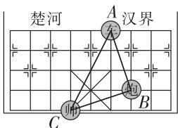

text_image

楚河
A
汉界
C
B
A
B

第 5 题解图

6. B 【解析】根据勾股定理, 可得 $OP_{1}^{2}=OP^{2}+PP_{1}^{2}=2OP^{2}, OP_{2}^{2}=OP_{1}^{2}+P_{1}P_{2}^{2}=3OP^{2}, OP_{3}^{2}=OP_{2}^{2}+P_{2}P_{3}^{2}=4OP^{2}$ , 所以 $OP_{3}=2OP$ , 所以 $OP_{3}:OP=2:1$ .

7. 5,12,13(答案不唯一) 【解析】因为 $5^{2}+12^{2}=13^{2}$ ，所以 5,12,13 可以作为直角三角形的三边长，且 5,12,13 均为正整数，符合勾股数的定义.

8.1 29 【解析】因为在 Rt $\triangle ABC$ 中, $\angle BAC = 90^{\circ}$ , 所以 $AB^{2} + AC^{2} = BC^{2}$ . 又因为 $S_{1} = BC^{2}, S_{2} = AC^{2}$ , 且 $S_{1} - S_{2} = 25$ , 所以 $AB^{2} = BC^{2} - AC^{2} = 25$ , 则

AB = 5. 因为 $AB + AC = 7$ ，所以 AC = 2，则在 Rt△ABC 中，根据勾股定理，可得 $S_{1} = BC^{2} = AB^{2} + AC^{2} = 29$ .

8.2 $18\pi$ 【解析】设面积为 $S_{1}, S_{2}, S_{3}$ 的三个半圆的半径分别为 $r_{1}, r_{2}, r_{3}$ ，根据勾股定理，可得 $(2r_{1})^{2} + (2r_{2})^{2} = (2r_{3})^{2}$ ，即 $r_{1}^{2} + r_{2}^{2} = r_{3}^{2}$ ，所以 $\frac{1}{2}\pi r_{1}^{2} + \frac{1}{2}\pi r_{2}^{2} = \frac{1}{2}\pi r_{3}^{2}$ ，即 $S_{3} = S_{1} + S_{2} = 6\pi + 12\pi = 18\pi$ .

9. ①③④ 【解析】因为 $AB \perp BC, CD \perp BC, BE = CD = a, AB = EC = b$ ，所以 $\triangle ABE \cong \triangle ECD$ ，故①正确；由 $\triangle ABE \cong \triangle ECD$ 可得 $\angle AEB = \angle CDE$ ，所以 $\angle AED = 180^\circ - \angle AEB - \angle DEC = 180^\circ - \angle CDE - \angle DEC = 90^\circ$ ，所以在 $\triangle AED$ 中， $AE^2 + ED^2 = AD^2$ ， $AD > BC$ ，故②错误；四边形 $ABCD$ 的面积为 $\frac{1}{2}(a + b)(a + b) = \frac{1}{2}(a + b)^2$ ，故③正确；设 $AE = DE = c$ ，因为梯形 $ABCD$ 的面积-直角三角形 $AED$ 的面积=直角三角形 $ABE$ 和直角三角形 $CDE$ 的面积之和，即 $\frac{1}{2}(a + b)^2 - \frac{1}{2}c^2 = 2 \times \frac{1}{2}ab$ ，整理得 $a^2 + b^2 = c^2$ ，故④正确.

10. 解: 能构成直角三角形. …… (2 分)
理由如下:

由题图可知 $AB^{2}=3^{2}+3^{2}=18, CD^{2}=1^{2}+3^{2}=10$ ,
又因为 $EF^{2}=8$ ,

所以 $CD^{2}+EF^{2}=AB^{2}$ ,

所以以 AB, CD, EF 三条线段为边长, 能构成直角三角形. …… (6 分)

11. 解: 因为 $BE \perp AB, AB = 4, BE = 3,$

所以 $AE^{2}=AB^{2}+BE^{2}=4^{2}+3^{2}=25$ ,

所以 AE=5. …… (2 分)

因为 AB=AC, AD 平分 $\angle BAC$ ,

所以 $AE \perp BC, BC = 2BD,$

所以 $S_{\triangle ABE}=\frac{1}{2}AB\cdot BE=\frac{1}{2}AE\cdot BD,$

大小卷·八年级(上) 数学 BS

所以 $BD=\frac{AB\cdot BE}{AE}=\frac{4\times3}{5}=\frac{12}{5}$ ,

所以 $BC=2BD=\frac{24}{5}.$ …… (6 分)

12. 解: 根据题意可得, $\triangle ABC \cong \triangle DAE$ ,

所以 $\angle ABC = \angle DAE.$

因为 $\angle ACB = 90^{\circ}$ ,

所以 $\angle BAC + \angle ABC = 90^{\circ}$ ,

所以 $\angle BAC + \angle DAE = 90^{\circ}$

即 $\angle BAD=90^{\circ}$ ,

所以 $S_{\triangle ABD} = \frac{1}{2} AB\cdot AD = \frac{1}{2} c^2.$

因为 EC = AC - AE = b - a，

易得,在 $\triangle BCD$ 中,EC与BC边上的高相等,

所以 $S_{\triangle BCD} = \frac{1}{2} BC\cdot EC = \frac{1}{2} a(b - a)$

所以 $S_{\text{四边形}ABCD} = S_{\triangle ABD} + S_{\triangle BCD} = \frac{1}{2} c^2 + \frac{1}{2} a(b - a)$ .

……（3分）

因为 $S_{\triangle ABC}=\frac{1}{2}BC\cdot AC=\frac{1}{2}ab$ ,

$$
S _ {\triangle A C D} = \frac {1}{2} A C \cdot D E = \frac {1}{2} b ^ {2},
$$

所以 $S_{四边形ABCD}=S_{\triangle ABC}+S_{\triangle ACD}=\frac{1}{2}ab+\frac{1}{2}b^{2},\cdots$

……（6分）

所以 $\frac{1}{2} c^2 +\frac{1}{2} a(b - a) = \frac{1}{2} ab + \frac{1}{2} b^2,$

整理, 得 $a^{2}+b^{2}=c^{2}$ . …… (8 分)

13. 解: 如解图, 连接 OP,

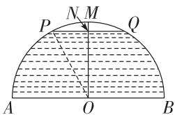

text_image

P
N M
Q
A O B

第 13 题解图

由题意可知, OP = OM = OA = $\frac{1}{2}AB = \frac{1}{2} \times 68 =$ 34(米),

$PN=\frac{1}{2}PQ=\frac{1}{2}\times32=16(\text{米}),\cdots\cdots(3\text{分})$

在 Rt $\triangle OPN$ 中, 根据勾股定理可得, $PN^{2} + ON^{2} = OP^{2}$ ,

即 $16^{2}+ON^{2}=34^{2}$ ,

所以 ON=30 米. …… (7 分)

因为 30 米 >25 米，

所以这时船只不能正常通行. …… (10 分)

# 周测 2 勾股定理的应用

1. C 【解析】设这枝花在花瓶内的长度为 $x \, cm$ ，当花在花瓶内的长度最长时，可由勾股定理得 $x^{2} = 7^{2} + 24^{2}$ ，所以 $x = 25, 30 - 25 = 5 \, (\text{cm})$ ，所以这枝花露在花瓶外面部分的长度最短为 $5 \, cm$ .

2. B 【解析】圆柱体的部分侧面展开图如解图所示,连接 AP, 蚂蚁从点 A 爬到点 P 的最短路程为 AP 的长. 因为 P 为 BC 的中点, BC = 12 cm, 所以 BP = 6 cm, 易得 AB = 8 cm, 在 Rt△ABP 中, $AP^{2} = AB^{2} + BP^{2} = 8^{2} + 6^{2} = 100$ , 所以 AP = 10 cm, 所以蚂蚁从点 A 爬到点 P 的最短路程为 10 cm.

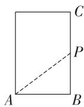  
第2题解图

3. B 【解析】设原处的竹子还有 x 尺, 则斜边为 $(10-x)$ 尺, 由勾股定理得 $x^{2}+3^{2}=(10-x)^{2}$ .

4. D 【解析】如解图所示,由题意可得, $\angle2=\angle1=50^{\circ}$ ,所以 $\angle3=90^{\circ}-\angle2=40^{\circ}$ .又因为 $\angle5=40^{\circ}$ ,所以 $\angle4=90^{\circ}-\angle5=50^{\circ}$ ,所以 $\angle3+\angle4=40^{\circ}+50^{\circ}=90^{\circ}$ .在Rt△ABC中,AB=15海里, $BC=16\times0.5=8$ (海里),根据勾股定理可得, $AC^{2}=AB^{2}+BC^{2}=15^{2}+8^{2}=289$ ,所以AC=17海里,所以我军巡逻舰队的航行速度为 $17\div0.5=34$ (海里/小时).

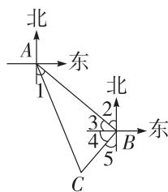

text_image

北
A
东
1
北
2
3
4
5
B
东
C

第4题解图

5. C 【解析】根据题意可得, 在 Rt△ABF 中, AF = AE - EF = 15 - 3 = 12 (米), AB = 20 米, 由勾股定理得, $AF^{2} + BF^{2} = AB^{2}$ , 即 $12^{2} + BF^{2} = 20^{2}$ , 所以 BF = 16 米. 在 Rt△CFD 中, $CF = AF + AC = 12 + 4 = 16$ (米), CD = 20 米, 由勾股定理得, $CF^{2} + DF^{2} = CD^{2}$ , 即 $16^{2} + DF^{2} = 20^{2}$ , 所以 DF = 12 米, 所以 BD = BF - DF = 16 - 12 = 4 (米).

6. B 【解析】在 Rt $\triangle ABC$ 中, $\angle C = 90^{\circ}, AB = 5$ , AC = 4, 所以 $BC^{2} = AB^{2} - AC^{2} = 5^{2} - 4^{2} = 9$ , 所以 BC = 3. 由折叠的性质可知, $\angle C = \angle F = 90^{\circ}$ , EC = EF, AF = BC = 3, 设 AE = x, 则 EC = EF = 4 - x, 在 Rt $\triangle AEF$ 中, 由勾股定理可得 $AE^{2} = AF^{2} + EF^{2}$ , 即 $x^{2} = 3^{2} + (4 - x)^{2}$ , 所以 $x = \frac{25}{8}$ , 即 AE 的长为 $\frac{25}{8}$ .

7. 60 【解析】因为 $AC \perp BC$ ，所以 $\angle ACB = 90^{\circ}$ 。在 Rt $\triangle ABC$ 中， $\angle ACB = 90^{\circ}$ ，AC = 90 km，BC = 120 km，由勾股定理得， $AC^{2} + BC^{2} = AB^{2}$ ，所以 AB = 150 km，所以 $AC + BC - AB = 90 + 120 - 150 = 60 \, (\text{km})$ ，所以直达公路建成后，从 A 镇到 B 镇比原来少走 60 km。

8. 275 【解析】如解图, 把台阶面展开, 蚂蚁爬行的最短路程是线段 AB 的长度. 由题意知, AC = 165 cm, $BC = 20 \times 5 + 30 \times 4 = 220$ (cm), 根据勾股定理得 $AB^{2} = AC^{2} + BC^{2} = 165^{2} + 220^{2} = 275^{2}$ , 所以 AB = 275 cm, 所以蚂蚁爬行的最短路程是 275 cm.

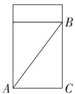  
第8题解图

9. 12 【解析】如解图, 连接 DE, 因为 $CD \perp AB$ , 所以 $\angle DCE = 90^{\circ}$ . 由题意得 CB = 20 cm, CD = 15 cm, DE = 17 cm, 在 Rt $\triangle DCE$ 中, 由勾股定理得 $CE^{2} = DE^{2} - CD^{2} = 64$ , 所以 CE = 8 cm, 所以 BE = CB - CE = 12 cm.

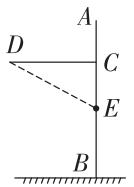  
洗手台面  
第9题解图

10. 16 【解析】如解图, 过居民楼 A 作 $AD \perp MN$ 于点 D, 并作 AB = AC = 200 m, 由题意可得, $AD = \frac{1}{2}AO = 120 \, m$ , 在 Rt $\triangle ADB$ 中, $BD^{2} = AB^{2} - AD^{2} = 200^{2} - 120^{2} = 25600$ , 所以 BD = 160 m, 所以 BC = 2BD = 320 m, 所以居民楼受到噪音影响的

时间是 $320 \div 20 = 16 \, (\text{s})$ .

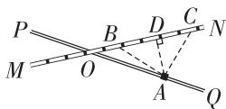  
第 10 题解图

11. 解: 根据题意展开图形,

若选择路径①,如解图①所示,

$$
A B ^ {2} = (2 0 + 2 0) ^ {2} + 3 0 ^ {2} = 2 5 0 0; \dots \tag {4分}
$$

若选择路径②,如解图②所示,

$$
A B ^ {2} = 2 0 ^ {2} + (2 0 + 3 0) ^ {2} = 2 9 0 0. \dots \tag {8分}
$$

因为 2 500 < 2 900,

所以蚂蚁选择爬行的最短路径为路径①,最短路径长为50 cm. …… (10分)

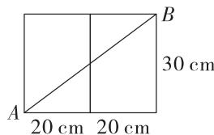

text_image

A
20 cm
20 cm
B
30 cm

图①

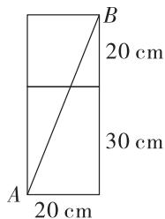

text_image

B
20 cm
30 cm
A
20 cm

图②  
第 11 题解图

12. 解: (1) 因为 $AD \perp AC$ , 所以 $\angle CAD = 90^{\circ}$ .

在 Rt△ACD 中，

由勾股定理得, $AC^{2}=CD^{2}-AD^{2}=400$ ,

所以 AC=20 米.

因为 AB=16 米, BC=12 米,

所以 $AB^{2}+BC^{2}=16^{2}+12^{2}=400=AC^{2}$ ,

所以 $\triangle ABC$ 是直角三角形,且 $\angle B=90^{\circ}$ ,

所以四边形田地的面积为 $S_{\triangle ABC} + S_{\triangle ACD} = \frac{1}{2} AB \cdot$

$$
B C + \frac {1}{2} A D \cdot A C = \frac {1}{2} \times 1 6 \times 1 2 + \frac {1}{2} \times 2 1 \times 2 0 =
$$

306(平方米);……(6分)

(2)如解图,过点A作 $AE \perp CD$ 于点E,

由“垂线段最短”, 可得线段 AE 的长即为所引水渠的最短长度.

因为 $AD \perp AC, AE \perp CD,$

所以 $S_{\triangle ACD}=\frac{1}{2}AD\cdot AC=\frac{1}{2}CD\cdot AE,$

所以 $21 \times 20 = 29AE$ ,

解得 $AE=\frac{420}{29}$ ,大小卷·八年级(上) 数学 BS

所以这条水渠的最短长度为 $\frac{420}{29}$ 米. …(10分)

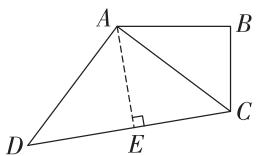

text_image

A
B
D
E
C

第 12 题解图

# 专题 最短路径问题

# 方法分类练

1. 解: 圆柱体的侧面展开图如解图所示, 则 AC 的长为蚂蚁爬行的最短路程,

因为底面周长为 $8 \, cm$ ,

所以侧面展开图中 $BC=B'C=4\ cm$ .

又因为 AB = 3 cm,

所以在 Rt△ABC 中, $AC^{2}=AB^{2}+BC^{2}=25$ ,

所以 AC=5 cm,

所以蚂蚁爬行的最短路程为 5 cm.

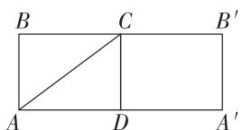

text_image

B C B'
A D A'

第1题解图

2. 解: 如解图是长方体盒子的侧面展开图, 连接 $AB'$ , 则 $AB'$ 的长即为所需的最短丝带长,

因为 $AA' = 4 + 2 + 4 + 2 = 12, A'B' = AB = 9,$

所以由勾股定理得 $AB'^{2}=AA'^{2}+A'B'^{2}=12^{2}+9^{2}=225$ ,

则 $AB' = 15$ ,

所以所需彩色丝带的最短长度为 15.

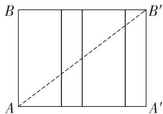

text_image

B
A
A'
B'

第2题解图

3. 解: 如解图, 作点 A 关于直线 l 的对称点 $A'$ , 连接 $A'B$ 交直线 l 于点 C,

此时 $AC+BC$ 的值最小, 即为 $A'B$ 的长.

过点 B 作 $BD \perp A'A$ 交 $A'A$ 的延长线于点 D,

所以 BD=4 km, $A'D=3$ km,

所以 $A^{\prime}B^{2}=A^{\prime}D^{2}+BD^{2}=3^{2}+4^{2}=25$ ,

所以 $A'B=5\ km$ ,

所以 A, B 两村庄到抽水站 C 的最短距离为

5 km,

所以铺设送水管道所需的最低费用为 $5 \times 1200 = 6000$ (元).

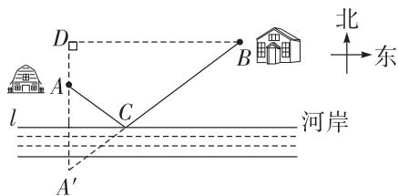

text_image

北
东
D
A
l
河岸
C
B
A′

第3题解图

4. 解: 根据题意可得, $S_{\triangle ABC} = \frac{1}{2} AB \cdot AC = 24$ ,

所以 AC = 8.

由勾股定理可得, $BC^{2}=AB^{2}+AC^{2}$ ,

所以 $BC^{2}=6^{2}+8^{2}$ ,

所以 BC = 10.

由垂线段最短可知, 当 $AD \perp BC$ 时, AD 取得最小值,

所以 $S_{\triangle ABC}=\frac{1}{2}BC\cdot AD=24$ ,

解得 $AD=\frac{24}{5}$ ,

所以 AD 的最小值为 $\frac{24}{5}$ .

5. 解: 如解图, 过点 B 作 $BE \perp AC$ 于点 E, 交 AD 于点 F, 此时 E, F 即为 $CF + EF$ 取最小值时的位置, 因为 AB = AC, AD 是 BC 边上的中线,

所以 $AD \perp BC, BD = \frac{1}{2} BC = 6,$

所以点 C 与点 B 关于 AD 对称，

所以 BF = CF,

所以 $CF+EF$ 的最小值为 BE 的长.

在 Rt△ABD 中,由勾股定理可得 AD=8,

所以 $S_{\triangle ABC}=\frac{1}{2}BC\cdot AD=\frac{1}{2}AC\cdot BE,$

所以 BE=9.6,

所以 $CF + EF$ 的最小值为9.6.

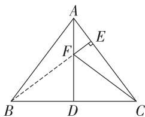

text_image

A
E
F
B
D
C

第 5 题解图

# 综合训练

6. 解: 将盒子在桌面展开如解图所示, 此时 AB =

$$
4 0 + 4 + 4 = 4 8 (\mathrm{cm}),
$$

又因为 BC=AD=20 cm, $\angle ABC=90^{\circ}$ ,

所以在 Rt $\triangle ABC$ 中, $AB^{2} + BC^{2} = 48^{2} + 20^{2} = 52^{2} = AC^{2}$ ,

所以 AC = 52 cm,

即蚂蚁要走的最短路程为 52 cm.

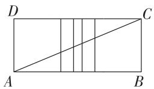

text_image

D
C
A
B

第6题解图

7. 解: 树干的展开图如解图所示, 葛藤的最短路径为 $AC \rightarrow DE \rightarrow FB$ ,

即在展开图中,将长方形平均分成3个小长方形,

因为树干的高度为9米,底面周长为4米,

所以小长方形的相邻两条边长分别为 3 米和 4 米，

根据勾股定理可得, $AC^{2}=DE^{2}=FB^{2}=3^{2}+4^{2}=25$ ,

所以 AC=DE=FB=5 米，

所以 $AC+DE+FB=5+5+5=15$ (米).

答:这段葛藤至少15米.

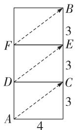

text_image

B
3
F
E
3
D
C
3
A
4

第7题解图

8. 解: (1) $\triangle ABC$ 是直角三角形.

理由如下: 因为 $AD \perp BC$ ,

所以 $\angle ADB = \angle ADC = 90^{\circ}$ ,

即 $\triangle ABD$ 和 $\triangle ACD$ 都是直角三角形.

在 Rt△ABD 中, 由勾股定理得 $AB^{2}=AD^{2}+BD^{2}=$ $2.4^{2}+1.8^{2}=9;$

在 Rt△ACD 中, 由勾股定理得 $AC^{2}=AD^{2}+CD^{2}=$ $2.4^{2}+3.2^{2}=16.$

在 $\triangle ABC$ 中, 因为 $BC^{2}=(BD+CD)^{2}=(1.8+3.2)^{2}=5^{2}=25$ ,

所以 $AB^{2}+AC^{2}=BC^{2}$ ,

所以 $\triangle ABC$ 是直角三角形；

(2)如解图,过点 D 作 $DE \perp AB$ 于点 E, $DF \perp AC$ 于点 F, 则此时 $DE + DF$ 取得最小值.

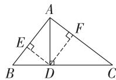  
第8题解图

在 Rt△ABD 中, 由(1) 可知 $AB^{2}=9$ ,
所以 AB=3.

因为 $S_{\triangle ABD}=\frac{1}{2}AD\cdot BD=\frac{1}{2}AB\cdot DE,$

即 $\frac{1}{2}\times2.4\times1.8=\frac{3}{2}DE,$

解得 DE = 1.44，

同理可得 DF=1.92,

所以 $DE+DF=1.44+1.92=3.36(\text{km})$ .

答: 至少需要修建 3.36 km 的水泥路.

# 第二章 实数

# 周测 3 平方根和立方根

1. D 【解析】因为 $4^{2}=16$ ，所以 16 的算术平方根是 4，即 $\sqrt{16}=4$ .

2. A 【解析】因为 $4^{3}=64$ ，所以 64 的立方根是 4，即 $\sqrt[3]{64}=4$ .

3. B 【解析】 $(\sqrt{2})^{2}=2$ ，选项 A 错误； $\sqrt[3]{27}=3$ ，选项 B 正确； $\sqrt{(-3)^{2}}=3$ ，选项 C 错误； $\sqrt[3]{-125}=-5$ ，选项 D 错误.

4. C 【解析】1 的立方根是 1, 选项 A 错误; 0.36 的平方根是 ±0.6, 选项 B 错误; 算术平方根等于它本身的数只有 1 和 0, 选项 C 正确; 9 的算术平方根是 3, 选项 D 错误.

5. A 【解析】由题意得, a-5=0, b-25=0, 所以 a=5, b=25, 所以 $\sqrt[3]{ab}=\sqrt[3]{125}=5$ .

6. D 【解析】A. x = -4 < 0, 导致取算术平方根的运算无法进行, 说法正确; B. 当输入值 x 为 16 时, $\sqrt{16} = 4, \sqrt{4} = 2$ , 所以输出值 y 为 $\sqrt{2}$ , 说法正确; C. 当输入值 x 为 81 时, $\sqrt{81} = 9, \sqrt{9} = 3$ , 输出值 y 为 $\sqrt{3}$ , 说法正确; D. 对于任意的正无理数 y, 都存在正整数 x, 使得输入 x 后能够输出 y, 说法错误, 如输出值为 $\pi$ .

7. -8 【解析】因为 $-8^{3}=(-8)^{3}$ ，所以 $\sqrt[3]{-8^{3}}=-8$ .

8. -3 【解析】因为正数的两个平方根互为相反数,所以 $5-2x+3x-2=0$ , 即 $3+x=0$ , 解得 x=-3.

9. 4 【解析】由题意可知,大正方形布料的面积为 $8 \times 2 = 16 \, (\text{cm}^2)$ , 所以大正方形布料的边长为 $\sqrt{16} = 4 \, (\text{cm})$ .

10. 294 【解析】根据题意可得, 这个沙包的棱长为 $\sqrt[3]{343} = 7 \, (\text{cm})$ , 所以这个沙包的表面积为 $6 \times 7^{2} = 294 \, (\text{cm}^{2})$ .

11. (1) $\sqrt{36} = 6$ ; …… (1 分)

(2) $\sqrt{0.25}=0.5;$ …… (2分)

(3) $\sqrt{(-3)^{2}}=3;$ …… (3分)

(4) $-\sqrt[3]{1-\frac{124}{125}}=-\sqrt[3]{\frac{1}{125}}=-\frac{1}{5}.$ …… (4分)

12. 解: (1) $(2x+1)^{2}=121$ ,

两边同时开平方, 得 $2x+1=\pm11$ ,

所以 $2x+1=11$ 或 $2x+1=-11$ ，

所以 x=5 或 x=-6；……（4 分）

(2) $17x^{3}+100=-36,$

移项, 得 $17x^{3} = -136$ ,

两边同时除以 17, 得 $x^{3} = -8$ ,

两边同时开立方, 得 x = -2. …… (8 分)

13. 解: (1) 根据题意可知从 $H_{1} \rightarrow H_{4}$ ，能量传递了 3 次，

所以 $1\ 000(a\%)^{3}=1.$ …… (2 分)

所以 $(a\%)^{3} = 0.001$

所以 $a\% = \sqrt[3]{0.001} = 0.1 = 10\%$ .

所以 a=10; …… (3 分)

(2)由(1)可知能量传递的效率为 10%,

因为从 $H_{1} \rightarrow H_{3}$ ，能量传递了 2 次，

所以 $H_{3}$ 可以获得的能量为 $600 \times (10\%)^{2} = 6(\text{kJ})$ . …… (8 分)

14. 解: (1) 因为 $1-2y$ 的立方根是 -3,

所以 $1-2y=(-3)^{3}=-27$ ,

解得 y=14.

因为 $3x-y+9$ 的算术平方根是 5,

所以 $3x-y+9=5^{2}=25$ ，即 3x-14=16，

解得 x=10; …… (4 分)

(2)由(1)得 x=10, y=14,

所以 $\sqrt{x + 2y - 2} = \sqrt{36} = 6$

因为 6 的平方根是 $\pm\sqrt{6}$ ,

所以 $\sqrt{x + 2y - 2}$ 的平方根是 $\pm \sqrt{6}$ . …… (10 分)

15. 解: (1) 选择 4, 11, 18,

验证： $\sqrt{11^{2}-4\times18}=\sqrt{121-72}=\sqrt{49}=7;\cdots\cdots$ ……（4分）

(答案不唯一,符合规律,计算正确即可)

(2)设被框起来的部分中,中间的数为 x, 则第一个数为 x-7, 第三个数为 $x+7$ ,

则 $\sqrt{x^2 - (x - 7)(x + 7)}$

$$
= \sqrt {x ^ {2} - (x ^ {2} - 4 9)}
$$

$$
= \sqrt {x ^ {2} - x ^ {2} + 4 9}
$$

$$
= \sqrt {4 9}
$$

=7. …… (10 分)

# 周测4 估算和实数

1. B 【解析】 $-\sqrt{4}=-2$ ，是有理数，选项 A 不符合题意； $\sqrt{3}$ 是无理数，选项 B 符合题意；3.14 是有理数，选项 C 不符合题意；0.67 是无限循环小数，是有理数，选项 D 不符合题意。  
2. C 【解析】 $|-1|=1,|- \sqrt{3}|=\sqrt{3}$ ，因为 $1<\sqrt{3}$ ，所以 $-1>-\sqrt{3}$ 。在 0,-1, $-\sqrt{3}$ ,2 这四个数中，因为 $-\sqrt{3}<-1<0<2$ ，所以最小的数是 $-\sqrt{3}$ 。  
3. C 【解析】因为 $2^{3}=8,3^{3}=27$ ，所以 $2<\sqrt[3]{19}<3$ ，即正方体的棱长大小在 2 和 3 之间.  
4. D 【解析】由题意得,弦为 $\sqrt{10^{2}+6^{2}}=\sqrt{136}$ , 因为 121<136<144, 144-136=8, 136-121=15, 所以 136 更接近 144, 所以 $\sqrt{136}$ 最接近的整数是 12.  
5. D 【解析】因为 $\sqrt[3]{216}=6$ ，所以 $\sqrt{5}<a<6$ 。又因为 $2<\sqrt{5}<3$ ，所以整数 a 的值可能为 3,4,5。  
6. B 【解析】因为 $B, C$ 两点对应的实数分别是-1和 $\sqrt{2}$ , 所以 $BC = \sqrt{2} - (-1) = \sqrt{2} + 1$ . 因为 $B$ 是 $AC$ 的中点, 所以 $AB = BC = \sqrt{2} + 1$ , 所以点 $A$ 对应的实数是 $-1 - (\sqrt{2} + 1) = -2 - \sqrt{2}$ .  
7. $-\sqrt{5}$ ; $\sqrt{11}-3$   
8. 0 【解析】因为 $4 < 5 < 9$ ，所以 $2 < \sqrt{5} < 3$ ，所以 $\sqrt{5} - 1$ 介于 1 和 2 之间，所以 $\frac{\sqrt{5} - 1}{2}$ 介于 $\frac{1}{2}$ 和 1 之间，所以 $n = 0$ .  
9. 小亮; 小明 【解析】因为 5<7<9, 所以 $\sqrt{5}<\sqrt{7}<3$ , 所以站在 1 号位置的同学是小亮, 站在 3 号位置的同学是小明.  
10. $\sqrt{10} - 1$ 【解析】在 Rt $\triangle ABC$ 中, $AB = 3$ , $BC = 1$ , 由勾股定理得 $AC = \sqrt{AB^2 + BC^2} = \sqrt{10}$ , 因为 $CD = BC = 1$ , 所以 $AD = AC - CD = \sqrt{10} - 1$ , 所以 $AE = AD = \sqrt{10} - 1$ , 所以点 $E$ 表示的实数是 $\sqrt{10} - 1$ .  
11. 解: 将各数填入相应的框内如下. …… (6 分)

# 有理数

$$
\begin{array}{l} 0, | - 2 |, 0. 1 2 3 4 5 6, \\ \frac {1 1}{2}, \sqrt {2 5}, - 5. \dot {7}, - 1, \\ 9, - 8 \end{array}
$$

# 无理数

$$
\begin{array}{l} - \sqrt {3}, \frac {\pi}{5}, \sqrt [ 3 ]{5}, \\ - 0. 3 0 3 0 0 3 0 0 0 3 \dots \\ (\text {相邻两个} 3 \text {之间} 0 \\ \text {的个数逐次加} 1) \end{array}
$$

# 正整数

$$
\left| - 2 \right|, \sqrt {2 5}, 9
$$

# 负整数

$$
- 1, - 8
$$

12. 解: (1) 原式 = $12 + (-0.5) + 4 - \frac{1}{6}$

$$
\begin{array}{l} = \frac {3 1}{2} - \frac {1}{6} \\ = \frac {4 6}{3}; \quad \dots\dots\tag {3分} \\ \end{array}
$$

(2) 原式 $= -2 + (\sqrt{5} - 2) - (-1) + 4$

$$
\begin{array}{l} = - 2 + \sqrt {5} - 2 + 1 + 4 \\ = \sqrt {5} + 1. \quad \dots\dots\tag {6分} \\ \end{array}
$$

13. 解:由题图可得, -3 < a < -2, -1 < c < 0, 1 < b < 2,

所以 $a+b<0, a-c<0, a-b<0, 2-a>0, \cdots$ (2 分)

所以原式 $= -(a + b) + (a - c) - (a - b) + c + (2 - a)$

$$
\begin{array}{l} = - a - b + a - c - a + b + c + 2 - a \\ = 2 - 2 a. \quad \dots\dots\tag {8分} \\ \end{array}
$$

14. 解: (1) 因为餐厅的面积比宿舍小 $28 \, m^{2}$ ,

所以餐厅的面积为 $64-28=36(m^{2})$ .

因为宿舍的边长为 $\sqrt{64}=8(m)$ ,

餐厅的边长为 $\sqrt{36}=6(m)$ ,

所以卫生间的长为 $6 \, m$ ，宽为 $8 - 6 = 2 \, (\text{m})$ ，

所以卫生间的面积为 $2 \times 6 = 12 \, (\text{m}^2)$ ; …… (5 分)

(2)因为餐厅的面积为 $48 \, m^{2}$ ,

所以餐厅的边长为 $\sqrt{48}=4\sqrt{3}$ (m).

由(1)可知宿舍的边长为 $8 \, m$ ,

所以卫生间较短边的边长为 $(8-4\sqrt{3})$ m.

所以需要贴金属线条装饰的长度为 $2 \times (8 - 4\sqrt{3}) = (16 - 8\sqrt{3})$ m.

因为 $16 - 8\sqrt{3}$ 介于2和3之间，

所以 5 m 长的金属线条装饰够用. … (10 分)

15. (1)2.25; …… (3分)

(2) 因为 $3 < \sqrt{10} < 4$ , 且更接近于 3,

所以设 $\sqrt{10}=3+x$ ,

如解图,将正方形边长分为3与x两部分,
……(5分)

由面积公式, 得 $(x+3)^{2}=10$ , 即 $x^{2}+6x+9=10$ .

因为 x 较小, 略去 $x^{2}$ ,

得方程 $6x+9=10$ , 解得 $x\approx0.17,\cdots\cdots$ (7 分)
所以 $\sqrt{10} \approx 3.17.$ …… (10 分)

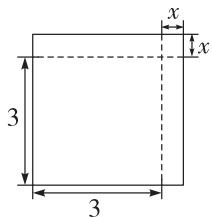

text_image

x
3
3
x

第 15 题解图

# 周测5 二次根式

1. D 【解析】要使二次根式 $\sqrt{x-1}$ 在实数范围内有意义, 则 $x-1 \geqslant 0$ , 即 $x \geqslant 1$ , 故只有选项 D 符合题意.

2. D 【解析】 $\sqrt{28}=2\sqrt{7}$ ，选项 A 不是最简二次根式； $\sqrt{12}=2\sqrt{3}$ ，选项 B 不是最简二次根式； $\sqrt{\frac{1}{7}}=\frac{\sqrt{7}}{7}$ ，选项 C 不是最简二次根式； $\sqrt{6}$ 是最简二次根式，故选项 D 符合题意.

3. C 【解析】2 与 $\sqrt{5}$ 不能合并, 故选项 A 错误; $\sqrt{18}-\sqrt{8}=\sqrt{2}\neq\sqrt{10}$ , 故选项 B 错误; $\sqrt{2}\times\sqrt{3}=\sqrt{6}$ , 故选项 C 正确; $\sqrt{24}\div\sqrt{6}=\sqrt{4}=2$ , 故选项 D 错误.

4. D 【解析】 $(5\sqrt{2}+2\sqrt{5})\times\sqrt{\frac{1}{2}}=5+\sqrt{10}$ ，因为 $3<\sqrt{10}<4$ , 所以 $8<5+\sqrt{10}<9$ .

5. D 【解析】因为深色部分的半径为 $5 \, cm$ ，所以深色部分的面积为 $\pi r^{2} = \pi \times 5^{2} = 3 \times 25 = 75 (\, \text{cm}^{2})$ 。又因为浅色圆环部分的面积为 $23 \, cm^{2}$ ，所以截面的面积为 $75 + 23 = 98 (\, \text{cm}^{2})$ ，所以截面的半径为 $\sqrt{\frac{98}{\pi}} = \sqrt{\frac{98}{3}} = \frac{\sqrt{98}}{\sqrt{3}} = \frac{7\sqrt{2}}{\sqrt{3}} = \frac{7\sqrt{6}}{3} (\, \text{cm})$ 。

6. D 【解析】设长方体礼盒的高为 $x \mathrm{~cm}$ , 则长为 $6x \mathrm{~cm}$ , 宽为 $3x \mathrm{~cm}$ , 由题意可得 $6x \cdot 3x = 36$ , 所以 $x = \sqrt{2}$ , 则 $6x = 6\sqrt{2}, 3x = 3\sqrt{2}$ , 所以这个长方体礼盒的长为 $6\sqrt{2} \mathrm{~cm}$ , 宽为 $3\sqrt{2} \mathrm{~cm}$ , 高为 $\sqrt{2} \mathrm{~cm}$ . 所以长方体礼盒的体积为 $6\sqrt{2} \times 3\sqrt{2} \times \sqrt{2} = 36\sqrt{2} (\mathrm{~cm}^3)$ .

7. $\frac{5\sqrt{2}}{2}$ 【解析】 $\sqrt{8} +\frac{1}{\sqrt{2}} = 2\sqrt{2} +\frac{\sqrt{2}}{2} = \frac{5\sqrt{2}}{2}.$

8. $2\sqrt{3}$ 【解析】由题意得 $x-10 \geqslant 0, 10-x \geqslant 0$ ，所以

x=10,所以 $\sqrt{x+2}=\sqrt{12}=2\sqrt{3}$ .

9. 7 【解析】因为 $\sqrt{63n}=\sqrt{7\times3^{2}n}=3\sqrt{7n}$ 是整数，且n是正整数，所以n的最小值为7.

10. $\sqrt{2}$ 【解析】因为两个大正方形的面积均为 $98~\mathrm{cm}^2$ ，所以大正方形的边长为 $\sqrt{98} = \sqrt{7^2\times 2} =$ $7\sqrt{2} (\mathrm{cm})$ ，所以 $BC = 7\sqrt{2}\mathrm{cm}$ .又因为重叠部分小正方形的边长为 $\sqrt{72} = \sqrt{6^2\times 2} = 6\sqrt{2} (\mathrm{cm})$ ，所以 $CE = 6\sqrt{2}\mathrm{cm}$ ，所以 $BE = BC - CE = 7\sqrt{2}-$ $6\sqrt{2} = \sqrt{2} (\mathrm{cm})$

11. 解: (1) 原式 = $2\sqrt{2} - 3\sqrt{3} + 3\sqrt{2} - 2\sqrt{3}$

$$
= (2 \sqrt {2} + 3 \sqrt {2}) - (3 \sqrt {3} + 2 \sqrt {3})
$$

$$
= 5 \sqrt {2} - 5 \sqrt {3}; \quad \dots\dots\tag {2分}
$$

(2) 原式 $= 6\sqrt{2} - 3\sqrt{2} - (4 - 3)$

$$
= 3 \sqrt {2} - 1; \dots \tag {4分}
$$

(3) 原式 $= 3 - 4\sqrt{3} + 4 + 4\sqrt{3} - 3\sqrt{2}$

$$
= 7 - 3 \sqrt {2}; \dots \tag {6分}
$$

(4) 原式 $= \sqrt{\frac{9}{4}} - \sqrt{8} + 5 \times \frac{\sqrt{2}}{2}$

$$
= \frac {3}{2} - 2 \sqrt {2} + \frac {5 \sqrt {2}}{2}
$$

$$
= \frac {3 + \sqrt {2}}{2}. \quad \dots\dots\tag {8分}
$$

12. 解: (1) 二, 除法没有分配律; …… (4 分)

(2) 原式 $= \frac{\sqrt{5}}{2} + \sqrt{20} \div (\sqrt{5} - \frac{1}{\sqrt{5}})$

$$
= \frac {\sqrt {5}}{2} + 2 \sqrt {5} \div \frac {4 \sqrt {5}}{5}
$$

$$
= \frac {\sqrt {5}}{2} + 2 \sqrt {5} \times \frac {5}{4 \sqrt {5}}
$$

$$
= \frac {\sqrt {5}}{2} + \frac {5}{2}
$$

$$
= \frac {\sqrt {5} + 5}{2}. \quad \dots\dots\tag {10分}
$$

13. 解: (1) 小球从 60 m 高空自由落下, 到达地面需要的时间 $t = \sqrt{\frac{2h}{g}} = \sqrt{\frac{2 \times 60}{10}} = 2\sqrt{3} \, (\text{s})$ .

答: 小球从 60 m 高空自由落下, 需要 $2\sqrt{3}$ s 到达地面; …… (5 分)

(2)不认同,理由如下:

大小卷·八年级(上) 数学 BS

小球从 120 m 高空自由落下, 到达地面所需要的时间 $t = \sqrt{\frac{2h}{g}} = \sqrt{\frac{2 \times 120}{10}} = 2\sqrt{6} \, (\text{s})$ ,

因为 $2\sqrt{6} \neq 2 \times 2\sqrt{3}$ ，所以小球从 120 m 的高空自由落下，到达地面所需要的时间不是从 60 m 高空自由落下所需时间的 2 倍。……（12 分）

# 第三章 位置与坐标

# 周测 6 确定位置及平面直角坐标系

1. C

2. A 【解析】根据小梦的座位表示可知, 小佳的座位 4 排 6 座可记作(4,6).

3. A 【解析】因为 $x^{2} \geqslant 0$ ，所以 $x^{2} + 1 \geqslant 1$ 。因为 5 > 0，所以点 $M(x^{2} + 1, 5)$ 所在的象限是第一象限。

4. C 【解析】因为 A 点的坐标为 $(-3,1)$ ，B 点的坐标为 $(2,-1)$ ，建立平面直角坐标系如解图，则 C 点的坐标为 $(0,-2)$ .

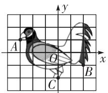

text_image

A
O
B
C
x
y

第4题解图

5. A 【解析】如解图所示,分别过点 A, B 作 x 轴的垂线,交 x 轴于点 C, D, 所以 $\angle ACO = \angle BDO = 90^{\circ}$ , 所以 $\angle CAO + \angle AOC = 90^{\circ}$ , $\angle OBD + \angle DOB = 90^{\circ}$ . 因为 $\triangle AOB$ 为等腰直角三角形, 所以 AO = OB, $\angle AOB = 90^{\circ}$ , 所以 $\angle AOC + \angle DOB = 90^{\circ}$ , 所以 $\angle AOC = \angle OBD$ , $\angle CAO = \angle DOB$ . 在 $\triangle AOC$ 和

$\triangle OBD$ 中， $\left\{ \begin{array}{l}\angle AOC = \angle OBD,\\ AO = OB,\quad \text{所以} \triangle AOC\cong \\ \angle CAO = \angle DOB, \end{array} \right.$

$\triangle OBD(\mathrm{ASA})$ ，所以 $AC = OD, OC = BD.$ 因为点 $A$ 的坐标为 $(-3,2)$ ，所以 $AC = OD = 2, OC = BD = 3.$ 因为点 $B$ 在第一象限，所以点 $B$ 的坐标为(2,3).

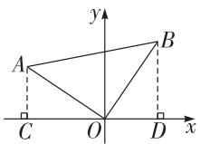  
第5题解图

6. D 【解析】根据题意得,小球运动一周所走的路程为 $4\sqrt{2} \times 4 = 16\sqrt{2}$ , 因为小球以每秒 $\sqrt{2}$ 个单位长度的速度运动, 所以小球运动一周所用的时间为 $16\sqrt{2} \div \sqrt{2} = 16$ (秒). 因为 $128 \div 16 = 8$ , 所以第 128 秒时小球运动了 8 周, 所在位置为 (0, 4), 横坐标为 0.

7.5 【解析】因为点 $P(2, -5)$ 的纵坐标是-5, 所

以点 P 到 x 轴的距离为 5.

8. 1

9. (6,-1)或(-2,-1) 【解析】因为线段AB平行于x轴,AB=4,点B的坐标为(2,-1),所以点A的横坐标为 $2+4=6$ 或2-4=-2,纵坐标为-1,即点A的坐标为(6,-1)或(-2,-1).

10. 4 【解析】因为 $\triangle ABC$ 的底边 AB = 4, 面积为 6, 所以 $\triangle ABC$ 的高为 $6 \times 2 \div 4 = 3$ , 所以符合条件的点 C 如解图所示, 共有 4 个.

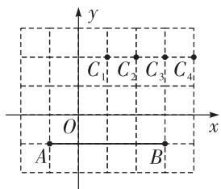

text_image

y
C₁ C₂ C₃ C₄
O
A B
x

第10题解图

11. 解: (1) $45^{\circ}; 3\sqrt{2}$ ; …… (4 分)
(2) 以点 A 为原点, 分别以正东方向、正北方向为 x 轴、y 轴正方向建立平面直角坐标系, 则点 B 的坐标为 (3,3). (答案不唯一) …… (8 分)

12. 解: (1) 画出平面直角坐标系如解图所示; …
…… (3 分)

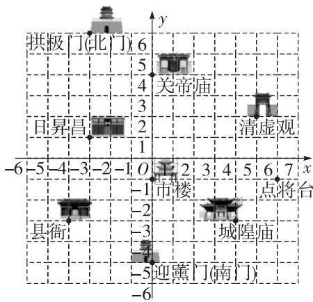

text_image

拱板门(北门) 6
关帝庙
日昇昌 2
清虚观
-6 -5 -4 -3 -2 -1 O 2 3 4 5 6 7 x
-1 市楼 点将台
县衙 -2
城隍庙
-3
迎黨门(南门)
-5

第12题解图

(2) 城隍庙 $(4, -3)$ ，县衙 $(-4, -3)$ ，日昇昌 $(-3, 1)$ ，关帝庙 $(0, 4)$ ；……（7 分）
(3) 点将台的位置如解图所示. …… (10 分)

13. 解: (1) $2 \times (-1) + 6 = 4, -1 + 2 \times 6 = 11$ ,
所以点 $N(-1,6)$ 的“2 系点” $N'$ 的坐标为 (4, 11); …… (3 分)
(2) 因为点 Q 在 x 轴的负半轴上，
所以设点 Q 的坐标为 $(q,0)(q<0)$ ,

# 大小卷·八年级(上) 数学 BS

所以点 $Q'$ 的坐标为 $(3q, q)$ ，……（6 分）
则点 $Q'$ 到 x 轴的距离为 -q，到 y 轴的距离为 -3q，

根据题意,得 $-q+(-3q)=8$ ,即q=-2,

所以点 Q 的坐标为 $(-2,0)$ . …… (10 分)

14. 解: (1) 因为 OB = 2OC = 4,

所以 $B(4,0)$ , $C(0,2)$ .

因为 AB = 5，

所以 OA=1，

所以 $A(-1,0)$ ; …… (3 分)

(2) 存在；

分类讨论:①当 AC=CD 时,

因为 $CO \perp AD$ ，所以 OD = OA = 1，

所以 $D(1,0)$ ，所以 AD=2，

所以 $S_{\triangle ACD}=\frac{1}{2}\times2\times2=2;\quad\cdots\cdots(6\text{分})$

②当 DA=DC 时, OD=DA-OA=DC-1,

在 Rt△COD 中, $DC^{2}=OD^{2}+OC^{2}$ ,

即 $DC^{2}=(DC-1)^{2}+2^{2}$ ，解得 $DC=\frac{5}{2}$ ,

所以 $AD=\frac{5}{2}$ , $OD=\frac{5}{2}-1=\frac{3}{2}$ ,

所以 $D(\frac{3}{2},0)$ ,

所以 $S_{\triangle ACD}=\frac{1}{2}\times\frac{5}{2}\times2=\frac{5}{2}.$ …… (11 分)

综上所述,当点 D 的坐标为 $(1,0)$ 时, $\triangle ACD$ 的面积为 2; 当点 D 的坐标为 $\left(\frac{3}{2}, 0\right)$ 时,

$\triangle ACD$ 的面积为 $\frac{5}{2}$ . 这两种情况均使得 $\triangle ACD$

是以 CD 为腰的等腰三角形. …… (12 分)

# 专题 平面直角坐标系中的面积问题

# 方法分类练

1. 解: 因为 $A(0,0)$ , $B(3,6)$ , $C(0,9)$ ,

所以 $S_{\triangle ABC}=\frac{1}{2}\times9\times6=27.$

2. 解: (1) 因为点 $A(-2, -2)$ , $B(-2, -6)$ , $C(4, 1)$ ,
所以 $AB = -2 - (-6) = 4$ , AB 边上的高为 $x_{C} - x_{A} = 4 - (-2) = 6$ ,

所以 $S_{\triangle ABC}=\frac{1}{2}\times4\times6=12;$

(2)由(1)可得, $S_{\triangle BOP}=\frac{1}{3}S_{\triangle ABC}=\frac{1}{3}\times12=4$ ,

则 $S_{\triangle BOP} = \frac{1}{2}\cdot |y_B|\cdot OP = \frac{1}{2}\times 6OP = 4,$

所以 $OP=\frac{4}{3}$ ,

所以点 P 的坐标为 $\left(\frac{4}{3},0\right)$ 或 $\left(-\frac{4}{3},0\right)$ .

3. 解: 因为点 $A(1,3)$ , $B(5,6)$ , $C(9,2)$ ,

所以 $S_{\triangle ABC}=8\times4-\frac{1}{2}\times4\times3-\frac{1}{2}\times8\times1-\frac{1}{2}\times4\times4=$ 14.

4. 解: (1) 因为 $\left|a+1\right|+\sqrt{(b-3)^{2}}=0, \left|a+1\right|\geqslant0,$ $\sqrt{(b-3)^{2}}\geqslant0,$

所以 $a+1=0, b-3=0$ ，即 a=-1, b=3，

所以点 A, B, C, D 的坐标分别为 $(-1, 0)$ , $(3, 0)$ , $(-1, 2)$ , $D(2, 4)$ ;

(2)如解图①,过点D作 $DE\perp AB$ ,垂足为点E,

$$
S _ {\text {四边形} A B D C} = S _ {\text {梯形} A C D E} + S _ {\triangle E B D}
$$

$$
= \frac {1}{2} \times (2 + 4) \times 3 + \frac {1}{2} \times 1 \times 4
$$

$$
= 1 1.
$$

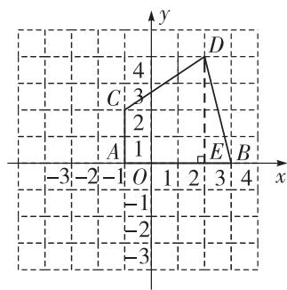

line

| Point | x | y |
|---|---|---|
| C | -3 | 3 |
| D | 3 | 4 |
| E | 2 | -1 |
| B | 4 | -3 |
| A | -1 | 1 |
| O | 1 | -1 |
| 2 | 2 | -2 |
| 3 | 3 | -3 |

图①

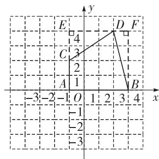

line

| Point | x | y |
|---|---|---|
| A | -3 | 1 |
| B | 3 | -2 |
| C | -2 | 3 |
| D | 2 | 4 |
| E | -1 | 4 |
| F | 4 | -1 |

图②  
第4题解图

【一题多解法】如解图②, 过点 D 向 AC 作垂线, 交 AC 的延长线于点 E, 过点 B 向 ED 作垂线, 交 ED 的延长线于点 F,

$$
S _ {\text {四边形} A B D C} = S _ {\text {正方形} A E F B} - S _ {\triangle C E D} - S _ {\triangle B D F}
$$

$$
\begin{array}{l} = 4 \times 4 - \frac {1}{2} \times 2 \times 3 - \frac {1}{2} \times 1 \times 4 \\ = 1 1. \\ \end{array}
$$

# 综合训练

5. 2m-2n 【解析】因为点 A, B, C 的坐标分别是 $(2, m)$ , $(- \sqrt{2}, n)$ , $(4, 0)$ , 所以由分割法得

$$
\begin{array}{l} S _ {\triangle A B C} = S _ {\triangle A O C} + S _ {\triangle B O C} = \frac {1}{2} \times 4 m + \frac {1}{2} \times 4 \times (- n) = 2 m - \\ 2 n. \end{array}
$$

6. 解: (1) 因为 $A(0,0)$ , $B(3,6)$ , $C(9,3)$ ,

所以 $AB^{2}=3^{2}+6^{2}=45, BC^{2}=3^{2}+6^{2}=45, AC^{2}=9^{2}+3^{2}=90$ ,

所以 AB=BC, $AB^{2}+BC^{2}=AC^{2}$ ,

所以 $\triangle ABC$ 是等腰直角三角形；

(2)由(1)得, $AB=BC=3\sqrt{5},\angle ABC=90^{\circ}$ ,

所以 $S_{\triangle ABC}=\frac{1}{2}\times3\sqrt{5}\times3\sqrt{5}=\frac{45}{2}.$

【一题多解法】 $S_{\triangle ABC}=9\times6-\frac{1}{2}\times6\times3-\frac{1}{2}\times6\times3-\frac{1}{2}\times9\times3=\frac{45}{2}.$

7. 解: (1) $0 \leqslant t \leqslant 5$ ;

(2) 当点 P 在线段 BC 上时, 点 P 的坐标为 $(-t,2)$ , 当点 P 在线段 CD 上时, 点 P 的坐标为 $(-3,5-t)$ ;

(3) 当点 P 在线段 BC 上时, $\triangle PAB$ 的面积最大为 $\frac{1}{2} \cdot BC \cdot OB = \frac{1}{2} \times 3 \times 2 = 3$ ,

所以当 $\triangle PAB$ 的面积为 $\frac{16}{5}$ 时,点P只能在线段CD上.

如解图, 当点 P 在线段 CD 上运动时, 设点 P 的坐标为 $(-3, m)$ .

因为 $S_{\triangle PAB} = S_{四边形ABCD} - S_{\triangle PBC} - S_{\triangle PAD} = \frac{1}{2} \times (3 +$

$4) \times 2 - \frac{1}{2} \times 3 \times (2 - m) - \frac{1}{2} \times 4 \times m = 7 - 3 + \frac{3}{2} m - 2m = 4 - \frac{1}{2} m,$

所以 $4-\frac{1}{2}m=\frac{16}{5}$ ，解得 $m=\frac{8}{5}$ ，

此时点 P 的坐标是 $(-3, \frac{8}{5})$ .

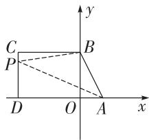

text_image

C
P
D O A x
y
B

第 7 题解图

# 周测 7 轴对称与坐标变化

1. B 【解析】关于 x 轴对称的两个点的横坐标相同,纵坐标互为相反数,所以与点 $(2,5)$ 关于 x 轴对称的点的坐标为 $(2,-5)$ .

2. B 【解析】因为点 $M(1,5)$ 的横坐标乘 -1，得到点 $M'$ ，所以点 M 与点 $M'$ 关于 y 轴对称，所以 A 错误，B 正确；点 M 在第一象限，点 $M'$ 在第二象限，所以 C，D 错误.

3. C 【解析】因为点 $E(m,5)$ 和点 $F(3,n)$ 关于 y 轴对称, 所以 m=-3, n=5, 所以 $m+n=2$ .

4. B 【解析】因为将水面看作平行于 x 轴且过点 $(0,1)$ 的直线, 所以点 M(1,3) 到水面的距离为 3-1=2. 因为点 M 和点 N 关于水面所在直线 l 对称, 所以点 N 的横坐标为 1, 纵坐标为 1-2=-1, 所以点 N 的坐标为 $(1,-1)$ .

5. D 【解析】如解图, 过点 B 作 BC 垂直于 x 轴, 交 x 轴于点 C, 因为 $\triangle AOB$ 为等边三角形, 所以 AC = OC. 因为点 A 的坐标为 $(-6, 0)$ , 所以 AO = AB = 6, AC = CO = 3, 在 Rt $\triangle ABC$ 中, 由勾股定理得 $BC = \sqrt{6^{2} - 3^{2}} = 3\sqrt{3}$ , 所以点 B 的坐标为 $(-3, 3\sqrt{3})$ , 所以点 B 关于 y 轴对称的点的坐标为 $(3, 3\sqrt{3})$ .

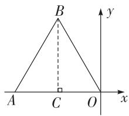

text_image

B
A C O x
y

第 5 题解图

6. D 【解析】因为 $\triangle ABC$ 是等边三角形, AB = 3 - 1 = 2, 根据勾股定理可得, 等边三角形 ABC 的高为 $\sqrt{2^{2} - 1^{2}} = \sqrt{3}$ , 所以点 C 到 x 轴的距离为 $\sqrt{3} + 1$ , 其横坐标为 2, 所以 $C(2, \sqrt{3} + 1)$ . 根据题意得, 奇数次变换后三角形在 x 轴下方, 偶数次变换后三角形在 x 轴上方, 所以第 2025 次变换后的三角形在 x 轴下方, 所以此时点 C 的纵坐标

# 大小卷·八年级(上) 数学 BS

为 $-1-\sqrt{3}$ . 因为横坐标为 $2-2025\times1=-2023$ ，所以第 2025 次变换后点 C 的坐标是 $(-2023,-1-\sqrt{3})$ .

7. 4 【解析】因为点 P 坐标为 $(-1,2)$ ，所以点 P 到 x 轴的距离为 2。因为点 P 与点 Q 关于 x 轴对称，所以 $PQ=2\times2=4$ 。

8. 4 【解析】因为点 A(-3, -1) 与点 B 关于直线 l 对称, 直线 l 经过点 (1, 0) 且垂直于 x 轴, 所以 b = -1, a - 1 = 1 - (-3), 解得 a = 5, 所以 $a + b = 5 - 1 = 4$ .

9. (1,1) 【解析】如解图,建立平面直角坐标系,当小形放的位置是(1,1)时,所有棋子构成一个轴对称图形.

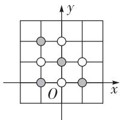

text_image

y
x
O

第9题解图

10. (2, -3) 【解析】因为 $A(0, m), B(a, b)$ , $C(-2, -3), F(-a, b)$ , 所以建立如解图所示的平面直角坐标系, 因为点 $C$ 和点 $E$ 关于 $y$ 轴对称, 所以点 $E$ 的坐标为 $(2, -3)$ .

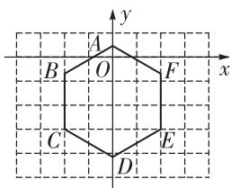

text_image

y
A
B O F x
C D E

第 10 题解图

11. 解: 设长方形的长为 3x, 宽为 2x,

则 $3x \cdot 2x = 24$ ,

即 $x^{2} = 4$

因为 x>0,

所以 x=2，

所以长方形的长为6,宽为4. ……（4分）
因为 x 轴, y 轴是长方形 ABCD 的对称轴,

所以 $A(-3,2)$ , $B(3,2)$ , $C(3,-2)$ , $D(-3,-2)$ . (8分)

12. 解: (1) 点 D 的位置如解图所示, $D(-1, -1)$ ;

……（4分）

(2)如解图,作点A关于x轴的对称点 $A'$ ,连接 $A'B$ ,其与x轴相交的点为F,连接AF,此时 $\triangle ABF$ 的周长最小,

$\triangle ABF$ 的周长为 $AF + BF + AB = A'B + AB$ ,

因为 $A(-2,1)$ , $A'(-2,-1)$ , $B(3,1)$ ,

所以 AB=5, $A'B=\sqrt{2^{2}+5^{2}}=\sqrt{29}$ ,

所以 $A'B+AB=\sqrt{29}+5$ ,

所以 $\triangle ABF$ 周长的最小值为 $\sqrt{29}+5.\cdots(10\text{分})$

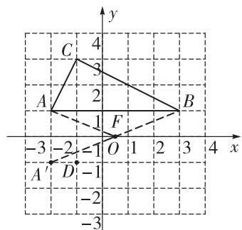

text_image

y
4
C
3
A
2
B
1
F
-3 -2 = 1 O 1 2 3 4 x
A' D -1
-2
-3

第 12 题解图

13. 解: (1)(1,-1), (-3,-1); …… (4分)

(2) 因为点 $C_{2}(-2,4)$ , $D_{2}(-1,0)$ 分别为 C, D 的二次反射点，

所以点 C 的坐标为 $(2, -2)$ ，点 D 的坐标为 $(1, 2)$ .

如解图, 连接 $CD_{2}, CD, C_{2}D_{2}, C_{2}D$ ,

则四边形 $CD_{2}C_{2}D$ 的面积为 $4 \times 6 - \frac{1}{2} \times 4 \times 1 \times 2 - \frac{1}{2} \times 3 \times 2 \times 2 - 1 \times 2 \times 2 = 10.$ ……（12分）

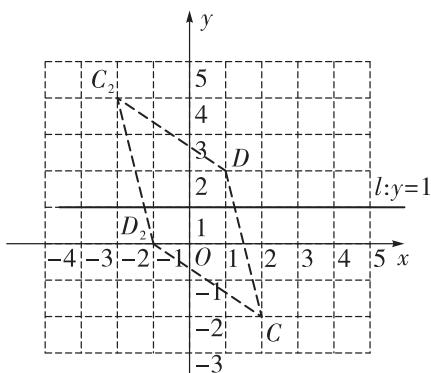

line

| Point | x | y |
|---|---|---|
| C₂ | -3 | 5 |
| D | 2 | 4 |
| D₂ | 1 | 3 |
| O | 1 | 2 |
| -1 | -2 | -1 |
| C | -2 | -2 |
| -4 | -3 | -3 |
l: y=1

第 13 题解图

# 第四章 一次函数

# 周测8 函数及一次函数的图象与性质

1. C 【解析】根据函数的概念可知,如果在一个变化过程中有两个变量 x 和 y,并且对于每一个变量 x 的值都有唯一的 y 值与之对应,那么我们称 y 是 x 的函数,故只有①④两个图象中每个 x 的值都有唯一的 y 值与之对应,符合函数的概念.

2. A 【解析】根据题意可得, $m+2<0$ , $|m+2|=1$ ,
所以 m=-3.

3. B 【解析】因为-2<0, 所以 y 的值随 x 的增大而减小, 所以当 x=0 时, y 的值最大, 最大值为 -1.

4. B 【解析】点 $M(1,3)$ 关于 x 轴的对称点为 $(1,-3)$ ，将 $(1,-3)$ 代入 $y=(5k+1)x-1$ ，得 $k=-\frac{3}{5}$ .

5. A 【解析】根据一次函数的图象分析可得：
A. 由一次函数 $y = kx + b$ 的图象可知 k < 0, b > 0，即 $\frac{k}{b} < 0$ ，由正比例函数 $y = \frac{k}{b}x$ 的图象可知 $\frac{k}{b} < 0$ ，符合题意；
B. 由一次函数 $y = kx + b$ 的图象可知 k < 0, b > 0，即 $\frac{k}{b} < 0$ ，由正比例函数 $y = \frac{k}{b}x$ 的图象可知 $\frac{k}{b} > 0$ ，矛盾，不符合题意；
C. 由一次函数 y = kx + b 的图象可知 k > 0, b < 0，即 $\frac{k}{b} < 0$ ，由正比例函数 $y = \frac{k}{b}x$ 的图象可知 $\frac{k}{b} > 0$ ，矛盾，不符合题意；
D. 由一次函数 $y = kx + b$ 的图象可知 k > 0, b > 0，即 $\frac{k}{b} > 0$ ，由正比例函数 $y = \frac{k}{b}x$ 的图象可知 $\frac{k}{b} < 0$ ，矛盾，不符合题意.

6. A 【解析】由直线 $l_{1}: y = \frac{1}{2}x + \frac{1}{2}$ 可知, $A(0, \frac{1}{2})$ , 由直线 $l_{2}: y = x + 1$ 可知, $B(0, 1)$ , 根据平行于 x 轴的直线上两点纵坐标相等, 平行于 y 轴的直线上两点横坐标相等, 及直线 $l_{1}, l_{2}$ 的表达式可知, $A_{1}(1, 1), B_{1}(1, 2), A_{1}B_{1} = 1, A_{2}(3, 2), B_{2}(3, 4), A_{2}B_{2} = 2, \cdots$ , 由此可得 $A_{n}B_{n} = 2^{n-1}$ , 所以 $A_{2024}B_{2024}$ 的长度为 $2^{2023}$ .

7. 3(答案不唯一, 满足 k > -1 即可)

8. $y = -2x - 2$ 【解析】根据平移规律可得直线 $l$ 的函数表达式为 $y = -2x - 5 + 3 = -2x - 2$ .

9. 145 【解析】由题意可知,体感温度 T 和风速 v 之间的关系式为 $T = -0.2v + 5$ , 将 T = -24 代入, 得 $-24 = -0.2v + 5$ , 解得 v = 145.

10. $\frac{1}{3} \leqslant k \leqslant 1$ 【解析】将点 $A(1,2)$ 代入 $y = kx + 1$ ，得 $2 = k + 1$ ，解得 $k = 1$ ；将点 $B(3,2)$ 代入 $y = kx + 1$ ，得 $2 = 3k + 1$ ，解得 $k = \frac{1}{3}$ . 因为一次函数 $y = kx + 1$ 的图象与线段 $AB$ 始终有一个交点，所以 $\frac{1}{3} \leqslant k \leqslant 1$ .

11. 解: (1) 将点 $(2, a)$ 代入 $y_{1} = \frac{1}{2}x$ ，得 a = 1，

将点(2,1)代入 $y_{2}=2x-b$ ，得 $1=2\times2-b$ ，
解得 b=3. …… (3 分)
画出函数 $y_{2}=2x-3$ 的图象如解图所示；……
……（4 分）

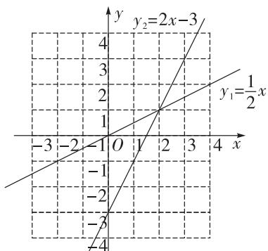

line

| x | y (y₁) | y (y₂) |
|---|---|---|
| -3 | -4 | -2 |
| -2 | -1 | 0 |
| -1 | 0 | 1 |
| 0 | 1 | 2 |
| 1 | 2 | 3 |
| 2 | 3 | 4 |
| 3 | 4 | 5 |
| 4 | 5 | 6 |

第11题解图

(2)由(1)可得一次函数的表达式为 $y_{2}=2x-3$ ,
令 2x-3=0, 解得 $x=\frac{3}{2}$ ,

所以一次函数 $y_{2}=2x-3$ 与 x 轴的交点坐标为 $(\frac{3}{2},0)$ . (8 分)

12. 解: (1) 因为水龙头的滴水速度为 5 mL/min, 容器内原有水量为 2 mL,

所以 $y=5t+2(t\geqslant0)$ ; …… (5 分)

(2) 令 $t=24\times60=1\ 440(\min)$ ,

则 $y=5\times1\ 440+2=7\ 202(mL)$ ,

所以这种漏水状态下,水龙头一天(24 h)的漏

大小卷·八年级(上) 数学 BS

水量为 7202-2=7200(mL)，

答:这个水龙头一天(24 h)的漏水量为7 200 mL. …… (10 分)

13. 解: (1) 将 x=0 代入 $y=\frac{1}{2}x+5$ 中, 得 y=5,

所以点 A 坐标为 $(0,5)$ ;

令 $\frac{1}{2}x+5=3x$ , 解得 x=2,

将 x=2 代入 $y=\frac{1}{2}x+5$ 中, 得 y=6,

所以点 B 坐标为 $(2,6)$ ;……(5 分)

(2) 存在. 如解图, $\because A(0,5), B(2,6)$ ,

所以 $S_{\triangle AOB}=\frac{1}{2}y_{A}\cdot x_{B}=\frac{1}{2}\times5\times2=5$

所以 $S_{\triangle POB} = 3S_{\triangle AOB} = 3\times 5 = 15.$

因为 $S_{\triangle POB} = \frac{1}{2} y_B \cdot |x_P| = \frac{1}{2} \times 6 \times |x_P| = 15$

所以 $x_{P}=5$ 或 $x_{P}=-5$ ,

所以点 P 的坐标为 $(5,0)$ 或 $(-5,0)$ . …(12 分)

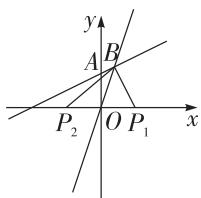

text_image

y
A B
P₂ O P₁ x

第 13 题解图

# 周测9 一次函数的应用

1. C

2. A 【解析】由题图可知, 当 x>50 时, $y_{1}>y_{2}$ , 此时选择 $y_{2}$ 更优惠.

3. D 【解析】设该正比例函数的表达式为 $y = kx$ $(k \neq 0)$ ，将点 $(1, 4)$ 代入，得 k = 4，所以 y = 4x，所以选项中只有点 $(-2, -8)$ 在该正比例函数图象上.

4. C 【解析】令 y=26 015，即 $26\ 015=400x+15$ ，解得 x=65，即该探测气球上升 65 min 时会自行爆裂.

5. B 【解析】设 y 与 x 之间的函数关系式为 $y = kx + b (k \neq 0)$ ，将 $(0, 5)$ 代入，得 b = 5；将 $(2, 13)$ 代入 $y = kx + 5$ ，得 k = 4，所以 $y = 4x + 5$ 。当 x = 6 时， $y = 4 \times 6 + 5 = 29$ ，所以当所挂重物为 6 克时，秤砣到秤纽的水平距离为 29 毫米。

6. D 【解析】由题图②可知,重物的质量越大(量程范围内),BC 之间的距离越大,选项 A 错误;

设在量程范围内 L 与 m 之间的关系式为 $L = km + b$ ，由题图②可知，未挂重物时，BC 之间的距离为 2 cm，所以 b = 2，所以 $L = km + 2$ ，将点（5, 10）代入 $L = km + 2$ ，解得 $k = \frac{8}{5}$ ，所以 $L = \frac{8}{5} m + 2$ 。当 m = 6 时， $L = \frac{8}{5} \times 6 + 2 = 11.6 \, (\text{cm})$ ，选项 B，C 错误；将 L = 6 代入 $L = \frac{8}{5} m + 2$ ，解得 m = 2.5，即 L = 6 时，所称物体的质量为 2.5 kg，选项 D 正确。

7. (1,0) 【解析】方程 $2x - b = 0$ 的解即为直线 $y = 2x - b$ 与 $x$ 轴的交点的横坐标, 所以直线 $y = 2x - b$ 一定经过点(1,0).

8. $y=\frac{3}{4}x$ 【解析】设 y 与 x 之间的函数关系式为 y=kx，由题图可知，该函数的图象经过点（8，6），将点（8,6）代入 y=kx，得 6=8k，解得 $k=\frac{3}{4}$ ，所以 y 与 x 之间的函数关系式为 $y=\frac{3}{4}x$ .

9. $\frac{90}{17}; \frac{90}{17}$ 【解析】由题意得, 瓜蔓向下生长的函数表达式为 $y = 9 - \frac{7}{10} x$ , 葫芦蔓向上生长的函数表达式为 $y = x$ . 令 $9 - \frac{7}{10} x = x$ , 解得 $x = \frac{90}{17}$ , 所以瓜蔓与葫芦蔓在 $\frac{90}{17}$ 天后相遇. 将 $x = \frac{90}{17}$ 代入 $y = x$ , 得 $y = \frac{90}{17}$ , 此时距离地面 $\frac{90}{17}$ 尺.

10. (1,1) 【解析】如解图,作点 A 关于直线 y=x 的对称点 $A'$ , 连接 $A'B$ , 交直线 y=x 于点 P, 此时 $PA+PB$ 的值最小, 由题意得, $OA'=OA=\frac{4}{3}$ , 所以 $A'(\frac{4}{3},0)$ . 设线段 $A'B$ 的函数表达式为 $y=kx+4$ , 将 $A'(\frac{4}{3},0)$ 代入, 得 k=-3, 所以线段 $A'B$ 的函数表达式为 $y=-3x+4$ . 令 $-3x+4=x$ , 解得 x=1, 所以点 P 的坐标为 (1,1).

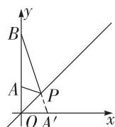  
第 10 题解图

11. 解: (1) 设汉服体验馆的汉服每小时租金的原价是 m 元,

由题意得, $y_{1}=mx$ ,

代入点(3,60)，得 $y_{1}=3m=60$ ，

解得 m=20，

所以该汉服体验馆的汉服每小时租金的原价是20元；……（5分）

(2)从下午1点租到晚上10点共9个小时，

由(1)可得,方案一的租金 $y_{1}$ 与租用时间 x 之间的函数表达式为 $y_{1}=20x$ ,

方案二的租金 $y_{2}$ 与租用时间 x 之间的函数表达式为 $y_{2}=20\times0.8x+20=16x+20.$

将 x=9 代入 $y_{1}=20x$ ，得 $y_{1}=20\times9=180$ （元），

将 x=9 代入 $y_{2}=16x+20$ ，得 $y_{2}=16\times9+20=$ 164(元)，……（10分）

180-164=16(元), $16 \times 2 = 32$ (元).

所以两人同时选择方案二更合算,共便宜32元. …… (12分)

12. 解: (1) 由图象得, 小欣步行的速度为 $1500 \div 30 = 50$ (米/分钟),

所以小欣出发 15 分钟后距离汉服体验馆的路程为 $50 \times 15 = 750$ (米)，

所以点 E 的坐标为(15,750). …… (3 分)

点 E 的实际意义: 小欣出发 15 分钟后在距汉服体验馆 750 米处被小兰追上; …… (5 分)

(2)由(1)可得小欣步行的速度为50米/分钟,

所以线段 OA 的函数表达式为 $y = 50x (0 \leqslant x \leqslant 30)$ . …… (7 分)

根据题意得,小兰骑共享单车的速度为 $750 \div (15 - 10) = 150$ (米/分钟),

当 $10 \leqslant x \leqslant 21$ 时, 设线段 BC 的函数表达式为 $y = 150x + b (k \neq 0)$ ,

代入 $E(15,750)$ ，得 $750=150\times15+b$ ，

解得 b = -1 500,

所以线段 BC 的函数表达式为 $y = 150x - 1500$ $(10 \leqslant x \leqslant 21)$ ; …… (10 分)

(3)由(2)得汉服体验馆到还车点的路程为 $150\times21-1\ 500=1\ 650$ （米），

所以小兰从还车点到酒店所花的时间为 $(1\ 650-1\ 500)\div60=2.5$ （分钟），

所以小兰到达酒店的时间为 $21+2.5=23.5$ (分钟).

30-23.5=6.5(分钟),

所以小兰比小欣提前 6.5 分钟到达酒店.

……（13分）

# 专题 一次函数的图象与性质

# 题型分类练

1. D 【解析】因为 $y=(2-k)x+3$ 的图象经过第一、二、四象限，所以 2-k<0，则 k>2，所以 k=3 符合题意.

2. B 【解析】由题图可知点(2,3)在直线 $y=(m+1)x-m$ 上, 将点(2,3)代入 $y=(m+1)x-m$ 中, 得 $3=(m+1)\times2-m$ , 解得 m=1.

3. A 【解析】因为一次函数 $y=2x+1$ 中, k=2>0, 所以 y 的值随 x 的增大而增大, 又因为点 $(-1, y_{1})$ , $(3, y_{2})$ 在一次函数 $y=2x+1$ 的图象上, 且 -1<3, 所以 $y_{1}<y_{2}$ .

4. x>2 【解析】由题图可知, y 的值随 x 的增大而减小, 一次函数 $y=kx+b$ 的图象过点 $(2,-7)$ , 所以当 y<-7 时, x>2.

5. $(- \frac{3}{2}, 0), (0, -6)$ 【解析】当 x=0 时，y=-6，
当 y=0 时，-4x-6=0，解得 $x=-\frac{3}{2}$ ，所以该函数的图象与 x 轴的交点坐标为 $(- \frac{3}{2}, 0)$ ，与 y 轴的交点坐标为 $(0, -6)$ .

6. -2 【解析】因为 k = -2 < 0，所以 y 的值随 x 的增大而减小，所以当 x = 0 时，y = -2。将 x = 0, y = -2 代入 $y = -2x + b$ ，得 b = -2。

7. -3 【解析】正比例函数 $y = kx$ ，当 $x$ 每增加 1 时， $y$ 减少 3，所以 $y - 3 = k(x + 1)$ ，即 $y - 3 = kx + k$ ，所以 $k = -3$ .

8. $y = -x + 5$ ; 6 【解析】因为一次函数 $y = -x + 1$ 的图象向上平移了 4 个单位长度, 所以 $y = -x + 1 + 4 = -x + 5$ . 因为一次函数 $y = -x + 5$ 和 y = -x - 1 的一次项系数相同, 常数项相差 6, 根据上加下减的规律可得, 一次函数 $y = -x + 5$ 的图象向下平移 6 个单位长度可得到一次函数 y = -x - 1 的图象.

9. $y = -2x - 1$ 【解析】因为一次函数 $y = kx + b$ 的图象与直线 $y = -2x$ 平行, 所以 $k = -2$ . 将点 $(-3,5)$ 代入 $y = -2x + b$ 中, 得 $5 = -2 \times (-3) + b$ , 解得 $b = -1$ , 所以该一次函数的表达式为 $y = -2x - 1$ .

# 综合训练

# 大小卷·八年级(上) 数学 BS

10. 解: (1) ① 将点 $(3,3)$ 代入 $y=(2k-1)x+6$ , 得 $3=3(2k-1)+6$ ,

解得 k=0，

所以该函数表达式为 $y = -x + 6$ ;

②在 $y = -x + 6$ 中，-1 < 0，

所以 y 的值随 x 的增大而减小，

当 x=-5 时, y=11; 当 x=0 时, y=6.

所以当 $-5 \leqslant x \leqslant 0$ 时，y的取值范围为 $6 \leqslant y \leqslant 11$ ;

(2) 因为函数图象不经过第三象限,

所以 2k-1<0, 所以 $k<\frac{1}{2}$ ,

所以 k 的取值范围为 $k < \frac{1}{2}$ .

11. 解: (1) 因为一次函数 $y = kx + b (k \neq 0)$ 的图象与正比例函数 y = -3x 的图象平行,

所以 k = -3，

即 $y = -3x + b$ .

因为一次函数的图象经过点(1,2)，

将(1,2)代入,得 $2=-3\times1+b$ ,

解得 b=5，

所以一次函数的表达式为 $y = -3x + 5$ ;

(2) 因为 k = -3 < 0,

所以 y 的值随 x 的增大而减小，

所以当 x=4 时, y 取得最小值 -8,

将 x=4, y=-8 代入 $y=-3x+b$ 中，得 $-3\times4+b=-8$ ，解得 b=4，

所以一次函数的表达式为 $y = -3x + 4$ .

令 y=0, 得 $x=\frac{4}{3}$ ,

所以一次函数图象与 x 轴的交点坐标为 $\left(\frac{4}{3},0\right)$ .

12. 解: (1) 当 x=0 时, y=4, 所以点 B 的坐标为 $(0,4)$ ,

因为 $S_{\triangle AOB}=4$ ，

所以 $\frac{1}{2}AO\cdot BO=4$ , 解得 AO=2,

所以点 A 的坐标为 $(2,0)$ ;

(2) 将 $A(2,0)$ 代入 $y=kx+4$ ，得 $2k+4=0$ ，

解得 k = -2，

所以直线 l 对应的函数表达式为 $y = -2x + 4$ ;

(3)由解图可知,当直线 m 位于直线 $m_{1}$ 与直线 $m_{2}$ 之间时,与 $\triangle AOB$ 的边有两个交点.

当直线 m 与直线 $m_{1}$ 重合时, 直线 m 经过点 $B(0,4)$ ,

此时 b=4;

当直线 m 与直线 $m_{2}$ 重合时, 直线 m 经过点 $A(2,0)$ ,

此时 $2+b=0$ , 解得 b=-2.

综上所述,b 的取值范围为-2<b<4.

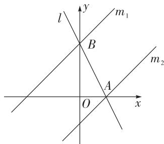

text_image

l
y
m₁
B
m₂
A
O
x

第 12 题解图

# 期中检测

# 选填及简单解答题题组(一)

1. C 【解析】无限不循环小数属于无理数, 故 C 选项符合题意.

2. B 【解析】点 P 的横坐标小于 0, 纵坐标大于 0, 符合第二象限点坐标的特征.

3. C 【解析】A. 原式= $\sqrt{16}=4$ , 不符合题意; B. 原式= $\sqrt{3}$ , 不符合题意; C. 原式=-2 $\sqrt{5}$ , 符合题意; D. $\sqrt{2}\times\sqrt{5}=\sqrt{10}$ , 不符合题意.

4. D

5. C 【解析】设正比例函数的表达式为 y=kx，因为图象经过点 $A(2,m)$ ， $B(n,4)$ ，所以 $k=\frac{m}{2}=\frac{4}{n}$ ，所以 mn=8.

6. D 【解析】由题意可得直线 AB 过点 A(2,5) 且与 x 轴平行, 所以直线 AB 即为直线 y=5. 因为点 C 与点 $C'$ 关于直线 AB 对称, 所以点 C 与点 $C'$ 的横坐标相同, 为 -4, 纵坐标到直线 AB 的距离相等, 都为 6, 所以点 $C'$ 的纵坐标为 11, 所以点 $C'$ 的坐标为 (-4,11).

7. A 【解析】由题图可知 $AC^{2}=1^{2}+2^{2}=5, BC^{2}=2^{2}+4^{2}=20, AB^{2}=3^{2}+4^{2}=25$ ，所以 $AB^{2}=AC^{2}+BC^{2}$ ，所以 $\triangle ABC$ 为直角三角形， $\angle ACB=90^{\circ}$ .

8. B 【解析】因为点 A 的坐标为 $(1,2)$ , $AB \parallel x$ 轴且 AB = 2，所以点 B 的坐标为 $(3,2)$ ，将一次函数 $y = \frac{1}{2}x - 3$ 的图象向上平移 n 个单位后，图象对应的函数表达式为 $y = \frac{1}{2}x - 3 + n$ 。当图象经过点 A 时，有 $2 = \frac{1}{2} - 3 + n$ ，解得 $n = \frac{9}{2}$ ；当图象经过点 B 时，有 $2 = \frac{1}{2} \times 3 - 3 + n$ ，解得 $n = \frac{7}{2}$ 。所以 $\frac{7}{2} \leqslant n \leqslant \frac{9}{2}$ 。

9. A 【解析】根据题意可得, $m+3\leqslant0$ ,所以 $m\leqslant-3$ ,故A选项符合题意.

10. B 【解析】根据题意可得, 点 $C_{1}, C_{3}, C_{5}, \cdots$ 在第一象限, 点 $C_{2}, C_{4}, C_{6}, \cdots$ 在 x 轴上. 因为 $\angle AOB = 90^{\circ}$ , 点 $A(3, 0), B(0, 4)$ , 根据勾股定

理得 AB=5，所以点 $C_{2}$ 的横坐标为 $3+5+4=12=2\times6$ ，同理可得，点 $C_{4}$ 的横坐标为 $4\times6$ ，点 $C_{6}$ 的横坐标为 $6\times6,\cdots$ ，所以点 $C_{2n}$ 的横坐标为 $2n\times6(n$ 为正整数），所以点 $C_{50}$ 的横坐标为 $50\times6=300$ ，所以点 $C_{50}$ 的坐标为 (300,0).

11. 11 【解析】 $\sqrt{121}=11$ .

12. < 【解析】因为-7<0, 所以 y 的值随 x 的增大而减小, 因为 2>-1, 所以 a<b.

13. $(-1,-2)$ 【解析】根据 $A(-2,1)$ , $B(2,0)$ 两点的坐标建立平面直角坐标系如解图, 所以点 C 的坐标为 $(-1,-2)$ .

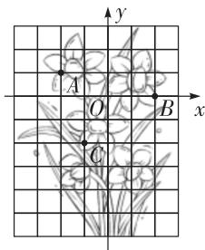

text_image

A
O
B
C
x
y

第 13 题解图

14. $\frac{10}{3}$ 【解析】在 $y=-\frac{4}{3}x+4$ 中，令 x=0，则 y=4，令 y=0，则 x=3，所以 $A(3,0)$ ， $B(0,4)$ ，所以在 Rt△AOB 中，由勾股定理得 AB=5。由折叠的性质可知 OC=DC， $\angle BDC=\angle BOC=90^{\circ}$ ，因为 $S_{\triangle ABC}=\frac{1}{2}AC\cdot OB=\frac{1}{2}AB\cdot CD$ ，即 $4\times(3-CD)=5\times CD$ ，所以 $CD=\frac{4}{3}$ ，所以 $S_{\triangle ABC}=\frac{1}{2}\times5\times\frac{4}{3}=\frac{10}{3}$ 。

15. 15 cm 【解析】如解图, 将水杯侧面展开, 作点 A 关于 CD 的对称点 $A_{1}$ , 连接 $A_{1}B$ 交 CD 于点 M, 过点 $A_{1}$ 作 $A_{1}N \perp BD$ , 交 BD 的延长线于点 N, 根据对称性质可知 $A_{1}C = AC = 2 \, cm$ , 则 $AM + BM = A_{1}M + BM \geqslant A_{1}B$ , 所以当点 $A_{1}, M, B$ 在同一条直线上时, $AM + BM$ 取得最小值, 最小值为 $A_{1}B$ 的长. 因为 $BN = 15 - 5 + 2 = 12 \, (\text{cm})$ , $A_{1}N = 18 \div 2 = 9 \, (\text{cm})$ , 由勾股定理可得 $A_{1}B = \sqrt{A_{1}N^{2} + BN^{2}} = \sqrt{9^{2} + 12^{2}} = 15 \, (\text{cm})$ , 所以蚂蚁需要爬行的最短距离为 $15 \, cm$ .

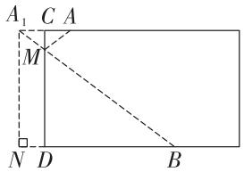

text_image

A₁ C A
M
N D B

第 15 题解图

16. 解: (1) 原式 = $\sqrt{48} \div \sqrt{24} - (3 - \sqrt{8}) + 3\sqrt{2}$

$$
= \sqrt {2} - 3 + \sqrt {8} + 3 \sqrt {2}
$$

$$
= 6 \sqrt {2} - 3; \quad \dots\dots (3 \text {分})
$$

(2) 原式 = 3 - 2 + $\frac{2 + \sqrt{5}}{(2 - \sqrt{5})(2 + \sqrt{5})}$

$$
= 1 + \frac {2 + \sqrt {5}}{4 - 5}
$$

$$
= 1 - 2 - \sqrt {5}
$$

$$
= - 1 - \sqrt {5}. \quad \dots\dots\tag {6分}
$$

17. 解: (1) 作 $\triangle A_{1}B_{1}C_{1}$ 如解图所示; …… (4 分)
(2) 作 $\triangle A_{2}B_{2}C_{2}$ 如解图所示, $C_{2}(-1,-1)$ .
…… (9 分)

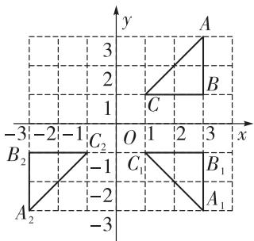

text_image

y
3
2
1
C
A
B
-3 -2 -1 O 1 2 3 x
B₂ C₂ C₁ B₁
-1
-2
A₂ A₁

第 17 题解图

# 选填及简单解答题题组(二)

1. D

2. B 【解析】 $3^{2}+4^{2}\neq7^{2}$ ，不能构成直角三角形，不是勾股数，故 A 选项不符合题意； $7^{2}+24^{2}=25^{2}$ ，能构成直角三角形，都是正整数，是勾股数，故 B 选项符合题意； $\frac{1}{3},\frac{1}{4},\frac{1}{5}$ 都不是正整数，不是勾股数，故 C 选项不符合题意；3,-4,5 不都是正整数，不是勾股数，故 D 选项不符合题意.

3. C 【解析】 $\sqrt{20}=2\sqrt{5}$ ，A选项不符合题意； $\sqrt{\frac{1}{5}}=\frac{\sqrt{5}}{5}$ ，B选项不符合题意； $\sqrt{3}$ 是最简二次根式，C选项符合题意； $\sqrt{1.5}=\frac{\sqrt{6}}{2}$ ，D选项不符合题意.

4. D 【解析】因为直线 $y=mx+n(m,n$ 为常数) 经过点 $(3,0)$ ，所以当 y=0 时，x=3，所以关于 x 的方程 $mx+n=0$ 的解为 x=3.

5. A 【解析】因为点 $P(m,-2)$ ，点 $Q(3,n)$ 关于 y 轴对称，所以 m=-3, n=-2，所以 $m+n=-5$ .

6. A 【解析】因为一次函数 $y = -2x + 3, -2 < 0$ ，所以 y 随 x 的增大而减小，因为 $x_{1} < x_{2}$ ，所以 $y_{1} > y_{2}$ ，故选项 A 说法不正确，符合题意；因为 -2 < 0, 3 > 0，所以图象经过第一、二、四象限，故选项 B 说法正确，不符合题意；因为 y = -2x - 3 与 $y = -2x + 3, k$ 都为 -2, b 不相等，所以图象相互平行，故选项 C 说法正确，不符合题意；当 y = 0 时， $x = \frac{3}{2}$ ，所以一次函数 $y = -2x + 3$ 的图象与 x 轴的交点坐标为 $(\frac{3}{2}, 0)$ ，故选项 D 说法正确，不符合题意。

7. A 【解析】观察图形可得, x=1 时, y=4; x=2 时, y=6; x=3 时, y=8; …, 由此可见每增加 1 个电源, 便增加 2 个灯泡, 所以函数关系式为 $y=4+2(x-1)=2x+2$ .

8. B 【解析】如解图, 点 E 为码头 A 正东方向上的一点, 过点 B 作 BD//AE. 因为 AC = 10 海里, AB = 8 海里, BC = 6 海里, 所以 $AC^{2} = AB^{2} + BC^{2}$ , 所以 $\triangle ABC$ 为直角三角形, 且 $\angle ABC = 90^{\circ}$ . 又因为 B 地在码头 A 的北偏东 $70^{\circ}$ 方向, 所以 $\angle 1 = \angle BAE = 90^{\circ} - 70^{\circ} = 20^{\circ}$ , 所以 $\angle 2 = \angle 1 = 20^{\circ}$ , 即岛屿 C 在 B 地的北偏西 $20^{\circ}$ 方向上.

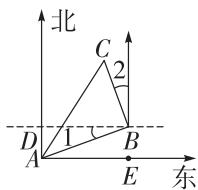

text_image

北
C
2
D
1
A
B
E
东

第8题解图

9. D 【解析】因为 $\triangle ABC$ 为等腰直角三角形, 所以 AC = AB, $\angle CAB = 90^{\circ}$ , 所以 $\angle CAE + \angle BAD = 90^{\circ}$ . 因为 $\angle CAE + \angle ACE = 90^{\circ}$ , 所以 $\angle ACE = \angle BAD$ . 根据题意可得, 在 $\triangle ACE$ 和 $\triangle BAD$ 中, $\left\{\begin{aligned}\angle CEA&=\angle ADB=90^{\circ},\\ \angle ACE&=\angle BAD,\\ AC&=BA,\end{aligned}\right.$ 所以 $\triangle ACE\cong\triangle BAD(AAS),$

所以 BD=AE=1-(-2)=3，在 Rt△BAD 中，AD=1, BD=3，由勾股定理得 $AB=\sqrt{10}$ ，所以 AF= $\sqrt{10}$ ，所以点 F 表示的数为 $\sqrt{10}+1$ 。

10. D 【解析】乙车到 B 地的时间小于甲车到 B 地的时间,所以乙车先到达 B 地,故 A 选项结论正确,不符合题意;两车相遇时乙车的速度为 $(260-140)\div(3.8-2.2)=75(\text{km/h})$ , 故 B 选项结论正确,不符合题意;由图象可知,甲、乙两车从出发到 2.2 h 的时间段内,乙车的函数图象在甲车的下方,所以乙车的速度比甲车的速度慢,故 C 选项结论正确,不符合题意;由图象可知,甲车的速度为 $260\div4=65(\text{km/h})$ , 当两车相遇时, $65t=140+75(t-2.2)$ , 解得 t=2.5, 所以两车行驶了 2.5 h 相遇, 故 D 选项结论错误,符合题意.

11. $\sqrt{2}$ 【解析】 $\frac{\sqrt{2}}{2}$ 的倒数是 $\frac{2}{\sqrt{2}}=\sqrt{2}$ .

12. (-11,11) 【解析】根据题图可得,点 P 在第二象限,所以点 P 到 x 轴的距离为 $2a+3$ , 点 P 到 y 轴的距离为 $-(-a-7)=a+7$ , 由题意可知 $a+7=2a+3$ , 解得 a=4, 所以点 P 的坐标为 $(-11,11)$ .

13. $4\sqrt{2}$ 【解析】因为 $a = 3 + 2\sqrt{2}, b = 3 - 2\sqrt{2}$ , 所以 $ab = (3 + 2\sqrt{2}) \times (3 - 2\sqrt{2}) = 9 - 8 = 1, a - b = (3 + 2\sqrt{2}) - (3 - 2\sqrt{2}) = 3 + 2\sqrt{2} - 3 + 2\sqrt{2} = 4\sqrt{2}$ , 所以 $\frac{a - b}{ab} = 4\sqrt{2}$ .

14. -5 【解析】因为一次函数 $y = 4x + m$ 的图象向下平移3个单位长度后恰好经过原点,所以 $m = 3$ , 所以 $y = 4x + 3$ . 当 $x = -2$ 时, $y = -8 + 3 = -5$ , 所以 $n = -5$ .

15. $\sqrt{13}$ 【解析】因为 $BE = BC = 4$ ，点 $F$ 为 $BE$ 的中点，所以 $BF = EF = 2$ .如解图，在 $BC$ 上截取 $BG = BF = 2$ ，连接 $EG, DG,$ 因为 $BE = BC,\angle EBG=$ $\angle CBF$ ，所以 $\triangle BFC\cong \triangle BGE(SAS)$ ，所以 $CF =$ $EG$ ，所以 $DE + CF = DE + EG$ ，因为 $DE + EG\geqslant DG$ 所以当点 $D,E,G$ 三点共线时， $DE + EG$ 有最小值，最小值为 $DG$ 的长，因为 $CG = BC - BG = 2$ $CD = AB = 3$ ，所以 $DG = \sqrt{CD^2 + CG^2} = \sqrt{3^2 + 2^2} =$ $\sqrt{13}$ ，所以 $DE + CF$ 的最小值为 $\sqrt{13}$

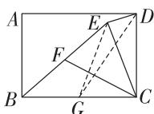  
第 15 题解图

16. 解: (1) 原式 = $7 + 1 - 2\sqrt{7} + 4\sqrt{7} + 2\sqrt{7} \times \sqrt{7}$

$$
= 8 + 2 \sqrt {7} + 1 4
$$

$$
= 2 2 + 2 \sqrt {7}; \dots \tag {3分}
$$

(2) 原式 $= 5\sqrt{2} \times (-2) - 3 + 1$

$$
= - 1 0 \sqrt {2} - 2. \dots \tag {6分}
$$

17. 解: 由题意得 $\left|x-y\right|=0,\sqrt{2y+z}=0,\left(z+2\right)^{2}=0,$ ……(3分)

所以 $x-y=0,2y+z=0,z+2=0,\cdots\cdots$ (4 分)

解得 z = -2, x = y = 1,

所以 $x+y-z=1+1-(-2)=4,\cdots\cdots$ (7 分)

所以它的平方根是±2. …… (9分)

# 中档解答题题组(一)

18. 解:根据题意可得 $PC=BC-PB=24-14=10(\text{cm})$ ，
因为 $PC^{2}+CQ^{2}=100+576=676=26^{2}=PQ^{2}$ ,
……(3分)

所以 $\triangle CPQ$ 为直角三角形, $\angle PCQ=90^{\circ}$ ,

因为 $\angle ADC = 180^{\circ}$ ,

所以 $\angle ACQ = 180^{\circ}$ ,

所以 $\angle ACB = \angle ACQ - \angle PCQ = 180^{\circ} - 90^{\circ} = 90^{\circ}$ .
……（5 分）

在 Rt△ABC 中, $AC = \sqrt{AB^{2} - BC^{2}} = \sqrt{30^{2} - 24^{2}} = 18.$

所以 $CD = AC - AD = 18 - 14 = 4(\mathrm{cm})$

所以可变定长钢架 CD 的长度为 4 cm. …… (8 分)

19. 解: (1) 若要使式子有意义, 需要同时满足 x-4≥0, 4-x≥0,

所以 x=4, y=3,

所以 $x+y=4+3=7$ ; …… (3 分)

(2) 若要使式子有意义, 需要同时满足 10-2m≥0, m-5≥0,

所以 $m = 5, n = 6$ ，……（5分）

①当 m 为腰长, n 为底边长时,

$5+5>6$ ,所以能构成等腰三角形,

所以这个等腰三角形的周长为 $5+5+6=16$ ;

②当 m 为底边长, n 为腰长时,

$5+6>6$ ,所以能构成等腰三角形,

所以这个等腰三角形的周长为 $5+6+6=17$ .

综上所述,这个等腰三角形的周长为16或17.
……(8分)

20. 解: (1) $\frac{\sqrt{5}}{2}$ ; 【解法提示】由勾股定理得 $\sqrt{1^2 + 0.5^2} = \sqrt{\frac{5}{4}} = \frac{\sqrt{5}}{2}$ , 所以点 $A$ 对应的实数是 $\frac{\sqrt{5}}{2}$ ; …… (3分)

(2) $\frac{\sqrt{5}}{2}+1;$ …… (6分)   
(3)如解图所示,表示 $1-\sqrt{13}$ 的点可以看作表示 1 的点向左移动 $\sqrt{13}$ 个单位长度,

由勾股定理可知 $\sqrt{13} = \sqrt{2^{2} + 3^{2}}$ ，所以点 P 即为所求。……（10 分）

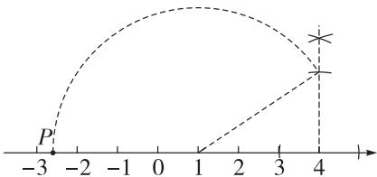

text_image

P
-3 -2 -1 0 1 2 3 4

第 20 题解图

21. 解: (1) 补全表格如下表; …… (4 分)

<table><tr><td>弹力x(N)</td><td>1</td><td>2</td><td>3</td><td>4</td></tr><tr><td>弹簧的总长y(cm)</td><td>13.5</td><td> $\underline{15}$ </td><td>16.5</td><td> $\underline{18}$ </td></tr></table>

(2) 增加 1.5 cm; …… (8 分)  
(3)由题图知,当弹力为0 N时,弹簧的总长为12 cm,由(2)知,当弹力每增加1 N时,弹簧的总长增加1.5 cm,

所以 $y = 1.5x + 12$ ……（10分）

当 x=2.8 时, $y=1.5\times2.8+12=16.2$ ,

所以弹簧的伸长量为 16.2-12=4.2(cm)，

所以当弹簧的弹力为 2.8 N 时, 弹簧的伸长量是 4.2 cm. …… (12 分)

22. 解: (1) 设直线 AB 对应的函数表达式为 $y = kx + b (k \neq 0)$ ,

因为直线 AB 过点 $A(0,3)$ , $B(-4,0)$ ,

代入,得 b=3,-4k+b=0,

即 $-4k+3=0$ , 解得 $k=\frac{3}{4}$ ,

所以直线 AB 对应的函数表达式为 $y=\frac{3}{4}x+3$ ;
……(4分)

(2) 因为点 A 的坐标为 $(0,3)$ ，点 B 的坐标为 $(-4,0)$ ，

所以 OA=3, OB=4, 由勾股定理得 AB=5.

由折叠的性质知,AD=AO=3,DC=OC, $\angle ADC=$ $\angle AOC=90^{\circ}$ ,所以 $BD=2,\angle BDC=90^{\circ}$ .

设 OC = DC = x，则 BC = 4 - x，

在 Rt△BCD 中, 由勾股定理得 $2^{2} + x^{2} = (4 - x)^{2}$ ,
解得 $x=\frac{3}{2}$ ,

所以点 C 的坐标为 $\left(-\frac{3}{2},0\right)$ ; …… (8 分)

(3)由(2)得 $OC=\frac{3}{2}$ ，所以 $BC=\frac{5}{2}$ .

因为 $S_{\triangle BCD}=\frac{1}{2}BD\cdot CD=\frac{1}{2}BC\cdot DE,$

即 $\frac{1}{2}\times2\times\frac{3}{2}=\frac{1}{2}\times\frac{5}{2}DE$ , 解得 $DE=\frac{6}{5}$ ,

在 Rt $\triangle BED$ 中, 由勾股定理得 BE = $\sqrt{BD^{2}-DE^{2}}=\frac{8}{5}$ . …… (12 分)

# 中档解答题题组(二)

18. 解: (1) 如解图, $\triangle A'B'C'$ 即为所作, 点 $A'$ 的坐标为 $(-1,1)$ ; …… (4 分)

(2)点 M 的位置如解图所示, 点 M 的坐标为 $(2,0)$ . …… (8 分)

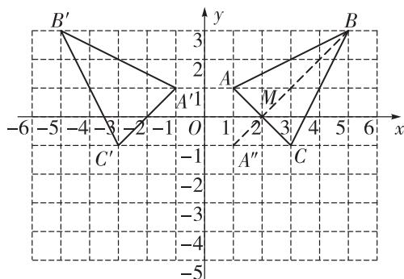

text_image

B'
3
y
A
2
-6 -5 -4 -3 -2 -1 O 1 2 3 4 5 6 x
C'
-1
-2
-3
-4
-5
A''
M
C
B

第 18 题解图

19. 解: (1) $\sqrt{6+\frac{1}{8}}=7\sqrt{\frac{1}{8}}$ ; …… (2分)

(2) 观察题干等式可得, 第 n 个等式为 $\sqrt{n+\frac{1}{n+2}}=(n+1)\sqrt{\frac{1}{n+2}}$ , …… (5 分)

验证如下：

等号左边 $= \sqrt{\frac{n(n + 2) + 1}{n + 2}} = \sqrt{\frac{n^2 + 2n + 1}{n + 2}} =$

$\sqrt{\frac{(n + 1)^2}{n + 2}} = (n + 1)\sqrt{\frac{1}{n + 2}} =$ 等号右边，

所以第 $n$ 个等式为 $\sqrt{n + \frac{1}{n + 2}} = (n + 1)\sqrt{\frac{1}{n + 2}}.$

……（8分）

20. 解: 因为四边形 ABCD 是正方形,

所以 AD=DC, $\angle ADC=90^{\circ}$ ,

所以 $\angle ADE + \angle MDC = 90^{\circ}.$

因为 $\angle E = 90^{\circ}$

所以 $\angle ADE + \angle EAD = 90^{\circ}$ ,

所以 $\angle EAD = \angle MDC.$

在 $\triangle AED$ 和 $\triangle DMC$ 中， $\left\{\begin{aligned}\angle E&=\angle M,\\ \angle EAD&=\angle MDC,\\ AD&=DC,\end{aligned}\right.$

所以 $\triangle AED \cong \triangle DMC$ (AAS),

同理可得, $\triangle ABF\cong\triangle BCG,$

所以 ED = MC = a，

同理可得, $BF=CG=a.$

因为 $S_{多边形ADCGF}=a^{2}+b^{2}-2\times\frac{1}{2}ab=c^{2}-2\times\frac{1}{2}ab$

所以 $a^{2}+b^{2}=c^{2}$ . …… (10 分)

21. 解:(1)逆,120;【解法提示】由图象可知,舰艇模型在 OA 段所用时间比在 AB 段所用时间长,所以舰艇模型在 OA 段速度小,所以在 OA 段舰艇模型是逆水航行,因为舰艇模型在静水中的速度为 150 m/min,水流的速度为 30 m/min,所以舰艇模型在逆水中的速度为 150-30=120(m/min). …… (2 分)

(2)由题意可知,舰艇模型在顺水中的速度为 $150+30=180(\mathrm{~m/min})$ ,

设舰艇模型在河道行驶 s 米后返回，

$\frac{s}{120}+\frac{s}{180}=10$ , 解得 s=720,

$$
7 2 0 \div 1 2 0 = 6 (\mathrm{min}),
$$

所以 A 点坐标为 $(6,720)$ . …… (5 分)

由(1)知,舰艇模型在逆水中的速度为 $120 \, m/min$ , 根据速度的几何意义可得 OA 段对应的一次函数表达式为 $s_{1} = 120t$ , …… (7 分) 在 AB 段, 舰艇模型是顺水行驶, 在顺水中的速度为 $180 \, m/min$ ,

设 AB 段对应的一次函数表达式为 $s_{2} = -180t + b$ ，将 $(10, 0)$ 代入，得 $-1800 + b = 0$ ，解得 b = 1800，所以 AB 段对应的一次函数表达式为 $s_{2} = -180t + 1800$ ；……（10 分）

(3) 当 $s_{1}=s_{2}$ 时, 120t=-180t+1800,

解得 t=6,

所以 A 点坐标为 $(6,720)$ ,

当 t=8 时, 舰艇模型在 AB 段行驶,

所以 $s_{2}=-180\times8+1\ 800=360$ ,

所以当航行 8 分钟时,该舰艇模型与出发点 O

的距离是 360 m. …… (12 分)

22. 解: (1) 将 $A(-2,0)$ , $B(0,1)$ 代入 $y_{1}=kx+a$ $(k\neq0)$ 中, 可得 a=1, -2k+a=0,

即 $-2k+1=0$ , 解得 $k=\frac{1}{2}$ ,

所以直线 $l_{1}$ 对应的函数表达式为 $y_{1}=\frac{1}{2}x+1$ ;
……(4分)

(2)由点 $B(0,1)$ 可得OB=1,

因为 $OB=\frac{1}{3}OC$ ，所以 OC=3，所以点 $C(3,0)$ .

因为直线 $l_{2}:y_{2}=-2x+b$ 交 x 轴于点 C,

所以将点 $C(3,0)$ 代入, 得 $0 = -2 \times 3 + b$ ,

解得b=6，

所以直线 $l_{2}$ 对应的函数表达式为 $y_{2} = -2x + 6$ .

令 $\frac{1}{2}x+1=-2x+6$ , 解得 x=2,

所以当 $y_{1}=y_{2}$ 时, x 的值为 2; …… (8 分)

(3) 存在, 设点 M 的坐标为 $(0, t)$ ,

在 $y_{2}=-2x+6$ 中, 令 x=0, 得 $y_{2}=6$ ,

所以 $D(0,6)$ ，所以 BD=5。

因为 $S_{\triangle ABM}=S_{\triangle BDE}$ ,

所以 $\frac{1}{2}\times|t-1|\times2=\frac{1}{2}\times5\times2,$

所以 $|t-1|=5$ , 解得 t=6 或 t=-4,

所以点 M 的坐标为 $(0,6)$ 或 $(0,-4)$ . ……

……（12分）

# 专题 几何综合题

# 一题多设问

例 解:(1) $\triangle CDE$ 是直角三角形,理由如下:

因为 $AE \perp AD$ ,

所以 $\angle BAC = \angle DAE = 90^{\circ}$ ,

所以 $\angle BAC - \angle CAD = \angle DAE - \angle CAD,$

即 $\angle BAD = \angle CAE.$

在 $\triangle ABD$ 和 $\triangle ACE$ 中， $\left\{\begin{aligned}AB&=AC,\\ \angle BAD&=\angle CAE,\\ AD&=AE,\end{aligned}\right.$

所以 $\triangle ABD \cong \triangle ACE(\text{SAS})$ ,

# 大小卷·八年级(上) 数学 BS

所以 $\angle B = \angle ACE.$

因为 $\angle BAC = 90^{\circ}$ ,

所以 $\angle B + \angle ACB = 90^{\circ}$

所以 $\angle ACE + \angle ACB = 90^{\circ}$ ,

即 $\angle DCE = 90^{\circ}$ ,

所以 $\triangle CDE$ 是直角三角形；

(2) 因为 $AE \perp AD, \angle DAF = 45^{\circ}$ ,

所以 $\angle DAE = 90^{\circ},\angle DAF = \angle EAF = 45^{\circ}.$

在 $\triangle ADF$ 和 $\triangle AEF$ 中， $\left\{\begin{aligned}AF&=AF,\\ \angle DAF&=\angle EAF,\\ AD&=AE,\end{aligned}\right.$

所以 $\triangle ADF\cong \triangle AEF(\mathrm{SAS})$

所以 DF = EF，

由(1)知, $\triangle ABD\cong\triangle ACE,\triangle CDE$ 是直角三角形, $\angle DCE=90^{\circ}$ ,所以 $CE=BD=2$ .

在 $\triangle ABC$ 中, $\angle BAC=90^{\circ},AB=AC=5\sqrt{2}$ ,

由勾股定理得 $BC=\sqrt{AB^{2}+AC^{2}}=10$ ,

所以 $CD = BC - BD = 10 - 2 = 8$

设 $DF = EF = x$ ，则 $CF = 8 - x$

在 Rt△CEF 中， $\angle FCE=90^{\circ}, CE^{2}+CF^{2}=EF^{2}$

即 $2^{2} + (8 - x)^{2} = x^{2}$ ，解得 $x = \frac{17}{4}$

所以 $DF$ 的长为 $\frac{17}{4}$ ;

(3) $BD^{2}+CD^{2}=DE^{2}$ ，理由如下：

由题意知, $\triangle ABC$ 为等腰直角三角形,

所以 $\angle ACB = \angle ABC = 45^{\circ}.$

因为 $\angle BAC = \angle DAE = 90^{\circ}$ ，且 $\angle BAC + \angle CAD =$

$$
\angle B A D, \angle D A E + \angle C A D = \angle C A E,
$$

所以 $\angle BAD = \angle CAE.$

在 $\triangle ABD$ 和 $\triangle ACE$ 中， $\left\{\begin{aligned}AB&=AC,\\ \angle BAD&=\angle CAE,\\ AD&=AE,\end{aligned}\right.$

所以 $\triangle ABD\cong \triangle ACE(\mathrm{SAS})$

所以 $\angle ABD = \angle ACE = 45^{\circ}, BD = CE,$

所以 $\angle ECB = \angle ACE + \angle ACB = 45^{\circ} + 45^{\circ} = 90^{\circ}$

所以 $BD \perp CE$ ,

在 Rt△CDE 中,由勾股定理得 $CE^{2}+CD^{2}=DE^{2}$ ,

所以 $BD^{2}+CD^{2}=DE^{2}$ ;

(4) 因为 $\angle ABC = \angle ACB = 45^{\circ}$ ,

所以 $\angle ABD = 135^{\circ}$

因为 $\angle BAC = \angle DAE = 90^{\circ}$

所以 $\angle BAE + \angle CAE = 90^{\circ}, \angle BAE + \angle BAD = 90^{\circ}$ ,
所以 $\angle BAD = \angle CAE.$

在 $\triangle ABD$ 和 $\triangle ACE$ 中， $\left\{\begin{aligned}AB&=AC,\\ \angle BAD&=\angle CAE,\\ AD&=AE,\end{aligned}\right.$

所以 $\triangle ABD \cong \triangle ACE(\text{SAS})$ ,

所以 BD=CE=5， $\angle ABD=\angle ACE=135^{\circ}$

所以 $\angle DCE = \angle ACE - \angle ACB = 90^{\circ}.$

在 Rt△ABC 中, $\angle BAC = 90^{\circ}$ , 由勾股定理得 BC = $\sqrt{AB^{2} + AC^{2}} = 10$ ,

所以 $CD = BC + BD = 15.$

在 Rt△CDE 中, ∠DCE=90°,

由勾股定理得 $DE=\sqrt{CD^{2}+CE^{2}}=5\sqrt{10}$ .

# 综合训练

1. 解:(1)因为AB=AE,AC=AD, $\angle BAE=\angle CAD=60^{\circ}$ ,
所以 $\triangle ABE$ 和 $\triangle ACD$ 都是等边三角形.

因为 $\angle BAC = \angle BAE - \angle CAE, \angle EAD = \angle CAD - \angle CAE,$ 所以 $\angle BAC = \angle EAD.$

在 $\triangle ABC$ 和 $\triangle AED$ 中， $\left\{\begin{aligned}AB&=AE,\\ \angle BAC&=\angle EAD,\\ AC&=AD,\end{aligned}\right.$

所以 $\triangle ABC \cong \triangle AED(SAS)$ ,

所以 $\angle ACB = \angle D = 60^{\circ}.$

因为 $\angle CAD = 60^{\circ}$ ,

所以 $\angle ACB = \angle CAD;$

(2)① $\triangle BCE$ 是直角三角形,理由如下:

因为 AB = AE, AC = AD, $\angle BAE = \angle CAD = 60^{\circ}$ ,

所以 $\triangle ABE$ 和 $\triangle ACD$ 都是等边三角形, $\angle ABE=60^{\circ}$ .

又因为 $\angle BAC = \angle BAE - \angle CAE, \angle EAD = \angle CAD - \angle CAE,$

所以 $\angle BAC = \angle EAD.$

在 $\triangle ABC$ 和 $\triangle AED$ 中， $\left\{\begin{aligned}AB&=AE,\\ \angle BAC&=\angle EAD,\\ AC&=AD,\end{aligned}\right.$

所以 $\triangle ABC \cong \triangle AED(\mathrm{SAS})$

所以 $\angle ABC = \angle AED = 150^{\circ}.$

因为 $\angle ABE = 60^{\circ}$ ,

所以 $\angle CBE = \angle ABC - \angle ABE = 150^{\circ} - 60^{\circ} = 90^{\circ}$ ,

所以 $\triangle BCE$ 是直角三角形；

②在 Rt△BCE 中, $BE=\sqrt{CE^{2}-BC^{2}}=\sqrt{3}$ .

因为 $\triangle ABE$ 是等边三角形,所以 $AE=BE=\sqrt{3}$ .

因为 $AE \perp CE$ ,

所以在 Rt△ACE 中, $AC=\sqrt{AE^{2}+CE^{2}}=\sqrt{7}$ .

2. 解: (1) $\triangle PMN$ 为等腰直角三角形, $AM^{2} + BN^{2} = MN^{2}$ , 理由如下:

由折叠的性质可知 $\triangle CAM \cong \triangle CPM, \triangle CNB \cong \triangle CNP,$

所以 AM=PM, $\angle A=\angle CPM, PN=NB, \angle B=\angle CPN,$

所以 $\angle MPN = \angle A + \angle B = 90^{\circ}, PM = PN = AM = BN,$

所以 $\triangle PMN$ 为等腰直角三角形，

所以 $PM^{2}+PN^{2}=MN^{2}$ ,

所以 $AM^{2}+BN^{2}=MN^{2}$ ;

(2)仍然满足,理由如下:

如解图所示, 将 $\triangle ACM$ 沿 CM 折叠, 点 A 落在点 P 处,

再将 $\triangle BCN$ 沿CN折叠,点B也落在点P处,

由折叠的性质可知 AM = MP, $\angle A = \angle MPC$ ,

$$
\angle B = \angle C P N, B N = N P,
$$

因为在 $\triangle ABC$ 中， $\angle BCA=90^{\circ}, CA=CB$ ，

所以 $\angle A = \angle B = 45^{\circ}$ ,

所以 $\angle MPC = \angle A = 45^{\circ}, \angle CPN = \angle B = 45^{\circ}$ ,

所以 $\angle MPN = 90^{\circ}$ ,

所以 $\triangle PMN$ 为直角三角形，

所以 $MP^{2}+NP^{2}=MN^{2}$ ,

所以 $AM^{2}+BN^{2}=MN^{2}$ ;

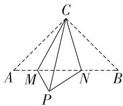

text_image

C
A M N B
P

第2题解图

(3)由(2)知, $AM^{2}+BN^{2}=MN^{2}$ ,

当 MN=5, BN=1 时，

$$
A M = \sqrt {M N ^ {2} - B N ^ {2}} = \sqrt {5 ^ {2} - 1 ^ {2}} = 2 \sqrt {6}.
$$

# 第五章 二元一次方程组

# 周测 10 二元一次方程组及其解法

1. A 【解析】含有两个未知数,并且所含未知数的项的次数都是 1,像这样的整式方程叫做二元一次方程,故选 A.

2. B 【解析】移项, 得 $-\frac{1}{3}y = 6 - 2x$ , y 的系数化为 1, 得 y = 6x - 18.

3. C 【解析】将②代入①, 可得 $x+2x=6$ .

4. D 【解析】令 $\left\{\begin{aligned}x+y&=-1①,\\ 2x-y&=7②,\end{aligned}\right.$ ②-①,得x-2y=8.

5. B 【解析】两个方程相加, 得 3x = 12, 解得 x = 4. 将 x = 4 代入方程 2x - 3y = 5 中, 得 8 - 3y = 5, 解得 y = 1, 所以这个方程组的解是 $\left\{\begin{aligned} x &= 4, \\ y &= 1. \end{aligned}\right.$

6. B 【解析】根据题中所列方程可知,x 为大号玩偶的单价,y 为小号玩偶的单价,则 x-y=30 表示大号玩偶比小号玩偶贵 30 元,故选 B.

7. $2x + y = 0$ (答案不唯一)

8. -6 【解析】将 $\left\{\begin{aligned}x&=1,\\ y&=2\end{aligned}\right.$ 代入方程ax+y=-4中,得 $a+2=-4$ , 解得 a=-6.

9. 3;3 【解析】根据题意可列二元一次方程组为 $\left\{\begin{aligned}&4+3y+2=2+7+2x,\\ &4+y+2+2x=4+3y+2,\end{aligned}\right.$ 整理, 得 $\left\{\begin{aligned}&3y-2x=3,\\ &x-y=0,\end{aligned}\right.$ 解得 $\left\{\begin{aligned}x=3,\\ y=3.\end{aligned}\right.$

10. $\left\{ \begin{array}{l}x + 3y = 2,\\ x + y = 1 \end{array} \right.$ 【解析】由题意可设方程组为 $\left\{ \begin{array}{l}x + 3y = a + 1,\\ x + y = a, \end{array} \right.$ 因为 $x = y$ ，所以 $\left\{ \begin{array}{l}y + 3y = a + 1,\\ y + y = a, \end{array} \right.$ 所以 $\left\{ \begin{array}{l}4y = a + 1,\\ 2y = a, \end{array} \right.$ 即 $2a = a + 1$ ，解得 $a = 1$ ，故方程组为 $\left\{ \begin{array}{l}x + 3y = 2,\\ x + y = 1. \end{array} \right.$

11. 解: (1) 令 $\left\{\begin{aligned}&2x-y=-4,①\\ &7x+5y=3,②\end{aligned}\right.$

整理①, 得 $y=2x+4$ , ③

将③代入②, 得 $7x + 5(2x + 4) = 3$ ,

解得 x = -1, ④

将④代入③, 得 $y=2\times(-1)+4=2$ ,

所以原方程组的解为 $\left\{\begin{aligned}x&=-1,\\ y&=2;\end{aligned}\right.$ ……（4分）

(2) 整理方程组, 得 $\left\{\begin{aligned} x+2y &= 4, \\ 3x+2y &= 16, \end{aligned}\right.$ ①

②-①, 得 2x = 12,

解得 x=6,③

将③代入①, 得 y = -1,

所以原方程组的解为 $\left\{\begin{aligned}x=6,\\ y=-1.\end{aligned}\right.$ ……（8分）

12. 解: 将小雪、小轩写的解代入二元一次方程 $ax + by = -2$ 中,

得 $\left\{\begin{aligned}a-b&=-2,\\ 2a+2b&=-2,\end{aligned}\right.$

解得 $\left\{\begin{aligned}a&=-\frac{3}{2},\\ b&=\frac{1}{2},\end{aligned}\right.$ (5分)

所以该二元一次方程为 $-\frac{3}{2}x+\frac{1}{2}y=-2$ ，

将小浩写的 $\left\{\begin{aligned}x=4,\\ y=6\end{aligned}\right.$ 代入，

得左边 $= -\frac{3}{2} \times 4 + \frac{1}{2} \times 6 = -3 \neq -2$

所以小浩写的不正确. …… (10 分)

13. 解: (1) 由题意, 得 $\left\{\begin{aligned} x+3y &= 5, \\ x+y &= 1, \end{aligned}\right.$ ②

②-③, 得 2y=4,

解得 y=2,④

将④代入③, 得 $x+2=1$ ,

解得 x = -1.

所以原方程组的解为 $\left\{\begin{aligned}x&=-1,\\ y&=2;\end{aligned}\right.$ ……（5分）

(2)①+②,得 $2x+2y=k+6$ ,

即 $2(x+y)=k+6$ ,

因为 $x+y=1$ ，

所以 $2=k+6$ ,

解得 k=-4. …… (10 分)

14. 解: 设每块条形铁锭的质量为 $x \, kg$ ，每块元宝形铁锭的质量为 $y \, kg$ ，

大小卷·八年级(上) 数学 BS

由题意,得 $\left\{\begin{aligned}&4x=3y,\\ &2x+y=30,\end{aligned}\right.$

解得 $\left\{\begin{aligned}x&=9,\\ y&=12.\end{aligned}\right.$

答:每块条形铁锭的质量为 9 kg, 每块元宝形铁锭的质量为 12 kg. …… (12 分)

# 周测11 二元一次方程组的应用

1. B

2. A

3. A 【解析】设小盒茶叶的长为 $x \mathrm{~cm}$ , 宽为 $y \mathrm{~cm}$ , 根据题图, 得 $\left\{ \begin{array}{l} 3x = 5y, \\ 2y - x = 2, \end{array} \right.$ 解得 $\left\{ \begin{array}{l} x = 10, \\ y = 6, \end{array} \right.$ 所以正方形礼盒的边长为 $x + 2y = 10 + 2 \times 6 = 22 (\mathrm{~cm})$ .

4. C 【解析】设弟弟采摘的茶叶为 x 株, 小林采摘的茶叶为 y 株, 根据题意, 得 $\left\{\begin{aligned}x+y&=100\times2,\\ y&-2x=20,\end{aligned}\right.$ 解得 $\left\{\begin{aligned}x&=60,\\ y&=140,\end{aligned}\right.$ 所以小林和弟弟采摘茶叶的株数之差为 $y-x=140-60=80$ (株).

5. C 【解析】设他们开车的路程为 $x \mathrm{~km}$ , 步行的路程为 $y \mathrm{~km}$ , 根据题意, 得 $\left\{ \begin{array}{l} x + y = 21, \\ \frac{x}{45} + \frac{y}{5} = 1, \end{array} \right.$ 解得 $\left\{ \begin{array}{l} x = 18, \\ y = 3. \end{array} \right.$

6. C 【解析】设含量为 80% 的农药溶液有 x mL, 含量为 85% 的农药溶液有 y mL, 根据题意, 得 $\left\{\begin{aligned}x+y=5\ 000,\\ 80\%\ x+85\%\ y=5\ 000\times82\%,\end{aligned}\right.$ 解得 $\left\{\begin{aligned}x=3\ 000,\\ y=2\ 000.\end{aligned}\right.$ 所以含量为 80% 的农药溶液有 3 000 mL, 含量为 85% 的农药溶液有 2 000 mL.

7. $\left\{\begin{aligned}x+y=50,\\ 30x+18y=1\quad260\end{aligned}\right.$

8. 1080 【解析】设每个小长方形的长为 x 米, 宽为 y 米, 根据题意, 可得 $\left\{\begin{aligned}3x+2y=120,\\ 2x+3y=90,\end{aligned}\right.$ 解得 $\left\{\begin{aligned}x=36,\\ y=6,\end{aligned}\right.$ 所以茶室的总面积为 $5\times6\times36=$ 1080(平方米).

9. 162 【解析】设用 x 米布料做衣身, y 米布料做

衣袖,根据题意,得 $\left\{\begin{aligned}x+y=135,\\ 2x=\frac{1}{2}\times6y,\end{aligned}\right.$ 解得 $\left\{\begin{aligned}x=81,\\ y=54,\end{aligned}\right.$ 所以在恰好配套的情况下,可做T恤 $81\times2=162$ (件).

10. 8 【解析】设原有 x 亩抛荒茶园, y 亩生态茶园, 根据题意, 得 $\left\{\begin{aligned}x+y=20,\\ (x-3)\times20+(y+3)\times60=1\ 000,\end{aligned}\right.$ 解得 $\left\{\begin{aligned}x=8,\\ y=12,\end{aligned}\right.$ 所以该茶园原有抛荒茶园8亩.

11. 解:(1)设加工甲种茶叶 x 包, 乙种茶叶 y 包,
由题意, 得 $\left\{\begin{aligned}100x+75y&=82\ 500,\\ (120-100)x+(100-75)y&=19\ 500,\end{aligned}\right.$ 解得 $\left\{\begin{aligned}x=600,\\ y=300.\end{aligned}\right.$

答:这周加工甲种茶叶600包,加工乙种茶叶300包;……(3分)

(2) 每包甲种茶叶的成本为 $100 \times (1 - 30\%) = 70$ (元),

每包乙种茶叶的成本为 $75 \times (1 - 20\%) = 60$ (元).
设加工甲种茶叶 m 包, 加工乙种茶叶 n 包,

由题意,得 $\left\{\begin{aligned}m+n=700,\\ (120-70)m+(100-60)n=30\ 000,\end{aligned}\right.$ 解得 $\left\{\begin{aligned}m=200,\\ n=500.\end{aligned}\right.$

答:需加工甲种茶叶 200 包,乙种茶叶 500 包.
……(8 分)

12. 解: (1) 设每两 A 茶叶的原价为 x 元, 每两 B 茶叶的原价为 y 元,

由题意,得 $\left\{\begin{aligned}&300x+200y=6900,\\&80\%x=y,\end{aligned}\right.$

解得 $\left\{\begin{aligned}x&=15,\\ y&=12,\end{aligned}\right.$

所以每两 A 茶叶的原价为 15 元, 每两 B 茶叶的原价为 12 元; …… (4 分)

(2)设 B 茶叶打 m 折销售，

由题意, 得 $15 \times 80\% \times 500 + 12 \times \frac{m}{10} \times 400 = 9360$ ,
解得 m=7,

所以 B 茶叶打七折销售；……（7 分）

(3)设王阿姨购买 A 茶叶 a 两, C 茶叶 b 两, 由题意, 得 $15 \times 80\% a + 8b = 96$ ,

整理, 得 $a=\frac{24-2b}{3}$ ,

因为 a, b 均为正整数，

所以 a, b 可取 $\left\{\begin{aligned}a &= 6, \\ b &= 3,\end{aligned}\right.\left\{\begin{aligned}a &= 4, \\ b &= 6,\end{aligned}\right.\left\{\begin{aligned}a &= 2, \\ b &= 9,\end{aligned}\right.$

所以王阿姨共有三种购买方案,方案一:购买6两A茶叶和3两C茶叶;方案二:购买4两A茶叶和6两C茶叶;方案三:购买2两A茶叶和9两C茶叶. …… (12分)

# 周测 12 二元一次方程(组) 与一次函数

1. D 【解析】用含 x 的代数式表示 y，得 $y = -\frac{1}{2}x +$ 2.

2. C 【解析】当 x = -4 时, $y = \frac{1}{2}x = \frac{1}{2} \times (-4) = -2$ ,
故两条直线的交点坐标为 $(-4,-2)$ ，所以方程
组 $\left\{\begin{aligned}&x-2y=0,\\ &mx-y=b\end{aligned}\right.$ 的解为 $\left\{\begin{aligned}x=-4,\\ y=-2.\end{aligned}\right.$

3. B 【解析】因为直线 $l_{1}$ 始终过定点 A，且 $y = (x + 1)b$ ，当 x = -1 时，y = 0，所以点 A 的坐标为 $(-1, 0)$ ，因为直线 $l_{2}$ 经过点 A 和点 B，将 $(-1, 0)$ ， $(0, 5)$ 代入 $y = mx + n$ ，得 $\left\{\begin{aligned}0 &= -m + n, \\ 5 &= n,\end{aligned}\right.$ 解得 m = 5，所以直线 $l_{2}$ 的表达式为 $y = 5x + 5$ .

4. C 【解析】设 y 与 x 之间的函数关系式为 $y = kx + b (k \neq 0)$ ，根据题意可列二元一次方程组为 $\left\{\begin{aligned}&105.5=14k+b,\\ &150.5=20k+b,\end{aligned}\right.$ 解得 $\left\{\begin{aligned}k&=7.5,\\ b&=0.5,\end{aligned}\right.$ 所以 $y=7.5x+0.5$ ，当 y=128 时， $7.5x+0.5=128$ ，解得 x=17。

5. A 【解析】根据题意可知直线 $y = -2x + 1$ 与 $y = (3k + 1)x - 3$ 平行, 所以 $3k + 1 = -2$ , 解得 k = -1.

6. B 【解析】由题图可知,当行李质量为 50 kg 时,乘客在 A, B 两家客运公司需付的行李费均为 6 元,①正确;当行李质量不超过 30 kg 时,B 客运公司可以免费携带,②错误;将点(50,6) (20,0)代入 $y_{A}=k_{1}x+b_{1}$ , 得 $\left\{\begin{aligned}&50k_{1}+b_{1}=6,\\ &20k_{1}+b_{1}=0,\end{aligned}\right.$ 解得 $\left\{\begin{aligned}&k_{1}=0.2,\\ &b_{1}=-4,\end{aligned}\right.$ 将(50,6),(30,0)代入 $y_{B}=k_{2}x+b_{2}$ , 得 $\left\{\begin{aligned}&50k_{2}+b_{2}=6,\\ &30k_{2}+b_{2}=0,\end{aligned}\right.$ 解得 $\left\{\begin{aligned}&k_{2}=0.3,\\ &b_{2}=-9,\end{aligned}\right.$ ③正确;因为 $y_{A}=$

0.2x-4, $y_{B}=0.3x-9$ ,所以当乘客在A,B两家客运公司所需付的行李费仅相差1元时,即0.3x-9-(0.2x-4)=1或0.2x-4-(0.3x-9)=1,解得x=60或x=40,所以④错误.

7. $\left\{ \begin{array}{l} 2x + y = 23, \\ 4y - x = 29 \end{array} \right.$ 【解析】令 $\left\{ \begin{array}{l} 2x + y = 23①, \\ 2y + z = 28②, \\ 2z + x = 27③, \end{array} \right.$ 得 $4y + 2z = 56④, ④ - ③$ ，得 $4y - x = 29$ ，所以消去字母 $z$ 后得到的二元一次方程组为 $\left\{ \begin{array}{l} 2x + y = 23, \\ 4y - x = 29. \end{array} \right.$

8. $\frac{8}{3}$ 【解析】将 $x - 4y - b = 0$ 变形，得 $y = \frac{1}{4} x - \frac{1}{4} b.$ 因为以关于 $x, y$ 的二元一次方程 $x - 4y - b = 0$ 的解为坐标的点 $(x, y)$ 都在直线 $y = \frac{1}{4} x - b + 2$ 上，所以直线 $y = \frac{1}{4} x - \frac{1}{4} b$ 与直线 $y = \frac{1}{4} x - b + 2$ 重合，所以 $\frac{1}{4} x - \frac{1}{4} b = \frac{1}{4} x - b + 2$ ，解得 $b = \frac{8}{3}$ .

9. $-\frac{1}{2}$ 【解析】将 $(-2,1)$ 分别代入两个一次函数表达式，联立，得 $\left\{ \begin{array}{l} -2a - c = 1, \\ -2b + d = 1, \end{array} \right.$ 令 $① - ②$ ，得-2 $(a - b) - c - d = 0$ ，所以 $-2(a - b) = c + d$ ，所以 $\frac{a - b}{c + d} = -\frac{1}{2}$ .

10. 10 【解析】设该一次函数关系式为 $y = kx + b$ ( $k \neq 0$ ), 将 (400, 10), (500, 0) 代入, 得 $\left\{ \begin{array}{l} 400k + b = 10, \\ 500k + b = 0, \end{array} \right.$ 解得 $\left\{ \begin{array}{l} k = -0.1, \\ b = 50, \end{array} \right.$ 所以该一次函数关系式为 $y = -0.1x + 50$ . 令 $y = 5$ , 解得 $x = 450$ , 因为 $450 - 230 = 220$ (千米), $230 - 220 = 10$ (千米), 所以在返回途中距离 $A$ 地至少 10 千米时需要加油.

11. 解:(1)当x>30时,设y与x之间的函数关系式为 $y=kx+b(k\neq0)$ ,

将(30,1200),(50,1500)代入,

得 $\left\{\begin{aligned}30k+b&=1\ 200,\\ 50k+b&=1\ 500,\end{aligned}\right.$

解得 $\left\{\begin{aligned}k&=15,\\ b&=750,\end{aligned}\right.$

所以当 $x > 30$ 时， $y$ 与 $x$ 之间的函数关系式为

# 大小卷·八年级(上) 数学 BS

$y=15x+750;$ (4分)

(2)根据题意可得,购进乙种水果 $(100-x)$ 千克,

因为当 $0 \leqslant x \leqslant 30$ 时, $y = \frac{1200}{30} x = 40x$ ,

所以当 $20 \leqslant x \leqslant 30$ 时, $w = 40x + 25(100 - x) = 15x + 2500$ ,

因为 15>0, 所以 w 随 x 的增大而增大,

所以当 x=20 时, w 最小.

此时 100-x=80.

答:购进甲种水果20千克,乙种水果80千克,才能使经销商支付的总金额最少. …… (8分)

12. 解:(1)由图象可知点 A 的坐标为 $(2, m)$ ,

将 $(2,m)$ 代入 $y = \frac{3}{2} x$ 中，得 $m = 3$

所以点 A 的坐标为 $(2,3)$ .

将(2,3)和(0,5)代入 $y=kx+b$ 中，

得 $\left\{\begin{aligned}3&=2k+b,\\ 5&=b,\end{aligned}\right.$

解得 $\left\{\begin{aligned}k&=-1,\\ b&=5;\end{aligned}\right.$ ……（4分）

(2)方程组 $\left\{\begin{aligned}&kx+b-y=0,\\ &\frac{3}{2}x-y=0\end{aligned}\right.$ 的解为 $\left\{\begin{aligned}x=2,\\ y=3;\end{aligned}\right.$ ……(7分)

(3) 存在，

对于函数 $y=-x+5$ ，当 y=0 时，x=5，

所以 $B(5,0)$ , BO=5,

所以 $S_{\triangle OAB}=\frac{1}{2}\times5\times3=\frac{15}{2}.$ …… (8 分)

设点 D 的坐标为 $(0, a)$ ，则 $OD = |a|$ ，

所以 $S_{\triangle AOD} = \frac{1}{2}\times 2OD = |a|$

因为 $S_{\triangle AOD}=S_{\triangle OAB}$ ,

所以 $|a|=\frac{15}{2}$ ，……（10分）

所以 $a=\frac{15}{2}$ 或 $-\frac{15}{2}$ ,

所以点 D 的坐标为 $(0, \frac{15}{2})$ 或 $(0, -\frac{15}{2})$ . ……
……（12分）

# 专题 二元一次方程(组)的实际应用

# 主题情境练基础

1. $\left\{\begin{aligned}x=12y+20,\\ x+y=540\end{aligned}\right.$ 【解析】由学生人数比老师人数的
12 倍多 20 人, 得 $x=12y+20$ , 由学生和老师共 540 人, 得 $x+y=540$ , 所以可列方程组为 $\left\{\begin{aligned}x=12y+20,\\ x+y=540.\end{aligned}\right.$

2. $\left\{\begin{aligned}&6y=x-3,\\ &7y=x+5\end{aligned}\right.$ 【解析】由每组6人,则余3人,得6y=x-3;由每组7人,则缺5人,得7y=x+5,所以可列方程组为 $\left\{\begin{aligned}&6y=x-3,\\ &7y=x+5.\end{aligned}\right.$

3. 20,80 【解析】设最小的正方形展厅的边长为 x 米, 最大的正方形展厅的边长为 y 米, 根据题意可列方程组为 $\left\{\begin{aligned}&4x=y,\\ &3x\cdot2+4y=440,\end{aligned}\right.$ 解得 $\left\{\begin{aligned}&x=20,\\ &y=80.\end{aligned}\right.$

4. 439 【解析】设百位上的数字为 x，由十位和个位上的数字组成的两位数为 y，则可列方程组为 $\left\{\begin{aligned}9x&=y-3,\\ 100x+y-45&=10y+x,\end{aligned}\right.$ 解得 $\left\{\begin{aligned}x&=4,\\ y&=39,\end{aligned}\right.$ 所以小华的积分为 439.

5. $y=25x+80$ 【解析】设 y 与 x 之间的函数关系式为 $y=kx+b(k\neq0)$ ，将 $(10,330)$ ， $(20,580)$ 代入，得 $\left\{\begin{aligned}330&=10k+b,\\ 580&=20k+b,\end{aligned}\right.$ 解得 $\left\{\begin{aligned}k&=25,\\ b&=80,\end{aligned}\right.$ 所以 y 与 x 之间的函数关系式为 $y=25x+80$ .

6. 解: 根据题意, 得大巴车的行驶路程 $y_{1}$ 与时间 x 之间的函数关系式为 $y_{1}=1.2x$ .

设教导主任的行驶路程 $y_{2}$ 与时间 x 之间的函数关系式为 $y_{2}=kx+b(k\neq0)$ ,

将(10,0)(35,45)代入 $y_{2}=kx+b$ ,

得 $\left\{\begin{aligned}0&=10k+b,\\ 45&=35k+b,\end{aligned}\right.$

解得 $\left\{\begin{aligned}k&=1.8,\\ b&=-18,\end{aligned}\right.$

所以教导主任的行驶路程 $y_{2}$ 与时间 x 之间的函数关系式为 $y_{2}=1.8x-18$ ,

当 $y_{1}=y_{2}$ 时, 即 1.2x=1.8x-18,

解得 x=30,

所以大巴车出发 30 分钟后,教导主任追上大巴车.

# 多样情境练综合

7. 解:(1)设 A 种树木的单价为 x 元,B 种树木的单价为 y 元,

根据题意,得 $\left\{\begin{aligned}x-y=8,\\ 10x+20y=2\ 240,\end{aligned}\right.$

解得 $\left\{\begin{aligned}x&=80,\\ y&=72.\end{aligned}\right.$

答: A 种树木的单价为 80 元, B 种树木的单价为 72 元;

(2)设购买两种树木所需的费用为 w 元,购买 A 种树木 a 棵,则购买 B 种树木(100-a)棵,

根据题意, 得 $w=80a+72(100-a)=8a+7200$ ,
因为 8 > 0，

所以 w 随 a 的增大而增大，

所以当 a 取最小值时, w 有最小值,

因为 $25 \leqslant a \leqslant 100$ ,

所以当 a=25 时, w 取得最小值,

此时 100-a=75.

答: 当购买 A 种树木 25 棵, B 种树木 75 棵时最省钱.

8. 解: (1) 设购进 A 种规格混合坚果 x 千克, B 种规格混合坚果 y 千克,

由题意得, $\left\{\begin{aligned}x+y=60,\\ 110x+128y=7032,\end{aligned}\right.$

解得 $\left\{\begin{aligned}x=36,\\ y=24.\end{aligned}\right.$

答:该零食超市购进 A 种规格混合坚果 36 千克, B 种规格混合坚果 24 千克;

(2)设销售完这批混合坚果获得的总利润为 w 元,购进 A 种规格混合坚果 m 千克,则购进 B 种规格混合坚果 $(60-m)$ 千克,

由题意得, $w=(110-85)m+(128-100)(60-m)=-3m+1\ 680$ ,

因为-3<0，

所以 w 随 m 的增大而减小，

因为 $30 \leqslant m \leqslant 40$ ,

所以当 m=30 时, w 取得最大值, $w_{最大}=1\ 590$ .

此时购进 B 种规格混合坚果 60-30=30(千克)，

答: 应购进 A 种规格混合坚果 30 千克, B 种规格混合坚果 30 千克才能使销售完这批混合坚果获得的总利润最大, 最大总利润为 1590 元.

9. 解: (1) 根据题意, 可知小明休息前的速度为 $500 \div 10 = 50 \, (\text{m/min})$ ,

因为小明休息前与休息后的步行速度相同，

所以设 AB 段的函数表达式为 $y=50x+b$ ,

将(33,1500)代入,得 $1500=50\times33+b$ ,

解得 b = -150，

所以 AB 段的函数表达式为 $y = 50x - 150 (13 \leqslant x \leqslant 33)$ ;

(2) 设直线 $l_{2}$ 的函数表达式为 $y = mx + n$ ,

将(15,0)(20,750)分别代入 $y=mx+n$ 中，

得 $\left\{\begin{aligned}15m+n=0,\\ 20m+n=750,\end{aligned}\right.$ 解得 $\left\{\begin{aligned}m=150,\\ n=-2\ 250,\end{aligned}\right.$

所以直线 $l_{2}$ 的函数表达式为 y=150x-2250.

令 y=150x-2 250=1 500, 解得 x=25,

所以 33-25=8(min).

答:这辆山地自行车比小明早 8 min 到达山顶;

(3) 点 C 为 AB 段与直线 $l_{2}$ 的交点，

联立表达式,得 $\left\{\begin{aligned}y=50x-150,\\ y=150x-2250,\end{aligned}\right.$ 解得 $\left\{\begin{aligned}x=21,\\ y=900,\end{aligned}\right.$

所以点 C 的坐标为 $(21,900)$ ，表示的实际意义是小明出发 21 min 后，山地自行车追上小明.

# 第六章 数据的分析

# 周测 13 平均数、中位数、众数

1. D 【解析】众数指的是一组数据中出现次数最多的数,由题图可知,这6天练习成绩的众数是9个.

2. C 【解析】该组的平均测试成绩为 $(98+95+99+93+90+92)\div6=94.5$ （分）.

3. B

4. A 【解析】小华最终的体育成绩是 $95 \times 20\% + 80 \times 30\% + 86 \times 50\% = 86$ (分).

5. B 【解析】平均数会受到每个数据的影响, A 选项不符合题意; 将这组数据按从小到大的顺序排列, 则无论被污染的数字是多少, 这组数据的中位数始终是 89 分, 所以中位数不会受影响, B 选项符合题意; 当被污染的数字是 1 时, 这组数据的众数是 89 分和 91 分, 当被污染的数字是 2 时, 这组数据的众数是 89 分和 92 分, 所以众数会受影响, C 选项不符合题意.

6. A 【解析】由题图可知,这20名同学每周锻炼时间的平均数为 $\frac{5\times7+9\times8+3\times9+3\times10}{20}=8.2$ （小时）;将这组数据按从小到大的顺序排列,处于中间位置的是第10个和第11个数据,即中位数是 $\frac{8+8}{2}=8$ （小时）;众数为8小时,故A选项符合题意.

7. 90 分 【解析】将 8 个班的成绩按从小到大的顺序排列为 84, 85, 86, 89, 91, 91, 92, 93, 第 4 个和第 5 个数分别为 89, 91, 所以中位数是 (89 + 91) ÷ 2 = 90 (分).

8. 艺术 【解析】由于众数是数据中出现次数最多的数,所以对阅览室接下来的采购最具有参考意义的是这组数据的众数.由表格可知,借阅人数最多的是艺术类的图书.

9. 3 【解析】八年级 1 班的最终成绩为 $\frac{95 \times 4 + 92 \times 3 + 92 \times 1}{4 + 3 + 1} = 93.5$ (分), 八年级 3 班的最终成绩为 $\frac{94 \times 4 + 95 \times 3 + 91 \times 1}{4 + 3 + 1} = 94$ (分), 因为 94 > 93.5, 所以八年级 3 班最终获得金奖.

10. ② 【解析】①调配后参赛总人数不变,所以调

配后的平均数不变,故说法错误;②调配前小组人数的众数是4,调配后的众数仍然是4,故说法正确;③把调配前各小组人数按从小到大排列为4,4,5,6,7,8,则中位数是 $\frac{5+6}{2}=5.5$ ,调配后的人数从小到大排列为4,4,4,7,7,8,则中位数是 $\frac{4+7}{2}=5.5$ ,则调配后的中位数不变,故说法错误.

11. 解:(1)这 10 名同学 6 次作业中获得优秀的次数的中位数为 $\frac{1}{2} \times (4 + 4) = 4$ (次); … (3 分)
(2)这个标准合理,理由如下:

这 10 名同学 6 次作业中获得优秀的次数的平均数为 $\frac{1}{10} \times (2 \times 1 + 3 \times 3 + 4 \times 2 + 5 \times 3 + 6 \times 1) = 4$ (次); …… (6 分)

4 次不仅是平均数,也是中位数,超过一半的学生都能达到这个标准,有利于调动学生们的积极性.(答案不唯一,合理即可)……(8 分)

12. 解:(1)B;……(3分)
【解法提示】为使抽取的数据具有代表性,应从
10个班中,随机抽取45名学生,故选B.

(2)①这组数据的平均数为 $(7\times10+7.5\times11+8\times8+8.5\times7+9\times5+9.5\times2+10\times2)\div45=$ 8(小时)，……（6分）

由表格可知,这组数据的众数是7.5小时;…
……(8分)

② $10\times45\times\frac{8+7+5+2+2}{45}=240$ （人），

所以该校八年级学生平均每天睡眠时间在8小时及以上的大约有240人. …… (12分)

# 周测 14 数据的集中趋势与离散程度

1. D 【解析】方差可以用来衡量数据的离散程度.

2. B 【解析】一组数据中最大数据与最小数据的差称为极差,所以这组数据的极差为 15-7=8.

3. C 【解析】根据题图可得,该班学生平均每天使用 3 个塑料袋的人数占 35%,人数最多,则众数为 3 个.

# 大小卷·八年级(上) 数学 BS

4. D 【解析】从平均分的角度看: 甲和丁的平均分均为 96 分, 优于乙和丙; 从方差角度看: 丁的方差是 0.5, 小于甲的方差. 方差越小, 表示成绩越稳定, 所以丁的成绩好且稳定, 更适合代表学校参加比赛.

5. C 【解析】因为后来调查的 1 个教师办公室的日用电量和前 10 个教室的日平均用电量均为 6 千瓦·时,所以这 11 个地方日用电量的平均数不变;根据方差的计算公式可知,分母变大,分子不变,所以方差变小.

6. 乙 【解析】由题图可得,乙款新能源汽车的销售利润的数据波动性较小,甲款新能源汽车的销售利润的数据波动性较大,所以乙款新能源汽车的销售利润较稳定.

7. 1.62 万步和 1.6 万步 【解析】平均数是 $\frac{5 \times 1.4 + 4 \times 1.5 + 7 \times 1.6 + 8 \times 1.7 + 6 \times 1.8}{30} = 1.62$ (万步), 中位数是 $\frac{1.6 + 1.6}{2} = 1.6$ (万步).

8. = 【解析】新数据 1, -2, -11, -8, 1, 7 的平均数为 $(1-2-11-8+1+7)\div6=-2$ ，则 $s^{2}_{2}=\frac{1}{6}\times[(1+2)^{2}+(-2+2)^{2}+(-11+2)^{2}+(-8+2)^{2}+(1+2)^{2}+(7+2)^{2}]=36$ ；原数据的平均数为 $(101+98+89+92+101+107)\div6=98$ ，则 $s^{2}_{1}=\frac{1}{6}\times[(101-98)^{2}+(98-98)^{2}+(89-98)^{2}+(92-98)^{2}+(101-98)^{2}+(107-98)^{2}]=36$ ，所以 $s^{2}_{1}=s^{2}_{2}$ .

9. 解: (1) 补全表格如下:

<table><tr><td>编号</td><td>1</td><td>2</td><td>3</td><td>4</td><td>5</td></tr><tr><td>甲</td><td>-2</td><td>+2</td><td>+1</td><td>0</td><td>+1</td></tr><tr><td>乙</td><td>0</td><td>+1</td><td>-1</td><td>+2</td><td>+1</td></tr></table>

甲: $\frac{1}{5}\times\left[11\times5+(-2+2+1+0+1)\right]=11.4$ （厘米），

乙: $\frac{1}{5}\times\left[11\times5+(0+1-1+2+1)\right]=11.6$ (厘米);
……(5分)

(2)乙实验室的环境更适合该种子生存,理由如

下:从幼苗生长高度的平均数看,乙>甲,乙实验室的幼苗长势更好,

$$
\begin{array}{l} s _ {\text {甲}} ^ {2} = \frac {1}{5} \times \left[ (9 - 1 1. 4) ^ {2} + (1 3 - 1 1. 4) ^ {2} + (1 2 - 1 1. 4) ^ {2} + \right. \\ \left. (1 1 - 1 1. 4) ^ {2} + (1 2 - 1 1. 4) ^ {2} \right] = 1. 8 4, \end{array}
$$

$$
\begin{array}{l} s _ {\text {乙}} ^ {2} = \frac {1}{5} \times \left[ (1 1 - 1 1. 6) ^ {2} + (1 2 - 1 1. 6) ^ {2} + (1 0 - 1 1. 6) ^ {2} + \right. \\ \left. (1 3 - 1 1. 6) ^ {2} + (1 2 - 1 1. 6) ^ {2} \right] = 1. 0 4, \end{array}
$$

从方差的角度分析, $s^{2}_{甲}>s^{2}_{乙}$ ,

所以综合分析,乙实验室的环境更适合该种子生存. …… (11 分)

10. 解: (1) 85; 80; 85; …… (3 分)

【解法提示】由条形统计图,得甲队5名选手的成绩分别为75,80,85,85,100,所以甲队的平均数 $a=\frac{75+80+85+85+100}{5}=85$ ;由条形统计图,得乙队5名选手的成绩分别为70,100,100,75,80,将成绩由小到大排序为70,75,80,100,100,所以乙队成绩的中位数b=80;在甲队的5个成绩中,85出现的次数最多,所以甲队成绩的众数c=85.

(2)甲;……(6分)

【解法提示】由(1)可知甲、乙两队的初赛成绩的中位数分别为85,80,该选手初赛得了81分,排名属于中游偏下,所以该选手在甲队.(3)因为甲队的平均成绩为85分,

所以甲队的方差 $s^{2}_{甲}=\frac{1}{5}\times\left[(75-85)^{2}+(80-85)^{2}+(85-85)^{2}+(85-85)^{2}+(100-85)^{2}\right]=70.$ ……（8分）

因为乙队的平均成绩为 85 分，

所以乙队的方差 $s_{乙}^{2}=\frac{1}{5}\times\left[(70-85)^{2}+(100-85)^{2}+(100-85)^{2}+(75-85)^{2}+(80-85)^{2}\right]=160.$

因为 70<160,

所以 $s^{2}_{甲}<s^{2}_{乙}$ ,

所以甲队的初赛成绩更平衡,更稳定. …… (12 分)

# 第七章 平行线的证明

# 周测 15 平行线的判定与性质

1. C 【解析】若 $a^{2}=b^{2}$ ，则 $a=\pm b$ ，选项 A 为假命题；若两个角是两条互相平行的直线被第三条直线所截形成的内错角，那么这两个角相等，选项 B 为假命题；若两个三角形全等，那么它们的三边分别相等，选项 C 为真命题；若 $a\parallel b,b\parallel c$ ，则 $a\parallel c$ ，选项 D 为假命题.

2. D

3. D 【解析】选项 A, $\angle1$ 与 $\angle2$ 属于同旁内角, $\angle1=\angle2$ , 不能得到 $AB\parallel CD$ , 不符合题意; 选项 B, 由 $\angle1=\angle2$ , 能得到 $AC\parallel BD$ , 不符合题意; 选项 C, $\angle1=\angle2$ , 不能得到 $AB\parallel CD$ , 不符合题意; 选项 D, 由 $\angle1=\angle2$ , 能得到 $AB\parallel CD$ , 符合题意.

4. B 【解析】根据折射原理, 得 $\angle1 = \angle2 = 45^{\circ}$ , $\angle3=\angle4,\because AB\parallel CD,\therefore\angle2=\angle3=45^{\circ},\therefore\angle4=45^{\circ}.$

5. C 【解析】∵ $\angle ABG + \angle BGC = 180^{\circ}$ , ∴ $AB \parallel CD$ ,
∴ $\angle ABG = \angle DGB, \because \angle 1 = \angle 4, \therefore \angle 2 = \angle 3,$ ∴ BE//GF, ∴ $\angle F = \angle E = 46^{\circ}$ .

6. C 【解析】如解图, 过点 G 作 GP // BC, ∵ AB // DF, ∴ ∠FDC = ∠B = 90°, ∵ ∠FDE = 60°, ∴ ∠CDE = ∠FDC - ∠FDE = 30°, ∵ GP // BC, ∴ ∠EGP = ∠CDE = 30°, ∠CGP = ∠C = 45°, ∴ ∠CGE = ∠CGP + ∠EGP = 45° + 30° = 75°.

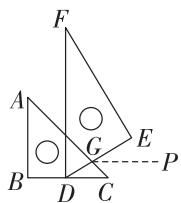

text_image

F
A
G
E
B
D
C
P

第6题解图

7. 一个图形是三角形; 这个三角形的任意两边之和大于第三边

8. 5 3 1 【解析】∵ 密码数字均为奇数, ∴ 密码数字可能为 1, 3, 5, 7, 9, ∵ 最上面的密码数字是 10 的因数, ∴ 最上面的密码数字是 1 或 5, ∵ 密码数字从上至下递减, ∴ 最上面的密码数字是 5, 密码是 5 3 1.

9. $70^{\circ}$ 【解析】∵ $\angle C^{\prime}BF = 35^{\circ}$ ，由折叠的性质可得 $\angle FBC = \angle C^{\prime}BF = 35^{\circ}, \therefore \angle C^{\prime}BC = \angle FBC + \angle C^{\prime}BF = 70^{\circ}, \because BC \parallel AD, \therefore \angle BGA = \angle C^{\prime}BC = 70^{\circ}.$

10. $100^{\circ}$ 【解析】如解图, 延长 FG 和 BA 的延长

线交于点 $M, \because AH \parallel FG, \therefore AH \parallel MF, \therefore \angle AMF = \angle BAH = 80^{\circ}.\because AB \parallel EF, \therefore BM \parallel EF, \therefore \angle F = 180^{\circ} - \angle AMF = 100^{\circ}.$

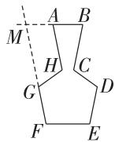  
第 10 题解图

11. 解: 如解图①, 延长 GF 交 AB 于点 M,

$$
\because A B \parallel C D,
$$

$$
\therefore \angle 2 + \angle 3 = 1 8 0 ^ {\circ},
$$

$$
\because \angle 2 = 1 3 0 ^ {\circ},
$$

$$
\therefore \angle 3 = 5 0 ^ {\circ},
$$

$$
\begin{array}{l} \therefore \angle E F M = 1 8 0 ^ {\circ} - \angle 1 - \angle 3 = 1 8 0 ^ {\circ} - 4 5 ^ {\circ} - 5 0 ^ {\circ} = \\ 8 5 ^ {\circ}, \end{array}
$$

$$
\therefore \angle E F G = 1 8 0 ^ {\circ} - \angle E F M = 1 8 0 ^ {\circ} - 8 5 ^ {\circ} = 9 5 ^ {\circ}. \quad \dots
$$

……（8分）

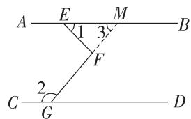

text_image

A E M B
1 3
F
2
C G D

第11题解图①

【一题多解法】解:如解图②,过点 F 作 FM//AB,

$$
\because F M \parallel A B, A B \parallel C D,
$$

$$
\therefore A B \parallel C D \parallel F M,
$$

$$
\therefore \angle 3 = \angle 1 = 4 5 ^ {\circ}, \angle 2 + \angle 4 = 1 8 0 ^ {\circ},
$$

$$
\therefore \angle 4 = 1 8 0 ^ {\circ} - 1 3 0 ^ {\circ} = 5 0 ^ {\circ},
$$

$$
\therefore \angle E F G = \angle 3 + \angle 4 = 4 5 ^ {\circ} + 5 0 ^ {\circ} = 9 5 ^ {\circ}. \quad \dots\dots
$$

……（8分）

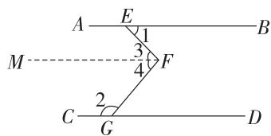

text_image

A E B
1
3
M F
4
C G D

第 11 题解图②

12. 解: (1) 条件: ① EG 平分 $\angle BEM$ , ③ FH 平分 $\angle CFN$ .

结论:②AB//CD.

命题: 如果 $\angle BEG = \angle CFH, EG$ 平分 $\angle BEM, FH$ 平分 $\angle CFN$ , 那么 $AB \parallel CD$ (答案不唯一, 合理即可); …… (4 分)

# 大小卷·八年级(上) 数学 BS

(2)(1)中的命题是真命题,理由如下:

∵ EG 平分 $\angle BEM, FH$ 平分 $\angle CFN,$

$$
\therefore \angle B E M = 2 \angle B E G, \angle C F N = 2 \angle C F H,
$$

$$
\because \angle B E G = \angle C F H,
$$

$$
\therefore \angle B E M = \angle C F N,
$$

$$
\because \angle B E F = 1 8 0 ^ {\circ} - \angle B E M, \angle C F E = 1 8 0 ^ {\circ} - \angle C F N,
$$

$$
\therefore \angle B E F = \angle C F E,
$$

$$
\therefore A B \parallel C D.
$$

∴ (1) 中的命题是真命题. …… (10 分)

13. (1) 证明: $\because CF$ 平分 $\angle ACD$ ,

$$
\therefore \angle A C F = \angle F C D,
$$

$$
\because A B \parallel C D,
$$

$$
\therefore \angle A F C = \angle F C D,
$$

$$
\therefore \angle A C F = \angle A F C,
$$

∵ $\angle GAH$ 与 $\angle AFC$ 互余，

$$
\therefore \angle G A H + \angle A F C = 9 0 ^ {\circ},
$$

$$
\therefore \angle G A H + \angle A C F = 9 0 ^ {\circ},
$$

$$
\because C E \perp C F,
$$

$$
\therefore \angle E C F = \angle E C A + \angle A C F = 9 0 ^ {\circ},
$$

$$
\therefore \angle G A H = \angle E C A,
$$

∴ AG∥CE; …… (6分)

(2) 解: $\because AB \parallel CD,$

$$
\therefore \angle H A F = \angle A C D,
$$

由(1)得 $\angle GAH = \angle ECA$

$$
\therefore \angle H A F + \angle G A H = \angle A C D + \angle E C A,
$$

即 $\angle GAF = \angle ECD = 110^{\circ}$ ,

$$
\because \angle E C F = 9 0 ^ {\circ},
$$

$$
\therefore \angle F C D = \angle E C D - \angle E C F = 2 0 ^ {\circ},
$$

$$
\because A B \parallel C D,
$$

$\therefore \angle AFC = \angle FCD = 20^{\circ}.$ (12分)

# 周测 16 三角形的内角和定理

1. D 【解析】由题意, 得 $180^{\circ}-\angle A-\angle B=40^{\circ}$ ,
∴ 这个三角形木板缺少的角是 $40^{\circ}$ .  
2. D 【解析】∵ $\angle1$ 是 $\angle A$ 所在三角形的一个外角, 且 $\angle1$ 与 $\angle A$ 非邻补角, ∴ $\angle1 > \angle A$ , ∵ $\angle2$ 是 $\angle1$ 所在三角形的一个外角, 且 $\angle1$ 与 $\angle2$ 非邻补角, ∴ $\angle2 > \angle1$ , ∴ $\angle2 > \angle1 > \angle A$ .  
3. B 【解析】设与外角相邻的内角为 x，则该外角为 $4x, \therefore x + 4x = 180^{\circ}$ ，解得 $x = 36^{\circ}, \therefore$ 该外角为 $36^{\circ} \times 4 = 144^{\circ}$ ，与外角不相邻的一个内角为 $144^{\circ} \div 2 = 72^{\circ}$ ，另外一个内角为 $180^{\circ} - 36^{\circ} - 72^{\circ} = 72^{\circ}$ ，

∴ 此三角形的三个内角分别为 $36^{\circ}, 72^{\circ}, 72^{\circ}$ .

4. B 【解析】∵ $\angle BOA = \angle COD = 25^{\circ}$ , ∴ $\angle ACG = \angle BFG - \angle COD = 40^{\circ} - 25^{\circ} = 15^{\circ}$ .  
5. A 【解析】∵ $\angle A=40^{\circ},\therefore \angle ADE+\angle AED=180^{\circ}-\angle A=140^{\circ}$ ，由折叠的性质，得 $\angle ADE=\angle FDE,$ $\angle AED=\angle FED,$ ∴ $\angle ADF+\angle AEF=2(\angle ADE+\angle AED)=280^{\circ},$ ∴ $\angle FDB+\angle FEC=180^{\circ}-\angle ADF+180^{\circ}-\angle AEF=360^{\circ}-(\angle ADF+\angle AEF)=80^{\circ}.$   
6. D 【解析】①∵ BE 平分 $\angle ABC, \therefore \angle 5 = \angle 6,$ $\because \angle ACB = 90^{\circ}, CD$ 为 AB 边上的高， $\therefore \angle 3 + \angle 4 = 90^{\circ}, \angle A + \angle 3 = 90^{\circ}, \therefore \angle A = \angle 4.$ $\because \angle 1 = \angle A + \angle 6, \angle 2 = \angle 4 + \angle 5, \therefore \angle 1 = \angle 2,$ 故①正确；

②若 $\angle 4 = \angle 5,$ 由①可知 $\angle A = \angle 4, \therefore \angle A = \angle 5 = \angle 6.$ 又∵ $\angle A + \angle 5 + \angle 6 = 90^{\circ}, \therefore \angle A = 30^{\circ},$ 即只有当 $\angle A = 30^{\circ}$ 时， $\angle 4 = \angle 5,$ 而已知中没有这个条件，故②错误；

③由①知 $\angle A = \angle 4,$ 故③正确；

④∵ $\angle 1 = \angle 2, \angle 1 + \angle 5 = 90^{\circ}, \therefore \angle 2 + \angle 5 = 90^{\circ},$ 即 $\angle 2$ 与 $\angle 5$ 互余，故④正确.  
7. $55^{\circ}$ 【解析】∵ $l_{1} // l_{2}$ ，∴ $\angle ACB = \angle 2 = 80^{\circ}$ ，由三角形内角和定理，得 $\angle 3 = 180^{\circ} - \angle 1 - \angle ACB = 180^{\circ} - 45^{\circ} - 80^{\circ} = 55^{\circ}$ .  
8. 增加; 20 【解析】当 $\angle ABD = 75^{\circ}$ 时, $\angle BCD = \angle ABD - \angle D = 75^{\circ} - 35^{\circ} = 40^{\circ}$ , $\therefore \angle ECF = 180^{\circ} - \angle ECB - \angle BCD = 180^{\circ} - 90^{\circ} - 40^{\circ} = 50^{\circ}$ , $\because 50^{\circ} - 30^{\circ} = 20^{\circ}$ , $\therefore \angle ECF$ 应增加 $20^{\circ}$ .  
9. $55^{\circ}$ 【解析】如解图,延长 BO 交 AC 于点 D,
∵ $\angle BOC$ 是 $\triangle OCD$ 的一个外角, ∴ $\angle ODC = \angle BOC - \angle ACO = 100^{\circ} - 15^{\circ} = 85^{\circ}$ , 同理, $\angle A = \angle ODC - \angle ABO = 85^{\circ} - 30^{\circ} = 55^{\circ}$ .

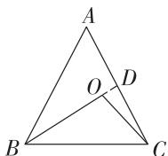  
第9题解图

【一题多解法】 $55^{\circ}$ 【解析】在 $\triangle BOC$ 中， $\because \angle BOC = 100^{\circ}, \therefore \angle OBC + \angle OCB = 180^{\circ} - 100^{\circ} = 80^{\circ}, \because \angle ABO = 30^{\circ}, \angle ACO = 15^{\circ}, \therefore \angle ABC + \angle ACB = \angle ABO + \angle OBC + \angle ACO + \angle OCB = \angle ABO + \angle ACO + (\angle OBC + \angle OCB) = 30^{\circ} + 15^{\circ} + 80^{\circ} = 125^{\circ}$ ，在 $\triangle ABC$ 中， $\angle A = 180^{\circ} - (\angle ABC + \angle ACB) = 180^{\circ} - 125^{\circ} = 55^{\circ}$ .

10. $45^{\circ}$ 【解析】∵ $\angle AFB = 75^{\circ}, \angle B = 90^{\circ}$ ,

$$
\therefore \angle B A F = 9 0 ^ {\circ} - \angle A F B = 9 0 ^ {\circ} - 7 5 ^ {\circ} = 1 5 ^ {\circ}, \because A F
$$

平分 $\angle BAD, DE$ 平分 $\angle ADC, \therefore \angle BAF = \angle DAF =$

$$
\frac {1}{2} \angle B A D, \angle A D E = \frac {1}{2} \angle A D C, \therefore \angle B A D = 3 0 ^ {\circ},
$$

由三角形外角的性质, 得 $\angle ADC = \angle BAD + \angle B =$

$$
3 0 ^ {\circ} + 9 0 ^ {\circ} = 1 2 0 ^ {\circ}, \therefore \angle A D E = \frac {1}{2} \angle A D C = 6 0 ^ {\circ},
$$

$$
\therefore \angle G = \angle A D E - \angle D A F = 6 0 ^ {\circ} - 1 5 ^ {\circ} = 4 5 ^ {\circ}.
$$

11. 解: $\because BE = CF,$

$\therefore BE+CE=CF+CE,$ 即 BC=EF,

在 $\triangle ABC$ 和 $\triangle DFE$ 中， $\left\{\begin{aligned}AB&=DF,\\ \angle B&=\angle F,\\ BC&=EF,\end{aligned}\right.$

∴ $\triangle ABC \cong \triangle DFE(SAS)$ , …… (4 分)

$$
\therefore \angle A C B = \angle D E F,
$$

$$
\because \angle A + \angle B + \angle A C B = 1 8 0 ^ {\circ},
$$

$$
\therefore \angle A C B = 1 8 0 ^ {\circ} - 5 4 ^ {\circ} - 4 8 ^ {\circ} = 7 8 ^ {\circ},
$$

$$
\therefore \angle D E F = \angle A C B = 7 8 ^ {\circ},
$$

$$
\therefore \angle C G E = 1 8 0 ^ {\circ} - \angle A C B - \angle D E F = 1 8 0 ^ {\circ} - 7 8 ^ {\circ} -
$$

$78^{\circ}=24^{\circ}$ . (8分)

12. 解: (1) 补全表格信息如下:

<table><tr><td> $\angle A/^{\circ}$ </td><td>10</td><td>20</td><td>30</td><td>40</td><td>50</td></tr><tr><td> $\angle D/^{\circ}$ </td><td>10</td><td>15</td><td>20</td><td>25</td><td>30</td></tr><tr><td> $\angle ACB/^{\circ}$ </td><td>30</td><td>50</td><td>70</td><td>90</td><td>110</td></tr></table>

$\angle ACB = \angle A + 2\angle D$ ，证明如下：

∵ BD 平分 ∠ CBE,

$$
\therefore \angle C B D = \angle E B D,
$$

$$
\because \angle A C B = \angle D + \angle C B D,
$$

$$
\therefore \angle A C B = \angle D + \angle E B D,
$$

$$
\because \angle E B D = \angle A + \angle D,
$$

$$
\therefore \angle A C B = \angle D + \angle A + \angle D = \angle A + 2 \angle D; \quad \dots \dots
$$

……（5分）

(2) $\because \angle DBE=60^{\circ},\angle D=24^{\circ},$

$$
\therefore \angle A = \angle D B E - \angle D = 6 0 ^ {\circ} - 2 4 ^ {\circ} = 3 6 ^ {\circ},
$$

由(1)得, $\angle ACB = \angle A + 2 \angle D = 36^{\circ} + 2 \times 24^{\circ} = 84^{\circ}$ ,

∵ CF 平分 $\angle ACB$ ,

$$
\therefore \angle A C F = \frac {1}{2} \angle A C B = 4 2 ^ {\circ},
$$

$\therefore \angle BFC = \angle ACF + \angle A = 78^{\circ}.$ ……（10分）

13. 解: (1) $\triangle ABC$ 是直角三角形. 理由如下:

$$
\because A C \parallel E F, \angle F = 1 5 0 ^ {\circ},
$$

$$
\therefore \angle F + \angle F A C = 1 8 0 ^ {\circ},
$$

$$
\therefore \angle F A C = 1 8 0 ^ {\circ} - \angle F = 1 8 0 - 1 5 0 ^ {\circ} = 3 0 ^ {\circ},
$$

∵ AC 是 $\angle FAB$ 的平分线，

$$
\therefore \angle B A C = \angle F A C = 3 0 ^ {\circ},
$$

$$
\because A F \parallel C D,
$$

$$
\therefore \angle A C D = \angle F A C = 3 0 ^ {\circ},
$$

∵ CD 是 $\angle ACB$ 的平分线，

$$
\therefore \angle A C B = 2 \angle A C D = 2 \times 3 0 ^ {\circ} = 6 0 ^ {\circ},
$$

在 $\triangle ABC$ 中， $\angle ACB + \angle BAC = 60^{\circ} + 30^{\circ} = 90^{\circ}$

$$
\therefore \angle B = 9 0 ^ {\circ},
$$

∴ $\triangle ABC$ 是直角三角形；……（6 分）

(2) 当 $\angle F$ 发生变化时, $\angle ADC$ 的度数会发生变化.

$$
\because C D \parallel A F, A C \parallel E F,
$$

$$
\therefore \angle A C D = \angle C A F = 1 8 0 ^ {\circ} - \angle F,
$$

∵ CD, AC 分别平分 $\angle ACB$ 和 $\angle BAF$ ,

$$
\therefore \angle B C D = \angle A C D = \angle B A C = \angle C A F = 1 8 0 ^ {\circ} - \angle F,
$$

$$
\therefore \angle B D C = 2 \angle B A C = 3 6 0 ^ {\circ} - 2 \angle F,
$$

$$
\therefore \angle A D C = 1 8 0 ^ {\circ} - \angle B D C = 2 \angle F - 1 8 0 ^ {\circ}. \dots \dots
$$

……（12分）

# 专题 三角形中内、外角的有关计算

# 教材原题改编练

教材原题 解: $\because \angle BAC + \angle B + \angle C = 180^{\circ}$ ,

$$
\therefore \angle B A C = 1 8 0 ^ {\circ} - 4 0 ^ {\circ} - 6 0 ^ {\circ} = 8 0 ^ {\circ}.
$$

∵ AD 平分 ∠BAC,

$$
\therefore \angle B A D = \angle C A D = 4 0 ^ {\circ},
$$

$$
\therefore \angle A D C = \angle B + \angle B A D = 8 0 ^ {\circ}.
$$

∵ AE 是 BC 边上的高，

$$
\therefore \angle A E D = 9 0 ^ {\circ},
$$

$$
\therefore \angle D A E = 1 8 0 ^ {\circ} - \angle A E D - \angle A D C = 1 0 ^ {\circ}.
$$

改编 1 解: ∵ ∠BEC 是 △AEF 的一个外角,

$$
\therefore \angle B E C = \angle C A D + \angle A F E,
$$

$$
\therefore \angle C A D = \angle B E C - \angle A F E = 1 0 0 ^ {\circ} - 7 0 ^ {\circ} = 3 0 ^ {\circ},
$$

∵ AD 是 BC 边上的高，

$$
\therefore \angle A D C = 9 0 ^ {\circ},
$$

$$
\begin{array}{l} \therefore \angle C = 1 8 0 ^ {\circ} - \angle A D C - \angle C A D = 1 8 0 ^ {\circ} - 9 0 ^ {\circ} - 3 0 ^ {\circ} = \\ 6 0 ^ {\circ}, \end{array}
$$

$$
\begin{array}{l} \therefore \angle E B C = 1 8 0 ^ {\circ} - \angle B E C - \angle C = 1 8 0 ^ {\circ} - 1 0 0 ^ {\circ} - 6 0 ^ {\circ} = \\ 2 0 ^ {\circ}. \end{array}
$$

∵ BE 平分 ∠ABC,

大小卷·八年级(上) 数学 BS

$$
\therefore \angle A B C = 2 \angle E B C = 2 \times 2 0 ^ {\circ} = 4 0 ^ {\circ},
$$

$$
\begin{array}{l} \therefore \angle B A C = 1 8 0 ^ {\circ} - \angle A B C - \angle C = 1 8 0 ^ {\circ} - 4 0 ^ {\circ} - 6 0 ^ {\circ} = \\ 8 0 ^ {\circ}. \end{array}
$$

改编 2 解: ∵ ∠CAD 和 ∠DCE 的平分线交于点 F,

$$
\therefore \angle C A D = 2 \angle C A F, \angle D C E = 2 \angle E C F,
$$

$$
\because \angle C A D = \angle D C E - \angle A D C, \angle C A F = \angle E C F - \angle F,
$$

$$
\begin{array}{l} \therefore 2 \angle E C F - \angle A D C = 2 (\angle E C F - \angle F) = 2 \angle E C F - 2 \\ \angle F, \end{array}
$$

即 $\angle ADC = 2\angle F.$

又∵AD是△ABC的高，

$$
\therefore \angle A D C = 9 0 ^ {\circ},
$$

$$
\therefore \angle F = \frac {1}{2} \angle A D C = 4 5 ^ {\circ}.
$$

改编 3 解: $\angle DEF = \frac{1}{2} (\angle C - \angle B)$ . 理由如下:

如解图, 过点 A 作 $AM \perp BC$ 于点 M,

$$
\because A M \perp C D, E F \perp C D,
$$

$$
\therefore A M \parallel E F,
$$

$$
\therefore \angle D A M = \angle D E F.
$$

在 $\triangle ABM$ 中, $\angle BAM=90^{\circ}-\angle B$ ,

∵ AD 平分 ∠BAC,

$$
\therefore \angle B A D = \frac {1}{2} \angle B A C = \frac {1}{2} (1 8 0 ^ {\circ} - \angle B - \angle C),
$$

$$
\therefore \angle D A M = \angle B A M - \angle B A D = 9 0 ^ {\circ} - \angle B - \frac {1}{2} (1 8 0 ^ {\circ} -
$$

$$
\angle B - \angle C) = \frac {1}{2} (\angle C - \angle B),
$$

$$
\therefore \angle D E F = \angle D A M = \frac {1}{2} (\angle C - \angle B).
$$

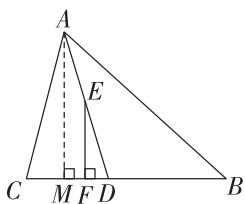

text_image

A
E
C M F D B

改编 3 题解图

改编 4 证明: 根据题意, 得 AF = DF, $\angle AFE = \angle DFE = 90^{\circ}$ .

$$
\because E F = E F,
$$

$$
\therefore \triangle A F E \cong \triangle D F E (\text { SAS }),
$$

$$
\therefore \angle D A E = \angle A D E.
$$

∵ $\angle ADE$ 是 $\triangle ABD$ 的外角, $\angle ACE$ 是 $\triangle ABC$ 的外角,

$$
\therefore \angle A D E - \angle B = \angle B A D, \angle A C E - \angle B = \angle B A C.
$$

∵ AD 平分 ∠BAC,

$$
\therefore \angle B A C = 2 \angle B A D,
$$

即 $\angle ACE - \angle B = 2(\angle ADE - \angle B)$

$$
\therefore \angle B + \angle A C E = 2 \angle A D E,
$$

即 $\angle B + \angle ACE = 2\angle DAE.$

# 综合训练

1. 解: (1) ∵ DE∥BC,

$$
\therefore \angle C B E = \angle E = 2 9 ^ {\circ}.
$$

∵ $\angle CFE$ 是 $\triangle BCF$ 的外角，

$$
\therefore \angle C F E = \angle C B E + \angle C = 2 9 ^ {\circ} + 5 2 ^ {\circ} = 8 1 ^ {\circ},
$$

$$
\therefore \angle A F E = 1 8 0 ^ {\circ} - 8 1 ^ {\circ} = 9 9 ^ {\circ};
$$

(2) $\angle DBE < \angle CFE$ . 理由如下:

∵ $\angle CFE$ 是 $\triangle BCF$ 的外角，

$$
\therefore \angle C B E <   \angle C F E.
$$

∵ BF 平分 ∠ABC,

$$
\therefore \angle D B E = \angle C B E.
$$

$$
\therefore \angle D B E <   \angle C F E.
$$

2. 解: (1) $40^{\circ}$ ; 【解法提示】∵ $\angle D = 50^{\circ}$ , ∴ $\angle DEF +$

$$
\angle D F E = 1 8 0 ^ {\circ} - 5 0 ^ {\circ} = 1 3 0 ^ {\circ}, \because \angle B A C = 9 0 ^ {\circ},
$$

$$
\therefore \angle A E F + \angle A F E = 1 8 0 ^ {\circ} - 9 0 ^ {\circ} = 9 0 ^ {\circ}, \therefore \angle A E D +
$$

$$
\angle A F D = (\angle D E F + \angle D F E) - (\angle A E F + \angle A F E) =
$$

$$
1 3 0 ^ {\circ} - 9 0 ^ {\circ} = 4 0 ^ {\circ}.
$$

(2) $\angle AED + \angle AFD = 90^{\circ} - \angle D$ . 理由如下:

在 $\triangle DEF$ 中， $\angle AEF + \angle AED + \angle AFE + \angle AFD +$

$$
\angle D = (\angle A E D + \angle A F D) + (\angle A E F + \angle A F E) +
$$

$\angle D=180^{\circ}$ ，在 $\triangle AEF$ 中， $\angle AEF+\angle AFE+\angle BAC=$

$$
\angle A E F + \angle A F E + 9 0 ^ {\circ} = 1 8 0 ^ {\circ},
$$

$$
\therefore \angle A E F + \angle A F E = 9 0 ^ {\circ},
$$

$$
\therefore \angle A E D + \angle A F D = 9 0 ^ {\circ} - \angle D;
$$

(3)(2)中的结论不成立. 理由如下:

如解图,设 AC 与 DE 交于点 O,

$$
\therefore \angle D O F = \angle A O E,
$$

$$
\therefore \angle D + \angle A F D = \angle B A C + \angle A E D,
$$

$$
\because \angle B A C = 9 0 ^ {\circ},
$$

$$
\therefore \angle A F D - \angle A E D = 9 0 ^ {\circ} - \angle D,
$$

∴(2)中的结论不成立.

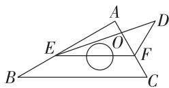  
第2题解图

# 期末检测

# 选填及简单解答题题组(一)

1. A 【解析】 $\sqrt{3}$ 的相反数是 $-\sqrt{3}$ .

2. A 【解析】由题意, 得 $\frac{10+a+6+12+9}{5}=9$ , 解得 a=8.

3. D 【解析】∵ 点 A, B 关于 y 轴对称, ∴ $-2 + 2n = 0$ , 2m - 1 = 5, ∴ n = 1, m = 3, ∴ $m + n = 3 + 1 = 4$ .

4. B 【解析】A. $\sqrt{16}-\sqrt{8}=4-2\sqrt{2}$ ，故选项错误；
B. $\sqrt{32}\div\sqrt{4}=4\sqrt{2}\div2=2\sqrt{2}$ ，故选项正确；C. $\sqrt{2}+\sqrt{4}=\sqrt{2}+2$ ，故选项错误；D. $\sqrt{(1-\sqrt{3})^{2}}=\sqrt{3}-1$ ，故选项错误.

5. B 【解析】根据题意可列方程组为 $\left\{\begin{aligned}x+y&=24,\\ x&=4y-10.\end{aligned}\right.$

6. D 【解析】设另一个方程为 $y = kx - 2$ ，∵两条直线的交点坐标为(-2,2)，∴该方程的一组解为 $\left\{ \begin{array}{l} x = -2, \\ y = 2, \end{array} \right.$ 将 $x = -2, y = 2$ 代入，得 $2 = -2k - 2$ ，解得 $k = -2, \therefore y = -2x - 2$ ，即 $2x + y = -2$ .

7. D 【解析】∵ 点 $A(-1, p)$ 在正比例函数图象上，∴ $p = -3 \times (-1) = 3$ ，∴ 点 A 的坐标为 $(-1, 3)$ 。如解图所示，过点 B 作 y 轴的平行线，过点 A 作 x 轴的平行线，两平行线交于点 C，易得 $AC \perp BC$ ，设点 B 的坐标为 $(q, -3q)$ ，∴ $BC = |-3q - 3|$ ， $AC = |-1 - q|$ ，在 Rt $\triangle ABC$ 中， $AB = \sqrt{10}$ ，∴ $\sqrt{(-1 - q)^2 + (-3q - 3)^2} = \sqrt{10}$ ，解得 q = 0 或 -2。

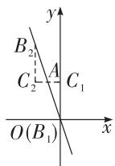  
第7题解图

8. A 【解析】如解图,延长 AB 交直线 ED 于点 H.
∵ AH//CD, ∴ ∠CDE = ∠DHA = 60°. ∵ AF//EH,
∴ ∠BAF = ∠DHA = 60°.

  
第8题解图

9. D 【解析】颁奖台上表面部分展开图如解图， $\therefore AB=\sqrt{180^{2}+60^{2}}=60\sqrt{10}(cm)$ .

text_image

60 cm
A 80 cm 20 cm 80 cm B

第9题解图

10. C 【解析】如解图, $\because y = kx - \frac{1}{2} k + \frac{3}{2} = k(x - \frac{1}{2}) + \frac{3}{2}, \therefore$ 直线经过定点 $(\frac{1}{2}, \frac{3}{2})$ . 将 (1,1) 代入 $y = kx - \frac{1}{2} k + \frac{3}{2}$ , 得 $k - \frac{1}{2} k + \frac{3}{2} = 1$ , 解得 $k = -1$ , 将 (2,2) 代入 $y = kx - \frac{1}{2} k + \frac{3}{2}$ , 得 $2k - \frac{1}{2} k + \frac{3}{2} = 2$ , 解得 $k = \frac{1}{3}, \therefore$ 当直线 $y = kx - \frac{1}{2} k + \frac{3}{2}$ 与 $\triangle ABC$ 有交点时, $k$ 的取值范围是 $-1 \leqslant k \leqslant \frac{1}{3}, \therefore k$ 的值不可能是 $\frac{1}{2}$ .

  
第 10 题解图

11. 3 【解析】点 A 到 y 轴的距离即为点 A 横坐标的绝对值, 即点 A 到 y 轴的距离为 3.

12. 乙 【解析】样本数据的稳定性需要通过方差来比较, 方差越小, 数据越稳定, $\because \bar{x}_{\text {甲}} = \bar{x}_{\text {乙}},$ $\therefore$ 两组学生整体水平相同, $\because 2 > 0.8, \therefore s_{\text {甲}}^{2} > s_{\text {乙}}^{2},$ $\therefore$ 乙组同学发挥更稳定.

13. 4 【解析】如解图,根据题意可得,该纸板的边长 AB 为 $\sqrt{50}=5\sqrt{2}$ cm, $\frac{1}{2}EF^{2}=\frac{1}{2}$ , 解得 EF=1, 根据勾股定理, 得 $EG=\sqrt{1^{2}+1^{2}}=\sqrt{2}$ (cm), $\therefore AE=\frac{AB-EG}{2}=\frac{5\sqrt{2}-\sqrt{2}}{2}=2\sqrt{2}$ (cm), $\therefore EH=\sqrt{AE^{2}+AH^{2}}=\sqrt{(2\sqrt{2})^{2}+(2\sqrt{2})^{2}}=4$ (cm), 则这个书箱的底面边长为 $4 \, cm$ .

text_image

A
E
H
G
F
底面
B
D
C

第 13 题解图

14. $40^{\circ}$ 【解析】∵ $\angle1 = \angle3$ , ∴ $\angle DEF = \angle3 + \angle EAC = \angle1 + \angle EAC = \angle BAC = 80^{\circ}$ , ∵ $\angle1 = \angle2$ , ∴ $\angle EDF = \angle1 + \angle ABD = \angle2 + \angle ABD = \angle ABC = 60^{\circ}$ , 在 $\triangle DEF$ 中, $\angle DFE = 180^{\circ} - \angle DEF - \angle EDF = 180^{\circ} - 80^{\circ} - 60^{\circ} = 40^{\circ}$ .

15. $(1,\sqrt{5})$ 【解析】如解图, 连接 OE, ∵ 点 A 的坐标为 $(4,0)$ , 点 E 的坐标为 $(2,\sqrt{5})$ , ∴ OA = 4, $OE = \sqrt{2^{2} + (\sqrt{5})^{2}} = 3$ , 由作图痕迹得 MN 垂直平分 OB, ∴ BE = OE = 3, ∴ CE = BC - BE = OA - BE = 4 - 3 = 1, ∴ $x_{C} = x_{E} - CE = 2 - 1 = 1$ , ∵ BC // OA, ∴ 点 C 的坐标为 $(1,\sqrt{5})$ .

text_image

y
M
C
E
B
O
A
x
F
N

第 15 题解图

16. 解: (1) 原式 $=\sqrt{72}-(\sqrt{2}-1)+1$ $=6\sqrt{2}-\sqrt{2}+1+1$ $=5\sqrt{2}+2;$ …… (3 分)

(2) 令 $\left\{\begin{aligned}3x+4y=16,①\\ 5x-6y=33,②\end{aligned}\right.$

①×3+②×2, 得 19x=114, 解得 x=6. ③

将③代入①, 得 $18+4y=16$ ,

解得 $y=-\frac{1}{2}$ .

∴ 原方程组的解为 $\left\{\begin{aligned}x &= 6, \\ y &= -\frac{1}{2}.\end{aligned}\right.$ …… (6 分)

17. 解: $\because x = \sqrt{5} + \sqrt{2}, y = \sqrt{5} - \sqrt{2}$ , $\therefore x + y = \sqrt{5} + \sqrt{2} + \sqrt{5} - \sqrt{2} = 2\sqrt{5}$ , …… (3 分) $xy = (\sqrt{5} + \sqrt{2})(\sqrt{5} - \sqrt{2})$ $= (\sqrt{5})^2 - (\sqrt{2})^2$ $= 3$ , …… (5 分)

$$
\begin{array}{l} \because (x + y) ^ {2} = x ^ {2} + 2 x y + y ^ {2}, \\ \therefore x ^ {2} + x y + y ^ {2} = x ^ {2} + 2 x y + y ^ {2} - x y = (x + y) ^ {2} - x y \\ = (2 \sqrt {5}) ^ {2} - 3 \\ = 1 7. \quad \dots\dots\tag {9分} \\ \end{array}
$$

# 选填及简单解答题题组(二)

1. B 【解析】0.3, 0.4, 0.5 都不是整数, 不是勾股数, 选项 A 不符合题意; $5^{2} + 12^{2} = 13^{2}$ , 是勾股数, 选项 B 符合题意; $6^{2} + 7^{2} \neq 8^{2}$ , 不是勾股数, 选项 C 不符合题意; $(2^{2})^{2} + (3^{2})^{2} \neq (4^{2})^{2}$ , 不是勾股数, 选项 D 不符合题意.

2. C 【解析】 $2\pi,\sqrt[3]{4}$ 和 $\sqrt{5}$ 是无理数, 共有 3 个无理数.

3. C

4. C 【解析】两条平行线被第三条直线所截, 内错角相等, 选项 A 是假命题; 如果 $a \perp b, a \perp c$ , 那么 $b // c$ , 选项 B 是假命题; 平方根等于它本身的数只有 0 , 选项 C 是真命题; 三角形的外角大于任何一个和它不相邻的内角, 选项 D 是假命题.

5. B 【解析】∵ $\angle BAC = 70^{\circ}$ , AD 平分 $\angle BAC$ ,
∴ $\angle BAD = \angle CAD = \frac{1}{2} \angle BAC = \frac{1}{2} \times 70^{\circ} = 35^{\circ}$ ,
∴ $\angle ABD = 180^{\circ} - \angle ADB - \angle BAD = 180^{\circ} - 110^{\circ} - 35^{\circ} = 35^{\circ}$ , ∵ BD 平分 $\angle ABC, \therefore \angle ABC = 2\angle ABD = 2\times 35^{\circ} = 70^{\circ}, \therefore \angle C = 180^{\circ} - \angle BAC - \angle ABC = 180^{\circ} - 70^{\circ} - 70^{\circ} = 40^{\circ}.$ ∵ EF // AD, ∴ $\angle CEF = \angle CAD = 35^{\circ}, \therefore \angle EFC = 180^{\circ} - \angle C - \angle CEF = 180^{\circ} - 40^{\circ} - 35^{\circ} = 105^{\circ}.$

6. B 【解析】将这 7 个数据按从小到大的顺序排列为 14, 15, 15, 16, 18, 20, 21, ∴ 中位数为 16 ℃, 平均数为 $(14 + 15 + 15 + 16 + 18 + 20 + 21) \div 7 = 17$ (℃).

7. C 【解析】由表格可知,海拔每增加 1 km,此海拔处气温下降 6 ℃,选项 A 正确;由题可知,当 t = -4 时,h = 4,选项 B 正确;将(1,14),(2,8)代入 $t = kh + b$ 中,得 k = -6,b = 20,故直线 $t = kh + b$ 过第一、二、四象限,选项 C 不正确;由表可得,若 $t_{1} < t_{2}$ ,则 $h_{1} > h_{2}$ ,选项 D 正确.

8. C 【解析】当 k>0 时， $-\frac{k}{2}<0,\frac{2}{k}>0$ ，函数 y=- $\frac{k}{2}x$ 的图象经过第二、四象限， $y=\frac{2}{k}x+k$ 的图

象经过第一、二、三象限；当 $k < 0$ 时， $-\frac{k}{2} > 0, \frac{2}{k} < 0$ ，函数 $y = -\frac{k}{2} x$ 的图象经过第一、三象限， $y = \frac{2}{k} x + k$ 的图象经过第二、三、四象限。综上所述，选项 C 符合题意。

9. D 【解析】设购进大型农机 x 台, 小型农机 y 台,
由题意, 得 $\left\{\begin{aligned}x+y=9,\\ (1-35\%)\times0.5x+(1-30\%) \times 0.3y=2.58.\end{aligned}\right.$ 解得 $\left\{\begin{aligned}x=6,\\ y=3,\end{aligned}\right.$ 所以购进大型农机的数量为6台.

10. C 【解析】∵ $A_{1}(1, \frac{1}{3})$ , $A_{1}B_{1} // y$ 轴, $B_{1}$ 在直线 y = x 上, ∴ $B_{1}(1, 1)$ , ∴ $A_{1}B_{1} = \frac{2}{3}$ , ∵ $\triangle A_{1}B_{1}C_{1}$ 是等腰直角三角形, ∴ $B_{1}C_{1} = A_{1}B_{1} = \frac{2}{3}$ , ∴ 点 $C_{1}$ 的横坐标为 $1 + \frac{2}{3} = \frac{5}{3} = (\frac{5}{3})^{1}$ , $A_{2}(\frac{5}{3}, \frac{5}{9})$ , 同理可得 $B_{2}(\frac{5}{3}, \frac{5}{3})$ , $B_{2}C_{2} = A_{2}B_{2} = \frac{10}{9}$ , ∴ 点 $C_{2}$ 的横坐标为 $\frac{5}{3} + \frac{10}{9} = \frac{25}{9} = (\frac{5}{3})^{2}$ , $A_{3}(\frac{25}{9}, \frac{25}{27})$ , 同理可得 $B_{3}(\frac{25}{9}, \frac{25}{9})$ , $B_{3}C_{3} = A_{3}B_{3} = \frac{50}{27}$ , ∴ 点 $C_{3}$ 的横坐标为 $\frac{25}{9} + \frac{50}{27} = \frac{125}{27} = (\frac{5}{3})^{3}$ , ∴ 综上所述, 点 $C_{n}$ 的横坐标为 $(\frac{5}{3})^{n}$ .

11. $\frac{\sqrt{2}}{4}$ 【解析】 $\sqrt{\frac{1}{8}} = \frac{1}{2\sqrt{2}} = \frac{\sqrt{2}}{4}.$

12. C 【解析】∵ 选择 C 歌曲的人数最多, ∴ 最终应该选择 C 歌曲作为参赛曲目.

13. (3, -2) 【解析】根据题意可建立平面直角坐标系如解图所示, 根据解图可得, 磬锤峰的坐标为(3, -2).

text_image

3
2
1
殊像寺
-4 -3 -2 -1 O 1 2 3 x
-1 安远寺
-2 碧垂峰
-3

第 13 题解图

14. $0 > y_{1} > y_{2}$ 【解析】 $\because k < 0, \therefore y$ 随 $x$ 的增大而减小， $\because -\frac{1}{2} < x_{1} < x_{2}$ ，当 $x = -\frac{1}{2}$ 时， $y = 0, \therefore 0 > y_{1} > y_{2}$ .

15. $6\sqrt{3} - 6$ 或 $4\sqrt{3}$ 【解析】在 Rt $\triangle ABC$ 中, $AB = 6\sqrt{3}, AC = 6$ , 由勾股定理, 得 $BC = \sqrt{AC^2 + AB^2} = \sqrt{6^2 + (6\sqrt{3})^2} = 12$ , $\because$ 点 $D$ 是 $AB$ 边上的一点, $\therefore \angle DBE \neq 90^\circ$ , $\therefore$ 当 $\triangle BDE$ 是直角三角形时, $\angle BDE = 90^\circ$ 或 $\angle DEB = 90^\circ$ . ①当 $\angle BDE = 90^\circ$ 时, $\angle ADE = 90^\circ$ , $\because$ 将 $\triangle ACD$ 沿 $AD$ 折叠, 使点 $A$ 落在点 $E$ 处, $\therefore \angle ADC = \angle CDE = 45^\circ$ , $\therefore AD = AC = 6$ , $\therefore BD = AB - AD = 6\sqrt{3} - 6$ ; ②当 $\angle DEB = 90^\circ$ 时, 由折叠的性质, 得 $\angle CED = 90^\circ$ , $\therefore \angle DEB + \angle CED = 180^\circ$ , $\therefore$ 点 $C, E, B$ 三点共线, 即点 $E$ 在 $BC$ 上, 设 $BD = x$ , 则 $ED = AD = 6\sqrt{3} - x$ , $\because BE = BC - CE = 12 - 6 = 6$ , $\therefore$ 在 Rt $\triangle BDE$ 中, 由勾股定理, 得 $ED^2 + EB^2 = BD^2$ , 即 $(6\sqrt{3} - x)^2 + 6^2 = x^2$ , 解得 $x = 4\sqrt{3}$ , $\therefore BD = 4\sqrt{3}$ . 综上所述, 当 $\triangle BDE$ 为直角三角形时, $BD$ 的长为 $6\sqrt{3} - 6$ 或 $4\sqrt{3}$ .

16. 解: (1) 原式 = $2\sqrt{6} - 4 + 2\sqrt{3} \times \sqrt{2}$

$$
= 2 \sqrt {6} - 4 + 2 \sqrt {6}
$$

$$
= 4 \sqrt {6} - 4; \quad \dots\dots (3 \text {分})
$$

(2)整理方程组,得 $\left\{\begin{aligned}x+6y&=18①,\\ 2x-y&=10②,\end{aligned}\right.$

由①, 得 $x = 18 - 6y$ ③,

将③代入②, 得 $2(18-6y)-y=10$ ,

解得 y=2，

将 y=2 代入③, 得 x=6,

∴ 原方程组的解为 $\left\{\begin{aligned}x=6,\\ y=2.\end{aligned}\right.$ …… (6 分)

17. 证明: $\because \angle CBE = \angle E$ ,

$$
\therefore A E \parallel B C,
$$

$$
\therefore \angle A D B = \angle D B C.
$$

$$
\because \angle A B D = \angle C B E,
$$

$$
\therefore \angle A B D + \angle D B E = \angle C B E + \angle D B E,
$$

即 $\angle ABE = \angle DBC$ ,

$$
\therefore \angle A B E = \angle A D B. \dots\dots(5 \text {分})
$$

$$
\because \angle A D B + \angle B F D = 1 8 0 ^ {\circ},
$$

$$
\therefore \angle A B E + \angle B F D = 1 8 0 ^ {\circ},
$$

大小卷·八年级(上) 数学 BS

$$
\therefore A B \parallel C D,
$$

$$
\therefore \angle A = \angle E D C. \quad \dots\dots (9 \text {分})
$$

# 中档解答题题组(一)

18. 解:∵ AB∥CD,

$$
\therefore \angle B A C + \angle A C D = 1 8 0 ^ {\circ},
$$

$$
\therefore \angle A C D = 1 8 0 ^ {\circ} - \angle B A C = 1 8 0 ^ {\circ} - 4 6 ^ {\circ} = 1 3 4 ^ {\circ},
$$

$$
\because A M \parallel B C,
$$

$$
\therefore \angle M A C = \angle A C B = 6 7 ^ {\circ},
$$

$$
\therefore \angle B C D = \angle A C D - \angle A C B = 1 3 4 ^ {\circ} - 6 7 ^ {\circ} = 6 7 ^ {\circ}.
$$

$$
\dots (8 \text {分})
$$

19. 解: (1) 所画等腰直角三角形 ABC 如解图所示 (答案不唯一); …… (4 分)

text_image

B
C
A

第 19 题解图

(2)设点 B 到直线 AC 的距离为 h,

$$
\because A B = B C = \sqrt {1 0},
$$

∴ 在 Rt△ABC 中, $AC = \sqrt{AB^{2} + BC^{2}} = \sqrt{10 + 10} = 2\sqrt{5}$ ,

$$
\therefore \frac {1}{2} A B \cdot B C = \frac {1}{2} A C \cdot h,
$$

$$
\therefore h = \frac {A B \cdot B C}{A C} = \frac {\sqrt {1 0} \times \sqrt {1 0}}{2 \sqrt {5}} = \sqrt {5}.
$$

∴ 点 B 到直线 AC 的距离为 $\sqrt{5}$ . …… (8 分)

20. 解: (1) 98; 97.5; …… (4 分)

【解法提示】将教师评审团的评分按照从小到大的顺序排列如下:95,96,96,97,97,98,98,98,98,99,∵98出现的次数最多,∴众数为98分,∵处于第5位和第6位的得分分别是97分和98分,∴中位数为 $\frac{97+98}{2}=97.5$ (分).

(2) 张萌的最终得分: $\frac{96 \times 2 + 99 \times 1}{3} = 97$ (分);

李梅的最终得分: $\frac{97.2\times2+93\times1}{3}=95.8$ (分);

∵ 张萌的最终得分高于李梅的最终得分，

∴ 本场比赛张萌获胜. …… (10 分)

21. 解: (1) 设方案一所需费用与洗车次数之间的函数关系式为 $y = k_{1}x (k_{1} \neq 0)$ ,

根据题意,得 $4k_{1}=140$ ,

解得 $k_{1}=35$ ，

∴ 方案一所需费用与洗车次数之间的函数关系式为 y=35x.

设方案二所需费用与洗车次数之间的函数关系式为 $y=k_{2}x+140(k_{2}\neq0)$ ,

根据题意, 得 $24k_{2}+140=644$ ,

解得 $k_{2}=21$ ，

∴ 方案二所需费用与洗车次数之间的函数关系式为 $y=21x+140$ ; …… (4 分)

(2)联立方程组,得 $\left\{\begin{aligned}y=35x,\\ y=21x+140,\end{aligned}\right.$

解得 $\left\{\begin{aligned}x=10,\\ y=350,\end{aligned}\right.$

∴ 洗 10 次车时,两种收费方式所需费用相同;
……(7 分)

(3) 当 y = 875 时, 方案一: y = 35x = 875, 解得 x = 25;

方案二: $y=21x+140=875$ , 解得 x=35;

$$
\because 2 5 <   3 5,
$$

∴ 选择方案二更划算. …… (12 分)

22. 解: (1) ∵ 点 A 的坐标为 $(0,3)$ ，点 C 的坐标为 $(1,0)$ ，

$$
\therefore A O = 3, O C = 1.
$$

$$
\because \angle A C B = \angle A O C = \angle B D C = 9 0 ^ {\circ},
$$

$$
\therefore \angle A C O + \angle B C D = \angle A C O + \angle C A O = 9 0 ^ {\circ},
$$

$$
\therefore \angle C A O = \angle B C D.
$$

在 $\triangle AOC$ 和 $\triangle CDB$ 中， $\left\{\begin{aligned}\angle AOC&=\angle CDB,\\ \angle CAO&=\angle BCD,\\ AC&=CB,\end{aligned}\right.$

$$
\therefore \triangle A O C \cong \triangle C D B (\text {   AAS   }),
$$

$$
\therefore A O = C D = 3, O C = D B = 1. \therefore O D = O C + C D = 4.
$$

∴ 点 B 的坐标为 $(4,1)$ ; …… (4 分)

(2) 设 BC 所在直线的函数表达式为 $y = k_{1}x + b_{1}$ $(k_{1} \neq 0)$ ,

将 $B(4,1),C(1,0)$ 代入，得 $\left\{ \begin{array}{l}4k_{1} + b_{1} = 1,\\ k_{1} + b_{1} = 0, \end{array} \right.$

解得 $\left\{\begin{aligned}k_{1}&=\frac{1}{3},\\ b_{1}&=-\frac{1}{3},\end{aligned}\right.$

即 BC 所在直线的函数表达式为 $y=\frac{1}{3}x-\frac{1}{3}$ .

∵ 直线 DE: $y = kx + b$ 平行于 BC 所在直线, 且经过点 D(4,0),

∴ 直线 DE 可看作是由直线 BC 向下平移 1 个单位长度得到的，

∴ 直线 DE 的函数表达式为 $y=\frac{1}{3}x-\frac{4}{3}$ ,

令 x=0, 得 $y=-\frac{4}{3}$ ,

∴ 点 E 的坐标为 $(0, -\frac{4}{3})$ ，即 $OE = \frac{4}{3}$ .

如解图,连接 BE,

text_image

y
A
B
O C D x
E

第 22 题解图

$$
\therefore S _ {\text {四边形} A E D B} = S _ {\triangle A B E} + S _ {\triangle B E D} = \frac {1}{2} \times (3 + \frac {4}{3}) \times 4 + \frac {1}{2} \times
$$

$$
1 \times 4 = \frac {3 2}{3}. \quad \dots\dots\tag {12分}
$$

# 中档解答题题组(二)

18. 解: (1) 建立平面直角坐标系如解图所示; …… (3 分)

(2)作出 $\triangle A_{1}B_{1}C_{1}$ 如解图所示，……（5分）点 $B_{1}$ 的坐标为 $(-5,-3)$ ，点 $C_{1}$ 的坐标为 $(-1,-1)$ ．……（8分）

text_image

y
A
B
C
O
x
B
C
A

第 18 题解图

19. 解: (1) 乐乐的猜想不正确, 理由如下:

由题意, 得 AG = CD = 1 m, GC = AD = 16 m,

设 BG = x m，则 $BC = 33 - 1 - x = (32 - x) \, \text{m}$ ，

在 Rt△BGC 中,由勾股定理,得 $BG^{2}+CG^{2}=BC^{2}$ ,
即 $x^{2}+16^{2}=(32-x)^{2}$ ,

$$
\therefore x = 1 2,
$$

$$
\therefore B G = 1 2 \mathrm{m},
$$

$$
\therefore A B = B G + A G = 1 3 (\mathrm{m}),
$$

∴ 乐乐的猜想不正确, 山体高 AB 为 13 m; …
…… (4 分)

(2)由题意,得 CF=DE=4 m,

$$
\therefore G F = G C + C F = 2 0 (\mathrm{m}),
$$

在 Rt $\triangle BGF$ 中，由勾股定理，得 BF = $\sqrt{BG^{2} + GF^{2}} = 4\sqrt{34} \, (\text{m})$ ,

∴坡面 BF 的长为 $4 \sqrt{34}$ m. …… (8 分)

20. 解: (1) 设每件甲品牌文创产品的进价为 m 元, 每件乙品牌文创产品的进价为 n 元,

根据题意,得 $\left\{\begin{aligned}30m+20n&=2\ 320,\\ 20m+40n&=2\ 480,\end{aligned}\right.$

解得 $\left\{\begin{aligned}m=54,\\ n=35.\end{aligned}\right.$

答:每件甲品牌文创产品的进价为54元,每件乙品牌文创产品的进价为35元;……(3分)

(2)由题意,得 $y=(61-54)(60-x)+(39-35)x=-3x+420$ ,

∵该商店购进的乙品牌产品不少于24件，

∴ y 与 x 之间的函数表达式为 $y = -3x + 420$ $(24 \leqslant x \leqslant 60)$ , …… (6 分)

$$
\because - 3 <   0,
$$

$\therefore y$ 随 x 的增大而减小，

∴ 当 x=24 时, 利润 y 有最大值,

则此时购进甲品牌产品 60-24=36(件)，

最大利润为 $y=-3\times24+420=348$ (元).

答: 应购进甲品牌产品 36 件, 乙品牌产品 24 件, 最大利润为 348 元. …… (10 分)

21. 解: (1) 由题图可知, 甲去 N 地的速度为 $40 \div 1 = 40 \, (\text{km/h})$ ,

∴ M, N 两地之间的距离为 $40 \times 3 = 120 \, (\text{km})$ ,
则 $120 \div 1.5 = 80 \, (\text{km/h})$ ,

∴ 乙从 N 地去 M 地的速度为 80 km/h；……
……（2 分）

(2) 当 $0 \leqslant x \leqslant 1.5$ 时，

由(1)，得 $y_{乙}$ 与 x 的函数关系式为 $y_{乙} = -80x + 120$ ;

当 $1.5 < x \leqslant 2.5$ 时，

设 $y_{乙}$ 与 x 的函数关系式为 $y_{乙}=kx+b(k\neq0)$ ,

# 大小卷·八年级(上) 数学 BS

将 $(2.5,120)$ ， $(1.5,0)$ 分别代入，得

$$
\left\{ \begin{array}{l} 2. 5 k + b = 1 2 0, \\ 1. 5 k + b = 0, \end{array} \text {解得} \left\{ \begin{array}{l} k = 1 2 0, \\ b = - 1 8 0. \end{array} \right. \right.
$$

$$
\therefore y _ {\text {乙}} = 1 2 0 x - 1 8 0.
$$

综上所述, $y_{乙}=\begin{cases}-80x+120(0\leqslant x\leqslant1.5),\\120x-180(1.5<x\leqslant2.5);\end{cases}$

……（8分）

(3)由(1)，得 $y_{甲}=40x(0\leqslant x\leqslant3)$ ，

联立 $\left\{\begin{aligned}y=40x,\\ y=120x-180,\end{aligned}\right.$ 解得 $\left\{\begin{aligned}x=\frac{9}{4},\\ y=90.\end{aligned}\right.$

∴ 点 B 的坐标为 $\left(\frac{9}{4}, 90\right)$ ，点 B 的实际意义为
出发 $\frac{9}{4}$ h时,乙从M地返回N地途中追上甲,
两人距M地90km.……(12分)

22. 解: (1) 92.5; 95; 72°; …… (6 分)

【解法提示】由题意可知,七年级10名同学成绩从小到大排列后,第5个,第6个数据分别是92,93,因此中位数为 $\frac{92+93}{2}=92.5$ ,即a=92.5;八年级10名学生成绩出现次数最多的是95,共出现3次,因此众数是95,即b=95;扇形统计图中B对应的圆心角度数 $=360^{\circ}\times(1-10\%-30\%-40\%)=72^{\circ}$ .

(2)七年级的成绩更好,理由如下:在平均数相同的情况下,方差越小,数据波动越小,即成绩越稳定(答案不唯一,合理即可);……(9分)(3)七年级成绩为优秀的人数约为 $500\times(30\%+40\%)=350$ (人),

八年级成绩为优秀的人数约为 $500 \times \frac{2 + 5}{10} = 350$ (人)，

则这两个年级成绩为优秀的人数共 $350 + 350 = 700$ (人).

答:七、八年级成绩为优秀的学生总人数约为700人. …… (12分)

# 专题 一次函数综合题

# 一题多设问

例 解: (1) ∵ 点 $E(-2,1)$ 在直线 $l_{1}: y = k_{1}x + 3$ 上, $\therefore -2k_{1}+3=1$ , 解得 $k_{1}=1$ ,
∴ 直线 $l_{1}$ 的函数表达式为 $y=x+3$ ,

∵ 点 $E(-2,1)$ 和点 $D(0,-2)$ 在直线 $l_{2}:y=k_{2}x+b$ 上，

$$
\therefore \left\{ \begin{array}{l} 1 = - 2 k _ {2} + b, \\ - 2 = b, \end{array} \right.
$$

解得 $\left\{\begin{aligned}k_{2}&=-\frac{3}{2},\\ b&=-2,\end{aligned}\right.$

∴ 直线 $l_{2}$ 的函数表达式为 $y=-\frac{3}{2}x-2$ ;

(2) 在直线 $l_{1}: y = x + 3$ 中, 令 y = 0, 得 x = -3,
∴ 点 B 的坐标为 $(-3, 0)$ ,

在直线 $l_{2}: y = -\frac{3}{2}x - 2$ 中，令 y = 0 ，得 $x = -\frac{4}{3}$

∴ 点 C 的坐标为 $\left(-\frac{4}{3},0\right)$ ,

$$
\therefore B C = - \frac {4}{3} - (- 3) = \frac {5}{3},
$$

$$
\therefore S _ {\triangle B E C} = \frac {1}{2} B C \cdot y _ {E} = \frac {1}{2} \times \frac {5}{3} \times 1 = \frac {5}{6};
$$

(3)如解图①所示,作点 B 关于 y 轴的对称点 $B'$ , 连接 $B'E$ 交 y 轴于点 F, 过点 E 作 $EM \perp x$ 轴, 交 x 轴于点 M, 此时 $EF + BF$ 取到最小值, 即 $B'E$ 的长.

∴ 点 $B'$ 的坐标为 $(3,0)$ ,

由题意, 得 EM=1, $MB'=3-(-2)=5$ ,

在 Rt△EMB' 中，

由勾股定理, 得 $B'E = \sqrt{EM^{2} + MB'^{2}} = \sqrt{1^{2} + 5^{2}} = \sqrt{26}$ ,

∴ $EF + BF$ 的最小值为 $\sqrt{26}$ ,

设 $B'E$ 所在直线的函数表达式为 $y=mx+n(m\neq0)$ ,

将 $E(-2,1)$ 和 $B'(3,0)$ 代入，

得 $\left\{\begin{aligned}-2m+n&=1,\\3m+n&=0,\end{aligned}\right.$ 解得 $\left\{\begin{aligned}m&=-\frac{1}{5},\\n&=\frac{3}{5},\end{aligned}\right.$

∴ $B'E$ 所在直线的函数表达式为 $y = -\frac{1}{5}x + \frac{3}{5}$ ,
令 x=0, 得 $y=\frac{3}{5}$ ,

∴ 点 F 的坐标为 $(0, \frac{3}{5})$ ;

text_image

y
l₁
A
E
M
F
B C O B′ x
D
l₂

例题解图①

(4) 在直线 $l_{1}: y = x + 3$ 中, 令 x = a, 得 $y = a + 3$ ,

$$
\therefore G P = a + 3,
$$

在直线 $l_{2}:y = -\frac{3}{2} x - 2$ 中，令 $x = a$ ，得 $y = -\frac{3}{2} a - 2$

$$
\therefore H P = - \left(- \frac {3}{2} a - 2\right) = \frac {3}{2} a + 2,
$$

$$
\because G P: H P = 4: 3,
$$

$$
\therefore \frac {3}{4} (a + 3) = \frac {3}{2} a + 2,
$$

解得 $a=\frac{1}{3}$ ,

∴ 点 P 到原点的距离为 $\frac{1}{3}$ ;

(5) 存在，

分为以下两种情况：

① $\angle BQA=90^{\circ}$ ,由题意,得此时点 $Q$ 和原点重合,

∴ 点 Q 的坐标为 $(0,0)$ ;

②当 $\angle BAQ=90^{\circ}$ 时,设点 $Q$ 的坐标为 $(c,0)$ ,

则 $BQ=c-(-3)=c+3$ ,

在 Rt $\triangle AOB$ 中，由勾股定理，得 AB = $\sqrt{AO^{2} + BO^{2}} = \sqrt{3^{2} + 3^{2}} = 3\sqrt{2}$ ,

在 Rt $\triangle AOQ$ 中，由勾股定理，得 AQ = $\sqrt{AO^{2} + QO^{2}} = \sqrt{3^{2} + c^{2}}$ ,

在 Rt△ABQ 中, ∵ ∠BAQ = 90°, 由勾股定理, 得 $AB^{2} + AQ^{2} = BQ^{2}$ ,

即 $(3\sqrt{2})^2 +(3^2 +c^2) = (c + 3)^2$

解得 c=3，

∴ 点 Q 的坐标为 $(3,0)$ .

综上所述,点 Q 的坐标为 $(0,0)$ 或 $(3,0)$ .

# 综合训练

1. 解: (1) ∵ 直线 AB: $y = x + b$ 过点 A(-3,0),

$$
\therefore 0 = - 3 + b, \therefore b = 3,
$$

∴ 直线 AB 的函数表达式为 $y = x + 3$ ,

当 x=0 时, y=3,

$\therefore B(0,3)$ ，即 OB=3，

$$
\because O B = 3 O C,
$$

$$
\therefore O C = 1,
$$

∵ 点 C 在 x 轴正半轴上，

$$
\therefore C (1, 0),
$$

设直线 BC 的函数表达式为 $y=kx+c(k\neq0)$ ,

将 $B(0,3)$ , $C(1,0)$ 代入, 得 $\left\{\begin{aligned}c&=3,\\ k+c&=0,\end{aligned}\right.$

解得 $\left\{\begin{aligned}c&=3,\\ k&=-3,\end{aligned}\right.$

∴ 直线 BC 的函数表达式为 $y = -3x + 3$ ;

(2) $\because A(-3,0),B(0,3),$

$$
\therefore S _ {\triangle O A B} = \frac {1}{2} \times 3 \times 3 = \frac {9}{2},
$$

设点 P 的坐标为 $(0, m)$ ,

$$
\because S _ {\triangle O A B} = 3 S _ {\triangle O C P}, O C = 1,
$$

$$
\therefore 3 \times \frac {1}{2} \times 1 \times | m | = \frac {9}{2},
$$

解得 $m = \pm 3$

∴ 点 P 的坐标为 $(0,3)$ 或 $(0,-3)$ ;

(3) 存在.

分 $\triangle BAD\cong\triangle ABC$ 和 $\triangle ABD\cong\triangle ABC$ 两种情况，如解图，

① $\triangle BAD\cong\triangle ABC$ , 当点 D 在 AB 上方时,

$$
\because O A = O B = 3,
$$

$$
\therefore \angle B A C = 4 5 ^ {\circ},
$$

$$
\because \triangle B A D _ {1} \cong \triangle A B C,
$$

$$
\therefore \angle A B D _ {1} = \angle B A C = 4 5 ^ {\circ}, B D _ {1} = A C = 4,
$$

$$
\therefore \angle D _ {1} B O = 9 0 ^ {\circ},
$$

$$
\therefore D _ {1} (- 4, 3);
$$

当点 D 在 AB 下方时，

由上述可知 $\angle ABD_{2} = \angle BAC = 45^{\circ}$ ,

$$
\therefore \angle D _ {2} O A = 9 0 ^ {\circ},
$$

∴ 点 $D_{2}$ 在 y 轴的负半轴上，

$$
\therefore B D _ {2} = A C = 4,
$$

$$
\therefore D _ {2} (0, - 1);
$$

②当 $\triangle ABD\cong\triangle ABC$ 时，

$$
\angle B A D _ {3} = \angle B A C = 4 5 ^ {\circ}, A D _ {3} = A C = 4,
$$

$$
\therefore \angle D _ {3} A C = 9 0 ^ {\circ},
$$

$$
\therefore D _ {3} (- 3, 4),
$$

# 大小卷·八年级(上) 数学 BS

综上所述,点 D 的坐标为 $(-4,3)$ 或 $(0,-1)$ 或 $(-3,4)$ .

text_image

D₁
D₃
y
B
O
A
C
x
D₂

第1题解图

2. 解: (1) 在直线 $l_{1}: y = \frac{3}{4}x + \frac{9}{4}$ 中,

令 x=0, 得 $y=\frac{9}{4}$ ,

∴ 点 A 的坐标为 $(0, \frac{9}{4})$ ,

令 y=0, 得 x=-3,

∴ 点 B 的坐标为 $(-3,0)$ ;

(2) 在直线 $l_{1}: y = \frac{3}{4}x + \frac{9}{4}$ 中，

令 y=t, 得 $x=\frac{4}{3}t-3$ ,

$$
\because 0 <   t <   \frac {9}{4},
$$

$$
\therefore E D = 3 - \frac {4}{3} t,
$$

∵ 点 $F(\frac{1}{3}, t)$ , ED = 5FD,

$$
\therefore 3 - \frac {4}{3} t = \frac {5}{3},
$$

解得 t=1;

(3) 存在.

∵ 直线 $l_{2}: y=kx$ 经过点 $F(\frac{1}{3},1)$ ,

$$
\therefore k = 3,
$$

$$
\therefore y = 3 x,
$$

联立,得 $\left\{\begin{aligned}y=3x,\\ y=\frac{3}{4}x+\frac{9}{4},\end{aligned}\right.$ 解得 $\left\{\begin{aligned}x=1,\\ y=3,\end{aligned}\right.$

∴ 点 C 的坐标为 $(1,3)$ ,

若 $\triangle BCP$ 为等腰三角形,可分为以下三种情况:

①当 BC = BP 时，

由勾股定理, 得 $BC = \sqrt{y_{C}^{2} + (x_{C} - x_{B})^{2}} = \sqrt{3^{2} + 4^{2}} = 5$ ,
∴ BP = 5,

∴ 点 P 的坐标为 $(2,0)$ 或 $(-8,0)$ ;

②当 CB = CP 时，

$$
\because x _ {C} - x _ {B} = x _ {P} - x _ {C}, \therefore 1 - (- 3) = x _ {P} - 1,
$$

解得 $x_{P}=5$ ,

∴ 点 P 的坐标为 $(5,0)$ ;

③当 PB=PC 时，

由勾股定理, 得 $PC = \sqrt{y_{C}^{2} + (x_{C} - x_{P})^{2}} = \sqrt{3^{2} + (1 - x_{P})^{2}}$ ,

$$
\because P B = x _ {P} - x _ {B} = x _ {P} + 3,
$$

$\therefore x_{P} + 3 = \sqrt{3^{2} + (1 - x_{P})^{2}}$ ，解得 $x_{P} = \frac{1}{8}$

∴ 点 P 的坐标为 $\left(\frac{1}{8},0\right)$ .

综上所述, 点 P 的坐标为 $(2,0)$ 或 $(-8,0)$ 或 $(5,0)$ 或 $(\frac{1}{8},0)$ .