# 中考原创好题用

# 万唯

年超4600万人次的选择

更多名校，总复习从《试题研究》开始

注 以上数据已经第三方机构审计

# 让师生用书安心

万唯图书紧跟教材修订。图书上市后，若教材变化：变化小，则免费补发《教材变化速递》册；变化大，则另出新版。凭之前所购图书，可到购买书店免费领取或更换

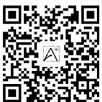

万唯原创试题与内容

投入巨大，来之不易，版权所有

任何商业行为的使用、模仿均属侵权，违者必究

侵权举报电话：029-8756 9851

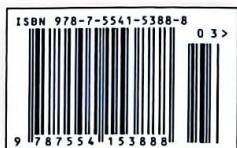

定价：49.90元

万唯中考

万唯中考

全国视野 原创题好

试题:100%原创

重难题配视频讲解

# 大小卷

小卷: 一周一测

大卷: 章测、期中期末测

2025版

更多情境化试题

结合日常生活、数学文化、跨学科学习等创设主题情

境，围绕主题情境原创更多情境题

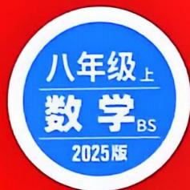

text_image

八年级上
数学BS
2025版

主编 武泽涛 研发 万唯中考千人研究院 西安出版社

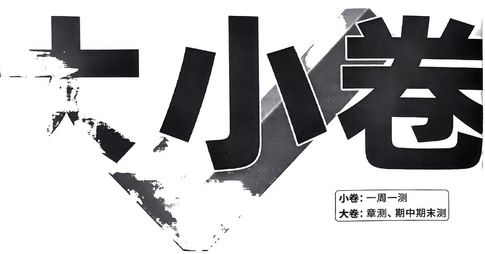

text_image

小卷
小卷: 一周一测
大卷: 章测、期中期末测

# 主编 武泽涛

编者 张贺 蒋继媛 李智惠 李爱军 李莉  
陈素文 张峰 高小超 张寿福 赵音波  
孟令启 史帅丽 刘毅 张金婵 李宏果  
曹晓丹 杜金虹 苏鹏涛 艾燕 郝蓓  
孔文莉 李杰 石磊 韦文月 郑丹丹  
马小丽 杨云芳 蒋航星 罗增胜 陈君镇

编委 姜二嫚 王艳妮 马辉 赵梅香 贾豪勇 李珍珍 杜金金 谭吉丽 李香玉 李思雨 赵湘蓉 王飞艳 王若媛 杨倩倩 杨潜腾

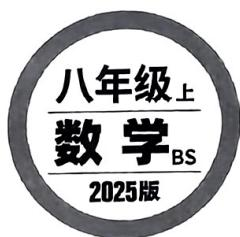

text_image

八年级上
数学BS
2025版

· 重难题视频讲解(20个)  
· 省会城市名校期末试题及解析   
· 几何画板动态演示(含源文件)  
· 期中、期末复习更多好题:选自万唯《情境期末卷》  
- 更多教辅，请关注公众号【全科A+】

主题情境:本书结合日常生活、数学文化、跨学科学习等创设主题情境,围绕主题情境原创更多情境题,让学生在真实情境中掌握知识,提升解决实际问题的能力.

# 周测小卷

# 第一章 勾股定理

周测1 勾股定理及其逆定理 1  
周测2 勾股定理的应用 3  
专题 最短路径问题 …… 5

# 第二章 实数

周测 3 平方根和立方根 …… 7  
周测4 估算和实数 9  
周测5 二次根式 …… 11

# 第三章 位置与坐标

周测6 确定位置及平面直角坐标系 13  
专题 平面直角坐标系中的面积问题 …… 15  
周测7 轴对称与坐标变化 17

# 第四章 一次函数

周测8 函数及一次函数的图象与性质 19  
周测9 一次函数的应用 21  
专题 一次函数的图象与性质 …… 23

# 期中检测

选填及简单解答题题组(一) …… 25   
选填及简单解答题组(二) 27  
中档解答题题组(一) …… 29  
中档解答题题组(二) …… 31  
专题 几何综合题 …… 33

# 第五章 二元一次方程组

周测10 二元一次方程组及其解法 35  
周测11 二元一次方程组的应用 37  
周测12 二元一次方程(组)与一次函数 …… 39  
专题 二元一次方程(组)的实际应用 …… 41

# 大卷

第一章检测卷 1  
主题情境 公园建设  
第二章检测卷 3  
第三章检测卷 5  
主题情境 地理位置中的坐标  
第四章检测卷 7  
主题情境 传统文化之旅  
期中检测卷 9  
第五章检测卷 …… 13  
主题情境 科技创新

# 周测小卷

# 第六章 数据的分析

周测13 平均数、中位数、众数 43

周测14 数据的集中趋势与离散程度 45

# 第七章 平行线的证明

周测15 平行线的判定与性质 47

周测16 三角形的内角和定理 49

专题 三角形中内、外角的有关计算…… 51

教材原题 教材P185第9题

改编1 改变角平分线位置/51

改编2 增加一条外角平分线/51

改编3 变高线为垂线/51

改编4 改高线为垂直平分线/52

# 期末检测

选填及简单解答题题组(一) 53

选填及简单解答题题组(二) 55

中档解答题题组(一) 57

中档解答题题组(二) 59

专题 一次函数综合题 …… 61

# 大卷中考新考法索引

# 开放性试题

满足条件的结论开放 / P3 第 13 题、P5 第 11 题、P9 第 11 题、P19 第 13 题

写理由开放 / P21 第 20 题

# 过程性学习

过程纠错改错 / P3 第 19 题

探究新函数的图象与性质 / P8 第 19 题

补充过程及依据 / P18 第 17 题

# 阅读理解题

解题方法型阅读理解题 / P4 第 22 题、P11 第 20 题、P14 第 20 题

新定义型阅读理解题 / P6 第 20 题、P13 第 15 题

# 综合与实践

操作探究 / P2 第 22 题

课题实践 / P16 第 16 题

类比猜想 / P18 第 22 题

# 大卷

# 第六章检测卷 15

主题情境 共建多彩校园

# 第七章检测卷 17

# 期末检测卷 19

主题情境 校园歌手大赛

# 附：《参考答案》单独成册

# 图书在版编目（CIP）数据

大小卷. 八年级. 上. 数学: BS / 武泽涛主编. — 西安: 西安出版社, 2021.5(2024.5 重印)

ISBN 978-7-5541-5388-8

I. ①大… II. ①武… III. ①中学数学课-初中-习题集 IV. ①G634

中国版本图书馆 CIP 数据核字(2021)第 085526 号

更多教辅，请关注公众号【全科A+】

责任编辑：赵春荣

装帧设计：万唯视觉设计中心

# 大小卷·八年级（上）数学BS

DAXIAOJUAN·BANIANJI (SHANG) SHUXUE BS

主 编：武泽涛

出版发行：西安出版社

社 址：西安市曲江新区雁南五路1868号影视演艺大厦11层

电话：(029) 85253740

邮政编码：710061

印刷：陕西东威印务有限公司

开 本: 880 mm×1230 mm 1/8

印 张：10

字 数：256 千字

版 次：2021年5月第1版

印 次：2024年5月第4次印刷

书号：ISBN 978-7-5541-5388-8

定 价: 49.90 元

版权所有，翻印必究。如有印装质量问题，请到购书书店调换。

√ 本书结构：大卷+周测小卷+参考答案

√ 盗版举报电话：029-8756 9851 / 邮箱：wanwei12315@126.com

√ 咨询、订购：029-8221 5628

# 第一章检测卷

<table><tr><td>题号</td><td>一</td><td>二</td><td>三</td><td>总分</td></tr><tr><td>得分</td><td></td><td></td><td></td><td></td></tr></table>

时间:90 分钟 满分:100 分

# 一、选择题(共10小题,每小题3分,共30分)

1. 下列四组数中,属于勾股数的是 ( )

A. 0.3, 0.4, 0.5

B. 4,5,9

C. 5,12,13

D. ${1}^{2},{2}^{2},5$

2. 将一个直角三角形的各边都扩大或缩小相同的倍数后,得到的三角形 ( )

A. 可能是锐角三角形

B. 不可能是直角三角形

C. 仍然是直角三角形

D. 可能是钝角三角形

3. 在 $\triangle ABC$ 中, 点 $A, B, C$ 的对应边分别为 $a, b, c$ , 下列条件不能判定 $\triangle ABC$ 是直角三角形的是 ( )

A. $\angle B = \angle A + \angle C$

B. ∠A:∠B:∠C=3:4:5

C. $b^{2}=a^{2}+c^{2}$

D. $a:c:b=3:4:5$

4. 日常生活情境(钓鱼)晨光微洒,湖边钓者静心垂钓,如图,已知鱼线没入水中的长度AB为1.5米,在距离鱼线1.2米(BD=1.2米)的水下1米处(CD=1米)有一条鱼发现了鱼饵,于是以0.2米/秒的速度向鱼饵游去,则这条鱼到达鱼饵处至少需要()

A. 6秒

B. 6.5秒

C. 13秒

D. 26秒

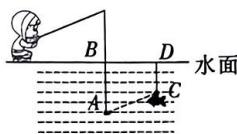  
第4题图

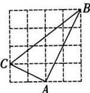  
第5题图

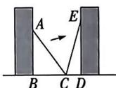  
第6题图

5. 如图, 在 $4 \times 4$ 的正方形网格中, 每个小正方形的边长均为 1, 点 A, B, C 都在格点上, 则下列结论正确的是 ( )

A. $A{B}^{2} = {25}$

B. $\triangle ABC$ 是锐角三角形

C. $\triangle ABC$ 的面积为 6

D. $BC$ 边上的高线长为 2

6. 如图,两个书柜相对平行摆放,当一架梯子倾斜靠在左侧书柜时,梯子底端与左侧书柜的距离为1.5米,顶端与地面的距离为2米. 在保持梯子底端不变的情况下,将梯子顶端倾斜靠在右侧

书柜上时,顶端与地面的距离为 2.4 米,则两个书柜之间的距离为
()

A. 1.5 米

B. 2.2 米

C. 2.4 米

D. 2.5 米

7.（教材P8素材改编）意大利著名画家达·芬奇用如图所示的方法证明了勾股定理. 图①中空白部分由2个正方形和2个全等的直角三角形组成, 其面积为 $S_{1}$ , 通过变化得到图③, 其面积为 $S_{2}$ , 则下列等式成立的是 ( )

A. $S_{1} = a^{2} + b^{2} + 2ab$

B. $S_{1} = a^{2} + b^{2} + \frac{1}{2} ab$

C. $S_{2} = c^{2} + ab$

D. $S_{2}=c^{2}$

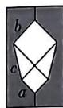  
图①

剪开

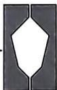  
图②

右边部分
上下翻转

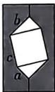  
图③  
第7题图

8. 如图是一公园的外墙, 墙面 ADEF 与地面 ABCD 垂直, 点 P 为墙面上一点, 若 PA = 13 米, AB = 11 米, 点 P 到地面距离是 5 米, 有一只蜘蛛要从点 P 爬到点 B 捕食小虫, 则它的最短路径为 ( )

A. 16 米

B. 18 米

C. 20 米

D. 24 米

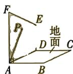  
第8题图

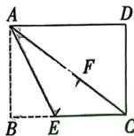  
第9题图

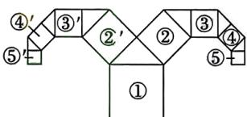

flowchart

第10题图

9. 如图是一张长方形纸片 ABCD, 折叠纸片使 AB 边与对角线 AC 重合, 点 B 落在点 F 处, 折痕为 AE, 若 AD = 8, EF = 3, 则 AB 的长为 ( )

A. 4

B. 5

C. 6

D. 7

10. (教材 P18 第 10 题改编) 如图是一种“羊头”图案, 由若干个正方形与等腰直角三角形构成, 其作法是从正方形①开始, 以其一条边为斜边, 向外作等腰直角三角形, 然后以其直角边为边, 分别向外作正方形②和②', 再分别以正方形②和②'的一条边为斜边, 向外作等腰直角三角形, …, 若正方形⑤的面积为 2 , 则正方形①, ②, ③, ④的面积和为 ( )

A. 55

B. 60

C. 65

D. 70

# 二、填空题(共5小题,每小题3分,共15分)

11. 在 Rt△ABC 中, 直角边 AB, AC 的长分别为 8, 9, 则 BC² 的值为 \_\_\_\_.

12. 如图, 在 $\triangle ABC$ 中, $AC = 8$ , $AD = 3$ , $AB = 4$ , 根据作图痕迹判断: $\triangle ABD$ 是 \_\_\_\_ 三角形.

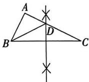  
第12题图

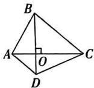  
第13题图

13. 对角线互相垂直的四边形叫做“垂美”四边形, 如图, 四边形 $ABCD$ 是“垂美”四边形, 对角线 $AC, BD$ 交于点 $O$ . 若 $AD = 2, BC = 4$ , 则 $AB^{2} + CD^{2} =$ \_\_\_\_.

14. 数学文化情境 荡秋千 在《算法统宗》中有一道“荡秋千”的问题, 其大意为: 如图, 有一架秋千, 当它静止时, 踏板离地的距离 $CH$ 为 1 尺. 将它往前水平推 10 尺 ( $EB=10$ 尺), 此时秋千的踏板离地的距离 $BD$ 和身高 5 尺的人一样高. 若秋千的绳索始终拉得很直, 则绳索长 \_\_\_\_ 尺.

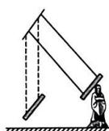

第14题图  
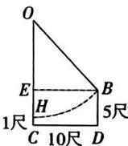

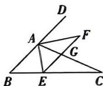  
第15题图

15. 如图, 在 $\triangle ABC$ 中, 点 $D$ 为 $BA$ 延长线上一点, $AE$ 平分 $\angle BAC$ 交 $BC$ 于点 $E$ , 过点 $E$ 作 $EF \parallel AB$ 交 $\angle DAC$ 的平分线于点 $F$ , $EF$ 交 $AC$ 于点 $G$ , 若 $AG = 3$ , 则 $AE^{2} + AF^{2}$ 的值为 \_\_\_\_.

# 三、解答题(共7小题,共55分)

16. (5分)已知在 Rt△ABC 中, 两条直角边 AB, AC 的边长 c, b 满足 $(b-3)^{2}+|c-4|=0$ . 求△ABC 的周长.

万唯原创好题，复印、盗版必究。举报电话：029-8756 9851

17. (6分)如图,两艘轮船同时从港口O出发,一艘轮船以20海里/时的航速沿正东方向航行,另一艘轮船以15海里/时的航速沿正北方向航行,一小时后两艘轮船分别到达A,B点,此时两轮船沿AB航线汇合.

(1) 求 $A, B$ 两点之间的距离；  
(2)若从港口派一艘轮船在 AB 航线上接应,求该轮船行驶的最短距离.

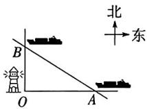  
第17题图

18. (7分)如图是一个无盖圆柱形玻璃容器,底面周长为 $14\mathrm{cm}$ , 高为 $24\mathrm{cm}$ . 蚂蚁在容器上爬行,从容器外壁离容器上沿 $5\mathrm{cm}$ 的点 $A$ 爬到容器内壁离容器底部 $5\mathrm{cm}$ 的点 $B$ 处(点 $B$ 与点 $A$ 相对),求蚂蚁爬行的最短路程.

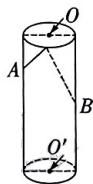  
第18题图

# 主题情境 公园建设 请完成第 19\~20 题

19. (8分)(教材P9例题改编)如图,长方形ABCD是某公园的荷花观赏池,对角线AC为观赏浮桥,点E为公园小门,BE,DE为两条小路,图中阴影部分为草坪,测得AB=15米,AC=25米,DE=60米,BE=65米.

(1) 求观赏池 BC 边的长;   
(2) 求草坪的面积.

2

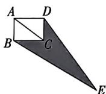  
第19题图

20. (8分)如图, 喷泉广场和儿童游乐场分别位于道路 $AB$ 同侧的点 $C, D$ 处, 已知 $DA \perp AB$ 于点 $A, CB \perp AB$ 于点 $B, AB = 2.2 \mathrm{~km}$ , $AD = 1.7 \mathrm{~km}, BC = 0.5 \mathrm{~km}$ . 为了更好的满足游客的需求, 公园管理方决定在道路 $AB$ 的边上建一个游客服务中心 $E$ , 使得喷泉广场和儿童游乐场到游客服务中心的距离相等.

(1) 游客服务中心应建在距 A 点多少千米处?  
(2) 求 $\angle CED$ 的度数.

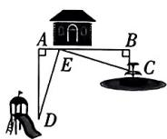  
第20题图

21. (10 分) 如图, 在 Rt△ABC 中, ∠C=90°, AB=5 cm, AC=3 cm, 动点 P 从点 B 出发沿射线 BC 以 2 cm/s 的速度移动, 设运动的时间为 t s.

(1) 若点 P 运动到 BC 的中点时, t 的值为 \_\_\_\_;  
(2) 若 $BP = AP$ , 求 $BP$ 的长;  
(3) 当 $\triangle ABP$ 为直角三角形时, 求 t 的值.

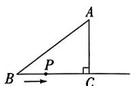  
第21题图

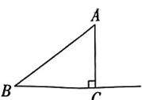  
备用图1

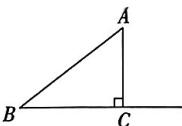  
备用图2

几何画板动态演示

  
勾股定理的动点问题

# 22. (11分)(中考新考法·综合与实践——操作探究)

# 【问题情境】

小明用4张全等的直角三角形纸片拼成图①,已知直角三角形纸片较短的直角边长为a,较长的直角边长为b,斜边长为c,利用此图,可以验证勾股定理吗?

# 【探索新知】

(1)从面积的角度思考,不难发现:大正方形的面积=小正方形的面积+4个直角三角形的面积,用含字母a,b,c的式子可以表示为:\_\_\_\_,化简可证得勾股定理: $a^{2}+b^{2}=c^{2}$ ;

# 【初步运用】

(2)如果大正方形的面积是13,小正方形的面积是1,试求 $(a+b)^{2}$ 的值;

# 【实际应用】

(3)如图②,若较短的直角边BC长为5,将这四个直角三角形中较长的直角边分别向外延长一倍,得到一个“数学风车”,若以AB为边的正方形面积为61,求这个风车的外围周长.

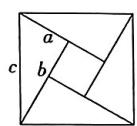  
图①

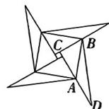  
图②  
第22题图

视频讲解  
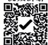  
中考新考法题

先做本章小卷，效果更佳

# 第二章检测卷

<table><tr><td>题号</td><td>一</td><td>二</td><td>三</td><td>总分</td></tr><tr><td>得分</td><td></td><td></td><td></td><td></td></tr></table>

时间:90 分钟 满分:100 分

# 一、选择题(共10小题,每小题3分,共30分)

1. 49的平方根是 （）

A. ±7

B. 7

C. $\pm \sqrt{7}$

D. $\sqrt{7}$

2. 下列实数中, 是无理数的是 ( )

A. 3.14

B. $\frac{1}{5}$

C. $\sqrt{2}$

D. $\sqrt[3]{8}$

3. 下列是最简二次根式的是 ( )

A. $\sqrt{4}$

B. $\sqrt{1.1}$

C. $\sqrt{5}$

D. $\sqrt{\frac{1}{2}}$

4. 下列各组数中, 表示的数一定相同的是 ( )

A. 4 的平方根与 $\sqrt{2^2}$

B. $\sqrt[3]{-8}$ 与 $-\sqrt[3]{-8}$

C. $\sqrt{a^2}$ 与 $\pm a$

D. $(\sqrt{6})^2$ 与6

5. 下列算式计算正确的是 ( )

A. $\sqrt{3} +\sqrt{2} = \sqrt{5}$

B. $\sqrt{8} -\sqrt{2} = \sqrt{6}$

C. $\sqrt{3} \times \sqrt{2} = \sqrt{6}$

D. $\sqrt{12} \div \sqrt{3} = 4$

6. 已知 $\sqrt{7} - 1$ 的整数部分是 $m$ , 小数部分是 $n$ , 则 $\sqrt{7} m - n$ 的值是 ( )

A.-2

B.-1

C. 1

D. 2

7. 日常生活情境 魔方 如图, 已知三阶魔方的体积为 $125 \, cm^{3}$ , 若二阶魔方每个面的面积是三阶魔方每个面面积的 $\frac{4}{5}$ , 则二阶魔方每个面的边长为 ( )

A. $\sqrt{5} \mathrm{~cm}$

B. $\sqrt{10} \mathrm{~cm}$

C. 4 cm

D. $2\sqrt{5}\mathrm{\;{cm}}$

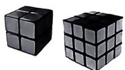  
第7题图

  
第8题图

8. 日常生活情境(花瓶)如图,置物架上的两个花瓶都插上了鲜花,现在向两个花瓶各倒入500 ml的水,发现两个花瓶中水面高度一样,已知长方体花瓶的底面是边长为10 cm的正方形,则圆

柱体花瓶的底面半径 $r$ （花瓶的厚度忽略不计）为 （ ）

A. $\frac{10\sqrt{\pi}}{\pi}\mathrm{cm}$

B. $\frac{10}{\pi} \mathrm{~cm}$

C. $\frac{50}{\pi}\mathrm{cm}$

D. $\frac{100}{\pi} \mathrm{~cm}$

9. (教材 P50 第 7 题改编) 构建几何图形解决代数问题是“数形结合”思想的重要应用. 在比较 $\sqrt{2} + 1$ 与 $\sqrt{5}$ 的大小时, 如图, 在 Rt $\triangle ABC$ 中, $\angle C = 90^{\circ}, AC = CB = 1$ , 易得 $AB = \sqrt{2}$ , 延长 $CB$ 到点 $D$ 使得 $BD = BC = 1$ , 在 Rt $\triangle ACD$ 中, 易得 $AD = \sqrt{5}$ , 在 $\triangle ABD$ 中, 根据三边关系可得 $\sqrt{2} + 1 > \sqrt{5}$ , 类比这种方法, 比较 $\sqrt{5} + 2$ 与 $\sqrt{17}$ 的大小关系为 ( )

A. $\sqrt{5} + 2 > \sqrt{17}$

B. $\sqrt{5} + 2 = \sqrt{17}$

C. $\sqrt{5} + 2 < \sqrt{17}$

D. 无法确定

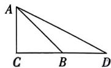  
第9题图

<table><tr><td>A</td><td>B</td><td>5 $\sqrt{2}$ </td></tr><tr><td>5</td><td> $\sqrt{10}$ </td><td>C</td></tr><tr><td> $\sqrt{2}$ </td><td>10</td><td>D</td></tr></table>

第10题图

10. 数学文化情境(幻方)幻方是古老的数学问题,它是一种将数字安排在正方形格子中,使每行、每列和每条对角线上的数字和都相等的方法.类比幻方,我们给出如图所示的方格,要使方格中横向、纵向及对角线方向上的实数相乘结果都相等,则 $A+\bar{B}+\bar{C}+D$ 的值为()

A. $\sqrt{5} - 3$

B. $10 \sqrt{10}$

C. $6 \sqrt{2} + \sqrt{10}$

D. $3 \sqrt{5} + 3$

二、填空题(共5小题,每小题3分,共15分)

11. 若二次根式 $\frac{\sqrt{6 + m}}{2}$ 在实数范围内有意义, 则 $m$ 的取值范围为 \_\_\_\_.

12. 已知一个数的绝对值是 $-\sqrt{a}$ ，则 a 的值为 \_\_\_\_.

13. (中考新考法·满足条件的结论开放) 小华和小刚两人分别拿一张卡片, 小华在卡片上写最简二次根式 $a$ , 小刚在卡片上写最简二次根式 $b$ , 且 $ab = \sqrt{24}$ , 请你写出一对满足条件的 $a, b$ 的值, 分别是 \_\_\_\_ 和 \_\_\_\_.

14. 已知 a, b 分别为 $\triangle ABC$ 的两边，且满足 $\sqrt{a-3} + (b - \sqrt{14})^2 = 0$ ，第三边 $c = \sqrt{5}$ ，则 $\triangle ABC$ 的面积为 \_\_\_\_.

15. 已知正实数 $x$ 的两个平方根是 $m$ 和 $2m - b$ , 且 $m^2 x - 2(2m - b)^2 x + 5x^2 = 4$ , 则 $x$ 的值为 \_\_\_\_.

# 三、解答题(共7小题,共55分)

16. (6分)求满足下列各式的未知数 $x$ :

(1) $5x^{2} - 49 = x^{2}$ ;

(2) $\frac{1}{3}(x+3)^{3}+9=0.$

17. (6分)计算: $(1)-\left(\frac{1}{2}\right)^{-2}+\sqrt{36}-(\pi-3.14)^{0}-|3-\sqrt{10}|$ ;

(2) $\sqrt{\left(-\frac{2}{3}\right)^2} \times \sqrt[3]{64} + (1 - \sqrt{3}) \times (\sqrt{3} + 1)$ .

18. (7 分) 先化简, 再求值: $(x + 2)(3x - 2) - 2x(x + 2)$ , 其中 $x = \sqrt{3} - 1$ .

19. (8 分)(中考新考法·过程纠错改错)数学课上,李老师给大家留了一个题作为课后作业:已知一个数的算术平方根为 $5m+1$ , 平方根为 $\pm(m-3)$ , 求这个数.

以下是乐乐的解题过程：

解：因为一个数的算术平方根为 $5m + 1$ ，平方根为 $\pm (m - 3)$ 所以 $5m + 1 = m - 3$ 或 $5m + 1 = -(m - 3)$

①当 $5m+1=m-3$ 时，解得m=-1，
所以 $5m+1=-4$ ，所以这个数为16；

②当 $5m+1=-(m-3)$ 时，解得 $m=\frac{1}{3}$ ，所以 $5m+1=\frac{8}{3}$ ，所以这个数为 $\frac{64}{9}$ 。综上所述，这个数为16或 $\frac{64}{9}$ 。

李老师检查完作业发现乐乐的答案错了,你知道哪里错了吗?请帮他写出正确的解题过程.

20. (9 分) 跨学科情境 跨物理电磁波传播 电视塔越高, 从塔顶发射出的电磁波传播得越远, 从而能收看电视节目的区域就越广. 电视塔高 $h$ (单位: m) 与电视节目信号的传播半径 $r$ (单位: m) 之间存在近似关系 $r = \sqrt{2Rh}$ , 其中 $R$ 是地球半径, $R \approx 6.4 \times 10^{6} \mathrm{~m}$ , 已知广州塔高约为 $600 \mathrm{~m}$ .

(1) 广州塔发射节目信号的传播半径约为多少？（参考数据： $\sqrt{76.8} \approx 8.76$ ）  
(2) 设一塔高为 $h_{1}$ m, 另外一塔高为 $h_{2}$ m, 求两塔发射节目信号的传播半径之比. (用含 $h_{1}, h_{2}$ 的代数式表示)

21. (9分)(教材P50第10题改编)【动手操作】把一个边长为2的正方形按图①的方式裁成4个形状、大小完全相同的直角三角形,然后按照图②的方式进行拼接,得到正方形ABCD和正方形EFGH.

# 【基础巩固】

(1)如图②,拼成的大正方形ABCD的面积为\_\_\_\_；  
(2)如图③,若把正方形ABCD的边AB放在数轴上,其中点A与数轴原点重合,则点B表示的数在哪两个相邻整数之间?

# 【知识运用】

(3)如图③,若把正方形ABCD的边AB放在数轴上,其中顶点B与数轴上表示-2的点重合,以点B为圆心,BD长为半径画弧,与数轴交于点Q,求点Q表示的数.

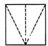  
图①

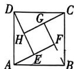  
图②

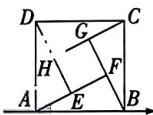  
图③  
第21题图

22. (10 分) (中考新考法·解题方法型阅读理解题) 阅读材料, 解决问题.

给出定义:一个实数的整数部分是不大于这个实数的最大整数,这个实数的小数部分是这个实数与它的整数部分的差.例如:2.4的整数部分为2,小数部分为 $2.4-2=0.4,\sqrt{2}$ 的整数部分为1,小数部分为 $\sqrt{2}-1,-2.6$ 的整数部分为-3,小数部分为 $-2.6-(-3)=0.4$ .由此我们得到:如果 $\sqrt{3}=x+y$ ,其中x是整数,且0<y<1,那么 $x=1,y=\sqrt{3}-1$ .

请解答:(1) $\sqrt{15}$ 的整数部分为\_\_\_\_,小数部分为\_\_\_\_;

(2) 如果 $-\sqrt{11}=a+b$ ，其中 a 是整数，且 0<b<1，求 $b-a+\sqrt{11}$ 的值；  
(3)已知 $7 + \sqrt{5} = x + y$ ，其中 $x$ 是整数，且 $0 < y < 1$ ，求 $x - y$ 的相反数.

视频讲解  
  
中考新考法题

# 第三章检测卷

<table><tr><td>题号</td><td>一</td><td>二</td><td>三</td><td>总分</td></tr><tr><td>得分</td><td></td><td></td><td></td><td></td></tr></table>

时间:90 分钟 满分:100 分

# 一、选择题(共10小题,每小题3分,共30分)

1. 革命文化情境 瞻仰革命纪念地 为重温革命战争时期党中央在延安的峥嵘岁月, 李华计划瞻仰延安革命纪念地, 下列表述能准确表示延安市地理位置的是 ( )

A. 陕西省北部

B. 距离西安市约 371 千米

C. 东经 $108^{\circ}$ 北纬 $36^{\circ}$

D. 东隔黄河与山西临汾相望

2. 已知点 $A(-1, m)$ 和点 $B(n, 4)$ 关于 $y$ 轴对称，则 $m + n$ 的值为（）

A. -5

B. -3

C. 3

D. 5

3. 跨学科情境/跨体育冰壶 冰壶是在冰上进行的一种投掷性竞赛项目,如图是两队在一局比赛后投掷的冰壶位置图,以冰壶大本营内的中心点为原点 O 建立平面直角坐标系,按照规则更靠近原点的壶为本局胜方,则胜方最靠近原点的壶所在位置位于 ( )

A. 第一象限

B. 第二象限

C. 第三象限

D. 第四象限

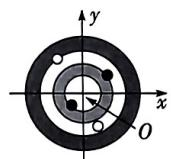  
第3题图

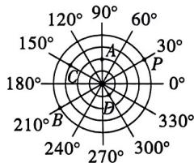

text_image

120°
90°
60°
150°
A
30°
180°
C
B
0°
330°
270°
240°
210°
B
300°
330°
360°

第5题图

4. 已知点 $A(-1, -4), B(3, -4)$ , 则下列说法正确的是 ( )

A. $A, B$ 关于 $x$ 轴对称

B. $A, B$ 关于 $\gamma$ 轴对称

C. 直线 $AB$ 平行于 $x$ 轴

D. 直线 $AB$ 平行于 $y$ 轴

5.（教材P196第23题改编）如图，从最小圆到最大圆的半径依次为1,2,3,4,若点 $P$ 可用 $(4,30^{\circ})$ 表示，那么下列表示点的方式正确的是 （）

A. 点 $A\left( {{90}^{ \circ  },2}\right)$

B. 点 $B(4,150^{\circ})$

C. 点 $C(150^{\circ},3)$

D. 点 $D\left( {1,{300}^{ \circ  }}\right)$

6. 点 $Q(a + 5, a - 2)$ 在 $y$ 轴上, 则点 $Q$ 的坐标为 ( )

A. $(0, -7)$

B. $(0,-5)$

C. (0,2)

D. (2,0)

# 主题情境 地理位置中的坐标 请完成第7\~8题

7. “西湖十景”是指浙江省杭州市著名旅游景点西湖上的十处特色风景。如图，是李华手绘的游览图，若“断桥残雪”的坐标为(4, 4)，“双峰插云”的坐标为(-4,2)，则下列其他景点的坐标表示正确的是（）

A. 南屏晚钟(3,-3)

B. 曲院风荷(-2,4)

C. 花港观鱼(-2,1)

D. 三潭印月(1,2)

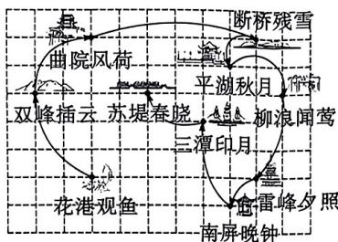

flowchart

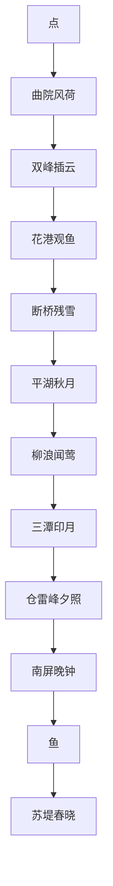

第7题图

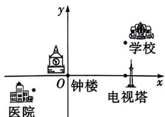

text_image

y
x
钟楼
医院
学校
电视塔

第8题图

8. 如图, 以钟楼为坐标原点建立平面直角坐标系, 学校、医院、电视塔的坐标分别表示为 $(4, a + 2), (2a - 3, -1), (4, 0)$ , 已知学校到电视塔的距离与医院到 $y$ 轴的距离相等, 则 $a$ 的值为 ( )

A.-1

B. $-\frac{1}{3}$

C. $\frac{1}{3}$

D. 1

在平面直角坐标系中,绘制如图所示的曲线,给出下列四个结论:①曲线经过的整点(即横、纵坐标均为整数的点)中,横、纵坐标互为相反数的点有2个;②曲线在第一、二象限中的任意一点到原点的距离都大于1;③曲线所围成的“心形”区域的面积大于3,其中正确的有()

A. ①②

B. ②③

C. ①③

D. ①②③

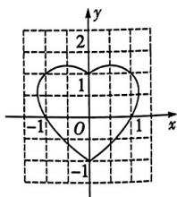

text_image

y
2
1
-1 O 1 x
-1

第9题图

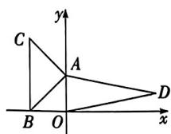  
第10题图

10. 如图, 在平面直角坐标系中, $A(0, a), B(b, 0), C(-2, c)$ , 其中 $a, b, c$ 满足 $\sqrt{(a - 2)^2} + (b + 2)^2 + |c - 4| = 0$ , 若在第一象限内有一点 $D(m, 1)$ , 使得 $S_{\triangle ABC} = \frac{1}{2} S_{\text{四边形}ABOD}$ , 则 $m$ 的值为 ( )

A. 6

B. 8

C. 10

D. 11

# 二、填空题(共5小题,每小题3分,共15分)

11. (中考新考法·满足条件的结论开放)在平面直角坐标系中,点 $A(x,y)$ 在第二象限,且点A到x轴的距离小于到y轴的距离,请写出一个符合条件的点A的坐标: \_\_\_\_.

12. 在平面直角坐标系中, 若点 $M$ 的坐标为 $(m, n)$ , 则点 $M$ 关于 $x$ 轴的对称点 $M'$ 的坐标为 \_\_\_\_.

13. 在平面直角坐标系中, 已知点 $A(3, -2), B(-2, 2)$ , 经过点 $A$ 的直线 $l$ 与 $y$ 轴平行, 若点 $M$ 是直线 $l$ 上的一个动点, 则当线段 $BM$ 的长度最短时, 点 $M$ 的坐标为 \_\_\_\_.

14. 日常生活情境/销售的奥秘 李华发现便利店的三明治在不同时段价格不同,他统计了某一天三款三明治的销售情况如图所示.其中点 $A_{1}, A_{2}, A_{3}$ 的横、纵坐标分别表示甲、乙、丙三款三明治早上销售的单价和数量,点 $B_{1}, B_{2}, B_{3}$ 的横、纵坐标分别表示甲、乙、丙三款三明治傍晚销售的单价和数量.有如下3个结论:①早上甲款三明治的价格最高;②傍晚销售数量最多的是丙款三明治;③在这一天中,乙款三明治的销售数量最高,所有正确结论的序号是

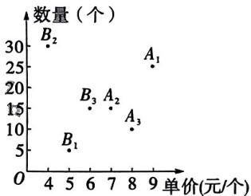

scatter

| 单价 (元/个) | 数量 (个) |
| :--- | :--- |
| 4 | 30 |
| 5 | 6 |
| 6 | 15 |
| 7 | 15 |
| 8 | 10 |
| 9 | 25 |

第14题图

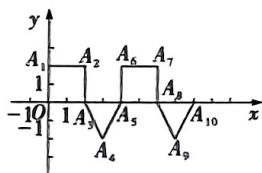

line

| Point | x | y |
|---|---|---|
| A₁ | 1 | 1 |
| A₂ | 1 | 1 |
| A₃ | 1 | -10 |
| A₄ | 1 | 0 |
| A₅ | 1 | 1 |
| A₆ | 1 | 1 |
| A₇ | 1 | 1 |
| A₈ | 1 | -1 |
| A₉ | 1 | 0 |
| A₁₀ | 1 | 1 |

第15题图

15. 如图, 在平面直角坐标系中, 点 $A$ 从点 $A_{1}(0,2)$ 出发, 第 1 次由点 $A_{1}$ 跳动至点 $A_{2}(2,2)$ , 第 2 次由点 $A_{2}$ 跳动至点 $A_{3}(2,0)$ , 第 3 次由点 $A_{3}$ 跳动至点 $A_{4}(3,-2)$ , 第 4 次由点 $A_{4}$ 跳动至点 $A_{5}(4,0), \cdots$ , 根据这个规律, 则点 $A_{102}$ 的坐标是 \_\_\_\_.

# 三、解答题(共7小题,共55分)

16. (5分)(教材P71第3题改编)如图,以正方形ABCD的两条边AB,CD为底边,向外作两个等腰直角三角形,已知正方形的边长为4,请在图中建立合适的平面直角坐标系,并求出各顶点的坐标.

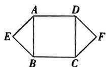  
第16题图

万唯原创好题，复印、盗版必究。举报电话：029-8756 9851

17. (5 分) 在如图所示的平面直角坐标系中, 回答下列问题:

(1)已知坡子岗的坐标为 $(-3,3)$ ，在图中描出该点；  
(2) 按照要求写出各地点的坐标：

第一象限内:杏花村(1,2);

第三象限内：\_\_\_\_；(至少写两个)

坐标轴上：\_\_\_\_。（至少写两个）

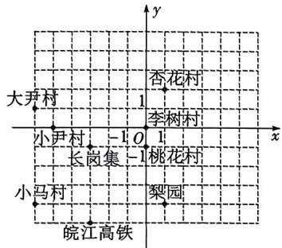

text_image

大尹村
小尹村
长岗集 -1 O 1
小马村
皖江高铁
杏花村
李树村
桃花村
梨园

第17题图

18. (5 分) 已知点 $M$ 的坐标为 $(m + 4, 2m - 1)$ , 分别根据下列条件求点 $M$ 的坐标.

(1) 若点 M 在第四象限, 且到 x 轴, y 轴的距离相等;  
(2) 点 $N$ 的坐标为 $(8,5)$ , 且直线 $MN$ 与 $y$ 轴平行.

19. (7分)如图,在平面直角坐标系中,点A(-2,5),点B(-2,0),点C(-5,3).

(1) 将 $\triangle ABC$ 各顶点的横坐标乘-1, 纵坐标不变, 得到 $\triangle A'B'C'$ , 请图中画出 $\triangle A'B'C'$ , $\triangle A'B'C'$ 各顶点的坐标分别为: $A'(\frac{1}{2}, \_\_)$ , $B'(\_, \_\_)$ , $C'(\_, \_\_)$ ;

(2) 计算 $\triangle ABC$ 的面积；  
(3) 若在 $y$ 轴上有一点 $P$ , 使 $B' P + C' P$ 的值最小, 求出该最小值.

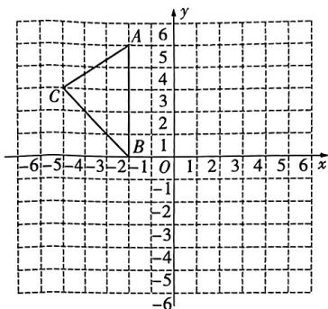

text_image

A
6
5
4
3
2
1
B
-1
-2
-3
-4
-5
-6
-6

第19题图

20. (10分)(中考新考法·新定义型阅读理解题)在平面直角坐标系中,点 $P(x,y)$ 的横坐标x的绝对值表示为 $|x|$ ,纵坐标y的绝对值表示为 $|y|$ ,我们把点 $P(x,y)$ 的横坐标与纵坐标的绝对值之和叫做点 $P(x,y)$ 的勾股值,记为[P],即[P]=|x|+|y|,例如点 $P(-1,3)$ 的勾股值[P]=|-1|+|3|=4.

(1) 求点 $A(-2,4)$ 的勾股值 $[A]$ ;  
(2) 若点 $M(m, n)$ 在第三象限内，且 $m, n$ 均为整数， $[M] = 3$ ，请求出点 $M$ 的坐标；  
(3)在(2)的条件下,点O为坐标原点,点E在x轴正半轴上,其勾股值 $[E]=2$ ,求 $\frac{OM}{OE}$ 的值.

21. (11 分) 如图是一个在平面直角坐标系中从原点开始的回形图, 其中回形通道的宽和 OA 的长都是 1.

(1)请写出点 $D, F$ 的坐标及其所在象限；  
(2)在图中将回形图继续画下去；(至少再画出4个拐点)  
(3)说出回形图中位于第一象限的拐点的横坐标与纵坐标之间的关系；  
(4) 观察图形找出规律, 求出第 713 个拐点的坐标.

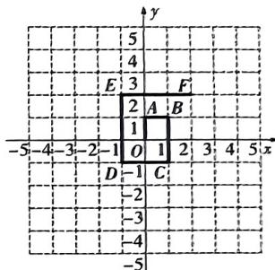

text_image

y
5
4
E 3 F
2 A B
1
O 1 2 3 4 5 x
-5 -4 -3 -2 -1 D -1 C
-2
-3
-4
-5

第21题图

22. (12 分) 如图, 在平面直角坐标系中, 长方形 $OABC$ 的边 $OC, OA$ 分别在 $x$ 轴, $y$ 轴上. 已知点 $A(0,8), C(-6,0)$ , 若动点 $P$ 从点 $A$ 出发, 沿着 $A \to B \to C$ 的方向以每秒 2 个单位长度的速度匀速运动, 运动到点 $C$ 停止, 设点 $P$ 的运动时间为 $t$ 秒.

(1) 求点 $B$ 的坐标；  
(2) 当点 $P$ 运动时, 用含 $t$ 的式子表示线段 $BP$ 的长;  
(3) 若点 $D$ 的坐标为 $(0,2)$ , 是否存在 $t$ , 使 $S_{\triangle BPD} = \frac{1}{4} S_{\text{长方要} \triangle ABC}$ ? 若存在, 求出 $t$ 的值; 若不存在, 请说明理由.

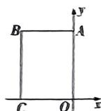  
第22题图

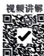  
第22题

先做本章小卷，效果更佳

# 第四章检测卷

<table><tr><td>题号</td><td>一</td><td>二</td><td>三</td><td>总分</td></tr><tr><td>得分</td><td></td><td></td><td></td><td></td></tr></table>

时间:90 分钟 满分:100 分

# 一、选择题(共10小题,每小题3分,共30分)

1. 下列式子中, $y$ 不是 $x$ 的函数的是 ( )

A. $y = -2x$

B. $y = 2x^{2}$

C. $|y| = x$

D. $y = \frac{3}{x}$

2. 已知一次函数 $y = (1 - k)x^{|k|} + 1$ ，则 $k$ 的值为 （）

A. $\pm 1$

B. -1

C. 1

D. 2

3. 正比例函数 y=kx 的图象如图所示, 下列各点中在该函数图象上的是 ()

A. $(-2, - 1)$

B. $(-1, \frac{1}{2})$

C. $(1, \frac{1}{3})$

D. $(4, -2)$

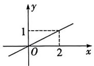  
第3题图

  
第4题图

4. 幸福小区计划在一块长方形空地上种植花草树木, 已知空地的一边靠墙(墙足够长), 另外三边用护栏围成, 护栏总长为 60 m. 如图, 设长方形空地的长为 y m, 宽为 x m, 当 x 在一定范围内变化时, y 与 x 之间的函数关系式为 ( )

A. $y = 30x$

B. $y = \frac{60}{x}$

C. $y = 60 - 2x$

D. $y = x(60 - x)$

5. 若一次函数 $y = (1 - m)^2 x - 3$ 的图象经过点 $A(x_1, y_1)$ ，点 $B(x_1 + 1, y_2)$ ，则 $y_1$ 和 $y_2$ 的大小关系是（）

A. $y_{1} > y_{2}$

B. $y_{1} <   y_{2}$

C. $y_{1} = y_{2}$

D. 无法判断

6. 已知一次函数 $y = x + 3$ 的图象与 $y = -3x - 1$ 的图象交于点 $Q$ ，则点 $Q$ 的坐标为（）

A. $(-1, -2)$

B. $(-1,2)$

C. (1,4)

D. (2,1)

7. 两个一次函数 $y_{1} = x + m$ 与 $y_{2} = -mx - 1 (m \neq 0)$ 的图象在同一平面直角坐标系中可能是（）

  
A

  
B

  
C

  
D

# 主题情境 游泳馆设施升级 请完成第8\~9题

8. 为了提高顾客的便利性, 悦水游泳馆计划增加一批储物柜. 现有 A, B 两款储物柜的价格如下表:

<table><tr><td></td><td>A款</td><td>B款</td></tr><tr><td>价格(元/个)</td><td>62</td><td>90</td></tr></table>

若游泳馆计划购进两款储物柜共20个,且B款储物柜不少于7个,则购买储物柜的最低费用为()

A. 1800元

B. 1464元

C. 1436元

D. 1240元

9. 悦水游泳馆更换了泳池循环水设备, 现需要给泳池注水检测设备, 已知泳池的容积为 $1200 \, m^{3}$ , 打开进水口注水时, 游泳池的蓄水量 $y(\mathrm{m}^{3})$ 与注水时间 $t(\mathrm{h})$ 之间满足一次函数关系, 其图象如图所示, 下列说法错误的是 ( )

A. 该游泳池内开始注水前已经蓄水 $250 \mathrm{~m}^{3}$   
B. $y$ 与 $t$ 之间的函数关系式为 $y = 175t + 250$   
C. 当注水 3 h 时, 游泳池的蓄水量为 $775 \, m^{3}$   
D. 当游泳池注满水时,所需时间为 5 h

  
第9题图

  
图①

  
图②  
第10题图

10. 如图①, 在长方形 $ABCD$ 中, 点 $M$ 从点 $B$ 出发以每秒 1 个单位的速度沿 $B \to C \to D$ 的方向运动到点 $D$ , $\triangle ADM$ 的面积 $y$ 与运动时间 $t$ 的函数关系如图②所示, 当 $\triangle ADM$ 的面积为 6 时, $t$ 的值为 ( )

A. 4

B. 4.2

C. 4.6

D. 4.8

# 二、填空题(共5小题,每小题3分,共15分)

11. 在函数 $y=\frac{\sqrt{x}}{1-x}$ 中, 自变量 x 的取值范围为 \_\_\_\_.  
12. 已知直线 l 的函数表达式为 y=5x-4，将直线 l 向上平移 5 个单位后得到直线 m，则直线 m 的函数表达式为 \_\_\_\_。  
13. 在同一平面直角坐标系中, 正比例函数 $y = k_{1}x, y = k_{2}x$ 和 $y = k_{3}x$ 的图象如图所示, 则 $k_{1}, k_{2}, k_{3}$ 的大小关系是 \_\_\_\_. (用“>”连接)

  
第13题图

14. 客运站的收支差额 $y$ (元)与客运量 $x$ (人)的函数关系如图中直线 $l$ 所示(收支差额=车票收入-固定支出),为提高经济效益,客运部门提出方案,想达到直线 $l_1$ 和 $l_2$ 的预期结果.方案一:提高票价,固定支出不变,可以达到直线\_\_\_\_;方案二:票价不变,减少固定支出,可以达到直线\_\_\_\_.

  
第14题图

text_image

y
A₁₀
y=x
A₇
A₆
A₈
A₅
A₄
A₃
A₂
A₁
O
x

第15题图

15. 如图, 在平面直角坐标系中, 边长均为 $\sqrt{2}$ 的正方形 $A_{1}A_{2}A_{3}A_{4}, A_{5}A_{6}A_{7}A_{8}, \cdots, A_{n}A_{n+1}A_{n+2}A_{n+3}$ 的顶点 $A_{1}, A_{4}, A_{5}, A_{8}, \cdots, A_{n}, A_{n+3}$ , 都在函数 $y = x$ 图象上, 其中 $OA_{1} = \sqrt{2}$ , 点 $A_{2}$ 在 $y$ 轴上. 一动点 $P$ 从原点 $O$ 出发, 以每秒 $\sqrt{2}$ 个单位长度的速度沿箭头所示方向运动, 当点 $P$ 运动到第 1002 秒时, 点 $P$ 的坐标为 \_\_\_\_.

# 三、解答题(共7小题,共55分)

16. (6分)已知 $y - 2$ 与 $x + 1$ 成正比例, 当 $x = 1$ 时, $y = 0$ .

(1) 求 y 与 x 之间的函数表达式；  
(2) 若 $-1 \leqslant x \leqslant 5$ ，求对应 y 的取值范围.

17. (6分)已知一次函数 $y = mx - (m - 2)$ ( $m$ 为常数且 $m \neq 0$ ).

(1) 若点 $(2, -1)$ 在该函数图象上, 求 m 的值;  
(2)若将该一次函数图象向下平移4个单位长度后经过点(-1,4)，求平移后的图象与 $x$ 轴的交点坐标

18. (6分) 跨学科情境 跨物理沸点 乐乐查阅资料发现, 水的沸点 $y$ (单位: $\mathrm{^\circ C}$ ) 与海拔 $x$ (单位: $\mathrm{km}$ ) 之间近似地满足一次函数关系, 当海拔为 $0 \mathrm{~km}$ 时, 水的沸点为 $100 \mathrm{^\circ C}$ , 当海拔为 $6 \mathrm{~km}$ 时, 水的沸点为 $82 \mathrm{^\circ C}$ .

(1) 求 $y$ 与 $x$ 之间的函数关系式；  
(2)已知某地的平均海拔为 $300 \, m$ ，求该地水的沸点.

19. (7 分)(中考新考法·探究新函数的图象与性质)学习了列表、描点、连线三步画函数图象的方法,小明发现可以应用它探究各种函数的性质,于是构造出函数 $y=2|x-1|-3$ ,并应用以上三步做探究:

列表：

<table><tr><td>x</td><td>...</td><td>-2</td><td>-1</td><td>0</td><td>1</td><td>2</td><td>3</td><td>4</td><td>...</td></tr><tr><td>y</td><td>...</td><td></td><td></td><td></td><td></td><td></td><td></td><td></td><td>...</td></tr></table>

描点、连线：

(1) 帮助小明完成上面表格；  
(2)在如图所示的平面直角坐标系中,画出函数 $y=2|x-1|-3$ 的图象;  
(3)在图中画出函数 $y = -\frac{2}{3} x + \frac{1}{3}$ 的图象，并利用函数图象求方程 $\frac{2}{3} x + \frac{1}{3} = 2|x - 1| - 3$ 的解.

text_image

y
5
4
3
2
1
-5 -4 -3 -2 -1 O 1 2 3 4 5 x
-1
-2
-3
-4
-5

第19题图

8

主题情境 传统文化之旅 时光特色旅行社是一个致力于体验各种传统文化活动的团队. 请完成第 20\~21 题

20. (8 分) 如图, 顶碗是我国传统杂技节目, 旅行社成员在观看顶碗表演时发现这些大小相同的瓷碗整齐地摞在一起时, 碗的总高度 $y$ (厘米) 与碗的数量 $x$ (个) 之间满足一次函数关系. 已知 1 个碗的高度为 8 厘米, 3 个碗摞起来的高度为 13 厘米, 5 个碗摞起来的高度为 18 厘米.

(1) 求出 $y$ 与 $x$ 之间的函数关系式;  
(2) 某次演出为了让观众有好的观看体验, 要求演员在直立的状态下顶 9 个碗, 已知顶碗演员的身高为 170 厘米, 则该演员顶碗时的总高度为多少厘米?

  
第20题图

21. (10 分)中国是一个历史悠久的文明古国,拥有丰富多样的美食文化. 旅行社计划与一家以传统美食为特色的连锁餐厅合作,该餐厅对于团购套餐推出甲、乙两种“畅享卡”:

甲:按照次数收费;

乙:收取会员卡费用后每次打折收费.

设消费次数为 $x$ 时, 所需费用为 $y$ 元, 且 $y$ 与 $x$ 的函数关系如图所示. 设 $y_{\text{甲}} = k_1 x, y_{\text{乙}} = k_2 x + b$ ,

根据图中信息,解答下列问题:

(1) 分别求 $y_{\text{甲}}$ 、 $y_{\text{乙}}$ 与 $x$ 的函数关系式, 并说明 $k_{1}$ 和 $b$ 表示的实际意义;  
(2)旅行团消费多少次时,两种“畅享卡”花费一样?费用是多少?

(3)旅行团在一次旅行中准备了2000元的费用来该餐厅用餐,请问选择哪种“畅享卡”更划算?

line

| x/次 | 甲 y/元 | 乙 y/元 |
| ---- | ------- | ------- |
| 0    | 0       | 0       |
| 2    | 640     | 640     |
| 6    | 1600    | 1600    |

第21题图

22. (12 分) 如图, 在平面直角坐标系中, 直线 $l$ 与 $\gamma$ 轴, $x$ 轴分别交于 $A(0,4), B(-4,0)$ 两点, 以线段 $AB$ 为一直角边向直线 $l$ 左侧作等腰直角 $\triangle ABC$ .

(1) 求直线 $l$ 的函数表达式；  
(2) 将直线 $l$ 向上平移 $m$ 个单位, 当直线 $l$ 与线段 $AC$ 有交点时, 求 $m$ 的取值范围;  
(3)已知点 $D$ 与点 $A$ 关于 $BC$ 对称, 若直线 $l$ 上存在一点 $P$ , 使得 $\triangle ADP$ 是以 $AD$ 为腰的等腰三角形, 请求出点 $P$ 的坐标.

  
第22题图

视频讲解  
  
第22题

# 期中检测卷

<table><tr><td>题号</td><td>一</td><td>二</td><td>三</td><td>总分</td></tr><tr><td>得分</td><td></td><td></td><td></td><td></td></tr></table>

时间:100 分钟 满分:120 分

# 一、选择题(共10小题,每小题3分,共30分)

1. 实数9的平方根是 （）

A. 3

B. -3

C. $\pm 3$

D. 9

2. 在如图所示的平面直角坐标系中,被墨水污染的点的坐标可能是 ( )

A. (1,1)

B. $(-2,3)$

C. $(-3, -2)$

D. $(3, - 3)$

  
第2题图

  
第7题图

3. 以下列各组数据为边长,能构成直角三角形的是 ( )

A. 4,5,6

B. 9,16,25

C. 12,18,24

D. 10,24,26

4. 在实数 $\frac{1}{7}, 0.3, \sqrt{7}, \frac{\pi}{2}, 0.1010010001, \sqrt[3]{-27}, 0.35$ 中，无理数有 （）

A. 1 个

B. 2 个

C. 3个

D. 4个

5. 下列计算正确的是 ( )

A. $\sqrt{2} +\sqrt{4} = \sqrt{6}$

B. $\sqrt{18} -\sqrt{8} = \sqrt{2}$

C. $\sqrt{2} \times \sqrt{6} = 3\sqrt{2}$

D. $\sqrt{5} \div \sqrt{\frac{1}{5}} = 25$

6. 若点 $(\sqrt{3}, y_1)$ 和 $(\frac{3}{2}, y_2)$ 在一次函数 $y = -2x + b$ 的图象上，则 $y_1$ 与 $y_2$ 的大小关系是 （）

A. $y_{1} <   y_{2}$

B. $y_{1}=y_{2}$

C. $y_{1} > y_{2}$

D. 无法判断

7. 实数 $a, b$ 在数轴上的位置如图所示，则 $\sqrt{a^2 + 2a + 1} + \sqrt{(b - 3)^2}$ 的化简结果是 （）

A. $2 - a - b$

B. $a + b$

C. $a - b - 3$

D. $b - a + 1$

8.（教材P99第8题改编）已知正比例函数 $y = kbx$ ( $k, b$ 为常数)的图象如图所示，则一次函数 $y = kx + b$ 的图象可能是

  
第8题图

  
A

  
B

  
C

  
D

9. 如图, 在长方形 $ABCD$ 中, $AB = 12, AD = 10, F$ 为 $BC$ 的中点, $E$ 为 $CD$ 边上一动点, 连接 $DF, EF$ . 将 $\triangle CEF$ 沿 $EF$ 折叠, 点 $C$ 落在 $DF$ 上的点 $C'$ 处, 则 $DE$ 的长为 ( )

A. 7

B. $\frac{26}{3}$

C. 8

D. $\frac{17}{2}$

  
第9题图

  
第10题图

10. 如图, 正方形 $APBC$ 放置在平面直角坐标系中, 点 $P$ 在 $y$ 轴正半轴上, 已知点 $A, P$ 的坐标分别为 $(4,0), (0,2)$ , 当直线 $y = x + b$ 与线段 $BC$ 有交点时, $b$ 的取值范围是 ( )

A. $-2 < b < 4$

B. $-2 \leqslant b \leqslant 4$

C. $0 < b < 6$

D. $0 \leqslant b \leqslant 6$

# 二、填空题(共5小题,每小题3分,共15分)

11. (中考新考法·满足条件的结论开放) 请写出一个使 $\sqrt{a - 3}$ 有意义的整数 $a$ 的值 \_\_\_\_.

12. 科技发展情境/地铁线路如图是西安的部分地铁线路图,已知地铁站“大明宫西”和“余家寨”的坐标分别是(-1,1)和(3,3),则“凤城五路”站点的坐标是\_\_\_\_.

text_image

凤城五路
市图书馆
大明宫西
龙首原
百花村
余家寨
大明宫北
大明宫

第12题图

  
第14题图

line

| x/吨 | l₁     | l₂     |
| ---- | ------ | ------ |
| 1    | 1000   | 2000   |
| 2    | 2000   | 2500   |
| 3    | 3000   | 3000   |
| 4    | 4000   | 3500   |
| 5    | 5000   | 4000   |
| 6    | 6000   | 4500   |
| 7    | 7000   | 5000   |
| 8    | 7000   | 5500   |

第15图

13. 已知点 $P(m + 2, 2m - 4)$ 在 $\gamma$ 轴上, 则点 $P$ 的坐标是 \_\_\_\_.

14. 日常生活情境 U 型滑板运动场; 如图是一个供滑板爱好者使用的 U 型池, 该 U 型池可以看作是一个长方体去掉一个“半圆柱”而成, 中间可供滑行部分的截面是弧长为 $18 \mathrm{~m}$ 的半圆, 其边缘 $AB = CD = 30 \mathrm{~m}$ , 点 $E$ 在 $CD$ 上, $CE = 6 \mathrm{~m}$ . 一位滑板爱好者从点 $A$ 出发滑到点 $E$ , 则他滑行的最短距离为 \_\_\_\_ m.

15. 如图, $l_{1}$ 反映了某种产品的销售收入与销售量的关系, $l_{2}$ 反映了该种产品的销售成本与销售量的关系. 根据图象提供的信息, 有以下说法: ① $l_{2}$ 的函数表达式为 $y = 500x + 1000$ ; ② 销售量为 2 吨时, 该产品的销售收入与成本相等; ③ 销售成本是 3000 元时, 该产品亏本; ④ 当前销量为 4 吨时, 该产品盈利 1000 元. 其中正确的有 \_\_\_\_. (填序号)

万唯原创好题，复印、盗版必究。举报电话：029-8756 9851

# 三、解答题(共8小题,共75分)

16. (8 分) 计算:

(1) $\frac{1}{\sqrt{2} - 1} + \sqrt{3} (\sqrt{3} - \sqrt{6}) + \sqrt{8}$ ;

(2) $\sqrt[3]{-64}-(-2\sqrt{5}+\sqrt{125})\div\sqrt{5}+\sqrt{2^{2}}.$

17. (8分)已知 $5a - 7$ 的立方根是 $2, a + 2b$ 的算术平方根是 $\mathbb{5}, c$ 是 $\sqrt{18}$ 的整数部分.

(1) 求 $a + b + c$ 的值;

(2) 若 $x$ 是 $\sqrt{b}$ 的小数部分, 求 $x(\sqrt{b} + 3)$ 的平方根.

18. (9 分) 在边长为 1 的小正方形组成的网格中建立如图所示的平面直角坐标系, 已知 $\triangle ABC$ 的三个顶点都在格点上.

(1) 画出 $\triangle ABC$ 关于直线 $x = -1$ 对称的 $\triangle A_{1}B_{1}C_{1}$ , 并写出点 $A_{1}, B_{1}, C_{1}$ 的坐标;  
(2) 在(1)的基础上, 连接 $AC_{1}, BC_{1}$ , 求 $\triangle ABC_{1}$ 的面积.

text_image

x=-1
y
5
4
3
A
B
1
-5-4-3-2-1 O 1 2 3 4 x
-1
-2
-3

第18题图

19. (9分)日常生活情境除霾车是一种户外除霾抑尘产品,有极强的净化力,可以为大众提供洁净的户外空间.如图,现有一台除霾车由点A向点B行驶,已知点C为幼儿园,且点C与A,B两点之间的距离分别为6 km和8 km,AB=10 km,以除霾车为圆心,周围5 km以内为受净化区域.

(1) 求幼儿园 C 到直线 AB 的最短距离；  
(2)已知除霾车的速度为 $35\mathrm{km / h}$ , 请问幼儿园 $C$ 是否受到除霾车的影响? 若受到影响, 计算受影响的时间; 若不受影响, 请说明理由.

  
第19题图

20. (9分)(中考新考法·解题方法型阅读理解题)数形结合是数学中重要的解题方法,如“当 $0 < x < 7$ 时,求代数式 $\sqrt{x^2 + 1} +\sqrt{(7 - x)^2 + 4}$ 的最小值”,如图,其中 $\sqrt{x^2 + 1}$ 可看作两直角边分别为 $x$ 和 1 的 Rt△AEF 的斜边长 EF,同理 $\sqrt{(7 - x)^2 + 4}$ 可看作两直角边分别为 $7 - x$ 和 2 的 Rt△CDF 的斜边长 CF,于是将问题转化为求 $EF + CF$ 的最小值,当 $E,F,C$ 三点共线时, $EF + CF$ 的值最小.若当 $0 < x < 8$ 时,求代数式 $\sqrt{x^2 + 25} +\sqrt{(8 - x)^2 + 9}$ 的最小值.

  
第20题图

21. (10 分) 京沪高速铁路由北京南站至上海虹桥站, 全长约 $1300 \mathrm{~km}$ , 两列高铁先后从北京南站开往上海虹桥站, 先出发的甲列车的速度为 $260 \mathrm{~km} / \mathrm{h}$ , 后出发的乙列车的速度为 $325 \mathrm{~km} / \mathrm{h}$ , 行驶一段路程后, 乙列车突然发生故障, 需要在沿途的车站就近停靠检修, 检修完成后继续行驶, 已知甲列车比乙列车早出发半个小时 (全程均按匀速行驶), 两列高铁和北京南站之间的距离 $y$ (单位: km) 与甲列车行驶的时间 $x$ (单位: h) 之间的关系如图所示.

(1)乙列车出发多久后追上甲列车?   
(2)若乙列车检修耗时 $54\mathrm{min}$ ，且保持原速度前往上海虹桥站，求甲列车比乙列车早多久到达上海虹桥站？  
(3) 在 (2) 的条件下, 当甲列车到达上海虹桥站时, 求乙列车与上海虹桥站之间的距离.

line

| x/h | y/km |
| --- | ---- |
| 0.5 | 1300 |

第21题图

万唯原创好题，复印、盗版必究。举报电话：029-8756 9851

22. (10 分) 如图, 在长方形 $ABCD$ 中, $AD = 8 \mathrm{~cm}, AB = 6 \mathrm{~cm}, AC$ 为长方形的对角线, 点 $P$ 为长方形边上一动点, 点 $P$ 以 $2 \mathrm{~cm} / \mathrm{s}$ 的速度沿着 $A \rightarrow B \rightarrow C \rightarrow D \rightarrow A$ 的路径匀速运动 (到达 $A$ 点时停止运动), 设点 $P$ 的运动时间为 $t \mathrm{~s}$ .

(1) 当点 P 在 AD 上运动时, 若 DP = AB, 求 t 的值;  
(2) 在点 P 运动过程中, 若 $BP \perp AC$ , 求 t 的值.

  
第22题图

视频讲解  
  
第22题

23. (12 分) 如图, 在平面直角坐标系中, 函数 $y = \frac{1}{2} x$ 的图象为直线 $l_1$ , 函数 $y = -2x + b$ 的图象为直线 $l_2$ , 直线 $l_2$ 交 $x$ 轴于点 $C$ , 交直线 $l_1$ 于点 $M(a, 2)$ .

(1) 求直线 $l_{2}$ 的表达式和点 C 的坐标；  
(2)请判断 $\triangle MOC$ 是否为直角三角形？并说明理由；  
(3) 点 P 为直线 $l_{2}$ 上一动点, 连接 PO, 当 $S_{\triangle POM} = 2S_{\triangle OMC}$ 时, 求点 P 的坐标.

  
第23题图

几何画板动态演示  
  
一次函数的面积问题

# 第五章检测卷

<table><tr><td>题号</td><td>一</td><td>二</td><td>三</td><td>总分</td></tr><tr><td>得分</td><td></td><td></td><td></td><td></td></tr></table>

时间:90 分钟 满分:100 分

# 一、选择题(共10小题,每小题3分,共30分)

1. 下列选项中, 是二元一次方程组的是 ( )

A. $\left\{ \begin{array}{l}x + y = 1,\\ 2x + z = 5 \end{array} \right.$

B. $\left\{ \begin{array}{l} x + 2y = 1, \\ 2x + \frac{1}{y} = 3 \end{array} \right.$

C. $\left\{ \begin{array}{l}x + y = 1,\\ x^2 +y = 5 \end{array} \right.$

D. $\left\{ \begin{array}{l}x + y = 1,\\ y + 2x = 0 \end{array} \right.$

2. 若关于 $x, y$ 的二元一次方程 $kx + 2y = 5$ 的一组解为 $\left\{ \begin{array}{l} x = -1, \\ y = 3, \end{array} \right.$ 则 $k$ 的值为 （）

A.-1

B. 0

C. 1

D. 2

3. 已知方程组 $\left\{ \begin{array}{l} 3x - y = 5 - 2k, \\ x + 3y = k, \end{array} \right.$ 则 $x$ 与 $y$ 的关系是 （）

A. $4x + 2y = 5$

B. $2x - 2y = 5$

C. $x + y = 1$

D. $5x + 7y = 5$

4. 嘉琪在解二元一次方程组时遇到一个残缺方程组 $\left\{ \begin{array}{l} x + \bullet y = -4, \\ 3x - y = *, \end{array} \right.$ 她翻看了课后答案： $\left\{ \begin{array}{l} x = -2, \\ y = 2, \end{array} \right.$ 很快把残缺两处补充出来，则 $\bullet, *$ 分别代表的是 （）

A. -1, -8

B. -1,8

C. 1,-8

D. -8,1

5. 利用加减消元法解方程组 $\left\{ \begin{array}{l} x + 3y = 4, \\ 2x - y = 1, \end{array} \right.$ 则下列做法错误的是（）

A. 要消去 $x, ① \times 2 - ②$

B. 要消去 $x, ① - ② \times 0.5$

C. 要消去 $y, ① - ② \times (-3)$

D. 要消去 $y, ① \times (-2) + ②$

6. 在平面直角坐标系中, 一次函数 $y = k_{1}x$ 和 $y = k_{2}x + b$ 的图象交于点 $P(-1,2)$ , 若将点 $P$ 的坐标看作某个二元一次方程组的解, 则这个方程组可以是 ( )

A. $\left\{ \begin{array}{l} y = -\frac{1}{2} x, \\ y = x + 3 \end{array} \right.$

B. $\left\{ \begin{array}{l} y = -2x, \\ y = x + 3 \end{array} \right.$

C. $\left\{ \begin{array}{l} y = 2x, \\ y = x - 3 \end{array} \right.$

D. $\left\{ \begin{array}{l} y = -2x, \\ y = -x + 3 \end{array} \right.$

7.（教材P134第20题改编）若关于 $x, y$ 的方程组 $\left\{ \begin{array}{l} y = kx + b, \\ y = (3k - 1)x + 2 \end{array} \right.$ 有

无穷多组解,则直线 $y=kx+b$ 不经过的象限是 ( )

A. 第一象限

B. 第二象限

C. 第三象限

D. 第四象限

8. 数学文化情境 浮箭漏《九章算术》中记载,浮箭漏出现于汉武帝时期.如图,它由供水壶和箭壶组成,箭壶内装有箭尺,水匀速地从供水壶流到箭壶,箭壶中的水位逐渐上升,箭尺匀速上浮,可通过读取箭尺刻度计算时间.已知在箭尺有一定读数的情况下,供水2小时,箭尺读数为18cm;供水6小时,箭尺读数为42cm.若开始记录时是上午8:00,则当箭尺读数为84cm时,时间是()

A. $14:00$

B. 16:00

C. 18:00

D. 21:00

  
第8题图

  
第9题图

9. 用5张大小、形状完全相同的长方形纸片在平面直角坐标系中摆成如图所示的图案, 已知点 $B$ 的坐标为 $(7,4)$ , 则点 $A$ 的坐标为 ( )

A. (3,4)

B. (4,3)

C. (4,5)

D. (4,6)

10. 如图, 在平面直角坐标系中, 直线 $l_{1}: y = k_{1}x + b (k_{1} \neq 0)$ 经过点 $A(4,0), B(0,2)$ , 与直线 $l_{2}: y = k_{2}x (k_{2} \neq 0)$ 交于点 $P(\overline{a},1)$ . $\mathcal{C}$ 是线段 $AP$ 上一点, 过点 $\mathcal{C}$ 作直线 $m \perp x$ 轴于点 $E$ , 直线 $m$ 交 $l_{2}$ 于点 $D$ , 当 $CE = 2CD$ 时, 线段 $CD$ 的长为 ( )

A. $\frac{2}{5}$

B. $\frac{2}{3}$

C. $\frac{1}{3}$

D. $\frac{12}{5}$

  
第10题图

  
第12题图

二、填空题(共5小题,每小题3分,共15分)

11. 已知 $2x^{12 - m!} + (m - 1)y = 3$ 是关于 $x, y$ 的二元一次方程, 则 $m$ 的值为 \_\_\_\_.

12. 如图, 在同一平面直角坐标系中, 直线 $l_{1}: y = ax + b$ 与直线 $l_{2}: y = cx + d$ 相交于点 $A$ , 则方程组 $\left\{ \begin{array}{l} y - ax - b = 0, \\ y - cx - d = 0 \end{array} \right.$ 的解为 \_\_\_\_.

13. (教材 P121 例题改编) 明明和亮亮做加法游戏. 明明在一个加数后面多写了一个 2, 得到的和为 280; 而亮亮在另一个加数后面多写了一个 7, 得到的和为 510. 原来的两个加数之和为 \_\_\_\_.

14. 已知关于 $x, y$ 的二元一次方程组 $\left\{ \begin{array}{l} x + 3y = 4 - a, \\ x - y = 3a, \end{array} \right.$ ( $a$ 是常数) 无论 $a$ 取什么实数, 代数式 $x + ky$ ( $k$ 是实数) 的值始终不变, 则 $k$ 的值为 \_\_\_\_.

15. (中考新考法·新定义型阅读理解题) 定义新运算: 对于任意实数 $a, b$ 都有 $a * b = a(a - b) + 2$ , 等式右边是加法、减法及乘法运算. 比如: $2 * 5 = 2 \times (2 - 5) + 2 = -6 + 2 = -4$ . 若 $3 * (x - y) = 5$ , 且 $2 * (x + y) = 6$ , 则 $xy$ 的值为 \_\_\_\_.

# 三、解答题(共7小题,共55分)

16. (6分)解下列方程组:

(1) $\left\{ \begin{array}{l} 2x = \frac{3}{5}y, \\ 4x - 3y = 1 - y; \end{array} \right.$

(2) $\left\{\begin{aligned}&2x+5y=16,\\ &3(x+y)+2x=2.\end{aligned}\right.$

17. (6分) 数学文化情境长安之行:《九章算术》中记载了这样一个数学问题:“今有甲发长安,五日至齐;乙发齐,七日至长安.今乙发已先二日,甲乃发长安.问几何日相逢?”其大意为:甲从长安出发,5日到齐国;乙从齐国出发,7日到长安.现乙先从齐国出发2日,甲才从长安出发.则甲出发多久后甲、乙相逢?

万唯原创好题，复印、盗版必究。举报电话：029-8756 9851

18. (6分)已知关于 $x, y$ 的方程组 $\left\{ \begin{array}{l} ax + y = 10, \\ 2x + 5y = 26 \end{array} \right.$ 与 $\left\{ \begin{array}{l} 3x + 4y = 25, \\ 2x - by = -18 \end{array} \right.$ 的解相同，求 $a, b$ 的值.

19. (8分)如图,在平面直角坐标系中,一次函数 $y = 2x - 1$ 的图象与 $x$ 轴交于点 $A$ ,与 $y$ 轴交于点 $B$ ,与直线 $l$ 交于点 $E$ , 直线 $l$ 分别交 $x$ 轴, $y$ 轴于点 $C, D$ , 已知点 $E$ 的横坐标为 2, 点 $C$ 的横坐标为 -1.

(1) 请求出直线 $l$ 的函数表达式；  
(2) 连接 AD, 请计算 $\triangle ADB$ 的面积.

  
第19题图

20. (9 分)(中考新考法·解题方法型阅读理解题) 阅读下面材料, 回答问题:

解方程组 $\left\{ \begin{array}{l}3x + 5(x + y) = 36,\\ 3y + 4(x + y) = 24. \end{array} \right.$ ②

解:由①+②,得 $3(x+y)+9(x+y)=60$ ,化简,得 $x+y=5$ .③

将③代入①, 得 $3x + 25 = 36$ , 解得 $x = \frac{11}{3}$ .

将③代入②, 得 $3y + 20 = 24$ , 解得 $y = \frac{4}{3}$ .

所以原方程组的解为 $\left\{\begin{aligned}x&=\frac{11}{3},\\ y&=\frac{4}{3}.\end{aligned}\right.$

这种解5元一次方程组的方法叫做整体求值法.

(1)已知 $\left\{\begin{aligned}&2x+3(x-2y)=31,\\ &4y-2(x-2y)=10,\end{aligned}\right.$ 则 $x-2y=$ \_\_\_\_；

(2)已知关于 $x, y$ 的方程组 $\left\{ \begin{array}{l} 2x + 3(x + 3y) = 11, \\ 6y - 4(x + 3y) = 2m - 1 \end{array} \right.$ 的解满足 $x + 3y = m$ , 求 $m$ 的值;  
（3）请你仿照上面的解题思路，解下列方程组： $\left\{\begin{aligned}&1\ 320x-1\ 319y=3\ 840,\\ &1\ 319x-1\ 318y=3\ 837.\end{aligned}\right.$

# 主题情境 科技创新 请完成第 21\~22 题

21. (10分)移动通信技术的进步推动了手机的发展,某品牌新出A,B两款不同型号的手机.某手机专卖店了解到购进2台A型号手机和1台B型号手机需要6800元,购进3台A型号手机和4台B型号手机需要14200元.

(1)请计算出 A, B 两种型号手机的进货单价；  
(2)该店此次计划用60 000元购进这两种手机若干台,已知每台A型号手机的利润为130元,每台B型号手机的利润为100元,则应该怎样购进手机才能使利润最大?最大利润是多少?

22. (10分)政府支持科技创新,鼓励企业增加创新投入.某企业开发了一种新型产品,产品投放市场后,企业收益 $y$ (万元)与所售产品数量 $x$ (件)之间的函数关系如图所示.(企业收益=每件产品的利润×销售数量-前期投资)

(1)若新产品投放市场后,政府奖励该企业2万元,问政府奖励资金是否可弥补企业生产该产品的前期投资,请做出判断,并写出计算过程;  
(2)一段时间后,企业对产品进行了升级,升级后每件产品的利润有了提高,下表是产品升级后的销售数据.

<table><tr><td>销售时间</td><td>销售数量(件)</td><td>企业收益(万元)</td></tr><tr><td>产品升级后的第一月</td><td>100</td><td>8</td></tr><tr><td>产品升级后的第二月</td><td>150</td><td>13</td></tr></table>

①升级后每件产品的利润比升级前每件产品的利润高多少元?  
②求当销售多少件时,升级前后该企业的收益相等,此时企业的收益是正是负?

  
第22题图

  
第22题

# 第六章检测卷

<table><tr><td>题号</td><td>一</td><td>二</td><td>三</td><td>总分</td></tr><tr><td>得分</td><td></td><td></td><td></td><td></td></tr></table>

时间:90 分钟 满分:100 分

一、选择题(共8小题,每小题4分,共32分)

1. 一组数据-3,0,2,-2,5,1的极差为 （）

A. 5

B. 7

C. 8

D. 9

2. 在一次青年歌手演唱比赛中,6位评委给某位歌手的打分分别是:9.5,9.4,9.4,9.3,9.8,9.2,则这组数据的众数是（）

A. 9.3

B. 9.4

C. 9.5

D. 9.6

3. 希望中学开设了四个课外兴趣班,各兴趣班参加人数情况如下统计图所示,则该校各兴趣班的平均参加人数为 ( )

bar

| 兴趣班 | 人数/人 |
|---|---|
| 武术 | 45 |
| 相声 | 39 |
| 声乐 | 43 |
| 美术 | 41 |

第3题图

A. 41 人

B. 42人

C. 43人

D. 44人

4. 阳光中学国旗护卫队有甲、乙两队,若要判断哪队队员的身高更为整齐,则在下面统计量中,最值得关注的是()

A. 平均数

B. 中位数

C. 众数

D. 方差

5. 某街道办为环卫工人送去矿泉水和暖心小礼品, 现对 8 天慰问的环卫工人数量(单位: 人)进行统计, 记录分别为 26, 30, 32, 29, 29, 31, 33, 32, 则这组数据的中位数是 ( )

A. 29

B. 30

C. 30.5

D. 31

6. 若一组数据 $x_{1}, x_{2}, \cdots, x_{n}$ 的平均数为 21，方差为 3，则另一组数据 $x_{1} + 3, x_{2} + 3, \cdots, x_{n} + 3$ 的平均数和方差分别为（）

A. 21,3

B. 24,3

C. 21,6

D. 24,6

# 主题情境 薪火相传的中华文化 请完成第7\~8题

7. 喜迎新春之际,李明和他书法班的小伙伴们免费为小区的住户送春联,每人送出的春联数量统计如下:

<table><tr><td>春联数量(副)</td><td>24</td><td>26</td><td>28</td><td>30</td></tr><tr><td>人数(人)</td><td>2</td><td>15</td><td>x</td><td>10-x</td></tr></table>

对于不同 x 的值, 下列关于春联数量的统计量不会发生变化的是
()

A. 平均数, 方差

B. 中位数, 方差

C. 平均数, 中位数

D. 众数,中位数

8. (教材 P146 例题改编) 某烹饪兴趣小组的同学制作了若干枚月饼, 计划在中秋前夕分发给同学们, 辅导老师对同学们制作的月饼数量进行统计并绘制成如图所示的扇形统计图, 分析图中的

数据,下列关于月饼个数说法中错误的是

( )

A. 众数是4枚   
B. 平均数是 4.9 枚  
C. 中位数是 5 枚  
D. 方差是 2.09

二、填空题(共4小题,每小题4分,共16分)

# 主题情境 共建多彩校园 请完成第9\~11题

9. 数学兴趣小组的李老师对组员们想要阅读的中外数学类图书情况进行了调查，《算经十书》被提及12次，《古今数学思想》被提及5次，《几何原本》被提及8次，《怎样解题》被提及6次。依据调查数据，李老师决定购进《算经十书》作为本月兴趣小组的学习读物，你认为最影响李老师决策的统计量是\_\_\_\_。（填“平均数”“中位数”或“众数”）

10. 某中学为更好地了解本校八年级男生立定跳远成绩的分布情况, 将八年级男生成绩进行整理后得到如图所示的统计图(成绩用 x 表示, 分成六组: A. $1.4 \leqslant x < 1.6$ ; B. $1.6 \leqslant x < 1.8$ ; C. $1.8 \leqslant x < 2$ ; D. $2 \leqslant x < 2.2$ ; E. $2.2 \leqslant x < 2.4$ ; F. $x \geqslant 2.4$ ), 则这次立定跳远成绩的中位数落在 \_\_\_\_ 组.

bar

| 组别 | 频数 |
|---|---|
| A | 20 |
| B | 32 |
| C | 50 |
| D | 65 |
| E | 18 |
| F | 15 |

第10题图

radar

| 维度 | 分 |
|---|---|
| 德 | 10 |
| 单位:分 | |
| 智 | 9 |
| 体 | 8 |
| 美 | 9 |

第11题图

11. 阳光中学提倡中学生应全面发展,在某次操行测评中,李茹各项成绩如图所示,若将德、智、体、美、劳按2:3:2:1:2确定成绩,则李茹最终得分为\_\_\_\_分.

12. 山药粉加工厂检验甲、乙两台分装机的分装效果,分别从甲、乙两台分装机分装的成品中各随机抽取5袋,测得实际质量(单位:克)如下表格,则m=\_\_\_\_,n=\_\_\_\_,分装效果更好的是\_\_\_\_分装机.

<table><tr><td></td><td>第1袋</td><td>第2袋</td><td>第3袋</td><td>第4袋</td><td>第5袋</td><td>平均数</td><td>方差</td></tr><tr><td>甲</td><td>m</td><td>503</td><td>497</td><td>493</td><td>502</td><td>500</td><td>19.2</td></tr><tr><td>乙</td><td>497</td><td>504</td><td>506</td><td>497</td><td>496</td><td>500</td><td>n</td></tr></table>

# 三、解答题(共4小题,共52分)

13. (10 分)某校举行了一场演讲比赛,评委将从演讲内容、演讲能力两个方面为选手打分,各项成绩均按百分制,进入决赛的前三名选手的单项成绩如下表所示.

pie

| 条数 | 占比 (%) |
|---|---|
| 4枚 | 35 |
| 5枚 | 20 |
| 6枚 | 10 |
| 7枚 | 15 |
| 3枚 | 15 |
| 8枚 | 5 |

第8题图

<table><tr><td>选手</td><td>演讲内容</td><td>演讲能力</td></tr><tr><td>A</td><td>85</td><td>95</td></tr><tr><td>B</td><td>92</td><td>85</td></tr><tr><td>C</td><td>90</td><td>86</td></tr></table>

根据演讲现场表现,200名观众对选手“演讲效果”进行投票,三人得票率如图(没有弃权票,每名观众只能投一次),每得1票计1分.

(1)请计算三人的“演讲效果”得分；  
(2) 按演讲内容: 演讲能力: 演讲效果 = 5:4:1 的比例计算选手的综合成绩, 请计算说明哪位选手的综合成绩最优秀.

  
第13题图

万唯原创好题，复印、盗版必究。举报电话：029-8756 9851

14. (12分)某地农业科技部门积极助力家乡农产品的改良与推广,为了解甲、乙两种新品草莓的质量,进行了抽样调查.在相同条件下,随机抽取甲、乙各10份样品进行了综合测评,并对数据进行收集、整理,测评分数(百分制)如图所示.

(1) 分别求出甲、乙两种草莓测评分数的平均数；  
(2)甲、乙两种草莓质量更稳定的是哪一种？请根据抽样调查的情况说明理由.

line

| 序号 | 分数/分 |
|---|---|
| 0 | 85 |
| 1 | 83 |
| 2 | 90 |
| 3 | 87 |
| 4 | 96 |
| 5 | 91 |
| 6 | 85 |
| 7 | 88 |
| 8 | 92 |
| 9 | 85 |
| 10 | 84 |
| 11 | 87 |
| 12 | 89 |

第14题图

15. (14 分)某校为大力弘扬航天精神,普及航天知识,激发学生探索和创新热情,在全校开展航天知识竞赛活动(满分 50 分).校团委为了解学生的竞赛成绩,拟采用以下的方式进行调查.

方式 A: 随机抽取某一个班, 对该班所有学生进行调查;

方式 B: 随机抽取该校部分男生进行调查;

方式 C: 从每个班任意抽取 2 名学生进行调查;

方式 D: 从每个班各选取一名成绩最高, 一名成绩最低的学生进行调查.

(1)以上的调查方式中最合适的是方式\_\_\_\_；(填A,B,C,D)

校团委采用了(1)中的方式,统计结果如图所示.

(2) 求样本数据的平均数和中位数；  
(3) 若该校共有 720 名学生参加此次航天知识竞赛, 请你估计成绩不低于 40 分的学生人数.

bar

| 分数/分 | 人数/名 |
|---|---|
| 30 | 4 |
| 35 | 6 |
| 40 | 11 |
| 45 | 12 |
| 50 | 7 |

第15题图

16. (16 分)(中考新考法·综合与实践——课题实践)

【问题情境】数学活动课上,老师带领同学们开展“利用树叶的特征对树木进行分类”的实践活动.

【实践发现】同学们随机收集芒果树、荔枝树的树叶各10片，通过测量得到这些树叶的长y（单位：cm），宽x（单位：cm）的数据后，分别计算长宽比，整理数据如下：

<table><tr><td></td><td>1</td><td>2</td><td>3</td><td>4</td><td>5</td><td>6</td><td>7</td><td>8</td><td>9</td><td>10</td></tr><tr><td>芒果树叶的长宽比</td><td>3.8</td><td>3.7</td><td>3.5</td><td>3.4</td><td>3.8</td><td>4.0</td><td>3.6</td><td>4.0</td><td>3.6</td><td>4.0</td></tr><tr><td>荔枝树叶的长宽比</td><td>2.0</td><td>2.0</td><td>2.0</td><td>2.4</td><td>1.8</td><td>1.9</td><td>1.8</td><td>2.0</td><td>1.3</td><td>1.9</td></tr></table>

【实践探究】分析数据如下：

<table><tr><td></td><td>平均数</td><td>中位数</td><td>众数</td><td>方差</td></tr><tr><td>芒果树叶的长宽比</td><td>3.74</td><td>m</td><td>4.0</td><td>0.0424</td></tr><tr><td>荔枝树叶的长宽比</td><td>1.91</td><td>1.95</td><td>n</td><td>0.0669</td></tr></table>

# 【问题解决】

(1)上述表格中： $m=$ \_\_\_\_， $n=$ \_\_\_\_；  
(2)①A 同学说:“从树叶的长宽比的方差来看,我认为芒果树叶的形状差别大.”  
②B 同学说：“从树叶的长宽比的平均数、中位数和众数来看，我发现荔枝树叶的长约为宽的两倍。”

上面两位同学的说法中,合理的是\_\_\_\_(填序号);并给出你的理由;

(3)如图,现有一片长11 cm,宽5.6 cm的树叶,请判断这片树叶更可能来自于芒果树还是荔枝树?并给出你的理由.

  
←宽→   
第16题图

更多教辅，请关注公众号【全科A+】先做本章小卷，效果更佳

# 第七章检测卷

<table><tr><td>题号</td><td>一</td><td>二</td><td>三</td><td>总分</td></tr><tr><td>得分</td><td></td><td></td><td></td><td></td></tr></table>

时间:90 分钟 满分:100 分

# 一、选择题(共10小题,每小题3分,共30分)

1. 下列语句是命题的是 （）

A. 作 $AB \parallel CD$   
B. 若 $\angle 1 = \angle 2, \angle 2 = \angle 3$ , 则 $\angle 1 = \angle 3$   
C. 两条直线被第三条直线所截  
D. 一条铁路的两根铁轨是平行的吗?

2. 已知 $\triangle ABC$ 中, $\angle A = 60^{\circ}, \angle B = 70^{\circ}$ , 则 $\triangle ABC$ 的形状为 ( )

A. 钝角三角形 B. 直角三角形 C. 锐角三角形 D. 等腰三角形

3. 下列各图中, 不能画出 $a / / b$ 的是 ( )

  
A

  
B

  
C

  
D

4. 如图, $\triangle ABF$ 和 $\triangle CDF$ 的顶点重合, $AB \parallel CD$ , $\angle A = 20^{\circ}$ , $\angle AFE = 30^{\circ}$ , 则 $\angle C$ 的度数为 ( )

A. ${50}^{ \circ  }$

B. ${55}^{ \circ  }$

C. $60^{\circ}$

D. ${70}^{ \circ  }$

  
第4题图

  
第5题图

  
第6题图

5.（教材P184第2题改编）如图是将木条 $a, b$ 与 $c$ 钉在一起的示意图， $\angle 1 = 80^{\circ}, \angle 2 = 60^{\circ}$ ，保持木条 $b$ 不动，要使木条 $a$ 与 $b$ 平行，木条 $a$ 逆时针旋转的最小角度是 （）

A. ${20}^{ \circ  }$

B. $25^{\circ}$

C. ${30}^{ \circ  }$

D. $33^{\circ}$

6. 日常生活情境路灯如图是一路灯的侧面示意图, 若 $\angle CAM = 50^{\circ}, \angle CBN = 150^{\circ}$ , 则 $\angle ACB$ 的度数为 ( )

A. ${18}^{ \circ  }$

B. $20^{\circ}$

C. $25^{\circ}$

D. $29^{\circ}$

7. 将一副直角三角尺如图摆放, 点 $D$ 在 $AB$ 上, 点 $F$ 在 $BC$ 上, 已知 $\angle B = \angle EDF = 90^{\circ}, \angle E = 45^{\circ}, \angle C = 30^{\circ}, AC // DF$ , 则 $\angle BFE$ 的度

数为 （）

A. ${15}^{ \circ  }$

B. $20^{\circ}$

C. $30^{\circ}$

D. ${45}^{ \circ  }$

8. 若计划在村庄 A, C 间建立一个农产品交易市场 B, 如图, 已知农产品交易市场 B 在 A 村的北偏东 $65^{\circ}$ 方向上, $\angle ABC = 100^{\circ}$ , 则 C 村在农产品交易市场 B 的 ( )

A. 北偏东 $10^{\circ}$ 方向上

B. 北偏西 $15^{\circ}$ 方向上

C. 北偏西 $25^{\circ}$ 方向上

D. 北偏东 $30^{\circ}$ 方向上

  
第7题图

  
第8题图

9. 如图, 点 A 为 y 轴正半轴上的动点, 点 B 为 x 轴正半轴上的动点, BP 平分 $\angle ABO, AP$ 平分 $\angle OAC$ , 则下列语句中正确的是（）

A. $\angle P$ 的大小会随 $\angle BAO$ 的增大而增大

B. $\angle P$ 的大小会随 $\angle ABO$ 的增大而增大

C. $\angle P$ 的大小无法确定

D. $\angle P$ 的大小是一个定值, 不会改变

  
第9题图

  
第10题图

10. 数学课上,三位同学陈亮、王明、李乐一起研究一道数学题:如图,在 $\triangle ABC$ 中,已知 $FD \perp AC$ , $BE \perp AC$ . 陈亮说:“如果还知道 $\angle DFE = \angle EBC$ ,则 $\angle AEF = \angle C$ .”王明说:“如果把陈亮的已知条件和结论倒过来,仍然成立.”李乐说:“ $\angle EDF$ 一定大于 $\angle ABE$ .”他们三人的说法,正确的有()

A. 0 个

B. 1 个

C. 2个

D. 3 个

# 二、填空题(共5小题,每小题3分,共15分)

11. 把“平方根等于它本身的数是0”这个命题互换条件和结论后得到一个新命题是\_\_\_\_，这个新命题是\_\_\_\_命题。（填“真”或“假”）

12. 日常生活情境/用电标志如图①是安全用电标志,它可以抽象为如图②所示的几何图形,其中BE//FC,点E,F在AD上,若

$\angle A = 16^{\circ}, \angle B = 66^{\circ}$ , 则 $\angle AFC$ 的度数为 \_\_\_\_.

  
图①  
图②

  
第13题图

13. 如图, 在 $\triangle ABC$ 中, $CD, BE$ 分别是 $AB, AC$ 边上的高, 且 $CD, BE$ 交于点 $F$ , 已知 $\angle A = 45^{\circ}$ , 则 $\angle BFC$ 的度数为 \_\_\_\_.

14. 如图, 在 $\triangle ABC$ 中, $\angle ABC = 90^\circ$ , 点 $D$ 为边 $AC$ 上一点, 连接 $BD$ , 将 $\triangle ABD$ 沿 $BD$ 折叠得到 $\triangle EBD$ , 使得点 $A$ 的对应点恰好落在 $BC$ 边上点 $E$ 处, 若 $\angle C = \angle CDE$ , 则 $\angle ADB$ 的度数为 \_\_\_\_.

  
第14题图

  
第15题图

15. 如图, $AD \parallel BC, P$ 是射线 $BC$ 上一动点, 且不与点 $B$ 重合. $AM, AN$ 分别平分 $\angle BAP, \angle DAP, \angle B = \alpha, \angle BAM = \beta$ , 在点 $P$ 运动的过程中, 当 $\angle BAN = \angle BMA$ 时, $\frac{1}{2} \alpha + 2\beta$ 的度数为 \_\_\_\_.

# 三、解答题(共7小题,共55分)

16. (6分)请判断命题“三角形的内角和是 $180^{\circ}$ ”是真命题还是假命题？如果是真命题，请证明；如果是假命题，请举出反例。

万唯原创好题，复印、盗版必究。举报电话：029-8756 9851

17. (6分)(中考新考法·补充过程及依据)补全下列证明过程:
已知:如图,点 C 在射线 BG 上, $AE//DF,\angle1=\angle2,\angle B+\angle D=180^{\circ}$ .
求证:AE//BG.

  
第17题图

证明：∵ $\angle1=\angle2$ （已知），

∴ AB//CD(\_\_\_\_).

$\therefore \angle B = \angle 3 (\underline{\quad}).$

$\because \angle B + \angle D = 180^{\circ}$ （已知），

∴ \_\_\_\_ + ∠D = 180°(等量代换).

∴ BG// \_\_\_\_(\_\_\_\_).

又∵AE//DF(已知)，

∴ AE∥BG(\_\_\_\_).

18. (7 分) 如图, 在 $\triangle ABC$ 中, $AD$ 是 $BC$ 边上的中线, $AE$ 是 $BC$ 边上的高.

(1) 若 $\angle ABC = 110^{\circ}$ , 求 $\angle BAE$ 的度数;

(2) 若 $S_{\triangle ABC} = 7, CD = 2$ ，求 $AE$ 的长.

  
第18题图

19. (8分)日常生活情境/台球路线小明打台球时,用母球击中球A后,球A经桌边B、C两点反弹后进入洞D,如图所示, $\angle1=\angle2=30^{\circ},\angle3=\angle4,AB\parallel CD$ ,已知 $\angle E=\angle F=90^{\circ}$ .求 $\angle CDF$ 的度数.

  
第19题图

20. (9 分)一个零件的形状如图所示,按规定,当 $\angle A=\angle C=\angle E$ 时,零件合格,检验工人陈师傅经过测量,他发现:AB//DE//CF,AD//BC//EF,他判定这个零件合格.请运用所学知识说明该零件合格的理由.

  
第20题图

21. (9分)如图,在 $\triangle ABC$ 中, $AF$ 平分 $\angle BAC$ 交 $BC$ 于点 $F$ ,点 $D,E$ 分别在 $CA,BA$ 的延长线上, $BD//AF,\angle D=\angle E$ ,连接 $CE$ .

(1) 求证: $AF \parallel CE$ ;   
(2) 若 $\angle BAD = 60^{\circ}, \angle ABC: \angle ABD = 1:3$ , 求 $\angle ACF$ 的度数.

  
第21题图

22. (10分)(中考新考法·综合与实践——类比猜想)

【课本再现】如图①, BD 平分 $\angle ABC$ , CD 平分 $\angle ACB$ , 试确定 $\angle A$ 和 $\angle D$ 的数量关系;

【拓展迁移】如图②, 在 $\triangle ABC$ 中, $BE, BF$ 三等分 $\angle ABC, CE, CF$ 三等分 $\angle ACB$ . 猜想 $\angle E$ 与 $\angle A$ 的数量关系, 并证明.

【延伸探究】在图②的基础上,如果把 $\triangle ABC$ 改为四边形MNCB,如图③,请直接写出 $\angle F$ 与 $\angle M+\angle N$ 的数量关系.

  
图①

  
图②

  
图③  
第22题图

视频讲解  
  
中考新考法题  
(1) 2017年，公司与上海浦东发展银行股份有限公司签订了《关于使用部分闲置募集资金进行现金管理的协议》。

# 期末检测卷

<table><tr><td>题号</td><td>一</td><td>二</td><td>三</td><td>总分</td></tr><tr><td>得分</td><td></td><td></td><td></td><td></td></tr></table>

时间:100 分钟 满分:120 分

# 一、选择题(共10小题,每小题3分,共30分)

1. 下列各数是无理数的是

( )

A. 6.726

B. $\sqrt{9}$

C. $\sqrt[3]{-9}$

D. $\frac{2}{3}$

2. 在 $\triangle ABC$ 中, $\angle A, \angle B, \angle C$ 的对应边分别是 $a, b, c$ , 下列条件能够判定 $\triangle ABC$ 为直角三角形的是 ( )

A. $\angle A + \angle B = \angle C$

B. $\angle A: \angle B: \angle C = 3:4:5$

C. a:b:c=2:3:4

D. $a + b = 2c$

3. 已知点 $P(-3,2), PQ \parallel x$ 轴，且 $PQ = 4$ ，则点 $Q$ 的坐标为

( )

A. (1,2)

B. $(-3,6)$

C. (1,2)或(-7,2)

D. $(-3,6)$ 或 $(-3,-2)$

# 主题情境 校园歌手大赛 请完成第4\~5题

4. 阳光中学校园歌手大赛中,将所有评委老师的打分汇总成一组数据,去掉一个最低分,去掉一个最高分,得到一组新数据,关于这两组数据,下列说法正确的是()

A. 新数据的平均数一定不变

B. 新数据的中位数一定不变

C. 新数据的方差一定变小

D. 新数据的极差一定变小

5. 如图①是校园歌手大赛获奖奖品桌面台灯, 抽象成几何图形如图②所示, 已知 $AB \parallel CD$ , 若 $\angle A = 102^{\circ}, \angle C = 126^{\circ}$ , 则 $\angle E$ 的度数为 ( )

  
图①

  
图②

第5题图

A. $114^{\circ}$

B. $126^{\circ}$

C. ${130}^{ \circ  }$

D. $132^{\circ}$

6. 数学文化情境 盈不足《九章算术》中有一道“盈不足”问题, 原文为: “今有共买牛, 七家共出一百九十, 不足三百三十; 九家共出二百七十, 盈三十. 问家数、牛价各几何?” 题意是: 许多人家合伙买牛, 若每七家出一百九十, 则还差三百三十, 若每九家出二百七十, 则多出三十. 请问一共几家买牛, 牛的价格是多少? 设共 $x$ 家买牛, 牛的价格为 $y$ , 则根据题意, 列方程组为 ( )

A. $\left\{ \begin{array}{l} \frac{190}{7} x + 330 = y, \\ \frac{270}{9} x - 30 = y \end{array} \right.$

B. $\left\{ \begin{array}{l} \frac{190}{7} x - 330 = y, \\ \frac{270}{9} x + 30 = y \end{array} \right.$

C. $\left\{ \begin{array}{l}330 - \frac{190}{7} x = y,\\ \frac{270}{9} x - 30 = y \end{array} \right.$

D. $\left\{ \begin{array}{l} \frac{190}{7} x + 330 = y, \\ 30 - \frac{270}{9} x = y \end{array} \right.$

7. 若规定 $m * n = -8m + n$ ，则对于函数 $y = x * (-6)$ 的说法正确的是 （）

A. $y$ 的值随着 $x$ 值的增大而增大  
B. 点(2,10)在函数 $y = x * (-6)$ 的图象上  
C. 函数 $y = x * (-6)$ 的图象不经过第一象限  
D. 函数 $y = x * (-6)$ 的图象是一条线段

8. 如图, 在同一平面直角坐标系中作出一次函数 $y = 2x - 5$ 与 $y = ax - b$ 的图象, 则二元一次方程组 $\left\{\begin{aligned}&2x-y-5=0,\\ &ax-y-b=0\end{aligned}\right.$ 的解是 ( )

A. $\left\{ \begin{array}{l} x = -3, \\ y = -1 \end{array} \right.$

B. $\left\{ \begin{array}{l}x = 3,\\ y = -1 \end{array} \right.$

C. $\left\{ \begin{array}{l} x = -3, \\ y = 1 \end{array} \right.$

D. $\left\{ \begin{array}{l}x = 3,\\ y = 1 \end{array} \right.$

  
第8题图

  
第9题图

  
图①

  
图②  
第10题图

9. 如图是一个长 $40 \mathrm{~cm}$ , 宽 $20 \mathrm{~cm}$ , 高 $60 \mathrm{~cm}$ 的长方体玻璃水槽, 用一个玻璃板 (厚度忽略不计) 卡在中间把水槽分成两个大小相等的长方体, 若在玻璃板右侧的对角线交点 $Q$ 处有一滴糖, 外侧 $P$ 处的小蚂蚁想去吃糖, 则小蚂蚁所走的最短路径长为 ( )

A. $20 \sqrt{2} \mathrm{~cm}$

B. $30 \sqrt{2} \mathrm{~cm}$

C. $20 \sqrt{10} \mathrm{~cm}$

D. $30 \sqrt{10} \mathrm{~cm}$

10. 如图①, 在 Rt△ABC 中, ∠C=90°, D 为 AB 的中点, 动点 P 从 A 点出发沿 AC→CB 运动到点 B, 设点 P 的运动路程为 x, △APD 的面积为 y, y 与 x 的函数图象如图②所示, 则 AB 的长为 ( )

A. 10

B. 12

C. 14

D. 16

# 二、填空题(共5小题,每小题3分,共15分)

11. 5 的平方根是 \_\_\_\_.  
12. 生产劳动情境 $\left\{\begin{array}{l}\text {杂交水稻引进 }\end{array}\right.$ “杂交水稻之父”袁隆平为世界粮食安全作出了杰出贡献,杂交水稻累计推广应用70多个国家.某村引进甲、乙两种超级杂交水稻品种同时播种并核定亩产,统计结果为 $\bar{x}_{\text {甲}} = 1124\mathrm{kg}/$ 亩, $\bar{x}_{\text {乙}} = 1124\mathrm{kg}/$ 亩, $s_{\text {甲}}^{2} = 5.8,s_{\text {乙}}^{2} = 3.7$ ,则\_\_\_\_品种更适合在本村推广.(填“甲”或“乙”)  
13. (中考新考法·满足条件的结论开放)一次函数 $y = (m + 3)x + m + 1$ 的图象不经过第二象限, 则 $m$ 的值可能是 \_\_\_\_.  
14. 如图, 已知 $\angle BOF = 120^{\circ}$ , 则 $\angle A + \angle B + \angle C + \angle D + \angle E + \angle F$ 的度数为 \_\_\_\_.

  
第14题图

万唯原创好题，复印、盗版必究。举报电话：029-8756 9851

15. 如图, 在平面直角坐标系中, 点 $A$ 的坐标为 $(10,8)$ , 过点 $A$ 分别作 $AB \perp x$ 轴于点 $B, AC \perp y$ 轴于点 $C$ , 点 $D$ 在 $AB$ 上. 将 $\triangle CAD$ 沿直线 $CD$ 翻折, 点 $A$ 恰好落在 $x$ 轴正半轴上的点 $E$ 处, 则点 $D$ 的坐标为 \_\_\_\_.

  
第15题图

# 三、解答题(共8小题,共75分)

16. (8分)计算：

(1) $\sqrt{27}+\sqrt{12}-2\sqrt{48}$ ;

(2) $(\sqrt{50} + 4\sqrt{\frac{1}{8}} - | \sqrt{8} - 3|) \div \sqrt{\frac{1}{2}}.$

17. (8分)解下列方程组:

(1) $\left\{\begin{aligned}&2x-5y=3,①\\ &4x+y=5;②\end{aligned}\right.$

(2) $\left\{\begin{aligned}\frac{3}{2}x+4y&=-4,①\\-\frac{5}{3}y-3x&=-11.\end{aligned}\right.$ ②

18. (8 分) 如图, 在平面直角坐标系中, 已知点 $A, B$ 坐标分别是 $(2, -2), (-1, 3)$ , 作点 $A$ 关于 $x$ 轴的对称点 $A_{1}$ , 点 $B$ 关于 $y$ 轴的对称点 $B_{1}$ .

(1)请按要求作点 $A_{1},B_{1}$ ，并直接写出点 $A_{1},B_{1}$ 的坐标；  
(2)顺次连接 $A_{1},B_{1},O$ 三点,得到 $\triangle A_{1}B_{1}O$ ,求出 $\triangle A_{1}B_{1}O$ 的面积;  
(3) 在 $x$ 轴上找一点 $M$ , 使得 $A_{1} M + B M$ 的值最小, 请在图中标出点 $M$ , 并求出点 $M$ 的坐标.

text_image

B
4
3
2
1
-4 -3 -2 -1 O 1 2 3 4 x
-1
-2
A
-3
-4

第18题图

19. (9分)在等腰 $\triangle ABC$ 中, $AB = AG$ , $E$ 是 $AC$ 延长线上一点, 以点 $A$ 为圆心, $AE$ 长为半径画弧交直线 $BC$ 于点 $D$ , 连接 $AD$ , $DE$ .

(1)如图①,当点D在点C的右侧时,求证: $\angle BAD=2\angle CDE;$   
(2)如图②,当点D在点B的左侧时,若 $\angle BAD=26^{\circ}$ ,求 $\angle CDE$ 的度数.

  
图①

  
图②  
第19题图

几何画板动态演示  
  
三角形内角和定理

20. (10 分) 学习生活情境 知识竞赛 我市某校从七、八两个年级中各选派 10 名选手分别组成七年级队和八年级队去参加市级举办的“节约用水、从我做起”知识竞赛,本次竞赛满分 100 分,规定成绩达到 60 分及以上为合格,达到 90 分及以上为优秀.下面是两支代表队选手成绩分布的条形统计图和成绩统计分析表.

bar

| 成绩/分 | 七年级队 | 八年级队 |
|---|---|---|
| 30 | 1 | 0 |
| 40 | 0 | 0 |
| 50 | 2 | 2 |
| 60 | 5 | 1 |
| 70 | 1 | 2 |
| 80 | 1 | 4 |
| 90 | 1 | 1 |
| 100 | 1 | 1 |

第20题图

<table><tr><td>队伍</td><td>平均分</td><td>中位数</td><td>方差</td><td>合格率</td><td>优秀率</td></tr><tr><td>七年级队</td><td>a</td><td>60</td><td>341</td><td>90%</td><td>d</td></tr><tr><td>八年级队</td><td>71</td><td>b</td><td>169</td><td>c</td><td>10%</td></tr></table>

(1) 填空: $a = \_\_\_\_ , b = \_\_\_\_ , c = \_\_\_\_ , d = \_\_\_\_ ;$   
(2)(中考新考法·写理由开放)根据上图中数据,七年级的同学认为七年级的合格率、优秀率均高于八年级,所以七年级队成绩比八年级队好,但八年级的同学说八年级队成绩比七年级队好.作为八年级同学的你,请给出两条支持八年级队成绩好的理由.

21. (10 分) 小明 7:30 从家乘出租车前往学校, 出发 $2 \mathrm{~min}$ 后, 发现自己未带数学作业, 于是立即让司机掉头按原路原速返回 (不计掉头时间), 到家后, 司机在小区门口等候, 小明回家寻找作业, $6 \mathrm{~min}$ 后重新上车, 由于时间原因, 故以原先速度的 1.5 倍赶往学校 (匀速), 最终 7:50 到达, 出租车行驶路程 $s(\mathrm{~m})$ 与行驶时间 $t(\mathrm{~min})$ 的函数图象如图所示.

(1) 填空: $a = \_\_\_\_ , b = \_\_\_\_ , c = \_\_\_\_ ;$   
(2) 写出小明取到作业重新上车后, 出租车行驶路程 $s$ 与行驶时间 $t$ 之间的函数关系式 (不要求写出自变量的取值范围);  
(3)已知出租车收费情况如下：

里程费:3 公里以内,车费 8 元;3 公里以上,超过 3 公里的部分,每公里 2 元;等候费:5 分钟内不收费,超过 5 分钟的部分每分钟 1 元.

则小明应付多少元车费？

line

| t/min | s/m |
|---|---|
| 0 | 0 |
| a | 2000 |
| b | 2000 |
| c | 4000 |

第21题图

万唯原创好题，复印、盗版必究。举报电话：029-8756 9851

22. (10 分) 传统文化情境/传统手工艺: 绛州毛笔是中国传统名笔之一, 从春秋战国时期至今已传承了两千多年, 以胎毛、羊毫、兼毫、狼毫为最. 某商店计划购进羊毫、兼毫两种毛笔共300支, 其中两种毛笔的成本价和销售价如下表:

<table><tr><td>笔头类别</td><td>成本价(元/支)</td><td>销售价(元/支)</td></tr><tr><td>羊毫</td><td>15</td><td>25</td></tr><tr><td>兼毫</td><td>25</td><td>40</td></tr></table>

(1) 若购进两种毛笔共花费 6300 元, 求该商店购进羊毫、兼毫两种毛笔各多少支?  
(2)设购进兼毫毛笔 $m$ 支,销售完这批毛笔获得的利润为 $w$ 元,若要保证任意一种毛笔都至少购进100支,试问应如何进货,才能使销售完这批毛笔获得的利润最大?最大利润是多少元?

23. (12 分) 如图, 在平面直角坐标系中, 直线 $l_{1}: y = -x + 5$ 与 $y$ 轴, $x$ 轴分别交于 $A, B$ 两点, 直线 $l_{2}$ 与 $y$ 轴交于点 $C(0, -4)$ , 与 $l_{1}$ 交于点 $D(3, 2)$ .

(1) 求直线 $l_{2}$ 的函数表达式；  
(2) 当 $2 \leqslant x \leqslant a$ 时, $l_{2}$ 的函数最大值为 4 , 求 $a$ 的值;  
(3) 连接 $BC$ , 在第一象限内, 直线 $l_{2}$ 上是否存在一点 $P$ , 使得 $\triangle ABC$ 和 $\triangle BCP$ 的面积相等? 若存在, 求出点 $P$ 的坐标; 若不存在, 请说明理由.

  
第23题图

视频讲解  
  
第23题