# 第一章检测卷

1. C 【解析】0.3, 0.4, 0.5 不是整数, 所以不是勾股数, 选项 A 不符合题意; $4^{2} + 5^{2} \neq 9^{2}$ , 所以 4, 5, 9 不是勾股数, 选项 B 不符合题意; $5^{2} + 12^{2} = 13^{2}$ , 所以 5, 12, 13 是勾股数, 选项 C 符合题意; $(1^{2})^{2} + (2^{2})^{2} \neq 5^{2}$ , 所以 $1^{2}, 2^{2}, 5$ 不是勾股数, 选项 D 不符合题意.

2. C 【解析】设直角三角形的三边分别为 a, b, c，满足勾股定理 $a^{2} + b^{2} = c^{2}$ ，当直角三角形的各边都扩大（或缩小）为原来的 k 倍，同样满足 $(ka)^{2} + (kb)^{2} = (kc)^{2}$ ，所以仍然是直角三角形.

3. B 【解析】三角形内角和为 $180^{\circ}$ ，若 $\angle B = \angle A + \angle C$ ，则 $\angle B + \angle A + \angle C = 2 \angle B = 180^{\circ}$ ，则 $\angle B = 90^{\circ}$ ，所以 $\triangle ABC$ 是直角三角形，选项 A 不符合题意； $\angle A : \angle B : \angle C = 3 : 4 : 5$ ，记 $\angle A = 3x, \angle B = 4x, \angle C = 5x$ ，则 $3x + 4x + 5x = 180^{\circ}$ ，解得 $x = 15^{\circ}$ ，所以 $\angle A = 3x = 45^{\circ}, \angle B = 4x = 60^{\circ}, \angle C = 5x = 75^{\circ}$ ，所以 $\triangle ABC$ 不是直角三角形，选项 B 符合题意； $b^{2} = a^{2} + c^{2}$ ，根据勾股定理的逆定理可得， $\angle B = 90^{\circ}$ ，所以 $\triangle ABC$ 是直角三角形，选项 C 不符合题意； $a : c : b = 3 : 4 : 5$ ，设 a = 3x, c = 4x, b = 5x，因为 $(3x)^{2} + (4x)^{2} = (5x)^{2}$ ，所以 $\triangle ABC$ 是直角三角形，选项 D 不符合题意。

4. B 【解析】如解图所示, 过点 C 作 $CE \perp AB$ 于点 E, 根据题意可得, EC = BD = 1.2 米, AE = AB - BE = AB - CD = 1.5 - 1 = 0.5 (米), 根据勾股定理可得, $AE^{2} + CE^{2} = AC^{2}$ , 所以 AC = 1.3 米, 所以这条鱼到达鱼饵处至少需要 $1.3 \div 0.2 = 6.5$ (秒).

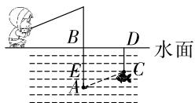  
第4题解图

5. D 【解析】由题图知, $AB^{2}=2^{2}+4^{2}=20\neq25$ ,选项A错误; $BC^{2}=3^{2}+4^{2}=25$ , $AC^{2}=1^{2}+2^{2}=5$ ,因为 $AB^{2}+AC^{2}=20+5=25=BC^{2}$ ,所以 $\triangle ABC$ 是直角三角形,选项B错误; $S_{\triangle ABC}=4\times4-\frac{1}{2}\times3\times4-$

$\frac{1}{2}\times1\times2-\frac{1}{2}\times2\times4=5$ , 选项 C 错误; 因为 $BC^{2}=25$ , 所以 BC=5, 设 BC 边上的高线长为 h, 所以 $S_{\triangle ABC}=\frac{1}{2}\cdot BC\cdot h=5$ , 解得 h=2, 所以 BC 边上的高线长为 2, 选项 D 正确.

6. B 【解析】由题意可得, AB=2 米, BC=1.5 米, $\angle ABC=90^{\circ}$ , 在 Rt $\triangle ABC$ 中, 由勾股定理可得 $AB^{2}+BC^{2}=AC^{2}$ , 即 $2^{2}+1.5^{2}=AC^{2}$ , 所以 AC=2.5 米, 根据题意可得, AC=CE=2.5 米, 在 Rt $\triangle CDE$ 中, $\angle CDE=90^{\circ}$ , CE=2.5 米, 由勾股定理可得 $CD^{2}+DE^{2}=CE^{2}$ , 即 $CD^{2}+2.4^{2}=2.5^{2}$ , 所以 CD=0.7 米, 所以 $BC+CD=1.5+0.7=2.2$ (米).

7. C 【解析】观察题图可知, $S_{1}=S_{2}=2\times\frac{1}{2}ab+$ $c^{2}=2\times\frac{1}{2}ab+a^{2}+b^{2}.$

8. C 【解析】将墙面 ADEF 和地面 ABCD 展开如解图, 过点 P 作 $PG \perp BF$ 于点 G, 连接 PB, 即 PB 为所求的最短路径. 因为点 P 到地面距离是 5 米, 所以 AG = 5 米, 又因为 PA = 13 米, 所以在 Rt $\triangle APG$ 中, 由勾股定理可得 $PG^{2} = AP^{2} - AG^{2} = 13^{2} - 5^{2} = 12^{2}$ , 所以 PG = 12 米, 在 Rt $\triangle BPG$ 中, $BG = AG + AB = 16$ (米), 由勾股定理可得 $PG^{2} + BG^{2} = PB^{2}$ , 即 $12^{2} + 16^{2} = PB^{2}$ , 所以 PB = 20 米.

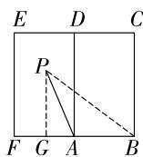  
第8题解图

9. C 【解析】因为四边形 ABCD 是长方形, AD = 8, 所以 BC = 8, 由折叠的性质可知 BE = EF = 3, AB = AF, $\triangle CFE$ 是直角三角形, 所以 CE = BC - BE = 8 - 3 = 5, 在 Rt $\triangle CFE$ 中, $EF^{2} + CF^{2} = CE^{2}$ , 所以 CF = 4, 设 AB = x, 则 AC = CF + AF = 4 + x, 在 Rt $\triangle ABC$ 中, $AB^{2} + BC^{2} = AC^{2}$ , 即 $x^{2} + 8^{2} = (4 +$ 大小卷·八年级(上) 数学 BS

$x)^{2}$ , 解得 x=6, 所以 AB=6.

10. B 【解析】设正方形①的面积是 S, 则正方形②的面积是 $\frac{1}{2}S$ , 正方形③的面积是 $\frac{1}{4}S, \cdots$ , 正方形⑪的面积是 $\frac{1}{2^{n-1}}S$ , 所以正方形⑤的面积是 $\frac{1}{2^{4}}S = 2$ , 所以 S = 32, 所以正方形①, ②, ③, ④的面积和为 $S + \frac{1}{2}S + \frac{1}{4}S + \frac{1}{8}S = 32 + 16 + 8 + 4 = 60$ .  
11. 145 【解析】在 Rt△ABC 中, 由勾股定理可得 $BC^{2}=AB^{2}+AC^{2}=8^{2}+9^{2}=145$ .  
12. 直角 【解析】因为 AC=8, AD=3, 所以 CD=5, 根据作图痕迹可得 BD=CD=5, 所以 $AB^{2}+AD^{2}=4^{2}+3^{2}=25=BD^{2}$ , 所以 $\angle A=90^{\circ}$ , 即 $\triangle ABD$ 是直角三角形.  
13. 20 【解析】因为 $AC \perp BD$ , 所以 $\angle AOD = \angle AOB = \angle BOC = \angle COD = 90^{\circ}$ , 由勾股定理可得 $AB^{2} + CD^{2} = AO^{2} + BO^{2} + CO^{2} + DO^{2}, AD^{2} + BC^{2} = AO^{2} + DO^{2} + BO^{2} + CO^{2}$ , 所以 $AB^{2} + CD^{2} = AD^{2} + BC^{2}$ , 因为 $AD = 2, BC = 4$ , 所以 $AB^{2} + CD^{2} = 2^{2} + 4^{2} = 20$ .  
14. 14.5 【解析】设绳索长 x 尺, 由勾股定理可得 $10^{2} + (x + 1 - 5)^{2} = x^{2}$ , 所以 x = 14.5, 故绳索长 14.5 尺.  
15. 36 【解析】因为 AE 平分 $\angle BAC, AF$ 平分 $\angle DAC$ ，所以 $\angle BAE = \angle EAC = \frac{1}{2} \angle BAC, \angle FAC = \frac{1}{2} \angle DAC$ ，又因为 B, A, D 三点共线，所以 $\angle EAC + \angle FAC = \frac{1}{2} \angle BAC + \frac{1}{2} \angle DAC = \frac{1}{2} (\angle BAC + \angle DAC) = 90^{\circ}$ ，因为 $EF \parallel AB$ ，所以 $\angle AEF = \angle BAE$ ，即 $\angle AEF = \angle EAC$ ，如解图，过点 G 作 $GH \perp AE$ 于点 H，在 $\triangle AGH$ 和 $\triangle EGH$ 中， $\left\{\begin{aligned}\angle GAH&=\angle GEH,\\ \angle AHG&=\angle EHG,\\ GH&=GH,\end{aligned}\right.$ (AAS)，所以 AG=EG，同理可得 AG=FG，所以 $EF = EG + FG = 2AG = 6$ ，在 Rt $\triangle EAF$ 中， $AE^{2}$

$$
+ A F ^ {2} = E F ^ {2} = 3 6.
$$

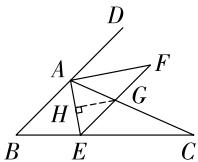  
第 15 题解图

16. 解: 因为 $(b-3)^{2}+|c-4|=0$ ,

所以 b-3=0, c-4=0,

所以 b=3, c=4,

在 Rt△ABC 中,由勾股定理可得

$$
B C ^ {2} = A B ^ {2} + A C ^ {2} = 4 ^ {2} + 3 ^ {2} = 5 ^ {2},
$$

所以 BC=5，……（3 分）

所以 $\triangle ABC$ 的周长为 $3+4+5=12.$ $\cdots$ (5 分)

17. 解: (1) 由题意得, OB = 15 海里, OA = 20 海里, 在 Rt△AOB 中, 由勾股定理可得, $AB^{2} = OA^{2} + OB^{2} = 20^{2} + 15^{2} = 625$ ,

所以 AB=25 海里，

所以 A, B 两点之间的距离为 25 海里; …… (2 分)

(2)该轮船行驶的最短距离为 AB 边上对应的高的长度，

因为 OB=15 海里, OA=20 海里, AB=25 海里, 设 AB 边上对应的高为 h,

$$
S _ {\triangle A O B} = \frac {1}{2} O B \cdot O A = \frac {1}{2} A B \cdot h,
$$

所以 h=12 海里，

所以该轮船行驶的最短距离为 12 海里. …… (6 分)

18. 解: 容器侧面部分展开图如解图所示, 作点 A 关于 EF 的对称点 $A'$ , 连接 $A'B$ , 根据对称性质可知 $FA' = FA$ , 则 $FA + BF = FA' + FB \geqslant A'B$ , 当点 $A', F, B$ 在同一直线上时, $AF + BF$ 取得最小值, 最小值为 $A'B$ 的长,

因为容器高为 $24 \, cm$ ，底面周长为 $14 \, cm$ ，

所以 $A^{\prime}D=7\ cm, BD=24-5+5=24\ (cm)$ ,

所以 $A^{\prime}B^{2}=A^{\prime}D^{2}+BD^{2}=625$ ，

所以 $A'B=25\ cm.$

答:蚂蚁爬行的最短路程是 25 cm. … (7 分)

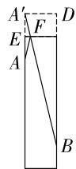  
第 18 题解图

19. 解: (1) 在长方形 ABCD 中, $\angle ABC = 90^{\circ}$ , AB = 15 米, AC = 25 米,

根据勾股定理,可得 $BC^{2}=AC^{2}-AB^{2}=400$ ,

所以 BC=20 米，

所以观赏池 BC 边的长为 20 米；……（3 分）

(2)如解图,连接BD,

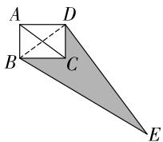

text_image

A
D
B
C
E

第 19 题解图

因为 $\angle BCD=90^{\circ}, CD=AB=15$ 米, BC=20 米,

根据勾股定理,可得 $BD^{2}=BC^{2}+CD^{2}$ ,

所以 BD=25 米, …… (4 分)

因为在 $\triangle BDE$ 中, $BD^{2}+DE^{2}=25^{2}+60^{2}=4\ 225$ ,

$$
B E ^ {2} = 6 5 ^ {2} = 4 2 2 5,
$$

所以 $BD^{2}+DE^{2}=BE^{2}$ ,

所以 $\triangle BDE$ 是直角三角形, 且 $\angle BDE = 90^{\circ}$ ,

……（6分）

所以 $S_{草坪} = S_{\triangle BDE} - S_{\triangle BCD} = \frac{1}{2} BD \cdot DE - \frac{1}{2} BC \cdot$

$CD=\frac{1}{2}\times25\times60-\frac{1}{2}\times20\times15=600$ （平方米），

答:草坪的面积为600平方米. …… (8分)

20. 解: (1) 在 Rt△AED 中, $DE^{2}=AD^{2}+AE^{2}$ ,

在 Rt△BEC 中, $CE^{2}=BC^{2}+BE^{2}$ ,

因为喷泉广场和儿童游乐场到游客服务中心的距离相等，

所以 DE = CE，

设 $AE = x\mathrm{km}$ ，则 $BE = (2.2 - x)\mathrm{km}$

所以 $1.7^{2}+x^{2}=0.5^{2}+(2.2-x)^{2}$ ,

解得 x=0.5,

所以游客服务中心应建在距 A 点 0.5 km 处；

……（4分）

(2)由(1)可知, $AE=0.5\ km,BE=2.2-0.5=$ 1.7 (km), DE = CE,

所以 AE=BC, AD=BE,

在 $\triangle AED$ 和 $\triangle BCE$ 中， $\left\{\begin{aligned}AE&=BC,\\ AD&=BE,\\ DE&=EC,\end{aligned}\right.$

所以 $\triangle AED \cong \triangle BCE(SSS)$ ,

所以 $\angle AED = \angle BCE$ ,

因为 $\angle BCE + \angle BEC = 90^{\circ}$ ,

所以 $\angle AED + \angle BEC = 90^{\circ}$ ,

所以 $\angle CED = 180^{\circ} - (\angle AED + \angle BEC) = 90^{\circ}.$

……（8分）

21. 解: (1) 1; …… (2 分)

【解法提示】在 Rt $\triangle ABC$ 中, $BC^{2}=AB^{2}-AC^{2}=5^{2}-3^{2}=16$ , 所以 BC=4 cm, 若点 P 为 BC 的中点, 则 BP=2 cm, 故 $t=2\div2=1(s)$ .

(2) 若 BP=AP, 如解图①, 设 BP 的长为 x cm,

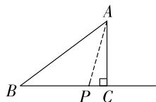  
第21题解图①

因为 BC = 4 cm, BP = x cm, 所以 $CP = (4 - x)$ cm,

在 Rt△ACP 中, $AP^{2}=CP^{2}+AC^{2}$ ,

所以 $x^{2}=(4-x)^{2}+3^{2}$ ,

解得 $x=\frac{25}{8}$ ,

故 BP 的长为 $\frac{25}{8}$ cm; …… (4 分)

(3)由题意可知 $BP = 2t\mathrm{cm}$ , 分类讨论如下:

①当∠APB为直角时,如解图②,

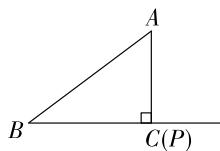  
图①

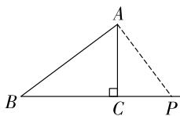  
图②  
第 21 题解图

点 P 与点 C 重合, BP = BC = 4 cm,

即 2t=4, 解得 t=2; …… (7 分)

②当 $\angle BAP$ 为直角时,如解图③,

$$
B P = 2 t \mathrm{cm}, C P = (2 t - 4) \mathrm{cm}, A C = 3 \mathrm{cm},
$$

在 Rt△ACP 中, $AP^{2}=AC^{2}+CP^{2}$ ,

在 Rt△BAP 中, $AB^{2}+AP^{2}=BP^{2}$ ,

所以 $AP^{2}=AC^{2}+CP^{2}=BP^{2}-AB^{2}$ ,

即 $3^{2} + (2t - 4)^{2} = (2t)^{2} - 5^{2}$

解得 $t=\frac{25}{8}$ .

综上所述,当 $\triangle ABP$ 为直角三角形时,t的值为2或 $\frac{25}{8}$ . ……（10分）

22. 解: $(1)c^{2}=(b-a)^{2}+4\times\frac{1}{2}ab$ ; …… (3分)

# 大小卷·八年级(上) 数学 BS

【解法提示】由题意知大正方形的面积为 $c^{2}$ ，小正方形的面积 +4 个直角三角形的面积为 $(b-a)^{2}+4\times\frac{1}{2}ab$ ，所以 $b^{2}-2ab+a^{2}+2ab=c^{2}$ ，化简得 $a^{2}+b^{2}=c^{2}$ ，勾股定理得证.

(2)因为大正方形的面积是13,小正方形的面积是1,

所以 $c^{2}=13,(b-a)^{2}=1.$

所以 $a^{2}+b^{2}=c^{2}=13.$

由(1)得, $c^{2}=(b-a)^{2}+4\times\frac{1}{2}ab$ ,

所以 $4 \times \frac{1}{2} ab = 13 - 1$ ，即 $2ab = 12$

所以 $(a+b)^{2}=a^{2}+2ab+b^{2}=13+12=25$ ;……(7分)

(3) 因为以 AB 为边的正方形的面积为 61，
所以 $AB^{2}=61$ ，

在 Rt△ABC 中, $AC^{2}=AB^{2}-BC^{2}=61-25=36$ ,
所以 AC=6,

由题意知 AD = AC = 6，

所以 $CD = AC + AD = 12$ ,

在 Rt△BCD 中, $BD^{2}=BC^{2}+CD^{2}=5^{2}+12^{2}=169$ ,
所以 BD=13，

所以 $4(AD+BD)=4\times(6+13)=76$ ,

所以这个风车的外围周长为 76. …… (11 分)

# 第二章检测卷

1. A

2. C 【解析】因为 $3.14$ 是无限循环小数, $\frac{1}{5}$ 是有限小数, $\sqrt[3]{8}=2$ 是整数, 所以选项 A, B, D 是有理数, $\sqrt{2}$ 是无理数, 所以选 C.

3. C 【解析】一般地,被开方数不含分母,也不含能开得尽方的因数或因式,这样的二次根式,叫做最简二次根式, $\sqrt{4}=2$ ,选项A不符合题意; $\sqrt{1.1}$ ,被开方数是小数,选项B不符合题意; $\sqrt{5}$ ,被开方数是正整数,且不含能开得尽方的因数或因式,选项C符合题意; $\sqrt{\frac{1}{2}}$ ,被开方数含分母,选项D不符合题意.

4. D 【解析】4 的平方根是 $\pm2, \sqrt{2^{2}}=2$ ，选项 A 不符合题意； $\sqrt[3]{-8}=-2, -\sqrt[3]{-8}=2$ ，选项 B 不符合题意； $\sqrt{a^{2}}=|a|$ ，当 $a\neq0$ 时， $|a|\neq\pm a$ ，选项 C 不符合题意； $(\sqrt{6})^{2}=6$ ，选项 D 符合题意.

5. C 【解析】逐项分析如下：

<table><tr><td>选项</td><td>逐项分析</td><td>正误</td></tr><tr><td>A</td><td> $\sqrt{3}$ 与 $\sqrt{2}$ 不是同类项,不能合并</td><td>×</td></tr><tr><td>B</td><td> $\sqrt{8}-\sqrt{2}=2\sqrt{2}-\sqrt{2}=\sqrt{2}$ </td><td>×</td></tr><tr><td>C</td><td> $\sqrt{3}\times\sqrt{2}=\sqrt{3\times2}=\sqrt{6}$ </td><td>√</td></tr><tr><td>D</td><td> $\sqrt{12}\div\sqrt{3}=\sqrt{12\div3}=\sqrt{4}=2$ </td><td>×</td></tr></table>

6. D 【解析】因为 4<7<9, 所以 $2<\sqrt{7}<3$ , 所以 $\sqrt{7}$ 的整数部分是 2, 所以 $\sqrt{7}-1$ 的整数部分是 1, $\sqrt{7}-1$ 的小数部分是 $(\sqrt{7}-1)-1=\sqrt{7}-2$ , 所以 m=1, $n=\sqrt{7}-2$ , 所以 $\sqrt{7}m-n=\sqrt{7}\times1-(\sqrt{7}-2)=2$ .

7. D 【解析】由题意得,三阶魔方每个面的边长为 $\sqrt[3]{125} = 5 \, cm$ , 则三阶魔方每个面的面积为 $5^{2} = 25 \, cm^{2}$ , 所以二阶魔方每个面的面积为 $25 \times \frac{4}{5} = 20 \, cm^{2}$ , 所以二阶魔方每个面的边长为 $\sqrt{20} = 2\sqrt{5} \, cm$ .

8. A 【解析】 $500 \, ml = 500 \, cm^{3}$ ，因为长方体花瓶的底面边长为 $10 \, cm$ ，所以长方体花瓶底面积为 $100 \, cm^{2}$ ，所以水面高度为 $\frac{500}{100} = 5 \, cm$ ，所以 $5\pi r^{2} = 500$ ，所以 $r = \frac{10\sqrt{\pi}}{\pi} \, cm$ .

9. A 【解析】根据题意可设 AC=1, BD=BC=2，所以由勾股定理可得 $AB=\sqrt{AC^{2}+BC^{2}}=\sqrt{5}$ ， $AD=\sqrt{AC^{2}+CD^{2}}=\sqrt{17}$ ，因为 $AB+BD>AD$ ，所以 $\sqrt{5}+2>\sqrt{17}$ .

10. D 【解析】因为 $5\sqrt{2} \times \sqrt{10} \times \sqrt{2} = 10\sqrt{10}$ ，所以 $B \times \sqrt{10} \times 10 = 10\sqrt{10}$ ，所以 B = 1；因为 $A \times 1 \times 5\sqrt{2} = 10\sqrt{10}$ ，所以 $A = 2\sqrt{5}$ ；因为 $5 \times \sqrt{10} \times C = 10\sqrt{10}$ ，所以 C = 2；因为 $2 \times 5\sqrt{2} \times D = 10\sqrt{10}$ ，所以 $D = \sqrt{5}$ 。所以 $A + B + C + D = 2\sqrt{5} + 1 + 2 + \sqrt{5} = 3\sqrt{5} + 3$ 。

11. $m \geqslant -6$ 【解析】要使 $\frac{\sqrt{6+m}}{2}$ 在实数范围内有意义, 则 $6+m \geqslant 0$ , 所以 $m \geqslant -6$ .

12. 0 【解析】因为一个数的绝对值是非负数, 所以 $-\sqrt{a} \geqslant 0$ , 又因为 $\sqrt{a} \geqslant 0$ , 所以 $\sqrt{a} = 0$ , 所以 a = 0.

13. $\sqrt{2};2\sqrt{3}$ （答案不唯一） 【解析】 $\sqrt{24}=\sqrt{2}\times2\sqrt{3}$ ，所以a,b的值可以分别是 $\sqrt{2}$ 和 $2\sqrt{3}$ （答案不唯一）.

14. $\frac{3\sqrt{5}}{2}$ 【解析】因为 $\sqrt{a-3} + (b-\sqrt{14})^{2} = 0$ ，所以 $a - 3 = 0, b - \sqrt{14} = 0$ ，所以 $a = 3, b = \sqrt{14}$ ，因为 $a^{2} + c^{2} = 9 + 5 = 14 = b^{2}$ ，所以 $\triangle ABC$ 是直角三角形，其中 a, c 为直角边，所以 $S_{\triangle ABC} = \frac{1}{2} \times 3 \times \sqrt{5} = \frac{3\sqrt{5}}{2}$ .

15. 1 【解析】因为正实数 x 的两个平方根是 m 和 2m-b，所以 $m^{2}=x,(2m-b)^{2}=x$ ，因为 $m^{2}x-$ 大小卷·八年级(上) 数学 BS

$2(2m-b)^{2}x+5x^{2}=4$ , 所以 $x^{2}-2x^{2}+5x^{2}=4$ , 所以 $x^{2}=1$ , 因为 x>0, 所以 x=1.

16. 解: (1) 移项, 得 $5x^{2}-x^{2}=49$ ,

合并同类项, 得 $4x^{2}=49$ ,

两边同时除以 4, 得 $x^{2}=\frac{49}{4}$ ,

所以 $x=\pm\frac{7}{2}$ ; …… (3 分)

(2) 移项, 得 $\frac{1}{3}(x+3)^{3}=-9$ ,

去分母,得 $(x+3)^{3}=-27$ ,

所以 $x+3=\sqrt[3]{-27}$ ,

所以 $x+3=-3$ ,

所以 $x = -6$ …… (6分)

17. 解: (1) 原式 $= -\frac{1}{\left(\frac{1}{2}\right)^{2}} + 6 - 1 - (\sqrt{10} - 3)$

$$
= - 4 + 6 - 1 - \sqrt {1 0} + 3
$$

$$
= 4 - \sqrt {1 0}; \quad \dots\dots (3 \text {分})
$$

(2) 原式 $= \frac{2}{3} \times 4 + 1^{2} - (\sqrt{3})^{2}$

$$
= \frac {8}{3} + 1 - 3
$$

$$
= \frac {2}{3}. \dots \tag {6分}
$$

18. 解: 原式 $=3x^{2}-2x+6x-4-2x^{2}-4x$

$$
= x ^ {2} - 4, \dots \tag {5分}
$$

当 $x=\sqrt{3}-1$ 时, 原式 $=( \sqrt{3}-1)^{2}-4$

$$
= - 2 \sqrt {3}. \dots \dots (7 \text {分})
$$

19. 解: 乐乐在计算第①种情况时, 当 m = -1 时, 这个数的算术平方根为 $5m + 1 = -4 < 0$ ,

因为一个数的算术平方根不能为负数,所以应该将这个结果舍去. …… (2 分)

正确的解题过程如下:

因为一个数的算术平方根为 $5m+1$ ，平方根为 $\pm(m-3)$ ，

所以 $5m+1=m-3$ 或 $5m+1=-(m-3)$ ,

①当 $5m+1=m-3$ 时, 解得 m=-1,

所以 $5m+1=-4$ ，

因为算术平方根为非负数，

所以 $m \neq -1$ ;

②当 $5m+1=-(m-3)$ 时, 解得 $m=\frac{1}{3}$ ,

所以 $5m+1=\frac{8}{3}$ ，所以这个数为 $\frac{64}{9}$ .

综上所述,这个数为 $\frac{64}{9}$ . …… (8分)

20. 解: (1) 根据题意可得, $r = \sqrt{2Rh} = \sqrt{2 \times 6.4 \times 10^{6} \times 600} = \sqrt{7680 \times 10^{6}} = \sqrt{76.8} \times 10^{4} \approx 8.76 \times 10^{4}(\mathrm{~m})$ , …… (3 分)

答:广州塔发射节目信号的传播半径约为 $8.76\times10^{4}$ m; …… (4分)

(2) $\frac{\sqrt{2Rh_{1}}}{\sqrt{2Rh_{2}}}=\frac{\sqrt{2Rh_{1}}\cdot\sqrt{2Rh_{2}}}{\sqrt{2Rh_{2}}\cdot\sqrt{2Rh_{2}}}=\frac{\sqrt{h_{1}h_{2}}}{h_{2}}.$ …… (8分)

答:两塔发射节目信号的传播半径之比为 $\frac{\sqrt{h_{1}h_{2}}}{h_{2}}$ . (9分)

21. 解: (1)5; …… (2分)

【解法提示】由裁剪方式可得, $AE=\frac{1}{2}\times2=1$ ,
DE=2, 正方形 ABCD 的边 $AD=\sqrt{1^{2}+2^{2}}=\sqrt{5}$ ，
所以正方形 ABCD 的面积为 $AD^{2}=5$ .

(2)由(1)可知点 B 表示的数为 $\sqrt{5}$ ,

因为 $4<(\sqrt{5})^{2}<9$ ,

所以 $2<\sqrt{5}<3$ ，

所以点 B 表示的数在 2,3 之间；……（4 分）

(3)由(1)可知 $AB=\sqrt{5}$ ,

所以 $BD = \sqrt{AD^2 + AB^2}$

$$
\begin{array}{l} = \sqrt {(\sqrt {5}) ^ {2} + (\sqrt {5}) ^ {2}} \\ = \sqrt {1 0}, \\ \end{array}
$$

所以 $BQ = BD = \sqrt{10}$ ，……（7 分）
因为正方形的顶点 B 与数轴上表示 -2 的点重合，

所以点 Q 表示的数为 $-2-\sqrt{10}$ 或 $-2+\sqrt{10}$ . …
…… (9 分)

22. 解: (1) 3, $\sqrt{15}-3$ ; …… (3 分)

【解法提示】因为 9<15<16, 所以 $3<\sqrt{15}<4$ , 所以 $\sqrt{15}$ 的整数部分为 3, 小数部分为 $\sqrt{15}-3$ .

(2) 因为 9 < 11 < 16, 所以 $3 < \sqrt{11} < 4$ ,

所以 $-4 < -\sqrt{11} < -3$

所以 $a = -4, b = -\sqrt{11} - (-4) = -\sqrt{11} + 4$

所以 $b - a + \sqrt{11} = -\sqrt{11} + 4 - (-4) + \sqrt{11}$

=8;……(6分)

(3) 因为 4<5<9,

所以 $2<\sqrt{5}<3$ ，

所以 $9<7+\sqrt{5}<10$ ,

因为 $7+\sqrt{5}=x+y$ ，其中 x 是整数，且 0<y<1，

所以 $x = 9, y = 7 + \sqrt{5} - 9 = \sqrt{5} - 2$

所以 $x - y = 9 - (\sqrt{5} -2) = 11 - \sqrt{5}$

所以 x-y 的相反数为 $-11+\sqrt{5}$ . …… (10 分)

# 第三章检测卷

1. C 【解析】陕西省北部,无法确定具体位置,故选项 A 不符合题意;距离西安市约 371 千米,无法确定具体位置,故选项 B 不符合题意;东经 108°北纬 36°可以确定一点的具体位置,故选项 C 符合题意;东隔黄河与山西临汾相望,无法确定具体位置,故选项 D 不符合题意.

2. D 【解析】因为点 $A(-1, m)$ 和点 $B(n, 4)$ 关于 y 轴对称, 所以 n = 1, m = 4, 所以 $m + n = 5$ .

3. C 【解析】由题图可知,第三象限的黑色冰壶最靠近原点,所以胜方最靠近原点的壶所在位置位于第三象限.

4. C 【解析】点 $A(-1,-4)$ , $B(3,-4)$ 的纵坐标相同, 均为 -4, 所以直线 AB 平行于 x 轴.

5. D 【解析】由题意可知, 点 A, B, C, D 正确的表示方式依次为 $(2, 90^{\circ})$ , $(4, 210^{\circ})$ , $(3, 150^{\circ})$ , $(1, 300^{\circ})$ .

6. A 【解析】因为点 $Q(a+5, a-2)$ 在 y 轴上, 所以 $a+5=0$ , 解得 a=-5, 所以 a-2=-5-2=-7, 所以点 Q 的坐标为 $(0,-7)$ .

7. B 【解析】根据题意可建立如解图所示的平面直角坐标系,根据解图可得,南屏晚钟的坐标为(3,-2),曲院风荷的坐标为(-2,4),花港观鱼的坐标为(-2,-1),三潭印月的坐标为(2,1).

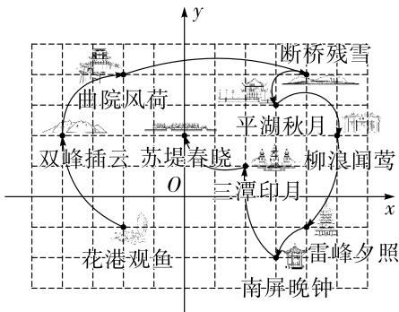

text_image

曲院风荷
断桥残雪
平湖秋月
双峰插云 苏堤春晓 柳浪闻莺
三潭印月
花港观鱼
雷峰夕照
南屏晚钟

第7题解图

8. C 【解析】因为学校和电视塔的横坐标相同,所以学校到电视塔的距离为 $a+2-0=a+2$ , 根据题意可知, 医院在第三象限, 所以医院到 y 轴的距离为 $\left|2a-3\right|=3-2a$ , 因为学校到电视塔的距离与医院到 y 轴的距离相等, 所以 $a+2=3-2a$ ,

解得 $a=\frac{1}{3}$ .

9. B 【解析】由图象可知曲线经过的整点坐标分别为(1,1)，(0,1)，(-1,1)，(-1,0)，(0,-1)，(1,0)，其中横、纵坐标互为相反数的点为(-1,1)，故①不正确；如解图，以原点为圆心，1个单位长度为半径在x轴上方画半圆可知，曲线在第一、二象限中的任意一点到原点的距离都大于1，故②正确；因为曲线经过点(1,1)，(-1,1)和(0,1)，所以在x轴以上的部分面积大于2，而x轴以下的部分面积大于1，所以曲线围成的“心形”区域的面积大于3，故③正确，故正确的有②③.

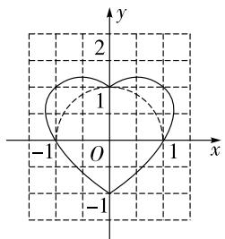

text_image

y
2
1
-1 O 1 x
-1

第9题解图

10. A 【解析】因为 a, b, c 满足 $\sqrt{(a-2)^{2}+(b+2)^{2}} + |c-4|=0$ ，所以 a=2, b=-2, c=4，即点 A, B, C 的坐标分别为 $(0,2)$ , $(-2,0)$ , $(-2,4)$ ，所以 $S_{\triangle ABC} = \frac{1}{2} \times 4 \times 2 = 4$ ，因为 $D(m,1)$ , $S_{\triangle ABC} = \frac{1}{2} S_{四边形ABOD}$ ，所以 $S_{四边形ABOD} = S_{\triangle AOB} + S_{\triangle AOD} = \frac{1}{2} \times 2 \times 2 + \frac{1}{2} \times 2 \times m = 8$ ，解得 m = 6.

11. (-2,1)(答案不唯一)

12. $(m,-n)$ 【解析】因为点 $M(m,n)$ 和点 $M'$ 关于 x 轴对称, 所以该两点横坐标相同, 纵坐标互为相反数, 所以点 $M'$ 的坐标为 $(m,-n)$ .

13. (3,2) 【解析】如解图, 因为 $l \parallel y$ 轴, 点 $M$ 是直线 $l$ 上的一个动点, $A(3,-2)$ , 所以可设点 $M$ 的坐标为 $(3,m)$ , 因为当 $BM \perp l$ 时, $BM$ 的长度最短, 又因为 $B(-2,2)$ , 所以 $m=2$ , 所以点大小卷·八年级(上) 数学 BS

M 的坐标为 $(3,2)$ .

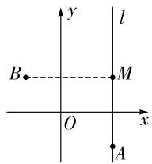

text_image

y
l
B
M
O
x
A

第 13 题解图

14. ①③ 【解析】从题图可知以下信息:早上销售价格最高的三明治是甲款三明治,①正确;傍晚销售数量最多的是乙款三明治,②错误;观察题图可知,纵坐标之和最大的是 $A_{2}+B_{2}$ ,所以在这一天中,销售数量最多的是乙款三明治,③正确.

15. (82,2) 【解析】观察题图坐标系中图形的规律可得 $A_{6}(4,2), A_{7}(6,2), A_{8}(6,0), \cdots$ , 则移动 5 次坐标为一次完整过程, 每一次完整循环横坐标比上一次循环依次多 4 , 因为 $102 = 20 \times 5 + 2$ , 所以点 $A_{102}$ 的位置规律与图上 $A_{2}, A_{7}$ 的位置规律相同, 所以点 $A_{102}$ 的坐标为 $(20 \times 4 + 2,2)$ , 即 (82,2).

16. 解: 建立平面直角坐标系如解图, …… (3 分)

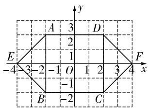

text_image

y
A 3 D
2
E 1
-4 -3 -2 -1 O 1 2 3 4 F x
-1
B -2 C

第 16 题解图

各顶点坐标分别为: $A(-2,2)$ , $B(-2,-2)$ , $C(2,-2)$ , $D(2,2)$ , $E(-4,0)$ , $F(4,0)$ . (答案不唯一) …… (5分)

17. 解: (1) 坡子岗的位置如解图所示; … (1 分)

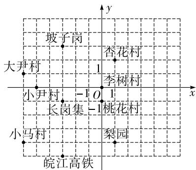

text_image

坡子岗
杏花村
大尹村
1
李树村
小尹村 -1 O 1
长岗集 -1桃花村
小马村
梨园
皖江高铁

第 17 题解图

(2)第三象限内:长岗集 $(-3,-1)$ ，小马村

$(-6,-4)$ ,皖江高铁 $(-3,-5)$ (至少写两个);

……（3分）

坐标轴上: 李树村(0,0), 桃花村(0,-1), 小尹村(-5,0)(至少写两个). …… (5分)

18. 解: (1) 因为点 M 在第四象限, 且到 x 轴, y 轴的距离相等,

所以 $m+4=-(2m-1)$ ，解得 m=-1，

所以 $m+4=3,2m-1=-3$ ,

所以点 M 的坐标为 $(3, -3)$ ; …… (2 分)

(2) 因为直线 MN 与 y 轴平行，

所以点 M 与点 N 的横坐标相等，

即 $m+4=8$ , 解得 m=4, 所以 2m-1=7,

所以点 M 的坐标为 $(8,7)$ . …… (5 分)

19. 解: (1) 画出 $\triangle A'B'C'$ 如解图所示;

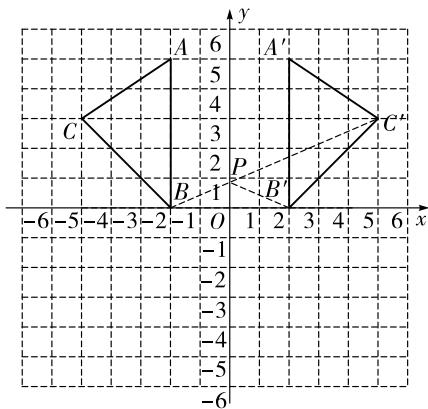

text_image

y
6
5
A'
4
3
C
2
P
B
1
B'
-1
-2
-3
-4
-5
-6
-6
x
-6-5-4-3-2-1 O 1 2 3 4 5 6

第 19 题解图

$A'(2,5)$ , $B'(2,0)$ , $C'(5,3)$ ; …… (2分)

(2)由题意可得,在 $\triangle ABC$ 中,AB=5,

AB 边上的高为点 C 到 AB 边的距离，

即 5-2=3，

所以 $S_{\triangle ABC}=\frac{1}{2}\times5\times3=\frac{15}{2}$ ; …… (4 分)

(3)如解图,连接 $BC'$ , $BC'$ 交 y 轴于点 P, 连接 $B'P$ ,

因为点 $B'$ 与点 B 关于 y 轴对称，

所以 $BP=B^{\prime}P$ ,

又因为两点之间线段最短，

所以 $BC'$ 的长度即为 $B'P+C'P$ 的最小值，

由勾股定理, 得 $BC' = \sqrt{7^{2} + 3^{2}} = \sqrt{58}$ ,

即 $B^{\prime}P+C^{\prime}P$ 的最小值为 $\sqrt{58}$ . …… (7 分)

20. 解: (1) 由题意得 [A] = |-2| + |4| = 6; ……

……（2分）

(2)根据题意可得,m<0,n>0,

因为 $[M] = |m| + |n| = 3, m, n$ 均为整数，

所以 m=-1, n=2, 或 m=-2, n=1,

所以点 M 的坐标为 $(-1,2)$ 或 $(-2,1)$ ; …… (6 分)

(3) 因为点 E 的勾股值 $[E]=2$ ，且点 E 在 x 轴正半轴上，

所以点 E 的坐标为 $(2,0)$ , OE=2,

当点 M 的坐标为 $(-1,2)$ 时, $OM=\sqrt{5}$ ,

当点 M 的坐标为 $(-2,1)$ 时, $OM=\sqrt{5}$ ,

所以 $\frac{OM}{OE}=\frac{\sqrt{5}}{2}.$ ……（10分）

21. 解: (1) 点 D 的坐标为 $(-1, -1)$ ，在第三象限；
点 F 的坐标为 $(2, 2)$ ，在第一象限；…（2 分）

(2)画图如解图所示(答案不唯一); …… (4分)

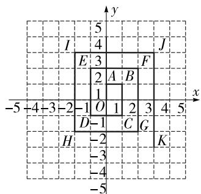

text_image

y
5
I 4 J
E 3 F
2 A B
1
-5 +4 +3 -2 -1 O 1 2 3 4 5
D -1 C G
H -2 K
-3
-4
-5

第 21 题解图

(3)位于第一象限内的拐点的横坐标与纵坐标相等；……（6分）

(4) 观察图形可得第 1 个拐点的坐标为 $(0,1)$ ，第 5 个拐点的坐标为 $(-1,2)$ ，第 9 个拐点的坐标为 $(-2,3)$ ，…，

所以第(4n-3)个拐点的坐标为 $(1-n,n)$ (n为正整数).

当 4n-3=713 时, n=179,

所以第 713 个拐点的坐标为 $(-178,179)$ . …
…… (11 分)

22. 解: (1) 因为点 A 的坐标为 $(0,8)$ ，点 C 的坐标

为 $(-6,0)$ ，四边形 OABC 是长方形，

所以点 B 的坐标为 $(-6,8)$ ; …… (2 分)

(2)由(1)可知 AB=6, BC=8,

①当点 P 在线段 AB 上运动时，

因为 BP=AB-AP, AP=2t,

所以 $BP=6-2t(0\leqslant t<3)$ ;

②当点 P 在线段 BC 上运动时，

BP=点 P 走过的路程-AB=2t-6(3≤t≤7).

综上所述, $BP=\begin{cases}6-2t(0\leqslant t<3),\\2t-6(3\leqslant t\leqslant7);\end{cases}$ …… (6分)

(3) 存在. …… (7 分)

如解图①, 当点 P 在线段 AB 上时, $0 \leqslant t < 3$ ,
因为 $D(0,2)$ ,

所以 OD=2, AD=6,

因为 $S_{长方形OABC}=AB\cdot AO=6\times8=48$ ,

所以 $S_{\triangle BPD}=\frac{1}{2}BP\cdot AD=\frac{1}{4}S_{长方形OABC}=12$ ,

所以 $\frac{1}{2}(6-2t)\times6=12$ ,

解得 t=1，

因为 $0 \leqslant t < 3$ ，所以符合题意；……（10 分）

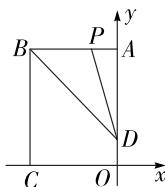  
图①

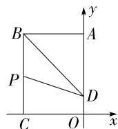  
图②  
第 22 题解图

如解图②, 当点 P 在线段 BC 上时, $3 \leqslant t \leqslant 7$ ,

则 $S_{\triangle BPD}=\frac{1}{2}BP\cdot AB=\frac{1}{2}(2t-6)\times6=12$

解得 t=5，

因为 $3 \leqslant t \leqslant 7$ ，所以符合题意。

综上所述, 当 t 的值为 1 或 5 时, $S_{\triangle BPD} = \frac{1}{4}S_{长方形OABC}$ . (12 分)

# 第四章检测卷

1. C 【解析】根据函数的定义可知,对于变量 x 的每一个值,变量 y 都有唯一的值与它对应,A,B,D 选项中 y 均是 x 的函数,不符合题意,C 选项中在某一范围内 x 的任意一个值,y 有两个值与它对应,符合题意.

2. B 【解析】由题意得 $1-k \neq 0$ 且 $|k|=1$ ，所以 $k \neq 1$ 且 $k = \pm 1$ ，所以 k 的值为 -1。

3. A 【解析】因为点(2,1)在正比例函数 y=kx 的图象上, 所以 1=2k, 解得 $k=\frac{1}{2}$ , 所以 $y=\frac{1}{2}x$ , 当 x=-2 时, $y=\frac{1}{2}\times(-2)=-1$ , 所以 $(-2,-1)$ 在该函数图象上.

4. C 【解析】由题意知,护栏总长为 $60 \, m$ , 所以 $2x + y = 60$ , 即 y = 60 - 2x, 所以当 x 在一定范围内变化时, y 与 x 之间的函数关系式为 y = 60 - 2x.

5. B 【解析】因为函数为一次函数,则 $(1-m)^{2}\neq0$ ,所以 $(1-m)^{2}>0$ ,所以y随x的增大而增大,因为 $x_{1}<x_{1}+1$ ,所以 $y_{1}<y_{2}$ .

6. B 【解析】令 $x+3=-3x-1$ ，解得 x=-1，则 $y=-1+3=2$ ，所以点 Q 的坐标为 $(-1,2)$ .

7. D 【解析】当 m<0 时，-m>0，所以 $y_{1}$ 的图象经过第一、三、四象限， $y_{2}$ 的图象也经过第一、三、四象限，四个选项均不符合题意；当 m>0 时，-m<0，所以 $y_{1}$ 的图象经过第一、二、三象限， $y_{2}$ 的图象经过第二、三、四象限，只有 D 选项符合题意.

8. C 【解析】设购买储物柜的费用为 W 元, 购进 B 款储物柜 m 个, 则购进 A 款储物柜 $(20-m)$ 个, 由题意可得 $W = 62(20-m) + 90m = 28m + 1240$ , 因为 28 > 0, 所以 W 随 m 的增大而增大, 又因为 $m \geqslant 7$ , 所以当 m = 7 时, 费用最低, 最低费用为 $W = 28 \times 7 + 1240 = 1436$ (元).

9. D 【解析】由图象可得,该游泳池内开始注水前已经蓄水 $250 \, m^{3}$ , 故选项 A 不符合题意; 设一次函数关系式为 $y = kt + b$ , 将点 $(0, 250)$ 代入, 得 b = 250, 将 $(4, 950)$ 代入 $y = kt + 250$ , 得 k = 175, 所

以 $y=175t+250$ ，故选项 B 不符合题意；当 t=3 时， $y=175\times3+250=775$ ，故选项 C 不符合题意；当 y=1200 时， $t=\frac{38}{7}>5$ ，所以当 t=5 时，游泳池并未注满水，故选项 D 符合题意.

10. A 【解析】根据图象可知 BC=3, 当点 M 在 BC 边上运动时, $y=\frac{1}{2}AD \cdot AB=\frac{15}{2}$ , 因为 AD=BC=3, 所以 AB=5. 当点 M 在 CD 边上运动时, $DM=5-(t-3)=8-t$ , 所以 $y=\frac{1}{2}AD \cdot DM=\frac{1}{2} \times 3 \times (8-t)=-\frac{3}{2}t+12$ , 令 $y=-\frac{3}{2}t+12=6$ , 解得 t=4.

11. $x \geqslant 0$ 且 $x \neq 1$ 【解析】由题意可知, $x \geqslant 0$ 且 $1 - x \neq 0$ , 解得 $x \geqslant 0$ 且 $x \neq 1$ .

12. $y=5x+1$ 【解析】根据一次函数的平移规律可得直线 m 的表达式为 $y=5x-4+5=5x+1$ .

13. $k_{3}>k_{2}>k_{1}$ 【解析】根据题图可得, $k_{3}>0, k_{1}<0, k_{2}<0$ , 因为直线越陡, $|k|$ 越大, 所以 $|k_{1}|>|k_{2}|$ , 所以 $k_{3}>k_{2}>k_{1}$ .

14. $l_{2}; l_{1}$ 【解析】设票价是 k, 固定支出是 b, 则直线 l 可表示为 y = kx - b. ①当提高票价, 固定支出不变时, 即 k 变大, b 不变, 所以可以达到直线 $l_{2}$ ; ②当票价不变, 减少固定支出时, 即 k 不变, b 减小, 则 -b 变大, 所以可以达到直线 $l_{1}$ .

15. (500,502) 【解析】由题意可知 4 秒一循环， $4 \times 250 + 2 = 1002$ ，所以此时点 $P$ 是第 251 组循环的第 2 个点。因为第 1 组循环中第 2 个点为 $A_{2}, 2 = 4 \times 1 - 2$ ，第 2 组循环中第 2 个点为 $A_{6}, 6 = 4 \times 2 - 2$ ，第 3 组循环中第 2 个点为 $A_{10}, 10 = 4 \times 3 - 2, \cdots$ ，所以第 $n$ 组循环中第 2 个点为 $A_{4n-2}$ ，因为 $OA_{1} = \sqrt{2}$ ，点 $A_{1}$ 在 $y = x$ 图象上，所以 $A_{1}(1,1)$ ，因为 $A_{1}A_{2} = \sqrt{2}$ ，根据勾股定理可得 $OA_{2} = 2$ ，所以 $A_{2}(0,2)$ ，如解图，连接 $A_{1}A_{3}$ ，易得 $A_{1}A_{3} // y$ 轴，根据勾股定理可得 $A_{1}A_{3} = 2$ ，所以 $A_{3}(1,3)$ ，依次类推， $A_{6}(2,4), A_{10}(4,6), \cdots$ ，所以点 $A_{4n-2}$ 的坐标为大小卷·八年级(上) 数学 BS

$(2n-2,2n)$ ，当 n=251 时， $2n-2=500,2n=502$ ，所以点 P 的坐标为 $(500,502)$ .

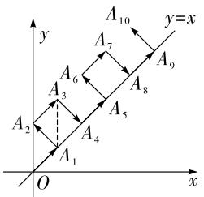

text_image

y
A₁₀
y=x
A₇
A₆
A₈
A₉
A₅
A₄
A₂
A₁
O
x

第 15 题解图

16. 解: (1) 因为 y-2 与 $x+1$ 成正比例,

所以设 $y-2=k(x+1)(k\neq0)$ ,

将(1,0)代入,得 k=-1,

所以 $y-2=-\left(x+1\right)$ ,

所以 y 与 x 之间的函数表达式为 $y = -x + 1; \cdots$ ……(3 分)

(2)由(1)可知,y与x之间的函数表达式为 $y=-x+1$ ,

当 x=-1 时, y=2; 当 x=5 时, $y=-5+1=-4$ ,

所以当 $-1 \leqslant x \leqslant 5$ 时，y 的取值范围为 $-4 \leqslant y \leqslant 2.$ ……（6分）

17. 解: (1) 因为点 $(2, -1)$ 在该函数图象上,

所以将 $(2,-1)$ 代入 $y=mx-(m-2)$ ,

得 $2m-(m-2)=-1$ ,

解得 m=-3；……（3 分）

(2) 将一次函数 $y = mx - (m - 2)$ 的图象向下平移 4 个单位长度后, 得到的函数表达式为 $y = mx - (m - 2) - 4 = mx - m - 2$ ,

因为平移后的图象经过点 $(-1,4)$ ，

所以将 $(-1,4)$ 代入 y=mx-m-2，得 4=-m-m-2，

解得 m = -3，

所以平移后的函数表达式为 $y = -3x + 1$ ,

令 y=0，即 $y=-3x+1=0$ ，解得 $x=\frac{1}{3}$ ，

所以平移后的图象与 x 轴的交点坐标为 $\left(\frac{1}{3}, 0\right)$ . (6 分)

18. 解: (1) 因为当海拔为 0 km 时, 水的沸点为 $100^{\circ}C$ ,

所以设 y 与 x 之间的函数关系式为 $y = kx + 100 (k \neq 0)$ ,

将(6,82)代入,得 $6k+100=82$ ,解得k=-3,

所以 y 与 x 之间的函数关系式为 $y = -3x + 100$ ;
……(3 分)

(2) 因为 $300 \, m = 0.3 \, km$ ,

所以当 x=0.3 时, $y=-3\times0.3+100=99.1(℃)$ ,

答:该地水的沸点为 $99.1^{\circ}$ C. …… (6 分)

19. 解:(1)补充表格如下:

<table><tr><td>x</td><td>...</td><td>-2</td><td>-1</td><td>0</td><td>1</td><td>2</td><td>3</td><td>4</td><td>...</td></tr><tr><td>y</td><td>...</td><td>3</td><td>1</td><td>-1</td><td>-3</td><td>-1</td><td>1</td><td>3</td><td>...</td></tr></table>

……（2分）

(2)画出函数 $y=2|x-1|-3$ 的图象如解图；…
……（5分）

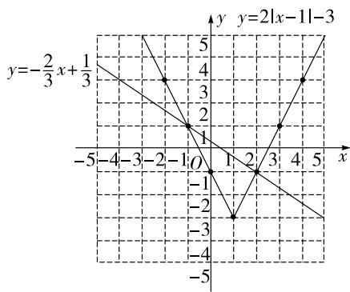

line

| Point | x | y |
|---|---|---|
| 1 | -2 | -2 |
| 2 | -1 | 2 |
| 3 | 1 | 2 |
| 4 | 2 | 2 |
| 5 | 3 | 4 |
| 6 | -3 | -3 |
| 7 | -2 | 4 |
| 8 | -1 | 2 |
| 9 | 0 | 0 |
| 10 | 1 | -1 |
| 11 | 2 | -2 |
| 12 | 3 | -3 |
| 13 | 4 | -4 |
| 14 | 5 | -5 |
The chart is a Cartesian coordinate system with x and y axes representing the absolute values of the functions y = -2/3 x + 1/3 and y = 2|x - 1|-3. The points are connected by lines forming a V-shape. There is no title or legend present in the image.

第 19 题解图

(3)画出函数 $y = -\frac{2}{3} x + \frac{1}{3}$ 的图象如解图所示，

根据解图可得,方程 $-\frac{2}{3}x+\frac{1}{3}=2|x-1|-3$ 的解为x=-1或x=2. ……（7分）

20. 解: (1) 由题意可得, 每增加一个碗, 高度增加 2.5 厘米,

设 y 与 x 之间的函数关系式为 $y=2.5x+b(k\neq0)$ ,

将 $(3,13)$ 代入 $y=2.5x+b$ ，得 $13=2.5\times3+b$ ，
解得 b=5.5,

所以 y 与 x 之间的函数关系式为 $y = 2.5x + 5.5$ ; …… (4 分)

(2) 当 x=9 时, $y=2.5\times9+5.5=28$ (厘米),

因为该顶碗演员的身高为 170 厘米，

所以 $170+28=198$ （厘米），

答:该演员顶碗时的总高度为 198 厘米. …… (8 分)

21. 解: (1) 点 $(2,640)$ 在 $y_{甲} = k_{1}x$ 上, 代入可得 $640 = 2k_{1}$ ,

所以 $k_{1}=320$ ，则 $y_{甲}=320x$ ;

点 $(0,640)$ ， $(6,1600)$ 在 $y_{乙}=k_{2}x+b$ 上，

代入得 b=640, 1 600=6k\_{2}+b, 解得 k\_{2}=160,

所以 $y_{乙}=160x+640$ ,

所以 $k_{1}$ 表示的实际意义: 甲种“畅享卡”餐厅收费为 320 元/次, b 表示的实际意义: 乙种“畅享卡”餐厅收取会员卡费 640 元; …………（4分）

(2) 令 $y_{甲}=y_{乙}$ ，即 $320x=160x+640$ ，

解得 x=4，

此时 $y=320\times4=1\ 280$ （元），

所以消费 4 次时,两种“畅享卡”花费一样,费用是 1280 元; …… (7 分)

(3) 当 y=2 000 时, $y_{甲}=320x=2\ 000$ ,

解得 x=6.25;

$$
y _ {\text {乙}} = 1 6 0 x + 6 4 0 = 2 0 0 0,
$$

解得 x=8.5，

因为 6.25<8.5，

所以选择乙种“畅享卡”更划算. …… (10 分)

22. 解: (1) 设直线 l 的函数表达式为 $y = kx + b$ ,

因为 $A(0,4), B(-4,0)$

所以代入可得 b=4, -4k+b=0,

解得 k=1, b=4,

所以直线 l 的函数表达式为 $y=x+4$ ; …… (3 分)

(2) 因为 $A(0,4)$ , $B(-4,0)$ , $\angle AOB = 90^{\circ}$ ,

所以根据勾股定理可得 $AB=4\sqrt{2}$ ,

因为 $\triangle ABC$ 是等腰直角三角形，

所以根据勾股定理可得 BC=8，

因为 OA = OB, AB = AC,

所以 $\angle OAB = \angle OBA = 45^{\circ}$ ， $\angle ABC = \angle ACB$

$$
= 4 5 ^ {\circ},
$$

所以 $\angle OBC = \angle OBA + \angle ABC = 90^{\circ}$ ,

所以点 C 的坐标为 $(-4,8)$ ，……（5 分）

直线 l 向上平移 m 个单位后的表达式为 $y = x + 4 + m$ ,

当平移后的直线经过点 C 时, $8 = -4 + 4 + m$ ,
解得 m=8，

所以 $0 \leqslant m \leqslant 8$ ; …… (7 分)

(3) 因为点 D 与点 A 关于 BC 对称,

所以点 D 的坐标为 $(-8,4)$ ，所以 AD=8，

当 $\triangle ADP$ 是以AD为腰的等腰三角形时,分以下情况讨论,如解图,

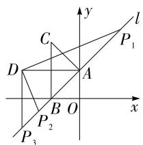

text_image

y
l
C
P₁
D
A
B
O
x
P₂
P₃

第 22 题解图

当 AD=AP 时, 设点 P 的坐标为 $(x, x+4)$ ,

根据勾股定理可得, $(x-0)^{2}+(x+4-4)^{2}=8^{2}$ ,
解得 $x=4\sqrt{2}$ 或 $x=-4\sqrt{2}$ ,

即 $P_{1}(4\sqrt{2}, 4\sqrt{2} + 4), P_{2}(-4\sqrt{2}, 4 - 4\sqrt{2})$ ；

当 AD = DP 时，

因为点 D 与点 A 关于 BC 对称，

所以 $AD \parallel x$ 轴，

所以 $\triangle ADP_{3}$ 是等腰直角三角形，

所以 $DP_{3}=8$ ,

所以 $P_{3}(-8,-4)$ .

综上所述, 点 P 的坐标为 $(4\sqrt{2}, 4\sqrt{2} + 4)$ 或 $(-4\sqrt{2}, 4 - 4\sqrt{2})$ 或 $(-8, -4)$ . …… (12 分)

# 期中检测卷

1. C 【解析】求实数 9 的平方根, 即求平方等于 9 的数, 有两个, 为 $\pm3$ .

2. A 【解析】由题图可知,墨水在第一象限,即被墨水污染的点在第一象限内,根据第一象限点的坐标特征可知,横坐标大于0,纵坐标大于0,选项A符合题意.

3. D 【解析】因为 $4^{2}+5^{2}\neq6^{2},9^{2}+16^{2}\neq25^{2},12^{2}+18^{2}\neq24^{2}$ ，所以选项 A, B, C 均不符合题意，因为 $10^{2}+24^{2}=676=26^{2}$ ，则以 10, 24, 26 为边长能构成直角三角形，选项 D 符合题意.

4. B 【解析】题中所给实数中, $\frac{1}{7}$ , 0.3,
0.101 001 000 1 和 $\sqrt[3]{-27} = -3$ 属于有限小数,
0.35 属于无限循环小数,有限小数和无限循环小数都是有理数, $\sqrt{7}$ 和 $\frac{\pi}{2}$ 属于无限不循环小数,是无理数,所以无理数有2个.

5. B 【解析】逐项分析如下：

<table><tr><td>选项</td><td>逐项分析</td><td>正误</td></tr><tr><td>A</td><td> $\sqrt{2}+\sqrt{4}=\sqrt{2}+2\neq\sqrt{6}$ </td><td>×</td></tr><tr><td>B</td><td> $\sqrt{18}-\sqrt{8}=3\sqrt{2}-2\sqrt{2}=\sqrt{2}$ </td><td>√</td></tr><tr><td>C</td><td> $\sqrt{2}\times\sqrt{6}=\sqrt{12}=2\sqrt{3}\neq3\sqrt{2}$ </td><td>×</td></tr><tr><td>D</td><td> $\sqrt{5}\div\sqrt{\frac{1}{5}}=\sqrt{25}=5\neq25$ </td><td>×</td></tr></table>

6. A 【解析】因为-2<0, 所以 y 随着 x 的增大而减小, 因为 $\sqrt{3} > \frac{3}{2}$ , 所以 $y_{1} < y_{2}$ .

7. A 【解析】由数轴可知, $-2<a<-1,2<b<3$ ,所以 $a+1<0,b-3<0$ ,所以原式 $=\sqrt{(a+1)^{2}}+|b-3|=|a+1|+|b-3|=(-a-1)+(3-b)=2-a-b.$

8. D 【解析】由正比例函数 y = kbx 的图象可知, kb > 0, 当 k > 0 时, b > 0, 一次函数 $y = kx + b$ 的图象经过第一、二、三象限; 当 k < 0 时, b < 0, 一次函数 $y = kx + b$ 的图象经过第二、三、四象限, 只有

选项 D 符合题意.

9. B 【解析】因为 AD=BC=10, F 为 BC 的中点, 所以 $CF=\frac{1}{2}BC=5$ , 因为 CD=AB=12, 所以由勾股定理, 得 $DF=\sqrt{CF^{2}+CD^{2}}=\sqrt{5^{2}+12^{2}}=13$ , 由折叠的性质可得, $C'F=CF=5$ , $C'E=CE$ , 所以 $C'D=DF-C'F=13-5=8$ . 因为 $\angle EC'F=\angle ECF=90^{\circ}$ , 所以 $\angle DC'E=90^{\circ}$ , 所以在 Rt△C'DE 中, 由勾股定理, 得 $DE^{2}=(12-DE)^{2}+8^{2}$ , 解得 $DE=\frac{26}{3}$ .

10. B 【解析】如解图, 过点 $B$ 作 $BD \perp y$ 轴于点 $D$ , 过点 $C$ 作 $CE \perp x$ 轴于点 $E$ , 因为四边形 $APBC$ 为正方形, 所以 $\angle PAC = 90^{\circ}, PA = AC$ , 因为 $\angle PAO + \angle CAE = 90^{\circ}, \angle PAO + \angle APO = 90^{\circ}$ , 所以 $\angle APO = \angle CAE$ . 在 $\triangle CAE$ 和 $\triangle APO$ 中, $\left\{ \begin{array}{l} \angle AEC = \angle POA, \\ \angle CAE = \angle APO, \\ AC = PA, \end{array} \right.$ 所以 $\triangle CAE \cong \triangle APO(AAS)$ ,

同理可证得 $\triangle PBD \cong \triangle APO$ , 所以 $AE = OP = BD = 2, CE = AO = DP = 4$ , 所以 $OE = AE + AO = 2 + 4 = 6, OD = OP + DP = 2 + 4 = 6$ , 所以点 $B$ 的坐标为(2,6), 点 $C$ 的坐标为(6,4). 将 $B(2,6)$ 和 $C(6,4)$ 分别代入 $y = x + b$ , 解得 $b = 4$ 和 $b = -2$ , 所以当 $-2 \leqslant b \leqslant 4$ 时, 直线 $y = x + b$ 与线段 $BC$ 有交点.

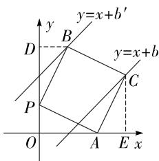

text_image

y
y=x+b'
B
D
y=x+b
C
P
O
A
E
x

第10题解图

11. 4(答案不唯一) 【解析】要使 $\sqrt{a-3}$ 有意义，则 $a-3\geqslant0$ ，所以 $a\geqslant3$ .

12. (-1,5) 【解析】根据“大明宫西”和“余家寨”的坐标分别是(-1,1)和(3,3)，可建立如

# 大小卷·八年级(上) 数学 BS

解图所示的平面直角坐标系,所以“凤城五路”站点的坐标是 $(-1,5)$ .

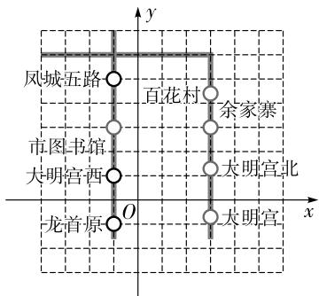

text_image

凤城五路
百花村
余家寨
市图书馆
大明宫西
大明宫北
龙首原
O
x
y

第 12 题解图

13. (0, -8) 【解析】因为点 $P$ 在 $y$ 轴上, 则 $m + 2 = 0, m = -2$ , 所以 $2m - 4 = 2 \times (-2) - 4 = -8$ , 所以点 $P$ 的坐标是 $(0, -8)$ .

14. 30 【解析】将半圆面展开如解图所示, 连接 AE, 根据题意得, $AD = 18 \, m$ , $AB = CD = 30 \, m$ , $DE = CD - CE = 30 - 6 = 24 \, (m)$ , 在 Rt $\triangle ADE$ 中, 由勾股定理得, $AE = \sqrt{AD^{2} + DE^{2}} = \sqrt{18^{2} + 24^{2}} = 30 \, (m)$ , 所以他滑行的最短距离为 30 m.

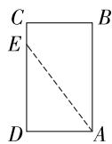  
第 14 题解图

15. ①②④ 【解析】因为 $l_{2}$ 经过点 $(0,1000)$ , 所以设 $l_{2}$ 的函数表达式为 $y = k_{2}x + 1000$ , 代入 $(2,2000)$ , 得 $2000 = 2k_{2} + 1000$ , 解得 $k_{2} = 500$ , 所以 $l_{2}$ 的函数表达式为 $y = 500x + 1000$ , ①正确; 由题图可得, 当销售量为 2 吨时, $l_{1}$ 与 $l_{2}$ 的图象交于一点, 所以该产品的销售收入与成本相等, ②正确; 因为 $l_{1}$ 经过点 $(0,0)$ 和 $(2,2000)$ , 所以 $l_{1}$ 的函数表达式为 $y = 1000x$ . 当销售量为 4 吨时, 销售收入是 4000 元, 销售成本是 3000 元, 所以该产品盈利 1000 元, ③错误, ④正确. 综上所述, ①②④正确.

16. 解: (1) 原式 = $\frac{\sqrt{2} + 1}{(\sqrt{2} - 1) \times (\sqrt{2} + 1)} + \sqrt{3} \times \sqrt{3} - \sqrt{3} \times \sqrt{6} + 2\sqrt{2}$

$$
= \sqrt {2} + 1 + 3 - 3 \sqrt {2} + 2 \sqrt {2}
$$

$$
= 4; \dots\dots(4 \text {分})
$$

(2) 原式 $= -4 - (-2\sqrt{5} + 5\sqrt{5}) \div \sqrt{5} + 2$

$$
\begin{array}{l} = - 4 - 3 + 2 \\ = - 5. \dots\dots\tag {8分} \\ \end{array}
$$

17. 解: (1) 由题意可得, $\sqrt[3]{5a-7}=2$ ,

即 $5a-7=2^{3}=8$ ，

解得 a=3;

根据题意可得, $\sqrt{a+2b}=5$ ,

即 $\sqrt{3 + 2b} = 5,3 + 2b = 25$

解得 b=11，……（2 分）

因为 $\sqrt{16}<\sqrt{18}<\sqrt{25}$ ,

所以 $4<\sqrt{18}<5$ ,

所以 $\sqrt{18}$ 的整数部分为 4，

所以 c=4，

所以 $a+b+c=3+11+4=18$ ;……(4分)

(2)由(1)知 b=11, 所以 $\sqrt{b}=\sqrt{11}$ ,

因为 $3 < \sqrt{11} < 4$ ,

所以 $\sqrt{11}$ 的整数部分是 3, 小数部分是 $\sqrt{11}-3$ ,

所以 $x=\sqrt{11}-3$ ,

所以 $x(\sqrt{b}+3)=(\sqrt{11}-3)\times(\sqrt{11}+3)=11-9=2,$

因为 2 的平方根为 $\pm\sqrt{2}$ ,

所以 $x(\sqrt{b}+3)$ 的平方根为 $\pm\sqrt{2}$ . …… (8 分)

18. 解: (1) 如解图, $\triangle A_{1}B_{1}C_{1}$ 即为所求; …… (2 分)

$A_{1}(3,2),B_{1}(0,1),C_{1}(1,4);\cdots\cdots(5\text{分})$

(2)如解图,连接 $AC_{1},BC_{1}$ .

$$
S _ {\triangle A B C _ {1}} = 3 \times 6 - \frac {1}{2} \times 3 \times 1 - \frac {1}{2} \times 3 \times 3 - \frac {1}{2} \times 2 \times 6 = 6.
$$

……(9分)

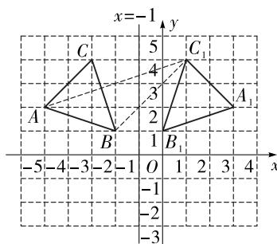

text_image

x=-1
y
5
4
C
3
A
2
B₁
1
-5 -4 -3 -2 -1 O 1 2 3 4 x
-1
-2
-3

第 18 题解图

19. 解:(1)如解图,过点 C 作 $CD \perp AB$ 于点 D,

因为 AC=6 km, BC=8 km, AB=10 km,

所以 $AC^{2}+BC^{2}=AB^{2}$ ，即 $\triangle ABC$ 为直角三角形，
且 $\angle ACB = 90^{\circ}$ ,

所以 $\frac{1}{2} AC\cdot BC = \frac{1}{2} AB\cdot CD$ ，即 $6\times 8 = 10CD$

解得 CD=4.8,

所以幼儿园 C 到直线 AB 的最短距离为 4.8 km; …… (4 分)

(2)受影响.

由(1)得 CD=4.8 km,

如解图, 当 $CE = CF = 5 \, km$ 时, 即除霾车经过 EF 段时, 正好影响到幼儿园 C,

此时 $\triangle CEF$ 为等腰三角形，

因为 $ED=\sqrt{CE^{2}-CD^{2}}=\sqrt{5^{2}-4.8^{2}}=1.4(\text{km})$ ,

所以 EF=2ED=2.8 km,

因为除霾车的速度为 $35 \, km/h$ ,

所以 $2.8 \div 35 = 0.08(h)$ ,

答:受影响,受影响的时间有 0.08 h. ……

……(9分)

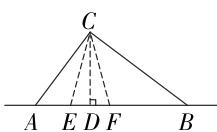  
第 19 题解图

20. 解: 如解图, 根据题意可得, 代数式 $\sqrt{x^{2}+25} +$

$\sqrt{(8-x)^{2}+9}$ 的最小值即为 $EF+CF$ 的最小值，当E,F,C三点共线时， $EF+CF$ 取得最小值，

此时, $BE=AE+AB=5+3=8$ , $BC=AF+DF=x+8-x=8$ , $\cdots\cdots$ (5分)

在 Rt $\triangle BCE$ 中， $CE = \sqrt{BE^{2} + BC^{2}} = \sqrt{8^{2} + 8^{2}} = 8\sqrt{2}$ ,

所以代数式 $\sqrt{x^2 + 25} +\sqrt{(8 - x)^2 + 9}$ 的最小值为 $8\sqrt{2}$ . (9分)

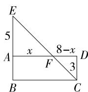  
第 20 题解图

21. 解:(1)设乙列车追上甲列车的时间为 x h,

根据题意可得 $260x = 325(x - 0.5)$ ,

解得 x=2.5，

因为 2.5-0.5=2(h)，

所以乙列车出发 2 h 后追上甲列车；……
……(2 分)

(2)设乙列车检修完成后继续行驶的过程中 y 关于 x 的函数关系式为 $y=325x+b$ ,

因为乙列车检修耗时 $54 \, min = 0.9 \, h$ ,

所以乙列车重新出发时甲车已行驶 $2.5 + 0.9 =$ 3.4(h), $2.5 \times 260 = 650 \, (\text{km})$ ,

即 $y=325x+b$ 的图象经过点(3.4,650)，

将(3.4,650)代入得 $650 = 325 \times 3.4 + b$ ，解得 b = -455，

所以乙列车检修完成后继续行驶的过程中 y 关于 x 的函数关系式为 y=325x-455，

当 y=1 300 时, 即 325x-455=1 300,

解得 x=5.4，

因为 $1300 \div 260 = 5(h)$ ,

所以甲列车 5 h 到达上海虹桥站，

所以 5.4-5=0.4(h)，

所以甲列车比乙列车早 0.4 h 到达上海虹桥站；……（6 分）

(3)由(2)可知,当甲列车到达上海虹桥站时,
x=5,

此时 $y=325x-455=325\times5-455=1\ 170$ ,

即乙列车已行驶 1 170 km,

所以 1 300-1 170=130(km)，

答: 当甲列车到达上海虹桥站时, 乙列车与上海虹桥站之间的距离为 130 km. …… (10 分)

22. 解: (1) 因为当点 P 在 AD 上运动时, DP = AB = 6 cm,

所以点 P 的运动路程为 $AB + BC + CD + DP = 6 + 8 + 6 + 6 = 26 \, (\text{cm})$ ,

则 $t=26\div2=13$ ; …… (3 分)

(2) 在长方形 ABCD 中, $AD = 8 \, cm, AB = 6 \, cm$ ,
所以 $AC=\sqrt{6^{2}+8^{2}}=10(\text{cm})$ ,

如解图, 当 $BP \perp AC$ 时, 设 BP, AC 交于点 E.

在 Rt△ABC 中, $\frac{1}{2}AB\cdot BC=\frac{1}{2}AC\cdot BE,$

# 大小卷·八年级(上) 数学 BS

即 $6 \times 8 = 10BE$ , 解得 BE = 4.8. …… (5 分)

在 Rt△ABE 中, $AE=\sqrt{6^{2}-4.8^{2}}=3.6(\text{cm})$ .

设 $EP = x \, \text{cm}$ ，则 $BP = (4.8 + x) \, \text{cm}$ ，

由勾股定理可得, $AE^{2}+EP^{2}=BP^{2}-AB^{2}$ ,

即 $3.6^{2}+x^{2}=(4.8+x)^{2}-6^{2}$ ,

解得 x=2.7，

所以 $AP=\sqrt{3.6^{2}+2.7^{2}}=4.5(\text{cm})$ ，…（8分）

因为长方形的周长为 $28 \, cm$ ，点 P 在 t s 内运动的路程为 $2t \, cm$ ，

所以此时 28-2t=4.5，

解得 t=11.75. …… (10 分)

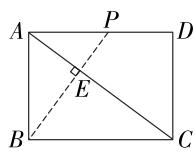  
第 22 题解图

23. 解: (1) 因为点 $M(a,2)$ 在直线 $l_{1}$ 上,

所以 $2=\frac{1}{2}a$ ，解得 a=4，

所以 $M(4,2)$ ,

因为点 M 也在直线 $l_{2}$ 上，

所以 $2 = -2 \times 4 + b$ ，解得 b = 10，

所以直线 $l_{2}$ 的表达式为 $y = -2x + 10$ ,

当 y=0 时, x=5,

所以点 C 的坐标为 $(5,0)$ ;……(3 分)

(2) $\triangle MOC$ 是直角三角形. 理由如下:

由(1)知点 M 的坐标为 $(4,2)$ ，点 C 的坐标为 $(5,0)$ ，

则由勾股定理得 $OM^{2}=2^{2}+4^{2}=20, MC^{2}=1^{2}+2^{2}=5, OC^{2}=5^{2}=25$ ,

因为 $OM^{2}+MC^{2}=OC^{2}$ ,

所以 $\triangle MOC$ 是直角三角形；……（6 分）

(3)由(2)知 $\triangle MOC$ 是直角三角形, $OM\perp MC$ ,

因为 $S_{\triangle POM} = 2S_{\triangle OMC}$ ，所以 $S_{\triangle POM} = \frac{1}{2}PM$ 。

$OM=2\times\frac{1}{2}CM\cdot OM$ ,所以PM=2CM,

因为点 P 在直线 $l_{2}$ 上, 所以设点 P 的坐标为 $(m, -2m+10)$ ,

分类讨论: ① 当点 P 在 x 轴上方时, 因为 PM = 2CM, 所以 $4 - m = 2 \times 1$ ,

所以 m=2，

所以点 P 的坐标为 $(2,6)$ ;

②当点 P 在 x 轴下方时, 因为 PM = 2CM, 所以 $m - 4 = 2 \times 1$ , 所以 m = 6,

所以点 P 的坐标为 $(6, -2)$ .

综上所述,点 P 的坐标为 $(2,6)$ 或 $(6,-2)$ . …

……（12分）

# 第五章检测卷

1. D 【解析】A 中含有三个未知数; B 中第二个方程不是整式方程; C 中第二个方程是二次方程; D 符合二元一次方程组的定义. 故选 D.

2. C 【解析】将 $\left\{\begin{aligned}x&=-1,\\ y&=3\end{aligned}\right.$ 代入 $kx+2y=5$ ，得 -k $+2\times3=5$ , 解得 k=1. 故选 C.

3. C 【解析】令 $\left\{\begin{aligned}3x-y&=5-2k,①\\ x+3y&=k,②\end{aligned}\right.$ ①+②×2,得5x+5y=5,整理得 $x+y=1$ .

4. A 【解析】将 $\left\{\begin{aligned}x&=-2,\\ y&=2\end{aligned}\right.$ 代入方程组 $\left\{\begin{aligned}x+\bullet y&=-4,\\ 3x-y&=\ast,\end{aligned}\right.$ 解得 $\bullet=-1,\ast=-8.$

5. D 【解析】A. ①×2, 得 $2x + 6y = 8$ , ①×2-②, 得 7y = 7, 消掉了 x, 故 A 正确; B. ②×0.5, 得 x - 0.5y = 0.5, ①-②×0.5, 得 3.5y = 3.5, 消掉了 x, 故 B 正确; C. ②×(-3), 得 -6x + 3y = -3, ①-②×(-3), 得 7x = 7, 消掉了 y, 故 C 正确; D. ①×(-2), 得 -2x - 6y = -8, ①×(-2) + ②, 得 -7y = -7, 没消掉 y, 故 D 错误.

6. B 【解析】根据题意可得,该方程组的解即为两个一次函数图象交点坐标,即这个方程组为 $\left\{\begin{aligned}y=k_{1}x,\\ y=k_{2}x+b.\end{aligned}\right.$ 将点 $P(-1,2)$ 代入 $y=k_{1}x$ , 得 2=- $k_{1}$ , 则 $k_{1}=-2$ , 所以其中一个方程为 y=-2x, 将 $(-1,2)$ 代入 $y=k_{2}x+b$ , 得 $2=-k_{2}+b$ , 当 $k_{2}=1$ 时, b=3, 当 $k_{2}=-1$ 时, b=1, 综上所述, 选项 B 符合题意.

7. D 【解析】由题意知,方程组有无穷多组解,即方程组包含的两个方程是同一个方程,所以 k=3k-1,b=2,解得 $k=\frac{1}{2}$ , 所以直线的表达式为 $y=\frac{1}{2}x+2$ , 则该直线经过第一、二、三象限, 不经过第四象限.

8. D 【解析】设每小时上升 x cm, 开始高度为 y cm, 根据题意, 得 $\left\{\begin{aligned}&2x+y=18,\\ &6x+y=42,\end{aligned}\right.$ 解得 $\left\{\begin{aligned}&x=6,\\ &y=6,\end{aligned}\right.$ 设当箭尺读数为 84 cm 时, 时间为 t 时, 则 $6+6(t-8)=84$ , 解得 t=21, 所以时间是 21:00.

9. B 【解析】设小长方形的长为 x, 宽为 y, 根据题

意得 $\left\{\begin{aligned}&2x+y=7,\\ &x+y=4,\end{aligned}\right.$ 解得 $\left\{\begin{aligned}&x=3,\\ &y=1.\end{aligned}\right.$ 所以点A的横坐标为 $x+y=4$ ，纵坐标为 $y+x-y=3$ ，所以点A的坐标为(4,3).

10. A 【解析】因为直线 $l_{1}: y = k_{1}x + b (k_{1} \neq 0)$ 经过点 A(4,0), B(0,2)，所以 $\left\{\begin{aligned}0 &= 4k_{1} + b, \\ b &= 2,\end{aligned}\right.$ 解得 $\left\{\begin{aligned}k_{1}&=-\frac{1}{2},\\ b&=2,\end{aligned}\right.$ 所以直线 $l_{1}$ 的表达式为 $y=-\frac{1}{2}x+2$ ，当 y=1 时，x=2，所以点 P 的坐标为 (2,1). 因为点 P 在直线 $l_{2}$ 上，所以 $1=2k_{2}$ ，解得 $k_{2}=\frac{1}{2}$ ，所以直线 $l_{2}$ 的表达式为 $y=\frac{1}{2}x$ . 设点 C 的坐标为 (t, - $\frac{1}{2}t+2$ )，则点 D 的坐标为 ( $t, \frac{1}{2}t$ )，点 E 的坐标为 (t,0)，由题可知点 C 在线段 AP 上，所以 $2 \leqslant t \leqslant 4$ , $CD = \frac{1}{2}t - (-\frac{1}{2}t + 2) = t - 2$ , CE = - $\frac{1}{2}t + 2$ ，则 $-\frac{1}{2}t + 2 = 2(t - 2)$ ，解得 $t = \frac{12}{5}$ ，此时 $CD = \frac{2}{5}$ .

11. 3 【解析】根据题意得 $|2 - m| = 1$ 且 $m - 1 \neq 0$ , 解得 $m = 1$ 或 $m = 3$ , 且 $m \neq 1$ , 所以 $m = 3$ .

12. $\left\{ \begin{array}{l} x = 1, \\ y = 3 \end{array} \right.$ 【解析】观察题图可得，两条直线的交点坐标为(1,3)，即方程组 $\left\{ \begin{array}{l} y = ax + b, \\ y = cx + d \end{array} \right.$ 的解为 $\left\{ \begin{array}{l} x = 1, \\ y = 3, \end{array} \right.$ 整理方程组可得， $\left\{ \begin{array}{l} y - ax - b = 0, \\ y - cx - d = 0, \end{array} \right.$ 即方程组 $\left\{ \begin{array}{l} y - ax - b = 0, \\ y - cx - d = 0 \end{array} \right.$ 的解为 $\left\{ \begin{array}{l} x = 1, \\ y = 3. \end{array} \right.$

13. 71 【解析】设一个加数为 x，另一个加数为 y，
根据题中的等量列方程为 $\left\{\begin{aligned}&10x+2+y=280,①\\&x+10y+7=510,②\end{aligned}\right.$ 由①+②得 $11(x+y)=781$ ,
所以 x+y=71.

14. 2 【解析】将 $\left\{ \begin{array}{l} x + 3y = 4 - a, \\ x - y = 3a \end{array} \right.$ 消去 $a$ ，得 $3(x - y) = 3a$

大小卷·八年级(上) 数学 BS

$+3y$ $+(x-y)=4x+8y=12$ , 化简得 $x+2y=3$ , 因为代数式 $x+ky$ 的值始终不变, 所以 k=2.

15. -1 【解析】根据新运算可得 $3*(x-y)=5$ ，即 $3[3-(x-y)]+2=5$ ，整理得 $x-y=2;2*(x+y)=6$ ，即 $2[2-(x+y)]+2=6$ ，整理得 $x+y=0$ ，联立得 $\left\{\begin{aligned}x-y=2,①\\ x+y=0,②\end{aligned}\right.$ ①+②，得 2x=2，解得 x=1，将 x=1 代入②，得 y=-1，所以 xy=-1。

16. 解: (1) 令 $\left\{\begin{aligned}&2x=\frac{3}{5}y,①\\ &4x-3y=1-y,②\end{aligned}\right.$

将①代入②, 得 $\frac{6}{5}y - 3y = 1 - y$ ,

解得 $y=-\frac{5}{4}$ .

将 $y=-\frac{5}{4}$ 代入①, 得 $2x=\frac{3}{5}\times(-\frac{5}{4})$ ,

解得 $x=-\frac{3}{8}$ .

所以原方程组的解为 $\left\{\begin{aligned}x&=-\frac{3}{8},\\ y&=-\frac{5}{4};\end{aligned}\right.$ ……（3分）

(2) 原方程组可化为 $\left\{\begin{aligned}&2x+5y=16,①\\ &5x+3y=2,②\end{aligned}\right.$

①×3-②×5, 得 $3(2x+5y)-5(5x+3y)=16$ ×3-2×5,

去括号,合并同类项,得-19x=38,
解得 x = -2.

将 x = -2 代入①, 得 $-4 + 5y = 16$ ,
解得 y=4.

所以原方程组的解为 $\left\{\begin{aligned}x&=-2,\\ y&=4.\end{aligned}\right.$ ……（6分）

17. 解: 设甲出发 x 日, 乙出发 y 日后甲、乙相逢,

根据题意列方程组为 $\left\{\begin{aligned}x+2&=y,\\ \frac{1}{5}x+\frac{1}{7}y&=1,\end{aligned}\right.$ ……(3分)

解得 $\left\{\begin{aligned}x&=\frac{25}{12},\\ y&=\frac{49}{12},\end{aligned}\right.$

答:甲出发 $\frac{25}{12}$ 日后,甲、乙相逢.……(6分)

18. 解: 联立 $\left\{\begin{aligned}&2x+5y=26,①\\ &3x+4y=25,②\end{aligned}\right.$ …… (2 分)

①×3, 得 $6x+15y=78$ , ③

②×2, 得 $6x + 8y = 50$ , ④

③-④,得 7y=28,解得 y=4.……(3 分)

将 y=4 代入①, 得 $2x+5\times4=26$ ,

解得 x=3，……（4 分）

将 $\left\{\begin{aligned}x=3,\\ y=4\end{aligned}\right.$ 代入 $\left\{\begin{aligned}ax+y=10,\\ 2x-by=-18\end{aligned}\right.$ 中，

得 $\left\{\begin{aligned}3a+4&=10,\\ 6-4b&=-18,\end{aligned}\right.$

解得 $\left\{\begin{aligned}a=2,\\ b=6.\end{aligned}\right.$ ……（6分）

19. 解: (1) 因为点 E 为两直线的交点,

所以将 x=2 代入 y=2x-1, 得 y=3,

所以 $E(2,3)$ ,

因为点 C 的横坐标为 -1, 点 C 在 x 轴上, 所以 $C(-1,0)$ ,

设直线 l 的函数表达式为 $y=kx+b(k\neq0)$ ,

将 $E(2,3)$ , $C(-1,0)$ 代入, 得 $\left\{\begin{aligned}3&=2k+b,\\ 0&=-k+b,\end{aligned}\right.$

解得 $\left\{\begin{aligned}k&=1,\\ b&=1,\end{aligned}\right.$

所以直线 l 的函数表达式为 $y=x+1$ ; …… (3 分)

(2) 将 $x = 0$ 代入 $y = 2x - 1$ , 得 $y = -1$ ,

将 y=0 代入 y=2x-1, 得 $x=\frac{1}{2}$ ,

将 x=0 代入 $y=x+1$ ，得 y=1，

所以 $B(0,-1)$ , $A(\frac{1}{2},0)$ , $D(0,1)$ ,

所以 $OA=\frac{1}{2}, BD=2,$

因为 $S_{\triangle ADB}=\frac{1}{2}OA\cdot BD,$

所以 $S_{\triangle ADB}=\frac{1}{2}\times\frac{1}{2}\times2=\frac{1}{2}.$ …… (8 分)

20. 解: (1)3; …… (3分)

【解法提示】令 $\left\{\begin{aligned}&2x+3(x-2y)=31,①\\ &4y-2(x-2y)=10,②\end{aligned}\right.$ ① - ②,

得 $2x-4y+5(x-2y)=21$ ，整理，得 $7(x-2y)=21$ ，化简，得 x-2y=3。

(2) 令 $\left\{\begin{aligned}&2x+3(x+3y)=11,①\\&6y-4(x+3y)=2m-1,②\end{aligned}\right.$

①+②, 得 $2x+6y-(x+3y)=2m+10$ ,

整理, 得 $x+3y=2m+10$ ,

因为 $x+3y=m$ ,

所以 $m=2m+10$ ,

解得 m=-10; …… (6 分)

(3)令 $\left\{\begin{aligned}1&320x-1&319y=3&840,①\\ 1&319x-1&318y=3&837,②\end{aligned}\right.$

①-②, 得 x-y=3, ③

①变形得 $x + 1\ 319x - 1\ 319y = 3\ 840$ ，即 $x + 1\ 319(x - y) = 3\ 840$ ，④

将③代入④, 解得 x = -117,

将 x = -117 代入③, 得 y = -120,

所以原方程组的解为 $\left\{\begin{aligned}x&=-117,\\ y&=-120.\end{aligned}\right.$ ……（9分）

21. 解: (1) 设 A 型号手机的进货单价为 x 元/台, B 型号手机的进货单价为 y 元/台.

建立方程组, 得 $\left\{\begin{aligned}&2x+y=6\ 800,\\ &3x+4y=14\ 200,\end{aligned}\right.$ …… (2 分)

解得 $\left\{\begin{aligned}x&=2\ 600,\\ y&=1\ 600.\end{aligned}\right.$

答: A 型号手机的进货单价为 2 600 元/台, B 型号手机的进货单价为 1 600 元/台; …… (4 分)

(2)由(1)可知 A 型号手机的进货单价为 2600 元/台, B 型号手机的进货单价为 1600 元/台,

设购进 A 型号手机 a 台, B 型号手机 b 台,

根据题意可得 $2600a + 1600b = 60000$ ，即 $13a + 8b = 300$ ，

则 $a = -\frac{8}{13} b + \frac{300}{13}$ .

设此次可获得的利润为 W 元,

则 $W=130\left(-\frac{8}{13}b+\frac{300}{13}\right)+100b=20b+3000,\cdots$ ……（5分）

因为 20>0,

所以 W 随 b 的增大而增大. …… (6 分)
因为 $13a + 8b = 300, a, b$ 均为正整数，

所以 $8b=300-13a$ ，即 $(300-13a)$ 是 8 的倍数，
又因为 $300 \div 8 = 37 \cdots 4$ ,

所以 13a 是 4 的倍数, 即 a 是 4 的倍数,
所以 a 的最小值为 4,

所以 $b$ 的最大值为31.

所以当 b=31 时, 所获得的利润最大, 最大利润为 $W=20\times31+3\ 000=3\ 620$ (元).

答: 当购进 A 型号手机 4 台, B 型号手机 31 台时, 利润最大, 最大利润为 3620 元. ……

……（10分）

22. 解: (1) 能弥补.

设该函数表达式为 $y=kx+b(k\neq0)$ ,

将(40,0.6)，(70,2.4)代入，

得 $\left\{\begin{aligned}0.6&=40k+b,\\ 2.4&=70k+b,\end{aligned}\right.$ ……（2分）

解得 $\left\{\begin{aligned}k&=0.06,\\ b&=-1.8,\end{aligned}\right.$

所以该函数表达式为 y=0.06x-1.8.

当 x=0 时, y=-1.8,

所以企业生产该产品的前期投资为 1.8 万元，
因为 1.8<2，

所以政府奖励资金能弥补企业生产该产品的前期投资；……（4分）

(2)①设升级后每件产品的利润为 m 万元, 前期总投资为 n 万元,

列方程组得 $\left\{\begin{aligned}8&=100m-n,\\ 13&=150m-n,\end{aligned}\right.$ ……（6分）

解得 $\left\{\begin{aligned}m=0.1,\\ n=2,\end{aligned}\right.$

由(1)知,升级前每件产品的利润为 0.06 万元,

0.1-0.06=0.04(万元)=400(元),

所以升级后每件产品的利润比升级前每件产品的利润高 400 元；

②由①可知升级后每件产品的利润为 0.1 万元,前期投资为 2 万元,

所以升级后 y 与 x 之间的函数关系式为 y = 0.1x - 2.

当升级前后企业的收益相等时，

联立 $\left\{\begin{aligned}y=0.06x-1.8,\\ y=0.1x-2,\end{aligned}\right.$

解得 $\left\{\begin{aligned}x=5,\\ y=-1.5,\end{aligned}\right.$

所以当销售数量为 5 件时, 升级前后该企业的收益相等, 此时的收益为负收益. … (10 分)

# 第六章检测卷

1. C 【解析】根据极差的定义可得,这组数据的极差为 $5-(-3)=8$ .

2. B 【解析】9.4 出现了 2 次, 出现的次数最多, 所以这组数据的众数是 9.4, 故选 B.

3. B 【解析】该校各兴趣班的平均参加人数为 $\frac{45+39+43+41}{4}=42$ （人），故选 B.

4. D 【解析】判断哪队队员的身高更为整齐,即判断哪队队员身高的波动性较小,方差可以用来衡量一组数据波动的大小,所以应比较两队队员身高的方差,故选 D.

5. C 【解析】先将这组数据按照由小到大的顺序排列:26,29,29,30,31,32,32,33,所以这组数据的中位数是 $\frac{30+31}{2}=30.5$ .

6. B 【解析】因为一组数据同时加上或减去同一个数,平均数也加上或减去这个数,方差不变,所以 $x_{1}+3, x_{2}+3, \cdots, x_{n}+3$ 的平均数和方差分别为 24,3.

7. D 【解析】由题表可知,参加此次送春联活动的人数为 $2+15+x+10-x=27$ , 所以对于不同 x 的值, 中位数始终为 26; 因为送出春联数量为 28 副和 30 副的人数之和为 10, 10<15, 所以众数始终为 26. 因此对于不同 x 的值, 关于春联数量的统计量不会发生变化的是中位数和众数.

8. C 【解析】由题图可知,制作4枚月饼在扇形统计图中所占的比例最大,所以众数是4枚,故A选项正确,不符合题意;平均数为 $3 \times 15\% + 4 \times 35\% + 5 \times 20\% + 6 \times 10\% + 7 \times 15\% + 8 \times 5\% = 4.9$ (枚),故B选项正确,不符合题意;该手工小组同学制作月饼的中位数为 $\frac{1}{2} \times (4 + 5) = 4.5$ (枚),故C选项错误,符合题意;该手工小组同学制作月饼的方差为 $(3 - 4.9)^{2} \times 15\% + (4 - 4.9)^{2} \times 35\% + (5 - 4.9)^{2} \times 20\% + (6 - 4.9)^{2} \times 10\% + (7 - 4.9)^{2} \times 15\% + (8 - 4.9)^{2} \times 5\% = 2.09$ ,D选项正确,不符合题意.

9. 众数

10. C 【解析】由统计图可知,八年级共有 $20+32+50+65+18+15=200$ (名) 学生, 将这组数据按照从小到大的顺序排列后, 中位数为第 100 个数据和第 101 个数据的平均数, 可知第 100 个数据和第 101 个数据均落在 C 组, 所以中位数落在 C 组.

11. 9 【解析】根据题意可得, 李茹最终得分为 $10\times\frac{2}{10}+9\times\frac{3}{10}+8\times\frac{2}{10}+9\times\frac{1}{10}+9\times\frac{2}{10}=9$ (分).

12. 505;17.2;乙 【解析】由题意可得, $\frac{1}{5}\times(m+503+497+493+502)=500$ , 解得 m=505; n= $\frac{1}{5}\times[(497-500)^{2}+(504-500)^{2}+(506-500)^{2}+(497-500)^{2}+(496-500)^{2}]=17.2$ , 因为甲、乙的平均数相同, 甲的方差大于乙的方差, 所以乙的分装效果更好.

13. 解: (1) A 选手的“演讲效果”成绩为 $200 \times 25\% = 50$ (分), …… (2 分)
B 选手的“演讲效果”成绩为 $200 \times 40\% = 80$ (分), …… (4 分)
C 选手的“演讲效果”成绩为 $200 \times 35\% = 70$ (分); …… (6 分)

(2) A 选手的综合成绩为 $\frac{85 \times 5 + 95 \times 4 + 50 \times 1}{5 + 4 + 1} =$ 85.5(分),

B 选手的综合成绩为 $\frac{92 \times 5 + 85 \times 4 + 80 \times 1}{5 + 4 + 1} = 88$ (分),

C 选手的综合成绩为 $\frac{90 \times 5 + 86 \times 4 + 70 \times 1}{5 + 4 + 1} = 86.4$ (分). …… (9 分)
因为 88 > 86.4 > 85.5,

所以 B 选手的综合成绩最优秀. …… (10 分)

14. 解: (1) 甲品种的平均数为 $\frac{1}{10} \times (85 + 80 + 90 + 96 + 85 + 88 + 92 + 80 + 84 + 80) = 86$ (分); …… (2 分)

# 大小卷·八年级(上) 数学 BS

乙品种的平均数为 $\frac{1}{10}\times(83+80+87+91+87+80+85+91+87+89)=86$ （分）；……（4分）

(2)乙品种草莓质量更稳定,理由如下:

$$
s _ {\text {甲}} ^ {2} = \frac {1}{1 0} \times [ 3 \times (8 0 - 8 6) ^ {2} + (8 4 - 8 6) ^ {2} + 2 \times (8 5 - 8 6) ^ {2} + (8 8 - 8 6) ^ {2} + (9 0 - 8 6) ^ {2} + (9 2 - 8 6) ^ {2} + (9 6 - 8 6) ^ {2} ] = 2 7; \dots \tag {6分}
$$

$$
s _ {\text {乙}} ^ {2} = \frac {1}{1 0} \times [ 2 \times (8 0 - 8 6) ^ {2} + (8 3 - 8 6) ^ {2} + (8 5 - 8 6) ^ {2} + 3 \times (8 7 - 8 6) ^ {2} + (8 9 - 8 6) ^ {2} + 2 \times (9 1 - 8 6) ^ {2} ] = 1 4. 4; \dots \tag {8分}
$$

因为 27>14.4, 即 $s^{2}_{甲} > s^{2}_{乙}$ ,

所以乙品种草莓的质量更稳定. …… (12 分)

15. 解: (1) C; …… (3 分)

(2)由统计图可知,调查的总人数为 $4+6+11+12+7=40$ (名),

所以 $\bar{x}=\frac{1}{40}\times(4\times30+6\times35+11\times40+12\times45+7\times50)=41.5$ (分),

将这组数据按照从小到大的顺序排列,第20、21个数据均为40分,

所以中位数为 $\frac{40+40}{2}=40$ （分），

所以样本数据的平均数是 41.5 分, 中位数是

40 分;……(10 分)

(3) $720\times\frac{11+12+7}{40}=540$ （名），

所以估计成绩不低于 40 分的学生有 540 名.
……(14 分)

16. 解: (1) 3.75, 2.0; …… (4 分)

【解法提示】将芒果树叶的长宽比按从小到大排列为:3.4,3.5,3.6,3.6,3.7,3.8,3.8,4.0,4.0,4.0,所以 $m=\frac{3.7+3.8}{2}=3.75$ ,荔枝树叶的长宽比中2.0出现的次数最多,所以 n=2.0.

(2)②;……(6分)

理由: 因为芒果树叶的长宽比的方差小于荔枝树叶的长宽比的方差,

所以 A 同学的说法不合理，……（8 分）
因为荔枝树叶的长宽比的平均数为 1.91, 中位数为 1.95, 众数为 2.0,

所以荔枝树叶的长约为宽的两倍，……
……（10分）

所以 B 同学的说法正确. …… (11 分)

(3) 这片树叶更可能来自于荔枝树, 理由如下:
因为 $\frac{11}{5.6}\approx1.96$ ，……（14分）

所以这片树叶更可能来自于荔枝树. …… (16 分)

# 第七章检测卷

1. B 【解析】判断一件事情的句子,叫做命题,选项 B 符合题意.

2. C 【解析】由题意得, $\angle C = 180^{\circ} - \angle A - \angle B = 180^{\circ} - 60^{\circ} - 70^{\circ} = 50^{\circ}$ , $\therefore \triangle ABC$ 是锐角三角形.

3. C

4. A 【解析】∵ $\angle A = 20^{\circ}$ , $\angle AFE = 30^{\circ}$ , ∴ $\angle FEB = 20^{\circ} + 30^{\circ} = 50^{\circ}$ , ∵ AB // CD, ∴ $\angle C = \angle FEB = 50^{\circ}$ .

5. A 【解析】∵ 要使 $a \parallel b, \therefore \angle 1 = \angle 2 = 60^{\circ}, \therefore 80^{\circ} - 60^{\circ} = 20^{\circ}$ ，即木条 a 逆时针旋转的最小角度是 $20^{\circ}$ .

6. B 【解析】由题图知 $\angle CAM$ 为 $\triangle ABC$ 的外角， $\because \angle CAM = 50^{\circ}, \angle CBN = 150^{\circ}, \therefore \angle ABC = 180^{\circ} - \angle CBN = 30^{\circ}, \therefore \angle ACB = \angle CAM - \angle ABC = 20^{\circ}.$

7. A 【解析】由 $AC \parallel DF$ ，得 $\angle DFB = \angle C = 30^{\circ}$ 。又因为 $\angle DFE = 45^{\circ}$ ，所以 $\angle BFE = \angle DFE - \angle DFB = 45^{\circ} - 30^{\circ} = 15^{\circ}$ 。

8. B 【解析】如解图,由题意得 $\angle EAB = 65^{\circ}$ , ∵ 表示同一方向的射线是平行的, 即 $AE \parallel BF$ , ∴ $\angle EAB + \angle FBA = 180^{\circ}$ , ∴ $\angle FBA = 180^{\circ} - \angle EAB = 115^{\circ}$ . ∵ $\angle ABC = 100^{\circ}$ , ∴ $\angle CBF = \angle FBA - \angle ABC = 15^{\circ}$ , ∴ C 村在农产品交易市场 B 的北偏西 $15^{\circ}$ 方向上.

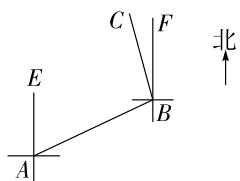

text_image

E
A
C
F
B
北

第8题解图

9. D 【解析】因为 AP 平分 $\angle OAC, BP$ 平分 $\angle ABO$ ，所以 $\angle CAP = \angle OAP = \frac{1}{2} \angle OAC$ , $\angle ABP = \angle OBP = \frac{1}{2} \angle ABO$ , 所以 $\angle P = 180^{\circ} - \angle BAP - \angle ABP = 180^{\circ} - \angle OAP - \angle OAB - \angle ABP = 180^{\circ} - \frac{1}{2} (\angle OAC + \angle OAB + \angle OAB + \angle ABO) = 180^{\circ} - \frac{1}{2} (180^{\circ} + 180^{\circ} - \angle AOB) = \frac{1}{2} \angle AOB = \frac{1}{2} \times$

$$
9 0 ^ {\circ} = 4 5 ^ {\circ}.
$$

10. D 【解析】∵ $FD \perp AC, BE \perp AC, \therefore DF \parallel BE,$ ∴ $\angle DFE = \angle FEB, \because \angle DFE = \angle EBC,$ $\angle FEB = \angle EBC, \therefore EF \parallel BC, \therefore \angle AEF = \angle C,$ ∴ 陈亮的说法正确；∵ $\angle AEF = \angle C, \therefore EF \parallel BC,$ $\therefore \angle FEB = \angle EBC, \because FD \perp AC, BE \perp AC,$ $\therefore DF \parallel BE, \therefore \angle DFE = \angle FEB, \therefore \angle DFE = \angle EBC,$ 王明的说法正确；∵ $\angle EDF$ 是 $\triangle ADF$ 的外角，∴ $\angle EDF > \angle AFD, \because DF \parallel BE,$ $\therefore \angle AFD = \angle ABE, \therefore \angle EDF > \angle ABE,$ 李乐的说法正确。说法正确的有 3 个。

11. 0 的平方根等于它本身; 真 【解析】 $\pm\sqrt{0}=0$ ,
0 的平方根是 0 本身.

12. $82^{\circ}$ 【解析】∵ $\angle A = 16^{\circ}, \angle B = 66^{\circ}, \therefore \angle BEA = 98^{\circ}.$ ∵ $BE \parallel FC, \therefore \angle CFE = \angle BEA = 98^{\circ}, \therefore \angle AFC = 82^{\circ}.$

13. $135^{\circ}$ 【解析】∵ $\angle A = 45^{\circ}, BE \perp AC, \therefore \angle ABE = 90^{\circ} - 45^{\circ} = 45^{\circ}$ ，又∵ $CD \perp AB, \therefore \angle BDF = 90^{\circ}$ ，∴ $\angle BFC = \angle BDF + \angle ABE = 135^{\circ}$ .

14. $75^{\circ}$ 【解析】∵ $\angle ABC = 90^{\circ}, \therefore \angle A + \angle C = 90^{\circ}$ ，由折叠的性质可得， $\angle BED = \angle A, \angle CBD = \angle ABD = \frac{1}{2} \angle ABC = 45^{\circ}, \because \angle C = \angle CDE, \angle A = \angle BED = \angle C + \angle CDE = 2 \angle C, \therefore 2 \angle C + \angle C = 90^{\circ}, \therefore \angle C = 30^{\circ}, \therefore \angle ADB = \angle CBD + \angle C = 45^{\circ} + 30^{\circ} = 75^{\circ}.$

15. 90° 【解析】∵ AM, AN 分别平分 ∠BAP,
∠DAP, ∴ ∠BAM = ∠MAP = $\frac{1}{2}$ ∠BAP = β,
∠DAN = ∠PAN = $\frac{1}{2}$ ∠DAP. ∵ ∠BAM + ∠B +
∠BMA = 180°, ∠B + ∠BAN + ∠ANB = 180°,
∠BAN = ∠BMA, ∴ ∠BAM = ∠ANB = β. ∵ AD //
BC, ∴ ∠B + ∠BAD = 180°, ∠DAN = ∠ANB = β,
∴ ∠PAN = ∠DAN = β, ∴ α + β + β + β + β = 180°,
∴ $\frac{1}{2}\alpha + 2\beta = 90^{\circ}$ .

16. 解: 是真命题, …… (2 分)

# 大小卷·八年级(上) 数学 BS

证明如下:如解图,在 $\triangle ABC$ 中,过点A作PQ//BC,

$\therefore \angle 1 = \angle B, (\text{两直线平行}, \text{内错角相等})$

$\angle2=\angle C,$ （两直线平行，内错角相等）

又∵ $\angle1+\angle2+\angle3=180^{\circ}$ ，(平角的定义)

$\therefore \angle BAC + \angle B + \angle C = 180^{\circ}$ ，(等量代换）

即三角形内角和是 $180^{\circ}$ . …… (6 分)

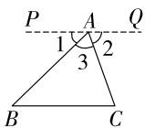  
第 16 题解图

17. 内错角相等,两直线平行;两直线平行,同位角相等; $\angle3;DF$ ;同旁内角互补,两直线平行;平行于同一条直线的两直线平行. ……(6分)

18. 解: (1) ∵ AE 是 BC 边上的高,

$$
\therefore \angle E = 9 0 ^ {\circ},
$$

$$
\because \angle A B C = 1 1 0 ^ {\circ},
$$

∴ $\angle BAE = 110^{\circ} - 90^{\circ} = 20^{\circ}$ ; …… (3 分)

(2)∵AD是BC边上的中线,CD=2,

$$
\therefore B C = 2 C D = 4,
$$

∵ AE 是 BC 边上的高, $S_{\triangle ABC}=7$ ,

$$
\therefore S _ {\triangle A B C} = \frac {1}{2} B C \cdot A E = \frac {1}{2} \times 4 A E = 7,
$$

解得 $AE=\frac{7}{2}$ . …… (7 分)

19. 解: $\because \angle1 = \angle2 = 30^{\circ}$ ,

$\therefore \angle ABC = 180^{\circ} - \angle 1 - \angle 2 = 120^{\circ}, \dots$ (2分)

$$
\because A B \parallel C D,
$$

$$
\therefore \angle A B C + \angle B C D = 1 8 0 ^ {\circ}.
$$

∴ $\angle BCD = 180^{\circ} - \angle ABC = 60^{\circ}$ . …… (4 分)

又∵ $\angle3=\angle4=\frac{180^{\circ}-\angle BCD}{2}=60^{\circ}$ ,

在 $\triangle CDE$ 中, $\angle4=60^{\circ},\angle E=90^{\circ},$

$$
\therefore \angle C D E = 1 8 0 ^ {\circ} - \angle 4 - \angle E = 3 0 ^ {\circ},
$$

$\therefore \angle CDF = 180^{\circ} - \angle CDE = 150^{\circ}.$ ……（8分）

20. 解: 理由如下:

$$
\because A B \parallel D E,
$$

$$
\therefore \angle A B D = \angle B D E,
$$

$$
\because A B \parallel C F,
$$

$$
\therefore \angle A B D = \angle B F C,
$$

$$
\because A D \parallel B C,
$$

$$
\therefore \angle A D B = \angle C B D,
$$

$$
\because A D \parallel E F,
$$

$$
\therefore \angle D F E = \angle A D B,
$$

$$
\therefore \angle A B D = \angle B D E = \angle B F C, \angle A D B =
$$

$$
\angle C B D = \angle D F E,
$$

$$
\because \angle A = 1 8 0 ^ {\circ} - \angle A B D - \angle A D B, \angle C = 1 8 0 ^ {\circ} -
$$

$$
\angle C B D - \angle B F C, \angle E = 1 8 0 ^ {\circ} - \angle D F E - \angle B D E,
$$

$$
\therefore \angle A = \angle C = \angle E,
$$

∴该零件合格. …… (9分)

21. (1) 证明: $\because AF$ 平分 $\angle BAC$ ,

$$
\therefore \angle B A F = \angle C A F,
$$

$$
\because B D \parallel A F,
$$

$$
\therefore \angle D = \angle C A F,
$$

$$
\because \angle D = \angle E,
$$

$$
\therefore \angle E = \angle C A F = \angle B A F,
$$

∴ AF∥CE; …… (3 分)

(2) 解: $\because BD \parallel AF,$

$$
\therefore \angle A B D = \angle B A F,
$$

∵ AF 平分 ∠BAC,

$$
\therefore \angle B A C = 2 \angle B A F = 2 \angle A B D,
$$

$$
\because \angle A B C: \angle A B D = 1: 3,
$$

$$
\therefore \angle B A C = 6 \angle A B C,
$$

$$
\because \angle B A D = 6 0 ^ {\circ},
$$

$$
\therefore \angle B A C = 1 8 0 ^ {\circ} - \angle B A D = 1 2 0 ^ {\circ},
$$

$$
\therefore \angle A B C = \frac {1}{6} \angle B A C = 2 0 ^ {\circ},
$$

$$
\therefore \angle A C F = 1 8 0 ^ {\circ} - \angle B A C - \angle A B C = 4 0 ^ {\circ}. \dots\dots
$$

$$
\dots (9 \text {分})
$$

22. 解: (1) ∵ BD 平分 ∠ABC, CD 平分 ∠ACB,

$$
\therefore \angle C B D + \angle B C D = \frac {1}{2} \angle A B C + \frac {1}{2} \angle A C B =
$$

$$
\frac {1}{2} (\angle A B C + \angle A C B) = \frac {1}{2} (1 8 0 ^ {\circ} - \angle A),
$$

$$
\because \angle D + \angle C B D + \angle B C D = 1 8 0 ^ {\circ},
$$

$$
\therefore \angle D = 1 8 0 ^ {\circ} - (\angle C B D + \angle B C D) = 1 8 0 ^ {\circ} -
$$

$\frac{1}{2}(180^{\circ}-\angle A)=90^{\circ}+\frac{1}{2}\angle A;\cdots\cdots(2\text{分})$

(2) $\angle E = 60^{\circ} + \frac{2}{3}\angle A.$ (4分)

证明如下:∵ BE、BF 三等分∠ABC, CE、CF 三等分∠ACB.

$$
\therefore \angle E B C = \frac {2}{3} \angle A B C, \angle E C B = \frac {2}{3} \angle A C B.
$$

在 $\triangle EBC$ 中， $\angle E = 180^{\circ} - \angle EBC - \angle ECB =$

$$
\begin{array}{l} 1 8 0 ^ {\circ} - \frac {2}{3} (\angle A B C + \angle A C B) = 1 8 0 ^ {\circ} - \frac {2}{3} (1 8 0 ^ {\circ} - \\ \angle A) = 6 0 ^ {\circ} + \frac {2}{3} \angle A. \dots\dots(8 \text {分}) \\ (3) \angle F = 6 0 ^ {\circ} + \frac {1}{3} (\angle M + \angle N). \quad \dots \dots (1 0 \text {分}) \\ \end{array}
$$

【解法提示】∵ 四边形 MNCB 内角和为 $360^{\circ}$ ,
∴ $\angle MBC + \angle NCB = 360^{\circ} - (\angle M + \angle N)$ , ∵ BE、
BF 三等分 $\angle MBC, CE, CF$ 三等分 $\angle NCB.$ ∴

$$
\begin{array}{l} \angle C B F = \frac {1}{3} \angle M B C, \angle B C F = \frac {1}{3} \angle N C B, \therefore \angle F = \\ 1 8 0 ^ {\circ} - \angle C B F - \angle B C F = 1 8 0 ^ {\circ} - \frac {1}{3} (\angle M B C + \\ \angle N C B) = 1 8 0 ^ {\circ} - \frac {1}{3} [ 3 6 0 ^ {\circ} - (\angle M + \angle N) ] = 6 0 ^ {\circ} + \\ \frac {1}{3} (\angle M + \angle N). \\ \end{array}
$$

# 期末检测卷

1. C 【解析】6.726 是有限小数, 属于有理数, 选项 A 不符合题意; $\sqrt{9}=3$ , 是整数, 属于有理数, 选项 B 不符合题意; $\sqrt[3]{-9}$ 是无理数, 选项 C 符合题意; $\frac{2}{3}$ 是分数, 属于有理数, 选项 D 不符合题意.

2. A 【解析】∵三角形内角和为 $180^{\circ}$ ，∴ $\angle A + \angle B + \angle C = 180^{\circ}$ ，又∵ $\angle A + \angle B = \angle C$ ，∴ $2\angle C = 180^{\circ}$ ，即 $\angle C = 90^{\circ}$ ，∴ $\triangle ABC$ 为直角三角形，选项 A 符合题意；∵ $\angle A : \angle B : \angle C = 3 : 4 : 5$ ，∴ $\angle C = \frac{5}{3 + 4 + 5} \times 180^{\circ} = 75^{\circ}$ ，∴ 不能判定 $\triangle ABC$ 为直角三角形，选项 B 不符合题意；∵ a : b : c = 2 : 3 : 4，设 a = 2x, b = 3x, c = 4x, ∴ $a^{2} + b^{2} \neq c^{2}$ ，∴ 不能判定 $\triangle ABC$ 为直角三角形，选项 C 不符合题意；∵ $a + b = 2c$ 不能判定得出 $a^{2} + b^{2} = c^{2}$ ，∴ 不能判定 $\triangle ABC$ 为直角三角形，选项 D 不符合题意.

3. C 【解析】∵ $PQ \parallel x$ 轴, ∴ 点 Q 与点 P 的纵坐标相同, 都是 2, ∵ PQ = 4, ∴ 点 Q 的横坐标为 -3 + 4 = 1 或 -3 - 4 = -7, ∴ 点 Q 的坐标为 (1, 2) 或 (-7, 2).

4. B 【解析】平均数和这组数据中的每个数据都有关,所以平均数不一定不变,选项 A 错误;当同时去掉一个最低分和一个最高分时,中位数一定不变,选项 B 正确;无法判断方差的变化,选项 C 错误;当最低分和最高分各有多个相同的分数时,新数据的极差不变,选项 D 错误.

5. D 【解析】如解图, 过点 E 作 $EF \parallel AB, \because AB \parallel CD, \therefore EF \parallel CD, \therefore \angle CEF = 180^{\circ} - \angle C = 180^{\circ} - 126^{\circ} = 54^{\circ}, \angle AEF = 180^{\circ} - \angle A = 180^{\circ} - 102^{\circ} = 78^{\circ}, \therefore \angle AEC = \angle CEF + \angle AEF = 54^{\circ} + 78^{\circ} = 132^{\circ}.$

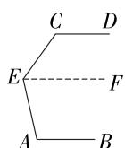  
第5题解图

6. A 【解析】根据题意,可列二元一次方程组为 $\left\{\begin{aligned}\frac{190}{7}x+330&=y,\\ \frac{270}{9}x-30&=y.\end{aligned}\right.$

7. C 【解析】根据题意, 得 $y = x * (-6) = -8x - 6$ , $\because -8 < 0$ , $\therefore y$ 的值随着 x 值的增大而减小, 选项 A 错误; $\because$ 当 x = 2 时, $y = -8 \times 2 - 6 = -22$ , $\therefore$ 点 (2,10) 不在函数 $y = x * (-6)$ 的图象上, 选项 B 错误; $\because -8 < 0, -6 < 0$ , $\therefore$ 函数 $y = x * (-6)$ 的图象经过第二、三、四象限, 选项 C 正确; $\because y = x * (-6) = -8x - 6$ 是一次函数, $\therefore$ 它的图象是一条直线, 选项 D 错误.

8. D 【解析】当 y=1 时, y=2x-5=1, 解得 x=3, 故两条直线的交点坐标为 $(3,1)$ , ∴ 方程组 $\left\{\begin{aligned}y&=2x-5,\\ y&=ax-b\end{aligned}\right.$ 的解为 $\left\{\begin{aligned}x&=3,\\ y&=1,\end{aligned}\right.$ 即方程组 $\left\{\begin{aligned}2x-y-5=0,\\ ax-y-b=0\end{aligned}\right.$ 的解为 $\left\{\begin{aligned}x&=3,\\ y&=1.\end{aligned}\right.$

9. D 【解析】展开图如解图,作点 Q 关于 CD 的对称点 $Q'$ , 延长 $Q'Q$ 交 PB 的延长线于点 H, 连接 $PQ'$ . 在 Rt△ $PQ'H$ 中, PH = 30 cm, $HQ' = 90 \, cm$ , 根据勾股定理得, $PQ' = \sqrt{PH^{2} + HQ'^{2}} = \sqrt{30^{2} + 90^{2}} = 30 \sqrt{10} \, (\text{cm})$ , ∴ 小蚂蚁所走的最短路径长为 $30 \sqrt{10} \, cm$ .

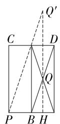  
第9题解图

10. A 【解析】由题图②可知, 当 x=8 时, $\triangle APD$ 的面积最大, 此时点 P 运动到点 C, $\therefore AC=8$ , $\because D$ 为 AB 的中点, $\therefore$ 此时 $S_{\triangle APD}=S_{\triangle ACD}=\frac{1}{2}S_{\triangle ABC}=\frac{1}{4}AC\cdot BC=12$ , 即 $\frac{1}{4}\times8\times BC=12$ , 解得 BC=6, 在 Rt $\triangle ABC$ 中, $AB=\sqrt{AC^{2}+BC^{2}}=\sqrt{8^{2}+6^{2}}=10$ .

大小卷·八年级(上) 数学 BS

11. $\pm\sqrt{5}$

12. 乙 【解析】从平均数来看, $\bar{x}_{甲}=\bar{x}_{乙}$ , 平均数相同,从方差来看, $s_{甲}^{2}>s_{乙}^{2}$ ,说明乙更稳定,∴乙品种更适合在本村推广.

13. -1(答案不唯一) 【解析】∵一次函数 $y = (m + 3)x + m + 1$ 的图象不经过第二象限，
∴ $m+3>0, m+1 \leqslant 0, \therefore -3 < m \leqslant -1, \therefore m$ 的值可能是 -1.

14. $240^{\circ}$ 【解析】如解图, $\angle1 = \angle A + \angle C$ , $\angle2 = \angle B + \angle D$ , $\because \angle BOF = 120^{\circ}$ , $\therefore \angle3 = 180^{\circ} - \angle BOF = 60^{\circ}$ , 根据三角形内角和定理, 得 $\angle E + \angle1 = 180^{\circ} - \angle3 = 120^{\circ}$ , $\angle F + \angle2 = 180^{\circ} - \angle3 = 120^{\circ}$ , $\therefore \angle1 + \angle2 + \angle E + \angle F = 120^{\circ} + 120^{\circ} = 240^{\circ}$ , 即 $\angle A + \angle B + \angle C + \angle D + \angle E + \angle F = 240^{\circ}$ .

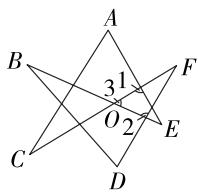

text_image

A
B
3 1
F
O
2
C
D
E

第 14 题解图

15. (10,3) 【解析】设 $DB = m$ ，由题意可得 $OB = CA = 10, OC = AB = 8$ ，由折叠的性质得 $CE = CA = 10, DE = DA = 8 - m$ ，在 Rt $\triangle COE$ 中， $OE = \sqrt{CE^2 - OC^2} = \sqrt{10^2 - 8^2} = 6, \therefore EB = 10 - 6 = 4.$ 在 Rt $\triangle DBE$ 中， $\angle DBE = 90^\circ, \therefore DE^2 = DB^2 + EB^2$ ，即 $(8 - m)^2 = m^2 + 4^2$ ，解得 $m = 3, \therefore$ 点 $D$ 的坐标是 (10,3).

16. 解: (1) 原式 = $3\sqrt{3} + 2\sqrt{3} - 2 \times 4\sqrt{3}$

$$
= 3 \sqrt {3} + 2 \sqrt {3} - 8 \sqrt {3}
$$

$$
= - 3 \sqrt {3}; \dots \tag {4分}
$$

(2) 原式 $= \left[5\sqrt{2} + \sqrt{2} - (3 - 2\sqrt{2})\right] \times \sqrt{2}$

$$
= (8 \sqrt {2} - 3) \times \sqrt {2}
$$

$$
= 1 6 - 3 \sqrt {2}. \quad \dots\dots (8 \text {分})
$$

17. 解:(1)由①,得 $2x=5y+3$ ,③

将③代入②, 得 $2(5y+3)+y=5$ ,

即 $11y+6=5$ ,

解得 $y=-\frac{1}{11}$ ,

将 $y=-\frac{1}{11}$ 代入③, 得 $2x=\frac{28}{11}$ ,

解得 $x=\frac{14}{11}$ .

∴ 原方程组的解为 $\left\{\begin{aligned}x &= \frac{14}{11}, \\ y &= -\frac{1}{11};\end{aligned}\right.$ …… (4 分)

(2) ①×2+②, 得 $3x + 8y + \left(-\frac{5}{3}y - 3x\right) = -8 + (-11)$ ,
即 $\frac{19}{3}y=-19$ , 解得 y=-3,

将 y = -3 代入①, 得 $\frac{3}{2}x + 4 \times (-3) = -4$ ,

解得 $x=\frac{16}{3}$ .

∴ 原方程组的解为 $\left\{\begin{aligned}x&=\frac{16}{3},\\ y&=-3.\end{aligned}\right.$ …… (8 分)

18. 解: (1) 作点 $A_{1}, B_{1}$ 如解图所示,

点 $A_{1}$ 的坐标为 $(2,2)$ ,

点 $B_{1}$ 的坐标为 $(1,3)$ ; …… (2 分)

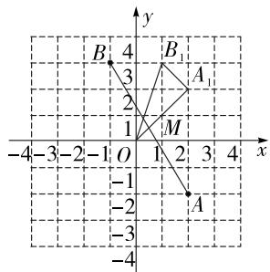

text_image

B'
4
B₁
3
A₁
2
1
M
-4-3-2-1 O 1 2 3 4 x
-1
-2
-3
A

第 18 题解图

(2) $\triangle A_{1}B_{1}O$ 如解图所示,

$$
S _ {\triangle A _ {1} B _ {1} O} = 2 \times 3 - \frac {1}{2} \times 1 \times 1 - \frac {1}{2} \times 1 \times 3 - \frac {1}{2} \times 2 \times 2 = 2;
$$

……（5分）

(3)∵点A与点 $A_{1}$ 关于x轴对称,点M在x轴上,

∴ 点 M 到点 A 的距离和到点 $A_{1}$ 的距离相等，
即 $A_{1}M=AM$ ，

$$
\therefore A _ {1} M + B M = A M + B M,
$$

如解图,连接 AB, 当点 M 在 AB 与 x 轴的交点处时, $AM + BM$ 取得最小值,

设 AB 所在直线的函数表达式为 $y = kx + b (k \neq 0)$ ,

将 $A(2, - 2),B(-1,3)$ 代入，可得 $\left\{ \begin{array}{l}2k + b = -2,\\ -k + b = 3. \end{array} \right.$

解得 $\left\{\begin{aligned}k&=-\frac{5}{3},\\ b&=\frac{4}{3}.\end{aligned}\right.$

则 AB 所在直线的函数表达式为 $y = -\frac{5}{3}x + \frac{4}{3}$ ,

将 $y = 0$ 代入 $y = -\frac{5}{3} x + \frac{4}{3}$ , 得 $x = \frac{4}{5}$ ,

∴ 点 M 的坐标为 $\left(\frac{4}{5},0\right)$ . …… (8 分)

19. (1) 证明: 设 $\angle DAE = x, \angle BAC = y$ ,

则 $\angle BAD = x + y$ ,

$$
\because \angle D A E = x, A E = A D,
$$

$$
\therefore \angle A D E = \angle E = \frac {1 8 0 ^ {\circ} - x}{2}.
$$

$$
\because A B = A C, \angle B A C = y,
$$

$$
\therefore \angle B = \frac {1 8 0 ^ {\circ} - y}{2},
$$

$$
\because \angle A C D = \angle B + \angle B A C = \angle E + \angle C D E,
$$

$$
\therefore \frac {1 8 0 ^ {\circ} - y}{2} + y = \frac {1 8 0 ^ {\circ} - x}{2} + \angle C D E,
$$

$$
\therefore \angle C D E = \frac {1}{2} (x + y),
$$

∴ $\angle BAD = 2 \angle CDE$ ; …… (4 分)

(2) 解: 设 $\angle DAE = m, \angle BAC = n,$

则 $m-n=\angle DAE-\angle BAC=\angle BAD=26^{\circ}$ ,

$$
\because \angle D A E = m, A D = A E,
$$

$$
\therefore \angle A E D = \frac {1 8 0 ^ {\circ} - m}{2}.
$$

$$
\because A B = A C, \angle B A C = n,
$$

$$
\therefore \angle A C B = \frac {1 8 0 ^ {\circ} - n}{2},
$$

$$
\therefore \angle C D E = \angle A C B - \angle A E D = \frac {1 8 0 ^ {\circ} - n}{2} - \frac {1 8 0 ^ {\circ} - m}{2} =
$$

$\frac{1}{2}(m-n)=13^{\circ}$ . $\cdots\cdots(9\text{分})$

20. 解: (1) 67, 75, 80%, 20%; …… (8 分)

【解法提示】由题图可知, $a=(30+5\times60+70+80+90+100)\div10=67$ ;将八年级选手成绩按照从小到大排列,则第5位是70分,第6位是80分,所以中位数是 $(70+80)\div2=75$ (分),即b=75;八年级队达到60分及以上有8人,合格率为 $8\div10\times100\%=80\%$ ,即c=80%;七年级队达到90分及以上有2人,所以优秀率为 $2\div10\times100\%=20\%$ ,即d=20%.

(2)①八年级队的平均分高于七年级队;②八年级队的成绩比七年级队更稳定;③八年级队的成绩集中在中上游,所以八年级队成绩好.

(任写两条,合理即可). …… (10 分)

21. 解: (1) 4, 10, 20; …… (3 分)

(2) $v_{1}=2\ 000\div4=500(\mathrm{~m/min})$ ,

$$
v _ {2} = 1. 5 v _ {1} = 7 5 0 (\mathrm{m/min}),
$$

设重新上车后, s 与 t 之间的函数关系式为 s = 750t + b,

将(10,2 000)代入函数关系式,得 2 000 = 750×10+b,

解得 b = -5 500,

故 s 与 t 之间的函数关系式为 s=750t-5 500;
……(7 分)

(3) 将 t=20 代入 s=750t-5 500,

得 $s=750\times20-5\ 500=9\ 500\ m=9.5(\text{km})$ .

车费为: $8+(9.5-3)\times2+(6-5)\times1=22$ (元).

答: 小明应付车费 22 元. …… (10 分)

22. 解: (1) 设购进羊毫毛笔 x 支, 兼毫毛笔 y 支,

根据题意可得 $\left\{\begin{aligned}x+y&=300,\\ 15x+25y&=6300,\end{aligned}\right.$

解得 $\left\{\begin{aligned}x=120,\\ y=180,\end{aligned}\right.$

答:该商店购进羊毫毛笔 120 支,兼毫毛笔 180 支;……(4 分)

(2) 根据题意, 得 $w = (25 - 15)(300 - m) + (40 - 25)m = 5m + 3000$ ,

$$
\because 5 > 0,
$$

∴ w 随 m 的增大而增大，

∴ 要使得利润最大, 尽可能多地购进兼毫毛笔,

又∵要保证任意一种毛笔都至少购进100支，
∴兼毫毛笔最多购进300-100=200(支)，

∴ 当 m = 200 时, w 取最大值, 最大值为 $5 \times 200 + 3000 = 4000$ (元),

答:购进羊毫毛笔100支,兼毫毛笔200支时,可以获得最大利润,最大利润是4 000元. …
……(10分)

23. 解: (1) 设直线 $l_{2}$ 的函数表达式为 $y = kx + b (k \neq 0)$ ,

将点 $C(0,-4)$ , $D(3,2)$ 代入 $y=kx+b$ 中, 得 $\left\{\begin{aligned}b&=-4,\\ 3k+b&=2,\end{aligned}\right.$ 解得 $\left\{\begin{aligned}k&=2,\\ b&=-4,\end{aligned}\right.$

∴ 直线 $l_{2}$ 的函数表达式为 y=2x-4；……

……（4分）

# 大小卷·八年级(上) 数学 BS

(2)由(1)得,直线 $l_{2}$ 的函数表达式的一次项系数大于0,

$\therefore y$ 随 x 的增大而增大，

∴ 当 x=a 时, y 取得最大值 4,

将 y=4 代入 y=2x-4, 得 2x-4=4,

解得 x=4，

∴ a=4; …… (8分)

(3) 存在，

如解图, 设 $P(t,2t-4)$ , $l_{2}$ 与 x 轴交于点 E,

∵ 直线 $l_{1}$ 与 y 轴, x 轴分别交于 A, B 两点,

$\therefore A(0,5), B(5,0),$

将 y=0 代入 y=2x-4, 得 x=2,

∴ 点 E 的坐标为 $(2,0)$ ,

$$
\therefore B E = 3,
$$

$$
\because S _ {\triangle A B C} = \frac {1}{2} A C \cdot O B = \frac {1}{2} \times 9 \times 5 = \frac {4 5}{2},
$$

$$
\therefore S _ {\triangle B C P} = S _ {\triangle A B C} = \frac {4 5}{2},
$$

$$
\begin{array}{l} S _ {\triangle B C P} = S _ {\triangle B C E} + S _ {\triangle B E P} \\ = \frac {1}{2} B E \cdot O C + \frac {1}{2} B E \cdot y _ {p} \\ = \frac {1}{2} \times 3 \times 4 + \frac {1}{2} \times 3 \times (2 t - 4) \\ = 6 + 3 t - 6 \\ = 3 t, \\ \end{array}
$$

解得 $t=\frac{15}{2}$ ,

∴ 点 P 的坐标为 $\left(\frac{15}{2}, 11\right)$ . …… (12 分)

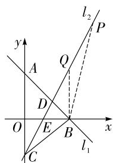

text_image

y
A
Q
P
O
E
B
x
l₁
C
l₂

第 23 题解图