# 周测小卷

活页可撕

natural_image

Cartoon illustration of a green deer-like character with large eyes and antlers, holding a small object (no text or symbols)

检测每周学习成果，及时查漏补缺

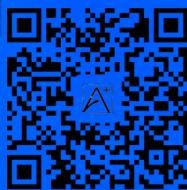

主编 武泽涛 研发 万唯中考千人研究院

九年级全一册

数学BS

2025版

# 本书配套系列用书

更多教辅，请关注公众号【全科A+】

<table><tr><td>名校满分作文</td><td>中考题型训练</td></tr><tr><td>语文《中考名校模考 满分作文》《初中名师 教你改出满分作文》英语《中考名校模考 英语满分作文》《初中英语 教材写作 名校满分作文与 中考新方向》</td><td>《中考 基础题与新考法》语文/数学/英语/物理/化学/道德与法治/历史《中考 压轴题与新考法》几何/函数/物理/化学语文《中考 现代文阅读与新考法》《中考 课外文言文阅读与新考法》数学《中考计算题组合练 数学》英语《中考 完形填空阅读理解与新考法》基础版/提升版《中考 英语听力与新考法》</td></tr><tr><td>七~九年级通用</td><td>同步训练</td></tr><tr><td>《初中 基础知识与中考创新题》语文/数学/英语/物理/化学/道德与法治/历史/地理/生物学《初中 实验与中考新考法》物理/化学/生物学语文《初中 名著阅读与中考新考法》《初中 文言文常用字字典》《初中 教材文言文完全解读与中考考点》数学《初中数学 几何模型与中考新考法》《初中数学 几何辅助线与中考新考法》英语《中考 英语词汇与新考法》《初中 英语语法与中考新趋势》</td><td>《情境题与中考新考法 九年级》语文/数学/英语/物理/化学/道德与法治/历史《大小卷 九年级》语文/数学/英语/物理/化学/道德与法治/历史《初三 预习视频课》语文/数学/英语/物理/化学《尖子生 每日一题 九年级+中考》数学/物理/化学</td></tr></table>

\*可根据学习情况选择使用

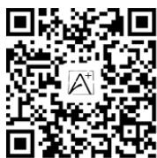

· 重难题视频讲解(25个)  
· 中考试题、省会城市名校期末试题及解析  
· 几何画板动态演示(含源文件)  
- 更多教辅，请关注公众号【全科A+】

# 目录

主题情境:本书结合日常生活、数学文化、跨学科学习等创设主题情境,围绕主题情境原创更多情境题,让学生在真实情境中掌握知识,提升解决实际问题的能力.

# 九年级(上)

# 第一章 特殊平行四边形

# 主题情境

周测1 菱形的性质与判定 1  
周测2 矩形的性质与判定 …… 美丽乡村新面貌3  
周测3 正方形的性质与判定 …… 图形的变化5  
专题 特殊四边形中的折叠问题 7  
专题 正方形中的十字模型 9

# 第二章 一元二次方程

周测4 一元二次方程的认识及解法 …… 11  
周测5 一元二次方程的根与系数的关系及应用 …… 全民健身13  
专题 一元二次方程根的判别式及根与系数的关系 …… 15  
专题 一元二次方程与图形面积问题 …… 16

# 第三章 概率的进一步认识

周测 6 概率的计算及频率估计概率 …… 以劳动赋能,育时代新人 17

# 第四章 图形的相似

周测 7 平行线分线段与相似多边形……“文人四艺”——琴棋书画 19  
周测8 相似三角形的判定 黄金分割的美21  
周测9 相似三角形的性质与位似 23  
专题 一线三等角问题 …… 25

# 第五章 投影与视图

周测 10 投影与视图 …… 全方位看馆藏文物 27

# 第六章 反比例函数

周测11 反比例函数的图象与性质 29  
周测12 反比例函数的应用 水电站建设31  
专题 反比例函数 $k$ 的几何意义 …… 33

# 九(上)检测

选填及简单解答题题组(一) 35  
选填及简单解答题题组(二) 37  
中档解答题题组(一) 39

中档解答题题组(二) 41

专题 与特殊四边形有关的综合题 …… 43

专题 相似手拉手问题 45

专题 反比例函数综合题 …… 47

# 九年级(下)

# 第一章 直角三角形的边角关系

周测13 锐角三角函数 49

周测14 解直角三角形及其应用 建筑中的三角函数51

# 第二章 二次函数

周测 15 二次函数的概念及图象与性质 …… 53

周测 16 二次函数的表达式、应用及与一元二次方程的关系 …… 茶之“曲线” 55

专题 二次函数的实际应用 …… 江南水乡 57

专题 二次函数性质综合题 …… 59

# 第三章 圆

周测 17 圆的相关性质、垂径定理及圆周角定理 …… 61

周测 18 确定圆的条件及直线与圆的位置关系 …… 63

专题 切线与圆的综合 …… 65

周测 19 圆内接正多边形及弧长与扇形面积 …… 67

# 九(下)检测

选填及简单解答题题组(一) 69

选填及简单解答题题组(二)…… 花圃建造 71

中档解答题题组(一) 73

中档解答题题组(二) 75

专题 二次函数几何综合题 …… 77

# 小卷中考新考法索引

# 开放性试题

满足结论的条件开放/P3第7题、P36第11题 满足条件的结论开放/P13第7题

# 过程性学习

续写证明过程/P4第11题 过程纠错改错/P21第2题

# 阅读理解题

新定义型阅读理解题/P39 第 19 题、P49 第 10 题 解题方法型阅读理解题/P12 第 14 题

# 综合与实践

类比探究/P46第7题 操作探究/P6第13题

# 附:《参考答案》单独成册

# 周测1 菱形的性质与判定

建议用时:40 分钟 满分:60 分

班级： 姓名： 得分：

# 一、选择题(每小题3分,共18分)

1. 如图, 在菱形 $ABCD$ 中, $\angle A = 110^{\circ}$ , 则 $\angle CBD$ 的度数为 ( )

A. ${30}^{ \circ  }$   
B. ${35}^{ \circ  }$   
C. ${55}^{ \circ  }$   
D. ${70}^{ \circ  }$

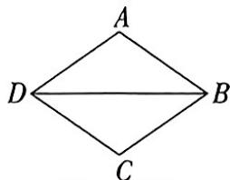

text_image

A
D B
C

第1题图

2. 日常生活情境(防护网)如图①是一种防护网,由菱形组成,如图②所示,在推拉过程中,四边形始终是菱形,则下列说法不正确的是()

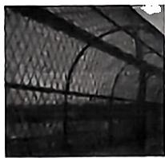

natural_image

Close-up of a metal frame structure with arched supports (no visible text or symbols)

图①

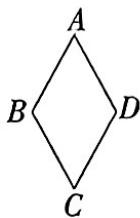  
图②  
第2题图

A. $AC = BD$

B. $\angle A = \angle C$

C. $AC \perp BD$

D. $AB \parallel CD$

3. (教材P3例1改编) 一题多变

# 3.1 增加中点连线,求线段长

如图,在菱形 ABCD 中,对角线 AC,BD 相交于点 O,点 E,F 分别为 AO,BO 的中点,连接 EF,若 AC=6,BD=8,则 EF 的长为 ( )

A. 3

B. $\frac{5}{2}$

C. 2

D. $\frac{3}{2}$

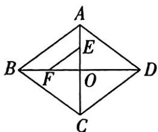

text_image

A
B
E
F
O
D
C

第3.1题图

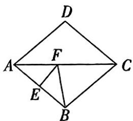

text_image

D
A	F	C
E
B

第3.2题图

# 3.2 作边的垂直平分线,求角度

如图, 在菱形 $ABCD$ 中, $\angle BAD = 80^{\circ}, AB$

的垂直平分线交对角线 AC 于点 F, 垂足为 E, 连接 BF, 则 $\angle BFC$ 的度数为()

A. ${90}^{ \circ  }$

B. ${80}^{ \circ  }$

C. ${70}^{ \circ  }$

D. ${60}^{ \circ  }$

4. 如图,菱形 ABCD 的对角线 AC,BD 相交于点 O,过点 O 作 $EF \perp BC$ 于点 F,交 AD 于点 E,若 AC = 12,BD = 16,则 EF 的长为 ( )

A. 12

B. $\frac{48}{5}$

C. $\frac{36}{5}$

D. $\frac{96}{5}$

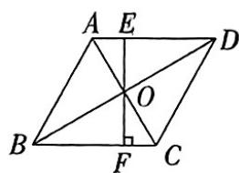

text_image

A E
B F C
O
D

第4题图

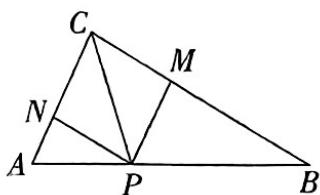

text_image

Geometric diagram of triangle ABC with internal points P, M, N and connecting lines forming smaller triangles

第5题图

5. 如图, 在 $\triangle ABC$ 中, $CP$ 平分 $\angle ACB$ , $PM \parallel AC$ 交 $BC$ 于点 $M$ , $PN \parallel BC$ 交 $AC$ 于点 $N$ , 若 $CN = 8$ , $CP = 12$ , 则四边形 $CNPM$ 的面积为 ( )

A. 60

B. 120

C. $24 \sqrt{7}$

D. $48 \sqrt{7}$

# 二、填空题(每小题3分,共12分)

6. 如图, 在 $\square ABCD$ 中, 有以下 4 个条件: ① $OA = OB$ ; ② $AC = BD$ ; ③ $\angle ADC = \angle BAD$ ; ④ $AC \perp BD$ , 选择条件 \_\_\_\_ 可以使 $\square ABCD$ 是菱形.

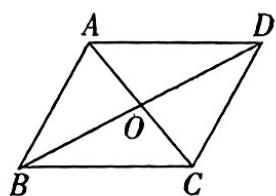

text_image

A
O
B
C
D

第6题图

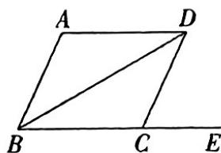

text_image

A
D
B
C
E

第7题图

7. 如图, $BD$ 是菱形 $ABCD$ 的一条对角线, 点 $E$ 在 $BC$ 的延长线上. 若 $\angle ADB = 30^{\circ}$ , 则 $\angle DCE$ 的度数为 \_\_\_\_.

大小卷·九年级(全一册) 数学 BS

8. 如图,菱形 ABCD 在平面直角坐标系中, 若点 C 的坐标为 $(0,6)$ , 点 D 的坐标为 $(0,-3)$ , 则点 A 的坐标为 \_\_\_\_.

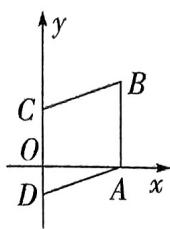

text_image

y
C
B
O
x
D
A

第8题图

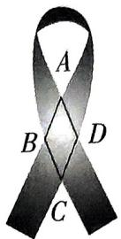  
第9题图

9. 日常生活情境 制作丝带 “蓝丝带”一般指蓝丝带海洋保护协会, 同时也象征着对保护海洋的呼吁. 壮壮用一段矩形绸缎制作了一条如图所示宽为 $4 \mathrm{~cm}$ 的蓝丝带, 若重叠部分ABCD为菱形, 且 $\angle BAD = 45^{\circ}$ , 则菱形ABCD的面积为 $\mathrm{cm}^{2}$ .

# 三、解答题(共30分)

10. (10 分) 如图, 四边形 ABCD 为平行四边形.

(1)尺规作图:分别作∠DAB的平分线AE交BC于点E,∠ABC的平分线BF交AD于点F,AE,BF交于点O;   
(2) 连接 $EF$ , 试判断四边形 $ABEF$ 的形状, 并说明理由.

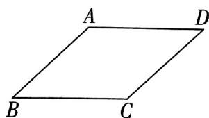

text_image

A
D
B
C

第10题图

11. (10 分) 如图, 四边形 ACDE 是菱形, B, C, E, F 在同一条直线上, BC = EF.

(1) 求证: DF = AB;   
(2) 若 $\angle B = \angle CDE = 30^{\circ}$ , 求 $\angle EDF$ 的度数.

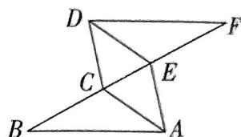

text_image

Geometric diagram with labeled points A, B, C, D, E, F forming intersecting triangles and quadrilaterals

第11题图

12. (10 分)如图,已知 $\triangle ABC$ 和 $\triangle AMN$ 均为等边三角形, $MN$ 与 $AC$ 交于点 $F$ , 连接 $CM, CN, AM // CN$ , 点 $F$ 是 $MN$ 的中点. (1) 求证: 四边形 $AMCN$ 是菱形; (2) 连接 $BM$ , 若 $BM = 1$ , 求 $\triangle ABC$ 的边长.

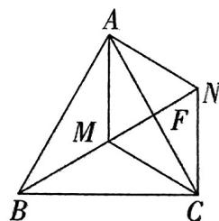

text_image

A
M
F
N
B
C

第12题图

# 周测2 矩形的性质与判定

建议用时:40 分钟 满分:60 分

班级： 姓名： 得分：

# 一、选择题(每小题3分,共18分)

1. 生产劳动情境 零件检测 王师傅需要检查加工零件是否符合要求(如图,所有面均为矩形即为符合要求),下列方法中正确的是()

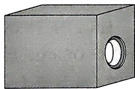

natural_image

3D rendering of a gray rectangular block with a circular hole on one face (no text or symbols)

第1题图

A. 测量各个面的两条对角线,是否相等  
B. 测量各个面的两条对角线,是否互相平分  
C. 测量各个面的三个角,是否都是直角  
D. 测量各个面的两条对角线, 是否互相垂直

# 主题情境 美丽乡村新面貌

请完成第2\~3题.

2. (教材 P13 例 1 改编) 多彩花圃为美丽乡村增色添彩, 如图是乡村矩形花圃一隅的平面图, 已知 $\angle ACB = 30^{\circ}$ , $CD = 6 \mathrm{~m}$ , 则 $BD$ 的长为 ( )

A. $10 \mathrm{~m} \quad \mathrm{B}. 12 \mathrm{~m} \quad \mathrm{C}. 14 \mathrm{~m} \quad \mathrm{D}. 16 \mathrm{~m}$

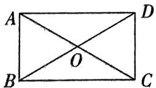  
第2题图

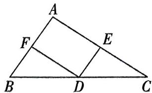

text_image

A
F
E
B
D
C

第3题图

3. 如图,为美化乡村人居环境,充分利用闲置土地,某村计划在一块三角形的闲置土地中修建小型运动公园 AEDF, 若 AB = 500 m, AC = 1200 m, 点 D, E, F 分别是 BC, AC, AB 的中点, 则四边形 AFDE 的周长为 ( )

A. $1500 \mathrm{~m}$

B. $1600 \mathrm{~m}$

C. $1700 \mathrm{~m}$

D. $1800 \mathrm{~m}$

4. 如图, 在矩形 $ABCD$ 中, $\angle ADB = 40^{\circ}$ , 观察图中尺规作图的痕迹, 则 $\angle BEC$ 的度数是 ( )

A. ${45}^{ \circ  }$

B. ${55}^{ \circ  }$

C. ${65}^{ \circ  }$

D. ${70}^{ \circ  }$

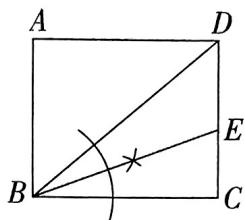

text_image

A
D
B
E
C

第4题图

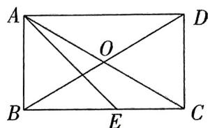

text_image

A
O
B
E
C
D

第5题图

5. 如图, 矩形 ABCD 的对角线 AC, BD 交于点 O, AE 平分 $\angle BAD$ 交 BC 于点 E, $\angle CAE = 15^{\circ}$ , 若 AB = 2, 则四边形 ABCD 的面积为 ( )

A. 8

B. 6

C. $4 \sqrt{3}$

D. $2 \sqrt{3}$

6. 如图, 在矩形 $ABCD$ 中, $DP$ 平分 $\angle ADC$ , $F, E$ 分别是 $CD, DP$ 的中点, 连接 $EF$ , 若 $AD = 6, EF = \sqrt{10}$ , 则 $FC$ 的长为 ( )

A. 4

B. 5

C. 6

D. 7

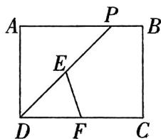

text_image

A
P
B
E
D
F
C

第6题图

# 二、填空题(每小题3分,共12分)

7. (中考新考法·满足结论的条件开放) 平行四边形 ABCD 的对角线 AC, BD 相交于点 O, 请添加一个适当的条件 \_\_\_\_，使平行四边形 ABCD 是矩形.

8. 已知一矩形的周长是 16 cm, 相邻两边之比是 1:3, 则矩形的面积是 \_\_\_\_ cm².

9. 如图, 在矩形 $ABCD$ 中, 点 $E, F$ 分别在 $AD, BC$ 上, 将 $\triangle ABE$ 沿 $BE$ 翻折, 使点 $A$ 落在对角线 $BD$ 上的点 $M$ 处, 将 $\triangle CDF$ 沿 $DF$ 翻折, 使点 $C$ 落在对角线 $BD$ 上的点大小卷·九年级(全一册) 数学 BS

N 处. 若 BE = DE, BE = 2, 则 AB 的长为 \_\_\_\_.

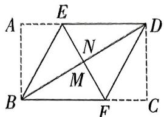

text_image

A
E
N
M
B
F
C
D

第9题图

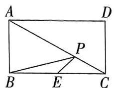

text_image

A
D
P
B
E
C

第10题图

10. (教材 P19 第 5 题改编) 如图, 点 $P$ 为矩形 $ABCD$ 的对角线 $AC$ 上一动点, 点 $E$ 为 $BC$ 上一点, 连接 $PE, PB$ , 若 $AB = 4, BC = 4\sqrt{3}$ , 则 $PE + PB$ 的最小值为 \_\_\_\_.

# 三、解答题(共30分)

11. (中考新考法·续写证明过程)(8分)下面是一道例题及其证明过程的一部分,请你将该例题的证明过程补充完整.

例如图, 在 $\square ABCD$ 中, $\angle ABD = 90^{\circ}$ , 延长 $AB$ 至点 $E$ , 使 $BE = AB$ , 连接 $CE$ . 求证: 四边形 $BECD$ 是矩形.

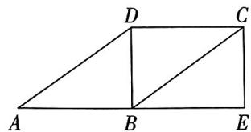

text_image

A
B
C
D
E

第11题图

证明：∵ 四边形 ABCD 是平行四边形，
∴ CD = AB, CD // AB,
...

12. (10 分) 如图, 在矩形 ABCD 中, 对角线 AC 与 BD 相交于点 O, F 为 BC 上一点, 连接 AF, 已知 AB = 6, $\angle AOD = 120^{\circ}$ .

(1) 求 $\angle ACB$ 的度数;  
(2) 若 $AF$ 平分 $\angle BAC$ , 求 $CF$ 的长.

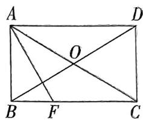

text_image

A
O
B F C
D

第12题图

13. (12分)如图,在 $\triangle ABC$ 中, $D$ 是 $BC$ 延长线上一点, $H$ 是边 $AC$ 上一动点,过点 $H$ 作直线 $BD$ 的平行线, $\angle ACB$ 与 $\angle ACD$ 的平分线分别交平行线于点 $E,F$ ,连接 $AE,AF$ .

(1) 若 $EF = 8$ , 求 $CH$ 的长;  
(2) 当点 $H$ 位于何处时, 四边形 $AECF$ 是矩形? 并说明理由.

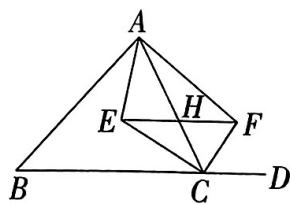

text_image

Geometric diagram with labeled points A, B, C, D, E, F, H forming triangles and a quadrilateral

第13题图

几何画板动态演示  
  
四边形中的动点问题

# 周测3 正方形的性质与判定

建议用时:40 分钟

满分:60 分

班级：

姓名：

得分：

# 一、选择题(每小题3分,共18分)

1. 在四边形 ABCD 中, 对角线 AC, BD 交于点 O, 则根据下列条件能判定它是正方形的是 ( )

A. $\angle DAB = 90^{\circ}$ 且 $AD = BC$   
B. ${AB} = {BC}$ 且 ${AC} = {BD}$   
C. $\angle DAB = 90^{\circ}$ 且 $AC \perp BD$   
D. $AC \perp BD$ 且 $AO = BO = CO = DO$

2. (教材 P22 第 2 题改编) 如图, 在正方形 ABCD 中, E 是对角线 AC 上一点, 且 AE = AD, 连接 BE, 则 $\angle BEC$ 的度数为 ( )

A. ${75}^{ \circ  }$

B. ${105}^{ \circ  }$

C. ${112.5}^{ \circ  }$

D. ${120}^{ \circ  }$

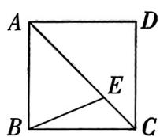  
第2题图

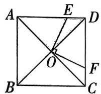  
第3题图

3.（教材P26第2题改编）如图，在正方形ABCD中，AC与BD交于点O，点E是边AD上一点，连接OE，过点O作OE的垂线交CD于点F，若AE=5,CF=2，则正方形ABCD的边长为 （）

A. 7

B. 8

C. 9

D. 10

# 主题情境 图形的变化 请完成第4\~5题

4. 在手工实践课上, 乐乐在如图①所示的平行四边形纸 ABCD 中测得 $\angle B = 60^{\circ}, AB = 8 \, cm, AD = 4\sqrt{3} \, cm$ , 随后将平行四边形纸垂直裁剪拼接成如图②所示的正方形, 则图②中正方形对角线 AF 的长为 ( )

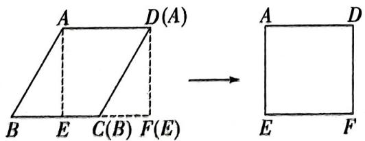

text_image

A D(A)
B E C(B) F(E)
→
A D
E F

图①  
第4题图

A. $4 \sqrt{3} \mathrm{~cm}$

B. $4 \sqrt{6} \mathrm{~cm}$

C. $8\sqrt{3}$ cm

D. $8\sqrt{6}$ cm

5. 媛媛用如图①中的一副七巧板拼成如图②所示的“花束图”, 若正方形 ABCD 的边长为 4 , 则图②中花束的高为 ( )

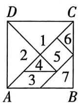  
图①

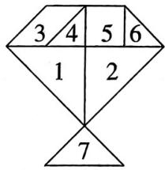

text_image

3 4 5 6
1 2
7

图②  
第5题图

A. 4

B. $4 \sqrt{2}$

C. 6

D. $6 \sqrt{2}$

6. 如图, 在正方形 $ABCD$ 中, 点 $Q$ 是对角线 $AC$ 上一动点, 过点 $A$ 作 $AP \perp AC$ , 且 $AP = CQ$ , 连接 $BQ, BP, PQ$ , 若 $CD = 2$ , 则 $PQ$ 长度的最小值为 ( )

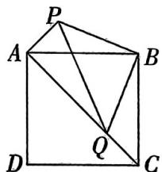

text_image

Geometric diagram of a square with labeled vertices and internal points, showing diagonals and triangles.

第6题图

几何画板动态演示  
  
线段最值问题

A. $\sqrt{2}$

B. 2

C. $\frac{3\sqrt{2}}{2}$

D. $2 \sqrt{2}$

# 二、填空题(每小题3分,共12分)

7. 正方形的中点四边形是\_\_\_\_形.

8. (教材 P22 第 2 题改编) 如图, 在正方形 ABCD 的内侧作等边 $\triangle ADE$ , 连接 BE, 则 $\angle CBE =$ \_\_\_\_ .

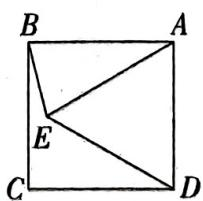

text_image

B
A
E
C
D

第8题图

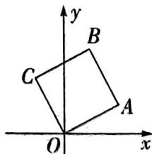

text_image

y
B
C
A
O
x

第9题图

9. 如图, 在平面直角坐标系中, 四边形 OABC 是正方形, 若点 A 的坐标为 $(2,1)$ , 则点 C 的坐标为 \_\_\_\_.

大小卷·九年级(全一册) 数学 BS

10. 如图, 已知四边形 ABCD 是正方形, E 是边 CD 上一点, F 是正方形边上一点. 若 AB = 3, CE = 1, 当 AF = BE 时, DF 的长为 \_\_\_\_.

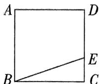  
第10题图

# 三、解答题(共30分)

11. (8分)如图,在正方形ABCD中,E,F分别是边AD,CD的中点,连接BE,BF.求证: $\angle AEB=\angle CFB$ .

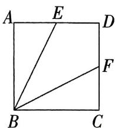

text_image

A
E
D
F
B
C

第11题图

12. (10 分) 如图, 在正方形 $ABCD$ 中, 点 $E$ 在边 $BC$ 上, 连接 $AE$ , $\angle EAD$ 的平分线交 $CD$ 于点 $F$ , $G$ 为 $AE$ 上一点, 连接 $GF$ .

(1)已知 AG=FG, 求证: $GF \parallel AD$ ;   
(2) 连接 $EF$ , 若 $\angle AFE = 90^{\circ}, FC = 2$ , 求正方形 $ABCD$ 的边长.

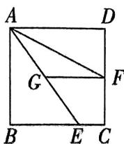  
第12题图

13. (中考新考法·综合与实践——操作探究)(12分)如图,在 $\triangle ABC$ 中, $\angle BAC=45^{\circ},AD\perp BC$ 于点 $D,AD=12,BD=6$ ,求 $CD$ 的长.小明同学利用翻折,巧妙地解答了此题,

小明的思路: ①以 AB 为对称轴, 画出 $\triangle ABD$ 的对称图形, 点 D 的对称点为点 E;

②以 AC 为对称轴, 画出 $\triangle ACD$ 的对称图形, 点 D 的对称点为点 F;  
③延长 $EB$ 和 $FC$ 相交于点 $G$ ;  
④设 CD=x, 建立关于 x 的方程模型, 从而求出 CD 的长.

按小明的思路探究并解答下列问题：

(1)补全图形,判断四边形 AEGF 的形状,并证明;  
(2) 求 $CD$ 的长.

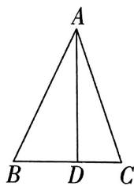

text_image

A
B D C

第13题图

视频讲解  
  
中考新考法题

# 专题 特殊四边形中的折叠问题

建议用时:40 分钟

班级： 姓名：

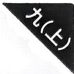

# 教材原题改编练

教材原题(教材 P28 第 15 题)如图,把一张矩形纸片沿对角线折叠,重合部分是什么图形?试说明理由.

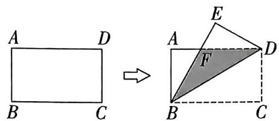

text_image

A D
B C
→
A E
F D
B C

教材原题图

# 改编1 折叠后对应点落在矩形纸片对角线上

如图,在矩形纸片 ABCD 中, BD 是对角线, 点 E 是边 DC 上一点, 将 $\triangle BCE$ 沿 BE 所在直线折叠, 点 C 的对应点

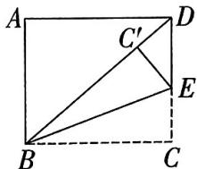

text_image

A
C'
D
E
B
C

改编1题图

恰好落在对角线 $BD$ 上的点 $C'$ 处, 若 $\angle ABD = 50^{\circ}$ , 则 $\angle C'EB$ 的度数为 \_\_\_\_.

# 改编2 折叠后对应点落在矩形纸片边上

如图,在矩形纸片 ABCD 中,点 E 在边 CD 上,将 $\triangle BCE$ 沿 BE 所在直线折叠,使点 C 的对应点 $C'$ 恰好落在 AD 边上,已知 AB=6,BC=10,求 CE 的长.

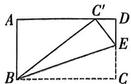

text_image

A
C'
D
E
B
C

改编2题图

# 改编3 折叠后对应点落在矩形纸片内部

如图,在矩形纸片 ABCD 中,E 为 BC 边上的动点(点 E 不与 B,C 重合),将 $\triangle CDE$ 沿 DE 所在直线折叠得到 $\triangle C^{\prime}DE$ ,连接 $C^{\prime}B$ ,已知 AB=5,AD=10.

(1) 当四边形 $C' ECD$ 是正方形时, 求 $C'B$ 的长;  
(2) 当 $C'B$ 最小时, 求 BE 的长.

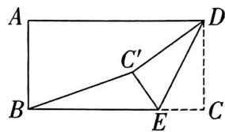

text_image

A
B
C'
E
C
D

改编3题图

# 改编4 折叠后对应点落在矩形纸片外

如图, 点 E 在矩形纸片边 AB 上, 连接 DE, 将矩形纸片 ABCD 沿 DE 所在直线折叠, 使得点 B, C 的对应点 $B'$ , $C'$ 落在矩形纸片外, $B'C'$ 过点 A, 已知 AB = 5, AD = 10.

(1)求 $\frac{B'A}{C'A}$ 的值；  
(2)求折叠后重叠部分的面积.

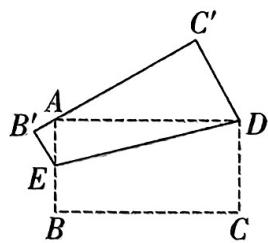

text_image

C'
A
B'
E
D
B
C

改编4题图

# 综合训练

1. 如图, 在矩形 ABCD 中, AB = 10, AD = 2, 点 E, F 分别在边 CD, AB 上, 将矩形 ABCD 沿 EF 折叠, 使点 C 与点 A 重合, 则 $\triangle ADE$ 的面积为 ( )

A. $\frac{52}{5}$

B. $\frac{26}{5}$

C. $\frac{24}{5}$

D. $\frac{48}{5}$

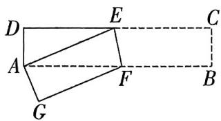

text_image

Geometric diagram with labeled points A, B, C, D, E, F, G forming a parallelogram and rectangle

第1题图

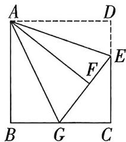

text_image

A
D
E
F
B
G
C

第2题图

2. 如图, 在正方形 $ABCD$ 中, $E$ 是 $CD$ 边上的三等分点 $(CE > DE)$ , 连接 $AE$ , 将 $\triangle ADE$ 沿 $AE$ 所在直线折叠, 使点 $D$ 落在正方形 $ABCD$ 内的点 $F$ 处, 延长 $EF$ 交 $BC$ 于点 $G$ , 连接 $AG$ . 若正方形 $ABCD$ 的边长为 6, 则 $BG$ 的长为 \_\_\_\_.

3. 如图, 在菱形 $ABCD$ 中, $AB = 2$ , $\angle A = 60^{\circ}$ , 连接 $BD$ , 点 $E, F$ 分别是 $AD, AB$ 边上一点, 将 $\triangle AEF$ 沿 $EF$ 所在直线折叠, 当点 $A$ 落在 $CD$ 的中点 $G$ 处时, 连接 $BG$ , 求 $BF$ 的长.

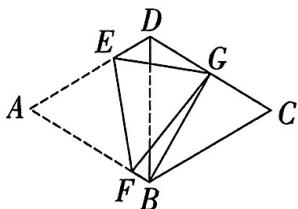

text_image

Geometric diagram with labeled points A, B, C, D, E, F, G and connecting lines forming a 3D-like structure

第3题图

4. 如图, 在矩形 $ABCD$ 中, 点 $E$ 为边 $AB$ 上一点, 连接 $CE, DE$ , 将 $\triangle ADE$ 沿 $DE$ 所在直线折叠, 点 $A$ 恰好落在 $CE$ 上的点 $F$ 处.

(1) 求证: BE = CF;   
(2) 若 $AB = 6, BC = 3$ , 求 $\angle CDE$ 的度数.

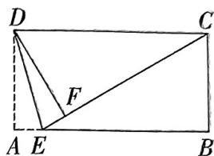

text_image

Geometric diagram of rectangle ABCD with internal points E, F and dashed lines, likely for a geometry problem or proof.

第4题图

5. 日常生活情境 信封 父亲节快到了, 小明决定给外出打工的父亲写一封信, 他找到了一张矩形的纸片, 将该纸片的四角折起, 恰好构成一个无缝隙, 无重叠的四边形 EFGH 信封.

(1) 证明: 四边形 EFGH 是矩形;  
(2) 若 $CG = 1, EG = 4$ , 求 $BC$ 的长.

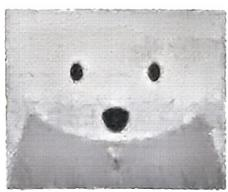

natural_image

Close-up of a stylized face with dark eyes and a mouth, resembling a bear or penguin (no text or symbols)

图①

text_image

A E D
F M O H
B G C

图②  
第5题图

视频讲解  
  
第5题

# 专题 正方形中的十字模型

建议用时:40分钟

班级： 姓名：

# 识别模型

1. 如图, 在正方形 $ABCD$ 中, $E, F$ 分别为 $CD, AD$ 边上的点, 连接 $BE, CF$ , 且 $BE \perp CF$ , 若 $BC = 6, DF = 2$ , 求 $DE$ 的长.

text_image

A F D
B C
E

第1题图

2. 如图, 在正方形 $ABCD$ 中, 点 $E, M, N$ 分别在 $AB, BC, AD$ 边上, $CE = MN$ , $\angle MCE = 35^\circ$ , 求 $\angle ANM$ 的度数.

text_image

A
E
B
M
C
N
D

第2题图

3. 如图, E, F, G, H 分别为正方形 ABCD 四条边上的点, GE 交 FH 于点 O, 若 GE = HF, 求证: GE ⊥ HF.

text_image

A G D
H O F
B E C

第3题图

4. 如图, 正方形 $ABCD$ 的边长为 3 , 将正方形 $ABCD$ 沿着 $EF$ 折叠, 点 $A$ 的对应点为 $A'$ , 点 $D$ 的对应点为 $G$ , 连接 $DG, CG = \frac{1}{3} BC$ , 求 $EF$ 的长.

text_image

Geometric diagram with labeled points and lines, showing a square ABCD with internal triangles and dashed auxiliary lines.

第4题图

# 综合训练

5. 如图, 在正方形 $ABCD$ 中, $E$ 为 $AD$ 的中点, 连接 $BE$ , 过点 $C$ 作 $CF \perp BE$ 交 $AB$ 于点 $F$ , 交 $BE$ 于点 $O$ , 连接 $EF$ 并延长交 $CB$ 的延长线于点 $G$ . 若 $BC = 4$ , 则 $BG$ 的长为 \_\_\_\_.

text_image

Geometric diagram of a square with labeled points and intersecting lines, likely for a math problem or proof.

第5题图

text_image

A
D
P
F
B
E
C

第6题图

6. 如图, 在正方形 $ABCD$ 中, 点 $E, F$ 分别为 $BC, CD$ 的中点, $AF$ 和 $DE$ 相交于点 $P$ , 连接 $BP, CP$ . 若 $BP = 4$ , 则 $AB$ 的长为 \_\_\_\_.

7. 如图, 在正方形 $ABCD$ 中, 点 $E, F$ 分别是 $CD, AD$ 边上一点 $(DF > DE)$ , 过点 $F$ 作 $FG \perp AE$ 于点 $H$ , 交 $BC$ 于点 $G$ , 连接 $EF$ , 若 $DC = 6, ED = 2$ , 求 $FG$ 的长.

text_image

A F D
H E
B G C

第7题图

8. 如图, 在正方形 $ABCD$ 中, 点 $E, F$ 分别是 $BC, AB$ 延长线上的点, $DF$ 与 $BC$ 交于点 $M, AE$ 与 $CD$ 交于点 $N, AE$ 与 $DF$ 交于点 $O$ . 已知 $BF = CE$ , 正方形的边长为 6.

(1) 判断 $AE$ 与 $DF$ 之间的位置与数量关系并说明理由；  
(2) 若 BF=2，求四边形 OMCN 的面积.

text_image

A
D
O
B
M
C
E
F
N

第8题图

# 周测4 一元二次方程的认识及解法

建议用时:40 分钟 满分:70 分

班级： 姓名： 得分：

# 一. 选择题(每小题3分,共18分)

1. 下列方程是一元二次方程的是 （）

A. $x + y = 1$

B. $2 x + 1 = 0$

C. $2x^{2} + x = 0$

D. $x^{2} - \frac{1}{x} = 1$

2. (教材 P32 第 2 题改编) 关于 $x$ 的一元二次方程 $(x + 2)^{2} = 6(2x + 1)$ 化成一般形式后, 一次项系数和常数项分别是 ( )

A. -8, -2

B. -2, -8

C. $1, - 8$

D. $1, - 2$

3. 一元二次方程 $2x^{2} - 4\sqrt{2} x + 4 = 0$ 的根的情况是 （）

A. 有两个不相等的实数根  
B. 有两个相等的实数根  
C. 无实数根  
D. 无法确定

4. 已知 m 是关于 x 的一元二次方程 $-x^{2}+2x+1=0$ 的根, 则 $m^{2}-2m$ 的值是 ( )

A. -1

B. 0

C. 1

D. 2

5. 若代数式 $2x^{2} + 1$ 与 $4x^{2} - 2x - 5$ 的值互为相反数, 则 $x$ 的值是 ( )

A. -1 或 $\frac{2}{3}$

B. 1 或 $-\frac{2}{3}$

C. 1 或 $\frac{3}{2}$

D. 1 或 $-\frac{3}{2}$

6. 已知 $\triangle ABC$ 的三边长分别为 $a, b, c$ , 并且关于 $x$ 的一元二次方程 $x^{2} + \frac{1}{4}(a - c) = 0$ 有两个相等的实数根, 则 $\triangle ABC$ 的形状一定是 ( )

A. 等腰三角形

B. 等边三角形

C. 直角三角形

D. 等腰直角三角形

# 二、填空题(每小题3分,共12分)

7. 一元二次方程 $(x - 1)(x + 3) = 0$ 的解为 \_\_\_\_.

8. 社会热点情境 运动会吉祥物 为免费领取到第十四届全国冬季运动会吉祥物“安达”和“赛努”,小张与小李参与了转发集赞活动,已知两人集赞的数量是两个相邻的偶数,且两数之积为960,若设较大的偶数为x,则可列方程为

9. 若关于 $x$ 的一元二次方程 $m(x + a)^2 + n = 0$ 的解是 $x_1 = -1, x_2 = 2$ , 则方程 $m(x + a + 2)^2 + n = 0$ 的解是 \_\_\_\_.

10. 已知关于 $x$ 的一元二次方程 $(m + 4)x^{2} - 5x + 3 = 0$ , 若方程有实数根, 则 $m$ 的取值范围是 \_\_\_\_.

# 三、解答题(共40分)

11. (8 分)用适当的方法解下列方程:

(1) $x^{2}-6x-10=0$ ;(2) $4(x-2)^{2}=9$ ;

(3) $2x^{2}-4x+1=0$ ; (4) $x(x-2)+x-2=0$ .

大小卷·九年级(全一册) 数学 BS

12. (10 分) 已知关于 $x$ 的一元二次方程 $x^{2} + (m + 3)x + 2(m + 1) = 0$ .

(1) 求证: 该方程总有两个实数根;   
(2)若该方程的一个根大于零,求 m 的取值范围.

13. 日常生活情境 民宿改造 (10 分) 小敏家在某景区附近经营着一家民宿,为了吸引更多的游客,小敏家计划将如图所示的长 12 米,宽 8 米的矩形场地改造成游客自助选菜区和烧烤区,空白部分为等宽的小路,若自助选菜区和烧烤区所占面积为 60 平方米,则小路的宽度为多少米?

text_image

12
自助选菜区
烧烤区
自助选菜区
8

第13题图

14. (中考新考法·解题方法型阅读理解题)(12分)当二次项系数为1时可以用公式 $x^{2}+(m+n)x+mn=(x+m)(x+n)$ 这种方法来分解因式,解一元二次方程.

(1) 方程 $x^{2} + 5x + 4 = 0$ 可因式分解为 \_\_\_\_ = 0，方程 $x^{2} + 3x - 18 = 0$ 可因式分解为 \_\_\_\_ = 0；  
(2) 当一元二次方程的二次项系数不是 1 时也可以借助此方法求解.

如方程 $2x^{2}+x-3=0$ ，将方程分解因式得 $(2x+3)(x-1)=0$ ，从而可快速解出方程.

text_image

2x
3
x
(-1)
十字交叉相乘的和
与一次项完全吻合

第14题图

请你利用此方法解决下列问题：

①解一元二次方程 $3x^{2} - 5x - 12 = 0$ ;  
②若关于 x 的一元二次方程 $2x^{2}+(3-2a)x+1-a=0$ 的一根大于 1，求 a 的取值范围.

视频讲解  
  
中考新考法题

# 周测5 一元二次方程的根与系数的关系及应用

建议用时:40 分钟 满分:60 分

班级： 姓名： 得分：

# 一、选择题(每小题3分,共18分)

1. (教材 P50 例题改编) 若 $x_{1}, x_{2}$ 是方程 $2x^{2} - 4x - 9 = 0$ 的两个根, 则 ( )

A. $x_{1} + x_{2} = 2$

B. $x_{1} + x_{2} = -2$

C. $x_{1}x_{2} = \frac{9}{2}$

D. $x_{1}x_{2} = -\frac{9}{4}$

2. (教材 P51 第 1 题改编) 已知 $x_{1}, x_{2}$ 是一元二次方程 $x^{2} - 3x - 1 = 0$ 的两个根, 那么 $(x_{1} - 1)(x_{2} - 1)$ 的值为 ( )

A. -2

B. -3

C. -4

D. -5

主题情境 全民健身 请完成第3\~4题.

3. 每年8月8日是我国“全民健身日”,某社区从该日开始,积极组织社区居民参加全民健身活动,已知第一周该社区居民人均健身时长为3小时,第3周人均健身时长为4.2小时,若设人均健身时长周平均增长率为x,依题意可列方程()

A. $3(1 + x^{2}) = 4.2$

B. $3(1 + x)^{2} = 4.2$

C. 4. $2(1 + x^{2}) = 3$

D. 4. $2(1 + x)^{2} = 3$

4. 为倡导社区居民更广泛地参加全民健身活动,该社区专门组织了乒乓球比赛,赛制为单循环形式,现计划安排10场比赛,则共有几支队伍参赛 ( )

A. 3

B. 4

C. 5

D. 6

5. 已知关于 $x$ 的一元二次方程 $x^{2} - (m + 1)x + 3(m - 2) = 0$ 的两个实数根 $x_{1}, x_{2}$ 满足 $\frac{1}{x_1} + \frac{1}{x_2} = -1$ , 则 $m$ 的值为 （）

A. $\frac{1}{4}$

B. $\frac{1}{2}$

C. $\frac{3}{4}$

D. $\frac{5}{4}$

6. (教材 P54 第 4 题改编) 如图, 在 $\triangle ABC$ 中, $\angle B = 90^{\circ}, AB = 8 \mathrm{~cm}, BC = 6 \mathrm{~cm}$ . 动点 $P, Q$ 分别从点 $A, B$ 同时开始移动, 点 $P$ 在 $AB$ 上以 $1 \mathrm{~cm} / \mathrm{s}$ 的速度向点 $B$ 移动, 点 $Q$ 在 $BC$ 上以 $2 \mathrm{~cm} / \mathrm{s}$ 的速度向点 $C$ 移动. 当点 $Q$ 移动到点 $C$ 后停止, 点 $P$ 也随之停止移动. 下列时刻中, 能使四边形 APQC 的面积为 $12 \mathrm{~cm}^{2}$ 的是 ( )

A. $2 \mathrm{~s}$

B. $3 \mathrm{~s}$

C. $4 \mathrm{~s}$

D. 5 s

text_image

Geometric diagram of triangle ABC with point P on base AB and perpendicular from C to AB at B, labeled with points A, B, C, P, Q.

第6题图

# 二、填空题(每小题3分,共12分)

7. (中考新考法·满足条件的结论开放) 请写出一个满足以下两个条件的一元二次方程: ①两根均为整数; ②两根同号. 这个方程可以是 \_\_\_\_.

8. 若 $\alpha, \beta$ 是一元二次方程 $x^{2} - 2x - 4 = 0$ 的两个根, $\frac{\beta}{\alpha} + \frac{\alpha}{\beta}$ 值为 \_\_\_\_.

9. 数学文化情境 勾股算高 我国古代著作《九章算术》“勾股”章有一题：“今有户高多于广六尺八寸，两隅相去适一丈。问户高几何？”大意是说：已知长方形门的高比宽多6尺8寸，门的对角线长1丈（1丈=10尺，1尺=10寸），那么门的高为寸。

10. 若等腰三角形的一边为 4, 另外两边为一元二次方程 $x^{2} - 12x + m = 0$ 的两根, 则 $m$ 的值为 \_\_\_\_.

# 三、解答题(共30分)

11.(8分)阅读下列解题过程:

若 $ax^2 + bx + c = 0 (a \neq 0)$ 的两个根分别为 $x_1, x_2$ ，求代数式 $(x_1 + 1)(x_2 + 1)$ 的值.

解: 将方程变形为 $\left(x+\frac{b}{2a}\right)^{2}=\frac{b^{2}-4ac}{4a^{2}}$ ,

当 $b^{2} - 4ac\geqslant 0$ 时，方程有两个根：

$$
x _ {1} = \frac {- b + \sqrt {b ^ {2} - 4 a c}}{2 a}, x _ {2} = \frac {- b - \sqrt {b ^ {2} - 4 a c}}{2 a}.
$$

直接计算可得, $x_{1}+x_{2}=-\frac{b}{a},x_{1}x_{2}=\frac{c}{a}.$

$$
\begin{array}{l} {\therefore (x _ {1} + 1) (x _ {2} + 1) = x _ {1} x _ {2} + (x _ {1} + x _ {2}) + 1 = \frac {c}{a} -} \\ {\frac {b}{a} + 1 = \frac {c - b}{a} + 1,} \end{array}
$$

解答下面问题:

设方程 $3x^{2} - 5x - 1 = 0$ 的两个根分别为 $x_{1}$ ， $x_{2}$ ，请根据上述方法求代数式 $(x_{1} - 1)(x_{2} - 1)$ 的值.

12. (教材 P58 第 21 题改编) (10 分) 如图, 一艘可疑船只以 $20 \mathrm{~km} / \mathrm{h}$ 的速度由南向北行驶, 巡逻船以 $30 \mathrm{~km} / \mathrm{h}$ 的速度由西向东行驶, 巡逻船开启雷达, 距船 $100 \mathrm{~km}$ 的圆形区域内都可以被巡逻船捕捉到. 当可疑船只到达 $A$ 处时, 巡逻船位于正西方向的点 $B$ 处, 且 $AB = 200 \mathrm{~km}$ , 若这艘船继续自 $A$ 处按原速继续行驶, 途中能否

被巡逻船捕捉到？若能捕捉到，求最初被巡逻船捕捉到的时间；若不能，请说明理由.

text_image

北
东
B A

第12题图

13. (12 分)春节来临之际,某商场销售两款印有“喜”字图案的卫衣,已知 A 款进价为 96 元/件,B 款进价为 76 元/件,而 A, B 款的售价分别为 132 元/件,104 元/件,1 月份售出 A 款卫衣 100 件,且销售两款卫衣共获利 5 560 元.

(1) 求 1 月份售出 B 款卫衣多少件?  
(2)根据市场调研,该商场决定2月份进行降价促销,已知A款卫衣每件降价2元,销量增加20件,B款卫衣每件降价2元,销量增加16件,现计划对A,B两款卫衣降低相同的价格,若希望两款卫衣共获利7396元,并且尽量让利于顾客,则这两款卫衣每件应该降价多少元?

# 一题多设问

例 已知关于 $x$ 的一元二次方程 $x^{2} + 2mx + m^{2}$

$$
- 4 m + 1 = 0.
$$

(1) 当 m = -2 时, 判断该方程根的情况;

(2) 当该方程根的判别式的值为 12 时, 求该方程的根;

(3)若方程有实数根,求 m 的取值范围;

(4)已知 $x_{1}, x_{2}$ 是方程的两实数根, 满足 $x_{1}^{2} + x_{2}^{2} + x_{1}x_{2} = 3$ , 求 $m$ 的值.

# 综合训练

1. 已知关于 $x$ 的一元二次方程 $x^{2} - (k + 2)x + 2k = 0$ 有实数根.

(1) 求 $k$ 的取值范围；  
(2) 如果方程的两个实数根分别为 $x_{1}, x_{2}$ , 且 $(x_{1}^{2} + 2)(x_{2}^{2} + 2) = 18$ , 求 $k$ 的值.

# 专题 一元二次方程与图形面积问题

建议用时:40 分钟

班级： 姓名：

# 教材原题改编练

教材原题(教材 P38 第 2 题)如图,在一块长 35 m、宽 26 m 的矩形地面上,修建同样宽的两条互相垂直的道路(两条道路各与矩形的一条边平行),剩余部分栽种花草,要使剩余部分的面积为 $850 \, m^{2}$ ,道路的宽应为多少?

text_image

35 m
26 m

教材原题图

# 改编1 增加道路数量

如图,若计划在长,宽分别为 11 m 和 6 m 的花圃上修建同样宽的三条道路,图中阴影部分所示,在空白区域种植不同种类的花卉,若要使得种植花卉的面积是 $40 \, m^{2}$ ,则道路的宽应为多少?

  
改编1题图

# 改编2 改变小路的形状为“折线型”

如图,若在长为 $16 \, m$ , 宽为 $10 \, m$ 的矩形空地中修建宽度一样的小路(图中阴影部分), 其余部分种植不同品种的花卉, 若要使种植花卉的面积为 $135 \, m^{2}$ , 求小路的宽度.

  
改编2题图

# 改编3 扩大原有形状

某小区为改善小区环境,决定在原有花园的外围种上草坪.如图,原花园是一个面积为 $49\ m^{2}$ 的矩形,计划在矩形的一边增加4m,一边增加6m建成一个正方形,则建成后的正方形的面积为多少?

text_image

A
B
4 m
D
6 m
C

改编 3 题图

# 综合训练

1. 一张长为 $30 \mathrm{~cm}$ , 宽 $20 \mathrm{~cm}$ 的矩形纸片, 如图①所示, 将这张纸片的四个角各剪去一个边长相同的正方形后, 把剩余部分折成一个无盖的长方体纸盒, 如图②所示, 如果折成的长方体纸盒的底面积为 $264 \mathrm{~cm}^{2}$ , 求剪掉的正方形纸片的边长.

text_image

图①
图②

第1题图

# 周测6 概率的计算及频率估计概率

建议用时:40 分钟 满分:40 分

班级： 姓名： 得分：

主题情境 以劳动赋能,育时代新人 德智体美劳五育在走向实践融合的过程中,劳动教育具有树德、增智、强体的综合育人价值,朝阳中学为更好地实施劳动教育,计划开展劳动周活动,请完成第1\~8题.

# 一、选择题(每小题3分,共15分)

1. 劳动周开始前,学校考虑到全校学生人数较多,计划按七、八、九年级分三批进行,则第一批随机选中八年级的概率为（）

A. $\frac{1}{3}$

B. $\frac{2}{3}$

C. $\frac{1}{6}$

D. 1

2. 为宣传劳动周活动,学校从2名男生,1名女生班干部中任选2人进行宣讲,则恰好选中1名男生1名女生的概率为（）

A. $\frac{1}{3}$

B. $\frac{1}{2}$

C. $\frac{2}{3}$

D. $\frac{1}{4}$

3. (教材 P70 第 2 题改编) 已知七年级共有 350 名同学报名劳动周活动, 在报名表中随机抽出一人并记录所在班级, 通过大量重复记录发现抽到七年级 (1) 班的学生的频率稳定在 $10\%$ 左右, 那么估计七年级 (1) 班学生的报名人数为 ( )

A. 25

B. 35

C. 45

D. 55

4. 学校为了让学生们了解种植的意义和劳作的多样性,对学校闲置空地进行了规划,计划将空地分成 A, B, C, D 四部分给学生种白菜、茄子、辣椒、南瓜四种蔬菜(如图所示),每部分空地只能种一种蔬菜,则白菜与辣椒两种蔬菜不相邻的概率是()

A. $\frac{1}{3}$

B. $\frac{2}{3}$

C. $\frac{1}{6}$

D. $\frac{5}{6}$

<table><tr><td>A</td><td>B</td></tr><tr><td>C</td><td>D</td></tr></table>

第4题图

5. 朝阳中学设置了三个劳动项目: 播种, 除草, 浇水, 八年级(1), (2), (3) 班通过转转盘的游戏方式选择参与的劳动项目, 已知转盘 A 红色区域的扇形圆心角度数为 $120^{\circ}$ , 转盘 B 被分成面积相等的四个扇形, 分别转动两个转盘, 若其中一个转出蓝色, 另一个转盘转出黄色则(3)班进行除草任务(若指针停在分割线上, 重新转动转盘), 则(3)班除草的概率为（）

text_image

红
120°
蓝
A

text_image

红
红
蓝
黄
B

第5题图

A. $\frac{1}{6}$

B. $\frac{1}{8}$

C. $\frac{1}{12}$

D. $\frac{5}{12}$

# 二、填空题(每小题3分,共9分)

6. 在经过一段时间后,同学们将种下的南瓜种子发芽情况记录如下表所示,根据该表估计南瓜种子发芽的概率约为\_\_\_\_。(结果保留到小数点后两位)

<table><tr><td>南瓜种子数</td><td>20</td><td>50</td><td>100</td><td>200</td><td>400</td><td>500</td></tr><tr><td>发芽的种子数</td><td>13</td><td>34</td><td>69</td><td>135</td><td>268</td><td>336</td></tr><tr><td>发芽种子数的频率</td><td>0.650</td><td>0.680</td><td>0.690</td><td>0.675</td><td>0.670</td><td>0.672</td></tr></table>

7. 在种植过程中, 乐乐发现一只昆虫在如图所示的树枝上寻觅食物, 假定昆虫在每个岔路口都会随机选择一条路径, 则它获得食物的概率是大小卷·九年级(全一册) 数学 BS

flowchart

第7题图

8. 为使种植的作物更好地生长,九年级(1)、(2)和(3)班计划从“冲施肥”“叶面肥”两种肥料中购买一种,则三个班级恰好买到同一种类肥料的概率为\_\_\_\_。

# 三、解答题(共16分)

9. 跨学科情境 跨化学酸碱指示剂 (8分) 通常情况下酚酞遇酸性和中性溶液不变色,遇碱性溶液变红色,一次化学课上,老师让学生用酚酞溶液检测四瓶因标签污损无法分辨的无色溶液的酸碱性,已知这四种溶液分别是A.盐酸(呈酸性),a.硫酸(呈酸性),B.氢氧化钠溶液(呈碱性),b.氢氧化钙溶液(呈碱性).小徐先选择了一瓶,小李再选择一瓶,将酚酞溶液分别滴入其中进行检测,求两瓶溶液一瓶变色、一瓶不变色的概率.

10. (8 分)某校运动会期间,组织了一次拔河比赛,裁判员让甲,乙两队队长用“石头,剪刀,布”的方式选择场地位置.

游戏规则: 若一人出“剪刀”, 另一人出“布”, 则出“剪刀”者胜; 若一人出“石头”, 另一人出“剪刀”, 则出“石头”者胜; 若一人出“布”, 另一人出“石头”, 则出“布”者胜. 若两人出相同的手势, 则两人平局.

(1)用列表或画树状图法,列出甲,乙两队队长的手势可能出现的情况;  
(2)裁判员的这种做法对甲,乙两队双方公平吗?请说明理由.

# 周测7 平行线分线段与相似多边形

建议用时:40 分钟 满分:60 分

班级： 姓名： 得分：

# 一、选择题(每小题3分,共18分)

1. (教材 P119 第 2 题改编) 已知线段 $a, b, c$ , $d$ 是成比例线段, $a = 3, b = 1, c = 6$ , 则 $d$ 的值是 ( )

A. 1

B. 2

C. 3

D. 4

2.(教材 P94 随堂练习改编)下列选项中,不一定是相似图形的是()

A. 两个大小不同的正方形  
B. 两个大小不同的圆  
C. 两个大小不同的等边三角形  
D. 两个大小不同的等腰三角形

3. (教材 P79 第 1 题改编) 已知在一张比例尺为 $1:500$ 的地图上, 某地的面积约为 $100 \mathrm{~cm}^{2}$ , 则它的实际面积约是 ( )

A. $25000 \mathrm{~m}^{2}$

B. $20000 \mathrm{~m}^{2}$

C. $2500 \mathrm{~m}^{2}$

D. $2000 \mathrm{~m}^{2}$

4.（教材P85第3题改编）在 $\triangle ABC$ 中，点 $D, E$ 分别在边 $AB, AC$ 上，下列条件不能判定 $DE // BC$ 的是 （）

A. $\frac{AD}{DB} = \frac{AE}{CE}$

B. $\frac{AD}{AB} = \frac{AE}{AC}$

C. $\frac{DE}{BC} = \frac{AD}{AB}$

D. $\frac{BD}{AB} = \frac{CE}{AC}$

5. 如图, 平行四边形 ABCD 在平面直角坐标系中, 点 D 在 y 轴上, 点 A, B 在 x 轴上, 连接 OC, 已知点 $D(0,4)$ , 点 A(-3,0), 若点 P 为 x 轴正半轴上一点, 且 $\triangle DOP \sim \triangle CDO, CD = 6$ , 则 $\frac{AP}{AD}$ 的值为 ( )

A. $\frac{1}{15}$

B. $\frac{17}{3}$

C. $\frac{15}{17}$

D. $\frac{17}{15}$

text_image

y
D
C
A O B x

第5题图

text_image

M
N
A B C D P

第6题图

6. 如图, 在 $\triangle APM$ 的边 $AP$ 上任取两点 $B, C$ , 连接 $MC$ , 过点 $B$ 作 $AM$ 的平行线 $BN$ 交 $PM$ 于点 $N$ , 过点 $N$ 作 $MC$ 的平行线 $ND$ 交 $AP$ 于点 $D$ . 若 $AB = 3, BC = 1, \frac{PA}{PB} = \frac{4}{3}$ , 则 $PD$ 的长为 ( )

A. 5

B. 6

C. 7

D. 8

# 二、填空题(每小题3分,共12分)

7. 若 $\frac{x}{y} = \frac{1}{2}$ , 则 $\frac{2x + y}{x - y}$ 的值为 \_\_\_\_.

8. 如图, 在 $\triangle ABC$ 中, $DE \parallel BC$ , $EF \parallel AB$ , $BD: DA = 3:4$ , 那么 $BF: BC$ 的值为 \_\_\_\_.

text_image

A
D
E
B
F
C

第8题图

主题情境 “文人四艺”一琴棋书画 “琴棋书画”是古代文人所推崇和要掌握的四门艺术,又称“文人四艺”,起源久远,可追溯到“三皇五帝”时期,是古代艺术的典型象征.请完成第9\~10题.

9. 古筝, 中国古老的民族乐器, 被誉为“东方钢琴”, 如图所示是其实物图及琴弦示意图, 已知弦 $l_{1} / / l_{2} / / l_{3} / / l_{4} / / l_{5} / / l_{6}$ , 且每条弦之间等距, 点 $P$ 是弦 $l_{1}$ 上任意一点, 过该点做两条射线 $PA, PB$ , 若 $\frac{PF}{FB} = \frac{2}{3}, PA = 10$ , 则 $EA$ 的长为 \_\_\_\_.

text_image

l₁ l₂ l₃ l₄ l₅ l₆
E
A
P
F
B

第9题图

大小卷·九年级(全一册) 数学 BS

10. 中国古代绘画具有悠久的历史和独特的风格,如图为中国十大传世名画之一的《千里江山图》的局部画面,已知其外侧矩形裱画配框的长为 $1.2 \mathrm{~m}$ , 宽为 $0.6 \mathrm{~m}$ , 若内外两个矩形相似,且上下两侧间距均为 $0.1 \mathrm{~m}$ , 则左右两侧间距为 \_\_\_\_ m.

natural_image

Monochrome abstract image with irregular dark shapes and lighter textures, no visible text or symbols

第10题图

# 三、解答题(共30分)

11. (8分)已知 $a, b, c$ 分别表示三条线段的长, 且满足 $\frac{a}{2} = \frac{b}{3} = \frac{c}{4}$ .

(1) 求 $\frac{a + 2b}{3c}$ 的值;  
(2)已知线段 $a, b, c$ 为 $\triangle ABC$ 的三条边, 若 $\triangle ABC$ 的周长为 36 , 求 $\triangle ABC$ 各边的长度.

12. (10 分) 如图, 在四边形 $ABDC$ 中, $AC \parallel BD$ , 对角线 $AD$ 与 $BC$ 相交于点 $E$ , 过点 $E$ 作 $EF \parallel BD$ 交 $AB$ 于点 $F$ , 求证: $\frac{AE}{AD} + \frac{BE}{BC} = 1$ .

text_image

Geometric diagram of a parallelogram ABCD with diagonals and internal points E, F labeled

第12题图

13. (12 分)数学活动课上,老师布置了一个任务:在长为 6 ,宽为 2 的矩形纸片内,分别剪下两个小矩形,使得剪下的两个矩形均与原矩形相似,甲同学的设计方案如图①,乙同学的设计方案如图②.请你判断选择谁的方案剪下的两个矩形的周长之和最大,并说明理由.

text_image

图①
6
2
图②

第13题图

# 周测8 相似三角形的判定

建议用时:40 分钟 满分:60 分

班级： 姓名： 得分：

# 一、选择题(每小题3分,共18分)

1. 如图, 已知 $\triangle ABC$ 的角度和边长, 则下列图形不一定与其相似的是 ( )

  
第1题图

text_image

B
C D A

第2题图

2. (中考新考法·过程纠错改错)如图, 点 D 在 $\triangle ABC$ 的边 AC 上, 添加一个条件, 使得 $\triangle ADB \sim \triangle ABC$ . 以下是小明和小林的做法. 则说法正确的是 ()

<table><tr><td>小明的做法:添加条件∠ABD=∠C;证明:∵∠ABD=∠C,∠A=∠A,∴△ADB∽△ABC.(两角分别相等的两个三角形相似)</td><td>小林的做法:添加条件 $\frac{AB}{AC}=\frac{BD}{CB}$ ;证明:∵∠A=∠A, $\frac{AB}{AC}=\frac{BD}{CB}$ ,∴△ADB∽△ABC.(两边成比例且一个对应角相等的两个三角形相似)</td></tr></table>

A. 两人做法都正确   
B. 两人做法都错误   
C. 小明的做法正确,小林的做法错误  
D. 小林的做法正确,小明的做法错误

3. 日常生活情境 测量瓶口内径 如图, 天天同学计划测量一个常用瓶子的内径 AB, 他找来一个铁钳 (AC = BD) 放进细口瓶内, 缓缓张到最大的角度. 若 $\frac{OC}{OA} = \frac{OD}{OB} =$

$\frac{2}{3}$ , 且测量得 $CD = 6 \mathrm{~cm}$ , 则瓶子的内径 $AB$ 为 （）

A. $6 \mathrm{~cm}$

B. $7 \mathrm{~cm}$

C. $8 \mathrm{~cm}$

D. $9 \mathrm{~cm}$

  
第3题图

  
第4.1题图

  
第4.2题图

4. (教材 P91 例 2 改编) 一题多变

# 4.1 改变条件,计算乘积

如图,在 $\triangle ABC$ 中, $AB=5$ ,点 $D,E$ 分别是边 $AC,AB$ 上的点,且 $\angle ADE=\angle B$ ,若 $DE=2$ ,则 $AD\cdot BC$ 的值为()

A. 2

B. 5

C. 10

D. 16

# 4.2 改变图形为矩形, 求线段长

如图,在矩形ABCD中,E是CD边的中点,连接BE交AC于点F,其中AD=3,AB=4,则CF的长是()

A. 1

B. $\frac{4}{3}$

C. $\frac{5}{3}$

D. 2

5. 一题多解法 如图, 在 $\triangle ABC$ 中, 点 $D, E$ 分别是 $AB, AC$ 上一点, $BD = 2AD$ , 点 $F$ 是 $AE$ 的中点, $BF$ 交 $DE$ 于点 $G$ , 若 $BF = 3$ , 则 $BG$ 的长为 ( )

A. $\frac{3}{5}$

B. $\frac{4}{5}$

C. $\frac{11}{5}$

D. $\frac{12}{5}$

text_image

A
F
D
G
E
B
C

第5题图

text_image

E
A
B
D
C
F
G

第6题图

# 二、填空题(每小题3分,共12分)

6. (教材 P95 第 4 题改编) 如图, 在 $5 \times 8$ 的方

大小卷·九年级(全一册) 数学 BS

格纸中,画有格点 $\triangle EFG,A,B,C,D$ 四个点中,与E,G两点构成的三角形和 $\triangle EFG$ 相似的是\_\_\_\_.

# 主题情境 黄金分割的美

请完成第7\~8题.

7. 最和谐完美的身材比例就是上半身与下半身满足黄金分割比 $\frac{\sqrt{5} - 1}{2}$ , 为达成这一比例, 芭蕾舞演员在翩翩起舞时会踮起脚尖, 已知某舞蹈演员身高 $170 \mathrm{~cm}$ , 上半身约为 $68 \mathrm{~cm}$ , 则她需要踮起脚尖的高度约为 \_\_\_\_ cm. (结果保留整数)

8. 如图, 把舞台看成线段 $AB, C, D$ 是舞台的黄金分割点, 为了配合舞台背景, 呈现最好的效果, 需要演员从 $A$ 处出发, 最终站在该舞台的黄金分割点处. 若 $AB = a$ 米, 则演员站定后距离点 $A$ \_\_\_\_ 米. (用含 $a$ 的代数式表示)

  
第8题图

text_image

Geometric diagram of triangle ABC with internal points D, E, F and right angle at B

第9题图

9. 如图, 在 Rt△ABC 中, ∠ABC = 90°, BD ⊥ AC 于点 D, DE ⊥ BC 于点 E, F 是 AB 的中点, 连接 DF. 若 CE = 1, BE = 4, 则 △AFD 的面积为 \_\_\_\_.

# 三、解答题(共30分)

10. (8分)如图, 在 $\triangle ABC$ 中, 已知 $AB = AC$ , 点 $D, B, C, E$ 在同一条直线上, 且 $AB^2 = BD \cdot CE$ , 求证: $\triangle ABD \sim \triangle ECA$ .

text_image

A
D B C E

第10题图

11. (10 分) 如图, 在矩形 $ABCD$ 中, $AB = 3$ , $AD = 6$ , 点 $E$ 在 $BC$ 上, $DF \perp AE$ 交 $CB$ 的延长线于点 $F$ , $DF = 3\sqrt{10}$ .

(1) 证明: $\triangle CDF \sim \triangle BEA$ ;

(2) 求 $CE$ 的长.

text_image

A
D
F
B E
C

第11题图

12. (12 分) 在 $\triangle ABC$ 中, $AB = BC$ , $O$ 是 $\triangle ABC$ 内一点, 连接 $AO, BO, CO, \angle OBA = \angle OAC = \angle OCB$ , $BO = 2$ .

(1)如图①,求证: $AO^{2}=BO\cdot CO;$

(2)如图②,若 $\angle BAC=30^{\circ}$ ,求 $\frac{BO}{CO}$ 的值.

  
图①

text_image

A
O
B
C

图②  
第12题图

视频讲解  
  
第12题

# 周测9 相似三角形的性质与位似

建议用时:40 分钟 满分:50 分

班级： 姓名：

得分：

# 一、选择题(每小题3分,共18分)

1. 下列各组图形中不是位似图形的是（）

  
A

  
B

  
C

  
D

2. 若 $\triangle ABC \sim \triangle DEF$ , 相似比为 $1:4$ , 则 $\triangle ABC$ 与 $\triangle DEF$ 的对应角平分线的比为 ( )

A. $1: 2$

B. $1: 4$

C. $1 : 8$

D. $1: 16$

3. (教材 P110 随堂练习改编) 由于页面缩放比例不当导致打印出的三角形的一条边由原图中的 $3 \mathrm{~cm}$ 增加了 $6 \mathrm{~cm}$ , 则打印出的三角形的面积是原图中三角形面积的 ( )

A. 4 倍

B. 6倍

C. 9倍

D. 12 倍

4. (教材 P108 第 2 题改编) 如图是小颖用照相机拍摄一棵树成像时的示意图, 已知 $\triangle OAB$ 和 $\triangle OA'B'$ 是以点 $O$ 为位似中心的位似图形, 若像 $AB = 49 \mathrm{~mm}$ , 焦距 $OC = 50 \mathrm{~mm}$ , 树 $A'B' = 4.9 \mathrm{~m}$ , 则物距 $OC'$ 的长为 ( )

text_image

A
O
B'
C'
B
A'

第4题图

A. $4.9 \mathrm{~m}$ B. $5 \mathrm{~m}$ C. $6 \mathrm{~m}$ D. $7 \mathrm{~m}$

5. 如图, 在平面直角坐标系中, $\triangle ABC$ 与 $\triangle DEF$ 是位似图形, 则它们位似中心的

坐标为（）

A. (1,1)

B. (1,2)

C. (2,1)

D. (2,2)

text_image

B
C
5
4
E
F
3
2
A
D
1
-4 -3 -2 -1 O 1 2 3 x

第5题图

6. (教材 P123 第 22 题改编) 某数学兴趣小组计划用激光笔来测量某大厦 CD 的高度, 如图, 在点 P 处放一平面镜 (厚度不计), 光线从点 A 出发经平面镜反射后刚好射到大厦 CD 的顶端 C 处, 已知 $AB \perp BD, CD \perp BD$ , 测得 AB = 1.5 米, BP = 2 米, PD = 52 米, 那么该大厦的高度为 ( )

text_image

A
B P C
D

第6题图

A. 39 米 B. 30 米 C. 24 米 D. 15 米

# 二、填空题(每小题3分,共12分)

7. (教材 P111 第 3 题改编) 如图, 已知 Rt△ABC∽Rt△EFG, EF=2AB, BD 和 FH 均为斜边上的中线, 若 BD=1.5 cm, 则 EG 的长为 \_\_\_\_ cm.

text_image

Two geometric diagrams showing triangle constructions with labeled points and right angles

第7题图

8. 两个相似三角形面积比是 4:9, 其中一个三角形的周长为 18, 则另一个三角形的周长是 \_\_\_\_.

9. 如图, 小刚站在河边的点 $A$ 处, 在河对面 (小刚的正北方向) 的点 $B$ 处有一电线塔, 点 $A$ 的正西方向 15 米处有一棵树 $C$ , 小刚向正南方向走了 80 米到达点 $D$ , 然后他接着再向正西方向走, 当小刚看到电线塔 $B$ 、树 $C$ 与自己现处的位置 $E$ 在一条直线时, 他恰好走了 45 米, 则在点 $A$ 处时

他与电线塔的距离为 \_\_\_\_ 米.

text_image

北
B
C
A
E
D

第9题图

text_image

B₂
C₂
B₁
C₁
B
C
A₂ A₁ A O x
y

第10题图

10. 如图, 在平面直角坐标系中, 矩形 AOCB 的两边 OA, OC 分别在 x 轴负半轴和 y 轴正半轴上, 且 OA = 2, OC = 1. 在第二象限内, 将矩形 AOCB 以原点 O 为位似中心放大为原来的 $\frac{3}{2}$ 倍, 得到矩形 $A_{1}OC_{1}B_{1}$ , 再将矩形 $A_{1}OC_{1}B_{1}$ 以原点 O 为位似中心放大 $\frac{3}{2}$ 倍, 得到矩形 $A_{2}OC_{2}B_{2}, \cdots$ , 以此类推, 得到的矩形 $A_{2024}OC_{2024}B_{2024}$ 的对角线交点的纵坐标为 \_\_\_\_.

# 三、解答题(共20分)

11. (教材 P122 第 19 题改编) (10 分) 如图每个小正方形的边长均为 1, 其顶点称为格点, $\triangle ABC$ 的顶点均在格点上.

text_image

A
B
C

图①

text_image

A
B
C

图②  
第11题图

(1)如图①,若 $\triangle ABC$ 与 $\triangle DEF$ 相似,且相似比为3:1,求 $\triangle DEF$ 的面积;

(2)在图①中,以点A为位似中心,在网格中画出 $\triangle AB_{1}C_{1}$ ,使 $\triangle AB_{1}C_{1}$ 与 $\triangle ABC$ 的相似比为1:2;
(3)在图②中的边AB上确定一点P,在边BC上确定一点Q,连接PQ,使 $\triangle PBQ\sim\triangle ABC$ ,且相似比为1:2,请画出 $\triangle PBQ$ .

12. (10 分) 如图, 已知矩形 $ABCD$ 的一条边 $AD = 8$ , 将矩形 $ABCD$ 折叠, 使得顶点 $B$ 落在 $CD$ 边上的点 $P$ 处, 折痕与边 $BC$ 交于点 $O$ .

(1) 求证: $\triangle OCP \sim \triangle PDA$ ;   
(2) 若 $\triangle OCP$ 与 $\triangle PDA$ 的面积比为 $1:4$ , 求边 $AB$ 的长.

text_image

D
P
C
O
A
B

第12题图

# 专题 一线三等角问题

建议用时:40 分钟

班级： 姓名：

# 识别模型

1. 如图, 在矩形 $ABCD$ 中, $E$ 为 $AD$ 上一点, $EF \perp EC$ 交 $AB$ 于点 $F$ . 求证: $\triangle AEF \sim \triangle DCE$ .

text_image

A
F
E
D
B
C

第1题图

2. 如图, 在等边 $\triangle ABC$ 中, 点 $D$ 为 $BC$ 上一点, 点 $E$ 为 $AC$ 上一点, 连接 $AD, DE$ , 若 $\angle ADE = 60^{\circ}$ , 求证: $\frac{AB}{DC} = \frac{BD}{CE}$ .

text_image

A
B D C
E

第2题图

3. 如图, 在正方形 $ABCD$ 中, $AB = 4$ , 点 $E$ 是 $DC$ 延长线上一点, 连接 $BE$ , 过点 $E$ 作 $EF \perp BE$ , 与 $AD$ 的延长线交于点 $F$ . 若 $CE = 2$ , 求 $DF$ 的长.

text_image

A
B
D
C
E
F

第3题图

4. 如图, 点 $P$ 在线段 $AB$ 的延长线上, 且 $\angle 1 = \angle 2 = \angle 3$ , 若 $AB = 2, AC = 8, BD = 10$ , 求 $BP$ 的值.

text_image

D
2
A B 3 P
1
C

第4题图

5. 如图, 在平面直角坐标系中, 已知矩形 $AB-CD$ 的顶点 $A, C$ 的坐标分别为 $(0,6)$ , $(5,1)$ , 求矩形的面积.

text_image

y
A D
O B C x

第5题图

# 综合训练

6. 如图, 在 $\square ABCD$ 中, $\angle BAD = 120^{\circ}$ , 点 $E, F$ 分别在边 $BC, AB$ 上, $DE = 2EF$ , 且 $\angle DEF = 120^{\circ}$ , 若 $CE = 2$ , 求 $BF$ 的长.

text_image

A
F
B
E
C
D

第6题图

7. 如图, 在矩形 $ABCD$ 中, $\frac{AB}{BC} = \frac{3}{5}$ , 点 $E$ 是边 $CD$ 上一点, 将矩形沿 $AE$ 折叠, 点 $B, C$ 的对应点分别为点 $B', C'$ , 且点 $D$ 恰好在 $B'C'$ 上.

(1) 求证: $\angle EDC' = \angle DAB'$ ;   
(2)求 $\frac{DE}{AD}$ 的值.

text_image

B'
A
D
C'
E
B
C

第7题图

8. 如图, 在四边形 $ABCD$ 中, $\angle BAD = \angle ACB = \angle ACD = 45^\circ$ , $DE \parallel BC$ 交 $AC$ 于点 $E, ED = 6\sqrt{2}$ , $BC = 4\sqrt{2}$ , 求证: $\frac{BC}{AE} = \frac{AE + 4}{DE}$ .

text_image

A
E
B
C
D

第8题图

9. 如图, 在等腰 Rt△ABC 中, ∠B=90°, BC=4, D 是 AB 的中点, E, F 分别为边 BC, AC 上一点, 且 BE=1, 若 ∠FDE=135°, 求 △AFD 的周长.

text_image

Geometric diagram of triangle ABC with internal points D, E, F and connecting line segments

第9题图

视频讲解  
  
第9题

# 周测10 投影与视图

建议用时:40 分钟 满分:60 分

班级： 姓名： 得分：

# 一、选择题(每小题3分,共18分)

1. 笑笑拿一个等边三角形木框在阳光下玩，该木框在地上的投影不可能是（）

A. 线段

B. 一个点

C. 等边三角形

D. 等腰三角形

2. 下列说法正确的是 ( )

A. 月光下树的影子是平行投影

B、一个人的影子都是平行投影形成的

C. 有光就有投影

D. 正投影不改变物体的形状和大小

# 主题情境 全方位看馆藏文物

请完成第3\~4题.

3. 如图是故宫博物院收藏的银方斗式杯, 杯子为方斗形, 其俯视图是 ( )

主视方向

第3题图

  
A

  
B

  
C

  
D

4. 如图是陕西历史博物馆中的几件藏品, 其中左视图与主视图不相同的是 ( )

  
A

  
B

  
C

  
D

5. 如图, 房子屋檐 E 处安有监视器, 房子前面有一棵树, 则监视器的盲区为 ( )

A. $\Delta EFC$

B. △ABD

C. $\triangle ABC$

D. 四边形 ABFE

text_image

视线
树
F B C D

第5题图

  
正面  
第6题图

6. 如图, 是由 7 个相同的小正方体搭成的几何体, 在几号小正方体的上方加一个大小相同的小正方体, 其主视图不变 ( )

A. ① B. ② C. ③ D. ④

# 二、填空题(每小题3分,共12分)

7. 传统文化情境 民间艺术 皮影戏,旧称 “影子戏”或“灯影戏”,是一种用蜡烛或燃烧的酒精等光源照射兽皮或纸板做成的人物剪影以表演故事的民间戏剧。如图,皮影戏中的皮影属于\_\_\_\_、(填 “平行投影”或“中心投影”)

natural_image

Silhouette of two figures in dynamic motion, one holding a cane and the other holding a staff (no text or symbols)

第7题图

  
主视图

  
左视图

  
俯视图  
第8题图

8. 已知某几何体的三视图如图所示, 则该几何体是 \_\_\_\_.

9. (教材 P145 第 3 题改编) 如图, 乒乓球在灯泡 O 下形成的阴影在地面上形成圆形, 已知乒乓球的直径为 0.04 m, 地面上的圆形阴影的直径为 0.1 m, 乒乓球球心距离地面 1.8 m, 则灯泡 O 距离地面的高度为 \_\_\_\_ m.

  
第9题图

  
主视图

  
俯视图  
第10题图

10. 一个几何体由多个完全相同的小正方体组成, 其主视图和俯视图如图所示, 则组成这个几何体的小正方体的个数最少是个.

# 三、解答题(共30分)

11. 数学文化情境 堕堵 (5 分) 我国古代数学著作《九章算术》中, 将底面是直角三角形, 且侧棱与地面垂直的三棱柱称为“堑堵”, 其示意图如下, 作出它的主视图, 左视图和俯视图.

  
第11题图

12. (中考新考法·满足条件的结论开放)

(6 分)如图是由 7 个棱长都为 1 的小正方体组合成的简单几何体.

(1) 在网格中画出该几何体的主视图、左视图和俯视图；  
(2)如果在这个几何体上再添加一些小正方体,使该几何体的左视图不变,请你写出两种添加的方式.(小正方体可以标序号)

  
从正面看  
第12题图

  
主视图

  
俯视图

  
左视图

视频讲解  
  
第12题

13. (9分)如图是某几何体的三视图.

text_image

16 cm
主视图
16 cm
左视图

  
俯视图  
第13题图

(1)该几何体是\_\_\_\_,求该几何体的表面积;   
(2) 求该几何体的体积.

14. (教材 P128 第 1 题改编) (10 分) 如图, 在路灯下, 小明的身高如图中线段 AB 所示, 他在地面上的影子如图中线段 AC 所示, 小亮的身高如图中线段 FG 所示, 路灯灯泡在线段 DE 上.

(1) 请你确定灯泡所在的位置, 并画出小亮在灯光下形成的影子;  
(2)如果小明的身高AB=1.6米,他的影子AC=1.4米,且他到路灯的距离AD=2.1米,求灯泡的高度比小明高多少米?

text_image

E
B
C A D G
F

第14题图

# 周测11 反比例函数的图象与性质

建议用时:40 分钟 满分:50 分

班级： 姓名： 得分：

# 一、选择题(每小题3分,共18分)

1.（教材P161第3题改编）已知反比例函数 $y = \frac{k - 2}{x}$ 的图象位于第一，三象限内，则 $k$ 的取值范围是 （）

A. $k <   2$

B. $k > 2$

C. $k <   0$

D. $k < 1$

2. (教材 P159 第 1 题改编) 下列各点中, 在反比例函数 $y = \frac{4}{x}$ 的图象上的点是( )

A. (2,1)

B. (2,2)

C. $(-2, - 1)$

D. $(-2, 2)$

3. 如图, 反比例函数 $y = \frac{k}{x} (k \neq 0)$ 的图象与经过原点的直线 $l$ 相交于 $A, B$ 两点, 则函数表达式为 ( )

text_image

y
A
O 2
x
B
-5/2

第3题图

A. $y = -\frac{10}{x}$

B. $y = -\frac{5}{x}$

C. $y = \frac{5}{x}$

D. $y = \frac{10}{x}$

4.（教材P157第4题改编）在反比例函数 $y = -\frac{3}{x}$ 的图象上有三个点 $A(x_{1},y_{1}),B(x_{2}, y_{2}),C(x_{3},y_{3})$ ，若 $y_{1} <   y_{2} <   0 <   y_{3}$ 下列说法正确的是 （

A. $x_{3} <   x_{2} <   x_{1}$

B. $x_{3} <   x_{1} <   x_{2}$

C. $x_{1} <   x_{3} <   x_{2}$

D. $x_{1} <   x_{2} <   x_{3}$

5. (教材 P157 第 3 题改编) 一题多变

# 5.1 变为双函数, 求 $k$ 的值

如图,在平面直角坐标系中,平行于x轴

的直线 l 与反比例函数 $y=\frac{k}{x}(k\neq0,x<0)$ 和 $y=\frac{6}{x}(x>0)$ 的图象交于点 A,B, 与 y 轴相交于点 C, 若 $S_{\triangle ACO}:S_{\triangle BCO}=2:1$ , 则 k 的值为 ( )

A. -12

B. -18

C. -24

D. -36

text_image

y=k/x
y=6/x
A C B
O x

第5.1题图

text_image

y
D
C
E
O A B x

第5.2题图

# 5.2 已知一点坐标, 结合 k 的几何意义求点坐标

如图,在矩形 ABCD 中,AB 在 x 轴上,点 D (2,4),反比例函数 $y=\frac{k}{x}(k>0,x>0)$ 的图象经过点 D,且与 BC 交于点 E,若 CE=2BE,则点 E 的坐标为 ( )

A. (1,6)

B. $(12, \frac{1}{2})$

C. $(3, \frac{4}{3})$

D. $(6, \frac{4}{3})$

# 二、填空题(每小题3分,共12分)

6. 已知 $y=(a+1)x^{a^{2}-2}$ 是关于 x 的反比例函数, 则 a 的值为 \_\_\_\_.

7. 已知反比例函数 $y=\frac{7}{x}$ ，若 $x\leqslant-1$ ，则函数 y 有最小值 \_\_\_\_.

8. 跨学科情境 跨物理功率 物理学中: 当做功一定时, 功率 $P$ (单位: W) 与做功的时间 $t$ (单位: s) 存在反比例函数关系. 当功率为 $60 \mathrm{~W}$ 时, 做功时间为 $20 \mathrm{~s}$ , 则功率 $P(\mathrm{W})$ 与做功的时间 $t(\mathrm{s})$ 之间的函数表达式是

大小卷·九年级(全一册) 数学 BS

9. 如图, 在平面直角坐标系中, 点 $P$ 是反比例函数 $y = \frac{k}{x} (x > 0)$ 的图象上一点, 过点 $P$ 作 $y$ 轴的垂线交 $y$ 轴于点 $C$ , 点 $A, B$ 在 $x$ 轴的正半轴上, 连接 $OP, AP, BP$ , 已知 $OA: AB = 1: 2, AP = BP$ . 若 $\triangle AOP$ 的面积为 4 , 则四边形 OAPC 的面积是

text_image

y
C
P
O
A
B
x

第9题图

# 三、解答题(共20分)

10. (10 分) 如图, 在平面直角坐标系 $xOy$ 中, $\triangle ABC$ 在第一象限, $BC \parallel x$ 轴, 点 $A$ 的坐标为 (5,6), $AB = AC = 5$ , 且 $BC = 6$ , 反比例函数 $y = \frac{k}{x} (x > 0)$ 的图象经过点 $B$ .

(1) 求该反比例函数的表达式;
(2) 若将 $\triangle ABC$ 向下平移 m 个单位长度, 使点 C 的对应点落在该反比例函数图象上, 求 m 的值.

text_image

y
A
B
C
O
x

第10题图

11. (10 分) 如图, 矩形 $ABEF$ 与反比例函数 $y = \frac{k}{x} (k \neq 0, x > 0)$ 的图象相交于 $C, D$ 两点, 点 $C$ 的坐标为 $(m, 2)$ , 点 $D$ 的坐标为 $(1, m + 3)$ .

(1) 求反比例函数的表达式;
(2) 若 AB = 8, 在反比例函数图象上是否存在一点 P (点 P 不与点 C 重合), 使得 $\triangle PFC$ 的面积是矩形面积的一半? 若存在, 求出点 P 的坐标; 若不存在, 请说明理由.

text_image

y
A F
D
C
O B E x

第11题图

# 周测12 反比例函数的应用

建议用时:40 分钟 满分:50 分

班级： 姓名： 得分：

# 一、选择题(每小题3分,共18分)

1. 社会热点情境 福厦高铁 我国首条跨海高铁“福厦高铁”正线全长约277公里,则高铁由福州站至厦门站所用时间y(小时)与行驶速度x(千米/时)之间的函数图象大致是 ( )

  
A

  
B

  
C

  
D

2. 日常生活情境 智能温室大棚 为更好满足种植环境,大棚内装有恒温系统,当温度达到一定数值后系统关闭,此后大棚内的温度 $y(\mathrm{^\circ C})$ 和时间 $x(\mathrm{h})$ 满足反比例函数关系式,变化情况如下表所示,则满足的函数关系式为 ( )

<table><tr><td>时间x(h)</td><td>6</td><td>8</td><td>12</td><td>16</td></tr><tr><td>温度y(°C)</td><td>24</td><td>18</td><td>12</td><td>9</td></tr></table>

A. $y = \frac{144}{x}$

B. $y = \frac{124}{x}$

C. $y = \frac{114}{x}$

D. $y = \frac{100}{x}$

3. 已知镜片度数 $y$ (单位: 度) 和镜片到光斑的距离 $x$ 的 (单位: 米) 函数图象如图所示, 则当镜片度数为 50 度时, 镜片到光斑的距离是 ( )

line

| x | y |
|---|---|
| 0.2 | 500 |

第3题图

A. 2 米

B. 3 米

C. 4米

D. 5 米

4. 在平面直角坐标系中, 若反比例函数 $y=\frac{k}{x}$ 图象与一次函数 y=x-1 的图象交于 A(4,
3), B(m, n) 两点, 则 $\frac{1}{m}-\frac{1}{n}$ 的值为 ( )

A. $\frac{1}{12}$

B. $-\frac{1}{12}$

C. $\frac{1}{6}$

D. $-\frac{1}{6}$

5. 某段高架桥上车辆的行驶速度 $y(\mathrm{km/h})$ 与每百米行驶的车的数量 x (辆) 关系如图所示, 当 $x \geqslant 8$ 时, y 与 x 成反比例函数关系, 要使车速不低于 40 km/h, 则高架桥上每百米行驶的车的数量 x 的取值范围是 ()

A. $8 \leqslant x \leqslant 20$

B. $0 < x < {20}$

C. $0 < x \leq  {16}$

D. ${16} < x \leq  {20}$

line

| x(辆) | y(km/h) |
|-------|---------|
| 0     | 80      |
| 8     | 80      |

第5题图

text_image

A
C
B
O
x
y

第6题图

6. 如图, 点 $A, B$ 分别在反比例函数 $y = \frac{k}{x} (x < 0)$ 和正比例函数 $y = -2x$ 图象上, 且 $AB // x$ 轴, 以 $AB$ 为斜边的等腰直角三角形的顶点 $C$ 在反比例函数 $y = \frac{k}{x}$ 的图象上, 若 $S_{\triangle AOB} = 5$ , 则 $k$ 的值为 ( )

A. -15

B. -5

C. 5

D. 15

# 二、填空题(每小题3分,共12分)

7. (教材 P162 第 8 题改编) 反比例函数 $y_{1} = \frac{k_{1}}{x}$ 和正比例函数 $y_{2} = k_{2}x$ 的图象交于点 $A(-3,5)$ ，则另一个交点的坐标为

主题情境 水电站建设 白鹤滩水电站全部机组投产发电,对保障长江流域防洪,发电和水生态安全等具有重要意义.请完成第8\~9题.

8. 已知水电站的输出电压 $U(\mathrm{V})$ 与输出电流 $I(\mathrm{A})$ 的乘积等于发电功率 $P(\mathrm{W})$ ，即 UI = P，通常情况下水电站在某时间段内的发电功率可以认为是不变的，若白鹤滩水电站某个发电机组输出功率为 $P = 8 \times 10^{5} \mathrm{~W}$ ，当输出电流为 100 A 时，输出电压为 V.

9. 在建设白鹤滩水电站时,需要多个运输机组相互配合完成建设,若部分工程需要运输建筑材料300吨,某运输机组承担了这项运输任务,已知每天可运输30吨,则完成这次运输任务需要\_\_\_\_天.

10. 如图,在平面直角坐标系中,矩形 OABC 的顶点 A,B 在反比例函数 $y=\frac{k}{x}(x>0,k\neq0)$ 的

text_image

y
A
B
O
D
x
C

第10题图

图象上, $BC$ 与 $x$ 轴交于点 $D$ . 直线 $AB$ 的表达式为 $y = -\frac{1}{2} x + b$ , 若点 $A$ 的坐标为 $(1, m)$ , 点 $B$ 的坐标为 $(4, n)$ , 则 $b$ 的值为

# 三、解答题(共20分)

11. 日常生活情境 药物浓度 (8分) 某药品研究所研发一种抗菌新药, 测得成人服用该药刚开始一段时间, 血液中的药物浓度 $y(\mathrm{mg/mL})$ 与服药后时间 x (小时) 之间成正比例, 到达一定时间后, 血液中的药物浓度 $y(\mathrm{mg/mL})$ 开始下降, 与服药后时间 x (小时) 之间成反比例 (如图所示), 请你根据题中所提供的信息, 解答下列问题.

(1) 求出血液中的药物浓度 $y(\mathrm{mg/mL})$

与服药后时间 $x(\mathrm{h})$ 之间的正比例函数表达式与反比例函数表达式；

(2)研究表明,当血液中的药物浓度低于2.5(mg/mL)才可以进食,则从药物浓度下降开始,至少需要多长时间才可以进食?

line

| x/h | y(mg/mL) |
|---|---|
| 0 | 0 |
| 3 | 6 |
| >3 |

第11题图

12. 一题多设问(12分)如图,在平面直角坐标系 $xOy$ 中,一次函数 $y = -3x - 4$ 的图象与反比例函数 $y = -\frac{4}{x} (x < 0)$ 的图象交于点 $A$ ,与 $\gamma$ 轴交于点 $B$ .

(1)求点 $A, B$ 的坐标;  
(2) 直接写出不等式 $-3x - 4 \geqslant -\frac{4}{x}$ 的解集；  
(3) 连接 OA, 求 $\triangle AOB$ 的面积;  
(4) 点 P 在 x 轴上, 是否存在 PA = 2AO? 若存在, 求点 P 的坐标; 若不存在, 请说明理由.

  
第12题图

# 专题 反比例函数 $k$ 的几何意义

建议用时:20 分钟

班级： 姓名：

# 教材原题改编练

教材原题(教材 P157 第 3 题)已知点 $P(3,2), Q(-2, a)$ 都在反比例函数 $y = \frac{k}{x}$ 的图象上, 过点 $P$ 分别作两坐标轴的垂线, 垂线与两坐标轴围成的矩形面积为 $S_{1}$ , 过点 $Q$ 分别作两坐标轴的垂线, 垂线与两坐标轴围成的矩形面积为 $S_{2}$ , 求 $a, S_{1}, S_{2}$ 的值.

# 改编1 点 $P, Q$ 在同一象限构成矩形

如图, 点 P 是反比例函数 $y=\frac{4}{x}(x>0)$ 的图象上一点, 过点 P 分别作 x 轴, y 轴的垂线, 垂足分别为点 A, B, 取线段 PA 的中点 C, 过点 C 作 x 轴的平行线交反比例函数 $y=\frac{4}{x}(x>0)$ 的图象于点 Q, 交 y 轴于点 E, 再过点 Q 作 $QD \perp x$ 轴于点 D, 求四边形 ACQD 的面积.

text_image

y
P
B
E
C
Q
O A D x

改编1题图

# 改编2 点 $P, Q$ 在同一象限构成三角形

如图, P, Q 是反比例函数 $y = \frac{k}{x} (x > 0)$ 图象上的两点, 连接 OP, OQ, 过点 P 作 $PC \perp x$ 轴, 交 OQ 于点 D, 垂足为 C, D 为 OQ 的中点, 过点 Q 作 $QE \perp x$ 轴, 垂足为 E, 若四边形 CDQE 的面积为 1, 求 k 的值.

text_image

y
P
Q
D
O
C
E
x

改编2题图

# 改编3 点 $P, Q$ 分别在同一象限的不同双曲线上

如图, $A$ 是 $y$ 轴上一点, $P$ 是反比例函数 $y = \frac{10}{x} (x > 0)$ 图象上的点, 过点 $P$ 作 $PD \perp x$ 轴于点 $D$ , 交双曲线 $y = \frac{4}{x} (x > 0)$ 于点 $Q$ , 连接 $AP$ , $AQ$ , 求 $\triangle APQ$ 的面积.

text_image

y
P
Q
O
A
D
x

改编3题图

大小卷·九年级(全一册) 数学 BS

改编4 点 $P, Q$ 分别在不同象限的不同双曲线上

如图, 过反比例函数 $y=\frac{a}{x}(x>0)$ 图象上一点 P 作 x 轴的平行线, 交反比例函数 $y=\frac{b}{x}(x<0)$ 的图象于点 Q, 点 A 是 x 轴上任意一点, 用含 a, b 的代数式表示出 $\triangle APQ$ 的面积.

text_image

y
Q
P
A O x

改编4题图

# 综合训练

1. 如图①, 直线 $AB$ 交 $x$ 轴于点 $P$ , 交反比例函数 $y = \frac{k}{x} (k > 0)$ 的图象于 $A, B$ 两点, 过点 $B$ 作 $BC \perp y$ 轴, 垂足为点 $C$ , 连接 $CP$ , 已知 $\triangle BPC$ 的面积为 6.

(1) 求 $k$ 的值;  
(2)如图②,将直线AB向右平移使得点P与原点O重合,过点A作AE⊥BC的延长线,垂足为点E,求△AEB的面积.

text_image

y
C
B
P
O
x
A

图①

text_image

y
E C B
O(P)
x
A

图②  
第1题图

2. 如图, 在平面直角坐标系中, $\square ABCD$ 的顶点 $A, B$ 分别在反比例函数 $y = \frac{36}{x} (x > 0)$ 与 $y = \frac{k}{x} (x < 0)$ 的图象上, 顶点 $C, D$ 在 $x$ 轴上, 若 $\square ABCD$ 的面积为 50, 求 $k$ 的值.

text_image

y
B
A
C O D x

第2题图

3. 如图, 在平面直角坐标系中, 反比例函数 $y = \frac{k}{x} (x > 0)$ 的图象在第一象限, 四边形 AOBC 是菱形, 点 A 的坐标是 (0, 2), $\angle AOB = 60^{\circ}$ .

(1)求点 C 的坐标;  
(2) 若将菱形沿 $x$ 轴向右平移, 菱形的两个顶点恰好同时落在该反比例函数的图象上, 猜想是哪两个点, 并求出平移的距离和反比例函数的表达式.

text_image

y
C
A
B
O
x

第3题图

# 选填及简单解答题题组(一)

建议用时:45 分钟 满分:60 分

班级： 姓名： 得分：

# 一、选择题(每小题3分,共30分)

1. 日常生活情境 领奖台 运动会的领奖台可以近似看成如图所示的立体图形,则它的主视图是 ( )

  
第1题图

  
A

  
B

  
C

  
D

2. (教材 P81 第 3 题改编) 若 $\frac{m}{n} = \frac{1}{2}$ , 则 $\frac{m}{m + n}$ 的值为 ( )

A. $\frac{1}{2}$

B. $\frac{1}{3}$

C. 2

D. 3

3. 在正方形 $ABCD$ 中, 点 $P$ 为对角线 $AC$ 上一点, 过点 $P$ 做 $AD$ 的垂线交 $AD$ 于点 $E$ , 若 $PE = 3$ , 则 $AE$ 的值为 ( )

A. 3

B. 4

C. 5

D. 6

4. (教材 P146 第 10 题改编) 如图, 是一天中三个不同时刻太阳光照下物体的影子, 其中表示时间最早的是 ( )

text_image

甲
乙
丙
北
东

第4题图

A. 甲 B. 乙 C. 丙 D. 不能确定

5. 若关于 $x$ 的一元二次方程 $ax^2 + a^2 - x^2 + 3x - 1 = 0$ 的常数项是 0, 则 $a$ 的值为 ( )

A. 0

B. 1

C. -1

D. 1 或 -1

6. 传统文化情境 中国古乐 “宫商角徵羽,五音传千年.” 如图是带有中国古乐五个基本音阶的音乐玩具,敲击任意一个模块即可发出对应音阶的声音,小明任意敲击两次,且不重复敲击一个模块,则先发出“徵”音,再发出“宫”音的概率

为 （）

A. $\frac{1}{25}$

B. $\frac{1}{20}$

C. $\frac{1}{10}$

D. $\frac{1}{5}$

  
第6题图

text_image

A
B D C
E

第7题图

7. 如图, 在 $\triangle ABC$ 中, $\angle B = \angle C$ , $D$ 是边 $BC$ 上一点, $BD = 3$ , $E$ 是边 $AC$ 上一点, $CE = 2$ , 连接 $AD$ , $DE$ , 若 $\angle ADE = \angle B$ , 则 $\frac{AD}{DE}$ 的值为 ( )

A. $\frac{2}{3}$

B. 1

C. $\frac{3}{2}$

D. 2

8. 某公司店铺 2021 年的销售额为 500 万元, 2023 年的销售额为 605 万元, 设该店铺这两年销售额的年平均增长率相同, 则年平均增长率为 ( )

A. 0.05

B. 0.1

C. 0.15

D. 0.2

9. 如图, 在平面直角坐标系中, $A$ 在函数 $y = \frac{k}{x} (k > 0, x > 0)$ 图象上, 过点 $A$ 作 $AB \perp x$ 轴于点 $B$ , 作 $AC \parallel x$ 轴交 $y$ 轴于点 $P$ , 交反比例函数 $y = -\frac{4}{x} (x < 0)$ 的图象于点 $C$ , 以 $AC$ 为对角线作 $\square ABCD$ . 若 $\square ABCD$ 的面积为 10, 则 $k$ 的值为 ( )

A. 5

B. 6

C. 7

D. 8

text_image

y
D
A
C
P
O
B
x

第9题图

text_image

B
E
C
F
A
P
D

第10题图

10. 如图, 在菱形 $ABCD$ 中, 点 $P$ 是边 $AD$ 上一点, 连接 CP, 在线段 CP 上取点 E, F,
分别连接 BE, DF, 使得 $\angle BEC = \angle ADC$ , $\angle CDF = \angle CPD$ , 已知菱形的边长为 $2\sqrt{7}$ ,
且 BE = 4, 下列结论: ① $\triangle BCE \cong \triangle CDF$ ;
②CF=4; ③ $\frac{CD}{CP}=\frac{CF}{CD}$ ; ④PF=3 正确的是
()

A. ①②③

B. ①②④

C. ②③④

D. ①②③④

# 二、填空题(每小题3分,共15分)

11. (中考新考法·满足结论的条件开放) 若关于 $x$ 的方程 $x^{2} + (b - 1)x + c = 0$ 有两个相等的实数根, 写出一组满足条件的实数 $b, c$ 的值: $b = \_\_\_\_, c = \_\_\_\_.$

12. 将两个完全相同的菱形按如图方式放置, 若 $\angle 1 = 40^{\circ}$ , 则 $\angle 2 =$ \_\_\_\_.

  
第12题图

text_image

Geometric diagram of triangle ABC with internal points D, E, F and intersection point O, labeled with vertices and dashed/solid lines indicating construction or proof.

第13题图

13. 如图, $\triangle DEF$ 与 $\triangle ABC$ 是位似图形, 点 $D, E, F$ 分别是靠近位似中心点 $O$ 的三等分点, 则 $\triangle DEF$ 与 $\triangle ABC$ 的面积比是 \_\_\_\_.

14. (教材 P158 第 2 题改编) 如图, 点 $P(2,1)$ 是反比例函数 $y = \frac{m}{x}$ 图象上一点, 设直线 $y = kx$ 与反比例函数 $y = \frac{m}{x}$ 图象的两个交点分别为 $P$ 和 $P'$ , 当 $\frac{m}{x} < kx$ 时, $x$ 的取值范围为 \_\_\_\_.

text_image

y
P
O
x
P'
P

第14题图

text_image

A
E
B
F
C
G
D

第15题图

15. 如图, 在矩形 $ABCD$ 中, $AB = 4$ , $AD = 5$ , 点 $E, G$ 分别在边 $AB, CD$ 上, 且 $AE = CG$ , 点 $F$ 在边 $BC$ 上, 连接 $EF, BG$ , 若 $BF = 2$ , 则 $EF + BG$ 的最小值为 \_\_\_\_.

# 三、解答题(共15分)

16. (8分)解方程:

(1) $x^{2}-2x-5=0$ ; (2) $(x+4)^{2}=x+4$ .

17. 日常生活情境 滑梯 (7分) 如图是某海洋公园娱乐设施“水上滑梯”的侧面图, 矩形 AOEB 为向上攀爬的梯子, 高 4 米, 宽 1 米, BC 段近似看成是反比例函数 $y = \frac{k}{x}$ 图象的一段, OD 为水面, OD 长为 4 米, 建立如图所示的平面直角坐标系, 其中点 A, E, D 均在坐标轴上, 且 CD ⊥ x 轴, 求小华从起滑点 B 到出口点 C 所下降的垂直距离.

text_image

y
A B
P
C
O E D x

第17题图

# 选填及简单解答题题组(二)

建议用时:40 分钟 满分:60 分

班级： 姓名： 得分：

# 一、选择题(每小题3分,共30分)

1. 如图, 这个几何体是将一个正方体中间挖出一个圆柱体后的剩余部分, 则该几何体的左视图是 ( )

主(正)视方向第1题图

  
A

  
B

  
C

  
D

2. 若 $x = 1$ 是关于 $x$ 的方程 $x^{2} - ax + b = 0$ 的一个根, 则 $b - a$ 的值为 ( )

A. 1

B. -1

C. 2

D. -2

3.（教材P84第1题改编）如图，直线 $a / / b / /$ c, 直线 $l_{1}, l_{2}$ 交三条平行线于点 $A, B, C$ 和 $D, E, F$ , 若 $AB = 4, EF = 6, BC = 8$ , 则 $DE$ 的长为 （）

A. 2

B. 3

C. 4

D. 5

text_image

l₂
l₁
a
D
A
b
E
B
c
C
F

第3题图

text_image

Geometric diagram showing two triangles ABC and DEF sharing vertex O, with dashed lines indicating hidden edges.

第4题图

4. 如图, $\triangle ABC$ 与 $\triangle DFE$ 是以点 $O$ 为位似中心的位似图形, $OA:OD = 1:2$ , 则 $C_{\triangle ABC}: C_{\triangle EFD}$ 的值是 ( )

A. $1 : 4$

B. $1 : 3$

C. $1 : 2$

D. $2: 3$

5. (教材 P70 第 2 题改编) 不透明盒子里装有 200 个红、黄两种颜色的小球, 这些球除颜色外其他完全相同, 任意摸出一个球, 记下颜色后放回摇匀, 通过大量重复试验后发现, 摸到黄球的频率稳定在 $45\%$ 左右, 估计盒子中黄球的个数为 ( )

A. 110个

B. 100 个

C. 90个

D. 80个

6. 在平面直角坐标系中, 反比例函数 $y = \frac{3}{x}$ ( $x > 0$ ) 的图象与一次函数 $y = x + 2$ 的图象交于点 $P(a, b)$ , 则 $a^2 + b^2$ 的值为 ( )

A. 4

B. 6

C. 8

D. 10

7. 在菱形 $ABCD$ 中, $P, Q$ 分别是边 $CD, AD$ 的中点, 过点 $P$ 作 $PE \perp AB$ , 垂足为 $E$ , 连接 $PQ, QE$ , 若 $\angle C = 110^{\circ}$ , 则 $\angle EPQ$ 的度数为 ( )

A. $35^{\circ}$

B. ${40}^{ \circ  }$

C. ${50}^{ \circ  }$

D. $55^{\circ}$

8. 跨学科情境 跨物理杠杆原理 如图 ②,奕奕利用杠杆原理(阻力×阻力臂=动力×动力臂)设计了一个简易的平衡秤,已知在支点O左侧10cm的B处悬挂质量为2kg的重物,在支点右侧ycm的A处悬挂质量为xkg的金属作为秤砣,若杠杆始终平衡,则当y=40cm时,秤砣的质量x为()

text_image

阻力 支点 动力
阻力臂 动力臂

图①

text_image

B
O
A
重物
秤砣

图②

# 第8题图

A. $0.5 \mathrm{~kg}$

B. $0.6 \mathrm{~kg}$

C. 0.7 kg

D. $0.8 \mathrm{~kg}$

9. 如图,太阳在 A 点时测得某树的影长为 3 米,在 B 点时又测得该树的影长为 12 米,若两次日照的光线互相垂直,则树的高度为 ( )

A. 4 米

B. 5 米

C. 6米

D. 7 米

text_image

A
B

第9题图

text_image

D
M'
O
E
M
N'
A
N
B

第10题图

10. 如图, 矩形 $ABCD$ 的对角线 $AC$ 与 $BD$ 交于点 $O$ , 按以下步骤作图: (1) 以点 $A$ 为圆心, 任意长为半径作弧, 分别交 $AO, AB$ 于点 $M, N$ ; (2) 以点 $O$ 为圆心, $AM$ 长为半径作弧, 交 $OC$ 于点 $M'$ ; (3) 以点 $M'$ 为圆心, $MN$ 长为半径作弧, 在 $\angle COB$ 内部交前面的弧于点 $N'$ ; (4) 作射线 $ON'$ 交 $BC$ 于点 $E$ , 下列结论中: ① $OE \perp BC$ ; ② $\angle OCE = \angle BOE$ ; ③ $\angle BOC = 2 \angle OCE$ ; ④ $AB = CE$ , 一定正确的是 ( )

A. ①

B. ②

C. ③

D. ④

# 二、填空题(每小题3分,共15分)

11. (中考新考法·满足结论的条件开放) 已知反比例函数 $y = \frac{4m - 1}{x}$ ( $m$ 为常数) 的图象位于第一、三象限, 写出一个符合条件的 $m$ 的值 \_\_\_\_.

12. 数学文化情境 田地长度《算法统宗》中记载:“今有方田一叚,圆田一叚,共积二百五十二步,只云方面圆径适等.问方(面)圆径各若干?”意思是:有正方形田和圆形田各一块,面积之和为252,已知正方形田的边长与圆形田的直径相等.问正方形田的边长和圆形田的直径各为多少?设正方形田的边长为x,则可列出方程为

13. 日常生活情境 自助结账 某超市为方便顾客付款,设置了4台自助结账机,并将其并排放置,若每台结账机被选择的可能性是相同的,则两位顾客选择相邻结账机付款的概率为 \_\_\_\_.

14. 如图,一次函数 $y = -x + m$ 的图象与 x 轴和 y 轴分别交于点 A, B, 与反比例函数 $y = \frac{k}{x}$ 在第二象限内的图象交于点 C, 连接 OC, 若 OA = 2, $S_{\triangle BOC}: S_{\triangle AOB} = 1: 2$ , 则 k 的值为 \_\_\_\_.

text_image

y
C
B
O
A
x

第14题图

text_image

A
G
D
E
F
H
B
C

第15题图

15. 如图, 正方形 $ABCD$ 和正方形 $AEFG$ 的边长分别为 5 和 3, E, G 分别为 $AB, AD$ 边上的点, H 为 $CF$ 的中点, 连接 $BH$ , 则 $\triangle BHC$ 的面积为 \_\_\_\_.

# 三、解答题(共15分)

16. (6分)用适当的方法解方程:

$$
(1) 3 x ^ {2} + 5 x = 1; (2) (2 x - 5) ^ {2} - (x + 4) ^ {2} = 0.
$$

17. 学习生活情境 测量雕像 (9分) 如图是小颖测量一座雕像高度的示意图, 先在 $A_{1}$ 处放置一个平面镜 (平面镜大小忽略不计), 后退 1.6 米到达 $B_{1}$ 处时, 恰好在镜子中看到雕像 $MN$ 的顶端点 $M$ 的像, 测得小颖眼睛到地面的距离 $B_{1}C_{1}$ 为 1.5 米; 然后将平面镜放到 $A_{2}$ 处, 后退 0.8 米到达 $B_{2}$ 处, 恰好在镜子中看到雕像 $MN$ 的顶端点 $M$ 的像, 小颖眼睛到地面的距离 $B_{2}C_{2}$ 仍为 1.5 米, 同时测得 $A_{1}A_{2}$ 为 3.2 米, 已知点 $A_{1}, B_{1}, A_{2}, B_{2}, N$ 均在同一水平直线上, 且 $B_{1}C_{1}, B_{2}C_{2}, MN$ 均垂直于地面, 求雕像 $MN$ 的高度.

text_image

C₁
B₁ A₁
C₂
B₂ A₂
M
N

第17题图

# 中档解答题题组(一)

建议用时:40 分钟 满分:50 分

班级： 姓名： 得分：

18. (10 分) 已知关于 $x$ 的一元二次方程 $x^{2} - (2k + 3)x + k^{2} + 3k + 2 = 0$ .

(1) 求证: 无论 $k$ 取何值, 方程总有实数根;  
(2) 若方程两个根的绝对值相等, 求此时 k 的值.

19. (中考新考法·新定义型阅读理解题)
(10分)若 n 是一个两位数,且十位数字大于个位数字,则称 n 为“两位递增数”;若 n 的十位数字小于个位数字,则称 n 为“两位递减数”.在某次趣味活动中,甲,乙两人参加游戏,甲先从 4\~9 中随机选出一个整数,作为十位数字,乙再从 4\~9 中随机选出一个整数,作为个位数字.
游戏规定:若组成的数字是“两位递增数”,则乙胜;若不是“两位递增数”,则甲胜.

(1)用列表或画树状图的方法列出所有可能出现的结果；

(2)你认为这个游戏公平吗？若公平，请说明理由；若不公平，怎样修改规则才能使游戏对双方都公平？

20. (10分)如图, $\triangle ABC$ 和 $\triangle ADE$ 均为等腰直角三角形, $\angle BAC = \angle DAE = 90^{\circ}$ , 连接 $BD, CD, CE$ , $\angle ABD = \angle DAC = \angle DCB$ . 延长 $ED$ 交 $BC$ 于点 $F$ , 若 $F$ 为 $BC$ 的中点, 求证: $\triangle FDC \sim \triangle AEC$ .

text_image

Geometric diagram with labeled points A, B, C, D, E, F forming intersecting triangles and quadrilaterals

第20题图

大小卷·九年级(全一册) 数学 BS

21. (教材 P19 第 3 题改编) (10 分) 如图, 在四边形 ABCD 中, 对角线 AC, BD 交于点 O, AC ⊥ AD, ∠BAO = ∠DCO, AB = CD, 延长 BC 至点 H, 使 CH = BC, 连接 DH.

(1) 求证: 四边形 ADHC 是矩形;  
(2) 若 $AC:AD = 2:1$ , 求 $\angle BDH$ 的度数.

text_image

A
D
O
B
C
H

第21题图

22. (10分)如图,在平面直角坐标系中,正方形ABCD的顶点A,B分别在y轴和x轴上, $\angle OAB=45^{\circ},AB=\sqrt{2}$ ,反比例函数 $y=\frac{k}{x}(x>0)$ 的图象经过点C,D.

(1)求反比例函数的表达式;   
(2) 将正方形 ABCD 绕点 B 顺时针旋转, 当 BC 边与 x 轴重合时, 点 D 的对应点 $D'$ 是否落在反比例函数 $y = \frac{k}{x} (x > 0)$ 的图象上, 并说明理由.

text_image

y
D
A
C
O
B
x

第22题图

# 中档解答题题组(二)

建议用时:40 分钟 满分:50 分

班级： 姓名： 得分：

18. 日常生活情境 开关中的概率 (10分) 明明家客厅里装有一种开关(如图所示),从左到右依次分别控制着A(楼梯),B(客厅),C(走廊),D(洗手间)四盏电灯,按下任意一个开关均可打开对应的一盏电灯.

(1)若明明任意按下一个开关,求打开的是楼梯灯的概率;  
(2)若明明任意按下一个开关后,再按下另三个开关中的一个,则客厅灯和走廊灯都亮的概率是多少?请用树状图法或列表法加以说明.

<table><tr><td>楼梯...</td><td>客厅...</td><td>走廊...</td><td>洗手间...</td></tr></table>

第18题图

19. (10 分) 如图, 在平行四边形 $ABCD$ 中, 对角线 $AC, BD$ 相交于点 $O, BD$ 平分 $\angle ABC$ , 将平行四边形 $ABCD$ 沿 $CD$ 翻折得到平行四边形 $EFCD$ .

(1) 求证: 四边形 ABCD 是菱形;

(2) 若 $\angle ADB = 35^{\circ}$ , 求 $\angle BCF$ 的度数.

text_image

A
D
O
B
C
E
F

第19题图

20. (10 分) 汉服是中国“锦绣中华”的体现,承载了中国的染织绣等杰出工艺和美学. 若某生产基地制作一套汉服的成本为 80 元, 经过市场调研发现, 汉服的月销售量 $y$ (套) 与其售价 $x$ (元/套) 之间满足一次函数关系如下表, 已知目前一套汉服的售价为 150 元.

<table><tr><td>汉服的售价(元/套)</td><td>150</td><td>160</td><td>...</td><td>200</td></tr><tr><td>汉服的月销售量(套)</td><td>300</td><td>280</td><td>...</td><td>200</td></tr></table>

(1) 当售价为 180 元时, 求月销售量;  
(2)由于物价部门规定每套汉服的售价不得超过成本价的2.5倍,若该基地想要月销售利润达到23400元,则每套汉服的售价应该定为多少?

21. (10分)在平面直角坐标系中,已知反比例函数 $y = \frac{k}{x}$ 的图象经过 $A(2,4), B(-2,3), C(m,n)$ 中的两点,并且这三点分别在三个不同的象限内.

(1)若反比例函数图象经过 $A, C$ 两点，求反比例函数表达式；  
(2)若反比例函数图象经过 $B, C$ 两点， $-x + 1 < \frac{k}{x}$ 的解集为 $-2 < x < 0$ 或 $x > m$ ，求 $n$ 的值.

22. (10 分) 如图, 在 Rt△ABC 中, AC = BC, ∠ACB = 90°, D 为 BC 边上的一点, 连接 AD, 过点 C 作 CE⊥AD 交 AD 于点 F, 交 AB 于点 E, 连接 DE.

text_image

Geometric diagram of triangle ABC with internal points D, E, F and connecting line segments

第22题图

(1) 求证: $\triangle AFC \sim \triangle CFD$ ;   
(2) 若 $AE = 2BE$ , 求证: $AF = 2CF$ .

# 专题 与特殊四边形有关的综合题

建议用时:40 分钟

班级： 姓名：

# 一题多设问

例如图, 在正方形 ABCD 中, AB = 2, E 为 CD 上一点.

(1)如图①,若 $BF \perp BE$ 交DA的延长线于点F,猜想CE与AF的数量关系,并说明理由;

text_image

Geometric diagram of a square with labeled vertices and internal lines, likely for a math problem or proof.

例题图①

(2)如图②,以 $EC$ 为边作正方形 $EFGC$ , 连接 $AC, CF, AF$ , 猜想并证明 $\triangle ACF$ 的形状;

text_image

A
D
E
F
B
C
G

例题图②

(3)如图③,点 F 是边 BC 上一点,连接 AE, AF, EF, 若 $\angle EAF = 45^{\circ}$ , 猜想并证明线段 EF, BF, DE 之间的数量关系;

text_image

A
B
F
C
D
E

例题图③

(4)如图④,已知 $E,F$ 分别是 $DC,AB$ 的中点,连接 $EF$ ,将 $\triangle ADG$ 沿 $DG$ 折叠,使得点 $A$ 落在 $EF$ 上的点 $P$ 处,连接 $PC$ ,过点 $B$ 作 $BH \perp PC$ ,垂足为点 $H$ .

①证明: 四边形 $CBFE$ 是矩形;  
②求 $BH$ 的长.

text_image

A
G
F
P
H
B
C
D
E

例题图④

# 综合训练

1. 如图, 在四边形 $ABCD$ 中, $\angle BAD = \angle BCD = 90^{\circ}$ , $E$ 为对角线 $BD$ 的中点, 点 $F$ 在边 $AD$ 上, 连接 $CF$ 交 $BD$ 于点 $G$ , $CF \parallel AE$ , 连接 $CE$ , $CF = \frac{1}{2} BD$ .

(1) 求证: 四边形 AECF 为菱形;  
(2) 若 $\angle DCG = \angle DEC$ , 求证: $AE^2 = AD \cdot DC$ .

text_image

A
F
D
G
E
B
C

第1题图

2. (中考新考法·综合与实践——类比探究) 如图①, 四边形 $ABCD$ 是边长为 4 的正方形, $\triangle BEF$ 是腰长为 2 的等腰直角三角形, 当点 $E$ 在线段 $AB$ 上时, 连接 $AF$ , $CE$ , 判断线段 $AF$ , $CE$ 之间的关系.

【观察猜想】(1)请判断线段 $AF, CE$ 之间的数量关系和位置关系，并说明理由；

【类比探究】(2) 将 $\triangle BEF$ 从图①的位置开始绕点 B 逆时针旋转（其他条件不变），如图②所示，点 E 恰好落在线段 AF 上，判断此时 AF 与 CE 的数量关系及位置关系，并说明理由；

【拓展延伸】(3)将图②中的 $\triangle BEF$ 继续绕点 $B$ 逆时针旋转到如图③位置,连接 $AE,AC,CF$ ,得到四边形 $AEFC$ ,依次连接四边形 $AEFC$ 的各边中点,求组成四边形面积的最大值.

text_image

A
D
E
F
B
C

图①

text_image

Geometric diagram with labeled points A, B, C, D, E, F forming triangles and a quadrilateral

图②

text_image

A
D
E
B
C
F
图③

第2题图

视频讲解  
  
中考新考法题

# 专题 相似手拉手问题

建议用时:40 分钟

班级： 姓名：

# 识别模型

1. 如图, $AC, BD$ 是四边形 $ABCD$ 的对角线, 过点 $D$ 作 $\angle CDE = \angle BDA$ , 交 $AC$ 于点 $E$ , 若 $\angle ACD = \angle ABD$ , 求证: $\angle DAC = \angle DBC$ .

text_image

Geometric diagram of a quadrilateral ABCD with internal points E and connecting lines forming triangles and diagonals.

第1题图

2. 如图, 在 $\triangle ABC$ 中, $AB = AC$ , 点 $D$ 是 $\triangle ABC$ 内一点, 连接 $BD$ , 将 $BD$ 绕点 $D$ 旋转一定角度得到 $DE$ , 使得点 $A, D, E$ 在同一条直线上, 连接 $BE, CD, CE, \angle ABC = \angle DBE$ , 求证: $\triangle ABD \sim \triangle CBE$ .

text_image

A
D
B
C
E

第2题图

3. 如图, 在 Rt△ABC 和 Rt△CDE 中, ∠ACB = ∠DCE = 90°, ∠CAB = ∠CDE, 点 D 是线段 AB 上一动点, 连接 BE, 请判断 BE 与 AD 之间的位置关系并说明理由.

text_image

Geometric diagram with labeled points A, B, C, D, E and connecting lines forming triangles and quadrilaterals

第3题图

4. 如图, Rt△ABC 和 Rt△CDE 的斜边分别为正方形 DCBF 的边 BC 和 CD, 其中 CA = CE. 线段 AE 与线段 CD 相交于点 N, 若 $CN = \frac{1}{4}CD$ , 请判断 CE 与 DE 之间的数量关系并说明理由.

text_image

Geometric diagram with labeled points and lines, showing a square and triangle structure

第4题图

# 综合训练

5. 如图, 四形 ABCD 与四边形 BEFG 都是正方形, 连接 DF, CE, 求 $\frac{DF}{CE}$ 的值.

text_image

A
F
D
G
E
B
C

第5题图

6. 如图, 若 $\triangle ABC$ 与 $\triangle DEF$ 都是等边三角形, 点 $O$ 是 $AB, DE$ 的中点, 连接 $AD, CF$ , 探索线段 $AD, CF$ 之间的数量关系, 并说明理由.

text_image

Geometric diagram of triangle ABC with internal points D, E, F, and O labeled

第6题图

7. (中考新考法·综合与实践——类比探究)图形的旋转变换是研究数学相关问题的重要手段之一, 某同学在研究等腰直角三角形的旋转过程中, 发现了下列问题: 如图①, 已知 $\triangle ABC$ 和 $\triangle ADE$ 均为等腰直角三角形, 点 $D, E$ 分别在线段 $AB$ , $AC$ 上, 且 $\angle C = \angle AED = 90^\circ$ .

【观察猜想】(1)该同学将 $\triangle ADE$ 绕点A逆时针旋转,连接BD,CE,如图②,当BD的延长线恰好经过点E时,填空:

① $\frac{BD}{CE}$ 的值为\_\_\_\_；

②∠BEC 的度数为 \_\_\_\_；

【类比探究】(2)如图③,该同学在(1)的基础上,继续旋转 $\triangle ADE$ ,当BD的延长线交CE于点F,交AC于点G时,请写出 $\frac{BD}{CE}$ 的值及 $\angle BFC$ 的度数,并说明理由;

【拓展延伸】(3) 若 $AE = DE = \sqrt{2}$ , AC = BC = $\sqrt{10}$ , 当 CE 所在的直线垂直于 AD 时, 请直接写出 BD 的长.

text_image

Geometric diagram of triangle ABC with perpendiculars from vertices to sides, labeled points A, B, C, D, E

图①

text_image

Geometric diagram of triangle ABC with perpendiculars from points E and D to sides, labeled with right angles at C and D.

图②

text_image

G
C
F
E
D
A
B

图③

text_image

C
A B

备用图  
第7题图

视频讲解  
  
中考新考法题

# 九(上)检测

# 专题 反比例函数综合题

建议用时:40 分钟

班级： 姓名：

# 一题多设问

例如图①,一次函数 $y=mx+n$ 的图象与反比例函数 $y=\frac{k}{x}$ 的图象交于 A(2,3), B(-6,a) 两点.

(1) 求反比例函数及一次函数的表达式；

text_image

y
A
B
O
x

例题图①

(2)如图②,连接AO,BO,求 $\triangle AOB$ 的面积;

text_image

y
A
B
O
x

例题图②

(3)如图③,若在 x 轴上有一点 P, 连接 BP, AP, $\triangle ABP$ 的面积为 6, 求点 P 的坐标;

text_image

y
A
P O x
B

例题图③

(4)如图④,直线l过A,Q(0,5)两点,将直线l沿y轴向下平移d个单位(d>0),使平移后的图象与反比例函数的图象有且只有一个交点,求d的值;

text_image

y
Q
A
x
B
O
l

例题图④

(5)如图⑤,设一次函数 $y = mx + n$ 的图象与 $x$ 轴交于点 $E$ , 过点 $A$ 的直线交反比例函数的图象于另一点 $C$ , 交 $x$ 轴正半轴于点 $D$ , 当 $\triangle ADE$ 是以 $DE$ 为底的等腰三角形时, 求直线 $AD$ 的函数表达式和点 $C$ 的坐标.

text_image

y
A
E
C
O
B
D
x

例题图⑤

# 综合训练

1. 如图, 在平面直角坐标系中, 一次函数 $y = ax + b (a \neq 0)$ 的图象与反比例函数 $y = \frac{k}{x} (k \neq 0)$ 的图象在第一、三象限分别交于 $A(1,4), B$ 两点, 与 $y$ 轴交于点 $C(0,2)$ . (1) 求反比例函数和一次函数的表达式; (2) 连接 $BO$ , 在 $x$ 轴正半轴上有一点 $M$ , 要使 $CM = 2OB$ , 求点 $M$ 的坐标.

text_image

y
A
C
O
x
B

第1题图

2. 如图, 在平面直角坐标系中, 正比例函数 $y = kx (k < 0)$ 的图象与反比例函数 $y = -\frac{3}{x}$ 的图象分别交于 $A, C$ 两点, 已知点 $B$ 与点 $D$ 关于坐标原点 $O$ 成中心对称, 且点 $B$ 的坐标为 $(m, 0)$ , 其中 $m < 0$ , 顺次连接 $AB, BC, CD, DA$ .

(1) 求证: AB = CD;   
(2) 当点 $A$ 的坐标为 $(n,3)$ , 且四边形 $ABCD$ 是矩形时, 求 $m, n$ 的值;  
(3)试探究:随着 k 与 m 的变化,四边形 ABCD 能不能成为菱形?若能,请直接写出 k 的值;若不能,请说明理由.

text_image

A
B
O
C
D
x
y

第2题图

视频讲解  
  
第2题

# 周测13 锐角三角函数

建议用时:40 分钟 满分:60 分

班级： 姓名： 得分：

# 一、选择题(每小题3分,共21分)

1. 计算: $\sqrt{2} \sin 45^{\circ} =$ ()

A. $\frac{1}{2}$

B. 1

C. $\sqrt{3}$

D. $\frac{\sqrt{2}}{2}$

2. (教材 P6 做一做改编) 一题多变

2.1 改为已知正弦值,求线段长

在 Rt△ABC 中，∠C=90°, AB=9, sin B= $\frac{1}{3}$ , 则 AC 的长为 ( )

A. 3

B. 6

C. 9

D. 12

2.2 改为已知正切值,求余弦值

在 Rt $\triangle ABC$ 中, $\angle C = 90^{\circ}$ , $\tan A = \frac{3}{4}$ , 则
cos A 的值为 ( )

A. $\frac{1}{5}$

B. $\frac{2}{5}$

C. $\frac{3}{5}$

D. $\frac{4}{5}$

3. (教材 P6 第 2 题改编) 下列四个选项中, 梯子最陡的是 ( )

text_image

6 m
A 5 m
6 m
A 4 m
3 m
4 m
A
4 m
A
2 m
A
A
A
A
A
A
A
A
A
A
A
A
A
A
A
A
A
A
A
A
A
A
A
A
A
A
A
A
A
A
A
A
A
A
A
A
A
A
A
A
A
A
A
A
A
A
A
A
A
A
1 m

4. 将 Rt△ABC 的各边长都缩小为原来的 $\frac{1}{2}$ ,
则锐角 A 的正弦值 ( )

A. 不变  
B. 缩小为原来的 $\frac{1}{2}$   
C. 扩大为原来的 2 倍  
D. 缩小为原来的 $\frac{1}{4}$

5. 在 $\triangle ABC$ 中, 若 $\cos A = \frac{\sqrt{2}}{2}, \tan B = \sqrt{3}$ , 则 $\angle C$ 的度数为 ( )

A. ${30}^{ \circ  }$

B. $45^{\circ}$

C. $75^{\circ}$

D. $105^{\circ}$

6. 日常生活情境 天桥改建 如图,为方便更多市民通行,市政单位计划将某天桥旁的台阶改建为斜坡,因考虑安全,斜坡的坡角不得超过 $18^{\circ}$ ,已知天桥的高度 BC 为6米,则斜坡的长度 AC 至少约为(参考数据: $\sin 18^{\circ} \approx 0.31$ , $\cos 18^{\circ} \approx 0.95$ , $\tan 18^{\circ} \approx 0.32$ ) ()

A. 6.3 米  
B. 18.8 米  
C. 19.4 米  
D. 20 米

natural_image

Geometric diagram of a right triangle with labeled vertices A, B, C and diagonal lines forming smaller triangles (no text or symbols)

第6题图

# 二、填空题(每小题3分,共12分)

7. 在 Rt△ABC 中, $\angle C = 90^{\circ}$ , $\frac{BC}{AB} = \frac{2}{3}$ , 则 sin B = \_\_\_\_.  
8. 在 $\triangle ABC$ 中, $\angle A, \angle B$ 都是锐角, 且 $\cos A=\frac{\sqrt{3}}{2}$ , $\tan B=1$ , 则 $\triangle ABC$ 的形状是\_\_\_\_.  
9. 如图, 在 $5 \times 5$ 的正方形网格中, 每个小正方形的边长为 1, $\triangle ABC$ 顶点都在这些小正方形的顶点上, 则 $\sin \angle ABC =$ \_\_\_\_.

text_image

A
B
C

第9题图

10. (中考新考法·新定义型阅读理解题) 我们将等腰三角形腰长与底边长的差的绝对值称为该三角形的“边长正度值”，若等腰三角形腰长为5，“边长正度值”为3，那么这个等腰三角形底角的正弦值等于\_\_\_\_。

# 三、解答题(共27分)

11. (6分)计算：

(1) $(-1)^{2} \cdot \cos 30^{\circ} - \left(\frac{1}{2}\right)^{2} \cdot \tan 60^{\circ}$ ;   
(2) $-( \pi - 3)^{0} + \tan 45^{\circ} - 2\sin 30^{\circ}$ .

12. (6分)如图, 在 Rt△ABC 中, ∠C = 90°, $\tan B=\frac{3}{4}$ , D 为边 BC 上一点, 连接 AD,
若 $\tan\angle CAD=\frac{2}{3}$ , BD=6, 求 BC 的长.

text_image

A
C D B

第12题图

13. (7分)如图, 在 Rt△ABC 中, ∠C=90°, 点 E 为 △ABC 外一点, 过点 E 作 EB⊥AB, 垂足为 B, 连接 AE 与 BC 交于点 D, 若 AD=DE, sin E= $\frac{4}{5}$ , AB=8.

(1) 求线段 BD 的长;  
(2) 求 $\cos \angle EAC$ 的值.

  
第13题图

14. 日常生活情境 索道支架 (8 分) 如今, 大多数名山景点都修建了索道, 索道的起点和终点之间有数个索道支架装置, 用来支持承载索和曳引索. 如图, $A, C, E$ 是三个索道支架, 支架之间的跨距 $CE$ 与 $AE$ 相等, 支架 $A$ 和支架 $C$ 的垂直距离是 600 米 (即 $BC = 600$ 米), 已知 $\angle CED = 30^{\circ}, \angle BAE = 45^{\circ}$ . 请你根据以上数据, 计算索道支架 $A$ 和索道支架 $C$ 的水平距离 (即 $AB$ 的长度). (结果保留整数, 参考数据: $\sqrt{2} \approx 1.4, \sqrt{3} \approx 1.7$ )

natural_image

Black-and-white photo of a cable car suspended over a crowd under a cloudy sky (no visible text or symbols)

text_image

C
D
E
B
A

第14题图

# 周测14 解直角三角形及其应用

建议用时:40 分钟 满分:50 分

班级： 姓名： 得分：

# 一、选择题(每小题3分,共18分)

1. 在 $\triangle ABC$ 中, $\angle B=90^{\circ}$ , $\angle A=30^{\circ}$ , 若 $AB=$ 6, 则 $AC$ 的长是 ( )

A. $2 \sqrt{3}$

B. $3 \sqrt{3}$

C. $4 \sqrt{3}$

D. $5 \sqrt{3}$

2. (教材 P21 第 4 题改编) 如图, 小明家 (图中点 O 处) 旁有一条东西走向的公路, 市图书馆 (图中点 A 处) 在他家北偏东 $60^{\circ}$ 方向上, 且距离他家 800 m, 那么市图书馆所在的位置到公路的距离为 ( )

A. $400 \mathrm{~m}$

B. $400 \sqrt{2} \mathrm{~m}$

C. $400 \sqrt{3} \mathrm{~m}$

D. $800 \sqrt{2} \mathrm{~m}$

text_image

北
O
东
A

第2题图

3. 将一副三角板按照如图所示的位置摆放, 其中 $\triangle ABC$ 的直角顶点 $B$ 恰好落在 $\triangle AED$ 的边 $DE$ 上, 已知 $AB = BC = 10 \mathrm{~cm}$ , $AE = 6 \mathrm{~cm}, \angle EAD = 60^{\circ}, \angle BAC = 45^{\circ}$ , 则 $BD$ 的长为 ( )

text_image

Geometric diagram with labeled points A, B, C, D, E and right-angle markers at E and D

第3题图

A. $6\sqrt{3}$ cm

B. $8 \mathrm{~cm}$

C. $(6\sqrt{3} - 8)$ cm

D. $(6\sqrt{3} + 8)$ cm

4. 传统文化情境 古代工具 圭表是度量日影长度的一种天文仪器,由“圭”和“表”两个部件组成,如图是小李根据所在城市设计的圭表示意图,其中冬至时正午太阳高度角 $\angle ABC = \alpha$ ,夏至时正午太阳高度角 $\angle ADC = \beta$ . 已知“表”高 $AC =$

h cm, 则“圭”上所刻冬至线与夏至线之间的距离 BD 为 ( )

text_image

北
B
A
D
C
南
冬至线
夏至线

第4题图

A. $\frac{h}{\tan \beta - \tan \alpha} \mathrm{~cm}$

B. $\left(\frac{h}{\tan \alpha} - \frac{h}{\tan \beta}\right) \mathrm{cm}$

C. $\left(\frac{h}{\tan\beta} -\frac{h}{\tan\alpha}\right)\mathrm{cm}$

D. $(\frac{h}{\tan\alpha} +\frac{h}{\tan\beta})\mathrm{cm}$

5. 如图, 在四边形 $ABCD$ 中, $AC$ 平分 $\angle BAD$ , $BC \perp AC$ , 过点 $D$ 作 $DE \perp AD$ 交 $AC$ 于点 $E$ , 连接 $BE$ , $\angle ABE = 30^\circ$ , $\sin \angle CBE = \frac{2}{7}$ , 则 $\frac{CE}{DE}$ 的值为 ( )

A. $\frac{1}{2}$

B. $\frac{2}{3}$

C. $\frac{2}{5}$

D. $\frac{4}{7}$

text_image

Geometric diagram with labeled points A, B, C, D, E and intersecting lines forming triangles and quadrilaterals

第5题图

text_image

M
A
D
O
B
C
N

第6题图

6. 如图, 一块厚度不计的矩形木板 ABCD 斜靠在互相垂直的墙角 MON 处, 已知 AB = 6, AD = 2, $\angle ABO = 60^{\circ}$ , 则点 D 到 ON 的距离为 ( )

A. $1 + \sqrt{3}$

B. $1 + 3\sqrt{3}$

C. $3+\sqrt{3}$

D. $3 \sqrt{3}$

# 二、填空题(每小题3分,共9分)

7. 如图, 在 $\triangle ABC$ 中, $AB = BC$ , 延长 $BA$ 至点 $E$ , 使得 $AE = AC$ , 连接 $CE$ , 过点 $B$ 作 $BD \perp$ 大小卷·九年级(全一册) 数学 BS
AC 于点 D. 若 $\cos \angle ACB = \frac{1}{3}$ , BE = 10, 则 BC 的长为 \_\_\_\_.

  
第7题图

# 主题情境 建筑中的三角函数

请完成第 8\~9 题.

8. 如图, 已知北方某户居民屋顶对称, 坡度为 $\frac{3}{4}$ , 其房屋 $BC$ 宽 $4 \mathrm{~m}$ , 两侧需要加装屋檐 $BE$ 和 $CF$ , 且 $BE = 50 \mathrm{~cm}$ , 则单侧铺瓦的长度 $AE$ 为 \_\_\_\_ m.

  
图①

text_image

A
B
C
E
F

图②  
第8题图

9. (教材 P26 第 16 题改编) 如图, 为测量小月家距离地面的距离, 小宇和小月均站在窗边,已知身高为 1.7 m(小宇眼睛与头顶的间距忽略不计)的小宇从 C 点看向小月头顶 D 处的俯角为 $30^{\circ}$ , 小宇家在 A 单元 7 楼, A, B 两单元的楼层高均为 3 m, A, B 两单元楼的间距为 21.6 m, 则点 D 距离地面的高度约为 \_\_\_\_ m. (结果精确到 0.1 m, 参考数据: $\sqrt{3} \approx 1.73$ )

text_image

C
D
A
B

第9题图

# 三. 解答题(共 23 分)

10. (11 分) 如图, 在四边形 $ABCD$ 中, $AB = BC = 3\sqrt{2}, AC \perp CD, \angle B = 90^\circ, \angle D = 60^\circ$ .

(1) 求四边形 ABCD 的面积;  
(2) 求 $\sin \angle BAD$ 的值.

text_image

A
B
C
D

第10题图

11. 日常生活情境 滑雪 (12分)如图①, 图②分别是一名滑雪爱好者在滑雪过程中某一时刻的姿势与示意图. 已知滑雪者的小腿 $ED$ 与斜坡 $AB$ 垂直, 大腿 $EF$ 与斜坡 $AB$ 平行, $G$ 为头部, 滑雪杖 $EM$ 长为 $1.2 \mathrm{~m}$ , 该滑雪者的大腿 $EF$ 长为 $0.4 \mathrm{~m}$ , 上半身 $GF$ 长为 $0.8 \mathrm{~m}$ , 若某时刻 $G, E, D$ 三点共线, $\angle EMD = 25^{\circ}$ .

(1)求此时刻滑雪者的上半身与大腿所形成的夹角 $\angle F$ 的度数；  
(2)求此时刻滑雪者头部 $G$ 到斜坡 $AB$ 的距离.（结果精确到 $0.1\mathrm{m}$ ，参考数据： $\sin 25^{\circ} \approx 0.42, \cos 25^{\circ} \approx 0.91, \tan 25^{\circ} \approx 0.47, \sqrt{3} \approx 1.73)$

text_image

图①
G
E
F
B
M
D
A
C
图②

第11题图

视频讲解  
  
第11题

# 周测15 二次函数的概念及图象与性质

建议用时:40 分钟 满分:50 分

班级： 姓名： 得分：

九(不)

# 一、选择题(每小题3分,共18分)

1. 下列函数: ① $y = {3x} - 1$ ; ② $y = 3{x}^{2} - 1$ ; ③ $y =$ $3{x}^{2}$ ; ④ $y = 5{x}^{3} + 4{x}^{2}$ ; ⑤ $y = {x}^{2} - x - 2$ ,其中属于二次函数的是 (   )

A. ②③④

B. ①④

C. ②③⑤

D. ①②③④⑤

2. 二次函数 $y = a(x + m)^2 + n$ 的图象如图所示, 则 $m, n$ 的取值可能是 ( )

text_image

y
O
x

第2题图

A. -1, -2

B. 1,2

C. -2,1

D. 2,-1

3. 生产劳动情境 安装栅栏 李伯伯家的矩形草坪周围装了一圈栅栏, 已知栅栏共长 $320 \mathrm{~m}$ , 若设矩形的长为 $x \mathrm{~m}$ , 宽为 $y \mathrm{~m}$ , 矩形的面积为 $S \mathrm{~m}^{2}$ . 当 $x$ 在一定范围内变化时, $y$ 和 $S$ 也随之变化, 则 $y$ 与 $x, S$ 与 $x$ 之间满足的函数关系分别是 ( )

A. 反比例函数,二次函数  
B. 一次函数,二次函数  
C. 反比例函数,一次函数  
D. 一次函数,反比例函数

4. 在平面直角坐标系中, 如果把抛物线 $y = 3x^{2}$ 向左平移 4 个单位长度得到一条新抛物线, 下列关于这两条抛物线的描述不正确的是 ( )

A. 开口方向相同  
B. 对称轴不同  
C. 顶点的横坐标相同   
D. 顶点的纵坐标相同

5. 晨晨和同桌欢欢在数学课上合作画出二次函数 $y = ax^{2} + bx + c (a, b, c$ 为常数， $a \neq 0$ ) 的图象，如图为两人依次描出的点，已知 $M$ 为该二次函数的顶点，若在描点过程中，由于晨晨粗心描错了一个点，则描错的点是 （）

A. 点 $A$

B. 点 $B$

C. 点 $C$

D. 点 $D$

text_image

y
M
C
B A O D x

第5题图

text_image

x=-1
O

第6题图

6. 已知二次函数 $y = ax^{2} + bx + c (a \neq 0)$ 的图象如图所示, 则下列结论正确的是 ( )

A. $a - c > 0$   
B. $a - b + c < 0$   
C. 当 $x$ 取-1时, $y$ 的值最小  
D. 若点 $A(m, y_1), B(-2 - m, y_2)$ 在函数图象上，则 $y_1 = y_2$

# 二、填空题(每小题3分,共12分)

7. (中考新考法·满足条件的结论开放) 若二次函数具有性质: 当 $x < 0$ 时, $y$ 随 $x$ 的增大而减小, 则这个函数的表达式可以是 \_\_\_\_.  
8. 二次函数 $y = (x + 2)(x - 6)$ 的图象的对称轴是 \_\_\_\_.  
9. 已知在二次函数 $y = 2(x - 1)^2 + m$ 的图象上有三点，其坐标分别为 $(-1, y_1)$ ， $(0, y_2)$ ， $(3, y_3)$ ，则 $y_1, y_2, y_3$ 之间的大小关系是 \_\_\_\_。

大小卷·九年级(全一册) 数学 BS

10. (中考新考法·新定义型阅读理解题) 若将抛物线平移, 有一个点既在平移前的抛物线上, 又在平移后的抛物线上, 则称这个点为“平衡点”. 现将抛物线 $C_{1}: y = (x + 3)^{2} - 1$ 向右平移 $p (p > 0)$ 个单位长度后得到新的抛物线 $C_{2}$ , 若 $(-2, q)$ 为 “平衡点”, 则抛物线 $C_{2}$ 的表达式为 \_\_\_\_.

# 三. 解答题(共20分)

11. (10 分) 如图, 已知二次函数 $y = x^2 - (a + 1)x - a$ 的图象经过点 $N(3,2)$ .

(1) 求 $a$ 的值和该二次函数的顶点坐标；  
(2) 若点 $P(m, n)$ 在该二次函数的图象上, 点 $P$ 到 $y$ 轴的距离小于 4 , 请根据图象求出 $n$ 的取值范围.

text_image

y
O
x
P

第11题图

12. (10分)已知抛物线 $y = ax^{2} + (1 - 2a)x + c$ (a, c 是常数, 且 a ≠ 0) 过点 (0, 2).

(1) 求 c 的值, 并通过计算说明点 $(2,4)$ 也在该抛物线上;  
(2)若当 $0 \leqslant x \leqslant 2$ 时, $y$ 随 $x$ 的增大而增大, 求 $a$ 的取值范围.

# 周测16 二次函数的表达式、应用及与一元二次方程的关系

建议用时:40 分钟 满分:50 分

班级： 姓名： 得分：

# 一、选择题(每小题3分,共18分)

1. 跨学科情境 跨物理热量计算 物理学中对一固定电路(电阻 R 不变)通电后, 在限定时间 t 内产生的热量计算公式为 $Q = I^{2}Rt$ , 即热量 Q (单位: J) 随电流 I (单位: A) 的变化而变化, 则 Q 与 I 的函数图象大致是 ()

  
A

  
B

  
C

  
D

2. 函数 $y=ax^{2}+bx+c$ 的图象如图所示,那么关于 x 的一元二次方程 $ax^{2}+bx+c-5=0$ 的根的情况是 ( )

A. 有两个不相等的实数根  
B. 有两个异号的实数根  
C. 有两个相等的实数根  
D. 没有实数根

3.（教材P42例1改编）已知二次函数 $y = x^{2} + bx + c$ 的图象经过点 $A(-3,0)$ ，点 $B(0, -3)$ ，则这个二次函数的表达式为 （）

A. $y = x^{2} - 2x + 3$   
B. $y = x^{2} + 2x + 3$   
C. $y = x^{2} - 2x - 3$   
D. $y = x^{2} + 2x - 3$

4. 学习生活情境 劳动教育基地 某学校在校园开辟了一块劳动教育基地,如图所示,基地一面靠墙,其余部分是用60 m长的篱笆围成的矩形菜地ABCD,菜地中间隔有一道篱笆,且在菜地前面留有2个1 m宽的小门(小门不用篱笆).若矩形菜

地的宽 $AB$ 为 $x\mathrm{m}$ ，面积为 $y\mathrm{m}^2$ ，则 $y$ 与 $x$ 之间的函数表达式为 （）

text_image

A
B
C
D

第4题图

A. $y = -2x^{2} + 58x$

B. $y = -2x^{2} + 62x$

C. $y = -3x^{2} + 58x$

D. $y = -3x^{2} + 62x$

5. 琪琪用描点法画二次函数 $y = ax^{2} + bx + c$ ( $a, b, c$ 是常数, $a \neq 0$ ) 的图象时, 部分数据如下表所示:

<table><tr><td>x</td><td>...</td><td>0</td><td>1</td><td>2</td><td>...</td></tr><tr><td>y</td><td>...</td><td>3</td><td>4</td><td>3</td><td>...</td></tr></table>

则以下结论中错误的是 ( )

A. ${ac} < 0$   
B. $b^{2} - 4ac > 0$   
C. $b < \frac{4}{3}$   
D. 方程 $ax^2 + bx + c = 3$ 的解为 $x_1 = 0, x_2 = 2$

6. 如图, 小方在练习投掷铅球, 铅球出手时 A 与地面的距离是 1.68 米, 当铅球达到最大高度 2 米时 (即点 B), 水平运行的距离也为 2 米, 则小方此次投掷的最终水平距离为 ( )

text_image

y
A
B
O
x

第6题图

A. 6 米 B. 7 米 C. 8 米 D. 9 米

# 二、填空题(每小题3分,共12分)

7. 抛物线 $y = x^{3} - x + c$ 与 x 轴只有一个公共点，则 c 的值为 \_\_\_\_.

主题情境 / 茶之“曲线” 请完成第8\~9题.

8. 中国是茶树资源最为丰富的国家。小明经过查阅资料发现,某茶树侧芽的生长素最适浓度为 $4 \mathrm{~g} / \mathrm{L}$ , 此时生长速度达到最快, 为 $10 \mathrm{~mm} / \text {天}$ , 当浓度发生变化时, 侧芽的生长速度 $y(\mathrm{mm} / \text {天})$ 与生长素浓度 $x(\mathrm{g} / \mathrm{L})$ 近似满足函数关系式 $y = -0.5x^{2} + bx + c$ . 则当生长素的浓度在最适浓度的基础上增加 $2 \mathrm{~g} / \mathrm{L}$ 时, 该茶树侧芽的生长速度降低 \_\_\_\_ mm/天.

9. 某山区茶叶种植大户为保证茶叶成长过程中的温度和湿度, 计划搭建大棚进行种植, 如图, 大棚的造型可近似看作一条抛物线, 大棚的一端固定在离地面高 $1 \mathrm{~m}$ 的墙体 $A$ 处, 另一端固定在离地面高 $1 \mathrm{~m}$ 的墙体 $B$ 处, 墙体 $A$ 与 $B$ 水平相距 $6 \mathrm{~m}$ , 且在距墙体 $A$ 水平距离 $2 \mathrm{~m}$ , 距水平面 $3 \mathrm{~m}$ 处的大棚上安装了照明灯. 以水平地面为 $x$ 轴, 以墙体 $A$ 所在直线为 $y$ 轴, 建立如图所示的平面直角坐标系, 则该抛物线型大棚的表达式为 \_\_\_\_.

text_image

Mathematical diagram showing a shaded region in the first quadrant and a parabolic curve in the second quadrant, with coordinate axes labeled.

第9题图

10. 如图, 在平面直角坐标系中, 已知 $A(0, 4), B(4, 1), BC \perp x$ 轴于点 $C$ , 点 $M$ 为线

段 OC 上一点, 且 $AM \perp BM$ , 二次函数 $y = ax^{2} + bx + c$ 的图象经过 A, B, M 三点, 则二次函数的表达式为 \_\_\_\_.

text_image

y
A
O M C x
B

第10题图

# 三、解答题(共20分)

11. (9分)物理中有一个知识点是物体的竖直上抛运动, 其公式为 $h = v_{0}t - \frac{1}{2} gt^{2}(v_{0}$

表示球弹起时的速度, g 表示重力系数, 取 $g=10\ m/s^{2}$ , 如图为球弹起的高度 h 随时间 t 变化的示意图, 一个球从地面竖直向上弹起时的速度为 6 m/s, 经过 t s 时球的高度为 h m, 则球弹起的高度不低于 1 m 的持续时间是多少秒?

text_image

h
1
A
B
O
t

第11题图

12. (11 分)为积极响应电商助农,某乡镇出台了一系列政策帮助果农搭建线上销售平台,农户小王先行通过直播进行水果销售,根据其销售经验可知:销售甲种水果每吨可获利 0.4 万元,销售乙种水果获利如下表所示:

<table><tr><td>销售x(吨)</td><td>3</td><td>4</td><td>5</td><td>6</td><td>7</td><td>...</td></tr><tr><td>获利y(万元)</td><td>0.9</td><td>1.1</td><td>1.3</td><td>1.5</td><td>1.7</td><td>...</td></tr></table>

(1) 分别求销售甲、乙两种水果获利 $y_{1}$ (万元), $y_{2}$ (万元) 与销售水果数量 x (吨) 的函数表达式;  
(2) 若商场与该乡镇达成协议, 约定每个月购进甲、乙两种水果的数量分别为 $m, n$ 吨, 且 $m, n$ 满足 $n = 20 - \frac{1}{2} m^2$ , 请帮助商场设计可获得最大利润的进货方案.

# 专题 二次函数的实际应用

建议用时:40 分钟

班级： 姓名：

# 主题情境练基础

主题情境 江南水乡 王老师计划组织同学们一起前往江南水乡感受其独特的自然风光和丰富的文化魅力. 请完成第 1\~3 题.

1. 廊桥是江南水乡的代表建筑之一,如图是某座抛物线型的廊桥,已知某时刻水面OA间的水平距离为40 m,此时水面OA到廊桥的最大距离是10 m.

(1) 按如图所示的方式建立平面直角坐标系, 求这个抛物线的表达式;
(2)为了增加安全性,县政府准备在廊桥上距离水面7.5 m的地方安装水位警示灯,求这两盏灯的水平距离BC.

text_image

y
B
C
O
A
x

第1题图

2. 江南地区是中国著名的绿茶产区,以其出产的优质茶叶而闻名于世. 王老师带领同学们来到了种植基地,其可近似看成长 $100 \mathrm{~m}$ , 宽 $50 \mathrm{~m}$ 的矩形. 如图, 该种植基地被宽度相等的 4 条小路隔开, 若种植面积为 $y \mathrm{~m}^{2}$ , 小路宽为 $x \mathrm{~m}$ .

(1) 求出 y 与 x 之间的函数表达式；

(2) 当实际种植面积为 $3600 \, m^{2}$ 时, 求小路的宽.

  
第2题图

3. 江南的丝绸以其质地细腻、工艺精湛而闻名。王老师组织同学们来到了江南丝绸店内进行调研，已知有一种丝绸制成的丝巾，每条成本50元，出于营销考虑，要求每条丝巾的售价不低于60元且不高于110元，销售一段时间发现，每周的销售数量 $y$ （件）与销售单价 $x$ （元/件）满足一次函数关系，部分数据如下表所示：

<table><tr><td>销售单价x(元/件)</td><td>...</td><td>70</td><td>90</td><td>100</td><td>...</td></tr><tr><td>销售数量y(件)</td><td>...</td><td>80</td><td>40</td><td>20</td><td>...</td></tr></table>

(1) 请求出 $y$ 与 $x$ 的函数表达式；  
(2)设该店每周销售丝巾所获得的利润为 $w$ 元.  
①写出 $w$ 与 $x$ 的函数表达式(不要求写出 $x$ 的取值范围);  
②将该商品销售单价定为多少时,才能使每周所获利润最大? 最大利润是多少?

# 多元情境练综合

4. 雾炮车(如图①)是一种应用于市容环境卫生作业的高科技空气净化设备. 如图②是雾炮车喷射水雾时的截面示意图, 以路面为 $x$ 轴, 过雾炮车喷口 $A$ 与 $x$ 轴垂直的直线为 $y$ 轴, $O$ 为坐标原点, 建立平面直角坐标系, 已知喷口 $A$ 距路面的高度为 $4 \mathrm{~m}$ , 水雾颗粒在距离 $OA$ 水平距离 $28 \mathrm{~m}$ 处达到最大高度 $17 \frac{1}{15} \mathrm{~m}$ .

(1)求抛物线的函数表达式;
(2)出租车张师傅这天正好在该型雾炮车的后面(水雾颗粒水平正方向上)行驶,两车之间的距离为 n m,若要保证水雾颗粒不落在出租车上,求 n 的取值范围.

  
图①

text_image

y
A
B
O ← 28 m → x

图②  
第4题图

5. 杭州亚运会吉祥物“江南忆”由“琮琮”“宸宸”“莲莲”组成,融合了杭州的历史人文、自然生态和创新基因.某网店销售以三个吉祥物为原型的手机支架摆件,进价为30元/件,经市场调查发现:该商品的月销售量y(件)与销售单价x(元/件)之间的关系如图所示.

(1) 求 y 关于 x 的函数表达式(不要求写出 x 的取值范围);
(2)由于某种原因,该商品进价提高了 a 元/件(a>0),物价部门规定该摆件售价不得超过40元/件,该商品在进价调整后,月销售量与销售单价仍然满足(1)中的函数关系,若该摆件的月销售最大利润是2400元,求a的值.

line

| x(元/件) | y(件) |
| -------- | ----- |
| 40       | 300   |
| 50       | 200   |

第5题图

# 专题 二次函数性质综合题

建议用时:45 分钟

班级： 姓名：

# 一题多设问

例 在平面直角坐标系中,二次函数 $y_{1}=ax^{2}-4ax+a+1(a>0)$ .

(1) 若 $y_{1}$ 随 x 的增大而减小, 求 x 的取值范围;

(2) 若 $P(m, n)$ 和 $Q(5, b)$ 是函数 $\gamma_{1}$ 图象上的两点，且 $n > b$ ，求 $m$ 的取值范围；

text_image

y
5
4
3
2
1
O1 2 3 4 5 6 x
-4-3-2-1
-1
-2
-3

备用图

(3)不论 a 取何值,二次函数 $y_{1}=ax^{2}-4ax+a+1(a>0)$ 的图象恒过定点,求定点坐标;

(4) 若一次函数 $y_{2} = -4ax + t$ 的图象经过函数 $y_{1}$ 图象的顶点, 当 $1 < x < 3$ 时, 比较 $y_{1}$ 与 $y_{2}$ 的大小;

text_image

y
5
4
3
2
1
O1 2 3 4 5 6 x
-4-3-2-1
-1
-2
-3

备用图

大小卷·九年级(全一册) 数学 BS

(5)先将该二次函数的图象向下平移1个单位长度,再向上平移2a个单位长度后变为函数 $y'$ ,已知点 $M(1,1)$ , $N(4,4a-1)$ ,函数 $y'$ 的图象与线段MN恰有一个公共点,求a的取值范围.

# 综合训练

1. 二次函数 $y = x^{2} - bx + c$ 的图象经过 $(-2, y_{1}), (1, y_{2})$ 两点.

(1) 当 $b = 1$ 时, 判断 $y_{1}$ 与 $y_{2}$ 的大小;  
(2) 当 $y_{1}<y_{2}$ 时, 求 b 的取值范围;  
(3)若此函数图象还经过点 $(m, y_1)$ , 且 $1 < b < 2$ , 求证: $3 < m < 4$ .

2. 已知抛物线 $y = x^{2} + 4mx + 4m - 3$ 的对称轴为直线 $x = -2$ .

(1) 求抛物线的表达式;   
(2) 若抛物线 $y = x^{2} + 4mx + 4m - 3$ 与直线 $y = -2x + b$ 有且只有一个交点，求 b 的值；  
(3) 当 $a \leqslant x \leqslant a + 3$ 时, $y$ 的最小值为 $a^2 + 6a - 2$ , 求 $a$ 的值.

视频讲解  
  
第2题

# 周测17 圆的相关性质、垂径定理及圆周角定理

建议用时:40 分钟

满分:60 分

班级：

姓名：

得分：

九(下)

# 一、选择题(每小题3分,共18分)

1. 下列说法正确的是 ( )

A. 圆是由半径确定的  
B. 弦是直径  
C. 长度相等的两条弧是等弧  
D. 圆的对称轴有无数条, 而对称中心只有一个

2. 如图, 点 $A, B, C, D$ 都在 $\odot O$ 上, 若 $AB = CD, AD = 2$ , 则 $BC$ 的长为 ( )

A. 1

B. 2

C. $\frac{3}{2}$

D. 4

  
第2题图

text_image

C
B
O
A
D

第3题图

3. 如图, $A, B, C, D$ 是 $\odot O$ 上的点, $AB$ 是 $\odot O$ 的直径, $\angle AGD = 75^{\circ}$ , 则 $\angle BAD$ 的度数为 ( )

A. $5^{\circ}$

B. ${10}^{ \circ  }$

C. ${15}^{ \circ  }$

D. ${25}^{ \circ  }$

4. 如图, $\triangle ABC$ 内接于 $\odot O$ , 过点 $O$ 作 $OD \perp AB$ 交 $\odot O$ 于点 $D$ , 连接 $AD$ , $\angle ODA = 54^{\circ}$ , 则 $\angle C$ 的度数为 ( )

text_image

C
O
A
B
D

第4题图

A. $60^{\circ}$

B. $64^{\circ}$

C. $72^{\circ}$

D. $78^{\circ}$

5. 传统文化情境 古代工具 如图①, 水车是一种古老的提水灌溉工具, 外形酷似古式车轮, 其结构示意图如图②所示, 已知 $\odot O$ 的半径为 $3 \mathrm{~m}, A B$ 的长度为 $4 \mathrm{~m}$ , 点 $D$

为水车的最低点,则水车的最低点到水面的距离 CD 的长为 ( )

  
图①

text_image

O
A C B水面
D

图②  
第5题图

A. $(2 - \sqrt{5})\mathrm{m}$

B. $(2 + \sqrt{5})\mathrm{m}$

C. $(3 - \sqrt{5})\mathrm{m}$

D. $(3 + \sqrt{5})\mathrm{m}$

6. 如图, $AB$ 是 $\odot O$ 的直径, 点 $C$ 在 $\odot O$ 上, $CD$ 平分 $\angle ACB$ 交 $\odot O$ 于点 $D$ , 若 $\angle ABC = 30^{\circ}$ , 则 $\frac{AC}{AD}$ 的值为 ( )

text_image

D
A
O
B
C

第6题图

A. $\frac{\sqrt{2}}{4}$

B. $\frac{\sqrt{2}}{2}$

C. $\sqrt{2}$

D. $2 \sqrt{2}$

# 二、填空题(每小题3分,共12分)

7. 如图, 在 $\odot O$ 中, $\angle AOB = 35^{\circ}, \widehat{AC} = \widehat{BD}$ , 则 $\angle COD$ 的度数为 \_\_\_\_.

text_image

A
B
C
D
O

第7题图

text_image

A
B
O
C

第8题图

8. 日常生活情境 监视器 某市准备在如图所示的圆形场馆内举办一场运动会, 在 $\odot O$ 的边缘点 $A$ 处有一台监视器, 它的监控角度是 $72^{\circ}$ , 为了全面记录运动会的精大小卷·九年级(全一册) 数学 BS

彩瞬间,现需要监控整个圆形场馆,则最少需要在圆形边缘上共安装\_\_\_\_台这样的监视器.

9. 如图, $\triangle ABC$ 是半径为 6 的 $\odot O$ 的内接三角形, $D, E$ 分别是边 $BC, AC$ 的中点, 直线 $DE$ 交 $\odot O$ 于 $F, G$ 两点, 已知 $\angle C = 30^\circ$ , 则 $EF + DG$ 的最大值为 \_\_\_\_.

text_image

Geometric diagram of a circle with labeled points and chords, including center O and intersection points A, B, C, D, E, F, G.

第9题图

text_image

P
O
Q

第10题图

10. 如图, 将圆形纸片沿着弦 PQ 折叠后, 圆弧恰好经过圆心 O, 若 PQ 的长为 3, 则 $\odot O$ 的半径为 \_\_\_\_.

# 三、解答题(共30分)

11. 日常生活情境 测量碗口直径 (8分) 小浩在学习了圆的有关性质后,为验证自己的学习成果,打算只用一张矩形纸条和刻度尺测量家中的碗口直径.如图,将纸条拉直并紧贴碗口,纸条的上下边沿分别与碗口相交于A,B,C,D四点,然后利用刻度尺量得该纸条的宽为14cm,AB=16cm,CD=12cm.求碗口的直径.

text_image

Diagram showing a 3D bowl transforming into a rectangle with labeled points A, B, C, D and center O

第11题图

12. (10分)如图,四边形ABCD是 $\odot O$ 的内接四边形,E是边AD上一点,连接CE,已知 $BC=DC=EC$ .

(1) 求证: $\angle ABC = \angle AEC$ ;   
(2) 若 $\odot O$ 的半径为 $6, BC \perp EC$ , 求 $AB$ 的长.

text_image

A
O
E
D
C
B

第12题图

13. (12 分) 如图, $AB$ 为 $\odot O$ 的直径, $C$ 为 $\odot O$ 上一点, 连接 $AC, BC, D$ 是 $\widehat{BC}$ 的中点, 作直线 $DE \perp AB$ , 交 $AB$ 于点 $F$ , 交 $\odot O$ 于点 $E$ .

(1) 求证: BC = DE;   
(2) $P$ 是 $\widehat{AE}$ 上一点, $AC = 6$ , $BF = 2$ , 求 $\tan \angle BPC$ 的值;  
(3)在(2)的条件下,当 CP 是 $\angle ACB$ 的平分线时,求 $\triangle CBP$ 的面积.

text_image

C
D
A
O
F
B
P
E

视频讲解  
  
第13题  
第13题图

# 周测18 确定圆的条件及直线与圆的位置关系

建议用时:40 分钟 满分:60 分

班级： 姓名： 得分：

# 一、选择题(每小题3分,共18分)

1. 跨学科情境 跨语文古诗词 “海上生

明月,天涯共此时”,如图所示的月亮与海天交界处可看成圆与直线,则它们的位置关系是

natural_image

Silhouette of a ship at sea with a full moon and flying birds in the sky (no text or symbols)

第1题图

A. 相切 B. 相交 C. 相离 D. 平行
2. 如图, AB 是 $\odot O$ 的直径, BC 与 $\odot O$ 相切于点 B, 连接 AC 与 $\odot O$ 相交于点 D, 连接 OD, 若 $\angle C = 54^{\circ}$ , 则 $\angle BOD$ 的度数为（）

A. $88^{\circ}$

B. ${72}^{ \circ  }$

C. ${70}^{ \circ  }$

D. $64^{\circ}$

text_image

Geometric diagram showing a circle with points A, B, C, D and center O, including chords and tangent lines.

第2题图

  
第3题图

3. (教材 P93 第 2 题改编) 如图, 在 $\triangle ABC$ 中, $\angle ABC = 46^{\circ}$ , $\angle ACB = 84^{\circ}$ , 点 $O$ 是 $\triangle ABC$ 的内心, 连接 $OB, OC$ , 则 $\angle BOC$ 的度数为 ( )

A. $105^{\circ}$

B. ${110}^{ \circ  }$

C. ${115}^{ \circ  }$

D. ${125}^{ \circ  }$

4. 日常生活情境（洒水喷头）如图为三角形草坪 ABC 的示意图，点 O 处为洒水喷头，喷头在工作时进行 $360^{\circ}$ 旋转，其洒水区域可以看作圆，且洒水区域与三角形草坪 ABC 的边分别相切于点 M, N, Q，若 CN = 2 m, AB = 5 m，则三角形草坪 ABC 的周长为（）

text_image

C
M
N
O
A
Q
B

第4题图

A. $10 \mathrm{~m}$

B. 12 m

C. 14 m

D. 16 m

5. 如图, 在平面直角坐标系中, $\odot O$ 的圆心为坐标原点, 半径为 2 , 若直线 $y = -x + b$ 与 $\odot O$ 相交, 则 $b$ 的取值范围为 ( )

A. $b < -2 \sqrt{2}$

B. $-2\sqrt{2}<b<2\sqrt{2}$

C. $b > 2\sqrt{2}$

D. $b <  - 2\sqrt{2}$ 或 $b > 2\sqrt{2}$

text_image

y
O
x

第5题图

  
第6题图

6. 如图, 已知正方形 ABCD 的边长为 4, 点 F 是 CD 上的动点, 当以 BF 为直径的半圆 O 与 AD 相切于点 E 时, CF 的长为 ( )

A. $\frac{3}{2}$

B. 2

C. $\frac{5}{2}$

D. 3

# 二、填空题(每小题3分,共12分)

7. (中考新考法·满足结论的条件开放) 如图, $AB$ 是 $\odot O$ 的直径, $D$ 是圆外一点, 连接 $AD$ 交 $\odot O$ 于点 $C$ , 连接 $BD, BC$ , 如果要使 $BD$ 是 $\odot O$ 的切线, 则需要添加的条件是 \_\_\_\_. (写出一个即可)

text_image

A
O
C
B
D

第7题图

text_image

P
O
M
C
D
A
B

第8题图

8. 如图, 在边长为 1 个单位长度的 $8 \times 8$ 网格中, 一条圆弧经过 $P, Q, M$ 三点, 那么在 $A, B, C, D$ 四点中, 是这条圆弧所在的圆上的点为 \_\_\_\_.

9. 如图, 植物园新建了一个半径为 $100 \mathrm{~m}$ 的圆形牡丹园, 牡丹园两侧有两条平行的小路, 其中小路 $l$ 穿过牡丹园, 出入口 $A, B$ 大小卷·九年级(全一册) 数学 BS

之间的距离为 120 m, 若两条小路的距离为 200 m, 则另外一条小路 \_\_\_\_ (填 “穿过” 或 “不穿过”) 牡丹园.

text_image

A
B
l
O

第9题图

text_image

y
B
C
P
A
O
x

第10题图

10. 如图, 在平面直角坐标系中, 已知 $A(-\sqrt{3}, 0), P(0,1), \odot P$ 与 $x$ 轴相切于点 $O, B$ 是 $\odot P$ 上一动点, 射线 $AB$ 与 $y$ 轴交于点 $C$ 且与 $\odot P$ 至少有 1 个交点, 则 $AC$ 的最大值为 \_\_\_\_.

# 三、解答题(共30分)

11. (8 分) 如图, 在平面直角坐标系中, $\triangle ABC$ 的顶点坐标分别为 $A(2,3)$ , $B(3,0), C(-1,0)$ .

(1)请画出 $\triangle ABC$ 的外接圆 $\odot P$ , 并直接写出圆心 $P$ 的坐标;  
(2)在(1)的条件下,求 $\cos\angle BAC$ 的值.

line

| Point | x | y |
|---|---|---|
| A | 2 | 3 |
| B | 3 | -3 |
| C | -1 | 1 |
| D | 0 | 2 |
| E | 1 | 2 |
| F | 2 | 3 |
| G | 3 | 4 |
| H | 4 | 3 |
| I | -4 | -1 |
| J | -3 | -2 |
| K | -2 | -3 |
| L | -1 | -2 |
| M | 0 | -1 |
| N | 1 | 0 |
| O | 2 | 1 |
| P | 3 | 2 |
| Q | 4 | 3 |
| R | 5 | 4 |
| S | -5 | -5 |
| T | -4 | -6 |
| U | -3 | -7 |
| V | -2 | -8 |
| W | -1 | -9 |
| X | 0 | -10 |
| Y | 1 | -11 |
| Z | 2 | -12 |
| AA | 3 | -13 |
| AB | 4 | -14 |
| AC | 5 | -15 |
| AD | 6 | -16 |
| AE | 7 | -17 |
| AF | 8 | -18 |
| AG | 9 | -19 |
| AH | 10 | -21 |
| AI | 11 | -23 |
| AJ | 12 | -25 |
| AK | 13 | -27 |
| AL | 14 | -29 |
| AM | 15 | -31 |
| AN | 16 | -33 |
| AO | 17 | -35 |
| AP | 18 | -37 |
| AQ | 19 | -39 |
| AR | 20 | -41 |
| AS | 21 | -43 |
| AT | 22 | -45 |
| AU | 23 | -47 |
| AV | 24 | -49 |
| AW | 25 | -51 |
| AXA | 26 | -53 |
| AYA | 27 | -55 |
| AZA | 28 | -57 |
| BAZA | 29 | -59 |
| BBZA | 30 | -61 |
| BCZA | 31 | -63 |
| BDZA | 32 | -65 |
| BEZA | 33 | -67 |
| BFZA | 34 | -69 |
| BGZA | 35 | -71 |
| BHZA | 36 | -73 |
| BIZZA | 37 | -75 |
| BJZZA | 38 | -77 |
| BKZZA | 39 | -79 |
| BLZZA | 40 | -81 |
| BMZZA | 41 | -83 |
| BNZZA | 42 | -85 |
| BOZZA | 43 | -87 |
| BPZZA | 44 | -89 |
| BPZZBZZZZZBZZBZZBZZZ
BAZZBZZZZz
BAZZBZz
BAZZBZz
BAZZBZz
BAZZBZz
BAZZBZz
BAZZBZz
BAZZBZz
BAZZBZz
BAZZBZz
BAZZBZz
BAZZBZz
BAZZBZz
BAZZBZz
BAZZBZz
BAZZBZs
BAZZBz
BAZZBz
BAZZBz
BAZZBz
BAZZBz
BAZZBz
BAZZBz
BAZZBz
BAZZBz
BAZZBz
BAZZBz
BAZZBz
BAZZBz
BAZZBz
BAZZBz
BAZZBz
BAZZBz
BAZze
BAzze
BAzze
BAzze
BAzze
BAzze
BAzze
BAzze
BAzze
BAzze
BAzze
BAzze
BAzze
BAzze
BAzze
BAzze
BAzze
BAzze
BAzze
BAzze
BAzze
BAzze
BAzze
BAzze
BAzze
BAzze
BAhze
BAhze
BAhze
BAhze
BAhze
BAhze
BAhze
BAhze
BAhze
BAhze
BAhze
BAhze
BAhze
BAhze
BAhze
BAhze
BAhze
BAhze
BAhze
BAhze
BAhze
BAhze
BAhze
BAhze
BAhze
BAbaze
BAbaze
BAbaze
BAbaze
BAbaze
BAbaze
BAbaze
BAbaze
BAbaze
BAbaze
BAbaze
BAbaze
BAbaze
BAbaze
BAbaze
BAbaze
BAbaze
BAbaze
BAbaze
BAbaze
BAbaze
BAbaze
BAbaze
BAbaze
BAbaze
BAbane

第11题图

12. 传统文化情境 古代工具 (10 分) 石碾磨粉是传统农业生产中的粮食处理方式, 其原理为在磨盘的边缘连接“连杆”, 推动“连杆”带动磨盘转动将粮食磨碎. 小源受此启发设计了一个“双连

杆机构”，设计图如图②，两个固定长度的“连杆”AP, BP 的连接点 P 在 $\odot O$ 上，当点 P 在 $\odot O$ 上转动时，带动点 A, B 分别在射线 OM, ON 上滑动， $OM \perp ON$ . 当点 B 恰好落在 $\odot O$ 上时，解答下列问题.

(1) 若 $\angle PAO = 2\angle PBO$ ，求证：AP 与 $\odot O$ 相切；  
(2)在(1)的条件下,若线段AO与 $\odot O$ 交于点C,AC=3,AP=5,求 $\odot O$ 的半径.

natural_image

3D rendered image of a mechanical or architectural component with no visible text or symbols

图①

text_image

M
A C P O
B N

图②  
第12题图

13. (12 分) 如图, $AB$ 是 $\odot O$ 的直径, $C, D$ 是 $\odot O$ 上的点, 且 $AC$ 平分 $\angle BAD$ , 过点 $C$ 作 $\odot O$ 的切线与 $AB$ 的延长线交于点 $P$ , 连接 $BD$ .

(1) 求证: $BD \parallel CP$ ;   
(2) 若 $\sin P = \frac{3}{5}, BP = 2$ , 求 $BD$ 的长.

text_image

D
C
A
O
B
P

第13题图

# 专题 切线与圆的综合

建议用时:40 分钟

班级： 姓名：

# 教材原题改编练

教材原题(教材 P105 第 11 题)如图,AB 与 ⊙O 相切于点 C,OA = OB, ⊙O 的直径为 8 cm,AB = 10 cm,求 OA 的长.

text_image

A
C
B
O

教材原题图

# 改编1 改变三角形位置

如图, $\triangle ABC$ 为等腰三角形,O是底边AB的中点,AC与 $\odot O$ 相切于点D.求证:BC是 $\odot O$ 的切线.

text_image

C
D
A
O
B

改编1题图

# 改编2 改变三角形形状

如图, 在 Rt△ABC 中, ∠A=90°, ∠ACB=60°, O 为 BC 边上一点, 且 BC=3OC, 以点 O 为圆心, OC 长为半径作圆, 交 BC 于点 D. 求证: AB 是 ⊙O 的切线.

text_image

C
O
D
A
B

改编2题图

# 改编3 改变三角形个数

如图, $\triangle OBC$ 为等腰三角形, $\angle B=30^{\circ}$ ,以点O为圆心作圆使得BC与 $\odot O$ 相切于点D,延长BO与 $\odot O$ 交于点A,连接AC,已知CO平分 $\angle ACB$ .

(1)求证:AC 是 $\odot O$ 的切线;  
(2) 若 $BC = 10$ , 求 $\odot O$ 的半径长.

text_image

Geometric diagram showing a circle with tangent lines and labeled points A, B, C, D, and center O

改编3题图

# 综合训练

1. (中考新考法·选择条件开放) 如图, $\odot O$ 是 $\triangle ABC$ 的外接圆, 且 $AB = AC$ , $D$ 是 $\widehat{BC}$ 上一点, 连接 $AD, BD$ , 过点 $D$ 作 $DE \parallel BC$ 交 $AB$ 的延长线于点 $E$ .

(1) 求证: $\angle E = \angle ADB$ ;

(2)有如下条件:①D是 $\widehat{BC}$ 的中点;② $\angle ACB+\angle DAC=90^{\circ}$ ;③AD平分 $\angle BAC$ ,
请选择一个条件证明 DE 是 $\odot O$ 的切线.

text_image

A
O
B
C
E
D

第1题图

2. 如图, 在 $\triangle ABC$ 中, $AB = AC$ , 以 $AB$ 为直径的 $\odot O$ 交 $BC$ 于点 $P, PD \perp AC$ 于点 $D$ .

(1) 求证: PD 是 $\odot O$ 的切线;

(2) 若 $\angle BPD = 120^{\circ}, BP = 2\sqrt{3}$ , 求 $\odot O$ 的直径.

text_image

Geometric diagram showing a circle with points A, B, C, D, O, P and intersecting lines forming triangles and chords.

第2题图

3. 如图, 在 $\triangle ABC$ 中, $O$ 为 $AB$ 上一点, 以点 $O$ 为圆心, $OB$ 长为半径作圆, 与 $BC$ 相切于点 $B$ , 过点 $A$ 作 $AD \perp CO$ , 交 $CO$ 的延长线于点 $D$ , 且 $\angle AOD = \angle CAD$ .

(1) 求证: AC 是 $\odot O$ 的切线;  
(2) 若 $BC = 6, OB = 3$ , 求 $\tan \angle ACB$ 的值.

text_image

Geometric diagram showing a circle with tangent lines and labeled points A, B, C, D, and center O

第3题图

4. 如图, 在 $\triangle ABC$ 中, $D$ 为边 $AB$ 上一点, 以 $AD$ 为直径作 $\odot O$ 与 $BC$ 相切于点 $E$ , 连接 $AE$ , 过点 $B$ 作 $BF \parallel AE$ . 已知 $BD = \frac{1}{2} AD$ .

(1) 求 $\angle ABC$ 的度数;  
(2) 求证: BF 是 $\odot O$ 的切线.

text_image

Geometric diagram showing a circle with inscribed triangle ABC and external point D, labeled with points A, B, C, D, E, F, and center O.

第4题图

# 周测19 圆内接正多边形及弧长与扇形面积

建议用时:40 分钟 满分:60 分

班级： 姓名：

得分：

# 一、选择题(每小题3分,共18分)

1. 正十二边形中心角的度数为 ( )

A. ${18}^{ \circ  }$

B. ${30}^{ \circ  }$

C. $36^{\circ}$

D. ${40}^{ \circ  }$

2. 用一个圆心角为 $100^{\circ}$ , 半径为 9 的扇形作一个圆锥的侧面, 则这个圆锥的底面半径为 ( )

A. 1

B. $\frac{3}{2}$

C. 2

D. $\frac{5}{2}$

3. 日常生活情境 雨刮器 如图,汽车雨刮器摆动的轨迹是以点 O 为圆心的扇形,已知雨刮器 OB 的总长为 5 dm,其中橡胶部分 AB 的长为 3 dm. 若单个雨刮器在车窗上从 OB 摆动 $60^{\circ}$ 至 OD,则橡胶部分扫过的图形面积为 ( )

  
第3题图

A. $\frac{\pi}{3} \mathrm{dm}^{2}$

B. $\frac{\pi}{6} \mathrm{dm}^{2}$

C. $\frac{7\pi}{2}\mathrm{dm}^2$

D. $\frac{5\pi}{2} \mathrm{dm}^2$

4. 下列图形中, 正多边形内接于半径相等的圆, 其中正多边形周长最小的是 ( )

  
A

  
B

  
C

  
D

5. 数学文化情境斐波那契螺旋线斐波那契螺旋线,也称“黄金螺旋线”,可以通过如图所示的步骤依次作圆心角为90°的弧线画出来.第1步中正方形的边长为

1,则第4步中曲线的总长度为 （）

flowchart

第5题图

A. $\frac{\pi}{2}$

B. $\pi$

C. $\frac{5\pi}{2}$

D. $\frac{7\pi}{2}$

6. 如图, $\triangle ABD$ 是 $\odot O$ 的内接正三角形, 四边形 $ACEF$ 是 $\odot O$ 的内接正四边形, 若线段 $BC$ 恰好是 $\odot O$ 的一个内接正 $n$ 边形的一条边, 则 $n$ 的值为 ( )

A. 16

B. 12

C. 10

D. 8

text_image

E
B
D
C
O
F
A

第6题图

  
第8题图

# 二、填空题(每小题3分,共12分)

7. 已知一个扇形的半径为 4, 则该扇形的弧长与面积的比值为 \_\_\_\_.

8. 如图, 点 O 是正方形 ABCD 的外接圆和内切圆的公共圆心, 已知正方形 ABCD 的边心距为 2 , 则圆环的面积为 \_\_\_\_.

9. 如图, 在扇形 AOB 中, OA = 1, P 为 $\widehat{AB}$ 上一动点, 过点 P 作 $PC \perp OA$ 于点 C, $PD \perp OB$ 于点 D, 连接 CD, 当 CD 取得最大值时, $\widehat{AB}$ 的长为 \_\_\_\_.

  
第9题图

几何画板

动态演示

  
弧上的动点问题

大小卷·九年级(全一册) 数学 BS

10. 如图, 在 $\square ABCD$ 中, $AD = 1$ , $\angle A = 60^{\circ}$ , 以点 $B$ 为圆心, $BC$ 长为半径画弧分别交 $AB, DC$ 于点 $E, F$ , 若以点 $C$ 为圆心, $CD$ 长为半径画弧恰好过点 $E$ , 则图中阴影部分的面积为 \_\_\_\_.

text_image

D
F
C
A
E
B

第10题图

# 三、解答题(共30分)

11. (10 分) 如图, $\triangle ABC$ 内接于 $\odot O$ , $AD$ 平分 $\angle BAC$ 交 $\odot O$ 于点 $D$ , 交 $BC$ 于点 $E$ , 已知 $AB$ 是 $\odot O$ 的直径, 且 $AB = 6$ .

(1) 求证: $\angle ABD = \angle BED$ ;   
(2) 若 $\angle AEB = 126^{\circ}$ , 求 $\widehat{BD}$ 的长.

text_image

C
D
E
A
O
B

第11题图

12. 日常生活情境 扫地机器人 (10分) 如图①,扫地机器人能自动在房间内完成地板清理工作. 其几何示意图如图②, ⊙O 为机身,点A为机身上一定点,AB为刷头,刷头以点A为圆心,绕点A旋转形成

的圆弧分别交 $\odot O$ 于点 $C, D$ , 已知点 $A, C, D$ 在同一直线上, $\odot O$ 的半径 $r = 24 \mathrm{~cm}, AB = 12 \sqrt{2} \mathrm{~cm}$ , 求图中阴影部分的面积.

text_image

图①
图②

第12题图

13. (10 分) 如图, $AB$ 是 $\odot O$ 的直径, 弦 $CD \perp AB$ , 垂足为 $E$ , 连接 $OD$ , 作 $BF \parallel CD$ , 交 $OD$ 的延长线于点 $F$ .

(1) 判断 BF 与 $\odot O$ 的位置关系, 并说明理由;  
(2) 若 $\angle BCD = 30^{\circ}, \odot O$ 的半径为 2, 求阴影部分的面积.

text_image

A
O
E
D
C
F
B

第13题图

# 选填及简单解答题题组(一)

建议用时:45 分钟 满分:60 分

班级： 姓名： 得分：

# 一、选择题(每小题3分,共30分)

1. 抛物线 $y = x^{2} + 2x - 5$ 与 $y$ 轴的交点坐标为（）

A. (0,2)

B. $(0, -2)$

C. $(0,5)$

D. $(0, -5)$

2. 如图, 在 Rt△ABC 中, ∠ACB=90°, AC=6, BC=3, CD⊥AB 于点 D, 则 ∠BCD 的正切值为 ( )

A. $\frac{1}{2}$

B. $\frac{1}{3}$

C. $\frac{1}{4}$

D. $\frac{1}{5}$

  
第2题图

text_image

Geometric diagram of a circle with inscribed points and chords labeled A, B, C, D, E, and center O

第3题图

text_image

F
E
O
A
D
B
C

第5题图

3. 如图, 点 $A, B, C, D, E$ 在 $\odot O$ 上, $AB = CD$ , $\angle AOB = 36^{\circ}$ , 则 $\angle CED$ 的度数为 ( )

A. ${16}^{ \circ  }$

B. ${18}^{ \circ  }$

C. ${20}^{ \circ  }$

D. ${24}^{ \circ  }$

4.（教材P43第1题改编）若二次函数 $y = ax^{2} + bx + c$ 的图象过点(0, -3)，顶点坐标为(-1, 1)，则该二次函数的解析式为（）

A. $y = 4(x + 1)^{2} + 1$

B. $y = -4(x + 1)^{2} + 1$

C. $y = 4(x - 1)^{2} + 1$

D. $y = -4(x - 1)^{2} + 1$

5. 如图, 正六边形 $ABCDEF$ 内接于 $\odot O$ , 则 $\angle DBE$ 的度数为 ( )

A. $25^{\circ}$

B. ${30}^{ \circ  }$

C. $36^{\circ}$

D. ${40}^{ \circ  }$

6. 传统文化情境 二十四节气 二十四节气中每一个节气分别对应地球在黄道上每运转15°所到达的位置。如图是地球绕太阳公转的轨道图，若将其近似看作圆形，其半径为R km，则从每年的立春到立

夏,地球绕太阳公转的路程是 （）

A. $\frac{\pi R}{2} \mathrm{~km}$

B. $\frac{\pi R}{3} \mathrm{~km}$

C. $\frac{\pi R}{4} \mathrm{~km}$

D. $\frac{5\pi R}{12}\mathrm{km}$

radar

| 季度 | 数值 (°) |
|---|---|
| 谷雨 | 30 |
| 春分 | 0 |
| 雨水 | 330 |
| 立春 | 330 |
| 大寒 | 300 |
| 冬至270° | 270 |
| 小雪 | 240 |
| 霜降 | 210 |
| 秋分 | 180 |
| 大暑 | 150 |
| 120°夏至 | 120 |
| 90°夏至 | 60 |
| 小满 | 60 |
| 立夏 | 30 |

第6题图

text_image

Q
D	C
P
O
A	B

第7题图

7. 如图,为某度假区的弓形窗户示意图,已知四边形 ABCD 为矩形,CD 的长为 5 m, PQ = 1.5 m, 小李计划重新安装玻璃,则 $\widehat{CD}$ 所在 $\odot O$ 的半径为 ( )

A. $\frac{17}{6} \mathrm{~m}$

B. $\frac{17}{3} \mathrm{~m}$

C. $\frac{19}{12} \mathrm{~m}$

D. $\frac{31}{12} \mathrm{~m}$

8. 如图, 某游轮在航行过程中收到正前方小船的求救信号, 并计划在小船的点 $C, E$ 处用两根绳索 $AC, AE$ 将小船拉近实施救援. 已知在点 $A$ 处分别测得点 $E$ 处的俯角为 $\alpha$ , 点 $C$ 处的俯角为 $30^{\circ}$ , 点 $A, B, C, D, E$ 在同一平面内, 且 $AB, ED$ 与海平面 $BD$ 垂直. 若 $ED$ 为 $1 \mathrm{~m}$ , 且绳索 $AE$ (紧绷状态) 的长为 $100 \mathrm{~m}$ , 则绳索 $AC$ (紧绷状态) 的长为 ( )

A. $2(100 \sin \alpha + 1) \mathrm{~m}$

B. $2(100\cos \alpha + 1)\mathrm{m}$

C. $2(\frac{100}{\sin \alpha} + 1) \mathrm{~m}$

D. $2(\frac{100}{\cos \alpha} + 1) \mathrm{~m}$

text_image

A
B C D E

第8题图

9. 如图, 抛物线 $y = -x^2 + bx + c$ 与 $x$ 轴交于 $A$ ,

B 两点, 对称轴为直线 $x = -\frac{1}{2}$ , 且点 A 到对称轴的距离为 2, 若关于 x 的一元二次方程 $-x^{2} + bx + c = n$ 始终有两个不相等的实数根, 则 n 的取值范围是 ( )

A. $n < -\frac{1}{2}$

B. $n > - \frac{1}{2}$

C. $n <   4$

D. $n > 4$

text_image

y
A O B x

第9题图

  
第10题图

10. 如图, 在四边形 $ABDC$ 中, $AC \perp CD$ , $\angle A = 60^{\circ}$ , $CD = 1$ , $AC = 3 + \sqrt{3}$ , $AB = 2\sqrt{3}$ , 则 $BD$ 的长为 ( )

A. $2 \sqrt{3}$

B. $3\sqrt{2}$

C. $\sqrt{13}$

D. $\sqrt{26}$

# 二、填空题(每小题3分,共15分)

11. 已知二次函数 $y = ax^{2} + 2x + 3$ 的图象满足: ①开口向下; ②对称轴在直线 x = 1 的右侧, 则 a 的值可以是 \_\_\_\_.

12. 已知 $\angle \alpha$ 是锐角, $2\sin \alpha = \sqrt{3}$ , 则 $\angle \alpha$ 的度数为 \_\_\_\_.

13. 社会热点情境 新能源汽车 在“绿色出行,低碳环保”理念的号召下,某品牌新能源汽车的销售量不断增加,已知某汽车店7月份的销售额为125万元,如果该店8月份的销售额的增长率为 $x(x>0)$ ,9月份的增长率是8月份的2倍,那么该汽车店9月份的销售额y关于x的函数表达式是

14. 传统文化情境服饰穿戴如图①是古代常见的一种玉佩. 现要从一块直径为 $10 \mathrm{~cm}$ 的圆形玉料中避开杂质, 雕出一个圆周角为 $90^{\circ}$ 的扇形玉佩 ABC (如图

②),则该玉佩的面积为 $\mathrm{cm}^{2}$ .

natural_image

Two-panel image: left shows a white irregular shape resembling a cheese slice; right shows a 3D geometric circle divided into triangles labeled A, B, C with center O (no text or symbols)

图①  
图②  
第14题图

15. 如图, $AB$ 是 $\odot O$ 的直径, 直线 $DE$ 与 $\odot O$ 相切于点 $C$ , 过点 $A, B$ 分别作 $AD \perp DE, BE \perp DE$ , 垂足为点 $D, E$ , 连接 $AC, BC$ , 若 $AD = \sqrt{3}, CE = 3$ , 则 $AB$ 的长为

text_image

Geometric diagram showing a circle with inscribed rectangle and labeled points A, B, C, D, E, O

第15题图

# 三、解答题(共15分)

16. (6分)计算：

(1) $\sin 30^{\circ} + \tan 45^{\circ} - 2\cos 60^{\circ}$ ;   
(2) $\frac{\sin 30^{\circ}}{\tan 45^{\circ} - \cos^{2}30^{\circ}} + \tan^{2}60^{\circ}$ .

17. (中考新考法·满足条件的结论开放)(9分)已知关于 $x$ 的二次函数 $y = kx^{2} + (2k - 1)x + k - 2$ 的图象与 $x$ 轴有两个交点.

(1) 求 k 的取值范围；  
(2)选择一个满足条件的 $k$ 的值代入二次函数的表达式,并求出抛物线与坐标轴的交点坐标.

# 选填及简单解答题题组(二)

建议用时:45 分钟 满分:60 分

班级： 姓名： 得分：

# 一、选择题(每小题3分,共30分)

1. 若 $\cos B = \frac{\sqrt{3}}{2}$ , 则锐角 $B$ 的度数是 ( )

A. ${30}^{ \circ  }$

B. $45^{\circ}$

C. ${60}^{ \circ  }$

D. $90^{\circ}$

2. 如图, 抛物线 $y = ax^{2} + bx + c$ 经过点 A, B, C,
则其对称轴是（）

A. 直线 $x = 1$

B. 直线 $y = 1$

C. 直线 $x = \frac{3}{2}$

D. 直线 $x = \frac{2}{3}$

line

| Point | x | y |
|---|---|---|
| A | 2 | 3 |
| B | 3 | 4 |
| C | -1 | -3 |
| D | -2 | -2 |
| E | 0 | -1 |
| F | 1 | 0 |
| G | 2 | 1 |
| H | 3 | 2 |
| I | 4 | 3 |
| J | 5 | 4 |
| K | 6 | 5 |
| L | 7 | 6 |
| M | 8 | 7 |
| N | 9 | 8 |
| O | 10 | 9 |
| P | 11 | 10 |
| Q | 12 | 11 |
| R | 13 | 12 |
| S | 14 | 13 |
| T | 15 | 14 |
| U | 16 | 15 |
| V | 17 | 16 |
| W | 18 | 17 |
| X | 19 | 18 |
| Y | 20 | 19 |
| Z | 21 | 20 |
| AA | 22 | 21 |
| AB | 23 | 22 |
| AC | 24 | 23 |
| AD | 25 | 24 |
| AE | 26 | 25 |
| AF | 27 | 26 |
| AG | 28 | 27 |
| AH | 29 | 28 |
| AI | 30 | 29 |
| AJ | 31 | 30 |
| AK | 32 | 31 |
| AL | 33 | 32 |
| AM | 34 | 33 |
| AN | 35 | 34 |
| AO | 36 | 35 |
| AP | 37 | 36 |
| AQ | 38 | 37 |
| AR | 39 | 38 |
| AS | 40 | 39 |
| AT | 41 | 40 |
| AU | 42 | 41 |
| AV | 43 | 42 |
| AW | 44 | 43 |
| AXA | 45 | 44 |
| AYA | 46 | -4 |
| AYB | 47 | -3.5 |
| AYC | 48 | -3. |
| AYD | 49 | -2.5 |
| AYE | 50 | -2. |

第2题图

text_image

A
B
C
O

第3题图

3. 将量角器按如图方式放置在三角形纸板上, 点 B 在半圆上, 点 A, C 的读数分别为 $40^{\circ}, 110^{\circ}$ , 则 $\angle ABC$ 的度数为 ( )

A. ${25}^{ \circ  }$

B. ${30}^{ \circ  }$

C. $35^{\circ}$

D. ${40}^{ \circ  }$

4. 在 $\triangle ABC$ 中, $\angle C=90^{\circ}$ , $\sin B=\frac{2}{5}$ , $AB=10$ , 则边 $BC$ 的长是 ( )

A. $2 \sqrt{21}$

B. 4

C. $2 \sqrt{29}$

D. $\sqrt{29}$

5. 已知二次函数 $y = ax^{2} + bx + c$ 的部分 $y$ 与 $x$ 的值如下表：

<table><tr><td>x</td><td>...</td><td>0</td><td>1</td><td>2</td><td>3</td><td>...</td></tr><tr><td>y</td><td>...</td><td>6</td><td>8</td><td>6</td><td>0</td><td>...</td></tr></table>

根据表格可知,一元二次方程 $ax^{2}+bx+c=0$ 的解是 ( )

A. $x_{1} = 6, x_{2} = 3$

B. $x_{1} = 1, x_{2} = -3$

C. $x_{1} = -1, x_{2} = 3$

D. $x_{1} = x_{2} = 3$

6. 如图, $\odot O$ 的直径 $AB$ 垂直弦 $DC$ 于点 $F$ ,

若 $\odot O$ 的直径为 4, 弦 $DC$ 平分半径 $OB$ , 则图中阴影部分的面积为 ( )

A. $\frac{8\pi}{3}$

B. $\frac{2\pi}{3}$

C. $\frac{\pi}{3}$

D. $\frac{\pi}{6}$

text_image

D
B
F
O
A
C

第6题图

text_image

A
B
O
E
C
D
M
N

第7题图

7. 如图, $MN$ 是正五边形 $ABCDE$ 的外接圆的切线, 已知 $D$ 为切点, 则 $\angle BDM$ 的度数为 ( )

A. ${64}^{ \circ  }$

B. ${68}^{ \circ  }$

C. ${72}^{ \circ  }$

D. ${76}^{ \circ  }$

8. 如图, 是笔记本电脑在桌面上的侧面示意图, 且当张角 $\angle AOB = 108^{\circ}$ 时, 用眼舒适度较为理想, 已知显示屏 $OA$ 长为 $20 \mathrm{~cm}$ , 则此时顶部边缘 $A$ 到桌面的高度为 (参考数据: $\sin 72^{\circ} \approx 0.95$ ) ()

A. $17 \mathrm{~cm}$

B. $18 \mathrm{~cm}$

C. $19 \mathrm{~cm}$

D. $20 \mathrm{~cm}$

  
第8题图

line

| I/A | P/W |
|---|---|
| 0 | 0 |
| 1 | 165 |
| 4 | 0 |

第9题图

9. 跨学科情境 跨物理电流电阻 某数学兴趣小组对一款冰箱的工作电路展开研究,绘制出变阻器R消耗的电功率P随电流I变化的关系图象如图所示,且该图象经过原点,则变阻器R消耗的电功率P最大为 ( )

A. $200 \mathrm{~W}$

B. 220 W

C. 240 W

D. 260 W

大小卷·九年级(全一册) 数学 BS

10. 如图, 已知抛物线 $y = ax^2 + bx + c$ 与 $x$ 轴的一个交点的横坐标在 -1 与 0 之间, 对称轴为直线 $x = 1$ , 则下列结论中不正确的是 ( )

A. ${abc} > 0$

B. ${b}^{2} - {4ac} > 0$

C. $4a + 2b + c > 0$

D. $2a + b = 0$

text_image

y x=1
-1 O x

第10题图

text_image

A
O
B
C
D

第11题图

# 二、填空题(每小题3分,共15分)

11. 如图, 四边形 $ABCD$ 是 $\odot O$ 的内接四边形, 已知 $\angle A: \angle C = 1:2$ , 则 $\angle C$ 的度数为 \_\_\_\_.  
12. 若一条抛物线经过平移后与抛物线 $y = \frac{3}{4} x^2 - 1$ 重合, 且其顶点坐标为 (5, -2), 则它的表达式为 \_\_\_\_.

主题情境 花圃建造 请完成第13\~14题.

13. 如图, 某小区用总长为 90 米的篱笆将一块靠墙 (长度足够) 的矩形空地 ABCD, 围成三块面积相等的矩形花圃 (靠墙一侧不用篱笆, 篱笆的厚度不计). 则当矩形区域 ABCD 的面积最大时, 矩形 ABFE 的边 BF 的长为 \_\_\_\_ 米.

text_image

A
G
B
E
H
F
C
D

第13题图

text_image

P
C
A
B
D
Q
O
F
E

第14题图

14. 小李利用雨伞对花圃中设置的警示牌 $AB$ 进行了简单测量. 如图, 已知放置在水平面上的雨伞 $DE$ 长为 0.5 米, 雨伞在地面上的影长 $EF$ 为 1 米, 花圃中斜坡 $OP$ 的坡度为 $1: \sqrt{3}$ , 警示牌 $AB$ 投影到斜坡的影长 $BC$ 为 1.2 米, 则警示牌的高度 $AB$ 为 \_\_\_\_ 米. (结果保留一位小数)

15. 如图, $AC$ 是 $\odot O$ 的直径, $AB, BC$ 是 $\odot O$ 的弦, 点 $D$ 在 $\triangle ABC$ 内运动且满足 $\angle DAB = \angle DBC$ , 当 $AB = 6, BC = 4$ 时, 连接 $CD$ , 则线段 $CD$ 长的最小值为 \_\_\_\_.

text_image

A
O
B
D
C

第15题图

# 三、解答题(共15分)

16. (7分)如图,在 Rt△ABC 中,∠A=90°,过点C作CD⊥BC,连接BD,若AB=2,cos∠ABC= $\frac{1}{3}$ ,tanD= $\frac{2}{3}$ ,求四边形AB-DC的面积.

text_image

Geometric diagram of quadrilateral ABCD with right angles at A and C, and diagonal BD

第16题图

17. (8分)如图, $AC$ 为 $\odot O$ 的直径, $B$ 为 $\odot O$ 上一点, 连接 $AB, BC$ , 过点 $B$ 作 $\odot O$ 的切线交 $AC$ 的延长线于点 $D$ .

(1)求证: $\angle DBC = \angle DAB$ ;   
(2) 若 $BD = \sqrt{3}$ , CD = 1, 求 $\widehat{BC}$ 的长.

text_image

Geometric diagram showing a circle with points A, B, C, D and center O, including chords and triangles

第17题图

# 中档解答题题组(一)

建议用时:45 分钟 满分:40 分

班级： 姓名： 得分：

九(天)

18. 日常生活情境 凉亭 (8 分) 如图①, 为某景区打造的供游人休憩的凉亭, 小明想利用太阳光线与地面的夹角来测量凉亭顶点 $A$ 到地面的距离, 如图②, 已知 $\angle BAC = 120^{\circ}, AB = AC, B, C$ 两点间距离为 $2.8 \mathrm{~m}$ , 当太阳光恰好能照射到石桌中心点 $E$ 处, 此时太阳光与桌面的夹角为 $53^{\circ}$ . 已知石桌位于凉亭正中心, 高度 $DE$ 为 $0.5 \mathrm{~m}$ , 求凉亭顶点 $A$ 到地面的距离. (结果精确到 $0.1 \mathrm{~m}$ , 参考数据: $\sin 53^{\circ} \approx 0.80$ , $\cos 53^{\circ} \approx 0.60$ , $\tan 53^{\circ} \approx 1.33$ , $\sqrt{3} \approx 1.73$ )

  
图①

text_image

太阳光
A
C
B
E
M D N

图②  
第18题图

19. (10 分) 在《圆规的几何学》中记录了意大利数学家马斯凯罗尼仅用圆规把一个圆周四等分的方法. 请你根据以下步骤完成这个作图过程.

(1)仅用圆规作图(保留作图痕迹,不写作法):

①作 $\odot O$ 的六等分点, 各个分点按顺时针顺序记为 $A, B, C, D, E, F$ ;  
②再按照如下步骤把圆周四等分.

步骤一:分别以 A, D 为圆心, 以 $AC(BD)$ 长为半径作弧, 两弧交于点 G;

步骤二:以点 A 为圆心,以 OG 长为半径作弧,与 $\odot O$ 交于 M,N 两点;

(2)根据(1)中完成的图,连接 AM, AN, 若 $\odot O$ 的半径为 2, 求出扇形 MAN 的面积.

text_image

O

第19题图

20. (中考新考法·组合多选条件开放)(10分)如图,已知 $AB$ 是 $\odot O$ 的直径,点 $C$ 在 $\odot O$ 上,点 $P$ 为圆外一点,连接 $BC$ , $AP,CP,OP$ .有如下信息:① $PA$ 是 $\odot O$ 的切线;② $PC$ 是 $\odot O$ 的切线;③ $BC//PO$ .

(1)请在上述三条信息中选择其中两条作为条件,余下一条信息作为结论,组成一个正确的命题,你选择的条件是\_\_\_\_,结论是\_\_\_\_(只需填写序号),并说明理由;

(2) 在(1)的条件下, 若 $\odot O$ 的半径为 5, $BC = 6$ , 求 $OP$ 的长.

text_image

Geometric diagram showing a circle with points A, B, C, O, P and connecting lines forming triangles and chords.

第20题图

21. (12分)抛物线 $y = ax^{2} + bx - 2$ 与 $x$ 轴交于点 $A(-1,0)$ 与点 $B(4,0)$ ，与 $y$ 轴交于点 $C$ ，连接 $AC, BC$ ，抛物线的对称轴直线 $x = h$ 与 $BC$ 交于点 $D$ .

(1) 求 a, b 的值;

(2) 点 P 为直线 BC 下方的抛物线上的一点, 连接 PC, PD, AD, 求四边形 ACPD 的面积的最大值.

# 中档解答题题组(二)

建议用时:45 分钟 满分:40 分

班级： 姓名： 得分：

18. (中考新考法·满足条件的结论开放)

(8 分) 已知抛物线 $y = -x^{2} + (4 - m)x + 2m.$

(1) 求证: 无论 m 取何值, 该抛物线与 x 轴总有两个交点;  
(2)请你选择一个符合条件的 m 值代入这个二次函数表达式中,并求出该抛物线与坐标轴的交点坐标.

19. 日常生活情境 轮船航行 (10 分) 如图, 海岛 C 在海岛 A 的北偏东 $45^{\circ}$ 方向上, 有一艘轮船从海岛 A 沿正东方向航行 25 海里到达 B 处, 另一艘轮船从海岛 C 沿正北方向航行 15 海里到达 D 处, 此时 D 处在 B 处的北偏东 $30^{\circ}$ 方向上, 则此时两艘轮船相距约多少海里? (结果精确到 1 海里, 参考数据: $\sqrt{2} \approx 1.41$ , $\sqrt{3} \approx 1.73$ )

text_image

北
东
45°
30°

第19题图

大小卷·九年级(全一册) 数学 BS

20. (10 分) 如图, 在 Rt $\triangle ABC$ 中, $\angle ACB = 90^{\circ}$ , $D$ 为 $AB$ 边的中点, 以 $CD$ 为直径作 $\odot O$ 交 $AB$ 于点 $E$ , 交 $BC$ 于点 $F$ , 过点 $F$ 作 $FG \perp AB$ 于点 $G$ , 连接 $OE, DF$ .

(1) 求证: FG 是 $\odot O$ 的切线;  
(2) 若 $DE = 12, \tan \angle GFD = \frac{1}{2}$ , 求 $AC$ 的长.

text_image

Geometric diagram with triangle ABC, circle, and labeled points D, E, F, G, O

第20题图

21. (教材 P44 第 3 题改编)(12 分)足球因运动对抗性强、战术多变、参与人数多等特点, 被称为“世界第一运动”. 如图, 足球场上守门员在 O 处开出一高球, 球从地面 O 处飞出, 划出一条漂亮的抛物线, 足球在距 O 点 9 米的 A 处上方达到最高点, 最高点 B 距地面 3 米高, 球在 C 点落地后又一次弹起, 弹起后的抛物线与原来的抛物线开口大小相同, 最大高度减少到原来最大高度的一半.

(1)求足球从开始飞出到第一次落地时,抛物线的表达式;  
(2)如图,若某球员在足球弹起后的最高点D处将球接住,求该球员此时与点O的距离.(结果保留根号)

text_image

y
O
A
B
C
D
x

第21题图

视频讲解  
  
第21题

# 专题 二次函数几何综合题

建议用时:40 分钟

班级： 姓名：

# 一题多设问

例如图, 直线 $y=x+3$ 与 x 轴交于点 A, 与 y 轴交于点 B, 抛物线 $y=-x^{2}+bx+c$ 经过点 A, B, 与 x 轴的另一个交点为点 C.

(1)求抛物线的表达式;

text_image

y
B
A O C x

例题图①

(2)如图②,若点 P 为抛物线在第二象限上一动点,过点 P 作 $PP'$ 平行于 y 轴,交直线 AB 于点 $P'$ ,求线段 $PP'$ 的最大值;

text_image

P
y
B
A
O
C
x

例题图②

(3)已知点 P 在抛物线的对称轴上, 当 $\triangle PBC$ 的周长最小时, 求点 P 的坐标;

(4)在抛物线的对称轴上是否存在点 P, 使得 $\triangle ABP$ 是以 AB 为直角边的直角三角形? 若存在, 求出点 P 的坐标, 若不存在, 请说明理由;

(5)已知点 P 是直线 AB 上方抛物线上一动点,请问四边形 AOBP 的面积是否存在最大值,若存在,请求出最大值,若不存在,请说明理由.

几何画板  
动态演示  
  
面积最值问题

# 综合训练

1. 如图, 抛物线 $y = x^{2} - 3x - 4$ 与 $x$ 轴交于 $A, B$ 两点, 与 $y$ 轴交于点 $C$ , 点 $P$ 是抛物线上的一个动点, 过点 $P$ 作 $PD \perp x$ 轴于点 $D$ , 交直线 $BC$ 于点 $E$ , 设点 $P$ 的横坐标为 $m$ .

(1) 求点 $A, B, C$ 的坐标及 $BC$ 的函数表达式；  
(2)当点 P 在第四象限内时,若以点 P,C,E 为顶点的三角形与 $\triangle OBC$ 相似,求线段 PE 的长度.

text_image

y
A O D B x
C E
P

第1题图

2 如图,抛物线 $y=\frac{1}{2}x^{2}+bx+c$ 与 x 轴交于点 A(-1,0) 和点 B(4,0),与 y 轴交于点 C,连接 BC,点 P 是线段 BC 上一动点.

(1)求抛物线的表达式;   
(2)连接 OP, 当 $\triangle OPB$ 为等腰三角形时, 求点 P 的坐标;  
(3)连接 $AP$ 并延长交抛物线于点 $Q$ , 连接 $AC, CQ$ , 设 $\triangle QCP$ 的面积为 $S_{1}, \triangle ACP$ 的面积为 $S_{2}$ , 求 $\frac{S_{1}}{S_{2}}$ 的最大值.

text_image

y
O
A
P
B
x
C
Q

第2题图

# 初中同步系列

# 无重题

text_image

万唯中
试题:100%原创
初三
预习视频课
68节前直播
√24人有75个视频课
√24人有75个视频课
语文
2023年
语文—数学—英语—物理—化学

暑假/课前预习

text_image

万唯中
中考
试卷:100%原创
· 2023年高考试卷
情境题
与中考新考法
1个主题领域,1单元1个任务群
围绕工具箱阅读/任务群组更多中考的情境题
九年级
语文

语文一数学一英语一物理一化学一道德与法治一历史  
一课一练

一周一测  

text_image

万唯中
中考
试题:100%原创
中考高考之起始题讲稿
大小卷
大卷  周  利
大卷  王  译
更多情境化试题
九年级
语文

语文一数学一英语一物理一化学一道德与法治一历史