# 第一章 特殊平行四边形

# 周测 1 菱形的性质与判定

1. B 【解析】∵ 四边形 ABCD 是菱形, ∴ $AD \parallel BC$ ,
BD 平分 $\angle ABC, \therefore \angle A + \angle ABC = 180^{\circ}, \therefore \angle ABC = 180^{\circ} - 110^{\circ} = 70^{\circ}, \therefore \angle CBD = \frac{1}{2} \angle ABC = 35^{\circ}.$

2. A

3.1 B 【解析】∵ 四边形 ABCD 是菱形, AC = 6,
BD = 8, ∴ AO = 3, BO = 4, AC ⊥ BD, ∴ AB = $\sqrt{AO^{2}+BO^{2}}=5.$ ∵ 点 E, F 分别为 AO, BO 的中点, ∴ $EF=\frac{1}{2}AB=\frac{5}{2}$ .

3.2 B 【解析】∵ 四边形 ABCD 是菱形, ∴ AC 平分 $\angle BAD$ , 即 $\angle EAF = \frac{1}{2} \angle BAD = 40^{\circ}$ , ∵ EF 垂直平分 AB, ∴ $\angle EAF = \angle EBF = 40^{\circ}$ , ∴ $\angle BFC = \angle EAF + \angle EBF = 80^{\circ}$ .

4. B 【解析】∵ 四边形 ABCD 是菱形, AC = 12, BD = 16, ∴ $AC \perp BD$ , OB = 8, OC = 6, 在 Rt $\triangle BOC$ 中, $BC = \sqrt{OB^{2} + OC^{2}} = 10$ , ∵ $EF \perp BC$ , ∴ $BC \cdot EF = \frac{1}{2} AC \cdot BD$ , ∴ $EF = \frac{48}{5}$ .

5. C 【解析】∵ $PM \parallel AC, PN \parallel BC, \therefore$ 四边形 CNPM 是平行四边形. ∵ CP 平分 ∠ACB, ∴ ∠NCP = ∠MCP. 又 ∵ $PN \parallel BC, \therefore \angle MCP = \angle CPN, \therefore \angle NCP = \angle CPN, \therefore CN = PN, \therefore$ 四边形 CNPM 是菱形, 如解图, 连接 MN 交 CP 于点 O, ∵ 四边形 CNPM 是菱形, ∴ $MN = 2NO, CO = \frac{1}{2}CP = 6, \because CP \perp MN$ , 在 Rt $\triangle CON$ 中, 由勾股定理得 $NO = \sqrt{CN^{2} - CO^{2}} = 2\sqrt{7}, \therefore MN = 4\sqrt{7}, \therefore$ 四边形 CNPM 的面积 $= \frac{1}{2}CP \times MN = \frac{1}{2} \times 12 \times 4\sqrt{7} = 24\sqrt{7}.$

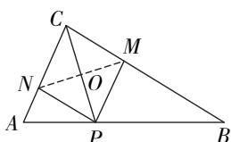

text_image

C
M
N
O
A
P
B

第 5 题解图

6. ④ 【解析】对角线互相垂直的平行四边形是菱形.

7. $60^{\circ}$ 【解析】∵ 四边形 ABCD 是菱形, ∴ $AD \parallel BC$ , ∠ CDB = ∠ ADB = $30^{\circ}$ , ∴ ∠ ADC = $30^{\circ} + 30^{\circ} = 60^{\circ}$ , ∵ $AD \parallel BC$ , ∴ ∠ DCE = ∠ ADC = $60^{\circ}$ .

8. $(6\sqrt{2},0)$ 【解析】∵点 C 的坐标为 $(0,6)$ ，点 D 的坐标为 $(0,-3)$ ，∴ OC=6，OD=3，∴ CD=OD+OC=9，∵四边形 ABCD 是菱形，∴ AD=CD=9，在 Rt△AOD 中， $AO=\sqrt{AD^{2}-OD^{2}}=6\sqrt{2}$ ，∵点 A 在 x 轴正半轴上，∴点 A 的坐标为 $(6\sqrt{2},0)$ .

9. $16\sqrt{2}$ 【解析】如解图, 过点 D 作 $DH \perp AB$ 于点 H,
∵ 四边形 ABCD 是菱形, ∴ $\angle BAD = \angle BCD = 45^{\circ}$ ,
∵ $\angle DHA = 90^{\circ}$ , ∴ $\angle ADH = 45^{\circ}$ ，在 Rt $\triangle ADH$ 中，
∵ DH=4 cm, ∴ AH=4 cm, AD=4√2 cm, ∴ AB=AD=
4√2 cm, S菱形ABCD=DH·AB=4×4√2=16√2(cm²).

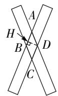  
第9题解图

10. 解: (1) 作图如解图所示; …… (4 分)

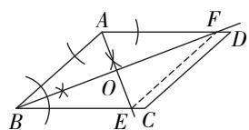

text_image

Geometric diagram of a parallelogram with labeled points, lines, and angles, including intersection point O and marked construction marks.

第 10 题解图

(2)菱形,理由如下:

如解图,连接 EF,

由(1)可知 BF 平分 $\angle ABC, AE$ 平分 $\angle BAF,$

$$
\therefore \angle A B F = \angle C B F, \angle B A E = \angle F A E,
$$

∵ 四边形 ABCD 为平行四边形，

$$
\therefore A D \parallel B C,
$$

$$
\therefore \angle B E A = \angle F A E, \angle A F B = \angle C B F,
$$

$$
\therefore \angle B A E = \angle B E A, \angle A B F = \angle A F B,
$$

$$
\therefore A B = B E, A B = A F,
$$

$$
\therefore A F = B E,
$$

大小卷·九年级(全一册) 数学 BS

∴ 四边形 ABEF 是平行四边形，

$$
\because A B = B E,
$$

∴ 平行四边形 ABEF 为菱形. …… (10 分)

11. (1) 证明: ∵ 四边形 ACDE 是菱形,

$$
\therefore C D \parallel A E,
$$

$$
\therefore \angle D C F = \angle A E B.
$$

$$
\because B C = E F,
$$

$\therefore BC+CE=EF+CE,$ 即 BE=FC.

又∵ CD = EA,

$$
\therefore \triangle C D F \cong \triangle E A B (\mathrm{SAS}),
$$

∴ DF = AB; …… (5 分)

(2) 解: 由(1)得, $\triangle CDF \cong \triangle EAB$ ,

$$
\therefore \angle B = \angle F = 3 0 ^ {\circ},
$$

∵ 四边形 ACDE 为菱形，

$$
\therefore D C = D E,
$$

$$
\therefore \angle D C E = \angle D E C.
$$

$$
\because \angle C D E = 3 0 ^ {\circ},
$$

$$
\therefore \angle D C E = \angle D E C = \frac {1}{2} (1 8 0 ^ {\circ} - \angle C D E) = 7 5 ^ {\circ},
$$

$$
\begin{array}{r l} \therefore \angle E D F & = \angle D E C - \angle F = 7 5 ^ {\circ} - 3 0 ^ {\circ} = 4 5 ^ {\circ}. \\ & \dots \dots \\ & \dots \dots (1 0 分) \end{array}
$$

12. (1) 证明: $\because \triangle AMN$ 是等边三角形, 点 $F$ 是 $MN$ 的中点,

$$
\therefore M F = N F, A F \perp M N,
$$

$$
\because A M \parallel C N, \therefore \angle M A F = \angle N C F,
$$

在 $\triangle AMF$ 和 $\triangle CNF$ 中， $\left\{\begin{aligned}\angle MAF&=\angle NCF,\\ \angle AFM&=\angle CFN,\\ MF&=NF,\end{aligned}\right.$

$$
\therefore \triangle A M F \cong \triangle C N F (\text {   AAS   }). \therefore A M = C N,
$$

∴ 四边形 AMCN 是平行四边形.

又∵ $AC \perp MN, \therefore$ 四边形 AMCN 是菱形；……
……（4 分）

(2) 解: 如解图, 过点 M 作 $MH \perp AB$ 于点 H,

由(1)可知,四边形 AMCN 是菱形,

$$
\therefore M N \perp A C, A F = C F,
$$

$$
A M = C M,
$$

$$
\because A B = C B,
$$

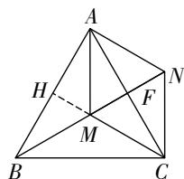

text_image

A
H
F
N
M
B
C

第 12 题解图

$\therefore B, M, N$ 三点共线， $\angle ABM = \angle CBM = 30^{\circ}$

$$
\because \angle B N A = 6 0 ^ {\circ},
$$

$$
\therefore \angle B A N = 9 0 ^ {\circ},
$$

$$
\therefore \angle B A M = \angle B A N - \angle M A N = 3 0 ^ {\circ},
$$

$$
\therefore A M = B M = 1, \therefore H M = \frac {1}{2},
$$

$$
\therefore A H = \sqrt {1 ^ {2} - \left(\frac {1}{2}\right) ^ {2}} = \frac {\sqrt {3}}{2}, \therefore A B = 2 A H = \sqrt {3},
$$

∴ $\triangle ABC$ 的边长为 $\sqrt{3}$ . …… (10 分)

# 周测 2 矩形的性质与判定

1. C 【解析】矩形的对角线互相平分且相等,仅对角线相等无法判定,故 A 选项错误;两条对角线互相平分的四边形可以是平行四边形,故 B 选项错误;三个角是直角的四边形是矩形,故 C 选项正确;矩形的对角线互相平分且相等,垂直无法判定,故 D 选项错误.

2. B 【解析】∵ 四边形 ABCD 为矩形, ∴ AC = BD, $\angle ABC = 90^{\circ}, \because \angle ACB = 30^{\circ}, AB = CD = 6 \, m, \therefore AC = BD = 12 \, m.$

3. C 【解析】∵ 点 D, E, F 分别是 BC, AC, AB 的中点, ∴ $AF = ED = \frac{1}{2} AB = 250 \, m$ , $AE = FD = \frac{1}{2} AC = 600 \, m$ , ∴ 四边形 AFDE 的周长为 $AF + ED + AE + FD = 1700 \, m$ .

4. D 【解析】∵ 四边形 ABCD 是矩形, ∴ $AD \parallel BC$ ,
∵ $\angle ADB = 40^{\circ}$ , ∴ $\angle DBC = 40^{\circ}$ . 由作图痕迹可知 BE 平分 $\angle DBC$ , ∴ $\angle CBE = \angle DBE = 20^{\circ}$ , ∴ 在 Rt△BCE 中, $\angle BEC = 90^{\circ} - \angle CBE = 70^{\circ}$ .

5. C 【解析】∵ 四边形 ABCD 是矩形, AE 平分 $\angle BAD, \therefore \angle BAE = \angle EAD = 45^{\circ}, \because \angle CAE = 15^{\circ},$ $\therefore \angle DAC = 30^{\circ}, \therefore AC = 4, AD = \sqrt{AC^{2} - CD^{2}} = 2\sqrt{3}, \therefore$ 矩形 ABCD 的面积为 $AB \cdot AD = 4\sqrt{3}$ .

6. A 【解析】如解图,连接 CP, ∵ 四边形 ABCD 是矩形, ∴ $\angle ADC = \angle B = \angle A = 90^{\circ}, AD = BC = 6, AB = CD, AB \parallel CD, \therefore \angle CDP = \angle APD, \because DP$ 平分 $\angle ADC, \therefore \angle ADP = \angle CDP, \therefore \angle APD = \angle ADP, \therefore AD = AP = 6, \because F, E$ 分别是 CD, DP 的中点, ∴ FE 是 $\triangle CDP$ 的中位线, ∴ $CP = 2FE = 2\sqrt{10}$ , 在 Rt $\triangle CBP$ 中, $BP = \sqrt{CP^{2} - BC^{2}} = 2, \therefore AB = BP + AP = 8, \therefore CF = \frac{1}{2}CD = \frac{1}{2}AB = 4.$

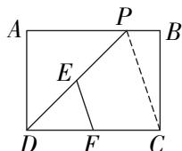  
第6题解图

7. $\angle ABC = 90^{\circ}$ (答案不唯一)

8. 12 【解析】设长为 $x \mathrm{~cm}$ , 宽为 $y \mathrm{~cm}$ , $\because$ 矩形的周长是 $16 \mathrm{~cm}, \therefore 2(x + y) = 16, \therefore x + y = 8, \because$ 相邻两边之比是 $1:3, \therefore y = 2 \mathrm{~cm}, x = 6 \mathrm{~cm}, \therefore S = xy = 6 \times 2 = 12 (\mathrm{~cm}^2)$ .

9. $\sqrt{3}$ 【解析】∵ 四边形 $ABCD$ 是矩形, ∴ $\angle A = \angle ABC = 90^{\circ}$ , $AB \parallel CD$ , $AD \parallel BC$ , ∴ $\angle ABD = \angle CDB$ , 由折叠的性质得 $\angle EBD = \frac{1}{2} \angle ABD$ , $\angle FDB = \frac{1}{2} \angle CDB$ , ∴ $\angle EBD = \angle FDB$ , ∴ $EB \parallel DF$ , ∵ $ED \parallel BF$ , ∴ 四边形 $BEDF$ 为平行四边形, ∵ $BE = DE$ , ∴ 四边形 $BEDF$ 为菱形, ∴ $\angle EBD = \angle FBD = \angle ABE$ , ∴ $\angle ABE = 30^{\circ}$ , ∴ $AE = \frac{1}{2} BE = 1$ , ∴ $AB = \sqrt{BE^{2} - AE^{2}} = \sqrt{3}$ .

10. 6 【解析】如解图,作点 B 关于 AC 的对称点 F, 连接 BF 交 AC 于点 G, 过点 F 作 $FE \perp BC$ , 分别交 AC, BC 于点 P, E, 连接 BP, 则 $PE + PB = PE + PF = FE$ , ∴ 当 F, P, E 三点共线时, $PB + PE$ 取得最小值, 最小值为 FE 的长. ∵ AB = 4, $BC = 4\sqrt{3}$ , 由勾股定理, 得 $AC = \sqrt{AB^{2} + BC^{2}} = 8$ , ∴ $\angle ACB = 30^{\circ}$ , ∴ $\angle CBG = 60^{\circ}$ , $BG = \frac{1}{2}BC = 2\sqrt{3}$ , ∴ $BF = 2BG = 4\sqrt{3}$ , ∵ $FE \perp BC$ , ∴ $\angle BEF = 90^{\circ}$ , ∴ $\angle BFE = 30^{\circ}$ , ∴ $BE = \frac{1}{2}BF = 2\sqrt{3}$ , ∴ FE = $\sqrt{BF^{2} - BE^{2}} = \sqrt{48 - 12} = 6$ , ∴ PE + PB 的最小值为 6.

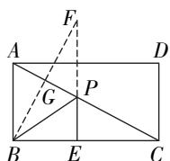  
第 10 题解图

11. 解: 补充证明过程如下:

∵ BE = AB, ∴ BE = CD,
∴ 四边形 BECD 是平行四边形，

$\because \angle ABD = 90^{\circ},$ $\therefore \angle DBE = 90^{\circ},$

∴ 四边形 BECD 是矩形. …… (8 分)

12. 解: (1) ∵ 四边形 ABCD 是矩形,

$$
\begin{array}{l} \therefore O B = O C, \\ \therefore \angle O B C = \angle O C B, \\ \because \angle B O C = \angle A O D = 1 2 0 ^ {\circ}, \\ \therefore \angle O C B = \frac {1}{2} (1 8 0 ^ {\circ} - \angle B O C) = 3 0 ^ {\circ}, \\ \end{array}
$$

即 $\angle ACB = 30^{\circ}$ ; …… (5 分)

(2)∵ 四边形 ABCD 是矩形，

$$
\therefore \angle A B C = 9 0 ^ {\circ},
$$

由(1)知, $\angle ACB=30^{\circ}$ ,

$$
\therefore \angle B A C = 6 0 ^ {\circ},
$$

∵ AF 平分 ∠BAC,

$$
\therefore \angle B A F = \angle C A F = 3 0 ^ {\circ},
$$

$$
\therefore \angle A C F = \angle C A F,
$$

$$
\therefore A F = C F,
$$

在 Rt△ABF 中, 设 BF = x,

则 $AF=2x, x^{2}+6^{2}=(2x)^{2}$ ,

解得 $x=2\sqrt{3}$ (负值已舍去)，

$$
\therefore A F = 4 \sqrt {3},
$$

∴ $CF = 4\sqrt{3}$ . …… (10 分)

13. 解: (1) ∵ CE 平分 $\angle ACB$ , CF 平分 $\angle ACD$ ,

$$
\therefore \angle A C E = \angle B C E, \angle H C F = \angle D C F.
$$

$$
\because E F \parallel B D,
$$

$$
\therefore \angle H E C = \angle B C E, \angle H F C = \angle D C F,
$$

$$
\therefore \angle H E C = \angle H C E, \angle H C F = \angle H F C,
$$

$$
\therefore E H = C H, F H = C H,
$$

∴ $CH=\frac{1}{2}EF=4$ ; …… (6 分)

(2) 当 H 位于 AC 中点时, 四边形 AECF 是矩形. 理由如下:

∵ CE 平分 $\angle ACB, CF$ 平分 $\angle ACD,$

$$
\therefore \angle E C F = \frac {1}{2} (\angle A C B + \angle A C D) = 9 0 ^ {\circ}.
$$

由(1)知 EH=FH,

又∵AH=CH,

∴ 四边形 AECF 是平行四边形.

$$
\because \angle E C F = 9 0 ^ {\circ},
$$

∴ 四边形 AECF 是矩形. …… (12 分)

# 周测 3 正方形的性质与判定

1. D 【解析】对角线相等且互相垂直平分的四边形是正方形.

大小卷·九年级(全一册) 数学 BS

2. C 【解析】∵ 四边形 ABCD 是正方形, ∴ AB = AD, ∠BAD = 90°, ∠BAC = 45°, ∵ AE = AD, ∴ AB = AE, ∴ ∠ABE = ∠AEB = $\frac{1}{2}$ (180° - ∠BAC) = 67.5°, ∴ ∠BEC = 45° + 67.5° = 112.5°.

3. A 【解析】∵ 四边形 ABCD 是正方形, ∴ $OD = OC, \angle DOC = 90^{\circ}, \angle EDO = 45^{\circ} = \angle FCO, \because OE \perp OF, \therefore \angle EOD = 90^{\circ} - \angle DOF = \angle FOC, \therefore \triangle DOE \cong \triangle COF(\text{ASA}), \therefore DE = CF = 2, \therefore AD = AE + DE = 7, \therefore$ 正方形 ABCD 的边长为 7.

4. B 【解析】如解图, 连接 $AF$ , $\because \angle B = 60^{\circ}$ , $\therefore \angle BAE = 30^{\circ}, \therefore BE = 4 \mathrm{~cm}, \therefore AE = 4\sqrt{3} \mathrm{~cm}$ , $\because$ 四边形 $ADFE$ 是正方形, $\therefore AE = EF, \angle E = 90^{\circ}, \therefore AF = \sqrt{2} AE = 4\sqrt{6} \mathrm{~cm}$ .

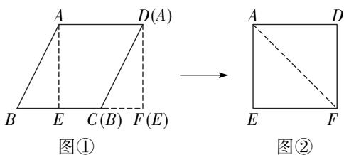

text_image

A D(A)
B E C(B) F(E)
图①
A D
E F
图②

第 4 题解图

5. B 【解析】题图②中花束的高=三角形4的直角边+三角形1的直角边+三角形7的斜边上的高=题图①中正方形ABCD的对角线长,∵正方形ABCD的边长为4,∴正方形ABCD的对角线长为 $4\sqrt{2}$ ,∴题图②中花束的高为 $4\sqrt{2}$ .

6. B 【解析】如解图, 过点 $B$ 作 $BQ' \perp AC$ 于点 $Q'$ , 此时点 $P$ 运动至点 $P'$ , $\because$ 四边形 $ABCD$ 是正方形, $\therefore AB = BC, AC = 2\sqrt{2}, \angle BAC = \angle BCA = 45^\circ, \because AP \perp AC, \therefore \angle PAC = 90^\circ, \therefore \angle PAB = \angle PAC - \angle BAC = 90^\circ - 45^\circ = 45^\circ, \therefore \angle PAB = \angle QCB$ , 在 $\triangle PAB$ 和 $\triangle QCB$ 中, $\left\{ \begin{array}{l} AP = CQ, \\ \angle PAB = \angle QCB, \therefore \triangle PAB \\ AB = CB, \end{array} \right.$ $\cong \triangle QCB(SAS), \therefore BP = BQ, \angle ABP = \angle CBQ,$ $\because \angle CBQ + \angle QBA = 90^\circ, \therefore \angle ABP + \angle QBA = 90^\circ,$ 即 $\angle PBQ = 90^\circ, \therefore \triangle PBQ$ 是等腰直角三角形, $\therefore PQ = \sqrt{2} BQ, \therefore$ 当 $BQ$ 最小时, $PQ$ 最小, $\therefore$ 当点 $Q$ 运动到点 $Q'$ 时, $BQ$ 最小, 即最小值为 $BQ'$

$$
= \frac {1}{2} A C = \frac {1}{2} \times 2 \sqrt {2} = \sqrt {2}, \therefore P Q _ {\text {最小值}} = \sqrt {2} \times \sqrt {2} = 2.
$$

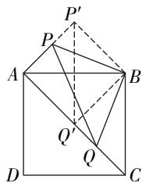

text_image

P'
P
A
B
Q'
Q
D
C

第6题解图

7. 正方

8. $15^{\circ}$ 【解析】∵ 四边形 ABCD 是正方形, $\triangle ADE$ 是等边三角形, $\therefore AB = AE = AD$ , $\angle ABC = \angle BAD = 90^{\circ}$ , $\angle EAD = 60^{\circ}$ , $\therefore \angle BAE = 30^{\circ}$ , $\therefore \angle ABE = \angle AEB = \frac{1}{2}(180^{\circ} - \angle BAE) = 75^{\circ}$ , $\therefore \angle CBE = \angle ABC - \angle ABE = 15^{\circ}$ .

9. (-1,2) 【解析】如解图, 过点 A 作 $AD \perp x$ 轴于点 D, 过点 C 作 $CE \perp x$ 轴于点 E, 则 $\angle ODA = \angle CEO = 90^{\circ}, \because A(2,1), \therefore OD = 2, AD = 1, \because$ 四边形 OABC 为正方形, $\therefore AO = OC, \angle AOC = 90^{\circ}, \therefore \angle AOD + \angle COE = 90^{\circ}, \because \angle ECO + \angle COE = 90^{\circ}, \therefore \angle DOA = \angle ECO, \therefore \triangle AOD \cong \triangle OCE (AAS), \therefore AD = OE = 1, OD = CE = 2, \because$ 点 C 位于第二象限, $\therefore$ 点 C 的坐标为 $(-1,2)$ .

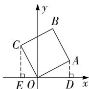  
第9题解图

10. 1 或 $\sqrt{13}$ 【解析】 $\because$ 不能确定点 $F$ 的位置, $\therefore$ 需分点 $F$ 在边 $CD$ 或在边 $BC$ 上. 如解图①, 当点 $F$ 在边 $CD$ 上时, $\because$ 四边形 $ABCD$ 是正方形, $\therefore AD = BC$ , $\angle D = \angle C = 90^{\circ}$ , $AF = BE$ , $\therefore \triangle ADF \cong \triangle BCE(HL)$ , $\therefore DF = CE = 1$ ; 如解图②, 当点 $F$ 在边 $BC$ 上时, 连接 $DF$ , 同理可得 $BF = CE = 1$ , $\therefore CF = BC - BF = 2$ , 在 Rt $\triangle CFD$ 中, $DF = \sqrt{CF^{2} + DC^{2}} = \sqrt{13}$ . 综上, $DF$ 的长为 1 或 $\sqrt{13}$ .

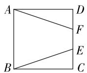  
图①

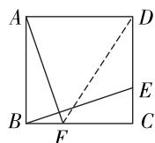  
图②  
第 10 题解图

11. 证明: ∵ 四边形 ABCD 是正方形,

$$
\therefore A D = C D = B C = A B, \angle A = \angle C = 9 0 ^ {\circ},
$$

∵ E, F 分别是边 AD, CD 的中点,

$$
\therefore A E = \frac {1}{2} A D, C F = \frac {1}{2} C D,
$$

$\therefore AE=CF,$ (4分)

在 $\triangle ABE$ 和 $\triangle CBF$ 中， $\left\{\begin{aligned}AB&=CB,\\ \angle A&=\angle C,\\ AE&=CF,\end{aligned}\right.$

$$
\therefore \triangle A B E \cong \triangle C B F (\mathrm{SAS}),
$$

∴ $\angle AEB = \angle CFB.$ …… (8 分)

12. (1) 证明: $\because AF$ 是 $\angle EAD$ 的平分线,

$$
\therefore \angle D A F = \angle E A F,
$$

$$
\because A G = F G,
$$

$$
\therefore \angle G A F = \angle G F A,
$$

$$
\therefore \angle D A F = \angle G F A,
$$

∴ $GF \parallel AD$ ; …… (4 分)

(2) 解: 如解图, 过点 F 作 $FH \perp AE$ 于点 H,

∵ AF 是 $\angle EAD$ 的平分线, $\angle D = 90^{\circ}$ ,

$$
\therefore D F = H F,
$$

又∵ AF = AF,

$$
\therefore \triangle A D F \cong \triangle A H F (\mathrm{HL}),
$$

$$
\therefore \angle A F H = \angle A F D,
$$

$$
\because \angle A F E = 9 0 ^ {\circ},
$$

$$
\therefore \angle A F H + \angle H F E = \angle A F D + \angle C F E,
$$

$$
\therefore \angle H F E = \angle C F E.
$$

又∵ $\angle FHE = \angle C = 90^{\circ}, EF = EF,$

$$
\therefore \triangle H E F \cong \triangle C E F (\text { AAS }),
$$

$$
\therefore F H = F C,
$$

$$
\therefore F C = D F,
$$

$$
\therefore D C = 2 F C = 4,
$$

∴ 正方形的边长为 4. …… (10 分)

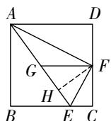  
第 12 题解图

13. 解: (1) 补全图形如解图, 四边形 AEGF 是正方形;

证明:由题意可得 $\triangle ABD\cong\triangle ABE$ ,

$$
\triangle A C D \cong \triangle A C F,
$$

$$
\therefore \angle D A B = \angle E A B, A D = A E, \angle D A C = \angle F A C,
$$

$$
A D = A F.
$$

$$
\because \angle B A C = 4 5 ^ {\circ},
$$

$$
\therefore \angle E A F = 9 0 ^ {\circ}.
$$

又∵ $AD \perp BC$ ,

$$
\therefore \angle E = \angle A D B = 9 0 ^ {\circ}, \angle F = \angle A D C = 9 0 ^ {\circ}.
$$

∴ 四边形 AEGF 是矩形.

$$
\because A E = A D, A F = A D,
$$

$$
\therefore A E = A F.
$$

∴ 四边形 AEGF 是正方形；……（6 分）

(2) 设 CD = x,

$$
\because B D = 6,
$$

$$
\therefore B E = 6, C F = x, B C = x + 6.
$$

$$
\because A E = A F = G F = E G = 1 2,
$$

$$
\therefore B G = 6, C G = 1 2 - x.
$$

在 Rt△BGC 中, 根据勾股定理得 $BG^{2} + CG^{2} = BC^{2}$ , 即 $6^{2} + (12 - x)^{2} = (x + 6)^{2}$ ,

解得 x=4，

∴ CD=4. …… (12 分)

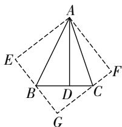

text_image

A
E
B
D
C
F
G

第 13 题解图

# 专题 特殊四边形中的折叠问题 教材原题改编练

教材原题 解:重合部分为等腰三角形,理由如下:
∵ 四边形 ABCD 是矩形,

$$
\therefore A D \parallel B C,
$$

$$
\therefore \angle A D B = \angle D B C,
$$

由折叠的性质可知, $\angle DBC=\angle FBD$ ,

$$
\therefore \angle A D B = \angle F B D,
$$

$$
\therefore B F = D F,
$$

即重合部分为等腰三角形.

改编 1 70° 【解析】由折叠的性质可知, $\angle BC'E = \angle C, \angle C'BE = \angle CBE, \because$ 四边形 ABCD 为矩形, $\therefore \angle ABC = \angle C = 90^\circ, \because \angle ABD = 50^\circ, \therefore \angle DBC = 40^\circ, \therefore \angle C'BE = \angle CBE = 20^\circ, \therefore \angle C'EB = 90^\circ - \angle C'BE = 70^\circ.$

改编 2 解:由折叠的性质可知, $BC'=BC=10,EC'=EC$ ,
∵ 四边形 ABCD 为矩形，

$$
\therefore \angle A = \angle D = 9 0 ^ {\circ},
$$

大小卷·九年级(全一册) 数学 BS

$$
\because A B = 6,
$$

$$
\therefore A C ^ {\prime} = \sqrt {B C ^ {\prime 2} - A B ^ {2}} = 8,
$$

$$
\therefore C ^ {\prime} D = 2,
$$

设 EC = x，则 DE = 6 - x， $EC' = x$ ，

在 Rt△DEC' 中, $x^{2}=(6-x)^{2}+2^{2}$ ,

解这个方程, 得 $x=\frac{10}{3}$ ,

即 CE 的长为 $\frac{10}{3}$ .

改编 3 解: (1) 如解图①, 当四边形 $C^{\prime}ECD$ 是正方形时, 点 $C^{\prime}$ 在 AD 边上,

$$
C D = A B = C E = E C ^ {\prime} = D C ^ {\prime} = 5,
$$

$$
\therefore C ^ {\prime} A = A D - D C ^ {\prime} = 5,
$$

$$
\therefore C ^ {\prime} B = \sqrt {C ^ {\prime} A ^ {2} + A B ^ {2}} = \sqrt {5 ^ {2} + 5 ^ {2}} = 5 \sqrt {2};
$$

(2)如解图②,连接 $BD$ , $\because$ 四边形ABCD是矩形,

$$
\therefore B D = \sqrt {A D ^ {2} + A B ^ {2}} = \sqrt {1 0 ^ {2} + 5 ^ {2}} = 5 \sqrt {5},
$$

$$
\because B D \leqslant B C ^ {\prime} + C ^ {\prime} D,
$$

$$
\therefore B C ^ {\prime} \geqslant B D - C ^ {\prime} D,
$$

当 $C'$ 在 BD 上时, $BC'$ 取得最小值,

$$
\therefore B C ^ {\prime} = B D - C ^ {\prime} D = 5 \sqrt {5} - 5,
$$

设 BE = x，则 $C' E = CE = 10 - x$ ，

在 Rt△BEC' 中， $(10-x)^{2}+(5\sqrt{5}-5)^{2}=x^{2}$

解这个方程, 得 $x=\frac{25-5\sqrt{5}}{2}$ ,

$$
\therefore B E = \frac {2 5 - 5 \sqrt {5}}{2}.
$$

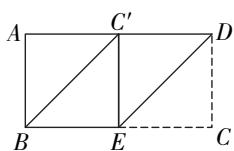  
图①

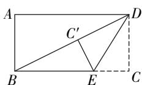  
图②  
改编 3 题解图

改编 4 解: (1) ∵ 四边形 ABCD 是矩形,

$$
\therefore A D = B C = 1 0, A B = C D = 5, \angle B = \angle C = 9 0 ^ {\circ},
$$

由折叠的性质可知, $DC=DC'=5$ , $BE=B'E$ , $B'C'=$

$$
B C = 1 0, \angle B ^ {\prime} = \angle B = 9 0 ^ {\circ}, \angle C = \angle C ^ {\prime} = 9 0 ^ {\circ},
$$

$$
\because C ^ {\prime} A = \sqrt {A D ^ {2} - C ^ {\prime} D ^ {2}} = 5 \sqrt {3},
$$

$$
\therefore B ^ {\prime} A = B ^ {\prime} C ^ {\prime} - C ^ {\prime} A = 1 0 - 5 \sqrt {3},
$$

$$
\therefore \frac {B ^ {\prime} A}{C ^ {\prime} A} = \frac {1 0 - 5 \sqrt {3}}{5 \sqrt {3}} = \frac {2 \sqrt {3} - 3}{3};
$$

(2) 在 Rt△AEB' 中, 由勾股定理得 $AE^{2}=AB'^{2}+B'E^{2}$ ,

$$
\therefore A E ^ {2} = (1 0 - 5 \sqrt {3}) ^ {2} + (5 - A E) ^ {2},
$$

$$
\therefore A E = 2 0 - 1 0 \sqrt {3},
$$

∴ 重叠部分的面积 = $\frac{1}{2}AD \times AE = \frac{1}{2} \times 10 \times (20 - 10\sqrt{3}) = 100 - 50\sqrt{3}$ .

# 综合训练

1. C 【解析】∵矩形ABCD折叠后点A与点C重合,∴AE=EC,设DE=x,则AE=EC=10-x,在Rt△ADE中, $AD^{2}+DE^{2}=AE^{2}$ ,即 $2^{2}+x^{2}=(10-x)^{2}$ ,解这个方程,得 $x=\frac{24}{5}$ ,∴ $DE=\frac{24}{5}$ ,∴△ADE的面积为 $\frac{1}{2}AD\cdot DE=\frac{1}{2}\times2\times\frac{24}{5}=\frac{24}{5}$ .

2. 3 【解析】∵ 四边形 ABCD 是正方形, ∴ AB = AD = BC = CD = 6, ∠B = ∠D = 90°, 由折叠的性质可知 AF = AD = 6, ∠AFE = ∠D = 90°, FE = DE, ∴ AB = AF, ∠B = ∠AFE = ∠AFG = 90°, 在 Rt △ABG 和 Rt △AFG 中, $\left\{\begin{aligned}AG &= AG, \\ AB &= AF,\end{aligned}\right.$ ∴ Rt △ABG ≅ Rt △AFG (HL), ∴ BG = FG, ∵ E 是 CD 边上的三等分点 (CE > DE), ∴ DE = 2, CE = 4, ∴ FE = DE = 2, 设 BG = FG = x, 则 CG = 6 - x, GE = FG + FE = x + 2, 在 Rt △CEG 中, 由勾股定理得 $CG^{2} + CE^{2} = GE^{2}$ , 即 $(6 - x)^{2} + 4^{2} = (x + 2)^{2}$ , 解这个方程, 得 x = 3, 即 BG = 3.

3. 解: ∵ 四边形 ABCD 是菱形, $\angle A = 60^{\circ}$ ,

∴ $AB \parallel CD, \triangle BCD$ 是等边三角形.

∵ 点 G 是 CD 的中点，

$$
\therefore B G \perp C D,
$$

$$
\therefore \angle C G B = \angle F B G = 9 0 ^ {\circ},
$$

即 $\triangle FBG$ 是直角三角形，

$$
\because A B = 2,
$$

$$
\therefore C G = 1, C B = 2,
$$

在 Rt△GBC 中, 由勾股定理得 $BG^{2}=BC^{2}-CG^{2}=2^{2}-1^{2}=3$ ,

由折叠的性质可知,AF=GF,

设 BF=x，则 AF=GF=2-x，

在 Rt△FBG 中, $GF^{2}=BF^{2}+BG^{2}$ ,

即 $(2-x)^{2}=x^{2}+3$ ，

解得 $x=\frac{1}{4}$ ，即 $BF=\frac{1}{4}$ .

4. (1) 证明: ∵ 四边形 ABCD 是矩形,

$$
\therefore A D = B C, \angle A = \angle B = 9 0 ^ {\circ}, C D / / A B, C D = A B,
$$

$$
\therefore \angle D C F = \angle C E B,
$$

由折叠的性质得 AD = DF, $\angle A = \angle DFE = 90^{\circ}$ ,

$$
\therefore \angle D F C = \angle B = 9 0 ^ {\circ}, D F = B C,
$$

在 $\triangle CEB$ 和 $\triangle DCF$ 中， $\left\{\begin{aligned}\angle CEB&=\angle DCF,\\ \angle B&=\angle DFC,\\ BC&=FD,\end{aligned}\right.$

$$
\therefore \triangle C E B \cong \triangle D C F (\text { AAS }), \therefore B E = C F;
$$

(2) 解: $\because AB=6, DF=BC=3, \therefore CD=2DF.$

$$
\because \angle D F C = 9 0 ^ {\circ}, \therefore \angle D C F = 3 0 ^ {\circ}, \therefore \angle C D F = 6 0 ^ {\circ},
$$

$$
\therefore \angle A D F = \angle A D C - \angle C D F = 3 0 ^ {\circ}.
$$

由折叠的性质得 $\angle ADE = \angle EDF = \frac{1}{2}\angle ADF = 15^{\circ},$

$$
\therefore \angle C D E = \angle C D F + \angle E D F = 7 5 ^ {\circ}.
$$

5. (1) 证明: 由折叠的性质可知, $\triangle AEF \cong \triangle MEF$ ,

$$
\triangle B G F \cong \triangle M G F, \triangle D H E \cong \triangle N H E,
$$

$$
\triangle C G H \cong \triangle N G H,
$$

$$
\therefore \angle A F E = \angle M F E, \angle B F G = \angle M F G,
$$

$$
\because \angle A F E + \angle M F E + \angle B F G + \angle M F G = 1 8 0 ^ {\circ},
$$

$$
\therefore \angle M F E + \angle M F G = 9 0 ^ {\circ} \text {, 即} \angle E F G = 9 0 ^ {\circ},
$$

同理可证 $\angle FGH = 90^{\circ},\angle GHE = 90^{\circ},$

∴ 四边形 EFGH 为矩形；

(2) 解: $\because \triangle CGH \cong \triangle NGH, \therefore CG = NG = 1$ ,

∵ 四边形 EFGH 为矩形, ∴ EF = GH, $EF \parallel GH$ ,

$$
\therefore \angle F E M = \angle H G N,
$$

在 $\triangle EFM$ 与 $\triangle GHN$ 中， $\left\{\begin{aligned}\angle FME&=\angle HNG,\\ \angle FEM&=\angle HGN,\\ EF&=GH,\end{aligned}\right.$

$$
\therefore \triangle E F M \cong \triangle G H N (\text { AAS }), \therefore E M = G N = 1,
$$

$$
\because E G = 4, \therefore M N = 2, M G = 3,
$$

$$
\because \triangle B G F \cong \triangle M G F, \therefore B G = M G = 3,
$$

$$
\therefore B C = B G + C G = 4.
$$

# 专题 正方形中的十字模型

# 识别模型

1. 解: ∵ 四边形 ABCD 是正方形,

$$
\therefore B C = C D = 6, \angle B C E = \angle C D F = 9 0 ^ {\circ},
$$

$$
\because B E \perp C F,
$$

$$
\therefore \angle F C D + \angle C E B = 9 0 ^ {\circ},
$$

$$
\because \angle F C D + \angle C F D = 9 0 ^ {\circ},
$$

$$
\therefore \angle C E B = \angle D F C,
$$

$$
\therefore \triangle B C E \cong \triangle C D F (\text { AAS }),
$$

$$
\therefore C E = D F = 2,
$$

$$
\therefore D E = C D - C E = 6 - 2 = 4.
$$

2. 解: 如解图, 过点 M 作 $MG \parallel AB$ 交 AD 于点 G,

∵ 四边形 ABCD 为正方形，

$$
\therefore \angle N G M = \angle A = \angle B = 9 0 ^ {\circ},
$$

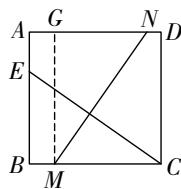  
第2题解图

且 AB = MG = BC.

在 Rt△GMN 和 Rt△BCE 中，

$$
\left\{ \begin{array}{l} M N = C E, \\ G M = B C, \end{array} \right.
$$

$$
\therefore \mathrm{Rt} \triangle G M N \cong \mathrm{Rt} \triangle B C E (\mathrm{HL}),
$$

$$
\therefore \angle G N M = \angle B E C.
$$

$$
\because \angle M C E = 3 5 ^ {\circ},
$$

$$
\therefore \angle B E C = 9 0 ^ {\circ} - 3 5 ^ {\circ} = 5 5 ^ {\circ},
$$

$$
\therefore \angle A N M = 5 5 ^ {\circ}.
$$

3. 证明: 如解图, 过点 G 作 $GM \perp BC$ 于点 M, 过点 F 作 $FN \perp AB$ 于点 N, 交 GE 于点 P, 则 $\angle GME = \angle FNH = 90^{\circ}$ ,

∵ 四边形 ABCD 是正方形，

$$
\therefore A B = A D, \therefore G M = F N.
$$

在 Rt△MGE 和 Rt△NFH 中， $\left\{\begin{aligned}MG&=NF,\\ GE&=FH,\end{aligned}\right.$

$$
\therefore \mathrm{Rt} \triangle M G E \cong \mathrm{Rt} \triangle N F H (\mathrm{HL}),
$$

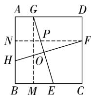  
第 3 题解图

$$
\therefore \angle F H N = \angle G E M,
$$

$$
\because \angle F H N + \angle H F N = 9 0 ^ {\circ},
$$

$$
\therefore \angle G E M + \angle H F N = 9 0 ^ {\circ},
$$

$$
\because F N \parallel C B,
$$

$$
\therefore \angle F P O = \angle G E M,
$$

$$
\therefore \angle F P O + \angle H F N = 9 0 ^ {\circ},
$$

$\therefore \angle POF=90^{\circ}$ , 即 $GE \perp HF$ .

4. 解: 如解图, 过点 E 作 $EH \perp CD$ 于点 H,

∵ 四边形 ABCD 为正方形，

$$
\therefore \angle A = \angle A D C = \angle C = 9 0 ^ {\circ}, A D = C D = B C,
$$

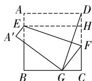  
第 4 题解图

大小卷·九年级(全一册) 数学 BS

$$
\because E H \perp C D, \therefore \angle D H E = \angle E H F = 9 0 ^ {\circ},
$$

∴ 四边形 AEHD 为矩形, ∴ AD = EH = CD = 3,
由折叠的性质可得, $EF \perp DG$ ,

$$
\therefore \angle C D G + \angle H F E = 9 0 ^ {\circ},
$$

$$
\because \angle C D G + \angle D G C = 9 0 ^ {\circ}, \therefore \angle H F E = \angle D G C,
$$

在 $\triangle HEF$ 和 $\triangle CDG$ 中， $\left\{ \begin{array}{l} \angle HFE = \angle CGD, \\ \angle EHF = \angle C, \\ HE = CD, \end{array} \right.$

$$
\therefore \triangle H E F \cong \triangle C D G (\text { AAS }),
$$

$$
\therefore H F = C G = \frac {1}{3} B C = 1,
$$

∴ 在 Rt△EHF 中, $EF=\sqrt{EH^{2}+HF^{2}}=\sqrt{3^{2}+1^{2}}=\sqrt{10}$ .

# 综合训练

5.2 【解析】∵ 四边形 ABCD 为正方形, $CF \perp BE$ ,

$$
\therefore A B = B C, \angle A = \angle F B C = \angle B O C = 9 0 ^ {\circ}, \therefore \angle B C F +
$$

$$
\angle E B C = \angle E B C + \angle A B E = 9 0 ^ {\circ}, \therefore \angle A B E =
$$

$$
\angle B C F, \therefore \triangle A E B \cong \triangle B F C (\mathrm{ASA}), \therefore B F = A E.
$$

∵ E 为 AD 的中点, ∴ $AE = \frac{1}{2}AD$ , ∴ $BF = \frac{1}{2}AD =$

$\frac{1}{2}AB,\therefore F$ 为 AB 的中点, $\therefore AE=AF,\therefore \angle BFG=$

$$
\angle A F E = 4 5 ^ {\circ}, \therefore \angle G = 9 0 ^ {\circ} - 4 5 ^ {\circ} = 4 5 ^ {\circ}, \therefore B G = B F =
$$

$$
\frac {1}{2} A B = \frac {1}{2} B C = 2.
$$

6. 4 【解析】如解图, 设点 H 是 AD 的中点, 连接BH 交 AF 于点 K, ∵ 正方形 ABCD 中, 点 E, F 分别为 BC, CD 的中点, ∴ AB = BC = AD = DC,

$$
\angle A D F = \angle D C E = 9 0 ^ {\circ}, D F = C E, \therefore \triangle A D F \cong
$$

$$
\triangle D C E (\mathrm{SAS}), \therefore \angle D A F = \angle C D E, A F = D E.
$$

$$
\because \angle C D E + \angle A D P = \angle A D C = 9 0 ^ {\circ}, \therefore \angle A D P + \angle D A F
$$

$=90^{\circ},\therefore\angle APD=180^{\circ}-90^{\circ}=90^{\circ},\because$ 四边形 AB-CD 是正方形, 点 E 是 BC 的中点, ∴ HD∥BE,HD=BE, ∴ 四边形 BEDH 是平行四边形, ∴ HK//DE,∵ AF⊥DE,∴ ∠AKB = ∠APE = 90°,∵ H是 AD 的中点, ∴ K 是 AP 的中点, ∴ AB = BP = 4.

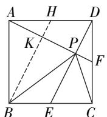  
第6题解图

7. 解: 如解图, 过点 F 作 $FL \perp BC$ 于点 L,

∵ 四边形 ABCD 是正方形，

$$
\therefore A D = C D, \angle D = \angle C = \angle B A D = 9 0 ^ {\circ}.
$$

$$
\because F L \perp B C,
$$

∴ 四边形 CDFL 为矩形, $\angle FLG = 90^{\circ}$ .

$$
\therefore \angle F L G = \angle D, F L = C D = A D = 6.
$$

$$
\because F G \perp A E,
$$

$$
\therefore \angle F A H + \angle A F H = 9 0 ^ {\circ}.
$$

$$
\because \angle H F L + \angle A F H = 9 0 ^ {\circ},
$$

$$
\therefore \angle H F L = \angle F A H.
$$

$$
\therefore \triangle F G L \cong \triangle A E D (\text { ASA }).
$$

$$
\therefore G L = D E = 2.
$$

在 Rt△FLG 中,由勾股定理,得 $FL^{2}+GL^{2}=FG^{2}$ ,

$$
\therefore F G = \sqrt {6 ^ {2} + 2 ^ {2}} = 2 \sqrt {1 0}.
$$

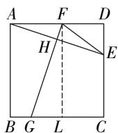  
第7题解图

8. 解: (1) $AE \perp DF, AE = DF.$

理由如下：∵ 四边形 ABCD 是正方形，

$$
\therefore A B = B C = A D, \angle A B C = \angle D A F = 9 0 ^ {\circ},
$$

$$
\because B F = C E,
$$

$\therefore BC+CE=AB+BF,$ 即 BE=AF,

$$
\therefore \triangle A B E \cong \triangle D A F (\text { SAS }),
$$

$$
\therefore A E = D F, \angle A E B = \angle D F A,
$$

$$
\because \angle E A B + \angle A E B = 9 0 ^ {\circ}, \therefore \angle E A B + \angle D F A = 9 0 ^ {\circ},
$$

$\therefore \angle AOF = 90^{\circ}$ ，即 $AE\perp DF$

(2)由 (1)知 $\triangle ABE\cong \triangle DAF$

$$
\therefore B E = A F = A B + B F = 6 + 2 = 8,
$$

$$
\therefore A E = D F = \sqrt {A B ^ {2} + B E ^ {2}} = 1 0,
$$

$$
\because A E \perp D F, \therefore \angle O A D + \angle O D A = 9 0 ^ {\circ},
$$

$$
\because \angle C D M + \angle O D A = 9 0 ^ {\circ}, \therefore \angle O A D = \angle C D M,
$$

又∵AD=DC,∠ADN=∠DCM=90°,

$$
\therefore \triangle A D N \cong \triangle D C M (\mathrm{ASA}),
$$

$$
\therefore S _ {\triangle A D N} = S _ {\triangle D C M},
$$

$\therefore S_{\triangle ADN} - S_{\triangle ODN} = S_{\triangle DCM} - S_{\triangle ODN}$ 即 $S_{\triangle AOD} = S_{\text{四边形}OMCN}$

在 Rt $\triangle ADF$ 中, $AO \perp DF$ , $S_{\triangle AFD} = \frac{1}{2} AD \cdot AF =$

$$
\frac {1}{2} D F \cdot A O, \therefore A O = \frac {A F \cdot A D}{D F} = \frac {2 4}{5},
$$

$$
\therefore O D = \sqrt {A D ^ {2} - A O ^ {2}} = \frac {1 8}{5},
$$

$$
\therefore S _ {\text {四边形} O M C N} = S _ {\triangle A O D} = \frac {1}{2} O A \cdot O D = \frac {2 1 6}{2 5}.
$$

# 第二章 一元二次方程

# 周测4 一元二次方程的认识及解法

1. C 【解析】A 选项是二元一次方程, B 选项是一元一次方程, 都不合题意, $2x^{2} + x = 0$ 是一元二次方程, $x^{2} - \frac{1}{x} = 1$ 属于分式方程, 不合题意.

2. A 【解析】由题意得 $x^{2}+4x+4-12x-6=0$ ，整理得 $x^{2}-8x-2=0$ ，则一次项系数和常数项分别为 -8, -2.

3. B 【解析】由根的判别式可知 $\Delta = b^{2} - 4ac = (-4\sqrt{2})^{2} - 4 \times 2 \times 4 = 0$ , ∴ 该一元二次方程有两个相等的实数根.

4. C 【解析】∵ m 是关于 x 的方程 $-x^{2} + 2x + 1 = 0$ 的根，∴ $-m^{2} + 2m = -1$ ，∴ $m^{2} - 2m = 1$ .

5. B 【解析】∵ $2x^{2}+1$ 与 $4x^{2}-2x-5$ 的值互为相反数，∴ $2x^{2}+1+4x^{2}-2x-5=0$ ，则 $6x^{2}-2x-4=0$ 。解这个方程，得 $x_{1}=1, x_{2}=-\frac{2}{3}$ .

6. A 【解析】∵ 关于 x 的一元二次方程 $x^{2}+\frac{1}{4}(a-c)=0$ 有两个相等的实数根, ∴ $\frac{1}{4}(a-c)=0$ , ∴ a=c, ∴ $\triangle ABC$ 是等腰三角形.

7. $x_{1} = 1, x_{2} = -3$ 【解析】 $\because (x - 1)(x + 3) = 0, \therefore x - 1 = 0$ 或 $x + 3 = 0$ , 解上述方程, 得 $x_{1} = 1, x_{2} = -3$ .

8. $x(x-2)=960$ 【解析】∵ 较大的偶数为 x, ∴ 较小的偶数为 x-2, ∴ 由题意, 可列方程为 $x(x-2)=960$ .

9. $x_{1} = -3, x_{2} = 0$ 【解析】：关于 $x$ 的一元二次方程 $m(x + a)^{2} + n = 0$ 的解是 $x_{1} = -1, x_{2} = 2, \therefore$ 方程 $m(x + a + 2)^{2} + n = 0$ 变形为： $m[(x + 2) + a]^{2} + n = 0$ ，即 $x + 2 = -1$ 或 $x + 2 = 2$ ，解得 $x_{1} = -3$ 或 $x_{2} = 0$ .

10. $m \leqslant -\frac{23}{12}$ 且 $m \neq -4$ 【解析】∵该方程为一元二次方程，∴ $m + 4 \neq 0$ ，∴ $m \neq -4$ ，∵ $a = m + 4$ ， $b = -5$ ，c = 3，∴ $\Delta = b^{2} - 4ac = (-5)^{2} - 4 \times (m + 4) \times 3 = 25 - 12m - 48 = -23 - 12m$ ，∵方程有实数根，∴ $-23 - 12m \geqslant 0$ ，∴ $m \leqslant -\frac{23}{12}$ ，综上所述，m 的取值范围为 $m \leqslant -\frac{23}{12}$ 且 $m \neq -4$ .

11. 解: (1) $x^{2}-6x+9=10+9$ ,

$$
(x - 3) ^ {2} = 1 9,
$$

$$
x - 3 = \pm \sqrt {1 9},
$$

$$
\therefore x _ {1} = 3 + \sqrt {1 9}, x _ {2} = 3 - \sqrt {1 9}; \quad \dots \dots \tag {2分}
$$

(2) $(x-2)^{2}=\frac{9}{4}$ ,

$$
x - 2 = \pm \frac {3}{2},
$$

$$
\therefore x _ {1} = \frac {7}{2}, x _ {2} = \frac {1}{2}; \dots \tag {4分}
$$

(3) $\because b^{2} - 4ac = (-4)^{2} - 4 \times 2 \times 1 = 8,$

$$
\therefore x = \frac {4 \pm \sqrt {8}}{4}.
$$

$$
\therefore x _ {1} = 1 + \frac {\sqrt {2}}{2}, x _ {2} = 1 - \frac {\sqrt {2}}{2}; \dots \tag {6分}
$$

(4) $x(x-2)+(x-2)=0,$

$$
\therefore (x - 2) (x + 1) = 0,
$$

∴ x-2=0 或 $x+1=0$ ,

$$
\therefore x _ {1} = 2, x _ {2} = - 1. \dots\dots(8 \text {分})
$$

12. (1) 证明: $\because \Delta = (m + 3)^{2} - 4 \times 2(m + 1) = m^{2} - 2m + 1 = (m - 1)^{2} \geqslant 0$ ,

∴该方程总有两个实数根；……（5分）

(2) 解: 根据一元二次方程的求根公式可得 $x = \frac{-(m+3) \pm \sqrt{(m+3)^{2} - 4 \times 2(m+1)}}{2}$

$$
= \frac {- m - 3 \pm (m - 1)}{2},
$$

解这个方程, 得 $x_{1} = -2, x_{2} = -m - 1$ ,

$$
\therefore - m - 1 > 0,
$$

解得 $m < -1$ .

∴ m 的取值范围是 m<-1. …… (10 分)

13. 解: 设小路的宽度为 x 米, 则自助选菜区和烧烤区的长为 $(12-2x)$ 米, 宽为 $(8-2x)$ 米,

根据题意可得 $(12-2x)(8-2x)=60$ ,

将原方程化为一般形式得 $x^{2}-10x+9=0$ ,

这里 $a = 1, b = -10, c = 9$

$$
\because b ^ {2} - 4 a c = (- 1 0) ^ {2} - 4 \times 1 \times 9 = 6 4 > 0,
$$

$$
\therefore x = \frac {- b \pm \sqrt {b ^ {2} - 4 a c}}{2 a} = \frac {1 0 \pm 8}{2},
$$

大小卷·九年级(全一册) 数学 BS

即 $x_{1}=1, x_{2}=9$ (舍去),

所以小路的宽度为 1 米. …… (10 分)

14. 解: $(1)(x+1)(x+4)$ , $(x+6)(x-3)$ ; …… (5分)

【解法提示】 $x^{2}+5x+4=0$ 可分解为 $(x+1)(x+4)=0,x^{2}+3x-18=0$ 可分解为 $(x+6)(x-3)=0.$

(2)①∵ $3x^{2}-5x-12=0$ 可分解为 $(x-3)(3x+4)=0$ , ∴ x-3=0 或 $3x+4=0$ ,

解上述方程, 得 $x_{1}=3, x_{2}=-\frac{4}{3}; \cdots$ (7 分)

②∵ $2x^{2}+(3-2a)x+1-a=0$ 可分解为 $(2x+1)$ $\cdot(x+1-a)=0,$

∴ $2x+1=0$ 或 $x+1-a=0$ ,

解上述方程, 得 $x_{1}=-\frac{1}{2}, x_{2}=a-1$ .

则 a-1>1, 解得 a>2. …… (12 分)

# 周测5 一元二次方程的根与系数的关系及应用

1. A 【解析】 $\because x_{1}+x_{2}=-\frac{-4}{2}=2, x_{1}x_{2}=-\frac{9}{2}, \therefore$ 选项
A 正确.

2. B 【解析】∵ $x_{1}, x_{2}$ 是一元二次方程 $x^{2}-3x-1=0$ 的两个根，∴ $x_{1}+x_{2}=3, x_{1}x_{2}=-1, \therefore (x_{1}-1)(x_{2}-1)=x_{1}x_{2}-(x_{1}+x_{2})+1=-3.$

3. B 【解析】根据题意列方程 $3(1 + x)^2 = 4.2$ .

4. C 【解析】设共有 x 支队伍参赛, ∵ 进行单循环赛制, ∴ $\frac{x(x-1)}{2}=10$ , 整理得 $x^{2}-x-20=(x-5)$ $\cdot(x+4)=0,\therefore x_{1}=-4(\text{舍去}),x_{2}=5,$ 故共有 5 支队伍参赛.

5. D 【解析】根据题意可得 $x_{1} + x_{2} = m + 1, x_{1} \cdot x_{2} = 3(m - 2)$ , $\therefore \frac{1}{x_{1}} + \frac{1}{x_{2}} = \frac{x_{1} + x_{2}}{x_{1}x_{2}} = \frac{m + 1}{3(m - 2)} = -1$ , 解得 $m = \frac{5}{4}$ .

6. A 【解析】∵ $S_{\triangle ABC} = \frac{1}{2} AB \cdot BC = \frac{1}{2} \times 6 \times 8 = 24 \, (\text{cm}^2)$ , ∴ $S_{\triangle BPQ} = 24 - 12 = 12 \, (\text{cm}^2)$ . 设当运动时间为 t s 时, $\triangle PBQ$ 的面积为 $12 \, cm^2$ , 依题意得 $\frac{1}{2} \times (8 - t) \times 2t = 12$ , 整理得 $t^2 - 8t + 12 = 0$ , 解这个方程, 得 $t_1 = 2, t_2 = 6$ . 又∵ $2t \leqslant 6, \therefore 0 < t \leqslant 3, \therefore t$

$$
= 2 (\mathrm{s}).
$$

7. $x^{2} - 5x + 6 = 0$ （答案不唯一）

8. -3 【解析】由题意可知 $\alpha+\beta=2,\alpha\beta=-4,\therefore\frac{\beta}{\alpha}+\frac{\alpha}{\beta}=\frac{\beta^{2}+\alpha^{2}}{\alpha\beta}=\frac{(\beta+\alpha)^{2}-2\alpha\beta}{\alpha\beta}=\frac{(\beta+\alpha)^{2}}{\alpha\beta}-2=\frac{2^{2}}{-4}-2=-3.$

9. 96 【解析】设门的宽为 x 尺, 则门的高为 $(x + 6.8)$ 尺, 由题意列方程得 $x^{2} + (x + 6.8)^{2} = 10^{2}$ , 解这个方程, 得 $x_{1} = 2.8, x_{2} = -9.6$ (不合题意, 舍去), $\therefore x + 6.8 = 2.8 + 6.8 = 9.6$ (尺), 即门的高为 96 寸.

10. 36 【解析】利用一元二次方程的根与系数的关系得 $x_{1} + x_{2} = 12, x_{1}x_{2} = m$ ，若等腰三角形的腰为4，则 $x_{1} = 4, x_{2} = 8$ ，不成立（根据三角形两边之和大于第三边），若等腰三角形的底边为4，则 $x_{1} = x_{2} = 6$ ，则 $m = 36$ .

11. 解: $\because$ 方程 $3x^{2}-5x-1=0$ 的两根分别为 $x_{1}, x_{2}$ ,

$$
\begin{array}{l} \therefore x _ {1} + x _ {2} = - \frac {b}{a} = - \frac {- 5}{3} = \frac {5}{3}, x _ {1} x _ {2} = \frac {c}{a} = \frac {- 1}{3} = - \frac {1}{3}, \\ \therefore (x _ {1} - 1) (x _ {2} - 1) = x _ {1} x _ {2} - (x _ {1} + x _ {2}) + 1 \\ = - \frac {1}{3} - \frac {5}{3} + 1 \\ = - 1. \quad \dots\dots\tag {8分} \\ \end{array}
$$

12. 解:该可疑船只不会被巡逻船捕捉到. 如解图所示,设可疑船只从 A 处继续行驶 t h 被巡逻船捕捉到,则可疑船只行驶的距离 $AA'$ 为 20t km,巡逻船行驶的距离 $BB'$ 为 30t km,则 $AB' = (200 - 30t)$ km,若可疑船只最初被巡逻船捕捉到,则 $A'B' = 100$ km,

由题意可知， $(20t)^{2} + (200 - 30t)^{2} = 100^{2}$

整理得, $13t^{2}-120t+300=0,\cdots\cdots(8分)$ $\because b^{2}-4ac=-1\ 200<0,\therefore$ 方程无解，

∴ 巡逻船不能捕捉到可疑船只. …… (10 分)

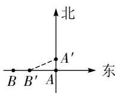  
第 12 题解图

13. 解:(1)设1月份售出B款卫衣m件,
根据题意可得 $100(132-96)+m(104-76)=5560$ ,
解这个方程, 得 m=70,

∴ 1 月份售出 B 款卫衣 70 件；……（5 分）

(2)设这两款卫衣每件应降价 x 元,

根据题意可知 A 款的销量为 $\left(100+\frac{x}{2}\times20\right)$ , B

款的销量为 $\left(70+\frac{x}{2}\times16\right)$ ,

则 $(132-x-96)(100+\frac{x}{2}\times20)+(104-x-76)$ (70

$$
+ \frac {x}{2} \times 1 6) = 7 3 9 6,
$$

整理得 $x^{2}-23x+102=0$ ,

解这个方程, 得 $x_{1}=17, x_{2}=6$ ,

∵要尽量让利于顾客，

∴ 这两款卫衣每件应该降价 17 元. ……

……（12分）

# 专题 一元二次方程根的判别式及根与系数的关系

# 一题多设问

例 解:(1)当 m=-2 时,原方程为 $x^{2}-4x+13=0$ ,

此时 $\Delta=(-4)^{2}-4\times1\times13=-36<0,$

∴该方程无解；

(2)∵方程的判别式的值为12,

$$
\therefore \Delta = (2 m) ^ {2} - 4 (m ^ {2} - 4 m + 1) = 1 6 m - 4 = 1 2,
$$

解这个方程, 得 m=1, ∴ 原方程为 $x^{2}+2x-2=0$ ,

$$
\therefore (x + 1) ^ {2} = 3,
$$

解这个方程, 得 $x_{1}=\sqrt{3}-1$ , $x_{2}=-\sqrt{3}-1$ ;

(3) 根据题意得 $\Delta = 4m^{2} - 4(m^{2} - 4m + 1) = 16m - 4 \geqslant 0$ ,

解这个不等式, 得 $m \geqslant \frac{1}{4}$ .

∴ m 的取值范围是 $m \geqslant \frac{1}{4}$ ;

(4) $\because x_{1},x_{2}$ 是方程的两实数根，

$$
\therefore x _ {1} + x _ {2} = - 2 m, x _ {1} x _ {2} = m ^ {2} - 4 m + 1,
$$

$$
\because x _ {1} ^ {2} + x _ {2} ^ {2} + x _ {1} x _ {2} = \left(x _ {1} + x _ {2}\right) ^ {2} - x _ {1} x _ {2} = 3,
$$

$$
\therefore (- 2 m) ^ {2} - m ^ {2} + 4 m - 1 = 3,
$$

$$
\therefore 3 m ^ {2} + 4 m - 4 = 0,
$$

$$
\because \Delta = 1 6 - 4 \times 3 \times (- 4) = 6 4 > 0,
$$

$\therefore m=\frac{-4\pm\sqrt{64}}{6}=\frac{-4\pm8}{6}$ ，结合(3)中 $m\geqslant\frac{1}{4}$ 时方程有实数根，

可得 $m=\frac{2}{3}$ .

# 综合训练

1. 解: (1) ∵ 方程中 $a=1, b=-\left(k+2\right), c=2k$ ,

$$
\therefore b ^ {2} - 4 a c = [ - (k + 2) ] ^ {2} - 4 \times 2 k = (k - 2) ^ {2} \geqslant 0,
$$

∴ k 的取值范围为任意实数；

(2)由题意得 $x_{1} + x_{2} = k + 2, x_{1}x_{2} = 2k$

$$
\because \left(x _ {1} ^ {2} + 2\right) \left(x _ {2} ^ {2} + 2\right) = 1 8,
$$

$$
\therefore \left(x _ {1} x _ {2}\right) ^ {2} + 2 \left(x _ {1} ^ {2} + x _ {2} ^ {2}\right) + 4 = 1 8,
$$

$$
\therefore \left(x _ {1} x _ {2}\right) ^ {2} + 2 \left[ \left(x _ {1} + x _ {2}\right) ^ {2} - 2 x _ {1} x _ {2} \right] = 1 4,
$$

即 $(2k)^{2}+2\left[(k+2)^{2}-4k\right]=14$

整理得 $6k^{2}-6=0$ ,

解这个方程, 得 $k = \pm 1$ .

# 专题 一元二次方程与图形面积问题 教材原题改编练

教材原题 解: 设道路的宽为 $x \, m$ , 根据题意可得 $(35 - x)(26 - x) = 850$ ,

整理得 $x^{2}-61x+60=0$ ,

解这个方程, 得 $x_{1}=1, x_{2}=60$ (不合题意, 舍去),
∴ 道路的宽应为 1 m.

改编 1 解: 设道路的宽为 x m, 根据题意可得 (11-x) (6-2x) = 40,

整理得 $x^{2}-14x+13=0$ ,

解这个方程, 得 $x_{1}=13$ (不合题意, 舍去), $x_{2}=1$ ,
∴ 道路的宽应为 1 m.

改编 2 解: 设小路的宽为 x m, 根据题意可得 (16-x) (10-x) = 135,

整理得 $x^{2}-26x+25=0$ ,

解这个方程, 得 $x_{1}=25$ (不合题意, 舍去), $x_{2}=1$ ,
∴ 小路的宽度为 1 m.

改编 3 解: 设建成后正方形的边长为 x m,

则 AB = x - 4, AD = x - 6,

根据题意可得 $(x-4)(x-6)=49$ ,

整理得 $x^{2}-10x-25=0$ ,

解这个方程, 得 $x_{1}=5+5\sqrt{2}$ , $x_{2}=5-5\sqrt{2}$ (不合题意, 舍去),

∴建成后正方形的面积为 $(75+50\sqrt{2})\ m^{2}$ .

# 综合训练

1. 解: 设剪掉的正方形纸片的边长为 $x \, cm$ ,

由题意得 $(30-2x)(20-2x)=264$ ,

整理得 $x^{2}-25x+84=0$ ,

解这个方程, 得 $x_{1}=4, x_{2}=21$ (不合题意, 舍去),

∴ 剪掉的正方形的边长为 4 cm.

# 第三章 概率的进一步认识

# 周测 6 概率的计算及频率估计概率

1. A 【解析】画树状图如解图,共有3种等可能情况, $\therefore P(\text{第一批选中八年级})=\frac{1}{3}.$

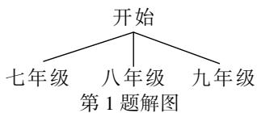

flowchart

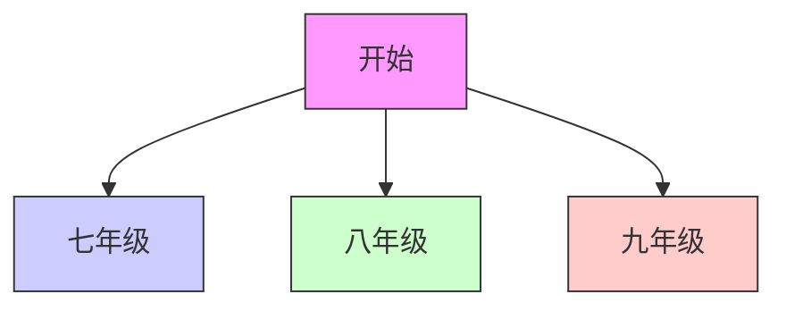

2. C 【解析】将 2 名男生分别记为男 1, 男 2, 列表如下, 共有 6 种等可能的结果, 其中恰好选中 1 名男生 1 名女生的结果有 4 种, ∴ P (恰好选中 1 名男生 1 名女生) = $\frac{4}{6}$ = $\frac{2}{3}$ .

<table><tr><td></td><td>男1</td><td>男2</td><td>女</td></tr><tr><td>男1</td><td></td><td>男1,男2</td><td>男1,女</td></tr><tr><td>男2</td><td>男2,男1</td><td></td><td>男2,女</td></tr><tr><td>女</td><td>女,男1</td><td>女,男2</td><td></td></tr></table>

3. B 【解析】设报名表中七年级(1)班的学生人数为 x, 根据题意, 得 $\frac{x}{350} \times 100\% = 10\%$ , 解这个方程, 得 x = 35, 即七年级(1)班学生的报名人数约为 35.

4. A 【解析】根据题意,画树状图如解图,共有12种等可能的结果,其中白菜与辣椒不相邻的结果有4种, $\therefore P(\text{白菜与辣椒两种蔬菜不相邻})=\frac{4}{12}=\frac{1}{3}.$

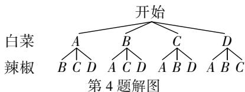

flowchart

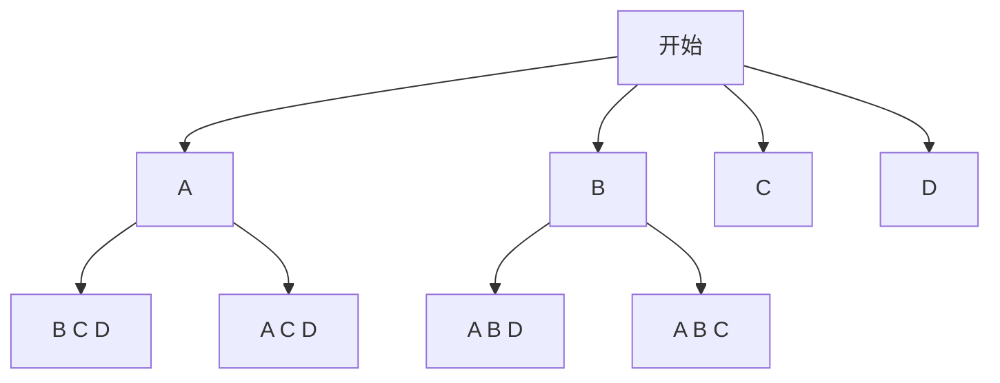

5. A 【解析】∵ 转盘 A 红色区域的扇形圆心角度数为 $120^{\circ}$ , ∴ 转盘 A 蓝色区域是红色区域的 2 倍, 画树状图如解图:

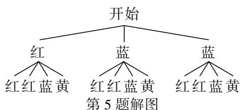

flowchart

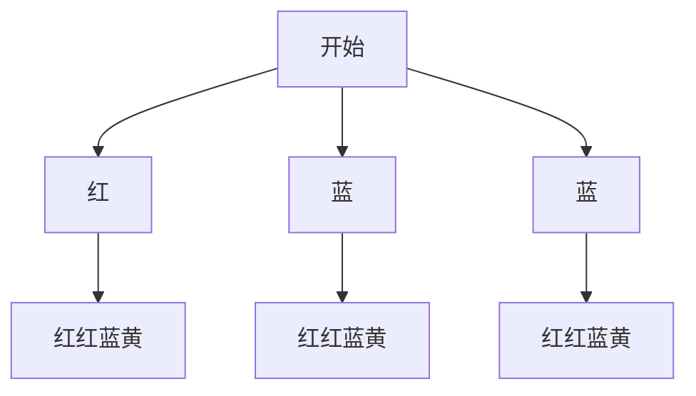

共有 12 种等可能的结果,其中一个转出蓝色,另一个转出黄色的结果有 2 种, $\therefore P((3)$ 班除草 $)=\frac{2}{12}=\frac{1}{6}.$

6. 0.67

7. $\frac{2}{7}$ 【解析】由图可得共有7条路径,有食物的路径为2条, $\therefore P(\text{它获取食物})=\frac{2}{7}$ .

8. $\frac{1}{4}$ 【解析】记“冲施肥”为 $A$ , “叶面肥”为 $B$ , 画树状图如解图:

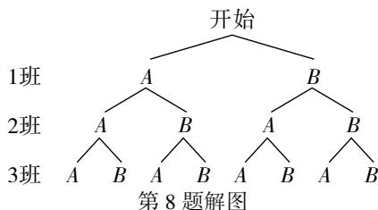

flowchart

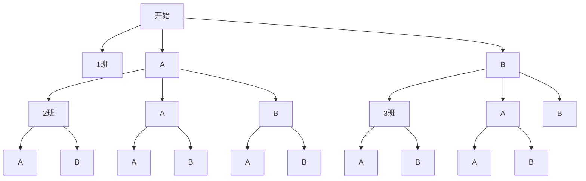

共有 8 种等可能结果,三个班级恰好买到同一种类肥料的结果为 2 种, $\therefore P$ (三个班级恰好买到同一种类肥料) $=\frac{2}{8}=\frac{1}{4}$ .

9. 解: 列表如下:

<table><tr><td></td><td>A</td><td>a</td><td>B</td><td>b</td></tr><tr><td>A</td><td></td><td>(A,a)</td><td>(A,B)</td><td>(A,b)</td></tr><tr><td>a</td><td>(a,A)</td><td></td><td>(a,B)</td><td>(a,b)</td></tr><tr><td>B</td><td>(B,A)</td><td>(B,a)</td><td></td><td>(B,b)</td></tr><tr><td>b</td><td>(b,A)</td><td>(b,a)</td><td>(b,B)</td><td></td></tr></table>

(4分)由列表可得,共有12种等可能的情况,其中两瓶溶液一瓶变色、一瓶不变色的情况有 $(B,A)$ , $(b,A)$ , $(B,a)$ , $(b,a)$ , $(A,B)$ , $(a,B)$ , $(A,b)$ , $(a,b)$ 共8种,

∴ P(两瓶溶液一瓶变色、一瓶不变色) = $\frac{8}{12}$ = $\frac{2}{3}$ .
……（8分）

10. 解: (1) 分别用 A 代表“石头”, B 代表“剪刀”, C 代表“布”, 画树状图如解图,

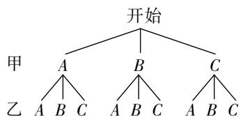

flowchart

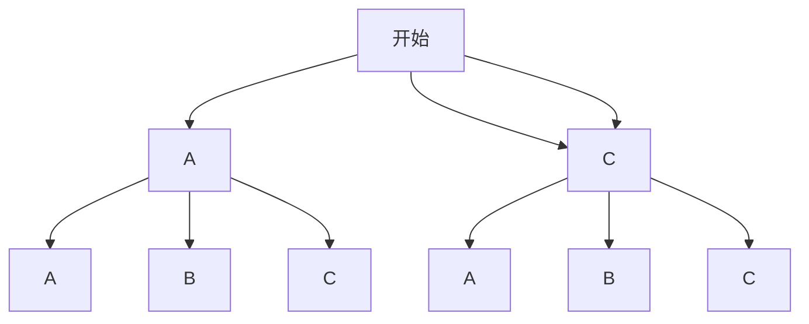

第 10 题解图

由树状图可知共有9种等可能的结果；……
……（4分）

(2) 公平, …… (5 分)

理由如下:由(1)可知,共有9种等可能的结果,其中甲获胜的有AB,BC,CA共3种,乙获胜的结果有AC,BA,CB共3种,

∴ $P(\text{甲获胜})=\frac{3}{9}=\frac{1}{3}, P(\text{乙获胜})=\frac{3}{9}=\frac{1}{3},$

∴ 这个游戏对双方公平. …… (8 分)

# 第四章 图形的相似

# 周测 7 平行线分线段与相似多边形

1. B 【解析】∵ 线段 a, b, c, d 是成比例线段, ∴ $\frac{a}{b} = \frac{c}{d}$ , ∴ $d = c \cdot \frac{b}{a} = 6 \times \frac{1}{3} = 2$ .

2. D 【解析】A. 两图形形状相同, 是相似图形, 不符合题意; B. 两图形形状相同, 是相似图形, 不符合题意; C. 两图形形状相同, 是相似图形, 不符合题意; D. 两图形形状不一定相同, 不一定是相似图形, 符合题意.

3. C 【解析】设该地的实际面积为 $x \, cm^{2}$ ，由题意得 $100: x = (1:500)^{2}$ ，解得 $x = 2.5 \times 10^{7}$ ， $2.5 \times 10^{7} \, cm^{2} = 2500 \, m^{2}$ .

4. C 【解析】∵ $\frac{AD}{DB} = \frac{AE}{CE}$ , ∴ $DE \parallel BC$ , 选项 A 不符合题意; ∵ $\frac{AD}{AB} = \frac{AE}{AC}$ , ∴ $DE \parallel BC$ , 选项 B 不符合题意; 由 $\frac{DE}{BC} = \frac{AD}{AB}$ 不能判定 $DE \parallel BC$ , 选项 C 符合题意; ∵ $\frac{BD}{AB} = \frac{CE}{AC}$ , ∴ $DE \parallel BC$ , 选项 D 不符合题意.

5. D 【解析】设点 P 的坐标为 $(m,0)$ (m>0)，则
OP=m,∵△DOP∽△CDO,∴ $\frac{OD}{DC}=\frac{OP}{DO}$ ，即 $\frac{4}{6}=$ $\frac{m}{4}$ ，解得 $m = \frac{8}{3}$ ，∵ 在 Rt $\triangle AOD$ 中，AD = $\sqrt{AO^{2}+OD^{2}}=5,AP=3+\frac{8}{3}=\frac{17}{3},\therefore\frac{AP}{AD}=\frac{17}{15}.$

6. B 【解析】∵ $BN \parallel AM, \frac{PA}{PB} = \frac{4}{3}, AB = 3, \therefore \frac{PM}{PN} = \frac{4}{3}, PB = 9, \because BC = 1, \therefore PC = 8, \because DN \parallel CM, \frac{PC}{PD} = \frac{PM}{PN} = \frac{4}{3}, \therefore PD = 6.$

7. -4 【解析】设 $x = a$ ，则 $y = 2a$ ， $\therefore \frac{2x + y}{x - y} = \frac{4a}{-a} = -4.$

8. 4:7 【解析】∵ DE∥BC, EF∥AB, ∴ BD:DA = CE:EA, BF:FC = AE:EC, ∴ BF:FC = DA:BD,

$$
\begin{array}{l} \because B D: D A = 3: 4, \therefore B F: F C = 4: 3, \therefore B F: B C = \\ 4: 7. \end{array}
$$

9. 6 【解析】∵ $l_{1} \parallel l_{2} \parallel l_{3} \parallel l_{4} \parallel l_{5} \parallel l_{6}$ , ∴ $\frac{PF}{FB} = \frac{PE}{EA} = \frac{2}{3}$ , ∵ PA = 10, ∴ $\frac{10 - EA}{EA} = \frac{2}{3}$ , ∴ EA = 6.

10. 0.2 【解析】设中心字画长为 x, ∵ 内外两个矩形相似, ∴ $\frac{1.2}{x} = \frac{0.6}{0.4}$ , 解得 x = 0.8. 则左右两侧间距为 0.2 m.

11. 解: (1) 设 $\frac{a}{2} = \frac{b}{3} = \frac{c}{4} = k (k \neq 0)$ ，则 a = 2k, b = 3k, c = 4k, $\therefore \frac{a+2b}{3c}=\frac{2k+6k}{12k}=\frac{8k}{12k}=\frac{2}{3};\cdots\cdots(4分)$

(2)∵ $\triangle ABC$ 的周长为 36，
∴ 由(1)可得, $2k+3k+4k=36$ ,

解得 k=4，

∴ $\triangle ABC$ 各边的长度为 8,12,16. …… (8 分)

12. 证明: $\because EF \parallel BD, AC \parallel BD, \therefore AC \parallel EF$ ,

$$
\therefore \frac {B E}{B C} = \frac {B F}{B A}, ① \dots\dots(3 \text {分})
$$

$$
\frac {A E}{A D} = \frac {A F}{A B}, ② \dots\dots(5 \text {分})
$$

①+②, 得 $\frac{BE}{BC} + \frac{AE}{AD} = \frac{BF}{BA} + \frac{AF}{AB} = \frac{AB}{AB} = 1$ , …… (7 分)

$$
\therefore \frac {A E}{A D} + \frac {B E}{B C} = 1. \quad \dots\dots\tag {10分}
$$

13. 解:选择乙同学的设计方案.

理由如下:如解图①,设甲同学的设计方案中剪下的小矩形的宽 CE=x,

∵ 原矩形的长与宽之比为 6:2=3:1,

$$
\therefore C F = 3 x, \therefore B F = B C - C F = 6 - 3 x,
$$

$$
\therefore B G = \frac {1}{3} B F = \frac {6 - 3 x}{3} = 2 - x,
$$

∴ 甲同学的设计方案中两个矩形的周长之和为 $2(2-x+6-3x)+2(3x+x)=16$ ; …… (8 分)

大小卷·九年级(全一册) 数学 BS

如解图②, 设 CE = y, 同理可得剪下的两个矩形的周长之和为 $2(y + 3y) + 2(6 - y + \frac{6 - y}{3}) = \frac{16}{3}y + 16$ , …… (10 分) $\because 0 < 3y \leqslant 2,$

∴ $0 < y \leqslant \frac{2}{3}$ ，当 $y = \frac{2}{3}$ 时，两个矩形的周长之和最大，最大值为 $\frac{176}{9}$ .

$$
\because \frac {1 7 6}{9} > 1 6,
$$

∴ 选择乙同学的设计方案剪下的两个矩形的周长之和最大. …… (12 分)

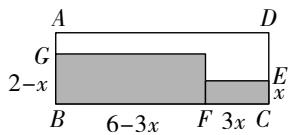

text_image

A
G
2-x
B 6-3x F 3x C
D
E
x

图①

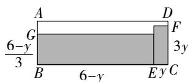

text_image

A
G
6-y
3
B
6-y
E
C
D
F
3y

图②  
第 13 题解图

# 周测8 相似三角形的判定

1. C 【解析】A. 两角分别相等的两个三角形相似, 不符合题意; B. 三边成比例的两个三角形相似, 不符合题意; C. 两边成比例, 对角相等的两个三角形不一定相似, 符合题意; D. 两边成比例且夹角相等的两个三角形相似, 不符合题意.

2. C 【解析】小明的做法添加条件 $\angle ABD = \angle C$ 后, 利用两角分别相等, 从而证明出两个三角形相似, ∴ 小明的做法正确; 小林添加条件 $\frac{AB}{AC} = \frac{BD}{CB}$ 后, 要证明 $\triangle ADB \sim \triangle ABC$ , 需证明夹角 $\angle C = \angle ABD$ , 而 $\angle A$ 不是成比例两边的夹角, ∴ 小林的做法错误.

3. D 【解析】∵ $\frac{OC}{OA} = \frac{OD}{OB} = \frac{2}{3}$ , $\angle COD = \angle AOB$ ,
∴ $\triangle COD \sim \triangle AOB, \therefore \frac{CD}{AB} = \frac{2}{3}.$ ∵ CD = 6 cm, ∴ AB = 9 cm.

4.1 C 【解析】∵ $\angle ADE = \angle B, \angle EAD = \angle CAB,$ ∴ $\triangle ADE \sim \triangle ABC, \therefore \frac{DE}{BC} = \frac{AD}{AB}, \therefore AD \cdot BC = DE \cdot AB, \because DE = 2, AB = 5, \therefore AD \cdot BC = 2 \times 5 = 10.$

4.2 C 【解析】∵ 四边形 ABCD 是矩形, ∴ $AB \parallel DC$ , $\angle D = 90^{\circ}$ , ∴ $\angle ECF = \angle BAF$ , $\angle CEF = \angle ABF$ , ∴ $\triangle ABF \sim \triangle CEF$ , ∴ $\frac{AB}{CE} = \frac{AF}{CF}$ , 又∵ AD = 3, AB = 4. 由勾股定理得, $AC = \sqrt{AD^{2} + CD^{2}} = 5$ , ∴ $AF + CF = 5$ , ∵ E 是 CD 边的中点 ∴ CE = 2, ∴ $\frac{4}{2} = \frac{5 - CF}{CF}$ , 解得 $CF = \frac{5}{3}$ .

5. D 【解析】如解图①, 过点 F 作 FH//AB 交 DE 于点 H, ∵ F 是 AE 的中点, ∴ FH 是 △EAD 的中位线, $FH = \frac{1}{2}AD$ . ∵ BD = 2AD, ∴ $FH = \frac{1}{4}BD$ , ∵ FH//AB, ∴ △GHF ∽ △GDB, ∴ $\frac{FH}{BD} = \frac{FG}{BG}$ , 即 $\frac{1}{4} = \frac{FG}{BG}$ , ∵ BF = 3, ∴ $BG = \frac{4}{5}BF = \frac{4}{5} \times 3 = \frac{12}{5}$ .

【一题多解法】解题思路:如解图②,过点 A 作 $AH \parallel FB$ , 交 ED 的延长线于点 H, 易得 FG 是 $\triangle EAH$ 的中位线, 再通过证 $\triangle ADH \sim \triangle BDG$ 得到 AH 和 BG 的数量关系即可求解.

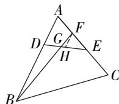  
图①

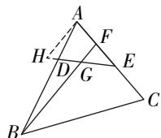  
图②  
第 5 题解图

6. 点 B 【解析】依次连接 E, G 与其它各点, ∵ $\triangle EFG$ 为等腰直角三角形, ∴ 其相似三角形必然也是等腰直角三角形, 观察图形可知, 点 B 符合题意.

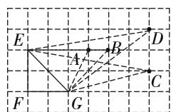

text_image

E
A
B
D
C
F
G

第6题解图

7.8 【解析】根据题意可知该演员下半身约为 $170 - 68 = 102(\mathrm{cm})$ ，设该舞蹈演员需要踮起脚

尖的高度为 $x \mathrm{~cm}$ , 则根据题意可得, $\frac{68}{102 + x} = \frac{\sqrt{5} - 1}{2}$ , 解得 $x \approx 8$ , 经检验为 $x = \frac{258 - 102\sqrt{5}}{\sqrt{5} - 1} \approx 8$ 是此方程的解, 即她需要踮起脚尖的高度约为 $8 \mathrm{~cm}$ .

8. $\frac{\sqrt{5} - 1}{2} a$ 或 $\frac{3 - \sqrt{5}}{2} a$ 【解析】若演员最终站定在点 $C$ 的位置, 此时 $\frac{AC}{AB} = \frac{BC}{AC} = \frac{\sqrt{5} - 1}{2}, \therefore AC = (\frac{\sqrt{5} - 1}{2} a)$ 米; 若站定在点 $D$ 的位置, 此时 $\frac{BD}{AB} = \frac{AD}{BD} = \frac{\sqrt{5} - 1}{2}, \therefore BD = (\frac{\sqrt{5} - 1}{2} a)$ 米, $\therefore AD = a - BD = (\frac{3 - \sqrt{5}}{2} a)$ 米, 演员站定后距离点 $A\frac{\sqrt{5} - 1}{2} a$ 米或 $\frac{3 - \sqrt{5}}{2} a$ 米.

9. 10 【解析】∵ $DE \perp BC, BD \perp AC$ , ∴ $\angle BDC = \angle DEC = 90^\circ$ , 又∵ $\angle BCD = \angle DCE$ , ∴ $\triangle BDC \sim \triangle DEC$ , ∴ $\frac{CD}{CE} = \frac{CB}{CD}$ , ∵ $CE = 1, BE = 4$ , ∴ $CB = 5$ , ∴ $CD = \sqrt{5}$ , 在 Rt△BDC 中, 由勾股定理得, $BD = \sqrt{BC^2 - CD^2} = 2\sqrt{5}$ , ∵ $DE \perp BC$ , $\angle ABC = 90^\circ$ , ∴ $DE // AB$ , ∴ $\frac{CE}{BE} = \frac{CD}{AD} = \frac{1}{4}$ , ∴ $AD = 4\sqrt{5}$ , ∴ $S_{\triangle ABD} = \frac{1}{2} AD \cdot BD = 20$ , 又∵ $F$ 为 $AB$ 的中点, ∴ $S_{\triangle AFD} = \frac{1}{2} S_{\triangle ABD} = 10$ .

10. 证明：∵ AB = AC, ∴ ∠ABC = ∠ACB,

∵ 点 D, E, B, C 同一条直线上，

∴ $\angle ABD = \angle ACE$ , …… (4 分)

又 $\because AB^{2}=BD\cdot CE,$

$\therefore \frac{AB}{CE}=\frac{BD}{AB}$ ，即 $\frac{AB}{EC}=\frac{BD}{CA}$

∴ $\triangle ABD \sim \triangle ECA.$ …… (8 分)

11. (1) 证明: $\because$ 四边形 $ABCD$ 是矩形,

$$
\therefore \angle D C F = \angle A B C = 9 0 ^ {\circ},
$$

$$
\therefore \angle B A E + \angle A E B = 9 0 ^ {\circ},
$$

$$
\because A E \perp D F, \therefore \angle C F D + \angle A E B = 9 0 ^ {\circ},
$$

$$
\therefore \angle B A E = \angle C F D.
$$

$$
\begin{array}{r l} \because \angle D C F = \angle A B E = 9 0 ^ {\circ}, \therefore \triangle C D F \sim \triangle B E A; \\ & \dots \dots (5 分) \end{array}
$$

(2)∵ 四边形 ABCD 是矩形,

$$
\therefore C D = A B = 3, B C = A D = 6, \angle C = 9 0 ^ {\circ},
$$

在 Rt△CDF, $CF=\sqrt{DF^{2}-CD^{2}}=\sqrt{(3\sqrt{10})^{2}-3^{2}}=9$ ,
由(1)知， $\triangle CDF \sim \triangle BEA$ ，

$\therefore \frac{CD}{BE}=\frac{CF}{BA},$ 即 $\frac{3}{BE}=\frac{9}{3},$

解得 BE=1，

$$
\therefore C E = B C - B E = 5. \quad \dots\dots (1 0 \text {分})
$$

12. 解: (1) $\because BC = BA$ ,

$$
\therefore \angle B C A = \angle B A C,
$$

$$
\because \angle O A C = \angle O C B,
$$

$$
\therefore \angle O A B = \angle O C A,
$$

$$
\because \angle O B A = \angle O A C,
$$

$$
\therefore \triangle B A O \sim \triangle A C O,
$$

$$
\therefore \frac {B O}{A O} = \frac {A O}{C O},
$$

$$
\therefore A O ^ {2} = B O \cdot C O; \quad \dots\dots (6 \text {分})
$$

(2)如解图,过点 B 作 $BD \perp CA$ 于点 D,

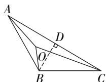  
第 12 题解图

$$
\because B C = B A, \angle B A C = 3 0 ^ {\circ},
$$

$$
\therefore \angle B C A = \angle B A C = 3 0 ^ {\circ}, C D = A D = \frac {1}{2} C A,
$$

$$
\therefore A B = 2 B D, A D = \sqrt {3} B D,
$$

$$
\therefore C A = 2 A D = 2 \sqrt {3} B D,
$$

$$
\because \angle O A C = \angle O C B,
$$

$$
\therefore \angle O A B = \angle O C A.
$$

$$
\because \angle O B A = \angle O A C,
$$

$$
\therefore \triangle B A O \sim \triangle A C O,
$$

$$
\therefore \frac {B O}{A O} = \frac {A O}{C O} = \frac {A B}{C A} = \frac {2 B D}{2 \sqrt {3} B D} = \frac {\sqrt {3}}{3},
$$

$$
\because B O = 2,
$$

$$
\therefore A O = 2 \sqrt {3}, C O = 6,
$$

$$
\therefore \frac {B O}{C O} = \frac {1}{3}. \dots\dots(1 2 \text {分})
$$

# 周测 9 相似三角形的性质与位似

1. D

2. B 【解析】∵ $\triangle ABC$ 与 $\triangle DEF$ 的相似比为 1:4,
∴ $\triangle ABC$ 与 $\triangle DEF$ 的对应角平分线的比为 1:4.

3. C 【解析】由题意可知,相似三角形的边长之比=相似比= $3:(3+6)=1:3$ ,所以面积之比= $(1:3)^{2}=1:9$ ,所以打印出的三角形的面积是原图中三角形面积的9倍.

4. B 【解析】∵ 根据题意可知 $\triangle OAB \sim \triangle OA'B'$ , $\triangle OAC \sim \triangle OA'C', \therefore \frac{AB}{A'B'} = \frac{OA}{OA'} = \frac{OC}{OC'}$ , 即 $\frac{0.049}{4.9} = \frac{0.05}{OC'}$ , $\therefore OC' = 5 \, m.$

5. B 【解析】如解图,作射线 AD,BE,CF,它们交于同一点(1,2),即位似中心的坐标为(1,2).

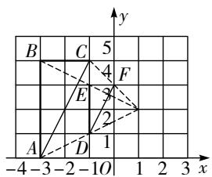

text_image

B C 5
4 F
E 3
2
A D 1
-4 -3 -2 -10 1 2 3 x

第 5 题解图

6. A 【解析】根据题意, 得 $\triangle ABP \sim \triangle CDP, \therefore \frac{CD}{AB} = \frac{PD}{PB}$ , 故 $CD = \frac{PD \cdot AB}{PB} = \frac{52 \times 1.5}{2} = 39$ (米), ∴ 该大厦的高度为 39 米.

7. 6 【解析】∵ Rt△ABC ∼ Rt△EFG, BD 和 FH 均为斜边上的中线, ∴ $\frac{AB}{EF} = \frac{BD}{FH}$ , 又∵ EF = 2AB, BD = 1.5 cm, 故 $\frac{1}{2} = \frac{1.5}{FH}$ , 解得 FH = 3, ∴ EG = 2FH = 6 cm.

8. 12 或 27 【解析】∵ 两个相似三角形面积比是 4:9, ∴ 两个相似三角形的相似比是 2:3, 两个相似三角形的周长比是 2:3, ∵ 一个三角形的周长为 18, 设另一个三角形周长为 x, ∴ 18:x = 2:3 或 x:18=2:3, 解得 x=27 或 x=12, ∴ 另一个三角形的周长是 12 或 27.

9. 40 【解析】由题意得 $AD = 80, DE = 45, AC = 15$ . $\because AC \parallel DE, \therefore \angle BAC = \angle BDE = 90^{\circ}, \because B, C, E$ 三点

在同一条直线上, $\therefore\angle BCA=\angle BED,\therefore\triangle BAC\sim\triangle BDE,\therefore\frac{AB}{DB}=\frac{AC}{DE},\therefore\frac{AB}{AB+AD}=\frac{AC}{DE},\therefore\frac{AB}{AB+80}=\frac{15}{45}$ ,解得AB=40,因此,小刚在点A处时他与电线塔的距离为40米.

10. $\frac{3^{2024}}{2^{2025}}$ 【解析】∵ 四边形 AOCB 为矩形, OA=2,
OC=1, ∴ 矩形 AOCB 的对角线交点的纵坐标为 $\frac{1}{2}$ . ∵ 在第二象限内, 将矩形 AOCB 以原点 O 为位似中心放大为原来的 $\frac{3}{2}$ 倍, ∴ 矩形 $A_{1}OC_{1}B_{1}$ 的对角线交点的纵坐标为 $\frac{1}{2}\times\frac{3}{2},\cdots$ , ∴ 矩形 $A_{2024}OC_{2024}B_{2024}$ 的对角线交点的纵坐标为 $\frac{1}{2}\times\left(\frac{3}{2}\right)^{2024}=\frac{3^{2024}}{2^{2025}}$ .

11. 解: (1) 由题图可知, $S_{\triangle ABC} = \frac{1}{2} \times 6 \times 2 = 6$ ,

∵ $\triangle ABC$ 与 $\triangle DEF$ 相似,且相似比为 3:1,

$$
\therefore S _ {\triangle A B C}: S _ {\triangle D E F} = 9: 1,
$$

$\therefore S_{\triangle DEF} = \frac{6}{9} = \frac{2}{3}$ （4分）

(2) $\triangle AB_{1}C_{1}$ 如解图①所示；……（7分）

(3) $\triangle PBQ$ 如解图②所示. …… (10 分)

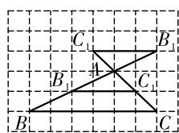

text_image

C₁
B₁
A
B₁
C₁
B
C

图①

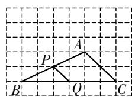  
图②  
第 11 题解图

12. (1) 证明: ∵ 四边形 ABCD 为矩形,

$$
\therefore \angle B = \angle C = \angle D = 9 0 ^ {\circ}, A B = C D, A D = B C.
$$

由折叠的性质可知, $\angle APO = \angle B = 90^{\circ}$ , PO = BO,

$$
\therefore \angle A P D + \angle C P O = 9 0 ^ {\circ},
$$

$$
\because \angle A P D + \angle D A P = 9 0 ^ {\circ},
$$

$$
\therefore \angle D A P = \angle C P O,
$$

∴ $\triangle OCP \sim \triangle PDA;$ …… (4 分)

(2) 解: $\because \triangle OCP$ 与 $\triangle PDA$ 的面积比为 1:4,

$$
\triangle O C P \sim \triangle P D A,
$$

$$
\therefore \frac {C P}{D A} = \frac {C O}{D P} = \frac {1}{2},
$$

$$
\therefore A D = 2 C P, D P = 2 C O,
$$

$$
\because A D = 8,
$$

$$
\therefore C P = 4.
$$

∵ 在 Rt△PCO 中, $PO^{2}=CO^{2}+CP^{2}$ ,

$$
\therefore (8 - C O) ^ {2} = C O ^ {2} + 1 6,
$$

$$
\therefore C O = 3, \therefore D P = 2 C O = 6,
$$

$$
\therefore C D = C P + D P = 4 + 6 = 1 0,
$$

∴ AB = 10. …… (10 分)

# 专题 一线三等角问题

# 识别模型

1. 证明：∵ 四边形 ABCD 是矩形，

$$
\therefore \angle A = \angle D = 9 0 ^ {\circ},
$$

$$
\therefore \angle A E F + \angle A F E = 9 0 ^ {\circ}.
$$

$$
\because E F \perp E C,
$$

$$
\therefore \angle F E C = 9 0 ^ {\circ},
$$

$$
\therefore \angle A E F + \angle D E C = 9 0 ^ {\circ},
$$

$$
\therefore \angle A F E = \angle D E C,
$$

$$
\therefore \triangle A E F \sim \triangle D C E.
$$

2. 证明：∵ $\triangle ABC$ 为等边三角形，

$$
\therefore \angle B = \angle C = 6 0 ^ {\circ}.
$$

$$
\because \angle A D E = 6 0 ^ {\circ}, \therefore \angle A D E = \angle B = \angle C, \text {且} \angle A D B
$$

$$
+ \angle C D E = 1 8 0 ^ {\circ} - \angle A D E, \angle A D B + \angle B A D = 1 8 0 ^ {\circ}
$$

$$
- \angle B,
$$

$$
\therefore \angle C D E = \angle B A D, \therefore \triangle A B D \sim \triangle D C E,
$$

$$
\therefore \frac {A B}{D C} = \frac {B D}{C E}.
$$

3. 解: 由题意可知, $\angle BCE = \angle EDF = \angle BEF = 90^{\circ}$ ,

$$
\therefore \angle C B E + \angle B E C = 9 0 ^ {\circ}, \angle B E C + \angle D E F = 9 0 ^ {\circ},
$$

$$
\therefore \angle C B E = \angle D E F,
$$

$$
\therefore \triangle B C E \sim \triangle E D F,
$$

$$
\therefore \frac {B C}{E D} = \frac {C E}{D F}.
$$

$$
\because B C = C D = A B = 4, C E = 2,
$$

∴ DE = DC + CE = 2 + 4 = 6，即 $\frac{4}{6} = \frac{2}{DF}$ ,

$$
\therefore D F = 3.
$$

4. 解: $\because \angle1 = \angle2, \therefore \angle CAP = \angle PBD,$

$$
\because \angle 2 = \angle D + \angle D P B, \angle 2 = \angle 3,
$$

$$
\therefore \angle 3 = \angle D + \angle D P B,
$$

$$
\because \angle 3 = \angle D P B + \angle C P A, \therefore \angle D = \angle C P A,
$$

$$
\therefore \triangle A C P \sim \triangle B P D.
$$

$$
\therefore \frac {A C}{B P} = \frac {A P}{B D},
$$

设 $BP$ 的长为 $x$ , 则 $AP = x + 2, \therefore \frac{8}{x} = \frac{x + 2}{10}$ ,

解得 $x_{1}=8, x_{2}=-10$ (舍去),

∴ BP 的值为 8.

5. 解: 如解图, 过点 C 作 $CE \perp x$ 轴于点 E,

则 $\angle AOB = \angle ABC = \angle CEB = 90^{\circ}$ ,

$$
\because \angle O B A + \angle O A B = 9 0 ^ {\circ}, \angle O B A + \angle E B C = 9 0 ^ {\circ},
$$

$$
\therefore \angle O A B = \angle E B C,
$$

$$
\therefore \triangle A O B \sim \triangle B E C, \therefore \frac {O A}{E B} = \frac {O B}{E C},
$$

$$
\because A (0, 6), C (5, 1), \therefore O A = 6, E C = 1,
$$

设 OB = x，则 BE = 5 - x，

则 $\frac{6}{5 - x} = \frac{x}{1}$ 解得 $x_{1} = 2, x_{2} = 3$

即 OB=2 或 3, AB=2BC 或 AB=3BC.

当 OB=2 时, $BC=\sqrt{BE^{2}+CE^{2}}=\sqrt{3^{2}+1^{2}}=\sqrt{10}$ ,

$AB=2BC=2\sqrt{10}$ ，矩形面积为 $AB \cdot BC=20$ ;

当 OB=3 时, $BC=\sqrt{BE^{2}+CE^{2}}=\sqrt{2^{2}+1^{2}}=\sqrt{5}$ ,

$AB=3BC=3\sqrt{5}$ ，矩形面积为 $AB \cdot BC=15$ ，

∴ 矩形面积为 15 或 20.

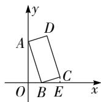  
第 5 题解图

# 综合训练

6. 解: 如解图, 在 BC 上取点 M, 使得 BM = BF, 连接 FM.

∵ 四边形 ABCD 为平行四边形, $\angle BAD = 120^{\circ}$ ,

$$
\therefore \angle B = 6 0 ^ {\circ}, \angle C = 1 2 0 ^ {\circ},
$$

∴ $\triangle FMB$ 为等边三角形，

$$
\therefore F M = B M, \angle F M B = 6 0 ^ {\circ}, \therefore \angle F M E = 1 2 0 ^ {\circ},
$$

大小卷·九年级(全一册) 数学 BS

$$
\because \angle F E D = 1 2 0 ^ {\circ}, \angle C = 1 2 0 ^ {\circ}.
$$

$$
\therefore \angle F M E = \angle C = 1 2 0 ^ {\circ}, \angle F E M + \angle D E C = 6 0 ^ {\circ},
$$

$$
\angle D E C + \angle E D C = 6 0 ^ {\circ},
$$

$$
\therefore \angle F E M = \angle E D C, \therefore \triangle F M E \sim \triangle E C D,
$$

$$
\therefore \frac {F M}{E C} = \frac {E F}{D E}, \text {即} \frac {F M}{2} = \frac {E F}{2 E F},
$$

$$
\therefore F M = 1, \therefore B F = F M = 1.
$$

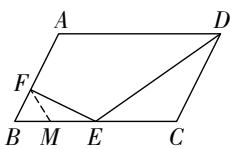  
第6题解图

7. (1) 证明: ∵ 四边形 ABCD 是矩形,

$$
\therefore \angle A D C = \angle B = \angle C = 9 0 ^ {\circ}.
$$

根据折叠的性质可得 $\angle B' = \angle C' = 90^{\circ}, AB = AB'$ , $BC=B'C'$ ,

$$
\therefore \angle A D B ^ {\prime} + \angle E D C ^ {\prime} = \angle A D B ^ {\prime} + \angle D A B ^ {\prime} = 9 0 ^ {\circ},
$$

$$
\therefore \angle E D C ^ {\prime} = \angle D A B ^ {\prime};
$$

(2) 解: 由 (1) 可知, $\angle EDC' = \angle DAB'$ , $\angle B' = \angle C'$ ,

$$
\therefore \triangle D E C ^ {\prime} \sim \triangle A D B ^ {\prime},
$$

$$
\therefore \frac {D E}{A D} = \frac {C ^ {\prime} D}{B ^ {\prime} A}.
$$

$\because \frac{AB}{BC}=\frac{3}{5}$ ，设 $AB=3x(x>0)$ ，则 BC=5x，

$$
\therefore A B ^ {\prime} = 3 x, A D = 5 x, B ^ {\prime} C ^ {\prime} = 5 x
$$

在 Rt△ADB' 中, $B'D=\sqrt{AD^{2}-AB'^{2}}=4x$ ,

$$
\therefore C ^ {\prime} D = B ^ {\prime} C ^ {\prime} - B ^ {\prime} D = x,
$$

$$
\therefore \frac {D E}{A D} = \frac {C ^ {\prime} D}{B ^ {\prime} A} = \frac {x}{3 x} = \frac {1}{3}.
$$

8. 证明: $\because \angle BAD = \angle ACB = \angle ACD = 45^{\circ}, DE \parallel BC$ ,

$$
\therefore \angle C E D = 4 5 ^ {\circ} = \angle B A D.
$$

如解图,在 AC 上取一点 F, 连接 BF, 使得 $\angle CFB = 45^{\circ}$ ,

$$
\because \angle A C B = \angle C F B = 4 5 ^ {\circ},
$$

$\therefore \angle CBF = 90^{\circ}, \triangle BCF$ 为等腰直角三角形，

$$
\therefore B F = B C = 4 \sqrt {2}, C F = 8, \angle B C F = \angle B F C = 4 5 ^ {\circ},
$$

$$
\therefore \angle F B A + \angle B A F = \angle B A F + \angle E A D = 4 5 ^ {\circ}, \angle B F A
$$

$$
= \angle A E D = 1 3 5 ^ {\circ},
$$

$$
\therefore \angle F B A = \angle E A D,
$$

$$
\therefore \triangle F B A \sim \triangle E A D, \therefore \frac {A B}{D A} = \frac {B F}{A E} = \frac {A F}{D E}.
$$

$$
\because \angle C E D = \angle E C D = 4 5 ^ {\circ},
$$

∴ $\triangle CDE$ 为等腰直角三角形，

$$
\therefore C D = D E = 6 \sqrt {2}, C E = 1 2,
$$

$$
\because E F = C E - C F = 1 2 - 8 = 4,
$$

$$
\therefore A F = A E + E F = A E + 4, \therefore \frac {B C}{A E} = \frac {A E + 4}{D E}.
$$

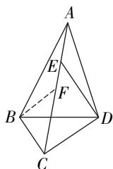

text_image

A
E
F
B
C
D

第8题解图

9. 解: 如解图, 在 AB 上取两点 G, H, 连接 EG, FH, 使 BG = BE, HF = AF,

则 $\triangle BEG$ 和 $\triangle AFH$ 为等腰直角三角形，

$$
\therefore \angle F H D = \angle F D E = \angle D G E = 1 3 5 ^ {\circ},
$$

$$
\therefore \angle H F D + \angle H D F = \angle H D F + \angle G D E = 4 5 ^ {\circ},
$$

即 $\angle HFD = \angle GDE, \therefore \triangle FHD \sim \triangle DGE,$

又∵ AB=BC=4, D 为 AB 中点, BG=BE=1,

$$
\therefore D G = B D - B G = 1, E G = \sqrt {2} B G = \sqrt {2},
$$

$$
\therefore \frac {D H}{F H} = \frac {E G}{D G} = \sqrt {2},
$$

设 FH=a，则 $AH=DH=\sqrt{2}a$ ，即 $2\sqrt{2}a=2$ ，

解得 $a=\frac{\sqrt{2}}{2}$ ,

在 Rt△DBE 中, $DE=\sqrt{5}$ ,

$$
\because \frac {D F}{D E} = \frac {F H}{D G} = \frac {\sqrt {2}}{2}, \therefore D F = \frac {\sqrt {1 0}}{2}.
$$

∴ $\triangle AFD$ 的周长为 $AF + AD + FD = \frac{\sqrt{2}}{2} + 2 + \frac{\sqrt{10}}{2} =$

$$
2 + \frac {\sqrt {2} + \sqrt {1 0}}{2}.
$$

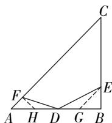

text_image

Geometric diagram with labeled points and lines, showing triangle ABC with internal points D, E, F and auxiliary constructions

第9题解图

# 第五章 投影与视图

# 周测 10 投影与视图

1. B 【解析】当等边三角形木框与阳光平行时,投影是线段;当等边三角形木框与阳光垂直时,投影是等边三角形;当等边三角形木框与阳光有一定角度时,投影是等腰三角形;投影不可能是一个点.

2. A 【解析】月光下树的影子是平行投影, A 说法正确;一个人的影子可以是平行投影或中心投影, B 说法错误;有光,物体和投影面才有影子, C 说法错误;物体的正投影可以改变物体的形状和大小, D 说法错误.

3. D 4. B

5. C 【解析】由图可知, E 视点的盲区应该在三角形 ABC 的区域内.

6. A

7. 中心投影

8. 圆锥

9. 3 【解析】如解图所示,取乒乓球的球心为 B,圆形阴影的圆心为 D,则点 O,B,D 在一条直线上,作 $AB \perp OB$ , $CD \perp OD$ , 点 O,A,C 在一条直线上,由

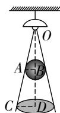

$$
\begin{array}{l} = \frac {1}{2} \times 0. 1 = 0. 0 5 (\mathrm{m}), \because \angle A O B = \angle C O D, \angle A B O \\ = \angle C D O = 9 0 ^ {\circ}, \therefore \triangle O A B \sim \triangle O C D, \therefore \frac {A B}{C D} = \frac {O B}{O D}, \\ \end{array}
$$

题意得 $AB=\frac{1}{2}\times0.04=0.02(m)$ ，CD 第 9 题解图

即 $\frac{0.02}{0.05}=\frac{OB}{OB+1.8}$ ，解得OB=1.2m,∴OD=OB+
1.8=3(m),∴灯泡O距离地面3m.

10. 5 【解析】如解图,俯视图上的数字表示在这个位置上小正方体最少的个数,则组成这个几何体的小正方体的个数最少是5个.

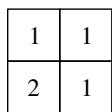

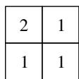  
第 10 题解图

11. 解:

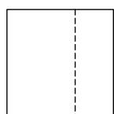  
主视图

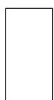  
左视图

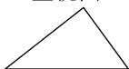  
俯视图  
第 11 题解图

……（5分）

12. 解: (1) 该几何体的主视图、左视图和俯视图如解图①所示; …… (3 分)

  
主视图

  
左视图

  
俯视图  
第 12 题解图①

(2)俯视图上的数字表示在这个位置上小正方体的个数,如解图②,第二排最后小正方体上添加一个;或如解图③,第一排小正方体右边添加一个.(答案不唯一)……(6分)

  
图②

  
图③  
第 12 题解图

13. 解: (1) 圆柱; …… (2 分)

根据几何体的三视图可知圆柱的底面直径为8 cm, 高为16 cm,

∴ 圆柱的表面积为 $2 \times \pi \times 4^{2} + 8\pi \times 16 = 160\pi \, (\text{cm}^{2})$ ; …… (6 分)

(2)根据几何体的三视图可知圆柱的底面直径为8 cm,高为16 cm,

∴ 该圆柱的体积为 $\pi \times 4^{2} \times 16 = 256\pi \, (\text{cm}^{3})$ …
……（9分）

14. 解:(1)如解图,点 O 为灯泡所在的位置,线段 FH 为小亮在灯光下形成的影子;

……（4分）

(2)由题意可得, $AB\parallel DO$ ,

text_image

E
O
B
G
C A D F H

第 14 题解图

$$
\therefore \triangle A B C \sim \triangle D O C, \therefore \frac {A B}{D O} = \frac {C A}{C D}.
$$

即 $\frac{1.6}{DO}=\frac{1.4}{1.4+2.1}$ ,

解得 DO=4.

$\therefore DO-AB=4-1.6=2.4$ （米）.

答:灯泡的高度比小明高 2.4 米. … (10 分)

# 第六章 反比例函数

# 周测11 反比例函数的图象与性质

1. B 【解析】∵ 反比例函数图象位于第一, 三象限内, ∴ k-2>0, ∴ k>2.

2. B 【解析】当 x=2 时, 代入函数表达式中得 y=2, 当 x=-2 时, 可得 y=-2, ∴ (2,2) 在函数图象上.

3. C 【解析】∵ 反比例函数 $y=\frac{k}{x}$ 的图象与经过原点的直线 l 相交于 A, B 两点, ∴ A, B 两点关于原点对称, ∴ A 的坐标为 $(2, \frac{5}{2})$ , ∴ k=5, 函数表达式为 $y=\frac{5}{x}$ .

4. B 【解析】∵ -3<0, ∴ 反比例函数 $y=-\frac{3}{x}$ 的图象位于第二、四象限内，且在每一个象限内，y 随 x 的增大而增大，∵ $y_{1}<y_{2}<0<y_{3}$ ，∴ $x_{3}<0,0<x_{1}<x_{2}$ ，综上所述， $x_{3}<x_{1}<x_{2}$ .

5.1 A 【解析】∵ $S_{\triangle BCO} = \frac{1}{2} \times 6 = 3$ , $S_{\triangle ACO} = \frac{1}{2} \times |k| = \frac{|k|}{2}$ , ∵ $S_{\triangle ACO} : S_{\triangle BCO} = 2 : 1$ , ∴ $\frac{\frac{|k|}{2}}{3} = \frac{2}{1}$ , 解得 $|k| = 12$ , ∵ $y = \frac{k}{x}$ 的函数图象过第二象限, ∴ k < 0, ∴ k = -12.

5.2 D 【解析】∵ 反比例函数 $y=\frac{k}{x}$ 图象经过点 $D(2,4)$ , ∴ $k=2\times4=8$ , AD=4, ∴ 反比例函数的表达式为 $y=\frac{8}{x}$ , ∵ 四边形 ABCD 是矩形, ∴ BC=AD=4, 点 C 的纵坐标为 4, ∵ CE=2BE, ∴ BE= $\frac{1}{3}BC=\frac{4}{3}$ , 即点 E 的纵坐标为 $\frac{4}{3}$ , ∵ 点 E 在反比例函数的图象上, ∴ $x_{E}=\frac{8}{y_{E}}=6$ . ∴ 点 E 的横坐标为 6, ∴ 点 E 的坐标为 $(6,\frac{4}{3})$ .

6. 1 【解析】由题意可知, $a^{2}-2=-1,\therefore a=\pm1$ . 又 $\because a+1\neq0$ , 即 $a\neq-1,\therefore a=1$ .

7. -7 【解析】在反比例函数 $y=\frac{7}{x}$ 中, 7>0, ∴ 函数图象在第一、三象限内, y 随 x 的增大而减小,

∴ 当 x = -1 时, y 有最小值 -7.

8. $P=\frac{1200}{t}(t>0)$ 【解析】设功率 $P(\mathrm{W})$ 与做功的时间 $t(\mathrm{s})$ 之间的函数关系式为 $P=\frac{k}{t}(k\neq0)$ ，代人 (20, 60) 得， $k=20\times60=1\ 200$ . ∴ 功率 $P(\mathrm{W})$ 与做功的时间 $t(\mathrm{s})$ 之间的函数关系式为 $P=\frac{1200}{t}(t>0)$ .

9. 12 【解析】如解图, 过点 P 作 $PH \perp OB$ , ∵ AP = BP, ∴ $AH = BH = \frac{1}{2} AB$ , ∵ OA : AB = 1 : 2, ∴ OA = AH = BH, ∴ OH = 2OA, ∵ △AOP 的面积为 4, 所以 $\frac{1}{2} OA \cdot PH = 4$ , ∴ $OH \cdot PH = 2OA \cdot PH = 4 \times (\frac{1}{2} OA \cdot PH) = 4 \times 4 = 16$ , 即 $x_{P} \cdot y_{P} = 16$ , ∵ 点 P 是反比例函数 $y = \frac{k}{x} (x > 0)$ 的图象上一点, ∴ k = 16, ∴ $S_{\triangle COP} = \frac{k}{2} = 8$ , ∴ 四边形 OAPC 的面积为 $S_{\triangle COP} + S_{\triangle AOP} = 8 + 4 = 12$ .

text_image

y
C
P
O A H B x

第9题解图

10. 解: (1) ∵ AB = AC = 5, BC = 6, 点 A(5, 6),

$$
\therefore B (2, 2),
$$

∵ 反比例函数 $y=\frac{k}{x}(x>0)$ 的图象经过点 B，则 $k=2\times2=4$ ，

∴ 反比例函数的表达式为 $y=\frac{4}{x}$ ; …… (4 分)

(2)由(1)可知点 B 的坐标为 $(2,2)$ , ∵ BC=6, BC//x 轴,

$$
\therefore C (8, 2),
$$

将 $\triangle ABC$ 向下平移m个单位长度，

∴ 点 C 的对应点的坐标为 $(8,2-m)$ ,

∵ 点 C 的对应点落在该反比例函数图象上，

$$
\therefore 8 (2 - m) = 4,
$$

∴ $m=\frac{3}{2}$ . …… (10 分)

11. 解: (1) ∵ 点 $C(m,2)$ ，点 $D(1,m+3)$ 均在反比例函数 $y=\frac{k}{x}(k\neq0,x>0)$ 的图象上，

∴ $2m = m + 3$ , 解得 m = 3, 点 $C(3, 2)$ , 点 D 为 $(1, 6)$ ,

$$
\therefore k = 6.
$$

∴ 反比例函数的表达式为 $y=\frac{6}{x}(x>0)$ ; ……
……（5分）

(2) 存在. 设 $P(p, \frac{6}{p})$ ,

由题意可知 FC=6, BE=2,

$$
\because S _ {\triangle P F C} = \frac {1}{2} S _ {\text {矩形} A B E F}
$$

$$
\therefore \frac {1}{2} | 3 - p | \times 6 = \frac {1}{2} \times 2 \times 8,
$$

解得 $p=\frac{1}{3}$ 或 $p=\frac{17}{3}$ .

∴ 点 P 的坐标为 $\left(\frac{1}{3},18\right)$ 或 $\left(\frac{17}{3},\frac{18}{17}\right)$ . …… (10 分)

# 周测 12 反比例函数的应用

1. B 【解析】由 $y=\frac{277}{x}$ 且 x>0, 得 B 选项图象符合题意.

2. A 【解析】设大棚内的温度 $y(\mathrm{^{\circ}C})$ 和时间 $x(\mathrm{h})$ 满足的函数式为 $y=\frac{k}{x}(k\neq0)$ , ∵ x=6 时, y=24, ∴ $k=6\times24=144$ , ∴ 函数关系式为 $y=\frac{144}{x}$ .

3. A 【解析】根据图象可知镜片度数 y 和镜片到光斑的距离 x 之间的关系为反比例函数关系，且当 x=0.2 时， $y=500,\therefore y=\frac{100}{x}$ ，当 x=50 时，镜片到光斑的距离是 2 米.

4. B 【解析】∵ $A(4,3)$ 在反比例函数 $y=\frac{k}{x}$ 的图象上，∴ $k=4\times3=12$ . ∵ $B(m,n)$ 在反比例函数 $y=\frac{k}{x}$ 图象上，∴ mn=12. ∵ $B(m,n)$ 在一次函数 y=x-1 的图象上，∴ m-n=1. ∴ $\frac{1}{m}-\frac{1}{n}=\frac{n-m}{mn}=-\frac{1}{12}$

5. C 【解析】设反比例函数的表达式为 $y=\frac{k}{x}(x \geqslant 8)$ ，则将 $(8,80)$ 代入，解得 k=640，∴ 反比例

函数的表达式为 $y=\frac{640}{x}(x\geqslant8)$ ，故当车速为40 km/h时，有 $40=\frac{640}{x}$ ，解得 x=16，故高架桥上每百米行驶的车的数量 x 应该满足的范围是 $0<x\leqslant16(x$ 为整数 $)$ .

6. A 【解析】如解图, 过点 C 作 $CD \perp AB$ 于点 D, 延长 AB 交 y 轴于点 E, ∵ $\triangle ABC$ 是等腰直角三角形, ∴ BD = AD = CD, 设 AB = 2a, 则 BD = AD = CD = a, 设 $B(x, -2x)$ , 则 $A(x - 2a, -2x)$ , $C(x - a, -2x + a)$ , ∵ 点 A, C 都在反比例函数的图象上, ∴ $-2x(x - 2a) = (x - a)(-2x + a)$ , 解得 a = -x, ∴ $A(3x, -2x)$ , ∵ $S_{\triangle AOB} = 5$ , ∴ $\frac{1}{2} |k| = \frac{3}{2} S_{\triangle AOB} = \frac{15}{2}$ , ∵ 反比例函数的图象在第二象限, ∴ k = -15.

  
第6题解图

7. (3, -5) 【解析】: 反比例函数 $y_1 = \frac{k_1}{x}$ 与正比例函数 $y_2 = k_2 x$ 的图象均关于原点对称, ∴另一个交点坐标为(3, -5).

8. 8000 【解析】由题意知电压 U 与电流 I 成反比例函数关系, 且 $UI = P = 8 \times 10^{5}$ , $\therefore U = \frac{800\ 000}{I}$ , 当 I = 100 A 时, U = 8000 V.

9. 10 【解析】设该运输机组的平均运输速度为 y 吨/天, 完成运输任务所需天数为 x 天, 根据题意可得 $y = \frac{300}{x}$ , 将 y = 30 代入可得 x = 10, ∴ 该运输机组完成这次运输任务需要 10 天.

10. $\frac{5}{2}$ 【解析】 $\because$ 矩形 $OABC$ 的顶点 $A, B$ 在反比例函数 $y = \frac{k}{x} (x > 0, k \neq 0)$ 的图象上， $A(1, m)$ ， $B(4, n), \therefore m = 4n.$ $\because$ 点 $A, B$ 在直线 $y = -\frac{1}{2} x + b$ 上， $\therefore \left\{ \begin{array}{l} m = -\frac{1}{2} + b, \\ n = -2 + b, \end{array} \right.$ 解得 $\left\{ \begin{array}{l} b = \frac{5}{2}, \\ n = \frac{1}{2}. \end{array} \right.$ $\therefore b$ 的值为 $\frac{5}{2}$ .

11. 解: (1) 设患者服用该药时血液中的药物浓度 $y(\mathrm{mg/mL})$ 与服药后时间 $x(\mathrm{h})$ 之间的正比例函数表达式为 $y=kx(k\neq0)$ ,

将点 $(3,6)$ 代入y=kx，得6=3k，

解得 k=2.

∴ 服用后药物浓度 $y(\mathrm{mg/mL})$ 与服药后时间 $x(\mathrm{h})$ 之间的正比例函数表达式为 $y=2x; \cdots$

……（2分）

设到达一定时间后,血液中的药物浓度 $y(\mathrm{mg}/\mathrm{mL})$ 与服药后时间 $x(\mathrm{h})$ 之间的反比例函数表达式为 $y=\frac{m}{x}(m\neq0)$ ,

将点(3,6)代入 $y=\frac{m}{x}$ ，得 $6=\frac{m}{3}$ ，解得 m=18。

∴ 到达一定时间后, 血液中的药物浓度 $y(\mathrm{mg}/\mathrm{mL})$ 与服药后时间 $x(\mathrm{h})$ 之间的反比例函数表达式为 $y=\frac{18}{x}$ ; …… (4 分)

(2)由题意得,将 y=2.5 代入反比例函数 $y=\frac{18}{x}$ , 得 $2.5=\frac{18}{x}$ ,

解得 x=7.2，

$$
\therefore 7. 2 - 3 = 4. 2 (\mathrm{h}),
$$

∴ 从药物浓度下降开始, 至少需要 4.2 h 才可以进食.

……（8分）

12. 解: (1) 令 x=0, 则 $y=-4$ , $\therefore B(0,-4)$ ,

联立方程组 $\left\{\begin{aligned}y&=-\frac{4}{x},\\ y&=-3x-4,\end{aligned}\right.$ 解得 $\left\{\begin{aligned}x&=-2,\\ y&=2,\end{aligned}\right.$ 或 $\left\{\begin{aligned}x&=\frac{2}{3},\\ y&=-6.\end{aligned}\right.$

∵ 点 A 在第二象限，

∴ $A(-2,2)$ ; …… (3 分)

(2)由题图可知,不等式 $-3x-4\geqslant-\frac{4}{x}$ 解集为 $x\leqslant-2;$ ……（6分）

(3) $\because A(-2,2),B(0,-4),$

$\therefore S_{\triangle AOB}=\frac{1}{2}\times4\times2=4;$ …… (9 分)

(4) 存在. 点 $P(-2\sqrt{7} - 2,0)$ 或 $(2\sqrt{7} - 2,0)$ ;

理由如下:设点 P 坐标为 $(x,0)$ ,

由(1)知点 A 的坐标为 $(-2,2)$ ,

$$
\therefore A O = \sqrt {(- 2) ^ {2} + 2 ^ {2}} = 2 \sqrt {2}, P A = \sqrt {(x + 2) ^ {2} + 2 ^ {2}},
$$

又∵ PA=2AO,

$$
\therefore \sqrt {(x + 2) ^ {2} + 2 ^ {2}} = 4 \sqrt {2},
$$

解得 $x_{1}=-2\sqrt{7}-2, x_{2}=2\sqrt{7}-2,$

∴ 点 P 的坐标为 $(-2\sqrt{7}-2,0)$ 或 $(2\sqrt{7}-2,0)$ .

……（12分）

# 专题 反比例函数 $k$ 的几何意义教材原题改编练

教材原题 解: 将点 $P(3,2)$ 代 $y=\frac{k}{x}$ ,

得 $2=\frac{k}{3}$ ，解得 k=6，

将点 $Q(-2, a)$ 代人 $y = \frac{6}{x}$ ，得 $a = \frac{6}{-2} = -3$ ，

$$
\therefore Q (- 2, - 3).
$$

如解图, 过点 P 分别作两坐标轴的垂线, 垂足为点 A, B, 过点 Q 分别作两坐标轴的垂线, 垂足为点 C, D,

∵ 点 $P(3,2)$ ,

$$
\therefore A P = 3, B P = 2,
$$

$$
\therefore S _ {1} = A P \cdot B P = 6;
$$

∵ 点 $Q(-2,-3)$ ,

$$
\therefore C Q = 3, D Q = 2,
$$

$$
\therefore S _ {2} = C Q \cdot D Q = 6.
$$

  
教材原题解图

改编 1 解:由题意易得 k>0, 四边形 PAOB, 四边形 DQEO 均为矩形,

由 k 的几何意义可知 $S_{四边形PAOB}=S_{四边形DQEO}=4$ ,

∵ C 是线段 PA 的中点，

$$
\therefore S _ {\text {四边形} A C Q D} = S _ {\text {四边形} A C E O} = \frac {1}{2} S _ {\text {四边形} D Q E O} = 2.
$$

改编 2 解: ∵ $PC \perp x$ 轴, $QE \perp x$ 轴,

$$
\therefore P C \parallel Q E,
$$

∵ D 为 OQ 的中点，

∴ C 为 OE 的中点，

$$
\therefore C D = \frac {1}{2} E Q,
$$

$$
\therefore \triangle O D C \sim \triangle O Q E,
$$

$$
\therefore S _ {\triangle O D C}: S _ {\triangle O Q E} = 1: 4, S _ {\triangle O D C}: S _ {\text {四边形} C D Q E} = 1: 3,
$$

$$
\therefore S _ {\triangle O D C} = \frac {1}{3}, S _ {\triangle O Q E} = \frac {4}{3},
$$

$$
\therefore k = \frac {8}{3}.
$$

改编 3 解: 如解图, 连接 OP, OQ,

$$
\because S _ {\triangle A P Q} = \frac {1}{2} P Q \cdot O D = S _ {\triangle O P Q}, S _ {\triangle O P Q} = S _ {\triangle O P D} - S _ {\triangle O Q D},
$$

# 大小卷·九年级(全一册) 数学 BS

根据 k 的几何意义可得, $S_{\triangle OPD}=\frac{1}{2}\times10=5$ ,

$$
S _ {\triangle O Q D} = \frac {1}{2} \times 4 = 2,
$$

$$
\therefore S _ {\triangle A P Q} = S _ {\triangle O P Q} = S _ {\triangle O P D} - S _ {\triangle O Q D} = 5 - 2 = 3.
$$

  
改编 3 题解图

改编 4 解: ∵ 反比例函数 $y=\frac{a}{x}(x>0)$ 的图象在第一象限, 反比例函数 $y=\frac{b}{x}(x<0)$ 的图象在第二象限, ∴ a>0, b<0,

如解图,连接 OP, OQ, 设 PQ 与 y 轴交于点 C,

text_image

y
Q C P
A O x

改编 4 题解图

$\because PQ \parallel x$ 轴，

$$
\therefore S _ {\triangle A P Q} = S _ {\triangle O P Q},
$$

$$
\because S _ {\triangle P O C} = \frac {1}{2} | a | = \frac {1}{2} a, S _ {\triangle Q O C} = \frac {1}{2} | b | = - \frac {1}{2} b,
$$

$$
\therefore S _ {\triangle A P Q} = S _ {\triangle O P Q} = S _ {\triangle P O C} + S _ {\triangle Q O C} = \frac {1}{2} a + (- \frac {1}{2} b)
$$

$$
= \frac {1}{2} (a - b).
$$

# 综合训练

1. 解:(1)设点 B 的横坐标为 m,

∵ 点 B 在反比例函数 $y=\frac{k}{x}$ 的图象上，

∴ 点 B 的坐标为 $(m, \frac{k}{m})$ ,

$$
\therefore S _ {\triangle B P C} = \frac {1}{2} \times m \times \frac {k}{m} = 6,
$$

$$
\therefore k = 1 2;
$$

(2)如解图,∵ $BE\parallel x$ 轴, $DE\parallel y$ 轴,

设点 B 为 $(m, n)$ ，由对称性可知 $A(-m, -n)$ ，

$$
\therefore E B = 2 m, A E = 2 n,
$$

∵ A, B 都在反比例函数 $y=\frac{12}{x}$ 的图象上，

$$
\therefore m n = 1 2,
$$

$\therefore S_{\triangle AEB} = \frac{1}{2}\times 2m\times 2n = 2mn = 24.$

  
第1题解图

2. 解: 如解图, 分别过点 A, B 作 x 轴的垂线,

垂足为点 E, F, 记 AB 交 y 轴于点 G,

∵ 四边形 ABCD 为平行四边形, ∴ 四边形 FBAE 是矩形,

∵ □ABCD 与矩形 FBAE 底相同, 高相等,

$$
\therefore S _ {\square A B C D} = S _ {\text {矩形} A B F E} = 5 0.
$$

$$
\because S _ {\text {矩形} A G O E} = x _ {A} \cdot y _ {A} = 3 6,
$$

$$
\therefore S _ {\text {矩形} B G O F} = S _ {\text {矩形} A B F E} - S _ {\text {矩形} A G O E} = 5 0 - 3 6 = 1 4,
$$

$\because S_{矩形BGOF}=|x_{B}\cdot y_{B}|=|k|=14,$ 且反比例函数 $y=\frac{k}{x}(x<0)$ 图象在第二象限，∴ k<0，

$$
\therefore k = - 1 4.
$$

  
第2题解图

3. 解: (1) 如解图, 延长 CB 交 x 轴于点 H.

  
第 3 题解图

∵ 四边形 AOBC 是菱形, $A(0,2)$ ,

$\therefore OB=OA=BC=2,CH\perp x$ 轴.

$$
\because \angle B O H = 9 0 ^ {\circ} - \angle A O B = 3 0 ^ {\circ},
$$

$$
\therefore B H = \frac {1}{2} O B = 1, O H = \sqrt {O B ^ {2} - B H ^ {2}} = \sqrt {3},
$$

$$
C H = B H + B C = 1 + 2 = 3,
$$

∴ 点 C 的坐标是 $(\sqrt{3}, 3)$ ;

(2) 点 A 和点 B,

由(1)得, $B(\sqrt{3},1)$ .设向右平移的距离为m,则平移后点A的坐标为(m,2),平移后点B的坐标为 $(\sqrt{3}+m,1)$ ,

∵ 平移后点 A 和点 B 都在反比例函数的图象上， $\therefore 2m=(\sqrt{3}+m)\times1,$

解得 $m=\sqrt{3}$ , $\therefore k=2m=2\sqrt{3}$ ,

∴ 平移的距离为 $\sqrt{3}$ ，反比例函数的表达式为 $y=\frac{2\sqrt{3}}{x}(x>0)$ .

# 九(上)检测

# 选填及简单解答题题组(一)

1. A

2. B 【解析】∵ $n=2m, \therefore \frac{m}{m+n}=\frac{m}{m+2m}=\frac{1}{3}.$

3. A 【解析】∵ 四边形 ABCD 是正方形, AC 为对角线, $PE \perp AD$ , ∴ $\angle EAP = \angle EPA = 45^{\circ}$ , ∴ AE = PE = 3.

4. C

5. C 【解析】 $ax^{2}+a^{2}-x^{2}+3x-1=0$ ，整理可得 $(a-1)x^{2}+3x+a^{2}-1=0$ 。由题意可知，常数项为0，∴ $a^{2}-1=0$ ，解得a=1或a=-1，∵ $a-1\neq0$ ，即 $a\neq1$ ，∴a=-1。

6. B 【解析】记宫,商,角,徵,羽为 1,2,3,4,5,根据题意画树状图如解图:

flowchart

第6题解图

共有 20 种等可能的结果, 其中先发出“徵”音, 再发出“宫”音的结果有 1 种, ∴ P(先发出“徵”音, 再发出“宫”音) = $\frac{1}{20}$ .

7. C 【解析】∵ $\angle B = \angle ADE, \therefore \angle CDE + \angle ADB = \angle BAD + \angle ADB, \therefore \angle CDE = \angle BAD, \because \angle B = \angle C,$ ∴ $\triangle ABD \sim \triangle DCE, \therefore \frac{AD}{DE} = \frac{BD}{CE} = \frac{3}{2}.$

8. B 【解析】设年平均增长率为 x, 根据题意可得 $500(1+x)^{2}=605$ , 解得 $x_{1}=0.1, x_{2}=-2.1$ (舍去), ∴ 年平均增长率为 0.1.

9. B 【解析】如解图, 连接 OA, OC, $\because AC \parallel x$ 轴, $\therefore S_{\triangle CAB} = S_{\triangle CAO}$ , 又∵ 四边形 ABCD 是平行四边形, CA 为对角线, $\therefore S_{\triangle CAB} = \frac{1}{2} S_{\square ABCD} = \frac{1}{2} \times 10 = 5$ , 由比例系数 k 的几何意义得, $S_{\triangle AOP} = \frac{1}{2} |k|$ , $S_{\triangle COP} = \frac{1}{2} \times |-4| = 2$ , 又∵ $S_{\triangle CAO} = S_{\triangle AOP} + S_{\triangle COP} = \frac{1}{2} |k| +$

$2 = 5, \therefore |k| = 6$ , 解得 $k = \pm 6, \because k > 0, \therefore k = 6$ .

text_image

y
D
A
C
P
O
B
x

第9题解图

10. D 【解析】∵ 四边形 ABCD 是菱形, ∴ $AD \parallel BC$ , BC = CD, ∴ $\angle BCE = \angle CPD$ , ∵ $\angle BEC = \angle ADC$ , $\angle BCE + \angle BEC + \angle CBE = 180^{\circ}$ , $\angle CPD + \angle ADC + \angle DCP = 180^{\circ}$ , ∴ $\angle CBE = \angle DCP$ , ∵ $\angle CDF = \angle CPD$ , ∴ $\angle BCE = \angle CDF$ , ∴ 在 $\triangle BCE$ 和 $\triangle CDF$ 中, $\left\{\begin{aligned}\angle CBE &= \angle DCF,\\ BC &= CD,\\ \angle BCE &= \angle CDF,\end{aligned}\right.$ ∴ $\triangle BCE \cong \triangle CDF(ASA)$ ，故①正确；∵ $\triangle BCE \cong \triangle CDF$ ，则 CF = BE = 4，故②正确；∵ $\angle CDF = \angle CPD, \angle DCF = \angle DCP, \therefore \triangle CDF \sim \triangle CPD,$ ∴ $\frac{CD}{CP}=\frac{CF}{CD}$ ，故③正确；由 $\triangle CDF \sim \triangle CPD$ 可知 $\frac{CD}{CP}=\frac{CF}{CD},\therefore CD^{2}=CF\cdot CP=4CP,\because$ 菱形的边长为 $2\sqrt{7},\therefore CD^{2}=(2\sqrt{7})^{2}=28,\therefore CP=7,\therefore PF=CP-CF=7-4=3,$ 故④正确.

11. 3;1(答案不唯一) 【解析】方程有两个相等的实数根, $\therefore \Delta = (b - 1)^2 - 4c = 0$ , 则 $b = 3, c = 1$ 满足条件.

12. $110^{\circ}$ 【解析】如解图, $\because \angle1=40^{\circ}, AE=EF, \therefore \angle EAF=\frac{180^{\circ}-40^{\circ}}{2}=70^{\circ}, \because \angle1=\angle BAD=40^{\circ},$ $\therefore \angle EAD=70^{\circ}+40^{\circ}=110^{\circ}, \because AE\parallel FG, \therefore \angle2=\angle EAD=110^{\circ}.$

text_image

E
1
A
2
F
G
B
D
C

第12题解图

# 大小卷·九年级(全一册) 数学 BS

13. 1:9 【解析】∵ $\triangle DEF$ 与 $\triangle ABC$ 是位似图形，点 D, E, F 分别是靠近位似中心点 O 的三等分点，∴ 两图形的相似比为 1:3，则 $\triangle DEF$ 与 $\triangle ABC$ 的面积比是 1:9.

14. -2<x<0 或 x>2 【解析】∵ 直线 y=kx 与反比例函数 $y=\frac{m}{x}$ 图象的两个交点分别为 P 和 $P'$ ， $P(2,1)$ ，点 $P'$ 的坐标为 $(-2,-1)$ ，当 $\frac{m}{x}<kx$ 时，x 的取值范围为 -2<x<0 或 x>2.

15. $\sqrt{65}$ 【解析】如解图, 连接 $ED$ , 在矩形 $ABCD$ 中, $\because AE = CG$ , $\angle EAD = \angle GCB$ , $AD = CB$ , $\therefore \triangle AED \cong \triangle CGB(SAS)$ , $\therefore ED = GB$ , $BG + EF = EF + ED$ , 作点 $D$ 关于 $AB$ 的对称点 $D'$ , 连接 $D'F$ 与 $AB$ 交于点 $E'$ , $D'E + EF \geqslant D'F$ , $\therefore$ 当点 $E$ 与点 $E'$ 重合时, $D'E + EF$ 有最小值, 即 $D'F$ 的长, $\therefore EF + BG$ 的最小值为 $D'F = \sqrt{(5 + 2)^2 + 4^2} = \sqrt{49 + 16} = \sqrt{65}$ .

text_image

D' A D
E
G
E'
B F C

第 15 题解图

16. 解: (1) 移项, 得 $x^{2}-2x=5$ ,

配方, 得 $x^{2}-2x+1=6$ ,

$$
(x - 1) ^ {2} = 6,
$$

即 $x-1=\pm\sqrt{6}$ ,

解得 $x_{1}=1+\sqrt{6},x_{2}=1-\sqrt{6};\cdots\cdots$ (4 分)

(2) 移项, 得 $(x+4)^{2}-(x+4)=0$ ,

合并同类项,得 $(x+4)(x+4-1)=0$ ,

$$
(x + 4) (x + 3) = 0.
$$

由此可得 $x+4=0$ 或 $x+3=0$ ,

∴ 解得 $x_{1}=-4, x_{2}=-3$ . …… (8 分)

17. 解: ∵ 四边形 AOEB 是矩形,

∴ BE=4 米, AB=OE=1 米,

$$
\therefore B (1, 4),
$$

将点 B 代入反比例函数 $y=\frac{k}{x}$ ，得 $4=\frac{k}{1}$ ，

$$
\therefore k = 4,
$$

∴ BC 段所在反比例函数的表达式是 $y=\frac{4}{x}$ ,
由题意得,OD=4,

把 x=4 代入 $y=\frac{4}{x}$ ，得 y=1，

$$
\therefore C (4, 1),
$$

$$
\therefore D C = 1,
$$

$$
\because B E = 4,
$$

∴从起滑点 B 到出口点 C 所下降的垂直距离为 4-1=3(米). …… (7 分)

# 选填及简单解答题题组(二)

1. D

2. B 【解析】∵ x=1 是关于 x 的方程 $x^{2}-ax+b=0$ 的一个根，∴ $1-a+b=0$ ，∴ b-a=-1.

3. B 【解析】∵ 直线 $a \parallel b \parallel c, \therefore \frac{DE}{EF} = \frac{AB}{BC}$ ，即 $\frac{DE}{6} = \frac{4}{8}, \therefore DE = 3.$

4. C 【解析】∵ $\triangle ABC$ 与 $\triangle DFE$ 是以点 O 为位似中心的位似图形, OA:OD = 1:2, ∴ $\triangle ABC \sim \triangle DFE$ , 相似比为 1:2, ∴ $C_{\triangle ABC}: C_{\triangle EFD} = 1:2$ .

5. C 【解析】设盒子中黄球的个数为 x, 根据题意, $\frac{x}{200} \times 100\% = 45\%$ , 解得 x = 90, ∴ 估计盒子中黄球的个数为 90 个.

6. D 【解析】∵ 反比例函数 $y=\frac{3}{x}(x>0)$ 的图象与一次函数 $y=x+2$ 的图象交于点 $P(a,b),\therefore ab=3, b=a+2, \therefore b-a=2, \therefore (b-a)^{2}=4, \therefore b^{2}+a^{2}-2ab=b^{2}+a^{2}-6=4, \therefore a^{2}+b^{2}=10.$

7. A 【解析】∵ 四边形 ABCD 为菱形, $\angle C = 110^{\circ}$ ,

∴ CD = AD, $\angle CDA = 180^{\circ} - 110^{\circ} = 70^{\circ}$ , ∵ P, Q 分别是边 CD, AD 的中点, ∴ DP = DQ, $\angle DPQ = \angle DQP = \frac{1}{2}(180^{\circ} - \angle CDA) = 55^{\circ}$ , ∵ PE ⊥ AB, CD

//AB, ∴ EP ⊥ CD, 即 $\angle DPE = 90^{\circ}$ , ∴ $\angle EPQ = 90^{\circ} - 55^{\circ} = 35^{\circ}$ .

8. A 【解析】∵“阻力×阻力臂=动力×动力臂”，∴重物质量×OB=秤砣质量×OA, ∵ OB=10 cm, 重物的质量为2 kg, OA的长为y cm, 秤砣的质量为x kg, ∴ $10 \times 2 = xy$ , 即 $y = \frac{20}{x}$ , ∴ 当y=40时, x=0.5, ∴ 秤砣的质量x为0.5 kg.

9. C 【解析】如解图, CF 为树高, DF 是 A 点时树的影长, EF 是 B 点时树的影长, $CF \perp DE$ , 由题意可知， $\angle DCE = \angle DFC = \angle CFE = 90^{\circ}$ $\therefore \angle DCF + \angle FCE = 90^{\circ}, \angle FCE + \angle E = 90^{\circ}$ $\therefore \angle DCF = \angle E, \therefore \triangle DCF \sim \triangle CEF, \therefore \frac{CF}{EF} = \frac{DF}{CF}$ 即 $\frac{CF}{12} = \frac{3}{CF}$ ，解得 $CF = 6$ （负值已舍去）， $\therefore$ 树的高度为6米.

  
第9题解图

10. A 【解析】由作图步骤, 得 $\angle COE = \angle OAB$ , $\therefore OE \parallel AB, \because$ 四边形 ABCD 为矩形, $\therefore \angle OEC = \angle ABC = 90^{\circ}, \therefore OE \perp BC$ , 结论①一定正确; $\because OB = OC, OE \perp BC, \angle COE = \angle BOE, \therefore \angle BOC = 2\angle COE, \because \angle COE = \angle OCE$ 不一定成立, $\therefore \angle OCE = \angle BOE$ 不一定成立, $\therefore$ 结论②③不一定正确; $\because OB = OC, OE \perp BC, \therefore CE = BE = \frac{1}{2}BC, \because AB = \frac{1}{2}BC$ 不一定成立, $\therefore AB = CE$ 不一定成立, 结论④不一定正确.  
11. 1(答案不唯一) 【解析】因为反比例函数 $y = \frac{4m - 1}{x}$ 的图象位于第一、三象限， $\therefore 4m - 1 > 0$ ，解得 $m > \frac{1}{4}$ .  
12. $x^{2}+\pi\left(\frac{x}{2}\right)^{2}=252$ 【解析】由题意,得圆形田的半径为 $\frac{x}{2},\therefore$ 圆形田的面积为 $\pi\left(\frac{x}{2}\right)^{2},\therefore$ 可列方程为 $x^{2}+\pi\left(\frac{x}{2}\right)^{2}=252.$   
13. $\frac{3}{8}$ 【解析】假设四台自助结账机的编号分别为 1,2,3,4,两位顾客分别为甲、乙,根据题意,画出树状图如解图,

flowchart

第 13 题解图

由树状图可知,共有16种等可能的结果,其中两位顾客选择相邻结账机付款的结果有6种,

∴ $P(\text{两位顾客选择相邻结账机付款})=\frac{6}{16}=\frac{3}{8}.$

14. -3 【解析】∵ OA=2, ∴ A(2,0). 把 A(2,0) 代入 y=-x+m 中, 得 m=2, ∴ y=-x+2, 如解图, 过点 C 作 CD⊥y 轴于点 D, 则 $\frac{S_{\triangle BOC}}{S_{\triangle AOB}}=\frac{\frac{1}{2}OB\cdot CD}{\frac{1}{2}OB\cdot OA}=\frac{CD}{OA}=\frac{1}{2}, ∴ CD=1, ∴$ 点 C 的横坐标是 -1, 把 x=-1 代入 y=-x+2, 得 y=3, 点 C 的坐标为 $(-1,3)$ , 把 $(-1,3)$ 代入 $y=\frac{k}{x}$ , 得 k=-3.

  
第 14 题解图

15. $\frac{5}{2}$ 【解析】如解图, 连接 $AF$ , 过点 $H$ 作 $HI \perp BC$ 于点 $I$ , $\because$ 四边形 $ABCD$ , 四边形 $AEFG$ 均为正方形, $\therefore A, F, C$ 三点共线, $\angle HCI = 45^\circ$ , $\because AB = 5, AE = 3$ , $\therefore AC = 5\sqrt{2}, AF = 3\sqrt{2}$ , $\therefore CF = 2\sqrt{2}$ , $\because H$ 为 $CF$ 的中点, $\therefore CH = \sqrt{2}$ , $\therefore HI = 1$ , $\therefore S_{\triangle BHC} = \frac{1}{2} \times 5 \times 1 = \frac{5}{2}$ .

  
第 15 题解图

16. 解: (1) 整理得 $3x^{2}+5x-1=0$ ,

$$
\begin{array}{l} \because a = 3, b = 5, c = - 1, \\ \therefore \Delta = 5 ^ {2} - 4 \times 3 \times (- 1) = 3 7 > 0, \\ \end{array}
$$

则 $x=\frac{-5\pm\sqrt{37}}{6}$ ,

$\therefore x_{1}=\frac{-5+\sqrt{37}}{6},x_{2}=\frac{-5-\sqrt{37}}{6};\cdots\cdots(3\text{分})$

(2) 整理得 $(2x-5)^{2}=(x+4)^{2}$ ,

∴ 2x-5=x+4 或 2x-5=-x-4,

解得 $x_{1}=9, x_{2}=\frac{1}{3}.$ …… (6 分)

17. 解: 设 MN 的高度为 x 米,

由题意可知, $\angle C_{1}A_{1}B_{1}=\angle MA_{1}N$ ,

# 大小卷·九年级(全一册) 数学 BS

$\because B_{1}C_{1},MN$ 均垂直于地面，

$$
\therefore \angle B _ {1} = \angle N = 9 0 ^ {\circ},
$$

$$
\therefore \triangle C _ {1} A _ {1} B _ {1} \sim \triangle M A _ {1} N,
$$

$$
\therefore \frac {A _ {1} B _ {1}}{A _ {1} N} = \frac {B _ {1} C _ {1}}{M N},
$$

$$
\therefore \frac {1 . 6}{A _ {1} N} = \frac {1 . 5}{x},
$$

$$
\therefore A _ {1} N = \frac {1 6}{1 5} x,
$$

同理可得 $A_{2}N=\frac{8}{15}x$ ,

$\because A_{1}A_{2}=A_{1}N-A_{2}N=3.2$ 米，

$$
\therefore \frac {1 6}{1 5} x - \frac {8}{1 5} x = 3. 2,
$$

解得 x=6，

答: 雕像 MN 的高度为 6 米. …… (9 分)

# 中档解答题题组(一)

18. (1) 证明: 在方程 $x^{2} - (2k + 3)x + k^{2} + 3k + 2 = 0$ 中,

$$
\begin{array}{l} \because \Delta = b ^ {2} - 4 a c = [ - (2 k + 3) ] ^ {2} - 4 \times 1 \times (k ^ {2} + 3 k + 2) \\ = 1 > 0, \\ \end{array}
$$

∴无论 k 取何值,方程总有实数根;……
……(5 分)

(2) 解: 由 (1) 知, $\Delta = 1, \therefore x = \frac{2k + 3 \pm \sqrt{1}}{2}$ ,

$$
\therefore x _ {1} = k + 1, x _ {2} = k + 2.
$$

∵ 方程两个根的绝对值相等，

∴ $k+1=k+2$ (不成立, 舍去) 或 $k+1=-k-2$ ,

∴ $k = -\frac{3}{2}$ . …… (10 分)

19. 解:(1)根据题意,列表如下:

<table><tr><td>甲\乙</td><td>4</td><td>5</td><td>6</td><td>7</td><td>8</td><td>9</td></tr><tr><td>4</td><td>44</td><td>45</td><td>46</td><td>47</td><td>48</td><td>49</td></tr><tr><td>5</td><td>54</td><td>55</td><td>56</td><td>57</td><td>58</td><td>59</td></tr><tr><td>6</td><td>64</td><td>65</td><td>66</td><td>67</td><td>68</td><td>69</td></tr><tr><td>7</td><td>74</td><td>75</td><td>76</td><td>77</td><td>78</td><td>79</td></tr><tr><td>8</td><td>84</td><td>85</td><td>86</td><td>87</td><td>88</td><td>89</td></tr><tr><td>9</td><td>94</td><td>95</td><td>96</td><td>97</td><td>98</td><td>99</td></tr></table>

由列表可知,共有 36 种等可能的结果；……
……(5 分)

(2)这个游戏不公平，

由(1)可知,共有36种等可能的结果,其中组成的两位数n是“两位递增数”的结果有15种,

∴ $P(\text{乙胜})=\frac{15}{36}=\frac{5}{12},$ …… (6 分)

∴ $P(\text{甲胜}) = 1 - \frac{5}{12} = \frac{7}{12}.$ …… (7 分)

$$
\because \frac {5}{1 2} \neq \frac {7}{1 2},
$$

∴ 这个游戏不公平. …… (8 分)

修改规则:若组成的数是“两位递增数”,则乙胜;若组成的数十位数字和个位数字相同,则平局;若组成的数是“两位递减数”,则甲胜.
(答案不唯一,合理即可)……(10分)

20. 证明: $\because \triangle ABC$ 和 $\triangle ADE$ 均为等腰直角三角形, $\angle BAC = \angle DAE = 90^{\circ}$ ,

$$
\begin{array}{l} \therefore A B = A C, A D = A E, \angle B A D + \angle C A D = \angle C A E \\ + \angle C A D, \\ \end{array}
$$

$$
\therefore \angle B A D = \angle C A E,
$$

$$
\therefore \triangle B A D \cong \triangle C A E (\text { SAS }),
$$

$$
\therefore \angle A B D = \angle A C E,
$$

$$
\because \angle D A C = \angle A B D,
$$

$$
\therefore \angle A C E = \angle D A C, \therefore A D \parallel C E.
$$

$$
\because \angle A B D = \angle D C B,
$$

$$
\therefore \angle A C E = \angle D C B,
$$

$$
\begin{array}{l} \therefore \angle D C E = \angle A C E + \angle A C D = \angle D C B + \angle A C D \\ = 4 5 ^ {\circ}, \\ \end{array}
$$

$$
\because A D \parallel C E,
$$

$$
\therefore \angle D E C = \angle A D E = 4 5 ^ {\circ},
$$

$$
\therefore \angle E D C = 9 0 ^ {\circ},
$$

$$
\therefore \angle F D C = \angle A E C = 9 0 ^ {\circ},
$$

∴ $\triangle FDC \sim \triangle AEC.$ …… (10 分)

21. (1) 证明: ∵ ∠BAO = ∠DCO,

$$
\therefore A B \parallel C D,
$$

$$
\because A B = C D,
$$

∴ 四边形 ABCD 是平行四边形，……（1 分）

$\therefore AD=BC,AD\parallel BC,$ 即 $AD\parallel CH,$

$$
\because C H = B C,
$$

$$
\therefore A D = C H,
$$

∴ 四边形 ADHC 是平行四边形，

$$
\because A C \perp A D,
$$

∴ 四边形 ADHC 是矩形；……（5 分）

(2) 解: 由(1)知, 四边形 ABCD 为平行四边形,

$$
\therefore A C = 2 A O,
$$

$$
\because A C: A D = 2: 1,
$$

$$
\therefore A O = A D,
$$

由(1)可知,四边形 ADHC 是矩形,

$$
\therefore \angle A D H = \angle D A C = 9 0 ^ {\circ},
$$

$$
\therefore \angle A D O = 4 5 ^ {\circ},
$$

$$
\therefore \angle B D H = \angle A D H - \angle A D O = 9 0 ^ {\circ} - 4 5 ^ {\circ} = 4 5 ^ {\circ}. \dots
$$

……（10分）

22. 解: (1) ∵ 点 A, B 分别在 y 轴和 x 轴上, 且

$$
\angle O A B = 4 5 ^ {\circ}, A B = \sqrt {2},
$$

$$
\therefore O A = O B = 1.
$$

∵ 四边形 ABCD 是正方形，

∴ $\angle ABC = 90^{\circ}, BC = AB = \sqrt{2}.$ …… (2 分)

如解图, 过点 C 作 $CE \perp x$ 轴于点 E,

易得 BE=CE=1，

∴ 点 C 的坐标为 $(2,1)$ . …… (4 分)

∵ 反比例函数 $y=\frac{k}{x}(x>0)$ 的图象经过点 C,

$$
\therefore k = 2 \times 1 = 2,
$$

∴ 反比例函数的表达式为 $y=\frac{2}{x}(x>0)$ ; ……

……(6分)

(2) 点 D 的对应点 $D'$ 不落在反比例函数 $y=\frac{2}{x}$

$(x>0)$ 的图象上,理由如下: …… (7 分)
连接 BD,

∵ 四边形 ABCD 是正方形，

$$
\therefore B D = \sqrt {2} B C,
$$

当正方形 ABCD 绕点 B 顺时针旋转, BC 边与 x 轴重合时, BD 与旋转前的 BC 部分重合,

∵ 点 C 在反比例函数的图象上, 且 BD > BC,

∴ 点 D 的对应点 $D'$ 不落在反比例函数 $y=\frac{2}{x}$

$(x > 0)$ 的图象上. (10分)

  
第 22 题解图

# 中档解答题题组(二)

18. 解: (1) P(打开的是楼梯灯) = $\frac{1}{4}$ ; …… (4 分)

(2)根据题意画树状图如解图:

flowchart

第 18 题解图

由树状图可知,共有12种等可能的结果,其中客厅灯和走廊灯都亮的结果有2种,

∴ $P(\text{客厅灯和走廊灯都亮})=\frac{2}{12}=\frac{1}{6}.$ ……
……（10分）

19. (1) 证明: ∵ 四边形 ABCD 为平行四边形,

$$
\therefore O B = O D, A B \parallel C D,
$$

∵ BD 平分 ∠ABC,

$$
\therefore \angle A B D = \angle C B D,
$$

$$
\because A B \parallel C D,
$$

$$
\therefore \angle A B D = \angle C D B,
$$

$$
\therefore \angle D B C = \angle B D C,
$$

$$
\therefore B C = C D,
$$

∴ 四边形 ABCD 是菱形；……（4 分）

(2) 解: 由(1) 可知四边形 ABCD 为菱形,

$$
\therefore \angle A B D = \angle D B C = \angle A D B,
$$

$$
\because \angle A D B = 3 5 ^ {\circ},
$$

$$
\therefore \angle A B C = \angle A B D + \angle D B C = 7 0 ^ {\circ},
$$

$$
\because A B \parallel C D,
$$

$$
\therefore \angle A B C + \angle B C D = 1 8 0 ^ {\circ}, \therefore \angle B C D = 1 1 0 ^ {\circ},
$$

根据折叠的性质可知, $\angle DCF=\angle BCD=110^{\circ}$ ,

$$
\therefore \angle B C F = 3 6 0 ^ {\circ} - (\angle D C F + \angle B C D) = 1 4 0 ^ {\circ}. \dots
$$

……（10分）

20. 解: (1) 设 y 与 x 之间的函数表达式为 $y = kx + b$

# 大小卷·九年级(全一册) 数学 BS

$$
(k \neq 0),
$$

将(150,300),(200,200)代入,

得 $\left\{\begin{aligned}150k+b=300,\\ 200k+b=200,\end{aligned}\right.$ ，解得 $\left\{\begin{aligned}k=-2,\\ b=600,\end{aligned}\right.$

∴ y 与 x 之间的函数表达式为 $y = -2x + 600$ ,

将 x=180 代入, 得 y=240.

∴ 当售价为 180 元时,月销售量为 240 套;…
…… (5 分)

(2)设每套汉服涨价 m 元,

根据题意,得 $(150+m)(300-\frac{m}{10}\times20)-80(300-$

$$
\frac {m}{1 0} \times 2 0) = 2 3 4 0 0,
$$

整理, 得 $m^{2}-80m+1\ 200=0$ ,

解得 $m_{1}=20, m_{2}=60$ ,

∵ 售价不得超过成本价的 2.5 倍,

∴ 售价不得超过 $80 \times 2.5 = 200$ (元),

$150+20=170$ （元）， $150+60=210$ （元），

∵ 170 元<200 元,210 元>200 元,

∴该基地想要月销售利润达到23400元,则每套汉服的售价应定为170元. …… (10分)

21. 解:(1)∵反比例函数图象经过A,C两点,

∴ 将 $A(2,4)$ 代入 $y=\frac{k}{x}$ ，得 $4=\frac{k}{2}$ ，

解得 $k=8,\therefore y=\frac{8}{x};\quad\cdots\cdots$ (4 分)

(2)∵反比例函数图象经过点 $B(-2,3)$ ,

$$
\therefore k = - 6 <   0,
$$

∴ 反比例函数的表达式为 $y_{1} = -\frac{6}{x}$ ，该函数的图象经过第二、四象限，

又∵反比例函数图象经过点 C, 点 B, C 分别在两个不同的象限, 且点 B 在第二象限,

∴ 点 $C(m,n)$ 在第四象限，

$\because -x+1<\frac{k}{x}$ 的解集为-2<x<0或x>m,

∴一次函数 $y_{2}=-x+1$ 与反比例函数 $y_{1}=-\frac{6}{x}$

在第二象限交于点 $(-2,3)$ ，在第四象限交于

点 C,

联立 $\left\{\begin{aligned}y&=-x+1,\\ y&=-\frac{6}{x},\end{aligned}\right.$ 解得 $\left\{\begin{aligned}x&=-2,\\ y&=3,\end{aligned}\right.$ 或 $\left\{\begin{aligned}x&=3,\\ y&=-2,\end{aligned}\right.$

∴ 点 C 的坐标为 $(3, -2)$ ,

∴ n = -2. …… (10 分)

22. 证明: (1) ∵ CE ⊥ AD,

$$
\therefore \angle A F C = \angle C F D = 9 0 ^ {\circ},
$$

又∵ $\angle ACB = 90^{\circ}$ ,

$$
\therefore \angle C A F + \angle A C F = \angle A C F + \angle D C F,
$$

$$
\therefore \angle C A F = \angle D C F,
$$

∴ $\triangle AFC \sim \triangle CFD;$ …… (3 分)

(2)如解图,过点 B 作 $BH \perp CE$ ,交 CE 的延长线于点 H,

$$
\because A D \perp C E, \therefore A F \parallel B H, \therefore \triangle A F E \sim \triangle B H E,
$$

$\therefore \frac{AF}{BH}=\frac{AE}{BE},\cdots\cdots(5分)$

$$
\because A E = 2 B E, \therefore A F = 2 B H,
$$

由(1)可得, $\angle CAF=\angle BCH.$ …… (8分)

$$
\because \angle A F C = \angle C H B = 9 0 ^ {\circ}, A C = B C,
$$

$$
\therefore \triangle A F C \cong \triangle C H B (\text { AAS }), \therefore C F = B H,
$$

∴ AF=2BH=2CF. …… (10 分)

text_image

Geometric diagram of triangle ABC with internal points D, E, F, H and connecting line segments

第 22 题解图

# 专题 与特殊四边形有关的综合题

# 一题多设问

例 解:(1)猜想:CE=AF,理由如下:

∵ 四边形 ABCD 是正方形，

$$
\therefore A B = B C, \angle A B C = \angle D A B = \angle C = 9 0 ^ {\circ},
$$

$$
\therefore \angle F A B = \angle C = 9 0 ^ {\circ}, \angle A B E + \angle E B C = 9 0 ^ {\circ}.
$$

$$
\because B F \perp B E,
$$

$$
\therefore \angle F B A + \angle A B E = 9 0 ^ {\circ},
$$

$$
\therefore \angle E B C = \angle F B A,
$$

$$
\therefore \triangle B C E \cong \triangle B A F (\text { ASA }), \therefore C E = A F;
$$

(2)猜想: $\triangle ACF$ 是直角三角形,

证明如下:∵ 四边形 ABCD 和四边形 EFGC 都是

正方形，

$$
\therefore \angle A C D = \angle E C F = 4 5 ^ {\circ}.
$$

∵点E在CD边上，

$$
\therefore \angle A C F = \angle A C D + \angle E C F = 9 0 ^ {\circ},
$$

∴ $\triangle ACF$ 是直角三角形；

(3)猜想:EF=BF+DE,

证明如下: 如解图①, 在 CB 的延长线上, 截取 BM = DE, 连接 AM,

∵ 四边形 ABCD 是正方形，

$$
\therefore A B = A D, \angle B A D = \angle A B C = \angle D = 9 0 ^ {\circ},
$$

$$
\therefore \angle A B M = 9 0 ^ {\circ} = \angle D.
$$

$$
\therefore \triangle A B M \cong \triangle A D E (\mathrm{SAS}),
$$

$$
\therefore A M = A E, \angle M A B = \angle E A D,
$$

$$
\therefore \angle M A E = \angle B A D = 9 0 ^ {\circ}.
$$

$$
\because \angle E A F = 4 5 ^ {\circ},
$$

$$
\therefore \angle M A F = 4 5 ^ {\circ} = \angle E A F.
$$

$$
\therefore \triangle A M F \cong \triangle A E F (\text { SAS }),
$$

$$
\therefore E F = M F.
$$

又∵ $MF = BM + BF = DE + BF$ ,

$$
\therefore E F = B F + D E;
$$

text_image

Geometric diagram with labeled points A, B, C, D, E, F, M and connecting lines forming triangles and a square

例题解图①

(4)①证明:如解图②,连接 PB,过点 P 作 BC 的垂线,垂足为 O,

∵ 四边形 ABCD 是正方形，

$$
\therefore \angle B C D = \angle A B C = 9 0 ^ {\circ}, A B = D C = C B = 2,
$$

$$
A B \mathbin {/ /} D C,
$$

∵ E, F 分别为 DC, AB 的中点,

$$
\therefore C E = D E = \frac {1}{2} D C = \frac {1}{2} \times 2 = 1,
$$

$$
F B = \frac {1}{2} A B = \frac {1}{2} \times 2 = 1,
$$

$$
\therefore E C = F B, E C \parallel F B,
$$

∴ 四边形 CBFE 为平行四边形，

$$
\because \angle A B C = 9 0 ^ {\circ},
$$

∴ 四边形 CBFE 为矩形；

②解：∵ 四边形 CBFE 为矩形，

$$
\begin{array}{l} \therefore E F = C B = 2, \angle E F B = \angle F E D = \angle F E C = \angle E C B \\ = 9 0 ^ {\circ}, \end{array}
$$

∵ $\triangle PDG$ 是由 $\triangle ADG$ 折叠所得，

$$
\therefore P D = A D = 2,
$$

∵ E, F 分别为 DC, AB 的中点, 在 $\triangle DEP$ 和

$\triangle CEP$ 中， $\left\{ \begin{array}{l}ED = EC,\\ \angle PED = \angle PEC,\\ PE = PE, \end{array} \right.$

$$
\therefore \triangle D E P \cong \triangle C E P (\mathrm{SAS}),
$$

$$
\therefore P D = P C = 2,
$$

$$
\because O P = F B = 1,
$$

$$
\therefore S _ {\triangle P B C} = \frac {1}{2} P C \cdot B H = \frac {1}{2} C B \cdot O P = \frac {1}{2} \times 2 B H = 1,
$$

$$
\therefore B H = 1.
$$

  
例题解图②

# 综合训练

1. 证明: (1) $\because \angle BAD = \angle BCD = 90^{\circ}$ , $E$ 为 $BD$ 的中点,

$$
\therefore A E = D E = C E = \frac {1}{2} B D,
$$

$$
\because C F = \frac {1}{2} B D, \therefore A E = C F, \because C F / / A E,
$$

∴ 四边形 AECF 是平行四边形，

又∵ AE=CE, ∴ 四边形 AECF 为菱形；

(2)由(1)知四边形 AECF 为菱形,

$$
\therefore A D \parallel C E, \therefore \angle A D E = \angle D E C,
$$

又∵ $\angle DCG = \angle DEC, \therefore \angle ADE = \angle DCG,$

$$
\because A E \parallel C F, \therefore \angle E A D = \angle D F C,
$$

$$
\therefore \triangle A D E \sim \triangle F C D,
$$

$$
\therefore \frac {A D}{F C} = \frac {D E}{C D}, \therefore C F \cdot D E = A D \cdot C D,
$$

$$
\because A E = C F = D E, \therefore A E ^ {2} = A D \cdot D C.
$$

2. 解: (1) AF = CE, AF ⊥ CE.

理由如下：

# 大小卷·九年级(全一册) 数学 BS

如解图①,延长 CE 交 AF 于点 P.

∵ 四边形 ABCD 是正方形，

$$
\therefore A B = B C, \angle A B C = 9 0 ^ {\circ}.
$$

∵ $\triangle BEF$ 是等腰直角三角形，

$$
\therefore B F = B E, \angle E B F = 9 0 ^ {\circ}.
$$

$$
\therefore \angle A B F = \angle C B E.
$$

在 $\triangle ABF$ 和 $\triangle CBE$ 中， $\left\{\begin{aligned}AB&=CB,\\ \angle ABF&=\angle CBE,\\ BF&=BE,\end{aligned}\right.$

$$
\therefore \triangle A B F \cong \triangle C B E (\text { SAS }),
$$

$$
\therefore A F = C E, \angle F A B = \angle E C B.
$$

在 Rt△ABF 中, ∠FAB+∠AFB=90°,

$$
\therefore \angle E C B + \angle A F B = 9 0 ^ {\circ},
$$

∴ 在 $\triangle PCF$ 中, $\angle FPC = 180^{\circ} - (\angle PCF + \angle PFC)$

$$
= 1 8 0 ^ {\circ} - 9 0 ^ {\circ} = 9 0 ^ {\circ}, \therefore A F \perp C E;
$$

(2) $AF=CE,AF\perp CE.$ 理由如下：

∵ 四边形 ABCD 是正方形，

$$
\therefore A B = B C, \angle A B C = 9 0 ^ {\circ}.
$$

∵ $\triangle BEF$ 是等腰直角三角形，

$$
\therefore B F = B E, \angle E B F = 9 0 ^ {\circ}, \angle B E F = \angle F = 4 5 ^ {\circ},
$$

$$
\therefore \angle E B F + \angle A B E = \angle A B C + \angle A B E,
$$

即 $\angle ABF = \angle CBE.$

在 $\triangle ABF$ 和 $\triangle CBE$ 中， $\left\{\begin{aligned}AB&=CB,\\ \angle ABF&=\angle CBE,\\ BF&=BE,\end{aligned}\right.$

$$
\therefore \triangle A B F \cong \triangle C B E (\text { SAS }),
$$

$$
\therefore A F = C E, \angle F = \angle B E C = 4 5 ^ {\circ},
$$

$$
\therefore \angle C E F = \angle B E F + \angle B E C = 9 0 ^ {\circ}, \therefore A F \perp C E;
$$

(3)如解图②,依次连接四边形 AEFC 的各边中点,得到四边形 GHMN,

由(2)可知,AF=CE,且 $AF\perp CE$ ,

易得四边形 GHMN 为正方形，

∵ M, N 分别为 CF, AC 的中点,

∴ MN 是 $\triangle ACF$ 的中位线, 即 $MN = \frac{1}{2} AF$ ,

∴ 当 AF 的值最大时, MN 的值最大, 此时正方形 GHMN 的面积最大.

∵ 当点 F 落在 AB 的延长线上时, AF 有最大值,

最大值为 $AB + BF = 4 + 2 = 6$ ,

∴ MN 的最大值为 $\frac{1}{2} \times 6 = 3, \therefore MN^{2} = 9$ ,

∴ 组成的四边形面积的最大值为 9.

text_image

A
D
P
E
F
B
C

图①

text_image

Geometric diagram of a cube with labeled vertices and internal points, used for spatial geometry problems.

图②  
第2题解图

# 专题 相似手拉手问题

# 识别模型

1. 证明: $\because \angle CDE = \angle BDA, \angle ECD = \angle ABD,$

$$
\therefore \triangle C D E \sim \triangle B D A, \angle C D E + \angle B D E = \angle B D A
$$

$$
+ \angle B D E,
$$

$$
\therefore \frac {D E}{D A} = \frac {D C}{D B}, \angle C D B = \angle E D A,
$$

$$
\therefore \frac {D E}{D C} = \frac {D A}{D B},
$$

又∵ $\angle CDB = \angle EDA$ ,

$$
\therefore \triangle C D B \sim \triangle E D A,
$$

$$
\therefore \angle D A C = \angle D B C.
$$

2. 证明: ∵ 将 BD 绕点 D 旋转一定角度得到 DE,

$$
\therefore D B = D E,
$$

$$
\because A B = A C, D B = D E,
$$

$$
\therefore \angle A B C = \angle A C B, \angle D B E = \angle D E B,
$$

又∵ $\angle ABC = \angle DBE$ ,

$$
\therefore \angle A B C = \angle A C B = \angle D B E = \angle D E B,
$$

$$
\therefore \triangle A B C \sim \triangle D B E,
$$

$$
\therefore \frac {A B}{B C} = \frac {D B}{B E},
$$

$$
\because \angle A B C = \angle D B E,
$$

$$
\therefore \angle A B C - \angle D B C = \angle D B E - \angle D B C,
$$

$$
\therefore \angle A B D = \angle C B E,
$$

$$
\therefore \triangle A B D \sim \triangle C B E.
$$

3. 解: $AD \perp BE$ , 理由如下:

$$
\because \angle A C B = \angle D C E = 9 0 ^ {\circ}, \angle C A B = \angle C D E,
$$

$$
\therefore \triangle A C B \sim \triangle D C E,
$$

$$
\begin{array}{l} \therefore \frac {A C}{B C} = \frac {D C}{E C}, \\ \because \angle A C D = 9 0 ^ {\circ} - \angle D C B, \angle B C E = 9 0 ^ {\circ} - \angle D C B, \\ \therefore \angle A C D = \angle B C E, \\ \therefore \triangle A C D \sim \triangle B C E, \\ \therefore \angle C A D = \angle C B E, \\ \therefore \angle A B E = \angle A B C + \angle C B E = \angle A B C + \angle C A D \\ = 9 0 ^ {\circ}, \\ \end{array}
$$

$\therefore AB \perp BE,$ 即 $AD \perp BE.$

4. 解: DE = 3CE, 理由如下:

∵ 四边形 DCBF 为正方形, ∴ CD = CB.

$$
\begin{array}{l} \because C E = C A, \\ \therefore \mathrm{Rt} \triangle A B C \cong \mathrm{Rt} \triangle E D C (\mathrm{HL}), \\ \therefore \angle B C A = \angle D C E, A B = E D. \\ \because \angle B C A + \angle A C N = 9 0 ^ {\circ}, \angle D C E + \angle E D N = 9 0 ^ {\circ}, \\ \therefore \angle E D N = \angle A C N, \therefore D E / / A C, \\ \therefore \triangle A N C \sim \triangle E N D. \\ \because C N = \frac {1}{4} C D, \therefore D N = 3 C N, \\ \therefore \frac {C A}{D E} = \frac {C N}{D N} = \frac {1}{3}, \\ \therefore D E = 3 C E. \\ \end{array}
$$

又∵ CE = CA,

# 综合训练

5. 解: 如解图, 连接 BD, BF,

∵ 四边形 ABCD 与四边形 BEFG 都是正方形，

$$
\therefore \angle B E F = \angle B C D = 9 0 ^ {\circ}, \angle E B F = \angle C B D = 4 5 ^ {\circ},
$$

$$
\therefore \angle E B F - \angle D B E = \angle C B D - \angle D B E,
$$

$$
\frac {B D}{B C} = \sqrt {2}, \frac {B F}{B E} = \sqrt {2},
$$

$$
\therefore \angle D B F = \angle C B E, \frac {B D}{B C} = \frac {B F}{B E},
$$

$$
\therefore \triangle D B F \sim \triangle C B E,
$$

$$
\therefore \frac {D F}{C E} = \frac {B D}{B C} = \sqrt {2}.
$$

text_image

A
F
D
G
E
B
C

第 5 题解图

6. 解: $CF = \sqrt{3} AD$ , 理由如下:

如解图,连接 OC,OF,

∵ $\triangle ABC$ 与 $\triangle DEF$ 都是等边三角形, 点 O 是 AB, DE 的中点,

$$
\therefore F O \perp D E, C O \perp A B, \angle O F D = \angle O C A = 3 0 ^ {\circ},
$$

$$
\therefore \angle F O D = \angle C O A = 9 0 ^ {\circ}, \frac {O F}{O D} = \frac {O C}{O A} = \sqrt {3},
$$

$$
\therefore \angle F O D - \angle A O F = \angle C O A - \angle A O F,
$$

$$
\therefore \angle A O D = \angle C O F,
$$

又∵ $\frac{OF}{OD}=\frac{OC}{OA}=\sqrt{3}$ ,

$$
\therefore \triangle C O F \sim \triangle A O D,
$$

$$
\therefore \frac {C F}{A D} = \frac {O C}{O A} = \sqrt {3},
$$

$$
\therefore C F = \sqrt {3} A D.
$$

  
第6题解图

7. 解: (1) ① $\sqrt{2}$ ; 【解法提示】∵ $\triangle ABC$ 和 $\triangle ADE$ 均为等腰直角三角形, $\therefore \frac{AD}{AE} = \sqrt{2}, \frac{AB}{AC} = \sqrt{2}$ ,

$$
\begin{array}{l} \angle D A E = \angle B A C = 4 5 ^ {\circ}, \therefore \frac {A D}{A E} = \frac {A B}{A C} = \sqrt {2}, \angle E A C = \\ \angle D A B, \therefore \triangle A E C \sim \triangle A D B, \therefore \frac {B D}{C E} = \frac {A D}{A E} = \sqrt {2}. \\ \end{array}
$$

② $45^{\circ}$ ;【解法提示】∵ $\triangle AEC \sim \triangle ADB, \therefore \angle ABD =$

$$
\angle A C E. \because \angle A C E + \angle B E C = \angle B A C + \angle E B A,
$$

$$
\therefore \angle B E C = \angle B A C = 4 5 ^ {\circ}.
$$

(2) $\frac{BD}{CE} = \sqrt{2},\angle BFC = 45^{\circ};$

理由如下：

∵ $\triangle ABC$ 和 $\triangle ADE$ 均为等腰直角三角形，

$$
\therefore \frac {A D}{A E} = \sqrt {2}, \frac {A B}{A C} = \sqrt {2}, \angle D A E = \angle B A C = 4 5 ^ {\circ},
$$

$$
\therefore \frac {A D}{A E} = \frac {A B}{A C}, \angle E A C = \angle D A B, \therefore \triangle A E C \sim \triangle A D B,
$$

$$
\therefore \frac {B D}{C E} = \frac {A D}{A E} = \sqrt {2}, \angle A B D = \angle A C E.
$$

大小卷·九年级(全一册) 数学 BS

又∵ $\angle FGC = \angle AGB, \therefore \angle BFC = \angle BAC = 45^{\circ}.$

(3) $BD$ 的长为 $4 \sqrt{2}$ 或 $2 \sqrt{2}$ .

【解法提示】分两种情况:①如解图①,设点 H 是等腰直角 $\triangle ADE$ 斜边上的中点, $\therefore AD=\sqrt{2}AE=2,\therefore AH=EH=1$ ,在 Rt $\triangle AHC$ 中, $CH=\sqrt{AC^{2}-AH^{2}}=\sqrt{(\sqrt{10})^{2}-1^{2}}=3,\therefore CE=EH+CH=4,\therefore BD=\sqrt{2}CE=4\sqrt{2}$ ;②如解图②,设点 H 是等腰直角 $\triangle ADE$ 斜边上的中点, $\therefore AD=\sqrt{2}AE=2,\therefore AH=EH=1$ ,在 Rt $\triangle AHC$ 中, $CH=\sqrt{AC^{2}-AH^{2}}=\sqrt{(\sqrt{10})^{2}-1^{2}}=3,\therefore CE=CH-EH=2,\therefore BD=\sqrt{2}CE=2\sqrt{2}$ .综上所述,BD 的长为 $4\sqrt{2}$ 或 $2\sqrt{2}$ .

  
图①

  
图②  
第7题解图

# 专题 反比例函数综合题

# 一题多设问

例 解:(1)将 $A(2,3)$ 代入 $y=\frac{k}{x}$ 中, 得 $\frac{k}{2}=3$ ,
解得 k=6,

$$
\therefore y = \frac {6}{x},
$$

当 x = -6 时, 得 y = -1,

∴ 点 B 的坐标为 $(-6, -1)$ ,

将 $A(2,3)$ , $B(-6,-1)$ 代入 $y=mx+n$ 中，

得 $\left\{\begin{aligned}&2m+n=3,\\ &-6m+n=-1,\end{aligned}\right.$ 解得 $\left\{\begin{aligned}&m=\frac{1}{2},\\ &n=2,\end{aligned}\right.$

$$
\therefore y = \frac {1}{2} x + 2,
$$

∴ 反比例函数的表达式为 $y=\frac{6}{x}$ ，一次函数的表达式为 $y=\frac{1}{2}x+2$ ;

(2)如解图①,设一次函数图象与 y 轴交点为点 H,

将 x=0 代入 $y=\frac{1}{2}x+2$ 中, 得 y=2,

∴ 点 H 的坐标为 $(0,2)$ ,

$$
\therefore S _ {\triangle A O B} = \frac {1}{2} O H \cdot | x _ {A} - x _ {B} | = \frac {1}{2} \times 2 \times (2 + 6) = 8;
$$

text_image

y
H
A
B
O
x

例题解图①

(3)如解图②,设直线AB与x轴交于点M,
设点P的坐标为 $(x_{p},0)$ ,

将 $y = 0$ 代入 $y = \frac{1}{2} x + 2$ 中，

解得 $x_{M} = -4$ ,

$$
\therefore M (- 4, 0),
$$

$$
\therefore S _ {\triangle A B P} = \frac {1}{2} \left| x _ {P} - x _ {M} \right| \cdot \left(y _ {A} - y _ {B}\right) = \frac {1}{2} \times \left| x _ {P} + 4 \right| \times (3
$$

$$
+ 1) = 6,
$$

解得 $x_{P}=-1$ 或 $x_{P}=-7$ ,

∴ 点 P 的坐标为 $(-1,0)$ 或 $(-7,0)$ ;

text_image

y
A
M
P O x
B

例题解图②

(4)设直线 l 的表达式为 $y=k_{1}x+b_{1}(k_{1}\neq0)$ ，将 $A(2,3)$ , $Q(0,5)$ 代入，

得 $\left\{\begin{aligned}&2k_{1}+b_{1}=3,\\ &b_{1}=5,\end{aligned}\right.$ 解得 $\left\{\begin{aligned}&k_{1}=-1,\\ &b_{1}=5,\end{aligned}\right.$

∴ 直线 l 的表达式为 $y = -x + 5$ ,

∴ 平移后的一次函数表达式为 $y = -x + 5 - d$ ,

令 $-x+5-d=\frac{6}{x}$ ，化简为 $x^{2}+(d-5)x+6=0$ ，

∵ 平移后的图象与反比例函数 $y=\frac{6}{x}$ 的图象有且只有一个交点，

$$
\therefore b ^ {2} - 4 a c = (d - 5) ^ {2} - 2 4 = 0,
$$

解得 $d_{1} = 5 + 2\sqrt{6}, d_{2} = 5 - 2\sqrt{6}$

∴ d 的值为 $5+2\sqrt{6}$ 或 $5-2\sqrt{6}$ ;

(5)如解图③,过点A作 $AG\perp x$ 轴于点G,

由(1)知一次函数的表达式为 $y=\frac{1}{2}x+2$ ,

令 $y = 0$ ，则 $\frac{1}{2} x + 2 = 0$ ，解得 $x = -4, \therefore E(-4,0)$

$$
\because A (2, 3),
$$

$$
\therefore G (2, 0), \therefore E G = 2 - (- 4) = 6,
$$

∵ $\triangle ADE$ 是以 DE 为底边的等腰三角形，

$$
\therefore A E = A D,
$$

$$
\because A G \perp E D,
$$

$$
\therefore E G = D G = 6, \therefore D (8, 0),
$$

设直线 AD 的函数表达式为 $y=k_{2}x+b_{2}(k_{2}\neq0)$ ，把 $A(2,3)$ , $D(8,0)$ 代入 $y=k_{2}x+b_{2}(k_{2}\neq0)$ 中，

得 $\left\{\begin{aligned}&2k_{2}+b_{2}=3,\\ &8k_{2}+b_{2}=0,\end{aligned}\right.$ 解得 $\left\{\begin{aligned}&k_{2}=-\frac{1}{2},\\ &b_{2}=4,\end{aligned}\right.$

∴ 直线 AD 的函数表达式为 $y = -\frac{1}{2}x + 4$ ,

联立 $\left\{\begin{aligned}y&=-\frac{1}{2}x+4,\\ y&=\frac{6}{x},\end{aligned}\right.$

解得 $\left\{\begin{aligned}x=2\\ y=3\end{aligned}\right.$ 或 $\left\{\begin{aligned}x=6,\\ y=1,\end{aligned}\right.$

∴ 点 C 的坐标为 $(6,1)$ .

text_image

y
A
E
O
G
D
x
B
C

例题解图③

# 综合训练

1. 解: (1) 将点 $A(1,4)$ ，点 $C(0,2)$ 代入一次函数 $y = ax + b (a \neq 0)$ 中，

得 $\left\{\begin{aligned}a+b=4,\\ b=2,\end{aligned}\right.$ 解得 $\left\{\begin{aligned}a=2,\\ b=2,\end{aligned}\right.$

将点 $A(1,4)$ 代入反比例函数 $y=\frac{k}{x}(k\neq0)$ 中，
得 $4=\frac{k}{1},\therefore k=4,$

∴一次函数和反比例函数的表达式分别为 y=2x+2 和 $y=\frac{4}{x}$ ;

(2) 令 $2x + 2 = \frac{4}{x}$ , 解得 $x_{1} = -2, x_{2} = 1$ ,

将 x=-2 代入 $y=\frac{4}{x}$ 中, 得 $y=-2, \therefore B(-2,-2)$ ,

∵ 点 M 在 x 轴正半轴上, ∴ 设 $M(m,0)(m>0)$ ,

∵ 点 B 的坐标为 $(-2, -2)$ ，点 C 的坐标为 $(0, 2)$ ，

$$
\therefore O B = 2 \sqrt {2}, C M = \sqrt {2 ^ {2} + m ^ {2}}.
$$

$$
\because C M = 2 O B,
$$

$$
\therefore C M = \sqrt {2 ^ {2} + m ^ {2}} = 4 \sqrt {2},
$$

$$
\therefore 2 ^ {2} + m ^ {2} = 3 2,
$$

解得 $m=2\sqrt{7}$ (负值已舍去)，

∴ 点 M 的坐标为 $(2\sqrt{7},0)$ .

2. (1) 证明: ∵ 正比例函数 $y = kx (k < 0)$ 与反比例函数 $y = -\frac{3}{x}$ 的图象分别交于 A, C 两点,

∴ 点 A, C 关于原点 O 成中心对称,

∵ 点 B 与点 D 关于原点 O 成中心对称，

$\therefore BD, AC$ 互相平分，

∴ 四边形 ABCD 是平行四边形，

$$
\therefore A B = C D;
$$

(2) 解: ∵ 点 $A(n,3)$ 在反比例函数 $y=-\frac{3}{x}$ 的图象上,

∴ 3n = -3, 解得 n = -1,

$$
\therefore A (- 1, 3), \therefore O A = \sqrt {1 0}.
$$

∵ 四边形 ABCD 为矩形，

$$
\therefore O A = \frac {1}{2} A C, O B = \frac {1}{2} B D, A C = B D,
$$

$$
\therefore O B = O A = \sqrt {1 0}, \therefore m = - \sqrt {1 0};
$$

(3) 解: 四边形 ABCD 不可能成为菱形, 理由如下:

∵ 点 A 在第二象限内, 点 B 在 x 轴负半轴上,

$$
\therefore \angle A O B <   9 0 ^ {\circ},
$$

∴ AC 与 BD 不可能互相垂直，

∴ 四边形 ABCD 不可能成为菱形.

# 第一章 直角三角形的边角关系

# 周测 13 锐角三角函数

1. B 【解析】 $\sqrt{2}\sin45^{\circ}=\sqrt{2}\times\frac{\sqrt{2}}{2}=1.$

2.1 A 【解析】∵ $\sin B=\frac{AC}{AB}=\frac{1}{3}, AB=9, \therefore AC=3.$

2.2 D 【解析】设 $AC = 4x, \because \tan A = \frac{3}{4}, \therefore BC = 3x,$

$$
\therefore A B = \sqrt {A C ^ {2} + B C ^ {2}} = 5 x, \therefore \cos A = \frac {A C}{A B} = \frac {4}{5}.
$$

3. D 【解析】选项 A 中, $\cos A = \frac{5}{6}$ ; 选项 B 中, $\cos A=\frac{2}{3}$ ; 选项 C 中, $\cos A=\frac{3}{4}$ ; 选项 D 中, $\cos A=\frac{1}{2}$ , $\because \frac{1}{2}<\frac{2}{3}<\frac{3}{4}<\frac{5}{6}$ , $\therefore$ 选项 D 中的梯子最陡.

4. A 【解析】设 $\angle C=90^{\circ}, AC=b, AB=c, BC=a$ ，则 $\sin A=\frac{a}{c}$ ，由题意得，缩小后三边长是 $A^{\prime}C^{\prime}=\frac{1}{2}b, A^{\prime}B^{\prime}=\frac{1}{2}c, B^{\prime}C^{\prime}=\frac{1}{2}a$ ，则 $\sin A^{\prime}=\frac{\frac{1}{2}a}{\frac{1}{2}c}=\frac{a}{c}$ ，
∴ 锐角 A 的正弦值不变.

5. C 【解析】∵ $\cos 45^{\circ}=\frac{\sqrt{2}}{2},\tan 60^{\circ}=\sqrt{3},\therefore \angle A=$ $45^{\circ}, \angle B = 60^{\circ}, \therefore \angle C = 180^{\circ} - 45^{\circ} - 60^{\circ} = 75^{\circ}.$

6. C 【解析】∵ 斜坡的坡角不得超过 $18^{\circ}$ , ∴ $\sin\angle BAC=\frac{BC}{AC}\leqslant\sin18^{\circ},\therefore AC\geqslant\frac{BC}{\sin18^{\circ}}\approx\frac{6}{0.31}$ $\approx19.4(米).$

7. $\frac{\sqrt{5}}{3}$ 【解析】由题意可设 $BC = 2k$ ，则 $AB = 3k, AC$ $= \sqrt{5} k$ ，故 $\sin B = \frac{AC}{AB} = \frac{\sqrt{5}}{3}$ .

8. 钝角三角形 【解析】∵ $\angle A, \angle B$ 都是锐角，且 $\cos A=\frac{\sqrt{3}}{2},\tan B=1,\therefore\angle A=30^{\circ},\angle B=45^{\circ},\therefore$ $\angle C = 105^{\circ}, \therefore \triangle ABC$ 是钝角三角形.

9. $\frac{3}{5}$ 【解析】如解图, 取 AC 的中点 D, 连接 BD,

过点 A 作 $AE \perp BC$ 于点 E, ∵ $AC = 2\sqrt{2}$ , BD = 3 $\sqrt{2}$ , $AB = BC = 2\sqrt{5}$ , ∴ BD 为 AC 边上的高线, 由等
面积法可知 $BD \cdot AC = BC \cdot AE$ , ∴ $AE = \frac{6\sqrt{5}}{5}$ ,

$$
\therefore \sin \angle A B C = \frac {A E}{A B} = \frac {3}{5}.
$$

  
第9题解图

10. $\frac{2\sqrt{6}}{5}$ 或 $\frac{3}{5}$ 【解析】设等腰三角形的底边长为 a，则 $|5-a|=3$ ，解得 a=2 或 a=8。当 a=2 时，这个等腰三角形底角的正弦值是 $\frac{2\sqrt{6}}{5}$ ；当 a=8 时，这个等腰三角形底角的正弦值是 $\frac{3}{5}$ 。综上所述，等腰三角形底角的正弦值为 $\frac{2\sqrt{6}}{5}$ 或 $\frac{3}{5}$ 。

11. 解: (1) 原式 = $1 \times \frac{\sqrt{3}}{2} - \frac{1}{4} \times \sqrt{3}$

$$
= \frac {\sqrt {3}}{2} - \frac {\sqrt {3}}{4}
$$

$$
= \frac {\sqrt {3}}{4}; \dots \tag {3分}
$$

(2) 原式 $= -1 + 1 - 2 \times \frac{1}{2}$

$$
= - 1. \dots\dots\tag {6分}
$$

12. 解: 设 CD = 2x,

$$
\because \tan \angle C A D = \frac {C D}{A C} = \frac {2}{3},
$$

$$
\therefore A C = 3 x, \quad \dots\dots (3 \text {分})
$$

$$
\therefore \tan B = \frac {A C}{B C} = \frac {A C}{B D + C D} = \frac {3 x}{6 + 2 x} = \frac {3}{4}, \quad \dots (5 \text {分})
$$

$$
\therefore x = 3,
$$

$$
\therefore B C = B D + C D = 6 + 2 \times 3 = 1 2. \dots \dots \tag {6分}
$$

13. 解: (1) 在 $\triangle EAB$ 中, $\because \angle EBA = 90^{\circ}$ ,

$$
\therefore \sin E = \frac {A B}{A E} = \frac {4}{5},
$$

大小卷·九年级(全一册) 数学 BS

$$
\because A B = 8,
$$

$$
\therefore A E = 1 0,
$$

$$
\because A D = D E,
$$

$\therefore BD=\frac{1}{2}AE=5;$ …… (3分)

(2) 在 Rt△EAB 中, ∵ AE = 10, AB = 8,

$$
\therefore B E = \sqrt {A E ^ {2} - A B ^ {2}} = 6,
$$

$$
\because A D = D E = B D = 5,
$$

$$
\therefore S _ {\triangle A D B} = S _ {\triangle E D B},
$$

$$
\therefore S _ {\triangle A D B} = \frac {1}{2} S _ {\triangle E A B},
$$

即 $\frac{1}{2}BD\cdot AC=\frac{1}{2}\times\frac{1}{2}BE\cdot AB,$

$$
\therefore A C = \frac {2 4}{5},
$$

在 Rt $\triangle ADC$ 中, $\cos \angle EAC = \cos \angle DAC = \frac{AC}{AD}$

$$
= \frac {2 4}{2 5}.
$$

即 $\cos\angle EAC$ 的值为 $\frac{24}{25}$ . …… (7 分)

14. 解: 如解图, 过点 E 作 $EF \perp AB$ 于点 F, 由题意知 CE = AE,

设 CE = AE = x，

$\because BC=600$ 米, $\angle CED=30^{\circ},\angle BAE=45^{\circ},$

$$
\therefore C D = C E \cdot \sin 3 0 ^ {\circ} = 0. 5 x,
$$

$EF = AE \cdot \sin 45^{\circ} \approx 0.7x, \quad \cdots\cdots (3 \text{ 分})$

易得四边形 DBFE 为矩形，

$$
\therefore D B = E F,
$$

$$
\therefore C B = C D + D B = 0. 5 x + 0. 7 x = 1. 2 x = 6 0 0,
$$

解得 x=500，……（5 分）

$\therefore DE=CE\cdot\cos30^{\circ}\approx425(米)$ ,

$AF = AE \cdot \cos 45^{\circ} \approx 350$ （米），

$\therefore AB=DE+AF=775$ （米）.

答:索道支架 A 和索道支架 C 的水平距离约为 775 米. …… (8 分)

  
第 14 题解图

# 周测 14 解直角三角形及其应用

1. C 【解析】∵ 在 $\triangle ABC$ 中, $\angle B = 90^{\circ}$ , ∴ $\cos A = \frac{AB}{AC}$ , 即 $\frac{6}{AC} = \frac{\sqrt{3}}{2}$ , 解得 $AC = 4\sqrt{3}$ .

2. A 【解析】如解图, 过点 A 作 $AB \perp OB$ 于点 B, ∵ 市图书馆在他家北偏东 $60^{\circ}$ 方向上且距离他家 800 m, ∴ $\angle AOB = 30^{\circ}, AB = \frac{1}{2}OA = \frac{1}{2} \times 800 = 400 \, (\text{m})$ .

  
第2题解图

3. C 【解析】∵ $\angle EAD = 60^{\circ}, \angle E = 90^{\circ}, AE = 6 \, cm$ ,

$$
\begin{array}{l} \therefore \angle E D A = 3 0 ^ {\circ}, \therefore A D = \frac {A E}{\sin \angle E D A} = 1 2 (\mathrm{cm}), E D = \\ \sqrt {A D ^ {2} - A E ^ {2}} = 6 \sqrt {3} (\mathrm{cm}), \because A B = 1 0 \mathrm{cm}, \therefore E B = \\ \begin{array}{l} \sqrt {A B ^ {2} - A E ^ {2}} = 8 (\mathrm{cm}), \therefore B D = E D - E B = (6 \sqrt {3} - \\ 8) \mathrm{cm}. \end{array} \\ \end{array}
$$

4. B 【解析】在 Rt $\triangle ABC$ 中, $BC = \frac{AC}{\tan \angle ABC} = \frac{h}{\tan \alpha}$ , 在 Rt $\triangle ACD$ 中, $CD = \frac{AC}{\tan \angle ADC} = \frac{h}{\tan \beta}$ ,

$$
\therefore B D = B C - C D = \left(\frac {h}{\tan \alpha} - \frac {h}{\tan \beta}\right) \mathrm{cm}.
$$

5. D 【解析】如解图, 过点 E 作 $EF \perp AB$ 于点 F,
∵ AC 平分 $\angle BAD, ED \perp AD, \therefore EF = DE.$

$$
\angle A B E = 3 0 ^ {\circ}, \therefore D E = E F = \frac {1}{2} B E. \because B C \perp A C,
$$

$$
\sin \angle C B E = \frac {2}{7}, \therefore \frac {C E}{B E} = \frac {2}{7}, \therefore \frac {C E}{D E} = \frac {4}{7}.
$$

  
第5题解图

6. B 【解析】如解图,过点 D 作 $DP \perp OM$ 于点 P, $\because \angle O = 90^{\circ}, \angle ABO = 60^{\circ}, AB = 6, \therefore OA = AB \cdot$

$$
\sin 6 0 ^ {\circ} = 6 \times \frac {\sqrt {3}}{2} = 3 \sqrt {3}, \angle O A B = 3 0 ^ {\circ}, \because \angle B A D = 9 0 ^ {\circ},
$$

$$
\therefore \angle P A D = 1 8 0 ^ {\circ} - \angle O A B - \angle B A D = 6 0 ^ {\circ}, \because A D = 2, \therefore
$$

$PA=AD\cdot\cos60^{\circ}=2\times\frac{1}{2}=1,\therefore$ 点 D 到 ON 的距离为 $PA+AO=1+3\sqrt{3}$ .

  
第6题解图

7. 6 【解析】∵ AB = BC, ∴ cos∠ACB = cos∠BAC = $\frac{1}{3}$ , ∴ $\frac{AD}{AB} = \frac{1}{3}$ , ∵ BD ⊥ AC, ∴ AD = DC, 设 AD = x,
则 DC = x, AB = 3x, ∵ AC = AE, ∴ AE = 2x, ∴ BE = $AB + AE = 5x = 10$ , 解得 x = 2, ∴ BC = AB = 3x = 6.

8. 3 【解析】如解图, 过点 A 作 $AD \perp BC$ 于点 D,
∴ BD = 2 m, ∵ 坡度为 $\frac{3}{4}$ , ∴ $AD = \frac{3}{4} \times BD = \frac{3}{2} \, m$ ,
∴ $AB = \sqrt{BD^{2} + AD^{2}} = 2.5 \, m$ , ∵ BE = 50 cm =
0.5 m, ∴ AE = AB + BE = 3 m.

  
第8题解图

9. 7.5 【解析】如解图, 过点 C 作 $CE \perp EN$ 于点 E, 过点 D 作 $DV \perp CM$ 于点 V, 在 Rt $\triangle CED$ 中, $CE = 21.6, \angle ECD = 30^{\circ}, \therefore ED = CE \cdot \tan \angle ECD = \frac{\sqrt{3}}{3} \times 21.6 = \frac{21.6\sqrt{3}}{3} \approx 12.46 \, m, \therefore CV = ED = 12.46 \, m.$ 根据题意得, C 点距离地面的高度 $CM = 3 \times (7 - 1) + 1.7 = 19.7 \, m, \therefore$ 此时点 D 距离地面的高度 DN 为 $CM - CV = 19.7 - 12.46 \approx 7.2 \, m.$

  
第9题解图

10. 解: (1) ∵ AB = BC = 3√2, ∠B = 90°,

$$
\therefore A C = \sqrt {2} A B = 6,
$$

在 Rt△ACD 中, ∵ ∠D=60°,

$$
\therefore C D = \frac {A C}{\tan D} = \frac {6}{\tan 6 0 ^ {\circ}} = 2 \sqrt {3},
$$

$\therefore S_{\text{四边形}ABCD} = S_{\triangle ABC} + S_{\triangle ACD} = \frac{1}{2} AB \cdot BC + \frac{1}{2} AC \cdot$

$CD=9+6\sqrt{3}$ ; $\cdots\cdots(5分)$

(2)如解图,过点 D 作 $DE \perp AB$ 于点 E, 过点 C 作 $CF \perp DE$ 于点 F, 则四边形 EFCB 是矩形,

$\therefore EF=BC=3\sqrt{2},\angle FCB=90^{\circ},\cdots\cdots(7\text{分})$

$$
\therefore \angle F C D = \angle A C B + \angle A C D - \angle F C B = 4 5 ^ {\circ},
$$

∴ FC = FD，由(1)得， $CD = 2\sqrt{3}$ ，

$$
\therefore F D = \frac {\sqrt {2}}{2} C D = \sqrt {6}, A D = 2 C D = 4 \sqrt {3},
$$

$$
\therefore D E = E F + F D = 3 \sqrt {2} + \sqrt {6},
$$

$$
\therefore \sin \angle B A D = \frac {D E}{A D} = \frac {3 \sqrt {2} + \sqrt {6}}{4 \sqrt {3}} = \frac {\sqrt {6} + \sqrt {2}}{4}. \quad \dots\dots
$$

…… (11 分)

  
第 10 题解图

11. 解:(1)如解图,连接 EG,

$$
\because E D \perp A B, \therefore \angle E D M = 9 0 ^ {\circ},
$$

$$
\begin{array}{r l} \because E F / / A B, \therefore \angle G E F & = \angle E D M = 9 0 ^ {\circ}, \\ & \dots \dots \\ & \dots \dots (3 \text {分}) \end{array}
$$

$$
\therefore \cos F = \frac {E F}{G F} = \frac {0 . 4}{0 . 8} = \frac {1}{2},
$$

∴ $\angle F=60^{\circ}$ ; …… (6分)

(2)由(1)得, $\angle F=60^{\circ}$ ,

$$
\therefore G E = E F \cdot \tan F \approx 0. 6 9 2 (\mathrm{m}).
$$

$$
\because \angle E M D = 2 5 ^ {\circ}, E M = 1. 2 \mathrm{m},
$$

$$
\therefore E D = E M \cdot \sin \angle E M D \approx 0. 5 0 4 (\mathrm{m}),
$$

$$
\therefore D G = D E + E G = 0. 5 0 4 + 0. 6 9 2 \approx 1. 2 (\mathrm{m}).
$$

答: 此时刻滑雪者头部 G 到斜坡 AB 的距离约为 1.2 m. …… (12 分)

  
第 11 题解图

# 第二章 二次函数

# 周测 15 二次函数的概念及 图象与性质

1. C 【解析】由 $y=ax^{2}+bx+c(a,b,c$ 是常数, $a\neq0$ ) 是二次函数可知, $y=3x-1,y=5x^{3}+4x^{2}$ 不是二次函数,∴ 是二次函数的个数为 3.

2. A 【解析】∵ 二次函数 $y=a(x+m)^{2}+n$ , ∴ 顶点为 $(-m,n)$ , ∵ 顶点在第四象限, ∴ -m>0, n<0, ∴ m<0, n<0, A 选项符合题意.

3. B 【解析】由题意得 $2(x+y)=320$ ，整理得 $y=-x+160(0<x<160)$ ， $S=xy=x(-x+160)=-x^{2}+160x(0<x<160)$ ，所以 y 与 x 成一次函数关系，S 与 x 成二次函数关系.

4. C 【解析】把抛物线 $y=3x^{2}$ 向左平移 4 个单位长度得到新的二次函数表达式为 $y=3(x+4)^{2}$ ，∴两条抛物线的开口方向相同；抛物线 $y=3x^{2}$ 的对称轴为直线 x=0，抛物线 $y=3(x+4)^{2}$ 的对称轴为直线 x=-4，∴对称轴不同；抛物线 $y=3x^{2}$ 的顶点为 $(0,0)$ ，抛物线 $y=3(x+4)^{2}$ 的顶点为 $(-4,0)$ ，∴顶点的横坐标不同，纵坐标相同.

5. B

6. D 【解析】∵ 函数图象开口向下,与 y 轴相交于正半轴,∴ a<0,c>0,∴ a-c<0,A 错误;∵ 函数图象的对称轴为直线 x=-1,当 x=-1 时,y=a-b+c>0,B 错误;当 x=-1 时,y 的值最大,C 错误;∵ $\frac{m+(-2-m)}{2}=-1$ ,∴ 点 $A(m,y_{1})$ , $B(-2-m,y_{2})$ 关于对称轴直线 x=-1 对称, $\therefore y_{1}=y_{2}$ ,D 正确.

7. $y=x^{2}-3$ (答案不唯一)

8. 直线 x=2 【解析】∵ $y=(x+2)(x-6)=x^{2}-6x+2x-12=x^{2}-4x-12=(x-2)^{2}-16$ , ∴ 二次函数 $y=(x+2)(x-6)$ 的对称轴为直线 x=2.

9. $y_{1}=y_{3}>y_{2}$ 【解析】由二次函数的表达式可知，a>0，二次函数的图象开口向上，对称轴为直线x=1，当x<1时，y随x的增大而减小， $\because(-1,y_{1})$ ， $(0,y_{2})$ ， $(3,y_{3})$ 是二次函数 $y=2(x-1)^{2}+m$ 图象上的三点，∴点 $(3,y_{3})$ 关于直线x=1对称的点是 $(-1,y_{1})$ ， $\therefore y_{1}=y_{3},\because-1<0,\therefore y_{1}=y_{3}>y_{2}$ .

10. $y=(x+1)^{2}-1$ 【解析】根据题意, 将 $(-2,q)$ 代

入抛物线 $C_{1}: y = (x + 3)^{2} - 1$ ，得 $q = (-2 + 3)^{2} - 1 = 0$ ，∴ “平衡点”为 $(-2, 0)$ 。将抛物线 $C_{1}: y = (x + 3)^{2} - 1$ 向右平移 $p (p > 0)$ 个单位得到新抛物线 $C_{2}: y = (x + 3 - p)^{2} - 1$ ，将 $(-2, 0)$ 代入新抛物线 $C_{2}: y = (x + 3 - p)^{2} - 1$ ，得 $0 = (-2 + 3 - p)^{2} - 1$ ，解得 $p = 2 (p = 0 \text{ 舍去})$ ，∴ 抛物线 $C_{2}$ 的表达式为 $y = (x + 1)^{2} - 1$ 。

11. 解: (1) 将点 $N(3,2)$ 代入二次函数 $y = x^{2} - (a + 1)x - a$ 中，

解得 a=1，

$$
\therefore y = x ^ {2} - 2 x - 1 = (x - 1) ^ {2} - 2,
$$

∴ 顶点坐标为 $(1,-2)$ ; …… (5分)

(2)∵点P到y轴的距离小于4,

$$
\therefore | m | <   4,
$$

$$
\therefore - 4 <   m <   4,
$$

$\therefore -2 \leqslant n < 23.$ (10分)

12. 解: (1) ∵ 抛物线 $y=ax^{2}+(1-2a)x+c$ (a, c 是常数, 且 $a\neq0$ ) 过点 $(0,2)$ ,

$$
\therefore c = 2,
$$

∴ 抛物线 $y=ax^{2}+(1-2a)x+2$ ,

当 x=2 时, $y=4a+2(1-2a)+2=4$ ,

即点(2,4)在该抛物线上；……（5分）

(2)∵当 $0\leqslant x\leqslant2$ 时,y随x的增大而增大,

∴ 当 a<0 时， $-\frac{1-2a}{2a}\geqslant2$ ，

解得 $a \geqslant -\frac{1}{2}$ ,

又∵a<0,

∴ a 的取值范围为 $-\frac{1}{2} \leqslant a < 0$ ;

当 $a > 0$ 时， $-\frac{1 - 2a}{2a}\leqslant 0,$

解得 $a \leqslant \frac{1}{2}$ ,

又∵a>0,

∴ a 的取值范围为 $0 < a \leqslant \frac{1}{2}$ .

综上所述，a 的取值范围是 $-\frac{1}{2} \leqslant a < 0$ 或 $0 < a \leqslant \frac{1}{2}$ . (10 分)

# 周测 16 二次函数的表达式、应用及与一元二次方程的关系

1. B 【解析】∵ $Q = I^{2}Rt$ 中, R 与 t 不变, ∴ Q 与 I 之间成二次函数关系, ∵ R > 0, t > 0, ∴ 图象开口向上, 故选项 B 符合题意.

2. C 【解析】一元二次方程 $ax^{2}+bx+c-5=0$ 的根可以看成 $y=ax^{2}+bx+c$ 和 y=5 的交点,从图象看,这两个函数的交点只有一个,故一元二次方程 $ax^{2}+bx+c-5=0$ 有两个相等的实数根.

3. D 【解析】∵ 点 $A(-3,0)$ , $B(0,-3)$ 在二次函数 $y=x^{2}+bx+c$ 的图象上, ∴ 将其代入表达式得 $\left\{\begin{aligned}&9-3b+c=0,\\ &c=-3,\end{aligned}\right.$ 解得 $\left\{\begin{aligned}&b=2,\\ &c=-3,\end{aligned}\right.$ ∴ 二次函数的表达式为 $y=x^{2}+2x-3$ .

4. D 【解析】∵ AB = x m, 根据题意可得 BC = 60 - 3x + 2 × 1 = (62 - 3x) m, ∴ 矩形菜地 ABCD 的面积为 $y = x(62 - 3x) = -3x^{2} + 62x$ .

5. C 【解析】由列表可知点(0,3)，(1,4)，(2,3)在二次函数图象上，将三点代入可得 c=3， $\left\{\begin{aligned}&a+b+3=4,\\ &4a+2b+3=3,\end{aligned}\right.$ 解得 $\left\{\begin{aligned}&a=-1,\\ &b=2,\end{aligned}\right.$ $\therefore ac<0,b^{2}-4ac>0,$ $b>\frac{4}{3}$ ，由列表可知方程 $ax^{2}+bx+c=3$ 的解为 $x_{1}=0,x_{2}=2,\therefore C$ 选项错误.

6. B 【解析】由题意得 $A(0,1.68)$ , $B(2,2)$ ，点 B 为抛物线的顶点，设抛物线的表达式为 $y=a(x-2)^{2}+2$ ，把 $A(0,1.68)$ 代入得 $4a+2=1.68$ ，解得 a=-0.08，∴ $y=-0.08(x-2)^{2}+2$ ，令 y=0，得 $-0.08(x-2)^{2}+2=0$ ，解得 $x_{1}=7, x_{2}=-3$ （舍去），∴ 小方此次投掷的最终水平距离为 7 米.

7. $\frac{1}{4}$ 【解析】 $\because$ 抛物线 $y = x^{2} - x + c$ 与 $x$ 轴只有一个公共点, $\therefore$ 方程 $x^{2} - x + c = 0$ 有两个相等的实数根, $\therefore b^{2} - 4ac = (-1)^{2} - 4 \times 1 \cdot c = 0, \therefore c = \frac{1}{4}$ .

8. 2 【解析】由题意得该函数的表达式为 $y = -0.5(x - 4)^2 + 10$ ，当 $x = 6$ 时， $y = 8, 10 - 8 = 2(\mathrm{mm}/\text{天})$ ，即该茶树侧芽的生长速度降低 $2\mathrm{mm}/\text{天}$ .

9. $y=-\frac{1}{4}x^{2}+\frac{3}{2}x+1$ 【解析】根据题意, 得 A(0, 1), B(6,1), 照明灯(2,3), 设该抛物线型大棚的表达式为 $y=ax^{2}+bx+c(a\neq0)$ , 将 (0,1), (6, 1), (2,3) 代入表达式, 得 $\left\{\begin{aligned}c&=1,\\ 36a&+6b+c=1,\\ 4a&+2b+c=3,\end{aligned}\right.$ 解得

$\left\{ \begin{array}{l}a = -\frac{1}{4},\\ b = \frac{3}{2},\quad \therefore \text{该抛物线型大棚的表达式为}\\ c = 1, \end{array} \right.$

$$
y = - \frac {1}{4} x ^ {2} + \frac {3}{2} x + 1.
$$

10. $y = \frac{5}{8} x^2 -\frac{13}{4} x + 4$ 【解析】 $\because AM\bot BM,\therefore \angle AMB$

$$
\begin{array}{l} = 9 0 ^ {\circ}, \therefore \angle A M O + \angle B M C = 9 0 ^ {\circ}. \because \angle A M O + \angle O A M \\ = 9 0 ^ {\circ}, \therefore \angle O A M = \angle B M C. \because B C \perp x \text {轴}, \therefore \angle B C M \\ = 9 0 ^ {\circ}, \therefore \triangle O M A \sim \triangle C B M, \therefore \frac {O M}{C B} = \frac {O A}{C M}. \because A (0, 4), \\ \end{array}
$$

$$
B (4, 1), \therefore O A = 4, B C = 1, O C = 4, \therefore \frac {O M}{1} = \frac {4}{4 - O M}, \therefore
$$

OM=2,∴点M的坐标为(2,0).∵二次函数 $y=ax^{2}+bx+c$ 的图象经过 $A(0,4),B(4,1),M(2,0)$ 三点，将其坐标分别代入表达式，得

$\left\{ \begin{array}{l} c = 4, \\ 16a + 4b + c = 1, \\ 4a + 2b + c = 0, \end{array} \right.$ 解这个方程组，得 $\left\{ \begin{array}{l} a = \frac{5}{8}, \\ b = -\frac{13}{4}, \\ c = 4, \end{array} \right.\therefore$ 二

次函数的表达式为 $y=\frac{5}{8}x^{2}-\frac{13}{4}x+4.$

11. 解: 将 $v_{0}=6, g=10$ , 代入公式 $h=v_{0}t-\frac{1}{2}gt^{2}$ ,
得 $h=6t-5t^{2}$ ,

将 h=1 代入 $h=6t-5t^{2}$ ,

解得 t=0.2 或 t=1，……（4 分）
由图象可得,球不低于 $1 \, m$ 的持续时间即为 A,
B 两点的横坐标之差,

∴ 球不低于 $1 \, m$ 的持续时间是 $1 - 0.2 = 0.8 \, (\text{s})$ .

答:球不低于1 m的持续时间是0.8 s. ……

…… (9分)

12. 解: (1) 由题意得 $y_{1}=0.4x$ ,

根据表格中销售量每增加 1 吨,获利增长相同可得 $y_{2}$ 为一次函数,

∴ 设 $y_{2}=kx+b(k\neq0)$ ，将 $(3,0.9)$ ， $(4,1.1)$ 代入，

得 $\left\{\begin{aligned}3k+b&=0.9,\\ 4k+b&=1.1,\end{aligned}\right.$ 解得 $\left\{\begin{aligned}k&=0.2,\\ b&=0.3,\end{aligned}\right.$

$\therefore y_{2}=0.2x+0.3;$ …… (3分)

(2)方案:商场每个月向乡镇购进甲,乙两种水果的数量分别为20吨和18吨,理由如下:

当商场每个月向乡镇购进甲,乙两种水果的数量分别为 m,n 吨时,设获得利润为 w 万元,

$$
w = 0. 4 m + 0. 2 n + 0. 3
$$

$$
= 0. 4 m + 0. 2 \times \left(2 0 - \frac {1}{2} m ^ {2}\right) + 0. 3
$$

$$
= - 0. 1 m ^ {2} + 0. 4 m + 4. 3
$$

$$
= - 0. 1 (m - 2) ^ {2} + 4. 7,
$$

$$
\because - 0. 1 <   0,
$$

∴ 当 m=2 时, n=18, w 有最大值.

# 专题 二次函数的实际应用

# 主题情境练基础

1. 解:(1)∵水面 OA 间的水平距离为 40 m,

∴ 点 A 的坐标为 $(40,0)$ ,

∵ 水面 OA 到廊桥的最大距离是 10 m,

∴ 抛物线最高点的坐标为(20,10)，

设这个抛物线的表达式为 $y=ax^{2}+bx+c(a\neq0)$ ，将 $(0,0)$ ， $(40,0)$ ， $(20,10)$ 代入，

得 $\left\{\begin{aligned}c=0,\\ 40^{2}a+40b+c=0,\\ 20^{2}a+20b+c=10,\end{aligned}\right.$

解得 $\left\{\begin{aligned}a&=-\frac{1}{40},\\ b&=1,\\ c&=0,\end{aligned}\right.$

∴ 这个抛物线的表达式为 $y = -\frac{1}{40}x^{2} + x$ ;

(2) 令 y=7.5，即 $-\frac{1}{40}x^{2}+x=7.5$ ，

解得 $x_{1}=30, x_{2}=10$ ,

$$
\therefore B C = 3 0 - 1 0 = 2 0.
$$

答:这两盏灯的水平距离 BC 为 20 m.

2. 解: (1) 由题意知, y 与 x 之间的函数表达式为 $y = (100 - 2x)(50 - 2x) = 4x^{2} - 300x + 5000$ ;

(2) 当实际种植面积为 $3600 \, m^{2}$ 时，

$$
4 x ^ {2} - 3 0 0 x + 5 0 0 0 = 3 6 0 0,
$$

即 $(x-5)(x-70)=0$ ,

解得 x=5 或 x=70(不合题意,舍去),

答: 小路的宽为 5 m.

3. 解: (1) 设 y 与 x 的函数表达式为 $y = kx + b (k \neq 0)$ ,

将(70,80),(90,40)代入,

得 $\left\{\begin{aligned}70k+b&=80,\\ 90k+b&=40,\end{aligned}\right.$

解得 $\left\{\begin{aligned}k&=-2,\\ b&=220,\end{aligned}\right.$

∴ y 与 x 的函数表达式为 $y = -2x + 220$ ;

(2)①根据题意得 $w=(x-50)(-2x+220)=-2x^{2}+320x-11\ 000$ ,

∴ w 与 x 的函数表达式为 $w = -2x^{2} + 320x - 11000$ ;

② $w=-2x^{2}+320x-11\ 000=-2(x-80)^{2}+1\ 800,$ ∵ -2<0,60≤x≤110,

∴ 当 x=80 时, w 有最大值, 最大值为 1800 元.

答: 当该商品销售单价定为 80 元/件时, 该店每周所获利润最大, 最大利润是 1 800 元.

# 多元情境练综合

4. 解: (1) 由题意知, 抛物线的顶点坐标为 (28, $17 \frac{1}{15}$ ), 且经过点 A(0,4),

∴ 设抛物线的函数表达式为 $y = a(x - 28)^{2} + 17 \frac{1}{15} (a \neq 0)$ ,

将 $A(0,4)$ 代入, 得 $a(0-28)^{2}+17\frac{1}{15}=4$ ,

解得 $a=-\frac{1}{60}$ ,

∴ 抛物线的函数表达式为 $y = -\frac{1}{60}(x - 28)^{2} + 17\frac{1}{15}$ ;

(2) 当 $y = 0$ 时, $-\frac{1}{60} (x - 28)^2 + 17 \frac{1}{15} = 0$ ,

# 大小卷·九年级(全一册) 数学 BS

解得 $x_{1}=60, x_{2}=-4$ (舍去),

∴ 水雾颗粒最远能喷到 60 m 处，

∴ 若要保证水雾颗粒不落在出租车上, 则 n 的取值范围为 n>60.

5. 解: (1) 观察图象, 可设 y 关于 x 的函数表达式为 $y = kx + b (k \neq 0)$ ,

将(40,300)，(50,200)分别代入 $y=kx+b$ ，得

$$
\left\{ \begin{array}{l} 4 0 k + b = 3 0 0, \\ 5 0 k + b = 2 0 0, \end{array} \text {解得} \left\{ \begin{array}{l} k = - 1 0, \\ b = 7 0 0, \end{array} \right. \right.
$$

∴ y 关于 x 的函数表达式为 $y = -10x + 700$ ;

(2) 设月销售利润为 w 元, 由题意可得 $w = (x - 30 - a)(-10x + 700) = -10x^{2} + (1000 + 10a)x - 21000 - 700a$ ,$\because -10<0,$ 对称轴为直线 $x=\frac{100+a}{2},$

∴ 当 $x \leqslant \frac{100 + a}{2}$ 时, w 随 x 的增大而增大,

∵ 物价部门规定该摆件售价不得超过 40 元/件，

$$
\therefore x \leqslant 4 0,
$$

$$
\because a > 0,
$$

$$
\therefore \frac {1 0 0 + a}{2} > 5 0 > 4 0,
$$

∴ w 随 x 的增大而增大，

∴ 当 x=40 时, w 有最大值 2400,

$$
\therefore - 1 0 \times 4 0 ^ {2} + (1 0 0 0 + 1 0 a) \times 4 0 - 2 1 0 0 0 - 7 0 0 a =
$$

2 400, 解得 a=2.

# 专题 二次函数性质综合题

# 一题多设问

例 解:(1)二次函数图象的对称轴为直线 x=

$$
- \frac {- 4 a}{2 a} = 2,
$$

$$
\because a > 0,
$$

∴ 二次函数图象开口向上，

∴ 当 $x \leqslant 2$ 时, $y_{1}$ 随 x 的增大而减小;

(2)∵二次函数图象的对称轴为直线 $x=-\frac{-4a}{2a}=2$ ,

∴ 点 $Q(5,b)$ 关于直线 x=2 的对称点为 $Q'(-1,b)$ .

$$
\because n > b, a > 0,
$$

∴ 当 P, Q 两点在对称轴右侧时, m > 5;

当 P, Q 两点在对称轴两侧时, m<-1,

∴ m 的取值范围是 m<-1 或 m>5;

(3) $\because y_{1}=ax^{2}-4ax+a+1=a(x^{2}-4x+1)+1$ 的图象恒过定点，

∴ $x^{2}-4x+1=0$ , 解得 $x_{1}=2+\sqrt{3}$ , $x_{2}=2-\sqrt{3}$ .

∴ 定点坐标为 $(2+\sqrt{3},1)$ 和 $(2-\sqrt{3},1)$ ;

(4) $\because y_{1} = ax^{2} - 4ax + a + 1 = a(x - 2)^{2} - 3a + 1,$

∴ 函数 $y_{1}$ 图象的顶点坐标为 $(2, -3a+1)$ .

∵ 一次函数 $y_{2} = -4ax + t$ 的图象经过函数 $y_{1}$ 图象的顶点，

$\therefore -8a+t=-3a+1$ , 即 $t=5a+1$ .

$$
\therefore y _ {2} = - 4 a x + 5 a + 1.
$$

令 $Y=y_{1}-y_{2}=ax^{2}-4ax+a+1+4ax-5a-1=ax^{2}-4a=a(x+2)(x-2)$ .

$$
\because a > 0, 1 <   x <   3,
$$

∴ 当 2<x<3 时, Y>0, 即 $y_{1}>y_{2}$ ; 当 x=2 时, Y=0, 即 $y_{1}=y_{2}$ ; 当 1<x<2 时, Y<0, 即 $y_{1}<y_{2}$ ;

(5)由平移可得,函数 $y'$ 的表达式为 $y' = ax^{2} - 4ax + 3a$ ,
令 $y' = 0$ ，解得 $x_{1} = 1, x_{2} = 3$ ，

∴ 函数 $y'$ 的图象经过点 $(1,0)$ 和 $(3,0)$ ,

$$
\because a > 0,
$$

∴ 若使函数 $y'$ 的图象与线段 MN 恰有一个公共点, 需满足点 N 在函数 $y'$ 的图象上 (如解图①) 或点 N 在函数 $y'$ 的图象下方 (如解图②), 将 x = 4 代入 $y' = ax^{2} - 4ax + 3a$ 中, 得 $y' = 3a$ , 则 $3a \geqslant 4a - 1$ ,

解得 $a \leqslant 1$ ，即 $0 < a \leqslant 1$ .

line

| Point | x | y |
|---|---|---|
| M | 1 | 2 |
| N | 4 | 3 |

例题解图①

line

| Point | x | y |
|---|---|---|
| M | 1 | 2 |
| N | 2 | 1 |
| N | 3 | 0 |
| N | 4 | -1 |
| N | 5 | -2 |
| N | 6 | -3 |
| N | 7 | -4 |
| N | 8 | -5 |
| N | 9 | -6 |
| N | 10 | -7 |
| N | 11 | -8 |
| N | 12 | -9 |
| N | 13 | -10 |
| N | 14 | -11 |
| N | 15 | -12 |
| N | 16 | -13 |
| N | 17 | -14 |
| N | 18 | -15 |
| N | 19 | -16 |
| N | 20 | -17 |
| N | 21 | -18 |
| N | 22 | -19 |
| N | 23 | -20 |
| N | 24 | -21 |
| N | 25 | -22 |
| N | 26 | -23 |
| N | 27 | -24 |
| N | 28 | -25 |
| N | 29 | -26 |
| N | 30 | -27 |
| N | 31 | -28 |
| N | 32 | -29 |
| N | 33 | -30 |
| N | 34 | -31 |
| N | 35 | -32 |
| N | 36 | -33 |
| N | 37 | -34 |
| N | 38 | -35 |
| N | 39 | -36 |
| N | 40 | -37 |
| N | 41 | -38 |
| N | 42 | -39 |
| N | 43 | -40 |
| N | 44 | -41 |
| N | 45 | -42 |
| N | 46 | -43 |
| N | 47 | -44 |
| N | 48 | -45 |
| N | 49 | -46 |
| N | 50 | -47 |
| N | 51 | -48 |
| N | 52 | -49 |
| N | 53 | -50 |
| N | 54 | -51 |
| N | 55 | -52 |
| N | 56 | -53 |
| N | 57 | -54 |
| N | 58 | -55 |
| N | 59 | -56 |
| N | 60 | -57 |
| N | 61 | -58 |
| N | 62 | -59 |
| N | 63 | -60 |
| N | 64 | -61 |
| N | 65 | -62 |
| N | 66 | -63 |
| N | 67 | -64 |
| N | 68 | -65 |
| N | 69 | -66 |
| N | 70 | -67 |
| N | 71 | -68 |
| N | 72 | -69 |
| N | 73 | -70 |
| N | 74 | -71 |
| N | 75 | -72 |
| N | 76 | -73 |
| N | 77 | -74 |
| N | 78 | -75 |
| N | 79 | -76 |
| N | 80 | -77 |
| N | 81 | -78 |
| N | 82 | -79 |
| N | 83 | -80 |
| N | 84 | -81 |
| N | 85 | -82 |
| N | 86 | -83 |
| N | 87 | -84 |
| N | 88 | -85 |
| N | 89 | -86 |
| N | 90 | -87 |
| N | 91 | -88 |
| N | 92 | -89 |
| N | 93 | -90 |
| N | 94 | -91 |
| N | 95 | -92 |
| N | 96 | -93 |
| N | 97 | -94 |
| N | 98 | -95 |
| N | 99 | -96 |
| N | 100 | -97 |
The chart displays a line graph with x-axis labeled 'x' and y-axis labeled 'y'. The lines are positioned above and below the x-axis, with labels indicating the points of interest. The line is drawn as a straight line connecting the points on the x-axis (labeled 'x') to the y-axis (labeled 'y'). The line is drawn as a curved line connecting the points on the x-axis (labeled 'x') to the y-axis (labeled 'y'). The line is drawn as a straight line connecting the points on the x-axis (labeled 'x') to the y-axis (labeled 'y'). The line is drawn as a curved line connecting the points on the x-axis (labeled 'x') to the y-axis (labeled 'y').

例题解图②

# 综合训练

1. (1) 解: 当 b=1 时, $y=x^{2}-x+c$ ,

$$
\therefore y _ {1} = (- 2) ^ {2} - (- 2) + c = 6 + c, y _ {2} = 1 ^ {2} - 1 + c = c,
$$

$$
\because 6 + c > c,
$$

$$
\therefore y _ {1} > y _ {2};
$$

(2) 解: $\because y_{1}=4+2b+c, y_{2}=1-b+c, y_{1}<y_{2}$ ,

$$
\therefore 4 + 2 b + c <   1 - b + c,
$$

$$
\therefore b <   - 1;
$$

(3) 证明: 二次函数 $y = x^{2} - bx + c$ 图象的对称轴为直线 $x = -\frac{-b}{2 \times 1} = \frac{b}{2}$ ,

∵二次函数图象经过 $(-2,y_{1}),(m,y_{1})$ 两点，

$\therefore \frac{b}{2} - (-2) = m - \frac{b}{2}$ ，即 $m = 2 + b$ ，

$$
\because 1 <   b <   2,
$$

$$
\therefore 3 <   m <   4.
$$

2. 解: (1) 由题意得, 抛物线的对称轴为直线 x = - $\frac{4m}{2}$ = -2m = -2,

解得 m=1，

∴ 抛物线的表达式为 $y=x^{2}+4x+1$ ;

(2)联立 $\left\{\begin{aligned}y&=x^{2}+4x+1,\\ y&=-2x+b,\end{aligned}\right.$ 得 $x^{2}+4x+1=-2x+b$ ,

整理, 得 $x^{2}+6x+1-b=0$ ,

∵ 抛物线 $y=x^{2}+4mx+4m-3$ 与直线 $y=-2x+b$ 有且只有一个交点，

$$
\therefore 6 ^ {2} - 4 (1 - b) = 0,
$$

解得 b = -8，

$\therefore b$ 的值为 -8;

(3)由题意得,当 x<-2 时,y 随 x 的增大而减小;当 x>-2 时,y 随 x 的增大而增大.

①当 $a+3<-2$ ，即 a<-5 时，y 的最小值在 $x=a+3$ 处取得，

则 $(a+3)^{2}+4(a+3)+1=a^{2}+6a-2$ ,

解得 a = -6;

②当 $a \leqslant -2 \leqslant a + 3$ ，即 $-5 \leqslant a \leqslant -2$ 时，y 的最小值在 x = -2 处取得，

则 $(-2)^{2}+4\times(-2)+1=a^{2}+6a-2$ ,

解得 $a = -3 \pm 2\sqrt{2}$ (均不合题意, 舍去);

③当 a>-2 时, y 的最小值在 x=a 处取得,
则 $a^{2}+4a+1=a^{2}+6a-2$ ,

解得 $a=\frac{3}{2}$ .

综上所述, $a$ 的值为-6或 $\frac{3}{2}$ .

# 第三章 圆

# 周测 17 圆的相关性质、垂径定理及圆周角定理

1. D 【解析】A. 圆由圆心和半径确定, 错误; B. 直径是弦, 弦不一定是直径, 错误; C. 在同圆或等圆中, 能够互相重合的弧是等弧, 错误; D. 圆既是轴对称图形又是中心对称图形, 其对称轴有无数条, 对称中心是其圆心, 只有一个, 正确.

2. B 【解析】∵ AB = CD, ∴ $\widehat{AB} = \widehat{CD}$ , ∴ $\widehat{AB} - \widehat{BD} = \widehat{CD} - \widehat{BD}$ , 即 $\widehat{AD} = \widehat{BC}$ , ∴ AD = BC = 2.

3. C 【解析】∵ AB 是 $\odot O$ 的直径, ∴ $\angle ACB = 90^{\circ}$ ,
∴ $\angle BCD = \angle ACB - \angle ACD = 90^{\circ} - 75^{\circ} = 15^{\circ}$ , ∴ $\angle BAD = \angle BCD = 15^{\circ}.$

4. C 【解析】如解图, 连接 $BD$ , $\because OD \perp AB$ , $\therefore \angle ODB = \angle ODA = 54^{\circ}$ , $\therefore \angle ADB = \angle ODB + \angle ODA = 108^{\circ}$ , $\angle C = 180^{\circ} - \angle ADB = 72^{\circ}$ .

  
第4题解图

  
第 5 题解图

5. C 【解析】如解图, 连接 OA, 由题意, 得 AC = $\frac{1}{2}AB = 2$ , OA = 3, ∴ 在 Rt△ACO 中, 由勾股定理得 $OC = \sqrt{OA^{2} - AC^{2}} = \sqrt{5}$ , ∴ CD = OD - OC = 3 - $\sqrt{5}$ , 即水车的最低点到水面的距离 CD 的长为 $(3 - \sqrt{5})$ m.

6. B 【解析】∵ AB 是 $\odot O$ 的直径, ∴ $\angle ADB = \angle ACB = 90^{\circ}$ , ∵ $\angle ABC = 30^{\circ}$ , ∴ $\angle ADC = 30^{\circ}$ , $\angle BAC = 60^{\circ}$ , ∵ CD 平分 $\angle ACB$ , ∴ $\angle ACD = \angle BCD = 45^{\circ}$ , ∴ $\angle DAC = \angle DBA = 45^{\circ}$ , $\triangle ABD$ 为等腰直角三角形, 设 AC = 1, AB = 2, $AD = \sqrt{2}$ , ∴ $\frac{AC}{AD} = \frac{1}{\sqrt{2}} = \frac{\sqrt{2}}{2}$ .

7. $35^{\circ}$ 【解析】∵ $\widehat{AC} = \widehat{AB} + \widehat{BC}, \widehat{BD} = \widehat{CD} + \widehat{BC}, \widehat{AC} = \widehat{BD}, \therefore \widehat{AB} = \widehat{CD}, \therefore \angle COD = \angle AOB = 35^{\circ}.$

8. 3 【解析】如解图, 连接 OB, OC, ∵ ∠A = 72°, ∴ ∠BOC = 2 ∠A = 144°, ∵ 360° ÷ 144° = 2.5, ∴ 最

少需要在圆形边缘上共安装 3 台这样的监视器.

  
第8题解图

  
第9题解图

9. 9 【解析】如解图, 连接 OA, OB, 则 $\angle AOB = 2\angle C = 60^{\circ}$ , $\because OA = OB$ , $\therefore \triangle OAB$ 是等边三角形, $\therefore AB = OA = 6$ , $\because D, E$ 分别是边 BC, AC 的中点, $\therefore DE$ 是 $\triangle ABC$ 的中位线, $\therefore DE = \frac{1}{2} AB = 3$ , $\because FG$ 是 $\odot O$ 的弦, $\therefore$ 当 FG 经过圆心 O 时取得最大值 12, $\therefore EF + DG$ 的最大值为 $FG - DE = 12 - 3 = 9$ .

10. $\sqrt{3}$ 【解析】如解图, 过点 $O$ 作 $OB \perp PQ$ , 交 $\odot O$ 于点 $B$ , 交 $PQ$ 于点 $A$ , 连接 $OP$ , 由折叠的性质可得 $AB = AO = \frac{1}{2} OB = \frac{1}{2} OP, PQ$

  
第 10 题解图

$\perp BO$ , 设 OA = x, 则 OP = 2x, 由勾股定理得 $OA^{2} + AP^{2} = OP^{2}, \therefore x^{2} + \left(\frac{3}{2}\right)^{2} = (2x)^{2}$ , 解得 $x = \frac{\sqrt{3}}{2}$ (负值已舍去), $\therefore OP = 2OA = \sqrt{3}$ .

11. 解: 如解图, 过点 O 作 $OM \perp CD$ 于点 M, MO 的延长线交 AB 于点 N, 连接 OD, OB,

$$
\because M N \perp C D, C D / / A B,
$$

$$
\therefore M N \perp A B, M N = 1 4 \mathrm{cm},
$$

$$
\therefore D M = \frac {1}{2} C D = \frac {1}{2} \times 1 2 =
$$

$$
6 (\mathrm{cm}),
$$

  
第 11 题解图

$$
B N = \frac {1}{2} A B = \frac {1}{2} \times 1 6 = 8 (\mathrm{cm}), \dots \tag {3分}
$$

设 OM = x cm,

$$
\therefore O N = M N - O M = (1 4 - x) \mathrm{cm},
$$

$$
\because O M ^ {2} + D M ^ {2} = O D ^ {2}, O N ^ {2} + B N ^ {2} = O B ^ {2},
$$

$$
\therefore O M ^ {2} + D M ^ {2} = O N ^ {2} + B N ^ {2},
$$

$$
\therefore x ^ {2} + 6 ^ {2} = (1 4 - x) ^ {2} + 8 ^ {2},
$$

$$
\therefore x = 8, \therefore O M = 8 \mathrm{cm},
$$

$$
\therefore O D = \sqrt {8 ^ {2} + 6 ^ {2}} = 1 0 \mathrm{cm},
$$

# 大小卷·九年级(全一册) 数学 BS

∴ 碗口的直径为 $10 \times 2 = 20 \, (\text{cm})$ . …… (8 分)

12. (1) 证明: $\because$ 四边形 $ABCD$ 是 $\odot O$ 的内接四边形,

$\therefore \angle ABC + \angle ADC = 180^{\circ},$ ……（2分）

$$
\because D C = E C,
$$

$\therefore \angle CDE = \angle CED, \cdots\cdots (4 \text{ 分})$

$$
\because \angle C E D + \angle A E C = 1 8 0 ^ {\circ},
$$

∴ $\angle ABC = \angle AEC;$ …… (5 分)

(2) 解: 如解图, 连接 AC, AO, BO,

$\because BC=DC,\therefore\angle BAC=\angle CAE,$

在 $\triangle ABC$ 和 $\triangle AEC$ 中， $\left\{\begin{aligned}\angle ABC&=\angle AEC,\\ \angle BAC&=\angle EAC,\\ AC&=AC,\end{aligned}\right.$

∴ $\triangle ABC \cong \triangle AEC$ (AAS), …… (8 分)

$$
\therefore \angle A C B = \angle A C E,
$$

$$
\because B C \perp E C, \therefore \angle A C B = 4 5 ^ {\circ},
$$

$$
\therefore \angle A O B = 2 \angle A C B = 9 0 ^ {\circ},
$$

在 Rt△AOB 中, AO=BO=6,

$$
\begin{array}{r l} \therefore A B = & \sqrt {A O ^ {2} + B O ^ {2}} = 6 \sqrt {2}. \quad \dots \\ & \dots \dots (1 0 \text {分}) \end{array}
$$

  
第 12 题解图

13. (1) 证明: $\because D$ 是 $\widehat{BC}$ 的中点,

$$
\therefore \widehat {C D} = \widehat {B D},
$$

∵ $DE \perp AB$ , 且 AB 为 $\odot O$ 的直径,

$$
\therefore \widehat {B E} = \widehat {B D},
$$

$$
\therefore \widehat {B C} = \widehat {D E},
$$

∴ BC = DE; …… (4 分)

(2) 解: 如解图①, 连接 OD,

$$
\because \widehat {C D} = \widehat {B D},
$$

$$
\therefore \angle C A B = \angle D O B,
$$

∵ AB 为 $\odot O$ 的直径，

$$
\therefore \angle A C B = 9 0 ^ {\circ},
$$

$$
\because D E \perp A B,
$$

$$
\therefore \angle D F O = 9 0 ^ {\circ},
$$

$$
\therefore \triangle A C B \sim \triangle O F D,
$$

$$
\therefore \frac {A C}{A B} = \frac {O F}{O D},
$$

设 $\odot O$ 的半径为r,

$$
\because A C = 6, B F = 2, \therefore A B = 2 r, O F = O B - B F = r - 2,
$$

则 $\frac{6}{2r} = \frac{r - 2}{r}$ , 解得 $r = 5$ 或 $r = 0$ (舍去),

$$
\therefore A B = 2 r = 1 0,
$$

$$
\therefore B C = \sqrt {A B ^ {2} - A C ^ {2}} = 8,
$$

$$
\therefore \tan \angle C A B = \frac {B C}{A C} = \frac {8}{6} = \frac {4}{3},
$$

$$
\because \angle B P C = \angle C A B,
$$

∴ $\tan\angle BPC=\frac{4}{3}$ ; …… (8分)

(3) 解: 如解图②, 过点 B 作 $BG \perp CP$ 于点 G, $\therefore \angle BGC = \angle BGP = 90^{\circ}$ ,

$\because \angle ACB=90^{\circ}, CP$ 是 $\angle ACB$ 的平分线, BC=8,

$$
\therefore \angle A C P = \angle B C P = 4 5 ^ {\circ},
$$

$$
\therefore \angle C B G = 4 5 ^ {\circ},
$$

$$
\therefore C G = B G = B C \cdot \cos 4 5 ^ {\circ} = 4 \sqrt {2},
$$

$$
\because \tan \angle B P C = \frac {4}{3},
$$

$$
\therefore \frac {B G}{G P} = \frac {4}{3},
$$

$$
\therefore G P = 3 \sqrt {2},
$$

$$
\therefore C P = C G + G P = 7 \sqrt {2},
$$

$\therefore S_{\triangle CBP}=\frac{1}{2}BG\cdot CP=28.$ …… (12 分)

text_image

C
D
O
A
G
F
B
P
E

图①

text_image

C
D
O
F
A
G
B
P
E

图②  
第 13 题解图

# 周测18 确定圆的条件及直线与圆的位置关系

1. B

2. B 【解析】∵ BC 与 $\odot O$ 相切于点 B, AB 是 $\odot O$ 的直径, ∴ $\angle ABC = 90^{\circ}$ , ∴ $\angle CAB = 90^{\circ} - \angle C = 90^{\circ} - 54^{\circ} = 36^{\circ}$ , ∴ $\angle BOD = 2 \angle CAB = 72^{\circ}$ .

3. C 【解析】∵ 点 O 是 $\triangle ABC$ 的内心, ∴ $\angle OBA = \angle OBC$ , $\angle OCB = \angle OCA$ , ∴ $\angle OBC + \angle OCB = \frac{1}{2} (\angle ABC + \angle ACB) = 65^{\circ}$ , ∴ $\angle BOC = 180^{\circ} - (\angle OBC + \angle OCB) = 115^{\circ}$ .

4. C 【解析】由题可知 $\triangle ABC$ 的内切圆 $\odot O$ 与 AB, BC, CA 分别相切于点 Q, M, N, $\therefore CM = CN =$

2 m, AN = AQ, BM = BQ, ∴ $AN + BM = AQ + QB = AB = 5 \, (\text{m})$ , ∴ $\triangle ABC$ 的周长 = $AN + NC + AB + BM + MC = 2AB + NC + MC = 14 \, (\text{m})$ .

5. B 【解析】如解图, 当直线 $y = -x + b$ 与 $\odot O$ 相切于点 B, 且交 y 轴正半轴于点 C, 交 x 轴正半轴于点 A 时, 连接 OB, 则 OB = 2, $\angle OBC = 90^{\circ}$ , 令 x = 0, 则 y = b, 令 y = 0, 则 x = b, $\therefore OA = OC = b$ , $\therefore \angle BCO = 45^{\circ}$ , $\therefore OB = BC = 2$ , $\therefore OC = \sqrt{OB^{2} + BC^{2}} = 2\sqrt{2}$ , $\therefore$ 当直线 $y = -x + b$ 交 y 轴于正半轴时, $b = 2\sqrt{2}$ , 同理, 当直线 $y = -x + b$ 与 $\odot O$ 相切, 且交 y 轴于负半轴时, $b = -2\sqrt{2}$ , $\therefore$ 当直线 $y = -x + b$ 与 $\odot O$ 相交时, b 的取值范围为 $-2\sqrt{2} < b < 2\sqrt{2}$ .

text_image

y
C
B
O
A x

第 5 题解图

  
第6题解图

6. D 【解析】如解图, 连接 OE, BE, EF, ∵ AD 与 ⊙O 相切, ∴ ∠OED = 90°. ∵ 四边形 ABCD 是正方形, ∴ ∠A = ∠D = 90°, ∴ OE // AB // CD. ∵ BF 是半圆 O 的直径, ∴ O 为 BF 的中点, ∠BEF = 90°, ∴ E 是 AD 的中点, 即 AE = DE = 2, ∵ ∠ABE + ∠AEB = ∠AEB + ∠DEF = 90°, ∴ ∠ABE = ∠DEF, ∴ △ABE ∼ △DEF, ∴ $\frac{DF}{AE} = \frac{DE}{AB}$ , 即 $\frac{DF}{2} = \frac{2}{4}$ , 解得 DF = 1, ∴ CF = CD - DF = 3.

7. $\angle BAC = \angle DBC$ (答案不唯一)

8. B 【解析】如解图, 连接 PQ, QM, 分别作 PQ, QM 的中垂线交于点 D, 点 D 即为这条圆弧所在的圈的圆心, 连接 PD, CD, AD, BD, 半径 $r = PD = \sqrt{1^{2} + 3^{2}} = \sqrt{10}$ , $CD = 3$ , $AD = \sqrt{2^{2} + 2^{2}} = 2\sqrt{2}$ , BD = $\sqrt{1^{2} + 3^{2}} = \sqrt{10}$ , ∴ 点 B 在圆上.

text_image

P
Q
C
D
M
A
B

第8题解图

9. 不穿过 【解析】如解图, 过点 O 作 $OC \perp AB$ 于点 C, CO 的延长线与 $\odot O$ 交于点 D, 连接 OA, 则 AC = 60, OA = 100, $\therefore OC = \sqrt{OA^{2} - AC^{2}} = 80, \therefore CD = 80 + 100 = 180, \because 200 > 180, \therefore$ 另外一条小路与 $\odot O$ 相离, 即另外一条小路不穿过牡丹园.

text_image

A
B
l
C
O
D

第9题解图

text_image

y
C'
B
B'
C
P
A
O
x

第10题解图

10. $2\sqrt{3}$ 【解析】当射线 AB 与 $\odot P$ 在第二象限相切时, AC 最长, 如解图, 过点 A 作 $\odot P$ 的切线 $AB'$ 交 y 轴于点 $C'$ , 则 AC 的最大值即为 $AC'$ 的长, 连接 AP, $B'P$ , $\because A(-\sqrt{3},0)$ , $P(0,1)$ , $\therefore OA = \sqrt{3}$ , OP = 1, $\therefore \tan \angle OAP = \frac{OP}{OA} = \frac{\sqrt{3}}{3}$ , $\therefore \angle OAP = 30^{\circ}$ . $\because AO$ 与 $\odot P$ 相切, $\therefore \angle AOP = \angle AB'P = 90^{\circ}$ , $\because OP = B'P$ , AP = AP, $\therefore Rt\triangle AOP \cong Rt\triangle AB'P$ (HL), $\therefore \angle B'AP = \angle OAP = 30^{\circ}$ , $\therefore \angle OAC' = 60^{\circ}$ , $\therefore AC' = 2OA = 2\sqrt{3}$ , $\therefore AC$ 的最大值为 $2\sqrt{3}$ .

11. 解: (1) $\triangle ABC$ 的外接圆 $\odot P$ 如解图所示, $P$ 的坐标为 $(1,1)$ ; …… (3 分)
(2) 如解图, 连接 $BP$ 并延长, 交 $\odot P$ 于点 $D$ , 连接 $CD$ , 则 $\angle BCD = 90^\circ$ , 点 $D$ 的坐标为 $(-1,2)$ , $\therefore CD = 2, BC = 4$ ,

在 Rt△BCD 中, $BD=\sqrt{BC^{2}+CD^{2}}=2\sqrt{5}$ ,

$$
\because \angle B A C = \angle B D C,
$$

$$
\therefore \cos \angle B A C = \cos \angle B D C = \frac {C D}{B D} = \frac {2}{2 \sqrt {5}} = \frac {\sqrt {5}}{5}. \dots \dots
$$

……（8分）

text_image

y
4
A
3
D
2
P
-4 -3 -2 -1 1 2 -3 4 5 x
C O B
-1
-2
-3

第 11 题解图

12. (1) 证明: 如解图, 连接 OP, 设直线 ON 与 $\odot O$

大小卷·九年级(全一册) 数学 BS

交于点 D,

$$
\because \angle P A O = 2 \angle P B O, \angle P O D =
$$

$2\angle PBO,$

$$
\therefore \angle P A O = \angle P O D,
$$

$$
\because \angle P O D + \angle P O A = 9 0 ^ {\circ},
$$

$$
\therefore \angle P A O + \angle P O A = 9 0 ^ {\circ},
$$

∴ 在 $\triangle APO$ 中， $\angle APO = 180^{\circ} - (\angle PAO +$

$$
\angle P O A) = 9 0 ^ {\circ},
$$

即 $OP \perp AP$

又∵ OP 是 $\odot O$ 的半径，

∴ AP 与 $\odot O$ 相切；……（5 分）

(2) 解: 设 $\odot O$ 的半径为 r, AC = 3, AP = 5, 则 OA = r + 3,

在 Rt△AOP 中, $OA^{2}=AP^{2}+OP^{2}$ ,

即 $(r+3)^{2}=5^{2}+r^{2}$ ,

解得 $r=\frac{8}{3}$ ,

即 $\odot O$ 的半径为 $\frac{8}{3}$ . …… (10 分)

13. (1) 证明: 如解图, 连接 OC, …… (1 分)

∵ CP 是 $\odot O$ 的切线, ∴ $\angle OCP = 90^{\circ}$ ,

$$
\therefore \angle C O P + \angle P = 9 0 ^ {\circ}.
$$

∵ AB 是 $\odot O$ 的直径, ∴ $\angle ADB = 90^{\circ}$ ,

$$
\therefore \angle D A B + \angle D B A = 9 0 ^ {\circ}.
$$

∵ AC 平分 $\angle BAD, \therefore \angle BAD = 2 \angle BAC.$

$$
\because \angle B O C = 2 \angle B A C,
$$

$$
\therefore \angle B A D = \angle B O C,
$$

$$
\therefore \angle D B A = \angle P,
$$

∴ BD//CP; …… (6 分)

(2) 解: 由(1)得 $\angle OCP = 90^{\circ}$ ,

设 $\odot O$ 的半径为r,

$$
\because \sin P = \frac {3}{5}, B P = 2,
$$

$$
\therefore \frac {O C}{O P} = \frac {r}{r + 2} = \sin P = \frac {3}{5},
$$

解得 $r=3,\therefore AB=6.$ …… (9 分)

由(1)得 $\angle DBA = \angle P$

$$
\therefore \sin \angle D B A = \sin P = \frac {3}{5}.
$$

$$
\because \angle A D B = 9 0 ^ {\circ},
$$

$$
\therefore A D = A B \cdot \sin \angle D B A = 6 \times \frac {3}{5} = \frac {1 8}{5},
$$

text_image

M
A
C
P
D
O
B
N

第 12 题解图

$\therefore BD = \sqrt{AB^2 - AD^2} = \frac{24}{5}.$ ……（12分）

  
第 13 题解图

# 专题 切线与圆的综合

# 教材原题改编练

教材原题 解:如解图,连接 CO,

∵ OA = OB, AB 与 $\odot O$ 相切于点 C,

$$
\therefore A C = B C = 5 \mathrm{cm},
$$

∵ ⊙O 的直径为 8 cm,

$$
\therefore C O = 4 \mathrm{cm},
$$

$$
\therefore O A = \sqrt {A C ^ {2} + C O ^ {2}} = \sqrt {4 1} (\mathrm{cm}).
$$

  
教材原题解图

改编 1 证明: 如解图, 过点 O 作 $OE \perp BC$ 于点 E, 连接 OD, OC,

∵ AC 与 $\odot O$ 相切于点 D,

$$
\therefore O D \perp A C,
$$

∵ $\triangle ABC$ 为等腰三角形, O 是底边 AB 的中点,

∴ CO 是 $\angle ACB$ 的平分线，

$$
\because O D \perp A C, O E \perp B C,
$$

$\therefore OE=OD,$ 即 OE 是 $\odot O$ 的半径,

$\therefore BC$ 是 $\odot O$ 的切线.

text_image

Geometric diagram showing a triangle ABC with an inscribed circle and auxiliary lines, labeled with points A, B, C, D, E, and center O.

改编 1 题解图

  
改编 2 题解图

改编 2 证明: 如解图, 过点 O 作 $OH \perp AB$ 于点 H,

$$
\therefore \angle O H B = 9 0 ^ {\circ},
$$

$$
\because \angle A = 9 0 ^ {\circ},
$$

$$
\therefore O H \parallel A C,
$$

$$
\therefore \angle B O H = \angle A C B = 6 0 ^ {\circ},
$$

$$
\therefore \angle B = 9 0 ^ {\circ} - \angle B O H = 3 0 ^ {\circ}, \therefore O B = 2 O H,
$$

$$
\because O C = O D, B C = 3 O C,
$$

$$
\therefore O C = O D = B D,
$$

$$
\therefore O C = O H,
$$

∴ OH 是 $\odot O$ 的半径，

∴ AB 是 $\odot O$ 的切线.

改编 3 （1）证明：∵ OB = OC, ∠B = 30°,

$$
\therefore \angle O C B = \angle B = 3 0 ^ {\circ}.
$$

又∵ CO 平分 $\angle ACB$ ,

$$
\therefore \angle A C B = 2 \angle O C B = 6 0 ^ {\circ}.
$$

$$
\therefore \angle B A C = 9 0 ^ {\circ}.
$$

即 $OA \perp AC$ ,

∵ OA 是 $\odot O$ 的半径，

∴ AC 是 $\odot O$ 的切线；

(2) 解: 如解图, 连接 OD,

∵ BC 与 $\odot O$ 相切于点 D,

$$
\therefore O D \perp B C.
$$

又∵ OB = OC, BC = 10,

$$
\therefore B D = \frac {1}{2} B C = 5,
$$

  
改编 3 题解图

在 Rt△OBD 中, $OD=BD\cdot\tan\angle OBD=BD\cdot\tan30^{\circ}$

$$
= \frac {5 \sqrt {3}}{3},
$$

∴ $\odot O$ 的半径长为 $\frac{5\sqrt{3}}{3}$ .

# 综合训练

1. (1) 证明: $\because AB = AC, \therefore \angle ABC = \angle ACB,$

$$
\because \angle A D B = \angle A C B, \therefore \angle A D B = \angle A B C,
$$

$$
\because B C \parallel D E, \therefore \angle A B C = \angle E, \therefore \angle E = \angle A D B;
$$

(2) 解: 任选一个证明即可.

选择条件①,证明如下:

如解图,∵D是 $\widehat{BC}$ 的中点,

∴ 易知 AD 是 $\odot O$ 的直径, $\angle BAD = \angle CAD$ ,

$$
\therefore A D \perp B C,
$$

$$
\because D E \parallel B C,
$$

$\therefore OD \perp DE,$ 即 $\angle ODE = 90^{\circ},$

∴ DE 是 $\odot O$ 的切线.

选择条件②,证明如下:

设 AD 与 BC 交于点 F,

$$
\because \angle A C B + \angle D A C = 9 0 ^ {\circ},
$$

$$
\therefore A D \perp B C,
$$

$$
\because A B = A C,
$$

∴ AD 是 BC 的垂直平分线，

∴ AD 是 $\odot O$ 的直径，

$$
\because B C \parallel D E,
$$

$$
\therefore A D \perp D E,
$$

∴ DE 是 $\odot O$ 的切线.

text_image

A
B
O
C
E
D

第1题解图

选择条件③,证明如下:

$$
\because A B = A C, A D \text {平分} \angle B A C,
$$

∴ AD 是 BC 的垂直平分线，

∴ AD 是 $\odot O$ 的直径，

$$
\because B C \parallel D E, \therefore A D \perp D E,
$$

∴ DE 是 $\odot O$ 的切线.

2. (1) 证明: 如解图, 连接 OP,

$$
\because A B = A C,
$$

$$
\therefore \angle A B C = \angle C,
$$

$$
\because O P = O B,
$$

$$
\therefore \angle O P B = \angle A B C,
$$

$$
\therefore \angle O P B = \angle C,
$$

$$
\therefore O P \parallel A C,
$$

$$
\because P D \perp A C,
$$

$$
\therefore O P \perp P D,
$$

又∵ OP 为 $\odot O$ 的半径，

∴ PD 是 $\odot O$ 的切线；

(2) 解: 如解图, 连接 AP,

由(1)知,PD 是 $\odot O$ 的切线,

$$
\therefore \angle D P O = 9 0 ^ {\circ},
$$

$$
\because \angle B P D = 1 2 0 ^ {\circ}, O B = O P,
$$

$$
\therefore \angle O P B = \angle O B P = 3 0 ^ {\circ},
$$

∵ AB 为 $\odot O$ 的直径，

$$
\therefore \angle A P B = 9 0 ^ {\circ},
$$

  
第2题解图

在 Rt△APB 中, $AB=\frac{BP}{\cos\angle ABP}=\frac{2\sqrt{3}}{\cos30^{\circ}}=4$ ,

即 $\odot O$ 的直径为4.

3. (1) 证明: 如解图, 过点 O 作 $OE \perp AC$ 于点 E,

$$
\because A D \perp C D,
$$

$$
\therefore \angle A D C = 9 0 ^ {\circ},
$$

$$
\therefore \angle C A D + \angle A C D = 9 0 ^ {\circ},
$$

$$
\because \angle C O B + \angle O C B = 9 0 ^ {\circ}, \angle C A D = \angle A O D = \angle C O B,
$$

$$
\therefore \angle A C O = \angle O C B,
$$

在 $\triangle COE$ 和 $\triangle COB$ 中， $\left\{\begin{aligned}\angle OEC&=\angle OBC,\\ \angle OCE&=\angle OCB,\\ OC&=OC,\end{aligned}\right.$

$$
\therefore \triangle C O E \cong \triangle C O B (\text { AAS }),
$$

$$
\therefore O E = O B,
$$

∵ OB 是 $\odot O$ 的半径，

∴ OE 是 $\odot O$ 的半径，

$\therefore AC$ 是 $\odot O$ 的切线；

大小卷·九年级(全一册) 数学 BS

(2) 解: 由(1)知, CE = BC = 6, OE = OB = 3,

$$
\because \angle A C B + \angle C A B = \angle A O E + \angle C A B,
$$

$$
\therefore \angle A O E = \angle A C B,
$$

$$
\therefore \tan \angle A O E = \tan \angle A C B,
$$

设 AE=x，则 $\frac{AE}{OE}=\frac{AB}{BC}$ ,

  
第3题解图

即 $\frac{x}{3}=\frac{\sqrt{(6+x)^{2}-6^{2}}}{6}$ ,

解得 x=4 或 x=0(舍去)，

$$
\therefore \tan \angle A C B = \tan \angle A O E = \frac {A E}{O E} = \frac {4}{3}.
$$

4. (1) 解: 如解图, 连接 OE,

∵ BC 是 $\odot O$ 的切线, ∴ $\angle OEB = 90^{\circ}$ ,

$$
\because B D = \frac {1}{2} A D, O D = \frac {1}{2} A D,
$$

∴ BD = OD，即 D 是 OB 的中点，

  
第 4 题解图

$$
\because O D = O E, \therefore O E = \frac {1}{2} O B,
$$

$\therefore \angle OBE = 30^{\circ}$ ，即 $\angle ABC = 30^{\circ}$ ;

(2) 证明: 如解图, 过点 O 作 $OH \perp BF$ 于点 H,

$$
\because B F \parallel A E, \therefore \angle A B H = \angle B A E,
$$

$$
\because \angle O B E = 3 0 ^ {\circ}, \therefore \angle B O E = 6 0 ^ {\circ},
$$

$$
\therefore \angle D A E = \frac {1}{2} \angle D O E = 3 0 ^ {\circ},
$$

$\therefore \angle ABH = \angle ABE = 30^{\circ}, \therefore BA$ 平分 $\angle CBH,$

$\therefore OE=OH,\therefore OH$ 是 $\odot O$ 的半径，

∴ BF 是 $\odot O$ 的切线.

# 周测 19 圆内接正多边形及弧长与扇形面积

1. B 【解析】正十二边形中心角的度数为 $\frac{360^{\circ}}{12} = 30^{\circ}$ .

2. D 【解析】扇形的弧长为 $\frac{100\pi\times9}{180}=5\pi$ , 设圆锥的底面半径为 r, 则 $2\pi r=5\pi$ , 解得 $r=\frac{5}{2}$ , 则这个圆锥的底面半径为 $\frac{5}{2}$ .

3. C 【解析】∵ OB = 5 dm, AB = 3 dm, ∴ OA = 2 dm, ∴ 橡胶部分扫过的图形面积为 $S_{扇形BOD} - S_{扇形AOC} = \frac{60\pi \times 5^{2}}{360} - \frac{60\pi \times 2^{2}}{360} = \frac{7\pi}{2} (\mathrm{dm}^{2})$ .

4. A 【解析】随着圆内接正多边形边数的增加，

它的周长和面积越来越接近圆周长和圆面积，
∴ 周长最小的是 A.

5. D 【解析】∵ 第1步中扇形的半径为1, 圆心角为 $90^{\circ}$ , 依次作圆心角为 $90^{\circ}$ 的扇形弧线, ∴ 第1\~4步所画扇形的半径分别为1, 1, 2, 3, ∴ 第4步中曲线的总长度为 $\frac{90\pi(1+1+2+3)}{180}=\frac{7\pi}{2}$ .

6. B 【解析】如解图,连接 OA, OB, OC, ∵ AB, AC 分别为 ⊙O 的内接正三角形与内接正四边形的一边, ∴ $\angle AOB = \frac{360^{\circ}}{3} = 120^{\circ}$ ,

  
第6题解图

$$
\begin{array}{l} \angle A O C = \frac {3 6 0 ^ {\circ}}{4} = 9 0 ^ {\circ}, \therefore \angle B O C = \angle A O B - \angle A O C = \\ 3 0 ^ {\circ}, \therefore n = \frac {3 6 0 ^ {\circ}}{3 0 ^ {\circ}} = 1 2. \end{array}
$$

7. $\frac{1}{2}$ 【解析】设扇形的面积为 $S = \frac{1}{2} \cdot l \cdot r$ ，弧长为 $l$ ， $\therefore$ 该扇形的弧长与面积的比值为 $\frac{l}{S} = \frac{l}{\frac{1}{2} \cdot l \cdot r} = \frac{1}{2}$ .

8. $4\pi$ 【解析】如解图, 过点 O 作 $OE \perp AD$ 于点 E, 连接 OA, ∵ 四边形 ABCD 是正方形, ∴ $\angle OAE = 45^{\circ}$ , ∴ $OE = AE = 2$ , ∴ $OA = \sqrt{2^{2} + 2^{2}} = 2\sqrt{2}$ , ∴ 圆环的面积为 $\pi \times (2\sqrt{2})^{2} - \pi \times 2^{2} = 4\pi$ .

  
第8题解图

  
第9题解图

9. $\frac{\pi}{2}$ 【解析】由 $PC \perp OA, PD \perp OB$ 可知， $\angle OCP + \angle ODP = 180^{\circ}, \therefore O, C, P, D$ 四点共圆，CD 为此圆直径时，CD 最大，如解图，当 $\angle AOB = 90^{\circ}$ 时，CD 最大，此时 $\widehat{AB}$ 的长为 $\frac{90\pi \times 1}{180} = \frac{\pi}{2}$ .

10. $\frac{\pi}{12}$ 【解析】如解图, 连接 $CE, BF$ . 在 $\square ABCD$ 中, $\angle BCD = \angle A = 60^{\circ}, \angle ABC = 120^{\circ}, BF = BC = AD = 1, \therefore \triangle BCF$ 是等边三角形, $\therefore \angle CBF = \angle EBF = 60^{\circ}, CF = BC = BE = 1, \therefore S_{\triangle BCF} = S_{\triangle BCE}$ . $\because BC = BE, \angle ABC = 120^{\circ}, \therefore \angle ECB = 30^{\circ}, CE =$

$$
2 B C \cdot \cos 3 0 ^ {\circ} = \sqrt {3}, \therefore \angle D C E = \angle B C D - \angle E C B =
$$

$$
3 0 ^ {\circ}, \therefore S _ {\text {阴影}} = S _ {\text {扇形} D C E} - (S _ {\text {扇形} E B F} + S _ {\triangle B C F} - S _ {\triangle B C E}) =
$$

$$
S _ {\text {扇形} D C E} - S _ {\text {扇形} E B F} = \frac {3 0 \pi \times (\sqrt {3}) ^ {2}}{3 6 0} - \frac {6 0 \pi \times 1 ^ {2}}{3 6 0} = \frac {\pi}{4} -
$$

$$
\frac {\pi}{6} = \frac {\pi}{1 2}.
$$

  
第 10 题解图

11. (1) 证明: $\because AD$ 平分 $\angle BAC$ ,

$$
\therefore \angle B A D = \angle C A D,
$$

$$
\because \angle C A D = \angle C B D,
$$

$$
\therefore \angle C B D = \angle B A D,
$$

$$
\because \angle B E D = \angle E A B + \angle A B E, \angle A B D = \angle A B E + \angle C B D,
$$

$$
\therefore \angle A B D = \angle B E D; \dots\dots(5 分)
$$

(2) 解: 如解图, 连接 OD,

∵ AB 是 $\odot O$ 的直径，

$$
\therefore \angle B C A = 9 0 ^ {\circ},
$$

$$
\therefore \angle C A E = \angle A E B - \angle A C E
$$

$$
= 3 6 ^ {\circ},
$$

$$
\therefore \angle B A D = \angle C A E = 3 6 ^ {\circ},
$$

$$
\therefore \angle B O D = 2 \angle B A D = 7 2 ^ {\circ},
$$

$$
\because A B = 6, \therefore O B = \frac {1}{2} A B = 3,
$$

$$
\therefore \widehat {B D} = \frac {7 2 \pi \times 3}{1 8 0} = \frac {6 \pi}{5}. \dots\dots(1 0 分)
$$

text_image

C
D
E
A
O
B

第11题解图

12. 解: 如解图, 连接 CD, OC, OD, OA,

∵ 点 A, C, D 在同一直线上，

∴ CD 经过点 A,

由题意,得 CD 为以 A 为圆心的半圆的直径,

$$
\therefore A C = A D = A B = 1 2 \sqrt {2} \mathrm{cm}, O C = O D = 2 4 \mathrm{cm},
$$

$$
\therefore O A \perp C D, C D = 2 4 \sqrt {2} \mathrm{cm},
$$

$$
\because O C ^ {2} + O D ^ {2} = 2 4 ^ {2} + 2 4 ^ {2} = (2 4 \sqrt {2}) ^ {2} = C D ^ {2},
$$

$$
\therefore \angle C O D = 9 0 ^ {\circ}, \dots\dots(5 \text {分})
$$

$$
\therefore S _ {\text {弓形} C D} = S _ {\text {扇形} C O D} - S _ {\triangle O C D} = \frac {9 0 ^ {\circ}}{3 6 0 ^ {\circ}} \times \pi \times 2 4 ^ {2} - \frac {1}{2} \times 2 4
$$

$$
\times 2 4 = (1 4 4 \pi - 2 8 8) \mathrm{cm} ^ {2},
$$

$$
\therefore S _ {\text {阴影}} = S _ {\text {半圆}} - S _ {\text {弓形} C D} = \frac {1}{2} \times \pi \times (1 2 \sqrt {2}) ^ {2} - (1 4 4 \pi -
$$

$$
2 8 8) = 2 8 8 \left(\mathrm{cm} ^ {2}\right). \dots \tag {10分}
$$

  
第 12 题解图

13. 解: (1) BF 与 $\odot O$ 相切, 理由如下:

$$
\because C D \perp A B, \therefore \angle O E D = 9 0 ^ {\circ},
$$

$$
\because B F \parallel C D,
$$

$$
\therefore \angle O B F = \angle O E D = 9 0 ^ {\circ}, \therefore O B \perp B F,
$$

∵ OB 是 $\odot O$ 的半径，

∴ BF 是 $\odot O$ 的切线；……（5 分）

(2)如解图,连接BD,

$$
\because \angle B C D = 3 0 ^ {\circ}, \therefore \angle B O D = 6 0 ^ {\circ},
$$

$$
\because O B = O D,
$$

∴ $\triangle OBD$ 是等边三角形，

∵ AB 是 $\odot O$ 的直径, 弦 $CD \perp AB$ ,

$$
\therefore C E = D E, O E = B E,
$$

在 $\triangle ODE$ 和 $\triangle BCE$ 中， $\left\{\begin{aligned}DE&=CE,\\ \angle OED&=\angle BEC,\\ OE&=BE,\end{aligned}\right.$

$$
\therefore \triangle O D E \cong \triangle B C E (\text { SAS }),
$$

$\therefore S_{阴影}=S_{扇形BOD}=\frac{60\times\pi\times2^{2}}{360}=\frac{2\pi}{3}.$ ……（10分）

  
第 13 题解图

# 九(下)检测

# 选填及简单解答题题组(一)

1. D

2. A 【解析】∵ 在 Rt△ABC 中, ∠ACB = 90°, CD
⊥AB, ∴ ∠A + ∠B = 90°, ∠BCD + ∠B = 90°, ∴
∠BCD = ∠A, ∴ tan∠BCD = tan A = $\frac{BC}{AC}$ = $\frac{1}{2}$ .

3. B 【解析】如解图, 连接 CO, DO, ∵ AB = CD, $\angle AOB = 36^{\circ}, \therefore \angle COD = \angle AOB = 36^{\circ}, \therefore \angle CED = \frac{1}{2} \angle COD = 18^{\circ}.$

  
第3题解图

4. B 【解析】设二次函数表达式为 $y = a(x + 1)^{2} + 1$ ，将 $(0, -3)$ 代入，得 a = -4，∴ 该二次函数的表达式为 $y = -4(x + 1)^{2} + 1$ .

5. B 【解析】如解图,连接 OD,∵ 六边形 ABCDEF 是正六边形,∴ $\angle EOD=\frac{360^{\circ}}{6}=60^{\circ}$ ,∴ $\angle DBE=\frac{1}{2}\angle EOD=\frac{1}{2}\times60^{\circ}=30^{\circ}$ .

  
第5题解图

6. A 【解析】由题意可知,每一个节气在地球绕太阳公转的轨道图中相隔 $15^{\circ}$ ,从立春到立夏一共 6 个节气,相隔 $6 \times 15^{\circ} = 90^{\circ}$ ,可得地球绕太阳公转的路程是 $\frac{90\pi R}{180} = \frac{\pi R}{2}$ km.

7. A 【解析】∵ 弓形的跨度 CD=5 m, PQ 为弓形的高, Q 是 $\widehat{CD}$ 的中点, ∴ $OQ \perp CD$ 于点 P, ∴ DP = $\frac{1}{2}CD = 2.5$ m, 设 $\odot O$ 的半径为 r m, ∵ 弓形的高 PQ = 1.5 m, ∴ DO = r m, $OP = (r - 1.5)$ m, 在 Rt $\triangle DOP$ 中, 由勾股定理可知: $DO^{2} = DP^{2} + OP^{2}$ ,

$\therefore r^{2} = 2.5^{2} + (r - 1.5)^{2}$ , 解得 $r = \frac{17}{6}$ .

8. A 【解析】如解图, 过点 E 作 $EF \perp AB$ 于点 F, 由题意可得, $\angle AEF = \alpha, \angle ACB = 30^{\circ}, AE = 100$ , 在 Rt $\triangle AEF$ 中, $AF = (100\sin \alpha)$ m, $\because EF \perp AB$ , AB, ED 与海平面 BD 垂直, $\therefore$ 四边形 BDEF 为矩形, $\therefore BF = DE = 1$ m, $\therefore AB = AF + FB = AF + DE = (100\sin \alpha + 1)$ m, 在 Rt $\triangle ABC$ 中, $AC = \frac{AB}{\sin \angle ACB} = \frac{100\sin \alpha + 1}{\sin 30^{\circ}} = 2(100\sin \alpha + 1)$ (m), $\therefore$ 绳索 AC (紧绷状态) 的长为 $2(100\sin \alpha + 1)$ m.

  
第8题解图

9. C 【解析】∵ 抛物线的对称轴为直线 $x = -\frac{1}{2}$ ，点 A 到对称轴的距离为 2，∴ $-\frac{b}{-2} = -\frac{1}{2}$ ，点 A 的坐标为 $(- \frac{5}{2}, 0)$ ，∴ b = -1，将点 $A(-\frac{5}{2}, 0)$ 代入 $y = -x^{2} - x + c$ 中，得 $c = \frac{15}{4}$ ，∴ 二次函数表达式为 y = $-x^{2} - x + \frac{15}{4}$ ，当 $x = -\frac{1}{2}$ 时，y = 4，∴ 顶点坐标为 $(- \frac{1}{2}, 4)$ 。由题图可知，只有当 n 小于二次函数的最大值时，才能满足关于 x 的一元二次方程 $-x^{2} + bx + c = n$ 始终有两个不相等的实数根，∴ n 的取值范围为 n < 4。

10. C 【解析】如解图, 过点 B 作 $BE \perp CA$ 于点 E, 过点 D 作 $DF \perp CB$ 于点 F, ∵ $\angle A = 60^{\circ}$ , AB = $2\sqrt{3}$ , ∴ $AE = \sqrt{3}$ , BE = 3, ∴ $CE = 3 + \sqrt{3} - \sqrt{3} = 3$ , ∴ BE = CE, 在 Rt $\triangle CBE$ 中, ∵ $\angle EBC = \angle ECB = 45^{\circ}$ , ∴ $BC = \frac{BE}{\sin 45^{\circ}} = 3\sqrt{2}$ , ∵ $DC \perp CA$ , ∴ $\angle DCB = 45^{\circ}$ , ∴ $CF = DF = CD \cos 45^{\circ} = \frac{\sqrt{2}}{2}$ , ∴ $BF = BC - CF = 3\sqrt{2} - \frac{\sqrt{2}}{2} = \frac{5\sqrt{2}}{2}$ , ∴ 在 Rt $\triangle DFB$

大小卷·九年级(全一册) 数学 BS

中, $BD=\sqrt{BF^{2}+DF^{2}}=\sqrt{13}$ .

  
第 10 题解图

11. $-\frac{1}{2}$ (答案不唯一) 【解析】∵二次函数图象开口向下, ∴ a<0. ∵对称轴在直线 x=1 的右侧, ∴ $x=-\frac{2}{2a}=-\frac{1}{a}>1$ , ∴ $\frac{1}{a}<-1$ , 即 a>-1. 综上可得, -1<a<0.

12. $60^{\circ}$ 【解析】∵ $2\sin\alpha=\sqrt{3}$ , ∴ $\sin\alpha=\frac{\sqrt{3}}{2}$ ,
∵ $\angle\alpha$ 是锐角, $\sin 60^{\circ} = \frac{\sqrt{3}}{2}$ , ∴ $\alpha = 60^{\circ}$ .

13. $y = 125(1 + x)(1 + 2x)$

14. $\frac{25\pi}{2}$ 【解析】 $\because \angle BAC = 90^{\circ}, \therefore BC$ 是 $\odot O$ 的直径, $\therefore$ 在 Rt $\triangle ABC$ 中, 由勾股定理得 $AB = AC = 5\sqrt{2} \mathrm{~cm}, \therefore S_{扇形ABC} = \frac{n\pi r^{2}}{360} = \frac{90\times\pi\times(5\sqrt{2})^{2}}{360} = \frac{25\pi}{2} (\mathrm{cm}^{2}).$

15. $4\sqrt{3}$ 【解析】∵ AB 是 $\odot O$ 的直径, ∴ $\angle ACB = 90^{\circ}$ , ∴ $\angle ACD + \angle BCE = 90^{\circ}$ , ∵ $AD \perp DE$ , ∴ $\angle DAC + \angle ACD = 90^{\circ}$ , ∴ $\angle DAC = \angle BCE$ , 又∵ $\angle ADC = \angle CEB = 90^{\circ}$ , ∴ $\triangle ADC \sim \triangle CEB$ , ∴ $\frac{AC}{CB} = \frac{AD}{CE}$ , 即 $\frac{AC}{CB} = \frac{\sqrt{3}}{3}$ , ∴ $\tan \angle ABC = \frac{\sqrt{3}}{3}$ , 即 $\angle ABC = 30^{\circ}$ , ∴ AB = 2AC, 连接 OC, 如解图, ∵ 直线 DE 与 $\odot O$ 相切于点 C, ∴ $OC \perp DE$ . ∵ $\angle OCB + \angle OCA = 90^{\circ}$ , $\angle OCA + \angle ACD = 90^{\circ}$ , ∴ $\angle OCB = \angle ACD$ , ∵ OC = OB, ∴ $\angle OCB = \angle OBC = 30^{\circ}$ , ∴ $\angle ACD = \angle ABC = 30^{\circ}$ , ∴ AC = 2AD = $2\sqrt{3}$ , ∴ AB = 2AC = $4\sqrt{3}$ .

  
第 15 题解图

16. 解: (1) 原式 $=\frac{1}{2}+1-2\times\frac{1}{2}=\frac{1}{2}$ ; …… (3 分)

(2) 原式= $\frac{\frac{1}{2}}{1-\left(\frac{\sqrt{3}}{2}\right)^{2}}+(\sqrt{3})^{2}=2+3=5.$ …… (6分)

17. 解: (1) 令 y=0, 则 $kx^{2}+(2k-1)x+k-2=0$ ,

$$
\therefore a = k, b = 2 k - 1, c = k - 2.
$$

∵ 二次函数 $y = kx^{2} + (2k - 1)x + k - 2$ 的图象与 x 轴有两个交点，

$$
\begin{array}{l} {\therefore b ^ {2} - 4 a c = (2 k - 1) ^ {2} - 4 k (k - 2) = 4 k + 1 > 0,} \\ {\text {且} k \neq 0,} \end{array}
$$

∴ $k > -\frac{1}{4}$ 且 $k \neq 0$ ; …… (4 分)

(2) 当 k=1 时, $y=x^{2}+x-1$ ,

令 y=0，即 $x^{2}+x-1=0$ ，

解得 $x_{1}=\frac{-1+\sqrt{5}}{2},x_{2}=\frac{-1-\sqrt{5}}{2}.$

令 x=0，即 y=-1，

∴ 抛物线与 x 轴的交点坐标为 $\left(\frac{-1+\sqrt{5}}{2},0\right)$ , $\left(\frac{-1-\sqrt{5}}{2},0\right)$ ，与y轴的交点坐标为 $(0,-1)$ .

(答案不唯一)……(9分)

# 选填及简单解答题题组(二)

1. A 【解析】∵ $\cos B = \frac{\sqrt{3}}{2}$ 且 $\angle B$ 是锐角, ∴ $\angle B = 30^{\circ}$ .

2. A 【解析】根据图象可知,点 A 的坐标是 $(-1, 2)$ , 点 B 的坐标是 $(3, 2)$ , 这两点的纵坐标相等, ∴ 它们关于抛物线的对称轴对称, 即抛物线的对称轴为直线 $x = \frac{-1 + 3}{2} = 1$ . ∴ 该抛物线的对称轴是直线 x = 1.

3. C 【解析】如解图,连接 AO, CO, ∵ ∠AOC 所对的弧为 $\widehat{AC}$ , 点 A, C 的读数分别为 $40^{\circ}, 110^{\circ}, \therefore \angle AOC = 110^{\circ} - 40^{\circ} = 70^{\circ}, \therefore \angle ABC = \frac{1}{2} \angle AOC = 35^{\circ}.$

text_image

A
B
C
O

第3题解图

4. A 【解析】在 $\triangle ABC$ 中, $\angle C = 90^{\circ}$ , 由三角函数的定义可知, $\sin B = \frac{AC}{AB} = \frac{2}{5}, \because AB = 10, \therefore \frac{AC}{10} = \frac{2}{5}, \therefore AC = 4$ . 由勾股定理, 得 $BC = \sqrt{AB^{2} - AC^{2}} = 2\sqrt{21}$ .

5. C 【解析】由表中的对应值得到抛物线经过点(0,6)，(2,6)，∵点(0,6)和点(2,6)为抛物线上的对称点，∴抛物线的对称轴为直线 x=1，∵抛物线与 x 轴的一个交点坐标为(3,0)，∴抛物线与 x 轴的另一个交点坐标为(-1,0)，∴一元二次方程 $ax^{2}+bx+c=0$ 的解是 $x_{1}=-1, x_{2}=3$ .

6. B 【解析】如解图,连接 OD, OC, BD, ∵ ⊙O 的直径为 4, ∴ 半径为 2, ∵ 弦 DC 垂直平分半径 OB, ∴ 四边形 OCBD 是菱形, 且 OF = 1, ∠ODF = 30°, ∠DOF = 60°, ∴ $S_{阴影} = S_{扇形DOB} = \frac{60\pi \times 2^{2}}{360} = \frac{2\pi}{3}$ .

  
第6题解图

7. C 【解析】如解图, 连接 OB, OD, 在正五边形 ABCDE 中, $\angle BOD = 360^{\circ} \times \frac{2}{5} = 144^{\circ}$ , $\because OB = OD$ , $\therefore \angle BDO = \frac{1}{2} \times (180^{\circ} - 144^{\circ}) = 18^{\circ}$ , $\because MN$ 是正五边形 ABCDE 的外接圆的切线, $\therefore \angle ODM = 90^{\circ}$ , $\therefore \angle BDM = 90^{\circ} - 18^{\circ} = 72^{\circ}$ .

text_image

A
B
O
E
C
D
M
N

第7题解图

8. C 【解析】如解图, 过点 A 作 $AC \perp BO$ , 交 BO 的延长线于点 C, ∴ $\angle AOC = 180^{\circ} - \angle AOB = 72^{\circ}$ , ∴ 在 Rt△AOC 中, $AC = AO \cdot \sin \angle AOC \approx 20 \times 0$ . 95 = 19 (cm).

  
第8题解图

9. B 【解析】∵ 该图象经过原点,且过点(4,0),∴ 抛物线的对称轴为直线 I=2,设抛物线的表达式为 $P=a(I-2)^{2}+k(a\neq0)$ , 将点(1,165),(4,0)代入,得 $\left\{\begin{aligned}&165=a(1-2)^{2}+k,\\ &0=a(4-2)^{2}+k,\end{aligned}\right.$ 解得 $\left\{\begin{aligned}&a=-55,\\ &k=220,\end{aligned}\right.$ $\therefore P=-55(I-2)^{2}+220.\because-55<0,\therefore P$ 有最大值为 220,即变阻器 R 消耗的电功率 P 最大为 220 W.

10. C 【解析】由图象可得,抛物线开口向上,故 a > 0,由于抛物线与 y 轴的交点坐标为 $(0, c)$ ,由图象可得, c < 0,抛物线的对称轴为直线 x = 1, $\therefore -\frac{b}{2a}=1,\therefore b=-2a,\therefore 2a+b=0,\because a>0,\therefore b<0,$ ∴ abc>0, 故 A, D 选项正确; ∵ 抛物线与 x 轴有两个交点, ∴ $\Delta = b^{2} - 4ac > 0$ , 故 B 选项正确; 由图象可得, 当 x=2 时, $y<0, \therefore 4a+2b+c<0$ , 故 C 选项错误.

11. $120^{\circ}$ 【解析】设 $\angle A = x$ ，则 $\angle C = 2x$ ，∵ 四边形 ABCD 是圆内接四边形，∴ $\angle A + \angle C = 180^{\circ}$ ，∴ $x + 2x = 180^{\circ}$ ，解得 $x = 60^{\circ}$ ，∴ $\angle C = 120^{\circ}$ .

12. $y=\frac{3}{4}(x-5)^{2}-2$ 【解析】根据题意,可设所求抛物线的表达式为 $y=a(x-h)^{2}+k$ , ∵ 此抛物线经过平移后与抛物线 $y=\frac{3}{4}x^{2}-1$ 重合, ∴ $a=\frac{3}{4}$ , ∵ 此抛物线的顶点坐标为 $(5,-2)$ , ∴ 其表达式为 $y=\frac{3}{4}(x-5)^{2}-2$ .

13. 18 【解析】设矩形区域 ABCD 的面积为 S, 矩形 ABFE 的边 BF 为 x 米, 设 AB = EF = CD = y 米, ∵ 矩形 EFCD, 矩形 AGHE 与矩形 BFHG 的面积相等, ∴ EF = 2EH, ∴ $FC = \frac{BF}{2} = \frac{x}{2}$ . ∵ 篱笆的总长为 90 米, ∴ $3y + 2x + \frac{x}{2} = 90$ , ∴ $y = -\frac{5}{6}x + 30 (0 < x < 36)$ . ∵ BC = BF + FC = $\frac{3}{2}x$ , ∴ S = BC · $AB = \frac{3}{2}x \cdot (-\frac{5}{6}x + 30) = -\frac{5}{4}(x - 18)^{2} + 405$ . ∴ 当 x = 18 时, S 的值最大, 即矩形 ABFE 的边 BF 的长为 18 米.

14. 1.1 【解析】如解图, 过点 C 作 $CG \perp AB$ 于点 G, 由平行投影可得 $\triangle ACG \sim \triangle DFE, \therefore \frac{AG}{DE} =$ 大小卷·九年级(全一册) 数学 BS

$\frac{CG}{FE},\because OP$ 的坡度为 $1:\sqrt{3},\therefore \angle POQ=30^{\circ},\therefore$

$$
\angle B C G = \angle P O Q = 3 0 ^ {\circ}, \because B C = 1. 2, \therefore B G = 0. 6,
$$

$CG=\sqrt{1.08},\therefore\frac{AG}{0.5}=\frac{\sqrt{1.08}}{1}$ , 解得 $AG\approx0.5,\therefore$

AB=1.1 米.

  
第 14 题解图

15. 2 【解析】如解图,作 AB 的中点 P,连接 PD.

∵ AC 是 $\odot O$ 的直径, ∴ $\angle ABC = 90^{\circ}$ . ∵ $\angle DAB = \angle DBC$ , $\angle ABD + \angle DBC = \angle ABC = 90^{\circ}$ ,

$\therefore \angle ABD + \angle DAB = 90^{\circ}, \therefore \angle ADB = 90^{\circ}, \because$ 点 $P$ 为 AB 的中点, $\therefore PD=\frac{1}{2}AB=PB=3$ . 要求线段 CD 长的最小值, 只要点 P, D, C 在同一条直线上. 在 Rt $\triangle PBC$ 中, 由勾股定理, 得 $PC=\sqrt{PB^{2}+BC^{2}}=\sqrt{3^{2}+4^{2}}=5$ , $\therefore CD=PC-PD=5-3=2$ .

  
第 15 题解图

16. 解: 在 Rt△ABC 中, ∵ BC = $\frac{AB}{\cos\angle ABC}$ = 6,

$$
\therefore A C = \sqrt {B C ^ {2} - A B ^ {2}} = 4 \sqrt {2},
$$

$$
\because C D \perp B C,
$$

$$
\therefore \angle B C D = 9 0 ^ {\circ},
$$

∴ 在 Rt△BCD 中, $CD=\frac{BC}{\tan D}=9$ ,

$$
\therefore S _ {\text {四边形} A B D C} = S _ {\triangle A B C} + S _ {\triangle B C D} = \frac {1}{2} A B \cdot A C + \frac {1}{2} B C \cdot
$$

$$
D C = 4 \sqrt {2} + 2 7. \dots \tag {7分}
$$

17. (1) 证明: 如解图, 连接 OB,

∵ 直线 DB 与 $\odot O$ 相切于点 B,

$$
\therefore \angle O B D = 9 0 ^ {\circ},
$$

$$
\therefore \angle O B C + \angle D B C = 9 0 ^ {\circ},
$$

∵ AC 为 $\odot O$ 的直径，

$$
\therefore \angle A B C = 9 0 ^ {\circ},
$$

$$
\therefore \angle O B C + \angle A B O = 9 0 ^ {\circ},
$$

$$
\therefore \angle D B C = \angle A B O,
$$

$$
\because O A = O B,
$$

$$
\therefore \angle A B O = \angle D A B,
$$

$$
\therefore \angle D B C = \angle D A B; \dots\dots(4 \text {分})
$$

(2) 解: 设 OC = OB = r,

$$
\because D C = 1,
$$

$$
\therefore D O = D C + O C = 1 + r,
$$

在 Rt△ODB 中, $OB^{2}+DB^{2}=OD^{2}$ ,

$$
\therefore r ^ {2} + (\sqrt {3}) ^ {2} = (1 + r) ^ {2},
$$

解得 r=1，

$$
\therefore O B = O C = 1,
$$

在 Rt△DOB 中, $\tan\angle DOB=\frac{DB}{OB}=\sqrt{3}$ ,

$$
\therefore \angle D O B = 6 0 ^ {\circ},
$$

∴ $\widehat{BC}$ 的长= $\frac{60\pi\times1}{180}=\frac{\pi}{3}$ ,

即 $\widehat{BC}$ 的长为 $\frac{\pi}{3}$ . …… (8 分)

  
第 17 题解图

# 中档解答题题组(一)

18. 解: 如解图, 连接 AE, BC 交于点 O,

则 $AE \perp BC, BC // MN, A, E, D$ 三点共线，……

……（2分）

由题意可知, $OB=\frac{1}{2}BC=1.4\ m,\angle OBE=53^{\circ},$

$$
\angle O A B = \frac {1}{2} \angle B A C = 6 0 ^ {\circ},
$$

在 Rt△OBE 中，

$$
\therefore O E = O B \cdot \tan \angle O B E \approx 1. 8 6 2 (\mathrm{m}), \dots\dots
$$

……（5分）

  
第 18 题解图

在 Rt△AOB 中，

$$
A O = \frac {O B}{\tan \angle O A B} \approx 0. 8 1 (\mathrm{m}),
$$

$$
\therefore A D = O A + O E + E D = 0. 8 1 + 1. 8 6 2 + 0. 5 \approx 3. 2
$$

(m).

答:凉亭顶点 A 到地面的距离约为 3.2 m. …
…… (8 分)

19. 解: (1) 作图如解图①; …… (5 分)

(2)如解图②,连接AO,MO,由(1)知点A,M,D,N为 $\odot O$ 的四等分点,

$$
\therefore \angle A O M = 9 0 ^ {\circ}, \angle M A N = 9 0 ^ {\circ},
$$

$$
\because A O = M O = 2,
$$

$$
\therefore A M = \sqrt {2} A O = 2 \sqrt {2},
$$

$$
\begin{array}{r l} \therefore S _ {\text {扇形} M A N} = & \frac {n \pi r ^ {2}}{3 6 0} = \frac {9 0 \pi \times (2 \sqrt {2}) ^ {2}}{3 6 0} = 2 \pi . \\ & \dots \dots \\ & \dots \dots \tag {10分} \end{array}
$$

text_image

G
B M C
A O D
F N E

图①

text_image

G
B
M
C
A
O
D
F
N
E

图②  
第 19 题解图

20. 解: 任选一种即可

(1)选择的条件是①②,结论是③;

理由如下：

如解图,连接 OC,

∵ PA, PC 分别为 $\odot O$ 的切线,

$$
\therefore \angle P A O = \angle P C O = 9 0 ^ {\circ}.
$$

在 Rt△POA 和 Rt△POC 中， $\left\{\begin{aligned}OA&=OC,\\ OP&=OP,\end{aligned}\right.$

$$
\therefore \mathrm{Rt} \triangle P O A \cong \mathrm{Rt} \triangle P O C (\mathrm{HL}),
$$

$$
\therefore \angle P O A = \angle P O C = \frac {1}{2} \angle A O C.
$$

$$
\because \angle A O C = \angle O B C + \angle O C B, O B = O C,
$$

$$
\therefore \angle O B C = \angle O C B = \frac {1}{2} \angle A O C,
$$

$$
\therefore \angle O B C = \angle A O P,
$$

∴ BC//PO; …… (5 分)

选择条件是①③,结论是②;

理由如下：

∵ PA 是 $\odot O$ 的切线，

$$
\therefore \angle P A O = 9 0 ^ {\circ}.
$$

$$
\because B C \parallel P O,
$$

$$
\therefore \angle O B C = \angle A O P, \angle O C B = \angle C O P.
$$

$$
\because O B = O C,
$$

$$
\therefore \angle O B C = \angle O C B,
$$

$$
\therefore \angle P O A = \angle P O C.
$$

在 $\triangle POA$ 和 $\triangle POC$ 中，

  
第20题解图

$$
\left\{ \begin{array}{l} O A = O C, \\ \angle A O P = \angle C O P, \\ O P = O P, \end{array} \right.
$$

$$
\therefore \triangle P O A \cong \triangle P O C (\text { SAS }),
$$

$\therefore \angle PAO = \angle PCO = 90^{\circ}$ ，即 $OC\bot PC$

∵ OC 是 $\odot O$ 的半径，

∴ PC 是 $\odot O$ 的切线. …… (5 分)

选择条件是②③,结论是①;

证明方法同上.

(2)如解图,连接AC,

∵ AB 是 $\odot O$ 的直径, ∴ $\angle ACB = 90^{\circ}$ ,

由(1)知 $\angle OBC=\angle AOP,\angle PAO=90^{\circ},$

$$
\therefore \angle A C B = \angle P A O,
$$

∴ $\triangle ABC \sim \triangle POA,$ (8分)

$\therefore \frac{CB}{AO}=\frac{AB}{PO},$ 即 $\frac{6}{5}=\frac{10}{PO},$

∴ $OP=\frac{25}{3}$ . …… (10 分)

21. 解: (1) ∵ 抛物线 $y = ax^{2} + bx - 2$ 经过点 A(-1, 0) 与点 B(4, 0),

∴ $\left\{\begin{aligned}0&=a-b-2,\\ 0&=16a+4b-2,\end{aligned}\right.$ 解得 $\left\{\begin{aligned}a&=\frac{1}{2},\\ b&=-\frac{3}{2};\end{aligned}\right.$ ……（4分）

(2)由(1)知 $y = \frac{1}{2} x^2 - \frac{3}{2} x - 2 = \frac{1}{2}(x - \frac{3}{2})^2 - \frac{25}{8}$ ,

∴ 抛物线的对称轴为直线 $x=\frac{3}{2}$ ,

点 C 的坐标为 $(0, -2)$ ,

由点 $B(4,0)$ 和 $C(0,-2)$ 可得直线 BC 的表达式为 $y'=\frac{1}{2}x-2$ ,

大小卷·九年级(全一册) 数学 BS

当 $x=\frac{3}{2}$ 时， $y'=\frac{1}{2}x-2=\frac{1}{2}\times\frac{3}{2}-2=-\frac{5}{4}$

∴ 点 D 的坐标为 $\left(\frac{3}{2}, -\frac{5}{4}\right)$ ,

$$
\begin{array}{l} \therefore S _ {\triangle A C D} = S _ {\triangle A B C} - S _ {\triangle A B D} = \frac {1}{2} A B \times | y _ {C} | - \frac {1}{2} A B \times | y _ {D} | \\ = \frac {1}{2} \times [ 4 - (- 1) ] \times (2 - \frac {5}{4}) = \frac {1 5}{8}, \\ \end{array}
$$

如解图, 过点 P 作 $PE \perp x$ 轴交 BC 于点 E,

∵ 点 P 在抛物线 $y=\frac{1}{2}x^{2}-\frac{3}{2}x-2$ 上，

∴ 设点 P 的坐标为 $(x, \frac{1}{2}x^{2}-\frac{3}{2}x-2)$ ,

则点 E 的坐标为 $(x, \frac{1}{2}x - 2)$ ,

$$
\therefore S _ {\triangle C D P} = \frac {1}{2} \left(y _ {E} - y _ {P}\right) \left(x _ {D} - x _ {C}\right) = \frac {1}{2} \times \left[ \frac {1}{2} x - 2 - \right.
$$

$$
\left. \left(\frac {1}{2} x ^ {2} - \frac {3}{2} x - 2\right) \right] \times \left(\frac {3}{2} - 0\right) = - \frac {3}{8} x ^ {2} + \frac {3}{2} x = - \frac {3}{8} (x
$$

$$
- 2) ^ {2} + \frac {3}{2}, \therefore S _ {\text {四边形} A C P D} = S _ {\triangle C D P} + S _ {\triangle A C D} = - \frac {3}{8} (x -
$$

$2)^{2}+\frac{3}{2}+\frac{15}{8}=-\frac{3}{8}(x-2)^{2}+\frac{27}{8},\cdots\cdots(10\text{分})$

$$
\because - \frac {3}{8} <   0, 0 <   x <   4,
$$

∴ 当 x=2 时, $S_{四边形ACPD}$ 取得最大值 $\frac{27}{8}$ ,

∴ 四边形 ACPD 的面积的最大值为 $\frac{27}{8}$ . ……

……（12分）

text_image

y
O
A
E
D
C
P
x=h
B
x

第 21 题解图

# 中档解答题题组(二)

18. (1) 证明: 令 y=0, 则 $-x^{2}+(4-m)x+2m=0$ ,

$$
\begin{array}{l} \therefore \Delta = b ^ {2} - 4 a c = (4 - m) ^ {2} - 4 \times (- 1) \times 2 m = m ^ {2} + \\ 1 6 > 0, \end{array}
$$

∴该抛物线与x轴总有两个交点；…（3分）

(2) 解: 当 m=4 时, $y=-x^{2}+8$ ,

令 y=0，即 $-x^{2}+8=0$ ，

解得 $x_{1}=2\sqrt{2}, x_{2}=-2\sqrt{2}$ ,

∴ 抛物线与 x 轴的交点坐标为 $(2\sqrt{2},0)$ , $(-2\sqrt{2},0)$ .

当 x=0 时, y=8, ∴ 抛物线与 y 轴的交点坐标为 $(0,8)$ .

综上所述,当 m=4 时,抛物线与坐标轴的交点
坐标为 $(2\sqrt{2},0)$ , $(-2\sqrt{2},0)$ , $(0,8)$ .（答案不
唯一）……(8分)

19. 解: 如解图, 延长 AB 与 DC 的延长线交于点 H, 由题意知, $\angle AHC = 90^{\circ}$ , $\angle CAH = 45^{\circ}$ , $\angle DBH = 60^{\circ}$ , AB = 25 海里, CD = 15 海里,

设 CH=x 海里, 在 Rt△ACH 中, ∵ $\angle CAH=45^{\circ}$ ,

∴ AH = CH = x 海里，

$\therefore BH=AH-AB=(x-25)$ 海里，

$DH=DC+CH=(x+15)$ 海里. …… (5分)

在 Rt△DBH 中, $\angle DBH = 60^{\circ}$ ,

$$
\therefore \tan 6 0 ^ {\circ} = \frac {D H}{B H} = \frac {x + 1 5}{x - 2 5} = \sqrt {3},
$$

解得 $x=20\sqrt{3}+45,\therefore BH=(20\sqrt{3}+20)$ 海里，

∴ $BD = 2BH = 40\sqrt{3} + 40 \approx 109$ (海里). ……
…… (10 分)

text_image

北
东
45°
30°
A B H

第 19 题解图

20. (1) 证明: 如解图, 连接 OF,

∵ CD 是 $\odot O$ 的直径, ∴ $DF \perp BC$ ,

∵ $\triangle ABC$ 是直角三角形, D 为 AB 的中点,

$\therefore BD=CD,\therefore F$ 是 BC 的中点,

∵ O 是 CD 的中点, ∴ OF∥BD,

∵ $FG \perp AB, \therefore FG \perp OF,$

∵ OF 是 $\odot O$ 的半径, ∴ FG 是 $\odot O$ 的切线; …

……（5分）

(2) 解: 如解图, 过点 O 作 $OM \perp AB$ 于点 M,

$$
\because O M \perp A B, F G \perp A B, F G \perp O F,
$$

∴ 四边形 OFGM 是矩形, ∴ FG = OM.

$$
\because O M \perp D E, O D = O E,
$$

$$
\therefore D M = \frac {1}{2} D E = 6.
$$

$\because \tan \angle GFD = \frac{1}{2}$ , 设 $GD = x, \therefore GF = 2x$ ,

$$
\therefore O M = 2 x, \therefore G M = x + 6, \therefore O F = x + 6,
$$

$$
\therefore O D = x + 6.
$$

在 Rt△ODM 中，∵ $OD^{2}=MD^{2}+OM^{2}$

$$
\therefore (x + 6) ^ {2} = 6 ^ {2} + (2 x) ^ {2},
$$

解得 x=4 或 x=0 (不符合题意, 舍去),

$$
\therefore G F = 8.
$$

在 Rt△DFG 中, $DF^{2}=GD^{2}+GF^{2}$ ,

$$
\therefore D F = 4 \sqrt {5},
$$

∵ F 是 BC 的中点, D 是 AB 的中点,

∴ $AC = 2DF = 8\sqrt{5}$ . …… (10 分)

text_image

Geometric diagram with triangle ABC, circle, and labeled points including O, D, E, F, G, M, and angle markers

第 20 解题图

21. 解: (1) 由题意可知抛物线的顶点坐标为(9,3), ∴ 设抛物线的表达式为 $y = a(x - 9)^{2} + 3 (a \neq 0)$ .

∵ 抛物线经过点 $O(0,0)$ ,

∴ 0 = 81a + 3, 解得 $a = -\frac{1}{27}$ ,

∴ 足球从开始飞出到第一次落地时, 抛物线的表达式为 $y = -\frac{1}{27}(x - 9)^{2} + 3 = -\frac{1}{27}x^{2} + \frac{2}{3}x (0 \leqslant x \leqslant 8)$ ; …… (6 分)

(2) 令 y=0，则 $-\frac{1}{27}(x-9)^{2}+3=0$ ，

解得 $x_{1}=0, x_{2}=18$ ,

∴ 点 C 的坐标为 $(18,0)$ .

∵ 弹起后的抛物线与原来的抛物线开口大小相同, 最大高度减少到原来最大高度的一半, 如解图, 作 AB 的垂直平分线, 交抛物线 $y = -\frac{1}{27}(x - 9)^{2} + 3$ 于点 E, F, 则 EF = 2CH,

∴ 令 $y=\frac{3}{2}$ ，则 $-\frac{1}{27}(x-9)^{2}+3=\frac{3}{2}$ ,

解得 $x_{1} = 9 + \frac{9\sqrt{2}}{2}, x_{2} = 9 - \frac{9\sqrt{2}}{2}$ ,

则 $EF = x_{1} - x_{2} = 9\sqrt{2}$ ,

$$
\therefore C H = \frac {1}{2} E F = \frac {9 \sqrt {2}}{2},
$$

$$
\therefore O H = O C + C H = 1 8 + \frac {9 \sqrt {2}}{2}.
$$

∴ 球员在 D 处将球接住时, 球员与点 O 的距离为 $\left(18+\frac{9\sqrt{2}}{2}\right)$ 米. …… (12 分)

  
第21题解图

# 专题 二次函数几何综合题

# 一题多设问

例 解:(1)在 $y=x+3$ 中,令 x=0,得 y=3,

$$
\therefore B (0, 3),
$$

令 y=0, 得 x=-3,

$$
\therefore A (- 3, 0).
$$

将 $A(-3,0)$ , $B(0,3)$ 代入 $y=-x^{2}+bx+c$ 中，

得 $\left\{\begin{aligned}-9-3b+c&=0,\\ c&=3,\end{aligned}\right.$ 解得 $\left\{\begin{aligned}b&=-2,\\ c&=3,\end{aligned}\right.$

∴ 抛物线的表达式为 $y = -x^{2} - 2x + 3$ ;

(2)如解图①,∵点P在第二象限内抛物线上,

∴ 设点 P 的坐标为 $(p, -p^{2} - 2p + 3) (-3 < p < 0)$ ，
由题知直线 AB 的表达式为 $y = x + 3$ ，

则 $P'(p, p+3)$ ,

$$
\therefore P P ^ {\prime} = - p ^ {2} - 2 p + 3 - (p + 3) = - p ^ {2} - 3 p = - \left(p + \frac {3}{2}\right) ^ {2}
$$

$$
+ \frac {9}{4},
$$

$$
\because - 1 <   0, - 3 <   p <   0,
$$

∴ 当 $p = -\frac{3}{2}$ 时, 线段 $PP'$ 有最大值 $\frac{9}{4}$ ;

  
例题解图①

# 大小卷·九年级(全一册) 数学 BS

(3)如解图②,直线 AB 与抛物线对称轴相交于点 P,连接 CP,CB,

∵ BC 的长为定值,要使 $\triangle PBC$ 的周长最小,需 $PB + PC$ 的值最小,

∵ 点 A 与点 C 关于抛物线对称轴对称，

$$
\therefore P A = P C, \therefore P B + P C = P B + P A,
$$

∴ 此时 $\triangle PBC$ 的周长最小，

$$
\because - x ^ {2} - 2 x + 3 = - (x + 1) ^ {2} + 4,
$$

∴ 抛物线的对称轴为直线 x = -1，

把 x = -1 代入 $y = x + 3$ ，得 y = 2，

∴ 点 P 的坐标为直线 $(-1,2)$ ;

text_image

y
P
B
A
O
C
x

例题解图②

(4) 存在；

如解图③,抛物线 $y=-x^{2}-2x+3$ 的对称轴是直线 x=-1,

∴ 设 $P(-1, n)$ ,

则有 $AB^{2} = 3^{2} + 3^{2} = 18,AP^{2} = [-1 - (-3)]^{2} + n^{2} = 4$

$$
+ n ^ {2}, B P ^ {2} = 1 ^ {2} + (n - 3) ^ {2} = n ^ {2} - 6 n + 1 0.
$$

∵ $\triangle ABP$ 是以 AB 为直角边的直角三角形，

∴需分两种情况：

①当 $AP^{2}+AB^{2}=BP^{2}$ 时，

$n^{2}+4+18=n^{2}-6n+10$ , 解得 n=-2,

$$
\therefore P _ {1} (- 1, - 2);
$$

②当 $BP^{2}+AB^{2}=AP^{2}$ 时，

$n^{2}-6n+10+18=4+n^{2}$ ，解得 n=4，

$$
\therefore P _ {2} (- 1, 4).
$$

综上所述,点 P 的坐标为 $(-1,-2)$ 或 $(-1,4)$ ;

text_image

P₂
y
B
A
O
C
x
P

例题解图③

(5) 存在；

如解图④, 过点 P 作 $PN \parallel y$ 轴交 AB 于点 N,

$$
\because S _ {\text {四边形} A O B P} = S _ {\triangle A O B} + S _ {\triangle A B P}, S _ {\triangle A O B} = \frac {1}{2} O A \cdot O B =
$$

$$
\frac {1}{2} \times 3 \times 3 = \frac {9}{2},
$$

∴ 要求四边形 AOBP 面积的最大值, 即求 $\triangle ABP$ 面积的最大值,

$$
\because S _ {\triangle A B P} = \frac {1}{2} P N \cdot A O = \frac {3}{2} P N,
$$

∴ 即求线段 PN 的最大值，

设 $P(a, -a^2 - 2a + 3)(-3 < a < 0)$ , 则 $N(a, a + 3)$ ,

$$
\therefore P N = - a ^ {2} - 2 a + 3 - (a + 3) = - a ^ {2} - 3 a = - \left(a + \frac {3}{2}\right) ^ {2}
$$

$$
+ \frac {9}{4},
$$

$$
\because - 1 <   0, - 3 <   a <   0,
$$

∴ 当 $a = -\frac{3}{2}$ 时, 线段 PN 有最大值为 $\frac{9}{4}$ ,

$\therefore S_{\triangle ABP}$ 的最大值 $= \frac{3}{2} \times \frac{9}{4} = \frac{27}{8}$ ,

$\therefore S_{\text{四边形}AOBP}$ 的最大值 $= \frac{9}{2} + \frac{27}{8} = \frac{63}{8}$ .

text_image

P
y
B
N
A
O
C
x

例题解图④

# 综合训练

1. 解: (1) 在 $y = x^{2} - 3x - 4$ 中, 当 x = 0 时, y = -4,

∴ 点 C 的坐标为 $(0, -4)$ ,

当 y=0 时, $x^{2}-3x-4=0$ ,

解得 $x_{1}=-1, x_{2}=4$ ,

∴ 点 A 的坐标为 $(-1,0)$ ，点 B 的坐标为 $(4,0)$ ，

设直线 BC 的函数表达式为 $y=kx+b$ ，将 $B(4,0)$ ，

$C(0,-4)$ 代入得:

$$
\left\{ \begin{array}{l} 4 k + b = 0, \\ b = - 4, \end{array} \text {解得} \left\{ \begin{array}{l} k = 1, \\ b = - 4, \end{array} \right. \right.
$$

∴ 直线 BC 的函数表达式为 y = x - 4;

(2) $\because PD\perp x$ 轴,

∴ $PD \parallel y$ 轴，

$$
\therefore \angle P E C = \angle O C B,
$$

$$
\because B (4, 0), C (0, - 4),
$$

$$
\therefore O B = 4, O C = 4, P (m, m ^ {2} - 3 m - 4), E (m, m - 4),
$$

点 P 的横坐标为 $m(0<m<4)$ ,

$$
\therefore P E = (m - 4) - \left(m ^ {2} - 3 m - 4\right) = - m ^ {2} + 4 m,
$$

∵ 以点 P, C, E 为顶点的三角形与 $\triangle OBC$ 相似，
且 $\angle PEC = \angle OCB$ ,

$\therefore \angle CPE = \angle BOC = 90^{\circ}$ 或 $\angle PCE = \angle BOC = 90^{\circ}$ , 分情况讨论:

①如解图①, 当 $\angle CPE = \angle BOC = 90^{\circ}$ 时, 则 $CP \parallel x$ 轴,

∴ 点 P 的纵坐标与点 C 的纵坐标均为 -4,

当 y=-4 时, $m^{2}-3m-4=-4$ ,

解得 $m_{1}=3, m_{2}=0$ (舍去),

$$
\therefore P E = - (3) ^ {2} + 4 \times 3 = 3;
$$

text_image

y
A O D x
C E P

第1题解图①

②如解图②, 当 $\angle PCE = \angle BOC = 90^{\circ}$ 时, 作 $PF \perp y$ 轴于点 F,

则 PF=OD=m, $CF=-4-(m^{2}-3m-4)=-m^{2}+3m,\angle PFC=90^{\circ}$ ,

$$
\because \angle P C E = \angle B O C = \angle P F C = 9 0 ^ {\circ},
$$

$$
\therefore \angle O B C = 9 0 ^ {\circ} - \angle B C O, \angle P C F = 1 8 0 ^ {\circ} - \angle P C E -
$$

$$
\angle B C O = 1 8 0 ^ {\circ} - 9 0 ^ {\circ} - \angle B C O = 9 0 ^ {\circ} - \angle B C O,
$$

$$
\therefore \angle O B C = \angle P C F,
$$

又∵ $\angle BOC = \angle PFC = 90^{\circ}$ ,

$$
\therefore \triangle P F C \sim \triangle C O B,
$$

$$
\therefore \frac {P F}{C O} = \frac {C F}{B O},
$$

即 $\frac{m}{4}=\frac{-m^{2}+3m}{4}$ ,

解得 $m_{1}=2, m_{2}=0$ (舍去),

$$
\therefore P E = - (2) ^ {2} + 4 \times 2 = 4,
$$

综上所述,线段 PE 的长度为 3 或 4.

text_image

y
D
A O B x
C E
F P

第1题解图②

2. 解: (1) 把点 A(-1,0) 和点 B(4,0) 代入 $y=\frac{1}{2}x^{2}+bx+c$ 中,

得 $\left\{\begin{aligned}\frac{1}{2}\times1-b+c=0,\\ \frac{1}{2}\times4^{2}+4b+c=0,\end{aligned}\right.$ 解得 $\left\{\begin{aligned}b&=-\frac{3}{2},\\ c&=-2,\end{aligned}\right.$

∴ 抛物线的表达式为 $y=\frac{1}{2}x^{2}-\frac{3}{2}x-2$ ;

(2) 当 $\triangle OPB$ 为等腰三角形时, 可分两种情况讨论:

①当 OP=BP 时, 如解图①, 过点 P 作 $PD \perp OB$ 于点 D,

由(1)易得 $C(0,-2)$ ,

设直线 BC 的表达式为 $y=kx+d(k\neq0)$ ,

将点 $B(4,0)$ , $C(0,-2)$ 代入 $y=kx+d$ 中, 得

$\left\{ \begin{array}{l} 4k + d = 0, \\ d = -2, \end{array} \right.$ 解得 $\left\{ \begin{array}{l} k = \frac{1}{2}, \\ d = -2, \end{array} \right.$

∴ 直线 BC 的表达式为 $y=\frac{1}{2}x-2$ ,

由等腰三角形三线合一的性质可知 OD = DB = $\frac{1}{2}OB=2,$

令 $x = 2, y = \frac{1}{2} x - 2 = -1$

∴ 此时 P 点的坐标为 $(2, -1)$ ;

  
图①

  
图②  
第2题解图

②当 OB = BP 时, 如解图②, 过点 P 作 $PE \perp OB$ 于点 E,

设 $E(n,0)$ ，则 $P(n,\frac{1}{2} n - 2)$

$$
\therefore P E = - \frac {1}{2} n + 2, B E = 4 - n, B P = O B = 4,
$$

在 Rt $\triangle EPB$ 中, 由勾股定理可得, $PE^{2} + BE^{2} = PB^{2}$ ,

即 $\left(-\frac{1}{2}n+2\right)^{2}+(4-n)^{2}=4^{2}$ ,

大小卷·九年级(全一册) 数学 BS

解得 $n_1 = 4 + \frac{8\sqrt{5}}{5}$ （舍）， $n_2 = 4 - \frac{8\sqrt{5}}{5}$ ，

把 $x = 4 - \frac{8\sqrt{5}}{5}$ 代入 $y = \frac{1}{2} x - 2$ 得 $y = -\frac{4\sqrt{5}}{5}$ ,

∴ 此时 P 点的坐标为 $\left(4-\frac{8\sqrt{5}}{5}, -\frac{4\sqrt{5}}{5}\right)$ .

综上所述,当 $\triangle OPB$ 为等腰三角形时,P点的坐标为(2,-1)或 $(4-\frac{8\sqrt{5}}{5},-\frac{4\sqrt{5}}{5})$ ;

(3)如解图③,过点 Q 作 $QH \perp BC$ 于点 H,连接 OQ,BQ,

text_image

y
O H
A B x
C Q
P

第2题解图③

∵ $\triangle QCP$ 与 $\triangle ACP$ 等高，

$$
\therefore \frac {S _ {1}}{S _ {2}} = \frac {P Q}{A P},
$$

$$
\because A (- 1, 0), B (4, 0), C (0, - 2),
$$

$$
\therefore A C = \sqrt {1 ^ {2} + 2 ^ {2}} = \sqrt {5}, B C = \sqrt {4 ^ {2} + 2 ^ {2}} = 2 \sqrt {5}, A B = 5,
$$

满足 $AC^{2}+BC^{2}=AB^{2}$ ,

$$
\therefore \angle A C B = 9 0 ^ {\circ} \text {, 又} \because \angle Q H P = 9 0 ^ {\circ}, \angle A P C
$$

$$
= \angle Q P H,
$$

$$
\therefore \triangle A P C \sim \triangle Q P H,
$$

$$
\therefore \frac {P Q}{P A} = \frac {Q H}{A C} = \frac {Q H}{\sqrt {5}},
$$

$$
\because S _ {\triangle B C Q} = \frac {1}{2} B C \cdot Q H = \sqrt {5} Q H, \therefore Q H = \frac {S _ {\triangle B C Q}}{\sqrt {5}},
$$

设点 Q 的横坐标为 m，

$$
\therefore Q \left(m, \frac {1}{2} m ^ {2} - \frac {3}{2} m - 2\right),
$$

$$
\therefore S _ {\triangle B C Q} = S _ {\triangle O C Q} + S _ {\triangle O B Q} - S _ {\triangle O B C}
$$

$$
= \frac {1}{2} \times 2 \times m + \frac {1}{2} \times 4 \times \left(- \frac {1}{2} m ^ {2} + \frac {3}{2} m + 2\right) - \frac {1}{2} \times 2 \times 4
$$

$$
= - m ^ {2} + 4 m,
$$

$$
\therefore \frac {S _ {1}}{S _ {2}} = \frac {S _ {\triangle B C Q}}{5} = \frac {1}{5} (- m ^ {2} + 4 m) = - \frac {1}{5} (m - 2) ^ {2} + \frac {4}{5},
$$

又∵ $-\frac{1}{5}<0,0<m<4$ ,

∴ 当 m=2 时, $\frac{S_{1}}{S_{2}}$ 存在最大值为 $\frac{4}{5}$ .