# 中考原创好题用

# 万唯

年超4600万人次的选择

更多名校，总复习从《试题研究》开始

注 以上数据已经第三方机构审计

# 让师生用书安心

万唯图书紧跟教材修订。图书上市后，若教材变化：变化小，则免费补发《教材变化速递》册；变化大，则另出新版。凭之前所购图书，可到购买书店免费领取或更换

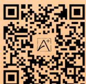

万唯原创试题与内容

投入巨大，来之不易，版权所有

任何商业行为的使用、模仿均属侵权，违者必究

侵权举报电话：029-8756 9851

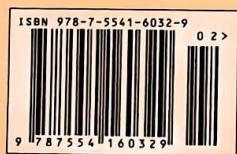

定价：57.90元

万唯中考

万唯中考

全国视野 原创题好

试题:100%原创

重难题配视频讲解

# 大小卷

小卷: 一周一测

大卷: 章测、综合测

2025版

# 更多情境化试题

结合日常生活、数学文化、跨学科学习等创设主题情境，围绕主题情境原创更多情境题

主编 武泽涛

研发 万唯中考千人研究院

西安出版社

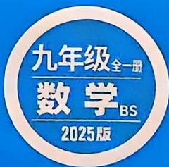

text_image

九年级全一册
数学BS
2025版

# +小卷

小卷: 一周一测

大卷: 章测、综合测

# 主编 武泽涛

# 编者

祁慧渊

李爱军

王铁过

陈素文

刘海兵

李文星

白东平

吴姗姗

朱晓驰

王文海

胡小梅

尚盼盼

崔红丹

陈永华

魏长虹

孙威威

付东林

王建芳

孙泽栋

李士荣

李保民

何岩

王超

曹晓莉

张伟

李井

王 珂

杜道民

尚强华

郝蓓

# 编委

姜二嫚

王艳妮

马辉

赵梅香

贾豪勇

李珍珍

杜金金

谭吉丽

李香玉

李思雨

刘家琦

王飞艳

张紫艳

苟嘉敏

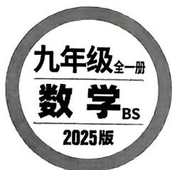

text_image

九年级全一册
数学BS
2025版

· 重难题视频讲解(25个)  
· 中考试题、省会城市名校期末试题及解析  
· 几何画板动态演示(含源文件)  
- 更多教辅，请关注公众号【全科A+】

# 目录

主题情境:本书结合日常生活、数学文化、跨学科学习等创设主题情境,围绕主题情境原创更多情境题,让学生在真实情境中掌握知识,提升解决实际问题的能力.

# 周测小卷

# 九年级(上)

# 第一章 特殊平行四边形

周测1 菱形的性质与判定 1  
周测2 矩形的性质与判定 3  
周测 3 正方形的性质与判定 …… 5  
专题 特殊四边形中的折叠问题 …… 7  
专题 正方形中的十字模型 9

# 第二章 一元二次方程

周测4 一元二次方程的认识及解法 11  
周测 5 一元二次方程的根与系数的关系及应用 …… 13  
专题 一元二次方程根的判别式及根与系数的关系 … 15  
专题 一元二次方程与图形面积问题 …… 16

# 第三章 概率的进一步认识

周测 6 概率的计算及频率估计概率 …… 17

# 第四章 图形的相似

周测 7 平行线分线段与相似多边形 …… 19  
周测 8 相似三角形的判定 …… 21  
周测 9 相似三角形的性质与位似 …… 23  
专题 一线三等角问题 …… 25

# 第五章 投影与视图

周测 10 投影与视图 …… 27

# 第六章 反比例函数

周测 11 反比例函数的图象与性质 …… 29  
周测12 反比例函数的应用 31  
专题 反比例函数 $k$ 的几何意义 33

# 九(上)检测

选填及简单解答题题组(一) 35  
选填及简单解答题题组(二) 37  
中档解答题题组(一) 39  
中档解答题题组(二) 41

# 大卷

# 第一章检测卷 …… 1

主题情境 中式窗棂纹样

# 第二章检测卷 3

主题情境 打造牡丹园

# 第三章检测卷 5

主题情境 赏华夏文明,传非遗文化

# 第四章检测卷 7

主题情境 大明宫遗址公园

# 第五章检测卷 9

主题情境 运动中的投影

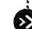

# 第六章检测卷 …… 11

主题情境 光照中的反比例函数

# 九(上)综合检测卷(一) …… 13

主题情境 典籍中的数学问题

# 九(上)综合检测卷(二) …… 17

主题情境 公园游玩记

# 周测小卷

专题 与特殊四边形有关的综合题 …… 43

专题 相似手拉手问题 45

专题 反比例函数综合题 …… 47

# 九年级(下)

# 第一章 直角三角形的边角关系

周测13 锐角三角函数 49

周测14 解直角三角形及其应用 51

# √ 第二章 二次函数

周测 15 二次函数的概念及图象与性质 …… 53

周测 16 二次函数的表达式、应用及与一元二次方程的关系 …… 55

专题 二次函数的实际应用 …… 57

专题 二次函数性质综合题 …… 59

# 第三章 圆

周测17 圆的相关性质、垂径定理及圆周角定理 …… 61

周测 18 确定圆的条件及直线与圆的位置关系 …… 63

专题 切线与圆的综合 …… 65

周测 19 圆内接正多边形及弧长与扇形面积 …… 67

# 九(下)检测

选填及简单解答题题组(一) …… 69

选填及简单解答题题组(二) 71

中档解答题题组(一) 73

中档解答题题组(二) 75

专题 二次函数几何综合题 …… 77

# 大卷中考新考法索引

# 开放性试题

满足结论的条件开放/P1第11题、P7第13题

满足条件的结论开放/P23第11题

# 过程性学习

过程纠错改错/P3第17题

探究新函数的图象与性质/P12第19题

# 阅读理解题

解题方法型阅读理解题/P4第20题

新定义型阅读理解题/P14第13题、P22第19题

# 综合与实践

类比探究/P2第22题

课题实践活动/P8第20题、P22第22题

# 项目式学习

数学与生活融合项目化学习/P4第23题

更多教辅，请关注公众号【全科A+】

# 附：《参考答案》单独成册

# 大卷

第一章检测卷 21

第二章检测卷 23

主题情境 消防无小事

第三章检测卷 25

主题情境 四通八达的交通道路

九(下)综合检测卷 27

# 图书在版编目（CIP）数据

大小卷. 九年级 全一册 数学 BS / 武泽涛主编. — 西安：西安出版社，2022.4（2024.5 重印）

ISBN 978-7-5541-6032-9

I. ①大… II. ①武… III. ①中学数学课-初中-教学参考资料 IV. ①G634

中国版本图书馆 CIP 数据核字(2022)第 060239 号

责任编辑：赵春荣

装帧设计：万唯视觉设计中心

# 大小卷·九年级（全一册）数学 BS

DAXIAOJUAN·JIUNIANJI (QUANYICE) SHUXUE BS

主 编：武泽涛

出版发行：西安出版社

社 址：西安市曲江新区雁南五路1868号影视演艺大厦11层

电话：(029) 85253740

邮政编码：710061

印刷：西安天成印务有限公司

开 本: 880 mm×1230 mm 1/8

印 张：13

字 数：333 千字

版次：2022年4月第1版

印 次: 2024 年 5 月第 3 次印刷

书号：ISBN 978-7-5541-6032-9

定 价: 57.90 元

版权所有，翻印必究。如有印装质量问题，请到购书书店调换。

√ 本书结构：大卷+周测小卷+参考答案

√ 盗版举报电话：029-8756 9851 / 邮箱：wanwei12315@126.com

√ 咨询、订购：029-8221 5628

# 第一章检测卷

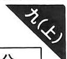

<table><tr><td>题号</td><td>一</td><td>二</td><td>三</td><td>总分</td></tr><tr><td>得分</td><td></td><td></td><td></td><td></td></tr></table>

时间:90 分钟 满分:100 分

一、选择题(共10小题,每小题3分,共30分,每小题只有一项是符合题意的)

1. 下列属于菱形、矩形、正方形共有的性质是 ( )

A. 四条边相等

B. 对角线互相平分

C. 对角线相等

D. 对角线互相垂直

2. 如图, 在菱形 ABCD 中, 对角线 AC, BD 相交于点 O, E, F 分别为 AD, OD 的中点, 若 AC = 8, AE = 5, 则 $\triangle OEF$ 的周长为 ( )

A. $7 + \sqrt{21}$

B. $8+\sqrt{21}$

C. $7 + \sqrt{29}$

D. $8 + \sqrt{29}$

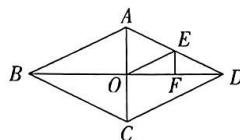  
第2题图

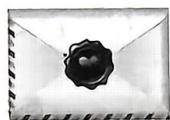  
图①

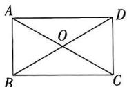  
图②  
第3题图

3. 日常生活情境(请柬)如图①是一封请柬,图②是其示意图,若在矩形ABCD中,对角线AC,BD相交于点O, $\angle AOB=60^{\circ}$ ,则 $\angle ACB$ 的度数为()

A. ${30}^{ \circ  }$

B. $35^{\circ}$

C. ${40}^{ \circ  }$

D. ${45}^{ \circ  }$

4. 在“判断一个已知的平行四边形纸片是否为菱形”的活动课上,某小组拟定了以下四种方案,下列选项中说法不正确的是 ( )

A. 度量两组对角是否相等  
B. 测量纸片中的邻边是否相等  
C. 将该纸片沿对角线对折, 看对折后的平行四边形邻边是否重合  
D. 将该纸片依次沿两条对角线对折, 看对折后两条对角线所成的夹角是否为直角

5. 在边长为 6 的正方形 ABCD 中, P 为边 AB 的中点, 则点 P 到对角线 BD 的距离为 ( )

A. $\frac{\sqrt{2}}{2}$

B. $\sqrt{2}$

C. $\frac{3\sqrt{2}}{2}$

D. $2\sqrt{2}$

6. 学习生活情境教具 小颖买的一个正方形教具, 轻轻一拉便可使教具发生形变(如图), 若正方形教具边长为 20 cm, $\angle A' = 150^{\circ}$ , 则此时教具 $A'BCD'$ 的面积为 ( )

A. ${200}{\mathrm{\;{cm}}}^{2}$

B. ${300}{\mathrm{\;{cm}}}^{2}$

C. $200 \sqrt{3} \mathrm{~cm}^{2}$

D. $(400 - 200\sqrt{3})\mathrm{cm}^2$

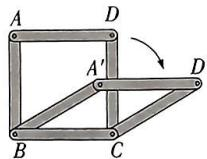  
第6题图

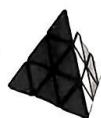  
•

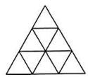  
图②

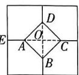  
第7题图  
第8题图

7. 日常生活情境 神奇魔方 魔方有许多不同的种类和形状. 如图①是一个金字塔魔方, 图②是从金字塔魔方中抽象出其中一面的示意图, 其中每个小三角形均为等边三角形且大小相同. 任意选择四个顶点顺次连接, 不可能出现的四边形是 ( )

A. 平行四边形

B. 菱形

C. 矩形

D. 正方形

8. 如图, 是一块大正方形地板砖, 上面的图案是由四个全等的五边形和一个小正方形组成的, 若大正方形地板砖的边长为 20 cm, 点 A 是 OE 的中点, 则图中小正方形地板砖的边长为 ( )

A. 5 cm

B. $5 \sqrt{2} \mathrm{~cm}$

C. 4 cm

D. $4\sqrt{2}$ cm

9. 如图, 在 Rt△ABC 中, $\angle C = 90^{\circ}$ , AO, BO 分别是 $\angle CAB$ , $\angle CBA$ 的平分线, 过点 O 作 $OM \perp BC$ 于点 M, 若 $AC = \sqrt{5}$ , AB = 3, 则 BM 的长为 ( )

A. $\sqrt{5}$

B. $2\sqrt{3}$

C. $\frac{\sqrt{5} - 1}{2}$

D. $\frac{5 - \sqrt{5}}{2}$

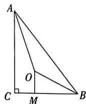  
第9题图

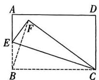  
第10题图

10. 如图, 在矩形 $ABCD$ 中, $AB = 4$ , $AD = 6$ , 点 $E$ 是 $AB$ 的中点, 将 $\triangle BCE$ 沿 $CE$ 折叠得到 $\triangle FCE$ , 则 $BF$ 的长为 ( )

A. $\frac{6\sqrt{10}}{5}$

B. $\frac{3\sqrt{10}}{5}$

C. $\frac{2 \sqrt{10}}{5}$

D. $\frac{\sqrt{10}}{5}$

# 二、填空题(共5小题,每小题3分,共15分)

11.（中考新考法·满足结论的条件开放）添加一个条件，使矩形ABCD是正方形，这个条件可以是\_\_\_\_。  
12. 如图, $AC$ 是平行四边形 $ABCD$ 的对角线, $\angle BAC = 90^{\circ}$ , $\angle ABC = 60^{\circ}$ , $BE$ 平分 $\angle ABC$ 交 $AC$ 于点 $E$ , 点 $P$ 是 $BE$ 的中点, 若 $CE = 8$ , 则 $AP$ 的长为 \_\_\_\_.

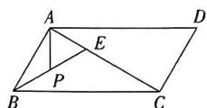  
第12题图

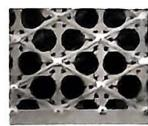  
图①

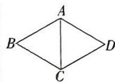  
图②  
第13题图

# 主题情境 中式窗棂纹样 请完成第 13\~14 题.

13. 小方在参观故宫博物院时, 被太和殿窗棂的三交六椀菱花(如图①)吸引, 他从中提取出一个菱形 $ABCD$ (如图②), 已知菱形的周长是 $80 \mathrm{~cm}$ , $\angle ABC = 60^{\circ}$ , 则点 $B$ 与点 $D$ 之间的距离为 \_\_\_\_ cm.
14. 如图①是小方在参观完博物院后用一块矩形的彩纸剪出来的窗棂图案轮廓, 图②是其示意图, 由两个正方形组成, 若 $CE = 4$ , 正方形的边长为 4 , 且点 $A, C, E, G$ 在同一条直线上, 则图②示意图的面积为 \_\_\_\_.

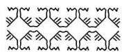  
图①

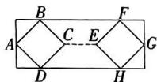  
图②

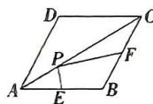  
第15题图

15. 如图, 在菱形 ABCD 中, AB = 8, E, F 分别为 AB, BC 的中点, P 是 AC 上的一个动点, 则 $PE + PF$ 的最小值是 \_\_\_\_.

# 三、解答题(共7小题,共55分. 解答应写出过程)

16. (7分)如图,在矩形ABCD中,点E,F在BC边上,且CE=BF,连接AE,DF交于点G,求证:EG=FG.

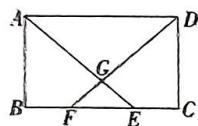  
第16题图

万唯原创好题，复印、盗版必究。举报电话：029-8756 9851

17. (7 分) 如图, 在平行四边形 $ABCD$ 中, 连接 $BD$ , 过点 $D$ 作 $DM \perp BC$ 于点 $M$ , 作 $DN \perp AB$ 于点 $N, DM = DN$ .

(1) 求证: 四边形 ABCD 为菱形;  
(2) 若 $BD = 8, CD = 10$ , 求菱形 $ABCD$ 的面积.

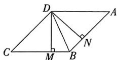  
第17题图

18. (7 分) 如图, 在正方形 ABCD 的内部作等边 $\triangle ABE$ , 连接 DE, CE, DB.

(1) 求证: CE = DE;   
(2) 求 $\angle EDB$ 的度数.

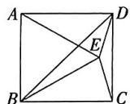  
第18题图

19. (教材 P27 第 14 题改编)(8 分)如图, 在四边形 ABCD 中, $\angle B = 90^{\circ}$ , $AD \parallel BC$ , $AD = 15 \, cm$ , BC = 18 cm, 点 E 由点 A 出发沿 AD 方向向点 D 匀速运动, 速度为 1 cm/s, 点 F 由点 C 出发沿 CB 方向向点 B 匀速运动, 速度为 2 cm/s, 动点 E, F 同时从 A, C 两点出发, 当任意一点到达终点时另一点也停止运动, 连接 EF, 若设运动的时间为 t s, 解答下列问题:

(1) 当 $t =$ \_\_\_\_ s 时, 四边形 $AEFB$ 是矩形;  
(2) 当四边形 EFCD 为菱形时, 求 AB 的长.

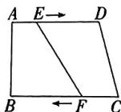  
第19题图

几何画板动态演示  
  
四边形的动点问题

20. 日常生活情境 拳击枪 (8分) 如图①是拳击枪玩具图片, 图②是其部分示意图, 它由6个边长相等、形状相同的菱形组成, 后端A装在塑料玩具手枪的枪口上, 前端B连接一只塑料拳头. 把枪口A到拳头前端C之间的距离记为该拳击枪的“射程”, 拳头的长BC=5cm, 菱形的边长为 $5\sqrt{2}$ cm.

(1) 当每个菱形的上部内角为 $60^{\circ}$ 时, 求此时的“射程”;  
(2)若拳击枪的最大“射程”为 $65\mathrm{cm}$ ，求拳击枪每个菱形的上部内角的度数.

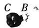

图①  
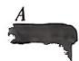

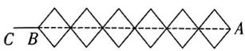  
图②  
第20题图

21. (8分)如图,用硬纸板剪一个矩形ABCD,作它的对角线的交点O,用大头针把一根平放在矩形上的直细木条(宽度忽略不计)固定在点O处,并使细木条可以绕点O转动.拨动细木条,使它随意停留在任意位置.设细木条分别交硬纸板的边AD,BC于点E,F.

(1)任选1个结论证明：①OE=OF；②AE=CF；  
(2)在细木条转动过程中,当 E,F 恰好是 AD,BC 的中点时,对角线 AC 上有一点 P,使 $\angle EPF=90^{\circ}$ , 若 AB=5,BC=12,求出 AP 的长.

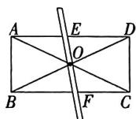  
第21题图

22.（中考新考法·综合与实践——类比探究）(10分)【问题情境】数学活动课上,老师提出了一个问题:如图①,在正方形ABCD中,点E,F分别是边BC,CD上的点,连接AE,BF相交于点G,请同学们结合图形提出自己的猜想并证明.以下是小亮的猜想:

小亮: 若 $AE \perp BF$ , 则 AE = BF.

(1)请帮助小亮证明他的猜想；

【类比探究】(2)如图②,当点E,F分别在正方形ABCD的边CB,DC的延长线上时,(1)中小亮的猜想是否成立?若成立,请写出证明过程;若不成立,请说明理由;

【解决问题】(3)如图③,将图①中线段BF向上平移后得到线段MN,试判断此时小亮的猜想是否成立?若成立,请写出证明过程;若不成立,请说明理由.

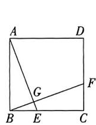  
图①

图②  
第22题图  
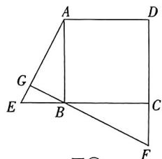

text_image

Geometric diagram with labeled points and lines, including square ABCD and triangle GBE

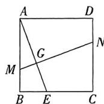  
图③

视频讲解  
  
中考新考法题

# 第二章检测卷

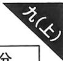

<table><tr><td>题号</td><td>一</td><td>二</td><td>三</td><td>总分</td></tr><tr><td>得分</td><td></td><td></td><td></td><td></td></tr></table>

时间:90 分钟 满分:100 分

一、选择题(共10小题,每小题3分,共30分.每小题只有一项是符合题意的)

1. 下列方程, 是一元二次方程的是 ( )

$$
① 5 x ^ {2} + 2 x = 1 6; \textcircled {2} 6 x - 3 y = 7; \textcircled {3} 3 x ^ {2} = 2; \textcircled {4} x - 3 = 0.
$$

A. ①②

B. ③④

C. ①③

D. ②④

2.（教材P51第3题改编）若关于 $x$ 的一元二次方程 $x^{2} - 2mx + 2m = 0$ 的一个根是2，则 $m$ 的值是 （）

A. 1

B. 2

C. 3

D. 4

3. 用配方法解方程 $4x^{2} - 8x - 1 = 0$ 时, 配方正确的是 ( )

A. $(x - 1)^{2} = \frac{1}{4}$

B. $(x - 1)^{2} = \frac{5}{4}$

C. $(x + 1)^{2} = \frac{1}{4}$

D. $(x + 1)^{2} = \frac{5}{4}$

主题情境 打造牡丹园 请完成第4\~5题.

4. 牡丹花是中国国花,被誉为“花中之王”,某地以牡丹观赏为主,建造了一个大型城市牡丹园,若2021年牡丹园的面积为800平方米,到2023年牡丹园的面积为1152平方米,假设每年牡丹园面积的增长率相同,则该地牡丹园面积的年平均增长率为（）

A. $10\%$

B. $15\%$

C. $20\%$

D. $25\%$

5. 为了方便游客拍照打卡,该地计划在如图所示长为 $35 \mathrm{~m}$ , 宽为 $20 \mathrm{~m}$ 的空地中修建小道 (图中阴影部分), 余下部分种植牡丹花, 其中 $AB = CD = EF = GH = x \mathrm{~m}$ (每段小道的边缘平行), 要使种植牡丹花的面积为 $558 \mathrm{~m}^{2}$ , 则 $x$ 的值为 ( )

A. 0.5

B. 1

C. 1.5

D. 2

6. 若矩形 ABCD 的面积为 5, 其相邻边长是一元二次方程 $x^{2}-6x+m=0$ 的两实数根, 则方程的解为 ( )

A. x = -5

B. x = 1

C. $x_{1}=x_{2}=5$

D. $x_{1} = 1, x_{2} = 5$

7.（教材P43第1题改编）已知关于 $x$ 的一元二次方程 $(m + 2)x^{2} + 4x + 1 = 0$ 有实数根，则 $m$ 的取值范围为 （）

A. $m \geqslant 2$

B. $m <   2$

C. $m \leqslant 2$ 且 $m \neq -2$

D. $m \leqslant 4$ 且 $m \neq -2$

8. 如图, 点 A 在数轴的负半轴, 且点 A 对应的数为 $7 - 3x - 2x^{2}$ , 点 O 对应的数为 0, 若 OA = 2, 则 x 的值为 ( )

A. -3

B. $\frac{3}{2}$

C. $\frac{3}{2}$ 或-3

D. $-\frac{3}{2}$ 或3

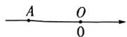  
第8题图

9.（教材P56第5题改编）已知关于 $x$ 的一元二次方程 $-x^{2} + a^{2}x - 1 + a = 0$ 的两个实数根之和为1，则 $a$ 的值为 （）

A. 1

B.-1

C. 1 或 -1

D. 0

10. 已知关于 $x$ 的一元二次方程 $ax^2 + bx + 1 = 0$ 的两根之差为 2 , 则代数式 $12a - b^2$ 的最大值为 ( )

A. -8

B. -2

C. 4

D. 10

二、填空题(共5小题,每小题3分,共15分)

11. (教材 P47 第 1 题改编) 方程 $(x+2)(x-1)=0$ 的根为 \_\_\_\_.

12. 若 $x_{1}, x_{2}$ 是一元二次方程 $x^{2} - 3x + 1 = 0$ 的两个实数根, 则 $x_{1}^{2} + x_{2}^{2} - 2$ 的值为

13. 临近毕业,九年级(3)班学生为了表达彼此的不舍,将自己的照片向全班其他同学各送一张留念,已知共送出870张照片,则全班共有\_\_\_\_名同学.

14. 如图, 在 $\square ABCD$ 中, $\angle B = 45^{\circ}$ , $AE$ 垂直平分 $BC$ , 且 $AE$ 的长是一元二次方程 $2x^{2} - 4x = 5(2 - x)$ 的一个根, 则 $AB$ 的长为 \_\_\_\_.

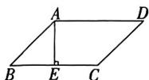  
第14题图

15. 阅读下面的诗词然后解题：

大江东去浪淘尽，千古风流数人物。

而立之年督东吴，早逝英年两位数。

十位恰小个位三,个位平方与寿符.

哪位学子算得快,多少年华属周瑜?

请你通过列方程,算出周瑜去世时的年龄为\_\_\_\_.

三、解答题(共8小题,共55分. 解答应写出过程)

16. (6分)解下列方程:

(1) $x^{2}+14x+24=0;$

(2) $x^{2}-5x=3(5-x)$ .

17. (中考新考法·过程纠错改错)(6分)下面是小颖同学解一元二次方程的过程,请认真阅读并完成相应任务.

解方程: $(x-1)^{2}=(3x+1)^{2}$ .

解:两边同时开方,得 $x-1=3x+1$ , …… 第一步
移项、合并同类项,得-2x=2, …… 第二步
系数化为1,得x=-1, …… 第三步
∴ 原方程的解为 x=-1. …… 第四步

(1)小颖同学在解方程过程中开始出现错误的是第\_\_\_\_步,错误原因是\_\_\_\_;

(2)请写出解该方程的正确过程.

18. (6分)已知关于 $x$ 的一元二次方程 $x^{2} - ax + a - 1 = 0$ .

(1) 求证: 该方程总有两个实数根;

(2) 若方程的两个实数根为 $x_{1}, x_{2}$ , 且满足 $|x_{1} - x_{2}| = 3$ , 求 $\pmb{a}$ 的值.

19. 日常生活情境/植树活动（7分）为了推动绿色校园建设，每年在植树节来临之际，阳光中学都会举办“共建绿色校园”的植树活动。若该校前年植树500棵，到今年共植树1820棵，假设该校这两年植树棵数的年平均增长率相同。

(1) 求这两年该校植树棵数的年平均增长率；

(2)已知一棵树每天大约可吸收5千克二氧化碳,若该校植树棵数的年平均增长率不变,则明年该校植的树每天大约能吸收多少千克二氧化碳?

20. (中考新考法·解题方法型阅读理解题)(7分)解方程 $(x^{2}-2)^{2}-5(x^{2}-2)+4=0$ 时,我们可以将 $x^{2}-2$ 视为一个整体,然后设 $x^{2}-2=y$ ,则原方程化为 $y^{2}-5y+4=0$ ,解此方程得 $y_{1}=1,y_{2}=4$ ,当y=1时, $x^{2}-2=1,\therefore x=\pm\sqrt{3}$ ,

当 $y = 4$ 时， $x^{2} - 2 = 4, \therefore x = \pm \sqrt{6}$ ，

∴ 原方程的解为 $x_{1}=-\sqrt{3}, x_{2}=\sqrt{3}, x_{3}=-\sqrt{6}, x_{4}=\sqrt{6}.$

以上方法叫做换元法解方程,达到了降次的目的,体现了转化思想.

用上述方法解下列方程：

(1) $(2x+5)^{2}-4(2x+5)+3=0;$

(2) $x^{4}-8x^{2}+7=0.$

21. (教材 P51 第 4 题改编) (7 分) 已知等腰 $\triangle ABC$ 的两边长 $b, c$ 恰好是关于 $x$ 的一元二次方程 $x^{2} - (2k + 1)x + 5(k - \frac{3}{4}) = 0$ 的两个根. 若 $\triangle ABC$ 的另一边长 $a = 4$ , 试求 $\triangle ABC$ 的周长.

22.（教材P53第2题改编）(8分)如图，在边长为 $12\mathrm{cm}$ 的菱形ABCD中， $\angle B = 60^{\circ}$ ，点 $P$ 从点 $B$ 开始沿 $BC$ 边向点 $C$ 以每秒 $1\mathrm{cm}$ 的速度移动，点 $Q$ 从点 $A$ 开始沿 $AB$ 边向点 $B$ 以每秒 $2\mathrm{cm}$ 的速度移动.若 $P,Q$ 分别从 $B,A$ 同时出发，其中任意一点到达终点后，两点同时停止运动

(1) 经过 3 s 后, BP = \_\_\_\_ cm, BQ = \_\_\_\_ cm;   
(2)经过几秒, $\triangle BPQ$ 是直角三角形?  
(3) 经过几秒, $\triangle BPQ$ 的面积等于菱形面积的 $\frac{1}{18}$ ?

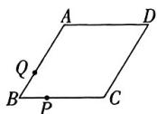  
第22题图

23. (中考新考法·数学与生活融合项目化学习)(8分)随着2024年春晚西安分会场的表演《山河诗长安》播出,再次展现了盛世长安的辉煌,引起了文化潮流,大唐不夜城景区为了满足游客的需求,特意打造了印有盛唐风采的文化衫,根据以下素材,探索完成任务.

<table><tr><td colspan="3">如何设计销售方案</td></tr><tr><td>素材1</td><td colspan="2">每件文化衫的成本价为60元,当售价为100元时,平均每天可以售出20件.</td></tr><tr><td>素材2</td><td colspan="2">当售价每降低1元时,平均每天就能多售出2件.</td></tr><tr><td colspan="3">问题解决</td></tr><tr><td>任务1</td><td>求销售利润</td><td>当降价8元时,求平均每天销售文化衫的利润;</td></tr><tr><td>任务2</td><td>确定销售价</td><td>当每天获得的利润达到1050元并且优惠力度最大时,求文化衫的销售价;</td></tr><tr><td>任务3</td><td>判断能否达到销售要求</td><td>判断每件文化衫的利润率不低于55%,且景区每天获得1200元的利润能否实现?若能,求出销售价;若不能,请说明理由.(利润率= $\frac{利润}{成本} \times 100\%$ )</td></tr></table>

视频讲解  
  
中考新考法题

# 第三章检测卷

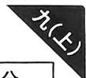

<table><tr><td>题号</td><td>一</td><td>二</td><td>三</td><td>总分</td></tr><tr><td>得分</td><td></td><td></td><td></td><td></td></tr></table>

时间:90 分钟 满分:100 分

一、选择题(共8小题,每小题3分,共24分,每小题只有一项是符合题意的)

1. 共享经济为人们生活带来了很多便利,昊昊收集了4个领域的共享图标,随后将分别印有这4个图标的卡片(质地均匀,大小相同)放入盒中,从中随机抽取一张放回,再从中随机抽取一张,则抽取的两张卡片恰有一张印有“共享知识”的概率为（）

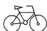  
A. 共享出行

  
B. 共享服务

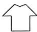  
C. 共享物质

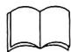  
D. 共享知识

第1题图

A. $\frac{1}{2}$

B. $\frac{3}{8}$

C. $\frac{7}{12}$

D. $\frac{7}{16}$

2. 日常生活情境 射箭 某射箭选手在同一条件下进行射箭训练,结果如下表,下列说法正确的是 ( )

<table><tr><td>射箭次数</td><td>10</td><td>20</td><td>50</td><td>100</td><td>200</td><td>350</td><td>500</td></tr><tr><td>射中靶心的次数</td><td>8</td><td>17</td><td>44</td><td>90</td><td>179</td><td>315</td><td>451</td></tr><tr><td>射中靶心的频率</td><td>0.800</td><td>0.850</td><td>0.880</td><td>0.900</td><td>0.895</td><td>0.900</td><td>0.902</td></tr></table>

A. 射箭的次数越多,射中靶心的频率越高   
B. 该选手射箭 10 次,有 8 次射中靶心  
C. 该选手射箭80次,射中靶心的频率不超过0.900   
D. 随着射箭次数的增加, 射中靶心的频率在 0.900 左右摆动, 估计该选手在同样环境和条件下射中靶心的频率为 0.900

主题情境 赏华夏文明,传非遗文化 请完成第3\~5题.

3. 王老师从《非遗里的中国》挑选了“陕西篇”“山西篇”“贵州篇”帮助同学们感受非遗文化的魅力,九年级(1)班和(2)班分别从3个篇章中随机选择一篇组织学生进行观看,则这两个班选择的篇章相同的概率是()

A. $\frac{1}{3}$

B. $\frac{2}{3}$

C. $\frac{1}{6}$

D. $\frac{1}{9}$

4. 观看完《非遗里的中国》后，乐乐、琪琪、君君、丽丽四名同学围坐在一起交流观后感，如图，如果乐乐的位置固定，另外三人随机坐到①②③的任一座位上，则君君和琪琪相邻的概率是（）

A. $\frac{2}{3}$

B. $\frac{1}{6}$

C. $\frac{1}{9}$

D. $\frac{1}{27}$

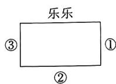  
第4题图

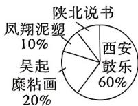  
第5题图

5. 九年级(三)班共20名同学报名参加“西安鼓乐”“陕北说书”“凤翔泥塑”“吴起糜粘画”非遗文化学习且每人只能参与一项,王老师将报名不同项目的学生人数进行统计并绘制出了如图所示的扇形图,若从“凤翔泥塑”“陕北说书”中任意选出两位同学谈谈自己的感受,至少有一位同学报名“凤翔泥塑”的概率为（）

A. $\frac{5}{6}$

B. $\frac{1}{6}$

C. $\frac{3}{4}$

D. $\frac{1}{4}$

6. 小影和小英在做抽卡片游戏, 小影根据游戏规则, 做出了如图所示的树状图, 则她们做的游戏可能是 ( )

A. 随机从 $A, B, C$ 三张卡片中同时抽出 2 张卡片  
B. 随机从 A, B, C 三张卡片中抽出 1 张卡片不放回, 再抽出 1 张卡片  
C. 随机从 A, B, C 三张卡片中抽出 1 张卡片放回, 再抽出 1 张卡片  
D. 随机从 $A, B, C$ 三张卡片中抽出 1 张卡片不放回, 再抽出 2 张卡片

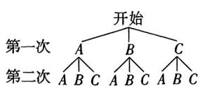  
第6题图

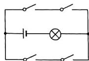  
第7题图

7. 跨学科情境 跨物理电路闭合 如图,电路图上有4个开关和1个小灯泡,随机闭合4个开关中的两个,形成通路可使小灯泡发光的概率是 ( )

A. $\frac{1}{2}$

B. $\frac{1}{3}$

C. $\frac{1}{4}$

D. $\frac{3}{4}$

8. 三张质地、大小完全一样的纸条上面各写着一个数, 其中两个正数为 3,4, 一个负数为 -2, 任意抽取一张, 记下数字后, 不放回, 将剩余纸条摇匀, 再重复同样的操作一次, 则两次抽到的数字之积

是正数的概率为 （）

A. $\frac{1}{2}$

B. $\frac{2}{3}$

C. $\frac{1}{3}$

D. $\frac{1}{6}$

二、填空题(共4小题,每小题3分,共12分)

9. 某市运动会共设青少年竞技组、学生组和社会组,小敏和小丽均参加志愿活动,且被随机分到这三个组的可能性相同,则小敏和小丽被分到不同组做志愿者的概率为\_\_\_\_.

10. 学完《概率的进一步认识》后, 圆圆和同桌做“用频率估计概率”的试验: 不透明袋子中有 6 个红球, 4 个黄球和 2 个绿球, 这些球除颜色外无其他差别. 从袋子中随机取出 1 个球, 某种颜色的球出现的频率如图所示, 则该球最有可能是 \_\_\_\_.

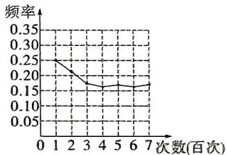

line

| 次数 (百次) | 频率 |
| :--- | :--- |
| 0 | 0.25 |
| 1 | 0.23 |
| 2 | 0.20 |
| 3 | 0.18 |
| 4 | 0.17 |
| 5 | 0.18 |
| 6 | 0.17 |
| 7 | 0.17 |

第10题图

11.（教材P73第7题改编）同时抛掷两枚质地均匀的硬币：①两正面都朝上；②两背面都朝上；③一枚正面朝上，另一枚背面朝上.则上述事件发生的概率最大的是\_\_\_\_.(填序号)

12. 跨学科情境（跨语文古诗词）为加强学生们对于古诗词的热爱，某班举行了诗词竞赛，现有以下四句古诗词：①长风破浪会有时；②几处早莺争暖树；③谁家新燕啄春泥；④直挂云帆济沧海。甲先从中随机选取了一句，乙再从余下的诗句中选择一句，则他们选取的诗句恰好是同一首诗的概率为\_\_\_\_。

三、解答题(共6小题,共64分.解答应写出过程)

13. (8分)2024年央视春晚的主题为“龙行(óá)，欣欣家国”。“龙行”寓意中华儿女奋发有为、昂扬向上的精神风貌，将分别印有“龙”“行”“”“欣”“家”“国”六张质地均匀、大小相同的卡片放入盒中。墨墨从中随机抽取一张不放回，再从中抽取一张，用画树状图或列表的方法求出抽取的两张卡片印有的字均属于一个主题词（“龙行”或“欣欣家国”）的概率。

万唯原创好题，复印、盗版必究。举报电话：029-8756 9851

14. (8 分) 如图是两个可以自由转动的转盘, $A$ 盘被均分成五个面积相等的扇形, $B$ 盘被分成三个扇形. 转动转盘后, 如果指针指在分割线上, 则重转一次, 直到指针指向某一个扇形内.

(1) 转动 A 盘, B 盘, 分别求出指针指向蓝色区域的概率;  
(2)已知红色和蓝色可以配成“紫色”，若同时分别转动A盘和B盘，求指针指向的颜色恰好能配成“紫色”的概率.

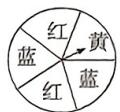  
A盘

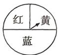  
B盘   
第14题图

15. 日常生活情境 文创产品 (12分)近两年洛阳文旅频频出圈, 推出的一系列文创产品也借着东风再次爆红网络, 如图为4个仕女摆件, 其中有3个仕女摆件手持小物件, 将这4个仕女摆件用相同的包装盒分别包装成文创盲盒.

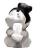

  
第15题图

(1)从这4个文创盲盒中随机抽取2个,求抽到的都是手持小物件仕女摆件的概率;   
(2) 在这 4 个文创盲盒中加入 $x$ 件手持小物件的仕女摆件盲盒后, 随机抽取 1 个, 然后放回, 多次重复这个试验, 通过大量重复试验后发现, 抽到手持小物件的仕女摆件的频率稳定在 0.95, 则可以推算出 $x$ 的值大约是多少?

16. (10分) 晨晨爸爸买了一张体育比赛的门票, 由于一张门票仅限一人使用, 于是哥哥阳阳设计了利用转盘 (被分为三个面积相等的扇形) 及摸球 (盒中的球完全相同) 游戏决定两人谁可以去看比赛. 游戏规则如下: 如图, 若摸出的球上字母与转盘停止后指针对准的字母相同, 则晨晨去, 若不同, 则阳阳去. (指针指在分界线上, 则重新转动转盘)

(1)你认为这个游戏公平吗？为什么？  
(2)如果不公平,该如何修改约定,才能使游戏对双方公平?

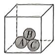

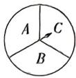  
第16题图

# 主题情境 航天“热” 请完成第17\~18题.

17. (12分)神舟十六号、神舟十七号两个乘组顺利的完成在轨交接，神舟十七号航天员乘组入轨后，开展了下肢运动学测试实验(A)、视功能研究实验(B)以及载荷出舱工作(C).

(1) 若王老师在 A, B, C 中任选一项作为课堂的主题, 求选定 B 的概率;  
(2) 王老师计划组织班干部在 $A, B, C$ 三项中随机选取一项进行查阅资料并为全班同学讲解，请用列表法或画树状图法求班长和学习委员同时选中 $A$ 的概率.

18. (14 分) 近年来, 我国航天事业飞速发展, “天宫课堂”的上线, 更是大大激发了国民对航天的热情和兴趣. 某校为了解学生对航天知识的了解程度, 开展了航天知识竞赛, 竞赛成绩(均为整数)共分为四个等级: A:60 分及以下; B:61\~70 分; C:71\~80 分; D:81 分及以上. 根据统计结果, 绘制了如下不完整的统计图, 请根据统计图, 回答下列问题:

bar

| 等级 | 人数/人 |
|---|---|
| A | 6 |
| B | 12 |
| C | 0 |
| D | 4 |

图①

  
图②  
第18题图

(1)参加这次竞赛的学生总人数为\_\_\_\_人,“C:71\~80分”的学生有\_\_\_\_人;  
(2)“B:61\~70分”所在扇形的圆心角度数为\_\_\_\_度，“C:71\~80分”的学生占总人数的百分比为\_\_\_\_%;  
(3)若该校共有1000名学生,请估计会有多少人达到81分及以上;  
(4) 现要从“D:81分及以上”的四名学生小明、小亮、小梦、小璐中选出两名学生在本校介绍航天相关知识，求选出的两名学生恰好是小明和小梦的概率.

# 第四章检测卷

<table><tr><td>题号</td><td>一</td><td>二</td><td>三</td><td>总分</td></tr><tr><td>得分</td><td></td><td></td><td></td><td></td></tr></table>

时间:90 分钟 满分:100 分

一、选择题(共10小题,每小题3分,共30分,每小题只有一项是符合题意的)

1. 下列说法不正确的是 ( )

A. 位似图形一定是相似图形  
B. 位似图形一定有位似中心  
C. 相似图形不一定是位似图形  
D. 相似图形的对应点连线一定平行

2.（教材P81第1题改编）已知 $\frac{b}{a} = \frac{c}{d} = \frac{e}{f} = \frac{2}{3}$ 且 $a + 3d - 2f\neq 0$ ，则 $\frac{2b + 6c - 4e}{a + 3d - 2f}$ 的值为 （

A. $\frac{2}{3}$

B. $\frac{4}{3}$

C. 2

D. $\frac{8}{3}$

3. 日常生活情境 修剪盆景 如图, 是张阿姨家摆放的一盆盆景, 修剪时, 为使盆景拥有最具美感的黄金分割比, 需要使点 B 为线段 AC 的黄金分割点, 且 AB > BC. 已知修剪后 BC = 30 cm, 则修剪后 AB 的长度最接近 ( )

A. 40 cm

B. 50 cm

C. 55 cm

D. 60 cm

  
第3题图

  
第4题图

4. 如图, 已知 $\triangle ABC \sim \triangle ACP, \angle A = 70^{\circ}, \angle APC = 65^{\circ}$ , 则 $\angle B$ 的度数为 ( )

A. $45^{\circ}$

B. $50^{\circ}$

C. $55^{\circ}$

D. $60^{\circ}$

5. 在 $\triangle ABC$ 中, $\angle A = 78^{\circ}, AB = 4, AC = 6$ , 将 $\triangle ABC$ 沿选项中的虚线剪开, 剪下的阴影三角形与原三角形不一定相似的是 ( )

  
A

  
B

  
C

  
D

6. 数学文化情境 出邑望术《九章算术》中记载了一个数学问题. 其大意是如图, 一座正方形城池北、西边正中 $A, C$ 处各开一道门, 从点 $A$ 往正北方向 40 步刚好有一棵树位于点 $B$ 处, 若点 $C$ 往正西方向 810 步的点 $D$ 处时正好看到此树 (步为古时长度单位), 则正方形城池的边长为 ( )

A. 320步

B. 340步

C. 360步

D. 380步

  
第6题图

  
第7题图

  
第8题图

主题情境 大明宫遗址公园 大明宫国家遗址公园位于陕西省西安市,是世界文化遗产,全国重点文物保护单位.请完成第7\~8题.

7. 小明准备测量大明宫城墙的高度 BC, 如图, 在某一时刻, 测得小明的身高 DE 为 1.7 m, 影长 AD 为 3.4 m, 城墙的影长 AB 为 24 m, 则大明宫的城墙高度为 ( )

A. 5.5 m

B. $6.5 \mathrm{~m}$

C. $7.5 \mathrm{~m}$

D. 12 m

8. 龙首渠支渠是流经大明宫的一条河流, 其两侧河岸平行, 如图, 小佳分别在河岸两边选定点 A, B, C, 并且分别在 AB, AC 的延长线上取点 D, E, 使得 DE // BC. 经测量, BC = 6 m, DE = 9 m, 且点 E 到河岸 BC 的距离为 5 m, 则河宽 AF 为 ( )

A. $10 \mathrm{~m}$

B. $9 \mathrm{~m}$

C. 6 m

D. $5 \mathrm{~m}$

9. 如图, 正方形 ABCD 和正方形 EFOG 是位似图形, 且点 A 与点 E 是一对对应点, 点 A 的坐标为 $(-4, 2)$ , 点 E 的坐标为 $(-1, 1)$ , 则它们的位似中心的坐标是 ( )

A. (2,0)

B. $(1,1)$

C. $(-2,0)$

D. $(-1,0)$

  
第9题图

  
第10题图

10.（教材P122第18题改编）如图， $\triangle ABC, \triangle DCE, \triangle FEG$ 都是边长为 $\sqrt{3}$ 的等边三角形，且 $B, C, E, G$ 在同一条直线上，连接 $BF$ 分别交 $AC, DC, DE$ 于点 $P, Q, R$ ，连接 $CR$ ，则 $\triangle CQR$ 的面积为（）

A. $\frac{\sqrt{3}}{2}$

B. $\frac{\sqrt{3}}{4}$

C. $\frac{\sqrt{3}}{8}$

D. $\frac{\sqrt{3}}{10}$

二、填空题(共5小题,每小题3分,共15分)

11.（教材P108第1题改编）已知 $\triangle ABC \sim \triangle A'B'C'$ , $AE, A'E'$ 是它们的角平分线, $BP$ 和 $B'P'$ 是它们的高线, 若 $AE = 8\mathrm{cm}, A'E' = 2\mathrm{cm}$ , 则 $\frac{BP}{B'P'}$ 的值为 \_\_\_\_.

12.（教材P84第1题改编）如图， $l_{1} / / l_{2} / / l_{3}$ ，若 $\frac{AB}{BC} = \frac{3}{2},DF = 5$ ，则 $DE$ 的长为

  
第12题图

  
第13题图

13.（中考新考法·满足结论的条件开放）如图，在△ABC中， $AB \neq AC$ . 点D,E分别为边AB,AC上的点，AC=3AD,AB=3AE,点F为BC边上一点，添加一个条件：\_\_\_\_，可以使以B,F,D三点构成的三角形与△ADE相似。（只需写出一个）

14.（教材P121第14题改编）如图，在平面直角坐标系中，每个小正方形网格的边长均为1， $\triangle ABC$ 与 $\triangle A_{1}B_{1}C_{1}$ 是以某个点为位似中心的位似图形（点 $A,B,C$ 的对应点分别为 $A_{1},B_{1},C_{1}$ ），则它们的相似比为\_\_\_\_。

text_image

y
C
A₁
B₁
O
x
B₁
A₂
C₂

第14题图

15. 跨学科情境 跨物理杠杆原理 如图①, 春白(chōng jiù)是利用了杠杆原理给谷物种子进行脱壳的一种传统工具, 如图②是该春白的侧面简易示意图, 点 O 是支点, 点 O 距地面 15 cm, 且 AO : OB = 4:1, 在春白使用过程中, 若 B 端上升至距地面 10 cm 处, 则 A 端此时与地面的距离为 \_\_\_\_ cm.

  
图①

text_image

A
O
B
地面
图②

第15题图

万唯原创好题，复印、盗版必究。举报电话：029-8756 9851

# 三、解答题(共6小题,共55分. 解答应写出过程)

16. (8分)如图,在平面直角坐标系中, $\triangle ABC$ 与 $\triangle DEF$ 关于点P位似,其中顶点A,B,C的对应点依次为D,E,F,已知它们的顶点坐标分别为A(3,-6),B(9,-9),C(15,-3),D(9,1.5),E(6,3),F(3,0).

(1) 请利用位似的知识在图中找到并画出位似中心 P;

(2) 求点 P 的坐标及 $\triangle ABC$ 与 $\triangle DEF$ 的相似比.

text_image

y
O
E
D
F
x
A
B
C

第16题图

17. (8分)如图, 在 $\triangle ABC$ 中, $\angle BAC = 90^{\circ}$ , $AB = AC = 6$ , 点 $D, E$ 分别为 $BC, AC$ 上的点, 且 $\angle ADE = 45^{\circ}$ , 若 $CE = 2$ , 求 $BD$ 的长.

  
第17题图

18. 一题多解法(8分)如图, AD 是 $\triangle ABC$ 的角平分线, 求证: $\frac{BD}{CD} = \frac{AB}{AC}$ .

  
第18题图

19. (9 分) 如图, 在菱形 ABCD 中, 点 E, F 分别在 BC, CD 上, AF 平分 $\angle DAE, AD = AE$ , 连接 EF 并延长交 AD 的延长线于点 G.

(1) 求证: $\triangle AEG \sim \triangle EBA$ ;   
(2) 若菱形 ABCD 的边长为 3, BE = 2, 求 DG 的长.

  
第19题图

20. (中考新考法·综合与实践——课题实践活动)(10分)为了测量教学大楼的高度,三个数学小组设计了不同的方案,测量方案与数据如下表:

<table><tr><td>课题</td><td colspan="3">测量教学大楼AB的高度</td></tr><tr><td>组别</td><td>第一组</td><td>第二组</td><td>第三组</td></tr><tr><td>测量方案示意图</td><td></td><td></td><td></td></tr><tr><td>说明</td><td>人CD站在大楼AB的影子的顶端,DE为人的影长</td><td>EF为标杆,人的眼睛C、标杆E与大楼A在同一条直线上</td><td>点E处放置一个平面镜,人的眼睛C恰好在平面镜中看到楼顶A</td></tr><tr><td>测量数据</td><td> $CD=1.5\mathrm{\;m},ED=2\mathrm{\;m},BD=15\mathrm{\;m}$ </td><td> $CD=1.5\mathrm{\;m},EF=2\mathrm{\;m},DF=1\mathrm{\;m},BF=15\mathrm{\;m}$ </td><td> $CD=1.5\mathrm{\;m},ED=3\mathrm{\;m},BE=19\mathrm{\;m}$ </td></tr><tr><td>备注</td><td colspan="3">图中所有点都在同一平面内</td></tr></table>

(1)老师发现,三组中有一组数据有误,是第\_\_\_\_组;  
(2) 请你在正确的方案中选择一种, 求出教学大楼的高度.

21. (12 分) 如图①, 在 Rt△ABC 中, ∠C=90°, AC=6, BC=8, 点 D 为边 BC 上的一个动点(点 D 不与点 B 重合), 过点 D 作 DE⊥AB 于点 E, 连接 AD.

(1) 当点 E 为 AB 的中点时, 求证: $\triangle ADE \sim \triangle BAC$ ;  
(2)如图②,点F在边AB上,且点F到点E与点B到点E的距离相等,连接DF.

①当 $AF = 2$ 时，试判断 $\angle CAD$ 与 $\angle BAD$ 的关系；

②当 $\triangle AFD$ 为等腰三角形时,求线段BD的长.

  
图①

  
图②

视频讲解  
  
第21题  
第21题图

# 第五章检测卷

<table><tr><td>题号</td><td>一</td><td>二</td><td>三</td><td>总分</td></tr><tr><td>得分</td><td></td><td></td><td></td><td></td></tr></table>

时间:90 分钟 满分:100 分

一、选择题(共10小题,每小题3分,共30分.每小题只有一项是符合题意的)

1. 围棋起源于中国,中国古代称为“弈”,距今已有4 000多年的历史,如图是一个无盖的围棋罐,其左视图为()

  
第1题图

  
A

  
B

  
C

  
D

2. 下列几何体中, 主视图与俯视图相同的是 ( )

  
A

  
B

  
C

  
D

3. 下列现象中,不属于中心投影现象的是 ( )

A. 阳光下树的影子  
B. 台灯下笔的影子  
C. 路灯下人的影子  
D. 汽车灯光照射下行人的影子

4. 已知某几何体由 5 个相同的小正方体组成, 其左视图是“☐☐”, 且主视图和俯视图相同, 则该几何体是 ( )

  
Λ

  
B

  
C

  
D

5. 如图是某几何体的展开图, 则其三视图(主视图、左视图、俯视图)不可能是 ( )

  
第5题图

  
A

  
B

  
C

  
D

6. 如图是某物体对应几何体的三视图, 则最符合该三视图的物体应是 ( )

  
主视图

  
左视图

  
俯视图

  
A

  
B

  
C

  
D

第6题图

7. 如图, 小欣站在距离路灯 4 米的位置时, 她的影子刚好和路灯影子的顶端重合, 已知小欣身高为 1.2 米, 路灯的高度为 6 米, 则小欣的影子长为 ( )

A. 1.2 米  
B. 1.1 米  
C. 1 米  
D. 0.9 米

8. 如图是一个由正方体和四棱锥组合而成的几何体,阴影部分为上色面,该几何体的展开图正确的是 ( )

  
第8题图

  
A

  
B

  
C

  
D

9. 如图是由几个小正方体搭成的几何体的俯视图, 小正方形中的数字表示在该位置上小正方体个数, 那么这个几何体的主视图是 ( )

  
第9题图

  
A

  
B

  
C

  
D

10. 日常生活情境 手影 手影是一种有趣的民间游戏. 如图, 小明的手距离墙壁 1 米, 台灯距离小明的手 2 米, 在台灯不动的情况下, 要使手影的高度增加一倍, 则小明的手与台灯之间的距离需要 ( )

A. 增加 1 米  
B. 减小 1 米  
C. 增加 1.5 米  
D. 减小1.5米

  
第10题图

二、填空题(共5小题,每小题3分,共15分)

11. 若减小物体和投影面之间的距离,则其正投影

主题情境 运动中的投影 请完成第12\~13题.

12. 小颖在操场上进行跑步训练,从点 A 处经过路灯 C 的正下方,直线跑到点 B 处(点 A,B 到路灯 C 的水平距离相等),在此过程中他的影长\_\_\_\_.

  
第12题图

  
第13题图

13. (教材 P146 第 10 题改编)一天下午小红先参加了校运动会女子 100 m 比赛, 过一段时间又参加了女子 400 m 比赛, 如图是摄影师在同一位置拍摄的两张照片, 那么 \_\_\_\_ 是小红参加 100 m 比赛时所拍摄的照片.  
14.（教材P142第2题改编）如图是某几何体的三视图，若俯视图的圆的面积为 $4\pi \mathrm{cm}^2$ ，则左视图的面积为 $\mathrm{cm}^2$

  
主视图

  
左视图

  
俯视图  
第14题图

  
第15题图

15. 如图是由几个相同的小正方体搭成的几何体, 在保持主视图和左视图不变的情况下, 最多可以拿掉 \_\_\_\_ 个小正方体.  
三、解答题(共6小题,共55分.解答应写出过程)  
16. (6 分) 根据要求完成下列题目：

(1)图中有\_\_\_\_块小正方体；  
(2)请在下面方格纸中分别画出它的主视图、左视图和俯视图（画出的图都用铅笔涂上阴影）.

  
正面

  
主视图

  
左视图

  
第16题图

俯视图  

17. (8 分) 如图是某几何体的三视图.

(1)该几何体的名称为\_\_\_\_；  
(2)请按照三视图上所标注线段的长度,求该几何体的表面积.

text_image

12 cm
9 cm
15 cm
主视图
左视图
15 cm
俯视图

第17题图

18. 跨学科情境/跨物理光的直线传播（10分）早在两千五百年前，墨子和他的学生做了世界上第一个小孔成倒像的实验，是对光沿直线传播的第一次科学解释，并在《墨经》中有这样的精彩记录：“景到，在午有端，与景长，说在端。”如图是小孔成倒像原理的简单示意图(不完整).

(1)画出蜡烛光线穿过小孔在右侧方盒内竖直的屏幕上形成的像 $CD$ （点 $A$ 与点 $C$ 对应，点 $B$ 与点 $D$ 对应）；  
(2) 若像的长度 $CD = 2 \mathrm{~cm}$ , 点 $O$ 到 $AB$ 的距离是 $9 \mathrm{~cm}$ , 到 $CD$ 的距离是 $3 \mathrm{~cm}$ , 求火焰 $AB$ 的高度.

第18题图  

19. (10 分) 某校为期一周的军训即将结束, 为了能有个好的表现, 很多同学都不忘晚上去操场继续演练, 小华发现操场上的秋千踏板 $AB$ 与地面平行, 在路灯的照射下, 其在地面形成的影子为 $CD$ , 如图所示.

(1)请在图中画出表示路灯灯泡的位置点 M;  
(2)测得秋千踏板 $AB$ 的长度为0.6米,其影子 $CD$ 的长度为0.66米,秋千踏板 $AB$ 到地面的距离为0.4米,求路灯灯泡 $M$ 的高度.

  
第19题图

20. (10 分) 如图, 是一个几何体的主视图和左视图, 已知该几何体是由若干个棱长为 $4 \mathrm{~cm}$ 的小正方体所构成的 (面面相接).

(1) 求正方体可能的个数；  
(2)若要给该几何体的表面(包含底面)上色,求所上色的表面积的最小值.

  
主视图

  
左视图  
第20题图

21. (中考新考法·综合与实践——课题实践活动)(11分)应县木塔,位于山西省朔州市应县佛宫寺内,是现存最高大、最古老纯木结构楼阁式建筑.为测量应县木塔的高度,甲、乙两个数学活动小组分别制定了各自的测量方案,同时都运用到了位于该塔右侧的同一个盘龙柱,并实地测量了相关的数据,展示如下:

<table><tr><td>课题</td><td colspan="2">测量木塔AB的高度</td></tr><tr><td>组别</td><td>甲数学活动小组</td><td>乙数学活动小组</td></tr><tr><td>示意图</td><td>图1</td><td>图2</td></tr><tr><td>说明</td><td>如图1,白天,某一时刻,在太阳光线的照射下,应县木塔AB的塔顶A的影子恰好落在盘龙柱CD的底部,同一时刻,盘龙柱CD的影子为线段DE,测得盘龙柱CD为1.7米,DE为1.95米.</td><td>如图2,晚上,应县木塔AB的塔顶A处的灯光照射盘龙柱,得到影子DF,测得盘龙柱CD为1.7米,DF为2米.</td></tr><tr><td>备注</td><td colspan="2">1应县木塔AB与盘龙柱CD均与地面垂直;2图1,图2中所有的点都在同一平面内.</td></tr></table>

(1)请直接写出甲、乙两数学活动小组所设计的测量方案中,分别运用了什么投影;  
(2)到了具体计算的环节时,两小组均发现自己的方案还有欠缺,计划再测量出一条线段的长度,以保证能计算出应县木塔AB的高度,则甲组可能测量的线段为\_\_\_\_,乙组可能测量的线段为\_\_\_\_;(各只填一条可用的即可)  
(3) 学习委员小颖说, 综合你们两个小组的方案和数据, 也可计算出应县木塔 AB 的高度, 她说得对吗? 若正确, 请按照小颖的思路来计算应县木塔 AB 的高度; 若不正确, 请说明理由. (测量过程存在较小误差)

视频讲解  
  
中考新考法画

# 第六章检测卷

<table><tr><td>题号</td><td>一</td><td>二</td><td>三</td><td>总分</td></tr><tr><td>得分</td><td></td><td></td><td></td><td></td></tr></table>

时间:90 分钟 满分:100 分

一、选择题(共10小题,每小题3分,共30分.每小题只有一项是符合题意的)

1. 下列不是反比例函数的是 ( )

A. $y = x^{-1}$

B. $y = \frac{3}{x}$

C. $y = \frac{3x}{2}$

D. $y = \frac{3}{2x}$

2.（教材P161第1题改编）已知点(1,5)是反比例函数 $y = \frac{k}{x}$ 图象上一点，则 $k$ 的值为 （ ）

A. 3

B. 4

C. 5

D. 6

3.（教材P161第3题改编）在平面直角坐标系 $xOy$ 中，反比例函数 $y = -\frac{k}{x}$ 的图象经过点 $P(3,a)$ ，且在每一个象限内， $y$ 随 $x$ 的增大而减小，则点 $P$ 所在象限为 （）

A. 第一象限

B. 第二象限

C. 第三象限

D. 第四象限

4. 跨学科情境 跨物理串并联电路 汽车油箱内的油量多少主要根据如图所示的电路进行转化后显示,在不考虑其他因素影响的条件下,油箱内油的体积 V 与电路中总电阻 $R_{\text{总}}(R_{\text{总}}=R+R_{0})$ 是反比例关系,已知测得当体积 V 为 30 L 时,电路中总电阻 $R_{总}$ 为 20 Ω,则 V 与 $R_{总}$ 的函数表达:

A. $V=\frac{30}{R_{总}}$

B. $V=\frac{20}{R_{总}}$

C. $R_{\text{总}} = \frac{30}{V}$

D. $V=\frac{600}{R_{总}}$

5.（教材P161第5题改编）已知反比例函数 $y = \frac{k}{x}$ 的图象过点(3, 3)，当 $1 < x < 4$ 时， $y$ 的取值范围是（）

A. $\frac{3}{2} < y < 9$

B. $3 < y < 9$

C. $\frac{9}{4} < y < 9$

D. $4 < y < 9$

6.（教材P161第6题改编）在同一平面直角坐标系中，函数 $y = kx - k$ 与 $y = \frac{k}{x} (k \neq 0)$ 的图象大致是 （）

  
A

  
B

  
C

  
D

7. 如图是三个反比例函数在 $y$ 轴左侧的图象, 则 $k_{1}, k_{2}, k_{3}$ 的大小关系为 ( )

A. $k_{1} < k_{3} < k_{2}$

B. $k_{1} < k_{2} < k_{3}$

C. $k_{2} < k_{3} < k_{1}$

D. $k_{2} < k_{1} < k_{3}$

  
第7题图

  
第9题图

  
第10题图

8. 在平面直角坐标系中, 将直线 y = -2x 沿 y 轴向上平移 $m (m > 0)$ 个单位长度得到直线 l, 直线 l 与反比例函数 $y = \frac{2}{x} (x > 0)$ 的图象有一个交点, 则 m 的值为 ( )

A. 2

B. 3

C. 4

D. 5

9. 如图, 点 A 是 x 轴正半轴上的一个定点, 点 P 是反比例函数 $y = \frac{5}{x}$ (x > 0) 图象上的一个动点, $PB \perp y$ 轴于点 B, 当点 P 的横坐标逐渐减小时, 四边形 OAPB 的面积将会 ()

A. 逐渐增大

B. 逐渐减小

C. 先增大后减小

D. 不变

10. 如图, 点 $A_{1}, A_{2}$ 在反比例函数 $y = \frac{k}{x} (k > 0)$ 在第一象限的图象上, 点 $B_{1}, B_{2}$ 在 $x$ 轴正半轴上, 且 $\triangle OA_{1}B_{1}, \triangle B_{1}A_{2}B_{2}$ 都是等边三角形, 已知 $\triangle OA_{1}B_{1}$ 的面积为 $4\sqrt{3}$ , 则 $B_{1}B_{2}$ 的长为 ( )

A. $2 \sqrt{2} - 2$

B. $2 \sqrt{2} + 2$

C. $4 \sqrt{2} + 4$

D. $4 \sqrt{2} - 4$

二、填空题(共5小题,每小题3分,共15分)

主题情境 光照中的反比例函数 请完成第 11\~12 题.

11. 在自然界中, 光的传播需要依靠介质, 已知在不同介质中的光速 $v$ (亿米/秒) 与介质折射率 $n$ 之间存在函数关系式, 若光在不同介质中的光速如下表所示, 则光速 $v$ (亿米/秒) 与介质折射率 $n$ 之间的函数表达式为 \_\_\_\_.

<table><tr><td>光速v(亿米/秒)</td><td>3</td><td>2.5</td><td>1.5</td></tr><tr><td>n</td><td>1</td><td>1.2</td><td>2</td></tr></table>

12. 除了自然光外, 照明主要依靠电灯, 电灯的亮度可以通过调节总电阻控制电流的变化来实现, 若某个台灯电路通过的电流 $I(\mathbf{A})$ 与电阻 $R(\Omega)$ 成反比例函数关系, 且函数图象过点 (880, 0.25), 当台灯标注限定电流为 $2 \mathrm{~A}$ 时, 台灯中的电阻最小是 $\underline{\quad} \Omega$ .

13. 反比例函数 $y = -\frac{6}{x}$ 的图象与直线 $y = kx (k < 0)$ 相交于 $A(x_{1}, y_{1})$ ， $B(x_{2}, y_{2})$ 两点，则 $x_{1}y_{2} + x_{2}y_{1}$ 的值是 \_\_\_\_.

14. 如图, 点 $A$ 为反比例函数 $y = \frac{k}{x} (k \neq 0)$ 图象上一点, 过点 $A$ 向 $x$ 轴作垂线, 垂足为点 $C, B$ 为线段 $AC$ 的中点, 点 $D$ 在 $x$ 轴正半轴上, 连接 $BO, BD$ , 已知 $\triangle BCD$ 的面积为 4 , 且 $OC: CD = 1:2$ , 则 $k$ 的值为 \_\_\_\_.

  
第14题图

  
第15题图

15.（教材P162第11题改编）如图，一次函数 $y = ax + b (a < 0)$ 的图象与反比例函数 $y = \frac{k}{x}$ 的图象在第二象限内交于点 $A, AB \perp x$ 轴，垂足为 $B$ ，一次函数 $y = ax + b (a < 0)$ 的图象与 $x$ 轴， $y$ 轴分别交于 $C, D$ 两点，若 $OB = 2OC = 4OD = 4$ ，则反比例函数的表达式为 \_\_\_\_.

三、解答题(共7小题,共55分,解答应写出过程)

16. (7分)已知反比例函数 $y = \frac{k}{x} (k$ 为常数, $k \neq 0)$ 的图象经过 $A(3, -2)$ .

(1) 求这个函数的表达式；  
(2) 若将点 $B(1, n)$ 先向上平移 $m (m > 0)$ 个单位长度，再向右平移 $m$ 个单位长度，得到点 $C$ ，且点 $B$ 和点 $C$ 都在该反比例函数的图象上，求 $m$ 的值.

17. (中考新考法·满足条件的结论开放)(7分)如图, 反比例函数 $y=\frac{k}{x}(x<0)$ 的图象过格点(网格线的交点)P.

(1) 求反比例函数的表达式；

(2)在图中用直尺和铅笔画出两个等腰三角形(不写画法)，要求每个三角形均需满足下列两个条件：

①三个顶点均在格点上,且其中两个顶点分别是点 O, 点 P;

②三角形的面积等于 $|k|$ .

  
第17题图

18. (7 分) 如图, 一次函数 $y_1 = \frac{1}{2} x - 2$ 的图象与反比例函数 $y_2 = \frac{k}{x}$ 的图象交于点 $A(6, m), B(n, -3)$ .

(1) 求点 A, B 的坐标及反比例函数表达式;

(2) 观察图象, 直接写出不等式 $\frac{1}{2}x - 2 > \frac{k}{x}$ 的解集.

  
第18题图

19. (中考新考法·探究新函数的图象与性质)(8分)在数学活动课上,老师让大家结合学过的有关函数的研究方法,进一步研究函数 $y=\frac{4}{|x|}$ 的图象与性质.

绘制图象：

①列表:下表是y与x的部分对应值;

<table><tr><td rowspan="2">12</td><td>-8</td><td>-4</td><td>-2</td><td>-1</td><td> $-\frac{1}{2}$ </td><td>...</td><td> $\frac{1}{2}$ </td><td>1</td><td>2</td><td>4</td><td>8</td><td>...</td></tr><tr><td> $\frac{1}{2}$ </td><td>1</td><td>2</td><td>—</td><td>8</td><td>...</td><td>8</td><td>4</td><td>2</td><td>1</td><td>—</td><td>...</td></tr></table>

②描点并连线:根据表中各组对应值,在平面直角坐标系中描出各点,并用平滑的曲线顺次连接各点,画出该函数的图象.

(1)请将表格补充完整,并在所给的平面直角坐标系中绘制出该函数的图象;

text_image

y
10
9
8
7
6
5
4
3
2
1
-1 0 1 2 3 4 5 6 7 8 9 10 x
-1 0 1 2 3 4 5 6 7 8 9 10 x
-2

第19题图

探究性质：

(2)通过观察图象,写出该函数的两条性质:

①；

②

20. (8 分) 某款新能源汽车销售时推出首付+分期(零利息)促销活动,首付交款后,剩下的余款可在四年内(含四年)结清,在这期限内不产生任何利息,逾期则会产生利息. 高女士在活动期间购买了一辆售价为 22 万元的新能源汽车,首付交款后余款则计划平均每月付款 y 万元,x 个月结清(未逾期),y 与 x 的函数关系如图所示,请根据图象解决下列问题.

(1) 确定 $y$ 与 $x$ 的函数表达式, 并计算高女士的首付款数目;

(2)若高女士平均每月的最高还款能力为5000元,则她至少需要多少个月就能结清余款;

(3)为尽量缓减每月的还款压力,高女士平均每月至少应还款多少元.

  
第20题图

21. (9分)如图,在平面直角坐标系 $xOy$ 中,矩形 $OABC$ 的边 $OA$ 在 $x$ 轴正半轴上, $OC$ 在 $y$ 轴正半轴上, $OA = 4$ , $OC = 2$ , 点 $D$ 是边 $BC$ 上一点,且点 $D$ 的横坐标为 1 , 反比例函数 $y = \frac{k}{x} (x > 0)$ 的图象经过点 $D$ , 且与 $AB$ 交于点 $E$ , 连接 $OD, OE, DE$ .

(1) 求 k 的值;  
(2) 点 $P$ 在 $x$ 轴上, 当 $\triangle ODE$ 的面积等于 $\triangle ODP$ 的面积时, 求点 $P$ 的坐标.

  
第21题图

22. (9分)如图,一次函数 $y=\frac{3}{4}x+b$ 与反比例函数 $y=\frac{k}{x}$ 的图象交于 A, B 两点,与 x 轴交于点 C,与 y 轴交于点 D, $BE \perp x$ 轴于点 E, 连接 OB, $\triangle OBE$ 的面积为 12, 点 A 的横坐标为 4, 点 P 是 x 轴上的一个动点, 设其横坐标为 m.

(1) 求反比例函数的表达式及点 C 的坐标;  
(2) 当以 P, A, D 为顶点的三角形周长最小时, 求 m 的值.

视频讲解  
  
第22题

# 九(上)综合检测卷(一)

<table><tr><td>题号</td><td>一</td><td>二</td><td>三</td><td>总分</td></tr><tr><td>得分</td><td></td><td></td><td></td><td></td></tr></table>

时间:100 分钟 满分:120 分

一、选择题(共10小题,每小题3分,共30分,每小题只有一项是符合题意的)

1. 下列几何体中, 主视图是三角形的是 ( )

  
A

  
B

  
C

  
D

2. 已知 $a, b, c, d$ 是成比例线段, 若 $a = 4, b = 5, d = 10$ , 则线段 $c$ 的长为 ( )

A. 2

B. 4

C. 8

D. 12.5

3.（教材 P29 第 20 题改编）王老师在黑板上给出这样一道题：“若四边形 ABCD 是 \_\_\_\_ ⇒ 四边形 ABCD 一定是 \_\_\_\_”，则两空可以填 （）

A. 平行四边形, 矩形

B. 矩形,菱形

C. 正方形, 平行四边形

D. 菱形,正方形

4. 解方程 $x^{2}-7x+5=0$ 时, 欢欢进行了相关计算并整理如下:

<table><tr><td>x</td><td>-0.5</td><td>0</td><td>0.5</td><td>1</td><td>1.5</td></tr><tr><td> $x^{2}-7x+5$ </td><td>8.75</td><td>5</td><td>1.75</td><td>-1</td><td>-3.25</td></tr></table>

则该方程必有一个根满足 （）

A. -0.5<x<0

B. $0 < x < 0.5$

C. 0. $5 < x < 1$

D. 1<x<1.5

5.（教材P161第6题改编）已知正比例函数 $y = k_{1}x$ 与反比例函数 $y = \frac{k_2}{x}$ 在同一直角坐标系中的图象如图所示，其中符合 $k_{1}k_{2} < 0$ 的是 （）

  
①

  
②

  
③

  
④

A. ①②

B. ①④

C. ②③

D. ③④

6. 跨学科情境/跨美术透视: 如图, 小聪在纸上利用透视关系画出物体正面的透视图, 以消失点为位似中心, 图中两个三角形位似, 且相似比为 $2:1$ , 则下列说法不正确的是 ( )

A. 两个三角形的面积比为 $4:1$   
B. 两个三角形的周长比为 $2:1$

  
消失点

  
A盘

  
B盘   
第6题图  
第7题图

7.（教材P68第1题改编）如图， $A,B$ 是两个可以自由转动的转盘，每个转盘都被分成面积相等的几个扇形，并涂上图中所要求的颜色。小南和小宁玩“配紫色”（蓝色加红色即可配成紫色）游戏。他们同时转动两个转盘，记下指针所指区域（指针指向区域分界线时不计，重新转动转盘）的颜色，则同时转动两个转盘一次可以配成紫色的概率为 （）

A. $\frac{1}{6}$

B. $\frac{1}{5}$

C. $\frac{1}{4}$

D. $\frac{1}{3}$

# 主题情境 典籍中的数学问题 请完成第8\~9题.

8.《算学宝鉴》中记载了这样一个问题“门厅一座,高广难知.长竿横进,门狭四尺.竖进过去,竿长二尺,两隅斜进,恰好方齐.”大意为:现有一个门,不知道它的宽度和高度,如果拿支长竹竿横着过,门的宽度比竹竿的长度少四尺,拿竹竿竖着过,竹竿的长度比门的高度多二尺,沿对角线斜着进,恰好通过,问门的高度是()

A. 7 尺

B. 8 尺

C. 9尺

D. 10尺

9.《九章算术》中记载了一种测量古井水面以上部分深度的方法:如图,在井口A处立一根垂直于井口的木杆AP,从木杆的顶端P观察井水水岸Q,视线PQ与井口的直径AB交于点C,如果测得AP=1.2米,AB=1.5米,AC=0.4米,则井口距离水面的距离BQ为()

A. 2.7 米

B. 3.3 米

C. 3.8 米

D. 4.3 米

  
第9题图

  
第10题图

  
第12题图

10. 如图, 在菱形 $ABCD$ 中, 对角线 $AC$ 与 $BD$ 相交于点 $O$ , 以点 $B$ 为圆心, $AB$ 长为半径画弧, 交 $BD$ 于点 $E, F$ 为 $BC$ 的中点, 连接 $EF$ , 交 $AC$ 于点 $H$ . 若 $AC = 6, BD = 8$ , 则 $OH$ 的长为 ( )

A. $\frac{1}{3}$

B. $\frac{1}{2}$

C. $\frac{3}{2}$

D. 2

二、填空题(共5小题,每小题3分,共15分)

11. 已知点 $A(-1, m)$ 在反比例函数 $y = -\frac{4}{x}$ 的图象上, 则 $m$ 的值为 \_\_\_\_. 12. (教材 P85 第 3 题改编) 如图是某位同学用带有刻度的三角板在数轴上作图的方法, 若图中的虚线相互平行, 则点 $P$ 表示的数为 \_\_\_\_.

万唯原创好题，复印、盗版必究。举报电话：029-8756 9851

13. (中考新考法·新定义型阅读理解题) 若定义如果存在一个数 $i$ , 使 $(\pm i - 1)^2 = -1$ , 那么当 $x^2 = -1$ 时, 有 $x = \pm i - 1$ , 从而 $x = \pm i - 1$ 是方程 $x^2 = -1$ 的两个根. 据此可知, 方程 $x^2 - 2x + 5 = 0$ 的两根为 \_\_\_\_. (根用 $i$ 表示)

14. 如图, 正方形 $ABCD$ 的边长为 $4, M, N$ 分别是 $AB, BC$ 的中点, $DM, AN$ 交于点 $O$ , 连接 $OC, AN$ 的延长线交 $DC$ 的延长线于点 $P$ , 则 $\triangle DOP$ 的面积为 \_\_\_\_.

  
第14题图

  
第15题图

15. 如图, 点 $A(m, n), B$ 是反比例函数 $y = \frac{k_{1}}{x}$ 图象上的两点, 连接 $AB$ 且过原点 $O$ , 过点 $A$ 作 $y$ 轴的平行线交反比例函数 $y = \frac{k_{2}}{x}$ 的图象于点 $C$ , 连接 $BC$ , 以 $AC, BC$ 为边作平行四边形 $ACBD$ , 若平行四边形 $ACBD$ 的面积是 8 , 则 $k_{2} - k_{1}$ 的值为 \_\_\_\_.

# 三、解答题(共8小题,共75分. 解答应写出过程)

16. (7分)解下列方程：

(1) $-3x^{2}-x+2=0;$

(2) $2x(3x+1)=5(3x+1)$ .

17. (8 分) 如图, 在边长为 1 个单位长度的小正方形组成的网格中, $\triangle ABC$ 的顶点均在格点上. 将 $\triangle ABC$ 以点 $O$ 为位似中心缩小后得到 $\triangle A_{1}B_{1}C_{1}$ , 使它与 $\triangle ABC$ 的相似比为 $\frac{1}{2}$ .

(1)请画出所有满足条件的 $\triangle A_{1}B_{1}C_{1}$ ;  
(2) 求 $\triangle A_{1}B_{1}C_{1}$ 的周长.

text_image

A
B
C
O'

第17题图

18. 跨学科情境/跨物理压强 (9分)在物理中,我们将物体所受的压力与受力面积之比叫做压强,乐乐将一长方体按如图①方式摆放在玻璃桌面上,并将相关数据记录如下表所示:

<table><tr><td>桌面所受压强p(Pa)</td><td>200</td><td>250</td><td>400</td><td>500</td><td>1000</td></tr><tr><td>受力面积S(m2)</td><td>0.5</td><td>0.4</td><td>a</td><td>0.2</td><td>0.1</td></tr></table>

(1)根据表中数据,求出压强 $p(\mathrm{Pa})$ 关于受力面积 $S(\mathrm{m}^2)$ 的函数表达式及 $a$ 的值;  
(2) 乐乐将另一相同重量,且长、宽、高分别为 $60 \mathrm{~cm}, 40 \mathrm{~cm}, 10 \mathrm{~cm}$ 的长方体按如图②所示放置于玻璃桌面上, 若该玻璃桌面能承受的最大压强为 $2300 \mathrm{~Pa}$ , 则请判断这种摆放方式是否安全?

text_image

图①
60 cm
10 cm
40 cm
图②

第18题图

19. (9 分) 小琪一家外出聚餐, 恰逢某饭店推出“摸彩球, 享折扣”活动, 已知不透明箱子中有 1 个红球, 2 个紫球, $n$ 个黄球, 这些球除颜色外无其他差别, 活动规定: 先摸出一个球放回后再摸一个球, 若两次都摸到红球则可享 5 折优惠, 两次都摸到紫球可享 7 折优惠, 两次都摸到黄球可享 9 折优惠.

(1) 经过大量客户重复摸球, 店员小王发现摸到红球的频率稳定于 0.125, 求 n 的值;  
(2)店家考虑到客户的体验感,将黄球的数量设置为1,请你利用树状图或表格形式求小琪一家享受到7折优惠的概率.

20. (10分)如图,在四边形ABCD中, $\angle ABC=90^{\circ}$ ,E为对角线AC上一点(不与A,C重合),连接DE,过点E作 $EG\perp DE$ 交BC于点G,连接DG.已知 $AB=CD=3,AD=BC=4$ .

(1) 求证: 四边形 ABCD 是矩形;  
(2) 若 $\frac{AE}{AC} = \frac{2}{5}$ , 求 $\triangle DEG$ 的面积.

  
第20题图

21. (10 分) 远观苍山云起云涌, 近览洱海碧波荡漾, 洱海也是旅行中的必去打卡地. 已知洱海 5 月份的游客人数比 4 月份增加了 $60\%$ , 6 月份的游客人数比 5 月份减少了 $10\%$ .

(1)设洱海4月份的游客人数为 $m$ 万人,请用含 $m$ 的代数式填空;

<table><tr><td>月份</td><td>4月</td><td>5月</td><td>6月</td></tr><tr><td>游客人数/万人</td><td>m</td><td>_</td><td>_</td></tr></table>

(2) 求洱海 5 月份, 6 月份游客人数的月平均增长率;  
(3)已知洱海景区某车行出租电动车每辆每天可获利100元,平均一天可以租出40辆,在旅游淡季每降价5元,就可以多租出1辆;

①设降价 x 元(x 为 5 的整数倍),则每天可租出 \_\_\_\_ 辆;

②若要想一天获利3780元,则每辆电动车的租金应降价多少元?

万唯原创好题，复印、盗版必究。举报电话：029-8756 9851

22. (中考新考法·分层赋分)(10分)如图,在平面直角坐标系中,每个小方格都是边长为1的正方形,反比例函数 $y=\frac{m}{x}(m\neq0)$ 的图象与直线 $y=kx+b(k\neq0)$ 的图象交于A,B两点,已知点A在格点上,点B的横坐标为3但不在格点上.

(1) 求反比例函数和一次函数的表达式；  
(2) 观察图象, 直接写出不等式 $kx + b > \frac{m}{x}$ 时, x 的取值范围;  
(3)结合以上信息,已知一次函数 $y=nx+2n(n<0)$ , 请根据自己的认知水平,选择其中一个作为补充条件(依次按照易、难排列,对应的满分值为3分、5分),求 n 的值.  
条件:①一次函数 $y=nx+2n(n<0)$ 的图象与反比例函数 $y=\frac{m}{x}$ 的图象仅有一个交点;  
②一次函数 $y = nx + 2n (n < 0)$ 的图象与坐标轴围成的图形的面积为8.  
你选择的条件是\_\_\_\_（只填序号），并写出求解过程.

text_image

y
O
x
A
B

  
第22题图

23. (12 分)【问题情境】两张直角三角形纸片中, $\angle BAC = \angle DAE = 90^{\circ}$ . 连接 $BD, CE$ , 过点 $A$ 作 $BD$ 的垂线, 分别交线段 $BD, CE$ 于点 $M, N$ (△ABC 与△ADE 在直线 $MN$ 异侧).

  
图①

  
图②

  
图③  
第23题图

【特例分析】(1)如图①,当AB=AC=AD=AE时,求证:BD=2AN;

【拓展探究】(2)当 $\frac{AB}{AC}=\frac{AD}{AE}=\frac{1}{2}$ ，探究下列问题：

①如图②,当AB=AD时,直接写出线段BD与AN之间的数量关系:\_\_\_\_;  
②如图③,当 $AB \neq AD$ 时,猜想 BD 与 AN 之间的数量关系,并说明理由.

# 九(上)综合检测卷(二)

<table><tr><td>题号</td><td>一</td><td>二</td><td>三</td><td>总分</td></tr><tr><td>得分</td><td></td><td></td><td></td><td></td></tr></table>

时间:100 分钟 满分:120 分

# 一、选择题(共10小题,每小题3分,共30分,每小题只有一项是符合题意的)

1. 如图是由两块不同的积木拼成的小房子,则它的左视图是 ( )

  
主视图第1题图

  
A

  
B

  
C

  
D

2. 用配方法解一元二次方程 $x^{2} - 4x = 9$ 时, 配方结果正确的是 ( )

A. $(x + 2)^{2} = 5$

B. $(x + 2)^{2} = 13$

C. $(x-2)^{2}=5$

D. $(x - 2)^{2} = 13$

3. 日常生活情境 制作储物架 小华打算制作如图①所示的储物架,根据每层摆放的物体高度不同,设计的简易图如图②,已知 $AB \parallel CD \parallel EF$ , $AE = 3AC$ ,则 $BD$ 与 $DF$ 的关系是 ( )

  
图①

  
图②

第3题图

A. $BD = \frac{1}{4} DF$

B. $BD = \frac{1}{3} DF$

C. $BD = \frac{1}{2} DF$

D. ${BD} = {DF}$

跨学科情境(跨物理化学物质变化)如图,为小明课本上的4种场景,已知火箭发射、光合作用、葡萄酿酒均为化学变化,冰雪融化为物理变化,将它们分别制作成4张卡片(颜色、质地、大小都相同),并且背面朝上放置,若小明随机抽取两张卡片,则抽取的这两张卡片正面图案均为化学变化的概率是()

  
火箭发射

  
光合作用

  
冰雪融化

  
葡萄酿酒

第4题图

A. $\frac{3}{4}$

B. $\frac{1}{2}$

C. $\frac{1}{3}$

D. $\frac{1}{4}$

5. 已知点 $P(2, -m^2 - 1)$ 在反比例函数 $y = \frac{k}{x}$ 的图象上，则该函数图象所在的象限是 （）

A. 第一、二象限

B. 第一、三象限

C. 第二、三象限

D. 第二、四象限

6. 已知 $p, q$ 为一元二次方程 $2x^{2} + 3x - 7 = 0$ 的两根, 那么 $2p^{2} - p - 4q$ 的值为 ( )

A. 4

B. 7

C. 10

D. 13

7.（教材 P120 第 12 题改编）如图，平面直角坐标系中，以原点 O 为位似中心，将 $\triangle A'B'O$ 缩小为原来的 $\frac{1}{2}$ ，得到 $\triangle ABO$ ，若点 $B'$ 的坐标为 $(-4,-2)$ ，则点 B 的坐标为（）

A. $(-2, - 1)$

B. $(2,1)$

C. $(1,2)$

D. $(-1, -2)$

  
第7题图

  
第9题图

  
第10题图

8. 某农户计划在一个长 16 m, 宽 9 m 的矩形空地 ABCD 上, 修建若干条同样宽的小径, 竖直的与 AB 平行, 水平的与 AD 平行, 其余部分种草. 已知草坪部分的总面积为 $112 \, m^{2}$ , 设小路宽为 x m, 若 x 满足方程 $x^{2}-1=0$ , 则修建的示意图可以是 ( )

  
A

  
B

  
C

  
D

9. 如图, 点 $P$ 是反比例函数 $y = \frac{5}{x} (x > 0)$ 图象上一点, 将 $OP$ 绕原点 $O$ 逆时针旋转 $45^{\circ}$ 后, 恰好落在 $y$ 轴上, 则线段 $OP$ 的长为 ( )

A. 5

B. $2 \sqrt{5}$

C. $\sqrt{10}$

D. $2 \sqrt{10}$

10. 如图, 在矩形 $ABCD$ 中, $O$ 是对角线 $BD$ 的中点, $E, F$ 分别为 $BC, AD$ 上的点, 且 $AF = BE = 1$ , 若 $AB = 3, BC = 4$ , 则 $OE + OF$ 的值为 ( )

A. 2

B. $2 \sqrt{2}$

C. $2\sqrt{3}$

D. $\sqrt{13}$

# 二、填空题(共5小题,每小题3分,共15分)

# 主题情境 公园游玩记 周末,安安一家来到人民公园游玩,请完成第11\~12题.

11. (教材 P129 议一议改编) 如图为人民公园的雕塑, 安安发现在太阳光下从早到晚, 雕塑的影子长度变化是不同的, 则其变化情况为 \_\_\_\_.

  
第11题图

  
图①

  
图②  
第12题图

17

12. 安安看见人民公园建筑上的方胜纹图样如图①所示,它是由两个相同的菱形压角相叠组成的

万唯原创好题，复印、盗版必究。举报电话：029-8756 9851

图案或纹样,其一个菱形的顶点与另一个菱形的中心重合,示意图如图②所示,若在图②中任取一点,则该点恰好落在叠加小菱形(阴影部分)内的概率是\_\_\_\_.

13. 已知关于 $x$ 的一元二次方程 $x^{2} + (2m - 1)x + m^{2} + 1 = 0$ 有两个相等的实数根, 则实数 $m$ 的值是 \_\_\_\_.

14. 如图, 反比例函数 $y = \frac{k}{x} (k \neq 0)$ 的图象经过等边 $\triangle OAB$ 的顶点 $A, OB = 2$ , 点 $C$ 在反比例函数的图象上, 连接 $OC, BC$ . 若点 $C$ 的横坐标是 $\frac{1}{2}$ , 则四边形 $ABCO$ 的面积是 \_\_\_\_.

15. 如图, 在四边形 $ABCD$ 中, $AB=BC=2CD$ , $CA$ 平分 $\angle BCD$ , 点 $E$ 是 $AD$ 的中点, 连接 $BE$ 交 $AC$ 于点 $M$ , 则 $\frac{BM}{EM}$ 的值是 \_\_\_\_.

text_image

y
C
B
O
x
A

第14题图

  
第15题图

# 三、解答题(共8小题,共75分.解答应写出过程)

16. (6分)解下列方程：

(1) $(2x + 1)^{2} = (x - 1)^{2}$ ;

(2) $9(x-3)^{2}-5=11.$

17. (中考新考法·满足条件的结果开放) (8分) 已知 $x^{2} - (b + 4)x + 4b = 0$ .

(1) 求证: 此方程总有实数根;   
(2) 写出一个 $b$ 的值, 使得此方程的一个实数根小于 1 , 并求此时方程的根.

18. 学习生活情境 测量操场到公路距离 (9分) 综合实践活动课, 某数学兴趣小组在学校操场上想测量操场一边到公路的距离, 利用如下方法: 如图, 小王站在操场边点 $A$ 处, 点 $A$ 处和公路 $(l)$ 之间竖立着一块 $30 \mathrm{~m}$ 长且平行于公路的巨型广告牌 (DE). 广告牌挡住了小王的视线, 请在图中画出视点 $A$ 的盲区, 并将盲区内的那段公路记为 $BC(B$ 在 $C$ 左侧). 已知一辆以 $20 \mathrm{~m} / \mathrm{s}$ 速度行驶的汽车经过公路 $BC$ 段的时间是 $3 \mathrm{~s}$ , 小王所站操场边到广告牌的距离是 $40 \mathrm{~m}$ , 求操场边到公路的距离.

• A
D 30 m E

  
第18题图

19. (10分)如图,在菱形ABCD中, $CE\perp AB,\angle B=60^{\circ}$ .

(1)请仅用无刻度的直尺完成下列画图,不写画法,保留画图痕迹.

①求作 $BC$ 边上的高 $AF$ ;  
②求作 $AD$ 的中点 $G$ .  
(2) 在(1)的条件下, 连接 $EG$ , 设 $AF$ 与 $CE$ 交于点 $H$ , 若 $FH = 1$ , $\triangle BHC$ 的面积为 $\sqrt{3}$ , 求 $EG$ 的长.

  
第19题图

20. 日常生活情境 脆李采摘 (10 分) 巫山脆李不仅是中华名果, 也是巫山县域特色效益农业的支柱产业. 某种植基地派出 13 名工作人员到 A, B 两个种植园采摘脆李, 第一天共采摘 9220 盒, 已知 A 种植园工作人员平均每人采摘 720 盒, B 种植园工作人员平均每人采摘 700 盒.

(1)求第一天A,B两个种植园中各有多少名工作人员?  
(2)第二天,基地对分工重新进行了调整,决定从B种植园中抽调部分工作人员到A种植园.经调查发现,B种植园每减少1名工作人员,人均采摘量增加10盒,A种植园人均采摘量不变,最后第二天共采摘9360盒,求从B种植园中抽调了多少名工作人员到A种植园(A,B两种植园均有工作人员)?

21. 学习生活情境 中国书法字体 (10分) 中国书法是中国汉字特有的一种传统艺术, 其中正书指楷书、魏碑; 草书指狂草、大草、小草、章草; 介于草正之间的则是行书; 隶书主要用于抄写公文, 后用于书写碑刻与摩崖石刻; 篆书则是甲骨、钟鼎、石鼓及小篆的总称. 为了解学生最喜欢哪一种字体, 某“综合与实践”小组在各年级随机抽取了部分同学进行了调查, 并将调查结果绘制成下面两幅不完整的统计图. 请根据统计图提供的信息, 完成下列问题:

bar

| 字体 | 人数(名) |
|---|---|
| 正书 | 0 |
| 草书 | 24 |
| 隶书 | 0 |
| 篆书 | 8 |
图①

  
第21题图

(1)本次调查的总人数是\_\_\_\_人,并将条形统计图补充完整;   
(2)在扇形统计图中,“隶书”对应的圆心角等于\_\_\_\_,“篆书”所占百分比是\_\_\_\_;   
(3)若该校共有3200名学生,估计该校学生最喜欢“正书”的总人数;  
(4)书法课上,书法老师要从这四种字体中随机抽取两种给大家现场书写展示,请你用列表或画树状图的方法求恰好抽到“草书”和“隶书”的概率.

万唯原创好题、复印、盗版必究。举报电话：029-8756 9851

22. (10 分) 在平面直角坐标系中, 双曲线 $y = \frac{k}{x} (x > 0)$ 分别与直线 $y = 2x + 1$ 和 $x = 3$ 交于 $A, B$ 两点, 点 $A$ 的坐标为(1,3), 我们把横、纵坐标都为整数的点叫做“整点”.

(1) 求双曲线的表达式；  
(2) 若双曲线与两条直线围成的区域(不含边界上的点)为 P, 试求区域 P 内的整点个数.

23. (12 分) 正方形 $ABCD$ 和正方形 $DEFG$ 如图①放置, $AB = 2, DG = 4$ , 点 $A, D, G$ 在同一条直线上, 点 $C$ 在边 $DE$ 上, 连接 $AE$ 和 $CG$ , 现将正方形 $ABCD$ 绕着点 $D$ 逆时针旋转, 假设旋转角为 $\alpha$ , 据此回答下列问题.

  
图①

  
图②  
第23题图

(1) 当 $\alpha=0^{\circ}$ 时, 试猜想 AE 和 CG 的数量关系和位置关系, 并证明;  
(2) 当旋转到如图②所示位置时, 问题(1)中的结论还成立吗? 请说明理由;  
(3)在旋转过程中,当点B,C,G在同一条直线上时,求BG的长度.

几何画板动态演示

  
正方形的旋转

更多教辅，请关注公众号【全科A+】先做本章小卷，效果更佳

# 第一章检测卷

<table><tr><td>题号</td><td>一</td><td>二</td><td>三</td><td>总分</td></tr><tr><td>得分</td><td></td><td></td><td></td><td></td></tr></table>

时间:90 分钟 满分:100 分

一、选择题(共10小题,每小题3分,共30分,每小题只有一项是符合题意的)

1.（教材P4第1题改编）在Rt△ABC中，∠C=90°,AC=3BC，则tan A的值为()

A. $\frac{1}{3}$

B. $\frac{\sqrt{10}}{10}$

C. $\frac{1}{2}$

D. 3

2. 已知 $\triangle ABC \sim \triangle A_{1}B_{1}C_{1}$ , 若 $\triangle ABC$ 和 $\triangle A_{1}B_{1}C_{1}$ 的相似比为 $1:2$ , 且 $\sin A = \frac{3}{5}$ , 则 $\sin A_{1}$ 的值为 ( )

A. $\frac{3}{10}$

B. $\frac{3}{5}$

C. $\frac{6}{5}$

D. 无法确定

3. 在 $\triangle ABC$ 中, 已知 $\angle A, \angle B$ 为锐角, 若 $\cos A = \frac{\sqrt{2}}{2}, \tan B = \sqrt{3}$ , 则 $\angle C$ 的度数为 ( )

A. $30^{\circ}$

B. ${45}^{ \circ  }$

C. $75^{\circ}$

D. $105^{\circ}$

4. 日常生活情境 千斤顶 如图,为某汽车维修店常使用的千斤顶工具,已知该千斤顶是由四根连杆组成的菱形 ABCD,摇柄穿过 BD,若 BD 的长为 0.6 米, $\angle BAD$ 的度数为 $120^{\circ}$ ,则 A,C 两点的距离为 ( )

text_image

A
D C B
摇柄

第4题图

A. $\frac{3\sqrt{3}}{10}$ 米

B. $\frac{\sqrt{3}}{10}$ 米

C. $\frac{\sqrt{3}}{5}$ 米

D. $\frac{\sqrt{3}}{3}$ 米

5. 如图, 把两个同样大小的含 $45^{\circ}$ 角的三角尺按如图所示的方式放置, 其中一个三角尺的锐角顶点与另一个三角尺的直角顶点重合于点 A, 且另三个锐角顶点 B, C, D 在同一直线上, 则 $\angle BAD$ 的度数为 ( )

A. ${100}^{ \circ  }$

B. $105^{\circ}$

C. ${110}^{ \circ  }$

D. ${120}^{ \circ  }$

6. 如图, 在平面直角坐标系中, 点 A 在第二象限, $OA = 5$ , $\tan \alpha = \frac{1}{2}$ , 则点 A 的坐标为 ( )

A. $(-2\sqrt{5},\sqrt{5})$

B. $(- \sqrt{5}, 2 \sqrt{5})$

C. $(-2,1)$

D. $(-1,2)$

  
第5题图

  
第6题图

text_image

北
东
30°
46°
A
B
C
D

第7题图

7.（教材P21第4题改编）如图，点 $A$ 处有一艘渔船，此时发现在渔船北偏东 $30^{\circ}$ 方向，距离 $12\mathrm{km}$ 的点 $B$ 处鱼比较多，于是前往此处进行捕鱼作业，结束后再右转 $46^{\circ}$ 航行 $6\sqrt{3}\mathrm{km}$ 到达点 $C$ 处，再进行捕鱼作业。在点 $A$ 的正东方向，点 $B$ 的正南方向的点 $D$ 处有一艘渔船，也计划前往 $C$ 处，那么它的航向是 （）

A. 北偏东 $35^{\circ}$

B. 北偏东 $38^{\circ}$

C. 北偏东 $44^{\circ}$

D. 北偏东 $46^{\circ}$

8. 如图, 在 Rt△ABC 中, ∠C=90°, AC=8, D 为 AB 的中点, 过点 D 作 DE⊥AB 交 AC 于点 E, 若 cos A=4/5, 则 CE 的长为 ( )

A. $\frac{3}{2}$

B. $\frac{7}{4}$

C. 3

D. $\frac{7}{2}$

  
第8题图

  
第9题图

  
第10题图

9. 如图, 在 $\triangle ABC$ 中, $AB = AC$ , 以点 $B$ 为圆心, $BC$ 长为半径画弧, 交 $AC$ 于点 $C, D$ , 再分别以点 $C, D$ 为圆心, 大于 $\frac{1}{2} CD$ 长为半径画弧, 两弧相交于点 $E$ , 作射线 $BE$ 交 $AC$ 于点 $H$ , 若 $\sin A = \frac{3}{5}, CH = 1$ , 则 $AD$ 的长为 ( )

A. $\frac{5}{2}$

B. 3

C. $\frac{7}{2}$

D. 5

10. 如图, 在矩形纸片 ABCD 中, AB = 5, BC = 7, 以对角线 BD 为折痕折叠纸片, 使点 C 落在点 H 处, BH 交 AD 于点 E, 则 $\cos \angle ABE$ 的值为 ( )

A. $\frac{27}{32}$

B. $\frac{29}{32}$

C. $\frac{33}{37}$

D. $\frac{35}{37}$

二、填空题(共5小题,每小题3分,共15分)

11. 若 $\cos\theta=\frac{1}{2}$ ，则锐角 $\theta$ 的度数是 \_\_\_\_.

12. 在 $\triangle ABC$ 中, $(\sin A - \frac{1}{2})^2 + |\tan B - \sqrt{3}| = 0$ , 则 $\triangle ABC$ 是 \_\_\_\_ 三角形 (填“锐角”、“直角”或“钝角”).

13. 学习生活情境 测量红塔 如图所示是位于江西景德镇的红塔,该塔是江西省境内现存最早、保存最完整的大型古塔. 媛媛从 A 处测得其顶部 C 处的仰角为 $60^{\circ}$ , 在 B 处测得塔顶部 C 处的仰角为 $45^{\circ}$ , 已知 A, B 之间的距离为 59.6 m, 则塔 CD 的高度约为 \_\_\_\_ m. (参考数据: $\sqrt{3} \approx 1.73$ , 结果保留一位小数)

text_image

C
60°
A
D
45°
B

第13题图

  
第14题图

  
第15题图

14. 如图, 在边长为 1 的正方形网格中, 点 $A, B, C, D$ 都在格点上, $AB, CD$ 相交于点 $M$ , 则 $\angle BMD$ 的正弦值为 \_\_\_\_.

15. 如图, 小刚站在坡度为 1:2.4 的斜坡上, 此时他离地面的高度为 $2 \mathrm{~m}$ , 当他沿斜坡向上走 $20.8 \mathrm{~m}$ 后, 他升高了 \_\_\_\_ m.

三、解答题(共7小题,共55分.解答应写出过程)

16. (6分)计算：

(1) $(2\sin 30^{\circ})^{2} + |\cos 30^{\circ} - 1| - (\pi -\cos 60^{\circ})^{0};$

(2) $\frac{\tan 45^{\circ}}{\tan 60^{\circ} \cdot \sin 60^{\circ}} + \sqrt{(1 - \cos 45^{\circ})^{2}} + \sin 45^{\circ}$ .

万唯原创好题、复印、盗贼必究。举报电话：029-8756 9851

17. (6 分) 如图, 在 $\triangle ABC$ 中, $AD$ 是 $BC$ 边上的高, 已知 $AD = 12$ , $BC = 13$ , $\tan C = \frac{3}{2}$ .

(1) 求线段 BD 的长；  
(2) 求 $\sin B$ 的值.

  
第17题图

18. 日常生活情境 登山 (7分)周末登山是现今市民常见的健康休闲的生活方式. 老李周末去翠华山游玩, 他登山的腿部动作可简化成如下的示意图, 某段斜坡 $DF$ 的坡度 $i = \frac{1}{2}$ , 老李的大腿长 $AB = AC = 50 \mathrm{~cm}$ , 在爬山的过程中两大腿间的夹角 $\angle BAC$ 始终约为 $63^{\circ}$ , 则老李沿着斜坡向前大约走多少步才能将自己所处位置的海拔提高 $60 \mathrm{~m}$ ? (结果取整数, 参考数据: $\sin 63^{\circ} \approx 0.89$ , $\cos 63^{\circ} \approx 0.45$ , $\tan 63^{\circ} \approx 1.96$ )

第18题图  

19. (中考新考法·新定义型阅读理解题)(7分)在等腰三角形中, 定义: 腰与底边的比叫做底角的邻比(san), 如图, 在△ABC中, AB=AC, 底角∠B的邻比记作san B, 这时 $\tan B=\frac{腰}{底边}=\frac{AB}{BC}$ . 经过试验得知, 一个角的大小与这个角的邻比值是一一对应的,

根据上述对邻比的定义,回答下列问题:

(1) $\sin 30^{\circ} =$ \_\_\_\_；  
(2) 若 $\tan B = 1$ ，求 $\tan B$ 的值.

  
第19题图

20. (8 分) 如图①是一种医用支架灯, 图②是其侧面结构示意图. 已知支架 $AD = 30 \mathrm{~cm}$ , 活动支架 $DE$ 的固定点 $D$ 恰好为 $AC$ 的中点, 点 $E$ 可以在地面 $CF$ 上滑动, 且 $DE = AD$ , 若支架 $AD$ 的端点 $A$ 到地面的距离为 $55 \mathrm{~cm}$ , 则活动支架 $DE$ 与地面的夹角 $\angle DEC$ 的度数约为多少? (参考数据: $\sin 23^{\circ} \approx 0.39$ , $\cos 23^{\circ} \approx 0.92$ , $\tan 23^{\circ} \approx 0.42$ )

  
图①

  
图②  
第20题图

21. (10 分) 如图, 在等腰 $\triangle ABC$ 中, $AC = BC$ , 过点 $A$ 作 $AD \perp BC$ 于点 $D$ , 连接 $AB, AC$ 的中点 $E, F$ , 交 $AD$ 于点 $G$ , 连接 $DE$ .

(1) 求证: $AD \perp EF$ ;   
(2) 若 $S_{\triangle BDE} = \frac{3}{4} S_{\triangle AFG}$ , 求 $\cos \angle BED$ 的值.

  
第21题图

22.（中考新考法·综合与实践——课题实践活动）(11分)某校数学社团的同学想要利用所学知识测量古观音禅寺内千年银杏树的高度,他们分成了三个小组并分别设计了不同的方案,测量方案与数据如下表:

<table><tr><td>课题</td><td colspan="3">测量银杏树AB的高度</td></tr><tr><td>测量工具</td><td colspan="3">测量角度的仪器,卷尺等</td></tr><tr><td>测量小组</td><td>第一小组</td><td>第二小组</td><td>第三小组</td></tr><tr><td>测量方案示意图</td><td></td><td></td><td></td></tr><tr><td>说明</td><td>点C,D在点B的正西方向</td><td>GH是银杏树旁的房屋</td><td>EF是银杏树正西方向的指路牌,借助EF进行测量,使P,E,A三点在一条直线上,点P,F在点B的正西方向</td></tr><tr><td>测量数据</td><td>∠C=37°,∠ADB=45°,CD=12m</td><td>∠AGE=37°,∠BGE=45°</td><td>EF=9m,∠P=37°,∠AFB=45°</td></tr></table>

(1)第\_\_\_\_小组的数据无法算出银杏树的高度；  
(2)请选择其中一个方案及其测量数据求出银杏树 $AB$ 的高度；（结果精确到 $1\mathrm{m}$ ，参考数据： $\sin 37^{\circ}\approx 0.60,\cos 37^{\circ}\approx 0.80$ $\tan 37^{\circ}\approx 0.75$   
(3)你认为在测量方案实施过程中,为减小测量误差,小组成员应注意的事项有哪些?(写出一条即可)

视频讲解  
  
中考新考法题

# 第二章检测卷

<table><tr><td>题号</td><td>一</td><td>二</td><td>三</td><td>总分</td></tr><tr><td>得分</td><td></td><td></td><td></td><td></td></tr></table>

时间:90 分钟 满分:100 分

一、选择题(共10小题,每小题3分,共30分,每小题只有一项是符合题意的)

1. 下列各式中, $y$ 是 $x$ 的二次函数的是 ( )

A. $y = \sqrt{x^2 + 2}$

B. $y = 3x - 1$

C. $y=\frac{1}{x^{2}}+3$

D. $y = x^{2}$

2. 抛物线 $y = -\frac{1}{3} (x + 6)^2 - 5$ 的对称轴为直线 （）

A. $x = -\frac{1}{3}$

B. $x = \frac{1}{3}$

C. $x = -6$

D. $x = 6$

3. 已知二次函数 $y = ax^{2} + bx + c (a \neq 0)$ 的部分图象如图所示, 则使得函数值 $y$ 大于 2 的自变量 $x$ 的取值可以是 ( )

A.-5

B. -2

C. 0

D. 1

  
第3题图

  
第6题图

4. 若二次函数 $y=x^{2}+mx+n$ 中 $m+n=0$ ，则其图象一定过点（）

A. $(1, - 1)$

B. $(-1,1)$

C. $(-1, - 1)$

D. $(1,1)$

5. 在平面直角坐标系中, 点 $P(2,4)$ 在抛物线 $y = x^2$ 上, 平移坐标系, 使点 $P$ 的坐标变为 $(-1,4)$ , 此时抛物线的表达式为 ( )

A. $y=(x+3)^{2}$

B. $y = (x - 3)^{2}$

C. $y = x^{2} + 3$

D. $y = x^{2} - 3$

6. 日常生活情境（猫舍）如图，是梦梦用长 100 cm 的铁丝制成的部分猫舍框架，其下部为矩形，上部为等腰直角三角形（等腰直角三角形的斜边为矩形的一条边），设等腰直角三角形的直角边为 x cm，整个框架的面积为 $y \, cm^{2}$ ，则 y 与 x 满足的关系为（）

A. 一次函数

B. 二次函数

C. 反比例函数

D. 无法判断

7. 若二次函数 $y=(a-1)x^{2}+1$ 的图象经过点 $(3,0)$ ，则关于 x 的方程 $(a-1)(x-2)^{2}+1=0$ 的实数根是（）

A. $x_{1} = -3, x_{2} = 3$

B. $x_{1} = -1, x_{2} = 5$

C. $x_{1}=1, x_{2}=-5$

D. $x_{1} = 3, x_{2} = 0$

8. 在同一坐标系中,一次函数 $y=-mx+1$ 与二次函数 $y=x^{2}+m$ 的图象可能是 ()

  
A

  
B

  
C

  
D

9. 如图, 在矩形电子显示屏 ABCD 中, $AB = 3 \, dm$ , BC = 4 $dm$ , 光点 E 从点 B 出发, 以 1 $dm/s$ 的速度沿 $B \rightarrow A$ 的路径向点 A 匀速运动, 同时光点 F 从点 B 出发, 以 2 $dm/s$ 的速度沿 $B \rightarrow C$ 的路径向点 C 匀速运动, 当光点 F 到达点 C 时两光点同时停止运动, 则 $\triangle AEF$ 面积的最大值为 ( )

A. $\frac{3}{2} \mathrm{dm}^{2}$

B. $\frac{9}{4} \mathrm{dm}^{2}$

C. $3 \mathrm{dm}^{2}$

D. $4 \mathrm{dm}^{2}$

  
第9题图

  
第10题图

10. 如图, 是二次函数 $y = ax^{2} + bx + c (a \neq 0)$ 的部分图象, 有下列结论: ① 方程 $ax^{2} + bx + c = 0$ 的两个根是 $x_{1} = -3, x_{2} = 2$ ; ② $3a + c > 0$ ; ③ a - b < m (am + b) (m ≠ -1, m 为实数); ④ 若点 $A(x_{1}, y_{1}), B(x_{2}, y_{2})$ 为抛物线上两点, 当 $x_{1} < -1 < x_{2}$ , 且 $x_{1} + x_{2} > -2$ 时, 有 $y_{1} < y_{2}$ , 其中正确的是 ()

A. ①②

B. ②③

C. ③④

D. ①④

# 二、填空题(共5小题,每小题3分,共15分)

11. (中考新考法·满足条件的结论开放)请写出一个二次函数,其图象满足:①有最小值;②与y轴交于点(0,-5),则这个二次函数的表达式可以是 \_\_\_\_.

12. 已知抛物线 $y=ax^{2}+3ax+2(a\neq0)$ 经过点 $(-1,3)$ ，则这个抛物线的表达式为 \_\_\_\_.

13. 若二次函数 $y = 4x^{2} - x - a$ 的图象经过点 $A(-1, y_{1}), B(1, y_{2})$ 两点，则 $y_{1}$ \_\_\_\_ $y_{2}$ . (填“>”“<”或“=”）

14. 如图, 抛物线 $w_{1}: y = -\frac{1}{2} x^{2}$ 经过平移得到抛物线 $w_{2}$ , 已知抛物线 $w_{2}$ 过原点和点 $A(4,0)$ , 则其对称轴直线 $l$ 与两抛物线所围成的阴影部分的面积为 \_\_\_\_.

15. 传统文化情境 民间艺术 如图,为舞狮团进行表演的示意图,演员从木桩顶部 A 处弹跳到另一木桩顶部 B 处,以点 O 为坐标原点,OC 所在直线为 x 轴,OA 所在直线为 y 轴,建立平面直角坐标系,演员(看成一点)的弹跳路线是抛物线 $y = ax^{2} + 3x + c (a \neq 0)$ 的一部分,已知木桩 OA 为 $\frac{3}{2}$ 米,BC 为 $\frac{5}{2}$ 米,两个木桩的水平距离 OC 为 1 米,若在木桩 BC 右侧 $\frac{8}{5}$ 米处设置一个木桩 DE,且要保证演员两次弹跳轨迹形状不变的情况下落在新设置的木桩 DE 顶部,若第二次弹跳过程中演员和地面的最高距离为 $\frac{29}{8}$ 米,则木桩 DE 的高度为 \_\_\_\_ 米.

  
第14题图

  
第15题图

# 三、解答题(共7小题,共55分.解答应写出过程)

16. (6分)已知二次函数 $y = -2x^{2} + bx + c$ 的图象经过坐标原点,与 $x$ 轴的另一个交点为(3,0).

(1) 求二次函数的表达式;   
(2) 当点 $(-5, y_1)$ 与点 $(-4, y_2)$ 在此抛物线上, 请直接写出 $y_1$ 与 $y_2$ 的大小关系.

17. (6分)在平面直角坐标系 $xOy$ 中, 抛物线 $y = ax^2 + bx + 4a - 2 (a \neq 0)$ 的对称轴是直线 $x = 2$ .

(1) 求抛物线 $y=ax^{2}+bx+4a-2$ 的顶点坐标；  
(2) 当 $-1 \leqslant x \leqslant 3$ 时, y 的最大值是 7, 求 a 的值.

18. (中考新考法·探究新函数的图象与性质)(8分)小白根据学习函数的经验,对函数 $y=x|x-2|-3$ 的图象与性质进行探究.下面是小白的探究过程,请补充完整:

(1) 下表是 x 与 y 的对应值. 请直接写出: m = \_\_\_\_, n = \_\_\_\_;

<table><tr><td>x</td><td>...</td><td>-1</td><td>0</td><td>1</td><td>2</td><td>3</td><td>4</td><td>...</td></tr><tr><td>y</td><td>...</td><td>-6</td><td>m</td><td>-2</td><td>-3</td><td>n</td><td>5</td><td>...</td></tr></table>

(2)如图所示,在平面直角坐标系中,描出上表中的点,然后用平滑的曲线连接起来,画出函数的图象;

(3) 结合画出的函数图象, 解决问题: 若函数 $y = x \mid x - 2 \mid -3$ 与直线 y = b 有 3 个交点, 请直接写出 b 的取值范围.

text_image

-6-5-4-3-2-10-1 2 3 4 5 6
x
y
-6 5 4 3 2 10 1 2 3 4 5 6
-1
-2
-3
-4
-5
-6
-7

第18题图

主题情境 消防无小事 请完成第 19\~20 题.

19. (8 分)消防安全和我们的生活息息相关,家用灭火毯可以有效阻止火势的传播,以便有效灭火.某消防器材网店根据销量总结发现,一款家用灭火毯以每个50元的价格销售时,每月销量为240个,每涨价1元,月销售量就减少3个.已知该款家用灭火毯的成本为每个40元.

(1) 设该款家用灭火毯涨价 $x (0 < x \leqslant 10)$ 元, 月销售利润为 $w$ 元, 求 $w$ 与 $x$ 之间的函数表达式;  
(2) 当该款家用灭火毯售价是多少时, 该消防器材网店每月销售灭火毯获得的利润最大, 最大利润是多少?

20. (8 分) 如图, 在一次模拟高层建筑物起火救援中, 云梯消防车的喷水口 A 距离地面 30 m, 距离大楼起火侧面 20 m, 喷出水柱呈抛物线型, 水柱最高处 B 距离地面 45 m, 距离大楼起火侧面 5 m, 建立如图所示的平面直角坐标系.

(1) 求水柱所对应的抛物线表达式;   
(2)若此时水柱恰好能射入着火楼层,则该楼层距离地面的高度约为多少? (结果保留一位小数)

  
第20题图

21. (9 分) 在平面直角坐标系中, 抛物线 $y = x^{2} - 4bx + 4b^{2} - 1$ 与 $y$ 轴交于点 $A$ .

(1)试用含 b 的代数式表示抛物线的顶点坐标；  
(2) 将抛物线 $y = x^{2} - 4bx + 4b^{2} - 1$ 沿直线 $y = -1$ 翻折, 得到的新抛物线与 $y$ 轴交于点 $B$ , 若 $b < 0, AB = 8$ , 求 $b$ 的值;  
(3)已知 $M(m,0),N(0,2m)$ ，在(2)的条件下，当线段MN与抛物线 $y = x^{2} - 4bx + 4b^{2} - 1$ 只有1个公共点时，直接写出 $\pmb{m}$ 的取值范围.

22. (10分)如图, 抛物线 $y=ax^{2}+bx+4$ 与 x 轴交于 A, B 两点(点 A 在点 B 的左侧), 与 y 轴交于点 C, 直线 $y=-x+k$ 经过 B, C 两点, 点 A 的坐标为 $(-2,0)$ , 点 P 是第一象限抛物线上的一个动点, $PQ \perp BC$ 于点 Q, 设点 P 的横坐标为 n.

(1) 求抛物线的函数表达式；  
(2) 求线段 PQ 的最大值, 并求此时 n 的值;  
(3)在(2)的条件下,当线段 PQ 取最大值时,若点 M 是 x 轴正半轴上一动点,点 N 是抛物线上一动点,试判断是否存在这样的点 M,使得以点 B,P,M,N 为顶点的四边形是平行四边形?若存在,请直接写出点 M 的坐标;若不存在,请说明理由.

  
第22题图

  
备用图

# 第三章检测卷

<table><tr><td>题号</td><td>一</td><td>二</td><td>三</td><td>总分</td></tr><tr><td>得分</td><td></td><td></td><td></td><td></td></tr></table>

时间:90 分钟 满分:100 分

一、选择题(共10小题,每小题3分,共30分,每小题只有一项是符合题意的)

1. 下列图中的 $\angle A$ 是圆周角的是

( )

  
A

  
B

  
C

  
D

2. 下列说法正确的是

( )

A. 圆内接四边形的对角互余   
B. 过弦的中点的直线必过圆心  
C. 三角形的外心是三个内角平分线的交点  
D. 在同圆或等圆中,相等的弧所对的弦相等

3. 已知 $\odot O$ 的半径为 4, 直线 $l$ 上有一点 $A$ 满足 $OA = 4$ , 则直线 $l$ 与 $\odot O$ 的位置关系为 ( )

A. 相离  
B. 相交  
C. 相切  
D. 相交或相切

4. 已知平面直角坐标系中有两点 $A(2,6), B(3,8)$ ，下列选项中可以和点 $A, B$ 共同确定一个圆的是 （）

A. (1,4)

B. (4,10)

C. (5,12)

D. (6,18)

5. 如图, 正五边形 $ABCD E$ 的顶点都在 $\odot O$ 上, $Q$ 是优弧 $\widehat{AB}$ 上一点 (不与 $A, B$ 重合), 连接 $AQ, BQ$ , 则 $\angle AQB$ 的度数为 ( )

A. $40^{\circ}$

B. $36^{\circ}$

C. $30^{\circ}$

D. $25^{\circ}$

  
第5题图

  
第6题图

6. 如图, 点 $A, B, C, D, E$ 都在 $\odot O$ 上, 连接 $AC, BE, CD, DE$ , 若 $\widehat{AB}$ 所对圆心角的度数为 $40^{\circ}, \angle C = 85^{\circ}$ , 则 $\angle DEB$ 的度数为 ( )

A. $65^{\circ}$

B. $70^{\circ}$

C. $75^{\circ}$

D. $80^{\circ}$

# 主题情境 四通八达的交通道路 请完成第7\~8题.

7. 如图, 小颖一家开车经过一段环岛, 环岛中心有个雕塑 O, 车从其中一个路口的点 A 处进入环岛, 沿 $\widehat{AB}$ 行驶环岛的 $\frac{1}{4}$ 到另一个路口的点 B 处驶出环岛, 已知点 A 到雕塑的距离为 10 m, 则车辆实际行驶距离 $\widehat{AB}$ 的长为 ( )

A. $5 \pi \mathrm{~m}$

B. $6\pi m$

C. $8\pi \mathrm{m}$

D. $10\pi \mathrm{m}$

  
第7题图

natural_image

Aerial view of a complex highway interchange with multiple overpasses and surrounding roads (no visible text or symbols)

图①

  
图②  
第8题图

8. 如图①, 高速公路互通立交通过环形匝道便可快速地转换高速路线, 如图②, 是某车辆转换高速路线时进出环形匝道 (可看作圆弧) 的示意图, 车辆沿 $\odot O$ 的切线 $AB$ 进入匝道, 切点为 $B$ , 已知 $AB = 90 \mathrm{~m}, \odot O$ 的半径为 $120 \mathrm{~m}$ , 若点 $A$ 处的摄像头可以有效监控整个匝道, 则该摄像头能拍到的距离至少为 ( )

A. $120 \mathrm{~m}$

B. $150 \mathrm{~m}$

C. $270 \mathrm{~m}$

D. $290 \mathrm{~m}$

9. 学习生活情境 剪纸 如图是一张周长为 $15 \mathrm{~cm}$ 的三角形纸片 ABC, 小刚想用剪刀剪出它的内切圆 O, 他先沿着与 $\odot O$ 相切的 DE 剪下了一个三角形纸片 BDE, 已知 $AC = 4 \mathrm{~cm}$ , 则三角形纸片 BDE 的周长为 ( )

A. $7 \mathrm{~cm}$

B. $8 \mathrm{~cm}$

C. $9 \mathrm{~cm}$

D. $10 \mathrm{~cm}$

  
第9题图

  
第10题图

10. 数学文化情境 赵爽弦图《周髀算经》是我国最早的一部数学著作, 其中记载了勾股定理这一重要的数学原理, 吴国数学家赵爽在证明勾股定理时, 创制了一幅“赵爽弦图”如图所示, 它是由四个全等的直角三角形与中间的小正方形 EFGH 拼成的大正方形 ABCD. 分别以 F, H 为圆心, EF 长为半径作弧, 若 AB = 5, E 为 DF 的中点, 则图中阴影部分的面积为 ( )

A. $5 \pi - 5$

B. $\frac{5\pi}{4} - 5$

C. $\frac{5\pi}{2} - 5$

D. $\frac{5\pi}{4}$

# 二、填空题(共5小题,每小题3分,共15分)

11. 如图, AB 为 $\odot O$ 的直径, C, D 为 $\odot O$ 上两点, 若 $\angle ADC = 55^{\circ}$ , 则 $\angle CAB$ 的度数为 \_\_\_\_.

  
第11题图

  
第12题图

12. 如图, 已知 $AD$ 为 $\odot O$ 的直径, 点 $B, C$ 是 $\widehat{AD}$ 的三等分点, 若四边形 $ABCD$ 的周长为 20 , 则 $\odot O$ 的半径长为 \_\_\_\_.

13. 跨学科情境 跨化学蒸馏烧瓶 如图①是丽丽在化学实验课上制备蒸馏水的实验装置示意图,往一个蒸馏烧瓶(蒸馏烧瓶装液体部分呈球形)中加入水后,蒸馏烧瓶中液体部分的剖面图如图②所示,其中 O 为剖面圆的圆心,圆的半径为 5 cm,老师在实验前检查丽丽准备的实验仪器时得知蒸馏烧瓶内水深为 9 cm,水量过多易发生危险,将水倒出一部分后,水面宽度 AB 正好为 8 cm,则水的深度降低了 \_\_\_\_ cm.

text_image

出水
进水

图①

  
图②  
第13题图

14. 如图, 在正方形 $ABCD$ 中, $AB = 4, E, F$ 分别是 $AD, BC$ 的中点, 分别以点 $A, B$ 为圆心, $AE$ 长为半径作弧, 两弧交 $AB$ 于点 $G$ , 以 $EF$ 为直径作半圆, 则图中阴影部分的面积为 \_\_\_\_.

  
第14题图

  
第15题图

15. 如图, $AB$ 是 $\odot O$ 的直径, 弦 $CD \perp AB$ 于点 $E$ , 连接 $BC$ , 过点 $B$ 作 $\odot O$ 的切线 $BF$ 交 $AD$ 的延长线于点 $F$ , 若 $AB = 5, BC \neq 4$ , 则 $DF$ 的长为 \_\_\_\_.

万唯原创好题，复印、盗版必究。举报电话：029-8756 9851

# 三、解答题(共7小题,共55分.解答应写出过程)

16. (6分)如图, $\triangle ABC$ 的边 $AC, BC$ 分别与 $\odot O$ 相交于点 $D, E$ , 且 $AB$ 是 $\odot O$ 的弦, 已知 $AD = BE$ , 求证: $\triangle ABC$ 为等腰三角形.

  
第16题图

17. (6分)九年级1班奋进小组欲测量学校一个圆形人工湖的半径,如图,他们在湖边A,B,C三点竖立标杆,并测量出 $\angle CAB=15^{\circ},\widehat{BC}$ 的长为10.5m.请你帮助小组成员计算人工湖的半径. $(\pi\approx3.14$ ,计算结果保留整数)

  
第17题图

18. (7 分) 学习了“圆的切线”这节内容后, 小郑设计了“过圆外一点作圆的切线”的尺规作图的过程.

已知:如图, $\odot O$ 及 $\odot O$ 外任意一点P.

求作: 过点 P 作 $\odot O$ 的切线.

作法:①连接 OP;②分别以点 O,P 为圆心,大于 $\frac{1}{2}OP$ 长为半径画弧,两弧交于点 A,B,作直线 AB,交 OP 于点 M;③以点 M 为圆心,OM 长为半径画圆,交 $\odot O$ 于 C,D 两点;④连接 CP,DP,直线 CP,DP 即为所求.

(1) 使用直尺和圆规, 补全图形(保留作图痕迹);

26

  
第18题图

(2) 将下面的证明过程补充完整.

证明: 连接 $OD, \because OP$ 为 $\odot M$ 的直径,

$\therefore \angle ODP = 90^{\circ} (\underline{\hspace{2cm}})$ （填写推理依据），

$\therefore OD \perp DP.$

又∵OD是⊙O的半径，

∴ DP 是 $\odot O$ 的切线(\_\_\_\_)(填写推理依据).

同理可证 CP 为 $\odot O$ 的切线.

19. (8分)如图, $\triangle ABC$ 内接于 $\odot O, AB = AC$ , 连接 $AO$ 并延长, 交 $\odot O$ 于点 $D$ , 交 $BC$ 于点 $E$ , 连接 $CD, OB, OE = 2$ .

(1) 求证: $\angle AOB = 2\angle D$ ;   
(2) 若 $\angle ABC = 30^{\circ}$ ，求劣弧 $\widehat{BC}$ 的长.

  
第19题图

20. (8分)如图,在 $\triangle ABF$ 中,以边 $AB$ 为直径作 $\odot O$ ,交 $BF$ 于点 $D$ ,连接 $AD,C$ 为 $\widehat{BA}$ 上一点,连接 $CD$ ,交 $AB$ 于点 $E$ ,且 $DC$ 平分 $\angle ADB$ ,连接 $AC,BC$ .

(1) 求证: $\angle ABC = \angle BAC$ ;   
(2) 若 $AE = 7, CE = 13$ , 求 $AB$ 的长.

  
第20题图

21. (8分)如图, 点A,B,D在 $\odot O$ 上, 连接AD, 与BO的延长线交于点E, 连接AO, AB, 已知 $AO \perp BE$ , 点C为BE延长线上的一点, 连接CD, 且CE=CD.

(1) 求证: CD 是 $\odot O$ 的切线;  
(2) 若 OB=6, OE=2, 求 AD 的长.

  
第21题图

22. (12 分) 如图, $AB$ 是半圆 $O$ 的直径, $C$ 是半圆上一点, 连接 $AC$ 并延长到 $D$ , 使 $DC = CA$ , 连接 $BD, BC, BD$ 交半圆 $O$ 于点 $E$ .

(1)如图①,过点 $C$ 作 $CM \perp BD$ 于点 $M$ , 求证: $CM$ 是半圆 $O$ 的切线;  
(2)如图②,当AD=BD,AB=4时,求 $\triangle ABD$ 与半圆O重合部分的面积;  
(3)如图③,若点 P 是 $\triangle BCD$ 的内心,则当点 P 在半圆 O 上时,求 $\angle DPC$ 的度数.

  
图①

  
图②

  
图③  
第22题图

# 九(下)综合检测卷

<table><tr><td>题号</td><td>一</td><td>二</td><td>三</td><td>总分</td></tr><tr><td>得分</td><td></td><td></td><td></td><td></td></tr></table>

时间:100 分钟 满分:120 分

# 一、选择题(共10小题,每小题3分,共30分,每小题只有一项是符合题意的)

1. 已知二次函数的表达式为 $y = 2(x - 1)^2 + 1$ ，则这个二次函数的顶点坐标为（）

A. $(-1, 1)$

B. $(1,-1)$

C. (1,1)

D. $(-1, - 1)$

2. 在 Rt△ABC 中, $\angle C = 90^{\circ}$ , $\tan A = \frac{2}{3}$ , 则 $\cos B$ 的值为 ( )

A. $\frac{\sqrt{13}}{5}$

B. $\frac{\sqrt{13}}{13}$

C. $\frac{2\sqrt{13}}{13}$

D. $\frac{3\sqrt{13}}{13}$

3.（教材P80第1题改编）如图，OA是⊙O的半径，BC是弦，已知OA=3，∠ABC=20°，则 $\widehat{AC}$ 的长为()

A. $\frac{2}{3}\pi$

B. $\pi$

C. $\frac{3}{2}\pi$

D. $2\pi$

  
第3题图

  
第5题图

  
第6题图

4. 已知一次函数 $y = ax + b$ 的图象如图所示, 则二次函数 $y = ax^{2} + bx - 2$ 的图象大致是 ( )

  
第4题图

  
A

  
B

  
C

  
D

5. 如图, 网格中小正方形的边长均为 1, 点 A, B, C, D 都在格点上, 以 AB 为直径的圆经过点 C, D, 则 $\sin \angle DCB$ 的值为 ( )

A. $\frac{3}{5}$

B. $\frac{4}{5}$

C. $\frac{\sqrt{3}}{5}$

D. $\frac{2}{5}$

6. 如图, 在 Rt△ABC 中, ∠ACB=90°, ∠A=30°, CD 是 AB 边上的高, AB=4, 若 ⊙C 是以点 C 为圆心, 2 为半径的圆, 那么下列说法正确的是 ( )

A. 点 D 在 $\odot C$ 上, 点 A, B 均在 $\odot C$ 外

B. 点 $D$ 在 $\odot C$ 内, 点 $A, B$ 均在 $\odot C$ 外  
C. 点 A, B, D 均在 $\odot C$ 外  
D. 点 A 在 $\odot C$ 外, 点 D 在 $\odot C$ 内, 点 B 在 $\odot C$ 上

7. 日常生活情境(车库栏杆)如图为某地下车库出口处安装的“两段式栏杆”的示意图,点A是栏杆转动的支点,点P是栏杆两段的联结点.当车辆经过时,栏杆APQ最多只能升起到如图所示的位置,其中 $AB\perp BC,PQ//BC,\angle APQ=135^{\circ},AB=AP=1.3$ 米,那么适合该地下车库的车辆限高标志牌为(栏杆宽度忽略不计,参考数据: $\sqrt{2}\approx1.4$ )()

  
A

  
B

  
C

  
D

  
第7题图

  
第8题图

8. 如图, AB, AC 是 $\odot O$ 的两条切线, D 是 AC 上一点, 连接 BD 交 OA 于点 E, 已知 $\angle BAC = 48^{\circ}$ , OE = BE, 则 $\angle BDC$ 的度数为 ( )

A. $56^{\circ}$

B. $72^{\circ}$

C. $76^{\circ}$

D. $84^{\circ}$

9. 如图, 在平面直角坐标系中, 点 $A$ 在 $x$ 轴上, 以 $OA$ 为边向 $x$ 轴下方作等边 $\triangle ABO$ , 将抛物线 $y = x^2 - 2x - 2$ 向上平移 $m (m > 0)$ 个单位, 使平移后得到的抛物线顶点落在 $\triangle AOB$ 内部 (不包括 $\triangle AOB$ 边界), 点 $A$ 的坐标为 $(2,0)$ , 则 $m$ 的取值范围是 ( )

A. $0 < m < \sqrt{3}$

B. $3 < m < 3 + \sqrt{3}$

C. $-\sqrt{3}+3<m<3$

D. 1<m<3

  
第9题图

  
第10题图

10. 二次函数 $y = ax^2 + bx + c (a \neq 0)$ 的部分图象如图所示, 对称轴为直线 $x = 1$ , 则① $abc < 0$ ; ② $2a + b = 0$ ; ③ $a - b + c > 0$ ; ④方程 $ax^2 + bx + c = 0$ 的其中一个根在 2,3 之间. 其中正确的序号有 ( )

A. ①④

B. ②④

C. ①②④

D. ②③④

# 二、填空题(共5个小题,每小题3分,共15分)

11. 若一个圆内接正多边形绕圆心旋转 $72^{\circ}$ 能与原图形重合, 则这个正多边形可以是

27

12. 在 $\triangle ABC$ 中, 若 $\angle B, \angle C$ 均为锐角, 且 $|\cos B - \frac{1}{2}| + (\tan C - 1)^2 = 0$ , 则 $\angle A$ 的度数为

13. 数学文化情境（知径辨轮）如图①是博物馆展出的古代车轮实物，《周礼·考工记》记载：“…故兵车之轮六尺有六寸，田车之轮六尺有三寸…”，即兵车之轮直径约为六尺六寸，田车之轮直径约为六尺三寸。如图②所示，在车轮上取A，B两点，设 $\widehat{AB}$ 所在圆的圆心为O，半径为r cm。作弦AB的垂线OC，D为垂足，经测量，AB=90 cm，CD=15 cm，已知战国时期1尺（10寸）≈23 cm，则该车轮为\_\_\_\_（填“兵车”或“田车”）车轮。

  
图①

  
图②  
第13题图

  
第14题图

  
第15题图

14. 日常生活情境（喷泉）如图,为某广场的圆形喷泉建筑,已知喷泉喷水口高为 1.5 m,它喷出的抛物线形水柱在距离水池中心的水平距离为 1 m 处达到最高,最高为 2 m,则水柱落地处离水池中心的水平距离为 \_\_\_\_ m.

15. 如图, 已知四边形 $ABCD$ 是菱形, $AD = 2$ , 扇形 $EAF$ 经过顶点 $C$ , 且 $\angle BCD = 2\angle EAF = 120^\circ$ , 则阴影部分的面积为 \_\_\_\_.

# 三、解答题(共8个小题,共75分. 解答应写出过程)

16. (6分)计算:(1) $|1-\sin45^{\circ}|+\sqrt{2}\cos60^{\circ}$ ;

$$
(2) \left(\frac {1}{4}\right) ^ {- 1} + 3 \tan 3 0 ^ {\circ} - 4 \times 2 0 2 4 ^ {0}.
$$

17. (中考新考法·综合与实践——类比探究)(7分)在学习完有关圆周角定理及其推论后,同学们针对圆的内接四边形进行了进一步的探究:

勤学小组发现：“在圆的内接四边形中，如果一组对边相等，那么另一组对边平行”并展示了如下证明过程(不完整)：

已知:如图,四边形ABCD内接于 $\odot O$ ,AB=CD.

求证:AD//BC.

证明:如解图,连接AC,

$\because AB = CD,$

≠CD(依据1)，

$AB = \angle DAC,$

∴ AD//BC(依据2).

  
第17题图

  
第17题解图

(1) 上述证明过程中的“依据 1”和“依据 2”分别是指：

依据 1: \_\_\_\_；

依据 2: \_\_\_\_.

(2)好问小组受到启发,进一步探究后发现:“在圆的内接四边形中,如果一组对边平行,那么另一组对边相等”请仿照勤学小组的方法进行证明.(要求:写出已知,求证,画出图形,并加以证明)

18. (中考新考法·探究新函数的图象与性质)(8分)小颖同学根据学习函数的经验,对一个新函数 $y = |-x^2 - 2x + 3|$ 的图象和性质进行了如下探究,请帮他把探究过程补充完整:

(1) 列表:

<table><tr><td>x</td><td>...</td><td>-4</td><td>-3.5</td><td>-3</td><td>-2</td><td>-1</td><td>0</td><td>1</td><td>1.5</td><td>2</td><td>...</td></tr><tr><td>y</td><td>...</td><td>5</td><td>2.25</td><td>m</td><td>3</td><td>n</td><td>3</td><td>0</td><td>2.25</td><td>5</td><td>...</td></tr></table>

表中 m=\_\_\_\_, n=\_\_\_\_.

(2) 描点, 并连线:

在下面的平面直角坐标系中, 描出上表中各组对应值为坐标的点, 并根据描出的点画出该函数的图象:

text_image

y
7
6
5
4
3
2
1
-5 -4 -3 -2 -10 1 2 3 4 x
-1

第18题图

(3)探究性质:

观察所画出的函数图象,写出该函数的三条性质:

① ;   
②   
③

19. 传统文化情境 传统手工艺 (10 分) 山西民间面塑是一种历史悠久的传统手工艺品, 又叫“面花”, 是极有代表性的地方文化. 某工艺店准备购进两种面塑进行试销, 已知购进 2 件甲种面塑和 3 件乙种面塑需 130 元, 购进 5 件甲种面塑和 4 件乙种面塑需 220 元. 两种面塑以相同的售价销售, 且甲种面塑的销售量 $m_{\text{甲}}$ (件) 与售价 $n$ (元) 之间满足的函数关系如图所示.

(1) 求甲、乙两种面塑每件的进价分别为多少元?   
(2)已知乙种面塑的销售量 $m_{\text{乙}}$ (件)与售价 $n$ (元)之间满足函数 $m_{\text{乙}} = 220 - 3n (n > 40)$ , 当面塑售价为多少元时, 甲、乙两种面塑的销售利润总和最大? 最大利润是多少?

  
第19题图

20. (10 分) 已知 $AB$ 是 $\odot O$ 的直径, 点 $C$ 在圆周上, $\angle BOC = \alpha$ , 点 $D$ 在 $OB$ 上, 连接 $CD$ , 过点 $C$ 作 $CE \perp CD$ , 交 $\odot O$ 于点 $E$ , 连接 $AE, BE, BE$ 交 $CD$ 于点 $F$ .

(1)如图①,当 $\alpha=90^{\circ}$ 时,求证:AE=BF;   
(2)如图②,当点C恰好是 $\widehat{BE}$ 的中点时,若 $\alpha=68^{\circ}$ ,求 $\angle ABE$ 的度数.

  
图①

  
图②  
第20题图

21. (中考新考法·综合与实践——课题实践活动)(10分)“长安塔”位于西安世界园艺博览会园区制高点小终南山上,此塔具有“天人长安”文化的标志性.某校九年级“综合与实践”小组开展了“长安塔高度的测量”项目化学习,经过测量,形成了如下不完整的项目报告:

<table><tr><td>课题</td><td>测量长安塔AB的高度</td></tr><tr><td>测量目的</td><td>1.学会运用三角函数有关知识解决生活实际问题;2.培养学生动手操作能力,增强团队合作精神.</td></tr><tr><td>测量工具</td><td>测角仪、皮尺等</td></tr><tr><td>测量方案</td><td>方案一:如图1,在水平地面上的点C处测得塔顶端A的仰角为α,点C到点B的距离BC为m米.方案二:如图2,在水平地面上的点C处测得塔顶端A的仰角为α,从水平地面的C点向前走到点D处,测量CD的距离,并在D处测得塔顶端A的仰角为β.</td></tr><tr><td>图示</td><td>图1图2第21题图</td></tr></table>

请根据以上测量数据,回答问题:

(1)根据方案一的方法,可测得长安塔的塔高AB=\_\_\_\_米;(用字母表示)  
(2)该小组在实践中发现:无法直接到达塔底端的 B 点,因此方案一中的 BC 无法直接测量,所以该小组采用方案二的方法,若测得的 $\alpha=37^{\circ},\beta=60^{\circ},CD=74.8$ 米,请你利用所测数据计算塔高 AB.(计算结果保留整数,参考数据: $\sin37^{\circ}\approx0.60,\cos37^{\circ}\approx0.80,\tan37^{\circ}\approx0.75,\sqrt{3}\approx1.73$ )

万唯原创好题，复印、盗版必究。举报电话：029-8756 9851

22. (中考新考法·分层赋分)(12分)如图,AB是⊙O的直径,BC与⊙O相切于点B,AC交⊙O于点D,点E在BC上,满足CE=DE,连接OE.

下面三个问题,依次按照易、中、难的序列排序,对应的满分值为10分,11分,12分,请按照自己的认知水平,选择一道问题进行解答.

(1) 若 OE 平分 $\widehat{BD}$ ，求证：DE 是 $\odot O$ 的切线；  
(2)试判断线段 OE 与 AC 的数量关系与位置关系,并加以证明;  
(3) 若 $DE = 4, OE = 5$ , 求线段 $CD$ 的长度.

  
第22题图

视频讲解  
  
中考新考法题

23. (12 分) 如图, 抛物线 $y = x^2 + 4x - 5$ 与 $x$ 轴分别相交于 $A, B$ 两点 (点 $A$ 在点 $B$ 左侧), 与 $y$ 轴交于点 $C$ .

(1) 求 A, B, C 三点的坐标;  
(2)如图,点P为直线AC下方抛物线上一点,连接PA,PC,求 $\triangle PAC$ 面积的最大值;  
(3) 点 E 是抛物线上一动点, 当 $\angle EAC = 15^{\circ}$ 时, 求直线 AE 的表达式.

  
第23题图

几何画板动态演示  
  
抛物线中的动点问题