# 第一章检测卷

1. B

2. A 【解析】∵ 四边形 ABCD 是菱形, ∴ $AC \perp BD$ ,
∵ E, F 分别为 AD, OD 的中点, ∴ $EF \perp OF$ , $EF = \frac{1}{2} AO = 2$ , OE = AE = 5, ∴ $OF = \sqrt{OE^{2} - EF^{2}} = \sqrt{21}$ ,
∴ $\triangle OEF$ 的周长为 $OE + OF + EF = 7 + \sqrt{21}$ .

3. A 【解析】∵ 四边形 ABCD 是矩形, ∴ OB = OC, $\angle OBC = \angle OCB, \because \angle AOB = 60^{\circ}, \therefore \angle OBC + \angle OCB = 60^{\circ}, \therefore \angle ACB = 30^{\circ}.$

4. A 【解析】A. 两组对角相等不能判定平行四边形为菱形, A 错误, 符合题意; B. 邻边相等的平行四边形是菱形, B 正确, 不符合题意; C. 若邻边重合, 则邻边相等, 故可证明平行四边形为菱形, C 正确, 不符合题意; D. 沿对角线对折后, 若得到对角线所成的夹角是直角, 则说明对角线互相垂直, 故可证明平行四边形是菱形, D 正确, 不符合题意.

5. C 【解析】如解图, 过点 P 作 $PF \perp BD$ 于点 F, ∵ 四边形 ABCD 是正方形, ∴ AB = BC = 6, ∠ABD = 45°, ∵ $PF \perp BD$ , ∴ △PBF 是等腰直角三角形, ∴ $BP^{2} = PF^{2} + BF^{2}$ , ∴ $BP = \sqrt{2}PF$ , ∵ P 是 AB 的中点, ∴ PB = 3, ∴ $PF = \frac{PB}{\sqrt{2}} = \frac{3\sqrt{2}}{2}$ .

6. A 【解析】如解图,作 $A^{\prime}E \perp BC$ 于点 E, ∴ $\angle A^{\prime}EB = 90^{\circ}$ , ∵ 四边形 ABCD 是正方形, AB = 20 cm, 由题意知 $A^{\prime}B = BC = CD^{\prime} = A^{\prime}D^{\prime} = 20 \, cm$ , ∴ 四边形 $A^{\prime}BCD^{\prime}$ 是菱形, ∵ $\angle A^{\prime} = 150^{\circ}$ , ∴ $\angle A^{\prime}BC = 30^{\circ}$ , ∴ $A^{\prime}E = \frac{1}{2}A^{\prime}B = 10 \, cm$ , ∴ 菱形 $A^{\prime}BCD^{\prime}$ 的面积 $= BC \cdot A^{\prime}E = 20 \times 10 = 200 \, (\text{cm}^{2})$ .

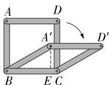

text_image

A
D
A'
D'
B
E C

第6题解图

7. D 【解析】任意选择四个点 A, B, C, D 顺次连接得到四边形 ABCD，如解图①，∵ 图中三角形均为全等的等边三角形，∴ AD = BC, AB = CD，∴ 四边形 ABCD 为平行四边形；如解图②，由题可知，△ABC 和 △ACD 为两个全等的等边三角形，AB = BC = CD = AD，∴ 四边形 ABCD 为菱形；如解图③，∵ 图中小三角形均为全等的等边三角形，AD = BC, ∠ADE = ∠F = 60°，∴ AD // BC，∴ 四边形 ABCD 为平行四边形，∵ AC = BD，∴ 四边形 ABCD 为矩形.

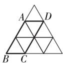  
图①

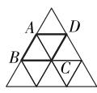  
图②

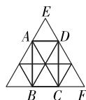  
图③  
第 7 题解图

8. B 【解析】因为大正方形地板砖的边长为 20 cm, ∴ OE = 10 cm, ∵ 点 A 是 OE 的中点, ∴ AO = 5 cm, ∵ 四边形 ABCD 是正方形, ∴ OD = OA = 5 cm, ∠ AOD = 90°, ∴ AD = $\sqrt{2}$ AO = 5 $\sqrt{2}$ cm.

9. D 【解析】∵ Rt $\triangle ABC$ 中, $\angle C = 90^{\circ}$ , ∴ BC = $\sqrt{AB^{2} - AC^{2}} = 2$ . 如解图, 过点 O 分别作 OE ⊥ AC 于点 E, OF ⊥ AB 于点 F, 连接 OC, 则 OE = OF = OM, ∴ 四边形 OEMC 为正方形. ∵ $\frac{1}{2}AC \cdot BC = \frac{1}{2}AC \cdot OE + \frac{1}{2}BC \cdot OM + \frac{1}{2}AB \cdot OF$ , 即 $2\sqrt{5} = (\sqrt{5} + 2 + 3) \cdot OM$ , 解得 $OM = \frac{\sqrt{5} - 1}{2}$ . ∴ BM = BC - CM = BC - OM = $\frac{5 - \sqrt{5}}{2}$ .

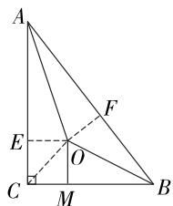

text_image

A
E
F
O
C
M
B

第9题解图

大小卷·九年级(全一册) 数学 BS

10. A 【解析】如解图, 设 BF 交 CE 于点 G, 由折叠的性质, 得 BE = FE, $BF \perp CE$ , BG = FG. 在矩形 ABCD 中, AB = 4, AD = 6, ∵ 点 E 是 AB 的中点, ∴ $BE = \frac{1}{2}AB = 2$ , BC = AD = 6, ∴ CE = $\sqrt{BE^{2} + BC^{2}} = 2\sqrt{10}$ . 在 $\triangle BCE$ 中, 由等面积法, 得 $BG = \frac{BC \cdot BE}{CE} = \frac{6 \times 2}{2\sqrt{10}} = \frac{3\sqrt{10}}{5}$ , ∴ $BF = 2BG = \frac{6\sqrt{10}}{5}$ .

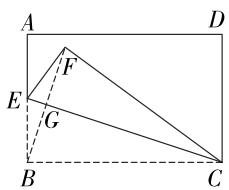

text_image

A
D
F
E
G
B
C

第 10 题解图

11. $AB = AD$ (答案不唯一)

12. 4 【解析】∵ $\angle BAC = 90^{\circ}$ , $\angle ABC = 60^{\circ}$ , ∴ $\angle ACB = 30^{\circ}$ , ∵ BE 平分 $\angle ABC$ , ∴ $\angle ABE = \angle EBC = 30^{\circ}$ , ∴ $\angle ECB = \angle EBC$ , ∴ BE = CE = 8, ∵ 点 P 是 BE 的中点, $\angle BAE = 90^{\circ}$ , ∴ AP = $\frac{1}{2}BE = 4$ .

13. $20\sqrt{3}$ 【解析】如解图, 连接 BD 交 AC 于点 O, ∵ 四边形 ABCD 是菱形, 且周长是 80 cm, ∴ AB = BC = CD =

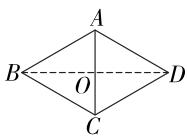  
第 13 题解图

$AD = 20\mathrm{cm}, AC \perp BD, \because \angle ABC = 60^{\circ}, \therefore \triangle ABC$ 是等边三角形， $\therefore AC = AB = 20\mathrm{cm}, AO = \frac{1}{2} AC = 10(\mathrm{cm})$ ，在 Rt△AOB 中， $BO = \sqrt{AB^2 - AO^2} = \sqrt{20^2 - 10^2} = 10\sqrt{3} (\mathrm{cm}), \therefore BD = 2BO = 20\sqrt{3} (\mathrm{cm})$ .

14. $16\sqrt{2}+64$ 【解析】如解图, 连接 BD, AC, EG,
∵ 四边形 ABCD 和四边形 EFGH 是正方形, $AB = EF = 4$ , ∴ $AC = 4\sqrt{2}$ , $EG = 4\sqrt{2}$ , ∴ $BD = AC = 4\sqrt{2}$ . ∵ 点 A, C, E, G 在同一条直线上, ∴ $AG = AC + CE + EG = 4\sqrt{2} + 4 + 4\sqrt{2} = 8\sqrt{2} + 4$ ,
∴ 示意图的面积为 $(8\sqrt{2}+4)\times4\sqrt{2}=16\sqrt{2}+64$

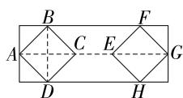  
第 14 题解图

15. 8 【解析】如解图,作点 E 关于 AC 的对称点 G, 连接 PG, GF, 由对称性可得 PG = PE, AG = AE, ∴ $PE + PF = PG + PF \geqslant GF$ , ∴ 当 G, P, F 三点共线时, $PE + PF$ 有最小值. ∵ E 是 AB 的中点, ∴ G 是 AD 的中点, ∴ $AG = \frac{1}{2} AD$ . ∵ F 是 BC 的中点, ∴ $BF = \frac{1}{2} BC$ . ∵ 四边形 ABCD 是菱形, ∴ $AG \parallel BF$ , AD = BC, ∴ AG = BF, ∴ 四边形 ABFG 是平行四边形, ∴ $GF = AB = 8$ , ∴ PE + PF 的最小值为 8.

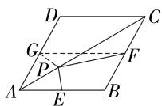  
第 15 题解图

16. 证明:∵ 四边形 ABCD 是矩形,

$$
\begin{array}{l} \therefore A B = D C, \angle B = \angle C = 9 0 ^ {\circ}, \\ \because B F = C E, B E = B F + E F, C F = C E + E F, \\ \therefore B E = C F, \dots \tag {3分} \\ \therefore \triangle A B E \cong \triangle D C F (\text { SAS }), \\ \therefore \angle A E B = \angle D F C, \\ \therefore E G = F G. \quad \dots\dots (7 \text {分}) \\ \end{array}
$$

17. (1) 证明: ∵ 四边形 ABCD 是平行四边形, $DM \perp BC, DN \perp AB$ ,

$$
\therefore S _ {\text { 平行四边形 } A B C D} = A B \cdot D N = B C \cdot D M,
$$

$$
\because D M = D N,
$$

$$
\therefore A B = B C,
$$

∴ 平行四边形 ABCD 是菱形；……（3 分）
(2) 解: 如解图, 连接 AC 交 BD 于点 O,

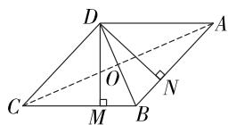  
第 17 题解图

由(1)可知,四边形ABCD是菱形,

$$
\therefore O A = O C, O B = O D = \frac {1}{2} D B = 4, A C \perp B D,
$$

在 Rt $\triangle COD$ 中, 由勾股定理得 OC = $\sqrt{CD^{2}-OD^{2}}=\sqrt{10^{2}-4^{2}}=2\sqrt{21}$ ,

$$
\therefore A C = 2 O C = 4 \sqrt {2 1},
$$

$$
\therefore S _ {\text {菱形} A B C D} = \frac {1}{2} A C \cdot D B = \frac {1}{2} \times 4 \sqrt {2 1} \times 8 =
$$

$16\sqrt{21}$ ． (7分)

18. (1) 证明: ∵ 四边形 ABCD 是正方形,

$$
\therefore A D = A B = B C, \angle D A B = \angle C B A = 9 0 ^ {\circ},
$$

∵ $\triangle ABE$ 是等边三角形，

$$
\therefore A E = B E = A B, \angle E A B = \angle E B A = 6 0 ^ {\circ},
$$

$\therefore \angle DAE = 30^{\circ}, \angle CBE = 30^{\circ}, \dots\dots$ (2分)

$$
\therefore \angle D A E = \angle C B E,
$$

$$
\therefore \triangle D A E \cong \triangle C B E (\text { SAS }),
$$

∴ CE = DE; …… (4 分)

(2) 解: ∵ 四边形 ABCD 是正方形, BD 是对角线,

$$
\therefore \angle A D B = \frac {1}{2} \angle A D C = 4 5 ^ {\circ},
$$

由(1)可知 $\angle DAE = 30^{\circ}, AD = AE = AB,$

$$
\therefore \angle A D E = \frac {1}{2} (1 8 0 ^ {\circ} - \angle D A E) = 7 5 ^ {\circ},
$$

$$
\therefore \angle E D B = \angle A D E - \angle A D B = 7 5 ^ {\circ} - 4 5 ^ {\circ} = 3 0 ^ {\circ}. \dots
$$

…… (7 分)

19. 解: (1)6; …… (3分)

【解法提示】由题意得 AE=t, BF=18-2t, 当四边形 AEFB 是矩形时, 得 t=18-2t, 解得 t=6.

(2)要使四边形 EFCD 为菱形,则首先四边形 EFCD 是平行四边形,

$$
\because A D \parallel B C,
$$

∴ 当 ED=FC 时, 四边形 EFCD 是平行四边形,
∵ AE=t,

$$
\therefore D E = 1 5 - t,
$$

∴ 15-t=2t, 解得 t=5,

此时 AE=5 cm, ED=10 cm, CF=10 cm, BF=8 cm,
如解图, 过点 E 作 $EH \perp BF$ 于点 H, 则 FH=BC-BH-CF=BC-AE-CF=18-5-10=3 (cm),
当四边形 EFCD 为菱形时, EF=ED=CF=10 cm,

∴ $AB = EH = \sqrt{EF^{2} - FH^{2}} = \sqrt{91}$ (cm). …… (8分)

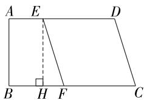

text_image

A E D
B H F C

第 19 题解图

20. 解:(1)如解图①,∵四边形 AEDF 是菱形,

$$
\therefore A E = D E,
$$

$$
\because \angle E = 6 0 ^ {\circ},
$$

∴ $\triangle ADE$ 是等边三角形，

$$
\therefore A D = A E = D E = 5 \sqrt {2} \mathrm{cm},
$$

$$
\therefore A B = 6 A D = 3 0 \sqrt {2} (\mathrm{cm}),
$$

∵拳头的长 BC=5 cm,

∴ 此时的“射程” $AC = AB + BC = (30\sqrt{2} + 5) \, \text{cm}$ ;
……(3 分)

(2)如解图②,连接 EF 交 AD 于点 O,由题可知 AC=65 cm,

∵拳头的长 BC=5 cm,

$$
\therefore A B = 6 0 \mathrm{cm},
$$

$$
\therefore A D = 1 0 \mathrm{cm},
$$

∵ 四边形 AEDF 是菱形，

$$
\therefore E F \perp A D, O D = A O = 5 \mathrm{cm}, \angle D E O = \angle A E O,
$$

$$
\therefore O E = \sqrt {D E ^ {2} - O D ^ {2}} = 5 (\mathrm{cm}),
$$

$$
\therefore O D = O E,
$$

∴ $\triangle DOE$ 是等腰直角三角形，

$$
\therefore \angle D E O = 4 5 ^ {\circ},
$$

$$
\therefore \angle A E D = 9 0 ^ {\circ},
$$

即拳击枪每个菱形的上部内角的度数为 $90^{\circ}$ .

……（8分）

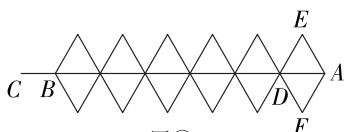

text_image

C B
E
A
D
F
②

图①  
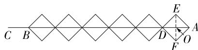

text_image

C B
D E
A
F O

图②  
第 20 题解图

21. 解:(1)(答案不唯一).

选择①OE=OF.

证明:∵矩形ABCD的对角线AC,BD交于点O,
∴ AO = CO, AD // BC,

$$
\therefore \angle E A O = \angle F C O,
$$

在 $\triangle AOE$ 和 $\triangle COF$ 中， $\left\{\begin{aligned}\angle EAO&=\angle FCO,\\ AO&=CO,\\ \angle AOE&=\angle COF,\end{aligned}\right.$

$$
\therefore \triangle A O E \cong \triangle C O F (\mathrm{ASA}),
$$

∴ OE=OF; …… (3 分)

选择②AE=CF.

证明:∵ 矩形 ABCD 的对角线 AC,BD 交于点 O,

$$
\therefore A O = C O, A D \parallel B C,
$$

$$
\therefore \angle E A O = \angle F C O,
$$

大小卷·九年级(全一册) 数学 BS

在 $\triangle AOE$ 和 $\triangle COF$ 中， $\left\{\begin{aligned}\angle EAO&=\angle FCO,\\ AO&=CO,\\ \angle AOE&=\angle COF,\end{aligned}\right.$

$$
\therefore \triangle A O E \cong \triangle C O F (\mathrm{ASA}),
$$

$\therefore AE=CF;$ (3分)

(2)如解图,由(1)可知,OE=OF,AO=CO,

$$
\because \angle E P F = 9 0 ^ {\circ},
$$

$$
\therefore O P = \frac {1}{2} E F.
$$

$$
\because A E \parallel B F, A E = B F,
$$

∴ 四边形 ABFE 是平行四边形，

$$
\because \angle A B C = 9 0 ^ {\circ},
$$

∴ 四边形 ABFE 是矩形，

$$
\therefore E F = A B = 5,
$$

$$
\therefore O P = \frac {1}{2} E F = 2. 5.
$$

在 Rt△ABC 中, $AC=\sqrt{AB^{2}+BC^{2}}=13$ ,

$$
\therefore A O = C O = \frac {1}{2} A C = 6. 5,
$$

当 P 在 AO 上时，

$$
\therefore A P ^ {\prime} = A O - O P ^ {\prime} = 6. 5 - 2. 5 = 4,
$$

当 P 在 CO 上时，

$$
A P ^ {\prime \prime} = A O + O P ^ {\prime \prime} = 6. 5 + 2. 5 = 9,
$$

∴ AP 的长为 4 或 9. …… (8 分)

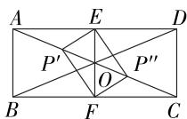  
第 21 题解图

22. (1) 证明: ∵ 四边形 ABCD 是正方形,

$$
\therefore A B = B C, \angle A B C = \angle B C D = 9 0 ^ {\circ},
$$

$$
\because A E \perp B F,
$$

$$
\therefore \angle B G E = 9 0 ^ {\circ},
$$

$$
\therefore \angle G B E + \angle G E B = 9 0 ^ {\circ},
$$

$$
\because \angle B A E + \angle G E B = 9 0 ^ {\circ},
$$

$$
\therefore \angle B A E = \angle G B E,
$$

在 $\triangle ABE$ 和 $\triangle BCF$ 中，

$$
\left\{ \begin{array}{l} \angle B A E = \angle C B F, \\ A B = B C, \\ \angle A B E = \angle B C F, \end{array} \right.
$$

$$
\therefore \triangle A B E \cong \triangle B C F (\mathrm{ASA}),
$$

∴ AE = BF; …… (3 分)

(2) 解: 成立, …… (4 分)

证明如下：

∵ 四边形 ABCD 是正方形，

$\therefore AB = BC, \angle ABE = \angle ABC = \angle BCF = 90^{\circ},$

$$
\because A E \perp B F,
$$

$$
\therefore \angle B G A = 9 0 ^ {\circ},
$$

$$
\therefore \angle B A E + \angle A B G = 9 0 ^ {\circ},
$$

$$
\because \angle C B F + \angle A B G = 9 0 ^ {\circ},
$$

$$
\therefore \angle B A E = \angle C B F,
$$

在 $\triangle ABE$ 和 $\triangle BCF$ 中，

$$
\left\{ \begin{array}{l} \angle B A E = \angle C B F, \\ A B = B C, \\ \angle A B E = \angle B C F, \end{array} \right.
$$

$$
\therefore \triangle A B E \cong \triangle B C F (\text { ASA }),
$$

$\therefore AE=BF;$ (6分)

(3) 解: 成立, …… (7 分)

证明如下:如解图,过点 N 作 $NK \perp AB$ 于点 K,
∵ 四边形 ABCD 是正方形,由题知四边形 ADNK 是矩形,

$$
\therefore A B = A D = K N, \angle A B E = \angle B A D = \angle M K N = 9 0 ^ {\circ},
$$

$$
\because A E \perp M N,
$$

$$
\therefore \angle A G M = 9 0 ^ {\circ},
$$

$$
\therefore \angle M A G + \angle A M G = 9 0 ^ {\circ},
$$

$$
\because \angle M N K + \angle A M G = 9 0 ^ {\circ},
$$

$$
\therefore \angle M N K = \angle M A G,
$$

在 $\triangle NKM$ 和 $\triangle ABE$ 中，

$$
\left\{ \begin{array}{l} \angle M N K = \angle E A B, \\ N K = A B, \\ \angle N K M = \angle A B E, \end{array} \right.
$$

$$
\therefore \triangle N K M \cong \triangle A B E (\mathrm{ASA}),
$$

∴ MN = AE. …… (10 分)

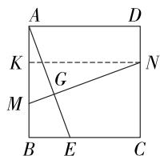

text_image

A
D
K
G
M
B
E
C
N

第 22 题解图

# 第二章检测卷

1. C 【解析】① $5x^{2}+2x=16$ 是一元二次方程；②6x-3y=7，含有两个未知数，不是一元二次方程；③ $3x^{2}=2$ 是一元二次方程；④x-3=0，只含有一个未知数且为一次，不是一元二次方程.

2. B 【解析】∵ x=2 是方程 $x^{2}-2mx+2m=0$ 的一个根，∴ $4-4m+2m=0$ ，解得 m=2。

3. B 【解析】∵ $4x^{2}-8x-1=0$ , ∴ $4x^{2}-8x=1$ , $x^{2}-2x=\frac{1}{4},x^{2}-2x+1=\frac{1}{4}+1,\therefore(x-1)^{2}=\frac{5}{4}.$

4. C 【解析】设牡丹园面积的年平均增长率为 x，则 $800(1+x)^{2}=1\ 152$ ，解得 $x_{1}=0.2=20\%$ , $x_{2}=-2.2$ （不合题意，舍去），∴该地牡丹园面积的年平均增长率为 20%.

5. D 【解析】依题意得 $(35-2x)(20-x)=558$ ，整理得 $2x^{2}-75x+142=0$ ，解得 $x_{1}=2,x_{2}=\frac{71}{2}$ （不符合题意，舍去）.

6. D 【解析】根据题意可得 $m=5,\therefore$ 原方程为 $x^{2}-6x+5=0$ , 解得 $x_{1}=1,x_{2}=5$ .

7. C 【解析】∵ 关于 x 的一元二次方程 $(m+2)x^{2}+4x+1=0$ 有实数根，∴ $b^{2}-4ac=4^{2}-4(m+2)=16-4m-8=8-4m\geqslant0,\therefore m\leqslant2.\because m+2\neq0,\therefore m\neq-2.$ 综上所述， $m\leqslant2$ 且 $m\neq-2.$

8. C 【解析】∵ 点 A 对应的数为 $7-3x-2x^{2}$ ，且点 A 在数轴的负半轴，∴ $OA = -(7 - 3x - 2x^{2}) = 2x^{2} + 3x - 7 = 2$ ，整理得 $2x^{2} + 3x - 9 = 0$ ，∵ a = 2, b = 3, c = -9, ∴ $b^{2} - 4ac = 3^{2} - 4 \times 2 \times (-9) = 81$ , ∴ $x = \frac{-3 \pm 9}{4}$ , ∴ 方程的根为 $x_{1} = \frac{3}{2}$ , $x_{2} = -3$ .

9. A 【解析】设方程的两根为 $x_{1}$ 和 $x_{2}, \because x_{1} + x_{2} = a^{2} = 1, \therefore a = \pm 1$ . 当 a = 1 时, 原方程为 $-x^{2} + x = 0$ , $\Delta = b^{2} - 4ac = 1 - 4 \times (-1) \times 0 = 1 > 0$ , ∴ 此时原方程有两个不相等的实数根; 当 a = -1 时, 原方程为 $-x^{2} + x - 2 = 0$ , $\Delta = 1 - 4 \times (-1) \times (-2) = -7 < 0$ , ∴ 此时原方程无实数根. ∴ 符合条件的 a 的值为 1.

10. C 【解析】根据题意, 得 $x_{1}=\frac{-b+\sqrt{b^{2}-4a}}{2a}, x_{2}=$ $\frac{-b-\sqrt{b^{2}-4a}}{2a},\therefore\frac{-b+\sqrt{b^{2}-4a}}{2a}-\frac{-b-\sqrt{b^{2}-4a}}{2a}=2,$

整理得 $\frac{\sqrt{b^{2}-4a}}{a}=2,\therefore b^{2}-4a=4a^{2},\therefore b^{2}=4a^{2}+4a,\therefore12a-b^{2}=12a-(4a^{2}+4a)=-4a^{2}+8a=-4(a-1)^{2}+4.\because-4(a-1)^{2}\leqslant0,\therefore-4(a-1)^{2}+4$ 的最大值为4,即 $12a-b^{2}$ 的最大值为4.

11. $x_{1}=-2, x_{2}=1$

12. 5 【解析】根据题意得 $x_{1} + x_{2} = 3, x_{1}x_{2} = 1, \therefore x_{1}^{2} + x_{2}^{2} - 2 = (x_{1} + x_{2})^{2} - 2x_{1}x_{2} - 2 = 3^{2} - 2 \times 1 - 2 = 5.$

13. 30 【解析】设全班共有 x 名同学, 根据题意知 1 名同学送出去 $(x-1)$ 张照片, 则 x 名同学送出去 $x(x-1)=870$ , 解得 $x_{1}=-29$ (舍去), $x_{2}=30$ , 所以全班共有 30 名同学.

14. $2\sqrt{2}$ 【解析】 $\because 2x^{2} - 4x = 5(2 - x),\therefore 2x^{2} + x-$ $10 = 0,\therefore (x - 2)(2x + 5) = 0$ ，解得 $x_{1} = 2,x_{2} =$ $-\frac{5}{2},\because AE$ 的长是一元二次方程 $2x^{2} - 4x = 5(2-$ $x)$ 的一个根且 $AE > 0,\therefore AE = 2,\because \angle B = 45^{\circ},AE$ 垂直平分 $BC,\therefore AE = BE = CE = 2$ ，在 Rt△ABE中， $AB = \sqrt{BE^2 + AE^2} = 2\sqrt{2}.$

15. 36 岁 【解析】设周瑜去世时的年龄的个位数字为 x，则十位数字为 x-3，依题意，得 $10(x-3)+x=x^{2}$ ，解得 $x_{1}=5, x_{2}=6$ ，当 x=5 时，周瑜去世时的年龄为 25 岁，未到而立之年（30 岁），不符合题意；当 x=6 时，周瑜去世时的年龄为 36 岁，符合题意。

16. 解: (1) 移项, 得 $x^{2} + 14x = -24$ ,

配方, 得 $x^{2}+2\times7x+7^{2}=-24+7^{2}$ ,

即 $(x+7)^{2}=25$ ,

开平方, 得 $x+7=5$ 或 $x+7=-5$ ,

解得 $x_{1}=-2, x_{2}=-12;$ …… (3 分)

(2) $x^{2}-5x=3(5-x)$ ,

$$
x (x - 5) = - 3 (x - 5),
$$

$$
x (x - 5) + 3 (x - 5) = 0,
$$

$(x+3)(x-5)=0,$

∴ $x+3=0$ 或 x-5=0,

解得 $x_{1}=-3, x_{2}=5.$ …… (6 分)

17. 解: (1) 一, 开方后 $x-1=\pm(3x+1)$ ; … (3 分)
(2) $x-1=\pm(3x+1)$ ,

# 大小卷·九年级(全一册) 数学 BS

$$
x - 1 = 3 x + 1 \text {或} x - 1 = - 3 x - 1,
$$

$$
\therefore x _ {1} = - 1, x _ {2} = 0. \dots \tag {6分}
$$

18. (1) 证明: $\because \Delta = (-a)^2 - 4(a - 1) = a^2 - 4a + 4 = (a - 2)^2 \geqslant 0$ ,

∴ 该方程总有两个实数根；……（3 分）

(2) 解: 根据根与系数的关系得 $x_{1} + x_{2} = a$ , $x_{1}x_{2}=a-1,$

$$
\begin{array}{l} \because | x _ {1} - x _ {2} | = \sqrt {\left(x _ {1} - x _ {2}\right) ^ {2}} = \sqrt {\left(x _ {1} + x _ {2}\right) ^ {2} - 4 x _ {1} x _ {2}} = \\ \sqrt {a ^ {2} - 4 (a - 1)} = \sqrt {(a - 2) ^ {2}} = 3, \end{array}
$$

$$
\therefore a - 2 = 3 \text {或} a - 2 = - 3,
$$

解得 a=5 或 a=-1. …… (6 分)

19. 解: (1) 设这两年该校植树棵数的年平均增长率为 x,

根据题意, 得 $500 + 500 \times (1 + x) + 500 \times (1 + x)^{2} = 1820$ ,

解得 $x_{1}=0.2=20\%$ , $x_{2}=-3.2$ (不符合题意, 舍去).

∴ 这两年该校植树棵数的年平均增长率为 20%; …… (3 分)

(2) 由 (1) 易知该校今年植树 $500 \times (1 + 20\%)^2 = 720$ (棵), $\therefore$ 明年该校植树棵数为 $720 \times (1 + 20\%) = 864$ (棵),

∵一棵树每天大约可吸收5千克二氧化碳，

∴ 明年该校植的树每天大约能吸收的二氧化碳为 $864 \times 5 = 4320$ (千克). …… (7 分)

20. 解: (1) 将 $2x + 5$ 视为一个整体, 设 $2x + 5 = y$ , 则原方程化为 $y^{2} - 4y + 3 = 0$ ,

解此方程得 $y_{1}=1, y_{2}=3$ ,

当 y=1 时, $2x+5=1,\therefore x=-2$ ,

当 y=3 时, $2x+5=3$ , $\therefore x=-1$ ,

∴ 原方程的解为 $x_{1}=-2, x_{2}=-1$ ; …… (3 分)

(2) 设 $x^{2}=y$ ，则原方程化为 $y^{2}-8y+7=0$ ，解此方程得 $y_{1}=1, y_{2}=7$ ，

当 y=1 时, $x^{2}=1,\therefore x=\pm1$ ,

当 $y = 7$ 时， $x^{2} = 7, \therefore x = \pm \sqrt{7}$ ，

∴ 原方程的解为 $x_{1} = -1, x_{2} = 1, x_{3} = -\sqrt{7}$ , $x_{4}=\sqrt{7}$ . …… (7 分)

21. 解: 由题意知, $\Delta = \left[-(2k+1)\right]^{2} - 4 \times 5\left(k - \frac{3}{4}\right) = 4k^{2} - 16k + 16 = 4(k-2)^{2} \geqslant 0$ ,

∵ $\triangle ABC$ 是等腰三角形，

∴ ① 当 b=c 时, $\Delta=4(k-2)^{2}=0$ , 解得 k=2,

方程化为 $x^{2}-5x+\frac{25}{4}=0$ ，解得 $x_{1}=x_{2}=\frac{5}{2}$ ，

$$
\because \frac {5}{2} + \frac {5}{2} = 5 > 4,
$$

$\therefore \frac{5}{2}, \frac{5}{2}, 4$ 能构成等腰三角形，

此时 $\triangle ABC$ 的周长为 $\frac{5}{2} + \frac{5}{2} + 4 = 9$ ; $\cdots$ (4 分)

②当 b=a=4 或 c=a=4 时，

把 x=4 代入方程, 得 $16-4(2k+1)+5(k-\frac{3}{4})=0$ ,

解得 $k=\frac{11}{4}$ ,

方程化为 $x^{2}-\frac{13}{2}x+10=0$ ，解得 $x_{1}=\frac{5}{2}, x_{2}=4$ ，

∵ $4+\frac{5}{2}>4,\therefore 4,4,\frac{5}{2}$ 能构成等腰三角形，

此时 $\triangle ABC$ 的周长为 $4 + 4 + \frac{5}{2} = \frac{21}{2}$ .

综上所述, $\triangle ABC$ 的周长为9或 $\frac{21}{2}$ .

$$
\dots\dots(7 \text {分})
$$

22. 解: (1) 3, 6; …… (2 分)

【解法提示】∵ 四边形 ABCD 是菱形, ∴ AB = BC = 12 cm, 经过 3 s 时, BP = 3 cm, AQ = 6 cm, ∴ BQ = AB - AQ = 6 (cm).

(2) $\because\angle B=60^{\circ},\therefore\triangle BPQ$ 是直角三角形有两种情况,设运动时间为t s,则BP=t,AQ=2t,BQ=12-2t,分情况讨论:

①当 $\angle PQB=90^{\circ}$ 时, $\angle BPQ=30^{\circ}$ ,

$$
\therefore B P = 2 B Q, \therefore t = 2 (1 2 - 2 t),
$$

$$
\therefore t = \frac {2 4}{5}; \dots \tag {3分}
$$

②当 $\angle BPQ=90^{\circ}$ 时, $\angle PQB=30^{\circ},\therefore BQ=2BP$ , $\therefore 12-2t=2t$ ,

$$
\therefore t = 3.
$$

综上所述,经过3 s或 $\frac{24}{5}$ s时, $\triangle BPQ$ 是直角三角形; (4分)

(3)如解图,过点A作 $AH\perp BC$ 于点H,

$$
\because \angle B = 6 0 ^ {\circ},
$$

$$
\therefore \angle B A H = 3 0 ^ {\circ},
$$

$$
\therefore B H = \frac {1}{2} A B = 6 \mathrm{cm},
$$

$$
\therefore A H = \sqrt {A B ^ {2} - B H ^ {2}} = 6 \sqrt {3} (\mathrm{cm}),
$$

∴菱形 ABCD 的面积为 $BC \cdot AH = 12 \times 6\sqrt{3} = 72\sqrt{3} \, (\text{cm}^2)$ ,

过点 Q 作 $QM \perp BC$ 于点 M, 连接 PQ,

设运动时间为 $t$ s, 则 $BP = t$ , $AQ = 2t$ , $BQ = 12 - 2t$ .

$$
\because \angle B = 6 0 ^ {\circ}, \therefore \angle B Q M = 3 0 ^ {\circ},
$$

∴ $\triangle BPQ$ 的面积 $=\frac{1}{2}\times BP\times QM=\frac{1}{2}BP\times\frac{\sqrt{3}}{2}BQ=$ $\frac{1}{2}t\times\frac{\sqrt{3}}{2}\times(12-2t)\left(\mathrm{cm}^{2}\right)$ ,

当 $\triangle BPQ$ 的面积等于菱形面积的 $\frac{1}{18}$ 时，

$$
\frac {1}{2} t \times \frac {\sqrt {3}}{2} \times (1 2 - 2 t) = 7 2 \sqrt {3} \times \frac {1}{1 8},
$$

$$
\therefore t ^ {2} - 6 t + 8 = 0, \therefore t _ {1} = 2, t _ {2} = 4,
$$

∴ 经过 2 s 或 4 s 时, $\triangle BPQ$ 的面积等于菱形
面积的 $\frac{1}{18}$ . (8分)

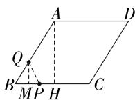  
第 22 题解图

23. 解:【任务 1】 $(100-60-8)\times(20+2\times8)=1\ 152$ (元),

答: 当降价 8 元时, 平均每天销售文化衫的利润为 1152 元; …… (2 分)

【任务2】设每件文化衫降价 x 元, 则平均每天可销售 $(20+2x)$ 件,

依题意,得 $(100-60-x)(20+2x)=1\ 050$ ,

整理, 得 $x^{2}-30x+125=0$ ,

解得 $x_{1}=25, x_{2}=5$ ,

∵要优惠力度最大,∴x=25,

当 x=25 时, 销售价为 100-25=75(元),

∴ 当每件文化衫的销售价为 75 元时, 景区每天获得的销售利润达到 1050 元并且优惠最大; …… (5 分)

【任务3】不能. …… (6分)

理由如下:设每件文化衫降价 x 元,

∵为了保证每件文化衫的利润率不低于55%,

$\therefore \frac{100 - 60 - x}{60} \times 100 \% \geqslant 55 \%$ , 解得 $x \leqslant 7$ ,

依题意,得 $(100-60-x)(20+2x)=1\ 200$ ,

整理, 得 $x^{2}-30x+200=0$ ,

解得 $x_{1}=10, x_{2}=20.$

∵为了保证每件文化衫的利润率不低于55%，降价必须不超过7元，

$\therefore x_{1}=10,x_{2}=20$ 都不符合题意,舍去.

答:每件文化衫的利润率不低于55%,且景区每天获得1200元的利润不能实现. ……

……（8分）

# 第三章检测卷

1. B 【解析】列表如下：

<table><tr><td></td><td>A</td><td>B</td><td>C</td><td>D</td></tr><tr><td>A</td><td>(A,A)</td><td>(A,B)</td><td>(A,C)</td><td>(A,D)</td></tr><tr><td>B</td><td>(B,A)</td><td>(B,B)</td><td>(B,C)</td><td>(B,D)</td></tr><tr><td>C</td><td>(C,A)</td><td>(C,B)</td><td>(C,C)</td><td>(C,D)</td></tr><tr><td>D</td><td>(D,A)</td><td>(D,B)</td><td>(D,C)</td><td>(D,D)</td></tr></table>

由表格可知,共有16种等可能的结果,其中抽取的两张卡片上恰有一张印有“共享知识”的结果有6种,∴P(抽取的两张卡片上恰有一张印有“共享知识”)= $\frac{6}{16}=\frac{3}{8}$ .

2. D 【解析】射箭的次数越多,射中的频率总在0.900左右摆动,故A错误;该选手射箭10次,不一定有8次射中靶心,故B错误;该选手射箭80次,射中靶心的频率可能超过0.900,故C错误;随着射箭次数的增加,显示出一定的稳定性,可以估计射中靶心的频率为0.900,故D正确.

3. A 【解析】把“陕西篇”“山西篇”“贵州篇”分别记为 A, B, C, 画树状图如下:

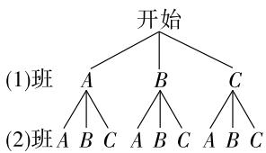

flowchart

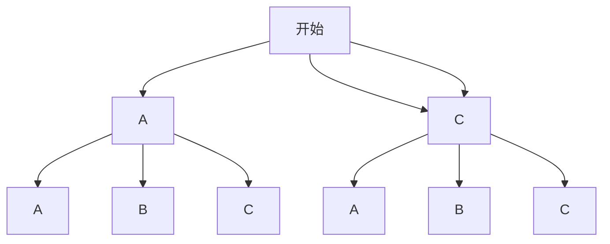

共有 9 种等可能的结

第3题解图

果,这两个班选择的篇章相同的结果有3种, $\therefore P(\text{这两个班选择的篇章相同的概率})=\frac{3}{9}=\frac{1}{3}.$

4. A 【解析】画树状图如下：

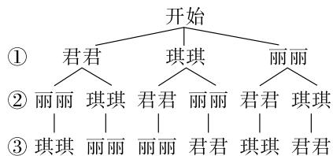

flowchart

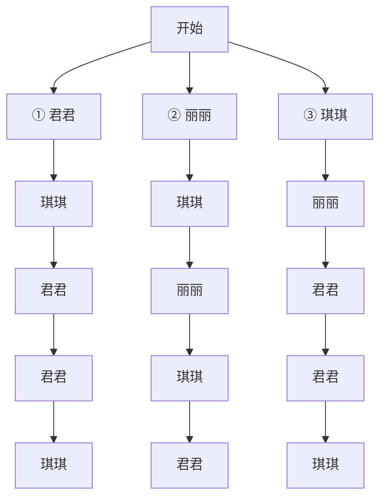

第4题解图

由树状图知,共有6种等可能结果,其中君君和琪琪相邻的有4种结果, $\therefore P(\text{君君和琪琪相邻的概率})=\frac{4}{6}=\frac{2}{3}.$

5. A 【解析】∵ 陕北说书的占比 = 100% - 60% - 20% - 10% = 10%, ∴ 报名陕北说书的人数为 2, 报名凤翔泥塑的人数为 $20 \times 10\% = 2$ , 将报

名陕北说书的同学记为 A1, A2, 将报名凤翔泥塑的同学记为 B1, B2, 列表如下: 一共有 12 种等可能结果, 至少有一位同学报名是凤翔泥塑的有 10 种, ∴ P (至少有一位同学报名是“凤翔泥塑”) = $\frac{10}{12} = \frac{5}{6}$ .

<table><tr><td></td><td>A1</td><td>A2</td><td>B1</td><td>B2</td></tr><tr><td>A1</td><td></td><td>(A1,A2)</td><td>(A1,B1)</td><td>(A1,B2)</td></tr><tr><td>A2</td><td>(A2,A1)</td><td></td><td>(A2,B1)</td><td>(A2,B2)</td></tr><tr><td>B1</td><td>(B1,A1)</td><td>(B1,A2)</td><td></td><td>(B1,B2)</td></tr><tr><td>B2</td><td>(B2,A1)</td><td>(B2,A2)</td><td>(B2,B1)</td><td></td></tr></table>

6. C 【解析】由树状图可知,第一次抽取的卡片有 A,B,C 3 种可能,第二次抽取的卡片也是 A,B,C 3 种可能,∴第一次抽取为有放回地抽取.

7. B 【解析】将上面两个开关记作 A, B, 下面两个开关记作 C, D, 由题意, 画树状图如解图, 共有 12 种等可能的结果, 可使小灯泡能发光的结果有 4 种: AB, BA, CD, DC, ∴ P (小灯泡能发光) = $\frac{4}{12} = \frac{1}{3}$ .

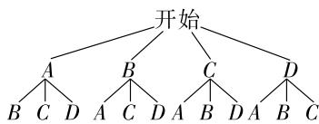

flowchart

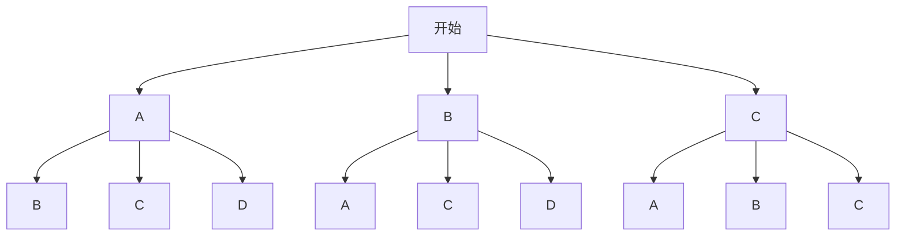

第 7 题解图

8. C 【解析】由题意画树状图如解图,共有6种等可能的结果,其中是正数的结果有2种,所以两次抽到的数字之积是正数的概率为 $\frac{2}{6}=\frac{1}{3}$ .

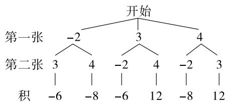

flowchart

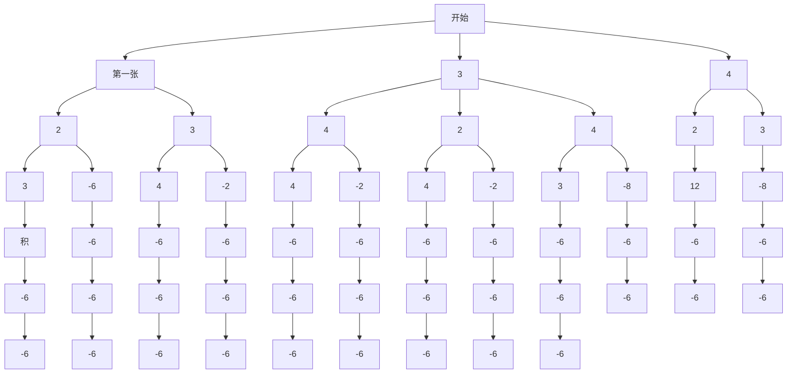

第8题解图

9. $\frac{2}{3}$ 【解析】设青少年竞技组、学生组和社会组三个组分别为 $A, B, C$ , 作树状图如下:

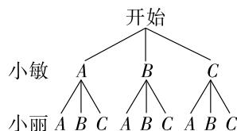

flowchart

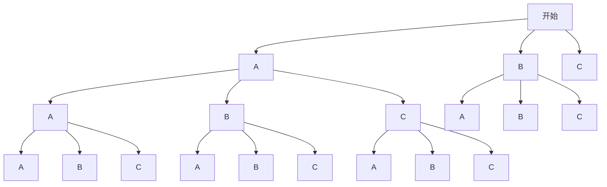

第9题解图

# 大小卷·九年级(全一册) 数学 BS

根据树状图可知共有9种等可能的结果,其中小敏和小丽在不同组的结果有6种,∴P(小敏和小丽被分到不同组做志愿者) $=\frac{6}{9}=\frac{2}{3}$ .

10. 绿球 【解析】∵ 不透明袋子中有 6 个红球, 4 个黄球和 2 个绿球, ∴ 红球被取得的概率 = $\frac{6}{12} = \frac{1}{2}$ , 黄球被取得的概率 = $\frac{4}{12} = \frac{1}{3}$ , 绿球被取得的概率 = $\frac{2}{12} = \frac{1}{6}$ , 由频率图可知, 该球被取得的频率大约在 0.17 左右波动, 最接近绿球被取得的概率.

11. ③ 【解析】根据题意画树状图如解图：

由树状图可知,共有4种等可能的结果,其中两正面朝上的占1种,两背面朝上的占1种,一枚正面朝上,另一枚背面朝上的占2种,∴①两正面朝上的概率为 $\frac{1}{4}$ ;②两背面朝上的概率为 $\frac{1}{4}$ ;③一枚正面朝上,另一枚背面朝上的概率为 $\frac{2}{4}=\frac{1}{2}$ ,∴③事件发生的概率最大.

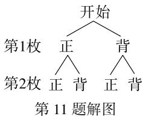

flowchart

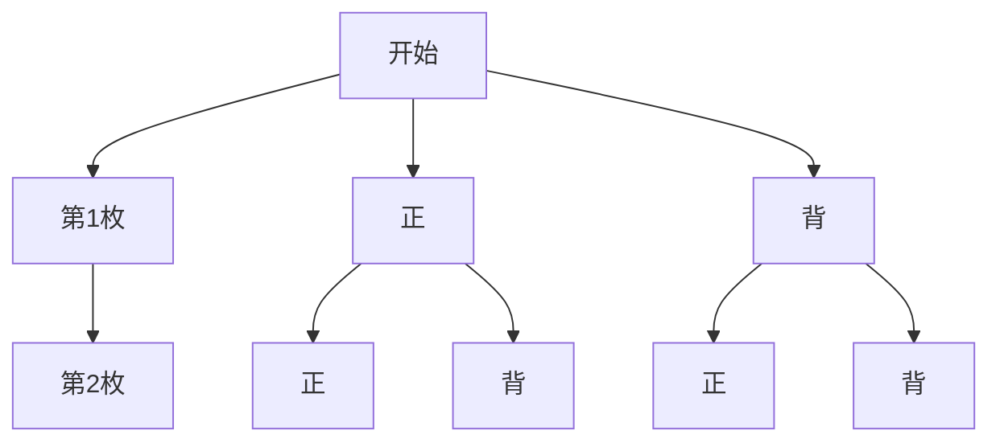

12. $\frac{1}{3}$ 【解析】由诗句可知,①④来自同一首诗,为李白的《行路难·其一》,②③来自同一首诗,为白居易的《钱塘湖春行》.列表如下:

<table><tr><td>甲\乙</td><td>1</td><td>2</td><td>3</td><td>4</td></tr><tr><td>1</td><td></td><td>12</td><td>13</td><td>14</td></tr><tr><td>2</td><td>21</td><td></td><td>23</td><td>24</td></tr><tr><td>3</td><td>31</td><td>32</td><td></td><td>34</td></tr><tr><td>4</td><td>41</td><td>42</td><td>43</td><td></td></tr></table>

共有 12 种等可能的结果,选取的诗句恰好是同一首诗的结果有 4 种,∴ 选取的诗句恰好是同一首诗的概率为 $\frac{4}{12}=\frac{1}{3}$ .

13. 解: 列表如下:

<table><tr><td></td><td>龙</td><td>行</td><td>龕</td><td>欣</td><td>家</td><td>国</td></tr><tr><td>龙</td><td></td><td>龙,行</td><td>龙,龕</td><td>龙,欣</td><td>龙,家</td><td>龙,国</td></tr><tr><td>行</td><td>行,龙</td><td></td><td>行,龕</td><td>行,欣</td><td>行,家</td><td>行,国</td></tr><tr><td>龕</td><td>龕,龙</td><td>龕,行</td><td></td><td>龕,欣</td><td>龕,家</td><td>龕,国</td></tr></table>

<table><tr><td>欣</td><td>欣,龙</td><td>欣,行</td><td>欣,囂</td><td></td><td>欣,家</td><td>欣,国</td></tr><tr><td>家</td><td>家,龙</td><td>家,行</td><td>家,囂</td><td>家,欣</td><td></td><td>家,国</td></tr><tr><td>国</td><td>国,龙</td><td>国,行</td><td>国,囂</td><td>国,欣</td><td>国,家</td><td></td></tr></table>

由列表可知,共有30种等可能的结果,其中抽取的两张卡片印有的字均属于一个主题词的结果有12种,……(5分)
∴ P(抽取的两张卡片印有的字均属于一个主题词) = $\frac{12}{30} = \frac{2}{5}$ . …… (8分)

14. 解: (1) 由题图可知, A 盘被均分为五个面积相等的扇形, 其中蓝色区域占两份, ∴ P(A 盘指针指向蓝色区域) = $\frac{2}{5}$ ; …… (2 分) 如解图, 将 B 盘分成四个面积相等的扇形, 其中蓝色区域占两份,

∴ $P(B \text{ 盘指针指向蓝色区域}) = \frac{2}{4} = \frac{1}{2}$ ; …… (4 分)

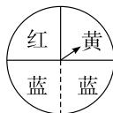

(2) 将 A 盘中两个红色分别记为红 第 14 题解图 1, 红 2, 蓝色分别记为蓝 1, 蓝 2, 将 B 盘中的蓝色分成两份, 记为蓝 1, 蓝 2, 根据题意可列表如下:

<table><tr><td>AB\A</td><td>红1</td><td>红2</td><td>蓝1</td><td>蓝2</td><td>黄</td></tr><tr><td>红</td><td>红1,红</td><td>红2,红</td><td>蓝1,红</td><td>蓝2,红</td><td>黄,红</td></tr><tr><td>黄</td><td>红1,黄</td><td>红2,黄</td><td>蓝1,黄</td><td>蓝2,黄</td><td>黄,黄</td></tr><tr><td>蓝1</td><td>红1,蓝1</td><td>红2,蓝1</td><td>蓝1,蓝1</td><td>蓝2,蓝1</td><td>黄,蓝1</td></tr><tr><td>蓝2</td><td>红1,蓝2</td><td>红2,蓝2</td><td>蓝1,蓝2</td><td>蓝2,蓝2</td><td>黄,蓝2</td></tr></table>

由列表可知,共有20种等可能的结果,
其中能配成“紫色”的结果有6种,

∴ P(指针指向的颜色恰好能配成“紫色”) = $\frac{6}{20} = \frac{3}{10}$ . (8分)

15. 解: (1) 令未持小物件的仕女摆件为甲, 手持小物件的仕女摆件为乙、丙、丁, 画树状图如下:

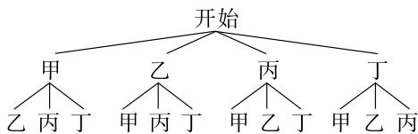

flowchart

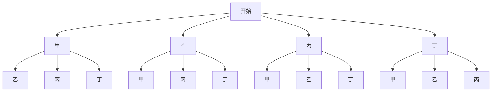

第 15 题解图

∴ 共有 12 种等可能的情况, 抽到的都是手持小物件仕女摆件有 6 种情形,

∴ P(抽到的都是手持小物件仕女摆件) = $\frac{6}{12}$ =

$\frac{1}{2}$ ； (6分)

(2)∵大量重复试验后发现,抽到手持小物件仕女摆件的频率稳定在0.95,

∴ 抽到手持小物件仕女摆件的概率等于 0.95,

$$
\therefore \frac {x + 3}{x + 4} = 0. 9 5,
$$

解得 x=16.

即 x 的值大约是 16. …… (12 分)

16. 解: (1) 不公平, 理由如下: 画树状图为:

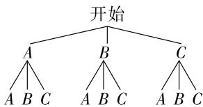

flowchart

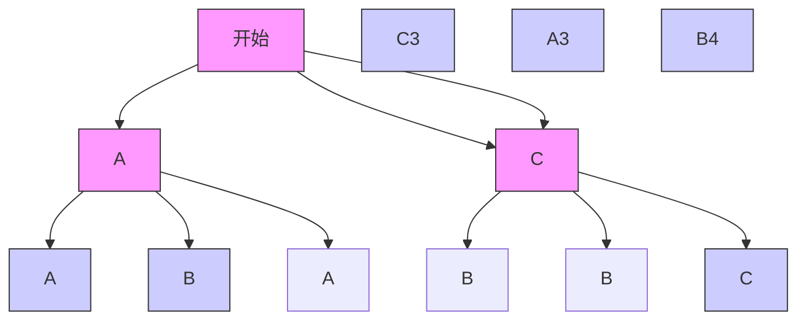

第 16 题解图

共有 9 种等可能的结果,其中字母相同的占 3 种,不相同的占 6 种,

∴ $P(\text{晨晨去})=\frac{3}{9}=\frac{1}{3}, P(\text{阳阳去})=\frac{6}{9}=\frac{2}{3},$

∴ 这个游戏不公平；……（5 分）

(2)可改为积分制:若所摸出的球上字母与转盘停止后指针对准的字母相同,则晨晨获得2分,若不同,则阳阳获得1分,3次游戏后谁积分高谁可以去看比赛(如平局则重复游戏)(答案不唯一).……(10分)

17. 解:(1)画树状图如解图①:

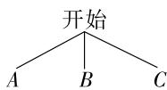  
第 17 题解图①

由树状图可知共有 3 种等可能的结果,选定 B 的结果有 1 种,∴ $P(\text{选定 } B)=\frac{1}{3}$ ; … (5 分)

(2)画树状图如解图②:

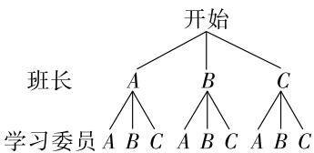

flowchart

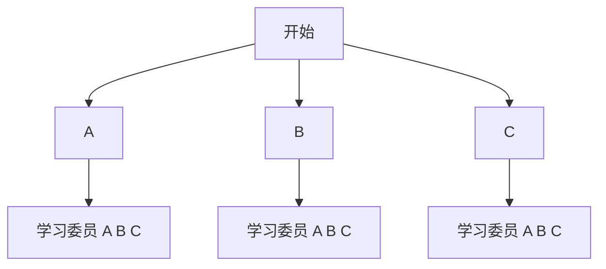

第 17 题解图②

由树状图可知共有9种等可能的结果,班长和学习委员同时选中A的结果有1种,

∴ $P(\text{班长和学习委员同时选中 } A)=\frac{1}{9}$ . ……
……（12 分）

18. 解: (1) 40; 18; …… (4 分)

【解法提示】 $6\div15\%=40$ （人），参加这次竞赛的学生总人数为40人，∴C部分的人数为40-6-12-4=18（人）.

(2)108;45;……(8分)

【解法提示】B 部分的圆心角为 $360^{\circ} \times \frac{12}{40} = 108^{\circ}$ ，由(1)知，C 部分的人数为 18 人，∴ C 所占总人数的百分比为 $\frac{18}{40} \times 100\% = 45\%$ .

(3) $1\ 000 \times 10\% = 100$ (人),

答:估计会有 100 人达到 81 分及以上；……
……(10 分)

(4)根据题意,列出表格如下:

<table><tr><td></td><td>小明</td><td>小亮</td><td>小梦</td><td>小璐</td></tr><tr><td>小明</td><td></td><td>(小明,小亮)</td><td>(小明,小梦)</td><td>(小明,小璐)</td></tr><tr><td>小亮</td><td>(小亮,小明)</td><td></td><td>(小亮,小梦)</td><td>(小亮,小璐)</td></tr><tr><td>小梦</td><td>(小梦,小明)</td><td>(小梦,小亮)</td><td></td><td>(小梦,小璐)</td></tr><tr><td>小璐</td><td>(小璐,小明)</td><td>(小璐,小亮)</td><td>(小璐,小梦)</td><td></td></tr></table>

由上表可知,共有12种等可能的情况,其中选出的两名学生恰好是小明和小梦的情况有2种,

∴ P(选出的两名学生恰好是小明和小梦)= $\frac{2}{12}=\frac{1}{6}$ . …… (14分)

# 第四章检测卷

1. D

2. B 【解析】∵ $\frac{b}{a} = \frac{c}{d} = \frac{e}{f} = \frac{2}{3}, \therefore \frac{2b}{a} = \frac{6c}{3d} = \frac{-4e}{-2f} = \frac{4}{3}, \because a + 3d - 2f \neq 0, \therefore \frac{2b + 6c - 4e}{a + 3d - 2f} = \frac{4}{3}.$

3. B 【解析】根据题意可知 $\frac{BC}{AB} \approx 0.618$ , ∵ BC = 30 cm, ∴ $AB = \frac{30}{0.618} \approx 49$ (cm), 即修剪后 AB 的长度最接近 50 cm.

4. A 【解析】∵ $\triangle ABC \sim \triangle ACP, \therefore \angle ACB = \angle APC = 65^{\circ}, \because \angle A = 70^{\circ}, \therefore \angle B = 180^{\circ} - \angle A - \angle ACB = 180^{\circ} - 70^{\circ} - 65^{\circ} = 45^{\circ}.$

5. C 【解析】A. 阴影部分的三角形与原三角形有两个角相等, 不符合题意; B. 阴影部分的三角形与原三角形有两个角相等, 不符合题意; C. 两三角形的对应边不一定成比例, 符合题意; D. 两三角形对应边成比例且夹角相等, 不符合题意.

6. C 【解析】设正方形城池的边长为 x 步，
则 $AE = CE = \frac{1}{2}x, \because AE \parallel CD, \therefore \angle BEA = \angle EDC,$ ∴ Rt△BEA ∼ Rt △EDC, ∴ $\frac{BA}{EC} = \frac{AE}{CD}$ ，即 x = 360 （负值已舍去），则正方形城池的边长为 360 步.

7. D 【解析】由题意得 $ED \perp AD, CB \perp AB, \therefore \angle ADE = \angle ABC,$ 又 $\because \angle A = \angle A, \therefore \triangle ADE \sim \triangle ABC, \therefore \frac{AD}{AB} = \frac{DE}{BC},$ 设大明宫城墙高度 BC 为 x m, 则 $\frac{3.4}{24} = \frac{1.7}{x}$ , 解得 x = 12, 即高度为 12 m.

8. A 【解析】如解图,延长 AF 与 DE 的延长线交于点 G,∵ $DE \parallel BC$ , ∴ $AG \perp DE$ , 即 AG 是 $\triangle ADE$ 的高线, ∵ $BC \parallel DE$ , ∴ $\triangle ABC \sim \triangle ADE$ , ∴ $\frac{AF}{AG} = \frac{BC}{DE}$ , ∴ $\frac{AF}{AF + 5} = \frac{6}{9}$ , ∴ AF = 10 m.

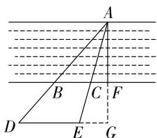

text_image

A
B C F
D E G

第8题解图

9. A 【解析】如解图,连接 AE 并延长交 x 轴于点 H,则点 H 为位似中心,∵ 点 A 的坐标为 $(-4,2)$ , 点 E 的坐标为 $(-1,1)$ , ∴ OF = 1, OB = 4, EF = 1, AB = 2, ∵ 正方形 ABCD 和正方形 EFOG 是位似图形, ∴ $EF \parallel AB$ , ∴ $\triangle HEF \sim \triangle HAB$ , ∴ $\frac{HF}{HB} = \frac{EF}{AB}$ , 即 $\frac{OH + 1}{OH + 4} = \frac{1}{2}$ , 解得 OH = 2, ∴ 点 H 的坐标为 $(2,0)$ .

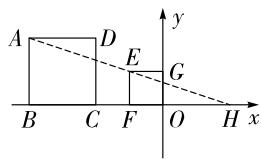

text_image

A
D
E
G
B C F O H x
y

第9题解图

10. C 【解析】易知 $AC \parallel DE \parallel FG$ ，从而可证 $\triangle BPC$ $\sim\triangle BRE\sim\triangle BFG,\therefore\frac{PC}{FG}=\frac{BC}{BG}=\frac{1}{3},\frac{RE}{FG}=\frac{BE}{BG}=$ $\frac{2}{3},\therefore PC=\frac{1}{3}FG=\frac{1}{3}AC,RE=\frac{2}{3}FG=\frac{2}{3}DE,$ $\therefore DR=\frac{1}{3}DE,\therefore PC=DR, 易证 \triangle PQC\cong$ $\triangle RQD, \therefore PQ = QR, \therefore S_{\triangle PQC} = S_{\triangle CRQ}, 易知 AB \parallel CD, 可证 \triangle ABP \sim \triangle CQP, \therefore \frac{S_{\triangle CQP}}{S_{\triangle ABP}} = (\frac{CP}{AP})^2 = (\frac{1}{2})^2 = \frac{1}{4}, \therefore S_{\triangle CQR} = S_{\triangle CPQ} = \frac{1}{4}S_{\triangle ABP} = \frac{1}{4} \times$ $\frac{2}{3}S_{\triangle ABC}=\frac{1}{6}\times\frac{\sqrt{3}}{4}\times(\sqrt{3})^{2}=\frac{\sqrt{3}}{8}.$

11. 4 【解析】∵ 相似三角形对应高的比和对应角平分线的比都等于相似比, ∴ $\frac{BP}{B'P'} = \frac{AE}{A'E'} = \frac{8}{2} = 4$ .

12. 3 【解析】设 DE = x，则 $EF = 5 - x, \because l_{1} // l_{2} // l_{3}$ ，
∴ $\frac{AB}{BC}=\frac{DE}{EF}=\frac{3}{2},\therefore\frac{x}{5-x}=\frac{3}{2},\therefore x=3$ , 即 DE=3.

13. $DF \parallel AC$ (答案不唯一) 【解析】 $\because \angle A = \angle A$ , $\frac{AD}{AC} = \frac{AE}{AB} = \frac{1}{3}, \therefore \triangle ADE \sim \triangle ACB, \because$ 当 $DF \parallel AC$ 时, $\triangle DFB \sim \triangle ACB, \therefore \triangle DFB \sim \triangle ADE$ .

# 大小卷·九年级(全一册) 数学 BS

14. 2:1 【解析】由题图可得, $AB=4,A_{1}B_{1}=2$ , $\therefore \frac{AB}{A_{1}B_{1}}=\frac{4}{2}=2,\because\triangle ABC$ 与 $\triangle A_{1}B_{1}C_{1}$ 是以某个点为位似中心的位似图形, $\therefore\triangle ABC$ 与 $\triangle A_{1}B_{1}C_{1}$ 的相似比为 2:1.

15. 35 【解析】如解图, 过点 $A'$ 作 $A'E \perp l$ 于点 $E$ , 过点 $B'$ 作 $B'D \perp l$ 于点 $D$ , 过 $B'$ 作 $DN \perp A'E$ 于 $N$ , 由题得 $OC \parallel A'E$ , $BD = 10 \text{ cm}$ , $OM = 5 \text{ cm}$ , $\therefore \triangle B'OM \sim \triangle B'A'N$ , $\therefore \frac{B'O}{B'A'} = \frac{OM}{A'N}$ , $\frac{1}{5} = \frac{5}{A'N}$ , $\therefore A'N = 25 \text{ cm}$ , $\therefore A'E = 35 \text{ cm}$ , 即 $A$ 端此时与地面距离为 $35 \text{ cm}$ .

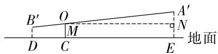  
第 15 题解图

16. 解: (1) 如解图所示, 点 P 即为位似中心; …… (4 分)

【解法提示】∵ $\triangle ABC$ 与 $\triangle DEF$ 关于点 P 位似, 其中顶点 A, B, C 的对应点依次为 D, E, F, ∴ 作直线 CF, AD 相交于点 P, 点 P 即为位似中心.

(2)由解图可得:点 P 的坐标为 $(7,-1)$ ,

$$
\because B (9, - 9), C (1 5, - 3), E (6, 3), F (3, 0).
$$

$$
\therefore B C = \sqrt {(1 5 - 9) ^ {2} + (- 3 + 9) ^ {2}} = 6 \sqrt {2},
$$

$$
E F = \sqrt {(6 - 3) ^ {2} + (3 - 0) ^ {2}} = 3 \sqrt {2},
$$

∴ $\triangle ABC$ 与 $\triangle DEF$ 的相似比为 BC:EF = $6\sqrt{2}:3\sqrt{2}=2:1.$ …… (8 分)

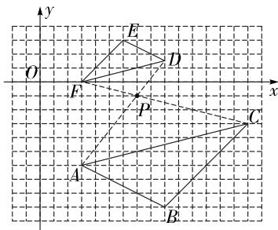

text_image

y
O
E
D
F
P
x
C
A
B

第 16 题解图

17. 解: 根据题意可得 $\angle BAC = 90^{\circ}, AB = AC = 6$ ,

$$
\therefore \angle B = \angle C = 4 5 ^ {\circ}, B C = 6 \sqrt {2},
$$

$$
\because \angle A D E = 4 5 ^ {\circ},
$$

$$
\therefore \angle A D B + \angle C D E = 1 8 0 ^ {\circ} - \angle A D E = 1 3 5 ^ {\circ},
$$

$$
\because \angle C D E + \angle D E C = 1 8 0 ^ {\circ} - \angle C = 1 3 5 ^ {\circ},
$$

$$
\therefore \angle A D B = \angle D E C, \therefore \triangle A B D \sim \triangle D C E,
$$

$$
\therefore \frac {A B}{D C} = \frac {B D}{C E},
$$

设 BD = x，则 $CD = 6\sqrt{2} - x$ ，

$\therefore \frac{6}{6\sqrt{2} - x} = \frac{x}{2}$ , 即 $x^{2} - 6\sqrt{2} x + 12 = 0$ ,

解得 $x=3\sqrt{2}-\sqrt{6}$ 或 $3\sqrt{2}+\sqrt{6}$ ,

∴ BD 的长为 $3\sqrt{2}-\sqrt{6}$ 或 $3\sqrt{2}+\sqrt{6}$ . … (8 分)

18. 证明: 如解图①, 过点 D 作 AC 的平行线, 交 AB 于点 E,

$$
\therefore \frac {B D}{C D} = \frac {B E}{A E},
$$

∵ AD 是 $\triangle ABC$ 的角平分线，

$$
\therefore \angle B A D = \angle C A D,
$$

$$
\because D E \parallel A C,
$$

$$
\therefore \angle B D E = \angle C, \angle B E D = \angle B A C, \angle E D A = \angle C A D,
$$

$$
\therefore \triangle E B D \sim \triangle A B C, \angle E D A = \angle E A D,
$$

$$
\therefore \frac {E B}{A B} = \frac {E D}{A C}, E A = E D, \therefore \frac {E B}{E D} = \frac {A B}{A C},
$$

又∵ $\frac{BD}{CD}=\frac{BE}{AE},EA=ED,$

$\therefore \frac{BD}{CD} = \frac{AB}{AC}$ (8分)

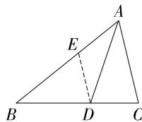  
第 18 题解图①

【一题多解法】如解图②, 过点 C 作 AD 的平行线, 交 BA 的延长线于点 F,

$$
\because A D \parallel C F,
$$

$$
\therefore \frac {B D}{C D} = \frac {A B}{A F}, \angle B A D =
$$

$$
\angle F, \angle C A D = \angle A C F,
$$

∵ AD 是 $\triangle ABC$ 的角平分线，

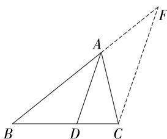

text_image

Geometric diagram showing triangle ABC with points D and F, and dashed lines indicating auxiliary constructions.

第 18 题解图②

$$
\therefore \angle B A D = \angle C A D,
$$

$$
\therefore \angle F = \angle A C F, \therefore A F = A C,
$$

又∵ $\frac{BD}{CD}=\frac{AB}{AF}$ ,

$\therefore \frac{BD}{CD}=\frac{AB}{AC}.$ (8分)

19. (1) 证明: ∵ 四边形 ABCD 是菱形,

$$
\therefore \angle B = \angle A D F.
$$

∵ AF 平分 $\angle DAE, \therefore \angle DAF = \angle EAF.$

$$
\because A D = A E, A F = A F,
$$

$$
\therefore \triangle A D F \cong \triangle A E F (\mathrm{SAS}),
$$

$$
\therefore \angle A E F = \angle A D F = \angle B.
$$

∵ 四边形 ABCD 是菱形, ∴ BC∥AG,

$$
\therefore \angle A E B = \angle G A E,
$$

∴ $\triangle AEG \sim \triangle EBA$ ; …… (4 分)

(2) 解: ∵ 菱形 ABCD 的边长为 3,

$$
\therefore A B = B C = A D = D C = A E = 3.
$$

$$
\because B E = 2, \therefore C E = B C - B E = 1.
$$

$$
\because \triangle A E G \sim \triangle E B A, \therefore \frac {A E}{E B} = \frac {A G}{E A},
$$

$$
\therefore \frac {3}{2} = \frac {A G}{3}, \therefore A G = \frac {9}{2},
$$

∴ DG = AG - AD = $\frac{9}{2} - 3 = \frac{3}{2}$ . …… (9 分)

20. 解: (1) 一; …… (2 分)

【解法提示】第二、三组中 CD 都是人的眼睛到地面的高度,第一组中 CD 是人的身高,∴ 第一组数据不对.

(2)选择第二组，

如解图, 过点 E 作 $EG \perp AB$ 于点 G, 过点 C 作 $CH \perp AB$ 于点 H, 交 EF 于点 M, 则 CD = FM = BH = 1.5, EG = HM = BF = 15, ∴ GH = EM = EF - FM = 0.5.

$$
\because E G \parallel C H,
$$

$\therefore \triangle AEG \sim \triangle ACH, \dots$ (6分)

$$
\therefore \frac {E G}{C H} = \frac {A G}{A H}, \text {即} \frac {1 5}{1 5 + 1} = \frac {A G}{A G + 0 . 5},
$$

解得 AG=7.5,

$$
\therefore A B = A G + G H + B H = 7. 5 + 0. 5 + 1. 5 = 9. 5,
$$

∴ 教学大楼的高度为 9.5 m. …… (10 分)

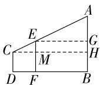  
第20题解图

选择第三组，

根据光线反射角等于入射角可得 $\angle AEB = \angle CED$ ,

$$
\because \angle C D E = \angle A B E = 9 0 ^ {\circ},
$$

$\therefore \triangle CED \sim \triangle AEB, \dots$ (6分)

$$
\therefore \frac {C D}{A B} = \frac {D E}{B E}, \text { 即 } \frac {1 . 5}{A B} = \frac {3}{1 9},
$$

解得 AB=9.5,

∴ 教学大楼的高度为 9.5 m. …… (10 分)
(任选一种即可)

21. (1) 证明: $\because DE \perp AB$ , 点 $E$ 为 $AB$ 的中点,

∴ DE 所在直线为线段 AB 的垂直平分线，

$$
\therefore \angle B = \angle D A E, \angle A E D = 9 0 ^ {\circ},
$$

又∵ $\angle C = \angle AED = 90^{\circ}$ ,

∴ $\triangle ADE \sim \triangle BAC;$ …… (3 分)

(2) 解: ①∵ 在 Rt△ABC 中, AC = 6, BC = 8,

$$
\therefore A B = \sqrt {A C ^ {2} + B C ^ {2}} = \sqrt {6 ^ {2} + 8 ^ {2}} = 1 0.
$$

$$
\because A F = 2,
$$

$$
\therefore B F = 1 0 - 2 = 8.
$$

∵ 点 F 到点 E 与点 B 到点 E 的距离相等，

$$
\therefore E B = E F = 4.
$$

$$
\because \angle B = \angle B, \angle B E D = \angle C = 9 0 ^ {\circ},
$$

$$
\therefore \triangle B D E \sim \triangle B A C,
$$

$$
\therefore \frac {E D}{C A} = \frac {E B}{C B},
$$

$$
\therefore \frac {E D}{6} = \frac {4}{8},
$$

$$
\therefore E D = 3,
$$

∴ 在 Rt△BED 中, $BD = \sqrt{EB^{2} + ED^{2}} = \sqrt{4^{2} + 3^{2}} = 5$ ,

$$
\therefore C D = B C - B D = 3,
$$

$$
\therefore E D = C D.
$$

$$
\because \angle C = 9 0 ^ {\circ}, E D \perp A B,
$$

$\therefore AD$ 平分 $\angle CAB$ ,

∴ $\angle CAD = \angle BAD;$ …… (7 分)

②∵ 点 F 到点 E 与点 B 到点 E 的距离相等， $DE \perp AB$ ,

$$
\therefore \angle B = \angle E F D, B E = F E, B D = F D.
$$

$\because \angle B$ 为锐角，

∴ $\angle EFD$ 也为锐角，

∴ $\angle AFD$ 为钝角.

∵ $\triangle AFD$ 为等腰三角形，

$$
\therefore A F = D F.
$$

由①可知 $\triangle BDE \sim \triangle BAC$ ，……（9分）

$$
\therefore \frac {B E}{B D} = \frac {B C}{B A} = \frac {8}{1 0} = \frac {4}{5}.
$$

设 BD=5x，则 AF=DF=5x，BE=FE=4x。

$$
\because A F + F E + B E = A B,
$$

$$
\therefore 5 x + 4 x + 4 x = 1 0,
$$

解得 $x=\frac{10}{13}$ ,

$\therefore BD=5x=\frac{50}{13}.$ (12分)

# 第五章检测卷

1. A

2. D

3. A 【解析】中心投影的光源为灯光,平行投影的光源为阳光与月光,故 A 选项得到的投影不属于中心投影现象.

4. B 【解析】A: 主视图和俯视图不一样, 故不符合题意; B: 主视图和俯视图一样, 并且用了 5 个小正方体, 其左视图为 □, 故符合题意; C: 主视图和俯视图不一样, 故不符合题意; D: 左视图为 □, 故不符合题意.

5. B 【解析】由几何体的展开图的特征可知,该几何体是圆锥,圆锥的三视图不可能是 B 选项.

6. C 【解析】A: 圆锥的主视图和左视图都是等腰三角形, 俯视图是圆(带圆心), 故不符合题意; B: 长方体的三视图都是矩形, 故不符合题意; C: 圆台的主视图和左视图都是梯形, 俯视图是两个圆, 故符合题意; D: 球的三视图都是圆, 故不符合题意.

7. C 【解析】作出示意图如解图所示,根据题意可知 $\triangle ABE \sim \triangle CDE$ , 设小欣的影子长为 x 米, 则 $\frac{AB}{CD} = \frac{BE}{DE}$ , 即 $\frac{6}{1.2} = \frac{4 + x}{x}$ , 解得 x = 1, ∴ 小欣的影子长为 1 米.

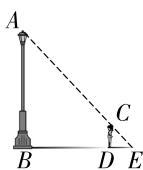  
第 7 题解图

8. D 【解析】A 中展开图缺少一个三角形的展开面; B 中下方的三角形应在上方位置; C 折叠还原后阴影部分面在正方体底部, 与原图不对应; D 是该几何体的展开图.

9. B 【解析】根据题图可得: 主视图左边一列有 3 个小正方体, 中间和右边一列均有 1 个小正方体, 故该几何体的主视图如解图所示.

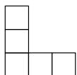  
第9题解图

10. B 【解析】如解图,设手影的高度 DE = x 米,
由题意可知,手影的高度增加一倍后手影的高度 FE = 2DE = 2x 米,最初台灯与小明的手之间的距离 AC = 2 米,小明的手与墙壁之间的距离 CE = 1 米, BC ⊥ AE, DE ⊥ AE, ∴ ∠ACB = ∠AED = 90°. ∵ ∠DAE = ∠DAE, ∴ △ABC ∼
△ADE, ∴ $\frac{BC}{DE} = \frac{AC}{AE}, \therefore \frac{BC}{x} = \frac{2}{2+1}$ , 解得 $BC = \frac{2}{3}x$ .
∵ $\angle B'AC' = \angle FAE, \angle AC'B' = \angle AEF, \therefore$ $\triangle B'AC'\sim\triangle FAE,\therefore\frac{B'C'}{EF}=\frac{AC'}{AE},\therefore\frac{\frac{2}{3}x}{2x}=\frac{AC'}{3}$ ,
解得 $AC'=1,\therefore$ 小明的手与台灯之间的距离应减小 1 米.

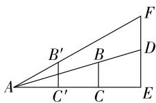  
第10题解图

11. 不变 【解析】∵ 几何体的正投影只与几何体相对于投影面的倾斜程度有关,与两者间距离无关,∴ 其正投影不变.

12. 先减小后增大

13. B 【解析】根据平行投影的规律: 下午物体影长逐渐变长, 则 B 照片是参加 100 m 的, A 照片是参加 400 m 的.

14. 12 【解析】由三视图可知该几何体是圆柱，∵俯视图的圆的面积为 $4\pi cm^{2}$ ，∴该圆柱底面圆的直径为4 cm，又根据三视图的“高平齐、宽相等”可知，左视图中的矩形的长为4 cm，宽为3 cm，∴左视图的面积为 $4\times3=12(cm^{2})$ .

15. 1 【解析】这个几何体由 10 个小正方体组成，在保持左视图和主视图不变的情况下, 可拿掉第 3 排第 2 列或第 2 排第 2 列的小正方体, ∴ 最多可以拿掉 1 个小正方体.

16. 解: (1) 6; …… (2 分)

(2)它的主视图、左视图和俯视图如解图所示.
……(6分)

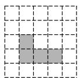  
主视图

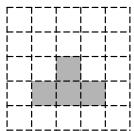  
左视图

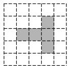  
俯视图  
第 16 题解图

17. 解: (1) 直三棱柱; …… (3 分)

(2)由三视图上所标注的数据可知:该几何体的底面三角形的三边分别为9 cm, 12 cm, 15 cm, 高为15 cm,

$$
\because 9 ^ {2} + 1 2 ^ {2} = 2 2 5, 1 5 ^ {2} = 2 2 5, 9 ^ {2} + 1 2 ^ {2} = 1 5 ^ {2},
$$

∴ 该几何体的底面三角形是直角三角形, 两条直角边分别为 9 cm, 12 cm,

∴ 其底面积 $S=\frac{1}{2}\times9\times12=54(\mathrm{~cm}^{2})$ ,

∴ 其侧面积为 $(12+9+15)\times15=540(\text{cm}^{2})$ ,

∴ 其表面积为 $2 \times 54 + 540 = 648 \, (\text{cm}^2)$ . …… (8 分)

18. 解: (1) 作像 CD 如解图所示; …… (5 分)

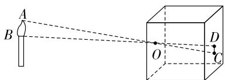

text_image

Diagram illustrating light reflection and refraction at a cube with labeled points A, B, C, D, and O

第 18 题解图

(2)根据题意,得 $\frac{AB}{CD}=\frac{9}{3}=3$ ,

$$
\because C D = 2 \mathrm{cm}, \therefore A B = 6 \mathrm{cm}.
$$

答:火焰 AB 的高度为 6 cm. …… (10 分)

19. 解: (1) 如解图①, 点 M 即为路灯灯泡的位置; …… (3 分)

(2)如解图②,过点 M 作 $MN \perp CD$ 于点 N,延长 AB,交 MN 于点 E,

$$
\therefore \angle M N C = 9 0 ^ {\circ} \text {, 又} \because A B / / C D,
$$

$$
\begin{array}{l} \therefore \angle A E M = \angle M N C = 9 0 ^ {\circ}, \angle M A B = \angle M C D, \\ \angle M B A = \angle M D C, \end{array}
$$

∴ $\triangle MAB \sim \triangle MCD$ , 线段 EN 的长即为秋千 AB 到地面的距离, 为 0.4 米,

$$
\therefore \frac {A B}{C D} = \frac {M E}{M N}, \therefore \frac {0 . 6}{0 . 6 6} = \frac {M N - 0 . 4}{M N},
$$

$$
\therefore M N = 4. 4,
$$

答:路灯灯泡的高度为 4.4 米. …… (10 分)

text_image

M
A B
C D 地面

图①

text_image

M
A B E
C D N 地面

图②  
第 19 题解图

20. 解: (1) 由主视图和左视图可知, 该几何体第一层最多有 8 个小正方体, 最少有 5 个小正方体, 第二层有 2 个小正方体, …… (2 分)

∴ 该几何体最多由 10 个小正方体组成, 最少由 7 个小正方体组成,

∴ 正方体可能的个数为 7,8,9,10; … (6 分)

(2)由(1)可知,上色表面积的最小值为 $(5+3+4+3+5+5+5)\times4\times4=480(\mathrm{~cm}^{2})$ .……(10分)

21. 解: (1) 甲组运用的是平行投影, 乙组运用的是中心投影; …… (2 分)

(2) $BD(\text{或 } BE), BD(\text{或 } BF)$ (答案不唯一);
……(4 分)

(3)小颖说的是正确的,过程如下:

∵ 应县木塔 AB 与盘龙柱 CD 均与地面垂直，

$$
\therefore \angle A B D = \angle C D E = 9 0 ^ {\circ},
$$

∵ 太阳光线是平行的, 即 $AD \parallel CE$ ,

$$
\therefore \angle A D B = \angle C E D, \therefore \triangle A B D \sim \triangle C D E,
$$

$$
\therefore \frac {A B}{C D} = \frac {B D}{D E}, \therefore \frac {A B}{1 . 7} = \frac {B D}{1 . 9 5},
$$

$$
\because \angle A B D = \angle C D F = 9 0 ^ {\circ}, \angle A F B = \angle C F D,
$$

$$
\therefore \triangle A B F \sim \triangle C D F, \therefore \frac {A B}{C D} = \frac {B F}{D F},
$$

$$
\therefore \frac {A B}{1 . 7} = \frac {B D + 2}{2}, \therefore \frac {B D}{1 . 9 5} = \frac {B D + 2}{2},
$$

解得 BD=78(米)，

$$
\therefore \frac {A B}{1 . 7} = \frac {7 8}{1 . 9 5},
$$

解得 AB=68(米)，

答:应县木塔 AB 的高度为 68 米. … (11 分)

# 第六章检测卷

1. C

2. C 【解析】∵(1,5)是反比例函数 $y=\frac{k}{x}$ 图象上一点, ∴ $5=\frac{k}{1}$ , 解得 k=5.

3. A 【解析】∵ 反比例函数 $y = -\frac{k}{x}$ 的图象经过点 $P(3, a)$ , ∴ 可以确定点 P 在第一象限或第四象限. 又∵ y 随 x 的增大而减小, ∴ 点 P 在第一象限.

4. D 【解析】根据油箱内油的体积 V 与电路中总电阻 $R_{总}$ 是反比例关系, 设 $V \cdot R_{总} = k$ (k 为常数), $\therefore k = 20 \times 30 = 600$ , $\therefore V = \frac{600}{R_{总}}$ .

5. C 【解析】∵ 反比例函数 $y=\frac{k}{x}$ 的图象过点
(3,3),∴ $k=3\times3=9,\therefore y=\frac{9}{x}$ ，当 x=1 时，y=9，
当 x=4 时， $y=\frac{9}{4}$ ，∴ 当 1<x<4 时， $\frac{9}{4}<y<9$ .

6. B 【解析】①当 k>0 时,一次函数 y=kx-k 的图象经过第一、三、四象限,反比例函数 $y=\frac{k}{x}(k\neq0)$ 的图象经过第一、三象限,故 B 选项的图象符合要求;②当 k<0 时,一次函数 y=kx-k 的图象经过第一、二、四象限,反比例函数 $y=\frac{k}{x}(k\neq0)$ 的图象经过第二、四象限,没有符合条件的选项.

7. B 【解析】∵ 反比例函数 $y_{1}=\frac{k_{1}}{x}(x<0)$ 的图象
在第二象限, 反比例函数 $y_{2}=\frac{k_{2}}{x}(x<0)$ 和 $y_{3}=\frac{k_{3}}{x}(x<0)$ 的图象在第三象限, $\therefore k_{1}<0, k_{2}>0, k_{3}>0$ ,
∵ 反比例函数 $y_{2}=\frac{k_{2}}{x}(x<0)$ 图象在反比例函数 $y_{3}=\frac{k_{3}}{x}(x<0)$ 图象的上方, $\therefore k_{3}>k_{2}, \therefore k_{1}<k_{2}<k_{3}.$

8. C 【解析】由题意得, 直线 l 的表达式为 y =

$-2x+m(m>0)$ , ∵ 直线 l 与反比例函数 $y=\frac{2}{x}$ (x>0) 的图象有一个交点, ∴ 令 $-2x + m = \frac{2}{x}$ , 整理得 $2x^{2} - mx + 2 = 0, b^{2} - 4ac = m^{2} - 16 = 0, \therefore m = 4$ 或 m = -4 (舍去), ∴ m = 4.

9. A 【解析】如解图,过点 P 作 x 轴的垂线交 x 轴于点 C,∵ 点 P 在曲线 $y=\frac{5}{x}(x>0)$ 上, $PB \perp y$ 轴, ∴ 矩形 OCPB 的面积为 5 且保持不变, ∵ 点 A 是 x 轴正半轴上的定点, ∴ 点 P 的横坐标逐渐减小时, $\triangle APC$ 的两个直角边长均增大, ∴ $\triangle APC$ 的面积逐渐增大, ∴ 四边形 OAPB 的面积将会逐渐增大.

text_image

y
B
P
O C A x

第9题解图

10. D 【解析】设 $\triangle OA_{1}B_{1}$ 的边长为 2x，则其高为 $\sqrt{3}x, \therefore \frac{1}{2} \times 2x \times \sqrt{3}x = 4\sqrt{3}$ ，解得 $x_{1} = 2, x_{2} = -2$ （舍去），∴ 点 $B_{1}(4,0), \because \triangle OA_{1}B_{1}$ 是等边三角形，∴ $A_{1}(2,2\sqrt{3}), \because$ 点 $A_{1}$ 在反比例函数图象上，∴ $k = 2 \times 2\sqrt{3} = 4\sqrt{3}, \therefore$ 反比例函数的表达式为 $y = \frac{4\sqrt{3}}{x}$ ，设 $B_{1}B_{2} = 2m, \therefore$ 点 $A_{2}$ 的横坐标为 $4 + m$ ，纵坐标为 $\sqrt{3}m, \because$ 点 $A_{2}$ 也在反比例函数图象上，∴ $(4 + m) \times \sqrt{3}m = 4\sqrt{3}$ ，解得 $m_{1} = 2\sqrt{2} - 2, m_{2} = -2\sqrt{2} - 2$ （舍去），∴ $B_{1}B_{2} = 2m = 4\sqrt{2} - 4.$

11. $v=\frac{3}{n}$ 【解析】根据表格数据可知传播速度 v （亿米/秒）与介质折射率 n 满足反比例函数关系式，设 $v=\frac{k}{n}$ ，可得 $3=\frac{k}{1}$ ，解得 k=3，∴ $v=\frac{3}{n}$ .

12. 110 【解析】根据题意可得电流 I(A) 与电阻

大小卷·九年级(全一册) 数学 BS

$R(\Omega)$ 满足函数关系式 $I=\frac{880\times0.25}{R}=\frac{220}{R}$ ,
∴ 当 I=2 时, 电阻 $R=\frac{220}{2}=110(\Omega)$ .

13. 12 【解析】由题意得点 $A(x_{1},y_{1}), B(x_{2},y_{2})$ 关于原点对称，即 $x_{2} = -x_{1}, y_{2} = -y_{1}$ ，把 $A(x_{1},y_{1})$ 代入反比例函数 $y = -\frac{6}{x}$ ，得 $x_{1}y_{1} = -6$ ，则 $x_{1}y_{2} + x_{2}y_{1} = -x_{1}y_{1} - x_{1}y_{1} = -2x_{1}y_{1} = 12$ .

14. 8 【解析】如解图, 连接 OA, 设 BC = a, CD = b,
则 $\frac{1}{2}ab=4,\therefore AC=2BC=2a,OC=\frac{1}{2}CD=\frac{1}{2}b,$ ∴ $\triangle OAC$ 的面积为 $\frac{1}{2}OC \cdot AC = \frac{1}{2} \times \frac{1}{2}b \times 2a = \frac{1}{2}ab,$ $\therefore \frac{|k|}{2}=\frac{1}{2}ab=4,$ 反比例函数的图象在第一、三象限，∴ k > 0, ∴ k = 8.

text_image

y
A
B
O C D x

第 14 题解图

15. $y = -\frac{4}{x}$ 【解析】∵ OB = 2OC = 4OD = 4,
∴ D(0, -1), C(-2, 0), B(-4, 0), 将点 D(0, -1), C(-2, 0) 代入一次函数 $y = ax + b (a < 0)$ 得 $\left\{\begin{aligned}&b=-1,\\ &-2a+b=0,\end{aligned}\right.$ 解得 $\left\{\begin{aligned}&a=-\frac{1}{2},\\ &b=-1,\end{aligned}\right.$ 则一次函数的表达式为 $y=-\frac{1}{2}x-1$ ，当 x=-4 时，y=1，即 A(-4, 1)，将 A(-4, 1) 代入反比例函数 $y=\frac{k}{x}, k=(-4)\times1=-4$ ，故反比例函数的表达式为 $y=-\frac{4}{x}$ .

16. 解: (1) 由题意得 $-2 = \frac{k}{3}$ ,

解得 k = -6，

即这个函数的表达式为 $y=-\frac{6}{x}$ ; …… (3 分)

(2)由题意得 n=-6,

点 $C(1+m,-6+m)$ ,

∵ 点 C 在 $y = -\frac{6}{x}$ 的图象上，

$$
\therefore (1 + m) (- 6 + m) = - 6,
$$

解得 m=5 或 m=0(舍去).

∴ m 的值为 5. …… (7 分)

17. 解: (1) ∵ 反比例函数 $y=\frac{k}{x}(x<0)$ 的图象过格点 P,

由图象可知点 P 的坐标是 $(-2,1)$ ,

$$
\therefore k = - 2 \times 1 = - 2,
$$

∴ 反比例函数的表达式为 $y=-\frac{2}{x}(x<0)$ ; …

……（4分）

(2)如解图, $\triangle APO,\triangle BPO$ 即为所求.(答案不唯一,符合题意即可)……(7分)

line

| Point | x | y |
|---|---|---|
| A | 0 | 2 |
| B | -3 | -1 |
| C | -2 | 1 |
| D | 0 | 1 |
| E | 1 | 0 |
| F | 2 | 3 |
| G | -4 | 0 |
| H | 0 | 4 |
| I | 1 | 0 |
| J | -1 | 0 |
| K | -2 | 0 |
| L | 0 | 0 |
| M | 1 | 0 |
| N | 2 | 0 |
| O | 0 | 0 |
| P | -3 | 0 |
| Q | -2 | 0 |
| R | -1 | 0 |
| S | 0 | 0 |
| T | 1 | 0 |
| U | 2 | 0 |
| V | -4 | 0 |
| W | -3 | 0 |
| X | 0 | 0 |
| Y | -1 | 0 |
| Z | -2 | 0 |
| AA | -1 | 0 |
| AB | 0 | 0 |
| AC | 1 | 0 |
| AD | 2 | 0 |
| AE | -1 | 0 |
| AF | -2 | 0 |
| AG | -3 | 0 |
| AH | -4 | 0 |
| AI | -1 | 0 |
| AJ | 0 | 0 |
| AK | 1 | 0 |
| AL | -1 | 0 |
| AM | -2 | 0 |
| AN | -3 | 0 |
| AO | -4 | 0 |
| AP | -1 | 0 |
| AQ | 0 | 0 |
| AR | 1 | 0 |
| AS | -1 | 0 |
| AT | -2 | 0 |
| AU | -3 | 0 |
| AV | -4 | 0 |
| AW | -1 | 0 |
| AXA | -2 | 0 |
| AYA | -3 | 0 |
| AZA | -4 | 0 |
| BAZA | -1 | 0 |
| BBZA | -2 | 0 |
| BCZA | -3 | 0 |
| BDZA | -4 | 0 |
| BEZA | -1 | 0 |
| BFZA | -2 | 0 |
| BGZA | -3 | 0 |
| BHZA | -4 | 0 |
| BIZZA | -1 | 0 |
| BJZZA | -2 | 0 |
| BKZZA | -3 | 0 |
| BLZZA | -4 | 0 |
| BMZZA | -1 | 0 |
| BNZZA | -2 | 0 |
| BOZZA | -3 | 0 |
| BPZZA | -4 | 0 |
| BPZZBZZZBZZBZBZBZBZBZBZBZBZBZBZBZBZBZBZBZBZBZBZBZBZBZBZBZBZBZBZBZBZBZBZBZBZBZBZBZBZBZBZBZBZBZBZBZBZBZBZBZBZBZBZ<nl>

第 17 题解图

18. 解: (1) 将 $A(6, m)$ 代入 $y_{1} = \frac{1}{2} x - 2$ 中,

得 $m=\frac{1}{2}\times6-2=1$ ,

∴ 点 A 的坐标为 $(6,1)$ ,

将 $A(6,1)$ 代入 $y_{2} = \frac{k}{x}$ 中，

得 $1=\frac{k}{6}$ ,

解得 k=6，

∴ 反比例函数表达式为 $y=\frac{6}{x}$ ,

将 $B(n, -3)$ 代入 $y_{1} = \frac{1}{2} x - 2$ 中，

得 $-3=\frac{1}{2}n-2,$

解得 n = -2，

∴ 点 B 的坐标为 $(-2, -3)$ ; …… (4 分)

(2) -2 < x < 0 或 x > 6. …… (7 分)

【解法提示】由两函数图象的交点可知,当-2<x<0或x>6时,一次函数的图象在反比例函数图象的上方, $\therefore$ 当 $-2 < x < 0$ 或 $x > 6$ 时, $\frac{1}{2} x - 2 > \frac{k}{x}$ .

19. 解: (1) 补充表格数据为 $4, \frac{1}{2}$ ; …… (2 分)

【解法提示】当 x = -1 时, $y = \frac{4}{| -1|} = 4$ , 当 x = 8
时, $y=\frac{4}{|8|}=\frac{1}{2}.$

绘制出该函数的图象如解图所示；…（4分）

line

| x | y |
|---|---|
| -9 | -1 |
| -8 | -1 |
| -7 | -1 |
| -6 | -1 |
| -5 | -1 |
| -4 | -1 |
| -3 | -1 |
| -2 | -1 |
| -1 | 0 |
| 0 | 1 |
| 1 | 2 |
| 2 | 3 |
| 3 | 4 |
| 4 | 5 |
| 5 | 6 |
| 6 | 7 |
| 7 | 8 |
| 8 | 9 |
| 9 | 10 |

第 19 题解图

(2)①函数的图象关于 y 轴对称;

②当 x<0 时, y 随 x 的增大而增大,

当 x>0 时, y 随 x 的增大而减小. (答案不唯一) …… (8 分)

20. 解: (1) 由图象可知 y 与 x 成反比例函数关系,设 $y$ 与 $x$ 的函数表达式为 $y = \frac{k}{x} (k \neq 0)$ ,

将 $(6,2)$ 代入，

得 $2=\frac{k}{6}$ ,

解得 k=12，

$\therefore y$ 与 $x$ 的函数表达式为 $y = \frac{12}{x} (0 < x \leqslant 48)$ ,

∴ 余款总数为 12 万元, 首付款为 22 - 12 = 10(万元); …… (3 分)

(2)若高女士每月还款0.5万元,

当 y=0.5 时，

$$
0. 5 = \frac {1 2}{x},
$$

解得 x=24，

∴ 她至少需要 24 个月就能结清余款；……
……（5 分）

(3)为尽量缓减每月的还款压力,高女士可选

择最长的还款期限为 48 个月，

当 x=48 时，

$y=\frac{12}{48}=0.25$ （万元），

0.25 万元 = 2 500 元,

∴ 高女士平均每月至少应还款 2500 元. …
…… (8 分)

21. 解: (1) ∵ 点 D 的横坐标为 1, OC = 2,

∴ 点 D 的坐标为 $(1,2)$ .

∵ 反比例函数 $y=\frac{k}{x}(x>0)$ 的图象经过点 D,

∴ $k=1\times2=2$ ; …… (4分)

(2)∵点D,E在反比例函数 $y=\frac{2}{x}$ 的图象上，

$$
\therefore S _ {\triangle C O D} = 1, S _ {\triangle A O E} = 1,
$$

$$
\because O A = 4,
$$

$$
\therefore A E = \frac {1}{2}, B D = 4 - 1 = 3, B E = 2 - \frac {1}{2} = \frac {3}{2},
$$

$$
\therefore S _ {\triangle D B E} = \frac {1}{2} \times 3 \times \frac {3}{2} = \frac {9}{4},
$$

$$
\therefore S _ {\triangle O D E} = S _ {\text {矩形} O A B C} - S _ {\triangle C O D} - S _ {\triangle A O E} - S _ {\triangle D B E}
$$

$$
= 2 \times 4 - 1 - 1 - \frac {9}{4}
$$

$$
= \frac {1 5}{4},
$$

∵点P在x轴上，

∴ 设 $P(m,0)$ ,

$$
\therefore S _ {\triangle O D P} = \frac {1}{2} | m | \times 2 = \frac {1 5}{4},
$$

解得 $m=\pm\frac{15}{4}$ ,

∴ 点 P 的坐标为 $\left(\frac{15}{4},0\right)$ 或 $\left(-\frac{15}{4},0\right)$ . ……
…… (9 分)

22. 解: (1) ∵ △OBE 的面积为 12,

$$
\therefore \frac {| k |}{2} = 1 2,
$$

解得 $k=\pm24$ ，

又∵反比例函数图象经过第一、三象限，
即 k>0，

$$
\therefore k = 2 4,
$$

∴ 反比例函数的表达式为 $y=\frac{24}{x}$ ,

# 大小卷·九年级(全一册) 数学 BS

当 $x = 4$ 时，

$$
y = \frac {2 4}{4} = 6,
$$

∴ 点 A 的坐标为 $(4,6)$ ,

将 $A(4,6)$ 代入 $y = \frac{3}{4} x + b$ 中，

得 $6=\frac{3}{4}\times4+b$ ,

解得 b=3，

∴一次函数表达式为 $y=\frac{3}{4}x+3$ ,

当 $y = 0$ 时，

$$
\frac {3}{4} x + 3 = 0,
$$

解得 x = -4，

∴ 点 C 的坐标为 $(-4,0)$ ; …… (4 分)

(2)由(1)知一次函数表达式为 $y=\frac{3}{4}x+3$ ,

当 x=0 时, y=3,

∴ 点 D 的坐标为 $(0,3)$ ,

∵ $A(4,6)$ , $D(0,3)$ 为定点，

∴ 线段 AD 的长度为定值,

∴ 欲使 $\triangle PAD$ 的周长最小, 只需 $PA + PD$ 最小, 如解图, 作点 $D(0,3)$ 关于 x 轴的对称点 $D'$ , 则点 $D'$ 的坐标为 $(0,-3)$ ,

连接 $AD'$ 交 x 轴于点 P, 连接 PD, 则此时 $PA + PD$ 最小.

设直线 $AD'$ 的表达式为 $y = sx + t$ ,

将 $A(4,6)$ , $D'(0,-3)$ 代入得: $\left\{\begin{aligned}4s+t=6,\\ t=-3,\end{aligned}\right.$

解得 $\left\{\begin{aligned}s&=\frac{9}{4},\\ t&=-3,\end{aligned}\right.$

∴ 直线 $AD'$ 的表达式为 $y=\frac{9}{4}x-3$ ,

当 $y = 0$ 时，

$$
\frac {9}{4} x - 3 = 0,
$$

解得 $x=\frac{4}{3}$ ,

即 $m=\frac{4}{3}$ . (9 分)

text_image

y
A
D
E C O
x
P
B D'
x

第22题解图

# 九(上)综合检测卷(一)

1. A

2. C 【解析】已知 a, b, c, d 是成比例线段, 根据比例线段的定义得 ad = bc, 代入 a = 4, b = 5, d = 10, $4 \times 10 = 5c$ , 解得 c = 8.

3. C

4. C 【解析】∵ x=0.5 时, $x^{2}-7x+5=1.75>0$ , x=1 时, $x^{2}-7x+5=-1<0$ , ∴ 当 x 在 0.5 与 1 之间取某一个数时, 可使 $x^{2}-7x+5=0$ , 即方程 $x^{2}-7x+5=0$ 的其中一个根满足的范围是 0.5<x<1.

5. C 【解析】∵ $k_{1}k_{2}<0$ , ∴ 当 $k_{1}<0, k_{2}>0$ 时, 正比例函数 $y=k_{1}x$ 经过第二、四象限, 反比例函数 $y=\frac{k_{2}}{x}$ 经过第一、三象限, 故②符合题意; 当 $k_{1}>0, k_{2}<0$ 时, 正比例函数 $y=k_{1}x$ 经过第一、三象限, 反比例函数 $y=\frac{k_{2}}{x}$ 经过第二、四象限, 故③符合题意.

6. D 【解析】根据题意可知两个三角形相似且相似比为 2:1, 根据相似的性质可知, 面积比为 4:1, 周长比为 2:1, 故 A, B 正确; 根据相似比可得大三角形的最短边长为 6, 故 C 正确; ∵ 两个三角形的面积比等于 4:1, 设两个三角形的面积分别为 4k 和 k, 则 4k-k=9, 解得 k=3, ∴ 大三角形的面积为 $4 \times 3 = 12$ , 故 D 错误.

7. D 【解析】根据题意列表如下：

<table><tr><td>A盘\B盘</td><td>黑</td><td>蓝</td><td>红</td></tr><tr><td>红</td><td>(红,黑)</td><td>(红,蓝)</td><td>(红,红)</td></tr><tr><td>蓝</td><td>(蓝,黑)</td><td>(蓝,蓝)</td><td>(蓝,红)</td></tr></table>

上表等可能出现的6种结果中,有2种结果可以配成紫色,故 $P(\text{同时转动两个转盘各一次可以配成紫色})=\frac{2}{6}=\frac{1}{3}.$

8. B 【解析】设竹竿的长度为 x 尺, 则门宽 $(x-4)$ 尺, 门高 $(x-2)$ 尺, 依题意得 $(x-4)^{2}+(x-2)^{2}=x^{2}$ , 整理得 $x^{2}-12x+20=0$ , 解得 $x_{1}=2$ (不合题意, 舍去), $x_{2}=10$ , $\therefore x-2=10-2=8$ (尺).

9. B 【解析】由题意可知 $\angle B = \angle CAP = 90^{\circ}$ ,
∵ AB = 1.5 米, AC = 0.4 米, ∴ BC = AB - AC = 1.

5-0.4=1.1(米)，∵ $\angle QCB=\angle PCA,\therefore\triangle QCB$ $\sim\triangle PCA,\therefore\frac{BC}{AC}=\frac{BQ}{AP},\therefore\frac{1.1}{0.4}=\frac{BQ}{1.2},\therefore BQ=$ 3.3 米.

10. B 【解析】如解图, 过点 F 作 $FG \perp BD$ 于点 G,
∵ 四边形 ABCD 是菱形, ∴ $AC \perp BD$ , ∴ FG
//AC. ∵ AC = 6, BD = 8, ∴ OC = OA = 3, OB =
OD = 4, ∴ BC = 5, ∴ BE = AB = BC = 5, ∴ OE =
BE - OB = 1. ∵ F 是 BC 的中点, FG // AC, ∴ FG = $\frac{1}{2}OC=\frac{3}{2},OG=\frac{1}{2}OB=2,\therefore EG=3.\because\angle HOE=$ $\angle FGE, \angle HEO = \angle FEG, \therefore \triangle EOH \sim \triangle EGF,$ $\therefore \frac{OH}{GF}=\frac{OE}{GE}, \therefore \frac{OH}{\frac{3}{2}}=\frac{1}{3}, \therefore OH=\frac{1}{2}.$

text_image

B F C
G H
O E
A D

第 10 题解图

11. 4 【解析】将点 $A(-1, m)$ 代入 $y = -\frac{4}{x}$ 中，解得 $m = 4$ .

12. 5 【解析】如解图, 记数轴原点为 O, OB = 4,
OA=8, OC=10, ∵ PB∥AC, ∴ $\frac{OB}{OA}=\frac{OP}{OC}, \therefore \frac{4}{8}=$ $\frac{OP}{10}, \therefore OP=5.$ ∴ 点 P 表示的数是 5.

text_image

0(O)
P
10
A
B
C
r
r
r
r
r
r
r
r
r
r
r
r
r
r
r
r
r
r
r
r
r
r
r
r
r
r
r
r
r
r
r
r
r
r
r
r
r
r
r
r
r
r
r
r
r
r
r
r
r
r
0

第 12 题解图

13. $x_{1}=-1+2i, x_{2}=-1-2i$ 【解析】 $x^{2}-2x+5=0,$ $x^{2}-2x=-5$ , 配方得 $x^{2}-2x+1=-5+1$ , $(x-1)^{2}=-4$ , 开方得 $x-1=\pm2i-2$ , 解得 $x_{1}=-1+2i$ , $x_{2}=-1-2i.$

14. $\frac{64}{5}$ 【解析】∵ 四边形 $ABCD$ 是正方形, ∴ $\angle BCD = \angle B = 90^{\circ}, AB \parallel CD, \therefore \angle MAO = \angle DPO, \angle NCP = 180^{\circ} - \angle BCD = 90^{\circ}, \because M, N$ 分

# 大小卷·九年级(全一册) 数学 BS

别是 $AB, BC$ 的中点， $\therefore AM = \frac{1}{2} AB = 2, BN = CN,$ 在 $\triangle ABN$ 与 $\triangle PCN$ 中， $\left\{ \begin{array}{l} \angle B = \angle NCP, \\ BN = CN, \\ \angle BNA = \angle CNP, \end{array} \right.$

$$
\begin{array}{l} \therefore \triangle A B N \cong \triangle P C N (\mathrm{ASA}), \therefore A B = P C = 4, \therefore \\ D P = D C + P C = 8, \because \angle M A O = \angle D P O, \angle M O A = \\ \angle D O P, \therefore \triangle A O M \sim \triangle P O D, \text {且} A M: D P = 1: 4, \\ \therefore h _ {\triangle P O D} = \frac {4}{5} A D = \frac {1 6}{5}, \therefore S _ {\triangle D O P} = \frac {1}{2} D P \cdot h _ {\triangle P O D} = \\ \frac {1}{2} \times 8 \times \frac {1 6}{5} = \frac {6 4}{5}. \\ \end{array}
$$

15. 4 【解析】如解图, 连接 OC, ∵ A(m, n), B 关于原点对称, ∴ 点 B 的坐标为 $(-m, -n)$ , OA = OB. ∵ 点 C 在反比例函数 $y = \frac{k_{2}}{x}$ 的图象上, 四边形 ACBD 为平行四边形, 根据平行四边形的性质及反比例函数图象的对称性可知, 点 D 也在反比例函数 $y = \frac{k_{2}}{x}$ 的图象上. ∵ A(m, n) 是反比例函数 $y = \frac{k_{1}}{x}$ 图象上的点, ∴ $n = \frac{k_{1}}{m}$ . ∵ AC // y 轴, ∴ 点 C 的坐标为 $(m, \frac{k_{2}}{m})$ , ∴ AC = $\left| \frac{k_{1}}{m} - \frac{k_{2}}{m} \right|$ , ∴ $S_{\triangle AOC} = \frac{1}{2} S_{\triangle ABC} = \frac{1}{4} S_{\text {平行四边形 } ACBD} = 2$ , ∴ $\frac{1}{2} AC \cdot |m| = 2$ , ∴ $\frac{1}{2} \left( \frac{k_{1}}{m} - \frac{k_{2}}{m} \right) \cdot (-m) = 2$ , 整理得 $k_{2} - k_{1} = 4$ .

text_image

y=k₁/x
A
D
y=k₂/x
O
C
B
x
y

第 15 题解图

16. 解: (1) ∵ a = -3, b = -1, c = 2,

$$
\therefore b ^ {2} - 4 a c = (- 1) ^ {2} + 4 \times 3 \times 2 = 2 5 > 0,
$$

$$
\therefore x = \frac {- b \pm \sqrt {b ^ {2} - 4 a c}}{2 a} = \frac {1 \pm 5}{2 \times (- 3)},
$$

解得 $x_{1}=-1, x_{2}=\frac{2}{3}$ ; …… (3 分)

(2) $2x(3x+1)-5(3x+1)=0,$

$$
(3 x + 1) (2 x - 5) = 0,
$$

$$
\therefore 3 x + 1 = 0 \text {或} 2 x - 5 = 0,
$$

解得 $x_{1}=-\frac{1}{3},x_{2}=\frac{5}{2}.$ …… (7 分)

17. 解: (1) 满足条件的 $\triangle A_{1}B_{1}C_{1}$ 有两个, 如解图, $\triangle A_{1}B_{1}C_{1}$ 即为所求; …… (4 分)

(2) $\triangle A_{1}B_{1}C_{1}$ 的周长为 $\sqrt{1^2 + 1^2} +\sqrt{1^2 + 2^2} +$ $\sqrt{1^2 + 2^2} = \sqrt{2} +2\sqrt{5}.$ ……（8分）

text_image

Geometric diagram with labeled points and lines on a grid, showing triangle ABC and auxiliary constructions.

第 17 题解图

18. 解:(1)由表格可知,压强 p 与受力面积 S 的乘积不变,故压强 p 是受力面积 S 的反比例函数,

设 $p=\frac{k}{S}(k\neq0)$ ，将(0.5,200)代入得 200= $\frac{k}{0.5}$ , 解得 k=100,

∴ 压强 p 关于受力面积 S 的函数表达式为 $p=\frac{100}{S}$ ,

当 p=400 时, $400=\frac{100}{a}$ ,

$$
\therefore a = 0. 2 5; \dots \tag {4分}
$$

(2)这种摆放方式不安全,理由如下:

由图可知 $S=0.1\times0.4=0.04(m^{2})$ ,

∴ 将长方体放置于该水平玻璃桌面上, p = $\frac{100}{0.04} = 2500 \, (\text{Pa})$ ,

$$
\because 2 5 0 0 > 2 3 0 0,
$$

∴ 这种摆放方式不安全. …… (9 分)

19. 解: (1) 根据题意, 估计摸到红球的概率为 0.125,

$$
\therefore \frac {1}{1 + 2 + n} = 0. 1 2 5,
$$

解得 n=5；……（4 分）

(2) 当 n=1 时, 即不透明箱子中有 1 个红球, 2

个紫球和1个黄球,画树状图如解图,

flowchart

第 19 题解图

∴ 共有 16 种等可能的结果, 其中连续两次都摸到紫球的结果有 4 种,

∴ $P(\text{小琪一家享受到7折优惠})=\frac{4}{16}=\frac{1}{4}$ . …
……(9分)

20. (1) 证明: $\because AB = CD, AD = BC$ ,

∴ 四边形 ABCD 是平行四边形.

$$
\because \angle A B C = 9 0 ^ {\circ},
$$

∴ 四边形 ABCD 是矩形；……（4 分）

(2) 解: 由(1)知四边形 ABCD 是矩形,

$$
\therefore A D \parallel B C, \angle A D C = \angle B C D = 9 0 ^ {\circ},
$$

$$
\angle D A C = \angle A C B.
$$

$$
\because \frac {A E}{A C} = \frac {2}{5}, A C = \sqrt {A B ^ {2} + B C ^ {2}} = 5,
$$

$$
\therefore A E = 2,
$$

$$
\therefore C E = A C - A E = 3,
$$

$$
\therefore C E = C D,
$$

$$
\therefore \angle C E D = \angle C D E.
$$

$$
\because E G \perp D E,
$$

$$
\therefore \angle D E G = 9 0 ^ {\circ},
$$

$$
\therefore \angle C E D + \angle C E G = 9 0 ^ {\circ}.
$$

$$
\because \angle A D C = \angle C D E + \angle A D E = 9 0 ^ {\circ},
$$

$$
\therefore \angle C E G = \angle A D E,
$$

$$
\therefore \triangle C E G \sim \triangle A D E,
$$

$$
\therefore \frac {C E}{A D} = \frac {C G}{A E} = \frac {E G}{D E} = \frac {3}{4},
$$

$$
\therefore C G = \frac {3}{2}.
$$

在 Rt $\triangle DCG$ 中， $DG^{2} = CG^{2} + CD^{2} = \frac{45}{4}$ ，设 EG = 3x，则 DE = 4x，

在 Rt△DEG 中, $DG^{2}=DE^{2}+EG^{2}=25x^{2}=\frac{45}{4}$ ,

$$
\therefore x ^ {2} = \frac {9}{2 0},
$$

$\therefore S_{\triangle DEG}=\frac{1}{2}DE\cdot EG=6x^{2}=\frac{27}{10}.$ ……（10分）

21. 解: (1) 1.6m, 1.44m; …… (2 分)

【解法提示】∵洱海5月份的游客人数比4月份增加了60%,6月份的游客人数比5月份减少了10%,且洱海4月份的游客人数为m万人,∴洱海5月份的游客人数为 $(1+60\%)m=1.6m$ 万人,6月份的游客人数为 $(1-10\%)\times(1+60\%)m=1.44m$ 万人.

(2)设洱海5月份,6月份游客人数的月平均增长率为x,

根据题意得: $m(1+x)^{2}=1.44m$ ,

解得 $x_{1}=0.2=20\%$ , $x_{2}=-2.2$ (不符合题意, 舍去).

答:洱海5月份,6月份游客人数的月平均增长率为20%; …… (5分)

(3)① $40+\frac{x}{5}$ ; …… (7分)

②由题可得 $\left(40+\frac{x}{5}\right)(100-x)=3780$ ,

化简得 $x^{2}+100x-1\ 100=0$ ,

$$
(x + 1 1 0) (x - 1 0) = 0,
$$

解得 $x_{1}=-110$ (不符合题意, 舍去), $x_{2}=10$ ,

∴ 每辆电动车的租金应降价 10 元. …… (10 分)

22. 解: (1) 由题图可得, A(-2, -2),

把 $A(-2, - 2)$ 代入 $y = \frac{m}{x}$ 中，得 $m = 4$

∴ 反比例函数的表达式为 $y=\frac{4}{x}$ ,

设点 B 的坐标为 $(3, a)$ ，代入 $y = \frac{4}{x}$ 中，得 $a = \frac{4}{3}$ ，∴ 点 B 的坐标为 $(3, \frac{4}{3})$ 。……（2 分）

把 $A(-2,-2)$ , $B(3,\frac{4}{3})$ 分别代入 $y=kx+b$ 中，

得 $\left\{\begin{aligned}-2&=-2k+b,\\ \frac{4}{3}&=3k+b,\end{aligned}\right.$ 解得 $\left\{\begin{aligned}k&=\frac{2}{3},\\ b&=-\frac{2}{3},\end{aligned}\right.$

∴一次函数的表达式为 $y=\frac{2}{3}x-\frac{2}{3}$ ; ……
……(3分)

(2)根据图象,不等式 $kx+b>\frac{m}{x}$ 时,x 的取值范

# 大小卷·九年级(全一册) 数学 BS

围为-2<x<0或x>3；……（5分）

(3)答案不唯一,选择其中一个即可.

①. 联立 $\left\{\begin{aligned} y &= nx + 2n, \\ y &= \frac{4}{x}, \end{aligned}\right.$

整理得 $nx^{2}+2nx-4=0$ ,

∵ 一次函数 $y = nx + 2n (n < 0)$ 的图象与反比例
函数 $y=\frac{4}{x}$ 的图象仅有一个交点，

$$
\therefore (2 n) ^ {2} - 4 \cdot n \cdot (- 4) = 0,
$$

解得 $n = -4$ (0 已舍去). …… (8 分)

②. 在一次函数 $y = nx + 2n (n < 0)$ 中, 令 x = 0, 得 y = 2n, 令 y = 0, 得 x = -2,

∵一次函数 $y=nx+2n(n<0)$ 的图象与坐标轴围成的图形的面积为8，

$$
\therefore \frac {1}{2} \cdot | 2 n | \cdot | - 2 | = 8,
$$

解得 $n = -4$ (4 已舍去). …… (10 分)

23. (1) 证明: $\because AB = AD, AM \perp BD$ ,

$$
\therefore B D = 2 B M, \angle B A M = \angle D A M,
$$

$$
\because \angle C A N = 1 8 0 ^ {\circ} - \angle B A C - \angle B A M, \angle E A N =
$$

$$
1 8 0 ^ {\circ} - \angle D A E - \angle D A M, \text {且} \angle B A C = \angle D A E = 9 0 ^ {\circ},
$$

$$
\therefore \angle C A N = \angle E A N,
$$

$\because AC=AE,\therefore AN\perp CE,$ 即 $\angle CNA=90^{\circ},$

$$
\therefore \angle A C N + \angle C A N = 9 0 ^ {\circ},
$$

$$
\because \angle B A M + \angle C A N = 9 0 ^ {\circ}, \therefore \angle B A M = \angle A C N.
$$

又∵ AB = CA，∠AMB = ∠CNA = 90°，

$$
\therefore \triangle A B M \cong \triangle C A N,
$$

$$
\therefore B M = A N,
$$

∴ BD=2AN; …… (4分)

(2) 解: ①BD=AN; …… (7 分)

【解法提示】同(1)可证 $\angle CNM=90^{\circ}=\angle BMN=$

$$
\angle B A C, B D = 2 B M, \therefore \angle B A M + \angle C A N = 9 0 ^ {\circ} =
$$

$$
\angle B A M + \angle A B M, \therefore \angle A B M = \angle C A N, \therefore \triangle A B M \sim
$$

$$
\triangle C A N, \therefore \frac {A B}{C A} = \frac {B M}{A N} = \frac {1}{2}, \therefore A N = 2 B M, \therefore B D = A N.
$$

②BD=AN,

理由如下:如解图,过点 E 作 AC 的平行线,
交 AN 的延长线于点 P, 连接 PC,

$$
\therefore \angle P E A + \angle C A E = 1 8 0 ^ {\circ},
$$

$$
\because \angle B A C = \angle D A E = 9 0 ^ {\circ},
$$

$$
\therefore \angle B A D + \angle C A E = 3 6 0 ^ {\circ} - \angle B A C - \angle D A E
$$

$$
= 1 8 0 ^ {\circ},
$$

$$
\therefore \angle B A D = \angle P E A. \because A M \perp B D,
$$

$$
\therefore \angle A M D = 9 0 ^ {\circ},
$$

$$
\therefore \angle M A D + \angle A D B = \angle M A D + \angle E A P = 9 0 ^ {\circ},
$$

$$
\therefore \angle A D B = \angle E A P,
$$

$$
\therefore \triangle B A D \sim \triangle P E A, \therefore \frac {B D}{P A} = \frac {A D}{E A} = \frac {A B}{E P},
$$

$$
\because \frac {A B}{A C} = \frac {A D}{A E} = \frac {1}{2},
$$

$$
\therefore B D = \frac {1}{2} A P, A B = \frac {1}{2} P E = \frac {1}{2} A C, \therefore P E = A C.
$$

又∵ $PE \parallel AC, \therefore$ 四边形 AEPC 为平行四边形，

∴ AN = PN = $\frac{1}{2}AP$ , ∴ BD = AN. …… (12 分)

  
第 23 题解图

# 九(上)综合检测卷(二)

1. C

2. D 【解析】由题意可知, $x^{2}-4x=9$ ,配方,得 $x^{2}-4x+4=13$ ,即 $(x-2)^{2}=13$ .

3. C 【解析】∵ $AB \parallel CD \parallel EF$ , ∴ $\frac{AC}{CE} = \frac{BD}{DF}$ , ∵ AE = 3AC, ∴ CE = 2AC, ∴ DF = 2BD, 即 BD = $\frac{1}{2}DF$ .

4. B 【解析】将火箭发射、光合作用、冰雪融化、葡萄酿酒分别用 A, B, C, D 表示. 画树状图如解图, ∵ 共有 12 种等可能的结果, 两张卡片正面图案均为化学变化的有 6 种结果, ∴ P(两张卡片正面图案均为化学变化) = $\frac{6}{12} = \frac{1}{2}$ .

  
第4题解图

5. D 【解析】∵ 点 $P(2, -m^{2}-1)$ 在反比例函数 $y=\frac{k}{x}$ 的图象上，∴ $k=2\cdot(-m^{2}-1)=-2(m^{2}+1)<0$ ，∴ 函数 $y=\frac{k}{x}$ 的图象所在的象限是第二、四象限.

6. D 【解析】∵ p 为一元二次方程 $2x^{2}+3x-7=0$ 的根，∴ $2p^{2}+3p-7=0$ ，即 $2p^{2}+3p=7$ ，∵ p, q 为一元二次方程 $2x^{2}+3x-7=0$ 的两根，∴ $p+q=-\frac{3}{2}$ ，∴ $2p^{2}-p-4q=2p^{2}+3p-4(p+q)$ ，∴ $2p^{2}-p-4q=7-4\times(-\frac{3}{2})=13$ .

7. B 【解析】∵ 以原点 O 为位似中心, 把 $\triangle A^{\prime}B^{\prime}O$ 缩小为原来的 $\frac{1}{2}$ , 得到 $\triangle ABO$ , 点 $B^{\prime}$ 的坐标为 $(-4,-2)$ , 点 B 位于第一象限, ∴ 点 B 的横坐标为 $-4\times(-\frac{1}{2})=2$ , 纵坐标为 $-2\times(-\frac{1}{2})=1$ , 即 $B(2,1)$ .

8. C 【解析】∵ $x^{2}-1=0$ , ∴ $x_{1}=1$ , $x_{2}=-1$ (舍去). A. 种植草坪部分的总面积 = (16-1) × (9-

$1\times3)=90(m^{2}),\because90\neq112,\therefore$ 选项A不符合题意；B.种植草坪部分的总面积= $(16-1\times3)\times(9-1)=104(m^{2}),\because104\neq112,\therefore$ 选项B不符合题意；C.种植草坪部分的总面积= $(16-1\times2)\times(9-1)=112(m^{2}),\because112=112,\therefore$ 选项C符合题意；D.种植草坪部分的总面积= $(16-1)\times(9-1)=120(m^{2}),\because120\neq112,\therefore$ 选项D不符合题意.

9. C 【解析】如解图,设线段 OP 绕原点 O 逆时针旋转 $45^{\circ}$ 后点 P 落到 y 轴的点 $P'$ 处,过点 P 作 $PM \perp x$ 轴于点 M,则 $\angle PMO = 90^{\circ}, \because \angle POP' = 45^{\circ}, \therefore \angle POM = 45^{\circ}, \therefore \angle OPM = 45^{\circ}, \therefore OM = PM$ , 设 OM = PM = t,∴ 点 $P(t, t)$ ,∵ 点 P 在反比例函数 $y = \frac{5}{x} (x > 0)$ 的图象上,∴ $t^{2} = 5$ ,解得 $t = \sqrt{5}$ 或 $-\sqrt{5}$ (舍),∴ OM = PM = $\sqrt{5}$ ,根据勾股定理,得 $OP = \sqrt{10}$ .

  
第9题解图

10. D 【解析】如解图, 连接 AC, 延长 FO 交 BC 于点 G, 过 G 点作 AD 的垂线 GH, ∵ 四边形 ABCD 是矩形, O 为 BD 的中点. ∴ AO = CO = BO, ∠AFO = ∠CGO, 又 ∵ ∠AOF = ∠COG, ∴ △AFO ≅ △CGO (AAS), 同理易证 △AFO ≅ △BEO(SAS), ∴ △CGO ≅ △BEO, ∴ EO = GO, ∵ AB = 3, BC = 4, AF = BE = 1, ∴ CG = HD = 1, ∴ FH = 2, ∴ FG = $\sqrt{HG^2 + FH^2} = \sqrt{3^2 + 2^2} = \sqrt{13}$ , ∴ OE + OF = OG + OF = FG = $\sqrt{13}$ .

  
第 10 题解图

11. 先变短,后变长 【解析】从早晨太阳升起的那一刻起到正午,川军雕塑在地面上的影子由长变短;由正午到晚上日落前,川军雕塑在地面上的影子由短变长.

# 大小卷·九年级(全一册) 数学 BS

12. $\frac{1}{7}$ 【解析】由题图②可知,大菱形的面积是叠加小菱形面积的4倍,则题图②中的整个图形面积是叠加小菱形面积的7倍,∴P(该点恰好落在叠加小菱形内)= $\frac{1}{7}$ .

13. $-\frac{3}{4}$ 【解析】由于方程有两个相等的实数根， $\therefore b^{2} - 4ac = (2m - 1)^{2} - 4(m^{2} + 1) = 0$ ，解得 $m = -\frac{3}{4}$ .

14. $3\sqrt{3}$ 【解析】如解图, 过点 A 作 $AD \perp x$ 轴于点 D, ∴ $\angle ADO = 90^{\circ}$ , ∵ $\triangle OAB$ 为等边三角形,
∴ $OD=\frac{1}{2}OB=1, AO=2, AD=\sqrt{AO^{2}-OD^{2}}=\sqrt{3}$ ,
∴ $A(-1,-\sqrt{3})$ , ∴ $k=\sqrt{3}$ ，反比例函数表达式为 $y=\frac{\sqrt{3}}{x}$ ，当 $x=\frac{1}{2}$ 时， $y=2\sqrt{3}$ ，∴ $C(\frac{1}{2},2\sqrt{3})$ ,
∴ $S_{四边形ABCO}=S_{\triangle OAB}+S_{\triangle BOC}=\frac{1}{2}\times2\times\sqrt{3}+\frac{1}{2}\times2\times2$ $\sqrt{3}=3\sqrt{3}$ .

text_image

y
C
B D O x
A

第 14 题解图

15. 4 【解析】如解图所示,延长 BE, CD 相交于点 F, ∵ AB = BC, ∴ ∠BAC = ∠ACB. ∵ CA 平分 ∠BCD, ∴ ∠ACB = ∠ACD, ∴ ∠BAC = ∠ACD, ∴ AB // CD, ∴ ∠ABF = ∠F, ∠BAE = ∠EDF.

∵ E 是 AD 的中点, ∴ AE = DE, ∴ △ABE ≅ △DFE(AAS), ∴ AB = DF, BE = EF. ∵ AB // CD,

∴ △ABM ∼ △CFM, ∴ $\frac{BM}{FM} = \frac{AB}{CF}$ . ∵ AB = 2CD,

∴ $\frac{BM}{FM} = \frac{2}{3}$ . 设 BM = 2k, FM = 3k, ∴ BE = $\frac{5}{2}k$ ,

EM = BE - BM = $\frac{1}{2}k$ , ∴ $\frac{BM}{EM} = 4$ .

text_image

Geometric diagram of a tetrahedron with labeled vertices and internal points, including dashed lines for hidden edges.

第 15 题解图

16. 解:(1)原式移项,分解因式得:

$$
(2 x + 1 + x - 1) (2 x + 1 - x + 1) = 0,
$$

$$
3 x (x + 2) = 0,
$$

解得 $x_{1}=0, x_{2}=-2;$ …… (3 分)

(2) 原式移项, 合并同类项得:

$$
9 (x - 3) ^ {2} = 1 6,
$$

$$
(x - 3) ^ {2} = \frac {1 6}{9},
$$

$$
x - 3 = \pm \frac {4}{3},
$$

解得 $x_{1}=\frac{13}{3},x_{2}=\frac{5}{3}.$ …… (6 分)

17. (1) 证明: $\because \Delta = [-(b+4)]^2 - 4 \times 4b \times 1$

$$
= b ^ {2} + 8 b + 1 6 - 1 6 b
$$

$$
= b ^ {2} - 8 b + 1 6
$$

$$
= (b - 4) ^ {2} \geqslant 0,
$$

∴ 此方程总有实数根；……（4 分）

(2) 解: $\because x^{2}-(b+4)x+4b=0,$

$$
\therefore x = \frac {(b + 4) \pm | b - 4 |}{2},
$$

$$
\therefore x _ {1} = 4, x _ {2} = b.
$$

又∵该方程的一个实数根小于1,∴b<1,

当 b=0 时, 满足该方程的一个实数根小于 1,
此时方程的解为 $x_{1}=4, x_{2}=0$ . (答案不唯一)

……（8分）

18. 解: 如解图, 作射线 AD, AE, 分别交 l 于点 B, C, BC 即为视点 A 在公路上的那段盲区.

text_image

A
D 30 m E
H
l B F C

第 18 题解图

过点 A 作 $AF \perp BC$ 于点 F, 交 DE 于点 H.

$$
\because D E \parallel B C,
$$

$$
\therefore \angle A D E = \angle A B C, \angle D A E = \angle B A C,
$$

$$
\therefore \triangle A D E \sim \triangle A B C, \therefore \frac {A H}{A F} = \frac {D E}{B C},
$$

由题意知 DE = 30 m, BC = 20 × 3 = 60 m, AH = 40 m,

$$
\therefore \frac {4 0}{A F} = \frac {3 0}{6 0}, \therefore A F = 8 0 \mathrm{m}.
$$

答: 小王所站操场边到公路的距离为 80 m.

…… (9 分)

19. 解: (1) 如解图①, AF, 点 G 即为所求; …… (4 分)

  
图①

  
图②  
第 19 题解图

(2)如解图②,∵四边形ABCD是菱形,

$$
\therefore A B = B C, \angle A B O = \angle C B O, A C \perp B D, B O = O D.
$$

$$
\because \angle A B C = 6 0 ^ {\circ},
$$

∴ $\triangle ABC$ 是等边三角形， $\angle CBO = \frac{1}{2}$ $\angle ABC=30^{\circ}.$

$$
\because C E \perp A B, A F \perp B C,
$$

$\therefore E$ 是 $AB$ 的中点, $F$ 是 $BC$ 的中点.

∵ G 是 AD 的中点. ∴ EG 是 $\triangle ABD$ 的中位线,

$\therefore EG=\frac{1}{2}BD=OB.$ (8分)

$$
\because S _ {\triangle B H C} = \sqrt {3}, H F = 1, \therefore B C = 2 \sqrt {3}.
$$

∴ 在 Rt△BOC 中, $OC=\frac{1}{2}BC=\sqrt{3}$ ,

$$
\therefore O B = \sqrt {B C ^ {2} - O C ^ {2}} = 3,
$$

∴ EG = OB = 3. …… (10 分)

20. 解: (1) 设第一天 A 种植园有 x 名工作人员, 则 B 种植园有 $(13-x)$ 名工作人员,

由题意可得, $720x+700(13-x)=9220$ ,

解得 x=6，

则 13-x=7，

答:第一天 A 种植园有 6 名工作人员, B 种植园有 7 名工作人员; …… (4 分)

(2) 设从 B 种植园中抽调 m 名工作人员到 A 种植园，

则 A 种植园工作人员有 $(m+6)$ 名, B 种植园工作人员有 $(7-m)$ 名,

由题意可知,此时 B 种植园人均采摘量为 $(700+10m)$ 盒,

∵ 当天共采摘 9360 盒，

$$
\therefore 7 2 0 (m + 6) + (7 0 0 + 1 0 m) (7 - m) = 9 3 6 0,
$$

整理得 $m^{2}-9m+14=0$ ,

解得 $m_{1}=2, m_{2}=7$ (舍去),

$$
\therefore m = 2,
$$

答:从 B 种植园中抽调了 2 名工作人员到 A 种

植园. …… (10 分)

21. 解: (1)80; 补全条形统计图如解图①; …… (2分)

bar

| 字体 | 人数(名) |
| :--- | :--- |
| 正书 | 12 |
| 草书 | 24 |
| 隶书 | 36 |
| 篆书 | 8 |

第21题解图①

(2) $162^{\circ}, 10\%$ ; (4分)   
(3) 15%×3 200=480(名);

答:估计该校学生最喜欢“正书”的总人数为480名;……(6分)

(4) 列表如下:

<table><tr><td>第二种第一种</td><td>正书</td><td>草书</td><td>隶书</td><td>篆书</td></tr><tr><td>正书</td><td></td><td>(正书,草书)</td><td>(正书,隶书)</td><td>(正书,篆书)</td></tr><tr><td>草书</td><td>(草书,正书)</td><td></td><td>(草书,隶书)</td><td>(草书,篆书)</td></tr><tr><td>隶书</td><td>(隶书,正书)</td><td>(隶书,草书)</td><td></td><td>(隶书,篆书)</td></tr><tr><td>篆书</td><td>(篆书,正书)</td><td>(篆书,草书)</td><td>(篆书,隶书)</td><td></td></tr></table>

或画树状图如解图②:

flowchart

第 21 题解图②

由上可知:共有12种等可能的结果,其中抽到“草书”和“隶书”的结果有2种.

∴ $P(\text{抽到“草书”和“隶书”})=\frac{2}{12}=\frac{1}{6}.$ ……
……（10分）

22. 解: (1) ∵ 点 $A(1,3)$ 在双曲线 $y=\frac{k}{x}$ (x>0) 的图象上,

$$
\therefore k = 1 \times 3 = 3,
$$

∴ 双曲线的表达式为 $y=\frac{3}{x}(x>0)$ ; … (3 分)

# 大小卷·九年级(全一册) 数学 BS

(2)∵ 双曲线 $y=\frac{3}{x}(x>0)$ 与直线 x=3 交于点 B，
∴ 当 x=3 时, y=1,

∴ 点 B 坐标为 $(3,1)$ ,

在 P 区域内 x 的取值范围是 1<x<3,

在一次函数中, 当 x=2 时, $y=2x+1=2\times2+1=5$ ,

在反比例函数中, 当 x=2 时, $y=\frac{3}{x}=\frac{3}{2}=1.5$ ,

∴ 在 P 区域内 y 的取值范围是 1.5<y<5,

∴ 整点有 $(2,2)$ ， $(2,3)$ ， $(2,4)$ ；

∴ 区域 P 内的整点有 3 个. …… (10 分)

23. 解: (1) 结论: $AE = CG, GC \perp AE.$ …… (2 分)

如解图①,延长 GC,交 AE 于点 M. …… (3 分)

在 $\triangle ADE$ 和 $\triangle CDG$ 中，

$$
\left\{ \begin{array}{l} A D = C D, \\ \angle A D C = \angle C D G, \\ D E = D G, \end{array} \right.
$$

∴ $\triangle ADE \cong \triangle CDG(SAS)$ . …… (4 分)

$$
\therefore A E = C G, \angle A E D = \angle C G D.
$$

$\therefore \angle DAE + \angle AED = \angle DAE + \angle CGD = 90^{\circ}.$

$$
\therefore \angle G M A = 9 0 ^ {\circ}. \therefore G C \perp A E.
$$

综上所述, $AE=CG,AE\perp CG;\cdots\cdots(5分)$

  
图①

  
图②  
第 23 题解图

(2) 成立. …… (6 分)

理由: 同(1)及角的等量变换易证, $\triangle ADE \cong \triangle CDG(SAS)$ .

$$
\therefore A E = C G, \angle A E D = \angle C G D.
$$

如解图②,延长 GC,交 AE 于点 N,交 DE 于点 O.

…… (7 分)

在 $\triangle EON$ 和 $\triangle GOD$ 中，

$$
\angle A E D = \angle C G D, \angle E O N = \angle G O D,
$$

$$
\therefore \angle O N E = \angle O D G = 9 0 ^ {\circ}.
$$

综上所述, $AE=CG,AE\perp CG.$ …… (8分)

(3)在旋转的过程中,当点 B,C,G 在同一条直线上时,会有下面两种情况:

①如解图③,∵ 四边形 ABCD 是正方形,

$$
\therefore \angle D C B = 9 0 ^ {\circ}, D C = 2.
$$

$$
\therefore \angle D C G = 1 8 0 ^ {\circ} - \angle D C B = 9 0 ^ {\circ}.
$$

在 Rt△DCG 中,由勾股定理,得

$$
C G = \sqrt {D G ^ {2} - C D ^ {2}} = \sqrt {4 ^ {2} - 2 ^ {2}} = 2 \sqrt {3}. \dots \dots (9 \text {分})
$$

$$
\therefore B G = B C + C G = 2 + 2 \sqrt {3}; \dots \tag {10分}
$$

②如解图④, 同理(3)①可得, $CG = 2\sqrt{3}$ , BG = $CG - BC = 2\sqrt{3} - 2$ .

综上所述,当点 B,C,G 在同一条直线上时,BG 的长度是 $2\sqrt{3}+2$ 或 $2\sqrt{3}-2$ . …… (12 分)

  
图③

  
图④  
第 23 题解图

# 第一章检测卷

1. A 【解析】∵ $\angle C = 90^{\circ}, AC = 3BC, \therefore \tan A = \frac{BC}{AC} = \frac{BC}{3BC} = \frac{1}{3}.$

2. B 【解析】∵ $\triangle ABC \sim \triangle A_{1}B_{1}C_{1}, \therefore \angle A = \angle A_{1},$ ∴ $\sin A_{1} = \sin A = \frac{3}{5}.$

3. C 【解析】∵ $\cos 45^{\circ}=\frac{\sqrt{2}}{2},\tan 60^{\circ}=\sqrt{3},\therefore \angle A=$ $45^{\circ}, \angle B = 60^{\circ}, \therefore \angle C = 180^{\circ} - 45^{\circ} - 60^{\circ} = 75^{\circ}.$

4. C 【解析】如解图,连接 AC 交 BD 于点 O,∵ 四边形 ABCD 为菱形,BD=0.6 米,∴ BO=0.3 米, $\because \angle BAD = 120^{\circ}, \therefore \angle BAO = 60^{\circ}, AO = \frac{BO}{\tan 60^{\circ}} = \frac{0.3}{\sqrt{3}} = \frac{\sqrt{3}}{10}$ 米, $\therefore AC=2AO=2\times\frac{\sqrt{3}}{10}=\frac{\sqrt{3}}{5}$ 米.

text_image

A
D O C B
摇柄

第4题解图

5. B 【解析】如解图, 过点 A 作 $AM \perp BC$ 于点 M,
则有 AM = BM = CM, ∴ $\angle BAM = \angle B = 45^{\circ}$ , ∵ BC = AD, ∴ $\cos \angle DAM = \frac{AM}{AD} = \frac{1}{2}$ , ∴ $\angle DAM = 60^{\circ}$ ,
∴ $\angle BAD = \angle BAM + \angle DAM = 45^{\circ} + 60^{\circ} = 105^{\circ}$ .

text_image

Geometric diagram with labeled points A, B, C, D, E, M and right-angle markers, likely from a math problem or proof.

第5题解图

6. B 【解析】如解图, 过点 A 作 $AB \perp y$ 轴于点 B, 则 $\tan \alpha = \frac{AB}{OB} = \frac{1}{2}$ . 设 AB = x, 则 OB = 2x, ∴ 在 Rt $\triangle AOB$ 中, $x^{2} + (2x)^{2} = 25$ , 解得 $x = \sqrt{5}$ (负值舍去), ∴ 点 A 的坐标为 $(- \sqrt{5}, 2\sqrt{5})$ .

  
第6题解图

7. B 【解析】如解图, 连接 CD, 根据题意可知,

$\angle DBA = \angle EAB = 30^{\circ}, \angle CBF = 46^{\circ}, \angle BDA = 90^{\circ}, AB = 12 \mathrm{~km}, BC = 6\sqrt{3} \mathrm{~km}, \therefore \angle CBD = 180^{\circ} - \angle DBA - \angle CBF = 104^{\circ}$ . 在 Rt $\triangle ABD$ 中, $BD = AB \cdot \cos 30^{\circ} = 6\sqrt{3}, \therefore BD = BC, \therefore \angle BDC = \angle BCD = \frac{180^{\circ} - \angle CBD}{2} = 38^{\circ}, \therefore$ 它的航向是北偏东 $38^{\circ}$ .

text_image

北
东
46°
30°
E
B
C
A
D

第 7 题解图

8. B 【解析】∵ AC = 8, ∠C = 90°, ∴ cos A = $\frac{AC}{AB}$ = $\frac{8}{AB}=\frac{4}{5}$ , ∴ AB = 10. ∵ D 为 AB 的中点, ∴ AD = $\frac{1}{2}AB=5.$ ∵ DE ⊥ AB, ∴ cos A = $\frac{AD}{AE}$ = $\frac{5}{AE}$ = $\frac{4}{5}$ ,
∴ AE= $\frac{25}{4}$ , ∴ CE=AC-AE=8- $\frac{25}{4}$ = $\frac{7}{4}$ .

9. B 【解析】如解图, 连接 BD, 由作图步骤可知, BD = BC, BE 平分 $\angle CBD$ , ∴ BE 垂直平分 CD, ∴ CH = DH = 1, $\angle BHD = 90^{\circ}$ . ∵ $\sin A = \frac{3}{5}$ , ∴ 设 BH = 3x, 则 AB = 5x, 由勾股定理, 得 AH = 4x, ∵ AB = AC, ∴ $AH + CH = 4x + 1 = 5x$ , ∴ x = 1, ∴ AD = AH - DH = 4 - 1 = 3.

  
第9题解图

10. D 【解析】∵ 四边形 ABCD 是矩形, ∴ $AD = BC = 7$ , $AD \parallel BC$ , $\angle A = 90^{\circ}$ , ∴ $\angle ADB = \angle CBD$ .

∵ $\triangle BDH$ 是由 $\triangle BDC$ 折叠得到的, ∴ $\angle HBD = \angle CBD$ , ∴ $\angle EBD = \angle EDB$ , ∴ BE = DE. 设 BE = DE = x, 则 AE = 7 - x. 在 Rt $\triangle ABE$ 中, $AB^{2} + AE^{2} = BE^{2}$ , ∴ $5^{2} + (7 - x)^{2} = x^{2}$ , 解得 $x = \frac{37}{7}$ , ∴ cos大小卷·九年级(全一册) 数学 BS

$$
\angle A B E = \frac {A B}{B E} = \frac {3 5}{3 7}.
$$

11. $60^{\circ}$

12. 直角 【解析】由题可得 $\sin A = \frac{1}{2}, \tan B = \sqrt{3}$ , $\therefore \angle A = 30^{\circ}, \angle B = 60^{\circ}, \angle C = 180^{\circ} - 30^{\circ} - 60^{\circ} = 90^{\circ}$ ，即 $\triangle ABC$ 是直角三角形.

13. 37.8 【解析】根据题意可知 AB = 59.6，在 Rt△ACD 中， $CD = AD \cdot \tan 60^{\circ} = (59.6 - BD) \cdot \tan 60^{\circ}$ ，在 Rt△BCD 中， $CD = BD \cdot \tan 45^{\circ} = BD, \therefore (59.6 - BD) \cdot \tan 60^{\circ} = BD, \therefore BD = \frac{59.6 \times \sqrt{3}}{1 + \sqrt{3}}, \therefore CD = BD = \frac{59.6 \times \sqrt{3}}{1 + \sqrt{3}} \approx 37.8 \, m.$

14. $\frac{\sqrt{2}}{2}$ 【解析】如解图, 过点 $A$ 作 $AN \parallel CD$ , 连接 $BN, \because AN = \sqrt{5}, BN = \sqrt{5}, AB = \sqrt{10}, \therefore AN^2 + BN^2 = AB^2, \therefore \triangle ABN$ 是等腰直角三角形, $\therefore \angle BAN = 45^\circ, \because AN \parallel CD, \therefore \angle BMD = \angle BAN, \therefore \sin \angle BMD = \sin \angle BAN = \frac{\sqrt{2}}{2}$ .

text_image

D
N
B
M
C
A

第 14 题解图

15. 8 【解析】如解图, 过点 A 作 $AB \perp$ 地面于点 B, 过点 C 作 $CD \perp$ 地面于点 D, 由题意可知, AB : OB = CD : OD = 1 : 2.4, AB = 2, AC = 20.8, ∴ OB = 4.8, ∴ $OA = \sqrt{2^{2} + 4.8^{2}} = 5.2$ , ∴ OC = OA + AC = 26, ∵ $\sin \angle COD = \sin \angle AOB = \frac{AB}{OA} = \frac{5}{13}$ , ∴ $CD = OC \cdot \sin \angle COD = 10$ , ∵ CD - AB = 10 - 2 = 8, ∴ 他升高了 8 m.

text_image

O
A
B
C
D

第 15 题解图

16. 解: (1) 原式 $=\left(2\times\frac{1}{2}\right)^{2}+1-\frac{\sqrt{3}}{2}-1$ $=1-\frac{\sqrt{3}}{2}$ ; …… (3 分)

(2) 原式= $\frac{1}{\sqrt{3}\times\frac{\sqrt{3}}{2}}+1-\frac{\sqrt{2}}{2}+\frac{\sqrt{2}}{2}$ $=\frac{5}{3}.$ …… (6分)

17. 解: (1) ∵ AD 是 BC 边上的高, ∴ $\angle ADC = 90^{\circ}$ ,

$$
\because \tan C = \frac {A D}{C D} = \frac {3}{2}, A D = 1 2, \therefore C D = 8,
$$

$$
\because B C = 1 3,
$$

$$
\therefore B D = B C - C D = 1 3 - 8 = 5; \dots\dots(4 \text {分})
$$

(2)由(1)知, $BD=5,AD=12,\angle ADB=90^{\circ}$ ,

$$
\therefore A B = \sqrt {B D ^ {2} + A D ^ {2}} = 1 3,
$$

$$
\therefore \sin B = \frac {A D}{A B} = \frac {1 2}{1 3}. \quad \dots\dots (6 \text {分})
$$

18. 解: 如解图, 过点 C 作 $CH \perp AD$ 于点 H, 延长 CE 交 DG 于点 M, 易得四边形 CHDM 为矩形, $\therefore CH = DM$ .

根据题意可知,斜坡 DF 的坡度为 $i=\frac{EM}{DM}=$ $\frac{1}{2}, AB = AC = 50 \, cm, \angle BAC = 63^{\circ}$ ,

$$
\therefore \sin \angle B A C = \frac {C H}{A C} = \frac {C H}{5 0} = \sin 6 3 ^ {\circ},
$$

$$
\therefore C H = 5 0 \times \sin 6 3 ^ {\circ} \approx 5 0 \times 0. 8 9 = 4 4. 5 (\mathrm{cm}),
$$

$$
\therefore \frac {E M}{D M} = \frac {E M}{C H} = \frac {E M}{4 4 . 5} = \frac {1}{2},
$$

$$
\therefore E M = 2 2. 2 5 (\mathrm{cm}).
$$

∵ 老李每走一步, 海拔大约提高 22.25 cm,
60 m=6 000 cm, ∴ 6 000÷22.25≈270(步).

答:老李沿着斜坡向前大约走 270 步才能将自己所处位置的海拔提高 60 m. …… (7 分)

text_image

A
H
C
B
F
E
D
M
G

第 18 题解图

19. 解: (1) $\frac{\sqrt{3}}{3}$ ; …… (3分)

【解法提示】如解图①, 过点 A 作 $AD \perp BC$ 于点 D, ∵ AB = AC, ∴ BC = 2BD, 在 Rt $\triangle ABD$ 中, $\angle B=30^{\circ},\therefore BD=AB\cdot\cos30^{\circ}=\frac{\sqrt{3}}{2}AB,\therefore BC=$

$$
\sqrt {3} A B, \therefore \mathrm{san} 3 0 ^ {\circ} = \frac {A B}{B C} = \frac {A B}{\sqrt {3} A B} = \frac {\sqrt {3}}{3}.
$$

  
图①

  
图②

# 第 19 题解图

(2)如解图②所示,过点A作 $AD \perp BC$ 于点D,

$\because \text{san } B=1, \therefore \frac{AB}{BC}=1, \text{即 } AB=BC,$

$$
\because A B = A C, \therefore A B = A C = B C,
$$

∴ $\triangle ABC$ 是等边三角形, ∴ $\angle B = 60^{\circ}$ ,

∴ $\tan B = \tan 60^{\circ} = \sqrt{3}$ . …… (7 分)

20. 解: 如解图, 连接 AE,

∵ D 为 AC 的中点, DE = AD,

$$
\therefore D A = D C = D E,
$$

$$
\therefore \angle A E C = 9 0 ^ {\circ},
$$

$$
\because A D = 3 0 \mathrm{cm},
$$

$$
\therefore A C = 2 A D = 6 0 \mathrm{cm},
$$

text_image

A
1
B
D
F
E
C

第 20 题解图

$$
\because \angle A E C = 9 0 ^ {\circ}, \therefore A E \perp F C,
$$

当支架 AD 的顶端 A 到地面的距离为 55 cm
时, AE = 55 cm,

在 Rt△AEC 中, $\cos\angle1=\frac{AE}{AC}=\frac{55}{60}\approx0.92$ ,

$$
\therefore \angle 1 \approx 2 3 ^ {\circ},
$$

$$
\because D A = D E, \therefore \angle A E D = \angle 1 \approx 2 3 ^ {\circ},
$$

$$
\therefore \angle D E C = 9 0 ^ {\circ} - \angle A E D = 9 0 ^ {\circ} - 2 3 ^ {\circ} = 6 7 ^ {\circ}.
$$

答:活动支架 DE 与地面的夹角 $\angle DEC$ 的度数约为 $67^{\circ}$ . (8 分)

21. (1) 证明: $\because E, F$ 分别是 $AB, AC$ 的中点,

∴ EF 是 $\triangle ABC$ 的中位线, ∴ $EF \parallel BC$ ,

∵ $AD \perp BC, \therefore AD \perp EF;$ …… (4 分)

(2) 解: $\because \angle ADB = 90^{\circ}, E$ 是 AB 的中点,

$$
\therefore D E = A E = B E, \therefore \angle B D E = \angle B,
$$

$$
\because A C = B C, \therefore \angle B A C = \angle B.
$$

$$
\therefore \angle B E D = 1 8 0 ^ {\circ} - 2 \angle B = \angle C.
$$

∵ $EF \parallel BC, F$ 是 AC 的中点, ∴ G 为 AD 中点,

∴ $\triangle AFG \sim \triangle ACD, \cdots$ (6分)

$$
\therefore \frac {S _ {\triangle A F G}}{S _ {\triangle A C D}} = \frac {1}{4},
$$

∵ E 是 AB 的中点, ∴ $S_{\triangle ABD} = 2S_{\triangle BDE}$ ,

$$
\begin{array}{l} \because S _ {\triangle B D E} = \frac {3}{4} S _ {\triangle A F G}, \therefore S _ {\triangle A C D} = 4 S _ {\triangle A F G} = \frac {1 6}{3} S _ {\triangle B D E}, \\ \therefore S _ {\triangle A B C} = S _ {\triangle A C D} + S _ {\triangle A B D} = S _ {\triangle A C D} + 2 S _ {\triangle B D E} = \frac {2 2}{3} S _ {\triangle B D E}, \\ \therefore \frac {C D}{B C} = \frac {S _ {\triangle A C D}}{S _ {\triangle A B C}} = \left(\frac {1 6}{3} S _ {\triangle B D E}\right): \left(\frac {2 2}{3} S _ {\triangle B D E}\right) = \frac {8}{1 1}, \\ \end{array}
$$

在 Rt△ACD 中, $\cos\angle BED=\cos C=\frac{CD}{AC}=\frac{CD}{BC}=$

$\frac{8}{11}$ (10分)

22. 解: (1) 二; …… (3 分)

【解法提示】第二小组只测量了度数,没有测量相关的线段长度,∴第二小组的数据无法算出银杏树的高度.

(2)答案不唯一,选择其中一个即可;

选择第一小组的测量数据，

$$
\because \angle A B D = 9 0 ^ {\circ}, \angle A D B = 4 5 ^ {\circ},
$$

∴ $\triangle ABD$ 是等腰直角三角形，

$$
\therefore A B = B D,
$$

设 AB = x m，则 $BD = AB = x \, m, BC = (x + 12) \, \text{m}$ ，

在 Rt△ABC 中, $\tan C=\frac{AB}{BC}=\tan 37^{\circ}\approx0.75$ ,

$$
\therefore \frac {x}{x + 1 2} = 0. 7 5,
$$

解得 x=36, 经检验, x=36 是所列方程的解, 且符合题意.

答:银杏树 AB 的高度约为 36 m; …… (9 分)
选择第三小组的测量数据,

由题可得 $\angle EFP = \angle ABP = 90^{\circ}$

$$
\because E F = 9, \angle P = 3 7 ^ {\circ},
$$

∴ 在 Rt△EFP 中, $PF=\frac{EF}{\tan37^{\circ}}=\frac{9}{0.75}=12(m)$ ,

$$
\because \angle A F B = 4 5 ^ {\circ},
$$

$$
\therefore \angle F A B = 4 5 ^ {\circ}, A B = B F,
$$

在 Rt△APB 中, 设 BF=x, 则 AB=x,

$$
\therefore \tan 3 7 ^ {\circ} = \frac {A B}{P B} = \frac {x}{1 2 + x} = 0. 7 5,
$$

解得 x=36, 经检验, x=36 是所列方程的解, 且符合题意.

答:银杏树 AB 的高度约为 36 m; …… (9 分)

(3)①测量距离时,卷尺要拉直;②测量角度时,测角仪与地面保持垂直状态.(答案不唯一)……(11分)

# 第二章检测卷

1. D

2. C

3. B 【解析】∵ 抛物线的对称轴为直线 $x = -\frac{3}{2}$ ,
∴ 点(0,2)关于直线 $x = -\frac{3}{2}$ 的对称点为
(-3,2)，当-3<x<0时，y>2，即当函数值 y>2
时，自变量 x 的取值范围是 -3<x<0.

4. D 【解析】当 x=1 时, $y=1+m+n$ , $\because m+n=0$ , $\therefore 1+m+n=1,\therefore$ 它的图象一定经过点(1,1).

5. A 【解析】根据坐标变化可知抛物线向左平移3个单位长度,∴抛物线 $y=x^{2}$ 向左平移3个单位长度后的表达式为 $y=(x+3)^{2}$ .

6. B 【解析】∵等腰直角三角形的直角边为 $x \, cm$ ，则斜边为 $\sqrt{2}x \, cm$ ，即与三角形重合的矩形的一边长为 $\sqrt{2}x \, cm$ ，则另一边长为 $\frac{1}{2}(100 - 2\sqrt{2}x - 2x) = (50 - \sqrt{2}x - x) \, \text{cm}$ ，则 $y = \frac{1}{2}x^{2} + \sqrt{2}x(50 - \sqrt{2}x - x) = -\left(\frac{3}{2} + \sqrt{2}\right)x^{2} + 50\sqrt{2}x$ 。即 y 与 x 满足二次函数关系。

7. B 【解析】∵二次函数 $y=(a-1)x^{2}+1$ 的图象经过点(3,0)，而二次函数 $y=(a-1)x^{2}+1$ 的图象的对称轴为 y 轴，∴ $y=(a-1)x^{2}+1$ 的图象经过点(-3,0)，∴关于 x 的一元二次方程 $(a-1)x^{2}+1=0$ 的解为 $x_{1}=-3, x_{2}=3$ ，把关于 x 的方程 $(a-1)(x-2)^{2}+1=0$ 看作关于 $(x-2)$ 的一元二次方程，∴ x-2=-3 或 x-2=3，∴ $x_{1}=-1, x_{2}=5$ 。

8. D 【解析】∵ 二次函数为 $y = x^{2} + m, \therefore a = 1 > 0,$ ∴ 二次函数的开口方向向上, ∴ 排除 C 选项.
∵ 一次函数 $y = -mx + 1, \therefore b = 1 > 0,$ ∴ 一次函数经过 y 轴正半轴, ∴ 排除 A 选项. 由 B, D 选项可知 m < 0, 则 -m > 0, 一次函数经过第一、二、三象限, ∴ D 选项符合题意.

9. B 【解析】设  \( \triangle AEF \)  的面积为  \( y \, dm^{2} \) ，光点 E 的运动时间为 t s，则光点 E 的运动路程为 t dm，光点 F 的运动路程为 2t dm，且  \( 0 \leqslant t \leqslant 2, \therefore AE = (3 - t) \, \text{dm}, \therefore y = S\_{\triangle AEF} = \frac{1}{2} AE \cdot BF = \frac{1}{2} \times (3 -

$t)\times2t=-t^{2}+3t=-(t-\frac{3}{2})^{2}+\frac{9}{4}.\because-1<0,\therefore$ 当 $t=\frac{3}{2}$ 时，y 取得最大值，最大值为 $\frac{9}{4}$ .

10. C 【解析】∵对称轴为直线 x=-1，抛物线与 x 轴的一个交点为 $(-3,0)$ ，∴抛物线与 x 轴的另一个交点为 $(1,0)$ ，∴方程 $ax^{2}+bx+c=0$ 的两个根是 $x_{1}=-3, x_{2}=1$ ，故①错误；∵对称轴为直线 x=-1，∴ $-\frac{b}{2a}=-1$ ，∴ b=2a。∵当 x=1 时，y=0，即 $a+b+c=0$ ，∴ $a+2a+c=0$ ，即 $3a+c=0$ ，故②错误；当 x=-1 时，y 的值最小，此时，y=a-b+c，而当 $x=m(m\neq-1)$ 时， $y=am^{2}+bm+c$ ，∴ $a-b+c<am^{2}+bm+c$ ，故 $a-b<am^{2}+bm$ ，即 $a-b<m(am+b)$ ，故③正确；∵ $x_{1}<-1<x_{2}$ ，且 $x_{1}+x_{2}>-2$ ，∴ $\frac{x_{1}+x_{2}}{2}>-1$ ，∴点 $A(x_{1},y_{1})$ 到对称轴的距离小于点 $B(x_{2},y_{2})$ 到对称轴的距离，∴ $y_{1}<y_{2}$ ，故④正确。

11. $y=x^{2}-5$ (答案不唯一) 【解析】设二次函数的解析式为 $y=ax^{2}+bx+c$ . ∵ 此二次函数有最小值, ∴ a>0. ∵ 抛物线与 y 轴的交点坐标为 $(0,-5)$ , ∴ c=-5, 若取 a=1, b=0 时, 则二次函数的表达式为 $y=x^{2}-5$ .

12. $y = -\frac{1}{2}x^{2} - \frac{3}{2}x + 2$ 【解析】∵ 抛物线 $y = ax^{2} + 3ax + 2 (a \neq 0)$ 经过点 $(-1, 3)$ ，∴ 将这个点的坐标代入抛物线中可得， $a - 3a + 2 = 3$ ，解得 $a = -\frac{1}{2}$ ，∴ 这个抛物线的表达式为 $y = -\frac{1}{2}x^{2} - \frac{3}{2}x + 2$ .

13. > 【解析】∵二次函数 $y=4x^{2}-x-a$ 的对称轴为直线 $x=\frac{1}{8}, a=4>0, \therefore$ 当 $x<\frac{1}{8}$ 时，y 随 x 的增大而减小；当 $x>\frac{1}{8}$ 时，y 随 x 的增大而增大。
∵点 A 关于对称轴对称的点的坐标为 $\left(\frac{5}{4}, y_{1}\right)$ ，且 $1<\frac{5}{4}, \therefore y_{1}>y_{2}$ .

# 大小卷·九年级(全一册) 数学 BS

14. 4 【解析】如解图, 设直线 l 与抛物线 $w_{1}$ , 抛物线 $w_{2}, x$ 轴分别交于点 B, C, D, 连接 OB, OC, ∵ 抛物线 $w_{1}: y = -\frac{1}{2}x^{2}$ 经过平移得到抛物线 $w_{2}$ , 已知抛物线 $w_{2}$ 过原点和点 A(4,0), ∴ 抛物线 $w_{2}$ 的表达式为: $y = -\frac{1}{2}x(x - 4)$ , 即 $y = -\frac{1}{2}x^{2} + 2x = -\frac{1}{2}(x - 2)^{2} + 2$ , ∴ 点 C 的坐标为 (2,2), OD = 2, 当 x = 2 时, $y = -\frac{1}{2}x^{2} = -\frac{1}{2} \times 2^{2} = -2$ , ∴ 点 B 的坐标为 (2, -2), ∴ BC = 2 - (-2) = 4, 由抛物线平移的性质以及对称性可知 $S_{阴影} = S_{\triangle OBC} = \frac{1}{2}BC \cdot OD = \frac{1}{2} \times 4 \times 2 = 4$ .

text_image

y
l
C
O
D
A
x
w₂
B
w₁

第 14 题解图

15. $\frac{109}{50}$ 【解析】由题意可知, $A(0, \frac{3}{2}), B(1, \frac{5}{2})$ , 将 $A, B$ 两点的坐标代入 $y = ax^2 + 3x + c$ , 得 $\left\{ \begin{array}{l} c = \frac{3}{2}, \\ a + 3 + c = \frac{5}{2}, \end{array} \right.$ 解得 $\left\{ \begin{array}{l} a = -2, \\ c = \frac{3}{2}, \end{array} \right.$ ∴ 抛物线为 $y = -2x^2 + 3x + \frac{3}{2}$ . ∵ 要保证演员两次弹跳轨迹不变, ∴ 第二次弹跳轨迹所在的抛物线可以由抛物线 $y = -2x^2 + 3x + \frac{3}{2}$ 平移得到, ∴ 设第二次弹跳轨迹所在抛物线的解析式为 $y = -2(x - m)^2 + \frac{29}{8}$ , 代入点 $B(1, \frac{5}{2})$ , 得 $\frac{5}{2} = -2(1 - m)^2 + \frac{29}{8}$ , 解得 $m = \frac{1}{4}$ (不合题意舍去) 或 $m = \frac{7}{4}$ , ∴ 平移后的函数解析式为 $y = -2(x - \frac{7}{4})^2 + \frac{29}{8}$ , ∵ $OE = OC + CE = 1 + \frac{8}{5} = \frac{13}{5}$ , ∴ 令 $x = \frac{13}{5}$ , 可得 $y = -2(\frac{13}{5} - \frac{7}{4})^2 + \frac{29}{8} = \frac{109}{50}$ .

16. 解: (1) ∵ 二次函数 $y = -2x^{2} + bx + c$ 的图象经过

坐标原点, $\therefore c=0$ ,

将(3,0)代入 $y=-2x^{2}+bx$ 中, 得 b=6,

∴ 二次函数的表达式为 $y = -2x^{2} + 6x$ ; ……
……(3 分)

(2) $y_{2}>y_{1}.$ (6分)

【解法提示】由(1)可得对称轴 $x=-\frac{b}{2a}=\frac{3}{2}$ ，函数图象开口向下，∵ $-5<-4<\frac{3}{2}$ ，∴ $y_{2}>y_{1}$ .

17. 解: (1) 将 x=2 代入抛物线 $y=ax^{2}+bx+4a-2$ ,
得 $y=4a+2b+4a-2=8a+2b-2$ ,

∵ 对称轴是直线 x=2,

$$
\therefore - \frac {b}{2 a} = 2,
$$

$$
\therefore b = - 4 a,
$$

$$
\therefore y = 8 a + 2 b - 2 = - 2,
$$

∴ 抛物线 $y = ax^{2} + bx + 4a - 2$ 的顶点坐标为 $(2, -2)$ ; …… (2 分)

(2) 分两种情况：

①当 a<0 时, 抛物线开口向下,

$$
\because - 1 \leqslant x \leqslant 3,
$$

∴ 当 x=2 时, 抛物线取得最大值 -2, 与题设 y 的最大值是 7 矛盾,

∴ a<0 不合题意；……（4 分）

②当 a>0 时, 抛物线开口向上,

∵ 对称轴是直线 x=2,-1 到 2 的距离大于 3 到 2 的距离，

∴ x = -1 时, y 的值最大,

$$
\therefore y = a - b + 4 a - 2 = 5 a - b - 2 = 7.
$$

将 b = -4a 代入得 a = 1.

∴ a 的值为 1. …… (6 分)

18. 解: (1)-3,0; …… (2分)

(2) 描点, 画出函数图象如解图; …… (5 分)

line

| x | y |
|---|---|
| -6 | -7 |
| -5 | -6 |
| -4 | -5 |
| -3 | -4 |
| -2 | -3 |
| -1 | -2 |
| 0 | -1 |
| 1 | 0 |
| 2 | 1 |
| 3 | 2 |
| 4 | 3 |
| 5 | 4 |
| 6 | 5 |
| 7 | 6 |

第 18 题解图

(3)由图象可知,b的取值范围为-3<b<-2.

……（8分）

19. 解: (1) 由题意可知, 该款家用灭火毯涨价 x 元, 则月销售量为 $(240-3x)$ 个,

根据题意可列方程为 $w=(50+x-40)(240-3x)=-3x^{2}+210x+2400$ ; …… (4分)

(2) w 与 x 之间的函数表达式为 $w = -3x^{2} + 210x + 2400 = -3(x - 35)^{2} + 6075$ ,

∵ 对称轴为 x=35,-3<0,

∴ 当 $0 < x \leqslant 10$ 时, w 随 x 的增大而增大,

∴ 当 x=10 时, w 有最大值, 利润最大为 $(-3) \times (10-35)^{2} + 6075 = 4200$ (元),

当每月利润最大时,灭火毯的售价为 $50+10=$ 60(元),

答: 当该款家用灭火毯售价为每个 60 元时, 该消防器材店每月销售灭火毯获得的利润最大, 最大利润是 4200 元. …… (8 分)

20. 解: (1) 由题意可知, 该水柱所对应的抛物线顶点坐标为 $(5,45)$ , 且经过点 $(20,30)$ ,

∴ 可设水柱所对应的抛物线表达式为 $y=a(x-5)^{2}+45(a<0)$ ,

将点(20,30)代入 $y=a(x-5)^{2}+45$ 中，

得 $225a+45=30$ ,

解得 $a=-\frac{1}{15}$ ,

∴ 水柱所对应的抛物线表达式为 $y = -\frac{1}{15}(x - 5)^{2} + 45$ ; …… (5 分)

(2)由(1)可知水柱所对应的抛物线的表达式为 $y=-\frac{1}{15}(x-5)^{2}+45$ ,

将 x=0 代入 $y=-\frac{1}{15}(x-5)^{2}+45$ ,

解得 $y=43\frac{1}{3}\approx43.3$ ,

答:该楼层距离地面的高度约为 43.3 m. …
……(8 分)

21. 解: $(1)y=x^{2}-4bx+4b^{2}-1=(x-2b)^{2}-4b^{2}+4b^{2}-1=(x-2b)^{2}-1$ ,

∴ 抛物线的顶点坐标为 $(2b,-1)$ ;……(2分)

(2)由对称性可知,点 A 到直线 y = -1 的距离为 4,

$$
\therefore O A = 4 - 1 = 3,
$$

$$
\therefore 4 b ^ {2} - 1 = 3,
$$

$$
\because b <   0,
$$

∴ b = -1; …… (5 分)

(3) $\frac{3}{2}\leqslant m$ 或 $-3\leqslant m\leqslant-1$ . …… (9 分)

【解法提示】由(2)可知抛物线 $y=x^{2}+4x+3$ ，当 y=0 时， $x_{1}=-1, x_{2}=-3$ ，当 x=0 时，y=3，由题可知点 M 在 x 轴上，点 N 在 y 轴上，如解图，若要使线段 MN 与抛物线 $y=x^{2}+4x+3$ 只有一个公共点，①当 -1<m 时， $3 \leqslant 2m$ ，解得 $\frac{3}{2} \leqslant m$ ；②当 $-3 \leqslant m \leqslant -1$ 时，2m < 3，解得 $-3 \leqslant m \leqslant -1$ ；③当 m < -3 时，2m < -6，此时无交点，综上所述，m 的取值范围为 $\frac{3}{2} \leqslant m$ 或 $-3 \leqslant m \leqslant -1$ .

text_image

y
N₁
M₃ M₂ O M₁ x
N₂
N₃

第 21 题解图

22. 解: (1) 当 x=0 时, y=4,

∴ 点 C 的坐标为 $(0,4)$ ,

将 $C(0,4)$ 代入 $y=-x+k$ 中, 得 k=4,

∴ 直线 BC 的表达式为 $y = -x + 4$ ,

当 y=0 时， $-x+4=0,\therefore x=4,$

∴ 点 B 的坐标为 $(4,0)$ ,

将 $A(-2,0)$ , $B(4,0)$ 代入 $y=ax^{2}+bx+4$ 中，

得 $\left\{\begin{aligned}4a-2b+4&=0,\\ 16a+4b&=4=0,\end{aligned}\right.$ 解得 $\left\{\begin{aligned}a&=-\frac{1}{2},\\ b&=1,\end{aligned}\right.$

∴ 抛物线的函数表达式为 $y = -\frac{1}{2}x^{2} + x + 4$ ;

……（3分）

(2) $\because B(4,0),C(0,4),$

$$
\therefore O B = O C = 4,
$$

$$
\therefore \angle O C B = 4 5 ^ {\circ},
$$

如解图①, 过点 P 作 $PE \perp x$ 轴于点 E, 交直线 BC 于点 F,

text_image

y
C
P
Q
F
A
O
E
B
x

第 22 题解图①

大小卷·九年级(全一册) 数学 BS

$$
\therefore \angle P Q F = 9 0 ^ {\circ}, P E / / O C,
$$

$$
\therefore \angle P F Q = \angle O C B = 4 5 ^ {\circ},
$$

$$
\therefore P Q = P F \cdot \sin 4 5 ^ {\circ} = \frac {\sqrt {2}}{2} P F,
$$

∵ 点 P 的横坐标为 n,

$$
\therefore P (n, - \frac {1}{2} n ^ {2} + n + 4) (0 <   n <   4), F (n, - n + 4),
$$

$$
\therefore P F = \left(- \frac {1}{2} n ^ {2} + n + 4\right) - (- n + 4) = - \frac {1}{2} n ^ {2} + 2 n,
$$

$$
\therefore P Q = \frac {\sqrt {2}}{2} P F = \frac {\sqrt {2}}{2} \left(- \frac {1}{2} n ^ {2} + 2 n\right) = - \frac {\sqrt {2}}{4} n ^ {2} +
$$

$$
\sqrt {2} n = - \frac {\sqrt {2}}{4} (n - 2) ^ {2} + \sqrt {2},
$$

$\because a=-\frac{\sqrt{2}}{4}<0$ 且点 P 在第一象限的抛物线上，

∴ 当 n=2 时, 线段 PQ 有最大值,

$$
\therefore P Q _ {\text {最大}} = \sqrt {2}; \dots\dots (7 \text {分})
$$

(3)存在,点 M 的坐标为 $(-1+\sqrt{17},0)$ 或 $(2,0)$ 或 $(6,0)$ . …… (10 分)

【解法提示】当 n=2 时， $-\frac{1}{2}n^{2}+n+4=-\frac{1}{2}\times2^{2}+2+4=4$ ，∴ 点 P 的坐标为 $(2,4)$ . 分情况讨论:①当 BP 是平行四边形的一条边时,如解图②所示,M,N 分别有两个点,设点 $N(m,-\frac{1}{2}m^{2}+m+4)$ , 则点 N 的纵坐标的绝对值为 4, 即 $\left|-\frac{1}{2}m^{2}+m+4\right|=4$ , 解得 $m=1-\sqrt{17}$ (舍去) 或 $m=1+\sqrt{17}$ 或 m=0 或 m=2 (舍去), ∴ $N_{1}(1+\sqrt{17},-4)$ , $N_{2}(0,4)$ , 通过平行四边形的性质, 平移点坐标, 易得 $M_{1}(-1+\sqrt{17},0)$ , $M_{2}(2,0)$ ; ②当 BP 是平行四边形的对角线时, 如解图③所示, M,N 各有一个点, 此时, $PN_{3}//BM_{3}$ , $PN_{3}=BM_{3}$ , 且 $M_{3}$ , $N_{3}$ 两点分别在直线 PB 的异侧, ∴ $N_{3}(0,4)$ , $M_{3}(6,0)$ , 综上所述, 存在以点 B,P,M,N 为顶点的平行四边形, 点 M 的坐标为 $(-1+\sqrt{17},0)$ 或 $(2,0)$ 或 $(6,0)$ .

text_image

C(N₂) y
P
M₁ B
A O M₂ x
N₁

图②

text_image

C(N₃)
P
A
O
B
M₃ x
y

图③  
第 22 题解图

# 第三章检测卷

1. A

2. D 【解析】圆内接四边形的对角互补, A 错误; 过弦的中点, 且垂直于弦的直线必过圆心, B 错误; 三角形的外心是三边垂直平分线的交点, C 错误; 在同圆或等圆中, 相等的弧所对的弦相等, D 正确.

3. D 【解析】∵ ⊙O 的半径为 4, OA=4, ∴ 点 A 在 ⊙O 上, ∴ 直线 l 与 ⊙O 的位置关系为相交或相切.

4. D 【解析】设点 A, B 所在直线的解析式为 $y = kx + b$ ，代入点 A, B 坐标可得 $\left\{\begin{aligned}6 &= 2k + b, \\ 8 &= 3k + b,\end{aligned}\right.$ 解得 $\left\{\begin{aligned}k &= 2, \\ b &= 2,\end{aligned}\right.$ ∴ 点 A, B 所在直线的解析式为 $y = 2x + 2$ ，∵ 不在同一条直线上的三点确定一个圆，∴ 代入选项中四个点的坐标，发现只有点 (6,18) 不在该直线上，故选 D.

5. B 【解析】如解图,连接 OA, OB, 正五边形的中心角 $\angle AOB = \frac{360^{\circ}}{5} = 72^{\circ}$ . ∵ 点 Q 是优弧 $\widehat{AB}$ 上一点, 且不与 A, B 重合, ∴ $\angle AQB = \frac{1}{2} \angle AOB = 36^{\circ}$ .

  
第5题解图

6. C 【解析】如解图, 连接 AE, ∵ $\widehat{AB}$ 所对圆心角的度数为 $40^{\circ}$ , ∴ $\angle BEA = 20^{\circ}$ . ∵ 点 A, B, C, D, E 均在 $\odot O$ 上, ∴ 四边形 DCAE 为 $\odot O$ 的内接四边形, ∴ $\angle DEA + \angle C = 180^{\circ}$ , ∴ $\angle DEB + \angle C = 180^{\circ} - 20^{\circ} = 160^{\circ}$ , ∵ $\angle C = 85^{\circ}$ , ∴ $\angle DEB = 75^{\circ}$ .

text_image

D
E
O
C
A
B

第6题解图

7. A 【解析】根据题意可知 $\widehat{AB}$ 的长为 $\frac{1}{4} \times 2\pi \times 10 = 5\pi \, (\text{m})$ .

8. C 【解析】如解图, 连接 OA, OB, 延长 AO 交 $\odot O$ 于点 C, 则点 A 到 $\odot O$ 上的点的最大距离为线段 AC 的长, $\because AB$ 与 $\odot O$ 相切于点 B, $\therefore OB \perp AB$ , 在 Rt $\triangle OAB$ 中, $OA^{2} = AB^{2} + OB^{2} = 90^{2} + 120^{2}$ , 解得 OA = 150, $\therefore AC = AO + OC = 150 + 120 = 270 \, (\text{m})$ , 即该摄像头能拍到的距离至少为 270 m.

  
第8题解图

9. A 【解析】如解图, 记 $\odot O$ 分别与 DE, AB, AC, BC 相切于点 M, N, P, Q, 连接 OM, ON, OP, OQ, 由切线长定理可知 DM = DN, AN = AP, CP = CQ, EM = EQ, $\therefore AN + CQ = AP + CP = AC = 4 \, cm$ , $\therefore C_{\triangle BDE} = BD + BE + DE = BD + BE + DM + EM = BD + BE + DN + EQ$ , $\because C_{\triangle ABC} = (BD + BE + DN + EQ) + (AN + CQ) + AC = 15 \, (\text{cm})$ , $\therefore C_{\triangle BDE} = BD + BE + DN + EQ = 7 \, (\text{cm})$ .

text_image

Geometric diagram showing a circle inscribed in a right triangle with tangent lines and labeled points

第9题解图

10. C 【解析】由题意得, $\triangle AFD \cong \triangle DEC$ , $\therefore AF = DE$ . $\because$ 点 E 为 DF 的中点, $\therefore DE = EF = AF$ . $\because$ 四边形 ABCD 为正方形, $\therefore AD = AB = 5$ , 在 Rt $\triangle AFD$ 中, 设 $EF = DE = AF = x$ , $\therefore DF = 2x$ , $\therefore AF^{2} + DF^{2} = AD^{2}$ , 即 $x^{2} + (2x)^{2} = 5^{2}$ , 解得 $x = \sqrt{5}$ (负值已舍去), $\therefore EF = \sqrt{5}$ , $\therefore S_{扇形EFG} = \frac{90\pi \times (\sqrt{5})^{2}}{360} = \frac{5\pi}{4}$ , $S_{正方形EFGH} = 5$ , $\therefore S_{阴影} = 2S_{扇形EFG} - S_{正方形EFGH} = \frac{5\pi}{2} - 5$ .

大小卷·九年级(全一册) 数学 BS

11. $35^{\circ}$ 【解析】如解图, 连接 BC, 则 $\angle ABC = \angle ADC = 55^{\circ}$ , $\because AB$ 为 $\odot O$ 的直径, $\therefore \angle ACB = 90^{\circ}$ , $\therefore \angle CAB = 90^{\circ} - \angle ABC = 35^{\circ}$ .

  
第 11 题解图

12. 4 【解析】如解图, 连接 OB, OC, 根据题意可得 $\widehat{AB} = \widehat{BC} = \widehat{CD}, \therefore \angle AOB = \angle BOC = \angle COD = 60^{\circ}, \therefore \triangle AOB, \triangle BOC, \triangle COD$ 是三个全等的等边三角形, $\therefore C_{四边形ABCD} = 5OA = 20$ , 解得 OA = 4, 即 $\odot O$ 的半径长为 4.

  
第 12 题解图

13. 7 【解析】如解图, 过点 O 作 OC⊥AB 并延长, 分别交 AB, $\widehat{AB}$ 于点 C, D, 连接 OA. 由题意可知, AB = 8 cm, ∴ AC = BC = 4 cm, ∵ OA = 5 cm, ∴ 在 Rt△AOC 中, $OC = \sqrt{OA^{2} - AC^{2}} = 3 \, (\text{cm})$ , ∴ CD = OD - OC = OA - OC = 2 (cm), ∴ 水的深度降低了 9 - 2 = 7 (cm).

  
第 13 题解图

14. 8 【解析】如解图, 设 EF 的中点为 O, 连接 GO 并延长, 交 CD 于点 H, ∵ 在正方形 ABCD 中, AG = AE, 点 E 为 AD 中点, ∴ 点 G 为 AB 的中点, ∵ OE = OF = DE, ∴ 将扇形 EOH 平移至扇形 GBF 处, 将扇形 HOF 平移至扇形 EAG 处, 可得 $S_{阴影} = S_{矩形ABFE}$ , ∵ 四边形 ABCD 是正方形, ∴ AB = AD = 4, ∵ 点 E 是 AD 的中点, ∴ AE = 2, ∴ $S_{阴影} = S_{矩形ABFE} = 4 \times 2 = 8$ .

  
第 14 题解图

15. $\frac{16}{3}$ 【解析】如解图, 连接 $BD$ , $\because AB$ 是 $\odot O$ 的直径, $CD \perp AB$ , $\therefore BD = BC = 4$ , $\angle ADB = 90^{\circ}$ , 在 Rt $\triangle ADB$ 中, $AD = \sqrt{AB^{2} - BD^{2}} = \sqrt{5^{2} - 4^{2}} = 3$ , $\because BF$ 是 $\odot O$ 的切线, $\therefore \angle ABF = 90^{\circ}$ . $\because \angle BAD = \angle FAB$ , $\therefore \triangle ADB \sim \triangle ABF$ , $\therefore \frac{AB}{AF} = \frac{AD}{AB}$ , 即 $\frac{5}{AF} = \frac{3}{5}$ , 解得 $AF = \frac{25}{3}$ , $\therefore DF = AF - AD = \frac{25}{3} - 3 = \frac{16}{3}$ .

text_image

A
E
C
O
D
B
F

第 15 题解图

16. 证明:∵ AD=BE,

$$
\therefore \widehat {A D} = \widehat {B E},
$$

$\therefore \widehat{AD}+\widehat{DE}=\widehat{BE}+\widehat{DE}$ ，即 $\widehat{AE}=\widehat{BD}$ ，

$$
\therefore \angle A = \angle B,
$$

$$
\therefore A C = B C,
$$

∴ $\triangle ABC$ 为等腰三角形. …… (6 分)

17. 解: $\because \angle CAB = 15^{\circ}, \therefore \widehat{BC}$ 所对的圆心角为 $30^{\circ}$ ，设人工湖的半径为 r m，

∵ $\widehat{BC}$ 的长为 10.5 m,

$\therefore \frac{30\times3.14r}{180}\approx10.5,$ 解得 $r\approx20,$

∴ 该圆形人工湖的半径约为 20 m. … (6 分)

18. 解: (1) 作图如解图所示; …… (5 分)

  
第 18 题解图

(2) 直径所对的圆周角为 $90^{\circ}$ ; …… (6 分)
经过半径外端点并且垂直于这条半径的直线，
是这个圆的切线. …… (7 分)

19. (1) 证明: 如解图, 连接 OC, 则 $\angle AOC = 2\angle D$ ,

$$
\because A B = A C,
$$

$$
\therefore \widehat {A B} = \widehat {A C}, \therefore \angle A O C = \angle A O B,
$$

∴ $\angle AOB = 2\angle D;$ …… (3分)

(2) 解: $\because AD$ 是 $\odot O$ 的直径, AB = AC,

$\therefore AD \perp BC,$ 即 $\angle OEB = 90^{\circ},$

$$
\because \angle D = \angle A B C = 3 0 ^ {\circ},
$$

$$
\therefore \angle A O B = 2 \angle D = 6 0 ^ {\circ},
$$

$$
\therefore \angle B O C = 2 \angle A O B = 1 2 0 ^ {\circ}, O B = \frac {O E}{\cos \angle A O B} = 4,
$$

∴ 劣弧 $\widehat{BC}$ 的长为 $\frac{120\pi \cdot OB}{180} = \frac{8\pi}{3}$ . … (8 分)

  
第 19 题解图

20. (1) 证明: ∵ DC 平分 ∠ADB,

$$
\therefore \angle A D C = \angle B D C.
$$

$$
\because \angle A D C = \angle A B C, \angle B D C = \angle B A C,
$$

∴ $\angle ABC = \angle BAC;$ …… (3 分)

(2) 解: 如解图, 连接 OC,

由(1)得 $\angle ABC=\angle BAC$ ，

$$
\therefore A C = B C,
$$

∵ AB 为 $\odot O$ 的直径，

$$
\therefore \angle B C A = 9 0 ^ {\circ},
$$

$$
\therefore C O = A O = B O = \frac {1}{2} A B, C O \perp A B,
$$

$$
\because A E = 7, C E = 1 3,
$$

∴ 设 AO = x，则 OE = x - 7，OC = x，

在 Rt△COE 中, $CO^{2}+OE^{2}=CE^{2}$ ,

即 $x^{2}+(x-7)^{2}=13^{2}$ ,

解得 x=12(负值已舍去), 即 AO=12,

∴ AB = 2OA = 24. …… (8 分)

text_image

Geometric diagram of a circle with inscribed triangle ABC and auxiliary points D, E, F, O, showing chords and intersections.

第 20 题解图

21. (1) 证明: 如解图, 连接 OD,

$$
\because A O \perp B E, \therefore \angle O A E + \angle O E A = 9 0 ^ {\circ},
$$

$$
\because O A = O D, \therefore \angle O A E = \angle O D E,
$$

$$
\because C E = C D, \therefore \angle C D E = \angle C E D,
$$

$$
\because \angle C E D = \angle O E A,
$$

$$
\therefore \angle C D E = \angle O E A,
$$

$\therefore \angle ODE + \angle CDE = 90^{\circ}$ 即 $OD \perp DC$

∵ OD 是 $\odot O$ 的半径，

∴ CD 是 $\odot O$ 的切线；……（4 分）

(2) 解: 如解图, 过点 C 作 $CM \perp ED$ 于点 M, 则 DE = 2EM,

$$
\because O B = 6, \therefore O A = O B = O D = 6,
$$

$$
\because O A \perp B E,
$$

$$
\therefore A E = \sqrt {A O ^ {2} + O E ^ {2}} = 2 \sqrt {1 0},
$$

设 CE=x，则 CD=CE=x，OC=x+2，

由(1)知 $OD \perp DC$ ,

$$
\therefore x ^ {2} + 6 ^ {2} = (x + 2) ^ {2},
$$

解得 x=8，即 CE=DC=8，

$$
\because \angle C M E = \angle A O E = 9 0 ^ {\circ}, \angle A E O = \angle C E M,
$$

$$
\therefore \triangle A E O \sim \triangle C E M,
$$

$\therefore \frac{AE}{CE}=\frac{OE}{ME},$ 即 $\frac{2\sqrt{10}}{8}=\frac{2}{ME},$

解得 $ME=\frac{4\sqrt{10}}{5}$ ,

$$
\therefore E D = 2 M E = \frac {8 \sqrt {1 0}}{5},
$$

$$
\therefore A D = A E + E D = 2 \sqrt {1 0} + \frac {8 \sqrt {1 0}}{5} = \frac {1 8 \sqrt {1 0}}{5}. \quad \dots \dots
$$

……（8分）

text_image

Geometric diagram showing a circle with points A, B, C, D, E, M, and center O, including chords and auxiliary lines.

第 21 题解图

22. (1) 证明: 如解图①, 连接 OC,

$$
\because D C = A C, A O = B O,
$$

∴ OC 为 $\triangle ABD$ 的中位线，

$$
\therefore O C \parallel B D,
$$

$$
\because C M \perp B D,
$$

$\therefore \angle OCM = \angle CMB = 90^{\circ}$ ，即 $OC\bot CM$

∵ OC 是半圆 O 的半径，

∴ CM 是半圆 O 的切线；……（3 分）

text_image

Geometric diagram showing two semicircles with inscribed triangles and labeled points, likely illustrating a theorem or proof.

图①  
图②  
第 22 题解图

(2) 解: 如解图②, 连接 CO, DO, EO, 过点 C 作

# 大小卷·九年级(全一册) 数学 BS

$CF \perp AB$ 于点 F,

∵ AB 是半圆 O 的直径,

$$
\therefore \angle A C B = 9 0 ^ {\circ},
$$

$$
\because A C = C D,
$$

$$
\therefore A B = B D,
$$

$$
\because A D = B D,
$$

∴ $\triangle ABD$ 是等边三角形.

$$
\therefore \angle A = \angle A B D = 6 0 ^ {\circ},
$$

$$
\because O A = O C, O B = O E,
$$

∴ $\triangle AOC, \triangle BOE$ 是等边三角形，

$$
\therefore \angle A O C = \angle C O E = \angle E O B = 6 0 ^ {\circ},
$$

$$
\because A B = 4, \therefore A O = \frac {1}{2} A B = 2, C F = \sqrt {3},
$$

$$
\therefore S _ {\text {重合}} = S _ {\triangle A O C} + S _ {\triangle B O E} + S _ {\text {扇形} C O E} = \frac {1}{2} \times \sqrt {3} \times 2 + \frac {1}{2} \times
$$

$$
\sqrt {3} \times 2 + \frac {6 0 \pi \times 2 ^ {2}}{3 6 0} = 2 \sqrt {3} + \frac {2 \pi}{3}; \dots \tag {6分}
$$

(3) 解: 当点 P 恰好在半圆 O 上时,

∵ 点 P 是 $\triangle BCD$ 的内心, AB 是半圆 O 的直径,

$$
\therefore \angle A C B = \angle D C B = 9 0 ^ {\circ}, \angle B C P = \angle D C P = 4 5 ^ {\circ},
$$

$$
\therefore \angle A B P = 1 8 0 ^ {\circ} - \angle A C B - \angle B C P = 4 5 ^ {\circ},
$$

$$
\because A C = C D, \angle A C B = 9 0 ^ {\circ}, \therefore A B = B D,
$$

设 $\angle CBP = \angle DBP = x$ ，则 $\angle DAB = \frac{1}{2}$ （ $180^{\circ} -$

$$
\angle A B P - \angle D B P) = \frac {1}{2} (1 8 0 ^ {\circ} - 4 5 ^ {\circ} - x).
$$

由四边形 ABPC 内角和为 $360^{\circ}$ 可得 $\angle ACP +$

$$
\angle C P B + \angle A B P + \angle C A B = 1 3 5 ^ {\circ} + (1 8 0 ^ {\circ} - 4 5 ^ {\circ} -
$$

$x)+45^{\circ}+\frac{1}{2}(180^{\circ}-45^{\circ}-x)=360^{\circ}$ ，解得 $x=15^{\circ}$

$$
\therefore \angle A B D = \angle A B P + \angle D B P = 6 0 ^ {\circ},
$$

∴ $\triangle ABD$ 为等边三角形，……（9 分）

$$
\therefore \angle C D P = \frac {1}{2} \angle A D B = 3 0 ^ {\circ},
$$

$$
\therefore \angle D P C = 1 8 0 ^ {\circ} - 3 0 ^ {\circ} - 4 5 ^ {\circ} = 1 0 5 ^ {\circ},
$$

∴ 点 P 是 $\triangle BCD$ 的内心且在半圆 O 上时， $\angle DPC$ 的度数为 $105^{\circ}$ . …… (12 分)

# 九(下)综合检测卷

1. C

2. C 【解析】∵ $\angle C=90^{\circ},\tan A=\frac{2}{3},\therefore$ 设 AC=3x,

$$
B C = 2 x, \therefore A B = \sqrt {A C ^ {2} + B C ^ {2}} = \sqrt {1 3} x, \therefore \cos B =
$$

$$
\frac {B C}{A B} = \frac {2 x}{\sqrt {1 3} x} = \frac {2 \sqrt {1 3}}{1 3}.
$$

  
第2题解图

3. A 【解析】∵ $\angle ABC = 20^{\circ}$ , ∴ $\angle AOC = 2\angle ABC = 40^{\circ}$ , ∴ $\widehat{AC}$ 的长为 $\frac{40\pi \times 3}{180} = \frac{2}{3}\pi$ .

4. D 【解析】由题图可知,一次函数 $y=ax+b$ 的图象经过第二、三、四象限, $\therefore a<0,b<0,\therefore-\frac{b}{2a}<0$ , $\therefore$ 二次函数 $y=ax^{2}+bx-2$ 的图象开口向下,对称轴在 y 轴左侧,与 y 轴的负半轴有交点,故选 D.

5. A 【解析】∵ AB 为直径, ∴ $\angle ADB = 90^{\circ}$ , 又∵ $\angle DCB$ 与 $\angle DAB$ 所对的弧相等, ∴ $\angle DCB = \angle DAB$ , 在 Rt△ADB 中, $\sin \angle DAB = \frac{DB}{AB}$ , 由题图可知, AD = 4, BD = 3, ∴ AB = 5, ∴ $\frac{DB}{AB} = \frac{3}{5}$ , ∴ sin $\angle DCB = \sin \angle DAB = \frac{3}{5}$ .

6. D 【解析】在 Rt△ABC 中, AB=4, ∠ACB=90°, $\angle A=30^{\circ},\therefore BC=\frac{1}{2}AB=2,AC=AB\cdot\cos30^{\circ}=$ $2\sqrt{3}$ . 在 Rt△ACD 中, $\angle A=30^{\circ}, CD=\frac{1}{2}AC=\sqrt{3}$ .
∵ $\sqrt{3}<2$ , ∴ 点 D 在 $\odot C$ 内. ∵ BC=2, ∴ 点 B 在 $\odot C$ 上. ∵ $2\sqrt{3}>2$ , ∴ 点 A 在 $\odot C$ 外, ∴ 说法正确的是 D.

7. D 【解析】如解图, 过点 A 作 BC 的平行线 AG, 过点 P 作 $PH \perp AG$ 于点 H, 则 $\angle PHG = \angle HPQ = 90^{\circ}$ , $\because \angle APQ = 135^{\circ}$ , $\therefore \angle APH = \angle APQ - \angle HPQ = 45^{\circ}$ , $\angle PAH = 45^{\circ}$ , 在 $\triangle PAH$ 中, $\angle PHA = 90^{\circ}$ , $\angle PAH = 45^{\circ}$ , AP = 1.3 米, $\therefore PH = AP \cdot \sin \angle PAH \approx 1.3 \times 0.7 = 0.91$ (米),

∵ AB = 1.3 米, ∴ $AB + PH \approx 1.3 + 0.91 = 2.21$ $\approx2.2$ 米.

  
第 7 题解图

8. B 【解析】如解图, 连接 OB, OC, ∵ AB, AC 是 ⊙O 的两条切线, ∴ AB = AC, ∠OBA = ∠OCA = 90°, ∴ ∠BOC = 360° - ∠OBA - ∠OCA - ∠BAC = 132°. ∵ OA = OA, AB = AC, ∴ △AOB ≅ △AOC (HL), ∴ ∠AOB = ∠AOC = $\frac{1}{2}$ ∠BOC = 66°. ∵ OE = BE, ∴ ∠EOB = ∠EBO = 66°, ∴ ∠ABD = ∠ABO - ∠EBO = 24°, ∴ ∠BDC = ∠ABD + ∠BAD = 72°.

  
第8题解图

9. C 【解析】∵ 抛物线表达式为 $y = x^{2} - 2x - 2 = (x - 1)^{2} - 3$ , ∴ 抛物线顶点为 $(1, -3)$ . 将抛物线向上平移 m 个单位后的顶点坐标为 $(1, -3 + m)$ . ∵ 点 A 的坐标为 $(2, 0)$ , ∴ OA = 2. ∵ △AOB 为等边三角形, ∴ 点 B 的横坐标为 $\frac{1}{2}OA = 1$ , 点 B 的纵坐标为 $-\sin 60^{\circ} \times 2 = -\sqrt{3}$ , ∴ 点 B 的坐标为 $(1, -\sqrt{3})$ . ∵ OA 中点坐标为 $(1, 0)$ , ∴ 当 $-\sqrt{3} < -3 + m < 0$ 时, 抛物线顶点坐标在 △AOB 内部, 解得 $-\sqrt{3} + 3 < m < 3$ .

10. C 【解析】∵ 图象开口向下, ∴ a<0. ∵ 抛物线的对称轴为直线 x=1, ∴ $-\frac{b}{2a}=1>0$ , ∴ b>0.
∵ 图象与 y 轴交于正半轴, ∴ c>0, ∴ abc<0, 故①正确, ∵ 抛物线的对称轴为直线 x=1, ∴ b=-2a, ∴ $2a+b=0$ , 故②正确, 由图象可知, 当 x=-1 时, y<0, ∴ $a-b+c<0$ , 故③错误, ∵ 抛物线 $y=ax^{2}+bx+c$ 的对称轴为直线 x=1, 抛物线与 x 轴的一个交点在 -1, 0 之间, ∴ 抛物线与 x 轴

# 大小卷·九年级(全一册) 数学 BS

的另一个交点在 2,3 之间, 即方程 $ax^{2}+bx+c=0$ 的其中一个根在 2,3 之间, 故④正确. 故正确的序号有①②④.

11. 正五边形(答案不唯一) 【解析】圆内接正多边形各边所对的圆心角是相等的, ∵ 旋转 $72^{\circ}$ 能与原图形重合, ∴ 多边形的圆心角可以为 $72^{\circ}, \because 360^{\circ} \div 72^{\circ} = 5, \therefore$ 该正多边形可以为正五边形.

12. $75^{\circ}$ 【解析】由题可得 $\cos B=\frac{1}{2},\tan C=1$ ，且 $\angle B,\angle C$ 均为锐角, $\therefore\angle B=60^{\circ},\angle C=45^{\circ},$ $\therefore \angle A = 180^{\circ} - \angle B - \angle C = 75^{\circ}.$

13. 兵车 【解析】∵ $OC \perp AB, AB = 90 \, cm, \therefore AD = \frac{1}{2} AB = 45 \, (\text{cm})$ ，由题意得 $OD = (r - 15) \, \text{cm}$ ，在 Rt△OAD 中，由勾股定理，得 $r^{2} = 45^{2} + (r - 15)^{2}$ ，解得 r = 75，即车轮半径为 75 cm，∴ 车轮直径为 150 cm，∵ 1 尺 ≈ 23 cm， $150 \div 23 \approx 6.5$ ，∴ 可验证此车轮为兵车车轮。

14. 3 【解析】如解图,以水管与地面的交点为原点,过原点与水柱落地点作直线为 x 轴,水管所在直线为 y 轴,建立平面直角坐标系.设抛物线的表达式为 $y=a(x-1)^{2}+2$ , 将 $(0,1.5)$ 代入, 得 $a+2=1.5, \therefore a=-0.5, \therefore$ 抛物线的表达式为 $y=-0.5(x-1)^{2}+2$ , 当 y=0 时, 即 $-0.5(x-1)^{2}+2=0, \therefore x_{1}=-1$ (不合题意, 舍去), $x_{2}=3, \therefore$ 水柱落地处离水池中心的水平距离为 3 m.

line

| x | y |
|---|---|
| 0 | 1.5 |
| 1 | 2 |
| >1 | 0 |

第 14 题解图

15. $\frac{2}{3}\pi -\sqrt{3}$ 【解析】如解图,连接 $AC$ ，设 $AE$ 交 $CD$ 于点 $M,AF$ 交 $BC$ 于点 $N,\because$ 四边形ABCD是菱形， $\therefore AD = AB = CB = CD = 2,AD / / BC,$ $\because \angle BCD = 2\angle EAF = 120^{\circ},\therefore \angle ADC = \angle EAF =$ $60^{\circ}$ ，易得△ADC和△ABC均是等边三角形， $\therefore AD = AC,\angle ADM = \angle ACN = \angle DAC = 60^{\circ},$ $\because \angle DAC = \angle DAE + \angle CAE,\angle EAF = \angle EAC+$ $\angle CAF,\therefore \angle DAE = \angle CAF,\because$ 扇形 $EAF$ 经过顶

点 $C, \therefore AD = AC = AE = AF, \therefore S_{\text{扇形}DAE} = S_{\text{扇形}CAF}$ ,

在 $\triangle ADM$ 和 $\triangle ACN$ 中， $\left\{\begin{aligned}\angle ADM&=\angle ACN,\\ AD&=AC,\\ \angle DAM&=\angle CAN,\end{aligned}\right.$

$$
\therefore \triangle A D M \cong \triangle A C N (\mathrm{ASA}), \therefore S _ {\triangle A D M} = S _ {\triangle A C N},
$$

$$
\therefore S _ {\text {阴影}} = S _ {\text {扇形} D A C} - S _ {\triangle A C D} = \frac {6 0 \pi \times 2 ^ {2}}{3 6 0} - \frac {1}{2} \times 2 \times 2 \sin
$$

$$
6 0 ^ {\circ} = \frac {2}{3} \pi - \sqrt {3}.
$$

text_image

Geometric diagram with labeled points and shaded regions, likely from a math problem or proof

第 15 题解图

16. 解: (1) 原式 = $\left|1 - \frac{\sqrt{2}}{2}\right| + \sqrt{2} \times \frac{1}{2}$

$$
= 1 - \frac {\sqrt {2}}{2} + \frac {\sqrt {2}}{2}
$$

$$
= 1; \dots\dots(3 \text {分})
$$

(2) 原式= $\frac{1}{\frac{1}{4}}+3\times\frac{\sqrt{3}}{3}-4\times1$

$$
= 4 + \sqrt {3} - 4
$$

$$
= \sqrt {3}. \dots\dots\tag {6分}
$$

17. 解:(1)依据 1: 在同圆或等圆中, 如果两个圆心角, 两条弧, 两条弦中有一组量相等, 那么它们所对应的其余各组量都分别相等;

依据 2: 内错角相等, 两直线平行; …… (2 分)

(2) 已知: 如解图①, 四边形 ABCD 内接于 $\odot O, AD \parallel BC$ , 求证: AB = CD. …… (4 分)

  
第 17 题解图①

证明:如解图②,连接AC,

  
第 17 题解图②

$$
\because A D \parallel B C,
$$

$$
\therefore \angle A C B = \angle D A C,
$$

$$
\therefore \widehat {A B} = \widehat {C D},
$$

∴ AB = CD. …… (7 分)

18. 解: (1)0,4; …… (2分)

【解法提示】当 x = -3 时, $m = 1 - (-3)^{2} - 2 \times (-3) + 3 \mid = 0$ , 当 x = -1 时, $n = 1 - (-1)^{2} - 2 \times (-1) + 3 \mid = 4$ .

(2)如解图所示:……(5分)

line

| x | y |
|---|---|
| -5 | 6 |
| -4 | 5 |
| -3 | 1 |
| -2 | 3 |
| -1 | 4 |
| 0 | 1 |
| 1 | 0 |
| 2 | 3 |
| 3 | 6 |
| 4 | 7 |

第 18 题解图

(3)①该函数的图象是轴对称图形,对称轴是直线 x = -1;

②该函数有最小值, 当 x = -3 或 1 时, 函数值最小为 0;

③该函数的图象经过第一,二象限,与 x 轴有两个交点.(答案不唯一)……(8 分)

19. 解: (1) 设甲、乙两种面塑每件的进价分别为 x 元, y 元,

由题意得 $\left\{\begin{aligned}&2x+3y=130,\\ &5x+4y=220,\end{aligned}\right.$

解得 $\left\{\begin{aligned}x=20,\\ y=30,\end{aligned}\right.$

答: 甲、乙两种面塑每件的进价分别为 20 元, 30 元; …… (5 分)

(2) 设 $m_{甲}$ (件) 与售价 n (元) 之间的函数关系式为 $m_{甲} = kn + b (k \neq 0)$ ,

把点(25,185)，(50,60)代入 $m_{甲}=kn+b$ 中，得 $\left\{\begin{aligned}&25k+b=185,\\ &50k+b=60,\end{aligned}\right.$

解得 $\left\{\begin{aligned}k&=-5,\\ b&=310,\end{aligned}\right.$

∴ $m_{\text{甲}}(\text{件})$ 与售价 n(元) 之间的函数关系式为 $m_{\text{甲}} = 310 - 5n$ . …… (8 分)

设两种面塑的销售利润总和为 w 元，

由题意得 $w = (n - 20)(310 - 5n) + (n - 30) \cdot (220 - 3n)$

$$
\begin{array}{l} = - 8 n ^ {2} + 7 2 0 n - 1 2 8 0 0 = - 8 (n - 4 5) ^ {2} + 3 4 0 0, \\ \because - 8 <   0, \\ \end{array}
$$

∴ 当 n = 45 元时, w 取最大值, 最大值为 3400 元.

答: 当售价为 45 元时, 甲、乙两种面塑的销售利润总和最大, 最大利润是 3400 元. …… (10 分)

20. (1) 证明: 如解图①, 连接 AC, BC,

$$
\because \angle B O C = \alpha = 9 0 ^ {\circ},
$$

$$
\therefore O C \perp A B, \angle C E B = \frac {1}{2} \angle B O C = \frac {1}{2} \times 9 0 ^ {\circ} = 4 5 ^ {\circ},
$$

又∵ OA=OB, ∴ AC=BC,

$$
\because C E \perp C D,
$$

$$
\therefore \angle E C D = 9 0 ^ {\circ},
$$

$$
\therefore \angle C F E = 9 0 ^ {\circ} - \angle C E F = 9 0 ^ {\circ} - 4 5 ^ {\circ} = 4 5 ^ {\circ},
$$

$$
\therefore \angle C F E = \angle C E F = 4 5 ^ {\circ},
$$

$$
\therefore C E = C F,
$$

∵ AB 是 $\odot O$ 的直径，

$$
\therefore \angle A C B = 9 0 ^ {\circ},
$$

$$
\therefore \angle A C B = \angle E C D = 9 0 ^ {\circ},
$$

$$
\therefore \angle E C D - \angle A C D = \angle A C B - \angle A C D,
$$

$$
\therefore \angle E C A = \angle F C B,
$$

又∵ CE = CF, CA = CB,

$$
\therefore \triangle C A E \cong \triangle C B F (\mathrm{SAS}),
$$

∴ AE = BF; …… (5 分)

text_image

C
E
F
A
O
D
B

图①

text_image

E
C
A
O
D
B
F

图②  
第20题解图

(2) 解: 如解图②, 连接 BC,

$$
\because \angle B O C = \alpha = 6 8 ^ {\circ},
$$

$$
\therefore \angle C E B = \frac {1}{2} \angle B O C = \frac {1}{2} \times 6 8 ^ {\circ} = 3 4 ^ {\circ},
$$

∵ 点 C 是 $\widehat{BE}$ 的中点，

$\therefore \widehat{CE} = \widehat{BC}, \therefore CE = BC,$

$$
\therefore \angle C E B = \angle C B E = 3 4 ^ {\circ},
$$

∵ AB 是 $\odot O$ 的直径，

$$
\therefore \angle A E B = 9 0 ^ {\circ},
$$

$$
\therefore \angle A E C = \angle A E B + \angle C E B = 9 0 ^ {\circ} + 3 4 ^ {\circ} = 1 2 4 ^ {\circ},
$$

# 大小卷·九年级(全一册) 数学 BS

∵ 四边形 ABCE 内接于 $\odot O$ ,

$$
\therefore \angle A B C = 1 8 0 ^ {\circ} - \angle A E C = 1 8 0 ^ {\circ} - 1 2 4 ^ {\circ} = 5 6 ^ {\circ},
$$

$$
\therefore \angle A B E = \angle A B C - \angle C B E = 5 6 ^ {\circ} - 3 4 ^ {\circ} = 2 2 ^ {\circ}. \dots
$$

……（10分）

21. 解: (1) $m \tan \alpha$ ; …… (3 分)

【解法提示】由题意得 $AB \perp BC$ ，在 Rt $\triangle ABC$ 中， $\angle ACB = \alpha, BC = m$ 米， $\therefore AB = BC \cdot \tan \alpha = m \tan \alpha$ （米）.

(2) 设 DB = x 米,

$\because CD=74.8$ 米，

$\therefore BC=CD+BD=(x+74.8)$ 米，

在 Rt△ABC 中, $\angle ACB = \alpha = 37^{\circ}$ ,

$\therefore AB=BC\cdot\tan37^{\circ}\approx0.75(x+74.8)$ 米，

在 Rt△ABD 中, ∠ADB=β=60°,

$\therefore AB=BD\cdot\tan60^{\circ}=\sqrt{3}x$ （米），

$\therefore \sqrt{3} x = 0.75(x + 74.8)$

解得 $x \approx 57.24$ ,

$\therefore AB=\sqrt{3}x\approx99$ （米），

答:塔高 AB 约为 99 米. …… (10 分)

22. 解:选择问题(1):

证明:如解图①,连接 OD,

∵ BC 与 $\odot O$ 相切于点 B,

$\therefore AB \perp BC,$

$\therefore \angle ABC = 90^{\circ},$

∵ OE 平分 $\widehat{BD}$ ,

$\therefore \angle DOE = \angle BOE,$

$\because OD=OB,OE=OE,\angle DOE=\angle BOE,$

$\therefore \triangle ODE \cong \triangle OBE(SAS)$

$\therefore \angle ODE = \angle ABC = 90^{\circ},$

$\therefore DE \perp OD,$

又∵ OD 是 $\odot O$ 的半径，

∴ DE 是 $\odot O$ 的切线. …… (10 分)

选择问题(2):

OE 与 AC 的数量关系为 AC=2OE, 位置关系为 OE//AC, 证明如下:

如解图②, 连接 BD,

$\because CE=DE,$

$\therefore \angle ECD = \angle EDC,$

∵ AB 是 $\odot O$ 的直径，

$\therefore \angle ADB = 90^{\circ},$

$\therefore \angle CDB = 180^{\circ} - \angle ADB = 180^{\circ} - 90^{\circ} = 90^{\circ},$

$\therefore \angle ECD + \angle EBD = 90^{\circ}, \angle EDC + \angle EDB = 90^{\circ},$

又∵ $\angle ECD = \angle EDC$ ,

$$
\therefore \angle E B D = \angle E D B,
$$

$\therefore DE=BE,$

又∵ CE = DE,

$\therefore CE=BE,$

又∵OA=OB,

∴ OE 是 $\triangle ABC$ 的中位线，

∴ AC = 2OE, OE // AC. …… (11 分)

text_image

Geometric diagram showing a circle with points A, B, C, D, E and center O, including chords and tangent lines.

图①

text_image

Geometric diagram showing a circle with points A, B, C, D, E and center O, including chords and tangent lines.

图②  
第 22 题解图

选择问题(3):

如解图②,连接 BD,

$\because CE=DE,$

$\therefore \angle ECD = \angle EDC,$

∵ AB 是 $\odot O$ 的直径，

$\therefore \angle ADB = 90^{\circ},$

$\therefore \angle CDB = 180^{\circ} - \angle ADB = 180^{\circ} - 90^{\circ} = 90^{\circ},$

$\therefore \angle ECD + \angle EBD = 90^{\circ}, \angle EDC + \angle EDB = 90^{\circ},$

又∵ $\angle ECD = \angle EDC$ ,

$\therefore \angle EBD = \angle EDB,$

$\therefore DE=BE=4,$

又∵ CE = DE,

$\therefore CE=BE,$

又∵OA=OB,

∴ OE 是 $\triangle ABC$ 的中位线，

$\therefore AC = 2OE = 2 \times 5 = 10, DE = BE = CE = 4,$

$\therefore BC=CE+BE=4+4=8,$

$\because \angle CDB = \angle CBA = 90^{\circ},\angle C = \angle C,$

$\therefore \triangle CBD \sim \triangle CAB,$

$\therefore \frac{CD}{BC}=\frac{CB}{AC},$

$\therefore \frac{CD}{8}=\frac{8}{10},$

∴ CD=6.4. …… (12 分)

23. 解: (1) 当 y=0 时, 即 $x^{2}+4x-5=0$ ,

$\therefore (x-1)(x+5)=0,$

$\therefore x_{1}=1,x_{2}=-5.$

∵ 点 A 在点 B 左侧，

∴ 点 A 的坐标为 $(-5,0)$ ,

点 B 的坐标为 $(1,0)$ ,

当 x=0 时, y=-5,

∴ 点 C 的坐标为 $(0, -5)$ ; …… (3 分)

(2) 设直线 AC 的表达式为 $y = kx + n (k \neq 0)$ ，将 $A(-5, 0)$ ， $C(0, -5)$ 代入 $y = kx + n$ ，

得 $\left\{\begin{aligned}-5k+n&=0,\\n&=-5,\end{aligned}\right.$ 解得 $\left\{\begin{aligned}k&=-1,\\n&=-5,\end{aligned}\right.$

∴ 直线 AC 的表达式为 y = -x - 5，……（5 分）如解图①，过点 P 作 $PM \parallel y$ 轴，与直线 AC 交于点 M，设点 $P(m, m^{2} + 4m - 5) (-5 < m < 0)$ ，则 $M(m, -m - 5)$ ，

$$
\begin{array}{r l} \therefore P M = - m - 5 - (m ^ {2} + 4 m - 5) = - m ^ {2} - 5 m, & \dots \\ & \dots \dots \tag {6分} \end{array}
$$

$$
\begin{array}{l} \therefore S _ {\triangle P A C} = \frac {1}{2} \times 5 P M = - \frac {5}{2} m ^ {2} - \frac {2 5}{2} m = - \frac {5}{2} (m + \\ \frac {5}{2}) ^ {2} + \frac {1 2 5}{8}, \end{array}
$$

$$
\because - \frac {5}{2} <   0,
$$

∴ 当 $m = -\frac{5}{2}$ 时, $\triangle PAC$ 的面积最大, 最大值为 $\frac{125}{8}$ ; (7 分)

text_image

图①
图②

第 23 题解图

(3) $\because A(-5,0), C(0,-5), \therefore OA = OC = 5,$

∴ $\triangle OAC$ 是等腰直角三角形，

$$
\therefore \angle O A C = \angle O C A = 4 5 ^ {\circ},
$$

如解图②, 当点 $E_{1}$ 在直线 AC 上方时, 直线 $AE_{1}$ 交 y 轴于点 $F_{1}$ ,

$$
\begin{array}{l} \because \angle C A E _ {1} = 1 5 ^ {\circ}, \therefore \angle O A F _ {1} = \angle O A C - \angle C A F _ {1} = \\ 4 5 ^ {\circ} - 1 5 ^ {\circ} = 3 0 ^ {\circ}, \end{array}
$$

$$
\therefore O F _ {1} = \tan 3 0 ^ {\circ} \cdot O A = \frac {5 \sqrt {3}}{3},
$$

∴ 点 $F_{1}(0, -\frac{5\sqrt{3}}{3})$ ,

设直线 $AE_{1}$ 的表达式为 $y=k_{1}x+b_{1}(k_{1}\neq0)$ ,

∵ 直线 $AE_{1}$ 经过 $A(-5,0)$ , $F_{1}(0,-\frac{5\sqrt{3}}{3})$ ,

$$
\therefore \left\{ \begin{array}{l} - 5 k _ {1} + b _ {1} = 0, \\ b _ {1} = - \frac {5 \sqrt {3}}{3}, \end{array} \right.
$$

$$
\text {解得} \left\{ \begin{array}{l} k _ {1} = - \frac {\sqrt {3}}{3}, \\ b _ {1} = - \frac {5 \sqrt {3}}{3}, \end{array} \right.
$$

$$
\therefore y = - \frac {\sqrt {3}}{3} x - \frac {5 \sqrt {3}}{3}; \quad \dots\dots (9 \text {分})
$$

如解图②, 当 $E_{2}$ 在直线 AC 下方时, 直线 $AE_{2}$ 交 y 轴于点 $F_{2}$ ,

$$
\because \angle C A E _ {2} = 1 5 ^ {\circ},
$$

$$
\therefore \angle O A F _ {2} = \angle O A C + \angle C A F _ {2} = 4 5 ^ {\circ} + 1 5 ^ {\circ} = 6 0 ^ {\circ},
$$

$$
\therefore O F _ {2} = \tan 6 0 ^ {\circ} \cdot O A = 5 \sqrt {3},
$$

∴ 点 $F_{2}(0, -5\sqrt{3})$ ,

设直线 $AE_{2}$ 的表达式为 $y=k_{2}x+b_{2}(k_{2}\neq0)$ ,
∵ 直线 $AE_{2}$ 经过 $A(-5,0)$ , $F_{2}(0,-5\sqrt{3})$ ,

$$
\therefore \left\{ \begin{array}{l} - 5 k _ {2} + b _ {2} = 0, \\ b _ {2} = - 5 \sqrt {3}, \end{array} \right.
$$

解得 $\left\{\begin{aligned}k_{2}&=-\sqrt{3},\\ b_{2}&=-5\sqrt{3},\end{aligned}\right.$

$$
\therefore y = - \sqrt {3} x - 5 \sqrt {3}.
$$

综上所述, 直线 AE 的表达式为 $y = -\frac{\sqrt{3}}{3}x - \frac{5\sqrt{3}}{3}$ 或 $y = -\sqrt{3}x - 5\sqrt{3}$ . …… (12 分)