# 专题 02 有理数中的规律（代数推理）问题（举一反三专项训练）

# 【北师大版 2024】

# 题型归纳

【题型1 数字规律】....1  
【题型 2 数阵规律】....1  
【题型 3 数表规律】....2  
【题型4 数图规律】....3  
【题型5 运算规律】 4  
【题型 6 周期规律】....5  
【题型 7 递进规律】....6  
【题型8 数形规律】....7

# 举一反三

# 【题型 1 数字规律】教辅 资源，关注公众号★全科AA+

【例 1】（24-25 七年级上·广东珠海·期中）一组数1,3,7,15,31…按下列分组．第一组(1、3、7)，第二组(1、3、7、15)，第三组(1、3、7、15、31)，…按此规律排列，则第11组所有数之和为（）

A. $2^{13} - 12$

B. $2^{14} - 15$

C. $2^{13}-14$

D. $2^{14}-13$

【变式 1-1】一列数据按 1, -2, 3, -4, 5, -6……的规律书写，则第 2021 个数字为（）

A. 2021

B. -2021

C. 2022

D. -2022

【变式 1-2】（24-25 六年级上·黑龙江哈尔滨·期末）观察数组： $\frac{1}{2}$ 、 $\frac{2}{3}$ 、1、 $\frac{8}{5}$ …依此规律，第6个数是\_\_\_\_。

【变式 1-3】（23-24 七年级上·福建福州·期中）1，2，4，8，16，…，是按一定规律排列的一组数，则第2017个数是（）

A. $2^{2015}$

B. $2^{2016}$

C. $2^{2017}$

D. 4032

# 【题型2 数阵规律】

【例 2】（23-24 七年级上·黑龙江牡丹江·期中）杨辉三角，又称贾宪三角形，帕斯卡三角形（1261）一书中用如图的三角形解释二项式和的乘方规律，比欧洲的相同发现要早三百多年.

<table><tr><td></td><td colspan="6">1</td><td>第一行</td></tr><tr><td></td><td colspan="2">1</td><td colspan="4">1</td><td>第二行</td></tr><tr><td></td><td colspan="2">1</td><td colspan="2">2</td><td colspan="2">1</td><td>第三行</td></tr><tr><td></td><td>1</td><td colspan="2">3</td><td>3</td><td colspan="2">1</td><td>第四行</td></tr><tr><td>1</td><td colspan="2">4</td><td>6</td><td>4</td><td colspan="2">1</td><td>第五行</td></tr></table>

按此规律排列，第七行第四个数的相反数与第八行第三个数的积是（）

A. -700

B. 700

C. -420

D. 420

【变式 2-1】（23-24 九年级上·广东汕头·期末）将全体正偶数排成一个三角形数阵：

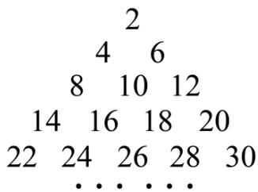

text_image

2
4 6
8 10 12
14 16 18 20
22 24 26 28 30
... ...

按照以上排列的规律,则第10行从左向右的第3个数是\_\_\_\_.

【变式 2-2】（23-24 九年级下·黑龙江哈尔滨·开学考试）观察如图所示的三角形数阵，则第 7 行的最后一个数是\_\_\_\_。

$$
\begin{array}{c c c c} & 1 \\ & - 2 & 3 \\ & - 4 & 5 & - 6 \\ 7 & - 8 & 9 & - 1 0 \\ \dots & \dots & \dots \end{array}
$$

【变式 2-3】观察下面一组数：-1，2，-3，4，-5，6，…，将这组数排成如图的形式，按照如图规律排下去第 10 行从左边数第 9 个数是（）

第一行 -1

第二行 2 -3 4

第三行 -5 6 -7 8 -9

第四行 10 -11 12 -13 14 -15 16

● ● ● ● ● ●

A. -90

B. 90

C. -91

D. 91

# 【题型3 数表规律】

【例 3】将自然数按以下规律排列，则 2016 所在的位置（）

<table><tr><td></td><td>第1列</td><td>第2列</td><td>第3列</td><td>第4列</td><td>...</td></tr><tr><td>第1行</td><td>1</td><td>2</td><td>9</td><td>10</td><td></td></tr><tr><td>第2行</td><td>4</td><td>3</td><td>8</td><td>11</td><td></td></tr><tr><td>第3行</td><td>5</td><td>6</td><td>7</td><td>12</td><td></td></tr><tr><td>第4行</td><td>16</td><td>15</td><td>14</td><td>13</td><td></td></tr><tr><td>第5行</td><td>17</td><td>...</td><td></td><td></td><td></td></tr><tr><td>...</td><td></td><td></td><td></td><td></td><td></td></tr></table>

A. 第 45 行第 10 列

B. 第10行第45列

C. 第 44 行第 10 列

D. 第10行第44列

【变式 3-1】（23-24 七年级上·湖南湘西·期末）观察图中“品”字形中各数之间的规律，根据观察到的规律，求出b的值为\_\_\_\_。

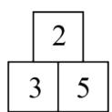

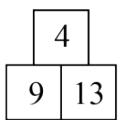

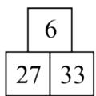

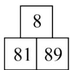

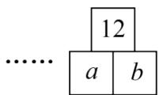

【变式 3-2】填在下面三个田字格内的数有相同的规律，根据此规律，C 的值是（）

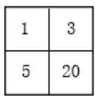

A. 76

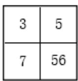

B. 82

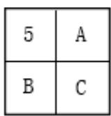

C. 86

D. 108

【变式 3-3】（23-24 七年级上·江苏无锡·阶段练习）一组数按图中规律从左向右依次排列，则第 9 个图中 $m+n=$ （）

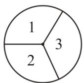

A. 100

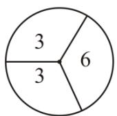

B. 95

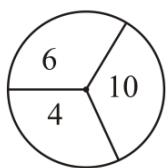

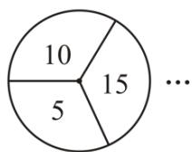

C. 90

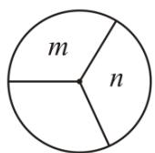

D. 85

【题型 4 数图规律】教辅资源，关注公众号★全科AA+

【例 4】（24-25 九年级上·重庆·期中）如图，用规格相同的小棒摆成一组图案，图案①需要 6 根小棒，图案②需要 10 根小棒，图案③需要 14 根小棒，…，按此规律，则第 8 个图形中需要小棒的根数是（）

①

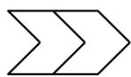

②

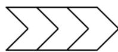

③

• • • • • •

A. 32

B. 34

C. 36

D. 38

【变式 4-1】（23-24 七年级上·重庆沙坪坝·期末）如图，用规格相同的小棒摆成一组图案，第 1 个图案需要 3 根小棒，第 2 个图案需要 5 根小棒，第 3 个图案需要 7 根小棒，…，按此规律，则第 2024 个图案中需要小棒的根数是（）

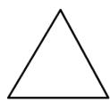

第1个

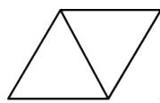

第2个

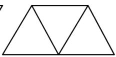

第3个

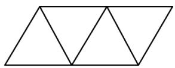

第4个

A. 4047

B. 4048

C. 4049

D. 4050

【变式 4-2】（2025·重庆开州·二模）如图是用大小相等的五角星按一定规律拼成的一组图案，第①个图案中有 4 颗五角星，第②个图案中有 7 颗，第③个图案中有 10 颗，…，按此规律排列下去，第⑧个图案中五角星的颗数是）（）

①

②

③

④

A. 22

B. 24

C. 25

D. 28

【变式 4-3】（2025·重庆·模拟预测）如图，用火柴棒按照一定规律摆出一组图形， $a_{1}$ 有 1 根， $a_{2}$ 有 3 根， $a_{3}$ 有 7 根……照此规律摆下去， $a_{7}$ 的火柴棒根数是（）根

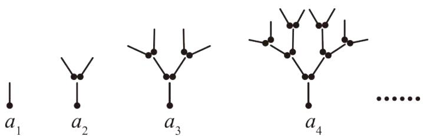

text_image

a₁
a₂
a₃
a₄
......

A. 23

B. 63

C. 127

D. 129

# 【题型5 运算规律】

【例 5】（23-24 七年级上·河北石家庄·阶段练习）观察下面的式子的排列规律，写出它后面的式子：

$$
2 + \frac {2}{3} = 2 ^ {2} \times \frac {2}{3}, \quad 3 + \frac {3}{8} = 3 ^ {2} \times \frac {3}{8}, \quad 4 + \frac {4}{1 5} = 4 ^ {2} \times \frac {4}{1 5}, \quad .
$$

【变式 5-1】观察下列关于自然数的式子:

$$
4 \times 1 ^ {2} - 1 ^ {2} \quad ①
$$

$$
4 \times 2 ^ {2} - 3 ^ {2} \quad ②
$$

$$
4 \times 3 ^ {2} - 5 ^ {2} \quad ③
$$

...

根据上述规律，则第 2018 个式子的值是（）

A. 8068

B. 8069

C. 8070

D. 8071

【变式 5-2】（23-24 七年级上·辽宁阜新·阶段练习）观察下列式子： $a_{1}=\frac{3}{1\times4}=\frac{1}{1}-\frac{1}{4}$ ; $a_{2}=\frac{3}{4\times7}=\frac{1}{4}-\frac{1}{7}$ ; $a_{3}=\frac{3}{7\times10}=\frac{1}{7}-\frac{1}{10}$ ; $a_{4}=\frac{3}{10\times13}=\frac{1}{10}-\frac{1}{13}$ ; …，按此规律，计算 $a_{1}+a_{2}+a_{3}+\cdots+a_{2023}=$ \_\_\_\_.

【变式 5-3】（22-23 七年级上·天津和平·期中）观察下列各式的计算结果：

$$
1 - \frac {1}{2 ^ {2}} = 1 - \frac {1}{4} = \frac {3}{4} = \frac {1}{2} \times \frac {3}{2};
$$

$$
1 - \frac {1}{3 ^ {2}} = 1 - \frac {1}{9} = \frac {8}{9} = \frac {2}{3} \times \frac {4}{3};
$$

$$
1 - \frac {1}{4 ^ {2}} = 1 - \frac {1}{1 6} = \frac {1 5}{1 6} = \frac {3}{4} \times \frac {5}{4};
$$

$$
1 - \frac {1}{5 ^ {2}} = 1 - \frac {1}{2 5} = \frac {2 4}{2 5} = \frac {4}{5} \times \frac {6}{5};
$$

...

（1）用你发现的规律填写下列式子的结果： $1-\frac{1}{10^{2}}=$ \_\_\_\_×\_\_\_\_.

(2) 用你发现的规律计算:

$$
(1 - \frac {1}{2 ^ {2}}) \times (1 - \frac {1}{3 ^ {2}}) \times (1 - \frac {1}{4 ^ {2}}) \times \dots \times (1 - \frac {1}{2 0 2 0 ^ {2}}) \times (1 - \frac {1}{2 0 2 1 ^ {2}}) = \underline {{{}}}.
$$

# 【题型 6 周期规律】教辅资源，关注公众号★全科AA+

【例 6】某种金属元素铋(Bi)会进行衰变，每次在一个周期里，衰变的量是上一次量的一半．铋的周期（半衰期是1小时．设原有1克的未衰变的铋，则1小时后有0.5克发生了衰变，再过1小时又有0.25克发生了衰变，衰变一直按照这种规律发生下去，请问5小时后，共有多少克铋发生了衰变？（）

A. $\frac{1}{32}$

B. $\frac{31}{32}$

C. $\frac{15}{16}$

D. $\frac{1}{16}$

【变式 6-1】公园的长堤一边有规三种树，依次按照 2 棵梨树、3 棵柳树、2 棵桃树的顺序排列。那么从第一棵柳树开始数，第 125 棵树是（）

A. 桃树

B. 柳树

C. 梨树

D. 无法确定

【变式 6-2】）观察下列算式： $2^{1}=2,\quad2^{2}=4,\quad2^{3}=8,\quad2^{4}=16,\quad2^{5}=32,\quad2^{6}=64,\quad2^{7}=128$ ，通过观察，用你所发现

的规律确定 $2^{2011}$ 的个位数字是（）

A. 2

B. 4

C. 6

D. 8

【变式 6-3】（24-25 七年级上·辽宁铁岭·阶段练习）干支纪年法是中国历法上自古以来就一直使用的纪年方法．干支是天干和地支的总称，“甲、乙、丙、丁、戊、己、庚、辛、壬、癸”十个符号天干；“子、丑、寅、卯、辰、巳、午、未、申、酉、戌、亥”十二个符号叫地支．把干支（天干+地支）顺序相配（甲子、乙丑、丙寅...）正好六十为一周期，周而复始，循环记录，这就是俗称的“干支表”，公历年数先减三，除十余数是天干，改用十二除，余数便是地支年，如 1997 年是丁丑年，依据上述规律推断析 2024 应为\_\_\_\_年．

<table><tr><td></td><td>1</td><td>2</td><td>3</td><td>4</td><td>5</td><td>6</td><td>7</td><td>8</td><td>9</td><td>10</td><td>11</td><td>12</td></tr><tr><td>天干</td><td>甲</td><td>乙</td><td>丙</td><td>丁</td><td>戊</td><td>己</td><td>庚</td><td>辛</td><td>壬</td><td>癸</td><td></td><td></td></tr><tr><td>地支</td><td>子</td><td>丑</td><td>寅</td><td>卯</td><td>辰</td><td>巳</td><td>午</td><td>未</td><td>申</td><td>酉</td><td>戌</td><td>亥</td></tr></table>

# 【题型7 递进规律】

【例 7】（24-25 七年级上·陕西西安·阶段练习）如图，数轴上 O，A 两点的距离为 12，一动点 P 从点 A 出发，按以下规律跳动：第 1 次跳动到 AO 的中点 $A_{1}$ 处，第 2 次从 $A_{1}$ 点跳动到 $A_{1}O$ 的中点 $A_{1}$ 处，第 3 次从 $A_{2}$ 点跳动到 $A_{2}O$ 的中点 $A_{3}$ 处．按照这样的规律继续跳动到点 $A_{4}, A_{5}, A_{6} \cdots A_{n}$ （ $n \geq 3$ ，n 是整数）处，问经过这样 2024 次跳动后的点 $A_{2024}$ 与 $A_{1}A$ 的中点的距离是（）

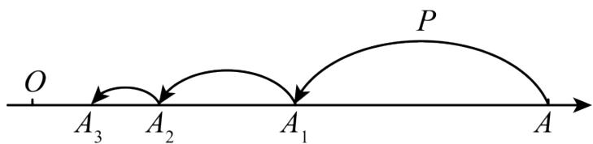

text_image

O
A₃ A₂ A₁ P
A

A. $12-3 \times \frac{1}{2^{2022}}$

B. $9-3 \times \frac{1}{2^{2022}}$

C. $12-3 \times \frac{1}{2^{2023}}$

D. $9-3 \times \frac{1}{2^{2023}}$

【变式 7-1】（24-25 七年级下·全国·假期作业）正方形图 1 作如下操作：第 1 次：分别连接各边中点如图 2，得到 5 个正方形；第 2 次：将图 2 左上角正方形按上述方法再分割如图 3，得到 9 个正方形，……，以此类推，根据以上操作，若要得到 53 个正方形，需要操作的次数是（）

  
图1

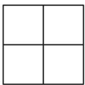  
图2

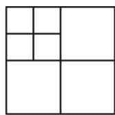  
图3

A. 12

B. 13

C. 14

D. 15

【变式 7-2】如图，数轴上两定点 A、B 对应的数分别为 -18 和 14，现在有甲、乙两只电子蚂蚁分别从 A、B同时出发，沿着数轴爬行，速度分别为每秒 1.5 个单位和 1.7 个单位，它们第一次相向爬行 1 秒，第二次反向爬行 2 秒，第三次相向爬行 3 秒，第四次反向爬行 4 秒，第五次相向爬行 5 秒，……，按如此规律，则它们第一次相遇所需的时间为（）

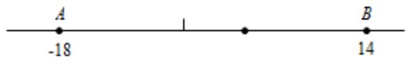

text_image

A
-18
1
B
14

A. 55秒

B. 190秒

C. 200 秒

D. 210 秒

【变式 7-3】（2025·安徽芜湖·模拟预测）将一张等边三角形纸片分成四个大小、形状一样的等边三角形（如图所示），记为第 1 次操作，然后将其中右下角的等边三角形又按同样的方法分成四部分，记为第 2 次操作．若每次都把右下角的等边三角形按此方法分成四部分，如此循环进行下去.

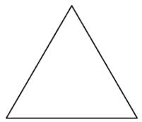

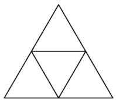  
第1次操作

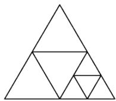  
第2次操作

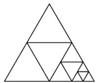  
第3次操作

......

(1)若操作 4 次，则总共能得到 \_\_\_\_ 个等边三角形.  
(2)计算 $\frac{1}{4}+\frac{1}{8}+\frac{1}{16}+\frac{1}{32}+\frac{1}{64}+\frac{1}{128}+\frac{1}{256}+\frac{1}{512}$ 的值.

【题型 8 数形规律】教辅资源，关注 公众号★全科AA+

【例 8】如图是蜘蛛结网过程示意图，一只蜘蛛先以 O 为起点结六条线 OA，OB，OC，OD，OE，OF 后，再从线 OA 上某点开始按逆时针方向依次在 OA，OB，OC，OD，OE，OF，OA，OB...上结网，若将各线上的结点依次记为：1，2，3，4，5，6，7，8，…，那么第 200 个结点在（）

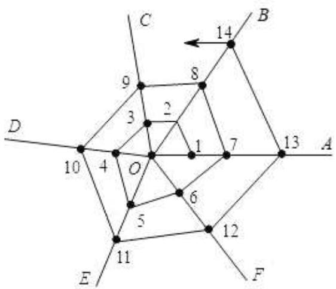

text_image

C
14
B
9
8
2
3
1
7
13
A
D
10
4
O
6
5
12
E
11
F

A. 线 $OA$ 上

B. 线 $OB$ 上

C. 线 $OC$ 上

D. 线 $OF$ 上

【变式 8-1】刚会数数的妹妹问你：“伸出左手，从大拇指开始，如图所示的那样数数字：1、2、3、4、……请问数到 99 时，是哪个手指？”你会告诉妹妹正确答案应该是（）

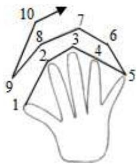

text_image

10
8
7
6
3
2
4
9
5
1

A. 大拇指

B. 食指

C. 中指

D. 无名指

【变式 8-2】观察图形中点的个数，若按其规律再画下去，可以得到第 105 个图形中所有点的个数为（）

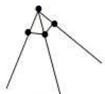  
图1

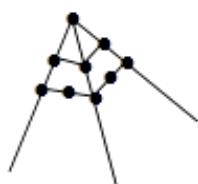  
图2

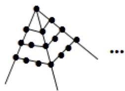

natural_image

Abstract geometric diagram with interconnected nodes and lines (no text or symbols)

图3

A. 1016 个

B. 11025 个

C. 11236 个

D. 22249 个

【变式 8-3】如图, 两个半径都是 $4 \mathrm{~cm}$ 的圆有一个公共点 C, 一只蚂蚁由点 A 开始依 A、B、C、D、E、F、 C、G、A 的顺序沿着圆周上的 8 段长度相等的路径绕行, 蚂蚁在这 8 段路径上不断爬行, 直到行走 $2014 \pi \mathrm{cm}$ 后才停下来, 则蚂蚁停的那一个点为( )

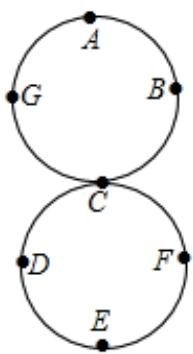

text_image

A
G B
C
D F
E

A. D点

B. E 点

C. F 点

D. G 点