# 专题 02 有理数中的规律（代数推理）问题（举一反三专项训练）

# 【北师大版 2024】

# 题型归纳

【题型1 数字规律】....1  
【题型 2 数阵规律】....2  
【题型 3 数表规律】....5  
【题型4 数图规律】....7  
【题型5 运算规律】....9  
【题型 6 周期规律】....12  
【题型 7 递进规律】....14  
【题型8 数形规律】....17

# 举一反三

# 【题型1 数字规律】

【例 1】（24-25 七年级上·广东珠海·期中）一组数1,3,7,15,31…按下列分组．第一组(1、3、7)，第二组(1、3、7、15)，第三组(1、3、7、15、31)，…按此规律排列，则第 11 组所有数之和为（）

A. $2^{13} - 12$

B. $2^{14} - 15$

C. $2^{13}-14$

D. $2^{14}-13$

【答案】B

【分析】本题考查有理数的乘方运算，数字类规律探索．能通过前几项的计算找出规律是解题关键．先分别计算前几组的所有数之和，观察并找出规律即可.

【详解】解：第一组所有数之和为： $1+3+7=11=2^{4}-5$ ;

第二组所有数之和为： $1+3+7+15=26=2^{5}-6$

第三组所有数之和为： $1+3+7+15+31=57=2^{6}-7$ ;

……，

所以第11组所有数之和为 $2^{14}-15$ ,

故选: B.

【变式 1-1】一列数据按 1, -2, 3, -4, 5, -6……的规律书写，则第 2021 个数字为（）

A. 2021

B. -2021

C. 2022

D. -2022

【答案】A

【分析】找出该列数据的书写规律即可求解.

【详解】解：观察所给数据可知，第 n 个数字的绝对值是 n，奇数项符号为正，偶数项符号为负，由此可知，第 2021 个数字为 2021.

故选 A.

【点睛】本题属于数字规律题，找出所给数据的书写规律是解题的关键.

【变式 1-2】（24-25 六年级上·黑龙江哈尔滨·期末）观察数组： $\frac{1}{2}$ 、 $\frac{2}{3}$ 、1、 $\frac{8}{5}$ …依此规律，第6个数是\_\_\_\_.

【答案】 $\frac{32}{7}$

【分析】本题考查了数字类规律探索，能从所给数组中发现并总结出一般规律是解题的关键。根据所给数组，观察各数分子分母的变化规律，由此即可总结出一般规律并解决问题。

【详解】解：由题知， $1=\frac{4}{4}$

则这列数的分子依次为：1，2，4，8，…，

∴第n个数的分子可表示为： $2^{n-1}$ ，

这列数的分母依次为：2，3，4，5，…，

第6个数是 $\frac{2^{6-1}}{6+1}=\frac{32}{7}$ ,

即：第6个数是 $\frac{32}{7}$

故答案为： $\frac{32}{7}$ .

【变式 1-3】（23-24 七年级上·福建福州·期中）1，2，4，8，16，…，是按一定规律排列的一组数，则第2017个数是（）

A. $2^{2015}$

B. $2^{2016}$

C. $2^{2017}$

D. 4032

【答案】B

【分析】根据给定的数字，得到第n个数为 $2^{n-1}$ ，即可得出结果.

【详解】解：由 $1=2^{0},2=2^{1},4=2^{2},8=2^{3},16=2^{4}\cdots$ 可知，第2017个数是 $2^{2016}$ ;

故选 B.

【点睛】本题考查数字类规律探究.

# 【题型2 数阵规律】

【例 2】（23-24 七年级上·黑龙江牡丹江·期中）杨辉三角，又称贾宪三角形，帕斯卡三角形（1261）一书中用如图的三角形解释二项式和的乘方规律，比欧洲的相同发现要早三百多年。

<table><tr><td></td><td colspan="6">1</td><td>第一行</td></tr><tr><td></td><td colspan="2">1</td><td colspan="4">1</td><td>第二行</td></tr><tr><td></td><td colspan="2">1</td><td colspan="2">2</td><td colspan="2">1</td><td>第三行</td></tr><tr><td></td><td>1</td><td colspan="2">3</td><td>3</td><td colspan="2">1</td><td>第四行</td></tr><tr><td>1</td><td colspan="2">4</td><td>6</td><td>4</td><td colspan="2">1</td><td>第五行</td></tr></table>

按此规律排列，第七行第四个数的相反数与第八行第三个数的积是（）

A. -700

B. 700

C. -420

D. 420

【答案】C

【分析】根据题意确定第七行和第八行的数字，再根据有理数的乘法的法则计算，本题主要考查了数字类变化规律、相反数的定义、有理数乘法，熟练掌握“只有符号不同的两个数互为相反数”以及有理数乘方的运算法则是解此题的关键.

【详解】第六行的数字为 1, 5, 10, 10, 5, 1;

第七行的数字为 1, 6, 15, 20, 15, 6, 1;

第八行的数字为 1, 7, 21, 35, 35, 21, 7, 1;

可知第七行的第四个数是 20，其相反数为 -20，第八行的第三个数是 21，

根据题意，得 $-20\times21=-420$ ，

故选：C.

【变式 2-1】（23-24 九年级上·广东汕头·期末）将全体正偶数排成一个三角形数阵：

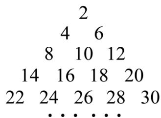

text_image

2
4 6
8 10 12
14 16 18 20
22 24 26 28 30
... ...

按照以上排列的规律,则第10行从左向右的第3个数是\_\_\_\_.

【答案】96

【分析】本题考查归纳推理．首先找出三角形数阵的规律,求出前9行正偶数的个数,然后由偶数的特点求出第10行的第3个偶数.

【详解】解:设根据题意观察得知,第n行有n个偶数,

∴前9行共有正偶数1+2+……+9= $\frac{9\times(1+9)}{2}$ =45（个），

∴第45个偶数为90,是第9行的最后一个,

∴第10行从左到右的第3个偶数为96.

故答案为:96.

【变式 2-2】（23-24 九年级下·黑龙江哈尔滨·开学考试）观察如图所示的三角形数阵，则第 7 行的最后一个数是\_\_\_\_.

$$
\begin{array}{c c c c} & 1 \\ & - 2 & 3 \\ & - 4 & 5 & - 6 \\ 7 & - 8 & 9 & - 1 0 \\ & \dots & \dots & \dots \end{array}
$$

【答案】-28

【详解】解：根据题意可得：奇数为正，偶数为负，

∴第7行的最后一个数的绝对值为 $\frac{(7-1)\times7}{2}+7=28$ ,

∴第7行的最后一个数是-28.

故答案为：-28.

【变式 2-3】观察下面一组数：-1，2，-3，4，-5，6，…，将这组数排成如图的形式，按照如图规律排下去第 10 行从左边数第 9 个数是（）

第一行 -1

第二行 2 -3 4

第三行 -5 6 -7 8 -9

第四行 10 -11 12 -13 14 -15 16

● ● ● ● ● ●

A. -90

B. 90

C. -91

D. 91

【答案】B

【分析】本题主要考查了数字类的规律探索，先找到规律前 n 行共有 $n^{2}$ 个数，进而得到第 10 行从左边数第 9 个数是第 90 个数，再找到规律当 k 为奇数时，第 k 个数是 -k，当 k 为偶数时，第 k 个数为 k，据此可得答案.

【详解】解：第一行有1个数，

前两行有 $1+3=2^{2}=4$ 个数，

前三行有 $1+3+5=3^{2}=9$ 个数，

前四行有 $1+3+5+7=4^{2}=16$ 个数，

……，

以此类推，前 n 行共有 $n^{2}$ 个数，

∴前9行一共有 $9^{2}=81$ 个数，

∴第 10 行从左边数第 9 个数是第 90 个数，

观察可知，当 k 为奇数时，第 k 个数是 -k，当 k 为偶数时，第 k 个数为 k，

∴第 10 行从左边数第 9 个数是 90,

故选：B.

# 【题型3 数表规律】

【例 3】将自然数按以下规律排列，则 2016 所在的位置（）

<table><tr><td></td><td>第1列</td><td>第2列</td><td>第3列</td><td>第4列</td><td>...</td></tr><tr><td>第1行</td><td>1</td><td>2</td><td>9</td><td>10</td><td></td></tr><tr><td>第2行</td><td>4</td><td>3</td><td>8</td><td>11</td><td></td></tr><tr><td>第3行</td><td>5</td><td>6</td><td>7</td><td>12</td><td></td></tr><tr><td>第4行</td><td>16</td><td>15</td><td>14</td><td>13</td><td></td></tr><tr><td>第5行</td><td>17</td><td>...</td><td></td><td></td><td></td></tr><tr><td>...</td><td></td><td></td><td></td><td></td><td></td></tr></table>

A. 第 45 行第 10 列

B. 第 10 行第 45 列

C. 第 44 行第 10 列

D. 第 10 行第 44 列

【答案】B

【详解】试题解析：∵44^{2}=1936，

∴第 44 行的第一个数字是 1936,

∴第 45 行的第一个数字是 1937，第 45 列数字是 1981.

∴2016 应该是第 45 列 1981 往上再数 35 个，

∴2016 所在的位置是第 10 行的第 45 列.

故选 B.

【变式 3-1】（23-24 七年级上·湖南湘西·期末）观察图中“品”字形中各数之间的规律，根据观察到的规律，求出b的值为\_\_\_\_。

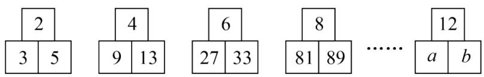

text_image

2
3 5
4
9 13
6
27 33
8
81 89
……
12
a b

【答案】741

【分析】此题考查了数字变化规律，由图可知，上边的数与下边左边的数的和正好等于下边右边的数，上边的数为连续的偶数，上边的数为 $2n$ ，下边左边的数为 $3^{n}$ ，由此可得 $a$ 、 $b$ 的值，即可求解，通过表中的数找到它们之间的规律是解题的关键.

【详解】解：∵上边的数为连续的偶数，

由2n=12，得n=6，

∵下边左边的数为 $3^{n}$ ,

$$
\therefore a = 3 ^ {6} = 7 2 9,
$$

∵上边的数与下边左边的数的和正好等于下边右边的数，

$$
\therefore b = 1 2 + a = 1 2 + 7 2 9 = 7 4 1,
$$

故答案为：741.

【变式 3-2】填在下面三个田字格内的数有相同的规律，根据此规律，C 的值是（）

<table><tr><td>1</td><td>3</td></tr><tr><td>5</td><td>20</td></tr></table>

A. 76

<table><tr><td>3</td><td>5</td></tr><tr><td>7</td><td>56</td></tr></table>

B. 82

<table><tr><td>5</td><td>A</td></tr><tr><td>B</td><td>C</td></tr></table>

C. 86

D. 108

【答案】D

【分析】根据图中的数字，可以发现数字的变化特点，从而可以得到 A、B、C 的值.

【详解】解：由图中的数字可知，左上角的数字是一些连续的奇数，从 1 开始，右上角的数字是一些连续的奇数，从 3 开始，左下角的数字是一些连续的奇数，从 5 开始，右下角的数字是对应的左上角的数字与右上角的数字之和与左下角数字的乘积，

$$
\therefore A = 7, \quad B = 9, \quad C = (5 + 7) \times 9 = 1 2 \times 9 = 1 0 8,
$$

故选：D.

【点睛】本题考查的是数字的变化类，根据题意找出各数之间的规律是解答此题的关键.

【变式 3-3】（23-24 七年级上·江苏无锡·阶段练习）一组数按图中规律从左向右依次排列，则第 9 个图中 $m+n=$ （）

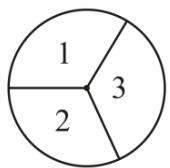  
A. 100

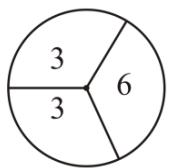  
B. 95

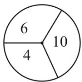

C. 90   
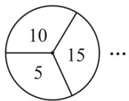

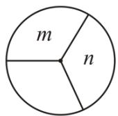  
D. 85

【答案】A

【分析】根据题意可以求得m的值， $n=10+m$ ，从而可以求得 $m+n$ 的值，从而可以解答本题.

【详解】解：由图可知，

$$
m = 1 + 2 + 3 + 4 + 5 + 6 + 7 + 8 + 9 = 4 5, n = m + 1 0 = 4 5 + 1 0 = 5 5,
$$

$$
\therefore m + n = 4 5 + 5 5 = 1 0 0,
$$

故选：A.

【点睛】本题考查图形的变化类，解题的关键是明确题意，找出图形的变化规律.

# 【题型4 数图规律】

【例 4】（24-25 九年级上·重庆·期中）如图，用规格相同的小棒摆成一组图案，图案①需要 6 根小棒，图案②需要 10 根小棒，图案③需要 14 根小棒，…，按此规律，则第 8 个图形中需要小棒的根数是（）

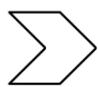  
①

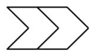  
②

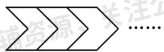  
③

A. 32

B. 34

C. 36

D. 38

【答案】B

【分析】本题考查了图形的变化规律，根据图案的变化归纳出第 $n$ 个图案需要的小棒数是解题的关键．观察图案可知下一个图形比前一个图多4根小棒，找出4与第 $n$ 个图案的小棒的根数的联系即可.

【详解】解：观察图案，可知下一个图形比前一个图多4根小棒，

图案①需要 $1\times4+2=6$ 根小棒，

图案②需要 $2\times4+2=10$ 根小棒，

图案③需要 $3\times4+2=14$ 根小棒，

...

∴第8个图形中需要小棒的根数是 $4\times8+2=34$ ,

故选：B.

【变式 4-1】（23-24 七年级上·重庆沙坪坝·期末）如图，用规格相同的小棒摆成一组图案，第 1 个图案需要

3 根小棒，第 2 个图案需要 5 根小棒，第 3 个图案需要 7 根小棒，…，按此规律，则第 2024 个图案中需要小棒的根数是（）

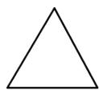

第1个

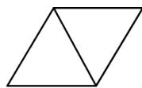

第2个

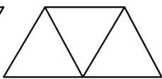

第3个

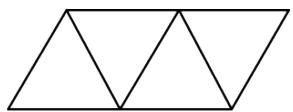

第4个

A. 4047

B. 4048

C. 4049

D. 4050

【答案】C

【分析】本题考查了图形的变化规律．观察图案，可知下一个图比前一个图多2根小棒，据此即可解答.

【详解】由图可得:

第 1 个图案需要小棒 3 根，即 $3=2\times1+1$ ，

第 2 个图案需要小棒 5 根，即 $5=2\times2+1$ ，

第 3 个图案需要小棒 7 根，即 $7=2\times3+1$ ，

第 4 个图案需要小棒 9 根，即 $9=2\times4+1$ ，

...

∴第 2024 个图案需要小棒的根数是： $2 \times 2024 + 1 = 4049$ .

故选：C

【变式 4-2】（2025·重庆开州·二模）如图是用大小相等的五角星按一定规律拼成的一组图案，第①个图案中有 4 颗五角星，第②个图案中有 7 颗，第③个图案中有 10 颗，…，按此规律排列下去，第⑧个图案中五角星的颗数是）（）

①

②

③

④

A. 22

B. 24

C. 25

D. 28

【答案】C

【分析】本题考查了图形的数字规律．观察图形，将图形中的五角星分为四部分，即左、上、右、下四部分，先找出每部分的规律，再相加就可得出每个图形中五角星个数的规律，即可解答.

【详解】观察前四个图案得：第①个图案中小五角星的颗数= $3 \times 1 + 1 = 4$ ;

第②个图案中小五角星的颗数= $3 \times 2 + 1 = 7$ ;

第③个图案中小五角星的颗数= $3 \times 3 + 1 = 10$ ;

第④个图案中小五角星的颗数= $3 \times 4 + 1 = 13$ ;

...，

第⑧个图案中小五角星的颗数= $3 \times 8 + 1 = 25$ ;

故选：C.

【变式 4-3】（2025·重庆·模拟预测）如图，用火柴棒按照一定规律摆出一组图形， $a_{1}$ 有 1 根， $a_{2}$ 有 3 根， $a_{3}$ 有 7 根……照此规律摆下去， $a_{7}$ 的火柴棒根数是（）根

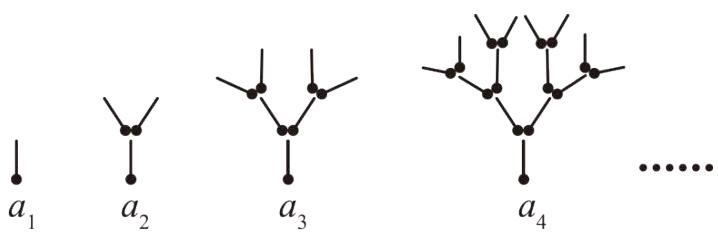

text_image

a₁
a₂
a₃
a₄
......

A. 23

B. 63

C. 127

D. 129

【答案】C

【分析】本题主要考查了图形类的规律问题，

先根据前四个图形中火柴棒的个数得变化特点得出规律，进而得出答案.

【详解】解：因为 $a_{1}$ 图中有1根火柴棒；

因为 $a_{2}$ 图中有 $1+2^{1}=3$ 根火柴棒；

因为 $a_{3}$ 图中有 $1+2^{1}+2^{2}=7$ 根火柴棒；

因为 $a_{4}$ 图中有 $1+2^{1}+2^{2}+2^{3}=15$ 根火柴棒，

...

因为 $a_{7}$ 图中有 $1+2^{1}+2^{2}+2^{3}+2^{4}+2^{5}+2^{6}=1+2+4+8+16+32+64=127$ 根火柴棒.

故选：C.

# 【题型5 运算规律】

【例 5】（23-24 七年级上·河北石家庄·阶段练习）观察下面的式子的排列规律，写出它后面的式子：

$$
2 + \frac {2}{3} = 2 ^ {2} \times \frac {2}{3}, 3 + \frac {3}{8} = 3 ^ {2} \times \frac {3}{8}, 4 + \frac {4}{1 5} = 4 ^ {2} \times \frac {4}{1 5},
$$

【答案】 $5+\frac{5}{24}=5^{2}\times\frac{5}{24}$

【分析】本题考查数字的变化类，有理数的混合运算，解题的关键是明确题意，发现题目中式子的变化特点（原式等于左边第一个数的平方乘以左边第二个数且分母是左边第一个数的平方减1），从而写出后面的式子.

【详解】解：总结规律可得它后面的式子是： $5+\frac{5}{24}=5^{2}\times\frac{5}{24}$ .

故答案为： $5+\frac{5}{24}=5^{2}\times\frac{5}{24}$ .

【变式 5-1】观察下列关于自然数的式子:

$$
4 \times 1 ^ {2} - 1 ^ {2} \quad ①
$$

$$
4 \times 2 ^ {2} - 3 ^ {2} \quad ②
$$

$$
4 \times 3 ^ {2} - 5 ^ {2} \quad ③
$$

...

根据上述规律，则第 2018 个式子的值是（）

A. 8068

B. 8069

C. 8070

D. 8071

【答案】D

【详解】分析：由①②③三个等式可得，减数是从1开始连续奇数的平方，被减数是从1开始连续自然数的平方的4倍，由此规律得出答案即可.

详解： $4 \times 1^{2} - 1^{2}$ ①

$$
4 \times 2 ^ {2} - 3 ^ {2} \quad ②
$$

$$
4 \times 3 ^ {2} - 5 ^ {2} \quad ③
$$

...

所以第 2018 个式子的值是： $4 \times 2018 - 1 = 8071$ .

故选 D.

【变式 5-2】（23-24 七年级上·辽宁阜新·阶段练习）观察下列式子： $a_{1}=\frac{3}{1\times4}=\frac{1}{1}-\frac{1}{4}$ ; $a_{2}=\frac{3}{4\times7}=\frac{1}{4}-\frac{1}{7}$ ; $a_{3}=\frac{3}{7\times10}=\frac{1}{7}-\frac{1}{10}$ ; $a_{4}=\frac{3}{10\times13}=\frac{1}{10}-\frac{1}{13}$ ; …，按此规律，计算 $a_{1}+a_{2}+a_{3}+\cdots+a_{2023}=$ \_\_\_\_.

【答案】 $\frac{6069}{6070}$

【分析】本题主要考查了数字的规律探究，根据已知的式子中的数的特点得到分母是相差3的两个整数相乘，分子为3，结果等于分母中的两个数的倒数相减，进而表示出该规律．由此进行其他的应用计算.

【详解】解： $a_{1}=\frac{3}{1\times4}=\frac{1}{1}-\frac{1}{4}$

$$
a _ {2} = \frac {3}{4 \times 7} = \frac {1}{4} - \frac {1}{7},
$$

$$
a _ {3} = \frac {3}{7 \times 1 0} = \frac {1}{7} - \frac {1}{1 0},
$$

...，

$$
\begin{array}{l} a _ {4} = \frac {3}{1 0 \times 1 3} = \frac {1}{1 0} - \frac {1}{1 3}, \\ \therefore a _ {1} + a _ {2} + a _ {3} + \dots + a _ {2 0 2 3} = \frac {1}{1} - \frac {1}{4} + \frac {1}{4} - \frac {1}{7} + \frac {1}{7} - \frac {1}{1 0} + \frac {1}{1 0} - \frac {1}{1 3} + \dots + \frac {1}{3 \times 2 0 2 3 - 2} - \frac {1}{3 \times 2 0 2 3 + 1} \\ = 1 - \frac {1}{3 \times 2 0 2 3 + 1} \\ = 1 - \frac {1}{6 0 7 0} \\ = \frac {6 0 6 9}{6 0 7 0}. \\ \end{array}
$$

故答案为： $\frac{6069}{6070}$ .

【变式 5-3】（22-23 七年级上·天津和平·期中）观察下列各式的计算结果：

$$
1 - \frac {1}{2 ^ {2}} = 1 - \frac {1}{4} = \frac {3}{4} = \frac {1}{2} \times \frac {3}{2};
$$

$$
1 - \frac {1}{3 ^ {2}} = 1 - \frac {1}{9} = \frac {8}{9} = \frac {2}{3} \times \frac {4}{3};
$$

$$
1 - \frac {1}{4 ^ {2}} = 1 - \frac {1}{1 6} = \frac {1 5}{1 6} = \frac {3}{4} \times \frac {5}{4};
$$

$$
1 - \frac {1}{5 ^ {2}} = 1 - \frac {1}{2 5} = \frac {2 4}{2 5} = \frac {4}{5} \times \frac {6}{5};
$$

...

（1）用你发现的规律填写下列式子的结果： $1-\frac{1}{10^{2}}=$ \_\_\_\_×\_\_\_\_.  
(2) 用你发现的规律计算:

$$
(1 - \frac {1}{2 ^ {2}}) \times (1 - \frac {1}{3 ^ {2}}) \times (1 - \frac {1}{4 ^ {2}}) \times \dots \times (1 - \frac {1}{2 0 2 0 ^ {2}}) \times (1 - \frac {1}{2 0 2 1 ^ {2}}) = \underline {{{}}}.
$$

【答案】 $\frac{9}{10}$ $\frac{11}{10}$ $\frac{1011}{2021}$

【分析】（1）根据所给的等式直接写出即可；

（2）通过观察可将所求的式子变形为 $\frac{1}{2}\times\frac{3}{2}\times\frac{2}{3}\times\frac{4}{3}\times\frac{3}{4}\times\frac{5}{4}\times\ldots\times\frac{2019}{2020}\times\frac{2021}{2020}\times\frac{2020}{2021}\times\frac{2022}{2021}$ ，再运算即可.

【详解】解：（1） $1-\frac{1}{10^{2}}=1-\frac{1}{100}=\frac{99}{100}=\frac{9}{10}\times\frac{11}{10}$

故答案为： $\frac{9}{10}$ ， $\frac{11}{10}$ ;

(2) $(1 - \frac{1}{2^2})\times (1 - \frac{1}{3^2})\times (1 - \frac{1}{4^2})\times \ldots \times (1 - \frac{1}{2020^2})\times (1 - \frac{1}{2021^2})$

$$
= \frac {1}{2} \times \frac {3}{2} \times \frac {2}{3} \times \frac {4}{3} \times \frac {3}{4} \times \frac {5}{4} \times \dots \times \frac {2 0 1 9}{2 0 2 0} \times \frac {2 0 2 1}{2 0 2 0} \times \frac {2 0 2 0}{2 0 2 1} \times \frac {2 0 2 2}{2 0 2 1}
$$

$$
\begin{array}{l} = \frac {1}{2} \times \frac {2 0 2 2}{2 0 2 1} \\ = \frac {1 0 1 1}{2 0 2 1}, \\ \end{array}
$$

故答案为： $\frac{1011}{2021}$ .

【点睛】本题考查了有理数的混合运算，读懂题意，根据题意进行准确变形是解本题的关键.

# 【题型6 周期规律】

【例 6】某种金属元素铋(Bi)会进行衰变，每次在一个周期里，衰变的量是上一次量的一半．铋的周期（半衰期是1小时．设原有1克的未衰变的铋，则1小时后有0.5克发生了衰变，再过1小时又有0.25克发生了衰变，衰变一直按照这种规律发生下去，请问5小时后，共有多少克铋发生了衰变？（）

A. $\frac{1}{32}$

B. $\frac{31}{32}$

C. $\frac{15}{16}$

D. $\frac{1}{16}$

【答案】B

【分析】将每个小时的衰变量相加，计算可得结果.

【详解】解：由题意可得：

$$
\begin{array}{l} \frac {1}{2} + \frac {1}{2 ^ {2}} + \frac {1}{2 ^ {3}} + \frac {1}{2 ^ {4}} + \frac {1}{2 ^ {5}} \\ = \frac {1}{2} + \frac {1}{4} + \frac {1}{8} + \frac {1}{1 6} + \frac {1}{3 2} \\ = \frac {1 6}{3 2} + \frac {8}{3 2} + \frac {4}{3 2} + \frac {2}{3 2} + \frac {1}{3 2} \\ = \frac {3 1}{3 2} \\ \end{array}
$$

故选：B.

【点睛】本题考查了有理数的混合运算的实际应用，解题的关键是理解题意，列出算式.

【变式 6-1】公园的长堤一边有规三种树，依次按照 2 棵梨树、3 棵柳树、2 棵桃树的顺序排列。那么从第一棵柳树开始数，第 125 棵树是（）

A. 桃树

B. 柳树

C. 梨树

D. 无法确定

【答案】C

【分析】本题主要考查了周期问题，求出余数是解题的关键．根据题意找到周期求出余数即可得到答案.

【详解】解：根据题意得：一个周期为7棵树，

$$
\therefore 1 2 5 \div 7 = 1 7 \dots 6,
$$

从第一棵柳树开始数，

故第 125 棵树是梨树.

故选：C.

【变式 6-2】）观察下列算式： $2^{1}=2$ ， $2^{2}=4$ ， $2^{3}=8$ ， $2^{4}=16$ ， $2^{5}=32$ ， $2^{6}=64$ ， $2^{7}=128$ ，通过观察，用你所发现的规律确定 $2^{2011}$ 的个位数字是（）

A. 2

B. 4

C. 6

D. 8

【答案】D

【分析】根据已知的结果找出个位数的周期性规律，进而分析判断即可。

【详解】 $2^{1}=2,\quad2^{2}=4,\quad2^{3}=8,\quad2^{4}=16,\quad2^{5}=32,\quad2^{6}=64,\quad2^{7}=128,$

可知，2n 的个位数字以“2，4，8，6，...”重复出现， $2011 \div 4 = 502 \ldots 3$ ，

所以 $2^{2011}$ 的个位数字是 8;

故选D.

【点睛】此题主要考查数字的规律探索，根据已知确定数字的周期规律是解题的关键.

【变式 6-3】（24-25 七年级上·辽宁铁岭·阶段练习）干支纪年法是中国历法上自古以来就一直使用的纪年方法．干支是天干和地支的总称，“甲、乙、丙、丁、戊、己、庚、辛、壬、癸”十个符号天干；“子、丑、寅、卯、辰、巳、午、未、申、酉、戌、亥”十二个符号叫地支．把干支（天干+地支）顺序相配（甲子、乙丑、丙寅...）正好六十为一周期，周而复始，循环记录，这就是俗称的“干支表”，公历年数先减三，除十余数是天干，改用十二除，余数便是地支年，如 1997 年是丁丑年，依据上述规律推断析 2024 应为\_\_\_\_年．

<table><tr><td></td><td>1</td><td>2</td><td>3</td><td>4</td><td>5</td><td>6</td><td>7</td><td>8</td><td>9</td><td>10</td><td>11</td><td>12</td></tr><tr><td>天干</td><td>甲</td><td>乙</td><td>丙</td><td>丁</td><td>戊</td><td>己</td><td>庚</td><td>辛</td><td>壬</td><td>癸</td><td></td><td></td></tr><tr><td>地支</td><td>子</td><td>丑</td><td>寅</td><td>卯</td><td>辰</td><td>巳</td><td>午</td><td>未</td><td>申</td><td>酉</td><td>戌</td><td>亥</td></tr></table>

【答案】甲辰

【分析】本题主要考查有理数的混合运算，解答的关键是对相应的运算法则的掌握．根据题意，列出算式进行计算后，判断即可．掌握天干，地支的确定方法，正确的列出算式即可.

【详解】解：由题意，得：天干为： $(2024-3)\div10=202\cdots1$ ;

地支为： $(2024-3)\div12=168\cdots5,$

∴2024年为农历甲辰年；

故答案为：甲辰.

# 【题型7 递进规律】

【例 7】（24-25 七年级上·陕西西安·阶段练习）如图，数轴上O，A两点的距离为12，一动点P从点A出发，按以下规律跳动：第1次跳动到AO的中点 $A_{1}$ 处，第2次从 $A_{1}$ 点跳动到 $A_{1}O$ 的中点 $A_{1}$ 处，第3次从 $A_{2}$ 点跳动到 $A_{2}O$ 的中点 $A_{3}$ 处．按照这样的规律继续跳动到点 $A_{4},A_{5},A_{6}\cdots A_{n}$ （ $n\geq3$ ，n是整数）处，问经过这样2024次跳动后的点 $A_{2024}$ 与 $A_{1}A$ 的中点的距离是（）

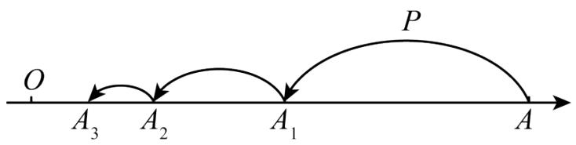

text_image

O
A₃ A₂ A₁ P
A

A. $12-3 \times \frac{1}{2^{2022}}$

B. $9-3 \times \frac{1}{2^{2022}}$

C. $12-3 \times \frac{1}{2^{2023}}$

D. $9-3 \times \frac{1}{2^{2023}}$

【答案】B

【分析】本题考查了数轴上点的跳动规律以及中点距离的计算, 通过观察每次跳动后点与原点O的距离变化, 可以发现一个规律, 即每次跳动后点与O的距离是前一次距离的一半, 利用这个规律, 可以计算出经过2024次跳动后点 $A_{2024}$ 与 $A_{1}A$ 中点的距离, 掌握相关知识是解题的关键.

【详解】解：∵数轴上O,A两点的距离为12，

∴点A表示的数为12，

$A_{1}$ 表示的数为 $12\times\frac{1}{2}=6$ ,

$A_{2}$ 表示的数为 $12\times\left(\frac{1}{2}\right)^{2}=3$ ,

$A_{3}$ 表示的数为 $12\times\left(\frac{1}{2}\right)^{3}$ ,

$A_{4}$ 表示的数为 $12\times\left(\frac{1}{2}\right)^{4}$ ,

……，

$A_{n}$ 表示的数为 $12\times\left(\frac{1}{2}\right)^{n}$ ,

∴经过这样2024次跳动后的点 $A_{2024}$ 表示的数为 $12\times\left(\frac{1}{2}\right)^{2024}$ ,

∵点A表示的数为12， $A_{1}$ 表示的数为6，

$\therefore A_{1}A$ 的中点表示的数为 $\frac{12+6}{2}=9$ ,

∴经过这样2024次跳动后的点与 $A_{1}A$ 的中点的距离为：

$$
9 - 1 2 \times \left(\frac {1}{2}\right) ^ {2 0 2 4} = 9 - 3 \times 4 \times \frac {1}{2 ^ {2 0 2 4}} = 9 - 3 \times \frac {1}{2 ^ {2 0 2 2}},
$$

故选：B.

【变式 7-1】（24-25 七年级下·全国·假期作业）正方形图 1 作如下操作：第 1 次：分别连接各边中点如图 2，得到 5 个正方形；第 2 次：将图 2 左上角正方形按上述方法再分割如图 3，得到 9 个正方形，……，以此类推，根据以上操作，若要得到 53 个正方形，需要操作的次数是（）

  
图1

A. 12

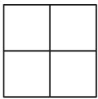  
图2

B. 13

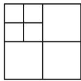  
图3

C. 14

D. 15

【答案】B

【分析】此题主要考查了图形的变化类，根据已知得出正方形个数的变化规律是解题关键．由题意可知，第1次：分别连接各边中点如图2，得到 $4\times1+1=5$ 个正方形；第2次：将图2左上角正方形按上述方法再分割如图3，得到 $4\times2+1=9$ 个正方形……以此类推，根据以上操作，则第n次得到 $4n+1$ 个正方形，由此规律代入求得答案即可.

【详解】解：第1次：得到 $4\times1+1=5$ （个）正方形；

第 2 次：将图 2 左上角正方形按上述方法再分割如图 3，得到 $4 \times 2 + 1 = 9$ （个）正方形

...

以此类推，根据以上操作，则第 n 次得到 $4n+1$ 个正方形，

设第 n 次得到 53 个正方形.

$$
4 n + 1 = 5 3,
$$

解得：n=13，

即若要得到 53 个正方形，需要操作的次数是 13 次.

故选：B.

【变式 7-2】如图，数轴上两定点 A、B 对应的数分别为 -18 和 14，现在有甲、乙两只电子蚂蚁分别从 A、B 同时出发，沿着数轴爬行，速度分别为每秒 1.5 个单位和 1.7 个单位，它们第一次相向爬行 1 秒，第二次反向爬行 2 秒，第三次相向爬行 3 秒，第四次反向爬行 4 秒，第五次相向爬行 5 秒，……，按如此规律，则它们第一次相遇所需的时间为（）

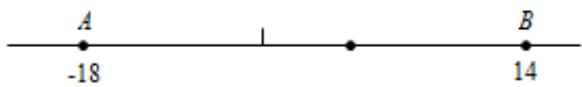

text_image

A
-18
1
B
14

A. 55 秒

B. 190秒

C. 200秒

D. 210秒

【答案】B

【分析】根据两点间的距离，可得 BA 的长，根据爬行的规律，可得以后每两次可以前进 3.2，可得爬行的总次数，根据有理数的加法，可得答案.

【详解】AB 之间的距离为 14-(-18)=32,

第一次相向爬行 1 秒后，两只蚂蚁相距 $32-1 \times (1.5+1.7) = 28.8$ ，

以后每两次可以前进 3.2，

$$
\therefore 2 8. 8 \div 3. 2 = 9,
$$

则最后一次是第 19 次，即甲乙两只电子蚂蚁相向爬行 19 秒，

故第一次相遇的时间为 $1+2+3+4+5+6+7+8+9+10+11+12+13+14+15+16+17+18+19=(1+19)19\div2=190$

(秒)，

答：它们第一次相遇时所需的时间为 190 秒.

故选 B.

【点睛】本题考查了数轴，根据爬行的规律得出前进的速度，爬行的总次数是解题关键.

【变式 7-3】（2025·安徽芜湖·模拟预测）将一张等边三角形纸片分成四个大小、形状一样的等边三角形（如图所示），记为第 1 次操作，然后将其中右下角的等边三角形又按同样的方法分成四部分，记为第 2 次操作．若每次都把右下角的等边三角形按此方法分成四部分，如此循环进行下去.

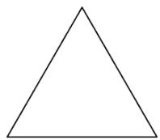

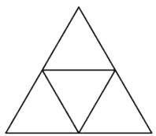  
第1次操作

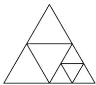  
第2次操作

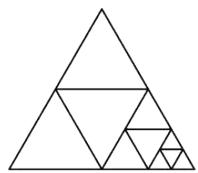  
第3次操作

......

(1)若操作 4 次，则总共能得到 \_\_\_\_ 个等边三角形.  
(2)计算 $\frac{1}{4}+\frac{1}{8}+\frac{1}{16}+\frac{1}{32}+\frac{1}{64}+\frac{1}{128}+\frac{1}{256}+\frac{1}{512}$ 的值.

【答案】(1)17

(2) $\frac{255}{512}$

【分析】本题主要考查图形变化的规律、数字变化规律等知识点，能根据所给图形发现三角形的个数及边长的变化规律是解题的关键.

【详解】（1）解：由题意可知：

操作 1 次，共得到的等边三角形个数为： $5=1\times4+1$ ;

操作 2 次，共得到的等边三角形个数为： $9=2\times4+1$ ;

操作 3 次，共得到的等边三角形个数为： $13=3\times4+1$ ;

操作 4 次，共得到的等边三角形个数为： $17=4\times4+1$ ;

故答案为：17.

(2) 解: $\frac{1}{4} + \frac{1}{8} + \frac{1}{16} + \frac{1}{32} + \frac{1}{64} + \frac{1}{128} + \frac{1}{256} + \frac{1}{512}$

$$
\begin{array}{l} = \frac {1}{4} \times \left(1 + \frac {1}{2} + \frac {1}{4} + \frac {1}{8} + \frac {1}{1 6} + \frac {1}{3 2} + \frac {1}{6 4} + \frac {1}{1 2 8}\right) \\ = \frac {1}{4} \times \left[ 1 + \frac {1}{2} + \left(\frac {1}{2}\right) ^ {2} + \left(\frac {1}{2}\right) ^ {3} + \left(\frac {1}{2}\right) ^ {4} + \left(\frac {1}{2}\right) ^ {5} + \left(\frac {1}{2}\right) ^ {6} + \left(\frac {1}{2}\right) ^ {7} \right] \\ = \frac {1}{4} \times \left[ 1 + 1 - \left(\frac {1}{2}\right) ^ {7} \right] \\ = \frac {1}{4} \times \left(1 + 1 - \frac {1}{1 2 8}\right) \\ = \frac {1}{4} \times \frac {2 5 5}{1 2 8} \\ = \frac {2 5 5}{5 1 2} \\ \end{array}
$$

# 【题型8 数形规律】

【例 8】如图是蜘蛛结网过程示意图，一只蜘蛛先以 O 为起点结六条线 OA，OB，OC，OD，OE，OF 后，再从线 OA 上某点开始按逆时针方向依次在 OA，OB，OC，OD，OE，OF，OA，OB...上结网，若将各线上的结点依次记为：1，2，3，4，5，6，7，8，…，那么第 200 个结点在（）

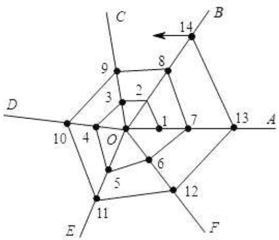

text_image

C
14
B
9
8
3
2
10
4
O
7
13
A
6
5
12
E
11
F

A. 线 $OA$ 上

B. 线 $OB$ 上

C. 线 OC 上

D. 线 $OF$ 上

【答案】B

【分析】根据题意分析可得:

OA 上的点为：1，7，13，即 $1+6(n-1)$ ，OB 上的点为：2，8，14，即 $2+6(n-1)$ ，依次可得：OC、OD、OE 上的点的性质.

【详解】解：第200个结点所在的位置，通过计算可得， $200 \div 6 = 33 \ldots 2$ 。在OB上，

故选：B.

【点睛】本题是一道找规律的题目，这类题型在中考中经常出现，对于找规律的题目首先应找出哪些部分发生了变化，是按照什么规律变化的.

【变式 8-1】刚会数数的妹妹问你：“伸出左手，从大拇指开始，如图所示的那样数数字：1、2、3、4、……请问数到 99 时，是哪个手指？”你会告诉妹妹正确答案应该是（）

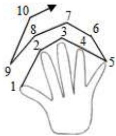

text_image

10
8
7
6
3
4
5
2
9
1

A. 大拇指

B. 食指

C. 中指

D. 无名指

【答案】C

【分析】从大拇指到小指再到食指的过程堪称一个循环，一个循环就是8，接下来又从大拇指开始另一次循环，由此用 $99 \div 8$ ，看求出的得数，如果是整数，答案就是此循环数中的最后一个数，如果有余数，看余数在循环数中第几个数对应的手指即可.

【详解】依题意可知： $99 \div 8 = 12 \ldots 3$ ，应在图中3所对应的手指，落在中指上.

故选 C.

【点睛】本题属于规律型：数字的变化类方面的选择题，解决本题的关键是找到这组数字是每8个数重复一次；通过观察，分析、归纳并发现其中的规律，并应用发现的规律解决问题.

【变式 8-2】观察图形中点的个数，若按其规律再画下去，可以得到第 105 个图形中所有点的个数为（）

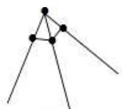  
图1

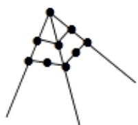  
图2

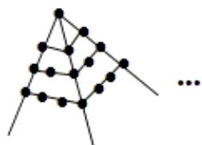

natural_image

Abstract geometric diagram with interconnected nodes and lines, no text or symbols present

图3

A. 1016 个

B. 11025 个

C. 11236 个

D. 22249 个

【答案】C

【详解】分析：观察不难发现，点的个数依次为连续奇数的和，再根据求和列式计算即可得解.

详解：第1个图形中点的个数为： $1+3=4$ ，

第 2 个图形中点的个数为： $1+3+5=9$ ，

第 3 个图形中点的个数为： $1+3+5+7=16$ ，

...，

第 105 个图形中点的个数为： $(105+1)^{2}=11236$ ,

故选 C.

点睛：本题是对图形变化规律的考查，比较简单，观察出点的个数是连续奇数的和是解题的关键，还要注意公式的利用.

【变式 8-3】如图, 两个半径都是 $4 \mathrm{~cm}$ 的圆有一个公共点 C, 一只蚂蚁由点 A 开始依 A、B、C、D、E、F、 C、G、A 的顺序沿着圆周上的 8 段长度相等的路径绕行, 蚂蚁在这 8 段路径上不断爬行, 直到行走 $2014 \pi \mathrm{cm}$ 后才停下来, 则蚂蚁停的那一个点为( )

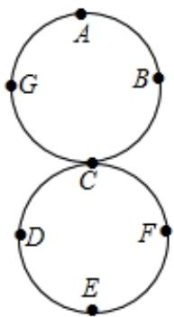

text_image

A
G B
C
D F
E

A. D 点

B. E 点

C. F 点

D. G 点

【答案】D

【分析】蚂蚁爬行这8段的距离正好是圆周长的2倍，故根据圆周长的计算公式，先计算圆的周长C，然后用 $20146\pi$ 除以2C，根据余数判定停止在哪一个点.

【详解】∵圆的周长 $C=\pi\times4\times2=8\pi$ ,

∴8 段路径之和为 $2C=16\pi$ ,

每段路径长 $16 \div 8 = 2\pi$ ,

$$
\because 2 0 1 4 \pi = 1 6 \pi \times 1 2 5 + 1 4 \pi ,
$$

∴所以停止在 G 点.

故选D.

【点睛】此题考查了平面图形的有规律变化，要求学生通过观察图形，分析、归纳并发现其中的规律，并应用规律解决问题是解题的关键.