# 专题03 与数轴有关的数形结合思想（举一反三专项训练）

# 【北师大版 2024】

# 题型归纳

【题型1 利用数轴确定数的范围】....1

【题型 2 数轴与距离】....2

【题型3 数轴与相反数】....3

【题型4 数轴与绝对值】 3

【题型 5 利用数轴比较大小】....4

【题型6 利用数轴的几何意义求最值】....4

【题型 7 数轴中的相遇问题】....5

【题型8 数轴中的折返问题】....6

【题型 9 数轴中两线段和差倍分问题】....8

【题型10数轴动点中的定值问题】 8

# 举一反三

# 教辅资源，关注公众号★全科AA+

# 【题型1 利用数轴确定数的范围】

【例 1】（2025·河北邯郸·二模）如图，数轴上有三个点A，B，C，其中C是线段AB的中点，则原点O的位置（）

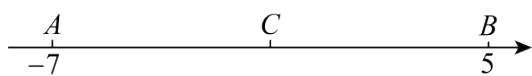

text_image

A
-7
C
B
5

A. 位于线段 $AC$ 上，且靠近 $A$ 点

B. 位于线段 $AC$ 上，且靠近 $C$ 点

C. 位于线段 $BC$ 上，且靠近 $B$ 点

D. 位于线段 $BC$ 上，且靠近 $C$ 点

【变式 1-1】（24-25 七年级上·江苏常州·期末）若数 a 在数轴上对应点的位置如图所示，则表示 $a+4$ 的点在（）

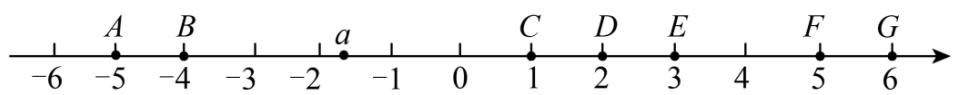

text_image

-6
A
-5
B
-4
-3
a
-2
-1
0
C
1
D
2
E
3
4
F
5
G
6

A. 线段 $AB$ 上

B. 线段 $CD$ 上

C. 线段 $DE$ 上

D. 线段FG上

【变式 1-2】（24-25 七年级上·河北唐山·期中）如图，表示数 a 的点在线段 AB 上，则表示数 a 的相反数的点所在的线段是（）

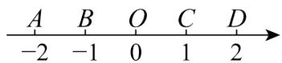

A. $AB$

B. BO

C. OC

D. CD

【变式 1-3】（2023 七年级上·全国·专题练习）如图，数轴上有 A，B 两个点，如果点 C 也在数轴上，且 $AC+BC=3$ ，那么点 C 所在的位置可能在（）

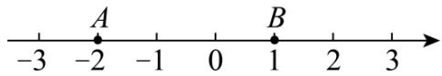

text_image

-3
-2
A
-1
0
B
1
2
3

A. 点 $A$ 左侧

B. 点 $A$ 和点 $B$ 之间

C. 点 $B$ 右侧

D. 无法确定

# 【题型2 数轴与距离】

【例 2】（24-25 七年级上·江苏宿迁·阶段练习）如图1，点A，B，C是数轴上从左到右排列的三个点，分别对应的数为-5，b，4，某同学将刻度尺如图2放置，使刻度尺上的数字0对齐数轴上的点A，发现点B对应刻度1.8cm，点C对齐刻度5.4cm．则数轴上点B所对应的数b为（）

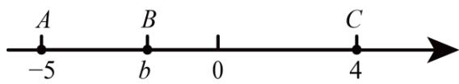

text_image

A
-5
B
b
0
C
4

图1

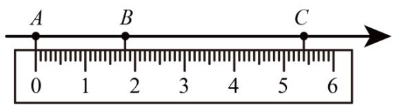

text_image

A
B
C
0 1 2 3 4 5 6

图2

A.-2

B. -1

C. 3

D. -3.2

【变式 2-1】（24-25 七年级下·江苏连云港·期中）如图，把一个平行四边形纸板的一边紧靠数轴平移．点 P 平移的距离 $PP'$ 为（）

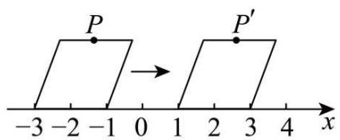

text_image

P
P'
-3 -2 -1 0 1 2 3 4 x

A. 1

B. 2

C. 3

D. 4

【变式 2-2】（24-25 七年级下·重庆·阶段练习）如图，点 A 是硬币圆周上一点，点 A 与数 2 所对应的点重合．假设硬币的直径为 1 个单位长度，若将硬币按如图所示的方向滚动（无滑动）一圈，点 A 恰好与数轴上点 $A'$ 重合，则点 $A'$ 对应的实数是（）

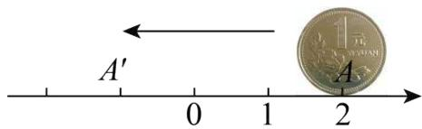

text_image

A'
0 1 2
A
1 yuan

A. $\pi - 2$

B. $-\pi+2$

C. $-2\pi - 2$

D. $-2\pi + 2$

【变式 2-3】（2025·河北秦皇岛·一模）如图，数轴上两个相邻刻度的距离是一个单位长度，点A、B、C、D对应的位置如图所示，它们所表示的数分别是a、b、c、d，且 $d-b+c=10$ ，则点C表示的数是（）

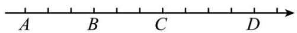

A.-6

B.-3

C. 0

D. 3

# 【题型3 数轴与相反数】

【例 3】（2025·河南商丘·二模）如图，数轴上点P与点N表示的数是一对相反数，则与原点距离最近的点是（）

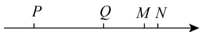

A. 点 $P$

B. 点 $Q$

C. 点 $M$

D. 点 $N$

【变式 3-1】（24-25 七年级上·江苏无锡·阶段练习）若表示互为相反数的两个数的点 A、B 在数轴上的距离为 16 个单位长度，点 A 沿数轴先向右运动 2 秒，再向左运动 5 秒到达点 C，设点 A 的运动速度为每秒 2 个单位长度，则点 C 在数轴上表示的数的相反数为 \_\_\_\_.

【变式 3-2】（2024 七年级上·全国·专题练习）点 A、B、D 在数轴上的位置如图所示，点 A、B 表示的数互为相反数，若点 B 所表示的数为 2，且 AB=BD，则点 D 所表示的数为（）

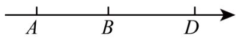

A. 2

B. 4

C. 6

D. 8

【变式 3-3】（24-25 七年级上·江苏连云港·阶段练习）已知数轴上 M，N，P，Q 四点所表示的数分别为 m，n，p，q 且 m < n < p < q，其中有两个数的和为 0，且满足 mnpq > 0。若 MN = 1, NP = 4, PQ = 5，则这四个数中可能互为相反数的是 \_\_\_\_。

# 【题型4 数轴与绝对值】教辅资源，关注公众号★全科AA+

【例 4】（24-25 七年级上·陕西安康·期末）有理数 a, b, c 在数轴上的对应点的位置如图所示，若 a 与 b 的绝对值相等，则下列说法正确的是（）

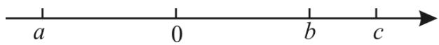

text_image

a
0
b
c

A. $|a| > c$

B. a>-c

C. $|b| < -a$

D. $|b - c| = b - c$

【变式 4-1】（24-25 七年级上·江苏淮安·阶段练习）有理数 a, b, c, d 在数轴上的对应点如图所示，这四个数中绝对值最小的是 \_\_\_\_.

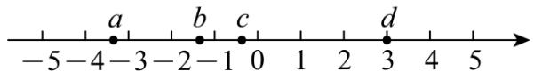

text_image

-5-4-3-2-1 0 1 2 3 4 5
a b c d

【变式 4-2】（23-24 七年级上·河北石家庄·阶段练习）如图，小明在写作业时不慎将两滴墨水滴在数轴上，对于结论I和II，下列判断正确的是（）

结论I：墨水遮住了绝对值不大于3的所有整数；结论II：墨水遮住的整数之和为3

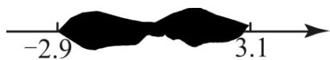

A. I和II都对

B. I和II都不对

C. I对II不对

D. I不对II对

【变式 4-3】（24-25 七年级上·辽宁沈阳·期末）四个有理数 m，n，p，q 在数轴上的位置如图所示，若 $m+p=0$ ，则 m，n，p，q 四个有理数中，绝对值最大的是 \_\_\_\_.

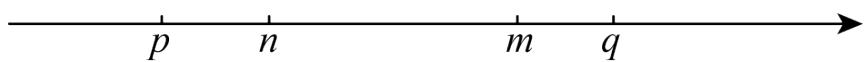

text_image

p n m q

# 【题型5 利用数轴比较大小】

【例 5】已知有理数a，b在数轴上的位置如图所示，则a，-b，-a，b从大到小的顺序为（）

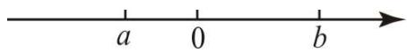

A. $b > a > -a > -b$

B. $-a > -b > a > b$

C. b>-a>a>-b

D. $-a > a > -b > b$

【变式 5-1】（24-25 六年级上·山东淄博·期末）请在如图所示的“只有单位长度和正方向，还未标出原点”的数轴上表示下列各数，并按照从大到小的顺序将这些数用“>”号连接起来.

-4, $5\frac{1}{2}$ , $-2\frac{1}{2}$ , $|-1.5|$ , $-(2.5)$

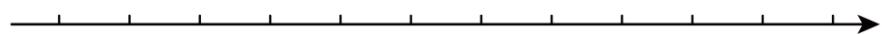

【变式 5-2】（24-25 七年级上·广西柳州·期中）画出数轴，在数轴上标出表示下列各数的点，并按从大到小的顺序用“>”号把这些数连接起来：

$-|-5.5|,0,-(-2),+3\frac{1}{7},(-1)^{201},-2^{2}$ .

【变式 5-3】（23-24 七年级上·内蒙古呼和浩特·期末）有理数 a、b 所表示的点在数轴上的位置如图所示，将 a、b、|a|、-b 按从大到小的顺序排列，并用“>”号连接，结果为 \_\_\_\_.

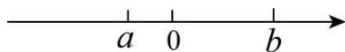

# 【题型6 利用数轴的几何意义求最值】 教辅资源，关注公众号★全科AA+

【例 6】（23-24 七年级上·重庆·期中）点 A、B 在数轴上分别表示数 a、b，若 A、B 两点之间的距离表示为 AB，则在数轴上 A、B 两点之间的距离 $AB = |a - b|$ .

①数轴上表示x、-2的两点之间的距离表示为 $|x+2|$ ;  
②若 $|x-3|+|x+1|=8$ ，则x=-3；  
③若存在整数x，使 $|x-2|+|x+1|$ 的值最小时，则x=-1，0，2；  
④若 $|x-1|+|x+a|$ 的最小值是2，则a=-3.

则上述说法，正确的有（）个.

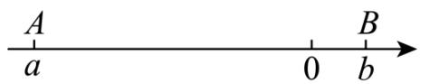

text_image

A
a
0
B
b

A. 4

B. 3

C. 2

D. 1

【变式 6-1】（24-25 七年级上·内蒙古包头·期中）同学们都知道 $|5-(-2)|$ 表示 5 与 $(-2)$ 之差的绝对值，也可理解为 5 与 -2 两数在数轴上所对的两点之间的距离，则对于任何有理数 x， $|x+1|+|x-1|+|x-2|$ 取最小值时，相应的 x 的值是 \_\_\_\_.

【变式 6-2】（24-25 七年级上·北京·期中）我们知道 $|x|$ 表示 $x$ 在数轴上对应的点到原点的距离， $|x-a|$ 表示 $x$ 与 $a$ 在数轴上对应的点之间的距离。例： $|x-1|=2$ 表示数 $x$ 与 1 在数轴上表示的点的距离是 2 个单位长度，如图所示，即可得出 $x$ 的值为 -1 或 3。

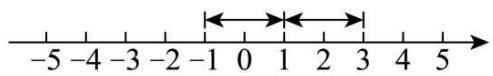

根据以上材料，解答下列问题：

(1)若 $|x-2|=4$ ，则x的值为；  
(2)若数轴上表示数 $a$ 的点位于表示-3与2的两点之间，则求 $\vert a + 3\vert +\vert a - 2\vert$ 的计算结果；  
(3)已知有理数 b，则 $|b+5|+|b-3|$ 的计算结果是否有最小值？若有，请求出最小值；若没有，请说出理由.

【变式 6-3】（24-25 七年级上·湖北武汉·阶段练习）数轴上两点间的距离等于这两点所对应的数的差的绝对值．例：点A、B在数轴上分别对应的数为a，b，则A、B两点间的距离表示为 $AB=|a-b|$ ，根据以上知识解题：

①当代数式 $|x+1|+|x-1|$ 取最小值时，x的取值范围是\_\_\_\_，最小值为\_\_\_\_。  
②求 $|x-1|+|x-2|+|x-3|+\cdots+|x-24|$ 的最小值为

# 【题型 7 数轴中的相遇问题】 教辅资源，关注公众号★全科AA+

【例 7】（24-25 七年级上·河北石家庄·期中）已知 a 是最大的负整数， $b=-|-5|$ ，c 是 -4 的相反数，且 a, b, c 分别是点 A, B, C 在数轴上对应的数.

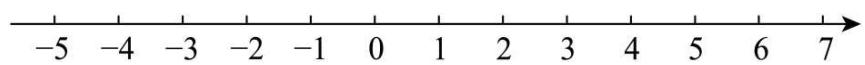

text_image

-5 -4 -3 -2 -1 0 1 2 3 4 5 6 7

(1)求 a, b, c 的值，并在如图的数轴上标出点 A, B, C;

(2)在数轴上, 若点 $D$ 到点 $A$ 的距离刚好是 5 , 则点 $D$ 叫做点 $A$ 的“幸福点”. 求点 $A$ 的幸福点 $D$ 所表示的数; (3)若动点 $P$ 从点 $B$ 出发沿数轴向负方向运动, 动点 $Q$ 同时从点 $A$ 出发也沿数轴向负方向运动, 点 $P$ 的速度是每秒 1 个单位长度, 点 $Q$ 的速度是每秒 3 个单位长度, 求运动几秒后, 点 $Q$ 可以追上点 $P$ ?

【变式 7-1】（2024 七年级上·江苏·专题练习）已知，如图 A、B 分别为数轴上的两点，A 点对应的数为 -10，B 点对应的数为 90.

text_image

A
-10
M
B
90

(1)与 A、B 两点距离相等的 M 点对应的数是；

(2)现在有一只电子蚂蚁 P 从 B 点出发时，以 5 个单位/秒的速度向左运动，同时另一只电子蚂蚁 Q 恰好从 A 点出发，以 3 个单位/秒的速度向右运动，设两只电子蚂蚁在数轴上的 C 点相遇，则 C 点对应的数是 \_\_\_\_；

【变式 7-2】（22-23 七年级上·山东青岛·期末）数轴上点 A 表示 -8，点 B 表示 6，点 C 表示 12，点 D 表示 18．如图，将数轴在原点 O 和点 B，C 处各折一下，得到一条“折线数轴”。在“折线数轴”上，动点 M 从点 A 出发，以 4 个单位/秒的速度沿着折线数轴的正方向运动，从点 O 运动到点 C 期间速度变为原来的一半，过点 C 后继续以原来的速度向终点 D 运动；点 M 从点 A 出发的同时，点 N 从点 D 出发，一直以 3 个单位/秒的速度沿着“折线数轴”负方向向终点 A 运动。其中一点到达终点时，两点都停止运动。设运动的时间为 t 秒，t = \_\_\_\_ 时，M、N 两点相遇（结果化为小数）。

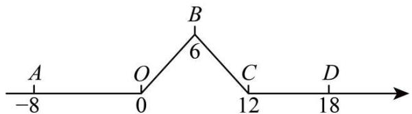

text_image

A
-8
O
0
B
6
C
12
D
18

【变式 7-3】（24-25 七年级上·山西吕梁·期末）已知a是最大的负整数，b是-5的相反数，且a,b分别是点A,B在数轴上对应数.

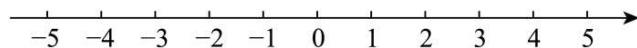

(1)求a,b的值，并在数轴上标出点A,B;

(2)若动点P从点A出发沿数轴正方向运动, 动点Q同时从点B出发也沿数轴正方向运动, 点P的速度每秒 5 个单位长度, 点O的速度是每秒 3 个单位长度, 若运动t秒后, 点P可以追上点O, 求t的值.

# 【题型 8 数轴中的折返问题】 教辅资源，关注公众号★全科AA+

【例 8】（23-24 七年级上·江苏无锡·阶段练习）四个点A、B、C、D在数轴上的位置如图所示，已知CD=2，BC=3，AC=15，若点C为原点，点P、Q分别从A、D两点同时出发，点P以每秒3个单位长度的速度向右运动，到达C点后立即按原速向A折返；点Q以每秒1个单位长度的速度向左运动．当 P、Q都到达点A时运动停止，设运动时间为t（单位：秒）.

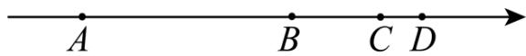

(1)当t=3时，求点P与点Q之间的距离；  
(2)当t=\_时，点P到达点B，此时点Q表示的数是\_\_\_\_；  
(3)当t为何值时，P、Q两点相距2个单位？

【变式 8-1】（23-24 七年级上·湖北·期末）如图，A 点在数轴上对应的有理数是 24；动点 M 从原点 O 点出发以 1 单位/秒的速度向右运动，动点 N 从 A 点出发以 2 单位/秒的速度向左运动，两个动点同时出发，设运动时间为 t 秒.

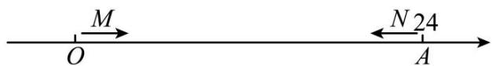

text_image

M
O
N 24
A

(1)请用含 t 的式子表示：动点 M 对应的数为 \_\_\_\_，动点 N 对应的数为 \_\_\_\_；  
(2)如果在运动过程中，M、N两点相距6个单位长，求t的值；  
(3)M、N 在运动过程中，又有一动点 p 从原点 O 点开始以 3 单位/秒的速度向右运动（与 M、N 同时出发），当相遇点 N 时立即返回，返回途中遇到 M 点时又立即折返，如此往返，当 M、N 相遇时点 p 停止，此时点 p 一共运动了 \_\_\_\_ 个单位长度.

【变式 8-2】（23-24 七年级上·江苏徐州·阶段练习）如图，已知数轴上 A、B 两定点对应的数是 -20，40，动点 M、N 同时从点 A 出发向点 B 运动，点 M 的速度为 3 个单位长度/秒，点 N 的速度为 2 个单位长度/秒，到达点 B 后折返向点 A 继续运动，其中某点回到点 A 时，全部停止，经过\_\_\_\_秒点 A 到点 N 的距离刚好等于点 B 到点 M 的距离.

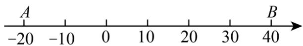

text_image

A
-20 -10 0 10 20 30 40
B

【变式 8-3】（24-25 七年级上·湖南长沙·阶段练习）已知数轴上 A，B 两点对应的数分别为 a，b，且 a，b 满足 $\left|a+18\right|+(b-10)^{2}=0$ ，点 C 对应的数为 14，点 D 对应的数为 -10.

(1)求 a, b 的值;  
(2)点 A, B 沿数轴同时出发相向匀速运动，点 A 的速度为 4 个单位/秒，点 B 的速度为 1 个单位/秒，若 t 秒时点 A 到原点的距离和点 B 到原点的距离相等，求 t 的值：  
(3)在（2）的条件下，点 $A, B$ 从起始位置同时出发，当 $A$ 点运动到点 $C$ 时，迅速以原来的速度返回，到达出发点后，又折返向点 $C$ 运动。 $B$ 点运动至 $D$ 点后停止运动。当 $B$ 停止运动时点 $A$ 也停止运动。求在此过程中， $A, B$ 两点同时经过的点在数轴上对应的数。

# 【题型9 数轴中两线段和差倍分问题】

【例 9】（23-24 七年级上·江苏扬州·期末）已知数轴上 A 点代表 -8，B 点代表 4，动点 P、Q 分别从 A、B 同时出发，向右运动，点 P 的速度为每秒 2 个单位长度，点 Q 的速度为每秒 1 个单位长度，设运动时间为 t 秒，当 t = \_时，2OP - OQ = 3。（当点 P 与点 Q 重合时，P、Q 两点停止运动）

A O B

【变式 9-1】（24-25 七年级上·河南郑州·期末）如图，点A和B在数轴上表示的数分别是-6和8，动点P从A出发，以1个单位每秒的速度沿射线AB的方向向右运动，同时动点Q从点B出发，以3个单位每秒的速度沿射线BA的方向向左运动，运动时间为t秒(t>0)，当点A，P，Q这三点中恰好有一点是以另外两点为端点的线段的中点时，t的值为\_\_\_\_。

A
-6 0 B
8

【变式 9-2】（24-25 七年级上·河南郑州·期末）已知点A，B在数轴上对应的数分别为a，b，且 $|a+6|+(b-4)^{2}=0$ ，若动点P在数轴上对应的数为x，当 $PA+PB=16$ 时，x的值为\_\_\_\_。

【变式 9-3】（23-24 九年级上·甘肃兰州·期中）数轴上有 A, B, C 三点，给出如下定义：若其中一个点到其他两个点之间的距离相等时，则称该点是其他两个点的“中点”，这三点为“中点关联点”.

例如数轴上点 A, B, C 所表示的数分别为 1, 3, 5，此时点 B 是点 A, C 的中点.

0 1 2 3 4 5

(1)若点 A 表示数 -2，点 B 表示数 1，若点 B 是点 A 与点 C 的中点，求点 C 所表示的数；

(2)点 A 表示数 -10，点 B 表示数 15，P 为数轴上一个动点，若点 A、B、P 是“中点关联点”，求此时点 P 表示的数.

# 【题型10 数轴动点中的定值问题】教辅资源，关注公众号★全科AA+

【例 10】（23-24 七年级上·湖北孝感·期末）如图，数轴上点 A，B（点 A 在点 B 左边）所对应的数 a，b 满足 $|a+3|+(b-5)^{2}=0$ 。P 为数轴上一动点，其对应的数为 x，O 为原点。

A O C B P

(1)若BP=1，求x的值；

(2)若PB=3PA，求x的值；

(3)若点C为线段AB的中点，当点P在线段AB的延长线上运动时， $\frac{PA+PB}{PC}$ 的值是否为定值（即确定的值，不因

点 P 位置的变化而变化）？如是，请求出这个定值；如不是，也请说明理由.

【变式 10-1】（23-24 七年级上·四川成都·期中）如图：在数轴上点 A 表示数 a，点 B 表示数 b，点 C 表示数 c, b 是最大的负整数，且 a, c 满足 $\left|a+3\right|+\left|c-5\right|=0$ .

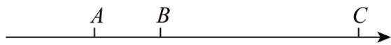

(1) $a=$ \_\_\_\_ , $b=$ \_\_\_\_ , $c=$ \_\_\_\_ ;   
(2)如果点 P 表示的数为 x，当 P 点到 B、C 两点的距离之和为 8 时，x= \_\_\_\_.  
(3)点A,B,C开始在数轴上运动, 若点 A 以每秒 1 个单位长度的速度向左运动, 同时, 点B和点C分别以每秒 2 个单位长度和 3 个单位长度的速度向右运动, 假设t秒钟过后, 若点 A 与点B之间的距离表示为AB, 点B与点C之间的距离表示为BC, 则AB=\_\_\_\_, BC=\_\_\_\_. (用含t的代数式表示)  
(4)在（3）的条件下， $3BC - AB$ 的值是否随着时间 $t$ 的变化而改变？若变化，请说明理由；若不变，请求其值.

【变式 10-2】（24-25 七年级上·福建厦门·期中）已知：在一条东西向的双轨铁路上迎面驶来一快一慢两列火车，快车长AB=2（单位长度），慢车长CD=4（单位长度），设正在行驶途中的某一时刻，如图，以两车之间的某点O为原点，取向右方向为正方向画数轴，此时快车头A在数轴上表示的数是a，慢车头C在数轴上表示的数是b．若快车AB以6个单位长度/秒的速度向右匀速继续行驶，同时慢车CD以2个单位长度/秒的速度向左匀速继续行驶，且 $|a+8|+(b-16)^{2}=0$ .

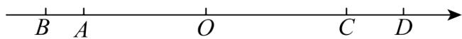

(1) $a =$ \_\_\_\_； $b =$ \_\_\_\_； 此时刻快车头 $A$ 与慢车头 $C$ 之间相距 \_\_\_\_ 单位长度；  
(2)从此时刻开始算起，再行驶多少秒钟两列火车的车头AC相距8个单位长度？  
(3)此时在快车AB上有一位爱动脑筋的七年级学生乘客, 他发现行驶中有一段时间t秒钟, 他的位置P到两列火车头A、C的距离和加上到两列火车尾B、D的距离和是一个不变的值 (即 $PA+PC+PB+PD$ 为定值). 你认为该学生发现的这一结论是否正确? 若正确, 求出这段时间的长度及定值; 若不正确, 请说明理由.

【变式 10-3】（24-25 七年级上·福建漳州·期中）已知数轴上两点A、B所表示的数分别为a和b，且满足 $|a-3|+(b+9)^{2}=0$ ，O为原点：

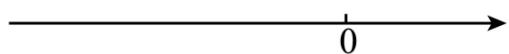

(1) $a = \_\_\_\_$ , $b = \_\_\_\_$ .

(2)若点C从O点出发向左运动，经过3秒后点C到A点的距离等于点C到B点的距离，求点C的运动速度？（结合数轴，进行分析。）

(3)若在数轴上点C表示的数为-3，当点A，B，C开始在数轴上运动，点B和点C分别以每秒2个单位长度和1个单位长度的速度向左运动，同时点A以每秒0.5个单位长度的速度向左运动，点A到达原点后立即以原速度向右运动，运动时间为t秒，若点A与点C之间的距离表示为AC，点B与点C之间的距离表示为BC，请问当t>6时，3BC-2AC的值是否随着时间t的变化而变化？若变化，说明理由；若不变，求出这个定值。