# 专题03 与数轴有关的数形结合思想（举一反三专项训练）

# 【北师大版 2024】

# 题型归纳

【题型1 利用数轴确定数的范围】....1

【题型2 数轴与距离】 3

【题型3 数轴与相反数】 5

【题型4 数轴与绝对值】....7

【题型5 利用数轴比较大小】....9

【题型 6 利用数轴的几何意义求最值】....10

【题型 7 数轴中的相遇问题】....14

【题型8 数轴中的折返问题】....17

【题型 9 数轴中两线段和差倍分问题】....24

【题型10数轴动点中的定值问题】 27

# 举一反三

# 【题型1 利用数轴确定数的范围】

【例 1】（2025·河北邯郸·二模）如图，数轴上有三个点A，B，C，其中C是线段AB的中点，则原点O的位置（）

text_image

A
-7
C
B
5

A. 位于线段 $AC$ 上，且靠近 $A$ 点

B. 位于线段 $AC$ 上，且靠近 $C$ 点

C. 位于线段 $BC$ 上，且靠近 $B$ 点

D. 位于线段 $BC$ 上，且靠近 $C$ 点

【答案】D

【分析】本题考查了数轴上找原点，理解中点和数轴的定义是解答关键.

根据中点求出C点表示的数，再利用数轴的定义求解.

【详解】∵C是线段AB的中点，

∴C点表示的数是 $\frac{-7+5}{2}=-1$ ,

∴原点O位于线段BC上，且靠近C点.

故选：D.

【变式 1-1】（24-25 七年级上·江苏常州·期末）若数 a 在数轴上对应点的位置如图所示，则表示 $a+4$ 的点在

( )

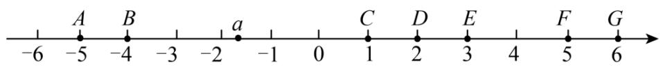

text_image

-6
A
B
-4
-3
-2
a
-1
0
C
D
E
4
F
G
5
6

A. 线段 $AB$ 上

B. 线段 $CD$ 上

C. 线段 $DE$ 上

D. 线段FG上

【答案】C

【分析】本题考查了数轴，有理数的加法，根据数 a 在数轴上对应点的位置可得出 $-2 < a < -1$ ，根据有理数的加法法则求出 $-2 + 4 = 2, -1 + 4 = 3$ ，然后结合数轴即可解答.

【详解】解:由数轴知:-2<a<-1,

而 $-2+4=2,\quad-1+4=3,$

$$
\therefore 2 <   a + 4 <   3,
$$

∴表示 $a+4$ 的点在线段DE上，

故选:C.

【变式 1-2】（24-25 七年级上·河北唐山·期中）如图，表示数 a 的点在线段 AB 上，则表示数 a 的相反数的点所在的线段是（）

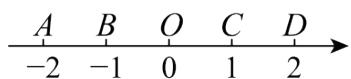

A. $AB$

B. BO

C. OC

D. CD

【答案】D

【分析】本题考查相反数与数轴，根据题意，可知表示数 $a$ 的点在线段 $AB$ 上，则 $-2 \leq a \leq -1$ ，可得 $1 \leq -a \leq 2$ ，即可得解．熟练掌握数轴上各点的分布特点是解题的关键.

【详解】解：∵由数轴可知，表示数a的点在线段AB上，

$$
\therefore - 2 \leq a \leq - 1,
$$

$$
\therefore 1 \leq - a \leq 2,
$$

∴表示-a的点所在的线段是CD.

故选：D.

【变式 1-3】（2023 七年级上·全国·专题练习）如图，数轴上有 A，B 两个点，如果点 C 也在数轴上，且 $AC + BC = 3$ ，那么点 C 所在的位置可能在（）

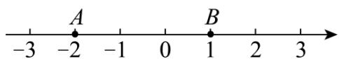

text_image

-3
-2
A
-1
0
B
1
2
3

A. 点 $A$ 左侧

B. 点 $A$ 和点 $B$ 之间

C. 点 $B$ 右侧

D. 无法确定

【答案】B

【分析】本题主要考查了数轴的有关知识，解题关键是熟练掌握数轴上两点间的距离公式．根据数轴，判断 A, B 两点表示的数，求出 AB，从而确定点 C 的位置.

【详解】解：由数轴可知：点 A 表示的数为 -2，点 B 表示的数为 1，

$$
\therefore A B = \vert - 2 - 1 \vert = 3,
$$

$$
\because A C + B C = 3,
$$

∴点 C 一定在点 A 和点 B 之间，

故选：B.

# 【题型2 数轴与距离】

【例 2】（24-25 七年级上·江苏宿迁·阶段练习）如图1，点A，B，C是数轴上从左到右排列的三个点，分别对应的数为-5，b，4，某同学将刻度尺如图2放置，使刻度尺上的数字0对齐数轴上的点A，发现点B对应刻度1.8cm，点C对齐刻度5.4cm．则数轴上点B所对应的数b为（）

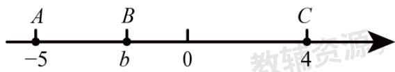

text_image

A
-5
B
b
0
C
4
教辅资源

图1

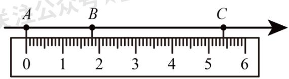

text_image

A
B
C
0 1 2 3 4 5 6

图2

A.-2

B. -1

C. 3

D. -3.2

【答案】A

【分析】本题考查的是数轴的概念，解题的关键是确定数轴上的单位长度等于多少厘米．先求出AC=9，从而可得每一个刻度对应数轴上的单位长度，再列出运算式子，计算有理数的乘除法可得AB的长，然后根据数轴的性质即可得.

【详解】解：由题意得： $AC = 4 - (-5) = 9$

∵数字0对齐数轴上的点A，点B对齐刻度1.8cm，点C对齐刻度5.4cm，

$$
\therefore A B = (9 \div 5. 4) \times 1. 8 = 3,
$$

$$
\therefore b - (- 5) = 3,
$$

解得b=-2，

故选：A.

【变式 2-1】（24-25 七年级下·江苏连云港·期中）如图，把一个平行四边形纸板的一边紧靠数轴平移．点 P 平移的距离 $PP'$ 为（）

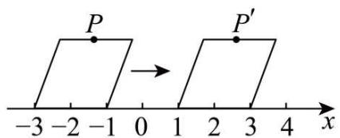

text_image

P
-3 -2 -1 0 1 2 3 4 x
→ P′

A. 1

B. 2

C. 3

D. 4

【答案】D

【分析】本题考查了平移的性质和数轴上两点的距离，主要利用了平移对应点所连的线段相等解决问题。根据平移的性质可得 $PP'$ 即为数轴上对应两点平移的距离解答。

【详解】解： $PP'=1-(-3)=1+3=4$ ，

即点P平移的距离 $PP'$ 为4.

故选：D.

【变式 2-2】（24-25 七年级下·重庆·阶段练习）如图，点 A 是硬币圆周上一点，点 A 与数 2 所对应的点重合．假设硬币的直径为 1 个单位长度，若将硬币按如图所示的方向滚动（无滑动）一圈，点 A 恰好与数轴上点 $A'$ 重合，则点 $A'$ 对应的实数是（）

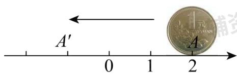

text_image

A'
1
2
1.65
1.65
A
1.65
1.65
1.65
1.65
1.65
1.65
1.65
1.65
1.65
1.65
1.65
1.65
1.65
1.65
1.65
1.65
1.65
1.65
1.65
1.65
1.67
1.67
1.67
1.67
1.67
1.67
1.67
1.67
1.67
1.67
1.67
1.67
1.67
1.67
1.67
1.67
1.67
1.67
1.67
1.67
1.68
1.68
1.68
1.68
1.68
1.68
1.68
1.68
1.68
1.68
1.68
1.68
1.68
1.68
1.68
1.68
1.68
1.68
1.68
1.68
1.69
1.69
1.69
1.69
1.69
1.69
1.69
1.69
1.69
1.69
1.69
1.69
1.69
1.69
1.70
1.70
1.70
1.70
1.70
1.70
1.70
1.70
1.70
1.70
1.70
1.70
1.70
1.70
1.70
1.70
1.70
1.70
1.70
1.70
1.72
1.72
1.72
1.72
1.72
1.72
1.72
1.72
1.72
1.72
1.72
1.72
1.72
1.72
1.72
1.72

A. $\pi - 2$

B. $-\pi + 2$

C. $-2\pi - 2$

D. $-2\pi+2$

【答案】B

【分析】本题考查了数轴，以及数轴上两点之间的距离，解题关键是求出硬币的周长．根据题意得到硬币的周长，再结合数轴上两点之间的距离求解，即可解题.

【详解】解：∵硬币的直径为1个单位长度，

∴硬币的周长为 $\pi$ ,

∵点A为2,

∴点 $A'$ 对应的实数是 $-\pi+2$ ，

故选：B.

【变式 2-3】（2025·河北秦皇岛·一模）如图，数轴上两个相邻刻度的距离是一个单位长度，点A、B、C、D对应的位置如图所示，它们所表示的数分别是a、b、c、d，且 $d-b+c=10$ ，则点C表示的数是（）

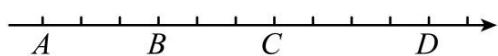

A.-6

B.-3

C. 0

D. 3

【答案】D

【分析】本题考查了数轴上两点间的距离，一元一次方程的应用，解题的关键是掌握相关知识．设点C对应的数是x，则点B表示的数是：x-3，点D表示的数是： $x+4$ ，根据题意列方程求解即可.

【详解】解：设点C对应的数是x，

∵数轴上每相邻两点相距一个单位长度，

∴点A表示数位：x-6，点B表示的数是：x-3，点D表示的数是： $x+4$ ，

又∵点A、B、C、D所表示的数分别是a、b、c、d，且 $d-b+c=10$ ，

$$
\therefore x + 4 - (x - 3) + x = 1 0,
$$

解得：x=3，

故选：D.

# 【题型3 数轴与相反数】

【例 3】（2025·河南商丘·二模）如图，数轴上点P与点N表示的数是一对相反数，则与原点距离最近的点是（）

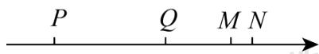

A. 点 $P$

B. 点Q

C. 点 $M$

D. 点N

【答案】B

【分析】本题考查了数轴，绝对值，相反数定义，根据点P与点N表示的有理数互为相反数标出原点O，然后根据绝对值的定义即可求解，掌握知识点的应用是解题的关键.

【详解】解：∵点P与点N表示的有理数互为相反数，

∴原点的位置大约在O点，如图，

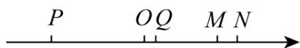

∴绝对值最小的数的点是Q点，即到原点距离最近的是点Q，

故选：B.

【变式 3-1】（24-25 七年级上·江苏无锡·阶段练习）若表示互为相反数的两个数的点 A、B 在数轴上的距离为 16 个单位长度，点 A 沿数轴先向右运动 2 秒，再向左运动 5 秒到达点 C，设点 A 的运动速度为每秒 2 个单位长度，则点 C 在数轴上表示的数的相反数为\_\_\_\_。

【答案】-2或14

【分析】本题考查了数轴，正确理解题意是解题的关键．根据题意得到点A表示的数为 $\pm8$ ，于是求出点A运动的距离为 $2\times(5-2)=6$ ，进而即可得到答案.

【详解】解：∵表示互为相反数的两个数的点 A、B 在数轴上的距离为 16 个单位长度，

∴点A表示的数为 $\pm8$ ，

∵点A运动的距离为 $2\times(5-2)=6$ ,

∴点 C 在数轴上表示的数为 8-6=2 或 -8-6=-14，

故点 C 在数轴上表示的数的相反数为 -2 或 14.

故答案为：-2或14.

【变式 3-2】（2024 七年级上·全国·专题练习）点 A、B、D 在数轴上的位置如图所示，点 A、B 表示的数互为相反数，若点 B 所表示的数为 2，且 AB=BD，则点 D 所表示的数为（）

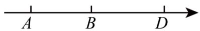

A. 2

B. 4

C. 6

D. 8

【答案】C

【分析】本题考查数轴与有理数，相反数，根据相反数的定义，得到点 A 所表示的数为 -2，再根据 AB=BD，得到 BD=4，进而求出点 D 所表示的数即可.

【详解】解：∵点 A、B 表示的数互为相反数，点 B 所表示的数为 2，

∴点 A 所表示的数为 -2，

$$
\therefore A B = B D = 2 - (- 2) = 4,
$$

∴点 D 所表示的数为 $2+4=6$ ;

故选 C.

【变式 3-3】（24-25 七年级上·江苏连云港·阶段练习）已知数轴上 M，N，P，Q 四点所表示的数分别为 m，n，p，q 且 m < n < p < q，其中有两个数的和为 0，且满足 mnpq > 0．若 MN = 1, NP = 4, PQ = 5．则这四个数中可能互为相反数的是 \_\_\_\_.

【答案】n, p或m, p

【分析】本题考查了有理数与数轴的对应关系以及相反数的概念，正确运用分类讨论思想是解决本题的关键.

【详解】解：因为这四个数中有两个数和为0，则一定有一个负数和一个正数，

因为 $mnpq>0$ ,

则这四个数为两个正数和两个负数，即m<n<0<p<q，

若n和p互为相反数，因为NP=4，则n=-2，p=2，

若m和p互为相反数，因为MN=1，NP=4，

所以MP=5，则m=-2.5，n=-1.5，p=2.5，

若n和q互为相反数，因为NP=4，PQ=5，

所以NQ=9，则n=-4.5，m=-5.5，p=-0.5，q=4.5（舍去）.

故答案为：n，p或m，p。

# 【题型4 数轴与绝对值】

【例 4】（24-25 七年级上·陕西安康·期末）有理数 a, b, c 在数轴上的对应点的位置如图所示，若 a 与 b 的绝对值相等，则下列说法正确的是（）

text_image

a
0
b
c

A. $|a| > c$

B. a>-c

C. $|b| < -a$

D. $|b - c| = b - c$

【答案】B

【分析】本题考查了数轴、绝对值，熟练掌握数轴的性质是解题关键．先根据数轴的性质可得 $a < 0 < b < c$ ，根据绝对值的性质可得 $|a| = |b|$ ，再根据绝对值的性质逐项判断即可得.

【详解】解：由数轴可知，a<0<b<c，

∵a与b的绝对值相等，

$\therefore |a|=|b|.$

A、 $|a|=|b|=b<c$ ，则此项错误，不符合题意；

B、∵ $|a|<c,\quad a<0,$

$\therefore -a < c$

$\therefore a>-c$ ，则此项正确，符合题意；

C、∵|a|=|b|，a<0<b，

$\therefore -a=b,\quad|b|=b,$

$\therefore |b|=-a$ ，则此项错误，不符合题意；

D、∵b<c,

$\therefore b-c<0,$

$\therefore|b-c|=-(b-c)=c-b$ ，则此项错误，不符合题意；

故选：B.

【变式 4-1】（24-25 七年级上·江苏淮安·阶段练习）有理数 a, b, c, d 在数轴上的对应点如图所示，这四个数中绝对值最小的是 \_\_\_\_.

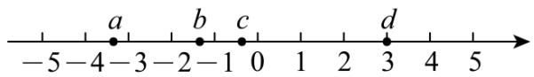

text_image

-5-4-3-2-10 1 2 3 4 5
a b c d

【答案】c

【分析】本题考查了数轴和绝对值，熟练掌握数轴的性质是解题关键．先根据数轴的性质可得a<b<c<0，-1<c<0，d=3，再根据绝对值的性质即可得.

【详解】解：由数轴可知，a<b<c<0，-1<c<0，d=3，

则 $|a|>|b|>|c|$ ， $|c|<1$ ， $|d|=3$ ，

所以这四个数中绝对值最小的是c，

故答案为：c.

【变式 4-2】（23-24 七年级上·河北石家庄·阶段练习）如图，小明在写作业时不慎将两滴墨水滴在数轴上，对于结论I和II，下列判断正确的是（）

结论I：墨水遮住了绝对值不大于3的所有整数；结论II：墨水遮住的整数之和为3

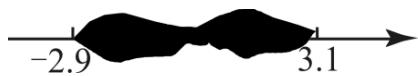

A. I和II都对

B. I和II都不对

C. I对II不对

D. I不对II对

【答案】D

【分析】本题考查了数轴，熟练掌握数轴三要素以及当数轴方向朝右时，右边的数总比左边的大是解题的关键．根据数轴的定义即可得到答案.

【详解】解：依题意得：墨水遮住的部分-2.9<x<3.1

故墨水没有遮住-3，所以墨水遮住了绝对值不大于3的所有整数的说法错误，结论I错误，

墨水遮住的整数有-2、-1、0、1、2、3，整数之和为3，；结论II正确.

故选：D

【变式 4-3】（24-25 七年级上·辽宁沈阳·期末）四个有理数 m，n，p，q 在数轴上的位置如图所示，若 $m+p=0$ ，则 m，n，p，q 四个有理数中，绝对值最大的是 \_\_\_\_.

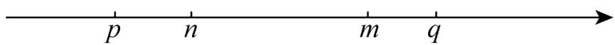

text_image

p n m q

【答案】q

【分析】根据 $m+p=0$ 可以得到m、p的关系，从而可以判定原点的位置，从而可以得到哪个数的绝对值最大，本题得以解决.

本题考查有理数的大小比较及实数与数轴，解题的关键是明确数轴的特点，利用数形结合的思想解答.

【详解】解：∵ $m+p=0$ ，

∴m和p互为相反数，0在线段m、p的中点处，

∴点 q 离原点最远，

$\therefore$ 绝对值最大的是 $q$ ,

故答案为：q.

# 【题型5 利用数轴比较大小】

【例 5】已知有理数a，b在数轴上的位置如图所示，则a，-b，-a，b从大到小的顺序为（）

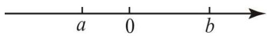

A. $b > a > -a > -b$

B. $-a > -b > a > b$

C. b>-a>a>-b

D. $-a>a>-b>b$

【答案】C

【分析】利用数轴到原点的距离，即可求解.

【详解】解：从图上看出 a<0 b>0 |a|<|b|

则 $b > -a > a > -b$

故选 C

【点睛】本题考查绝对值的意义，以及相反数意义，属于基础题.

【变式 5-1】（24-25 六年级上·山东淄博·期末）请在如图所示的“只有单位长度和正方向，还未标出原点”的数轴上表示下列各数，并按照从大到小的顺序将这些数用“>”号连接起来.

$$
- 4, \quad 5 \frac {1}{2}, \quad - 2 \frac {1}{2}, \quad | - 1. 5 |, \quad - (- 2. 5)
$$

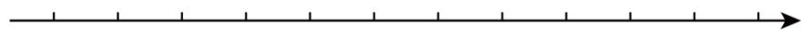

【答案】图见解析， $5\frac{1}{2}>-(-2.5)>|-1.5|>-2\frac{1}{2}>-4$

【分析】本题考查了有理数的大小比较，绝对值，相反数，数轴等知识点，能正确在数轴上表示出各个数是解此题的关键．先在数轴上表示出各个数，再比较即可

【详解】解： $|-1.5|=1.5,\quad-(-2.5)=2.5,$

如图，

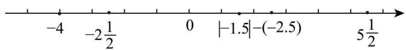

text_image

-4
-2\u00bd/2
0
|-1.5|-(-2.5)
5\u00bd/2

$$
5 \frac {1}{2} > - (- 2. 5) > | - 1. 5 | > - 2 \frac {1}{2} > - 4
$$

【变式 5-2】（24-25 七年级上·广西柳州·期中）画出数轴，在数轴上标出表示下列各数的点，并按从大到小的顺序用“>”号把这些数连接起来：

$$
- | - 5. 5 |, 0, - (- 2), + 3 \frac {1}{7}, (- 1) ^ {2 0 1}, - 2 ^ {2}.
$$

【答案】在数轴上标数见解析； $+3\frac{1}{7}>-(-2)>0>(-1)^{201}>-2^{2}>-|-5.5|$

【分析】本题考查了有理数大小比较以及数轴，牢记“在数轴上右边的点表示的数大于左边的点表示的数”是解题的关键。将各数标记在数轴上，利用“在数轴上右边的点表示的数大于左边的点表示的数”即可找出各数间的大小关系。

【详解】解： $-|-5.5|=-5.5,-(-2)=2,(-1)^{201}=-1,-2^{2}=-4,$

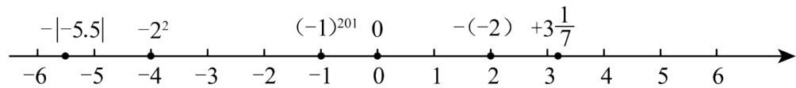

line

| Point | Value |
|---|---|
| -5.5 | -6 |
| -2² | -5 |
| (-1)²⁰¹ | -4 |
| 0 | -3 |
| (-1)²⁰¹ | -2 |
| 1 | -1 |
| -(-2) | 0 |
| +3½/7 | 3 |
| (continued from point 0 to 6) | 6 |

所以 $+3\frac{1}{7}>-(-2)>0>(-1)^{201}>-2^{2}>-|-5.5|$ .

【变式 5-3】（23-24 七年级上·内蒙古呼和浩特·期末）有理数 a、b 所表示的点在数轴上的位置如图所示，将 a、b、|a|、-b 按从大到小的顺序排列，并用“>”号连接，结果为\_\_\_\_。

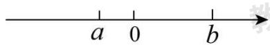

【答案】 $b>|a|>a>-b$

【分析】本题主要考查了数轴上点表示数，解题的关键是熟练掌握数轴上的点表示的有理数越向右越大.

【详解】解：∵根据有理数 a、b 在数轴上的位置可知，a<0<b，且 $|a|<|b|$ ，

$$
\therefore - b <   0,
$$

$$
\therefore b > | a | > a > - b.
$$

故答案为： $b>|a|>a>-b$ .

# 【题型6 利用数轴的几何意义求最值】

【例 6】（23-24 七年级上·重庆·期中）点 A、B 在数轴上分别表示数 a、b，若 A、B 两点之间的距离表示为 AB，则在数轴上 A、B 两点之间的距离 $AB = |a - b|$ .

①数轴上表示x、-2的两点之间的距离表示为 $|x+2|$ ;  
②若 $|x-3|+|x+1|=8$ ，则x=-3；  
③若存在整数x，使 $|x-2|+|x+1|$ 的值最小时，则x=-1，0，2；

④若 $|x-1|^{+}|x+a|$ 的最小值是2，则a=-3。

则上述说法，正确的有（）个.

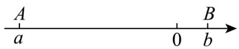

text_image

A
a
0
B
b

A. 4

B. 3

C. 2

D. 1

【答案】D

【分析】本题考查了数轴、绝对值、一元一次方程的应用、整式加减的应用，熟练掌握数轴的性质是解题关键．根据数轴的性质即可判断①正确；分x<-1，-1≤x≤3和x>3三种情况，先化简绝对值，再解方程，计算整式的加减即可判断②错误；分x<-1，-1≤x≤2和x>2三种情况，化简绝对值即可判断③错误；根据 $|x-1|+|x+a|$ ≥ $|a+1|$ 求解即可判断④错误.

【详解】解：①数轴上表示x、-2的两点之间的距离表示为 $|x-(-2)|=|x+2|$ ，说法正确；

②当x<-1时， $|x-3|+|x+1|=3-x-1-x=2-2x=8$ ，解得x=-3，符合题设，

当 $-1\leq x\leq3$ 时， $|x-3|+|x+1|=3-x+x+1=4\neq8$ ，舍去，

当x>3时， $|x-3|+|x+1|=x-3+x+1=2x-2=8$ ，解得x=5，符合题设，

综上，若 $|x-3|+|x+1|=8$ ，则x=-3或x=5，原说法错误；

③当x<-1时， $|x-2|+|x+1|=2-x-1-x=1-2x>3$ ，

当 $-1 \leq x \leq 2$ 时， $|x-2|+|x+1|=2-x+x+1=3$ ，

当x>2时， $|x-2|+|x+1|=x-2+x+1=2x-1>3$ ，

所以 $|x-2|+|x+1|$ 的最小值是3，

所以若存在整数x，使 $|x-2|+|x+1|$ 的值最小时，则x=-1，0，1，2，原说法错误；

④ $|x-1|+|x+a|\geq|(x-1)-(x+a)|=|x-1-x-a|=|a+1|$ ,

$\because|x-1|+|x+a|$ 的最小值是2，

$\therefore |a+1|=2,$

解得a=-3或a=1，原说法错误；

综上，说法正确的有 1 个，

故选：D.

【变式 6-1】（24-25 七年级上·内蒙古包头·期中）同学们都知道 $|5-(-2)|$ 表示 5 与 $(-2)$ 之差的绝对值，也可理解为 5 与 -2 两数在数轴上所对的两点之间的距离，则对于任何有理数 x， $|x+1|+|x-1|+|x-2|$ 取最小值时，相应的 x 的值是\_\_\_\_.

【答案】1

【分析】本题考查数轴和绝对值，解题的关键是掌握绝对值的几何意义．根据绝对值的几何意义求解；

【详解】∵ $|x+1|+|x-2|=|-(-1)|+|x-2|$ ,

∴由 $|x+1|+|x-2|$ 表示的含义可得：

当 $-1 \leq x \leq 2$ 时， $|x+1| + |x-2|$ 有最小值，最小值为 $2-(-1)=3$ ，

$$
\because | x - 1 | \geq 0,
$$

∴当x=1时， $|x-1|$ 的最小值为0，

∴当x=1时， $|x+1|+|x-1|+|x-2|$ 有最小值为3，

故答案为：1.

【变式 6-2】（24-25 七年级上·北京·期中）我们知道 $|x|$ 表示 $x$ 在数轴上对应的点到原点的距离， $|x-a|$ 表示 $x$ 与 $a$ 在数轴上对应的点之间的距离．例： $|x-1|=2$ 表示数 $x$ 与 1 在数轴上表示的点的距离是 2 个单位长度，如图所示，即可得出 $x$ 的值为 -1 或 3.

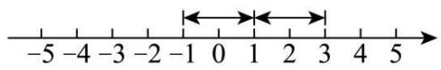

根据以上材料，解答下列问题：

(1)若 $|x-2|=4$ ，则x的值为\_\_\_\_；

(2)若数轴上表示数 a 的点位于表示 -3 与 2 的两点之间，则求 $\left|a+3\right|+\left|a-2\right|$ 的计算结果；

(3)已知有理数 b，则 $\left|b+5\right|+\left|b-3\right|$ 的计算结果是否有最小值？若有，请求出最小值；若没有，请说出理由.

【答案】(1)-2或6;

(2)5

(3)有最小值，最小值为8.

【分析】本题考查数轴，绝对值，掌握数轴的应用是解题的关键.

(1) 根据题意即可解答;

（2）根据题意知 $|a+3|+|a-2|$ 表示在数轴上表示数a的点到表示-3与2的点的距离之和，即可解答；

(3) 根据题意知 $|b + 5| + |b - 3|$ 表示在数轴上表示数 $b$ 的点到表示5与3的点的距离之和, 当 $-5 \leq b \leq 3$ 时, 这个距离之和最小, 最小值就是表示-5与3的两点之间的距离, 为8个单位长度, 即可解答.

【详解】（1）(1) 如图，在数轴上与2对应的点的距离为4个单位长度的点表示的数为-2或6.

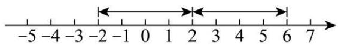

text_image

-5 -4 -3 -2 -1 0 1 2 3 4 5 6 7

故答案为：-2或6；

(2) $|a + 3| + |a - 2|$ 表示在数轴上表示数 $a$ 的点到表示-3与2的点的距离之和，

∵表示数a的点位于表示-3与2的两点之间，如图，

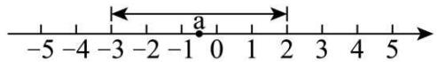

即 $|a+3|+|a-2|$ 的计算结果为5;

(3) $|b+5|+|b-3|$ 的计算结果有最小值，

∵ $|b+5|+|b-3|$ 表示在数轴上表示数b的点到表示-5与3的点的距离之和，

∴当 $-5\leq b\leq3$ 时，这个距离之和最小，最小值就是表示-5与3的两点之间的距离，为8个单位长度，

即 $|b+5|+|b-3|$ 的计算结果有最小值为8.

【变式 6-3】（24-25 七年级上·湖北武汉·阶段练习）数轴上两点间的距离等于这两点所对应的数的差的绝对值．例：点A、B在数轴上分别对应的数为a，b，则A、B两点间的距离表示为 $AB=|a-b|$ ，根据以上知识解题：

①当代数式 $|x+1|+|x-1|$ 取最小值时，x的取值范围是\_\_\_\_，最小值为\_\_\_\_。

②求 $|x-1|+|x-2|+|x-3|+\cdots+|x-24|$ 的最小值为\_\_\_\_.

【答案】 $-1\leq x\leq 1$ 2 144

【分析】本题主要考查了绝对值的几何应用，数轴上两点距离计算，①由题意得， $|x+1|+|x-1|$ 表示的是数轴上表示数x的点到表示数1和数-1的点的距离之和，设点A，点B，点C表示的数分别为-1，1，x，则 $|x+1|+|x-1|=AC+BC$ ，分点C在点A左侧，点C在点A和点B之间时（包括A和B），点C在点B右侧，三种情况结合数轴可得当点C在点A和点B之间时（包括A和B）， $AC+BC$ 有最小值，最小值为AB的长；则当 $-1\leq x\leq1$ 时， $|x+1|+|x-1|$ 取最小值，据此求解即可；②同①可知当 $1\leq x\leq24$ 时， $|x-1|+|x-24|$ 有最小值，当 $2\leq x\leq23$ 时， $|x-2|+|x-23|$ 有最小值，当 $3\leq x\leq22$ 时， $|x-3|+|x-22|$ 有最小值，……，当 $12\leq x\leq13$ 时， $|x-12|+|x-13|$ 有最小值，则当 $12\leq x\leq13$ 时， $|x-1|+|x-2|+|x-3|+\cdots+|x-24|$ 有最小值，据此求解即可.

【详解】解：①由题意得， $|x+1|+|x-1|$ 表示的是数轴上表示数x的点到表示数1和数-1的点的距离之和，设点A，点B，点C表示的数分别为-1，1，x，则 $|x+1|+|x-1|=AC+BC$ ，

当点 C 在点 A 左侧时， $AC+BC=2AC+AB>AB;$

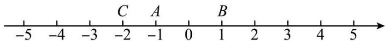

text_image

-5
-4
-3
C
A
-2
-1
0
B
1
2
3
4
5

当点 C 在点 A 和点 B 之间时（包括 A 和 B），则 $AC + BC = AB$ ;

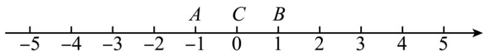

text_image

-5
-4
-3
-2
-1
A
C
B
0
1
2
3
4
5

当点 C 在点 B 右侧时，则 $AC + BC = AB + 2BC > AB$ ;

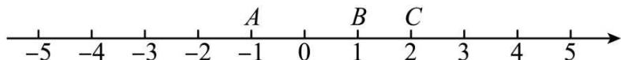

text_image

-5 -4 -3 -2 -1 0 1 2 3 4 5
A B C

综上所述，当点 C 在点 A 和点 B 之间时（包括 A 和 B）， $AC+BC$ 有最小值，最小值为 AB 的长；

∴当 $-1\leq x\leq1$ 时， $|x+1|+|x-1|$ 取最小值，最小值为 $1-(-1)=2$ ，

故答案为： $-1 \leq x \leq 1$ ; 2;

②同①可知当 $1 \leq x \leq 24$ 时， $|x - 1| + |x - 24|$ 有最小值，

当 $2 \leq x \leq 23$ 时， $|x - 2| + |x - 23|$ 有最小值，

当 $3 \leq x \leq 22$ 时， $|x - 3| + |x - 22|$ 有最小值，

……，

当 $12 \leq x \leq 13$ 时， $|x - 12| + |x - 13|$ 有最小值，

综上所述，当 $12 \leq x \leq 13$ 时， $|x-1| + |x-24|$ ， $|x-2| + |x-23|$ ， $|x-3| + |x-22|$ ，…， $|x-12| + |x-13|$ 能同时取得最小值，即当 $12\leq x\leq13$ 时， $|x-1|+|x-2|+|x-3|+\cdots+|x-24|$ 有最小值，最小值为 $24-1+23-2+22-3+21-4+\cdots+13-12=144$ ，故答案为：144.

# 【题型7 数轴中的相遇问题】

【例 7】（24-25 七年级上·河北石家庄·期中）已知 a 是最大的负整数， $b=-|-5|$ ，c 是 -4 的相反数，且 a, b, c 分别是点 A, B, C 在数轴上对应的数.

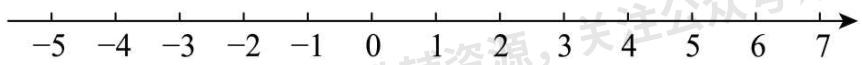

text_image

-5 -4 -3 -2 -1 0 1 2 3 4 5 6 7

(1)求 a, b, c 的值，并在如图的数轴上标出点 A, B, C;

(2)在数轴上, 若点 $D$ 到点 $A$ 的距离刚好是 5 , 则点 $D$ 叫做点 $A$ 的“幸福点”. 求点 $A$ 的幸福点 $D$ 所表示的数;

(3)若动点 $P$ 从点 $B$ 出发沿数轴向负方向运动, 动点 $Q$ 同时从点 $A$ 出发也沿数轴向负方向运动, 点 $P$ 的速度是每秒 1 个单位长度, 点 $Q$ 的速度是每秒 3 个单位长度, 求运动几秒后, 点 $Q$ 可以追上点 $P$ ?

【答案】(1)a=-1, b=-5, c=4，数轴见解析

(2)点 A 的幸福点 D 所表示的数为 -6 或 4;

(3)运动 2 秒后，点 Q 可以追上点 P.

【分析】（1）根据最大的负整数是-1， $|-5|=5$ ，-4的相反数是4，解答即可.

(2) 根据平移思想解答即可.

（3）根据题意，点 P 表示的数为 -5-t，点 Q 表示的数为 -1-3t，结合点 Q 可以追上点 P，列方程解答即可.

【详解】（1）解：根据最大的负整数是-1， $|-5|=5$ ，-4的相反数是4，

得a=-1， $b=-|-5|=-5$ ，c=4。

数轴表示如下:

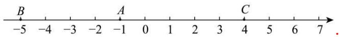

text_image

B
-5 -4 -3 -2 -1 0 1 2 3 4 5 6 7

（2）解：根据题意，得点 D 表示的数为 $-1+5=4$ 或 $-1-5=-6$ ，

点 A 的幸福点 D 所表示的数为 -6 或 4;

(3) 解: 根据点 $P$ 和点 $Q$ 分别以每秒 1 个单位长度和每秒 3 个单位长度的速度向左运动, $t$ 秒过后, 点 $P$ 表示的数为 $-5 - t$ , 点 $Q$ 表示的数为 $-1 - 3t$ ,

根据题意，得-1-3t=-5-t，

解得t=2.

【点睛】本题考查了最大的负整数，绝对值，数轴上运动路程，两点间的距离，分类思想，一元一次方程的应用，熟练掌握运动路程与表示数的关系，两点间的距离公式是解题的关键.

【变式 7-1】（2024 七年级上·江苏·专题练习）已知，如图 A、B 分别为数轴上的两点，A 点对应的数为 -10，B 点对应的数为 90.

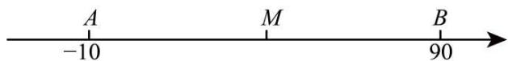

text_image

A
-10
M
B
90

(1)与 A、B 两点距离相等的 M 点对应的数是\_；

(2)现在有一只电子蚂蚁 P 从 B 点出发时，以 5 个单位/秒的速度向左运动，同时另一只电子蚂蚁 Q 恰好从 A 点出发，以 3 个单位/秒的速度向右运动，设两只电子蚂蚁在数轴上的 C 点相遇，则 C 点对应的数是 \_\_\_\_；

【答案】(1)40

(2)27.5

【分析】此题考查数轴上的点表示的数，一元一次方程式的实际运用，利用行程问题的基本数量关系，以及数轴直观解决问题即可.

(1) 求-10与90和的一半即是点M表示的数;

(2) 先求出 $AB$ 的长, 再设 $t$ 秒后 $P 、 Q$ 相遇即可得出关于 $t$ 的一元一次方程, 求出 $t$ 的值, 可求出 $P 、 Q$ 相遇时点 $P$ 移动的距离, 进而可得出 $C$ 点对应的数;

【详解】（1）解：M 点对应的数是： $(-10+90)\div2=40$ ;

故答案为：40;

(2) $\because A 、 B$ 分别为数轴上的两点, $A$ 点对应的数为-10, $B$ 点对应的数为90,

$$
\therefore A B = 9 0 + 1 0 = 1 0 0.
$$

设 t 秒后 P、Q 相遇，

∴5t+3t=100，解得t=12.5，

∴此时点 P 走过的路程为 $5 \times 12.5 = 62.5$ ,

∴此时 C 点表示的数为90-62.5=27.5.

即：C 点对应的数是27.5.

故答案为：27.5.

【变式 7-2】（22-23 七年级上·山东青岛·期末）数轴上点 A 表示 -8，点 B 表示 6，点 C 表示 12，点 D 表示 18．如图，将数轴在原点 O 和点 B，C 处各折一下，得到一条“折线数轴”。在“折线数轴”上，动点 M 从点 A 出发，以 4 个单位/秒的速度沿着折线数轴的正方向运动，从点 O 运动到点 C 期间速度变为原来的一半，过点 C 后继续以原来的速度向终点 D 运动；点 M 从点 A 出发的同时，点 N 从点 D 出发，一直以 3 个单位/秒的速度沿着“折线数轴”负方向向终点 A 运动。其中一点到达终点时，两点都停止运动。设运动的时间为 t 秒，t = \_\_\_\_ 时，M、N 两点相遇（结果化为小数）。

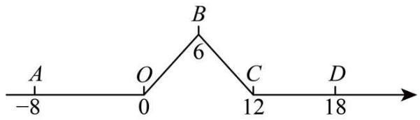

text_image

A
-8
O
0
B
6
C
12
D
18

【答案】 $4.4/\frac{22}{5}$

【分析】求出 2 秒时两点的位置，表示出两点所表示的数，根据 M、N 两点相遇时，M、N 表示的数相同，即得额 $2t - 4 = 18 - 3t$ ，可解得答案.

【详解】解：由题意可得：

$8 \div 4 = 6 \div 3 = 2$ ，即2秒后，点M到达点O，点N到达点C，

此时开始，M表示的数是 $\frac{4}{2}\times(t-2)=2t-4$ ，N表示的数是 $12-3(t-2)=18-3t$ ，

∵M、N两点相遇时，M、N表示的数相同，

$$
\therefore 2 t - 4 = 1 8 - 3 t,
$$

解得t=4.4，

故答案为：4.4.

【点睛】本题考查数轴、一元一次方程的应用，解题的关键是用含t的代数式表示点运动后所表示的数.

【变式 7-3】（24-25 七年级上·山西吕梁·期末）已知a是最大的负整数，b是-5的相反数，且a,b分别是点A,B在数轴上对应数.

-5 -4 -3 -2 -1 0 1 2 3 4 5

(1)求a,b的值，并在数轴上标出点A,B;

(2)若动点P从点A出发沿数轴正方向运动，动点O同时从点B出发也沿数轴正方向运动，点P的速度每秒5个

单位长度，点Q的速度是每秒3个单位长度，若运动t秒后，点P可以追上点Q，求t的值.

【答案】(1)a=-1，b=5，数轴见解析

(2)t=3

【分析】本题主要考查了相反数的定义，用数轴上点表示有理数，一元一次方程的应用，解题的关键是数形结合，根据题意列出方程.

（1）根据有理数的分类求出a=-1，根据相反数的定义可得b=5，进而根据数轴上的点所表示数的特点在数轴上标出即可；  
(2) 根据数轴上点所表示数的特点分别表示出点 $P$ 、 $Q$ 运动 $t$ 秒后所表示的数, 进而根据点 $P$ 追上点 $Q$ , 则两点所表示的数相同, 列出方程, 求解即可.

【详解】（1）解：因为a是最大的负整数，b是-5的相反数，

所以a=-1，b=5，

∵a，b分别是点A，B在数轴上对应数，

∴将A，B标注在数轴如下图，

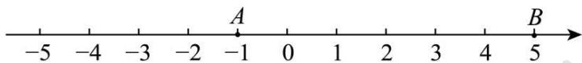

text_image

-5
-4
-3
-2
-1
0
1
2
3
4
5
A
B

(2) 解: 由题意得 $t$ 秒后点 $P$ 所表示的数为 $-1 + 5t$ , 点 $Q$ 所表示的数为 $5 + 3t$ ,

根据题意得 $-1+5t=5+3t$ ,

解之得：t=3，

∴运动 3 秒后点 P 可以追上点 Q.

# 【题型8 数轴中的折返问题】

【例 8】（23-24 七年级上·江苏无锡·阶段练习）四个点A、B、C、D在数轴上的位置如图所示，已知CD=2，BC=3，AC=15，若点C为原点，点P、Q分别从A、D两点同时出发，点P以每秒3个单位长度的速度向右运动，到达C点后立即按原速向A折返；点Q以每秒1个单位长度的速度向左运动．当 P、Q都到达点A时运动停止，设运动时间为t（单位：秒）.

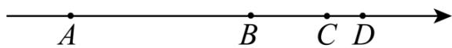

(1)当t=3时，求点P与点Q之间的距离；  
(2)当t=时，点P到达点B，此时点Q表示的数是\_\_\_\_；  
(3)当t为何值时，P、Q两点相距2个单位？

【答案】(1)5

(2)4, -2

(3)当 $t=\frac{15}{4}$ 或 $t=\frac{19}{4}$ 或 $t=\frac{11}{2}$ 或 $t=\frac{15}{2}$ 或t=15时，P、Q两点相距2个单位.

【分析】本题考查了一元一次方程的实际应用，数轴上表示一个数，读懂题意，按照分类情况，列出正确的式子，是解答本题的关键.

（1）根据题意，当t=3时，分别求出点P，点Q运动的距离，根据图中已知的线段关系，由此求出答案.

（2）根据题意，得到 $AB=AC-BC=15-3=12$ ，由此得到运动的时间，点C为原点，进而得到答案.

(3) 根据题意, 分五种情况讨论: 当点 $P$ 向右运动, 点 $Q$ 向左运动时; 当点 $P$ 到达点 $C$ 之前; 当点 $P$ 到达点 $C$ 时, $CQ = 3$ , 变成追赶问题, 分两种情况, 当追上之前两点相距2个单位; 当追上之后两点相距2个单位; 最后点 $P$ 先到达点 $A$ 时运动停止, 点 $Q$ 继续运动, 直到相距点 $A$ 2个单位, 综上五种情况, 分别计算, 得到答案.

【详解】（1）解：根据题意得：

当t=3时，

点P运动了： $3 \times 3 = 9$ ，

点Q运动了： $3 \times 1 = 3$ ，

$$
A D = A C + C D = 1 7,
$$

点P与点Q之间的距离为：17-9-3=5.

(2) 根据题意得:

$$
A B = A C - B C = 1 5 - 3 = 1 2,
$$

∴ $t=\frac{12}{3}=4$ 时，点P到达点B；

∵ t=4时，

点O运动了： $1 \times 4 = 4$ ，

∵点C为原点，

∴此时点O表示的数是-2.

故答案为：4，-2.

(3) 根据题意得:

当点P向右运动，点O向左运动时，如图，

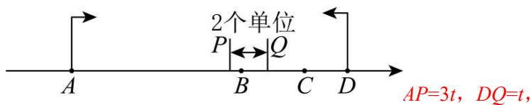

text_image

2个单位
P←→Q
AP=3t, DQ=t,

P、Q两点相距2个单位，

∴ 17-3t-t=2,

解得： $t=\frac{15}{4}$ ;

当点P到达点C之前，如图所示，

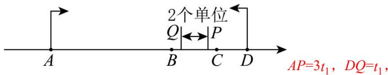

text_image

2个单位
AP=3t₁, DQ=t₁,

$3t_{1} + t_{1} - 2 = 17$

解得： $t_{1}=\frac{19}{4}$ ,

当点P到达点C时，如图所示，

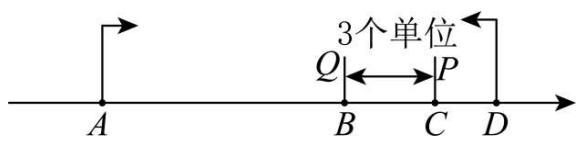

text_image

3个单位
Q←→P
A	B	C	D

点P运动了： $t_{2}=\frac{15}{3}=5$ ，

当 $t_{2}=5$ 时，

DQ=5, CQ=5-2=3,

即此时P、Q两点相距3个单位，

之后点Q从B点运动，点P从C点开始追赶Q点，到距离为2个单位用时 $t'$ ，

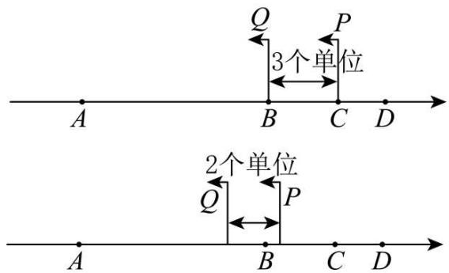

text_image

Q
P
3个单位
A
B
C
D
2个单位
Q
P
A
B
C
D

则 $t'+3-3t'=2$ ，解得： $t'=\frac{1}{2}$

即 $t_{3}=t_{2}+t^{\prime}=\frac{11}{2}$ 时，P、Q两点相距2个单位；

如图，点Q从B点运动，点P从C点开始追赶Q点，到超过Q点距离为2个单位用时 $t''$ ，

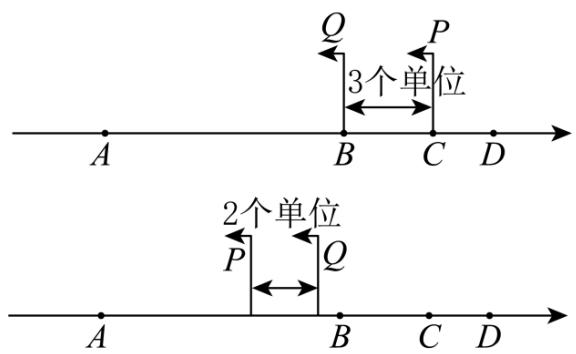

text_image

3个单位
2个单位

当 $3t''-t''-3=2$ ，解得： $t''=\frac{5}{2}$ 时，

即 $t_{4}=t_{2}+t^{\prime\prime}=\frac{15}{2}$ 时，P、Q两点相距2个单位；

如图，此后点P先到达点A时运动停止，点Q继续运动，直到两点距离2个单位，

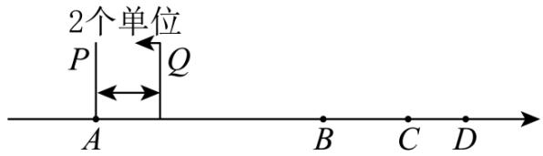

text_image

2个单位
P
Q
A
B C D

则 $17-t_{5}=2$ ，解得： $t_{5}=15$ ，

综上，当 $t=\frac{15}{4}$ 或 $t=\frac{19}{4}$ 或 $t=\frac{11}{2}$ 或 $t=\frac{15}{2}$ 或t=15时，P、Q两点相距2个单位.

【变式 8-1】（23-24 七年级上·湖北·期末）如图，A 点在数轴上对应的有理数是 24；动点 M 从原点 O 点出发以 1 单位/秒的速度向右运动，动点 N 从 A 点出发以 2 单位/秒的速度向左运动，两个动点同时出发，设运动时间为 t 秒.

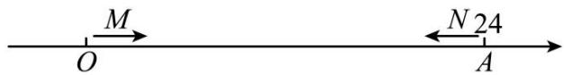

text_image

M
O
N 24
A

(1)请用含 t 的式子表示：动点 M 对应的数为 \_\_\_\_，动点 N 对应的数为 \_\_\_\_；

(2)如果在运动过程中，M、N两点相距6个单位长，求t的值；

(3) $M 、 N$ 在运动过程中, 又有一动点 $p$ 从原点 $O$ 点开始以 3 单位/秒的速度向右运动 (与 $M 、 N$ 同时出发), 当相遇点 $N$ 时立即返回, 返回途中遇到 $M$ 点时又立即折返, 如此往返, 当 $M 、 N$ 相遇时点 $p$ 停止, 此时点 $p$ 一共运动了 \_\_\_\_ 个单位长度.

【答案】(1)t, 24-2t

(2)t=6或10

(3)24

【分析】（1）利用速度乘以时间求出点M表示的数，用24-点N的路程，求出点N对应的数即可；

（2）根据两点间的距离公式，列出方程，进行求解即可；

（3）求出 M、N 相遇时所用时间，利用点 p 的速度乘以时间，求出路程即可.

【详解】（1）解：由题意，得：点M表示的数为：t，点N表示的数为：24-2t；

故答案为：t，24-2t

(2) M、N相遇前，24-2t-t=6

解得t=6，

M、N相遇后， $t-(24-2t)=6$

解得t=10,

∴综上t=6或10.

(3) M, N相遇时: $2t + t = 24$ ,

解得：t=8，

∴点 p 一共运动了 $3 \times 8 = 24$ 个单位长度.

故答案为：24.

【点睛】本题考查数轴上的动点问题，两点间的距离．掌握两点间的距离公式，正确的列出代数式和方程，是解题的关键.

【变式 8-2】（23-24 七年级上·江苏徐州·阶段练习）如图，已知数轴上 A、B 两定点对应的数是 -20，40，动点 M、N 同时从点 A 出发向点 B 运动，点 M 的速度为 3 个单位长度/秒，点 N 的速度为 2 个单位长度/秒，到达点 B 后折返向点 A 继续运动，其中某点回到点 A 时，全部停止，经过 \_\_\_\_ 秒点 A 到点 N 的距离刚好等于点 B 到点 M 的距离.

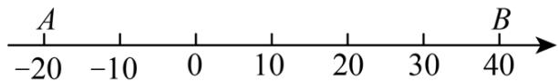

text_image

A
-20 -10 0 10 20 30 40
B

【答案】12 或 36

【分析】本题考查了数轴上两点距离，一元一次方程的应用，数形结合，分类讨论是解题的关键．分 $0 \leq x \leq 20$ ， $20 < x \leq 30$ ， $30 < x \leq 40$ 讨论，列出方程求解即可.

【详解】解：设时间为x秒，

∵A、B两定点对应的数是-20，40，

$$
\therefore A B = 4 0 - (- 2 0) = 6 0,
$$

∴M 到达 B 需要的时间为 $60\div3=20$ 秒，

N 到达 B 需要的时间为 $60 \div 2 = 30$ 秒，

M 从到 A 出发，然后返回到 A 需要的时间为 $2 \times 60 \div 3 = 40$ 秒，

当 $0 \leq x \leq 20$ 时，2x=60-3x，

解得x=12，

当20<x<30时，2x=3x-60.

解得x=60（不符合题意，舍去），

当30<x<40时， $60\times2-2x=3x-60$ ，

解得x=36.

综上，经过12秒或36秒，点A到点N的距离刚好等于点B到点M的距离.

故答案为：12或36.

【变式 8-3】（24-25 七年级上·湖南长沙·阶段练习）已知数轴上 A，B 两点对应的数分别为 a，b，且 a，b 满足 $\left|a+18\right|+(b-10)^{2}=0$ ，点 C 对应的数为 14，点 D 对应的数为 -10.

(1)求 a, b 的值:

(2)点 A, B 沿数轴同时出发相向匀速运动，点 A 的速度为 4 个单位/秒，点 B 的速度为 1 个单位/秒，若 t 秒时点 A 到原点的距离和点 B 到原点的距离相等，求 t 的值；

(3)在（2）的条件下，点 A, B 从起始位置同时出发，当 A 点运动到点 C 时，迅速以原来的速度返回，到达出发点后，又折返向点 C 运动。B 点运动至 D 点后停止运动。当 B 停止运动时点 A 也停止运动。求在此过程中，A, B 两点同时经过的点在数轴上对应的数。

【答案】(1)a=-18,b=10

(2) $\frac{8}{3}$ 或 $\frac{28}{5}$

(3) $\frac{22}{5}$ 或 $-\frac{2}{3}$ 或

【分析】本题考查了一元一次方程的运用，数轴的运用，绝对值的运用，非负数性质的运用，解答时根据行程问题的追击问题和相遇问题的数量关系建立方程是关键.

(1) 根据非负数的性质, 建立方程求出 $a$ , $b$ 的值:

(2) 根据 $A, B$ 两点到原点 $O$ 的距离相等分两种情况, 当 $A 、 B$ 在原点的右侧 $A 、 B$ 相遇和 $A 、 B$ 在原点的异侧时, 建立方程求出其解即可:

(3) 分四种情况讨论: 当 $A 、 B$ 在原点的右侧相遇时; 当点 $A$ 从点 $C$ 返回出发点时与 $B$ 相遇; 当点 $A$ 从出发点返回点 $C$ 时与点 $B$ 相遇, 分别依据线段的和差关系列方程求解即可.

【详解】（1）解：由题意，得 $|a+18|+(b-10)^{2}=0$ ，

$$
\therefore a + 1 8 = 0, \quad b - 1 0 = 0.
$$

解得：a=-18，b=10；

(2) 解: 设原点为 O,

∵点B对应的数为10，A对应的数是-18，

$$
\therefore A B = 2 8, \quad A O = 1 8, \quad B O = 1 0.
$$

当A、B在原点的异侧时，

若点A到原点的距离和点B到原点的距离相等，

则18-4t=10-t,

解得： $t=\frac{8}{3}$ .

当A、B在原点的右侧相遇时，点A到原点的距离和点B到原点的距离相等，

则 $4t+t=28$ ,

解得 $t=\frac{28}{5}$ ,

∴A，B两点到原点O的距离相等时，t的值为 $\frac{8}{3}s$ 或 $\frac{28}{5}s$ ;

(3) 解: $\because$ 点 $C$ 对应的数为 14, 点 $D$ 对应的数为 -10,

$$
\therefore A C = 1 4 - (- 1 8) = 3 2, B D = 1 0 - (- 1 0) = 2 0,
$$

B点运动至D点所需的时间为 $20\div1=20(s)$ ,

故t<20，

由（2）得，当 $t=\frac{28}{5}$ 时，A，B两点同时到达的点表示的数是 $10-\frac{28}{5}\times1=\frac{22}{5}$ ;

由题意，得当点A从点C返回出发点时，若与B相遇，

则4t-32=t。

解得： $t=\frac{32}{3}$ ,

此时A，B两点同时到达的点表示的数是 $10-\frac{32}{3}\times1=-\frac{2}{3}$ ;

当点A第二次从出发点返回点C时，若与点B相遇，

则 $4t-32\times2+t=20$ .

解得 $t=\frac{84}{5}$ ,

此时A，B两点同时到达的点表示的数是 $10-\frac{84}{5}\times1=-\frac{34}{5}$ ;

当点A第二次从点C返回出发点时，若与B相遇，

则 $4t-32\times3=t$ ,

解得：t=32（不符合题意），

综上所述，A，B两点同时到达的点在数轴上表示的数为： $\frac{22}{5}$ 或 $-\frac{2}{3}$ 或 $-\frac{34}{5}$ .

# 【题型9 数轴中两线段和差倍分问题】

【例 9】（23-24 七年级上·江苏扬州·期末）已知数轴上 A 点代表 -8，B 点代表 4，动点 P、Q 分别从 A、B 同时出发，向右运动，点 P 的速度为每秒 2 个单位长度，点 Q 的速度为每秒 1 个单位长度，设运动时间为 t 秒，当 t=\_\_ 时，2OP-OQ=3．（当点 P 与点 Q 重合时，P、Q 两点停止运动）

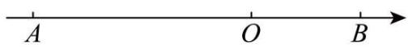

【答案】 $\frac{9}{5}$ 或 $\frac{23}{3}$

【分析】本题考查了一元一次方程的应用、数轴上两点之间的距离．根据题意易得动点P表示的数为 $-8+2t$ ，动点Q表示的数为 $4+t$ ，则 $OP=|-8+2t|$ ， $OQ=4+2t$ ，列出方程求解即可得出答案.

【详解】解：根据题意得，动点P表示的数为 $-8+2t$ ，动点O表示的数为 $4+t$ ，

$$
\because 2 O P - O Q = 3,
$$

$$
\therefore 2 \vert - 8 + 2 t \vert - (4 + t) = 3,
$$

当 $-8+2t\geq0$ 时， $2(-8+2t)-(4+t)=3$ ，解得： $t=\frac{23}{3}$ ;

当 $-8+2t<0$ 时， $2(8-2t)-(4+t)=3$ ，解得： $t=\frac{9}{5}$ ;

综上分析可知： $t=\frac{23}{3}$ 或 $t=\frac{9}{5}$ .

故答案为： $\frac{9}{5}$ 或 $\frac{23}{3}$ .

【变式 9-1】（24-25 七年级上·河南郑州·期末）如图，点A和B在数轴上表示的数分别是-6和8，动点P从A出发，以1个单位每秒的速度沿射线AB的方向向右运动，同时动点Q从点B出发，以3个单位每秒的速度沿射线BA的方向向左运动，运动时间为t秒(t>0)，当点A，P，Q这三点中恰好有一点是以另外两点为端点的线段的中点时，t的值为\_\_\_\_。

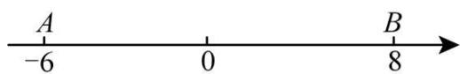

text_image

A
-6
0
B
8

【答案】 $\frac{14}{5}$ 或4或7

【分析】本题考查了一元一次方程的应用以及数轴．当运动时间为 t 秒时，点 P 表示的数为 $-6+t$ ，点 Q 表示的数为 8-3t，分点 P 是线段 AO 的中点、点 O 是线段 AP 的中点及点 A 是线段 PO 的中点三种情况考虑，根据中点到两端点的距离相等，可列出关于 t 的一元一次方程，解之即可得出结论.

【详解】解：当运动时间为 t 秒时，点 P 表示的数为 $-6+t$ ，点 Q 表示的数为 8-3t，当点 P 是线段 AQ 的中点时， $-6+t-(-6)=8-3t-(-6+t)$ ，

解得： $t=\frac{14}{5}$ ;

当点 Q 是线段 AP 的中点时， $8-3t-(-6)=-6+t-(8-3t)$ ,

解得：t=4;

当点 A 是线段 PQ 的中点时， $-6-(8-3t)=-6+t-(-6)$ ,

解得：t=7.

综上所述，t 的值为 $\frac{14}{5}$ 或 4 或 7.

故答案为： $\frac{14}{5}$ 或 4 或 7.

【变式 9-2】（24-25 七年级上·河南郑州·期末）已知点A，B在数轴上对应的数分别为a，b，且 $|a+6|+(b-4)^{2}=0$ ，若动点P在数轴上对应的数为x，当 $PA+PB=16$ 时，x的值为\_\_\_\_。

【答案】-9或7

【分析】本题考查了数轴上的点，绝对值与偶次幂的非负性，解一元一次方程的应用；根据题意得出a=-6, b=4, $|x+6|+|x-4|=16$ ，分类讨论，即可求解.

【详解】解：∵ $|a+6|+(b-4)^{2}=0$ ,

$$
\therefore | a + 6 | = 0, (b - 4) ^ {2} = 0;
$$

解得a=-6，b=4；

动点P在数轴上对应的数为x，当 $PA+PB=16$ 时，

$$
\therefore P A + P B = | x + 6 | + | x - 4 | = 1 6.
$$

即P点在A和B点之间的不同位置情况:

若P点在A点左侧，即x<-6，则 $|x+6|+|x-4|=-(x+6)-(x-4)=16$ ，化简得-2x-2=16，从而得到x=-9.

若P点在B点右侧，即x>4，则 $|x+6|+|x-4|=x+6+x-4=16$ ，化简得 $2x+2=16$ ，从而得到x=7.

若P点在A和B点之间，即 $-6\leq x\leq4$ ，则 $|x+6|+|x-4|=(x+6)+(4-x)=10$ ，显然不满足 $PA+PB=16$ 。

综上，当 $PA+PB=16$ 时，x的值为-9或7.

故答案为：-9或7.

【变式 9-3】（23-24 九年级上·甘肃兰州·期中）数轴上有 A, B, C 三点，给出如下定义：若其中一个点到其他两个点之间的距离相等时，则称该点是其他两个点的“中点”，这三点为“中点关联点”。

例如数轴上点 A, B, C 所表示的数分别为 1, 3, 5, 此时点 B 是点 A, C 的中点.

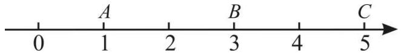

text_image

0
A
1
2
B
3
4
C
5

(1)若点 $A$ 表示数-2，点 $B$ 表示数1，若点 $B$ 是点 $A$ 与点 $C$ 的中点，求点 $C$ 所表示的数；

(2)点 A 表示数 -10，点 B 表示数 15，P 为数轴上一个动点，若点 A、B、P 是“中点关联点”，求此时点 P 表示的数.

【答案】(1)4

(2)2.5或-35或40

【分析】本题主要考查了数轴两点间的距离，一元一次方程的应用，利用分类讨论思想解答是解题的关键.

（1）根据新定义可得点 C，B 间的距离为 3，即可求解；  
（2）设点 P 表示的数为 x，分三种情况，结合新定义解答即可.

【详解】（1）解：∵点 A 表示数 -2，点 B 表示数 1，

∴点 A，B 间的距离为 $1-(-2)=3$ ，  
∵点 B 是点 A 与点 C 的中点，  
∴点 C, B 间的距离为 3,  
∴点 C 所表示的数为 $1+3=4$ ;

(2) 解: 设点 P 表示的数为 x,

当点 P 是点 A 与点 B 的中点时，

$$
x - (- 1 0) = 1 5 - x,
$$

解得：x=2.5，

此时点 P 表示的数为2.5;

当点 A 是点 P 与点 B 的中点时，

$$
(- 1 0) - x = 1 5 - (- 1 0),
$$

解得：x=-35，

此时点 P 表示的数为 -35;

当点 B 是点 P 与点 A 的中点时，

$$
x - 1 5 = 1 5 - (- 1 0),
$$

解得：x=40，

此时点 P 表示的数为 40;

综上所述，点 P 表示的数为 2.5 或 -35 或 40.

# 【题型10 数轴动点中的定值问题】

【例 10】（23-24 七年级上·湖北孝感·期末）如图，数轴上点 A，B（点 A 在点 B 左边）所对应的数 a，b 满足 $|a+3|+(b-5)^{2}=0$ 。P 为数轴上一动点，其对应的数为 x，O 为原点。

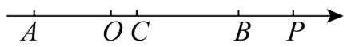

(1)若BP=1，求x的值；

(2)若PB=3PA，求x的值；

(3)若点C为线段AB的中点，当点P在线段AB的延长线上运动时， $\frac{PA+PB}{PC}$ 的值是否为定值（即确定的值，不因点P位置的变化而变化）？如是，请求出这个定值；如不是，也请说明理由.

【答案】(1)6 或 4.

(2)x=-1或-7

(3)是定值，定值为2

【分析】本题考查了数轴上两点间的距离，非负数的性质，一元一次方程的应用．要分类讨论是解题关键.

（1）由非负数的性质求出 a、b 的值，再根据两点距离公式，由 BP=1，列出方程，求解即可.

(2) 分两种情况, 当点 $P$ 在 $A$ , $B$ 两点之间时, 当点 $P$ 在 $A$ 的左边时, 根据两点距离公式, 由 $PB = 3PA$ , 列出方程求解即可.

(3)根据点C为线段AB的中点,得点C对应的数为1,则PC=x-1,从而求得 $PA+PB=(x+3)+(x-5)=2x-2=2(x-1)=2$ PC,代入计算即可.

【详解】（1）解：因为 $|a+3|+(b-5)^{2}=0$ ，

所以 $a+3=0,\ b-5=0,$

所以a=-3，b=5。

由题意得： $|x-5|=1$ ，

所以 $x-5=\pm1$ ，x=6或4.

(2) 解: 当点 $P$ 在 $A, B$ 两点之间时,

$5-x=3\left[x-(-3)\right]$ ，解得x=-1。

当点P在A的左边时，

$5-x=3(-3-x)$ ，解得x=-7.

所以，x=-1或-7.

（3）解： $\frac{PA+PB}{PC}$ 的值为定值.

因为点C为线段AB的中点，

所以点C对应的数为 $\frac{5-3}{2}=1$ ，则PC=x-1

所以 $PA+PB=(x+3)+(x-5)=2x-2=2(x-1)=2PC,$

所以 $\frac{PA+PB}{PC}=2.$

【变式 10-1】（23-24 七年级上·四川成都·期中）如图：在数轴上点 A 表示数 a，点 B 表示数 b，点 C 表示数 c, b 是最大的负整数，且 a, c 满足 $\left|a+3\right|+\left|c-5\right|=0$ .

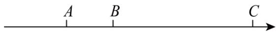

(1) $a=$ \_\_\_\_ , $b=$ \_\_\_\_ , $c=$ \_\_\_\_ ;

(2)如果点 P 表示的数为 x，当 P 点到 B、C 两点的距离之和为 8 时，x= \_\_\_\_.

(3)点A,B,C开始在数轴上运动, 若点 A 以每秒 1 个单位长度的速度向左运动, 同时, 点B和点C分别以每秒 2 个单位长度和 3 个单位长度的速度向右运动, 假设t秒钟过后, 若点 A 与点B之间的距离表示为AB, 点B与点C之间的距离表示为BC, 则AB=\_\_\_\_, BC=\_\_\_\_. (用含t的代数式表示)

(4)在（3）的条件下，3BC-AB的值是否随着时间 t 的变化而改变？若变化，请说明理由；若不变，请求其值.

【答案】(1)-3,-1,5

(2)-2或6

(3) $3t+2,\quad t+6$

(4)不变，16

【分析】本题考查了数轴、两点间的距离、绝对值以及偶次方的非负性，

（1）根据 b 为最大的负整数可得出 b 的值，再根据绝对值的非负性即可得出 a、c 的值；

(2) 根据当 $P$ 点到 $B 、 C$ 两点的距离之和为 8 时, 由 $B C = 6$ 得出 $P$ 点在 $B 、 C$ 两点两侧, 分情况计算即可得出答案;

（3）根据运动的方向和速度结合 a、b、c 的值，即可找出 t 秒后点 A、B、C 分别表示的数，利用两点间的距离即可求出 AB、BC 的值；

（4）将（3）的结论代入 $3BC - AB$ 中，可得出 $3BC - AB$ 为定值16，此题得解.

【详解】（1）解：∵b 是最大的负整数，

$$
\therefore b = - 1,
$$

∵a、c满足 $|a+3|+|c-5|=0$ ,

$$
\therefore a + 3 = 0, \quad c - 5 = 0,
$$

$$
\therefore a = - 3, \quad c = 5,
$$

故答案为：-3,-1,5;

(2) 解: $\because b=-1,\ c=5,$

$$
\therefore B C = 6,
$$

∵P 点到 B、C 两点的距离之和为 8 时，

当 P 点在 B 点左侧时，

$$
- 1 - x + 5 - x = 8,
$$

解得： $x = -2$

当 P 点在 C 点右侧时，

$$
x - (- 1) + x - 5 = 8,
$$

解得：x=6，

故答案为：-2或6;

(3) 解: $t$ 秒钟过后, 点 $A$ 表示的数为 $-t - 3$ , 点 $B$ 表示的数为 $2t - 1$ , 点 $C$ 表示的数为 $3t + 5$ ,

$$
\therefore A B = (2 t - 1) - (- t - 3) = 3 t + 2, \quad B C = (3 t + 5) - (2 t - 1) = t + 6,
$$

故答案为： $3t+2,\ t+6;$

(4) 解: 不变,

理由如下:

$$
\because A B = 3 t + 2, \quad B C = t + 6,
$$

$$
\therefore 3 B C - A B = 3 (t + 6) - (3 t + 2) = 3 t + 1 8 - 3 t - 2 = 1 6.
$$

∴3BC-AB的值为定值16.

【变式 10-2】（24-25 七年级上·福建厦门·期中）已知：在一条东西向的双轨铁路上迎面驶来一快一慢两列火车，快车长AB=2（单位长度），慢车长CD=4（单位长度），设正在行驶途中的某一时刻，如图，以两车之间的某点O为原点，取向右方向为正方向画数轴，此时快车头A在数轴上表示的数是a，慢车头C在数轴上表示的数是b．若快车AB以6个单位长度/秒的速度向右匀速继续行驶，同时慢车CD以2个单位长度/秒的速度向左匀速继续行驶，且 $|a+8|+(b-16)^{2}=0$ .

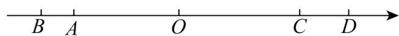

(1) $a =$ \_\_\_\_； $b =$ \_\_\_\_； 此时刻快车头 $A$ 与慢车头 $C$ 之间相距 \_\_\_\_ 单位长度；  
(2)从此时刻开始算起，再行驶多少秒钟两列火车的车头AC相距8个单位长度？

(3)此时在快车AB上有一位爱动脑筋的七年级学生乘客，他发现行驶中有一段时间t秒钟，他的位置P到两列火车头A、C的距离和加上到两列火车尾B、D的距离和是一个不变的值（即 $PA+PC+PB+PD$ 为定值）。你认为该学生发现的这一结论是否正确？若正确，求出这段时间的长度及定值；若不正确，请说明理由。

【答案】(1)-8, 16, 24

(2)再行驶 2 秒或 4 秒两列火车行驶到车头AC相距 8 个单位长度

(3)正确，这段时间的长度为0.5秒，定值是6单位长度

【分析】（1）根据非负数的性质求出a=-8，b=16，再根据两点间的距离公式即可求解；

（2）根据时间 = 路程和 ÷ 速度和，列式计算即可求解；

(3) 由于 $PA + PB = AB = 2$ , 只需要 $PC + PD$ 是定值, 从快车 $AB$ 上乘客 $P$ 与慢车 $CD$ 相遇到完全离开之间都满足 $PC + PD$ 是定值, 依此分析即可求解.

【详解】（1）解：∵ $|a+8|+(b-16)^{2}=0$ ，且 $|a+8|\geq0,(b-16)^{2}\geq0$ ，

$\therefore a+8=0$ ，即a=-8，

b-16=0，即b=16，

∴此时刻快车头 A 与慢车头 C 之间相距 $16-(-8)=24$ ;

故答案为：-8，16，24；

(2) 解: 由题意可分:

①当快慢车未相遇前相距8个单位长度时，则有： $(24-8)\div(6+2)=16\div8=2$ （秒）；

②当快慢车相遇后相距8个单位长度时，则有： $(24+8)\div(6+2)=4$ （秒）

答：再行驶 2 秒或 4 秒两列火车行驶到车头 AC 相距 8 个单位长度；

（3）解：因为 $PA+PB=AB=2$ ，

当P在CD之间时，PC+PD是定值4，

$$
t = 4 \div (6 + 2) = 4 \div 8 = 0. 5 (\text { 秒 })
$$

此时 $PA+PC+PB+PD=(PA+PB)+(PC+PD)=2+4=6$ （单位长度）.

故这段时间为 0.5 秒，定值是 6 单位长度.

【点睛】本题考查了两点的距离、数轴、绝对值和偶次方的非负性，熟练掌握行程问题的等量关系：时间=路程×速度，根据数形结合的思想理解和解决问题.

【变式 10-3】（24-25 七年级上·福建漳州·期中）已知数轴上两点A、B所表示的数分别为a和b，且满足 $|a-3|+(b+9)^{2}=0$ ，O为原点：

(1) $a = \_\_\_\_$ , $b = \_\_\_\_$ .

(2)若点C从O点出发向左运动, 经过3秒后点C到A点的距离等于点C到B点的距离, 求点C的运动速度? (结合数轴, 进行分析.)

(3)若在数轴上点C表示的数为-3，当点A，B，C开始在数轴上运动，点B和点C分别以每秒2个单位长度和1个单位长度的速度向左运动，同时点A以每秒0.5个单位长度的速度向左运动，点A到达原点后立即以原速度向右运动，运动时间为t秒，若点A与点C之间的距离表示为AC，点B与点C之间的距离表示为BC，请问当t>6时，3BC-2AC的值是否随着时间t的变化而变化？若变化，说明理由；若不变，求出这个定值。

【答案】(1)3，-9;

(2)1;

(3)当 $t > 6$ 时， $3BC - 2AC$ 的值不会随着 $t$ 的变化而变化，其值为定值18，

【分析】本题主要考查了绝对值的非负性，数轴上两点间的距离，整式加减运算的应用，明确题意，准确得到数量关系是解题的关键。

(1) 根据绝对值和平方的非负性求得 $a$ 、 $b$ :

(2) 求得 $AB$ 中点对应的数, 即可求解:

(3) 根据运动方向和运动速度分别表示出点 $A$ , 点 $B$ , 点 $C$ 在数轴上坐标是的数, 然后根据两点间距离公式表示出 $AB$ 和 $BC$ 的长, 从而利用整式的加减运算法则进行化简求值.

【详解】（1）解：由 $|a-3|+(b+9)^{2}=0$ 可得a-3=0， $b+9=0$ ，

解得a=3，b=-9。

故答案为：3，-9；

(2) 解: 如图,

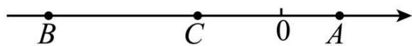

:经过3秒后点C到A点的距离等于点C到B点的距离,

∴点C是AB的中点，AB中点对应的数为 $\frac{-9+3}{2}=-3$ ，

∴点C的运动速度为 $\frac{|-3-0|}{3}=1$ ;

(3) 解: $\because 3 \div 0.5 = 6$ (秒), 点 $A$ 到达原点后立即以原速度向右运动, $A$ 点表示的数为 $3, B$ 点表示 $-9, C$ 表示 $-3$ , $\therefore t > 6$ 时, $A$ 点从原点开始向右运动, $A$ 点表示的数为 $0.5(t - 6) = 0.5t - 3$ , 点 $B$ 在数轴上所表示的数为 $-9 - 2t$ , 点 $C$ 在数轴上所表示的数为 $-3 - t$ ,

$$
\therefore 3 B C - 2 A C = 3 [ (- 3 - t) - (- 9 - 2 t) ] - 2 [ (0. 5 t - 3) - (- 3 - t) ]
$$

$$
\begin{array}{l} = 3 (- 3 - t + 9 + 2 t) - 2 (0. 5 t - 3 + 3 + t) \\ = 3 (6 + t) - 2 \times 1. 5 t \\ = 1 8, \\ \end{array}
$$

∴当t>6时，3BC-2AC的值不会随着t的变化而变化，其值为定值18.