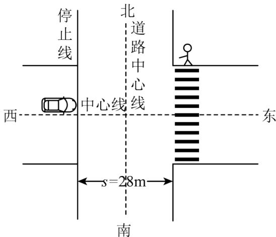
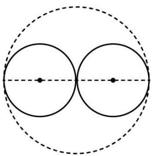
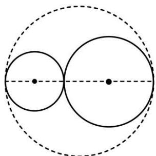
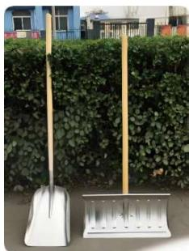
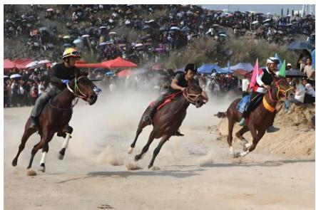

# 专题 04 有理数的应用十大题型（举一反三专项训练）

【北师大版 2024】

# 题型归纳

【题型1 行程问题】....1

【题型 2 计件问题】....4

【题型3 工程问题】 8

【题型 4 销售问题】....12

【题型 5 走向问题】....17

【题型 6 比赛问题】....20

【题型 7 票房问题】....23

【题型 8 游客问题】....27

【题型 9 质量问题】....31

【题型 10 分段收费】....35

# 举一反三

# 【题型1 行程问题】

【例 1】（24-25 七年级下·全国·假期作业）我国古代数学名著《九章算术》中有这样一道题“今有善行者一百步，不善行者六十步．今不善行者先行一百步，善行者追之，问几何步及之？”。这道题的意思是：甲走路快，乙走路慢，两个人在相同时间里，甲走100步，乙走60步．现在乙先走100步，甲随后就追，甲要走多少步才能追上乙？追及问题的数量关系式是：路程差÷速度差=追及时间，所以，甲追上乙需要的时间是： $100 \div (100 - 60) = 100 \div 40 = 2.5$ （个时间单位）在这2.5个时间单位里，甲要走的步数是： $100 \times 2.5 = 250$ （步）甲要走250步才能追上乙．请同学们用你学到的方法解决下面的问题．

哥哥和弟弟去公园参观花展，弟弟每分钟走50米，走了5分钟后，哥哥以每分钟70米的速度去追弟弟，经过多少分钟以后哥哥可以追上弟弟？

【答案】12.5分钟

【分析】本题考查追及问题，求出需要追及的路程是解题的关键．根据速度×时间=路程，据此求出弟弟先走的路程即需要追及的距离，然后根据路程差÷速度差=追及时间，据此计算即可.

【详解】解： $50 \times 5 \div (70 - 50)$

$$
= 2 5 0 \div 2 0
$$

$$
= 1 2. 5 \text {(分钟)}
$$

答：经过12.5分钟以后哥哥可以追上弟弟.

【变式 1-1】（24-25 七年级上·上海·阶段练习）甲乙二人分别从A、B两地同时出发，相向而行．出发时他们的速度比是3:2，他们第一次相遇后，甲的速度提高了20%，乙的速度提高了30%，这样，当甲到达B地时，乙离A地还有14千米，那么A、B两地间的距离是多少千米？

【答案】甲到达B地时，乙离A地还有14千米，那么A、B两地间的距离是45千米.

【分析】本题考查了有理数混合运算的应用，根据题意，列出算式，再根据有理数的运算法则计算即可求解，根据题意，正确列出算式是解题的关键.

【详解】解：相遇时，甲行了全程的 $\frac{3}{3+2}=\frac{3}{5}$ ，乙行了全程的 $\frac{2}{5}$ ，

提速后，甲速:乙速= $\left[3\times(1+20\%)\right]:\left[2\times(1+30\%)\right]=18:13$

则A、B两地相距为： $14\div\left(\frac{3}{5}-\frac{2}{5}\times\frac{13}{18}\right)=14\div\frac{14}{45}=45$ 千米，

答：甲到达B地时，乙离A地还有14千米，那么A、B两地间的距离是45千米.

【变式 1-2】（24-25 七年级下·重庆·自主招生）小明、小红同时从 A 城沿相反方向出发，两人速度相同．上午 9:00，小红迎面与一列长 1200 米的小火车相遇，错开时间为 30 秒；上午 9:30，火车追上小明，并在 40 秒后超过小明，那么火车每秒行多少米？小明和小红出发时间是几点？

【答案】火车每秒行35米，小明和小红出发时间是7:30.

【分析】本题考查的是混合运算的应用，先计算小红与火车的速度和为每秒 $1200 \div 30 = 40$ （米），火车与小明的速度差为每秒 $120 \div 40 = 30$ （米），可得火车的速度为每秒 $(40 + 30) \div 2 = 35$ （米），可得小明，小红的速度为每秒5米，可得上午9:00时，小明，小红之间的距离为： $(35 - 5) \times 60 \times 30 = 54000$ （米），再进一步求解即可.

【详解】解：因为上午 9:00，小红迎面与一列长 1200 米的小火车相遇，错开时间为 30 秒；

所以小红与火车的速度和为每秒 $1200\div30=40$ （米），

因为上午 9:30，火车追上小明，并在 40 秒后超过小明，

所以火车与小明的速度差为每秒 $120\div40=30$ （米），

因为小明、小红同时从 A 城沿相反方向出发，两人速度相同，

所以火车的速度为每秒 $(40+30)\div2=35$ （米），

所以小明，小红的速度为每秒5米，

所以上午 9:00 时，小明，小红之间的距离为：

(35-5)×60×30=54000（米），

所以 $54000\div(5+5)\div60=90$ （分钟），

所以火车每秒行35米，小明和小红出发时间是7：30.

【变式 1-3】（2025 七年级上·重庆·专题练习）“闯黄灯”已成为引发路口交通事故的主因之一。如图所示的十字路口，该路段交通信号灯红灯亮之前，会有3s亮黄灯的时间。某时刻，小车以18km/h的速度沿着中心线行驶到停止线时交通灯恰好变为黄灯，此时人行道的红绿灯也在3s后变成绿灯，行人以1.2m/s的速度过马路。已知马路宽7.2m，停止线到斑马线的距离s=28m，小车的尺寸为：长度L=4.8m，宽度d=2.2m。求：

text_image

停止线
北
道路中心线
西
中心线
东
南
s=28m

(1)行人通过人行横道的时间;

(2)若车闯黄灯，是否会撞到行人；

(3)若人行道处有一长为2m的美团外卖摩托车以2m/s的速度横过马路，则小车速度在什么范围不会撞到摩托车。（不计摩托车宽度，保留两位小数）

【答案】(1)行人通过人行横道的时间为6s

(2)小车不会撞到行人；

(3)小于10m/s或大于46.86m/s

【分析】本题主要考查有理数混合运算的应用，解决本题的关键搞清甲、乙两车相撞的临界情况，抓住时间相等，根据路程关系求出临界速度。

（1）已知路程和时间，利用 $v=\frac{s}{t}$ 求出行人通过人行横道的时间；

(2) 先计算出小车穿过人行道的时间, 再计算出此时行人到中心线时间, 再进行比较即可;

(3) 根据匀速直线运动的求出两种临界情况下小车的速度, 第一种临界为摩托车车头碰到小车车尾; 第二种临界为小车车头碰到摩托车车尾, 根据路程关系, 抓住时间相等, 求出小车的临界速度.

【详解】（1）解：行人通过人行横道的时间： $t_{人}=\frac{s_{人}}{v_{人}}=\frac{7.2m}{1.2m/s}=6s$ ;

(2) 解: 18km/h=5m/s,

$$
(2 8 + 4. 8) \div 5 = 6. 5 6 \mathrm{s},
$$

$$
6. 5 6 - 3 = 3. 5 6 \mathrm{s},
$$

$$
3. 5 6 \times 1. 2 = 4. 2 7 2 \mathrm{m} > \frac {7 . 2}{2} \mathrm{m} = 3. 6 \mathrm{m},
$$

所以，小车不会撞到行人；

（3）解：①摩托车车头碰到小车车尾时， $\left(7.2-\frac{7.2}{2}-2.2\right)\div2=0.7s$

$$
(2 8 + 4. 8) \div 0. 7 \approx 4 6. 8 6 \mathrm{m} / \mathrm{s}
$$

所以小车的速度大于46.86m/s不会撞上摩托车；

②当小车的车头刚好撞上摩托车的车尾，则摩托车行驶的路程为 $\frac{7.2}{2}+2=5.6m$ ,

摩托车行驶的时间为： $5.6 \div 2 = 2.8$ s,

小车的车头刚好撞上摩托车的车尾的速度为： $28\div2.8=10m/s$

所以甲车的速度小于10m/s也不会撞上摩托车；

综上可知，要使小车与摩托不相撞，小车的速度范围是 $v_{小车}<10m/s$ 或 $v_{小车}>46.86m/s$ .

# 【题型2 计件问题】

【例 2】（24-25 六年级上·上海杨浦·期中）某电商公司原计划每月卖出1000件衣服，但由于服装行业存在淡季旺季，每月销售件数不定，为统计该公司前三季度每月实际销售情况，记录表格如下：（单位：件）

<table><tr><td></td><td>1月</td><td>2月</td><td>3月</td><td>4月</td><td>5月</td><td>6月</td><td>7月</td><td>8月</td><td>9月</td></tr><tr><td>件数</td><td>+500</td><td>+200</td><td>-250</td><td>-300</td><td>+280</td><td>+700</td><td>-20</td><td>-350</td><td>-240</td></tr></table>

（注：规定该月实际销售件数多于1000件记为正，反之记为负）.

回答下列问题:

(1)前三季度共卖出多少件衣服？

(2)如果一件衣服利润为50元，那么第二季度比第一季度多赚几分之几？

【答案】(1)9520件;

(2) $\frac{1}{15}.$

【分析】本题主要考查正数和负数，有理数的混合运算的实际应用，熟练掌握以上知识是解题的关键.

（1）根据正数和负数的实际意义列示计算即可.

(2) 根据正数和负数的实际意义列示计算即可.

【详解】（1）解：根据题意可列： $1000 \times 9 + (+500 + 200 - 250 - 300 + 280 + 700 - 20 - 350 - 240)$ ,

∴原式=1000×9+520=9520,   
∴前三季度共卖出9520件衣服，

（2）解：根据题意可得第一季度总利润为： $50 \times (1000 \times 3 + 500 + 200 - 250) = 172500$ （元），

第二季度总利润为： $50 \times (1000 \times 3 + 700 + 280 - 300) = 184000$ （元），

$$
\therefore (1 8 4 0 0 0 - 1 7 2 5 0 0) \div 1 7 2 5 0 0 = \frac {1}{1 5},
$$

∴第二季度比第一季度多赚了： $\frac{1}{15}$ .

【变式 2-1】（24-25 六年级上·黑龙江哈尔滨·期末）一件衬衣售价为 100 元．一条裤子的售价比这件衬衣的售价高50%.

(1)若每件衬衣降价 $20 \%$ 出售，每条裤子提价 $10 \%$ 出售，那么调价前购买这件衬衣和这条裤子与调价后购买这件衬农和这条裤子相差多少钱？  
(2)商场进货时衬衫和裤子各购进若干件, 如果裤子条数不变, 把衬衫件数增加 $\frac{1}{4}$ , 则衬衫和裤子的总数将达到 147 件: 如果衬衫件数不变, 把裤子条数减少 $\frac{1}{4}$ , 则衬衫和裤子的总数将达到 115 件, 求商场购进衬衫和裤子各多少件?

【答案】(1)调价前购买这件衬衣和这条裤子与调价后购买这件衬衣和这条裤子相差5元

(2)商场购进衬衫76件，裤子52件

【分析】本题考查了有理数的混合运算的应用.

（1）先求出调价前裤子的价格，再算出调价后衬衣和裤子的价格，调价前的价格相加减调价后的价格的和即可；  
(2) 先由 $(147 - 115) \div \frac{1}{4}$ 求出衬衫和裤子的总数, 再由 $(147 - 128) \div \frac{1}{4}$ 求出衬衫的件数, 进而可得裤子的件数.

【详解】（1）解：一条裤子的售价为： $100 \times (1 + 50\%) = 150$ （元），

每件衬衣降价20%的价格为： $100 \times (1 - 20\%) = 80$ （元），

每条裤子提价10%的价格为： $150 \times (1 + 10\%) = 165$ （元），

$$
(1 0 0 + 1 5 0) - (8 0 + 1 6 5) = 5 \text {(元)},
$$

答：调价前购买这件衬衣和这条裤子与调价后购买这件衬衣和这条裤子相差5元；

(2) 解: 衬衫+裤子:

$$
\begin{array}{l} (1 4 7 - 1 1 5) \div \frac {1}{4} \\ = 3 2 \div \frac {1}{4} \\ \end{array}
$$

$$
= 1 2 8 (\text { 件 }),
$$

衬衫：

$$
\begin{array}{l} (1 4 7 - 1 2 8) \div \frac {1}{4} \\ = 1 9 \div \frac {1}{4} \\ = 7 6 (\text { 件 }), \\ \end{array}
$$

裤子：128-76=52（件）

答：商场购进衬衫 76 件，裤子 52 件.

【变式 2-2】（23-24 七年级上·北京通州·期末）为了确保能够按时完成农田小麦收割任务，某小麦收割机配件车间需要在一周内完成 2000 件配件的生产任务。该车间接到任务后，计划平均每天加工 400 件，由于各种原因，每天实际加工的件数与每天计划加工的件数相比有出入，把超额或不足的部分分别用正、负数来表示，下表是这周加工这种配件的记录情况：

<table><tr><td>星期</td><td>一</td><td>二</td><td>三</td><td>四</td><td>五</td></tr><tr><td>与每天的计划量相比的差值(单位:件)</td><td>+55</td><td>-20</td><td>-25</td><td>+60</td><td>-50</td></tr></table>

(1)这周共加工了\_件小麦收割机配件.   
(2)这周内加工最多的一天比加工最少的一天多加工了\_件.  
(3)已知该厂对这个车间实行计件工资制, 每加工 1 件得 10 元, 若超额完成任务, 则超额部分每件再奖 5 元;若没有完成任务, 则每少一件倒扣 5 元, 求该车间这周的总收入.

【答案】(1)2020

(2)110 件  
(3)20300 元

【分析】本题考查了有理数混合运算的应用，

（1）用本周的计划加工的总数量加上多加工的数量即可求解；  
（2）用最多的一天比计划多的数量减去最少的一天比计划少的数量即可求解；  
（3）用加工的数量乘以单价，再加上多加工的额外收入即可求解；

准确理解题意是解题的关键.

【详解】（1） $400 \times 5 + 55 - 20 - 25 + 60 - 50 = 2020$ （件），

故答案为：2020;

(2) $+60+|-50|=110$ （件），

故答案为：110;

(3) $2020 \times 10 + (2020 - 400 \times 5) \times 5 = 20300$ (元)

∴该车间这周的总收入为 20300 元.

【变式 2-3】（24-25 七年级上·黑龙江·期末）某服装城用 80000 元购进 2000 件衬衫。由于非常畅销，这些衬衫在 7 天内全部卖完。这 7 天每件衬衫利润变化以及这七天的销售量如下表所示（正数表示比前一天每件多的利润，负数表示比前一天每件少的利润）。

<table><tr><td>销售天数/天</td><td>第一天</td><td>第二天</td><td>第三天</td><td>第四天</td><td>第五天</td><td>第六天</td><td>第七天</td></tr><tr><td>每件利润变化/元</td><td>+10</td><td>+3</td><td>+5</td><td>-4</td><td>-7</td><td>+2</td><td>+5</td></tr><tr><td>每天销售的件数/件</td><td>300</td><td>350</td><td>250</td><td>350</td><td>400</td><td>150</td><td>200</td></tr></table>

(1)每件衬衫的进价为\_\_\_\_元，第四天时，每件衬衫的售价为\_\_\_\_元；

(2)求服装城这七天的总利润;

(3)服装城老板觉得这个商机非常好, 于是花了 176000 元第二次购进这种衬衫, 每件比上一次贵了 4 元. 若按照 (1) 中第七天的售价销售, 衬衫销售很快, 为了回馈广大新老顾客, 最后剩 150 件, 按八折销售很快售完, 求第二次销售衬衫一共盈利的钱数.

【答案】(1)40，54

(2)23900元

(3)38380元

【分析】本题主要考查了有理数的运算的实际应用，理解题意、正确列出算式是解题的关键.

（1）根据“用 80000 元购进 2000 件衬衫”即可求出进价；由表格数据即可求出第四天时，每件衬衫的售价；  
(2) 分别求出每一天每件衬衫的利润即可求解;  
(3) 根据题意可求出进价为 $40 + 4 = 44$ 元, 购进件数为 $176000 \div 44 = 4000$ 件, 结合第七天的售价为 $40 + 14 = 54$ 元即可求解.

【详解】（1）解：由题意得：每件衬衫的进价为80000÷2000=40元，

第四天时，每件衬衫的售价为 $40+10+3+5+4=54$ 元.

故答案为：40，54.

(2) 解: 由表格数据可知:

第一天每件衬衫的利润为 10 元;

第二天每件衬衫的利润为10+3=13元;

第三天每件衬衫的利润为 $10+3+5=18$ 元；

第四天每件衬衫的利润为 $10+3+5-4=14$ 元；

第五天每件衬衫的利润为 $10+3+5-4-7=7$ 元；

第六天每件衬衫的利润为 $10+3+5-4-7+2=9$ 元；

第七天每件衬衫的利润为 $10+3+5-4-7+2+5=14$ 元.

∴这个服装城这七天的总利润为

$$
3 0 0 \times 1 0 + 3 5 0 \times 1 3 + 2 5 0 \times 1 8 + 3 5 0 \times 1 4 + 4 0 0 \times 7 + 1 5 0 \times 9 + 2 0 0 \times 1 4 = 2 3 9 0 0 (\text {元}).
$$

答：服装城这七天的总利润 23900 元.

(3) 解: 由题意, 得此次衬衫的进价为: $40 + 4 = 44$ (元).

购进件数为 $176000 \div 44 = 4000$ （件）.

由（3）得第七天的售价为 $40+14=54$ （元）.

故第二次一共盈利(54-44)×(4000-150)+(54×0.8-44)×150=38380（元）.

# 【题型3 工程问题】

【例 3】（2024 七年级上·全国·专题练习）某开发公司生产若干件某种新产品，需要精加工后才能投放市场，现有甲、乙两个工厂都想加工这批产品。已知甲、乙两个工厂每天分别能加工这种产品 16 件和 24 件，甲单独加工这批产品比乙单独加工这批产品要多用 20 天，且若由甲单独做，公司需付甲每天的加工费用 80 元；若由乙单独做，公司需付乙每天的加工费用 120 元。

(1)设甲单独加工这批新产品要用 x 天，则乙单独加工这批新产品要用 \_\_\_\_ 天；

(2)在（1）的条件下，求这批新产品的件数；

(3)若公司董事会制定了如下方案：可以由每个工厂单独完成，也可以由两个工厂同时合作完成，但在加工过程中，公司需派一名工程师到工厂进行技术指导（若两个工厂同时合作，只需派一名工程师到工厂指导），并由公司为其提供每天10元的午餐补助。请你帮助公司选择一种既省时又省钱的加工方案，并通过计算说明理由。

【答案】(1)(x-20)

(2)这批新产品的件数为 960

(3)两个工厂同时合作完成时，既省时又省钱，见解析

【分析】本题主要考查一元一次方程的应用，关键在于理解清楚题意，找出等量关系列出方程．对于要求最符合要求类型的题目，应将所有方案，列出来求出符合题意的那一个即可.

（1）根据“甲单独加工这批产品比乙单独加工这批产品要多用20天”列式；  
(2) 根据题意找出等量关系: 总产品数相等, 列出方程求解即可.  
(3) 应分为三种情况讨论: ①由甲厂单独加工; ②由乙厂单独加工; ③由两场厂共同加工, 分别比较三种情况下, 所耗时间和花费金额, 求出即省钱, 又省时间的加工方案.

【详解】（1）解：根据题意，得乙单独加工这批新产品要用 $(x-20)$ 天，

故答案为： $(x-20)$ ;

(2) 解: 设甲单独加工这批产品用 $x$ 天,

由题意得， $16x=24(x-20)$ ，

解得： $x = 60$

$16 \times 60 = 960$ （件），

答：这个公司要加工 960 件新产品；

(3) 解: ①由甲厂单独加工: 需要耗时为 $\frac{960}{16} = 60$ (天), 需要费用为: $60 \times (10 + 80) = 5400$ (元);  
②由乙厂单独加工: 需要耗时为 $\frac{960}{24} = 40$ (天), 需要费用为: $40 \times (120 + 10) = 5200$ (元);  
③由两家工厂共同加工：需要耗时为 $\frac{960}{16+24}=24$ （天），需要费用为： $24\times(80+120+10)=5040$ （元）.
因为5040<5200<5400，24<40<60，  
所以，甲、乙合作同时完成时，既省钱又省时间.

【变式 3-1】（2024 七年级下·四川成都·专题练习）(工程问题)有甲、乙两项工作，张师傅单独完成甲工作需要 9 天，单独完成乙工作需要 12 天；王师傅单独完成甲工作需要 3 天，单独完成乙工作需要 15 天．如果两人合作完成这两项工作，最少需要多少天？

【答案】8天

【分析】根据王师傅完成甲工程用的时间少，张师傅完成乙工程用的时间少，故两人合作时，让王师傅先做甲工程，张师傅先做乙工程，再求出王师傅完成甲工程后，两人合作剩余乙工程需要的时间解答即可。本题考查有理数四则混合运算的实际应用，解答本题时要注意，由于两人完成这两项工程时需要的时间不一样，为了减少需要的时间，可以让王师傅先做甲工程，张师傅先做乙工程，王师傅做完甲工程后，两人再一起做乙工程。

【详解】解：由题意可知，王师傅完成甲工程用的时间少，张师傅完成乙工程用的时间少，

∴让王师傅先做甲工程，张师傅先做乙工程，再合作完成乙剩余工程所需时间最少，

∴最少时间为： $3+(1-\frac{1}{12}\times3)\div(\frac{1}{12}+\frac{1}{15})$

$$
\begin{array}{l} = 3 + \left(1 - \frac {1}{4}\right) \div \left(\frac {5}{6 0} + \frac {4}{6 0}\right) \\ = 3 + \frac {3}{4} \div \frac {3}{2 0} \\ = 3 + \frac {3}{4} \times \frac {2 0}{3} \\ = 3 + 5 \\ = 8 \text {(天)}. \\ \end{array}
$$

答：如果两人合作完成这两项工程最少需要8天.

【变式 3-2】（2025 七年级下·四川成都·专题练习）（工程问题）一项工程，甲、乙两队合干需 $2\frac{2}{5}$ 天，需支付工程款 2208 元；乙、丙两队合干需 $3\frac{3}{4}$ 天，需支付工程款 2400 元；甲、丙两队合干需 $2\frac{6}{7}$ 天，需支付工程款 2400 元．如果要求总工程款尽量少应单独选择哪个工程队？

【答案】应选择乙队

【分析】本题考查了有理数混合运算的应用，把工程看作单位“1”，通过这三个条件分别算出三队两两合作的工作效率和工作一天的费用。然后算出甲乙丙三人一起合作的工作效率和工作一天费用，再通过三人合作的工作效率-两两合作的工作效率=单组的工作效率，同理得到单独做每天的费用。

【详解】解：甲乙合作一天完成 $1\div2\frac{2}{5}=\frac{5}{12}$ ，支付 $2208\times\frac{5}{12}=920$ 元

乙丙合作一天完成 $1\div3\frac{3}{4}=\frac{4}{15}$ ，支付 $2400\times\frac{4}{15}=640$ 元

甲丙合作一天完成 $1 \div 2 \frac{6}{7} = \frac{7}{20}$ , 支付 $2400 \times \frac{7}{20} = 840$ 元

三人合作一天完成 $\left(\frac{5}{12}+\frac{4}{15}+\frac{7}{20}\right)\div2=\frac{31}{60}$ ,

三人合作一天支付(920+640+840)÷2=1200元

甲单独做每天完成 $\frac{31}{60}-\frac{4}{15}=\frac{1}{4}$ ，支付1200-640=560元

乙单独做每天完成 $\frac{31}{60}-\frac{7}{20}=\frac{1}{6}$ ，支付1200-840=360元

丙单独做每天完成 $\frac{31}{60}-\frac{5}{12}=\frac{1}{10}$ ，支付1200-920=280元

选择甲来做， $1 \div \frac{1}{4} = 4$ 天完工，需 $560 \times 4 = 2240$ 元

选择乙来做， $1 \div \frac{1}{6} = 6$ 天完工，需 $360 \times 4 = 2160$ 元

选择丙来做， $1\div\frac{1}{10}=10$ 天完工，需 $280\times10=2800$ 元

所以通过比较：应选择乙队

【点睛】本题为工程问题，在计算各队的工作效率时，把总工作量看成单位“1”，单个的队的工作效率可以由三队合作的工作效率—两队合作的工作效率求得.

【变式3-3】某中学原计划修一个半径为10米的圆形花坛，为使花坛修得更加美观，决定向全校征集方案，在众多方案中最后选出两种方案：

方案 A 如图 1 所示，先画一条直径，再分别以两条半径为直径修两个圆形花坛；

方案 B 如图 2 所示，先画一条直径，然后在直径上取一点，把直径分成 2:3 的两部分，再以这两条线段为直径修两个圆形花坛；（花坛指的是图中实线部分）

natural_image

Geometric diagram showing two tangent circles inscribed in a larger circle, with a dashed line passing through the center (no text or labels)

图1

natural_image

Geometric diagram showing two tangent circles inscribed in a larger circle, with no text or labels present.

图2

(1)如果按照方案 A 修，修的花坛的周长是\_\_。（保留 $\pi$ ）

(2)如果按照方案 B 修，与方案 A 比，省材料吗？为什么？（保留 $\pi$ ）

(3)如果按照方案 B 修, 学校要求在 5 天内完成, 甲工人承包了此项工程, 甲每天能完成工程的 $\frac{1}{15}$ , 他做了 1 天后, 发现不能完成任务, 就请乙来帮忙, 乙的速度是甲的 2 倍, 乙加入后, 甲的速度也提高了 $\frac{1}{2}$ , 结果正好按时完成任务, 若修 1 米花坛可得到 10 元钱, 修完花坛后, 甲, 乙各得到多少钱? (π 取 3)

【答案】(1) $20\pi$ 米

(2)不能省材料，理由见解析

(3)甲得到 280 元，乙得到 320 元

【分析】本题考查圆的周长公式，有理数混合运算解决实际问题.

（1）根据圆的周长公式： $C=\pi R$ ，把数据代入公式求此直径是10米的两个圆的周长即可；

（2）求出 B 方案中两个小花坛的直径，再根据圆的周长公式即可两个小花坛的周长之和，与（1）进行比较即可；

(3) 根据甲每天能完成工程的 $\frac{1}{15}$ 可求出甲原来每天的效率, 进而可求出甲总共修花坛的工作量, 进而求出其所得钱数, 同理求出乙总共修花坛的工作量, 进而求出其所得钱数.

【详解】（1）解：∵大圆花坛的半径为10米，则直径为20米，

∴两个小圆花坛的直径为 $20\div2=10$ （米），

∴修两个花坛的周长为 $2\times\pi\times10=20\pi$ （米）.

故答案为： $20\pi$ 米

(2) 解: 不能省材料, 理由如下:

根据 B 方案，两个小圆花坛的直径分别为：

$20\times\frac{2}{2+3}=8$ （米），

$20\times\frac{3}{2+3}=12$ （米），

它们的周长之和为 $\pi\times8+\pi\times2=20\pi$ （米）

∴方案 B 与方案 A 修的花坛的周长相等，

∴按照方案 B 修，与方案 A 比，不能省材料.

（3）解：整项工程为 $20\pi\approx20\times3=60$ （米），

甲原来每天可以修 $60\times\frac{1}{15}=4$ （米），

甲总共修了 $4+\left(1+\frac{1}{2}\right)\times4\times4=4+24=28$ （米），

甲得到的工资为 $10 \times 28 = 280$ （元）；

乙总共修了 $2\times4\times4=32$ （米），

乙得到的工资为 $10 \times 32 = 320$ （元），

答：甲得到 280 元，乙得到 320 元.

# 【题型4 销售问题】

【例 4】（24-25 七年级上·福建南平·期中）某水果超市新进一批樱桃，每斤进价 10 元．为了合理定价，在一周内试行浮动价格，售出时每斤以 15 元为标准，超出 15 元的部分记为正，不足 15 元的部分记为负，超市记录一周内樱桃的售价情况及售出情况如下表所示（该周售完全部樱桃）：

<table><tr><td>星期</td><td>一</td><td>二</td><td>三</td><td>四</td><td>五</td><td>六</td><td>日</td></tr><tr><td>每斤售价与标准售价相比</td><td>■</td><td>-1</td><td>-2</td><td>0</td><td>●</td><td>+2</td><td>-3</td></tr><tr><td>售出斤数(斤)</td><td>10</td><td>20</td><td>15</td><td>10</td><td>10</td><td>5</td><td>20</td></tr></table>

(1)已知星期一每斤的实际售价为 16 元，则■表示的数是\_；已知星期五每斤的实际售价为 11 元，则●表示的

数是\_\_\_\_；星期日每斤的实际售价为\_\_\_\_元.

(2)在（1）的基础上，这一周售完全部樱桃时，该水果超市能赚多少元？

【答案】(1)+1；-4；12

(2)一周售完全部樱桃，该水果超市能赚320元

【分析】本题主要考查了正负数的应用、有理数的混合运算的应用等知识点，掌握相关运算法则成为解题的关键.

（1）直接根据正负数的意义、有理数加减运算即可解答；  
(2) 根据有理数的混合运算求解即可.

【详解】（1）解：∵16-15=1，

∴■表示的数是+1;

$$
\because 1 1 - 1 5 = - 4,
$$

∴■表示的数是-4;

$$
\because 1 5 + (- 3) = 1 2,
$$

∴■表示的数是-4.

故答案为+1；-4；12.

(2) 解: 根据题意得:

$$
\begin{array}{l} 1 \times 1 0 - 1 \times 2 0 - 2 \times 1 5 + 0 \times 1 0 - 4 \times 1 0 + 2 \times 5 - 3 \times 2 0 + (1 5 - 1 0) \times 9 0 \\ = 1 0 - 2 0 - 3 0 - 4 0 + 1 0 - 6 0 + 4 5 0 \\ = 3 2 0 \text {(元)}. \\ \end{array}
$$

答：一周售完全部樱桃，该水果超市能赚 320 元.

【变式 4-1】（24-25 七年级上·山东滨州·期末）随着手机的普及，微信的兴起，许多人做起了“微商”，很多农产品也改变了原来的销售模式，实行了网上销售，刚大学毕业的志强把自家的冬枣产品也放到了网上实行包邮销售，他原计划每天卖 100 斤冬枣，但由于种种原因，实际每天的销售量与计划量相比有出入，如表是某周的销售情况（超额记为正，不足记为负，单位：斤）；

<table><tr><td>星期</td><td>一</td><td>二</td><td>三</td><td>四</td><td>五</td><td>六</td><td>七</td></tr><tr><td>与计划量的差值</td><td>+4</td><td>-3</td><td>-5</td><td>+14</td><td>-8</td><td>+21</td><td>-6</td></tr></table>

(1)根据记录的数据可知销售量最多的一天比销售量最少的一天多销售\_\_\_\_斤；  
(2)本周实际销售总量达到了计划数量没有？并说明理由；

(3)若冬枣每斤按8元出售，每斤冬枣的运费平均1元，那么志强本周一共收入多少元？

【答案】(1)29

(2)达到了，理由见解析

(3)5019

【分析】本题考查了正负数的实际应用，有理数混合运算的应用等知识，读懂题意是关键.

(1) 用表格中最大的数减去最小的数即可;  
(2) 将本周数据加起来, 再与计划进行比较即可;  
（3）根据题意列式计算出志强本周收入即可.

【详解】（1）解：由表格可得：21-(-8)=29（斤），

即销售量最多的一天比销售量最少的一天多销售29斤，

故答案为：29;

(2) 解: 达到了, 理由如下:

实际销售总量：4-3-5+14-8+21-6=17（斤），

∵17>0,

∴本周实际销售总量达到了计划数量.

（3）解： $(8-1)\times(7\times100+17)=7\times717=5019$ （元），

答：志强本周一共收入5019元.

【变式 4-2】（24-25 七年级上·四川南充·期中）南部县是一座历史文化悠久、人口众多的大县，出租车是重要的交通工具，出租车的计价标准为：行程不超过 2 千米收费 5 元，超过 2 千米的部分按每千米 1.5 元收费（不足 1 千米的按 1 千米计算）一出租车公司坐落于南北方向的南铁大道边，驾驶员张师傅从公司出发，在此大道上连续接送 5 批客人，行驶记录如下：（注；一批次的客人指的是一次可坐 1 到 4 位客人，规定向北为正，向南为负，单位：千米）

<table><tr><td>第一批</td><td>第二批</td><td>第三批</td><td>第四批</td><td>第五批</td></tr><tr><td>-3</td><td>+3.8</td><td>+1.7</td><td>-4.3</td><td>+1.4</td></tr></table>

(1)送完第五批客人后，张师傅在公司的\_边（填南或北）距离公司\_千米的位置.

(2)张师傅的车平均每千米消耗压缩天然气 0.09 升，则送完第五批客人后，张师傅用了多少升压缩天然气？

(3)在整个过程中，张师傅共收到车费多少元？

【答案】(1)南，0.4

(2)送完第五批客人后，王师傅用了1.278升压缩天然气  
(3)在整个过程中，张师傅共收到车费34元

【分析】本题主要考查了正数和负数的应用，有理数的混合运算，熟练掌握正负数的作用，绝对值的意义，分段计费，是解答本题的关键.

(1) 将表格中的数据相加, 再根据正负数的意义即可解答:  
(2) 先计算出在整个过程的总路程, 然后乘以每千米消耗压缩天然气 0.09 升, 即可解答:  
(3) 根据表格中的数据是超过 2 千米的分段计费, 取总和, 可以计算出送完第五批客人后, 张师傅共收到的车费.

【详解】（1）解： $-3+3.8+1.7+(-4.3)+1.4=-0.4$ （千米），

即送完第五批客人后，张师傅在公司的南边，距离公司 0.4 千米的位置；

故答案为：南，0.4；

(2) 解: $(|-3|+3.8+1.7+|-4.3|+1.4)\times0.09=1.278$ (升),

∴送完第五批客人后，王师傅用了1.278升压缩天然气；

（3）解：由题可知： $[5 + (3 - 2)\times 1.5] + [5 + (4 - 2)\times 1.5] + 5 + [5 + (5 - 2)\times 1.5] + 5$

$$
\begin{array}{l} = 6. 5 + 8 + 5 + 9. 5 + 5 \\ = 3 4 \text {(元)}, \\ \end{array}
$$

∴在整个过程中，张师傅共收到车费34元.

【变式 4-3】（24-25 六年级下·黑龙江哈尔滨·期中）学校开展“师生同心清积雪，共筑校园安全线”的活动，学校为每个班级购买扫雪工具套装：4 把钢推、2 把大扫帚、2 把铁锹、1 套锁链．铁锹标价每把 20 元，是每把钢推标价的 50%，每把大扫帚标价比每把钢推标价便宜了 $\frac{1}{4}$ ，每套锁链标价与每把大扫帚标价比为 1:2.

natural_image

Two white shovels standing side by side next to a green hedge and a wooden pole, with a building in the background (no visible text or symbols)

(1)每套锁链标价是多少元?   
(2)这所学校有四个学年，其中六、八、九学年班级数相同，七学年比六学年多一个班．六、七、八学年共有37个教学班，按标价计算这所学校购买扫雪工具套装一共用多少元？  
(3)在（2）的条件下购买时，除工具套装费用还需要支付运输费和安装费，学校支付306元运输费；安装费：

钢推每把 1 元、铁锹每把 1 元．出售同品牌、同质量的三家商店分别给出不同优惠方案：

A 商店：需支付运输费和安装费，工具套装按八八折出售；

B 商店：运输费和安装费全免，每卖 4 把钢推送 1 套锁链；

C 商店：需支付运输费和安装费，工具套装不超过 10000 元打九折出售，超过 10000 元的部分八折出售.

聪明的你帮这学校策划一下选择哪一种方案购买更合算？并通过计算说明理由.

【答案】(1)15元

(2)13475 元

(3)选择 C 商店购买更合算

【分析】本题考查有理数混合运算的实际应用.

（1）根据题意直接列式求解即可；  
（2）先求出各学年班级数，进而得到全校的班级数，再计算每个班级购买工具套装的费用，即可求解；  
（3）计算出在各家商店购买的费用，进行比较即可解答.

【详解】（1）解：每把钢推的标价为： $20 \div 50\% = 40$ （元），

每把大扫带的标价为： $40 \times \left(1 - \frac{1}{4}\right) = 30$ （元），

每套锁链的标价为： $30 \times \frac{1}{2} = 15$ （元），

答：每套锁链标价是 15 元.

(2) 解: 六、八、九学年班级数为: $(37-1)\div3=12$ (个)

七学年班级数为： $12+1=13$ （个）

全校的班级数为： $12+13+12+12=49$ （个），

每个班级购买工具套装费用为： $40 \times 4 + 30 \times 2 + 20 \times 2 + 15 = 275$ （元），

全校共花费： $275 \times 49 = 13475$ （元），

答：这所学校购买扫雪工具套装一共用 13475 元.

（3）解：若在 A 商店购买，全部费用为：

$$
3 0 6 + 4 \times 4 9 + 2 \times 4 9 + 1 3 4 7 5 \times 8 8 \% = 1 2 4 5 8 (\text { 元 });
$$

若在 B 商店购买，全部费用为：

$$
(4 0 \times 4 + 3 0 \times 2 + 2 0 \times 2) \times 4 9 = 1 2 7 4 0 (\text {元});
$$

若在 C 商店购买，全部费用为:

$$
306 + 4 \times 49 + 2 \times 49 + 10000 \times 90 \% + (13475 - 10000) \times 80 \% = 12380 (\text {元});
$$

∵12380<12458<12740,

∴选择 C 商店购买更合算.

# 【题型5 走向问题】

【例 5】（24-25 七年级上·贵州黔东南·期末）“最炫民族风，欢乐马拉松”2024 贵州环雷公山马拉松于 11 月 17 日上午 8:00 鸣枪开跑，起点为凯里市的民族风情园，终点为雷山县的铜鼓广场。为了更好地护航本次活动，在前期准备中，各个部门不断调试，其中检修小组从 A 地出发，在东西路上检修线路。如果规定向东行驶为正，向西行驶为负，某一天中行驶记录如下（单位：km）：-2，+7，-3，+4，-8，+6

(1)检修小组最终是否回到 $A$ 地？若没有，在 $A$ 地何方，距 $A$ 地多远？

(2)若每千米耗油0.3升, 当天从出发到收工共耗油多少升? 若汽油价为8.2元/升, 该检修小组该天的油费是多少?

(3)若该检修小组使用新能源汽车, 该新能源汽车每行驶 $100 \mathrm{~km}$ 耗电 12 度, 且使用充电桩充电的价格是每度电 0.5 元, 那么该汽车该天的耗电费用约为多少元? 比使用燃油汽车省多少元?

【答案】(1)检修小组最终没有回到 A 地，在 A 地正东方向4km处

(2)共耗油9升，油费是73.8元

(3)电费为1.8元，比使用燃油汽车省72元

【分析】此题主要考查了正数和负数、有理数的混合运算，正确根据相关知识点进行计算是解题关键.

（1）把所有的行驶记录相加，然后根据正负数的意义解答；

（2）用所有行驶记录的绝对值的和乘以0.3，可得耗油量，再乘以单价可得费用；

(3) 由行驶 $100 \mathrm{~km}$ 求出耗电量, 再乘以单价可得新能源汽车的费用, 再利用油车的费用减去新能源汽车的费用可得答案.

【详解】（1）解： $-2+7+(-3)+4+(-8)+6=4$ ，

答：检修小组最终没有回到 A 地，在 A 地正东方向4km处；

$$
\begin{array}{l} = (2 + 7 + 3 + 4 + 8 + 6) \times 0. 3 \\ = 3 0 \times 0. 3 \\ = 9 \text {(升)}, \\ \end{array}
$$

(2) $\left(|-2|+|+7|+|-3|+|+4|+|-8|+|+6|\right)\times0.3$

$$
9 \times 8. 2 = 7 3. 8 (\text {元}),
$$

答：当天从出发到收工共耗油9升，油费是73.8元；

(3) $\left(|-2|+|+7|+|-3|+|+4|+|-8|+|+6|\right)\times\frac{12}{100}\times0.5=1.8$ （元），

73.8-1.8=72（元），

答：若使用新能源汽车，电费为1.8元，比使用燃油汽车省72元.

【变式 5-1】（24-25 七年级上·云南文山·期末）为了有效控制酒后驾驶，文山交警骑车在一条东西方向的公路上巡逻，规定向东为正方向，向西为负方向，从A地出发所走的路程为（单位：千米）：

+12, -10, +5, -9, +8, -8, +6, -7.

(1)请你帮忙确定交警最后所在地在A地的什么方向？距离A地有多远？

(2)若骑车每千米耗油0.05升，如果队长命令他马上返回到出发点，则该交警此次骑车巡逻（含返回路程）共耗油多少升？

【答案】(1)交警最后所在地在A地的西边，距离A地3米

(2)3.4升

【分析】（1）根据正负数的意义及有理数的加法解答即可求解；

(2) 利用绝对值的意义求出总路程, 再乘以每千米耗油即可求解;

本题考查了正负数的实际应用，有理数加法和混合运算的实际应用，绝对值的意义，根据题意正确列出算式是解题的关键.

【详解】（1）解：+12-10+5-9+8-8+6-7=-3米，

∴交警最后所在地在A地的西边，距离A地3米；

（2）解： $\left(|+12|+|-10|+|+5|+|-9|+|+8|+|-8|+|+6|+|-7|+|-3|\right)\times0.05=68\times0.05=3.4,$

答：该交警此次骑车巡逻（含返回路程）共耗油3.4升.

【变式 5-2】（22-23 七年级上·江西新余·期中）在东西走向的绿道上有一个岗亭，小明从岗亭出发以13km/h的速度沿绿道巡逻。规定向东巡逻为正，向西巡逻为负，巡逻情况记录（单位：km）如下表：

<table><tr><td>第一次</td><td>第二次</td><td>第三次</td><td>第四次</td><td>第五次</td><td>第六次</td><td>第七次</td></tr><tr><td>+4</td><td>-5</td><td>+3</td><td>-4</td><td>-3</td><td>+6</td><td>-1</td></tr></table>

(1)第四次巡逻结束时，小明在岗亭的哪一边？

(2)小明巡逻共用时多少小时？

【答案】(1)第四次巡逻结束时，小明在岗亭的西边

(2)小明巡逻共用时 2 小时

【分析】（1）把前面四次巡逻记录相加，根据和的情况即可判断小明在岗亭的哪一边；

（2）求出所有记录的绝对值的和，再除以小明的速度13km/h，计算即可得解.

【详解】（1）解： $+4+(-5)+(+3)+(-4)$

$$
= - 2 <   0,
$$

所以第四次巡逻结束时，小明在岗亭的西边.

（2）解： $|+4|+|-5|+|+3|+|-4|+|-3|+|+6|+|-1|$

$$
= 4 + 5 + 3 + 4 + 3 + 6 + 1
$$

$$
= 2 6 (\mathrm{km}),
$$

$26\div13=2$ （小时），

答：小明巡逻共用时 2 小时.

【点睛】本题考查了正数和负数的应用，有理数加减混合运算的应用，除法的应用，绝对值的应用，正确列出算式是解答本题的关键.

【变式 5-3】（24-25 七年级上·安徽合肥·期末）我市出租车司机王师傅 2024 年 9 月 8 日上午从 A 地出发，在南北方向的公路上行驶营运，下表是每次行驶的里程（单位：公里）（规定向南走为正，向北走为负；0 表示空载，M 表示载有乘客，且乘客数不多于 4 人都不相同）：

<table><tr><td>次数</td><td>第1次</td><td>第2次</td><td>第3次</td><td>第4次</td><td>第5次</td><td>第6次</td></tr><tr><td>里程</td><td>-13</td><td>-16</td><td>+4</td><td>+21</td><td>-10</td><td>+16</td></tr><tr><td>载客</td><td>M</td><td>M</td><td>0</td><td>M</td><td>M</td><td>M</td></tr></table>

(1)已知出租车每公里耗油约0.08立方米，王师傅开始营运前油箱里有12立方米天然气，若少于5立方米，则需要添加天然气，请通过计算说明王师傅这天上午6次里程中途是否需要添加天然气.

(2)已知载客时 3 公里以内（含 3 公里）收费 10 元，超过 3 公里后每公里收费 2 元，问王师傅这天上午走完 6 次里程后的营业总额为多少元？

【答案】(1)王师傅这天上午中途不需要加油

(2)王师傅这天上午走完6次里程后的营业总额为172元

【分析】本题考查正负数的应用、有理数的混合运算的应用，掌握绝对值的计算方法是解决问题的关键.

（1）先求出总里程，然后求得所耗油量，再根据耗油量和油箱内油量情况进行判断；

(2) 求出载客超过 3 公里后的收费然后在加上起步的价格, 求和即可.

【详解】（1）解： $|-13|+|-16|+|+4|+|+21|+|-10|+|+16|=80$ 公里，

$$
1 2 - 8 0 \times 0. 0 8 = 5. 6 > 5,
$$

∴王师傅这天上午中途不需要加油；

$$
\begin{array}{l} = 5 0 + (2 0 + 2 6 + 3 6 + 1 4 + 2 6) \\ = 1 7 2 \text {   元   }, \\ \end{array}
$$

（2）解： $10 \times 5 + [(13 - 3) \times 2 + (16 - 3) \times 2 + (21 - 3) \times 2 + (10 - 3) \times 2 + (16 - 3) \times 2]$

即王师傅这天上午走完6次里程后的营业总额为172元.

# 【题型6 比赛问题】

【例 6】（24-25 七年级上·福建泉州·期末）为增强学生身体素质，激发学生体育锻炼热情，某校组织全校每个班级各派 10 位同学代表班级参加团体跳绳比赛活动，以 1 分钟跳 180 次作为标准，超过的部分记为正数，不足的部分记为负数．七年级 3 班参赛学生的 1 分钟跳绳次数记录如下（单位：次）：

$$
- 2 4, + 1 5, + 3, 0, - 1 2, + 8, - 8, - 4, + 5, - 3
$$

(1)求七年级3班参赛学生平均每人1分钟跳绳的次数;  
(2)本次活动成绩采取积分制，跳绳次数超过标准1次记“+2”分，跳绳次数不足标准1次记“-1”分，刚好达到标准次数记“0”分．例如：1分钟跳绳182次记“+4”分，175次记“-5”分．学校将对总积分前六名的班级进行奖励，请计算七年级3班此次团体跳绳比赛的总积分.

【答案】(1)178

(2)11

【分析】本题考查正数和负数的实际应用，有理数的混合运算，掌握平均数的计算方法以及有理数混合运算法则是正确解答的关键.

（1）根据平均数的计算方法进行计算即可；  
(2) 根据积分规则计算得分即可.

【详解】（1）解： $\frac{1}{10}\times\left[180\times10+(-24+15+3+0-12+8-4+5-3)\right]$

$$
= \frac {1}{1 0} \times 1 7 8 0
$$

$$
= 1 7 8 \text {(次)}
$$

答：七年级 3 班参赛学生平均每人 1 分钟跳绳的次数为 178 个

(2) 解: $(15+3+8+5)\times2+(24+12+8+4+3)\times(-1)$

$$
= 3 1 \times 2 + 5 1 \times (- 1)
$$

$$
= 6 2 - 5 1
$$

$$
= 1 1 \text {(分)}
$$

答：七年级 3 班此次团体跳绳比赛的总积分为 11 分.

【变式 6-1】（24-25 七年级上·河北石家庄·阶段练习）在某校趣味运动会中，七年级组织举行了拔河比赛，比赛规定：中间标志物向某队移动2m及以上即可获胜．七（1）班和七（4）班对决时，中间的标志物6次移动如下所示（其中向七（1）班方向移动记为正，单位：m）：+0.5，-0.8，-0.4，+1.5，-0.3，+1.1．

(1)经过 6 次移动后，目前两个班级谁获胜可能性比较大？

(2)若七（1）班想要获胜，求第7次移动至少要向七（1）班方向移动的距离.

【答案】(1)七（1）的获胜机会较大.

(2)0.4m

【分析】本题考查的是正负数的实际应用，有理数的加减混合运算的实际应用；

（1）先把移动距离相加，再根据结果作出判断即可；

（2）结合（1）的结果与中间标志物向某队移动 $2 \mathrm{~m}$ 及以上即可获胜，再列式计算即可.

【详解】（1）解： $(+0.5)+(-0.8)+(-0.4)+(+1.5)+(-0.3)+(+1.1)=+1.6(m)$ ,

∴此时七（1）班没有获胜，但是七（1）的获胜机会较大.

(2) 解: 七 (1) 班想要获胜, 第七次至少向七 (1) 班移动 $2 - 1.6 = 0.4(\mathrm{~m})$ .

【变式 6-2】（24-25 七年级上·福建厦门·期末）厦门某中学为增强学生身体素质，增加校园体育文化氛围，举行师生踢毽子比赛，七年级（1）班 42 人参加比赛，预赛成绩统计如下（踢毽子标准数量为 20 个）

<table><tr><td>踢毽子个数与标准数量的差值</td><td>-11</td><td>-6</td><td>0</td><td>8</td><td>10</td><td>15</td></tr><tr><td>人数</td><td>4</td><td>10</td><td>10</td><td>6</td><td>8</td><td>4</td></tr></table>

(1)求七年级（1）班42人平均每人踢毽子多少个？

(2)规定踢毽子达到标准数量记0分；踢毽子超过标准数量，每多踢1个加2分；踢毽子未达到标准数量，每少踢1个，扣1分．若班级总分数达到270分可进入决赛，请通过计算判断七年级（1）班能否进入决赛.

【答案】(1)七年级（1）班42人平均每人踢毽子22个

(2)七年级（1）班能进入决赛

【分析】本题主要考查有理数四则混合运算、正数负数的应用等知识点，根据题意正确列出算式是解题的关键.

（1）先根据题意先求出超过标准的数量，然后求出全班总得踢建子个数除以总人数就是平均每人踢建子个数；

(2) 根据规定踢建子个数超过标准数量, 每多踢 1 个加 2 分; 每少踢 1 个, 扣 1 分列出算式计算, 最后与

270 分比较即可解答.

$$
\begin{array}{l} = - 4 4 - 6 0 + 4 8 + 8 0 + 6 0 \\ = 8 4 \text {(个)}, \\ 2 0 + 8 4 \div 4 2 \\ = 2 0 + 2 \\ = 2 2 \text {(个)}. \\ \end{array}
$$

【详解】（1）解： $-11\times4-6\times10+8\times6+10\times8+15\times4$

答：七年级（1）班42人平均每人踢毽子22个；

$$
\begin{array}{l} = - 1 0 4 + 1 8 8 \times 2 \\ = - 1 0 4 + 3 7 6 \\ = 2 7 2, \\ \because 2 7 2 > 2 7 0, \\ \end{array}
$$

(2) $-11 \times 4 - 6 \times 10 + (8 \times 6 + 10 \times 8 + 15 \times 4) \times 2$

∴七年级（1）班能进入决赛.

【变式 6-3】如表为某篮球比赛过程中部分球队的积分榜（篮球比赛没有平局）.

<table><tr><td>球队</td><td>比赛场次</td><td>胜场</td><td>负场</td><td>积分</td></tr><tr><td>A</td><td>12</td><td>10</td><td>2</td><td>22</td></tr><tr><td>B</td><td>12</td><td>9</td><td>3</td><td>21</td></tr><tr><td>C</td><td>12</td><td>7</td><td>5</td><td>19</td></tr><tr><td>D</td><td>11</td><td>6</td><td>5</td><td>17</td></tr><tr><td>E</td><td>11</td><td>...</td><td>...</td><td>13</td></tr></table>

(1)观察积分榜，请直接写出球队胜一场积分，负一场积分；

(2)根据积分规则，请求出 E 队已经进行了 11 场比赛中胜、负各多少场？

(3)若此次篮球比赛共17轮（每个球队各有17场比赛），D队希望最终积分达到30分，你认为有可能实现吗？请说明理由.

【答案】(1)2; 1

(2)胜 2 场，负 9 场

(3)不可能实现，理由见解析

【分析】本题考查了一元一次方程的应用，理解题意，找准等量关系列出一元一次方程是解题的关键.

（1）观察 C 队和 D 队积分，即可解答；

（2）设 E 队胜 x 场，利用 E 队的积分是 13 分，得到等量关系，再列出方程求出 x 的值，即可解答；

（3）由题意得，D 队还有 6 场比赛，假设 D 队剩下 6 场全胜，算出最终积分，再与 30 分比较大小，即可得出结论.

【详解】（1）解：观察 C 队和 D 队积分可知，球队胜一场积 19-17=2 分，

∴负一场积 $(19-7\times2)\div5=1$ 分，

∴球队胜一场积2分，负一场积1分.

故答案为：2；1.

（2）解：设 E 队胜 x 场，则负 $(11-x)$ 场，

由题意得， $2x+(11-x)=13$ ，

解得：x=2，

$$
\therefore 1 1 - x = 1 1 - 2 = 9,
$$

答：E 队已经进行了 11 场比赛中胜 2 场，负 9 场.

（3）解：不可能实现，理由如下：

∵每个球队各有17场比赛，D队已经进行了11场比赛，

$\therefore D$ 队还有17-11=6场比赛，

假设 D 队剩下 6 场全胜，则最终积分= $17+2\times6=29$ ，

又∵29<30,

$\therefore D$ 队不可能实现最终积分达到 30 分.

# 【题型7 票房问题】

【例 7】（24-25 七年级上·山西忻州·阶段练习）电影《我和我的家乡》在今年十一黄金周上映．影片上映8天就斩获票房18亿元人民币，口碑票房实现双丰收．据统计，10月8日，该电影在重庆的票房收人为140万元接下来7天的票房变化情况如下表（正数表示比前一天增加的票房，负数表示比前一天减少的票房）：

<table><tr><td>日期</td><td>9日</td><td>10日</td><td>11日</td><td>12日</td><td>13日</td><td>14日</td><td>15日</td></tr><tr><td>票房变化(万元)</td><td>+38</td><td>-10</td><td>0</td><td>+40</td><td>-38</td><td>-76</td><td>+5</td></tr></table>

(1)这7天中，票房收入最多的是10月\_\_\_\_日，票房收入最少的是10月\_\_\_\_日；

(2)根据上述数据，求这7天该电影在重庆的平均票房收入为多少万元？

【答案】(1)12，14

(2)这 7 天该电影在重庆的平均票房收入为 155 万元

【分析】本题考查有理数的意义，正数、负数的意义，以及平均数的计算方法，明确正数、负数所表示的意义是正确解答的关键.

（1）分别求出每一天的票房收入，比较得出答案；  
（2）利用平均数的计算方法，求出这7天的总收入，除以总天数即可.

【详解】（1）解：10月9日票房收入： $140+38=178$ （万元），

10月10日票房收入：178-10=168（万元），

10月11日票房收入： $168+0=168$ （万元），

10月12日票房收入：168+40=208（万元），

10月13日票房收入：208-38=170（万元），

10月14日票房收入：170-76=94（万元），

10月15日票房收入：94+5=99（万元），

因此 10 月 12 日最多，10 月 14 日最少，

故答案为：12，14.

(2) 解: $(178+168+168+208+170+94+99)\div7=155$ (万元)

答：这 7 天该电影在重庆的平均票房收入为 155 万元.

【变式 7-1】（23-24 七年级下·四川内江·开学考试）电影《流浪地球 2》成为了今年春节期间影迷观影的首选．某市今年春节期间该电影的售票量（单位，万张）变化如下表（以1.1万张为标准，超过的张数记为正，不足的张数记为负）：

<table><tr><td>日期</td><td>正月初一</td><td>正月初二</td><td>正月初三</td><td>正月初四</td><td>正月初五</td><td>正月初六</td><td>正月初七</td></tr><tr><td>售票量变化</td><td>+0.5</td><td>+0.1</td><td>-0.3</td><td>-0.2</td><td>+0.4</td><td>-0.2</td><td>+0.1</td></tr></table>

请根据以上信息，回答下列问题：

(1)求该市正月初一到初七售票量最多的一天与最少的一天相差多少万张?

(2)求该市正月初一到初七每天的平均售票量是多少万张?

(3)若平均每张票价为45元，则正月初一到初七该市《流浪地球2》的票房收入共多少万元？

【答案】(1)0.8万张

(2)1.16万张   
(3)364.5万元

【分析】本题考查了有理数加减混合运算，有理数四则混合运算的实际应用，正确列出算式是解题的关键.

（1）根据表格中的数据列出算式进行计算即可；  
(2) 根据平均数的计算方法, 列出算式进行计算即可;  
（3）根据平均每张票价为 45 元，列出算式进行计算即可.

【详解】（1）解： $+0.5-(-0.3)=0.5+0.3=0.8$ （万张），

答：最多的一天与最少的一天相差0.8万张；

(2) 解: 该市正月初一到初七每天的平均售票量为:

$1.1+(+0.5+0.1-0.3-0.2+0.4-0.2+0.1)\div7\approx1.16$ （万张）；

答：正月初一到初七每天的平均售票量是1.16万张；

（3）解： $\left[1.1\times7+(+0.5+0.1-0.3-0.2+0.4-0.2+0.1)\right]\times45$

$$
= (7. 7 + 0. 4) \times 4 5
$$

$$
= 8. 1 \times 4 5
$$

$$
= 3 6 4. 5 \text {(万元)}.
$$

答：正月初一到初七该市《流浪地球2》的票房收入共364.5万元.

【变式 7-2】（23-24 七年级上·浙江宁波·期中）今年国庆档，陈凯歌导演的《志愿军：雄兵出击》生动展现抗美援朝精神，凝聚起昂扬向上的精神力量。已知某市 9 月 30 日该电影的售票量为 1.5 万张，10 月 1 日到 10 月 7 日售票量的变化如下表（正号表示售票量比前一天多，负号表示售票量比前一天少）：

<table><tr><td>日期</td><td>1日</td><td>2日</td><td>3日</td><td>4日</td><td>5日</td><td>6日</td><td>7日</td></tr><tr><td>售票量的变化(单位:万张)</td><td>+0.6</td><td>+0.1</td><td>-0.3</td><td>-0.2</td><td>+0.4</td><td>-0.2</td><td>+0.1</td></tr></table>

请根据以上信息，回答下列问题：

(1)10月2日的售票量为多少万张?  
(2)10月1日到10月7日售票量最多的是哪一天?  
(3)若平均每张票价为40元，则10月1日到10月7日期间某市《志愿军：雄兵出击》的票房收入多少万元？

【答案】(1)2.2 万张

(2)10月2日  
(3)556 万元

【分析】本题考查了正数和负数以及有理数的混合运算，掌握正数和负数是表示相反意义的量是解答本题的关键.

（1）用 9 月 30 日该电影的售票量加上表格中 1 日的数据再加上表格中 2 日的数据即可得出结论.  
(2) 根据表格得出一日到七日每天的售票量再比较即可.  
（3）根据表格得出一日到七日每天的人数相加后再乘以 40 即可得到结果.

【详解】（1）解： $1.5+0.6+0.1=2.2$ （万张）

答：10月2日的售票量为2.2万张；

(2) 10月1日的售票量为: $1.5 + 0.6 = 2.1$ (万张)

10月2日的售票量为： $2.1+0.1=2.2$ （万张）

10月3日的售票量为：2.2-0.3=1.9（万张）

10月4日的售票量为：1.9-0.2=1.7（万张）

10月5日的售票量为： $1.7+0.4=2.1$ （万张）

10月6日的售票量为：2.1-0.2=1.9（万张）

10月7日的售票量为： $1.9+0.1=2$ （万张）

所以售票量多的是 10 月 2 日这一天.

(3) $40 \times (2.1 + 2.2 + 1.9 + 1.7 + 2.1 + 1.9 + 2) = 40 \times 13.9 = 556$ (万元)

答：10月1日至7日某市《志愿军：雄兵出击》票房收入556万元.

【变式 7-3】（24-25 七年级上·浙江台州·期末）自 2014 年至 2024 年（除 2020 年外），《熊出没》系列电影每年均安排在春节档，至今已上映了十部．下表将这十部《熊出没》的电影票房与当年动画票房冠军的票房作比较：

<table><tr><td>年份</td><td>2014</td><td>2015</td><td>2016</td><td>2017</td><td>2018</td><td>2019</td><td>2021</td><td>2022</td><td>2023</td><td>2024</td></tr><tr><td>《熊出没》的票房</td><td>2.5</td><td>a</td><td>2.9</td><td>5.2</td><td>6.1</td><td>7.2</td><td>6.0</td><td>10.0</td><td>15.0</td><td>20.1</td></tr><tr><td>动画票房冠军的票房</td><td>2.5</td><td>10.0</td><td>15.3</td><td>b</td><td>6.1</td><td>50.4</td><td>6.0</td><td>10.0</td><td>15.0</td><td>20.1</td></tr><tr><td>票房差</td><td>0</td><td>-6.6</td><td>-12.4</td><td>-7.1</td><td>0</td><td>-43.2</td><td>0</td><td>c</td><td>0</td><td>0</td></tr></table>

注：票房单位均为“亿元”，票房差指《熊出没》的电影票房与当年动画票房冠军的票房之差.

(1)上表中a=\_\_\_\_，b=\_\_\_\_，c=\_\_\_\_；

(2)《熊出没》系列电影最高票房出现在哪一年？并指出《熊出没》系列电影夺得当年动画票房冠军的所有年份；

(3)据统计这十部《熊出没》电影总票房为78.4亿元，求这十年动画票房冠军的总票房.

【答案】(1)3.4；12.3；0

(2)熊出没》系列电影最高票房出现在 2024 年，《熊出没》系列电影夺得当年动画票房冠军的所有年份有 2014 年，2018 年，2021 年，2022 年，2023 年，2024 年

(3)147.7亿元

【分析】本题主要考查了正负数的实际应用，有理数减法的实际应用：

（1）根据票房差等于对应年份《熊出没》的票房减去对应年份动画票房冠军的票房列式计算即可；  
(2) 根据表格可得 2024 年为熊出没》系列电影最高票房的年份, 票房差为 0 的年份即为《熊出没》系列电影夺得当年动画票房冠军的年份;  
（3）用这十部《熊出没》电影总票房加上所有票房差的绝对值即可得到答案.

【详解】（1）解：由题意得，a-10.0=-6.6，5.2-b=-7.1，c=10.0-10.0=0，

$$
\therefore a = 3. 4, \quad b = 1 2. 3, \quad c = 0;
$$

(2) 解: 由表格中的数据可知, 《熊出没》系列电影最高票房出现在 2024 年, 《熊出没》系列电影夺得当年动画票房冠军的所有年份有 2014 年, 2018 年, 2021 年, 2022 年, 2023 年, 2024 年;

（3）解： $78.4+|-6.6|+|-12.4|+|-7.1|+|-43.2|=147.7$ 亿元，

∴这十年动画票房冠军的总票房为147.7亿元。

# 【题型8 游客问题】

【例 8】（24-25 七年级上·广东汕头·期中）“十一”期间，某风景区在 7 天中每天游客的人数变化如下表（正数表示比前一天多的人数，负数表示比前一天少的人数），若 9 月 30 日的游客人数为 1 万人，进园的人均消费为 200 元.

<table><tr><td>日期(10月)</td><td>1日</td><td>2日</td><td>3日</td><td>4日</td><td>5日</td><td>6日</td><td>7日</td></tr><tr><td>人数变化单位:万人</td><td>+0.8</td><td>+0.7</td><td>+0.5</td><td>-0.3</td><td>-0.9</td><td>+0.3</td><td>-1.2</td></tr></table>

(1)10月4日的游客人数为\_\_\_\_万人;   
(2)七天内游客人数最多的是10月\_\_\_\_日，游客人数为\_\_\_\_万人；  
(3)此风景区一方面给广大市民提供一个休闲游玩的好去处；另一方面拉动了内需，促进了消费。请帮该景区计算“十一”期间所有游园人员在此风景区的总消费是多少万元？

【答案】(1)2.7

(2)3, 3

(3)2960 万元

【分析】本题考查正负数的实际应用，有理数混合运算的应用：

（1）根据所给数据列加减算式计算可得答案；  
(2) 求出 7 天中每天的游客人数, 比较大小即可;  
（3）将 7 天游客人数相加，乘以 200 即可.

【详解】（1）解：10月4日的游客人数为： $1+0.8+0.7+0.5-0.3=2.7$ （万人），

故答案为：2.7;

(2) 解: 由题意知,

10月1日的游客人数为： $1+0.8=1.8$ （万人），  
10月2日的游客人数为： $1.8+0.7=2.5$ （万人），  
10月3日的游客人数为： $2.5+0.5=3$ （万人），  
10月4日的游客人数为：3-0.3=2.7（万人），  
10月5日的游客人数为：2.7-0.9=1.8（万人），  
10月6日的游客人数为： $1.8+0.3=2.1$ （万人），  
10月7日的游客人数为：2.1-1.2=0.9（万人），

由3>2.7>2.5>2.1>1.8>0.9,

可知七天内游客人数最多的是 10 月 3 日，游客人数为 3 万人，

故答案为：3，3；

(3) 解: 由 (2) 可知, “十一”期间所有游客数量为:

$1.8+2.5+3+2.7+1.8+2.1+0.9=14.8$ （万人），

$14.8 \times 200 = 2960$ （万元），

答：“十一”期间所有游园人员在此风景区的总消费是2960万元.

【变式 8-1】（24-25 七年级上·贵州黔南·期末）2024 年 7 月至 10 月，由三都县组织开展的“贵州村马”水族端节全国赛马邀请赛，吸引了全国各地的众多游客．据统计，9 月 30 日到三都县的游客人数约为 2 万人．国庆节期间到三都县的游客人数变化情况如下表（正数表示比前一天多的人数，负数表示比前一天少的人数）：

<table><tr><td>日期</td><td>1日</td><td>2日</td><td>3日</td><td>4日</td><td>5日</td><td>6日</td><td>7日</td></tr><tr><td>人数变化情况/万人</td><td>+7</td><td>+1</td><td>-4</td><td>-1</td><td>+2</td><td>-2</td><td>-3</td></tr></table>

natural_image

Horse racing on a dirt track with spectators watching from behind (no visible text or symbols)

(1)10月1日至7日这七天中，到三都县的游客人数最多的是10月\_日.

(2)若一万游客可带来经济收入约600万元，则10月4日这天游客带来的经济收入约多少万元？

【答案】(1)2

(2)3000 万元

【分析】本题主要考查了有理数混合运算的应用，解决本题的关键是能正确理解题意并通过正数和负数的意义得出每一天的游客人数.

（1）根据表格中的数据分别求出 10 月 1 日至 7 日这七天中，每天的游客人数即可得出答案；

（2）根据 10 月 4 日这天的游客人数，再乘以 600 万元即可求解.

【详解】（1）解：根据题意得：10月1日至10月7日每天的游客人数分别为：

$2+7=9$ 万人；

$9+1=10$ 万人；

10-4=6万；

6-1=5万人;

$5+2=7$ 万人；

7-2=5万人;

5-3=2万人;

∴10月1日至7日这七天中，到三都县的游客人数最多的是10月2日；

(2) 解: 根据解析 (1) 可知: 10 月 4 日这天的游客人数为 5 万人,

∴10月4日这天游客带来的经济收入约为：5×600=3000（万元）.

【变式 8-2】（24-25 七年级上·安徽蚌埠·期中）在国庆节的七天长假中，某风景区 10 月 1 日的旅游人数为 6 万人，后面的六天与 10 月 1 日相比每天旅游人数变化如下表：（正数表示人数增加）

<table><tr><td>日期</td><td>2日</td><td>3日</td><td>4日</td><td>5日</td><td>6日</td><td>7日</td></tr><tr><td>人数变化(单位:万人)</td><td>+0.6</td><td>-0.4</td><td>-0.3</td><td>+0.3</td><td>+0.1</td><td>+0.1</td></tr></table>

(1)七天长假中游客人数最多的一天比最少的一天多几万人?

(2)据测算, 平均每位游客为风景区带来的旅游收入约为 200 元, 则该风景区在这七天假期的旅游总收入约为多少元? (结果用科学记数法表示)

【答案】(1)七天长假中游客人数最多的一天比最少的一天多1万人

(2)该风景区在这七天假期的旅游总收入约为 $8.48\times10^{7}$ 元.

【分析】本题主要考查了有理数的四则混合计算的实际应用，有理数减法的实际应用，科学记数法，正负数的实际应用：

(1) 用表格中人数变化最大的数减去最小的数即可得到答案;  
（2）先求出这七天的旅游总人数，再求出旅游总收入即可得到答案.

【详解】（1）解： $0.6-(-0.4)=0.6+0.4=1$ 万人，

答：七天长假中游客人数最多的一天比最少的一天多 1 万人；

$$
\begin{array}{l} = 2 0 0 0 0 0 0 \times (4 2 + 0. 4) \\ = 8 4 8 0 0 0 0 0 \\ = 8. 4 8 \times 1 0 ^ {7} \text {   元   }, \\ \end{array}
$$

（2）解： $200 \times 10000 \times [6 \times 7 + (0.6 - 0.4 - 0.3 + 0.3 + 0.1 + 0.1)]$

答：该风景区在这七天假期的旅游总收入约为 $8.48\times10^{7}$ 元.

【变式 8-3】（24-25 七年级上·河南·阶段练习）2024 年国庆节期间，林州市的石板岩小镇，因其依山傍水、露水河穿镇而过，石头建筑颇具地方特色而游人如织。石板岩小镇 9 月 30 日接待的游客人数为 0.5 万人，接下来的七天中，每天接待的游客人数变化如下表（正数表示比前一天多的人数，负数表示比前一天少的人数）。

<table><tr><td>日期</td><td>10月1日</td><td>10月2日</td><td>10月3日</td><td>10月4日</td><td>10月5日</td><td>10月6日</td><td>10月7日</td></tr><tr><td>人数变化(万人)</td><td>+2.8</td><td>+0.1</td><td>+0.2</td><td>-0.3</td><td>-0.3</td><td>-0.8</td><td>-1.5</td></tr></table>

(1)这七天假期里，游客人数最多的是 10 月\_\_\_\_日，达到了\_\_\_\_万人。游客人数超过 3.1 万人的有\_\_\_\_天：

(2)这七天假期里，石板岩小镇平均每天大约接待多少万游客？（结果精确到百分位）

【答案】(1)3；3.6；4

(2)2.79 万

【分析】本题主要考查了有理数的加减法的实际应用，有理数四则混合运算的应用，求一个数的近似数：

（1）分别计算每天的游客数量即可得到答案；

（3）把（2）中每天的游客量相加，求平均数即可求解.

【详解】（1）解： $0.5+2.8=3.3$ （万）

$3.3+0.1=3.4$ （万），

$3.4+0.2=3.6$ （万），

3.6-0.3=3.3（万），

3.3-0.3=3（万）

3-0.8=2.2（万），

2.2-1.5=0.7（万）.

由以上可知，这七天假期里，游客人数最多的是 10 月 3 日，达到了 3.6 万人．游客人数超过 3.1 万人的有 4 天：

故答案为：3；3.6；4

(2) $(3.3+3.4+3.6+3.3+3+2.2+0.7)\div7\approx2.79$ （万）.

答：石板岩小镇这七天平均每天大约接待 2.79 万游客.

# 【题型9 质量问题】

【例 9】（24-25 六年级下·黑龙江哈尔滨·期中）妈妈在超市买了一袋面粉，发现包装袋上有这样一段字样：“净重：800±5g”.

(1)这段文字表示这袋面粉的重量在\_\_\_\_g和\_\_\_\_g之间.  
(2)在一次检测中，检验员从一个包装箱中任取了5袋有上述字样的面粉，记录劈如下：

<table><tr><td>袋号</td><td>1</td><td>2</td><td>3</td><td>4</td><td>5</td></tr><tr><td>质量/g</td><td>803</td><td>798</td><td>800</td><td>794</td><td>805</td></tr></table>

请你结合（1）和上表中的数据，以800g为标准，超出标准记为正，不足800g的记为负，用正、负数表示出这5袋面粉的质量，并判断这5袋面粉中不合格的有\_\_\_\_袋.

【答案】(1)795，805

(2)袋1-5分别标记为：+3g，-2g，+0g，-6g，+5g，1.

【分析】本题考查正负数在实际质量误差问题中的应用．解题关键是理解“800±5g”所表示的合格质量范围，通过计算各袋面粉与标准质量800g的差值并用正负数表示，进而判断是否合格.

（1）理解“±”在“800±5g”中的含义，即表示在800g基础上可上下浮动5g，分别通过800-5计算下限，800+5计算上限，从而确定面粉重量范围.

(2) 以 $800 \mathrm{~g}$ 为标准, 用每袋面粉实际质量减去 $800 \mathrm{~g}$ 得到差值, 差值为正记为 “+” 、为负记为 “-”, 表示出各袋质量情况; 再依据第一问得出的 $795 \mathrm{~g} - 805 \mathrm{~g}$ 合格范围, 判断超出此范围的袋数.

【详解】（1）800-5=795(克)

$$
8 0 0 + 5 = 8 0 5 (\text { 克 })
$$

答：这段文字表示这袋面粉的重量在795g和805g之间.

故答案为：795；805.

(2) 1 号袋: $803 - 800 = 3 \mathrm{~g}$ , 1 号袋面粉的质量是 $+3 \mathrm{~g}$ , 1 号袋面粉合格.

2 号袋：800-798=2g，2 号袋面粉的质量是 -2g，2 号袋面粉合格.

3 号袋：800-800=0g，3 号袋面粉的质量是+0g，3 号袋面粉合格.

4 号袋：800-794=6g，4 号袋面粉的质量是 -6g，4 号袋面粉不合格.

5 号袋：805-800=5g，5 号袋面粉的质量是+5g，5 号袋面粉合格.

所以，这 5 袋面粉中不合格的有 1 袋.

故答案为：1.

【变式 9-1】（24-25 六年级上·山东威海·期末）小颖在超市买了一盒某种品牌的蛋糕（共计 6 个），她把 6 个蛋糕的质量称重后统计如下表（表一）：

表一

<table><tr><td>蛋糕序号</td><td>1</td><td>2</td><td>3</td><td>4</td><td>5</td><td>6</td></tr><tr><td>质量(克)</td><td>69.3</td><td>70.2</td><td>70.8</td><td>69.6</td><td>69.4</td><td>71</td></tr></table>

表二

<table><tr><td>蛋糕序号</td><td>1</td><td>2</td><td>3</td><td>4</td><td>5</td><td>6</td></tr><tr><td>质量(克)</td><td></td><td>+0.2</td><td></td><td>-0.4</td><td></td><td></td></tr></table>

(1)为了简化运算, 小颖选取了一个标准质量, 依据标准质量把每个蛋糕质量超出的部分记为正, 不足的部分记为负, 列出下表 (表二). 请把表格补充完整:

(2)已知蛋糕包装盒标记的总质量为（420±2）克，小颖买的蛋糕在总质量方面是否合格？利用“表二”中的数据通过计算说明理由.

【答案】(1)-0.7, +0.8, -0.6, +1

(2)合格；理由见解析

【分析】本题考查正负数的应用，有理数加法的应用，理解“正”与“负”的相对性，能用正负数表示一对具有

相反相成意义的量是解题的关键.

（1）根据题意可知，标准质量为 70 克，据此求解即可；  
(2) 求出 6 次记录的和, 判断其是否在 -1 与 +1 之间 (包括 $\pm 1$ ) 即可得出答案.

【详解】（1）解：（1）由题意可知，标准质量为70克，

$$
\therefore 6 9. 3 - 7 0 = - 0. 7,
$$

$$
7 0. 8 - 7 0 = + 0. 8,
$$

$$
6 9. 4 - 7 0 = - 0. 6,
$$

$$
7 1 - 7 0 = + 1,
$$

故填表如下:

<table><tr><td>蛋糕序号</td><td>1</td><td>2</td><td>3</td><td>4</td><td>5</td><td>6</td></tr><tr><td>质量(克)</td><td>-0.7</td><td>+0.2</td><td>+0.8</td><td>-0.4</td><td>-0.6</td><td>+1</td></tr></table>

（2）解： $(-0.7)+(+0.2)+0.8+(-0.4)+(-0.6)+(+1)=+0.3$

$$
\because - 1 <   + 0. 3 <   + 1,
$$

∴小颖买的蛋糕在总质量方面是合格的.

【变式 9-2】（24-25 七年级上·云南昆明·期中）云南省弥勒市优越的自然条件孕育了众多的美味水果，其中当数葡萄最为声名远扬，2月下旬以来，弥勒市虹溪镇 6500 亩大棚茉莉香葡萄陆续抢“鲜”上市，让消费者在春季提前享受盛夏的酸甜美味。该市质监局对某企业出售的葡萄进行了抽检，从库中任意抽出 20 箱样品进行检测，每箱的质量超过标准质量（标准质量为 10 千克）的部分记为正数，不足的部分记为负数，记录如下表：

<table><tr><td>与标准质量的差(单位:千克)</td><td>-0.1</td><td>0</td><td>-0.2</td><td>+0.3</td><td>+0.1</td><td>+0.4</td></tr><tr><td>箱数</td><td>2</td><td>5</td><td>1</td><td>4</td><td>6</td><td>2</td></tr></table>

(1)若每箱与标准质量的差的绝对值小于或等于0.2千克的记为合格产品，则这20箱样品的合格率是多少？  
(2)这批样品总质量比标准质量多或少几千克?

【答案】(1)70%

(2)2.2 千克

【分析】本题考查了正负数、绝对值的应用以及有理数运算的应用，弄清题意，正确列出算式是解题的关键.

（1）求出与标准质量差的绝对值与 0.2 比较，再进行计算即可；

（2）箱数乘以与标准质量差，然后累计相加，再进行计算即可.

【详解】（1）解： $|-0.1|=0.1<0.2,\quad |-0.2|=0.2=0.2,\quad |+0.3|=0.3>0.2,\quad |+0.1|=0.1<0.2,\quad |+0.4|=0.4>0.2,$ ∴合格的产品有： $2+5+1+6=14$

$$
\therefore \frac {1 4}{2 0} \times 1 0 0 \% = 70 \%,
$$

答：这20箱样品的合格率是70%.

（2）解： $(-0.1)\times2+(-0.2)\times1+(+0.3)\times4+(+0.1)\times6+(+0.4)\times2=2.2$ （千克），

答：这批样品总质量比标准质量多 2.2 千克.

【变式 9-3】（24-25 七年级上·湖北襄阳·期末）枣阳市素有“中国桃之乡”之称．小王同学利用周末到自家桃园采摘，以每箱桃子10kg为标准质量，超过标准质量的千克数记作正数，小王同学采摘的8箱桃子称重后的记录（单位：kg）如下：

<table><tr><td>桃箱编号</td><td>第1箱</td><td>第2箱</td><td>第3箱</td><td>第4箱</td><td>第5箱</td><td>第6箱</td><td>第7箱</td><td>第8箱</td></tr><tr><td>质量/kg</td><td>0.5</td><td>-0.3</td><td>1</td><td>-0.6</td><td>0.8</td><td>-1</td><td>-0.4</td><td>1.2</td></tr></table>

(1)这8箱子桃子中质量最多的是第\_\_\_\_箱，质量最少的是第\_\_\_\_箱；

(2)第\_\_\_\_箱桃子的质量最接近标准质量;

(3)这8箱桃子一共多少千克?

【答案】(1)8，6

(2)2

(3)这8箱桃子一共81.2千克

【分析】本题考查了正数和负数，有理数的混合运算，熟练掌握有理数混合运算法则是解题关键；

（1）根据有理数的大小比较，可得答案；  
(2) 根据绝对值的意义, 可得答案;  
（3）根据有理数混合运算，可得答案；

【详解】（1）解：根据题意可得：第1箱的质量为 $10+0.5=10.5$ ;

第2箱的质量为10-0.3=9.7;

第3箱的质量为 $10+1=11$ ;

第4箱的质量为10-0.6=9.4;

第5箱的质量为 $10+0.8=10.8$ ;

第6箱的质量为10-1=9;

第7箱的质量为10-0.4=9.6;

第8箱的质量为 $10+1.2=11.2$ ;

可知，11.2>11>10.8>10.5>9.7>9.6>9.4>9;

则这8箱子桃子中质量最多的是第8箱，质量最少的是第6箱；

故答案为：8；6

（2）解： $|-0.3|=0.3,\quad |-0.6|=0.6,\quad |-1|=1,\quad |-0.4|=0.4;$

根据题意可知第2箱桃子的质量最接近标准质量;

故答案为：2

（3）解： $8 \times 10 + (0.5 - 0.3 + 1 - 0.6 + 0.8 - 1 - 0.4 + 1.2) = 81.2(\text{kg})$ ;

答：这8箱桃子一共81.2千克

# 【题型10 分段收费】

【例 10】（24-25 七年级上·福建泉州·期末）小明与同学约定好在距家 6 千米的公园聚会，可供小明选择的出行方式如下表所示，其中从小明家往公园方向 0.5 千米处有公交专线直达公园.

<table><tr><td>出行方式</td><td>等待上车时间(分钟)</td><td>速度(千米/小时)</td><td colspan="2">费用</td></tr><tr><td rowspan="2">出租车</td><td rowspan="2">2</td><td rowspan="2">30</td><td>不超过3千米</td><td>超过3千米部分</td></tr><tr><td>10元</td><td>里程费:2元/千米时长费:0.5元/分钟</td></tr><tr><td>公交专线</td><td>3</td><td>20</td><td colspan="2">票价共3元</td></tr><tr><td>便民自行车</td><td>0</td><td>15</td><td colspan="2">每15分钟1元,不足15分钟按15分钟计算</td></tr><tr><td>步行</td><td>0</td><td>5</td><td colspan="2">0元</td></tr></table>

(1)若小明乘坐公交专线前往，则小明需要花费的时间为多少分钟？  
(2)下午 5:35 同学聚会结束，小明想利用剩余的 14 元，并在下午 6:00 前到家；

①若小明选择乘坐出租车，则小明能否按照计划到家并支付费用？若能，请计算出所需要的费用和到家的时间，若不能，请说明理由；

②请你帮他设计一种用时最短的返程方案，并计算出所需要的费用和到家时间.

【答案】(1)25.5分钟；

(2)①小明不能按照计划到家，理由见解析；②见解析.

【分析】本题考查了有理数的混合运算，理解题意是解题的关键.

（1）根据“步行 0.5 千米的时间+乘车的时间+等车的时间”列式计算；

(2) ①根据收费标准计算;

②分别算出各种方式的费用和时间，再比较求解.

【详解】（1）解： $[0.5\div5+(6-0.5)\div20]\times60+3=25.5$ （分钟），

答：小明乘坐公交专线前往，需要花费的时间为25.5分钟；

(2) 解: ①小明不能按照计划到家并支付费用,

理由：所需要的时间为： $6 \div 30 \times 60 + 2 = 14$ （分钟），到家的时间为： $5:35 + 14 = 5:49$ ，

所需要的费用为： $10+2\times(6-3)+0.5\times\left(\frac{6-3}{30}\right)\times60=19$ （元），19>14，

∴小明不能按照计划到家并支付费用；

②方案：先乘坐出租车4公里，再乘骑便民自行车2公里；

乘坐出租车时间： $2+\frac{4}{30}\times60=10$ （分钟）

乘坐出租车费用： $10+2\times(4-3)+\frac{4-3}{30}\times60\times0.5=13$ （元）

乘骑便民自行车时间： $\frac{2}{15}\times60=8$ （分钟）

乘骑便民自行车费用：8 分钟<15 分钟，费用 1 元.

总费用：13+1=14（元）

总时间：10+8=18（分钟）

方案一：出租车＋便民自行车，最少时间 18 分钟，费用 14 元

方案二：公交车＋出租车，时间 20 分钟，费用 13 元

方案三：出租车＋公交＋便民自行车，时间 20.5 分钟，费用 14 元

方案四：公交车+便民自行车，时间最少21.5分钟，费用4元

方案五：出租车＋公交＋走路，时间最少 24.5 分钟，费用 13 元

方案六：出租车，时间 14 分钟，费用 19 元；

方案七：公交车，时间 25.5 分钟，费用 3 元；

【变式 10-1】（2025 七年级下·全国·专题练习）目前，我市居民用电的电价是0.52元/千瓦·时。安装分时电表的居民实行分段电价，收费标准见下表：

<table><tr><td>时段</td><td>峰时(8:00~21:00)</td><td>谷时(21:00~次日8:00)</td></tr><tr><td>电价(元/千瓦·时)</td><td>0.55</td><td>0.35</td></tr></table>

赵敏家两个月用电120千瓦·时，谷时用电量是用电总量的 $\frac{2}{3}$ ．安装分时电表前，赵敏家两个月的电费是多少元？安装分时电表后，她家两个月的电费是多少元？

【答案】安装分时电表前，赵敏家两个月的电费是62.4元；安装分时电表后，她家两个月的电费是50元

【分析】本题考查了有理数乘法、分数乘法运算以及四则运算的知识点．解题关键是理解题意正确计算．依据不同电价收费标准，先算出安装分时电表前总电费，然后计算谷时、峰时电量，再根据电价计算求和即可.

【详解】 $0.52 \times 120 = 62.4$ （元）

$120\times\frac{2}{3}=80$ （千瓦•时）

120-80=40（千瓦·时）

$0.55 \times 40 + 0.35 \times 80 = 50$ （元）

答：安装分时电表前，赵敏家两个月的电费是62.4元；安装分时电表后，她家两个月的电费是50元.

【变式 10-2】（24-25 七年级上·浙江宁波·期末）小甬所在的村被拆迁，各家各户都忙着搬新家。小甬通过某搬家公司的小程序平台了解到搬家费用包含运输费和搬运费。运输费按起步价与超出部分分段计费方式累加计算，搬运费含基础搬运费、楼层搬运费和大件搬运费，一次搬家只收一次基础搬运费，如果是电梯房搬家全程通过电梯搬运。具体计费标准如下：）。

<table><tr><td>计费项目</td><td>计费标准</td><td></td></tr><tr><td>运输费</td><td>5 公里及以内(起步价)</td><td>39 元</td></tr><tr><td></td><td>超出 5 公里但不超过25 公里部分</td><td>3.5 元/公里</td></tr><tr><td></td><td>超出 25 公里部分</td><td>2.5 元/公里</td></tr><tr><td>搬运</td><td>基础搬运费</td><td>50 元</td></tr><tr><td rowspan="2">费</td><td>楼层搬运费</td><td>1通过楼梯搬运:1楼不收费,2楼及以上每层22元 2通过电梯搬运收22元 3搬上楼和搬下楼分开计算</td></tr><tr><td>大件搬运费</td><td>30元/一件</td></tr></table>

根据以上信息，回答下列问题：

(1)若只考虑运输费, 从老家搬到 $x$ 公里外的新家, 若距离超出 5 公里但不超过 25 公里时, 运输费需要\_\_\_\_元; 若距离超出 25 公里时, 运输费需要\_\_\_\_元; (用含 $x$ 的代数式表示).  
(2)小甬家要从村里的 1 楼搬迁到 15 公里外的 9 楼电梯房，且有 3 件大件家具，则需要搬家费用为多少？  
(3)小波家也找了同一家搬家公司进行搬家, 小波家从原来的 3 楼楼梯房搬到了新的 15 楼电梯房, 有 5 件大家具, 搬家总共花费 380 元, 小波的搬家距离有多远?

【答案】(1)(3.5x+21.5) 元；(2.5x+46.5) 元

(2)需要搬家费用为 236 元  
(3)小波的搬家距离为 27 公里

【分析】本题考查有理数运算的实际应用和一元一次方程的应用，读懂题意，正确的列出算式是解题的关键.

（1）根据题意列方程求解即可；  
（2）分别求出运输费和搬运费，相加即可；  
（3）先求出搬运费，再算出运输费，根据运输费的多少确定距离区间，列方程计算即可.

【详解】（1）解：距离超出 5 公里但不超过 25 公里时，运输费为： $39+(x-5)\times3.5=39+3.5x-17.5=3.5x+21.5$ ；距离超出 25 公里时，运输费为： $39+(25-5)\times3.5+(x-25)\times2.5=109+2.5x-62.5=2.5x+46.5$ 。

故答案为： $(3.5x+21.5)$ 元， $(2.5x+46.5)$ 元.

（2）解：运输费为： $39+3.5\times(15-5)=74$ （元），

搬运费为： $50+22+30\times3=162$ （元），

∴ 搬家总费用为：74+162=236 （元）

答: 需要搬家费用为 236 元.

（3）解：设小波家的搬家距离为 x 公里，

搬运费为： $50+2\times22+22+5\times30=266$ （元），

则运输费为：380-266=114 （元）>39+3.5×20=109（元），

∴ 搬家距离超过 25 公里，

则可列方程： $39+3.5\times20+2.5(x-25)=114$ ，

解得： $x = 27$ ，

经检验，x=27 是原方程的解，且符合题意.

答：小波的搬家距离为 27 公里.

【变式 10-3】（24-25 七年级上·湖北孝感·期末）某购物网站上一种小礼品按销售量分三部分制定阶梯销售单价，如下表：

<table><tr><td>销售量</td><td>单价</td></tr><tr><td>不超过 120 件的部分</td><td>3.5 元/件</td></tr><tr><td>超过 120 件不超过 300 件的部分</td><td>3.2 元/件</td></tr><tr><td>超过 300 件的部分</td><td>3.0 元/件</td></tr></table>

(1)“双十一”期间，购物总金额累计满300元可使用50元购物津贴（即累计总金额每满300减50元）.

①若购买 120 件时，所花费用为 \_\_\_\_ 元；

②“双十一”期间，王老师购买这种小礼品花了335元，求王老师购买了这种小礼品多少件？

(2)若“双十二”期间不能使用购物津贴，王老师和李老师各自单独购买这种小礼品共400件，其中王老师的购买数量大于李老师的购买数量，她们一共花费1336元，请问王老师和李老师各购买这种小礼品多少件？

【答案】(1)①370，②110件

(2)王老师购买 320 件，李老师购买小礼品 80 件

【分析】本题考查有理数混合运算的应用，一元一次方程的应用，准确根据题意列出方程并解答是解决本题的关键.

（1）根据销售量与单价进行计算即可；  
（2）先确定王老师购物总价，即可得到购买小礼物数量不足 120 件，然后计算解题；  
（3）设李老师购买 x 件，则王老师购买 $(400-x)$ 件，分三种情形分别构建方程解决问题即可.

【详解】（1）①解： $120 \times 3.5 = 420$ （元），

使用津贴后为420-50=370（元），

故答案为：370;

②由题知王老师花费了 335 元，由于满 300 减 50 元，则王老师的购物总价为 385 元，

$$
\because 3 8 5 <   4 2 0,
$$

∴王老师购物不超过 120 件，

∴王老师购买小礼品的件数为： $(335+50)\div3.5=110$ （件）；

(2) 解: 设李老师购买了 $x$ 件小礼品, 则王老师购买了 $(400 - x)$ 件小礼品,

（i）当李老师购买小礼品不超过 120 件，王老师超过 120 件不超过 300 件时，

$$
3. 5 x + 3. 5 \times 1 2 0 + 3. 2 \times (4 0 0 - x - 1 2 0) = 1 3 3 6,
$$

解得： $x=\frac{200}{3}$ ，不满足题意，舍去；

（ii）当李老师购买小礼品不超过 120 件，王老师超过 300 件时，

$$
3. 5 x + 3. 5 \times 1 2 0 + 3. 2 \times (3 0 0 - 1 2 0) + 3 \times (4 0 0 - x - 3 0 0) = 1 3 3 6,
$$

解得x=80，80<120符合题意，

李老师购买小礼品 80 件，王老师购买 320 件；

（iii）当王老师和李老师购买小礼品都超过 120 件不超过 300 件时，

$3.5 \times 120 + 3.2 \times (x - 120) + 3.5 \times 120 + 3.2 \times (400 - x - 120) = 1336$ ，方程无解；

综上所述：王老师购买 320 件，李老师购买小礼品 80 件.