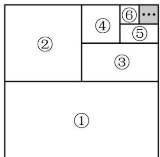
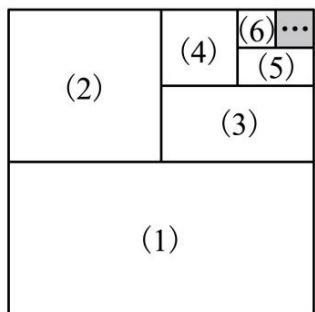
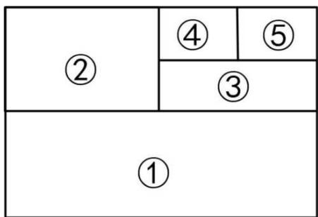
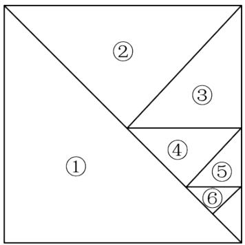

# 专题 05 有理数的八大计算技巧（举一反三专项训练）

# 【北师大版 2024】

# 题型归纳

【题型1 对消与凑整】....1  
【题型 2 归类与组合】....2  
【题型 3 活用运算律】....2  
【题型 4 裂项相消】....2  
【题型5 错位相消】 3  
【题型6 倒数法】 4  
【题型 7 相互转化】....4  
【题型8 图形法】 5

# 举一反三

教辅资源，关注公众号 ★全科AA+

# 知识点一 有理数的计算技巧（1）对消与凑整

将相加得零的数结合计算，将和为整数的数结合计算.

# 知识点二 有理数的计算技巧（2）归类与组合

将同类数（如正数或负数）归类计算，将相反数、分母相同或易于通分的数结合计算.

# 知识点三 有理数的计算技巧（3）活用运算律

运用运算律改变运算顺序，正难则反，利用运算律改变次序，将复杂的数拆开来算.

# 知识点四 有理数的计算技巧（4）裂项

常见的裂项一般是将一项拆分成两项或多项的和或差，使拆分后的项可前后抵消或凑整，其中分数的裂项是重点.

# 知识点五 相互转化法

根据算式特点，将式子中的分数转化为小数，或小数转化为分数，统一后再进行运算.

# 【题型1 对消与凑整】

【例 1】（24-25 七年级上·湖南·阶段练习）计算 $\left(+\frac{3}{4}\right)-(+6)+\left(-\frac{2}{3}\right)-\left(-\frac{1}{4}\right)+\left(-1\frac{1}{3}\right)$ ;

【变式 1-1】（24-25 六年级上·山东威海·期中）计算 $1\frac{2}{3}+\left(-\frac{1}{8}\right)-\left(-\frac{1}{3}\right)+\left|-\frac{1}{8}\right|$

【变式 1-2】（23-24 七年级·上海普陀·期中）计算： $-3.19+2\frac{19}{21}+(-6.81)-\left(-2\frac{2}{21}\right)$

【变式 1-3】（2024 秋·广西崇左·七年级校考阶段练习）计算：

$$
\left(- 2 \frac {1}{8}\right) + (+ 5) + \left(- 3 \frac {1}{2}\right) + (+ 1. 1 2 5) + \left(+ 4 \frac {1}{2}\right);
$$

# 【题型2 归类与组合】

【例 2】计算:

(1) $\left(+35\frac{7}{9}\right)+\left(-23\frac{4}{9}\right);$   
(2) $\left(-2018\frac{5}{6}\right)+\left(-2017\frac{2}{3}\right)+\left(-1\frac{1}{2}\right)+4036.$

【变式 2-1】用简便方法计算： $-16+24+6\frac{3}{5}-18+4\frac{4}{5}+18-6.8-3.2$

【变式2-2】（24-25七年级上·内蒙古呼和浩特·阶段练习）计算. $\left(-3\frac{3}{4}\right) - \left(-2\frac{1}{2}\right) + \left(-4\frac{1}{6}\right) - \left(-5\frac{2}{3}\right) - 1$

【变式 2-3】计算： $(-2\frac{1}{4})-(-4\frac{1}{2})-(+4\frac{1}{8})+(-5\frac{7}{8})$ ;

# 【题型3 活用运算律】

【例 3】计算： $(-0.25)\times(-3)\times8\times(-40)\times\left(-\frac{1}{3}\right)\times(-12.5)$ .

【变式 3-1】（24-25 七年级上·江西赣州·期中）用简便方法计算： $\left(\frac{2}{9}-\frac{1}{3}-\frac{2}{27}\right)\times(-27)$ .

【变式 3-2】算： $-9\frac{12}{13}\times12$

【变式 3-3】（23-24 七年级·河南开封·开学考试）怎样简便怎样算

(1)2021×20222022-2022×20212021;   
(2) $1\frac{1}{2}+2\frac{1}{4}+3\frac{1}{8}+4\frac{1}{16}+5\frac{1}{32}+6\frac{1}{64}$   
(3) $\frac{2015+2016\times2014}{2016\times2015-1}$   
(4) $\left(\frac{9}{20} - \frac{11}{30} + \frac{13}{42} - \frac{15}{56} + \frac{17}{72}\right) \times \frac{121212}{131313}$

# 【题型4 裂项相消】

【例 4】阅读下列材料:

计算： $\frac{1}{1\times2}+\frac{1}{2\times3}+\frac{1}{3\times4}+\ldots+\frac{1}{2021\times2022}$

解：原式 $= 1 - \frac{1}{2} +\frac{1}{2} -\frac{1}{3} +\frac{1}{3} -\frac{1}{4} +\ldots +\frac{1}{2021} -\frac{1}{2022} = 1 - \frac{1}{2022} = \frac{2021}{2022}$

这种求和方法称为“裂项相消法”，请你参照此法计算： $\frac{2}{2^{2}-1}+\frac{2}{3^{2}-1}+\frac{2}{4^{2}-1}+\ldots+\frac{2}{100^{2}-1}=$ \_\_\_\_.

【变式 4-1】计算:

$$
\frac {1}{1 \times 3} + \frac {1}{3 \times 5} + \frac {1}{5 \times 7} + \frac {1}{7 \times 9} + \frac {1}{9 \times 1 1} + \frac {1}{1 1 \times 1 3} + \dots \dots + \frac {1}{9 7 \times 9 9}.
$$

【变式 4-2】（24-25 七年级上·江苏南京·阶段练习）计算： $\frac{1}{1\times2\times3}+\frac{1}{2\times3\times4}+\frac{1}{3\times4\times5}+\ldots+\frac{1}{9\times10\times11}$

【变式 4-3】（24-25 九年级下·安徽阜阳·阶段练习）数学家基斯顿·卡曼于 1808 年发明了一种运算符号叫阶乘，用“!”表示．它的意思是：一个正整数的阶乘是所有小于及等于该数的正整数的积，如 $1!=1$ ， $5!=5\times4\times3\times2\times1$ ．正整数N的阶乘记作N!，即 $N!=1\times2\times3\times\cdots\times N$ ．裂项相消法可以和阶乘结合起来研究，例如，我们可以把 $\frac{9}{10!}$ 拆分为两个分母含有阶乘形式的分子为1的分数的差，即 $\frac{9}{10!}=\frac{10-1}{10!}-\frac{10}{10!}-\frac{1}{10!}=\frac{1}{9!}-\frac{1}{10!}$

根据以上规律，解答下列问题：

(1)填空：5!=\_\_\_\_；  
(2)将 $\frac{6}{7!}+\frac{7}{8!}$ 化简为两个分母含有阶乘形式的分子为1的分数的差的形式为\_\_\_\_；  
(3)计算： $\frac{1}{2!}+\frac{2}{3!}+\frac{3}{4!}+\frac{4}{5!}+\cdots+\frac{18}{19!}+\frac{19}{20!}$

# 【题型 5 错位相消】教辅资源，关注公众号★全科AA+

【例 5】（2025·海南三亚·二模）阅读与思考：请阅读下列材料，并完成下列问题.

【等比数列】按照一定顺序排列着的一列数称为数列，数列的一般形式可以写成： $a_{1},a_{2},a_{3},\cdots,a_{n},\cdots$ ，一般地，如果一个数列从第二项起，每一项与它前一项的比值等于同一个常数，那么这个数列叫做等比数列，这个常数叫做等比数列的公比，公比通常用q表示．如：数列1,2,4,8, $\cdots$ 为等比数列，其中 $a_{1}=1,a_{2}=2$ ，公比为q=2．根据以上材料，解答下列问题：

（1）等比数列3,9,27,…的公比q为\_\_\_\_，第5项是\_\_\_\_。

【公式推导】

如果一个数列 $a_{1},a_{2},a_{3},\ldots,a_{n},\ldots$ ，是等比数列，且公比为q，那么根据定义可得到： $\frac{a_{2}}{a_{1}}=q,\frac{a_{3}}{a_{2}}=q,\frac{a_{4}}{a_{3}}=q,\ldots,\frac{a_{n+1}}{a_{n}}=q.$ 所以 $a_{2}=a_{1}\cdot q,a_{3}=a_{2}\cdot q=a_{1}q\cdot q=a_{1}\cdot q^{2},a_{4}=a_{3}\cdot q=a_{2}\cdot q^{2}=a_{1}\cdot q^{3},\ldots$

（2）由此，请你填空完成等比数列的通项公式： $a_{n}=a_{1}\cdot$ \_\_\_\_.

【拓广探究】等比数列求和公式并不复杂，但是其推导过程——错位相减法，构思精巧、形式奇特．下面是小明为了计算 $1+2+2^{2}+\ldots+2^{2019}+2^{2020}$ 的值，采用的方法：

设 $S=1+2+2^{2}+\ldots+2^{2019}+2^{2020}$ ①,

则 $2S=2+2^{2}+\ldots+2^{2020}+2^{2021}$ ②，

②-①得2S-S=S=2 $^{2021}$ -1,

$$
\therefore S = 1 + 2 + 2 ^ {2} + \dots + 2 ^ {2 0 1 9} + 2 ^ {2 0 2 0} = 2 ^ {2 0 2 1} - 1.
$$

【解决问题】（3）请仿照小明的方法求 $3+3^{2}+3^{3}+\ldots+3^{2025}$ 的值.

【变式 5-1】求 $11+11^{2}+11^{3}+\ldots+11^{2024}$ 的值.

【变式 5-2】计算： $\frac{1}{4}+\frac{1}{4^{2}}+\frac{1}{4^{3}}+\cdots+\frac{1}{4^{n}}$

【变式 5-3】解决下列问题:

(1)计算： $\frac{1}{2} +\left(\frac{1}{2}\right)^2 +\left(\frac{1}{2}\right)^3 +\left(\frac{1}{2}\right)^4 +\ldots +\left(\frac{1}{2}\right)^8$

(2)化简： $M=5+2\times5^{2}+3\times5^{3}+4\times5^{4}+\ldots+8\times5^{8}$

【题型 6 倒数法】教辅资源，关注公众号★全科AA+

【例 6】（24-25 七年级上·河南商丘·期中）请你先认真阅读材料：

计算： $\left(-\frac{1}{30}\right)\div\left(\frac{2}{3}-\frac{1}{10}+\frac{1}{6}-\frac{2}{5}\right)$ .

解：原式的倒数是 $\left(\frac{2}{3} -\frac{1}{10} +\frac{1}{6} -\frac{2}{5}\right)\div \left(-\frac{1}{30}\right)$

$$
\begin{array}{l} = \left(\frac {2}{3} - \frac {1}{1 0} + \frac {1}{6} - \frac {2}{5}\right) \times (- 3 0) \\ = \frac {2}{3} \times (- 3 0) - \frac {1}{1 0} \times (- 3 0) + \frac {1}{6} \times (- 3 0) - \frac {2}{5} \times (- 3 0) \\ = - 2 0 - (- 3) + (- 5) - (- 1 2) \\ = - 2 0 + 3 - 5 + 1 2 \\ = - 1 0. \\ \end{array}
$$

故原式 $=-\frac{1}{10}$ .

再根据你对所提供材料的理解，选择合适的方法计算： $\left(-\frac{1}{70}\right)\div\left(\frac{3}{10}-\frac{5}{14}+\frac{8}{35}-\frac{2}{7}\right)$

【变式 6-1】（24-25 七年级上·河北邯郸·期中）简便计算： $\left(-\frac{1}{42}\right)\div\left(\frac{1}{6}-\frac{3}{14}+\frac{2}{3}-\frac{2}{7}\right)$

【变式 6-2】（24-25 七年级上·福建福州·期中）计算： $\left(-\frac{1}{36}\right)\div\left(1\frac{1}{6}-\frac{7}{9}+\frac{5}{12}\right)$

【变式 6-3】计算： $\left(-\frac{1}{56}\right)\div\left[\frac{1}{8}-\frac{5}{14}+\frac{9}{28}-\left(-\frac{1}{4}\right)^{2}\times6\right]$ .

【题型7 相互转化】

【例 7】计算:

(1) $(-3)\div \left(-1\frac{3}{4}\right)\times 75\% \div \left(-\frac{3}{7}\right)\times (-6);$

(2) $\left(-\frac{1}{5}\right)\times(-0.1)\div\frac{1}{25}\times(-10);$

【变式 7-1】计算： $(+0.125)-\left(-3\frac{3}{4}\right)+\left(-3\frac{1}{8}\right)-(+1.75)$ ;

【变式 7-2】利用运算律简便运算：

$$
- 3. 6 1 \times 0. 7 5 + 0. 6 1 \times \frac {3}{4} + (- 0. 2) \times 75 \%.
$$

【变式 7-3】计算： $38 \times \frac{1}{4} + 17 \times 0.25 + 45 \times 25\%$

【题型 8 图形法】教辅资源，关注 公众号★全科AA+

【例 8】）数形结合是解决数学问题的一种重要的思想方法.

材料一：欲求 $1+2+4+8+16+\cdots+2^{30}$ 的值，可以按照如下步骤进行：

令 $S=1+2+4+8+16+\cdots+2^{30}$ ……①

等式两边同时乘以 2，得 $2S=2+4+8+16+32+\cdots+2^{31}$ ……②

由②式减去①式，得 $S=2^{31}-1$ ，∴ $1+2+4+8+16+\cdots+2^{30}=2^{31}-1$ .

材料二：如图1，将一个边长为1的正方形纸片分割成7个部分，部分①的面积是正方形面积的一半，部分②的面积是部分①的面积的一半，依此类推 $\frac{1}{2^{6}}=\frac{1}{64}$ ，∴ $\frac{1}{2}+\frac{1}{2^{2}}+\frac{1}{2^{3}}+\frac{1}{2^{4}}+\frac{1}{2^{5}}+\frac{1}{2^{6}}=1-\frac{1}{2^{6}}$ .

阅读材料，解决问题：

text_image

②
④
⑥ ⋯
⑤
③
①

图1

text_image

(2)
(4)
(6) ⋯
(5)
(3)
(1)

图2

(1)利用材料一提供的方法，请你求出 $1+5+5^{2}+5^{3}+5^{4}+\cdots+5^{20}$ 的值.  
(2)如图2，若按这样的方式继续分割下去，受材料二的启发 $\frac{1}{2} +\frac{1}{2^2} +\frac{1}{2^3} +\frac{1}{2^4} +\dots +\frac{1}{2^{2023}}$ 的值为  
(3)通过学习材料一、材料二，选择你喜欢的方法解决问题： $\frac{1}{3}+\frac{1}{3^{2}}+\frac{1}{3^{3}}+\cdots+\frac{1}{3^{n}}$ \_\_\_\_。（用含有 n 的式子表示）

【变式 8-1】如图，正方形的边长为 1，第一次取出正方形的一半，第二次取出剩下图形的一半……以此类推，每一次都取出剩下图形的一半，共进行 n 次这样的操作.

<table><tr><td rowspan="2"> $\frac{1}{2}$ </td><td colspan="3"></td></tr><tr><td></td><td></td><td></td></tr></table>

<table><tr><td>进行的次数</td><td>1</td><td>2</td><td>3</td><td>n</td></tr><tr><td>剩下图形的面积</td><td> $\frac{1}{2}$ </td><td>——</td><td>——</td><td>——</td></tr></table>

(1)请将上表填写完整.   
(2)请利用这个几何图形求 $\frac{1}{2}+\frac{1}{2^{2}}+\frac{1}{2^{3}}+\cdots+\frac{1}{2^{n}}$ 的值：\_\_\_\_. (用含 n 的代数式表示)

教辅资源，关注公众号★全科AA+

【变式 8-2】在数学习题课中，同学们为了求 $\frac{1}{2}+\frac{1}{2^{2}}+\frac{1}{2^{3}}+\frac{1}{2^{4}}+\frac{1}{2^{5}}+\ldots+\frac{1}{2^{n}}$ 的值，进行了如下探索：

（1）某同学设计如图 1 所示的几何图形，将一个面积为 1 的长方形纸片对折.  
(I) 求图 1 中部分④的面积;  
（II）请你利用图形求 $\frac{1}{2}+\frac{1}{2^{2}}+\frac{1}{2^{3}}+\frac{1}{2^{4}}+\frac{1}{2^{5}}$ 的值；  
（2）请你利用备用图，再设计一个能求与 $\frac{1}{2} +\frac{1}{2^2} +\frac{1}{2^3} +\frac{1}{2^4} +\frac{1}{2^5}$ 的值的几何图形.

text_image

②
④
⑤
③
①

图1

natural_image

Empty white rectangle with black border (no text or symbols)

备用图

【变式 8-3】数和形是数学的两个主要研究对象, 我们经常运用数形结合、数形转化的方法解决一些数学问题. 下面我们来探究“由数思形, 以形助数”的方法在解决代数问题中的应用.

如图, 将一个边长为 1 的正方形纸片分割成 7 个部分, 部分①是边长为 1 的正方形纸片面积的一半, 部分②是部分①面积的一半, 部分③是部分②面积的一半, 依次类推.

text_image

①
②
③
④
⑤
⑥

(1)图中阴影部分的面积为\_\_\_\_；  
(2)受此启发，得到 $\frac{1}{2}+\frac{1}{4}+\frac{1}{8}+\cdots+\frac{1}{2^{6}}=$ \_\_\_\_；  
(3)迁移应用：得到 $\frac{2}{3}+\frac{1}{3}\times\frac{2}{3}+\frac{1}{3^{2}}\times\frac{2}{3}+\frac{1}{3^{3}}\times\frac{2}{3}+\cdots+\frac{1}{3^{2023}}\times\frac{2}{3}=$ \_\_\_\_（直接写出答案即可）.