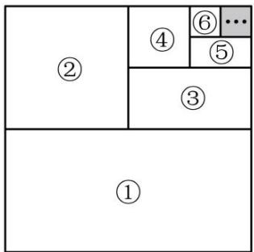
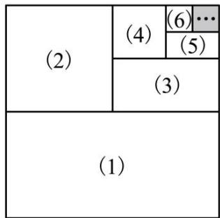
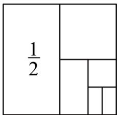
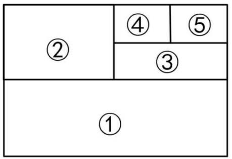
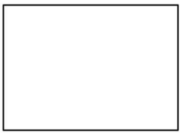
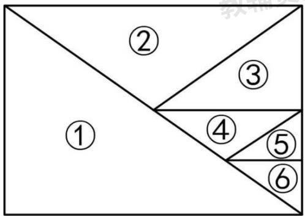
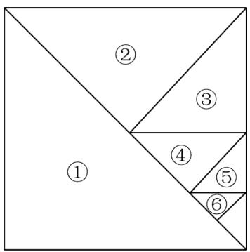

# 专题 05 有理数的八大计算技巧（举一反三专项训练）

# 【北师大版 2024】

# 题型归纳

【题型1 对消与凑整】....1  
【题型 2 归类与组合】....3  
【题型 3 活用运算律】....5  
【题型4 裂项相消】....7  
【题型 5 错位相消】....10  
【题型 6 倒数法】....13  
【题型 7 相互转化】....15  
【题型8 图形法】....16

# 举一反三

# 知识点一 有理数的计算技巧（1）对消与凑整

将相加得零的数结合计算，将和为整数的数结合计算.

# 知识点二 有理数的计算技巧（2）归类与组合

将同类数（如正数或负数）归类计算，将相反数、分母相同或易于通分的数结合计算.

# 知识点三 有理数的计算技巧（3）活用运算律

运用运算律改变运算顺序，正难则反，利用运算律改变次序，将复杂的数拆开来算.

# 知识点四 有理数的计算技巧（4）裂项

常见的裂项一般是将一项拆分成两项或多项的和或差，使拆分后的项可前后抵消或凑整，其中分数的裂项是重点.

# 知识点五 相互转化法

根据算式特点，将式子中的分数转化为小数，或小数转化为分数，统一后再进行运算.

# 【题型1 对消与凑整】

【例 1】（24-25 七年级上·湖南·阶段练习）计算 $\left(+\frac{3}{4}\right)-(+6)+\left(-\frac{2}{3}\right)-\left(-\frac{1}{4}\right)+\left(-1\frac{1}{3}\right)$ ;

【答案】-7

【分析】此题考查了有理数的运算.

先将减法转化为加法，然后运用加法的交换律和结合律进行简便计算即可得到结果；

【详解】解： $\left(+\frac{3}{4}\right)-(+6)+\left(-\frac{2}{3}\right)-\left(-\frac{1}{4}\right)+\left(-1\frac{1}{3}\right)$

$$
\begin{array}{l} = \left[ \left(+ \frac {3}{4}\right) - \left(- \frac {1}{4}\right) \right] + \left[ \left(- \frac {2}{3}\right) + \left(- 1 \frac {1}{3}\right) \right] - (+ 6) \\ = 1 + (- 2) - 6 \\ = - 1 - 6 \\ = - 7 \\ \end{array}
$$

【变式 1-1】（24-25 六年级上·山东威海·期中）计算 $1\frac{2}{3}+\left(-\frac{1}{8}\right)-\left(-\frac{1}{3}\right)+\left|-\frac{1}{8}\right|$

【答案】 $2\frac{1}{4}$ ;

【分析】本题考查了有理数的运算，掌握运算法则，运算律和运算顺序是解题的关键.根据加减运算法则和加法运算律即可求解.

【详解】解： $1\frac{2}{3}+\left(-\frac{1}{8}\right)-\left(-\frac{1}{3}\right)+\left|-\frac{1}{8}\right|$

$$
\begin{array}{l} = 1 \frac {2}{3} - \frac {1}{8} + \frac {1}{3} + \frac {1}{8} \\ = \left(1 \frac {2}{3} + \frac {1}{3}\right) + \left(- \frac {1}{8} + \frac {1}{8}\right) \\ = 2 + 0 \\ = 2 \\ \end{array}
$$

【变式 1-2】（23-24 七年级·上海普陀·期中）计算： $-3.19+2\frac{19}{21}+(-6.81)-\left(-2\frac{2}{21}\right)$

【答案】-5

【分析】本题考查了有理数的加减混合运算，有理数的加法交换律和结合律，熟练掌握有理数的加减混合运算及有理数的加法的运算律是解题的关键．根据有理数加法的运算律，将能凑整的数先凑整，得到 $[-3.19 + (-6.81)] + \left(2\frac{19}{21} + 2\frac{2}{21}\right)$ ，再进一步计算，即得答案.

【详解】解：原式 $=-3.19+2\frac{19}{21}+(-6.81)-\left(-2\frac{2}{21}\right)$ .

$$
\begin{array}{l} = [ - 3. 1 9 + (- 6. 8 1) ] + \left(2 \frac {1 9}{2 1} + 2 \frac {2}{2 1}\right) \\ = - 1 0 + 5 \\ = - 5. \\ \end{array}
$$

【变式 1-3】（2024 秋·广西崇左·七年级校考阶段练习）计算：

$$
\left(- 2 \frac {1}{8}\right) + (+ 5) + \left(- 3 \frac {1}{2}\right) + (+ 1. 1 2 5) + \left(+ 4 \frac {1}{2}\right);
$$

【答案】5

【分析】先根据去括号法则去括号，再根据加法交换律和结合律简便计算即可；

【详解】解： $\left(-2\frac{1}{8}\right)+(+5)+\left(-3\frac{1}{2}\right)+(+1.125)+\left(+4\frac{1}{2}\right)$

$$
= \left(- 2 \frac {1}{8}\right) + 5 - 3 \frac {1}{2} + 1. 1 2 5 + 4 \frac {1}{2}
$$

$$
= \left[ \left(- 2 \frac {1}{8}\right) + 1 \frac {1}{8} \right] + 5 - \left[ 3 \frac {1}{2} - 4 \frac {1}{2} \right]
$$

$$
= - 1 + 5 + 1
$$

$$
= 5;
$$

【点睛】本题考查有理数的加法运算，掌握各运算法则是解题关键.

# 【题型2 归类与组合】

【例 2】计算:

(1) $\left(+35\frac{7}{9}\right)+\left(-23\frac{4}{9}\right);$

(2) $\left(-2018\frac{5}{6}\right)+\left(-2017\frac{2}{3}\right)+\left(-1\frac{1}{2}\right)+4036.$

【答案】(1) $12\frac{1}{3}$

(2)-2

【详解】（1） $\left(+35\frac{7}{9}\right)+\left(-23\frac{4}{9}\right)$

$$
= \left[ (3 5) + \left(\frac {7}{9}\right) \right] + \left[ (- 2 3) + \left(- \frac {4}{9}\right) \right]
$$

$$
= [ (3 5) + (- 2 3) ] + \left[ \left(\frac {7}{9}\right) + \left(- \frac {4}{9}\right) \right]
$$

$$
= 1 2 + \frac {1}{3}
$$

$$
= 1 2 \frac {1}{3};
$$

(2) $\left(-2018\frac{5}{6}\right) + \left(-2017\frac{2}{3}\right) + \left(-1\frac{1}{2}\right) + 4036$

$$
= \left[ (- 2 0 1 8) + \left(- \frac {5}{6}\right) \right] + \left[ (- 2 0 1 7) + \left(- \frac {2}{3}\right) \right] + \left[ (- 1) + \left(- \frac {1}{2}\right) \right] + 4 0 3 6
$$

$$
= [ (- 2 0 1 8) + (- 2 0 1 7) + (- 1) + 4 0 3 6 ] + \left[ \left(- \frac {5}{6}\right) + \left(- \frac {2}{3}\right) + \left(- \frac {1}{2}\right) \right]
$$

$$
= 0 + (- 2)
$$

$$
= - 2.
$$

【变式 2-1】用简便方法计算： $-16+24+6\frac{3}{5}-18+4\frac{4}{5}+18-6.8-3.2$

【答案】 $9\frac{2}{5}$

【分析】本题考查了有理数的加减混合运算，加法运算律及简便运算等知识，掌握运算法则是解题的关键；常见的加减法简便方法有：相加得整数的先相加，正数与负数分别相加，同分母或易于通分的先相加等；互为相反数的两个数、同分母两个数及两个小数分别结合相加，最后再相加即可.

【详解】解：原式 $=8+\left(6\frac{3}{5}+4\frac{4}{5}\right)+(18-18)-(6.8+3.2)$

$$
= 8 + 1 1 \frac {2}{5} - 1 0
$$

$$
= 9 \frac {2}{5}.
$$

【变式2-2】（24-25七年级上·内蒙古呼和浩特·阶段练习）计算. $\left(-3\frac{3}{4}\right) - \left(-2\frac{1}{2}\right) + \left(-4\frac{1}{6}\right) - \left(-5\frac{2}{3}\right) - 1$

【答案】 $-\frac{3}{4}$

【分析】本题主要考查了有理数的计算；

根据有理数加减法计算法则求解即可；

【详解】解： $\left(-3\frac{3}{4}\right)-\left(-2\frac{1}{2}\right)+\left(-4\frac{1}{6}\right)-\left(-5\frac{2}{3}\right)-1$

$$
= \left(- 3 \frac {3}{4}\right) + 2 \frac {1}{2} + \left(- 4 \frac {1}{6} + 5 \frac {2}{3}\right) - 1
$$

$$
= \left(- 3 \frac {3}{4}\right) + 2 \frac {1}{2} + 1 \frac {1}{2} - 1
$$

$$
= \left(- 3 \frac {3}{4}\right) + 4 - 1
$$

$$
= \left(- 3 \frac {3}{4}\right) + 3
$$

$$
= - \frac {3}{4}
$$

【变式 2-3】计算： $(-2\frac{1}{4})-(-4\frac{1}{2})-(+4\frac{1}{8})+(-5\frac{7}{8})$ ;

【答案】 $-7\frac{3}{4}$

【分析】该题主要考查了有理数的运算，解题的关键是掌握有理数的混合运算的运算法则.原式去掉括号后，利用加减法计算法则即可得到结果；

解： $(-2\frac{1}{4}) - (-4\frac{1}{2}) - (+4\frac{1}{8}) + (-5\frac{7}{8})$

$$
\begin{array}{l} = - 2 \frac {1}{4} + 4 \frac {1}{2} - 4 \frac {1}{8} - 5 \frac {7}{8} \\ = - 2 + 4 - 4 - 5 - \frac {1}{4} + \frac {1}{2} - \frac {1}{8} - \frac {7}{8} \\ = - 7 - \frac {2}{8} + \frac {4}{8} - \frac {1}{8} - \frac {7}{8} \\ = - 7 - \frac {3}{4} \\ = - 7 \frac {3}{4} \\ \end{array}
$$

【题型3 活用运算律】

【例 3】计算： $(-0.25)\times(-3)\times8\times(-40)\times\left(-\frac{1}{3}\right)\times(-12.5)$ .

【答案】-1000

【分析】本题考查了有理数的运算，解题的关键是：

根据有理数乘法的交换律和结合律计算即可.

【详解】解： $(-0.25)\times(-3)\times8\times(-40)\times\left(-\frac{1}{3}\right)\times(-12.5)$

$$
\begin{array}{l} = (- 0. 2 5) \times (- 4 0) \times (- 3) \times \left(- \frac {1}{3}\right) \times 8 \times (- 1 2. 5) \\ = 1 0 \times 1 \times (- 1 0 0) \\ = - 1 0 0 0 \\ \end{array}
$$

【变式 3-1】（24-25 七年级上·江西赣州·期中）用简便方法计算： $\left(\frac{2}{9}-\frac{1}{3}-\frac{2}{27}\right)\times(-27)$ .

【答案】5

【分析】本题考查了有理数的运算，熟练掌握运算法则是解答本题的关键.

利用乘法分配律计算即可.

【详解】解：原式 $=\frac{2}{9}\times(-27)-\frac{1}{3}\times(-27)-\frac{2}{27}\times(-27)=-6+9+2=5$

【变式 3-2】算： $-9\frac{12}{13}\times12$

【答案】 $\frac{1}{4}$

【分析】该题主要考查了有理数的混合运算，解题的关键是掌握有理数的混合运算的运算法则.原式先将除法变成乘法，再计算乘法运算即可得到结果；

【详解】解： $(-49)\div\frac{7}{2}\times\frac{4}{7}\div(-32)$

$$
\begin{array}{l} = (- 4 9) \times \frac {2}{7} \times \frac {4}{7} \times \left(- \frac {1}{3 2}\right) \\ = (- 8) \times \left(- \frac {1}{3 2}\right) \\ = \frac {1}{4} \\ \end{array}
$$

【变式 3-3】（23-24 七年级·河南开封·开学考试）怎样简便怎样算

(1)2021×20222022-2022×20212021;   
(2) $1\frac{1}{2}+2\frac{1}{4}+3\frac{1}{8}+4\frac{1}{16}+5\frac{1}{32}+6\frac{1}{64}$   
(3) $\frac{2015+2016\times2014}{2016\times2015-1}$   
(4) $\left(\frac{9}{20} - \frac{11}{30} + \frac{13}{42} - \frac{15}{56} + \frac{17}{72}\right) \times \frac{121212}{131313}$

【答案】(1)0

(2) $21\frac{63}{64}$   
(3)1   
(4) $\frac{1}{3}$

【分析】（1）根据20222022=2022×10001，20212021=2021×10001将原式变形为

2021×2022×10001-2022×2021×10001即可得到答案；

（2）将原式先加上 $\frac{1}{64}$ ，再减去 $\frac{1}{64}$ ，根据有理数加减计算法则求解即可；  
（3）根据 $2016\times2014=2016\times(2015-1)$ ，利用乘法的分配律将分子变形为 $2016\times2015-1$ ，由此即可得到答案；  
（3）根据 $\frac{n+n+1}{n(n+1)}=\frac{1}{n}+\frac{1}{n+1}$ 先将括号内的式子变形为 $\left(\frac{1}{4}-\frac{1}{9}\right)$ ，再由121212=12×10101，131313=13×10101进行求解即可.

【详解】（1）解：2021×20222022-2022×20212021

$$
\begin{array}{l} = 2 0 2 1 \times 2 0 2 2 \times 1 0 0 0 1 - 2 0 2 2 \times 2 0 2 1 \times 1 0 0 0 1 \\ = 0; \\ \end{array}
$$

（2）解： $1\frac{1}{2}+2\frac{1}{4}+3\frac{1}{8}+4\frac{1}{16}+5\frac{1}{32}+6\frac{1}{64}$

$$
= 1 \frac {1}{2} + 2 \frac {1}{4} + 3 \frac {1}{8} + 4 \frac {1}{1 6} + 5 \frac {1}{3 2} + 6 \frac {1}{6 4} + \frac {1}{6 4} - \frac {1}{6 4}
$$

$$
\begin{array}{l} = 1 \frac {1}{2} + 2 \frac {1}{4} + 3 \frac {1}{8} + 4 \frac {1}{1 6} + 5 \frac {1}{3 2} + 6 \frac {1}{3 2} - \frac {1}{6 4} \\ = 1 \frac {1}{2} + 2 \frac {1}{4} + 3 \frac {1}{8} + 4 \frac {1}{1 6} + 1 1 \frac {1}{1 6} - \frac {1}{6 4} \\ = 1 \frac {1}{2} + 2 \frac {1}{4} + 3 \frac {1}{8} + 1 5 \frac {1}{8} - \frac {1}{6 4} \\ = 1 \frac {1}{2} + 2 \frac {1}{4} + 1 8 \frac {1}{4} - \frac {1}{6 4} \\ = 1 \frac {1}{2} + 2 0 \frac {1}{2} - \frac {1}{6 4} \\ = 2 2 - \frac {1}{6 4} \\ = 2 1 \frac {6 3}{6 4}; \\ \end{array}
$$

(3) 解: $\frac{2015+2016\times2014}{2016\times2015-1}$

$$
= \frac {2 0 1 5 + 2 0 1 6 \times (2 0 1 5 - 1)}{2 0 1 6 \times 2 0 1 5 - 1}
$$

$$
= \frac {2 0 1 5 + 2 0 1 6 \times 2 0 1 5 - 2 0 1 6}{2 0 1 6 \times 2 0 1 5 - 1}
$$

$$
= \frac {2 0 1 6 \times 2 0 1 5 - 1}{2 0 1 6 \times 2 0 1 5 - 1}
$$

$$
= 1;
$$

（4）解： $\left(\frac{9}{20}-\frac{11}{30}+\frac{13}{42}-\frac{15}{56}+\frac{17}{72}\right)\times\frac{121212}{131313}$

$$
= \left(\frac {4 + 5}{4 \times 5} - \frac {5 + 6}{5 \times 6} + \frac {6 + 7}{6 \times 7} - \frac {7 + 8}{7 \times 8} + \frac {8 + 9}{8 \times 9}\right) \times \frac {1 2 1 2 1 2}{1 3 1 3 1 3}
$$

$$
= \left(\frac {1}{4} + \frac {1}{5} - \frac {1}{5} - \frac {1}{6} + \frac {1}{6} + \frac {1}{7} - \frac {1}{7} - \frac {1}{8} + \frac {1}{8} + \frac {1}{9}\right) \times \frac {1 2 1 2 1 2}{1 3 1 3 1 3}
$$

$$
= \left(\frac {1}{4} + \frac {1}{9}\right) \times \frac {1 2 1 2 1 2}{1 3 1 3 1 3}
$$

$$
= \left(\frac {1}{4} + \frac {1}{9}\right) \times \frac {1 2 \times 1 0 1 0 1}{1 3 \times 1 0 1 0 1}
$$

$$
= \frac {1 3}{3 6} \times \frac {1 2}{1 3}
$$

$$
= \frac {1}{3}.
$$

【点睛】本题主要考查了有理数的简便计算，熟知有理数的相关计算法则和运算律是解题的关键.

# 【题型4 裂项相消】

【例 4】阅读下列材料:

计算： $\frac{1}{1\times2}+\frac{1}{2\times3}+\frac{1}{3\times4}+\ldots+\frac{1}{2021\times2022}$

解：原式 $= 1 - \frac{1}{2} +\frac{1}{2} -\frac{1}{3} +\frac{1}{3} -\frac{1}{4} +\ldots +\frac{1}{2021} -\frac{1}{2022} = 1 - \frac{1}{2022} = \frac{2021}{2022}$

这种求和方法称为“裂项相消法”，请你参照此法计算： $\frac{2}{2^{2}-1}+\frac{2}{3^{2}-1}+\frac{2}{4^{2}-1}+\ldots+\frac{2}{100^{2}-1}=$ \_\_\_\_.

【答案】 $\frac{14949}{10100}$

【分析】先计算分母，再根据“裂项相消法”计算可得答案.

【详解】解： $\frac{2}{2^{2}-1}+\frac{2}{3^{2}-1}+\frac{2}{4^{2}-1}+\ldots+\frac{2}{100^{2}-1}$

$$
\begin{array}{l} = \frac {2}{3} + \frac {2}{8} + \frac {2}{1 5} + \dots + \frac {2}{9 9 9 9} \\ = \frac {2}{1 \times 3} + \frac {2}{2 \times 4} + \frac {2}{3 \times 5} + \dots + \frac {2}{9 9 \times 1 0 1} \\ = 1 - \frac {1}{3} + \frac {1}{2} - \frac {1}{4} + \frac {1}{3} - \frac {1}{5} + \dots + \frac {1}{9 9} - \frac {1}{1 0 1} \\ = 1 + \frac {1}{2} - \frac {1}{1 0 0} - \frac {1}{1 0 1} \\ = \frac {1 4 9 4 9}{1 0 1 0 0}, \\ \end{array}
$$

故答案为： $\frac{14949}{10100}$ .

【点睛】此题考查了有理数混合运算，正确理解题意掌握解题的方法是解此题的关键.

【变式 4-1】计算:

$$
\frac {1}{1 \times 3} + \frac {1}{3 \times 5} + \frac {1}{5 \times 7} + \frac {1}{7 \times 9} + \frac {1}{9 \times 1 1} + \frac {1}{1 1 \times 1 3} + \dots \dots + \frac {1}{9 7 \times 9 9}.
$$

【答案】 $\frac{49}{99}$

【分析】根据裂项相消法即可解答

【详解】解：依题意得：

$$
\frac {1}{1 \times 3} + \frac {1}{3 \times 5} + \frac {1}{5 \times 7} + \frac {1}{7 \times 9} + \frac {1}{9 \times 1 1} + \frac {1}{1 1 \times 1 3} + \dots . + \frac {1}{9 7 \times 9 9}
$$

$$
= \frac {1}{2} \times \left(1 - \frac {1}{3} + \frac {1}{3} - \frac {1}{5} + \frac {1}{5} - \frac {1}{7} + \frac {1}{7} - \frac {1}{9} + \frac {1}{9} - \frac {1}{1 1} + \frac {1}{1 1} - \frac {1}{1 3} + \dots \dots + \frac {1}{9 5} - \frac {1}{9 7} + \frac {1}{9 7} - \frac {1}{9 9}\right)
$$

$$
= \frac {1}{2} \times \left(1 - \frac {1}{9 9}\right)
$$

$$
= \frac {1}{2} \times \frac {9 8}{9 9}
$$

$$
= \frac {4 9}{9 9}
$$

【点睛】本题考查了有理数的混合运算.

【变式 4-2】（24-25 七年级上·江苏南京·阶段练习）计算： $\frac{1}{1\times2\times3}+\frac{1}{2\times3\times4}+\frac{1}{3\times4\times5}+\ldots+\frac{1}{9\times10\times11}$

【答案】 $\frac{27}{110}$

【分析】本题考查裂项相消法.

将所给算式改写成分母为两个连续整数积的形式，再进行计算即可.

$$
\begin{array}{l} = \left(1 - \frac {1}{2}\right) \times \frac {1}{3} + \left(\frac {1}{2} - \frac {1}{3}\right) \times \frac {1}{4} + \left(\frac {1}{3} - \frac {1}{4}\right) \times \frac {1}{5} + \dots + \left(\frac {1}{8} - \frac {1}{9}\right) \times \frac {1}{1 0} + \left(\frac {1}{9} - \frac {1}{1 0}\right) \times \frac {1}{1 1} \\ = 1 \times \frac {1}{3} - \frac {1}{2} \times \frac {1}{3} + \frac {1}{2} \times \frac {1}{4} - \frac {1}{3} \times \frac {1}{4} + \frac {1}{3} \times \frac {1}{5} - \frac {1}{4} \times \frac {1}{5} + \dots + \frac {1}{8} \times \frac {1}{1 0} - \frac {1}{9} \times \frac {1}{1 0} + \frac {1}{9} \times \frac {1}{1 1} - \frac {1}{1 0} \times \frac {1}{1 1} \\ = \frac {1}{1 \times 3} + \frac {1}{2 \times 4} + \frac {1}{3 \times 5} + \dots + \frac {1}{9} \times \frac {1}{1 0} - \left(\frac {1}{2 \times 3} + \frac {1}{3 \times 4} + \dots + \frac {1}{1 0 \times 1 1}\right) \\ = \frac {1}{2} \times \left(1 - \frac {1}{3} + \frac {1}{2} - \frac {1}{4} + \frac {1}{3} - \frac {1}{5} + \dots + \frac {1}{9} - \frac {1}{1 1}\right) - \left(\frac {1}{2} - \frac {1}{3} + \frac {1}{3} - \frac {1}{4} + \dots + \frac {1}{1 0} - \frac {1}{1 1}\right) \\ = \frac {1}{2} \times \left(1 + \frac {1}{2} - \frac {1}{1 0} - \frac {1}{1 1}\right) - \left(\frac {1}{2} - \frac {1}{1 1}\right) \\ = \frac {3 6}{5 5} - \frac {9}{2 2} \\ = \frac {2 7}{1 1 0}. \\ \end{array}
$$

【详解】解：原式= $\frac{1}{1\times2}\times\frac{1}{3}+\frac{1}{2\times3}\times\frac{1}{4}+\frac{1}{3\times4}\times\frac{1}{5}+\cdots+\frac{1}{8\times9}\times\frac{1}{10}+\frac{1}{9\times10}\times\frac{1}{11}$

$$
\begin{array}{l} = \left(1 - \frac {1}{2}\right) \times \frac {1}{3} + \left(\frac {1}{2} - \frac {1}{3}\right) \times \frac {1}{4} + \left(\frac {1}{3} - \frac {1}{4}\right) \times \frac {1}{5} + \dots + \left(\frac {1}{8} - \frac {1}{9}\right) \times \frac {1}{1 0} + \left(\frac {1}{9} - \frac {1}{1 0}\right) \times \frac {1}{1 1} \\ = 1 \times \frac {1}{3} - \frac {1}{2} \times \frac {1}{3} + \frac {1}{2} \times \frac {1}{4} - \frac {1}{3} \times \frac {1}{4} + \frac {1}{3} \times \frac {1}{5} - \frac {1}{4} \times \frac {1}{5} + \dots + \frac {1}{8} \times \frac {1}{1 0} - \frac {1}{9} \times \frac {1}{1 0} + \frac {1}{9} \times \frac {1}{1 1} - \frac {1}{1 0} \times \frac {1}{1 1} \\ = \frac {1}{1 \times 3} + \frac {1}{2 \times 4} + \frac {1}{3 \times 5} + \dots + \frac {1}{9} \times \frac {1}{1 0} - \left(\frac {1}{2 \times 3} + \frac {1}{3 \times 4} + \dots + \frac {1}{1 0 \times 1 1}\right) \\ = \frac {1}{2} \times \left(1 - \frac {1}{3} + \frac {1}{2} - \frac {1}{4} + \frac {1}{3} - \frac {1}{5} + \dots + \frac {1}{9} - \frac {1}{1 1}\right) - \left(\frac {1}{2} - \frac {1}{3} + \frac {1}{3} - \frac {1}{4} + \dots + \frac {1}{1 0} - \frac {1}{1 1}\right) \\ = \frac {1}{2} \times \left(1 + \frac {1}{2} - \frac {1}{1 0} - \frac {1}{1 1}\right) - \left(\frac {1}{2} - \frac {1}{1 1}\right) \\ = \frac {3 6}{5 5} - \frac {9}{2 2} \\ = \frac {2 7}{1 1 0}. \\ \end{array}
$$

【变式 4-3】（24-25 九年级下·安徽阜阳·阶段练习）数学家基斯顿·卡曼于 1808 年发明了一种运算符号叫阶乘，用“!”表示．它的意思是：一个正整数的阶乘是所有小于及等于该数的正整数的积，如 $1! = 1$ ，

$5!=5\times4\times3\times2\times1$ ．正整数N的阶乘记作N!，即 $N!=1\times2\times3\times\cdots\times N$ ．裂项相消法可以和阶乘结合起来研究，例如，我们可以把 $\frac{9}{10!}$ 拆分为两个分母含有阶乘形式的分子为1的分数的差，即 $\frac{9}{10!}=\frac{10-1}{10!}=\frac{10}{10!}-\frac{1}{10!}=\frac{1}{9!}-\frac{1}{10!}$ .

根据以上规律，解答下列问题：

(1)填空：5!=\_\_\_\_；  
(2)将 $\frac{6}{7!}+\frac{7}{8!}$ 化简为两个分母含有阶乘形式的分子为1的分数的差的形式为\_\_\_\_；  
(3)计算： $\frac{1}{2!}+\frac{2}{3!}+\frac{3}{4!}+\frac{4}{5!}+\cdots+\frac{18}{19!}+\frac{19}{20!}$

【答案】(1)120

(2) $\frac{1}{6!}-\frac{1}{8!}$   
(3) $1-\frac{1}{20!}$

【分析】本题主要考查了十字相乘法、因式分解解一元二次方程、裂项法、阶乘的运用等内容，熟练掌握相关知识是解题的关键.

（1）根据阶乘定义直接求解即可；  
(2) 根据题干材料仿照即可得解;  
(3) 根据 (2) 思路写出过程求解即可.

【详解】（1）解： $5!=5\times4\times3\times2\times1=120$ ，

故答案为：120;

(2) 解: $\frac{6}{7!} + \frac{7}{8!} = \frac{7 - 1}{7!} + \frac{8 - 1}{8!}$

$$
\begin{array}{l} = \frac {7}{7 !} - \frac {1}{7 !} + \frac {8}{8 !} - \frac {1}{8 !} \\ = \frac {1}{6 !} - \frac {1}{7 !} + \frac {1}{7 !} - \frac {1}{8 !} \\ = \frac {1}{6 !} - \frac {1}{8 !}; \\ \end{array}
$$

（3）解： $\frac{1}{2!}+\frac{2}{3!}+\frac{3}{4!}+\frac{4}{5!}+\cdots+\frac{18}{19!}+\frac{19}{20!}$

$$
\begin{array}{l} = \frac {2 - 1}{2 !} + \frac {3 - 1}{3 !} + \frac {4 - 1}{4 !} + \frac {5 - 1}{5 !} + \dots + \frac {1 9 - 1}{1 9 !} + \frac {2 0 - 1}{2 0 !} \\ = \frac {2}{2 !} - \frac {1}{2 !} + \frac {3}{3 !} - \frac {1}{3 !} + \frac {4}{4 !} - \frac {1}{4 !} + \frac {5}{5 !} - \frac {1}{5 !} + \dots + \frac {1 9}{1 9 !} - \frac {1}{1 9 !} + \frac {2 0}{2 0 !} - \frac {1}{2 0 !} \\ = \frac {1}{1 !} - \frac {1}{2 !} + \frac {1}{2 !} - \frac {1}{3 !} + \frac {1}{3 !} - \frac {1}{4 !} + \frac {1}{4 !} - \frac {1}{5 !} + \dots + \frac {1}{1 8 !} - \frac {1}{1 9 !} + \frac {1}{1 9 !} - \frac {1}{2 0 !} \\ = \frac {1}{1 !} - \frac {1}{2 0 !} \\ = 1 - \frac {1}{2 0 !}. \\ \end{array}
$$

# 【题型5 错位相消】

【例 5】（2025·海南三亚·二模）阅读与思考：请阅读下列材料，并完成下列问题.

【等比数列】按照一定顺序排列着的一列数称为数列，数列的一般形式可以写成： $a_{1},a_{2},a_{3},\cdots,a_{n},\cdots$ ，一般地，如果一个数列从第二项起，每一项与它前一项的比值等于同一个常数，那么这个数列叫做等比数列，这个常数叫做等比数列的公比，公比通常用q表示．如：数列1,2,4,8, $\cdots$ 为等比数列，其中 $a_{1}=1,a_{2}=2$ ，公比为q=2．根据以上材料，解答下列问题：

（1）等比数列3,9,27,…的公比q为\_\_\_\_，第5项是\_\_\_\_。

【公式推导】

如果一个数列 $a_1, a_2, a_3, \ldots, a_n, \ldots$ ，是等比数列，且公比为 $q$ ，那么根据定义可得到： $\frac{a_2}{a_1} = q, \frac{a_3}{a_2} = q, \frac{a_4}{a_3} = q, \ldots, \frac{a_{n+1}}{a_n} = q.$ 所以 $a_2 = a_1 \cdot q, a_3 = a_2 \cdot q = a_1 q \cdot q = a_1 \cdot q^2, a_4 = a_3 \cdot q = a_2 \cdot q^2 = a_1 \cdot q^3, \ldots$

(2) 由此, 请你填空完成等比数列的通项公式: $a_{n} = a_{1} \cdot \_$ .

【拓广探究】等比数列求和公式并不复杂，但是其推导过程——错位相减法，构思精巧、形式奇特。下面是小明为了计算 $1+2+2^{2}+\ldots+2^{2019}+2^{2020}$ 的值，采用的方法：

设 $S=1+2+2^{2}+\ldots+2^{2019}+2^{2020}$ ①,

则 $2S=2+2^{2}+\ldots+2^{2020}+2^{2021}$ ②，

②-①得2S-S=S=2 $^{2021}$ -1,

$$
\therefore S = 1 + 2 + 2 ^ {2} + \dots + 2 ^ {2 0 1 9} + 2 ^ {2 0 2 0} = 2 ^ {2 0 2 1} - 1.
$$

【解决问题】（3）请仿照小明的方法求 $3+3^{2}+3^{3}+\ldots+3^{2025}$ 的值.

【答案】（1）3，243；（2） $q^{n-1}$ ；（3） $\frac{3^{2026}-3}{2}$

【分析】本题考查了新定义运算，有理数的乘方运算，理解题意是解题的关键.

（1）根据题目中给出的等比数列的定义即可求解；  
(2) 根据公式推导过程即可求解;  
（3）设 $S=1+3+3^{2}+3^{3}+\ldots+3^{2025}$ 根据例题的方法求得 $\therefore S=1+3+3^{2}+3^{3}+\ldots+3^{2025}=\frac{3^{2026}-1}{2}$ ，即可求解.

【详解】解：（1）根据题意得：等比数列3,9,27,…的公比q为3，第5项是 $3^{5}=243$ ;

故答案为：3，243；

（2）根据题意得：等比数列的通项公式： $a_{n}=a_{1}\cdot q^{n-1}$ ;

故答案为： $q^{n - 1}$

（3）设 $S=1+3+3^{2}+3^{3}+\ldots+3^{2025}$ ①，

则 $3S=3+3^{2}+\ldots+3^{2025}+3^{2026}$ ②，

②-①得3S-S=2S=3 $^{2026}$ -1,

$$
\therefore S = 1 + 3 + 3 ^ {2} + 3 ^ {3} + \dots + 3 ^ {2 0 2 5} = \frac {3 ^ {2 0 2 6} - 1}{2}.
$$

$$
\therefore 3 + 3 ^ {2} + 3 ^ {3} + \dots + 3 ^ {2 0 2 5} = S - 1 = \frac {3 ^ {2 0 2 6} - 3}{2}.
$$

【变式 5-1】求 $11+11^{2}+11^{3}+\ldots+11^{2024}$ 的值.

【答案】） $\frac{11^{2025}-11}{10}$

【详解】解：设 $S=11+11^{2}+11^{3}+\ldots+11^{2024}$ ①，

则 $11S=11^{2}+11^{3}+\ldots+11^{2025}$ ②,

②-①得11S-S=10S=11 $^{2025}$ -11,

$$
\therefore S = 1 1 + 1 1 ^ {2} + 1 1 ^ {3} + \dots + 1 1 ^ {2 0 2 4} = \frac {1 1 ^ {2 0 2 5} - 1 1}{1 0}.
$$

【变式 5-2】计算： $\frac{1}{4}+\frac{1}{4^{2}}+\frac{1}{4^{3}}+\cdots+\frac{1}{4^{n}}$

【答案】 $\frac{1}{3}-\frac{1}{3\times4^{n}}$

【详解】设 $S=\frac{1}{4}+\frac{1}{4^{2}}+\frac{1}{4^{3}}+\ldots+\frac{1}{4^{n}}①$ ,

$$
4 S = 1 + \frac {1}{4} + \frac {1}{4 ^ {2}} + \frac {1}{4 ^ {3}} + \dots + \frac {1}{4 ^ {n - 1}} (2),
$$

②-①得，

$$
3 S = 1 - \frac {1}{4 ^ {n}},
$$

$$
\therefore S = \frac {1}{3} - \frac {1}{3 \times 4 ^ {n}},
$$

故原式= $\frac{1}{3}-\frac{1}{3\times4^{n}}$ .

【点睛】本题考查了规律型-数字的变化类，解决本题的关键是准确进行有理数的规律计算.

【变式 5-3】解决下列问题:

(1)计算： $\frac{1}{2}+(\frac{1}{2})^{2}+(\frac{1}{2})^{3}+(\frac{1}{2})^{4}+\ldots+(\frac{1}{2})^{8}$

(2)化简： $M=5+2\times5^{2}+3\times5^{3}+4\times5^{4}+\ldots+8\times5^{8}$

【答案】(1) $1-\frac{1}{2^{8}}$

(2) $\frac{31\times5^{9}+5}{16}$

【分析】（1）利用“错位相减法”求解即可；

(2) 利用“错位相减法”求解即可.

【详解】（1）解：设 $S=\frac{1}{2}+(\frac{1}{2})^{2}+(\frac{1}{2})^{3}+(\frac{1}{2})^{4}+\ldots+(\frac{1}{2})^{8}$ ①，

则 $2S=1+\frac{1}{2}+(\frac{1}{2})^{2}+(\frac{1}{2})^{3}+\ldots+(\frac{1}{2})^{7}$ ②，

则②-①，得： $2S-S=S=1-\frac{1}{2^{8}}$ ;

(2) 解: $\because M=5+2\times5^{2}+3\times5^{3}+4\times5^{4}+\ldots+8\times5^{8}\textcircled{1}$ ,

$$
\therefore 5 M = 1 \times 5 ^ {2} + 2 \times 5 ^ {3} + 3 \times 5 ^ {4} + \dots + 8 \times 5 ^ {9} (2),
$$

∴②-①，得：

$$
\begin{array}{l} 5 M - M = (1 \times 5 ^ {2} + 2 \times 5 ^ {3} + 3 \times 5 ^ {4} + \dots + 8 \times 5 ^ {9}) - (5 + 2 \times 5 ^ {2} + 3 \times 5 ^ {3} + 4 \times 5 ^ {4} + \dots + 8 \times 5 ^ {8}) \\ = 8 \times 5 ^ {9} - (5 + 5 ^ {2} + 5 ^ {3} + \dots + 5 ^ {8}), \\ \end{array}
$$

设 $T=5+5^{2}+5^{3}+\ldots+5^{8}$ ,

$$
\therefore 5 T = 5 ^ {2} + 5 ^ {3} + \dots + 5 ^ {9},
$$

$$
\therefore 5 T - T = 5 ^ {9} - 5,
$$

$$
\therefore 4 T = 5 ^ {9} - 5,
$$

$$
\therefore T = \frac {5 ^ {9} - 5}{4},
$$

∴原式= $8\times5^{9}-\frac{5^{9}-5}{4}$ ,

$$
\therefore 4 M = 8 \times 5 ^ {9} - \frac {5 ^ {9} - 5}{4},
$$

$$
\therefore M = \frac {8 \times 5 ^ {9}}{4} - \frac {5 ^ {9} - 5}{1 6}
$$

$$
= \frac {3 1 \times 5 ^ {9} + 5}{1 6}.
$$

【点睛】此题考查了有理数的乘方运算，数字类规律问题，“错位相减法”的运用，解题的关键是熟练掌握“错位相减法”的运用.

# 【题型6 倒数法】

【例 6】（24-25 七年级上·河南商丘·期中）请你先认真阅读材料：

计算： $\left(-\frac{1}{30}\right)\div \left(\frac{2}{3} -\frac{1}{10} +\frac{1}{6} -\frac{2}{5}\right).$

解：原式的倒数是 $\left(\frac{2}{3} -\frac{1}{10} +\frac{1}{6} -\frac{2}{5}\right)\div \left(-\frac{1}{30}\right)$

$$
= \left(\frac {2}{3} - \frac {1}{1 0} + \frac {1}{6} - \frac {2}{5}\right) \times (- 3 0)
$$

$$
= \frac {2}{3} \times (- 3 0) - \frac {1}{1 0} \times (- 3 0) + \frac {1}{6} \times (- 3 0) - \frac {2}{5} \times (- 3 0)
$$

$$
= - 2 0 - (- 3) + (- 5) - (- 1 2)
$$

$$
= - 2 0 + 3 - 5 + 1 2
$$

$$
= - 1 0.
$$

故原式 $=-\frac{1}{10}$ .

再根据你对所提供材料的理解，选择合适的方法计算： $\left(-\frac{1}{70}\right)\div\left(\frac{3}{10}-\frac{5}{14}+\frac{8}{35}-\frac{2}{7}\right)$ .

【答案】 $\frac{1}{8}$

【分析】根据运算律，倒数的定义解答即可.

本题考查了有理数的除法，运算律的应用，倒数，熟练掌握运算法则是解题的关键.

【详解】解：原式的倒数是 $\left(\frac{3}{10}-\frac{5}{14}+\frac{8}{35}-\frac{2}{7}\right)\div\left(-\frac{1}{70}\right)$

$$
\begin{array}{l} = \left(\frac {3}{1 0} - \frac {5}{1 4} + \frac {8}{3 5} - \frac {2}{7}\right) \times (- 7 0) \\ = - \left(\frac {3}{1 0} \times 7 0 - \frac {5}{1 4} \times 7 0 + \frac {8}{3 5} \times 7 0 - \frac {2}{7} \times 7 0\right) \\ = - (2 1 - 2 5 + 1 6 - 2 0) = 8. \\ \end{array}
$$

故原式= $\frac{1}{8}$ .

【变式 6-1】（24-25 七年级上·河北邯郸·期中）简便计算： $\left(-\frac{1}{42}\right)\div\left(\frac{1}{6}-\frac{3}{14}+\frac{2}{3}-\frac{2}{7}\right)$

【答案】 $-\frac{1}{14}$

【详解】解：原式的倒数= $\left(\frac{1}{6}-\frac{3}{14}+\frac{2}{3}-\frac{2}{7}\right)\div\left(-\frac{1}{42}\right)$

$$
\begin{array}{l} = \left(\frac {1}{6} - \frac {3}{1 4} + \frac {2}{3} - \frac {2}{7}\right) \times (- 4 2) \\ = - 7 + 9 - 2 8 + 1 2 \\ = - 1 4, \\ \end{array}
$$

故原式 $= -\frac{1}{14}$ .

【变式 6-2】（24-25 七年级上·福建福州·期中）计算： $\left(-\frac{1}{36}\right)\div\left(1\frac{1}{6}-\frac{7}{9}+\frac{5}{12}\right)$

【答案】 $-\frac{1}{29}$

【详解】解：原式的倒数为： $\left(1\frac{1}{6}-\frac{7}{9}+\frac{5}{12}\right)\div\left(-\frac{1}{36}\right)$

$$
\begin{array}{l} = \left(\frac {7}{6} - \frac {7}{9} + \frac {5}{1 2}\right) \times (- 3 6) \\ = \frac {7}{6} \times (- 3 6) - \frac {7}{9} \times (- 3 6) + \frac {5}{1 2} \times (- 3 6) \\ = - 4 2 + 2 8 - 1 5 \\ = - 2 9, \\ \end{array}
$$

故原式 $=-\frac{1}{29}$ .

【变式6-3】计算： $\left(-\frac{1}{56}\right)\div \left[\frac{1}{8} -\frac{5}{14} +\frac{9}{28} -\left(-\frac{1}{4}\right)^2\times 6\right].$

【答案】 $\frac{1}{16}$

【分析】此题考查有理数的混合运算，乘法分配律，计算原式的倒数，即可得到答案.

【详解】解： $\left[\frac{1}{8}-\frac{5}{14}+\frac{9}{28}-\left(-\frac{1}{4}\right)^{2}\times6\right]\div\left(-\frac{1}{56}\right)$

$$
= \left(\frac {1}{8} - \frac {5}{1 4} + \frac {9}{2 8} - \frac {1}{1 6} \times 6\right) \times (- 5 6)
$$

$$
= \frac {1}{8} \times (- 5 6) - \frac {5}{1 4} \times (- 5 6) + \frac {9}{2 8} \times (- 5 6) - \frac {1}{1 6} \times 6 \times (- 5 6)
$$

$$
= - 7 + 2 0 - 1 8 + 2 1
$$

$$
= 1 6,
$$

$$
\therefore \left(- \frac {1}{5 6}\right) \div \left[ \frac {1}{8} - \frac {5}{1 4} + \frac {9}{2 8} - \left(- \frac {1}{4}\right) ^ {2} \times 6 \right] = \frac {1}{1 6}.
$$

# 【题型7 相互转化】

【例 7】计算:

(1) $(-3)\div \left(-1\frac{3}{4}\right)\times 75\% \div \left(-\frac{3}{7}\right)\times (-6);$

(2) $\left(-\frac{1}{5}\right)\times(-0.1)\div\frac{1}{25}\times(-10);$

【答案】(1)18

(2)-5

【分析】根据有理数的加减乘除混合运算法则及运算顺序计算即可得到答案.

【详解】（1）解： $(-3)\div\left(-1\frac{3}{4}\right)\times75\%\div\left(-\frac{3}{7}\right)\times(-6)$

$$
= 3 \times \frac {4}{7} \times \frac {3}{4} \times \frac {7}{3} \times 6
$$

$$
= 1 8;
$$

(2) 解: $\left(-\frac{1}{5}\right) \times (-0.1) \div \frac{1}{25} \times (-10)$

$$
= - \left(\frac {1}{5} \times \frac {1}{1 0} \times 2 5 \times 1 0\right)
$$

$$
= - 5;
$$

【点睛】本题考查有理数的混合运算，熟练掌握有理数加减乘除的运算法则及运算顺序是解决问题的关键.

【变式 7-1】计算： $(+0.125)-\left(-3\frac{3}{4}\right)+\left(-3\frac{1}{8}\right)-(+1.75)$ ;

【答案】-1

【详解】解： $(+0.125)-\left(-3\frac{3}{4}\right)+\left(-3\frac{1}{8}\right)-(+1.75)$

$$
\begin{array}{l} = \frac {1}{8} + 3 \frac {3}{4} - 3 \frac {1}{8} - 1 \frac {3}{4} \\ = \left(\frac {1}{8} - 3 \frac {1}{8}\right) + \left(3 \frac {3}{4} - 1 \frac {3}{4}\right) \\ = - 3 + 2 \\ = - 1 \\ \end{array}
$$

【变式 7-2】利用运算律简便运算：

$$
- 3. 6 1 \times 0. 7 5 + 0. 6 1 \times \frac {3}{4} + (- 0. 2) \times 75 \%.
$$

【答案】-2.4

【详解】解： $-3.61\times0.75+0.61\times\frac{3}{4}+(-0.2)\times75\%$

$$
\begin{array}{l} = - 3. 6 1 \times 0. 7 5 + 0. 6 1 \times 0. 7 5 + (- 0. 2) \times 0. 7 5 \\ = 0. 7 5 \times (- 3. 6 1 + 0. 6 1 - 0. 2) \\ = 0. 7 5 \times (- 3. 2) \\ = - 2. 4. \\ \end{array}
$$

【变式 7-3】计算： $38 \times \frac{1}{4} + 17 \times 0.25 + 45 \times 25\%$

【答案】25

【分析】本题考查了有理数的混合运算，熟练掌握相关运算法则是解题关键.利用乘法分配律进行计算即可.

【详解】 $38 \times \frac{1}{4} + 17 \times 0.25 + 45 \times 25\%$

$$
= 3 8 \times \frac {1}{4} + 1 7 \times \frac {1}{4} + 4 5 \times \frac {1}{4}
$$

$$
= \frac {1}{4} \times (3 8 + 1 7 + 4 5)
$$

$$
= \frac {1}{4} \times 1 0 0
$$

$$
= 2 5.
$$

# 【题型8 图形法】

【例 8】）数形结合是解决数学问题的一种重要的思想方法.

材料一：欲求 $1+2+4+8+16+\cdots+2^{30}$ 的值，可以按照如下步骤进行：

令 $S=1+2+4+8+16+\cdots+2^{30}$ ……①

等式两边同时乘以 2，得 $2S=2+4+8+16+32+\cdots+2^{31}$ ……②

由②式减去①式，得 $S=2^{31}-1$ ，∴ $1+2+4+8+16+\cdots+2^{30}=2^{31}-1$ .

材料二：如图1，将一个边长为1的正方形纸片分割成7个部分，部分①的面积是正方形面积的一半，部分②的面积是部分①的面积的一半，依此类推 $\frac{1}{2^{6}}=\frac{1}{64}$ ，∴ $\frac{1}{2}+\frac{1}{2^{2}}+\frac{1}{2^{3}}+\frac{1}{2^{4}}+\frac{1}{2^{5}}+\frac{1}{2^{6}}=1-\frac{1}{2^{6}}$ .

阅读材料，解决问题：

text_image

②
④
⑥ ⋯
⑤
③
①

图1

text_image

(2)
(4)
(6) ⋯
(5)
(3)
(1)

图2

(1)利用材料一提供的方法，请你求出 $1+5+5^{2}+5^{3}+5^{4}+\cdots+5^{20}$ 的值.

(2)如图 2，若按这样的方式继续分割下去，受材料二的启发 $\frac{1}{2} + \frac{1}{2^2} + \frac{1}{2^3} + \frac{1}{2^4} + \cdots + \frac{1}{2^{2023}}$ 的值为 \_\_\_\_.

(3)通过学习材料一、材料二，选择你喜欢的方法解决问题： $\frac{1}{3}+\frac{1}{3^{2}}+\frac{1}{3^{3}}+\cdots+\frac{1}{3^{n}}$ \_\_\_\_。（用含有 n 的式子表示）

【答案】(1) $\frac{5^{21}-1}{4}$

(2) $1-\frac{1}{2^{2023}}$

(3) $\frac{1}{2}\left(1-\frac{1}{3^{n}}\right)$

【分析】本题考查了数字的规律变化，含乘方的有理数的混合运算．理解题意，确定数字的变化特点是解题的关键.

（1）根据已知先求出5S，再相减，即可得出答案；

(2) 观察图形发现部分①的面积为 $\frac{1}{2}$ , 部分②的面积为 $\frac{1}{2^2} = \frac{1}{4}$ , 部分③的面积为 $\frac{1}{2^3} = \frac{1}{8}$ , …, 阴影部分的面积为 $\frac{1}{2^n}$ , 据此规律解答即可;

（3）令 $T=\frac{1}{3}+\frac{1}{3^{2}}+\frac{1}{3^{3}}+\cdots+\frac{1}{3^{n}}$ ，再求出3T，两式相减求出2T，据此求解即可.

【详解】（1）解：令 $S=1+5+5^{2}+5^{3}+5^{4}+\cdots+5^{20}$ ①，

等式两边同时乘以 5，得 $5S=5+5^{2}+5^{3}+5^{4}+\cdots+5^{21}$ ②，

由②式减去①式，得 $4S=5^{21}-1$ ，

$$
\therefore S = \frac {5 ^ {2 1} - 1}{4},
$$

$$
\therefore 1 + 5 + 5 ^ {2} + 5 ^ {3} + 5 ^ {4} + \dots + 5 ^ {2 0} = \frac {5 ^ {2 1} - 1}{4};
$$

(2) 解: $\because$ 正方形边长为 1,

∴正方形面积为1，

∵①是边长为1的正方形纸片面积的一半，

∴①的面积为 $\frac{1}{2}$ ,

依此类推②的面积为 $\frac{1}{2^{2}}=\frac{1}{4}$ ，③的面积为 $\frac{1}{2^{3}}=\frac{1}{8}$ ，…

∴求 $\frac{1}{2}+\frac{1}{2^{2}}+\frac{1}{2^{3}}+\cdots+\frac{1}{2^{2023}}$ 的值，即为求将图形分割下去空白部分的面积，

∴此时剩余阴影部分面积为： $\frac{1}{2^{2023}}$ ,

$$
\therefore \frac {1}{2} + \frac {1}{2 ^ {2}} + \frac {1}{2 ^ {3}} + \dots + \frac {1}{2 ^ {2 0 2 3}} = 1 - \frac {1}{2 ^ {2 0 2 3}},
$$

故答案为： $1-\frac{1}{2^{2023}}$ ;

（3）解：令 $T=\frac{1}{3}+\frac{1}{3^{2}}+\frac{1}{3^{3}}+\cdots+\frac{1}{3^{n}}$ ①，

等式两边同时乘3得， $3T=1+\frac{1}{3}+\frac{1}{3^{2}}+\frac{1}{3^{3}}+\cdots+\frac{1}{3^{n-1}}$ ②，

由②式减去①式，得 $2T=1-\frac{1}{3^{n}}$ ,

$$
\therefore T = \frac {1}{2} \left(1 - \frac {1}{3 ^ {n}}\right),
$$

$$
\therefore \frac {1}{3} + \frac {1}{3 ^ {2}} + \frac {1}{3 ^ {3}} + \dots + \frac {1}{3 ^ {n}} = \frac {1}{2} \left(1 - \frac {1}{3 ^ {n}}\right),
$$

故答案为： $\frac{1}{2}\left(1-\frac{1}{3^{n}}\right)$ .

【变式 8-1】如图，正方形的边长为 1，第一次取出正方形的一半，第二次取出剩下图形的一半……以此类推，每一次都取出剩下图形的一半，共进行 n 次这样的操作.

text_image

1/2

<table><tr><td>进行的次数</td><td>1</td><td>2</td><td>3</td><td>n</td></tr><tr><td>剩下图形的面积</td><td> $\frac{1}{2}$ </td><td>——</td><td>——</td><td>——</td></tr></table>

(1)请将上表填写完整.

(2)请利用这个几何图形求 $\frac{1}{2}+\frac{1}{2^{2}}+\frac{1}{2^{3}}+\cdots+\frac{1}{2^{n}}$ 的值：\_\_\_\_．(用含n的代数式表示)

【答案】(1)见详解

(2) $1-\frac{1}{2^{n}}$

【分析】本题主要考查了有理数乘方的应用，列代数式，一元一次方程的应用，面积法等知识.

(1) 根据题意填表即可.

(2) 原正方形分成各个小长方形的面积之和为 $\frac{1}{2} + \frac{1}{2^{2}} + \frac{1}{2^{3}} + \cdots + \frac{1}{2^{n}} + \frac{1}{2^{n}}$ ，由 $\frac{1}{2} + \frac{1}{2^{2}} + \frac{1}{2^{3}} + \cdots + \frac{1}{2^{n}} + \frac{1}{2^{n}} = 1$ 即可得出 $\frac{1}{2} + \frac{1}{2^{2}} + \frac{1}{2^{3}} + \cdots + \frac{1}{2^{n}}$ 的值.

【详解】（1）解：上表填写如下：

<table><tr><td>进行的次数</td><td>1</td><td>2</td><td>3</td><td>...</td><td>n</td></tr><tr><td>剩下图形的面积</td><td> $\frac{1}{2}$ </td><td> $\frac{1}{4}$ </td><td> $\frac{1}{8}$ </td><td>...</td><td> $\frac{1}{2^n}$ </td></tr></table>

（2）解：原正方形分成各个小长方形的面积之和为 $\frac{1}{2}+\frac{1}{2^{2}}+\frac{1}{2^{3}}+\ldots+\frac{1}{2^{n}}+\frac{1}{2^{n}}$

$$
\therefore \frac {1}{2} + \frac {1}{2 ^ {2}} + \frac {1}{2 ^ {3}} + \dots + \frac {1}{2 ^ {n}} + \frac {1}{2 ^ {n}} = 1,
$$

则 $\frac{1}{2} +\frac{1}{2^2} +\frac{1}{2^3} +\ldots +\frac{1}{2^n} = 1 - \frac{1}{2^n},$

故答案为： $1-\frac{1}{2^{n}}$ ;

【变式 8-2】在数学习题课中，同学们为了求 $\frac{1}{2}+\frac{1}{2^{2}}+\frac{1}{2^{3}}+\frac{1}{2^{4}}+\frac{1}{2^{5}}+\ldots+\frac{1}{2^{n}}$ 的值，进行了如下探索：

（1）某同学设计如图 1 所示的几何图形，将一个面积为 1 的长方形纸片对折.

(I) 求图 1 中部分④的面积;

（II）请你利用图形求 $\frac{1}{2}+\frac{1}{2^{2}}+\frac{1}{2^{3}}+\frac{1}{2^{4}}+\frac{1}{2^{5}}$ 的值；

（2）请你利用备用图，再设计一个能求与 $\frac{1}{2} +\frac{1}{2^2} +\frac{1}{2^3} +\frac{1}{2^4} +\frac{1}{2^5}$ 的值的几何图形.

text_image

②
④
⑤
③
①

图1

natural_image

Empty white rectangle with black border (no text or symbols)

备用图

【答案】（1）（I） $\frac{1}{16}$ ; （II） $\frac{31}{32}$ ; （2）见解析.

【分析】（1）（i）根据题目中的图形和题意，计算出部分④的面积即可；（ii）根据图形，可以所求式子的值即可；

(2) 将长方形分成两个全等的三角形, 然后继续分割两个小一点的全等三角形, 依次继续分割即可即可解答 (答案不唯一).

【详解】解：（1）（i）由题意可得，部分④的面积是 $\left(\frac{1}{2}\right)^{4}=\frac{1}{16}$ ;

（ii）由题意可得： $\frac{1}{2}+\frac{1}{2^{2}}+\frac{1}{2^{3}}+\frac{1}{2^{4}}+\frac{1}{2^{5}}=1-\frac{1}{2^{5}}=\frac{31}{32}$ ;

(2) 可设计如图所示:

text_image

①
②
③
④
⑤
⑥

（答案不唯一，符合题意即可）.

【点睛】本题主要考查了数字的变化规律、有理数的混合运算等知识点，明确题意并灵活利用数形结合的思想是解答本题的关键.

【变式 8-3】数和形是数学的两个主要研究对象，我们经常运用数形结合、数形转化的方法解决一些数学问题．下面我们来探究“由数思形，以形助数”的方法在解决代数问题中的应用.

如图, 将一个边长为 1 的正方形纸片分割成 7 个部分, 部分①是边长为 1 的正方形纸片面积的一半, 部分②是部分①面积的一半, 部分③是部分②面积的一半, 依次类推.

text_image

①
②
③
④
⑤
⑥

(1)图中阴影部分的面积为\_\_\_\_；

(2)受此启发，得到 $\frac{1}{2}+\frac{1}{4}+\frac{1}{8}+\cdots+\frac{1}{2^{6}}=$ \_\_\_\_；

(3)迁移应用：得到 $\frac{2}{3}+\frac{1}{3}\times\frac{2}{3}+\frac{1}{3^{2}}\times\frac{2}{3}+\frac{1}{3^{3}}\times\frac{2}{3}+\cdots+\frac{1}{3^{2023}}\times\frac{2}{3}=$ \_\_\_\_（直接写出答案即可）.

【答案】(1) $\frac{1}{64}$

(2) $\frac{63}{64}$

(3) $1-\frac{1}{3^{2024}}$

【分析】本题考查图形变化的规律，数形结合思想的巧妙运用是解题的关键；

（1）根据图中三角形面积之间的关系即可解决问题；

(2) 利用数形结合的思想即可解决问题;

（3）根据（3）中的结论即可解决问题；

【详解】（1）由题知，

正方形每次被分割的部分是前一部分面积的一半，

所以图中阴影部分的面积与部分⑥的面积相等.

又因为部分①的面积为： $\frac{1}{2}=\frac{1}{2^{1}}$

部分②的面积为： $\frac{1}{2}\times\frac{1}{2}=\frac{1}{4}=\frac{1}{2^{2}}$

部分③的面积为： $\frac{1}{2}\times\frac{1}{2}\times\frac{1}{2}=\frac{1}{8}=\frac{1}{2^{3}}$

...，

依次类图，部分 n 的面积为 $\frac{1}{2^{n}}$ .

当n=6时，

$$
\frac {1}{2 ^ {n}} = \frac {1}{2 ^ {6}} = \frac {1}{6 4}.
$$

所以阴影部分的面积为 $\frac{1}{64}$ .

故答案为： $\frac{1}{64}$

(2) 由 (1) 知,

$$
\frac {1}{2} + \frac {1}{2 ^ {2}} + \frac {1}{2 ^ {3}} + \dots + \frac {1}{2 ^ {6}} + \frac {1}{2 ^ {6}} = 1,
$$

所以 $\frac{1}{2}+\frac{1}{4}+\frac{1}{8}+\cdots+\frac{1}{2^{6}}=1-\frac{1}{2^{6}}=\frac{63}{64}.$

故答案为： $\frac{63}{64}$ .

（3）由题知，

原式 $= \frac{2}{3} \times \left(1 + \frac{1}{3} + \frac{1}{3^2} + \frac{1}{3^3} + \dots + \frac{1}{3^{2023}}\right)$ .

令 $S=1+\frac{1}{3}+\frac{1}{3^{2}}+\cdots+\frac{1}{3^{2023}}①$ ,

则 $\frac{1}{3}S=\frac{1}{3}+\frac{1}{3^{2}}+\frac{1}{3^{3}}+\cdots+\frac{1}{3^{2024}}②$ ,

①-②得，

$$
\frac {2}{3} s = 1 - \frac {1}{3 ^ {2 0 2 4}},
$$

即 $S=\frac{3}{2}-\frac{1}{2\times3^{2023}}$ ,

所以原式 $= \frac{2}{3} \times \left(\frac{3}{2} - \frac{1}{2 \times 3^{2023}}\right)$

$$
= 1 - \frac {1}{3 ^ {2 0 2 4}}.
$$

故答案为： $1-\frac{1}{3^{2024}}$ .