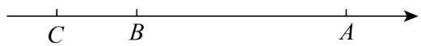
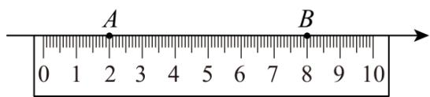
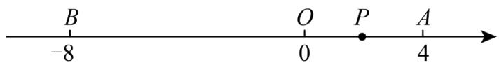

# 专题 06 相反数、绝对值、倒数与整体求值（举一反三专项训练）

# 【北师大版 2024】

考卷信息:

本套训练卷共 40 题. 题型针对性较高, 覆盖面广, 选题有深度, 可加深学生对相反数、绝对值、倒数与整体求值的理解!

1. （23-24 七年级上·湖南娄底·期中）若 $a$ 、 $b$ 互为相反数， $c$ 、 $d$ 互为倒数， $m$ 的绝对值为 2，则 $2m - cd + \frac{a + b}{m}$ 值为（）

A.-3

B. 3

C. -5

D. 3 或 -5

2. （24-25 七年级上·云南昆明·阶段练习）若 $a, b$ 互为相反数， $c, d$ 互为倒数， $m$ 到 -2 的距离是 3，则 $5a - 3cd + 5b - |-m|$ 的值为（）

A.-2

B. 2

C. -2或2

D. -4或-8

3. 若 $a, b$ 互为相反数，且 $ab \neq 0, c, d$ 互为倒数， $|m| = 2$ ，则 $(a + b)^{2021} + \left(\frac{b}{a}\right)^3 - 3cd + 2m$ 的值是（）

A. 0

B. 0 或 -8

C. -2或6

D. 2 或 -6

4. （24-25 七年级上·广东江门·阶段练习）若 $a, b$ 互为相反数， $c, d$ 互为倒数，且 $b \neq 0$ ，则 $(a + b)^{2025} + (cd)^{2024} - \left(\frac{a}{b}\right)^{2025} = (\quad)$

A. 1

B.-1

C.-2

D. 2

5. a是相反数等于本身的数，b是绝对值和倒数均等于本身的数，c是最大的负整数，则a-b-c=\_\_\_\_.

6. （23-24 七年级上·广东惠州·期中）若 $a, b$ 互为倒数， $m, n$ 互为相反数， $x$ 的绝对值为 3，则 $ab + 2023m + x^2 + 2023n =$ \_\_\_\_.

7. （23-24 七年级上·河北石家庄·期中）已知有理数 $a, b, c, d, e$ ，且 $a$ 、 $b$ 互为倒数， $c$ 、 $d$ 互为相反数， $e$ 绝对值为 5，则 $2ab + \frac{c+d}{5} + 5e$ 的值为 \_\_\_\_.

8. （22-23 七年级上·山东日照·期末）如果 $a, b$ 互为相反数， $c, d$ 互为倒数，正数 $m$ 的绝对值是 5，则 $2023a - (m - 6cd)^{2} + 2023b + 2023$ 的值是 \_\_\_\_.

9. （22-23 七年级上·江苏常州·期中）数轴上有 $A$ 、 $B$ 两点，点 $A$ 表示 8 的相反数，点 $B$ 表示绝对值最小的数，一动点 $P$ 从点 $B$ 出发，在数轴以 1 单位长度/秒的速度运动，3 秒后，点 $P$ 到点 $A$ 的距离为 \_\_\_\_ 单位

长度.

10. （23-24 七年级上·山西吕梁·期中）如图，在数轴上点 A 表示的数 a 是 $(-2)^{3}$ 的相反数，点 B 表示的数 b 是最小的正整数，点 C 表示的数 c 是绝对值是 3 的负整数．若将数轴折叠，使得点 A 与点 C 重合，则与点 B 重合的点表示的数是 \_\_\_\_.

11. （22-23 六年级下·黑龙江哈尔滨·期中）已知：a 与 b 互为倒数，c 与 d 互为相反数，x 的绝对值为 5，求： $x^{2}+(ab+c+d)x+(-ab)^{2022}+(-c-d)^{2023}$ 的值.  
12. （23-24 六年级下·黑龙江哈尔滨·阶段练习）已知 $a$ 和 $b$ 互为相反数且 $b \neq 0$ ， $c$ 、 $d$ 互为倒数， $m$ 的绝对值为 1，求 $\frac{a}{b} + \frac{a+b}{5} + cd+3|m$ 的值.  
13. （22-23 七年级上·江苏无锡·期中）若 $a$ 、 $b$ 互为相反数， $c$ 、 $d$ 互为倒数， $|m|=2$ ，求 $3m-(-9)+\frac{2021(a+b)}{2022}-cd$ 的值.  
14. （23-24 七年级上·宁夏吴忠·阶段练习）已知：a、b 互为相反数、且都不为零，c，d 互为倒数，且 $|m|=2$ .

(1)求 m 的值;  
(2)求： $m+(a+b)-cd$ 的值.  
15. （23-24 七年级上·甘肃庆阳·期末）已知 $|m|=1$ ， $a$ 和 $b$ 互为倒数， $c$ 和 $d$ 互为相反数，求 $(-ab)^{2024}+50(c+d)-m$ 的值.  
16. (23-24 七年级上·甘肃平凉·期中) $x$ 和 $y$ 互为相反数, $m$ 与 $n$ 互为倒数, $|a|=1$ , 求 $a^{2}-(x+y+mn)a+(x+y)^{2012}+(-mn)^{2013}$ 的值.  
17. （23-24 七年级上·河南洛阳·期中）已知：a、b 互为相反数，m、n 互为倒数，x 到 2 的距离为 3．求代数式 $(a+b-mn)x+(a+b)^{2022}+(-mn)^{2033}$ 的值.  
18. （23-24六年级下·黑龙江哈尔滨·阶段练习）已知 $a$ 和 $b$ 是非0的相反数， $c$ 和 $d$ 互为倒数， $|m| = 2$ 。求 $m^3 - \left(\frac{a}{b}\right)^{2024} + \frac{cd}{2} - 5m$ 的值。  
19. （23-24 七年级上·青海西宁·期中）已知 $a, b$ 互为倒数， $c, d$ 互为相反数，且 $m$ 是最大的负整数，求： $\frac{ab}{4} - 3m^2 + 2024c + 2024d$ 的值  
20. （23-24 七年级上·云南文山·阶段练习）已知 a、b 互为相反数，c、d 互为倒数，x=-5．试求下式的值： $|x|-(a+b+cd)+(a+b)+(-cd)$   
21. （23-24 六年级下·全国·假期作业）若 $a$ 与 $b$ 互为相反数， $x$ 与 $y$ 互为倒数， $m$ 的绝对值和倒数均是它本

身， $n$ 的相反数是它本身，求 $\frac{1}{5} (a^{2019} + b^{2019}) - 9\left(\frac{1}{xy}\right)^{2019} + (-m)^{2019} - n^{2019}$ 的值.

22. （23-24 七年级上·四川凉山·阶段练习）已知 $a, b$ 互为相反数， $c, d$ 互为倒数， $m$ 的绝对值为 3.

(1)求 $m-a-b+cd$ 的值;  
(2)求 $(-cd)^{2023}+m^{2}-\frac{3a+3b}{2024+m}$ 的值.

23. 已知 $a$ 、 $b$ 互为相反数， $c$ 、 $d$ 互为倒数， $m$ 的绝对值等于 5，求 $-m^2 + (cd + a + b)^{2018} \times m + (-cd)^3$ 的值.

24. （23-24六年级下·黑龙江哈尔滨·阶段练习）若 a、b 互为相反数，c、d 互为倒数，且 $\left|2m+3\right|=0$ ，求 $\frac{(a+b)^{10}}{2m}-3(mcd)^{2}$ 的值.

25. （23-24 七年级上·河南商丘·期末）若 $a, b$ 互为相反数， $c, d$ 互为倒数， $m$ 到原点的距离为 2 个单位长度， $n$ 既不是正数也不是负数，求 $\left(\frac{a+b}{m}\right)^{2024} + m^2 - (cd)^{2023} + n(a+b+c+d)$ 的值.

26. （23-24 七年级上·湖南长沙·阶段练习）已知：a 是最大的负整数，b 是绝对值最小的数，c 是倒数等于本身的正数，试回答问题：

(1)请直接写出 a, b, c 的值;  
(2)若 $a, b, c$ 所对应的点分别为 $A, B, C$ , 点 $P$ 为一动点, 其对应的数为 $x$ , 点 $P$ 在 $A$ 到 $C$ 之间运动时,请化简式子: $|x + 1| - |1 - x| + 2|x - 3|$ .

27. （23-24 七年级上·甘肃陇南·期中）已知 $a, b (b \neq 0)$ 互为相反数， $c, d$ 互为倒数， $x$ 的绝对值等于 2，试求 $x^{2} - (a + b - cd)x + \left(\frac{a}{b}\right)^{2023}$ 的值.

28. 已知 $|x - 3| + (y - 2)^{2} = 0$ ， $b$ 和 $d$ 互为倒数， $m$ 和 $n$ 的绝对值相等，且 $mn < 0$ ， $p$ 是最大的负整数。求 $(p + y)^{2} + m(x + bd) + ny^{2}$ 的值。

29. （23-24 七年级上·江苏无锡·阶段练习）已知 $a$ 是最小的正整数， $b$ 是绝对值最小的有理数， $c$ 的倒数是 $-2, d$ 的绝对值是 5．求 $a \cdot c - b - |d|$ 的值．（说明 $a \cdot c$ 表示 $a$ 与 $c$ 的乘积）

30. （23-24 七年级上·江苏无锡·阶段练习）已知有理数 $a$ 、 $b$ 互为相反数且 $b \neq 0$ , $c$ 、 $d$ 互为倒数, $m$ 的绝对值是最小的正整数, 求 $m^2 - \frac{a}{b} + \frac{a + b}{2023} - cd$ 的值.

31. （23-24 八年级上·广东中山·期中）已知 $a$ 与 $b$ 互为相反数， $c, d$ 互为倒数，且 $(x + 3)^{2} + |y - 2| = 0$ ，求 $2(a + b) - 2(cd)^{4} + (x + y)^{2023}$ 的值.

32. （23-24 七年级上·广东深圳·期中）若 a, b 互为相反数，c, d 互为倒数， $|m|=4$ ，则：

(1) $a+b=$ \_\_\_\_; cd=\_\_\_\_; m=\_\_\_\_;

(2)求 $\frac{a+b}{3}+m^{2}-5cd$ 的值.

教辅资源，关注公众号★全科AA+

33. （23-24 七年级上·四川成都·期中）已知有理数 $a, b, c, d$ 在数轴上的位置如图所示：

(1)化简： $|d|-|b+c|+|c-a|$ ;

(2)若 $|a|=|b|$ ，且c，d互为倒数，数m在数轴上对应的点M到原点的距离等于1，求 $(1+a+b)m^{2}-3cd+m^{2023}$ 的值.

34. （24-25 七年级上·河南周口·阶段练习）已知 a 与 2 互为相反数，b 与 $-\frac{1}{3}$ 互为倒数.

(1)则 $a=$ ， $b=$ 。

(2)已知 $|m-a|+|b+n|=0$ ，求 $m+n$ 的绝对值.

35. （24-25 七年级上·湖北武汉·阶段练习）已知 a, b 互为相反数，c, d 互为倒数，m 是绝对值最小的数，且 $(x-1)^{2}+|y-2|=0$ 。求 $3(a+b)+6cd-5xy+m$ 的值。

36. (23-24 七年级上·湖南长沙·阶段练习)已知 $a$ 与 $b$ 互为相反数, $c$ 与 $d$ 互为倒数, $x$ 与 $y$ 满足 $\vert x - 2 \vert + \vert y - 1012 \vert = 0$ , 求 $a + b + cd + xy - 1$ 的值.

37. （24-25 七年级上·广西南宁·阶段练习）根据下列条件求值：

(1)若 a、b 互为相反数，c、d 互为倒数，m 为 6，求 $\frac{a+b}{m}+cd-m$ 的值.

(2)已知ab<0， $|a|=3$ ，b是最小的正整数，求 $a+b$ 的值.

38. （23-24 七年级上·湖南益阳·期中）七年级的小李同学在学习有理数时遇到了这样一个题，老师说这个考查同学们做题时是否分情况讨论“若a, b互为相反数, c, d互为倒数, m的绝对值为5”小李同学拿到了满分，期待你的解答.

(1)直接写出 $a+b$ , cd, m的值;

(2)求 $m^{2}+cd+\frac{a+b}{m}$ 的值.

39. （24-25 七年级上·江苏连云港·阶段练习）以 1 厘米为 1 个单位长度用直尺画数轴时，数轴上点 A 和点 B 表示的数互为相反数，点 A 和点 B 刚好对着直尺上的刻度 2 和刻度 8.

text_image

A
B
0 1 2 3 4 5 6 7 8 9 10

(1)写出点 A 和点 B 表示的数;

(2)写出与点 B 距离为 8.5 厘米的直尺左端点 C 表示的数;

(3)在数轴上有一点 $D$ ，其到 $A$ 的距离为 1，到 $B$ 的距离为 5，求点 $D$ 所表示的数的倒数.

40. （24-25 七年级上·吉林长春·阶段练习）如图，点 O 是数轴的原点，数轴上点 A、B 表示的数分别是 4、-8．这个数轴上的动点 P 以每秒 2 个单位长度的速度从点 O 出发沿 $O \rightarrow A \rightarrow B$ 方向运动到点 B 停止．设点

的运动时间为 $t(s)(t>0)$ .

text_image

B
-8
O
0
P
A
4

(1)当点 P 与点 A 重合时，求 t 的值；  
(2)当点 P 表示的是绝对值最小的数时，求 t 的值；  
(3)当点 P 表示的数是倒数等于它本身的数时，求 t 的值；  
(4)在点 $A$ 、 $B$ 之间，当点 $P$ 表示的整数的点找不到与它到原点的距离相等的点时，直接写出 $t$ 的值（写出两个即可）.