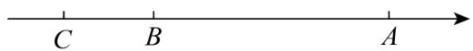
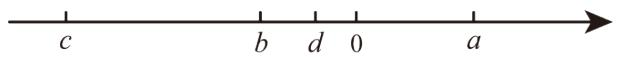
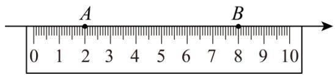
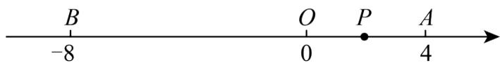

# 专题 06 相反数、绝对值、倒数与整体求值（举一反三专项训练）

# 【北师大版 2024】

考卷信息:

本套训练卷共 40 题. 题型针对性较高, 覆盖面广, 选题有深度, 可加深学生对相反数、绝对值、倒数与整体求值的理解!

1. （23-24 七年级上·湖南娄底·期中）若 $a$ 、 $b$ 互为相反数， $c$ 、 $d$ 互为倒数， $m$ 的绝对值为 2，则 $2m - cd + \frac{a + b}{m}$ 值为（）

A.-3

B. 3

C. -5

D. 3 或 -5

【答案】D

【分析】本题考查了代数式求值，根据题意可得， $a+b=0,\quad cd=1,\quad m=\pm2$ ，代入求解即可．解答本题的关键是掌握相反数，倒数的性质．相反数：只有符号不同的两个数互为相反数．倒数：互为倒数的两个数相乘等于1.

【详解】解：∵a、b互为相反数，c、d互为倒数，m的绝对值是2，

$$
\therefore a + b = 0, c d = 1, m = \pm 2,
$$

∴当m=2时，

$$
2 m - c d + \frac {a + b}{m} = 2 \times 2 - 1 + \frac {0}{2} = 3;
$$

当m=-2时， $2m-cd+\frac{a+b}{m}=2\times(-2)-1+\frac{0}{-2}=-5;$

综上所述， $2m-cd+\frac{a+b}{m}$ 值为3或-5.

故选：D.

2. （24-25 七年级上·云南昆明·阶段练习）若 $a, b$ 互为相反数， $c, d$ 互为倒数， $m$ 到 -2 的距离是 3，则 $5a - 3cd + 5b - |-m|$ 的值为（）

A.-2

B. 2

C. -2或2

D. -4或-8

【答案】D

【分析】本题考查有理数的混合运算，熟练掌握运算法则是解答本题的关键．根据a，b互为相反数，c，d互为倒数，m到-2的距离是3，可以得到 $a+b=0$ ，cd=1， $m=-2+3=1$ 或 $m=-2-3=-5$ ，然后代入所求式子计算即

可。

【详解】解：∵a，b互为相反数，c，d互为倒数，m到-2的距离是3，

$$
\therefore a + b = 0, c d = 1, m = - 2 + 3 = 1 \text {或} m = - 2 - 3 = - 5,
$$

$$
\text {   当   } m = 1 \text {   时，   } 5 a - 3 c d + 5 b - | - m |
$$

$$
= 5 (a + b) - 3 c d - | - m |
$$

$$
= 5 \times 0 - 3 \times 1 - | - 1 |
$$

$$
= 0 - 3 - 1
$$

$$
= - 4;
$$

$$
\text {   当   } m = - 5 \text {   时，   } 5 a - 3 c d + 5 b - | - m |
$$

$$
= 5 (a + b) - 3 c d - | - (- 5) |
$$

$$
= 5 \times 0 - 3 \times 1 - 5
$$

$$
= 0 - 3 - 5
$$

$$
= - 8;
$$

故选：D.

3. 若 $a, b$ 互为相反数，且 $ab \neq 0, c, d$ 互为倒数， $|m| = 2$ ，则 $(a + b)^{2021} + \left(\frac{b}{a}\right)^3 - 3cd + 2m$ 的值是（）

A. 0

B. 0 或 -8

C. -2或6

D. 2 或 -6

【答案】B

【分析】根据题意，先求出 $a+b=0,\quad\frac{b}{a}=-1,\quad cd=1,\quad m=\pm2$ ，然后代入计算即可得到答案.

【详解】解：∵a、b互为相反数，且 $ab\neq0$ ，c、d互为倒数， $|m|=2$ ，

$$
\therefore a + b = 0, \frac {b}{a} = - 1, c d = 1, m = \pm 2,
$$

当m=2时，

原式=0+(-1)-3+2×2=0;

当m=-2时，

原式=0+(-1)-3+2×(-2)=-8;

故选：B.

【点睛】本题考查了求代数式的值，解题的关键是掌握相反数定义、倒数的定义、绝对值的意义.

4. （24-25 七年级上·广东江门·阶段练习）若 $a, b$ 互为相反数， $c, d$ 互为倒数，且 $b \neq 0$ ，则 $(a + b)^{2025} + (cd)^{2024} - \left(\frac{a}{b}\right)^{2025} = (\quad)$

A. 1

B.-1

C.-2

D. 2

【答案】D

【分析】本题考查了相反数，倒数的定义，直接利用相反数以及互为倒数的性质得出 $a+b=0,\quad cd=1$ ，进而得 $\frac{a}{b}=-1$ ，然后代入即可求解，掌握知识点的应用是解题的关键.

【详解】解：∵a，b互为相反数，c，d互为倒数，

$$
\begin{array}{l} \therefore a + b = 0, \quad c d = 1, \\ \because b \neq 0, \\ \therefore \frac {a}{b} = - 1, \\ \therefore (a + b) ^ {2 0 2 5} + (c d) ^ {2 0 2 4} - \left(\frac {a}{b}\right) ^ {2 0 2 5} \\ = 0 ^ {2 0 2 5} + 1 ^ {2 0 2 4} - (- 1) ^ {2 0 2 5} \\ = 0 + 1 + 1 = 2, \\ \end{array}
$$

故选：D.

5. a是相反数等于本身的数，b是绝对值和倒数均等于本身的数，c是最大的负整数，则a-b-c=\_\_\_\_.

【答案】0

【分析】本题考查相反数，绝对值，倒数及负整数，根据相反数等于它本身的数是0，绝对值和倒数等于它本身的数是1，最大负整数是-1代入求解即可得到答案；

【详解】解：∵a是相反数等于本身的数，b是绝对值和倒数均等于本身的数，c是最大的负整数，

$$
\therefore a = 0, \quad b = 1, \quad c = - 1,
$$

$$
\therefore a - b - c = 0 - 1 - (- 1) = 0,
$$

故答案为：0.

6. （23-24 七年级上·广东惠州·期中）若 $a, b$ 互为倒数， $m, n$ 互为相反数， $x$ 的绝对值为 3，则 $ab + 2023m + x^2 + 2023n =$ \_\_\_\_.

【答案】10

【分析】本题考查了代数式求值，倒数的定义，相反数的性质，绝对值的意义；根据倒数的定义得出 $ab = 1$ 根据相反数的性质可得 $m + n = 0$ ，根据绝对值的定义可得 $x = \pm 3$ ，代入代数式，即可求解.

【详解】解：原式= $ab+2023(m+n)+x^{2}=1+0+9=10$ ，

故答案为：10.

7. （23-24 七年级上·河北石家庄·期中）已知有理数 $a, b, c, d, e$ ，且 $a$ 、 $b$ 互为倒数， $c$ 、 $d$ 互为相反数， $e$

绝对值为 5，则 $2ab+\frac{c+d}{5}+5e$ 的值为\_\_\_\_。

【答案】27或-23/-23或27

【分析】本题主要考查倒数、相反数、绝对值及代数式的值，熟练掌握各个运算是解题的关键；由题意易得 $ab=1,c+d=0,e=\pm5$ ，然后代入求解即可.

【详解】解：由题意得： $ab=1,c+d=0,e=\pm5$

∴当 $ab=1,c+d=0,e=5$ 时，则 $2ab+\frac{c+d}{5}+5e=2\times1+\frac{0}{5}+5\times5=27$ ;

当 $ab=1,c+d=0,e=-5$ 时，则 $2ab+\frac{c+d}{5}+5e=2\times1+\frac{0}{5}+5\times(-5)=-23;$

综上所述： $2ab+\frac{c+d}{5}+5e$ 的值为27或-23；

故答案为 27 或 -23.

8. （22-23 七年级上·山东日照·期末）如果 $a, b$ 互为相反数， $c, d$ 互为倒数，正数 $m$ 的绝对值是 5，则 $2023a - (m - 6cd)^{2} + 2023b + 2023$ 的值是 \_\_\_\_.

【答案】2022

【分析】根据相反数和倒数的性质求得 $a+b,cd$ 的值，根据绝对值的意义以及正数的条件求得m的值，进而代入代数式中求解即可.

【详解】∵ a, b 互为相反数，c, d 互为倒数，正数 m 的绝对值是 5，

$$
\begin{array}{l} \therefore a + b = 0, c d = 1, m = 5, \\ 2 0 2 3 a - (m - 6 c d) ^ {2} + 2 0 2 3 b + 2 0 2 3 \\ = 2 0 2 3 (a + b) - (m - 6 c d) ^ {2} + 2 0 2 3 \\ = 0 - (5 - 6) ^ {2} + 2 0 2 3 \\ = 0 - 1 + 2 0 2 3 \\ = 2 0 2 2. \\ \end{array}
$$

【点睛】本题考查了有理数的乘方，分配律，相反数和倒数的性质，绝对值的意义，代数式求值，求得 $a+b$ ,cd,m的值是解题的关键.

9. （22-23 七年级上·江苏常州·期中）数轴上有 $A$ 、 $B$ 两点，点 $A$ 表示 8 的相反数，点 $B$ 表示绝对值最小的数，一动点 $P$ 从点 $B$ 出发，在数轴以 1 单位长度/秒的速度运动，3 秒后，点 $P$ 到点 $A$ 的距离为 \_\_\_\_ 单位长度.

【答案】11或5

【分析】根据题意确定出点 A 与 B 表示的数字，利用平移规律求出所求即可.

【详解】解：根据题意得：A 表示的数为 -8，B 表示的数为 0，

∵点P经过3秒后的路程为 $1\times3=3$ （个单位长度），且向左或向右平移，

∴平移后点 P 对应的数字为 -3 或 3，

∴8-(-3)=8+3=11，或8-3=5，

则点 P 到点 A 的距离为 11 或 5 个单位长度.

故答案为：1 或 5.

【点睛】醒考查数轴上的动点问题，熟练掌握数轴上两点距离的求法是解题关键.

10. （23-24 七年级上·山西吕梁·期中）如图，在数轴上点 A 表示的数 a 是 $(-2)^{3}$ 的相反数，点 B 表示的数 b 是最小的正整数，点 C 表示的数 c 是绝对值是 3 的负整数．若将数轴折叠，使得点 A 与点 C 重合，则与点 B 重合的点表示的数是 \_\_\_\_.

【答案】4

【分析】本题考查了有理数的乘方、绝对值、相反数，对折的性质等基础知识，根据题意正确地用数学语言表示相关概念，是解题的关键.

根据绝对值的性质得出c的值，根据正整数的定义得出b的值，根据乘方和相反数的定义得出点A表示的数，再根据对折的要求，得出对折点，从而根据对折的性质得出与点B重合的点表示的数.

【详解】解：在数轴上点A表示的数a是 $(-2)^{3}$ 的相反数，

$$
\therefore a = - (- 2) ^ {3} = 8,
$$

∵点B表示的数是最小的正整数，

$$
\therefore b = 1,
$$

∵点C表示的数c是绝对值是3的负整数，

$$
\therefore c = - 3,
$$

∵将数轴折叠，点A与点C重合，

∴对折点是 $(-3+8)\div2=2.5$ ,

∴与点B重合的点表示的数是 $2.5+(2.5-1)=4$ .

故答案为：4.

11. （22-23 六年级下·黑龙江哈尔滨·期中）已知：a 与 b 互为倒数，c 与 d 互为相反数，x 的绝对值为 5，求： $x^{2}+(ab+c+d)x+(-ab)^{2022}+(-c-d)^{2023}$ 的值.

【答案】31或21

【分析】根据倒数的定义，相反数的性质，绝对值的意义得出 $x^{2}+(ab+c+d)x+(-ab)^{2022}+(-c-d)^{2023}=26+x$ ，再根据绝对值的意义得出x的值为5或-5，然后分别代入代数式即可求解.

【详解】解：∵a与b互为倒数，c与d互为相反数，x的绝对值为5

$$
\therefore a \times b = 1, c + d = 0, x ^ {2} = 2 5,
$$

$$
\therefore x ^ {2} + (a b + c + d) x + (- a b) ^ {2 0 2 2} + (- c - d) ^ {2 0 2 3} = 2 5 + (1 + 0) x + (- 1) ^ {2 0 2 2} - (c + d) ^ {2 0 2 3} = 2 5 + x + 1 - 0 = 2 6 + x,
$$

∵x的绝对值为5，

∴x的值为5或-5，

$\therefore26+x$ 的值为31或21，

$\therefore x^{2} + (ab + c + d)x + (-ab)^{2022} + (-c - d)^{2023}$ 的值为31或21.

【点睛】本题考查了倒数的定义，相反数的性质，绝对值的意义，有理数的乘方运算，代数式求值，掌握以上知识是解题的关键.

12. （23-24 六年级下·黑龙江哈尔滨·阶段练习）已知 $a$ 和 $b$ 互为相反数且 $b \neq 0, c, d$ 互为倒数， $m$ 的绝对值为 1，求 $\frac{a}{b} + \frac{a+b}{5} + cd+3|m|$ 的值.

【答案】3

【分析】本题考查了相反数、绝对值、倒数、求代数式的值，现根据相反数和倒数的定义得出 $\frac{a}{b}=-1,\quad cd=1$ ，再根据绝对值的意义得出 $|m|=1$ ，代入进行计算即可得出答案.

【详解】解：∵ a 和 b 互为相反数，且 $b \neq 0$ ，

$$
\therefore a + b = 0,
$$

$$
\therefore \frac {a}{b} = - 1,
$$

$\because c$ 、d互为倒数，

$$
\therefore c d = 1,
$$

∵m的绝对值为1，

$$
\therefore | m | = 1,
$$

$$
\therefore \frac {a}{b} + \frac {a + b}{5} + c d + 3 | m | = - 1 + 0 + 1 + 3 = 3.
$$

13. （22-23 七年级上·江苏无锡·期中）若 $a$ 、 $b$ 互为相反数， $c$ 、 $d$ 互为倒数， $|m|=2$ ，求 $3m-(-9)+\frac{2021(a+b)}{2022}-cd$ 的值.

【答案】14或2

【分析】本题考查了相反数的性质，倒数的定义，绝对值的意义，求解代数式的值，熟练掌握相反数的性质，倒数的定义，绝对值的意义是解题的关键．根据题意相反数的性质，倒数的定义，绝对值的意义，得出 $a+b=0,\quad cd=1,\quad m=\pm2$ ，代入代数式，即可求解.

【详解】解：∵a、b互为相反数，

$$
\therefore a + b = 0,
$$

$\because c、d$ 互为倒数，

$$
\therefore c d = 1,
$$

$$
\because | m | = 2,
$$

$$
\therefore m = \pm 2,
$$

当m=2时，原式 $=3\times2+9+0-1=14$ ;

当m=-2时，原式 $=3\times(-2)+9+0-1=2$ .

14. （23-24 七年级上·宁夏吴忠·阶段练习）已知：a、b 互为相反数、且都不为零，c，d 互为倒数，且 $|m|=2$ .

(1)求 m 的值;

(2)求： $m+(a+b)-cd$ 的值.

【答案】(1)m=±2

(2)-1或-3

【分析】此题考查了相反数、倒数、绝对值和代数式求值，掌握整体代入及分类讨论思想是解题的关键.

（1）根据绝对值的性质求解即可；

（2）根据相反数、倒数的定义得 $a+b=0,\quad cd=1$ ，分m=2和m=-2两种情况，代入求值即可.

【详解】（1）∵ $|m|=2$

$$
\therefore m = \pm 2;
$$

(2) $\because a$ 、b互为相反数、且都不为零，c，d互为倒数，

$$
\therefore a + b = 0, \quad c d = 1,
$$

∴当m=2时， $m+(a+b)-cd=2+0-1=1$ ;

当m=-2时， $m+(a+b)-cd=-2+0-1=-3;$

综上所述， $m+(a+b)-cd$ 的值为-1或-3.

15. （23-24 七年级上·甘肃庆阳·期末）已知 $|m|=1$ ， $a$ 和 $b$ 互为倒数， $c$ 和 $d$ 互为相反数，求 $(-ab)^{2024}+50(c+d)-m$ 的值.

【答案】0或2

【分析】本题考查了倒数、相反数、绝对值的意义，代数式求值，根据倒数的定义可得 $ab = 1$ ，根据相反数的定义可得 $c + d = 0$ ，根据绝对值的定义可得 $m = \pm 1$ ，代入求值即可.

【详解】解：由题意知，ab=1， $c+d=0$ ， $m=\pm1$ ，

当 $m = 1$ 时，

原式 $= (-1)^{2024} + 50 \times 0 - 1 = 1 + 0 - 1 = 0$ ;

当 $m = -1$ 时，

原式 $= (-1)^{2024} + 50 \times 0 - (-1) = 1 + 0 + 1 = 2$ ;

综上可知， $(-ab)^{2024}+50(c+d)-m$ 的值为0或2.

16. （23-24 七年级上·甘肃平凉·期中）x 和 y 互为相反数，m 与 n 互为倒数， $|a|=1$ ，求 $a^{2}-(x+y+mn)a+(x+y)^{2012}+(-mn)^{2013}$ 的值.

【答案】1或-1

【分析】本题主要考查化简求值，相反数的性质以及倒数的性质，熟练掌握相反数的性质以及倒数的性质是解题的关键．根据题意得到 $x+y=0,mn=1,a=\pm1$ ，代数求值即可.

【详解】解：∵x 与 y 互为相反数，m 与 n 互为倒数， $|a|=1$ ，

$$
\begin{array}{l} \therefore x + y = 0, m n = 1, a = \pm 1, \\ \therefore a ^ {2} - (x + y + m n) a + (x + y) ^ {2 0 1 2} + (- m n) ^ {2 0 1 3} \\ = a ^ {2} - (0 + 1) a + 0 ^ {2 0 1 2} + (- 1) ^ {2 0 1 3} \\ = a ^ {2} - a - 1. \\ \end{array}
$$

当a=1时， $a^{2}-a-1=1^{2}-1-1=-1$ .

当a=-1时， $a^{2}-a-1=1^{2}-(-1)-1=1+1-1=1$ .

∴ $a^{2}-(x+y+mn)a+(x+y)^{2012}+(-mn)^{2013}$ 的值为 1 或 -1.

17. （23-24 七年级上·河南洛阳·期中）已知：a、b互为相反数，m、n互为倒数，x到2的距离为3．求代数式 $(a+b-mn)x+(a+b)^{2022}+(-mn)^{2033}$ 的值.

【答案】0或-6

【分析】本题考查了相反数、倒数、数轴上两点间距离及代数式求值，解题关键是运用这几个定义的性质进行整体代换．根据题意得 $a+b=0,\quad nm=1,\quad |x-2|=3$ ，代入原式计算即可.

【详解】解：∵a、b互为相反数，m、n互为倒数，x到2的距离为3，

$$
\therefore a + b = 0, m n = 1, x = 5 \text {或} x = - 1,
$$

$$
\therefore (a + b - m n) x + (a + b) ^ {2 0 2 2} + (- m n) ^ {2 0 3 3} = (0 - 1) x + 0 + (- 1) \times 2 0 2 3
$$

$$
= - x - 1,
$$

当x=-1时，原式=-x-1=0，

当x=5时，原式=-x-1=-5-1=-6，

∴代数式 $(a+b-mn)x+(a+b)^{2022}+(-mn)^{2033}$ 值为0或-6.

18. （23-24六年级下·黑龙江哈尔滨·阶段练习）已知 $a$ 和 $b$ 是非0的相反数， $c$ 和 $d$ 互为倒数， $|m| = 2$ 。求 $m^3 - \left(\frac{a}{b}\right)^{2024} + \frac{cd}{2} - 5m$ 的值。

【答案】 $-2\frac{1}{2}$ 或 $1\frac{1}{2}$

【分析】本题考查相反数，倒数，代数式求值，先根据相反数和倒数的定义，得到 $\frac{a}{b}=-1,cd=1$ ，绝对值的意义，得到 $m=\pm2$ ，整体代入代数式求值即可.

【详解】解：由题意，得： $\frac{a}{b}=-1,cd=1,\ m=\pm2,$

∴当m=2时，原式 $=2^{3}-(-1)^{2024}+\frac{1}{2}-5\times2=8-1+\frac{1}{2}-10=-2\frac{1}{2};$

当m=-2时：原式 $=(-2)^{3}-(-1)^{2024}+\frac{1}{2}-5\times(-2)=-8-1+\frac{1}{2}+10=1\frac{1}{2}.$

19. （23-24 七年级上·青海西宁·期中）已知 a, b 互为倒数，c, d 互为相反数，且 m 是最大的负整数，求： $\frac{ab}{4}-3m^{2}+2024c+2024d$ 的值

【答案】 $-\frac{11}{4}$

【分析】利用相反数，倒数，以及负整数定义确定出ab， $c+d$ ，m的值，代入原式计算即可得到结果.

【详解】解：∵a、b互为倒数

∴ab=1, c、d 互为相反数

$$
\therefore c + d = 0
$$

m 为最大的负整数

$$
\therefore m = - 1
$$

∴原式= $\frac{1}{4}\times1-3\times(-1)^{2}+2024\times0=-\frac{11}{4}$

【点睛】此题考查了相反数，倒数，负整数定义，以及有理数的混合运算，熟练掌握运算法则是解本题的关键.

20. （23-24 七年级上·云南文山·阶段练习）已知 a、b 互为相反数，c、d 互为倒数，x=-5．试求下式的值： $|x|-(a+b+cd)+(a+b)+(-cd)$

【答案】3

【分析】根据相反数的两个数和为0，互为倒数的两个数乘积为1得到 $a+b=0,cd=1$ ，代入计算可得答案.

【详解】∵a、b 互为相反数，c、d 互为倒数，

$$
\begin{array}{l} \therefore a + b = 0, c d = 1, \\ \therefore | x | ^ {-} (a + b + c d) ^ {+} (a + b) ^ {+} (- c d) \\ = | - 5 | - (0 + 1) + 0 + (- 1) \\ = 3. \\ \end{array}
$$

【点睛】此题考查了有理数的混合运算，相反数的性质，倒数的性质，熟练掌握相反数及倒数的性质得到 $a + b = 0, cd = 1$ 是解题的关键.

21. （23-24 六年级下·全国·假期作业）若 $a$ 与 $b$ 互为相反数， $x$ 与 $y$ 互为倒数， $m$ 的绝对值和倒数均是它本身， $n$ 的相反数是它本身，求 $\frac{1}{5}(a^{2019} + b^{2019}) - 9\left(\frac{1}{xy}\right)^{2019} + (-m)^{2019} - n^{2019}$ 的值.

【答案】-10

【分析】根据有理数的乘方、倒数、绝对值、相反数的相关概念求解即可.

【详解】解：因为 a 与 b 互为相反数，所以 $a^{2019} + b^{2019} = 0$ .

因为 x 与 y 互为倒数，所以 xy=1.

因为的绝对值和倒数均是它本身，所以 $m = 1$

因为 n 的相反数是它本身，所以 n=0.

所以 $\frac{1}{5} (a^{2019} + b^{2019}) - 9\left(\frac{1}{xy}\right)^{2019} + (-m)^{2019} - n^{2019}$

$$
= \frac {1}{5} \times 0 - 9 \times 1 ^ {2 0 1 9} + (- 1) ^ {2 0 1 9} - 0 ^ {2 0 1 9}
$$

$$
= 0 - 9 - 1 - 0
$$

$$
= - 1 0.
$$

【点睛】本题考查的是相反数的含义，倒数的含义，绝对值的含义，乘方运算，求解代数式的值，熟练的利用代入法求解代数式的值是解本题的关键.

22. （23-24 七年级上·四川凉山·阶段练习）已知 $a, b$ 互为相反数， $c, d$ 互为倒数， $m$ 的绝对值为 3.

(1)求 $m-a-b+cd$ 的值;  
(2)求 $(-cd)^{2023}+m^{2}-\frac{3a+3b}{2024+m}$ 的值.

【答案】(1)4 或 -2

(2)8

【分析】本题考查了相反数，倒数，绝对值的定义，代数式求值，含乘方的有理数混合运算，准确理解并灵活运用所学知识是解答本题的关键.

（1）根据题意得到 $a+b=0,\quad cd=1,\quad m=\pm3$ ，再代入原式进行求解即可；  
(2) 根据题意得到 $a + b = 0, cd = 1, m = \pm 3$ , 再代入原式进行求解即可.

【详解】（1）解：由题意，得 $a+b=0,\quad cd=1,\quad m=\pm3$ .

当m=3时，原式 $m-(a+b)+cd=3-0+1=4;$

当m=-3时，原式 $m-(a+b)+cd=-3-0+1=-2$ .

所以 $m-a-b+cd$ 的值为4或-2;

（2）当m=3时，原式 $=(-1)^{2023}+3^{2}-\frac{3(a+b)}{2024+3}=-1+9-\frac{3\times0}{2027}=8;$

当m=-3时，原式 $=(-1)^{2023}+(-3)^{2}-\frac{3(a+b)}{2024-3}=-1+9-\frac{3\times0}{2021}=8.$

所以 $(-cd)^{2023}+m^{2}-\frac{3a+3b}{2024+m}$ 的值为8.

23. 已知 $a$ 、 $b$ 互为相反数， $c$ 、 $d$ 互为倒数， $m$ 的绝对值等于 5，求 $-m^2 + (cd + a + b)^{2018} \times m + (-cd)^3$ 的值.

【答案】-21或-31

【分析】求得 $a+b$ ，cd及m的值，然后将其代入所给代数式求解即可.

【详解】解：∵a、b互为相反数，c、d互为倒数，

$$
\therefore a + b = 0, c d = 1,
$$

∵m 的绝对值等于 5,

$$
\therefore m = \pm 5,
$$

当 $a+b=0,cd=1,m=5$ 时，

原式 $= -25 + (1 + 0)^{2018} \times 5 + (-1)^{3}$

$$
= - 2 1;
$$

当 $a+b=0,cd=1,m=-5$ 时，

原式 $= -25 + (1 + 0)^{2018}\times (-5) + (-1)^{3}$

$$
= - 3 1;
$$

综上，原式的值为-21或-31.

【点睛】本题考查了求代数式的值，相反数、倒数、绝对值的意义，结合已知条件求得 $a+b$ ，cd及m的值是解题的关键.

24. （23-24六年级下·黑龙江哈尔滨·阶段练习）若 $a$ 、 $b$ 互为相反数， $c$ 、 $d$ 互为倒数，且 $\vert 2m + 3\vert = 0$ ，求

$\frac{(a + b)^{10}}{2m} - 3(mcd)^2$ 的值.

【答案】 $-\frac{27}{4}$

【分析】本题主要考查相反数，绝对值，倒数，平方的概念及性质，熟练掌握基本知识是解题的关键.
本题由 $a+b=0,cd=1,\ m=-\frac{3}{2}$ ，代入求值即可.

【详解】解：由题意得： $a+b=0,cd=1$ ,

$$
\because | 2 m + 3 | = 0
$$

$\therefore 2m+3=0$ ，解得： $m=-\frac{3}{2}$

$$
\therefore \frac {(a + b) ^ {1 0}}{2 m} - 3 (m c d) ^ {2} = \frac {0 ^ {1 0}}{2 \times \left(- \frac {3}{2}\right)} - 3 \left(- \frac {3}{2} \times 1\right) ^ {2} = - \frac {2 7}{4}.
$$

25. （23-24 七年级上·河南商丘·期末）若 $a, b$ 互为相反数， $c, d$ 互为倒数， $m$ 到原点的距离为 2 个单位长度， $n$ 既不是正数也不是负数，求 $\left(\frac{a+b}{m}\right)^{2024} + m^2 - (cd)^{2023} + n(a+b+c+d)$ 的值.

【答案】3

【分析】本题考查相反数、倒数定义以及代数式求值，先根据题意得到 $a+b=0,cd=1,m^{2}=4,n=0$ ，再整体代入计算即可.

【详解】解：∵a,b互为相反数，c,d互为倒数，m到原点的距离为2个单位长度，n既不是正数也不是负数，

$$
\therefore a + b = 0, c d = 1, m ^ {2} = 4, n = 0,
$$

$$
\begin{array}{l} \left(\frac {a + b}{m}\right) ^ {2 0 2 4} + m ^ {2} - (c d) ^ {2 0 2 3} + n (a + b + c + d) \\ = \left(\frac {0}{m}\right) ^ {2 0 2 4} + 4 - 1 ^ {2 0 2 3} + 0 \times (a + b + c + d) \\ = 0 + 4 - 1 + 0 \\ = 3. \\ \end{array}
$$

26. （23-24 七年级上·湖南长沙·阶段练习）已知：a 是最大的负整数，b 是绝对值最小的数，c 是倒数等于本身的正数，试回答问题：

(1)请直接写出 a, b, c 的值;

(2)若 $a, b, c$ 所对应的点分别为 $A, B, C$ , 点 $P$ 为一动点, 其对应的数为 $x$ , 点 $P$ 在 $A$ 到 $C$ 之间运动时,请化简式子: $|x + 1| - |1 - x| + 2|x - 3|$ .

【答案】(1)a=-1, b=0, c=1

(2)6

【分析】本题考查了有理数、绝对值以及数轴，

（1）根据 a 是最大的负整数，b 是绝对值最小的数，c 是倒数等于本身的正数，即可得出 a、b，c 的值；  
（2）先确定 $-1\leq x\leq1$ ，分析当 $-1\leq x\leq1$ 时， $x+1$ 、1-x、x-3的正负，去掉绝对值符号即可得出结论；

【详解】（1）∵a 是最大的负整数，b 是绝对值最小的数，c 是倒数等于本身的正数，

$$
\therefore a = - 1, b = 0, c = 1;
$$

(2) $\because P$ 在 A 和 C 之间，

$$
\therefore - 1 \leq x \leq 1,
$$

$$
\therefore x + 1 > 0, \quad 1 - x \geq 0, \quad x - 3 <   0,
$$

$$
\therefore | x + 1 | - | 1 - x | + 2 | x - 3 | = x + 1 - (1 - x) + 2 (3 - x) = 6
$$

27. （23-24 七年级上·甘肃陇南·期中）已知 $a, b (b \neq 0)$ 互为相反数， $c, d$ 互为倒数， $x$ 的绝对值等于 2，试求 $x^{2} - (a + b - cd)x + \left(\frac{a}{b}\right)^{2023}$ 的值.

【答案】 $x^{2}-(a+b-cd)x+\left(\frac{a}{b}\right)^{2023}$ 的值为5或1

【分析】本题考查有理数的混合运算，求代数式的值，相反数的定义，倒数的定义，绝对值的性质，根据题意得到 $a+b=0,cd=1,|x|=2$ ，即 $x=\pm2,\frac{a}{b}=-1$ ，分情况代入计算即可.

【详解】解：由题意可知， $a+b=0,cd=1,|x|=2,$

$$
\therefore x = \pm 2, \frac {a}{b} = - 1,
$$

当x=2时，

$$
\text {   原式   } = 2 ^ {2} - (0 - 1) \times 2 + (- 1) ^ {2 0 2 3}
$$

$$
= 4 + 2 + (- 1)
$$

$$
= 6 + (- 1)
$$

$$
= 5;
$$

当x=-2时，

$$
\text {原式} = (- 2) ^ {2} - (0 - 1) \times (- 2) + (- 1) ^ {2 0 2 3}
$$

$$
= 4 - 2 + (- 1)
$$

$$
= 2 + (- 1)
$$

$$
= 1;
$$

综上所述. $x^{2} - (a + b - cd)x + \left(\frac{a}{b}\right)^{2023}$ 的值为5或1.

28. 已知 $|x - 3| + (y - 2)^{2} = 0$ ， $b$ 和 $d$ 互为倒数， $m$ 和 $n$ 的绝对值相等，且 $mn < 0$ ， $p$ 是最大的负整数。求 $(p + y)^{2} + m(x + bd) + ny^{2}$ 的值。

【答案】1

【分析】本题考查倒数，绝对值，绝对值及偶次幂的非负性，根据绝对值及偶次幂的非负性求得 $x, y$ 的值，然后根据倒数的定义求得 $bd = 1$ ，再根据绝对值的性质及 $mn < 0$ 可得 $m + n = 0$ ，由 $p$ 是最大的负整数求得 $p$ 的值，然后将它们代入 $(p + y)^2 + m(x + bd) + ny^2$ 中计算即可.

【详解】解：∵ $|x-3|+(y-2)^{2}=0$ ，

$$
\therefore x - 3 = 0, \quad y - 2 = 0,
$$

$$
\therefore x = 3, \quad y = 2,
$$

∵b 和 d 互为倒数，m 和 n 的绝对值相等，且mn<0，p 是最大的负整数，

$$
\begin{array}{l} \therefore b d = 1, \quad m + n = 0, \quad p = - 1, \\ \therefore (p + y) ^ {2} + m (x + b d) + n y ^ {2} \\ = (- 1 + 2) ^ {2} + (3 + 1) m + 2 ^ {2} n \\ = 1 + 4 m + 4 n \\ = 1 + 4 (m + n) \\ = 1 + 4 \times 0 \\ = 1. \\ \end{array}
$$

29. （23-24 七年级上·江苏无锡·阶段练习）已知 $a$ 是最小的正整数， $b$ 是绝对值最小的有理数， $c$ 的倒数是 $-2, d$ 的绝对值是 5．求 $a \cdot c - b - |d|$ 的值．（说明 $a \cdot c$ 表示 $a$ 与 $c$ 的乘积）

【答案】 $-5\frac{1}{2}$

【分析】此题考查了有理数的混合运算，绝对值，以及倒数，解本题的关键是求出a，b及c， $|d|$ 的值.根据题意求出a，b及c， $|d|$ 的值，代入计算即可求出值.

【详解】解：根据题意得：a=1，b=0， $c=-\frac{1}{2}$ ， $|d|=5$ ，

$$
\text { 则 } a \cdot c - b - | d |
$$

$$
= 1 \times \left(- \frac {1}{2}\right) - 0 - 5
$$

$$
= - \frac {1}{2} - 5
$$

$$
= - 5 \frac {1}{2}.
$$

30. （23-24 七年级上·江苏无锡·阶段练习）已知有理数 a、b 互为相反数且 $b \neq 0$ ，c、d 互为倒数，m 的绝对值是最小的正整数，求 $m^{2}-\frac{a}{b}+\frac{a+b}{2023}-cd$ 的值.

【答案】1

【分析】本题考查了求代数式的值，以及相反数，倒数的定义，熟练掌握知识点是解题的关键．根据题意得出 $a+b=0,cd=1,\ m^{2}=1$ 求出答案即可.

【详解】解：由题意得：∵有理数 a、b 互为相反数，

$$
\therefore a + b = 0,
$$

∵ c、d 互为倒数，

$$
\therefore c d = 1,
$$

∵ m 的绝对值是最小的正整数，

$$
\therefore m ^ {2} = 1,
$$

原式=1-(-1)+0-1=1.

31. （23-24 八年级上·广东中山·期中）已知 $a$ 与 $b$ 互为相反数， $c$ ， $d$ 互为倒数，且 $(x + 3)^{2} + |y - 2| = 0$ ，求 $2(a + b) - 2(cd)^{4} + (x + y)^{2023}$ 的值.

【答案】-3

【分析】先根据相反数的定义可得 $a+b=0$ ，根据倒数的定义可得cd=1，根据偶次方和绝对值的非负性可得x=-3,y=2，再代入计算即可得.

【详解】解：∵a与b互为相反数，c,d互为倒数，

$$
\therefore a + b = 0, \quad c d = 1,
$$

$$
\because (x + 3) ^ {2} + | y - 2 | = 0,
$$

$$
\therefore x + 3 = 0, y - 2 = 0,
$$

解得x=-3,y=2,

$$
\text { 则 } 2 (a + b) - 2 (c d) ^ {4} + (x + y) ^ {2 0 2 3}
$$

$$
= 2 \times 0 - 2 \times 1 ^ {4} + (- 3 + 2) ^ {2 0 2 3}
$$

$$
= 0 - 2 \times 1 + (- 1) ^ {2 0 2 3}
$$

$$
= 0 - 2 + (- 1)
$$

$$
= 0 - 2 - 1
$$

$$
= - 3.
$$

【点睛】本题考查了相反数、倒数、偶次方和绝对值的非负性、代数式求值等知识点，熟练掌握代数式求

值的方法是解题关键.

32. （23-24 七年级上·广东深圳·期中）若 $a, b$ 互为相反数， $c, d$ 互为倒数， $|m| = 4$ ，则：

(1) $a+b=$ \_\_\_\_; cd=\_\_\_\_; m=\_\_\_\_;

(2)求 $\frac{a+b}{3}+m^{2}-5cd$ 的值.

【答案】(1)0, 1, ±4

(2)11

【分析】（1）根据相反数、倒数、绝对值的意义，即可求解；

(2) 将 (1) 中式子, 代入代数式, 即可求解.

【详解】（1）解：∵a，b互为相反数，c，d互为倒数， $|m|=4$ ，

$$
\therefore a + b = 0, c d = 1, m = \pm 4,
$$

故答案为：0，1，±4.

(2) 解: $\because a+b=0, cd=1, m=\pm4$ ,

∴原式=0+16-5=11

【点睛】本题考查了反数、倒数、绝对值的意义，有理数的乘方，代数式求值，熟练掌握反数、倒数、绝对值的意义是解题的关键.

33. （23-24 七年级上·四川成都·期中）已知有理数 $a, b, c, d$ 在数轴上的位置如图所示：

(1)化简： $|d|-|b+c|+|c-a|$ ;

(2)若 $|a|=|b|$ ，且c，d互为倒数，数m在数轴上对应的点M到原点的距离等于1，求 $(1+a+b)m^{2}-3cd+m^{2023}$ 的值.

【答案】(1) $a+b-d$

(2)-1或-3

【分析】本题主要考查了数轴、相反数、倒数、绝对值、有理数的乘方，熟练掌握以上知识点并灵活运用是解此题的关键.

（1）由数轴得出a>0>d>b>c，从而得出d<0， $b+c<0$ ，c-a<0，再根据绝对值的意义化简即可；

（2）根据相反数、倒数的定义得到 $a+b=0,\quad cd=1$ ，再根据数m在数轴上对应的点M到原点的距离等于1，得出 $m=\pm1$ ，代入式子进行计算即可.

【详解】（1）解：∵a>0>d>b>c，

$$
\therefore d <   0, \quad b + c <   0, \quad c - a <   0,
$$

$$
\therefore | d | = - d, \quad | b + c | = - b - c, \quad | c - a | = a - c,
$$

∴原式=-d-(-b-c)+(a-c)=-d+b+c+a-c=a+b-d;

(2) 解: $\because a>0>b,\quad|a|=|b|$ ,

$$
\therefore a + b = 0,
$$

$\because c, d$ 互为倒数，

$$
\therefore c d = 1,
$$

∵点M到原点的距离等于1，

$$
\therefore | m | = 1,
$$

$$
\therefore m = \pm 1,
$$

∴当m=1时，原式 $=(1+0)\times1^{2}-3+1^{2023}=-1$ ，

∴当m=-1时，原式 $=(1+0)\times(-1)^{2}-3+(-1)^{2023}=-3$ ，

∴原式的值为-1或-3.

34. （24-25 七年级上·河南周口·阶段练习）已知 a 与 2 互为相反数，b 与 $-\frac{1}{3}$ 互为倒数.

(1)则 $a=$ \_， $b=$ \_。

(2)已知 $|m-a|+|b+n|=0$ ，求 $m+n$ 的绝对值.

【答案】(1)-2，-3

(2)1

【分析】本题考查了相反数、倒数、绝对值非负数的性质，熟练掌握相反数、倒数的定义以及非负数的性质是解题的关键.

（1）根据相反数、倒数的定义求出 a、b 的值即可；  
（2）根据非负数的性质即可求出 m、n 的值，从而求出 $m+n$ 的绝对值.

【详解】（1）解：∵a 与 2 互为相反数，，

$$
\therefore a = - 2,
$$

$\because b$ 与 $-\frac{1}{3}$ 互为倒数

$$
\therefore b = - 3,
$$

故答案为：-2，-3；

(2) $\because |m-a|+|b+n|=0,$

$$
\therefore m - a = 0, \quad b + n = 0,
$$

又∵a=-2，b=-3，

$$
\therefore m = - 2, \quad n = 3,
$$

$$
\therefore | m + n | = | - 2 + 3 | = 1,
$$

$\therefore m+n$ 的绝对值为1.

35. （24-25 七年级上·湖北武汉·阶段练习）已知 $a, b$ 互为相反数， $c, d$ 互为倒数， $m$ 是绝对值最小的数，且 $(x - 1)^2 + |y - 2| = 0$ 。求 $3(a + b) + 6cd - 5xy + m$ 的值。

【答案】-4

【分析】本题考查有理数的混合运算，相反数，倒数，绝对值的非负性，根据题意可知 $a+b=0,\quad cd=1,\quad m=0$ ，根据绝对值的非负性求出x，y的值，然后代入原式即可求出答案.

【详解】解：由题意可知： $a+b=0,\quad cd=1,\quad m=0,$

$$
\because (x - 1) ^ {2} \geq 0, | y - 2 | \geq 0, \text {且} (x - 1) ^ {2} + | y - 2 | = 0,
$$

$$
\therefore (x - 1) ^ {2} = 0, \quad | y - 2 | = 0,
$$

$$
\therefore x - 1 = 0, \quad y - 2 = 0,
$$

$$
\therefore x = 1, \quad y = 2.
$$

∴原式= $3\times0+6\times1-5\times1\times2+0$

$$
= 0 + 6 - 1 0 + 0
$$

$$
= - 4.
$$

36. (23-24 七年级上·湖南长沙·阶段练习)已知 $a$ 与 $b$ 互为相反数, $c$ 与 $d$ 互为倒数, $x$ 与 $y$ 满足 $|x - 2| + |y - 1012|$ $= 0$ , 求 $a + b + cd + xy - 1$ 的值.

【答案】2024

【分析】本题考查了绝对值的非负性，相反数的性质，倒数的性质，根据题意可知 $a+b=0,\quad cd=1,\quad x=2,y=1012$ ，代入求值即可.

【详解】解：∵a 与 b 互为相反数，

$$
\therefore a + b = 0,
$$

$\because c$ 与 d 互为倒数，

$$
\therefore c d = 1,
$$

∵x 与 y 满足 $|x-2|+|y-1012|=0$ ,

$$
\therefore x - 2 = 0, y - 1 0 1 2 = 0,
$$

$$
\therefore x = 2, y = 1 0 1 2,
$$

$$
\begin{array}{l} \therefore a + b + c d + x y - 1 \\ = 0 + 1 + 2 \times 1 0 1 2 - 1 \\ = 1 + 2 0 2 4 - 1 \\ = 2 0 2 4. \\ \end{array}
$$

37. （24-25 七年级上·广西南宁·阶段练习）根据下列条件求值：

(1)若 a、b 互为相反数，c、d 互为倒数，m 为 6，求 $\frac{a+b}{m}+cd-m$ 的值.

(2)已知ab<0， $|a|=3$ ，b是最小的正整数，求 $a+b$ 的值.

【答案】(1)-5

(2)-2

【分析】此题考查了相反数，绝对值，以及倒数，熟练掌握各自的定义是解本题的关键.

（1）利用相反数，倒数意义求出， $a+b=0,\quad cd=1,\quad m=6$ ，代入原式计算即可得到结果.

（2）先由 b 是最小的正整数，得 b=1，又因为 ab<0， $|a|=3$ ，则 a=-3，再代入进行计算，即可作答.

【详解】（1）解：∵a、b互为相反数，c、d互为倒数，m的绝对值为6，

$$
\begin{array}{l} \therefore a + b = 0, \quad c d = 1, \quad m = 6, \\ \frac {a + b}{m} + c d - m = \frac {0}{6} + 1 - 6 = - 5. \\ \end{array}
$$

（2）解：∵ $|a|=3$ ，b是最小的正整数，

$$
\therefore b = 1, \quad a = \pm 3,
$$

$$
\because a b <   0,
$$

$$
\therefore a = - 3,
$$

$$
\therefore a + b = - 3 + 1 = - 2.
$$

38. （23-24 七年级上·湖南益阳·期中）七年级的小李同学在学习有理数时遇到了这样一个题，老师说这个考查同学们做题时是否分情况讨论“若a，b互为相反数，c，d互为倒数，m的绝对值为5”小李同学拿到了满分，期待你的解答.

(1)直接写出 $a+b$ , cd, m的值;  
(2)求 $m^{2}+cd+\frac{a+b}{m}$ 的值.

【答案】(1) $a+b=0,\quad cd=1,\quad m=\pm5$

(2)26

【分析】本题主要考查了相反数、倒数、绝对值的定义、代数式求值等知识点，掌握相关定义成为解题的

关键.

（1）根据相反数、倒数、绝对值的定义即可解答；  
(2) 将 (1) 的相关结论代入代数式求解即可.

【详解】（1）解：∵a，b互为相反数，c，d互为倒数，m的绝对值为5，

$$
\therefore a + b = 0, c d = 1, m = \pm 5.
$$

(2) 解: $\because a+b=0,\quad cd=1,\quad m=\pm5,$

∴当m=5时， $m^{2}+cd+\frac{a+b}{m}=5^{2}+1+\frac{0}{5}=25+1+0=26;$

当m=-5时， $m^{2}+cd+\frac{a+b}{m}=(-5)^{2}+1+\frac{0}{-5}=25+1+0=26.$

综上原式得值为 26.

39. （24-25 七年级上·江苏连云港·阶段练习）以 1 厘米为 1 个单位长度用直尺画数轴时，数轴上点 A 和点 B 表示的数互为相反数，点 A 和点 B 刚好对着直尺上的刻度 2 和刻度 8.

text_image

A
B
0 1 2 3 4 5 6 7 8 9 10

(1)写出点 A 和点 B 表示的数;  
(2)写出与点 B 距离为 8.5 厘米的直尺左端点 C 表示的数;  
(3)在数轴上有一点 D，其到 A 的距离为 1，到 B 的距离为 5，求点 D 所表示的数的倒数.

【答案】(1)A 表示-3，B 表示 3

(2)-5.5   
(3) $-\frac{1}{2}$

【分析】本题考查数轴上两点间距离，相反数等知识，数形结合是解题的关键.

（1）根据 A, B 两点在数轴上的位置判断即可；  
(2) 根据两点之间的距离的定义, 解决问题即可;  
(3) 根据题意判断出点 $D$ 表示的数是 -2，即可.

【详解】（1）解：∵A 对应刻度 2，B 对应刻度 8，

$$
\therefore A B = 8 - 2 = 6,
$$

∵A，B在数轴上互为相反数，A在左，B在右，

$\therefore A$ 表示-3，B 表示 3；

(2) 解: $\because B$ 表示 3, $C$ 在点 $B$ 左侧, 并与点 $B$ 距离为 8.5 厘米,

∴C 表示的数为3-8.5=-5.5;

(3) 解: $\because$ 点 $D$ 到 $A$ 的距离为 1 , 到 $B$ 的距离为 5 , 且 $AB = 6$ ,

∴点D在A,B之间，

∴点D表示的数为： $-3+1=-2$ ，

∴点 D 所表示的数的倒数为 $-\frac{1}{2}$ .

40. （24-25 七年级上·吉林长春·阶段练习）如图，点 O 是数轴的原点，数轴上点 A、B 表示的数分别是 4、-8。这个数轴上的动点 P 以每秒 2 个单位长度的速度从点 O 出发沿 $O \rightarrow A \rightarrow B$ 方向运动到点 B 停止。设点 P 的运动时间为 $t(s)(t > 0)$ 。

text_image

B
-8
O
P
A
0
4

(1)当点 P 与点 A 重合时，求 t 的值；

(2)当点 P 表示的是绝对值最小的数时，求 t 的值；

(3)当点 P 表示的数是倒数等于它本身的数时，求 t 的值；

(4)在点 A、B 之间，当点 P 表示的整数的点找不到与它到原点的距离相等的点时，直接写出 t 的值（写出两个即可）.

【答案】(1)t=2秒;

(2)t=0秒或t=4秒;   
(3) $t=\frac{1}{2}$ 秒或 $t=\frac{7}{2}$ 秒或 $t=\frac{9}{2}$ 秒；  
(4) $t=\frac{13}{2}$ 秒或t=7秒或 $t=\frac{15}{2}$ 秒或t=8秒.

【分析】本题考查了绝对值的性质、相反数、倒数和数轴，解题关键是要读懂题目的意思，根据题目给出的条件求解.

(1) 由题意得点 $P$ 运动的距离为 4 个单位长度, 再根据时间=路程÷速度, 即可求解:  
(2) 由题意得绝对值最小的数是 0，同 (1) 即可求解；  
（3）由题意得倒数等于它本身的数是1或-1，同（1）即可求解；  
(4) 由题意得点 $P$ 表示的数为-5或-6或-7或-8，同（1）即可求解.

【详解】（1）解：当点 P 与点 A 重合时，点 P 运动的距离为 4 个单位长度，此时， $t=\frac{4}{2}=2$ 秒；

(2) 解: $\because$ 绝对值最小的数是 0, 则点 $P$ 运动的距离为 0 或 8 个单位长度,

$\therefore t=\frac{0}{2}=0$ 秒或 $t=\frac{8}{2}=4$ 秒；

（3）解：∵倒数等于它本身的数是1或-1，则点P运动的距离为1或7或9个单位长度， $\therefore t=\frac{1}{2}$ 秒或 $t=\frac{7}{2}$ 秒或 $t=\frac{9}{2}$ 秒；  
（4）解：由题意得点 P 表示的数为 -5 或 -6 或 -7 或 -8，则点 P 运动的距离为 13 或 14 或 15 或 16 个单位长度，∴ $t=\frac{13}{2}$ 秒或 $t=\frac{14}{2}=7$ 秒或 $t=\frac{15}{2}$ 秒或 $t=\frac{16}{2}=8$ 秒.