# 专题07 与有理数有关的四大创新题型（举一反三专项训练）

# 【北师大版 2024】

考卷信息:

本套训练卷共 40 题，含四大类型的创新题型，每种题型各 10 题。题型针对性较高，覆盖面广，选题有深度，可加深学生对与有理数有关的阅读理解与新定义的理解！

# 【题型1 探究进位制】

1. （24-25 七年级上·浙江杭州·阶段练习）计算机中常用的 16 进制是逢 16 进 1 的计算制，采用数字 0-9 和字母 A-F 共 16 个计数符号，这些符号与十进制的数对应关系如下表.

<table><tr><td>16进制</td><td>0</td><td>1</td><td>2</td><td>3</td><td>4</td><td>5</td><td>6</td><td>7</td><td>8</td><td>9</td><td>A</td><td>B</td><td>C</td><td>D</td><td>E</td><td>F</td></tr><tr><td>10进制</td><td>0</td><td>1</td><td>2</td><td>3</td><td>4</td><td>5</td><td>6</td><td>7</td><td>8</td><td>9</td><td>10</td><td>11</td><td>12</td><td>13</td><td>14</td><td>15</td></tr></table>

例如，用十六进制表示： $E+D=1B$ ，则 $C\times D=$ （）

A. 156

B. 19

C. 9C

D. $A6$

2. （24-25 七年级上·黑龙江哈尔滨·期末）进位制是人们为了记数和运算方便而约定的记数系统。约定逢十进一就是十进制，逢二进一就是二进制，也就是说“逢几进一”就是几进制

十进制数 $1024=1\times10^{3}+0\times10^{2}+2\times10^{1}+4$ ，记作1024；

八进制数 $(1024)_{8}=1\times8^{3}+0\times8^{2}+2\times8^{1}+4$ ，记作 $(1024)_{8}$ ;

五进制数 $(1024)_{5}=1\times5^{3}+0\times5^{2}+2\times5^{1}+4$ ，记作 $(1024)_{5}$ ;

二进制数 $(1011)_{2}=1\times2^{3}+0\times2^{2}+1\times2^{1}+1$ ，记作 $(1011)_{2}$ ;

二进制数 $(1101)_{2}$ 转化为十进制数为（）

A. 12

B. 13

C. 14

D. 15

3. （24-25 七年级上·河南南阳·期末）我们常用的十进制数，如 $2639 = 2 \times 10^{3} + 6 \times 10^{2} + 3 \times 10^{1} + 9$ ，我国古代易经一书记载，远古时期，人们通过在绳子上打结来记录数量，如图，一位母亲在如下排列的绳子上打结，并采用七进制（如 $2513 = 2 \times 7^{3} + 5 \times 7^{2} + 1 \times 7^{1} + 3$ ），用来记录孩子自出生后的天数，由图可知，孩子自出生后的天数是 \_\_\_\_ 天。

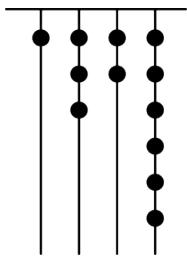

natural_image

Pure vertical lines with evenly spaced black dots, no text or symbols present

4. （24-25 七年级上·广东中山·期末）十进制整数转化为二进制整数通常采用除二取余法，即用 2 连续除十进制数，直到商为 0，逆序排列余数即可得到二进制数，简称除二取余法。同样，十进制数转化为六进制数可用除六取余法。如图是将十进制数 13 和 500 转化为二进制数和六进制数的方法，参照该方法将十进制数 2000 转化为八进制数为\_\_\_\_。

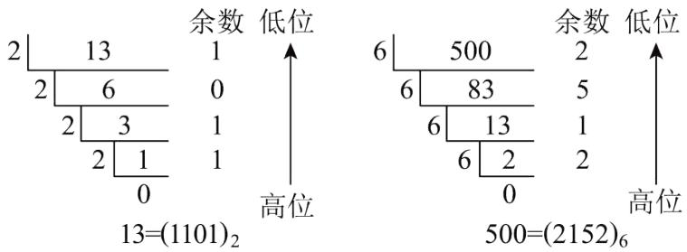

5. （24-25 七年级上·北京西城·期末）进位制是人们为了记数和运算方便而约定的记数系统。约定逢三进一就是三进制，用数字0，1，2记数，三进制数可以转换为十进制数。例如，三进制数1212记为 $(1212)_{3}$ ，由 $(1212)_{3}=1\times3^{3}+2\times3^{2}+1\times3^{1}+2\times3^{0}=50$ ，可得 $(1212)_{3}$ 是十进制数50。

(1)将 $(201)_{3}$ 转换为十进制数，结果是\_\_\_\_；  
(2)对于一个用三进制表示的正整数，有下列两个结论：

①如果这个数的末位数字能被2整除，那么这个数就能被2整除；  
②如果这个数的所有数位上的数字之和能被2整除，那么这个数就能被2整除.

从中选出正确结论，并以四位的三进制数 $(\overline{abcd})_{3}$ 为例，说明该结论正确的道理.

6. （24-25 七年级上·重庆九龙坡·期末）由本学期学习《进位制的认识与探究》知，进位制是人们为了记数和运算方便而约定的记数系统。约定逢十进一就是十进制，逢二进一就是二进制，也就是说“逢几进一”就是几进制，几进制的基数就是几，以此类推， $M(M \neq 10)$ 进制就是逢 $M$ 进一。为与十进制进行区分，我们常把用 $M$ 进制表示的数 $a$ 写成 $(a)_M$ 。 $M$ 进制的数转化为十进制的数的方法是：若 $M$ 进制表示的数为 $(1111)_M$ ，则转换为十进制数的过程为 $(1111)_M = 1 \times M^3 + 1 \times M^2 + 1 \times M^1 + 1 \times M^0$ （规定当 $M \neq 0$ 时， $M^0 = 1$ ）。根据你所学知识与学习活动体悟，完成以下问题：

(1)把下列进制表示的数转化为十进制表示的数: $(1011)_2 =$ \_\_\_\_， $(1024)_5 =$ \_\_\_\_；  
(2)已知二进制数 $s=(1110)_{2}+(1011)_{2}$ ，请计算并写出s的值（要求写成二进制表示的数）；

(3)请把 $(11001)_{2}$ 转换成十二进制的数.

7. （2025·广东中山·三模）综合与实践：某校七年级课外实践小组进行进位制的认识与探究活动，过程如下：

# 【进位制的认识】

①进位制是人们为了记数和运算方便而约定的记数系统。约定逢十进一就是十进制，逢二进一就是二进制，即“逢几进一”就是几进制，几进制的基数就是几。  
②为了区分不同的进位制，常在数的右下角标明基数，例如， $(1011)_2$ 就是二进制数 1011 的简单写法。十进制数一般不标注基数。  
③一个数可表示成各数位上的数字与基数的幂的乘积之和的形式. 规定当 $a \neq 0$ 时, $a^0 = 1$ . 如: $3721 = 3 \times 10^{3} + 7 \times 10^{2} + 2 \times 10^{1} + 1 \times 10^{0}$ ; (421) $_{7} = 4 \times 7^{2} + 2 \times 7^{1} + 1 \times 7^{0}$ .

【解决问题】教辅资源，关注公众号★全科AA+

(1)我国古代《易经》一书中记载, 远古时期, 人们通过在绳子上打结来记录数量, 即“结绳计数”。一位母亲在从右到左依次排列的绳子上打结, 采取满七进一的方式, 用来记录孩子自出生后的天数。例如图 1 表示的是孩子出生后 30 天时打绳结的情况 (因为: $4 \times 7^{1} + 2 = 30$ ), 那么由图 2 可知, 孩子出生后的天数是 \_\_\_\_ 天

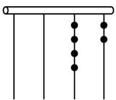

natural_image

Simple diagram of a horizontal bar with vertical lines and evenly spaced black dots (no text or symbols)

图1

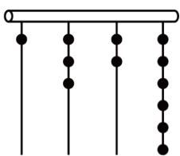

natural_image

Simple diagram of vertical lines with dots at each end, no text or symbols present

图2

(2)类比十进制加减法计算（结果保留二进制）

例如 $(11011)_{2}+(1101)_{2}=(101000)_{2}$ ;

写出 $(11011)_{2}-(1101)_{2}=$

(3)小华设计了一个 n 进制数 265，换算成十进制数是 145，求 n 的值（n 为正整数）.

8. （24-25 七年级上·重庆忠县·期末）综合与实践：阅读下列材料：

【材料1】“逢几进一”就是几进制，几进制的基数就是几，书写时将进制的基数写在右下角，如 $(110)_2$ 表示二进制的110，十进制的进制的基数10通常省略不写．各进制数之间可以互相转换，例如：二进制数 $(10110)_2$ 转换成十进制数： $(10110)_2 = 1\times 2^4 +0\times 2^3 +1\times 2^2 +1\times 2^1 +0\times 2^0 = (22)_{10} = 22$ ，若将十进制数转化成与其相等的 $n$ 进制数，只需将十进制数除以 $n$ 取余数，再倒序排列，例如：将十进制数231转换成七进制数，其转换方法如图所示，并记为 $231 = (450)_7$

$$
\begin{array}{c} 7 \underline {{2 3 1}} \dots \dots 0 \\ 7 \underline {{3 3}} \dots \dots 5 \\ 4 \dots \dots 4 \end{array}
$$

【材料2】n进制数的四则运算与十进制数的四则运算规则相同，满n进一，数位称呼仍把从右至左的每个数位依次称为个位、十位、百位等，例如： $(231)_{4}+(121)_{4}=(1012)_{4}$ ， $(520)_{7}-(321)_{7}=(166)_{7}$ .

根据以上学习材料，求解以下问题：

(1)写出 $(301)_{4}$ 转换为十进制数和58转换为二进制数的结果;  
(2)①在二进制中计算 $(11010)_{2}+(10111)_{2}$ ;   
②在八进制中计算 $(435)_{8}\times2$ ;  
(3)规定: 若一个三位的九进制数 $x$ 和另一个三位八进制数 $y$ 的百位、十位、个位数字都相同, 则称 $x$ 和 $y$ 是“同位数”。那么是否存在百位数字为 1 , 十位数字为 $m$ , 个位数字为 $n$ 的“同位数” $x$ 和 $y$ 满足 $(x)_{9} \div (10)_{9} + (y)_{8} \div (10)_{8} = (203)_{4} - [(3013)_{4} \div (1020)_{4}] \times n$ , 若存在, 求出 $m$ 和 $n$ 的值, 若不存在, 说明理由。

# 9. （24-25 七年级上·辽宁辽阳·期中）【综合与实践】

阅读下列材料:

进位制是人们为了记数和运算方便而约定的记数系统，约定逢十进一就是十进制，逢二进一就是二进制，也就是说，“逢几进一”就是几进制，几进制的基数就是几．为了区分不同的进位制，常在数的右下角标明基数．例如： $(1101)_{2}$ 就是二进制数 1101 的简单写法，十进制数一般不标注基数， $(\overline{abc})_{n}$ ，表示这个 n 进制数从右起，第一位上的数字为 c，第二位上的数字为 b，第三位上的数字为 a．一个数可以表示成各数位上的数字与基数的幂的乘积之和的形式．例如十进制数 $5678=5\times10^{3}+6\times10^{2}+7\times10^{1}+8\times10^{0}$ （当 $a\neq0$ 时， $a^{0}=1$ ）．同理，二进制数 $(1101)_{2}$ 转换为十进制为： $12^{3}+12^{2}+02^{1}+12^{0}=13$ ．一个十进制数转换为 n 进制数时，把十进制数表示成 0，1，2，…，n-1 与基数 n 的幂的乘积之和的形式．例如，将十进制数 46 转换为三进制数，因为 27<46<81，即 $3^{3}<46<3^{4}$ ，则 $46=13^{3}+23^{2}+03^{1}+13^{0}$ ，所以 46 转换为三进制数为 $(1210)_{3}$ ，根据上述材料，解答下列问题．

(1)①把二进制数(1011),转换为十进制数;   
②把十进制数 29 转换为二进制数.  
(2)把十进制数 63 转换为五进制数;  
(3)若一个三进制数转换为十进制数为 $m$ ，一个四进制数转换为十进制数为 $n$ ，当 $m+n=99$ 时，称这个三进制数与这个四进制数互为“久久数”，试判断 $(1210)_3$ ，与 $(303)_4$ ，是否互为“久久数”，并说明理由。  
10. （2025·广西南宁·二模）综合实践

<table><tr><td>问题背景</td><td>某校编程社团为每位考生的准考证号设计二维码.二维码的图案由一系列黑白相间的方块(黑色代表1,白色代表0)组成,形成一串二进制序列,用于存储各种类型的数据.</td></tr><tr><td>查阅资料一</td><td>十进制,即“逢十进一”,使用0~9十个数字记数,基数为10(基数10常省略不写).例如,十进制数3925表示3个千,9个百,2个十,5个一的和,可得式子: $3925=3\times10^{3}+9\times10^{2}+2\times10^{1}+5\times10^{0}$ (规定:当 $a\neq0$ 时, $a^{0}=1$ ),可见,一个数可以表示成各数位上的数字与基数的幂的乘积之和的形式.二进制,即“逢二进一”,各数位上的数字只有0和1,基数为2.例如,二进制数10100简记为 $(10100)_{2}$ (角标2为基数,除十进制外,基数不能省略),可利用上述方法将其转化为十进制数: $(10100)_{2}=1\times2^{4}+0\times2^{3}+1\times2^{2}+0\times2^{1}+0\times2^{0}=20$ .</td></tr><tr><td>查阅资料二</td><td>根据二进制数“逢二进一”的原则,可以用2连续去除十进制数,直到商为0为止,然后逆序取余数,得到二进制数.例如: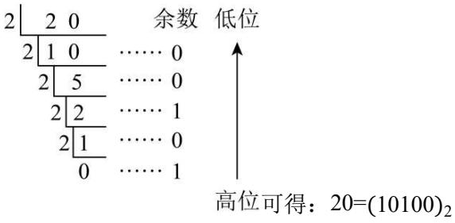上述方法可以推广为把十进制数转换为k进制的第法(除k取余法)</td></tr><tr><td>制作二维码</td><td>图1是小南同学的二维码简易编码和制作说明.小南同学的准考证号是0207181124,其中“02”表示性别男,转化成二进制数为10,对应二维码第一行的五个方格从左到右分别为:白、白、白、黑、白;“07”表示年级为七年级,转化成二进制数为111,对应二维码第二行的五个方格从左到右分别为:白、白、黑、黑、黑;“18”表示班级为18班,转化成二进制数为10010,对应二维码第三行的五个方格从左到右分别为:黑、白、白、黑、白;“11”表示考场号为11,转化成二进制数为1011,对应二维码第四行的五个方格从左到右分别为:白、黑、白、黑、黑;“24”表示座位号</td></tr></table>

为 24，转化成二进制数为 11000，对应二维码第五行的五个方格从左到右

分别为：黑、黑、白、白、白。

名称 十进制数 二进制数

<table><tr><td>性别</td><td>(男)2</td><td>10</td></tr><tr><td>年级</td><td>7</td><td>111</td></tr><tr><td>班级</td><td>18</td><td>10010</td></tr><tr><td>考场号</td><td>11</td><td>1011</td></tr><tr><td>座位号</td><td>24</td><td>11000</td></tr></table>

图1

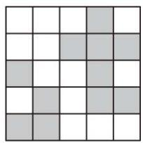

natural_image

Grid pattern with alternating shaded and unshaded squares (no text or symbols)

图 2 是未完成的小宁同

学准考证号的二维码.

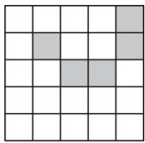

natural_image

Grid pattern with shaded cells in the bottom-right quadrant (no text or symbols)

图2

请完成下列问题:

【图形感知】（1）根据图 1 的制作示意图，把小宁同学的考场号二进制数 10101 在图 2 中填涂出来；

【转化计算】（2）根据图 2 的二维码图形，求小宁同学所在的年级和班级；

【实践操作】（3）已知小宁的准考证座位号是13号，请先转化计算，再完善二维码制作.

# 【题型 2 新定义】教辅资源，关注公众号 ★全科AA+

11. （24-25 六年级上·山东淄博·期末）定义新运算： $a*b=\frac{1}{a}-\frac{1}{b}$ ， $a\otimes b=\frac{1}{ab}$ （右边的运算为平常的加、减、乘、除）.

例如: $3*7=\frac{1}{3}-\frac{1}{7}=\frac{4}{21},\quad3\otimes7=\frac{1}{3\times7}=\frac{1}{21}.$

若 $a \otimes b = a * b$ ，则称有理数 a，b 为“隔一数对”.

例如: $2*3=\frac{1}{2}-\frac{1}{3}=\frac{1}{6}$ ， $2\otimes3=\frac{1}{2\times3}=\frac{1}{6}$ ，即 $2\otimes3=2*3$ ，所以2，3就是一对“隔一数对”。

请同学们解答下列问题:

(1)-1, 1 是“隔一数对”吗？请说明理由；  
(2)已知两个连续的非零整数都是“隔一数对”，计算：

$$
1 \otimes 2 + 2 \otimes 3 + 3 \otimes 4 + 4 \otimes 5 + \dots + 2 0 2 3 \otimes 2 0 2 4.
$$

12. （24-25 七年级上·河南郑州·期中）若定义一种新的运算“※”，规定有理数 $a \times b = a^{2} - 2ab$ ，如 $3 \times 4 = 3^{2} - 2 \times 3 \times 4 = -15$ .

(1)求6※(-8)的值;   
(2)求 $(-7)\times(5\times9)$ 的值.

13. （2025·海南三亚·二模）阅读与思考：请阅读下列材料，并完成下列问题.

【等比数列】按照一定顺序排列着的一列数称为数列，数列的一般形式可以写成： $a_{1},a_{2},a_{3},\cdots,a_{n},\cdots$ ，一般地，如果一个数列从第二项起，每一项与它前一项的比值等于同一个常数，那么这个数列叫做等比数列，这个常数叫做等比数列的公比，公比通常用q表示．如：数列1,2,4,8, $\cdots$ 为等比数列，其中 $a_{1}=1,a_{2}=2$ ，公比为q=2．根据以上材料，解答下列问题：

（1）等比数列3,9,27,…的公比q为\_\_\_\_，第5项是\_\_\_\_。

【公式推导】

如果一个数列 $a_1, a_2, a_3, \ldots, a_n, \ldots$ ，是等比数列，且公比为 $q$ ，那么根据定义可得到： $\frac{a_2}{a_1} = q, \frac{a_3}{a_2} = q, \frac{a_4}{a_3} = q, \ldots, \frac{a_{n+1}}{a_n} = q.$ 所以 $a_2 = a_1 \cdot q, a_3 = a_2 \cdot q = a_1 q \cdot q = a_1 \cdot q^2, a_4 = a_3 \cdot q = a_2 \cdot q^2 = a_1 \cdot q^3, \ldots$

（2）由此，请你填空完成等比数列的通项公式： $a_{n}=a_{1}\cdot$ \_\_\_\_.

【拓广探究】等比数列求和公式并不复杂，但是其推导过程——错位相减法，构思精巧、形式奇特．下面是小明为了计算 $1+2+2^{2}+\ldots+2^{2019}+2^{2020}$ 的值，采用的方法：

设 $S=1+2+2^{2}+\ldots+2^{2019}+2^{2020}$ ①,

则 $2S=2+2^{2}+\ldots+2^{2020}+2^{2021}$ ②，

②-①得2S-S=S=2 $^{2021}$ -1，

$$
\therefore S = 1 + 2 + 2 ^ {2} + \dots + 2 ^ {2 0 1 9} + 2 ^ {2 0 2 0} = 2 ^ {2 0 2 1} - 1.
$$

【解决问题】（3）请仿照小明的方法求 $3+3^{2}+3^{3}+\ldots+3^{2025}$ 的值.

14. （24-25 七年级上·陕西咸阳·阶段练习）用“☆”定义一种新运算：对于任意有理数 a 和 b，规定 $a \star b = a + b + |a - b|$ . 如

$$
(- 3) \star 2 = - 3 + 2 + | - 3 - 2 | = 4.
$$

(1)计算： $(-6)\star(-10)$ ;

(2)计算： $\left[(-1)_{\star 0}\right]_{\star}\left[7_{\star}(-2)\right].$

15. （24-25 七年级上·湖南怀化·期中）定义一种对正整数n的“F运算”：①当n为奇数时，结果为 $3n+5$ ；②当n为偶数时，结果为 $\frac{n}{2^{k}}$ （其中k是使 $\frac{n}{2^{k}}$ 为奇数的正整数），并且运算重复进行．例如，取n=26，则：

26 $\xrightarrow{F②}$ 13 $\xrightarrow{F①}$ 44 $\xrightarrow{F②}$ 11 …
第一次 第二次 第三次

若n=449，则第449次“F运算”的结果是多少？

16. （23-24 七年级上·广东广州·期中）阅读材料：

材料一：对实数a，b，定义 $F(a,b)$ 的含义为：当 $a\leq b$ 时， $F(a,b)=a+b$ ；当a>b时， $F(a,b)=a-b$ 。例如： $F(1,3)=1+3=4$ ； $F(2,-1)=2-(-1)=3$ 。

材料二：关于数学家高斯的故事：2000多年前，高斯的老师提出了下面的问题：

$1+2+3+\cdots+100=$ ? 据说，当其他同学忙于把 100 个数逐项相加时，十岁的高斯却用下面的方法迅速算出了正确答案： $(1+100)+(2+99)+\cdots+(50+51)=101\times50=5050$ .

也可以这样理解：令 $S=1+2+3+\cdots+100①$ ，

则 $S=100+99+\cdots+3+2+1②$ ,

①+②得： $2S=(1+100)+(2+99)+\cdots+(100+1)=100\times(1+100)=10100,$

即 $S=\frac{100\times(1+100)}{2}=5050.$

解决问题:

(1) $F(-1, 3)=_{-}$ ; $F(2, -3)=_{-}$ ;   
(2)已知 $x+y=20$ ，且x>y，求 $F(6,x)-F(10,y)$ 的值；  
(3)对于正数a，满足关系式 $F(-a^{2}+1,1)=-2$ 时，求： $F(1,a+99)+F(2,a+99)+F(3,a+99)+\cdots+F(199,a+99)$ 值.

17. （24-25 七年级上·江西南昌·期中）【概念学习】

定义: 求若干个相同的有理数 (均不等于 0) 的除法运算叫做除方, 如 $2 \div 2 \div 2$ , $(-3) \div (-3) \div (-3) \div (-3)$ 等. 类比有理数的乘方, 我们把 $2 \div 2 \div 2$ 记作 $2_{3}$ , 读作“2 的下 3 次方”, $(-3) \div (-3) \div (-3) \div (-3)$ 记作 $(-3)_{4}$ , 读作“-3 的下 4 次方”. 一般地, 把 $\underbrace{a \div a \div a \div \cdots \div a}_{n} (a \neq 0)$ 记作 $a_{n}$ , 读作“ $a$ 的下 $n$ 次方”.

（1）直接写出计算结果： $(-2)_{4}=$ \_\_\_\_， $\left(\frac{1}{3}\right)_{3}=$ \_\_\_\_.  
(2)【深入探究】

我们知道，有理数的减法运算可以转化为加法运算，除法运算可以转化为乘法运算，有理数的除方运算如何转化为乘方运算呢？

例如： $2_{4}=2\div2\div2\div2=2\times\frac{1}{2}\times\frac{1}{2}\times\frac{1}{2}=(\frac{1}{2})^{2}$

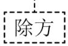

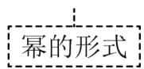

仿照上面的算式，将下列运算写成幂的形式（包括写出过程）：

① $a_{6}=$ \_,

② $\left(-\frac{1}{5}\right)_{5^{-}}$

（3）将一个非零有理数a的下n次方写成幂的形式是： $a_{n}=$ \_\_\_\_．（只写最后结果）.

（4）【结论应用】计算： $6^{2025}-5\times(-\frac{1}{6})_{2026}$ 的值.

18. （24-25 七年级上·北京·期中）小东对有理数a,b定义了一种新的运算，叫作“乘减法”，记作“ $a \otimes b$ ”．他写出了一些按照“乘减法”运算的算式： $(+3)\otimes(+2)=+1$ ， $(+11)\otimes(-3)=-8$ ， $(-2)\otimes(+5)=-3$ ， $(-6)\otimes(-1)=+5$ ， $\left(+\frac{1}{3}\right)\otimes(+1)=+\frac{2}{3}$ ， $(-4)\otimes(+0.5)=-3.5$ ， $(-8)\otimes(-8)=0$ ， $(+2.4)\otimes(-2.4)=0$ ， $(+23)\otimes0=+23$ ， $0\otimes\left(-\frac{7}{4}\right)=+\frac{7}{4}$ .

小玲看了这些算式后说：“我明白你定义的乘减法法则了。”她将法则整理出来给小东看，小东说：“你的理解完全正确。”

(1)请将下面小玲整理的“乘减法”法则补充完整:

绝对值不相等的两数相“乘减”，同号得\_\_\_\_，异号得\_\_\_\_，并\_\_\_\_；绝对值相等的两数相“乘减”，都得\_\_\_\_；一个数与0相“乘减”，或0与一个数相“乘减”，都得这个数的绝对值。

(2)画两个有理数进行“乘减法”的计算流程图.

19. （24-25 七年级上·湖南怀化·期中）定义新运算 $a\nabla b=|a-b|-b$ ，如 $4\nabla2=|4-2|-2=2-2=0$ ;

若 $a\nabla b=0$ ，则称a与b互为“望一”数；

若 $a\nabla b=-a$ ，则称a与b互为“望外”数；

(1)计算： $(-4)\nabla(-2)=\_$ .

(2)下列互为“望一”数的是 ．互为“望外”数的是 ．

①6∇3；②5∇2；③3∇4；④2.8∇1.4；⑤1∇3；

(3)若 $(x\nabla1)+\left[x\nabla(-1)\right]=2$ ，则x可以取哪些整数？

20. （23-24 七年级上·湖南益阳·期中）定义新运算： $a*b=\frac{1}{a}-\frac{1}{b}$ ， $a\otimes b=\frac{1}{ab}$ （右边的运算为平常的加、减、乘、除）.

例如: $3*7=\frac{1}{3}-\frac{1}{7}=\frac{4}{21},\quad3\otimes7=\frac{1}{3\times7}=\frac{1}{21}.$

若 $a\otimes b=a*b$ ，则称有理数a，b为“隔一数对”。

例如： $2 \otimes 3 = \frac{1}{2 \times 3} = \frac{1}{6}$ ， $2 * 3 = \frac{1}{2} - \frac{1}{3} = \frac{1}{6}$ ， $2 \otimes 3 = 2 * 3$ ，所以2，3就是一对“隔一数对”。

(1)下列各组数是“隔一数对”的是（请填序号）

①a=1, b=2; ② $a=-\frac{4}{3}$ , $b=-\frac{1}{3}$ ; ③a=-1, b=1.

(2)计算： $(-3)*4-(-3)\otimes4+(-2023)*(-2023)$ .

(3)已知两个连续的非零整数都是“隔一数对”.

计算： $1 \otimes 2 + 2 \otimes 3 + 3 \otimes 4 + 4 \otimes 5 + \cdots + 2020 \otimes 2021$ .

# 【题型 3 阅读理解】教辅资源，关注公众号★全科AA+

21. （24-25 七年级上·甘肃兰州·期中）先阅读下面材料，然后解答问题：

在一条直线上有依次排列的 $n(n > 1)$ 台机床在工作, 我们要设置一个零件供应站 $P$ , 使这 $n$ 台机床到供应站 $P$ 的距离总和最小. 要解决这个问题, 先“退”到比较简单的情形:

如图①，如果直线上有 2 台机床时，很明显设在 $A_{1}$ 和 $A_{2}$ 之间的任何地方都行，因为甲和乙所走的距离之和等于 $A_{1}$ 和 $A_{2}$ 的距离.

如图②，如果直线上有 3 台机床时，不难判断，供应站设在中间 A 处最合适，不难知道，如果直线上有 4 台机床，P 应设在第 2 台与第 3 台之间的任何地方；有 5 台机床，P 应设在第 3 台位置.

问题（1）：如果直线上有7台机床，P应在何处？

问题（2）：有n台机床时，P应设在何处？

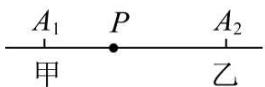  
①

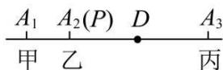  
②

【拓广应用】

（3）求 $|x-1|+2|x-3|+3|x-4|$ 的最小值.

（4）求 $f(x)=|x-1|+|2x-1|+\cdots+|2011x-1|$ 的最小值.

22. （24-25 七年级上·河北邯郸·期中）阅读下面材料：

计算： $\left(-\frac{1}{30}\right)\div\left(\frac{2}{3}-\frac{1}{10}+\frac{1}{6}-\frac{2}{5}\right)$ .

解法一：原式 $= \left(-\frac{1}{30}\right)\div \frac{2}{3} -\left(-\frac{1}{30}\right)\div \frac{1}{10} +\left(-\frac{1}{30}\right)\div \frac{1}{6} -\frac{1}{30}\div \left(-\frac{2}{5}\right) = -\frac{1}{20} +\frac{1}{3} -\frac{1}{5} +\frac{1}{12} = \frac{1}{6}.$

解法二：原式 $= \left(-\frac{1}{30}\right)\div \left[\left(\frac{2}{3} +\frac{1}{6}\right) - \left(\frac{1}{10} +\frac{2}{5}\right)\right] = \left(-\frac{1}{30}\right)\div \left(\frac{5}{6} -\frac{1}{2}\right) = -\frac{1}{30}\times 3 = -\frac{1}{10}.$

解法三：原式的倒数 $= \left(\frac{2}{3} -\frac{1}{10} +\frac{1}{6} -\frac{2}{5}\right)\div \left(-\frac{1}{30}\right) = \left(\frac{2}{3} -\frac{1}{10} +\frac{1}{6} -\frac{2}{5}\right)\times (-30) = -20 + 3 - 5 + 12 = -10$ ，故原式 $= -\frac{1}{10}.$

(1)上述三种解法得出的结果不同，肯定有解法是错误的，你认为解法是错误的；

(2)请你进行简便计算： $\left(-\frac{1}{42}\right)\div\left(\frac{1}{6}-\frac{3}{14}+\frac{2}{3}-\frac{2}{7}\right)$ .

23. （2024 七年级上·全国·专题练习）学习情境·阅读理解阅读：我们知道，所有无限循环小数都可以化成分数，那么如何把无限循环小数化为分数呢？下面介绍一种方法：

例：把0.3和0.67化成分数.

0.3乘10，原数位每位进一位，得到3.3，即0.3×10=3.3，再减去0.3得3，算式如下：

$0.\dot{3}\times10-0.\dot{3}=3.\dot{3}-0.\dot{3}=3$ ，即 $9\times0.\dot{3}=3$ ，所以 $0.\dot{3}=\frac{3}{9}=\frac{1}{3}$ ；同样道理，把 $0.\dot{67}$ 化成分数的算式如下：

$0.\dot{6}\dot{7}\times100-0.\dot{6}\dot{7}=67.\dot{6}\dot{7}-0.\dot{6}\dot{7}=67$ ，即 $99\times0.\dot{6}\dot{7}=67$ ，所以 $0.\dot{6}\dot{7}=\frac{67}{99}$ .

根据上面材料完成:

(1)直接把下面无限循环小数化为分数0.5=，0.17=；  
(2)请把下面无限循环小数0.103,0.13化为分数，写出计算过程.

24. （24-25 七年级上·安徽蚌埠·期中）阅读下列材料：我们知道 $|x|$ 的几何意义是数轴上数 $x$ 的对应点与原点之间的距离，即 $|x|=|x-0|$ ，也可以说， $|x|$ 表示数轴上数 $x$ 与数 0 对应点之间的距离。这个结论可以推广为 $|A-B|$ 表示数轴上数 $A$ 与数 $B$ 对应点之间的距离。

(1)用绝对值表示数轴上-5与3之间的距离;  
(2)若 $|x-2|=3$ ，则x可以表示数轴上的哪些数；  
(3)依据（2）的结论，求使得 $|x-3|+|x+4|=7$ 成立的所有符合条件的整数的和；  
(4)由以上的探索猜想对于任何有理数x，求出 $|x-4|+|x+5|$ 的最小值？

25. （24-25 七年级上·福建福州·期中）阅读材料，并回答问题：

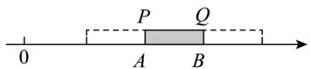

text_image

0
P Q
A B

(1)如图, 有一根木尺 $P Q$ 放置在数轴上, 它的两端 $P$ , $Q$ 分别落在 $A$ , $B$ 两点处, 将木尺在数轴上水平移动, 当点 $P$ 移动到点 $B$ 时, 点 $Q$ 所对应的数为 32; 当点 $Q$ 移动到点 $A$ 时, 点 $P$ 所对应的数为 8 , 利用所学知识求出点 $A$ 、点 $B$ 所表示的数及木尺 $P Q$ 的长;  
(2)借助上面的方法解决问题：一天，小明去问爷爷的年龄，爷爷说：“我若是你现在这么大你还要38年才出生呢，你若是我现在这么大，我已经是115岁！”小明纳闷，爷爷今年到底是多少岁？请你画出示意图，求出小明和爷爷的年龄，并写出合理的计算过程。

26. （24-25 七年级上·江苏徐州·期中）【材料阅读】西汉前期民间流传着一则故事。大禹治水时，洛阳西南洛宁县的洛河中浮出一只神龟，龟背上有一张象征吉祥的图案，人称“洛书”。如图1，洛书上有三行三列的纵横图，用实心点或空心点的个数表示数字，分别对应着1～9这9个数字，每行、列及两条对角线上的三个数相加的结果相同。“洛书”用今天的数学符号翻译出来就是一个三阶幻方（如图2）又名九宫格，是一种将9个数字（数字不重复使用）安排在三行三列的正方形格子中，使每行、列和对角线上的数字之和都相等。

# 【问题解决】

（1）根据“洛书”中表达的意思，将图2中的三阶幻方补充完整；

(2) 如图 3, 是一个新的三阶幻方, 请根据图中给出的数据, 将 1, 2, 3, 4, 5 这五个数字填入表格, 补全这个新的三阶幻方;

# 【拓展思考】

(3) 有 3 个正方形, 每个正方形的顶点处都有一个“○”. 如图 4, 将 -12, -10, -8, -6, -4, -2, 1, 3, 5, 7, 9, 11 这 12 个数字填入恰当的位置后 (数字不重复使用), 每个正方形 4 个顶点“○”中的数的和都相等, 求 $ax + by$ 的值.

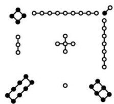

chemical

Collection of molecular structures including aromatic rings, heteroatoms, and functional groups

图1

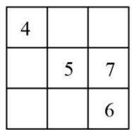  
图2

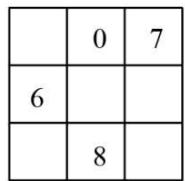  
图3

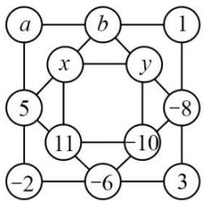

flowchart

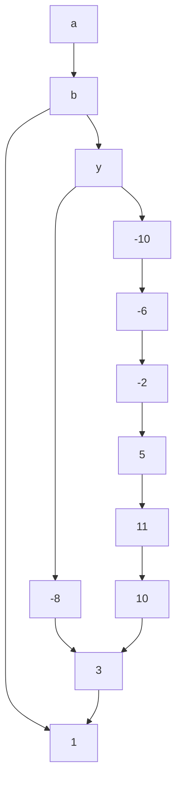

图4

27. （24-25 七年级上·安徽黄山·期末）生活中的数学问题

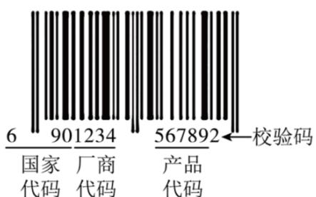

text_image

6 901234 567892←校验码
国家 厂商 产品
代码 代码 代码

【阅读材料】如图，商品条形码是商品的“身份证”，共有13位数字。它是由前12位数字和校验码构成，其结构分别代表“国家代码、厂商代码、产品代码、和校验码”。

比如右图的13位数字“6901234567892”中，

“690”为国家代码，“1234”为厂商代码，

“56789”为产品代码，而最后一位数字“2”

则为校验码.

其中，校验码可以用来校验商品条形码中前12

位数字代码的正确性．它的编制是按照特定的

算法得来的．其算法为：

步骤 1：计算前 12 位数字中偶数位数字的和 a，即 $a=9+1+3+5+7+9=34$ ;

步骤 2：计算前 12 位数字中奇数位数字的和 b，即 $b=6+0+2+4+6+8=26$ ;

步骤3：计算 $3a$ 与 $b$ 的和 $c$ ，即 $c = 3a + b = 3 \times 34 + 26 = 128$

步骤4：取大于或等于c且为10的整数倍的最小数d，即d=130:

步骤5：计算d与c的差就是校验码m，即m=130-128=2.

# 【解决问题】

①若甲商品条形码的数字为“6903244672483”，利用上述校验码的算法，判断此条形码的真伪，并说明理由.  
②若某正规商品的条形码数字为“978740■376241”，其中有一个数字被污染了，请求出这个被污染的数.

28.（24-25 七年级上·广西玉林·期中）阅读下列材料并解决问题：

数轴是一种非常重要的数学工具，它使数和数轴上的点建立起对应关系，揭示了数与形之间的联系，两个有理数在数轴上对应的点之间的距离，可以用这两个数的差的绝对值表示，这也体现了绝对值的几何意义．若在数抽上有理数a对应的点为A，有理数b对应的点为B，则A，B两点之间的距离可表示为 $|a-b|$ 或 $|b-a|$ ，记为 $|AB|=|a-b|=|b-a|$ ．如式子 $|x-3|$ 的几何意义是数轴上表示有理数3的点与表示有理数x的点之间的距离．

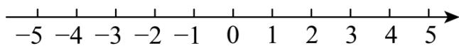

text_image

-5 -4 -3 -2 -1 0 1 2 3 4 5

根据上述材料，回答下列问题：

(1)-2与3的距离是   
(2)式子 $|x+2|+|x-3|$ 的最小值是  
(3)应用: 如图, 某环形道路上顺次排列有四家快递公司: $A, B, C, D$ , 它们依次有快递车 15 辆, 9 辆, 5 辆, 11 辆, 为使各快递公司的车辆数相同, 允许一些快递公司向相邻公司调出, 问共有多少种调配方案, 使调动的车辆数最少? 并求出调出的最少车辆数.

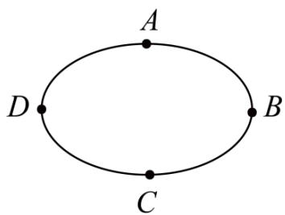

text_image

A
D
B
C

29. （24-25 七年级上·福建厦门·期中）阅读材料，并回答问题

钟表中蕴含着有趣的数学运算。例如现在是 10 点钟，4 小时以后是几点钟？虽然 $10 + 4 = 14$ ，但在表盘上看到的是 2 点钟，如果用符号“⊕”表示钟表上的加法，则 $10 \oplus 4 = 2$ ，由上述材料可知：

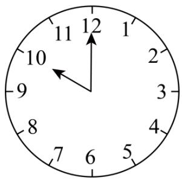

text_image

12
11
1
10
2
9
3
8
4
7
6
5

(1) $9\oplus6=$ \_\_\_\_;

(2)类比几个相同加数的和可以写成乘积的形式, 我们可定义钟表上的乘法, 用符号“⊗”表示, 即 $3 \otimes 4 = 3 \oplus 3 \oplus 3 \oplus 3$ .

①计算：4⊗2024;

②类比有理数中的倒数，我们可定义：若 $a \otimes b = 1$ ，则称b是a的钟表倒数（其中a为1\~12中的任意一个整数，b为自然数）。请用含n（n为自然数）的式子表示出5的所有钟表倒数。

30. （24-25 七年级上·广东深圳·期中）《庄子·天下》：“一尺之棰，日取其半，万世不竭。”意思是说：一尺长的木棍，每天截掉一半，永远也截不完。我国智慧的古代人在两千多年前就有了数学极限思想，探究课上，同学们运用此数学思想研究下列问题。

“聪慧组”的同学将一个边长为1的正方形纸片分割成若干个部分，并用数形结合的思想解决下列问题

(1)请按照“聪慧组”同学的思路填空

$$
\frac {1}{2} + \frac {1}{4} = 1 - \frac {1}{2 ^ {2}};
$$

$$
\frac {1}{2} + \frac {1}{4} + \frac {1}{8} = 1 - \frac {1}{2 ^ {3}}
$$

$$
\frac {1}{2} + \frac {1}{4} + \frac {1}{8} + \frac {1}{1 6} = 1 - \quad ;
$$

猜想:

$$
\frac {1}{2} + \frac {1}{4} + \frac {1}{8} + \frac {1}{1 6} + \dots + \frac {1}{2 ^ {1 0}} = 1 - _ {-};
$$

(2)为了证明“聪慧组”同学得到的结论，“明辨组”的同学采用了以下方法进行证明，请将证明过程补充完整.

<table><tr><td colspan="2">1/2</td></tr><tr><td>1/4</td><td></td></tr></table>

<table><tr><td colspan="2">1/2</td></tr><tr><td rowspan="2">1/4</td><td>1/8</td></tr><tr><td></td></tr></table>

<table><tr><td colspan="3">1/2</td></tr><tr><td rowspan="2">1/4</td><td colspan="2">1/8</td></tr><tr><td>1/16</td><td></td></tr></table>

设 $S=\frac{1}{2}+\frac{1}{4}+\frac{1}{8}+\frac{1}{16}+\cdots+\frac{1}{2^{10}}$ ①

则 $2S=2\times\left(\frac{1}{2}+\frac{1}{4}+\frac{1}{8}+\frac{1}{16}+\cdots+\frac{1}{2^{10}}\right)$

即 $2S=2\times\frac{1}{2}+2\times\frac{1}{4}+2\times\frac{1}{8}+2\times\frac{1}{16}+\cdots+2\times\frac{1}{2^{10}}$

化简得 $2S=1+\frac{1}{2}+\frac{1}{4}+\frac{1}{8}+\frac{1}{16}+\cdots+\frac{1}{2^{9}}$ ②

②-①得： $2S-S=\left(1+\frac{1}{2}+\frac{1}{4}+\frac{1}{8}+\frac{1}{16}+\cdots+\frac{1}{2^{9}}\right)-\left(\frac{1}{2}+\frac{1}{4}+\frac{1}{8}+\frac{1}{16}+\cdots+\frac{1}{2^{10}}\right)$

即 $S =$ \_\_\_\_；

进一步可猜想:

$$
\frac {1}{2} + \frac {1}{4} + \frac {1}{8} + \frac {1}{1 6} + \dots + \frac {1}{2 ^ {n}} =
$$

通过阅读，你一定学到了多种解决问题的方法.

(3)请选择“聪慧组”的作图法或“明辨组”的代数法进行计算： $\frac{2}{3}+\frac{2}{3^{2}}+\frac{2}{3^{2}}+\cdots+\frac{2}{3^{6}}$ （只选一种解法，若选择作图，请标注出各部分图形的面积，下图是边长为1的正方形）

natural_image

Empty white square with black border (no text or symbols)

# 【题型 4 综合与实践】教辅资源，关注公众号★全科AA+

31. （24-25 七年级上·全国·期中）综合与实践：一只电子跳蚤从数轴上原点处出发，第一次向左跳动 1 个单位，第二次向右跳动 2 个单位，第三次向左跳动 3 个单位，第四次向右跳动 4 个单位，第五次向左跳动 5 个单位，第六次向右跳动 6 个单位，如此往返.

(1)第 1 次跳动的落点位置表示的有理数是多少？第 2 次跳动的落点位置表示的有理数是多少？第 2024 次跳动的落点位置表示的有理数是多少？  
(2)若该跳蚤从-8对应的点处出发，则第1次跳动的落点位置表示的有理数是多少？第2024次跳动的落点位置表示的有理数是多少？第几次跳动的落点位置是原点？  
(3)若该跳虫从m（m是正整数）对应的点处出发，则第1次跳动的落点位置表示的有理数是多少？第2024次跳动的落点位置表示的有理数是多少？第2n（n是正整数）次跳动的落点位置表示的有理数是多少？第几次跳动的落点位置是原点？

# 32. （24-25 七年级上·广西百色·期中）综合与实践

# 【问题情境】

如图，周长为2个单位长度的圆片上有一点 $Q$ 与数轴上的原点重合.

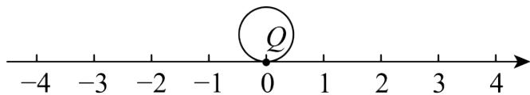

text_image

-4
-3
-2
-1
0
1
2
3
4

（1）把圆片沿数轴向左滚动 1 周，点 Q 到达数轴上点 A 的位置，点 A 表示的数是 \_\_\_\_；

(2) 在 (1) 条件下, 如果圆片 $Q$ 点在数轴 $A$ 点的位置再向右滚动 3 周, 到达 $B$ 点的位置, 则点 $B$ 所表示的数为\_\_\_\_;

# 【问题拓展】

(3) 圆片在数轴上向右滚动的周数记为正数, 圆片在数轴上向左滚动的周数记为负数, 运动情况依次记录如表:

<table><tr><td>计次</td><td>第1次</td><td>第2次</td><td>第3次</td></tr><tr><td>滚动周数</td><td>+3</td><td>-1</td><td>-2</td></tr><tr><td>计次</td><td>第4次</td><td>第5次</td><td>第6次</td></tr><tr><td>滚动周数</td><td>+4</td><td>-3</td><td>+m</td></tr></table>

第 6 次向右滚动 m（m 为正整数）周后，点 Q 与原点的距离为 6.

①请求出 m 的值;  
②当圆片结束6次滚动时，求点Q一共运动的路程.

# 33. （23-24 七年级上·广西桂林·期中）【综合与实践】

外卖送餐为我们生活带来了许多便利，某学习小组调查了一名外卖小哥一周的送餐情况，规定送餐量超过40单（送一次外卖称为一单）的部分记为“+”，低于40单的部分记为“-”，如表是该外卖小哥一周的送餐量：

<table><tr><td>星期</td><td>一</td><td>二</td><td>三</td><td>四</td><td>五</td><td>六</td><td>七</td></tr><tr><td>送餐量(单位:单)</td><td>-4</td><td>+11</td><td>-2</td><td>+19</td><td>+20</td><td>+22</td><td>-3</td></tr></table>

(1)求该外卖小哥这一周平均每天送餐多少单?  
(2)外卖小哥每天的工资由底薪30元加上送单补贴构成，送单补贴的方案如下：每天送餐量不超过40单的部分，每单补贴4元；超过40单但不超过50单的部分，每单补贴6元；超过50单的部分，每单补贴8元．求该外卖小哥这一周工资收入多少元？

34. （24-25 七年级上·山东济南·期中）综合与实践

<table><tr><td colspan="3">探究喷墨打印机的工作原理</td></tr><tr><td>素材1</td><td>喷墨式双向打印机通过喷射墨水完成文件打印.如图1,打印机外框架上有一根水平杆,喷头架在水平杆上来回移动完成喷墨.第一次,喷头架从左到右喷墨,停止后纸张向前移动;第二次,喷头架从停止处出发,反向完成喷墨,如此往复.</td><td>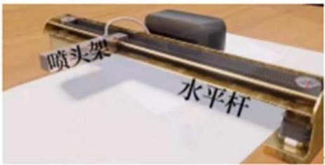图1</td></tr><tr><td>素材2</td><td>如图2,以这根水平杆所在的直线建立数轴,以水平杆的中点为原点,以向右的方向为正方向,用一个单位长度表示1cm.已知喷头架的初始位置为-10,向右2个单位长度记为+2,向左3个单位记为-3,以下记录了喷头架的6次运动情况:+18,-10,+6,-10,+8,-12.</td><td>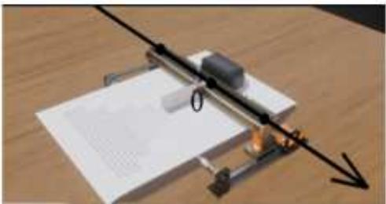图2</td></tr><tr><td colspan="3">问题解决</td></tr><tr><td>任务1</td><td>确定位置</td><td>经过6次喷墨后,确定喷头架的最终位置.</td></tr><tr><td>任务2</td><td>确定路程</td><td>经过6次喷墨后,求出喷头架移动的总路程.</td></tr></table>

# 35. （24-25 七年级上·辽宁大连·阶段练习）综合与实践

# 【问题的发现与提出】

巴黎时间 2024 年 8 月 4 日晚上，在巴黎奥运会男子 4×100 米混合泳接力决赛中，中国队夺得金牌，打破美国长达四十年的垄断。小明是在北京时间 8 月 5 日凌晨观看的现场直播，他知道两地存在时间上的差异，即时差。为了解时差的奥秘，小明查阅并整理了相关资料。

# 【资料的查询与整理】

时差产生的原因：地球可以看成一个球体，太阳光线不能同时照到地球的每一个角落。随着地球自西向东的自转，不同经度上的地方就会在不同的时间接收到太阳光，这就导致了各地时间的差异。显然，地球上相对东面的位置比西面的位置更早接收到太阳光，时间自然比西面要早。

时区制度的设立：国际上规定，以英国格林尼治天文台所在的经线为零度经线，根据地球自转的方向，将地球表面按从东到西，每隔15°划分为1个区域，可以得到24个区域，即24个时区，并规定零度经线所在的时区（西经7.5°一东经7.5°的区域）称为中时区（零时区），中时区以东有12个时区，依次记为东一区至东十二区，以西也有十二个时区，依次记为西一区至西十二区，由于地球形状的影响，最终东十二区和西十二区合为一个时区．在同一时区内各地的时间相同，不同时区内各地有各自的时间，每相邻时区的时差为1小时．这样，当一个时区是中午12点时，相邻的时区可能是下午1点或早上11点.

时区设立的意义：时区制度的设立是为了适应人类社会发展的需要，提供一个全球统一的时间框架，以便于跨地域的交流和活动.

# 【问题的理解与应用】

由于中时区又称为零时区，好比数轴上的原点 $O$ ，东区好比正半轴，西区好比负半轴。所有时区与中时区的时差都等于和中时区相比的那个时区的时区数。比如东八区就与中时区相差8小时，时区数是八。又由于所有相邻的时区时刻都相差1小时，这样东一区与西一区之间的中时区，就好比数轴上-1与+1之间的0一样。将数轴上的数与时区对应的点、经度对应起来，可以用下图来表示：

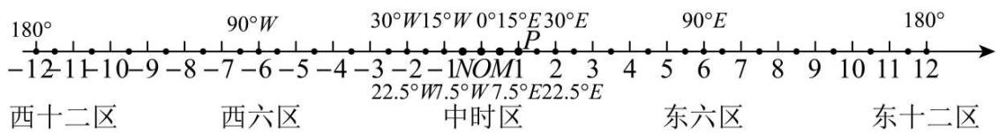

text_image

180°
-12 11 10 -9 -8 -7 -6 -5 -4 -3 -2 -1NOM1 2 3 4 5 6 7 8 9 10 11 12
90°W
30°W15°W 0°15°E30°E
P
22.5°W7.5°W7.5°E22.5°E
西十二区 西六区 中时区 东六区 东十二区

其中 $7.5^{\circ}E$ 表示东经 $7.5^{\circ}$ ，对应点M； $7.5^{\circ}W$ 表示西经 $7.5^{\circ}$ ，对应点N；

$15^{\circ}E$ 表示东经 $15^{\circ}$ ，对应点P；数字1表示东一区（从东经 $7.5^{\circ}$ 到东经 $22.5^{\circ}$ 之间的区域）； $0^{\circ}$ 对应点O.

法国巴黎和中国北京分别采用东经 $15^{\circ}$ （东一区）和东经 $120^{\circ}$ （东八区）的时间，因此北京时间比巴黎时间要早7个小时。例如，巴黎时间8月4日19:00，就是北京时间8月5日凌晨2:00。

【问题的解决与实践】教辅资源，关注公众号★全科AA+

(1)A, B, C三地分别采用经度是东经 $15^{\circ}$ , 东经 $120^{\circ}$ 和西经 $120^{\circ}$ 的时间, 将三地用背景材料中数轴上的数简明地表示, 分别是\_\_\_\_;

(2)下一届奥运会将于 2028 年在美国洛杉矶举行，洛杉矶采用西八区的时间.

①若北京时间是2024年10月10日13:00，洛杉矶时间是\_\_\_\_；

②若 2028 年洛杉矶奥运会的某一项游泳比赛于当地时间 7 月 20 日 19:00 进行, 请你推算此时的北京时间.

36. （24-25 七年级上·广西柳州·期中）综合与实践

【知识再现】我们都知道，数轴上表示数a的点与原点的距离叫做数a的绝对值，记作 $|a|$ ，因为原点表示的数是0，所以 $|a|=|a-0|$ ，由此可知， $|7-(-2)|$ 表示7与-2之差的绝对值，实际上也可理解为数轴上分别表示7与-2的两点之间的距离，所以 $|7-(-2)|=9$ ;

【问题初探】阅读以下材料，并回答问题：

如图, 把一根长度为 $a \mathrm{~cm}$ 木棒 $M N$ 放在一条数轴 (单位长度为 $1 \mathrm{~cm}$ ) 上, 它的两端 $M, N$ 分别落在点 $A, B$ 处, 将木棒在数轴上水平移动, 当点 $M$ 移动到 $B$ 处时, 点 $N$ 与点 $D$ 重合, 此时点 $N$ 对应的数为 17 , 当点 $N$ 移动到 $A$ 处

时，点M与点C重合，此时点M对应的数为5.

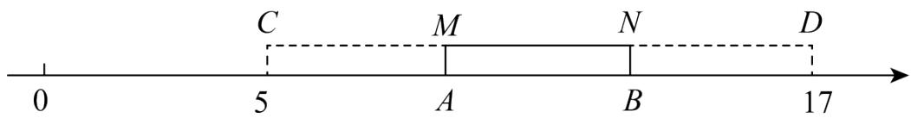

text_image

C
M
N
D
0
5
A
B
17

（1）由此可得， $CD=$ \_\_\_\_ cm，a的值为 \_\_\_\_ cm.  
(2) 图中点 $A$ 所表示的数是 $\underline{\hspace{2cm}}$ , 点 $B$ 所表示的数是 $\underline{\hspace{2cm}}$ .

【拓展应用】

（3）借助上述方法解决下列问题：

一天，小华去问奶奶的年龄，奶奶说：“我若是你现在这么大，你还要35年才出生；你若是我现在这么大，我已经是109岁的老寿星了，哈哈”小华纳闷，奶奶到底是多少岁？

请你画出示意图，求出小华和奶奶现在的年龄，并说明解题思路.

37. （24-25 七年级上·广东肇庆·期中）综合与实践

【主题】折纸.

【素材】已知在纸面上有一数轴（如图所示），折叠纸面.

【实践操作】

操作 1：在纸面上有如图所示的一数轴，折叠纸面，若数轴上数 1 表示的点与数 -1 表示的点重合，则数轴上数 -2 表示的点与数 2 表示的点重合.

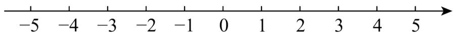

text_image

-5 -4 -3 -2 -1 0 1 2 3 4 5

操作 2: 现打开纸面后, 再次折叠. 使数轴上数-4表示的点与数 0 表示的点重合. 数轴上 $A, B$ 两点折叠后重合, $M$ 、 $N$ 两点折叠后重合.

【实践探索】

(1)在操作 2 中，数轴上数 3 表示的点与数 \_\_\_\_ 表示的点重合；  
(2)若点A到原点的距离是5个单位长度，求点B表示的数；  
(3)若数轴上MN两点之间的距离为20且点M表示的数比点N表示的数大，现有一只电子蚂蚁从点N出发，沿数轴以每秒2个单位长度的速度向射线NM的方向运动，求当电子蚂蚁所在位置到点M的距离为4时，电子蚂蚁所用的时间为多少秒？

38. （24-25 七年级上·江苏南通·期末）综合与实践：

七年级某学习小组围绕“设计学校田径运动会比赛场地”开展主题学习活动.

素材:

如图 1 是学校操场实物图，图 2 是操场部分跑道示意图，操场跑道由两个平行的直道和两个半径相等的弯道（弯道是半圆形）组成，第一跑道（最内道）的总长度为400m．400m标准跑道一般设置8条跑道，300m跑道设置6条跑道，直道长均为84.5m，每道宽1.22m．在一个标准的400m跑道内，100m，200m，400m，800m等比赛跑道的起点不同，终点相同．（注：π取3，跑道分界线的宽度忽略不计）

natural_image

Red running track with numbered lanes (1–4) on the left, residential buildings in background (no signage or text)

图1

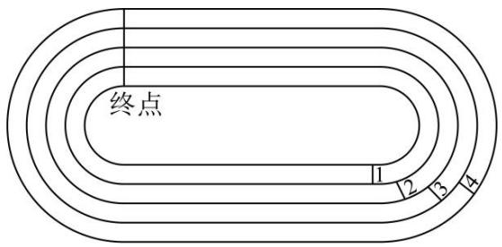

text_image

终点
1 2 3 4

图2

任务:

(1)海安某校操场是400m跑道.   
①求第一跑道弯道的半径;  
②小明、小勇参加学校运动会200m比赛，小明在第一跑道，小勇在第二跑道，小明的速度是5.4m/s，小勇的速度是4.8m/s，他们同时跑向同一终点，问小明几秒能追上小勇？  
(2)小丽、小红参加学校运动会 $200 \mathrm{~m}$ 比赛, 若小丽在第三跑道, 小红在最外圈跑道, 并且最外圈跑道的起跑点比第三跑道的起跑点前伸 $10.98 \mathrm{~m}$ , 求操场最外圈跑道的周长.

39. （24-25 七年级上·安徽蚌埠·阶段练习）【阅读理解】

一种中国自古以来就一直使用的纪年方法：干支纪年，以下是关于干支纪年的素材，请阅读后解决问题.

素材①：干支是天干和地支的总称，十天干依次为：甲、乙、丙、丁、戊、己、庚、辛、壬、癸；十二地支依次为：子、丑、寅、卯、辰、巳、午、未、申、酉、戌、亥．干支纪年法的组合方式是天干在前，地支在后，以十天干和十二地支循环配合，即：甲子、乙丑、丙寅、丁卯、戊辰、己巳、庚午、辛未、壬申、癸酉、甲戌、乙亥、丙子、丁丑、……、辛酉、壬戌、癸亥、甲子、乙丑、……，每个组合代表一年，60年为一个循环，也称60年一甲子.

素材②：把天干、地支按顺序排列，且给它们编上序号.

<table><tr><td>序号</td><td>1</td><td>2</td><td>3</td><td>4</td><td>5</td><td>6</td><td>7</td><td>8</td><td>9</td><td>10</td><td>11</td><td>12</td></tr><tr><td>天干</td><td>甲</td><td>乙</td><td>丙</td><td>丁</td><td>戊</td><td>己</td><td>庚</td><td>辛</td><td>壬</td><td>癸</td><td></td><td></td></tr><tr><td>地支</td><td>子</td><td>丑</td><td>寅</td><td>卯</td><td>辰</td><td>巳</td><td>午</td><td>未</td><td>申</td><td>酉</td><td>戌</td><td>亥</td></tr></table>

天干的计算方法是：年份减3，除以10后，所得的余数；

地支的计算方法是：年份减3，除以12后，所得的余数.

以2024年为例，天干为： $(2024-3)\div10=202\cdots1$ ；地支为： $(2024-3)\div12=168\cdots5$ ;

对照天干地支表得出，2024年为农历甲辰年.

素材③：十二地支又与十二生肖依次顺位相对应为：子鼠、丑牛、寅虎、卯兔、辰龙、巳蛇、午马、未羊、申猴、酉鸡、戌狗、亥猪.

# 【解决问题】

(1)获得诺贝尔医学奖的中国科学家屠呦呦生于公历 1930 年，用干支纪年法她生于农历\_\_\_\_年，她的属相是 \_\_\_\_ 年；  
(2)今年是伟大祖国75周年华诞，75年前的1949年用干支纪年法是农历\_\_\_\_年；  
(3)六十甲子中有农历丁卯、丁丑、丁亥、丁酉、……，会不会出现“丁午”年？请说明理由.

40.（23-24七年级上·全国·课后作业）综合与实践活动

<table><tr><td>4</td><td>9</td><td>2</td></tr><tr><td>3</td><td>5</td><td>7</td></tr><tr><td>8</td><td>1</td><td>6</td></tr></table>

(1) 横行、竖列、对角线上的三个数之和分别是多少？你还能发现哪些相等的关系？  
(2) 如果把和相等的每一组数分别连线, 这些线段会构成一个怎样的图形? 描述你得到的图形有什么特点?  
(3) 你能改变上述幻方中数字的位置，使它们仍然满足你发现的那些相等关系吗？  
(4) 在你构造的幻方中, 最核心的位置是什么? 有没有“成对”的数?

归纳总结：三阶幻方的性质：每一、每一和的三个数的和都相等.

【实践应用】教辅资源，关注公众号★全科AA+

“九宫图”源于我国古代夏禹时期的“洛书”（图 1 所示），是世界上最早的矩阵，又称“幻方”，用今天的数字符号翻译出来，“洛书”就是一个三阶“幻方”（图 2 所示）.

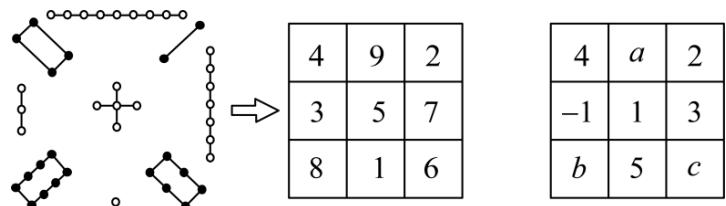

text_image

4 9 2
3 5 7
8 1 6
4 a 2
-1 1 3
b 5 c

在新“幻方”（图 3 所示）中，将 -3, -2, -1, 0, 1, 2, 3, 4, 5 分别填入九个空格内，使每行、每列、每条对角线上的三个数之和相等，现在 a, b, c 分别表示其中的一个数，则 $b-a+c$ 的值为 \_\_\_\_。