# 专题 07 与有理数有关的四大创新题型（举一反三专项训练）

# 【北师大版 2024】

考卷信息:

本套训练卷共 40 题，含四大类型的创新题型，每种题型各 10 题。题型针对性较高，覆盖面广，选题有深度，可加深学生对与有理数有关的阅读理解与新定义的理解！

# 【题型1 探究进位制】

123 24-25 4567 ·89:; ·<=>?@ABCDEFG 16 HIJK 16 H 1 GABILMFNO 0-9P

OQ A-FR 16 SANT&LUVT&WXHIGNYZ [\]^2

<table><tr><td>16 HI</td><td>0</td><td>1</td><td>2</td><td>3</td><td>4</td><td>5</td><td>6</td><td>7</td><td>8</td><td>9</td><td>A</td><td>B</td><td>C</td><td>D</td><td>E</td><td>F</td></tr><tr><td>10 HI</td><td>0</td><td>1</td><td>2</td><td>3</td><td>4</td><td>5</td><td>6</td><td>7</td><td>8</td><td>9</td><td>10</td><td>11</td><td>12</td><td>13</td><td>14</td><td>15</td></tr></table>

\_\LFX\`HI^a'

$E + D = 1BLb\quad C\times D = 3cc@$

A2 156

B2 19

C2 9C

D2 A6

, del C

,fg1hijklmnNopWqpGZFLnrX\`HIWXHISTGYZ [Jri u2vw

xmnNGoppbyz $C \times DG\{L|\} FX^{\sim}HI^{\sim}\textcircled{Q}\S^{\sim}az^{\cdots^{\circ}}\pm\cdot2$

$\times r1r'$ $C \times D = 12 \times 13 = 156L$

∵ 156=9×16+12LX\`HIDG    C WXHIDG    12 YZL

∴N 156 FX\`HI ±^aà 9CL° C×D=9CL

áè' C2

22 3 24-25 4567 ·éê9ìíò ·ó÷@ HùIJúüàlāNPēBěiǐnǎoGāN[ū2 nōKX

Hǎi JXHILKǒHǎi JǒHILǔi Jū “KúHǎ ”ǐ JúHI

XHIN $1024=1\times10^{3}+0\times10^{2}+2\times10^{1}+4L\bar{a}\breve{u}$ $1024\breve{u}$

aHIN $(1024)_{8}=1\times8^{3}+0\times8^{2}+2\times8^{1}+4L\bar{a}\breve{u}$ $(1024)_{8}\breve{u}$

gHIN $(1024)_{5}=1\times5^{3}+0\times5^{2}+2\times5^{1}+4L\bar{a}\breve{u}$ $(1024)_{5}\breve{u}$

$\delta HIN \quad (1011)_{2}=1\times2^{3}+0\times2^{2}+1\times2^{1}+1L\bar{a}\breve{u} \quad (1011)_{2}\breve{u}$ $\delta HIN \quad (1101)_{2}\breve{}^{-}\breve{a}XHIN\breve{a}3 \quad @$

A2 12

B2 13

C2 14

D2 15

```txt
, del B 
```

, fg1hijkmnNGA BēB2wxǒHI $^{-}$ àXHIGěpL±ΓABzǒHIN (1101) $_{2}$ YZ

```txt
GXHIN2 
```

$\times r1r'$ $(1101)_{2}=1\times2^{3}+1\times2^{2}+0\times2^{1}+1$ $=8+4+0+1$ $=13L$

```txt
áè' B2 
```

```txt
32 3 24-25 4567 · Δ E E Z · ó ÷ @ H üEFGXHINL \ 2639=2×10³+6×10²+3×10¹+9L H Θ I K Λ M 
```

ă N ă $\Xi$ L O I $\Pi$ ó L ú ü P $\Sigma$ T $\Upsilon$ $\Phi$ 7 X ☉ $\ddot{\bar{a}}$ $\Psi$ N $\Omega$ L $\backslash$ a L ă ù Q $\beta$ T $\backslash$ ] $\gamma$ $\delta$ G $\Upsilon$ $\Phi$ 7 X ☉ L $\varepsilon$

MF4HI 3\ 2513=2×7 $^{3}$ +5×7 $^{2}$ +1×7 $^{1}$ +3@ L F $^{a}$ Ψ ζ Φ η z θ i G κ NL λ α ± μ L ζ Φ η z θ i G κ

```txt
NJ ____ κ 2 
```

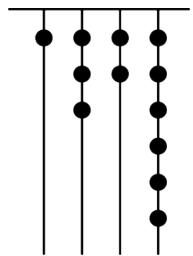

<details>
<summary>natural_image</summary>

Pure vertical lines with black dots at intersections, no text or symbols present
</details>

```txt
, del 510 
```

```csv
,fg1hijklmnNoěGA BēBLri uJnr4HING^aěpù 
```

```txt
wx α DGN(δ v AB ξ o π XHIL ± Γ ˆ a ρ 4HǎGNà' σ ù7GN ×7⁰ + τ ù7GN ×7¹ + Xù 
```

```txt
7GN ×7²+Sù7GN ×7³° ±rd2 
```

```txt
, ×r1r' v àL4HIJ ρ 4HǎL 
```

$\Phi\Gamma L x \psi \omega \ddot{E} A B \gamma \delta G \Upsilon \Phi L f B K ^ {\prime} \Upsilon \textcircled {Q} N o \Gamma$ $7^{0}L 7^{1}L 7^{2}L 7^{3}G k N L$

$\phi \Gamma \zeta \Phi \eta z \theta \iota G k N J'$ $6 \times 7^{0} + 2 \times 7^{1} + 3 \times 7^{2} + 1 \times 7^{3} = 6 + 14 + 147 + 343 = 5102$

```txt
ádeà' 5102 
```

```txt
42 3 24-25 4567 · Γ ΠΔΕ · ó ÷ @ XΗΙЖΝ ~ - àðΗΙЖΝΡΕΜF 3 ŏ И ЙpL ° F 2 K Л З Х 
```

HINLM ω Hà 0LO Π γ δ ЙN° ± • ωðHINL P C 3 ó И Йp2 T Y LXHIN $^{v}$ – à $^{v}$ HI

```txt
N±F3`ИЙр2 \ a J~XHIN 13 P 500 ~ - àǒHINP`HINGěpL Φ X Цěp~XHI 
```

N 2000 $^{v}$ - àaHINà \_\_\_\_2

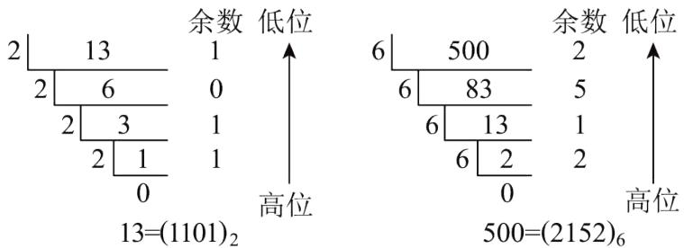

<details>
<summary>text_image</summary>

2\    13
    1
2\    6
    0
2\    3
    1
    1
    0
13=(1101)₂
余数 低位
6\    500
    2
6\    83
    5
    6\    13
    1
    2
    6\    2
    0
高位
500=(2152)₆
余数 低位
高位
</details>

, del (3720) $_{8}$

,fglhijkmnNGA BēB2wxiЧ δ v ABι И ЙN° ±2

, ×r1r' 2000÷8=250.....0L

$250 \div 8 = 31 \dots 2L$

$31\div8=3.....7L$

$3 \div 8 = 0 \ldots 3L$

b\~XHIN 2000 \~ - à2aHINà (3720) $_{8}$ L

ádeà' (3720)82

52 3 24-25 4567 ·-ШЩЪ ·ó÷@ HùIJúuàlāNPēBěiñnōGāN[ū2 nōKЫНă

ǐ JЫHILFNO 0L 1L 2āNLЫHIN± Γ ̃ b àXHIN2\_\LİHIN 1212āà (1212)₃L λ

$(1212)_{3} = 1 \times 3^{3} + 2 \times 3^{2} + 1 \times 3^{1} + 2 \times 3^{0} = 50L \pm \cdot$ (1212) $_{3}$ JXHIN 502

(1) $^{\sim}$ (201) $_{3}$ $^{\vee}$ B àXHINL∅ § J \_\_\_\_ û

(2)Υ π ἄSFЫНІ ̂aG Э ЖNLm] δ IOS◯ Я,

①\ § USNG ÷ ùNO a 6 2Ж 3 L B r USNǐ a 6 2Ж 3 ù

②\ § USNG φ mNu7GNOsP a 6 2Ж 3 L B r USNǐ a 6 2Ж 3 2

x Dèz 3 π ∅ Я L ε Γ e ù GЫHIN (abcd)₃ à\_ Lǚ ж Ц ∅ Я 3 π G 3 n2

, del (1)19

(2) $^{②}$ Ln λ urg

,fg1hijklmnNGA BēBLa ß>\~bIHI \~ - àXHIJrdhiG u2

3 1@wxiЧ\~ЫНИ\` - àXHI° ±ù

3 2@wxiЧклз ②ЭдL\~eùGBiHIN-àXHIGNLMΣмн° ±оп ②2

, ×r13 1@r' (201) $_{3}$ =2×3 $^{2}$ +1×3 $^{0}$ =19L

ádeà' 19ù

3 2@r' ②JЭ д ⚙ЯLn λ и ]'

$$
(\overline {{a b c d}}) _ {3} = 3 ^ {3} a + 3 ^ {2} b + 3 ^ {1} c + 3 ^ {0} d = 2 7 a + 9 b + 3 c + d = 2 (1 3 a + 4 b + c) + (a + b + c + d) L
$$

$$
\because 2 (1 3 a + 4 b + c) \text {   a   } 6 2 \text {   K   } 3 \text {   L   }
$$

$$
\therefore \backslash \S a + b + c + d a 6 2 \text {Ж} 3 L B r 2 (1 3 a + 4 b + c) + (a + b + c + d) i a 6 2 \text {Ж} 3 L ^ {\circ} (\overline {{a b c d}}) _ {3} a 6 2 \text {Ж} 3 2
$$

62 3 24-25 4567 · p c t ê y · ó ÷ @ λ h (ó (? φ HùIG x ц W ч ш щ μ L HùI JúüàlāN

PēBěi nǎo GaN [ū2
nǎo KXHǎi JXHIL
Kǒ Hǎi Jǒ HIL
ǔi Jū “Kú Hǎ ”ǐ J

úHIL úHIG b Nǐ JúL Γ ыξb L M(M≠10)HIǐJK MHǎ2 àWXHIH эюfL HüEЯF

$MHI^{\wedge}aGN$ $a\ddot{e}-(a)_{M}2$ $MHIGN^{\vee}-\dot{a}XHIGNG\ddot{e}pJ'$ $\|MHI^{\wedge}aGN\dot{a}$ (1111) $_{M}L$ b $^{\vee}$ B

àXHING Σ ‘à (1111) $_{M}$ =1×M $^{3}$ +1×M $^{2}$ +1×M $^{1}$ +1×M $^{0}$ 3’ õ “ M≠0ΠL M $^{0}$ =1@2wx” φ (μ υW(?

$$
\dots \% _ {0} ^ {\prime} \text { '' } L \text { ※ } - \Gamma ] ^ {\circ} C i ^ {\prime}
$$

(1) Ⅰ] δ HI^aGN $^{v}$ - àXHI^aGN' (1011) $_2$ =\_\_\_\_ L (1024) $_5$ =\_\_\_\_ ù

(2)No μ ðHIN $s=(1110)_{2}+(1011)_{2}L$ I AB ε ë z $sG\{3\text{ II y ë —ðHI }^{\wedge}aGN@ù$

(3) I Я (11001) $_{2}$ √ B —XǒHIGN2

, del (1)11ù ,139

(2) $25=(11001)_{2}$

(3) $(11001)_2 = (21)_{12}$

,fglhijklHùILriG uJIIIIViЧù

3 1@wx (1111) $_{M}$ =1× $M^{3}$ +1× $M^{2}$ +1× $M^{1}$ +1× $M^{0}$ \$ v Hə √ - ° ± û

3 2@wx s=(1110)2+(1011)2=25 - àXHIL | }F\$ v Hə - ° ± ù

3 3@wx (11001) $_{2}$ =25Lwx 25=2×12 $^{1}$ +1×12 $^{0}$ ° ±yr2

, ×r13 1@r' (1011) $_{2}$ =1×2 $^{3}$ +0×2 $^{2}$ +1×2 $^{1}$ +1×2 $^{0}$ =11L

(1024) $5 = 1 \times 5^{3} + 0 \times 5^{2} + 2 \times 5^{1} + 4 \times 5^{0} = 139\mathrm{L}$

ádeà' 11,139ù

3 2@r' $s = (1110)_2 + (1011)_2\mathrm{L}$

$$
= 1 \times 2 ^ {3} + 1 \times 2 ^ {2} + 1 \times 2 ^ {1} + 0 \times 2 ^ {0} + 1 \times 2 ^ {3} + 0 \times 2 ^ {2} + 1 \times 2 ^ {1} + 1 \times 2 ^ {0} = 2 5 \mathrm{L}
$$

$$
\because 2 5 = 1 \times 2 ^ {4} + 1 \times 2 ^ {3} + 0 \times 2 ^ {2} + 0 \times 2 ^ {1} + 1 \times 2 ^ {0} L
$$

$$
\therefore 2 5 = (1 1 0 0 1) _ {2} \dot {\mathrm{u}}
$$

3 3@r' (11001) $_{2}$ =25=2×12 $^{1}$ +1×12 $^{0}$ L

$$
(1 1 0 0 1) _ {2} = (2 1) _ {1 2} 2
$$

723 2025·Γ ΠΕ · ΒΙ V @VI B WⅡⅧⅢ’ IX X 456XIXⅡⅧⅧ← ↑Η έ HùIG x ц W ч ш…‰L Σ ‘\

]’

,HùIG x 1

①HùI Júuà lāNPēBěi nǎoGāN [ū2

ňōKXHǎi JXHIL

KǒHǎi JǒHIL

° “KúHǎ ”ǐ JúHILúHIG b Nǐ Jú2

②àl ro f→ T GHù IL

E T NG ψ ] ↓ ∈ ж ъ NL

\_\L (1011) $_{2}$ iJÖHIN

1011 GP Π ë p2 XH

INă Σ → ∈ ! τ N2

③ăSN± $^{a}$ —√ Nù7GNOW b NG∞ Go∞ sPG H v 2

’ $\bar{o}$ “ $a\neq0\Pi L a^{0}=12$ ‘ $3721=3\times10^{3}+7\times$

$10^{2} + 2 \times 10^{1} + 1 \times 10^{0} \dot{u}$ (421) $7 = 4 \times 7^{2} + 2 \times 7^{1} + 1 \times 7^{0}2$

,r∠°Cil

(1) H Θ I K φ Λ M Π Σ Ν D̄a Ξ L O I Π ο L ú ù P Σ T Υ Φ 7 X ∅ ∵ a Ψ N Ω L°

“○ T AN ”2ǎùQ

β T x ψ ω Ė A B γ δ G Γ Φ 7 X Q L M I ρ 4 Hǎ Gě v LF ∵ ā Ψ ζ Φ η z θ i G k N2\_ \ a

1^

aGJ ζ Φz θ i 30 κ Π X Υ ΩG// ∧3 v à' 4×7¹+2=30@L B r λ a 2 ± μ L ζ Φz θ i G k N J

The Ground Truth image displays a single, continuous horizontal line, which is a stylistic or background element (like a ruled paper line or separator), not a placeholder for text. According to Rule 2, such stylistic/background lines must be ignored by the OCR result. The OCR content provided is "", which consists of no characters. This correctly represents the line in the GT by ignoring it entirely. Since the OCR output includes no underscores for this line, this complies with the “Stylistic/Background Lines (Ignore)” rule. Therefore, the OCR result is consistent with the Ground Truth.

K

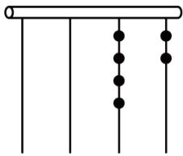

<details>
<summary>natural_image</summary>

Simple diagram of a horizontal bar with vertical lines and evenly spaced dots below (no text or symbols)
</details>

图1

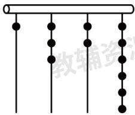

<details>
<summary>text_image</summary>

教辅资源
</details>

图2

(2) ξ o XHIq ∨ pAB3∅ § ∩ ∪ ðHI@

$(11011)_{2}+(1101)_{2}=(101000)_{2}\dot{u}$

ë z $(11011)_{2}-(1101)_{2}=$

(3)← ∫ ∉ AlăS

n HIN 265L B B—XHINJ

145Ly n G{3 n à ∃ ЖN@2

, del (1)510

(2) $(1110)_{2}$

(3)n=7

, fglhijkmnNGA BēBLǎ.ǒ Bě ‘GVII∵ZFLǚ>::HIstG♭BěpLJri

G u'

3 1@wx a hL δ zB v H ∃ AB° ± ù

3 2@ξ o XHIGq ∨ēBLH ∃ AB° ±ù

$$
\begin{array}{l} 3 3 @ \mathrm{wxHIstG} \mathrm{B} \mathrm{B} [ \mathrm{L} \delta \mathrm{z} \check {\mathrm{e}} ^ {\prime} \mathrm{H} \exists \mathrm{yr} ^ {\circ} \pm 2 \\ , \times r 1 3 \quad 1 @ r ^ {\prime} \quad 1 \times 7 ^ {3} + 3 \times 7 ^ {2} + 2 \times 7 + 6 = 5 1 0 3 k @ \dot {u} \\ \text { ádeà' } \quad 5 1 0 \text { ü } \\ \end{array}
$$

$$
3 2 @ (1 1 0 1 1) _ {2} - (1 1 0 1) _ {2} = (1 1 1 0) _ {2} \dot {\mathrm{u}}
$$

$$
\text { ádeà } ^ {\prime} \quad (1 1 1 0) _ {2}
$$

$$
3 3 @ \lambda i \Psi L \cdot^ {\prime} \quad 2 n ^ {2} + 6 n + 5 = 1 4 5 L
$$

$$
\mathrm{r} \cdot^ {\prime} \quad n = 7 \sim n = - 1 0 3 \approx \cong @ \dot {u}
$$

$$
\acute {a} n = 7 2
$$

$$
8 2 3 \quad 2 4 - 2 5 4 5 6 7 \quad \cdot p c \neq \equiv \cdot o \div @ V I B W V I V I I ^ {\prime} \leqslant [ I I ] \delta \geqslant <
$$

$$
, \geqslant <   1 1 \text {KúHǎ} \quad \text {”ǐJúHILúHIGbNǐJúLNěΠ~HIGbNěTψ]} \downarrow L \backslash \tag {110}
$$

$$
\text { \delta HIG } \quad 1 1 0 \mathrm{L} \mathrm{XHIGHIG} _ {\mathrm{b}} \mathrm{N} \quad 1 0 \mathrm{P} \mathrm{E} > + \rightarrow \mathrm{e} 2 \quad \sqrt {\mathrm{HINst}} \pm \Gamma \odot \perp^ {\vee} \mathrm{bL} \quad \_ \backslash^ {\prime} \quad \text { \delta HIN } \quad (1 0 1 1 0) _ {2}
$$

$$
\text { b } - \mathrm{XHIN} ^ {\prime} \quad (1 0 1 1 0) _ {2} = 1 \times 2 ^ {4} + 0 \times 2 ^ {3} + 1 \times 2 ^ {2} + 1 \times 2 ^ {1} + 0 \times 2 ^ {0} = (2 2) _ {1 0} = 2 2 \mathrm{L} \| \sim \mathrm{XHIN} ^ {\vee} - - \mathrm{W} \cap \bot ① \mathrm{G} \quad n \mathrm{HI}
$$

$$
\mathrm{NL} ② ③ \text {~XHIN~3~Γ} \quad n \mathrm{И~ЙNL} | ④ \Pi \gamma \delta \mathrm{L} _ {-} \backslash^ {\prime} \text {~XHIN} \quad 2 3 1 ^ {\vee} \mathrm{b} - 4 \mathrm{HINL} \curvearrowright^ {\vee} \mathrm{b} \check {\mathrm{e}} \mathrm{p} \backslash a
$$

$$
\Phi \mathrm{aL} \varepsilon \bar {\mathrm{a}} \dot {\mathrm{a}} 2 3 1 = (4 5 0) _ {7} 2
$$

$$
\begin{array}{c} 7 \underline {{2 3 1}} \dots \dots 0 \\ 7 \underline {{3 3}} \dots \dots 5 \\ 4 \dots \dots 4 \end{array}
$$

$$
, \geqslant <   2 1 n H I N G e b \bar {e} B W X H I N G e b \bar {e} B ^ {\prime} b \perp T L \quad \rho n H \check {a} L \quad N u C ⑤ ⑥ x x \psi ⑦ E G ⑧ S N
$$

$$
\dot {u} A B C \dot {a} S \dot {u} ⑨ X \dot {u} ⑨ \tau \dot {u} ① L _ {-} \backslash^ {\prime} \quad (2 3 1) _ {4} + (1 2 1) _ {4} = (1 0 1 2) _ {4} L (5 2 0) _ {7} - (3 2 1) _ {7} = (1 6 6) _ {7} 2
$$

$$
\mathrm{wx} \Gamma 7 (\text { ? } \geqslant <   \mathrm{Lyr} \Gamma ] ^ {\circ} \mathrm{Ci} ^ {\prime}
$$

$$
(1) \ddot {e} z (3 0 1) _ {4} ^ {\vee} b \dot {a} X H I N P \quad 5 8 ^ {\vee} b \dot {a} \check {o} H I N G \text {O} \S \dot {u}
$$

$$
(2) ① \mathrm{T} \check {\mathrm{o}} \text {HIDAB} \quad (1 1 0 1 0) _ {2} + (1 0 1 1 1) _ {2} \dot {\mathrm{u}}
$$

$$
② \mathrm{T} \alpha \text { HIDAB } \quad (4 3 5) _ {8} \times 2 \dot {\mathrm{u}}
$$

$$
(3) ^ {\prime} \bar {o} ^ {\prime} \| \check {a} S B I \dot {u} G T H I N \quad x P ⑩ \check {a} S B I \dot {u} a H I N \quad y G \tau \dot {u} ⑨ X \dot {u} ⑨ S \dot {u} N O (1) \perp T L b C \quad x P y J “ T
$$

$$
\mathrm{uN} \quad ” 2 \quad \text {B r J(2)(3) T} \tau \dot {\mathrm{uNOa}} \quad 1 \mathrm{L} \mathrm{X} \dot {\mathrm{uNOa}} \quad m \mathrm{L} \mathrm{S} \dot {\mathrm{uNOa}} \quad n \mathrm{G} “ \mathrm{T} \dot {\mathrm{uN}} ” x \mathrm{P} y \rho (4) (x) _ {9} \div (1 0) _ {9} + (y) _ {8} \div (1 0) _ {8}
$$

$$
= (2 0 3) _ {4} - \left[ (3 0 1 3) _ {4} \div (1 0 2 0) _ {4} \right] \times n L \| (3) T L y z \quad m P n G \{L \| \rightarrow (3) T L \bar {u} k n \lambda 2
$$

$$
, \mathrm{de} 1 \quad (1) (3 0 1) _ {4} = 4 9, 5 8 = (1 1 1 0 1 0) _ {2}
$$

$$
(2) \textcircled {1} (1 1 0 1 0) _ {2} + (1 0 1 1 1) _ {2} = (1 1 0 0 0 1) _ {2} \dot {\mathrm{u}} \textcircled {2} (4 3 5) _ {8} \times 2 = (1 0 7 2) _ {8}
$$

$$
(3) (3) \mathrm{T} m = 0 (5) n = 6 \sim m = 3 (5) n = 4 \sim m = 6 (5) n = 2
$$

,fg1hi(6)IIjk(7)moěGmnNGABēBLnriЧL:::mnNoěēBGpbJriG

u2

3 1@wx≥<(8)aGABěpAB° ±ù

3 2@ ①nHING e bēBWXHING e bēB' b⊥ TL

ρ nHăL λ ы AB° ± ù ②wx≥<(8)aě

pAB° ± ù

3 3@ λ i Ψ (x) $_{9}$ =1×9 $^{2}$ +9m+nL (y) $_{8}$ =1×8 $^{2}$ +8m+nL° n=6- $\frac{2m}{3}$ L m 6 3 Ж 3 L K(9)AB° ±2

, ×r13 1@r' (301) $_{4}$ =3×4 $^{2}$ +0×4 $^{1}$ +1×4 $^{0}$ =48+0+1=49L

$58 = 1 \times 2^{5} + 1 \times 2^{4} + 1 \times 2^{3} + 0 \times 2^{2} + 1 \times 2^{1} + 0 \times 2^{0} = (111010)_{2}$

3 2@r' ①(11010) $_{2}$ +(10111) $_{2}$ =(110001) $_{2}$ L

②(435) $_{8}$ ×2=(1072) $_{8}$ $\dot{u}$

3 3@r' || (3) T mP n ρ (4)(x)₉÷(10)₉+(y)₈÷(10)₈=(203)₄-[(3221)₄÷(1020)₄]×nL

λ i Υ $(x)_{9}=1\times9^{2}+9m+nL$ $(y)_{8}=1\times8^{2}+8m+nL$

(10) $_{9}$ =9L (10) $_{8}$ =8L (203) $_{4}$ =35L

$(3013)_{4}=199L$ $(1020)_{4}=72L(5)$ mL $n\dot{a}\rightarrow(10)\Sigma$ 7 G(11)(12)KNL

∴9+m+ $\frac{n}{9}$ +8+m+ $\frac{n}{8}$ =35- $\frac{199}{72}$ ×nL° 2m+3n=18L

° $n=6-\frac{2m}{3}L$ m 6 3 Ж 3 L

° (3) T m=0(5)n=6∼m=3(5)n=4∼m=6(5)n=22

923 24-25 4567 ·(13)(14)(13) Z ·óD@, VI B WVIIIVIII1

≤Ⅲ] δ ≥<

HùI Júuà lāNPēBěi nǎoGāN [ūLǎoKXHǎi JXHILKǒHǎi JǒHIL

ǔǐ JūL “KúHǎ ”ǐ JúHIL úHIG b Nǐ Jú2

àl ro f→ T GHù IL  E T NG ψ ] ↓ ∈ ж ъ

N2 \_ $^{'}$ (1101) $_{2}$ I JÖHIN 1101 GP Π ë pL

XHINă $\Sigma\to\in!\text{b NL}$ $(\overline{abc})_{n}\mathrm{L}\hat{\mathrm{a}}\mathrm{US}$ n HIN

x $\psi$ (15)L(16)ǎù7GNOà

cL(16)ǒù7GNOà

bL(16)Biù7GNOà

a2ǎSN± Γ ̂a— √ Nù7G

NOW b NG ∝ Go ∞ sPG H v 2 \_ \XHIN

$5678 = 5 \times 10^{3} + 6 \times 10^{2} + 7 \times 10^{1} + 8 \times 10^{0}3$ “ $a \neq 0 \Pi L a^{0} = 1 @ 2 T$

nL ðHIN (1101) $_{2}$ √ B àXHIà'

$12^{3}+12^{2}+02^{1}+12^{0}=132$ ðSXHIN $^{v}$ B à

n HINΠL Я XHIN

$^{a}$ — 0L 1L 2L ...L n-1WbN n G∞Go∞sPGH v 2\_\L\~XHIN

46 ˜ B à BIHINL v à

27<46<81L ° 3 $^{3}$ <46<3 $^{4}$ L b 46=13 $^{3}$ +23 $^{2}$ +03 $^{1}$ +13 $^{0}$ L φ Γ 46 √ B à BIHINà

(1210) $_{3}$ L wx7(17)≥<L rd

] δ °Ci2

(1)① Я ǒHIN (1011) $_{2}$ ∨ Ь àXHINù   
② Я ХИН 29 ۷ Ь àðHIN2   
(2) Я XHIN 63 ۷ B àgHINù   
(3) || ăSЫHIN $^{ \vee}$ Б àXHINà mLăS e HIN $^{ \vee}$ Б àXHINà nL “ m+n=99 ПЛ C USBIHI

NWUS e HIN ⊙ à “(18)(18)N ”L(19) к л (1210)₃ LW (303)₄ LJ(2) ⊙ à “(18)(18)N ”L ε ǚ ж n λ 2

, del (1)①11ù ②(11101) $_{2}$

(2)(223) $_{5}$

(3)JLn λ n rg

,fg1hi(6)II jkl(7)oěGmnNA BēB2

3 1@①wxi(20)ðHIN $^{ \sim }$ B àXHINGěpAB° ±2
②wxi(20)XHIN $^{ \sim }$ B àðHINGěpA

B° ±2

3 2@ 1.Xi(20)G $^{ \vee}$ $^{-}$ ěp я ŏHIN $^{ \vee}$ Ы àgHIN° ±2

3 3@wx “(18)(18)N ”Gō 2.κλ° ±2

, × r13 1@r' ①(1011)₂ \~ b à XHINà 1×2³+0×2²+1×2¹+1×2⁰=8+0+2+1=11ù

② v à 16<29<32L° $2^{4}<29<2^{5}$ L $29=1\times2^{4}+1\times2^{3}+1\times2^{2}+0\times2^{1}+1\times2^{0}$ L

$\Phi \Gamma 29 \checkmark \text{ B àðHINà } (11101)_2\dot{\text{u}}$

3 2@r' v à 25<63<125L° 5²<63<5³L 63=2×5²+2×5¹+3×5⁰L

$\Phi \Gamma 63 \checkmark \text{ B àgHINà } (223)_{5} \dot{\text{ u}}$

3 3@r' (1210) $_{3}$ W (303) $_{4}$ ⊙à “(18)(18)N ”L

v à (1210) $_{3}$ √ B à XHINà $1 \times 3^{3} + 2 \times 3^{2} + 1 \times 3^{1} + 0 \times 3^{0} = 48$ ù

(303) $^{4}$ √ B à XHINà $3 \times 4^{2} + 0 \times 4^{1} + 3 \times 4^{0} = 51L$

$48+51=99L$

$\Phi \Gamma (1210)_{3}W (303)_{4}\odot\text{à }“(18)(18)N ”2$

1023 2025·ΓЩЕ(14)·ǒV@VI B VII VIII

<table><tr><td>°C i 3. 4.</td><td>IX X 5. ‘ 6. 7.à8ùj θ G 8.j π &amp; ♂ Aǒ 9.10.2 ǒ 9.10.G a e λ ā[ δ é11.⊥ tGě12. 3é13.K^ 1L 11.13.K^ 0@ ↑—L H—ǎ14.ðHI Π δ L F π (3)15. √ 16. ξ 17.GNx2</td></tr><tr><td>k≤18.≠ǎ</td><td>XHIL ° “KXHǎ ”L 19.F 0~9XSNOāNL ̃b Nà 103 b N 10 E&gt;+→ ē @2_\LXHIN 3925^a 3 S o L 9 S τ L 2 SXL 5 SăGPL± • v Φ’ 3925=3×103+9×102+2×101+5×1003’ ō’ “ a≠0ΠL a0=1@L ± i LăSN ± Γ^a—√Nù7GNOW b NG∞Go∞sPGn v 2ðHIL° “KõHă ”L √Nù7GNO2m 0 P 1L b Nà 22_\LðHIN 10100 P āà (10100)23 ↓ ∈ 2 à b NL 3 XHIXIII b N→ a➢+@L ± } F7(17)ěp~^ ~ - àXHIN’ (10100)2=1×24+0×23+1×22+0×21+0×20=202</td></tr><tr><td>k≤18.&lt;ǒ</td><td>wxðHIN “KõHă ”G20.bL ± Γ F 2 K J ≐ 3 XHINL M ω Hà0 à—L— i O Π Ι ΊNL • ωðHIN2_\'2| 2 0 余数 低位2| 1 0 ...... 0 ...... 02| 5 ...... 02| 2 ...... 12| 1 ...... 00 ...... 1高位± • ’ 20=(10100)27(17)ěp ± Γ b Γà xHIN ^ B à k HIG(16)p3 3 k Ι Ίp@</td></tr><tr><td>Iǔǒ 9.10.</td><td>α 1 J← E T (Gǒ 9.10. P ∧ 5.10.PIǔū jx 2← E T (G 8.j π &amp;J0207181124L ^D “02”^a | B | L ^ ~ —ðHINà 10L YZǒ 9.10.(16)ǎ ə GgSě--- x Ê ω ψ f B à’ 11.911.911.9é9 11.ù “07”^a56à456L ^ ~ —ðHINà 111LYZǒ 9.10.(16)ǒ ə GgSě--- x Ê ω ψf B à’ 11.911.9é9é9é’ “18”^a---6à 18 ---L ^ ~ —ðHINà 10010LYZǒ 9.10.(16)Ы ə GgSě--- x Ê ω ψ f B à’ é911.911.9é911.ù “11”^aj ; &amp;à 11L ^ ~ —ðHINà 1011LYZǒ 9.10.(16)e ə GgSě--- x Ê ω ψ f B à’ 11.9é9 11.9é9 éù “24”^a ; ù&amp;à 24L ^ ~ —ðHINà 11000L YZǒ 9.10.(16)g ə GgSě--- x Ê ω ψf B à’ é9é911.911.911.2</td></tr></table>

<table><tr><td>名称</td><td>十进制数</td><td>二进制数</td></tr><tr><td>性别</td><td>(男)2</td><td>10</td></tr><tr><td>年级</td><td>7</td><td>111</td></tr><tr><td>班级</td><td>18</td><td>10010</td></tr><tr><td>考场号</td><td>11</td><td>1011</td></tr><tr><td>座位号</td><td>24</td><td>11000</td></tr></table>

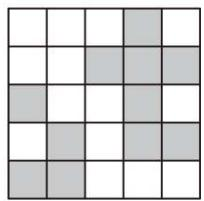

<details>
<summary>natural_image</summary>

Grid pattern with alternating light and dark gray squares (no text or symbols)
</details>

图1  
a 2 J----※—G←(14) T

(8.jπ&Gǒ 9.10.2   
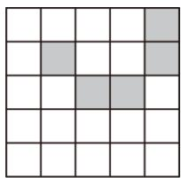

<details>
<summary>natural_image</summary>

Grid pattern with shaded cells in the upper-right and lower-left (no text or symbols)
</details>

图2

$$
\begin{array}{l} \mathrm{I} \text {※} - ] \delta^ {\circ} \mathrm{Ci} ^ {\prime} \\ , \mathrm{a} _ {\mathrm{H}} \dots \mu 1 3 \quad 1 @ _ {\mathrm{WX}} a \quad 1 \mathrm{GI} \check {u} a \Psi a L \lambda \leftarrow (1 4) \mathrm{T} (\mathrm{Gj}; \& \check {o} H I N \quad 1 0 1 0 1 \mathrm{T} a 2 D; | z ^ {\prime \prime} \dot {u} \\ , ^ {\vee} - A B 1 3 \quad 2 @ _ {W X} a \quad 2 G o 9. 1 0. a H L y \leftarrow (1 4) T (\phi T G 5 6 P - - 6 \dot {u} \\ , \text { VIIVIII } \Gamma \check {\mathrm{u}} 1 3 \quad 3 @ \mathrm{No} \mu \leftarrow (1 4) \mathrm{G} 8. \mathrm{j} \Pi : \dot {\mathrm{u}} \& \mathrm{J} \quad 1 3 \& \mathrm{L} \mathrm{Iv} ^ {\vee -} \mathrm{ABL} | \text { ※ } \Gamma \check {\mathrm{o}} 9. 1 0. \mathrm{I} \check {\mathrm{u}} 2 \\ , \mathrm{de} 1 3 \quad 1 @ \text {   и   } \mathrm{rgù} 3 \quad 2 @ \text {   т   } 5 6 ^ {\prime} - - - \dot {u} 3 \quad 3 @ 1 3 = (1 1 0 1) _ {2} \mathrm{Lǒ} 9. 1 0. \text {   и   } \mathrm{rg} \\ , f g 1 h i (6) I I j k l m n N G A B \bar {e} B L n r i \Gamma G \Psi \Gamma J r i G u 2 \\ 3 1 @ w x i \Psi^ {\circ} \pm | z ^ {\dots} \dot {u} \\ 3 2 @ w x i \Upsilon \text {   я   } \check {o} H I ^ {\vee} - \text {   àXHINLH   } \exists m n N e B ^ {\circ} \pm \cdot \omega d e \dot {u} \\ 3 3 @ w x i \Upsilon \text {   я   } X H I ^ {\vee} - \text {   àǒHINGěp°   } \pm y r 2 \\ , \times r 1 \quad r ^ {\prime} \quad 3 1 @ j; \& \check {o} H I N \quad 1 0 1 0 1 L Y Z \check {o} 9. 1 0. G g S \check {e} - - x E \omega \psi f B a ^ {\prime} \quad e ⑨ 1 1. ⑨ e ⑨ 1 1. ⑨ e L \\ \left. \left| \quad \right| \backslash \right] ^ {\prime} \\ \end{array}
$$

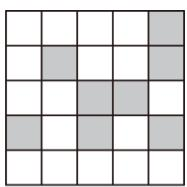  
图2

$$
3 2 @ _ {\mathrm{WX}} \alpha \quad 2 G \check {o} 9. 1 0. \alpha_ {\mathrm{HL}} \leftarrow \neg T (\phi T G 5 6 ^ {\prime} \quad (1 0 0 1) _ {2} = 1 \times 2 ^ {3} + 0 \times 2 ^ {2} + 0 \times 2 ^ {1} + 1 \times 2 ^ {0} = 9 L ^ {\circ} \text {àr} 5 6 \dot {u}
$$

$$
- - - 6 ^ {\prime} \quad (1 1 0) _ {2} = 1 \times 2 ^ {2} + 1 \times 2 ^ {1} + 0 \times 2 ^ {0} = 6 L ^ {\circ} \text {à} ^ {\prime} - - - \dot {u}
$$

$$
3 3 @ \check {\mathrm{ep}} \check {\mathrm{a}} ^ {\prime} \quad 1 3 = 1 \times 2 ^ {3} + 1 \times 2 ^ {2} + 0 \times 2 ^ {1} + 1 \times 2 ^ {0} = (1 1 0 1) _ {2} \mathrm{L}
$$

$$
\mathrm{epo} ^ {\prime} \mathrm{b} \quad 1 3 = (1 1 0 1) _ {2} \mathrm{L}
$$

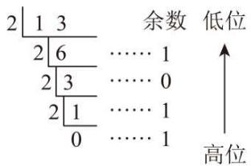

<details>
<summary>text_image</summary>

2 | 1 3
    2 | 6
    2 | 3
    2 | 1
        0
余数 低位
…… 1
…… 0
…… 1
…… 1
↑
高位
</details>

$\neg\neg\alpha'$   
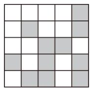  
图2

# 【题型 2 新定义】

112 3 24-25\`567 · E ピ¬ └·ó÷@ō 2. └ēB' a\*b=1/abL a⊗b=1/ab3ψ └GēBà └EGq⑨ ∨⑨o⑨

3 @2

$:3*7=\frac{1}{3}-\frac{1}{7}=\frac{4}{21}\mathrm{L}$ $3\otimes 7 = \frac{1}{3\times 7} = \frac{1}{21} 2$

$\parallel a\otimes b=a*bLb C mnN$ aL b à “-äNY ”2

\_ \ :2\*3= $\frac{1}{2}$ - $\frac{1}{3}$ = $\frac{1}{6}$ L 2⊗3= $\frac{1}{2\times3}$ = $\frac{1}{6}$ L° 2⊗3=2\*3L φ Γ 2L 3 i JǎY “」ǎNY ”2

I T (ürd] δ °C i'

(1)-1L 1 J “」ǎNY ”」I ū ж n λ ù

(2)No μ IOS K JI G(1)J KN(1)J “-ǎNY ”LAB’

$1 \otimes 2 + 2 \otimes 3 + 3 \otimes 4 + 4 \otimes 5 + \cdots + 2023 \otimes 20242$

, del (1)→J “」ǎNY ”

(2) $\frac{2023}{2024}$

, fg1 hijklmnNGA BēB⑨ NOG M $^{-}$ , ① μι L nr “JǎNY ”Gō 2. ε : ::mnNA

BēBpbJri u2

3 1@wx “-äNY ”G ⊥ō 2.Hə AB k l° ±ù

3 2@vwx ⊥ō 2.AB|wxmnNq∨ēB° ±2

, × r13 1@r' λ i Ψ ± • :(-1)⊗1= $\frac{1}{-1\times1}$ = -1L (-1)\*1= $\frac{1}{-1}-\frac{1}{1}$ = -2L

$\therefore (-1)\otimes 1\neq (-1)*1L$

∴→J “」ǎNY ”2

$$
\begin{array}{l} 3 2 @ r ^ {\prime} \lambda i \Psi \pm \cdot : \\ 1 \otimes 2 + 2 \otimes 3 + 3 \otimes 4 + 4 \otimes 5 + \dots + 2 0 2 3 \otimes 2 0 2 4 \\ = 1 * 2 + 2 * 3 + 3 * 4 + 4 * 5 + \dots + 2 0 2 3 * 2 0 2 4 \\ = \frac {1}{1} - \frac {1}{2} + \frac {1}{2} - \frac {1}{3} + \frac {1}{3} - \frac {1}{4} + \dots + \frac {1}{2 0 2 3} - \frac {1}{2 0 2 4} \\ = 1 - \frac {1}{2 0 2 4} \\ = \frac {2 0 2 3}{2 0 2 4} 2 \\ \end{array}
$$

$$
1 2 2 3 \quad 2 4 - 2 5 4 5 6 7 \quad \cdot \Delta E \vdash ; \cdot o D @ \| \bar {o} 2. a 1 6. \text {L} G e B \quad “ * ” L ^ {\prime} \bar {o} m n N \quad a * b = a ^ {2} - 2 a b L \backslash 3 * 4 = 3 ^ {2}
$$

$$
- 2 \times 3 \times 4 = - 1 5 2
$$

(1)y 6※(-8)G{ù

(2)y (-7)※(5※9)G{2

$$
, \mathrm{de} 1 \quad (1) 1 3 2
$$

(2)-861

$$
, \mathrm{fg} 1 3 \quad 1 @ \mathrm{wx} \bar {\mathrm{o}} 2. \bar {\mathrm{e}} \mathrm{Bpbrd} ^ {\circ} \pm \dot {\mathrm{u}}
$$

3 2@wxō 2.ēBpbrd° ±2

$$
\text { hijk1 } \left. \text { L } _ {\bar {0}} 2. \bar {e} B L \check {u} >::: m n N G o \check {e} L q \vee A B \bar {e} B J r i G u 2 \right.
$$

$$
, \times r 1 3 \quad 1 @ r ^ {\prime} \quad 6 \text {※} (- 8) = 6 ^ {2} - 2 \times 6 \times (- 8) = 1 3 2 2
$$

$$
3 2 @ \mathrm{r} ^ {\prime} \quad (- 7) \text {※} (5 \text {※} 9) = (- 7) \text {※} (5 ^ {2} - 2 \times 5 \times 9)
$$

$$
= (- 7) \text {※} (- 6 5)
$$

$$
= (- 7) ^ {2} - 2 \times (- 6 5) \times (- 7)
$$

$$
= 4 9 - 9 1 0
$$

$$
= - 8 6 1 2
$$

$$
1 3 2 3 \quad 2 0 2 5 \cdot \vdash E B I \vdash \cdot o V @ \leqslant I I I W \lnot j ^ {\prime} I \leqslant I I I ] \delta \geqslant <   L \varepsilon \text {※} - ] \delta^ {\circ} C i 2
$$

$$
, ① \circ N \delta 1 \quad \vdash X \check {a} \bar {o} \vdash \Pi \gamma \delta \vdash G \check {a} \delta N C \dot {a} N \delta L \quad N \delta G \check {a} \Sigma H v \pm \Gamma e - ^ {\prime} a _ {1}, a _ {2}, a _ {3}, \dots , a _ {n}, \dots L \check {a} \Sigma + L
$$

$$
\backslash \S \check {a} S N \delta x (1 6) \check {o} - (1 5) L ⑧ \check {a} - W - + \check {a} - G o \{① \pi T \check {a} S E N L B r U S N \delta - + ① o N \delta L U S
$$

$$
\text { EN } \vdash ① \text { o   N } \delta \text { G   o   L } \quad \text { o   P   E   F } \quad q ^ {\wedge} \text { a2 } \quad \backslash^ {\prime} \quad \text { N } \delta \quad 1, 2, 4, 8, \dots \text { a } ① \text { o   N } \delta \text { L } \quad \curvearrowright \text { D } a _ {1} = 1, a _ {2} = 2 \text { L } \text { o   d } q = 2 2
$$

$$
\mathrm{wx} \Gamma 7 \geqslant \left. <   \mathrm{Lrd} \right] \delta^ {\circ} \mathrm{Ci} ^ {\prime}
$$

$$
3 1 @ \textcircled {1} \mathrm{oN} \delta \quad 3, 9, 2 7, \dots \mathrm{G}   \mathrm{o} \quad q \dot {\mathrm{a}} \quad \_ \mathrm{L} (1 6) \quad 5 - \mathrm{J} \quad 2
$$

$$
, \mathrm{v} _ {\mathrm{b}} + 1
$$

$$
\backslash \S \check {a} S N \delta \quad a _ {1}, a _ {2}, a _ {3}, \dots , a _ {n}, \dots L J ① o N \delta L (5)   o \dot {a} \quad q L B r w x \bar {o} 2. \pm \cdot \omega^ {\prime} \quad \frac {a _ {2}}{a _ {1}} = q, \frac {a _ {3}}{a _ {2}} = q, \frac {a _ {4}}{a _ {3}} = q, \dots , \frac {a _ {n + 1}}{a _ {n}} = q.
$$

$$
\Phi \Gamma a _ {2} = a _ {1} \cdot q, a _ {3} = a _ {2} \cdot q = a _ {1} q \cdot q = a _ {1} \cdot q ^ {2}, a _ {4} = a _ {3} \cdot q = a _ {2} \cdot q ^ {2} = a _ {1} \cdot q ^ {3}, \dots
$$

$$
3 2 @ \lambda_ {b} L I" \vdash \text {※} - ① o N \delta G P - v ^ {\prime} a _ {n} = a _ {1} \cdot \underline {{\quad}} 2
$$

$$
, \top \Gamma \text {   ч   ш1①   о   N   δ   yP   } \text {   v   ε   } \rightarrow \top \top L \top J \cap_ {\text {   ь   }} \top \Sigma^ {\prime} \quad - \top \dot {\text {   u   }} \bot \vee p L \top \text {   ⑨   H   v   } \bot \bot 2 ] \bot
$$

$$
J \leftarrow \text { ж   à   1AB } \quad 1 + 2 + 2 ^ {2} + \dots + 2 ^ {2 0 1 9} + 2 ^ {2 0 2 0} G \left\{\text { LMFGěp } ^ {\prime} \right.
$$

$$
\oint S = 1 + 2 + 2 ^ {2} + \dots + 2 ^ {2 0 1 9} + 2 ^ {2 0 2 0} (1) L
$$

$$
\mathrm{b} 2 S = 2 + 2 ^ {2} + \dots + 2 ^ {2 0 2 0} + 2 ^ {2 0 2 1} (2) \mathrm{L}
$$

$$
② \text {   一   } ① \cdot 2 S - S = S = 2 ^ {2 0 2 1} - 1 L
$$

$$
\therefore S = 1 + 2 + 2 ^ {2} + \dots + 2 ^ {2 0 1 9} + 2 ^ {2 0 2 0} = 2 ^ {2 0 2 1} - 1 2
$$

$$
, r \angle^ {\circ} C i 1 3 \quad 3 @ I 1. X \leftarrow \text { ж   Gěpy } \quad 3 + 3 ^ {2} + 3 ^ {3} + \dots + 3 ^ {2 0 2 5} G \{2
$$

$$
, \mathrm{de} 1 3 \quad 1 @ 3 \mathrm{L} 2 4 3 \dot {\mathrm{u}} 3 \quad 2 @ q ^ {n - 1} \dot {\mathrm{u}} 3 \quad 3 @ \frac {3 ^ {2 0 2 6} - 3}{2}
$$

$$
, f g 1 h i j k l \text { L } \bar {o} 2. \bar {e} B L m n N G o \check {e} \bar {e} B L n r i \Psi J r i G u 2
$$

$$
3 1 @ \mathrm{wxi} \Gamma^ {\mathrm{D} \perp} \mathrm{zG} ① \circ \mathrm{N} \delta \mathrm{G} \bar {\mathrm{o}} 2. ^ {\circ} \pm \mathrm{yr} \dot {\mathrm{u}}
$$

$$
3 2 @ w x v b \vdash \Sigma^ {\circ} \pm y r u
$$

$$
3 3 @ \oint S = 1 + 3 + 3 ^ {2} + 3 ^ {3} + \dots + 3 ^ {2 0 2 5} w x _ {-} i G e p y \cdot \quad \therefore S = 1 + 3 + 3 ^ {2} + 3 ^ {3} + \dots + 3 ^ {2 0 2 5} = \frac {3 ^ {2 0 2 6} - 1}{2} L ^ {\circ} \pm y r 2
$$

$$
, \times r 1 r ^ {\prime} 3 \quad 1 @ _ {W X i} U \cdot^ {\prime} (1) o N \delta \quad 3, 9, 2 7, \dots G o q a 3 L (1 6) 5 - J 3 ^ {5} = 2 4 3 \dot {u}
$$

$$
\text { ádeà' } \quad 3 L 2 4 3 \dot {u}
$$

$$
3 2 @ \mathrm{wx} \mathrm{i} \mathrm{U} \cdot^ {\prime} ① \mathrm{oN} \delta \mathrm{GP} - | \mathrm{sv} ^ {\prime} a _ {n} = a _ {1} \cdot q ^ {n - 1} \dot {\mathrm{u}}
$$

$$
\text { ádeà } ^ {\prime} \quad q ^ {n - 1}
$$

$$
3 3 @ \oint S = 1 + 3 + 3 ^ {2} + 3 ^ {3} + \dots + 3 ^ {2 0 2 5} (1) L
$$

$$
b 3 S = 3 + 3 ^ {2} + \dots + 3 ^ {2 0 2 5} + 3 ^ {2 0 2 6} (2) L
$$

$$
② - ① \cdot 3 S - S = 2 S = 3 ^ {2 0 2 6} - 1 L
$$

$$
\therefore S = 1 + 3 + 3 ^ {2} + 3 ^ {3} + \dots + 3 ^ {2 0 2 5} = \frac {3 ^ {2 0 2 6} - 1}{2} 2
$$

$$
\therefore 3 + 3 ^ {2} + 3 ^ {3} + \dots + 3 ^ {2 0 2 5} = S - 1 = \frac {3 ^ {2 0 2 6} - 3}{2} 2
$$

$$
1 4 2 \quad 3 \quad 2 4 - 2 5 \quad 4 5 6 7 \quad \cdot \perp \text {   Ш   } \perp \text {   Z   } \cdot <   = >? @ \quad \text {   F   }" \star " \bar {\circ} 2. \check {\alpha} 1 6. \perp \bar {\mathrm{e}} B ^ {\prime} \quad \text {   Y   } \pi \perp \Psi_ {\mathrm{mnN}} \quad a P b L ^ {\prime} \bar {\circ} a \star b = a + b
$$

$$
+ | a - b | 2 \backslash
$$

$$
(- 3) \star 2 = - 3 + 2 + | - 3 - 2 | = 4 2
$$

(1)AB' $(-6)\star(-10)\dot{u}$

(2)AB' $\left[(-1)_{\star 0}\right]_{\star}\left[7_{\star}(-2)\right]_{2}$

, de1 (1)-12

(2)28

,fg1hijklmnNGA BēBLnr └ō 2.ēBJ u2

3 1@wx ⊥ō 2.L Γ +mnNG A B ēBGēBěpLyz (-6)☆(-10)G{J+° ±ù

3 2@+vwx ⊥ō 2.L Γ +mnNG A B ēBGēBěpLvy (-1)☆0P 7☆(-2)L|AB [(-1)☆0]☆

$$
\left[ 7 \star (- 2) \right] ^ {\circ} \pm 2
$$

$$
, \times r 1 3 \quad 1 @ r ^ {\prime} \quad (- 6) \star (- 1 0)
$$

$$
= - 6 - 1 0 + \vert - 6 + 1 0 \vert
$$

$$
= - 1 2 2
$$

$$
\text { ádeà } ^ {\prime} \quad - 1 2 \dot {u}
$$

$$
3 2 @ \mathrm{r} ^ {\prime} \quad [ (- 1) _ {\star 0} ] _ {\star} [ 7 _ {\star} (- 2) ]
$$

$$
= [ (- 1) + 0 + | (- 1) - 0 | ] \star [ 7 + (- 2) + | 7 - (- 2) | ]
$$

$$
= (- 1 + 1) \star (5 + 9)
$$

$$
= 0 \star 1 4
$$

$$
= 0 + 1 4 + | 0 - 1 4 |
$$

$$
= 1 4 + 1 4
$$

$$
= 2 8 2
$$

1523 24-25 4567 ·+E+−·óD@ō 2.ǎ16.YЭЖN nG “FēB ”①“nà⊥NΠLQ§à 3n+5ù②

“nà+NΠLQ§à $\frac{n}{2^{k}}3\cap D$ kJ19. $\frac{n}{2^{k}}\dot{a}\bot NG \exists JKN@L \varepsilon(5)\bar{e}B p T H \ni 2_\L H$ n=26Lb’

26 $\xrightarrow{F②}$ 13 $\xrightarrow{F①}$ 44 $\xrightarrow{F②}$ 11 …
第一次 第二次 第三次

|| n=449Lb(16) 449 B “FeB ”GQ § J+

, del 8

, fg1 hijkGJNOG' ⊥ЧШL a wx ф ⊥+• z n=449П\` БGeBQ§ L +z' ⊥Jrdы

iG u2vf B ABz n=449Π(16)ǎ⑨ǒ⑨Bi⑨e ⑨g⑨\`BēBGQ§L+z' |Hərd° ±2

, × r1 r' λ "FēB "G(7) 2.L ③ II Y ∃ JKN nf // ∧ 3⊥N⑨ +N@ +ABL λ π n=449à⊥NZvH

∃ F①ēBL

° 3×449+5=13523+N@L

③|Hə F②ēBL

$^{\circ}$ $1352\div2^{3}=1693\perp N@L$

$\mathrm{H} \text{ ə } F①\bar{\mathrm{e}}\mathrm{BL} \cdot \omega \quad 3 \times 169 + 5 = 5123 + \mathrm{N@L}$

$\left|H\right\rangle F②\bar{e}BL^{\circ}\quad512\div2^{9}=13\perp N@L$

$\text{H} \text{ } \text{ } F①\bar{\text{e}}\text{BL} \cdot \text{ } \omega \quad 3 \times 1 + 5 = 83 + \text{N@L}$

$\left|H\right\rangle F②\bar{e}BL^{\circ}\quad8\div2^{3}=1L$

| H ∃ $F①\bar{e}BL \cdot \omega$ $3 \times 1 + 5 = 83 + N@L$ ...L

° (16)1 BēBQ§ à 1352L

(16)2 BēBQ§à 169L

(16)3 BēBQ§ à 512L

(16)4 E eB∅ § à 1L(16) 5 E eB∅ § à 8L ...L

± Γ + (16)6 B eB∅ § à 1L(16) 7 B eB∅ § à 8L

x (16)6 B eBQ § + + + + L(5)-N E eBGQ § à 8L+N E à 1Ln(16) 449 B J-NL

U Y + ABă M ω (16) 449 B “FēB ”L • ω G Q § à 82

1623 23-24 4567 · Γ Π Γ ; · óD@≤III≥<

≥<ǎ' YVIIIN aL bLō 2. F(a,b)G(7) 2.à' " a≤bΠL F(a,b)=a+bù " a>bΠL F(a,b)=a-b2\_\' F(1,3)

$= 1 + 3 = 4 \dot{u} F(2, -1) = 2 - (-1) = 32$

$\geqslant\lt\breve{o}^{\prime}\quad\pi N(\blacksquare\square\blacktriangle\text{Gá}\triangle^{\prime}\quad2000+5+\text{L}\square\blacktriangle\text{G}\blacklozenge.(8)\text{z1}]\perp\text{G}^{\circ}\text{Ci}^{\prime}$

1+2+3+⋯+100=⊥ xūL “∩◇T(○πλ 100 SN◎⊥qΠL X●G□▲★F]⊥Gěp☆♀Bz1∃

$\text{d de}^{'} \quad (1+100)+(2+99)+\cdots+(50+51)=101\times50=50502$

$\check{u} \pm \Gamma U Y n r'$ ♂ $S=1+2+3+\cdots+100①L$

b $S=100+99+\cdots+3+2+1②L$

①+② • 2S=(1+100)+(2+99)+⋯+(100+1)=100×(1+100)=10100L

$^{\circ}S=\frac{100\times(1+100)}{2}=50502$

r∠°Ci'

(1) $F(-1L 3)=\_ \dot{u} F(2L -3)=\_ \dot{u}$

(2)No μ x+y=20L(5) x>yLy F(6,x)-F(10,y)G{ù

(3)Y π ∃ N aL ρ (4) [ v $F(-a^{2}+1,1)=-2\Pi Ly'$ $F(1,a+99)+F(2,a+99)+F(3,a+99)+\cdots+F(199,a+99)\{2$

, de1 (1)2L 5

(2)16

(3)20203

, fg13 1@}F ⊥ō 2.ABri° ±ù

3 2@wx x+y=20,(5)x>y,± • x>10,y<10,|wx “ a≤bΠ, F(a,b)=a+b ù “ a>bΠ, F(a,b)=a-b ,° ±yrù

3 3@ λ π -a²+1<1, λ F(-a²+1,1)=-2, ± • a²=4,wx aJ ∃ N± y aL | K(9) F(1,a+99)+F(2,a+99)+F(3,a

+99)+...+F(199,a+99)y{° ± .

, ×r13 1@r' F(-1L 3)=-1+3=2ù

$F(2L - 3) = 2 - (-3) = 5\dot{u}$

ádeà' 2L 5ù

3 2@ ::x+y=20,(5) x>y,

$\therefore x>10,y<10,$

$\therefore F(6,x)-F(10,y)$

$= 6 + x - (10 - y)$

$= x + y - 4$

=20-4

=16L

á $F(6,x)-F(10,y)G\{\dot{a}\quad16\dot{u}$

3 3@ ::aà ð N ,

$\therefore a > 0, a^{2} > 0, -a^{2} < 0 \mathrm{~L}$

$\therefore 1-a^{2}<1L$

$\therefore F(-a^{2} + 1,1) = -a^{2} + 1 + 1 = -2L$

$\therefore a^{2} = 4, \mathrm{~b}$ $a = 2((12)\{\approx \cong$ )L

$\therefore a + 99 = 2 + 99 = 101$

$\therefore F(1,a + 99) + F(2,a + 99) + \ldots +F(199,a + 99)$

$= F(1,101) + F(2,101) + \dots +F(101,101) + F(102,101) + \dots +F(199,101)$

$=(1+101)+(2+101)+\ldots+(101+101)+(102-101)+\ldots+(199-101)$

$= 101 \times 101 + (1 + 2 + 3 + \ldots + 101) + (1 + 2 + \ldots + 98)$

$$
\begin{array}{l} = 1 0 1 \times 1 0 1 + \frac {(1 + 1 0 1) \times 1 0 1}{2} + \frac {(1 + 9 8) \times 9 8}{2} \\ = 1 0 1 \times 1 0 1 + 1 0 1 \times 5 1 + 9 9 \times 4 9 \\ = 1 0 1 \times 1 5 2 + 9 9 \times 4 9 \\ = 1 5 3 5 2 + 4 8 5 1 \\ = 2 0 2 0 3 2 \\ \end{array}
$$

$$
, \vdash 1 \text {   bijk1'   } \vdash 1 7. ^ {\prime} \mathrm{NOG} _ {\mathrm{M}} ^ {-} \xi \mathrm{L} \text {   uJP   } \Sigma 、 。 \cdot \text { zi   } \Gamma \mathrm{DG} ^ {\prime} \vdash \mathrm{L} \varepsilon \mathrm{F} v ^ {\wedge} \text { az } ^ {\dots} \mathrm{L}!
$$

$$
\mathrm{U}   \mathrm {\SvG"} \dots \mathrm{ZF2}
$$

$$
1 7 2 3 \quad 2 4 - 2 5 4 5 6 7 \quad \cdot 9 \text {ЩE々} \cdot \mathrm{óD@}, \langle \rangle (\ref {e q : 1}
$$

$$
\bar {o} 2. ^ {\prime} \quad y \parallel (2 0) S \perp T G m n N \quad 3 \llcorner \rightarrow ① \pi \quad 0 @ G 3 p \bar {e} B - 1 - 3 \check {e} L \quad \backslash 2 \div 2 \div 2 L (- 3) \div (- 3) \div (- 3) \div (- 3) ① 2 \xi
$$

$$
\text { o   mnNGoěL   Hü   я } \quad 2 \div 2 \div 2 \bar {a} \check {u} \quad 2 _ {3} \text { LIIIü } \quad \text {"2   G] } \quad 3 \text {   Б   ě   "L   } (- 3) \div (- 3) \div (- 3) \div (- 3) \bar {a} \check {u} \quad (- 3) _ {4} \text { LIIIü } \quad \text {" - 3G}
$$

$$
] 4 \text {   Bě   }" 2 \check {a} \Sigma \dashv \text {   Lя   } \underbrace {a \div a \div a \div \cdots \div a} _ {n} (a \neq 0) \bar {a} \check {u} a _ {n} \text {   LIIIǔ   }" a G ] n \text {   Bě   }" 2
$$

$$
3 1 @ \mathrm{M} \gg \text {   e   zAB } \text {   ☒   } \S^ {\prime} \quad (- 2) _ {4} = \_ \_ \_ \_ \text {   L   } (\frac {1}{3}) _ {3} = \_ \_ \_ \_ 2
$$

$$
3 2 @, \lceil (9) \mathrm{чш} 1
$$

$$
\mathrm{H} \ddot {\mathrm{u}} \mu 3 \mathrm{LmnNG} \vee \mathrm{p} \bar {\mathrm{e}} \mathrm{B} \pm \Gamma^ {\vee -} \text {àqp} \bar {\mathrm{e}} \mathrm{BL} 3 \mathrm{p} \bar {\mathrm{e}} \mathrm{B} \pm \Gamma^ {\vee -} \text {àop} \bar {\mathrm{e}} \mathrm{BLmnNG} 3 \check {\mathrm{e}} \bar {\mathrm{e}} \mathrm{B} \backslash
$$

$$
\lceil \quad \vee \quad - \text {   àoěēB   } \lceil \rceil
$$

例如： $2_{4}=2\div2\div2\div2=2\times\frac{1}{2}\times\frac{1}{2}\times\frac{1}{2}=(\frac{1}{2})^{2}$

除方 幂的形式

$$
1. X 7 \text { GB   v   L } ^ {\sim} ] \delta \bar {e} B \ddot {e} - \infty G _ {H} v 3 ] \quad 【 \ddot {e} z \Sigma^ {\prime} @ ^ {\prime}
$$

$$
① a _ {6} = \_ L
$$

$$
② (- \frac {1}{5}) _ {5 ^ {-}} 2
$$

$$
3 3 @ ^ {\sim} \check {a} S (1 1) ^ {\lrcorner} m n N \quad a G ] n E \check {e} \ddot {e} - \infty G H v J ^ {\prime} \quad a _ {n} = \underline {{\quad}} 2 3 ② \ddot {e} ] i \bigcirc \S @ 2
$$

$$
3 4 @, \text {   ☐   Я   ZF1AB'   } \quad 6 ^ {2 0 2 5} - 5 \times (- \frac {1}{6}) _ {2 0 2 6} G \{2
$$

$$
, \mathrm{de} 1 3 \quad 1 @ \frac {1}{4} \mathrm{L} 3 \dot {\mathrm{u}} 3 \quad 2 @ ① a _ {6} = \left(\frac {1}{a}\right) ^ {4} \dot {\mathrm{u}} ② (- \frac {1}{5}) _ {5} = (- 5) ^ {3} \dot {\mathrm{u}} 3 \quad 3 @ \left(\frac {1}{a}\right) ^ {n - 2} \dot {\mathrm{u}} 3 \quad 4 @ 6 ^ {2 0 2 4}
$$

$$
, f g l h i j k l m n N G A B \bar {e} B L = + \left. \right.\left. \right.\left. \right.\left. \right.\left. \right.\left. \right.\left. \right.\left. \right.\left. \right.\left. \right.\left. \right.\left. \right.\left. \right.\left. \right.\left. \right.\left. \right.\left. \right.\left. \right.\left. \right.\left.\left.\left.\left.\left.\left.\left.\left.\left.\left.\left.\left.\left.\left.\left. 2. L r i G u J \check {u} >::: m n N \perp \bar {e} B p b L a w \right.\right.\right.\right.\right.\right.\right.\right.\right.\right\rangle_ {i} ^ {2} \right] ^ {2}\right) ^ {2} \right\rangle_ {i} ^ {2}\right) ^ {2}\right) ^ {2}
$$

$$
\mathrm{x} \mathsf {L} _ {\bar {0}} 2. \delta_ {\mathrm{zBv2}}
$$

$$
3 1 @ \lambda \mathsf {L} _ {\bar {0}} 2. \delta_ {z B v A B ^ {\circ}} \pm \dot {u}
$$

3 2@wx ⊥ō 2.δ zB v L $^{-}$ àoě H v ° ±ù   
3 3@wx3 2@GAB∅§ • z' ⊥ü   
3 4@wxmnNG A B eB ⊢ Π PēBpb + 3 ěGēBpbAB° ±2

$$
, \times r 1 3 \quad 1 @ r ^ {\prime} \quad (- 2) _ {4} = (- 2) \div (- 2) \div (- 2) \div (- 2) = 1 \times \left(- \frac {1}{2}\right) \times \left(- \frac {1}{2}\right) = \frac {1}{4} L \left(\frac {1}{3}\right) _ {3} = \frac {1}{3} \div \frac {1}{3} \div \frac {1}{3} = 3 L
$$

ádeà' $\frac{1}{4}$ L 3ù

3 2@r' ① $a_{6}=a\div a\div a\div a\div a\div a=a\times\frac{1}{a}\times\frac{1}{a}\times\frac{1}{a}\times\frac{1}{a}\times\frac{1}{a}=\left(\frac{1}{a}\right)^{4}\dot{u}$

② $\left(-\frac{1}{5}\right)_{5}=(-\frac{1}{5})\div(-\frac{1}{5})\div(-\frac{1}{5})\div(-\frac{1}{5})\div(-\frac{1}{5})=(-\frac{1}{5})\times(-5)(-5)(-5)(-5)=(-5)^{3}\dot{u}$

3 3@r' $a_{n} = \left(\frac{1}{a}\right)^{n - 2}\mathrm{L}$

ádeà' $\left(\frac{1}{a}\right)^{n-2}$ ù

3 4@r' $6^{2025} - 5 \times \left(-\frac{1}{6}\right)_{2026}$

$$
\begin{array}{l} = 6 ^ {2 0 2 5} - 5 \times (- 6) ^ {2 0 2 4} \\ = 6 ^ {2 0 2 5} - 5 \times 6 ^ {2 0 2 4} \\ = 6 ^ {2 0 2 4} \times (6 - 5) \\ = 6 ^ {2 0 2 4} 2 \\ \end{array}
$$

1823 24-25 4567 ·-III ·óD@←Д YmnN

$$
a, b \bar {o} 2. 1 \check {a} 1 6. \left\lfloor G \bar {e} B L - \right\rfloor \check {u}
$$

$$
\text {   ``o } \vee p \quad \text { ''Lāǔ} \quad \text { ``a } \otimes b \text { ''2 } \diamondsuit
$$

$$
\mathrm{e} \mathrm{z} 1 \mathrm{aV} \vdash \mathrm{X} \quad \text {“o} \vee \mathrm{p} \quad \text {”eBGBv}, \quad (+ 3) \otimes (+ 2) = + 1 \mathrm{L} (+ 1 1) \otimes (- 3) = - 8 \mathrm{L} (- 2) \otimes (+ 5) = - 3 \mathrm{L} (- 6) \otimes (- 1) = + 5 \mathrm{L}
$$

$$
\left(+ \frac {1}{3}\right) \otimes (+ 1) = + \frac {2}{3} L (- 4) \otimes (+ 0. 5) = - 3. 5 L (- 8) \otimes (- 8) = 0 L (+ 2. 4) \otimes (- 2. 4) = 0 L (+ 2 3) \otimes 0 = + 2 3 L 0 \otimes \left(- \frac {7}{4}\right) = + \frac {7}{4} 2
$$

$$
\leftarrow () 1 \mathrm{UVBv} \iota \bar {\mathrm{u}} ^ {\prime} \quad “ \mathrm{H} \text {   x   } 1 1. ” \bar {\mathrm{o}} 2. \mathrm{Go} \vee \mathrm{ppb} 1 2
$$

$$
" \left[ ^ {\sim} \mathrm{pb} \text {Жnz} ^ {\dots \perp} \leftarrow \text {Д}\right) \mathrm{L} \leftarrow \text {Д} \bar {\mathrm{u}} ^ {\prime} \quad \quad \quad \quad \quad \quad \quad \quad \quad \quad \quad \quad \quad \quad \quad \quad \quad \quad \quad \quad \quad \quad \quad \quad \quad \quad \quad \quad \quad \quad \quad \quad \quad \quad \quad \quad \quad \quad \quad \quad \quad \quad \quad \quad \quad \quad \quad \quad \quad \quad \text {``Gn}
$$

$$
r \text {※} \neg \exists \text {д2}"
$$

(1) I \~]← {ЖnG “o ∨ p ”pb ] ※ Ж’

$$
\text {あ} \mathrm{Y} \{\rightarrow \bot ① \mathrm{GION} \bot \quad “ _ {\mathrm{o}} \vee ” \mathrm{L} \mathrm{T} \&\cdot \quad \_ \_ \_ \_ \mathrm{L} \text {あ} \&\cdot \quad \_ \_ \_ \_ \mathrm{L} \varepsilon \quad \dot {\mathrm{u}} \text {あ} \mathrm{Y} \{\bot ① \mathrm{GION} \bot \quad “ _ {\mathrm{o}} \vee ” \mathrm{L} (1)
$$

$$
\cdot \quad \dot {\mathrm{u}} \check {\mathrm{a}} \mathrm{SNW} \quad 0 \perp “ o \vee ” L \sim 0 W \check {\mathrm{a}} S N \perp \quad “ o \vee ” L (1) \cdot U S N G _ {あ} Y \{2
$$

(2) い IOSmnNH ə “o ∨ p ”GABい ‘α 2

, del (1) ∃ L(12)L ε F う /G あ Y { ∨ ≅ う ← G あ Y { û 0

(2) и rg

, fg1hi(6) II jklmnNGA BēBLhiJ ⊥ō 2.17.L 8. d nr ⊥ō 2.G' ō ε η >ēFJri

G u2

3 1@wxiD⊥zG\_Φ° ± • zQ Яù

3 2@A x3 1@Dう〇Gpbfξrd° ±2

, × r13    1@r'    ∵(+3)⊗(+2)=+1L (+11)⊗(-3)=-8L (-2)⊗(+5)=-3L (-6)⊗(-1)=+5L (+1/3)⊗(+1)=+2L

$(-4)\otimes (+0.5) = -3.5\mathrm{L}$ $(-8)\otimes (-8) = 0\mathrm{L}$ $(+2.4)\otimes (-2.4) = 0\mathrm{L}$ $(+23)\otimes 0 = +23\mathrm{L}$ $0\otimes \left(-\frac{7}{4}\right) = +\frac{7}{4} 2$

∴ あ Y {→ ⊥ ① GION ⊥ “o ∨ ”L T & • ə L あ & • (12) L ε F う / G あ Y { ∨ ≅ う ← G あ Y { ù

あ Y{⊥①GION⊥ “o∨ ”L(1) • 0ù

ăSNW 0 ⊥ “o ∨ ”L ∼ 0 WaSN ⊥ “o ∨ ”L(1) • USNG あ Y {2

ádeà' ∃ L(12)L ε F う /G あ Y { ∨ ≅ う ← G あ Y { ù 0ù

3 2@ 解: λ i ΨLIOSmnNHə “o ∨ p ”GABい ‘α’

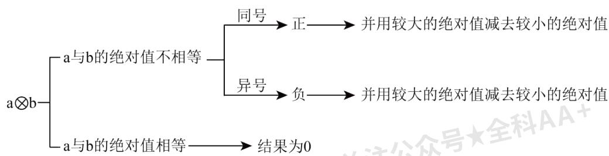

<details>
<summary>flowchart</summary>

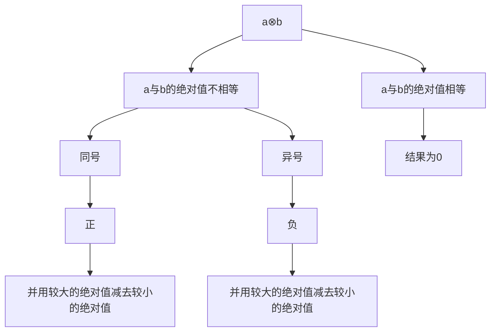
</details>

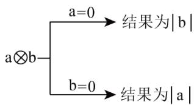

<details>
<summary>flowchart</summary>

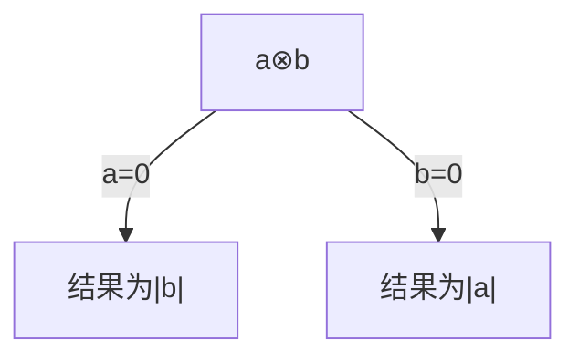
</details>

1923 24-25 4567 ·+E+-·óD@ō 2. LēB a∇b=|a-b|-bL\ 4∇2=|4-2|-2=2-2=0ù

$\parallel a\nabla b=0Lb\ C$ a W b ⊙à “之ǎ ”Nù

$\parallel a\nabla b=-aLb\ C \quad a\ W \quad b\odot\dot{a} “\text{元} XII”N\dot{u}$

(1)AB' $(-4)\nabla (-2) = _2$

(2)] δ ⊙ à “え ǎ ”NGJ \_2 ⊙ à “え XII”NGJ \_2

①6∇3ù ②5∇2ù ③3∇4ù ④2.8∇1.4ù ⑤1∇3ù

(3) $\parallel (x\nabla 1)^{+}[x\nabla (-1)] = 2\mathrm{Lb}$ $x\pm \Gamma H\text{之} V\aleph N^{\perp}$

, del (1)4ù

(2)①④ù ③⑤ù

(3) $-1 \sim 0 \sim 12$

,fg1hijk1 ⊥ō 2.ēB⑨あ Y{G⁻ P⑨rǎ∴ǎ Bě ‘①μι └Lwx ⊥ō 2.\~φ⊥①v

$$
\mathrm{a} \text {おmあY} \{\mathrm{Gv} \Phi \mathrm{JrdhiGu2}
$$

$$
3 1 @ _ {\mathrm{WX}} \mathbin {\lrcorner} _ {\bar {0}} 2. \mathrm{G} \bar {\mathrm{e}} \mathrm{B} \mathrm{K} (9) \mathrm{N} \left\{\mathrm{AB} ^ {\circ} \pm \dot {\mathrm{u}} \right.
$$

$$
3 2 @ \mathrm{wx} \text {Lō} 2. \mathrm{GēB} \mathrm{K} (9) \mathrm{N} \{\mathrm{ABL} | \mathrm{wx} \quad “ _ {\text {え}} \check {a}" \mathrm{NP} “ _ {\text {え}} \mathrm{XII}" \mathrm{NGo} 2. Ⓞ \mathrm{SH} \text {экл} ^ {\circ} \pm \dot {\mathrm{u}}
$$

$$
3 3 @ \mathrm{wx} \mathsf {L} _ {\bar {0}} 2. \mathrm{G} \bar {\mathrm{e}} \mathrm{B} ^ {-} \mathrm{P} \iota \mathrm{LP} \Sigma f \xi \text {お} \mathcal {A} x G I I \{\text {かが} \mathcal {A} (7) \mathrm{m} \text {あ} Y \{\mathrm{G} \check {\mathrm{e}} ^ {\prime \prime -} \text {àǎ.:ǎBě‘L°}
$$

$$
\pm \mathrm{yr} \grave {\mathrm{u}}
$$

$$
, \times r 1 3 \quad 1 @ r ^ {\prime} \quad (- 4) \nabla (- 2) L
$$

$$
= | - 4 - (- 2) | - (- 2) \mathrm{L}
$$

$$
= 2 + 2 \mathrm{L}
$$

$$
= 4 \mathrm{L}
$$

$$
\text { ádeà } ^ {\prime} \quad 4 2
$$

$$
3 2 @ \textcircled {1} \because 6 \nabla 3 = | 6 - 3 | - 3 = 3 - 3 = 0 L
$$

$$
\therefore 6 \nabla 3 \mathrm{J} \odot \mathrm{a} “ _ {\text {之}} \check {a}" \mathrm{N} \dot {\mathrm{u}}
$$

$$
② \because 5 \nabla 2 = | 5 - 2 | - 2 = 3 - 2 = 1 L
$$

$$
\therefore 5 \nabla 2 \text {き} \rightarrow J \odot \dot {a} \quad “ _ {\text {え}} \check {a}" N L \check {u} \rightarrow J \odot \dot {a} \quad “ _ {\text {え}} X I I" N \dot {u}
$$

$$
③ \because 3 \nabla 4 = | 3 - 4 | - 4 = 1 - 4 = - 3 L
$$

$$
\therefore 3 \nabla 4 \mathrm{J} \odot \mathrm{a} “ _ {\text {之}} \mathrm{XIN} ” \dot {\mathrm{u}}
$$

$$
④ \because 2. 8 \nabla 1. 4 = | 2. 8 - 1. 4 | - 1. 4 = 1. 4 - 1. 4 = 0 L
$$

$$
\therefore 2. 8 \nabla 1. 4 \mathrm{J} \odot \mathrm{a} “ _ {\text {之}} \check {\mathrm{aN}} ” \dot {\mathrm{u}}
$$

$$
⑤ \because 1 \nabla 3 = | 1 - 3 | - 3 = 2 - 3 = - 1 L
$$

$$
\therefore 1 \nabla 3 \mathrm{J} \odot \mathrm{a} “ _ {\text {元}} \mathrm{XIN} ” \dot {\mathrm{u}}
$$

$$
\mathrm{VI} 7 \Phi (1 7) ^ {\prime} \odot \dot {a} \quad “ \text {之} \check {a}" \mathrm{NGJ} \quad ① ④ \mathrm{L} \odot \dot {a} \quad " \text {之} \mathrm{XII}" \mathrm{NGJ} \quad ③ ⑤ 2
$$

$$
\text { ádeà' } \quad ① ④ \dot {u} \quad ③ ⑤ 2
$$

$$
3 3 @ \because (x \nabla 1) + [ x \nabla (- 1) ] = 2 L
$$

$$
\therefore | x - 1 | - 1 + | x + 1 | + 1 = 2 \mathrm{L}
$$

$$
\therefore | x - 1 | + | x + 1 | = 2 \mathrm{L}
$$

$$
" x \leq - 1 \Pi L 1 - x - x - 1 = 2 L
$$

$$
\mathrm{r} \cdot x = - 1 \mathrm{L}
$$

$$
" - 1 <   x <   1 \Pi L 1 - x + x + 1 = 2 \text {ぎーくL}
$$

$$
\mathrm{b} \rho (4) - 1 <   x <   1 \mathrm{G} ^ {\perp} \Psi \text {VIIN} x (1) \rho (4) \mathrm{i} \Psi \mathrm{L}
$$

$$
" x \geq 1 \Pi L x - 1 + x + 1 = 2 L
$$

$$
\mathrm{r} \cdot x = 1 \mathrm{L}
$$

$$
\therefore x G H \{\text {   かが   } \mathrm{a} - 1 \leq x \leq 1 L
$$

$$
\text {   ぐ   } \because x \text { à   } \text { ЖNL   }
$$

$$
\therefore x = - 1 \sim 0 \sim 1 2
$$

$$
2 0 2 \quad 3 \quad 2 3 - 2 4 \quad 4 5 6 7 \quad \cdot + E \text {け} Z \cdot o D @ \quad \bar {o} 2. L e B ^ {\prime} \quad a ^ {*} b = \frac {1}{a} - \frac {1}{b} L a \otimes b = \frac {1}{a b} 3 \psi L G e B a L E G q ⑨ \quad \vee ⑨ o ⑨
$$

$$
3 @ 2
$$

$$
: 3 * 7 = \frac {1}{3} - \frac {1}{7} = \frac {4}{2 1} \mathrm{L} 3 \otimes 7 = \frac {1}{3 \times 7} = \frac {1}{2 1} 2
$$

$$
\| a \otimes b = a ^ {*} b \mathrm{LbCmnN} \quad a \mathrm{L} b \text {à}" \text {ăNY}" 2
$$

$$
\_ \backslash^ {\prime} \quad 2 \otimes 3 = \frac {1}{2 \times 3} = \frac {1}{6} L, 2 * 3 = \frac {1}{2} - \frac {1}{3} - \frac {1}{6} L, 2 \otimes 3 = 2 * 3 L \phi \Gamma , 2 L, 3 i J a Y \quad “ \text {   "   } a N Y \quad ” 2
$$

$$
(1) ] \delta \checkmark \uparrow N J \quad “ \lrcorner \check {a} N Y \quad ” G J \quad_ {3} I \vdash \Pi \& @
$$

$$
① a = 1 \mathrm{L} b = 2 \dot {\mathrm{u}} ② a = - \frac {4}{3} \mathrm{L} b = - \frac {1}{3} \dot {\mathrm{u}} ③ a = - 1 \mathrm{L} b = 1 2
$$

$$
(2) \mathrm{AB} ^ {\prime} \quad (- 3) ^ {*} 4 - (- 3) \otimes 4 + (- 2 0 2 3) ^ {*} (- 2 0 2 3) 2
$$

$$
(3) \mathrm{No} \mu \text {IOSKJI G(II)} \text {ЖN(1)J} \quad \text {"} \text {ăNY}" 2
$$

$$
\mathrm{AB} ^ {\prime} \quad 1 \otimes 2 + 2 \otimes 3 + 3 \otimes 4 + 4 \otimes 5 + \dots + 2 0 2 0 \otimes 2 0 2 1 2
$$

$$
, \mathrm{de} 1 \quad (1) ① ②
$$

$$
(2) - \frac {1}{2}
$$

$$
(3) \frac {2 0 2 0}{2 0 2 1}
$$

$$
, f g 1 h i j k m n N G \bar {o} 2. \text {   └─ēBLげこごiLnri(20)DG   └─ō   2.L   ṅ＞:::mnNG A B ēBp }
$$

$$
\mathrm{bJri} \quad \mathrm{u2}
$$

$$
3 1 @ \vdash X i (2 0) \bar {o} 2. H \exists A B L k \Pi J (2) \rho (4) + + ^ {\circ} \pm \dot {u}
$$

$$
3 2 @ \mathrm{M} \gg \text { wxi } \Gamma \bar {\circ} 2. \mathrm{fBAB} \sqrt {- 1} \mathrm{L} - \iota | \mathrm{B} \varepsilon \mathrm{yr} ^ {\circ} \pm \dot {\mathrm{u}}
$$

$$
3 3 @ \mathrm{wx} \bar {\circ} 2. \mathrm{H} \text {эмнP} \text {さ} - \mathrm{L} - \mathrm{i} \mathrm{wx} ^ {\prime} \vdash \mathrm{yr} ^ {\circ} \pm 2
$$

$$
, \times r 1 3 \quad 1 @ r ^ {\prime} \quad ① a = 1 L b = 2 \dot {u}
$$

$$
\because a ^ {*} b = \frac {1}{1} - \frac {1}{2} = \frac {1}{2} \mathrm{L} a \otimes b = \frac {1}{1 \times 2} = \frac {1}{2} \mathrm{L}
$$

$$
\therefore a \otimes b = a * b \mathrm{Lb} \quad ① \mathrm{J} “ \text {   ` } \check {\mathrm{a}} \mathrm{NY} \quad ” \dot {\mathrm{u}}
$$

$$
② a = - \frac {4}{3} \mathrm{L} b = - \frac {1}{3} \dot {\mathrm{u}}
$$

$$
\because a ^ {*} b = \frac {1}{- \frac {4}{3}} - \frac {1}{- \frac {1}{3}} = \frac {9}{4} \mathrm{L} a \otimes b = \frac {1}{\left(- \frac {4}{3}\right) \times \left(- \frac {1}{3}\right)} = \frac {9}{4} \mathrm{L}
$$

$$
\therefore a \otimes b = a ^ {*} b \mathrm{Lb} \quad ② \mathrm{J} “ \text {   `   } \check {\mathrm{a}} \mathrm{NY} \quad ” \dot {\mathrm{u}}
$$

$$
③ a = - 1 \mathrm{L} b = 1 \dot {\mathrm{u}}
$$

$$
\because a ^ {*} b = \frac {1}{- 1} - \frac {1}{1} = - 2 \mathrm{L} a \otimes b = \frac {1}{- 1 \times 1} = - 1 \mathrm{L}
$$

$$
\therefore a \otimes b \neq a * b \mathrm{Lb} \quad ③ \rightarrow \mathrm{J} “ \text {   └   } \check {\mathrm{a}} \mathrm{NY} \quad ” \dot {\mathrm{u}}
$$

$$
\text { ádeà' } \quad ① ② \dot {u}
$$

$$
3 2 @ \mathrm{r} ^ {\prime} \quad (- 3) ^ {*} 4 - (- 3) \otimes 4 + (- 2 0 2 3) ^ {*} (- 2 0 2 3)
$$

$$
= \frac {1}{- 3} - \frac {1}{4} - \frac {1}{(- 3) \times 4} + \frac {1}{- 2 0 2 3} - \frac {1}{- 2 0 2 3}
$$

$$
= \frac {1}{- 3} - \frac {1}{4} - \frac {1}{(- 3) \times 4} + 0
$$

$$
= - \frac {7}{1 2} + \frac {1}{1 2}
$$

$$
= - \frac {1}{2} \dot {\mathrm{u}}
$$

$$
3 3 @ r ^ {\prime} \quad 1 \otimes 2 + 2 \otimes 3 + 3 \otimes 4 + 4 \otimes 5 + \dots + 2 0 2 0 \otimes 2 0 2 1
$$

$$
= 1 * 2 + 2 * 3 + 3 * 4 + 4 * 5 + \dots + 2 0 2 0 * 2 0 2 1
$$

$$
= \left(\frac {1}{1} - \frac {1}{2}\right) + \left(\frac {1}{2} - \frac {1}{3}\right) + \left(\frac {1}{3} - \frac {1}{4}\right) + \left(\frac {1}{4} - \frac {1}{5}\right) + \dots + \left(\frac {1}{2 0 2 0} - \frac {1}{2 0 2 1}\right)
$$

$$
= 1 - \frac {1}{2 0 2 1}
$$

$$
= \frac {2 0 2 0}{2 0 2 1} 2
$$

# 【题型3 阅读理解】

$$
2 1 2 3 \quad 2 4 - 2 5 4 5 6 7 \quad \cdot \text {ざしじ}; \cdot \mathrm{óD@v} \leqslant [ \mathrm{III} ] \perp \geqslant <   \mathrm{L} - \iota r d ^ {\circ} C i ^ {\prime}
$$

$$
\mathrm{T} \check {a} + \mathrm{M} \text {す} 7 \mathrm{mA} \mathrm{B} \gamma \delta \mathrm{G} \quad n (n > 1) \text {ずCせTぜǔL} \quad \mathrm{HüII} \oint \text {そǎS} + \text {ぞZた} \quad P _ {\mathrm{L}} 1 9. \mathrm{U} n \text {ずCせωぞZた} P _ {\mathrm{G}}
$$

$$
\text {   だちうP   } \leftarrow 2 \mathrm{IIr} \angle \mathrm{US} ^ {\circ} \mathrm{CiLv} \quad \text {   “ぢ”ωοうP   ΠG//H’   }
$$

$$
\backslash a \quad ① L \backslash \S M \text {す} 7 m \quad 2 \text {ずCせ} \Pi L \text {っ} \text {黙つ} \oint T \quad A _ {1} P A _ {2} s t G ^ {\perp} \rfloor - \vdash \check {e} (1) \exists L v \dot {a} \text {づPて} \phi \text {でGだちsP}
$$

$$
① \pi A _ {1} \mathrm{P} A _ {2} \mathrm{G} \text {だち} 2
$$

$$
\backslash a \quad ② L \backslash \S M \text {す} 7 m \quad 3 \text {ずCせ} \Pi L \rightarrow \text {と} \kappa \Pi L \text {ぞZた} \oint T D t \quad A \text {ど】Bな} L \rightarrow \text {と} \mu_ {3} L \backslash \S M \text {す} 7 m \quad 4 \text {ず}
$$

$$
\mathrm{C} \text {せL} \quad P Z \notin \mathrm{T} (1 6) \quad 2 \text {ずW} (1 6) \quad 3 \text {ずstG} \perp \lrcorner - \mid \check {\mathrm{e}} \dot {\mathrm{u}} \mathrm{m} \quad 5 \text {ずC} \text {せL} \quad P Z \notin \mathrm{T} (1 6) \quad 3 \text {ずùそ2}
$$

°Ci3 1@' \ § Mす7m 7ずCせL PZT」ど ?

°Ci3 2@'m nずCせΠL PZ ♂ T」ど ?

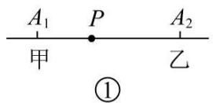

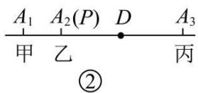

$$
, \top^ {\Gamma} Z F 1
$$

3 3@y |x-1|+2|x-3|+3|x-4|G] ← {2

3 4@y $f(x)=|x-1|+|2x-1|+\cdots+|2011x-1|G\leftarrow\{2$

, del 3 1@ P 应该在第四台位置；（2）当 n 为奇数时，P 应该在第 $\frac{n+1}{2}$ 台位置；当 n 是偶数时，P 应该在第 $\frac{n}{2}$ 台和第 $\frac{n}{2}+1$ 台之间的任何位置；（3）5；（4）1005

,fg1hijklαHGm⁻' |L=+≌あY{⑨mnNABēB①μιLnriЧL+z' |Lf

$$
\xi \mathrm{yr} ^ {\circ} \pm \cdot \omega \mathrm{de2f} \xi \text {お} \mathcal {A} \mathrm{JriG} \mathrm{u2}
$$

3 1@λ≤III≥<L+8.' ⊢° ±·ωdeù

3 2@ λ ≤ III ≥ L + 8. ' ⊢ ± · ω deù

3 3@ λ ≤ III ≥ < L + 8. ' ⊥ L ≅ あ Y{° ± • ω deù

3 4@ λ ≤ III ≥ < L + 8.' |L • ω " x=1/1006 ΠL f(x)=|x-1|+|2x-1|+⋯+|2011x-1|m] ← {L\~ x=1/1006 K(9)K

$$
\mathrm{NvL} \cong \text {あY} \left\{\mathrm{yr} ^ {\circ} \pm \cdot \omega \mathrm{de2} \right.
$$

$$
, \times r 1 r ^ {\prime} 3 \quad 1 @ \lambda \leqslant I I I \geqslant <   \pm \mu L \quad 7 J ^ {\perp} N L a \quad P Z L T (1 6) e \text {   ず   } u \text {   そ   } u
$$

3 2@ $\lambda \leqslant$ III≥±μ'

$$
" n \mathrm{à} \bot \mathrm{N} \Pi \mathrm{L} \quad P Z \mathrm{LI} \mathrm{T} (1 6) \frac {n + 1}{2} \text {   ず   } \dot {\mathrm{u}} \text {   そ   } \dot {\mathrm{u}}
$$

$$
" n \mathrm{J} + \mathrm{N} \Pi \mathrm{L} \quad P Z \text {I}, \mathrm{T} (1 6) \frac {n}{2} \text {ずP} (1 6) \frac {n}{2} + 1 \text {ずstG} \bot \text {」} \dot {\mathrm{u}} \text {そ} \dot {\mathrm{u}}
$$

3 3@ λ i ΨL TM す7⊥ “πm 3ずCにL b “PT3φYZG ⊢ΠL ° “x=3ΠL |x-1|+2|x-3|+3|x-4|m】

$$
\leftarrow \{L
$$

$$
\therefore | x - 1 | + 2 | x - 3 | + 3 | x - 4 |
$$

$$
= | 3 - 1 | + 2 | 3 - 3 | + 3 | 3 - 4 |
$$

$$
= 2 + 3
$$

$$
= 5 \dot {u}
$$

3 4@ $f(x) = |x - 1| + |2x - 1| + \cdots + |2011x - 1|^{\wedge}a \quad xG \vdash \omega^{\wedge}a \quad 1⑨\frac{1}{2}⑨\frac{1}{3}\ldots\frac{1}{2011}G \vdash \text{だち sPLRm} \quad 2011S \vdash LJ^{\perp}N$

SL

$$
\begin{array}{l} \therefore \text { “ } x = \frac {1}{1 0 0 6} \Pi L f (x) = | x - 1 | + | 2 x - 1 | + \dots + | 2 0 1 1 x - 1 | m ] \leftarrow \{L \\ f (x) = | x - 1 | + | 2 x - 1 | + \dots + | 2 0 1 1 x - 1 | \\ = \left| \frac {1}{1 0 0 6} - 1 \right| + \left| 2 \times \frac {1}{1 0 0 6} - 1 \right| + \dots + \left| 2 0 1 1 \times \frac {1}{1 0 0 6} - 1 \right| \\ = \frac {1 0 0 5}{1 0 0 6} + \frac {1 0 0 4}{1 0 0 6} + \frac {1 0 0 3}{1 0 0 6} + \dots + \frac {1}{1 0 0 6} + 0 + \frac {1}{1 0 0 6} + \dots + \frac {1 0 0 3}{1 0 0 6} + \frac {1 0 0 4}{1 0 0 6} + \frac {1 0 0 5}{1 0 0 6} \\ = 2 \times \left(\frac {1 0 0 5}{1 0 0 6} + \frac {1 0 0 4}{1 0 0 6} + \frac {1 0 0 3}{1 0 0 6} + \dots + \frac {1}{1 0 0 6}\right) \\ = \frac {2}{1 0 0 6} \times (1 + 2 + \dots + 1 0 0 5) \\ = \frac {2}{1 0 0 6} \times \frac {(1 + 1 0 0 5) \times 1 0 0 5}{2} \\ = 1 0 0 5 2 \\ \end{array}
$$

2223 24-25 4567 · Δ -ぬね · óD@≤III] ⊥ ≡ <’

$\mathrm{AB}^{\prime}$ $\left(-\frac{1}{30}\right)\div \left(\frac{2}{3} -\frac{1}{10} +\frac{1}{6} -\frac{2}{5}\right)2$

rpă' 20. v = $\left(-\frac{1}{30}\right)\div\frac{2}{3}-\left(-\frac{1}{30}\right)\div\frac{1}{10}+\left(-\frac{1}{30}\right)\div\frac{1}{6}-\frac{1}{30}\div\left(-\frac{2}{5}\right)=-\frac{1}{20}+\frac{1}{3}-\frac{1}{5}+\frac{1}{12}=\frac{1}{6}2$

rpǒ' 20. v = $\left(-\frac{1}{30}\right) \div \left[\left(\frac{2}{3} + \frac{1}{6}\right) - \left(\frac{1}{10} + \frac{2}{5}\right)\right] = \left(-\frac{1}{30}\right) \div \left(\frac{5}{6} - \frac{1}{2}\right) = -\frac{1}{30} \times 3 = -\frac{1}{10} 2$

rpBl' 20. v G④N = $\left(\frac{2}{3}-\frac{1}{10}+\frac{1}{6}-\frac{2}{5}\right)\div\left(-\frac{1}{30}\right)=\left(\frac{2}{3}-\frac{1}{10}+\frac{1}{6}-\frac{2}{5}\right)\times(-30)=-20+3-5+12=-10$ Lá 20. v = $\frac{1}{10}2$

(1)7(17)Bl 16.rp • zGQ § → TLのōmrpJ\_TはGL” xàrp \_\_\_\_J\_TはGù

(2) I ” H ə P ī AB’ $\left(-\frac{1}{42}\right)\div\left(\frac{1}{6}-\frac{3}{14}+\frac{2}{3}-\frac{2}{7}\right)$ 2

, del (1)ǎ

(2) $-\frac{1}{14}$

,fglhijkmnN e b A BēBLǚ>:::mnNA BēBpbJriG u2

3 1@ T}Ffば |ABΠL 3 p③ II v M —opL ば a ひ 19.FL ε (5)③ II K T ∼| ⊥ G ∃ (12)& お 7L P Σ

、。Bl 16.rp° ± • ω deù

3 2@P Σ、。± · ωrpBi】 PīL φ Γ } FrpBiGěp° ± · ω de2

, ×r13 1@r' ∴ T } Ffば |GΠびL 3 p③ II v m — opLば a ひ 19.FL(5)rpǎGABQ § W

\+ IO 16.→ T L

∴rpă→Э д ù

$$
\text { ádeà'ǎù }
$$

$$
3 2 @ r ^ {\prime} 2 0. v G ④ N = \left(\frac {1}{6} - \frac {3}{1 4} + \frac {2}{3} - \frac {2}{7}\right) \div \left(- \frac {1}{4 2}\right)
$$

$$
= \left(\frac {1}{6} - \frac {3}{1 4} + \frac {2}{3} - \frac {2}{7}\right) \times (- 4 2)
$$

$$
= - 7 + 9 - 2 8 + 1 2
$$

$$
= - 1 4 \mathrm{L}
$$

$$
\text { a } 2 0. \mathrm{v} = - \frac {1}{1 4} 2
$$

2323 2024 4567 ·¬ Θ·びi>?@ 学习情境·阅读理解≤III’ Hüμ 3L φm.ぶ.ぷ+←N(1)± Γ⁻—

$$
\mathrm{fNL} \text {B} \Gamma \backslash \rfloor \text {Яぶぶ} + \leftarrow \mathrm{N} ^ {-} \dot {\mathrm{afN}} [ ] - \text {ヘベǎ16.ěp} ^ {\prime}
$$

$$
\_ \text {   'я   } 0. \dot {3} \mathrm{P} 0. \dot {6} \dot {7} ^ {-} - \mathrm{fN2}
$$

$$
0. \dot {3} _ {\mathrm{O}} 1 0 \mathrm{L} 2 0. \text {Nù⑧ùHǎùL} \cdot \omega \quad 3. \dot {3} \mathrm{L} ^ {\circ} \quad 0. \dot {3} \times 1 0 = 3. \dot {3} \mathrm{L} | \vee \cong \quad 0. \dot {3} \cdot 3 \mathrm{LBv} ] ^ {\prime}
$$

$$
0. \dot {3} \times 1 0 - 0. \dot {3} = 3. \dot {3} - 0. \dot {3} = 3 L ^ {\circ} \quad 9 \times 0. \dot {3} = 3 L \phi \Gamma \quad 0. \dot {3} = \frac {3}{9} = \frac {1}{3} \dot {u} T Y _ {3 n L a} \quad 0. \dot {6} \dot {7} ^ {-} - f N G B v \backslash ] ^ {\prime}
$$

$$
0. \dot {6} \dot {7} \times 1 0 0 - 0. \dot {6} \dot {7} = 6 7. \dot {6} \dot {7} - 0. \dot {6} \dot {7} = 6 7 \mathrm{L} ^ {\circ} \quad 9 9 \times 0. \dot {6} \dot {7} = 6 7 \mathrm{L} \Phi \Gamma \quad 0. \dot {6} \dot {7} = \frac {6 7}{9 9} 2
$$

$$
\mathrm{wx} 7 \perp \geqslant <   \text {※一}
$$

$$
(1) \mathrm{M} \gg \text { я } ] \perp \text { ぶ   ぷ   十 } \leftarrow \mathrm{N} ^ {-} \mathrm{afN} \quad 0. \dot {5} = \quad \text { 天 } \quad \mathrm{L} 0. \dot {1} \dot {7} = \quad \dot {\mathrm{u}}
$$

$$
(2) \mathrm{I} _ {\text {Я}} ] \perp \text {ぶふ} + \leftarrow \mathrm{N} 0. \dot {1} 0 \dot {3}, 0. 1 \dot {3} ^ {-} \dot {a} f \mathrm{NL} \ddot {e} z A B \Sigma^ {\prime} 2
$$

$$
, \mathrm{del} \quad (1) \frac {5}{9} \mathrm{L} \frac {1 7}{9 9}
$$

$$
(2) 0. \dot {1} 0 \dot {3} = \frac {1 0 3}{9 9 9} \mathrm{L} 0. 1 \dot {3} = \frac {2}{1 5} \mathrm{L} \text {   и   rg }
$$

$$
, f g 1 \text {   и   } i (6) \text {   II   jklmnNGA   B   \bar {e} BLriG   uJ   1.X \geqslant <   ri2 }
$$

$$
3 1 @ 1. X \geqslant <   \text {   } ^ {\circ} G \check {e} p ^ {\sim} \text {   } \text {   } \text {   } \text {   } \text {   } \text {   } + + - N ^ {-} \text {   } \text {   } \text {   } \text {   } \text {   } \text {   } \text {   } \text {   } \pm \dot {u}
$$

$$
3 2 @ 1. X \geqslant <   ^ {\wedge} G e p ^ {\sim} \quad 0. i 0 \dot {3} ^ {-} a f N u v 1. X \geqslant <   y z \quad 0. 0 \dot {3} = \frac {1}{3 0} L | _ {w x} \quad 0. 1 \dot {3} = 0. 1 + 0. 0 \dot {3} A B ^ {\circ} \pm 2
$$

$$
, \times r 1 3 \quad 1 @ r ^ {\prime} \quad 0. \dot {5} \times 1 0 - 0. \dot {5} = 5. \dot {5} - 0. \dot {5} = 5 L ^ {\circ} \quad 9 \times 0. \dot {5} = 5 L
$$

$$
\therefore 0. \dot {5} = \frac {5}{9} \mathrm{L}
$$

$$
0. \mathrm{i} \dot {7} \times 1 0 0 - 0. \mathrm{i} \dot {7} = 1 7. \mathrm{i} \dot {7} - 0. \mathrm{i} \dot {7} = 1 7 \mathrm{L} ^ {\circ} \quad 9 9 \times 0. \mathrm{i} \dot {7} = 1 7 \mathrm{L}
$$

$$
\therefore 0. \dot {1} \dot {7} = \frac {1 7}{9 9} \mathrm{L}
$$

$$
\text { ádeà } ^ {\prime} \quad \frac {5}{9} \mathrm{L} \frac {1 7}{9 9} \dot {\mathrm{u}}
$$

$$
3 2 @ r ^ {\prime} \quad 0. i 0 \dot {3} \times 1 0 0 0 - 0. i 0 \dot {3} = 1 0 3. i 0 \dot {3} - 0. i 0 \dot {3} = 1 0 3 L ^ {\circ} \quad 9 9 9 \times 0. i 0 \dot {3} = 1 0 3 L
$$

$$
\therefore 0. \dot {1} 0 \dot {3} = \frac {1 0 3}{9 9 9} \dot {\mathrm{u}}
$$

$$
0. 0 \dot {3} \times 1 0 0 - 0. 0 \dot {3} = 3. 3 \dot {3} - 0. 0 \dot {3} = 3. 3 \mathrm{L} ^ {\circ} \quad 9 9 \times 0. 0 \dot {3} = 3. 3 \mathrm{L}
$$

$$
\therefore 0. 0 \dot {3} = \frac {3 . 3}{9 9} = \frac {3 3}{9 9 0} = \frac {1}{3 0} \mathrm{L}
$$

$$
\therefore 0. 1 \dot {3} = 0. 1 + 0. 0 \dot {3} = 0. 1 + \frac {1}{3 0} = \frac {2}{1 5}
$$

$$
0. 1 \dot {3} = \frac {2}{1 5} 2
$$

$$
2 4 2 \quad 3 \quad 2 4 - 2 5 \quad 4 5 6 7 \quad \cdot \text {ほぼぼま} \cdot \mathrm{óD@} \quad \leqslant [ \mathrm{III} ] \delta \geqslant <   ^ {\prime} \quad \mathrm{Hü} \mu_ {3} | x | \mathrm{Gú} \rfloor \mathrm{Ч} 2. \mathrm{JNみ} 7 \mathrm{N} \quad x \mathrm{GYZ} \vdash \mathrm{W} 2 0. \vdash
$$

$$
\mathrm{stG} \text {だちL} \quad {} ^ {\circ} | x | = | x - 0 | \mathrm{L} \check {\mathrm{u}} \pm \Gamma \bar {\mathrm{uL}} \quad | x | ^ {\wedge} \mathrm{aNみ7N} \quad x \mathrm{WN} \quad 0 \mathrm{YZ} \vdash \mathrm{stGだち2} \quad \mathrm{US} \text {QA} \pm \Gamma_ {\mathrm{b}} \Gamma_ {\mathrm{a}} \quad | A - B |
$$

$$
\hat {\mathrm{aN}} \text {み} 7 \mathrm{N} \quad A \mathrm{WN} \quad B Y Z \vdash \mathrm{stGだち} 2
$$

$$
(1) \mathrm{F} _ {\text {あ}} \mathrm{Y} \{\hat {} \mathrm{aN} \text {み} 7 - 5 \mathrm{W} 3 \mathrm{stGだち} \dot {\mathrm{u}}
$$

$$
(2) \parallel | x - 2 | = 3 \mathrm{Lb} \quad x \pm \Gamma^ {\wedge} \mathrm{aN} \text {み} 7 \mathrm{G} \text {え} \mathrm{VN} \dot {\mathrm{u}}
$$

$$
(3) \mathrm{A} \times 3 \quad 2 @ \mathrm{G} \text {O} \text {R} \text {L} \text {y} 1 9. \cdot \quad | x - 3 | + | x + 4 | = 7 - <   \mathrm{G} \phi \mathrm{mTB} + + \mathrm{G} \text {KNGP} \dot {\mathrm{u}}
$$

$$
(4) \lambda \Gamma 7 G \text {   わむめも   } Y \pi \bot \text {   」   mnN   } \quad x L y z \quad | x - 4 | + | x + 5 | G ] \leftarrow \{\bot
$$

$$
, \mathrm{de} 1 \quad (1) | - 5 - 3 |
$$

$$
(2) ^ {- 1 \mathrm{L}}
$$

$$
(3) - 4
$$

$$
(4) 9
$$

$$
, f g 1 \text {   ы   } i j k l \text {   あ   } Y \{G \acute {u} \rfloor \text {   Ч   } 2. L m n N q p L N \text {   み   } L \check {u} >::: N \text {   み   } 7 \vdash G \text {   や   } L \text {   あ   } Y \{G \acute {u} \rfloor \text {   Ч   }
$$

$$
2. \mathrm{JriG} \quad \mathrm{u2}
$$

$$
3 1 @ \mathrm {wxN^ {\wedge} aGü\rfloor} \Psi 2. ^ {\circ} \pm \mathrm{H} \ni \mathrm{yrù}
$$

$$
3 2 @ \mathrm{wxTN} \text {み} 7 \mathrm{LIX} \vdash \omega \quad 2 \phi \mathrm{YZG} \vdash \mathrm{G} \text {だちà} \quad 3 \mathrm{L} ^ {\circ} \pm \cdot \omega \mathrm{TB} + + \mathrm{GN} \dot {\mathrm{u}}
$$

$$
3 3 @ \mathrm{wx} 3 2 @ \text {   ☉   } \hat {\mathrm{A}} \mathrm{a} \dot {\mathrm{a}} ^ {\prime} \quad \mathrm{T} \mathrm{N} \text {   み   } 7 \mathrm{IX} \vdash \omega - 4 \phi \mathrm{YZG} \vdash \mathrm{G} \text {   だち   } \mathrm{P} \omega \quad 3 \phi \mathrm{YZG} \vdash \mathrm{G} \text {   だち   } \mathrm{sPà} \quad 7 \mathrm{L} \cdot \mathrm{z}
$$

$$
\rho (4) + + \mathrm{G} \mathrm{JKN} x \mathrm{G} \{\mathrm{L} | \mathrm{yP} ^ {\circ} \pm \dot {\mathrm{u}}
$$

$$
3 4 @ \lambda | x - 4 | + | x + 5 | \mathrm{G} \acute {\mathrm{u}} \rfloor \Psi 2. \mathrm{JN} \text {み} 7 ^ {\wedge} \mathrm{amnN} \quad x \mathrm{G} \vdash \mathrm{W} ^ {\wedge} \mathrm{amnN} \quad 4 \mathrm{G} \vdash \mathrm{stG} \text {だちWNみ} 7 ^ {\wedge} \mathrm{am}
$$

$$
\mathrm{nN} \quad x \mathrm{G} \vdash \mathrm{W} ^ {\wedge} \text {amnN} \quad - 5 \mathrm{G} \vdash \mathrm{stGだちsPLb}" \Pi \mathrm{L} ] \leftarrow \text {Lyzde} ^ {\circ} \pm 2
$$

$$
, \times r 1 3 \quad 1 @ r ^ {\prime} \quad \because | A - B | ^ {\wedge} a N \text {み} 7 N \quad A W N \quad B Y Z \vdash s t G \text {だち} L
$$

$$
\therefore \mathrm{N} \text {み} 7 - 5 \mathrm{W} 3 \mathrm{stG} \text {だち} ^ {\wedge} \mathrm{a} \mathrm{à} | - 5 - 3 | \dot {\mathrm{u}}
$$

$$
3 2 @ | x - 2 | = 3 ^ {\wedge} \mathrm{a} ^ {\prime} \mathrm{T} \mathrm{N} \text {み} 7 \mathrm{L} \mathrm{IX} \vdash \omega \quad 2 \phi \mathrm{YZG} \vdash \mathrm{G} \text {だちà} \quad 3 \mathrm{L}
$$

$$
\therefore x = - 1 \sim x = 5 \mathrm{L}
$$

$$
\pm \Gamma^ {\wedge} \mathrm{aN} \text {み} 7 \mathrm{GN} \quad - 1 \sim \mathrm{N} 5 \dot {\mathrm{u}}
$$

$$
3 3 @ | x - 3 | + | x + 4 | = 7 L ^ {\wedge} a \text {à T Nみ} 7 I X \vdash \omega \quad - 4 \phi Y Z G \vdash G \text {だち} P \omega \quad 3 \phi Y Z G \vdash G \text {だち} s P a \quad 7 L
$$

$$
\therefore - 4 \leq x \leq 3 \mathrm{L}
$$

$$
\therefore \rho (4) + + G \mathrm{JKN} x \pm \dot {\mathrm{a}} - 4 \mathrm{L} - 3 \mathrm{L} - 2 \mathrm{L} - 1 \mathrm{L} 0 \mathrm{L} 1 \mathrm{L} 2 \mathrm{L} 3 \mathrm{L}
$$

$$
\therefore \text {   KNGPà   } - 4 + (- 3) + (- 2) + (- 1) + 0 + 1 + 2 + 3 = - 4 \dot {\mathrm{u}}
$$

$$
3 4 @ \mathrm{r} ^ {\prime} \quad | x - 4 | + | x + 5 | ^ {\wedge} \mathrm{aTN} \text {み} 7 ^ {\wedge} \mathrm{a} \omega \quad 4 \mathrm{P} - 5 \mathrm{G} \text {だちsPL}
$$

$$
\Phi \Gamma “ x T - 5 W 4 s t G N \text {   み   } 7 \Pi L m ] \leftarrow \{\dot {a} \quad 4 - (- 5) = 4 + 5 = 9 L
$$

$$
^ {\circ} | x - 4 | + | x + 5 | \mathrm{G} ] \leftarrow \{\text { à } \quad 9 2
$$

$$
2 5 2 3 \quad 2 4 - 2 5 4 5 6 7 \quad \cdot \text {やゆや}; \cdot \mathrm{óD} @ \leqslant \mathrm{III} \geqslant <   \mathrm{L} \varepsilon \text {ゆd°Ci}
$$

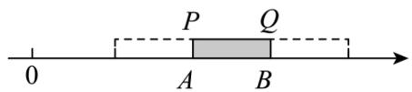

<details>
<summary>text_image</summary>

0
P Q
A B
</details>

$$
(1) \backslash a L m \check {a} w \check {y} \check {y} P Q ら そ T N み 7 L - | G I O り P L Q f B る T A L B I O | ど L ^ {\sim} \check {y} \check {y} T N み 7 れ \mathsf {L} ラ \% o L
$$

$$
\text {“} \vdash P \text {ろ} \% _ {0} \omega \vdash B \Pi L \vdash Q \phi Y Z G N \dot {a} \quad 3 2 \ddot {u} \text {“} \vdash Q \text {ろ} \% _ {0} \omega \vdash A \Pi L \vdash P \phi Y Z G N \dot {a} \quad 8 L \} F \phi (\mu , u)
$$

$$
\mathrm{yz} \vdash A ⑨ \vdash B \Phi^ {\wedge} \mathrm{aGN} + \text {よよ} P Q G \text {わ} \dot {\mathrm{u}}
$$

$$
(2) \text {わる} 7 \perp \mathrm{Gěpr} \angle^ {\circ} \mathrm{Ci} ^ {\prime} \check {\alpha} \kappa \mathrm{L} \leftarrow \mathrm{x} \cong {} ^ {\circ} \mathrm{C} \text {魚魚G5をL魚魚ū} ^ {\prime} \quad “ \mathrm{H} \| \mathrm{J}" + \mathrm{TUr}" \text {んII} \quad 3 8 5 \text {ば}
$$

$$
\mathrm{z} \theta \text {『L”‖JH+TUr / LHNoMJ} \quad 1 1 5 \bullet \text {ア”←※アイL魚魚イ5ωウJ+●」I”いzaЧαL}
$$

$$
\mathrm{yz} \leftarrow \text {   ※   P   焦   焦   G5   を   L   ε   ë   z   BnGAB   Σ   ‘2   }
$$

$$
, \mathrm{del} \quad (1) 1 6 \mathrm{L} 2 4 \mathrm{L} 8 \mathrm{cm}
$$

$$
(2) \mathrm{irgL} \leftarrow \mathrm{x} \quad 1 3 \bullet \mathrm{L} \text {   焦   焦   } 6 4 \bullet \mathrm{L} \mathrm{irg}
$$

$$
, f g 1 h i (6) \text {   II   jklFNみr } \angle V I I ^ {\because} C i L ウ ェ i 4 ⑨ い z a a ⑨ + \omega i \Gamma D G ① \Omega [ J r \angle^ {\circ} C i
$$

$$
\mathrm{G} \quad \mathrm{u2}
$$

$$
3 1 @ \lambda i \Upsilon \pm \mu L \vdash B \omega N 3 2 G \text {だち} ⑨ P L Q G \text {だち} ⑨ \vdash A \omega N 8 G \text {だち} \bot ① L \lambda \text {す} = a \pm \mu P Q J A B G
$$

$$
\mathrm{B} \text { If } \mathrm{s} \check {\mathrm{a}} \mathrm{L} \mathrm{x} \text { b } \mathrm{y} \cdot \quad P Q G \text { わ } \mathrm{L} \mathrm{H} \mathrm{n} \mathrm{y} \cdot \vdash \quad A ⑨ \vdash B \Phi^ {\wedge} \mathrm{a} \mathrm{G} \mathrm{N} \dot {\mathrm{u}}
$$

$$
3 2 @ 1. X 3 \quad 1 @ \text {い} Z a L \pm \mu \text {気気P} \leftarrow \mathrm{K} G 5 \text {を工} \dot {\mathrm{a}} \quad [ 1 1 5 - (- 3 8) ] \div 3 = 5 1 L H \mathrm{ny} \cdot \leftarrow \mathrm{K} P \text {気気G5を2}
$$

$$
, \times r 1 3 \quad 1 @ r ^ {\prime} \lambda i \Psi \pm \mu L \vdash B \omega N 3 2 G \text {だち⑨} P L Q G \text {だちJ} A B G \mathrm{B} I f s \check {a} ⑨ \vdash A \omega N 8 G \text {だち}
$$

$$
\perp ① \mathrm{L}
$$

$$
\Phi \Gamma \text {よよ} P Q G \text {わà} (3 2 - 8) \div 3 = 8 (\mathrm{cm}) \mathrm{L}
$$

$$
\Phi \Gamma \vdash A ^ {\wedge} a G N \dot {a} \quad 8 + 8 = 1 6 L
$$

$\vdash B^{a}GNà$ 32-8=242

3 2@r' \ a LΛ • 焦魚P←※G5を工à [115-(-38)]÷3=513●@L

$\Phi \Gamma$ 無 無 G5 を à 64-51=133 ●@L

← ж G5 を à $b-a=163\bullet@L$

$\phi \Gamma \leftarrow \kappa 13 \textcircled{L} \textcircled{E} \textcircled{E} 64 \textcircled{C} 2$

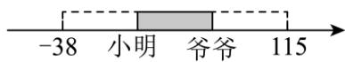

2623 24-25 4567 ·9才才； ·óD@, ≥≤III1IIIカ- óガtいキ -ǎbá△2/ギクれ ΠLグ Z III

E グ(14)≡G グ ΔD ケ zǎ② ゲ コ L コ 3.7mǎ マ ゴ や サ ゼ G a eL ú C “グ N”2 \ a 1L グ N7mBlə Bl δ

GシジαLFVIIス └─── ス └GSN^aNOLf B YZ └ 1ズ9U 9 SNOL⑧ ə ⑨ δ＋IO＋Y↓す7G

bISN⊥qGQ§⊥T2 “グ N”Fイκ GN(T&セゼz‘’iJǎSBI<ソě 3\a 2@ぐゾTタ---L Jǎ

16.\~ 9 SNO3NO→ p ⊥19.F@ほ γ T B I ə B I δ G ə ě H---ΦDL19.⑧ ə ⑨ δ PY ↓ す7GNOsP(1)

⊥①2

,°Cir∠1

3 1@wx “グ N”D^ダGЧ [L\~a 2 DGBI<ソě]※Жù

3 2@\ a 3LJăS └GBI<ソěL I wx α D─zGNxL\~ 1L 2L 3L 4L 5 UgSNO | (9) ^---L

US └GЫ＜ソ ěù

，下チ 1

3 3@m 3 S ə ě h L⑧S ə ě h G チ トど(1)mǎS “ッ”2\ a 4L \~ -12,-10,-8,-6,-4,-2,1,3,5,7,9,11U 12

SNO : (9)ツ “Gùそ ı 3NO→ p 〒19.F@ L ⑧S Э ě H 4 S デ 〒“ッ”DGNGP(1)⊥①L y ax+byG{2

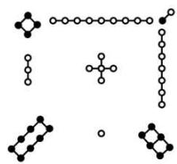

<details>
<summary>chemical</summary>

Collection of molecular structures including aromatic rings, heteroatoms, and functional groups
</details>

图1

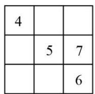  
图2

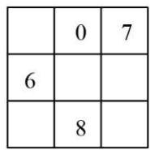  
图3

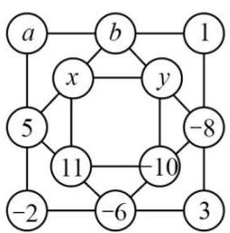

<details>
<summary>flowchart</summary>

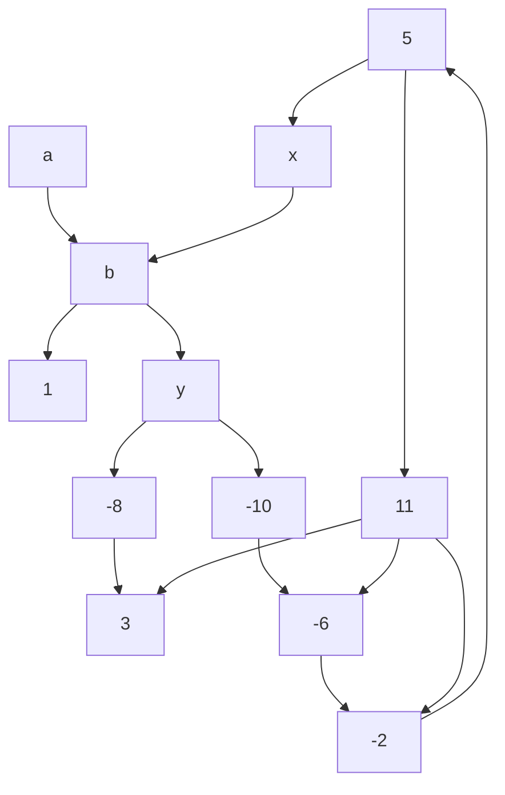
</details>

图4

, de13 1@ i rgù3 2@ i rgù3 3@ -120\~ 111

, fglhijklmnNG e bēBL! p jk(θ G 9. a ツPēB a ツ2

3 1@wxi Ψ ± μL⑧ ə ⑨ δ PY ↓ す7GNOsP(1)à 15LHýr° ± ù

3 2@wxi YL ⊥GBI<ソěG⑧ ə ⑨ δ PY ↓ す7GNOsPà' (0+1+2+3+4+5+6+7+8)÷3=12LHn

$$
\mathrm{yr} ^ {\circ} \pm \dot {\mathrm{u}}
$$

$$
3 3 @ \mathrm{wxi} \Upsilon \mathrm{L} ⑧ \mathrm{S} \exists \check {\mathrm{e}} \mathrm{H} \quad 4 \mathrm{S} \text {   デ   } \vdash “ \text {   ッ   ”DGNGP(1)à   ’ } \quad (- 1 2 - 1 0 - 8 - 6 - 4 - 2 + 1 + 3 + 5 + 7 + 9 + 1 1) \div 3 = - 2 \mathrm{LH}
$$

$$
\acute {\mathrm{n}} \mathrm{K} (9) \mathrm{yr} ^ {\circ} \pm 2
$$

$$
, \times r 1 r ^ {\prime} 3 \quad 1 @ w x i \Psi \pm \mu L ⑧ \ni ⑨ \delta P Y \downarrow \text {す} 7 G N O s P (1) \perp ① L
$$

$$
\therefore \mathrm{Y} \downarrow \text {   す   } 7 \mathrm{GNOsPà' } \quad 4 + 5 + 6 = 1 5 \mathrm{L}
$$

$$
(1 6) \check {a} \ni (1 6) B I \delta G N \dot {a} ^ {\prime} \quad 1 5 - 7 - 6 = 2 L
$$

$$
(1 6) \check {a} \ni (1 6) \check {o} \delta G N \dot {a} ^ {\prime} \quad 1 5 - 4 - 2 = 9 L
$$

$$
(1 6) \mathrm{BI} \ni (1 6) \check {a} \delta \mathrm{GNà} ^ {\prime} \quad 1 5 - 2 - 5 = 8 \mathrm{L}
$$

$$
(1 6) \mathrm{BI} \ni (1 6) \check {0} \delta \mathrm{Nà} ^ {\prime} \quad 1 5 - 6 - 8 = 1 \mathrm{L}
$$

$$
(1 6) \check {0} \ni (1 6) \check {a} \delta \mathrm{NO} \dot {a} ^ {\prime} \quad 1 5 - 5 - 7 = 3 \mathrm{L}
$$

$$
\Phi \Gamma \text { B   I } <   \text { S   e } ] \backslash a \quad 2 \dot {u}
$$

<table><tr><td>4</td><td>9</td><td>2</td></tr><tr><td>3</td><td>5</td><td>7</td></tr><tr><td>8</td><td>1</td><td>6</td></tr></table>

图2

$$
3 2 @ \mathrm{wxi} \Upsilon_ {\mathrm{L}} \text {   L   GbI<   \nu   eG⑧   } \exists ⑨ \delta \mathrm{PY} \downarrow \text {   す7GNOsPà'   } \quad 3 0 + 1 + 2 + 3 + 4 + 5 + 6 + 7 + 8 @ \div 3 = 1 2 \mathrm{L}
$$

$$
(1 6) \check {a} \ni (1 6) \check {a} \delta G N \dot {a} ^ {\prime} \quad 1 2 - 0 - 7 = 5 L
$$

$$
(1 6) \mathrm{BI} \ni (1 6) \check {a} \delta \mathrm{GNà} ^ {\prime} \quad 1 2 - 5 - 6 = 1 \mathrm{L}
$$

$$
(1 6) \check {0} \ni (1 6) \check {0} \delta \mathrm{GNa} ^ {\prime} \quad 1 2 - 0 - 8 = 4 \mathrm{L}
$$

$$
(1 6) \check {0} \ni (1 6) \mathrm{BI} \delta \mathrm{GNa} ^ {\prime} \quad 1 2 - 6 - 4 = 2 \mathrm{L}
$$

$$
(1 6) \mathrm{BI} \text {   ə   } (1 6) \mathrm{BI} \delta \mathrm{GNà} ^ {\prime} \quad 1 2 - 1 - 8 = 3 \dot {\mathrm{u}}
$$

$$
\neg \neg G B I <   \text {ソě} \backslash a \quad 3 \Phi a \dot {u}
$$

<table><tr><td>5</td><td>0</td><td>7</td></tr><tr><td>6</td><td>4</td><td>2</td></tr><tr><td>1</td><td>8</td><td>3</td></tr></table>

图3

$$
3 3 @ \mathrm{wx} \mathrm{i} \mathrm{YL} ⑧ \mathrm{S} \exists \check {\mathrm{e}} _ {\mathrm{H}} \quad 4 \mathrm{S} \text {   デ   } \vdash “ \text {   ッ   ”DGNGP(1)   } \dot {\mathrm{a}} ^ {\prime} \quad (- 1 2 - 1 0 - 8 - 6 - 4 - 2 + 1 + 3 + 5 + 7 + 9 + 1 1) \div 3 = - 2 \mathrm{L}
$$

$$
\therefore - 2 + a + 1 + 3 = - 2 \mathrm{L} 5 + b + (- 8) + (- 6) = - 2 \mathrm{L}
$$

$$
\mathrm{r} \cdot a = - 4, b = 7 \mathrm{L}
$$

$$
\text { 令 } \because x + y + 1 1 + (- 1 0) = - 2 \mathrm{L} (5) \mathrm{NO} \rightarrow \mathrm{p} \text {   十   L   }
$$

$$
\therefore x = 9, y = - 1 2 \sim x = - 1 2, y = 9 \mathrm{L}
$$

$$
" x = 9, y = - 1 2 \Pi L
$$

$$
\therefore a x + b y = - 4 \times 9 + 7 \times (- 1 2) = - 1 2 0 \dot {u}
$$

$$
" x = - 1 2, y = 9 \Pi L
$$

$$
\therefore a x + b y = - 4 \times (- 1 2) + 7 \times 9 = 1 1 1 \dot {u}
$$

$$
\mathrm{VI7L} \quad a x + b y \mathrm{G} \{\text { à } \quad - 1 2 0 \sim 1 1 1 2
$$

$$
2 7 2 3 \quad 2 4 - 2 5 4 5 6 7 \quad \cdot \text {ほぼテ} E \cdot o \div @ \theta \dots D G N (^ {\circ} C i
$$

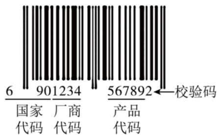

<details>
<summary>text_image</summary>

6 901234 567892←校验码
国家 厂商 产品
代码 代码 代码
</details>

$$
, \leqslant \mathrm{III} \geqslant <   1 \quad \backslash a L H \text {   デ   } + _ {H} 1 0. J H \text {   デ   } G \quad “ \text {   ト   ド   } \Pi ” L R m \quad 1 3 \dot {u} N O 2 - | J \lambda - | \quad 1 2 \dot {u} N O P X o 1 0. T - L \cap
$$

$$
\text {   ☉   } \mathrm{fBK} ^ {\wedge} \quad \text {   “   } \Theta \text {   ■   K10.⑨ナHK10.⑨ニデK10.⑨PXo10.   ”2   }
$$

$$
\mathrm{o} \backslash \psi \alpha G 1 3 \dot {\mathrm{u}} N O “ 6 9 0 1 2 3 4 5 6 7 8 9 2 ” D L
$$

$$
" 6 9 0" \text {à} \Theta \square K 1 0. L \quad " 1 2 3 4" \text {à} \nrightarrow H K 1 0. L
$$

$$
\text {"56789"} \text {àニデK10.Ln] } \quad \iota \text {ăùNO} \quad \text {"2"}
$$

$$
\mathrm{bàXo10.2}
$$

$$
\curvearrowright \mathrm{DLX} \circ 1 0. \pm \Gamma \mathrm{F} ^ {\dots} \mathrm{X} \circ \mathrm{H} \text {デ} + _ {\mathrm{H}} 1 0. \mathrm{D} - 1 2
$$

$$
\mathrm{uNOK10.G} \exists \text { Д } | 2 - \mathrm{G5.IJ} \vdash \mathrm{X} \bot \bar {\circ} \mathrm{G}
$$

$$
\mathrm{Bp} \cdot \text { “ } \mathrm{G2} \curvearrowright \mathrm{Bpà} ^ {\prime}
$$

$$
\text {ヌネ} 1 ^ {\prime} \mathrm{AB} - \quad 1 2 \dot {\mathrm{u}} \mathrm{NOD} + \mathrm{Nu} \dots \mathrm{NOGP} \quad a \mathrm{L} ^ {\circ} \quad a = 9 + 1 + 3 + 5 + 7 + 9 = 3 4 \dot {\mathrm{u}}
$$

$$
\text {ヌネ} 2 ^ {\prime} \mathrm{AB} \dashv \quad 1 2 \dot {\mathrm{u}} \mathrm{NOD} \perp \mathrm{Nu} \dots \mathrm{NOGP} \quad b \mathrm{L} ^ {\circ} \quad b = 6 + 0 + 2 + 4 + 6 + 8 = 2 6 \dot {\mathrm{u}}
$$

$$
\text { 又   玉 } 3 ^ {\prime} \mathrm{AB} \quad 3 a \mathrm{W} b \mathrm{GP} c \mathrm{L} ^ {\circ} c = 3 a + b = 3 \times 3 4 + 2 6 = 1 2 8 \dot {\mathrm{u}}
$$

$$
\text {ヌネ   } 4 ^ {\prime} \mathrm{H} / \pi \sim ① \pi \quad c (5) \mathrm{à} \quad 1 0 \mathrm{G} \mathrm{ЖN} / \mathrm{G} ] \leftarrow \mathrm{N} \quad d \mathrm{L} ^ {\circ} \quad d = 1 3 0 \dot {\mathrm{u}}
$$

$$
\text { 又   玉 } 5 ^ {\prime} \mathrm{AB} \quad d \mathrm{W} c \mathrm{G} \text { 工 } \mathrm{iJX} \circ 1 0. \quad m \mathrm{L} ^ {\circ} \quad m = 1 3 0 - 1 2 8 = 2 2
$$

$$
, r \angle^ {\circ} C i l
$$

① || づ H デ＋ H 10.GNOà “6903244672483”L } F7(17) X o 10.GBpL K ル ы＋ H 10.Gハバ L ε ū ж n λ 2  
② || IX ə' H デG+H 10.NOà “978740■376241”L〜DmǎSNO 6 パヒ 1L I yzUS 6 パヒ GN2

, del ① + H 10. J ビ Gù n rgù ② 6 パヒ GNà 8

,fglhijkGJmnNGA BēBLǎ.ǎBě 'GZFù

3 1@wxi(20)#ビ°δ v AB| oπ° ±ù

3 2@∅6パヒGNà xLλiΨ•’ 112+x=120L|rě‘°±ù

, ×r1r' ① + H 10.JビG

n $\lambda'$ $\lambda$ i $\Psi$ $\cdot'$ $a=9+3+4+6+2+8=32L$

$b=6+0+2+4+7+4=23L$

$\therefore c=3a+b=3\times32+23=119\ L$

∵dJ/π∽①π c(5)à 10 GЖNノG】←NL

$\therefore d = 120 \mathrm{~L}$

∴ X o 10.m=d-c=120-119=1≠3

∴＋H 10.JビG

② $\oint \sigma$ パヒ GNà xL λ i Ψ • ’

$\therefore a=7+7+0+3+6+4=27L$

$b=9+8+4+x+7+2=30+xL$

$\therefore c=3a+b=3\times27+30+x=111+xL$

∵ X o 10.m=1 L

$\therefore d=c+m=112+x$ L

∵dJ/π ∼① π c(5)à 10 GЖNノG】←NL(5) 0≤x<10L

$\therefore d=120\ L$

∴112+x=120L

∴x=8ù

2823 24-25 4567 · Γ Π フ ブ · óD@ ≤ III] δ ≥ < ε r ∠ °C i'

Nみ Jǎ 16.(11)E p II GN(ゼプ°L−19.NPNみ7G 〒ゆく(15)YZ [L^alNW H stGべ[LIOS

mnNTNみ7YZG └stGだちL±ΓFUIOSNGエGあY{^aLUǔ' +1あY{Gǔ}Ч

2.2 || TN^7mnN    aYZG |à    AL mnN    bYZG |à    BL b A, B IO |stGだち±^aà    |a-b|\~|b-a

|L āà |AB|=|a-b|=|b-a|2 \ v Φ |x-3|Gú」 4 2.JNみ7^amnN 3 G ⊢W^amnN xG ⊢stGだち2

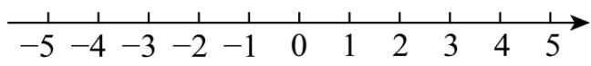

<details>
<summary>text_image</summary>

-5 -4 -3 -2 -1 0 1 2 3 4 5
</details>

$$
\mathrm{wx} 7 (1 7) \geqslant \left. \right.\left. \right.\left. \right.\left. \right.\left. \right.\left. \right.\left. \right.\left. \right.\left. \right.\left. \right.\left. \right.\left. \right.\left. \right.\left. \right.\left. \right.\left. \right.\left.\left.\left.\left.\left.\left.\left.\left.\left.\left.\left.\left.\left.\left.\left.\left.\left.\left. 7 (1 7) \right\rbrack\right] \delta^ {\circ} C i ^ {\prime} \right]\right]\right]\right]\right]\right]\right]\right]\right]\right]\right]\right]\right]\right]\right]\right]
$$

(1)-2W 3GだちJ \_\_\_\_ ù   
(2) v $\Phi|x+2|+|x-3|G\leftarrow\{J\quad\_\quad\dot{u}$   
(3)ZF' \ a L IX + H 3 ホ7 ⊢ E γ δ me ■ ボポ\$マ' AL BL CL DL - ü A E m ボポミ 15 ム L 9 ム L 5

ムL 11 ムLà19.√ボポ\$マGミムN⊥TLメモǎVボポ\$マヤ⊥ヤ\$マユzL℃Rm+16.ユばěeL

$$
1 9. \text {ユ} \% _ {0} G \text {ミムN} ] + \varepsilon y z \text {ユzG} ] + \text {ミムN2}
$$

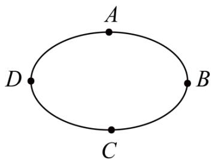

<details>
<summary>text_image</summary>

A
D
B
C
</details>

, del (1)5

(2)5

(3)m 5 16.ěe ə ë ̄ ʌ N】 ← L(1)à 10 ʌ 2

$$
, f g l h i j k G J N \text {み} 7 I O \vdash s t G \text {だち} L _ {\text {あ}} Y \{G (7) 2. \dot {u}
$$

3 1@M» wxIO ⊢stGだち\$ v AB° ±ù

3 2@ λ |x+2|+|x-3|^a T Nみ7N xYZG |WN -2L 3YZG |GだちsPL “N xT-2W 3stΠL°

$$
- 2 \leq x \leq 3 \Pi L | x + 2 | + | x - 3 | ] \leftarrow L \mid H a r d ^ {\circ} \pm u
$$

3 3@vyrミムうNW⑧Sボポ\$マGミムN 10 ムL | ⨏A】 ← ユēěe° ±2

$$
, \times r 1 3 \quad 1 @ r ^ {\prime} \quad - 2 W \quad 3 G \text {だちJ} \quad 3 - (- 2) = 3 + 2 = 5 \dot {u}
$$

3 2@r' ∵|x+2|+|x-3|^a T Nみ7N xYZG ⊥WN -2L 3YZG ⊥GだちsPL

$$
\therefore \text { “N } x \mathrm{T} - 2 \mathrm{W} 3 \mathrm{st} \Pi \mathrm{L} ^ {\circ} \quad - 2 \leq x \leq 3 \Pi \mathrm{L} | x + 2 | + | x - 3 | ] \leftarrow \mathrm{L}
$$

$$
\therefore \text { “ } - 2 \leq x \leq 3 \Pi L v \Phi | x + 2 | + | x - 3 | m ] \leftarrow \{L ] \leftarrow \{J \quad 3 - (- 2) = 3 + 2 = 5 L
$$

3 3@r'wxiЧL 15+9+5+11=403ム@L

$$
4 0 \div 4 = 1 0 3 \text {   人   } @ L
$$

° Rm 40 ム ミ L⑧S\$マ 10 ム L

$$
\therefore \text {ユ} \bar {\mathrm{e}} \check {\mathrm{e}} \backslash ] ^ {\prime}
$$

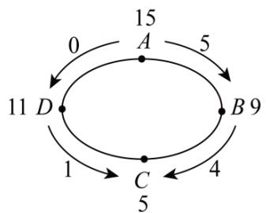

<details>
<summary>flowchart</summary>

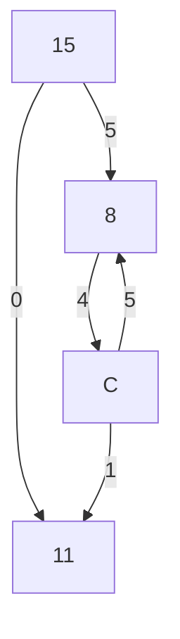
</details>

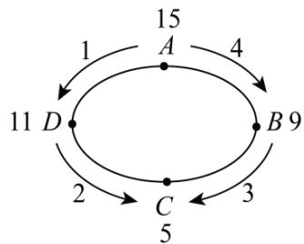

<details>
<summary>flowchart</summary>

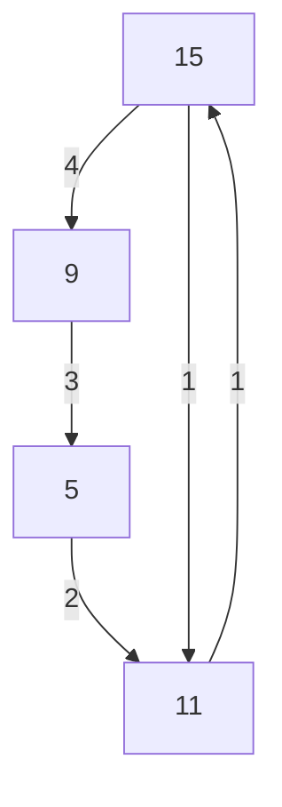
</details>

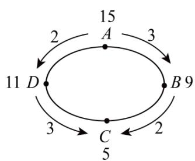

<details>
<summary>flowchart</summary>

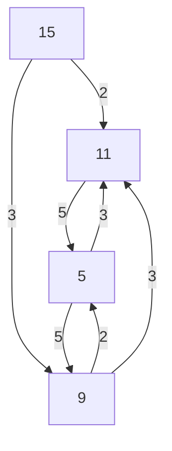
</details>

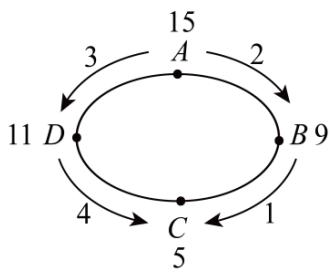

<details>
<summary>flowchart</summary>

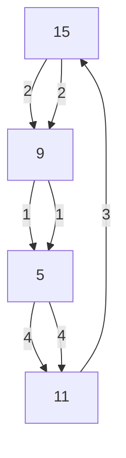
</details>

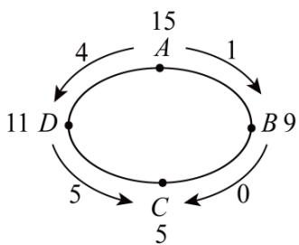

<details>
<summary>flowchart</summary>

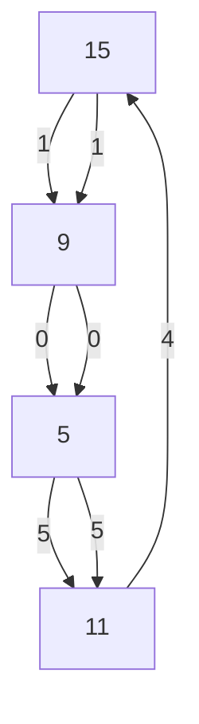
</details>

∴m 5 16.ěe ユē ミム N】←L(1)à 10 ム2

2923 24-25 4567 ·やゆユヨ・óD@≤III≥<Lεゆd°C i

ヨ^Dラ(7) ハリ GN (ēB2
\_+TJ 10 ハL4←ΠΓιJú ハルー 10+4=14L\_T^レ7) ω

GJ 2 ⊢ ∃ L \ § FT& “⊕”^a ∃ ^7GqpLb 10⊕4=22 λ 7(17)≥<± μ’

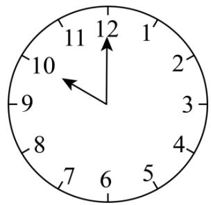

<details>
<summary>text_image</summary>

12
11
1
10
2
9
3
8
4
7
6
5
</details>

(1) $9\oplus6=$ \_\_\_\_ ù

(2) ξ o úS ⊥ T qNGP ± Γ ë —o∞GH v LH ü ± õ 2. ∃ ^7GopLFT& “⊗”^aL°

$3 \otimes 4 = 3 \oplus 3 \oplus 3 \oplus 32$

①AB' 4⊗2024ù

② ξ o mnNDG④NL Hü±ō 2.' || a⊗b=1L bC bJ aG∃^④N 3∩D aà 1\~12DG⊥ЧăSЖNL

bà n—N@2 I F(7) n3 nà n—N@G v Φ^az 5 G φ m ∃ ^④N2

, del (1)3 (2)① 8 ù ② $\frac{12n+1}{5}$

,fg1hijkmnNGA BēB⑨ Lō 2.ēB'

3 1@wx≥<±μ 9⊕6=9+6-12L λ ы ±rù

3 2@ ①vAB 4×2024L ☐ § 3 Γ 12L ЙN° à φ yù ② ♂ 5⊗m=1L b 5m÷12 ЙNà 1L ♂ Hà nL δ v

az $m^{\circ} \pm 2$

, ×r13 1@r' λ i Υ μ L 9⊕6=9+6-12=3L

ádeà' 3ù

3 2@r' ①4×2024=8096L 8096÷12=674……8L

± · 4⊗2024=8ù

② $\oint 5 \otimes m = 1L$

λ i Υ μ L 5m÷12 ЙΝὰ 1L ∉ Hà nL

b 5m=12n+1L

v ы $m=\frac{12n+1}{5}$

° 5 G φ m ∃ ④ Nà $\frac{12n+1}{5}$ 2

3023 24-25 4567 · Γ ド 「ロ・óD@φ ワ Φ · κ ] Щ’ “ǎ よ s ワ L キ Ν へ エ L ナ ン → グ 2 ” Ч Γ Jū’ ǎ

よわGよカL⑧κケ々ǎエLタOǔヶ→※2HTheta⊂GIKúTIOσ+5-1imlN(勿ぷもLЧШ

XI7LT (üēFыN(「も去し」) δ ℃i2

“ろこ↑”GT（\~ǎS Lわà 1GəěH为《f万一||(20)S厂fLεFNH∅BGrもr∠]δ℃i

(1) I ⊢ X“ろこ↑”T (G プホ | -

$\frac{1}{2} + \frac{1}{4} = 1 - \frac{1}{2^2}\dot{\mathrm{u}}$

$\frac{1}{2} + \frac{1}{4} + \frac{1}{8} = 1 - \frac{1}{2^3}$

$\frac{1}{2}+\frac{1}{4}+\frac{1}{8}+\frac{1}{16}=1-$ ù

めも'

$\frac{1}{2} + \frac{1}{4} + \frac{1}{8} + \frac{1}{16} + \cdots + \frac{1}{2^{10}} = 1 - \dot{\mathrm{u}}$

(2)àl n j “彡匚↑”T ( • ωGQЯL “ ж 4 ↑ ”G T (MF1 Γ ]ěpH ə n j L I \~ π jΣ ‘ ¬ ] ※Ж2

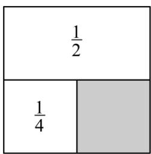

<details>
<summary>text_image</summary>

1/2
1/4
</details>

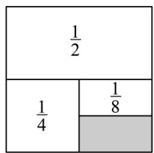

<details>
<summary>text_image</summary>

1/2
1/4 1/8
</details>

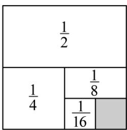

<details>
<summary>text_image</summary>

1/2
1/4
1/8
1/16
</details>

$$
\oint S = \frac {1}{2} + \frac {1}{4} + \frac {1}{8} + \frac {1}{1 6} + \dots + \frac {1}{2 ^ {1 0}} \tag {①}
$$

$$
b 2 S = 2 \times \left(\frac {1}{2} + \frac {1}{4} + \frac {1}{8} + \frac {1}{1 6} + \dots + \frac {1}{2 ^ {1 0}}\right)
$$

$$
2 S = 2 \times \frac {1}{2} + 2 \times \frac {1}{4} + 2 \times \frac {1}{8} + 2 \times \frac {1}{1 6} + \dots + 2 \times \frac {1}{2 ^ {1 0}}
$$

$$
- \mathrm{P} \cdot 2 S = 1 + \frac {1}{2} + \frac {1}{4} + \frac {1}{8} + \frac {1}{1 6} + \dots + \frac {1}{2 ^ {9}} \tag {②}
$$

$$
② - ① \cdot^ {\prime} 2 S - S = \left(1 + \frac {1}{2} + \frac {1}{4} + \frac {1}{8} + \frac {1}{1 6} + \dots + \frac {1}{2 ^ {9}}\right) - \left(\frac {1}{2} + \frac {1}{4} + \frac {1}{8} + \frac {1}{1 6} + \dots + \frac {1}{2 ^ {1 0}}\right)
$$

$$
^ {\circ} S = \quad \dot {u}
$$

Hǎヌ±めも'

$$
\frac {1}{2} + \frac {1}{4} + \frac {1}{8} + \frac {1}{1 6} + \dots + \frac {1}{2 ^ {n}} = \underline {{\quad}} 2
$$

$$
P \Sigma \leqslant I I I L ^ {\prime \prime} \check {a} \bar {o} (\omega 1 + 1 6. r \angle^ {\circ} C i G \check {e} p 2
$$

$$
\text {(3) I \dot {e} <  “ \text {ろこ } \uparrow ” G \check {u} a p \sim \quad “ ж 4 \uparrow ” G K N p H \exists A B ^ {\prime}} \quad \frac {2}{3} + \frac {2}{3 ^ {2}} + \frac {2}{3 ^ {2}} + \dots + \frac {2}{3 ^ {6}} 3 ② \mathrm{èǎ16.rpL} \| \dot {e} <   \check {u} a L
$$

$$
\mathrm{I} \in ! \mathrm{z} \checkmark \text {厂f} \mathrm{a} _ {\mathrm{H}} \mathrm{G} ^ {\perp} \infty \mathrm{L} ] \mathrm{aJ} ^ {\perp} \text {わ} \mathrm{à} \quad 1 \mathrm{G} \exists \check {\mathrm{e}} \mathrm{H} @
$$

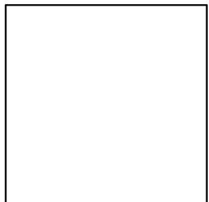

<details>
<summary>natural_image</summary>

Empty white square with black border (no text or symbols)
</details>

$$
, \mathrm{de} 1 \quad (1) \frac {1}{2 ^ {4}} \dot {\mathrm{u}} \frac {1}{2 ^ {1 0}} \dot {\mathrm{u}}
$$

$$
1 - \frac {1}{2 ^ {1 0}} \dot {\mathrm{u}} 1 - \frac {1}{2 ^ {n}} \dot {\mathrm{u}} \tag {2}
$$

$$
(3) \frac {2}{3} + \frac {2}{3 ^ {2}} + \frac {2}{3 ^ {2}} + \dots + \frac {2}{3 ^ {6}} = 1 - \frac {1}{3 ^ {6}} L \text {   и   } r g 2
$$

$$
, \mathrm{fg} 1 3 \quad 1 @ _ {\mathrm{wx}} \mathrm{i} ^ {\mathrm{YD}} \cdot \omega \mathrm{G} ^ {\prime} \vdash^ {\circ} \pm \mathrm{yru}
$$

$$
3 2 @ \mathrm{wxi} \mathrm{YD} \cdot \omega \mathrm{G} ^ {\prime} \vdash \mathrm{H} \ni \mathrm{mnNGA} \mathrm{B} \bar {\mathrm{e}} \mathrm{B} ^ {\circ} \pm \mathrm{yr} \dot {\mathrm{u}}
$$

$$
3 3 @ \mathrm{wxi} \mathrm{YD} \cdot \omega \mathrm{G} ^ {\prime} \vdash \mathrm{H} \exists \mathrm{mnNGA} \mathrm{B} \bar {\mathrm{e}} \mathrm{BP} \text {い} \mathrm{z} \mathrm{a} \mathrm{H} ^ {\circ} \pm \mathrm{yrù}
$$

$$
\text { hijk1NO } ^ {\prime} \vdash \text { LIIIIVi } \text { YL } + z ^ {\prime} \vdash \text { JriG   u2 }
$$

$$
, \times r 1 3 \quad 1 @ r ^ {\prime} \quad \frac {1}{2} + \frac {1}{4} = 1 - \frac {1}{2 ^ {2}} \dot {u}
$$

$$
\frac {1}{2} + \frac {1}{4} + \frac {1}{8} = 1 - \frac {1}{2 ^ {3}} \dot {\mathrm{u}}
$$

$$
\frac {1}{2} + \frac {1}{4} + \frac {1}{8} + \frac {1}{1 6} = 1 - \frac {1}{2 ^ {4}} \dot {\mathrm{u}}
$$

$$
\dots \dot {u}
$$

$$
\frac {1}{2} + \frac {1}{4} + \frac {1}{8} + \frac {1}{1 6} + \dots + \frac {1}{2 ^ {1 0}} = 1 - \frac {1}{2 ^ {1 0}} \dot {\mathrm{u}}
$$

$$
\text { ádeà } ^ {\prime} \quad \frac {1}{2 ^ {4}} \dot {\mathrm{u}} \quad \frac {1}{2 ^ {1 0}} \dot {\mathrm{u}}
$$

$$
3 2 @ \mathrm{r} ^ {\prime} \quad ② - ① \cdot^ {\prime} 2 S - S = \left(1 + \frac {1}{2} + \frac {1}{4} + \frac {1}{8} + \frac {1}{1 6} + \dots + \frac {1}{2 ^ {9}}\right) - \left(\frac {1}{2} + \frac {1}{4} + \frac {1}{8} + \frac {1}{1 6} + \dots + \frac {1}{2 ^ {1 0}}\right) L
$$

$$
^ {\circ} S = 1 - \frac {1}{2 ^ {1 0}} \dot {u}
$$

$$
\oint S = \frac {1}{2} + \frac {1}{4} + \frac {1}{8} + \frac {1}{1 6} + \dots + \frac {1}{2 ^ {n}} \tag {①}
$$

$$
b 2 S = 2 \times \left(\frac {1}{2} + \frac {1}{4} + \frac {1}{8} + \frac {1}{1 6} + \dots + \frac {1}{2 ^ {n}}\right)
$$

$$
2 S = 2 \times \frac {1}{2} + 2 \times \frac {1}{4} + 2 \times \frac {1}{8} + 2 \times \frac {1}{1 6} + \dots + 2 \times \frac {1}{2 ^ {n}}
$$

$$
- \mathrm{P} \cdot 2 S = 1 + \frac {1}{2} + \frac {1}{4} + \frac {1}{8} + \frac {1}{1 6} + \dots + \frac {1}{2 ^ {n - 1}} (2)
$$

$$
② - ① \cdot^ {\prime} 2 S - S = \left(1 + \frac {1}{2} + \frac {1}{4} + \frac {1}{8} + \frac {1}{1 6} + \dots + \frac {1}{2 ^ {n - 1}}\right) - \left(\frac {1}{2} + \frac {1}{4} + \frac {1}{8} + \frac {1}{1 6} + \dots + \frac {1}{2 ^ {n}}\right) L
$$

$$
^ {\circ} S = 1 - \frac {1}{2 ^ {n}} \dot {u}
$$

$$
\text { ádeà } ^ {\prime} \quad 1 - \frac {1}{2 ^ {1 0}} \dot {\mathrm{u}} \quad 1 - \frac {1}{2 ^ {n}} \dot {\mathrm{u}}
$$

$$
3 3 @ r ^ {\prime} r p a ^ {\prime} \oint S = \frac {2}{3} + \frac {2}{3 ^ {2}} + \frac {2}{3 ^ {2}} + \dots + \frac {2}{3 ^ {6}} (1) L
$$

$$
b 3 S = 3 \times \left(\frac {2}{3} + \frac {2}{3 ^ {2}} + \frac {2}{3 ^ {2}} + \dots + \frac {2}{3 ^ {6}}\right) L
$$

$$
- \mathrm{P} \cdot 3 S = 3 \times \frac {2}{3} + 3 \times \frac {2}{3 ^ {2}} + 3 \times \frac {2}{3 ^ {2}} + \dots + 3 \times \frac {2}{3 ^ {6}} = 2 + \frac {2}{3 ^ {1}} + \frac {2}{3 ^ {2}} + \dots + \frac {2}{3 ^ {5}} (2) L
$$

$$
② - ① \cdot^ {\prime} 3 S - S = 2 + \frac {2}{3 ^ {1}} + \frac {2}{3 ^ {2}} + \dots + \frac {2}{3 ^ {5}} - \left(\frac {2}{3} + \frac {2}{3 ^ {2}} + \frac {2}{3 ^ {2}} + \dots + \frac {2}{3 ^ {6}}\right) = 2 - \frac {2}{3 ^ {6}} L
$$

$$
\therefore S = 1 - \frac {1}{3 ^ {6}} \dot {\mathrm{u}}
$$

$$
\mathrm {rp \breve {o} ^ {\prime} \backslash a L}
$$

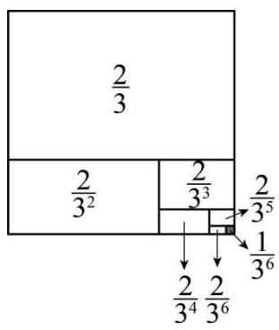

<details>
<summary>text_image</summary>

2/3
2/3² 2/3³ 2/3⁵
↓ 1/3⁶
2/3⁴ 2/3⁶
</details>

$$
\lambda \mathrm{a} \pm \mu^ {\prime} \frac {2}{3} + \frac {2}{3 ^ {2}} + \frac {2}{3 ^ {2}} + \dots + \frac {2}{3 ^ {6}} = 1 - \frac {1}{3 ^ {6}} 2
$$

# 【题型4 综合与实践】

3123 24-25 4567 · ネ Θ · óD@VI B WVII VIII' ǎ②丁Φ虫イ x Nみ720. トど z+L(16)ǎ E ヤ Ê虫‰ 1 S
ΠùL (16)ǒ E ヤ ψ虫‰ 2 SΠùL (16)Ы E ヤ Ê虫‰ 3 SΠùL (16) e B ヤ ψ虫‰ 4 SΠùL (16)g E ヤ Ê虫‰ 5
SΠùL(16)\` B ヤ ψ虫‰ 6 SΠùL\ ы尸日2

(1)(16) 1 B 虫 %oG る |ù そ ^ aGmnNJ + + - (16) 2 B 虫 %oG る |ù そ ^ aGmnNJ + + - (16) 2024 B 虫 %oG る |ù そ ^ aGmnNJ + + -

(2) || U虫イ x ⊥8 YZG ⊥ど z+Lb(16) 1 B虫‰Gる ⊥ùそ^aGmnNJ+| (16) 2024 B虫‰Gる ⊥ùそ^aGmnNJ+| (16) ÚB虫‰Gる ⊥ùそJ20.

(3) || Π虫P x m3 mJ ə JKN@YZG |どz+Lb(16) 1 B虫%oGる |ùそ^aGmnNJ+| | (16) 2024
B虫%oGる |ùそ^aGmnNJ+| | (16) 2n3 nJ ə JKN@ B虫%oGる |ùそ^aGmnNJ+| | (16) ú
B虫%oGる |ùそJ20. |

, del (1)-1L 1L 1012

(2)-9L 1004L(16) 16 B

(3)m-1L $m+1012L(16)$ (2m-1) B

, fg1hi(6) II jkmnNGq ∨ ëB + ЖNGq ∨ ëBLriG uJnri Чù

3 1@wxmnNGq∨ēB±f B・z-6 B 出るる └φ^aGNL—ιwxы' └±Hə yrù

3 2@Tn3 1@±Hə yrù

3 3@wx3 1@3 2@φ • ’ 卜±Hə yr

, ×r13 1@r'wxiЧ ± μL(l6) 1 B虫%oGる └ùそ^aGmnNJ 0-1=-1L

(16) 2 B 虫%oGる └ùそ^aGmnNJ 0-1+2=1L

(16) 3 B 虫 %oG る └─ù ぞ ^ aGmnNJ 0−1+2−3=−2L

(16) 4 B 虫‰Gる 卜ùそ^aGmnNJ 0-1+2-3+4=2L  
(16) 5 B 虫 %oG る $\vdash$ ù そ ^ aGmnNJ 0-1+2-3+4-5=-3L  
(16) 6 B 蚊%oGる └ùそ^aGmnNJ 0-1+2-3+4-5+6=3L

...

∴(16) 2024 B虫%oGる ハùそ^aGmnNJ 0-1+2-3+4-5+6-⋯-2023+2024=0+1012×1=10122

3 2@r'虫イ x -8YZG 卜ど z+L(16) 1 B虫%oGる 卜ùそ^aGmnNJ -8-1=-9L

Tn3 1@±μ'(16) 2024 B虫%oGる └─Ùそ^aGmnNJ

$-8-1+2-3+4-5+6-\cdots-2023+2024=-8+1012\times1=1004L$

v à -8-1+2-3+4-5+ $\cdots$ +16=-8+8=0L

$\Phi \Gamma (16) 16 B \text{虫}\%G \text{る } \vdash \text{ùそ J20. } \vdash 2$

3 3@r' (16) 1 B虫%oGる卜ùそ^aGmnNJ m-1L

∴(16) 2024 B 虫%oGる └ùそ^aGmnN $m-1+2-3+4-5+6-\cdots-2023+2024=m+1012\times1=m+1012L$

(16)2n3 nJЭЖN@B虫%oGる └ùそ^aGmnNJ

$m - 1 + 2 - 3 + 4 - 5 + 6 - \dots -(2n - 1) + 2n = m + n \times 1 = m + nL$

$\Phi \Gamma (16)(2n+1) \text{ B 虫}\%oG \text{る } \vdash\dot{u} \text{ そ }^{\wedge}aGmnNJ \quad m+n-(2n+1)L$

$\Lambda \mu m + n > 0\mathrm{L}$ $\mathcal{O}$ $m + n - (2n + 1) = 0\mathrm{L}$

r • n=m-1L

$\Phi \Gamma 2n+1=2m-1L$

á(16) (2m-1) B虫%oGる $\vdash$ ùそJ20. $\vdash$ 2

3223 24-25 4567 · Γ Π τ 13.·óD@VI B WVIIIVIII

,°Ci//ふ1

\ a L ち わ à 2 S Π ù わ ム G Y 《 7 mǎ ｜ Q WN み 7 G 20. ｜ p B 2

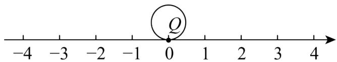

<details>
<summary>text_image</summary>

-4
-3
-2
-1
0
1
2
3
4
</details>

3 1@ Я 丫 《こNみ ヤ さ% 0 1 ちL ト Q ωダNみ7 ト A Gù そL ト A ^aGNJ \_\_\_\_ ù

3 2@ T3 1@ +]L \ § Y « Q |T Nみ A |Gùそ| ヤψさ‰ 3 ちL ωダ B |GùそL b | B φ^a GNà \_\_\_\_ ù

，°Ci下チ1

3 3@ Y « TNみ7 ヤ さ%oG ちNāà Э NL
Y « TNみ7 ヤ E さ%oG ちNāà(12)NL
ē%o // ∧ A B ā Ψ

$^{,}$

<table><tr><td>A B</td><td>(16) 1B</td><td>(16) 2B</td><td>(16) 3B</td></tr><tr><td>さ‰方N</td><td>+3</td><td>-1</td><td>-2</td></tr><tr><td>A B</td><td>(16) 4B</td><td>(16) 5B</td><td>(16) 6B</td></tr><tr><td>さ‰方N</td><td>+4</td><td>-3</td><td>+m</td></tr></table>

(16) 6 B ヤ ψ さ‰ m3 m à ∃ ЖN@ち ı L 〒 Q W20. 〒Gだちà 62

① I yz m G {ù   
② “丫《》せ6Bさ%oΠLy⊢ QǎRē%oGホ‘2

, de13 1@ -2ù3 2@ 4ù3 3@ ①m=2ù ②30 S わ ム Πù

,fg1hi(6)II jklǎ..ǎ Bě 'GZFLmnNGA BēBΓ+NみL8.πnriЧcJriG

u2

3 1@}F ⊢ A^aGN =0-2× %oG 与NL° ±yz∅ Я ù

3 2@} F ⊢ B^aGN = ⊥A^aGN +2× \~ %oG 与NL° ± yzdeü

3 3@ ①}F ⊢ OW20. ⊥Gだち =2×⑧B \~‰GちNsPL± δz π mGă∴ă Bě ‘L° ± • ω de2

②} F 卜 Qē‰Gホ ‘ =2×⑧ E ˜‰GでNGあ Y{sPL° ±yzde2

, ×r1r' 3 1@wxiЧ • ' 0-2×1=-2L

ádeà' -2ù

3 2@wxiЧ±•' -2+2×3=4L

ádeà' 4ù

3 3@ ① $3+(-1)+(-2)+4+(-3)+m=6\div2$

r • m=2

② $(3+1+2+4+3+2)\times2=30$

d' ⊢ Q ǎRē%oGホ 'à 30 S わ ム Πù2

3323 23-24 4567 · Γ ΠΨ ΦΥΣ·óD@, VI B WVIIIVIII1

$$
\text { XII } \text { 乚幺又àHüθ…お”1モ+ī} \} \mathrm{LIX} (? \leftarrow \uparrow \text { 乚klǎゾXII乚←马ǎ方G幺又//∧L’ō幺又Ω(10)Σ }
$$

$$
4 0 \Pi 3 \text {幺ǎB} \mathrm{XII} \text {乚CàǎΠ@G厂fāà}
$$

$$
“ \text {   乚   ”   L   九   } \pi \quad 4 0 \Pi G \text {   厂   fāà   }
$$

$$
“ \perp ” L \backslash^ {\prime} J \sqcup X \sqcup \leftarrow \text {   马ǎ方G幺又   }
$$

Ω'

<table><tr><td>∠ó</td><td>ǎ</td><td>ǒ</td><td>Ы</td><td>e</td><td>g</td><td>`</td><td>4</td></tr><tr><td>幺ヌ Ω 3Πù’ Π@</td><td>-4</td><td>+11</td><td>-2</td><td>+19</td><td>+20</td><td>+22</td><td>-3</td></tr></table>

(1)yⅡXⅡ乛←马Uǎ方 《⑧κ幺又＋＋Π  
(2)XII飞←马⑧κGぜ18.λゥ儿 30∴q7幺Π¬|¬—L幺Π¬|Gěe\]’⑧κ幺又Ω→(10)Σ 40 ΠG

$$
\text {厂} \mathrm{fL} ⑧ \Pi \neg \mid 4 \therefore \dot {\mathrm{u}} (1 0) \Sigma 4 0 \Pi \neg \rightarrow (1 0) \Sigma 5 0 \Pi \mathrm{G} \text {厂} \mathrm{fL} ⑧ \Pi \neg \mid 6 \therefore \dot {\mathrm{u}} (1 0) \Sigma 5 0 \Pi \mathrm{G} \text {厂} \mathrm{fL} ⑧ \Pi \neg \mid 8
$$

$$
\therefore 2 \mathrm{y} \text {   十   } \mathrm{XII} \text {   乚   } \leftarrow \text {   弓   } \mathrm{Uǎ} \text {   乚   } \text {   乚   } \text {   乚   } \text {   乚   } \text {   乚   } \text {   乚   } \text {   乚   } \text {   乚   } \text {   乚   } \text {   乚   } \text {   乚   } \text {   乚   }
$$

, de1 (1)49 Π

(2)1790 ∴

$$
, f g 1 h i j k \exists (1 2) N G Z F ⑨ m n N e b \bar {e} B Z F L n r i \Upsilon L \exists d \delta z B v J r d G u 2
$$

$$
3 1 @ \mathrm{vy} \cdot \hat {\text {---}} - \mathrm{NxG} \mathbf {L} \llbracket \mathrm{NL} | q 7 \in 8. \mathrm{N} \quad 4 0 ^ {\circ} \pm \mathrm{yru}
$$

$$
3 2 @ \mathrm{wx} \text {   ゼ   } 1 8. \text {   ウ儿   } + \neg 1 \in 8. \delta \mathrm{vyr} ^ {\circ} \pm 2
$$

$$
, \times r 1 3 \quad 1 @ r ^ {\prime} \lambda i U L \quad 4 0 + [ (- 4) + (+ 1 1) + (- 2) + (+ 1 9) + (+ 2 0) + (+ 2 2) + (- 3) ] \div 7
$$

$$
= 4 0 + 6 3 \div 7
$$

$$
= 4 0 + 9
$$

$$
= 4 9 3 \Pi @ L
$$

$$
d ^ {\prime} \text {   Ⅱ   } \text {   X   } \text {   Ⅱ   } \leftarrow \text {   弓   } \text {   U   } \check {a} \text {   专   } \text {   Ⅱ   } \text {   《   } \textcircled {8} \text {   κ   } \text {   幺又   } \quad 4 9 \text {   Π   } \dot {\text {   Ⅱ   }}
$$

$$
3 2 @ r ^ {\prime} = 3 0 \times 7 + (4 0 - 4) \times 4 + (4 0 \times 4 + 1 0 \times 6 + 1 \times 8) + (4 0 - 2) \times 4 + (4 0 \times 4 + 1 0 \times 6 + 9 \times 8) + (4 0 \times 4 + 1 0 \times 6 + 1 0 \times 8) +
$$

$$
(4 0 \times 4 + 1 0 \times 6 + 1 2 \times 8) + (4 0 - 3) \times 4
$$

$$
= 2 1 0 + 1 4 4 + 2 2 8 + 1 5 2 + 2 9 2 + 3 0 0 + 3 1 6 + 1 4 8
$$

$$
= 1 7 9 0 3 \therefore @ L
$$

$$
\mathrm{d} ^ {\prime} \text {   Ⅱ   } \mathrm{XII} \leftarrow \text {   弓   } \mathrm{Uǎ} \text {   令   } \text {   ぜ   } 1 8. \times (9) \quad 1 7 9 0 \therefore 2
$$

3423 24-25 4567 · E ピ 山 E · óD@VI B WVIIIVIII

$$
\mathrm{U} \text {   小(一)(二)X(三)CGぜǔ20.n }
$$

<table><tr><td>(四)≥1</td><td>(一)(二)v(五)ヤX(三)CPΣ(一)(六)(二)れ※—(七)+X(三)2\α 1L X(三)CXII(八)(九)7mǎwれ L(十)L(一)m(九)Tれ L(十)7··ゆろ‰※—(一)(二)2(16)ǎBL(一)m(九)×Èωψ(一)(二)Ln-ιカーヤャ+ろ‰ù(16)ðBL(一)m(九)×n-どz+L デヤ※—(一)(二)L \ы尸〒2</td><td>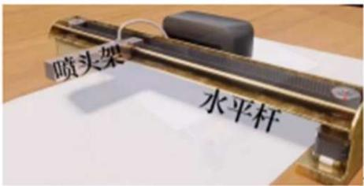图1</td></tr><tr><td>(四)≥2</td><td>\α 2L ΓUwれ L(十)φTGMすゅくNみLΓれ L(十)GD └à20. └LΓャψGěャàЭěヤLFăSΠùわム^a 1cm2Noμ(一)m(九)G□+ùそà-10Lヤψ 2SΠùわムāà +2LヤÈ3SΠùāà -3LΓ]āΨ1(-)m(九)G6Eē‰//∧’ +18L-10L+6L-10L+8L-122</td><td>教辅资源,关注公众号★全科AA+图2</td></tr><tr><td colspan="3">°Cir∠</td></tr><tr><td>⊥1</td><td> $\text{đ} \bar{o} \dot{u}$ そ</td><td> $M \Sigma 6B(-)(=)\iota L \text{đ} \bar{o}(-)\acute{m}(九)G$ 】 $\square\square \dot{u}$ そ2</td></tr><tr><td>⊥2</td><td> $\text{đ} \bar{o}$ ホ ‘</td><td> $M \Sigma 6B(-)(=)\iota Lyz(-)\acute{m}(九)ろ\%oG$ うホ ‘2</td></tr></table>

$$
\begin{array}{l} , \mathrm{de} 1 \text {卍} \square \check {a} ^ {\prime} (-) \acute {m} (九) T \square \text {卍} \dot {u} \text {そ} - 1 0 \dot {u} \text {卍} \square \check {o} ^ {\prime} 6 4 c m 2 \\ , f g 1 h i j k l m n N G q p Z F L \exists (1 2) N G Z F L r i G u J::: m n N G q p \bar {e} B p b 2 \bot \\ \check {a} ^ {\prime} \text {   я   } 6 \mathrm{B} \bar {\mathrm{e}} \% _ {0} \mathrm{GNxq} (1 5) ^ {\cdot \cdot} \mathrm{L} ^ {\circ} \pm \mathrm{yr} \dot {\mathrm{u}} \bot \square \check {o} ^ {\prime} \text {   я   } 6 \mathrm{B} \bar {\mathrm{e}} \% _ {0} \mathrm{NxG} \text {   あ   Y } \{\bot q ^ {\circ} \pm \mathrm{yr} 2 \\ , \times r 1 \perp \square \check {a} ^ {\prime} \quad 1 8 + (- 1 0) + 6 + (- 1 0) + 8 + (- 1 2) = 0 L \\ \mathrm{d} ^ {\prime} (-) \acute {\mathrm{m}} (\text {九}) \mathrm{T} \square + \dot {\mathrm{u}} \text {そ} - 1 0 \dot {\mathrm{u}} \\ \perp \text {   0'   } \quad | + 1 8 | + | - 1 0 | + | + 6 | + | - 1 0 | + | + 8 | + | - 1 2 | = 6 4 \mathrm{cmL} \\ \mathrm{d} ^ {\prime} (\text {一}) \acute {\mathrm{m}} (\text {九}) \text {ろ} \\ 3 5 2 3 \quad 2 4 - 2 5 4 5 6 7 \quad \cdot (1 3) (1 4) / K \quad \cdot <   = >? @ \quad \text {综合与实践} \\ \end{array}
$$

# 【问题的发现与提出】

$$
\boxed {\square} \Pi t 2 0 2 4 5 8 \square 4 \text {丰} \boxed {7} L T \boxed {\square} \boxed {\bar {e}} | \Phi 4 \times 1 0 0 \boxed {A B} \rangle \text {ツ} \angle \boxed {D L D} \Theta !" \cdot \#   L X \% \&
$$

$$
\Theta \text { わダ } e X 5 G ^ {\prime} \quad \pi 2 \leftarrow \mathrm{J} T - I I I \Pi t \quad 8 \square 5 \text { 幸（）、 } G +: M * L \diamond \mu_ {3} I O - (3) T \Pi t 7 G \text { 工あ } L
$$

$$
^ {\circ} \Pi \text {工} 2 \dot {a} 1 r \Pi \text {工} G \square + L \leftarrow \mathrm{jk} \leqslant \varepsilon \mathrm{Kn} 1 \perp 1 8. <   2
$$

# 【资料的查询与整理】

$$
\text {时差产生的原因：} \left. - \pm \Gamma\right) - \check {\mathrm{a}} S - ^ {\prime} L. Z / \text {す} \rightarrow a T \Pi X \omega - G ⑧ \check {\mathrm{a}} S \downarrow \text {る} 2 0 \vdash - \eta \Pi \text {卄卄}
$$

$$
G \eta^ {\sim} L \rightarrow T M \angle 7 G - \check {e} i \square T \rightarrow T G \Pi t \rangle \times \omega . Z / L U i - 1 1 \checkmark - \Pi t G \text { 工 } 2 \text { つ } - L - 7
$$

$$
\bot \mathrm{Y} \text {   卫   } \bot \mathrm{G} \dot {\mathrm{u}} \text {   そ   o   卩   } \bot \mathrm{G} \dot {\mathrm{u}} \text {   そ   2   3   } \rangle \times \omega . \quad \mathrm{Z} / \mathrm{L} \Pi \mathrm{t} \eta - \mathrm{o} \mathrm{U} \text {   卩   } \bot \mathrm{II} 3 2
$$

$$
\Pi \text {IO} I \sqcup G \oint 2 ^ {\prime} \Theta : 7 ^ {\prime} \bar {o} L \Gamma 4 \Theta - - 2 5 \text {ク} \kappa (\text {七}) \text {ず} \phi T G M \text {す} \dot {a} \sqcup M \text {す} L w x - - \eta^ {\sim} G \check {e} \text {ヤ} L ^ {\sim}
$$

$$
\vdash - \hat {\bot} \vdash x \text {   Д   } \omega \text {   Ш   } L ⑧ \quad 1 5 ^ {\circ} 6 \text {   fà   } \quad 1 \text {   S   } \text {   I   } 0 7 L \pm \Gamma \cdot \omega \quad 2 4 \text {   S   } \text {   I   } 0 7 L ^ {\circ} \quad 2 4 \text {   S   } \text {   П   } \text {   I   } 0 L \varepsilon^ {\prime} \bar {o} \text {   尷   } M \text {   す   } \Phi T
$$

$$
\mathrm{G} \Pi \text {ю} 3 \mathrm{Щ} \mathrm{M} 7. 5 ^ {\circ} \check {a} \mathrm{Д} \mathrm{M} 7. 5 ^ {\circ} \mathrm{G} \text {ю} 7 @ \mathrm{C} \dot {a} \mathrm{D} \Pi \text {ю} 3 ^ {\lrcorner} \Pi \text {ю@} \mathrm{L} \mathrm{D} \Pi \text {юГДм} 1 2 \mathrm{S} \Pi \text {юL} \mathrm{A} \mathrm{B} \bar {a} \dot {a} \mathrm{Д} \check {a} \text {ю⑦}
$$

$$
\text { ДХою   L   Г   ШумХо   П   ю   Л   А   Б   а   Шаю } ⑦ \text { Шхою   L   л   п   -   -   н   8   G9:   L】 } \square \text { Дхою   Рщ }
$$

$$
\mathrm{X} \check {\mathrm{o}} \text {ю} \mathrm{B} \dot {\mathrm{a}} \check {\mathrm{a}} \mathrm{S} \Pi \text {ю} 2 \mathrm{T} \mathrm{T} \check {\mathrm{a}} \Pi \text {ю}; \quad \checkmark - \mid \mathrm{G} \Pi \mathrm{t} \perp \mathrm{T} \mathrm{L} \rightarrow \mathrm{T} \Pi \text {ю}; \quad \checkmark - \mid \mathrm{m} \checkmark \eta \mathrm{G} \Pi \mathrm{t} \mathrm{L} ⑧ \perp \text {ヤ} \Pi \text {ю} \mathrm{G} \Pi \text {エ}
$$

$$
\mathrm{a} 1 \leftarrow \Pi 2 \mathrm{U} \mathrm{Y} \mathrm{L} “ \check {\mathrm{a}} S \Pi \mathrm{IO} \mathrm{JD} <   \quad 1 2 \vdash \Pi L \perp \text {ヤG} \Pi \mathrm{IO} \pm \mathrm{aJ} ] <   \quad 1 \vdash \sim 3 7 1 1 \vdash 2
$$

时区设立的意义：ΠιοΙムG∮＜JàlなZúξ6.□+チG③ⅡL(8)ぞǎS¬－ūǎGΠt(八)(九)LΓī

$$
\pi = - 7 \mathrm{G} > \mathrm{i} \mathrm{P} \dots \% _ {0} 2
$$

# 【问题的理解与应用】

$$
\begin{array}{l} \lambda \pi D \Pi \text {ю} \zeta C \dot {a} ^ {- - } \Pi \text {ю} L \quad ? o N \text {み} 7 G 2 0. \vdash O L \text {Дю}? o \exists \text {工み} L \text {Щю}? o (1 2) \text {工み} 2 \phi m \Pi \text {ю} W D \Pi \text {ю} G \\ \Pi \text {工} (1) ① \pi P D \Pi \text {ю} \perp o G B S \Pi \text {ю} G \Pi \text {ю} N 2 o \backslash \text {ДаюіWDПю} \perp \text {工} \quad 8 \leftarrow \Pi L \Pi \text {ю} N J a 2 \zeta \lambda \pi \\ \Phi \mathrm{m} \bot \text {ヤGПюП@(1)} \bot \text {エ} \quad 1 \leftarrow \Pi \mathrm{LUYДǎюWЩǎюstGDПюLǐ?оNみ7} \quad - 1 \mathrm{W+1stG} \quad 0 \check {\mathrm{a}} \\ \mathrm{Y} 2 ^ {\sim} \mathrm{N} \text {み} 7 \mathrm{GNW} \Pi \text {ю} \mathrm{YZG} \vdash ⑨ \mathrm{M} \angle \mathrm{YZ} (1 5) ^ {\cdot \cdot} \mathrm{L} \pm \Gamma \mathrm{F} ] \mathrm{a} ^ {\cdot \cdot} \hat {} \mathrm{a} ^ {\prime} \\ \end{array}
$$

$$
\begin{array}{c c c c c c c c c c c c c c c c} 1 8 0 ^ {\circ} & & & & & & & & & & & \\ - 1 2 & - 1 1 & - 1 0 & - 9 & - 8 & - 7 & - 6 & - 5 & - 4 & - 3 & - 2 & - 1 N O M 1 & 2 & 3 & 4 & 5 & 6 & 7 & 8 & 9 & 1 0 & 1 1 & 1 2 \end{array}
$$

西十二区 西六区 中时区 东六区 东十二区

$$
\curvearrowright \mathrm{D} 7. 5 ^ {\circ} E ^ {\wedge} \mathrm{a} \text {ДМ} \quad 7. 5 ^ {\circ} \mathrm{LYZ} \vdash \quad M \dot {\mathrm{u}} 7. 5 ^ {\circ} W ^ {\wedge} \mathrm{a} \text {ШМ} \quad 7. 5 ^ {\circ} \mathrm{LYZ} \vdash \quad N \dot {\mathrm{u}}
$$

$$
1 5 ^ {\circ} E \hat {a} \text {ДМ} \quad 1 5 ^ {\circ} \mathrm{LYZ} \vdash \quad P \dot {u} \mathrm{NO} \quad 1 \hat {a} \text {ДдюзхДМ} \quad 7. 5 ^ {\circ} \omega \text {ДМ22.5°stGю7@ù} \quad 0 ^ {\circ} \mathrm{YZ} \vdash \quad O 2
$$

$$
\mathrm{p} \Theta \equiv \square \mathrm{PD} \Theta - \mathrm{WfBMFDM} \quad 1 5 ^ {\circ} 3 \text {Дăю@РДМ} \quad 1 2 0 ^ {\circ} 3 \text {Даю@GПтL   у   й-ШПто } \equiv \square \Pi t
$$

$$
\text { II   3   7   S } \leftarrow \Pi 2 \_ \backslash L \equiv \square \Pi t \quad 8 \square 4 \neq 1 9 ^ {\prime} 0 0 L i J - I W \Pi t \quad 8 \square 5 \neq () 2 ^ {\prime} 0 0 2
$$

# 【问题的解决与实践】

(1) AL BL CЫ-| f B MFM ∠ J Д М 15° L Д М 120° РШМ 120° G П tL \~ БИ-| F 3.4. ≥ <DN 7GN

$$
\mathrm{P} \text {   ж   } \dashv \hat {\mathrm{aLf}} \mathrm{BJ} \quad \quad \quad \quad \quad \quad \quad \dot {\mathrm{u}}
$$

(2)]äA $\square$ ē $\square$ $^{\sim}$ π 20285T&ΘグBCDəLグBCMFШаюGПт2

① || -IIIΠtJ 2024 5 10 □ 10 年 13' 00Lグ B C ΠtJ \_\_\_\_ ù

② || 2028 5グ B C ☐ē☐GIXǎ-| E ☐ o ☐ π “-| Π t 7 ☐ 20 ≠ 19’ 00 Hə L I ” ь ВЫ ПГ-ШПт2

$$
, \mathrm{del} \quad (1) 1 \mathrm{L} 8 \mathrm{L} - 8
$$

(2)①2024 5 10 ☐9 平21’ 00ù ②2028 5 7 ☐21 平11’ 00

$$
, \mathrm{fg1hiF} \pi = (\mathrm{GiL(6)IIjk1N} \text {みGZFL} ^ {\sim} \mathrm{VII} \because {} ^ {\circ} \mathrm{Ci} ^ {\sim} - \text {àNみ} ^ {\circ} \mathrm{Ci} - \text {àriG} \mathrm{u2}
$$

$$
3 1 @ \mathrm{wx} \leqslant \mathrm{III} \geqslant <   \mathrm{PN} \text {み} \mu \mathrm{u} ^ {\circ} \pm r d \dot {u}
$$

$$
3 2 @ v \text { Д   ор } \Theta \equiv \square P D \Theta - I W L \phi T G \Pi \text { и } L - \iota \bigcirc B N \& G \ni (1 2) ^ {\circ} \pm r d 2
$$

$$
, \times r 1 3 \quad 1 @ r ^ {\prime} \quad \because A L B L C b I - f B M F M \text {   両   } J D M \quad 1 5 ^ {\circ} L D M \quad 1 2 0 ^ {\circ} P U M \quad 1 2 0 ^ {\circ} G \Pi t L
$$

$$
\therefore A \text {   T   Дăюл   } B \text {   T   Даюл   } C \text {   Тщаюл   }
$$

$$
\therefore A L B L C \mathrm{BI} - \mathrm{N} \text {み} 7 ^ {\wedge} \mathrm{aGNfBà} ^ {\prime} \quad 1 \mathrm{L} 8 \mathrm{L} - 8 2
$$

ádeà' 1L 8L -82

3 2@r' ∵グ B C PD Θ - Шf B MFWJαιο P Дαιο GΠ tL

∴-IIIπto □□ΠtII 3 16 S←ΠL

∴① “-ШПтJ 2024 5 10 ☐ 10 ≠ 13’ 00Lグ B C ПтJ 2024 5 10 ☐ 9 ≠21’ 00ù

② “グ B C Π t 7 ☐ 20 年 19’ 00L-ШΠtà’ 2028 5 7 ☐ 21 年11’ 002

3623 24-25 4567 · Γ ΠΗ ; ·όD@VI B WVIIIVIII

，μμ|＋1Hü(1)μ3LNみ7^aN aG |W20. |Gだち-| -|N aGあY{Lāǔ |a|Lvà20. |^aG

NJ 0L φ Γ |a|=|a-0|L λ ы ± μ L |7-(-2)|^ a 7 W -2s エ G あ Y{L VII∵7ǔ±nràNみ7f B ^ a

W -2GIO ⊥stGだちLφΓ |7-(-2)|=9ù

, °Ci□□Ч1≤IIIΓ]≥＜Lε∅d°Ci'

\ a L  Я ǎw わ ム à    acm よ I MN ら T ǎ + N み 3 Π ù わ ム à    1cm@7L - | GIO り    M, N f B る T ⊢ A, B ど L \~

よ I T Nみ7れ  └ろ‰L “ └ Mろ‰ ω Bど Π L └ NW └ D p B L y Π └ N Y Z G N à  17L “ └ Nろ‰ ω Aど

$\Pi L \vdash MW \vdash C_{p} BL_{b} \Pi \vdash MYZGNà$ 52

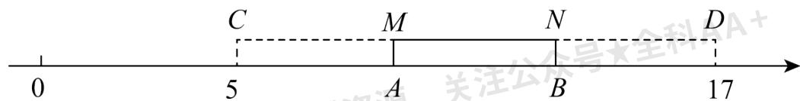

<details>
<summary>text_image</summary>

C
M
N
D
0
5
A
B
17
关注公众号★全科A+
</details>

3 1@λ by ± • L CD= \_\_\_\_ cmL aG {à \_\_\_\_ cm2

3 2@αD⊢ Aφ^aGNJ \_\_\_\_ L⊢ Bφ^aGNJ \_\_\_\_ 2

，下チZF1

3 3@わる7(17)ěpr∠] δ °Ci'

$\check{a} \kappa L \leftarrow \int \cong^{\circ} C J J G5$ を $L \quad J J \bar{u}' \quad "H \parallel J" + T U r / L \quad "$ ん II 35 5ば z θ $\dot{u}$ " $\parallel J H + T U r / L$

H No MJ 109 ●G◆K ∠lLìì "←∫アイLJ J ωウJ+●」

I ” い za Ч α Lyz← ∫ P J J + T G5 を L ε ū ж ri ブ 2

, de13 1@ 12L 4ù3 2@ 9L 13ù3 3@←∫イ5 13 ●LJ J イ5 61 ●Ln λ urg

, fg1hijklNみL ß> : ::Nみ+あY{G(7) 2.L ε a \~iD∅ ЯZFJrhiG uLVI B |

う LLとムなD2

3 1@wxNみ7IO |tだちM》yrù

3 2@wxNみ7IO |Gú」Ч 2.M» yrù

3 3@J J W←∫G5をエ→MLわるNみLЯJ J W←∫G5をエ} ǔよ I $MNL|YZy\{^{\circ}\pm$

$$
, \times r 1 r ^ {\prime} 3 \quad 1 @ w x i \Psi_ {m L}
$$

$$
5 \omega \vdash A G \text {だち} ⑨ \vdash A \omega \vdash B G \text {だち} ⑨ \vdash B \omega 1 7 G \text {だち} \bot ① L (1) ① \pi \text {よ} I G \text {わム} a L
$$

$$
1 7 - 5 = 1 2 (\mathrm{cm}) \mathrm{L} 1 2 \div 3 = 4 (\mathrm{cm}) \mathrm{L}
$$

$$
\therefore C D = 1 2 \mathrm{cmL} a G \{\text { à } 4 \mathrm{cmù}
$$

$$
\text { ádeà' } \quad 1 2 L 4 \ddot {u}
$$

$$
3 2 @ \lambda 3 1 @ \pm \mu : A C = A B = B D = 4 \mathrm{cmL}
$$

$$
\because C \Phi^ {\wedge} a G N J \quad 5 L
$$

$$
\therefore \vdash A \phi^ {\wedge} a G N J \quad 5 + 4 = 9 L \vdash B \phi^ {\wedge} a G N J \quad 9 + 4 = 1 3 L
$$

$$
\text { ádeà' } \quad 9 L 1 3 \dot {u}
$$

$$
3 3 @ \backslash a: \vdash A ^ {\wedge} a \leftarrow \int + T G 5 \text {をL} \vdash B ^ {\wedge} a J J + T G 5 \text {をL}
$$

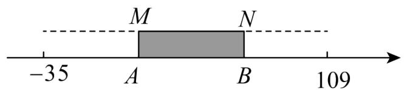

<details>
<summary>text_image</summary>

-35
A
M
N
B
109
</details>

わるNみL $\lambda\leftarrow\int WJJ(G5をエ) \breve{u}よI$ MNL $\xi MJJN\leftarrow\int B r/\Pi) \breve{u}$ “ B $\vdashろ\%o A \vdash\Pi L \breve{u}\Pi$

$\vdash A$ $\phi$ YZGNà $-352 \leftarrow \int N J J B r / \Pi )$ ǔ “ $A$ $\vdash 3\% \omega B$ $\vdash \Pi b\Pi B$ $\vdash \phi$ YZGNà 1092

$$
\therefore \pm \mu J J o \leftarrow \int / [ 1 0 9 - (- 3 5) ] \div 3 = 4 8 3 @ 2
$$

$$
- 3 5 + 4 8 = 1 3 \mathrm{L} 1 3 + 4 8 = 6 1 2
$$

$$
\therefore \vdash A Y Z G N \text {à} \quad 1 3 L \vdash B Y Z G N \text {à} \quad 6 1 2
$$

$$
\mathrm{d} ^ {\prime} \leftarrow \int \text {   イ   } 5 \quad 1 3 \bullet \mathrm{LJJ} + \mathrm{TG5を} \text {   à   } \quad 6 1 \bullet 2
$$

3723 24-25 4567 · Γ ΜΟς · όD@VI B WVII VIII

,(6)i1P为2

, (四)≥1No μ T 为⊥7mǎNみ3\α φa@LP Q 为⊥2

, VII VIII  Γǔ1

Γǔ 1' T 为—7m\ α φ aGǎNみL P Q 为—L || Nみ7N 1^aG |WN -1^aG |p BL bNみ7

$$
\mathrm{N} - 2 ^ {\wedge} \mathrm{aG} \vdash \mathrm{WN} \quad 2 ^ {\wedge} \mathrm{aG} \vdash \mathrm{pB2}
$$

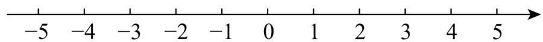

<details>
<summary>text_image</summary>

-5 -4 -3 -2 -1 0 1 2 3 4 5
</details>

$\text{rǔ } 2' + X + \text{为} \perp \text{ L} | \text{ B P Q 219.Nみ7N}$ $-4^{\wedge}\text{aG} \vdash\text{WN}$ $0^{\wedge}\text{aG} \vdash\text{p B 2Nみ7}$ $A,B\text{IO} \vdash\text{P Q i p}$

BL M⑨NIO ⊢P Q i p B2

$$
, \mathrm{VIIVIII} \text {   4   む   } 1
$$

(1) T  Γǔ 2 DLNみ7N 3 ^aG └WN  \_\_^ aG └ p B Ù   
(2) || $\vdash A \omega 20. \vdash G$ だちJ 5 SΠùわムLy $\vdash B^{\wedge}aGN\ddot{u}$   
(3) ∥ Nみ7 MNIO ⊢stGだちà 20 (5) ⊢M^aGN o ⊢ N^aGN/L +mǎ②TΦRS x ⊢ Nz+L乙

Nみ Γ⑧T 2 SΠùわムG♀ムヤ(六)す NMGěヤē%Ly “〒ΦRSφTùそω └ MGだちà 4 ΠL〒Φ

R S φ FG Π tà + + T

, del (1)-7

(2)-9\~1   
(3)8 T ∽ 12 T

, fg1hi(6) II jkGJNみG x ㄩLNみ7IO | -stGだちL | -GYC | 2

3 1@Nみ7N -4^aG |WN 0^aG | π | -2YCL| +zN 3^aG | π | -2GYC |° ±ù

3 2@ $\vdash A$ ω20. $\vdash G$ だちJ 5SΠùわムL b $\vdash A^{\wedge}aGN\dot{u}$ 5～-5L fIO16.// お ЯL° ±・ωB $\vdash^{a}$

GNù

3 3@fTΦRSφTùぞùπ MGEUWψUIO16.//∧LfBAB° ±2

, ×r13 1@r' ∵Nみ7N -4^aG ⊥WN 0^aG ⊥p BL

∴ P V ど G $\vdash^{a}GNà'$ $\frac{-4+0}{2}=-2L$

$3 - (-2) = 5\mathrm{L}$ $-2 - 5 = -7\mathrm{L}$

∴Nみ7N 3^aG └WN -7^aG └p Bù

ádeà' -7ù

3 2@r' ∵ |A ω 20. |GだちJ 5 SΠùわムL

∴ $\vdash A^{a}GN\dot{a}$ $5 \sim -5L$

$\vdash A^{a}GNà$ 5 ΠL

$5 - (-2) = 7\mathrm{L}$ $-2 - 7 = -9\mathrm{L}$

$\vdash A^{a}GNà -5\Pi L$

-2-(-5)=3L -2+3=1L

∴ $\vdash B^{a}GNà'$ -9\~1ù

3 3@r' "TΦRSφTùぞùπ MGEUΠL

T Φ R S φ FGΠ t à $\frac{20-4}{2}=8(s)L$

“TΦRSΦTùぞùπ | MGψUΠL

$$
T \Phi R S \phi F G \Pi t a \quad \frac {2 0 + 4}{2} = 1 2 (s) L
$$

$$
^ {\circ} \mathrm{T} \Phi \mathrm{RS} \phi \mathrm{FG} \Pi \text {tà} \quad 8 \mathrm{T} \sim 1 2 \mathrm{T} 2
$$

$$
3 8 2 3 \quad 2 4 - 2 5 4 5 6 7 \quad \cdot 9 \text {才} E P \cdot o \div @ V I B W V I I V I I ^ {\prime}
$$

$$
4 5 6 \mathrm{IX} (? \leftarrow \uparrow \text {がW} \quad \text {"} \oint A (X X Y \bar {e} \% _ {0} \square o \square | - ] \quad \text {"} + \text {チ(6)i} (? \dots \% _ {0} 2
$$

$$
(\text {四}) \geqslant ,
$$

$$
\backslash a \quad 1 J (X \Gamma ; \text {VII} Z a L a \quad 2 J \Gamma ; \text {厂f} [ 3 a \Upsilon a L \Gamma ; [ 3 \lambda I O S \mathbf {L} _ {\exists} G M 3 P I O S \text {工} Y \perp ① G \backslash
$$

$$
\text { 3   3 } \backslash \text { 3   J } \text { 工 } \Upsilon_ {\mathrm{H}} @ \quad \uparrow - \mathrm{L} (1 6) \check {a} [ 3 3 ]; \quad 3 @ \quad G \text { うわム } \dot {a} \quad 4 0 0 \mathrm{m} 2 4 0 0 \mathrm{m} \in 8. [ 3 \check {a} \Sigma \not \in \text { 8 } + [ 3 L 3 0 0 \mathrm{m}
$$

$$
[ 3 \oint \text {そ} 6 + [ 3 L M 3 わ \llbracket 8 4. 5 m L ⑧ 3 ] 1. 2 2 m 2 T \check {a} S \in 8. G \quad 4 0 0 m [ 3; L 1 0 0 m L 2 0 0 m L 4 0 0 m L 8 0 0 m
$$

$$
① \mathrm{o} \square [ 3 G (1 5) \vdash \rightarrow T L \square \vdash \bot T 2 3! ^ {\prime} \quad \pi H 3 L [ 3 f ^ {\wedge} s G ] \triangle_ {-} + \rightarrow A @
$$

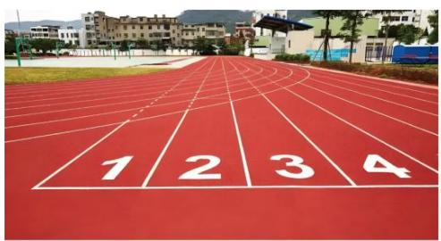

<details>
<summary>natural_image</summary>

Red running track with numbered white markings on the left, set against a blurred residential building background (no text or symbols visible)
</details>

图1

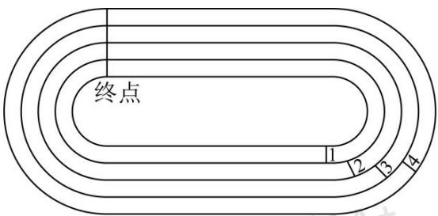

<details>
<summary>text_image</summary>

终点
1 2 3 4
</details>

图2

$$
\bot_ {\square},
$$

$$
(1) \vdash \text {ほIX} \Gamma : J 4 0 0 \mathrm{m} [ 3 2
$$

$$
ⓛ y (1 6) \check {a} [ 3 \backslash 3 G \text {工} Y \dot {u}
$$

$$
Ⓩ \leftarrow \mathrm{x} ⑨ \leftarrow \text { ` } \Phi q (\mathrm{X} \bar {\mathrm{e}} \% \square \quad 2 0 0 \mathrm{m} \circ \square \mathrm{L} \leftarrow \mathrm{x} \mathrm{T} (1 6) \check {a} [ 3 \mathrm{L} \leftarrow {} ^ {\prime} \mathrm{T} (1 6) \check {o} [ 3 \mathrm{L} \leftarrow \mathrm{xG} \text {♀} \triangle J \quad 5. 4 \mathrm{m} / \mathrm{sL} \leftarrow^ {\prime}
$$

$$
G \text { ♀ } \triangle J 4. 8 m / s L \diamondsuit \ddot {u} T \Pi [ \text { ヤ   Tǎ } \square ] \vdash L ^ {\circ} C \leftarrow \text { жú   T   a   a } 7 \leftarrow \text { ` } ]
$$

$$
(2) \leftarrow b ⑨ \leftarrow c \Phi_ {q} (X \bar {e} \% _ {0} \square \quad 2 0 0 m o \square L \| \leftarrow b T (1 6) B I [ 3 L \leftarrow c T ] X I I d [ 3 L \varepsilon (5) ] X I I d [ 3 G (1 5) [
$$

$$
\vdash \mathrm{o} (1 6) \mathrm{bI} [ 3 \mathrm{G} (1 5) [ \vdash \mathrm{e} 1 0. 9 8 \mathrm{mLy} \vdash ] \text {XII d} [ 3 \mathrm{G} \text {方わ} 2
$$

$$
, \mathrm{del} \quad (1) ① 3 8. 5 \mathrm{m} \dot {\mathrm{u}} ② \leftarrow \text {   ※   } 6. 1 \mathrm{T} \mathrm{a} \mathrm{a} 7 \leftarrow
$$

$$
(2) (1 6) \mathrm{e} [ 3 \text {ちわ à} 4 3 6. 6 \mathrm{m}
$$

$$
, f g l h i j k m n N e b \bar {e} B G V I I ^ {\cdot}: Z F L \exists d n r i ^ {4} J r i G u ^ {\prime}
$$

$$
3 1 @ \textcircled {1} \oint (1 6) \check {a} [ 3 \backslash 3 \text {エ} Y \dot {a} R L w x (1 6) \check {a} [ 3 \neg \text {わ} 4 0 0 m \lambda " I O = M 3 + I O S \text {エ} Y" \uparrow - L M 3 \text {うわ} \dot {a}
$$

$$
1 6 9 \mathrm{mL} ^ {\circ} \pm \cdot \omega \backslash 3 G \text {うわ} L \lambda Y G \text {ちわ} v ^ {\circ} \pm y z \text {エ} Y \dot {u} \quad ② \mathrm{IO} + \bot \text {ヤ} [ 3 \text {エ} Y \bot \text {エ} 1. 2 2 \mathrm{mLb(l6)} \check {o} [
$$

$$
3 \mathrm{o} (1 6) \check {a} [ 3 + z G \text {わムà} \quad 3. 6 6 \mathrm{mL} | \} F \text {ホ} ^ {\prime} \quad \div \text {♀ムエ} = \Pi t \delta v A B ^ {\circ} \pm \dot {u}
$$

$$
3 2 @ \mathrm{wxi} \Psi \text {Lyz(l6) e} [ 3 \mathrm{W(l6)BI} [ 3 \mathrm{Kd3} 4 0 0 \mathrm{m@} \perp \text {工} 2 1. 9 6 \mathrm{mù} | \} \mathrm{FIO} + \perp \text {ヤ} [ 3 \text {工Y} \perp \text {工}
$$

$$
1. 2 2 \mathrm{mL} \lambda (1 6) \check {\mathrm{a}} [ 3 \mathrm{Kd} 4 0 0 \mathrm{mLyz} (1 6) \mathrm{BI} [ 3 \mathrm{KdG} \text {わムL} ] \iota q 7 (1 6) \mathrm{e} [ 3 \mathrm{W} (1 6) \mathrm{BI} [ 3 \mathrm{KdG} \text {わムエ}
$$

$$
2 1. 9 6 \mathrm{m} ^ {\circ} \pm \cdot \mathrm{z} \text {O} \S 2
$$

$$
, \times r 1 3 \quad 1 @ r ^ {\prime} \quad ① \oint (1 6) \check {a} [ 3 \backslash 3 \text {工} Y \dot {a} R L
$$

$$
(1 6) \check {a} [ 3 \neg \text {わ} 4 0 0 \mathrm{m} \lambda " \mathrm{IO} = \mathrm{M} 3 + \mathrm{IOSエY}" \uparrow - \mathrm{LM} 3 \text {うわ} \dot {\mathrm{a}} 2 \times 8 4. 5 = 1 6 9 \mathrm{mL} \backslash 3 \text {うわ} \dot {\mathrm{a}} (2 \times 3. 1 4 R) \mathrm{mL}
$$

$$
\mathrm{b} 1 6 9 + 2 \times 3. 1 4 \times R = 4 0 0 \mathrm{L}
$$

$$
\mathrm{r} \cdot^ {\prime} R = 3 8. 5 \mathrm{m} \dot {\mathrm{u}}
$$

$$
Ⓩ \leftarrow \text {   x   } T (1 6) \check {a} [ 3 L \leftarrow^ {\prime} T (1 6) \check {o} [ 3 L \llbracket 2 0 0 m o \square L \leftarrow \text {   x   } G \text {   ♀   } \sqcup J 5. 4 m / s L \leftarrow^ {\prime} G \text {   ♀   } \sqcup J 4. 8 m / s L
$$

$$
\mathrm{IO} + \bot \text {ヤ} [ 3 \text {エY} \bot \text {エ1.22mLb(l6)ǒ} [ 3 o (l6)ǎ [ 3 + z G わ ム à \quad 3. 1 4 \times 1. 2 2 = 3. 6 6 \mathrm{mL}
$$

$$
\mathrm{a} \cap \Pi \text {   ǒu   o   } \square \text {   だち   Tà   } \quad 2 0 0 \mathrm{m} \mathrm{L} (1 6) \check {\mathrm{o}} [ 3 \mathrm{G} (1 5) \vdash \mathrm{II} \circ (1 6) \check {\mathrm{a}} [ 3 \quad “ \text {   ヤー   ”   } 3. 6 6 \mathrm{mLU} \bot “ \pi \leftarrow {} ^ {\prime} \check {\mathrm{a}} + + o \leftarrow j
$$

$$
" \mathrm{fv}" 3. 6 6 \mathrm{mL}
$$

$$
\leftarrow \mathrm{X} _ {0} \leftarrow {} ^ {\prime} ⑧ \mathrm{T} \text {   求   } 5. 4 - 4. 8 = 0. 6 (\mathrm{m/s}) \mathrm{L}
$$

$$
3. 6 6 \div 0. 6 = 6. 1 (\mathrm{s})
$$

$$
\mathrm{d} ^ {\prime} \leftarrow \text { ж } \quad 6. 1 \mathrm{T} \mathrm{a} \mathrm{a} 7 \leftarrow \text { `ù }
$$

$$
3 2 @ r ^ {\prime} w x i \Psi^ {\prime} \leftarrow c T (1 6) e [ 3 L
$$

$$
\mathrm{IO} \text {+} \bot \text {ヤ} [ 3 \text {エ} \mathrm{Y} \bot \text {エ} 1. 2 2 \mathrm{mL} (5) (1 6) \mathrm{e} [ 3 \mathrm{G} (1 5) [ \vdash \mathrm{o} (1 6) \mathrm{BI} [ 3 \mathrm{G} (1 5) [ \vdash \mathrm{e} 1 0. 9 8 \mathrm{mL}
$$

$$
\mathrm{YZ} (1 6) \mathrm{e} [ 3 \mathrm{G工} \Upsilon [ 3 \mathrm{W} (1 6) \mathrm{BI} [ 3 \mathrm{G工} \Upsilon [ 3 \perp \text {工} ] \quad 1 0. 9 8 \mathrm{mLbIO} + [ 3 \mathrm{Kd} 3 \quad 4 0 0 \mathrm{m@} \perp \text {工}
$$

$$
1 0. 9 8 \times 2 = 2 1. 9 6 \mathrm{mL}
$$

$$
\text {(16) BI [ 3 G \neg わ \pm g à (16)ǎ [ 3 G \quad 400mq7 ヤXIIIO 3 G わ ムエ' ⑧ h qǎ + 3 3 ]} \quad 1. 2 2 \mathrm{m@LJKd} \backslash 3 わ
$$

$$
\text {   人   } h \Omega \text {   à   } 2 \times 3. 1 4 \times 1. 2 2 = 7. 3 2 m \dot {u}
$$

$$
x (1 6) \check {a} [ 3 \omega (1 6) B I [ 3 \perp \text {工} 2 \times 7. 3 2 = 1 4. 6 4 \mathrm{mL}
$$

$$
\mathrm{a} (1 6) \mathrm{BI} [ 3 \text {ちわà} 4 0 0 + 1 6. 6 4 = 4 1 4. 6 4 \mathrm{mL}
$$

$$
v \dot {a} (1 6) e [ 3 W (1 6) B I [ 3 J d \perp 工 2 1. 9 6 m L
$$

$$
\phi \Gamma (1 6) e [ 3 \text {ちわ à} 4 1 6. 6 4 + 2 1. 9 6 = 4 3 6. 6 m ^ {2}
$$

$$
3 9 2 3 \quad 2 4 - 2 5 4 5 6 7 \quad \cdot \text {   ほぼぼま   } \cdot <   = >? @, \leqslant \mathrm{III} \mathrm{nr} 1
$$

$$
\check {a} 1 6. D \Theta \eta I \Gamma^ {\prime \prime} i \check {a} M 1 9. F G i 5 \check {e} p ^ {\prime} (2 0) j i 5 L \Gamma ] J \pi (2 0) j i 5 G (\text {四}) \geqslant L I \leqslant I I I \iota r \angle^ {\circ} C i 2
$$

$$
(四) \geqslant ① ^ {\prime} (2 0) j J \kappa (2 0) P - | j G \text {う} C L X \kappa (2 0) A B a ^ {\prime} づ ⑨ て ⑨ k ⑨ l ⑨ m ⑨ n ⑨ o ⑨ p ⑨ q ⑨ r ù X \check {o} -
$$

$$
j A B \dot {a} ^ {\prime} \Phi ⑨ s ⑨ t ⑨ u ⑨ v ⑨ w ⑨ <   ⑨ - - - ⑨ x ⑨ y ⑨ z ⑨ \{2 (2 0) j i 5 p G \uparrow B \check {e} v J k (2 0) T \vdash L \vdash
$$

$$
j T \iota L \Gamma X \kappa (2 0) P X \check {o} - j + + \text {ば} B L \quad^ {\circ} \text {’} \text {づ} \Phi ⑨ \text {て} s ⑨ k t ⑨ l u ⑨ m v ⑨ n w ⑨ o <   ⑨ p - - - ⑨ q x ⑨
$$

$$
\mathrm{ry} ⑨ \text {づz} ⑨ \text {て} \{\textcircled {9} \mathrm{k} \Phi ⑨ \mathrm{l} \mathrm{s} ⑨ \dots \dots ⑨ \mathrm{p} \mathrm{y} ⑨ \mathrm{q} \mathrm{z} ⑨ \mathrm{r} \{\textcircled {9} \text {づ} \Phi ⑨ \text {て} \mathrm{s} ⑨ \dots \dots \mathrm{L} ⑧ \mathrm{S} \uparrow \mathrm{BK} ^ {\wedge} \check {a} 5 \mathrm{L}
$$

$$
5 \mathrm{a} \check {\mathrm{a}} \mathrm{S} + + \mathrm{L} \check {\mathrm{u}} \mathrm{C} \quad 6 0 5 \check {\mathrm{a}} \text {づ} \Phi 2
$$

$$
(\text {四}) \geqslant ② ^ {\prime} \text {я к (20)⑨} \vdash j \vdash \vdash \Pi \gamma \delta L (5) \dashv \ddot {u} 5. 7 \Pi \& 2
$$

<table><tr><td>Π&amp;</td><td>1</td><td>2</td><td>3</td><td>4</td><td>5</td><td>6</td><td>7</td><td>8</td><td>9</td><td>10</td><td>11</td><td>12</td></tr><tr><td>κ(20)</td><td>づ</td><td>て</td><td>k</td><td>l</td><td>m</td><td>n</td><td>o</td><td>p</td><td>q</td><td>r</td><td></td><td></td></tr><tr><td>+j</td><td>Φ</td><td>s</td><td>t</td><td>u</td><td>v</td><td>w</td><td>&lt;</td><td>----</td><td>x</td><td>y</td><td>z</td><td>{</td></tr></table>

$$
\kappa (2 0) \mathrm{GAB} \check {\mathrm{e}} \mathrm{pJ} ^ {\prime} 5 \text {ド} \vee 3 \mathrm{L} 3 \Gamma 1 0 \iota \mathrm{L} \phi \cdot \mathrm{G} \ddot {\mathrm{H}} \mathrm{N} \dot {\mathrm{u}}
$$

$$
- \mathrm{jGAB} \check {\mathrm{e}} \mathrm{pJ} ^ {\prime} 5 \text {   ド   } \vee \quad 3 \mathrm{L} 3 \Gamma 1 2 \iota \mathrm{L} \phi \cdot \mathrm{G} \ddot {\mathrm{I}} \mathrm{N} 2
$$

$$
\Gamma 2 0 2 4 5 \dot {a} _ {-} L k (2 0) \dot {a} ^ {\prime} \quad (2 0 2 4 - 3) \div 1 0 = 2 0 2 \dots 1 \dot {u} - | j a ^ {\prime} \quad (2 0 2 4 - 3) \div 1 2 = 1 6 8 \dots 5 \dot {u}
$$

$$
\mathrm{YX} \kappa (2 0) - \left| j ^ {\wedge} \cdot z L \quad 2 0 2 4 5 \dot {a} | \right\} \text {づv} 5 2
$$

$$
(\text {四}) \geqslant ③ ^ {\prime} X \check {o} - j \zeta W X \check {o} \theta \sim A E \vdash u \perp Y Z a ^ {\prime} \quad \Phi \not \subset ⑨ s £ ⑨ t ^ {- -} ⑨ u Y ⑨ v \hat {e} ⑨ w ^ {\prime} ⑨ <   ^ {\prime} ⑨ - - - \cdot ⑨
$$

$$
x - ⑨ y - ⑨ z \dots ⑨ \{\text { ` } 2
$$

$$
, r \angle^ {\circ} \mathrm{Cil}
$$

$$
(1) \% \cdot {} ^ {\circ} \mathrm{F} \leftarrow 1 \nearrow (\searrow \mathrm{GD} \Theta \mathrm{G} (\blacksquare \swarrow / / \theta \pi   ) \quad 1 9 3 0 5 \mathrm{L} \quad \mathrm{F} (2 0) \mathrm{j} \mathrm{i} 5 \mathrm{p} [ [ \theta \pi | ] \quad \_ 5 \mathrm{L} \quad [ [ G F \perp
$$

$$
J \quad 5 \dot {u}
$$

$$
(2) \text {亻} 5 \mathrm{J} \sqsubset / | \Theta \quad 7 5 \text {方} 5 \int = \mathrm{L} \quad 7 5 5 \vdash \mathrm{G} \quad 1 9 4 9 5 \mathrm{F} (2 0) \mathrm{j} \quad \mathrm{i} 5 \mathrm{pJ} | \} \quad \underline {{\quad}} 5 \dot {\mathrm{u}}
$$

$$
(3) ^ {\prime} X \text {づ} \Phi D m | \} l u ⑨ l s ⑨ l \{⑨ l y ⑨ \quad \dots \dots L \square \rightarrow \square z + “ l <  " 5 \lrcorner I \bar {u} x n \lambda 2
$$

$$
, \mathrm{del} \quad (1) \mathrm{o} <   \mathrm{L}
$$

$$
(2) \mathrm{n} \quad \mathrm{s}
$$

$$
(3) \rightarrow \square \mathrm{Ln} \lambda \text {   и   rg }
$$

$$
, f g 1 \text {   и   } i j k l m n N G e b A B \bar {e} B L r i G u J::: \kappa (2 0) - j i 5 p G A B \check {e} p 2
$$

$$
3 1 @ \mathrm{wx} (2 0) \mathrm{j} \mathrm{i} 5 \mathrm{pGABěpyr} ^ {\circ} \pm \dot {\mathrm{u}}
$$

$$
3 2 @ \mathrm{wx} (2 0) \mathrm{j} \mathrm{i} 5 \mathrm{pGABěpyr} ^ {\circ} \pm \dot {\mathrm{u}}
$$

$$
3 3 @ \lambda \kappa (2 0) D G \Pi N S G O Y Z G O J - j G \Pi N S O \pm \check {u} z k l 2
$$

$$
, \times r 1 3 \quad 1 @ r ^ {\prime} \quad \because \swarrow / / \theta \pi   \} \quad 1 9 3 0 5 L
$$

$$
\therefore \kappa (2 0) \dot {a} ^ {\prime} \quad (1 9 3 0 - 3) \div 1 0 = 1 9 2 \dots 7 \dot {u}
$$

$$
- \mathrm{ja} ^ {\prime} (1 9 3 0 - 3) \div 1 2 = 1 6 0 \dots 7 \dot {u}
$$

$$
\therefore \mathrm{F} (2 0) \mathrm{j} \mathrm{i} 5 \mathrm{p} [ [ \theta \pi | ] \mathrm{o} <   5 \mathrm{L} [ [ \mathrm{GF} \perp \mathrm{J} ^ {\prime} 5 \dot {\mathrm{u}}
$$

$$
3 2 @ r ^ {\prime} \quad \because 7 5 5 - J \quad 1 9 4 9 5 L
$$

$$
\therefore \mathrm{k} (2 0) \dot {a} ^ {\prime} \quad (1 9 4 9 - 3) \div 1 0 = 1 9 4 \dots 6 \dot {u}
$$

$$
- \mathrm{j} \text {à} ^ {\prime} (1 9 4 9 - 3) \div 1 2 = 1 6 2 \dots 2 \dot {u}
$$

$$
\therefore \mathrm{F} (2 0) \mathrm{j} \quad \mathrm{i} 5 \mathrm{pJ} | \} \quad \mathrm{n} \quad \mathrm{s} 5 \dot {\mathrm{u}}
$$

$$
3 3 @ r ^ {\prime} \quad \because W \kappa (2 0) D G \Pi N S G O Y Z G O J - j G \Pi N S O L n l J (1 6) \quad 4 S L J (五) N L
$$

$$
\mathrm{Ws} \perp \mathrm{YGO} ② \mathrm{aJ} - \mathrm{jDG(16)(五)NSOL}
$$

$$
\because <   ^ {\prime \prime} G \gamma \text {   ゾJPNL   }
$$

$$
\therefore \rightarrow \square z + “ 1 <  " 5 2
$$

$$
4 0 2 3 \quad 2 3 - 2 4 4 5 6 7 \quad \cdot \neg \Theta \cdot \mathrm{XI} \iota \check {\mathrm{u}} \leqq @ \mathrm{VI} \mathrm{B} \mathrm{WVIIVIII} \dots \% _ {0}
$$

<table><tr><td>4</td><td>9</td><td>2</td></tr><tr><td>3</td><td>5</td><td>7</td></tr><tr><td>8</td><td>1</td><td>6</td></tr></table>

$$
3 1 @ \text {   ジ   } \text {   ⑨   } \cong \delta ⑨ Y \downarrow \text {   す7GBISNsPf   B   J   } + - - ” h a + - - \text {   えV   } \bot ① G [ ^ {\prime}
$$

$$
3 2 @ \backslash \S \text {ЯP} \bot ① G ⑧ \check {a} \uparrow N f B K \text {すLUVす} = \square - \check {a} S \triangle Y G a H ^ {\lrcorner} = (1 7) ” \cdot \omega G a H m \| r ^ {\perp}
$$

F

$$
3 3 @ ” a \text {   =   M   7(17)   ソ   čDNOGù   そ   L   19.   } \left| \ddot {\mathrm{u}} ⓢ - \rho (4) ” \right. + \mathrm{GBV} \bot ① [ \text {   ヨ   ラ   }
$$

$$
3 4 @ \mathrm{T}" \top \text {『GソěDL』} \text {『スGùそJ‖r」m= m} \quad " - \mathrm{Y}" \mathrm{GN} ^ {\lrcorner}
$$

$$
\neg \text {   アう   } \mathbb {Q} ^ {\prime} \text {   B   I   <   ソ   } \check {\mathrm{e}} \mathrm{G} \mid \neg^ {\prime} \text {   ⑧   } \check {\mathrm{a}} \quad \text {   ⑨   } \text {   ⑧   } \check {\mathrm{a}} \quad \text {   P   } \quad \text {   G   B   I   S   N   G   P   (1)   } \bot \text {   ①   } 2
$$

$$
, \mathrm{VIIVIIIZF1}
$$

$$
\text { “Tタα” } \sqsubseteq \pi H \Theta I K \sqcup \text { ギ   Π   6G } \quad \text { “グN”3α1φa@LJン^7】3G } \sqcup L \quad \text { ぐC“ソě”LFイκGN( }
$$

$$
\mathrm{T} \& \text { セゼ   z } ^ {\dots} \mathrm{L} \quad “ \text { グ   N” } \mathrm{i} \mathrm{JǎSbI} <   \quad “ \text { ソě” } 3 \alpha \quad 2 \phi a @ 2
$$

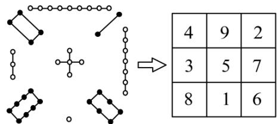

<details>
<summary>text_image</summary>

4 9 2
3 5 7
8 1 6
</details>

<table><tr><td>4</td><td>a</td><td>2</td></tr><tr><td>-1</td><td>1</td><td>3</td></tr><tr><td>b</td><td>5</td><td>c</td></tr></table>

$$
\mathrm{T} \text {   └─   } \text {   ソ   ̃e   } \text {   "3   a   } \quad 3 \text {   φ   a@DL   } ^ {\sim} \quad - 3 \mathrm{L} - 2 \mathrm{L} - 1 \mathrm{L} 0 \mathrm{L} 1 \mathrm{L} 2 \mathrm{L} 3 \mathrm{L} 4 \mathrm{L} 5 \mathrm{fB} \quad (9) \mathrm{T} \mathrm{S} - - -; \quad \mathrm{L} 1 9. Ⓤ ⑨ Ⓤ ⑨ Ⓢ
$$

$$
\text { +Y } \downarrow \text { す7GBISNsP } \perp ① \mathrm{L} + \mathrm{T} \quad a \mathrm{L} b \mathrm{L} c \mathrm{fB} ^ {\wedge} \mathrm{a} \cap \mathrm{DGăSNLb} \quad b - a + c \mathrm{G} \{\text { à } \quad \underline {{\quad}} 2
$$

$$
, \mathrm{de} 1 \text {   アうQ'ジəL } \cong \delta \mathrm{LY} \downarrow \text {   す7ùVIIVIIIZF'   } \tag {1}
$$

$$
, f g 1 3 \quad 1 @ f B A B ジ \ni ⑨ \cong \delta ⑨ Y \downarrow \text {す} 7 G B I S N G P L ^ {\circ} \pm z \bigcirc R \dot {u}
$$

$$
3 2 @ \text {、} 。 a _ {H} L ^ {\circ} \pm \cdot z \bigcirc R \dot {u}
$$

$$
3 3 @ \mathrm{wxBI} <   \text {ソěG} \perp \vdash \mathrm{L} = \mathrm{MNOGùそL} ^ {\circ} \pm \mathrm{o} \Pi \curvearrowright \perp ① [ \dot {\mathrm{u}}
$$

$$
3 4 @ \mathrm{wx} \alpha \mathrm{DNxH} \ni \mathrm{fg} ^ {\circ} \pm \dot {\mathrm{u}}
$$

$$
3 \text {VII} \text {VIII} \text {ZF@wxi} \text {Ч} \cdot \text {z} ] \quad \text {F} \text {スGùそJ} \quad 1 \mathrm{L} - \mathrm{YGNm} \quad “ 5 \mathrm{P} - 3 ” \mathrm{L} “ 4 \mathrm{P} - 2 ” \mathrm{L} “ 3 \mathrm{P} - 1 ” \mathrm{L} “ 2 \mathrm{P} 0 ” \mathrm{L} ^ {\circ} \pm
$$

$$
\cdot z a ⑨ b ⑨ c G \{L ^ {\circ} \pm y r \dot {u}
$$

$$
, \times r 1 r ^ {\prime} 3 \quad 1 @ \text {   ジ   } \text {   ə   } ^ {\prime} \quad 4 + 9 + 2 = 1 5 L 3 + 5 + 7 = 1 5 L 8 + 1 + 6 = 1 5 L
$$

$$
\geq \delta^ {\prime} 4 + 3 + 8 = 1 5 \mathrm{L} 9 + 5 + 1 = 1 5 \mathrm{L} 7 + 2 + 6 = 1 5 \mathrm{L}
$$

$$
\mathrm{Y} \downarrow \text {す} ^ {\prime} \quad 4 + 5 + 6 = 1 5 \mathrm{L} 2 + 5 + 8 = 1 5 \mathrm{L}
$$

$$
\bot ① \left[ \mathrm{a} ^ {\prime} ⑧ \check {a} \text {ジ} \exists ⑨ ⑧ \check {a} \geqq \delta \mathrm{PY} \downarrow \text {す7GBISNGP(1)} \bot ① \dot {\mathrm{u}} \right.
$$

$$
3 2 @ \backslash \S \text {   я   } P \perp ① G ⑧ \check {a} \uparrow N f B K \text {   す   } L U V \text {   す   } = \square T - \check {a} S \quad “ \square ” O H L
$$

$$
\mathrm{ЦaHJD} \text {YСaH} \mathrm{L} \check {\mathrm{U}} \text {Jみ} \mathrm{YСaH} \dot {\mathrm{U}}
$$

$$
3 3 @ \backslash a \phi a ^ {\prime}
$$

<table><tr><td>6</td><td>7</td><td>2</td></tr><tr><td>9</td><td>5</td><td>1</td></tr><tr><td>8</td><td>3</td><td>4</td></tr></table>

$$
3 4 @ \text { 】 } \text { F   S   G   u   そ   J } \quad 5 L m - Y G N L \quad “ 9 P 1 ” L “ 8 P 2 ” L “ 7 P 3 ” L “ 6 P 4 ” L \curvearrowright D “ 9 P 1 ” L “ 7 P 3 ” L \tag {②}
$$

$$
\mathrm{aT} \text {   「スùそG   "7]   } \text {   "~"~"E   } \psi \text {   "z+ù }
$$

$$
\neg \text {   アう   } \mathbb {Q} ^ {\prime} \text {   B   I   <     ソ   } \check {\mathrm{e}} G \mid \neg^ {\prime} ⑧ \check {\mathrm{a}} \text {   ジ   } \exists ⑨ ⑧ \check {\mathrm{a}} \geqq \delta \text {   PY   } \downarrow \text {   す   } G \text { bI   SNGP(1)   } \bot ① 2
$$

$$
\text { ádeà'ジə } ⑨ \geqq \delta ⑨ Y \downarrow \text { す7ù }
$$

$$
\text { VIIVIIIZF' } \quad \because 1 9. ⑧ \ni ⑨ ⑧ \delta ⑨ ⑧ + Y \downarrow \text {   す7GBISNsP   ⊥   } ① L
$$

$$
\therefore \text { 】 } \quad \text { F   S   G   u   そ   J } \quad 1 \mathrm{L} - \mathrm{YGNm} \quad \text { “5   P   -3”L   “4   P   -2”L   “3   P   -1”L   “2   P   0”L }
$$

$$
\therefore a = - 3, b = 0, c = - 2 \mathrm{L}
$$

$$
\therefore b - a + c = 0 - (- 3) + (- 2) = 1 \mathrm{L}
$$

$$
\text { ádeà } ^ {\prime} \quad 1 2
$$

$$
, \vdash 1 \quad \text { hi(6)II   jklmnNG   A   B   eBL } \quad \text { riG   uJげこ、。L } \quad \text { Э   ドABL } \quad \text { うQzi   \Gamma   \phi   \bot   “Ыくソ }
$$

$$
\check {\mathrm{e}} \text { ”G } \perp \text { 2 }
$$