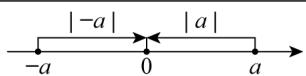
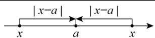
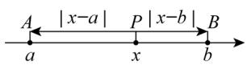
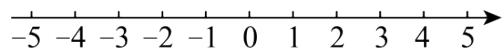
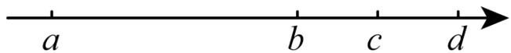
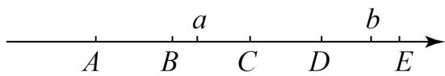
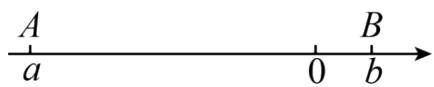
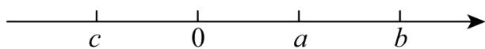

# 专题 08 与绝对值有关的十大题型（举一反三专项训练）

# 【北师大版 2024】

# 题型归纳

【题型1 代数视角看绝对值的意义】....1

【题型 2 几何视角看绝对值的意义】....3

【题型3 绝对值的非负性】....3

【题型 4 多绝对值处理——数形结合】....3

【题型 5 多绝对值处理——分类讨论】....4

【题型 6 多绝对值处理——零点分段】....5

【题型 7 多绝对值之和的最小值】....5

【题型8 多绝对值之差的最大值】 5

【题型 9 绝对值和差的最值】....6

【题型10利用隐最值求最值】....6

# 举一反三

# 教辅资源，关注公众号★全科AA+

# 知识点 1 代数视角看绝对值的意义

<table><tr><td>绝对值的代数意义:  $|a| = \begin{cases} a(a > 0), \\ 0(a = 0), \\ -a(a < 0). \end{cases}$ (去绝对值法则)</td><td> $\left| \text{非负} \right| = \text{本身};$  $\left| \text{非正} \right| = \text{相反数}.$ </td><td>变式结论:1若 $|a| = a$ ,则 $(a \geq 0)$ ;2若 $|a| = -a$ ,则 $(a \leq 0)$ ;3 $|a| \geq a$ .</td></tr></table>

# 知识点 2 几何视角看绝对值的意义

# 绝对值 $\Leftrightarrow$ 距离，数 $\Leftrightarrow$ 形

$|a|$ 的几何意义：数轴上表示 a 的点到原点的距离.

$\left|x - a\right|$ 的几何意义：数轴上表示 $x$ 的点与表示 $a$ 的点之间的距离.

# 知识点 3 绝对值的非负性

<table><tr><td>1.  $|a| \geq 0$ ,绝对值无负数</td><td>2. 若 $|a| + |b| = 0$ ,则 $a = 0$ 且 $b = 0$ </td><td>3. 若 $|a| + b^{2} = 0$ ,则 $a = 0$ 且 $b = 0$ </td></tr></table>

# 知识点 4 多绝对值处理——数形结合

$PA = |x - a|$ ， $|x - a|$ 表示 P，A 两点之间的距离；

$PB = |x - b|$ ， $|x - b|$ 表示 $\mathsf{P}$ ，B两点之间的距离；

$$
P A + P B = | x - a | + | x - b |,
$$

$|x-a|+|x-b|$ 表示 P 到 A，B 两点的距离之和.

# 知识点 5 多绝对值处理——分类讨论

$$
\frac {| a |}{a} \text {或} \frac {a}{| a |}
$$

$$
a > 0 \Rightarrow \text { 值为 } 1;
$$

$$
a <   0 \Rightarrow \text { 值为 } - 1.
$$

$$
\frac {| a |}{a} + \frac {| b |}{b} = \pm 2 \text {或} 0.
$$

①a，b 同正，值为 $1+1=2$ ;

②a，b 同负，值为-1-1=-2；

③a，b异号，值为1-1=0.

注：无需讨论具体数的符号.

# 知识点 6 多绝对值处理——零点分段

零点：使绝对值为0的未知数的值即为零点.

方法:

①寻找所有零点，并在数轴上表示；

②依据零点将数轴进行分段；

③分别根据每段未知数的范围去绝对.

易错点：分类不明确，不会去绝对值，

化简： $|x-a|+|x-b|(a<b)$ .

令x-a=0，x-b=0，解得x=a，x=b，

故零点为 a，b，分三种情况讨论：

①x < a;

② $a \leq x \leq b;$

③x > b.

# 知识点7 多绝对值型最值

1. 若 $a < b$ ，则当 $a \leq x \leq b$ 时， $|x - a| + |x - b|$ 有最小值 $b - a$ .

2. 若 a < b < c，则当 x = b 时， $|x - a| + |x - b| + |x - c|$ 有最小值 c - a.

3. n 个绝对值之和求最小值

一般地，设 $a_{1}<a_{2}<a_{3}<\cdots a_{n}$ ， $P=|x-a_{1}|+|x-a_{2}|+|x-a_{3}|+\cdots+|x-a_{n}|$ .

①若 n 为奇数，则当 $x = a_{\frac{n+1}{2}}$ 时，P 有最小值；②若 n 为偶数，则当 $a_{\frac{n}{2}} \leq x \leq a_{\frac{n}{2}+1}$ 时，P 有最小值.

口诀：按序排列，奇取中值，偶取中段.

4. 系数不为 1 型绝对值之和求最小值，可化为系数为 1 型问题解决.

5. 若 a < b，则当 $x \geq b$ 时， $|x - a| - |x - b|$ 的最大值为 b - a.

6. 绝对值和差混搭求最大值: 数形结合, 分析表示数 $x$ 的点的位置.

7. 注意挖掘几个绝对值之和有最小值，及取得最小值时字母的范围这个隐藏的条件.

【题型1 代数视角看绝对值的意义】教辅资源，关注公众号★全科AA+

【例 1】（24-25 七年级下·陕西榆林·开学考试）已知有理数a，b，c在数轴上的位置如图所示，化简式子 $|a-b|-|c-a|+|b-c|$ 的值为\_\_\_\_.

text_image

a
0
b
c

【变式 1-1】（2025 七年级上·全国·专题练习）已知 $1 < x < 2$ ，则 $|x - 3| + |x - 2|$ 的值为 \_\_\_\_.

【变式 1-2】（23-24 七年级上·辽宁大连·阶段练习）若 $|a-1|=1-a$ ，则a的取值范围是\_\_\_\_。

【变式 1-3】（24-25 七年级上·江苏盐城·期中）若 $a^{2}=9$ ， $|b|=7$ ，且 $|a-b|=b-a$ ，则2a-b的值为\_\_\_\_。

# 【题型2 几何视角看绝对值的意义】

【例 2】已知 $|m+12|=3|m-8|$ ，求m的值.

【变式 2-1】数轴上点 A 表示的数为 -4，点 B 表示的数为 x，若 A，B 两点之间的距离为 11，求 x 的值.

【变式 2-2】已知 $|m-2|=10$ ，求 $|m+1|$ 的值.

【变式 2-3】若 $\left|t+4\right|+\left|t-1\right|+\left|t-8\right|=12$ ，请结合数轴确定 t 的取值.

# 【题型3 绝对值的非负性】

【例 3】已知 $|x-2|+|x+y-5|+|y-1|=y-1$ ，求 y 的值.

【变式 3-1】（2025 九年级下·西藏·专题练习）若 $(a+1)^{2}+|b-2024|=0$ ，则 $a^{b}$ 的值为 \_\_\_\_。

【变式 3-2】（24-25 七年级上·内蒙古巴彦淖尔·期中）若 $|x - 2|$ 与 $|y + 6|$ 互为相反数，则 $2x - y$ 的值为

【变式 3-3】已知 $|a-2|+|b-5|+|c-4|=c-4$ ，求 $a+b$ 的值.

# 【题型4 多绝对值处理——数形结合】

【例 4】（24-25 七年级上·福建泉州·期中）阅读下面材料：

在数轴上点 A、B 分别表示数 a, b，则 A、B 两点之间的距离 AB = |a - b|，例如，当 a = 5, b = -2, AB = |5 - (-2)| = 7.

回答下列问题:

(1)①在数轴上表示-2与-6两点间的距离是，

②在数轴上表示 x 与 4 两点间的距离是\_；

③在数轴上表示 x 与 \_\_\_\_ 两点之间的距离为 $\left|x+2\right|$ .

(2)下面对式子 $|x+2|+|x-4|$ 进行探究：

①当表示数 x 的点在 -2 与 4 之间移动时， $|x+2|+|x-4|$ 的值总是一个固定的值为：\_\_\_\_.

②要使 $|x+2|+|x-4|=8$ ，数轴上表示的数x=\_\_\_\_。

(3)求 $|x+2|+|x+1|+|x-2|+|x-4|$ 的最小值.

【变式 4-1】如图，数轴上 4 个点表示的数分别为 a、b、c、d。若 $|a - d| = 10$ ， $|a - b| = 6$ ， $|b - d| = 2|b - c|$ ，则 $|c - d| = (\quad)$

text_image

a
b
c
d

A. 1

B. 1.5

C. 2.5

D. 2

【变式 4-2】如图 A, B, C, D, E 分别是数轴上五个连续整数所对应的点，其中有一点是原点，数 a 对应的点在 B 与 C 之间，数 b 对应的点在 D 与 E 之间，若 $\left|a\right| + \left|b\right| = 3$ 则原点可能是 \_\_\_\_.

text_image

A
B
a
C
D
b
E

【变式 4-3】点A、B在数轴上分别表示有理数a、b，A、B两点之间的距离表示为AB，则在数轴上A、B两点之间的距离 $AB = |a - b|$ .

所以式子 $|x - 2|$ 的几何意义是数轴上表示 $x$ 的点与表示2的点之间的距离．借助于数轴回答下列问题：

①数轴上表示 2 和 5 两点之间的距离是\_\_\_\_，数轴上表示 1 和 -3 的两点之间的距离是\_\_\_\_。  
②数轴上表示x和-2的两点之间的距离表示为\_\_\_\_.  
(3)数轴上表示x的点到表示1的点的距离与它到表示-3的点的距离之和可表示为： $|x-1|+|x+3|$ 。则 $|x-1|+|x+3|$ 的最小值是\_\_\_\_。  
④若 $|x-3|+|x+1|=8$ ，则x=\_\_\_\_

【题型 5 多绝对值处理——分类讨论】教辅资源，关注 公众号★全科AA+

【例 5】已知a,b,c为有理数.

（1）若 $a \leq 0$ ，则 $|a| =$ \_\_\_\_；若 $b > 0$ ，则 $|b| =$ \_\_\_\_.

（2）已知 $abc \neq 0,\ a < 0,\ bc > 0$ ，求 $\frac{a}{|a|} +\frac{ab}{|ab|} +\frac{ac}{|ac|} +\frac{bc}{|bc|}$ 的值.  
（3）已知 $abc \neq 0$ ，且 $a + b + c = 0$ ，求 $\frac{a}{|a|} + \frac{b}{|b|} + \frac{c}{|c|} + \frac{ab}{|ab|} + \frac{bc}{|bc|} + \frac{ac}{|ac|} + \frac{abc}{|abc|}$ 的值.

【变式 5-1】已知 x，y 均为整数，且 $\left|x-y\right|+\left|x-3\right|=1$ ，则 $x+y$ 的值为 \_\_\_\_.

【变式 5-2】（24-25 七年级上·四川德阳·阶段练习）如果a, b, c为非零有理数且 $a+b+c=0$ ，那么 $\frac{a}{|a|}+\frac{b}{|b|}+\frac{c}{|c|}+\frac{abc}{|abc|}$ 的值为\_\_\_\_.

【变式 5-3】（23-24 八年级上·浙江宁波·期末）若关于 x 的方程 $\left||x-2|-1\right|=a$ 有三个整数解，则 a 的值是（）

A. 0

B. 1

C. 2

D. 3

# 【题型 6 多绝对值处理——零点分段】

【例 6】无论x取何值， $|x-2|+|x-5|\geq a$ 都成立，则a的取值范围是\_\_\_\_.

【变式 6-1】已知 $|x+4|+|x-2|=10$ ，求 x 的值.

【变式 6-2】已知 $x \leq 2$ ，求 $|x - 3| - |x + 2|$ 的最大值和最小值.

【变式 6-3】若 $|x-12|=2|x+1|+4$ ，求 x 的值.

# 【题型7 多绝对值之和的最小值】

【例 7】（23-24 七年级上·四川成都·期中）设 $a = |x - 3|$ ， $b = |x - 1|$ ， $c = |x + 12|$ ，则 $3a + b + c$ 的最小值是 \_\_\_\_.

【变式 7-1】（23-24 七年级上·浙江嘉兴·阶段练习）式子 $|x+100|+|x-2|+|x-5|$ 的最小值是\_\_\_\_.

【变式 7-2】请解答下列问题:

①当代数式 $|x+1|+|x-1|$ 取最小值时，x的取值范围是\_\_\_\_，最小值为\_\_\_\_。  
②求 $|x-1|+|x-2|+|x-3|+\cdots+|x-24|$ 的最小值为\_\_\_\_.

【变式 7-3】（24-25 七年级上·湖北武汉·期中）设有理数 a, b, c，满足 a < 0, c > 0，且 $|a| < |b| < |c|$ ，则 $\frac{2}{3}|x + a| + \frac{2}{3}|x - b| + |x + c|$ 的最小值为 \_\_\_\_.

# 【题型8 多绝对值之差的最大值】

【例 8】（22-23 七年级上·四川成都·期中）若 $|x+1|+|x-1|$ 的最小值记为n， $|-x-1|-|x-1|$ 的最大值记为m，则 $-n^{m}=$ \_\_\_\_.

【变式 8-1】（24-25 七年级上·安徽六安·期中）若点 A、B 在数轴上分别表示有理数 a、b，则 A、B 两点之间

的距离表示为 $AB = |a - b|$

（1）若 $|x-3|=2$ ，这样的数x为\_\_\_\_；  
(2) 结合数轴探究: 存在 $x$ 的值, 使式子 $|x + 1| - |x - 5|$ 有最大值, 这个最大值是 \_\_\_\_.

【变式 8-2】（22-23 七年级上·浙江宁波·期中） $|x-2|-|x-5|$ 的最大值为 \_\_\_\_.

【变式 8-3】（24-25 七年级上·江苏无锡·阶段练习）当式子 $|x-3|-|x+5|$ 取得最大值时，x 的最大整数值是\_\_\_\_.

# 【题型9 绝对值和差的最值】

【例 9】（22-23 七年级上·浙江温州·阶段练习）式子 $|x-1|+2|x-2|+3|x-3|+2|x-4|+|x-5|$ 的最小值是\_\_\_\_.

【变式 9-1】求 $|x-1|-|x-2|+|x-3|-|x-4|$ 的最大值,并写出此时x的取值范围

【变式 9-2】（22-23 九年级下·福建南平·自主招生）已知 $-\frac{1}{2} \leq x \leq \frac{3}{2}$ ; ，则 $|2x + 1| - |x - 1| + 3|x| - |x - 2|$ 的最大值为 \_\_\_\_.

【变式 9-3】（24-25 七年级上·北京·期中）1．已知，有理数a、b、c在数轴上的位置如图所示，

（1）化简： $|3a+b|-|c-2a|+|c+2b|=$ \_\_\_\_；  
（2）若a,c两数的倒数是他们自身，当x的范围是\_\_\_\_时， $|x-a|+|x-c|$ 有最小值，最小值为\_\_\_\_。  
(3) 在 (2) 的条件下, 若未知数 $x$ 、 $y$ 满足 $\left(|x - a| + |x - 3|\right)\left(|y - 2| + |y - c|\right) = 6$ , 则 $x + 2y$ 的最大值是 \_\_\_\_.

# 【题型 10 利用隐最值求最值】教辅资源，关注公众号★全科AA+

【例 10】（24-25 七年级上·陕西西安·阶段练习）若： $|a-2|+|a+3|+|b-1|+|b+2|=8$ ，则 $a+b$ 的最小值是\_\_\_\_

【变式 10-1】（23-24 七年级上·浙江绍兴·阶段练习）已知 a、b 为整数， $|a + 2023| - |b - 2| = 0$ ，且 b < a，则 a 的最小值为 \_\_\_\_.

【变式 10-2】我们知道，|x|表示 x 在数轴上对应的点到原点的距离，我们可以把看作 |x-0|，所以，|x-3| 就表示 x 在数轴上对应的点到 3 的距离， $|x+1|=|x-(-1)|$ 就表示 x 在数轴上对应的点到 -1 的距离，由上面绝对值的几意义，解答下列问题：

(1) 当 $|x-4|+|x+2|$ 有最小值时，x 的取值情况是\_\_\_\_；

(2) $|x-3|+|x+2|+|x+6|$ 的最小值是；  
(3) 已知 $|x - 1| + |x + 2| + |y - 3| + |y + 4| = 10$ 求 $2x + y$ 的最大值和最小值.

【变式 10-3】（23-24 九年级下·浙江温州·自主招生）已知 $|x+2|+|x-1|=8-|y-4|-|y+1|$ ，则2x-3y的最小值为\_\_\_\_。