# 专题08 与绝对值有关的十大题型（举一反三专项训练）

# 【北师大版 2024】

# 题型归纳

【题型1 代数视角看绝对值的意义】....1

【题型 2 几何视角看绝对值的意义】....4

【题型3 绝对值的非负性】 5

【题型 4 多绝对值处理——数形结合】....7

【题型 5 多绝对值处理——分类讨论】....10

【题型6 多绝对值处理——零点分段】....13

【题型 7 多绝对值之和的最小值】....14

【题型 8 多绝对值之差的最大值】....17

【题型 9 绝对值和差的最值】....19

【题型 10 利用隐最值求最值】....23

# 举一反三

知识点 1 代数视角看绝对值的意义

<table><tr><td>绝对值的代数意义: $|a| = \begin{cases} a(a > 0), \\ 0(a = 0), \\ -a(a < 0). \end{cases}$ (去绝对值法则)</td><td> $\left| \text{非负} \right| = \text{本身};$  $\left| \text{非正} \right| = \text{相反数}.$ </td><td>变式结论:1若 $|a| = a$ ,则 $(a \geq 0)$ ;2若 $|a| = -a$ ,则 $(a \leq 0)$ ;3 $|a| \geq a$ .</td></tr></table>

# 知识点 2 几何视角看绝对值的意义

绝对值 $\Leftrightarrow$ 距离，数 $\Leftrightarrow$ 形

<table><tr><td>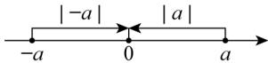 |a|的几何意义:数轴上表示a的点到原点的距离.</td><td>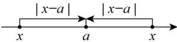 |x-a|的几何意义:数轴上表示x的点与表示a的点之间的距离.</td></tr></table>

知识点 3 绝对值的非负性

<table><tr><td>1.  $|a| \geq 0$ ,绝对值无负数</td><td>2. 若 $|a| + |b| = 0$ ,则 $a = 0$ 且 $b = 0$ </td><td>3. 若 $|a| + b^{2} = 0$ ,则 $a = 0$ 且 $b = 0$ </td></tr></table>

# 知识点 4 多绝对值处理——数形结合

$PA = |x - a|$ ， $|x - a|$ 表示 P，A 两点之间的距离；

$PB = |x - b|$ ， $|x - b|$ 表示 $\mathsf{P}$ ，B两点之间的距离；

$$
P A + P B = | x - a | + | x - b |,
$$

$|x-a|+|x-b|$ 表示 P 到 A，B 两点的距离之和.

# 知识点 5 多绝对值处理——分类讨论

$$
\frac {| a |}{a} \text {或} \frac {a}{| a |}
$$

$$
a > 0 \Rightarrow \text { 值为 } 1;
$$

$$
a <   0 \Rightarrow \text { 值为 } - 1.
$$

$$
\frac {| a |}{a} + \frac {| b |}{b} = \pm 2 \text {或} 0.
$$

①a，b 同正，值为 $1+1=2$ ;

②a，b 同负，值为-1-1=-2；

③a，b异号，值为1-1=0.

注：无需讨论具体数的符号.

# 知识点 6 多绝对值处理——零点分段

零点：使绝对值为0的未知数的值即为零点.

方法:

①寻找所有零点，并在数轴上表示；

②依据零点将数轴进行分段；

③分别根据每段未知数的范围去绝对.

易错点：分类不明确，不会去绝对值，

化简： $|x-a|+|x-b|(a<b)$ .

令x-a=0，x-b=0，解得x=a，x=b，

故零点为 a，b，分三种情况讨论：

①x < a;

② $a \leq x \leq b;$

③x > b.

# 知识点7 多绝对值型最值

1. 若 $a < b$ ，则当 $a \leq x \leq b$ 时， $|x - a| + |x - b|$ 有最小值 $b - a$ .

2. 若 a < b < c，则当 x = b 时， $|x - a| + |x - b| + |x - c|$ 有最小值 c - a.

3. n 个绝对值之和求最小值

一般地，设 $a_{1}<a_{2}<a_{3}<\cdots a_{n}$ ， $P=|x-a_{1}|+|x-a_{2}|+|x-a_{3}|+\cdots+|x-a_{n}|$ .

①若 n 为奇数，则当 $x = a_{\frac{n+1}{2}}$ 时，P 有最小值；②若 n 为偶数，则当 $a_{\frac{n}{2}} \leq x \leq a_{\frac{n}{2}+1}$ 时，P 有最小值.

口诀：按序排列，奇取中值，偶取中段.

4. 系数不为 1 型绝对值之和求最小值，可化为系数为 1 型问题解决.

5. 若 $a < b$ ，则当 $x \geq b$ 时， $|x - a| - |x - b|$ 的最大值为 $b - a$ .

6. 绝对值和差混搭求最大值: 数形结合, 分析表示数 $x$ 的点的位置.

7. 注意挖掘几个绝对值之和有最小值，及取得最小值时字母的范围这个隐藏的条件.

# 【题型1 代数视角看绝对值的意义】

【例 1】（24-25 七年级下·陕西榆林·开学考试）已知有理数a，b，c在数轴上的位置如图所示，化简式子 $|a-b|-|c-a|+|b-c|$ 的值为\_\_\_\_.

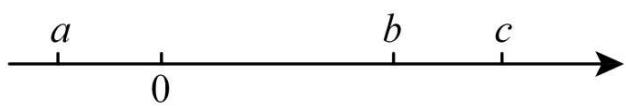

text_image

a
0
b
c

【答案】0

【分析】本题考查了有理数与数轴，整式的加减，由数轴可得 $a < b < c$ ，即得 $a - b < 0$ ， $c - a > 0$ ， $b - c < 0$ ，再根据绝对值的性质化简即可求解，由数轴判断求出 $a - b$ 、 $c - a$ 、 $b - c$ 的符号是解题的关键.

【详解】解：由数轴可得，a < b < c，

$$
\therefore a - b <   0, c - a > 0, b - c <   0,
$$

∴原式 = b-a-(c-a) + (c-b)

$$
= b - a - c + a + c - b
$$

$$
= 0,
$$

故答案为：0.

【变式 1-1】（2025 七年级上·全国·专题练习）已知 $1 < x < 2$ ，则 $|x - 3| + |x - 2|$ 的值为 \_\_\_\_.

【答案】 $5 - 2x / - 2x + 5$

【分析】本题主要考查了绝对值的性质，掌握绝对值的性质是解题的关键．根据x的取值范围，结合绝对值的性质，可得 $3-x+2-x$ ，整理得出答案.

【详解】解：∵1 < x < 2，

$$
\therefore | x - 3 | + | x - 2 | = 3 - x + 2 - x = 5 - 2 x,
$$

故答案为：5-2x.

【变式 1-2】（23-24 七年级上·辽宁大连·阶段练习）若 $|a-1|=1-a$ ，则a的取值范围是\_\_\_\_。

【答案】 $a \leq 1$

【分析】根据绝对值的性质可得 $a-1\leq0$ ，即可获得答案.

【详解】解：∵ $|a-1|=1-a$ ，

$$
\therefore a - 1 \leq 0,
$$

$$
\therefore a \leq 1.
$$

故答案为： $a \leq 1$ .

【点睛】本题主要考查了绝对值的性质，熟练掌握绝对值的性质是解题关键.

【变式 1-3】（24-25 七年级上·江苏盐城·期中）若 $a^{2}=9$ ， $|b|=7$ ，且 $|a-b|=b-a$ ，则2a-b的值为\_\_\_\_。

【答案】-1或-13

【分析】此题考查了有理数的减法，绝对值，代数式，掌握绝对值性质的逆向运用是解题的关键．由 $a^{2}=9$ ， $|b|=7$ ，可得出 $a=\pm3,b=\pm7$ ，分别代入 $|a-b|=b-a$ 中，得出满足题意a,b即可得出结果.

【详解】∵ $a^{2}=9,\quad|b|=7,$

$$
\therefore a = \pm 3, b = \pm 7,
$$

当a=3,b=7时，

$|a-b|=|3-7|=7-3=b-a$ ，满足题意，

$$
\therefore 2 a - b = 2 \times 3 - 7 = - 1,
$$

当a=3,b=-7时，

$|a-b|=|3-(-7)|=3-(-7)=a-b\neq b-a$ ，不满足题意舍去，

当a=-3,b=7时，

$|a-b|=|-3-7|=7-(-3)=b-a$ ，满足题意，

$$
\therefore 2 a - b = 2 \times (- 3) - 7 = - 1 3,
$$

当a=-3,b=-7时，

$|a-b|=|-3-(-7)|=-3-(-7)=a-b\neq b-a$ ，不满足题意舍去，

综上所述，2a-b的值为-1或-13，

故答案为：-1或-13.

# 【题型 2 几何视角看绝对值的意义】

【例 2】已知 $|m+12|=3|m-8|$ ，求m的值.

【答案】m 的值为 3 或 18

【详解】解：如图，设 A, B, P 表示的数分别为 -12, 8, m，则 $\left|m+12\right|=3\left|m-8\right|$ 的几何意义是 PA = 3PB.

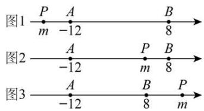

text_image

图1 P A B
m -12 8
图2 A P B
-12 m 8
图3 A B P
-12 8 m

①如图 1，当点 P 在点 A 的左侧时，PA < PB，PA = 3PB 不成立；

②如图2，当点 $P$ 在点 $A$ ， $B$ 两点之间，即 $-12\leq \mathrm{m}\leq 8$ 时， $|\mathrm{m} + 12| = \mathrm{PA} = \mathrm{m} + 12$ ， $|\mathrm{m} - 8|$ $= \mathrm{PB} = 8 - \mathrm{m},\therefore \mathrm{m} + 12 = 3(8 - \mathrm{m})$ ，解得 $\mathbf{m} = 3$

③如图3，当点 $P$ 在点 $B$ 的右侧时，即 $\mathrm{m} > 8$ 时， $|\mathrm{m} + 12| = \mathrm{PA} = \mathrm{m} + 12$ ， $|\mathrm{m} - 8| = \mathrm{PB} = \mathrm{m} - 8$ ， $\therefore \mathrm{m} + 12 = 3(\mathrm{m} - 8)$ ，解得 $\mathrm{m} = 18$ 。

综上所述，m 的值为 3 或 18.

【变式 2-1】数轴上点 A 表示的数为 -4，点 B 表示的数为 x，若 A，B 两点之间的距离为 11，求 x 的值.

【答案】x = 7或-15

【详解】解：依题意，得 $|x+4|=11$ ，∴ $x+4=11$ 或-11，∴x=7或-15.

【变式 2-2】已知 $|m-2|=10$ ，求 $|m+1|$ 的值.

【答案】 $|m + 1|$ 的值为7或1

【详解】解： $|m-2|$ 的几何意义是数轴上表示数 m 和 2 两点之间的距离.

当 m 在 2 的左侧即 m < 2 时， $|m - 2| = 2 - m = 10$ ，m = -8，此时 $|m + 1| = |-8 + 1| = 7$ ；
当 m 在 2 的右侧即 m > 2 时， $|m - 2| = m - 2 = 10$ ，m = 12，此时 $|m + 1| = |12 + 1| = 13$ ；
综上所述， $|m+1|$ 的值为 7 或 13.

【变式2-3】若 $|t + 4| + |t - 1| + |t - 8| = 12$ ，请结合数轴确定 $t$ 的取值.

【答案】 $t = 1$

【详解】解： $|t+4|+|t-1|+|t-8|=12$ 的几何意义是，数轴上表示数 t 的点到表示数 -4，1，8 这三个点的距离之和为 12，即图中 PA + PB + PC = 12，由图可知，PA + PB + PC ≥ AC = 12，只有当点 P 与点 B 重合时，PA + PB + PC = AC = 12，∴ t = 1.

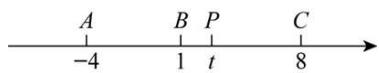

# 【题型3 绝对值的非负性】

【例 3】已知 $|x-2|+|x+y-5|+|y-1|=y-1$ ，求 y 的值.

【答案】y = 3

【详解】解：∵ $|x-2| + |x + y-5| + |y-1| = y-1$ ,

$$
\begin{array}{l} \therefore \mathrm{y} - 1 \geq 0, \quad \therefore | \mathrm{y} - 1 | = \mathrm{y} - 1, \\ \therefore | x - 2 | + | x + y - 5 | + y - 1 = y - 1, \\ \therefore | x - 2 | + | x + y - 5 | = 0, \\ \end{array}
$$

又∵ $|x-2|\geq0,\quad|x+y-5|\geq0,$

$$
\therefore \mathrm{x} - 2 = 0, \mathrm{x} + \mathrm{y} - 5 = 0,
$$

$$
\therefore \mathrm{x} = 2, \mathrm{x} + \mathrm{y} = 5, \therefore \mathrm{y} = 3.
$$

【变式 3-1】（2025 九年级下·西藏·专题练习）若 $(a+1)^{2}+|b-2024|=0$ ，则 $a^{b}$ 的值为 \_\_\_\_。

【答案】1

【分析】本题考查了绝对值的非负性，代数式求值．熟练掌握绝对值的非负性是解题的关键．由题意知 $a+1=0$ ，b-2024=0，求a，b的值，然后代入求解即可.

【详解】解： $\because(a+1)^{2}+|b-2024|=0,$

$$
\therefore a + 1 = 0, b - 2 0 2 4 = 0,
$$

解得a=-1, b=2024,

$$
\therefore (- 1) ^ {2 0 2 4} = 1,
$$

故答案为：1.

【变式 3-2】（24-25 七年级上·内蒙古巴彦淖尔·期中）若 $|x - 2|$ 与 $|y + 6|$ 互为相反数，则 $2x - y$ 的值为

【答案】10

【分析】本题考查了代数式的求值、绝对值的非负性、相反数，熟练掌握相关知识点是解题的关键．由题意得， $|x-2|+|y+6|=0$ ，利用绝对值的非负性求出x,y的值，再代入2x-y即可求值.

【详解】解：∵ $|x-2|$ 与 $|y+6|$ 互为相反数，

$$
\therefore | x - 2 | + | y + 6 | = 0,
$$

$$
\therefore x - 2 = 0, y + 6 = 0,
$$

$$
\therefore x = 2, y = - 6,
$$

$$
\therefore 2 x - y = 2 \times 2 - (- 6) = 1 0.
$$

故答案为：10.

【变式 3-3】已知 $|a-2|+|b-5|+|c-4|=c-4$ ，求 $a+b$ 的值.

【答案】 $a + b = 7$

【详解】解：∵ $|a-2| + |b-5| + |c-4| = c-4$ ,

$$
\therefore c - 4 \geq 0, \quad \therefore | c - 4 | = c - 4,
$$

$$
\therefore | a - 2 | + | b - 5 | = 0,
$$

$$
\therefore a - 2 = 0, \text {且} b - 5 = 0,
$$

$$
\therefore a = 2, b = 5,
$$

$$
\therefore a + b = 7.
$$

# 【题型4 多绝对值处理——数形结合】

【例 4】（24-25 七年级上·福建泉州·期中）阅读下面材料：

在数轴上点 A、B 分别表示数 a, b，则 A、B 两点之间的距离 AB = |a - b|，例如，当 a = 5, b = -2, AB = |5 - (-2)| = 7.

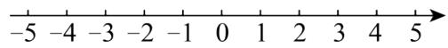

回答下列问题:

(1)①在数轴上表示-2与-6两点间的距离是\_，

②在数轴上表示 x 与 4 两点间的距离是\_；

③在数轴上表示 x 与 \_\_\_\_ 两点之间的距离为 $\left|x+2\right|$ .

(2)下面对式子 $|x+2|+|x-4|$ 进行探究:

①当表示数 x 的点在 -2 与 4 之间移动时， $|x+2|+|x-4|$ 的值总是一个固定的值为：\_\_\_\_.

②要使 $|x+2|+|x-4|=8$ ，数轴上表示的数x=\_\_\_\_。

(3)求 $|x+2|+|x+1|+|x-2|+|x-4|$ 的最小值.

【答案】(1)①4；②|x-4|；③-2

(2)①6; ②5或-3

(3)9

【分析】本题考查了绝对值的几何意义是数轴上两点之间的距离，理解绝对值的几何意义是解题的关键.

（1）直接根据题干中两点之间的距离公式计算即可；

(2) ①分析出 $|x+2|+|x-4|$ 的意义，再结合数轴可得；

②分析出 $|x+2|+|x-4|=8$ 的意义，再根据两点之间的距离为8列式计算即可；

（3）分 5 种情况去绝对值符号，计算各种不同情况的值，最后讨论得出最小值.

【详解】（1）解：①在数轴上表示-2与-6两点间的距离是 $|-2-(-6)|=4$ ;

②在数轴上表示 x 与 4 两点间的距离是 $|x-4|$ ;

③ $|x+2|=|x-(-2)|$

则在数轴上表示 x 与 -2 两点之间的距离为 $\left|x+2\right|$ ;

(2) 解: ①当表示数 $x$ 的点在 -2 与 4 之间移动时,

$|x+2|+|x-4|$ 表示数轴上x与-2的距离和与4的距离之和，

则此时 $|x+2|+|x-4|=4-(-2)=6;$

② $|x+2|+|x-4|=8$ 表示数轴上x与-2的距离和与4的距离之和为8,

则 x 的值为 $-2-\frac{8-6}{2}=-3$ 或 $4+\frac{8-6}{2}=5$ ;

（3）解： $|x+2|+|x+1|+|x-2|+|x-4|$ 表示数轴上 x 分别与 4，2，-1，-2 的距离之和， $x\geq4$ 时，原式 $=x-4+x-2+x+1+x+2=4x-3,$ 此时的最小值是 13；

$2 \leq x \leq 4$ 时，原式 $= 4 - x + x - 2 + x + 1 + x + 2 = 2x + 5$ ，此时的最小值是9；

$-1 \leq x \leq 2$ 时，原式 $= 4 - x + 2 - x + x + 1 + x + 2 = 9$ ，

$-2 \leq x \leq -1$ 时，原式 $= 4 - x + 2 - x - 1 - x + x + 2 = 7 - 2x$ ，此时的最小值是9；

$x \leq -2$ 时，原式 $= 4 - x + 2 - x - 1 - x - 2 - x = 3 - 4x$ ，此时的最小值是11，

综上： $|x+2|+|x+1|+|x-2|+|x-4|$ 的最小值为9.

【变式 4-1】如图，数轴上 4 个点表示的数分别为 a、b、c、d。若 $|a - d| = 10$ ， $|a - b| = 6$ ， $|b - d| = 2|b - c|$ ，则 $|c - d| = (\quad)$

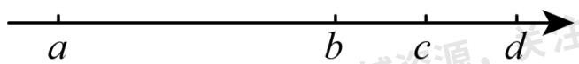

text_image

a
b
c
d

A. 1

B. 1.5

C. 2.5

D. 2

【答案】D

【分析】根据 $|a-d|=10$ ， $|a-b|=6$ 得出b和d之间的距离，从而求出b和c之间的距离，然后假设a表示的数为0，分别求出b，c，d表示的数，即可得出答案.

【详解】解：∵ $|a-d|=10$ ，

∴a 和 d 之间的距离为 10,

假设 a 表示的数为 0，则 d 表示的数为 10，

$$
\because | a - b | = 6,
$$

∴a 和 b 之间的距离为 6,

$\therefore b$ 表示的数为 6,

$$
\therefore | b - d | = 4,
$$

$$
\therefore | b - c | = 2,
$$

$\therefore c$ 表示的数为 8,

$$
\therefore | c - d | = | 8 - 1 0 | = 2,
$$

故选：D.

【点睛】本题主要考查数轴上两点间的距离、绝对值的意义，关键是要能恰当的设出 a、b、c、d 表示的数.

【变式 4-2】如图 A, B, C, D, E 分别是数轴上五个连续整数所对应的点，其中有一点是原点，数 a 对应的点在 B 与 C 之间，数 b 对应的点在 D 与 E 之间，若 $\left|a\right| + \left|b\right| = 3$ 则原点可能是 \_\_\_\_.

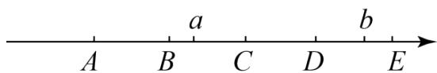

text_image

A
B
a
C
D
b
E

【答案】B 或 E

【分析】先利用数轴特点确定 a, b 的关系从而求出 a, b 的值，确定原点.

【详解】解：当为 A 为原点时， $|a|+|b|>3$ ，

当 B 为原点时， $|a|+|b|$ 可能等于 3，

当 C 为原点时， $|a|+|b|<3$ ，

当 D 为原点时， $|a|+|b|<3$ ，

当 E 为原点时， $|a|+|b|$ 可能等于 3.

故答案为：B 或 E.

【点睛】本题主要考查的是数轴与绝对值，分类讨论是解题的关键.

【变式 4-3】点A、B在数轴上分别表示有理数a、b，A、B两点之间的距离表示为AB，则在数轴上A、B两点之间的距离 $AB = |a - b|$ .

所以式子 $|x-2|$ 的几何意义是数轴上表示x的点与表示2的点之间的距离．借助于数轴回答下列问题：

①数轴上表示 2 和 5 两点之间的距离是\_\_\_\_，数轴上表示 1 和 -3 的两点之间的距离是\_\_\_\_。  
(2)数轴上表示x和-2的两点之间的距离表示为\_\_\_\_.  
(3)数轴上表示x的点到表示1的点的距离与它到表示-3的点的距离之和可表示为： $|x-1|+|x+3|$ 。则 $|x-1|+|x+3|$ 的最小值是\_\_\_\_。  
④若 $|x-3|+|x+1|=8$ ，则x=\_\_\_\_

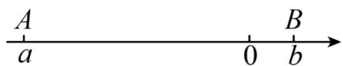

【答案】

3

4

$|x + 2|$

4

-3或5

【分析】①根据题目中公式求解即可；

②根据题目中公式求解即可;

③根据题目中公式求解即可;  
④分为三种情况讨论，第一种x<-3，第二种-3<x<1，第三种x>1，分别求解即可；  
⑤方法一：根据④求解方法，可得原方程等号左侧最小值为4，而目前值为8，因此将3和-1同时向左或

向右移动 $\frac{8 - 4}{2}$ 个单位即可；方法二：根据题意，参考④的方法，分三种情况套路即可.

【详解】① $|2-5|=3$ ，所以2和5之间的距离为3；

② $|-3-1|=4$ ，所以 -3 和 1 之间的距离为 4;  
③ $|x-(-2)|=|x+2|$ ，所以x和-2之间的距离为 $|x+2|$ ;  
④当第一种情况x<-3时，原式 $=-(x-1)-(x+3)=-2x-2$ ，无最小值

当第二种情况 $-3 \leq x \leq 1$ 时，原式 $= -(x - 1) + (x + 3) = -x + 1 + x + 3 = 4$ ，所以最小值为4

当第三种情况x>1时，原式 $=(x-1)+(x+3)=2x+2$ ，无最小值

所以原式的最小值为 4;

⑤方法一：根据④得到 $|x-3|+|x+1|$ 当-1<x<4时，最小值为4

因为 $|x-3|+|x+1|=8$ ，所以将3向右移动2个单位或-1向左移动两个单位，此时x到两点的距离和为8，此时 $x=-1-2=-3$ ，或 $x=3+2=5$

因此 x=-3 或 5

方法二：当 $x \leq -1$ 时，得 $-(x-3)-(x+1)=8$ ，解得x=-3

当 $-1 < x \leq 3$ 时，得 $-(x-3)+(x+1)=8$ ，此时无解

当x>3时，得 $(x-3)+(x+1)=8$ ，解得x=5

故原方程的解为-3 或 5

故答案为①3；②4；③ $|x+2|$ ；④4；⑤-3或5.

【点睛】本题考查了绝对值的意义，绝对值返程，熟练掌握绝对值的含义是本题的关键，绝对值的几何意义表示两点间的距离.

# 【题型5 多绝对值处理——分类讨论】

【例 5】已知a,b,c为有理数.

（1）若 $a \leq 0$ ，则 $|a| =$ \_\_\_\_；若 $b > 0$ ，则 $|b| =$ \_\_\_\_.  
（2）已知 $abc \neq 0,\quad a < 0,\quad bc > 0$ ，求 $\frac{a}{|a|} +\frac{ab}{|ab|} +\frac{ac}{|ac|} +\frac{bc}{|bc|}$ 的值.  
（3）已知 $abc \neq 0$ ，且 $a + b + c = 0$ ，求 $\frac{a}{|a|} + \frac{b}{|b|} + \frac{c}{|c|} + \frac{ab}{|ab|} + \frac{bc}{|bc|} + \frac{ac}{|ac|} + \frac{abc}{|abc|}$ 的值.

【答案】（1）-a，b；（2）2或-2；（3）-1

【分析】（1）根据绝对值的性质即可解答；

（2）根据a<0，bc>0，判断出b，c同号，再对b，c的符号进行分类讨论，利用绝对值的性质即可化简；  
（3）根据 $abc \neq 0$ ，且 $a + b + c = 0$ ，可得a，b，c可能是一正两负，或者是两正一负；进行分类讨论，利用绝对值的性质进行化简即可.

【详解】解：（1）若 $a \leq 0$ ，则 $|a| = -a$ ，

若b>0，则 $|b|=b$ ，

故答案为：-a，b；

(2) $\because a < 0,\quad bc > 0,$

∴b，c 同号，

①若a<0，b<0，c<0，则ab>0，ac>0，

$$
\therefore \frac {a}{- a} + \frac {a b}{a b} + \frac {a c}{a c} + \frac {b c}{b c} = - 1 + 1 + 1 + 1 = 2,
$$

②若a<0，b>0，c>0，则ab<0，ac<0，

$$
\therefore \frac {a}{- a} + \frac {a b}{- a b} + \frac {a c}{- a c} + \frac {b c}{b c} = - 1 - 1 - 1 + 1 = - 2,
$$

综上所述， $\frac{a}{|a|}+\frac{ab}{|ab|}+\frac{ac}{|ac|}+\frac{bc}{|bc|}$ 的值为2或-2；

(3) $\because abc \neq 0$ ，且 $a + b + c = 0$ ，

∴a，b，c 可能是一正两负，或者是两正一负；

①若 a, b, c 是一正两负，不妨设 a 为正，b, c 为负，

则 $\frac{a}{|a|} +\frac{b}{|b|} +\frac{c}{|c|} +\frac{ab}{|ab|} +\frac{bc}{|bc|} +\frac{ac}{|ac|} +\frac{abc}{|abc|}$

$$
\begin{array}{l} = \frac {a}{a} + \frac {b}{- b} + \frac {c}{- c} + \frac {a b}{- a b} + \frac {b c}{b c} + \frac {a c}{- a c} + \frac {a b c}{a b c} \\ = 1 + (- 1) + (- 1) + (- 1) + 1 + (- 1) + 1 \\ = - 1 \\ \end{array}
$$

②若 a, b, c 是两正一负，不妨设 a, b 为正，c 为负，

则 $\frac{a}{|a|} +\frac{b}{|b|} +\frac{c}{|c|} +\frac{ab}{|ab|} +\frac{bc}{|bc|} +\frac{ac}{|ac|} +\frac{abc}{|abc|}$

$$
\begin{array}{l} = \frac {a}{a} + \frac {b}{b} + \frac {c}{- c} + \frac {a b}{a b} + \frac {b c}{- b c} + \frac {a c}{- a c} + \frac {a b c}{- a b c} \\ = 1 + 1 + (- 1) + 1 + (- 1) + (- 1) + (- 1) \\ = - 1 \\ \end{array}
$$

综上所述： $\frac{a}{|a|}+\frac{b}{|b|}+\frac{c}{|c|}+\frac{ab}{|ab|}+\frac{bc}{|bc|}+\frac{ac}{|ac|}+\frac{abc}{|abc|}$ 的值为-1.

【点睛】本题主要考查了绝对值性质以及有理数的运算，解题的关键是讨论字母的符号进行分类讨论.

【变式 5-1】已知 x，y 均为整数，且 $\left|x-y\right|+\left|x-3\right|=1$ ，则 $x+y$ 的值为 \_\_\_\_.

【答案】5或7或8或4

【分析】由绝对值的非负性质可知 $|x-y|$ 和 $|x-3|$ 这两个非负整数一个为1，一个为0，即 $|x-y|=1$ ， $|x-3|=0$ 或 $|x-3|=1$ ， $|x-y|=0$ ，然后解绝对值方程组即可，.

【详解】解：因为x，y均为整数， $|x-y|+|x-3|=1$ ，

可得： $|x-y|=1,\quad|x-3|=0$ 或 $|x-3|=1,\quad|x-y|=0,$

∴当x-3=0，x-y=1，可得：x=3，y=2，则 $x+y=5$ ;

当x-3=0，x-y=-1，可得：x=3，y=4，则 $x+y=7$ ；

当x-3=1，x-y=0，可得：x=4，y=4，则 $x+y=8$ ;

当x-3=-1，x-y=0，可得：x=2，y=2，则 $x+y=4$ ，

故答案为 5 或 7 或 8 或 4.

【点睛】本题考查了绝对值性质，由非负整数和为1得出加数分别为1和0，然后分类讨论解含绝对值的方程是关键.

【变式 5-2】（24-25 七年级上·四川德阳·阶段练习）如果a, b, c为非零有理数且 $a+b+c=0$ ，那么 $\frac{a}{|a|}+\frac{b}{|b|}+\frac{c}{|c|}+\frac{abc}{|abc|}$ 的值为\_\_\_\_.

【答案】0

【分析】本题考查绝对值的意义、有理数四则混合计算，应用“分类讨论”的数学思想是关键.

根据a、b、c是非零实数，且 $a+b+c=0$ 可知a，b，c为两正一负或两负一正，按两种情况分别讨论代数式的可能的取值，再求所有可能的值即可.

【详解】解：∵a，b，c为非零有理数且 $a+b+c=0$ ，

由已知可得：a, b, c为两正一负或两负一正.

①当a, b, c为两正一负时，不妨设a、b为正，c为负： $\frac{a}{|a|}+\frac{b}{|b|}+\frac{c}{|c|}=1,\quad\frac{abc}{|abc|}=-1,$

$$
\therefore \frac {a}{| a |} + \frac {b}{| b |} + \frac {c}{| c |} + \frac {a b c}{| a b c |} = \frac {a}{a} + \frac {b}{b} + \frac {c}{- c} + \frac {a b c}{- a b c} = 1 + 1 - 1 - 1 = 0;
$$

②当a，b，c为两负一正时，不妨设a、b为负，c为正，

$$
\therefore \frac {a}{| a |} + \frac {b}{| b |} + \frac {c}{| c |} + \frac {a b c}{| a b c |} = \frac {a}{- a} + \frac {b}{- b} + \frac {c}{c} + \frac {a b c}{a b c} = - 1 - 1 + 1 + 1 = 0;
$$

综上所述， $\frac{a}{|a|}+\frac{b}{|b|}+\frac{c}{|c|}+\frac{abc}{|abc|}$ 的值为0.

故答案为：0.

【变式 5-3】（23-24 八年级上·浙江宁波·期末）若关于 x 的方程 $\left||x-2|-1\right|=a$ 有三个整数解，则 a 的值是（）

A. 0

B. 1

C. 2

D. 3

【答案】B

【分析】根据绝对值的性质可得 $|x-2|-1=\pm a$ ，然后讨论 $x\geq2$ 及x<2的情况下解的情况，再根据方程有三个整数解可得出a的值.

【详解】解：①若 $|x-2|-1=a,$

当 $x\geq2$ 时，x-2-1=a,解得： $x=a+3,\quad a\geq-1;$

当x<2时，2-x-1=a,解得：x=1-a；a>-1;

②若 $|x-2|-1=-a,$

当 $x\geq2$ 时，x-2-1=-a,解得： $x=-a+3,\quad a\leq1;$

当x<2时，2-x-1=-a,解得： $x=a+1,\quad a<1;$

又∵方程有三个整数解，

∴ 可得：a = -1 或 1，根据绝对值的非负性可得： $a \geq 0$ .

即 $a$ 只能取1.

故选：B.

【点睛】本题考查含绝对值的一元一次方程，难度较大，掌握绝对值的性质及不等式的解集的求法是关键.

# 【题型6 多绝对值处理——零点分段】

【例 6】无论x取何值， $|x-2|+|x-5|\geq a$ 都成立，则a的取值范围是\_\_\_\_。

【答案】 $a \leq 3$

【分析】分类讨论求出不同情况下 $|x-2|+|x-5|$ 的取值即可求出a的取值范围.

【详解】解：零点为5和2，

当x<2时，

$$
\vert x - 2 \vert + \vert x - 5 \vert = 2 - x + 5 - x = 7 - 2 x > 3;
$$

当 $2 \leq x < 5$ 时，

$$
\vert x - 2 \vert + \vert x - 5 \vert = x - 2 + 5 - x = 3;
$$

当x>5时，

$$
\vert x - 2 \vert + \vert x - 5 \vert = x - 2 + x - 5 = 2 x - 7 > 3;
$$

综上， $|x-2|+|x-5|\geq3$

则当a<3时， $|x-2|+|x-5|>a$ 恒成立.

故答案为： $a \leq 3$ .

【点睛】本题考查的知识点是求一元一次不等式的解集、化简绝对值、含绝对值的一元一次不等式，解题关键是对含绝对值的不等式分类讨论求解.

【变式 6-1】已知 $|x+4|+|x-2|=10$ ，求 x 的值.

【答案】x = -6 或 4

【详解】解：先找零点，令 $x+4=0,\quad x-2=0$ ，分别解得x=-4，x=2。

①当x<-4时， $-(x+4)-(x-2)=10,\quad-2x=12,\quad x=-6;$   
②当 $-4 \leq x \leq 2$ 时， $x + 4 - x + 2 = 10$ ，无解；  
③当x>2时， $x+4+x-2=10$ ，x=4。

综上所述，x = -6 或 4.

【变式 6-2】已知 $x \leq 2$ ，求 $|x - 3| - |x + 2|$ 的最大值和最小值.

【答案】最大值为5，最小值为-3

【详解】解：找到零点3，-2，结合 $x\leq2$ 可以分为以下两段进行分析：

当 $-2 \leq x \leq 2$ 时， $|x - 3| - |x + 2| = 3 - x - x - 2 = 1 - 2x$ ，有最小值-3和最大值5；

当x<-2时， $|x-3|-|x+2|=3-x+x+2=5.$

综上可得最大值为 5，最小值为 -3.

【变式 6-3】若 $|x-12|=2|x+1|+4$ ，求 x 的值.

【答案】x = -10 或 2

【详解】解：零点为12和-1，分三种情况讨论：

①当x<-1时， $-(x-12)=-2(x+1)+4$ ，解得x=-10；  
②当-1<x<12时，-(x-12)=2(x+1)+4，解得x=2；  
③当x>12时， $x-12=2(x+1)+4$ ，解得 $x=-18<12$ 不成立.

综上所述，x = -10 或 2.

# 【题型7 多绝对值之和的最小值】

【例 7】（23-24 七年级上·四川成都·期中）设 $a = |x - 3|$ ， $b = |x - 1|$ ， $c = |x + 12|$ ，则 $3a + b + c$ 的最小值

是\_\_\_\_。

【答案】17

【分析】本题考查了绝对值和数轴上两点间的距离，熟练掌握用绝对值表示数轴上两点间的距离是解题关键.

【详解】解：∵ $a = |x - 3|$ , $b = |x - 1|$ , $c = |x + 12|$

$$
\therefore 3 a + b + c = 3 | x - 3 | + | x - 1 | + | x + 1 2 |
$$

因为 $3|x-3|+|x-1|+|x+12|$ 表示x到1，-12的距离以及到3的距离的3倍之和，

所以当x=3时，它们的距离之和最小，

此时 $3a + b + c = 17$ ;

故答案为: 17.

【变式 7-1】（23-24 七年级上·浙江嘉兴·阶段练习）式子 $|x+100|+|x-2|+|x-5|$ 的最小值是\_\_\_\_.

【答案】105

【分析】利用绝对值的意义判断即可.

【详解】解：∵ $|x + 100| + |x - 2| + |x - 5|$ 表示数轴上一个动点 x 到 -100,2,5 三个点之间的距离之和，
∴ 当 x = 2 时， $|x + 100| + |x - 2| + |x - 5|$ 最小，此时最小值为 $|2 + 100| + |2 - 2| + |2 - 5|$ $=102+0+3=105$

故答案为：105.

【点睛】本题考查了绝对值的意义，熟悉几个绝对值求和的规律以及绝对值的几何意义是解题的关键.

【变式 7-2】请解答下列问题:

①当代数式 $|x+1|+|x-1|$ 取最小值时，x的取值范围是\_\_\_\_，最小值为\_\_\_\_。

②求 $|x-1|+|x-2|+|x-3|+\cdots+|x-24|$ 的最小值为\_\_\_\_.

【答案】 $-1\leq x\leq 1$ 2 144

【分析】本题主要考查了绝对值的几何应用，数轴上两点距离计算，①由题意得， $|x+1|+|x-1|$ 表示的是数轴上表示数x的点到表示数1和数-1的点的距离之和，设点A，点B，点C表示的数分别为-1，1，x，则 $|x+1|+|x-1|=AC+BC$ ，分点C在点A左侧，点C在点A和点B之间时（包括A和B），点C在点B右侧，三种情况结合数轴可得当点C在点A和点B之间时（包括A和B）， $AC+BC$ 有最小值，最小值为AB的长；则当 $-1\leq x\leq1$ 时， $|x+1|+|x-1|$ 取最小值，据此求解即可；②同①可知当 $1\leq x\leq24$ 时， $|x-1|+|x-24|$ 有最小值，当 $2\leq x\leq23$ 时， $|x-2|+|x-23|$ 有最小值，当 $3\leq x\leq22$ 时， $|x-3|+|x-22|$ 有最小值，……，当 $12\leq x\leq13$ 时， $|x-12|+|x-13|$ 有最小值，则当 $12\leq x\leq13$ 时，

$|x-1|+|x-2|+|x-3|+\cdots+|x-24|$ 有最小值，据此求解即可.

【详解】解: ①由题意得, $|x + 1| + |x - 1|$ 表示的是数轴上表示数 $x$ 的点到表示数 1 和数-1的点的距离之和,

设点 A，点 B，点 C 表示的数分别为 -1，1，x，则 $\left|x+1\right|+\left|x-1\right|=AC+BC$ ，

当点 C 在点 A 左侧时， $AC + BC = 2AC + AB > AB;$

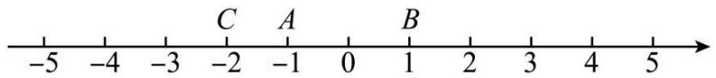

text_image

-5
-4
-3
C
A
-2
-1
0
B
1
2
3
4
5

当点 C 在点 A 和点 B 之间时（包括 A 和 B），则 $AC + BC = AB$ ;

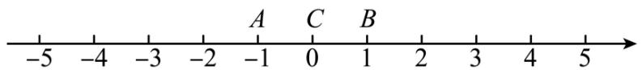

text_image

-5 -4 -3 -2 -1 0 1 2 3 4 5
A C B

当点 C 在点 B 右侧时，则 $AC + BC = AB + 2BC > AB$ ;

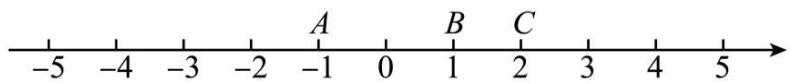

text_image

-5 -4 -3 -2 -1 0 1 2 3 4 5
A B C

综上所述，当点 C 在点 A 和点 B 之间时（包括 A 和 B）， $AC + BC$ 有最小值，最小值为 AB 的长；

∴当 $-1 \leq x \leq 1$ 时， $|x + 1| + |x - 1|$ 取最小值，最小值为 $1 - (-1) = 2$ ，

故答案为： $-1 \leq x \leq 1$ ; 2;

②同①可知当 $1 \leq x \leq 24$ 时， $|x-1| + |x-24|$ 有最小值，

当 $2 \leq x \leq 23$ 时， $|x-2| + |x-23|$ 有最小值，

当 $3 \leq x \leq 22$ 时， $|x-3| + |x-22|$ 有最小值，

……，

当 $12 \leq x \leq 13$ 时， $|x-12| + |x-13|$ 有最小值，

综上所述，当 $12 \leq x \leq 13$ 时， $|x-1| + |x-24|$ ， $|x-2| + |x-23|$ ， $|x-3| + |x-22|$ ，…， $|x-12| + |x-13|$ 能同时取得最小值，即当 $12 \leq x \leq 13$ 时， $|x-1| + |x-2| + |x-3| + \cdots + |x-24|$ 有最小值，最小值为

$$
2 4 - 1 + 2 3 - 2 + 2 2 - 3 + 2 1 - 4 + \dots + 1 3 - 1 2 = 1 4 4,
$$

故答案为：144.

【变式 7-3】（24-25 七年级上·湖北武汉·期中）设有理数 a, b, c，满足 a < 0, c > 0，且 $|a| < |b| < |c|$ ，则 $\frac{2}{3}|x + a| + \frac{2}{3}|x - b| + |x + c|$ 的最小值为 \_\_\_\_.

【答案】 $\frac{2b-a+3c}{3}$ 或 $\frac{b-2a+3c}{3}$

【分析】本题考查了绝对值的性质、整式的加减，根据题意将b分成b>0时，即-c<0<-a<b；b<0时，即-c<b<0<-a，根据绝对值的性质及几何意义进行化简，即可求解；理解绝对值的几何意义，能进行

分类进行讨论是解题的关键.

【详解】解：∵ $|a|<|b|<|c|$ ，a<0，c>0，

故当b>0时，a<0<b<c，即-c<0<-a<b，

$$
\because \frac {2}{3} | x + a | + \frac {2}{3} | x - b | + | x + c |
$$

$$
= \frac {2}{3} \left[ | x - (- a) | + | x - b | + | x - (- c) | \right] + \frac {1}{3} | x - (- c) |,
$$

∴当x=-a时，

$|x-(-a)|+|x-b|+|x-(-c)|$ 的最小值为b到-c之间的距离，

$|x-(-c)|$ 为-a到-c之间的距离，

$\therefore \frac{2}{3} [|x - (-a)| + |x - b| + |x - (-c)|] + \frac{1}{3} |x - (-c)|$ 的最小值为

$$
\begin{array}{l} \frac {2}{3} [ b - (- c) ] + \frac {1}{3} [ - a - (- c) ] \\ = \frac {2 b + 2 c}{3} + \frac {- a + c}{3} \\ = \frac {2 b - a + 3 c}{3}; \\ \end{array}
$$

当b<0时，b<a<0<c，

即-c<b<0<-a,

$$
\because \frac {2}{3} | x + a | + \frac {2}{3} | x - b | + | x + c |
$$

$$
= \frac {2}{3} [ | x - (- a) | + | x - b | + | x - (- c) | ] + \frac {1}{3} | x - (- c) |;
$$

∴当x=b时，

$|x-(-a)|+|x-b|+|x-(-c)|$ 的最小值为-a到-c之间的距离，

$|x-(-c)|$ 为b到-c之间的距离，

$\therefore \frac{2}{3} [|x - (-a)| + |x - b| + |x - (-c)|] + \frac{1}{3} |x - (-c)|$ 的最小值为 $\frac{2}{3} [-a - (-c)] + \frac{1}{3}[b - (-c)]$

$$
\begin{array}{l} = \frac {- 2 a + 2 c}{3} + \frac {b + c}{3} \\ = \frac {b - 2 a + 3 c}{3}, \\ \end{array}
$$

故答案为： $\frac{2b-a+3c}{3}$ 或 $\frac{b-2a+3c}{3}$ .

# 【题型8 多绝对值之差的最大值】

【例 8】（22-23 七年级上·四川成都·期中）若 $\left|x+1\right|+\left|x-1\right|$ 的最小值记为 n， $\left|-x-1\right|-\left|x-1\right|$ 的最大值记为

m，则 $-n^{m}=$ \_\_\_\_.

【答案】-4

【分析】本题考查了绝对值的化简，整式的加减，首先找到驻点，确定 $x$ 的取值范围，分类讨论确定 $n$ 和 $m$ 的值，再计算 $-n^{m}$ 的值，运用分类讨论是解题的关键.

【详解】解：∵当 $x\leq-1$ 时， $|x+1|+|x-1|=-x-1-x+1=-2x\geq2$

当-1<x<1时， $|x+1|+|x-1|=x+1+1-x=2$

当 $x \geq 1$ 时， $|x + 1| + |x - 1| = x + 1 + (x - 1) = 2x \geq 2$

$$
\therefore n = 2,
$$

∵当 $x\leq-1$ 时， $|-x-1|-|x-1|=-x-1-(1-x)=-2;$

当-1<x<1时， $|-x-1|-|x-1|=x+1-(1-x)=2x,\quad-2<2x<2;$

当x>1时， $|-x-1|-|x-1|=x+1-(x-1)=2,$

$$
\therefore m = 2,
$$

$$
\therefore - n ^ {m} = - 2 ^ {2} = - 4,
$$

故答案为：-4.

【变式 8-1】（24-25 七年级上·安徽六安·期中）若点A、B在数轴上分别表示有理数a、b，则A、B两点之间的距离表示为 $AB = |a - b|$

（1）若 $|x-3|=2$ ，这样的数x为；  
（2）结合数轴探究：存在 x 的值，使式子 $\left|x+1\right|-\left|x-5\right|$ 有最大值，这个最大值是 \_\_\_\_.

【答案】 5或1 6

【分析】本题主要考查了绝对值的定义，数轴上两点间的距离等知识，

(1) 根据数轴上两点之间的距离公式计算即可;

(2) 分 $x < -1$ 、 $-1 \leq x \leq 5$ 、 $x > 5$ 分别化简, 结合 $x$ 的取值范围确定代数式值的范围, 从而求出代数式的最大值;

熟练掌握绝对值的定义是解决此题的关键.

【详解】（1）由绝对值的几何意义知： $|x-3|=2$ 表示在数轴上 x 表示的点到 3 的距离等于 2，

$$
\therefore x = 3 + 2 = 5 \text {, 或} x = 3 - 2 = 1,
$$

∴x=5或1:

故答案为：5或1:

（2）当 $x < -1$ 时，即表求 $x$ 的点在-1的左侧时， $|x + 1| - |x - 5| = -x - 1 - (5 - x) = -x - 1 - 5 + x = -6$ 当 $-1 \leq x \leq 5$ 时，即表求x的点在-1和5之间时 $|x + 1| - |x - 5| = x + 1 - (5 - x) = x + 1 - 5 + x = 2x - 4,$ $\therefore -6 \leq 2x - 4 \leq 6,$

当x>5时，即表求x的点在5的右侧时 $|x+1|-|x-5|=x+1-(x-5)=x+1+5-x=6$ ，

$\therefore|x+1|-|x-5|$ 的最大值为6,

故答案为：6.

【变式 8-2】（22-23 七年级上·浙江宁波·期中） $|x-2|-|x-5|$ 的最大值为 \_\_\_\_.

【答案】3

【分析】分当x<2、 $2\leq x\leq5$ 以及x>5时三种情况讨论．进而得出答案.

【详解】解：当x<2时， $|x-2|-|x-5|=2-x-(5-x)=2-x+x-5=-3;$

当 $2 \leq x \leq 5$ 时， $|x-2|-|x-5|=x-2-(5-x)=x-2+x-5=2x-7 \leq 3;$

当x>5时， $|x-2|-|x-5|=x-2-(x-5)=x-2+5-x=3;$

$\therefore|x-2|-|x-5|$ 的最大值为3，

故答案为：3.

【点睛】此题主要考查了非负数的性质，正确利用绝对值的性质是解题关键.

【变式 8-3】（24-25 七年级上·江苏无锡·阶段练习）当式子 $|x-3|-|x+5|$ 取得最大值时，x 的最大整数值是\_\_\_\_.

【答案】-5

【分析】本题主要考查了绝对值的几何意义，数轴上两点距离计算，根据绝对值的几何意义可得 $|x-3|$ 表示的是数轴上表示x的数与表示3的数的距离， $|x+5|$ 表示的是数轴上表示x的数与表示-5的数的距离，据此讨论x的位置，确定取得最大值的情形即可得到答案.

【详解】解：由绝对值的几何意义可知， $|x-3|$ 表示的是数轴上表示 x 的数与表示 3 的数的距离， $|x+5|$ 表示的是数轴上表示 x 的数与表示 -5 的数的距离，

当 x 在 -5 左边（包含 -5）时， $|x-3|-|x+5|$ 的值即为 -5 到 3 的距离，即为 $3-(-5)=8$ ，

当 x 在 3 的右边（包含 3）时， $|x-3|-|x+5|$ 的值即为 -8，

当 x 在 -5 和 3 之间时， $|x-3|-|x+5|$ 的值一定小于 8，

综上所述，当 $x \leq -5$ 时， $|x-3|-|x+5|$ 取得最大值，此时x的最大值为-5，

故答案为：-5.

# 【题型9 绝对值和差的最值】

【例 9】（22-23 七年级上·浙江温州·阶段练习）式子 $|x-1|+2|x-2|+3|x-3|+2|x-4|+|x-5|$ 的最小值

是\_\_\_\_。

【答案】8

【分析】本题主要考查了绝对值．熟练掌握绝对值的化简，分类讨论，是解决问题的关键.

解法一：分 $x \leq 1, 1 \leq x \leq 2, 2 \leq x \leq 3, 3 \leq x \leq 4, 4 \leq x \leq 5, x \geq 5$ 讨论，求出各股的最小值，再比较即得；

解法二：由绝对值的几何意义可知当 $1 \leq x \leq 5$ 时， $|x-1| + |x-5|$ 有最小值，同理可知当 $2 \leq x \leq 4$ 时，

$|x-2|+|x-4|$ 有最小值，当x=3时， $|x-3|$ 有最小值，最小值为0，则当x=3时， $|x-1|+|x-5|$ ， $|x-2|+|x-4|$ ， $|x-3|$ 能同时取到最小值，进而可得当x=3时， $|x-1|+2|x-2|+3|x-3|+2|x-4|+|x-5|$ 有最小值，据此求解即可.

【详解】解法一：设 $|x-1|+2|x-2|+3|x-3|+2|x-4|+|x-5|=y$

当 $x \leq 1$ 时， $y = -(x-1)-2(x-2)-3(x-3)-2(x-4)-(x-5)$

$$
\begin{array}{l} = - x + 1 - 2 x + 4 - 3 x + 9 - 2 x + 8 - x + 5 \\ = - 9 x + 2 7, \\ \end{array}
$$

$\therefore y \geq 18$ ，最小值为：18；

当 $1 \leq x \leq 2$ 时，

$$
\begin{array}{l} y = (x - 1) - 2 (x - 2) - 3 (x - 3) - 2 (x - 4) - (x - 5) \\ = x - 1 - 2 x + 4 - 3 x + 9 - 2 x + 8 - x + 5 \\ = - 7 x + 2 5, \\ \end{array}
$$

$\therefore11\leq y\leq18$ ，最小值为：11；

当 $2 \leq x \leq 3$ 时，

$$
\begin{array}{l} y = (x - 1) + 2 (x - 2) - 3 (x - 3) - 2 (x - 4) - (x - 5) \\ = x - 1 + 2 x - 4 - 3 x + 9 - 2 x + 8 - x + 5 \\ = - 3 x + 1 7, \\ \end{array}
$$

$\therefore8\leq y\leq11$ ，最小值为：8；

当 $3 \leq x \leq 4$ 时，

$$
\begin{array}{l} y = (x - 1) + 2 (x - 2) + 3 (x - 3) - 2 (x - 4) - (x - 5) \\ = x - 1 + 2 x - 4 + 3 x - 9 - 2 x + 8 - x + 5 \\ = 3 x - 1, \\ \end{array}
$$

$\therefore8\leq y\leq11$ ，最小值为：8;

当 $4 \leq x \leq 5$ 时，

$$
\begin{array}{l} y = (x - 1) + 2 (x - 2) + 3 (x - 3) + 2 (x - 4) - (x - 5) \\ = x - 1 + 2 x - 4 + 3 x - 9 + 2 x - 8 - x + 5 \\ = 7 x - 1 7, \\ \end{array}
$$

∴11 ≤ y ≤ 18，最小值为：11；

当 $x \geq 5$ 时，

$$
\begin{array}{l} y = (x - 1) + 2 (x - 2) + 3 (x - 3) + 2 (x - 4) + (x - 5) \\ = x - 1 + 2 x - 4 + 3 x - 9 + 2 x - 8 + x - 5 \\ = 9 x - 2 7, \\ \end{array}
$$

$\therefore y \geq 18$ ，最小值为：18.

综上，原式的最小值为：8.

解法二：由绝对值的几何意义可知， $|x-1|+|x-5|$ 表示的是数轴上表示 x 的数到表示 1 和 5 的数的距离之和，

∴当 $1 \leq x \leq 5$ 时， $|x-1| + |x-5|$ 有最小值，最小值为 $x-1 + 5 - x = 4$ ，

同理可知当 $2 \leq x \leq 4$ 时， $|x-2| + |x-4|$ 有最小值，最小值为 $x-2+4-x=2$ ，

$$
\because | x - 3 | \geq 0,
$$

∴当x=3时， $|x-3|$ 有最小值，最小值为0，

综上所述，当x=3时， $|x-1|+|x-5|$ ， $|x-2|+|x-4|$ ， $|x-3|$ 能同时取到最小值，

$$
\because | x - 1 | + 2 | x - 2 | + 3 | x - 3 | + 2 | x - 4 | + | x - 5 |
$$

$$
= (| x - 1 | + | x - 5 |) + 2 (| x - 2 | + | x - 4 |) + 3 | x - 3 |,
$$

∴当x=3时， $|x-1|+2|x-2|+3|x-3|+2|x-4|+|x-5|$ 有最小值，最小值为 $4+2\times2+0=8$ ;

故答案为：8.

【变式 9-1】求 $|x-1|-|x-2|+|x-3|-|x-4|$ 的最大值,并写出此时x的取值范围

【答案】2

【详解】解： $|x-1|-|x-2|+|x-3|-|x-4|$ 表示 x 到 1 的距离与 x 到 2 的距离的差与 x 到 3 的距离与 x 到 4 的距离的差的和，

故 $x \geq 4$ 时有最大值 $1 + 1 = 2$ .

【变式 9-2】（22-23 九年级下·福建南平·自主招生）已知 $-\frac{1}{2} \leq x \leq \frac{3}{2}$ ；，则 $|2x + 1| - |x - 1| + 3|x| - |x - 2|$ 的

最大值为\_\_\_\_。

【答案】 $\frac{15}{2}$

【分析】分 $-\frac{1}{2}\leq x<0,0\leq x<1,1\leq x\leq\frac{3}{2}$ 三种情况进行讨论，求解即可.

【详解】解：①当 $-\frac{1}{2}\leq x<0$ 时： $|2x+1|-|x-1|+3|x|-|x-2|=2x+1-1+x-3x-2+x=x-2,\quad-\frac{5}{2}$ $\leq x-2<-2;$

②当 $0 \leq x < 1$ 时： $|2x + 1| - |x - 1| + 3|x| - |x - 2| = 2x + 1 - 1 + x + 3x - 2 + x = 7x - 2, -2 \leq 7x - 2 < 5;$   
③当 $1 \leq x \leq \frac{3}{2}$ 时： $|2x + 1| - |x - 1| + 3|x| - |x - 2| = 2x + 1 - x + 1 + 3x - 2 + x = 5x,$

$$
5 \leq 5 x \leq \frac {1 5}{2};
$$

∴当 $x=\frac{3}{2}$ 时， $|2x+1|-|x-1|+3|x|-|x-2|$ 有最大值 $\frac{15}{2}$ ;

故答案为： $\frac{15}{2}$ .

【点睛】本题考查化简绝对值．解题的关键是利用分类讨论的思想，化简绝对值.

【变式 9-3】（24-25 七年级上·北京·期中）1．已知，有理数a、b、c在数轴上的位置如图所示，

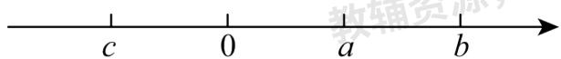

text_image

c
0
a
b

（1）化简： $|3a+b|-|c-2a|+|c+2b|=$ \_\_\_\_；  
（2）若a,c两数的倒数是他们自身，当x的范围是\_\_\_\_时， $|x-a|+|x-c|$ 有最小值，最小值为\_\_\_\_。  
（3）在（2）的条件下，若未知数x、y满足 $\left(|x-a|+|x-3|\right)\left(|y-2|+|y-c|\right)=6$ ，则 $x+2y$ 的最大值是\_\_\_\_.

【答案】

$$
a + 3 b + 2 c
$$

$$
- 1 \leq x \leq 1
$$

$$
\begin{array}{c c} 2 & 7 \end{array}
$$

【分析】本题考查化简绝对值，两点间的距离，整式的加减运算，根据数轴判断数的大小，式子的符号，掌握绝对值的意义，是解题的关键.

【详解】解：（1）由图可知：c < 0 < a < b， $|c| < b$ ，

$$
\therefore 3 a + b > 0, c - 2 a <   0, c + 2 b > 0,
$$

∴原式 = 3a + b - 2a + c + c + 2b = a + 3b + 2c;

故答案为： $a + 3b + 2c;$

(2) $\because a,c$ 两数的倒数是他们自身，

$$
\therefore a = 1, c = - 1,
$$

∵ $|x-a|+|x-c|=|x-1|+|x-(-1)|$ 表示数轴上表示x的数到表示1和-1的数的距离和，

∴当 $-1 \leq x \leq 1$ 时， $|x-a| + |x-c|$ 有最小值为： $1-(-1) = 2$ ;

故答案为： $-1 \leq x \leq 1; 2;$

（3）由（2）知：当 $1 \leq x \leq 3$ 时， $|x - a| + |x - 3|$ 有最小值为 $3 - 1 = 2$

当 $-1 \leq y \leq 2$ 时， $|y - 2| + |y - c|$ 有最小值为 $2 - (-1) = 3$

$$
\because (| x - a | + | x - 3 |) (| y - 2 | + | y - c |) = 6,
$$

$$
\therefore | x - a | + | x - 3 | = 2, \quad | y - 2 | + | y - c | = 3,
$$

∴x的最大值为3，y的最大值为2，

∴ $x+2y$ 的最大值为： $3+2\times2=7$ ;

故答案为：7.

# 【题型 10 利用隐最值求最值】

【例 10】（24-25 七年级上·陕西西安·阶段练习）若： $|a-2|+|a+3|+|b-1|+|b+2|=8$ ，则 $a+b$ 的最小值是 \_\_\_\_

【答案】-5

【分析】本题考查了绝对值的意义，根据 $|a-2|+|a+3|$ 的最小值为5， $|b-1|+|b+2|$ 的最小值为3，结合数轴求得a,b的最小值，即可求解.

【详解】解： $\because |a - 2| + |a + 3|$ 的最小值为5， $|b - 1| + |b + 2|$ 的最小值为3，当 $-3 \leq a \leq 2, -2 \leq b \leq 1$ 时，等式 $|a - 2| + |a + 3| + |b - 1| + |b + 2| = 8$ ，成立，

$\therefore a$ 的最小值为-3， $b$ 的最小值为-2

$\therefore a + b$ 的最小值是-3-2=-5

故答案为：-5.

【变式 10-1】（23-24 七年级上·浙江绍兴·阶段练习）已知 a、b 为整数， $|a + 2023| - |b - 2| = 0$ ，且 b < a，则 a 的最小值为 \_\_\_\_.

【答案】-1010

【分析】本题主要考查了绝对值的意义，以及表示出数轴上两个有理数数的中点，根据 $|a+2023|=|b-2|$ ，可知a到-2023的距离和b到2的距离相等。即b和a分别是位于-2023和2这两个点中点的两侧相邻的整数。先求出-2023和2的中点，再利用b<a即可得出a的值。

【详解】解：∵ $|a+2023|-|b-2|=0$

$$
\therefore | a + 2 0 2 3 | = | b - 2 |
$$

-2023和2的中点 $= (-2023 + 2)\div 2 = -1010.5$

又∵b<a，a、b为整数，

$\therefore b$ 为 -1011，a 的最小值为 -1010.

故答案为：-1010.

【变式 10-2】我们知道，|x|表示 x 在数轴上对应的点到原点的距离，我们可以把看作 |x-0|，所以，|x-3| 就表示 x 在数轴上对应的点到 3 的距离， $|x+1|=|x-(-1)|$ 就表示 x 在数轴上对应的点到 -1 的距离，由上面绝对值的几意义，解答下列问题：

(1) 当 $|x-4|+|x+2|$ 有最小值时，x 的取值情况是 \_\_\_\_；  
(2) $|x-3|+|x+2|+|x+6|$ 的最小值是\_\_\_\_;  
(3) 已知 $\left|x-1\right|+\left|x+2\right|+\left|y-3\right|+\left|y+4\right|=10$ 求 $2x+y$ 的最大值和最小值.

【答案】（1） $-2 \leq x \leq 4$ ; （2）9；（3） $2x + y$ 的最小值是-8，最大值是5.

【分析】（1）由题意可得 $|x-4|+|x+2|$ 表示x到-2、4两点距离之和，所以当 $-2\leq x\leq4$ 时， $|x-4|+|x+2|$ 取得最小值，由此即可解答；（2）由题意可得 $|x-3|+|x+2|+|x+6|$ 表示x到-6、-2、3的距离之和，即可得当x=-2时， $|x-3|+|x+2|+|x+6|$ 取得最小值，最小值为9；（3）由题意可知

$|x-1|+|x+2|+|y-3|+|y+4|$ 表示x到-2、1的距离之和，与y到-4、3的距离之和的和，再由

$|x-1|+|x+2|+|y-3|+|y+4|=10$ 可得 $-2 \leq x \leq 1$ 且 $-4 \leq y \leq 3$ ，由此即可求得 $2x+y$ 的最大值及最小值.

【详解】（1）∵ $|x-4|+|x+2|$ 表示x到-2、4两点距离之和，

∴当 $-2\leq x\leq4$ 时， $|x-4|+|x+2|$ 取得最小值，最小值是-2到4的距离，也就是6；

故答案为 $-2 \leq x \leq 4;$

(2)∵ $\left|x-3\right|+\left|x+2\right|+\left|x+6\right|$ 表示 x 到 -6、-2、3 的距离之和，

∴当x=-2时， $|x-3|+|x+2|+|x+6|$ 取得最小值9；

故答案为 9;

（3）∵ $|x-1|+|x+2|+|y-3|+|y+4|$ 表示x到-2、1的距离之和，与y到-4、3的距离之和的和，
又∵ $|x-1|+|x+2|+|y-3|+|y+4|=10$ ,

$\therefore -2 \leq x \leq 1$ 且 $-4 \leq y \leq 3,$

∴当x = -2且y = -4时， $2x + y$ 取得最小值是-8；

当x=1且y=3时， $2x+y$ 取得最大值是5.

【点睛】本题考查了数轴上两点间的距离及绝对值的性质，熟练运用数轴上两点间的距离公式及绝对值的性质是解决问题的关键.

【变式 10-3】（23-24 九年级下·浙江温州·自主招生）已知 $|x+2|+|x-1|=8-|y-4|-|y+1|$ ，则2x-3y的最小值为\_\_\_\_。

【答案】-16

【分析】根据绝对值的意义得出 $|x+2|+|x-1|$ 最小值为3， $|y-4|+|y+1|$ 的最小值为5，根据题意可得当x=-2,y=4时，x取得最小值，y取最大值，进而代入代数式，即可求解.

【详解】解：∵ $|x+2|+|x-1|=8-|y-4|-|y+1|$ ,

$$
\therefore | x + 2 | + | y - 4 | + | x - 1 | + | y + 1 | = 8,
$$

∵要使2x-3y的最小，

∴x取最小值，y取最大值，

∴当 $-2\leq x\leq1$ 时， $|x+2|+|x-1|$ 最小值为3，x最小为-2

当 $-1 \leq y \leq 4$ 时， $|y-4| + |y+1|$ 的最小值为5，y最大为4

∴2x-3y的最小值为 $2 \times (-2)-3 \times 4 = -16$

故答案为：-16.