# 专题 1.1 丰富的图形世界（举一反三讲义）

【北师大版 2024】

# 题型归纳

【题型 1 几何体及其构成】....2

【题型 2 几何体中的点、棱、面】....3

【题型3 点、线、面、体间的关系】....3

【题型4 几何体的展开图】....4

【题型5 正方体的展开图】 5

【题型 6 截一个几何体】....6

【题型 7 从不同方向看几何体】....7

【题型 8 由从不同方向看到的图形确定几何体】....8

# 举一反三 教辅资源，关注公众号★全科AA+

# 知识点 1 立体图形的相关概念

1. 定义：有些几何图形（如长方体、正方体、圆柱、圆锥、棱柱、棱锥、球等）的各部分不都在同一个平面内，这就是立体图形。

立体图形除了按照柱体、锥体、球分类, 也可以按照围成几何体的面是否有曲面划分: ①有曲面: 圆柱、圆锥、球等; ②没有曲面: 棱柱、棱锥等.

2.棱柱的有关概念及其特征:

①在棱柱中, 相邻两个面的交线叫做棱, 相邻两个侧面的交线叫做侧棱, 棱柱所有侧棱长都相等, 棱柱的上下底面的形状、大小相同, 并且都是多边形; 棱柱的侧面形状都是平行四边形.  
(2)棱柱的顶点数、棱数和面数之间的关系: 底面多边形的边数 $n$ 确定该棱柱是 $\underline{n}$ 棱柱, 它有 $2 \underline{n}$ 个顶点, $3 \underline{n}$ 条棱, $\underline{n}$ 条侧棱, 有 $\underline{n+2}$ 个面, $\underline{n}$ 个侧面.

# 知识点 2 点、线、面、体的关系

定义: ①体与体相交成面, 面与面相交成线, 线与线相交成点.  
②点动成线，线动成面，面动成体.   
③点、线、面、体组成几何图形，点、线、面、体的运动组成了多姿多彩的图形世界.

# 知识点 3 正方体的展开图

定义: 正方体是特殊的棱柱, 它的六个面都是大小相同的正方形, 将一个正方体的表面展开, 可以得到 11 种不同的展开图, 把它归为四类: 一四一型有 6 种; 二三一型有 3 种; 三三型有 1 种; 二二二型有一种.

# 拓展：

正方体展开图口诀:

①一线不过四;田凹应弃之;   
②找相对面：相间，“Z”端是对面；  
③找邻面：间二，拐角邻面知.

# 知识点4 截面

定义：用一个平面去截一个几何体，截出的面叫做截面.

# 【题型1 几何体及其构成】

【例 1】（24-25 七年级上·宁夏银川·阶段练习）将下图中的立体图形分类.

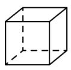  
①

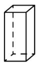  
②

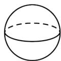  
③

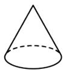  
④

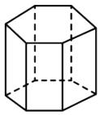  
⑤

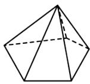  
⑥

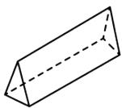  
⑦

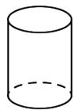  
⑧

柱体\_\_\_\_；锥体\_\_\_\_；球体\_\_\_\_。

【变式 1-1】（24-25 七年级上·福建漳州·期末）谜语是我国民间文学的一种特殊形式，古时称“度辞 (SōuCi)”或“隐语”。谜语：“正看三条边；侧看三条边；上看圆圈圈，就是没直边。”\_\_\_\_。（打一几何体）

【变式 1-2】（24-25 七年级上·广东深圳·期中）如图，模块①由 15 个棱长为 1 的小正方体构成，模块② - ⑥ 均由 4 个棱长为 1 的小正方体构成。现在从模块② - ⑥ 中选出三个模块放到模块①上，与模块①组成一个棱长为 3 的大正方体。下列四个方案中，符合上述要求的是（）

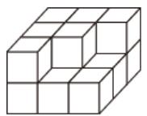  
模块①

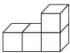  
模块②

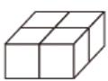  
模块③

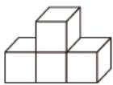  
模块④

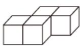  
模块⑤

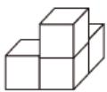  
模块⑥

A. 模块②，④，⑤ B. 模块③，④，⑥

C. 模块②，③，⑥ D. 模块③，

⑤，⑥

【变式 1-3】（24-25 七年级·福建漳州·期末）如图，指出图中物体分别是由哪些几何体组成的.

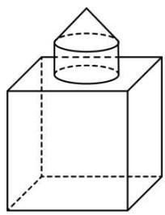

natural_image

Simple line drawing of a cube with a cone placed on top, no text or symbols present

①

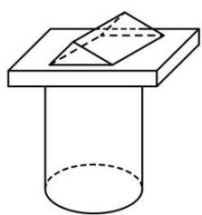

natural_image

Simple line drawing of a cylinder with a rectangular base and a triangular cutout on top (no text or symbols)

②

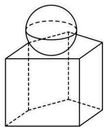

natural_image

Simple line drawing of a sphere resting on a cube, no text or symbols present

③

【题型 2 几何体中的点、棱、面】教辅资源，关注公众号★全科AA+

【例 2】（24-25 七年级上·山西晋中·期中）小华新买了一个如图所示的笔筒，下列关于这个笔筒的描述错误的是（）

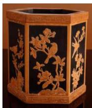

natural_image

Decorative box with floral and bird motifs in gold on black background (no text or symbols)

A. 笔简可以近似的看成六棱柱

B. 它的所有侧棱长都相等

C. 它有 10 个顶点

D. 侧面的形状都是长方形

【变式 2-1】（24-25 六年级上·山东威海·期中）一个棱柱有10个面，且所有的侧棱长的和为64cm，底面边长都为3cm，它的侧面积是\_\_\_\_cm².

【变式 2-2】（24-25 六年级上·山东淄博·期中）一个 n 棱柱共有 15 条棱，则这个棱柱共有 \_\_\_\_ 个面.

【变式 2-3】（24-25 七年级上·河北石家庄·期中）如图，从一个棱长为4cm的正方体的一顶点处挖去一个棱长为1cm的正方体，则第二个几何体有（）个面.

natural_image

Diagram showing a cube transforming into a 3D cube with an arrow indicating transformation (no text or symbols)

A. 6   
B. 7   
C. 8   
D. 9

【题型3 点、线、面、体间的关系】

【例 3】（24-25 七年级上·广东深圳·期中）直升飞机螺旋桨一般由 4 片桨叶组成，直升飞机起飞时，螺旋桨旋转时向下推动空气，即向下施加一个作用力，直升飞机获得竖直向上的力，使得飞机能悬浮在空中．若把螺旋桨看作一条线段，旋转形成的痕迹体现了（）

A. 面动成体

B. 线动成面

C. 点动成线

D. 面面相交成线

【变式 3-1】（24-25 七年级上·贵州贵阳·期中）笔尖在纸上快速滑动写出了一个字母 w，用数学知识解释

为\_\_\_\_。

【变式 3-2】（24-25 九年级上·广西南宁·期中）如图下面的图形绕直线 l 旋转一周后得到的立体图形是（）

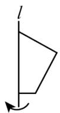

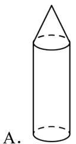

B.   
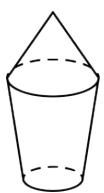

C.   
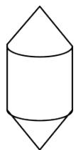

D.   
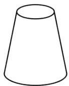

【变式 3-3】（24-25 七年级上·河南郑州·期中）如图，某酒店大堂的旋转门内部由四块宽 2m、高 3m 的长方形玻璃隔板组成.

(1)每扇旋转门旋转一周，能形成的几何体是 \_\_\_\_，这体现了 \_\_\_\_ 动成体；   
(2)求每扇旋转门旋转一周形成的几何体的体积（结果保留 $\pi$ ）.

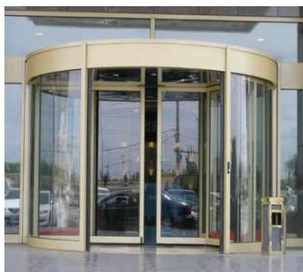

natural_image

Exterior view of a modern building entrance with glass doors and a curved golden facade (no signage or text visible)

# 【题型4 几何体的展开图】

【例 4】（24-25 七年级上·河南郑州·阶段练习）下面的图形经过折叠可以围成的几何体名称是\_\_\_\_。

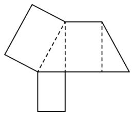

natural_image

Geometric diagram of a 3D shape composed of triangles and rectangles, with dashed lines indicating hidden edges (no text or symbols)

【变式 4-1】（24-25 七年级上·贵州贵阳·期中）可以围成一个棱柱的是（）.

A.

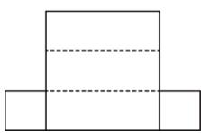

B.

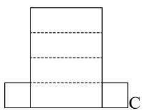

natural_image

Simple geometric diagram with three rectangles and dashed lines, no text or symbols present

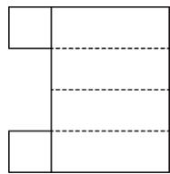

D.

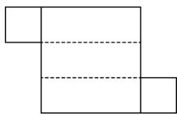

natural_image

Pure geometric shape composed of rectangles and dashed lines, no text or symbols present

【变式 4-2】（24-25 七年级下·山东临沂·期中）如图是一个直三棱柱的展开图，其中三个面被标示为甲、乙、

丙．将此展开图折成直三棱柱后，判断下列叙述正确的是（）

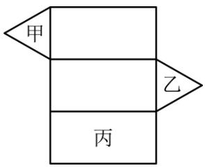

text_image

甲
乙
丙

A. 甲与乙平行，甲与丙垂直

B. 甲与乙平行，甲与丙平行

C. 甲与乙垂直，甲与丙垂直

D. 甲与乙垂直，甲与丙平行

【变式 4-3】（24-25 七年级上·宁夏中卫·期中）如图是一个底面为正方形的四棱柱的展开图，图上的数字代表棱柱各条棱的长度（单位：cm），则该棱柱的表面积是\_\_\_\_cm².

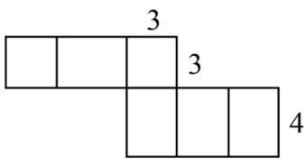

text_image

3
3
4

【题型 5 正方体的展开图】 教辅资源，关注公众号★全科AA+

【例 5】（24-25 七年级上·河南郑州·阶段练习）下图中，经过折叠能围成如图所示的几何体的是（）

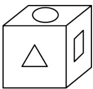

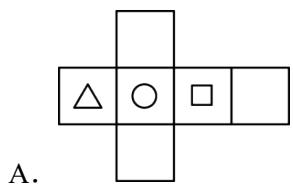

text_image

A.

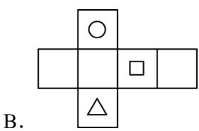

text_image

B.

text_image

C.

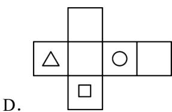

text_image

D.

【变式 5-1】（24-25 七年级上·四川成都·期中）一个正方体盒子的展开图如图所示．如果要把它粘成一个正方体，那么与点F重合的点是\_\_\_\_.

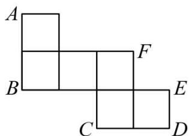

text_image

A
B
C
D
E
F

【变式 5-2】（24-25 七年级上·广东深圳·期中）如图的四个平面图形中，不是正方体的展开图的是（）

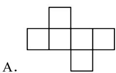

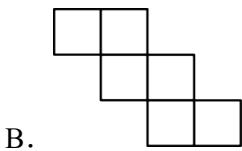

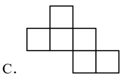

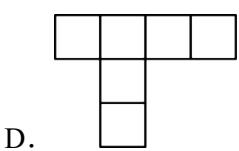

【变式 5-3】（24-25 七年级上·山西晋中·期中）如图，A、B、C、D 四个位置中的某个正方形与实线部分的五个正方形组成的平面图形，其平面图形能拼成正方体的位置有（）个.

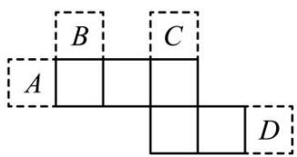

text_image

A
B
C
D

A. 1

B. 2

C. 3

D. 4

# 【题型6 截一个几何体】

【例 6】（24-25 七年级上·福建三明·期中）一物体外形是正方体，其内部构造不详，用一个竖直的平面截这个物体，截了七次，得到一组自左向右的截面（如图），则这个正方体的内部构造可能是空了一个\_\_\_\_体.

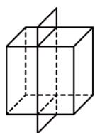

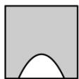

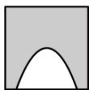

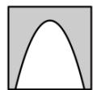

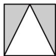

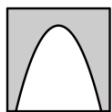

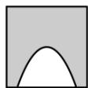

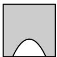

【变式 6-1】（24-25 九年级下·陕西咸阳·期中）玲玲用两种不同的方法分别去截同一个几何体，分别得到了如图所示的图形，这个几何体可能是（）

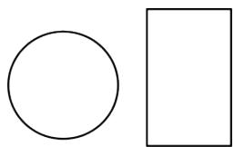

natural_image

Simple geometric shapes: a circle and a rectangle, no text or symbols present

A. 球

B. 圆柱

C. 长方体

D. 圆锥

【变式 6-2】（24-25 七年级上·宁夏银川·期中）用一平面去截下列几何体，其截面可能是长方形的有\_\_\_\_个.

【变式 6-3】（24-25 七年级上·江苏苏州·期中）用平面截一个 n 棱柱，得到的截面边数最多是 8 条边，且这

个 n 棱柱的每个侧面都是正方形，正方形的面积为 $\frac{9}{4}$ ，则这个 n 棱柱的棱长之和为 \_\_\_\_.

# 【题型 7 从不同方向看几何体】教辅资源，关注公众号★全科AA+

【例 7】（24-25 九年级下·湖南长沙·期中）鲁班锁起源于我国古代建筑中的榫卯结构．图（2）是六根鲁班锁图（1）中的一个构件，从前面看这个构件，可以得到的图形是（）

  
(1)

text_image

前面

(2)

B.   

C.   

【变式 7-1】（24-25 七年级下·黑龙江哈尔滨·期中）由五个大小相同的正方体搭成的几何体如图所示，从上面看这个几何体得到的平面图形是（）。

text_image

正面

A.   

B.   

C.   

D.   

【变式 7-2】（24-25 七年级上·山东济南·期中）黑陶是继彩陶之后中国新石器时代制陶工艺的又一个高峰，被誉为“土与火的艺术，力与美的结晶”。如图是山东博物馆收藏的蛋壳黑陶高柄杯。从三个不同方向观察，下列说法正确的是（）

  
正面

A. 从正面、左面看到的形状图相同

B. 从正面、上面看到的形状图相同

C. 从左面、上面看到的形状图相同

D. 从正面、左面、上面看到的形状图都相同

【变式 7-3】（24-25 七年级上·宁夏银川·期中）小林所在的综合实践小组准备制作一些大小相同的正方体纸

盒，收纳班级讲台上的粉笔（盒盖单独制作）.

  
图1  
图2  
图3

(1)图 1 是综合实践小组同学制作的图形，其中 \_\_\_\_ （填序号）经过折叠能围成无盖正方体纸盒；

(2)综合实践小组同学用制作的8个正方体纸盒摆成如图2所示的几何体.

①在图 3 中画出从正面，从左面，从上面观察图 2 几何体看到的形状图；

②若每个小正方体的棱长为2cm，则这个几何体的表面积为 $cm^{2}$ .

# 【题型8 由从不同方向看到的图形确定几何体】

【例 8】（24-25 七年级上·贵州毕节·期中）分别从正面、左面和上面观察一个几何体，看到的形状图如图所示，这个几何体是（）

  
从正面看

  
从左面看

  
从上面看

natural_image

3D geometric structure composed of connected cubes forming an L-shape (no text or symbols)

C.

natural_image

3D geometric arrangement of connected cubes forming an L-shape (no text or symbols)

D.

【变式 8-1】（24-25 七年级上·河南商丘·期中）根据下列从三个方向看到的几何体的形状图（如图），填上对应几何体的名称：

图（1）所对应的几何体是 \_\_\_\_；图（2）所对应的几何体是 \_\_\_\_。

【变式 8-2】（24-25 七年级上·贵州黔东南·期中）由若干个大小相同的小正方体搭成的几何体从上面看到的形状如图所示，小正方形中的数字表示在该位置小正方体的个数.

natural_image

Grid pattern with dashed lines forming squares and plus signs at intersections (no text or symbols)

从正面看

natural_image

Grid pattern with dashed lines forming a 3x3 grid (no text or symbols)

从左面看

(1)这个几何体是由\_个大小相同的小正方体搭成的;  
(2)请画出从正面和左面看到的这个几何体的形状图;   
(3)若每个小正方体的棱长为 $1 \, cm$ ，求这个几何体的表面积.

【变式 8-3】（24-25 七年级上·河南焦作·期中）一个几何体由若干个大小相同的小立方块搭成，其从正面和从左面看到的形状图如图所示，则要摆出这样的几何体最多需要\_\_\_\_个小立方块.

